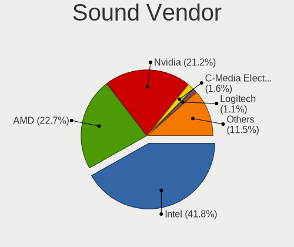
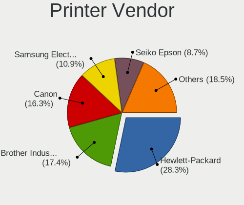

Pop!_OS 22.04 - Tested Hardware & Statistics
--------------------------------------------

A project to collect tested hardware configurations for Pop!_OS 22.04.

Anyone can contribute to this report by the [hw-probe](https://github.com/linuxhw/hw-probe) tool:

    sudo -E hw-probe -all -upload

Please contribute! Especially if your hardware is rare.

This is a report for all computer types. See also reports for [desktops](/Dist/Pop!_OS_22.04/Desktop/README.md) and [notebooks](/Dist/Pop!_OS_22.04/Notebook/README.md).

Contents
--------

* [ Test Cases ](#test-cases)

* [ System ](#system)
  - [ Kernel                   ](#kernel)
  - [ Kernel Family            ](#kernel-family)
  - [ Kernel Major Ver.        ](#kernel-major-ver)
  - [ Arch                     ](#arch)
  - [ DE                       ](#de)
  - [ Display Server           ](#display-server)
  - [ Display Manager          ](#display-manager)
  - [ OS Lang                  ](#os-lang)
  - [ Boot Mode                ](#boot-mode)
  - [ Filesystem               ](#filesystem)
  - [ Part. scheme             ](#part-scheme)
  - [ Dual Boot with Linux/BSD ](#dual-boot-with-linuxbsd)
  - [ Dual Boot (Win)          ](#dual-boot-win)

* [ Board ](#board)
  - [ Vendor                   ](#vendor)
  - [ Model                    ](#model)
  - [ Model Family             ](#model-family)
  - [ MFG Year                 ](#mfg-year)
  - [ Form Factor              ](#form-factor)
  - [ Secure Boot              ](#secure-boot)
  - [ Coreboot                 ](#coreboot)
  - [ RAM Size                 ](#ram-size)
  - [ RAM Used                 ](#ram-used)
  - [ Total Drives             ](#total-drives)
  - [ Has CD-ROM               ](#has-cd-rom)
  - [ Has Ethernet             ](#has-ethernet)
  - [ Has WiFi                 ](#has-wifi)
  - [ Has Bluetooth            ](#has-bluetooth)

* [ Location ](#location)
  - [ Country                  ](#country)
  - [ City                     ](#city)

* [ Drives ](#drives)
  - [ Drive Vendor             ](#drive-vendor)
  - [ Drive Model              ](#drive-model)
  - [ HDD Vendor               ](#hdd-vendor)
  - [ SSD Vendor               ](#ssd-vendor)
  - [ Drive Kind               ](#drive-kind)
  - [ Drive Connector          ](#drive-connector)
  - [ Drive Size               ](#drive-size)
  - [ Space Total              ](#space-total)
  - [ Space Used               ](#space-used)
  - [ Malfunc. Drives          ](#malfunc-drives)
  - [ Malfunc. Drive Vendor    ](#malfunc-drive-vendor)
  - [ Malfunc. HDD Vendor      ](#malfunc-hdd-vendor)
  - [ Malfunc. Drive Kind      ](#malfunc-drive-kind)
  - [ Failed Drives            ](#failed-drives)
  - [ Failed Drive Vendor      ](#failed-drive-vendor)
  - [ Drive Status             ](#drive-status)

* [ Storage controller ](#storage-controller)
  - [ Storage Vendor           ](#storage-vendor)
  - [ Storage Model            ](#storage-model)
  - [ Storage Kind             ](#storage-kind)

* [ Processor ](#processor)
  - [ CPU Vendor               ](#cpu-vendor)
  - [ CPU Model                ](#cpu-model)
  - [ CPU Model Family         ](#cpu-model-family)
  - [ CPU Cores                ](#cpu-cores)
  - [ CPU Sockets              ](#cpu-sockets)
  - [ CPU Threads              ](#cpu-threads)
  - [ CPU Op-Modes             ](#cpu-op-modes)
  - [ CPU Microcode            ](#cpu-microcode)
  - [ CPU Microarch            ](#cpu-microarch)

* [ Graphics ](#graphics)
  - [ GPU Vendor               ](#gpu-vendor)
  - [ GPU Model                ](#gpu-model)
  - [ GPU Combo                ](#gpu-combo)
  - [ GPU Driver               ](#gpu-driver)
  - [ GPU Memory               ](#gpu-memory)

* [ Monitor ](#monitor)
  - [ Monitor Vendor           ](#monitor-vendor)
  - [ Monitor Model            ](#monitor-model)
  - [ Monitor Resolution       ](#monitor-resolution)
  - [ Monitor Diagonal         ](#monitor-diagonal)
  - [ Monitor Width            ](#monitor-width)
  - [ Aspect Ratio             ](#aspect-ratio)
  - [ Monitor Area             ](#monitor-area)
  - [ Pixel Density            ](#pixel-density)
  - [ Multiple Monitors        ](#multiple-monitors)

* [ Network ](#network)
  - [ Net Controller Vendor    ](#net-controller-vendor)
  - [ Net Controller Model     ](#net-controller-model)
  - [ Wireless Vendor          ](#wireless-vendor)
  - [ Wireless Model           ](#wireless-model)
  - [ Ethernet Vendor          ](#ethernet-vendor)
  - [ Ethernet Model           ](#ethernet-model)
  - [ Net Controller Kind      ](#net-controller-kind)
  - [ Used Controller          ](#used-controller)
  - [ NICs                     ](#nics)
  - [ IPv6                     ](#ipv6)

* [ Bluetooth ](#bluetooth)
  - [ Bluetooth Vendor         ](#bluetooth-vendor)
  - [ Bluetooth Model          ](#bluetooth-model)

* [ Sound ](#sound)
  - [ Sound Vendor             ](#sound-vendor)
  - [ Sound Model              ](#sound-model)

* [ Memory ](#memory)
  - [ Memory Vendor            ](#memory-vendor)
  - [ Memory Model             ](#memory-model)
  - [ Memory Kind              ](#memory-kind)
  - [ Memory Form Factor       ](#memory-form-factor)
  - [ Memory Size              ](#memory-size)
  - [ Memory Speed             ](#memory-speed)

* [ Printers & scanners ](#printers--scanners)
  - [ Printer Vendor           ](#printer-vendor)
  - [ Printer Model            ](#printer-model)
  - [ Scanner Vendor           ](#scanner-vendor)
  - [ Scanner Model            ](#scanner-model)

* [ Camera ](#camera)
  - [ Camera Vendor            ](#camera-vendor)
  - [ Camera Model             ](#camera-model)

* [ Security ](#security)
  - [ Fingerprint Vendor       ](#fingerprint-vendor)
  - [ Fingerprint Model        ](#fingerprint-model)
  - [ Chipcard Vendor          ](#chipcard-vendor)
  - [ Chipcard Model           ](#chipcard-model)

* [ Unsupported ](#unsupported)
  - [ Unsupported Devices      ](#unsupported-devices)
  - [ Unsupported Device Types ](#unsupported-device-types)

Test Cases
----------

Total: 2411

| Vendor        | Model                       | Form-Factor | Probe                                                      | Date         |
|---------------|-----------------------------|-------------|------------------------------------------------------------|--------------|
| Acer          | Predator PO3-600 V:1.1      | Desktop     | [e5f5073bcd](https://linux-hardware.org/?probe=e5f5073bcd) | Dec 31, 2022 |
| Acidanther... | Mac-7BA5B2D9E42DDD94 iMa... | All in one  | [a470da90e8](https://linux-hardware.org/?probe=a470da90e8) | Dec 31, 2022 |
| Lenovo        | Y520-15IKBN 80WK            | Notebook    | [9f2441851f](https://linux-hardware.org/?probe=9f2441851f) | Dec 31, 2022 |
| MSI           | B250M BAZOOKA               | Desktop     | [5b204eade4](https://linux-hardware.org/?probe=5b204eade4) | Dec 31, 2022 |
| Dell          | 0KWVT8 A03                  | Desktop     | [ad32666c8c](https://linux-hardware.org/?probe=ad32666c8c) | Dec 31, 2022 |
| ASUSTek       | Z97-A                       | Desktop     | [6f61aac097](https://linux-hardware.org/?probe=6f61aac097) | Dec 31, 2022 |
| HP            | EliteBook 8740w (WH274UT... | Notebook    | [e42d4e66a0](https://linux-hardware.org/?probe=e42d4e66a0) | Dec 31, 2022 |
| MSI           | GE60 2OC\2OE                | Notebook    | [c307379c36](https://linux-hardware.org/?probe=c307379c36) | Dec 30, 2022 |
| Dell          | G3 3500                     | Notebook    | [6be65a4ee5](https://linux-hardware.org/?probe=6be65a4ee5) | Dec 30, 2022 |
| Lenovo        | Z50-70 20354                | Notebook    | [29984f68c6](https://linux-hardware.org/?probe=29984f68c6) | Dec 30, 2022 |
| Dell          | 0KWVT8 A03                  | Desktop     | [17fc3a4abc](https://linux-hardware.org/?probe=17fc3a4abc) | Dec 30, 2022 |
| ASUSTek       | TUF Gaming B550-PLUS        | Desktop     | [76e9829e66](https://linux-hardware.org/?probe=76e9829e66) | Dec 30, 2022 |
| Apple         | MacBookPro7,1               | Notebook    | [db4379ed1e](https://linux-hardware.org/?probe=db4379ed1e) | Dec 30, 2022 |
| ASUSTek       | ASUS TUF Gaming A15 FA50... | Notebook    | [3f1ca6740d](https://linux-hardware.org/?probe=3f1ca6740d) | Dec 30, 2022 |
| Dell          | Latitude E7240              | Notebook    | [5f83c8f4ad](https://linux-hardware.org/?probe=5f83c8f4ad) | Dec 30, 2022 |
| ASUSTek       | Z87-PLUS                    | Desktop     | [85bfa942e6](https://linux-hardware.org/?probe=85bfa942e6) | Dec 30, 2022 |
| Lenovo        | IdeaPad 330-15IKB 81FE      | Notebook    | [d048930c78](https://linux-hardware.org/?probe=d048930c78) | Dec 30, 2022 |
| Gigabyte      | B450 AORUS ELITE V2         | Desktop     | [4b3cfd1d9c](https://linux-hardware.org/?probe=4b3cfd1d9c) | Dec 30, 2022 |
| Dell          | G5 5590                     | Notebook    | [dada63bf04](https://linux-hardware.org/?probe=dada63bf04) | Dec 30, 2022 |
| MSI           | B550M PRO-VDH WIFI          | Desktop     | [17f72460f6](https://linux-hardware.org/?probe=17f72460f6) | Dec 29, 2022 |
| HP            | Pavilion 15                 | Notebook    | [956866bbdd](https://linux-hardware.org/?probe=956866bbdd) | Dec 29, 2022 |
| ASUSTek       | Zephyrus G GU502DU_GA502... | Notebook    | [aa2aad674b](https://linux-hardware.org/?probe=aa2aad674b) | Dec 29, 2022 |
| Lenovo        | ThinkPad W510 4389W14       | Notebook    | [c83a9ac8a9](https://linux-hardware.org/?probe=c83a9ac8a9) | Dec 29, 2022 |
| Lenovo        | Legion 5 Pro 16ITH6H 82J... | Notebook    | [467a749806](https://linux-hardware.org/?probe=467a749806) | Dec 29, 2022 |
| Acer          | Aspire XC-603G              | Desktop     | [08dc8ac6b7](https://linux-hardware.org/?probe=08dc8ac6b7) | Dec 29, 2022 |
| System76      | Lemur Pro                   | Notebook    | [0a61e4fe8d](https://linux-hardware.org/?probe=0a61e4fe8d) | Dec 29, 2022 |
| HP            | ENVY dv7                    | Notebook    | [97e029af78](https://linux-hardware.org/?probe=97e029af78) | Dec 29, 2022 |
| Apple         | MacBookPro14,1              | Notebook    | [2bd4899c8a](https://linux-hardware.org/?probe=2bd4899c8a) | Dec 29, 2022 |
| ASRock        | Z790 PG Riptide             | Desktop     | [19c8814aba](https://linux-hardware.org/?probe=19c8814aba) | Dec 29, 2022 |
| Apple         | MacBookPro14,1              | Notebook    | [919cfc2c9c](https://linux-hardware.org/?probe=919cfc2c9c) | Dec 29, 2022 |
| Dell          | 0NNGP2 A00                  | Desktop     | [12638171d9](https://linux-hardware.org/?probe=12638171d9) | Dec 28, 2022 |
| HP            | Pavilion Notebook 15-bc5... | Notebook    | [f2ea0a18c8](https://linux-hardware.org/?probe=f2ea0a18c8) | Dec 28, 2022 |
| HP            | Pavilion Notebook 15-bc5... | Notebook    | [2e62e57e1c](https://linux-hardware.org/?probe=2e62e57e1c) | Dec 28, 2022 |
| ASUSTek       | P453UA                      | Notebook    | [0bf89f0f8f](https://linux-hardware.org/?probe=0bf89f0f8f) | Dec 28, 2022 |
| Lenovo        | No DPK                      | Desktop     | [944f84567a](https://linux-hardware.org/?probe=944f84567a) | Dec 28, 2022 |
| Lenovo        | Y50-70 20378                | Notebook    | [fe7926d39a](https://linux-hardware.org/?probe=fe7926d39a) | Dec 28, 2022 |
| Lenovo        | ThinkPad P14s Gen 2a 21A... | Notebook    | [c844147ffd](https://linux-hardware.org/?probe=c844147ffd) | Dec 28, 2022 |
| Alienware     | M11x R2                     | Notebook    | [a0da72bec0](https://linux-hardware.org/?probe=a0da72bec0) | Dec 28, 2022 |
| Dell          | Inspiron 5505               | Notebook    | [ba2d75cfa7](https://linux-hardware.org/?probe=ba2d75cfa7) | Dec 28, 2022 |
| ASRock        | Z790M-ITX WiFi              | Desktop     | [c1c0ab5824](https://linux-hardware.org/?probe=c1c0ab5824) | Dec 28, 2022 |
| HP            | Pavilion Notebook 15-bc5... | Notebook    | [9cc79e51c0](https://linux-hardware.org/?probe=9cc79e51c0) | Dec 28, 2022 |
| HUAWEI        | HVY-WXX9                    | Notebook    | [069f0917d6](https://linux-hardware.org/?probe=069f0917d6) | Dec 28, 2022 |
| Dell          | 00CV7F A00                  | Desktop     | [49a36278c4](https://linux-hardware.org/?probe=49a36278c4) | Dec 28, 2022 |
| Apple         | MacBookPro8,2               | Notebook    | [e4255e8ed7](https://linux-hardware.org/?probe=e4255e8ed7) | Dec 28, 2022 |
| Gigabyte      | AB350M-DS3H V2-CF           | Desktop     | [2522f716da](https://linux-hardware.org/?probe=2522f716da) | Dec 28, 2022 |
| HP            | 2B4B                        | Desktop     | [b07e2ecc23](https://linux-hardware.org/?probe=b07e2ecc23) | Dec 28, 2022 |
| MSI           | MAG X570S TOMAHAWK MAX W... | Desktop     | [1522e4a536](https://linux-hardware.org/?probe=1522e4a536) | Dec 28, 2022 |
| Acer          | Aspire XC-603G              | Desktop     | [e8adbb63a4](https://linux-hardware.org/?probe=e8adbb63a4) | Dec 28, 2022 |
| HP            | Laptop 15s-eq2xxx           | Notebook    | [6a2f859c67](https://linux-hardware.org/?probe=6a2f859c67) | Dec 27, 2022 |
| ASUSTek       | ROG STRIX B550-F GAMING     | Desktop     | [20ca7dd779](https://linux-hardware.org/?probe=20ca7dd779) | Dec 27, 2022 |
| Gigabyte      | B450 I AORUS PRO WIFI-CF    | Desktop     | [dab993d989](https://linux-hardware.org/?probe=dab993d989) | Dec 27, 2022 |
| ASUSTek       | PRIME B450-PLUS             | Desktop     | [ee1658b320](https://linux-hardware.org/?probe=ee1658b320) | Dec 27, 2022 |
| HP            | 876C SMVB                   | Desktop     | [7926807626](https://linux-hardware.org/?probe=7926807626) | Dec 27, 2022 |
| Microsoft     | Surface Book                | Tablet      | [c374cd1b63](https://linux-hardware.org/?probe=c374cd1b63) | Dec 27, 2022 |
| ASUSTek       | Z87-K                       | Desktop     | [9c65749eb1](https://linux-hardware.org/?probe=9c65749eb1) | Dec 27, 2022 |
| Acer          | Aspire A515-57              | Notebook    | [470c8d54ba](https://linux-hardware.org/?probe=470c8d54ba) | Dec 27, 2022 |
| Apple         | MacBookPro8,2               | Notebook    | [c62b37d15c](https://linux-hardware.org/?probe=c62b37d15c) | Dec 27, 2022 |
| MSI           | B450M PRO-M2                | Desktop     | [89d9265559](https://linux-hardware.org/?probe=89d9265559) | Dec 27, 2022 |
| Acer          | Aspire A515-57              | Notebook    | [c0a659dbb1](https://linux-hardware.org/?probe=c0a659dbb1) | Dec 27, 2022 |
| Dell          | XPS 15 9500                 | Notebook    | [d1d8257c05](https://linux-hardware.org/?probe=d1d8257c05) | Dec 27, 2022 |
| ASRock        | Z390M-ITX/ac                | Desktop     | [23d6589918](https://linux-hardware.org/?probe=23d6589918) | Dec 27, 2022 |
| Gigabyte      | H61M-S2PV                   | Desktop     | [4403153e04](https://linux-hardware.org/?probe=4403153e04) | Dec 27, 2022 |
| Lenovo        | ThinkBook 15-IML 20RW       | Notebook    | [2195143f19](https://linux-hardware.org/?probe=2195143f19) | Dec 27, 2022 |
| Lenovo        | ThinkBook 15-IML 20RW       | Notebook    | [73e9da47ae](https://linux-hardware.org/?probe=73e9da47ae) | Dec 27, 2022 |
| HP            | Pavilion dv6                | Notebook    | [d759125511](https://linux-hardware.org/?probe=d759125511) | Dec 26, 2022 |
| Acer          | Swift SF314-511             | Notebook    | [b8ad48c33c](https://linux-hardware.org/?probe=b8ad48c33c) | Dec 26, 2022 |
| Apple         | MacBookPro14,1              | Notebook    | [eb6c6ee49e](https://linux-hardware.org/?probe=eb6c6ee49e) | Dec 26, 2022 |
| ASUSTek       | N550JV                      | Notebook    | [748284a21e](https://linux-hardware.org/?probe=748284a21e) | Dec 26, 2022 |
| Dell          | XPS 13 9360                 | Notebook    | [bddcc1503f](https://linux-hardware.org/?probe=bddcc1503f) | Dec 26, 2022 |
| Microsoft     | Surface Book                | Tablet      | [e9380c21e6](https://linux-hardware.org/?probe=e9380c21e6) | Dec 26, 2022 |
| Acer          | Aspire A114-32              | Notebook    | [593969da1f](https://linux-hardware.org/?probe=593969da1f) | Dec 26, 2022 |
| Avell High... | C62 MOB                     | Notebook    | [658f34e70d](https://linux-hardware.org/?probe=658f34e70d) | Dec 26, 2022 |
| Lenovo        | IdeaPad S145-15API 81V7     | Notebook    | [46687a6be3](https://linux-hardware.org/?probe=46687a6be3) | Dec 26, 2022 |
| Sony          | VGN-FW21E                   | Notebook    | [e5eb6c865f](https://linux-hardware.org/?probe=e5eb6c865f) | Dec 25, 2022 |
| GPD           | G1621-02                    | Notebook    | [10a7e912f8](https://linux-hardware.org/?probe=10a7e912f8) | Dec 25, 2022 |
| Lenovo        | Y520-15IKBN 80WK            | Notebook    | [576fb3852f](https://linux-hardware.org/?probe=576fb3852f) | Dec 25, 2022 |
| ASUSTek       | ASUS TUF Gaming F15 FX50... | Notebook    | [9ea4a13b0f](https://linux-hardware.org/?probe=9ea4a13b0f) | Dec 25, 2022 |
| Lenovo        | Yoga 7 14ARB7 82QF          | Convertible | [5ca8ddb512](https://linux-hardware.org/?probe=5ca8ddb512) | Dec 24, 2022 |
| HP            | 255 G8 Notebook PC          | Notebook    | [3f72d88324](https://linux-hardware.org/?probe=3f72d88324) | Dec 24, 2022 |
| Gigabyte      | 970-GAMING                  | Desktop     | [c49123106a](https://linux-hardware.org/?probe=c49123106a) | Dec 24, 2022 |
| ASUSTek       | VivoBook_ASUSLaptop M160... | Notebook    | [de111c3be5](https://linux-hardware.org/?probe=de111c3be5) | Dec 24, 2022 |
| HP            | EliteBook 865 16 inch G9... | Notebook    | [857cb922f9](https://linux-hardware.org/?probe=857cb922f9) | Dec 24, 2022 |
| Dell          | Latitude E7470              | Notebook    | [8e6bdc1809](https://linux-hardware.org/?probe=8e6bdc1809) | Dec 24, 2022 |
| System76      | Pangolin                    | Notebook    | [2ee273cbcf](https://linux-hardware.org/?probe=2ee273cbcf) | Dec 24, 2022 |
| Lenovo        | 3111 SDK0J40697 WIN 3305... | Mini pc     | [b88840bfdf](https://linux-hardware.org/?probe=b88840bfdf) | Dec 24, 2022 |
| Lenovo        | ThinkPad T14 Gen 1 20UD0... | Notebook    | [214b2a3235](https://linux-hardware.org/?probe=214b2a3235) | Dec 23, 2022 |
| HP            | Laptop 14s-dk0xxx           | Notebook    | [53aa474cf5](https://linux-hardware.org/?probe=53aa474cf5) | Dec 23, 2022 |
| Lenovo        | IdeaPad Duet 5 12IAU7 82... | Tablet      | [44d3b06704](https://linux-hardware.org/?probe=44d3b06704) | Dec 23, 2022 |
| Timi          | TM1703                      | Notebook    | [5e25655f36](https://linux-hardware.org/?probe=5e25655f36) | Dec 23, 2022 |
| Toshiba       | Satellite Pro C50-A-1MX     | Notebook    | [78487975ce](https://linux-hardware.org/?probe=78487975ce) | Dec 23, 2022 |
| Dell          | Latitude E7240              | Notebook    | [918223cece](https://linux-hardware.org/?probe=918223cece) | Dec 23, 2022 |
| Medion        | X6816                       | Notebook    | [bafbf1ea90](https://linux-hardware.org/?probe=bafbf1ea90) | Dec 23, 2022 |
| Medion        | X6816                       | Notebook    | [ac9627e5d4](https://linux-hardware.org/?probe=ac9627e5d4) | Dec 23, 2022 |
| Dell          | Latitude E7240              | Notebook    | [7bd2309063](https://linux-hardware.org/?probe=7bd2309063) | Dec 23, 2022 |
| Lenovo        | IdeaPad 5 15ARE05 81YQ      | Notebook    | [d7b8ef01e2](https://linux-hardware.org/?probe=d7b8ef01e2) | Dec 23, 2022 |
| HP            | ENVY x360 Convertible 15... | Convertible | [313bf04928](https://linux-hardware.org/?probe=313bf04928) | Dec 22, 2022 |
| Lenovo        | Legion 5 15ARH05H 82B1      | Notebook    | [db7dc4fa25](https://linux-hardware.org/?probe=db7dc4fa25) | Dec 22, 2022 |
| Lenovo        | Legion 5 15ARH05H 82B1      | Notebook    | [e8ac233c29](https://linux-hardware.org/?probe=e8ac233c29) | Dec 22, 2022 |
| ASUSTek       | K53SJ                       | Notebook    | [341becfd8a](https://linux-hardware.org/?probe=341becfd8a) | Dec 22, 2022 |
| Gigabyte      | MJPLNBB-00                  | Desktop     | [17c300ac96](https://linux-hardware.org/?probe=17c300ac96) | Dec 22, 2022 |
| Intel         | NUC10i3FNB M38070-306       | Mini pc     | [24e1fb5674](https://linux-hardware.org/?probe=24e1fb5674) | Dec 22, 2022 |
| Lenovo        | SDK0H15299 WIN              | All in one  | [837c6c4be9](https://linux-hardware.org/?probe=837c6c4be9) | Dec 22, 2022 |
| ASUSTek       | ROG Zephyrus G14 GA401QM... | Notebook    | [ad4be7f0fa](https://linux-hardware.org/?probe=ad4be7f0fa) | Dec 22, 2022 |
| ASUSTek       | ROG Zephyrus G14 GA401QM... | Notebook    | [a70ba97a7a](https://linux-hardware.org/?probe=a70ba97a7a) | Dec 22, 2022 |
| ASUSTek       | K53SJ                       | Notebook    | [e60df2d8ba](https://linux-hardware.org/?probe=e60df2d8ba) | Dec 22, 2022 |
| Acer          | Swift SF314-512             | Notebook    | [505ab3f60a](https://linux-hardware.org/?probe=505ab3f60a) | Dec 22, 2022 |
| ASUSTek       | P7P55D PRO                  | Desktop     | [7402ac8671](https://linux-hardware.org/?probe=7402ac8671) | Dec 22, 2022 |
| Dell          | Latitude E7240              | Notebook    | [d81efafde1](https://linux-hardware.org/?probe=d81efafde1) | Dec 22, 2022 |
| Lenovo        | Yoga 6 13ARE05 82FN         | Convertible | [1ef05442e9](https://linux-hardware.org/?probe=1ef05442e9) | Dec 22, 2022 |
| System76      | Lemur Pro                   | Notebook    | [ed549bfe74](https://linux-hardware.org/?probe=ed549bfe74) | Dec 21, 2022 |
| System76      | Lemur Pro                   | Notebook    | [30be17e71c](https://linux-hardware.org/?probe=30be17e71c) | Dec 21, 2022 |
| Dell          | Precision 3520              | Notebook    | [1763494294](https://linux-hardware.org/?probe=1763494294) | Dec 21, 2022 |
| MSI           | B85M-E45                    | Desktop     | [b60edb092f](https://linux-hardware.org/?probe=b60edb092f) | Dec 21, 2022 |
| ASUSTek       | Strix 15 GL503GE            | Notebook    | [0377cc3170](https://linux-hardware.org/?probe=0377cc3170) | Dec 21, 2022 |
| Dell          | Latitude E7240              | Notebook    | [545294a23a](https://linux-hardware.org/?probe=545294a23a) | Dec 21, 2022 |
| Apple         | MacBookPro12,1              | Notebook    | [debd2eb829](https://linux-hardware.org/?probe=debd2eb829) | Dec 21, 2022 |
| Dell          | Inspiron 5515               | Notebook    | [b0df20f3d1](https://linux-hardware.org/?probe=b0df20f3d1) | Dec 21, 2022 |
| ASUSTek       | ASUS TUF Gaming F15 FX50... | Notebook    | [7d5914dcb2](https://linux-hardware.org/?probe=7d5914dcb2) | Dec 21, 2022 |
| MSI           | MPG B550 GAMING PLUS        | Desktop     | [07dc9b96c1](https://linux-hardware.org/?probe=07dc9b96c1) | Dec 21, 2022 |
| Dell          | 02GDWG A00                  | Desktop     | [d20f5b0751](https://linux-hardware.org/?probe=d20f5b0751) | Dec 21, 2022 |
| Dell          | Latitude E7240              | Notebook    | [a368a7be00](https://linux-hardware.org/?probe=a368a7be00) | Dec 21, 2022 |
| ASUSTek       | VivoBook S14 X411UF         | Notebook    | [894f0ab5df](https://linux-hardware.org/?probe=894f0ab5df) | Dec 21, 2022 |
| ASUSTek       | N53SM                       | Notebook    | [9c9b1d3f5b](https://linux-hardware.org/?probe=9c9b1d3f5b) | Dec 21, 2022 |
| Intel         | X99 V1.x                    | Desktop     | [5e961d12dc](https://linux-hardware.org/?probe=5e961d12dc) | Dec 21, 2022 |
| Lenovo        | 3190 SDK0J40697 WIN 3305... | Mini pc     | [5ab7ccb4cc](https://linux-hardware.org/?probe=5ab7ccb4cc) | Dec 20, 2022 |
| Lenovo        | Y70-70 Touch 80DU           | Notebook    | [d5a877b2c6](https://linux-hardware.org/?probe=d5a877b2c6) | Dec 20, 2022 |
| Supermicro    | X9DR3-F                     | Desktop     | [0a1557ab4a](https://linux-hardware.org/?probe=0a1557ab4a) | Dec 20, 2022 |
| HP            | 18E7                        | Desktop     | [c3b91e80df](https://linux-hardware.org/?probe=c3b91e80df) | Dec 20, 2022 |
| Acer          | Aspire A315-23G             | Notebook    | [b7999f8a61](https://linux-hardware.org/?probe=b7999f8a61) | Dec 20, 2022 |
| Acer          | Aspire A315-23G             | Notebook    | [04b9163920](https://linux-hardware.org/?probe=04b9163920) | Dec 19, 2022 |
| Lenovo        | IdeaPad Z410 20292          | Notebook    | [e46710b0cf](https://linux-hardware.org/?probe=e46710b0cf) | Dec 19, 2022 |
| ASUSTek       | ROG STRIX B550-I GAMING     | Desktop     | [03dfcb8079](https://linux-hardware.org/?probe=03dfcb8079) | Dec 19, 2022 |
| ASUSTek       | ROG STRIX B550-I GAMING     | Desktop     | [1f6885ef2f](https://linux-hardware.org/?probe=1f6885ef2f) | Dec 19, 2022 |
| Gigabyte      | H110M-S2H-CF                | Desktop     | [cdbf94efce](https://linux-hardware.org/?probe=cdbf94efce) | Dec 19, 2022 |
| ASUSTek       | ROG CROSSHAIR VIII HERO     | Desktop     | [c7b01f9875](https://linux-hardware.org/?probe=c7b01f9875) | Dec 19, 2022 |
| MSI           | MAG X570 TOMAHAWK WIFI      | Desktop     | [c168fe495f](https://linux-hardware.org/?probe=c168fe495f) | Dec 19, 2022 |
| Dell          | Inspiron 7572               | Notebook    | [418178c3ca](https://linux-hardware.org/?probe=418178c3ca) | Dec 19, 2022 |
| Lenovo        | ThinkPad T480s 20L8S1QX0... | Notebook    | [76771fa0aa](https://linux-hardware.org/?probe=76771fa0aa) | Dec 19, 2022 |
| Chuwi         | GemiBook Pro                | Notebook    | [b34ce3474d](https://linux-hardware.org/?probe=b34ce3474d) | Dec 19, 2022 |
| System76      | Gazelle                     | Notebook    | [da46fb926a](https://linux-hardware.org/?probe=da46fb926a) | Dec 19, 2022 |
| Dell          | Inspiron 15-3567            | Notebook    | [f58039213b](https://linux-hardware.org/?probe=f58039213b) | Dec 18, 2022 |
| ASUSTek       | ROG STRIX B550-F GAMING     | Desktop     | [d179359230](https://linux-hardware.org/?probe=d179359230) | Dec 18, 2022 |
| HP            | 8433 11                     | Desktop     | [4368b19d60](https://linux-hardware.org/?probe=4368b19d60) | Dec 18, 2022 |
| GPU Compan... | GWNR71517                   | Notebook    | [e680612eb4](https://linux-hardware.org/?probe=e680612eb4) | Dec 18, 2022 |
| Lenovo        | ThinkPad Edge E430 62718... | Notebook    | [92fede3d5a](https://linux-hardware.org/?probe=92fede3d5a) | Dec 18, 2022 |
| Gigabyte      | B550 VISION D-P             | Desktop     | [163b883ce2](https://linux-hardware.org/?probe=163b883ce2) | Dec 17, 2022 |
| Samsung       | 730QED                      | Convertible | [8ac065bd83](https://linux-hardware.org/?probe=8ac065bd83) | Dec 17, 2022 |
| Avell High... | B.ON                        | Notebook    | [9661ece374](https://linux-hardware.org/?probe=9661ece374) | Dec 17, 2022 |
| Dell          | XPS 15 9510                 | Notebook    | [1641d91910](https://linux-hardware.org/?probe=1641d91910) | Dec 17, 2022 |
| ASUSTek       | ROG CROSSHAIR VIII HERO     | Desktop     | [2a0f5be3bf](https://linux-hardware.org/?probe=2a0f5be3bf) | Dec 17, 2022 |
| Dell          | 02GDWG A00                  | Desktop     | [d7e869aded](https://linux-hardware.org/?probe=d7e869aded) | Dec 17, 2022 |
| Unknown       | Unknown                     | Desktop     | [988a2e80c0](https://linux-hardware.org/?probe=988a2e80c0) | Dec 17, 2022 |
| Dell          | 02GDWG A00                  | Desktop     | [f12e6b75b5](https://linux-hardware.org/?probe=f12e6b75b5) | Dec 16, 2022 |
| ASUSTek       | SABERTOOTH X58              | Desktop     | [b31e9dfa64](https://linux-hardware.org/?probe=b31e9dfa64) | Dec 16, 2022 |
| MSI           | X370 GAMING PLUS            | Desktop     | [893af38c43](https://linux-hardware.org/?probe=893af38c43) | Dec 16, 2022 |
| Fujitsu       | D3230-A1 S26361-D3230-A1    | Desktop     | [90912f0bba](https://linux-hardware.org/?probe=90912f0bba) | Dec 16, 2022 |
| HP            | Pavilion x360 2-in-1 Lap... | Convertible | [00437ce174](https://linux-hardware.org/?probe=00437ce174) | Dec 16, 2022 |
| Dell          | Inspiron 5458               | Notebook    | [8ed4687f2f](https://linux-hardware.org/?probe=8ed4687f2f) | Dec 16, 2022 |
| System76      | Gazelle                     | Notebook    | [b5ef8cec53](https://linux-hardware.org/?probe=b5ef8cec53) | Dec 16, 2022 |
| Acer          | Aspire V5-571G              | Notebook    | [575a61802b](https://linux-hardware.org/?probe=575a61802b) | Dec 16, 2022 |
| Dell          | Latitude 3310               | Notebook    | [4066d1434e](https://linux-hardware.org/?probe=4066d1434e) | Dec 16, 2022 |
| ASUSTek       | SABERTOOTH X58              | Desktop     | [9cff930a2e](https://linux-hardware.org/?probe=9cff930a2e) | Dec 16, 2022 |
| ASUSTek       | PRIME H310M-E R2.0          | Desktop     | [0b1367de2f](https://linux-hardware.org/?probe=0b1367de2f) | Dec 16, 2022 |
| ASUSTek       | M51BC                       | Desktop     | [3b744c3d0c](https://linux-hardware.org/?probe=3b744c3d0c) | Dec 16, 2022 |
| Lenovo        | Yoga 7 15ITL5 82BJ          | Convertible | [3986f30292](https://linux-hardware.org/?probe=3986f30292) | Dec 16, 2022 |
| ASUSTek       | PRIME A320M-K/BR            | Desktop     | [60848aa48e](https://linux-hardware.org/?probe=60848aa48e) | Dec 16, 2022 |
| ASUSTek       | PRIME X570-PRO              | Desktop     | [af4e397bbe](https://linux-hardware.org/?probe=af4e397bbe) | Dec 16, 2022 |
| Lenovo        | IdeaPad 5 15ARE05 81YQ      | Notebook    | [544e464dab](https://linux-hardware.org/?probe=544e464dab) | Dec 15, 2022 |
| System76      | Thelio thelio-r2            | Desktop     | [d2065497b9](https://linux-hardware.org/?probe=d2065497b9) | Dec 15, 2022 |
| Samsung       | 350V5C/351V5C/3540VC/344... | Notebook    | [18d67ba2ab](https://linux-hardware.org/?probe=18d67ba2ab) | Dec 15, 2022 |
| ASUSTek       | ROG STRIX Z390-H GAMING     | Desktop     | [1d1a225cde](https://linux-hardware.org/?probe=1d1a225cde) | Dec 15, 2022 |
| MSI           | Z170A PC MATE               | Desktop     | [e6f5c32627](https://linux-hardware.org/?probe=e6f5c32627) | Dec 15, 2022 |
| ALLDOCUBE     | i1405C                      | Notebook    | [10d8101488](https://linux-hardware.org/?probe=10d8101488) | Dec 15, 2022 |
| Fujitsu       | FMVNS6C3                    | Notebook    | [d7a6961431](https://linux-hardware.org/?probe=d7a6961431) | Dec 15, 2022 |
| Gigabyte      | B550 AORUS ELITE AX V2      | Desktop     | [35ef32b165](https://linux-hardware.org/?probe=35ef32b165) | Dec 14, 2022 |
| Supermicro    | X8DT3                       | Server      | [c2bd925732](https://linux-hardware.org/?probe=c2bd925732) | Dec 14, 2022 |
| Apple         | MacBookPro10,1              | Notebook    | [a22dd35e04](https://linux-hardware.org/?probe=a22dd35e04) | Dec 14, 2022 |
| ASRock        | B450M-HDV R4.0              | Desktop     | [b4d843d4c2](https://linux-hardware.org/?probe=b4d843d4c2) | Dec 14, 2022 |
| Apple         | MacBookPro11,3              | Notebook    | [d0c2bf600a](https://linux-hardware.org/?probe=d0c2bf600a) | Dec 14, 2022 |
| Apple         | Mac-77EB7D7DAF985301 iMa... | All in one  | [d1eaff3d4b](https://linux-hardware.org/?probe=d1eaff3d4b) | Dec 14, 2022 |
| ASRock        | X670E PG Lightning          | Desktop     | [08e4e03d36](https://linux-hardware.org/?probe=08e4e03d36) | Dec 13, 2022 |
| ASRock        | X670E PG Lightning          | Desktop     | [3a6a347ff9](https://linux-hardware.org/?probe=3a6a347ff9) | Dec 13, 2022 |
| Lenovo        | IdeaPad 330-15ARR 81D2      | Notebook    | [d623f983cd](https://linux-hardware.org/?probe=d623f983cd) | Dec 13, 2022 |
| Lenovo        | G505 20240                  | Notebook    | [e6777c2fbc](https://linux-hardware.org/?probe=e6777c2fbc) | Dec 13, 2022 |
| HP            | Pavilion Aero Laptop 13-... | Notebook    | [b08795ce45](https://linux-hardware.org/?probe=b08795ce45) | Dec 13, 2022 |
| Lenovo        | ThinkPad T530 23943J8       | Notebook    | [e5d69d9f81](https://linux-hardware.org/?probe=e5d69d9f81) | Dec 13, 2022 |
| Acer          | Aspire T3-100               | Desktop     | [918ad73eb1](https://linux-hardware.org/?probe=918ad73eb1) | Dec 13, 2022 |
| ASUSTek       | TUF Gaming X570-PLUS        | Desktop     | [e583774bc6](https://linux-hardware.org/?probe=e583774bc6) | Dec 13, 2022 |
| Apple         | MacBookPro9,2               | Notebook    | [2981da7231](https://linux-hardware.org/?probe=2981da7231) | Dec 12, 2022 |
| MSI           | Summit E16Flip A12UCT       | Notebook    | [1db3976bb5](https://linux-hardware.org/?probe=1db3976bb5) | Dec 12, 2022 |
| Toshiba       | Satellite C55-C             | Notebook    | [777b365c04](https://linux-hardware.org/?probe=777b365c04) | Dec 12, 2022 |
| System76      | Gazelle                     | Notebook    | [8498636db6](https://linux-hardware.org/?probe=8498636db6) | Dec 12, 2022 |
| HP            | Spectre x360 Convertible... | Convertible | [7d1cc147b9](https://linux-hardware.org/?probe=7d1cc147b9) | Dec 12, 2022 |
| Lenovo        | Legion S7 16ARHA7 82UG      | Notebook    | [d438f3f50a](https://linux-hardware.org/?probe=d438f3f50a) | Dec 12, 2022 |
| Apple         | MacBookPro13,3              | Notebook    | [10b29f88c5](https://linux-hardware.org/?probe=10b29f88c5) | Dec 12, 2022 |
| Lenovo        | ThinkPad P17 Gen 2i 20YU... | Notebook    | [75a9a0c076](https://linux-hardware.org/?probe=75a9a0c076) | Dec 12, 2022 |
| ASUSTek       | K56CB                       | Notebook    | [94b056f1f4](https://linux-hardware.org/?probe=94b056f1f4) | Dec 12, 2022 |
| Lenovo        | ThinkPad E14 Gen 4 21E4C... | Notebook    | [7ffd00681b](https://linux-hardware.org/?probe=7ffd00681b) | Dec 12, 2022 |
| Lenovo        | Legion 5 15ACH6H 82JU       | Notebook    | [6de2a0ad33](https://linux-hardware.org/?probe=6de2a0ad33) | Dec 11, 2022 |
| ASUSTek       | ROG Flow X13 GV301QH_GV3... | Notebook    | [4b0492b053](https://linux-hardware.org/?probe=4b0492b053) | Dec 11, 2022 |
| Dell          | Latitude E7240              | Notebook    | [d6dddd9632](https://linux-hardware.org/?probe=d6dddd9632) | Dec 11, 2022 |
| Acer          | Aspire A515-44G             | Notebook    | [b85a211b25](https://linux-hardware.org/?probe=b85a211b25) | Dec 11, 2022 |
| Raspberry ... | Raspberry Pi 4 Model B R... | Soc         | [8b4b187193](https://linux-hardware.org/?probe=8b4b187193) | Dec 11, 2022 |
| Gigabyte      | F2A88XM-D3H                 | Desktop     | [cdc6f36d8c](https://linux-hardware.org/?probe=cdc6f36d8c) | Dec 11, 2022 |
| ASUSTek       | ROG Flow X13 GV301QH_GV3... | Notebook    | [ca7d835a38](https://linux-hardware.org/?probe=ca7d835a38) | Dec 11, 2022 |
| System76      | Gazelle                     | Notebook    | [8b0297b19e](https://linux-hardware.org/?probe=8b0297b19e) | Dec 11, 2022 |
| Lenovo        | G470 20078                  | Notebook    | [65264ef208](https://linux-hardware.org/?probe=65264ef208) | Dec 11, 2022 |
| Fujitsu       | FMVNS6C3                    | Notebook    | [2cdacbc923](https://linux-hardware.org/?probe=2cdacbc923) | Dec 11, 2022 |
| ASRock        | X570 Extreme4 WiFi ax       | Desktop     | [8f45bcde64](https://linux-hardware.org/?probe=8f45bcde64) | Dec 11, 2022 |
| Dell          | 02GDWG A00                  | Desktop     | [229065f67f](https://linux-hardware.org/?probe=229065f67f) | Dec 11, 2022 |
| Lenovo        | ThinkPad P17 Gen 2i 20YU... | Notebook    | [15695e4deb](https://linux-hardware.org/?probe=15695e4deb) | Dec 11, 2022 |
| MSI           | A55M-E33                    | Desktop     | [327967e6a4](https://linux-hardware.org/?probe=327967e6a4) | Dec 11, 2022 |
| Dell          | 02GDWG A00                  | Desktop     | [5cea05fe88](https://linux-hardware.org/?probe=5cea05fe88) | Dec 11, 2022 |
| Apple         | Mac-F221BEC8                | Desktop     | [55a5f34bf0](https://linux-hardware.org/?probe=55a5f34bf0) | Dec 10, 2022 |
| ASUSTek       | ROG CROSSHAIR VIII DARK ... | Desktop     | [d83227cce9](https://linux-hardware.org/?probe=d83227cce9) | Dec 10, 2022 |
| ASUSTek       | PRIME B550M-A               | Desktop     | [05f65af47e](https://linux-hardware.org/?probe=05f65af47e) | Dec 10, 2022 |
| Supermicro    | C7Q67 V1.01                 | Desktop     | [8f571548fd](https://linux-hardware.org/?probe=8f571548fd) | Dec 10, 2022 |
| Gigabyte      | B450 AORUS ELITE            | Desktop     | [8f38dcc9d4](https://linux-hardware.org/?probe=8f38dcc9d4) | Dec 10, 2022 |
| ASUSTek       | VivoBook_ASUSLaptop X513... | Notebook    | [1a7d599cd5](https://linux-hardware.org/?probe=1a7d599cd5) | Dec 10, 2022 |
| ASUSTek       | TUF Gaming A520M-PLUS WI... | Desktop     | [e8d8a922a2](https://linux-hardware.org/?probe=e8d8a922a2) | Dec 10, 2022 |
| MSI           | MAG X570S TORPEDO MAX       | Desktop     | [560e61c57f](https://linux-hardware.org/?probe=560e61c57f) | Dec 10, 2022 |
| ASUSTek       | ASUS TUF Gaming A17 FA70... | Notebook    | [040652df3d](https://linux-hardware.org/?probe=040652df3d) | Dec 10, 2022 |
| Dell          | 0HY9JP A02                  | Desktop     | [94a6153aeb](https://linux-hardware.org/?probe=94a6153aeb) | Dec 09, 2022 |
| Samsung       | 730QED                      | Convertible | [1c1a65cd12](https://linux-hardware.org/?probe=1c1a65cd12) | Dec 09, 2022 |
| Apple         | Mac-F2268DC8                | All in one  | [9c4d6a19fe](https://linux-hardware.org/?probe=9c4d6a19fe) | Dec 09, 2022 |
| Lenovo        | G470 20078                  | Notebook    | [ea75ebf831](https://linux-hardware.org/?probe=ea75ebf831) | Dec 09, 2022 |
| Lenovo        | IdeaPad Gaming 3 15IAH7 ... | Notebook    | [2dc32e31b3](https://linux-hardware.org/?probe=2dc32e31b3) | Dec 09, 2022 |
| ASUSTek       | PRIME B550M-A               | Desktop     | [1b848d1587](https://linux-hardware.org/?probe=1b848d1587) | Dec 09, 2022 |
| Lenovo        | ThinkPad L560 20F2S0DA00    | Notebook    | [e8fe4392be](https://linux-hardware.org/?probe=e8fe4392be) | Dec 09, 2022 |
| Lenovo        | ThinkPad L560 20F2S0DA00    | Notebook    | [cf32d7158c](https://linux-hardware.org/?probe=cf32d7158c) | Dec 09, 2022 |
| GPU Compan... | GWNR71517                   | Notebook    | [ef20df1d4f](https://linux-hardware.org/?probe=ef20df1d4f) | Dec 09, 2022 |
| ASUSTek       | TUF Gaming B550-PLUS        | Desktop     | [e61897fa56](https://linux-hardware.org/?probe=e61897fa56) | Dec 09, 2022 |
| ASUSTek       | ROG STRIX B550-F GAMING     | Desktop     | [1280df2c5d](https://linux-hardware.org/?probe=1280df2c5d) | Dec 08, 2022 |
| Lenovo        | ThinkPad T440p 20AWS1200... | Notebook    | [8ce314db56](https://linux-hardware.org/?probe=8ce314db56) | Dec 08, 2022 |
| Lenovo        | ThinkPad T440p 20AWS1200... | Notebook    | [858f06f0e5](https://linux-hardware.org/?probe=858f06f0e5) | Dec 08, 2022 |
| Acer          | TravelMate P214-41-G2       | Notebook    | [cb52e49fa2](https://linux-hardware.org/?probe=cb52e49fa2) | Dec 08, 2022 |
| Apple         | Mac-F4238CC8 PVT            | All in one  | [f9629ee2d7](https://linux-hardware.org/?probe=f9629ee2d7) | Dec 08, 2022 |
| Apple         | Mac-4BC72D62AD45599E Mac... | Mini pc     | [300d062122](https://linux-hardware.org/?probe=300d062122) | Dec 08, 2022 |
| Dell          | G15 5515                    | Notebook    | [861bd0cabf](https://linux-hardware.org/?probe=861bd0cabf) | Dec 08, 2022 |
| Lenovo        | V15 G2 ITL 82KB             | Notebook    | [ca25d43c56](https://linux-hardware.org/?probe=ca25d43c56) | Dec 08, 2022 |
| Lenovo        | V15 G2 ITL 82KB             | Notebook    | [104e0e02d1](https://linux-hardware.org/?probe=104e0e02d1) | Dec 08, 2022 |
| MSI           | PRO Z790-A WIFI             | Desktop     | [9dfb20d74f](https://linux-hardware.org/?probe=9dfb20d74f) | Dec 08, 2022 |
| ASRock        | Z97 Extreme6                | Desktop     | [f000ea7b78](https://linux-hardware.org/?probe=f000ea7b78) | Dec 08, 2022 |
| ASUSTek       | PRIME Z390-A                | Desktop     | [d2c01d70df](https://linux-hardware.org/?probe=d2c01d70df) | Dec 08, 2022 |
| LG Electro... | 16Z90P-K.AA78A1             | Notebook    | [1646f1763d](https://linux-hardware.org/?probe=1646f1763d) | Dec 08, 2022 |
| Avell High... | A62 LIV                     | Notebook    | [a4f96694c4](https://linux-hardware.org/?probe=a4f96694c4) | Dec 07, 2022 |
| Intel         | NUC8i7HVB J68196-504        | Mini pc     | [1a4bdc4874](https://linux-hardware.org/?probe=1a4bdc4874) | Dec 07, 2022 |
| HP            | ENVY x360 Convertible 15... | Convertible | [0789961766](https://linux-hardware.org/?probe=0789961766) | Dec 07, 2022 |
| BESSTAR Te... | B550                        | Desktop     | [5471ce4bdc](https://linux-hardware.org/?probe=5471ce4bdc) | Dec 07, 2022 |
| ASUSTek       | ROG STRIX B550-E GAMING     | Desktop     | [c376825cca](https://linux-hardware.org/?probe=c376825cca) | Dec 07, 2022 |
| Acer          | Aspire A515-45              | Notebook    | [7eebb7f601](https://linux-hardware.org/?probe=7eebb7f601) | Dec 07, 2022 |
| Dell          | Latitude E7240              | Notebook    | [632cda6ecd](https://linux-hardware.org/?probe=632cda6ecd) | Dec 07, 2022 |
| HP            | ENVY 17                     | Notebook    | [a19d90a89f](https://linux-hardware.org/?probe=a19d90a89f) | Dec 07, 2022 |
| ASUSTek       | VivoBook_ASUSLaptop X421... | Notebook    | [b5f311cc8f](https://linux-hardware.org/?probe=b5f311cc8f) | Dec 07, 2022 |
| ASUSTek       | PRIME Z690M-PLUS D4         | Desktop     | [7abcfecd34](https://linux-hardware.org/?probe=7abcfecd34) | Dec 07, 2022 |
| Dell          | Inspiron 1750               | Notebook    | [e369c14198](https://linux-hardware.org/?probe=e369c14198) | Dec 07, 2022 |
| ASUSTek       | ROG STRIX B550-E GAMING     | Desktop     | [6abdbbb7e7](https://linux-hardware.org/?probe=6abdbbb7e7) | Dec 07, 2022 |
| Lenovo        | IdeaPad Y560                | Notebook    | [64abd8c6fe](https://linux-hardware.org/?probe=64abd8c6fe) | Dec 06, 2022 |
| Fujitsu       | FMVNS6C3                    | Notebook    | [5b60c9dfd0](https://linux-hardware.org/?probe=5b60c9dfd0) | Dec 06, 2022 |
| Gigabyte      | A320M-S2H-CF                | Desktop     | [3c65af8425](https://linux-hardware.org/?probe=3c65af8425) | Dec 06, 2022 |
| Gigabyte      | 990FXA-UD3                  | Desktop     | [6ff5feb92c](https://linux-hardware.org/?probe=6ff5feb92c) | Dec 06, 2022 |
| Gigabyte      | A320M-S2H-CF                | Desktop     | [d66311f833](https://linux-hardware.org/?probe=d66311f833) | Dec 06, 2022 |
| Lenovo        | ThinkPad T440p 20AWS1200... | Notebook    | [05f4b7d7cf](https://linux-hardware.org/?probe=05f4b7d7cf) | Dec 06, 2022 |
| MSI           | B150M MORTAR                | Desktop     | [9a87b35e1c](https://linux-hardware.org/?probe=9a87b35e1c) | Dec 06, 2022 |
| Gigabyte      | B450 AORUS PRO-CF           | Desktop     | [310ff494e7](https://linux-hardware.org/?probe=310ff494e7) | Dec 06, 2022 |
| Gigabyte      | 990FXA-UD3                  | Desktop     | [c0f26cbe79](https://linux-hardware.org/?probe=c0f26cbe79) | Dec 06, 2022 |
| MSI           | 760GM-P23                   | Desktop     | [df9ebcbba6](https://linux-hardware.org/?probe=df9ebcbba6) | Dec 06, 2022 |
| Lenovo        | ThinkPad L13 Yoga Gen 2a... | Notebook    | [86cd634760](https://linux-hardware.org/?probe=86cd634760) | Dec 06, 2022 |
| Lenovo        | ThinkPad T440p 20AWS1200... | Notebook    | [6f0ceb7a46](https://linux-hardware.org/?probe=6f0ceb7a46) | Dec 05, 2022 |
| Dell          | G5 5505                     | Notebook    | [f19a76c344](https://linux-hardware.org/?probe=f19a76c344) | Dec 05, 2022 |
| ASUSTek       | ROG STRIX B550-E GAMING     | Desktop     | [69cc6b3ad3](https://linux-hardware.org/?probe=69cc6b3ad3) | Dec 05, 2022 |
| Samsung       | 300E4A/300E5A/300E7A/343... | Notebook    | [1798adf382](https://linux-hardware.org/?probe=1798adf382) | Dec 05, 2022 |
| ASUSTek       | UL50VT                      | Notebook    | [ff4edb7010](https://linux-hardware.org/?probe=ff4edb7010) | Dec 05, 2022 |
| ASUSTek       | ROG STRIX X670E-I GAMING... | Desktop     | [b9d333782f](https://linux-hardware.org/?probe=b9d333782f) | Dec 05, 2022 |
| Apple         | Mac-942B5BF58194151B        | All in one  | [86e9e1e21e](https://linux-hardware.org/?probe=86e9e1e21e) | Dec 05, 2022 |
| HP            | ProBook 6450b               | Notebook    | [f602f6c0bc](https://linux-hardware.org/?probe=f602f6c0bc) | Dec 05, 2022 |
| HP            | ProBook 6450b               | Notebook    | [de39c86a4c](https://linux-hardware.org/?probe=de39c86a4c) | Dec 05, 2022 |
| System76      | Gazelle                     | Notebook    | [deb2c9b6c9](https://linux-hardware.org/?probe=deb2c9b6c9) | Dec 04, 2022 |
| HUAWEI        | KLVL-WXX9                   | Notebook    | [7687bdc111](https://linux-hardware.org/?probe=7687bdc111) | Dec 04, 2022 |
| Acer          | Nitro AN515-54              | Notebook    | [33f26cca4f](https://linux-hardware.org/?probe=33f26cca4f) | Dec 04, 2022 |
| HP            | Notebook                    | Notebook    | [610cea9ebc](https://linux-hardware.org/?probe=610cea9ebc) | Dec 04, 2022 |
| ASUSTek       | ROG Maximus Z690 HERO       | Desktop     | [c74d870263](https://linux-hardware.org/?probe=c74d870263) | Dec 04, 2022 |
| Dell          | Latitude E7240              | Notebook    | [6f34110d45](https://linux-hardware.org/?probe=6f34110d45) | Dec 04, 2022 |
| MSI           | B350 TOMAHAWK               | Desktop     | [2607a15d58](https://linux-hardware.org/?probe=2607a15d58) | Dec 03, 2022 |
| ASRock        | Z370 Pro4                   | Desktop     | [76cd787c24](https://linux-hardware.org/?probe=76cd787c24) | Dec 03, 2022 |
| Unknown       | Unknown                     | Notebook    | [54c6593c53](https://linux-hardware.org/?probe=54c6593c53) | Dec 03, 2022 |
| Unknown       | Unknown                     | Notebook    | [7668b4d9a2](https://linux-hardware.org/?probe=7668b4d9a2) | Dec 03, 2022 |
| HP            | EliteBook 820 G3            | Notebook    | [6913ec89c8](https://linux-hardware.org/?probe=6913ec89c8) | Dec 03, 2022 |
| ASUSTek       | ROG STRIX X470-F GAMING     | Desktop     | [dd1874248c](https://linux-hardware.org/?probe=dd1874248c) | Dec 02, 2022 |
| ASUSTek       | ROG STRIX X470-F GAMING     | Desktop     | [eaf129dcfe](https://linux-hardware.org/?probe=eaf129dcfe) | Dec 02, 2022 |
| Dell          | 07JJ74 A01                  | Server      | [8e1a0482b0](https://linux-hardware.org/?probe=8e1a0482b0) | Dec 02, 2022 |
| Dell          | 07JJ74 A01                  | Server      | [1f96acf40f](https://linux-hardware.org/?probe=1f96acf40f) | Dec 02, 2022 |
| ASUSTek       | VivoBook_ASUS Laptop X50... | Notebook    | [4f36906529](https://linux-hardware.org/?probe=4f36906529) | Dec 02, 2022 |
| MSI           | MAG B650M MORTAR WIFI       | Desktop     | [8e317647dc](https://linux-hardware.org/?probe=8e317647dc) | Dec 02, 2022 |
| HP            | ProBook 450 G7 HP NOTEBO... | Notebook    | [2fe5c76c3c](https://linux-hardware.org/?probe=2fe5c76c3c) | Dec 02, 2022 |
| HP            | Notebook                    | Notebook    | [4184c8fa06](https://linux-hardware.org/?probe=4184c8fa06) | Dec 02, 2022 |
| Framework     | Laptop (12th Gen Intel C... | Notebook    | [9c5bc7ca10](https://linux-hardware.org/?probe=9c5bc7ca10) | Dec 02, 2022 |
| ASUSTek       | ROG STRIX B550-A GAMING     | Desktop     | [953943c231](https://linux-hardware.org/?probe=953943c231) | Dec 02, 2022 |
| Lenovo        | ThinkPad X1 Extreme Gen ... | Notebook    | [0ade3eaab1](https://linux-hardware.org/?probe=0ade3eaab1) | Dec 02, 2022 |
| ASRock        | H97 Pro4                    | Desktop     | [0e0ed0822c](https://linux-hardware.org/?probe=0e0ed0822c) | Dec 02, 2022 |
| ASRock        | H97 Pro4                    | Desktop     | [adeb151478](https://linux-hardware.org/?probe=adeb151478) | Dec 02, 2022 |
| Lenovo        | ThinkPad X1 Extreme Gen ... | Notebook    | [a3746e8985](https://linux-hardware.org/?probe=a3746e8985) | Dec 01, 2022 |
| Dell          | 0W7H8C A09                  | Server      | [6d411b5c44](https://linux-hardware.org/?probe=6d411b5c44) | Dec 01, 2022 |
| Lenovo        | IdeaPad Gaming 3 15IAH7 ... | Notebook    | [562e1f4b92](https://linux-hardware.org/?probe=562e1f4b92) | Dec 01, 2022 |
| Lenovo        | IdeaPad 3 15ALC6 82MF       | Notebook    | [c8ef49d294](https://linux-hardware.org/?probe=c8ef49d294) | Dec 01, 2022 |
| ASUSTek       | Maximus VIII RANGER         | Desktop     | [c8d4cd1faf](https://linux-hardware.org/?probe=c8d4cd1faf) | Dec 01, 2022 |
| ASUSTek       | Maximus VIII RANGER         | Desktop     | [866e8151d7](https://linux-hardware.org/?probe=866e8151d7) | Dec 01, 2022 |
| HP            | Pavilion dv7                | Notebook    | [aa6cdce8f8](https://linux-hardware.org/?probe=aa6cdce8f8) | Dec 01, 2022 |
| Dell          | 07JJ74 A01                  | Server      | [7096492ea2](https://linux-hardware.org/?probe=7096492ea2) | Dec 01, 2022 |
| Dell          | 07JJ74 A01                  | Server      | [cb373247ed](https://linux-hardware.org/?probe=cb373247ed) | Dec 01, 2022 |
| ASUSTek       | VivoBook_ASUSLaptop E410... | Notebook    | [62ae8cb7dc](https://linux-hardware.org/?probe=62ae8cb7dc) | Dec 01, 2022 |
| System76      | Thelio thelio-r2            | Desktop     | [a7ae37f43e](https://linux-hardware.org/?probe=a7ae37f43e) | Dec 01, 2022 |
| Apple         | Mac-942B59F58194171B iMa... | All in one  | [ce6f6fcaad](https://linux-hardware.org/?probe=ce6f6fcaad) | Dec 01, 2022 |
| Unknown       | 1.0                         | Desktop     | [c8cfeaf2be](https://linux-hardware.org/?probe=c8cfeaf2be) | Dec 01, 2022 |
| Dell          | Inspiron 13-5378            | Notebook    | [9d25b2f6e0](https://linux-hardware.org/?probe=9d25b2f6e0) | Dec 01, 2022 |
| MSI           | MPG Z390 GAMING PRO CARB... | Desktop     | [f8a7663037](https://linux-hardware.org/?probe=f8a7663037) | Dec 01, 2022 |
| Dell          | XPS 13 9310                 | Notebook    | [aadf1c39a0](https://linux-hardware.org/?probe=aadf1c39a0) | Dec 01, 2022 |
| MSI           | B350 GAMING PLUS            | Desktop     | [b840a0d02e](https://linux-hardware.org/?probe=b840a0d02e) | Dec 01, 2022 |
| Google        | Cyan                        | Notebook    | [4aa7125981](https://linux-hardware.org/?probe=4aa7125981) | Nov 30, 2022 |
| HP            | ZBook 14 G2                 | Notebook    | [b2bba919b2](https://linux-hardware.org/?probe=b2bba919b2) | Nov 30, 2022 |
| ASUSTek       | ASUS TUF Gaming A15 FA50... | Notebook    | [66b6e49eb5](https://linux-hardware.org/?probe=66b6e49eb5) | Nov 30, 2022 |
| Acer          | Nitro AN515-43              | Notebook    | [b315e85bda](https://linux-hardware.org/?probe=b315e85bda) | Nov 30, 2022 |
| MSI           | Modern 14 B5M               | Notebook    | [8277ece293](https://linux-hardware.org/?probe=8277ece293) | Nov 30, 2022 |
| HP            | ENVY x360 Convertible 15... | Convertible | [9ad34fe6e2](https://linux-hardware.org/?probe=9ad34fe6e2) | Nov 30, 2022 |
| HP            | ENVY x360 Convertible 15... | Convertible | [99e23cf04d](https://linux-hardware.org/?probe=99e23cf04d) | Nov 30, 2022 |
| Lenovo        | IdeaPad S145-15API 81V7     | Notebook    | [53ee9a8fb9](https://linux-hardware.org/?probe=53ee9a8fb9) | Nov 30, 2022 |
| HP            | Laptop 14-dq1xxx            | Notebook    | [b12534f13d](https://linux-hardware.org/?probe=b12534f13d) | Nov 30, 2022 |
| ASRock        | H77M                        | Desktop     | [ffa3496b0d](https://linux-hardware.org/?probe=ffa3496b0d) | Nov 30, 2022 |
| ASUSTek       | M5A97 EVO R2.0              | Desktop     | [a42a4d6080](https://linux-hardware.org/?probe=a42a4d6080) | Nov 29, 2022 |
| Lenovo        | Yoga 6 13ALC6 82ND          | Convertible | [48319e6f46](https://linux-hardware.org/?probe=48319e6f46) | Nov 29, 2022 |
| Dell          | Latitude E7240              | Notebook    | [8b0b984870](https://linux-hardware.org/?probe=8b0b984870) | Nov 29, 2022 |
| HP            | ProBook 450 G8              | Notebook    | [eec30c7857](https://linux-hardware.org/?probe=eec30c7857) | Nov 29, 2022 |
| MSI           | B560M PRO-VDH               | Desktop     | [cee0622b1f](https://linux-hardware.org/?probe=cee0622b1f) | Nov 29, 2022 |
| HUAWEI        | NBD-WXX9                    | Notebook    | [e9932df850](https://linux-hardware.org/?probe=e9932df850) | Nov 29, 2022 |
| HUAWEI        | NBD-WXX9                    | Notebook    | [179ff76e75](https://linux-hardware.org/?probe=179ff76e75) | Nov 29, 2022 |
| HP            | Pavilion dv7                | Notebook    | [1ba2fdd19b](https://linux-hardware.org/?probe=1ba2fdd19b) | Nov 29, 2022 |
| HP            | Compaq nc6320 (GB940ES#A... | Notebook    | [bb417133ee](https://linux-hardware.org/?probe=bb417133ee) | Nov 29, 2022 |
| HP            | Compaq nc6320 (GB940ES#A... | Notebook    | [ddb2f42bcc](https://linux-hardware.org/?probe=ddb2f42bcc) | Nov 29, 2022 |
| Dell          | Latitude 5411               | Notebook    | [122facad78](https://linux-hardware.org/?probe=122facad78) | Nov 28, 2022 |
| HP            | Pavilion dv7                | Notebook    | [db7897d2fc](https://linux-hardware.org/?probe=db7897d2fc) | Nov 28, 2022 |
| ASUSTek       | Pro WS WRX80E-SAGE SE WI... | Desktop     | [40c84f5af9](https://linux-hardware.org/?probe=40c84f5af9) | Nov 28, 2022 |
| Gigabyte      | A520M S2H                   | Desktop     | [151f18b424](https://linux-hardware.org/?probe=151f18b424) | Nov 28, 2022 |
| Apple         | MacBookPro10,1              | Notebook    | [c0c2f77cdb](https://linux-hardware.org/?probe=c0c2f77cdb) | Nov 28, 2022 |
| Lenovo        | IdeaPad Y560                | Notebook    | [4918810cd1](https://linux-hardware.org/?probe=4918810cd1) | Nov 28, 2022 |
| MSI           | B450M PRO-VDH MAX           | Desktop     | [dee60b9f35](https://linux-hardware.org/?probe=dee60b9f35) | Nov 28, 2022 |
| MSI           | B450M PRO-VDH MAX           | Desktop     | [1651962e5a](https://linux-hardware.org/?probe=1651962e5a) | Nov 28, 2022 |
| Lenovo        | ThinkPad E15 Gen 4 21E60... | Notebook    | [16705fe86c](https://linux-hardware.org/?probe=16705fe86c) | Nov 28, 2022 |
| Dell          | Inspiron 15 5510            | Notebook    | [5ec5306c0f](https://linux-hardware.org/?probe=5ec5306c0f) | Nov 28, 2022 |
| Clevo         | W55xEU                      | Notebook    | [5ed799ba64](https://linux-hardware.org/?probe=5ed799ba64) | Nov 28, 2022 |
| MSI           | GP72 7RDX                   | Notebook    | [648eb6d88a](https://linux-hardware.org/?probe=648eb6d88a) | Nov 28, 2022 |
| Acer          | Aspire A515-57              | Notebook    | [984e01118e](https://linux-hardware.org/?probe=984e01118e) | Nov 28, 2022 |
| HP            | Laptop 14-fq1xxx            | Notebook    | [7837242848](https://linux-hardware.org/?probe=7837242848) | Nov 27, 2022 |
| Toshiba       | Satellite L775D             | Notebook    | [bf6fc6fd49](https://linux-hardware.org/?probe=bf6fc6fd49) | Nov 27, 2022 |
| Dell          | Latitude E6230              | Notebook    | [f3536b80de](https://linux-hardware.org/?probe=f3536b80de) | Nov 27, 2022 |
| Dell          | Latitude E6230              | Notebook    | [dbaae2beb7](https://linux-hardware.org/?probe=dbaae2beb7) | Nov 27, 2022 |
| Acer          | Nitro N50-610               | Desktop     | [1a50d26810](https://linux-hardware.org/?probe=1a50d26810) | Nov 27, 2022 |
| Acer          | Nitro N50-610               | Desktop     | [b924b1fdd6](https://linux-hardware.org/?probe=b924b1fdd6) | Nov 27, 2022 |
| Apple         | MacBookPro6,2               | Notebook    | [409c3edc19](https://linux-hardware.org/?probe=409c3edc19) | Nov 27, 2022 |
| HP            | 872E                        | Mini pc     | [9d8a2595d7](https://linux-hardware.org/?probe=9d8a2595d7) | Nov 27, 2022 |
| Alienware     | 17                          | Notebook    | [08ebf1e9a2](https://linux-hardware.org/?probe=08ebf1e9a2) | Nov 27, 2022 |
| HP            | Laptop 14-fq1xxx            | Notebook    | [49dc64dc76](https://linux-hardware.org/?probe=49dc64dc76) | Nov 27, 2022 |
| MSI           | Z97A GAMING 7               | Desktop     | [74341c948b](https://linux-hardware.org/?probe=74341c948b) | Nov 27, 2022 |
| MSI           | B350 GAMING PLUS            | Desktop     | [1e016dcb9b](https://linux-hardware.org/?probe=1e016dcb9b) | Nov 26, 2022 |
| Lenovo        | IdeaPad Gaming 3 15IAH7 ... | Notebook    | [935c9528be](https://linux-hardware.org/?probe=935c9528be) | Nov 26, 2022 |
| Dell          | Inspiron 3521               | Notebook    | [015854e59a](https://linux-hardware.org/?probe=015854e59a) | Nov 26, 2022 |
| Dell          | 04MFRM A02                  | Desktop     | [43239e45b1](https://linux-hardware.org/?probe=43239e45b1) | Nov 26, 2022 |
| Gigabyte      | B650M AORUS ELITE AX        | Desktop     | [a8a722921c](https://linux-hardware.org/?probe=a8a722921c) | Nov 26, 2022 |
| HP            | ZBook 15                    | Notebook    | [2ff5969ae6](https://linux-hardware.org/?probe=2ff5969ae6) | Nov 26, 2022 |
| HP            | ZBook 15                    | Notebook    | [55e4fb5ba0](https://linux-hardware.org/?probe=55e4fb5ba0) | Nov 26, 2022 |
| ASUSTek       | ROG Flow X13 GV301QE_GV3... | Notebook    | [e784cdc15d](https://linux-hardware.org/?probe=e784cdc15d) | Nov 26, 2022 |
| Gigabyte      | AORUS 5 SE                  | Notebook    | [d9e1ceb3c1](https://linux-hardware.org/?probe=d9e1ceb3c1) | Nov 26, 2022 |
| HP            | 872E                        | Mini pc     | [c7ff015966](https://linux-hardware.org/?probe=c7ff015966) | Nov 26, 2022 |
| Dell          | 06NWYK A01                  | Desktop     | [3afe7122f3](https://linux-hardware.org/?probe=3afe7122f3) | Nov 26, 2022 |
| HUAWEI        | MRGF-XX                     | Notebook    | [f60090b407](https://linux-hardware.org/?probe=f60090b407) | Nov 26, 2022 |
| Apple         | MacBookPro7,1               | Notebook    | [8268fc2c12](https://linux-hardware.org/?probe=8268fc2c12) | Nov 26, 2022 |
| HP            | ProBook 450 G5              | Notebook    | [9a8373739a](https://linux-hardware.org/?probe=9a8373739a) | Nov 26, 2022 |
| Gigabyte      | Z77-HD3                     | Desktop     | [e3b7bbc736](https://linux-hardware.org/?probe=e3b7bbc736) | Nov 25, 2022 |
| HP            | Spectre x360 Convertible... | Convertible | [ecfe0cfab0](https://linux-hardware.org/?probe=ecfe0cfab0) | Nov 25, 2022 |
| HP            | Victus by Laptop 16-e0xx... | Notebook    | [32ab0a36a4](https://linux-hardware.org/?probe=32ab0a36a4) | Nov 25, 2022 |
| Pegatron      | 2A9A                        | Desktop     | [ee74398a78](https://linux-hardware.org/?probe=ee74398a78) | Nov 25, 2022 |
| ASRock        | Z170 Gaming K6              | Desktop     | [de7addf17b](https://linux-hardware.org/?probe=de7addf17b) | Nov 25, 2022 |
| Acer          | Aspire A315-54              | Notebook    | [b7269b7617](https://linux-hardware.org/?probe=b7269b7617) | Nov 24, 2022 |
| ASUSTek       | ZenBook Q406DA              | Convertible | [bb91371617](https://linux-hardware.org/?probe=bb91371617) | Nov 24, 2022 |
| ASUSTek       | ASUS TUF Gaming A15 FA50... | Notebook    | [770e9d413e](https://linux-hardware.org/?probe=770e9d413e) | Nov 24, 2022 |
| ASRock        | B550M-ITX/ac                | Desktop     | [c72c157583](https://linux-hardware.org/?probe=c72c157583) | Nov 24, 2022 |
| ASRock        | B550M-ITX/ac                | Desktop     | [bd50429870](https://linux-hardware.org/?probe=bd50429870) | Nov 24, 2022 |
| ASUSTek       | ASUS TUF Dash F15 FX516P... | Notebook    | [f0bebe7a20](https://linux-hardware.org/?probe=f0bebe7a20) | Nov 24, 2022 |
| ASUSTek       | VivoBook_ASUSLaptop E210... | Notebook    | [ce5a80936d](https://linux-hardware.org/?probe=ce5a80936d) | Nov 24, 2022 |
| Lenovo        | IdeaPad 5 Pro 14ACN6 82L... | Notebook    | [dce6415c9e](https://linux-hardware.org/?probe=dce6415c9e) | Nov 23, 2022 |
| Lenovo        | IdeaPad Y560                | Notebook    | [154702cbc6](https://linux-hardware.org/?probe=154702cbc6) | Nov 23, 2022 |
| MSI           | MPG Z690 EDGE WIFI DDR4     | Desktop     | [880f8b9c45](https://linux-hardware.org/?probe=880f8b9c45) | Nov 23, 2022 |
| Dell          | XPS 15 7590                 | Notebook    | [2355853fda](https://linux-hardware.org/?probe=2355853fda) | Nov 23, 2022 |
| HP            | G62                         | Notebook    | [754a471519](https://linux-hardware.org/?probe=754a471519) | Nov 23, 2022 |
| HP            | 8309                        | Desktop     | [8329dc7b8d](https://linux-hardware.org/?probe=8329dc7b8d) | Nov 23, 2022 |
| Dell          | 09M8Y8 A01                  | Desktop     | [4b44aea106](https://linux-hardware.org/?probe=4b44aea106) | Nov 23, 2022 |
| Dell          | 09M8Y8 A01                  | Desktop     | [1c232e6d70](https://linux-hardware.org/?probe=1c232e6d70) | Nov 23, 2022 |
| ASUSTek       | Strix GL504GW_GL504GW       | Notebook    | [f06e160e11](https://linux-hardware.org/?probe=f06e160e11) | Nov 23, 2022 |
| Dell          | Latitude E7470              | Notebook    | [03725ebee3](https://linux-hardware.org/?probe=03725ebee3) | Nov 22, 2022 |
| Lenovo        | Yoga 730-13IWL 81JR         | Convertible | [dc74022dc5](https://linux-hardware.org/?probe=dc74022dc5) | Nov 22, 2022 |
| Acer          | Aspire A515-57              | Notebook    | [4692ce22fb](https://linux-hardware.org/?probe=4692ce22fb) | Nov 22, 2022 |
| Acer          | Aspire A515-57              | Notebook    | [cb82f6d418](https://linux-hardware.org/?probe=cb82f6d418) | Nov 22, 2022 |
| Dell          | Latitude E6540              | Notebook    | [9a3ff03cbb](https://linux-hardware.org/?probe=9a3ff03cbb) | Nov 22, 2022 |
| Gigabyte      | AORUS 5 SE                  | Notebook    | [c88614e7f3](https://linux-hardware.org/?probe=c88614e7f3) | Nov 22, 2022 |
| MSI           | Katana GF76 11UG            | Notebook    | [e29dda268c](https://linux-hardware.org/?probe=e29dda268c) | Nov 21, 2022 |
| MSI           | Katana GF76 11UG            | Notebook    | [9627a23b1f](https://linux-hardware.org/?probe=9627a23b1f) | Nov 21, 2022 |
| Acer          | Aspire A515-45              | Notebook    | [b0b972f8ef](https://linux-hardware.org/?probe=b0b972f8ef) | Nov 21, 2022 |
| ASRock        | H310CM-HG4                  | Desktop     | [d4f3608765](https://linux-hardware.org/?probe=d4f3608765) | Nov 21, 2022 |
| Dell          | Precision 7670              | Notebook    | [93f14c8b55](https://linux-hardware.org/?probe=93f14c8b55) | Nov 21, 2022 |
| Alienware     | 17                          | Notebook    | [16b37ce649](https://linux-hardware.org/?probe=16b37ce649) | Nov 21, 2022 |
| Acer          | Swift SF314-42              | Notebook    | [5ec428f8b3](https://linux-hardware.org/?probe=5ec428f8b3) | Nov 21, 2022 |
| HP            | Spectre x360 Convertible... | Convertible | [d24d3cbf1f](https://linux-hardware.org/?probe=d24d3cbf1f) | Nov 21, 2022 |
| BESSTAR Te... | DMAF5 V1.0                  | Desktop     | [eed1e72aba](https://linux-hardware.org/?probe=eed1e72aba) | Nov 21, 2022 |
| Unknown       | Unknown                     | Notebook    | [5a06cde126](https://linux-hardware.org/?probe=5a06cde126) | Nov 20, 2022 |
| Lenovo        | ThinkPad X13 Gen 1 20UFC... | Notebook    | [6355251bd6](https://linux-hardware.org/?probe=6355251bd6) | Nov 20, 2022 |
| Lenovo        | IdeaPad 3 15ALC6 82MF       | Notebook    | [18f301f8c5](https://linux-hardware.org/?probe=18f301f8c5) | Nov 20, 2022 |
| Dell          | Vostro 3458                 | Notebook    | [9f05e54f99](https://linux-hardware.org/?probe=9f05e54f99) | Nov 20, 2022 |
| Lenovo        | Legion 5 15ARH7H 82RD       | Notebook    | [cba7abe277](https://linux-hardware.org/?probe=cba7abe277) | Nov 20, 2022 |
| Lenovo        | ThinkPad E490 20N8000RUK    | Notebook    | [6eb57e34de](https://linux-hardware.org/?probe=6eb57e34de) | Nov 20, 2022 |
| Gigabyte      | H110M-S2H-CF                | Desktop     | [412c1923c5](https://linux-hardware.org/?probe=412c1923c5) | Nov 20, 2022 |
| Apple         | MacBookPro11,2              | Notebook    | [03447c1967](https://linux-hardware.org/?probe=03447c1967) | Nov 20, 2022 |
| MSI           | MPG B550 GAMING PLUS        | Desktop     | [a1b9357fc6](https://linux-hardware.org/?probe=a1b9357fc6) | Nov 20, 2022 |
| ASUSTek       | ZenBook UX425EA_UX425EA     | Notebook    | [d4bb2f3867](https://linux-hardware.org/?probe=d4bb2f3867) | Nov 19, 2022 |
| ASUSTek       | VivoBook_ASUSLaptop N740... | Notebook    | [37145c9282](https://linux-hardware.org/?probe=37145c9282) | Nov 19, 2022 |
| HP            | ProBook 6450b               | Notebook    | [10c8ec5d4c](https://linux-hardware.org/?probe=10c8ec5d4c) | Nov 19, 2022 |
| Lenovo        | ThinkPad P1 Gen 4i 20Y30... | Notebook    | [41ffb4e75f](https://linux-hardware.org/?probe=41ffb4e75f) | Nov 19, 2022 |
| Dell          | XPS 13 9360                 | Notebook    | [250885e79f](https://linux-hardware.org/?probe=250885e79f) | Nov 19, 2022 |
| Valve         | Jupiter                     | Notebook    | [afdcde154a](https://linux-hardware.org/?probe=afdcde154a) | Nov 18, 2022 |
| HP            | ProBook 450 G6              | Notebook    | [ceac47decc](https://linux-hardware.org/?probe=ceac47decc) | Nov 18, 2022 |
| HP            | ProBook 450 G6              | Notebook    | [5abeec1752](https://linux-hardware.org/?probe=5abeec1752) | Nov 18, 2022 |
| Dell          | Precision M4400             | Notebook    | [715efc61ae](https://linux-hardware.org/?probe=715efc61ae) | Nov 18, 2022 |
| Gigabyte      | B550M DS3H                  | Desktop     | [884474637c](https://linux-hardware.org/?probe=884474637c) | Nov 18, 2022 |
| Gigabyte      | B550M DS3H                  | Desktop     | [0b7bd42177](https://linux-hardware.org/?probe=0b7bd42177) | Nov 18, 2022 |
| HP            | Pavilion Aero Laptop 13-... | Notebook    | [95b46d1513](https://linux-hardware.org/?probe=95b46d1513) | Nov 18, 2022 |
| Lenovo        | ThinkPad T480 20L50004UK    | Notebook    | [8f4df3bbda](https://linux-hardware.org/?probe=8f4df3bbda) | Nov 18, 2022 |
| Gigabyte      | H81M-S1                     | Desktop     | [4498bc64bc](https://linux-hardware.org/?probe=4498bc64bc) | Nov 18, 2022 |
| Lenovo        | ThinkPad E14 Gen 4 21E3C... | Notebook    | [dee1a4e29e](https://linux-hardware.org/?probe=dee1a4e29e) | Nov 17, 2022 |
| Lenovo        | ThinkPad T550 20CJS18S00    | Notebook    | [ba94994594](https://linux-hardware.org/?probe=ba94994594) | Nov 17, 2022 |
| Gigabyte      | 990FXA-UD3                  | Desktop     | [078e04eb73](https://linux-hardware.org/?probe=078e04eb73) | Nov 17, 2022 |
| Dell          | G15 5515                    | Notebook    | [bb76ce58ad](https://linux-hardware.org/?probe=bb76ce58ad) | Nov 17, 2022 |
| Toshiba       | Satellite L500              | Notebook    | [5579ea8656](https://linux-hardware.org/?probe=5579ea8656) | Nov 17, 2022 |
| ASUSTek       | ROG CROSSHAIR VIII HERO     | Desktop     | [33f2716179](https://linux-hardware.org/?probe=33f2716179) | Nov 17, 2022 |
| Gigabyte      | B450 AORUS ELITE            | Desktop     | [478fa166bd](https://linux-hardware.org/?probe=478fa166bd) | Nov 17, 2022 |
| HP            | 805D                        | Desktop     | [cb811984e0](https://linux-hardware.org/?probe=cb811984e0) | Nov 17, 2022 |
| Dell          | 0KWVT8 A03                  | Desktop     | [b696d9eae7](https://linux-hardware.org/?probe=b696d9eae7) | Nov 16, 2022 |
| Huanan        | X99-8M-F V1.1               | Desktop     | [0a623c060a](https://linux-hardware.org/?probe=0a623c060a) | Nov 16, 2022 |
| ASUSTek       | VivoBook_ASUSLaptop N760... | Notebook    | [5c49c7037b](https://linux-hardware.org/?probe=5c49c7037b) | Nov 16, 2022 |
| Razer x La... | TensorBook (late 2021)      | Notebook    | [b7fff356a7](https://linux-hardware.org/?probe=b7fff356a7) | Nov 16, 2022 |
| Gigabyte      | B550I AORUS PRO AX          | Desktop     | [c6f5c91413](https://linux-hardware.org/?probe=c6f5c91413) | Nov 16, 2022 |
| HP            | ZBook 14 G2                 | Notebook    | [8ce9402aad](https://linux-hardware.org/?probe=8ce9402aad) | Nov 16, 2022 |
| Acer          | Aspire V3-575G              | Notebook    | [9044e30d53](https://linux-hardware.org/?probe=9044e30d53) | Nov 16, 2022 |
| Dell          | 04MFRM A02                  | Desktop     | [677ab8eb16](https://linux-hardware.org/?probe=677ab8eb16) | Nov 16, 2022 |
| Foxconn       | 2ABF                        | Desktop     | [9b870d8287](https://linux-hardware.org/?probe=9b870d8287) | Nov 16, 2022 |
| Acer          | Aspire A114-32              | Notebook    | [5a76aee400](https://linux-hardware.org/?probe=5a76aee400) | Nov 16, 2022 |
| ATOPNUC       | MA90                        | Mini pc     | [e48bf6df91](https://linux-hardware.org/?probe=e48bf6df91) | Nov 15, 2022 |
| Lenovo        | IdeaPad 330-15ICH 81FK      | Notebook    | [1f2e05b205](https://linux-hardware.org/?probe=1f2e05b205) | Nov 15, 2022 |
| Samsung       | 350V5C/351V5C/3540VC/344... | Notebook    | [809e86d562](https://linux-hardware.org/?probe=809e86d562) | Nov 15, 2022 |
| Foxconn       | 2ABF                        | Desktop     | [2f6204153a](https://linux-hardware.org/?probe=2f6204153a) | Nov 15, 2022 |
| Acer          | Swift SF314-43              | Notebook    | [bc5218c5da](https://linux-hardware.org/?probe=bc5218c5da) | Nov 15, 2022 |
| OEGStone      | NOTCHA-322                  | Notebook    | [a5f28e095e](https://linux-hardware.org/?probe=a5f28e095e) | Nov 15, 2022 |
| ASRock        | 970 Extreme3 R2.0           | Desktop     | [a7e5419c89](https://linux-hardware.org/?probe=a7e5419c89) | Nov 15, 2022 |
| System76      | Oryx Pro                    | Notebook    | [3ea0d459e1](https://linux-hardware.org/?probe=3ea0d459e1) | Nov 15, 2022 |
| Lenovo        | ThinkPad T450 20BVA02TCD    | Notebook    | [426dec8739](https://linux-hardware.org/?probe=426dec8739) | Nov 15, 2022 |
| Lenovo        | ThinkPad T450 20BVA02TCD    | Notebook    | [f55f35c2fe](https://linux-hardware.org/?probe=f55f35c2fe) | Nov 15, 2022 |
| Dell          | 0KWVT8 A03                  | Desktop     | [965a35d0b0](https://linux-hardware.org/?probe=965a35d0b0) | Nov 15, 2022 |
| Lenovo        | ThinkBook 16p Gen 2 20YM    | Notebook    | [31cf057099](https://linux-hardware.org/?probe=31cf057099) | Nov 14, 2022 |
| Lenovo        | ThinkBook 14 G2 ARE 20VF    | Notebook    | [0d39dde901](https://linux-hardware.org/?probe=0d39dde901) | Nov 14, 2022 |
| HP            | 1998                        | Desktop     | [ddcba37929](https://linux-hardware.org/?probe=ddcba37929) | Nov 14, 2022 |
| HP            | 1998                        | Desktop     | [5249f1cdd7](https://linux-hardware.org/?probe=5249f1cdd7) | Nov 14, 2022 |
| Dell          | Inspiron 7560               | Notebook    | [45474958e5](https://linux-hardware.org/?probe=45474958e5) | Nov 14, 2022 |
| MSI           | B450M PRO-M2 MAX            | Desktop     | [e1f2995c6f](https://linux-hardware.org/?probe=e1f2995c6f) | Nov 14, 2022 |
| Dell          | Inspiron 15 3511            | Notebook    | [43214de971](https://linux-hardware.org/?probe=43214de971) | Nov 13, 2022 |
| Timi          | TM1613                      | Notebook    | [d038ff5636](https://linux-hardware.org/?probe=d038ff5636) | Nov 13, 2022 |
| Gigabyte      | B75M-D3H                    | Desktop     | [7de064ae3a](https://linux-hardware.org/?probe=7de064ae3a) | Nov 13, 2022 |
| MSI           | GL73 9SC                    | Notebook    | [25b89592e0](https://linux-hardware.org/?probe=25b89592e0) | Nov 13, 2022 |
| ASUSTek       | M4N72-E                     | Desktop     | [092c39d271](https://linux-hardware.org/?probe=092c39d271) | Nov 13, 2022 |
| GPU Compan... | GWTN141-10                  | Notebook    | [1e4f22395f](https://linux-hardware.org/?probe=1e4f22395f) | Nov 13, 2022 |
| GPU Compan... | GWTN141-10                  | Notebook    | [7325cce71f](https://linux-hardware.org/?probe=7325cce71f) | Nov 13, 2022 |
| MSI           | GL73 9SC                    | Notebook    | [86b0a359fa](https://linux-hardware.org/?probe=86b0a359fa) | Nov 13, 2022 |
| Gigabyte      | B75M-D3H                    | Desktop     | [bf79743ff5](https://linux-hardware.org/?probe=bf79743ff5) | Nov 13, 2022 |
| Apple         | MacBookPro10,1              | Notebook    | [d433817b4f](https://linux-hardware.org/?probe=d433817b4f) | Nov 13, 2022 |
| Lenovo        | ThinkCentre M90p 5498R97    | Desktop     | [8104152607](https://linux-hardware.org/?probe=8104152607) | Nov 13, 2022 |
| Lenovo        | Legion S7 15ACH6 82K8       | Notebook    | [3e75f5aa87](https://linux-hardware.org/?probe=3e75f5aa87) | Nov 12, 2022 |
| Lenovo        | Yoga 7 14ARB7 82QF          | Convertible | [94e5dec391](https://linux-hardware.org/?probe=94e5dec391) | Nov 12, 2022 |
| Dell          | Latitude E7270              | Notebook    | [629a581a22](https://linux-hardware.org/?probe=629a581a22) | Nov 12, 2022 |
| Dell          | 0P4T42 A01                  | All in one  | [c6cc7b7785](https://linux-hardware.org/?probe=c6cc7b7785) | Nov 12, 2022 |
| Apple         | MacBookAir6,2               | Notebook    | [c6b54c443e](https://linux-hardware.org/?probe=c6b54c443e) | Nov 12, 2022 |
| Google        | Shyvana                     | Notebook    | [2df69a0782](https://linux-hardware.org/?probe=2df69a0782) | Nov 12, 2022 |
| Acer          | Aspire A114-32              | Notebook    | [aec286073d](https://linux-hardware.org/?probe=aec286073d) | Nov 12, 2022 |
| Acer          | Aspire A114-32              | Notebook    | [3884507df6](https://linux-hardware.org/?probe=3884507df6) | Nov 11, 2022 |
| Dell          | Precision M4700             | Notebook    | [4fc304d429](https://linux-hardware.org/?probe=4fc304d429) | Nov 11, 2022 |
| ASUSTek       | VivoBook_ASUSLaptop TP42... | Convertible | [8472557f0d](https://linux-hardware.org/?probe=8472557f0d) | Nov 11, 2022 |
| ASUSTek       | TUF Z370-PRO GAMING         | Desktop     | [e6ad281519](https://linux-hardware.org/?probe=e6ad281519) | Nov 11, 2022 |
| ASUSTek       | P5KPL-AM EPU                | Desktop     | [dc1c83bed5](https://linux-hardware.org/?probe=dc1c83bed5) | Nov 11, 2022 |
| HP            | EliteBook 840 G1            | Notebook    | [4ed347e186](https://linux-hardware.org/?probe=4ed347e186) | Nov 11, 2022 |
| System76      | Thelio thelio-r2            | Desktop     | [1ce532916f](https://linux-hardware.org/?probe=1ce532916f) | Nov 11, 2022 |
| System76      | Lemur Pro                   | Notebook    | [7df985e36a](https://linux-hardware.org/?probe=7df985e36a) | Nov 10, 2022 |
| ASUSTek       | ROG STRIX B450-F GAMING ... | Desktop     | [fd835d99e7](https://linux-hardware.org/?probe=fd835d99e7) | Nov 10, 2022 |
| Acer          | Aspire A114-32              | Notebook    | [a06fb78621](https://linux-hardware.org/?probe=a06fb78621) | Nov 10, 2022 |
| ASUSTek       | ROG STRIX B550-F GAMING     | Desktop     | [b4aa454d9a](https://linux-hardware.org/?probe=b4aa454d9a) | Nov 10, 2022 |
| MSI           | B450M-A PRO MAX             | Desktop     | [485568beb7](https://linux-hardware.org/?probe=485568beb7) | Nov 10, 2022 |
| MSI           | B450M-A PRO MAX             | Desktop     | [e5fa54bf6f](https://linux-hardware.org/?probe=e5fa54bf6f) | Nov 10, 2022 |
| MSI           | H61M-P31/W8                 | Desktop     | [933683bc04](https://linux-hardware.org/?probe=933683bc04) | Nov 10, 2022 |
| HP            | EliteBook 840 G5            | Notebook    | [e281a0277b](https://linux-hardware.org/?probe=e281a0277b) | Nov 10, 2022 |
| Acer          | Spin SP313-51N              | Convertible | [d2e25c9c4e](https://linux-hardware.org/?probe=d2e25c9c4e) | Nov 10, 2022 |
| ASUSTek       | Rampage V EDITION 10        | Desktop     | [4ff6488cb2](https://linux-hardware.org/?probe=4ff6488cb2) | Nov 10, 2022 |
| HP            | EliteBook 840 G3            | Notebook    | [6d00ba40be](https://linux-hardware.org/?probe=6d00ba40be) | Nov 10, 2022 |
| HP            | ENVY x360 Convertible 15... | Convertible | [89aa240b37](https://linux-hardware.org/?probe=89aa240b37) | Nov 09, 2022 |
| HP            | ENVY x360 Convertible 15... | Convertible | [de9c1a6f3e](https://linux-hardware.org/?probe=de9c1a6f3e) | Nov 09, 2022 |
| Lenovo        | ThinkPad X1 Yoga 1st 20F... | Convertible | [12c406f96b](https://linux-hardware.org/?probe=12c406f96b) | Nov 09, 2022 |
| ASUSTek       | PRIME A320M-K               | Desktop     | [fcd0449df8](https://linux-hardware.org/?probe=fcd0449df8) | Nov 09, 2022 |
| MSI           | MS-1688                     | Notebook    | [d8c76d2264](https://linux-hardware.org/?probe=d8c76d2264) | Nov 09, 2022 |
| ASUSTek       | TUF Gaming B550M-E          | Desktop     | [e7fb74c85e](https://linux-hardware.org/?probe=e7fb74c85e) | Nov 08, 2022 |
| ASUSTek       | P8H61                       | Desktop     | [3928df6d1f](https://linux-hardware.org/?probe=3928df6d1f) | Nov 08, 2022 |
| ASUSTek       | VivoBook_ASUSLaptop X412... | Notebook    | [234729e8b5](https://linux-hardware.org/?probe=234729e8b5) | Nov 08, 2022 |
| Samsung       | 500R4K/500R5H/5400RK/501... | Notebook    | [9979d8a6b6](https://linux-hardware.org/?probe=9979d8a6b6) | Nov 08, 2022 |
| System76      | Thelio thelio-r2            | Desktop     | [0c282237ab](https://linux-hardware.org/?probe=0c282237ab) | Nov 08, 2022 |
| ASUSTek       | ROG STRIX B550-XE GAMING... | Desktop     | [fa94f8afc5](https://linux-hardware.org/?probe=fa94f8afc5) | Nov 08, 2022 |
| Apple         | MacBookAir7,2               | Notebook    | [c4afe62f3b](https://linux-hardware.org/?probe=c4afe62f3b) | Nov 08, 2022 |
| ASUSTek       | P8H61                       | Desktop     | [97e9d1458f](https://linux-hardware.org/?probe=97e9d1458f) | Nov 07, 2022 |
| ASRock        | X570M Pro4                  | Desktop     | [581ff62688](https://linux-hardware.org/?probe=581ff62688) | Nov 07, 2022 |
| ASRock        | X570M Pro4                  | Desktop     | [a0a7ef6e3a](https://linux-hardware.org/?probe=a0a7ef6e3a) | Nov 07, 2022 |
| Dell          | 0200DY A02                  | Desktop     | [43db111de5](https://linux-hardware.org/?probe=43db111de5) | Nov 07, 2022 |
| HP            | ProBook 440 G8 Notebook ... | Notebook    | [1918990398](https://linux-hardware.org/?probe=1918990398) | Nov 07, 2022 |
| ASUSTek       | ASUS TUF Gaming F15 FX50... | Notebook    | [44e88f2879](https://linux-hardware.org/?probe=44e88f2879) | Nov 07, 2022 |
| HP            | ENVY NOTEBOOK PC            | Notebook    | [ba3abf3883](https://linux-hardware.org/?probe=ba3abf3883) | Nov 07, 2022 |
| ASUSTek       | ASUS TUF Gaming F15 FX50... | Notebook    | [61756efe8c](https://linux-hardware.org/?probe=61756efe8c) | Nov 07, 2022 |
| Lenovo        | ThinkPad P50 20EQS16P00     | Notebook    | [ca4bb217ab](https://linux-hardware.org/?probe=ca4bb217ab) | Nov 07, 2022 |
| Lenovo        | ThinkCentre M90p 5498R97    | Desktop     | [29c3e37808](https://linux-hardware.org/?probe=29c3e37808) | Nov 06, 2022 |
| ASUSTek       | H97M-PLUS                   | Desktop     | [cb778b5593](https://linux-hardware.org/?probe=cb778b5593) | Nov 06, 2022 |
| Dell          | Latitude E7240              | Notebook    | [2db569e056](https://linux-hardware.org/?probe=2db569e056) | Nov 06, 2022 |
| Dell          | Inspiron 1525               | Notebook    | [f28061e4da](https://linux-hardware.org/?probe=f28061e4da) | Nov 06, 2022 |
| Dell          | G7 7700                     | Notebook    | [ba3a89822a](https://linux-hardware.org/?probe=ba3a89822a) | Nov 06, 2022 |
| Wortmann      | TERRA_MOBILE_1542           | Notebook    | [2a2464e0a3](https://linux-hardware.org/?probe=2a2464e0a3) | Nov 06, 2022 |
| Wortmann      | TERRA_MOBILE_1542           | Notebook    | [eded2f5469](https://linux-hardware.org/?probe=eded2f5469) | Nov 06, 2022 |
| Intel         | P61A-D3                     | Desktop     | [5561c81cf4](https://linux-hardware.org/?probe=5561c81cf4) | Nov 06, 2022 |
| Acer          | Swift SF314-42              | Notebook    | [c4c5bd2515](https://linux-hardware.org/?probe=c4c5bd2515) | Nov 06, 2022 |
| Lenovo        | IdeaPad S540-15IWL D 81N... | Notebook    | [1f4a1244b3](https://linux-hardware.org/?probe=1f4a1244b3) | Nov 06, 2022 |
| HP            | 15 Notebook PC              | Notebook    | [ba76e04444](https://linux-hardware.org/?probe=ba76e04444) | Nov 06, 2022 |
| Lenovo        | ThinkCentre M90p 5498R97    | Desktop     | [cd2a716a60](https://linux-hardware.org/?probe=cd2a716a60) | Nov 06, 2022 |
| Lenovo        | ThinkPad X1 Carbon 5th 2... | Notebook    | [1cc6297ab8](https://linux-hardware.org/?probe=1cc6297ab8) | Nov 06, 2022 |
| HP            | Pavilion Aero Laptop 13-... | Notebook    | [82048cfa4a](https://linux-hardware.org/?probe=82048cfa4a) | Nov 06, 2022 |
| Acer          | Aspire 5520                 | Notebook    | [6e6b76588b](https://linux-hardware.org/?probe=6e6b76588b) | Nov 06, 2022 |
| ASUSTek       | TUF Gaming B550-PLUS        | Desktop     | [bad7b9a014](https://linux-hardware.org/?probe=bad7b9a014) | Nov 05, 2022 |
| Lenovo        | ThinkPad P50 20EQS16P00     | Notebook    | [d10e0ce942](https://linux-hardware.org/?probe=d10e0ce942) | Nov 05, 2022 |
| ASUSTek       | ROG Maximus XI HERO         | Desktop     | [4abe56ea2e](https://linux-hardware.org/?probe=4abe56ea2e) | Nov 05, 2022 |
| Lenovo        | Yoga 720-13IKB 81C3         | Convertible | [f4b9627a4a](https://linux-hardware.org/?probe=f4b9627a4a) | Nov 05, 2022 |
| HP            | ProBook 440 G8 Notebook ... | Notebook    | [a26a719002](https://linux-hardware.org/?probe=a26a719002) | Nov 05, 2022 |
| HP            | ENVY NOTEBOOK PC            | Notebook    | [b0600fe299](https://linux-hardware.org/?probe=b0600fe299) | Nov 05, 2022 |
| ASUSTek       | ROG Maximus XI HERO         | Desktop     | [5b939b71c7](https://linux-hardware.org/?probe=5b939b71c7) | Nov 05, 2022 |
| ASUSTek       | VivoBook_ASUSLaptop K350... | Notebook    | [2eb5db395b](https://linux-hardware.org/?probe=2eb5db395b) | Nov 05, 2022 |
| Lenovo        | ThinkCentre M91p 4518RS8    | Desktop     | [00fc5e3a1b](https://linux-hardware.org/?probe=00fc5e3a1b) | Nov 05, 2022 |
| ASUSTek       | ASUS TUF Gaming F15 FX50... | Notebook    | [f078009dc8](https://linux-hardware.org/?probe=f078009dc8) | Nov 05, 2022 |
| MSI           | Modern 14 B11SB             | Notebook    | [61543eb00f](https://linux-hardware.org/?probe=61543eb00f) | Nov 04, 2022 |
| ASRock        | X399 Taichi                 | Desktop     | [99f51ff157](https://linux-hardware.org/?probe=99f51ff157) | Nov 04, 2022 |
| ASUSTek       | VivoBook_ASUSLaptop X509... | Notebook    | [5881bdde3a](https://linux-hardware.org/?probe=5881bdde3a) | Nov 04, 2022 |
| Lenovo        | ThinkBook 13s G2 ITL 20V... | Notebook    | [58989ea140](https://linux-hardware.org/?probe=58989ea140) | Nov 04, 2022 |
| Lenovo        | ThinkPad T15 Gen 2i 20W4... | Notebook    | [578d48ac0c](https://linux-hardware.org/?probe=578d48ac0c) | Nov 04, 2022 |
| Toshiba       | Satellite L350              | Notebook    | [17157970ee](https://linux-hardware.org/?probe=17157970ee) | Nov 04, 2022 |
| Toshiba       | Satellite L350              | Notebook    | [7479ad8a79](https://linux-hardware.org/?probe=7479ad8a79) | Nov 04, 2022 |
| ASRock        | X570 Phantom Gaming 4       | Desktop     | [4be0967ca1](https://linux-hardware.org/?probe=4be0967ca1) | Nov 04, 2022 |
| Lenovo        | ThinkPad P50 20EQS16P00     | Notebook    | [0622b6fa8f](https://linux-hardware.org/?probe=0622b6fa8f) | Nov 04, 2022 |
| Lenovo        | ThinkPad P50 20EQS16P00     | Notebook    | [bec7082d7a](https://linux-hardware.org/?probe=bec7082d7a) | Nov 04, 2022 |
| HUAWEI        | KLVL-WXX9                   | Notebook    | [de163caae3](https://linux-hardware.org/?probe=de163caae3) | Nov 04, 2022 |
| Apple         | MacBookPro10,1              | Notebook    | [fa19e49b0a](https://linux-hardware.org/?probe=fa19e49b0a) | Nov 04, 2022 |
| Dell          | Inspiron 3442               | Notebook    | [9fec26118c](https://linux-hardware.org/?probe=9fec26118c) | Nov 04, 2022 |
| Lenovo        | ThinkPad P1 Gen 4i 20Y30... | Notebook    | [d63435720c](https://linux-hardware.org/?probe=d63435720c) | Nov 04, 2022 |
| Lenovo        | ThinkPad L13 Yoga Gen 2a... | Notebook    | [c868e47483](https://linux-hardware.org/?probe=c868e47483) | Nov 03, 2022 |
| Lenovo        | ThinkPad X1 Carbon 7th 2... | Notebook    | [f391e8dce8](https://linux-hardware.org/?probe=f391e8dce8) | Nov 03, 2022 |
| Samsung       | 355V4C/355V4X/355V5C/355... | Notebook    | [a43927efff](https://linux-hardware.org/?probe=a43927efff) | Nov 03, 2022 |
| Dell          | Precision 14 5470           | Notebook    | [dab29b7f5b](https://linux-hardware.org/?probe=dab29b7f5b) | Nov 03, 2022 |
| Acer          | Aspire A114-32              | Notebook    | [2394d00673](https://linux-hardware.org/?probe=2394d00673) | Nov 03, 2022 |
| Lenovo        | ThinkPad X1 Carbon 7th 2... | Notebook    | [39e7abb29a](https://linux-hardware.org/?probe=39e7abb29a) | Nov 03, 2022 |
| MSI           | MPG Z390 GAMING PLUS        | Desktop     | [42edcc018a](https://linux-hardware.org/?probe=42edcc018a) | Nov 03, 2022 |
| MSI           | MPG B550I GAMING EDGE WI... | Desktop     | [77f847ca29](https://linux-hardware.org/?probe=77f847ca29) | Nov 02, 2022 |
| Lenovo        | ThinkPad Yoga 11e 20DAS0... | Notebook    | [d9de10d93e](https://linux-hardware.org/?probe=d9de10d93e) | Nov 02, 2022 |
| MSI           | X399 SLI PLUS               | Desktop     | [4191ce8788](https://linux-hardware.org/?probe=4191ce8788) | Nov 02, 2022 |
| Acer          | Aspire A114-32              | Notebook    | [036ff9e51f](https://linux-hardware.org/?probe=036ff9e51f) | Nov 02, 2022 |
| Acer          | Aspire A114-32              | Notebook    | [d5d1583252](https://linux-hardware.org/?probe=d5d1583252) | Nov 02, 2022 |
| Microsoft     | Surface Book                | Tablet      | [e4a7690a77](https://linux-hardware.org/?probe=e4a7690a77) | Nov 02, 2022 |
| ASUSTek       | ROG STRIX B550-F GAMING     | Desktop     | [4e97493141](https://linux-hardware.org/?probe=4e97493141) | Nov 02, 2022 |
| HP            | 212A                        | Desktop     | [80abe48959](https://linux-hardware.org/?probe=80abe48959) | Nov 02, 2022 |
| Apple         | MacBookPro9,2               | Notebook    | [0f40b36846](https://linux-hardware.org/?probe=0f40b36846) | Nov 02, 2022 |
| PC Special... | Elimina Iv 15               | Notebook    | [f462ba9c43](https://linux-hardware.org/?probe=f462ba9c43) | Nov 02, 2022 |
| Fujitsu       | LIFEBOOK A532               | Notebook    | [d4af3b0745](https://linux-hardware.org/?probe=d4af3b0745) | Nov 01, 2022 |
| Intel Clie... | CMCN1CC                     | Notebook    | [719731b244](https://linux-hardware.org/?probe=719731b244) | Nov 01, 2022 |
| Dell          | Latitude E7240              | Notebook    | [effafc033d](https://linux-hardware.org/?probe=effafc033d) | Nov 01, 2022 |
| Apple         | MacBookPro12,1              | Notebook    | [e08326bc94](https://linux-hardware.org/?probe=e08326bc94) | Nov 01, 2022 |
| Dell          | G5 5587                     | Notebook    | [a4e32e9eb8](https://linux-hardware.org/?probe=a4e32e9eb8) | Nov 01, 2022 |
| Lenovo        | IdeaPad 330S-14IKB 81JM     | Notebook    | [da8fec7ac4](https://linux-hardware.org/?probe=da8fec7ac4) | Nov 01, 2022 |
| ASUSTek       | H110M-D                     | Desktop     | [248b9533a3](https://linux-hardware.org/?probe=248b9533a3) | Nov 01, 2022 |
| Lenovo        | IdeaPad 3 15ADA05 81W1      | Notebook    | [6db184e152](https://linux-hardware.org/?probe=6db184e152) | Nov 01, 2022 |
| Lenovo        | IdeaPad 3 15ADA05 81W1      | Notebook    | [60cfb7dcc6](https://linux-hardware.org/?probe=60cfb7dcc6) | Nov 01, 2022 |
| Intel         | DH61DL AAG14066-205         | Desktop     | [0f62f6f3b1](https://linux-hardware.org/?probe=0f62f6f3b1) | Nov 01, 2022 |
| MSI           | MEG X570 UNIFY              | Desktop     | [11de150949](https://linux-hardware.org/?probe=11de150949) | Nov 01, 2022 |
| Dell          | Latitude E7240              | Notebook    | [d8ae1a7195](https://linux-hardware.org/?probe=d8ae1a7195) | Nov 01, 2022 |
| ASUSTek       | H97-PRO                     | Desktop     | [bae404d45c](https://linux-hardware.org/?probe=bae404d45c) | Oct 31, 2022 |
| Dell          | XPS 13 9310                 | Notebook    | [d284b1709a](https://linux-hardware.org/?probe=d284b1709a) | Oct 31, 2022 |
| ASUSTek       | PRIME A320M-K               | Desktop     | [87187c0e23](https://linux-hardware.org/?probe=87187c0e23) | Oct 31, 2022 |
| Sony          | VAIO                        | All in one  | [cefad415d0](https://linux-hardware.org/?probe=cefad415d0) | Oct 31, 2022 |
| ASUSTek       | ROG STRIX B450-F GAMING     | Desktop     | [4c3ae53c16](https://linux-hardware.org/?probe=4c3ae53c16) | Oct 31, 2022 |
| ASUSTek       | ASUS TUF Gaming F15 FX50... | Notebook    | [325516bbce](https://linux-hardware.org/?probe=325516bbce) | Oct 31, 2022 |
| ASUSTek       | ASUS TUF Gaming F15 FX50... | Notebook    | [740d19ba42](https://linux-hardware.org/?probe=740d19ba42) | Oct 31, 2022 |
| Lenovo        | ThinkPad T495 20NKS01Y00    | Notebook    | [c6a13e1ab3](https://linux-hardware.org/?probe=c6a13e1ab3) | Oct 31, 2022 |
| Dell          | 02P9X9 A00                  | Server      | [4fa081a282](https://linux-hardware.org/?probe=4fa081a282) | Oct 31, 2022 |
| ASUSTek       | PRIME B350-PLUS             | Desktop     | [43a99f49f8](https://linux-hardware.org/?probe=43a99f49f8) | Oct 31, 2022 |
| Lenovo        | IdeaPad 700-15ISK 80RU      | Notebook    | [b4fedd7c20](https://linux-hardware.org/?probe=b4fedd7c20) | Oct 31, 2022 |
| Dell          | Precision M6700             | Notebook    | [e5952f6f57](https://linux-hardware.org/?probe=e5952f6f57) | Oct 31, 2022 |
| HP            | ENVY NOTEBOOK PC            | Notebook    | [f2893aaedf](https://linux-hardware.org/?probe=f2893aaedf) | Oct 31, 2022 |
| MSI           | MAG B550M MORTAR WIFI       | Desktop     | [56ee27b737](https://linux-hardware.org/?probe=56ee27b737) | Oct 31, 2022 |
| Apple         | MacBookPro11,3              | Notebook    | [64d1c159aa](https://linux-hardware.org/?probe=64d1c159aa) | Oct 30, 2022 |
| Fujitsu       | LIFEBOOK T904               | Notebook    | [4591ea2ad6](https://linux-hardware.org/?probe=4591ea2ad6) | Oct 30, 2022 |
| Fujitsu       | LIFEBOOK T904               | Notebook    | [5dd8b365d6](https://linux-hardware.org/?probe=5dd8b365d6) | Oct 30, 2022 |
| ASUSTek       | ASUS TUF Gaming F15 FX50... | Notebook    | [424aaaf5bd](https://linux-hardware.org/?probe=424aaaf5bd) | Oct 30, 2022 |
| MSI           | B450 GAMING PLUS MAX        | Desktop     | [e638ed7bd3](https://linux-hardware.org/?probe=e638ed7bd3) | Oct 30, 2022 |
| Toshiba       | Satellite C855-1T5          | Notebook    | [c07f6a167a](https://linux-hardware.org/?probe=c07f6a167a) | Oct 30, 2022 |
| HP            | 3048h                       | Desktop     | [6ce1d2bf43](https://linux-hardware.org/?probe=6ce1d2bf43) | Oct 30, 2022 |
| GPU Compan... | GWTN141-10                  | Notebook    | [189fca8ab3](https://linux-hardware.org/?probe=189fca8ab3) | Oct 30, 2022 |
| Tactus        | GeoBook 140                 | Notebook    | [71f32a229a](https://linux-hardware.org/?probe=71f32a229a) | Oct 30, 2022 |
| HP            | Pavilion dv7                | Notebook    | [6ff9a469f7](https://linux-hardware.org/?probe=6ff9a469f7) | Oct 30, 2022 |
| ASUSTek       | PRIME A320M-K               | Desktop     | [4bc0220a01](https://linux-hardware.org/?probe=4bc0220a01) | Oct 30, 2022 |
| ASUSTek       | PRIME A320M-K               | Desktop     | [bd18c2b33d](https://linux-hardware.org/?probe=bd18c2b33d) | Oct 29, 2022 |
| MSI           | B560M PRO-VDH               | Desktop     | [ab324c3cdd](https://linux-hardware.org/?probe=ab324c3cdd) | Oct 29, 2022 |
| Apple         | MacBookPro3,1               | Notebook    | [27a5553057](https://linux-hardware.org/?probe=27a5553057) | Oct 29, 2022 |
| ASRock        | B450M Pro4                  | Desktop     | [0616272661](https://linux-hardware.org/?probe=0616272661) | Oct 29, 2022 |
| MSI           | GF63 Thin 11UD              | Notebook    | [8f48ae7586](https://linux-hardware.org/?probe=8f48ae7586) | Oct 29, 2022 |
| MSI           | GE60 0NC\0ND                | Notebook    | [79bd38da8f](https://linux-hardware.org/?probe=79bd38da8f) | Oct 29, 2022 |
| Samsung       | 800G5M/800G5W               | Notebook    | [d688233d28](https://linux-hardware.org/?probe=d688233d28) | Oct 29, 2022 |
| MSI           | GF63 Thin 11UD              | Notebook    | [8f1f41f3b0](https://linux-hardware.org/?probe=8f1f41f3b0) | Oct 29, 2022 |
| ASUSTek       | ZenBook Q406DA              | Convertible | [f8bae249b9](https://linux-hardware.org/?probe=f8bae249b9) | Oct 29, 2022 |
| Gigabyte      | B550M DS3H                  | Desktop     | [1c5d979ba1](https://linux-hardware.org/?probe=1c5d979ba1) | Oct 29, 2022 |
| ASUSTek       | ROG CROSSHAIR VIII HERO     | Desktop     | [77ef1a661c](https://linux-hardware.org/?probe=77ef1a661c) | Oct 29, 2022 |
| Acer          | Aspire E5-571G              | Notebook    | [cc0f34a2fa](https://linux-hardware.org/?probe=cc0f34a2fa) | Oct 29, 2022 |
| Intel         | B75                         | Desktop     | [59cc97d6c7](https://linux-hardware.org/?probe=59cc97d6c7) | Oct 28, 2022 |
| MSI           | Prestige 15 A12UC           | Notebook    | [3d4c4364f1](https://linux-hardware.org/?probe=3d4c4364f1) | Oct 28, 2022 |
| Notebook      | NV4xPZ                      | Notebook    | [86e7370778](https://linux-hardware.org/?probe=86e7370778) | Oct 28, 2022 |
| HP            | Laptop 15s-eq2xxx           | Notebook    | [9dcb685f5e](https://linux-hardware.org/?probe=9dcb685f5e) | Oct 28, 2022 |
| Lenovo        | ThinkPad T14 Gen 2i 20W0... | Notebook    | [df9ef8c115](https://linux-hardware.org/?probe=df9ef8c115) | Oct 28, 2022 |
| Raspberry ... | Raspberry Pi                | Soc         | [c9cd061f05](https://linux-hardware.org/?probe=c9cd061f05) | Oct 28, 2022 |
| Apple         | MacBookPro5,3               | Notebook    | [4fa08c7d6f](https://linux-hardware.org/?probe=4fa08c7d6f) | Oct 28, 2022 |
| HP            | Pavilion Gaming Laptop 1... | Notebook    | [3e6896ee0a](https://linux-hardware.org/?probe=3e6896ee0a) | Oct 28, 2022 |
| Samsung       | 950XDB/951XDB/950XDY        | Notebook    | [2fdc53f0f3](https://linux-hardware.org/?probe=2fdc53f0f3) | Oct 28, 2022 |
| Acer          | Aspire E5-575G              | Notebook    | [04d54cb9c8](https://linux-hardware.org/?probe=04d54cb9c8) | Oct 28, 2022 |
| Dell          | Precision 5530              | Notebook    | [bb4d35f452](https://linux-hardware.org/?probe=bb4d35f452) | Oct 28, 2022 |
| Dell          | XPS 15 9520                 | Notebook    | [d04e962e56](https://linux-hardware.org/?probe=d04e962e56) | Oct 28, 2022 |
| HP            | EliteBook 845 G7 Noteboo... | Notebook    | [0957761dea](https://linux-hardware.org/?probe=0957761dea) | Oct 28, 2022 |
| Lenovo        | Legion Y540-15IRH 81RJ      | Notebook    | [a90eba59e8](https://linux-hardware.org/?probe=a90eba59e8) | Oct 28, 2022 |
| Pegatron      | TRUCKEE                     | Desktop     | [2a6fe2bcd1](https://linux-hardware.org/?probe=2a6fe2bcd1) | Oct 28, 2022 |
| HP            | Laptop 15-db0xxx            | Notebook    | [b82aebb005](https://linux-hardware.org/?probe=b82aebb005) | Oct 28, 2022 |
| Intel         | DH61DL AAG14066-205         | Desktop     | [9031f7b82b](https://linux-hardware.org/?probe=9031f7b82b) | Oct 27, 2022 |
| Samsung       | 950XDB/951XDB/950XDY        | Notebook    | [f27c4e1041](https://linux-hardware.org/?probe=f27c4e1041) | Oct 27, 2022 |
| System76      | Oryx Pro                    | Notebook    | [ff42b6e74a](https://linux-hardware.org/?probe=ff42b6e74a) | Oct 27, 2022 |
| Novatech      | NLx0MU                      | Notebook    | [41c5d984a0](https://linux-hardware.org/?probe=41c5d984a0) | Oct 27, 2022 |
| HP            | ProBook 450 G8 Notebook ... | Notebook    | [e7db99be75](https://linux-hardware.org/?probe=e7db99be75) | Oct 27, 2022 |
| MSI           | B85-G43                     | Desktop     | [48ac016cd9](https://linux-hardware.org/?probe=48ac016cd9) | Oct 27, 2022 |
| Apple         | MacBookAir6,2               | Notebook    | [cca0d420fe](https://linux-hardware.org/?probe=cca0d420fe) | Oct 27, 2022 |
| HP            | Laptop 15-dy2xxx            | Notebook    | [304a013939](https://linux-hardware.org/?probe=304a013939) | Oct 27, 2022 |
| MSI           | GF63 Thin 11UD              | Notebook    | [9f7121381b](https://linux-hardware.org/?probe=9f7121381b) | Oct 27, 2022 |
| ASUSTek       | ROG STRIX X570-E GAMING     | Desktop     | [9e7c028b0b](https://linux-hardware.org/?probe=9e7c028b0b) | Oct 27, 2022 |
| ASUSTek       | ASUS TUF Gaming F17 FX70... | Notebook    | [ada4cec1b7](https://linux-hardware.org/?probe=ada4cec1b7) | Oct 27, 2022 |
| Lenovo        | IdeaPad 3 15IIL05 81WE      | Notebook    | [022cfe6707](https://linux-hardware.org/?probe=022cfe6707) | Oct 26, 2022 |
| MSI           | MPG Z390 GAMING PRO CARB... | Desktop     | [97d2bacb5d](https://linux-hardware.org/?probe=97d2bacb5d) | Oct 26, 2022 |
| ASUSTek       | Maximus VIII HERO           | Desktop     | [cb657f604d](https://linux-hardware.org/?probe=cb657f604d) | Oct 26, 2022 |
| Acer          | Aspire A515-52              | Notebook    | [81371581d1](https://linux-hardware.org/?probe=81371581d1) | Oct 26, 2022 |
| Gigabyte      | AERO 15 Classic-SA          | Notebook    | [7977a48aca](https://linux-hardware.org/?probe=7977a48aca) | Oct 26, 2022 |
| Pegatron      | 2AD5                        | Desktop     | [daf7975ca0](https://linux-hardware.org/?probe=daf7975ca0) | Oct 26, 2022 |
| Dell          | XPS 15 9520                 | Notebook    | [1ede815931](https://linux-hardware.org/?probe=1ede815931) | Oct 26, 2022 |
| Acer          | Nitro AN515-58              | Notebook    | [9deeea3723](https://linux-hardware.org/?probe=9deeea3723) | Oct 26, 2022 |
| ASUSTek       | TUF Gaming Z690-PLUS WIF... | Desktop     | [58af9b9a77](https://linux-hardware.org/?probe=58af9b9a77) | Oct 26, 2022 |
| MSI           | GF63 Thin 11UD              | Notebook    | [2b6b8d3854](https://linux-hardware.org/?probe=2b6b8d3854) | Oct 26, 2022 |
| Apple         | MacBookAir7,2               | Notebook    | [892c5e2cda](https://linux-hardware.org/?probe=892c5e2cda) | Oct 26, 2022 |
| Lenovo        | IdeaPad Gaming 3 15IMH05... | Notebook    | [b98bd6b361](https://linux-hardware.org/?probe=b98bd6b361) | Oct 26, 2022 |
| Gigabyte      | B450 AORUS M                | Desktop     | [1603f6064b](https://linux-hardware.org/?probe=1603f6064b) | Oct 26, 2022 |
| Lenovo        | ThinkPad X260 20F600A4MD    | Notebook    | [50cce404c7](https://linux-hardware.org/?probe=50cce404c7) | Oct 25, 2022 |
| Avell High... | A62 LIV                     | Notebook    | [673f411692](https://linux-hardware.org/?probe=673f411692) | Oct 25, 2022 |
| Lenovo        | Yoga Slim 7 Pro 14ACH5 8... | Notebook    | [3375318388](https://linux-hardware.org/?probe=3375318388) | Oct 25, 2022 |
| Dell          | XPS 15 7590                 | Notebook    | [7f9028d036](https://linux-hardware.org/?probe=7f9028d036) | Oct 25, 2022 |
| Toshiba       | Satellite Pro S500          | Notebook    | [a26efdcfb5](https://linux-hardware.org/?probe=a26efdcfb5) | Oct 25, 2022 |
| Gigabyte      | Z690 UD DDR4                | Desktop     | [c838769296](https://linux-hardware.org/?probe=c838769296) | Oct 25, 2022 |
| HP            | ZBook 15                    | Notebook    | [b2d2352668](https://linux-hardware.org/?probe=b2d2352668) | Oct 25, 2022 |
| HP            | EliteBook 820 G2            | Notebook    | [b31fec75e1](https://linux-hardware.org/?probe=b31fec75e1) | Oct 25, 2022 |
| Dell          | G15 5511                    | Notebook    | [0f47c64bab](https://linux-hardware.org/?probe=0f47c64bab) | Oct 25, 2022 |
| MSI           | H61M-P31/W8                 | Desktop     | [7ba2ecf5f0](https://linux-hardware.org/?probe=7ba2ecf5f0) | Oct 25, 2022 |
| MSI           | MPG B560I GAMING EDGE WI... | Desktop     | [3cd266dbbb](https://linux-hardware.org/?probe=3cd266dbbb) | Oct 25, 2022 |
| MSI           | MAG X570S TORPEDO MAX       | Desktop     | [c77d3dfeba](https://linux-hardware.org/?probe=c77d3dfeba) | Oct 25, 2022 |
| Acer          | Nitro AN515-58              | Notebook    | [d03f6896eb](https://linux-hardware.org/?probe=d03f6896eb) | Oct 25, 2022 |
| Dell          | Latitude E7240              | Notebook    | [6966cfc71f](https://linux-hardware.org/?probe=6966cfc71f) | Oct 25, 2022 |
| MSI           | Prestige 14Evo A11M         | Notebook    | [7c4edd1a6d](https://linux-hardware.org/?probe=7c4edd1a6d) | Oct 24, 2022 |
| Dell          | XPS 15 9570                 | Notebook    | [d76c41ef1b](https://linux-hardware.org/?probe=d76c41ef1b) | Oct 24, 2022 |
| Dell          | Inspiron 16 7610            | Notebook    | [47a3e2b5f6](https://linux-hardware.org/?probe=47a3e2b5f6) | Oct 24, 2022 |
| Lenovo        | ThinkPad L380 Yoga 20M7C... | Convertible | [c9577d0d5a](https://linux-hardware.org/?probe=c9577d0d5a) | Oct 24, 2022 |
| Lenovo        | 3708 SDK0J40700 WIN 3258... | Desktop     | [df05c11ff4](https://linux-hardware.org/?probe=df05c11ff4) | Oct 24, 2022 |
| HP            | Laptop 15s-fq0xxx           | Notebook    | [2510215a0b](https://linux-hardware.org/?probe=2510215a0b) | Oct 24, 2022 |
| MSI           | B560M PRO-VDH               | Desktop     | [0a2cbff604](https://linux-hardware.org/?probe=0a2cbff604) | Oct 24, 2022 |
| Gigabyte      | H310M H                     | Desktop     | [3a8627fb53](https://linux-hardware.org/?probe=3a8627fb53) | Oct 24, 2022 |
| Apple         | MacBookAir6,2               | Notebook    | [c271de3628](https://linux-hardware.org/?probe=c271de3628) | Oct 24, 2022 |
| AMI           | Aptio CRB                   | Mini pc     | [3749438ef1](https://linux-hardware.org/?probe=3749438ef1) | Oct 24, 2022 |
| MSI           | 970A-G46                    | Desktop     | [38541ac772](https://linux-hardware.org/?probe=38541ac772) | Oct 24, 2022 |
| System76      | Gazelle                     | Notebook    | [77686d0854](https://linux-hardware.org/?probe=77686d0854) | Oct 24, 2022 |
| HP            | Laptop 15s-gy0xxx           | Notebook    | [d1219c1387](https://linux-hardware.org/?probe=d1219c1387) | Oct 23, 2022 |
| Razer         | Blade 15 (2022) - RZ09-0... | Notebook    | [c70d6b90b6](https://linux-hardware.org/?probe=c70d6b90b6) | Oct 23, 2022 |
| ASUSTek       | A88X-PLUS                   | Desktop     | [7435d326b7](https://linux-hardware.org/?probe=7435d326b7) | Oct 23, 2022 |
| ASUSTek       | ROG Zephyrus G14 GA402RK... | Notebook    | [bd25fa1073](https://linux-hardware.org/?probe=bd25fa1073) | Oct 23, 2022 |
| Apple         | MacBookAir6,2               | Notebook    | [edd13bcc76](https://linux-hardware.org/?probe=edd13bcc76) | Oct 23, 2022 |
| Lenovo        | SHARKBAY 0B98401 WIN        | Desktop     | [04ea0c7dd2](https://linux-hardware.org/?probe=04ea0c7dd2) | Oct 23, 2022 |
| Lenovo        | SHARKBAY NOK                | Desktop     | [153aaa07cd](https://linux-hardware.org/?probe=153aaa07cd) | Oct 23, 2022 |
| Apple         | MacBookPro10,1              | Notebook    | [9380dfc8b7](https://linux-hardware.org/?probe=9380dfc8b7) | Oct 23, 2022 |
| ASUSTek       | PRIME B450M-GAMING/BR       | Desktop     | [cfb362baf3](https://linux-hardware.org/?probe=cfb362baf3) | Oct 23, 2022 |
| HP            | ENVY x360 2-in-1 Laptop ... | Convertible | [5d14f79724](https://linux-hardware.org/?probe=5d14f79724) | Oct 23, 2022 |
| Lenovo        | IdeaPad 5 15ALC05 82LN      | Notebook    | [4884be1a24](https://linux-hardware.org/?probe=4884be1a24) | Oct 22, 2022 |
| Dell          | Inspiron 3576               | Notebook    | [426ddc8fdb](https://linux-hardware.org/?probe=426ddc8fdb) | Oct 22, 2022 |
| ASUSTek       | TUF Gaming X570-PLUS_BR     | Desktop     | [e14654d246](https://linux-hardware.org/?probe=e14654d246) | Oct 22, 2022 |
| ASUSTek       | TUF Gaming X570-PLUS        | Desktop     | [c0867dfce4](https://linux-hardware.org/?probe=c0867dfce4) | Oct 22, 2022 |
| ASUSTek       | TUF Gaming X570-PLUS        | Desktop     | [6199e2daaa](https://linux-hardware.org/?probe=6199e2daaa) | Oct 22, 2022 |
| ASUSTek       | TUF Gaming B450M-PRO S      | Desktop     | [dc48a995c4](https://linux-hardware.org/?probe=dc48a995c4) | Oct 22, 2022 |
| Lenovo        | G50-30 80G0                 | Notebook    | [32a9b1de4f](https://linux-hardware.org/?probe=32a9b1de4f) | Oct 22, 2022 |
| Lenovo        | IdeaPad 5 15ALC05 82LN      | Notebook    | [079a05485d](https://linux-hardware.org/?probe=079a05485d) | Oct 22, 2022 |
| System76      | Oryx Pro                    | Notebook    | [7de5d55c99](https://linux-hardware.org/?probe=7de5d55c99) | Oct 22, 2022 |
| ASUSTek       | ROG CROSSHAIR VIII EXTRE... | Desktop     | [32cd9cd246](https://linux-hardware.org/?probe=32cd9cd246) | Oct 22, 2022 |
| ASRock        | B550M Pro4                  | Desktop     | [b2cc208474](https://linux-hardware.org/?probe=b2cc208474) | Oct 22, 2022 |
| MSI           | PRO Z690-A DDR4             | Desktop     | [1056e456bc](https://linux-hardware.org/?probe=1056e456bc) | Oct 22, 2022 |
| ASRock        | A320M-HD                    | Desktop     | [d8f21a8ec6](https://linux-hardware.org/?probe=d8f21a8ec6) | Oct 22, 2022 |
| ASRock        | B550M Pro4                  | Desktop     | [9f293160d5](https://linux-hardware.org/?probe=9f293160d5) | Oct 22, 2022 |
| Intel         | Montevina CRB               | Notebook    | [11cb344c52](https://linux-hardware.org/?probe=11cb344c52) | Oct 22, 2022 |
| ASUSTek       | TUF Z370-PRO GAMING         | Desktop     | [624b9f3b57](https://linux-hardware.org/?probe=624b9f3b57) | Oct 22, 2022 |
| Lenovo        | Legion Y530-15ICH 81FV      | Notebook    | [1227d6561e](https://linux-hardware.org/?probe=1227d6561e) | Oct 22, 2022 |
| Gigabyte      | B550 AORUS ELITE V2         | Desktop     | [15c764f6fa](https://linux-hardware.org/?probe=15c764f6fa) | Oct 21, 2022 |
| ASRock        | B450M Steel Legend          | Desktop     | [2a9b4f61c6](https://linux-hardware.org/?probe=2a9b4f61c6) | Oct 21, 2022 |
| ASUSTek       | ROG STRIX X670E-I GAMING... | Desktop     | [fb86c213ca](https://linux-hardware.org/?probe=fb86c213ca) | Oct 21, 2022 |
| Lenovo        | IdeaPad Gaming 3 15IMH05... | Notebook    | [ed692d6080](https://linux-hardware.org/?probe=ed692d6080) | Oct 21, 2022 |
| Razer x La... | TensorBook (late 2021)      | Notebook    | [27cae45787](https://linux-hardware.org/?probe=27cae45787) | Oct 20, 2022 |
| ASUSTek       | Zenbook Pro Duo UX582ZW_... | Notebook    | [504036a2f6](https://linux-hardware.org/?probe=504036a2f6) | Oct 20, 2022 |
| ASUSTek       | TUF Gaming B550M-PLUS       | Desktop     | [02b0d2ded2](https://linux-hardware.org/?probe=02b0d2ded2) | Oct 20, 2022 |
| ASUSTek       | VivoBook_ASUSLaptop M350... | Notebook    | [ddee1b5408](https://linux-hardware.org/?probe=ddee1b5408) | Oct 20, 2022 |
| System76      | Lemur Pro                   | Notebook    | [df61411c9d](https://linux-hardware.org/?probe=df61411c9d) | Oct 20, 2022 |
| Dell          | 0HY175 A03                  | Desktop     | [86950688ac](https://linux-hardware.org/?probe=86950688ac) | Oct 20, 2022 |
| Dell          | 0HY175 A03                  | Desktop     | [ede27fb1d0](https://linux-hardware.org/?probe=ede27fb1d0) | Oct 19, 2022 |
| Dell          | Latitude 5290 2-in-1        | Tablet      | [8a872b5819](https://linux-hardware.org/?probe=8a872b5819) | Oct 19, 2022 |
| Dell          | Latitude 5290 2-in-1        | Tablet      | [b4afec070e](https://linux-hardware.org/?probe=b4afec070e) | Oct 19, 2022 |
| IP3 Tech      | GB3B                        | Mini pc     | [d565cdf4a5](https://linux-hardware.org/?probe=d565cdf4a5) | Oct 19, 2022 |
| ASUSTek       | ASUS TUF Gaming A15 FA50... | Notebook    | [c14937070e](https://linux-hardware.org/?probe=c14937070e) | Oct 19, 2022 |
| Dell          | Inspiron 3583               | Notebook    | [a8170f7786](https://linux-hardware.org/?probe=a8170f7786) | Oct 19, 2022 |
| MSI           | GF63 Thin 11UD              | Notebook    | [ca39605260](https://linux-hardware.org/?probe=ca39605260) | Oct 18, 2022 |
| HP            | ProBook 450 G8 Notebook ... | Notebook    | [08327d561d](https://linux-hardware.org/?probe=08327d561d) | Oct 18, 2022 |
| Apple         | MacBookPro5,4               | Notebook    | [2a51555c53](https://linux-hardware.org/?probe=2a51555c53) | Oct 18, 2022 |
| Gigabyte      | X79-UP4                     | Desktop     | [c6e10b3bcb](https://linux-hardware.org/?probe=c6e10b3bcb) | Oct 18, 2022 |
| ASUSTek       | TUF Gaming X570-PRO         | Desktop     | [c84509fb21](https://linux-hardware.org/?probe=c84509fb21) | Oct 18, 2022 |
| ASUSTek       | TUF Gaming X670E-PLUS WI... | Desktop     | [e3ce426450](https://linux-hardware.org/?probe=e3ce426450) | Oct 18, 2022 |
| ASUSTek       | ROG Zephyrus G14 GA401IH... | Notebook    | [ed64a103f1](https://linux-hardware.org/?probe=ed64a103f1) | Oct 18, 2022 |
| HP            | Laptop 15-dy0xxx            | Notebook    | [2d1482e433](https://linux-hardware.org/?probe=2d1482e433) | Oct 18, 2022 |
| HP            | 339A                        | Desktop     | [e168e3b75b](https://linux-hardware.org/?probe=e168e3b75b) | Oct 18, 2022 |
| System76      | Lemur Pro                   | Notebook    | [53226822f5](https://linux-hardware.org/?probe=53226822f5) | Oct 18, 2022 |
| MSI           | GF63 Thin 11UD              | Notebook    | [d522208941](https://linux-hardware.org/?probe=d522208941) | Oct 17, 2022 |
| ASUSTek       | ZenBook UX333FA_UX333FA     | Notebook    | [40771441a2](https://linux-hardware.org/?probe=40771441a2) | Oct 17, 2022 |
| Lenovo        | Legion Y740-17IRH 81UG      | Notebook    | [67aec6ad33](https://linux-hardware.org/?probe=67aec6ad33) | Oct 17, 2022 |
| MSI           | GP72VR 7RF                  | Notebook    | [86a4902866](https://linux-hardware.org/?probe=86a4902866) | Oct 17, 2022 |
| ASUSTek       | ROG STRIX B560-I GAMING ... | Desktop     | [e8e5ae4784](https://linux-hardware.org/?probe=e8e5ae4784) | Oct 17, 2022 |
| ASRock        | X300M-STX                   | Desktop     | [40c27af11f](https://linux-hardware.org/?probe=40c27af11f) | Oct 17, 2022 |
| ASRock        | X300M-STX                   | Desktop     | [25fdbfba33](https://linux-hardware.org/?probe=25fdbfba33) | Oct 17, 2022 |
| Dell          | Latitude E6430s             | Notebook    | [ca202dddd6](https://linux-hardware.org/?probe=ca202dddd6) | Oct 17, 2022 |
| Acer          | Aspire E5-553G              | Notebook    | [bab2e8dad2](https://linux-hardware.org/?probe=bab2e8dad2) | Oct 17, 2022 |
| MSI           | Z590-A PRO                  | Desktop     | [0a30a79788](https://linux-hardware.org/?probe=0a30a79788) | Oct 17, 2022 |
| MSI           | Z590-A PRO                  | Desktop     | [a4f5a5b0be](https://linux-hardware.org/?probe=a4f5a5b0be) | Oct 17, 2022 |
| HP            | G62                         | Notebook    | [839b09744e](https://linux-hardware.org/?probe=839b09744e) | Oct 17, 2022 |
| ASUSTek       | STRIX Z270H GAMING          | Desktop     | [dfdde1675c](https://linux-hardware.org/?probe=dfdde1675c) | Oct 17, 2022 |
| Dell          | Vostro 15-3568              | Notebook    | [b7ea5640c2](https://linux-hardware.org/?probe=b7ea5640c2) | Oct 17, 2022 |
| MSI           | Z590-A PRO                  | Desktop     | [e2991c4619](https://linux-hardware.org/?probe=e2991c4619) | Oct 17, 2022 |
| MSI           | MEG X570 UNIFY              | Desktop     | [0ec570b33c](https://linux-hardware.org/?probe=0ec570b33c) | Oct 16, 2022 |
| Gigabyte      | AB350M-DS3H V2-CF           | Desktop     | [def577cdb8](https://linux-hardware.org/?probe=def577cdb8) | Oct 16, 2022 |
| ASUSTek       | ROG CROSSHAIR VIII IMPAC... | Desktop     | [bf7cebc10e](https://linux-hardware.org/?probe=bf7cebc10e) | Oct 16, 2022 |
| ASUSTek       | ROG STRIX B550-F GAMING     | Desktop     | [0e0a3b9cf0](https://linux-hardware.org/?probe=0e0a3b9cf0) | Oct 16, 2022 |
| HP            | ENVY 17                     | Notebook    | [ab25d54223](https://linux-hardware.org/?probe=ab25d54223) | Oct 16, 2022 |
| Framework     | Laptop (12th Gen Intel C... | Notebook    | [502f19e8b3](https://linux-hardware.org/?probe=502f19e8b3) | Oct 16, 2022 |
| ASUSTek       | PRIME H270-PRO              | Desktop     | [3c2eef945d](https://linux-hardware.org/?probe=3c2eef945d) | Oct 16, 2022 |
| ASRock        | X570 Phantom Gaming 4 Wi... | Desktop     | [d91f9fb542](https://linux-hardware.org/?probe=d91f9fb542) | Oct 16, 2022 |
| ASUSTek       | ROG STRIX B450-F GAMING     | Desktop     | [daaa9d8dcc](https://linux-hardware.org/?probe=daaa9d8dcc) | Oct 16, 2022 |
| Gigabyte      | GA-78LMT-USB3               | Desktop     | [b7ebef4e11](https://linux-hardware.org/?probe=b7ebef4e11) | Oct 15, 2022 |
| HP            | ENVY x360 Convertible 15... | Convertible | [beb41f73d2](https://linux-hardware.org/?probe=beb41f73d2) | Oct 15, 2022 |
| Lenovo        | ThinkCentre M90 5536A76     | Desktop     | [d6f13cdb14](https://linux-hardware.org/?probe=d6f13cdb14) | Oct 15, 2022 |
| ASRock        | B450 Steel Legend           | Desktop     | [b1de0617da](https://linux-hardware.org/?probe=b1de0617da) | Oct 15, 2022 |
| HP            | Pavilion g6                 | Notebook    | [2729d4b101](https://linux-hardware.org/?probe=2729d4b101) | Oct 14, 2022 |
| ASUSTek       | TUF Gaming B550-PLUS        | Desktop     | [2e1434c4ff](https://linux-hardware.org/?probe=2e1434c4ff) | Oct 14, 2022 |
| ASUSTek       | TUF Gaming FX505DY_FX505... | Notebook    | [2ba7e8c424](https://linux-hardware.org/?probe=2ba7e8c424) | Oct 14, 2022 |
| ASRock        | X570 Taichi                 | Desktop     | [6b78ca11b4](https://linux-hardware.org/?probe=6b78ca11b4) | Oct 14, 2022 |
| Lenovo        | ThinkPad E14 Gen 4 21EBC... | Notebook    | [128cccafa6](https://linux-hardware.org/?probe=128cccafa6) | Oct 14, 2022 |
| HP            | Pavilion g6                 | Notebook    | [4fbce46637](https://linux-hardware.org/?probe=4fbce46637) | Oct 14, 2022 |
| System76      | Galago Pro                  | Notebook    | [ec92c5a918](https://linux-hardware.org/?probe=ec92c5a918) | Oct 14, 2022 |
| KELYX ARGE... | KL9120                      | Notebook    | [a14b57c22c](https://linux-hardware.org/?probe=a14b57c22c) | Oct 14, 2022 |
| ASUSTek       | ROG Zephyrus G14 GA401IV... | Notebook    | [e2db064195](https://linux-hardware.org/?probe=e2db064195) | Oct 13, 2022 |
| Google        | Kefka                       | Notebook    | [4775b995dd](https://linux-hardware.org/?probe=4775b995dd) | Oct 13, 2022 |
| System76      | Lemur Pro                   | Notebook    | [ec569ddc8f](https://linux-hardware.org/?probe=ec569ddc8f) | Oct 13, 2022 |
| Dell          | Latitude 7420               | Convertible | [dade6a2b21](https://linux-hardware.org/?probe=dade6a2b21) | Oct 13, 2022 |
| MSI           | Katana GF76 11UD            | Notebook    | [3c11d61a58](https://linux-hardware.org/?probe=3c11d61a58) | Oct 13, 2022 |
| MSI           | Katana GF76 11UD            | Notebook    | [236e24530f](https://linux-hardware.org/?probe=236e24530f) | Oct 12, 2022 |
| Dell          | Precision M6700             | Notebook    | [4c867e9075](https://linux-hardware.org/?probe=4c867e9075) | Oct 12, 2022 |
| Intel         | NUC8BEB J72688-305          | Mini pc     | [86c8fabb2d](https://linux-hardware.org/?probe=86c8fabb2d) | Oct 12, 2022 |
| Acer          | Aspire 5740                 | Notebook    | [273721cef2](https://linux-hardware.org/?probe=273721cef2) | Oct 12, 2022 |
| Pegatron      | 2AD5                        | Desktop     | [512238de46](https://linux-hardware.org/?probe=512238de46) | Oct 12, 2022 |
| MSI           | B450M MORTAR MAX            | Desktop     | [c82722f056](https://linux-hardware.org/?probe=c82722f056) | Oct 12, 2022 |
| Razer         | Blade                       | Notebook    | [c7386df23f](https://linux-hardware.org/?probe=c7386df23f) | Oct 12, 2022 |
| Lenovo        | Legion 5 15IMH05H 81Y6      | Notebook    | [2d102e0f1e](https://linux-hardware.org/?probe=2d102e0f1e) | Oct 12, 2022 |
| ASRock        | B450 Gaming K4              | Desktop     | [4b0116a8c6](https://linux-hardware.org/?probe=4b0116a8c6) | Oct 12, 2022 |
| HP            | Pavilion 15                 | Notebook    | [8b93ec27f4](https://linux-hardware.org/?probe=8b93ec27f4) | Oct 12, 2022 |
| GPU Compan... | GWTN141-10                  | Notebook    | [1feb5d7501](https://linux-hardware.org/?probe=1feb5d7501) | Oct 12, 2022 |
| Alienware     | 15 R3                       | Notebook    | [bfdbf12cbb](https://linux-hardware.org/?probe=bfdbf12cbb) | Oct 11, 2022 |
| Acer          | Aspire A715-75G             | Notebook    | [93ca81946a](https://linux-hardware.org/?probe=93ca81946a) | Oct 11, 2022 |
| Acer          | Aspire A715-75G             | Notebook    | [921c4a26d1](https://linux-hardware.org/?probe=921c4a26d1) | Oct 11, 2022 |
| KELYX ARGE... | KL9120                      | Notebook    | [477851891a](https://linux-hardware.org/?probe=477851891a) | Oct 11, 2022 |
| Intel         | NUC8BEB J72688-305          | Mini pc     | [1b31cf42bb](https://linux-hardware.org/?probe=1b31cf42bb) | Oct 11, 2022 |
| MSI           | MS-7A34                     | Notebook    | [9850074c97](https://linux-hardware.org/?probe=9850074c97) | Oct 10, 2022 |
| Dell          | Inspiron 15 7000 Gaming     | Notebook    | [f4a46537c2](https://linux-hardware.org/?probe=f4a46537c2) | Oct 10, 2022 |
| Gigabyte      | P34V7                       | Notebook    | [c1423fce9e](https://linux-hardware.org/?probe=c1423fce9e) | Oct 10, 2022 |
| System76      | Galago Pro                  | Notebook    | [28e36afa26](https://linux-hardware.org/?probe=28e36afa26) | Oct 10, 2022 |
| Lenovo        | IdeaPad C340-14IWL 81N4     | Convertible | [a6eb228e33](https://linux-hardware.org/?probe=a6eb228e33) | Oct 10, 2022 |
| Lenovo        | SHARKBAY SDK0E50510 WIN     | Desktop     | [3462676a1d](https://linux-hardware.org/?probe=3462676a1d) | Oct 10, 2022 |
| Dell          | 0GM819                      | Desktop     | [e0266a8468](https://linux-hardware.org/?probe=e0266a8468) | Oct 09, 2022 |
| Dell          | Latitude 5501               | Notebook    | [9051fd0e00](https://linux-hardware.org/?probe=9051fd0e00) | Oct 09, 2022 |
| Dell          | Latitude 5501               | Notebook    | [3396ccdbab](https://linux-hardware.org/?probe=3396ccdbab) | Oct 09, 2022 |
| HP            | Laptop 15-bw0xx             | Notebook    | [7231761ea1](https://linux-hardware.org/?probe=7231761ea1) | Oct 09, 2022 |
| Gigabyte      | AB350-Gaming 3-CF           | Desktop     | [e26fca4929](https://linux-hardware.org/?probe=e26fca4929) | Oct 09, 2022 |
| MSI           | GV62 8RD                    | Notebook    | [8902a355f4](https://linux-hardware.org/?probe=8902a355f4) | Oct 09, 2022 |
| ASUSTek       | ZenBook UX482EA_UX482EA     | Notebook    | [1f013f181d](https://linux-hardware.org/?probe=1f013f181d) | Oct 09, 2022 |
| Dell          | Inspiron 14 7425 2-in-1     | Convertible | [4f74ee653c](https://linux-hardware.org/?probe=4f74ee653c) | Oct 09, 2022 |
| Dell          | 0J3C2F A01                  | Desktop     | [d1001275c6](https://linux-hardware.org/?probe=d1001275c6) | Oct 09, 2022 |
| Sony          | VPCEB46FG                   | Notebook    | [71e2273974](https://linux-hardware.org/?probe=71e2273974) | Oct 08, 2022 |
| ASUSTek       | SABERTOOTH Z97 MARK 1       | Desktop     | [324f177fa7](https://linux-hardware.org/?probe=324f177fa7) | Oct 08, 2022 |
| HP            | ProBook 640 G3              | Notebook    | [03112f2830](https://linux-hardware.org/?probe=03112f2830) | Oct 08, 2022 |
| Dell          | Inspiron 5458               | Notebook    | [d6742b3ec0](https://linux-hardware.org/?probe=d6742b3ec0) | Oct 08, 2022 |
| ASUSTek       | G752VS                      | Notebook    | [df98c91ed6](https://linux-hardware.org/?probe=df98c91ed6) | Oct 08, 2022 |
| Lenovo        | V155-15API 81V5             | Notebook    | [c08e4bed15](https://linux-hardware.org/?probe=c08e4bed15) | Oct 07, 2022 |
| ASUSTek       | PRIME B450M-K               | Desktop     | [53ca822dcd](https://linux-hardware.org/?probe=53ca822dcd) | Oct 07, 2022 |
| ASRock        | B550 Phantom Gaming-ITX/... | Desktop     | [8ad48ccaec](https://linux-hardware.org/?probe=8ad48ccaec) | Oct 07, 2022 |
| ASUSTek       | ROG STRIX B450-F GAMING ... | Desktop     | [9525ea0de3](https://linux-hardware.org/?probe=9525ea0de3) | Oct 07, 2022 |
| Lenovo        | ThinkPad X1 Carbon Gen 1... | Notebook    | [ff847da23a](https://linux-hardware.org/?probe=ff847da23a) | Oct 07, 2022 |
| Lenovo        | ThinkPad X1 Carbon Gen 1... | Notebook    | [fceffec337](https://linux-hardware.org/?probe=fceffec337) | Oct 07, 2022 |
| Sony          | VPCEH3LFX                   | Notebook    | [fbb59e09fc](https://linux-hardware.org/?probe=fbb59e09fc) | Oct 07, 2022 |
| Alienware     | 17 R4                       | Notebook    | [cac06d6050](https://linux-hardware.org/?probe=cac06d6050) | Oct 07, 2022 |
| Positivo      | Mobile                      | Notebook    | [f26e597436](https://linux-hardware.org/?probe=f26e597436) | Oct 06, 2022 |
| ASUSTek       | PRIME X570-PRO              | Desktop     | [83a49e76b9](https://linux-hardware.org/?probe=83a49e76b9) | Oct 06, 2022 |
| MSI           | GP66 Leopard 10UG           | Notebook    | [c2082a042d](https://linux-hardware.org/?probe=c2082a042d) | Oct 06, 2022 |
| ASRock        | B450M/ac                    | Desktop     | [af66fef71a](https://linux-hardware.org/?probe=af66fef71a) | Oct 06, 2022 |
| HP            | 3398                        | Desktop     | [c70e10b68b](https://linux-hardware.org/?probe=c70e10b68b) | Oct 06, 2022 |
| Acer          | Aspire 5520                 | Notebook    | [05e6a5cb26](https://linux-hardware.org/?probe=05e6a5cb26) | Oct 06, 2022 |
| ASUSTek       | ROG CROSSHAIR VIII HERO     | Desktop     | [512c095e83](https://linux-hardware.org/?probe=512c095e83) | Oct 06, 2022 |
| Lenovo        | IdeaPad Y560                | Notebook    | [15e2c8994f](https://linux-hardware.org/?probe=15e2c8994f) | Oct 06, 2022 |
| ASUSTek       | Maximus VII HERO            | Desktop     | [d4a282a4b8](https://linux-hardware.org/?probe=d4a282a4b8) | Oct 06, 2022 |
| ASUSTek       | Rampage V EDITION 10        | Desktop     | [9232451f1a](https://linux-hardware.org/?probe=9232451f1a) | Oct 06, 2022 |
| Microsoft     | Surface Laptop 3            | Tablet      | [5f5a6947ab](https://linux-hardware.org/?probe=5f5a6947ab) | Oct 06, 2022 |
| ASUSTek       | ZenBook UX434IQ_Q407IQ      | Notebook    | [fa7e7d106e](https://linux-hardware.org/?probe=fa7e7d106e) | Oct 06, 2022 |
| Dell          | Vostro 15-3568              | Notebook    | [ed969ece24](https://linux-hardware.org/?probe=ed969ece24) | Oct 05, 2022 |
| ASUSTek       | ROG Zephyrus G14 GA401QM... | Notebook    | [72163c289e](https://linux-hardware.org/?probe=72163c289e) | Oct 05, 2022 |
| Valve         | Jupiter                     | Notebook    | [2fda8270f0](https://linux-hardware.org/?probe=2fda8270f0) | Oct 05, 2022 |
| HP            | 3398                        | Desktop     | [7dd62dded1](https://linux-hardware.org/?probe=7dd62dded1) | Oct 05, 2022 |
| Microsoft     | Surface Laptop 3            | Tablet      | [c0f42e7ac4](https://linux-hardware.org/?probe=c0f42e7ac4) | Oct 05, 2022 |
| Microsoft     | Surface Laptop 3            | Tablet      | [8e7d366723](https://linux-hardware.org/?probe=8e7d366723) | Oct 05, 2022 |
| Acer          | Aspire A315-21              | Notebook    | [48901aff3f](https://linux-hardware.org/?probe=48901aff3f) | Oct 04, 2022 |
| Lenovo        | Z51-70 80K6                 | Notebook    | [736ded7422](https://linux-hardware.org/?probe=736ded7422) | Oct 04, 2022 |
| Intel         | DQ35JO AAD82085-801         | Desktop     | [4056c37c50](https://linux-hardware.org/?probe=4056c37c50) | Oct 04, 2022 |
| Dell          | Latitude E7240              | Notebook    | [0a41ea4b4c](https://linux-hardware.org/?probe=0a41ea4b4c) | Oct 04, 2022 |
| HP            | EliteBook 1040 G4           | Notebook    | [8a19b834c8](https://linux-hardware.org/?probe=8a19b834c8) | Oct 04, 2022 |
| Microsoft     | Surface Book                | Tablet      | [85c4f341f3](https://linux-hardware.org/?probe=85c4f341f3) | Oct 04, 2022 |
| MSI           | GF63 Thin 11UD              | Notebook    | [b8237b1bd7](https://linux-hardware.org/?probe=b8237b1bd7) | Oct 04, 2022 |
| Lenovo        | Yoga S740-15IRH 81NX        | Notebook    | [eb1ee8ad1f](https://linux-hardware.org/?probe=eb1ee8ad1f) | Oct 04, 2022 |
| System76      | Lemur Pro                   | Notebook    | [8842585a92](https://linux-hardware.org/?probe=8842585a92) | Oct 03, 2022 |
| Lenovo        | ThinkPad T470 20HES2SH2B    | Notebook    | [50d641ecf9](https://linux-hardware.org/?probe=50d641ecf9) | Oct 03, 2022 |
| Dell          | Latitude E6420              | Notebook    | [652b18aabe](https://linux-hardware.org/?probe=652b18aabe) | Oct 03, 2022 |
| ASUSTek       | ROG Strix G713QM_G713QM     | Notebook    | [1e0190a274](https://linux-hardware.org/?probe=1e0190a274) | Oct 03, 2022 |
| Google        | Banon                       | Notebook    | [269a819905](https://linux-hardware.org/?probe=269a819905) | Oct 03, 2022 |
| Fujitsu       | LIFEBOOK T5010              | Notebook    | [2637a452d0](https://linux-hardware.org/?probe=2637a452d0) | Oct 03, 2022 |
| Samsung       | 550XDA                      | Notebook    | [418d32112e](https://linux-hardware.org/?probe=418d32112e) | Oct 03, 2022 |
| Lenovo        | Flex 2-14 20404             | Notebook    | [b3a9474c83](https://linux-hardware.org/?probe=b3a9474c83) | Oct 03, 2022 |
| ASUSTek       | Maximus VII HERO            | Desktop     | [7fbccd3f20](https://linux-hardware.org/?probe=7fbccd3f20) | Oct 03, 2022 |
| HP            | Pavilion Gaming Laptop 1... | Notebook    | [0382d1ec36](https://linux-hardware.org/?probe=0382d1ec36) | Oct 02, 2022 |
| Lenovo        | ThinkPad T470 20HES2SH2B    | Notebook    | [8d405f5135](https://linux-hardware.org/?probe=8d405f5135) | Oct 02, 2022 |
| Dell          | XPS L421X                   | Notebook    | [aedcc42b0a](https://linux-hardware.org/?probe=aedcc42b0a) | Oct 02, 2022 |
| Apple         | MacBookPro5,2               | Notebook    | [b0a6dc4162](https://linux-hardware.org/?probe=b0a6dc4162) | Oct 02, 2022 |
| Acer          | Aspire ES1-522              | Notebook    | [b5c516677a](https://linux-hardware.org/?probe=b5c516677a) | Oct 02, 2022 |
| Acer          | Aspire ES1-522              | Notebook    | [86e57e249a](https://linux-hardware.org/?probe=86e57e249a) | Oct 02, 2022 |
| Alienware     | 15 R3                       | Notebook    | [28e4e84fb1](https://linux-hardware.org/?probe=28e4e84fb1) | Oct 02, 2022 |
| Gigabyte      | B550 AORUS ELITE V2         | Desktop     | [54c3aa5cc5](https://linux-hardware.org/?probe=54c3aa5cc5) | Oct 02, 2022 |
| Lenovo        | Yoga 510-14ISK 80S7         | Notebook    | [8731307ce6](https://linux-hardware.org/?probe=8731307ce6) | Oct 02, 2022 |
| ASUSTek       | GL502VM                     | Notebook    | [1d1616405d](https://linux-hardware.org/?probe=1d1616405d) | Oct 02, 2022 |
| Dell          | 0KWVT8 A03                  | Desktop     | [ae706e478d](https://linux-hardware.org/?probe=ae706e478d) | Oct 02, 2022 |
| ASUSTek       | ASUS TUF Gaming F15 FX50... | Notebook    | [32dba0444e](https://linux-hardware.org/?probe=32dba0444e) | Oct 02, 2022 |
| Apple         | MacBook7,1                  | Notebook    | [49595ef8f4](https://linux-hardware.org/?probe=49595ef8f4) | Oct 02, 2022 |
| ASUSTek       | ASUS TUF Gaming F15 FX50... | Notebook    | [46d6046fce](https://linux-hardware.org/?probe=46d6046fce) | Oct 02, 2022 |
| Micro Elec... | Element                     | Notebook    | [9cee0f76c1](https://linux-hardware.org/?probe=9cee0f76c1) | Oct 02, 2022 |
| Apple         | MacBookPro5,5               | Notebook    | [42113dd7e3](https://linux-hardware.org/?probe=42113dd7e3) | Oct 01, 2022 |
| Lenovo        | ThinkPad Yoga 260 20FE00... | Convertible | [4eaeb1d5ad](https://linux-hardware.org/?probe=4eaeb1d5ad) | Oct 01, 2022 |
| HUAWEI        | HN-WX9X                     | Notebook    | [4168f641b5](https://linux-hardware.org/?probe=4168f641b5) | Oct 01, 2022 |
| HP            | Laptop 15s-eq1xxx           | Notebook    | [a4252ba03a](https://linux-hardware.org/?probe=a4252ba03a) | Oct 01, 2022 |
| Dell          | Latitude E5530 non-vPro     | Notebook    | [b2d146f923](https://linux-hardware.org/?probe=b2d146f923) | Oct 01, 2022 |
| HP            | Pavilion                    | Notebook    | [124e8b760a](https://linux-hardware.org/?probe=124e8b760a) | Oct 01, 2022 |
| HP            | Pavilion Gaming Laptop 1... | Notebook    | [3595e90895](https://linux-hardware.org/?probe=3595e90895) | Oct 01, 2022 |
| System76      | Darter Pro                  | Notebook    | [2829e72506](https://linux-hardware.org/?probe=2829e72506) | Oct 01, 2022 |
| System76      | Darter Pro                  | Notebook    | [c142cf370a](https://linux-hardware.org/?probe=c142cf370a) | Oct 01, 2022 |
| Gigabyte      | GA-MA770T-UD3P              | Desktop     | [692b59019a](https://linux-hardware.org/?probe=692b59019a) | Oct 01, 2022 |
| HP            | Pavilion Gaming Laptop 1... | Notebook    | [29648b493a](https://linux-hardware.org/?probe=29648b493a) | Oct 01, 2022 |
| Lenovo        | IdeaPad C340-14IWL 81N4     | Convertible | [6f6704ea90](https://linux-hardware.org/?probe=6f6704ea90) | Oct 01, 2022 |
| Lenovo        | IdeaPad C340-14IWL 81N4     | Convertible | [5e9a9b60e6](https://linux-hardware.org/?probe=5e9a9b60e6) | Oct 01, 2022 |
| Lenovo        | ThinkPad P1 Gen 5 21DCCT... | Notebook    | [bde2b36c88](https://linux-hardware.org/?probe=bde2b36c88) | Oct 01, 2022 |
| Lenovo        | Yoga 7 15ITL5 82BJ          | Convertible | [2e9261e2a7](https://linux-hardware.org/?probe=2e9261e2a7) | Sep 30, 2022 |
| Lenovo        | ThinkPad T480 20L5001FUS    | Notebook    | [a7e0da7aa4](https://linux-hardware.org/?probe=a7e0da7aa4) | Sep 30, 2022 |
| Intel         | NUC11PABi5 K90634-305       | Mini pc     | [8856e3bf98](https://linux-hardware.org/?probe=8856e3bf98) | Sep 30, 2022 |
| Dell          | Latitude 5400               | Notebook    | [66a5bc26f0](https://linux-hardware.org/?probe=66a5bc26f0) | Sep 30, 2022 |
| ASUSTek       | GRYPHON Z87                 | Desktop     | [3f01bbaa12](https://linux-hardware.org/?probe=3f01bbaa12) | Sep 30, 2022 |
| Apple         | MacBookPro14,3              | Notebook    | [3ccd7ea5d6](https://linux-hardware.org/?probe=3ccd7ea5d6) | Sep 30, 2022 |
| Fujitsu       | LIFEBOOK A6210              | Notebook    | [81653ba834](https://linux-hardware.org/?probe=81653ba834) | Sep 30, 2022 |
| HUAWEI        | VLT-WX0                     | Notebook    | [1669dae0a6](https://linux-hardware.org/?probe=1669dae0a6) | Sep 30, 2022 |
| Fujitsu       | LIFEBOOK A6210              | Notebook    | [d31b97630d](https://linux-hardware.org/?probe=d31b97630d) | Sep 29, 2022 |
| Dell          | Latitude 5400               | Notebook    | [4536a4b473](https://linux-hardware.org/?probe=4536a4b473) | Sep 29, 2022 |
| Gigabyte      | X570 AORUS PRO WIFI         | Desktop     | [7a2f334861](https://linux-hardware.org/?probe=7a2f334861) | Sep 29, 2022 |
| Dell          | Latitude 5400               | Notebook    | [972e4ab3fa](https://linux-hardware.org/?probe=972e4ab3fa) | Sep 29, 2022 |
| Lenovo        | ThinkPad X230 Tablet 343... | Notebook    | [d06b40ddf1](https://linux-hardware.org/?probe=d06b40ddf1) | Sep 29, 2022 |
| Dell          | Inspiron 7405 2n1           | Convertible | [8196b8f736](https://linux-hardware.org/?probe=8196b8f736) | Sep 28, 2022 |
| ASUSTek       | TUF Gaming FX505DT_TUF50... | Notebook    | [f758c22d98](https://linux-hardware.org/?probe=f758c22d98) | Sep 28, 2022 |
| ASUSTek       | Maximus VII HERO            | Desktop     | [d23d86be40](https://linux-hardware.org/?probe=d23d86be40) | Sep 28, 2022 |
| Lenovo        | ThinkPad X220 4286PJ2       | Notebook    | [2d0c850c3a](https://linux-hardware.org/?probe=2d0c850c3a) | Sep 28, 2022 |
| ASUSTek       | TUF Gaming FX505DT_TUF50... | Notebook    | [b08fc47990](https://linux-hardware.org/?probe=b08fc47990) | Sep 28, 2022 |
| Lenovo        | G510 20238                  | Notebook    | [46cba6613f](https://linux-hardware.org/?probe=46cba6613f) | Sep 28, 2022 |
| Dell          | 0NDYHG A01                  | Desktop     | [7a5df20f28](https://linux-hardware.org/?probe=7a5df20f28) | Sep 28, 2022 |
| Dell          | Latitude E7450              | Notebook    | [daeb4afb69](https://linux-hardware.org/?probe=daeb4afb69) | Sep 28, 2022 |
| Apple         | MacBookPro9,2               | Notebook    | [5ce350f38b](https://linux-hardware.org/?probe=5ce350f38b) | Sep 28, 2022 |
| Dell          | 09M8Y8 A01                  | Desktop     | [f129c4da4a](https://linux-hardware.org/?probe=f129c4da4a) | Sep 28, 2022 |
| Lenovo        | Legion 7 16ITHg6 82K6       | Notebook    | [a3c4032d28](https://linux-hardware.org/?probe=a3c4032d28) | Sep 27, 2022 |
| HP            | 83E9                        | Desktop     | [c24faa3c5b](https://linux-hardware.org/?probe=c24faa3c5b) | Sep 27, 2022 |
| Gigabyte      | P34V7                       | Notebook    | [27b9651432](https://linux-hardware.org/?probe=27b9651432) | Sep 27, 2022 |
| Lenovo        | Legion 5 15ACH6 82JW        | Notebook    | [99b6a53bd2](https://linux-hardware.org/?probe=99b6a53bd2) | Sep 27, 2022 |
| ASUSTek       | ROG STRIX B550-F GAMING     | Desktop     | [2c52de3e56](https://linux-hardware.org/?probe=2c52de3e56) | Sep 27, 2022 |
| ASUSTek       | GL702VSK                    | Notebook    | [3b69ddb263](https://linux-hardware.org/?probe=3b69ddb263) | Sep 27, 2022 |
| Acer          | Nitro AN515-45              | Notebook    | [8579eba471](https://linux-hardware.org/?probe=8579eba471) | Sep 26, 2022 |
| Gigabyte      | Z170MX-Gaming 5             | Desktop     | [fbc760a09c](https://linux-hardware.org/?probe=fbc760a09c) | Sep 26, 2022 |
| ASUSTek       | GL702VSK                    | Notebook    | [e91056ceab](https://linux-hardware.org/?probe=e91056ceab) | Sep 26, 2022 |
| Dell          | Inspiron N5110              | Notebook    | [eff6424aa4](https://linux-hardware.org/?probe=eff6424aa4) | Sep 26, 2022 |
| ASUSTek       | ROG CROSSHAIR VIII DARK ... | Desktop     | [9fff405744](https://linux-hardware.org/?probe=9fff405744) | Sep 26, 2022 |
| System76      | Galago Pro                  | Notebook    | [6b2de473b7](https://linux-hardware.org/?probe=6b2de473b7) | Sep 26, 2022 |
| Razer         | Blade 15 Base Model (Ear... | Notebook    | [1b4db0c30c](https://linux-hardware.org/?probe=1b4db0c30c) | Sep 26, 2022 |
| ASUSTek       | K52N                        | Notebook    | [8d7b00011f](https://linux-hardware.org/?probe=8d7b00011f) | Sep 26, 2022 |
| Gigabyte      | B550 GAMING X V2            | Desktop     | [34035b63b6](https://linux-hardware.org/?probe=34035b63b6) | Sep 25, 2022 |
| ASUSTek       | VivoBook_ASUSLaptop X515... | Notebook    | [acbd9cc9af](https://linux-hardware.org/?probe=acbd9cc9af) | Sep 25, 2022 |
| Acer          | Aspire V5-573G              | Notebook    | [50792d0ac6](https://linux-hardware.org/?probe=50792d0ac6) | Sep 25, 2022 |
| HP            | Pavilion Gaming Laptop 1... | Notebook    | [27d8d35004](https://linux-hardware.org/?probe=27d8d35004) | Sep 25, 2022 |
| ASUSTek       | ROG Zephyrus G14 GA401IH... | Notebook    | [e9de38d8eb](https://linux-hardware.org/?probe=e9de38d8eb) | Sep 25, 2022 |
| Microsoft     | Surface Pro 3               | Tablet      | [05dc7a54c7](https://linux-hardware.org/?probe=05dc7a54c7) | Sep 25, 2022 |
| ASRock        | H97M Anniversary            | Desktop     | [289532b8bb](https://linux-hardware.org/?probe=289532b8bb) | Sep 24, 2022 |
| Lenovo        | ThinkPad E480 20KQ000EBR    | Notebook    | [5c39bdf4ab](https://linux-hardware.org/?probe=5c39bdf4ab) | Sep 24, 2022 |
| Razer         | Blade 15 Base Model (Ear... | Notebook    | [029c059963](https://linux-hardware.org/?probe=029c059963) | Sep 24, 2022 |
| HP            | Pavilion x360 Convertibl... | Convertible | [d2327ba5d4](https://linux-hardware.org/?probe=d2327ba5d4) | Sep 24, 2022 |
| HP            | Spectre x360 2-in-1 Lapt... | Convertible | [b3f2c4694c](https://linux-hardware.org/?probe=b3f2c4694c) | Sep 24, 2022 |
| HP            | ENVY x360 Convertible 13... | Convertible | [61dd74082f](https://linux-hardware.org/?probe=61dd74082f) | Sep 24, 2022 |
| HP            | ENVY x360 Convertible 13... | Convertible | [d07b0cb7a0](https://linux-hardware.org/?probe=d07b0cb7a0) | Sep 24, 2022 |
| HP            | Laptop 15s-eq1xxx           | Notebook    | [2bc6e102ef](https://linux-hardware.org/?probe=2bc6e102ef) | Sep 24, 2022 |
| MSI           | GF63 Thin 11UD              | Notebook    | [fac56b0962](https://linux-hardware.org/?probe=fac56b0962) | Sep 24, 2022 |
| HP            | OMEN Laptop 15-en1xxx       | Notebook    | [214a55ad3e](https://linux-hardware.org/?probe=214a55ad3e) | Sep 24, 2022 |
| MSI           | Z97-G55 SLI                 | Desktop     | [dc60d66502](https://linux-hardware.org/?probe=dc60d66502) | Sep 24, 2022 |
| Apple         | MacBookPro9,2               | Notebook    | [86b6d46191](https://linux-hardware.org/?probe=86b6d46191) | Sep 24, 2022 |
| System76      | Thelio Mira                 | Desktop     | [2e9601d2a2](https://linux-hardware.org/?probe=2e9601d2a2) | Sep 24, 2022 |
| ASRock        | X570M Pro4                  | Desktop     | [9e8207dfb7](https://linux-hardware.org/?probe=9e8207dfb7) | Sep 23, 2022 |
| MSI           | MPG B550 GAMING PLUS        | Desktop     | [59c4a7e761](https://linux-hardware.org/?probe=59c4a7e761) | Sep 23, 2022 |
| MSI           | Z97-G55 SLI                 | Desktop     | [27b47d5592](https://linux-hardware.org/?probe=27b47d5592) | Sep 23, 2022 |
| MSI           | Prestige 14Evo A11M         | Notebook    | [609225524a](https://linux-hardware.org/?probe=609225524a) | Sep 23, 2022 |
| Dell          | 0HHV7N A00                  | Desktop     | [cda6d76f04](https://linux-hardware.org/?probe=cda6d76f04) | Sep 22, 2022 |
| Dell          | Latitude 7275               | Tablet      | [3ce0ab7672](https://linux-hardware.org/?probe=3ce0ab7672) | Sep 22, 2022 |
| System76      | Darter Pro                  | Notebook    | [012968a4a3](https://linux-hardware.org/?probe=012968a4a3) | Sep 22, 2022 |
| ASRock        | 4X4-V1000                   | Desktop     | [e73062fe01](https://linux-hardware.org/?probe=e73062fe01) | Sep 22, 2022 |
| HP            | EliteBook x360 1040 G8 N... | Convertible | [074a9f8433](https://linux-hardware.org/?probe=074a9f8433) | Sep 22, 2022 |
| ASUSTek       | ROG Strix G513IC_G513IC     | Notebook    | [7910fab01e](https://linux-hardware.org/?probe=7910fab01e) | Sep 22, 2022 |
| System76      | Darter Pro                  | Notebook    | [8d3bdb7585](https://linux-hardware.org/?probe=8d3bdb7585) | Sep 22, 2022 |
| Dell          | Inspiron 5520               | Notebook    | [032bbec1e3](https://linux-hardware.org/?probe=032bbec1e3) | Sep 22, 2022 |
| Lenovo        | IdeaPad 3 15ALC6 82MF       | Notebook    | [3c93753c6c](https://linux-hardware.org/?probe=3c93753c6c) | Sep 22, 2022 |
| Dell          | Latitude 3490               | Notebook    | [de749eeeb8](https://linux-hardware.org/?probe=de749eeeb8) | Sep 21, 2022 |
| Dell          | Precision 3561              | Notebook    | [b924a86b79](https://linux-hardware.org/?probe=b924a86b79) | Sep 21, 2022 |
| Acer          | Nitro AN715-51              | Notebook    | [36fb85e6cb](https://linux-hardware.org/?probe=36fb85e6cb) | Sep 21, 2022 |
| HP            | 829A                        | Mini pc     | [9fbbfa249d](https://linux-hardware.org/?probe=9fbbfa249d) | Sep 21, 2022 |
| MSI           | MPG X570 GAMING PLUS        | Desktop     | [dc49b2baf4](https://linux-hardware.org/?probe=dc49b2baf4) | Sep 21, 2022 |
| Dell          | Latitude 7490               | Notebook    | [b8c3a5519a](https://linux-hardware.org/?probe=b8c3a5519a) | Sep 21, 2022 |
| Dell          | XPS 13 9370                 | Notebook    | [facc4c1755](https://linux-hardware.org/?probe=facc4c1755) | Sep 21, 2022 |
| Dell          | 09M8Y8 A01                  | Desktop     | [07dd388834](https://linux-hardware.org/?probe=07dd388834) | Sep 21, 2022 |
| Acer          | Aspire A515-54              | Notebook    | [8116705a81](https://linux-hardware.org/?probe=8116705a81) | Sep 21, 2022 |
| Dell          | Vostro 3500                 | Notebook    | [7fa417e9a6](https://linux-hardware.org/?probe=7fa417e9a6) | Sep 21, 2022 |
| Apple         | MacBookAir6,2               | Notebook    | [7fc6799a48](https://linux-hardware.org/?probe=7fc6799a48) | Sep 21, 2022 |
| Dell          | 09M8Y8 A01                  | Desktop     | [2c7466119d](https://linux-hardware.org/?probe=2c7466119d) | Sep 21, 2022 |
| Dell          | Inspiron 5577               | Notebook    | [c6f4124e49](https://linux-hardware.org/?probe=c6f4124e49) | Sep 21, 2022 |
| HP            | 1589                        | Desktop     | [da376a40a1](https://linux-hardware.org/?probe=da376a40a1) | Sep 20, 2022 |
| Lenovo        | ThinkPad E490 20N8005JMH    | Notebook    | [8e78f3c776](https://linux-hardware.org/?probe=8e78f3c776) | Sep 20, 2022 |
| Gigabyte      | EX58-UD4P                   | Desktop     | [394aad4be9](https://linux-hardware.org/?probe=394aad4be9) | Sep 20, 2022 |
| ASUSTek       | ROG Strix G712LV_G712LV     | Notebook    | [1e7ca74f13](https://linux-hardware.org/?probe=1e7ca74f13) | Sep 20, 2022 |
| HP            | ProBook 455 G8 Notebook ... | Notebook    | [b1df3aa03f](https://linux-hardware.org/?probe=b1df3aa03f) | Sep 20, 2022 |
| Itronix       | GD8200                      | Notebook    | [d9f515b935](https://linux-hardware.org/?probe=d9f515b935) | Sep 20, 2022 |
| Lenovo        | Legion 5-15ACH6H 82JU       | Notebook    | [1f48647e32](https://linux-hardware.org/?probe=1f48647e32) | Sep 20, 2022 |
| ASRock        | AB350 Pro4                  | Desktop     | [61a4ab7c20](https://linux-hardware.org/?probe=61a4ab7c20) | Sep 20, 2022 |
| GPU Compan... | GWTN141-10                  | Notebook    | [6d43012457](https://linux-hardware.org/?probe=6d43012457) | Sep 20, 2022 |
| Gigabyte      | B450 I AORUS PRO WIFI-CF    | Desktop     | [df0348739e](https://linux-hardware.org/?probe=df0348739e) | Sep 20, 2022 |
| HONOR         | NMH-WCX9                    | Notebook    | [dd2687098a](https://linux-hardware.org/?probe=dd2687098a) | Sep 19, 2022 |
| Lenovo        | SHARKBAY SDK0E50510 WIN     | Desktop     | [a0d6f208fb](https://linux-hardware.org/?probe=a0d6f208fb) | Sep 19, 2022 |
| ASUSTek       | GL502VSK                    | Notebook    | [a6dc9b627f](https://linux-hardware.org/?probe=a6dc9b627f) | Sep 19, 2022 |
| Gigabyte      | B450 AORUS M                | Desktop     | [136eca7e32](https://linux-hardware.org/?probe=136eca7e32) | Sep 19, 2022 |
| Sony          | VAIO                        | All in one  | [0e3271f88f](https://linux-hardware.org/?probe=0e3271f88f) | Sep 19, 2022 |
| HONOR         | NMH-WCX9                    | Notebook    | [060f3bd895](https://linux-hardware.org/?probe=060f3bd895) | Sep 19, 2022 |
| Apple         | MacBookPro10,2              | Notebook    | [ecc3b7e71d](https://linux-hardware.org/?probe=ecc3b7e71d) | Sep 19, 2022 |
| Dell          | Latitude 9420               | Convertible | [1c6c42624d](https://linux-hardware.org/?probe=1c6c42624d) | Sep 19, 2022 |
| Lenovo        | ThinkBook 16p Gen 2 20YM    | Notebook    | [4fcfd69ec1](https://linux-hardware.org/?probe=4fcfd69ec1) | Sep 19, 2022 |

...

See full list of test cases in the file [Test_Cases.md](</Dist/Pop!_OS_22.04/All/Test_Cases.md>).

System
------

Kernel
------

Version of the Linux kernel

| Version                              | Computers | Percent |
|--------------------------------------|-----------|---------|
| 5.19.0-76051900-generic              | 439       | 22.89%  |
| 5.17.5-76051705-generic              | 409       | 21.32%  |
| 6.0.6-76060006-generic               | 284       | 14.81%  |
| 5.18.10-76051810-generic             | 202       | 10.53%  |
| 5.17.15-76051715-generic             | 184       | 9.59%   |
| 5.16.19-76051619-generic             | 119       | 6.2%    |
| 6.0.2-76060002-generic               | 86        | 4.48%   |
| 6.0.12-76060006-generic              | 64        | 3.34%   |
| 5.19.16-76051916-generic             | 43        | 2.24%   |
| 6.0.3-76060003-generic               | 38        | 1.98%   |
| 5.16.15-76051615-generic             | 3         | 0.16%   |
| 6.1.0-x64v1-xanmod1                  | 2         | 0.1%    |
| 6.0.9-060009-generic                 | 2         | 0.1%    |
| 6.0.2-x64v1-xanmod1                  | 2         | 0.1%    |
| 5.19.12-xanmod1                      | 2         | 0.1%    |
| 5.17.7-051707-generic                | 2         | 0.1%    |
| 5.17.5-051705-generic                | 2         | 0.1%    |
| 6.1.0-060100rc5-generic              | 1         | 0.05%   |
| 6.0.9-x64v1-xanmod1                  | 1         | 0.05%   |
| 6.0.8-x64v1-xanmod1                  | 1         | 0.05%   |
| 6.0.7-x64v1-xanmod1                  | 1         | 0.05%   |
| 6.0.6-060006-generic                 | 1         | 0.05%   |
| 6.0.2-x64v2-xanmod1                  | 1         | 0.05%   |
| 6.0.12-x64v1-xanmod1                 | 1         | 0.05%   |
| 6.0.10-x64v1-xanmod1                 | 1         | 0.05%   |
| 6.0.0-060000rc1daily20220820-generic | 1         | 0.05%   |
| 6.0.0-060000-generic                 | 1         | 0.05%   |
| 5.4.210-whitehax0r                   | 1         | 0.05%   |
| 5.19.6-xanmod1-x64v2                 | 1         | 0.05%   |
| 5.19.3-051903-generic                | 1         | 0.05%   |
| 5.19.14-xanmod1                      | 1         | 0.05%   |
| 5.19.0-xanmod1-x64v2                 | 1         | 0.05%   |
| 5.19.0-rc1+                          | 1         | 0.05%   |
| 5.19.0-051900-generic                | 1         | 0.05%   |
| 5.18.6-xanmod1                       | 1         | 0.05%   |
| 5.18.4-xanmod1                       | 1         | 0.05%   |
| 5.18.16-xanmod1                      | 1         | 0.05%   |
| 5.18.11-051811-generic               | 1         | 0.05%   |
| 5.18.0-9.1-liquorix-amd64            | 1         | 0.05%   |
| 5.18.0-051800rc1-generic             | 1         | 0.05%   |

Kernel Family
-------------

Linux kernel without a distro release

| Version | Computers | Percent |
|---------|-----------|---------|
| 5.19.0  | 442       | 23.04%  |
| 5.17.5  | 412       | 21.48%  |
| 6.0.6   | 285       | 14.86%  |
| 5.18.10 | 202       | 10.53%  |
| 5.17.15 | 184       | 9.59%   |
| 5.16.19 | 119       | 6.2%    |
| 6.0.2   | 89        | 4.64%   |
| 6.0.12  | 65        | 3.39%   |
| 5.19.16 | 43        | 2.24%   |
| 6.0.3   | 38        | 1.98%   |
| 6.1.0   | 3         | 0.16%   |
| 6.0.9   | 3         | 0.16%   |
| 5.16.15 | 3         | 0.16%   |
| 5.15.0  | 3         | 0.16%   |
| 6.0.0   | 2         | 0.1%    |
| 5.19.12 | 2         | 0.1%    |
| 5.18.0  | 2         | 0.1%    |
| 5.17.7  | 2         | 0.1%    |
| 6.0.8   | 1         | 0.05%   |
| 6.0.7   | 1         | 0.05%   |
| 6.0.10  | 1         | 0.05%   |
| 5.4.210 | 1         | 0.05%   |
| 5.19.6  | 1         | 0.05%   |
| 5.19.3  | 1         | 0.05%   |
| 5.19.14 | 1         | 0.05%   |
| 5.18.6  | 1         | 0.05%   |
| 5.18.4  | 1         | 0.05%   |
| 5.18.16 | 1         | 0.05%   |
| 5.18.11 | 1         | 0.05%   |
| 5.17.9  | 1         | 0.05%   |
| 5.17.6  | 1         | 0.05%   |
| 5.17.4  | 1         | 0.05%   |
| 5.17.2  | 1         | 0.05%   |
| 5.17.14 | 1         | 0.05%   |
| 5.17.0  | 1         | 0.05%   |
| 5.16.11 | 1         | 0.05%   |
| 5.15.15 | 1         | 0.05%   |

Kernel Major Ver.
-----------------

Linux kernel major version

| Version | Computers | Percent |
|---------|-----------|---------|
| 5.17    | 591       | 31.25%  |
| 5.19    | 486       | 25.7%   |
| 6.0     | 475       | 25.12%  |
| 5.18    | 208       | 11%     |
| 5.16    | 123       | 6.5%    |
| 5.15    | 4         | 0.21%   |
| 6.1     | 3         | 0.16%   |
| 5.4     | 1         | 0.05%   |

Arch
----

OS architecture (x86_64, i586, etc.)

| Name    | Computers | Percent |
|---------|-----------|---------|
| x86_64  | 1780      | 99.89%  |
| aarch64 | 2         | 0.11%   |

DE
--

Desktop Environment

| Name            | Computers | Percent |
|-----------------|-----------|---------|
| GNOME           | 1735      | 97.09%  |
| KDE5            | 26        | 1.45%   |
| Unknown         | 10        | 0.56%   |
| X-Cinnamon      | 7         | 0.39%   |
| GNOME Flashback | 3         | 0.17%   |
| LXQt            | 2         | 0.11%   |
| Cinnamon        | 2         | 0.11%   |
| XFCE            | 1         | 0.06%   |
| Unity           | 1         | 0.06%   |

Display Server
--------------

X11 or Wayland

| Name    | Computers | Percent |
|---------|-----------|---------|
| X11     | 1707      | 95.31%  |
| Wayland | 73        | 4.08%   |
| Unknown | 8         | 0.45%   |
| Tty     | 3         | 0.17%   |

Display Manager
---------------

SDDM, LightDM, etc.

| Name    | Computers | Percent |
|---------|-----------|---------|
| Unknown | 1361      | 75.82%  |
| GDM3    | 423       | 23.57%  |
| SDDM    | 5         | 0.28%   |
| GDM     | 5         | 0.28%   |
| LightDM | 1         | 0.06%   |

OS Lang
-------

Language

| Lang    | Computers | Percent |
|---------|-----------|---------|
| en_US   | 1066      | 59.49%  |
| en_GB   | 128       | 7.14%   |
| pt_BR   | 103       | 5.75%   |
| de_DE   | 71        | 3.96%   |
| C       | 53        | 2.96%   |
| en_AU   | 45        | 2.51%   |
| it_IT   | 44        | 2.46%   |
| en_CA   | 36        | 2.01%   |
| fr_FR   | 30        | 1.67%   |
| es_ES   | 24        | 1.34%   |
| pl_PL   | 20        | 1.12%   |
| ru_RU   | 14        | 0.78%   |
| sv_SE   | 11        | 0.61%   |
| nl_NL   | 10        | 0.56%   |
| nb_NO   | 10        | 0.56%   |
| fi_FI   | 10        | 0.56%   |
| Unknown | 10        | 0.56%   |
| en_IE   | 8         | 0.45%   |
| fr_CA   | 7         | 0.39%   |
| es_CL   | 7         | 0.39%   |
| es_AR   | 7         | 0.39%   |
| en_IN   | 7         | 0.39%   |
| pt_PT   | 6         | 0.33%   |
| ja_JP   | 5         | 0.28%   |
| es_MX   | 5         | 0.28%   |
| de_CH   | 5         | 0.28%   |
| en_DK   | 4         | 0.22%   |
| de_AT   | 4         | 0.22%   |
| da_DK   | 4         | 0.22%   |
| es_CO   | 3         | 0.17%   |
| en_ZA   | 3         | 0.17%   |
| en_NZ   | 3         | 0.17%   |
| zh_TW   | 2         | 0.11%   |
| ro_RO   | 2         | 0.11%   |
| fr_CH   | 2         | 0.11%   |
| fr_BE   | 2         | 0.11%   |
| es_UY   | 2         | 0.11%   |
| en_SG   | 2         | 0.11%   |
| en_IL   | 2         | 0.11%   |
| cs_CZ   | 2         | 0.11%   |

Boot Mode
---------

EFI or BIOS

| Mode | Computers | Percent |
|------|-----------|---------|
| BIOS | 1384      | 77.19%  |
| EFI  | 409       | 22.81%  |

Filesystem
----------

Type of filesystem

| Type    | Computers | Percent |
|---------|-----------|---------|
| Ext4    | 1687      | 94.51%  |
| Btrfs   | 57        | 3.19%   |
| Overlay | 35        | 1.96%   |
| Xfs     | 5         | 0.28%   |
| Zfs     | 1         | 0.06%   |

Part. scheme
------------

Scheme of partitioning

| Type    | Computers | Percent |
|---------|-----------|---------|
| Unknown | 1351      | 75.26%  |
| GPT     | 417       | 23.23%  |
| MBR     | 27        | 1.5%    |

Dual Boot with Linux/BSD
------------------------

Hosting more than one Linux/BSD

| Dual boot | Computers | Percent |
|-----------|-----------|---------|
| No        | 1729      | 96.75%  |
| Yes       | 58        | 3.25%   |

Dual Boot (Win)
---------------

Hosting Linux and Windows

| Dual boot | Computers | Percent |
|-----------|-----------|---------|
| No        | 1613      | 90.21%  |
| Yes       | 175       | 9.79%   |

Board
-----

Vendor
------

Motherboard manufacturer

| Name                    | Computers | Percent |
|-------------------------|-----------|---------|
| ASUSTek Computer        | 332       | 18.63%  |
| Lenovo                  | 251       | 14.09%  |
| Dell                    | 226       | 12.68%  |
| Hewlett-Packard         | 189       | 10.61%  |
| MSI                     | 136       | 7.63%   |
| Gigabyte Technology     | 111       | 6.23%   |
| Apple                   | 91        | 5.11%   |
| Acer                    | 87        | 4.88%   |
| ASRock                  | 58        | 3.25%   |
| System76                | 43        | 2.41%   |
| Intel                   | 25        | 1.4%    |
| Toshiba                 | 23        | 1.29%   |
| Samsung Electronics     | 21        | 1.18%   |
| HUAWEI                  | 17        | 0.95%   |
| Alienware               | 12        | 0.67%   |
| Fujitsu                 | 11        | 0.62%   |
| Microsoft               | 10        | 0.56%   |
| Unknown                 | 9         | 0.51%   |
| GPU Company             | 8         | 0.45%   |
| Google                  | 8         | 0.45%   |
| Sony                    | 7         | 0.39%   |
| Notebook                | 5         | 0.28%   |
| Framework               | 5         | 0.28%   |
| Timi                    | 4         | 0.22%   |
| Supermicro              | 4         | 0.22%   |
| Razer                   | 4         | 0.22%   |
| Pegatron                | 4         | 0.22%   |
| BESSTAR Tech            | 4         | 0.22%   |
| Avell High Performance  | 4         | 0.22%   |
| Positivo                | 3         | 0.17%   |
| PC Specialist           | 3         | 0.17%   |
| Medion                  | 3         | 0.17%   |
| MACHINIST               | 3         | 0.17%   |
| Foxconn                 | 3         | 0.17%   |
| AZW                     | 3         | 0.17%   |
| Valve                   | 2         | 0.11%   |
| TUXEDO                  | 2         | 0.11%   |
| Raspberry Pi Foundation | 2         | 0.11%   |
| Panasonic               | 2         | 0.11%   |
| NZXT                    | 2         | 0.11%   |

Model
-----

Motherboard model

| Name                              | Computers | Percent |
|-----------------------------------|-----------|---------|
| ASUS All Series                   | 13        | 0.73%   |
| System76 Oryx Pro                 | 12        | 0.67%   |
| Unknown                           | 12        | 0.67%   |
| System76 Lemur Pro                | 10        | 0.56%   |
| ASUS TUF Gaming B550-PLUS         | 8         | 0.45%   |
| ASUS ROG STRIX B550-F GAMING      | 8         | 0.45%   |
| Apple MacBookAir7,2               | 7         | 0.39%   |
| Apple MacBookAir6,2               | 7         | 0.39%   |
| Lenovo IdeaPad S145-15API 81V7    | 6         | 0.34%   |
| Gigabyte B450 AORUS M             | 6         | 0.34%   |
| Dell XPS 15 9520                  | 6         | 0.34%   |
| ASUS ROG STRIX B550-I GAMING      | 6         | 0.34%   |
| Apple MacBookPro9,2               | 6         | 0.34%   |
| System76 Thelio                   | 5         | 0.28%   |
| System76 Gazelle                  | 5         | 0.28%   |
| MSI MS-7D54                       | 5         | 0.28%   |
| Gigabyte X570 AORUS ELITE         | 5         | 0.28%   |
| ASUS ROG STRIX B450-F GAMING      | 5         | 0.28%   |
| Apple MacBookPro7,1               | 5         | 0.28%   |
| MSI MS-7B86                       | 4         | 0.22%   |
| MSI MS-7A34                       | 4         | 0.22%   |
| Gigabyte B450M DS3H               | 4         | 0.22%   |
| Dell XPS 13 9360                  | 4         | 0.22%   |
| Dell XPS 13 9310                  | 4         | 0.22%   |
| Dell Latitude E7240               | 4         | 0.22%   |
| ASUS ROG CROSSHAIR VIII DARK HERO | 4         | 0.22%   |
| ASUS PRIME B550M-A                | 4         | 0.22%   |
| ASUS PRIME B450M-A                | 4         | 0.22%   |
| Apple MacBookPro12,1              | 4         | 0.22%   |
| Apple MacBookPro11,3              | 4         | 0.22%   |
| Acer Aspire A515-45               | 4         | 0.22%   |
| System76 Galago Pro               | 3         | 0.17%   |
| System76 Darter Pro               | 3         | 0.17%   |
| MSI Prestige 15 A10SC             | 3         | 0.17%   |
| MSI MS-7D25                       | 3         | 0.17%   |
| MSI MS-7C56                       | 3         | 0.17%   |
| MSI MS-7C37                       | 3         | 0.17%   |
| MSI MS-7C35                       | 3         | 0.17%   |
| MSI MS-7C02                       | 3         | 0.17%   |
| MSI MS-7693                       | 3         | 0.17%   |

Model Family
------------

Motherboard model prefix

| Name               | Computers | Percent |
|--------------------|-----------|---------|
| Lenovo ThinkPad    | 90        | 5.05%   |
| ASUS ROG           | 90        | 5.05%   |
| Dell Inspiron      | 63        | 3.54%   |
| Acer Aspire        | 56        | 3.14%   |
| Lenovo IdeaPad     | 53        | 2.97%   |
| Dell Latitude      | 44        | 2.47%   |
| Dell XPS           | 43        | 2.41%   |
| ASUS PRIME         | 34        | 1.91%   |
| ASUS TUF           | 32        | 1.8%    |
| HP Pavilion        | 30        | 1.68%   |
| Dell Precision     | 30        | 1.68%   |
| Lenovo Legion      | 27        | 1.52%   |
| ASUS VivoBook      | 25        | 1.4%    |
| HP Laptop          | 24        | 1.35%   |
| HP EliteBook       | 23        | 1.29%   |
| HP ENVY            | 21        | 1.18%   |
| Toshiba Satellite  | 20        | 1.12%   |
| HP ProBook         | 20        | 1.12%   |
| Lenovo Yoga        | 17        | 0.95%   |
| Lenovo ThinkCentre | 16        | 0.9%    |
| ASUS ASUS          | 16        | 0.9%    |
| Dell OptiPlex      | 15        | 0.84%   |
| Dell Vostro        | 14        | 0.79%   |
| ASUS ZenBook       | 14        | 0.79%   |
| ASUS All           | 13        | 0.73%   |
| System76 Oryx      | 12        | 0.67%   |
| Gigabyte X570      | 12        | 0.67%   |
| Gigabyte B450      | 12        | 0.67%   |
| Unknown            | 12        | 0.67%   |
| HP Compaq          | 11        | 0.62%   |
| Acer Swift         | 11        | 0.62%   |
| Acer Nitro         | 11        | 0.62%   |
| System76 Lemur     | 10        | 0.56%   |
| Microsoft Surface  | 10        | 0.56%   |
| Lenovo ThinkBook   | 9         | 0.51%   |
| HP OMEN            | 9         | 0.51%   |
| Apple MacBookPro11 | 9         | 0.51%   |
| HP ZBook           | 8         | 0.45%   |
| HP EliteDesk       | 8         | 0.45%   |
| System76 Thelio    | 7         | 0.39%   |

MFG Year
--------

Motherboard manufacture year

| Year    | Computers | Percent |
|---------|-----------|---------|
| 2021    | 269       | 15.1%   |
| 2020    | 249       | 13.97%  |
| 2019    | 182       | 10.21%  |
| 2018    | 170       | 9.54%   |
| 2022    | 146       | 8.19%   |
| 2013    | 103       | 5.78%   |
| 2017    | 97        | 5.44%   |
| 2012    | 96        | 5.39%   |
| 2016    | 95        | 5.33%   |
| 2014    | 85        | 4.77%   |
| 2015    | 82        | 4.6%    |
| 2011    | 72        | 4.04%   |
| 2010    | 59        | 3.31%   |
| 2009    | 47        | 2.64%   |
| 2008    | 17        | 0.95%   |
| 2007    | 10        | 0.56%   |
| Unknown | 2         | 0.11%   |
| 2006    | 1         | 0.06%   |

Form Factor
-----------

Physical design of the computer

| Name           | Computers | Percent |
|----------------|-----------|---------|
| Notebook       | 1034      | 58.02%  |
| Desktop        | 605       | 33.95%  |
| Convertible    | 69        | 3.87%   |
| Mini pc        | 28        | 1.57%   |
| All in one     | 21        | 1.18%   |
| Tablet         | 16        | 0.9%    |
| Server         | 6         | 0.34%   |
| System on chip | 3         | 0.17%   |

Secure Boot
-----------

Enabled or disabled

| State    | Computers | Percent |
|----------|-----------|---------|
| Disabled | 1781      | 99.94%  |
| Enabled  | 1         | 0.06%   |

Coreboot
--------

Have coreboot on board

| Used | Computers | Percent |
|------|-----------|---------|
| No   | 1748      | 98.09%  |
| Yes  | 34        | 1.91%   |

RAM Size
--------

Total RAM memory

| Size in GB      | Computers | Percent |
|-----------------|-----------|---------|
| 16.01-24.0      | 503       | 28.05%  |
| 4.01-8.0        | 400       | 22.31%  |
| 8.01-16.0       | 318       | 17.74%  |
| 32.01-64.0      | 283       | 15.78%  |
| 3.01-4.0        | 161       | 8.98%   |
| 64.01-256.0     | 85        | 4.74%   |
| 24.01-32.0      | 33        | 1.84%   |
| 1.01-2.0        | 4         | 0.22%   |
| More than 256.0 | 3         | 0.17%   |
| 2.01-3.0        | 3         | 0.17%   |

RAM Used
--------

Used RAM memory

| Used GB     | Computers | Percent |
|-------------|-----------|---------|
| 2.01-3.0    | 619       | 32.65%  |
| 4.01-8.0    | 467       | 24.63%  |
| 3.01-4.0    | 455       | 24%     |
| 1.01-2.0    | 211       | 11.13%  |
| 8.01-16.0   | 117       | 6.17%   |
| 16.01-24.0  | 19        | 1%      |
| 32.01-64.0  | 4         | 0.21%   |
| 24.01-32.0  | 3         | 0.16%   |
| 64.01-256.0 | 1         | 0.05%   |

Total Drives
------------

Number of drives on board

| Drives | Computers | Percent |
|--------|-----------|---------|
| 1      | 1046      | 58.27%  |
| 2      | 465       | 25.91%  |
| 3      | 156       | 8.69%   |
| 4      | 60        | 3.34%   |
| 5      | 29        | 1.62%   |
| 6      | 18        | 1%      |
| 7      | 9         | 0.5%    |
| 0      | 5         | 0.28%   |
| 9      | 3         | 0.17%   |
| 10     | 2         | 0.11%   |
| 19     | 1         | 0.06%   |
| 11     | 1         | 0.06%   |

Has CD-ROM
----------

Has CD-ROM on board

| Presented | Computers | Percent |
|-----------|-----------|---------|
| No        | 1373      | 76.96%  |
| Yes       | 411       | 23.04%  |

Has Ethernet
------------

Has Ethernet on board

| Presented | Computers | Percent |
|-----------|-----------|---------|
| Yes       | 1455      | 81.33%  |
| No        | 334       | 18.67%  |

Has WiFi
--------

Has WiFi module

| Presented | Computers | Percent |
|-----------|-----------|---------|
| Yes       | 1499      | 83.98%  |
| No        | 286       | 16.02%  |

Has Bluetooth
-------------

Has Bluetooth module

| Presented | Computers | Percent |
|-----------|-----------|---------|
| Yes       | 1297      | 72.5%   |
| No        | 492       | 27.5%   |

Location
--------

Country
-------

Geographic location (country)

| Country      | Computers | Percent |
|--------------|-----------|---------|
| USA          | 537       | 29.98%  |
| Brazil       | 139       | 7.76%   |
| Germany      | 107       | 5.97%   |
| UK           | 85        | 4.75%   |
| Italy        | 84        | 4.69%   |
| Canada       | 84        | 4.69%   |
| Australia    | 54        | 3.02%   |
| India        | 52        | 2.9%    |
| France       | 48        | 2.68%   |
| Netherlands  | 36        | 2.01%   |
| Russia       | 30        | 1.68%   |
| Norway       | 28        | 1.56%   |
| Spain        | 27        | 1.51%   |
| Poland       | 27        | 1.51%   |
| Sweden       | 25        | 1.4%    |
| Finland      | 22        | 1.23%   |
| Switzerland  | 20        | 1.12%   |
| Greece       | 19        | 1.06%   |
| Portugal     | 18        | 1.01%   |
| Mexico       | 18        | 1.01%   |
| Argentina    | 16        | 0.89%   |
| Romania      | 15        | 0.84%   |
| Austria      | 15        | 0.84%   |
| Turkey       | 13        | 0.73%   |
| Philippines  | 13        | 0.73%   |
| Indonesia    | 13        | 0.73%   |
| Chile        | 13        | 0.73%   |
| Belgium      | 13        | 0.73%   |
| Thailand     | 12        | 0.67%   |
| Japan        | 11        | 0.61%   |
| Ireland      | 11        | 0.61%   |
| Denmark      | 11        | 0.61%   |
| New Zealand  | 10        | 0.56%   |
| Hungary      | 9         | 0.5%    |
| South Africa | 8         | 0.45%   |
| Colombia     | 8         | 0.45%   |
| Serbia       | 7         | 0.39%   |
| Egypt        | 7         | 0.39%   |
| Bulgaria     | 7         | 0.39%   |
| Singapore    | 6         | 0.34%   |

City
----

Geographic location (city)

| City           | Computers | Percent |
|----------------|-----------|---------|
| Milan          | 18        | 0.99%   |
| Brisbane       | 15        | 0.82%   |
| Berlin         | 15        | 0.82%   |
| Rio de Janeiro | 13        | 0.71%   |
| Melbourne      | 13        | 0.71%   |
| Helsinki       | 13        | 0.71%   |
| Sao Paulo      | 12        | 0.66%   |
| Rome           | 12        | 0.66%   |
| Istanbul       | 11        | 0.6%    |
| Zurich         | 10        | 0.55%   |
| Vienna         | 10        | 0.55%   |
| Sydney         | 9         | 0.49%   |
| Seattle        | 9         | 0.49%   |
| Oslo           | 9         | 0.49%   |
| Moscow         | 9         | 0.49%   |
| London         | 9         | 0.49%   |
| Bengaluru      | 8         | 0.44%   |
| San Antonio    | 7         | 0.38%   |
| Paris          | 7         | 0.38%   |
| Mannheim       | 7         | 0.38%   |
| Madrid         | 7         | 0.38%   |
| Edmonton       | 7         | 0.38%   |
| Dallas         | 7         | 0.38%   |
| Chicago        | 7         | 0.38%   |
| Toronto        | 6         | 0.33%   |
| St Petersburg  | 6         | 0.33%   |
| Singapore      | 6         | 0.33%   |
| San Jose       | 6         | 0.33%   |
| San Francisco  | 6         | 0.33%   |
| Lisbon         | 6         | 0.33%   |
| Lincoln        | 6         | 0.33%   |
| Jakarta        | 6         | 0.33%   |
| Calgary        | 6         | 0.33%   |
| Athens         | 6         | 0.33%   |
| Amsterdam      | 6         | 0.33%   |
| Warsaw         | 5         | 0.27%   |
| Virginia Beach | 5         | 0.27%   |
| Stockholm      | 5         | 0.27%   |
| Sofia          | 5         | 0.27%   |
| Munich         | 5         | 0.27%   |

Drives
------

Drive Vendor
------------

Hard drive vendors

| Vendor                      | Computers | Drives | Percent |
|-----------------------------|-----------|--------|---------|
| Samsung Electronics         | 521       | 715    | 19.23%  |
| WDC                         | 309       | 411    | 11.41%  |
| Seagate                     | 301       | 415    | 11.11%  |
| Sandisk                     | 200       | 239    | 7.38%   |
| Toshiba                     | 138       | 155    | 5.09%   |
| Kingston                    | 137       | 161    | 5.06%   |
| Crucial                     | 130       | 171    | 4.8%    |
| SK hynix                    | 96        | 107    | 3.54%   |
| Intel                       | 72        | 87     | 2.66%   |
| Unknown                     | 66        | 89     | 2.44%   |
| Micron Technology           | 63        | 71     | 2.33%   |
| Apple                       | 49        | 55     | 1.81%   |
| Phison                      | 43        | 54     | 1.59%   |
| Hitachi                     | 42        | 55     | 1.55%   |
| HGST                        | 40        | 44     | 1.48%   |
| A-DATA Technology           | 38        | 42     | 1.4%    |
| Micron/Crucial Technology   | 29        | 33     | 1.07%   |
| PNY                         | 27        | 35     | 1%      |
| Silicon Motion              | 26        | 33     | 0.96%   |
| KIOXIA                      | 26        | 28     | 0.96%   |
| Phison Electronics          | 24        | 34     | 0.89%   |
| China                       | 21        | 25     | 0.78%   |
| SPCC                        | 16        | 21     | 0.59%   |
| Netac                       | 15        | 15     | 0.55%   |
| Intenso                     | 12        | 12     | 0.44%   |
| Unknown                     | 12        | 13     | 0.44%   |
| LITEON                      | 10        | 12     | 0.37%   |
| Team                        | 9         | 11     | 0.33%   |
| Patriot                     | 9         | 11     | 0.33%   |
| Union Memory (Shenzhen)     | 8         | 10     | 0.3%    |
| OCZ                         | 8         | 10     | 0.3%    |
| Lexar                       | 8         | 8      | 0.3%    |
| Kingston Technology Company | 8         | 9      | 0.3%    |
| KingSpec                    | 8         | 9      | 0.3%    |
| ADATA Technology            | 8         | 8      | 0.3%    |
| XPG                         | 7         | 9      | 0.26%   |
| Realtek Semiconductor       | 6         | 6      | 0.22%   |
| LITEONIT                    | 6         | 9      | 0.22%   |
| JMicron Technology          | 6         | 15     | 0.22%   |
| Corsair                     | 6         | 10     | 0.22%   |

Drive Model
-----------

Hard drive models

| Model                                               | Computers | Percent |
|-----------------------------------------------------|-----------|---------|
| Samsung NVMe SSD Controller SM981/PM981/PM983 500GB | 38        | 1.26%   |
| Samsung NVMe SSD Drive 1TB                          | 36        | 1.19%   |
| Kingston SA400S37240G 240GB SSD                     | 36        | 1.19%   |
| Samsung NVMe SSD Drive 500GB                        | 29        | 0.96%   |
| SanDisk NVMe SSD Drive 1TB                          | 28        | 0.93%   |
| Seagate ST2000DM008-2FR102 2TB                      | 24        | 0.8%    |
| Seagate ST1000LM035-1RK172 1TB                      | 23        | 0.76%   |
| Samsung SSD 850 EVO 500GB                           | 23        | 0.76%   |
| Samsung NVMe SSD Controller PM9A1/PM9A3/980PRO 2TB  | 23        | 0.76%   |
| Samsung NVMe SSD Drive 512GB                        | 22        | 0.73%   |
| Samsung SSD 860 EVO 1TB                             | 21        | 0.7%    |
| Samsung NVMe SSD Drive 2TB                          | 20        | 0.66%   |
| Crucial CT1000MX500SSD1 1TB                         | 20        | 0.66%   |
| Kingston SA400S37480G 480GB SSD                     | 19        | 0.63%   |
| Seagate ST1000DM010-2EP102 1TB                      | 17        | 0.56%   |
| Samsung SSD 850 EVO 250GB                           | 17        | 0.56%   |
| Crucial CT240BX500SSD1 240GB                        | 17        | 0.56%   |
| Sandisk WD Blue SN550 NVMe SSD 500GB                | 16        | 0.53%   |
| SanDisk NVMe SSD Drive 512GB                        | 16        | 0.53%   |
| Samsung SSD 860 EVO 500GB                           | 16        | 0.53%   |
| Samsung NVMe SSD Controller SM961/PM961/SM963 256GB | 16        | 0.53%   |
| SK hynix NVMe SSD Drive 512GB                       | 15        | 0.5%    |
| Crucial CT500MX500SSD1 500GB                        | 15        | 0.5%    |
| Kingston SA400S37120G 120GB SSD                     | 14        | 0.46%   |
| Crucial CT1000BX500SSD1 1TB                         | 14        | 0.46%   |
| Toshiba MQ01ABD100 1TB                              | 13        | 0.43%   |
| Seagate ST1000DM003-1ER162 1TB                      | 13        | 0.43%   |
| Seagate Expansion 4TB                               | 13        | 0.43%   |
| SanDisk NVMe SSD Drive 500GB                        | 13        | 0.43%   |
| Samsung SSD 970 EVO Plus 1TB                        | 13        | 0.43%   |
| Samsung SM963 2.5" NVMe PCIe SSD 256GB              | 13        | 0.43%   |
| Phison E12 NVMe Controller 1TB                      | 13        | 0.43%   |
| HGST HTS721010A9E630 1TB                            | 13        | 0.43%   |
| WDC WD10EZEX-08WN4A0 1TB                            | 12        | 0.4%    |
| Unknown MMC Card  64GB                              | 12        | 0.4%    |
| Seagate ST1000LM024 HN-M101MBB 1TB                  | 12        | 0.4%    |
| Unknown                                             | 12        | 0.4%    |
| SanDisk NVMe SSD Drive 256GB                        | 11        | 0.36%   |
| WDC WDS500G2B0A-00SM50 500GB SSD                    | 10        | 0.33%   |
| Unknown MMC Card  128GB                             | 10        | 0.33%   |

HDD Vendor
----------

Hard disk drive vendors

| Vendor              | Computers | Drives | Percent |
|---------------------|-----------|--------|---------|
| Seagate             | 291       | 397    | 39.32%  |
| WDC                 | 219       | 292    | 29.59%  |
| Toshiba             | 92        | 104    | 12.43%  |
| Hitachi             | 42        | 55     | 5.68%   |
| HGST                | 40        | 44     | 5.41%   |
| Samsung Electronics | 19        | 25     | 2.57%   |
| Apple               | 14        | 15     | 1.89%   |
| Unknown             | 8         | 12     | 1.08%   |
| Fujitsu             | 4         | 5      | 0.54%   |
| Maxtor              | 2         | 2      | 0.27%   |
| JMicron Technology  | 2         | 7      | 0.27%   |
| ASMT                | 2         | 3      | 0.27%   |
| USB3.0              | 1         | 1      | 0.14%   |
| RSH-339             | 1         | 1      | 0.14%   |
| Intenso             | 1         | 1      | 0.14%   |
| HGST HDN            | 1         | 1      | 0.14%   |
| Asm                 | 1         | 1      | 0.14%   |

SSD Vendor
----------

Solid state drive vendors

| Vendor              | Computers | Drives | Percent |
|---------------------|-----------|--------|---------|
| Samsung Electronics | 205       | 275    | 23.14%  |
| Crucial             | 118       | 153    | 13.32%  |
| Kingston            | 105       | 119    | 11.85%  |
| SanDisk             | 75        | 86     | 8.47%   |
| WDC                 | 59        | 71     | 6.66%   |
| Apple               | 31        | 33     | 3.5%    |
| PNY                 | 26        | 34     | 2.93%   |
| A-DATA Technology   | 25        | 28     | 2.82%   |
| China               | 20        | 24     | 2.26%   |
| Intel               | 18        | 18     | 2.03%   |
| SK hynix            | 14        | 16     | 1.58%   |
| Netac               | 14        | 14     | 1.58%   |
| Toshiba             | 13        | 13     | 1.47%   |
| SPCC                | 12        | 13     | 1.35%   |
| Micron Technology   | 10        | 10     | 1.13%   |
| Patriot             | 9         | 11     | 1.02%   |
| LITEON              | 9         | 11     | 1.02%   |
| OCZ                 | 8         | 10     | 0.9%    |
| KingSpec            | 8         | 9      | 0.9%    |
| Intenso             | 7         | 7      | 0.79%   |
| LITEONIT            | 6         | 9      | 0.68%   |
| Team                | 5         | 7      | 0.56%   |
| Lexar               | 5         | 5      | 0.56%   |
| GOODRAM             | 5         | 5      | 0.56%   |
| MyDigitalSSD        | 3         | 3      | 0.34%   |
| KingDian            | 3         | 4      | 0.34%   |
| JMicron Technology  | 3         | 3      | 0.34%   |
| Hewlett-Packard     | 3         | 3      | 0.34%   |
| Apacer              | 3         | 5      | 0.34%   |
| Unknown             | 3         | 3      | 0.34%   |
| TrekStor            | 2         | 2      | 0.23%   |
| Transcend           | 2         | 4      | 0.23%   |
| TO Exter            | 2         | 2      | 0.23%   |
| Seagate             | 2         | 2      | 0.23%   |
| PNY USB             | 2         | 2      | 0.23%   |
| Mushkin             | 2         | 3      | 0.23%   |
| INTEL SS            | 2         | 2      | 0.23%   |
| FORESEE             | 2         | 3      | 0.23%   |
| Corsair             | 2         | 3      | 0.23%   |
| BAITITON            | 2         | 2      | 0.23%   |

Drive Kind
----------

HDD or SSD

| Kind    | Computers | Drives | Percent |
|---------|-----------|--------|---------|
| NVMe    | 905       | 1243   | 37.27%  |
| SSD     | 778       | 1071   | 32.04%  |
| HDD     | 628       | 966    | 25.86%  |
| Unknown | 60        | 86     | 2.47%   |
| MMC     | 57        | 66     | 2.35%   |

Drive Connector
---------------

SATA, SAS, NVMe, etc.

| Type | Computers | Drives | Percent |
|------|-----------|--------|---------|
| SATA | 1132      | 1964   | 51.31%  |
| NVMe | 904       | 1237   | 40.98%  |
| SAS  | 113       | 165    | 5.12%   |
| MMC  | 57        | 66     | 2.58%   |

Drive Size
----------

Size of hard drive

| Size in TB | Computers | Drives | Percent |
|------------|-----------|--------|---------|
| 0.01-0.5   | 770       | 1060   | 51.51%  |
| 0.51-1.0   | 470       | 607    | 31.44%  |
| 1.01-2.0   | 144       | 192    | 9.63%   |
| 3.01-4.0   | 51        | 77     | 3.41%   |
| 4.01-10.0  | 34        | 56     | 2.27%   |
| 2.01-3.0   | 24        | 37     | 1.61%   |
| 10.01-20.0 | 2         | 8      | 0.13%   |

Space Total
-----------

Amount of disk space available on the file system

| Size in GB     | Computers | Percent |
|----------------|-----------|---------|
| 101-250        | 499       | 27.45%  |
| 251-500        | 468       | 25.74%  |
| 501-1000       | 386       | 21.23%  |
| 1001-2000      | 178       | 9.79%   |
| More than 3000 | 90        | 4.95%   |
| 2001-3000      | 65        | 3.58%   |
| 51-100         | 48        | 2.64%   |
| 1-20           | 43        | 2.37%   |
| 21-50          | 31        | 1.71%   |
| Unknown        | 10        | 0.55%   |

Space Used
----------

Amount of used disk space

| Used GB        | Computers | Percent |
|----------------|-----------|---------|
| 1-20           | 561       | 29.9%   |
| 21-50          | 403       | 21.48%  |
| 101-250        | 290       | 15.46%  |
| 51-100         | 237       | 12.63%  |
| 251-500        | 173       | 9.22%   |
| 501-1000       | 96        | 5.12%   |
| 1001-2000      | 55        | 2.93%   |
| More than 3000 | 33        | 1.76%   |
| 2001-3000      | 18        | 0.96%   |
| Unknown        | 10        | 0.53%   |

Malfunc. Drives
---------------

Drive models with a malfunction

| Model                                               | Computers | Drives | Percent |
|-----------------------------------------------------|-----------|--------|---------|
| HGST HTS725050A7E630 500GB                          | 3         | 4      | 5.88%   |
| Seagate ST1000LM024 HN-M101MBB 1TB                  | 2         | 2      | 3.92%   |
| WDC WDS240G2G0A-00JH30 240GB SSD                    | 1         | 1      | 1.96%   |
| WDC WD60EFRX-68L0BN1 6TB                            | 1         | 1      | 1.96%   |
| WDC WD5001AALS-00J7B1 500GB                         | 1         | 1      | 1.96%   |
| WDC WD5000AADS-00S9B0 500GB                         | 1         | 1      | 1.96%   |
| WDC WD20EFRX-68AX9N0 2TB                            | 1         | 4      | 1.96%   |
| WDC WD10SPZX-22Z10T0 1TB                            | 1         | 1      | 1.96%   |
| WDC WD10JPVX-60JC3T0 1TB                            | 1         | 1      | 1.96%   |
| WDC WD10EZEX-60WN4A0 1TB                            | 1         | 1      | 1.96%   |
| WDC WD1001FALS-00E8B0 1TB                           | 1         | 1      | 1.96%   |
| Toshiba THNSNK128GVN8 M.2 2280 128GB SSD            | 1         | 1      | 1.96%   |
| Toshiba MQ01ACF050 500GB                            | 1         | 1      | 1.96%   |
| Team TM8FP4004T 4TB                                 | 1         | 1      | 1.96%   |
| SK hynix PC711 HFS001TDE9X073N 1024GB               | 1         | 1      | 1.96%   |
| SK hynix BC501 NVMe Solid State Drive 512GB         | 1         | 1      | 1.96%   |
| Seagate ST9320325AS 320GB                           | 1         | 1      | 1.96%   |
| Seagate ST500LM030-2E717D 500GB                     | 1         | 1      | 1.96%   |
| Seagate ST5000LM000-2AN170 5TB                      | 1         | 1      | 1.96%   |
| Seagate ST320LM001 HN-M320MBB 320GB                 | 1         | 1      | 1.96%   |
| Seagate ST2000DM008-2FR102 2TB                      | 1         | 1      | 1.96%   |
| Seagate ST2000DM006-2DM164 2TB                      | 1         | 1      | 1.96%   |
| Seagate ST1000LX015-1U7172 1TB                      | 1         | 1      | 1.96%   |
| Seagate Expansion Desk 5TB                          | 1         | 1      | 1.96%   |
| Samsung Electronics SSD 870 EVO 500GB               | 1         | 1      | 1.96%   |
| Samsung Electronics SSD 850 PRO 256GB               | 1         | 1      | 1.96%   |
| Samsung Electronics SSD 850 EVO 500GB               | 1         | 1      | 1.96%   |
| Samsung Electronics SSD 850 EVO 250GB               | 1         | 1      | 1.96%   |
| Samsung Electronics SSD 840 PRO Series 512GB        | 1         | 1      | 1.96%   |
| Samsung Electronics MZVKW512HMJP-00000 512GB        | 1         | 1      | 1.96%   |
| Samsung Electronics HD103SI 1TB                     | 1         | 1      | 1.96%   |
| SABRENT Disk 1TB                                    | 1         | 1      | 1.96%   |
| Plextor PX-128M6M 128GB SSD                         | 1         | 1      | 1.96%   |
| Micron Technology MTFDDAK256MAY-1AH1ZABHA 256GB SSD | 1         | 1      | 1.96%   |
| Micron Technology 9200_MTFDHAL1T9TCT 1.9TB          | 1         | 1      | 1.96%   |
| Lexar 1TB SSD                                       | 1         | 1      | 1.96%   |
| Leven JAJS600M256C 256GB                            | 1         | 1      | 1.96%   |
| Kingston SV300S37A240G 240GB SSD                    | 1         | 1      | 1.96%   |
| Intel SSDSCKKF240H6L 240GB                          | 1         | 1      | 1.96%   |
| Intel SSDPEKNW010T8 1TB                             | 1         | 1      | 1.96%   |

Malfunc. Drive Vendor
---------------------

Vendors of faulty drives

| Vendor              | Computers | Drives | Percent |
|---------------------|-----------|--------|---------|
| WDC                 | 9         | 12     | 18%     |
| Seagate             | 9         | 10     | 18%     |
| Samsung Electronics | 7         | 7      | 14%     |
| HGST                | 4         | 5      | 8%      |
| Toshiba             | 2         | 2      | 4%      |
| SK hynix            | 2         | 2      | 4%      |
| Micron Technology   | 2         | 2      | 4%      |
| Intel               | 2         | 2      | 4%      |
| Hitachi             | 2         | 4      | 4%      |
| Crucial             | 2         | 2      | 4%      |
| A-DATA Technology   | 2         | 2      | 4%      |
| Team                | 1         | 1      | 2%      |
| SABRENT             | 1         | 1      | 2%      |
| Plextor             | 1         | 1      | 2%      |
| Lexar               | 1         | 1      | 2%      |
| Leven               | 1         | 1      | 2%      |
| Kingston            | 1         | 1      | 2%      |
| BAITITON            | 1         | 1      | 2%      |

Malfunc. HDD Vendor
-------------------

Vendors of faulty HDD drives

| Vendor              | Computers | Drives | Percent |
|---------------------|-----------|--------|---------|
| Seagate             | 9         | 10     | 36%     |
| WDC                 | 8         | 11     | 32%     |
| HGST                | 4         | 5      | 16%     |
| Hitachi             | 2         | 4      | 8%      |
| Toshiba             | 1         | 1      | 4%      |
| Samsung Electronics | 1         | 1      | 4%      |

Malfunc. Drive Kind
-------------------

Kinds of faulty drives

| Kind | Computers | Drives | Percent |
|------|-----------|--------|---------|
| HDD  | 25        | 32     | 50%     |
| SSD  | 16        | 16     | 32%     |
| NVMe | 9         | 9      | 18%     |

Failed Drives
-------------

Failed drive models

| Model                             | Computers | Drives | Percent |
|-----------------------------------|-----------|--------|---------|
| Samsung Electronics HM321HI 320GB | 1         | 1      | 100%    |

Failed Drive Vendor
-------------------

Failed drive vendors

| Vendor              | Computers | Drives | Percent |
|---------------------|-----------|--------|---------|
| Samsung Electronics | 1         | 1      | 100%    |

Drive Status
------------

Number of failed and malfunc. drives

| Status   | Computers | Drives | Percent |
|----------|-----------|--------|---------|
| Detected | 1395      | 2692   | 73.81%  |
| Works    | 447       | 682    | 23.65%  |
| Malfunc  | 47        | 57     | 2.49%   |
| Failed   | 1         | 1      | 0.05%   |

Storage controller
------------------

Storage Vendor
--------------

Storage controller vendors

| Vendor                         | Computers | Percent |
|--------------------------------|-----------|---------|
| Intel                          | 1007      | 39.51%  |
| AMD                            | 451       | 17.69%  |
| Samsung Electronics            | 364       | 14.28%  |
| SanDisk                        | 162       | 6.36%   |
| SK hynix                       | 82        | 3.22%   |
| Phison Electronics             | 72        | 2.82%   |
| Micron Technology              | 52        | 2.04%   |
| Micron/Crucial Technology      | 41        | 1.61%   |
| Kingston Technology Company    | 39        | 1.53%   |
| ASMedia Technology             | 35        | 1.37%   |
| Toshiba America Info Systems   | 34        | 1.33%   |
| Silicon Motion                 | 30        | 1.18%   |
| Nvidia                         | 29        | 1.14%   |
| KIOXIA                         | 28        | 1.1%    |
| ADATA Technology               | 23        | 0.9%    |
| Marvell Technology Group       | 22        | 0.86%   |
| Union Memory (Shenzhen)        | 10        | 0.39%   |
| Solid State Storage Technology | 10        | 0.39%   |
| Realtek Semiconductor          | 10        | 0.39%   |
| JMicron Technology             | 8         | 0.31%   |
| Seagate Technology             | 7         | 0.27%   |
| Broadcom / LSI                 | 5         | 0.2%    |
| Apple                          | 5         | 0.2%    |
| Shenzhen Longsys Electronics   | 4         | 0.16%   |
| LSI Logic / Symbios Logic      | 4         | 0.16%   |
| INNOGRIT                       | 4         | 0.16%   |
| Lite-On Technology             | 3         | 0.12%   |
| Silicon Image                  | 2         | 0.08%   |
| MAXIO Technology (Hangzhou)    | 2         | 0.08%   |
| Yangtze Memory Technologies    | 1         | 0.04%   |
| VIA Technologies               | 1         | 0.04%   |
| O2 Micro                       | 1         | 0.04%   |
| Hewlett-Packard                | 1         | 0.04%   |

Storage Model
-------------

Storage controller models

| Model                                                                          | Computers | Percent |
|--------------------------------------------------------------------------------|-----------|---------|
| AMD FCH SATA Controller [AHCI mode]                                            | 332       | 11.79%  |
| Samsung NVMe SSD Controller SM981/PM981/PM983                                  | 159       | 5.65%   |
| Intel Sunrise Point-LP SATA Controller [AHCI mode]                             | 78        | 2.77%   |
| Samsung NVMe SSD Controller PM9A1/PM9A3/980PRO                                 | 76        | 2.7%    |
| AMD 400 Series Chipset SATA Controller                                         | 75        | 2.66%   |
| Samsung NVMe SSD Controller 980                                                | 74        | 2.63%   |
| Intel Volume Management Device NVMe RAID Controller                            | 71        | 2.52%   |
| AMD 500 Series Chipset SATA Controller                                         | 70        | 2.49%   |
| Intel 7 Series Chipset Family 6-port SATA Controller [AHCI mode]               | 62        | 2.2%    |
| Intel 8 Series/C220 Series Chipset Family 6-port SATA Controller 1 [AHCI mode] | 61        | 2.17%   |
| Intel 82801 Mobile SATA Controller [RAID mode]                                 | 58        | 2.06%   |
| Micron Non-Volatile memory controller                                          | 51        | 1.81%   |
| SanDisk WD Blue SN550 NVMe SSD                                                 | 46        | 1.63%   |
| SK hynix Gold P31/PC711 NVMe Solid State Drive                                 | 45        | 1.6%    |
| Intel 8 Series SATA Controller 1 [AHCI mode]                                   | 39        | 1.38%   |
| Intel 6 Series/C200 Series Chipset Family 6 port Mobile SATA AHCI Controller   | 38        | 1.35%   |
| Phison E12 NVMe Controller                                                     | 37        | 1.31%   |
| SanDisk Non-Volatile memory controller                                         | 36        | 1.28%   |
| Intel Q170/Q150/B150/H170/H110/Z170/CM236 Chipset SATA Controller [AHCI Mode]  | 36        | 1.28%   |
| Intel Cannon Lake Mobile PCH SATA AHCI Controller                              | 36        | 1.28%   |
| Samsung NVMe SSD Controller SM961/PM961/SM963                                  | 34        | 1.21%   |
| ASMedia ASM1062 Serial ATA Controller                                          | 33        | 1.17%   |
| Intel 500 Series Chipset Family SATA AHCI Controller                           | 32        | 1.14%   |
| SanDisk WD Black SN750 / PC SN730 NVMe SSD                                     | 29        | 1.03%   |
| Intel SSD 660P Series                                                          | 29        | 1.03%   |
| Intel Wildcat Point-LP SATA Controller [AHCI Mode]                             | 28        | 0.99%   |
| Intel 200 Series PCH SATA controller [AHCI mode]                               | 28        | 0.99%   |
| Intel HM170/QM170 Chipset SATA Controller [AHCI Mode]                          | 25        | 0.89%   |
| Intel 6 Series/C200 Series Chipset Family 6 port Desktop SATA AHCI Controller  | 24        | 0.85%   |
| Silicon Motion SM2263EN/SM2263XT SSD Controller                                | 23        | 0.82%   |
| Intel Comet Lake SATA AHCI Controller                                          | 23        | 0.82%   |
| Intel 400 Series Chipset Family SATA AHCI Controller                           | 23        | 0.82%   |
| KIOXIA NVMe SSD Controller BG4                                                 | 22        | 0.78%   |
| Kingston Company Company Non-Volatile memory controller                        | 22        | 0.78%   |
| Intel Cannon Lake PCH SATA AHCI Controller                                     | 22        | 0.78%   |
| AMD SB7x0/SB8x0/SB9x0 SATA Controller [AHCI mode]                              | 22        | 0.78%   |
| Intel SATA Controller [RAID mode]                                              | 21        | 0.75%   |
| SanDisk WD PC SN810 / Black SN850 NVMe SSD                                     | 19        | 0.67%   |
| Micron/Crucial P2 NVMe PCIe SSD                                                | 19        | 0.67%   |
| Intel 9 Series Chipset Family SATA Controller [AHCI Mode]                      | 19        | 0.67%   |

Storage Kind
------------

Kind of storage controller (IDE, SATA, NVMe, SAS, ...)

| Kind | Computers | Percent |
|------|-----------|---------|
| SATA | 1289      | 52.06%  |
| NVMe | 902       | 36.43%  |
| RAID | 167       | 6.74%   |
| IDE  | 109       | 4.4%    |
| SAS  | 9         | 0.36%   |

Processor
---------

CPU Vendor
----------

Processor vendors

| Vendor | Computers | Percent |
|--------|-----------|---------|
| Intel  | 1201      | 67.4%   |
| AMD    | 579       | 32.49%  |
| ARM    | 2         | 0.11%   |

CPU Model
---------

Processor models

| Model                                         | Computers | Percent |
|-----------------------------------------------|-----------|---------|
| Intel 11th Gen Core i7-1165G7 @ 2.80GHz       | 31        | 1.74%   |
| Intel 11th Gen Core i5-1135G7 @ 2.40GHz       | 31        | 1.74%   |
| AMD Ryzen 5 3600 6-Core Processor             | 28        | 1.57%   |
| Intel 11th Gen Core i7-11800H @ 2.30GHz       | 27        | 1.51%   |
| AMD Ryzen 5 5600X 6-Core Processor            | 24        | 1.35%   |
| AMD Ryzen 5 5500U with Radeon Graphics        | 20        | 1.12%   |
| Intel Core i7-7700HQ CPU @ 2.80GHz            | 19        | 1.07%   |
| Intel Core i7-10750H CPU @ 2.60GHz            | 19        | 1.07%   |
| Intel Core i5-8250U CPU @ 1.60GHz             | 18        | 1.01%   |
| AMD Ryzen 7 5700U with Radeon Graphics        | 18        | 1.01%   |
| AMD Ryzen 7 3700X 8-Core Processor            | 18        | 1.01%   |
| Intel Core i5-7200U CPU @ 2.50GHz             | 17        | 0.95%   |
| AMD Ryzen 5 3500U with Radeon Vega Mobile Gfx | 16        | 0.9%    |
| Intel Core i7-9750H CPU @ 2.60GHz             | 15        | 0.84%   |
| Intel Core i7-8550U CPU @ 1.80GHz             | 15        | 0.84%   |
| Intel Core i5-8265U CPU @ 1.60GHz             | 15        | 0.84%   |
| AMD Ryzen 7 5800X 8-Core Processor            | 15        | 0.84%   |
| Intel Core i7-10510U CPU @ 1.80GHz            | 14        | 0.78%   |
| AMD Ryzen 9 5950X 16-Core Processor           | 14        | 0.78%   |
| AMD Ryzen 7 5800H with Radeon Graphics        | 14        | 0.78%   |
| Intel Core i7-8750H CPU @ 2.20GHz             | 13        | 0.73%   |
| Intel Core i7-8565U CPU @ 1.80GHz             | 13        | 0.73%   |
| Intel 12th Gen Core i7-12700H                 | 13        | 0.73%   |
| AMD Ryzen 9 5900X 12-Core Processor           | 13        | 0.73%   |
| AMD Ryzen 7 4800H with Radeon Graphics        | 13        | 0.73%   |
| AMD Ryzen 5 5600G with Radeon Graphics        | 13        | 0.73%   |
| Intel Core i5-6300U CPU @ 2.40GHz             | 11        | 0.62%   |
| Intel Core i5-10210U CPU @ 1.60GHz            | 11        | 0.62%   |
| AMD Ryzen 7 5700G with Radeon Graphics        | 11        | 0.62%   |
| Intel Core i7-6700K CPU @ 4.00GHz             | 10        | 0.56%   |
| Intel Core i5-1035G1 CPU @ 1.00GHz            | 10        | 0.56%   |
| Intel Core 2 Duo CPU P8600 @ 2.40GHz          | 10        | 0.56%   |
| AMD Ryzen 9 3900X 12-Core Processor           | 10        | 0.56%   |
| AMD Ryzen 7 4700U with Radeon Graphics        | 10        | 0.56%   |
| Intel Core i7-4790 CPU @ 3.60GHz              | 9         | 0.5%    |
| Intel Core i5-6200U CPU @ 2.30GHz             | 9         | 0.5%    |
| Intel Celeron N4020 CPU @ 1.10GHz             | 9         | 0.5%    |
| AMD Ryzen 7 2700X Eight-Core Processor        | 9         | 0.5%    |
| AMD Ryzen 5 5600H with Radeon Graphics        | 9         | 0.5%    |
| Intel Core i7-6700HQ CPU @ 2.60GHz            | 8         | 0.45%   |

CPU Model Family
----------------

Processor model prefix

| Model                   | Computers | Percent |
|-------------------------|-----------|---------|
| Intel Core i7           | 387       | 21.7%   |
| Intel Core i5           | 345       | 19.35%  |
| Other                   | 210       | 11.78%  |
| AMD Ryzen 5             | 191       | 10.71%  |
| AMD Ryzen 7             | 168       | 9.42%   |
| Intel Core i3           | 82        | 4.6%    |
| AMD Ryzen 9             | 70        | 3.93%   |
| Intel Core 2 Duo        | 43        | 2.41%   |
| Intel Celeron           | 42        | 2.36%   |
| Intel Xeon              | 33        | 1.85%   |
| AMD Ryzen 3             | 23        | 1.29%   |
| AMD FX                  | 19        | 1.07%   |
| Intel Pentium           | 16        | 0.9%    |
| Intel Core i9           | 15        | 0.84%   |
| AMD A10                 | 13        | 0.73%   |
| AMD A8                  | 12        | 0.67%   |
| AMD Ryzen 7 PRO         | 10        | 0.56%   |
| AMD A6                  | 10        | 0.56%   |
| AMD Ryzen 5 PRO         | 8         | 0.45%   |
| Intel Core 2 Quad       | 7         | 0.39%   |
| AMD Ryzen Threadripper  | 7         | 0.39%   |
| AMD A4                  | 7         | 0.39%   |
| Intel Pentium Gold      | 6         | 0.34%   |
| Intel Pentium Dual-Core | 6         | 0.34%   |
| AMD Athlon              | 5         | 0.28%   |
| Intel Pentium Silver    | 3         | 0.17%   |
| Intel Core 2            | 3         | 0.17%   |
| Intel Atom              | 3         | 0.17%   |
| AMD Ryzen 3 PRO         | 3         | 0.17%   |
| AMD Phenom              | 3         | 0.17%   |
| Intel Pentium Dual      | 2         | 0.11%   |
| Intel Pentium D         | 2         | 0.11%   |
| Intel Genuine           | 2         | 0.11%   |
| Intel Core m5           | 2         | 0.11%   |
| AMD Phenom II X6        | 2         | 0.11%   |
| AMD Phenom II X4        | 2         | 0.11%   |
| AMD Athlon II X4        | 2         | 0.11%   |
| AMD Athlon II X2        | 2         | 0.11%   |
| Intel Xeon Gold         | 1         | 0.06%   |
| Intel Core m3           | 1         | 0.06%   |

CPU Cores
---------

Number of processor cores

| Number  | Computers | Percent |
|---------|-----------|---------|
| 4       | 621       | 34.83%  |
| 2       | 468       | 26.25%  |
| 6       | 269       | 15.09%  |
| 8       | 261       | 14.64%  |
| 12      | 52        | 2.92%   |
| 16      | 33        | 1.85%   |
| 14      | 27        | 1.51%   |
| 10      | 22        | 1.23%   |
| 3       | 10        | 0.56%   |
| 1       | 9         | 0.5%    |
| 24      | 4         | 0.22%   |
| 32      | 2         | 0.11%   |
| Unknown | 2         | 0.11%   |
| 64      | 1         | 0.06%   |
| 40      | 1         | 0.06%   |
| 18      | 1         | 0.06%   |

CPU Sockets
-----------

Number of sockets

| Number  | Computers | Percent |
|---------|-----------|---------|
| 1       | 1771      | 99.38%  |
| 2       | 9         | 0.51%   |
| Unknown | 2         | 0.11%   |

CPU Threads
-----------

Threads per core (Hyper-Threading)

| Number  | Computers | Percent |
|---------|-----------|---------|
| 2       | 1460      | 81.93%  |
| 1       | 320       | 17.96%  |
| Unknown | 2         | 0.11%   |

CPU Op-Modes
------------

CPU Operation Modes (32-bit, 64-bit)

| Op mode        | Computers | Percent |
|----------------|-----------|---------|
| 32-bit, 64-bit | 1781      | 99.94%  |
| 64-bit         | 1         | 0.06%   |

CPU Microcode
-------------

Microcode number

| Number     | Computers | Percent |
|------------|-----------|---------|
| Unknown    | 1338      | 74.09%  |
| 0x806c1    | 36        | 1.99%   |
| 0x0a50000c | 28        | 1.55%   |
| 0x806ec    | 24        | 1.33%   |
| 0x806d1    | 21        | 1.16%   |
| 0x306a9    | 18        | 1%      |
| 0x906a3    | 17        | 0.94%   |
| 0xa0652    | 16        | 0.89%   |
| 0x906ea    | 16        | 0.89%   |
| 0x806ea    | 15        | 0.83%   |
| 0x08600106 | 15        | 0.83%   |
| 0x08701021 | 14        | 0.78%   |
| 0x08608103 | 13        | 0.72%   |
| 0x506e3    | 12        | 0.66%   |
| 0x906e9    | 11        | 0.61%   |
| 0x306c3    | 11        | 0.61%   |
| 0x206a7    | 11        | 0.61%   |
| 0x08108109 | 11        | 0.61%   |
| 0x0800820d | 11        | 0.61%   |
| 0x406e3    | 10        | 0.55%   |
| 0x40651    | 10        | 0.55%   |
| 0x0a404101 | 10        | 0.55%   |
| 0x906a4    | 9         | 0.5%    |
| 0x806e9    | 8         | 0.44%   |
| 0x0a201016 | 8         | 0.44%   |
| 0x08600104 | 8         | 0.44%   |
| 0x706e5    | 7         | 0.39%   |
| 0x306d4    | 6         | 0.33%   |
| 0x906ec    | 5         | 0.28%   |
| 0x706a8    | 5         | 0.28%   |
| 0x1067a    | 5         | 0.28%   |
| 0x90672    | 4         | 0.22%   |
| 0x806eb    | 4         | 0.22%   |
| 0x08701013 | 4         | 0.22%   |
| 0x906ed    | 3         | 0.17%   |
| 0x806c2    | 3         | 0.17%   |
| 0x50657    | 3         | 0.17%   |
| 0x0a404102 | 3         | 0.17%   |
| 0x08600103 | 3         | 0.17%   |
| 0x08108102 | 3         | 0.17%   |

CPU Microarch
-------------

Microarchitecture

| Name             | Computers | Percent |
|------------------|-----------|---------|
| KabyLake         | 283       | 15.86%  |
| Zen 3            | 165       | 9.25%   |
| Haswell          | 154       | 8.63%   |
| Unknown          | 151       | 8.46%   |
| Zen 2            | 131       | 7.34%   |
| IvyBridge        | 98        | 5.49%   |
| Skylake          | 89        | 4.99%   |
| SandyBridge      | 87        | 4.88%   |
| Zen+             | 85        | 4.76%   |
| TigerLake        | 83        | 4.65%   |
| CometLake        | 55        | 3.08%   |
| Penryn           | 53        | 2.97%   |
| Broadwell        | 47        | 2.63%   |
| Icelake          | 40        | 2.24%   |
| Zen              | 37        | 2.07%   |
| Westmere         | 36        | 2.02%   |
| Piledriver       | 32        | 1.79%   |
| Alderlake Hybrid | 29        | 1.63%   |
| Silvermont       | 20        | 1.12%   |
| Nehalem          | 18        | 1.01%   |
| K10              | 15        | 0.84%   |
| Goldmont plus    | 15        | 0.84%   |
| Excavator        | 15        | 0.84%   |
| Core             | 10        | 0.56%   |
| Puma             | 9         | 0.5%    |
| Steamroller      | 8         | 0.45%   |
| K10 Llano        | 6         | 0.34%   |
| Goldmont         | 4         | 0.22%   |
| K8 Hammer        | 3         | 0.17%   |
| NetBurst         | 2         | 0.11%   |
| Jaguar           | 2         | 0.11%   |
| Tremont          | 1         | 0.06%   |
| Bobcat           | 1         | 0.06%   |

Graphics
--------

GPU Vendor
----------

Vendors of graphics cards

| Vendor                     | Computers | Percent |
|----------------------------|-----------|---------|
| Intel                      | 915       | 41.97%  |
| Nvidia                     | 697       | 31.97%  |
| AMD                        | 564       | 25.87%  |
| Matrox Electronics Systems | 4         | 0.18%   |

GPU Model
---------

Graphics card models

| Model                                                                       | Computers | Percent |
|-----------------------------------------------------------------------------|-----------|---------|
| Intel TigerLake-LP GT2 [Iris Xe Graphics]                                   | 77        | 3.45%   |
| AMD Cezanne [Radeon Vega Series / Radeon Vega Mobile Series]                | 68        | 3.05%   |
| Intel 2nd Generation Core Processor Family Integrated Graphics Controller   | 62        | 2.78%   |
| Intel 3rd Gen Core processor Graphics Controller                            | 60        | 2.69%   |
| AMD Picasso/Raven 2 [Radeon Vega Series / Radeon Vega Mobile Series]        | 55        | 2.47%   |
| AMD Renoir                                                                  | 53        | 2.38%   |
| Intel Haswell-ULT Integrated Graphics Controller                            | 51        | 2.29%   |
| Intel UHD Graphics 620                                                      | 43        | 1.93%   |
| Intel CoffeeLake-H GT2 [UHD Graphics 630]                                   | 42        | 1.88%   |
| Intel Alder Lake-P Integrated Graphics Controller                           | 39        | 1.75%   |
| AMD Lucienne                                                                | 39        | 1.75%   |
| Intel Skylake GT2 [HD Graphics 520]                                         | 36        | 1.61%   |
| Intel CometLake-H GT2 [UHD Graphics]                                        | 35        | 1.57%   |
| Intel WhiskeyLake-U GT2 [UHD Graphics 620]                                  | 34        | 1.52%   |
| Intel HD Graphics 620                                                       | 34        | 1.52%   |
| Intel TigerLake-H GT1 [UHD Graphics]                                        | 31        | 1.39%   |
| Intel HD Graphics 5500                                                      | 29        | 1.3%    |
| Intel CometLake-U GT2 [UHD Graphics]                                        | 29        | 1.3%    |
| Intel 4th Gen Core Processor Integrated Graphics Controller                 | 29        | 1.3%    |
| AMD Ellesmere [Radeon RX 470/480/570/570X/580/580X/590]                     | 29        | 1.3%    |
| Nvidia GA106M [GeForce RTX 3060 Mobile / Max-Q]                             | 28        | 1.26%   |
| Nvidia GA107M [GeForce RTX 3050 Ti Mobile]                                  | 26        | 1.17%   |
| Intel HD Graphics 630                                                       | 26        | 1.17%   |
| Intel Core Processor Integrated Graphics Controller                         | 23        | 1.03%   |
| AMD Navi 23 [Radeon RX 6600/6600 XT/6600M]                                  | 23        | 1.03%   |
| Intel HD Graphics 530                                                       | 21        | 0.94%   |
| AMD Rembrandt [Radeon 680M]                                                 | 21        | 0.94%   |
| Intel Xeon E3-1200 v3/4th Gen Core Processor Integrated Graphics Controller | 19        | 0.85%   |
| AMD Navi 10 [Radeon RX 5600 OEM/5600 XT / 5700/5700 XT]                     | 19        | 0.85%   |
| Nvidia GA107M [GeForce RTX 3050 Mobile]                                     | 18        | 0.81%   |
| Nvidia GP107 [GeForce GTX 1050 Ti]                                          | 17        | 0.76%   |
| AMD Navi 21 [Radeon RX 6800/6800 XT / 6900 XT]                              | 17        | 0.76%   |
| Nvidia GP107M [GeForce GTX 1050 Mobile]                                     | 16        | 0.72%   |
| Nvidia TU117M [GeForce GTX 1650 Mobile / Max-Q]                             | 15        | 0.67%   |
| Nvidia GA104M [GeForce RTX 3070 Mobile / Max-Q]                             | 15        | 0.67%   |
| Intel Mobile 4 Series Chipset Integrated Graphics Controller                | 15        | 0.67%   |
| Intel GeminiLake [UHD Graphics 600]                                         | 14        | 0.63%   |
| AMD Raven Ridge [Radeon Vega Series / Radeon Vega Mobile Series]            | 14        | 0.63%   |
| AMD Navi 22 [Radeon RX 6700/6700 XT/6750 XT / 6800M]                        | 14        | 0.63%   |
| Nvidia TU117M                                                               | 12        | 0.54%   |

GPU Combo
---------

Combinations of graphics cards

| Name                 | Computers | Percent |
|----------------------|-----------|---------|
| 1 x Intel            | 600       | 33.46%  |
| 1 x AMD              | 423       | 23.59%  |
| 1 x Nvidia           | 350       | 19.52%  |
| Intel + Nvidia       | 260       | 14.5%   |
| AMD + Nvidia         | 74        | 4.13%   |
| Intel + AMD          | 34        | 1.9%    |
| 2 x AMD              | 33        | 1.84%   |
| 2 x Nvidia           | 9         | 0.5%    |
| 1 x Matrox           | 4         | 0.22%   |
| Other                | 3         | 0.17%   |
| 2 x AMD + 1 x Nvidia | 1         | 0.06%   |
| Intel + 2 x Nvidia   | 1         | 0.06%   |
| AMD + 2 x Nvidia     | 1         | 0.06%   |

GPU Driver
----------

Free vs proprietary

| Driver      | Computers | Percent |
|-------------|-----------|---------|
| Free        | 1177      | 65.61%  |
| Proprietary | 571       | 31.83%  |
| Unknown     | 46        | 2.56%   |

GPU Memory
----------

Total video memory

| Size in GB | Computers | Percent |
|------------|-----------|---------|
| Unknown    | 1426      | 78.92%  |
| 7.01-8.0   | 81        | 4.48%   |
| 1.01-2.0   | 68        | 3.76%   |
| 0.01-0.5   | 61        | 3.38%   |
| 3.01-4.0   | 58        | 3.21%   |
| 5.01-6.0   | 49        | 2.71%   |
| 8.01-16.0  | 36        | 1.99%   |
| 0.51-1.0   | 14        | 0.77%   |
| 2.01-3.0   | 11        | 0.61%   |
| 16.01-24.0 | 2         | 0.11%   |
| 32.01-64.0 | 1         | 0.06%   |

Monitor
-------

Monitor Vendor
--------------

Monitor vendors

| Vendor                  | Computers | Percent |
|-------------------------|-----------|---------|
| AU Optronics            | 251       | 12.15%  |
| Samsung Electronics     | 234       | 11.33%  |
| BOE                     | 204       | 9.88%   |
| Chimei Innolux          | 181       | 8.77%   |
| LG Display              | 173       | 8.38%   |
| Goldstar                | 136       | 6.59%   |
| Dell                    | 127       | 6.15%   |
| Apple                   | 72        | 3.49%   |
| Hewlett-Packard         | 62        | 3%      |
| Acer                    | 60        | 2.91%   |
| AOC                     | 51        | 2.47%   |
| Sharp                   | 48        | 2.32%   |
| ASUSTek Computer        | 48        | 2.32%   |
| Ancor Communications    | 44        | 2.13%   |
| BenQ                    | 39        | 1.89%   |
| PANDA                   | 34        | 1.65%   |
| Lenovo                  | 32        | 1.55%   |
| Philips                 | 22        | 1.07%   |
| MSI                     | 16        | 0.77%   |
| InfoVision              | 16        | 0.77%   |
| Iiyama                  | 13        | 0.63%   |
| CSO                     | 13        | 0.63%   |
| ViewSonic               | 11        | 0.53%   |
| Sony                    | 10        | 0.48%   |
| Sceptre Tech            | 9         | 0.44%   |
| Chi Mei Optoelectronics | 8         | 0.39%   |
| Panasonic               | 7         | 0.34%   |
| NEC Computers           | 7         | 0.34%   |
| Gigabyte Technology     | 7         | 0.34%   |
| Vizio                   | 6         | 0.29%   |
| Unknown                 | 6         | 0.29%   |
| TMX                     | 5         | 0.24%   |
| Eizo                    | 5         | 0.24%   |
| Vestel Elektronik       | 4         | 0.19%   |
| Toshiba                 | 4         | 0.19%   |
| Viotek                  | 3         | 0.15%   |
| Valve                   | 3         | 0.15%   |
| Pioneer                 | 3         | 0.15%   |
| LG Electronics          | 3         | 0.15%   |
| Hitachi                 | 3         | 0.15%   |

Monitor Model
-------------

Monitor models

| Model                                                                 | Computers | Percent |
|-----------------------------------------------------------------------|-----------|---------|
| Chimei Innolux LCD Monitor CMN14D5 1920x1080 309x173mm 13.9-inch      | 15        | 0.71%   |
| Chimei Innolux LCD Monitor CMN14D4 1920x1080 309x173mm 13.9-inch      | 14        | 0.66%   |
| PANDA LCD Monitor NCP004D 1920x1080 344x194mm 15.5-inch               | 12        | 0.57%   |
| Goldstar ULTRAWIDE GSM59F1 2560x1080 798x334mm 34.1-inch              | 10        | 0.47%   |
| AU Optronics LCD Monitor AUO38ED 1920x1080 344x193mm 15.5-inch        | 10        | 0.47%   |
| AU Optronics LCD Monitor AUO22EC 1366x768 344x193mm 15.5-inch         | 9         | 0.42%   |
| AU Optronics LCD Monitor AUO21ED 1920x1080 344x193mm 15.5-inch        | 9         | 0.42%   |
| Chimei Innolux LCD Monitor CMN15E6 1366x768 344x193mm 15.5-inch       | 8         | 0.38%   |
| AU Optronics LCD Monitor AUO61ED 1920x1080 344x194mm 15.5-inch        | 8         | 0.38%   |
| Apple Color LCD APP9CF0 1440x900 290x180mm 13.4-inch                  | 8         | 0.38%   |
| LG Display LCD Monitor LGD05E5 1920x1080 340x190mm 15.3-inch          | 7         | 0.33%   |
| LG Display LCD Monitor LGD046F 1920x1080 344x194mm 15.5-inch          | 7         | 0.33%   |
| Chimei Innolux LCD Monitor CMN1521 1920x1080 344x193mm 15.5-inch      | 7         | 0.33%   |
| Samsung Electronics C24F390 SAM0D2C 1920x1080 521x293mm 23.5-inch     | 6         | 0.28%   |
| Goldstar FULL HD GSM5B55 1920x1080 480x270mm 21.7-inch                | 6         | 0.28%   |
| Chimei Innolux LCD Monitor CMN15F5 1920x1080 344x193mm 15.5-inch      | 6         | 0.28%   |
| Chimei Innolux LCD Monitor CMN1408 1920x1080 309x173mm 13.9-inch      | 6         | 0.28%   |
| BOE LCD Monitor BOE08A8 1920x1080 344x194mm 15.5-inch                 | 6         | 0.28%   |
| BOE LCD Monitor BOE0812 1920x1080 344x194mm 15.5-inch                 | 6         | 0.28%   |
| Panasonic LCD Monitor MEI96A2 2880x1620 344x193mm 15.5-inch           | 5         | 0.24%   |
| LG Display LCD Monitor LGD02DC 1366x768 344x194mm 15.5-inch           | 5         | 0.24%   |
| Dell U2412M DELA07B 1920x1200 518x324mm 24.1-inch                     | 5         | 0.24%   |
| Dell P2317H DEL40F4 1920x1080 509x286mm 23.0-inch                     | 5         | 0.24%   |
| Chimei Innolux LCD Monitor CMN15E8 1920x1080 344x193mm 15.5-inch      | 5         | 0.24%   |
| Chimei Innolux LCD Monitor CMN14D6 1366x768 309x173mm 13.9-inch       | 5         | 0.24%   |
| BOE LCD Monitor BOE095F 2256x1504 285x190mm 13.5-inch                 | 5         | 0.24%   |
| BOE LCD Monitor BOE08DF 1920x1080 344x194mm 15.5-inch                 | 5         | 0.24%   |
| BOE LCD Monitor BOE08D7 1920x1080 309x174mm 14.0-inch                 | 5         | 0.24%   |
| AU Optronics LCD Monitor AUO978F 1920x1080 382x215mm 17.3-inch        | 5         | 0.24%   |
| AU Optronics LCD Monitor AUO82ED 1920x1080 344x194mm 15.5-inch        | 5         | 0.24%   |
| AU Optronics LCD Monitor AUO70EC 1366x768 344x193mm 15.5-inch         | 5         | 0.24%   |
| AU Optronics LCD Monitor AUO5B2D 1920x1080 293x162mm 13.2-inch        | 5         | 0.24%   |
| Ancor Communications VE247 ACI2493 1920x1080 530x300mm 24.0-inch      | 5         | 0.24%   |
| Vestel Elektronik 40UHD_LCD_TV VES3700 3840x2160 890x500mm 40.2-inch  | 4         | 0.19%   |
| Sharp LCD Monitor SHP14D1 1920x1200 336x210mm 15.6-inch               | 4         | 0.19%   |
| Samsung Electronics U28E590 SAM0C4D 3840x2160 607x345mm 27.5-inch     | 4         | 0.19%   |
| Samsung Electronics LCD Monitor SEC544B 1600x900 382x214mm 17.2-inch  | 4         | 0.19%   |
| Samsung Electronics LCD Monitor SDC4161 1920x1080 344x194mm 15.5-inch | 4         | 0.19%   |
| Samsung Electronics LCD Monitor SDC414D 3456x2160 336x210mm 15.6-inch | 4         | 0.19%   |
| Samsung Electronics LC49G95T SAM7053 3840x1080 1193x336mm 48.8-inch   | 4         | 0.19%   |

Monitor Resolution
------------------

Monitor screen resolution

| Resolution         | Computers | Percent |
|--------------------|-----------|---------|
| 1920x1080 (FHD)    | 947       | 48.49%  |
| 1366x768 (WXGA)    | 271       | 13.88%  |
| 3840x2160 (4K)     | 159       | 8.14%   |
| 2560x1440 (QHD)    | 122       | 6.25%   |
| 1920x1200 (WUXGA)  | 64        | 3.28%   |
| 1600x900 (HD+)     | 57        | 2.92%   |
| 3440x1440          | 44        | 2.25%   |
| 2560x1080          | 35        | 1.79%   |
| 2560x1600          | 33        | 1.69%   |
| 1440x900 (WXGA+)   | 33        | 1.69%   |
| 1680x1050 (WSXGA+) | 27        | 1.38%   |
| 2880x1800          | 23        | 1.18%   |
| 1280x1024 (SXGA)   | 23        | 1.18%   |
| 1280x800 (WXGA)    | 19        | 0.97%   |
| 3840x1080          | 11        | 0.56%   |
| 1920x540           | 9         | 0.46%   |
| 1360x768           | 9         | 0.46%   |
| 3840x2400          | 8         | 0.41%   |
| 2160x1440          | 7         | 0.36%   |
| 2256x1504          | 6         | 0.31%   |
| 3840x1600          | 4         | 0.2%    |
| 3456x2160          | 4         | 0.2%    |
| 1600x1200          | 4         | 0.2%    |
| Unknown            | 4         | 0.2%    |
| 3000x2000          | 3         | 0.15%   |
| 1280x720 (HD)      | 3         | 0.15%   |
| 1024x768 (XGA)     | 3         | 0.15%   |
| 800x1280           | 2         | 0.1%    |
| 3840x1100          | 2         | 0.1%    |
| 3200x2000          | 2         | 0.1%    |
| 3200x1800 (QHD+)   | 2         | 0.1%    |
| 2736x1824          | 2         | 0.1%    |
| 1920x1280          | 2         | 0.1%    |
| 3840x1200          | 1         | 0.05%   |
| 3280x1080          | 1         | 0.05%   |
| 3120x2080          | 1         | 0.05%   |
| 3072x1920          | 1         | 0.05%   |
| 3040x900           | 1         | 0.05%   |
| 2880x1600          | 1         | 0.05%   |
| 1920x515           | 1         | 0.05%   |

Monitor Diagonal
----------------

Diagonal size in inches

| Inches  | Computers | Percent |
|---------|-----------|---------|
| 15      | 535       | 25.91%  |
| 13      | 239       | 11.57%  |
| 27      | 180       | 8.72%   |
| 24      | 153       | 7.41%   |
| 14      | 152       | 7.36%   |
| 23      | 128       | 6.2%    |
| 17      | 99        | 4.79%   |
| 21      | 89        | 4.31%   |
| 31      | 74        | 3.58%   |
| 34      | 72        | 3.49%   |
| Unknown | 34        | 1.65%   |
| 12      | 31        | 1.5%    |
| 16      | 30        | 1.45%   |
| 19      | 25        | 1.21%   |
| 32      | 24        | 1.16%   |
| 18      | 23        | 1.11%   |
| 22      | 22        | 1.07%   |
| 84      | 16        | 0.77%   |
| 20      | 15        | 0.73%   |
| 72      | 14        | 0.68%   |
| 11      | 13        | 0.63%   |
| 48      | 11        | 0.53%   |
| 28      | 9         | 0.44%   |
| 25      | 8         | 0.39%   |
| 26      | 7         | 0.34%   |
| 54      | 6         | 0.29%   |
| 37      | 6         | 0.29%   |
| 35      | 6         | 0.29%   |
| 49      | 4         | 0.19%   |
| 47      | 4         | 0.19%   |
| 46      | 4         | 0.19%   |
| 40      | 4         | 0.19%   |
| 29      | 4         | 0.19%   |
| 33      | 3         | 0.15%   |
| 75      | 2         | 0.1%    |
| 65      | 2         | 0.1%    |
| 57      | 2         | 0.1%    |
| 52      | 2         | 0.1%    |
| 44      | 2         | 0.1%    |
| 42      | 2         | 0.1%    |

Monitor Width
-------------

Physical width

| Width in mm | Computers | Percent |
|-------------|-----------|---------|
| 301-350     | 831       | 41.06%  |
| 501-600     | 418       | 20.65%  |
| 201-300     | 170       | 8.4%    |
| 401-500     | 160       | 7.91%   |
| 601-700     | 112       | 5.53%   |
| 351-400     | 107       | 5.29%   |
| 701-800     | 98        | 4.84%   |
| 1001-1500   | 37        | 1.83%   |
| 1501-2000   | 34        | 1.68%   |
| Unknown     | 34        | 1.68%   |
| 801-900     | 18        | 0.89%   |
| 901-1000    | 4         | 0.2%    |
| 1-100       | 1         | 0.05%   |

Aspect Ratio
------------

Proportional relationship between the width and the height

| Ratio   | Computers | Percent |
|---------|-----------|---------|
| 16/9    | 1434      | 78.19%  |
| 16/10   | 221       | 12.05%  |
| 21/9    | 85        | 4.63%   |
| 5/4     | 25        | 1.36%   |
| 3/2     | 21        | 1.15%   |
| 32/9    | 15        | 0.82%   |
| Unknown | 15        | 0.82%   |
| 4/3     | 10        | 0.55%   |
| 3.40    | 2         | 0.11%   |
| 6/5     | 1         | 0.05%   |
| 3.73    | 1         | 0.05%   |
| 3.20    | 1         | 0.05%   |
| 0.67    | 1         | 0.05%   |
| 0.62    | 1         | 0.05%   |
| 0.56    | 1         | 0.05%   |

Monitor Area
------------

Area in inch

| Area in inch | Computers | Percent |
|----------------|-----------|---------|
| 101-110        | 535       | 26.23%  |
| 201-250        | 302       | 14.8%   |
| 81-90          | 300       | 14.71%  |
| 301-350        | 186       | 9.12%   |
| 351-500        | 183       | 8.97%   |
| 71-80          | 91        | 4.46%   |
| 121-130        | 79        | 3.87%   |
| 151-200        | 66        | 3.24%   |
| 251-300        | 62        | 3.04%   |
| More than 1000 | 51        | 2.5%    |
| 141-150        | 36        | 1.76%   |
| 501-1000       | 36        | 1.76%   |
| Unknown        | 34        | 1.67%   |
| 111-120        | 27        | 1.32%   |
| 61-70          | 26        | 1.27%   |
| 51-60          | 15        | 0.74%   |
| 131-140        | 5         | 0.25%   |
| 91-100         | 5         | 0.25%   |
| 1-40           | 1         | 0.05%   |

Pixel Density
-------------

Pixels per inch

| Density       | Computers | Percent |
|---------------|-----------|---------|
| 121-160       | 638       | 32.34%  |
| 51-100        | 569       | 28.84%  |
| 101-120       | 459       | 23.26%  |
| 161-240       | 166       | 8.41%   |
| More than 240 | 62        | 3.14%   |
| 1-50          | 45        | 2.28%   |
| Unknown       | 34        | 1.72%   |

Multiple Monitors
-----------------

Total monitors connected

| Total | Computers | Percent |
|-------|-----------|---------|
| 1     | 1366      | 75.59%  |
| 2     | 327       | 18.1%   |
| 0     | 59        | 3.27%   |
| 3     | 49        | 2.71%   |
| 4     | 5         | 0.28%   |
| 6     | 1         | 0.06%   |

Network
-------

Net Controller Vendor
---------------------

Controller vendors

| Vendor                            | Computers | Percent |
|-----------------------------------|-----------|---------|
| Realtek Semiconductor             | 963       | 35.38%  |
| Intel                             | 939       | 34.5%   |
| Qualcomm Atheros                  | 274       | 10.07%  |
| Broadcom                          | 147       | 5.4%    |
| MediaTek                          | 74        | 2.72%   |
| Broadcom Limited                  | 49        | 1.8%    |
| TP-Link                           | 26        | 0.96%   |
| Marvell Technology Group          | 22        | 0.81%   |
| Nvidia                            | 20        | 0.73%   |
| Samsung Electronics               | 17        | 0.62%   |
| ASIX Electronics                  | 17        | 0.62%   |
| Ralink Technology                 | 16        | 0.59%   |
| NetGear                           | 14        | 0.51%   |
| Ralink                            | 12        | 0.44%   |
| DisplayLink                       | 12        | 0.44%   |
| Xiaomi                            | 10        | 0.37%   |
| Microsoft                         | 8         | 0.29%   |
| Dell                              | 8         | 0.29%   |
| Aquantia                          | 8         | 0.29%   |
| InterBiometrics                   | 7         | 0.26%   |
| D-Link                            | 7         | 0.26%   |
| Sierra Wireless                   | 5         | 0.18%   |
| Qualcomm                          | 5         | 0.18%   |
| Lenovo                            | 5         | 0.18%   |
| ASUSTek Computer                  | 5         | 0.18%   |
| Qualcomm Atheros Communications   | 4         | 0.15%   |
| Huawei Technologies               | 4         | 0.15%   |
| OPPO Electronics                  | 3         | 0.11%   |
| JMicron Technology                | 3         | 0.11%   |
| Hewlett-Packard                   | 3         | 0.11%   |
| Google                            | 3         | 0.11%   |
| OnePlus Technology (Shenzhen)     | 2         | 0.07%   |
| Motorola PCS                      | 2         | 0.07%   |
| Mellanox Technologies             | 2         | 0.07%   |
| Ericsson Business Mobile Networks | 2         | 0.07%   |
| D-Link System                     | 2         | 0.07%   |
| Apple                             | 2         | 0.07%   |
| Accton Technology                 | 2         | 0.07%   |
| U-Blox                            | 1         | 0.04%   |
| STMicroelectronics                | 1         | 0.04%   |

Net Controller Model
--------------------

Controller models

| Model                                                             | Computers | Percent |
|-------------------------------------------------------------------|-----------|---------|
| Realtek RTL8111/8168/8411 PCI Express Gigabit Ethernet Controller | 636       | 19.88%  |
| Intel Wi-Fi 6 AX200                                               | 159       | 4.97%   |
| Realtek RTL8125 2.5GbE Controller                                 | 83        | 2.59%   |
| Intel I211 Gigabit Network Connection                             | 79        | 2.47%   |
| Realtek RTL810xE PCI Express Fast Ethernet controller             | 70        | 2.19%   |
| Realtek RTL8153 Gigabit Ethernet Adapter                          | 69        | 2.16%   |
| Intel Wi-Fi 6 AX201                                               | 61        | 1.91%   |
| Intel Ethernet Controller I225-V                                  | 56        | 1.75%   |
| Intel Wireless 8265 / 8275                                        | 54        | 1.69%   |
| Intel 82579LM Gigabit Network Connection (Lewisville)             | 51        | 1.59%   |
| Qualcomm Atheros QCA9377 802.11ac Wireless Network Adapter        | 43        | 1.34%   |
| Intel Alder Lake-P PCH CNVi WiFi                                  | 42        | 1.31%   |
| Realtek RTL8822CE 802.11ac PCIe Wireless Network Adapter          | 41        | 1.28%   |
| Qualcomm Atheros QCA9565 / AR9565 Wireless Network Adapter        | 41        | 1.28%   |
| MediaTek MT7921 802.11ax PCI Express Wireless Network Adapter     | 40        | 1.25%   |
| Intel Wi-Fi 6 AX210/AX211/AX411 160MHz                            | 39        | 1.22%   |
| Intel Comet Lake PCH CNVi WiFi                                    | 39        | 1.22%   |
| Realtek RTL8821CE 802.11ac PCIe Wireless Network Adapter          | 37        | 1.16%   |
| Qualcomm Atheros QCA6174 802.11ac Wireless Network Adapter        | 36        | 1.13%   |
| Intel Wireless 7265                                               | 35        | 1.09%   |
| Intel Cannon Lake PCH CNVi WiFi                                   | 32        | 1%      |
| Qualcomm Atheros AR9485 Wireless Network Adapter                  | 30        | 0.94%   |
| Intel Wireless 8260                                               | 30        | 0.94%   |
| Intel Wireless 7260                                               | 30        | 0.94%   |
| Intel Tiger Lake PCH CNVi WiFi                                    | 30        | 0.94%   |
| Intel Dual Band Wireless-AC 3168NGW [Stone Peak]                  | 30        | 0.94%   |
| Intel Ethernet Connection I217-LM                                 | 27        | 0.84%   |
| Intel Comet Lake PCH-LP CNVi WiFi                                 | 26        | 0.81%   |
| Intel Cannon Point-LP CNVi [Wireless-AC]                          | 26        | 0.81%   |
| Intel Wireless-AC 9260                                            | 25        | 0.78%   |
| Intel Ethernet Connection (2) I219-V                              | 24        | 0.75%   |
| Realtek RTL8852AE 802.11ax PCIe Wireless Network Adapter          | 23        | 0.72%   |
| Broadcom BCM4360 802.11ac Wireless Network Adapter                | 23        | 0.72%   |
| Qualcomm Atheros AR9285 Wireless Network Adapter (PCI-Express)    | 21        | 0.66%   |
| Broadcom Limited BCM4360 802.11ac Wireless Network Adapter        | 21        | 0.66%   |
| Realtek 802.11ac NIC                                              | 19        | 0.59%   |
| Broadcom BCM43142 802.11b/g/n                                     | 18        | 0.56%   |
| Broadcom BCM4322 802.11a/b/g/n Wireless LAN Controller            | 17        | 0.53%   |
| Realtek Realtek Network controller                                | 15        | 0.47%   |
| Intel Ethernet Connection (7) I219-V                              | 15        | 0.47%   |

Wireless Vendor
---------------

Wireless vendors

| Vendor                                | Computers | Percent |
|---------------------------------------|-----------|---------|
| Intel                                 | 766       | 48.57%  |
| Realtek Semiconductor                 | 238       | 15.09%  |
| Qualcomm Atheros                      | 219       | 13.89%  |
| Broadcom                              | 114       | 7.23%   |
| MediaTek                              | 73        | 4.63%   |
| Broadcom Limited                      | 42        | 2.66%   |
| TP-Link                               | 22        | 1.4%    |
| Ralink Technology                     | 16        | 1.01%   |
| NetGear                               | 14        | 0.89%   |
| Ralink                                | 12        | 0.76%   |
| Microsoft                             | 8         | 0.51%   |
| Dell                                  | 8         | 0.51%   |
| Marvell Technology Group              | 7         | 0.44%   |
| D-Link                                | 6         | 0.38%   |
| Sierra Wireless                       | 5         | 0.32%   |
| Qualcomm Atheros Communications       | 4         | 0.25%   |
| Qualcomm                              | 4         | 0.25%   |
| ASUSTek Computer                      | 4         | 0.25%   |
| D-Link System                         | 2         | 0.13%   |
| Accton Technology                     | 2         | 0.13%   |
| Sitecom Europe                        | 1         | 0.06%   |
| Micro Star International              | 1         | 0.06%   |
| IMC Networks                          | 1         | 0.06%   |
| Hewlett-Packard                       | 1         | 0.06%   |
| Gemtek                                | 1         | 0.06%   |
| Fibocom                               | 1         | 0.06%   |
| Edimax Technology                     | 1         | 0.06%   |
| Belkin Components                     | 1         | 0.06%   |
| AVM                                   | 1         | 0.06%   |
| Arduino SA                            | 1         | 0.06%   |
| 802.11g Adapter [Linksys WUSB54GC v3] | 1         | 0.06%   |

Wireless Model
--------------

Wireless models

| Model                                                          | Computers | Percent |
|----------------------------------------------------------------|-----------|---------|
| Intel Wi-Fi 6 AX200                                            | 159       | 10%     |
| Intel Wi-Fi 6 AX201                                            | 61        | 3.84%   |
| Intel Wireless 8265 / 8275                                     | 54        | 3.4%    |
| Qualcomm Atheros QCA9377 802.11ac Wireless Network Adapter     | 43        | 2.7%    |
| Intel Alder Lake-P PCH CNVi WiFi                               | 42        | 2.64%   |
| Realtek RTL8822CE 802.11ac PCIe Wireless Network Adapter       | 41        | 2.58%   |
| Qualcomm Atheros QCA9565 / AR9565 Wireless Network Adapter     | 41        | 2.58%   |
| MediaTek MT7921 802.11ax PCI Express Wireless Network Adapter  | 40        | 2.52%   |
| Intel Wi-Fi 6 AX210/AX211/AX411 160MHz                         | 39        | 2.45%   |
| Intel Comet Lake PCH CNVi WiFi                                 | 39        | 2.45%   |
| Realtek RTL8821CE 802.11ac PCIe Wireless Network Adapter       | 37        | 2.33%   |
| Qualcomm Atheros QCA6174 802.11ac Wireless Network Adapter     | 36        | 2.26%   |
| Intel Wireless 7265                                            | 35        | 2.2%    |
| Intel Cannon Lake PCH CNVi WiFi                                | 32        | 2.01%   |
| Qualcomm Atheros AR9485 Wireless Network Adapter               | 30        | 1.89%   |
| Intel Wireless 8260                                            | 30        | 1.89%   |
| Intel Wireless 7260                                            | 30        | 1.89%   |
| Intel Tiger Lake PCH CNVi WiFi                                 | 30        | 1.89%   |
| Intel Dual Band Wireless-AC 3168NGW [Stone Peak]               | 30        | 1.89%   |
| Intel Comet Lake PCH-LP CNVi WiFi                              | 26        | 1.64%   |
| Intel Cannon Point-LP CNVi [Wireless-AC]                       | 26        | 1.64%   |
| Intel Wireless-AC 9260                                         | 25        | 1.57%   |
| Realtek RTL8852AE 802.11ax PCIe Wireless Network Adapter       | 23        | 1.45%   |
| Broadcom BCM4360 802.11ac Wireless Network Adapter             | 23        | 1.45%   |
| Qualcomm Atheros AR9285 Wireless Network Adapter (PCI-Express) | 21        | 1.32%   |
| Broadcom Limited BCM4360 802.11ac Wireless Network Adapter     | 21        | 1.32%   |
| Realtek 802.11ac NIC                                           | 19        | 1.19%   |
| Broadcom BCM43142 802.11b/g/n                                  | 18        | 1.13%   |
| Broadcom BCM4322 802.11a/b/g/n Wireless LAN Controller         | 17        | 1.07%   |
| Realtek Realtek Network controller                             | 14        | 0.88%   |
| Qualcomm Atheros AR9462 Wireless Network Adapter               | 14        | 0.88%   |
| Realtek RTL88x2bu [AC1200 Techkey]                             | 13        | 0.82%   |
| MediaTek MT7922 802.11ax PCI Express Wireless Network Adapter  | 13        | 0.82%   |
| Broadcom BCM4331 802.11a/b/g/n                                 | 13        | 0.82%   |
| Realtek RTL8822BE 802.11a/b/g/n/ac WiFi adapter                | 12        | 0.75%   |
| Qualcomm Atheros AR928X Wireless Network Adapter (PCI-Express) | 12        | 0.75%   |
| Intel Centrino Advanced-N 6235                                 | 12        | 0.75%   |
| Intel Centrino Advanced-N 6205 [Taylor Peak]                   | 11        | 0.69%   |
| Intel Alder Lake-S PCH CNVi WiFi                               | 11        | 0.69%   |
| MediaTek WLAN controller                                       | 10        | 0.63%   |

Ethernet Vendor
---------------

Ethernet vendors

| Vendor                        | Computers | Percent |
|-------------------------------|-----------|---------|
| Realtek Semiconductor         | 853       | 54.96%  |
| Intel                         | 424       | 27.32%  |
| Qualcomm Atheros              | 75        | 4.83%   |
| Broadcom                      | 61        | 3.93%   |
| Nvidia                        | 20        | 1.29%   |
| Samsung Electronics           | 17        | 1.1%    |
| ASIX Electronics              | 17        | 1.1%    |
| Marvell Technology Group      | 15        | 0.97%   |
| DisplayLink                   | 12        | 0.77%   |
| Xiaomi                        | 10        | 0.64%   |
| Aquantia                      | 8         | 0.52%   |
| Broadcom Limited              | 7         | 0.45%   |
| Lenovo                        | 5         | 0.32%   |
| TP-Link                       | 4         | 0.26%   |
| OPPO Electronics              | 3         | 0.19%   |
| JMicron Technology            | 3         | 0.19%   |
| Huawei Technologies           | 3         | 0.19%   |
| Google                        | 3         | 0.19%   |
| OnePlus Technology (Shenzhen) | 2         | 0.13%   |
| Motorola PCS                  | 2         | 0.13%   |
| Mellanox Technologies         | 2         | 0.13%   |
| Apple                         | 2         | 0.13%   |
| Qualcomm                      | 1         | 0.06%   |
| Hewlett-Packard               | 1         | 0.06%   |
| D-Link                        | 1         | 0.06%   |
| ASUSTek Computer              | 1         | 0.06%   |

Ethernet Model
--------------

Ethernet models

| Model                                                             | Computers | Percent |
|-------------------------------------------------------------------|-----------|---------|
| Realtek RTL8111/8168/8411 PCI Express Gigabit Ethernet Controller | 636       | 40.08%  |
| Realtek RTL8125 2.5GbE Controller                                 | 83        | 5.23%   |
| Intel I211 Gigabit Network Connection                             | 79        | 4.98%   |
| Realtek RTL810xE PCI Express Fast Ethernet controller             | 70        | 4.41%   |
| Realtek RTL8153 Gigabit Ethernet Adapter                          | 69        | 4.35%   |
| Intel Ethernet Controller I225-V                                  | 56        | 3.53%   |
| Intel 82579LM Gigabit Network Connection (Lewisville)             | 51        | 3.21%   |
| Intel Ethernet Connection I217-LM                                 | 27        | 1.7%    |
| Intel Ethernet Connection (2) I219-V                              | 24        | 1.51%   |
| Intel Ethernet Connection (7) I219-V                              | 15        | 0.95%   |
| Qualcomm Atheros Killer E2500 Gigabit Ethernet Controller         | 14        | 0.88%   |
| Broadcom NetXtreme BCM57765 Gigabit Ethernet PCIe                 | 14        | 0.88%   |
| ASIX AX88179 Gigabit Ethernet                                     | 14        | 0.88%   |
| Qualcomm Atheros Killer E220x Gigabit Ethernet Controller         | 13        | 0.82%   |
| Nvidia MCP79 Ethernet                                             | 12        | 0.76%   |
| Intel Ethernet Connection (2) I218-V                              | 12        | 0.76%   |
| Qualcomm Atheros AR8151 v2.0 Gigabit Ethernet                     | 11        | 0.69%   |
| Intel Ethernet Connection I219-LM                                 | 11        | 0.69%   |
| Intel Ethernet Connection (4) I219-LM                             | 10        | 0.63%   |
| Samsung Galaxy series, misc. (tethering mode)                     | 9         | 0.57%   |
| Qualcomm Atheros Killer E2400 Gigabit Ethernet Controller         | 9         | 0.57%   |
| Intel Ethernet Connection I218-LM                                 | 9         | 0.57%   |
| Intel Ethernet Connection (3) I218-LM                             | 9         | 0.57%   |
| Broadcom NetXtreme BCM57766 Gigabit Ethernet PCIe                 | 9         | 0.57%   |
| Samsung GT-I9070 (network tethering, USB debugging enabled)       | 8         | 0.5%    |
| Qualcomm Atheros AR8152 v2.0 Fast Ethernet                        | 8         | 0.5%    |
| Intel Ethernet Connection I217-V                                  | 8         | 0.5%    |
| Intel Ethernet Connection (7) I219-LM                             | 8         | 0.5%    |
| Intel Ethernet Connection (4) I219-V                              | 8         | 0.5%    |
| Xiaomi Mi/Redmi series (RNDIS)                                    | 7         | 0.44%   |
| Intel Ethernet Connection (2) I219-LM                             | 7         | 0.44%   |
| Broadcom NetXtreme BCM5764M Gigabit Ethernet PCIe                 | 7         | 0.44%   |
| Qualcomm Atheros AR8161 Gigabit Ethernet                          | 6         | 0.38%   |
| Intel Ethernet Connection (6) I219-V                              | 6         | 0.38%   |
| Intel Ethernet Connection (13) I219-V                             | 6         | 0.38%   |
| Broadcom NetXtreme BCM57786 Gigabit Ethernet PCIe                 | 6         | 0.38%   |
| Realtek Killer E2600 Gigabit Ethernet Controller                  | 5         | 0.32%   |
| Marvell Group 88E8058 PCI-E Gigabit Ethernet Controller           | 5         | 0.32%   |
| Intel I210 Gigabit Network Connection                             | 5         | 0.32%   |
| Intel 82579V Gigabit Network Connection                           | 5         | 0.32%   |

Net Controller Kind
-------------------

Ethernet, WiFi or modem

| Kind     | Computers | Percent |
|----------|-----------|---------|
| WiFi     | 1500      | 50.44%  |
| Ethernet | 1451      | 48.79%  |
| Modem    | 16        | 0.54%   |
| Unknown  | 7         | 0.24%   |

Used Controller
---------------

Currently used network controller

| Kind     | Computers | Percent |
|----------|-----------|---------|
| WiFi     | 1165      | 62.1%   |
| Ethernet | 711       | 37.9%   |

NICs
----

Total network controllers on board

| Total | Computers | Percent |
|-------|-----------|---------|
| 2     | 987       | 55.33%  |
| 1     | 719       | 40.3%   |
| 3     | 55        | 3.08%   |
| 0     | 19        | 1.07%   |
| 4     | 4         | 0.22%   |

IPv6
----

IPv6 vs IPv4

| Used | Computers | Percent |
|------|-----------|---------|
| No   | 1259      | 70.1%   |
| Yes  | 537       | 29.9%   |

Bluetooth
---------

Bluetooth Vendor
----------------

Controller vendors

| Vendor                          | Computers | Percent |
|---------------------------------|-----------|---------|
| Intel                           | 692       | 52.95%  |
| Realtek Semiconductor           | 109       | 8.34%   |
| Qualcomm Atheros Communications | 95        | 7.27%   |
| Apple                           | 87        | 6.66%   |
| IMC Networks                    | 65        | 4.97%   |
| Cambridge Silicon Radio         | 61        | 4.67%   |
| Foxconn / Hon Hai               | 41        | 3.14%   |
| Lite-On Technology              | 39        | 2.98%   |
| Broadcom                        | 34        | 2.6%    |
| ASUSTek Computer                | 16        | 1.22%   |
| Toshiba                         | 8         | 0.61%   |
| MediaTek                        | 8         | 0.61%   |
| Dell                            | 8         | 0.61%   |
| Realtek                         | 7         | 0.54%   |
| Marvell Semiconductor           | 7         | 0.54%   |
| Hewlett-Packard                 | 5         | 0.38%   |
| TP-Link                         | 3         | 0.23%   |
| Foxconn International           | 3         | 0.23%   |
| Taiyo Yuden                     | 2         | 0.15%   |
| Ralink                          | 2         | 0.15%   |
| Opticis                         | 2         | 0.15%   |
| Micro Star International        | 2         | 0.15%   |
| Dynex                           | 2         | 0.15%   |
| USI                             | 1         | 0.08%   |
| Unknown                         | 1         | 0.08%   |
| SINO WEALTH                     | 1         | 0.08%   |
| Ralink Technology               | 1         | 0.08%   |
| HTC (High Tech Computer)        | 1         | 0.08%   |
| Fujitsu                         | 1         | 0.08%   |
| Edimax Technology               | 1         | 0.08%   |
| Belkin Components               | 1         | 0.08%   |
| Actions                         | 1         | 0.08%   |

Bluetooth Model
---------------

Controller models

| Model                                               | Computers | Percent |
|-----------------------------------------------------|-----------|---------|
| Intel Bluetooth wireless interface                  | 159       | 12.16%  |
| Intel AX200 Bluetooth                               | 150       | 11.47%  |
| Intel AX201 Bluetooth                               | 149       | 11.39%  |
| Intel Bluetooth 9460/9560 Jefferson Peak (JfP)      | 89        | 6.8%    |
| Realtek Bluetooth Radio                             | 84        | 6.42%   |
| Cambridge Silicon Radio Bluetooth Dongle (HCI mode) | 61        | 4.66%   |
| Qualcomm Atheros  Bluetooth Device                  | 51        | 3.9%    |
| Intel Bluetooth Device                              | 39        | 2.98%   |
| Apple Bluetooth USB Host Controller                 | 37        | 2.83%   |
| Apple Bluetooth Host Controller                     | 36        | 2.75%   |
| Intel AX210 Bluetooth                               | 35        | 2.68%   |
| Intel Wireless-AC 3168 Bluetooth                    | 29        | 2.22%   |
| IMC Networks Wireless_Device                        | 29        | 2.22%   |
| Realtek  Bluetooth 4.2 Adapter                      | 23        | 1.76%   |
| Intel Wireless-AC 9260 Bluetooth Adapter            | 23        | 1.76%   |
| Foxconn / Hon Hai Wireless_Device                   | 21        | 1.61%   |
| Qualcomm Atheros QCA61x4 Bluetooth 4.0              | 14        | 1.07%   |
| Intel Centrino Bluetooth Wireless Transceiver       | 14        | 1.07%   |
| IMC Networks Bluetooth Device                       | 13        | 0.99%   |
| IMC Networks Bluetooth Radio                        | 12        | 0.92%   |
| Foxconn / Hon Hai Bluetooth Device                  | 12        | 0.92%   |
| Qualcomm Atheros AR9462 Bluetooth                   | 10        | 0.76%   |
| Qualcomm Atheros AR3012 Bluetooth 4.0               | 9         | 0.69%   |
| Lite-On Wireless_Device                             | 9         | 0.69%   |
| MediaTek Wireless_Device                            | 8         | 0.61%   |
| Lite-On Bluetooth Device                            | 8         | 0.61%   |
| Apple Built-in Bluetooth 2.0+EDR HCI                | 8         | 0.61%   |
| Realtek Bluetooth Radio                             | 7         | 0.54%   |
| Broadcom BCM20702A0 Bluetooth 4.0                   | 7         | 0.54%   |
| Qualcomm Atheros AR3011 Bluetooth                   | 6         | 0.46%   |
| Marvell Bluetooth and Wireless LAN Composite        | 6         | 0.46%   |
| Lite-On Atheros AR3012 Bluetooth                    | 6         | 0.46%   |
| Intel Centrino Advanced-N 6230 Bluetooth adapter    | 6         | 0.46%   |
| ASUS Bluetooth Device                               | 6         | 0.46%   |
| Apple Bluetooth HCI                                 | 6         | 0.46%   |
| Lite-On Qualcomm Atheros QCA9377 Bluetooth          | 5         | 0.38%   |
| IMC Networks Atheros AR3012 Bluetooth 4.0 Adapter   | 5         | 0.38%   |
| ASUS Bluetooth Radio                                | 5         | 0.38%   |
| Qualcomm Atheros Bluetooth USB Host Controller      | 4         | 0.31%   |
| Lite-On Bluetooth Radio                             | 4         | 0.31%   |

Sound
-----

Sound Vendor
------------

Sound card vendors

| Vendor                               | Computers | Percent |
|--------------------------------------|-----------|---------|
| Intel                                | 1158      | 42.26%  |
| AMD                                  | 664       | 24.23%  |
| Nvidia                               | 547       | 19.96%  |
| C-Media Electronics                  | 43        | 1.57%   |
| Logitech                             | 29        | 1.06%   |
| Kingston Technology                  | 20        | 0.73%   |
| Razer USA                            | 18        | 0.66%   |
| JMTek                                | 16        | 0.58%   |
| Focusrite-Novation                   | 16        | 0.58%   |
| ASUSTek Computer                     | 14        | 0.51%   |
| GN Netcom                            | 11        | 0.4%    |
| Generalplus Technology               | 11        | 0.4%    |
| Creative Labs                        | 11        | 0.4%    |
| Micro Star International             | 10        | 0.36%   |
| Texas Instruments                    | 9         | 0.33%   |
| Lenovo                               | 9         | 0.33%   |
| SteelSeries ApS                      | 8         | 0.29%   |
| Realtek Semiconductor                | 8         | 0.29%   |
| Sony                                 | 7         | 0.26%   |
| Corsair                              | 7         | 0.26%   |
| Blue Microphones                     | 7         | 0.26%   |
| Hewlett-Packard                      | 5         | 0.18%   |
| Creative Technology                  | 5         | 0.18%   |
| Apple                                | 5         | 0.18%   |
| Tenx Technology                      | 4         | 0.15%   |
| Plantronics                          | 4         | 0.15%   |
| Thesycon Systemsoftware & Consulting | 3         | 0.11%   |
| Mackie Designs                       | 3         | 0.11%   |
| BR25                                 | 3         | 0.11%   |
| Astro Gaming                         | 3         | 0.11%   |
| Antlion Audio                        | 3         | 0.11%   |
| Yamaha                               | 2         | 0.07%   |
| Valve Software                       | 2         | 0.07%   |
| Turtle Beach                         | 2         | 0.07%   |
| Trust                                | 2         | 0.07%   |
| Sennheiser Communications            | 2         | 0.07%   |
| SAVITECH                             | 2         | 0.07%   |
| Samsung Electronics                  | 2         | 0.07%   |
| Samson Technologies                  | 2         | 0.07%   |
| Nordic Semiconductor ASA             | 2         | 0.07%   |

Sound Model
-----------

Sound card models

| Model                                                                      | Computers | Percent |
|----------------------------------------------------------------------------|-----------|---------|
| AMD Family 17h/19h HD Audio Controller                                     | 272       | 8.2%    |
| AMD Renoir Radeon High Definition Audio Controller                         | 157       | 4.73%   |
| AMD Starship/Matisse HD Audio Controller                                   | 151       | 4.55%   |
| Intel Sunrise Point-LP HD Audio                                            | 120       | 3.62%   |
| Intel 7 Series/C216 Chipset Family High Definition Audio Controller        | 98        | 2.95%   |
| Intel Tiger Lake-LP Smart Sound Technology Audio Controller                | 83        | 2.5%    |
| Intel 8 Series/C220 Series Chipset High Definition Audio Controller        | 79        | 2.38%   |
| Intel 6 Series/C200 Series Chipset Family High Definition Audio Controller | 76        | 2.29%   |
| Intel Cannon Lake PCH cAVS                                                 | 73        | 2.2%    |
| AMD Navi 21/23 HDMI/DP Audio Controller                                    | 69        | 2.08%   |
| AMD Raven/Raven2/Fenghuang HDMI/DP Audio Controller                        | 65        | 1.96%   |
| Intel Xeon E3-1200 v3/4th Gen Core Processor HD Audio Controller           | 52        | 1.57%   |
| Intel Haswell-ULT HD Audio Controller                                      | 51        | 1.54%   |
| Intel Alder Lake PCH-P High Definition Audio Controller                    | 51        | 1.54%   |
| AMD Family 17h (Models 00h-0fh) HD Audio Controller                        | 51        | 1.54%   |
| Intel 8 Series HD Audio Controller                                         | 50        | 1.51%   |
| Nvidia GA104 High Definition Audio Controller                              | 48        | 1.45%   |
| Intel Tiger Lake-H HD Audio Controller                                     | 47        | 1.42%   |
| Nvidia GA106 High Definition Audio Controller                              | 45        | 1.36%   |
| Intel Comet Lake PCH cAVS                                                  | 45        | 1.36%   |
| Intel 100 Series/C230 Series Chipset Family HD Audio Controller            | 44        | 1.33%   |
| Intel Broadwell-U Audio Controller                                         | 43        | 1.3%    |
| Intel Wildcat Point-LP High Definition Audio Controller                    | 42        | 1.27%   |
| Nvidia TU116 High Definition Audio Controller                              | 40        | 1.21%   |
| Nvidia TU106 High Definition Audio Controller                              | 40        | 1.21%   |
| Intel Cannon Point-LP High Definition Audio Controller                     | 40        | 1.21%   |
| Intel 5 Series/3400 Series Chipset High Definition Audio                   | 39        | 1.18%   |
| AMD FCH Azalia Controller                                                  | 39        | 1.18%   |
| Nvidia TU107 GeForce GTX 1650 High Definition Audio Controller             | 38        | 1.14%   |
| Nvidia GP107GL High Definition Audio Controller                            | 38        | 1.14%   |
| Nvidia GP104 High Definition Audio Controller                              | 38        | 1.14%   |
| Nvidia GP106 High Definition Audio Controller                              | 34        | 1.02%   |
| Intel Comet Lake PCH-LP cAVS                                               | 33        | 0.99%   |
| Intel 200 Series PCH HD Audio                                              | 31        | 0.93%   |
| Intel CM238 HD Audio Controller                                            | 30        | 0.9%    |
| AMD Ellesmere HDMI Audio [Radeon RX 470/480 / 570/580/590]                 | 29        | 0.87%   |
| Nvidia TU104 HD Audio Controller                                           | 27        | 0.81%   |
| AMD SBx00 Azalia (Intel HDA)                                               | 27        | 0.81%   |
| Nvidia Audio device                                                        | 25        | 0.75%   |
| Nvidia GA102 High Definition Audio Controller                              | 24        | 0.72%   |

Memory
------

Memory Vendor
-------------

Memory module vendors

| Vendor                       | Computers | Percent |
|------------------------------|-----------|---------|
| Samsung Electronics          | 144       | 25.71%  |
| SK hynix                     | 103       | 18.39%  |
| Micron Technology            | 75        | 13.39%  |
| Kingston                     | 46        | 8.21%   |
| Corsair                      | 39        | 6.96%   |
| Crucial                      | 31        | 5.54%   |
| G.Skill                      | 24        | 4.29%   |
| Unknown                      | 14        | 2.5%    |
| Team                         | 14        | 2.5%    |
| Unknown                      | 12        | 2.14%   |
| A-DATA Technology            | 8         | 1.43%   |
| Smart                        | 6         | 1.07%   |
| Goldkey                      | 6         | 1.07%   |
| Neo Forza                    | 5         | 0.89%   |
| Elpida                       | 4         | 0.71%   |
| Unknown (ABCD)               | 3         | 0.54%   |
| Ramaxel Technology           | 3         | 0.54%   |
| Nanya Technology             | 3         | 0.54%   |
| Avant                        | 3         | 0.54%   |
| Teikon                       | 2         | 0.36%   |
| PNY                          | 2         | 0.36%   |
| GSkill                       | 2         | 0.36%   |
| Gold Key                     | 2         | 0.36%   |
| Unknown (8A02)               | 1         | 0.18%   |
| Transcend                    | 1         | 0.18%   |
| Timetec                      | 1         | 0.18%   |
| Smart Brazil                 | 1         | 0.18%   |
| Patriot Memory (PDP Systems) | 1         | 0.18%   |
| Patriot Memory               | 1         | 0.18%   |
| Patriot                      | 1         | 0.18%   |
| ChangXin Memory              | 1         | 0.18%   |
| Apacer                       | 1         | 0.18%   |

Memory Model
------------

Memory module models

| Model                                                        | Computers | Percent |
|--------------------------------------------------------------|-----------|---------|
| SK hynix RAM HMAA1GS6CJR6N-XN 8GB SODIMM DDR4 3200MT/s       | 13        | 2.21%   |
| Unknown                                                      | 12        | 2.04%   |
| Samsung RAM M471A1G44AB0-CWE 8GB SODIMM DDR4 3200MT/s        | 9         | 1.53%   |
| Corsair RAM CMK16GX4M2B3200C16 8GB DIMM DDR4 3600MT/s        | 8         | 1.36%   |
| Samsung RAM M471A1K43EB1-CWE 8GB SODIMM DDR4 3200MT/s        | 7         | 1.19%   |
| Samsung RAM M471A1K43CB1-CTD 8GB SODIMM DDR4 2667MT/s        | 7         | 1.19%   |
| SK hynix RAM HMA81GS6DJR8N-XN 8GB SODIMM DDR4 3200MT/s       | 6         | 1.02%   |
| Samsung RAM M471A5244CB0-CWE 4GB SODIMM DDR4 3200MT/s        | 6         | 1.02%   |
| Samsung RAM M471A2K43CB1-CTD 16GB SODIMM DDR4 8400MT/s       | 6         | 1.02%   |
| Micron RAM 8ATF1G64HZ-3G2R1 8GB SODIMM DDR4 3200MT/s         | 6         | 1.02%   |
| SK hynix RAM HMT351S6CFR8C-PB 4GB SODIMM DDR3 1600MT/s       | 5         | 0.85%   |
| SK hynix RAM HMA81GS6AFR8N-UH 8GB SODIMM DDR4 2667MT/s       | 5         | 0.85%   |
| Samsung RAM M471B1G73QH0-YK0 8192MB SODIMM DDR3 1600MT/s     | 5         | 0.85%   |
| Samsung RAM M471A5244CB0-CWE 4GB Row Of Chips DDR4 3200MT/s  | 5         | 0.85%   |
| Samsung RAM M471A5244CB0-CTD 4GB SODIMM DDR4 3266MT/s        | 5         | 0.85%   |
| Samsung RAM M471A1G44BB0-CWE 8GB SODIMM DDR4 3200MT/s        | 5         | 0.85%   |
| Micron RAM 8ATF1G64HZ-3G2J1 8GB SODIMM DDR4 3200MT/s         | 5         | 0.85%   |
| Micron RAM 4ATF1G64HZ-3G2E1 8GB SODIMM DDR4 3200MT/s         | 5         | 0.85%   |
| Corsair RAM CMK16GX4M2B3000C15 8GB DIMM DDR4 3200MT/s        | 5         | 0.85%   |
| Team RAM TEAMGROUP-UD4-3200 16GB DIMM DDR4 3800MT/s          | 4         | 0.68%   |
| SK hynix RAM HMA41GS6AFR8N-TF 8GB SODIMM DDR4 2667MT/s       | 4         | 0.68%   |
| Samsung RAM M471A5244CB0-CRC 4GB SODIMM DDR4 2667MT/s        | 4         | 0.68%   |
| Samsung RAM M471A4G43MB1-CTD 32GB SODIMM DDR4 2667MT/s       | 4         | 0.68%   |
| Samsung RAM M471A2G43AB2-CWE 16GB SODIMM DDR4 3200MT/s       | 4         | 0.68%   |
| Samsung RAM M471A1K43DB1-CWE 8GB SODIMM DDR4 3200MT/s        | 4         | 0.68%   |
| Samsung RAM M471A1K43CB1-CRC 8GB SODIMM DDR4 2667MT/s        | 4         | 0.68%   |
| Samsung RAM M425R1GB4BB0-CQKOL 8GB SODIMM DDR5 4800MT/s      | 4         | 0.68%   |
| Micron RAM 4ATF51264HZ-3G2J1 4GB SODIMM DDR4 3200MT/s        | 4         | 0.68%   |
| Micron RAM 4ATF1G64HZ-3G2E2 8GB SODIMM DDR4 3200MT/s         | 4         | 0.68%   |
| Unknown RAM Module 2GB Row Of Chips LPDDR4 4267MT/s          | 3         | 0.51%   |
| Team RAM TEAMGROUP-SD4-3200 16GB SODIMM DDR4 3200MT/s        | 3         | 0.51%   |
| SK hynix RAM HMT451S6BFR8A-PB 4GB SODIMM DDR3 1600MT/s       | 3         | 0.51%   |
| SK hynix RAM HMAA1GS6CJR6N-XN 8GB Row Of Chips DDR4 3200MT/s | 3         | 0.51%   |
| SK hynix RAM HMA851S6JJR6N-VK 4GB SODIMM DDR4 2667MT/s       | 3         | 0.51%   |
| SK hynix RAM HMA81GS6JJR8N-VK 8GB SODIMM DDR4 2667MT/s       | 3         | 0.51%   |
| SK hynix RAM HMA81GS6CJR8N-XN 8192MB SODIMM DDR4 3200MT/s    | 3         | 0.51%   |
| Samsung RAM M471B5173DB0-YK0 4GB SODIMM DDR3 1600MT/s        | 3         | 0.51%   |
| Samsung RAM M471A5244CB0-CTD 4GB Row Of Chips DDR4 2667MT/s  | 3         | 0.51%   |
| Samsung RAM M471A1G44AB0-CWE 8GB Row Of Chips DDR4 3200MT/s  | 3         | 0.51%   |
| Samsung RAM K4E6E304EC-EGCG 4GB Row Of Chips LPDDR3 2133MT/s | 3         | 0.51%   |

Memory Kind
-----------

Memory module kinds

| Kind    | Computers | Percent |
|---------|-----------|---------|
| DDR4    | 333       | 68.66%  |
| DDR3    | 68        | 14.02%  |
| LPDDR4  | 32        | 6.6%    |
| DDR5    | 17        | 3.51%   |
| LPDDR3  | 13        | 2.68%   |
| LPDDR5  | 12        | 2.47%   |
| DDR2    | 4         | 0.82%   |
| SDRAM   | 3         | 0.62%   |
| Unknown | 3         | 0.62%   |

Memory Form Factor
------------------

Physical design of the memory module

| Name         | Computers | Percent |
|--------------|-----------|---------|
| SODIMM       | 308       | 62.22%  |
| DIMM         | 109       | 22.02%  |
| Row Of Chips | 75        | 15.15%  |
| Chip         | 3         | 0.61%   |

Memory Size
-----------

Memory module size

| Size  | Computers | Percent |
|-------|-----------|---------|
| 8192  | 250       | 48.08%  |
| 4096  | 107       | 20.58%  |
| 16384 | 100       | 19.23%  |
| 32768 | 35        | 6.73%   |
| 2048  | 26        | 5%      |
| 1024  | 2         | 0.38%   |

Memory Speed
------------

Memory module speed

| Speed | Computers | Percent |
|-------|-----------|---------|
| 3200  | 164       | 31.6%   |
| 2667  | 85        | 16.38%  |
| 1600  | 50        | 9.63%   |
| 2400  | 32        | 6.17%   |
| 3600  | 28        | 5.39%   |
| 2133  | 22        | 4.24%   |
| 4267  | 19        | 3.66%   |
| 4800  | 16        | 3.08%   |
| 6400  | 14        | 2.7%    |
| 1333  | 12        | 2.31%   |
| 8400  | 6         | 1.16%   |
| 3733  | 6         | 1.16%   |
| 3466  | 6         | 1.16%   |
| 1334  | 6         | 1.16%   |
| 3800  | 5         | 0.96%   |
| 3266  | 5         | 0.96%   |
| 2933  | 5         | 0.96%   |
| 4266  | 4         | 0.77%   |
| 3000  | 4         | 0.77%   |
| 1867  | 4         | 0.77%   |
| 800   | 4         | 0.77%   |
| 1067  | 3         | 0.58%   |
| 3866  | 2         | 0.39%   |
| 2800  | 2         | 0.39%   |
| 2666  | 2         | 0.39%   |
| 2048  | 2         | 0.39%   |
| 1866  | 2         | 0.39%   |
| 4199  | 1         | 0.19%   |
| 4000  | 1         | 0.19%   |
| 3666  | 1         | 0.19%   |
| 3400  | 1         | 0.19%   |
| 3333  | 1         | 0.19%   |
| 3100  | 1         | 0.19%   |
| 3066  | 1         | 0.19%   |
| 2733  | 1         | 0.19%   |
| 1200  | 1         | 0.19%   |

Printers & scanners
-------------------

Printer Vendor
--------------

Printer device vendors

| Vendor              | Computers | Percent |
|---------------------|-----------|---------|
| Hewlett-Packard     | 8         | 25.81%  |
| Brother Industries  | 7         | 22.58%  |
| Canon               | 6         | 19.35%  |
| Samsung Electronics | 3         | 9.68%   |
| Seiko Epson         | 2         | 6.45%   |
| Xerox               | 1         | 3.23%   |
| QinHeng Electronics | 1         | 3.23%   |
| Prolific Technology | 1         | 3.23%   |
| ICS Advent          | 1         | 3.23%   |
| Dymo-CoStar         | 1         | 3.23%   |

Printer Model
-------------

Printer device models

| Model                                  | Computers | Percent |
|----------------------------------------|-----------|---------|
| Brother HL-2130 series                 | 3         | 9.38%   |
| Xerox B215                             | 1         | 3.13%   |
| Seiko Epson WF-4830 Series             | 1         | 3.13%   |
| Seiko Epson ET-2800 Series             | 1         | 3.13%   |
| Samsung SCX-3400 Series                | 1         | 3.13%   |
| Samsung ML-191x/ML-252x Laser Printer  | 1         | 3.13%   |
| Samsung M2070 Series                   | 1         | 3.13%   |
| QinHeng CH340S                         | 1         | 3.13%   |
| Prolific PL2305 Parallel Port          | 1         | 3.13%   |
| ICS Advent Parallel Adapter            | 1         | 3.13%   |
| HP PSC-1315/PSC-1317                   | 1         | 3.13%   |
| HP LaserJet Professional P1102w        | 1         | 3.13%   |
| HP LaserJet P2035                      | 1         | 3.13%   |
| HP LaserJet 1010                       | 1         | 3.13%   |
| HP Ink Tank Wireless 410 series        | 1         | 3.13%   |
| HP ENVY Pro 6400 series                | 1         | 3.13%   |
| HP ENVY 5000 series                    | 1         | 3.13%   |
| HP Color LaserJet CP2025dn             | 1         | 3.13%   |
| Dymo-CoStar DYMO LabelWriter 4XL       | 1         | 3.13%   |
| Dymo-CoStar DYMO LabelWriter 450 Turbo | 1         | 3.13%   |
| Canon TR8500 series                    | 1         | 3.13%   |
| Canon Pro9000II series                 | 1         | 3.13%   |
| Canon PIXMA MX920 Series               | 1         | 3.13%   |
| Canon PIXMA MP240                      | 1         | 3.13%   |
| Canon PIXMA MG2500 Series              | 1         | 3.13%   |
| Canon E400 series                      | 1         | 3.13%   |
| Brother MFC-L2700DW                    | 1         | 3.13%   |
| Brother MFC-5440CN                     | 1         | 3.13%   |
| Brother HL-3140CW series               | 1         | 3.13%   |
| Brother HL-2270DW Laser Printer        | 1         | 3.13%   |

Scanner Vendor
--------------

Scanner device vendors

| Vendor         | Computers | Percent |
|----------------|-----------|---------|
| Canon          | 3         | 75%     |
| Mustek Systems | 1         | 25%     |

Scanner Model
-------------

Scanner device models

| Model                              | Computers | Percent |
|------------------------------------|-----------|---------|
| Mustek Systems ScanExpress 1200 UB | 1         | 25%     |
| Canon CanoScan N650U/N656U         | 1         | 25%     |
| Canon CanoScan LiDE 60             | 1         | 25%     |
| Canon CanoScan LiDE 200            | 1         | 25%     |

Camera
------

Camera Vendor
-------------

Camera device vendors

| Vendor                                 | Computers | Percent |
|----------------------------------------|-----------|---------|
| Chicony Electronics                    | 224       | 18.92%  |
| Acer                                   | 118       | 9.97%   |
| IMC Networks                           | 114       | 9.63%   |
| Microdia                               | 108       | 9.12%   |
| Realtek Semiconductor                  | 86        | 7.26%   |
| Logitech                               | 74        | 6.25%   |
| Apple                                  | 64        | 5.41%   |
| Quanta                                 | 63        | 5.32%   |
| Sunplus Innovation Technology          | 53        | 4.48%   |
| Syntek                                 | 31        | 2.62%   |
| Cheng Uei Precision Industry (Foxlink) | 31        | 2.62%   |
| Luxvisions Innotech Limited            | 23        | 1.94%   |
| Suyin                                  | 21        | 1.77%   |
| Microsoft                              | 18        | 1.52%   |
| Lite-On Technology                     | 18        | 1.52%   |
| Sonix Technology                       | 12        | 1.01%   |
| Samsung Electronics                    | 12        | 1.01%   |
| Silicon Motion                         | 11        | 0.93%   |
| SunplusIT                              | 9         | 0.76%   |
| Razer USA                              | 7         | 0.59%   |
| Z-Star Microelectronics                | 6         | 0.51%   |
| Generalplus Technology                 | 5         | 0.42%   |
| MacroSilicon                           | 4         | 0.34%   |
| Jieli Technology                       | 4         | 0.34%   |
| ARC International                      | 4         | 0.34%   |
| Alcor Micro                            | 4         | 0.34%   |
| Ricoh                                  | 3         | 0.25%   |
| Primax Electronics                     | 3         | 0.25%   |
| LG Electronics                         | 3         | 0.25%   |
| DJJHFA1BIF5595                         | 3         | 0.25%   |
| Cubeternet                             | 3         | 0.25%   |
| AVerMedia Technologies                 | 3         | 0.25%   |
| Valve Software                         | 2         | 0.17%   |
| USB Camera                             | 2         | 0.17%   |
| Unknown                                | 2         | 0.17%   |
| Sunplus IT                             | 2         | 0.17%   |
| Lenovo                                 | 2         | 0.17%   |
| KYE Systems (Mouse Systems)            | 2         | 0.17%   |
| HRY                                    | 2         | 0.17%   |
| Creative Technology                    | 2         | 0.17%   |

Camera Model
------------

Camera device models

| Model                                            | Computers | Percent |
|--------------------------------------------------|-----------|---------|
| Microdia Integrated_Webcam_HD                    | 52        | 4.35%   |
| IMC Networks USB2.0 HD UVC WebCam                | 45        | 3.76%   |
| Chicony Integrated Camera                        | 44        | 3.68%   |
| Realtek Integrated_Webcam_HD                     | 34        | 2.84%   |
| IMC Networks Integrated Camera                   | 28        | 2.34%   |
| Acer Integrated Camera                           | 28        | 2.34%   |
| Syntek Integrated Camera                         | 24        | 2.01%   |
| Chicony HD WebCam                                | 23        | 1.92%   |
| Logitech Webcam C270                             | 20        | 1.67%   |
| Apple Built-in iSight                            | 20        | 1.67%   |
| Acer HD Webcam                                   | 20        | 1.67%   |
| Acer BisonCam,NB Pro                             | 20        | 1.67%   |
| Chicony USB2.0 Camera                            | 18        | 1.51%   |
| Apple iPhone5/5C/5S/6                            | 16        | 1.34%   |
| Apple FaceTime HD Camera (Built-in)              | 16        | 1.34%   |
| Quanta HD User Facing                            | 14        | 1.17%   |
| Microdia USB 2.0 Camera                          | 13        | 1.09%   |
| Sunplus Integrated_Webcam_HD                     | 12        | 1%      |
| Samsung Galaxy A5 (MTP)                          | 12        | 1%      |
| Quanta HP HD Camera                              | 11        | 0.92%   |
| Logitech HD Pro Webcam C920                      | 11        | 0.92%   |
| Chicony HD User Facing                           | 11        | 0.92%   |
| Apple FaceTime HD Camera                         | 11        | 0.92%   |
| Logitech C922 Pro Stream Webcam                  | 10        | 0.84%   |
| Chicony USB2.0 VGA UVC WebCam                    | 10        | 0.84%   |
| Sonix USB2.0 HD UVC WebCam                       | 9         | 0.75%   |
| Microdia Integrated Webcam                       | 9         | 0.75%   |
| Chicony TOSHIBA Web Camera - HD                  | 9         | 0.75%   |
| Chicony Integrated Camera (1280x720@30)          | 9         | 0.75%   |
| Lite-On Integrated Camera                        | 8         | 0.67%   |
| Chicony HP HD Camera                             | 8         | 0.67%   |
| Acer SunplusIT Integrated Camera                 | 8         | 0.67%   |
| Acer Lenovo EasyCamera                           | 8         | 0.67%   |
| IMC Networks USB2.0 VGA UVC WebCam               | 7         | 0.59%   |
| Chicony USB 2.0 Camera                           | 7         | 0.59%   |
| Chicony HP TrueVision HD Camera                  | 7         | 0.59%   |
| Cheng Uei Precision Industry (Foxlink) HD Camera | 7         | 0.59%   |
| Realtek Integrated Webcam                        | 6         | 0.5%    |
| Razer USA Gaming Webcam [Kiyo]                   | 6         | 0.5%    |
| Quanta HP Wide Vision HD Camera                  | 6         | 0.5%    |

Security
--------

Fingerprint Vendor
------------------

Fingerprint sensor vendors

| Vendor                             | Computers | Percent |
|------------------------------------|-----------|---------|
| Synaptics                          | 73        | 35.78%  |
| Validity Sensors                   | 49        | 24.02%  |
| Shenzhen Goodix Technology         | 42        | 20.59%  |
| LighTuning Technology              | 10        | 4.9%    |
| Elan Microelectronics              | 10        | 4.9%    |
| Upek                               | 5         | 2.45%   |
| AuthenTec                          | 5         | 2.45%   |
| Realtek USB2.0 Finger Print Bridge | 3         | 1.47%   |
| Focal-systems.Corp                 | 3         | 1.47%   |
| HOLTEK                             | 2         | 0.98%   |
| Samsung Electronics                | 1         | 0.49%   |
| DigitalPersona                     | 1         | 0.49%   |

Fingerprint Model
-----------------

Fingerprint sensor models

| Model                                                                      | Computers | Percent |
|----------------------------------------------------------------------------|-----------|---------|
| Unknown                                                                    | 26        | 12.75%  |
| Synaptics Prometheus MIS Touch Fingerprint Reader                          | 19        | 9.31%   |
| Shenzhen Goodix  Fingerprint Device                                        | 19        | 9.31%   |
| Shenzhen Goodix Fingerprint Reader                                         | 14        | 6.86%   |
| Validity Sensors VFS495 Fingerprint Reader                                 | 11        | 5.39%   |
| Shenzhen Goodix FingerPrint                                                | 9         | 4.41%   |
| Synaptics Metallica MIS Touch Fingerprint Reader                           | 8         | 3.92%   |
| Validity Sensors VFS 5011 fingerprint sensor                               | 7         | 3.43%   |
| LighTuning ES603 Swipe Fingerprint Sensor                                  | 7         | 3.43%   |
| Elan ELAN:ARM-M4                                                           | 7         | 3.43%   |
| Upek Biometric Touchchip/Touchstrip Fingerprint Sensor                     | 5         | 2.45%   |
| Synaptics WBDI Device                                                      | 5         | 2.45%   |
| Synaptics  FS7604 Touch Fingerprint Sensor with PurePrint                  | 5         | 2.45%   |
| Validity Sensors VFS5011 Fingerprint Reader                                | 4         | 1.96%   |
| Validity Sensors Fingerprint scanner                                       | 4         | 1.96%   |
| Synaptics  WBDI                                                            | 4         | 1.96%   |
| Synaptics Metallica MOH Touch Fingerprint Reader                           | 4         | 1.96%   |
| Validity Sensors VFS7500 Touch Fingerprint Sensor                          | 3         | 1.47%   |
| Validity Sensors VFS451 Fingerprint Reader                                 | 3         | 1.47%   |
| Validity Sensors Synaptics WBDI                                            | 3         | 1.47%   |
| Validity Sensors Synaptics VFS7552 Touch Fingerprint Sensor with PurePrint | 3         | 1.47%   |
| Validity Sensors Swipe Fingerprint Sensor                                  | 3         | 1.47%   |
| Realtek USB2.0 Finger Print Bridge FocalTech Fingerprint Device            | 3         | 1.47%   |
| Focal-systems.Corp FT9201Fingerprint.                                      | 3         | 1.47%   |
| Elan ELAN:Fingerprint                                                      | 3         | 1.47%   |
| Validity Sensors VFS491                                                    | 2         | 0.98%   |
| Validity Sensors VFS Fingerprint sensor                                    | 2         | 0.98%   |
| Validity Sensors Synaptics VFS7552 Touch Fingerprint Sensor                | 2         | 0.98%   |
| Synaptics  VFS7552 Touch Fingerprint Sensor with PurePrint                 | 2         | 0.98%   |
| LighTuning EgisTec Touch Fingerprint Sensor                                | 2         | 0.98%   |
| HOLTEK FocalTech Fingerprint Device                                        | 2         | 0.98%   |
| AuthenTec AES2550 Fingerprint Sensor                                       | 2         | 0.98%   |
| Validity Sensors VFS7552 Touch Fingerprint Sensor                          | 1         | 0.49%   |
| Validity Sensors VFS471 Fingerprint Reader                                 | 1         | 0.49%   |
| Samsung Fingerprint Sensor Device - 730B                                   | 1         | 0.49%   |
| LighTuning Fingerprint Sensor                                              | 1         | 0.49%   |
| DigitalPersona Fingerprint Reader                                          | 1         | 0.49%   |
| AuthenTec Fingerprint Sensor                                               | 1         | 0.49%   |
| AuthenTec AES2810                                                          | 1         | 0.49%   |
| AuthenTec AES2501 Fingerprint Sensor                                       | 1         | 0.49%   |

Chipcard Vendor
---------------

Chipcard module vendors

| Vendor                | Computers | Percent |
|-----------------------|-----------|---------|
| Broadcom              | 34        | 47.22%  |
| Alcor Micro           | 22        | 30.56%  |
| O2 Micro              | 4         | 5.56%   |
| Lenovo                | 4         | 5.56%   |
| Upek                  | 3         | 4.17%   |
| OmniKey               | 2         | 2.78%   |
| SCM Microsystems      | 1         | 1.39%   |
| Clay Logic            | 1         | 1.39%   |
| Advanced Card Systems | 1         | 1.39%   |

Chipcard Model
--------------

Chipcard module models

| Model                                                                        | Computers | Percent |
|------------------------------------------------------------------------------|-----------|---------|
| Alcor Micro AU9540 Smartcard Reader                                          | 22        | 30.56%  |
| Broadcom BCM5880 Secure Applications Processor                               | 10        | 13.89%  |
| Broadcom 58200                                                               | 10        | 13.89%  |
| Broadcom 5880                                                                | 9         | 12.5%   |
| Broadcom BCM5880 Secure Applications Processor with fingerprint swipe sensor | 5         | 6.94%   |
| Lenovo Integrated Smart Card Reader                                          | 4         | 5.56%   |
| Upek TouchChip Fingerprint Coprocessor (WBF advanced mode)                   | 3         | 4.17%   |
| O2 Micro OZ776 CCID Smartcard Reader                                         | 3         | 4.17%   |
| SCM Microsystems SCR331-LC1 / SCR3310 SmartCard Reader                       | 1         | 1.39%   |
| OmniKey CardMan 4321                                                         | 1         | 1.39%   |
| OmniKey 3x21 Smart Card Reader                                               | 1         | 1.39%   |
| O2 Micro Oz776 SmartCard Reader                                              | 1         | 1.39%   |
| Clay Logic Nitrokey Pro                                                      | 1         | 1.39%   |
| Advanced Card Systems ACR1252 Dual Reader                                    | 1         | 1.39%   |

Unsupported
-----------

Unsupported Devices
-------------------

Total unsupported devices on board

| Total | Computers | Percent |
|-------|-----------|---------|
| 0     | 1221      | 67.8%   |
| 1     | 469       | 26.04%  |
| 2     | 93        | 5.16%   |
| 3     | 16        | 0.89%   |
| 4     | 2         | 0.11%   |

Unsupported Device Types
------------------------

Types of unsupported devices

| Type                     | Computers | Percent |
|--------------------------|-----------|---------|
| Fingerprint reader       | 197       | 28.68%  |
| Net/wireless             | 103       | 14.99%  |
| Multimedia controller    | 103       | 14.99%  |
| Graphics card            | 84        | 12.23%  |
| Chipcard                 | 67        | 9.75%   |
| Bluetooth                | 41        | 5.97%   |
| Camera                   | 21        | 3.06%   |
| Sound                    | 13        | 1.89%   |
| Net/ethernet             | 12        | 1.75%   |
| Communication controller | 11        | 1.6%    |
| Unassigned class         | 10        | 1.46%   |
| Network                  | 8         | 1.16%   |
| Storage                  | 6         | 0.87%   |
| Storage/ide              | 4         | 0.58%   |
| Modem                    | 4         | 0.58%   |
| Card reader              | 2         | 0.29%   |
| Wireless                 | 1         | 0.15%   |

