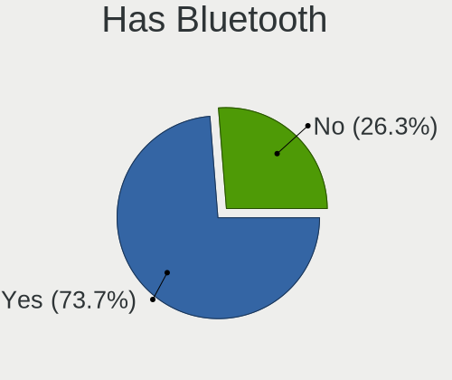
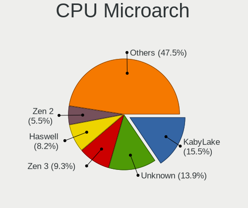
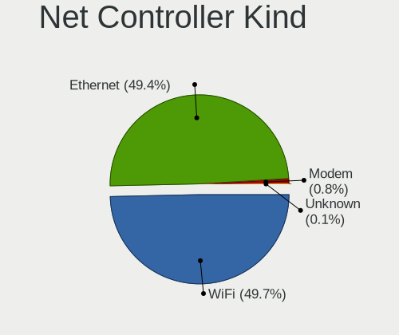

Pop!_OS 22.04 - Tested Hardware & Statistics
--------------------------------------------

A project to collect tested hardware configurations for Pop!_OS 22.04.

Anyone can contribute to this report by the [hw-probe](https://github.com/linuxhw/hw-probe) tool:

    sudo -E hw-probe -all -upload

Please contribute! Especially if your hardware is rare.

This is a report for all computer types. See also reports for [desktops](/Dist/Pop!_OS_22.04/Desktop/README.md) and [notebooks](/Dist/Pop!_OS_22.04/Notebook/README.md).

Contents
--------

* [ Test Cases ](#test-cases)

* [ System ](#system)
  - [ Kernel                   ](#kernel)
  - [ Kernel Family            ](#kernel-family)
  - [ Kernel Major Ver.        ](#kernel-major-ver)
  - [ Arch                     ](#arch)
  - [ DE                       ](#de)
  - [ Display Server           ](#display-server)
  - [ Display Manager          ](#display-manager)
  - [ OS Lang                  ](#os-lang)
  - [ Boot Mode                ](#boot-mode)
  - [ Filesystem               ](#filesystem)
  - [ Part. scheme             ](#part-scheme)
  - [ Dual Boot with Linux/BSD ](#dual-boot-with-linuxbsd)
  - [ Dual Boot (Win)          ](#dual-boot-win)

* [ Board ](#board)
  - [ Vendor                   ](#vendor)
  - [ Model                    ](#model)
  - [ Model Family             ](#model-family)
  - [ MFG Year                 ](#mfg-year)
  - [ Form Factor              ](#form-factor)
  - [ Secure Boot              ](#secure-boot)
  - [ Coreboot                 ](#coreboot)
  - [ RAM Size                 ](#ram-size)
  - [ RAM Used                 ](#ram-used)
  - [ Total Drives             ](#total-drives)
  - [ Has CD-ROM               ](#has-cd-rom)
  - [ Has Ethernet             ](#has-ethernet)
  - [ Has WiFi                 ](#has-wifi)
  - [ Has Bluetooth            ](#has-bluetooth)

* [ Location ](#location)
  - [ Country                  ](#country)
  - [ City                     ](#city)

* [ Drives ](#drives)
  - [ Drive Vendor             ](#drive-vendor)
  - [ Drive Model              ](#drive-model)
  - [ HDD Vendor               ](#hdd-vendor)
  - [ SSD Vendor               ](#ssd-vendor)
  - [ Drive Kind               ](#drive-kind)
  - [ Drive Connector          ](#drive-connector)
  - [ Drive Size               ](#drive-size)
  - [ Space Total              ](#space-total)
  - [ Space Used               ](#space-used)
  - [ Malfunc. Drives          ](#malfunc-drives)
  - [ Malfunc. Drive Vendor    ](#malfunc-drive-vendor)
  - [ Malfunc. HDD Vendor      ](#malfunc-hdd-vendor)
  - [ Malfunc. Drive Kind      ](#malfunc-drive-kind)
  - [ Failed Drives            ](#failed-drives)
  - [ Failed Drive Vendor      ](#failed-drive-vendor)
  - [ Drive Status             ](#drive-status)

* [ Storage controller ](#storage-controller)
  - [ Storage Vendor           ](#storage-vendor)
  - [ Storage Model            ](#storage-model)
  - [ Storage Kind             ](#storage-kind)

* [ Processor ](#processor)
  - [ CPU Vendor               ](#cpu-vendor)
  - [ CPU Model                ](#cpu-model)
  - [ CPU Model Family         ](#cpu-model-family)
  - [ CPU Cores                ](#cpu-cores)
  - [ CPU Sockets              ](#cpu-sockets)
  - [ CPU Threads              ](#cpu-threads)
  - [ CPU Op-Modes             ](#cpu-op-modes)
  - [ CPU Microcode            ](#cpu-microcode)
  - [ CPU Microarch            ](#cpu-microarch)

* [ Graphics ](#graphics)
  - [ GPU Vendor               ](#gpu-vendor)
  - [ GPU Model                ](#gpu-model)
  - [ GPU Combo                ](#gpu-combo)
  - [ GPU Driver               ](#gpu-driver)
  - [ GPU Memory               ](#gpu-memory)

* [ Monitor ](#monitor)
  - [ Monitor Vendor           ](#monitor-vendor)
  - [ Monitor Model            ](#monitor-model)
  - [ Monitor Resolution       ](#monitor-resolution)
  - [ Monitor Diagonal         ](#monitor-diagonal)
  - [ Monitor Width            ](#monitor-width)
  - [ Aspect Ratio             ](#aspect-ratio)
  - [ Monitor Area             ](#monitor-area)
  - [ Pixel Density            ](#pixel-density)
  - [ Multiple Monitors        ](#multiple-monitors)

* [ Network ](#network)
  - [ Net Controller Vendor    ](#net-controller-vendor)
  - [ Net Controller Model     ](#net-controller-model)
  - [ Wireless Vendor          ](#wireless-vendor)
  - [ Wireless Model           ](#wireless-model)
  - [ Ethernet Vendor          ](#ethernet-vendor)
  - [ Ethernet Model           ](#ethernet-model)
  - [ Net Controller Kind      ](#net-controller-kind)
  - [ Used Controller          ](#used-controller)
  - [ NICs                     ](#nics)
  - [ IPv6                     ](#ipv6)

* [ Bluetooth ](#bluetooth)
  - [ Bluetooth Vendor         ](#bluetooth-vendor)
  - [ Bluetooth Model          ](#bluetooth-model)

* [ Sound ](#sound)
  - [ Sound Vendor             ](#sound-vendor)
  - [ Sound Model              ](#sound-model)

* [ Memory ](#memory)
  - [ Memory Vendor            ](#memory-vendor)
  - [ Memory Model             ](#memory-model)
  - [ Memory Kind              ](#memory-kind)
  - [ Memory Form Factor       ](#memory-form-factor)
  - [ Memory Size              ](#memory-size)
  - [ Memory Speed             ](#memory-speed)

* [ Printers & scanners ](#printers--scanners)
  - [ Printer Vendor           ](#printer-vendor)
  - [ Printer Model            ](#printer-model)
  - [ Scanner Vendor           ](#scanner-vendor)
  - [ Scanner Model            ](#scanner-model)

* [ Camera ](#camera)
  - [ Camera Vendor            ](#camera-vendor)
  - [ Camera Model             ](#camera-model)

* [ Security ](#security)
  - [ Fingerprint Vendor       ](#fingerprint-vendor)
  - [ Fingerprint Model        ](#fingerprint-model)
  - [ Chipcard Vendor          ](#chipcard-vendor)
  - [ Chipcard Model           ](#chipcard-model)

* [ Unsupported ](#unsupported)
  - [ Unsupported Devices      ](#unsupported-devices)
  - [ Unsupported Device Types ](#unsupported-device-types)

Test Cases
----------

Total: 8130

| Vendor        | Model                       | Form-Factor | Probe                                                      | Date         |
|---------------|-----------------------------|-------------|------------------------------------------------------------|--------------|
| MSI           | B650 GAMING PLUS WIFI       | Desktop     | [1ff9c9f7cb](https://linux-hardware.org/?probe=1ff9c9f7cb) | Jan 06, 2025 |
| ASUSTek       | F5N                         | Notebook    | [b04fac9072](https://linux-hardware.org/?probe=b04fac9072) | Jan 06, 2025 |
| Acidanther... | Mac-4B682C642B45593E iMa... | All in one  | [105d641565](https://linux-hardware.org/?probe=105d641565) | Jan 06, 2025 |
| Lenovo        | ThinkPad X1 Yoga 3rd 20L... | Convertible | [8ad221e4e7](https://linux-hardware.org/?probe=8ad221e4e7) | Jan 06, 2025 |
| Dell          | Latitude 5320               | Notebook    | [c7f4eada6c](https://linux-hardware.org/?probe=c7f4eada6c) | Jan 06, 2025 |
| Acidanther... | Mac-4B682C642B45593E iMa... | All in one  | [3f87777dfa](https://linux-hardware.org/?probe=3f87777dfa) | Jan 05, 2025 |
| Gigabyte      | H370M D3H GSM-CF            | Desktop     | [639eb0e4fc](https://linux-hardware.org/?probe=639eb0e4fc) | Jan 05, 2025 |
| Lenovo        | ThinkPad T440s 20ARS46M0... | Notebook    | [17ac336e9c](https://linux-hardware.org/?probe=17ac336e9c) | Jan 05, 2025 |
| Gigabyte      | B650M D3HP                  | Desktop     | [0d0a62d437](https://linux-hardware.org/?probe=0d0a62d437) | Jan 05, 2025 |
| Lenovo        | ThinkPad T540p 20BFS0Y00... | Notebook    | [8e40087118](https://linux-hardware.org/?probe=8e40087118) | Jan 05, 2025 |
| Apple         | MacBookPro12,1              | Notebook    | [0699689325](https://linux-hardware.org/?probe=0699689325) | Jan 05, 2025 |
| ASUSTek       | X71Sr                       | Notebook    | [c76c5d5a1c](https://linux-hardware.org/?probe=c76c5d5a1c) | Jan 05, 2025 |
| Apple         | MacBookPro11,1              | Notebook    | [e994e68b69](https://linux-hardware.org/?probe=e994e68b69) | Jan 05, 2025 |
| Gigabyte      | B550 UD AC-Y1               | Desktop     | [b5d5a649e6](https://linux-hardware.org/?probe=b5d5a649e6) | Jan 05, 2025 |
| Apple         | MacBookPro5,5               | Notebook    | [de39de3147](https://linux-hardware.org/?probe=de39de3147) | Jan 05, 2025 |
| Shenzhen M... | F7BSC                       | Mini pc     | [abbe5e18a9](https://linux-hardware.org/?probe=abbe5e18a9) | Jan 04, 2025 |
| HP            | Pavilion x360 Convertibl... | Convertible | [6fc9bee528](https://linux-hardware.org/?probe=6fc9bee528) | Jan 04, 2025 |
| Apple         | Mac-F221BEC8                | Desktop     | [05de585a46](https://linux-hardware.org/?probe=05de585a46) | Jan 04, 2025 |
| Apple         | MacBookPro11,1              | Notebook    | [370a49426e](https://linux-hardware.org/?probe=370a49426e) | Jan 04, 2025 |
| ASUSTek       | X71Sr                       | Notebook    | [c17afe99ee](https://linux-hardware.org/?probe=c17afe99ee) | Jan 03, 2025 |
| Gigabyte      | H370M D3H GSM-CF            | Desktop     | [305c971d23](https://linux-hardware.org/?probe=305c971d23) | Jan 03, 2025 |
| ASUSTek       | ROG STRIX Z790-F GAMING ... | Desktop     | [e8f18de27b](https://linux-hardware.org/?probe=e8f18de27b) | Jan 03, 2025 |
| Lenovo        | Legion Pro 5 16ARX8 82WM    | Notebook    | [427c508e21](https://linux-hardware.org/?probe=427c508e21) | Jan 03, 2025 |
| ASRock        | B450M/ac                    | Desktop     | [58bf1994a2](https://linux-hardware.org/?probe=58bf1994a2) | Jan 03, 2025 |
| Gigabyte      | B650 AORUS ELITE AX         | Desktop     | [91839e20df](https://linux-hardware.org/?probe=91839e20df) | Jan 03, 2025 |
| ASUSTek       | M5A97 R2.0                  | Desktop     | [7526506dc2](https://linux-hardware.org/?probe=7526506dc2) | Jan 03, 2025 |
| Gigabyte      | B450M DS3H WIFI-CF          | Desktop     | [e91eadd16c](https://linux-hardware.org/?probe=e91eadd16c) | Jan 02, 2025 |
| System76      | Oryx Pro                    | Notebook    | [3e45c3caac](https://linux-hardware.org/?probe=3e45c3caac) | Jan 02, 2025 |
| Lenovo        | ThinkPad X1 Yoga 1st 20F... | Convertible | [ca8b287117](https://linux-hardware.org/?probe=ca8b287117) | Jan 02, 2025 |
| Gigabyte      | B450 AORUS ELITE            | Desktop     | [849e3021f2](https://linux-hardware.org/?probe=849e3021f2) | Jan 02, 2025 |
| Lenovo        | IdeaPadFlex 5 14ALC7 82R... | Convertible | [248a1406ed](https://linux-hardware.org/?probe=248a1406ed) | Jan 02, 2025 |
| Dell          | Inspiron 3558               | Notebook    | [06fdffd5e6](https://linux-hardware.org/?probe=06fdffd5e6) | Jan 02, 2025 |
| MSI           | B450 TOMAHAWK               | Desktop     | [77e32dabcd](https://linux-hardware.org/?probe=77e32dabcd) | Jan 02, 2025 |
| ASUSTek       | Vivobook Go E1504FA_E150... | Notebook    | [3bb27ee500](https://linux-hardware.org/?probe=3bb27ee500) | Jan 02, 2025 |
| Lenovo        | ThinkPad T14 Gen 3 21CGS... | Notebook    | [f2f5dbd7b9](https://linux-hardware.org/?probe=f2f5dbd7b9) | Jan 01, 2025 |
| Lenovo        | ThinkPad X1 Carbon 7th 2... | Notebook    | [497be29097](https://linux-hardware.org/?probe=497be29097) | Jan 01, 2025 |
| Lenovo        | IdeaPad L340-15IRH Gamin... | Notebook    | [8782970610](https://linux-hardware.org/?probe=8782970610) | Jan 01, 2025 |
| ASUSTek       | M5A97 R2.0                  | Desktop     | [a15d70317f](https://linux-hardware.org/?probe=a15d70317f) | Jan 01, 2025 |
| Dell          | Inspiron 7520               | Notebook    | [d24db96b79](https://linux-hardware.org/?probe=d24db96b79) | Jan 01, 2025 |
| ASUSTek       | PRIME B760M-A AX6 II        | Desktop     | [1012b4d63f](https://linux-hardware.org/?probe=1012b4d63f) | Jan 01, 2025 |
| ASUSTek       | PRIME B760M-A AX6 II        | Desktop     | [e3f9df9d9e](https://linux-hardware.org/?probe=e3f9df9d9e) | Jan 01, 2025 |
| ASRock        | N68-S UCC                   | Desktop     | [b83c60bccf](https://linux-hardware.org/?probe=b83c60bccf) | Jan 01, 2025 |
| Dell          | G15 5520                    | Notebook    | [19d5a43273](https://linux-hardware.org/?probe=19d5a43273) | Jan 01, 2025 |
| Apple         | MacBookPro9,2               | Notebook    | [e6da658e0f](https://linux-hardware.org/?probe=e6da658e0f) | Jan 01, 2025 |
| Acer          | Aspire ES1-572              | Notebook    | [419ddbb177](https://linux-hardware.org/?probe=419ddbb177) | Dec 31, 2024 |
| Acer          | Aspire ES1-572              | Notebook    | [dc58f6466e](https://linux-hardware.org/?probe=dc58f6466e) | Dec 31, 2024 |
| Fujitsu       | D3220-A1 S26361-D3220-A1    | Desktop     | [079f7f1707](https://linux-hardware.org/?probe=079f7f1707) | Dec 31, 2024 |
| ASRock        | H570M Pro4                  | Desktop     | [ae9219a819](https://linux-hardware.org/?probe=ae9219a819) | Dec 31, 2024 |
| ASRock        | N68-S UCC                   | Desktop     | [e48cfb70c6](https://linux-hardware.org/?probe=e48cfb70c6) | Dec 31, 2024 |
| ASRock        | N68-S UCC                   | Desktop     | [a53617b9d5](https://linux-hardware.org/?probe=a53617b9d5) | Dec 31, 2024 |
| Microsoft     | Surface Book                | Tablet      | [e334442819](https://linux-hardware.org/?probe=e334442819) | Dec 31, 2024 |
| Acer          | Aspire A114-32              | Notebook    | [3af2175d58](https://linux-hardware.org/?probe=3af2175d58) | Dec 31, 2024 |
| Apple         | MacBookAir6,2               | Notebook    | [903e299f16](https://linux-hardware.org/?probe=903e299f16) | Dec 30, 2024 |
| HP            | Pavilion x360 2-in-1 Lap... | Convertible | [77c2d20feb](https://linux-hardware.org/?probe=77c2d20feb) | Dec 30, 2024 |
| Apple         | MacBookPro9,2               | Notebook    | [a509973046](https://linux-hardware.org/?probe=a509973046) | Dec 30, 2024 |
| Apple         | MacBookPro9,2               | Notebook    | [1e4cb7054c](https://linux-hardware.org/?probe=1e4cb7054c) | Dec 30, 2024 |
| ASUSTek       | ASUS TUF Gaming A15 FA50... | Notebook    | [b16417fac3](https://linux-hardware.org/?probe=b16417fac3) | Dec 30, 2024 |
| HP            | EliteBook 840 Aero G8 No... | Notebook    | [af5219d90f](https://linux-hardware.org/?probe=af5219d90f) | Dec 30, 2024 |
| Acer          | Aspire A515-57              | Notebook    | [4bccbc5b01](https://linux-hardware.org/?probe=4bccbc5b01) | Dec 29, 2024 |
| ASRock        | X370 Gaming-ITX/ac          | Desktop     | [f89abca0f9](https://linux-hardware.org/?probe=f89abca0f9) | Dec 29, 2024 |
| ASUSTek       | ROG STRIX X670E-I GAMING... | Desktop     | [0e48acaa7e](https://linux-hardware.org/?probe=0e48acaa7e) | Dec 29, 2024 |
| ASUSTek       | TP500LN                     | Notebook    | [beeccb21e7](https://linux-hardware.org/?probe=beeccb21e7) | Dec 29, 2024 |
| ASUSTek       | TP500LN                     | Notebook    | [e71efdddcc](https://linux-hardware.org/?probe=e71efdddcc) | Dec 29, 2024 |
| ASUSTek       | Z97-K                       | Desktop     | [53f0c1c555](https://linux-hardware.org/?probe=53f0c1c555) | Dec 29, 2024 |
| Lenovo        | Legion Pro 7 16ARX8H 82W... | Notebook    | [702096b561](https://linux-hardware.org/?probe=702096b561) | Dec 29, 2024 |
| Lenovo        | Legion Pro 7 16ARX8H 82W... | Notebook    | [968258cf48](https://linux-hardware.org/?probe=968258cf48) | Dec 29, 2024 |
| Lenovo        | 312A SDK0J40697 WIN 3305... | Desktop     | [9fa8931c0b](https://linux-hardware.org/?probe=9fa8931c0b) | Dec 29, 2024 |
| Lenovo        | 31900058 STD                | All in one  | [4eb5763e89](https://linux-hardware.org/?probe=4eb5763e89) | Dec 29, 2024 |
| ASUSTek       | F1A75-M-PRO R2.0            | Desktop     | [8485c1ce27](https://linux-hardware.org/?probe=8485c1ce27) | Dec 28, 2024 |
| Shenzhen M... | F7BSC                       | Mini pc     | [c93ac190a0](https://linux-hardware.org/?probe=c93ac190a0) | Dec 28, 2024 |
| HUAWEI        | KLVL-WXX9                   | Notebook    | [eb1589c7c0](https://linux-hardware.org/?probe=eb1589c7c0) | Dec 28, 2024 |
| ASUSTek       | P8H61-M LX3 PLUS R2.0       | Desktop     | [39e50a00e4](https://linux-hardware.org/?probe=39e50a00e4) | Dec 28, 2024 |
| ASUSTek       | M4A87TD EVO                 | Desktop     | [4182d5a5ec](https://linux-hardware.org/?probe=4182d5a5ec) | Dec 28, 2024 |
| HP            | 8265                        | Desktop     | [3b63487fcf](https://linux-hardware.org/?probe=3b63487fcf) | Dec 28, 2024 |
| HP            | EliteBook 8540p             | Notebook    | [3fba3ebc56](https://linux-hardware.org/?probe=3fba3ebc56) | Dec 27, 2024 |
| Acer          | Aspire VX5-591G             | Notebook    | [723f61dbcf](https://linux-hardware.org/?probe=723f61dbcf) | Dec 27, 2024 |
| Acer          | Aspire VX5-591G             | Notebook    | [773ac488ff](https://linux-hardware.org/?probe=773ac488ff) | Dec 27, 2024 |
| Framework     | Laptop 16 (AMD Ryzen 704... | Notebook    | [b892b107e9](https://linux-hardware.org/?probe=b892b107e9) | Dec 27, 2024 |
| ASRock        | H110M-HDV                   | Desktop     | [4501aaefe1](https://linux-hardware.org/?probe=4501aaefe1) | Dec 27, 2024 |
| System76      | Gazelle                     | Notebook    | [cb477659f5](https://linux-hardware.org/?probe=cb477659f5) | Dec 27, 2024 |
| ASRock        | B450 Steel Legend           | Desktop     | [5320a7c488](https://linux-hardware.org/?probe=5320a7c488) | Dec 27, 2024 |
| Fujitsu       | FARQ17004                   | Tablet      | [a8c473704c](https://linux-hardware.org/?probe=a8c473704c) | Dec 27, 2024 |
| Chuwi         | MiniBook X                  | Notebook    | [2959afdb7e](https://linux-hardware.org/?probe=2959afdb7e) | Dec 27, 2024 |
| ASRock        | H110M-HDV                   | Desktop     | [eb488f568b](https://linux-hardware.org/?probe=eb488f568b) | Dec 26, 2024 |
| Apple         | MacBookPro11,3              | Notebook    | [8c323a18f3](https://linux-hardware.org/?probe=8c323a18f3) | Dec 26, 2024 |
| Apple         | MacBookPro11,3              | Notebook    | [68bd4716f4](https://linux-hardware.org/?probe=68bd4716f4) | Dec 26, 2024 |
| Dell          | G15 5510                    | Notebook    | [e381abffc2](https://linux-hardware.org/?probe=e381abffc2) | Dec 26, 2024 |
| Acer          | Aspire E1-731               | Notebook    | [e633d3e555](https://linux-hardware.org/?probe=e633d3e555) | Dec 26, 2024 |
| Gigabyte      | B450 AORUS PRO WIFI-CF      | Desktop     | [283a58ac15](https://linux-hardware.org/?probe=283a58ac15) | Dec 26, 2024 |
| ASUSTek       | ROG Maximus Z790 HERO       | Desktop     | [9fcbcdf645](https://linux-hardware.org/?probe=9fcbcdf645) | Dec 26, 2024 |
| System76      | Oryx Pro                    | Notebook    | [336ade52bd](https://linux-hardware.org/?probe=336ade52bd) | Dec 25, 2024 |
| Dell          | 0WPMFG A00                  | Desktop     | [32af132170](https://linux-hardware.org/?probe=32af132170) | Dec 25, 2024 |
| Dell          | 0XHGV1 A00                  | Desktop     | [017302e467](https://linux-hardware.org/?probe=017302e467) | Dec 25, 2024 |
| Dell          | 0YF8P5 A00                  | Desktop     | [fab3c1d036](https://linux-hardware.org/?probe=fab3c1d036) | Dec 25, 2024 |
| HP            | 8906 SMVB                   | Desktop     | [7c1ad30996](https://linux-hardware.org/?probe=7c1ad30996) | Dec 25, 2024 |
| MSI           | Z370 GAMING PRO CARBON A... | Desktop     | [46c1540093](https://linux-hardware.org/?probe=46c1540093) | Dec 24, 2024 |
| Dell          | Precision 7670              | Notebook    | [7b879477ba](https://linux-hardware.org/?probe=7b879477ba) | Dec 24, 2024 |
| Gigabyte      | X570 AORUS ULTRA            | Desktop     | [bbae43def0](https://linux-hardware.org/?probe=bbae43def0) | Dec 24, 2024 |
| MSI           | B550-A PRO                  | Desktop     | [dd6260a709](https://linux-hardware.org/?probe=dd6260a709) | Dec 24, 2024 |
| Gigabyte      | Z370P D3-CF                 | Desktop     | [9ea1b90178](https://linux-hardware.org/?probe=9ea1b90178) | Dec 23, 2024 |
| HP            | 3396                        | Desktop     | [6e2c93c063](https://linux-hardware.org/?probe=6e2c93c063) | Dec 23, 2024 |
| HP            | 3396                        | Desktop     | [a237d63fa3](https://linux-hardware.org/?probe=a237d63fa3) | Dec 23, 2024 |
| Lenovo        | IdeaPad Y700 Touch-15ISK... | Notebook    | [5e9a07ac33](https://linux-hardware.org/?probe=5e9a07ac33) | Dec 23, 2024 |
| MSI           | B650 GAMING PLUS WIFI       | Desktop     | [ca3ac47c6d](https://linux-hardware.org/?probe=ca3ac47c6d) | Dec 23, 2024 |
| Gigabyte      | X570S AERO G                | Desktop     | [f4832ab80c](https://linux-hardware.org/?probe=f4832ab80c) | Dec 23, 2024 |
| MSI           | MPG B550 GAMING PLUS        | Desktop     | [b9260cccc7](https://linux-hardware.org/?probe=b9260cccc7) | Dec 22, 2024 |
| HP            | Pavilion Plus Laptop 14-... | Notebook    | [a1beeae5b9](https://linux-hardware.org/?probe=a1beeae5b9) | Dec 22, 2024 |
| ASUSTek       | X510UQR                     | Notebook    | [f0c040e507](https://linux-hardware.org/?probe=f0c040e507) | Dec 22, 2024 |
| ASUSTek       | B150M-A/M.2                 | Desktop     | [bdb9de439f](https://linux-hardware.org/?probe=bdb9de439f) | Dec 22, 2024 |
| HP            | 3397                        | Desktop     | [d72e973be9](https://linux-hardware.org/?probe=d72e973be9) | Dec 22, 2024 |
| MSI           | B560M-A PRO                 | Desktop     | [814f11f38f](https://linux-hardware.org/?probe=814f11f38f) | Dec 22, 2024 |
| HUAWEI        | KLVD-WXX9                   | Notebook    | [a5df0d3fd9](https://linux-hardware.org/?probe=a5df0d3fd9) | Dec 22, 2024 |
| ASRock        | X670E PG Lightning          | Desktop     | [a87b7ceb23](https://linux-hardware.org/?probe=a87b7ceb23) | Dec 22, 2024 |
| ASRock        | X570 Phantom Gaming 4       | Desktop     | [c0bbc9c576](https://linux-hardware.org/?probe=c0bbc9c576) | Dec 22, 2024 |
| Acer          | Aspire E1-731               | Notebook    | [24c0bfe676](https://linux-hardware.org/?probe=24c0bfe676) | Dec 21, 2024 |
| Unknown       | X99-D8                      | Desktop     | [0bd81498ad](https://linux-hardware.org/?probe=0bd81498ad) | Dec 21, 2024 |
| Dell          | Inspiron 3542               | Notebook    | [81c6c26fa4](https://linux-hardware.org/?probe=81c6c26fa4) | Dec 21, 2024 |
| Lenovo        | ThinkPad P1 Gen 2 20QUS0... | Notebook    | [8eaf87896d](https://linux-hardware.org/?probe=8eaf87896d) | Dec 21, 2024 |
| ECS           | H61H2-M6                    | Desktop     | [ee83334d6e](https://linux-hardware.org/?probe=ee83334d6e) | Dec 21, 2024 |
| ASUSTek       | B150M-A/M.2                 | Desktop     | [58579615c1](https://linux-hardware.org/?probe=58579615c1) | Dec 20, 2024 |
| HP            | Spectre x360 2-in-1 Lapt... | Convertible | [ec52ae183b](https://linux-hardware.org/?probe=ec52ae183b) | Dec 19, 2024 |
| ASRock        | 970 Extreme3 R2.0           | Desktop     | [cc8e8b062c](https://linux-hardware.org/?probe=cc8e8b062c) | Dec 19, 2024 |
| Gigabyte      | B550 GAMING X               | Desktop     | [5e7733d216](https://linux-hardware.org/?probe=5e7733d216) | Dec 19, 2024 |
| Medion        | S6445 MD61489               | Notebook    | [678fefd644](https://linux-hardware.org/?probe=678fefd644) | Dec 18, 2024 |
| Medion        | S6445 MD61489               | Notebook    | [ddd924a519](https://linux-hardware.org/?probe=ddd924a519) | Dec 18, 2024 |
| ASUSTek       | NUC13ANB-M 60AS0040-MB0A... | Mini pc     | [b9a32b1575](https://linux-hardware.org/?probe=b9a32b1575) | Dec 18, 2024 |
| HP            | Notebook                    | Notebook    | [c08a1bb97f](https://linux-hardware.org/?probe=c08a1bb97f) | Dec 18, 2024 |
| MSI           | B150 GAMING M3              | Desktop     | [eb7d688010](https://linux-hardware.org/?probe=eb7d688010) | Dec 18, 2024 |
| ASUSTek       | X540LJ                      | Notebook    | [dff11ceadc](https://linux-hardware.org/?probe=dff11ceadc) | Dec 18, 2024 |
| Framework     | Laptop 16 (AMD Ryzen 704... | Notebook    | [f332a63f55](https://linux-hardware.org/?probe=f332a63f55) | Dec 18, 2024 |
| Lenovo        | ThinkPad P53 MWS 15.6 (Q... | Notebook    | [a86913fde1](https://linux-hardware.org/?probe=a86913fde1) | Dec 18, 2024 |
| MSI           | Z370 GAMING PRO CARBON      | Desktop     | [3b9ab5404e](https://linux-hardware.org/?probe=3b9ab5404e) | Dec 17, 2024 |
| Apple         | MacBookAir3,1               | Notebook    | [29d91557b3](https://linux-hardware.org/?probe=29d91557b3) | Dec 17, 2024 |
| Apple         | MacBookAir3,1               | Notebook    | [62e2c7fe7b](https://linux-hardware.org/?probe=62e2c7fe7b) | Dec 17, 2024 |
| ASUSTek       | Z77-A                       | Desktop     | [905b20309d](https://linux-hardware.org/?probe=905b20309d) | Dec 17, 2024 |
| Dell          | System XPS L502X            | Notebook    | [74f4e14d27](https://linux-hardware.org/?probe=74f4e14d27) | Dec 17, 2024 |
| Dell          | System XPS L502X            | Notebook    | [8aa720a976](https://linux-hardware.org/?probe=8aa720a976) | Dec 17, 2024 |
| ASUSTek       | VivoBook_ASUSLaptop X160... | Notebook    | [e7ce325050](https://linux-hardware.org/?probe=e7ce325050) | Dec 16, 2024 |
| Dell          | Latitude 7340               | Notebook    | [01bf0e0d2c](https://linux-hardware.org/?probe=01bf0e0d2c) | Dec 16, 2024 |
| Lenovo        | Legion Y7000 81FW           | Notebook    | [b74286b627](https://linux-hardware.org/?probe=b74286b627) | Dec 16, 2024 |
| Dell          | Latitude 9420               | Convertible | [663dfb6918](https://linux-hardware.org/?probe=663dfb6918) | Dec 16, 2024 |
| Acer          | Spin SP314-54N              | Convertible | [dfd01a6f96](https://linux-hardware.org/?probe=dfd01a6f96) | Dec 16, 2024 |
| ASUSTek       | VivoBook_ASUSLaptop X140... | Notebook    | [eaa6397d5e](https://linux-hardware.org/?probe=eaa6397d5e) | Dec 16, 2024 |
| MSI           | MPG Z690 FORCE WIFI         | Desktop     | [67fda65f1a](https://linux-hardware.org/?probe=67fda65f1a) | Dec 16, 2024 |
| System76      | Lemur Pro                   | Notebook    | [96252caa1e](https://linux-hardware.org/?probe=96252caa1e) | Dec 16, 2024 |
| HUAWEI        | KLVL-WXX9                   | Notebook    | [3d5e444772](https://linux-hardware.org/?probe=3d5e444772) | Dec 16, 2024 |
| Apple         | MacBookPro10,1              | Notebook    | [e27d08b364](https://linux-hardware.org/?probe=e27d08b364) | Dec 15, 2024 |
| ASUSTek       | VivoBook_ASUSLaptop X509... | Notebook    | [ec283efd6e](https://linux-hardware.org/?probe=ec283efd6e) | Dec 15, 2024 |
| Lenovo        | ThinkBook 15-IIL 20SM       | Notebook    | [edc19c7235](https://linux-hardware.org/?probe=edc19c7235) | Dec 15, 2024 |
| Apple         | MacBookPro10,1              | Notebook    | [96ffa04014](https://linux-hardware.org/?probe=96ffa04014) | Dec 15, 2024 |
| Intel         | NUC11PABi5 M68265-501       | Mini pc     | [b71f20be35](https://linux-hardware.org/?probe=b71f20be35) | Dec 15, 2024 |
| Lenovo        | LOQ 15IRX9 83DV             | Notebook    | [68a32fe043](https://linux-hardware.org/?probe=68a32fe043) | Dec 15, 2024 |
| Apple         | MacBookPro8,2               | Notebook    | [b3db914035](https://linux-hardware.org/?probe=b3db914035) | Dec 15, 2024 |
| Apple         | MacBookPro8,2               | Notebook    | [ee05cf00fc](https://linux-hardware.org/?probe=ee05cf00fc) | Dec 15, 2024 |
| Dell          | Latitude E6420              | Notebook    | [ed611bf07e](https://linux-hardware.org/?probe=ed611bf07e) | Dec 15, 2024 |
| JGINYUE       | B650I Night Devil Ver:      | Desktop     | [d98b74d533](https://linux-hardware.org/?probe=d98b74d533) | Dec 15, 2024 |
| Gigabyte      | B550M AORUS ELITE           | Desktop     | [ea5d5a1d8f](https://linux-hardware.org/?probe=ea5d5a1d8f) | Dec 14, 2024 |
| ASUSTek       | PRIME Z270-A                | Desktop     | [5af9a6f758](https://linux-hardware.org/?probe=5af9a6f758) | Dec 14, 2024 |
| LG Electro... | 17ZB90R-K.ADC8U1            | Notebook    | [a98308a8ff](https://linux-hardware.org/?probe=a98308a8ff) | Dec 14, 2024 |
| System76      | Galago Pro                  | Notebook    | [263161107b](https://linux-hardware.org/?probe=263161107b) | Dec 14, 2024 |
| Biostar       | A520MH                      | Desktop     | [46f468d23e](https://linux-hardware.org/?probe=46f468d23e) | Dec 14, 2024 |
| Gigabyte      | Z590 VISION D               | Desktop     | [e51c407f40](https://linux-hardware.org/?probe=e51c407f40) | Dec 14, 2024 |
| ASUSTek       | Maximus IX HERO             | Desktop     | [277adb5291](https://linux-hardware.org/?probe=277adb5291) | Dec 14, 2024 |
| Gigabyte      | X870 GAMING X WIFI7         | Desktop     | [bf3a0594a1](https://linux-hardware.org/?probe=bf3a0594a1) | Dec 14, 2024 |
| Lenovo        | 0B98401 PRO                 | Desktop     | [fbf5a87269](https://linux-hardware.org/?probe=fbf5a87269) | Dec 14, 2024 |
| Lenovo        | ThinkBook 15-IIL 20SM       | Notebook    | [8fd0a47047](https://linux-hardware.org/?probe=8fd0a47047) | Dec 13, 2024 |
| ASUSTek       | TUF Gaming Z690-PLUS        | Desktop     | [d46d8a8dc1](https://linux-hardware.org/?probe=d46d8a8dc1) | Dec 13, 2024 |
| Alienware     | 0K9TKY A00                  | Desktop     | [02f928f245](https://linux-hardware.org/?probe=02f928f245) | Dec 13, 2024 |
| Acer          | Nitro ANV15-41              | Notebook    | [d58a585fc6](https://linux-hardware.org/?probe=d58a585fc6) | Dec 13, 2024 |
| AMI           | Intel                       | Notebook    | [744da97070](https://linux-hardware.org/?probe=744da97070) | Dec 13, 2024 |
| Apple         | Mac-F60DEB81FF30ACF6 Mac... | Desktop     | [bc4af2a098](https://linux-hardware.org/?probe=bc4af2a098) | Dec 12, 2024 |
| Gigabyte      | B650 EAGLE                  | Desktop     | [b7d5b664b5](https://linux-hardware.org/?probe=b7d5b664b5) | Dec 12, 2024 |
| Lenovo        | IdeaPad 1 15ADA7 82R1       | Notebook    | [adb22b56eb](https://linux-hardware.org/?probe=adb22b56eb) | Dec 12, 2024 |
| System76      | Oryx Pro                    | Notebook    | [c87371b1cb](https://linux-hardware.org/?probe=c87371b1cb) | Dec 12, 2024 |
| System76      | Thelio thelio-r2            | Desktop     | [7a66bf9502](https://linux-hardware.org/?probe=7a66bf9502) | Dec 12, 2024 |
| ASUSTek       | Z97-K                       | Desktop     | [8096f8f1b6](https://linux-hardware.org/?probe=8096f8f1b6) | Dec 12, 2024 |
| ASUSTek       | M5A97 R2.0                  | Desktop     | [e0157671c5](https://linux-hardware.org/?probe=e0157671c5) | Dec 12, 2024 |
| Apple         | MacBookPro8,1               | Notebook    | [802c98fd5c](https://linux-hardware.org/?probe=802c98fd5c) | Dec 12, 2024 |
| Lenovo        | IdeaPad 320-15IKB 80YH      | Notebook    | [5979a585ea](https://linux-hardware.org/?probe=5979a585ea) | Dec 12, 2024 |
| Lenovo        | ThinkBook 16 G6 ABP 21KK    | Notebook    | [0913e12416](https://linux-hardware.org/?probe=0913e12416) | Dec 12, 2024 |
| Dell          | Latitude E7470              | Notebook    | [300b02bb07](https://linux-hardware.org/?probe=300b02bb07) | Dec 12, 2024 |
| Dell          | Latitude 7490               | Notebook    | [f97f9efaf8](https://linux-hardware.org/?probe=f97f9efaf8) | Dec 12, 2024 |
| Lenovo        | IdeaPad Z570 HuronRiver ... | Notebook    | [e5be77487d](https://linux-hardware.org/?probe=e5be77487d) | Dec 11, 2024 |
| ASRock        | 970 Extreme3 R2.0           | Desktop     | [9fa51abc19](https://linux-hardware.org/?probe=9fa51abc19) | Dec 11, 2024 |
| Acer          | Aspire X3960                | Desktop     | [7bc5a0a910](https://linux-hardware.org/?probe=7bc5a0a910) | Dec 11, 2024 |
| ASUSTek       | TUF Gaming Z590-PLUS        | Desktop     | [4caf21526d](https://linux-hardware.org/?probe=4caf21526d) | Dec 11, 2024 |
| Dell          | Inspiron 16 5645            | Notebook    | [0437f5d57e](https://linux-hardware.org/?probe=0437f5d57e) | Dec 11, 2024 |
| Gigabyte      | G41M-ES2L                   | Desktop     | [ff47572b6b](https://linux-hardware.org/?probe=ff47572b6b) | Dec 11, 2024 |
| Gigabyte      | X870 EAGLE WIFI7            | Desktop     | [9d8f1f5a1c](https://linux-hardware.org/?probe=9d8f1f5a1c) | Dec 11, 2024 |
| Notebook      | N85_N87,HJ,HJ1,HK1          | Notebook    | [c252814d3e](https://linux-hardware.org/?probe=c252814d3e) | Dec 11, 2024 |
| Lenovo        | ThinkPad X1 Carbon Gen 9... | Notebook    | [9105942b15](https://linux-hardware.org/?probe=9105942b15) | Dec 10, 2024 |
| Lenovo        | IdeaPad 320-15IKB 80YH      | Notebook    | [d595bcedb4](https://linux-hardware.org/?probe=d595bcedb4) | Dec 10, 2024 |
| Lenovo        | B5400 20278                 | Notebook    | [e1b20f6c0b](https://linux-hardware.org/?probe=e1b20f6c0b) | Dec 10, 2024 |
| Lenovo        | ThinkPad X270 20HN001HUS    | Notebook    | [ef25178fec](https://linux-hardware.org/?probe=ef25178fec) | Dec 10, 2024 |
| Lenovo        | ThinkPad X270 20HN001HUS    | Notebook    | [954578185e](https://linux-hardware.org/?probe=954578185e) | Dec 10, 2024 |
| MSI           | Z270 SLI PLUS               | Desktop     | [4bd957e3ec](https://linux-hardware.org/?probe=4bd957e3ec) | Dec 10, 2024 |
| ASUSTek       | ASUS TUF Gaming F15 FX50... | Notebook    | [861b5550d3](https://linux-hardware.org/?probe=861b5550d3) | Dec 10, 2024 |
| Dell          | Latitude E6330              | Notebook    | [dfc2aca866](https://linux-hardware.org/?probe=dfc2aca866) | Dec 09, 2024 |
| Dell          | 0478VN A00                  | Desktop     | [86908e3156](https://linux-hardware.org/?probe=86908e3156) | Dec 09, 2024 |
| Gigabyte      | X570 AORUS MASTER           | Desktop     | [7305cf039c](https://linux-hardware.org/?probe=7305cf039c) | Dec 09, 2024 |
| ASRock        | H610M-ITX/eDP               | Desktop     | [75e26c7c07](https://linux-hardware.org/?probe=75e26c7c07) | Dec 09, 2024 |
| HP            | ZBook 17 G5                 | Notebook    | [0f14052159](https://linux-hardware.org/?probe=0f14052159) | Dec 09, 2024 |
| Apple         | MacBookPro5,4               | Notebook    | [751741e751](https://linux-hardware.org/?probe=751741e751) | Dec 09, 2024 |
| Apple         | MacBookPro5,4               | Notebook    | [fd85f5ad8f](https://linux-hardware.org/?probe=fd85f5ad8f) | Dec 09, 2024 |
| ASUSTek       | Pro WS WRX80E-SAGE SE WI... | Desktop     | [d873aaad11](https://linux-hardware.org/?probe=d873aaad11) | Dec 09, 2024 |
| AZW           | MINI S                      | Desktop     | [a82e287e6c](https://linux-hardware.org/?probe=a82e287e6c) | Dec 09, 2024 |
| ASRock        | H610M-ITX/eDP               | Desktop     | [e9eed28958](https://linux-hardware.org/?probe=e9eed28958) | Dec 09, 2024 |
| Apple         | MacBookPro8,1               | Notebook    | [58a0bf4e65](https://linux-hardware.org/?probe=58a0bf4e65) | Dec 09, 2024 |
| ASUSTek       | ROG Zephyrus G14 GA403UV... | Notebook    | [e8f69e44e3](https://linux-hardware.org/?probe=e8f69e44e3) | Dec 09, 2024 |
| ASUSTek       | ASUS TUF Gaming A15 FA50... | Notebook    | [4fef924a63](https://linux-hardware.org/?probe=4fef924a63) | Dec 09, 2024 |
| Eluktronic... | RP-15                       | Notebook    | [bc1a09c984](https://linux-hardware.org/?probe=bc1a09c984) | Dec 08, 2024 |
| Supermicro    | X9DRD-iF                    | Desktop     | [f90d8dfc09](https://linux-hardware.org/?probe=f90d8dfc09) | Dec 08, 2024 |
| Google        | Samus                       | Notebook    | [362b80bc7d](https://linux-hardware.org/?probe=362b80bc7d) | Dec 08, 2024 |
| HP            | OMEN by Laptop 17-cb1xxx    | Notebook    | [4c1f450872](https://linux-hardware.org/?probe=4c1f450872) | Dec 08, 2024 |
| ASUSTek       | PRIME H270-PLUS             | Desktop     | [79abd0b864](https://linux-hardware.org/?probe=79abd0b864) | Dec 08, 2024 |
| Lenovo        | Yoga C940-14IIL 81Q9        | Convertible | [28d11d7453](https://linux-hardware.org/?probe=28d11d7453) | Dec 08, 2024 |
| Dell          | Inspiron N4050              | Notebook    | [7194f36c08](https://linux-hardware.org/?probe=7194f36c08) | Dec 08, 2024 |
| ASUSTek       | B150M-C                     | Desktop     | [0e25bdfd87](https://linux-hardware.org/?probe=0e25bdfd87) | Dec 07, 2024 |
| MSI           | MPG B650I EDGE WIFI         | Desktop     | [15ceab731a](https://linux-hardware.org/?probe=15ceab731a) | Dec 07, 2024 |
| HP            | ProBook 650 G1              | Notebook    | [62f3ba4cc6](https://linux-hardware.org/?probe=62f3ba4cc6) | Dec 07, 2024 |
| Lenovo        | ThinkPad X1 Extreme Gen ... | Notebook    | [88d9510fcb](https://linux-hardware.org/?probe=88d9510fcb) | Dec 07, 2024 |
| Dell          | Inspiron 15 5510            | Notebook    | [bd969c198e](https://linux-hardware.org/?probe=bd969c198e) | Dec 07, 2024 |
| Supermicro    | X9DRD-iF                    | Desktop     | [24c2ea7bbd](https://linux-hardware.org/?probe=24c2ea7bbd) | Dec 07, 2024 |
| ASUSTek       | P8P67 PRO                   | Desktop     | [89c4ef1413](https://linux-hardware.org/?probe=89c4ef1413) | Dec 07, 2024 |
| ASUSTek       | P8P67 PRO                   | Desktop     | [40751025a5](https://linux-hardware.org/?probe=40751025a5) | Dec 07, 2024 |
| Lenovo        | ThinkPad P52 20MAS1WD0S     | Notebook    | [49359bfaf2](https://linux-hardware.org/?probe=49359bfaf2) | Dec 07, 2024 |
| Lenovo        | ThinkPad T420s 417032U      | Notebook    | [4ac33e7516](https://linux-hardware.org/?probe=4ac33e7516) | Dec 07, 2024 |
| ASUSTek       | PRIME Z690-P WIFI           | Desktop     | [741eb16cb4](https://linux-hardware.org/?probe=741eb16cb4) | Dec 07, 2024 |
| ASRock        | B450M Pro4                  | Desktop     | [780d8477b4](https://linux-hardware.org/?probe=780d8477b4) | Dec 07, 2024 |
| ASRock        | X570 Phantom Gaming 4       | Desktop     | [4b14a65ae5](https://linux-hardware.org/?probe=4b14a65ae5) | Dec 07, 2024 |
| Dell          | 0CW954 A00                  | Server      | [e65588c0e0](https://linux-hardware.org/?probe=e65588c0e0) | Dec 07, 2024 |
| Lenovo        | Yoga Pro 7 14AHP9 83E3      | Notebook    | [8ff09eea32](https://linux-hardware.org/?probe=8ff09eea32) | Dec 06, 2024 |
| ASUSTek       | Zenbook UM3402YA_UM3402Y... | Notebook    | [2616e6e6d0](https://linux-hardware.org/?probe=2616e6e6d0) | Dec 06, 2024 |
| Lenovo        | ThinkPad E14 Gen 2 20TA0... | Notebook    | [a324fb8617](https://linux-hardware.org/?probe=a324fb8617) | Dec 06, 2024 |
| ASUSTek       | Z170 PRO GAMING/AURA        | Desktop     | [e25da0298a](https://linux-hardware.org/?probe=e25da0298a) | Dec 06, 2024 |
| MSI           | PRO Z790-A WIFI             | Desktop     | [386b5bb2fa](https://linux-hardware.org/?probe=386b5bb2fa) | Dec 06, 2024 |
| HP            | Dragonfly Pro ONE           | Notebook    | [6db18a33b7](https://linux-hardware.org/?probe=6db18a33b7) | Dec 06, 2024 |
| Dell          | Latitude 5490               | Notebook    | [04d3dd2626](https://linux-hardware.org/?probe=04d3dd2626) | Dec 05, 2024 |
| Gigabyte      | Z390 AORUS PRO-CF           | Desktop     | [c28dd5c7ab](https://linux-hardware.org/?probe=c28dd5c7ab) | Dec 05, 2024 |
| Dell          | Inspiron 16 7640 2-in-1     | Notebook    | [3af8e24702](https://linux-hardware.org/?probe=3af8e24702) | Dec 05, 2024 |
| Intel         | B75                         | Desktop     | [69a652cb51](https://linux-hardware.org/?probe=69a652cb51) | Dec 05, 2024 |
| Gigabyte      | Z170-Gaming K3              | Desktop     | [eb3f1d8587](https://linux-hardware.org/?probe=eb3f1d8587) | Dec 05, 2024 |
| Dell          | 0GY6Y8 A02                  | Desktop     | [315414ee85](https://linux-hardware.org/?probe=315414ee85) | Dec 05, 2024 |
| Apple         | Mac-F65AE981FFA204ED Mac... | Mini pc     | [90ba8c71bd](https://linux-hardware.org/?probe=90ba8c71bd) | Dec 05, 2024 |
| Apple         | Mac-F65AE981FFA204ED Mac... | Mini pc     | [c294b554ab](https://linux-hardware.org/?probe=c294b554ab) | Dec 05, 2024 |
| Dell          | 0GY6Y8 A02                  | Desktop     | [91d86a1a29](https://linux-hardware.org/?probe=91d86a1a29) | Dec 05, 2024 |
| MSI           | B650 GAMING PLUS WIFI       | Desktop     | [38917bc287](https://linux-hardware.org/?probe=38917bc287) | Dec 04, 2024 |
| Dell          | 09KPNV A00                  | Desktop     | [954003dcdc](https://linux-hardware.org/?probe=954003dcdc) | Dec 04, 2024 |
| ASRock        | X570 Taichi                 | Desktop     | [095dc95b9d](https://linux-hardware.org/?probe=095dc95b9d) | Dec 04, 2024 |
| MSI           | MPG B650I EDGE WIFI         | Desktop     | [b1cf6cfea9](https://linux-hardware.org/?probe=b1cf6cfea9) | Dec 04, 2024 |
| ASUSTek       | N550JV                      | Notebook    | [e0700722fa](https://linux-hardware.org/?probe=e0700722fa) | Dec 04, 2024 |
| Acer          | Aspire A315-44P             | Notebook    | [67fde295de](https://linux-hardware.org/?probe=67fde295de) | Dec 04, 2024 |
| Gigabyte      | X870 EAGLE WIFI7            | Desktop     | [4178f34632](https://linux-hardware.org/?probe=4178f34632) | Dec 04, 2024 |
| MSI           | MPG Z690 FORCE WIFI         | Desktop     | [eea3d584af](https://linux-hardware.org/?probe=eea3d584af) | Dec 04, 2024 |
| Positivo      | POS-EIH61CQ                 | Desktop     | [d4fad86c11](https://linux-hardware.org/?probe=d4fad86c11) | Dec 04, 2024 |
| MSI           | MPG X570 GAMING PLUS        | Desktop     | [23325c9670](https://linux-hardware.org/?probe=23325c9670) | Dec 03, 2024 |
| Fujitsu       | CELSIUS H920                | Notebook    | [8b524abe47](https://linux-hardware.org/?probe=8b524abe47) | Dec 03, 2024 |
| Apple         | MacBookPro9,2               | Notebook    | [2749a746c7](https://linux-hardware.org/?probe=2749a746c7) | Dec 03, 2024 |
| Apple         | MacBookPro9,2               | Notebook    | [e36eea22b1](https://linux-hardware.org/?probe=e36eea22b1) | Dec 03, 2024 |
| ASUSTek       | PRIME B350M-K               | Desktop     | [8e7c6af74e](https://linux-hardware.org/?probe=8e7c6af74e) | Dec 03, 2024 |
| ASUSTek       | PRIME B350M-A               | Desktop     | [3b2b2cdb80](https://linux-hardware.org/?probe=3b2b2cdb80) | Dec 03, 2024 |
| MSI           | MAG Z590 TOMAHAWK WIFI      | Desktop     | [898f745e60](https://linux-hardware.org/?probe=898f745e60) | Dec 03, 2024 |
| ASRock        | B450M Steel Legend          | Desktop     | [b4a0a64ac0](https://linux-hardware.org/?probe=b4a0a64ac0) | Dec 03, 2024 |
| ASUSTek       | PRIME B660-PLUS D4          | Desktop     | [303b3a510d](https://linux-hardware.org/?probe=303b3a510d) | Dec 02, 2024 |
| ASUSTek       | PRIME B660-PLUS D4          | Desktop     | [98f50b0d90](https://linux-hardware.org/?probe=98f50b0d90) | Dec 02, 2024 |
| MSI           | MPG X570 GAMING PLUS        | Desktop     | [ad5a11492c](https://linux-hardware.org/?probe=ad5a11492c) | Dec 02, 2024 |
| ASUSTek       | ASUS TUF Dash F15 FX516P... | Notebook    | [8240d92fbc](https://linux-hardware.org/?probe=8240d92fbc) | Dec 02, 2024 |
| Lenovo        | IdeaPad 3 15ALC6 82KU       | Notebook    | [e702910c8e](https://linux-hardware.org/?probe=e702910c8e) | Dec 02, 2024 |
| ASUSTek       | PRIME B760M-A AX6 II        | Desktop     | [66cdfbda88](https://linux-hardware.org/?probe=66cdfbda88) | Dec 02, 2024 |
| Gigabyte      | X570 AORUS ULTRA            | Desktop     | [d71db12c0a](https://linux-hardware.org/?probe=d71db12c0a) | Dec 02, 2024 |
| HP            | Pavilion x360 Convertibl... | Convertible | [e754157d76](https://linux-hardware.org/?probe=e754157d76) | Dec 02, 2024 |
| Dell          | XPS 13 9380                 | Notebook    | [265dad936c](https://linux-hardware.org/?probe=265dad936c) | Dec 01, 2024 |
| ASUSTek       | PRIME Z690-P WIFI           | Desktop     | [6c84ee4665](https://linux-hardware.org/?probe=6c84ee4665) | Dec 01, 2024 |
| ASUSTek       | P6T DELUXE V2               | Desktop     | [fa59a3d752](https://linux-hardware.org/?probe=fa59a3d752) | Dec 01, 2024 |
| ASUSTek       | ROG STRIX B550-F GAMING ... | Desktop     | [6ba50b8196](https://linux-hardware.org/?probe=6ba50b8196) | Dec 01, 2024 |
| Framework     | Laptop                      | Notebook    | [dd1492ec61](https://linux-hardware.org/?probe=dd1492ec61) | Dec 01, 2024 |
| Gigabyte      | B550 AORUS ELITE V2         | Desktop     | [882e0e49e0](https://linux-hardware.org/?probe=882e0e49e0) | Dec 01, 2024 |
| ASUSTek       | TUF Gaming A620M-PLUS       | Desktop     | [b2a46b17d9](https://linux-hardware.org/?probe=b2a46b17d9) | Dec 01, 2024 |
| ASUSTek       | ROG STRIX B550-A GAMING     | Desktop     | [cfe2d2980e](https://linux-hardware.org/?probe=cfe2d2980e) | Dec 01, 2024 |
| MSI           | B550 GAMING GEN3            | Desktop     | [7f2c1251c1](https://linux-hardware.org/?probe=7f2c1251c1) | Dec 01, 2024 |
| Shenzhen M... | RPBNB                       | Desktop     | [471e0eae44](https://linux-hardware.org/?probe=471e0eae44) | Nov 30, 2024 |
| Dell          | 0VHWTR A02                  | Desktop     | [0295b5d88e](https://linux-hardware.org/?probe=0295b5d88e) | Nov 30, 2024 |
| Fujitsu       | CELSIUS H920                | Notebook    | [bae9e145b7](https://linux-hardware.org/?probe=bae9e145b7) | Nov 30, 2024 |
| ASUSTek       | ROG Zephyrus G14 GA403UI... | Notebook    | [296918a3b8](https://linux-hardware.org/?probe=296918a3b8) | Nov 30, 2024 |
| ASUSTek       | ROG STRIX X570-E GAMING     | Desktop     | [be0716093f](https://linux-hardware.org/?probe=be0716093f) | Nov 30, 2024 |
| AZW           | MINI S                      | Desktop     | [b21eaf0955](https://linux-hardware.org/?probe=b21eaf0955) | Nov 29, 2024 |
| Dell          | Inspiron 3543               | Notebook    | [a87d08ca42](https://linux-hardware.org/?probe=a87d08ca42) | Nov 28, 2024 |
| Lenovo        | IdeaPad Gaming 3 15ARH05... | Notebook    | [f8c81ccbdb](https://linux-hardware.org/?probe=f8c81ccbdb) | Nov 28, 2024 |
| HP            | 18E6                        | Desktop     | [8ff866b586](https://linux-hardware.org/?probe=8ff866b586) | Nov 28, 2024 |
| MSI           | MAG X670E TOMAHAWK WIFI     | Desktop     | [0cfba5ec43](https://linux-hardware.org/?probe=0cfba5ec43) | Nov 27, 2024 |
| Lenovo        | ThinkPad X1 Carbon 6th 2... | Notebook    | [90cef362ad](https://linux-hardware.org/?probe=90cef362ad) | Nov 27, 2024 |
| ASUSTek       | P5Q-WS                      | Desktop     | [9c1be46138](https://linux-hardware.org/?probe=9c1be46138) | Nov 27, 2024 |
| Gigabyte      | Z97X-Gaming 7               | Desktop     | [66ed7c3731](https://linux-hardware.org/?probe=66ed7c3731) | Nov 26, 2024 |
| ASUSTek       | PRIME Z790-V AX             | Desktop     | [e3dda3c505](https://linux-hardware.org/?probe=e3dda3c505) | Nov 26, 2024 |
| Dell          | Inspiron 15 7000 Gaming     | Notebook    | [b04303ec82](https://linux-hardware.org/?probe=b04303ec82) | Nov 26, 2024 |
| Dell          | Inspiron 3543               | Notebook    | [bcc801145a](https://linux-hardware.org/?probe=bcc801145a) | Nov 25, 2024 |
| MSI           | H270-A PRO                  | Desktop     | [e2974172be](https://linux-hardware.org/?probe=e2974172be) | Nov 25, 2024 |
| Notebook      | NLxxPUx                     | Notebook    | [1f935fe7fc](https://linux-hardware.org/?probe=1f935fe7fc) | Nov 25, 2024 |
| MSI           | B650 GAMING PLUS WIFI       | Desktop     | [4f62376d84](https://linux-hardware.org/?probe=4f62376d84) | Nov 25, 2024 |
| Lenovo        | IdeaPad 1 15AMN7 82X5       | Notebook    | [ce9660e165](https://linux-hardware.org/?probe=ce9660e165) | Nov 25, 2024 |
| Lenovo        | 31900058 STD                | All in one  | [bebe350b46](https://linux-hardware.org/?probe=bebe350b46) | Nov 25, 2024 |
| Dell          | Inspiron 5480               | Notebook    | [ce8745ed99](https://linux-hardware.org/?probe=ce8745ed99) | Nov 24, 2024 |
| Lenovo        | ThinkPad T480s 20L8S27M0... | Notebook    | [8cf2b4511a](https://linux-hardware.org/?probe=8cf2b4511a) | Nov 24, 2024 |
| ASUSTek       | GL503VMF                    | Notebook    | [cb79d7ac34](https://linux-hardware.org/?probe=cb79d7ac34) | Nov 24, 2024 |
| Dell          | 0VHWTR A02                  | Desktop     | [c23095586a](https://linux-hardware.org/?probe=c23095586a) | Nov 24, 2024 |
| MSI           | GF63 8RC                    | Notebook    | [86cd8d621b](https://linux-hardware.org/?probe=86cd8d621b) | Nov 23, 2024 |
| Acer          | Aspire E1-731               | Notebook    | [f8b734fdc4](https://linux-hardware.org/?probe=f8b734fdc4) | Nov 23, 2024 |
| Lenovo        | IdeaPad 3 15ALC6 82KU       | Notebook    | [5730687f62](https://linux-hardware.org/?probe=5730687f62) | Nov 23, 2024 |
| MSI           | H270-A PRO                  | Desktop     | [554c3ad6a6](https://linux-hardware.org/?probe=554c3ad6a6) | Nov 23, 2024 |
| ASUSTek       | ROG Zephyrus G15 GA503QS... | Notebook    | [603ece14b5](https://linux-hardware.org/?probe=603ece14b5) | Nov 23, 2024 |
| HP            | Pavilion Gaming Laptop 1... | Notebook    | [2c25bb8e66](https://linux-hardware.org/?probe=2c25bb8e66) | Nov 23, 2024 |
| MSI           | MAG X570 TOMAHAWK WIFI      | Desktop     | [ffd1398e1b](https://linux-hardware.org/?probe=ffd1398e1b) | Nov 23, 2024 |
| Dell          | XPS 15 9570                 | Notebook    | [3da1cde3bf](https://linux-hardware.org/?probe=3da1cde3bf) | Nov 23, 2024 |
| HP            | Dragonfly Pro Laptop PC     | Notebook    | [4512acb105](https://linux-hardware.org/?probe=4512acb105) | Nov 23, 2024 |
| Apple         | MacBookPro11,3              | Notebook    | [9ad6cf1e22](https://linux-hardware.org/?probe=9ad6cf1e22) | Nov 22, 2024 |
| ASUSTek       | TUF Gaming X570-PLUS        | Desktop     | [5233943083](https://linux-hardware.org/?probe=5233943083) | Nov 22, 2024 |
| ASUSTek       | PRIME B450M-A               | Desktop     | [79597758d9](https://linux-hardware.org/?probe=79597758d9) | Nov 22, 2024 |
| Lenovo        | ThinkPad T490s 20NYS3NT0... | Notebook    | [89cbb90e46](https://linux-hardware.org/?probe=89cbb90e46) | Nov 21, 2024 |
| ASUSTek       | NUC13ANB-M 60AS0040-MB0A... | Mini pc     | [a6240ab56c](https://linux-hardware.org/?probe=a6240ab56c) | Nov 21, 2024 |
| System76      | Gazelle                     | Notebook    | [b3ba386916](https://linux-hardware.org/?probe=b3ba386916) | Nov 21, 2024 |
| Dell          | Precision 5490              | Notebook    | [32bacf2696](https://linux-hardware.org/?probe=32bacf2696) | Nov 21, 2024 |
| ASRock        | 970 Extreme3 R2.0           | Desktop     | [3c75cf4004](https://linux-hardware.org/?probe=3c75cf4004) | Nov 21, 2024 |
| Alienware     | 15 R2                       | Notebook    | [e19cff46a5](https://linux-hardware.org/?probe=e19cff46a5) | Nov 21, 2024 |
| Lenovo        | ThinkPad T15p Gen 3 21DA... | Notebook    | [13b235f8ac](https://linux-hardware.org/?probe=13b235f8ac) | Nov 21, 2024 |
| Gigabyte      | Z690 AORUS MASTER           | Desktop     | [0b7cd81ab1](https://linux-hardware.org/?probe=0b7cd81ab1) | Nov 21, 2024 |
| Gigabyte      | B75M-D3H                    | Desktop     | [f4e6dc4230](https://linux-hardware.org/?probe=f4e6dc4230) | Nov 21, 2024 |
| Fujitsu       | LIFEBOOK AH532/G21          | Notebook    | [51cbd9f492](https://linux-hardware.org/?probe=51cbd9f492) | Nov 20, 2024 |
| Acer          | Aspire A315-51              | Notebook    | [291ffae1d7](https://linux-hardware.org/?probe=291ffae1d7) | Nov 20, 2024 |
| HP            | ENVY x360 2-in-1 Laptop ... | Convertible | [96e3d3f74c](https://linux-hardware.org/?probe=96e3d3f74c) | Nov 20, 2024 |
| Lenovo        | ThinkPad T430s 2356CU8      | Notebook    | [88c764ac54](https://linux-hardware.org/?probe=88c764ac54) | Nov 20, 2024 |
| ASUSTek       | ROG Strix G18 G834JZR_G8... | Notebook    | [fbfffc7976](https://linux-hardware.org/?probe=fbfffc7976) | Nov 19, 2024 |
| Gigabyte      | B550 AORUS ELITE AX V2      | Desktop     | [d9fa077e13](https://linux-hardware.org/?probe=d9fa077e13) | Nov 19, 2024 |
| ASRock        | X670E PG Lightning          | Desktop     | [07a38ec669](https://linux-hardware.org/?probe=07a38ec669) | Nov 19, 2024 |
| Dell          | Inspiron 15 7000 Gaming     | Notebook    | [e208cd8e71](https://linux-hardware.org/?probe=e208cd8e71) | Nov 19, 2024 |
| MSI           | H61M-P31                    | Desktop     | [0209ef23d5](https://linux-hardware.org/?probe=0209ef23d5) | Nov 19, 2024 |
| Lenovo        | Legion 5 15ARH05H 82B1      | Notebook    | [8801ad76a4](https://linux-hardware.org/?probe=8801ad76a4) | Nov 19, 2024 |
| HUAWEI        | NBLB-WAX9N                  | Notebook    | [63467331fb](https://linux-hardware.org/?probe=63467331fb) | Nov 19, 2024 |
| MSI           | H61M-P31                    | Desktop     | [6ff594d173](https://linux-hardware.org/?probe=6ff594d173) | Nov 18, 2024 |
| ASUSTek       | ROG STRIX Z390-F GAMING     | Desktop     | [896963442d](https://linux-hardware.org/?probe=896963442d) | Nov 18, 2024 |
| ASUSTek       | ROG STRIX Z390-F GAMING     | Desktop     | [5590d9581e](https://linux-hardware.org/?probe=5590d9581e) | Nov 18, 2024 |
| PC Special... | NH5xAx                      | Notebook    | [61b94b9412](https://linux-hardware.org/?probe=61b94b9412) | Nov 18, 2024 |
| ASUSTek       | ROG STRIX B550-F GAMING ... | Desktop     | [56a3f6ca37](https://linux-hardware.org/?probe=56a3f6ca37) | Nov 18, 2024 |
| Apple         | MacBookPro9,2               | Notebook    | [024e56ebca](https://linux-hardware.org/?probe=024e56ebca) | Nov 17, 2024 |
| Matsushita... | CF-19FDGADCM                | Notebook    | [9fadfe6a9b](https://linux-hardware.org/?probe=9fadfe6a9b) | Nov 17, 2024 |
| Dell          | 0VHWTR A02                  | Desktop     | [c4fd80459e](https://linux-hardware.org/?probe=c4fd80459e) | Nov 17, 2024 |
| ASRock        | X670E PG Lightning          | Desktop     | [0db2e7e64c](https://linux-hardware.org/?probe=0db2e7e64c) | Nov 17, 2024 |
| MSI           | B650 GAMING PLUS WIFI       | Desktop     | [2c5311e308](https://linux-hardware.org/?probe=2c5311e308) | Nov 17, 2024 |
| Apple         | Mac-27ADBB7B4CEE8E61 iMa... | All in one  | [6ec5e5144f](https://linux-hardware.org/?probe=6ec5e5144f) | Nov 17, 2024 |
| Dell          | Inspiron 3558               | Notebook    | [f1630ad0da](https://linux-hardware.org/?probe=f1630ad0da) | Nov 17, 2024 |
| MSI           | GP60 2PE                    | Notebook    | [3d4814126b](https://linux-hardware.org/?probe=3d4814126b) | Nov 16, 2024 |
| ASUSTek       | ROG STRIX B550-F GAMING ... | Desktop     | [ff04745822](https://linux-hardware.org/?probe=ff04745822) | Nov 16, 2024 |
| MSI           | PRO Z790-A WIFI             | Desktop     | [0c8044a2d4](https://linux-hardware.org/?probe=0c8044a2d4) | Nov 16, 2024 |
| ASUSTek       | Strix GL703GS_GL703GS       | Notebook    | [6ea29cc14a](https://linux-hardware.org/?probe=6ea29cc14a) | Nov 16, 2024 |
| Apple         | MacBookPro11,5              | Notebook    | [c2a112f067](https://linux-hardware.org/?probe=c2a112f067) | Nov 16, 2024 |
| Lenovo        | ThinkPad T460 20FN003LGE    | Notebook    | [06d3c3c63f](https://linux-hardware.org/?probe=06d3c3c63f) | Nov 16, 2024 |
| Lenovo        | IdeaPad 5 14ABA7 82SE       | Notebook    | [5f6a56e720](https://linux-hardware.org/?probe=5f6a56e720) | Nov 16, 2024 |
| Lenovo        | Legion 5 Pro 16ARH7H 82R... | Notebook    | [b7df8d7127](https://linux-hardware.org/?probe=b7df8d7127) | Nov 16, 2024 |
| ASUSTek       | ASUS TUF Gaming A15 FA50... | Notebook    | [48b24cce4c](https://linux-hardware.org/?probe=48b24cce4c) | Nov 16, 2024 |
| Apple         | Mac-942B5BF58194151B        | All in one  | [bd07d42d7c](https://linux-hardware.org/?probe=bd07d42d7c) | Nov 16, 2024 |
| Apple         | MacBookPro9,1               | Notebook    | [e839fa544a](https://linux-hardware.org/?probe=e839fa544a) | Nov 15, 2024 |
| Apple         | MacBookPro9,1               | Notebook    | [ff147ff990](https://linux-hardware.org/?probe=ff147ff990) | Nov 15, 2024 |
| ASUSTek       | ROG STRIX B550-F GAMING ... | Desktop     | [d13f4015bb](https://linux-hardware.org/?probe=d13f4015bb) | Nov 15, 2024 |
| ASUSTek       | ROG STRIX B550-F GAMING ... | Desktop     | [fc1124cd18](https://linux-hardware.org/?probe=fc1124cd18) | Nov 15, 2024 |
| Razer         | Blade                       | Notebook    | [0d6640fb39](https://linux-hardware.org/?probe=0d6640fb39) | Nov 15, 2024 |
| ASUSTek       | TUF Gaming Z690-PLUS WIF... | Desktop     | [054b123f91](https://linux-hardware.org/?probe=054b123f91) | Nov 15, 2024 |
| ASUSTek       | M3A                         | Desktop     | [d3f42b3ab8](https://linux-hardware.org/?probe=d3f42b3ab8) | Nov 15, 2024 |
| Dell          | 0YF8P5 A00                  | Desktop     | [e42cce2813](https://linux-hardware.org/?probe=e42cce2813) | Nov 15, 2024 |
| Lenovo        | IdeaPad 5 14ABA7 82SE       | Notebook    | [1ff2d7429c](https://linux-hardware.org/?probe=1ff2d7429c) | Nov 15, 2024 |
| ASUSTek       | PRIME B450M-A               | Desktop     | [792208442b](https://linux-hardware.org/?probe=792208442b) | Nov 14, 2024 |
| Dell          | 0YF8P5 A00                  | Desktop     | [e872037135](https://linux-hardware.org/?probe=e872037135) | Nov 14, 2024 |
| ASUSTek       | P8Z77-V LX2                 | Desktop     | [482dd6b939](https://linux-hardware.org/?probe=482dd6b939) | Nov 14, 2024 |
| AZW           | MINI S                      | Desktop     | [16e41e32ed](https://linux-hardware.org/?probe=16e41e32ed) | Nov 14, 2024 |
| AZW           | MINI S                      | Desktop     | [b766d78b0f](https://linux-hardware.org/?probe=b766d78b0f) | Nov 14, 2024 |
| Acer          | Nitro AN515-51              | Notebook    | [b4bf8cdee4](https://linux-hardware.org/?probe=b4bf8cdee4) | Nov 13, 2024 |
| MSI           | Vector 16 HX A13VHG         | Notebook    | [afef5ca6c4](https://linux-hardware.org/?probe=afef5ca6c4) | Nov 13, 2024 |
| Lenovo        | IdeaPad Slim 5 16AHP9 83... | Notebook    | [14d794125a](https://linux-hardware.org/?probe=14d794125a) | Nov 12, 2024 |
| Lenovo        | IdeaPad Gaming 3 15IHU6 ... | Notebook    | [feb8fd8dbc](https://linux-hardware.org/?probe=feb8fd8dbc) | Nov 12, 2024 |
| Dell          | 0D4MD1 A00                  | Desktop     | [8a55c02e08](https://linux-hardware.org/?probe=8a55c02e08) | Nov 12, 2024 |
| MSI           | Modern 14 A10RB             | Notebook    | [e0bf66102b](https://linux-hardware.org/?probe=e0bf66102b) | Nov 12, 2024 |
| HP            | EliteBook x360 1030 G3      | Convertible | [7965f306a8](https://linux-hardware.org/?probe=7965f306a8) | Nov 11, 2024 |
| Dell          | Precision 3561              | Notebook    | [43f06770e1](https://linux-hardware.org/?probe=43f06770e1) | Nov 11, 2024 |
| Acer          | Aspire 4752                 | Notebook    | [2f02f5ff8b](https://linux-hardware.org/?probe=2f02f5ff8b) | Nov 11, 2024 |
| Infinix       | INBOOK Y1 PLUS              | Notebook    | [53ea4dc826](https://linux-hardware.org/?probe=53ea4dc826) | Nov 11, 2024 |
| Lenovo        | IdeaPad 320-15IKB 80YH      | Notebook    | [d39f3e11a8](https://linux-hardware.org/?probe=d39f3e11a8) | Nov 11, 2024 |
| HC Technol... | HCAR5000-MI                 | Desktop     | [3d0f0dc3a3](https://linux-hardware.org/?probe=3d0f0dc3a3) | Nov 11, 2024 |
| MSI           | Z270 SLI PLUS               | Desktop     | [ed80f0f9d6](https://linux-hardware.org/?probe=ed80f0f9d6) | Nov 11, 2024 |
| Toshiba       | Satellite L655D             | Notebook    | [9a6af30aa7](https://linux-hardware.org/?probe=9a6af30aa7) | Nov 10, 2024 |
| ASUSTek       | B85M-G                      | Desktop     | [83854ceaa7](https://linux-hardware.org/?probe=83854ceaa7) | Nov 10, 2024 |
| Lenovo        | V330-14IKB 81B0             | Notebook    | [d244f80fd9](https://linux-hardware.org/?probe=d244f80fd9) | Nov 10, 2024 |
| Gigabyte      | B650 GAMING X AX V2         | Desktop     | [06e904448b](https://linux-hardware.org/?probe=06e904448b) | Nov 09, 2024 |
| Intel         | X99H                        | Desktop     | [5e31d210ca](https://linux-hardware.org/?probe=5e31d210ca) | Nov 09, 2024 |
| Lenovo        | ThinkPad T490 20N3000KGE    | Notebook    | [8f487ff101](https://linux-hardware.org/?probe=8f487ff101) | Nov 09, 2024 |
| Acer          | Aspire A315-24PT            | Notebook    | [a780b016b5](https://linux-hardware.org/?probe=a780b016b5) | Nov 09, 2024 |
| Gigabyte      | B550 UD AC                  | Desktop     | [844ce5e614](https://linux-hardware.org/?probe=844ce5e614) | Nov 09, 2024 |
| Gigabyte      | B650 GAMING X AX V2         | Desktop     | [747035fcc0](https://linux-hardware.org/?probe=747035fcc0) | Nov 09, 2024 |
| Toshiba       | Satellite S40Dt-A           | Notebook    | [9df604ab8c](https://linux-hardware.org/?probe=9df604ab8c) | Nov 08, 2024 |
| ASRockRack    | B650D4U-2L2T/BCM            | Server      | [cffb50d3fa](https://linux-hardware.org/?probe=cffb50d3fa) | Nov 08, 2024 |
| Intel         | DH61BF AAG81311-102         | Desktop     | [fa09fae0e6](https://linux-hardware.org/?probe=fa09fae0e6) | Nov 08, 2024 |
| MSI           | PRO B660-A DDR4             | Desktop     | [723518a192](https://linux-hardware.org/?probe=723518a192) | Nov 08, 2024 |
| Gigabyte      | AERO 15XV8                  | Notebook    | [ad28b2f598](https://linux-hardware.org/?probe=ad28b2f598) | Nov 07, 2024 |
| Acer          | Predator PT14-51            | Notebook    | [89ab08c4d5](https://linux-hardware.org/?probe=89ab08c4d5) | Nov 07, 2024 |
| Acer          | SF314-71-50E8               | Notebook    | [026f2ca004](https://linux-hardware.org/?probe=026f2ca004) | Nov 07, 2024 |
| Dell          | 0HY9JP A00                  | Desktop     | [ba793c9a96](https://linux-hardware.org/?probe=ba793c9a96) | Nov 07, 2024 |
| ASUSTek       | ROG Zephyrus G15 GA503QR... | Notebook    | [de1c2a77a8](https://linux-hardware.org/?probe=de1c2a77a8) | Nov 07, 2024 |
| Gigabyte      | X870 GAMING WIFI6           | Desktop     | [92957f360a](https://linux-hardware.org/?probe=92957f360a) | Nov 06, 2024 |
| Apple         | MacBookPro8,3               | Notebook    | [86b3f8139b](https://linux-hardware.org/?probe=86b3f8139b) | Nov 06, 2024 |
| Gigabyte      | B550 AORUS ELITE AX V2      | Desktop     | [c53cffc662](https://linux-hardware.org/?probe=c53cffc662) | Nov 06, 2024 |
| ASRock        | B650 LiveMixer              | Desktop     | [312b0972f7](https://linux-hardware.org/?probe=312b0972f7) | Nov 06, 2024 |
| ASUSTek       | PRIME Z790-V AX             | Desktop     | [24710cb98a](https://linux-hardware.org/?probe=24710cb98a) | Nov 06, 2024 |
| ASUSTek       | PRIME Z790-V AX             | Desktop     | [3d09c0f78f](https://linux-hardware.org/?probe=3d09c0f78f) | Nov 06, 2024 |
| ASUSTek       | PRIME B360M-A               | Desktop     | [45d0b46228](https://linux-hardware.org/?probe=45d0b46228) | Nov 06, 2024 |
| ASUSTek       | VivoBook_ASUSLaptop M740... | Notebook    | [92d4a2f482](https://linux-hardware.org/?probe=92d4a2f482) | Nov 05, 2024 |
| Lenovo        | V145-15AST 81MT             | Notebook    | [7f51e7a50a](https://linux-hardware.org/?probe=7f51e7a50a) | Nov 05, 2024 |
| ASUSTek       | P7P55D-E                    | Desktop     | [e6cddc3d72](https://linux-hardware.org/?probe=e6cddc3d72) | Nov 05, 2024 |
| ASRock        | H87 Performance             | Desktop     | [5680ba8d20](https://linux-hardware.org/?probe=5680ba8d20) | Nov 04, 2024 |
| Acer          | Nitro AN515-58              | Notebook    | [49b45e8170](https://linux-hardware.org/?probe=49b45e8170) | Nov 04, 2024 |
| Dell          | XPS 13 9370                 | Notebook    | [488431591c](https://linux-hardware.org/?probe=488431591c) | Nov 04, 2024 |
| MSI           | Summit E16FlipEvo A11MT     | Notebook    | [70c39b3a00](https://linux-hardware.org/?probe=70c39b3a00) | Nov 04, 2024 |
| HP            | 2129                        | Desktop     | [0a6a53a99f](https://linux-hardware.org/?probe=0a6a53a99f) | Nov 04, 2024 |
| ASUSTek       | CM6870                      | Desktop     | [bb5ceef12d](https://linux-hardware.org/?probe=bb5ceef12d) | Nov 04, 2024 |
| Dell          | 0VHWTR A02                  | Desktop     | [0510510273](https://linux-hardware.org/?probe=0510510273) | Nov 03, 2024 |
| ASUSTek       | Zenbook UX3404VA_Q420VA     | Notebook    | [2dd904a978](https://linux-hardware.org/?probe=2dd904a978) | Nov 03, 2024 |
| System76      | Serval WS                   | Notebook    | [3325ac75c2](https://linux-hardware.org/?probe=3325ac75c2) | Nov 03, 2024 |
| System76      | Pangolin                    | Notebook    | [d1958d8e54](https://linux-hardware.org/?probe=d1958d8e54) | Nov 02, 2024 |
| Dell          | 0JP3NX A01                  | Desktop     | [44c5885090](https://linux-hardware.org/?probe=44c5885090) | Nov 02, 2024 |
| Lenovo        | IdeaPad S145-15API 81V7     | Notebook    | [0f0375d12d](https://linux-hardware.org/?probe=0f0375d12d) | Nov 02, 2024 |
| Apple         | MacBookPro10,1              | Notebook    | [1c42e6c25f](https://linux-hardware.org/?probe=1c42e6c25f) | Nov 02, 2024 |
| HP            | Victus by Gaming Laptop ... | Notebook    | [5370c39b49](https://linux-hardware.org/?probe=5370c39b49) | Nov 02, 2024 |
| ASUSTek       | ASUS EXPERTBOOK B1502CBA... | Notebook    | [2831ff1766](https://linux-hardware.org/?probe=2831ff1766) | Nov 02, 2024 |
| Dell          | Precision 3590              | Notebook    | [bc82f6333a](https://linux-hardware.org/?probe=bc82f6333a) | Nov 02, 2024 |
| Dell          | Latitude E4300              | Notebook    | [90b6823b82](https://linux-hardware.org/?probe=90b6823b82) | Nov 02, 2024 |
| Lenovo        | ThinkPad P1 Gen 3 20TH00... | Notebook    | [d6283216f3](https://linux-hardware.org/?probe=d6283216f3) | Nov 02, 2024 |
| Biostar       | A780L                       | Desktop     | [9fbbe8bb22](https://linux-hardware.org/?probe=9fbbe8bb22) | Nov 02, 2024 |
| Lenovo        | IdeaPad L340-17IRH Gamin... | Notebook    | [67f2f24139](https://linux-hardware.org/?probe=67f2f24139) | Nov 02, 2024 |
| Intel         | X99 V1.0                    | Desktop     | [41c10ad1c4](https://linux-hardware.org/?probe=41c10ad1c4) | Nov 01, 2024 |
| Google        | Samus                       | Notebook    | [6c26c1cab1](https://linux-hardware.org/?probe=6c26c1cab1) | Nov 01, 2024 |
| Google        | Samus                       | Notebook    | [190f904324](https://linux-hardware.org/?probe=190f904324) | Nov 01, 2024 |
| Lenovo        | IdeaPad 330-15AST 81D6      | Notebook    | [06801a2213](https://linux-hardware.org/?probe=06801a2213) | Nov 01, 2024 |
| Apple         | Mac-F2238BAE iMac11,3       | All in one  | [90ba5e792f](https://linux-hardware.org/?probe=90ba5e792f) | Nov 01, 2024 |
| ASUSTek       | PRIME X670E-PRO WIFI        | Desktop     | [07c831fabd](https://linux-hardware.org/?probe=07c831fabd) | Nov 01, 2024 |
| Dell          | Latitude E4300              | Notebook    | [2c7555b016](https://linux-hardware.org/?probe=2c7555b016) | Oct 31, 2024 |
| Gigabyte      | AERO 15XV8                  | Notebook    | [10526455a3](https://linux-hardware.org/?probe=10526455a3) | Oct 31, 2024 |
| Intel         | X99                         | Desktop     | [1090396c96](https://linux-hardware.org/?probe=1090396c96) | Oct 31, 2024 |
| System76      | Darter Pro                  | Notebook    | [47e11617c9](https://linux-hardware.org/?probe=47e11617c9) | Oct 31, 2024 |
| Lenovo        | IdeaPad Slim 3 15IAN8 82... | Notebook    | [8a23e0e1bf](https://linux-hardware.org/?probe=8a23e0e1bf) | Oct 31, 2024 |
| Dell          | Inspiron 16 7640 2-in-1     | Notebook    | [f0a61a6b62](https://linux-hardware.org/?probe=f0a61a6b62) | Oct 31, 2024 |
| Dell          | 0D4MD1 A00                  | Desktop     | [ba7413667b](https://linux-hardware.org/?probe=ba7413667b) | Oct 31, 2024 |
| Dell          | Inspiron 3543               | Notebook    | [ca851926b9](https://linux-hardware.org/?probe=ca851926b9) | Oct 31, 2024 |
| Dell          | Inspiron 3543               | Notebook    | [3872f48485](https://linux-hardware.org/?probe=3872f48485) | Oct 30, 2024 |
| ASUSTek       | TUF Gaming X670E-PLUS WI... | Desktop     | [df33da1aff](https://linux-hardware.org/?probe=df33da1aff) | Oct 30, 2024 |
| Gigabyte      | Z590I AORUS ULTRA           | Notebook    | [816bafe83f](https://linux-hardware.org/?probe=816bafe83f) | Oct 30, 2024 |
| Lenovo        | ThinkPad E14 Gen 5 21JR0... | Notebook    | [9589e6f064](https://linux-hardware.org/?probe=9589e6f064) | Oct 30, 2024 |
| Dell          | XPS 15 9510                 | Notebook    | [3e6d95febe](https://linux-hardware.org/?probe=3e6d95febe) | Oct 29, 2024 |
| ASUSTek       | PRIME B650M-A WIFI II       | Desktop     | [fc46ea6344](https://linux-hardware.org/?probe=fc46ea6344) | Oct 29, 2024 |
| MSI           | Modern 14 B11MOU            | Notebook    | [1347b3862f](https://linux-hardware.org/?probe=1347b3862f) | Oct 29, 2024 |
| Lenovo        | ThinkPad T14 Gen 4 21K4S... | Notebook    | [8c5b5946e9](https://linux-hardware.org/?probe=8c5b5946e9) | Oct 29, 2024 |
| Dell          | 07T4MC A09                  | Desktop     | [e6f3a1ec08](https://linux-hardware.org/?probe=e6f3a1ec08) | Oct 29, 2024 |
| ASUSTek       | PRIME A320M-K               | Desktop     | [1f16dfb5a7](https://linux-hardware.org/?probe=1f16dfb5a7) | Oct 29, 2024 |
| MSI           | MPG X570 GAMING PLUS        | Desktop     | [6ba1445c64](https://linux-hardware.org/?probe=6ba1445c64) | Oct 29, 2024 |
| Toshiba       | Satellite C850-B225         | Notebook    | [962858a9aa](https://linux-hardware.org/?probe=962858a9aa) | Oct 29, 2024 |
| Lenovo        | IdeaPad 1 15AMN7 82VG       | Notebook    | [2e04817d43](https://linux-hardware.org/?probe=2e04817d43) | Oct 28, 2024 |
| ASUSTek       | VivoBook_ASUSLaptop M150... | Notebook    | [e71f961f6b](https://linux-hardware.org/?probe=e71f961f6b) | Oct 28, 2024 |
| Dell          | Latitude E6430              | Notebook    | [3a0bf739f0](https://linux-hardware.org/?probe=3a0bf739f0) | Oct 28, 2024 |
| Daten Tecn... | DH3UP DC                    | Mini pc     | [94bcd25b76](https://linux-hardware.org/?probe=94bcd25b76) | Oct 28, 2024 |
| Lenovo        | ThinkPad X390 20Q1S6W600    | Notebook    | [8e5f1a7f66](https://linux-hardware.org/?probe=8e5f1a7f66) | Oct 27, 2024 |
| MSI           | Bravo 17 C7VFK              | Notebook    | [a7adfb673d](https://linux-hardware.org/?probe=a7adfb673d) | Oct 27, 2024 |
| Lenovo        | IdeaPad 1 15AMN7 82VG       | Notebook    | [e2335cbea6](https://linux-hardware.org/?probe=e2335cbea6) | Oct 27, 2024 |
| Apple         | MacBookAir7,2               | Notebook    | [6b3fb2ce2d](https://linux-hardware.org/?probe=6b3fb2ce2d) | Oct 26, 2024 |
| System76      | Pangolin                    | Notebook    | [fb57203d8e](https://linux-hardware.org/?probe=fb57203d8e) | Oct 26, 2024 |
| Gigabyte      | B450 AORUS M                | Desktop     | [028685c0a9](https://linux-hardware.org/?probe=028685c0a9) | Oct 26, 2024 |
| Gigabyte      | G41M-Combo                  | Desktop     | [4ddd0f69f1](https://linux-hardware.org/?probe=4ddd0f69f1) | Oct 26, 2024 |
| Gigabyte      | G41M-Combo                  | Desktop     | [0fb81a0008](https://linux-hardware.org/?probe=0fb81a0008) | Oct 26, 2024 |
| Gigabyte      | Z690 AORUS MASTER           | Desktop     | [bfa95cffa8](https://linux-hardware.org/?probe=bfa95cffa8) | Oct 26, 2024 |
| Lenovo        | 3 15ADA05 81W1              | Notebook    | [909b98bfa8](https://linux-hardware.org/?probe=909b98bfa8) | Oct 26, 2024 |
| System76      | Lemur Pro                   | Notebook    | [c9d662ba98](https://linux-hardware.org/?probe=c9d662ba98) | Oct 26, 2024 |
| MSI           | B650 GAMING PLUS WIFI       | Desktop     | [9be6f0ffd0](https://linux-hardware.org/?probe=9be6f0ffd0) | Oct 25, 2024 |
| Intel         | DH77EB AAG39073-304         | Desktop     | [260a0dccc2](https://linux-hardware.org/?probe=260a0dccc2) | Oct 25, 2024 |
| MSI           | Modern 14 B11MOU            | Notebook    | [e854e6170d](https://linux-hardware.org/?probe=e854e6170d) | Oct 25, 2024 |
| Gigabyte      | Z690 AORUS MASTER           | Desktop     | [424bbe5529](https://linux-hardware.org/?probe=424bbe5529) | Oct 25, 2024 |
| TB            | WTR R1                      | Desktop     | [deb31354cb](https://linux-hardware.org/?probe=deb31354cb) | Oct 25, 2024 |
| Lenovo        | ThinkPad E14 Gen 4 21E3C... | Notebook    | [085e6bccdb](https://linux-hardware.org/?probe=085e6bccdb) | Oct 25, 2024 |
| ASUSTek       | ASUS TUF Gaming A14 FA40... | Notebook    | [100c697e15](https://linux-hardware.org/?probe=100c697e15) | Oct 25, 2024 |
| ASUSTek       | ASUS TUF Gaming A14 FA40... | Notebook    | [e8bafa71e4](https://linux-hardware.org/?probe=e8bafa71e4) | Oct 25, 2024 |
| HP            | Pavilion dv6                | Notebook    | [e0742f5a71](https://linux-hardware.org/?probe=e0742f5a71) | Oct 25, 2024 |
| HP            | Pavilion dv6                | Notebook    | [6038c991fd](https://linux-hardware.org/?probe=6038c991fd) | Oct 25, 2024 |
| MSI           | MPG X570 GAMING PLUS        | Desktop     | [d013c75bc0](https://linux-hardware.org/?probe=d013c75bc0) | Oct 25, 2024 |
| Dell          | Latitude E5530 non-vPro     | Notebook    | [81b90346d4](https://linux-hardware.org/?probe=81b90346d4) | Oct 25, 2024 |
| Dell          | Latitude E5530 non-vPro     | Notebook    | [3f56d7a7f5](https://linux-hardware.org/?probe=3f56d7a7f5) | Oct 25, 2024 |
| ASUSTek       | PRIME Z690-P WIFI           | Desktop     | [ec5c700007](https://linux-hardware.org/?probe=ec5c700007) | Oct 24, 2024 |
| HP            | Victus by Gaming Laptop ... | Notebook    | [84f4f906f2](https://linux-hardware.org/?probe=84f4f906f2) | Oct 24, 2024 |
| Dell          | 0K240Y A01                  | Desktop     | [0c8041b514](https://linux-hardware.org/?probe=0c8041b514) | Oct 24, 2024 |
| ASUSTek       | TUF B450M-PLUS GAMING       | Desktop     | [51e502d243](https://linux-hardware.org/?probe=51e502d243) | Oct 24, 2024 |
| ASUSTek       | GL553VE                     | Notebook    | [ac2e87e2ce](https://linux-hardware.org/?probe=ac2e87e2ce) | Oct 23, 2024 |
| Itautec       | Infoway w7730               | Notebook    | [031ee64761](https://linux-hardware.org/?probe=031ee64761) | Oct 23, 2024 |
| Gigabyte      | B75M-D3H                    | Desktop     | [833b93b860](https://linux-hardware.org/?probe=833b93b860) | Oct 23, 2024 |
| ASUSTek       | ASUS TUF Gaming F15 FX50... | Notebook    | [cb81bdd86a](https://linux-hardware.org/?probe=cb81bdd86a) | Oct 23, 2024 |
| ASUSTek       | PRIME H310M-K R2.0          | Desktop     | [3c7f38442a](https://linux-hardware.org/?probe=3c7f38442a) | Oct 23, 2024 |
| System76      | Pangolin                    | Notebook    | [802316e70a](https://linux-hardware.org/?probe=802316e70a) | Oct 23, 2024 |
| Dell          | Inspiron 7405 2n1           | Convertible | [99b535f927](https://linux-hardware.org/?probe=99b535f927) | Oct 23, 2024 |
| Gigabyte      | H370M D3H GSM-CF            | Desktop     | [069580c3b2](https://linux-hardware.org/?probe=069580c3b2) | Oct 22, 2024 |
| ASRock        | B450M Steel Legend          | Desktop     | [4710ecffdc](https://linux-hardware.org/?probe=4710ecffdc) | Oct 22, 2024 |
| ASRock        | B450M Steel Legend          | Desktop     | [841c88c37f](https://linux-hardware.org/?probe=841c88c37f) | Oct 22, 2024 |
| MSI           | GS60 6QE                    | Notebook    | [7e1d315d47](https://linux-hardware.org/?probe=7e1d315d47) | Oct 22, 2024 |
| IT Channel... | NP5x_6x_7x_SNx              | Notebook    | [f92a3a6051](https://linux-hardware.org/?probe=f92a3a6051) | Oct 21, 2024 |
| TB            | WTR R1                      | Desktop     | [77199b6dc7](https://linux-hardware.org/?probe=77199b6dc7) | Oct 21, 2024 |
| ASRock        | 970 Extreme3 R2.0           | Desktop     | [1fcb0f751e](https://linux-hardware.org/?probe=1fcb0f751e) | Oct 21, 2024 |
| Positivo      | Schoolmate SF20GM7          | Notebook    | [4b0b1bae90](https://linux-hardware.org/?probe=4b0b1bae90) | Oct 21, 2024 |
| ASUSTek       | ROG Flow X13 GV301RE_GV3... | Convertible | [640e88d05a](https://linux-hardware.org/?probe=640e88d05a) | Oct 21, 2024 |
| ASUSTek       | ROG Flow X13 GV301RE_GV3... | Convertible | [70e4db0926](https://linux-hardware.org/?probe=70e4db0926) | Oct 21, 2024 |
| IT Channel... | PCX0DX                      | Notebook    | [c8d8110356](https://linux-hardware.org/?probe=c8d8110356) | Oct 21, 2024 |
| MSI           | X99S XPOWER AC              | Desktop     | [b089ed1300](https://linux-hardware.org/?probe=b089ed1300) | Oct 20, 2024 |
| HP            | ProBook 4740s               | Notebook    | [b2dd7236f6](https://linux-hardware.org/?probe=b2dd7236f6) | Oct 20, 2024 |
| ASRock        | B760M PG Riptide            | Desktop     | [dffb37693f](https://linux-hardware.org/?probe=dffb37693f) | Oct 20, 2024 |
| Acer          | Aspire 7745G                | Notebook    | [48cc1c84fc](https://linux-hardware.org/?probe=48cc1c84fc) | Oct 20, 2024 |
| Unknown       | Unknown                     | Desktop     | [1380476f1e](https://linux-hardware.org/?probe=1380476f1e) | Oct 20, 2024 |
| ASUSTek       | TUF Gaming X570-PLUS        | Desktop     | [bd85cf1a79](https://linux-hardware.org/?probe=bd85cf1a79) | Oct 19, 2024 |
| HP            | Pavilion dv7                | Notebook    | [77e53f9398](https://linux-hardware.org/?probe=77e53f9398) | Oct 19, 2024 |
| ASUSTek       | TUF Gaming X570-PLUS        | Desktop     | [b4ee7a4976](https://linux-hardware.org/?probe=b4ee7a4976) | Oct 19, 2024 |
| HP            | Pavilion HDX9200            | Notebook    | [1098a89014](https://linux-hardware.org/?probe=1098a89014) | Oct 19, 2024 |
| Intel         | NUC11PHBi7 M26151-404       | Mini pc     | [c78732df23](https://linux-hardware.org/?probe=c78732df23) | Oct 19, 2024 |
| Gigabyte      | B450 I AORUS PRO WIFI-CF    | Desktop     | [519c6c9fce](https://linux-hardware.org/?probe=519c6c9fce) | Oct 19, 2024 |
| Biostar       | A780L                       | Desktop     | [ce27f19033](https://linux-hardware.org/?probe=ce27f19033) | Oct 19, 2024 |
| Dell          | Studio 1555                 | Notebook    | [709087cbff](https://linux-hardware.org/?probe=709087cbff) | Oct 19, 2024 |
| Gigabyte      | GA-990FXA-UD3               | Desktop     | [ad76756fd0](https://linux-hardware.org/?probe=ad76756fd0) | Oct 19, 2024 |
| MSI           | PRO B650-P WIFI             | Desktop     | [19d2539e75](https://linux-hardware.org/?probe=19d2539e75) | Oct 19, 2024 |
| HP            | Spectre x360 Convertible... | Convertible | [e01db3c482](https://linux-hardware.org/?probe=e01db3c482) | Oct 19, 2024 |
| Gigabyte      | B450 I AORUS PRO WIFI-CF    | Desktop     | [0b40a221ac](https://linux-hardware.org/?probe=0b40a221ac) | Oct 18, 2024 |
| Sony          | VPCEH1M9R                   | Notebook    | [78491a0382](https://linux-hardware.org/?probe=78491a0382) | Oct 18, 2024 |
| Lenovo        | IdeaPad 310-15ISK 80UH      | Notebook    | [065239fc07](https://linux-hardware.org/?probe=065239fc07) | Oct 18, 2024 |
| Lenovo        | IdeaPad Slim 5 14IRL8 82... | Notebook    | [62c3d2eddd](https://linux-hardware.org/?probe=62c3d2eddd) | Oct 17, 2024 |
| MSI           | MPG X570 GAMING PLUS        | Desktop     | [5dca39ff49](https://linux-hardware.org/?probe=5dca39ff49) | Oct 17, 2024 |
| MSI           | Katana 15 B13VFK            | Notebook    | [45d00541c0](https://linux-hardware.org/?probe=45d00541c0) | Oct 17, 2024 |
| Intel         | X99                         | Desktop     | [057dc6ac9f](https://linux-hardware.org/?probe=057dc6ac9f) | Oct 17, 2024 |
| MSI           | H110M PRO-VH PLUS           | Desktop     | [a10a4ae8fa](https://linux-hardware.org/?probe=a10a4ae8fa) | Oct 17, 2024 |
| HP            | 802F                        | Desktop     | [5553cbd4ca](https://linux-hardware.org/?probe=5553cbd4ca) | Oct 17, 2024 |
| HP            | ProBook 650 G2              | Notebook    | [8b6dc142e9](https://linux-hardware.org/?probe=8b6dc142e9) | Oct 17, 2024 |
| Lenovo        | ThinkPad P50 20EQS29A00     | Notebook    | [9cee201a44](https://linux-hardware.org/?probe=9cee201a44) | Oct 17, 2024 |
| ASUSTek       | TUF Gaming X570-PLUS        | Desktop     | [5d46c792d0](https://linux-hardware.org/?probe=5d46c792d0) | Oct 17, 2024 |
| Apple         | Mac-77F17D7DA9285301 iMa... | All in one  | [3bdfd7779b](https://linux-hardware.org/?probe=3bdfd7779b) | Oct 16, 2024 |
| Toshiba       | QOSMIO X775                 | Notebook    | [de226c2b19](https://linux-hardware.org/?probe=de226c2b19) | Oct 16, 2024 |
| Dell          | XPS 13 9370                 | Notebook    | [7d89635983](https://linux-hardware.org/?probe=7d89635983) | Oct 16, 2024 |
| Notebook      | W65_W67RB                   | Notebook    | [69df44fe32](https://linux-hardware.org/?probe=69df44fe32) | Oct 16, 2024 |
| Notebook      | W65_W67RB                   | Notebook    | [a787a5ebbb](https://linux-hardware.org/?probe=a787a5ebbb) | Oct 16, 2024 |
| MSI           | Summit E13FlipEvo A12MT     | Notebook    | [9b12651c67](https://linux-hardware.org/?probe=9b12651c67) | Oct 16, 2024 |
| Gigabyte      | B360 AORUS GAMING 3 WIFI... | Desktop     | [0a10d42a20](https://linux-hardware.org/?probe=0a10d42a20) | Oct 16, 2024 |
| HP            | Pavilion Laptop 15-cd0xx    | Notebook    | [b83fb99eb1](https://linux-hardware.org/?probe=b83fb99eb1) | Oct 16, 2024 |
| ASUSTek       | VivoBook_ASUSLaptop X521... | Notebook    | [a3e77b53eb](https://linux-hardware.org/?probe=a3e77b53eb) | Oct 16, 2024 |
| ASUSTek       | TUF Gaming X570-PLUS        | Desktop     | [637bebb3f3](https://linux-hardware.org/?probe=637bebb3f3) | Oct 16, 2024 |
| Gigabyte      | Z490 GAMING X AX            | Desktop     | [e726c70ed6](https://linux-hardware.org/?probe=e726c70ed6) | Oct 16, 2024 |
| ASUSTek       | ROG STRIX X570-E GAMING ... | Desktop     | [76a70beb84](https://linux-hardware.org/?probe=76a70beb84) | Oct 16, 2024 |
| Gigabyte      | B550 AORUS ELITE AX V2      | Desktop     | [1d18778ca6](https://linux-hardware.org/?probe=1d18778ca6) | Oct 15, 2024 |
| ASUSTek       | ROG Strix G513IC_G513IC     | Notebook    | [56fa2a9b2a](https://linux-hardware.org/?probe=56fa2a9b2a) | Oct 15, 2024 |
| Apple         | MacBookPro8,1               | Notebook    | [18cc7921db](https://linux-hardware.org/?probe=18cc7921db) | Oct 15, 2024 |
| Gigabyte      | X570S AORUS MASTER          | Desktop     | [30fd511ed4](https://linux-hardware.org/?probe=30fd511ed4) | Oct 15, 2024 |
| Apple         | MacBookPro8,1               | Notebook    | [e6891ad523](https://linux-hardware.org/?probe=e6891ad523) | Oct 15, 2024 |
| MSI           | H110M PRO-VH PLUS           | Desktop     | [fdd792f39b](https://linux-hardware.org/?probe=fdd792f39b) | Oct 15, 2024 |
| ASRock        | B550 Taichi Razer Editio... | Desktop     | [6a3e9babae](https://linux-hardware.org/?probe=6a3e9babae) | Oct 15, 2024 |
| ASRock        | B550 Taichi Razer Editio... | Desktop     | [abd8353fc1](https://linux-hardware.org/?probe=abd8353fc1) | Oct 15, 2024 |
| MSI           | H310-F PRO                  | Desktop     | [96e06666bd](https://linux-hardware.org/?probe=96e06666bd) | Oct 15, 2024 |
| Lenovo        | ThinkPad T490s 20NYS3NT0... | Notebook    | [7dd8855689](https://linux-hardware.org/?probe=7dd8855689) | Oct 15, 2024 |
| Dell          | Latitude E7250              | Notebook    | [ce90b269d6](https://linux-hardware.org/?probe=ce90b269d6) | Oct 14, 2024 |
| Lenovo        | Legion Y540-15IRH 81SX      | Notebook    | [4b04c405ca](https://linux-hardware.org/?probe=4b04c405ca) | Oct 14, 2024 |
| ASUSTek       | ROG STRIX B650E-F GAMING... | Desktop     | [4ab8dafc86](https://linux-hardware.org/?probe=4ab8dafc86) | Oct 14, 2024 |
| ASUSTek       | ROG Zephyrus G15 GA503QR... | Notebook    | [00304ae6db](https://linux-hardware.org/?probe=00304ae6db) | Oct 14, 2024 |
| MSI           | PRO Z790-A MAX WIFI         | Desktop     | [8fabff367d](https://linux-hardware.org/?probe=8fabff367d) | Oct 14, 2024 |
| ASRock        | B760M PG Riptide            | Desktop     | [f4e8c2acd6](https://linux-hardware.org/?probe=f4e8c2acd6) | Oct 14, 2024 |
| Shenzhen M... | F7BSC                       | Mini pc     | [a597c210a6](https://linux-hardware.org/?probe=a597c210a6) | Oct 14, 2024 |
| Koloe         | X58                         | Desktop     | [53ff53a4cc](https://linux-hardware.org/?probe=53ff53a4cc) | Oct 14, 2024 |
| Apple         | MacBookPro8,2               | Notebook    | [f20e6b3dc8](https://linux-hardware.org/?probe=f20e6b3dc8) | Oct 13, 2024 |
| Apple         | MacBookPro8,2               | Notebook    | [ecf92c84fe](https://linux-hardware.org/?probe=ecf92c84fe) | Oct 13, 2024 |
| ASUSTek       | Maximus VIII HERO           | Desktop     | [cc3ba34210](https://linux-hardware.org/?probe=cc3ba34210) | Oct 13, 2024 |
| ASUSTek       | PRIME X570-P                | Desktop     | [beeb197b20](https://linux-hardware.org/?probe=beeb197b20) | Oct 13, 2024 |
| ASRock        | AB350M-HDV R3.0             | Desktop     | [0caee97f69](https://linux-hardware.org/?probe=0caee97f69) | Oct 13, 2024 |
| ASUSTek       | E403NA                      | Notebook    | [9ae450e44c](https://linux-hardware.org/?probe=9ae450e44c) | Oct 13, 2024 |
| Dell          | 0CU409                      | Desktop     | [674f7bd1a1](https://linux-hardware.org/?probe=674f7bd1a1) | Oct 13, 2024 |
| Alienware     | 0N4R4N A00                  | Desktop     | [0cfa6f6b4b](https://linux-hardware.org/?probe=0cfa6f6b4b) | Oct 13, 2024 |
| Alienware     | m15 R7                      | Notebook    | [5322ba17a8](https://linux-hardware.org/?probe=5322ba17a8) | Oct 13, 2024 |
| ASUSTek       | TUF Gaming B550-PLUS WIF... | Desktop     | [ec7fc07772](https://linux-hardware.org/?probe=ec7fc07772) | Oct 13, 2024 |
| ASUSTek       | PRIME Z690-P WIFI           | Desktop     | [24c4bcf3e5](https://linux-hardware.org/?probe=24c4bcf3e5) | Oct 13, 2024 |
| System76      | Lemur                       | Notebook    | [61343c26b9](https://linux-hardware.org/?probe=61343c26b9) | Oct 13, 2024 |
| MSI           | MS-B9351                    | Desktop     | [9ab378024d](https://linux-hardware.org/?probe=9ab378024d) | Oct 13, 2024 |
| HP            | ZBook 15 G3                 | Notebook    | [396d9b1508](https://linux-hardware.org/?probe=396d9b1508) | Oct 12, 2024 |
| MSI           | MPG X570 GAMING PRO CARB... | Desktop     | [ce0e497ca9](https://linux-hardware.org/?probe=ce0e497ca9) | Oct 12, 2024 |
| Apple         | Mac-F2238BAE iMac11,3       | All in one  | [fc5210bfe4](https://linux-hardware.org/?probe=fc5210bfe4) | Oct 12, 2024 |
| MSI           | Katana 15 B13VFK            | Notebook    | [d5a97499e2](https://linux-hardware.org/?probe=d5a97499e2) | Oct 12, 2024 |
| HP            | EliteBook 845 G8 Noteboo... | Notebook    | [8dc9ff9d77](https://linux-hardware.org/?probe=8dc9ff9d77) | Oct 12, 2024 |
| ASUSTek       | PRIME H310M-R R2.0          | Desktop     | [700a309817](https://linux-hardware.org/?probe=700a309817) | Oct 12, 2024 |
| ASUSTek       | PRIME H310M-R R2.0          | Desktop     | [57aa3bcdd4](https://linux-hardware.org/?probe=57aa3bcdd4) | Oct 12, 2024 |
| Dell          | XPS 13 9350                 | Notebook    | [d4ae2f6f73](https://linux-hardware.org/?probe=d4ae2f6f73) | Oct 11, 2024 |
| Acer          | Aspire A515-57              | Notebook    | [4e4e4b33ec](https://linux-hardware.org/?probe=4e4e4b33ec) | Oct 11, 2024 |
| Apple         | MacBookPro8,2               | Notebook    | [b40e0a8447](https://linux-hardware.org/?probe=b40e0a8447) | Oct 11, 2024 |
| HP            | Laptop 14-dk0xxx            | Notebook    | [530feba7a4](https://linux-hardware.org/?probe=530feba7a4) | Oct 11, 2024 |
| Dell          | G3 3579                     | Notebook    | [3f29ebd856](https://linux-hardware.org/?probe=3f29ebd856) | Oct 11, 2024 |
| AZW           | EQ                          | Mini pc     | [2c6d0486b6](https://linux-hardware.org/?probe=2c6d0486b6) | Oct 11, 2024 |
| AZW           | EQ                          | Mini pc     | [97ac401b69](https://linux-hardware.org/?probe=97ac401b69) | Oct 11, 2024 |
| MSI           | X470 GAMING PRO CARBON      | Desktop     | [685ba31b0b](https://linux-hardware.org/?probe=685ba31b0b) | Oct 10, 2024 |
| ASUSTek       | B150M-C                     | Desktop     | [09809c7c01](https://linux-hardware.org/?probe=09809c7c01) | Oct 10, 2024 |
| ASUSTek       | B150M-C                     | Desktop     | [3c5997535c](https://linux-hardware.org/?probe=3c5997535c) | Oct 10, 2024 |
| MSI           | Katana 15 B13VFK            | Notebook    | [2dd48ca806](https://linux-hardware.org/?probe=2dd48ca806) | Oct 10, 2024 |
| Gigabyte      | H170-HD3-CF                 | Desktop     | [767fd4f4a9](https://linux-hardware.org/?probe=767fd4f4a9) | Oct 10, 2024 |
| Foxconn       | 2ADA                        | Desktop     | [1660f30544](https://linux-hardware.org/?probe=1660f30544) | Oct 10, 2024 |
| Dell          | 03VTJ7 A01                  | All in one  | [8af622d194](https://linux-hardware.org/?probe=8af622d194) | Oct 10, 2024 |
| MSI           | Modern 14 A10RB             | Notebook    | [148147f2d5](https://linux-hardware.org/?probe=148147f2d5) | Oct 10, 2024 |
| Timi          | Xiaomi Book Pro 14 2022     | Notebook    | [c6cc33d55b](https://linux-hardware.org/?probe=c6cc33d55b) | Oct 10, 2024 |
| Dell          | Inspiron 16 7620 2-in-1     | Convertible | [783833587e](https://linux-hardware.org/?probe=783833587e) | Oct 10, 2024 |
| Foxconn       | 2ADA                        | Desktop     | [48ef106fef](https://linux-hardware.org/?probe=48ef106fef) | Oct 10, 2024 |
| HP            | Laptop 14-dk0xxx            | Notebook    | [0658548720](https://linux-hardware.org/?probe=0658548720) | Oct 10, 2024 |
| Dell          | 096JG8 A00                  | Desktop     | [eeaa3bb7a6](https://linux-hardware.org/?probe=eeaa3bb7a6) | Oct 10, 2024 |
| System76      | Oryx Pro                    | Notebook    | [4a122791a4](https://linux-hardware.org/?probe=4a122791a4) | Oct 09, 2024 |
| ASUSTek       | ROG Zephyrus G14 GA402RJ... | Notebook    | [a3deb73e2b](https://linux-hardware.org/?probe=a3deb73e2b) | Oct 09, 2024 |
| Gigabyte      | H170-HD3-CF                 | Desktop     | [9cf0171a3a](https://linux-hardware.org/?probe=9cf0171a3a) | Oct 09, 2024 |
| Dell          | 096JG8 A00                  | Desktop     | [19449a27f3](https://linux-hardware.org/?probe=19449a27f3) | Oct 09, 2024 |
| System76      | Lemur Pro                   | Notebook    | [0e513dcca4](https://linux-hardware.org/?probe=0e513dcca4) | Oct 09, 2024 |
| Lenovo        | ThinkPad W530 24382MU       | Notebook    | [afbcd71537](https://linux-hardware.org/?probe=afbcd71537) | Oct 09, 2024 |
| MSI           | Modern 14 A10RB             | Notebook    | [f1b16a12ac](https://linux-hardware.org/?probe=f1b16a12ac) | Oct 09, 2024 |
| HP            | 2B4B                        | Desktop     | [0591688b19](https://linux-hardware.org/?probe=0591688b19) | Oct 09, 2024 |
| Dell          | Precision M4800             | Notebook    | [87e17e0353](https://linux-hardware.org/?probe=87e17e0353) | Oct 09, 2024 |
| Alienware     | m16 R2                      | Notebook    | [5fe417e971](https://linux-hardware.org/?probe=5fe417e971) | Oct 09, 2024 |
| MSI           | MPG X570 GAMING PLUS        | Desktop     | [be147f67ae](https://linux-hardware.org/?probe=be147f67ae) | Oct 09, 2024 |
| ASUSTek       | ROG STRIX B550-F GAMING     | Desktop     | [1fc0dd6939](https://linux-hardware.org/?probe=1fc0dd6939) | Oct 09, 2024 |
| Alienware     | 0K9TKY A00                  | Desktop     | [eed362c8ce](https://linux-hardware.org/?probe=eed362c8ce) | Oct 09, 2024 |
| ASRock        | B760M PG Riptide            | Desktop     | [0112e0d2f6](https://linux-hardware.org/?probe=0112e0d2f6) | Oct 09, 2024 |
| HP            | Victus by Gaming Laptop ... | Notebook    | [ea25986093](https://linux-hardware.org/?probe=ea25986093) | Oct 09, 2024 |
| ASUSTek       | ROG Zephyrus G16 GU603ZI... | Notebook    | [4a70fc8e54](https://linux-hardware.org/?probe=4a70fc8e54) | Oct 08, 2024 |
| Fujitsu       | D3118-A1 S26361-D3118-A1    | Desktop     | [0b42d66aec](https://linux-hardware.org/?probe=0b42d66aec) | Oct 08, 2024 |
| Fujitsu       | D3118-A1 S26361-D3118-A1    | Desktop     | [f57726906e](https://linux-hardware.org/?probe=f57726906e) | Oct 08, 2024 |
| System76      | Thelio Mira thelio-mira-... | Desktop     | [863019f9d8](https://linux-hardware.org/?probe=863019f9d8) | Oct 08, 2024 |
| HP            | Laptop 15-dy5xxx            | Notebook    | [0e2f27c078](https://linux-hardware.org/?probe=0e2f27c078) | Oct 08, 2024 |
| Dell          | Inspiron 5537               | Notebook    | [ae9d9a4bb9](https://linux-hardware.org/?probe=ae9d9a4bb9) | Oct 07, 2024 |
| Lenovo        | IdeaPadFlex 5 14ALC05 82... | Convertible | [17c5459b00](https://linux-hardware.org/?probe=17c5459b00) | Oct 07, 2024 |
| ASUSTek       | P6X58D-E                    | Desktop     | [254590d90b](https://linux-hardware.org/?probe=254590d90b) | Oct 07, 2024 |
| Lenovo        | 1048 SDK0Q40104 WIN 3915... | Desktop     | [8e7794b5e5](https://linux-hardware.org/?probe=8e7794b5e5) | Oct 07, 2024 |
| Framework     | Laptop 16 (AMD Ryzen 704... | Notebook    | [4dc891703c](https://linux-hardware.org/?probe=4dc891703c) | Oct 07, 2024 |
| Apple         | MacBookPro12,1              | Notebook    | [78f8401511](https://linux-hardware.org/?probe=78f8401511) | Oct 07, 2024 |
| Dell          | Latitude 3420               | Notebook    | [6a7a1635f1](https://linux-hardware.org/?probe=6a7a1635f1) | Oct 07, 2024 |
| Apple         | MacBookAir7,2               | Notebook    | [2894d8b661](https://linux-hardware.org/?probe=2894d8b661) | Oct 07, 2024 |
| MSI           | MPG Z590 GAMING FORCE       | Desktop     | [224dee322a](https://linux-hardware.org/?probe=224dee322a) | Oct 06, 2024 |
| Lenovo        | 31900058 STD                | All in one  | [306f7a3dfa](https://linux-hardware.org/?probe=306f7a3dfa) | Oct 06, 2024 |
| Dell          | Latitude 5290 2-in-1        | Tablet      | [9789a4a540](https://linux-hardware.org/?probe=9789a4a540) | Oct 06, 2024 |
| ASRock        | B550M-HDV                   | Desktop     | [f0ff453f6e](https://linux-hardware.org/?probe=f0ff453f6e) | Oct 06, 2024 |
| MSI           | MPG Z590 GAMING FORCE       | Desktop     | [e395202fd1](https://linux-hardware.org/?probe=e395202fd1) | Oct 05, 2024 |
| MSI           | MPG X570S EDGE MAX WIFI     | Desktop     | [2965460cd4](https://linux-hardware.org/?probe=2965460cd4) | Oct 05, 2024 |
| Dell          | 0K240Y A01                  | Desktop     | [67e40a612b](https://linux-hardware.org/?probe=67e40a612b) | Oct 05, 2024 |
| System76      | Bonobo WS                   | Notebook    | [cb3f9574d5](https://linux-hardware.org/?probe=cb3f9574d5) | Oct 05, 2024 |
| Dell          | Inspiron 5379               | Notebook    | [d4ec7c3588](https://linux-hardware.org/?probe=d4ec7c3588) | Oct 05, 2024 |
| Gigabyte      | Z170-HD3-CF                 | Desktop     | [8ef4229227](https://linux-hardware.org/?probe=8ef4229227) | Oct 05, 2024 |
| Gigabyte      | Z170-HD3-CF                 | Desktop     | [b3d161f10c](https://linux-hardware.org/?probe=b3d161f10c) | Oct 05, 2024 |
| Dell          | 0F65XD A00                  | All in one  | [2c3b5d8503](https://linux-hardware.org/?probe=2c3b5d8503) | Oct 05, 2024 |
| Microsoft     | Surface Laptop 4            | Tablet      | [dc904edb7c](https://linux-hardware.org/?probe=dc904edb7c) | Oct 05, 2024 |
| ASRock        | 970 Extreme3                | Desktop     | [3350145c6a](https://linux-hardware.org/?probe=3350145c6a) | Oct 05, 2024 |
| ASUSTek       | PRIME B350-PLUS             | Desktop     | [057d1d7a74](https://linux-hardware.org/?probe=057d1d7a74) | Oct 04, 2024 |
| Gigabyte      | B450M GAMING                | Desktop     | [5a7e21c336](https://linux-hardware.org/?probe=5a7e21c336) | Oct 04, 2024 |
| Gigabyte      | B450M GAMING                | Desktop     | [09718bd83a](https://linux-hardware.org/?probe=09718bd83a) | Oct 04, 2024 |
| ASRock        | 970 Extreme3                | Desktop     | [8eaad2bb51](https://linux-hardware.org/?probe=8eaad2bb51) | Oct 04, 2024 |
| Lenovo        | Legion S7 15ACH6 82K8       | Notebook    | [73a4fb7e13](https://linux-hardware.org/?probe=73a4fb7e13) | Oct 04, 2024 |
| ASUSTek       | TUF Gaming X570-PLUS        | Desktop     | [64e32d6a96](https://linux-hardware.org/?probe=64e32d6a96) | Oct 04, 2024 |
| Dell          | Inspiron 3543               | Notebook    | [b675409877](https://linux-hardware.org/?probe=b675409877) | Oct 04, 2024 |
| Lenovo        | Yoga 7 14ARP8 82YM          | Convertible | [1c4d33ad9a](https://linux-hardware.org/?probe=1c4d33ad9a) | Oct 04, 2024 |
| HP            | Pavilion g6                 | Notebook    | [1a77adf7d3](https://linux-hardware.org/?probe=1a77adf7d3) | Oct 04, 2024 |
| Apple         | MacBookPro12,1              | Notebook    | [db53c1e876](https://linux-hardware.org/?probe=db53c1e876) | Oct 04, 2024 |
| Lenovo        | ThinkPad E15 Gen 4 21E70... | Notebook    | [28caf4f8a8](https://linux-hardware.org/?probe=28caf4f8a8) | Oct 04, 2024 |
| MSI           | PRO B650-P WIFI             | Desktop     | [2d97f44bd4](https://linux-hardware.org/?probe=2d97f44bd4) | Oct 03, 2024 |
| MSI           | Katana 17 B13VGK            | Notebook    | [554bc53d9e](https://linux-hardware.org/?probe=554bc53d9e) | Oct 03, 2024 |
| HP            | OMEN by Laptop 17-ck0xxx    | Notebook    | [666ea6e8cf](https://linux-hardware.org/?probe=666ea6e8cf) | Oct 03, 2024 |
| MSI           | B450 TOMAHAWK MAX           | Desktop     | [11620bee22](https://linux-hardware.org/?probe=11620bee22) | Oct 03, 2024 |
| MSI           | B450 TOMAHAWK MAX           | Desktop     | [4462ad232a](https://linux-hardware.org/?probe=4462ad232a) | Oct 03, 2024 |
| ASUSTek       | PRIME Z790-P                | Desktop     | [5a20f0fbcf](https://linux-hardware.org/?probe=5a20f0fbcf) | Oct 03, 2024 |
| MSI           | GP72M 7REX                  | Notebook    | [ed03e0a42a](https://linux-hardware.org/?probe=ed03e0a42a) | Oct 03, 2024 |
| ASUSTek       | PRIME Z690-P WIFI D4        | Desktop     | [43ebb1e4ec](https://linux-hardware.org/?probe=43ebb1e4ec) | Oct 03, 2024 |
| Apple         | MacBookAir7,2               | Notebook    | [7d968335d4](https://linux-hardware.org/?probe=7d968335d4) | Oct 03, 2024 |
| HP            | Compaq Presario CQ41        | Notebook    | [8883290af4](https://linux-hardware.org/?probe=8883290af4) | Oct 03, 2024 |
| Unknown       | Unknown                     | Notebook    | [724da43eb0](https://linux-hardware.org/?probe=724da43eb0) | Oct 03, 2024 |
| ASUSTek       | ROG CROSSHAIR VIII DARK ... | Desktop     | [66c7197cab](https://linux-hardware.org/?probe=66c7197cab) | Oct 03, 2024 |
| HP            | Victus by Gaming Laptop ... | Notebook    | [0b81ce4446](https://linux-hardware.org/?probe=0b81ce4446) | Oct 03, 2024 |
| HP            | Laptop 15s-eq2xxx           | Notebook    | [caae52edaa](https://linux-hardware.org/?probe=caae52edaa) | Oct 02, 2024 |
| ASUSTek       | ASUS TUF Gaming F15 FX50... | Notebook    | [6f1403e89a](https://linux-hardware.org/?probe=6f1403e89a) | Oct 02, 2024 |
| ASRock        | 970 Extreme3 R2.0           | Desktop     | [234ffa3729](https://linux-hardware.org/?probe=234ffa3729) | Oct 02, 2024 |
| Gigabyte      | Z590 VISION D               | Desktop     | [992bb7d24d](https://linux-hardware.org/?probe=992bb7d24d) | Oct 02, 2024 |
| Dell          | Inspiron 3521               | Notebook    | [603ca0f8d7](https://linux-hardware.org/?probe=603ca0f8d7) | Oct 02, 2024 |
| Toshiba       | Satellite Pro C50-B         | Notebook    | [73cecf0985](https://linux-hardware.org/?probe=73cecf0985) | Oct 02, 2024 |
| HP            | EliteBook 860 16 inch G1... | Notebook    | [e0b7091ba1](https://linux-hardware.org/?probe=e0b7091ba1) | Oct 01, 2024 |
| Lenovo        | Legion Pro 5 16IRX9 83DF    | Notebook    | [041554f4bd](https://linux-hardware.org/?probe=041554f4bd) | Oct 01, 2024 |
| Dell          | XPS 13 9350                 | Notebook    | [4b43e1f37c](https://linux-hardware.org/?probe=4b43e1f37c) | Oct 01, 2024 |
| Lenovo        | ThinkPad T14 Gen 1 20UES... | Notebook    | [8f6ef31fc0](https://linux-hardware.org/?probe=8f6ef31fc0) | Oct 01, 2024 |
| Lenovo        | Yoga 7 14IRL8 82YL          | Convertible | [aa0237c753](https://linux-hardware.org/?probe=aa0237c753) | Oct 01, 2024 |
| Lenovo        | Legion 5 Pro 16ACH6H 82J... | Notebook    | [5719cacbe1](https://linux-hardware.org/?probe=5719cacbe1) | Oct 01, 2024 |
| ASUSTek       | ROG STRIX X470-F GAMING     | Desktop     | [73dd513b22](https://linux-hardware.org/?probe=73dd513b22) | Oct 01, 2024 |
| Acer          | Aspire A515-55              | Notebook    | [38c3405231](https://linux-hardware.org/?probe=38c3405231) | Oct 01, 2024 |
| Apple         | MacBookPro12,1              | Notebook    | [7ca3c3aec3](https://linux-hardware.org/?probe=7ca3c3aec3) | Sep 30, 2024 |
| HUAWEI        | BOM-WXX9                    | Notebook    | [2d94aeca06](https://linux-hardware.org/?probe=2d94aeca06) | Sep 30, 2024 |
| Microsoft     | Surface Pro 3               | Tablet      | [98a4b8db1c](https://linux-hardware.org/?probe=98a4b8db1c) | Sep 30, 2024 |
| Dell          | Latitude E6320              | Notebook    | [e83def8251](https://linux-hardware.org/?probe=e83def8251) | Sep 30, 2024 |
| Lenovo        | Yoga 7 14ARB7 82QF          | Convertible | [57486ad52c](https://linux-hardware.org/?probe=57486ad52c) | Sep 30, 2024 |
| Dynabook      | TECRA A40-E                 | Notebook    | [78617fd33a](https://linux-hardware.org/?probe=78617fd33a) | Sep 30, 2024 |
| Samsung       | 750XED                      | Notebook    | [4678fb79d7](https://linux-hardware.org/?probe=4678fb79d7) | Sep 30, 2024 |
| HUAWEI        | BOM-WXX9                    | Notebook    | [958be4ca06](https://linux-hardware.org/?probe=958be4ca06) | Sep 30, 2024 |
| ASUSTek       | ROG Zephyrus G14 GA401QM... | Notebook    | [a6e4176354](https://linux-hardware.org/?probe=a6e4176354) | Sep 30, 2024 |
| HP            | Laptop 15s-eq2xxx           | Notebook    | [dbc07b818f](https://linux-hardware.org/?probe=dbc07b818f) | Sep 29, 2024 |
| HP            | 8597                        | Desktop     | [39f106b002](https://linux-hardware.org/?probe=39f106b002) | Sep 29, 2024 |
| HP            | 18E5                        | Desktop     | [e1758fc5c4](https://linux-hardware.org/?probe=e1758fc5c4) | Sep 29, 2024 |
| ASRock        | 970 Extreme3 R2.0           | Desktop     | [506731ea8d](https://linux-hardware.org/?probe=506731ea8d) | Sep 29, 2024 |
| Apple         | MacBookAir7,2               | Notebook    | [f267e0be7a](https://linux-hardware.org/?probe=f267e0be7a) | Sep 29, 2024 |
| ASUSTek       | PRIME Z690-P WIFI           | Desktop     | [3db990dffa](https://linux-hardware.org/?probe=3db990dffa) | Sep 29, 2024 |
| MSI           | X370 KRAIT GAMING           | Desktop     | [eda2ccd052](https://linux-hardware.org/?probe=eda2ccd052) | Sep 29, 2024 |
| Dell          | 0KRC95 A00                  | Desktop     | [886b6b82bf](https://linux-hardware.org/?probe=886b6b82bf) | Sep 29, 2024 |
| ASUSTek       | PRIME H310M-K R2.0          | Desktop     | [ccbfad6c6d](https://linux-hardware.org/?probe=ccbfad6c6d) | Sep 29, 2024 |
| Lenovo        | 30D0 SDK0J40697 WIN 3305... | Desktop     | [c356997396](https://linux-hardware.org/?probe=c356997396) | Sep 28, 2024 |
| ASRock        | H470M-HDV/M.2               | Desktop     | [8158f71264](https://linux-hardware.org/?probe=8158f71264) | Sep 28, 2024 |
| Sony          | SVE15126CAB                 | Notebook    | [f60413658c](https://linux-hardware.org/?probe=f60413658c) | Sep 28, 2024 |
| PC Special... | Ionico 15 M                 | Notebook    | [1f586c152d](https://linux-hardware.org/?probe=1f586c152d) | Sep 27, 2024 |
| TianBei       | GOD88                       | Desktop     | [14aaf1d0f2](https://linux-hardware.org/?probe=14aaf1d0f2) | Sep 27, 2024 |
| Lenovo        | ThinkPad W550s 20E2000QU... | Notebook    | [5adcba6b0e](https://linux-hardware.org/?probe=5adcba6b0e) | Sep 27, 2024 |
| Lenovo        | ThinkPad Z16 Gen 1 21D40... | Notebook    | [1af97168e8](https://linux-hardware.org/?probe=1af97168e8) | Sep 27, 2024 |
| Fujitsu       | LIFEBOOK T902               | Notebook    | [7b4b348c98](https://linux-hardware.org/?probe=7b4b348c98) | Sep 27, 2024 |
| HP            | Spectre x360 Convertible    | Convertible | [571e547c1b](https://linux-hardware.org/?probe=571e547c1b) | Sep 27, 2024 |
| ASUSTek       | ROG STRIX B450-I GAMING     | Desktop     | [dc0da7194e](https://linux-hardware.org/?probe=dc0da7194e) | Sep 27, 2024 |
| ASUSTek       | K95VM                       | Notebook    | [ff438ad161](https://linux-hardware.org/?probe=ff438ad161) | Sep 27, 2024 |
| Acer          | Aspire R5-571T              | Convertible | [e962373988](https://linux-hardware.org/?probe=e962373988) | Sep 27, 2024 |
| Acer          | Aspire R5-571T              | Convertible | [915c7cb797](https://linux-hardware.org/?probe=915c7cb797) | Sep 27, 2024 |
| Lenovo        | IdeaPad Gaming 3 15IHU6 ... | Notebook    | [35ddc3009c](https://linux-hardware.org/?probe=35ddc3009c) | Sep 27, 2024 |
| Dell          | 0VHWTR A02                  | Desktop     | [5edaae1ca1](https://linux-hardware.org/?probe=5edaae1ca1) | Sep 27, 2024 |
| MSI           | X670E GAMING PLUS WIFI      | Desktop     | [7956faa4b1](https://linux-hardware.org/?probe=7956faa4b1) | Sep 27, 2024 |
| Apple         | MacBookPro8,1               | Notebook    | [93e19e497d](https://linux-hardware.org/?probe=93e19e497d) | Sep 27, 2024 |
| ASRock        | N68-GS4 FX R2.0             | Notebook    | [5e82748806](https://linux-hardware.org/?probe=5e82748806) | Sep 26, 2024 |
| Lenovo        | ThinkPad W550s 20E2000QU... | Notebook    | [fe8af671af](https://linux-hardware.org/?probe=fe8af671af) | Sep 26, 2024 |
| PC Special... | P65_67HSHP                  | Notebook    | [2313271b0b](https://linux-hardware.org/?probe=2313271b0b) | Sep 26, 2024 |
| HP            | EliteBook 745 G2            | Notebook    | [6f10a18bc8](https://linux-hardware.org/?probe=6f10a18bc8) | Sep 25, 2024 |
| MSI           | H410M-A PRO                 | Desktop     | [13cba33fe8](https://linux-hardware.org/?probe=13cba33fe8) | Sep 25, 2024 |
| ASUSTek       | VivoBook_ASUSLaptop X509... | Notebook    | [0e0ec9b83b](https://linux-hardware.org/?probe=0e0ec9b83b) | Sep 25, 2024 |
| System76      | Lemur Pro                   | Notebook    | [31bd01c8bf](https://linux-hardware.org/?probe=31bd01c8bf) | Sep 25, 2024 |
| ASUSTek       | PRIME A320M-K               | Desktop     | [4bd09ca30d](https://linux-hardware.org/?probe=4bd09ca30d) | Sep 24, 2024 |
| Acer          | Swift SFX14-41G             | Notebook    | [ec357b358b](https://linux-hardware.org/?probe=ec357b358b) | Sep 24, 2024 |
| AZW           | SER V1.0                    | Mini pc     | [c838d3cbb1](https://linux-hardware.org/?probe=c838d3cbb1) | Sep 24, 2024 |
| Apple         | MacBookPro11,1              | Notebook    | [05bb9f7907](https://linux-hardware.org/?probe=05bb9f7907) | Sep 24, 2024 |
| MACHINIST     | E5-MR9S V1.0                | Desktop     | [334e949999](https://linux-hardware.org/?probe=334e949999) | Sep 24, 2024 |
| HP            | ENVY x360 Convertible 15... | Convertible | [6bc276c52f](https://linux-hardware.org/?probe=6bc276c52f) | Sep 24, 2024 |
| ASUSTek       | PRIME A320M-K               | Desktop     | [c4e195980b](https://linux-hardware.org/?probe=c4e195980b) | Sep 23, 2024 |
| GPD           | G1619-04                    | Notebook    | [058bd4c7ff](https://linux-hardware.org/?probe=058bd4c7ff) | Sep 23, 2024 |
| Lenovo        | Legion 5 17IMH05H 81Y8      | Notebook    | [20e79a1fff](https://linux-hardware.org/?probe=20e79a1fff) | Sep 23, 2024 |
| Lenovo        | ThinkPad E15 Gen 4 21E70... | Notebook    | [df85d46568](https://linux-hardware.org/?probe=df85d46568) | Sep 23, 2024 |
| HP            | EliteBook 840 G2            | Notebook    | [3702cf8035](https://linux-hardware.org/?probe=3702cf8035) | Sep 23, 2024 |
| Lenovo        | IdeaPad 3 15ALC6 82MF       | Notebook    | [e6d5ee9fc0](https://linux-hardware.org/?probe=e6d5ee9fc0) | Sep 23, 2024 |
| ASUSTek       | ASUS TUF Dash F15 FX516P... | Notebook    | [76e2b2a322](https://linux-hardware.org/?probe=76e2b2a322) | Sep 22, 2024 |
| Dell          | 0VHWTR A02                  | Desktop     | [d5a9f39421](https://linux-hardware.org/?probe=d5a9f39421) | Sep 22, 2024 |
| Gigabyte      | 970A-DS3P                   | Desktop     | [8ee1bad547](https://linux-hardware.org/?probe=8ee1bad547) | Sep 22, 2024 |
| HP            | EliteBook 840 G2            | Notebook    | [78e3642c86](https://linux-hardware.org/?probe=78e3642c86) | Sep 22, 2024 |
| MSI           | Katana GF76 11UE            | Notebook    | [e49bd98e54](https://linux-hardware.org/?probe=e49bd98e54) | Sep 22, 2024 |
| Lenovo        | SHARKBAY SDK0E50510 WIN     | Desktop     | [dc1a763d32](https://linux-hardware.org/?probe=dc1a763d32) | Sep 22, 2024 |
| ASUSTek       | VivoBook_ASUSLaptop X509... | Notebook    | [28d162298f](https://linux-hardware.org/?probe=28d162298f) | Sep 22, 2024 |
| ASUSTek       | X541UJ                      | Notebook    | [cc2936a90c](https://linux-hardware.org/?probe=cc2936a90c) | Sep 22, 2024 |
| ASUSTek       | PRIME X570-PRO              | Desktop     | [f1a006d1e1](https://linux-hardware.org/?probe=f1a006d1e1) | Sep 21, 2024 |
| Intel         | NUC13ANBi7 N13084-202       | Mini pc     | [51939428f0](https://linux-hardware.org/?probe=51939428f0) | Sep 21, 2024 |
| MSI           | Katana GF76 11UE            | Notebook    | [89bb8dc2c6](https://linux-hardware.org/?probe=89bb8dc2c6) | Sep 21, 2024 |
| ASRock        | B450 Steel Legend           | Desktop     | [2f3706f0c5](https://linux-hardware.org/?probe=2f3706f0c5) | Sep 21, 2024 |
| Lenovo        | IdeaPad Gaming 3 15ARH05... | Notebook    | [fdc7cf356a](https://linux-hardware.org/?probe=fdc7cf356a) | Sep 21, 2024 |
| Gigabyte      | B550 UD AC-Y1               | Desktop     | [aa5cd0be8f](https://linux-hardware.org/?probe=aa5cd0be8f) | Sep 21, 2024 |
| System76      | Oryx Pro                    | Notebook    | [6610d42db1](https://linux-hardware.org/?probe=6610d42db1) | Sep 20, 2024 |
| Lenovo        | 31900058 STD                | Desktop     | [87e28eedb3](https://linux-hardware.org/?probe=87e28eedb3) | Sep 20, 2024 |
| Lenovo        | ThinkPad T490 20N2S07G00    | Notebook    | [4a36fced72](https://linux-hardware.org/?probe=4a36fced72) | Sep 20, 2024 |
| HP            | Dragonfly Pro Laptop PC     | Notebook    | [9fb2ecaa2b](https://linux-hardware.org/?probe=9fb2ecaa2b) | Sep 20, 2024 |
| ASUSTek       | TUF Gaming B650-E WIFI      | Desktop     | [cbdf576f50](https://linux-hardware.org/?probe=cbdf576f50) | Sep 19, 2024 |
| ASUSTek       | G751JM                      | Notebook    | [87122432ea](https://linux-hardware.org/?probe=87122432ea) | Sep 19, 2024 |
| HP            | Elite Dragonfly 13.5 inc... | Notebook    | [dfc03a83e8](https://linux-hardware.org/?probe=dfc03a83e8) | Sep 19, 2024 |
| ASUSTek       | H81-GAMER                   | Desktop     | [be55c0ed79](https://linux-hardware.org/?probe=be55c0ed79) | Sep 19, 2024 |
| ASRock        | B450 Steel Legend           | Desktop     | [068811de2e](https://linux-hardware.org/?probe=068811de2e) | Sep 19, 2024 |
| Dell          | Inspiron 7460               | Notebook    | [15df31e515](https://linux-hardware.org/?probe=15df31e515) | Sep 19, 2024 |
| Toshiba       | Satellite Pro C50-B         | Notebook    | [42a9f50fe0](https://linux-hardware.org/?probe=42a9f50fe0) | Sep 19, 2024 |
| Lenovo        | IdeaPad 100-15IBD 80QQ      | Notebook    | [e6a4fd809a](https://linux-hardware.org/?probe=e6a4fd809a) | Sep 18, 2024 |
| Gigabyte      | B450 AORUS ELITE            | Desktop     | [2aaab87e79](https://linux-hardware.org/?probe=2aaab87e79) | Sep 18, 2024 |
| Lenovo        | 3168 SDK0J40697 WIN 3305... | Desktop     | [0fd910b3ad](https://linux-hardware.org/?probe=0fd910b3ad) | Sep 18, 2024 |
| Dell          | XPS 13 9343                 | Notebook    | [da87bf7199](https://linux-hardware.org/?probe=da87bf7199) | Sep 18, 2024 |
| MSI           | MAG B550 TOMAHAWK           | Desktop     | [09db67859d](https://linux-hardware.org/?probe=09db67859d) | Sep 18, 2024 |
| HP            | ENVY x360 2-in-1 Laptop ... | Convertible | [bf484e7b21](https://linux-hardware.org/?probe=bf484e7b21) | Sep 18, 2024 |
| ASUSTek       | Z97-A                       | Desktop     | [15116f089f](https://linux-hardware.org/?probe=15116f089f) | Sep 18, 2024 |
| ASUSTek       | M4A78T-E                    | Desktop     | [b079e72277](https://linux-hardware.org/?probe=b079e72277) | Sep 18, 2024 |
| Lenovo        | ThinkPad T490 20N2S07G00    | Notebook    | [b44af6782f](https://linux-hardware.org/?probe=b44af6782f) | Sep 18, 2024 |
| HP            | Spectre x360 Convertible... | Convertible | [56e8709eb2](https://linux-hardware.org/?probe=56e8709eb2) | Sep 17, 2024 |
| Lenovo        | 333B SDK0T76465 WIN 3422... | Desktop     | [3ebea78539](https://linux-hardware.org/?probe=3ebea78539) | Sep 17, 2024 |
| Lenovo        | ThinkPad T470p 20J6003DG... | Notebook    | [bc3c822394](https://linux-hardware.org/?probe=bc3c822394) | Sep 17, 2024 |
| ASRock        | B365M-HDV                   | Desktop     | [4f11e504a4](https://linux-hardware.org/?probe=4f11e504a4) | Sep 17, 2024 |
| ASRock        | B650I Lightning WiFi        | Desktop     | [f8098b07c0](https://linux-hardware.org/?probe=f8098b07c0) | Sep 17, 2024 |
| Samsung       | 730QDA                      | Convertible | [1394b7b8f0](https://linux-hardware.org/?probe=1394b7b8f0) | Sep 17, 2024 |
| Lenovo        | ThinkPad T470p 20J6003DG... | Notebook    | [8d70e14b2c](https://linux-hardware.org/?probe=8d70e14b2c) | Sep 17, 2024 |
| ASUSTek       | M5A97 R2.0                  | Desktop     | [ebd8e172d8](https://linux-hardware.org/?probe=ebd8e172d8) | Sep 17, 2024 |
| HP            | Notebook                    | Notebook    | [e7a6a098de](https://linux-hardware.org/?probe=e7a6a098de) | Sep 16, 2024 |
| Lenovo        | ThinkPad T495 20NKS0JH00    | Notebook    | [9c1b1955e0](https://linux-hardware.org/?probe=9c1b1955e0) | Sep 16, 2024 |
| ASUSTek       | ZenBook Pro Duo UX582LR_... | Notebook    | [0f1839e516](https://linux-hardware.org/?probe=0f1839e516) | Sep 16, 2024 |
| HP            | Laptop 14-dq2xxx            | Notebook    | [bc22f163ca](https://linux-hardware.org/?probe=bc22f163ca) | Sep 16, 2024 |
| Google        | Bobba                       | Notebook    | [2b41ad3d59](https://linux-hardware.org/?probe=2b41ad3d59) | Sep 16, 2024 |
| Dell          | 0MGK50 A02                  | Desktop     | [c77fca48aa](https://linux-hardware.org/?probe=c77fca48aa) | Sep 16, 2024 |
| Lenovo        | ThinkPad T14 Gen 4 21K3C... | Notebook    | [8e2cbf4a4c](https://linux-hardware.org/?probe=8e2cbf4a4c) | Sep 15, 2024 |
| Lenovo        | ThinkPad T14 Gen 4 21K3C... | Notebook    | [ba58290a64](https://linux-hardware.org/?probe=ba58290a64) | Sep 15, 2024 |
| Gigabyte      | B550 AORUS ELITE V2         | Desktop     | [246cf80922](https://linux-hardware.org/?probe=246cf80922) | Sep 15, 2024 |
| ASUSTek       | ASUS EXPERTBOOK B3402FEA... | Convertible | [7091a187b3](https://linux-hardware.org/?probe=7091a187b3) | Sep 15, 2024 |
| Lenovo        | ThinkBook 16 G5+ APH 21K... | Notebook    | [27a7675f10](https://linux-hardware.org/?probe=27a7675f10) | Sep 15, 2024 |
| OEM           | X79G                        | Desktop     | [6469747833](https://linux-hardware.org/?probe=6469747833) | Sep 15, 2024 |
| Apple         | MacBookPro11,1              | Notebook    | [74c6dede90](https://linux-hardware.org/?probe=74c6dede90) | Sep 15, 2024 |
| Dell          | XPS 15 7590                 | Notebook    | [fc5fb22b68](https://linux-hardware.org/?probe=fc5fb22b68) | Sep 15, 2024 |
| Lenovo        | ThinkPad T490s 20NX0036U... | Notebook    | [67e46acf77](https://linux-hardware.org/?probe=67e46acf77) | Sep 15, 2024 |
| Apple         | MacBookPro11,1              | Notebook    | [bccbd4f8b4](https://linux-hardware.org/?probe=bccbd4f8b4) | Sep 15, 2024 |
| MSI           | B550 GAMING GEN3            | Desktop     | [55b783934d](https://linux-hardware.org/?probe=55b783934d) | Sep 14, 2024 |
| Microsoft     | Surface Pro 3               | Tablet      | [cb87380418](https://linux-hardware.org/?probe=cb87380418) | Sep 14, 2024 |
| HP            | 89D8 SMVB                   | Desktop     | [83680c3917](https://linux-hardware.org/?probe=83680c3917) | Sep 14, 2024 |
| Lenovo        | IdeaPad L340-15IRH Gamin... | Notebook    | [bc6a4c8d93](https://linux-hardware.org/?probe=bc6a4c8d93) | Sep 14, 2024 |
| Dell          | 0MGK50 A02                  | Desktop     | [f135e80c90](https://linux-hardware.org/?probe=f135e80c90) | Sep 14, 2024 |
| Lenovo        | Yoga 7 2-in-1 16AHP9 83D... | Convertible | [e628656b9c](https://linux-hardware.org/?probe=e628656b9c) | Sep 14, 2024 |
| ASUSTek       | PRIME B550M-A               | Desktop     | [d2eade6008](https://linux-hardware.org/?probe=d2eade6008) | Sep 14, 2024 |
| MSI           | B75MA-P45                   | Desktop     | [5f511858b7](https://linux-hardware.org/?probe=5f511858b7) | Sep 13, 2024 |
| MSI           | B75MA-P45                   | Desktop     | [2268718971](https://linux-hardware.org/?probe=2268718971) | Sep 13, 2024 |
| ASUSTek       | ASUS TUF Gaming A15 FA50... | Notebook    | [c303f60d53](https://linux-hardware.org/?probe=c303f60d53) | Sep 12, 2024 |
| Lenovo        | ThinkBook 15 G2 ITL 20VE    | Notebook    | [f7f43b9e05](https://linux-hardware.org/?probe=f7f43b9e05) | Sep 12, 2024 |
| Lenovo        | ThinkPad P1 Gen 6 21FWS1... | Notebook    | [286d8bff4c](https://linux-hardware.org/?probe=286d8bff4c) | Sep 12, 2024 |
| HP            | EliteBook 8470w             | Notebook    | [a4891795bf](https://linux-hardware.org/?probe=a4891795bf) | Sep 12, 2024 |
| ASUSTek       | ROG Flow X16 GV601RM_GV6... | Convertible | [fb65fd07fd](https://linux-hardware.org/?probe=fb65fd07fd) | Sep 12, 2024 |
| HP            | ProBook 440 G6              | Notebook    | [05e673b163](https://linux-hardware.org/?probe=05e673b163) | Sep 12, 2024 |
| Dell          | Inspiron 3543               | Notebook    | [8af7dfeb86](https://linux-hardware.org/?probe=8af7dfeb86) | Sep 12, 2024 |
| Intel         | DH77KC AAG39641-400         | Desktop     | [2478ecb6d7](https://linux-hardware.org/?probe=2478ecb6d7) | Sep 12, 2024 |
| MSI           | B650 GAMING PLUS WIFI       | Desktop     | [db5724bfce](https://linux-hardware.org/?probe=db5724bfce) | Sep 11, 2024 |
| Dell          | Latitude 5285               | Notebook    | [c6cfa428e6](https://linux-hardware.org/?probe=c6cfa428e6) | Sep 11, 2024 |
| Lenovo        | Legion S7 15ACH6 82K8       | Notebook    | [67b8e095f4](https://linux-hardware.org/?probe=67b8e095f4) | Sep 11, 2024 |
| Dell          | Latitude 5285               | Notebook    | [c01121651d](https://linux-hardware.org/?probe=c01121651d) | Sep 11, 2024 |
| Microsoft     | Surface Pro 4               | Tablet      | [e40bbe8a99](https://linux-hardware.org/?probe=e40bbe8a99) | Sep 11, 2024 |
| Microsoft     | Surface Pro 4               | Tablet      | [7db9f5c232](https://linux-hardware.org/?probe=7db9f5c232) | Sep 11, 2024 |
| Dell          | Vostro 2520                 | Notebook    | [39215cb0ac](https://linux-hardware.org/?probe=39215cb0ac) | Sep 11, 2024 |
| MSI           | 880GMS-E41                  | Desktop     | [2bf925c67c](https://linux-hardware.org/?probe=2bf925c67c) | Sep 11, 2024 |
| Dell          | 08NG84 A01                  | All in one  | [4806e29a9a](https://linux-hardware.org/?probe=4806e29a9a) | Sep 11, 2024 |
| ASRock        | Z390 Pro4                   | Desktop     | [ae24d0086f](https://linux-hardware.org/?probe=ae24d0086f) | Sep 11, 2024 |
| ASUSTek       | U36JC                       | Notebook    | [17939b0154](https://linux-hardware.org/?probe=17939b0154) | Sep 11, 2024 |
| Framework     | Laptop 16 (AMD Ryzen 704... | Notebook    | [7d69f47d2e](https://linux-hardware.org/?probe=7d69f47d2e) | Sep 11, 2024 |
| MSI           | B650 GAMING PLUS WIFI       | Desktop     | [cfcf6ea362](https://linux-hardware.org/?probe=cfcf6ea362) | Sep 11, 2024 |
| Lenovo        | ThinkPad P1 20MDS0LX00      | Notebook    | [19682cb902](https://linux-hardware.org/?probe=19682cb902) | Sep 10, 2024 |
| Dell          | Inspiron 15 7000 Gaming     | Notebook    | [d9d1b453e2](https://linux-hardware.org/?probe=d9d1b453e2) | Sep 10, 2024 |
| Dell          | Inspiron 15 7000 Gaming     | Notebook    | [35ebae4c04](https://linux-hardware.org/?probe=35ebae4c04) | Sep 10, 2024 |
| Dell          | Inspiron 15 7000 Gaming     | Notebook    | [d8b1c359a7](https://linux-hardware.org/?probe=d8b1c359a7) | Sep 10, 2024 |
| HP            | ZBook Firefly 15 inch G8... | Notebook    | [80d75616ad](https://linux-hardware.org/?probe=80d75616ad) | Sep 10, 2024 |
| Notebook      | N85_N87,HJ,HJ1,HK1          | Notebook    | [cf75a7672b](https://linux-hardware.org/?probe=cf75a7672b) | Sep 10, 2024 |
| Dell          | Inspiron 15 7000 Gaming     | Notebook    | [8a13bf7683](https://linux-hardware.org/?probe=8a13bf7683) | Sep 10, 2024 |
| Dell          | Latitude E7450              | Notebook    | [c44971afd2](https://linux-hardware.org/?probe=c44971afd2) | Sep 10, 2024 |
| Notebook      | NJx0PU                      | Notebook    | [a3df6e5e48](https://linux-hardware.org/?probe=a3df6e5e48) | Sep 09, 2024 |
| ASUSTek       | Z170 PRO GAMING             | Desktop     | [47253bcf4b](https://linux-hardware.org/?probe=47253bcf4b) | Sep 09, 2024 |
| Lenovo        | ThinkPad T420 4236PFG       | Notebook    | [7d198fc2a8](https://linux-hardware.org/?probe=7d198fc2a8) | Sep 09, 2024 |
| HP            | Notebook                    | Notebook    | [7392bbfc0f](https://linux-hardware.org/?probe=7392bbfc0f) | Sep 09, 2024 |
| Lenovo        | 1038 SDK0K17763 WIN 1801... | Server      | [e43c302ba4](https://linux-hardware.org/?probe=e43c302ba4) | Sep 09, 2024 |
| MSI           | B550 GAMING GEN3            | Desktop     | [7b19658095](https://linux-hardware.org/?probe=7b19658095) | Sep 09, 2024 |
| Lenovo        | IdeaPad 1 15AMN7 82X5       | Notebook    | [7c88f99720](https://linux-hardware.org/?probe=7c88f99720) | Sep 09, 2024 |
| HP            | ENVY x360 2-in-1 Laptop ... | Convertible | [1897a60c78](https://linux-hardware.org/?probe=1897a60c78) | Sep 09, 2024 |
| ASRock        | A520M/ac                    | Desktop     | [a612bc35e1](https://linux-hardware.org/?probe=a612bc35e1) | Sep 09, 2024 |
| Intel         | NUC7i5BNB J31144-312        | Mini pc     | [6be9531947](https://linux-hardware.org/?probe=6be9531947) | Sep 08, 2024 |
| ASUSTek       | SABERTOOTH P67              | Desktop     | [e6c0c03a84](https://linux-hardware.org/?probe=e6c0c03a84) | Sep 08, 2024 |
| ASUSTek       | SABERTOOTH P67              | Desktop     | [c035e6b964](https://linux-hardware.org/?probe=c035e6b964) | Sep 08, 2024 |
| ASUSTek       | M4A785-M                    | Desktop     | [9182978bbb](https://linux-hardware.org/?probe=9182978bbb) | Sep 08, 2024 |
| HP            | 242 G1                      | Notebook    | [b3dea9f0da](https://linux-hardware.org/?probe=b3dea9f0da) | Sep 08, 2024 |
| HP            | Victus by Laptop PC         | Notebook    | [9e793a27cc](https://linux-hardware.org/?probe=9e793a27cc) | Sep 08, 2024 |
| ASUSTek       | PRIME B650-PLUS             | Desktop     | [19a2d37f08](https://linux-hardware.org/?probe=19a2d37f08) | Sep 08, 2024 |
| Gigabyte      | Z170X-Gaming 7              | Desktop     | [84cf77aa77](https://linux-hardware.org/?probe=84cf77aa77) | Sep 08, 2024 |
| MSI           | Summit E13FlipEvo A12MT     | Notebook    | [7cb36d2589](https://linux-hardware.org/?probe=7cb36d2589) | Sep 07, 2024 |
| ASUSTek       | ROG STRIX B650E-F GAMING... | Desktop     | [c2cef73d11](https://linux-hardware.org/?probe=c2cef73d11) | Sep 07, 2024 |
| Intel         | BOX-J4105A V3.0             | Desktop     | [b1d4dd0bd4](https://linux-hardware.org/?probe=b1d4dd0bd4) | Sep 07, 2024 |
| Intel         | BOX-J4105A V3.0             | Desktop     | [01d917fce6](https://linux-hardware.org/?probe=01d917fce6) | Sep 07, 2024 |
| Lenovo        | Legion Y9000P IAH7H 82RF    | Notebook    | [3ccc7931f9](https://linux-hardware.org/?probe=3ccc7931f9) | Sep 07, 2024 |
| Lenovo        | Legion Y9000P IAH7H 82RF    | Notebook    | [347ed4b41d](https://linux-hardware.org/?probe=347ed4b41d) | Sep 07, 2024 |
| Apple         | MacBookPro9,2               | Notebook    | [8062c8c6db](https://linux-hardware.org/?probe=8062c8c6db) | Sep 07, 2024 |
| Lenovo        | ThinkPad P53s 20N60024US    | Notebook    | [641f3bbdd3](https://linux-hardware.org/?probe=641f3bbdd3) | Sep 06, 2024 |
| HP            | ENVY x360 Convertible 15... | Convertible | [670cadb94c](https://linux-hardware.org/?probe=670cadb94c) | Sep 05, 2024 |
| HP            | ENVY x360 Convertible 15... | Convertible | [522312baa5](https://linux-hardware.org/?probe=522312baa5) | Sep 05, 2024 |
| MSI           | Prestige 16 AI Evo B1MG     | Notebook    | [4d8f25ca50](https://linux-hardware.org/?probe=4d8f25ca50) | Sep 04, 2024 |
| Acer          | Aspire 7741                 | Notebook    | [7454e59875](https://linux-hardware.org/?probe=7454e59875) | Sep 04, 2024 |
| ASUSTek       | PRIME A320M-K               | Desktop     | [a2923c2916](https://linux-hardware.org/?probe=a2923c2916) | Sep 04, 2024 |
| HUAWEI        | BOHB-WAX9                   | Notebook    | [865f1eb417](https://linux-hardware.org/?probe=865f1eb417) | Sep 04, 2024 |
| ASUSTek       | VivoBook_ASUSLaptop X512... | Notebook    | [0f5f95ee18](https://linux-hardware.org/?probe=0f5f95ee18) | Sep 04, 2024 |
| MSI           | B450 TOMAHAWK MAX           | Desktop     | [a62e0834a8](https://linux-hardware.org/?probe=a62e0834a8) | Sep 04, 2024 |
| HUAWEI        | BOHB-WAX9                   | Notebook    | [f77ded39c0](https://linux-hardware.org/?probe=f77ded39c0) | Sep 04, 2024 |
| ASRock        | B550 Phantom Gaming-ITX/... | Desktop     | [2e9c4a3189](https://linux-hardware.org/?probe=2e9c4a3189) | Sep 04, 2024 |
| EXTRA Comp... | exone go Premico 1580 X1... | Notebook    | [1703bad8ec](https://linux-hardware.org/?probe=1703bad8ec) | Sep 03, 2024 |
| Dell          | Inspiron 5566               | Notebook    | [84f12b65b5](https://linux-hardware.org/?probe=84f12b65b5) | Sep 03, 2024 |
| Lenovo        | ThinkPad W520 427637U       | Notebook    | [ca76b9cc1f](https://linux-hardware.org/?probe=ca76b9cc1f) | Sep 03, 2024 |
| ASRock        | B650E PG-ITX WiFi           | Desktop     | [64739c4c52](https://linux-hardware.org/?probe=64739c4c52) | Sep 03, 2024 |
| ASRock        | B650E PG-ITX WiFi           | Desktop     | [2f6b2386f3](https://linux-hardware.org/?probe=2f6b2386f3) | Sep 03, 2024 |
| Gigabyte      | Z370 AORUS Gaming 7         | Desktop     | [3f9d434cda](https://linux-hardware.org/?probe=3f9d434cda) | Sep 03, 2024 |
| ASUSTek       | M4A78T-E                    | Desktop     | [ba9e4ef02e](https://linux-hardware.org/?probe=ba9e4ef02e) | Sep 03, 2024 |
| ASUSTek       | TUF Gaming B760-PLUS WIF... | Desktop     | [59c732d659](https://linux-hardware.org/?probe=59c732d659) | Sep 03, 2024 |
| ASUSTek       | TUF Gaming B760-PLUS WIF... | Desktop     | [f1cb450aad](https://linux-hardware.org/?probe=f1cb450aad) | Sep 03, 2024 |
| MSI           | Prestige 16 AI Evo B1MG     | Notebook    | [6218dfd8cc](https://linux-hardware.org/?probe=6218dfd8cc) | Sep 03, 2024 |
| Samsung       | 300V3A/300V4A/300V5A/200... | Notebook    | [e22706262c](https://linux-hardware.org/?probe=e22706262c) | Sep 03, 2024 |
| Alienware     | 0K9TKY A00                  | Desktop     | [5cd57cb73f](https://linux-hardware.org/?probe=5cd57cb73f) | Sep 02, 2024 |
| ASUSTek       | N550LF                      | Notebook    | [62e647ec99](https://linux-hardware.org/?probe=62e647ec99) | Sep 02, 2024 |
| ASRock        | B450 Gaming K4              | Desktop     | [bbaaf71d62](https://linux-hardware.org/?probe=bbaaf71d62) | Sep 02, 2024 |
| Avell         | A52i                        | Notebook    | [c3a2ce627d](https://linux-hardware.org/?probe=c3a2ce627d) | Sep 02, 2024 |
| Apple         | Mac-031B6874CF7F642A iMa... | All in one  | [3af188ae70](https://linux-hardware.org/?probe=3af188ae70) | Sep 02, 2024 |
| ASUSTek       | VivoBook_ASUSLaptop X512... | Notebook    | [a1e397371d](https://linux-hardware.org/?probe=a1e397371d) | Sep 02, 2024 |
| ASRock        | ALiveNF6G-VSTA              | Desktop     | [d5b3f47a4f](https://linux-hardware.org/?probe=d5b3f47a4f) | Sep 02, 2024 |
| ASRock        | ALiveNF6G-VSTA              | Desktop     | [e90b700498](https://linux-hardware.org/?probe=e90b700498) | Sep 02, 2024 |
| ASRock        | B550M Steel Legend          | Desktop     | [417c981b8f](https://linux-hardware.org/?probe=417c981b8f) | Sep 02, 2024 |
| Dell          | G7 7588                     | Notebook    | [ea9cfd2431](https://linux-hardware.org/?probe=ea9cfd2431) | Sep 02, 2024 |
| Toshiba       | Satellite P200D             | Notebook    | [ee90ede472](https://linux-hardware.org/?probe=ee90ede472) | Sep 02, 2024 |
| ASUSTek       | Q551LNB                     | Notebook    | [1b15832563](https://linux-hardware.org/?probe=1b15832563) | Sep 02, 2024 |
| ASUSTek       | M5A97 R2.0                  | Desktop     | [7ce9667960](https://linux-hardware.org/?probe=7ce9667960) | Sep 02, 2024 |
| HP            | ENVY dv7                    | Notebook    | [d097b50f4b](https://linux-hardware.org/?probe=d097b50f4b) | Sep 01, 2024 |
| ASUSTek       | H110M-K                     | Desktop     | [a1c10987b2](https://linux-hardware.org/?probe=a1c10987b2) | Sep 01, 2024 |
| Dell          | Vostro 5490                 | Notebook    | [93c5d6537d](https://linux-hardware.org/?probe=93c5d6537d) | Sep 01, 2024 |
| HP            | Pavilion Gaming Laptop 1... | Notebook    | [db303fb0b8](https://linux-hardware.org/?probe=db303fb0b8) | Sep 01, 2024 |
| Dell          | 0MGK50 A02                  | Desktop     | [4609e527b3](https://linux-hardware.org/?probe=4609e527b3) | Sep 01, 2024 |
| ASUSTek       | P6X58D PREMIUM              | Desktop     | [ec48a70ebf](https://linux-hardware.org/?probe=ec48a70ebf) | Sep 01, 2024 |
| ASUSTek       | M5A97 R2.0                  | Desktop     | [949ce28218](https://linux-hardware.org/?probe=949ce28218) | Sep 01, 2024 |
| Microsoft     | Surface Pro                 | Tablet      | [271ff0c532](https://linux-hardware.org/?probe=271ff0c532) | Sep 01, 2024 |
| Gigabyte      | H370M D3H GSM-CF            | Desktop     | [3341372848](https://linux-hardware.org/?probe=3341372848) | Aug 31, 2024 |
| ASRock        | B450 Gaming K4              | Desktop     | [1f76825972](https://linux-hardware.org/?probe=1f76825972) | Aug 31, 2024 |
| Apple         | Mac-F65AE981FFA204ED Mac... | Mini pc     | [975150d0fd](https://linux-hardware.org/?probe=975150d0fd) | Aug 31, 2024 |
| ASUSTek       | ROG STRIX B650E-I GAMING... | Desktop     | [0515980bed](https://linux-hardware.org/?probe=0515980bed) | Aug 31, 2024 |
| Dell          | 0RK936                      | Desktop     | [eaa47d3a8d](https://linux-hardware.org/?probe=eaa47d3a8d) | Aug 30, 2024 |
| Pegatron      | 2AD3                        | Desktop     | [89dfc9f55e](https://linux-hardware.org/?probe=89dfc9f55e) | Aug 30, 2024 |
| ASUSTek       | ROG STRIX B650E-I GAMING... | Desktop     | [4c473e9fe3](https://linux-hardware.org/?probe=4c473e9fe3) | Aug 30, 2024 |
| ASUSTek       | H81M-E                      | Desktop     | [9dec794b7f](https://linux-hardware.org/?probe=9dec794b7f) | Aug 30, 2024 |
| HP            | ProBook 650 G1              | Notebook    | [1275536428](https://linux-hardware.org/?probe=1275536428) | Aug 30, 2024 |
| HP            | OMEN Laptop 15-en0xxx       | Notebook    | [1e19fc2c83](https://linux-hardware.org/?probe=1e19fc2c83) | Aug 30, 2024 |
| Lenovo        | IdeaPad Y580                | Notebook    | [6173a7b633](https://linux-hardware.org/?probe=6173a7b633) | Aug 29, 2024 |
| Lenovo        | Z710 20250                  | Notebook    | [c3ff73a027](https://linux-hardware.org/?probe=c3ff73a027) | Aug 29, 2024 |
| Dell          | G15 Special Edition 5521    | Notebook    | [c48740cc71](https://linux-hardware.org/?probe=c48740cc71) | Aug 29, 2024 |
| ASUSTek       | PRIME B450M-A II            | Desktop     | [e5c85f2d04](https://linux-hardware.org/?probe=e5c85f2d04) | Aug 29, 2024 |
| ASUSTek       | ROG Strix G533ZM_G533ZM     | Notebook    | [a65838a8cd](https://linux-hardware.org/?probe=a65838a8cd) | Aug 29, 2024 |
| HP            | ProBook 6570b               | Notebook    | [6790f5a0e7](https://linux-hardware.org/?probe=6790f5a0e7) | Aug 29, 2024 |
| ASRock        | B550 Taichi                 | Desktop     | [c0740cc1dd](https://linux-hardware.org/?probe=c0740cc1dd) | Aug 28, 2024 |
| Lenovo        | 31900058 STD                | All in one  | [3fe2fd0176](https://linux-hardware.org/?probe=3fe2fd0176) | Aug 28, 2024 |
| Lenovo        | IdeaPad Slim 3 15IAN8 82... | Notebook    | [778ec7792e](https://linux-hardware.org/?probe=778ec7792e) | Aug 28, 2024 |
| Google        | Peppy                       | Notebook    | [14671acbf5](https://linux-hardware.org/?probe=14671acbf5) | Aug 28, 2024 |
| Apple         | MacBookPro14,1              | Notebook    | [266e0dc6f8](https://linux-hardware.org/?probe=266e0dc6f8) | Aug 28, 2024 |
| Acer          | Predator PH16-71            | Notebook    | [345d56e949](https://linux-hardware.org/?probe=345d56e949) | Aug 28, 2024 |
| Lenovo        | Y720-15IKB 80VR             | Notebook    | [cb760202a2](https://linux-hardware.org/?probe=cb760202a2) | Aug 28, 2024 |
| Lenovo        | IdeaPad Slim 1-14AST-05 ... | Notebook    | [225d291dce](https://linux-hardware.org/?probe=225d291dce) | Aug 28, 2024 |
| Avell         | A70 ION                     | Notebook    | [afe0116751](https://linux-hardware.org/?probe=afe0116751) | Aug 28, 2024 |
| Avell         | A70 ION                     | Notebook    | [690eb5e9c8](https://linux-hardware.org/?probe=690eb5e9c8) | Aug 27, 2024 |
| Lenovo        | ThinkPad E560 20EV002FCA    | Notebook    | [2fbb53bccc](https://linux-hardware.org/?probe=2fbb53bccc) | Aug 27, 2024 |
| ASUSTek       | G751JM                      | Notebook    | [a445b313f7](https://linux-hardware.org/?probe=a445b313f7) | Aug 27, 2024 |
| ASUSTek       | G751JM                      | Notebook    | [03a0eaa1e2](https://linux-hardware.org/?probe=03a0eaa1e2) | Aug 27, 2024 |
| Lenovo        | Legion Pro 5 16IRX9 83DF    | Notebook    | [4d7cca554c](https://linux-hardware.org/?probe=4d7cca554c) | Aug 27, 2024 |
| Apple         | MacBookPro6,2               | Notebook    | [051889efb2](https://linux-hardware.org/?probe=051889efb2) | Aug 27, 2024 |
| ASUSTek       | ASUS TUF Gaming F15 FX50... | Notebook    | [3745bf6bc8](https://linux-hardware.org/?probe=3745bf6bc8) | Aug 27, 2024 |
| HP            | 8949 11                     | Desktop     | [1ef02868d1](https://linux-hardware.org/?probe=1ef02868d1) | Aug 27, 2024 |
| Acer          | Nitro AN515-58              | Notebook    | [d87a56b08b](https://linux-hardware.org/?probe=d87a56b08b) | Aug 27, 2024 |
| Acer          | Aspire A315-51              | Notebook    | [ac66939839](https://linux-hardware.org/?probe=ac66939839) | Aug 27, 2024 |
| Lenovo        | ThinkPad T460s 20FAS2CM0... | Notebook    | [d93fcd5f93](https://linux-hardware.org/?probe=d93fcd5f93) | Aug 26, 2024 |
| HUAWEI        | KLVL-WXXW                   | Notebook    | [d27ecef002](https://linux-hardware.org/?probe=d27ecef002) | Aug 26, 2024 |
| MSI           | PRO B760-P WIFI DDR4        | Notebook    | [4c795126c5](https://linux-hardware.org/?probe=4c795126c5) | Aug 26, 2024 |
| Apple         | MacBookPro14,1              | Notebook    | [66f202b859](https://linux-hardware.org/?probe=66f202b859) | Aug 26, 2024 |
| Acer          | Aspire 5755G                | Notebook    | [0482183a93](https://linux-hardware.org/?probe=0482183a93) | Aug 26, 2024 |
| HP            | 250 G8 Notebook PC          | Notebook    | [293d053b9d](https://linux-hardware.org/?probe=293d053b9d) | Aug 26, 2024 |
| HUAWEI        | NBLB-WAX9N                  | Notebook    | [b28769357e](https://linux-hardware.org/?probe=b28769357e) | Aug 26, 2024 |
| ASUSTek       | ASUS TUF Gaming F15 FX50... | Notebook    | [f8c21d6744](https://linux-hardware.org/?probe=f8c21d6744) | Aug 26, 2024 |
| Dell          | 05MG37 A01                  | Desktop     | [66f6608841](https://linux-hardware.org/?probe=66f6608841) | Aug 26, 2024 |
| Acer          | Nitro AN515-43              | Notebook    | [38dbf54973](https://linux-hardware.org/?probe=38dbf54973) | Aug 26, 2024 |
| Lenovo        | Legion 5 Pro 16ACH6H 82J... | Notebook    | [ed97ff0bc3](https://linux-hardware.org/?probe=ed97ff0bc3) | Aug 26, 2024 |
| Apple         | MacBookAir7,2               | Notebook    | [9367a60aa0](https://linux-hardware.org/?probe=9367a60aa0) | Aug 25, 2024 |
| Sony          | VAIO                        | All in one  | [2ebadea317](https://linux-hardware.org/?probe=2ebadea317) | Aug 25, 2024 |
| Apple         | MacBookPro14,1              | Notebook    | [43ef764a33](https://linux-hardware.org/?probe=43ef764a33) | Aug 25, 2024 |
| Lenovo        | ThinkPad T430 2347GU8       | Notebook    | [599d1526be](https://linux-hardware.org/?probe=599d1526be) | Aug 25, 2024 |
| HP            | 250 G4                      | Notebook    | [ce0e70beac](https://linux-hardware.org/?probe=ce0e70beac) | Aug 25, 2024 |
| Google        | Swanky                      | Notebook    | [588990c2bb](https://linux-hardware.org/?probe=588990c2bb) | Aug 25, 2024 |
| Lenovo        | 310B NOK                    | Mini pc     | [662cb02513](https://linux-hardware.org/?probe=662cb02513) | Aug 25, 2024 |
| Gigabyte      | Z790 AORUS ELITE AX         | Desktop     | [7619941ef4](https://linux-hardware.org/?probe=7619941ef4) | Aug 25, 2024 |
| Acer          | Aspire A315-58              | Notebook    | [8b48db79d9](https://linux-hardware.org/?probe=8b48db79d9) | Aug 25, 2024 |
| Lenovo        | ThinkPad E560 20EV002FCA    | Notebook    | [314ebec0d5](https://linux-hardware.org/?probe=314ebec0d5) | Aug 25, 2024 |
| Lenovo        | Yoga Pro 9 16IMH9 83DN      | Notebook    | [18052b4a90](https://linux-hardware.org/?probe=18052b4a90) | Aug 25, 2024 |
| HP            | Pavilion g4                 | Notebook    | [c9131e779e](https://linux-hardware.org/?probe=c9131e779e) | Aug 24, 2024 |
| Lenovo        | ThinkPad E16 Gen 2 21MA0... | Notebook    | [93731e82be](https://linux-hardware.org/?probe=93731e82be) | Aug 24, 2024 |
| ASUSTek       | PRIME B650M-A WIFI II       | Desktop     | [43248f6c75](https://linux-hardware.org/?probe=43248f6c75) | Aug 24, 2024 |
| Lenovo        | ThinkPad X280 20KES4XS00    | Notebook    | [fc32fd9284](https://linux-hardware.org/?probe=fc32fd9284) | Aug 24, 2024 |
| JGINYUE       | B550i-GAMING                | Desktop     | [21385ab790](https://linux-hardware.org/?probe=21385ab790) | Aug 24, 2024 |
| Gigabyte      | Z590 AORUS ELITE            | Desktop     | [f133a301ef](https://linux-hardware.org/?probe=f133a301ef) | Aug 24, 2024 |
| MSI           | Z490-A PRO                  | Desktop     | [34676385aa](https://linux-hardware.org/?probe=34676385aa) | Aug 24, 2024 |
| ASUSTek       | ROG Zephyrus G16 GU603ZU... | Notebook    | [3226ae443d](https://linux-hardware.org/?probe=3226ae443d) | Aug 24, 2024 |
| Gigabyte      | H97M-D3H                    | Desktop     | [6219f88938](https://linux-hardware.org/?probe=6219f88938) | Aug 24, 2024 |
| Intel         | H61                         | Desktop     | [235d185a09](https://linux-hardware.org/?probe=235d185a09) | Aug 23, 2024 |
| Acer          | Aspire5750G                 | Notebook    | [3bfc89a964](https://linux-hardware.org/?probe=3bfc89a964) | Aug 23, 2024 |
| Gigabyte      | X79-UD3                     | Desktop     | [eaef87529d](https://linux-hardware.org/?probe=eaef87529d) | Aug 23, 2024 |
| Dell          | 05MG37 A01                  | Desktop     | [afe6bb3f3a](https://linux-hardware.org/?probe=afe6bb3f3a) | Aug 23, 2024 |
| Dell          | Latitude 14 Rugged (5404... | Notebook    | [98393b8796](https://linux-hardware.org/?probe=98393b8796) | Aug 23, 2024 |
| Dell          | Latitude 14 Rugged (5404... | Notebook    | [8457bf32ea](https://linux-hardware.org/?probe=8457bf32ea) | Aug 23, 2024 |
| ASUSTek       | ASUS TUF Gaming A17 FA70... | Notebook    | [b8511c939d](https://linux-hardware.org/?probe=b8511c939d) | Aug 23, 2024 |
| ASUSTek       | PRIME A320M-K               | Desktop     | [312bbf1a56](https://linux-hardware.org/?probe=312bbf1a56) | Aug 23, 2024 |
| Dell          | Latitude 7410               | Notebook    | [7599e02582](https://linux-hardware.org/?probe=7599e02582) | Aug 23, 2024 |
| ASRock        | B760M PG Riptide            | Desktop     | [b645bcc70f](https://linux-hardware.org/?probe=b645bcc70f) | Aug 23, 2024 |
| Notebook      | N85_N87,HJ,HJ1,HK1          | Notebook    | [2eb4a32e24](https://linux-hardware.org/?probe=2eb4a32e24) | Aug 23, 2024 |
| HP            | Pavilion g6                 | Notebook    | [6d362ed565](https://linux-hardware.org/?probe=6d362ed565) | Aug 23, 2024 |
| HP            | EliteBook 8470w             | Notebook    | [41ca7ce107](https://linux-hardware.org/?probe=41ca7ce107) | Aug 22, 2024 |
| Lenovo        | Legion 5 Pro 16IAH7 82S0    | Notebook    | [d8dd107aff](https://linux-hardware.org/?probe=d8dd107aff) | Aug 22, 2024 |
| ASRock        | B760M PG Riptide            | Desktop     | [634b1003f7](https://linux-hardware.org/?probe=634b1003f7) | Aug 22, 2024 |
| HP            | EliteBook 8470w             | Notebook    | [42a6e42a14](https://linux-hardware.org/?probe=42a6e42a14) | Aug 22, 2024 |
| ASUSTek       | ROG STRIX B550-F GAMING ... | Desktop     | [b8be1cfaa0](https://linux-hardware.org/?probe=b8be1cfaa0) | Aug 22, 2024 |
| Dell          | Latitude 5530               | Notebook    | [1d1d36a896](https://linux-hardware.org/?probe=1d1d36a896) | Aug 22, 2024 |
| ASUSTek       | VivoBook_ASUSLaptop M140... | Notebook    | [200dac2a14](https://linux-hardware.org/?probe=200dac2a14) | Aug 21, 2024 |
| ASUSTek       | Maximus VIII HERO           | Desktop     | [b66200f3af](https://linux-hardware.org/?probe=b66200f3af) | Aug 21, 2024 |
| HP            | Laptop 15s-eq0xxx           | Notebook    | [0bb57c91c7](https://linux-hardware.org/?probe=0bb57c91c7) | Aug 21, 2024 |
| HP            | Laptop 15-dy2xxx            | Notebook    | [738040b6c7](https://linux-hardware.org/?probe=738040b6c7) | Aug 21, 2024 |
| Lenovo        | ThinkPad W541 20EF000HUS    | Notebook    | [45c924bd76](https://linux-hardware.org/?probe=45c924bd76) | Aug 21, 2024 |
| MSI           | Vector 16 HX A13VHG         | Notebook    | [d63070557d](https://linux-hardware.org/?probe=d63070557d) | Aug 20, 2024 |
| Lenovo        | ThinkPad T440p 20AWS1MK0... | Notebook    | [2fca02ea81](https://linux-hardware.org/?probe=2fca02ea81) | Aug 20, 2024 |
| Acer          | Nitro AN515-55              | Notebook    | [8efd1866d7](https://linux-hardware.org/?probe=8efd1866d7) | Aug 20, 2024 |
| Lenovo        | IdeaPad L340-15IRH Gamin... | Notebook    | [e06d0034c0](https://linux-hardware.org/?probe=e06d0034c0) | Aug 20, 2024 |
| ASUSTek       | M4A78T-E                    | Desktop     | [850670b457](https://linux-hardware.org/?probe=850670b457) | Aug 20, 2024 |
| Lenovo        | ThinkPad E14 Gen 5 21JR0... | Notebook    | [80e61cfbd1](https://linux-hardware.org/?probe=80e61cfbd1) | Aug 20, 2024 |
| Lenovo        | 310B NOK                    | Mini pc     | [39df9886c3](https://linux-hardware.org/?probe=39df9886c3) | Aug 20, 2024 |

...

See full list of test cases in the file [Test_Cases.md](</Dist/Pop!_OS_22.04/All/Test_Cases.md>).

System
------

Kernel
------

Version of the Linux kernel

| Version                             | Computers | Percent |
|-------------------------------------|-----------|---------|
| 6.9.3-76060903-generic              | 997       | 15.74%  |
| 6.2.6-76060206-generic              | 844       | 13.32%  |
| 6.0.12-76060006-generic             | 483       | 7.63%   |
| 6.8.0-76060800daily20240311-generic | 460       | 7.26%   |
| 5.19.0-76051900-generic             | 451       | 7.12%   |
| 5.17.5-76051705-generic             | 422       | 6.66%   |
| 6.6.10-76060610-generic             | 322       | 5.08%   |
| 6.5.6-76060506-generic              | 312       | 4.93%   |
| 6.0.6-76060006-generic              | 303       | 4.78%   |
| 6.4.6-76060406-generic              | 301       | 4.75%   |
| 6.6.6-76060606-generic              | 234       | 3.69%   |
| 5.18.10-76051810-generic            | 208       | 3.28%   |
| 5.17.15-76051715-generic            | 186       | 2.94%   |
| 6.5.4-76060504-generic              | 132       | 2.08%   |
| 6.2.0-76060200-generic              | 123       | 1.94%   |
| 5.16.19-76051619-generic            | 121       | 1.91%   |
| 6.0.2-76060002-generic              | 92        | 1.45%   |
| 6.1.11-76060111-generic             | 91        | 1.44%   |
| 5.19.16-76051916-generic            | 43        | 0.68%   |
| 6.0.3-76060003-generic              | 40        | 0.63%   |
| 6.3.7-060307-generic                | 5         | 0.08%   |
| 6.11.0-061100-generic               | 4         | 0.06%   |
| 6.5.7-060507-generic                | 3         | 0.05%   |
| 6.3.4-060304-generic                | 3         | 0.05%   |
| 6.1.0-1006-oem                      | 3         | 0.05%   |
| 5.16.15-76051615-generic            | 3         | 0.05%   |
| 6.9.8-x64v3-xanmod1                 | 2         | 0.03%   |
| 6.8.1-surface-1                     | 2         | 0.03%   |
| 6.7.10-x64v3-xanmod1                | 2         | 0.03%   |
| 6.5.5-x64v3-xanmod1                 | 2         | 0.03%   |
| 6.5.12-x64v3-xanmod1                | 2         | 0.03%   |
| 6.4.0-060400-generic                | 2         | 0.03%   |
| 6.3.1-060301-generic                | 2         | 0.03%   |
| 6.2.11-060211-generic               | 2         | 0.03%   |
| 6.1.8-060108-generic                | 2         | 0.03%   |
| 6.1.0-x64v1-xanmod1                 | 2         | 0.03%   |
| 6.0.9-060009-generic                | 2         | 0.03%   |
| 6.0.2-x64v1-xanmod1                 | 2         | 0.03%   |
| 5.19.12-xanmod1                     | 2         | 0.03%   |
| 5.17.7-051707-generic               | 2         | 0.03%   |

Kernel Family
-------------

Linux kernel without a distro release

| Version | Computers | Percent |
|---------|-----------|---------|
| 6.9.3   | 998       | 15.76%  |
| 6.2.6   | 845       | 13.35%  |
| 6.0.12  | 484       | 7.64%   |
| 6.8.0   | 461       | 7.28%   |
| 5.19.0  | 455       | 7.19%   |
| 5.17.5  | 425       | 6.71%   |
| 6.6.10  | 322       | 5.09%   |
| 6.5.6   | 312       | 4.93%   |
| 6.0.6   | 304       | 4.8%    |
| 6.4.6   | 301       | 4.75%   |
| 6.6.6   | 234       | 3.7%    |
| 5.18.10 | 208       | 3.29%   |
| 5.17.15 | 186       | 2.94%   |
| 6.5.4   | 132       | 2.08%   |
| 6.2.0   | 124       | 1.96%   |
| 5.16.19 | 121       | 1.91%   |
| 6.0.2   | 95        | 1.5%    |
| 6.1.11  | 92        | 1.45%   |
| 5.19.16 | 43        | 0.68%   |
| 6.0.3   | 40        | 0.63%   |
| 5.15.0  | 10        | 0.16%   |
| 6.1.0   | 6         | 0.09%   |
| 6.3.7   | 5         | 0.08%   |
| 6.11.0  | 5         | 0.08%   |
| 6.5.7   | 4         | 0.06%   |
| 6.3.4   | 4         | 0.06%   |
| 6.3.1   | 3         | 0.05%   |
| 6.1.8   | 3         | 0.05%   |
| 6.0.9   | 3         | 0.05%   |
| 5.16.15 | 3         | 0.05%   |
| 6.9.8   | 2         | 0.03%   |
| 6.8.9   | 2         | 0.03%   |
| 6.8.1   | 2         | 0.03%   |
| 6.7.10  | 2         | 0.03%   |
| 6.7.1   | 2         | 0.03%   |
| 6.5.5   | 2         | 0.03%   |
| 6.5.12  | 2         | 0.03%   |
| 6.5.10  | 2         | 0.03%   |
| 6.5.0   | 2         | 0.03%   |
| 6.4.8   | 2         | 0.03%   |

Kernel Major Ver.
-----------------

Linux kernel major version

| Version | Computers | Percent |
|---------|-----------|---------|
| 6.9     | 1001      | 16.03%  |
| 6.2     | 967       | 15.48%  |
| 6.0     | 901       | 14.43%  |
| 5.17    | 607       | 9.72%   |
| 6.6     | 544       | 8.71%   |
| 5.19    | 500       | 8.01%   |
| 6.8     | 466       | 7.46%   |
| 6.5     | 450       | 7.21%   |
| 6.4     | 309       | 4.95%   |
| 5.18    | 214       | 3.43%   |
| 5.16    | 125       | 2%      |
| 6.1     | 109       | 1.75%   |
| 6.3     | 18        | 0.29%   |
| 5.15    | 13        | 0.21%   |
| 6.10    | 7         | 0.11%   |
| 6.7     | 5         | 0.08%   |
| 6.11    | 5         | 0.08%   |
| 6.12    | 3         | 0.05%   |
| 5.4     | 1         | 0.02%   |

Arch
----

OS architecture (x86_64, i586, etc.)

| Name    | Computers | Percent |
|---------|-----------|---------|
| x86_64  | 5614      | 99.88%  |
| aarch64 | 7         | 0.12%   |

DE
--

Desktop Environment

| Name            | Computers | Percent |
|-----------------|-----------|---------|
| GNOME           | 5452      | 96.56%  |
| KDE5            | 79        | 1.4%    |
| Unknown         | 36        | 0.64%   |
| X-Cinnamon      | 20        | 0.35%   |
| COSMIC          | 17        | 0.3%    |
| GNOME Flashback | 8         | 0.14%   |
| Unity           | 7         | 0.12%   |
| Cinnamon        | 7         | 0.12%   |
| XFCE            | 5         | 0.09%   |
| LXQt            | 5         | 0.09%   |
| i3              | 3         | 0.05%   |
| MATE            | 2         | 0.04%   |
| awesome         | 2         | 0.04%   |
| UKUI            | 1         | 0.02%   |
| KDE             | 1         | 0.02%   |
| GNOME Classic   | 1         | 0.02%   |

Display Server
--------------

X11 or Wayland

| Name    | Computers | Percent |
|---------|-----------|---------|
| X11     | 5339      | 94.23%  |
| Wayland | 287       | 5.07%   |
| Unknown | 29        | 0.51%   |
| Tty     | 11        | 0.19%   |

Display Manager
---------------

SDDM, LightDM, etc.

| Name           | Computers | Percent |
|----------------|-----------|---------|
| Unknown        | 4129      | 72.72%  |
| GDM3           | 1517      | 26.72%  |
| SDDM           | 16        | 0.28%   |
| GDM            | 11        | 0.19%   |
| LightDM        | 3         | 0.05%   |
| COSMIC-GREETER | 2         | 0.04%   |

OS Lang
-------

Language

| Lang    | Computers | Percent |
|---------|-----------|---------|
| en_US   | 3276      | 57.69%  |
| en_GB   | 373       | 6.57%   |
| de_DE   | 288       | 5.07%   |
| pt_BR   | 284       | 5%      |
| C       | 220       | 3.87%   |
| en_AU   | 155       | 2.73%   |
| en_CA   | 121       | 2.13%   |
| fr_FR   | 118       | 2.08%   |
| it_IT   | 109       | 1.92%   |
| es_ES   | 71        | 1.25%   |
| ru_RU   | 66        | 1.16%   |
| pl_PL   | 56        | 0.99%   |
| Unknown | 34        | 0.6%    |
| pt_PT   | 33        | 0.58%   |
| sv_SE   | 32        | 0.56%   |
| en_IN   | 30        | 0.53%   |
| tr_TR   | 22        | 0.39%   |
| nl_NL   | 21        | 0.37%   |
| nb_NO   | 21        | 0.37%   |
| fi_FI   | 21        | 0.37%   |
| es_CL   | 21        | 0.37%   |
| en_NZ   | 17        | 0.3%    |
| en_DK   | 17        | 0.3%    |
| de_CH   | 17        | 0.3%    |
| es_MX   | 16        | 0.28%   |
| da_DK   | 16        | 0.28%   |
| cs_CZ   | 16        | 0.28%   |
| es_AR   | 15        | 0.26%   |
| en_ZA   | 15        | 0.26%   |
| en_IE   | 15        | 0.26%   |
| hu_HU   | 14        | 0.25%   |
| fr_CA   | 14        | 0.25%   |
| de_AT   | 13        | 0.23%   |
| ja_JP   | 12        | 0.21%   |
| fr_CH   | 9         | 0.16%   |
| fr_BE   | 7         | 0.12%   |
| es_CO   | 7         | 0.12%   |
| zh_TW   | 6         | 0.11%   |
| zh_CN   | 6         | 0.11%   |
| sk_SK   | 5         | 0.09%   |

Boot Mode
---------

EFI or BIOS

| Mode | Computers | Percent |
|------|-----------|---------|
| BIOS | 4223      | 74.44%  |
| EFI  | 1450      | 25.56%  |

Filesystem
----------

Type of filesystem

| Type    | Computers | Percent |
|---------|-----------|---------|
| Ext4    | 5352      | 94.83%  |
| Btrfs   | 161       | 2.85%   |
| Overlay | 108       | 1.91%   |
| Xfs     | 15        | 0.27%   |
| Zfs     | 5         | 0.09%   |
| Unknown | 2         | 0.04%   |
| Tmpfs   | 1         | 0.02%   |

Part. scheme
------------

Scheme of partitioning

| Type    | Computers | Percent |
|---------|-----------|---------|
| Unknown | 4094      | 72.13%  |
| GPT     | 1488      | 26.22%  |
| MBR     | 94        | 1.66%   |

Dual Boot with Linux/BSD
------------------------

Hosting more than one Linux/BSD

| Dual boot | Computers | Percent |
|-----------|-----------|---------|
| No        | 5445      | 96.56%  |
| Yes       | 194       | 3.44%   |

Dual Boot (Win)
---------------

Hosting Linux and Windows

| Dual boot | Computers | Percent |
|-----------|-----------|---------|
| No        | 5018      | 88.8%   |
| Yes       | 633       | 11.2%   |

Board
-----

Vendor
------

Motherboard manufacturer

| Name                                 | Computers | Percent |
|--------------------------------------|-----------|---------|
| ASUSTek Computer                     | 1026      | 18.25%  |
| Lenovo                               | 827       | 14.71%  |
| Dell                                 | 664       | 11.81%  |
| Hewlett-Packard                      | 636       | 11.31%  |
| MSI                                  | 447       | 7.95%   |
| Gigabyte Technology                  | 369       | 6.56%   |
| Apple                                | 298       | 5.3%    |
| Acer                                 | 255       | 4.54%   |
| ASRock                               | 167       | 2.97%   |
| System76                             | 131       | 2.33%   |
| Intel                                | 70        | 1.25%   |
| HUAWEI                               | 53        | 0.94%   |
| Samsung Electronics                  | 51        | 0.91%   |
| Toshiba                              | 50        | 0.89%   |
| Microsoft                            | 39        | 0.69%   |
| Alienware                            | 38        | 0.68%   |
| Unknown                              | 35        | 0.62%   |
| Fujitsu                              | 29        | 0.52%   |
| Notebook                             | 27        | 0.48%   |
| Google                               | 27        | 0.48%   |
| AZW                                  | 17        | 0.3%    |
| Sony                                 | 15        | 0.27%   |
| Positivo                             | 15        | 0.27%   |
| Framework                            | 14        | 0.25%   |
| Razer                                | 12        | 0.21%   |
| Biostar                              | 12        | 0.21%   |
| BESSTAR Tech                         | 11        | 0.2%    |
| PC Specialist                        | 10        | 0.18%   |
| GPU Company                          | 10        | 0.18%   |
| Timi                                 | 9         | 0.16%   |
| Supermicro                           | 9         | 0.16%   |
| Pegatron                             | 9         | 0.16%   |
| Medion                               | 8         | 0.14%   |
| LG Electronics                       | 8         | 0.14%   |
| HONOR                                | 8         | 0.14%   |
| Shenzhen Meigao Electronic Equipment | 7         | 0.12%   |
| Raspberry Pi Foundation              | 7         | 0.12%   |
| MACHINIST                            | 7         | 0.12%   |
| GPD                                  | 7         | 0.12%   |
| Foxconn                              | 7         | 0.12%   |

Model
-----

Motherboard model

| Name                                | Computers | Percent |
|-------------------------------------|-----------|---------|
| Unknown                             | 44        | 0.78%   |
| ASUS All Series                     | 40        | 0.71%   |
| System76 Oryx Pro                   | 28        | 0.5%    |
| System76 Lemur Pro                  | 21        | 0.37%   |
| ASUS ROG STRIX B550-F GAMING        | 21        | 0.37%   |
| Apple MacBookPro9,2                 | 21        | 0.37%   |
| Apple MacBookAir7,2                 | 21        | 0.37%   |
| System76 Gazelle                    | 18        | 0.32%   |
| ASUS TUF Gaming X570-PLUS           | 16        | 0.28%   |
| Apple MacBookPro8,1                 | 16        | 0.28%   |
| Apple MacBookPro12,1                | 16        | 0.28%   |
| Apple MacBookAir6,2                 | 15        | 0.27%   |
| HP Dev One Notebook PC              | 13        | 0.23%   |
| Apple MacBookPro11,3                | 13        | 0.23%   |
| System76 Pangolin                   | 12        | 0.21%   |
| System76 Darter Pro                 | 12        | 0.21%   |
| MSI MS-7C56                         | 12        | 0.21%   |
| MSI MS-7C02                         | 12        | 0.21%   |
| Apple MacBookPro11,1                | 12        | 0.21%   |
| MSI MS-7B86                         | 11        | 0.2%    |
| Gigabyte X570 AORUS ELITE           | 11        | 0.2%    |
| ASUS ROG STRIX B550-I GAMING        | 11        | 0.2%    |
| ASUS ROG STRIX B450-F GAMING        | 11        | 0.2%    |
| System76 Galago Pro                 | 10        | 0.18%   |
| MSI MS-7C95                         | 10        | 0.18%   |
| MSI MS-7C37                         | 10        | 0.18%   |
| Lenovo Legion 5 15ACH6H 82JU        | 10        | 0.18%   |
| HP Notebook                         | 10        | 0.18%   |
| Gigabyte X570 AORUS MASTER          | 10        | 0.18%   |
| Gigabyte B450 AORUS M               | 10        | 0.18%   |
| ASUS TUF Gaming B550-PLUS           | 10        | 0.18%   |
| MSI MS-7C91                         | 9         | 0.16%   |
| Dell XPS 15 9570                    | 9         | 0.16%   |
| Dell XPS 15 7590                    | 9         | 0.16%   |
| Dell OptiPlex 7010                  | 9         | 0.16%   |
| Apple MacBookPro7,1                 | 9         | 0.16%   |
| Acer Nitro AN515-58                 | 9         | 0.16%   |
| MSI MS-7A38                         | 8         | 0.14%   |
| Lenovo IdeaPad Gaming 3 15ACH6 82K2 | 8         | 0.14%   |
| Lenovo IdeaPad 3 15ALC6 82MF        | 8         | 0.14%   |

Model Family
------------

Motherboard model prefix

| Name               | Computers | Percent |
|--------------------|-----------|---------|
| Lenovo ThinkPad    | 338       | 6.01%   |
| ASUS ROG           | 251       | 4.47%   |
| Lenovo IdeaPad     | 184       | 3.27%   |
| Dell Inspiron      | 165       | 2.94%   |
| Acer Aspire        | 154       | 2.74%   |
| Dell Latitude      | 149       | 2.65%   |
| ASUS PRIME         | 119       | 2.12%   |
| Dell XPS           | 109       | 1.94%   |
| HP Pavilion        | 102       | 1.81%   |
| ASUS VivoBook      | 96        | 1.71%   |
| ASUS TUF           | 96        | 1.71%   |
| HP EliteBook       | 85        | 1.51%   |
| Dell Precision     | 82        | 1.46%   |
| Lenovo Legion      | 80        | 1.42%   |
| HP Laptop          | 69        | 1.23%   |
| Dell OptiPlex      | 65        | 1.16%   |
| ASUS ASUS          | 63        | 1.12%   |
| Lenovo Yoga        | 53        | 0.94%   |
| HP ProBook         | 51        | 0.91%   |
| Unknown            | 44        | 0.78%   |
| Toshiba Satellite  | 42        | 0.75%   |
| HP ENVY            | 40        | 0.71%   |
| ASUS All           | 40        | 0.71%   |
| Acer Nitro         | 40        | 0.71%   |
| Microsoft Surface  | 39        | 0.69%   |
| Lenovo ThinkCentre | 37        | 0.66%   |
| Gigabyte X570      | 37        | 0.66%   |
| Dell Vostro        | 36        | 0.64%   |
| Apple MacBookPro11 | 36        | 0.64%   |
| ASUS ZenBook       | 35        | 0.62%   |
| HP OMEN            | 34        | 0.6%    |
| HP ZBook           | 31        | 0.55%   |
| HP Compaq          | 30        | 0.53%   |
| Acer Swift         | 29        | 0.52%   |
| System76 Oryx      | 28        | 0.5%    |
| Gigabyte B550      | 26        | 0.46%   |
| HP EliteDesk       | 25        | 0.44%   |
| Apple MacBookPro8  | 25        | 0.44%   |
| Gigabyte B450      | 24        | 0.43%   |
| Apple MacBookPro9  | 23        | 0.41%   |

MFG Year
--------

Motherboard manufacture year

| Year    | Computers | Percent |
|---------|-----------|---------|
| 2021    | 719       | 12.79%  |
| 2020    | 651       | 11.58%  |
| 2022    | 591       | 10.51%  |
| 2019    | 501       | 8.91%   |
| 2018    | 489       | 8.7%    |
| 2012    | 324       | 5.76%   |
| 2017    | 315       | 5.6%    |
| 2023    | 313       | 5.57%   |
| 2013    | 294       | 5.23%   |
| 2014    | 266       | 4.73%   |
| 2015    | 237       | 4.22%   |
| 2011    | 234       | 4.16%   |
| 2016    | 228       | 4.06%   |
| 2010    | 133       | 2.37%   |
| 2009    | 116       | 2.06%   |
| 2024    | 82        | 1.46%   |
| 2008    | 71        | 1.26%   |
| 2007    | 45        | 0.8%    |
| Unknown | 8         | 0.14%   |
| 2006    | 3         | 0.05%   |
| 2005    | 1         | 0.02%   |

Form Factor
-----------

Physical design of the computer

| Name           | Computers | Percent |
|----------------|-----------|---------|
| Notebook       | 3209      | 57.09%  |
| Desktop        | 1963      | 34.92%  |
| Convertible    | 183       | 3.26%   |
| Mini pc        | 94        | 1.67%   |
| All in one     | 79        | 1.41%   |
| Tablet         | 62        | 1.1%    |
| Server         | 23        | 0.41%   |
| System on chip | 8         | 0.14%   |

Secure Boot
-----------

Enabled or disabled

| State    | Computers | Percent |
|----------|-----------|---------|
| Disabled | 5617      | 99.89%  |
| Enabled  | 6         | 0.11%   |

Coreboot
--------

Have coreboot on board

| Used | Computers | Percent |
|------|-----------|---------|
| No   | 5508      | 97.99%  |
| Yes  | 113       | 2.01%   |

RAM Size
--------

Total RAM memory

| Size in GB      | Computers | Percent |
|-----------------|-----------|---------|
| 16.01-24.0      | 1477      | 25.99%  |
| 4.01-8.0        | 1136      | 19.99%  |
| 32.01-64.0      | 1045      | 18.38%  |
| 8.01-16.0       | 999       | 17.58%  |
| 3.01-4.0        | 448       | 7.88%   |
| 64.01-256.0     | 350       | 6.16%   |
| 24.01-32.0      | 189       | 3.33%   |
| 1.01-2.0        | 21        | 0.37%   |
| 2.01-3.0        | 15        | 0.26%   |
| More than 256.0 | 4         | 0.07%   |

RAM Used
--------

Used RAM memory

| Used GB     | Computers | Percent |
|-------------|-----------|---------|
| 4.01-8.0    | 2312      | 37.79%  |
| 3.01-4.0    | 1269      | 20.74%  |
| 2.01-3.0    | 1258      | 20.56%  |
| 8.01-16.0   | 761       | 12.44%  |
| 1.01-2.0    | 362       | 5.92%   |
| 16.01-24.0  | 109       | 1.78%   |
| 24.01-32.0  | 26        | 0.42%   |
| 32.01-64.0  | 16        | 0.26%   |
| 0.51-1.0    | 3         | 0.05%   |
| 64.01-256.0 | 2         | 0.03%   |

Total Drives
------------

Number of drives on board

| Drives | Computers | Percent |
|--------|-----------|---------|
| 1      | 3264      | 56.89%  |
| 2      | 1531      | 26.69%  |
| 3      | 502       | 8.75%   |
| 4      | 212       | 3.7%    |
| 5      | 105       | 1.83%   |
| 6      | 55        | 0.96%   |
| 7      | 25        | 0.44%   |
| 0      | 22        | 0.38%   |
| 9      | 7         | 0.12%   |
| 8      | 4         | 0.07%   |
| 12     | 2         | 0.03%   |
| 11     | 2         | 0.03%   |
| 10     | 2         | 0.03%   |
| 26     | 1         | 0.02%   |
| 22     | 1         | 0.02%   |
| 19     | 1         | 0.02%   |
| 14     | 1         | 0.02%   |

Has CD-ROM
----------

Has CD-ROM on board

| Presented | Computers | Percent |
|-----------|-----------|---------|
| No        | 4432      | 78.53%  |
| Yes       | 1212      | 21.47%  |

Has Ethernet
------------

Has Ethernet on board

| Presented | Computers | Percent |
|-----------|-----------|---------|
| Yes       | 4643      | 82.25%  |
| No        | 1002      | 17.75%  |

Has WiFi
--------

Has WiFi module

| Presented | Computers | Percent |
|-----------|-----------|---------|
| Yes       | 4649      | 82.49%  |
| No        | 987       | 17.51%  |

Has Bluetooth
-------------

Has Bluetooth module

| Presented | Computers | Percent |
|-----------|-----------|---------|
| Yes       | 4171      | 73.74%  |
| No        | 1485      | 26.26%  |

Location
--------

Country
-------

Geographic location (country)

| Country      | Computers | Percent |
|--------------|-----------|---------|
| USA          | 1682      | 29.76%  |
| Germany      | 421       | 7.45%   |
| Brazil       | 403       | 7.13%   |
| Canada       | 262       | 4.64%   |
| UK           | 260       | 4.6%    |
| Italy        | 200       | 3.54%   |
| Australia    | 198       | 3.5%    |
| France       | 158       | 2.8%    |
| India        | 149       | 2.64%   |
| Russia       | 112       | 1.98%   |
| Netherlands  | 112       | 1.98%   |
| Poland       | 106       | 1.88%   |
| Spain        | 94        | 1.66%   |
| Sweden       | 89        | 1.57%   |
| Finland      | 62        | 1.1%    |
| Mexico       | 61        | 1.08%   |
| Norway       | 60        | 1.06%   |
| Switzerland  | 58        | 1.03%   |
| Portugal     | 58        | 1.03%   |
| Austria      | 51        | 0.9%    |
| Czechia      | 48        | 0.85%   |
| Turkey       | 44        | 0.78%   |
| Indonesia    | 44        | 0.78%   |
| Hungary      | 44        | 0.78%   |
| Denmark      | 42        | 0.74%   |
| Belgium      | 41        | 0.73%   |
| New Zealand  | 40        | 0.71%   |
| Chile        | 37        | 0.65%   |
| Greece       | 36        | 0.64%   |
| Philippines  | 35        | 0.62%   |
| Argentina    | 35        | 0.62%   |
| Romania      | 34        | 0.6%    |
| South Africa | 31        | 0.55%   |
| Japan        | 28        | 0.5%    |
| Bulgaria     | 26        | 0.46%   |
| Serbia       | 25        | 0.44%   |
| Ireland      | 25        | 0.44%   |
| Slovakia     | 18        | 0.32%   |
| Malaysia     | 18        | 0.32%   |
| Vietnam      | 17        | 0.3%    |

City
----

Geographic location (city)

| City           | Computers | Percent |
|----------------|-----------|---------|
| Melbourne      | 54        | 0.91%   |
| Sao Paulo      | 48        | 0.81%   |
| Sydney         | 47        | 0.79%   |
| Helsinki       | 41        | 0.69%   |
| Berlin         | 40        | 0.68%   |
| Milan          | 36        | 0.61%   |
| Brisbane       | 35        | 0.59%   |
| Chicago        | 31        | 0.52%   |
| Rio de Janeiro | 30        | 0.51%   |
| Warsaw         | 28        | 0.47%   |
| Vienna         | 28        | 0.47%   |
| Seattle        | 27        | 0.46%   |
| New York       | 27        | 0.46%   |
| Moscow         | 26        | 0.44%   |
| Denver         | 26        | 0.44%   |
| Toronto        | 25        | 0.42%   |
| Rome           | 25        | 0.42%   |
| Istanbul       | 22        | 0.37%   |
| Oslo           | 21        | 0.35%   |
| Budapest       | 21        | 0.35%   |
| Bengaluru      | 21        | 0.35%   |
| Auckland       | 21        | 0.35%   |
| Prague         | 20        | 0.34%   |
| Madrid         | 20        | 0.34%   |
| Hamburg        | 20        | 0.34%   |
| Dallas         | 20        | 0.34%   |
| Amsterdam      | 19        | 0.32%   |
| Paris          | 18        | 0.3%    |
| Montreal       | 18        | 0.3%    |
| Stockholm      | 17        | 0.29%   |
| Minneapolis    | 17        | 0.29%   |
| London         | 17        | 0.29%   |
| Lisbon         | 17        | 0.29%   |
| Dublin         | 17        | 0.29%   |
| Cologne        | 17        | 0.29%   |
| Calgary        | 17        | 0.29%   |
| Belgrade       | 17        | 0.29%   |
| San Jose       | 16        | 0.27%   |
| Munich         | 16        | 0.27%   |
| Los Angeles    | 16        | 0.27%   |

Drives
------

Drive Vendor
------------

Hard drive vendors

| Vendor                      | Computers | Drives | Percent |
|-----------------------------|-----------|--------|---------|
| Samsung Electronics         | 1676      | 2511   | 19.37%  |
| WDC                         | 884       | 1234   | 10.22%  |
| Seagate                     | 849       | 1249   | 9.81%   |
| SanDisk                     | 670       | 886    | 7.74%   |
| Kingston                    | 435       | 547    | 5.03%   |
| Crucial                     | 371       | 518    | 4.29%   |
| Toshiba                     | 368       | 458    | 4.25%   |
| SK hynix                    | 314       | 372    | 3.63%   |
| Intel                       | 233       | 298    | 2.69%   |
| Micron Technology           | 229       | 270    | 2.65%   |
| Unknown                     | 216       | 292    | 2.5%    |
| Apple                       | 164       | 192    | 1.9%    |
| Phison Electronics          | 140       | 212    | 1.62%   |
| Micron/Crucial Technology   | 137       | 186    | 1.58%   |
| Hitachi                     | 128       | 187    | 1.48%   |
| HGST                        | 112       | 129    | 1.29%   |
| A-DATA Technology           | 111       | 131    | 1.28%   |
| KIOXIA                      | 104       | 118    | 1.2%    |
| Kingston Technology Company | 97        | 121    | 1.12%   |
| Silicon Motion              | 85        | 104    | 0.98%   |
| China                       | 85        | 114    | 0.98%   |
| PNY                         | 74        | 93     | 0.86%   |
| Phison                      | 73        | 96     | 0.84%   |
| SPCC                        | 54        | 80     | 0.62%   |
| Team                        | 41        | 48     | 0.47%   |
| Unknown                     | 40        | 45     | 0.46%   |
| ADATA Technology            | 36        | 40     | 0.42%   |
| Realtek Semiconductor       | 34        | 38     | 0.39%   |
| Intenso                     | 33        | 45     | 0.38%   |
| Netac                       | 31        | 34     | 0.36%   |
| LITEON                      | 31        | 38     | 0.36%   |
| MAXIO Technology (Hangzhou) | 29        | 34     | 0.34%   |
| ASMT                        | 29        | 33     | 0.34%   |
| Patriot                     | 26        | 37     | 0.3%    |
| Hewlett-Packard             | 26        | 36     | 0.3%    |
| Transcend                   | 25        | 31     | 0.29%   |
| JMicron Technology          | 24        | 37     | 0.28%   |
| Lexar                       | 23        | 35     | 0.27%   |
| OCZ                         | 22        | 29     | 0.25%   |
| KingSpec                    | 22        | 23     | 0.25%   |

Drive Model
-----------

Hard drive models

| Model                                                 | Computers | Percent |
|-------------------------------------------------------|-----------|---------|
| Samsung NVMe SSD Controller SM981/PM981/PM983 512GB   | 236       | 2.47%   |
| Samsung NVMe SSD Controller PM9A1/PM9A3/980PRO 512GB  | 152       | 1.59%   |
| Kingston SA400S37240G 240GB SSD                       | 93        | 0.97%   |
| Micron/Crucial P2 NVMe PCIe SSD 500GB                 | 78        | 0.82%   |
| Samsung SSD 850 EVO 250GB                             | 65        | 0.68%   |
| SanDisk NVMe SSD Drive 1TB                            | 61        | 0.64%   |
| Sandisk WD Blue SN550 NVMe SSD 256GB                  | 60        | 0.63%   |
| Kingston SA400S37480G 480GB SSD                       | 60        | 0.63%   |
| Samsung SSD 850 EVO 500GB                             | 59        | 0.62%   |
| Samsung NVMe SSD Controller SM961/PM961/SM963 256GB   | 59        | 0.62%   |
| Samsung SSD 980 1TB                                   | 58        | 0.61%   |
| Samsung SSD 860 EVO 500GB                             | 58        | 0.61%   |
| Crucial CT1000MX500SSD1 1TB                           | 58        | 0.61%   |
| Seagate ST1000LM035-1RK172 1TB                        | 56        | 0.59%   |
| Samsung SSD 860 EVO 1TB                               | 56        | 0.59%   |
| Seagate ST2000DM008-2FR102 2TB                        | 54        | 0.57%   |
| Phison E12 NVMe Controller 480GB                      | 49        | 0.51%   |
| Seagate ST1000DM010-2EP102 1TB                        | 48        | 0.5%    |
| Silicon Motion SM2263EN/SM2263XT SSD Controller 256GB | 47        | 0.49%   |
| Sandisk WD Black SN750 / PC SN730 NVMe SSD 512GB      | 45        | 0.47%   |
| Crucial CT500MX500SSD1 500GB                          | 45        | 0.47%   |
| Kingston SA400S37120G 120GB SSD                       | 42        | 0.44%   |
| Unknown                                               | 40        | 0.42%   |
| Intel SSD 660P Series 1024GB                          | 38        | 0.4%    |
| Samsung NVMe SSD Drive 1TB                            | 37        | 0.39%   |
| Samsung SSD 970 EVO Plus 1TB                          | 35        | 0.37%   |
| HGST HTS721010A9E630 1TB                              | 35        | 0.37%   |
| Crucial CT240BX500SSD1 240GB                          | 35        | 0.37%   |
| Seagate ST1000LM024 HN-M101MBB 1TB                    | 33        | 0.35%   |
| Phison PS5013 E13 NVMe Controller 512GB               | 33        | 0.35%   |
| Unknown MMC Card  64GB                                | 32        | 0.34%   |
| Toshiba MQ01ABD100 1TB                                | 32        | 0.34%   |
| Seagate ST4000DM004-2CV104 4TB                        | 32        | 0.34%   |
| Kingston Company SNV2S1000G 1TB                       | 31        | 0.32%   |
| Crucial CT1000BX500SSD1 1TB                           | 31        | 0.32%   |
| Unknown MMC Card  128GB                               | 30        | 0.31%   |
| Samsung SSD 870 QVO 1TB                               | 30        | 0.31%   |
| Samsung SSD 870 EVO 500GB                             | 30        | 0.31%   |
| Seagate Expansion 1TB                                 | 29        | 0.3%    |
| Samsung NVMe SSD Drive 500GB                          | 29        | 0.3%    |

HDD Vendor
----------

Hard disk drive vendors

| Vendor              | Computers | Drives | Percent |
|---------------------|-----------|--------|---------|
| Seagate             | 819       | 1187   | 38.4%   |
| WDC                 | 617       | 892    | 28.93%  |
| Toshiba             | 250       | 313    | 11.72%  |
| Hitachi             | 128       | 187    | 6%      |
| HGST                | 112       | 129    | 5.25%   |
| Samsung Electronics | 61        | 76     | 2.86%   |
| Apple               | 41        | 45     | 1.92%   |
| Unknown             | 25        | 30     | 1.17%   |
| JMicron Technology  | 15        | 24     | 0.7%    |
| SABRENT             | 13        | 18     | 0.61%   |
| ASMT                | 9         | 13     | 0.42%   |
| Fujitsu             | 7         | 11     | 0.33%   |
| TO Exter            | 5         | 5      | 0.23%   |
| Hewlett-Packard     | 5         | 13     | 0.23%   |
| External            | 4         | 4      | 0.19%   |
| Maxtor              | 3         | 3      | 0.14%   |
| MaxDigital          | 3         | 3      | 0.14%   |
| WD MediaMax         | 2         | 8      | 0.09%   |
| Intenso             | 2         | 7      | 0.09%   |
| ASMedia             | 2         | 2      | 0.09%   |
| StoreJet            | 1         | 1      | 0.05%   |
| RSH-339             | 1         | 1      | 0.05%   |
| Min Yi U            | 1         | 1      | 0.05%   |
| LaCie               | 1         | 2      | 0.05%   |
| KESU                | 1         | 1      | 0.05%   |
| Inateck             | 1         | 1      | 0.05%   |
| HGST HDN            | 1         | 1      | 0.05%   |
| DELLBOSS            | 1         | 1      | 0.05%   |
| Asm                 | 1         | 1      | 0.05%   |
| Unknown             | 1         | 1      | 0.05%   |

SSD Vendor
----------

Solid state drive vendors

| Vendor              | Computers | Drives | Percent |
|---------------------|-----------|--------|---------|
| Samsung Electronics | 648       | 913    | 23.77%  |
| Kingston            | 326       | 399    | 11.96%  |
| Crucial             | 314       | 424    | 11.52%  |
| SanDisk             | 220       | 279    | 8.07%   |
| WDC                 | 165       | 199    | 6.05%   |
| Apple               | 106       | 123    | 3.89%   |
| China               | 83        | 112    | 3.04%   |
| A-DATA Technology   | 77        | 92     | 2.82%   |
| PNY                 | 70        | 88     | 2.57%   |
| Intel               | 47        | 61     | 1.72%   |
| SK hynix            | 42        | 47     | 1.54%   |
| SPCC                | 41        | 51     | 1.5%    |
| Micron Technology   | 39        | 44     | 1.43%   |
| Toshiba             | 30        | 31     | 1.1%    |
| Team                | 28        | 34     | 1.03%   |
| LITEON              | 28        | 35     | 1.03%   |
| Netac               | 26        | 28     | 0.95%   |
| Patriot             | 24        | 34     | 0.88%   |
| Intenso             | 24        | 30     | 0.88%   |
| Transcend           | 23        | 29     | 0.84%   |
| OCZ                 | 22        | 29     | 0.81%   |
| KingSpec            | 22        | 23     | 0.81%   |
| LITEONIT            | 19        | 33     | 0.7%    |
| Apacer              | 15        | 20     | 0.55%   |
| Hewlett-Packard     | 14        | 17     | 0.51%   |
| Lexar               | 13        | 22     | 0.48%   |
| Corsair             | 13        | 16     | 0.48%   |
| Verbatim            | 11        | 16     | 0.4%    |
| Seagate             | 10        | 11     | 0.37%   |
| KingDian            | 9         | 18     | 0.33%   |
| GOODRAM             | 9         | 9      | 0.33%   |
| Fanxiang            | 8         | 12     | 0.29%   |
| Unknown             | 8         | 8      | 0.29%   |
| Gigabyte Technology | 7         | 8      | 0.26%   |
| FIKWOT              | 7         | 10     | 0.26%   |
| Dogfish             | 7         | 11     | 0.26%   |
| Mushkin             | 6         | 8      | 0.22%   |
| OWC                 | 5         | 6      | 0.18%   |
| KIOXIA-EXCERIA      | 5         | 6      | 0.18%   |
| T-FORCE             | 4         | 5      | 0.15%   |

Drive Kind
----------

HDD or SSD

| Kind    | Computers | Drives | Percent |
|---------|-----------|--------|---------|
| NVMe    | 3134      | 4748   | 41.11%  |
| SSD     | 2335      | 3522   | 30.63%  |
| HDD     | 1815      | 2981   | 23.81%  |
| Unknown | 172       | 273    | 2.26%   |
| MMC     | 168       | 198    | 2.2%    |

Drive Connector
---------------

SATA, SAS, NVMe, etc.

| Type | Computers | Drives | Percent |
|------|-----------|--------|---------|
| SATA | 3309      | 6179   | 47.35%  |
| NVMe | 3128      | 4720   | 44.76%  |
| SAS  | 383       | 625    | 5.48%   |
| MMC  | 168       | 198    | 2.4%    |

Drive Size
----------

Size of hard drive

| Size in TB | Computers | Drives | Percent |
|------------|-----------|--------|---------|
| 0.01-0.5   | 2268      | 3322   | 51.07%  |
| 0.51-1.0   | 1355      | 1890   | 30.51%  |
| 1.01-2.0   | 475       | 713    | 10.7%   |
| 3.01-4.0   | 158       | 258    | 3.56%   |
| 4.01-10.0  | 95        | 164    | 2.14%   |
| 2.01-3.0   | 61        | 100    | 1.37%   |
| 10.01-20.0 | 29        | 56     | 0.65%   |

Space Total
-----------

Amount of disk space available on the file system

| Size in GB     | Computers | Percent |
|----------------|-----------|---------|
| 101-250        | 1535      | 26.34%  |
| 251-500        | 1479      | 25.38%  |
| 501-1000       | 1234      | 21.17%  |
| 1001-2000      | 602       | 10.33%  |
| More than 3000 | 345       | 5.92%   |
| 2001-3000      | 210       | 3.6%    |
| 51-100         | 181       | 3.11%   |
| 1-20           | 124       | 2.13%   |
| 21-50          | 77        | 1.32%   |
| Unknown        | 41        | 0.7%    |

Space Used
----------

Amount of used disk space

| Used GB        | Computers | Percent |
|----------------|-----------|---------|
| 1-20           | 1680      | 27.57%  |
| 21-50          | 1353      | 22.21%  |
| 101-250        | 933       | 15.31%  |
| 51-100         | 740       | 12.15%  |
| 251-500        | 566       | 9.29%   |
| 501-1000       | 384       | 6.3%    |
| 1001-2000      | 202       | 3.32%   |
| More than 3000 | 117       | 1.92%   |
| 2001-3000      | 77        | 1.26%   |
| Unknown        | 41        | 0.67%   |

Malfunc. Drives
---------------

Drive models with a malfunction

| Model                                    | Computers | Drives | Percent |
|------------------------------------------|-----------|--------|---------|
| SK hynix PC711 HFS001TDE9X073N 1TB       | 4         | 4      | 2.2%    |
| Seagate ST1000LX015-1U7172 1TB           | 3         | 3      | 1.65%   |
| HGST HTS725050A7E630 500GB               | 3         | 4      | 1.65%   |
| WDC WD10JPVX-60JC3T0 1TB                 | 2         | 2      | 1.1%    |
| WDC WD10EZEX-60WN4A0 1TB                 | 2         | 2      | 1.1%    |
| SK hynix PC711 HFS512GDE9X073N 512GB     | 2         | 2      | 1.1%    |
| Seagate ST500LT012-9WS142 500GB          | 2         | 2      | 1.1%    |
| Seagate ST3500418AS 500GB                | 2         | 2      | 1.1%    |
| Seagate ST3250310AS 250GB                | 2         | 4      | 1.1%    |
| Seagate ST1000LM035-1RK172 1TB           | 2         | 2      | 1.1%    |
| Seagate ST1000LM024 HN-M101MBB 1TB       | 2         | 2      | 1.1%    |
| Samsung Electronics SSD 970 EVO Plus 1TB | 2         | 2      | 1.1%    |
| Samsung Electronics SSD 850 EVO 250GB    | 2         | 2      | 1.1%    |
| Samsung Electronics HD154UI 1TB          | 2         | 2      | 1.1%    |
| Samsung Electronics HD103SI 1TB          | 2         | 2      | 1.1%    |
| HGST HTS721010A9E630 1TB                 | 2         | 2      | 1.1%    |
| HGST HTS545050A7E680 500GB               | 2         | 2      | 1.1%    |
| HGST HTS541010A9E680 1TB                 | 2         | 2      | 1.1%    |
| Crucial CT525MX300SSD1 528GB             | 2         | 2      | 1.1%    |
| XPG GAMMIX S41 256GB                     | 1         | 1      | 0.55%   |
| WHALEKOM SSD 512GB                       | 1         | 1      | 0.55%   |
| WDC WDS480G2G0B-00EPW0 480GB SSD         | 1         | 2      | 0.55%   |
| WDC WDS240G2G0A-00JH30 240GB SSD         | 1         | 1      | 0.55%   |
| WDC WDS200T2B0B-00YS70 2TB SSD           | 1         | 1      | 0.55%   |
| WDC WDS100T2B0B-00YS70 1TB SSD           | 1         | 1      | 0.55%   |
| WDC WD80EZZX-11CSGA0 8TB                 | 1         | 2      | 0.55%   |
| WDC WD60EFRX-68L0BN1 6TB                 | 1         | 1      | 0.55%   |
| WDC WD5001AALS-00J7B1 500GB              | 1         | 1      | 0.55%   |
| WDC WD5000LPVX-75V0TT0 500GB             | 1         | 1      | 0.55%   |
| WDC WD5000LPVX-22V0TT0 500GB             | 1         | 1      | 0.55%   |
| WDC WD5000AADS-00S9B0 500GB              | 1         | 1      | 0.55%   |
| WDC WD40EZRZ-00GXCB0 4TB                 | 1         | 1      | 0.55%   |
| WDC WD3200BEKX-75B7WT0 320GB             | 1         | 1      | 0.55%   |
| WDC WD3200BEKT-60PVMT0 320GB             | 1         | 1      | 0.55%   |
| WDC WD30EZRX-00DC0B0 3TB                 | 1         | 1      | 0.55%   |
| WDC WD20PURZ-85AKKY0 2TB                 | 1         | 1      | 0.55%   |
| WDC WD20PURX-64P6ZY0 2TB                 | 1         | 1      | 0.55%   |
| WDC WD20EZRZ-00Z5HB0 2TB                 | 1         | 1      | 0.55%   |
| WDC WD20EFRX-68EUZN0 2TB                 | 1         | 1      | 0.55%   |
| WDC WD20EFRX-68AX9N0 2TB                 | 1         | 15     | 0.55%   |

Malfunc. Drive Vendor
---------------------

Vendors of faulty drives

| Vendor              | Computers | Drives | Percent |
|---------------------|-----------|--------|---------|
| WDC                 | 36        | 53     | 20.57%  |
| Seagate             | 34        | 41     | 19.43%  |
| Samsung Electronics | 19        | 23     | 10.86%  |
| Toshiba             | 12        | 12     | 6.86%   |
| HGST                | 11        | 12     | 6.29%   |
| SK hynix            | 9         | 9      | 5.14%   |
| Crucial             | 8         | 8      | 4.57%   |
| A-DATA Technology   | 6         | 6      | 3.43%   |
| SanDisk             | 5         | 5      | 2.86%   |
| Kingston            | 5         | 6      | 2.86%   |
| Hitachi             | 5         | 7      | 2.86%   |
| Intel               | 4         | 4      | 2.29%   |
| Apple               | 3         | 3      | 1.71%   |
| Team                | 2         | 2      | 1.14%   |
| Micron Technology   | 2         | 4      | 1.14%   |
| XPG                 | 1         | 1      | 0.57%   |
| WHALEKOM            | 1         | 1      | 0.57%   |
| SPCC                | 1         | 1      | 0.57%   |
| Silicon Motion      | 1         | 1      | 0.57%   |
| SABRENT             | 1         | 1      | 0.57%   |
| Plextor             | 1         | 1      | 0.57%   |
| LITEON              | 1         | 1      | 0.57%   |
| Lexar               | 1         | 1      | 0.57%   |
| Leven               | 1         | 1      | 0.57%   |
| Hewlett-Packard     | 1         | 1      | 0.57%   |
| Flashwar            | 1         | 1      | 0.57%   |
| China               | 1         | 1      | 0.57%   |
| BAITITON            | 1         | 1      | 0.57%   |
| Apacer              | 1         | 1      | 0.57%   |

Malfunc. HDD Vendor
-------------------

Vendors of faulty HDD drives

| Vendor              | Computers | Drives | Percent |
|---------------------|-----------|--------|---------|
| Seagate             | 34        | 41     | 34.34%  |
| WDC                 | 31        | 47     | 31.31%  |
| HGST                | 11        | 12     | 11.11%  |
| Toshiba             | 10        | 10     | 10.1%   |
| Hitachi             | 5         | 7      | 5.05%   |
| Samsung Electronics | 4         | 6      | 4.04%   |
| Apple               | 3         | 3      | 3.03%   |
| SABRENT             | 1         | 1      | 1.01%   |

Malfunc. Drive Kind
-------------------

Kinds of faulty drives

| Kind | Computers | Drives | Percent |
|------|-----------|--------|---------|
| HDD  | 95        | 127    | 55.23%  |
| SSD  | 47        | 50     | 27.33%  |
| NVMe | 30        | 32     | 17.44%  |

Failed Drives
-------------

Failed drive models

| Model                             | Computers | Drives | Percent |
|-----------------------------------|-----------|--------|---------|
| Seagate ST500DM002-1BD142 500GB   | 1         | 1      | 16.67%  |
| Samsung Electronics SSD 980 500GB | 1         | 1      | 16.67%  |
| Samsung Electronics SSD 980 1TB   | 1         | 1      | 16.67%  |
| Samsung Electronics HM321HI 320GB | 1         | 1      | 16.67%  |
| KingDian S400 120GB               | 1         | 2      | 16.67%  |
| Intenso JAJP600M1TB               | 1         | 1      | 16.67%  |

Failed Drive Vendor
-------------------

Failed drive vendors

| Vendor              | Computers | Drives | Percent |
|---------------------|-----------|--------|---------|
| Samsung Electronics | 3         | 3      | 50%     |
| Seagate             | 1         | 1      | 16.67%  |
| KingDian            | 1         | 2      | 16.67%  |
| Intenso             | 1         | 1      | 16.67%  |

Drive Status
------------

Number of failed and malfunc. drives

| Status   | Computers | Drives | Percent |
|----------|-----------|--------|---------|
| Detected | 4306      | 9057   | 72.24%  |
| Works    | 1485      | 2449   | 24.91%  |
| Malfunc  | 164       | 209    | 2.75%   |
| Failed   | 6         | 7      | 0.1%    |

Storage controller
------------------

Storage Vendor
--------------

Storage controller vendors

| Vendor                                  | Computers | Percent |
|-----------------------------------------|-----------|---------|
| Intel                                   | 3100      | 37.82%  |
| AMD                                     | 1315      | 16.04%  |
| Samsung Electronics                     | 1173      | 14.31%  |
| SanDisk                                 | 567       | 6.92%   |
| SK hynix                                | 272       | 3.32%   |
| Phison Electronics                      | 227       | 2.77%   |
| Kingston Technology Company             | 207       | 2.53%   |
| Micron Technology                       | 193       | 2.35%   |
| Micron/Crucial Technology               | 191       | 2.33%   |
| ASMedia Technology                      | 116       | 1.42%   |
| Silicon Motion                          | 104       | 1.27%   |
| KIOXIA                                  | 100       | 1.22%   |
| Toshiba America Info Systems            | 99        | 1.21%   |
| ADATA Technology                        | 71        | 0.87%   |
| Nvidia                                  | 69        | 0.84%   |
| Marvell Technology Group                | 67        | 0.82%   |
| Realtek Semiconductor                   | 47        | 0.57%   |
| MAXIO Technology (Hangzhou)             | 39        | 0.48%   |
| JMicron Technology                      | 34        | 0.41%   |
| Solid State Storage Technology          | 30        | 0.37%   |
| Solidigm                                | 20        | 0.24%   |
| Shenzhen Longsys Electronics            | 20        | 0.24%   |
| Union Memory (Shenzhen)                 | 19        | 0.23%   |
| Apple                                   | 18        | 0.22%   |
| Seagate Technology                      | 17        | 0.21%   |
| Broadcom / LSI                          | 14        | 0.17%   |
| INNOGRIT                                | 13        | 0.16%   |
| LSI Logic / Symbios Logic               | 9         | 0.11%   |
| Lite-On Technology                      | 6         | 0.07%   |
| Netac Technology                        | 5         | 0.06%   |
| Silicon Image                           | 4         | 0.05%   |
| Hosin Global Electronics                | 4         | 0.05%   |
| Hewlett-Packard                         | 4         | 0.05%   |
| Biwin Storage Technology                | 4         | 0.05%   |
| Yangtze Memory Technologies             | 3         | 0.04%   |
| VIA Technologies                        | 3         | 0.04%   |
| Shenzhen Unionmemory Information System | 3         | 0.04%   |
| Transcend                               | 2         | 0.02%   |
| Lenovo                                  | 2         | 0.02%   |
| Western Digital                         | 1         | 0.01%   |

Storage Model
-------------

Storage controller models

| Model                                                                          | Computers | Percent |
|--------------------------------------------------------------------------------|-----------|---------|
| AMD FCH SATA Controller [AHCI mode]                                            | 803       | 8.9%    |
| Samsung NVMe SSD Controller SM981/PM981/PM983                                  | 468       | 5.19%   |
| Samsung NVMe SSD Controller PM9A1/PM9A3/980PRO                                 | 285       | 3.16%   |
| AMD 500 Series Chipset SATA Controller                                         | 229       | 2.54%   |
| Intel Volume Management Device NVMe RAID Controller                            | 228       | 2.53%   |
| Intel Sunrise Point-LP SATA Controller [AHCI mode]                             | 227       | 2.52%   |
| Samsung NVMe SSD Controller 980 (DRAM-less)                                    | 223       | 2.47%   |
| Intel 8 Series/C220 Series Chipset Family 6-port SATA Controller 1 [AHCI mode] | 207       | 2.29%   |
| AMD 400 Series Chipset SATA Controller                                         | 188       | 2.08%   |
| Intel 7 Series Chipset Family 6-port SATA Controller [AHCI mode]               | 174       | 1.93%   |
| Intel 82801 Mobile SATA Controller [RAID mode]                                 | 155       | 1.72%   |
| Intel 6 Series/C200 Series Chipset Family 6 port Mobile SATA AHCI Controller   | 151       | 1.67%   |
| Intel Q170/Q150/B150/H170/H110/Z170/CM236 Chipset SATA Controller [AHCI Mode]  | 119       | 1.32%   |
| Micron/Crucial P2 [Nick P2] / P3 / P3 Plus NVMe PCIe SSD (DRAM-less)           | 115       | 1.27%   |
| AMD 600 Series Chipset SATA Controller                                         | 115       | 1.27%   |
| SK hynix Gold P31/BC711/PC711 NVMe Solid State Drive                           | 114       | 1.26%   |
| SanDisk Ultra 3D / WD PC SN530, IX SN530, Blue SN550 NVMe SSD (DRAM-less)      | 108       | 1.2%    |
| ASMedia ASM1061/ASM1062 Serial ATA Controller                                  | 107       | 1.19%   |
| Intel Cannon Lake Mobile PCH SATA AHCI Controller                              | 103       | 1.14%   |
| Intel 200 Series PCH SATA controller [AHCI mode]                               | 98        | 1.09%   |
| Intel 8 Series SATA Controller 1 [AHCI mode]                                   | 97        | 1.07%   |
| Samsung NVMe SSD Controller SM961/PM961/SM963                                  | 95        | 1.05%   |
| Intel Comet Lake SATA AHCI Controller                                          | 95        | 1.05%   |
| SanDisk Extreme Pro / WD Black SN750 / PC SN730 / Red SN700 NVMe SSD           | 91        | 1.01%   |
| Intel SATA Controller [RAID mode]                                              | 90        | 1%      |
| Intel Wildcat Point-LP SATA Controller [AHCI Mode]                             | 88        | 0.98%   |
| Silicon Motion SM2263EN/SM2263XT (DRAM-less) NVMe SSD Controllers              | 84        | 0.93%   |
| Phison E12 NVMe Controller                                                     | 80        | 0.89%   |
| SanDisk WD Black SN770 / PC SN740 256GB / PC SN560 (DRAM-less) NVMe SSD        | 79        | 0.88%   |
| Intel Alder Lake-S PCH SATA Controller [AHCI Mode]                             | 77        | 0.85%   |
| Intel SSD 660P Series                                                          | 75        | 0.83%   |
| Intel 7 Series/C210 Series Chipset Family 6-port SATA Controller [AHCI mode]   | 72        | 0.8%    |
| Intel 6 Series/C200 Series Chipset Family 6 port Desktop SATA AHCI Controller  | 68        | 0.75%   |
| Intel HM170/QM170 Chipset SATA Controller [AHCI Mode]                          | 67        | 0.74%   |
| Intel Volume Management Device NVMe RAID Controller Intel Corporation          | 63        | 0.7%    |
| Intel 400 Series Chipset Family SATA AHCI Controller                           | 62        | 0.69%   |
| AMD SB7x0/SB8x0/SB9x0 SATA Controller [AHCI mode]                              | 62        | 0.69%   |
| Intel Cannon Lake PCH SATA AHCI Controller                                     | 57        | 0.63%   |
| Intel Alder Lake-P SATA AHCI Controller                                        | 57        | 0.63%   |
| Phison PS5013-E13 PCIe3 NVMe Controller (DRAM-less)                            | 55        | 0.61%   |

Storage Kind
------------

Kind of storage controller (IDE, SATA, NVMe, SAS, ...)

| Kind | Computers | Percent |
|------|-----------|---------|
| SATA | 3869      | 49.02%  |
| NVMe | 3119      | 39.52%  |
| RAID | 585       | 7.41%   |
| IDE  | 292       | 3.7%    |
| SAS  | 24        | 0.3%    |
| SCSI | 3         | 0.04%   |

Processor
---------

CPU Vendor
----------

Processor vendors

| Vendor | Computers | Percent |
|--------|-----------|---------|
| Intel  | 3831      | 68.16%  |
| AMD    | 1783      | 31.72%  |
| ARM    | 7         | 0.12%   |

CPU Model
---------

Processor models

| Model                                         | Computers | Percent |
|-----------------------------------------------|-----------|---------|
| Intel 11th Gen Core i5-1135G7 @ 2.40GHz       | 72        | 1.28%   |
| Intel 11th Gen Core i7-1165G7 @ 2.80GHz       | 65        | 1.15%   |
| Intel Core i5-8250U CPU @ 1.60GHz             | 61        | 1.08%   |
| AMD Ryzen 5 3600 6-Core Processor             | 59        | 1.05%   |
| Intel 11th Gen Core i7-11800H @ 2.30GHz       | 55        | 0.98%   |
| AMD Ryzen 7 5800X 8-Core Processor            | 55        | 0.98%   |
| AMD Ryzen 5 5600X 6-Core Processor            | 55        | 0.98%   |
| Intel Core i7-9750H CPU @ 2.60GHz             | 51        | 0.91%   |
| AMD Ryzen 5 5500U with Radeon Graphics        | 50        | 0.89%   |
| Intel Core i7-7700HQ CPU @ 2.80GHz            | 49        | 0.87%   |
| Intel 12th Gen Core i7-12700H                 | 49        | 0.87%   |
| AMD Ryzen 7 5800H with Radeon Graphics        | 48        | 0.85%   |
| Intel Core i7-8550U CPU @ 1.80GHz             | 46        | 0.82%   |
| Intel Core i7-8750H CPU @ 2.20GHz             | 45        | 0.8%    |
| AMD Ryzen 9 5900X 12-Core Processor           | 45        | 0.8%    |
| Intel Core i7-10750H CPU @ 2.60GHz            | 44        | 0.78%   |
| AMD Ryzen 7 5700U with Radeon Graphics        | 44        | 0.78%   |
| Intel Core i7-10510U CPU @ 1.80GHz            | 43        | 0.76%   |
| Intel Core i5-7200U CPU @ 2.50GHz             | 42        | 0.75%   |
| Intel Core i5-10210U CPU @ 1.60GHz            | 40        | 0.71%   |
| AMD Ryzen 5 5600G with Radeon Graphics        | 38        | 0.68%   |
| AMD Ryzen 9 5950X 16-Core Processor           | 37        | 0.66%   |
| AMD Ryzen 7 3700X 8-Core Processor            | 37        | 0.66%   |
| AMD Ryzen 7 5700G with Radeon Graphics        | 36        | 0.64%   |
| AMD Ryzen 5 3500U with Radeon Vega Mobile Gfx | 35        | 0.62%   |
| Intel Core i5-6300U CPU @ 2.40GHz             | 34        | 0.6%    |
| AMD Ryzen 7 4800H with Radeon Graphics        | 33        | 0.59%   |
| Intel Core i5-8265U CPU @ 1.60GHz             | 32        | 0.57%   |
| Intel Core i7-8650U CPU @ 1.90GHz             | 31        | 0.55%   |
| Intel Core i5-6200U CPU @ 2.30GHz             | 30        | 0.53%   |
| AMD Ryzen 5 5600H with Radeon Graphics        | 30        | 0.53%   |
| Intel Core i7-8565U CPU @ 1.80GHz             | 29        | 0.52%   |
| Intel Core i5-3210M CPU @ 2.50GHz             | 29        | 0.52%   |
| Intel Core i7-6700K CPU @ 4.00GHz             | 27        | 0.48%   |
| AMD Ryzen 7 2700X Eight-Core Processor        | 26        | 0.46%   |
| Intel Core i5-5200U CPU @ 2.20GHz             | 25        | 0.44%   |
| Intel 12th Gen Core i5-1235U                  | 25        | 0.44%   |
| Intel 12th Gen Core i7-1255U                  | 24        | 0.43%   |
| AMD Ryzen 7 PRO 5850U with Radeon Graphics    | 24        | 0.43%   |
| Intel Core i7-6700HQ CPU @ 2.60GHz            | 23        | 0.41%   |

CPU Model Family
----------------

Processor model prefix

| Model                   | Computers | Percent |
|-------------------------|-----------|---------|
| Intel Core i7           | 1147      | 20.38%  |
| Intel Core i5           | 1089      | 19.35%  |
| Other                   | 787       | 13.99%  |
| AMD Ryzen 7             | 581       | 10.33%  |
| AMD Ryzen 5             | 552       | 9.81%   |
| Intel Core i3           | 257       | 4.57%   |
| AMD Ryzen 9             | 241       | 4.28%   |
| Intel Xeon              | 125       | 2.22%   |
| Intel Celeron           | 124       | 2.2%    |
| Intel Core 2 Duo        | 106       | 1.88%   |
| Intel Core i9           | 57        | 1.01%   |
| AMD FX                  | 55        | 0.98%   |
| AMD Ryzen 3             | 53        | 0.94%   |
| Intel Pentium           | 47        | 0.84%   |
| AMD Ryzen 7 PRO         | 42        | 0.75%   |
| AMD Ryzen 5 PRO         | 29        | 0.52%   |
| AMD A8                  | 28        | 0.5%    |
| AMD A10                 | 27        | 0.48%   |
| AMD A6                  | 21        | 0.37%   |
| Intel Pentium Dual-Core | 19        | 0.34%   |
| Intel Core              | 19        | 0.34%   |
| AMD Ryzen Threadripper  | 17        | 0.3%    |
| AMD A4                  | 16        | 0.28%   |
| AMD Athlon              | 15        | 0.27%   |
| Intel Pentium Silver    | 13        | 0.23%   |
| Intel Core 2 Quad       | 13        | 0.23%   |
| Intel Pentium Gold      | 11        | 0.2%    |
| Intel Atom              | 11        | 0.2%    |
| AMD Phenom II X4        | 11        | 0.2%    |
| AMD Athlon II X4        | 10        | 0.18%   |
| AMD Athlon II X2        | 10        | 0.18%   |
| AMD E                   | 7         | 0.12%   |
| Intel Core m5           | 6         | 0.11%   |
| Intel Genuine           | 5         | 0.09%   |
| Intel Core 2            | 5         | 0.09%   |
| AMD Ryzen 3 PRO         | 5         | 0.09%   |
| AMD Phenom II X6        | 5         | 0.09%   |
| AMD E1                  | 5         | 0.09%   |
| AMD Phenom              | 4         | 0.07%   |
| AMD E2                  | 4         | 0.07%   |

CPU Cores
---------

Number of processor cores

| Number  | Computers | Percent |
|---------|-----------|---------|
| 4       | 1846      | 32.79%  |
| 2       | 1342      | 23.84%  |
| 8       | 880       | 15.63%  |
| 6       | 817       | 14.51%  |
| 12      | 198       | 3.52%   |
| 16      | 156       | 2.77%   |
| 14      | 133       | 2.36%   |
| 10      | 131       | 2.33%   |
| 24      | 45        | 0.8%    |
| 1       | 25        | 0.44%   |
| 3       | 24        | 0.43%   |
| 20      | 10        | 0.18%   |
| Unknown | 7         | 0.12%   |
| 32      | 4         | 0.07%   |
| 40      | 3         | 0.05%   |
| 36      | 2         | 0.04%   |
| 18      | 2         | 0.04%   |
| 64      | 1         | 0.02%   |
| 48      | 1         | 0.02%   |
| 28      | 1         | 0.02%   |
| 9       | 1         | 0.02%   |

CPU Sockets
-----------

Number of sockets

| Number  | Computers | Percent |
|---------|-----------|---------|
| 1       | 5581      | 99.29%  |
| 2       | 33        | 0.59%   |
| Unknown | 7         | 0.12%   |

CPU Threads
-----------

Threads per core (Hyper-Threading)

| Number  | Computers | Percent |
|---------|-----------|---------|
| 2       | 4652      | 82.69%  |
| 1       | 961       | 17.08%  |
| Unknown | 7         | 0.12%   |
| 8       | 3         | 0.05%   |
| 16      | 2         | 0.04%   |
| 12      | 1         | 0.02%   |

CPU Op-Modes
------------

CPU Operation Modes (32-bit, 64-bit)

| Op mode        | Computers | Percent |
|----------------|-----------|---------|
| 32-bit, 64-bit | 5617      | 99.93%  |
| 64-bit         | 4         | 0.07%   |

CPU Microcode
-------------

Microcode number

| Number     | Computers | Percent |
|------------|-----------|---------|
| Unknown    | 4889      | 85.89%  |
| 0x0a50000c | 51        | 0.9%    |
| 0x806c1    | 50        | 0.88%   |
| 0x08701021 | 28        | 0.49%   |
| 0x08608103 | 27        | 0.47%   |
| 0x806ec    | 26        | 0.46%   |
| 0x08600106 | 26        | 0.46%   |
| 0x0a404102 | 25        | 0.44%   |
| 0x906a3    | 24        | 0.42%   |
| 0x806ea    | 24        | 0.42%   |
| 0x806d1    | 24        | 0.42%   |
| 0x0a50000d | 24        | 0.42%   |
| 0x306a9    | 23        | 0.4%    |
| 0x0a601203 | 22        | 0.39%   |
| 0x906ea    | 21        | 0.37%   |
| 0xa0652    | 20        | 0.35%   |
| 0x08108109 | 19        | 0.33%   |
| 0x0800820d | 17        | 0.3%    |
| 0x0a404101 | 16        | 0.28%   |
| 0x0a201016 | 16        | 0.28%   |
| 0x406e3    | 15        | 0.26%   |
| 0x206a7    | 15        | 0.26%   |
| 0x806e9    | 14        | 0.25%   |
| 0x506e3    | 14        | 0.25%   |
| 0x306c3    | 14        | 0.25%   |
| 0x906a4    | 13        | 0.23%   |
| 0x0a20120a | 13        | 0.23%   |
| 0x40651    | 12        | 0.21%   |
| 0x08600104 | 12        | 0.21%   |
| 0x906e9    | 11        | 0.19%   |
| 0x306d4    | 9         | 0.16%   |
| 0x706e5    | 8         | 0.14%   |
| 0x1067a    | 8         | 0.14%   |
| 0x706a8    | 7         | 0.12%   |
| 0x0a704103 | 7         | 0.12%   |
| 0x08600103 | 7         | 0.12%   |
| 0x08108102 | 7         | 0.12%   |
| 0x90672    | 6         | 0.11%   |
| 0x08701013 | 6         | 0.11%   |
| 0x906ec    | 5         | 0.09%   |

CPU Microarch
-------------

Microarchitecture

| Name              | Computers | Percent |
|-------------------|-----------|---------|
| KabyLake          | 876       | 15.55%  |
| Unknown           | 786       | 13.95%  |
| Zen 3             | 524       | 9.3%    |
| Haswell           | 463       | 8.22%   |
| Zen 2             | 308       | 5.47%   |
| IvyBridge         | 305       | 5.41%   |
| Skylake           | 296       | 5.25%   |
| SandyBridge       | 277       | 4.92%   |
| TigerLake         | 217       | 3.85%   |
| Zen+              | 212       | 3.76%   |
| CometLake         | 185       | 3.28%   |
| Alderlake Hybrid  | 180       | 3.19%   |
| Broadwell         | 150       | 2.66%   |
| Penryn            | 126       | 2.24%   |
| Zen               | 97        | 1.72%   |
| IceLake           | 96        | 1.7%    |
| Westmere          | 77        | 1.37%   |
| Piledriver        | 74        | 1.31%   |
| Goldmont plus     | 56        | 0.99%   |
| K10               | 48        | 0.85%   |
| Silvermont        | 46        | 0.82%   |
| Nehalem           | 46        | 0.82%   |
| Excavator         | 40        | 0.71%   |
| Core              | 30        | 0.53%   |
| Steamroller       | 19        | 0.34%   |
| Puma              | 18        | 0.32%   |
| Goldmont          | 15        | 0.27%   |
| K10 Llano         | 13        | 0.23%   |
| Bobcat            | 10        | 0.18%   |
| K8 Hammer         | 8         | 0.14%   |
| Jaguar            | 8         | 0.14%   |
| Meteorlake Hybrid | 6         | 0.11%   |
| Gracemont         | 6         | 0.11%   |
| Tremont           | 5         | 0.09%   |
| K8 & K10 hybrid   | 4         | 0.07%   |
| Bulldozer         | 4         | 0.07%   |
| NetBurst          | 3         | 0.05%   |
| Bonnell           | 1         | 0.02%   |

Graphics
--------

GPU Vendor
----------

Vendors of graphics cards

| Vendor                     | Computers | Percent |
|----------------------------|-----------|---------|
| Intel                      | 2952      | 42%     |
| Nvidia                     | 2326      | 33.09%  |
| AMD                        | 1735      | 24.68%  |
| Matrox Electronics Systems | 9         | 0.13%   |
| ASPEED Technology          | 6         | 0.09%   |
| 3Dfx Interactive           | 1         | 0.01%   |

GPU Model
---------

Graphics card models

| Model                                                                       | Computers | Percent |
|-----------------------------------------------------------------------------|-----------|---------|
| Intel 2nd Generation Core Processor Family Integrated Graphics Controller   | 198       | 2.74%   |
| AMD Cezanne [Radeon Vega Series / Radeon Vega Mobile Series]                | 198       | 2.74%   |
| Intel TigerLake-LP GT2 [Iris Xe Graphics]                                   | 195       | 2.7%    |
| Intel 3rd Gen Core processor Graphics Controller                            | 171       | 2.37%   |
| Intel UHD Graphics 620                                                      | 161       | 2.23%   |
| Intel Haswell-ULT Integrated Graphics Controller                            | 134       | 1.86%   |
| Intel CoffeeLake-H GT2 [UHD Graphics 630]                                   | 133       | 1.84%   |
| AMD Renoir [Radeon Vega Series / Radeon Vega Mobile Series]                 | 127       | 1.76%   |
| AMD Picasso/Raven 2 [Radeon Vega Series / Radeon Vega Mobile Series]        | 127       | 1.76%   |
| Intel Alder Lake-P GT2 [Iris Xe Graphics]                                   | 113       | 1.56%   |
| Intel Skylake GT2 [HD Graphics 520]                                         | 112       | 1.55%   |
| AMD Ellesmere [Radeon RX 470/480/570/570X/580/580X/590]                     | 110       | 1.52%   |
| AMD Raphael                                                                 | 108       | 1.5%    |
| Intel CometLake-U GT2 [UHD Graphics]                                        | 103       | 1.43%   |
| AMD Rembrandt [Radeon 680M]                                                 | 102       | 1.41%   |
| AMD Lucienne                                                                | 99        | 1.37%   |
| Intel HD Graphics 620                                                       | 96        | 1.33%   |
| Nvidia TU117M [GeForce GTX 1650 Mobile / Max-Q]                             | 91        | 1.26%   |
| Intel HD Graphics 5500                                                      | 90        | 1.25%   |
| Intel 4th Gen Core Processor Integrated Graphics Controller                 | 90        | 1.25%   |
| Intel WhiskeyLake-U GT2 [UHD Graphics 620]                                  | 89        | 1.23%   |
| Intel CometLake-H GT2 [UHD Graphics]                                        | 87        | 1.2%    |
| Nvidia GA106M [GeForce RTX 3060 Mobile / Max-Q]                             | 80        | 1.11%   |
| Intel HD Graphics 530                                                       | 77        | 1.07%   |
| Intel TigerLake-H GT1 [UHD Graphics]                                        | 76        | 1.05%   |
| Intel Xeon E3-1200 v3/4th Gen Core Processor Integrated Graphics Controller | 75        | 1.04%   |
| Intel HD Graphics 630                                                       | 75        | 1.04%   |
| Intel Raptor Lake-P [Iris Xe Graphics]                                      | 64        | 0.89%   |
| Nvidia GA107M [GeForce RTX 3050 Mobile]                                     | 63        | 0.87%   |
| Nvidia GA107M [GeForce RTX 3050 Ti Mobile]                                  | 62        | 0.86%   |
| AMD Navi 22 [Radeon RX 6700/6700 XT/6750 XT / 6800M/6850M XT]               | 56        | 0.78%   |
| Intel GeminiLake [UHD Graphics 600]                                         | 50        | 0.69%   |
| Intel Alder Lake-UP3 GT2 [Iris Xe Graphics]                                 | 50        | 0.69%   |
| AMD Navi 21 [Radeon RX 6800/6800 XT / 6900 XT]                              | 49        | 0.68%   |
| Intel Core Processor Integrated Graphics Controller                         | 48        | 0.66%   |
| Nvidia GP107 [GeForce GTX 1050 Ti]                                          | 47        | 0.65%   |
| AMD Navi 23 [Radeon RX 6600/6600 XT/6600M]                                  | 46        | 0.64%   |
| Intel CoffeeLake-S GT2 [UHD Graphics 630]                                   | 43        | 0.6%    |
| AMD Navi 10 [Radeon RX 5600 OEM/5600 XT / 5700/5700 XT]                     | 43        | 0.6%    |
| Nvidia GA106 [GeForce RTX 3060 Lite Hash Rate]                              | 41        | 0.57%   |

GPU Combo
---------

Combinations of graphics cards

| Name                      | Computers | Percent |
|---------------------------|-----------|---------|
| 1 x Intel                 | 1898      | 33.44%  |
| 1 x AMD                   | 1185      | 20.88%  |
| 1 x Nvidia                | 1134      | 19.98%  |
| Intel + Nvidia            | 852       | 15.01%  |
| AMD + Nvidia              | 302       | 5.32%   |
| 2 x AMD                   | 128       | 2.26%   |
| Intel + AMD               | 115       | 2.03%   |
| 2 x Nvidia                | 23        | 0.41%   |
| Other                     | 13        | 0.23%   |
| 1 x Matrox                | 6         | 0.11%   |
| Nvidia + Matrox           | 3         | 0.05%   |
| Intel + 2 x Nvidia        | 3         | 0.05%   |
| AMD + ASPEED              | 3         | 0.05%   |
| 2 x Intel                 | 2         | 0.04%   |
| Nvidia + ASPEED           | 2         | 0.04%   |
| 4 x Nvidia                | 1         | 0.02%   |
| 2 x AMD + 2 x Nvidia      | 1         | 0.02%   |
| 2 x AMD + 1 x Nvidia      | 1         | 0.02%   |
| Nvidia + 3Dfx Interactive | 1         | 0.02%   |
| Intel + AMD + 2 x Nvidia  | 1         | 0.02%   |
| 1 x ASPEED                | 1         | 0.02%   |
| AMD + 2 x Nvidia          | 1         | 0.02%   |

GPU Driver
----------

Free vs proprietary

| Driver      | Computers | Percent |
|-------------|-----------|---------|
| Free        | 3613      | 63.49%  |
| Proprietary | 1888      | 33.18%  |
| Unknown     | 190       | 3.34%   |

GPU Memory
----------

Total video memory

| Size in GB | Computers | Percent |
|------------|-----------|---------|
| Unknown    | 4619      | 80.86%  |
| 0.01-0.5   | 219       | 3.83%   |
| 7.01-8.0   | 203       | 3.55%   |
| 1.01-2.0   | 184       | 3.22%   |
| 3.01-4.0   | 154       | 2.7%    |
| 8.01-16.0  | 133       | 2.33%   |
| 5.01-6.0   | 115       | 2.01%   |
| 0.51-1.0   | 46        | 0.81%   |
| 2.01-3.0   | 20        | 0.35%   |
| 16.01-24.0 | 18        | 0.32%   |
| 32.01-64.0 | 1         | 0.02%   |

Monitor
-------

Monitor Vendor
--------------

Monitor vendors

| Vendor                  | Computers | Percent |
|-------------------------|-----------|---------|
| Samsung Electronics     | 739       | 11.23%  |
| AU Optronics            | 736       | 11.18%  |
| BOE                     | 640       | 9.72%   |
| Chimei Innolux          | 581       | 8.83%   |
| LG Display              | 497       | 7.55%   |
| Goldstar                | 422       | 6.41%   |
| Dell                    | 390       | 5.92%   |
| Acer                    | 235       | 3.57%   |
| Apple                   | 234       | 3.55%   |
| Hewlett-Packard         | 182       | 2.76%   |
| AOC                     | 174       | 2.64%   |
| Sharp                   | 142       | 2.16%   |
| ASUSTek Computer        | 140       | 2.13%   |
| BenQ                    | 125       | 1.9%    |
| Ancor Communications    | 124       | 1.88%   |
| Lenovo                  | 101       | 1.53%   |
| Philips                 | 98        | 1.49%   |
| PANDA                   | 88        | 1.34%   |
| MSI                     | 60        | 0.91%   |
| InfoVision              | 55        | 0.84%   |
| Iiyama                  | 55        | 0.84%   |
| ViewSonic               | 47        | 0.71%   |
| Chi Mei Optoelectronics | 44        | 0.67%   |
| CSO                     | 41        | 0.62%   |
| Gigabyte Technology     | 35        | 0.53%   |
| Sony                    | 28        | 0.43%   |
| Sceptre Tech            | 28        | 0.43%   |
| Panasonic               | 25        | 0.38%   |
| Vizio                   | 21        | 0.32%   |
| NEC Computers           | 20        | 0.3%    |
| HKC                     | 20        | 0.3%    |
| TMX                     | 19        | 0.29%   |
| Vestel Elektronik       | 16        | 0.24%   |
| Eizo                    | 15        | 0.23%   |
| Unknown                 | 14        | 0.21%   |
| Valve                   | 12        | 0.18%   |
| Toshiba                 | 12        | 0.18%   |
| RTK                     | 12        | 0.18%   |
| HUAWEI                  | 12        | 0.18%   |
| Hitachi                 | 12        | 0.18%   |

Monitor Model
-------------

Monitor models

| Model                                                                 | Computers | Percent |
|-----------------------------------------------------------------------|-----------|---------|
| Chimei Innolux LCD Monitor CMN1521 1920x1080 344x193mm 15.5-inch      | 48        | 0.71%   |
| Chimei Innolux LCD Monitor CMN14D4 1920x1080 309x173mm 13.9-inch      | 36        | 0.53%   |
| PANDA LCD Monitor NCP004D 1920x1080 344x194mm 15.5-inch               | 32        | 0.47%   |
| Chimei Innolux LCD Monitor CMN15F5 1920x1080 344x193mm 15.5-inch      | 32        | 0.47%   |
| Chimei Innolux LCD Monitor CMN14D5 1920x1080 309x173mm 13.9-inch      | 25        | 0.37%   |
| AU Optronics LCD Monitor AUO21ED 1920x1080 344x193mm 15.5-inch        | 25        | 0.37%   |
| Goldstar FULL HD GSM5B55 1920x1080 480x270mm 21.7-inch                | 24        | 0.35%   |
| Goldstar ULTRAWIDE GSM59F1 2560x1080 677x290mm 29.0-inch              | 22        | 0.32%   |
| Chimei Innolux LCD Monitor CMN15E7 1920x1080 344x193mm 15.5-inch      | 22        | 0.32%   |
| AOC Q27G2WG4 AOC2702 2560x1440 597x336mm 27.0-inch                    | 21        | 0.31%   |
| LG Display LCD Monitor LGD05E5 1920x1080 344x194mm 15.5-inch          | 19        | 0.28%   |
| LG Display LCD Monitor LGD046F 1920x1080 344x194mm 15.5-inch          | 19        | 0.28%   |
| Chimei Innolux LCD Monitor CMN15E6 1366x768 344x193mm 15.5-inch       | 18        | 0.26%   |
| Goldstar HDR WFHD GSM7714 2560x1080 798x334mm 34.1-inch               | 17        | 0.25%   |
| Apple Color LCD APP9CDF 1440x900 286x179mm 13.3-inch                  | 17        | 0.25%   |
| Vestel Elektronik 49FHD_LCD_TV VES3700 1920x1080 1280x720mm 57.8-inch | 16        | 0.24%   |
| AU Optronics LCD Monitor AUO403D 1920x1080 309x174mm 14.0-inch        | 16        | 0.24%   |
| AU Optronics LCD Monitor AUO38ED 1920x1080 344x193mm 15.5-inch        | 16        | 0.24%   |
| Samsung Electronics C24F390 SAM0D2C 1920x1080 521x293mm 23.5-inch     | 15        | 0.22%   |
| Chimei Innolux LCD Monitor CMN15E8 1920x1080 344x193mm 15.5-inch      | 15        | 0.22%   |
| Samsung Electronics C27F390 SAM0D32 1920x1080 600x340mm 27.2-inch     | 14        | 0.21%   |
| Dell P2419H DELD0DA 1920x1080 527x296mm 23.8-inch                     | 14        | 0.21%   |
| BOE LCD Monitor BOE0812 1920x1080 344x194mm 15.5-inch                 | 14        | 0.21%   |
| AU Optronics LCD Monitor AUO243D 1920x1080 309x173mm 13.9-inch        | 14        | 0.21%   |
| Apple Color LCD APP9CF0 1440x900 290x180mm 13.4-inch                  | 14        | 0.21%   |
| InfoVision LCD Monitor IVO8C78 1920x1080 309x174mm 14.0-inch          | 13        | 0.19%   |
| Goldstar ULTRAGEAR GSM7766 2560x1440 697x392mm 31.5-inch              | 13        | 0.19%   |
| Goldstar Ultra HD GSM5B09 3840x2160 600x340mm 27.2-inch               | 13        | 0.19%   |
| Chimei Innolux LCD Monitor CMN1408 1920x1080 309x173mm 13.9-inch      | 13        | 0.19%   |
| BOE LCD Monitor BOE0893 2160x1440 296x197mm 14.0-inch                 | 13        | 0.19%   |
| AU Optronics LCD Monitor AUOAF90 1920x1080 344x193mm 15.5-inch        | 13        | 0.19%   |
| AU Optronics LCD Monitor AUO22EC 1366x768 344x193mm 15.5-inch         | 13        | 0.19%   |
| Apple Color LCD APP9CC7 1280x800 286x179mm 13.3-inch                  | 13        | 0.19%   |
| Ancor Communications VE247 ACI2493 1920x1080 531x299mm 24.0-inch      | 13        | 0.19%   |
| Samsung Electronics U28E590 SAM0C4D 3840x2160 607x345mm 27.5-inch     | 12        | 0.18%   |
| Samsung Electronics LF24T35 SAM707D 1920x1080 528x297mm 23.9-inch     | 12        | 0.18%   |
| Panasonic LCD Monitor MEI96A2 2560x1440 309x173mm 13.9-inch           | 12        | 0.18%   |
| Chimei Innolux LCD Monitor CMN15DB 1366x768 344x193mm 15.5-inch       | 12        | 0.18%   |
| Valve Index HMD VLV91A8                                               | 11        | 0.16%   |
| Samsung Electronics LC49G95T SAM7053 3840x1080 1193x336mm 48.8-inch   | 11        | 0.16%   |

Monitor Resolution
------------------

Monitor screen resolution

| Resolution         | Computers | Percent |
|--------------------|-----------|---------|
| 1920x1080 (FHD)    | 2941      | 47.21%  |
| 1366x768 (WXGA)    | 721       | 11.57%  |
| 3840x2160 (4K)     | 591       | 9.49%   |
| 2560x1440 (QHD)    | 482       | 7.74%   |
| 1920x1200 (WUXGA)  | 206       | 3.31%   |
| 1600x900 (HD+)     | 152       | 2.44%   |
| 3440x1440          | 148       | 2.38%   |
| 2560x1600          | 134       | 2.15%   |
| 1440x900 (WXGA+)   | 99        | 1.59%   |
| 2560x1080          | 95        | 1.52%   |
| 1680x1050 (WSXGA+) | 88        | 1.41%   |
| 2880x1800          | 81        | 1.3%    |
| 1280x800 (WXGA)    | 72        | 1.16%   |
| 1280x1024 (SXGA)   | 63        | 1.01%   |
| 3840x1080          | 41        | 0.66%   |
| 1360x768           | 36        | 0.58%   |
| 3840x2400          | 30        | 0.48%   |
| 2160x1440          | 25        | 0.4%    |
| 1920x540           | 19        | 0.3%    |
| 3072x1920          | 17        | 0.27%   |
| Unknown            | 17        | 0.27%   |
| 1920x1280          | 15        | 0.24%   |
| 2256x1504          | 14        | 0.22%   |
| 2880x1920          | 12        | 0.19%   |
| 3840x1600          | 10        | 0.16%   |
| 3200x2000          | 10        | 0.16%   |
| 3200x1800 (QHD+)   | 10        | 0.16%   |
| 3840x1100          | 7         | 0.11%   |
| 3456x2160          | 7         | 0.11%   |
| 3000x2000          | 7         | 0.11%   |
| 1024x768 (XGA)     | 7         | 0.11%   |
| 2288x1287          | 6         | 0.1%    |
| 2240x1400          | 6         | 0.1%    |
| 1280x720 (HD)      | 6         | 0.1%    |
| 3840x1200          | 5         | 0.08%   |
| 2880x1620          | 5         | 0.08%   |
| 2520x1680          | 5         | 0.08%   |
| 1600x1200          | 5         | 0.08%   |
| 2304x1440          | 4         | 0.06%   |
| 2736x1824          | 3         | 0.05%   |

Monitor Diagonal
----------------

Diagonal size in inches

| Inches  | Computers | Percent |
|---------|-----------|---------|
| 15      | 1560      | 23.74%  |
| 27      | 662       | 10.08%  |
| 13      | 660       | 10.05%  |
| 14      | 546       | 8.31%   |
| 24      | 517       | 7.87%   |
| 23      | 363       | 5.53%   |
| 31      | 316       | 4.81%   |
| 17      | 283       | 4.31%   |
| 21      | 259       | 3.94%   |
| 34      | 213       | 3.24%   |
| 16      | 181       | 2.75%   |
| Unknown | 92        | 1.4%    |
| 19      | 91        | 1.39%   |
| 12      | 84        | 1.28%   |
| 84      | 75        | 1.14%   |
| 18      | 69        | 1.05%   |
| 22      | 59        | 0.9%    |
| 32      | 57        | 0.87%   |
| 20      | 54        | 0.82%   |
| 48      | 40        | 0.61%   |
| 11      | 38        | 0.58%   |
| 72      | 35        | 0.53%   |
| 54      | 34        | 0.52%   |
| 40      | 32        | 0.49%   |
| 28      | 28        | 0.43%   |
| 25      | 19        | 0.29%   |
| 26      | 17        | 0.26%   |
| 35      | 16        | 0.24%   |
| 49      | 15        | 0.23%   |
| 37      | 14        | 0.21%   |
| 52      | 13        | 0.2%    |
| 65      | 12        | 0.18%   |
| 29      | 12        | 0.18%   |
| 46      | 10        | 0.15%   |
| 43      | 10        | 0.15%   |
| 33      | 10        | 0.15%   |
| 36      | 9         | 0.14%   |
| 44      | 8         | 0.12%   |
| 42      | 7         | 0.11%   |
| 38      | 6         | 0.09%   |

Monitor Width
-------------

Physical width

| Width in mm    | Computers | Percent |
|----------------|-----------|---------|
| 301-350        | 2546      | 39.69%  |
| 501-600        | 1374      | 21.42%  |
| 201-300        | 500       | 7.8%    |
| 401-500        | 487       | 7.59%   |
| 601-700        | 435       | 6.78%   |
| 351-400        | 328       | 5.11%   |
| 701-800        | 280       | 4.37%   |
| 1001-1500      | 148       | 2.31%   |
| 1501-2000      | 121       | 1.89%   |
| Unknown        | 92        | 1.43%   |
| 801-900        | 76        | 1.18%   |
| 901-1000       | 16        | 0.25%   |
| More than 2000 | 5         | 0.08%   |
| 101-200        | 4         | 0.06%   |
| 1-100          | 2         | 0.03%   |

Aspect Ratio
------------

Proportional relationship between the width and the height

| Ratio   | Computers | Percent |
|---------|-----------|---------|
| 16/9    | 4460      | 76.86%  |
| 16/10   | 791       | 13.63%  |
| 21/9    | 256       | 4.41%   |
| 3/2     | 84        | 1.45%   |
| 5/4     | 65        | 1.12%   |
| 32/9    | 51        | 0.88%   |
| Unknown | 39        | 0.67%   |
| 4/3     | 24        | 0.41%   |
| 3.40    | 7         | 0.12%   |
| 1.00    | 6         | 0.1%    |
| 3.20    | 5         | 0.09%   |
| 6/5     | 2         | 0.03%   |
| 1.96    | 2         | 0.03%   |
| 0.89    | 2         | 0.03%   |
| 0.63    | 2         | 0.03%   |
| 0.62    | 2         | 0.03%   |
| 0.56    | 2         | 0.03%   |
| 6.00    | 1         | 0.02%   |
| 3.73    | 1         | 0.02%   |
| 0.67    | 1         | 0.02%   |

Monitor Area
------------

Area in inch

| Area in inch | Computers | Percent |
|----------------|-----------|---------|
| 101-110        | 1572      | 24.23%  |
| 201-250        | 936       | 14.43%  |
| 81-90          | 926       | 14.27%  |
| 301-350        | 680       | 10.48%  |
| 351-500        | 621       | 9.57%   |
| 71-80          | 259       | 3.99%   |
| 121-130        | 232       | 3.58%   |
| 151-200        | 219       | 3.38%   |
| More than 1000 | 206       | 3.18%   |
| 251-300        | 171       | 2.64%   |
| 111-120        | 164       | 2.53%   |
| 501-1000       | 145       | 2.24%   |
| 141-150        | 95        | 1.46%   |
| Unknown        | 92        | 1.42%   |
| 61-70          | 75        | 1.16%   |
| 51-60          | 46        | 0.71%   |
| 131-140        | 21        | 0.32%   |
| 91-100         | 21        | 0.32%   |
| 1-40           | 6         | 0.09%   |

Pixel Density
-------------

Pixels per inch

| Density       | Computers | Percent |
|---------------|-----------|---------|
| 121-160       | 1989      | 31.72%  |
| 51-100        | 1882      | 30.02%  |
| 101-120       | 1350      | 21.53%  |
| 161-240       | 585       | 9.33%   |
| More than 240 | 220       | 3.51%   |
| 1-50          | 152       | 2.42%   |
| Unknown       | 92        | 1.47%   |

Multiple Monitors
-----------------

Total monitors connected

| Total | Computers | Percent |
|-------|-----------|---------|
| 1     | 4319      | 75.27%  |
| 2     | 1069      | 18.63%  |
| 0     | 175       | 3.05%   |
| 3     | 158       | 2.75%   |
| 4     | 14        | 0.24%   |
| 6     | 2         | 0.03%   |
| 5     | 1         | 0.02%   |

Network
-------

Net Controller Vendor
---------------------

Controller vendors

| Vendor                            | Computers | Percent |
|-----------------------------------|-----------|---------|
| Realtek Semiconductor             | 3057      | 35.52%  |
| Intel                             | 2993      | 34.78%  |
| Qualcomm Atheros                  | 694       | 8.06%   |
| Broadcom                          | 456       | 5.3%    |
| MediaTek                          | 367       | 4.26%   |
| Broadcom Limited                  | 127       | 1.48%   |
| TP-Link                           | 85        | 0.99%   |
| ASIX Electronics                  | 71        | 0.83%   |
| Marvell Technology Group          | 64        | 0.74%   |
| Samsung Electronics               | 57        | 0.66%   |
| Ralink Technology                 | 50        | 0.58%   |
| Nvidia                            | 49        | 0.57%   |
| Ralink                            | 38        | 0.44%   |
| NetGear                           | 35        | 0.41%   |
| Aquantia                          | 35        | 0.41%   |
| Microsoft                         | 29        | 0.34%   |
| Xiaomi                            | 28        | 0.33%   |
| Qualcomm                          | 28        | 0.33%   |
| DisplayLink                       | 27        | 0.31%   |
| Dell                              | 26        | 0.3%    |
| Sierra Wireless                   | 19        | 0.22%   |
| Lenovo                            | 19        | 0.22%   |
| ASUSTek Computer                  | 18        | 0.21%   |
| Qualcomm Atheros Communications   | 16        | 0.19%   |
| InterBiometrics                   | 15        | 0.17%   |
| Google                            | 15        | 0.17%   |
| D-Link                            | 15        | 0.17%   |
| Linksys                           | 13        | 0.15%   |
| OPPO Electronics                  | 12        | 0.14%   |
| Huawei Technologies               | 12        | 0.14%   |
| Hewlett-Packard                   | 11        | 0.13%   |
| JMicron Technology                | 9         | 0.1%    |
| D-Link System                     | 8         | 0.09%   |
| Motorola PCS                      | 7         | 0.08%   |
| Qualcomm Technologies             | 6         | 0.07%   |
| OnePlus Technology (Shenzhen)     | 6         | 0.07%   |
| Fibocom                           | 6         | 0.07%   |
| Ericsson Business Mobile Networks | 6         | 0.07%   |
| Edimax Technology                 | 6         | 0.07%   |
| Belkin Components                 | 5         | 0.06%   |

Net Controller Model
--------------------

Controller models

| Model                                                                  | Computers | Percent |
|------------------------------------------------------------------------|-----------|---------|
| Realtek RTL8111/8168/8211/8411 PCI Express Gigabit Ethernet Controller | 1934      | 19%     |
| Intel Wi-Fi 6 AX200                                                    | 406       | 3.99%   |
| Realtek RTL8125 2.5GbE Controller                                      | 336       | 3.3%    |
| Realtek RTL8153 Gigabit Ethernet Adapter                               | 215       | 2.11%   |
| Realtek RTL810xE PCI Express Fast Ethernet controller                  | 196       | 1.93%   |
| Intel Ethernet Controller I225-V                                       | 189       | 1.86%   |
| Intel I211 Gigabit Network Connection                                  | 187       | 1.84%   |
| Intel Wireless 8265 / 8275                                             | 181       | 1.78%   |
| Intel Wi-Fi 6 AX201                                                    | 172       | 1.69%   |
| Intel Alder Lake-P PCH CNVi WiFi                                       | 168       | 1.65%   |
| MediaTek MT7921 802.11ax PCI Express Wireless Network Adapter          | 138       | 1.36%   |
| MediaTek MT7922 802.11ax PCI Express Wireless Network Adapter          | 137       | 1.35%   |
| Intel Wi-Fi 6E(802.11ax) AX210/AX1675* 2x2 [Typhoon Peak]              | 134       | 1.32%   |
| Intel 82579LM Gigabit Network Connection (Lewisville)                  | 134       | 1.32%   |
| Realtek RTL8822CE 802.11ac PCIe Wireless Network Adapter               | 127       | 1.25%   |
| Realtek RTL8821CE 802.11ac PCIe Wireless Network Adapter               | 118       | 1.16%   |
| Qualcomm Atheros QCA9377 802.11ac Wireless Network Adapter             | 115       | 1.13%   |
| Qualcomm Atheros QCA6174 802.11ac Wireless Network Adapter             | 100       | 0.98%   |
| Intel Wireless 7265                                                    | 99        | 0.97%   |
| Intel Wireless 7260                                                    | 99        | 0.97%   |
| Intel Comet Lake PCH CNVi WiFi                                         | 97        | 0.95%   |
| Intel Wireless 8260                                                    | 96        | 0.94%   |
| Intel Comet Lake PCH-LP CNVi WiFi                                      | 93        | 0.91%   |
| Qualcomm Atheros QCA9565 / AR9565 Wireless Network Adapter             | 91        | 0.89%   |
| Intel Cannon Lake PCH CNVi WiFi                                        | 89        | 0.87%   |
| Intel Dual Band Wireless-AC 3168NGW [Stone Peak]                       | 84        | 0.83%   |
| Qualcomm Atheros AR9485 Wireless Network Adapter                       | 81        | 0.8%    |
| Realtek RTL8852BE PCIe 802.11ax Wireless Network Controller            | 78        | 0.77%   |
| Intel Ethernet Connection I217-LM                                      | 78        | 0.77%   |
| Intel Ethernet Connection (2) I219-V                                   | 73        | 0.72%   |
| Intel Tiger Lake PCH CNVi WiFi                                         | 71        | 0.7%    |
| Intel Raptor Lake PCH CNVi WiFi                                        | 69        | 0.68%   |
| Broadcom BCM4360 802.11ac Dual Band Wireless Network Adapter           | 67        | 0.66%   |
| Intel Wi-Fi 5(802.11ac) Wireless-AC 9x6x [Thunder Peak]                | 64        | 0.63%   |
| Intel Cannon Point-LP CNVi [Wireless-AC]                               | 63        | 0.62%   |
| Realtek 802.11ac NIC                                                   | 61        | 0.6%    |
| MediaTek MT7921K (RZ608) Wi-Fi 6E 80MHz                                | 61        | 0.6%    |
| Broadcom Limited BCM4360 802.11ac Dual Band Wireless Network Adapter   | 61        | 0.6%    |
| Broadcom NetXtreme BCM57765 Gigabit Ethernet PCIe                      | 59        | 0.58%   |
| ASIX AX88179 Gigabit Ethernet                                          | 59        | 0.58%   |

Wireless Vendor
---------------

Wireless vendors

| Vendor                                | Computers | Percent |
|---------------------------------------|-----------|---------|
| Intel                                 | 2422      | 49.39%  |
| Realtek Semiconductor                 | 731       | 14.91%  |
| Qualcomm Atheros                      | 543       | 11.07%  |
| Broadcom                              | 366       | 7.46%   |
| MediaTek                              | 309       | 6.3%    |
| Broadcom Limited                      | 110       | 2.24%   |
| TP-Link                               | 76        | 1.55%   |
| Ralink Technology                     | 50        | 1.02%   |
| Ralink                                | 38        | 0.77%   |
| NetGear                               | 34        | 0.69%   |
| Microsoft                             | 28        | 0.57%   |
| Marvell Technology Group              | 26        | 0.53%   |
| Qualcomm                              | 23        | 0.47%   |
| Dell                                  | 22        | 0.45%   |
| Sierra Wireless                       | 19        | 0.39%   |
| Qualcomm Atheros Communications       | 16        | 0.33%   |
| ASUSTek Computer                      | 16        | 0.33%   |
| Linksys                               | 13        | 0.27%   |
| D-Link                                | 12        | 0.24%   |
| Qualcomm Technologies                 | 6         | 0.12%   |
| Fibocom                               | 6         | 0.12%   |
| Edimax Technology                     | 6         | 0.12%   |
| D-Link System                         | 6         | 0.12%   |
| Hewlett-Packard                       | 5         | 0.1%    |
| Belkin Components                     | 4         | 0.08%   |
| 802.11g Adapter [Linksys WUSB54GC v3] | 4         | 0.08%   |
| AVM                                   | 3         | 0.06%   |
| Accton Technology                     | 3         | 0.06%   |
| ZyDAS                                 | 1         | 0.02%   |
| Wacom                                 | 1         | 0.02%   |
| Sitecom Europe                        | 1         | 0.02%   |
| Micro Star International              | 1         | 0.02%   |
| IMC Networks                          | 1         | 0.02%   |
| Gemtek                                | 1         | 0.02%   |
| Arduino SA                            | 1         | 0.02%   |

Wireless Model
--------------

Wireless models

| Model                                                                | Computers | Percent |
|----------------------------------------------------------------------|-----------|---------|
| Intel Wi-Fi 6 AX200                                                  | 406       | 8.23%   |
| Intel Wireless 8265 / 8275                                           | 181       | 3.67%   |
| Intel Wi-Fi 6 AX201                                                  | 172       | 3.49%   |
| Intel Alder Lake-P PCH CNVi WiFi                                     | 168       | 3.4%    |
| MediaTek MT7921 802.11ax PCI Express Wireless Network Adapter        | 138       | 2.8%    |
| Intel Wi-Fi 6E(802.11ax) AX210/AX1675* 2x2 [Typhoon Peak]            | 134       | 2.72%   |
| Realtek RTL8822CE 802.11ac PCIe Wireless Network Adapter             | 127       | 2.57%   |
| Realtek RTL8821CE 802.11ac PCIe Wireless Network Adapter             | 118       | 2.39%   |
| Qualcomm Atheros QCA9377 802.11ac Wireless Network Adapter           | 115       | 2.33%   |
| Qualcomm Atheros QCA6174 802.11ac Wireless Network Adapter           | 100       | 2.03%   |
| Intel Wireless 7265                                                  | 99        | 2.01%   |
| Intel Wireless 7260                                                  | 99        | 2.01%   |
| Intel Comet Lake PCH CNVi WiFi                                       | 97        | 1.97%   |
| Intel Wireless 8260                                                  | 96        | 1.95%   |
| Intel Comet Lake PCH-LP CNVi WiFi                                    | 93        | 1.88%   |
| Qualcomm Atheros QCA9565 / AR9565 Wireless Network Adapter           | 91        | 1.84%   |
| Intel Cannon Lake PCH CNVi WiFi                                      | 89        | 1.8%    |
| Intel Dual Band Wireless-AC 3168NGW [Stone Peak]                     | 84        | 1.7%    |
| MediaTek MT7922 802.11ax PCI Express Wireless Network Adapter        | 83        | 1.68%   |
| Qualcomm Atheros AR9485 Wireless Network Adapter                     | 81        | 1.64%   |
| Intel Tiger Lake PCH CNVi WiFi                                       | 71        | 1.44%   |
| Intel Raptor Lake PCH CNVi WiFi                                      | 69        | 1.4%    |
| Broadcom BCM4360 802.11ac Dual Band Wireless Network Adapter         | 67        | 1.36%   |
| Realtek RTL8852BE PCIe 802.11ax Wireless Network Controller          | 65        | 1.32%   |
| Intel Wi-Fi 5(802.11ac) Wireless-AC 9x6x [Thunder Peak]              | 64        | 1.3%    |
| Intel Cannon Point-LP CNVi [Wireless-AC]                             | 63        | 1.28%   |
| Realtek 802.11ac NIC                                                 | 61        | 1.24%   |
| MediaTek MT7921K (RZ608) Wi-Fi 6E 80MHz                              | 61        | 1.24%   |
| Broadcom Limited BCM4360 802.11ac Dual Band Wireless Network Adapter | 61        | 1.24%   |
| Broadcom BCM4331 802.11a/b/g/n                                       | 57        | 1.16%   |
| Intel Raptor Lake-S PCH CNVi WiFi                                    | 56        | 1.13%   |
| Realtek RTL8852AE 802.11ax PCIe Wireless Network Adapter             | 54        | 1.09%   |
| Qualcomm Atheros AR9285 Wireless Network Adapter (PCI-Express)       | 52        | 1.05%   |
| Intel Alder Lake-S PCH CNVi WiFi                                     | 49        | 0.99%   |
| Intel Wireless 3165                                                  | 43        | 0.87%   |
| Intel Centrino Advanced-N 6205 [Taylor Peak]                         | 42        | 0.85%   |
| Broadcom BCM43142 802.11b/g/n                                        | 41        | 0.83%   |
| Broadcom BCM4322 802.11a/b/g/n Wireless LAN Controller               | 38        | 0.77%   |
| Realtek RTL8822BE 802.11a/b/g/n/ac WiFi adapter                      | 36        | 0.73%   |
| Intel Ice Lake-LP PCH CNVi WiFi                                      | 34        | 0.69%   |

Ethernet Vendor
---------------

Ethernet vendors

| Vendor                                 | Computers | Percent |
|----------------------------------------|-----------|---------|
| Realtek Semiconductor                  | 2725      | 54.43%  |
| Intel                                  | 1390      | 27.77%  |
| Qualcomm Atheros                       | 209       | 4.17%   |
| Broadcom                               | 203       | 4.06%   |
| ASIX Electronics                       | 71        | 1.42%   |
| MediaTek                               | 57        | 1.14%   |
| Nvidia                                 | 49        | 0.98%   |
| Marvell Technology Group               | 38        | 0.76%   |
| Samsung Electronics                    | 37        | 0.74%   |
| Aquantia                               | 35        | 0.7%    |
| Xiaomi                                 | 28        | 0.56%   |
| DisplayLink                            | 27        | 0.54%   |
| Lenovo                                 | 19        | 0.38%   |
| Broadcom Limited                       | 18        | 0.36%   |
| Google                                 | 13        | 0.26%   |
| OPPO Electronics                       | 12        | 0.24%   |
| TP-Link                                | 9         | 0.18%   |
| JMicron Technology                     | 9         | 0.18%   |
| Huawei Technologies                    | 9         | 0.18%   |
| Motorola PCS                           | 7         | 0.14%   |
| Qualcomm                               | 5         | 0.1%    |
| OnePlus Technology (Shenzhen)          | 5         | 0.1%    |
| Hewlett-Packard                        | 4         | 0.08%   |
| American Megatrends                    | 4         | 0.08%   |
| Mellanox Technologies                  | 3         | 0.06%   |
| D-Link                                 | 3         | 0.06%   |
| ICS Advent                             | 2         | 0.04%   |
| D-Link System                          | 2         | 0.04%   |
| ASUSTek Computer                       | 2         | 0.04%   |
| Apple                                  | 2         | 0.04%   |
| VIA Technologies                       | 1         | 0.02%   |
| TP-Link Corporation Limited.           | 1         | 0.02%   |
| T & A Mobile Phones                    | 1         | 0.02%   |
| Sony Ericsson Mobile Communications AB | 1         | 0.02%   |
| NetGear                                | 1         | 0.02%   |
| Motorola BCS                           | 1         | 0.02%   |
| Microsoft                              | 1         | 0.02%   |
| Insyde Software                        | 1         | 0.02%   |
| Belkin Components                      | 1         | 0.02%   |

Ethernet Model
--------------

Ethernet models

| Model                                                                  | Computers | Percent |
|------------------------------------------------------------------------|-----------|---------|
| Realtek RTL8111/8168/8211/8411 PCI Express Gigabit Ethernet Controller | 1934      | 37.51%  |
| Realtek RTL8125 2.5GbE Controller                                      | 336       | 6.52%   |
| Realtek RTL8153 Gigabit Ethernet Adapter                               | 215       | 4.17%   |
| Realtek RTL810xE PCI Express Fast Ethernet controller                  | 196       | 3.8%    |
| Intel Ethernet Controller I225-V                                       | 189       | 3.67%   |
| Intel I211 Gigabit Network Connection                                  | 187       | 3.63%   |
| Intel 82579LM Gigabit Network Connection (Lewisville)                  | 134       | 2.6%    |
| Intel Ethernet Connection I217-LM                                      | 78        | 1.51%   |
| Intel Ethernet Connection (2) I219-V                                   | 73        | 1.42%   |
| Broadcom NetXtreme BCM57765 Gigabit Ethernet PCIe                      | 59        | 1.14%   |
| ASIX AX88179 Gigabit Ethernet                                          | 59        | 1.14%   |
| MediaTek MT7922 802.11ax PCI Express Wireless Network Adapter          | 54        | 1.05%   |
| Intel Ethernet Connection (4) I219-LM                                  | 53        | 1.03%   |
| Intel Ethernet Connection (7) I219-V                                   | 44        | 0.85%   |
| Realtek Killer E2600 GbE Controller                                    | 43        | 0.83%   |
| Intel Ethernet Connection (2) I219-LM                                  | 43        | 0.83%   |
| Intel Ethernet Connection I219-LM                                      | 42        | 0.81%   |
| Broadcom NetXtreme BCM57766 Gigabit Ethernet PCIe                      | 42        | 0.81%   |
| Samsung Galaxy series, misc. (tethering mode)                          | 37        | 0.72%   |
| Qualcomm Atheros Killer E2400 Gigabit Ethernet Controller              | 34        | 0.66%   |
| Qualcomm Atheros Killer E220x Gigabit Ethernet Controller              | 34        | 0.66%   |
| Qualcomm Atheros Killer E2500 Gigabit Ethernet Controller              | 31        | 0.6%    |
| Nvidia MCP79 Ethernet                                                  | 29        | 0.56%   |
| Intel I210 Gigabit Network Connection                                  | 29        | 0.56%   |
| Realtek Killer E3000 2.5GbE Controller                                 | 28        | 0.54%   |
| Intel Ethernet Connection (4) I219-V                                   | 28        | 0.54%   |
| Qualcomm Atheros AR8151 v2.0 Gigabit Ethernet                          | 27        | 0.52%   |
| Intel Ethernet Connection (3) I218-LM                                  | 27        | 0.52%   |
| Intel Ethernet Connection I217-V                                       | 26        | 0.5%    |
| Intel Ethernet Connection I218-LM                                      | 25        | 0.48%   |
| Intel Ethernet Connection (7) I219-LM                                  | 25        | 0.48%   |
| Intel Ethernet Connection (2) I218-V                                   | 24        | 0.47%   |
| Intel 82579V Gigabit Network Connection                                | 24        | 0.47%   |
| Intel Ethernet Controller I226-V                                       | 22        | 0.43%   |
| Xiaomi Mi/Redmi series (RNDIS)                                         | 21        | 0.41%   |
| Intel Ethernet Connection (6) I219-V                                   | 21        | 0.41%   |
| Intel Ethernet Connection (5) I219-LM                                  | 20        | 0.39%   |
| Qualcomm Atheros AR8161 Gigabit Ethernet                               | 19        | 0.37%   |
| Intel 82574L Gigabit Network Connection                                | 19        | 0.37%   |
| Intel Ethernet Connection (6) I219-LM                                  | 18        | 0.35%   |

Net Controller Kind
-------------------

Ethernet, WiFi or modem

| Kind     | Computers | Percent |
|----------|-----------|---------|
| WiFi     | 4653      | 49.65%  |
| Ethernet | 4628      | 49.39%  |
| Modem    | 77        | 0.82%   |
| Unknown  | 13        | 0.14%   |

Used Controller
---------------

Currently used network controller

| Kind     | Computers | Percent |
|----------|-----------|---------|
| WiFi     | 3639      | 61.05%  |
| Ethernet | 2320      | 38.92%  |
| Modem    | 2         | 0.03%   |

NICs
----

Total network controllers on board

| Total | Computers | Percent |
|-------|-----------|---------|
| 2     | 3194      | 56.72%  |
| 1     | 2207      | 39.19%  |
| 3     | 154       | 2.73%   |
| 0     | 49        | 0.87%   |
| 4     | 23        | 0.41%   |
| 5     | 4         | 0.07%   |

IPv6
----

IPv6 vs IPv4

| Used | Computers | Percent |
|------|-----------|---------|
| No   | 3858      | 67.44%  |
| Yes  | 1863      | 32.56%  |

Bluetooth
---------

Bluetooth Vendor
----------------

Controller vendors

| Vendor                          | Computers | Percent |
|---------------------------------|-----------|---------|
| Intel                           | 2178      | 51.54%  |
| Realtek Semiconductor           | 403       | 9.54%   |
| Apple                           | 281       | 6.65%   |
| Qualcomm Atheros Communications | 248       | 5.87%   |
| IMC Networks                    | 214       | 5.06%   |
| Foxconn / Hon Hai               | 179       | 4.24%   |
| Cambridge Silicon Radio         | 156       | 3.69%   |
| Lite-On Technology              | 101       | 2.39%   |
| Broadcom                        | 101       | 2.39%   |
| MediaTek                        | 97        | 2.3%    |
| ASUSTek Computer                | 53        | 1.25%   |
| Dell                            | 32        | 0.76%   |
| TP-Link                         | 28        | 0.66%   |
| Realtek                         | 27        | 0.64%   |
| Marvell Semiconductor           | 27        | 0.64%   |
| Toshiba                         | 16        | 0.38%   |
| Hewlett-Packard                 | 15        | 0.35%   |
| USI                             | 10        | 0.24%   |
| Ralink                          | 10        | 0.24%   |
| Dynex                           | 8         | 0.19%   |
| Actions                         | 8         | 0.19%   |
| Foxconn International           | 5         | 0.12%   |
| Edimax Technology               | 4         | 0.09%   |
| Ralink Technology               | 3         | 0.07%   |
| Opticis                         | 3         | 0.07%   |
| Micro Star International        | 3         | 0.07%   |
| Integrated System Solution      | 3         | 0.07%   |
| Taiyo Yuden                     | 2         | 0.05%   |
| Smart Modular Technologies      | 2         | 0.05%   |
| Logitech                        | 2         | 0.05%   |
| Fujitsu                         | 2         | 0.05%   |
| SINO WEALTH                     | 1         | 0.02%   |
| HTC (High Tech Computer)        | 1         | 0.02%   |
| Belkin Components               | 1         | 0.02%   |
| Alps Electric                   | 1         | 0.02%   |
| Unknown                         | 1         | 0.02%   |

Bluetooth Model
---------------

Controller models

| Model                                               | Computers | Percent |
|-----------------------------------------------------|-----------|---------|
| Intel Bluetooth wireless interface                  | 507       | 11.99%  |
| Intel AX201 Bluetooth                               | 481       | 11.38%  |
| Intel AX200 Bluetooth                               | 382       | 9.04%   |
| Realtek Bluetooth Radio                             | 274       | 6.48%   |
| Intel AX211 Bluetooth                               | 242       | 5.72%   |
| Intel Bluetooth 9460/9560 Jefferson Peak (JfP)      | 240       | 5.68%   |
| Cambridge Silicon Radio Bluetooth Dongle (HCI mode) | 156       | 3.69%   |
| Apple Bluetooth Host Controller                     | 142       | 3.36%   |
| Qualcomm Atheros  Bluetooth Device                  | 129       | 3.05%   |
| Intel AX210 Bluetooth                               | 125       | 2.96%   |
| IMC Networks Wireless_Device                        | 108       | 2.55%   |
| MediaTek Wireless_Device                            | 97        | 2.29%   |
| Apple Bluetooth USB Host Controller                 | 92        | 2.18%   |
| Intel Wireless-AC 3168 Bluetooth                    | 79        | 1.87%   |
| Foxconn / Hon Hai Wireless_Device                   | 72        | 1.7%    |
| Realtek  Bluetooth 4.2 Adapter                      | 68        | 1.61%   |
| Intel Wireless-AC 9260 Bluetooth Adapter            | 58        | 1.37%   |
| IMC Networks Bluetooth Radio                        | 55        | 1.3%    |
| Foxconn / Hon Hai Bluetooth Device                  | 43        | 1.02%   |
| Intel Centrino Bluetooth Wireless Transceiver       | 38        | 0.9%    |
| Qualcomm Atheros QCA61x4 Bluetooth 4.0              | 32        | 0.76%   |
| Apple Built-in Bluetooth 2.0+EDR HCI                | 32        | 0.76%   |
| TP-Link TP-Link Bluetooth USB Adapter               | 28        | 0.66%   |
| Realtek Bluetooth Radio                             | 27        | 0.64%   |
| Foxconn / Hon Hai MediaTek Bluetooth Adapter        | 27        | 0.64%   |
| Realtek 802.11ac WLAN Adapter                       | 26        | 0.61%   |
| Qualcomm Atheros AR3012 Bluetooth 4.0               | 26        | 0.61%   |
| Qualcomm Atheros AR3011 Bluetooth                   | 25        | 0.59%   |
| IMC Networks Bluetooth Device                       | 25        | 0.59%   |
| Lite-On Wireless_Device                             | 24        | 0.57%   |
| Lite-On Bluetooth Device                            | 21        | 0.5%    |
| ASUS ASUS USB-BT500                                 | 21        | 0.5%    |
| Qualcomm Atheros AR9462 Bluetooth                   | 20        | 0.47%   |
| Marvell Bluetooth and Wireless LAN Composite        | 20        | 0.47%   |
| Broadcom BCM20702A0 Bluetooth 4.0                   | 20        | 0.47%   |
| Intel Centrino Advanced-N 6230 Bluetooth adapter    | 19        | 0.45%   |
| Lite-On Qualcomm Atheros QCA9377 Bluetooth          | 17        | 0.4%    |
| Broadcom BCM2045B (BDC-2.1)                         | 16        | 0.38%   |
| Apple Bluetooth HCI                                 | 15        | 0.35%   |
| Realtek RTL8822BE Bluetooth 4.2 Adapter             | 13        | 0.31%   |

Sound
-----

Sound Vendor
------------

Sound card vendors

| Vendor                               | Computers | Percent |
|--------------------------------------|-----------|---------|
| Intel                                | 3736      | 41.84%  |
| AMD                                  | 2031      | 22.75%  |
| Nvidia                               | 1890      | 21.17%  |
| C-Media Electronics                  | 144       | 1.61%   |
| Logitech                             | 99        | 1.11%   |
| Kingston Technology                  | 61        | 0.68%   |
| ASUSTek Computer                     | 55        | 0.62%   |
| Razer USA                            | 53        | 0.59%   |
| JMTek                                | 47        | 0.53%   |
| SteelSeries ApS                      | 46        | 0.52%   |
| Micro Star International             | 43        | 0.48%   |
| Focusrite-Novation                   | 42        | 0.47%   |
| Creative Labs                        | 41        | 0.46%   |
| Generalplus Technology               | 37        | 0.41%   |
| Texas Instruments                    | 30        | 0.34%   |
| Lenovo                               | 29        | 0.32%   |
| Corsair                              | 29        | 0.32%   |
| Realtek Semiconductor                | 28        | 0.31%   |
| GN Netcom                            | 28        | 0.31%   |
| Creative Technology                  | 26        | 0.29%   |
| Sony                                 | 21        | 0.24%   |
| Hewlett-Packard                      | 20        | 0.22%   |
| Blue Microphones                     | 19        | 0.21%   |
| Plantronics                          | 18        | 0.2%    |
| Apple                                | 18        | 0.2%    |
| DSEA A/S                             | 13        | 0.15%   |
| KTMicro                              | 12        | 0.13%   |
| Valve Software                       | 11        | 0.12%   |
| Jieli Technology                     | 10        | 0.11%   |
| FiiO Electronics Technology          | 10        | 0.11%   |
| Thesycon Systemsoftware & Consulting | 9         | 0.1%    |
| BEHRINGER International              | 9         | 0.1%    |
| Astro Gaming                         | 9         | 0.1%    |
| Tenx Technology                      | 7         | 0.08%   |
| RODE Microphones                     | 7         | 0.08%   |
| Giga-Byte Technology                 | 7         | 0.08%   |
| Dell                                 | 7         | 0.08%   |
| Unknown                              | 7         | 0.08%   |
| Trust                                | 6         | 0.07%   |
| Nordic Semiconductor ASA             | 6         | 0.07%   |

Sound Model
-----------

Sound card models

| Model                                                                      | Computers | Percent |
|----------------------------------------------------------------------------|-----------|---------|
| AMD Family 17h/19h/1ah HD Audio Controller                                 | 932       | 8.66%   |
| AMD Renoir Radeon High Definition Audio Controller                         | 437       | 4.06%   |
| AMD Starship/Matisse HD Audio Controller                                   | 409       | 3.8%    |
| Intel Sunrise Point-LP HD Audio                                            | 400       | 3.72%   |
| Intel 7 Series/C216 Chipset Family High Definition Audio Controller        | 290       | 2.7%    |
| Intel 8 Series/C220 Series Chipset High Definition Audio Controller        | 263       | 2.44%   |
| Intel 6 Series/C200 Series Chipset Family High Definition Audio Controller | 256       | 2.38%   |
| AMD Rembrandt Radeon High Definition Audio Controller                      | 254       | 2.36%   |
| Intel Cannon Lake PCH cAVS                                                 | 218       | 2.03%   |
| Intel Tiger Lake-LP Smart Sound Technology Audio Controller                | 217       | 2.02%   |
| Intel Alder Lake PCH-P High Definition Audio Controller                    | 205       | 1.91%   |
| Nvidia GA104 High Definition Audio Controller                              | 187       | 1.74%   |
| AMD Navi 21/23 HDMI/DP Audio Controller                                    | 187       | 1.74%   |
| Intel Xeon E3-1200 v3/4th Gen Core Processor HD Audio Controller           | 165       | 1.53%   |
| AMD Raven/Raven2/Fenghuang HDMI/DP Audio Controller                        | 156       | 1.45%   |
| Intel 100 Series/C230 Series Chipset Family HD Audio Controller            | 148       | 1.38%   |
| Nvidia GA106 High Definition Audio Controller                              | 142       | 1.32%   |
| Intel Broadwell-U Audio Controller                                         | 137       | 1.27%   |
| Intel Haswell-ULT HD Audio Controller                                      | 135       | 1.25%   |
| Intel Comet Lake PCH cAVS                                                  | 135       | 1.25%   |
| Intel 8 Series HD Audio Controller                                         | 134       | 1.25%   |
| Intel Wildcat Point-LP High Definition Audio Controller                    | 130       | 1.21%   |
| AMD Family 17h (Models 00h-0fh) HD Audio Controller                        | 127       | 1.18%   |
| AMD Ellesmere HDMI Audio [Radeon RX 470/480 / 570/580/590]                 | 123       | 1.14%   |
| Nvidia TU106 High Definition Audio Controller                              | 122       | 1.13%   |
| Nvidia TU116 High Definition Audio Controller                              | 117       | 1.09%   |
| Intel Comet Lake PCH-LP cAVS                                               | 116       | 1.08%   |
| Nvidia TU107 GeForce GTX 1650 High Definition Audio Controller             | 113       | 1.05%   |
| Intel 200 Series PCH HD Audio                                              | 109       | 1.01%   |
| Intel Tiger Lake-H HD Audio Controller                                     | 106       | 0.99%   |
| Nvidia GP107GL High Definition Audio Controller                            | 105       | 0.98%   |
| Intel Cannon Point-LP High Definition Audio Controller                     | 100       | 0.93%   |
| Nvidia GP104 High Definition Audio Controller                              | 97        | 0.9%    |
| AMD SBx00 Azalia (Intel HDA)                                               | 94        | 0.87%   |
| Nvidia GP106 High Definition Audio Controller                              | 90        | 0.84%   |
| Nvidia GA107 High Definition Audio Controller                              | 89        | 0.83%   |
| AMD FCH Azalia Controller                                                  | 87        | 0.81%   |
| Intel 5 Series/3400 Series Chipset High Definition Audio                   | 84        | 0.78%   |
| Intel Alder Lake-S HD Audio Controller                                     | 82        | 0.76%   |
| Nvidia GA102 High Definition Audio Controller                              | 80        | 0.74%   |

Memory
------

Memory Vendor
-------------

Memory module vendors

| Vendor                       | Computers | Percent |
|------------------------------|-----------|---------|
| Samsung Electronics          | 436       | 23.19%  |
| SK hynix                     | 354       | 18.83%  |
| Micron Technology            | 242       | 12.87%  |
| Corsair                      | 161       | 8.56%   |
| Kingston                     | 151       | 8.03%   |
| Crucial                      | 122       | 6.49%   |
| G.Skill                      | 91        | 4.84%   |
| Unknown                      | 50        | 2.66%   |
| Team                         | 41        | 2.18%   |
| Unknown                      | 39        | 2.07%   |
| A-DATA Technology            | 31        | 1.65%   |
| Ramaxel Technology           | 18        | 0.96%   |
| Smart                        | 15        | 0.8%    |
| Elpida                       | 15        | 0.8%    |
| Neo Forza                    | 13        | 0.69%   |
| Goldkey                      | 12        | 0.64%   |
| Unknown (ABCD)               | 11        | 0.59%   |
| PNY                          | 6         | 0.32%   |
| Nanya Technology             | 6         | 0.32%   |
| Timetec                      | 4         | 0.21%   |
| Patriot                      | 4         | 0.21%   |
| Avant                        | 4         | 0.21%   |
| Transcend                    | 3         | 0.16%   |
| Teikon                       | 3         | 0.16%   |
| Smart Brazil                 | 3         | 0.16%   |
| Patriot Memory (PDP Systems) | 3         | 0.16%   |
| GSkill                       | 3         | 0.16%   |
| Apacer                       | 3         | 0.16%   |
| Wodposit                     | 2         | 0.11%   |
| Gold Key                     | 2         | 0.11%   |
| ChangXin Memory              | 2         | 0.11%   |
| ASint Technology             | 2         | 0.11%   |
| Wilk                         | 1         | 0.05%   |
| Unknown (8A02)               | 1         | 0.05%   |
| Unknown (0x0CAB)             | 1         | 0.05%   |
| Unknown (0x0C26)             | 1         | 0.05%   |
| Unknown (0B92)               | 1         | 0.05%   |
| Unknown (09B6)               | 1         | 0.05%   |
| Unknown (09A4)               | 1         | 0.05%   |
| Unifosa                      | 1         | 0.05%   |

Memory Model
------------

Memory module models

| Model                                                            | Computers | Percent |
|------------------------------------------------------------------|-----------|---------|
| Unknown                                                          | 39        | 1.96%   |
| Samsung RAM M471A1K43EB1-CWE 8GB SODIMM DDR4 3200MT/s            | 30        | 1.51%   |
| Samsung RAM M471A1G44AB0-CWE 8GB SODIMM DDR4 3200MT/s            | 28        | 1.41%   |
| SK hynix RAM HMAA1GS6CJR6N-XN 8GB SODIMM DDR4 3200MT/s           | 20        | 1.01%   |
| SK hynix RAM HMA81GS6DJR8N-XN 8GB SODIMM DDR4 3200MT/s           | 19        | 0.96%   |
| SK hynix RAM HMA81GS6AFR8N-UH 8GB SODIMM DDR4 2667MT/s           | 17        | 0.86%   |
| Samsung RAM M471A1G44BB0-CWE 8GB SODIMM DDR4 3200MT/s            | 17        | 0.86%   |
| Micron RAM 8ATF1G64HZ-3G2R1 8GB SODIMM DDR4 3200MT/s             | 16        | 0.81%   |
| Samsung RAM M471A5244CB0-CWE 4096MB SODIMM DDR4 3200MT/s         | 15        | 0.76%   |
| Samsung RAM M471A1K43CB1-CTD 8GB SODIMM DDR4 2667MT/s            | 14        | 0.71%   |
| Samsung RAM M471A1K43CB1-CRC 8GB SODIMM DDR4 2667MT/s            | 14        | 0.71%   |
| Corsair RAM CMK16GX4M2B3000C15 8GB DIMM DDR4 3600MT/s            | 14        | 0.71%   |
| Samsung RAM M471A5244CB0-CTD 4GB SODIMM DDR4 3266MT/s            | 13        | 0.65%   |
| Samsung RAM M471A1G44AB0-CWE 8GB Row Of Chips DDR4 3200MT/s      | 13        | 0.65%   |
| Corsair RAM CMK32GX4M2E3200C16 16GB DIMM DDR4 3534MT/s           | 13        | 0.65%   |
| Samsung RAM M425R1GB4BB0-CQKOL 8GB SODIMM DDR5 4800MT/s          | 12        | 0.6%    |
| SK hynix RAM HMAA1GS6CJR6N-XN 8GB Row Of Chips DDR4 3200MT/s     | 11        | 0.55%   |
| Samsung RAM M471A5244CB0-CWE 4096MB Row Of Chips DDR4 3200MT/s   | 11        | 0.55%   |
| Samsung RAM M471A2G43AB2-CWE 16GB SODIMM DDR4 3200MT/s           | 11        | 0.55%   |
| Corsair RAM CMK16GX4M2B3200C16 8GB DIMM DDR4 3600MT/s            | 11        | 0.55%   |
| Team RAM TEAMGROUP-UD4-3200 8GB DIMM DDR4 3800MT/s               | 9         | 0.45%   |
| Team RAM TEAMGROUP-SD4-3200 16GB SODIMM DDR4 3200MT/s            | 9         | 0.45%   |
| SK hynix RAM HMT41GS6BFR8A-PB 8GB SODIMM DDR3 1600MT/s           | 9         | 0.45%   |
| Samsung RAM M471B1G73QH0-YK0 8GB SODIMM DDR3 1600MT/s            | 9         | 0.45%   |
| Samsung RAM M471A2K43CB1-CTD 16GB SODIMM DDR4 8400MT/s           | 9         | 0.45%   |
| Micron RAM 4ATF1G64HZ-3G2E1 8GB SODIMM DDR4 3200MT/s             | 9         | 0.45%   |
| SK hynix RAM HMT351S6CFR8C-PB 4GB SODIMM DDR3 1600MT/s           | 8         | 0.4%    |
| Samsung RAM M471B1G73EB0-YK0 8GB SODIMM DDR3 1600MT/s            | 8         | 0.4%    |
| Samsung RAM M471A1K43DB1-CWE 8GB SODIMM DDR4 3200MT/s            | 8         | 0.4%    |
| Micron RAM MT62F1G32D4DR-031 WT 4GB Row Of Chips LPDDR5 6400MT/s | 8         | 0.4%    |
| Micron RAM 8ATF1G64HZ-3G2J1 8GB SODIMM DDR4 3200MT/s             | 8         | 0.4%    |
| Micron RAM 4ATF51264HZ-2G6E1 4GB SODIMM DDR4 2667MT/s            | 8         | 0.4%    |
| SK hynix RAM HMCG78AGBSA095N 16GB SODIMM DDR5 5600MT/s           | 7         | 0.35%   |
| SK hynix RAM HMA81GS6CJR8N-VK 8GB SODIMM DDR4 2667MT/s           | 7         | 0.35%   |
| Samsung RAM Module 16GB SODIMM DDR4 3200MT/s                     | 7         | 0.35%   |
| Samsung RAM M471B5173DB0-YK0 4GB SODIMM DDR3 1600MT/s            | 7         | 0.35%   |
| Samsung RAM M471A1K43DB1-CTD 8GB SODIMM DDR4 2667MT/s            | 7         | 0.35%   |
| Micron RAM MTC8C1084S1SC48BA1 16GB SODIMM DDR5 4800MT/s          | 7         | 0.35%   |
| Micron RAM MT62F1G32D4DR-031 WT 4GB SODIMM LPDDR5 6400MT/s       | 7         | 0.35%   |
| Micron RAM 4ATF51264HZ-3G2J1 4GB SODIMM DDR4 3200MT/s            | 7         | 0.35%   |

Memory Kind
-----------

Memory module kinds

| Kind    | Computers | Percent |
|---------|-----------|---------|
| DDR4    | 1011      | 60.98%  |
| DDR3    | 236       | 14.23%  |
| DDR5    | 167       | 10.07%  |
| LPDDR5  | 87        | 5.25%   |
| LPDDR4  | 85        | 5.13%   |
| LPDDR3  | 48        | 2.9%    |
| DDR2    | 12        | 0.72%   |
| SDRAM   | 7         | 0.42%   |
| Unknown | 4         | 0.24%   |
| DRAM    | 1         | 0.06%   |

Memory Form Factor
------------------

Physical design of the memory module

| Name         | Computers | Percent |
|--------------|-----------|---------|
| SODIMM       | 1001      | 59.48%  |
| DIMM         | 432       | 25.67%  |
| Row Of Chips | 235       | 13.96%  |
| Chip         | 9         | 0.53%   |
| Unknown      | 6         | 0.36%   |

Memory Size
-----------

Memory module size

| Size  | Computers | Percent |
|-------|-----------|---------|
| 8192  | 752       | 42.34%  |
| 16384 | 475       | 26.75%  |
| 4096  | 334       | 18.81%  |
| 32768 | 145       | 8.16%   |
| 2048  | 60        | 3.38%   |
| 1024  | 7         | 0.39%   |
| 65536 | 1         | 0.06%   |
| 49152 | 1         | 0.06%   |
| 3072  | 1         | 0.06%   |

Memory Speed
------------

Memory module speed

| Speed   | Computers | Percent |
|---------|-----------|---------|
| 3200    | 463       | 26.11%  |
| 2667    | 262       | 14.78%  |
| 1600    | 173       | 9.76%   |
| 2400    | 111       | 6.26%   |
| 3600    | 90        | 5.08%   |
| 4800    | 85        | 4.79%   |
| 6400    | 73        | 4.12%   |
| 2133    | 73        | 4.12%   |
| 4267    | 47        | 2.65%   |
| 5600    | 42        | 2.37%   |
| 3800    | 29        | 1.64%   |
| 3733    | 29        | 1.64%   |
| 1333    | 28        | 1.58%   |
| 1867    | 24        | 1.35%   |
| 6000    | 20        | 1.13%   |
| 3266    | 16        | 0.9%    |
| 3534    | 13        | 0.73%   |
| 1334    | 13        | 0.73%   |
| 7500    | 12        | 0.68%   |
| 1067    | 12        | 0.68%   |
| 4266    | 11        | 0.62%   |
| 3000    | 11        | 0.62%   |
| 2933    | 11        | 0.62%   |
| 5200    | 10        | 0.56%   |
| 800     | 10        | 0.56%   |
| 8400    | 9         | 0.51%   |
| 2666    | 8         | 0.45%   |
| 3400    | 7         | 0.39%   |
| 4000    | 6         | 0.34%   |
| 3866    | 6         | 0.34%   |
| 1866    | 6         | 0.34%   |
| 2800    | 5         | 0.28%   |
| 2048    | 4         | 0.23%   |
| 1800    | 4         | 0.23%   |
| 667     | 4         | 0.23%   |
| 12800   | 3         | 0.17%   |
| 8600    | 3         | 0.17%   |
| 3666    | 3         | 0.17%   |
| 3466    | 3         | 0.17%   |
| Unknown | 3         | 0.17%   |

Printers & scanners
-------------------

Printer Vendor
--------------

Printer device vendors

| Vendor              | Computers | Percent |
|---------------------|-----------|---------|
| Hewlett-Packard     | 26        | 28.26%  |
| Brother Industries  | 16        | 17.39%  |
| Canon               | 15        | 16.3%   |
| Samsung Electronics | 10        | 10.87%  |
| Seiko Epson         | 8         | 8.7%    |
| Dymo-CoStar         | 6         | 6.52%   |
| STMicroelectronics  | 2         | 2.17%   |
| Dell                | 2         | 2.17%   |
| Xerox               | 1         | 1.09%   |
| Ricoh               | 1         | 1.09%   |
| QinHeng Electronics | 1         | 1.09%   |
| Prolific Technology | 1         | 1.09%   |
| Pantum              | 1         | 1.09%   |
| Kyocera             | 1         | 1.09%   |
| ICS Advent          | 1         | 1.09%   |

Printer Model
-------------

Printer device models

| Model                                                     | Computers | Percent |
|-----------------------------------------------------------|-----------|---------|
| Dymo-CoStar LabelWriter 450                               | 4         | 4.3%    |
| Brother HL-2130 series                                    | 4         | 4.3%    |
| Seiko Epson WF-4830 Series                                | 2         | 2.15%   |
| HP ENVY Pro 6400 series                                   | 2         | 2.15%   |
| Dymo-CoStar DYMO LabelWriter 450 Turbo                    | 2         | 2.15%   |
| Canon TR4700 series                                       | 2         | 2.15%   |
| Canon PIXMA MX920 Series                                  | 2         | 2.15%   |
| Canon PIXMA MG2500 Series                                 | 2         | 2.15%   |
| Brother Printer                                           | 2         | 2.15%   |
| Xerox B215                                                | 1         | 1.08%   |
| STMicroelectronics YICHIP3121 Virtual ComPort in FS Mode  | 1         | 1.08%   |
| STMicroelectronics LED badge -- mini LED display -- 11x44 | 1         | 1.08%   |
| Seiko Epson XP-3100 Series                                | 1         | 1.08%   |
| Seiko Epson XP-243 245 247 Series                         | 1         | 1.08%   |
| Seiko Epson ME 320/330 Series [Stylus SX125]              | 1         | 1.08%   |
| Seiko Epson L382 Series                                   | 1         | 1.08%   |
| Seiko Epson ET-3760 Series                                | 1         | 1.08%   |
| Seiko Epson ET-2800 Series                                | 1         | 1.08%   |
| Samsung SCX-4600 Series                                   | 1         | 1.08%   |
| Samsung SCX-4500 Laser Printer                            | 1         | 1.08%   |
| Samsung SCX-3400 Series                                   | 1         | 1.08%   |
| Samsung ML-216x Series Laser Printer                      | 1         | 1.08%   |
| Samsung ML-191x/ML-252x Laser Printer                     | 1         | 1.08%   |
| Samsung M283x Series                                      | 1         | 1.08%   |
| Samsung M2070 Series                                      | 1         | 1.08%   |
| Samsung M2020 Series                                      | 1         | 1.08%   |
| Samsung CLX-3300 Series                                   | 1         | 1.08%   |
| Samsung C460 Series                                       | 1         | 1.08%   |
| Ricoh SP 213SUw                                           | 1         | 1.08%   |
| QinHeng CH340S                                            | 1         | 1.08%   |
| Prolific PL2305 Parallel Port                             | 1         | 1.08%   |
| Pantum P2500W-series                                      | 1         | 1.08%   |
| Kyocera UTAX_TA LP 3035_LP 4035                           | 1         | 1.08%   |
| ICS Advent Parallel Adapter                               | 1         | 1.08%   |
| HP PSC-1315/PSC-1317                                      | 1         | 1.08%   |
| HP OfficeJet Pro 9010 series                              | 1         | 1.08%   |
| HP Officejet 4500 G510a-f                                 | 1         | 1.08%   |
| HP OfficeJet 3830 series                                  | 1         | 1.08%   |
| HP LaserJet Professional P1102w                           | 1         | 1.08%   |
| HP LaserJet Professional P 1102w                          | 1         | 1.08%   |

Scanner Vendor
--------------

Scanner device vendors

| Vendor          | Computers | Percent |
|-----------------|-----------|---------|
| Seiko Epson     | 5         | 41.67%  |
| Canon           | 4         | 33.33%  |
| Hewlett-Packard | 2         | 16.67%  |
| Mustek Systems  | 1         | 8.33%   |

Scanner Model
-------------

Scanner device models

| Model                                                   | Computers | Percent |
|---------------------------------------------------------|-----------|---------|
| Seiko Epson Perfection V37/V370                         | 1         | 8.33%   |
| Seiko Epson GT-X800 [Perfection 4990 PHOTO]             | 1         | 8.33%   |
| Seiko Epson GT-X770 [Perfection V500]                   | 1         | 8.33%   |
| Seiko Epson GT-F720 [GT-S620/Perfection V30/V300 Photo] | 1         | 8.33%   |
| Seiko Epson GT-7200U [Perfection 1250/1250 PHOTO]       | 1         | 8.33%   |
| Mustek Systems ScanExpress 1200 UB                      | 1         | 8.33%   |
| HP Scanjet G2710                                        | 1         | 8.33%   |
| HP ScanJet 82x0C                                        | 1         | 8.33%   |
| Canon CanoScan N650U/N656U                              | 1         | 8.33%   |
| Canon CanoScan LiDE 60                                  | 1         | 8.33%   |
| Canon CanoScan LiDE 200                                 | 1         | 8.33%   |
| Canon CanoScan 9000F Mark II                            | 1         | 8.33%   |

Camera
------

Camera Vendor
-------------

Camera device vendors

| Vendor                                 | Computers | Percent |
|----------------------------------------|-----------|---------|
| Chicony Electronics                    | 668       | 18.31%  |
| IMC Networks                           | 340       | 9.32%   |
| Microdia                               | 319       | 8.74%   |
| Realtek Semiconductor                  | 238       | 6.52%   |
| Logitech                               | 237       | 6.49%   |
| Bison Electronics                      | 224       | 6.14%   |
| Quanta                                 | 204       | 5.59%   |
| Apple                                  | 204       | 5.59%   |
| Sunplus Innovation Technology          | 182       | 4.99%   |
| Luxvisions Innotech Limited            | 119       | 3.26%   |
| Acer                                   | 113       | 3.1%    |
| Syntek                                 | 94        | 2.58%   |
| Cheng Uei Precision Industry (Foxlink) | 86        | 2.36%   |
| Lite-On Technology                     | 76        | 2.08%   |
| Suyin                                  | 53        | 1.45%   |
| Sonix Technology                       | 53        | 1.45%   |
| Microsoft                              | 43        | 1.18%   |
| Samsung Electronics                    | 34        | 0.93%   |
| Silicon Motion                         | 30        | 0.82%   |
| SunplusIT                              | 23        | 0.63%   |
| Alcor Micro                            | 20        | 0.55%   |
| Razer USA                              | 17        | 0.47%   |
| Shinetech                              | 16        | 0.44%   |
| Generalplus Technology                 | 16        | 0.44%   |
| Z-Star Microelectronics                | 12        | 0.33%   |
| Creative Technology                    | 10        | 0.27%   |
| Valve Software                         | 9         | 0.25%   |
| Ricoh                                  | 9         | 0.25%   |
| Jieli Technology                       | 9         | 0.25%   |
| Primax Electronics                     | 8         | 0.22%   |
| eMeet                                  | 8         | 0.22%   |
| ARC International                      | 8         | 0.22%   |
| Trust                                  | 6         | 0.16%   |
| OmniVision Technologies                | 6         | 0.16%   |
| Lenovo                                 | 6         | 0.16%   |
| Hewlett-Packard                        | 6         | 0.16%   |
| Tobii Technology AB                    | 5         | 0.14%   |
| MacroSilicon                           | 5         | 0.14%   |
| LG Electronics                         | 5         | 0.14%   |
| icSpring                               | 5         | 0.14%   |

Camera Model
------------

Camera device models

| Model                                                | Computers | Percent |
|------------------------------------------------------|-----------|---------|
| Chicony Integrated Camera                            | 173       | 4.69%   |
| Microdia Integrated_Webcam_HD                        | 149       | 4.04%   |
| IMC Networks USB2.0 HD UVC WebCam                    | 129       | 3.49%   |
| Realtek Integrated_Webcam_HD                         | 95        | 2.57%   |
| IMC Networks Integrated Camera                       | 92        | 2.49%   |
| Syntek Integrated Camera                             | 73        | 1.98%   |
| Bison Integrated Camera                              | 62        | 1.68%   |
| Logitech HD Pro Webcam C920                          | 60        | 1.63%   |
| Acer BisonCam,NB Pro                                 | 58        | 1.57%   |
| Chicony HD WebCam                                    | 55        | 1.49%   |
| Apple FaceTime HD Camera (Built-in)                  | 51        | 1.38%   |
| Apple FaceTime HD Camera                             | 49        | 1.33%   |
| Apple Built-in iSight                                | 49        | 1.33%   |
| Apple iPhone 5/5C/5S/6/SE/7/8/X/XR                   | 48        | 1.3%    |
| Logitech Webcam C270                                 | 44        | 1.19%   |
| Bison HD Webcam                                      | 44        | 1.19%   |
| Sunplus Integrated_Webcam_HD                         | 42        | 1.14%   |
| Quanta HD User Facing                                | 42        | 1.14%   |
| Chicony USB2.0 Camera                                | 36        | 0.98%   |
| Chicony HP HD Camera                                 | 35        | 0.95%   |
| Sonix USB2.0 HD UVC WebCam                           | 34        | 0.92%   |
| Samsung Galaxy series, misc. (MTP mode)              | 34        | 0.92%   |
| Lite-On Integrated Camera                            | 33        | 0.89%   |
| Luxvisions Innotech Limited Integrated Camera        | 28        | 0.76%   |
| Logitech C922 Pro Stream Webcam                      | 28        | 0.76%   |
| Luxvisions Innotech Limited HP TrueVision HD Camera  | 27        | 0.73%   |
| Chicony HD User Facing                               | 27        | 0.73%   |
| Quanta HP HD Camera                                  | 26        | 0.7%    |
| IMC Networks USB2.0 VGA UVC WebCam                   | 26        | 0.7%    |
| Acer Integrated Camera                               | 26        | 0.7%    |
| Microdia USB 2.0 Camera                              | 25        | 0.68%   |
| Bison SunplusIT Integrated Camera                    | 25        | 0.68%   |
| Quanta ACER HD User Facing                           | 23        | 0.62%   |
| Microdia Webcam Vitade AF                            | 23        | 0.62%   |
| Quanta HP TrueVision HD Camera                       | 22        | 0.6%    |
| Chicony HP Wide Vision HD Camera                     | 22        | 0.6%    |
| Microdia Integrated Webcam                           | 20        | 0.54%   |
| Chicony HP Truevision HD camera                      | 20        | 0.54%   |
| Quanta HP Wide Vision HD Camera                      | 18        | 0.49%   |
| Luxvisions Innotech Limited HP Wide Vision HD Camera | 18        | 0.49%   |

Security
--------

Fingerprint Vendor
------------------

Fingerprint sensor vendors

| Vendor                             | Computers | Percent |
|------------------------------------|-----------|---------|
| Synaptics                          | 252       | 39.25%  |
| Validity Sensors                   | 167       | 26.01%  |
| Shenzhen Goodix Technology         | 108       | 16.82%  |
| Elan Microelectronics              | 36        | 5.61%   |
| LighTuning Technology              | 24        | 3.74%   |
| Upek                               | 21        | 3.27%   |
| AuthenTec                          | 12        | 1.87%   |
| Realtek USB2.0 Finger Print Bridge | 9         | 1.4%    |
| Focal-systems.Corp                 | 6         | 0.93%   |
| HOLTEK                             | 4         | 0.62%   |
| Samsung Electronics                | 2         | 0.31%   |
| DigitalPersona                     | 1         | 0.16%   |

Fingerprint Model
-----------------

Fingerprint sensor models

| Model                                                                      | Computers | Percent |
|----------------------------------------------------------------------------|-----------|---------|
| Synaptics Prometheus MIS Touch Fingerprint Reader                          | 69        | 10.75%  |
| Shenzhen Goodix  Fingerprint Device                                        | 56        | 8.72%   |
| Synaptics Metallica MIS Touch Fingerprint Reader                           | 36        | 5.61%   |
| Validity Sensors VFS495 Fingerprint Reader                                 | 34        | 5.3%    |
| Shenzhen Goodix Fingerprint Reader                                         | 34        | 5.3%    |
| Validity Sensors VFS 5011 fingerprint sensor                               | 23        | 3.58%   |
| Synaptics FS7604 Touch Fingerprint Sensor with PurePrint                   | 21        | 3.27%   |
| Elan ELAN:ARM-M4                                                           | 19        | 2.96%   |
| Upek Biometric Touchchip/Touchstrip Fingerprint Sensor                     | 18        | 2.8%    |
| Shenzhen Goodix FingerPrint                                                | 18        | 2.8%    |
| Synaptics  WBDI                                                            | 16        | 2.49%   |
| Validity Sensors Synaptics WBDI                                            | 15        | 2.34%   |
| Validity Sensors VFS7500 Touch Fingerprint Sensor                          | 14        | 2.18%   |
| Validity Sensors Synaptics VFS7552 Touch Fingerprint Sensor with PurePrint | 14        | 2.18%   |
| Elan ELAN:Fingerprint                                                      | 14        | 2.18%   |
| Validity Sensors VFS5011 Fingerprint Reader                                | 13        | 2.02%   |
| Synaptics UWP WBDI                                                         | 13        | 2.02%   |
| LighTuning ES603 Swipe Fingerprint Sensor                                  | 13        | 2.02%   |
| Synaptics WBDI Fingerprint Reader USB 086                                  | 12        | 1.87%   |
| Synaptics WBDI Device                                                      | 11        | 1.71%   |
| Synaptics Fingerprint reader [HP G6]                                       | 11        | 1.71%   |
| Validity Sensors VFS491                                                    | 10        | 1.56%   |
| Synaptics TouchPad                                                         | 10        | 1.56%   |
| Validity Sensors VFS471 Fingerprint Reader                                 | 9         | 1.4%    |
| Validity Sensors Fingerprint scanner                                       | 9         | 1.4%    |
| Synaptics WBDI                                                             | 9         | 1.4%    |
| Synaptics UWP WBDI Device                                                  | 9         | 1.4%    |
| Synaptics Prometheus Fingerprint Reader                                    | 9         | 1.4%    |
| Synaptics Metallica MOH Touch Fingerprint Reader                           | 9         | 1.4%    |
| Realtek USB2.0 Finger Print Bridge FocalTech Fingerprint Device            | 9         | 1.4%    |
| Validity Sensors VFS451 Fingerprint Reader                                 | 8         | 1.25%   |
| Validity Sensors Swipe Fingerprint Sensor                                  | 8         | 1.25%   |
| LighTuning EgisTec Touch Fingerprint Sensor                                | 8         | 1.25%   |
| Unknown                                                                    | 8         | 1.25%   |
| Synaptics  FS7604 Touch Fingerprint Sensor with PurePrint                  | 7         | 1.09%   |
| Focal-systems.Corp FT9201Fingerprint.                                  | 6         | 0.93%   |
| AuthenTec Fingerprint Sensor                                               | 5         | 0.78%   |
| Validity Sensors VFS Fingerprint sensor                                    | 4         | 0.62%   |
| HOLTEK FocalTech Fingerprint Device                                        | 4         | 0.62%   |
| Validity Sensors Synaptics VFS7552 Touch Fingerprint Sensor                | 3         | 0.47%   |

Chipcard Vendor
---------------

Chipcard module vendors

| Vendor                | Computers | Percent |
|-----------------------|-----------|---------|
| Broadcom              | 115       | 53%     |
| Alcor Micro           | 66        | 30.41%  |
| O2 Micro              | 12        | 5.53%   |
| Upek                  | 7         | 3.23%   |
| Lenovo                | 7         | 3.23%   |
| SCM Microsystems      | 3         | 1.38%   |
| OmniKey               | 2         | 0.92%   |
| Yubico.com            | 1         | 0.46%   |
| Realtek Semiconductor | 1         | 0.46%   |
| Gemalto (was Gemplus) | 1         | 0.46%   |
| Clay Logic            | 1         | 0.46%   |
| Advanced Card Systems | 1         | 0.46%   |

Chipcard Model
--------------

Chipcard module models

| Model                                                                        | Computers | Percent |
|------------------------------------------------------------------------------|-----------|---------|
| Alcor Micro AU9540 Smartcard Reader                                          | 65        | 29.95%  |
| Broadcom 58200                                                               | 42        | 19.35%  |
| Broadcom 5880                                                                | 30        | 13.82%  |
| Broadcom BCM5880 Secure Applications Processor                               | 27        | 12.44%  |
| Broadcom BCM5880 Secure Applications Processor with fingerprint swipe sensor | 15        | 6.91%   |
| O2 Micro OZ776 CCID Smartcard Reader                                         | 11        | 5.07%   |
| Upek TouchChip Fingerprint Coprocessor (WBF advanced mode)                   | 7         | 3.23%   |
| Lenovo Integrated Smart Card Reader                                          | 7         | 3.23%   |
| SCM Microsystems SCR331-LC1 / SCR3310 SmartCard Reader                       | 3         | 1.38%   |
| Yubico.com Yubikey 4/5 U2F+CCID                                              | 1         | 0.46%   |
| Realtek Semiconductor Smart Card Reader Interface                            | 1         | 0.46%   |
| OmniKey CardMan 4321                                                         | 1         | 0.46%   |
| OmniKey 3x21 Smart Card Reader                                               | 1         | 0.46%   |
| O2 Micro Oz776 SmartCard Reader                                              | 1         | 0.46%   |
| Gemalto (was Gemplus) GemPC Twin SmartCard Reader                            | 1         | 0.46%   |
| Clay Logic Nitrokey Pro                                                      | 1         | 0.46%   |
| Broadcom BCM5880 Secure Applications Processor with fingerprint touch sensor | 1         | 0.46%   |
| Alcor Micro Watchdata W 1981                                                 | 1         | 0.46%   |
| Advanced Card Systems ACR1252 Dual Reader                                    | 1         | 0.46%   |

Unsupported
-----------

Unsupported Devices
-------------------

Total unsupported devices on board

| Total | Computers | Percent |
|-------|-----------|---------|
| 0     | 3890      | 67.81%  |
| 1     | 1518      | 26.46%  |
| 2     | 284       | 4.95%   |
| 3     | 35        | 0.61%   |
| 4     | 6         | 0.1%    |
| 5     | 3         | 0.05%   |
| 6     | 1         | 0.02%   |

Unsupported Device Types
------------------------

Types of unsupported devices

| Type                     | Computers | Percent |
|--------------------------|-----------|---------|
| Fingerprint reader       | 624       | 28.93%  |
| Graphics card            | 339       | 15.72%  |
| Multimedia controller    | 305       | 14.14%  |
| Net/wireless             | 279       | 12.93%  |
| Chipcard                 | 204       | 9.46%   |
| Camera                   | 102       | 4.73%   |
| Bluetooth                | 92        | 4.27%   |
| Unassigned class         | 40        | 1.85%   |
| Sound                    | 37        | 1.72%   |
| Communication controller | 30        | 1.39%   |
| Net/ethernet             | 25        | 1.16%   |
| Storage                  | 17        | 0.79%   |
| Network                  | 17        | 0.79%   |
| Storage/raid             | 14        | 0.65%   |
| Card reader              | 11        | 0.51%   |
| Modem                    | 10        | 0.46%   |
| Storage/ide              | 4         | 0.19%   |
| Storage/nvme             | 3         | 0.14%   |
| Wireless                 | 1         | 0.05%   |
| Tv card                  | 1         | 0.05%   |
| Firewire controller      | 1         | 0.05%   |
| Dvb card                 | 1         | 0.05%   |

