Pop!_OS 22.04 - Tested Hardware & Statistics (Desktops)
-------------------------------------------------------

A project to collect tested hardware configurations for Pop!_OS 22.04.

Anyone can contribute to this report by the [hw-probe](https://github.com/linuxhw/hw-probe) tool:

    sudo -E hw-probe -all -upload

Please contribute! Especially if your hardware is rare.

Contents
--------

* [ Test Cases ](#test-cases)

* [ System ](#system)
  - [ Kernel                   ](#kernel)
  - [ Kernel Family            ](#kernel-family)
  - [ Kernel Major Ver.        ](#kernel-major-ver)
  - [ Arch                     ](#arch)
  - [ DE                       ](#de)
  - [ Display Server           ](#display-server)
  - [ Display Manager          ](#display-manager)
  - [ OS Lang                  ](#os-lang)
  - [ Boot Mode                ](#boot-mode)
  - [ Filesystem               ](#filesystem)
  - [ Part. scheme             ](#part-scheme)
  - [ Dual Boot with Linux/BSD ](#dual-boot-with-linuxbsd)
  - [ Dual Boot (Win)          ](#dual-boot-win)

* [ Board ](#board)
  - [ Vendor                   ](#vendor)
  - [ Model                    ](#model)
  - [ Model Family             ](#model-family)
  - [ MFG Year                 ](#mfg-year)
  - [ Form Factor              ](#form-factor)
  - [ Secure Boot              ](#secure-boot)
  - [ Coreboot                 ](#coreboot)
  - [ RAM Size                 ](#ram-size)
  - [ RAM Used                 ](#ram-used)
  - [ Total Drives             ](#total-drives)
  - [ Has CD-ROM               ](#has-cd-rom)
  - [ Has Ethernet             ](#has-ethernet)
  - [ Has WiFi                 ](#has-wifi)
  - [ Has Bluetooth            ](#has-bluetooth)

* [ Location ](#location)
  - [ Country                  ](#country)
  - [ City                     ](#city)

* [ Drives ](#drives)
  - [ Drive Vendor             ](#drive-vendor)
  - [ Drive Model              ](#drive-model)
  - [ HDD Vendor               ](#hdd-vendor)
  - [ SSD Vendor               ](#ssd-vendor)
  - [ Drive Kind               ](#drive-kind)
  - [ Drive Connector          ](#drive-connector)
  - [ Drive Size               ](#drive-size)
  - [ Space Total              ](#space-total)
  - [ Space Used               ](#space-used)
  - [ Malfunc. Drives          ](#malfunc-drives)
  - [ Malfunc. Drive Vendor    ](#malfunc-drive-vendor)
  - [ Malfunc. HDD Vendor      ](#malfunc-hdd-vendor)
  - [ Malfunc. Drive Kind      ](#malfunc-drive-kind)
  - [ Failed Drives            ](#failed-drives)
  - [ Failed Drive Vendor      ](#failed-drive-vendor)
  - [ Drive Status             ](#drive-status)

* [ Storage controller ](#storage-controller)
  - [ Storage Vendor           ](#storage-vendor)
  - [ Storage Model            ](#storage-model)
  - [ Storage Kind             ](#storage-kind)

* [ Processor ](#processor)
  - [ CPU Vendor               ](#cpu-vendor)
  - [ CPU Model                ](#cpu-model)
  - [ CPU Model Family         ](#cpu-model-family)
  - [ CPU Cores                ](#cpu-cores)
  - [ CPU Sockets              ](#cpu-sockets)
  - [ CPU Threads              ](#cpu-threads)
  - [ CPU Op-Modes             ](#cpu-op-modes)
  - [ CPU Microcode            ](#cpu-microcode)
  - [ CPU Microarch            ](#cpu-microarch)

* [ Graphics ](#graphics)
  - [ GPU Vendor               ](#gpu-vendor)
  - [ GPU Model                ](#gpu-model)
  - [ GPU Combo                ](#gpu-combo)
  - [ GPU Driver               ](#gpu-driver)
  - [ GPU Memory               ](#gpu-memory)

* [ Monitor ](#monitor)
  - [ Monitor Vendor           ](#monitor-vendor)
  - [ Monitor Model            ](#monitor-model)
  - [ Monitor Resolution       ](#monitor-resolution)
  - [ Monitor Diagonal         ](#monitor-diagonal)
  - [ Monitor Width            ](#monitor-width)
  - [ Aspect Ratio             ](#aspect-ratio)
  - [ Monitor Area             ](#monitor-area)
  - [ Pixel Density            ](#pixel-density)
  - [ Multiple Monitors        ](#multiple-monitors)

* [ Network ](#network)
  - [ Net Controller Vendor    ](#net-controller-vendor)
  - [ Net Controller Model     ](#net-controller-model)
  - [ Wireless Vendor          ](#wireless-vendor)
  - [ Wireless Model           ](#wireless-model)
  - [ Ethernet Vendor          ](#ethernet-vendor)
  - [ Ethernet Model           ](#ethernet-model)
  - [ Net Controller Kind      ](#net-controller-kind)
  - [ Used Controller          ](#used-controller)
  - [ NICs                     ](#nics)
  - [ IPv6                     ](#ipv6)

* [ Bluetooth ](#bluetooth)
  - [ Bluetooth Vendor         ](#bluetooth-vendor)
  - [ Bluetooth Model          ](#bluetooth-model)

* [ Sound ](#sound)
  - [ Sound Vendor             ](#sound-vendor)
  - [ Sound Model              ](#sound-model)

* [ Memory ](#memory)
  - [ Memory Vendor            ](#memory-vendor)
  - [ Memory Model             ](#memory-model)
  - [ Memory Kind              ](#memory-kind)
  - [ Memory Form Factor       ](#memory-form-factor)
  - [ Memory Size              ](#memory-size)
  - [ Memory Speed             ](#memory-speed)

* [ Printers & scanners ](#printers--scanners)
  - [ Printer Vendor           ](#printer-vendor)
  - [ Printer Model            ](#printer-model)
  - [ Scanner Vendor           ](#scanner-vendor)
  - [ Scanner Model            ](#scanner-model)

* [ Camera ](#camera)
  - [ Camera Vendor            ](#camera-vendor)
  - [ Camera Model             ](#camera-model)

* [ Security ](#security)
  - [ Fingerprint Vendor       ](#fingerprint-vendor)
  - [ Fingerprint Model        ](#fingerprint-model)
  - [ Chipcard Vendor          ](#chipcard-vendor)
  - [ Chipcard Model           ](#chipcard-model)

* [ Unsupported ](#unsupported)
  - [ Unsupported Devices      ](#unsupported-devices)
  - [ Unsupported Device Types ](#unsupported-device-types)

Test Cases
----------

Total: 3776

| Vendor        | Model                       | Probe                                                      | Date         |
|---------------|-----------------------------|------------------------------------------------------------|--------------|
| Lenovo        | ThinkCentre M90 5485WHG     | [f8da681374](https://linux-hardware.org/?probe=f8da681374) | Jan 03, 2026 |
| Fujitsu       | D3230-A1 S26361-D3230-A1    | [8f17e68870](https://linux-hardware.org/?probe=8f17e68870) | Jan 02, 2026 |
| Gigabyte      | B650 GAMING X AX            | [a43d09ccc1](https://linux-hardware.org/?probe=a43d09ccc1) | Jan 02, 2026 |
| Gigabyte      | 990FXA-UD3                  | [60443ef738](https://linux-hardware.org/?probe=60443ef738) | Dec 30, 2025 |
| Fujitsu Si... | D2811-A1 S26361-D2811-A1    | [1b91792792](https://linux-hardware.org/?probe=1b91792792) | Dec 30, 2025 |
| Gigabyte      | 990FXA-UD3                  | [bd9db1c966](https://linux-hardware.org/?probe=bd9db1c966) | Dec 30, 2025 |
| Gigabyte      | A520M K V2                  | [9226dfb506](https://linux-hardware.org/?probe=9226dfb506) | Dec 29, 2025 |
| Dell          | 04Y8V0 A02                  | [7d844ec9de](https://linux-hardware.org/?probe=7d844ec9de) | Dec 28, 2025 |
| ASUSTek       | H81M-C                      | [b4cfb3f1d2](https://linux-hardware.org/?probe=b4cfb3f1d2) | Dec 28, 2025 |
| MSI           | PRO B550M-VC WIFI           | [5dc6665a42](https://linux-hardware.org/?probe=5dc6665a42) | Dec 27, 2025 |
| Dell          | 00V62H A00                  | [e7d7c0660b](https://linux-hardware.org/?probe=e7d7c0660b) | Dec 27, 2025 |
| MSI           | MAG X570S TORPEDO MAX       | [7430ee5a08](https://linux-hardware.org/?probe=7430ee5a08) | Dec 26, 2025 |
| MSI           | B550-A PRO[CEC]             | [f479da3d55](https://linux-hardware.org/?probe=f479da3d55) | Dec 26, 2025 |
| Gigabyte      | B450M DS3H WIFI-CF          | [6bfbb555fd](https://linux-hardware.org/?probe=6bfbb555fd) | Dec 25, 2025 |
| ASRock        | B150M Pro4                  | [5379543544](https://linux-hardware.org/?probe=5379543544) | Dec 23, 2025 |
| ASRock        | ALiveNF6G-VSTA              | [78c2fee771](https://linux-hardware.org/?probe=78c2fee771) | Dec 23, 2025 |
| ASUSTek       | PRIME B550M-A               | [89f56a9dcc](https://linux-hardware.org/?probe=89f56a9dcc) | Dec 22, 2025 |
| ASRock        | X470 Taichi                 | [c8ff3b62f2](https://linux-hardware.org/?probe=c8ff3b62f2) | Dec 21, 2025 |
| MSI           | MEG Z490 UNIFY              | [231bcc1089](https://linux-hardware.org/?probe=231bcc1089) | Dec 21, 2025 |
| MSI           | MEG Z490 UNIFY              | [eed2877cda](https://linux-hardware.org/?probe=eed2877cda) | Dec 21, 2025 |
| Gigabyte      | H81M-DS2                    | [cc1f98d125](https://linux-hardware.org/?probe=cc1f98d125) | Dec 20, 2025 |
| Biostar       | A520MHP                     | [7d41d5e71c](https://linux-hardware.org/?probe=7d41d5e71c) | Dec 19, 2025 |
| Gigabyte      | B85M-D3H                    | [cccd9b0dea](https://linux-hardware.org/?probe=cccd9b0dea) | Dec 19, 2025 |
| Biostar       | A520MHP                     | [3ed2f518d3](https://linux-hardware.org/?probe=3ed2f518d3) | Dec 19, 2025 |
| Gigabyte      | Z370P D3-CF                 | [a352ae0ded](https://linux-hardware.org/?probe=a352ae0ded) | Dec 18, 2025 |
| ASRock        | B450M-HDV R4.0              | [aaedaa2027](https://linux-hardware.org/?probe=aaedaa2027) | Dec 17, 2025 |
| Fujitsu       | D3224-A1 S26361-D3224-A1    | [13c0fb7796](https://linux-hardware.org/?probe=13c0fb7796) | Dec 16, 2025 |
| MSI           | MAG B550 TOMAHAWK           | [8383240fb6](https://linux-hardware.org/?probe=8383240fb6) | Dec 15, 2025 |
| ASUSTek       | TUF B450M-PRO GAMING        | [205f6767c8](https://linux-hardware.org/?probe=205f6767c8) | Dec 14, 2025 |
| ASUSTek       | ROG STRIX B550-F GAMING     | [640381dbb0](https://linux-hardware.org/?probe=640381dbb0) | Dec 14, 2025 |
| ASUSTek       | ProArt X670E-CREATOR WIF... | [c14c21a368](https://linux-hardware.org/?probe=c14c21a368) | Dec 13, 2025 |
| HP            | 3031h                       | [68b5d8293b](https://linux-hardware.org/?probe=68b5d8293b) | Dec 13, 2025 |
| MSI           | MAG B650 TOMAHAWK WIFI      | [150bec88af](https://linux-hardware.org/?probe=150bec88af) | Dec 13, 2025 |
| HP            | 3031h                       | [a8df00a12c](https://linux-hardware.org/?probe=a8df00a12c) | Dec 13, 2025 |
| ASUSTek       | PRIME B850-PLUS             | [3319d6f365](https://linux-hardware.org/?probe=3319d6f365) | Dec 13, 2025 |
| Gigabyte      | X870I AORUS PRO ICE         | [f7403e8760](https://linux-hardware.org/?probe=f7403e8760) | Dec 11, 2025 |
| HP            | 89D8 SMVB                   | [314751990d](https://linux-hardware.org/?probe=314751990d) | Dec 11, 2025 |
| MARIUS        | 2016 Mainframe 4000MHz 1... | [276c9090ac](https://linux-hardware.org/?probe=276c9090ac) | Dec 10, 2025 |
| Gigabyte      | X670E AORUS PRO X           | [4094002427](https://linux-hardware.org/?probe=4094002427) | Dec 10, 2025 |
| Dell          | 0D28YY A00                  | [05523e53ef](https://linux-hardware.org/?probe=05523e53ef) | Dec 10, 2025 |
| Gigabyte      | H110M-Gaming3-CF            | [9c6c9201cb](https://linux-hardware.org/?probe=9c6c9201cb) | Dec 10, 2025 |
| MSI           | MAG B550 TOMAHAWK           | [776d7ce967](https://linux-hardware.org/?probe=776d7ce967) | Dec 10, 2025 |
| Gigabyte      | X670E AORUS PRO X           | [606a67fef4](https://linux-hardware.org/?probe=606a67fef4) | Dec 10, 2025 |
| ASUSTek       | ROG CROSSHAIR X870E HERO... | [42d34857cd](https://linux-hardware.org/?probe=42d34857cd) | Dec 10, 2025 |
| ASUSTek       | TUF Gaming X570-PLUS        | [0aa72bbcee](https://linux-hardware.org/?probe=0aa72bbcee) | Dec 10, 2025 |
| ASUSTek       | TUF Gaming B560M-PLUS WI... | [4d06edb238](https://linux-hardware.org/?probe=4d06edb238) | Dec 10, 2025 |
| HP            | 0B4Ch D                     | [e6d202c541](https://linux-hardware.org/?probe=e6d202c541) | Dec 09, 2025 |
| Unknown (1... | MAG B550M MORTAR            | [2678a6e567](https://linux-hardware.org/?probe=2678a6e567) | Dec 09, 2025 |
| Unknown (1... | MAG B550M MORTAR            | [a44bff56ff](https://linux-hardware.org/?probe=a44bff56ff) | Dec 09, 2025 |
| ASRock        | X370 Gaming-ITX/ac          | [e46e529197](https://linux-hardware.org/?probe=e46e529197) | Dec 09, 2025 |
| ASUSTek       | ROG CROSSHAIR X870E HERO    | [7619505c0d](https://linux-hardware.org/?probe=7619505c0d) | Dec 09, 2025 |
| MSI           | H510M-A PRO                 | [bb697ee959](https://linux-hardware.org/?probe=bb697ee959) | Dec 08, 2025 |
| MSI           | MAG X870E TOMAHAWK WIFI     | [ac2b0f9bf9](https://linux-hardware.org/?probe=ac2b0f9bf9) | Dec 08, 2025 |
| ASUSTek       | TUF Gaming B650M-PLUS WI... | [cfb8d44b95](https://linux-hardware.org/?probe=cfb8d44b95) | Dec 08, 2025 |
| ASUSTek       | ROG STRIX B550-F GAMING ... | [8f67fecdd0](https://linux-hardware.org/?probe=8f67fecdd0) | Dec 08, 2025 |
| ASUSTek       | PRIME B550-PLUS             | [1c40ea2a35](https://linux-hardware.org/?probe=1c40ea2a35) | Dec 07, 2025 |
| ASUSTek       | ROG STRIX Z790-E GAMING ... | [c6d9d447bb](https://linux-hardware.org/?probe=c6d9d447bb) | Dec 07, 2025 |
| ASUSTek       | TUF Gaming B550-PLUS WIF... | [c315ba293c](https://linux-hardware.org/?probe=c315ba293c) | Dec 06, 2025 |
| ASRock        | B550M Pro4                  | [233048ee4b](https://linux-hardware.org/?probe=233048ee4b) | Dec 05, 2025 |
| ASRock        | B550M Pro4                  | [b206dfea93](https://linux-hardware.org/?probe=b206dfea93) | Dec 05, 2025 |
| ASUSTek       | PRIME B550M-A WIFI II       | [657991261f](https://linux-hardware.org/?probe=657991261f) | Dec 05, 2025 |
| ASRock        | H110M-HDV R3.0              | [1c5b6b5d0b](https://linux-hardware.org/?probe=1c5b6b5d0b) | Dec 04, 2025 |
| MSI           | MPG Z390 GAMING PLUS        | [74cbecb5e0](https://linux-hardware.org/?probe=74cbecb5e0) | Dec 03, 2025 |
| ASUSTek       | PRIME B850-PLUS             | [957ce1e8c2](https://linux-hardware.org/?probe=957ce1e8c2) | Dec 02, 2025 |
| Tianbei       | GEM12                       | [1942420532](https://linux-hardware.org/?probe=1942420532) | Dec 02, 2025 |
| Intel         | X99-D4-V5 BSF Ver:1.00      | [e954ec2a59](https://linux-hardware.org/?probe=e954ec2a59) | Dec 02, 2025 |
| HP            | 3397                        | [0d46b84a31](https://linux-hardware.org/?probe=0d46b84a31) | Dec 02, 2025 |
| MSI           | B350 PC MATE                | [b9ac6748b3](https://linux-hardware.org/?probe=b9ac6748b3) | Dec 01, 2025 |
| System76      | Thelio thelio-r1            | [3be8f52f2b](https://linux-hardware.org/?probe=3be8f52f2b) | Dec 01, 2025 |
| Intel         | B75                         | [8098a7c057](https://linux-hardware.org/?probe=8098a7c057) | Dec 01, 2025 |
| Acer          | Aspire TC-1760              | [1e383a6e65](https://linux-hardware.org/?probe=1e383a6e65) | Nov 30, 2025 |
| MSI           | B350 PC MATE                | [d7d04c7e51](https://linux-hardware.org/?probe=d7d04c7e51) | Nov 30, 2025 |
| Dell          | 0T10XW A01                  | [5bc3a2f132](https://linux-hardware.org/?probe=5bc3a2f132) | Nov 30, 2025 |
| Gigabyte      | B450 AORUS ELITE            | [1d9976ca91](https://linux-hardware.org/?probe=1d9976ca91) | Nov 29, 2025 |
| Intel         | H81                         | [0e235d2382](https://linux-hardware.org/?probe=0e235d2382) | Nov 29, 2025 |
| ASUSTek       | P8H67-M LE                  | [de393a1e85](https://linux-hardware.org/?probe=de393a1e85) | Nov 29, 2025 |
| ASUSTek       | P8H67-M LE                  | [6e680a4a29](https://linux-hardware.org/?probe=6e680a4a29) | Nov 29, 2025 |
| ASUSTek       | P8H67-M LE                  | [6de0611554](https://linux-hardware.org/?probe=6de0611554) | Nov 29, 2025 |
| ASUSTek       | TUF Gaming B550-PLUS WIF... | [c5ee043d40](https://linux-hardware.org/?probe=c5ee043d40) | Nov 29, 2025 |
| Intel         | H81                         | [1ec4172ab3](https://linux-hardware.org/?probe=1ec4172ab3) | Nov 29, 2025 |
| Kllisre       | E5-X99 V1.0                 | [063285bc11](https://linux-hardware.org/?probe=063285bc11) | Nov 29, 2025 |
| Kllisre       | E5-X99 V1.0                 | [16c2db011b](https://linux-hardware.org/?probe=16c2db011b) | Nov 28, 2025 |
| ASUSTek       | H81M-C/BR                   | [f10dcf6a5b](https://linux-hardware.org/?probe=f10dcf6a5b) | Nov 27, 2025 |
| ASRock        | B550 Phantom Gaming 4       | [87d31af2c0](https://linux-hardware.org/?probe=87d31af2c0) | Nov 27, 2025 |
| Gigabyte      | B450M DS3H-CF               | [4870f169f6](https://linux-hardware.org/?probe=4870f169f6) | Nov 25, 2025 |
| Gigabyte      | B550M DS3H AC               | [99fe3b60f2](https://linux-hardware.org/?probe=99fe3b60f2) | Nov 25, 2025 |
| MSI           | A88X-G45 GAMING             | [116c288959](https://linux-hardware.org/?probe=116c288959) | Nov 25, 2025 |
| HP            | 3397                        | [8576ee683a](https://linux-hardware.org/?probe=8576ee683a) | Nov 25, 2025 |
| ASRock        | 760GM-HD                    | [f8a558bc3b](https://linux-hardware.org/?probe=f8a558bc3b) | Nov 25, 2025 |
| ASRock        | 760GM-HD                    | [a9172032f6](https://linux-hardware.org/?probe=a9172032f6) | Nov 25, 2025 |
| ASUSTek       | TUF Gaming B650-PLUS WIF... | [469b0e2c48](https://linux-hardware.org/?probe=469b0e2c48) | Nov 25, 2025 |
| ASUSTek       | P6T                         | [549ea5c8f6](https://linux-hardware.org/?probe=549ea5c8f6) | Nov 24, 2025 |
| MSI           | H310M PRO-VDH PLUS          | [90e2b7fb98](https://linux-hardware.org/?probe=90e2b7fb98) | Nov 24, 2025 |
| ASUSTek       | PRIME B450M-GAMING/BR       | [b65d33482e](https://linux-hardware.org/?probe=b65d33482e) | Nov 24, 2025 |
| Intel         | X99E V1.0                   | [417424c46c](https://linux-hardware.org/?probe=417424c46c) | Nov 24, 2025 |
| Dell          | 0TP412                      | [89c9c1bf9d](https://linux-hardware.org/?probe=89c9c1bf9d) | Nov 23, 2025 |
| ASUSTek       | ROG STRIX B850-I GAMING ... | [1c30e18293](https://linux-hardware.org/?probe=1c30e18293) | Nov 23, 2025 |
| MSI           | MAG X670E TOMAHAWK WIFI     | [49a66cf66f](https://linux-hardware.org/?probe=49a66cf66f) | Nov 23, 2025 |
| ASUSTek       | TUF H310M-PLUS GAMING/BR    | [58bb243b4c](https://linux-hardware.org/?probe=58bb243b4c) | Nov 21, 2025 |
| ASUSTek       | TUF Gaming B760-PLUS WIF... | [f853bbd9bf](https://linux-hardware.org/?probe=f853bbd9bf) | Nov 21, 2025 |
| Intel         | X99 V1.0                    | [7aabf3c2ad](https://linux-hardware.org/?probe=7aabf3c2ad) | Nov 21, 2025 |
| ASUSTek       | SABERTOOTH X79              | [77d79f02db](https://linux-hardware.org/?probe=77d79f02db) | Nov 20, 2025 |
| Intel         | H81                         | [fc4726b6b1](https://linux-hardware.org/?probe=fc4726b6b1) | Nov 19, 2025 |
| Gigabyte      | AB350-Gaming 3-CF           | [6c0b265a6d](https://linux-hardware.org/?probe=6c0b265a6d) | Nov 19, 2025 |
| HP            | 8433 11                     | [7a3344ccfb](https://linux-hardware.org/?probe=7a3344ccfb) | Nov 19, 2025 |
| ASUSTek       | Z87-A                       | [2526aecc7d](https://linux-hardware.org/?probe=2526aecc7d) | Nov 18, 2025 |
| Gigabyte      | B650 GAMING X               | [93382f8594](https://linux-hardware.org/?probe=93382f8594) | Nov 18, 2025 |
| System76      | Thelio thelio-r1            | [39e4998b22](https://linux-hardware.org/?probe=39e4998b22) | Nov 17, 2025 |
| MSI           | MPG X570 GAMING EDGE WIF... | [fd68b94208](https://linux-hardware.org/?probe=fd68b94208) | Nov 16, 2025 |
| Foxconn       | A74MX-S/A74MX-K             | [d86e6f4e5e](https://linux-hardware.org/?probe=d86e6f4e5e) | Nov 16, 2025 |
| ASUSTek       | ROG STRIX B550-F GAMING     | [dc847e15c8](https://linux-hardware.org/?probe=dc847e15c8) | Nov 15, 2025 |
| MSI           | MPG X570 GAMING EDGE WIF... | [acf3543886](https://linux-hardware.org/?probe=acf3543886) | Nov 15, 2025 |
| Gigabyte      | A520M DS3H                  | [09744da28b](https://linux-hardware.org/?probe=09744da28b) | Nov 15, 2025 |
| HP            | 3397                        | [6ce8d91610](https://linux-hardware.org/?probe=6ce8d91610) | Nov 15, 2025 |
| Gigabyte      | B450 AORUS ELITE            | [fd5750ef89](https://linux-hardware.org/?probe=fd5750ef89) | Nov 15, 2025 |
| ASRock        | B250 Pro4                   | [cb22bd169a](https://linux-hardware.org/?probe=cb22bd169a) | Nov 14, 2025 |
| Alienware     | 0RV30W A00                  | [3c338acd89](https://linux-hardware.org/?probe=3c338acd89) | Nov 14, 2025 |
| ASRock        | B450 Steel Legend           | [b647cbf1a6](https://linux-hardware.org/?probe=b647cbf1a6) | Nov 14, 2025 |
| MSI           | Z270 GAMING PRO CARBON      | [739c2b146d](https://linux-hardware.org/?probe=739c2b146d) | Nov 13, 2025 |
| ASUSTek       | ROG STRIX Z790-I GAMING ... | [002a0ee63b](https://linux-hardware.org/?probe=002a0ee63b) | Nov 13, 2025 |
| ASUSTek       | SABERTOOTH Z170 S           | [3cbf396e1b](https://linux-hardware.org/?probe=3cbf396e1b) | Nov 13, 2025 |
| Sapphire      | FS-FP5V I955T029            | [a9aa85c0db](https://linux-hardware.org/?probe=a9aa85c0db) | Nov 13, 2025 |
| ASRock        | Z87 Pro3                    | [12fc2bd17c](https://linux-hardware.org/?probe=12fc2bd17c) | Nov 12, 2025 |
| Intel         | X99-P4 V9.01                | [e88b0e2914](https://linux-hardware.org/?probe=e88b0e2914) | Nov 11, 2025 |
| ASRock        | Z87 Pro3                    | [4cb6c44f9f](https://linux-hardware.org/?probe=4cb6c44f9f) | Nov 09, 2025 |
| System76      | Thelio Major thelio-majo... | [316f1fdb00](https://linux-hardware.org/?probe=316f1fdb00) | Nov 09, 2025 |
| ASUSTek       | TUF Gaming X870-PLUS WIF... | [c4ce15fe85](https://linux-hardware.org/?probe=c4ce15fe85) | Nov 08, 2025 |
| ASUSTek       | TUF Gaming X870-PLUS WIF... | [6dfd08c7ed](https://linux-hardware.org/?probe=6dfd08c7ed) | Nov 08, 2025 |
| ASRock        | Z87 Extreme4                | [948480a24e](https://linux-hardware.org/?probe=948480a24e) | Nov 08, 2025 |
| Gigabyte      | Z690 UD DDR4                | [848962f6ab](https://linux-hardware.org/?probe=848962f6ab) | Nov 07, 2025 |
| Dell          | 0YXT71 A02                  | [04d83d930d](https://linux-hardware.org/?probe=04d83d930d) | Nov 07, 2025 |
| ASUSTek       | ROG Maximus X HERO          | [1c83849e66](https://linux-hardware.org/?probe=1c83849e66) | Nov 06, 2025 |
| ASUSTek       | ROG Maximus X HERO          | [d55cef6f3f](https://linux-hardware.org/?probe=d55cef6f3f) | Nov 06, 2025 |
| MSI           | B450M MORTAR MAX            | [3cf344e190](https://linux-hardware.org/?probe=3cf344e190) | Nov 06, 2025 |
| Sapphire      | FS-FP5V I955T029            | [870f7ae608](https://linux-hardware.org/?probe=870f7ae608) | Nov 06, 2025 |
| Gigabyte      | X870E AORUS PRO ICE         | [1d2a5a0826](https://linux-hardware.org/?probe=1d2a5a0826) | Nov 06, 2025 |
| Dell          | 0YU822 A00                  | [f2cfcce379](https://linux-hardware.org/?probe=f2cfcce379) | Nov 05, 2025 |
| ASRock        | Z690 Pro RS                 | [0e5093495d](https://linux-hardware.org/?probe=0e5093495d) | Nov 05, 2025 |
| Gigabyte      | H110M-H DDR3-CF             | [e6f53e648c](https://linux-hardware.org/?probe=e6f53e648c) | Nov 04, 2025 |
| Dell          | 0RCPW3 A03                  | [729aabae9f](https://linux-hardware.org/?probe=729aabae9f) | Nov 04, 2025 |
| MSI           | MPG X870E CARBON WIFI       | [b8980caef2](https://linux-hardware.org/?probe=b8980caef2) | Nov 04, 2025 |
| Dell          | 06D7TR A00                  | [c7dd234359](https://linux-hardware.org/?probe=c7dd234359) | Nov 04, 2025 |
| Dell          | 0YXT71 A01                  | [db2d733040](https://linux-hardware.org/?probe=db2d733040) | Nov 04, 2025 |
| HP            | 212B                        | [0e093bcc0a](https://linux-hardware.org/?probe=0e093bcc0a) | Nov 01, 2025 |
| HP            | 3048h                       | [abf6592ec3](https://linux-hardware.org/?probe=abf6592ec3) | Nov 01, 2025 |
| HP            | 3048h                       | [eead500873](https://linux-hardware.org/?probe=eead500873) | Nov 01, 2025 |
| ASUSTek       | Z170-E                      | [e4178ae6f7](https://linux-hardware.org/?probe=e4178ae6f7) | Nov 01, 2025 |
| Gigabyte      | Z790 AORUS ELITE AX         | [05c2f8012d](https://linux-hardware.org/?probe=05c2f8012d) | Nov 01, 2025 |
| ASUSTek       | P8Z68 DELUXE                | [b6963df9f9](https://linux-hardware.org/?probe=b6963df9f9) | Nov 01, 2025 |
| Gigabyte      | B850M FORCE WIFI6E          | [5aaa0d6f63](https://linux-hardware.org/?probe=5aaa0d6f63) | Nov 01, 2025 |
| Gigabyte      | 970A-DS3P                   | [5e8311413c](https://linux-hardware.org/?probe=5e8311413c) | Nov 01, 2025 |
| Gigabyte      | H370M D3H GSM-CF            | [c83f367116](https://linux-hardware.org/?probe=c83f367116) | Nov 01, 2025 |
| Dell          | 0Y7WYT A00                  | [5c60c9a614](https://linux-hardware.org/?probe=5c60c9a614) | Nov 01, 2025 |
| Gigabyte      | Z97X-SOC-CF                 | [5b683efd20](https://linux-hardware.org/?probe=5b683efd20) | Oct 31, 2025 |
| ASRock        | B150M Pro4                  | [47f9a45f65](https://linux-hardware.org/?probe=47f9a45f65) | Oct 31, 2025 |
| Dell          | 088DT1 A01                  | [c103112bc1](https://linux-hardware.org/?probe=c103112bc1) | Oct 30, 2025 |
| Dell          | 0WMJ54 A01                  | [f282d60359](https://linux-hardware.org/?probe=f282d60359) | Oct 29, 2025 |
| DUEX          | A320 Ver:1.21               | [d38354d384](https://linux-hardware.org/?probe=d38354d384) | Oct 29, 2025 |
| Huanan        | X11D-16D V1.0               | [e678133d03](https://linux-hardware.org/?probe=e678133d03) | Oct 28, 2025 |
| ASRock        | B450M Pro4                  | [f628c84427](https://linux-hardware.org/?probe=f628c84427) | Oct 28, 2025 |
| ASRock        | X870E Taichi Lite           | [2d8aeaf2ab](https://linux-hardware.org/?probe=2d8aeaf2ab) | Oct 28, 2025 |
| Gigabyte      | Z790 AORUS ELITE AX         | [d2d30274b4](https://linux-hardware.org/?probe=d2d30274b4) | Oct 27, 2025 |
| Dell          | 0YXT71 A01                  | [b76f26b0be](https://linux-hardware.org/?probe=b76f26b0be) | Oct 26, 2025 |
| MSI           | MPG X870E CARBON WIFI       | [5ab30e6ad1](https://linux-hardware.org/?probe=5ab30e6ad1) | Oct 26, 2025 |
| MSI           | MPG X870E CARBON WIFI       | [c9c946fc40](https://linux-hardware.org/?probe=c9c946fc40) | Oct 26, 2025 |
| MSI           | MPG X570 GAMING EDGE WIF... | [d1a7e67528](https://linux-hardware.org/?probe=d1a7e67528) | Oct 25, 2025 |
| Gigabyte      | B450M S2H                   | [ce37916ab8](https://linux-hardware.org/?probe=ce37916ab8) | Oct 25, 2025 |
| ASUSTek       | PRIME B650-PLUS WIFI        | [96252c54de](https://linux-hardware.org/?probe=96252c54de) | Oct 25, 2025 |
| ASUSTek       | CROSSHAIR V FORMULA-Z       | [540adbe6d4](https://linux-hardware.org/?probe=540adbe6d4) | Oct 24, 2025 |
| Lenovo        | SHARKBAY 0B98401 PRO        | [f55fc2692f](https://linux-hardware.org/?probe=f55fc2692f) | Oct 24, 2025 |
| MSI           | MEG Z790 ACE MAX            | [8d6d331205](https://linux-hardware.org/?probe=8d6d331205) | Oct 22, 2025 |
| ASUSTek       | A68HM-PLUS                  | [ebb3f14b94](https://linux-hardware.org/?probe=ebb3f14b94) | Oct 21, 2025 |
| ASUSTek       | ROG STRIX B450-F GAMING     | [0e9a3ecedc](https://linux-hardware.org/?probe=0e9a3ecedc) | Oct 20, 2025 |
| ASUSTek       | Maximus VII IMPACT          | [1a5768ec08](https://linux-hardware.org/?probe=1a5768ec08) | Oct 20, 2025 |
| Intel         | X99 V1.0                    | [19388c27b6](https://linux-hardware.org/?probe=19388c27b6) | Oct 20, 2025 |
| ASUSTek       | X99-PRO                     | [cb6b246534](https://linux-hardware.org/?probe=cb6b246534) | Oct 20, 2025 |
| ASUSTek       | PRIME B550-PLUS             | [d1c0ee0903](https://linux-hardware.org/?probe=d1c0ee0903) | Oct 20, 2025 |
| ASRock        | B550 Phantom Gaming 4/ac    | [924e2695b4](https://linux-hardware.org/?probe=924e2695b4) | Oct 19, 2025 |
| ASUSTek       | P6T                         | [cd77346086](https://linux-hardware.org/?probe=cd77346086) | Oct 19, 2025 |
| MSI           | MAG B650 TOMAHAWK WIFI      | [9bc47cc33e](https://linux-hardware.org/?probe=9bc47cc33e) | Oct 19, 2025 |
| MSI           | MAG B550 TOMAHAWK           | [c3626f6d99](https://linux-hardware.org/?probe=c3626f6d99) | Oct 19, 2025 |
| MSI           | MAG Z590 TOMAHAWK WIFI      | [68108e4a14](https://linux-hardware.org/?probe=68108e4a14) | Oct 18, 2025 |
| MSI           | MPG Z690 EDGE WIFI DDR4     | [c96f5d356f](https://linux-hardware.org/?probe=c96f5d356f) | Oct 18, 2025 |
| Gigabyte      | B850 EAGLE WIFI6E           | [0e414ce35f](https://linux-hardware.org/?probe=0e414ce35f) | Oct 18, 2025 |
| Dell          | 06D7TR A00                  | [4dbdb5fb9d](https://linux-hardware.org/?probe=4dbdb5fb9d) | Oct 18, 2025 |
| ASUSTek       | P8Z77-V LX                  | [81ab1902f3](https://linux-hardware.org/?probe=81ab1902f3) | Oct 17, 2025 |
| MSI           | MPG Z690 EDGE WIFI DDR4     | [1daa4e7576](https://linux-hardware.org/?probe=1daa4e7576) | Oct 17, 2025 |
| MSI           | B550M-A PRO                 | [3d8c0ea992](https://linux-hardware.org/?probe=3d8c0ea992) | Oct 17, 2025 |
| MSI           | B550M-A PRO                 | [ab763eaf68](https://linux-hardware.org/?probe=ab763eaf68) | Oct 17, 2025 |
| MSI           | MPG X570 GAMING EDGE WIF... | [57f38a2149](https://linux-hardware.org/?probe=57f38a2149) | Oct 17, 2025 |
| Gigabyte      | X870I AORUS PRO ICE         | [58a03fe854](https://linux-hardware.org/?probe=58a03fe854) | Oct 17, 2025 |
| Gigabyte      | B650 GAMING X AX            | [a03f4edfab](https://linux-hardware.org/?probe=a03f4edfab) | Oct 16, 2025 |
| ASUSTek       | H110M-A/M.2                 | [ae5173dc55](https://linux-hardware.org/?probe=ae5173dc55) | Oct 16, 2025 |
| Gigabyte      | B550M AORUS ELITE           | [f969b3fe6b](https://linux-hardware.org/?probe=f969b3fe6b) | Oct 16, 2025 |
| Huanan        | X99-8M-F V1.1               | [99cdf43524](https://linux-hardware.org/?probe=99cdf43524) | Oct 15, 2025 |
| ASUSTek       | PRIME X670E-PRO WIFI        | [bba3a4b740](https://linux-hardware.org/?probe=bba3a4b740) | Oct 15, 2025 |
| ASUSTek       | P6T                         | [ae6f6106da](https://linux-hardware.org/?probe=ae6f6106da) | Oct 15, 2025 |
| MSI           | Z490-A PRO                  | [796fcac7de](https://linux-hardware.org/?probe=796fcac7de) | Oct 14, 2025 |
| MSI           | Z490-A PRO                  | [835dfbf88b](https://linux-hardware.org/?probe=835dfbf88b) | Oct 13, 2025 |
| ASUSTek       | ROG STRIX TRX40-E GAMING    | [e06fc42d72](https://linux-hardware.org/?probe=e06fc42d72) | Oct 12, 2025 |
| ASRock        | B650M Pro RS WiFi           | [71a0b3549d](https://linux-hardware.org/?probe=71a0b3549d) | Oct 12, 2025 |
| ASUSTek       | ROG CROSSHAIR X670E HERO    | [d879e77b8b](https://linux-hardware.org/?probe=d879e77b8b) | Oct 11, 2025 |
| MSI           | Z270 SLI PLUS               | [b44aded4b0](https://linux-hardware.org/?probe=b44aded4b0) | Oct 11, 2025 |
| ECS           | IC43T-A2                    | [24e54ee3bb](https://linux-hardware.org/?probe=24e54ee3bb) | Oct 10, 2025 |
| ECS           | IC43T-A2                    | [504fa45ef9](https://linux-hardware.org/?probe=504fa45ef9) | Oct 10, 2025 |
| Acer          | Veriton X2610               | [09c0b8ea84](https://linux-hardware.org/?probe=09c0b8ea84) | Oct 09, 2025 |
| Dell          | 03KWTV A00                  | [8d21cd8ec8](https://linux-hardware.org/?probe=8d21cd8ec8) | Oct 09, 2025 |
| Alienware     | Aurora R6                   | [ad6c6c0210](https://linux-hardware.org/?probe=ad6c6c0210) | Oct 08, 2025 |
| MSI           | Z270 GAMING PRO CARBON      | [8809dd754d](https://linux-hardware.org/?probe=8809dd754d) | Oct 08, 2025 |
| ASUSTek       | TUF X470-PLUS GAMING        | [da8edc054d](https://linux-hardware.org/?probe=da8edc054d) | Oct 08, 2025 |
| ASUSTek       | STRIX Z270F GAMING          | [df9639d16a](https://linux-hardware.org/?probe=df9639d16a) | Oct 08, 2025 |
| ASUSTek       | PRIME B560M-A               | [b010295581](https://linux-hardware.org/?probe=b010295581) | Oct 08, 2025 |
| ASUSTek       | PRIME A320M-E               | [23f1424924](https://linux-hardware.org/?probe=23f1424924) | Oct 06, 2025 |
| Gigabyte      | B450M DS3H WIFI-CF          | [1ab04d3c7c](https://linux-hardware.org/?probe=1ab04d3c7c) | Oct 05, 2025 |
| ASRock        | B560M-C                     | [6c01d7afea](https://linux-hardware.org/?probe=6c01d7afea) | Oct 04, 2025 |
| ASRock        | B550 Phantom Gaming 4/ac    | [10800520d4](https://linux-hardware.org/?probe=10800520d4) | Oct 04, 2025 |
| ASUSTek       | TUF Gaming B650M-PLUS       | [1f808d3b27](https://linux-hardware.org/?probe=1f808d3b27) | Oct 04, 2025 |
| ASUSTek       | ProArt X870E-CREATOR WIF... | [8d2e865029](https://linux-hardware.org/?probe=8d2e865029) | Oct 04, 2025 |
| ASUSTek       | ROG Maximus X HERO          | [883c61a5b9](https://linux-hardware.org/?probe=883c61a5b9) | Oct 04, 2025 |
| System76      | Thelio Major thelio-majo... | [a649ef1ffe](https://linux-hardware.org/?probe=a649ef1ffe) | Oct 04, 2025 |
| System76      | Thelio Major thelio-majo... | [52aa590635](https://linux-hardware.org/?probe=52aa590635) | Oct 04, 2025 |
| ASRock        | WRX90 WS EVO                | [6b0d76d08b](https://linux-hardware.org/?probe=6b0d76d08b) | Oct 04, 2025 |
| ASRock        | Z690 Steel Legend           | [8cb3ab91e0](https://linux-hardware.org/?probe=8cb3ab91e0) | Oct 01, 2025 |
| Gigabyte      | H370M D3H GSM-CF            | [fd7e4d8e98](https://linux-hardware.org/?probe=fd7e4d8e98) | Oct 01, 2025 |
| TGT           | H310M-T V1.0                | [74fb190de6](https://linux-hardware.org/?probe=74fb190de6) | Oct 01, 2025 |
| ASUSTek       | TUF Gaming B650-PLUS WIF... | [5986ff65fd](https://linux-hardware.org/?probe=5986ff65fd) | Oct 01, 2025 |
| ASRock        | X99 Extreme4                | [417035527a](https://linux-hardware.org/?probe=417035527a) | Sep 30, 2025 |
| ASUSTek       | Z170-A                      | [2fed9be81c](https://linux-hardware.org/?probe=2fed9be81c) | Sep 29, 2025 |
| Gigabyte      | B850 GAMING X WIFI6E        | [e0bd9d5ab0](https://linux-hardware.org/?probe=e0bd9d5ab0) | Sep 29, 2025 |
| Fujitsu       | D3230-A1 S26361-D3230-A1    | [aa67870e05](https://linux-hardware.org/?probe=aa67870e05) | Sep 28, 2025 |
| ASUSTek       | M5A97 LE R2.0               | [9846e21f5b](https://linux-hardware.org/?probe=9846e21f5b) | Sep 28, 2025 |
| ASUSTek       | PRIME Z270-P                | [70c5196108](https://linux-hardware.org/?probe=70c5196108) | Sep 28, 2025 |
| Dell          | 06D7TR A00                  | [914857445a](https://linux-hardware.org/?probe=914857445a) | Sep 28, 2025 |
| ASUSTek       | H110M-A/M.2                 | [3de2a87347](https://linux-hardware.org/?probe=3de2a87347) | Sep 27, 2025 |
| ASUSTek       | PRIME Z690-P D4             | [c42f538718](https://linux-hardware.org/?probe=c42f538718) | Sep 27, 2025 |
| ASUSTek       | H97-PLUS                    | [0953a679fc](https://linux-hardware.org/?probe=0953a679fc) | Sep 26, 2025 |
| ASRock        | 990FX Extreme9              | [d72b29d699](https://linux-hardware.org/?probe=d72b29d699) | Sep 25, 2025 |
| ASRock        | FM2A68M-DG3+                | [a00b5767de](https://linux-hardware.org/?probe=a00b5767de) | Sep 25, 2025 |
| ASUSTek       | TUF Gaming B650M-E WIFI     | [1ab9d22415](https://linux-hardware.org/?probe=1ab9d22415) | Sep 25, 2025 |
| MSI           | X99A GAMING 9 ACK           | [973b064889](https://linux-hardware.org/?probe=973b064889) | Sep 25, 2025 |
| Shenzhen M... | A5WSP                       | [82a824615e](https://linux-hardware.org/?probe=82a824615e) | Sep 24, 2025 |
| Shenzhen M... | A5WSP                       | [7ad92ee7ce](https://linux-hardware.org/?probe=7ad92ee7ce) | Sep 24, 2025 |
| MSI           | Z270 GAMING PRO             | [39a6e2fda4](https://linux-hardware.org/?probe=39a6e2fda4) | Sep 24, 2025 |
| ASUSTek       | M5A78L-M LX PLUS            | [c4f00607c2](https://linux-hardware.org/?probe=c4f00607c2) | Sep 23, 2025 |
| Dell          | 0PC5F7 A02                  | [801babd2d0](https://linux-hardware.org/?probe=801babd2d0) | Sep 22, 2025 |
| ASRock        | X470 Taichi                 | [ead3a22c80](https://linux-hardware.org/?probe=ead3a22c80) | Sep 22, 2025 |
| Gigabyte      | B550M DS3H                  | [fe775d015e](https://linux-hardware.org/?probe=fe775d015e) | Sep 21, 2025 |
| ASUSTek       | TUF Z390-PRO GAMING         | [ffe3bb72ff](https://linux-hardware.org/?probe=ffe3bb72ff) | Sep 21, 2025 |
| ASUSTek       | P8H67-M LE                  | [0810153573](https://linux-hardware.org/?probe=0810153573) | Sep 21, 2025 |
| HP            | 18E4                        | [aa4300a05c](https://linux-hardware.org/?probe=aa4300a05c) | Sep 20, 2025 |
| Gigabyte      | B550 AORUS ELITE AX V2      | [6b397d668e](https://linux-hardware.org/?probe=6b397d668e) | Sep 20, 2025 |
| Gigabyte      | B550M AORUS PRO-P           | [48932f95c5](https://linux-hardware.org/?probe=48932f95c5) | Sep 19, 2025 |
| HP            | 8AB6 SMVB                   | [422151447b](https://linux-hardware.org/?probe=422151447b) | Sep 19, 2025 |
| HP            | 81C5 MVB                    | [a3e4a3ff7b](https://linux-hardware.org/?probe=a3e4a3ff7b) | Sep 18, 2025 |
| MSI           | Z270 SLI PLUS               | [4a3a4e8f9b](https://linux-hardware.org/?probe=4a3a4e8f9b) | Sep 18, 2025 |
| Gigabyte      | A520 AORUS ELITE            | [dc5d457f4c](https://linux-hardware.org/?probe=dc5d457f4c) | Sep 18, 2025 |
| MSI           | Z270 SLI PLUS               | [3bceb41e80](https://linux-hardware.org/?probe=3bceb41e80) | Sep 15, 2025 |
| Gigabyte      | Z170X-Ultra Gaming-CF       | [3f2fca08b4](https://linux-hardware.org/?probe=3f2fca08b4) | Sep 14, 2025 |
| System76      | Thelio Mira thelio-mira-... | [45bbea22ad](https://linux-hardware.org/?probe=45bbea22ad) | Sep 14, 2025 |
| ASRock        | X670E PG Lightning          | [b1f4572c4d](https://linux-hardware.org/?probe=b1f4572c4d) | Sep 13, 2025 |
| MSI           | B450 TOMAHAWK MAX           | [cd64055ce9](https://linux-hardware.org/?probe=cd64055ce9) | Sep 13, 2025 |
| Lenovo        | 3769 SDK0T76461 WIN 3422... | [ef05cc291f](https://linux-hardware.org/?probe=ef05cc291f) | Sep 12, 2025 |
| ASUSTek       | ROG STRIX Z370-F GAMING     | [b7dbfac0e0](https://linux-hardware.org/?probe=b7dbfac0e0) | Sep 12, 2025 |
| MSI           | PRO B550M-VC WIFI           | [fbf592bf5d](https://linux-hardware.org/?probe=fbf592bf5d) | Sep 12, 2025 |
| ASUSTek       | Z97M-PLUS                   | [bd95faf2aa](https://linux-hardware.org/?probe=bd95faf2aa) | Sep 11, 2025 |
| ASUSTek       | ROG STRIX X870-A GAMING ... | [645aabd88e](https://linux-hardware.org/?probe=645aabd88e) | Sep 11, 2025 |
| ASRock        | B560M-HDV                   | [70da52fd1e](https://linux-hardware.org/?probe=70da52fd1e) | Sep 10, 2025 |
| Gigabyte      | A520M K V2                  | [2411d964f4](https://linux-hardware.org/?probe=2411d964f4) | Sep 10, 2025 |
| MSI           | Z97 GAMING 5                | [64bcd11a7d](https://linux-hardware.org/?probe=64bcd11a7d) | Sep 08, 2025 |
| ASUSTek       | TUF Gaming B760-PLUS WIF... | [24cf7a8f3a](https://linux-hardware.org/?probe=24cf7a8f3a) | Sep 07, 2025 |
| ASUSTek       | PRIME B550-PLUS             | [b2dd61caee](https://linux-hardware.org/?probe=b2dd61caee) | Sep 07, 2025 |
| Intel         | MATX-CS612 plus V1.1        | [4861509c3d](https://linux-hardware.org/?probe=4861509c3d) | Sep 07, 2025 |
| MSI           | Z97 GAMING 5                | [235f45fbf4](https://linux-hardware.org/?probe=235f45fbf4) | Sep 07, 2025 |
| Dell          | 0X4H68 A00                  | [f512670388](https://linux-hardware.org/?probe=f512670388) | Sep 07, 2025 |
| ASUSTek       | PRIME B550-PLUS             | [eed308bbb4](https://linux-hardware.org/?probe=eed308bbb4) | Sep 06, 2025 |
| ASUSTek       | PRIME Z790-P                | [bd81b067f6](https://linux-hardware.org/?probe=bd81b067f6) | Sep 06, 2025 |
| ASUSTek       | PRIME B550-PLUS             | [e5ce50a4f2](https://linux-hardware.org/?probe=e5ce50a4f2) | Sep 06, 2025 |
| ASUSTek       | PRIME B550-PLUS             | [33d708eff3](https://linux-hardware.org/?probe=33d708eff3) | Sep 06, 2025 |
| ASUSTek       | PRIME Z790-P                | [1044fd09c6](https://linux-hardware.org/?probe=1044fd09c6) | Sep 06, 2025 |
| Dell          | 0KV62T A00                  | [e60392368d](https://linux-hardware.org/?probe=e60392368d) | Sep 05, 2025 |
| Intel         | X79 (INTEL Xeon E5/Corei... | [0802078b18](https://linux-hardware.org/?probe=0802078b18) | Sep 05, 2025 |
| Apple         | Mac-F60DEB81FF30ACF6 Mac... | [bc91f55178](https://linux-hardware.org/?probe=bc91f55178) | Sep 04, 2025 |
| ASUSTek       | ProArt B660-CREATOR D4      | [2406c4e30d](https://linux-hardware.org/?probe=2406c4e30d) | Sep 04, 2025 |
| MSI           | Z370 SLI PLUS               | [2bb7b44d81](https://linux-hardware.org/?probe=2bb7b44d81) | Sep 04, 2025 |
| Gigabyte      | B650 EAGLE                  | [b56edf5a75](https://linux-hardware.org/?probe=b56edf5a75) | Sep 03, 2025 |
| Gigabyte      | Z890 EAGLE WIFI7            | [a399dadbfc](https://linux-hardware.org/?probe=a399dadbfc) | Sep 03, 2025 |
| HP            | 2B2B                        | [df9fcc43bb](https://linux-hardware.org/?probe=df9fcc43bb) | Sep 03, 2025 |
| ASUSTek       | ROG STRIX X399-E GAMING     | [1de72e2057](https://linux-hardware.org/?probe=1de72e2057) | Sep 03, 2025 |
| HP            | 82A2                        | [60418cab31](https://linux-hardware.org/?probe=60418cab31) | Sep 03, 2025 |
| ASUSTek       | PRIME B550M-A               | [9d63ea1367](https://linux-hardware.org/?probe=9d63ea1367) | Sep 02, 2025 |
| ASUSTek       | ProArt B660-CREATOR D4      | [ecc85ac387](https://linux-hardware.org/?probe=ecc85ac387) | Sep 02, 2025 |
| GEEKOM        | A5                          | [12e93a6e5f](https://linux-hardware.org/?probe=12e93a6e5f) | Sep 02, 2025 |
| Dell          | 00V62H A01                  | [d2f3c5f1a7](https://linux-hardware.org/?probe=d2f3c5f1a7) | Sep 02, 2025 |
| MSI           | MPG X570 GAMING PLUS        | [8156ebdf9f](https://linux-hardware.org/?probe=8156ebdf9f) | Sep 02, 2025 |
| MSI           | B650 GAMING PLUS WIFI       | [e1ad1ffd10](https://linux-hardware.org/?probe=e1ad1ffd10) | Sep 01, 2025 |
| Gigabyte      | H61M-D2P-B3                 | [7a3bdd9329](https://linux-hardware.org/?probe=7a3bdd9329) | Sep 01, 2025 |
| MSI           | PRO B550M-VC WIFI           | [8dacef5ca8](https://linux-hardware.org/?probe=8dacef5ca8) | Sep 01, 2025 |
| ASUSTek       | ROG STRIX B450-F GAMING ... | [d1f4a784ad](https://linux-hardware.org/?probe=d1f4a784ad) | Sep 01, 2025 |
| ASUSTek       | ROG CROSSHAIR VII HERO      | [87e4b56ef9](https://linux-hardware.org/?probe=87e4b56ef9) | Aug 31, 2025 |
| MAXSUN        | MS-Challenger B650M         | [c8057dd7b6](https://linux-hardware.org/?probe=c8057dd7b6) | Aug 31, 2025 |
| HP            | 8595                        | [eb546aab25](https://linux-hardware.org/?probe=eb546aab25) | Aug 31, 2025 |
| MSI           | Z490-A PRO                  | [3ea4bb5b46](https://linux-hardware.org/?probe=3ea4bb5b46) | Aug 30, 2025 |
| System76      | Thelio Mira thelio-mira-... | [961c25d256](https://linux-hardware.org/?probe=961c25d256) | Aug 29, 2025 |
| ASUSTek       | PRIME B760-PLUS             | [d5cf97f3f0](https://linux-hardware.org/?probe=d5cf97f3f0) | Aug 29, 2025 |
| MACHINIST     | X99-D8 MAX V2.0             | [be53d67f7c](https://linux-hardware.org/?probe=be53d67f7c) | Aug 29, 2025 |
| MSI           | MPG B550 GAMING PLUS        | [3a07b8ef07](https://linux-hardware.org/?probe=3a07b8ef07) | Aug 28, 2025 |
| ASRock        | B650E Steel Legend WiFi     | [5074400a85](https://linux-hardware.org/?probe=5074400a85) | Aug 26, 2025 |
| OEM           | X99-Turbo                   | [d17354036a](https://linux-hardware.org/?probe=d17354036a) | Aug 26, 2025 |
| MSI           | MAG B550M BAZOOKA           | [133460a481](https://linux-hardware.org/?probe=133460a481) | Aug 25, 2025 |
| MSI           | B650M GAMING PLUS WIFI      | [f61820ef05](https://linux-hardware.org/?probe=f61820ef05) | Aug 25, 2025 |
| Gigabyte      | EX58-UD4P                   | [a1d6a85d21](https://linux-hardware.org/?probe=a1d6a85d21) | Aug 24, 2025 |
| ASRock        | B650M-HDV/M.2 White         | [40d02f7288](https://linux-hardware.org/?probe=40d02f7288) | Aug 24, 2025 |
| MSI           | B650 GAMING PLUS WIFI       | [5277a6e202](https://linux-hardware.org/?probe=5277a6e202) | Aug 24, 2025 |
| ASRock        | Z97E-ITX/ac                 | [0479f60a65](https://linux-hardware.org/?probe=0479f60a65) | Aug 23, 2025 |
| Lenovo        | MAHOBAY NO DPK              | [a8bfb0e31d](https://linux-hardware.org/?probe=a8bfb0e31d) | Aug 23, 2025 |
| Gigabyte      | Z790I AORUS ULTRA           | [06a3039912](https://linux-hardware.org/?probe=06a3039912) | Aug 23, 2025 |
| MSI           | MAG B550M BAZOOKA           | [ffe5b2e13c](https://linux-hardware.org/?probe=ffe5b2e13c) | Aug 22, 2025 |
| ASRock        | Z77 Extreme4                | [264964c469](https://linux-hardware.org/?probe=264964c469) | Aug 22, 2025 |
| ASUSTek       | PRIME B450M-K               | [678102761a](https://linux-hardware.org/?probe=678102761a) | Aug 22, 2025 |
| ASUSTek       | ROG STRIX B360-G GAMING     | [7a7cb0a696](https://linux-hardware.org/?probe=7a7cb0a696) | Aug 21, 2025 |
| Dell          | 0WG864                      | [3bce84843b](https://linux-hardware.org/?probe=3bce84843b) | Aug 21, 2025 |
| MSI           | B450-A PRO                  | [d27e0dffc8](https://linux-hardware.org/?probe=d27e0dffc8) | Aug 21, 2025 |
| ASUSTek       | TUF Gaming B650E-PLUS WI... | [3853424c8e](https://linux-hardware.org/?probe=3853424c8e) | Aug 20, 2025 |
| ASUSTek       | TUF Gaming B650E-PLUS WI... | [2cd1d19e79](https://linux-hardware.org/?probe=2cd1d19e79) | Aug 20, 2025 |
| NZXT          | N7 B550                     | [330324cb54](https://linux-hardware.org/?probe=330324cb54) | Aug 20, 2025 |
| Gigabyte      | Z170XP-SLI-CF               | [8c8d8e34bd](https://linux-hardware.org/?probe=8c8d8e34bd) | Aug 20, 2025 |
| GEEKOM        | A5                          | [adaca09809](https://linux-hardware.org/?probe=adaca09809) | Aug 19, 2025 |
| Gigabyte      | X570 I AORUS PRO WIFI       | [622fd55a3c](https://linux-hardware.org/?probe=622fd55a3c) | Aug 19, 2025 |
| MSI           | MPG Z790 EDGE TI MAX WIF... | [543177068c](https://linux-hardware.org/?probe=543177068c) | Aug 17, 2025 |
| MAXSUN        | MS-Challenger B650M         | [a7bcc9f3e3](https://linux-hardware.org/?probe=a7bcc9f3e3) | Aug 17, 2025 |
| HP            | 212A                        | [db8e885f63](https://linux-hardware.org/?probe=db8e885f63) | Aug 17, 2025 |
| Intel         | H61 V1.6B                   | [a3dfc2106a](https://linux-hardware.org/?probe=a3dfc2106a) | Aug 16, 2025 |
| Gigabyte      | A520M K V2                  | [1178c17711](https://linux-hardware.org/?probe=1178c17711) | Aug 15, 2025 |
| Intel         | X79 (INTEL Xeon E5/Corei... | [4607649dc7](https://linux-hardware.org/?probe=4607649dc7) | Aug 15, 2025 |
| MSI           | H310M PRO-VDH PLUS          | [c6e874c32d](https://linux-hardware.org/?probe=c6e874c32d) | Aug 15, 2025 |
| Biostar       | A320MH                      | [ca286503ce](https://linux-hardware.org/?probe=ca286503ce) | Aug 14, 2025 |
| ASRock        | B150M Pro4                  | [88233855cf](https://linux-hardware.org/?probe=88233855cf) | Aug 13, 2025 |
| ASUSTek       | TUF Gaming B850-PLUS WIF... | [59d857f529](https://linux-hardware.org/?probe=59d857f529) | Aug 13, 2025 |
| ASUSTek       | ROG STRIX B550-I GAMING     | [e54b72c85d](https://linux-hardware.org/?probe=e54b72c85d) | Aug 12, 2025 |
| MSI           | B550-A PRO                  | [dc83f0e1c2](https://linux-hardware.org/?probe=dc83f0e1c2) | Aug 12, 2025 |
| MSI           | PRO Z790-P WIFI             | [f6159ebbe2](https://linux-hardware.org/?probe=f6159ebbe2) | Aug 11, 2025 |
| Dell          | 05XGC8 A01                  | [18b7b065f7](https://linux-hardware.org/?probe=18b7b065f7) | Aug 11, 2025 |
| ASUSTek       | Pro A520M-C II              | [da9ddb0009](https://linux-hardware.org/?probe=da9ddb0009) | Aug 11, 2025 |
| ASUSTek       | Pro A520M-C II              | [2311654caf](https://linux-hardware.org/?probe=2311654caf) | Aug 11, 2025 |
| ASRock        | B150M Pro4V                 | [5bb955f64d](https://linux-hardware.org/?probe=5bb955f64d) | Aug 08, 2025 |
| ANGXUN        | X99-P4 V1.0                 | [9a60a99d71](https://linux-hardware.org/?probe=9a60a99d71) | Aug 08, 2025 |
| Kllisre       | B450M-F V8.0                | [1af8a9240c](https://linux-hardware.org/?probe=1af8a9240c) | Aug 08, 2025 |
| Dell          | 0KWVT8 A03                  | [ccbf5027bb](https://linux-hardware.org/?probe=ccbf5027bb) | Aug 08, 2025 |
| ASUSTek       | ROG STRIX B450-F GAMING     | [b1679266c4](https://linux-hardware.org/?probe=b1679266c4) | Aug 07, 2025 |
| HP            | 870C                        | [46b90d7385](https://linux-hardware.org/?probe=46b90d7385) | Aug 05, 2025 |
| ASUSTek       | ROG STRIX X870-A GAMING ... | [bb975c896a](https://linux-hardware.org/?probe=bb975c896a) | Aug 03, 2025 |
| Gigabyte      | X870 AORUS ELITE WIFI7 I... | [090c4a356d](https://linux-hardware.org/?probe=090c4a356d) | Aug 03, 2025 |
| Gigabyte      | H61M-S2V-B3                 | [9485098722](https://linux-hardware.org/?probe=9485098722) | Aug 02, 2025 |
| MSI           | Z390-A PRO                  | [82fd212ed6](https://linux-hardware.org/?probe=82fd212ed6) | Aug 02, 2025 |
| System76      | Meerkat meer9               | [cb1ff8c576](https://linux-hardware.org/?probe=cb1ff8c576) | Aug 02, 2025 |
| Gigabyte      | Z790 D AC                   | [587da6c64c](https://linux-hardware.org/?probe=587da6c64c) | Aug 01, 2025 |
| Gigabyte      | GA-880GM-USB3               | [f456529bcb](https://linux-hardware.org/?probe=f456529bcb) | Jul 31, 2025 |
| ASRock        | B650E PG Riptide WiFi       | [a8a02f0909](https://linux-hardware.org/?probe=a8a02f0909) | Jul 30, 2025 |
| MANCER        | MCR-A520M-DXV4 V1.0         | [0121e35009](https://linux-hardware.org/?probe=0121e35009) | Jul 30, 2025 |
| Apple         | Mac-7BA5B2D9E42DDD94 iMa... | [07ffc28338](https://linux-hardware.org/?probe=07ffc28338) | Jul 29, 2025 |
| Gigabyte      | B450M H                     | [d1aecb35f9](https://linux-hardware.org/?probe=d1aecb35f9) | Jul 29, 2025 |
| HP            | 8456                        | [8e5e40b0f3](https://linux-hardware.org/?probe=8e5e40b0f3) | Jul 28, 2025 |
| Gigabyte      | B550 GAMING X V2            | [77c10f5ef5](https://linux-hardware.org/?probe=77c10f5ef5) | Jul 28, 2025 |
| ASUSTek       | ROG CROSSHAIR VII HERO      | [3d29144a85](https://linux-hardware.org/?probe=3d29144a85) | Jul 28, 2025 |
| ASUSTek       | ROG STRIX B550-F GAMING     | [5e7be0f69e](https://linux-hardware.org/?probe=5e7be0f69e) | Jul 27, 2025 |
| Gigabyte      | A520M S2H                   | [02dfb0db93](https://linux-hardware.org/?probe=02dfb0db93) | Jul 27, 2025 |
| MSI           | PRO B650M-P                 | [44aba35a54](https://linux-hardware.org/?probe=44aba35a54) | Jul 26, 2025 |
| HP            | 8456                        | [0b26533d03](https://linux-hardware.org/?probe=0b26533d03) | Jul 23, 2025 |
| Gigabyte      | X870 AORUS ELITE WIFI7 I... | [438a0a7bf0](https://linux-hardware.org/?probe=438a0a7bf0) | Jul 23, 2025 |
| Gigabyte      | B850 AORUS ELITE WIFI7 I... | [a1181c4847](https://linux-hardware.org/?probe=a1181c4847) | Jul 23, 2025 |
| Dell          | 0PC5F7 A02                  | [9cd89ddff2](https://linux-hardware.org/?probe=9cd89ddff2) | Jul 22, 2025 |
| Gigabyte      | B850 AORUS ELITE WIFI7 I... | [d3d1a8c707](https://linux-hardware.org/?probe=d3d1a8c707) | Jul 22, 2025 |
| ASUSTek       | ROG STRIX Z490-E GAMING     | [fdad841a71](https://linux-hardware.org/?probe=fdad841a71) | Jul 22, 2025 |
| ASRock        | B550M Pro4                  | [04de4fa0e7](https://linux-hardware.org/?probe=04de4fa0e7) | Jul 21, 2025 |
| ASRock        | H110M-DS/Hyper              | [ff180c2011](https://linux-hardware.org/?probe=ff180c2011) | Jul 21, 2025 |
| MSI           | Z390-A PRO                  | [8e4bd02c2d](https://linux-hardware.org/?probe=8e4bd02c2d) | Jul 21, 2025 |
| Dell          | 0TVR1F A01                  | [7564dc18a5](https://linux-hardware.org/?probe=7564dc18a5) | Jul 20, 2025 |
| ASUSTek       | TUF Gaming H470-PRO         | [82ecfc4f2d](https://linux-hardware.org/?probe=82ecfc4f2d) | Jul 20, 2025 |
| Gateway       | FX6860                      | [71a11e53bf](https://linux-hardware.org/?probe=71a11e53bf) | Jul 20, 2025 |
| ASRock        | Z97 Extreme4                | [3808be4f7e](https://linux-hardware.org/?probe=3808be4f7e) | Jul 20, 2025 |
| ASRock        | Z97 Extreme4                | [1adfa6cf9a](https://linux-hardware.org/?probe=1adfa6cf9a) | Jul 20, 2025 |
| Medion        | D3F3-EM2                    | [3caeee00b3](https://linux-hardware.org/?probe=3caeee00b3) | Jul 19, 2025 |
| Apple         | Mac-F221BEC8                | [7b8c0e8d59](https://linux-hardware.org/?probe=7b8c0e8d59) | Jul 19, 2025 |
| Gateway       | FX6860                      | [0dba95e814](https://linux-hardware.org/?probe=0dba95e814) | Jul 18, 2025 |
| MSI           | B850 GAMING PLUS WIFI       | [6d0011febe](https://linux-hardware.org/?probe=6d0011febe) | Jul 18, 2025 |
| JINGSHA       | H311M-K Coffelake           | [09df2b2a44](https://linux-hardware.org/?probe=09df2b2a44) | Jul 17, 2025 |
| Gigabyte      | B85-HD3-A                   | [6ccc6b9382](https://linux-hardware.org/?probe=6ccc6b9382) | Jul 17, 2025 |
| Dell          | 0KWVT8 A03                  | [ec33e74ac1](https://linux-hardware.org/?probe=ec33e74ac1) | Jul 15, 2025 |
| Gigabyte      | Z170X-Gaming 3              | [01696e5fae](https://linux-hardware.org/?probe=01696e5fae) | Jul 14, 2025 |
| Gigabyte      | Z170X-Gaming 3              | [99d0462d32](https://linux-hardware.org/?probe=99d0462d32) | Jul 14, 2025 |
| Dell          | 0WMJ54 A01                  | [155f5b909e](https://linux-hardware.org/?probe=155f5b909e) | Jul 13, 2025 |
| Dell          | 0XHGV1 A02                  | [bf62e4423c](https://linux-hardware.org/?probe=bf62e4423c) | Jul 12, 2025 |
| ASUSTek       | PRIME B350-PLUS             | [d8795ca890](https://linux-hardware.org/?probe=d8795ca890) | Jul 12, 2025 |
| ASUSTek       | M5A97 R2.0                  | [8b9ea4ff9f](https://linux-hardware.org/?probe=8b9ea4ff9f) | Jul 11, 2025 |
| Dell          | 0XFWHV A00                  | [22e6b82841](https://linux-hardware.org/?probe=22e6b82841) | Jul 08, 2025 |
| ASUSTek       | PRIME B350-PLUS             | [08d65c3533](https://linux-hardware.org/?probe=08d65c3533) | Jul 08, 2025 |
| Gigabyte      | B450 AORUS ELITE            | [664e83549f](https://linux-hardware.org/?probe=664e83549f) | Jul 07, 2025 |
| Gigabyte      | 970A-D3                     | [1af43855ff](https://linux-hardware.org/?probe=1af43855ff) | Jul 07, 2025 |
| Dell          | 0XHGV1 A01                  | [7cefcc2113](https://linux-hardware.org/?probe=7cefcc2113) | Jul 07, 2025 |
| ASUSTek       | ROG STRIX B550-F GAMING     | [2257c1c75d](https://linux-hardware.org/?probe=2257c1c75d) | Jul 06, 2025 |
| ASRock        | A320M-HDV R4.0              | [e21c19a442](https://linux-hardware.org/?probe=e21c19a442) | Jul 06, 2025 |
| Biostar       | H61MHV3                     | [d01a56645d](https://linux-hardware.org/?probe=d01a56645d) | Jul 05, 2025 |
| Gigabyte      | Z170X-Gaming 7              | [bc2f7c8179](https://linux-hardware.org/?probe=bc2f7c8179) | Jul 05, 2025 |
| ASUSTek       | B850 MAX GAMING WIFI W      | [5095837f3d](https://linux-hardware.org/?probe=5095837f3d) | Jul 04, 2025 |
| MSI           | MAG X670E TOMAHAWK WIFI     | [603da84c4d](https://linux-hardware.org/?probe=603da84c4d) | Jul 04, 2025 |
| Biostar       | H61MHV3                     | [fa26376abf](https://linux-hardware.org/?probe=fa26376abf) | Jul 03, 2025 |
| Tianbei       | GEM12                       | [e8e8cce5cb](https://linux-hardware.org/?probe=e8e8cce5cb) | Jul 03, 2025 |
| ASRock        | Z87 Extreme4                | [7c182d5f86](https://linux-hardware.org/?probe=7c182d5f86) | Jul 03, 2025 |
| Gigabyte      | Z68XP-UD3P                  | [2f6cd3acef](https://linux-hardware.org/?probe=2f6cd3acef) | Jul 03, 2025 |
| Gigabyte      | B650 EAGLE AX               | [d8fe688c12](https://linux-hardware.org/?probe=d8fe688c12) | Jul 03, 2025 |
| ASUSTek       | ROG STRIX X870-A GAMING ... | [5f8c47139e](https://linux-hardware.org/?probe=5f8c47139e) | Jul 03, 2025 |
| ASUSTek       | ROG STRIX X870E-E GAMING... | [d01e2fa12b](https://linux-hardware.org/?probe=d01e2fa12b) | Jul 02, 2025 |
| MSI           | MAG B550 TOMAHAWK           | [8b78c2b85e](https://linux-hardware.org/?probe=8b78c2b85e) | Jul 02, 2025 |
| Intel         | H61S                        | [60452452bf](https://linux-hardware.org/?probe=60452452bf) | Jul 02, 2025 |
| Dell          | 0GDG8Y A00                  | [23b62d328b](https://linux-hardware.org/?probe=23b62d328b) | Jul 01, 2025 |
| ASUSTek       | ROG STRIX X870E-E GAMING... | [025f6c6554](https://linux-hardware.org/?probe=025f6c6554) | Jun 30, 2025 |
| Gigabyte      | B450 AORUS PRO WIFI-CF      | [8be12059dd](https://linux-hardware.org/?probe=8be12059dd) | Jun 30, 2025 |
| ASUSTek       | PRIME H510M-A               | [18356cc945](https://linux-hardware.org/?probe=18356cc945) | Jun 30, 2025 |
| ASUSTek       | PRIME H510M-A               | [a6acbbbc43](https://linux-hardware.org/?probe=a6acbbbc43) | Jun 30, 2025 |
| Gigabyte      | H87M-HD3                    | [7d51a9399e](https://linux-hardware.org/?probe=7d51a9399e) | Jun 29, 2025 |
| Fujitsu Si... | D2811-A1 S26361-D2811-A1    | [6c60a6895e](https://linux-hardware.org/?probe=6c60a6895e) | Jun 29, 2025 |
| OEM           | A320                        | [7711dab79f](https://linux-hardware.org/?probe=7711dab79f) | Jun 29, 2025 |
| MSI           | B250M PRO-VDH               | [4b3a3d9750](https://linux-hardware.org/?probe=4b3a3d9750) | Jun 27, 2025 |
| MSI           | MPG X570 GAMING EDGE WIF... | [8ab71a2e18](https://linux-hardware.org/?probe=8ab71a2e18) | Jun 27, 2025 |
| ASRock        | H510 Pro BTC+               | [20a493e44e](https://linux-hardware.org/?probe=20a493e44e) | Jun 27, 2025 |
| ASUSTek       | ROG CROSSHAIR VIII HERO     | [8dae128c9f](https://linux-hardware.org/?probe=8dae128c9f) | Jun 26, 2025 |
| ASRock        | B550 Steel Legend           | [a255c46bad](https://linux-hardware.org/?probe=a255c46bad) | Jun 25, 2025 |
| ASRock        | AB350 Pro4                  | [4d77d25e6a](https://linux-hardware.org/?probe=4d77d25e6a) | Jun 25, 2025 |
| ASUSTek       | PRIME B450-PLUS             | [bf1f1ca99d](https://linux-hardware.org/?probe=bf1f1ca99d) | Jun 25, 2025 |
| ASUSTek       | PRIME B550M-A WIFI II       | [d97fa57fea](https://linux-hardware.org/?probe=d97fa57fea) | Jun 25, 2025 |
| ASUSTek       | PRIME H310M-A R2.0          | [82679550a3](https://linux-hardware.org/?probe=82679550a3) | Jun 24, 2025 |
| MSI           | B550 GAMING GEN3            | [5d436154ca](https://linux-hardware.org/?probe=5d436154ca) | Jun 24, 2025 |
| Dell          | 042P49 A00                  | [6b3de1100c](https://linux-hardware.org/?probe=6b3de1100c) | Jun 23, 2025 |
| ASUSTek       | PRIME B550M-A WIFI II       | [5e73d92bfe](https://linux-hardware.org/?probe=5e73d92bfe) | Jun 22, 2025 |
| MSI           | MPG X570 GAMING PLUS        | [4ee47ad231](https://linux-hardware.org/?probe=4ee47ad231) | Jun 21, 2025 |
| ASUSTek       | TUF Gaming Z590-PLUS        | [ad10597018](https://linux-hardware.org/?probe=ad10597018) | Jun 21, 2025 |
| Dell          | 0WR7PY A01                  | [5a6a31c395](https://linux-hardware.org/?probe=5a6a31c395) | Jun 20, 2025 |
| TB            | WTR R1                      | [9339bbea2a](https://linux-hardware.org/?probe=9339bbea2a) | Jun 18, 2025 |
| Dell          | 0MGK50 A02                  | [5f154ba5b2](https://linux-hardware.org/?probe=5f154ba5b2) | Jun 18, 2025 |
| OEM           | A320                        | [c2d0c37150](https://linux-hardware.org/?probe=c2d0c37150) | Jun 17, 2025 |
| ASUSTek       | H110M-A                     | [fff07d4b83](https://linux-hardware.org/?probe=fff07d4b83) | Jun 17, 2025 |
| ASUSTek       | Z170-A                      | [2f95408e10](https://linux-hardware.org/?probe=2f95408e10) | Jun 17, 2025 |
| ASUSTek       | TUF Gaming B460M-PLUS       | [1c2a55b940](https://linux-hardware.org/?probe=1c2a55b940) | Jun 15, 2025 |
| MSI           | MPG X870E EDGE TI WIFI      | [4aa756f34e](https://linux-hardware.org/?probe=4aa756f34e) | Jun 14, 2025 |
| ECS           | H110M4-C23                  | [77fbbfca0a](https://linux-hardware.org/?probe=77fbbfca0a) | Jun 14, 2025 |
| ECS           | H110M4-C23                  | [95ab95e669](https://linux-hardware.org/?probe=95ab95e669) | Jun 14, 2025 |
| Gigabyte      | B450 AORUS M                | [185b31c190](https://linux-hardware.org/?probe=185b31c190) | Jun 14, 2025 |
| MSI           | MPG X870E EDGE TI WIFI      | [27b222f63b](https://linux-hardware.org/?probe=27b222f63b) | Jun 13, 2025 |
| ASUSTek       | P8H67-M LE                  | [19ded07410](https://linux-hardware.org/?probe=19ded07410) | Jun 13, 2025 |
| Gigabyte      | Z790 GAMING X AX            | [8e4e937252](https://linux-hardware.org/?probe=8e4e937252) | Jun 13, 2025 |
| ASUSTek       | PRIME B450M-K II            | [21c647bc87](https://linux-hardware.org/?probe=21c647bc87) | Jun 12, 2025 |
| ASUSTek       | TUF Gaming A520M-PLUS       | [b9f35c3fb1](https://linux-hardware.org/?probe=b9f35c3fb1) | Jun 12, 2025 |
| ASUSTek       | PRIME Z370-A II             | [c40de95cc6](https://linux-hardware.org/?probe=c40de95cc6) | Jun 12, 2025 |
| Gigabyte      | 970A-DS3P                   | [fc089ea8ab](https://linux-hardware.org/?probe=fc089ea8ab) | Jun 12, 2025 |
| ASUSTek       | ROG STRIX B550-F GAMING ... | [c1cb60a674](https://linux-hardware.org/?probe=c1cb60a674) | Jun 12, 2025 |
| ASUSTek       | ROG STRIX B550-F GAMING ... | [34c3d89f0d](https://linux-hardware.org/?probe=34c3d89f0d) | Jun 12, 2025 |
| ASRock        | B450M Pro4                  | [f39c0bcca8](https://linux-hardware.org/?probe=f39c0bcca8) | Jun 12, 2025 |
| ASUSTek       | PRIME A320M-R               | [1ff5f95d1a](https://linux-hardware.org/?probe=1ff5f95d1a) | Jun 11, 2025 |
| Acer          | Aspire X3400                | [2cb6c08951](https://linux-hardware.org/?probe=2cb6c08951) | Jun 10, 2025 |
| Gigabyte      | B550M DS3H AC               | [90a3c74499](https://linux-hardware.org/?probe=90a3c74499) | Jun 10, 2025 |
| Gigabyte      | B550M DS3H AC               | [2ffe243a85](https://linux-hardware.org/?probe=2ffe243a85) | Jun 10, 2025 |
| Lenovo        | Annapurna CRB NO DPK        | [08e436924f](https://linux-hardware.org/?probe=08e436924f) | Jun 10, 2025 |
| Dell          | 0XFWHV A00                  | [a461dc2ba0](https://linux-hardware.org/?probe=a461dc2ba0) | Jun 10, 2025 |
| Unknown       | X99H                        | [2fa6d80bc2](https://linux-hardware.org/?probe=2fa6d80bc2) | Jun 10, 2025 |
| ASUSTek       | PRIME B350M-A               | [439ac0394d](https://linux-hardware.org/?probe=439ac0394d) | Jun 10, 2025 |
| ASUSTek       | ROG STRIX B550-A GAMING     | [1ca7567bb8](https://linux-hardware.org/?probe=1ca7567bb8) | Jun 09, 2025 |
| Gigabyte      | X870I AORUS PRO ICE         | [8cf27e6a9b](https://linux-hardware.org/?probe=8cf27e6a9b) | Jun 09, 2025 |
| Gigabyte      | B560M DS3H V2               | [467c0b4037](https://linux-hardware.org/?probe=467c0b4037) | Jun 09, 2025 |
| ASUSTek       | Z170-A                      | [67d387ebcc](https://linux-hardware.org/?probe=67d387ebcc) | Jun 08, 2025 |
| ASUSTek       | Z170-A                      | [8bfcd53f88](https://linux-hardware.org/?probe=8bfcd53f88) | Jun 08, 2025 |
| Gigabyte      | H110-D3A-CF                 | [026c5e0588](https://linux-hardware.org/?probe=026c5e0588) | Jun 08, 2025 |
| ASUSTek       | ROG STRIX B650E-F GAMING... | [e69910fd08](https://linux-hardware.org/?probe=e69910fd08) | Jun 08, 2025 |
| TB            | WTR R1                      | [eced865450](https://linux-hardware.org/?probe=eced865450) | Jun 07, 2025 |
| Gigabyte      | B360HD3                     | [628f932304](https://linux-hardware.org/?probe=628f932304) | Jun 07, 2025 |
| ASUSTek       | ROG STRIX X570-E GAMING ... | [25210c3391](https://linux-hardware.org/?probe=25210c3391) | Jun 07, 2025 |
| Gigabyte      | B360HD3                     | [2c7ce92dd7](https://linux-hardware.org/?probe=2c7ce92dd7) | Jun 07, 2025 |
| Shenzhen M... | DRFXI                       | [dffabcb1e1](https://linux-hardware.org/?probe=dffabcb1e1) | Jun 06, 2025 |
| EVGA          | 122-CK-NF68 2               | [571b56d7f4](https://linux-hardware.org/?probe=571b56d7f4) | Jun 06, 2025 |
| Dell          | 0KWVT8 A03                  | [a596a1a6b9](https://linux-hardware.org/?probe=a596a1a6b9) | Jun 05, 2025 |
| ASRock        | X670E Pro RS                | [5499fc163b](https://linux-hardware.org/?probe=5499fc163b) | Jun 05, 2025 |
| MSI           | MPG X570 GAMING EDGE WIF... | [e744e49f1f](https://linux-hardware.org/?probe=e744e49f1f) | Jun 04, 2025 |
| Gigabyte      | H510M H V2                  | [0d50dcdd44](https://linux-hardware.org/?probe=0d50dcdd44) | Jun 04, 2025 |
| ASUSTek       | PRIME B550M-A WIFI II       | [fd5e831244](https://linux-hardware.org/?probe=fd5e831244) | Jun 03, 2025 |
| ASRock        | B450M Steel Legend          | [cbc5d138b1](https://linux-hardware.org/?probe=cbc5d138b1) | Jun 02, 2025 |
| MSI           | B550-A PRO                  | [8748d40f65](https://linux-hardware.org/?probe=8748d40f65) | Jun 01, 2025 |
| MSI           | PRO B650-VC WIFI III        | [dfcf4497d1](https://linux-hardware.org/?probe=dfcf4497d1) | Jun 01, 2025 |
| Gigabyte      | B550 GAMING X               | [b1b086c9b3](https://linux-hardware.org/?probe=b1b086c9b3) | Jun 01, 2025 |
| HP            | 304Bh                       | [b1de5224a3](https://linux-hardware.org/?probe=b1de5224a3) | Jun 01, 2025 |
| ASRock        | X670E Pro RS                | [cc79a3efb6](https://linux-hardware.org/?probe=cc79a3efb6) | May 31, 2025 |
| Fujitsu Si... | D2811-A1 S26361-D2811-A1    | [e11793091a](https://linux-hardware.org/?probe=e11793091a) | May 31, 2025 |
| ASUSTek       | ROG STRIX Z490-G GAMING     | [e21c4822ed](https://linux-hardware.org/?probe=e21c4822ed) | May 30, 2025 |
| Biostar       | A960D+                      | [57901d0614](https://linux-hardware.org/?probe=57901d0614) | May 29, 2025 |
| MSI           | Z97-G43 GAMING              | [11f8307447](https://linux-hardware.org/?probe=11f8307447) | May 28, 2025 |
| Dell          | 0MGK50 A02                  | [3a5f3483e9](https://linux-hardware.org/?probe=3a5f3483e9) | May 28, 2025 |
| ASUSTek       | P8H77-V                     | [0578406eab](https://linux-hardware.org/?probe=0578406eab) | May 28, 2025 |
| ASUSTek       | PRIME B550M-A               | [1aea6249c6](https://linux-hardware.org/?probe=1aea6249c6) | May 28, 2025 |
| Gigabyte      | B450M DS3H WIFI-CF          | [b561368a00](https://linux-hardware.org/?probe=b561368a00) | May 28, 2025 |
| ASRock        | B450M/ac                    | [e173323e28](https://linux-hardware.org/?probe=e173323e28) | May 28, 2025 |
| Gigabyte      | Z97P-D3                     | [180e79f717](https://linux-hardware.org/?probe=180e79f717) | May 27, 2025 |
| ASUSTek       | H110M-C                     | [e932ca6c9e](https://linux-hardware.org/?probe=e932ca6c9e) | May 27, 2025 |
| Gigabyte      | B650 GAMING X AX V2         | [6ca54549bc](https://linux-hardware.org/?probe=6ca54549bc) | May 27, 2025 |
| Gigabyte      | B650 GAMING X AX V2         | [02c9278d2a](https://linux-hardware.org/?probe=02c9278d2a) | May 27, 2025 |
| MSI           | MAG B550 TOMAHAWK           | [9d820301d5](https://linux-hardware.org/?probe=9d820301d5) | May 25, 2025 |
| Gigabyte      | X870I AORUS PRO ICE         | [96452e46ed](https://linux-hardware.org/?probe=96452e46ed) | May 25, 2025 |
| Gigabyte      | B450 AORUS ELITE            | [d10f24db70](https://linux-hardware.org/?probe=d10f24db70) | May 25, 2025 |
| ASRock        | Z170 OC Formula             | [bfae22fc32](https://linux-hardware.org/?probe=bfae22fc32) | May 24, 2025 |
| ASUSTek       | PRIME Z390-P                | [093bcc8aa2](https://linux-hardware.org/?probe=093bcc8aa2) | May 23, 2025 |
| Dell          | 02GDWG A00                  | [1184ab367e](https://linux-hardware.org/?probe=1184ab367e) | May 23, 2025 |
| Gigabyte      | H61M-S2PV                   | [98d836b313](https://linux-hardware.org/?probe=98d836b313) | May 23, 2025 |
| MSI           | MPG B550 GAMING PLUS        | [1df2982051](https://linux-hardware.org/?probe=1df2982051) | May 22, 2025 |
| Dell          | 0XJ8C4 A00                  | [c21635ea7f](https://linux-hardware.org/?probe=c21635ea7f) | May 22, 2025 |
| MSI           | X58M                        | [a7b49fb9cd](https://linux-hardware.org/?probe=a7b49fb9cd) | May 22, 2025 |
| ASRock        | Z270 Pro4                   | [84332bc322](https://linux-hardware.org/?probe=84332bc322) | May 21, 2025 |
| Gigabyte      | A520M K V2                  | [c3a3fa7aa5](https://linux-hardware.org/?probe=c3a3fa7aa5) | May 21, 2025 |
| Lenovo        | 314F SDK0J40697 WIN 3305... | [6924405872](https://linux-hardware.org/?probe=6924405872) | May 20, 2025 |
| Gigabyte      | A520M K V2                  | [fa69074ff5](https://linux-hardware.org/?probe=fa69074ff5) | May 20, 2025 |
| Gigabyte      | B250M-D3H-CF                | [ad2000a55f](https://linux-hardware.org/?probe=ad2000a55f) | May 20, 2025 |
| MSI           | Z370-A PRO                  | [cc9a737d16](https://linux-hardware.org/?probe=cc9a737d16) | May 19, 2025 |
| HP            | 8054                        | [a33eed6e8b](https://linux-hardware.org/?probe=a33eed6e8b) | May 19, 2025 |
| Intel         | H61                         | [d777b95d1b](https://linux-hardware.org/?probe=d777b95d1b) | May 19, 2025 |
| Lenovo        | SHARKBAY NOK                | [61b05410fb](https://linux-hardware.org/?probe=61b05410fb) | May 18, 2025 |
| MSI           | MPG X570 GAMING EDGE WIF... | [ff12d95a2f](https://linux-hardware.org/?probe=ff12d95a2f) | May 17, 2025 |
| ASUSTek       | Z170-K                      | [c9314de9b0](https://linux-hardware.org/?probe=c9314de9b0) | May 17, 2025 |
| ASUSTek       | ROG STRIX B550-A GAMING     | [6542eea559](https://linux-hardware.org/?probe=6542eea559) | May 17, 2025 |
| ASUSTek       | Maximus IX HERO             | [308f34ffd6](https://linux-hardware.org/?probe=308f34ffd6) | May 17, 2025 |
| Dell          | 040DDP A01                  | [9a8028bc96](https://linux-hardware.org/?probe=9a8028bc96) | May 16, 2025 |
| System76      | Thelio Mira thelio-mira-... | [de7e35dc53](https://linux-hardware.org/?probe=de7e35dc53) | May 16, 2025 |
| ASUSTek       | ROG STRIX B550-A GAMING     | [1042e492c6](https://linux-hardware.org/?probe=1042e492c6) | May 16, 2025 |
| HP            | 0B54h D                     | [e711359c36](https://linux-hardware.org/?probe=e711359c36) | May 15, 2025 |
| ASRock        | X300M-STX                   | [9db19f1ced](https://linux-hardware.org/?probe=9db19f1ced) | May 15, 2025 |
| ASUSTek       | ROG STRIX X870E-E GAMING... | [f6a73a5c3c](https://linux-hardware.org/?probe=f6a73a5c3c) | May 15, 2025 |
| Dell          | 08NPPY A00                  | [bd3cc94da9](https://linux-hardware.org/?probe=bd3cc94da9) | May 15, 2025 |
| Gigabyte      | A320M-S2H-CF                | [df322b9e0c](https://linux-hardware.org/?probe=df322b9e0c) | May 14, 2025 |
| ASUSTek       | Z170-K                      | [cc09c4c4bd](https://linux-hardware.org/?probe=cc09c4c4bd) | May 14, 2025 |
| Biostar       | H81MHV3 5.0                 | [cf1a9f123c](https://linux-hardware.org/?probe=cf1a9f123c) | May 14, 2025 |
| ASUSTek       | Maximus V FORMULA           | [56c89e1ee5](https://linux-hardware.org/?probe=56c89e1ee5) | May 14, 2025 |
| HP            | 845A                        | [6c65960af4](https://linux-hardware.org/?probe=6c65960af4) | May 13, 2025 |
| ASUSTek       | PRIME B450-PLUS             | [68212830e6](https://linux-hardware.org/?probe=68212830e6) | May 13, 2025 |
| HP            | 845A                        | [ae30bf928c](https://linux-hardware.org/?probe=ae30bf928c) | May 13, 2025 |
| TB            | WTR R1                      | [41a5817138](https://linux-hardware.org/?probe=41a5817138) | May 12, 2025 |
| Gigabyte      | X870 EAGLE WIFI7            | [be53c67c7a](https://linux-hardware.org/?probe=be53c67c7a) | May 12, 2025 |
| ASUSTek       | PRIME B550M-A               | [d4ddba39f5](https://linux-hardware.org/?probe=d4ddba39f5) | May 12, 2025 |
| Wistron       | JIB75Y2                     | [d5e1b44496](https://linux-hardware.org/?probe=d5e1b44496) | May 12, 2025 |
| Gigabyte      | G31M-ES2L                   | [d643da39a0](https://linux-hardware.org/?probe=d643da39a0) | May 11, 2025 |
| ASUSTek       | STRIX Z270F GAMING          | [5978297fa9](https://linux-hardware.org/?probe=5978297fa9) | May 11, 2025 |
| Gigabyte      | B550 UD AC-Y1               | [01ce7f4ada](https://linux-hardware.org/?probe=01ce7f4ada) | May 10, 2025 |
| ASUSTek       | ROG Maximus XIII HERO       | [a55c10fb98](https://linux-hardware.org/?probe=a55c10fb98) | May 09, 2025 |
| HP            | 8054                        | [7384d97f25](https://linux-hardware.org/?probe=7384d97f25) | May 09, 2025 |
| ASUSTek       | PRIME X570-PRO              | [24e4046c23](https://linux-hardware.org/?probe=24e4046c23) | May 07, 2025 |
| Biostar       | B350ET2                     | [319e73b776](https://linux-hardware.org/?probe=319e73b776) | May 06, 2025 |
| ASUSTek       | PRIME B450M-K II            | [e5c37bdd45](https://linux-hardware.org/?probe=e5c37bdd45) | May 04, 2025 |
| Dell          | 040DDP A01                  | [6232bb7896](https://linux-hardware.org/?probe=6232bb7896) | May 04, 2025 |
| ASUSTek       | ROG STRIX X570-E GAMING     | [add8af650c](https://linux-hardware.org/?probe=add8af650c) | May 04, 2025 |
| ASUSTek       | ROG STRIX B650E-E GAMING... | [0540f5acf8](https://linux-hardware.org/?probe=0540f5acf8) | May 03, 2025 |
| Dell          | 0GDG8Y A00                  | [1fa090d700](https://linux-hardware.org/?probe=1fa090d700) | May 03, 2025 |
| ASUSTek       | PRIME Z690-P WIFI D4        | [285844f02b](https://linux-hardware.org/?probe=285844f02b) | May 03, 2025 |
| Gigabyte      | GA-78LMT-USB3 R2 sex        | [a90e40e113](https://linux-hardware.org/?probe=a90e40e113) | May 02, 2025 |
| ASUSTek       | PRIME H610M-D D4            | [744ddeb617](https://linux-hardware.org/?probe=744ddeb617) | May 02, 2025 |
| Gigabyte      | GA-78LMT-USB3               | [ad81cfdbbf](https://linux-hardware.org/?probe=ad81cfdbbf) | May 01, 2025 |
| ASUSTek       | Maximus VIII HERO           | [37cbd2416e](https://linux-hardware.org/?probe=37cbd2416e) | Apr 30, 2025 |
| MSI           | MS-B9241                    | [c250fa30e0](https://linux-hardware.org/?probe=c250fa30e0) | Apr 30, 2025 |
| MSI           | MS-B9241                    | [2642e349b4](https://linux-hardware.org/?probe=2642e349b4) | Apr 30, 2025 |
| ASUSTek       | PRIME H270M-PLUS            | [e7e1355bd7](https://linux-hardware.org/?probe=e7e1355bd7) | Apr 29, 2025 |
| ASUSTek       | Maximus VIII HERO           | [8d971924ec](https://linux-hardware.org/?probe=8d971924ec) | Apr 29, 2025 |
| Gigabyte      | X870I AORUS PRO ICE         | [b336bd93d7](https://linux-hardware.org/?probe=b336bd93d7) | Apr 29, 2025 |
| ASUSTek       | PRIME Z790-P WIFI           | [571b059bc7](https://linux-hardware.org/?probe=571b059bc7) | Apr 28, 2025 |
| Gigabyte      | 970A-DS3P                   | [c19b3fead9](https://linux-hardware.org/?probe=c19b3fead9) | Apr 28, 2025 |
| ASUSTek       | TUF X470-PLUS GAMING        | [b536bb45e7](https://linux-hardware.org/?probe=b536bb45e7) | Apr 27, 2025 |
| HP            | 8298                        | [980290f532](https://linux-hardware.org/?probe=980290f532) | Apr 27, 2025 |
| Gigabyte      | X870E AORUS PRO ICE         | [d631797fc9](https://linux-hardware.org/?probe=d631797fc9) | Apr 27, 2025 |
| Dell          | 09KPNV A00                  | [d2e8af2579](https://linux-hardware.org/?probe=d2e8af2579) | Apr 26, 2025 |
| ASUSTek       | P8Z68-V PRO                 | [6a6d020fc0](https://linux-hardware.org/?probe=6a6d020fc0) | Apr 26, 2025 |
| ASUSTek       | ROG STRIX Z370-F GAMING     | [48a9b6ddad](https://linux-hardware.org/?probe=48a9b6ddad) | Apr 26, 2025 |
| ASUSTek       | P6T DELUXE V2               | [817145ba57](https://linux-hardware.org/?probe=817145ba57) | Apr 26, 2025 |
| ASUSTek       | ROG STRIX Z370-F GAMING     | [a94e0d68cb](https://linux-hardware.org/?probe=a94e0d68cb) | Apr 24, 2025 |
| ASUSTek       | ROG STRIX B650E-E GAMING... | [a411f0de1f](https://linux-hardware.org/?probe=a411f0de1f) | Apr 23, 2025 |
| ASUSTek       | TUF Z390-PLUS GAMING        | [3c0d522c6e](https://linux-hardware.org/?probe=3c0d522c6e) | Apr 23, 2025 |
| ASUSTek       | TUF Gaming B550M-PLUS       | [e5a8a718bc](https://linux-hardware.org/?probe=e5a8a718bc) | Apr 23, 2025 |
| ASRock        | X670E Steel Legend          | [1f273b8079](https://linux-hardware.org/?probe=1f273b8079) | Apr 22, 2025 |
| ASUSTek       | Pro WS X570-ACE             | [c16836a1f4](https://linux-hardware.org/?probe=c16836a1f4) | Apr 22, 2025 |
| ASRock        | X370M-HDV R4.0              | [0340d25697](https://linux-hardware.org/?probe=0340d25697) | Apr 22, 2025 |
| ASRock        | X370M-HDV R4.0              | [d8c2e14957](https://linux-hardware.org/?probe=d8c2e14957) | Apr 21, 2025 |
| MSI           | 870-C45                     | [70e3234b94](https://linux-hardware.org/?probe=70e3234b94) | Apr 21, 2025 |
| MSI           | PRO X870-P WIFI             | [d1b072116c](https://linux-hardware.org/?probe=d1b072116c) | Apr 21, 2025 |
| Acer          | Extensa M2610 V:1.0         | [d9c50940e3](https://linux-hardware.org/?probe=d9c50940e3) | Apr 20, 2025 |
| Acer          | Extensa M2610 V:1.0         | [088a7a8bf0](https://linux-hardware.org/?probe=088a7a8bf0) | Apr 20, 2025 |
| ASUSTek       | P9X79                       | [859c9cb904](https://linux-hardware.org/?probe=859c9cb904) | Apr 18, 2025 |
| Intel         | H61                         | [5390a250da](https://linux-hardware.org/?probe=5390a250da) | Apr 18, 2025 |
| Gigabyte      | B650 GAMING X AX V2         | [2003d540ad](https://linux-hardware.org/?probe=2003d540ad) | Apr 18, 2025 |
| MSI           | Z390-A PRO                  | [61476bffd6](https://linux-hardware.org/?probe=61476bffd6) | Apr 18, 2025 |
| ASUSTek       | P8H67-M LE                  | [f49cf18c87](https://linux-hardware.org/?probe=f49cf18c87) | Apr 17, 2025 |
| ASRock        | B760M PG Riptide            | [433251e257](https://linux-hardware.org/?probe=433251e257) | Apr 16, 2025 |
| MSI           | 990FXA GAMING               | [408e9aac86](https://linux-hardware.org/?probe=408e9aac86) | Apr 16, 2025 |
| Gigabyte      | B660 DS3H AC DDR4-Y1        | [2ede59a32f](https://linux-hardware.org/?probe=2ede59a32f) | Apr 16, 2025 |
| ASUSTek       | PRIME A320M-K/BR            | [a0075dd3de](https://linux-hardware.org/?probe=a0075dd3de) | Apr 15, 2025 |
| ASUSTek       | PRIME A320M-K/BR            | [7166199f84](https://linux-hardware.org/?probe=7166199f84) | Apr 15, 2025 |
| Gigabyte      | B550M AORUS PRO             | [e519afbf87](https://linux-hardware.org/?probe=e519afbf87) | Apr 15, 2025 |
| HP            | 2129                        | [e99abfc91d](https://linux-hardware.org/?probe=e99abfc91d) | Apr 15, 2025 |
| GEEKOM        | A5                          | [9a2fee93f1](https://linux-hardware.org/?probe=9a2fee93f1) | Apr 15, 2025 |
| ASUSTek       | ROG CROSSHAIR VII HERO      | [12dc178928](https://linux-hardware.org/?probe=12dc178928) | Apr 15, 2025 |
| ASUSTek       | STRIX Z270F GAMING          | [e655aa4b0b](https://linux-hardware.org/?probe=e655aa4b0b) | Apr 15, 2025 |
| MSI           | B450M MORTAR MAX            | [d7d2f5a3bc](https://linux-hardware.org/?probe=d7d2f5a3bc) | Apr 15, 2025 |
| ASUSTek       | TUF Gaming B650-PLUS WIF... | [6712c217a3](https://linux-hardware.org/?probe=6712c217a3) | Apr 15, 2025 |
| ASUSTek       | ROG Maximus X HERO          | [12d9b9e8e9](https://linux-hardware.org/?probe=12d9b9e8e9) | Apr 14, 2025 |
| ASUSTek       | ROG STRIX Z390-F GAMING     | [565a5da8d5](https://linux-hardware.org/?probe=565a5da8d5) | Apr 14, 2025 |
| HP            | 82F2                        | [941b1d8236](https://linux-hardware.org/?probe=941b1d8236) | Apr 14, 2025 |
| ASUSTek       | ROG STRIX B650E-E GAMING... | [2eb0f3ad52](https://linux-hardware.org/?probe=2eb0f3ad52) | Apr 14, 2025 |
| MACHINST      | X99-K9 V5.1                 | [50ee3232ee](https://linux-hardware.org/?probe=50ee3232ee) | Apr 13, 2025 |
| ASUSTek       | TUF Gaming Z590-PLUS WIF... | [37d3fbc4c8](https://linux-hardware.org/?probe=37d3fbc4c8) | Apr 13, 2025 |
| Gigabyte      | Z790 GAMING PLUS AX         | [f2c7e256eb](https://linux-hardware.org/?probe=f2c7e256eb) | Apr 12, 2025 |
| ASRock        | B450M Steel Legend          | [23ca13fa78](https://linux-hardware.org/?probe=23ca13fa78) | Apr 12, 2025 |
| Apple         | Mac-F60DEB81FF30ACF6 Mac... | [1f16c7af30](https://linux-hardware.org/?probe=1f16c7af30) | Apr 10, 2025 |
| ASUSTek       | ROG Maximus Z690 FORMULA    | [3c8abc7227](https://linux-hardware.org/?probe=3c8abc7227) | Apr 10, 2025 |
| ASUSTek       | ROG Maximus Z690 FORMULA    | [f60f1f7f95](https://linux-hardware.org/?probe=f60f1f7f95) | Apr 10, 2025 |
| TB            | WTR R1                      | [2a63457459](https://linux-hardware.org/?probe=2a63457459) | Apr 08, 2025 |
| HP            | 3033h                       | [d890fc818f](https://linux-hardware.org/?probe=d890fc818f) | Apr 08, 2025 |
| ASUSTek       | ROG CROSSHAIR VII HERO      | [156543235a](https://linux-hardware.org/?probe=156543235a) | Apr 08, 2025 |
| ASRock        | B660M-HDV                   | [1f19d4d93a](https://linux-hardware.org/?probe=1f19d4d93a) | Apr 07, 2025 |
| ASUSTek       | PRIME X370-PRO              | [b1513aea2a](https://linux-hardware.org/?probe=b1513aea2a) | Apr 07, 2025 |
| HP            | 2129                        | [6169c1f6ee](https://linux-hardware.org/?probe=6169c1f6ee) | Apr 07, 2025 |
| ASUSTek       | TUF Gaming Z790-PLUS WIF... | [2a183dbcf6](https://linux-hardware.org/?probe=2a183dbcf6) | Apr 07, 2025 |
| AFOX          | IH61-MA5                    | [b8adb34295](https://linux-hardware.org/?probe=b8adb34295) | Apr 07, 2025 |
| Acer          | Aspire TC-885 V:1.1         | [49604bbd4d](https://linux-hardware.org/?probe=49604bbd4d) | Apr 06, 2025 |
| ASUSTek       | H97-PRO                     | [5d2df08d8f](https://linux-hardware.org/?probe=5d2df08d8f) | Apr 06, 2025 |
| Gigabyte      | Z270N-WIFI-CF               | [e7b5ee8696](https://linux-hardware.org/?probe=e7b5ee8696) | Apr 05, 2025 |
| Acer          | Aspire TC-120               | [d93c6c41c0](https://linux-hardware.org/?probe=d93c6c41c0) | Apr 05, 2025 |
| ASUSTek       | Maximus IX HERO             | [9f52c781d7](https://linux-hardware.org/?probe=9f52c781d7) | Apr 05, 2025 |
| Dell          | 02YYK5 A01                  | [448bd03bf0](https://linux-hardware.org/?probe=448bd03bf0) | Apr 02, 2025 |
| Dell          | 02YYK5 A01                  | [80f2a1878e](https://linux-hardware.org/?probe=80f2a1878e) | Apr 02, 2025 |
| Dell          | 03KWTV A02                  | [ced915c57c](https://linux-hardware.org/?probe=ced915c57c) | Apr 02, 2025 |
| Gigabyte      | Z170-HD3-CF                 | [1cd1eff9f6](https://linux-hardware.org/?probe=1cd1eff9f6) | Apr 01, 2025 |
| Gigabyte      | B650 AORUS ELITE AX         | [118e6290e0](https://linux-hardware.org/?probe=118e6290e0) | Apr 01, 2025 |
| MSI           | B450M PRO-VDH MAX           | [608481de1d](https://linux-hardware.org/?probe=608481de1d) | Mar 31, 2025 |
| Gigabyte      | B450 AORUS ELITE V2         | [e11f9d7104](https://linux-hardware.org/?probe=e11f9d7104) | Mar 31, 2025 |
| MSI           | PRO Z790-S WIFI             | [186d616593](https://linux-hardware.org/?probe=186d616593) | Mar 31, 2025 |
| Gigabyte      | Z270N-WIFI-CF               | [8bd9c00c9c](https://linux-hardware.org/?probe=8bd9c00c9c) | Mar 31, 2025 |
| ASRock        | B450M Pro4                  | [f1da31f1b0](https://linux-hardware.org/?probe=f1da31f1b0) | Mar 30, 2025 |
| ASUSTek       | ROG Maximus X HERO          | [2d6fe5fe0a](https://linux-hardware.org/?probe=2d6fe5fe0a) | Mar 29, 2025 |
| Shenzhen M... | F1FXM                       | [7b62a99717](https://linux-hardware.org/?probe=7b62a99717) | Mar 29, 2025 |
| Gigabyte      | H310M H                     | [4cc6beace6](https://linux-hardware.org/?probe=4cc6beace6) | Mar 29, 2025 |
| Gigabyte      | H110M-S2H-CF                | [3ac4120d6c](https://linux-hardware.org/?probe=3ac4120d6c) | Mar 28, 2025 |
| ASRock        | B860 Pro-A                  | [a3861bf72b](https://linux-hardware.org/?probe=a3861bf72b) | Mar 28, 2025 |
| Lenovo        | 0B98401 PRO                 | [9352add964](https://linux-hardware.org/?probe=9352add964) | Mar 28, 2025 |
| Lenovo        | 0B98401 PRO                 | [874a170776](https://linux-hardware.org/?probe=874a170776) | Mar 28, 2025 |
| ASUSTek       | TUF B450-PLUS GAMING        | [4ca2360498](https://linux-hardware.org/?probe=4ca2360498) | Mar 27, 2025 |
| Lenovo        | ThinkStation S20 4157V8S    | [6bd184a1c5](https://linux-hardware.org/?probe=6bd184a1c5) | Mar 27, 2025 |
| MSI           | B450M PRO-M2 V2             | [be94c6e5e5](https://linux-hardware.org/?probe=be94c6e5e5) | Mar 27, 2025 |
| MSI           | B450M PRO-M2 V2             | [e537a268d5](https://linux-hardware.org/?probe=e537a268d5) | Mar 27, 2025 |
| ASUSTek       | TUF Gaming X870-PLUS WIF... | [90fa81b62c](https://linux-hardware.org/?probe=90fa81b62c) | Mar 26, 2025 |
| MSI           | PRO B650-S WIFI             | [da1c1d7dbb](https://linux-hardware.org/?probe=da1c1d7dbb) | Mar 26, 2025 |
| Gigabyte      | H270M-DS3H-CF               | [a88beab7b9](https://linux-hardware.org/?probe=a88beab7b9) | Mar 25, 2025 |
| ASUSTek       | TUF B450M-PLUS GAMING       | [da2ec2fcec](https://linux-hardware.org/?probe=da2ec2fcec) | Mar 23, 2025 |
| Gigabyte      | 970A-DS3P                   | [4af0bbc6ca](https://linux-hardware.org/?probe=4af0bbc6ca) | Mar 23, 2025 |
| Gigabyte      | Z170-HD3-CF                 | [e465868c32](https://linux-hardware.org/?probe=e465868c32) | Mar 23, 2025 |
| Gigabyte      | B365M HD3                   | [d85c5b9e52](https://linux-hardware.org/?probe=d85c5b9e52) | Mar 23, 2025 |
| Gigabyte      | H370M D3H GSM-CF            | [c32b866cf1](https://linux-hardware.org/?probe=c32b866cf1) | Mar 23, 2025 |
| MSI           | A520M-A PRO                 | [b3276b0e21](https://linux-hardware.org/?probe=b3276b0e21) | Mar 23, 2025 |
| ASUSTek       | TUF Gaming X570-PLUS        | [f354cc4c3b](https://linux-hardware.org/?probe=f354cc4c3b) | Mar 23, 2025 |
| MSI           | MAG B460M MORTAR            | [279bdfc1a5](https://linux-hardware.org/?probe=279bdfc1a5) | Mar 23, 2025 |
| HP            | 18E7                        | [9174b401ef](https://linux-hardware.org/?probe=9174b401ef) | Mar 22, 2025 |
| MSI           | MPG X570 GAMING PLUS        | [c2cfe3d1a9](https://linux-hardware.org/?probe=c2cfe3d1a9) | Mar 22, 2025 |
| MSI           | X399 GAMING PRO CARBON A... | [5442ae4be7](https://linux-hardware.org/?probe=5442ae4be7) | Mar 22, 2025 |
| Gigabyte      | Z170-HD3-CF                 | [e98704bb5d](https://linux-hardware.org/?probe=e98704bb5d) | Mar 22, 2025 |
| Gigabyte      | H270M-DS3H-CF               | [59a8e49d1f](https://linux-hardware.org/?probe=59a8e49d1f) | Mar 22, 2025 |
| Intel         | H61                         | [5b359eabb8](https://linux-hardware.org/?probe=5b359eabb8) | Mar 21, 2025 |
| MSI           | A520M-A PRO                 | [a45e1969c8](https://linux-hardware.org/?probe=a45e1969c8) | Mar 20, 2025 |
| ASUSTek       | P8H67-M LE                  | [fc997a1e9d](https://linux-hardware.org/?probe=fc997a1e9d) | Mar 19, 2025 |
| ASRock        | H110M-STX                   | [d99ff61abb](https://linux-hardware.org/?probe=d99ff61abb) | Mar 19, 2025 |
| ASRock        | H110M-STX                   | [771b6490c6](https://linux-hardware.org/?probe=771b6490c6) | Mar 19, 2025 |
| HP            | 845A                        | [3f8889ddd4](https://linux-hardware.org/?probe=3f8889ddd4) | Mar 18, 2025 |
| Gigabyte      | Z790 GAMING PLUS AX         | [00c27a4ac8](https://linux-hardware.org/?probe=00c27a4ac8) | Mar 18, 2025 |
| ASUSTek       | ROG STRIX X870-F GAMING ... | [f16e9d97e4](https://linux-hardware.org/?probe=f16e9d97e4) | Mar 18, 2025 |
| ASUSTek       | ROG STRIX X870-F GAMING ... | [b2d3b4228d](https://linux-hardware.org/?probe=b2d3b4228d) | Mar 18, 2025 |
| Dell          | 0GDG8Y A00                  | [157c27708d](https://linux-hardware.org/?probe=157c27708d) | Mar 17, 2025 |
| MSI           | PRO Z690-A WIFI DDR4        | [98ff080f9e](https://linux-hardware.org/?probe=98ff080f9e) | Mar 17, 2025 |
| Dell          | 0GDG8Y A00                  | [a557951537](https://linux-hardware.org/?probe=a557951537) | Mar 16, 2025 |
| ASUSTek       | ROG STRIX X870-F GAMING ... | [e3a07e081b](https://linux-hardware.org/?probe=e3a07e081b) | Mar 16, 2025 |
| Lenovo        | 1036 SDK0Q40104 WIN 3305... | [275913962b](https://linux-hardware.org/?probe=275913962b) | Mar 16, 2025 |
| ASUSTek       | ROG STRIX X570-F GAMING     | [2dca64128b](https://linux-hardware.org/?probe=2dca64128b) | Mar 15, 2025 |
| ASUSTek       | P8H67-M LE                  | [83e275ded1](https://linux-hardware.org/?probe=83e275ded1) | Mar 15, 2025 |
| ASUSTek       | M5A78L-M/USB3               | [37302fc88a](https://linux-hardware.org/?probe=37302fc88a) | Mar 15, 2025 |
| Gigabyte      | B650 GAMING X AX V2         | [bb5a7bb390](https://linux-hardware.org/?probe=bb5a7bb390) | Mar 13, 2025 |
| Unknown       | Unknown                     | [83ca282459](https://linux-hardware.org/?probe=83ca282459) | Mar 13, 2025 |
| HP            | 339A                        | [97696fbb25](https://linux-hardware.org/?probe=97696fbb25) | Mar 13, 2025 |
| ASUSTek       | PRIME B450-PLUS             | [f296eb3307](https://linux-hardware.org/?probe=f296eb3307) | Mar 12, 2025 |
| ASUSTek       | PRIME B450-PLUS             | [947a0d88f0](https://linux-hardware.org/?probe=947a0d88f0) | Mar 12, 2025 |
| Gigabyte      | X299 UD4 Pro-CF             | [04336eab3b](https://linux-hardware.org/?probe=04336eab3b) | Mar 12, 2025 |
| Shenzhen M... | AHBNB OEM                   | [4e03680f9c](https://linux-hardware.org/?probe=4e03680f9c) | Mar 11, 2025 |
| ASUSTek       | PRIME H270-PLUS             | [fbfe03f140](https://linux-hardware.org/?probe=fbfe03f140) | Mar 11, 2025 |
| Gigabyte      | AB350M-HD3-CF               | [a6689ffdf8](https://linux-hardware.org/?probe=a6689ffdf8) | Mar 11, 2025 |
| MSI           | Z490-A PRO                  | [b7b043df75](https://linux-hardware.org/?probe=b7b043df75) | Mar 11, 2025 |
| HP            | 1589                        | [90ec9d65c1](https://linux-hardware.org/?probe=90ec9d65c1) | Mar 11, 2025 |
| HP            | 1589                        | [d13b448120](https://linux-hardware.org/?probe=d13b448120) | Mar 11, 2025 |
| Intel         | IPC-ADN2L                   | [48e1bd5630](https://linux-hardware.org/?probe=48e1bd5630) | Mar 10, 2025 |
| MSI           | Z170A PC MATE               | [d005c95654](https://linux-hardware.org/?probe=d005c95654) | Mar 10, 2025 |
| MSI           | Z87-GD65 GAMING             | [a17c4c135c](https://linux-hardware.org/?probe=a17c4c135c) | Mar 09, 2025 |
| Gigabyte      | G1.Sniper B5-CF             | [380e558ea5](https://linux-hardware.org/?probe=380e558ea5) | Mar 09, 2025 |
| Gigabyte      | B550M DS3H                  | [bae7014de3](https://linux-hardware.org/?probe=bae7014de3) | Mar 08, 2025 |
| MSI           | AM1I                        | [9ac07ef6f4](https://linux-hardware.org/?probe=9ac07ef6f4) | Mar 08, 2025 |
| MSI           | AM1I                        | [f706570d70](https://linux-hardware.org/?probe=f706570d70) | Mar 08, 2025 |
| ASUSTek       | ROG Maximus Z790 DARK HE... | [bd0b1c2a0e](https://linux-hardware.org/?probe=bd0b1c2a0e) | Mar 08, 2025 |
| Gigabyte      | H370M D3H GSM-CF            | [600fe07e01](https://linux-hardware.org/?probe=600fe07e01) | Mar 07, 2025 |
| Gigabyte      | Z270M-D3H-CF                | [c574e627f9](https://linux-hardware.org/?probe=c574e627f9) | Mar 07, 2025 |
| ASUSTek       | H110M-A/M.2                 | [620eb6cb12](https://linux-hardware.org/?probe=620eb6cb12) | Mar 07, 2025 |
| MSI           | PRO B650M-A WIFI            | [9156ad042b](https://linux-hardware.org/?probe=9156ad042b) | Mar 06, 2025 |
| ASRock        | B75M R2.0                   | [bead3a3aee](https://linux-hardware.org/?probe=bead3a3aee) | Mar 06, 2025 |
| Gigabyte      | X670 AORUS ELITE AX         | [1091b54a61](https://linux-hardware.org/?probe=1091b54a61) | Mar 06, 2025 |
| Gigabyte      | 970A-DS3P                   | [46aa879d2e](https://linux-hardware.org/?probe=46aa879d2e) | Mar 06, 2025 |
| ASUSTek       | ROG CROSSHAIR X670E HERO    | [1c90ce9672](https://linux-hardware.org/?probe=1c90ce9672) | Mar 06, 2025 |
| ASUSTek       | ROG CROSSHAIR X670E HERO    | [69609c41fd](https://linux-hardware.org/?probe=69609c41fd) | Mar 06, 2025 |
| ASRock        | Z690 PG Riptide             | [a3d0ae24df](https://linux-hardware.org/?probe=a3d0ae24df) | Mar 05, 2025 |
| Gigabyte      | H81M-H                      | [bd39f4a655](https://linux-hardware.org/?probe=bd39f4a655) | Mar 05, 2025 |
| ASUSTek       | Maximus VII RANGER          | [642aaae24f](https://linux-hardware.org/?probe=642aaae24f) | Mar 05, 2025 |
| ASRock        | X570 Phantom Gaming 4S      | [ec6a9e0c4b](https://linux-hardware.org/?probe=ec6a9e0c4b) | Mar 04, 2025 |
| Dell          | 0GDG8Y A00                  | [338fdd5365](https://linux-hardware.org/?probe=338fdd5365) | Mar 04, 2025 |
| ASUSTek       | ROG STRIX X870-F GAMING ... | [4c767836f2](https://linux-hardware.org/?probe=4c767836f2) | Mar 04, 2025 |
| MSI           | B650 GAMING PLUS WIFI       | [6e190fa5a2](https://linux-hardware.org/?probe=6e190fa5a2) | Mar 01, 2025 |
| ASRock        | 960GM-GS3 FX                | [2123f2997c](https://linux-hardware.org/?probe=2123f2997c) | Feb 28, 2025 |
| ASRock        | 960GM-GS3 FX                | [9f2b1682cb](https://linux-hardware.org/?probe=9f2b1682cb) | Feb 28, 2025 |
| HC Technol... | HCAR5000-MI                 | [714e34fa05](https://linux-hardware.org/?probe=714e34fa05) | Feb 28, 2025 |
| ASUSTek       | B150M-C/BR                  | [23c0d4b9d8](https://linux-hardware.org/?probe=23c0d4b9d8) | Feb 28, 2025 |
| HP            | 18E6                        | [416b753197](https://linux-hardware.org/?probe=416b753197) | Feb 28, 2025 |
| Gigabyte      | X570 AORUS MASTER           | [3eed998eb0](https://linux-hardware.org/?probe=3eed998eb0) | Feb 27, 2025 |
| ASUSTek       | F2A85-M                     | [720f04f49d](https://linux-hardware.org/?probe=720f04f49d) | Feb 27, 2025 |
| Shenzhen M... | DRBAA                       | [2f3fddf030](https://linux-hardware.org/?probe=2f3fddf030) | Feb 27, 2025 |
| Unknown       | DELTA-H61M2K                | [c1e85ae9ac](https://linux-hardware.org/?probe=c1e85ae9ac) | Feb 26, 2025 |
| ASUSTek       | ProArt B650-CREATOR         | [3ed834703c](https://linux-hardware.org/?probe=3ed834703c) | Feb 26, 2025 |
| Gigabyte      | B650 GAMING X AX            | [c4e0321cbe](https://linux-hardware.org/?probe=c4e0321cbe) | Feb 26, 2025 |
| ASUSTek       | ROG STRIX B550-F GAMING     | [ca6e2a1e4a](https://linux-hardware.org/?probe=ca6e2a1e4a) | Feb 26, 2025 |
| Gigabyte      | X570 AORUS ELITE WIFI       | [cbc35482e3](https://linux-hardware.org/?probe=cbc35482e3) | Feb 26, 2025 |
| ASUSTek       | PRIME B450M-K               | [b56c7b6f97](https://linux-hardware.org/?probe=b56c7b6f97) | Feb 25, 2025 |
| ASUSTek       | PRIME B360-PLUS             | [341db63829](https://linux-hardware.org/?probe=341db63829) | Feb 25, 2025 |
| ASUSTek       | P8H67-M LE                  | [0f74b568c0](https://linux-hardware.org/?probe=0f74b568c0) | Feb 24, 2025 |
| ASUSTek       | ROG Maximus XI HERO         | [673e7be2c0](https://linux-hardware.org/?probe=673e7be2c0) | Feb 24, 2025 |
| MSI           | B550-A PRO                  | [c46ef2e167](https://linux-hardware.org/?probe=c46ef2e167) | Feb 23, 2025 |
| ASUSTek       | ROG STRIX B650E-F GAMING... | [662d4dee99](https://linux-hardware.org/?probe=662d4dee99) | Feb 23, 2025 |
| MSI           | MPG Z690 FORCE WIFI         | [80d2aa4a01](https://linux-hardware.org/?probe=80d2aa4a01) | Feb 23, 2025 |
| Gigabyte      | B650 AORUS ELITE AX         | [f3cefe6f8a](https://linux-hardware.org/?probe=f3cefe6f8a) | Feb 22, 2025 |
| MSI           | PRO B550M-VC WIFI           | [33af398f7a](https://linux-hardware.org/?probe=33af398f7a) | Feb 22, 2025 |
| HP            | 1495                        | [f953bc5239](https://linux-hardware.org/?probe=f953bc5239) | Feb 22, 2025 |
| MSI           | MAG X870 TOMAHAWK WIFI      | [f01ceb64ec](https://linux-hardware.org/?probe=f01ceb64ec) | Feb 22, 2025 |
| Acer          | Nitro N50-656               | [2b4d98122d](https://linux-hardware.org/?probe=2b4d98122d) | Feb 21, 2025 |
| ASUSTek       | TUF Gaming X570-PLUS        | [495688e66a](https://linux-hardware.org/?probe=495688e66a) | Feb 21, 2025 |
| Gigabyte      | X470 AORUS GAMING 7 WIFI... | [9e803385a4](https://linux-hardware.org/?probe=9e803385a4) | Feb 21, 2025 |
| Gigabyte      | Z790 AORUS MASTER X         | [a681c59dc5](https://linux-hardware.org/?probe=a681c59dc5) | Feb 20, 2025 |
| MSI           | PRO B760-VC WIFI 7 BULK     | [11da0f9efe](https://linux-hardware.org/?probe=11da0f9efe) | Feb 20, 2025 |
| ASUSTek       | H110M-A/M.2                 | [3cb92cf631](https://linux-hardware.org/?probe=3cb92cf631) | Feb 20, 2025 |
| ASRock        | H110M-HDV R3.0              | [01e6ab2aa8](https://linux-hardware.org/?probe=01e6ab2aa8) | Feb 20, 2025 |
| ASUSTek       | PRIME Z790-V AX             | [5140c8fb88](https://linux-hardware.org/?probe=5140c8fb88) | Feb 20, 2025 |
| ASRock        | H110M-HDV R3.0              | [5b1bd5af4b](https://linux-hardware.org/?probe=5b1bd5af4b) | Feb 20, 2025 |
| ASUSTek       | PRIME Z790-V AX             | [1c2b34cd9e](https://linux-hardware.org/?probe=1c2b34cd9e) | Feb 20, 2025 |
| System76      | Thelio Major thelio-majo... | [04d97910d0](https://linux-hardware.org/?probe=04d97910d0) | Feb 19, 2025 |
| MSI           | B450 TOMAHAWK MAX II        | [6f75598e93](https://linux-hardware.org/?probe=6f75598e93) | Feb 18, 2025 |
| Gigabyte      | AB350M-HD3-CF               | [8c61f57385](https://linux-hardware.org/?probe=8c61f57385) | Feb 18, 2025 |
| Intel         | B75                         | [bf35e48977](https://linux-hardware.org/?probe=bf35e48977) | Feb 17, 2025 |
| Dell          | 0PC5F7 A02                  | [1bb5132e4f](https://linux-hardware.org/?probe=1bb5132e4f) | Feb 17, 2025 |
| Gigabyte      | X570 AORUS PRO              | [dfcc198292](https://linux-hardware.org/?probe=dfcc198292) | Feb 17, 2025 |
| Gigabyte      | AB350M-HD3-CF               | [870892f9be](https://linux-hardware.org/?probe=870892f9be) | Feb 17, 2025 |
| ASRock        | Z690 PG Riptide             | [1267c83562](https://linux-hardware.org/?probe=1267c83562) | Feb 17, 2025 |
| MSI           | MAG B550 TOMAHAWK           | [3a409fcc65](https://linux-hardware.org/?probe=3a409fcc65) | Feb 17, 2025 |
| Gigabyte      | X299 UD4 Pro-CF             | [3b1d665d16](https://linux-hardware.org/?probe=3b1d665d16) | Feb 16, 2025 |
| Unknown       | Unknown                     | [d91b0d01b2](https://linux-hardware.org/?probe=d91b0d01b2) | Feb 16, 2025 |
| Gigabyte      | AB350M-HD3-CF               | [7dae4c1465](https://linux-hardware.org/?probe=7dae4c1465) | Feb 16, 2025 |
| ASUSTek       | P8H67-M LE                  | [fedd9a4332](https://linux-hardware.org/?probe=fedd9a4332) | Feb 16, 2025 |
| Intel         | B75                         | [4cb645f31d](https://linux-hardware.org/?probe=4cb645f31d) | Feb 15, 2025 |
| Lenovo        | ThinkStation S20 4157V8S    | [cbfe25ee79](https://linux-hardware.org/?probe=cbfe25ee79) | Feb 14, 2025 |
| ASUSTek       | PRIME B550M-K               | [f8dbc7c340](https://linux-hardware.org/?probe=f8dbc7c340) | Feb 14, 2025 |
| MSI           | Z97 GAMING 5                | [f1124e0e5b](https://linux-hardware.org/?probe=f1124e0e5b) | Feb 12, 2025 |
| ASRock        | B550M-ITX/ac                | [edb8794747](https://linux-hardware.org/?probe=edb8794747) | Feb 12, 2025 |
| ASUSTek       | ROG STRIX B650-A GAMING ... | [8ba4da1fde](https://linux-hardware.org/?probe=8ba4da1fde) | Feb 12, 2025 |
| ASUSTek       | ROG STRIX B650-A GAMING ... | [f9a0f9d293](https://linux-hardware.org/?probe=f9a0f9d293) | Feb 12, 2025 |
| ASRock        | B450 Steel Legend           | [a53ef15961](https://linux-hardware.org/?probe=a53ef15961) | Feb 12, 2025 |
| ASUSTek       | TUF Gaming X570-PLUS        | [eb28044447](https://linux-hardware.org/?probe=eb28044447) | Feb 11, 2025 |
| Alienware     | 0TYR0X A00                  | [c21af0107f](https://linux-hardware.org/?probe=c21af0107f) | Feb 11, 2025 |
| MSI           | B450M MORTAR MAX            | [2a2ff5d7d5](https://linux-hardware.org/?probe=2a2ff5d7d5) | Feb 11, 2025 |
| Gigabyte      | B450 AORUS PRO WIFI-CF      | [8e641b4d24](https://linux-hardware.org/?probe=8e641b4d24) | Feb 10, 2025 |
| Acer          | Nitro N50-656               | [d235f4feb8](https://linux-hardware.org/?probe=d235f4feb8) | Feb 10, 2025 |
| Dell          | 0M858N A01                  | [6ac1afc435](https://linux-hardware.org/?probe=6ac1afc435) | Feb 10, 2025 |
| ASUSTek       | PRIME Z390-A                | [26b796e58d](https://linux-hardware.org/?probe=26b796e58d) | Feb 09, 2025 |
| ASUSTek       | PRIME B350M-K               | [774f41d76d](https://linux-hardware.org/?probe=774f41d76d) | Feb 09, 2025 |
| Gigabyte      | GA-78LMT-USB3               | [3c6d817c80](https://linux-hardware.org/?probe=3c6d817c80) | Feb 09, 2025 |
| ASUSTek       | PRIME Z690-P WIFI           | [26f110784e](https://linux-hardware.org/?probe=26f110784e) | Feb 08, 2025 |
| Lenovo        | 36EB SDK0J40700 WIN 3258... | [be631d81c1](https://linux-hardware.org/?probe=be631d81c1) | Feb 08, 2025 |
| Lenovo        | 36EB SDK0J40700 WIN 3258... | [3cfb989ace](https://linux-hardware.org/?probe=3cfb989ace) | Feb 08, 2025 |
| Intel         | B75                         | [c476a77cbd](https://linux-hardware.org/?probe=c476a77cbd) | Feb 08, 2025 |
| HC Technol... | HCAR6000-MI2                | [ab6d7b83d3](https://linux-hardware.org/?probe=ab6d7b83d3) | Feb 07, 2025 |
| ASRock        | A520M/ac                    | [9a5d582d81](https://linux-hardware.org/?probe=9a5d582d81) | Feb 07, 2025 |
| Unknown       | DH61BR G32662-203           | [cc10f0c19b](https://linux-hardware.org/?probe=cc10f0c19b) | Feb 06, 2025 |
| Gigabyte      | Z390 AORUS PRO WIFI-CF      | [e80c3fc704](https://linux-hardware.org/?probe=e80c3fc704) | Feb 06, 2025 |
| Gigabyte      | B450M GAMING                | [8473d45ee1](https://linux-hardware.org/?probe=8473d45ee1) | Feb 05, 2025 |
| Gigabyte      | H510M S2H V2                | [f032e35868](https://linux-hardware.org/?probe=f032e35868) | Feb 05, 2025 |
| ASUSTek       | PRIME B660-PLUS D4          | [0a46c3ecf5](https://linux-hardware.org/?probe=0a46c3ecf5) | Feb 04, 2025 |
| Unknown       | Unknown                     | [4a74f537a8](https://linux-hardware.org/?probe=4a74f537a8) | Feb 04, 2025 |
| ASUSTek       | TUF B450M-PLUS GAMING       | [131d6507fb](https://linux-hardware.org/?probe=131d6507fb) | Feb 04, 2025 |
| ASRock        | B650E Steel Legend WiFi     | [fa212887d9](https://linux-hardware.org/?probe=fa212887d9) | Feb 04, 2025 |
| ASUSTek       | TUF B450M-PLUS GAMING       | [6b87313423](https://linux-hardware.org/?probe=6b87313423) | Feb 04, 2025 |
| Gigabyte      | H270M-DS3H-CF               | [4d86fdba39](https://linux-hardware.org/?probe=4d86fdba39) | Feb 04, 2025 |
| ASUSTek       | Pro WS TRX50-SAGE WIFI      | [b4c850e275](https://linux-hardware.org/?probe=b4c850e275) | Feb 03, 2025 |
| ASUSTek       | PRIME Z690-P WIFI           | [78f39c9cfc](https://linux-hardware.org/?probe=78f39c9cfc) | Feb 03, 2025 |
| Shenzhen M... | DRFXI                       | [911601e74a](https://linux-hardware.org/?probe=911601e74a) | Feb 03, 2025 |
| ASUSTek       | F2A85-M                     | [fd0e83b46e](https://linux-hardware.org/?probe=fd0e83b46e) | Feb 03, 2025 |
| Gigabyte      | Z390 AORUS PRO WIFI-CF      | [646ecda89e](https://linux-hardware.org/?probe=646ecda89e) | Feb 01, 2025 |
| HP            | 2B17                        | [4677c280fe](https://linux-hardware.org/?probe=4677c280fe) | Feb 01, 2025 |
| MSI           | MPG Z390M GAMING EDGE AC    | [20aea4a1c1](https://linux-hardware.org/?probe=20aea4a1c1) | Feb 01, 2025 |
| ASUSTek       | TUF Gaming B550-PLUS WIF... | [acba8c4cc4](https://linux-hardware.org/?probe=acba8c4cc4) | Jan 31, 2025 |
| ASUSTek       | TUF Gaming B550-PLUS WIF... | [52dc11e81c](https://linux-hardware.org/?probe=52dc11e81c) | Jan 31, 2025 |
| HP            | 1790                        | [86e1a7be09](https://linux-hardware.org/?probe=86e1a7be09) | Jan 31, 2025 |
| ASUSTek       | PRIME X870-P WIFI           | [3fd4ad5eed](https://linux-hardware.org/?probe=3fd4ad5eed) | Jan 31, 2025 |
| Unknown       | Unknown                     | [d1fc064bd1](https://linux-hardware.org/?probe=d1fc064bd1) | Jan 30, 2025 |
| ASUSTek       | PRIME B550M-A               | [360edbbf3d](https://linux-hardware.org/?probe=360edbbf3d) | Jan 30, 2025 |
| MSI           | B450 GAMING PRO CARBON M... | [ee08ffc690](https://linux-hardware.org/?probe=ee08ffc690) | Jan 29, 2025 |
| Lenovo        | ThinkStation S20 4157V8S    | [4d9ebab9fe](https://linux-hardware.org/?probe=4d9ebab9fe) | Jan 29, 2025 |
| Gigabyte      | B650I AX                    | [87d6806b00](https://linux-hardware.org/?probe=87d6806b00) | Jan 29, 2025 |
| MSI           | MPG B550 GAMING PLUS        | [4026882bca](https://linux-hardware.org/?probe=4026882bca) | Jan 29, 2025 |
| Unknown       | Unknown                     | [2225be9af0](https://linux-hardware.org/?probe=2225be9af0) | Jan 28, 2025 |
| Unknown       | Unknown                     | [fa509c66de](https://linux-hardware.org/?probe=fa509c66de) | Jan 28, 2025 |
| Gigabyte      | GA-78LMT-USB3               | [83bae5cb37](https://linux-hardware.org/?probe=83bae5cb37) | Jan 28, 2025 |
| Dell          | 0D6H9T A02                  | [44dfc0cb6d](https://linux-hardware.org/?probe=44dfc0cb6d) | Jan 27, 2025 |
| Gigabyte      | B450M DS3H WIFI-CF          | [78a1f117f4](https://linux-hardware.org/?probe=78a1f117f4) | Jan 27, 2025 |
| MSI           | X99S GAMING 7               | [eb739443f5](https://linux-hardware.org/?probe=eb739443f5) | Jan 27, 2025 |
| System76      | Thelio Spark thelio-spar... | [8484322c03](https://linux-hardware.org/?probe=8484322c03) | Jan 27, 2025 |
| ASRock        | B360M Performance           | [26699a031f](https://linux-hardware.org/?probe=26699a031f) | Jan 26, 2025 |
| MSI           | MAG B550 TOMAHAWK           | [31a53d8d18](https://linux-hardware.org/?probe=31a53d8d18) | Jan 26, 2025 |
| HP            | 89EB 11                     | [36ffbebcd3](https://linux-hardware.org/?probe=36ffbebcd3) | Jan 26, 2025 |
| ASUSTek       | PRIME B365M-A               | [c93e3ec916](https://linux-hardware.org/?probe=c93e3ec916) | Jan 25, 2025 |
| System76      | Thelio thelio-r3            | [7070c9f246](https://linux-hardware.org/?probe=7070c9f246) | Jan 25, 2025 |
| System76      | Thelio thelio-r3            | [eaa442008e](https://linux-hardware.org/?probe=eaa442008e) | Jan 24, 2025 |
| NZXT          | N5 Z690                     | [9333be64a7](https://linux-hardware.org/?probe=9333be64a7) | Jan 24, 2025 |
| ASUSTek       | M5A78L-M/USB3               | [beb78f3767](https://linux-hardware.org/?probe=beb78f3767) | Jan 24, 2025 |
| ASUSTek       | ROG STRIX X570-F GAMING     | [a97d2afaa2](https://linux-hardware.org/?probe=a97d2afaa2) | Jan 24, 2025 |
| HP            | 84FD                        | [9c2765097f](https://linux-hardware.org/?probe=9c2765097f) | Jan 23, 2025 |
| HP            | 802E                        | [df16de6cb8](https://linux-hardware.org/?probe=df16de6cb8) | Jan 23, 2025 |
| MSI           | B450 TOMAHAWK MAX II        | [39e4c418bf](https://linux-hardware.org/?probe=39e4c418bf) | Jan 23, 2025 |
| ASUSTek       | ROG STRIX Z790-F GAMING ... | [faf7c14b06](https://linux-hardware.org/?probe=faf7c14b06) | Jan 23, 2025 |
| ASRock        | X670E PG Lightning          | [71026034c0](https://linux-hardware.org/?probe=71026034c0) | Jan 23, 2025 |
| Biostar       | B450GT3                     | [1a11aa3908](https://linux-hardware.org/?probe=1a11aa3908) | Jan 22, 2025 |
| MSI           | MAG B550 TOMAHAWK MAX WI... | [164e8a9094](https://linux-hardware.org/?probe=164e8a9094) | Jan 22, 2025 |
| HP            | 2B29                        | [efc7a47954](https://linux-hardware.org/?probe=efc7a47954) | Jan 22, 2025 |
| ASUSTek       | M5A78L-M/USB3               | [382e28b5a0](https://linux-hardware.org/?probe=382e28b5a0) | Jan 22, 2025 |
| MSI           | MAG X570 TOMAHAWK WIFI      | [b972c7b865](https://linux-hardware.org/?probe=b972c7b865) | Jan 22, 2025 |
| MSI           | MAG B550 TOMAHAWK MAX WI... | [527207ee59](https://linux-hardware.org/?probe=527207ee59) | Jan 21, 2025 |
| ASUSTek       | PRIME B550M-A               | [1bd960b811](https://linux-hardware.org/?probe=1bd960b811) | Jan 21, 2025 |
| ASUSTek       | PRIME B760M-A AX6 II        | [fd77c50d84](https://linux-hardware.org/?probe=fd77c50d84) | Jan 21, 2025 |
| ASUSTek       | PRIME B450M-A II            | [277ac58e28](https://linux-hardware.org/?probe=277ac58e28) | Jan 20, 2025 |
| MSI           | 990FXA-GD65                 | [72d7bd5328](https://linux-hardware.org/?probe=72d7bd5328) | Jan 20, 2025 |
| MSI           | 990FXA-GD65                 | [d029e70eb8](https://linux-hardware.org/?probe=d029e70eb8) | Jan 20, 2025 |
| ASRock        | Z270M Pro4                  | [b453b180e6](https://linux-hardware.org/?probe=b453b180e6) | Jan 20, 2025 |
| ASUSTek       | PRIME B350-PLUS             | [e59d271045](https://linux-hardware.org/?probe=e59d271045) | Jan 19, 2025 |
| ASUSTek       | X99-A/USB                   | [f251fc48d3](https://linux-hardware.org/?probe=f251fc48d3) | Jan 19, 2025 |
| ASRock        | A620M-HDV/M.2+              | [295afecdfd](https://linux-hardware.org/?probe=295afecdfd) | Jan 19, 2025 |
| Lenovo        | 36C8 SDK0J40700 WIN 3258... | [639465e790](https://linux-hardware.org/?probe=639465e790) | Jan 19, 2025 |
| Gigabyte      | B550 AORUS ELITE AX V2      | [b395a78062](https://linux-hardware.org/?probe=b395a78062) | Jan 19, 2025 |
| MSI           | Z370 GAMING PLUS            | [510d99ae1e](https://linux-hardware.org/?probe=510d99ae1e) | Jan 19, 2025 |
| ASUSTek       | X99-A/USB                   | [977045c7a4](https://linux-hardware.org/?probe=977045c7a4) | Jan 18, 2025 |
| Gigabyte      | Z77X-UD5H                   | [60bda72d13](https://linux-hardware.org/?probe=60bda72d13) | Jan 17, 2025 |
| ASUSTek       | P5QPL-AM                    | [0fe7d71580](https://linux-hardware.org/?probe=0fe7d71580) | Jan 17, 2025 |
| Gigabyte      | H170-HD3-CF                 | [c9a62fa298](https://linux-hardware.org/?probe=c9a62fa298) | Jan 16, 2025 |
| ASUSTek       | F2A85-M                     | [6e40e50b2a](https://linux-hardware.org/?probe=6e40e50b2a) | Jan 16, 2025 |
| Gigabyte      | B85M-HD3                    | [12fa660cc6](https://linux-hardware.org/?probe=12fa660cc6) | Jan 15, 2025 |
| Biostar       | B450GT3                     | [0096d16364](https://linux-hardware.org/?probe=0096d16364) | Jan 15, 2025 |
| ASUSTek       | PRIME Z370-P                | [5dfa473571](https://linux-hardware.org/?probe=5dfa473571) | Jan 15, 2025 |
| MSI           | MAG B550 TOMAHAWK MAX WI... | [22bfd9cf84](https://linux-hardware.org/?probe=22bfd9cf84) | Jan 15, 2025 |
| ASUSTek       | TUF Gaming X670E-PLUS WI... | [5e29856a5b](https://linux-hardware.org/?probe=5e29856a5b) | Jan 14, 2025 |
| Dell          | 0KWVT8 A03                  | [bdb25e5d00](https://linux-hardware.org/?probe=bdb25e5d00) | Jan 14, 2025 |
| Gigabyte      | H270M-DS3H-CF               | [014366cb87](https://linux-hardware.org/?probe=014366cb87) | Jan 13, 2025 |
| System76      | Thelio thelio-r4            | [4c4057d1e7](https://linux-hardware.org/?probe=4c4057d1e7) | Jan 13, 2025 |
| MSI           | B550-A PRO                  | [3c0145af37](https://linux-hardware.org/?probe=3c0145af37) | Jan 12, 2025 |
| Gigabyte      | X570 GAMING X               | [22486d5d7b](https://linux-hardware.org/?probe=22486d5d7b) | Jan 11, 2025 |
| ASUSTek       | Z97-K                       | [2ef9b28d81](https://linux-hardware.org/?probe=2ef9b28d81) | Jan 11, 2025 |
| Dell          | 0GWHMW A00                  | [f6188a9639](https://linux-hardware.org/?probe=f6188a9639) | Jan 11, 2025 |
| Dell          | 0GWHMW A00                  | [db59841079](https://linux-hardware.org/?probe=db59841079) | Jan 11, 2025 |
| Intel         | DZ77GA-70K AAG39009-402     | [a864a3a96c](https://linux-hardware.org/?probe=a864a3a96c) | Jan 11, 2025 |
| ASUSTek       | P8Z68 DELUXE/GEN3           | [190b767308](https://linux-hardware.org/?probe=190b767308) | Jan 11, 2025 |
| ASUSTek       | P8Z68 DELUXE/GEN3           | [f9d5da8dbd](https://linux-hardware.org/?probe=f9d5da8dbd) | Jan 11, 2025 |
| Lenovo        | ThinkStation S20 4157V8S    | [fd2bb628a2](https://linux-hardware.org/?probe=fd2bb628a2) | Jan 11, 2025 |
| MSI           | PRO B760-VC WIFI            | [c4d46785d9](https://linux-hardware.org/?probe=c4d46785d9) | Jan 11, 2025 |
| Lenovo        | ThinkStation S20 4157V8S    | [b9079909e5](https://linux-hardware.org/?probe=b9079909e5) | Jan 10, 2025 |
| ASRock        | B660 Steel Legend           | [535f1a93c4](https://linux-hardware.org/?probe=535f1a93c4) | Jan 09, 2025 |
| ASUSTek       | M5A97 R2.0                  | [bcb54e2291](https://linux-hardware.org/?probe=bcb54e2291) | Jan 09, 2025 |
| ASUSTek       | M5A97 R2.0                  | [6c2e48c82e](https://linux-hardware.org/?probe=6c2e48c82e) | Jan 09, 2025 |
| Gigabyte      | H370M D3H GSM-CF            | [1bc9e6352d](https://linux-hardware.org/?probe=1bc9e6352d) | Jan 08, 2025 |
| ASRock        | A620M-HDV/M.2+              | [9bb4edb10d](https://linux-hardware.org/?probe=9bb4edb10d) | Jan 08, 2025 |
| Gigabyte      | B450M GAMING                | [fccca03a91](https://linux-hardware.org/?probe=fccca03a91) | Jan 08, 2025 |
| ASRock        | B450 Steel Legend           | [4fd31b0d22](https://linux-hardware.org/?probe=4fd31b0d22) | Jan 08, 2025 |
| Gigabyte      | H110M-DS2-CF                | [264800b53c](https://linux-hardware.org/?probe=264800b53c) | Jan 07, 2025 |
| ASUSTek       | ROG STRIX B550-F GAMING     | [40ca3b8059](https://linux-hardware.org/?probe=40ca3b8059) | Jan 07, 2025 |
| System76      | Thelio Mira thelio-mira-... | [aeeb4c5ab3](https://linux-hardware.org/?probe=aeeb4c5ab3) | Jan 07, 2025 |
| Gigabyte      | X570 AORUS ULTRA            | [90d6b02a0b](https://linux-hardware.org/?probe=90d6b02a0b) | Jan 07, 2025 |
| Gigabyte      | Z77X-UD5H                   | [506109cb11](https://linux-hardware.org/?probe=506109cb11) | Jan 06, 2025 |
| ASUSTek       | ROG STRIX Z790-F GAMING ... | [de7b0acd61](https://linux-hardware.org/?probe=de7b0acd61) | Jan 06, 2025 |
| MSI           | MAG B660M MORTAR DDR4       | [cfd04a8f07](https://linux-hardware.org/?probe=cfd04a8f07) | Jan 06, 2025 |
| MSI           | B650 GAMING PLUS WIFI       | [1ff9c9f7cb](https://linux-hardware.org/?probe=1ff9c9f7cb) | Jan 06, 2025 |
| Gigabyte      | H370M D3H GSM-CF            | [639eb0e4fc](https://linux-hardware.org/?probe=639eb0e4fc) | Jan 05, 2025 |
| Gigabyte      | B650M D3HP                  | [0d0a62d437](https://linux-hardware.org/?probe=0d0a62d437) | Jan 05, 2025 |
| Gigabyte      | B550 UD AC-Y1               | [b5d5a649e6](https://linux-hardware.org/?probe=b5d5a649e6) | Jan 05, 2025 |
| Apple         | Mac-F221BEC8                | [05de585a46](https://linux-hardware.org/?probe=05de585a46) | Jan 04, 2025 |
| Gigabyte      | H370M D3H GSM-CF            | [305c971d23](https://linux-hardware.org/?probe=305c971d23) | Jan 03, 2025 |
| ASUSTek       | ROG STRIX Z790-F GAMING ... | [e8f18de27b](https://linux-hardware.org/?probe=e8f18de27b) | Jan 03, 2025 |
| ASRock        | B450M/ac                    | [58bf1994a2](https://linux-hardware.org/?probe=58bf1994a2) | Jan 03, 2025 |
| Gigabyte      | B650 AORUS ELITE AX         | [91839e20df](https://linux-hardware.org/?probe=91839e20df) | Jan 03, 2025 |
| ASUSTek       | M5A97 R2.0                  | [7526506dc2](https://linux-hardware.org/?probe=7526506dc2) | Jan 03, 2025 |
| Gigabyte      | B450M DS3H WIFI-CF          | [e91eadd16c](https://linux-hardware.org/?probe=e91eadd16c) | Jan 02, 2025 |
| Gigabyte      | B450 AORUS ELITE            | [849e3021f2](https://linux-hardware.org/?probe=849e3021f2) | Jan 02, 2025 |
| MSI           | B450 TOMAHAWK               | [77e32dabcd](https://linux-hardware.org/?probe=77e32dabcd) | Jan 02, 2025 |
| ASUSTek       | M5A97 R2.0                  | [a15d70317f](https://linux-hardware.org/?probe=a15d70317f) | Jan 01, 2025 |
| ASUSTek       | PRIME B760M-A AX6 II        | [1012b4d63f](https://linux-hardware.org/?probe=1012b4d63f) | Jan 01, 2025 |
| ASUSTek       | PRIME B760M-A AX6 II        | [e3f9df9d9e](https://linux-hardware.org/?probe=e3f9df9d9e) | Jan 01, 2025 |
| ASRock        | N68-S UCC                   | [b83c60bccf](https://linux-hardware.org/?probe=b83c60bccf) | Jan 01, 2025 |
| Fujitsu       | D3220-A1 S26361-D3220-A1    | [079f7f1707](https://linux-hardware.org/?probe=079f7f1707) | Dec 31, 2024 |
| ASRock        | H570M Pro4                  | [ae9219a819](https://linux-hardware.org/?probe=ae9219a819) | Dec 31, 2024 |
| ASRock        | N68-S UCC                   | [e48cfb70c6](https://linux-hardware.org/?probe=e48cfb70c6) | Dec 31, 2024 |
| ASRock        | N68-S UCC                   | [a53617b9d5](https://linux-hardware.org/?probe=a53617b9d5) | Dec 31, 2024 |
| ASRock        | X370 Gaming-ITX/ac          | [f89abca0f9](https://linux-hardware.org/?probe=f89abca0f9) | Dec 29, 2024 |
| ASUSTek       | ROG STRIX X670E-I GAMING... | [0e48acaa7e](https://linux-hardware.org/?probe=0e48acaa7e) | Dec 29, 2024 |
| ASUSTek       | Z97-K                       | [53f0c1c555](https://linux-hardware.org/?probe=53f0c1c555) | Dec 29, 2024 |
| Lenovo        | 312A SDK0J40697 WIN 3305... | [9fa8931c0b](https://linux-hardware.org/?probe=9fa8931c0b) | Dec 29, 2024 |
| ASUSTek       | F1A75-M-PRO R2.0            | [8485c1ce27](https://linux-hardware.org/?probe=8485c1ce27) | Dec 28, 2024 |
| ASUSTek       | P8H61-M LX3 PLUS R2.0       | [39e50a00e4](https://linux-hardware.org/?probe=39e50a00e4) | Dec 28, 2024 |
| ASUSTek       | M4A87TD EVO                 | [4182d5a5ec](https://linux-hardware.org/?probe=4182d5a5ec) | Dec 28, 2024 |
| HP            | 8265                        | [3b63487fcf](https://linux-hardware.org/?probe=3b63487fcf) | Dec 28, 2024 |
| ASRock        | H110M-HDV                   | [4501aaefe1](https://linux-hardware.org/?probe=4501aaefe1) | Dec 27, 2024 |
| ASRock        | B450 Steel Legend           | [5320a7c488](https://linux-hardware.org/?probe=5320a7c488) | Dec 27, 2024 |
| ASRock        | H110M-HDV                   | [eb488f568b](https://linux-hardware.org/?probe=eb488f568b) | Dec 26, 2024 |
| Gigabyte      | B450 AORUS PRO WIFI-CF      | [283a58ac15](https://linux-hardware.org/?probe=283a58ac15) | Dec 26, 2024 |
| ASUSTek       | ROG Maximus Z790 HERO       | [9fcbcdf645](https://linux-hardware.org/?probe=9fcbcdf645) | Dec 26, 2024 |
| Dell          | 0WPMFG A00                  | [32af132170](https://linux-hardware.org/?probe=32af132170) | Dec 25, 2024 |
| Dell          | 0XHGV1 A00                  | [017302e467](https://linux-hardware.org/?probe=017302e467) | Dec 25, 2024 |
| Dell          | 0YF8P5 A00                  | [fab3c1d036](https://linux-hardware.org/?probe=fab3c1d036) | Dec 25, 2024 |
| HP            | 8906 SMVB                   | [7c1ad30996](https://linux-hardware.org/?probe=7c1ad30996) | Dec 25, 2024 |
| MSI           | Z370 GAMING PRO CARBON A... | [46c1540093](https://linux-hardware.org/?probe=46c1540093) | Dec 24, 2024 |
| Gigabyte      | X570 AORUS ULTRA            | [bbae43def0](https://linux-hardware.org/?probe=bbae43def0) | Dec 24, 2024 |
| MSI           | B550-A PRO                  | [dd6260a709](https://linux-hardware.org/?probe=dd6260a709) | Dec 24, 2024 |
| Gigabyte      | Z370P D3-CF                 | [9ea1b90178](https://linux-hardware.org/?probe=9ea1b90178) | Dec 23, 2024 |
| HP            | 3396                        | [6e2c93c063](https://linux-hardware.org/?probe=6e2c93c063) | Dec 23, 2024 |
| HP            | 3396                        | [a237d63fa3](https://linux-hardware.org/?probe=a237d63fa3) | Dec 23, 2024 |
| MSI           | B650 GAMING PLUS WIFI       | [ca3ac47c6d](https://linux-hardware.org/?probe=ca3ac47c6d) | Dec 23, 2024 |
| Gigabyte      | X570S AERO G                | [f4832ab80c](https://linux-hardware.org/?probe=f4832ab80c) | Dec 23, 2024 |
| MSI           | MPG B550 GAMING PLUS        | [b9260cccc7](https://linux-hardware.org/?probe=b9260cccc7) | Dec 22, 2024 |
| ASUSTek       | B150M-A/M.2                 | [bdb9de439f](https://linux-hardware.org/?probe=bdb9de439f) | Dec 22, 2024 |
| HP            | 3397                        | [d72e973be9](https://linux-hardware.org/?probe=d72e973be9) | Dec 22, 2024 |
| MSI           | B560M-A PRO                 | [814f11f38f](https://linux-hardware.org/?probe=814f11f38f) | Dec 22, 2024 |
| ASRock        | X670E PG Lightning          | [a87b7ceb23](https://linux-hardware.org/?probe=a87b7ceb23) | Dec 22, 2024 |
| ASRock        | X570 Phantom Gaming 4       | [c0bbc9c576](https://linux-hardware.org/?probe=c0bbc9c576) | Dec 22, 2024 |
| Unknown       | X99-D8                      | [0bd81498ad](https://linux-hardware.org/?probe=0bd81498ad) | Dec 21, 2024 |
| ECS           | H61H2-M6                    | [ee83334d6e](https://linux-hardware.org/?probe=ee83334d6e) | Dec 21, 2024 |
| ASUSTek       | B150M-A/M.2                 | [58579615c1](https://linux-hardware.org/?probe=58579615c1) | Dec 20, 2024 |
| ASRock        | 970 Extreme3 R2.0           | [cc8e8b062c](https://linux-hardware.org/?probe=cc8e8b062c) | Dec 19, 2024 |
| Gigabyte      | B550 GAMING X               | [5e7733d216](https://linux-hardware.org/?probe=5e7733d216) | Dec 19, 2024 |
| MSI           | B150 GAMING M3              | [eb7d688010](https://linux-hardware.org/?probe=eb7d688010) | Dec 18, 2024 |
| MSI           | Z370 GAMING PRO CARBON      | [3b9ab5404e](https://linux-hardware.org/?probe=3b9ab5404e) | Dec 17, 2024 |
| ASUSTek       | Z77-A                       | [905b20309d](https://linux-hardware.org/?probe=905b20309d) | Dec 17, 2024 |
| MSI           | MPG Z690 FORCE WIFI         | [67fda65f1a](https://linux-hardware.org/?probe=67fda65f1a) | Dec 16, 2024 |
| JGINYUE       | B650I Night Devil Ver:      | [d98b74d533](https://linux-hardware.org/?probe=d98b74d533) | Dec 15, 2024 |
| Gigabyte      | B550M AORUS ELITE           | [ea5d5a1d8f](https://linux-hardware.org/?probe=ea5d5a1d8f) | Dec 14, 2024 |
| ASUSTek       | PRIME Z270-A                | [5af9a6f758](https://linux-hardware.org/?probe=5af9a6f758) | Dec 14, 2024 |
| Biostar       | A520MH                      | [46f468d23e](https://linux-hardware.org/?probe=46f468d23e) | Dec 14, 2024 |
| Gigabyte      | Z590 VISION D               | [e51c407f40](https://linux-hardware.org/?probe=e51c407f40) | Dec 14, 2024 |
| ASUSTek       | Maximus IX HERO             | [277adb5291](https://linux-hardware.org/?probe=277adb5291) | Dec 14, 2024 |
| Gigabyte      | X870 GAMING X WIFI7         | [bf3a0594a1](https://linux-hardware.org/?probe=bf3a0594a1) | Dec 14, 2024 |
| Lenovo        | 0B98401 PRO                 | [fbf5a87269](https://linux-hardware.org/?probe=fbf5a87269) | Dec 14, 2024 |
| ASUSTek       | TUF Gaming Z690-PLUS        | [d46d8a8dc1](https://linux-hardware.org/?probe=d46d8a8dc1) | Dec 13, 2024 |
| Alienware     | 0K9TKY A00                  | [02f928f245](https://linux-hardware.org/?probe=02f928f245) | Dec 13, 2024 |
| Apple         | Mac-F60DEB81FF30ACF6 Mac... | [bc4af2a098](https://linux-hardware.org/?probe=bc4af2a098) | Dec 12, 2024 |
| Gigabyte      | B650 EAGLE                  | [b7d5b664b5](https://linux-hardware.org/?probe=b7d5b664b5) | Dec 12, 2024 |
| System76      | Thelio thelio-r2            | [7a66bf9502](https://linux-hardware.org/?probe=7a66bf9502) | Dec 12, 2024 |
| ASUSTek       | Z97-K                       | [8096f8f1b6](https://linux-hardware.org/?probe=8096f8f1b6) | Dec 12, 2024 |
| ASUSTek       | M5A97 R2.0                  | [e0157671c5](https://linux-hardware.org/?probe=e0157671c5) | Dec 12, 2024 |
| ASRock        | 970 Extreme3 R2.0           | [9fa51abc19](https://linux-hardware.org/?probe=9fa51abc19) | Dec 11, 2024 |
| Acer          | Aspire X3960                | [7bc5a0a910](https://linux-hardware.org/?probe=7bc5a0a910) | Dec 11, 2024 |
| ASUSTek       | TUF Gaming Z590-PLUS        | [4caf21526d](https://linux-hardware.org/?probe=4caf21526d) | Dec 11, 2024 |
| Gigabyte      | G41M-ES2L                   | [ff47572b6b](https://linux-hardware.org/?probe=ff47572b6b) | Dec 11, 2024 |
| Gigabyte      | X870 EAGLE WIFI7            | [9d8f1f5a1c](https://linux-hardware.org/?probe=9d8f1f5a1c) | Dec 11, 2024 |
| MSI           | Z270 SLI PLUS               | [4bd957e3ec](https://linux-hardware.org/?probe=4bd957e3ec) | Dec 10, 2024 |
| Dell          | 0478VN A00                  | [86908e3156](https://linux-hardware.org/?probe=86908e3156) | Dec 09, 2024 |
| Gigabyte      | X570 AORUS MASTER           | [7305cf039c](https://linux-hardware.org/?probe=7305cf039c) | Dec 09, 2024 |
| ASRock        | H610M-ITX/eDP               | [75e26c7c07](https://linux-hardware.org/?probe=75e26c7c07) | Dec 09, 2024 |
| ASUSTek       | Pro WS WRX80E-SAGE SE WI... | [d873aaad11](https://linux-hardware.org/?probe=d873aaad11) | Dec 09, 2024 |
| AZW           | MINI S                      | [a82e287e6c](https://linux-hardware.org/?probe=a82e287e6c) | Dec 09, 2024 |
| ASRock        | H610M-ITX/eDP               | [e9eed28958](https://linux-hardware.org/?probe=e9eed28958) | Dec 09, 2024 |
| Supermicro    | X9DRD-iF                    | [f90d8dfc09](https://linux-hardware.org/?probe=f90d8dfc09) | Dec 08, 2024 |
| ASUSTek       | PRIME H270-PLUS             | [79abd0b864](https://linux-hardware.org/?probe=79abd0b864) | Dec 08, 2024 |
| ASUSTek       | B150M-C                     | [0e25bdfd87](https://linux-hardware.org/?probe=0e25bdfd87) | Dec 07, 2024 |
| MSI           | MPG B650I EDGE WIFI         | [15ceab731a](https://linux-hardware.org/?probe=15ceab731a) | Dec 07, 2024 |
| Supermicro    | X9DRD-iF                    | [24c2ea7bbd](https://linux-hardware.org/?probe=24c2ea7bbd) | Dec 07, 2024 |
| ASUSTek       | P8P67 PRO                   | [89c4ef1413](https://linux-hardware.org/?probe=89c4ef1413) | Dec 07, 2024 |
| ASUSTek       | P8P67 PRO                   | [40751025a5](https://linux-hardware.org/?probe=40751025a5) | Dec 07, 2024 |
| ASUSTek       | PRIME Z690-P WIFI           | [741eb16cb4](https://linux-hardware.org/?probe=741eb16cb4) | Dec 07, 2024 |
| ASRock        | B450M Pro4                  | [780d8477b4](https://linux-hardware.org/?probe=780d8477b4) | Dec 07, 2024 |
| ASRock        | X570 Phantom Gaming 4       | [4b14a65ae5](https://linux-hardware.org/?probe=4b14a65ae5) | Dec 07, 2024 |
| ASUSTek       | Z170 PRO GAMING/AURA        | [e25da0298a](https://linux-hardware.org/?probe=e25da0298a) | Dec 06, 2024 |
| MSI           | PRO Z790-A WIFI             | [386b5bb2fa](https://linux-hardware.org/?probe=386b5bb2fa) | Dec 06, 2024 |
| Gigabyte      | Z390 AORUS PRO-CF           | [c28dd5c7ab](https://linux-hardware.org/?probe=c28dd5c7ab) | Dec 05, 2024 |
| Intel         | B75                         | [69a652cb51](https://linux-hardware.org/?probe=69a652cb51) | Dec 05, 2024 |
| Gigabyte      | Z170-Gaming K3              | [eb3f1d8587](https://linux-hardware.org/?probe=eb3f1d8587) | Dec 05, 2024 |
| Dell          | 0GY6Y8 A02                  | [315414ee85](https://linux-hardware.org/?probe=315414ee85) | Dec 05, 2024 |
| Dell          | 0GY6Y8 A02                  | [91d86a1a29](https://linux-hardware.org/?probe=91d86a1a29) | Dec 05, 2024 |
| MSI           | B650 GAMING PLUS WIFI       | [38917bc287](https://linux-hardware.org/?probe=38917bc287) | Dec 04, 2024 |
| Dell          | 09KPNV A00                  | [954003dcdc](https://linux-hardware.org/?probe=954003dcdc) | Dec 04, 2024 |
| ASRock        | X570 Taichi                 | [095dc95b9d](https://linux-hardware.org/?probe=095dc95b9d) | Dec 04, 2024 |
| MSI           | MPG B650I EDGE WIFI         | [b1cf6cfea9](https://linux-hardware.org/?probe=b1cf6cfea9) | Dec 04, 2024 |
| Gigabyte      | X870 EAGLE WIFI7            | [4178f34632](https://linux-hardware.org/?probe=4178f34632) | Dec 04, 2024 |

...

See full list of test cases in the file [Test_Cases.md](</Dist/Pop!_OS_22.04/Desktop/Test_Cases.md>).

System
------

Kernel
------

Version of the Linux kernel

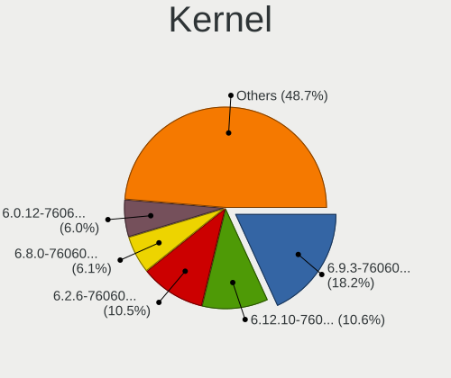

| Version                             | Desktops | Percent |
|-------------------------------------|----------|---------|
| 6.9.3-76060903-generic              | 530      | 18.15%  |
| 6.12.10-76061203-generic            | 310      | 10.62%  |
| 6.2.6-76060206-generic              | 306      | 10.48%  |
| 6.8.0-76060800daily20240311-generic | 178      | 6.1%    |
| 6.0.12-76060006-generic             | 175      | 5.99%   |
| 5.17.5-76051705-generic             | 160      | 5.48%   |
| 5.19.0-76051900-generic             | 144      | 4.93%   |
| 6.16.3-76061603-generic             | 138      | 4.73%   |
| 6.5.6-76060506-generic              | 116      | 3.97%   |
| 6.0.6-76060006-generic              | 102      | 3.49%   |
| 6.6.10-76060610-generic             | 100      | 3.42%   |
| 6.4.6-76060406-generic              | 92       | 3.15%   |
| 6.6.6-76060606-generic              | 90       | 3.08%   |
| 6.17.4-76061704-generic             | 74       | 2.53%   |
| 5.18.10-76051810-generic            | 72       | 2.47%   |
| 5.17.15-76051715-generic            | 66       | 2.26%   |
| 6.5.4-76060504-generic              | 53       | 1.82%   |
| 5.16.19-76051619-generic            | 40       | 1.37%   |
| 6.2.0-76060200-generic              | 36       | 1.23%   |
| 6.1.11-76060111-generic             | 29       | 0.99%   |
| 6.0.2-76060002-generic              | 29       | 0.99%   |
| 5.19.16-76051916-generic            | 18       | 0.62%   |
| 6.0.3-76060003-generic              | 14       | 0.48%   |
| 6.3.7-060307-generic                | 3        | 0.1%    |
| 6.9.8-x64v3-xanmod1                 | 2        | 0.07%   |
| 6.13.12-x64v3-xanmod1               | 2        | 0.07%   |
| 6.11.0-061100-generic               | 2        | 0.07%   |
| 6.1.0-x64v1-xanmod1                 | 2        | 0.07%   |
| 6.9.12-x64v3-xanmod1-1724051801     | 1        | 0.03%   |
| 6.8.9-x64v3-xanmod1                 | 1        | 0.03%   |
| 6.7.1-1-liquorix-amd64              | 1        | 0.03%   |
| 6.7.1-060701-generic                | 1        | 0.03%   |
| 6.5.7-x64v3-xanmod1                 | 1        | 0.03%   |
| 6.5.5-x64v3-xanmod1                 | 1        | 0.03%   |
| 6.5.12-x64v3-xanmod1                | 1        | 0.03%   |
| 6.5.10-x64v3-xanmod1                | 1        | 0.03%   |
| 6.4.8-x64v3-xanmod1                 | 1        | 0.03%   |
| 6.4.8-x64v2-xanmod1                 | 1        | 0.03%   |
| 6.3.4-x64v1-xanmod1                 | 1        | 0.03%   |
| 6.3.4-060304-generic                | 1        | 0.03%   |

Kernel Family
-------------

Linux kernel without a distro release

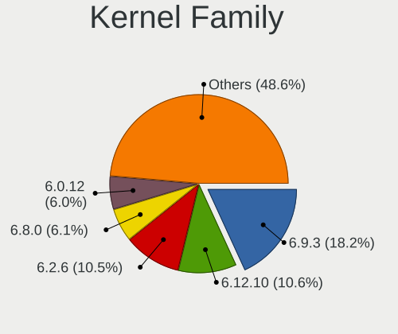

| Version | Desktops | Percent |
|---------|----------|---------|
| 6.9.3   | 530      | 18.15%  |
| 6.12.10 | 310      | 10.62%  |
| 6.2.6   | 306      | 10.48%  |
| 6.8.0   | 178      | 6.1%    |
| 6.0.12  | 176      | 6.03%   |
| 5.17.5  | 160      | 5.48%   |
| 5.19.0  | 144      | 4.93%   |
| 6.16.3  | 138      | 4.73%   |
| 6.5.6   | 116      | 3.97%   |
| 6.0.6   | 103      | 3.53%   |
| 6.6.10  | 100      | 3.42%   |
| 6.4.6   | 92       | 3.15%   |
| 6.6.6   | 90       | 3.08%   |
| 6.17.4  | 74       | 2.53%   |
| 5.18.10 | 72       | 2.47%   |
| 5.17.15 | 66       | 2.26%   |
| 6.5.4   | 53       | 1.82%   |
| 5.16.19 | 40       | 1.37%   |
| 6.2.0   | 37       | 1.27%   |
| 6.0.2   | 30       | 1.03%   |
| 6.1.11  | 29       | 0.99%   |
| 5.19.16 | 18       | 0.62%   |
| 6.0.3   | 14       | 0.48%   |
| 6.3.7   | 3        | 0.1%    |
| 6.1.0   | 3        | 0.1%    |
| 6.9.8   | 2        | 0.07%   |
| 6.7.1   | 2        | 0.07%   |
| 6.4.8   | 2        | 0.07%   |
| 6.3.4   | 2        | 0.07%   |
| 6.13.12 | 2        | 0.07%   |
| 6.11.0  | 2        | 0.07%   |
| 6.9.12  | 1        | 0.03%   |
| 6.8.9   | 1        | 0.03%   |
| 6.5.7   | 1        | 0.03%   |
| 6.5.5   | 1        | 0.03%   |
| 6.5.12  | 1        | 0.03%   |
| 6.5.10  | 1        | 0.03%   |
| 6.3.1   | 1        | 0.03%   |
| 6.2.9   | 1        | 0.03%   |
| 6.2.8   | 1        | 0.03%   |

Kernel Major Ver.
-----------------

Linux kernel major version

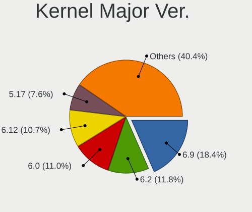

| Version | Desktops | Percent |
|---------|----------|---------|
| 6.9     | 532      | 18.41%  |
| 6.2     | 340      | 11.76%  |
| 6.0     | 318      | 11%     |
| 6.12    | 310      | 10.73%  |
| 5.17    | 221      | 7.65%   |
| 6.6     | 184      | 6.37%   |
| 6.8     | 179      | 6.19%   |
| 6.5     | 171      | 5.92%   |
| 5.19    | 162      | 5.61%   |
| 6.16    | 138      | 4.78%   |
| 6.4     | 94       | 3.25%   |
| 6.17    | 74       | 2.56%   |
| 5.18    | 73       | 2.53%   |
| 5.16    | 41       | 1.42%   |
| 6.1     | 35       | 1.21%   |
| 6.3     | 6        | 0.21%   |
| 6.7     | 2        | 0.07%   |
| 6.15    | 2        | 0.07%   |
| 6.13    | 2        | 0.07%   |
| 6.11    | 2        | 0.07%   |
| 6.14    | 1        | 0.03%   |
| 6.10    | 1        | 0.03%   |
| 5.4     | 1        | 0.03%   |
| 5.15    | 1        | 0.03%   |

Arch
----

OS architecture (x86_64, i586, etc.)

| Name   | Desktops | Percent |
|--------|----------|---------|
| x86_64 | 2583     | 100%    |

DE
--

Desktop Environment

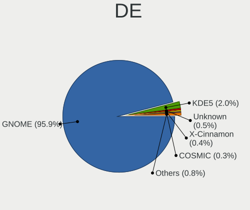

| Name            | Desktops | Percent |
|-----------------|----------|---------|
| GNOME           | 2492     | 95.92%  |
| KDE5            | 52       | 2%      |
| Unknown         | 13       | 0.5%    |
| X-Cinnamon      | 11       | 0.42%   |
| COSMIC          | 9        | 0.35%   |
| XFCE            | 4        | 0.15%   |
| LXQt            | 4        | 0.15%   |
| GNOME Flashback | 3        | 0.12%   |
| Unity           | 2        | 0.08%   |
| MATE            | 2        | 0.08%   |
| i3              | 2        | 0.08%   |
| UKUI            | 1        | 0.04%   |
| KDE             | 1        | 0.04%   |
| GNOME Classic   | 1        | 0.04%   |
| Cinnamon        | 1        | 0.04%   |

Display Server
--------------

X11 or Wayland

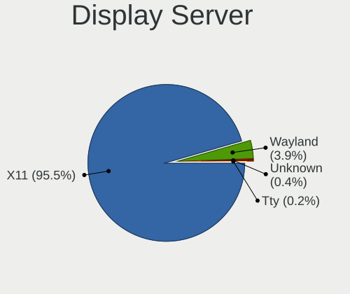

| Name    | Desktops | Percent |
|---------|----------|---------|
| X11     | 2482     | 95.54%  |
| Wayland | 101      | 3.89%   |
| Unknown | 11       | 0.42%   |
| Tty     | 4        | 0.15%   |

Display Manager
---------------

SDDM, LightDM, etc.

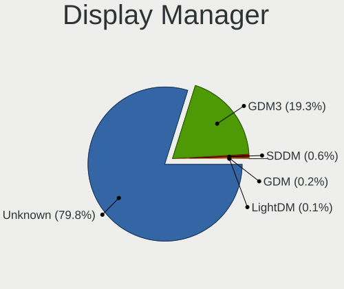

| Name    | Desktops | Percent |
|---------|----------|---------|
| Unknown | 2077     | 79.82%  |
| GDM3    | 501      | 19.25%  |
| SDDM    | 16       | 0.61%   |
| GDM     | 5        | 0.19%   |
| LightDM | 3        | 0.12%   |

OS Lang
-------

Language

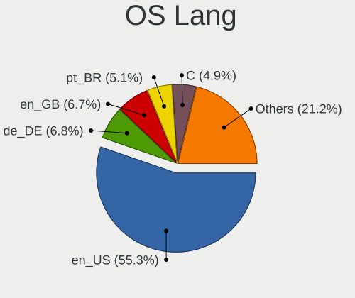

| Lang    | Desktops | Percent |
|---------|----------|---------|
| en_US   | 1444     | 55.3%   |
| de_DE   | 177      | 6.78%   |
| en_GB   | 175      | 6.7%    |
| pt_BR   | 134      | 5.13%   |
| C       | 128      | 4.9%    |
| en_CA   | 76       | 2.91%   |
| en_AU   | 68       | 2.6%    |
| fr_FR   | 54       | 2.07%   |
| it_IT   | 49       | 1.88%   |
| es_ES   | 25       | 0.96%   |
| ru_RU   | 24       | 0.92%   |
| pl_PL   | 23       | 0.88%   |
| sv_SE   | 14       | 0.54%   |
| es_CL   | 12       | 0.46%   |
| Unknown | 12       | 0.46%   |
| pt_PT   | 11       | 0.42%   |
| es_AR   | 11       | 0.42%   |
| ja_JP   | 10       | 0.38%   |
| de_AT   | 10       | 0.38%   |
| fi_FI   | 9        | 0.34%   |
| en_ZA   | 9        | 0.34%   |
| da_DK   | 9        | 0.34%   |
| nl_NL   | 8        | 0.31%   |
| en_DK   | 8        | 0.31%   |
| cs_CZ   | 8        | 0.31%   |
| en_IN   | 7        | 0.27%   |
| nb_NO   | 6        | 0.23%   |
| hu_HU   | 6        | 0.23%   |
| de_CH   | 6        | 0.23%   |
| fr_CA   | 5        | 0.19%   |
| es_VE   | 5        | 0.19%   |
| tr_TR   | 4        | 0.15%   |
| sk_SK   | 4        | 0.15%   |
| ro_RO   | 4        | 0.15%   |
| es_MX   | 4        | 0.15%   |
| en_NZ   | 4        | 0.15%   |
| zh_TW   | 3        | 0.11%   |
| zh_CN   | 3        | 0.11%   |
| nl_BE   | 3        | 0.11%   |
| fr_BE   | 3        | 0.11%   |

Boot Mode
---------

EFI or BIOS

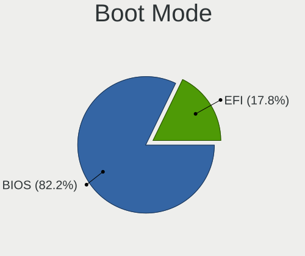

| Mode | Desktops | Percent |
|------|----------|---------|
| BIOS | 2138     | 82.2%   |
| EFI  | 463      | 17.8%   |

Filesystem
----------

Type of filesystem

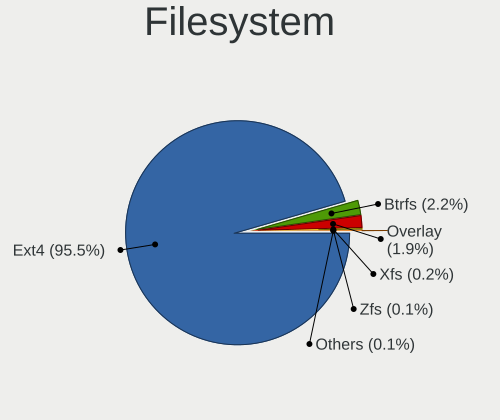

| Type    | Desktops | Percent |
|---------|----------|---------|
| Ext4    | 2475     | 95.52%  |
| Btrfs   | 57       | 2.2%    |
| Overlay | 48       | 1.85%   |
| Xfs     | 6        | 0.23%   |
| Zfs     | 2        | 0.08%   |
| XXX4    | 1        | 0.04%   |
| Tmpfs   | 1        | 0.04%   |
| Unknown | 1        | 0.04%   |

Part. scheme
------------

Scheme of partitioning

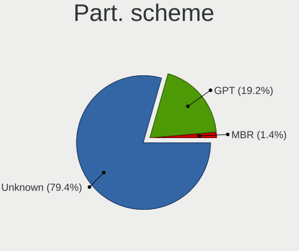

| Type    | Desktops | Percent |
|---------|----------|---------|
| Unknown | 2066     | 79.4%   |
| GPT     | 500      | 19.22%  |
| MBR     | 36       | 1.38%   |

Dual Boot with Linux/BSD
------------------------

Hosting more than one Linux/BSD

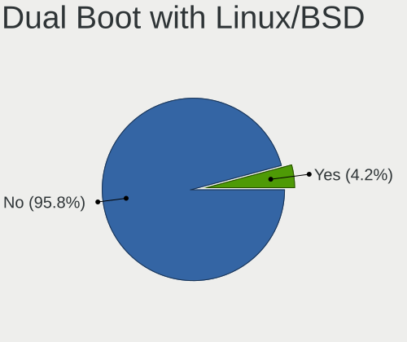

| Dual boot | Desktops | Percent |
|-----------|----------|---------|
| No        | 2483     | 95.83%  |
| Yes       | 108      | 4.17%   |

Dual Boot (Win)
---------------

Hosting Linux and Windows

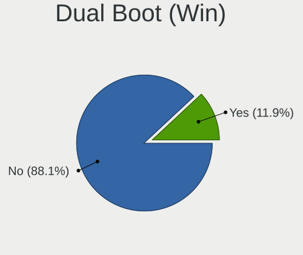

| Dual boot | Desktops | Percent |
|-----------|----------|---------|
| No        | 2288     | 88.07%  |
| Yes       | 310      | 11.93%  |

Board
-----

Vendor
------

Motherboard manufacturer

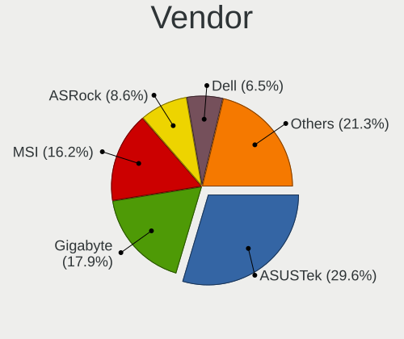

| Name                                 | Desktops | Percent |
|--------------------------------------|----------|---------|
| ASUSTek Computer                     | 764      | 29.58%  |
| Gigabyte Technology                  | 462      | 17.89%  |
| MSI                                  | 418      | 16.18%  |
| ASRock                               | 223      | 8.63%   |
| Dell                                 | 167      | 6.47%   |
| Hewlett-Packard                      | 141      | 5.46%   |
| Lenovo                               | 62       | 2.4%    |
| Intel                                | 57       | 2.21%   |
| System76                             | 28       | 1.08%   |
| Unknown                              | 26       | 1.01%   |
| Acer                                 | 23       | 0.89%   |
| Biostar                              | 17       | 0.66%   |
| Fujitsu                              | 15       | 0.58%   |
| Apple                                | 15       | 0.58%   |
| Alienware                            | 15       | 0.58%   |
| Shenzhen Meigao Electronic Equipment | 11       | 0.43%   |
| BESSTAR Tech                         | 9        | 0.35%   |
| MACHINIST                            | 8        | 0.31%   |
| Foxconn                              | 8        | 0.31%   |
| Pegatron                             | 7        | 0.27%   |
| NZXT                                 | 7        | 0.27%   |
| Huanan                               | 7        | 0.27%   |
| AZW                                  | 7        | 0.27%   |
| Supermicro                           | 6        | 0.23%   |
| Positivo                             | 5        | 0.19%   |
| ECS                                  | 5        | 0.19%   |
| JGINYUE                              | 4        | 0.15%   |
| EVGA                                 | 4        | 0.15%   |
| TianBei                              | 3        | 0.12%   |
| Samsung Electronics                  | 3        | 0.12%   |
| OEM                                  | 3        | 0.12%   |
| Kllisre                              | 3        | 0.12%   |
| HC Technology.                       | 3        | 0.12%   |
| GEEKOM                               | 3        | 0.12%   |
| ASRockRack                           | 3        | 0.12%   |
| Packard Bell                         | 2        | 0.08%   |
| Medion                               | 2        | 0.08%   |
| MAXSUN                               | 2        | 0.08%   |
| Gateway                              | 2        | 0.08%   |
| AMI                                  | 2        | 0.08%   |

Model
-----

Motherboard model

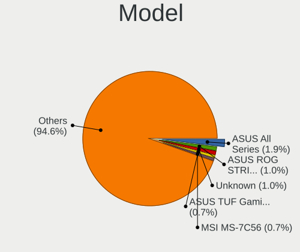

| Name                                 | Desktops | Percent |
|--------------------------------------|----------|---------|
| ASUS All Series                      | 49       | 1.9%    |
| ASUS ROG STRIX B550-F GAMING         | 27       | 1.05%   |
| Unknown                              | 26       | 1.01%   |
| ASUS TUF Gaming X570-PLUS            | 19       | 0.74%   |
| MSI MS-7C56                          | 18       | 0.7%    |
| MSI MS-7C91                          | 16       | 0.62%   |
| MSI MS-7C37                          | 15       | 0.58%   |
| MSI MS-7C95                          | 14       | 0.54%   |
| MSI MS-7C02                          | 13       | 0.5%    |
| ASUS ROG STRIX B450-F GAMING         | 13       | 0.5%    |
| MSI MS-7B86                          | 12       | 0.46%   |
| Dell OptiPlex 7010                   | 12       | 0.46%   |
| ASUS ROG STRIX B550-I GAMING         | 12       | 0.46%   |
| System76 Thelio                      | 11       | 0.43%   |
| Gigabyte X570 AORUS MASTER           | 11       | 0.43%   |
| Gigabyte X570 AORUS ELITE            | 11       | 0.43%   |
| Gigabyte B450 AORUS M                | 11       | 0.43%   |
| System76 Thelio Mira                 | 10       | 0.39%   |
| Gigabyte B550 AORUS ELITE AX V2      | 10       | 0.39%   |
| Dell OptiPlex 9020                   | 10       | 0.39%   |
| ASUS TUF Gaming B550-PLUS            | 10       | 0.39%   |
| MSI MS-7A38                          | 9        | 0.35%   |
| Gigabyte B550M DS3H                  | 9        | 0.35%   |
| Dell OptiPlex 3020                   | 9        | 0.35%   |
| ASUS ROG STRIX B550-F GAMING WIFI II | 9        | 0.35%   |
| ASUS PRIME B550M-A                   | 9        | 0.35%   |
| MSI MS-7E26                          | 8        | 0.31%   |
| Gigabyte A320M-S2H                   | 8        | 0.31%   |
| Dell OptiPlex 790                    | 8        | 0.31%   |
| ASUS PRIME B450M-A                   | 8        | 0.31%   |
| ASUS PRIME A320M-K                   | 8        | 0.31%   |
| MSI MS-7D54                          | 7        | 0.27%   |
| MSI MS-7B89                          | 7        | 0.27%   |
| Intel B75                            | 7        | 0.27%   |
| Gigabyte B450M DS3H                  | 7        | 0.27%   |
| Gigabyte B450 AORUS PRO WIFI         | 7        | 0.27%   |
| ASUS Z170-A                          | 7        | 0.27%   |
| ASUS TUF Gaming B650-PLUS WIFI       | 7        | 0.27%   |
| ASUS TUF Gaming B550M-PLUS           | 7        | 0.27%   |
| ASUS ROG STRIX X570-E GAMING         | 7        | 0.27%   |

Model Family
------------

Motherboard model prefix

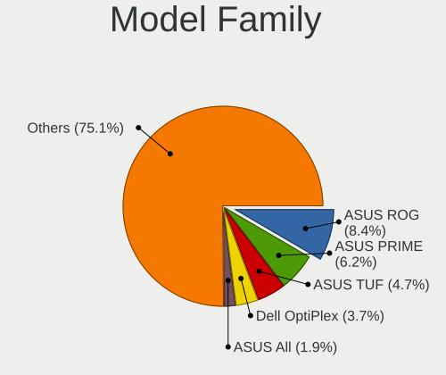

| Name                | Desktops | Percent |
|---------------------|----------|---------|
| ASUS ROG            | 217      | 8.4%    |
| ASUS PRIME          | 160      | 6.19%   |
| ASUS TUF            | 121      | 4.68%   |
| Dell OptiPlex       | 95       | 3.68%   |
| ASUS All            | 49       | 1.9%    |
| Gigabyte X570       | 43       | 1.66%   |
| Lenovo ThinkCentre  | 34       | 1.32%   |
| HP Compaq           | 31       | 1.2%    |
| Gigabyte B550       | 29       | 1.12%   |
| Gigabyte B450       | 28       | 1.08%   |
| Dell Precision      | 28       | 1.08%   |
| System76 Thelio     | 27       | 1.05%   |
| HP EliteDesk        | 27       | 1.05%   |
| Unknown             | 26       | 1.01%   |
| Gigabyte B550M      | 24       | 0.93%   |
| MSI MS-7C56         | 18       | 0.7%    |
| Gigabyte B450M      | 18       | 0.7%    |
| MSI MS-7C91         | 16       | 0.62%   |
| Dell Inspiron       | 16       | 0.62%   |
| MSI MS-7C37         | 15       | 0.58%   |
| ASRock B450M        | 15       | 0.58%   |
| Acer Aspire         | 15       | 0.58%   |
| MSI MS-7C95         | 14       | 0.54%   |
| Dell XPS            | 14       | 0.54%   |
| ASRock X570         | 14       | 0.54%   |
| ASRock B550         | 14       | 0.54%   |
| MSI MS-7C02         | 13       | 0.5%    |
| MSI MS-7B86         | 12       | 0.46%   |
| HP ProDesk          | 12       | 0.46%   |
| Gigabyte B650       | 12       | 0.46%   |
| Fujitsu ESPRIMO     | 12       | 0.46%   |
| ASRock X670E        | 12       | 0.46%   |
| Alienware Aurora    | 12       | 0.46%   |
| Lenovo IdeaCentre   | 11       | 0.43%   |
| ASUS ProArt         | 11       | 0.43%   |
| ASUS M5A78L-M       | 11       | 0.43%   |
| ASRock B450         | 11       | 0.43%   |
| Lenovo ThinkStation | 10       | 0.39%   |
| HP OMEN             | 10       | 0.39%   |
| Gigabyte Z790       | 10       | 0.39%   |

MFG Year
--------

Motherboard manufacture year

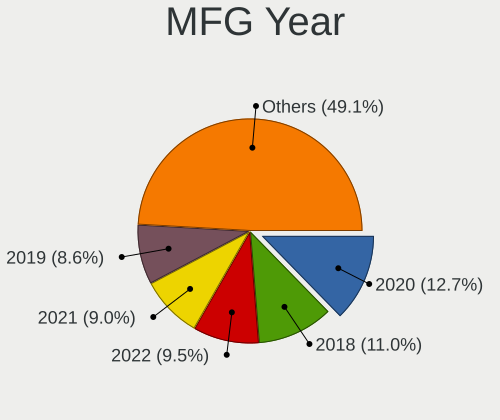

| Year | Desktops | Percent |
|------|----------|---------|
| 2020 | 328      | 12.7%   |
| 2018 | 285      | 11.03%  |
| 2022 | 246      | 9.52%   |
| 2021 | 233      | 9.02%   |
| 2019 | 223      | 8.63%   |
| 2017 | 143      | 5.54%   |
| 2023 | 138      | 5.34%   |
| 2013 | 137      | 5.3%    |
| 2012 | 136      | 5.27%   |
| 2014 | 133      | 5.15%   |
| 2016 | 106      | 4.1%    |
| 2015 | 105      | 4.07%   |
| 2011 | 91       | 3.52%   |
| 2024 | 89       | 3.45%   |
| 2009 | 70       | 2.71%   |
| 2010 | 60       | 2.32%   |
| 2008 | 28       | 1.08%   |
| 2007 | 15       | 0.58%   |
| 2025 | 14       | 0.54%   |
| 2006 | 2        | 0.08%   |
| 2005 | 1        | 0.04%   |

Form Factor
-----------

Physical design of the computer

| Name    | Desktops | Percent |
|---------|----------|---------|
| Desktop | 2583     | 100%    |

Secure Boot
-----------

Enabled or disabled

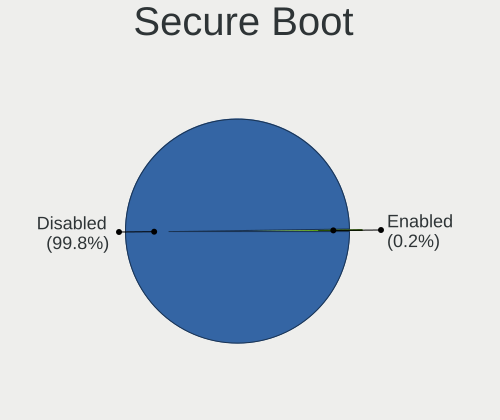

| State    | Desktops | Percent |
|----------|----------|---------|
| Disabled | 2578     | 99.77%  |
| Enabled  | 6        | 0.23%   |

Coreboot
--------

Have coreboot on board

| Used | Desktops | Percent |
|------|----------|---------|
| No   | 2582     | 99.96%  |
| Yes  | 1        | 0.04%   |

RAM Size
--------

Total RAM memory

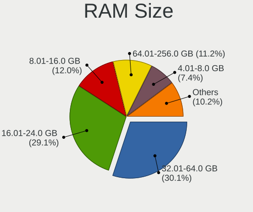

| Size in GB      | Desktops | Percent |
|-----------------|----------|---------|
| 32.01-64.0      | 789      | 30.06%  |
| 16.01-24.0      | 764      | 29.1%   |
| 8.01-16.0       | 315      | 12%     |
| 64.01-256.0     | 294      | 11.2%   |
| 4.01-8.0        | 195      | 7.43%   |
| 24.01-32.0      | 167      | 6.36%   |
| 3.01-4.0        | 88       | 3.35%   |
| More than 256.0 | 7        | 0.27%   |
| 1.01-2.0        | 4        | 0.15%   |
| 2.01-3.0        | 2        | 0.08%   |

RAM Used
--------

Used RAM memory

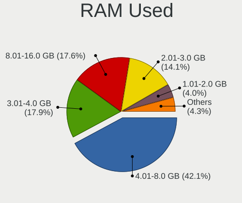

| Used GB     | Desktops | Percent |
|-------------|----------|---------|
| 4.01-8.0    | 1191     | 42.14%  |
| 3.01-4.0    | 505      | 17.87%  |
| 8.01-16.0   | 496      | 17.55%  |
| 2.01-3.0    | 399      | 14.12%  |
| 1.01-2.0    | 114      | 4.03%   |
| 16.01-24.0  | 79       | 2.8%    |
| 24.01-32.0  | 22       | 0.78%   |
| 32.01-64.0  | 18       | 0.64%   |
| 64.01-256.0 | 1        | 0.04%   |
| 0.51-1.0    | 1        | 0.04%   |

Total Drives
------------

Number of drives on board

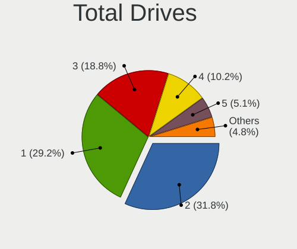

| Drives | Desktops | Percent |
|--------|----------|---------|
| 2      | 850      | 31.85%  |
| 1      | 779      | 29.19%  |
| 3      | 502      | 18.81%  |
| 4      | 272      | 10.19%  |
| 5      | 137      | 5.13%   |
| 6      | 70       | 2.62%   |
| 7      | 27       | 1.01%   |
| 8      | 9        | 0.34%   |
| 9      | 7        | 0.26%   |
| 0      | 5        | 0.19%   |
| 12     | 2        | 0.07%   |
| 11     | 2        | 0.07%   |
| 10     | 2        | 0.07%   |
| 26     | 1        | 0.04%   |
| 22     | 1        | 0.04%   |
| 20     | 1        | 0.04%   |
| 19     | 1        | 0.04%   |
| 14     | 1        | 0.04%   |

Has CD-ROM
----------

Has CD-ROM on board

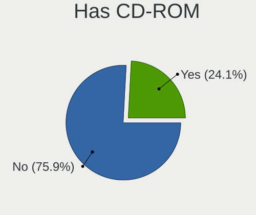

| Presented | Desktops | Percent |
|-----------|----------|---------|
| No        | 1973     | 75.86%  |
| Yes       | 628      | 24.14%  |

Has Ethernet
------------

Has Ethernet on board

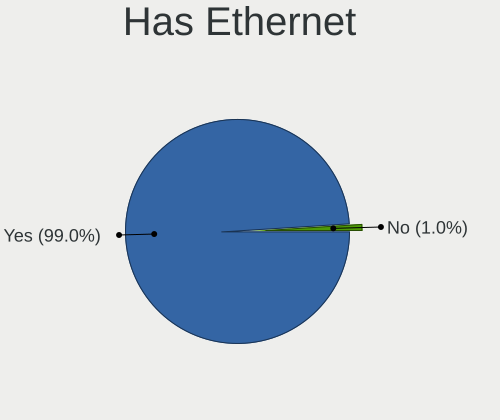

| Presented | Desktops | Percent |
|-----------|----------|---------|
| Yes       | 2557     | 98.99%  |
| No        | 26       | 1.01%   |

Has WiFi
--------

Has WiFi module

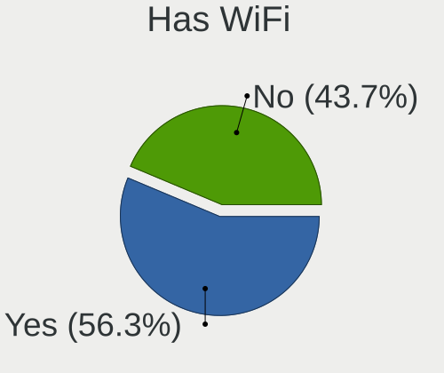

| Presented | Desktops | Percent |
|-----------|----------|---------|
| Yes       | 1465     | 56.32%  |
| No        | 1136     | 43.68%  |

Has Bluetooth
-------------

Has Bluetooth module

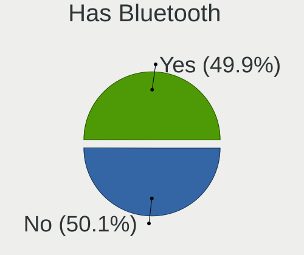

| Presented | Desktops | Percent |
|-----------|----------|---------|
| No        | 1302     | 50.08%  |
| Yes       | 1298     | 49.92%  |

Location
--------

Country
-------

Geographic location (country)

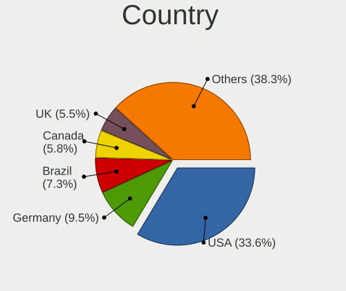

| Country      | Desktops | Percent |
|--------------|----------|---------|
| USA          | 873      | 33.62%  |
| Germany      | 248      | 9.55%   |
| Brazil       | 190      | 7.32%   |
| Canada       | 150      | 5.78%   |
| UK           | 142      | 5.47%   |
| Australia    | 88       | 3.39%   |
| Italy        | 80       | 3.08%   |
| France       | 72       | 2.77%   |
| Netherlands  | 48       | 1.85%   |
| Poland       | 46       | 1.77%   |
| Sweden       | 44       | 1.69%   |
| Russia       | 36       | 1.39%   |
| Spain        | 33       | 1.27%   |
| Finland      | 32       | 1.23%   |
| Austria      | 26       | 1%      |
| Mexico       | 25       | 0.96%   |
| Switzerland  | 24       | 0.92%   |
| Norway       | 24       | 0.92%   |
| Hungary      | 22       | 0.85%   |
| South Africa | 20       | 0.77%   |
| Portugal     | 20       | 0.77%   |
| Denmark      | 20       | 0.77%   |
| Greece       | 19       | 0.73%   |
| Czechia      | 18       | 0.69%   |
| Argentina    | 18       | 0.69%   |
| Belgium      | 17       | 0.65%   |
| India        | 16       | 0.62%   |
| Japan        | 14       | 0.54%   |
| Chile        | 13       | 0.5%    |
| Romania      | 12       | 0.46%   |
| New Zealand  | 12       | 0.46%   |
| Malaysia     | 12       | 0.46%   |
| Indonesia    | 12       | 0.46%   |
| Slovakia     | 9        | 0.35%   |
| Bulgaria     | 9        | 0.35%   |
| Hong Kong    | 8        | 0.31%   |
| Turkey       | 7        | 0.27%   |
| Serbia       | 7        | 0.27%   |
| Philippines  | 7        | 0.27%   |
| Venezuela    | 6        | 0.23%   |

City
----

Geographic location (city)

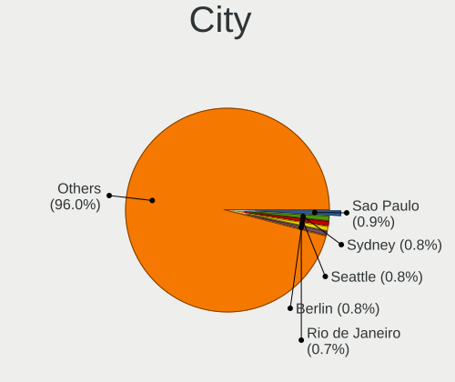

| City              | Desktops | Percent |
|-------------------|----------|---------|
| Sao Paulo         | 24       | 0.88%   |
| Sydney            | 23       | 0.85%   |
| Seattle           | 22       | 0.81%   |
| Berlin            | 21       | 0.77%   |
| Rio de Janeiro    | 20       | 0.74%   |
| Melbourne         | 19       | 0.7%    |
| Helsinki          | 16       | 0.59%   |
| Chicago           | 16       | 0.59%   |
| Vienna            | 15       | 0.55%   |
| Montreal          | 15       | 0.55%   |
| Brisbane          | 15       | 0.55%   |
| Toronto           | 14       | 0.52%   |
| Hamburg           | 13       | 0.48%   |
| New York          | 12       | 0.44%   |
| Rome              | 11       | 0.4%    |
| Denver            | 11       | 0.4%    |
| Cleveland         | 11       | 0.4%    |
| Portland          | 10       | 0.37%   |
| Milan             | 10       | 0.37%   |
| Los Angeles       | 10       | 0.37%   |
| Dallas            | 10       | 0.37%   |
| Cologne           | 10       | 0.37%   |
| Edmonton          | 9        | 0.33%   |
| Amsterdam         | 9        | 0.33%   |
| Munich            | 8        | 0.29%   |
| Moscow            | 8        | 0.29%   |
| Minneapolis       | 8        | 0.29%   |
| Miami             | 8        | 0.29%   |
| Budapest          | 8        | 0.29%   |
| Winnipeg          | 7        | 0.26%   |
| Stockholm         | 7        | 0.26%   |
| Richmond          | 7        | 0.26%   |
| Frankfurt am Main | 7        | 0.26%   |
| Cape Town         | 7        | 0.26%   |
| Calgary           | 7        | 0.26%   |
| Adelaide          | 7        | 0.26%   |
| Watertown         | 6        | 0.22%   |
| St Louis          | 6        | 0.22%   |
| Springfield       | 6        | 0.22%   |
| San Jose          | 6        | 0.22%   |

Drives
------

Drive Vendor
------------

Hard drive vendors

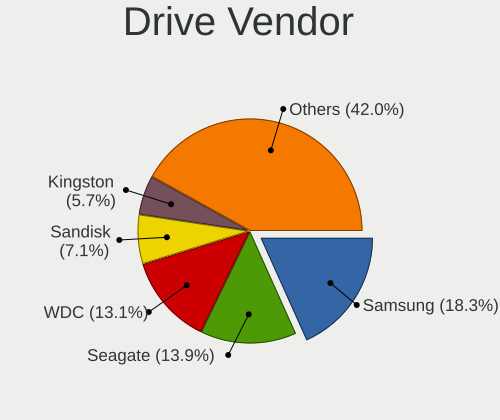

| Vendor                       | Desktops | Drives | Percent |
|------------------------------|----------|--------|---------|
| Samsung Electronics          | 966      | 1684   | 18.29%  |
| Seagate                      | 734      | 1172   | 13.9%   |
| WDC                          | 690      | 1092   | 13.06%  |
| Sandisk                      | 376      | 512    | 7.12%   |
| Kingston                     | 300      | 390    | 5.68%   |
| Crucial                      | 277      | 419    | 5.24%   |
| Toshiba                      | 204      | 261    | 3.86%   |
| Phison Electronics           | 122      | 197    | 2.31%   |
| Micron/Crucial Technology    | 110      | 154    | 2.08%   |
| Hitachi                      | 94       | 139    | 1.78%   |
| A-DATA Technology            | 81       | 92     | 1.53%   |
| Intel                        | 79       | 123    | 1.5%    |
| Kingston Technology Company  | 76       | 99     | 1.44%   |
| China                        | 63       | 94     | 1.19%   |
| Silicon Motion               | 57       | 75     | 1.08%   |
| SK hynix                     | 55       | 76     | 1.04%   |
| PNY                          | 50       | 64     | 0.95%   |
| Unknown                      | 48       | 115    | 0.91%   |
| SPCC                         | 46       | 73     | 0.87%   |
| Micron Technology            | 43       | 46     | 0.81%   |
| HGST                         | 41       | 53     | 0.78%   |
| Phison                       | 36       | 50     | 0.68%   |
| Realtek Semiconductor        | 33       | 37     | 0.62%   |
| Team                         | 30       | 40     | 0.57%   |
| MAXIO Technology (Hangzhou)  | 26       | 32     | 0.49%   |
| ADATA Technology             | 26       | 31     | 0.49%   |
| Patriot                      | 25       | 33     | 0.47%   |
| OCZ                          | 25       | 34     | 0.47%   |
| Intenso                      | 25       | 36     | 0.47%   |
| Netac                        | 21       | 24     | 0.4%    |
| Corsair                      | 21       | 30     | 0.4%    |
| Hewlett-Packard              | 19       | 23     | 0.36%   |
| Unknown                      | 19       | 21     | 0.36%   |
| Lexar                        | 18       | 27     | 0.34%   |
| Apple                        | 17       | 18     | 0.32%   |
| Shenzhen Longsys Electronics | 16       | 22     | 0.3%    |
| JMicron Technology           | 16       | 29     | 0.3%    |
| Fanxiang                     | 16       | 17     | 0.3%    |
| T-FORCE                      | 13       | 17     | 0.25%   |
| KIOXIA                       | 13       | 13     | 0.25%   |

Drive Model
-----------

Hard drive models

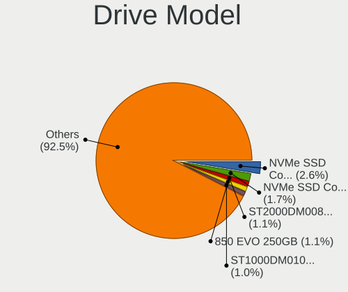

| Model                                                 | Desktops | Percent |
|-------------------------------------------------------|----------|---------|
| Samsung NVMe SSD Controller SM981/PM981/PM983 1TB     | 161      | 2.6%    |
| Samsung NVMe SSD Controller PM9A1/PM9A3/980PRO 1TB    | 105      | 1.7%    |
| Seagate ST2000DM008-2FR102 2TB                        | 70       | 1.13%   |
| Samsung SSD 850 EVO 250GB                             | 66       | 1.07%   |
| Seagate ST1000DM010-2EP102 1TB                        | 62       | 1%      |
| Samsung SSD 860 EVO 1TB                               | 58       | 0.94%   |
| Micron/Crucial P2 NVMe PCIe SSD 2TB                   | 57       | 0.92%   |
| Kingston SA400S37240G 240GB SSD                       | 56       | 0.91%   |
| Samsung SSD 850 EVO 500GB                             | 50       | 0.81%   |
| Samsung SSD 860 EVO 500GB                             | 48       | 0.78%   |
| Kingston SA400S37480G 480GB SSD                       | 47       | 0.76%   |
| Crucial CT1000MX500SSD1 1TB                           | 46       | 0.74%   |
| Samsung SSD 980 1TB                                   | 44       | 0.71%   |
| Phison E12 NVMe Controller 1TB                        | 40       | 0.65%   |
| Kingston SA400S37120G 120GB SSD                       | 39       | 0.63%   |
| Seagate ST4000DM004-2CV104 4TB                        | 38       | 0.61%   |
| WDC WD10EZEX-08WN4A0 1TB                              | 36       | 0.58%   |
| Seagate ST500DM002-1BD142 500GB                       | 36       | 0.58%   |
| Toshiba DT01ACA100 1TB                                | 35       | 0.57%   |
| Silicon Motion SM2263EN/SM2263XT SSD Controller 512GB | 35       | 0.57%   |
| Sandisk WD Blue SN550 NVMe SSD 1024GB                 | 35       | 0.57%   |
| Crucial CT500MX500SSD1 500GB                          | 34       | 0.55%   |
| Samsung SSD 870 QVO 1TB                               | 32       | 0.52%   |
| SanDisk NVMe SSD Drive 1TB                            | 31       | 0.5%    |
| Crucial CT1000BX500SSD1 1TB                           | 31       | 0.5%    |
| Seagate ST1000DM003-1ER162 1TB                        | 30       | 0.49%   |
| Samsung SSD 870 EVO 1TB                               | 30       | 0.49%   |
| Seagate ST1000DM003-1CH162 1TB                        | 27       | 0.44%   |
| Samsung SSD 990 PRO 2TB                               | 26       | 0.42%   |
| Samsung NVMe SSD Drive 1TB                            | 26       | 0.42%   |
| Samsung SSD 870 EVO 500GB                             | 25       | 0.4%    |
| Kingston Company SNV2S1000G 1TB                       | 25       | 0.4%    |
| Seagate ST2000DM001-1ER164 2TB                        | 24       | 0.39%   |
| Seagate Expansion 2TB                                 | 24       | 0.39%   |
| Samsung NVMe SSD Controller SM961/PM961/SM963 1024GB  | 22       | 0.36%   |
| Phison E16 PCIe4 NVMe Controller 1TB                  | 22       | 0.36%   |
| Samsung SSD 970 EVO Plus 1TB                          | 21       | 0.34%   |
| Samsung SSD 870 QVO 2TB                               | 21       | 0.34%   |
| Samsung SSD 980 500GB                                 | 20       | 0.32%   |
| Phison PS5013 E13 NVMe Controller 500GB               | 20       | 0.32%   |

HDD Vendor
----------

Hard disk drive vendors

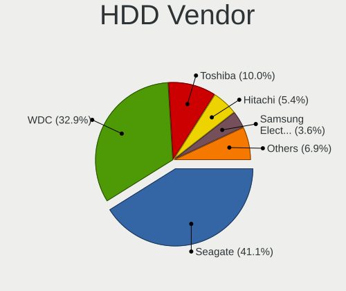

| Vendor              | Desktops | Drives | Percent |
|---------------------|----------|--------|---------|
| Seagate             | 711      | 1111   | 41.12%  |
| WDC                 | 569      | 903    | 32.91%  |
| Toshiba             | 173      | 226    | 10.01%  |
| Hitachi             | 94       | 139    | 5.44%   |
| Samsung Electronics | 62       | 87     | 3.59%   |
| HGST                | 41       | 53     | 2.37%   |
| Unknown             | 16       | 21     | 0.93%   |
| JMicron Technology  | 10       | 19     | 0.58%   |
| Apple               | 10       | 10     | 0.58%   |
| Maxtor              | 6        | 7      | 0.35%   |
| ASMT                | 5        | 5      | 0.29%   |
| TO Exter            | 4        | 4      | 0.23%   |
| WD MediaMax         | 3        | 9      | 0.17%   |
| T-FORCE             | 3        | 5      | 0.17%   |
| Fujitsu             | 3        | 7      | 0.17%   |
| SABRENT             | 2        | 3      | 0.12%   |
| MaxDigital          | 2        | 2      | 0.12%   |
| LaCie               | 2        | 3      | 0.12%   |
| Intenso             | 2        | 3      | 0.12%   |
| Hewlett-Packard     | 2        | 2      | 0.12%   |
| Unknown             | 2        | 2      | 0.12%   |
| USB3.0              | 1        | 1      | 0.06%   |
| RSH-339             | 1        | 1      | 0.06%   |
| Maxone              | 1        | 1      | 0.06%   |
| Inateck             | 1        | 1      | 0.06%   |
| External            | 1        | 1      | 0.06%   |
| Esmart              | 1        | 4      | 0.06%   |
| ASMedia             | 1        | 1      | 0.06%   |

SSD Vendor
----------

Solid state drive vendors

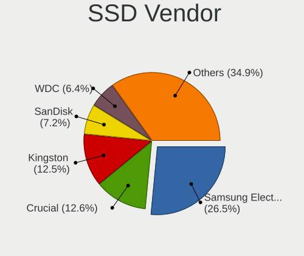

| Vendor              | Desktops | Drives | Percent |
|---------------------|----------|--------|---------|
| Samsung Electronics | 496      | 754    | 26.51%  |
| Crucial             | 236      | 338    | 12.61%  |
| Kingston            | 233      | 299    | 12.45%  |
| SanDisk             | 134      | 169    | 7.16%   |
| WDC                 | 119      | 145    | 6.36%   |
| A-DATA Technology   | 69       | 80     | 3.69%   |
| China               | 62       | 93     | 3.31%   |
| PNY                 | 49       | 62     | 2.62%   |
| Intel               | 35       | 52     | 1.87%   |
| SPCC                | 34       | 43     | 1.82%   |
| Patriot             | 25       | 33     | 1.34%   |
| OCZ                 | 25       | 34     | 1.34%   |
| Team                | 24       | 33     | 1.28%   |
| Intenso             | 20       | 30     | 1.07%   |
| SK hynix            | 17       | 28     | 0.91%   |
| Netac               | 13       | 15     | 0.69%   |
| Lexar               | 13       | 20     | 0.69%   |
| Seagate             | 12       | 15     | 0.64%   |
| Micron Technology   | 12       | 13     | 0.64%   |
| Hewlett-Packard     | 12       | 16     | 0.64%   |
| Corsair             | 12       | 15     | 0.64%   |
| KingSpec            | 10       | 10     | 0.53%   |
| GOODRAM             | 10       | 10     | 0.53%   |
| Fanxiang            | 10       | 10     | 0.53%   |
| Apacer              | 10       | 11     | 0.53%   |
| Transcend           | 9        | 12     | 0.48%   |
| Toshiba             | 9        | 10     | 0.48%   |
| Verbatim            | 8        | 12     | 0.43%   |
| Unknown             | 8        | 9      | 0.43%   |
| SABRENT             | 7        | 8      | 0.37%   |
| LITEON              | 7        | 10     | 0.37%   |
| Mushkin             | 6        | 8      | 0.32%   |
| LITEONIT            | 6        | 6      | 0.32%   |
| Gigabyte Technology | 6        | 7      | 0.32%   |
| Plextor             | 5        | 6      | 0.27%   |
| Apple               | 5        | 6      | 0.27%   |
| T-FORCE             | 4        | 5      | 0.21%   |
| KingDian            | 4        | 10     | 0.21%   |
| Dogfish             | 4        | 7      | 0.21%   |
| ASMT                | 4        | 7      | 0.21%   |

Drive Kind
----------

HDD or SSD

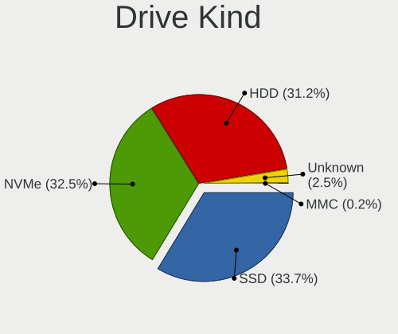

| Kind    | Desktops | Drives | Percent |
|---------|----------|--------|---------|
| SSD     | 1477     | 2558   | 33.68%  |
| NVMe    | 1423     | 2513   | 32.45%  |
| HDD     | 1368     | 2631   | 31.2%   |
| Unknown | 110      | 218    | 2.51%   |
| MMC     | 7        | 8      | 0.16%   |

Drive Connector
---------------

SATA, SAS, NVMe, etc.

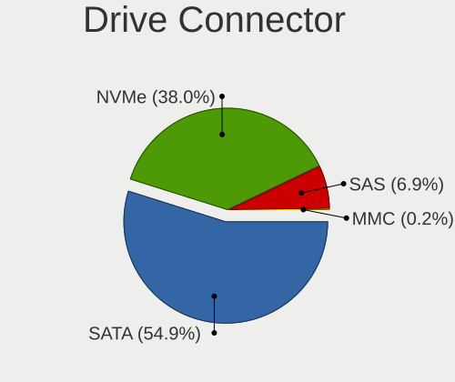

| Type | Desktops | Drives | Percent |
|------|----------|--------|---------|
| SATA | 2046     | 4978   | 54.85%  |
| NVMe | 1419     | 2491   | 38.04%  |
| SAS  | 258      | 451    | 6.92%   |
| MMC  | 7        | 8      | 0.19%   |

Drive Size
----------

Size of hard drive

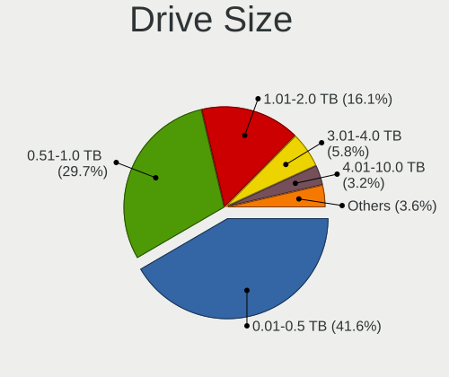

| Size in TB | Desktops | Drives | Percent |
|------------|----------|--------|---------|
| 0.01-0.5   | 1331     | 2248   | 41.61%  |
| 0.51-1.0   | 951      | 1458   | 29.73%  |
| 1.01-2.0   | 514      | 797    | 16.07%  |
| 3.01-4.0   | 185      | 306    | 5.78%   |
| 4.01-10.0  | 103      | 183    | 3.22%   |
| 2.01-3.0   | 81       | 122    | 2.53%   |
| 10.01-20.0 | 31       | 71     | 0.97%   |
| 20.01-50.0 | 3        | 4      | 0.09%   |

Space Total
-----------

Amount of disk space available on the file system

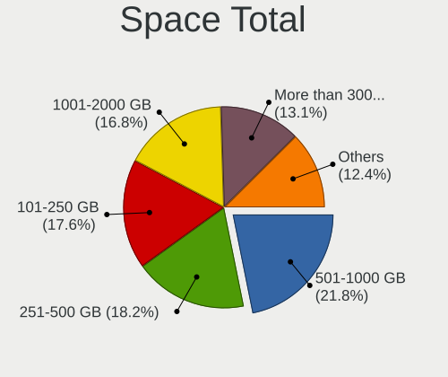

| Size in GB     | Desktops | Percent |
|----------------|----------|---------|
| 501-1000       | 590      | 21.84%  |
| 251-500        | 493      | 18.25%  |
| 101-250        | 476      | 17.62%  |
| 1001-2000      | 454      | 16.8%   |
| More than 3000 | 353      | 13.06%  |
| 2001-3000      | 182      | 6.74%   |
| 51-100         | 58       | 2.15%   |
| 1-20           | 50       | 1.85%   |
| 21-50          | 27       | 1%      |
| Unknown        | 19       | 0.7%    |

Space Used
----------

Amount of used disk space

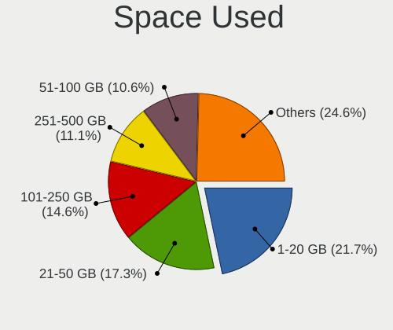

| Used GB        | Desktops | Percent |
|----------------|----------|---------|
| 1-20           | 612      | 21.74%  |
| 21-50          | 487      | 17.3%   |
| 101-250        | 412      | 14.64%  |
| 251-500        | 312      | 11.08%  |
| 51-100         | 299      | 10.62%  |
| 501-1000       | 273      | 9.7%    |
| 1001-2000      | 204      | 7.25%   |
| More than 3000 | 121      | 4.3%    |
| 2001-3000      | 76       | 2.7%    |
| Unknown        | 19       | 0.67%   |

Malfunc. Drives
---------------

Drive models with a malfunction

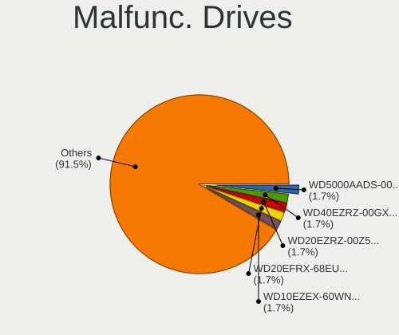

| Model                                 | Desktops | Drives | Percent |
|---------------------------------------|----------|--------|---------|
| WDC WD5000AADS-00S9B0 500GB           | 2        | 2      | 1.69%   |
| WDC WD40EZRZ-00GXCB0 4TB              | 2        | 2      | 1.69%   |
| WDC WD20EZRZ-00Z5HB0 2TB              | 2        | 2      | 1.69%   |
| WDC WD20EFRX-68EUZN0 2TB              | 2        | 2      | 1.69%   |
| WDC WD10EZEX-60WN4A0 1TB              | 2        | 2      | 1.69%   |
| WDC WD10EZEX-08WN4A0 1TB              | 2        | 2      | 1.69%   |
| Seagate ST3250310AS 250GB             | 2        | 5      | 1.69%   |
| Seagate ST2000DM008-2FR102 2TB        | 2        | 4      | 1.69%   |
| Samsung Electronics SSD 850 EVO 250GB | 2        | 2      | 1.69%   |
| Samsung Electronics HD154UI 1TB       | 2        | 2      | 1.69%   |
| Samsung Electronics HD103SI 1TB       | 2        | 2      | 1.69%   |
| Hitachi HDS721010CLA332 1TB           | 2        | 2      | 1.69%   |
| HGST HTS725050A7E630 500GB            | 2        | 2      | 1.69%   |
| Apple HDD WDC WD10EALX-408EA0 1TB     | 2        | 2      | 1.69%   |
| WDC WDS240G2G0B-00EPW0 240GB SSD      | 1        | 1      | 0.85%   |
| WDC WD80EZZX-11CSGA0 8TB              | 1        | 2      | 0.85%   |
| WDC WD60EFRX-68L0BN1 6TB              | 1        | 1      | 0.85%   |
| WDC WD5001AALS-00J7B1 500GB           | 1        | 1      | 0.85%   |
| WDC WD30EZRX-00DC0B0 3TB              | 1        | 1      | 0.85%   |
| WDC WD20PURZ-85AKKY0 2TB              | 1        | 1      | 0.85%   |
| WDC WD20PURX-64P6ZY0 2TB              | 1        | 1      | 0.85%   |
| WDC WD20EFRX-68AX9N0 2TB              | 1        | 17     | 0.85%   |
| WDC WD2003FZEX-00Z4SA0 2TB            | 1        | 1      | 0.85%   |
| WDC WD15EADS-00P8B0 1TB               | 1        | 1      | 0.85%   |
| WDC WD10JPVX-60JC3T0 1TB              | 1        | 1      | 0.85%   |
| WDC WD10EZEX-60ZF5A0 1TB              | 1        | 1      | 0.85%   |
| WDC WD10EZEX-08M2NA0 1TB              | 1        | 1      | 0.85%   |
| WDC WD10EZEX-00BN5A0 1TB              | 1        | 1      | 0.85%   |
| WDC WD10EARS-00MVWB0 1TB              | 1        | 1      | 0.85%   |
| WDC WD1002FAEX-00Z3A0 1TB             | 1        | 1      | 0.85%   |
| WDC WD1002FAEX-00Y9A0 1TB             | 1        | 1      | 0.85%   |
| WDC WD1001FALS-00E8B0 1TB             | 1        | 1      | 0.85%   |
| Unknown Sabrent Disk Dev 1TB          | 1        | 1      | 0.85%   |
| Toshiba MQ01ABD100 1TB                | 1        | 1      | 0.85%   |
| Toshiba MQ01ABD050 500GB              | 1        | 1      | 0.85%   |
| Toshiba MK1655GSX 160GB               | 1        | 1      | 0.85%   |
| Toshiba MG08ACA16TE 16TB              | 1        | 1      | 0.85%   |
| Toshiba HDWE150 5TB                   | 1        | 1      | 0.85%   |
| Toshiba DT01ACA100 1TB                | 1        | 1      | 0.85%   |
| Team T253X1120G 120GB SSD             | 1        | 1      | 0.85%   |

Malfunc. Drive Vendor
---------------------

Vendors of faulty drives

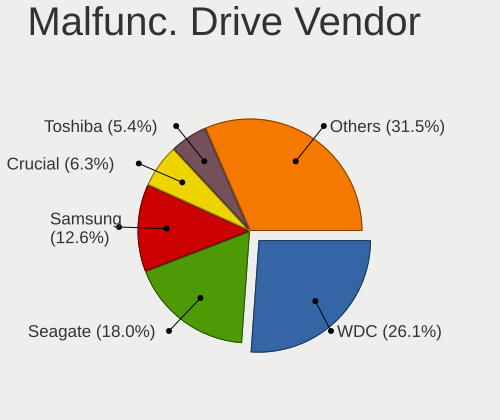

| Vendor              | Desktops | Drives | Percent |
|---------------------|----------|--------|---------|
| WDC                 | 29       | 47     | 26.13%  |
| Seagate             | 20       | 32     | 18.02%  |
| Samsung Electronics | 14       | 19     | 12.61%  |
| Crucial             | 7        | 8      | 6.31%   |
| Toshiba             | 6        | 6      | 5.41%   |
| SanDisk             | 5        | 5      | 4.5%    |
| Hitachi             | 5        | 5      | 4.5%    |
| A-DATA Technology   | 5        | 5      | 4.5%    |
| Kingston            | 4        | 5      | 3.6%    |
| HGST                | 4        | 4      | 3.6%    |
| Apple               | 3        | 3      | 2.7%    |
| Unknown             | 1        | 1      | 0.9%    |
| Team                | 1        | 1      | 0.9%    |
| SABRENT             | 1        | 1      | 0.9%    |
| Plextor             | 1        | 1      | 0.9%    |
| Intel               | 1        | 1      | 0.9%    |
| Hewlett-Packard     | 1        | 1      | 0.9%    |
| Flashwar            | 1        | 1      | 0.9%    |
| China               | 1        | 1      | 0.9%    |
| BAITITON            | 1        | 1      | 0.9%    |

Malfunc. HDD Vendor
-------------------

Vendors of faulty HDD drives

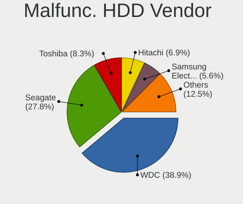

| Vendor              | Desktops | Drives | Percent |
|---------------------|----------|--------|---------|
| WDC                 | 28       | 46     | 38.89%  |
| Seagate             | 20       | 32     | 27.78%  |
| Toshiba             | 6        | 6      | 8.33%   |
| Hitachi             | 5        | 5      | 6.94%   |
| Samsung Electronics | 4        | 7      | 5.56%   |
| HGST                | 4        | 4      | 5.56%   |
| Apple               | 3        | 3      | 4.17%   |
| Unknown             | 1        | 1      | 1.39%   |
| Hewlett-Packard     | 1        | 1      | 1.39%   |

Malfunc. Drive Kind
-------------------

Kinds of faulty drives

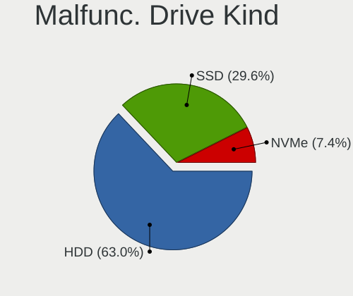

| Kind | Desktops | Drives | Percent |
|------|----------|--------|---------|
| HDD  | 68       | 105    | 62.96%  |
| SSD  | 32       | 35     | 29.63%  |
| NVMe | 8        | 8      | 7.41%   |

Failed Drives
-------------

Failed drive models

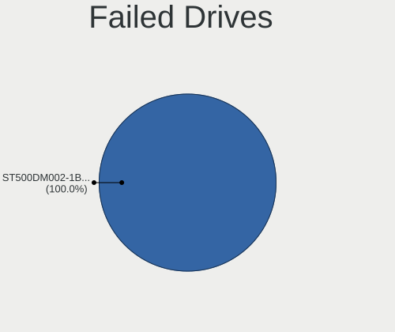

| Model                             | Desktops | Drives | Percent |
|-----------------------------------|----------|--------|---------|
| Seagate ST500DM002-1BD142 500GB   | 1        | 1      | 33.33%  |
| Samsung Electronics SSD 980 500GB | 1        | 1      | 33.33%  |
| Samsung Electronics SSD 980 1TB   | 1        | 1      | 33.33%  |

Failed Drive Vendor
-------------------

Failed drive vendors

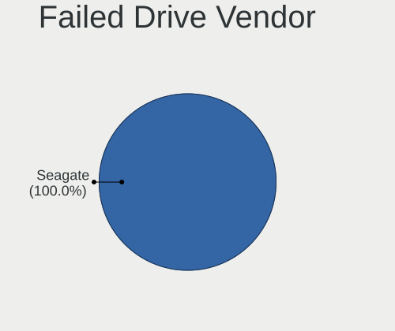

| Vendor              | Desktops | Drives | Percent |
|---------------------|----------|--------|---------|
| Samsung Electronics | 2        | 2      | 66.67%  |
| Seagate             | 1        | 1      | 33.33%  |

Drive Status
------------

Number of failed and malfunc. drives

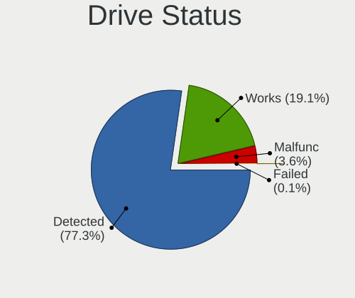

| Status   | Desktops | Drives | Percent |
|----------|----------|--------|---------|
| Detected | 2161     | 6456   | 77.26%  |
| Works    | 533      | 1321   | 19.06%  |
| Malfunc  | 100      | 148    | 3.58%   |
| Failed   | 3        | 3      | 0.11%   |

Storage controller
------------------

Storage Vendor
--------------

Storage controller vendors

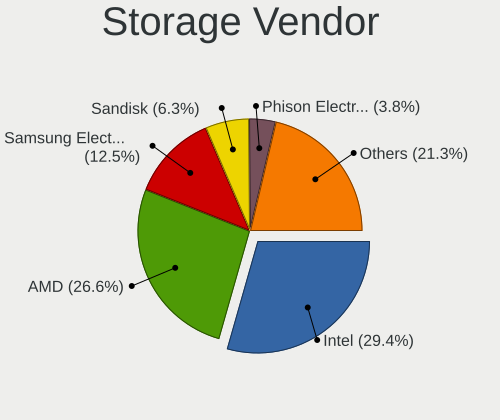

| Vendor                         | Desktops | Percent |
|--------------------------------|----------|---------|
| Intel                          | 1339     | 29.42%  |
| AMD                            | 1211     | 26.6%   |
| Samsung Electronics            | 570      | 12.52%  |
| Sandisk                        | 288      | 6.33%   |
| Phison Electronics             | 174      | 3.82%   |
| Micron/Crucial Technology      | 153      | 3.36%   |
| ASMedia Technology             | 153      | 3.36%   |
| Kingston Technology Company    | 143      | 3.14%   |
| Silicon Motion                 | 66       | 1.45%   |
| Marvell Technology Group       | 54       | 1.19%   |
| Realtek Semiconductor          | 43       | 0.94%   |
| JMicron Technology             | 40       | 0.88%   |
| ADATA Technology               | 40       | 0.88%   |
| SK hynix                       | 38       | 0.83%   |
| Micron Technology              | 34       | 0.75%   |
| MAXIO Technology (Hangzhou)    | 34       | 0.75%   |
| Toshiba America Info Systems   | 26       | 0.57%   |
| Nvidia                         | 21       | 0.46%   |
| Shenzhen Longsys Electronics   | 19       | 0.42%   |
| Seagate Technology             | 18       | 0.4%    |
| INNOGRIT                       | 16       | 0.35%   |
| KIOXIA                         | 13       | 0.29%   |
| Broadcom / LSI                 | 11       | 0.24%   |
| Solidigm                       | 9        | 0.2%    |
| Netac Technology               | 7        | 0.15%   |
| LSI Logic / Symbios Logic      | 6        | 0.13%   |
| Solid State Storage Technology | 4        | 0.09%   |
| Biwin Storage Technology       | 4        | 0.09%   |
| VIA Technologies               | 3        | 0.07%   |
| Silicon Image                  | 3        | 0.07%   |
| Lite-On Technology             | 3        | 0.07%   |
| Apple                          | 3        | 0.07%   |
| Union Memory (Shenzhen)        | 2        | 0.04%   |
| Yangtze Memory Technologies    | 1        | 0.02%   |
| Synopsys                       | 1        | 0.02%   |
| Hosin Global Electronics       | 1        | 0.02%   |
| Adaptec                        | 1        | 0.02%   |

Storage Model
-------------

Storage controller models

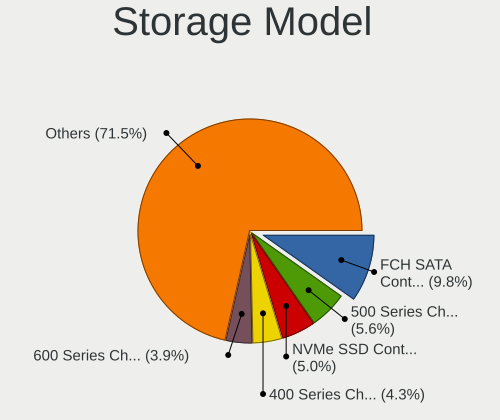

| Model                                                                                   | Desktops | Percent |
|-----------------------------------------------------------------------------------------|----------|---------|
| AMD FCH SATA Controller [AHCI mode]                                                     | 519      | 9.81%   |
| AMD 500 Series Chipset SATA Controller                                                  | 294      | 5.55%   |
| Samsung NVMe SSD Controller SM981/PM981/PM983                                           | 264      | 4.99%   |
| AMD 400 Series Chipset SATA Controller                                                  | 228      | 4.31%   |
| AMD 600 Series Chipset SATA Controller                                                  | 205      | 3.87%   |
| Samsung NVMe SSD Controller PM9A1/PM9A3/980PRO                                          | 156      | 2.95%   |
| ASMedia ASM1061/ASM1062 Serial ATA Controller                                           | 139      | 2.63%   |
| Intel 8 Series/C220 Series Chipset Family 6-port SATA Controller 1 [AHCI mode]          | 136      | 2.57%   |
| Intel 200 Series PCH SATA controller [AHCI mode]                                        | 121      | 2.29%   |
| Intel Q170/Q150/B150/H170/H110/Z170/CM236 Chipset SATA Controller [AHCI Mode]           | 118      | 2.23%   |
| Intel SATA Controller [RAID mode]                                                       | 104      | 1.96%   |
| Intel Alder Lake-S PCH SATA Controller [AHCI Mode]                                      | 94       | 1.78%   |
| Micron/Crucial P2 [Nick P2] / P3 / P3 Plus NVMe PCIe SSD (DRAM-less)                    | 83       | 1.57%   |
| Samsung NVMe SSD Controller 980 (DRAM-less)                                             | 81       | 1.53%   |
| Intel 7 Series/C210 Series Chipset Family 6-port SATA Controller [AHCI mode]            | 80       | 1.51%   |
| Intel Cannon Lake PCH SATA AHCI Controller                                              | 78       | 1.47%   |
| Intel Raptor Lake SATA AHCI Controller                                                  | 77       | 1.45%   |
| Intel 6 Series/C200 Series Chipset Family 6 port Desktop SATA AHCI Controller           | 73       | 1.38%   |
| AMD SB7x0/SB8x0/SB9x0 IDE Controller                                                    | 62       | 1.17%   |
| Phison E12 NVMe Controller                                                              | 60       | 1.13%   |
| AMD SB7x0/SB8x0/SB9x0 SATA Controller [AHCI mode]                                       | 60       | 1.13%   |
| Intel 9 Series Chipset Family SATA Controller [AHCI Mode]                               | 55       | 1.04%   |
| Intel 500 Series Chipset Family SATA AHCI Controller                                    | 55       | 1.04%   |
| Samsung NVMe SSD Controller S4LV008[Pascal]                                             | 53       | 1%      |
| Silicon Motion SM2263EN/SM2263XT (DRAM-less) NVMe SSD Controllers                       | 52       | 0.98%   |
| SanDisk Ultra 3D / WD PC SN530, IX SN530, Blue SN550 NVMe SSD (DRAM-less)               | 51       | 0.96%   |
| AMD 300 Series Chipset SATA Controller                                                  | 49       | 0.93%   |
| SanDisk WD SN560/SN740/SN770/SN5000 NVMe SSD                                            | 45       | 0.85%   |
| Sandisk WD Black SN850X NVMe SSD                                                        | 40       | 0.76%   |
| AMD SB7x0/SB8x0/SB9x0 SATA Controller [IDE mode]                                        | 40       | 0.76%   |
| AMD A320 Chipset SATA Controller [AHCI mode]                                            | 40       | 0.76%   |
| Phison E16 PCIe4 NVMe Controller                                                        | 38       | 0.72%   |
| Kingston Company KC3000/FURY Renegade NVMe SSD [E18]                                    | 38       | 0.72%   |
| Samsung NVMe SSD Controller SM961/PM961/SM963                                           | 35       | 0.66%   |
| Intel 6 Series/C200 Series Chipset Family Desktop SATA Controller (IDE mode, ports 4-5) | 35       | 0.66%   |
| Intel Comet Lake SATA AHCI Controller                                                   | 34       | 0.64%   |
| Intel 6 Series/C200 Series Chipset Family Desktop SATA Controller (IDE mode, ports 0-3) | 34       | 0.64%   |
| Kingston Company NV2 NVMe SSD [SM2267XT] (DRAM-less)                                    | 33       | 0.62%   |
| SanDisk Extreme Pro / WD Black SN750 / PC SN730 / Red SN700 NVMe SSD                    | 31       | 0.59%   |
| Intel Volume Management Device NVMe RAID Controller                                     | 31       | 0.59%   |

Storage Kind
------------

Kind of storage controller (IDE, SATA, NVMe, SAS, ...)

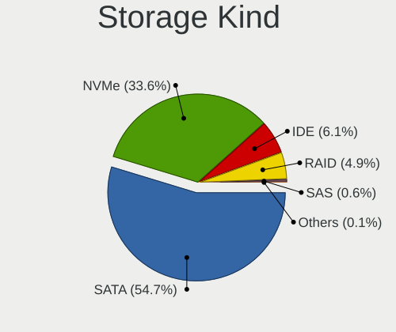

| Kind | Desktops | Percent |
|------|----------|---------|
| SATA | 2301     | 54.71%  |
| NVMe | 1415     | 33.64%  |
| IDE  | 256      | 6.09%   |
| RAID | 207      | 4.92%   |
| SAS  | 24       | 0.57%   |
| SCSI | 3        | 0.07%   |

Processor
---------

CPU Vendor
----------

Processor vendors

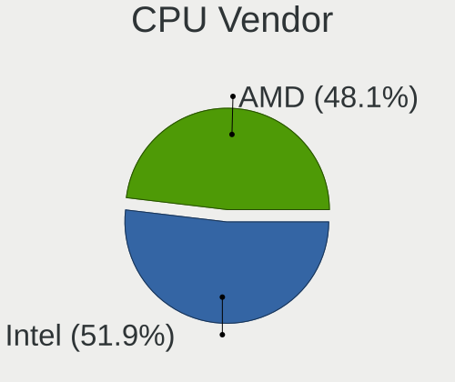

| Vendor | Desktops | Percent |
|--------|----------|---------|
| Intel  | 1340     | 51.88%  |
| AMD    | 1243     | 48.12%  |

CPU Model
---------

Processor models

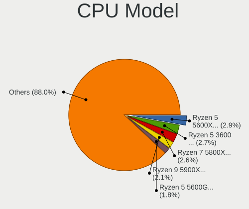

| Model                                       | Desktops | Percent |
|---------------------------------------------|----------|---------|
| AMD Ryzen 5 5600X 6-Core Processor          | 74       | 2.86%   |
| AMD Ryzen 5 3600 6-Core Processor           | 69       | 2.66%   |
| AMD Ryzen 7 5800X 8-Core Processor          | 67       | 2.59%   |
| AMD Ryzen 9 5900X 12-Core Processor         | 54       | 2.08%   |
| AMD Ryzen 5 5600G with Radeon Graphics      | 46       | 1.78%   |
| AMD Ryzen 7 3700X 8-Core Processor          | 45       | 1.74%   |
| AMD Ryzen 7 5700G with Radeon Graphics      | 43       | 1.66%   |
| AMD Ryzen 9 5950X 16-Core Processor         | 41       | 1.58%   |
| Intel Core i7-6700K CPU @ 4.00GHz           | 36       | 1.39%   |
| AMD Ryzen 7 2700X Eight-Core Processor      | 30       | 1.16%   |
| Intel Core i7-3770 CPU @ 3.40GHz            | 27       | 1.04%   |
| AMD Ryzen 5 2600 Six-Core Processor         | 26       | 1%      |
| AMD Ryzen 7 7800X3D 8-Core Processor        | 25       | 0.96%   |
| Intel Core i7-4790 CPU @ 3.60GHz            | 24       | 0.93%   |
| AMD Ryzen 7 5700X 8-Core Processor          | 24       | 0.93%   |
| AMD Ryzen 5 7600X 6-Core Processor          | 24       | 0.93%   |
| AMD Ryzen 5 1600 Six-Core Processor         | 24       | 0.93%   |
| Intel Core i5-6500 CPU @ 3.20GHz            | 23       | 0.89%   |
| AMD Ryzen 5 5600 6-Core Processor           | 23       | 0.89%   |
| Intel Core i7-8700K CPU @ 3.70GHz           | 22       | 0.85%   |
| AMD FX-8350 Eight-Core Processor            | 22       | 0.85%   |
| Intel Core i7-9700K CPU @ 3.60GHz           | 21       | 0.81%   |
| Intel Core i7-7700K CPU @ 4.20GHz           | 21       | 0.81%   |
| Intel Core i7-4790K CPU @ 4.00GHz           | 21       | 0.81%   |
| Intel Core i7-2600 CPU @ 3.40GHz            | 21       | 0.81%   |
| AMD Ryzen 9 7950X 16-Core Processor         | 21       | 0.81%   |
| AMD Ryzen 9 3900X 12-Core Processor         | 20       | 0.77%   |
| Intel Core i5-4590 CPU @ 3.30GHz            | 19       | 0.73%   |
| AMD Ryzen 7 7700X 8-Core Processor          | 19       | 0.73%   |
| AMD Ryzen 7 5800X3D 8-Core Processor        | 19       | 0.73%   |
| AMD Ryzen 5 3600X 6-Core Processor          | 19       | 0.73%   |
| Intel Core i5-6600K CPU @ 3.50GHz           | 18       | 0.69%   |
| Intel Core i5-2400 CPU @ 3.10GHz            | 18       | 0.69%   |
| Intel 12th Gen Core i9-12900K               | 18       | 0.69%   |
| AMD Ryzen 9 7900X 12-Core Processor         | 18       | 0.69%   |
| AMD Ryzen 7 9800X3D 8-Core Processor        | 18       | 0.69%   |
| AMD FX-6300 Six-Core Processor              | 17       | 0.66%   |
| Intel Core i7-6700 CPU @ 3.40GHz            | 16       | 0.62%   |
| Intel 12th Gen Core i7-12700K               | 16       | 0.62%   |
| AMD Ryzen 5 3400G with Radeon Vega Graphics | 16       | 0.62%   |

CPU Model Family
----------------

Processor model prefix

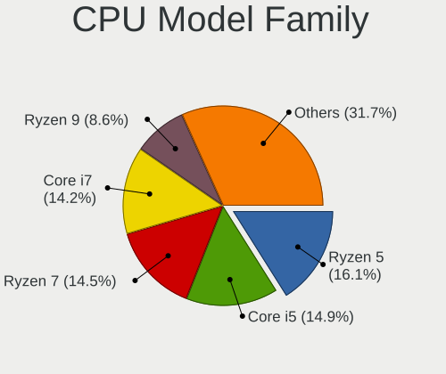

| Model                   | Desktops | Percent |
|-------------------------|----------|---------|
| AMD Ryzen 5             | 416      | 16.06%  |
| Intel Core i5           | 386      | 14.9%   |
| AMD Ryzen 7             | 375      | 14.48%  |
| Intel Core i7           | 367      | 14.17%  |
| AMD Ryzen 9             | 224      | 8.65%   |
| Other                   | 188      | 7.26%   |
| Intel Xeon              | 139      | 5.37%   |
| Intel Core i3           | 95       | 3.67%   |
| AMD FX                  | 68       | 2.63%   |
| Intel Core i9           | 51       | 1.97%   |
| AMD Ryzen 3             | 34       | 1.31%   |
| Intel Pentium           | 25       | 0.97%   |
| AMD Ryzen Threadripper  | 22       | 0.85%   |
| Intel Celeron           | 20       | 0.77%   |
| Intel Core 2 Duo        | 18       | 0.69%   |
| Intel Core 2 Quad       | 15       | 0.58%   |
| AMD Phenom II X4        | 12       | 0.46%   |
| AMD Athlon II X2        | 11       | 0.42%   |
| AMD A10                 | 11       | 0.42%   |
| AMD Athlon II X4        | 10       | 0.39%   |
| AMD A8                  | 9        | 0.35%   |
| Intel Pentium Gold      | 8        | 0.31%   |
| Intel Pentium Dual-Core | 8        | 0.31%   |
| AMD Athlon              | 8        | 0.31%   |
| AMD Ryzen 5 PRO         | 7        | 0.27%   |
| AMD Phenom II X6        | 6        | 0.23%   |
| AMD A4                  | 6        | 0.23%   |
| Intel Core 2            | 4        | 0.15%   |
| AMD Phenom              | 4        | 0.15%   |
| AMD Athlon X4           | 4        | 0.15%   |
| Intel Pentium D         | 3        | 0.12%   |
| Intel Genuine           | 3        | 0.12%   |
| Intel Core              | 3        | 0.12%   |
| Intel Atom              | 3        | 0.12%   |
| AMD Ryzen 7 PRO         | 3        | 0.12%   |
| AMD Athlon 64 X2        | 3        | 0.12%   |
| AMD A6                  | 3        | 0.12%   |
| Intel Pentium Silver    | 2        | 0.08%   |
| Intel Pentium Dual      | 2        | 0.08%   |
| AMD Ryzen Embedded      | 2        | 0.08%   |

CPU Cores
---------

Number of processor cores

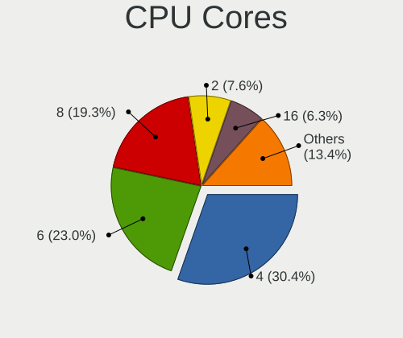

| Number | Desktops | Percent |
|--------|----------|---------|
| 4      | 788      | 30.37%  |
| 6      | 596      | 22.97%  |
| 8      | 502      | 19.34%  |
| 2      | 198      | 7.63%   |
| 16     | 164      | 6.32%   |
| 12     | 158      | 6.09%   |
| 10     | 52       | 2%      |
| 24     | 37       | 1.43%   |
| 14     | 27       | 1.04%   |
| 3      | 26       | 1%      |
| 1      | 17       | 0.66%   |
| 20     | 13       | 0.5%    |
| 32     | 4        | 0.15%   |
| 18     | 3        | 0.12%   |
| 64     | 2        | 0.08%   |
| 36     | 2        | 0.08%   |
| 28     | 2        | 0.08%   |
| 52     | 1        | 0.04%   |
| 22     | 1        | 0.04%   |
| 9      | 1        | 0.04%   |
| 5      | 1        | 0.04%   |

CPU Sockets
-----------

Number of sockets

| Number | Desktops | Percent |
|--------|----------|---------|
| 1      | 2555     | 98.92%  |
| 2      | 28       | 1.08%   |

CPU Threads
-----------

Threads per core (Hyper-Threading)

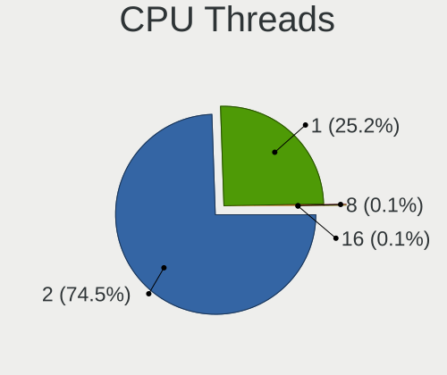

| Number | Desktops | Percent |
|--------|----------|---------|
| 2      | 1927     | 74.46%  |
| 1      | 653      | 25.23%  |
| 12     | 3        | 0.12%   |
| 8      | 3        | 0.12%   |
| 16     | 2        | 0.08%   |

CPU Op-Modes
------------

CPU Operation Modes (32-bit, 64-bit)

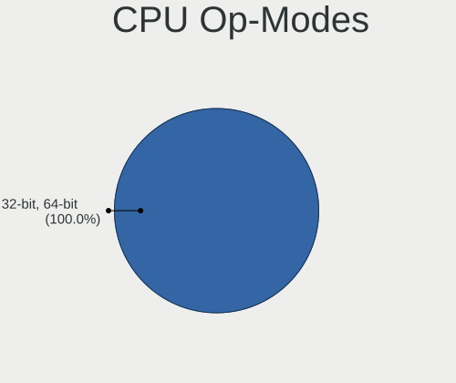

| Op mode        | Desktops | Percent |
|----------------|----------|---------|
| 32-bit, 64-bit | 2583     | 100%    |

CPU Microcode
-------------

Microcode number

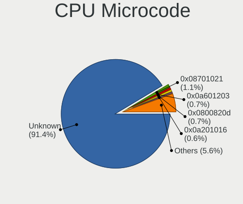

| Number     | Desktops | Percent |
|------------|----------|---------|
| Unknown    | 2378     | 91.39%  |
| 0x08701021 | 28       | 1.08%   |
| 0x0a601203 | 18       | 0.69%   |
| 0x0800820d | 17       | 0.65%   |
| 0x0a201016 | 16       | 0.61%   |
| 0x0a20120a | 13       | 0.5%    |
| 0x0a50000d | 9        | 0.35%   |
| 0x506e3    | 7        | 0.27%   |
| 0x306c3    | 7        | 0.27%   |
| 0x90672    | 6        | 0.23%   |
| 0x306a9    | 6        | 0.23%   |
| 0x08701013 | 6        | 0.23%   |
| 0x08108109 | 6        | 0.23%   |
| 0x906ec    | 5        | 0.19%   |
| 0x206a7    | 5        | 0.19%   |
| 0x0a201205 | 5        | 0.19%   |
| 0x08001137 | 5        | 0.19%   |
| 0x906e9    | 4        | 0.15%   |
| 0x0a50000c | 4        | 0.15%   |
| 0x0a201009 | 4        | 0.15%   |
| 0x08001138 | 4        | 0.15%   |
| 0xa0655    | 3        | 0.12%   |
| 0x906ea    | 3        | 0.12%   |
| 0x0a20102b | 3        | 0.12%   |
| 0x08101016 | 3        | 0.12%   |
| 0x06003106 | 3        | 0.12%   |
| 0x06000852 | 3        | 0.12%   |
| 0xa0671    | 2        | 0.08%   |
| 0xa0653    | 2        | 0.08%   |
| 0x50657    | 2        | 0.08%   |
| 0x0a601206 | 2        | 0.08%   |
| 0x0a601201 | 2        | 0.08%   |
| 0x0a201204 | 2        | 0.08%   |
| 0x0a201025 | 2        | 0.08%   |
| 0xb0671    | 1        | 0.04%   |
| 0x906ed    | 1        | 0.04%   |
| 0x906c0    | 1        | 0.04%   |
| 0x806d1    | 1        | 0.04%   |
| 0x406f1    | 1        | 0.04%   |
| 0x306e4    | 1        | 0.04%   |

CPU Microarch
-------------

Microarchitecture

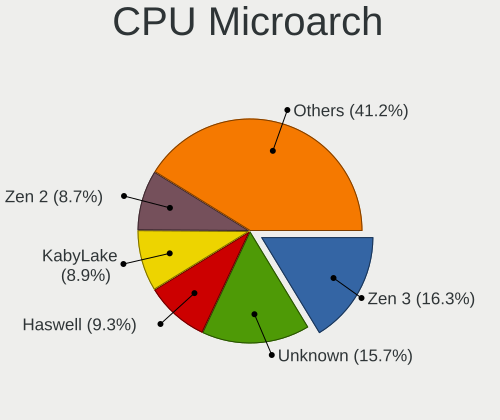

| Name             | Desktops | Percent |
|------------------|----------|---------|
| Zen 3            | 423      | 16.32%  |
| Unknown          | 406      | 15.66%  |
| Haswell          | 240      | 9.26%   |
| KabyLake         | 230      | 8.87%   |
| Zen 2            | 226      | 8.72%   |
| Skylake          | 144      | 5.56%   |
| IvyBridge        | 144      | 5.56%   |
| Zen+             | 133      | 5.13%   |
| SandyBridge      | 107      | 4.13%   |
| CometLake        | 84       | 3.24%   |
| Zen              | 79       | 3.05%   |
| Piledriver       | 74       | 2.85%   |
| K10              | 47       | 1.81%   |
| Nehalem          | 46       | 1.77%   |
| Alderlake Hybrid | 42       | 1.62%   |
| Penryn           | 39       | 1.5%    |
| Broadwell        | 25       | 0.96%   |
| Westmere         | 22       | 0.85%   |
| Steamroller      | 15       | 0.58%   |
| Core             | 14       | 0.54%   |
| Silvermont       | 7        | 0.27%   |
| Bulldozer        | 6        | 0.23%   |
| Goldmont plus    | 5        | 0.19%   |
| Excavator        | 5        | 0.19%   |
| NetBurst         | 4        | 0.15%   |
| K8 Hammer        | 4        | 0.15%   |
| Goldmont         | 4        | 0.15%   |
| Jaguar           | 3        | 0.12%   |
| Icelake          | 3        | 0.12%   |
| Gracemont        | 3        | 0.12%   |
| Lunarlake Hybrid | 2        | 0.08%   |
| K10 Llano        | 2        | 0.08%   |
| Tremont          | 1        | 0.04%   |
| Puma             | 1        | 0.04%   |
| Bonnell          | 1        | 0.04%   |
| Bobcat           | 1        | 0.04%   |

Graphics
--------

GPU Vendor
----------

Vendors of graphics cards

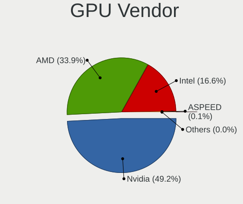

| Vendor                     | Desktops | Percent |
|----------------------------|----------|---------|
| Nvidia                     | 1441     | 49.21%  |
| AMD                        | 992      | 33.88%  |
| Intel                      | 487      | 16.63%  |
| ASPEED Technology          | 4        | 0.14%   |
| Matrox Electronics Systems | 3        | 0.1%    |
| 3Dfx Interactive           | 1        | 0.03%   |

GPU Model
---------

Graphics card models

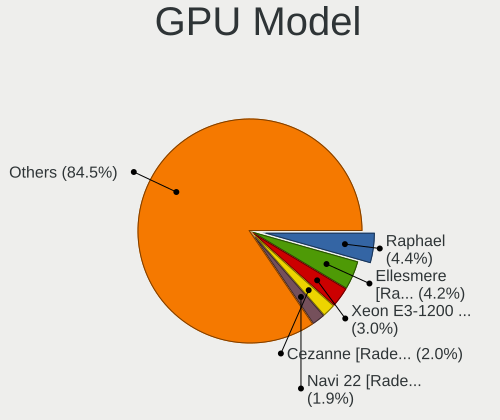

| Model                                                                       | Desktops | Percent |
|-----------------------------------------------------------------------------|----------|---------|
| AMD Raphael                                                                 | 135      | 4.38%   |
| AMD Ellesmere [Radeon RX 470/480/570/570X/580/580X/590]                     | 130      | 4.22%   |
| Intel Xeon E3-1200 v3/4th Gen Core Processor Integrated Graphics Controller | 92       | 2.98%   |
| AMD Cezanne [Radeon Vega Series / Radeon Vega Mobile Series]                | 61       | 1.98%   |
| AMD Navi 22 [Radeon RX 6700/6700 XT/6750 XT / 6800M/6850M XT]               | 60       | 1.95%   |
| Nvidia GP107 [GeForce GTX 1050 Ti]                                          | 59       | 1.91%   |
| AMD Navi 23 [Radeon RX 6600/6600 XT/6600M]                                  | 56       | 1.82%   |
| Nvidia GA106 [GeForce RTX 3060 Lite Hash Rate]                              | 55       | 1.78%   |
| AMD Navi 21 [Radeon RX 6800/6800 XT / 6900 XT]                              | 54       | 1.75%   |
| Intel CoffeeLake-S GT2 [UHD Graphics 630]                                   | 53       | 1.72%   |
| AMD Navi 10 [Radeon RX 5600 OEM/5600 XT / 5700/5700 XT]                     | 51       | 1.65%   |
| AMD Navi 31 [Radeon RX 7900 XT/7900 XTX/7900 GRE/7900M]                     | 49       | 1.59%   |
| Nvidia GP106 [GeForce GTX 1060 6GB]                                         | 48       | 1.56%   |
| AMD Granite Ridge [Radeon Graphics]                                         | 47       | 1.52%   |
| Intel Skylake-S GT2 [HD Graphics 530]                                       | 45       | 1.46%   |
| Nvidia GP104 [GeForce GTX 1080]                                             | 43       | 1.39%   |
| Nvidia TU116 [GeForce GTX 1660 SUPER]                                       | 40       | 1.3%    |
| Nvidia GP104 [GeForce GTX 1070]                                             | 40       | 1.3%    |
| Intel Xeon E3-1200 v2/3rd Gen Core processor Graphics Controller            | 39       | 1.26%   |
| Nvidia TU104 [GeForce RTX 2070 SUPER]                                       | 37       | 1.2%    |
| Intel 2nd Generation Core Processor Family Integrated Graphics Controller   | 36       | 1.17%   |
| Nvidia GP108 [GeForce GT 1030]                                              | 32       | 1.04%   |
| Nvidia TU106 [GeForce RTX 2060 Rev. A]                                      | 31       | 1.01%   |
| Nvidia GA104 [GeForce RTX 3070 Ti]                                          | 30       | 0.97%   |
| Nvidia GA102 [GeForce RTX 3090]                                             | 30       | 0.97%   |
| Nvidia TU116 [GeForce GTX 1660 Ti]                                          | 29       | 0.94%   |
| Intel Raptor Lake-S GT1 [UHD Graphics 770]                                  | 29       | 0.94%   |
| AMD Picasso/Raven 2 [Radeon Vega Series / Radeon Vega Mobile Series]        | 28       | 0.91%   |
| Nvidia GM204 [GeForce GTX 970]                                              | 27       | 0.88%   |
| Nvidia TU117 [GeForce GTX 1650]                                             | 26       | 0.84%   |
| Nvidia GK208B [GeForce GT 710]                                              | 26       | 0.84%   |
| Nvidia GA104 [GeForce RTX 3070]                                             | 26       | 0.84%   |
| Nvidia GA104 [GeForce RTX 3060 Ti Lite Hash Rate]                           | 26       | 0.84%   |
| Nvidia GP106 [GeForce GTX 1060 3GB]                                         | 25       | 0.81%   |
| Nvidia GM107 [GeForce GTX 750 Ti]                                           | 25       | 0.81%   |
| Nvidia GP102 [GeForce GTX 1080 Ti]                                          | 24       | 0.78%   |
| AMD Navi 32 [Radeon RX 7700 XT / 7800 XT]                                   | 24       | 0.78%   |
| Nvidia GM206 [GeForce GTX 960]                                              | 23       | 0.75%   |
| Nvidia AD102 [GeForce RTX 4090]                                             | 23       | 0.75%   |
| Nvidia TU106 [GeForce RTX 2060 SUPER]                                       | 22       | 0.71%   |

GPU Combo
---------

Combinations of graphics cards

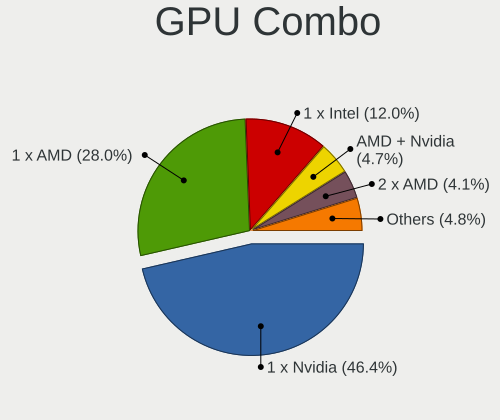

| Name                      | Desktops | Percent |
|---------------------------|----------|---------|
| 1 x Nvidia                | 1220     | 46.41%  |
| 1 x AMD                   | 735      | 27.96%  |
| 1 x Intel                 | 316      | 12.02%  |
| AMD + Nvidia              | 124      | 4.72%   |
| 2 x AMD                   | 108      | 4.11%   |
| Intel + Nvidia            | 62       | 2.36%   |
| 2 x Nvidia                | 23       | 0.87%   |
| Intel + AMD               | 21       | 0.8%    |
| Nvidia + ASPEED           | 4        | 0.15%   |
| Other                     | 2        | 0.08%   |
| Nvidia + Matrox           | 2        | 0.08%   |
| Intel + 2 x Nvidia        | 2        | 0.08%   |
| AMD + 2 x Nvidia          | 2        | 0.08%   |
| 4 x Nvidia                | 1        | 0.04%   |
| 3 x Nvidia                | 1        | 0.04%   |
| 2 x Intel                 | 1        | 0.04%   |
| 2 x AMD + 2 x Nvidia      | 1        | 0.04%   |
| 2 x AMD + 1 x Nvidia      | 1        | 0.04%   |
| Nvidia + 3Dfx Interactive | 1        | 0.04%   |
| 1 x Matrox                | 1        | 0.04%   |
| Intel + AMD + 2 x Nvidia  | 1        | 0.04%   |

GPU Driver
----------

Free vs proprietary

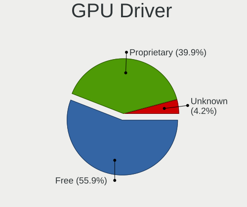

| Driver      | Desktops | Percent |
|-------------|----------|---------|
| Free        | 1467     | 55.93%  |
| Proprietary | 1046     | 39.88%  |
| Unknown     | 110      | 4.19%   |

GPU Memory
----------

Total video memory

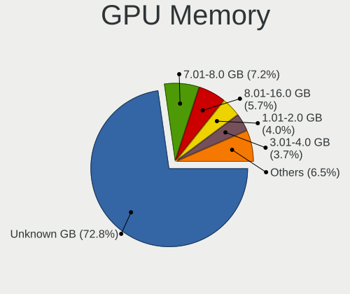

| Size in GB | Desktops | Percent |
|------------|----------|---------|
| Unknown    | 1929     | 72.76%  |
| 7.01-8.0   | 192      | 7.24%   |
| 8.01-16.0  | 152      | 5.73%   |
| 1.01-2.0   | 107      | 4.04%   |
| 3.01-4.0   | 98       | 3.7%    |
| 5.01-6.0   | 81       | 3.06%   |
| 16.01-24.0 | 27       | 1.02%   |
| 0.01-0.5   | 27       | 1.02%   |
| 2.01-3.0   | 18       | 0.68%   |
| 0.51-1.0   | 18       | 0.68%   |
| 32.01-64.0 | 1        | 0.04%   |
| 24.01-32.0 | 1        | 0.04%   |

Monitor
-------

Monitor Vendor
--------------

Monitor vendors

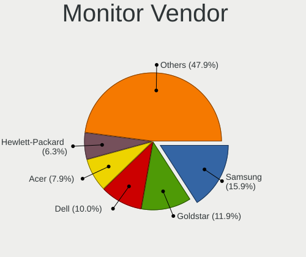

| Vendor               | Desktops | Percent |
|----------------------|----------|---------|
| Samsung Electronics  | 483      | 15.89%  |
| Goldstar             | 361      | 11.88%  |
| Dell                 | 305      | 10.04%  |
| Acer                 | 241      | 7.93%   |
| Hewlett-Packard      | 192      | 6.32%   |
| AOC                  | 160      | 5.26%   |
| ASUSTek Computer     | 153      | 5.03%   |
| BenQ                 | 128      | 4.21%   |
| Ancor Communications | 125      | 4.11%   |
| Philips              | 80       | 2.63%   |
| MSI                  | 68       | 2.24%   |
| Lenovo               | 51       | 1.68%   |
| Iiyama               | 48       | 1.58%   |
| ViewSonic            | 43       | 1.41%   |
| Gigabyte Technology  | 33       | 1.09%   |
| Sony                 | 29       | 0.95%   |
| Sceptre Tech         | 29       | 0.95%   |
| Vizio                | 22       | 0.72%   |
| Unknown              | 19       | 0.63%   |
| NEC Computers        | 17       | 0.56%   |
| HKC                  | 17       | 0.56%   |
| Fujitsu Siemens      | 16       | 0.53%   |
| Unknown (XXX)        | 13       | 0.43%   |
| SKG                  | 12       | 0.39%   |
| Insignia             | 12       | 0.39%   |
| Eizo                 | 12       | 0.39%   |
| Valve                | 11       | 0.36%   |
| Panasonic            | 11       | 0.36%   |
| Mi                   | 11       | 0.36%   |
| Vestel Elektronik    | 10       | 0.33%   |
| Toshiba              | 9        | 0.3%    |
| Sharp                | 9        | 0.3%    |
| RTK                  | 9        | 0.3%    |
| HUAWEI               | 9        | 0.3%    |
| Hitachi              | 9        | 0.3%    |
| Viotek               | 8        | 0.26%   |
| Huion                | 7        | 0.23%   |
| GDH                  | 7        | 0.23%   |
| Unknown              | 7        | 0.23%   |
| Pixio                | 6        | 0.2%    |

Monitor Model
-------------

Monitor models

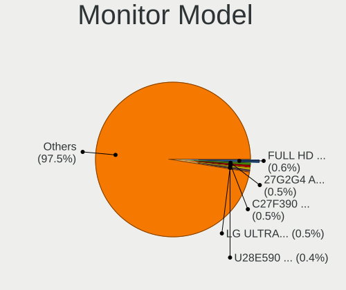

| Model                                                                | Desktops | Percent |
|----------------------------------------------------------------------|----------|---------|
| Goldstar FULL HD GSM5B55 1920x1080 480x270mm 21.7-inch               | 21       | 0.65%   |
| AOC 27G2G4 AOC2702 1920x1080 598x336mm 27.0-inch                     | 17       | 0.52%   |
| Samsung Electronics C27F390 SAM0D32 1920x1080 598x336mm 27.0-inch    | 16       | 0.49%   |
| Goldstar LG ULTRAWIDE GSM59F1 2560x1080 670x280mm 28.6-inch          | 15       | 0.46%   |
| Samsung Electronics U28E590 SAM0C4D 3840x2160 607x345mm 27.5-inch    | 14       | 0.43%   |
| Goldstar ULTRAGEAR GSM7766 2560x1440 697x392mm 31.5-inch             | 13       | 0.4%    |
| Ancor Communications VE247 ACI2493 1920x1080 530x300mm 24.0-inch     | 13       | 0.4%    |
| Unknown LCD Monitor FFFF 2288x1287 2550x2550mm 142.0-inch            | 12       | 0.37%   |
| Samsung Electronics C24F390 SAM0D2C 1920x1080 521x293mm 23.5-inch    | 12       | 0.37%   |
| Goldstar Ultra HD GSM5B09 3840x2160 600x340mm 27.2-inch              | 12       | 0.37%   |
| AOC 24G2W1G3 AOC2402 1920x1080 527x296mm 23.8-inch                   | 12       | 0.37%   |
| Valve Index HMD VLV91A8                                              | 11       | 0.34%   |
| Goldstar HDR WFHD GSM7714 2560x1080 798x334mm 34.1-inch              | 11       | 0.34%   |
| Ancor Communications VG248 ACI24A4 1920x1080 531x299mm 24.0-inch     | 11       | 0.34%   |
| Vestel Elektronik 40UHD_LCD_TV VES3700 3840x2160 880x500mm 39.8-inch | 10       | 0.31%   |
| Samsung Electronics LC49G95T SAM7053 3840x1080 1193x336mm 48.8-inch  | 10       | 0.31%   |
| Goldstar LG TV SSCR2 GSMC0C8 3840x2160                               | 10       | 0.31%   |
| Goldstar ULTRAGEAR GSM5BD3 2560x1440 697x392mm 31.5-inch             | 9        | 0.28%   |
| Goldstar 27GL850 GSM5B7F 2560x1440 597x336mm 27.0-inch               | 9        | 0.28%   |
| AOC 2460G5 AOC246A 1920x1080 531x299mm 24.0-inch                     | 9        | 0.28%   |
| Sceptre Tech Sceptre F24 SPT09AB 1920x1080 530x290mm 23.8-inch       | 8        | 0.25%   |
| Samsung Electronics LF24T35 SAM707D 1920x1080 528x297mm 23.9-inch    | 8        | 0.25%   |
| Hitachi HISENSE HEC002F 3840x2160 1872x1053mm 84.6-inch              | 8        | 0.25%   |
| Goldstar LG IPS FULLHD GSM5AB8 1920x1080 480x270mm 21.7-inch         | 8        | 0.25%   |
| Goldstar HDR 4K GSM7707 3840x2160 600x340mm 27.2-inch                | 8        | 0.25%   |
| Goldstar HDR 4K GSM7706 3840x2160 600x340mm 27.2-inch                | 8        | 0.25%   |
| ASUSTek Computer VG249 AUS2421 1920x1080 527x296mm 23.8-inch         | 8        | 0.25%   |
| Unknown (XXX) Beyond TV XXX2851 3840x2160 1209x680mm 54.6-inch       | 7        | 0.22%   |
| Samsung Electronics S24F350 SAM0D20 1920x1080 521x293mm 23.5-inch    | 7        | 0.22%   |
| Samsung Electronics LS28AG700N SAM7177 3840x2160 632x360mm 28.6-inch | 7        | 0.22%   |
| Samsung Electronics LF27T35 SAM707F 1920x1080 598x337mm 27.0-inch    | 7        | 0.22%   |
| Goldstar ULTRAGEAR GSM5BB4 2560x1440 597x336mm 27.0-inch             | 7        | 0.22%   |
| Goldstar Ultra HD GSM5B08 3840x2160 600x340mm 27.2-inch              | 7        | 0.22%   |
| GDH TV PHILCO GDH0030 1920x540                                       | 7        | 0.22%   |
| Dell P2419H DELD0D9 1920x1080 527x296mm 23.8-inch                    | 7        | 0.22%   |
| BenQ GL2460 BNQ78CE 1920x1080 531x299mm 24.0-inch                    | 7        | 0.22%   |
| ASUSTek Computer VG27A AUS2722 2560x1440 597x336mm 27.0-inch         | 7        | 0.22%   |
| AOC 24B1W1 AOC2401 1920x1080 527x296mm 23.8-inch                     | 7        | 0.22%   |
| Ancor Communications VG248 ACI24A5 1920x1080 531x299mm 24.0-inch     | 7        | 0.22%   |
| Unknown                                                              | 7        | 0.22%   |

Monitor Resolution
------------------

Monitor screen resolution

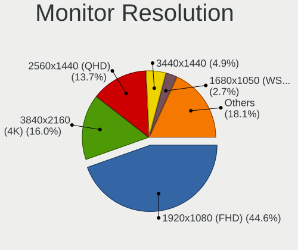

| Resolution         | Desktops | Percent |
|--------------------|----------|---------|
| 1920x1080 (FHD)    | 1286     | 44.59%  |
| 3840x2160 (4K)     | 460      | 15.95%  |
| 2560x1440 (QHD)    | 396      | 13.73%  |
| 3440x1440          | 140      | 4.85%   |
| 1680x1050 (WSXGA+) | 79       | 2.74%   |
| 1366x768 (WXGA)    | 69       | 2.39%   |
| 2560x1080          | 67       | 2.32%   |
| 1280x1024 (SXGA)   | 52       | 1.8%    |
| 1920x1200 (WUXGA)  | 50       | 1.73%   |
| 1600x900 (HD+)     | 50       | 1.73%   |
| 1440x900 (WXGA+)   | 42       | 1.46%   |
| 3840x1080          | 37       | 1.28%   |
| 1360x768           | 36       | 1.25%   |
| Unknown            | 25       | 0.87%   |
| 1920x540           | 22       | 0.76%   |
| 3840x1600          | 14       | 0.49%   |
| 2288x1287          | 14       | 0.49%   |
| 2560x1600          | 9        | 0.31%   |
| 1024x768 (XGA)     | 8        | 0.28%   |
| 3840x1200          | 4        | 0.14%   |
| 4480x1440          | 3        | 0.1%    |
| 1600x1200          | 3        | 0.1%    |
| 1280x720 (HD)      | 2        | 0.07%   |
| 800x480            | 1        | 0.03%   |
| 4000x1440          | 1        | 0.03%   |
| 3840x2560          | 1        | 0.03%   |
| 3600x1080          | 1        | 0.03%   |
| 3360x1440          | 1        | 0.03%   |
| 3280x1080          | 1        | 0.03%   |
| 3040x900           | 1        | 0.03%   |
| 2880x1600          | 1        | 0.03%   |
| 2520x1680          | 1        | 0.03%   |
| 2304x1440          | 1        | 0.03%   |
| 2160x1440          | 1        | 0.03%   |
| 2048x1152          | 1        | 0.03%   |
| 1440x240           | 1        | 0.03%   |
| 1400x1050          | 1        | 0.03%   |
| 1280x800 (WXGA)    | 1        | 0.03%   |
| 1024x600           | 1        | 0.03%   |

Monitor Diagonal
----------------

Diagonal size in inches

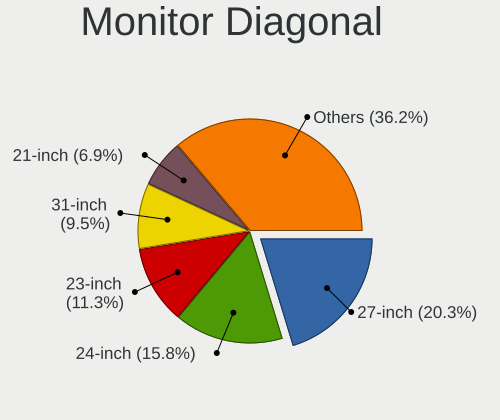

| Inches  | Desktops | Percent |
|---------|----------|---------|
| 27      | 612      | 20.3%   |
| 24      | 476      | 15.79%  |
| 23      | 342      | 11.34%  |
| 31      | 286      | 9.49%   |
| 21      | 208      | 6.9%    |
| 34      | 173      | 5.74%   |
| Unknown | 92       | 3.05%   |
| 19      | 76       | 2.52%   |
| 84      | 66       | 2.19%   |
| 22      | 62       | 2.06%   |
| 18      | 55       | 1.82%   |
| 32      | 52       | 1.72%   |
| 20      | 52       | 1.72%   |
| 72      | 34       | 1.13%   |
| 48      | 34       | 1.13%   |
| 17      | 31       | 1.03%   |
| 54      | 28       | 0.93%   |
| 40      | 27       | 0.9%    |
| 28      | 25       | 0.83%   |
| 15      | 24       | 0.8%    |
| 63      | 21       | 0.7%    |
| 25      | 19       | 0.63%   |
| 26      | 18       | 0.6%    |
| 37      | 16       | 0.53%   |
| 65      | 15       | 0.5%    |
| 142     | 12       | 0.4%    |
| 52      | 12       | 0.4%    |
| 29      | 12       | 0.4%    |
| 46      | 9        | 0.3%    |
| 44      | 9        | 0.3%    |
| 43      | 9        | 0.3%    |
| 36      | 9        | 0.3%    |
| 49      | 8        | 0.27%   |
| 42      | 8        | 0.27%   |
| 38      | 8        | 0.27%   |
| 35      | 8        | 0.27%   |
| 33      | 8        | 0.27%   |
| 74      | 7        | 0.23%   |
| 16      | 7        | 0.23%   |
| 12      | 6        | 0.2%    |

Monitor Width
-------------

Physical width

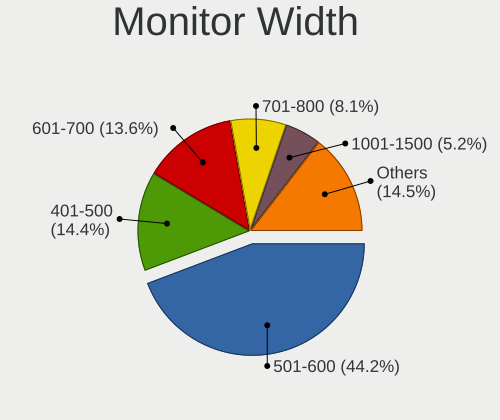

| Width in mm    | Desktops | Percent |
|----------------|----------|---------|
| 501-600        | 1263     | 44.24%  |
| 401-500        | 410      | 14.36%  |
| 601-700        | 388      | 13.59%  |
| 701-800        | 230      | 8.06%   |
| 1001-1500      | 149      | 5.22%   |
| 1501-2000      | 116      | 4.06%   |
| Unknown        | 92       | 3.22%   |
| 801-900        | 70       | 2.45%   |
| 301-350        | 54       | 1.89%   |
| 351-400        | 39       | 1.37%   |
| 901-1000       | 17       | 0.6%    |
| 201-300        | 15       | 0.53%   |
| More than 2000 | 12       | 0.42%   |

Aspect Ratio
------------

Proportional relationship between the width and the height

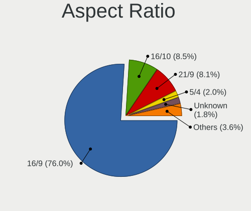

| Ratio   | Desktops | Percent |
|---------|----------|---------|
| 16/9    | 1986     | 76%     |
| 16/10   | 222      | 8.5%    |
| 21/9    | 211      | 8.08%   |
| 5/4     | 52       | 1.99%   |
| Unknown | 48       | 1.84%   |
| 32/9    | 42       | 1.61%   |
| 4/3     | 24       | 0.92%   |
| 1.00    | 13       | 0.5%    |
| 3/2     | 7        | 0.27%   |
| 3.20    | 4        | 0.15%   |
| 1.96    | 2        | 0.08%   |
| 6/5     | 1        | 0.04%   |
| 6.00    | 1        | 0.04%   |

Monitor Area
------------

Area in inch²

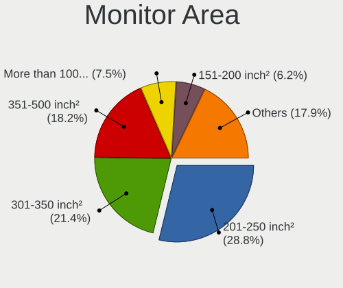

| Area in inch² | Desktops | Percent |
|----------------|----------|---------|
| 201-250        | 842      | 28.8%   |
| 301-350        | 626      | 21.41%  |
| 351-500        | 533      | 18.23%  |
| More than 1000 | 220      | 7.52%   |
| 151-200        | 180      | 6.16%   |
| 251-300        | 169      | 5.78%   |
| 501-1000       | 136      | 4.65%   |
| Unknown        | 92       | 3.15%   |
| 141-150        | 74       | 2.53%   |
| 101-110        | 28       | 0.96%   |
| 71-80          | 10       | 0.34%   |
| 131-140        | 4        | 0.14%   |
| 111-120        | 4        | 0.14%   |
| 81-90          | 2        | 0.07%   |
| 51-60          | 2        | 0.07%   |
| 121-130        | 2        | 0.07%   |

Pixel Density
-------------

Pixels per inch

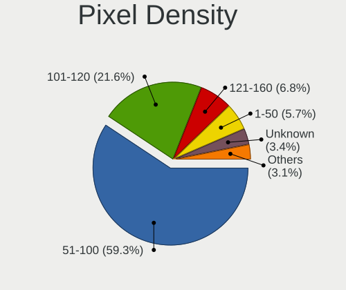

| Density       | Desktops | Percent |
|---------------|----------|---------|
| 51-100        | 1625     | 59.35%  |
| 101-120       | 592      | 21.62%  |
| 121-160       | 187      | 6.83%   |
| 1-50          | 156      | 5.7%    |
| Unknown       | 92       | 3.36%   |
| 161-240       | 85       | 3.1%    |
| More than 240 | 1        | 0.04%   |

Multiple Monitors
-----------------

Total monitors connected

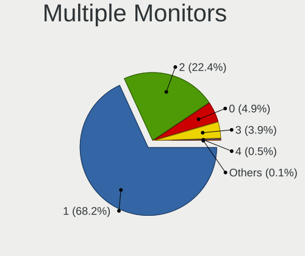

| Total | Desktops | Percent |
|-------|----------|---------|
| 1     | 1798     | 68.16%  |
| 2     | 592      | 22.44%  |
| 0     | 129      | 4.89%   |
| 3     | 104      | 3.94%   |
| 4     | 13       | 0.49%   |
| 6     | 1        | 0.04%   |
| 5     | 1        | 0.04%   |

Network
-------

Net Controller Vendor
---------------------

Controller vendors

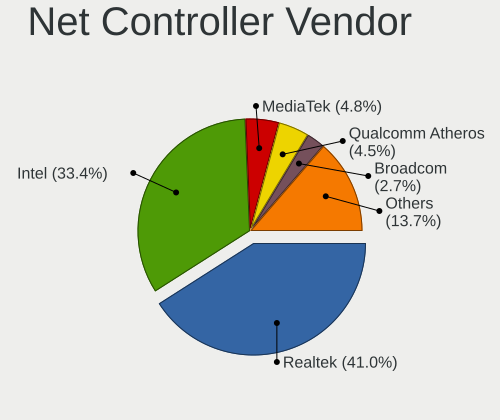

| Vendor                          | Desktops | Percent |
|---------------------------------|----------|---------|
| Realtek Semiconductor           | 1603     | 40.96%  |
| Intel                           | 1307     | 33.39%  |
| MediaTek                        | 189      | 4.83%   |
| Qualcomm Atheros                | 175      | 4.47%   |
| Broadcom                        | 105      | 2.68%   |
| TP-Link                         | 78       | 1.99%   |
| Aquantia                        | 40       | 1.02%   |
| Ralink Technology               | 39       | 1%      |
| Microsoft                       | 37       | 0.95%   |
| NetGear                         | 32       | 0.82%   |
| Samsung Electronics             | 29       | 0.74%   |
| ASIX Electronics                | 23       | 0.59%   |
| Ralink                          | 20       | 0.51%   |
| InterBiometrics                 | 20       | 0.51%   |
| Nvidia                          | 17       | 0.43%   |
| D-Link                          | 15       | 0.38%   |
| Qualcomm Atheros Communications | 13       | 0.33%   |
| Google                          | 13       | 0.33%   |
| Qualcomm Technologies           | 11       | 0.28%   |
| Linksys                         | 11       | 0.28%   |
| Broadcom Limited                | 11       | 0.28%   |
| Xiaomi                          | 10       | 0.26%   |
| ASUSTek Computer                | 10       | 0.26%   |
| Marvell Technology Group        | 8        | 0.2%    |
| D-Link System                   | 7        | 0.18%   |
| OPPO Electronics                | 6        | 0.15%   |
| DisplayLink                     | 6        | 0.15%   |
| QinHeng Electronics             | 5        | 0.13%   |
| Huawei Technologies             | 5        | 0.13%   |
| Belkin Components               | 5        | 0.13%   |
| Qualcomm                        | 4        | 0.1%    |
| Motorola PCS                    | 4        | 0.1%    |
| Mellanox Technologies           | 4        | 0.1%    |
| American Megatrends             | 4        | 0.1%    |
| American Future Technology      | 4        | 0.1%    |
| Edimax Technology               | 3        | 0.08%   |
| T & A Mobile Phones             | 2        | 0.05%   |
| STMicroelectronics              | 2        | 0.05%   |
| Realtek                         | 2        | 0.05%   |
| Oculus VR                       | 2        | 0.05%   |

Net Controller Model
--------------------

Controller models

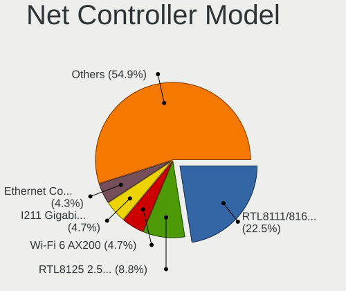

| Model                                                                  | Desktops | Percent |
|------------------------------------------------------------------------|----------|---------|
| Realtek RTL8111/8168/8211/8411 PCI Express Gigabit Ethernet Controller | 1036     | 22.51%  |
| Realtek RTL8125 2.5GbE Controller                                      | 406      | 8.82%   |
| Intel Wi-Fi 6 AX200                                                    | 218      | 4.74%   |
| Intel I211 Gigabit Network Connection                                  | 217      | 4.71%   |
| Intel Ethernet Controller I225-V                                       | 198      | 4.3%    |
| Intel Ethernet Connection (2) I219-V                                   | 106      | 2.3%    |
| Intel Wi-Fi 6E(802.11ax) AX210/AX1675* 2x2 [Typhoon Peak]              | 90       | 1.96%   |
| MediaTek MT7922 802.11ax PCI Express Wireless Network Adapter          | 86       | 1.87%   |
| Intel 82579LM Gigabit Network Connection (Lewisville)                  | 70       | 1.52%   |
| Intel Dual Band Wireless-AC 3168NGW [Stone Peak]                       | 67       | 1.46%   |
| Realtek 802.11ac NIC                                                   | 55       | 1.19%   |
| Intel Ethernet Connection I217-LM                                      | 54       | 1.17%   |
| Intel Ethernet Connection (7) I219-V                                   | 53       | 1.15%   |
| MediaTek MT7921K (RZ608) Wi-Fi 6E 80MHz                                | 50       | 1.09%   |
| Intel 700 Series Chipset CNVi WiFi                                     | 47       | 1.02%   |
| Intel Alder Lake-S PCH CNVi WiFi                                       | 46       | 1%      |
| Broadcom BCM4360 802.11ac Dual Band Wireless Network Adapter           | 46       | 1%      |
| Intel Ethernet Controller I226-V                                       | 44       | 0.96%   |
| Intel Wi-Fi 5(802.11ac) Wireless-AC 9x6x [Thunder Peak]                | 39       | 0.85%   |
| Realtek RTL8153 Gigabit Ethernet Adapter                               | 33       | 0.72%   |
| Intel Ethernet Connection (2) I218-V                                   | 33       | 0.72%   |
| Intel 82579V Gigabit Network Connection                                | 33       | 0.72%   |
| Realtek RTL8852BE PCIe 802.11ax Wireless Network Controller            | 30       | 0.65%   |
| Realtek RTL8821CE 802.11ac PCIe Wireless Network Adapter               | 28       | 0.61%   |
| Realtek RTL8188EUS 802.11n Wireless Network Adapter                    | 27       | 0.59%   |
| Realtek RTL810xE PCI Express Fast Ethernet controller                  | 27       | 0.59%   |
| Qualcomm Atheros Killer E220x Gigabit Ethernet Controller              | 27       | 0.59%   |
| Intel Cannon Lake PCH CNVi WiFi                                        | 27       | 0.59%   |
| Realtek RTL88x2bu [AC1200 Techkey]                                     | 25       | 0.54%   |
| Intel Ethernet Connection (2) I219-LM                                  | 25       | 0.54%   |
| Intel Ethernet Connection I217-V                                       | 24       | 0.52%   |
| Intel 82574L Gigabit Network Connection                                | 23       | 0.5%    |
| Samsung Galaxy series, misc. (tethering mode)                          | 22       | 0.48%   |
| InterBiometrics Io                                                     | 20       | 0.43%   |
| Microsoft Xbox Wireless Adapter for Windows                            | 19       | 0.41%   |
| MediaTek MT7921 802.11ax PCIe Wireless Network Adapter [Filogic 330]   | 19       | 0.41%   |
| Intel Wireless 7260                                                    | 19       | 0.41%   |
| ASIX AX88179 Gigabit Ethernet                                          | 19       | 0.41%   |
| Ralink MT7601U Wireless Adapter                                        | 18       | 0.39%   |
| Qualcomm Atheros Killer E2400 Gigabit Ethernet Controller              | 18       | 0.39%   |

Wireless Vendor
---------------

Wireless vendors

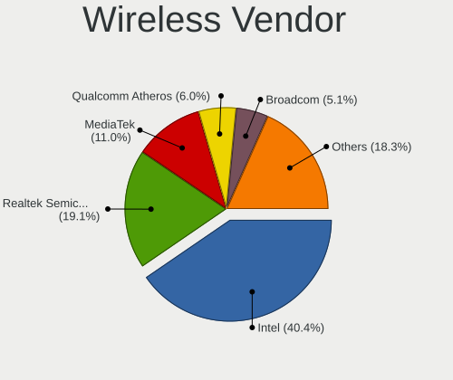

| Vendor                                | Desktops | Percent |
|---------------------------------------|----------|---------|
| Intel                                 | 626      | 40.44%  |
| Realtek Semiconductor                 | 295      | 19.06%  |
| MediaTek                              | 171      | 11.05%  |
| Qualcomm Atheros                      | 93       | 6.01%   |
| Broadcom                              | 79       | 5.1%    |
| TP-Link                               | 74       | 4.78%   |
| Ralink Technology                     | 39       | 2.52%   |
| Microsoft                             | 37       | 2.39%   |
| NetGear                               | 32       | 2.07%   |
| Ralink                                | 20       | 1.29%   |
| Qualcomm Atheros Communications       | 13       | 0.84%   |
| D-Link                                | 13       | 0.84%   |
| Linksys                               | 11       | 0.71%   |
| ASUSTek Computer                      | 10       | 0.65%   |
| Broadcom Limited                      | 7        | 0.45%   |
| D-Link System                         | 5        | 0.32%   |
| Belkin Components                     | 5        | 0.32%   |
| Edimax Technology                     | 3        | 0.19%   |
| Realtek                               | 2        | 0.13%   |
| Qualcomm Technologies                 | 2        | 0.13%   |
| Micro Star International              | 2        | 0.13%   |
| 802.11g Adapter [Linksys WUSB54GC v3] | 2        | 0.13%   |
| Wacom                                 | 1        | 0.06%   |
| Sitecom Europe                        | 1        | 0.06%   |
| Mercucys                              | 1        | 0.06%   |
| IMC Networks                          | 1        | 0.06%   |
| Gemtek                                | 1        | 0.06%   |
| AVM                                   | 1        | 0.06%   |
| Accton Technology                     | 1        | 0.06%   |

Wireless Model
--------------

Wireless models

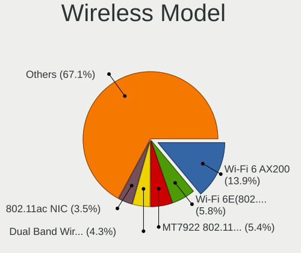

| Model                                                                | Desktops | Percent |
|----------------------------------------------------------------------|----------|---------|
| Intel Wi-Fi 6 AX200                                                  | 218      | 13.95%  |
| Intel Wi-Fi 6E(802.11ax) AX210/AX1675* 2x2 [Typhoon Peak]            | 90       | 5.76%   |
| MediaTek MT7922 802.11ax PCI Express Wireless Network Adapter        | 84       | 5.37%   |
| Intel Dual Band Wireless-AC 3168NGW [Stone Peak]                     | 67       | 4.29%   |
| Realtek 802.11ac NIC                                                 | 55       | 3.52%   |
| MediaTek MT7921K (RZ608) Wi-Fi 6E 80MHz                              | 50       | 3.2%    |
| Intel 700 Series Chipset CNVi WiFi                                   | 47       | 3.01%   |
| Broadcom BCM4360 802.11ac Dual Band Wireless Network Adapter         | 46       | 2.94%   |
| Intel Wi-Fi 5(802.11ac) Wireless-AC 9x6x [Thunder Peak]              | 39       | 2.5%    |
| Intel Alder Lake-S PCH CNVi WiFi                                     | 30       | 1.92%   |
| Realtek RTL8821CE 802.11ac PCIe Wireless Network Adapter             | 28       | 1.79%   |
| Realtek RTL8188EUS 802.11n Wireless Network Adapter                  | 27       | 1.73%   |
| Intel Cannon Lake PCH CNVi WiFi                                      | 27       | 1.73%   |
| Realtek RTL88x2bu [AC1200 Techkey]                                   | 25       | 1.6%    |
| Realtek RTL8852BE PCIe 802.11ax Wireless Network Controller          | 23       | 1.47%   |
| Microsoft Xbox Wireless Adapter for Windows                          | 19       | 1.22%   |
| MediaTek MT7921 802.11ax PCIe Wireless Network Adapter [Filogic 330] | 19       | 1.22%   |
| Intel Wireless 7260                                                  | 19       | 1.22%   |
| Ralink MT7601U Wireless Adapter                                      | 18       | 1.15%   |
| Intel Comet Lake PCH CNVi WiFi                                       | 17       | 1.09%   |
| Qualcomm Atheros AR9485 Wireless Network Adapter                     | 16       | 1.02%   |
| Intel Wireless 7265                                                  | 16       | 1.02%   |
| Realtek RTL8822BE 802.11a/b/g/n/ac WiFi adapter                      | 15       | 0.96%   |
| Realtek RTL8192EE PCIe Wireless Network Adapter                      | 15       | 0.96%   |
| Realtek RTL8852CE PCIe 802.11ax Wireless Network Controller          | 14       | 0.9%    |
| TP-Link TL-WN722N v2/v3 [Realtek RTL8188EUS]                         | 13       | 0.83%   |
| TP-Link AC600 wireless Realtek RTL8811AU [Archer T2U Nano]           | 13       | 0.83%   |
| Realtek RTL8812AE 802.11ac PCIe Wireless Network Adapter             | 13       | 0.83%   |
| Qualcomm Atheros QCA6174 802.11ac Wireless Network Adapter           | 13       | 0.83%   |
| NetGear A6210                                                        | 13       | 0.83%   |
| Intel Wireless 8265 / 8275                                           | 13       | 0.83%   |
| Microsoft Xbox 360 Wireless Adapter                                  | 12       | 0.77%   |
| TP-Link TL-WN823N v2/v3 [Realtek RTL8192EU]                          | 11       | 0.7%    |
| Qualcomm Atheros AR9271 802.11n                                      | 11       | 0.7%    |
| Qualcomm Atheros AR93xx Wireless Network Adapter                     | 11       | 0.7%    |
| TP-Link Archer T2U PLUS [RTL8821AU]                                  | 10       | 0.64%   |
| Qualcomm Atheros QCA9377 802.11ac Wireless Network Adapter           | 10       | 0.64%   |
| Realtek RTL8822CE 802.11ac PCIe Wireless Network Adapter             | 9        | 0.58%   |
| Qualcomm Atheros AR9287 Wireless Network Adapter (PCI-Express)       | 9        | 0.58%   |
| NetGear A6100 AC600 DB Wireless Adapter [Realtek RTL8811AU]          | 9        | 0.58%   |

Ethernet Vendor
---------------

Ethernet vendors

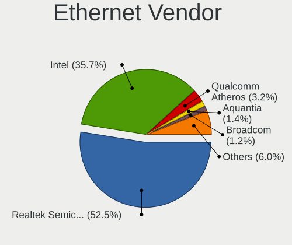

| Vendor                   | Desktops | Percent |
|--------------------------|----------|---------|
| Realtek Semiconductor    | 1498     | 52.52%  |
| Intel                    | 1019     | 35.73%  |
| Qualcomm Atheros         | 90       | 3.16%   |
| Aquantia                 | 40       | 1.4%    |
| Broadcom                 | 34       | 1.19%   |
| Samsung Electronics      | 29       | 1.02%   |
| ASIX Electronics         | 23       | 0.81%   |
| Nvidia                   | 17       | 0.6%    |
| Google                   | 13       | 0.46%   |
| MediaTek                 | 12       | 0.42%   |
| Xiaomi                   | 10       | 0.35%   |
| Qualcomm Technologies    | 9        | 0.32%   |
| Marvell Technology Group | 8        | 0.28%   |
| OPPO Electronics         | 6        | 0.21%   |
| DisplayLink              | 6        | 0.21%   |
| TP-Link                  | 4        | 0.14%   |
| Qualcomm                 | 4        | 0.14%   |
| Motorola PCS             | 4        | 0.14%   |
| Mellanox Technologies    | 4        | 0.14%   |
| Huawei Technologies      | 4        | 0.14%   |
| Broadcom Limited         | 4        | 0.14%   |
| American Megatrends      | 4        | 0.14%   |
| T & A Mobile Phones      | 2        | 0.07%   |
| Lenovo                   | 2        | 0.07%   |
| D-Link System            | 2        | 0.07%   |
| D-Link                   | 2        | 0.07%   |
| VIA Technologies         | 1        | 0.04%   |
| Motorola BCS             | 1        | 0.04%   |

Ethernet Model
--------------

Ethernet models

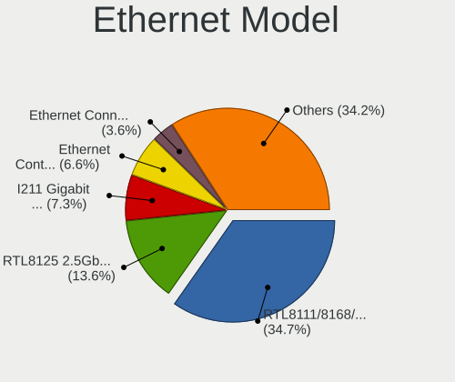

| Model                                                                           | Desktops | Percent |
|---------------------------------------------------------------------------------|----------|---------|
| Realtek RTL8111/8168/8211/8411 PCI Express Gigabit Ethernet Controller          | 1036     | 34.74%  |
| Realtek RTL8125 2.5GbE Controller                                               | 406      | 13.62%  |
| Intel I211 Gigabit Network Connection                                           | 217      | 7.28%   |
| Intel Ethernet Controller I225-V                                                | 198      | 6.64%   |
| Intel Ethernet Connection (2) I219-V                                            | 106      | 3.55%   |
| Intel 82579LM Gigabit Network Connection (Lewisville)                           | 70       | 2.35%   |
| Intel Ethernet Connection I217-LM                                               | 54       | 1.81%   |
| Intel Ethernet Connection (7) I219-V                                            | 53       | 1.78%   |
| Intel Ethernet Controller I226-V                                                | 44       | 1.48%   |
| Realtek RTL8153 Gigabit Ethernet Adapter                                        | 33       | 1.11%   |
| Intel Ethernet Connection (2) I218-V                                            | 33       | 1.11%   |
| Intel 82579V Gigabit Network Connection                                         | 33       | 1.11%   |
| Realtek RTL810xE PCI Express Fast Ethernet controller                           | 27       | 0.91%   |
| Qualcomm Atheros Killer E220x Gigabit Ethernet Controller                       | 27       | 0.91%   |
| Intel Ethernet Connection (2) I219-LM                                           | 25       | 0.84%   |
| Intel Ethernet Connection I217-V                                                | 24       | 0.8%    |
| Intel 82574L Gigabit Network Connection                                         | 23       | 0.77%   |
| Samsung Galaxy series, misc. (tethering mode)                                   | 22       | 0.74%   |
| ASIX AX88179 Gigabit Ethernet                                                   | 19       | 0.64%   |
| Qualcomm Atheros Killer E2400 Gigabit Ethernet Controller                       | 18       | 0.6%    |
| Intel I210 Gigabit Network Connection                                           | 17       | 0.57%   |
| Intel Alder Lake-S PCH CNVi WiFi                                                | 16       | 0.54%   |
| Aquantia AQtion AQC107 NBase-T/IEEE 802.3an Ethernet Controller [Atlantic 10G]  | 15       | 0.5%    |
| Nvidia MCP61 Ethernet                                                           | 13       | 0.44%   |
| Intel Ethernet Connection (7) I219-LM                                           | 13       | 0.44%   |
| Realtek RTL8126 5GbE Controller                                                 | 12       | 0.4%    |
| Qualcomm Atheros Killer E2500 Gigabit Ethernet Controller                       | 12       | 0.4%    |
| Qualcomm Atheros AR8161 Gigabit Ethernet                                        | 12       | 0.4%    |
| Intel Ethernet Connection (2) I218-LM                                           | 12       | 0.4%    |
| Intel Ethernet Connection (11) I219-V                                           | 12       | 0.4%    |
| Intel 82567LM-3 Gigabit Network Connection                                      | 12       | 0.4%    |
| Aquantia AQtion AQC113CS NBase-T/IEEE 802.3an Ethernet Controller [Antigua 10G] | 12       | 0.4%    |
| Realtek Killer E3000 2.5GbE Controller                                          | 10       | 0.34%   |
| Intel Ethernet Connection (5) I219-LM                                           | 10       | 0.34%   |
| Intel Ethernet Connection (14) I219-V                                           | 10       | 0.34%   |
| Qualcomm WCN785x Wi-Fi 7(802.11be) 320MHz 2x2 [FastConnect 7800]                | 9        | 0.3%    |
| MediaTek MT7925 802.11be 160MHz 2x2 PCIe Wireless Network Adapter [Filogic 360] | 9        | 0.3%    |
| Intel Ethernet Connection (17) I219-V                                           | 9        | 0.3%    |
| Intel 82578DM Gigabit Network Connection                                        | 9        | 0.3%    |
| Google Pixel 9a                                                                 | 9        | 0.3%    |

Net Controller Kind
-------------------

Ethernet, WiFi or modem

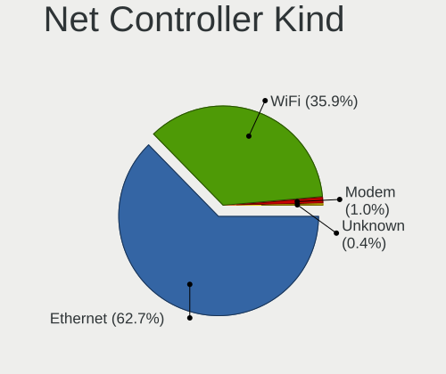

| Kind     | Desktops | Percent |
|----------|----------|---------|
| Ethernet | 2560     | 62.7%   |
| WiFi     | 1466     | 35.9%   |
| Modem    | 42       | 1.03%   |
| Unknown  | 15       | 0.37%   |

Used Controller
---------------

Currently used network controller

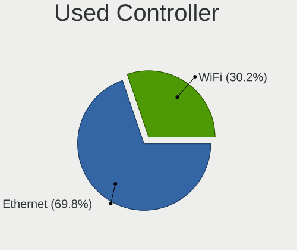

| Kind     | Desktops | Percent |
|----------|----------|---------|
| Ethernet | 1911     | 69.77%  |
| WiFi     | 828      | 30.23%  |

NICs
----

Total network controllers on board

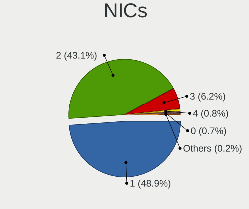

| Total | Desktops | Percent |
|-------|----------|---------|
| 1     | 1269     | 48.88%  |
| 2     | 1120     | 43.14%  |
| 3     | 162      | 6.24%   |
| 4     | 20       | 0.77%   |
| 0     | 19       | 0.73%   |
| 5     | 5        | 0.19%   |
| 6     | 1        | 0.04%   |

IPv6
----

IPv6 vs IPv4

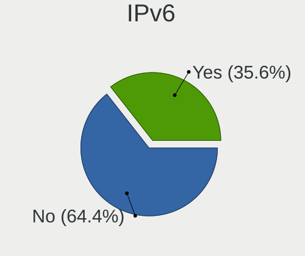

| Used | Desktops | Percent |
|------|----------|---------|
| No   | 1690     | 64.43%  |
| Yes  | 933      | 35.57%  |

Bluetooth
---------

Bluetooth Vendor
----------------

Controller vendors

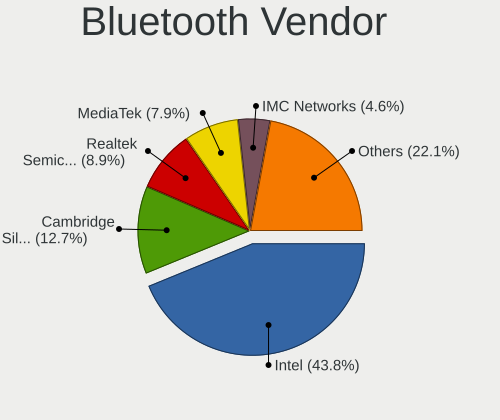

| Vendor                          | Desktops | Percent |
|---------------------------------|----------|---------|
| Intel                           | 587      | 43.81%  |
| Cambridge Silicon Radio         | 170      | 12.69%  |
| Realtek Semiconductor           | 119      | 8.88%   |
| MediaTek                        | 106      | 7.91%   |
| IMC Networks                    | 62       | 4.63%   |
| ASUSTek Computer                | 61       | 4.55%   |
| Foxconn / Hon Hai               | 58       | 4.33%   |
| TP-Link                         | 41       | 3.06%   |
| Qualcomm Atheros Communications | 33       | 2.46%   |
| Broadcom                        | 29       | 2.16%   |
| Apple                           | 24       | 1.79%   |
| Dynex                           | 10       | 0.75%   |
| Actions                         | 8        | 0.6%    |
| Realtek                         | 7        | 0.52%   |
| Unknown                         | 6        | 0.45%   |
| Edimax Technology               | 4        | 0.3%    |
| Lite-On Technology              | 3        | 0.22%   |
| SINO WEALTH                     | 2        | 0.15%   |
| Logitech                        | 2        | 0.15%   |
| Integrated System Solution      | 2        | 0.15%   |
| Dell                            | 2        | 0.15%   |
| Ralink                          | 1        | 0.07%   |
| Micro Star International        | 1        | 0.07%   |
| HTC (High Tech Computer)        | 1        | 0.07%   |
| Belkin Components               | 1        | 0.07%   |

Bluetooth Model
---------------

Controller models

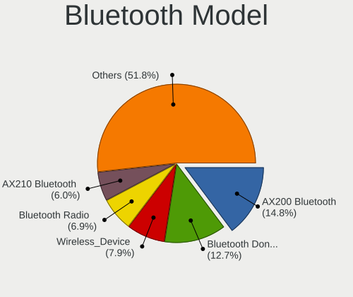

| Model                                                    | Desktops | Percent |
|----------------------------------------------------------|----------|---------|
| Intel AX200 Bluetooth                                    | 198      | 14.77%  |
| Cambridge Silicon Radio Bluetooth Dongle (HCI mode)      | 170      | 12.68%  |
| MediaTek Wireless_Device                                 | 106      | 7.9%    |
| Realtek Bluetooth Radio                                  | 93       | 6.94%   |
| Intel AX210 Bluetooth                                    | 80       | 5.97%   |
| Intel AX201 Bluetooth                                    | 67       | 5%      |
| Intel Wireless-AC 3168 Bluetooth                         | 63       | 4.7%    |
| Intel Bluetooth wireless interface                       | 58       | 4.33%   |
| Intel Bluetooth Device                                   | 56       | 4.18%   |
| TP-Link TP-T@- UB500 Adapter                             | 41       | 3.06%   |
| Intel Wireless-AC 9260 Bluetooth Adapter                 | 34       | 2.54%   |
| IMC Networks Bluetooth Radio                             | 32       | 2.39%   |
| Foxconn / Hon Hai Wireless_Device                        | 32       | 2.39%   |
| Intel Bluetooth 9460/9560 Jefferson Peak (JfP)           | 29       | 2.16%   |
| IMC Networks Wireless_Device                             | 28       | 2.09%   |
| ASUS ASUS USB-BT500                                      | 21       | 1.57%   |
| Broadcom BCM20702A0 Bluetooth 4.0                        | 19       | 1.42%   |
| Foxconn / Hon Hai Bluetooth Device                       | 18       | 1.34%   |
| Qualcomm Atheros  Bluetooth Device                       | 16       | 1.19%   |
| ASUS Bluetooth Radio                                     | 15       | 1.12%   |
| ASUS Broadcom BCM20702A0 Bluetooth                       | 13       | 0.97%   |
| Apple Bluetooth Host Controller                          | 13       | 0.97%   |
| Realtek  Bluetooth 4.2 Adapter                           | 11       | 0.82%   |
| Dynex Bluetooth 4.0 Adapter [Broadcom, 1.12, BCM20702A0] | 10       | 0.75%   |
| Actions general adapter                                  | 8        | 0.6%    |
| Realtek Bluetooth 5.3 Radio                              | 7        | 0.52%   |
| Realtek Bluetooth Radio                                  | 7        | 0.52%   |
| Apple Built-in Bluetooth 2.0+EDR HCI                     | 6        | 0.45%   |
| Unknown                                                  | 6        | 0.45%   |
| Foxconn / Hon Hai Bluetooth Radio                        | 5        | 0.37%   |
| Qualcomm Atheros Bluetooth USB Host Controller           | 4        | 0.3%    |
| Qualcomm Atheros AR9462 Bluetooth                        | 4        | 0.3%    |
| Qualcomm Atheros AR3011 Bluetooth                        | 4        | 0.3%    |
| Edimax Bluetooth Device                                  | 4        | 0.3%    |
| ASUS BCM20702A0                                          | 4        | 0.3%    |
| Realtek Bluetooth 5.4 Radio                              | 3        | 0.22%   |
| Qualcomm Atheros QCA61x4 Bluetooth 4.0                   | 3        | 0.22%   |
| Broadcom BCM43142A0 Bluetooth Device                     | 3        | 0.22%   |
| ASUS Qualcomm Bluetooth 4.1                              | 3        | 0.22%   |
| ASUS Broadcom BCM20702 Single-Chip Bluetooth 4.0 + LE    | 3        | 0.22%   |

Sound
-----

Sound Vendor
------------

Sound card vendors

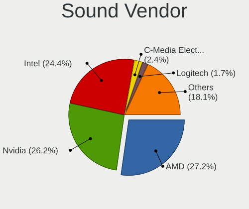

| Vendor                                       | Desktops | Percent |
|----------------------------------------------|----------|---------|
| AMD                                          | 1465     | 27.24%  |
| Nvidia                                       | 1408     | 26.18%  |
| Intel                                        | 1312     | 24.4%   |
| C-Media Electronics                          | 130      | 2.42%   |
| Logitech                                     | 89       | 1.65%   |
| ASUSTek Computer                             | 70       | 1.3%    |
| Kingston Technology                          | 60       | 1.12%   |
| Razer USA                                    | 59       | 1.1%    |
| Micro Star International                     | 56       | 1.04%   |
| Creative Labs                                | 53       | 0.99%   |
| SteelSeries ApS                              | 46       | 0.86%   |
| Focusrite-Novation                           | 45       | 0.84%   |
| JMTek                                        | 38       | 0.71%   |
| Texas Instruments                            | 31       | 0.58%   |
| Creative Technology                          | 30       | 0.56%   |
| Corsair                                      | 27       | 0.5%    |
| Blue Microphones                             | 25       | 0.46%   |
| Hewlett-Packard                              | 22       | 0.41%   |
| Generalplus Technology                       | 22       | 0.41%   |
| DSEA A/S                                     | 14       | 0.26%   |
| KTMicro                                      | 13       | 0.24%   |
| Giga-Byte Technology                         | 13       | 0.24%   |
| Valve Software                               | 12       | 0.22%   |
| Sony                                         | 12       | 0.22%   |
| GN Netcom                                    | 12       | 0.22%   |
| Thesycon Systemsoftware & Consulting         | 11       | 0.2%    |
| RODE Microphones                             | 11       | 0.2%    |
| BEHRINGER International                      | 11       | 0.2%    |
| Plantronics                                  | 10       | 0.19%   |
| Tenx Technology                              | 9        | 0.17%   |
| Realtek Semiconductor                        | 9        | 0.17%   |
| Medeli Electronics                           | 9        | 0.17%   |
| Jieli Technology                             | 9        | 0.17%   |
| Astro Gaming                                 | 9        | 0.17%   |
| FiiO Electronics Technology                  | 8        | 0.15%   |
| Zoran Co. Personal Media Division (Nogatech) | 7        | 0.13%   |
| Trust                                        | 7        | 0.13%   |
| Lenovo                                       | 7        | 0.13%   |
| SAVITECH                                     | 5        | 0.09%   |
| Nordic Semiconductor ASA                     | 5        | 0.09%   |

Sound Model
-----------

Sound card models

| Model                                                                      | Desktops | Percent |
|----------------------------------------------------------------------------|----------|---------|
| AMD Starship/Matisse HD Audio Controller                                   | 496      | 7.78%   |
| AMD Ryzen HD Audio Controller                                              | 382      | 5.99%   |
| AMD Navi 21/23 HDMI/DP Audio Controller                                    | 200      | 3.14%   |
| AMD Radeon High Definition Audio Controller                                | 196      | 3.08%   |
| Intel 8 Series/C220 Series Chipset High Definition Audio Controller        | 160      | 2.51%   |
| AMD Ellesmere HDMI Audio [Radeon RX 470/480 / 570/580/590]                 | 151      | 2.37%   |
| AMD Family 17h (Models 00h-0fh) HD Audio Controller                        | 146      | 2.29%   |
| Intel 200 Series PCH HD Audio                                              | 140      | 2.2%    |
| AMD Renoir/Cezanne HDMI/DP Audio Controller                                | 136      | 2.13%   |
| Intel 100 Series/C230 Series Chipset Family HD Audio Controller            | 128      | 2.01%   |
| Nvidia GA104 High Definition Audio Controller                              | 127      | 1.99%   |
| Intel 6 Series/C200 Series Chipset Family High Definition Audio Controller | 111      | 1.74%   |
| Nvidia GP104 High Definition Audio Controller                              | 108      | 1.69%   |
| Nvidia TU116 High Definition Audio Controller                              | 106      | 1.66%   |
| Intel 7 Series/C216 Chipset Family High Definition Audio Controller        | 102      | 1.6%    |
| Nvidia GA102 High Definition Audio Controller                              | 101      | 1.59%   |
| AMD SBx00 Azalia (Intel HDA)                                               | 98       | 1.54%   |
| Intel Xeon E3-1200 v3/4th Gen Core Processor HD Audio Controller           | 95       | 1.49%   |
| Intel Cannon Lake PCH cAVS                                                 | 93       | 1.46%   |
| Intel Alder Lake-S HD Audio Controller                                     | 91       | 1.43%   |
| AMD Navi 31 HDMI/DP Audio                                                  | 90       | 1.41%   |
| Nvidia GP107GL High Definition Audio Controller                            | 82       | 1.29%   |
| Nvidia GP106 High Definition Audio Controller                              | 79       | 1.24%   |
| Nvidia GA106 High Definition Audio Controller                              | 78       | 1.22%   |
| Intel Raptor Lake High Definition Audio Controller                         | 75       | 1.18%   |
| Nvidia TU104 HD Audio Controller                                           | 70       | 1.1%    |
| Nvidia TU106 High Definition Audio Controller                              | 69       | 1.08%   |
| ASUSTek Computer USB Audio                                                 | 59       | 0.93%   |
| AMD Navi 10 HDMI Audio                                                     | 59       | 0.93%   |
| Micro Star International USB Audio                                         | 56       | 0.88%   |
| Intel 9 Series Chipset Family HD Audio Controller                          | 54       | 0.85%   |
| Nvidia AD104 High Definition Audio Controller                              | 47       | 0.74%   |
| Intel 82801JI (ICH10 Family) HD Audio Controller                           | 47       | 0.74%   |
| AMD Raven/Raven2/Fenghuang HDMI/DP Audio Controller                        | 47       | 0.74%   |
| AMD Baffin HDMI/DP Audio [Radeon RX 550 640SP / RX 560/560X]               | 46       | 0.72%   |
| Nvidia GK208 HDMI/DP Audio Controller                                      | 43       | 0.67%   |
| Intel C610/X99 series chipset HD Audio Controller                          | 42       | 0.66%   |
| Nvidia GM107 High Definition Audio Controller [GeForce 940MX]              | 41       | 0.64%   |
| Intel Comet Lake PCH cAVS                                                  | 40       | 0.63%   |
| AMD Oland/Hainan/Cape Verde/Pitcairn HDMI Audio [Radeon HD 7000 Series]    | 38       | 0.6%    |

Memory
------

Memory Vendor
-------------

Memory module vendors

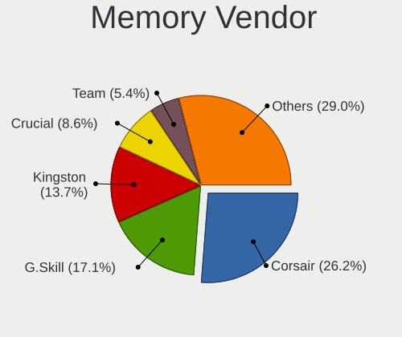

| Vendor                       | Desktops | Percent |
|------------------------------|----------|---------|
| Corsair                      | 161      | 26.22%  |
| G.Skill                      | 105      | 17.1%   |
| Kingston                     | 84       | 13.68%  |
| Crucial                      | 53       | 8.63%   |
| Team                         | 33       | 5.37%   |
| Samsung Electronics          | 28       | 4.56%   |
| SK hynix                     | 27       | 4.4%    |
| Micron Technology            | 24       | 3.91%   |
| Unknown                      | 20       | 3.26%   |
| Unknown                      | 18       | 2.93%   |
| A-DATA Technology            | 12       | 1.95%   |
| Patriot                      | 9        | 1.47%   |
| Patriot Memory               | 3        | 0.49%   |
| Apacer                       | 3        | 0.49%   |
| Unknown (ABCD)               | 2        | 0.33%   |
| Ramaxel Technology           | 2        | 0.33%   |
| Patriot Memory (PDP Systems) | 2        | 0.33%   |
| Juhor                        | 2        | 0.33%   |
| Avant                        | 2        | 0.33%   |
| Wodposit                     | 1        | 0.16%   |
| Unknown (0x0E9D)             | 1        | 0.16%   |
| Unknown (0x0B45)             | 1        | 0.16%   |
| Unknown (0B92)               | 1        | 0.16%   |
| Unifosa                      | 1        | 0.16%   |
| Thermaltake                  | 1        | 0.16%   |
| Teikon                       | 1        | 0.16%   |
| TeamGroup                    | 1        | 0.16%   |
| Silicon Power                | 1        | 0.16%   |
| PNY                          | 1        | 0.16%   |
| Pioneer                      | 1        | 0.16%   |
| Neo Forza                    | 1        | 0.16%   |
| Lexar                        | 1        | 0.16%   |
| KLEVV                        | 1        | 0.16%   |
| KingSpec                     | 1        | 0.16%   |
| J&A Information              | 1        | 0.16%   |
| INNOVATION PC                | 1        | 0.16%   |
| GOODRAM                      | 1        | 0.16%   |
| Goldkey                      | 1        | 0.16%   |
| GLOWAY                       | 1        | 0.16%   |
| GeIL                         | 1        | 0.16%   |

Memory Model
------------

Memory module models

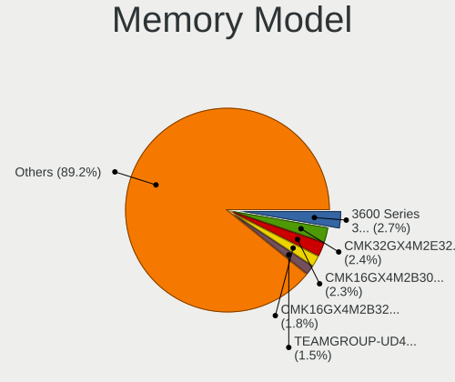

| Model                                                          | Desktops | Percent |
|----------------------------------------------------------------|----------|---------|
| Unknown                                                        | 18       | 2.74%   |
| Corsair RAM CMK32GX4M2E3200C16 16GB DIMM DDR4 3600MT/s         | 16       | 2.43%   |
| Corsair RAM CMK16GX4M2B3000C15 8GB DIMM DDR4 3600MT/s          | 15       | 2.28%   |
| Corsair RAM CMK16GX4M2B3200C16 8GB DIMM DDR4 3600MT/s          | 12       | 1.82%   |
| Team RAM TEAMGROUP-UD4-3200 8GB DIMM DDR4 3800MT/s             | 10       | 1.52%   |
| Team RAM TEAMGROUP-UD4-3200 8GB DIMM DDR4 3733MT/s             | 7        | 1.06%   |
| Corsair RAM CMK32GX4M2D3600C18 16GB DIMM DDR4 3800MT/s         | 7        | 1.06%   |
| G.Skill RAM F4-3200C16-16GVK 16GB DIMM DDR4 3600MT/s           | 6        | 0.91%   |
| Kingston RAM KF3200C16D4/8GX 8GiB DIMM DDR4 3600MT/s           | 5        | 0.76%   |
| G.Skill RAM F4-3600C16-16GTZNC 16GiB DIMM DDR4 3600MT/s        | 5        | 0.76%   |
| Corsair RAM CMW16GX4M2C3200C16 8GB DIMM DDR4 3733MT/s          | 5        | 0.76%   |
| Corsair RAM CMK32GX4M2B3200C16 16GB DIMM DDR4 3800MT/s         | 5        | 0.76%   |
| Corsair RAM CMH32GX5M2E6000C36 16GB DIMM DDR5 6000MT/s         | 5        | 0.76%   |
| Samsung RAM M378B5173QH0-CK0 4GB DIMM DDR3                     | 4        | 0.61%   |
| G.Skill RAM F5-6000J3636F16G 16GB DIMM DDR5 6400MT/s           | 4        | 0.61%   |
| G.Skill RAM F5-6000J3040G32G 32GB DIMM DDR5 6200MT/s           | 4        | 0.61%   |
| G.Skill RAM F5-6000J2836G32G 32GiB DIMM DDR5 6000MT/s          | 4        | 0.61%   |
| G.Skill RAM F4-3200C16-8GTZR 8GB DIMM DDR4 3200MT/s            | 4        | 0.61%   |
| Corsair RAM CMW32GX4M2Z3600C18 16GB DIMM DDR4 3733MT/s         | 4        | 0.61%   |
| Team RAM TEAMGROUP-UD4-3600 16GB DIMM DDR4 4000MT/s            | 3        | 0.46%   |
| Team RAM TEAMGROUP-UD4-3000 8GB DIMM DDR4 3200MT/s             | 3        | 0.46%   |
| SK hynix RAM HMT351U6CFR8C-PB 4GB DIMM DDR3 1800MT/s           | 3        | 0.46%   |
| Samsung RAM M378B5173EB0-CK0 4GB DIMM DDR3 1600MT/s            | 3        | 0.46%   |
| Samsung RAM M378B5173DB0-CK0 4096MB DIMM DDR3 1600MT/s         | 3        | 0.46%   |
| Kingston RAM KHX3200C16D4/16GX 16GB DIMM DDR4 3600MT/s         | 3        | 0.46%   |
| G.Skill RAM F4-3600C18-32GVK 32GiB DIMM DDR4 3600MT/s          | 3        | 0.46%   |
| G.Skill RAM F4-3600C16-8GTZNC 8GB DIMM DDR4 3800MT/s           | 3        | 0.46%   |
| G.Skill RAM F4-3600C16-16GVKC 16GB DIMM DDR4 3866MT/s          | 3        | 0.46%   |
| G.Skill RAM F4-3600C16-16GTZRC 16GB DIMM DDR4 4400MT/s         | 3        | 0.46%   |
| G.Skill RAM F4-3200C16-8GVKB 8GB DIMM DDR4 4000MT/s            | 3        | 0.46%   |
| G.Skill RAM F4-3000C16-8GISB 8GB DIMM DDR4 3200MT/s            | 3        | 0.46%   |
| Crucial RAM CT32G48C40U5.C16A1 32GB DIMM DDR5 4800MT/s         | 3        | 0.46%   |
| Corsair RAM CMK64GX5M2B5200C40 32GiB DIMM DDR5 5200MT/s        | 3        | 0.46%   |
| Corsair RAM CMK64GX4M2E3200C16 32GB DIMM DDR4 3600MT/s         | 3        | 0.46%   |
| Corsair RAM CMK64GX4M2D3600C18 32GB DIMM DDR4 3600MT/s         | 3        | 0.46%   |
| Corsair RAM CMK32GX4M2Z3600C18 16GB DIMM DDR4 3800MT/s         | 3        | 0.46%   |
| A-DATA RAM DDR4 3000 8GB DIMM DDR4 3600MT/s                    | 3        | 0.46%   |
| Unknown RAM Module 8GB DIMM DDR3 1333MT/s                      | 2        | 0.3%    |
| Unknown (ABCD) RAM 123456789012345678 2GB DIMM LPDDR4 2133MT/s | 2        | 0.3%    |
| Team RAM TEAMGROUP-UD4-3600 16GB DIMM DDR4 3600MT/s            | 2        | 0.3%    |

Memory Kind
-----------

Memory module kinds

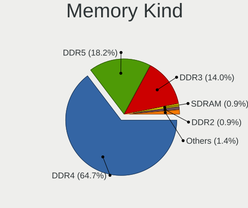

| Kind    | Desktops | Percent |
|---------|----------|---------|
| DDR4    | 370      | 64.69%  |
| DDR5    | 104      | 18.18%  |
| DDR3    | 80       | 13.99%  |
| SDRAM   | 5        | 0.87%   |
| DDR2    | 5        | 0.87%   |
| Unknown | 4        | 0.7%    |
| LPDDR4  | 3        | 0.52%   |
| DRAM    | 1        | 0.17%   |

Memory Form Factor
------------------

Physical design of the memory module

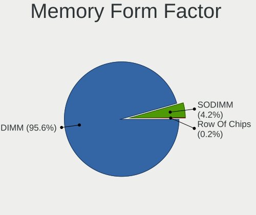

| Name         | Desktops | Percent |
|--------------|----------|---------|
| DIMM         | 543      | 95.6%   |
| SODIMM       | 24       | 4.23%   |
| Row Of Chips | 1        | 0.18%   |

Memory Size
-----------

Memory module size

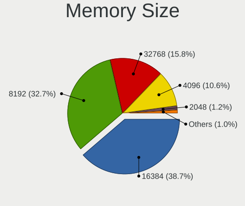

| Size  | Desktops | Percent |
|-------|----------|---------|
| 16384 | 230      | 38.72%  |
| 8192  | 194      | 32.66%  |
| 32768 | 94       | 15.82%  |
| 4096  | 63       | 10.61%  |
| 2048  | 7        | 1.18%   |
| 65536 | 2        | 0.34%   |
| 49152 | 2        | 0.34%   |
| 24576 | 1        | 0.17%   |
| 1024  | 1        | 0.17%   |

Memory Speed
------------

Memory module speed

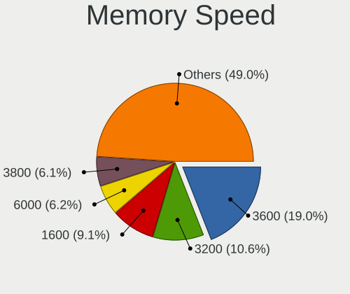

| Speed | Desktops | Percent |
|-------|----------|---------|
| 3600  | 119      | 19.04%  |
| 3200  | 66       | 10.56%  |
| 1600  | 57       | 9.12%   |
| 6000  | 39       | 6.24%   |
| 3800  | 38       | 6.08%   |
| 2667  | 31       | 4.96%   |
| 2400  | 29       | 4.64%   |
| 3733  | 22       | 3.52%   |
| 2133  | 20       | 3.2%    |
| 4800  | 17       | 2.72%   |
| 3000  | 16       | 2.56%   |
| 6400  | 13       | 2.08%   |
| 1333  | 13       | 2.08%   |
| 5600  | 10       | 1.6%    |
| 4000  | 10       | 1.6%    |
| 3400  | 10       | 1.6%    |
| 2666  | 10       | 1.6%    |
| 3866  | 9        | 1.44%   |
| 1866  | 7        | 1.12%   |
| 12800 | 6        | 0.96%   |
| 6200  | 6        | 0.96%   |
| 5200  | 6        | 0.96%   |
| 2800  | 6        | 0.96%   |
| 3466  | 5        | 0.8%    |
| 2933  | 5        | 0.8%    |
| 1800  | 5        | 0.8%    |
| 4400  | 4        | 0.64%   |
| 3266  | 4        | 0.64%   |
| 800   | 4        | 0.64%   |
| 3666  | 3        | 0.48%   |
| 6800  | 2        | 0.32%   |
| 6600  | 2        | 0.32%   |
| 5400  | 2        | 0.32%   |
| 3467  | 2        | 0.32%   |
| 3334  | 2        | 0.32%   |
| 3333  | 2        | 0.32%   |
| 3100  | 2        | 0.32%   |
| 3066  | 2        | 0.32%   |
| 2733  | 2        | 0.32%   |
| 1867  | 2        | 0.32%   |

Printers & scanners
-------------------

Printer Vendor
--------------

Printer device vendors

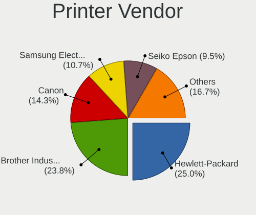

| Vendor              | Desktops | Percent |
|---------------------|----------|---------|
| Hewlett-Packard     | 21       | 25%     |
| Brother Industries  | 20       | 23.81%  |
| Canon               | 12       | 14.29%  |
| Samsung Electronics | 9        | 10.71%  |
| Seiko Epson         | 8        | 9.52%   |
| Dymo-CoStar         | 4        | 4.76%   |
| Dell                | 2        | 2.38%   |
| STMicroelectronics  | 1        | 1.19%   |
| Sharp               | 1        | 1.19%   |
| Ricoh               | 1        | 1.19%   |
| QinHeng Electronics | 1        | 1.19%   |
| Prolific Technology | 1        | 1.19%   |
| PM                  | 1        | 1.19%   |
| Pantum              | 1        | 1.19%   |
| Kyocera             | 1        | 1.19%   |

Printer Model
-------------

Printer device models

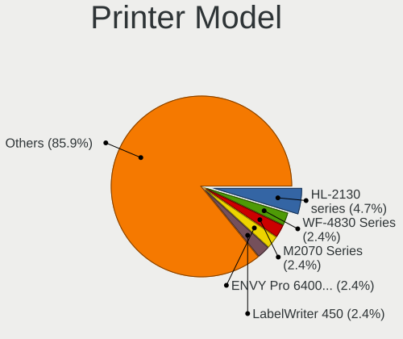

| Model                                                    | Desktops | Percent |
|----------------------------------------------------------|----------|---------|
| Brother HL-2130 series                                   | 4        | 4.71%   |
| Seiko Epson WF-4830 Series                               | 2        | 2.35%   |
| Samsung M2070 Series                                     | 2        | 2.35%   |
| HP ENVY Pro 6400 series                                  | 2        | 2.35%   |
| Dymo-CoStar LabelWriter 450                              | 2        | 2.35%   |
| Dymo-CoStar DYMO LabelWriter 450 Turbo                   | 2        | 2.35%   |
| Canon PIXMA MG2500 Series                                | 2        | 2.35%   |
| Brother Printer                                          | 2        | 2.35%   |
| STMicroelectronics YICHIP3121 Virtual ComPort in FS Mode | 1        | 1.18%   |
| Sharp MX-C301W                                           | 1        | 1.18%   |
| Seiko Epson XP-3100 Series                               | 1        | 1.18%   |
| Seiko Epson XP-240 Series                                | 1        | 1.18%   |
| Seiko Epson ME 320/330 Series [Stylus SX125]             | 1        | 1.18%   |
| Seiko Epson L1110 Series                                 | 1        | 1.18%   |
| Seiko Epson ET-3710 Series                               | 1        | 1.18%   |
| Seiko Epson ET-2800 Series                               | 1        | 1.18%   |
| Samsung SCX-4500 Laser Printer                           | 1        | 1.18%   |
| Samsung SCX-3400 Series                                  | 1        | 1.18%   |
| Samsung ML-216x Series Laser Printer                     | 1        | 1.18%   |
| Samsung ML-191x/ML-252x Laser Printer                    | 1        | 1.18%   |
| Samsung M283x Series                                     | 1        | 1.18%   |
| Samsung CLX-3300 Series                                  | 1        | 1.18%   |
| Samsung C460 Series                                      | 1        | 1.18%   |
| Ricoh RICOH SP 211SU                                     | 1        | 1.18%   |
| QinHeng CH340S                                           | 1        | 1.18%   |
| Prolific PL2305 Parallel Port                            | 1        | 1.18%   |
| PM PM241-BT                                              | 1        | 1.18%   |
| Pantum P2500W-series                                     | 1        | 1.18%   |
| Kyocera UTAX_TA LP 3035_LP 4035                          | 1        | 1.18%   |
| HP PSC-1315/PSC-1317                                     | 1        | 1.18%   |
| HP OfficeJet Pro 9010 series                             | 1        | 1.18%   |
| HP Officejet 4500 G510a-f                                | 1        | 1.18%   |
| HP LaserJet Professional P1102w                          | 1        | 1.18%   |
| HP LaserJet Professional P 1102w                         | 1        | 1.18%   |
| HP LaserJet Pro M201dw                                   | 1        | 1.18%   |
| HP LaserJet Pro M118-M119                                | 1        | 1.18%   |
| HP LaserJet P2035                                        | 1        | 1.18%   |
| HP LaserJet P1005                                        | 1        | 1.18%   |
| HP LaserJet M203-M206                                    | 1        | 1.18%   |
| HP LaserJet M14-M17                                      | 1        | 1.18%   |

Scanner Vendor
--------------

Scanner device vendors

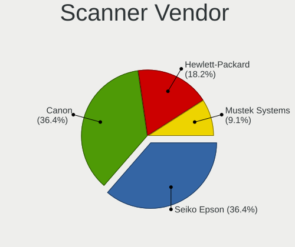

| Vendor          | Desktops | Percent |
|-----------------|----------|---------|
| Seiko Epson     | 5        | 41.67%  |
| Canon           | 4        | 33.33%  |
| Hewlett-Packard | 2        | 16.67%  |
| Mustek Systems  | 1        | 8.33%   |

Scanner Model
-------------

Scanner device models

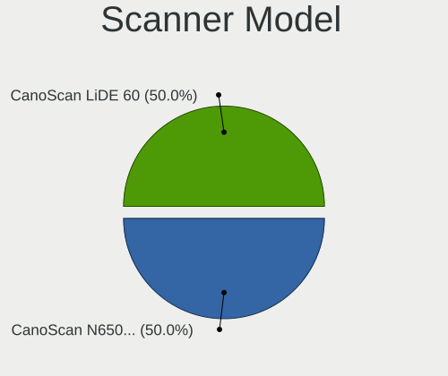

| Model                                                   | Desktops | Percent |
|---------------------------------------------------------|----------|---------|
| Seiko Epson Perfection V37/V370                         | 1        | 8.33%   |
| Seiko Epson GT-X800 [Perfection 4990 PHOTO]             | 1        | 8.33%   |
| Seiko Epson GT-X770 [Perfection V500]                   | 1        | 8.33%   |
| Seiko Epson GT-F720 [GT-S620/Perfection V30/V300 Photo] | 1        | 8.33%   |
| Seiko Epson GT-7200U [Perfection 1250/1250 PHOTO]       | 1        | 8.33%   |
| Mustek Systems ScanExpress 1200 UB                      | 1        | 8.33%   |
| HP Scanjet G2710                                        | 1        | 8.33%   |
| HP ScanJet 82x0C                                        | 1        | 8.33%   |
| Canon CanoScan N650U/N656U                              | 1        | 8.33%   |
| Canon CanoScan LiDE 60                                  | 1        | 8.33%   |
| Canon CanoScan LiDE 200                                 | 1        | 8.33%   |
| Canon CanoScan 9000F Mark II                            | 1        | 8.33%   |

Camera
------

Camera Vendor
-------------

Camera device vendors

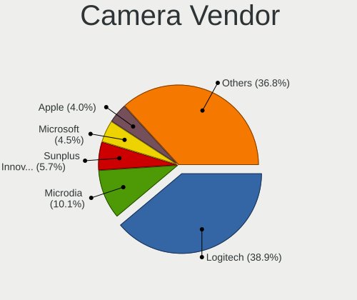

| Vendor                        | Desktops | Percent |
|-------------------------------|----------|---------|
| Logitech                      | 224      | 38.89%  |
| Microdia                      | 58       | 10.07%  |
| Sunplus Innovation Technology | 33       | 5.73%   |
| Microsoft                     | 26       | 4.51%   |
| Apple                         | 23       | 3.99%   |
| Razer USA                     | 16       | 2.78%   |
| Samsung Electronics           | 14       | 2.43%   |
| Generalplus Technology        | 11       | 1.91%   |
| Valve Software                | 10       | 1.74%   |
| Realtek Semiconductor         | 10       | 1.74%   |
| Creative Technology           | 10       | 1.74%   |
| MacroSilicon                  | 9        | 1.56%   |
| Jieli Technology              | 8        | 1.39%   |
| Trust                         | 7        | 1.22%   |
| eMeet                         | 7        | 1.22%   |
| Anker PowerConf C200          | 7        | 1.22%   |
| Chicony Electronics           | 6        | 1.04%   |
| ARC International             | 6        | 1.04%   |
| Hewlett-Packard               | 5        | 0.87%   |
| Cubeternet                    | 5        | 0.87%   |
| webcam                        | 4        | 0.69%   |
| AVerMedia Technologies        | 4        | 0.69%   |
| Z-Star Microelectronics       | 3        | 0.52%   |
| YGTek                         | 3        | 0.52%   |
| ValueHD                       | 3        | 0.52%   |
| LG Electronics                | 3        | 0.52%   |
| Lenovo                        | 3        | 0.52%   |
| KYE Systems (Mouse Systems)   | 3        | 0.52%   |
| WaveRider Communications      | 2        | 0.35%   |
| Unknown                       | 2        | 0.35%   |
| SunplusIT                     | 2        | 0.35%   |
| Sunplus IT                    | 2        | 0.35%   |
| SN0002                        | 2        | 0.35%   |
| Ruision                       | 2        | 0.35%   |
| Remo Tech                     | 2        | 0.35%   |
| Polycom                       | 2        | 0.35%   |
| OmniVision Technologies       | 2        | 0.35%   |
| Linux Foundation              | 2        | 0.35%   |
| Hangzhou Riyue Electronic     | 2        | 0.35%   |
| EVGA                          | 2        | 0.35%   |

Camera Model
------------

Camera device models

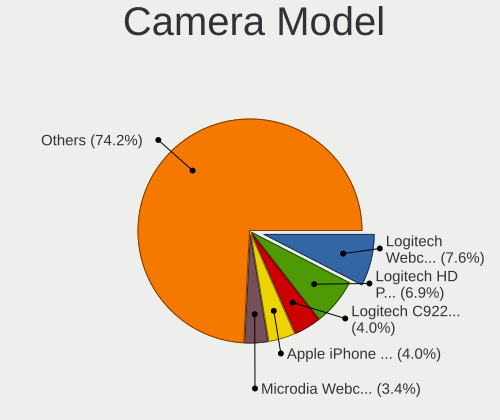

| Model                                     | Desktops | Percent |
|-------------------------------------------|----------|---------|
| Logitech Webcam C270                      | 44       | 7.57%   |
| Logitech HD Pro Webcam C920               | 40       | 6.88%   |
| Logitech C922 Pro Stream Webcam           | 23       | 3.96%   |
| Apple iPhone 5/5C/5S/6/SE/7/8/X           | 23       | 3.96%   |
| Microdia Webcam Vitade AF                 | 20       | 3.44%   |
| Logitech C920 PRO HD Webcam               | 17       | 2.93%   |
| Logitech BRIO Ultra HD Webcam             | 15       | 2.58%   |
| Samsung Galaxy series, misc. (MTP mode)   | 14       | 2.41%   |
| Microdia USB 2.0 Camera                   | 13       | 2.24%   |
| Sunplus FULL HD webcam                    | 12       | 2.07%   |
| Valve Software 3D Camera                  | 10       | 1.72%   |
| Razer USA Gaming Webcam [Kiyo]            | 10       | 1.72%   |
| Microsoft LifeCam HD-3000                 | 10       | 1.72%   |
| Logitech Logitech Webcam C925e            | 10       | 1.72%   |
| Logitech HD Webcam C615                   | 9        | 1.55%   |
| Logitech StreamCam                        | 8        | 1.38%   |
| Logitech HD Webcam C525                   | 8        | 1.38%   |
| Generalplus GENERAL WEBCAM                | 8        | 1.38%   |
| MacroSilicon USB Video                    | 7        | 1.2%    |
| Jieli USB PHY 2.0                         | 7        | 1.2%    |
| Anker PowerConf C200 Anker PowerConf C200 | 7        | 1.2%    |
| Sunplus Integrated Camera                 | 6        | 1.03%   |
| Microsoft LifeCam Cinema                  | 6        | 1.03%   |
| Microdia Integrated Camera                | 6        | 1.03%   |
| ARC International Camera                  | 6        | 1.03%   |
| Microdia CyberTrack H7                    | 5        | 0.86%   |
| Logitech Webcam C930e                     | 5        | 0.86%   |
| Logitech BRIO 4K Stream Edition           | 5        | 0.86%   |
| eMeet HD Webcam C960                      | 5        | 0.86%   |
| webcam webcam                             | 4        | 0.69%   |
| Trust USB Camera                          | 4        | 0.69%   |
| Razer USA Razer Kiyo Pro                  | 4        | 0.69%   |
| Microdia Camera                           | 4        | 0.69%   |
| Logitech Webcam C170                      | 4        | 0.69%   |
| Logitech HD Webcam C910                   | 4        | 0.69%   |
| Logitech Brio 500                         | 4        | 0.69%   |
| YGTek Webcam                              | 3        | 0.52%   |
| Sunplus UHD Capture                       | 3        | 0.52%   |
| Sunplus SPCA2281 Web Camera               | 3        | 0.52%   |
| Microsoft LifeCam Studio                  | 3        | 0.52%   |

Security
--------

Fingerprint Vendor
------------------

Fingerprint sensor vendors

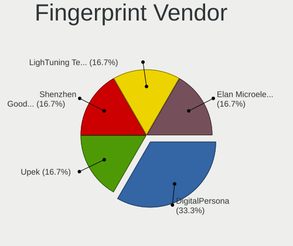

| Vendor                     | Desktops | Percent |
|----------------------------|----------|---------|
| DigitalPersona             | 2        | 33.33%  |
| Upek                       | 1        | 16.67%  |
| Shenzhen Goodix Technology | 1        | 16.67%  |
| LighTuning Technology      | 1        | 16.67%  |
| Elan Microelectronics      | 1        | 16.67%  |

Fingerprint Model
-----------------

Fingerprint sensor models

| Model                                                  | Desktops | Percent |
|--------------------------------------------------------|----------|---------|
| DigitalPersona Fingerprint Reader                      | 2        | 33.33%  |
| Upek Biometric Touchchip/Touchstrip Fingerprint Sensor | 1        | 16.67%  |
| Shenzhen Goodix  Fingerprint Device                    | 1        | 16.67%  |
| LighTuning Fingerprint Sensor                          | 1        | 16.67%  |
| Elan fingerprint sensor [FeinTech FPS00200]            | 1        | 16.67%  |

Chipcard Vendor
---------------

Chipcard module vendors

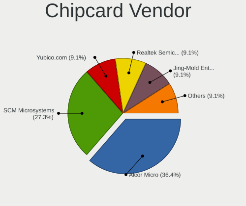

| Vendor                | Desktops | Percent |
|-----------------------|----------|---------|
| Alcor Micro           | 4        | 36.36%  |
| SCM Microsystems      | 3        | 27.27%  |
| Yubico.com            | 1        | 9.09%   |
| Realtek Semiconductor | 1        | 9.09%   |
| Jing-Mold Enterprise  | 1        | 9.09%   |
| Advanced Card Systems | 1        | 9.09%   |

Chipcard Model
--------------

Chipcard module models

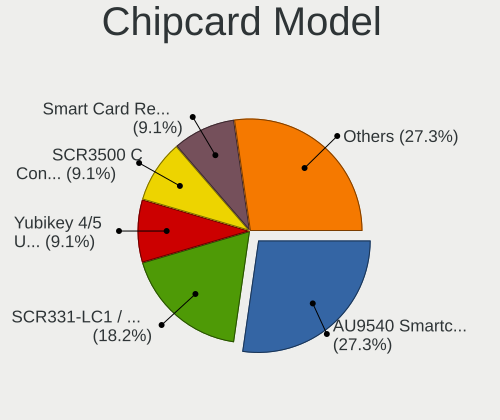

| Model                                                             | Desktops | Percent |
|-------------------------------------------------------------------|----------|---------|
| Alcor Micro AU9540 Smartcard Reader                               | 3        | 27.27%  |
| SCM Microsystems SCR331-LC1 / SCR3310 SmartCard Reader            | 2        | 18.18%  |
| Yubico.com Yubikey 4/5 U2F+CCID                                   | 1        | 9.09%   |
| SCM Microsystems SCR3500 C Contact Reader                         | 1        | 9.09%   |
| Realtek Semiconductor Smart Card Reader Interface                 | 1        | 9.09%   |
| Jing-Mold Enterprise HP USB Business Slim Smartcard CCID Keyboard | 1        | 9.09%   |
| Alcor Micro Watchdata W 1981                                      | 1        | 9.09%   |
| Advanced Card Systems ACR1252 Dual Reader                         | 1        | 9.09%   |

Unsupported
-----------

Unsupported Devices
-------------------

Total unsupported devices on board

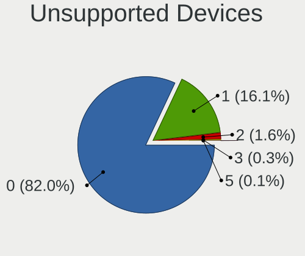

| Total | Desktops | Percent |
|-------|----------|---------|
| 0     | 2165     | 82.01%  |
| 1     | 424      | 16.06%  |
| 2     | 41       | 1.55%   |
| 3     | 7        | 0.27%   |
| 5     | 3        | 0.11%   |

Unsupported Device Types
------------------------

Types of unsupported devices

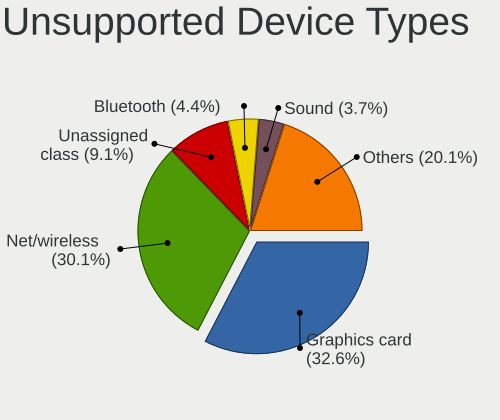

| Type                     | Desktops | Percent |
|--------------------------|----------|---------|
| Graphics card            | 169      | 32.63%  |
| Net/wireless             | 156      | 30.12%  |
| Unassigned class         | 47       | 9.07%   |
| Bluetooth                | 23       | 4.44%   |
| Sound                    | 19       | 3.67%   |
| Network                  | 19       | 3.67%   |
| Multimedia controller    | 18       | 3.47%   |
| Storage/raid             | 16       | 3.09%   |
| Communication controller | 13       | 2.51%   |
| Net/ethernet             | 11       | 2.12%   |
| Chipcard                 | 8        | 1.54%   |
| Camera                   | 7        | 1.35%   |
| Fingerprint reader       | 5        | 0.97%   |
| Storage/nvme             | 3        | 0.58%   |
| Tv card                  | 1        | 0.19%   |
| Storage/ide              | 1        | 0.19%   |
| Firewire controller      | 1        | 0.19%   |
| Card reader              | 1        | 0.19%   |

