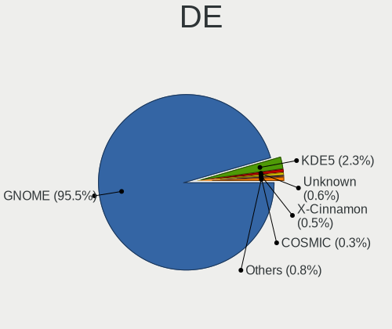
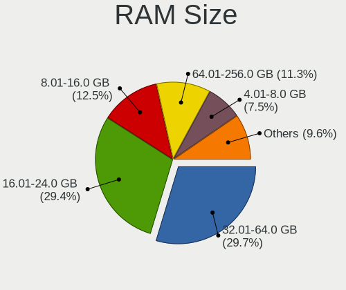
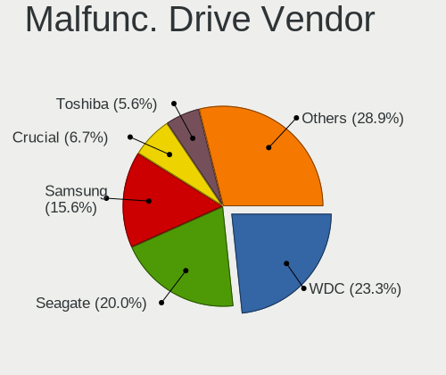
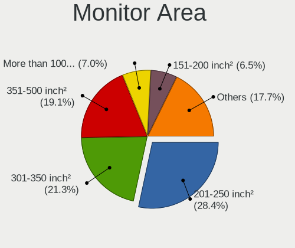

Pop!_OS 22.04 - Tested Hardware & Statistics (Desktops)
-------------------------------------------------------

A project to collect tested hardware configurations for Pop!_OS 22.04.

Anyone can contribute to this report by the [hw-probe](https://github.com/linuxhw/hw-probe) tool:

    sudo -E hw-probe -all -upload

Please contribute! Especially if your hardware is rare.

Contents
--------

* [ Test Cases ](#test-cases)

* [ System ](#system)
  - [ Kernel                   ](#kernel)
  - [ Kernel Family            ](#kernel-family)
  - [ Kernel Major Ver.        ](#kernel-major-ver)
  - [ Arch                     ](#arch)
  - [ DE                       ](#de)
  - [ Display Server           ](#display-server)
  - [ Display Manager          ](#display-manager)
  - [ OS Lang                  ](#os-lang)
  - [ Boot Mode                ](#boot-mode)
  - [ Filesystem               ](#filesystem)
  - [ Part. scheme             ](#part-scheme)
  - [ Dual Boot with Linux/BSD ](#dual-boot-with-linuxbsd)
  - [ Dual Boot (Win)          ](#dual-boot-win)

* [ Board ](#board)
  - [ Vendor                   ](#vendor)
  - [ Model                    ](#model)
  - [ Model Family             ](#model-family)
  - [ MFG Year                 ](#mfg-year)
  - [ Form Factor              ](#form-factor)
  - [ Secure Boot              ](#secure-boot)
  - [ Coreboot                 ](#coreboot)
  - [ RAM Size                 ](#ram-size)
  - [ RAM Used                 ](#ram-used)
  - [ Total Drives             ](#total-drives)
  - [ Has CD-ROM               ](#has-cd-rom)
  - [ Has Ethernet             ](#has-ethernet)
  - [ Has WiFi                 ](#has-wifi)
  - [ Has Bluetooth            ](#has-bluetooth)

* [ Location ](#location)
  - [ Country                  ](#country)
  - [ City                     ](#city)

* [ Drives ](#drives)
  - [ Drive Vendor             ](#drive-vendor)
  - [ Drive Model              ](#drive-model)
  - [ HDD Vendor               ](#hdd-vendor)
  - [ SSD Vendor               ](#ssd-vendor)
  - [ Drive Kind               ](#drive-kind)
  - [ Drive Connector          ](#drive-connector)
  - [ Drive Size               ](#drive-size)
  - [ Space Total              ](#space-total)
  - [ Space Used               ](#space-used)
  - [ Malfunc. Drives          ](#malfunc-drives)
  - [ Malfunc. Drive Vendor    ](#malfunc-drive-vendor)
  - [ Malfunc. HDD Vendor      ](#malfunc-hdd-vendor)
  - [ Malfunc. Drive Kind      ](#malfunc-drive-kind)
  - [ Failed Drives            ](#failed-drives)
  - [ Failed Drive Vendor      ](#failed-drive-vendor)
  - [ Drive Status             ](#drive-status)

* [ Storage controller ](#storage-controller)
  - [ Storage Vendor           ](#storage-vendor)
  - [ Storage Model            ](#storage-model)
  - [ Storage Kind             ](#storage-kind)

* [ Processor ](#processor)
  - [ CPU Vendor               ](#cpu-vendor)
  - [ CPU Model                ](#cpu-model)
  - [ CPU Model Family         ](#cpu-model-family)
  - [ CPU Cores                ](#cpu-cores)
  - [ CPU Sockets              ](#cpu-sockets)
  - [ CPU Threads              ](#cpu-threads)
  - [ CPU Op-Modes             ](#cpu-op-modes)
  - [ CPU Microcode            ](#cpu-microcode)
  - [ CPU Microarch            ](#cpu-microarch)

* [ Graphics ](#graphics)
  - [ GPU Vendor               ](#gpu-vendor)
  - [ GPU Model                ](#gpu-model)
  - [ GPU Combo                ](#gpu-combo)
  - [ GPU Driver               ](#gpu-driver)
  - [ GPU Memory               ](#gpu-memory)

* [ Monitor ](#monitor)
  - [ Monitor Vendor           ](#monitor-vendor)
  - [ Monitor Model            ](#monitor-model)
  - [ Monitor Resolution       ](#monitor-resolution)
  - [ Monitor Diagonal         ](#monitor-diagonal)
  - [ Monitor Width            ](#monitor-width)
  - [ Aspect Ratio             ](#aspect-ratio)
  - [ Monitor Area             ](#monitor-area)
  - [ Pixel Density            ](#pixel-density)
  - [ Multiple Monitors        ](#multiple-monitors)

* [ Network ](#network)
  - [ Net Controller Vendor    ](#net-controller-vendor)
  - [ Net Controller Model     ](#net-controller-model)
  - [ Wireless Vendor          ](#wireless-vendor)
  - [ Wireless Model           ](#wireless-model)
  - [ Ethernet Vendor          ](#ethernet-vendor)
  - [ Ethernet Model           ](#ethernet-model)
  - [ Net Controller Kind      ](#net-controller-kind)
  - [ Used Controller          ](#used-controller)
  - [ NICs                     ](#nics)
  - [ IPv6                     ](#ipv6)

* [ Bluetooth ](#bluetooth)
  - [ Bluetooth Vendor         ](#bluetooth-vendor)
  - [ Bluetooth Model          ](#bluetooth-model)

* [ Sound ](#sound)
  - [ Sound Vendor             ](#sound-vendor)
  - [ Sound Model              ](#sound-model)

* [ Memory ](#memory)
  - [ Memory Vendor            ](#memory-vendor)
  - [ Memory Model             ](#memory-model)
  - [ Memory Kind              ](#memory-kind)
  - [ Memory Form Factor       ](#memory-form-factor)
  - [ Memory Size              ](#memory-size)
  - [ Memory Speed             ](#memory-speed)

* [ Printers & scanners ](#printers--scanners)
  - [ Printer Vendor           ](#printer-vendor)
  - [ Printer Model            ](#printer-model)
  - [ Scanner Vendor           ](#scanner-vendor)
  - [ Scanner Model            ](#scanner-model)

* [ Camera ](#camera)
  - [ Camera Vendor            ](#camera-vendor)
  - [ Camera Model             ](#camera-model)

* [ Security ](#security)
  - [ Fingerprint Vendor       ](#fingerprint-vendor)
  - [ Fingerprint Model        ](#fingerprint-model)
  - [ Chipcard Vendor          ](#chipcard-vendor)
  - [ Chipcard Model           ](#chipcard-model)

* [ Unsupported ](#unsupported)
  - [ Unsupported Devices      ](#unsupported-devices)
  - [ Unsupported Device Types ](#unsupported-device-types)

Test Cases
----------

Total: 1218

| Vendor        | Model                       | Probe                                                      | Date         |
|---------------|-----------------------------|------------------------------------------------------------|--------------|
| Fujitsu       | D3223-A1 S26361-D3223-A1    | [9b6f7cea89](https://linux-hardware.org/?probe=9b6f7cea89) | May 01, 2023 |
| ASUSTek       | ROG STRIX X670E-E GAMING... | [0d5e9310d3](https://linux-hardware.org/?probe=0d5e9310d3) | Apr 30, 2023 |
| ASRock        | X670E Steel Legend          | [04a7cea7cb](https://linux-hardware.org/?probe=04a7cea7cb) | Apr 29, 2023 |
| ASUSTek       | ROG CROSSHAIR X670E HERO    | [4ac7cbf111](https://linux-hardware.org/?probe=4ac7cbf111) | Apr 29, 2023 |
| Gigabyte      | B660 GAMING X DDR4          | [c203c197b7](https://linux-hardware.org/?probe=c203c197b7) | Apr 29, 2023 |
| Intel         | DB75EN AAG39650-303         | [713c422641](https://linux-hardware.org/?probe=713c422641) | Apr 29, 2023 |
| HP            | 8054                        | [81a57b4a2f](https://linux-hardware.org/?probe=81a57b4a2f) | Apr 29, 2023 |
| Gigabyte      | H410M H                     | [3ea3271f4a](https://linux-hardware.org/?probe=3ea3271f4a) | Apr 29, 2023 |
| MSI           | PRO X670-P WIFI             | [266688994a](https://linux-hardware.org/?probe=266688994a) | Apr 28, 2023 |
| MSI           | PRO X670-P WIFI             | [af0663fd52](https://linux-hardware.org/?probe=af0663fd52) | Apr 28, 2023 |
| ASUSTek       | ROG CROSSHAIR VIII HERO     | [f1679a62d0](https://linux-hardware.org/?probe=f1679a62d0) | Apr 28, 2023 |
| MSI           | MAG B550M MORTAR WIFI       | [26c158df39](https://linux-hardware.org/?probe=26c158df39) | Apr 28, 2023 |
| Gigabyte      | Z170X-Gaming 7              | [4363ca582a](https://linux-hardware.org/?probe=4363ca582a) | Apr 26, 2023 |
| Gigabyte      | Z170X-Gaming 7              | [f5de49d5b3](https://linux-hardware.org/?probe=f5de49d5b3) | Apr 26, 2023 |
| ASUSTek       | ROG STRIX Z390-I GAMING     | [83453e6960](https://linux-hardware.org/?probe=83453e6960) | Apr 26, 2023 |
| Gigabyte      | B550M DS3H                  | [208a0fc365](https://linux-hardware.org/?probe=208a0fc365) | Apr 26, 2023 |
| Intel         | B75                         | [72a3677ac2](https://linux-hardware.org/?probe=72a3677ac2) | Apr 26, 2023 |
| Foxconn       | 2ABF                        | [d040f4ff16](https://linux-hardware.org/?probe=d040f4ff16) | Apr 26, 2023 |
| Intel         | X99H                        | [d0f8c22128](https://linux-hardware.org/?probe=d0f8c22128) | Apr 26, 2023 |
| ASRock        | Z370 Extreme4               | [0e46ae0751](https://linux-hardware.org/?probe=0e46ae0751) | Apr 25, 2023 |
| Lenovo        | 103D SDK0J40697 WIN 3305... | [f82b3152d0](https://linux-hardware.org/?probe=f82b3152d0) | Apr 25, 2023 |
| ASUSTek       | ROG CROSSHAIR VIII HERO     | [517a694a82](https://linux-hardware.org/?probe=517a694a82) | Apr 25, 2023 |
| ASUSTek       | PRIME H310-PLUS             | [a06d7e1f82](https://linux-hardware.org/?probe=a06d7e1f82) | Apr 25, 2023 |
| Gigabyte      | B450M S2H                   | [db176db0db](https://linux-hardware.org/?probe=db176db0db) | Apr 25, 2023 |
| Gigabyte      | B550 AORUS ELITE AX V2      | [0d6740c2a8](https://linux-hardware.org/?probe=0d6740c2a8) | Apr 24, 2023 |
| G7-2011       | X79                         | [5070a0a7a7](https://linux-hardware.org/?probe=5070a0a7a7) | Apr 24, 2023 |
| ASRock        | A320M Pro4                  | [bfe26862f0](https://linux-hardware.org/?probe=bfe26862f0) | Apr 24, 2023 |
| ASUSTek       | TUF Gaming B550M-PLUS       | [074135d4f4](https://linux-hardware.org/?probe=074135d4f4) | Apr 24, 2023 |
| Gigabyte      | B450M S2H                   | [f3c853b789](https://linux-hardware.org/?probe=f3c853b789) | Apr 23, 2023 |
| ASUSTek       | AM1M-A/BR                   | [0b29ee62f9](https://linux-hardware.org/?probe=0b29ee62f9) | Apr 23, 2023 |
| Packard Be... | IPOWER G3610                | [05de2306b0](https://linux-hardware.org/?probe=05de2306b0) | Apr 23, 2023 |
| Gigabyte      | Z170X-Gaming 7              | [cd11cc0e25](https://linux-hardware.org/?probe=cd11cc0e25) | Apr 23, 2023 |
| ASUSTek       | TUF Gaming B550M-PLUS       | [1b475eaa99](https://linux-hardware.org/?probe=1b475eaa99) | Apr 23, 2023 |
| Dell          | 0FDY5C A00                  | [c35628b7c7](https://linux-hardware.org/?probe=c35628b7c7) | Apr 22, 2023 |
| ASUSTek       | 970 PRO GAMING/AURA         | [7215ce49dd](https://linux-hardware.org/?probe=7215ce49dd) | Apr 21, 2023 |
| MSI           | MAG Z690 TOMAHAWK WIFI D... | [68d07ba405](https://linux-hardware.org/?probe=68d07ba405) | Apr 20, 2023 |
| MSI           | H110M PRO-D                 | [cc76c44731](https://linux-hardware.org/?probe=cc76c44731) | Apr 19, 2023 |
| ASUSTek       | M5A78L-M LX V2              | [1e8a2bbf1d](https://linux-hardware.org/?probe=1e8a2bbf1d) | Apr 19, 2023 |
| ASUSTek       | ROG STRIX X470-F GAMING     | [4abccb30eb](https://linux-hardware.org/?probe=4abccb30eb) | Apr 18, 2023 |
| Samsung       | DT1234567890 SAMSUNG_SW_... | [e84a6f3538](https://linux-hardware.org/?probe=e84a6f3538) | Apr 18, 2023 |
| Dell          | 08WKV3 A00                  | [091f305ccb](https://linux-hardware.org/?probe=091f305ccb) | Apr 18, 2023 |
| ASUSTek       | PRIME H670-PLUS D4          | [59f6a81039](https://linux-hardware.org/?probe=59f6a81039) | Apr 17, 2023 |
| ASRock        | X670E Pro RS                | [cfc2be8311](https://linux-hardware.org/?probe=cfc2be8311) | Apr 16, 2023 |
| ASRock        | X670E Pro RS                | [be0c962cda](https://linux-hardware.org/?probe=be0c962cda) | Apr 16, 2023 |
| MSI           | MPG B560I GAMING EDGE WI... | [8888f53504](https://linux-hardware.org/?probe=8888f53504) | Apr 16, 2023 |
| ASUSTek       | TUF B450-PRO GAMING         | [da31814636](https://linux-hardware.org/?probe=da31814636) | Apr 15, 2023 |
| ASUSTek       | ROG CROSSHAIR VII HERO      | [e405d73576](https://linux-hardware.org/?probe=e405d73576) | Apr 15, 2023 |
| Dell          | 0HY9JP A02                  | [25a1ee5a25](https://linux-hardware.org/?probe=25a1ee5a25) | Apr 15, 2023 |
| Biostar       | A960D+V2                    | [da262e3956](https://linux-hardware.org/?probe=da262e3956) | Apr 14, 2023 |
| Gigabyte      | B550 AORUS ELITE AX V2      | [c30c14f9b0](https://linux-hardware.org/?probe=c30c14f9b0) | Apr 14, 2023 |
| Gigabyte      | B650M AORUS ELITE AX        | [87b5989939](https://linux-hardware.org/?probe=87b5989939) | Apr 13, 2023 |
| HP            | 8433 11                     | [911f2844c9](https://linux-hardware.org/?probe=911f2844c9) | Apr 13, 2023 |
| MSI           | MPG X570S EDGE MAX WIFI     | [df59296148](https://linux-hardware.org/?probe=df59296148) | Apr 13, 2023 |
| Gigabyte      | X570 AORUS ELITE            | [df185fb277](https://linux-hardware.org/?probe=df185fb277) | Apr 12, 2023 |
| System76      | Thelio thelio-r3            | [3acd31b3be](https://linux-hardware.org/?probe=3acd31b3be) | Apr 12, 2023 |
| Lenovo        | 3098 SDK0E50510 WIN         | [0d8eb6aa86](https://linux-hardware.org/?probe=0d8eb6aa86) | Apr 12, 2023 |
| System76      | Thelio thelio-r3            | [7a1d69f216](https://linux-hardware.org/?probe=7a1d69f216) | Apr 12, 2023 |
| Gigabyte      | G1.Sniper M3-CF             | [d3ecd3c066](https://linux-hardware.org/?probe=d3ecd3c066) | Apr 12, 2023 |
| ASRock        | X370 Gaming-ITX/ac          | [29ed28536e](https://linux-hardware.org/?probe=29ed28536e) | Apr 12, 2023 |
| ASUSTek       | 970 PRO GAMING/AURA         | [4c217a8a03](https://linux-hardware.org/?probe=4c217a8a03) | Apr 11, 2023 |
| Gigabyte      | G41MT-S2                    | [73233d1c4c](https://linux-hardware.org/?probe=73233d1c4c) | Apr 11, 2023 |
| MSI           | MEG X570 UNIFY              | [02d670e0db](https://linux-hardware.org/?probe=02d670e0db) | Apr 11, 2023 |
| MSI           | B350 GAMING PLUS            | [df2f924a6e](https://linux-hardware.org/?probe=df2f924a6e) | Apr 11, 2023 |
| MSI           | H81M-P33                    | [129abe0b90](https://linux-hardware.org/?probe=129abe0b90) | Apr 10, 2023 |
| ASRock        | B650M PG Riptide WiFi       | [8302310eaf](https://linux-hardware.org/?probe=8302310eaf) | Apr 06, 2023 |
| MSI           | MPG B560I GAMING EDGE WI... | [645fe56eb3](https://linux-hardware.org/?probe=645fe56eb3) | Apr 06, 2023 |
| MSI           | MPG B560I GAMING EDGE WI... | [c963121074](https://linux-hardware.org/?probe=c963121074) | Apr 06, 2023 |
| Dell          | 09KPNV A01                  | [06d1f0e63f](https://linux-hardware.org/?probe=06d1f0e63f) | Apr 06, 2023 |
| Apple         | Mac-F221BEC8                | [d1f4197f52](https://linux-hardware.org/?probe=d1f4197f52) | Apr 05, 2023 |
| MSI           | B75MA-E33                   | [eb35e0beff](https://linux-hardware.org/?probe=eb35e0beff) | Apr 05, 2023 |
| MSI           | B75MA-E33                   | [d89431372f](https://linux-hardware.org/?probe=d89431372f) | Apr 05, 2023 |
| MSI           | 970 GAMING                  | [87b536f504](https://linux-hardware.org/?probe=87b536f504) | Apr 05, 2023 |
| ASRock        | B450 Steel Legend           | [add0dfc4ca](https://linux-hardware.org/?probe=add0dfc4ca) | Apr 05, 2023 |
| PS            | X570 Pro4                   | [f67323ef28](https://linux-hardware.org/?probe=f67323ef28) | Apr 05, 2023 |
| ASUSTek       | M4A87TD EVO                 | [6f3f9cf977](https://linux-hardware.org/?probe=6f3f9cf977) | Apr 05, 2023 |
| ASRock        | B450M Steel Legend          | [fb0dc3cc20](https://linux-hardware.org/?probe=fb0dc3cc20) | Apr 05, 2023 |
| Unknown       | X99-GT                      | [d4b6b3ebe8](https://linux-hardware.org/?probe=d4b6b3ebe8) | Apr 05, 2023 |
| Gigabyte      | X670 AORUS ELITE AX         | [29dc58335f](https://linux-hardware.org/?probe=29dc58335f) | Apr 04, 2023 |
| Gigabyte      | B550M DS3H                  | [7a5ee5da76](https://linux-hardware.org/?probe=7a5ee5da76) | Apr 04, 2023 |
| Dell          | 0DF42J A00                  | [056818267b](https://linux-hardware.org/?probe=056818267b) | Apr 04, 2023 |
| MSI           | H310M PRO-VH PLUS           | [606eb36d59](https://linux-hardware.org/?probe=606eb36d59) | Apr 04, 2023 |
| MSI           | MAG Z690 TOMAHAWK WIFI D... | [b65273209b](https://linux-hardware.org/?probe=b65273209b) | Apr 03, 2023 |
| Dell          | 0KWVT8 A03                  | [1e66b2ab37](https://linux-hardware.org/?probe=1e66b2ab37) | Apr 03, 2023 |
| Gigabyte      | Z97X-Gaming 3               | [daa2099403](https://linux-hardware.org/?probe=daa2099403) | Apr 03, 2023 |
| MSI           | G41M-P33 Combo              | [0385e01f4d](https://linux-hardware.org/?probe=0385e01f4d) | Apr 02, 2023 |
| MSI           | G41M-P33 Combo              | [20b1ee364f](https://linux-hardware.org/?probe=20b1ee364f) | Apr 02, 2023 |
| Dell          | 0KWVT8 A03                  | [a700fbd33d](https://linux-hardware.org/?probe=a700fbd33d) | Apr 02, 2023 |
| MSI           | B350 GAMING PRO CARBON      | [0ffb7303f2](https://linux-hardware.org/?probe=0ffb7303f2) | Apr 02, 2023 |
| HP            | 0AA4h                       | [9b84d8c935](https://linux-hardware.org/?probe=9b84d8c935) | Apr 02, 2023 |
| Gigabyte      | Z390 M GAMING-CF            | [cf9da855fc](https://linux-hardware.org/?probe=cf9da855fc) | Apr 02, 2023 |
| BESSTAR Te... | HM80                        | [4242425ada](https://linux-hardware.org/?probe=4242425ada) | Apr 01, 2023 |
| BESSTAR Te... | HM80                        | [702890870e](https://linux-hardware.org/?probe=702890870e) | Apr 01, 2023 |
| Gigabyte      | B450 AORUS ELITE            | [5dddcdcb25](https://linux-hardware.org/?probe=5dddcdcb25) | Apr 01, 2023 |
| Gigabyte      | B450 AORUS ELITE            | [277d3c7f43](https://linux-hardware.org/?probe=277d3c7f43) | Apr 01, 2023 |
| Lenovo        | 4030                        | [7a23fd4fb4](https://linux-hardware.org/?probe=7a23fd4fb4) | Apr 01, 2023 |
| Gigabyte      | Z170X-Gaming 7              | [f7c90851ac](https://linux-hardware.org/?probe=f7c90851ac) | Apr 01, 2023 |
| Apple         | Mac-F42C88C8 Proto1         | [fc44ad8c07](https://linux-hardware.org/?probe=fc44ad8c07) | Mar 31, 2023 |
| ASUSTek       | ROG STRIX B550-F GAMING     | [61e2653466](https://linux-hardware.org/?probe=61e2653466) | Mar 31, 2023 |
| ASUSTek       | P8H67-M LE                  | [11b3a7cdb1](https://linux-hardware.org/?probe=11b3a7cdb1) | Mar 31, 2023 |
| Gigabyte      | B360M AORUS Gaming 3-CF     | [c346cf16d3](https://linux-hardware.org/?probe=c346cf16d3) | Mar 30, 2023 |
| HP            | 0AA4h                       | [97457bb10c](https://linux-hardware.org/?probe=97457bb10c) | Mar 30, 2023 |
| Gigabyte      | B450 AORUS PRO WIFI-CF      | [af4901f141](https://linux-hardware.org/?probe=af4901f141) | Mar 30, 2023 |
| Foxconn       | 2AB1 DVT                    | [a9e8e4d4b0](https://linux-hardware.org/?probe=a9e8e4d4b0) | Mar 30, 2023 |
| Gigabyte      | AB350-Gaming 3-CF           | [81dda92e58](https://linux-hardware.org/?probe=81dda92e58) | Mar 30, 2023 |
| HP            | 8433 11                     | [55f7473ba8](https://linux-hardware.org/?probe=55f7473ba8) | Mar 29, 2023 |
| ASUSTek       | TUF Gaming X570-PLUS        | [78046d9b99](https://linux-hardware.org/?probe=78046d9b99) | Mar 29, 2023 |
| HP            | 0AA4h                       | [801f843749](https://linux-hardware.org/?probe=801f843749) | Mar 29, 2023 |
| Win elemen... | M600                        | [7cf2343b6f](https://linux-hardware.org/?probe=7cf2343b6f) | Mar 29, 2023 |
| ASUSTek       | H81M-A/BR                   | [c994f20b64](https://linux-hardware.org/?probe=c994f20b64) | Mar 29, 2023 |
| HP            | 09F0h                       | [540ec71101](https://linux-hardware.org/?probe=540ec71101) | Mar 28, 2023 |
| ASRock        | H510M-HVS                   | [97744fad07](https://linux-hardware.org/?probe=97744fad07) | Mar 28, 2023 |
| ASRock        | B650M PG Riptide WiFi       | [f17c95f91b](https://linux-hardware.org/?probe=f17c95f91b) | Mar 28, 2023 |
| ASRock        | B650M PG Riptide WiFi       | [1b67e2c4fd](https://linux-hardware.org/?probe=1b67e2c4fd) | Mar 28, 2023 |
| MSI           | MPG X670E CARBON WIFI       | [cde470cb39](https://linux-hardware.org/?probe=cde470cb39) | Mar 28, 2023 |
| ASUSTek       | TUF Gaming X570-PLUS        | [c4bba42d7b](https://linux-hardware.org/?probe=c4bba42d7b) | Mar 28, 2023 |
| Gigabyte      | X570 AORUS MASTER           | [adee3bbdde](https://linux-hardware.org/?probe=adee3bbdde) | Mar 28, 2023 |
| MSI           | B450M BAZOOKA V2            | [f6236c5962](https://linux-hardware.org/?probe=f6236c5962) | Mar 27, 2023 |
| ASUSTek       | ROG CROSSHAIR VIII HERO     | [878fa94b87](https://linux-hardware.org/?probe=878fa94b87) | Mar 26, 2023 |
| MSI           | Z490 PLUS                   | [06032b5e04](https://linux-hardware.org/?probe=06032b5e04) | Mar 26, 2023 |
| Lenovo        | CRESCENTBAY SDK0J40677 W... | [479aff4877](https://linux-hardware.org/?probe=479aff4877) | Mar 26, 2023 |
| Lenovo        | CRESCENTBAY SDK0J40677 W... | [67ddc813cf](https://linux-hardware.org/?probe=67ddc813cf) | Mar 26, 2023 |
| ASUSTek       | ROG CROSSHAIR X670E HERO    | [fc01cd79a4](https://linux-hardware.org/?probe=fc01cd79a4) | Mar 26, 2023 |
| MSI           | MAG B550 TOMAHAWK           | [c08caf1dee](https://linux-hardware.org/?probe=c08caf1dee) | Mar 26, 2023 |
| MSI           | MAG B550 TOMAHAWK           | [f6f4996c63](https://linux-hardware.org/?probe=f6f4996c63) | Mar 26, 2023 |
| Gigabyte      | X570 AORUS ELITE            | [0f7d28bd43](https://linux-hardware.org/?probe=0f7d28bd43) | Mar 25, 2023 |
| Dell          | 0PC5F7 A01                  | [61550296b7](https://linux-hardware.org/?probe=61550296b7) | Mar 24, 2023 |
| HP            | 212B                        | [266912cedd](https://linux-hardware.org/?probe=266912cedd) | Mar 24, 2023 |
| ASUSTek       | ROG STRIX X570-I GAMING     | [09fec047e4](https://linux-hardware.org/?probe=09fec047e4) | Mar 23, 2023 |
| MSI           | MPG Z590 GAMING FORCE       | [7a3319972e](https://linux-hardware.org/?probe=7a3319972e) | Mar 23, 2023 |
| Gigabyte      | X570 AORUS ULTRA            | [c06eaca849](https://linux-hardware.org/?probe=c06eaca849) | Mar 23, 2023 |
| Dell          | 0RK936                      | [af3e7f60cb](https://linux-hardware.org/?probe=af3e7f60cb) | Mar 22, 2023 |
| ASUSTek       | ROG STRIX X570-I GAMING     | [b4c65fead7](https://linux-hardware.org/?probe=b4c65fead7) | Mar 21, 2023 |
| Dell          | 0RK936                      | [6c2680e4e9](https://linux-hardware.org/?probe=6c2680e4e9) | Mar 21, 2023 |
| ASRock        | B550M Pro4                  | [16253cadcf](https://linux-hardware.org/?probe=16253cadcf) | Mar 21, 2023 |
| ASUSTek       | PRIME X670E-PRO WIFI        | [d4e033725b](https://linux-hardware.org/?probe=d4e033725b) | Mar 21, 2023 |
| ASUSTek       | PRIME B650-PLUS             | [5ea7504472](https://linux-hardware.org/?probe=5ea7504472) | Mar 21, 2023 |
| ASUSTek       | PRIME X299-DELUXE II        | [b133c68356](https://linux-hardware.org/?probe=b133c68356) | Mar 20, 2023 |
| MSI           | MAG B550M BAZOOKA           | [3fe3c818f7](https://linux-hardware.org/?probe=3fe3c818f7) | Mar 20, 2023 |
| Gigabyte      | Z97X-Gaming 7               | [6681949ccc](https://linux-hardware.org/?probe=6681949ccc) | Mar 19, 2023 |
| Gigabyte      | X470 AORUS ULTRA GAMING-... | [d0079fa594](https://linux-hardware.org/?probe=d0079fa594) | Mar 19, 2023 |
| Gigabyte      | X79-UD3                     | [0139691951](https://linux-hardware.org/?probe=0139691951) | Mar 19, 2023 |
| Dell          | 0WMJ54 A00                  | [bcb1a34cf2](https://linux-hardware.org/?probe=bcb1a34cf2) | Mar 19, 2023 |
| ASUSTek       | ROG STRIX B550-I GAMING     | [c4bebd7028](https://linux-hardware.org/?probe=c4bebd7028) | Mar 17, 2023 |
| Unknown       | Unknown                     | [2389fcea33](https://linux-hardware.org/?probe=2389fcea33) | Mar 17, 2023 |
| Intel         | X99 V1.x                    | [9b471dcdcf](https://linux-hardware.org/?probe=9b471dcdcf) | Mar 17, 2023 |
| Gigabyte      | X399 DESIGNARE EX-CF        | [557a99333f](https://linux-hardware.org/?probe=557a99333f) | Mar 17, 2023 |
| ASUSTek       | ROG STRIX Z370-G GAMING     | [27356d58d5](https://linux-hardware.org/?probe=27356d58d5) | Mar 17, 2023 |
| HP            | 843F                        | [e444e0d76a](https://linux-hardware.org/?probe=e444e0d76a) | Mar 17, 2023 |
| ASUSTek       | TUF Gaming B650-PLUS WIF... | [b20fcd6878](https://linux-hardware.org/?probe=b20fcd6878) | Mar 17, 2023 |
| Dell          | 02GDWG A00                  | [c81ac4434e](https://linux-hardware.org/?probe=c81ac4434e) | Mar 16, 2023 |
| ASUSTek       | Z87-K                       | [fe2d844bfb](https://linux-hardware.org/?probe=fe2d844bfb) | Mar 15, 2023 |
| ASUSTek       | ROG STRIX B650E-I GAMING... | [88c4c221af](https://linux-hardware.org/?probe=88c4c221af) | Mar 15, 2023 |
| Huanan        | X99-AD3 GAMING V2.0         | [0586633e29](https://linux-hardware.org/?probe=0586633e29) | Mar 15, 2023 |
| ASUSTek       | PRIME Z790-P WIFI D4        | [e8bbe7a962](https://linux-hardware.org/?probe=e8bbe7a962) | Mar 15, 2023 |
| ASUSTek       | ROG STRIX B650E-I GAMING... | [0c74f7b048](https://linux-hardware.org/?probe=0c74f7b048) | Mar 15, 2023 |
| ASRock        | B550 Extreme4               | [9a139b5bad](https://linux-hardware.org/?probe=9a139b5bad) | Mar 14, 2023 |
| Gigabyte      | X58A-UD7                    | [95248fc9a0](https://linux-hardware.org/?probe=95248fc9a0) | Mar 14, 2023 |
| Dell          | 0RK936                      | [59cbc1f071](https://linux-hardware.org/?probe=59cbc1f071) | Mar 14, 2023 |
| ASUSTek       | PRIME A320M-K               | [f5215489c7](https://linux-hardware.org/?probe=f5215489c7) | Mar 13, 2023 |
| ASUSTek       | H97-PRO                     | [b03c056ee1](https://linux-hardware.org/?probe=b03c056ee1) | Mar 13, 2023 |
| Gateway       | WG43M                       | [c1ab165971](https://linux-hardware.org/?probe=c1ab165971) | Mar 13, 2023 |
| MSI           | A68HM-E33 V2                | [0e2618e3ea](https://linux-hardware.org/?probe=0e2618e3ea) | Mar 12, 2023 |
| Dell          | 0DFRFW A01                  | [1b8b00dbc5](https://linux-hardware.org/?probe=1b8b00dbc5) | Mar 12, 2023 |
| Gigabyte      | Z590I AORUS ULTRA           | [47ea9647d3](https://linux-hardware.org/?probe=47ea9647d3) | Mar 12, 2023 |
| ASUSTek       | ROG STRIX X570-I GAMING     | [75fc2c0a15](https://linux-hardware.org/?probe=75fc2c0a15) | Mar 12, 2023 |
| Acer          | Aspire X1935                | [6846ecd490](https://linux-hardware.org/?probe=6846ecd490) | Mar 11, 2023 |
| Gigabyte      | B550 AORUS ELITE V2         | [8736fd04a8](https://linux-hardware.org/?probe=8736fd04a8) | Mar 11, 2023 |
| Dell          | 0KC9NP A00                  | [873a2bf50c](https://linux-hardware.org/?probe=873a2bf50c) | Mar 11, 2023 |
| ASRock        | FM2A68M-HD+                 | [ccba86bda3](https://linux-hardware.org/?probe=ccba86bda3) | Mar 10, 2023 |
| ASUSTek       | PRIME B550-PLUS             | [dbdadff4f2](https://linux-hardware.org/?probe=dbdadff4f2) | Mar 10, 2023 |
| ASRock        | B450 Steel Legend           | [e183f14e7e](https://linux-hardware.org/?probe=e183f14e7e) | Mar 10, 2023 |
| Positivo      | POS-PIQ77CL                 | [789838055a](https://linux-hardware.org/?probe=789838055a) | Mar 10, 2023 |
| Gigabyte      | X570S AORUS ELITE AX        | [214efb1e94](https://linux-hardware.org/?probe=214efb1e94) | Mar 09, 2023 |
| MSI           | A68HM-E33 V2                | [670e89da85](https://linux-hardware.org/?probe=670e89da85) | Mar 09, 2023 |
| Gigabyte      | H110M-DS2V DDR3-CF          | [d101f34459](https://linux-hardware.org/?probe=d101f34459) | Mar 09, 2023 |
| MSI           | X58 PLATINUM SLI            | [c8875fb17f](https://linux-hardware.org/?probe=c8875fb17f) | Mar 08, 2023 |
| ASUSTek       | SABERTOOTH 990FX R2.0       | [b99222314c](https://linux-hardware.org/?probe=b99222314c) | Mar 08, 2023 |
| Gigabyte      | X570 AORUS ELITE            | [4f64764c75](https://linux-hardware.org/?probe=4f64764c75) | Mar 08, 2023 |
| Dell          | 051FJ8 A02                  | [4c15877e95](https://linux-hardware.org/?probe=4c15877e95) | Mar 08, 2023 |
| Dell          | 0KWVT8 A03                  | [6ddf3ecd86](https://linux-hardware.org/?probe=6ddf3ecd86) | Mar 08, 2023 |
| ASRock        | 890GX Extreme3              | [4d59bfb158](https://linux-hardware.org/?probe=4d59bfb158) | Mar 08, 2023 |
| HP            | 83E9                        | [9a756f9158](https://linux-hardware.org/?probe=9a756f9158) | Mar 07, 2023 |
| ASRock        | G41M-GS3                    | [9e11e1f2af](https://linux-hardware.org/?probe=9e11e1f2af) | Mar 07, 2023 |
| Fujitsu       | D3222-A1 S26361-D3222-A1    | [bfc1bf412e](https://linux-hardware.org/?probe=bfc1bf412e) | Mar 06, 2023 |
| ASUSTek       | SABERTOOTH 990FX R2.0       | [da3b20e7c1](https://linux-hardware.org/?probe=da3b20e7c1) | Mar 06, 2023 |
| ASUSTek       | SABERTOOTH 990FX R2.0       | [eb3f7a337f](https://linux-hardware.org/?probe=eb3f7a337f) | Mar 05, 2023 |
| Gigabyte      | B450M GAMING                | [b75483941a](https://linux-hardware.org/?probe=b75483941a) | Mar 05, 2023 |
| HP            | 339A                        | [a2af229dad](https://linux-hardware.org/?probe=a2af229dad) | Mar 05, 2023 |
| Gigabyte      | Z87X-UD4H-CF                | [efd2d0c074](https://linux-hardware.org/?probe=efd2d0c074) | Mar 05, 2023 |
| MSI           | B350 GAMING PLUS            | [c3d6a142c0](https://linux-hardware.org/?probe=c3d6a142c0) | Mar 04, 2023 |
| ASUSTek       | PRIME Z390-A                | [87cdc5bd5a](https://linux-hardware.org/?probe=87cdc5bd5a) | Mar 04, 2023 |
| ASUSTek       | ROG CROSSHAIR VIII HERO     | [ca004eceae](https://linux-hardware.org/?probe=ca004eceae) | Mar 03, 2023 |
| Acer          | Aspire M3970                | [2708d5fa99](https://linux-hardware.org/?probe=2708d5fa99) | Mar 03, 2023 |
| Gigabyte      | B550M DS3H AC               | [141faab02f](https://linux-hardware.org/?probe=141faab02f) | Mar 03, 2023 |
| Gigabyte      | X570 AORUS ELITE            | [c2d6b5218e](https://linux-hardware.org/?probe=c2d6b5218e) | Mar 03, 2023 |
| ASUSTek       | SABERTOOTH 990FX R2.0       | [840dab3a7c](https://linux-hardware.org/?probe=840dab3a7c) | Mar 03, 2023 |
| Biostar       | H81MHV3 5.0                 | [6ea9159a52](https://linux-hardware.org/?probe=6ea9159a52) | Mar 03, 2023 |
| Gigabyte      | B550M DS3H AC               | [8ce5103cac](https://linux-hardware.org/?probe=8ce5103cac) | Mar 03, 2023 |
| ASUSTek       | ROG STRIX B450-F GAMING     | [62c37af17b](https://linux-hardware.org/?probe=62c37af17b) | Mar 03, 2023 |
| Gigabyte      | X570 AORUS ELITE            | [f942bae731](https://linux-hardware.org/?probe=f942bae731) | Mar 02, 2023 |
| ASRockRack    | X570D4U                     | [9c4b25d5dc](https://linux-hardware.org/?probe=9c4b25d5dc) | Mar 02, 2023 |
| MSI           | B350 TOMAHAWK               | [4207bf1ee6](https://linux-hardware.org/?probe=4207bf1ee6) | Mar 02, 2023 |
| ASUSTek       | Crosshair IV Formula        | [ed4f0e394a](https://linux-hardware.org/?probe=ed4f0e394a) | Mar 02, 2023 |
| ASUSTek       | PRIME B650-PLUS             | [5b94fc8fa8](https://linux-hardware.org/?probe=5b94fc8fa8) | Mar 02, 2023 |
| Gigabyte      | B550M AORUS ELITE           | [85456379c1](https://linux-hardware.org/?probe=85456379c1) | Mar 02, 2023 |
| ASRock        | B450 Gaming-ITX/ac          | [6126e81a28](https://linux-hardware.org/?probe=6126e81a28) | Mar 01, 2023 |
| Gigabyte      | A320M-S2H-CF                | [b6930e4615](https://linux-hardware.org/?probe=b6930e4615) | Mar 01, 2023 |
| Gigabyte      | Z77X-UP4 TH                 | [b80cb49656](https://linux-hardware.org/?probe=b80cb49656) | Mar 01, 2023 |
| Gigabyte      | B450 AORUS ELITE V2         | [0e0b3360ba](https://linux-hardware.org/?probe=0e0b3360ba) | Feb 28, 2023 |
| Lenovo        | 30D9 SDK0J40705 WIN 3425... | [7f53a53eba](https://linux-hardware.org/?probe=7f53a53eba) | Feb 28, 2023 |
| MSI           | MAG Z690 TOMAHAWK WIFI D... | [13edc00539](https://linux-hardware.org/?probe=13edc00539) | Feb 27, 2023 |
| Dell          | 03KWTV A02                  | [8b6eae9fd5](https://linux-hardware.org/?probe=8b6eae9fd5) | Feb 26, 2023 |
| MSI           | MPG Z390 GAMING EDGE AC     | [a3b8430bad](https://linux-hardware.org/?probe=a3b8430bad) | Feb 26, 2023 |
| MSI           | MAG Z690 TOMAHAWK WIFI D... | [fe1c90a3aa](https://linux-hardware.org/?probe=fe1c90a3aa) | Feb 26, 2023 |
| MSI           | B450-A PRO MAX              | [f081452f55](https://linux-hardware.org/?probe=f081452f55) | Feb 26, 2023 |
| MACHINIST     | X99-RS9 V2.0                | [f991f0e9df](https://linux-hardware.org/?probe=f991f0e9df) | Feb 26, 2023 |
| Gigabyte      | 970A-DS3P                   | [87647b8c76](https://linux-hardware.org/?probe=87647b8c76) | Feb 26, 2023 |
| ASUSTek       | SABERTOOTH 990FX R2.0       | [42fe607d11](https://linux-hardware.org/?probe=42fe607d11) | Feb 25, 2023 |
| MSI           | PRO Z790-P WIFI DDR4        | [59b7e1da6d](https://linux-hardware.org/?probe=59b7e1da6d) | Feb 25, 2023 |
| ZOTAC         | MEK1                        | [a61a52d794](https://linux-hardware.org/?probe=a61a52d794) | Feb 24, 2023 |
| HP            | 8433 11                     | [881b062090](https://linux-hardware.org/?probe=881b062090) | Feb 24, 2023 |
| ASUSTek       | SABERTOOTH 990FX R2.0       | [59d0e692ef](https://linux-hardware.org/?probe=59d0e692ef) | Feb 24, 2023 |
| ASUSTek       | TUF Gaming X570-PLUS        | [27a3c3c4c1](https://linux-hardware.org/?probe=27a3c3c4c1) | Feb 24, 2023 |
| Dell          | 0M6C7G A00                  | [8d8af65e26](https://linux-hardware.org/?probe=8d8af65e26) | Feb 23, 2023 |
| Dell          | 0M6C7G A00                  | [f8f5ea8885](https://linux-hardware.org/?probe=f8f5ea8885) | Feb 23, 2023 |
| Huanan        | X99-QD4 V1.0                | [205f7c6f50](https://linux-hardware.org/?probe=205f7c6f50) | Feb 23, 2023 |
| ASUSTek       | M5A78L-M/USB3               | [ec6ab709e5](https://linux-hardware.org/?probe=ec6ab709e5) | Feb 22, 2023 |
| Lenovo        | 102F SBB0J05441 WIN 3305... | [ea890b85f3](https://linux-hardware.org/?probe=ea890b85f3) | Feb 22, 2023 |
| Gigabyte      | H81M-HD3                    | [d19e079879](https://linux-hardware.org/?probe=d19e079879) | Feb 22, 2023 |
| ASRock        | B550 Extreme4               | [db2686086b](https://linux-hardware.org/?probe=db2686086b) | Feb 21, 2023 |
| ASUSTek       | PRIME B450M-A               | [8c97a04c10](https://linux-hardware.org/?probe=8c97a04c10) | Feb 21, 2023 |
| ASUSTek       | PRIME B550M-A               | [7dd9134373](https://linux-hardware.org/?probe=7dd9134373) | Feb 21, 2023 |
| ASUSTek       | PRIME B550M-A               | [fafea002be](https://linux-hardware.org/?probe=fafea002be) | Feb 21, 2023 |
| ASUSTek       | B75M-A                      | [c0c41ca089](https://linux-hardware.org/?probe=c0c41ca089) | Feb 21, 2023 |
| Alienware     | 0NWN7M A00                  | [eef5c2f68f](https://linux-hardware.org/?probe=eef5c2f68f) | Feb 21, 2023 |
| ASUSTek       | B75M-A                      | [2ea45a0d80](https://linux-hardware.org/?probe=2ea45a0d80) | Feb 21, 2023 |
| ASUSTek       | PRIME B550M-A               | [edbf6ce468](https://linux-hardware.org/?probe=edbf6ce468) | Feb 20, 2023 |
| ASRock        | A520M-HVS                   | [cc8628ae2c](https://linux-hardware.org/?probe=cc8628ae2c) | Feb 20, 2023 |
| Dell          | 09KPNV A01                  | [b335ec1cc3](https://linux-hardware.org/?probe=b335ec1cc3) | Feb 20, 2023 |
| ASRock        | H87 Performance             | [a28df01cad](https://linux-hardware.org/?probe=a28df01cad) | Feb 19, 2023 |
| Gigabyte      | Z590I AORUS ULTRA           | [9805ab5764](https://linux-hardware.org/?probe=9805ab5764) | Feb 19, 2023 |
| Gigabyte      | GA-78LMT-S2P                | [8df8fe9ae8](https://linux-hardware.org/?probe=8df8fe9ae8) | Feb 19, 2023 |
| Lenovo        | 1036 NO DPK                 | [b99541f6ad](https://linux-hardware.org/?probe=b99541f6ad) | Feb 19, 2023 |
| HP            | 8437                        | [f8f0f71bf5](https://linux-hardware.org/?probe=f8f0f71bf5) | Feb 18, 2023 |
| Gigabyte      | X570 AORUS ELITE            | [4101f152f5](https://linux-hardware.org/?probe=4101f152f5) | Feb 17, 2023 |
| ASRock        | B550M-HDV                   | [755006e226](https://linux-hardware.org/?probe=755006e226) | Feb 17, 2023 |
| Gigabyte      | B450M DS3H-CF               | [684445aeab](https://linux-hardware.org/?probe=684445aeab) | Feb 16, 2023 |
| MSI           | G41M-P33 Combo              | [5a6d751e4b](https://linux-hardware.org/?probe=5a6d751e4b) | Feb 15, 2023 |
| Gigabyte      | X570 I AORUS PRO WIFI       | [c82882e708](https://linux-hardware.org/?probe=c82882e708) | Feb 15, 2023 |
| Intel         | X99 V1.x                    | [31da77bea8](https://linux-hardware.org/?probe=31da77bea8) | Feb 15, 2023 |
| ASUSTek       | B85M-G                      | [c803a7f9e8](https://linux-hardware.org/?probe=c803a7f9e8) | Feb 15, 2023 |
| ASUSTek       | B85M-G                      | [3a660768c0](https://linux-hardware.org/?probe=3a660768c0) | Feb 15, 2023 |
| Gigabyte      | G41MT-S2                    | [9dfc369401](https://linux-hardware.org/?probe=9dfc369401) | Feb 15, 2023 |
| MSI           | G41M-P33 Combo              | [1161e39e43](https://linux-hardware.org/?probe=1161e39e43) | Feb 15, 2023 |
| Gigabyte      | GA-MA770T-UD3P              | [2ca590a85e](https://linux-hardware.org/?probe=2ca590a85e) | Feb 14, 2023 |
| Gigabyte      | X570 I AORUS PRO WIFI       | [27c2ee6ee0](https://linux-hardware.org/?probe=27c2ee6ee0) | Feb 14, 2023 |
| Dell          | 0Y7WYT A00                  | [d94084bbee](https://linux-hardware.org/?probe=d94084bbee) | Feb 12, 2023 |
| ASRock        | B550M Steel Legend          | [2a6f501cb1](https://linux-hardware.org/?probe=2a6f501cb1) | Feb 12, 2023 |
| Dell          | 08WKV3 A00                  | [89ba42b53e](https://linux-hardware.org/?probe=89ba42b53e) | Feb 12, 2023 |
| ASUSTek       | CROSSHAIR VI HERO           | [687ecdce15](https://linux-hardware.org/?probe=687ecdce15) | Feb 12, 2023 |
| ASUSTek       | CROSSHAIR VI HERO           | [2c1562b21f](https://linux-hardware.org/?probe=2c1562b21f) | Feb 11, 2023 |
| Gigabyte      | X570 AORUS ELITE            | [2d776f8810](https://linux-hardware.org/?probe=2d776f8810) | Feb 11, 2023 |
| Gigabyte      | X399 AORUS Gaming 7         | [b82ab8816d](https://linux-hardware.org/?probe=b82ab8816d) | Feb 11, 2023 |
| HP            | 18E4                        | [55972b87dd](https://linux-hardware.org/?probe=55972b87dd) | Feb 11, 2023 |
| ASUSTek       | CROSSHAIR VI HERO           | [0b14ee6551](https://linux-hardware.org/?probe=0b14ee6551) | Feb 11, 2023 |
| Gigabyte      | B85M-DS3H-A                 | [181c0e03e2](https://linux-hardware.org/?probe=181c0e03e2) | Feb 10, 2023 |
| Dell          | 0Y7WYT A00                  | [e4369afe1e](https://linux-hardware.org/?probe=e4369afe1e) | Feb 10, 2023 |
| ASUSTek       | A55BM-PLUS                  | [7c9763c23f](https://linux-hardware.org/?probe=7c9763c23f) | Feb 10, 2023 |
| Samsung       | DeskTop System              | [2437c4afda](https://linux-hardware.org/?probe=2437c4afda) | Feb 10, 2023 |
| Biostar       | H81MHV3 5.0                 | [390c8dd03a](https://linux-hardware.org/?probe=390c8dd03a) | Feb 09, 2023 |
| ASUSTek       | ROG STRIX X570-E GAMING     | [17bf959fd0](https://linux-hardware.org/?probe=17bf959fd0) | Feb 09, 2023 |
| Acer          | Aspire M3970                | [718cc13462](https://linux-hardware.org/?probe=718cc13462) | Feb 09, 2023 |
| ASUSTek       | ROG STRIX B550-F GAMING     | [16af8175a4](https://linux-hardware.org/?probe=16af8175a4) | Feb 08, 2023 |
| Gigabyte      | B650I AORUS ULTRA           | [1c07b901bb](https://linux-hardware.org/?probe=1c07b901bb) | Feb 08, 2023 |
| HP            | 2129                        | [80920d0d75](https://linux-hardware.org/?probe=80920d0d75) | Feb 08, 2023 |
| ASUSTek       | TUF Gaming B550-PLUS        | [d8dcaddb54](https://linux-hardware.org/?probe=d8dcaddb54) | Feb 08, 2023 |
| ASRock        | B660 Pro-C/ax               | [31e10f0e68](https://linux-hardware.org/?probe=31e10f0e68) | Feb 07, 2023 |
| ASRock        | FM2A68M-HD+                 | [8588a36683](https://linux-hardware.org/?probe=8588a36683) | Feb 07, 2023 |
| Lenovo        | 3743 SDK0T76463 WIN 3422... | [81ece9483e](https://linux-hardware.org/?probe=81ece9483e) | Feb 07, 2023 |
| Gigabyte      | F2A55M-HD2                  | [fe95bfe3d3](https://linux-hardware.org/?probe=fe95bfe3d3) | Feb 07, 2023 |
| Dell          | 0HHV7N A00                  | [e67a1c86b7](https://linux-hardware.org/?probe=e67a1c86b7) | Feb 07, 2023 |
| Gigabyte      | Z170X-UD5-CF                | [03a392d41f](https://linux-hardware.org/?probe=03a392d41f) | Feb 07, 2023 |
| Dell          | 02GDWG A00                  | [c0660c15fb](https://linux-hardware.org/?probe=c0660c15fb) | Feb 07, 2023 |
| MSI           | MAG Z690 TOMAHAWK WIFI      | [25fbfe1d66](https://linux-hardware.org/?probe=25fbfe1d66) | Feb 07, 2023 |
| System76      | Thelio thelio-r2            | [4cdf7d2895](https://linux-hardware.org/?probe=4cdf7d2895) | Feb 06, 2023 |
| Gigabyte      | B550I AORUS PRO AX          | [42dba6bdb3](https://linux-hardware.org/?probe=42dba6bdb3) | Feb 06, 2023 |
| ASUSTek       | TUF B450M-PLUS GAMING       | [a9bfc9669d](https://linux-hardware.org/?probe=a9bfc9669d) | Feb 06, 2023 |
| ASUSTek       | H81M-K                      | [6f09d6cd6c](https://linux-hardware.org/?probe=6f09d6cd6c) | Feb 05, 2023 |
| HP            | 8054                        | [c709653825](https://linux-hardware.org/?probe=c709653825) | Feb 05, 2023 |
| MSI           | PRO Z690-A DDR4             | [403785d1ec](https://linux-hardware.org/?probe=403785d1ec) | Feb 05, 2023 |
| ASUSTek       | PRIME X299-DELUXE II        | [c66fb39891](https://linux-hardware.org/?probe=c66fb39891) | Feb 04, 2023 |
| Gigabyte      | Z170X-UD5-CF                | [cd9d867630](https://linux-hardware.org/?probe=cd9d867630) | Feb 04, 2023 |
| Biostar       | H81MHV3 5.0                 | [084eee2317](https://linux-hardware.org/?probe=084eee2317) | Feb 03, 2023 |
| HP            | 834F                        | [9a4a1839d3](https://linux-hardware.org/?probe=9a4a1839d3) | Feb 02, 2023 |
| MSI           | MPG B560I GAMING EDGE WI... | [6d4ee8a3c6](https://linux-hardware.org/?probe=6d4ee8a3c6) | Feb 02, 2023 |
| ASUSTek       | TUF Gaming X570-PLUS        | [ffabf45521](https://linux-hardware.org/?probe=ffabf45521) | Feb 02, 2023 |
| MSI           | B450 TOMAHAWK MAX           | [a899b18189](https://linux-hardware.org/?probe=a899b18189) | Feb 02, 2023 |
| ASUSTek       | ROG STRIX B550-I GAMING     | [33ae030343](https://linux-hardware.org/?probe=33ae030343) | Jan 31, 2023 |
| MSI           | PRO Z690-P DDR4             | [a434328de5](https://linux-hardware.org/?probe=a434328de5) | Jan 30, 2023 |
| MSI           | H310M PRO-M2 PLUS           | [a96d93846a](https://linux-hardware.org/?probe=a96d93846a) | Jan 30, 2023 |
| ASUSTek       | ROG STRIX B550-I GAMING     | [3d555e69f7](https://linux-hardware.org/?probe=3d555e69f7) | Jan 30, 2023 |
| Intel         | H61                         | [87a72c61f2](https://linux-hardware.org/?probe=87a72c61f2) | Jan 29, 2023 |
| Gigabyte      | Z690 AORUS PRO              | [b07e189d3c](https://linux-hardware.org/?probe=b07e189d3c) | Jan 29, 2023 |
| Gigabyte      | X570 AORUS MASTER           | [6b71ec1a01](https://linux-hardware.org/?probe=6b71ec1a01) | Jan 28, 2023 |
| Gigabyte      | H77M-D3H                    | [a9367f87d4](https://linux-hardware.org/?probe=a9367f87d4) | Jan 28, 2023 |
| ASUSTek       | GA35DX                      | [697b0d8654](https://linux-hardware.org/?probe=697b0d8654) | Jan 28, 2023 |
| ASUSTek       | PRIME B560M-K               | [c74b6b90f0](https://linux-hardware.org/?probe=c74b6b90f0) | Jan 28, 2023 |
| Gigabyte      | GA-78LMT-USB3               | [55d50f6d18](https://linux-hardware.org/?probe=55d50f6d18) | Jan 27, 2023 |
| HP            | 1495                        | [8c1f7b5fbd](https://linux-hardware.org/?probe=8c1f7b5fbd) | Jan 27, 2023 |
| ASRock        | B450 Steel Legend           | [c2a36422b4](https://linux-hardware.org/?probe=c2a36422b4) | Jan 27, 2023 |
| ASUSTek       | ROG STRIX X570-E GAMING     | [df315d8050](https://linux-hardware.org/?probe=df315d8050) | Jan 27, 2023 |
| ASUSTek       | ROG STRIX X570-E GAMING     | [14a0252d88](https://linux-hardware.org/?probe=14a0252d88) | Jan 27, 2023 |
| ASUSTek       | G10DK                       | [0b70a364b7](https://linux-hardware.org/?probe=0b70a364b7) | Jan 27, 2023 |
| ASUSTek       | G10DK                       | [a42ba7ef9e](https://linux-hardware.org/?probe=a42ba7ef9e) | Jan 26, 2023 |
| ASUSTek       | P8B75-V                     | [1f8bd6b38e](https://linux-hardware.org/?probe=1f8bd6b38e) | Jan 26, 2023 |
| MSI           | B460M PRO-VDH WIFI          | [e32b0f2c79](https://linux-hardware.org/?probe=e32b0f2c79) | Jan 25, 2023 |
| ASUSTek       | TUF Gaming B550-PRO         | [10f149abb7](https://linux-hardware.org/?probe=10f149abb7) | Jan 24, 2023 |
| Acer          | Aspire M3970                | [c822a510e5](https://linux-hardware.org/?probe=c822a510e5) | Jan 24, 2023 |
| MSI           | B450M MORTAR MAX            | [4f5be0720a](https://linux-hardware.org/?probe=4f5be0720a) | Jan 23, 2023 |
| ASRock        | B450M Steel Legend          | [c87ce45f84](https://linux-hardware.org/?probe=c87ce45f84) | Jan 23, 2023 |
| ASUSTek       | Rampage II GENE             | [112b5304d9](https://linux-hardware.org/?probe=112b5304d9) | Jan 23, 2023 |
| MACHINIST     | X79 Z9-D7 V2.0              | [9d5d06d342](https://linux-hardware.org/?probe=9d5d06d342) | Jan 23, 2023 |
| ASUSTek       | PRIME A320M-K               | [bfb889f5d5](https://linux-hardware.org/?probe=bfb889f5d5) | Jan 23, 2023 |
| MSI           | MAG B550 TOMAHAWK           | [6597dd71bc](https://linux-hardware.org/?probe=6597dd71bc) | Jan 23, 2023 |
| Gigabyte      | G41MT-S2                    | [8f19cbfb31](https://linux-hardware.org/?probe=8f19cbfb31) | Jan 22, 2023 |
| MSI           | H81M-E34                    | [c11041ba13](https://linux-hardware.org/?probe=c11041ba13) | Jan 22, 2023 |
| ASUSTek       | H61M-E                      | [eec3fddef5](https://linux-hardware.org/?probe=eec3fddef5) | Jan 22, 2023 |
| ASRock        | B450 Pro4                   | [758ea69493](https://linux-hardware.org/?probe=758ea69493) | Jan 22, 2023 |
| ASUSTek       | ROG STRIX B550-A GAMING     | [d1b63bbd2d](https://linux-hardware.org/?probe=d1b63bbd2d) | Jan 22, 2023 |
| ASUSTek       | TUF Gaming B550-PRO         | [ebab459512](https://linux-hardware.org/?probe=ebab459512) | Jan 22, 2023 |
| ASUSTek       | G10DK                       | [1a27b660c2](https://linux-hardware.org/?probe=1a27b660c2) | Jan 21, 2023 |
| ASUSTek       | P8H77-V LE                  | [6dd531590e](https://linux-hardware.org/?probe=6dd531590e) | Jan 21, 2023 |
| MSI           | B550M PRO-VDH WIFI          | [bd601f83d3](https://linux-hardware.org/?probe=bd601f83d3) | Jan 21, 2023 |
| ASRock        | X99 Professional Gaming ... | [d203633f83](https://linux-hardware.org/?probe=d203633f83) | Jan 21, 2023 |
| Dell          | 0KC9NP A01                  | [ce0ba337df](https://linux-hardware.org/?probe=ce0ba337df) | Jan 21, 2023 |
| ASRock        | X99 Professional Gaming ... | [e47d5b2419](https://linux-hardware.org/?probe=e47d5b2419) | Jan 21, 2023 |
| ASUSTek       | P6T SE                      | [011553878f](https://linux-hardware.org/?probe=011553878f) | Jan 21, 2023 |
| Intel         | DQ67SW AAG12527-310         | [b7b8f92df1](https://linux-hardware.org/?probe=b7b8f92df1) | Jan 21, 2023 |
| ASUSTek       | P8Z77-V LK                  | [a10fc5f5a9](https://linux-hardware.org/?probe=a10fc5f5a9) | Jan 20, 2023 |
| ASRock        | X99 Professional Gaming ... | [266b8bc492](https://linux-hardware.org/?probe=266b8bc492) | Jan 20, 2023 |
| Alienware     | 0N43JM A00                  | [06a6ec74c0](https://linux-hardware.org/?probe=06a6ec74c0) | Jan 20, 2023 |
| ASRock        | X99 Professional Gaming ... | [0fbcb3df67](https://linux-hardware.org/?probe=0fbcb3df67) | Jan 19, 2023 |
| ASUSTek       | PRIME B450M-K               | [cbad1c4df4](https://linux-hardware.org/?probe=cbad1c4df4) | Jan 19, 2023 |
| ASUSTek       | PRIME B450M-K               | [3ff2eaf5ed](https://linux-hardware.org/?probe=3ff2eaf5ed) | Jan 19, 2023 |
| ASUSTek       | P6T SE                      | [d13ca33fcf](https://linux-hardware.org/?probe=d13ca33fcf) | Jan 18, 2023 |
| ASRock        | H510M-HVS R2.0              | [3ee772766c](https://linux-hardware.org/?probe=3ee772766c) | Jan 18, 2023 |
| ASUSTek       | G10DK                       | [ebc45fdfd5](https://linux-hardware.org/?probe=ebc45fdfd5) | Jan 18, 2023 |
| ASUSTek       | G10DK                       | [0eae2f92fa](https://linux-hardware.org/?probe=0eae2f92fa) | Jan 17, 2023 |
| ASRock        | B450 Pro4                   | [f908807ed9](https://linux-hardware.org/?probe=f908807ed9) | Jan 17, 2023 |
| Gigabyte      | B550I AORUS PRO AX          | [564482477e](https://linux-hardware.org/?probe=564482477e) | Jan 17, 2023 |
| ASUSTek       | ROG STRIX B450-F GAMING     | [6e8f360d6e](https://linux-hardware.org/?probe=6e8f360d6e) | Jan 17, 2023 |
| ASRock        | H87 Performance             | [a71c911bcf](https://linux-hardware.org/?probe=a71c911bcf) | Jan 17, 2023 |
| Gigabyte      | B550M DS3H AC               | [22fca13d2b](https://linux-hardware.org/?probe=22fca13d2b) | Jan 17, 2023 |
| Gigabyte      | B450M S2H                   | [2ba8d32a71](https://linux-hardware.org/?probe=2ba8d32a71) | Jan 17, 2023 |
| Gateway       | WG43M                       | [af3a009366](https://linux-hardware.org/?probe=af3a009366) | Jan 17, 2023 |
| ASRock        | B450 Pro4                   | [48cc2e0e69](https://linux-hardware.org/?probe=48cc2e0e69) | Jan 17, 2023 |
| Gateway       | WG43M                       | [b0aa3af22f](https://linux-hardware.org/?probe=b0aa3af22f) | Jan 17, 2023 |
| ASRock        | H87 Performance             | [9e2cd66ef5](https://linux-hardware.org/?probe=9e2cd66ef5) | Jan 16, 2023 |
| ASRock        | B450 Pro4                   | [2e65fc8357](https://linux-hardware.org/?probe=2e65fc8357) | Jan 16, 2023 |
| Gigabyte      | B450 AORUS PRO WIFI-CF      | [ba736834cd](https://linux-hardware.org/?probe=ba736834cd) | Jan 16, 2023 |
| HC            | HCAR357-MI V1.0             | [ef934af180](https://linux-hardware.org/?probe=ef934af180) | Jan 16, 2023 |
| ASRock        | B550 Extreme4               | [01f850d2fb](https://linux-hardware.org/?probe=01f850d2fb) | Jan 15, 2023 |
| Dell          | 0PXWHK A00                  | [82f04ecd77](https://linux-hardware.org/?probe=82f04ecd77) | Jan 15, 2023 |
| Dell          | 0PXWHK A00                  | [25db796fd6](https://linux-hardware.org/?probe=25db796fd6) | Jan 14, 2023 |
| MAXSUN        | MS-TZZ B460M                | [14758fc3e7](https://linux-hardware.org/?probe=14758fc3e7) | Jan 14, 2023 |
| ASUSTek       | TUF Gaming Z590-PLUS        | [f5499bf32a](https://linux-hardware.org/?probe=f5499bf32a) | Jan 14, 2023 |
| ASUSTek       | ROG STRIX X570-I GAMING     | [d3896698c8](https://linux-hardware.org/?probe=d3896698c8) | Jan 14, 2023 |
| ASUSTek       | G10DK                       | [a92296f2e7](https://linux-hardware.org/?probe=a92296f2e7) | Jan 14, 2023 |
| Acer          | Aspire XC-603G              | [21e24944ad](https://linux-hardware.org/?probe=21e24944ad) | Jan 14, 2023 |
| ASUSTek       | M4A78                       | [4ce5e1fd02](https://linux-hardware.org/?probe=4ce5e1fd02) | Jan 14, 2023 |
| ASUSTek       | M4A78                       | [09560460b9](https://linux-hardware.org/?probe=09560460b9) | Jan 14, 2023 |
| ASUSTek       | P9X79-E WS                  | [e868d6909e](https://linux-hardware.org/?probe=e868d6909e) | Jan 14, 2023 |
| MSI           | B450 GAMING PRO CARBON M... | [c01da2fcf9](https://linux-hardware.org/?probe=c01da2fcf9) | Jan 14, 2023 |
| MSI           | B450 GAMING PRO CARBON M... | [d4a8ff871f](https://linux-hardware.org/?probe=d4a8ff871f) | Jan 14, 2023 |
| Gigabyte      | B450 AORUS PRO WIFI-CF      | [1921b19009](https://linux-hardware.org/?probe=1921b19009) | Jan 13, 2023 |
| HP            | 8299                        | [e4e0920f71](https://linux-hardware.org/?probe=e4e0920f71) | Jan 12, 2023 |
| ASUSTek       | H61M-E                      | [38691cf2cc](https://linux-hardware.org/?probe=38691cf2cc) | Jan 11, 2023 |
| Lenovo        | ThinkCentre M71e 3157W8B    | [70078ceabd](https://linux-hardware.org/?probe=70078ceabd) | Jan 11, 2023 |
| ASUSTek       | ROG STRIX B560-I GAMING ... | [ae12526ceb](https://linux-hardware.org/?probe=ae12526ceb) | Jan 11, 2023 |
| ASUSTek       | P9X79-E WS                  | [f3b4e5135f](https://linux-hardware.org/?probe=f3b4e5135f) | Jan 10, 2023 |
| HP            | 8433 11                     | [5e26cba33b](https://linux-hardware.org/?probe=5e26cba33b) | Jan 10, 2023 |
| ASUSTek       | M5A97 EVO R2.0              | [b39213e4d0](https://linux-hardware.org/?probe=b39213e4d0) | Jan 09, 2023 |
| ASUSTek       | ROG STRIX B450-F GAMING     | [3982bc570e](https://linux-hardware.org/?probe=3982bc570e) | Jan 09, 2023 |
| Gigabyte      | B550 GAMING X V2            | [e64cca399f](https://linux-hardware.org/?probe=e64cca399f) | Jan 09, 2023 |
| MSI           | B350M BAZOOKA               | [e7d2bcfcfb](https://linux-hardware.org/?probe=e7d2bcfcfb) | Jan 09, 2023 |
| ASRock        | X370 Gaming K4              | [0ed2f96ba8](https://linux-hardware.org/?probe=0ed2f96ba8) | Jan 09, 2023 |
| ASUSTek       | ROG CROSSHAIR VIII DARK ... | [36ed66f057](https://linux-hardware.org/?probe=36ed66f057) | Jan 08, 2023 |
| ASRock        | B550 Phantom Gaming 4       | [1b055dc79d](https://linux-hardware.org/?probe=1b055dc79d) | Jan 08, 2023 |
| ASRock        | B550 Phantom Gaming-ITX/... | [0b85968e35](https://linux-hardware.org/?probe=0b85968e35) | Jan 08, 2023 |
| MSI           | MPG X570S EDGE MAX WIFI     | [15f31fc9a5](https://linux-hardware.org/?probe=15f31fc9a5) | Jan 07, 2023 |
| HP            | 2B4B                        | [57273c7b72](https://linux-hardware.org/?probe=57273c7b72) | Jan 07, 2023 |
| Dell          | 04GJJT A00                  | [85142569a6](https://linux-hardware.org/?probe=85142569a6) | Jan 07, 2023 |
| ASUSTek       | ROG CROSSHAIR VIII HERO     | [f2024a8808](https://linux-hardware.org/?probe=f2024a8808) | Jan 06, 2023 |
| Acer          | Aspire M3970                | [2ef35b6d4b](https://linux-hardware.org/?probe=2ef35b6d4b) | Jan 05, 2023 |
| MSI           | B250M PRO-VD                | [0abf746107](https://linux-hardware.org/?probe=0abf746107) | Jan 05, 2023 |
| Intel         | HM570                       | [8728d2372a](https://linux-hardware.org/?probe=8728d2372a) | Jan 05, 2023 |
| AZW           | GTR V02                     | [2cf7a814cb](https://linux-hardware.org/?probe=2cf7a814cb) | Jan 05, 2023 |
| Gigabyte      | X570S AERO G                | [04ca884448](https://linux-hardware.org/?probe=04ca884448) | Jan 05, 2023 |
| ASRock        | B550 Phantom Gaming 4       | [98fafd877d](https://linux-hardware.org/?probe=98fafd877d) | Jan 04, 2023 |
| HP            | 3047h                       | [2c75b0b4ee](https://linux-hardware.org/?probe=2c75b0b4ee) | Jan 04, 2023 |
| ASRock        | 760GM-HDV                   | [f994e91031](https://linux-hardware.org/?probe=f994e91031) | Jan 04, 2023 |
| ASUSTek       | M5A97 R2.0                  | [6da268e22f](https://linux-hardware.org/?probe=6da268e22f) | Jan 03, 2023 |
| System76      | Thelio Mira thelio-mira-... | [78367dd37f](https://linux-hardware.org/?probe=78367dd37f) | Jan 03, 2023 |
| ASRock        | FM2A55M-VG3+                | [741f0d79a1](https://linux-hardware.org/?probe=741f0d79a1) | Jan 03, 2023 |
| ASRock        | B550M Steel Legend          | [e8ad216a59](https://linux-hardware.org/?probe=e8ad216a59) | Jan 02, 2023 |
| ASUSTek       | P6T                         | [e648b2523e](https://linux-hardware.org/?probe=e648b2523e) | Jan 02, 2023 |
| Acer          | Aspire XC-603G              | [b2e25a20de](https://linux-hardware.org/?probe=b2e25a20de) | Jan 02, 2023 |
| ASUSTek       | ROG STRIX B550-I GAMING     | [0e4b6aa6c2](https://linux-hardware.org/?probe=0e4b6aa6c2) | Jan 02, 2023 |
| Gigabyte      | A320M-S2H-CF                | [e26cc7285f](https://linux-hardware.org/?probe=e26cc7285f) | Jan 02, 2023 |
| Win elemen... | M600                        | [5d4320db68](https://linux-hardware.org/?probe=5d4320db68) | Jan 02, 2023 |
| MSI           | PRO B550-VC                 | [f5574e6e00](https://linux-hardware.org/?probe=f5574e6e00) | Jan 01, 2023 |
| ASUSTek       | TUF Gaming B550M-PLUS       | [28f9b91b32](https://linux-hardware.org/?probe=28f9b91b32) | Jan 01, 2023 |
| ASUSTek       | TUF Gaming B550M-PLUS       | [6b98637c82](https://linux-hardware.org/?probe=6b98637c82) | Jan 01, 2023 |
| Acer          | Aspire XC-603G              | [660548d31c](https://linux-hardware.org/?probe=660548d31c) | Jan 01, 2023 |
| ASUSTek       | TUF Gaming B550-PLUS        | [34528f04fe](https://linux-hardware.org/?probe=34528f04fe) | Jan 01, 2023 |
| Acer          | Predator PO3-600 V:1.1      | [e5f5073bcd](https://linux-hardware.org/?probe=e5f5073bcd) | Dec 31, 2022 |
| MSI           | B250M BAZOOKA               | [5b204eade4](https://linux-hardware.org/?probe=5b204eade4) | Dec 31, 2022 |
| Dell          | 0KWVT8 A03                  | [ad32666c8c](https://linux-hardware.org/?probe=ad32666c8c) | Dec 31, 2022 |
| ASUSTek       | Z97-A                       | [6f61aac097](https://linux-hardware.org/?probe=6f61aac097) | Dec 31, 2022 |
| Dell          | 0KWVT8 A03                  | [17fc3a4abc](https://linux-hardware.org/?probe=17fc3a4abc) | Dec 30, 2022 |
| ASUSTek       | TUF Gaming B550-PLUS        | [76e9829e66](https://linux-hardware.org/?probe=76e9829e66) | Dec 30, 2022 |
| ASUSTek       | Z87-PLUS                    | [85bfa942e6](https://linux-hardware.org/?probe=85bfa942e6) | Dec 30, 2022 |
| Gigabyte      | B450 AORUS ELITE V2         | [4b3cfd1d9c](https://linux-hardware.org/?probe=4b3cfd1d9c) | Dec 30, 2022 |
| MSI           | B550M PRO-VDH WIFI          | [17f72460f6](https://linux-hardware.org/?probe=17f72460f6) | Dec 29, 2022 |
| Acer          | Aspire XC-603G              | [08dc8ac6b7](https://linux-hardware.org/?probe=08dc8ac6b7) | Dec 29, 2022 |
| ASRock        | Z790 PG Riptide             | [19c8814aba](https://linux-hardware.org/?probe=19c8814aba) | Dec 29, 2022 |
| Dell          | 0NNGP2 A00                  | [12638171d9](https://linux-hardware.org/?probe=12638171d9) | Dec 28, 2022 |
| Lenovo        | No DPK                      | [944f84567a](https://linux-hardware.org/?probe=944f84567a) | Dec 28, 2022 |
| ASRock        | Z790M-ITX WiFi              | [c1c0ab5824](https://linux-hardware.org/?probe=c1c0ab5824) | Dec 28, 2022 |
| Dell          | 00CV7F A00                  | [49a36278c4](https://linux-hardware.org/?probe=49a36278c4) | Dec 28, 2022 |
| Gigabyte      | AB350M-DS3H V2-CF           | [2522f716da](https://linux-hardware.org/?probe=2522f716da) | Dec 28, 2022 |
| HP            | 2B4B                        | [b07e2ecc23](https://linux-hardware.org/?probe=b07e2ecc23) | Dec 28, 2022 |
| MSI           | MAG X570S TOMAHAWK MAX W... | [1522e4a536](https://linux-hardware.org/?probe=1522e4a536) | Dec 28, 2022 |
| Acer          | Aspire XC-603G              | [e8adbb63a4](https://linux-hardware.org/?probe=e8adbb63a4) | Dec 28, 2022 |
| ASUSTek       | ROG STRIX B550-F GAMING     | [20ca7dd779](https://linux-hardware.org/?probe=20ca7dd779) | Dec 27, 2022 |
| Gigabyte      | B450 I AORUS PRO WIFI-CF    | [dab993d989](https://linux-hardware.org/?probe=dab993d989) | Dec 27, 2022 |
| ASUSTek       | PRIME B450-PLUS             | [ee1658b320](https://linux-hardware.org/?probe=ee1658b320) | Dec 27, 2022 |
| HP            | 876C SMVB                   | [7926807626](https://linux-hardware.org/?probe=7926807626) | Dec 27, 2022 |
| ASUSTek       | Z87-K                       | [9c65749eb1](https://linux-hardware.org/?probe=9c65749eb1) | Dec 27, 2022 |
| MSI           | B450M PRO-M2                | [89d9265559](https://linux-hardware.org/?probe=89d9265559) | Dec 27, 2022 |
| ASRock        | Z390M-ITX/ac                | [23d6589918](https://linux-hardware.org/?probe=23d6589918) | Dec 27, 2022 |
| Gigabyte      | H61M-S2PV                   | [4403153e04](https://linux-hardware.org/?probe=4403153e04) | Dec 27, 2022 |
| Gigabyte      | 970-GAMING                  | [c49123106a](https://linux-hardware.org/?probe=c49123106a) | Dec 24, 2022 |
| Gigabyte      | MJPLNBB-00                  | [17c300ac96](https://linux-hardware.org/?probe=17c300ac96) | Dec 22, 2022 |
| ASUSTek       | P7P55D PRO                  | [7402ac8671](https://linux-hardware.org/?probe=7402ac8671) | Dec 22, 2022 |
| MSI           | B85M-E45                    | [b60edb092f](https://linux-hardware.org/?probe=b60edb092f) | Dec 21, 2022 |
| MSI           | MPG B550 GAMING PLUS        | [07dc9b96c1](https://linux-hardware.org/?probe=07dc9b96c1) | Dec 21, 2022 |
| Dell          | 02GDWG A00                  | [d20f5b0751](https://linux-hardware.org/?probe=d20f5b0751) | Dec 21, 2022 |
| Intel         | X99 V1.x                    | [5e961d12dc](https://linux-hardware.org/?probe=5e961d12dc) | Dec 21, 2022 |
| Supermicro    | X9DR3-F                     | [0a1557ab4a](https://linux-hardware.org/?probe=0a1557ab4a) | Dec 20, 2022 |
| HP            | 18E7                        | [c3b91e80df](https://linux-hardware.org/?probe=c3b91e80df) | Dec 20, 2022 |
| ASUSTek       | ROG STRIX B550-I GAMING     | [03dfcb8079](https://linux-hardware.org/?probe=03dfcb8079) | Dec 19, 2022 |
| ASUSTek       | ROG STRIX B550-I GAMING     | [1f6885ef2f](https://linux-hardware.org/?probe=1f6885ef2f) | Dec 19, 2022 |
| Gigabyte      | H110M-S2H-CF                | [cdbf94efce](https://linux-hardware.org/?probe=cdbf94efce) | Dec 19, 2022 |
| ASUSTek       | ROG CROSSHAIR VIII HERO     | [c7b01f9875](https://linux-hardware.org/?probe=c7b01f9875) | Dec 19, 2022 |
| MSI           | MAG X570 TOMAHAWK WIFI      | [c168fe495f](https://linux-hardware.org/?probe=c168fe495f) | Dec 19, 2022 |
| ASUSTek       | ROG STRIX B550-F GAMING     | [d179359230](https://linux-hardware.org/?probe=d179359230) | Dec 18, 2022 |
| HP            | 8433 11                     | [4368b19d60](https://linux-hardware.org/?probe=4368b19d60) | Dec 18, 2022 |
| Gigabyte      | B550 VISION D-P             | [163b883ce2](https://linux-hardware.org/?probe=163b883ce2) | Dec 17, 2022 |
| ASUSTek       | ROG CROSSHAIR VIII HERO     | [2a0f5be3bf](https://linux-hardware.org/?probe=2a0f5be3bf) | Dec 17, 2022 |
| Dell          | 02GDWG A00                  | [d7e869aded](https://linux-hardware.org/?probe=d7e869aded) | Dec 17, 2022 |
| Unknown       | Unknown                     | [988a2e80c0](https://linux-hardware.org/?probe=988a2e80c0) | Dec 17, 2022 |
| Dell          | 02GDWG A00                  | [f12e6b75b5](https://linux-hardware.org/?probe=f12e6b75b5) | Dec 16, 2022 |
| ASUSTek       | SABERTOOTH X58              | [b31e9dfa64](https://linux-hardware.org/?probe=b31e9dfa64) | Dec 16, 2022 |
| MSI           | X370 GAMING PLUS            | [893af38c43](https://linux-hardware.org/?probe=893af38c43) | Dec 16, 2022 |
| Fujitsu       | D3230-A1 S26361-D3230-A1    | [90912f0bba](https://linux-hardware.org/?probe=90912f0bba) | Dec 16, 2022 |
| ASUSTek       | SABERTOOTH X58              | [9cff930a2e](https://linux-hardware.org/?probe=9cff930a2e) | Dec 16, 2022 |
| ASUSTek       | PRIME H310M-E R2.0          | [0b1367de2f](https://linux-hardware.org/?probe=0b1367de2f) | Dec 16, 2022 |
| ASUSTek       | M51BC                       | [3b744c3d0c](https://linux-hardware.org/?probe=3b744c3d0c) | Dec 16, 2022 |
| ASUSTek       | PRIME A320M-K/BR            | [60848aa48e](https://linux-hardware.org/?probe=60848aa48e) | Dec 16, 2022 |
| ASUSTek       | PRIME X570-PRO              | [af4e397bbe](https://linux-hardware.org/?probe=af4e397bbe) | Dec 16, 2022 |
| System76      | Thelio thelio-r2            | [d2065497b9](https://linux-hardware.org/?probe=d2065497b9) | Dec 15, 2022 |
| ASUSTek       | ROG STRIX Z390-H GAMING     | [1d1a225cde](https://linux-hardware.org/?probe=1d1a225cde) | Dec 15, 2022 |
| MSI           | Z170A PC MATE               | [e6f5c32627](https://linux-hardware.org/?probe=e6f5c32627) | Dec 15, 2022 |
| Gigabyte      | B550 AORUS ELITE AX V2      | [35ef32b165](https://linux-hardware.org/?probe=35ef32b165) | Dec 14, 2022 |
| ASRock        | B450M-HDV R4.0              | [b4d843d4c2](https://linux-hardware.org/?probe=b4d843d4c2) | Dec 14, 2022 |
| ASRock        | X670E PG Lightning          | [08e4e03d36](https://linux-hardware.org/?probe=08e4e03d36) | Dec 13, 2022 |
| ASRock        | X670E PG Lightning          | [3a6a347ff9](https://linux-hardware.org/?probe=3a6a347ff9) | Dec 13, 2022 |
| Acer          | Aspire T3-100               | [918ad73eb1](https://linux-hardware.org/?probe=918ad73eb1) | Dec 13, 2022 |
| ASUSTek       | TUF Gaming X570-PLUS        | [e583774bc6](https://linux-hardware.org/?probe=e583774bc6) | Dec 13, 2022 |
| Gigabyte      | F2A88XM-D3H                 | [cdc6f36d8c](https://linux-hardware.org/?probe=cdc6f36d8c) | Dec 11, 2022 |
| ASRock        | X570 Extreme4 WiFi ax       | [8f45bcde64](https://linux-hardware.org/?probe=8f45bcde64) | Dec 11, 2022 |
| Dell          | 02GDWG A00                  | [229065f67f](https://linux-hardware.org/?probe=229065f67f) | Dec 11, 2022 |
| MSI           | A55M-E33                    | [327967e6a4](https://linux-hardware.org/?probe=327967e6a4) | Dec 11, 2022 |
| Dell          | 02GDWG A00                  | [5cea05fe88](https://linux-hardware.org/?probe=5cea05fe88) | Dec 11, 2022 |
| Apple         | Mac-F221BEC8                | [55a5f34bf0](https://linux-hardware.org/?probe=55a5f34bf0) | Dec 10, 2022 |
| ASUSTek       | ROG CROSSHAIR VIII DARK ... | [d83227cce9](https://linux-hardware.org/?probe=d83227cce9) | Dec 10, 2022 |
| ASUSTek       | PRIME B550M-A               | [05f65af47e](https://linux-hardware.org/?probe=05f65af47e) | Dec 10, 2022 |
| Supermicro    | C7Q67 V1.01                 | [8f571548fd](https://linux-hardware.org/?probe=8f571548fd) | Dec 10, 2022 |
| Gigabyte      | B450 AORUS ELITE            | [8f38dcc9d4](https://linux-hardware.org/?probe=8f38dcc9d4) | Dec 10, 2022 |
| ASUSTek       | TUF Gaming A520M-PLUS WI... | [e8d8a922a2](https://linux-hardware.org/?probe=e8d8a922a2) | Dec 10, 2022 |
| MSI           | MAG X570S TORPEDO MAX       | [560e61c57f](https://linux-hardware.org/?probe=560e61c57f) | Dec 10, 2022 |
| Dell          | 0HY9JP A02                  | [94a6153aeb](https://linux-hardware.org/?probe=94a6153aeb) | Dec 09, 2022 |
| ASUSTek       | PRIME B550M-A               | [1b848d1587](https://linux-hardware.org/?probe=1b848d1587) | Dec 09, 2022 |
| ASUSTek       | TUF Gaming B550-PLUS        | [e61897fa56](https://linux-hardware.org/?probe=e61897fa56) | Dec 09, 2022 |
| ASUSTek       | ROG STRIX B550-F GAMING     | [1280df2c5d](https://linux-hardware.org/?probe=1280df2c5d) | Dec 08, 2022 |
| MSI           | PRO Z790-A WIFI             | [9dfb20d74f](https://linux-hardware.org/?probe=9dfb20d74f) | Dec 08, 2022 |
| ASRock        | Z97 Extreme6                | [f000ea7b78](https://linux-hardware.org/?probe=f000ea7b78) | Dec 08, 2022 |
| ASUSTek       | PRIME Z390-A                | [d2c01d70df](https://linux-hardware.org/?probe=d2c01d70df) | Dec 08, 2022 |
| BESSTAR Te... | B550                        | [5471ce4bdc](https://linux-hardware.org/?probe=5471ce4bdc) | Dec 07, 2022 |
| ASUSTek       | ROG STRIX B550-E GAMING     | [c376825cca](https://linux-hardware.org/?probe=c376825cca) | Dec 07, 2022 |
| ASUSTek       | PRIME Z690M-PLUS D4         | [7abcfecd34](https://linux-hardware.org/?probe=7abcfecd34) | Dec 07, 2022 |
| ASUSTek       | ROG STRIX B550-E GAMING     | [6abdbbb7e7](https://linux-hardware.org/?probe=6abdbbb7e7) | Dec 07, 2022 |
| Gigabyte      | A320M-S2H-CF                | [3c65af8425](https://linux-hardware.org/?probe=3c65af8425) | Dec 06, 2022 |
| Gigabyte      | 990FXA-UD3                  | [6ff5feb92c](https://linux-hardware.org/?probe=6ff5feb92c) | Dec 06, 2022 |
| Gigabyte      | A320M-S2H-CF                | [d66311f833](https://linux-hardware.org/?probe=d66311f833) | Dec 06, 2022 |
| MSI           | B150M MORTAR                | [9a87b35e1c](https://linux-hardware.org/?probe=9a87b35e1c) | Dec 06, 2022 |
| Gigabyte      | B450 AORUS PRO-CF           | [310ff494e7](https://linux-hardware.org/?probe=310ff494e7) | Dec 06, 2022 |
| Gigabyte      | 990FXA-UD3                  | [c0f26cbe79](https://linux-hardware.org/?probe=c0f26cbe79) | Dec 06, 2022 |
| MSI           | 760GM-P23                   | [df9ebcbba6](https://linux-hardware.org/?probe=df9ebcbba6) | Dec 06, 2022 |
| ASUSTek       | ROG STRIX B550-E GAMING     | [69cc6b3ad3](https://linux-hardware.org/?probe=69cc6b3ad3) | Dec 05, 2022 |
| ASUSTek       | ROG STRIX X670E-I GAMING... | [b9d333782f](https://linux-hardware.org/?probe=b9d333782f) | Dec 05, 2022 |
| ASUSTek       | ROG Maximus Z690 HERO       | [c74d870263](https://linux-hardware.org/?probe=c74d870263) | Dec 04, 2022 |
| MSI           | B350 TOMAHAWK               | [2607a15d58](https://linux-hardware.org/?probe=2607a15d58) | Dec 03, 2022 |
| ASRock        | Z370 Pro4                   | [76cd787c24](https://linux-hardware.org/?probe=76cd787c24) | Dec 03, 2022 |
| ASUSTek       | ROG STRIX X470-F GAMING     | [dd1874248c](https://linux-hardware.org/?probe=dd1874248c) | Dec 02, 2022 |
| ASUSTek       | ROG STRIX X470-F GAMING     | [eaf129dcfe](https://linux-hardware.org/?probe=eaf129dcfe) | Dec 02, 2022 |
| MSI           | MAG B650M MORTAR WIFI       | [8e317647dc](https://linux-hardware.org/?probe=8e317647dc) | Dec 02, 2022 |
| ASUSTek       | ROG STRIX B550-A GAMING     | [953943c231](https://linux-hardware.org/?probe=953943c231) | Dec 02, 2022 |
| ASRock        | H97 Pro4                    | [0e0ed0822c](https://linux-hardware.org/?probe=0e0ed0822c) | Dec 02, 2022 |
| ASRock        | H97 Pro4                    | [adeb151478](https://linux-hardware.org/?probe=adeb151478) | Dec 02, 2022 |
| ASUSTek       | Maximus VIII RANGER         | [c8d4cd1faf](https://linux-hardware.org/?probe=c8d4cd1faf) | Dec 01, 2022 |
| ASUSTek       | Maximus VIII RANGER         | [866e8151d7](https://linux-hardware.org/?probe=866e8151d7) | Dec 01, 2022 |
| System76      | Thelio thelio-r2            | [a7ae37f43e](https://linux-hardware.org/?probe=a7ae37f43e) | Dec 01, 2022 |
| Unknown       | 1.0                         | [c8cfeaf2be](https://linux-hardware.org/?probe=c8cfeaf2be) | Dec 01, 2022 |
| MSI           | MPG Z390 GAMING PRO CARB... | [f8a7663037](https://linux-hardware.org/?probe=f8a7663037) | Dec 01, 2022 |
| MSI           | B350 GAMING PLUS            | [b840a0d02e](https://linux-hardware.org/?probe=b840a0d02e) | Dec 01, 2022 |
| ASRock        | H77M                        | [ffa3496b0d](https://linux-hardware.org/?probe=ffa3496b0d) | Nov 30, 2022 |
| ASUSTek       | M5A97 EVO R2.0              | [a42a4d6080](https://linux-hardware.org/?probe=a42a4d6080) | Nov 29, 2022 |
| MSI           | B560M PRO-VDH               | [cee0622b1f](https://linux-hardware.org/?probe=cee0622b1f) | Nov 29, 2022 |
| ASUSTek       | Pro WS WRX80E-SAGE SE WI... | [40c84f5af9](https://linux-hardware.org/?probe=40c84f5af9) | Nov 28, 2022 |
| Gigabyte      | A520M S2H                   | [151f18b424](https://linux-hardware.org/?probe=151f18b424) | Nov 28, 2022 |
| MSI           | B450M PRO-VDH MAX           | [dee60b9f35](https://linux-hardware.org/?probe=dee60b9f35) | Nov 28, 2022 |
| MSI           | B450M PRO-VDH MAX           | [1651962e5a](https://linux-hardware.org/?probe=1651962e5a) | Nov 28, 2022 |
| Acer          | Nitro N50-610               | [1a50d26810](https://linux-hardware.org/?probe=1a50d26810) | Nov 27, 2022 |
| Acer          | Nitro N50-610               | [b924b1fdd6](https://linux-hardware.org/?probe=b924b1fdd6) | Nov 27, 2022 |
| MSI           | Z97A GAMING 7               | [74341c948b](https://linux-hardware.org/?probe=74341c948b) | Nov 27, 2022 |
| MSI           | B350 GAMING PLUS            | [1e016dcb9b](https://linux-hardware.org/?probe=1e016dcb9b) | Nov 26, 2022 |
| Dell          | 04MFRM A02                  | [43239e45b1](https://linux-hardware.org/?probe=43239e45b1) | Nov 26, 2022 |
| Gigabyte      | B650M AORUS ELITE AX        | [a8a722921c](https://linux-hardware.org/?probe=a8a722921c) | Nov 26, 2022 |
| Dell          | 06NWYK A01                  | [3afe7122f3](https://linux-hardware.org/?probe=3afe7122f3) | Nov 26, 2022 |
| Gigabyte      | Z77-HD3                     | [e3b7bbc736](https://linux-hardware.org/?probe=e3b7bbc736) | Nov 25, 2022 |
| Pegatron      | 2A9A                        | [ee74398a78](https://linux-hardware.org/?probe=ee74398a78) | Nov 25, 2022 |
| ASRock        | Z170 Gaming K6              | [de7addf17b](https://linux-hardware.org/?probe=de7addf17b) | Nov 25, 2022 |
| ASRock        | B550M-ITX/ac                | [c72c157583](https://linux-hardware.org/?probe=c72c157583) | Nov 24, 2022 |
| ASRock        | B550M-ITX/ac                | [bd50429870](https://linux-hardware.org/?probe=bd50429870) | Nov 24, 2022 |
| MSI           | MPG Z690 EDGE WIFI DDR4     | [880f8b9c45](https://linux-hardware.org/?probe=880f8b9c45) | Nov 23, 2022 |
| HP            | 8309                        | [8329dc7b8d](https://linux-hardware.org/?probe=8329dc7b8d) | Nov 23, 2022 |
| Dell          | 09M8Y8 A01                  | [4b44aea106](https://linux-hardware.org/?probe=4b44aea106) | Nov 23, 2022 |
| Dell          | 09M8Y8 A01                  | [1c232e6d70](https://linux-hardware.org/?probe=1c232e6d70) | Nov 23, 2022 |
| ASRock        | H310CM-HG4                  | [d4f3608765](https://linux-hardware.org/?probe=d4f3608765) | Nov 21, 2022 |
| BESSTAR Te... | DMAF5 V1.0                  | [eed1e72aba](https://linux-hardware.org/?probe=eed1e72aba) | Nov 21, 2022 |
| Gigabyte      | H110M-S2H-CF                | [412c1923c5](https://linux-hardware.org/?probe=412c1923c5) | Nov 20, 2022 |
| MSI           | MPG B550 GAMING PLUS        | [a1b9357fc6](https://linux-hardware.org/?probe=a1b9357fc6) | Nov 20, 2022 |
| Gigabyte      | B550M DS3H                  | [884474637c](https://linux-hardware.org/?probe=884474637c) | Nov 18, 2022 |
| Gigabyte      | B550M DS3H                  | [0b7bd42177](https://linux-hardware.org/?probe=0b7bd42177) | Nov 18, 2022 |
| Gigabyte      | H81M-S1                     | [4498bc64bc](https://linux-hardware.org/?probe=4498bc64bc) | Nov 18, 2022 |
| Gigabyte      | 990FXA-UD3                  | [078e04eb73](https://linux-hardware.org/?probe=078e04eb73) | Nov 17, 2022 |
| ASUSTek       | ROG CROSSHAIR VIII HERO     | [33f2716179](https://linux-hardware.org/?probe=33f2716179) | Nov 17, 2022 |
| Gigabyte      | B450 AORUS ELITE            | [478fa166bd](https://linux-hardware.org/?probe=478fa166bd) | Nov 17, 2022 |
| HP            | 805D                        | [cb811984e0](https://linux-hardware.org/?probe=cb811984e0) | Nov 17, 2022 |
| Dell          | 0KWVT8 A03                  | [b696d9eae7](https://linux-hardware.org/?probe=b696d9eae7) | Nov 16, 2022 |
| Huanan        | X99-8M-F V1.1               | [0a623c060a](https://linux-hardware.org/?probe=0a623c060a) | Nov 16, 2022 |
| Gigabyte      | B550I AORUS PRO AX          | [c6f5c91413](https://linux-hardware.org/?probe=c6f5c91413) | Nov 16, 2022 |
| Dell          | 04MFRM A02                  | [677ab8eb16](https://linux-hardware.org/?probe=677ab8eb16) | Nov 16, 2022 |
| Foxconn       | 2ABF                        | [9b870d8287](https://linux-hardware.org/?probe=9b870d8287) | Nov 16, 2022 |
| Foxconn       | 2ABF                        | [2f6204153a](https://linux-hardware.org/?probe=2f6204153a) | Nov 15, 2022 |
| ASRock        | 970 Extreme3 R2.0           | [a7e5419c89](https://linux-hardware.org/?probe=a7e5419c89) | Nov 15, 2022 |
| Dell          | 0KWVT8 A03                  | [965a35d0b0](https://linux-hardware.org/?probe=965a35d0b0) | Nov 15, 2022 |
| HP            | 1998                        | [ddcba37929](https://linux-hardware.org/?probe=ddcba37929) | Nov 14, 2022 |
| HP            | 1998                        | [5249f1cdd7](https://linux-hardware.org/?probe=5249f1cdd7) | Nov 14, 2022 |
| MSI           | B450M PRO-M2 MAX            | [e1f2995c6f](https://linux-hardware.org/?probe=e1f2995c6f) | Nov 14, 2022 |
| Gigabyte      | B75M-D3H                    | [7de064ae3a](https://linux-hardware.org/?probe=7de064ae3a) | Nov 13, 2022 |
| ASUSTek       | M4N72-E                     | [092c39d271](https://linux-hardware.org/?probe=092c39d271) | Nov 13, 2022 |
| Gigabyte      | B75M-D3H                    | [bf79743ff5](https://linux-hardware.org/?probe=bf79743ff5) | Nov 13, 2022 |
| Lenovo        | ThinkCentre M90p 5498R97    | [8104152607](https://linux-hardware.org/?probe=8104152607) | Nov 13, 2022 |
| ASUSTek       | TUF Z370-PRO GAMING         | [e6ad281519](https://linux-hardware.org/?probe=e6ad281519) | Nov 11, 2022 |
| ASUSTek       | P5KPL-AM EPU                | [dc1c83bed5](https://linux-hardware.org/?probe=dc1c83bed5) | Nov 11, 2022 |
| System76      | Thelio thelio-r2            | [1ce532916f](https://linux-hardware.org/?probe=1ce532916f) | Nov 11, 2022 |
| ASUSTek       | ROG STRIX B450-F GAMING ... | [fd835d99e7](https://linux-hardware.org/?probe=fd835d99e7) | Nov 10, 2022 |
| ASUSTek       | ROG STRIX B550-F GAMING     | [b4aa454d9a](https://linux-hardware.org/?probe=b4aa454d9a) | Nov 10, 2022 |
| MSI           | B450M-A PRO MAX             | [485568beb7](https://linux-hardware.org/?probe=485568beb7) | Nov 10, 2022 |
| MSI           | B450M-A PRO MAX             | [e5fa54bf6f](https://linux-hardware.org/?probe=e5fa54bf6f) | Nov 10, 2022 |
| MSI           | H61M-P31/W8                 | [933683bc04](https://linux-hardware.org/?probe=933683bc04) | Nov 10, 2022 |
| ASUSTek       | Rampage V EDITION 10        | [4ff6488cb2](https://linux-hardware.org/?probe=4ff6488cb2) | Nov 10, 2022 |
| ASUSTek       | PRIME A320M-K               | [fcd0449df8](https://linux-hardware.org/?probe=fcd0449df8) | Nov 09, 2022 |
| ASUSTek       | TUF Gaming B550M-E          | [e7fb74c85e](https://linux-hardware.org/?probe=e7fb74c85e) | Nov 08, 2022 |
| ASUSTek       | P8H61                       | [3928df6d1f](https://linux-hardware.org/?probe=3928df6d1f) | Nov 08, 2022 |
| System76      | Thelio thelio-r2            | [0c282237ab](https://linux-hardware.org/?probe=0c282237ab) | Nov 08, 2022 |
| ASUSTek       | ROG STRIX B550-XE GAMING... | [fa94f8afc5](https://linux-hardware.org/?probe=fa94f8afc5) | Nov 08, 2022 |
| ASUSTek       | P8H61                       | [97e9d1458f](https://linux-hardware.org/?probe=97e9d1458f) | Nov 07, 2022 |
| ASRock        | X570M Pro4                  | [581ff62688](https://linux-hardware.org/?probe=581ff62688) | Nov 07, 2022 |
| ASRock        | X570M Pro4                  | [a0a7ef6e3a](https://linux-hardware.org/?probe=a0a7ef6e3a) | Nov 07, 2022 |
| Dell          | 0200DY A02                  | [43db111de5](https://linux-hardware.org/?probe=43db111de5) | Nov 07, 2022 |
| Lenovo        | ThinkCentre M90p 5498R97    | [29c3e37808](https://linux-hardware.org/?probe=29c3e37808) | Nov 06, 2022 |
| ASUSTek       | H97M-PLUS                   | [cb778b5593](https://linux-hardware.org/?probe=cb778b5593) | Nov 06, 2022 |
| Intel         | P61A-D3                     | [5561c81cf4](https://linux-hardware.org/?probe=5561c81cf4) | Nov 06, 2022 |
| Lenovo        | ThinkCentre M90p 5498R97    | [cd2a716a60](https://linux-hardware.org/?probe=cd2a716a60) | Nov 06, 2022 |
| ASUSTek       | TUF Gaming B550-PLUS        | [bad7b9a014](https://linux-hardware.org/?probe=bad7b9a014) | Nov 05, 2022 |
| ASUSTek       | ROG Maximus XI HERO         | [4abe56ea2e](https://linux-hardware.org/?probe=4abe56ea2e) | Nov 05, 2022 |
| ASUSTek       | ROG Maximus XI HERO         | [5b939b71c7](https://linux-hardware.org/?probe=5b939b71c7) | Nov 05, 2022 |
| Lenovo        | ThinkCentre M91p 4518RS8    | [00fc5e3a1b](https://linux-hardware.org/?probe=00fc5e3a1b) | Nov 05, 2022 |
| ASRock        | X399 Taichi                 | [99f51ff157](https://linux-hardware.org/?probe=99f51ff157) | Nov 04, 2022 |
| ASRock        | X570 Phantom Gaming 4       | [4be0967ca1](https://linux-hardware.org/?probe=4be0967ca1) | Nov 04, 2022 |
| MSI           | MPG Z390 GAMING PLUS        | [42edcc018a](https://linux-hardware.org/?probe=42edcc018a) | Nov 03, 2022 |
| MSI           | MPG B550I GAMING EDGE WI... | [77f847ca29](https://linux-hardware.org/?probe=77f847ca29) | Nov 02, 2022 |
| MSI           | X399 SLI PLUS               | [4191ce8788](https://linux-hardware.org/?probe=4191ce8788) | Nov 02, 2022 |
| ASUSTek       | ROG STRIX B550-F GAMING     | [4e97493141](https://linux-hardware.org/?probe=4e97493141) | Nov 02, 2022 |
| HP            | 212A                        | [80abe48959](https://linux-hardware.org/?probe=80abe48959) | Nov 02, 2022 |
| ASUSTek       | H110M-D                     | [248b9533a3](https://linux-hardware.org/?probe=248b9533a3) | Nov 01, 2022 |
| Intel         | DH61DL AAG14066-205         | [0f62f6f3b1](https://linux-hardware.org/?probe=0f62f6f3b1) | Nov 01, 2022 |
| MSI           | MEG X570 UNIFY              | [11de150949](https://linux-hardware.org/?probe=11de150949) | Nov 01, 2022 |
| ASUSTek       | H97-PRO                     | [bae404d45c](https://linux-hardware.org/?probe=bae404d45c) | Oct 31, 2022 |
| ASUSTek       | PRIME A320M-K               | [87187c0e23](https://linux-hardware.org/?probe=87187c0e23) | Oct 31, 2022 |
| ASUSTek       | ROG STRIX B450-F GAMING     | [4c3ae53c16](https://linux-hardware.org/?probe=4c3ae53c16) | Oct 31, 2022 |
| ASUSTek       | PRIME B350-PLUS             | [43a99f49f8](https://linux-hardware.org/?probe=43a99f49f8) | Oct 31, 2022 |
| MSI           | MAG B550M MORTAR WIFI       | [56ee27b737](https://linux-hardware.org/?probe=56ee27b737) | Oct 31, 2022 |
| MSI           | B450 GAMING PLUS MAX        | [e638ed7bd3](https://linux-hardware.org/?probe=e638ed7bd3) | Oct 30, 2022 |
| HP            | 3048h                       | [6ce1d2bf43](https://linux-hardware.org/?probe=6ce1d2bf43) | Oct 30, 2022 |
| ASUSTek       | PRIME A320M-K               | [4bc0220a01](https://linux-hardware.org/?probe=4bc0220a01) | Oct 30, 2022 |
| ASUSTek       | PRIME A320M-K               | [bd18c2b33d](https://linux-hardware.org/?probe=bd18c2b33d) | Oct 29, 2022 |
| MSI           | B560M PRO-VDH               | [ab324c3cdd](https://linux-hardware.org/?probe=ab324c3cdd) | Oct 29, 2022 |
| ASRock        | B450M Pro4                  | [0616272661](https://linux-hardware.org/?probe=0616272661) | Oct 29, 2022 |
| Gigabyte      | B550M DS3H                  | [1c5d979ba1](https://linux-hardware.org/?probe=1c5d979ba1) | Oct 29, 2022 |
| ASUSTek       | ROG CROSSHAIR VIII HERO     | [77ef1a661c](https://linux-hardware.org/?probe=77ef1a661c) | Oct 29, 2022 |
| Intel         | B75                         | [59cc97d6c7](https://linux-hardware.org/?probe=59cc97d6c7) | Oct 28, 2022 |
| Pegatron      | TRUCKEE                     | [2a6fe2bcd1](https://linux-hardware.org/?probe=2a6fe2bcd1) | Oct 28, 2022 |
| Intel         | DH61DL AAG14066-205         | [9031f7b82b](https://linux-hardware.org/?probe=9031f7b82b) | Oct 27, 2022 |
| MSI           | B85-G43                     | [48ac016cd9](https://linux-hardware.org/?probe=48ac016cd9) | Oct 27, 2022 |
| ASUSTek       | ROG STRIX X570-E GAMING     | [9e7c028b0b](https://linux-hardware.org/?probe=9e7c028b0b) | Oct 27, 2022 |
| MSI           | MPG Z390 GAMING PRO CARB... | [97d2bacb5d](https://linux-hardware.org/?probe=97d2bacb5d) | Oct 26, 2022 |
| ASUSTek       | Maximus VIII HERO           | [cb657f604d](https://linux-hardware.org/?probe=cb657f604d) | Oct 26, 2022 |
| Pegatron      | 2AD5                        | [daf7975ca0](https://linux-hardware.org/?probe=daf7975ca0) | Oct 26, 2022 |
| ASUSTek       | TUF Gaming Z690-PLUS WIF... | [58af9b9a77](https://linux-hardware.org/?probe=58af9b9a77) | Oct 26, 2022 |
| Gigabyte      | B450 AORUS M                | [1603f6064b](https://linux-hardware.org/?probe=1603f6064b) | Oct 26, 2022 |
| Gigabyte      | Z690 UD DDR4                | [c838769296](https://linux-hardware.org/?probe=c838769296) | Oct 25, 2022 |
| MSI           | H61M-P31/W8                 | [7ba2ecf5f0](https://linux-hardware.org/?probe=7ba2ecf5f0) | Oct 25, 2022 |
| MSI           | MPG B560I GAMING EDGE WI... | [3cd266dbbb](https://linux-hardware.org/?probe=3cd266dbbb) | Oct 25, 2022 |
| MSI           | MAG X570S TORPEDO MAX       | [c77d3dfeba](https://linux-hardware.org/?probe=c77d3dfeba) | Oct 25, 2022 |
| Lenovo        | 3708 SDK0J40700 WIN 3258... | [df05c11ff4](https://linux-hardware.org/?probe=df05c11ff4) | Oct 24, 2022 |
| MSI           | B560M PRO-VDH               | [0a2cbff604](https://linux-hardware.org/?probe=0a2cbff604) | Oct 24, 2022 |
| Gigabyte      | H310M H                     | [3a8627fb53](https://linux-hardware.org/?probe=3a8627fb53) | Oct 24, 2022 |
| MSI           | 970A-G46                    | [38541ac772](https://linux-hardware.org/?probe=38541ac772) | Oct 24, 2022 |
| ASUSTek       | A88X-PLUS                   | [7435d326b7](https://linux-hardware.org/?probe=7435d326b7) | Oct 23, 2022 |
| Lenovo        | SHARKBAY 0B98401 WIN        | [04ea0c7dd2](https://linux-hardware.org/?probe=04ea0c7dd2) | Oct 23, 2022 |
| Lenovo        | SHARKBAY NOK                | [153aaa07cd](https://linux-hardware.org/?probe=153aaa07cd) | Oct 23, 2022 |
| ASUSTek       | PRIME B450M-GAMING/BR       | [cfb362baf3](https://linux-hardware.org/?probe=cfb362baf3) | Oct 23, 2022 |
| ASUSTek       | TUF Gaming X570-PLUS_BR     | [e14654d246](https://linux-hardware.org/?probe=e14654d246) | Oct 22, 2022 |
| ASUSTek       | TUF Gaming X570-PLUS        | [c0867dfce4](https://linux-hardware.org/?probe=c0867dfce4) | Oct 22, 2022 |
| ASUSTek       | TUF Gaming X570-PLUS        | [6199e2daaa](https://linux-hardware.org/?probe=6199e2daaa) | Oct 22, 2022 |
| ASUSTek       | TUF Gaming B450M-PRO S      | [dc48a995c4](https://linux-hardware.org/?probe=dc48a995c4) | Oct 22, 2022 |
| ASUSTek       | ROG CROSSHAIR VIII EXTRE... | [32cd9cd246](https://linux-hardware.org/?probe=32cd9cd246) | Oct 22, 2022 |
| ASRock        | B550M Pro4                  | [b2cc208474](https://linux-hardware.org/?probe=b2cc208474) | Oct 22, 2022 |
| MSI           | PRO Z690-A DDR4             | [1056e456bc](https://linux-hardware.org/?probe=1056e456bc) | Oct 22, 2022 |
| ASRock        | A320M-HD                    | [d8f21a8ec6](https://linux-hardware.org/?probe=d8f21a8ec6) | Oct 22, 2022 |
| ASRock        | B550M Pro4                  | [9f293160d5](https://linux-hardware.org/?probe=9f293160d5) | Oct 22, 2022 |
| ASUSTek       | TUF Z370-PRO GAMING         | [624b9f3b57](https://linux-hardware.org/?probe=624b9f3b57) | Oct 22, 2022 |
| Gigabyte      | B550 AORUS ELITE V2         | [15c764f6fa](https://linux-hardware.org/?probe=15c764f6fa) | Oct 21, 2022 |
| ASRock        | B450M Steel Legend          | [2a9b4f61c6](https://linux-hardware.org/?probe=2a9b4f61c6) | Oct 21, 2022 |
| ASUSTek       | ROG STRIX X670E-I GAMING... | [fb86c213ca](https://linux-hardware.org/?probe=fb86c213ca) | Oct 21, 2022 |
| ASUSTek       | TUF Gaming B550M-PLUS       | [02b0d2ded2](https://linux-hardware.org/?probe=02b0d2ded2) | Oct 20, 2022 |
| Dell          | 0HY175 A03                  | [86950688ac](https://linux-hardware.org/?probe=86950688ac) | Oct 20, 2022 |
| Dell          | 0HY175 A03                  | [ede27fb1d0](https://linux-hardware.org/?probe=ede27fb1d0) | Oct 19, 2022 |
| Gigabyte      | X79-UP4                     | [c6e10b3bcb](https://linux-hardware.org/?probe=c6e10b3bcb) | Oct 18, 2022 |
| ASUSTek       | TUF Gaming X570-PRO         | [c84509fb21](https://linux-hardware.org/?probe=c84509fb21) | Oct 18, 2022 |
| ASUSTek       | TUF Gaming X670E-PLUS WI... | [e3ce426450](https://linux-hardware.org/?probe=e3ce426450) | Oct 18, 2022 |
| HP            | 339A                        | [e168e3b75b](https://linux-hardware.org/?probe=e168e3b75b) | Oct 18, 2022 |
| ASUSTek       | ROG STRIX B560-I GAMING ... | [e8e5ae4784](https://linux-hardware.org/?probe=e8e5ae4784) | Oct 17, 2022 |
| ASRock        | X300M-STX                   | [40c27af11f](https://linux-hardware.org/?probe=40c27af11f) | Oct 17, 2022 |
| ASRock        | X300M-STX                   | [25fdbfba33](https://linux-hardware.org/?probe=25fdbfba33) | Oct 17, 2022 |
| MSI           | Z590-A PRO                  | [0a30a79788](https://linux-hardware.org/?probe=0a30a79788) | Oct 17, 2022 |
| MSI           | Z590-A PRO                  | [a4f5a5b0be](https://linux-hardware.org/?probe=a4f5a5b0be) | Oct 17, 2022 |
| ASUSTek       | STRIX Z270H GAMING          | [dfdde1675c](https://linux-hardware.org/?probe=dfdde1675c) | Oct 17, 2022 |
| MSI           | Z590-A PRO                  | [e2991c4619](https://linux-hardware.org/?probe=e2991c4619) | Oct 17, 2022 |
| MSI           | MEG X570 UNIFY              | [0ec570b33c](https://linux-hardware.org/?probe=0ec570b33c) | Oct 16, 2022 |
| Gigabyte      | AB350M-DS3H V2-CF           | [def577cdb8](https://linux-hardware.org/?probe=def577cdb8) | Oct 16, 2022 |
| ASUSTek       | ROG CROSSHAIR VIII IMPAC... | [bf7cebc10e](https://linux-hardware.org/?probe=bf7cebc10e) | Oct 16, 2022 |
| ASUSTek       | ROG STRIX B550-F GAMING     | [0e0a3b9cf0](https://linux-hardware.org/?probe=0e0a3b9cf0) | Oct 16, 2022 |
| ASUSTek       | PRIME H270-PRO              | [3c2eef945d](https://linux-hardware.org/?probe=3c2eef945d) | Oct 16, 2022 |
| ASRock        | X570 Phantom Gaming 4 Wi... | [d91f9fb542](https://linux-hardware.org/?probe=d91f9fb542) | Oct 16, 2022 |
| ASUSTek       | ROG STRIX B450-F GAMING     | [daaa9d8dcc](https://linux-hardware.org/?probe=daaa9d8dcc) | Oct 16, 2022 |
| Gigabyte      | GA-78LMT-USB3               | [b7ebef4e11](https://linux-hardware.org/?probe=b7ebef4e11) | Oct 15, 2022 |
| Lenovo        | ThinkCentre M90 5536A76     | [d6f13cdb14](https://linux-hardware.org/?probe=d6f13cdb14) | Oct 15, 2022 |
| ASRock        | B450 Steel Legend           | [b1de0617da](https://linux-hardware.org/?probe=b1de0617da) | Oct 15, 2022 |
| ASUSTek       | TUF Gaming B550-PLUS        | [2e1434c4ff](https://linux-hardware.org/?probe=2e1434c4ff) | Oct 14, 2022 |
| ASRock        | X570 Taichi                 | [6b78ca11b4](https://linux-hardware.org/?probe=6b78ca11b4) | Oct 14, 2022 |
| Pegatron      | 2AD5                        | [512238de46](https://linux-hardware.org/?probe=512238de46) | Oct 12, 2022 |
| MSI           | B450M MORTAR MAX            | [c82722f056](https://linux-hardware.org/?probe=c82722f056) | Oct 12, 2022 |
| ASRock        | B450 Gaming K4              | [4b0116a8c6](https://linux-hardware.org/?probe=4b0116a8c6) | Oct 12, 2022 |
| Lenovo        | SHARKBAY SDK0E50510 WIN     | [3462676a1d](https://linux-hardware.org/?probe=3462676a1d) | Oct 10, 2022 |
| Dell          | 0GM819                      | [e0266a8468](https://linux-hardware.org/?probe=e0266a8468) | Oct 09, 2022 |
| Gigabyte      | AB350-Gaming 3-CF           | [e26fca4929](https://linux-hardware.org/?probe=e26fca4929) | Oct 09, 2022 |
| Dell          | 0J3C2F A01                  | [d1001275c6](https://linux-hardware.org/?probe=d1001275c6) | Oct 09, 2022 |
| ASUSTek       | SABERTOOTH Z97 MARK 1       | [324f177fa7](https://linux-hardware.org/?probe=324f177fa7) | Oct 08, 2022 |
| ASUSTek       | PRIME B450M-K               | [53ca822dcd](https://linux-hardware.org/?probe=53ca822dcd) | Oct 07, 2022 |
| ASRock        | B550 Phantom Gaming-ITX/... | [8ad48ccaec](https://linux-hardware.org/?probe=8ad48ccaec) | Oct 07, 2022 |
| ASUSTek       | ROG STRIX B450-F GAMING ... | [9525ea0de3](https://linux-hardware.org/?probe=9525ea0de3) | Oct 07, 2022 |
| ASUSTek       | PRIME X570-PRO              | [83a49e76b9](https://linux-hardware.org/?probe=83a49e76b9) | Oct 06, 2022 |
| ASRock        | B450M/ac                    | [af66fef71a](https://linux-hardware.org/?probe=af66fef71a) | Oct 06, 2022 |
| HP            | 3398                        | [c70e10b68b](https://linux-hardware.org/?probe=c70e10b68b) | Oct 06, 2022 |
| ASUSTek       | ROG CROSSHAIR VIII HERO     | [512c095e83](https://linux-hardware.org/?probe=512c095e83) | Oct 06, 2022 |
| ASUSTek       | Maximus VII HERO            | [d4a282a4b8](https://linux-hardware.org/?probe=d4a282a4b8) | Oct 06, 2022 |
| ASUSTek       | Rampage V EDITION 10        | [9232451f1a](https://linux-hardware.org/?probe=9232451f1a) | Oct 06, 2022 |
| HP            | 3398                        | [7dd62dded1](https://linux-hardware.org/?probe=7dd62dded1) | Oct 05, 2022 |
| Intel         | DQ35JO AAD82085-801         | [4056c37c50](https://linux-hardware.org/?probe=4056c37c50) | Oct 04, 2022 |
| ASUSTek       | Maximus VII HERO            | [7fbccd3f20](https://linux-hardware.org/?probe=7fbccd3f20) | Oct 03, 2022 |
| Gigabyte      | B550 AORUS ELITE V2         | [54c3aa5cc5](https://linux-hardware.org/?probe=54c3aa5cc5) | Oct 02, 2022 |
| Dell          | 0KWVT8 A03                  | [ae706e478d](https://linux-hardware.org/?probe=ae706e478d) | Oct 02, 2022 |
| Gigabyte      | GA-MA770T-UD3P              | [692b59019a](https://linux-hardware.org/?probe=692b59019a) | Oct 01, 2022 |
| ASUSTek       | GRYPHON Z87                 | [3f01bbaa12](https://linux-hardware.org/?probe=3f01bbaa12) | Sep 30, 2022 |
| Gigabyte      | X570 AORUS PRO WIFI         | [7a2f334861](https://linux-hardware.org/?probe=7a2f334861) | Sep 29, 2022 |
| ASUSTek       | Maximus VII HERO            | [d23d86be40](https://linux-hardware.org/?probe=d23d86be40) | Sep 28, 2022 |
| Dell          | 0NDYHG A01                  | [7a5df20f28](https://linux-hardware.org/?probe=7a5df20f28) | Sep 28, 2022 |
| Dell          | 09M8Y8 A01                  | [f129c4da4a](https://linux-hardware.org/?probe=f129c4da4a) | Sep 28, 2022 |
| HP            | 83E9                        | [c24faa3c5b](https://linux-hardware.org/?probe=c24faa3c5b) | Sep 27, 2022 |
| ASUSTek       | ROG STRIX B550-F GAMING     | [2c52de3e56](https://linux-hardware.org/?probe=2c52de3e56) | Sep 27, 2022 |
| Gigabyte      | Z170MX-Gaming 5             | [fbc760a09c](https://linux-hardware.org/?probe=fbc760a09c) | Sep 26, 2022 |
| ASUSTek       | ROG CROSSHAIR VIII DARK ... | [9fff405744](https://linux-hardware.org/?probe=9fff405744) | Sep 26, 2022 |
| Gigabyte      | B550 GAMING X V2            | [34035b63b6](https://linux-hardware.org/?probe=34035b63b6) | Sep 25, 2022 |
| ASRock        | H97M Anniversary            | [289532b8bb](https://linux-hardware.org/?probe=289532b8bb) | Sep 24, 2022 |
| MSI           | Z97-G55 SLI                 | [dc60d66502](https://linux-hardware.org/?probe=dc60d66502) | Sep 24, 2022 |
| System76      | Thelio Mira                 | [2e9601d2a2](https://linux-hardware.org/?probe=2e9601d2a2) | Sep 24, 2022 |
| ASRock        | X570M Pro4                  | [9e8207dfb7](https://linux-hardware.org/?probe=9e8207dfb7) | Sep 23, 2022 |
| MSI           | MPG B550 GAMING PLUS        | [59c4a7e761](https://linux-hardware.org/?probe=59c4a7e761) | Sep 23, 2022 |
| MSI           | Z97-G55 SLI                 | [27b47d5592](https://linux-hardware.org/?probe=27b47d5592) | Sep 23, 2022 |
| Dell          | 0HHV7N A00                  | [cda6d76f04](https://linux-hardware.org/?probe=cda6d76f04) | Sep 22, 2022 |
| ASRock        | 4X4-V1000                   | [e73062fe01](https://linux-hardware.org/?probe=e73062fe01) | Sep 22, 2022 |
| MSI           | MPG X570 GAMING PLUS        | [dc49b2baf4](https://linux-hardware.org/?probe=dc49b2baf4) | Sep 21, 2022 |
| Dell          | 09M8Y8 A01                  | [07dd388834](https://linux-hardware.org/?probe=07dd388834) | Sep 21, 2022 |
| Dell          | 09M8Y8 A01                  | [2c7466119d](https://linux-hardware.org/?probe=2c7466119d) | Sep 21, 2022 |
| HP            | 1589                        | [da376a40a1](https://linux-hardware.org/?probe=da376a40a1) | Sep 20, 2022 |
| Gigabyte      | EX58-UD4P                   | [394aad4be9](https://linux-hardware.org/?probe=394aad4be9) | Sep 20, 2022 |
| ASRock        | AB350 Pro4                  | [61a4ab7c20](https://linux-hardware.org/?probe=61a4ab7c20) | Sep 20, 2022 |
| Gigabyte      | B450 I AORUS PRO WIFI-CF    | [df0348739e](https://linux-hardware.org/?probe=df0348739e) | Sep 20, 2022 |
| Lenovo        | SHARKBAY SDK0E50510 WIN     | [a0d6f208fb](https://linux-hardware.org/?probe=a0d6f208fb) | Sep 19, 2022 |
| Gigabyte      | B450 AORUS M                | [136eca7e32](https://linux-hardware.org/?probe=136eca7e32) | Sep 19, 2022 |
| Gigabyte      | Z97X-UD3H-BK-CF             | [83b0a59729](https://linux-hardware.org/?probe=83b0a59729) | Sep 18, 2022 |
| Gigabyte      | GA-78LMT-USB3 SEx           | [fa4082533e](https://linux-hardware.org/?probe=fa4082533e) | Sep 18, 2022 |
| Gigabyte      | GA-78LMT-USB3 SEx           | [a418c3e997](https://linux-hardware.org/?probe=a418c3e997) | Sep 18, 2022 |
| Gigabyte      | X570 AORUS MASTER           | [bd7ddbf9f7](https://linux-hardware.org/?probe=bd7ddbf9f7) | Sep 18, 2022 |
| Alienware     | 0CPDXD A00                  | [f65bdb053d](https://linux-hardware.org/?probe=f65bdb053d) | Sep 18, 2022 |
| ASUSTek       | PRIME A520M-A II            | [0bec316a0b](https://linux-hardware.org/?probe=0bec316a0b) | Sep 17, 2022 |
| Minix         | NEO Z83-4 V1.1              | [545552c43e](https://linux-hardware.org/?probe=545552c43e) | Sep 16, 2022 |
| NZXT          | N7 B550                     | [7deb3849db](https://linux-hardware.org/?probe=7deb3849db) | Sep 16, 2022 |
| ASRock        | Z97 Extreme6                | [2c90f58ae4](https://linux-hardware.org/?probe=2c90f58ae4) | Sep 16, 2022 |
| MACHINIST     | X99-RS9 V3.0                | [3f9fc3fc62](https://linux-hardware.org/?probe=3f9fc3fc62) | Sep 15, 2022 |
| ASUSTek       | TUF Gaming B550M-PLUS       | [6de8f25119](https://linux-hardware.org/?probe=6de8f25119) | Sep 15, 2022 |
| ASUSTek       | TUF Gaming X570-PLUS_BR     | [9c97b9e2c1](https://linux-hardware.org/?probe=9c97b9e2c1) | Sep 14, 2022 |
| MACHINIST     | X99-RS9 V3.0                | [64795f6f69](https://linux-hardware.org/?probe=64795f6f69) | Sep 13, 2022 |
| ASUSTek       | ROG STRIX B550-I GAMING     | [cacc85ca2e](https://linux-hardware.org/?probe=cacc85ca2e) | Sep 13, 2022 |
| ASUSTek       | ROG STRIX B550-I GAMING     | [0c6d5b57dd](https://linux-hardware.org/?probe=0c6d5b57dd) | Sep 13, 2022 |
| ASRock        | H97M Anniversary            | [1b5e2c2e0a](https://linux-hardware.org/?probe=1b5e2c2e0a) | Sep 13, 2022 |
| ASRock        | H97M Anniversary            | [649c5fb453](https://linux-hardware.org/?probe=649c5fb453) | Sep 13, 2022 |
| ASUSTek       | P8P67 DELUXE                | [89fb49d843](https://linux-hardware.org/?probe=89fb49d843) | Sep 13, 2022 |
| ASUSTek       | P8P67 DELUXE                | [a385e1220b](https://linux-hardware.org/?probe=a385e1220b) | Sep 13, 2022 |
| ASRock        | X570 Phantom Gaming 4       | [4fbc7a765f](https://linux-hardware.org/?probe=4fbc7a765f) | Sep 12, 2022 |
| ECS           | Nettle3                     | [23f7f8708c](https://linux-hardware.org/?probe=23f7f8708c) | Sep 12, 2022 |
| System76      | Thelio thelio-r2            | [2f6745bad5](https://linux-hardware.org/?probe=2f6745bad5) | Sep 11, 2022 |
| ASUSTek       | TUF Gaming B550-PLUS        | [ce4fc6576c](https://linux-hardware.org/?probe=ce4fc6576c) | Sep 11, 2022 |
| MSI           | MPG Z490 GAMING EDGE WIF... | [29da7835e4](https://linux-hardware.org/?probe=29da7835e4) | Sep 10, 2022 |
| ASUSTek       | M4N72-E                     | [83be030771](https://linux-hardware.org/?probe=83be030771) | Sep 09, 2022 |
| ASUSTek       | ROG STRIX B550-I GAMING     | [b3aa7bd9ca](https://linux-hardware.org/?probe=b3aa7bd9ca) | Sep 09, 2022 |
| Unknown       | Unknown                     | [87f754ac29](https://linux-hardware.org/?probe=87f754ac29) | Sep 09, 2022 |
| Gigabyte      | GA-MA770T-UD3P              | [1be1b9b040](https://linux-hardware.org/?probe=1be1b9b040) | Sep 09, 2022 |
| Intel         | X99                         | [9ebaa38244](https://linux-hardware.org/?probe=9ebaa38244) | Sep 08, 2022 |
| LattePanda    | 3 Delta CDJQ-BS-7-S70JR1... | [dbfdcae895](https://linux-hardware.org/?probe=dbfdcae895) | Sep 08, 2022 |
| LattePanda    | 3 Delta CDJQ-BS-7-S70JR1... | [4167167e38](https://linux-hardware.org/?probe=4167167e38) | Sep 08, 2022 |
| Dell          | 0TTDMJ A00                  | [66aa958693](https://linux-hardware.org/?probe=66aa958693) | Sep 08, 2022 |
| ASRock        | B450M/ac                    | [efb78c5d25](https://linux-hardware.org/?probe=efb78c5d25) | Sep 07, 2022 |
| ASUSTek       | P6X58D PREMIUM              | [483a414289](https://linux-hardware.org/?probe=483a414289) | Sep 07, 2022 |
| Gigabyte      | B450M DS3H-CF               | [0efcfb2037](https://linux-hardware.org/?probe=0efcfb2037) | Sep 07, 2022 |
| Acer          | 1.0                         | [b81c44ff15](https://linux-hardware.org/?probe=b81c44ff15) | Sep 06, 2022 |
| Gigabyte      | Z77-D3H                     | [47d065ed5c](https://linux-hardware.org/?probe=47d065ed5c) | Sep 06, 2022 |
| Dell          | 088DT1 A01                  | [c17c4d475f](https://linux-hardware.org/?probe=c17c4d475f) | Sep 05, 2022 |
| ASUSTek       | ROG STRIX X570-I GAMING     | [8b964572d7](https://linux-hardware.org/?probe=8b964572d7) | Sep 04, 2022 |
| Alienware     | 0NWN7M A00                  | [e254b049c3](https://linux-hardware.org/?probe=e254b049c3) | Sep 04, 2022 |
| Dell          | 0KWVT8 A03                  | [bd0c518002](https://linux-hardware.org/?probe=bd0c518002) | Sep 03, 2022 |
| ASUSTek       | PRIME B550M-A               | [81eb6e9f4e](https://linux-hardware.org/?probe=81eb6e9f4e) | Sep 03, 2022 |
| ASUSTek       | M5A97                       | [de7dc826b0](https://linux-hardware.org/?probe=de7dc826b0) | Sep 03, 2022 |
| Intel         | DX58SO AAE29331-702         | [24c48ddc3e](https://linux-hardware.org/?probe=24c48ddc3e) | Sep 03, 2022 |
| Gigabyte      | B450 I AORUS PRO WIFI-CF    | [7b914b0347](https://linux-hardware.org/?probe=7b914b0347) | Sep 03, 2022 |
| HP            | 1497                        | [a8566c45a9](https://linux-hardware.org/?probe=a8566c45a9) | Sep 03, 2022 |
| MSI           | MEG Z390 ACE                | [1f702cfc06](https://linux-hardware.org/?probe=1f702cfc06) | Sep 03, 2022 |
| ASUSTek       | Pro WS WRX80E-SAGE SE WI... | [39cb364d6f](https://linux-hardware.org/?probe=39cb364d6f) | Sep 03, 2022 |
| MSI           | B450 GAMING PLUS            | [3561723d92](https://linux-hardware.org/?probe=3561723d92) | Sep 02, 2022 |
| Gigabyte      | H61M-S1                     | [b54a09966b](https://linux-hardware.org/?probe=b54a09966b) | Sep 02, 2022 |
| Lenovo        | SHARKBAY SDK0E50510 WIN     | [d664029076](https://linux-hardware.org/?probe=d664029076) | Sep 02, 2022 |
| HP            | 87D6 SMVB                   | [8efd1ba4e0](https://linux-hardware.org/?probe=8efd1ba4e0) | Sep 02, 2022 |
| Gigabyte      | B85M-HD3                    | [4f4717cb85](https://linux-hardware.org/?probe=4f4717cb85) | Sep 02, 2022 |
| Gigabyte      | B450M DS3H WIFI-CF          | [fb12fe29dd](https://linux-hardware.org/?probe=fb12fe29dd) | Sep 01, 2022 |
| ASUSTek       | ROG STRIX Z590-A GAMING ... | [e311938d4a](https://linux-hardware.org/?probe=e311938d4a) | Sep 01, 2022 |
| ASRock        | B450M/ac                    | [393a08345e](https://linux-hardware.org/?probe=393a08345e) | Sep 01, 2022 |
| Acer          | Aspire X3400                | [705a3242ae](https://linux-hardware.org/?probe=705a3242ae) | Sep 01, 2022 |
| Acidanther... | Mac-F60DEB81FF30ACF6 Mac... | [1dd7a06125](https://linux-hardware.org/?probe=1dd7a06125) | Aug 31, 2022 |
| Acer          | Aspire X3400                | [cb5288e92d](https://linux-hardware.org/?probe=cb5288e92d) | Aug 31, 2022 |
| Acer          | Aspire X3400                | [5e9e5dd1ce](https://linux-hardware.org/?probe=5e9e5dd1ce) | Aug 31, 2022 |
| Lenovo        | MAHOBAY                     | [53af4f5de7](https://linux-hardware.org/?probe=53af4f5de7) | Aug 30, 2022 |
| ASRock        | B450M Pro4 R2.0             | [d0ca11a18a](https://linux-hardware.org/?probe=d0ca11a18a) | Aug 29, 2022 |
| ASRock        | B450M Pro4 R2.0             | [fb155ef3bd](https://linux-hardware.org/?probe=fb155ef3bd) | Aug 29, 2022 |
| Dell          | 0KWVT8 A03                  | [b91ce43523](https://linux-hardware.org/?probe=b91ce43523) | Aug 29, 2022 |
| HP            | 1497                        | [625185d1db](https://linux-hardware.org/?probe=625185d1db) | Aug 29, 2022 |
| ASUSTek       | ROG STRIX B550-F GAMING     | [281360b58a](https://linux-hardware.org/?probe=281360b58a) | Aug 29, 2022 |
| BESSTAR Te... | UM700                       | [13fdf5ef5e](https://linux-hardware.org/?probe=13fdf5ef5e) | Aug 29, 2022 |
| MSI           | B450M MORTAR MAX            | [2d89536f80](https://linux-hardware.org/?probe=2d89536f80) | Aug 28, 2022 |
| Gigabyte      | B450 I AORUS PRO WIFI-CF    | [a328df0016](https://linux-hardware.org/?probe=a328df0016) | Aug 28, 2022 |
| MSI           | B450 TOMAHAWK               | [3a448c33f9](https://linux-hardware.org/?probe=3a448c33f9) | Aug 28, 2022 |
| MSI           | B450 TOMAHAWK               | [4210c6a219](https://linux-hardware.org/?probe=4210c6a219) | Aug 28, 2022 |
| Gigabyte      | B450 AORUS ELITE            | [f07bd2b99b](https://linux-hardware.org/?probe=f07bd2b99b) | Aug 28, 2022 |
| Lenovo        | Bantry CRB 31900058 STD     | [d0c37f7188](https://linux-hardware.org/?probe=d0c37f7188) | Aug 28, 2022 |
| Gigabyte      | H67A-USB3-B3                | [b04fc1333e](https://linux-hardware.org/?probe=b04fc1333e) | Aug 28, 2022 |
| Gigabyte      | B450M DS3H WIFI-CF          | [a90735a9e9](https://linux-hardware.org/?probe=a90735a9e9) | Aug 27, 2022 |
| ASUSTek       | TUF Gaming B550-PLUS        | [704ce84e6a](https://linux-hardware.org/?probe=704ce84e6a) | Aug 27, 2022 |
| ASRock        | B560 Steel Legend           | [55ebdff357](https://linux-hardware.org/?probe=55ebdff357) | Aug 26, 2022 |
| HP            | 1850                        | [85b5eedc40](https://linux-hardware.org/?probe=85b5eedc40) | Aug 26, 2022 |
| ASRock        | X570 Creator                | [612ada6405](https://linux-hardware.org/?probe=612ada6405) | Aug 26, 2022 |
| MSI           | X370 GAMING PRO CARBON      | [d988a14a82](https://linux-hardware.org/?probe=d988a14a82) | Aug 26, 2022 |
| Acer          | Aspire X3400                | [81acff75f6](https://linux-hardware.org/?probe=81acff75f6) | Aug 25, 2022 |
| Dell          | 0KWVT8 A03                  | [967ff51388](https://linux-hardware.org/?probe=967ff51388) | Aug 24, 2022 |
| Gigabyte      | B360 AORUS GAMING 3 WIFI... | [18102e8a9a](https://linux-hardware.org/?probe=18102e8a9a) | Aug 24, 2022 |
| ASRock        | B660-ITX                    | [316ae22af8](https://linux-hardware.org/?probe=316ae22af8) | Aug 24, 2022 |
| HP            | 3647h                       | [dc17a52501](https://linux-hardware.org/?probe=dc17a52501) | Aug 23, 2022 |
| Lenovo        | 370A SDK0J40700 WIN 3258... | [8118d6f78c](https://linux-hardware.org/?probe=8118d6f78c) | Aug 23, 2022 |
| MSI           | PRO Z690-A DDR4             | [beb3c92510](https://linux-hardware.org/?probe=beb3c92510) | Aug 23, 2022 |
| MSI           | PRO Z690-A DDR4             | [8e57e188c9](https://linux-hardware.org/?probe=8e57e188c9) | Aug 23, 2022 |
| ASUSTek       | P9X79 LE                    | [1fbde15177](https://linux-hardware.org/?probe=1fbde15177) | Aug 22, 2022 |
| ASRock        | X470 Taichi                 | [8f7d642c46](https://linux-hardware.org/?probe=8f7d642c46) | Aug 22, 2022 |
| Gigabyte      | B450M DS3H-CF               | [e8bee7737a](https://linux-hardware.org/?probe=e8bee7737a) | Aug 22, 2022 |
| Gigabyte      | B450M DS3H-CF               | [b182084c88](https://linux-hardware.org/?probe=b182084c88) | Aug 22, 2022 |
| MSI           | FM2-A55M-E33                | [fac0116bf7](https://linux-hardware.org/?probe=fac0116bf7) | Aug 21, 2022 |
| Gigabyte      | M68MT-S2P                   | [23c07b5d2b](https://linux-hardware.org/?probe=23c07b5d2b) | Aug 21, 2022 |
| Acidanther... | Mac-F60DEB81FF30ACF6 Mac... | [c717f7c6d5](https://linux-hardware.org/?probe=c717f7c6d5) | Aug 21, 2022 |
| MSI           | Z170A PC MATE               | [8df71394cd](https://linux-hardware.org/?probe=8df71394cd) | Aug 20, 2022 |
| Gigabyte      | B550M DS3H                  | [774796ffbd](https://linux-hardware.org/?probe=774796ffbd) | Aug 20, 2022 |
| ASUSTek       | ROG STRIX X299-E GAMING     | [3a7a62f6f8](https://linux-hardware.org/?probe=3a7a62f6f8) | Aug 19, 2022 |
| MSI           | MAG B550 TOMAHAWK           | [93c5d7b0f9](https://linux-hardware.org/?probe=93c5d7b0f9) | Aug 19, 2022 |
| Dell          | 0KWVT8 A03                  | [7af77fd850](https://linux-hardware.org/?probe=7af77fd850) | Aug 18, 2022 |
| Gigabyte      | X299 AORUS MASTER           | [8d76a030ca](https://linux-hardware.org/?probe=8d76a030ca) | Aug 18, 2022 |
| Gigabyte      | B450M DS3H-CF               | [8a1a495053](https://linux-hardware.org/?probe=8a1a495053) | Aug 18, 2022 |
| ASUSTek       | B150M-C/BR                  | [b15c721e4c](https://linux-hardware.org/?probe=b15c721e4c) | Aug 18, 2022 |
| Acer          | Predator PO5-600s V:1.0     | [6e8b922033](https://linux-hardware.org/?probe=6e8b922033) | Aug 18, 2022 |
| MSI           | B450-A PRO MAX              | [9a1a049600](https://linux-hardware.org/?probe=9a1a049600) | Aug 18, 2022 |
| ASUSTek       | ROG STRIX B550-F GAMING     | [169469e8b6](https://linux-hardware.org/?probe=169469e8b6) | Aug 18, 2022 |
| ASUSTek       | ROG STRIX B550-I GAMING     | [d98e5c8b5e](https://linux-hardware.org/?probe=d98e5c8b5e) | Aug 17, 2022 |
| Gigabyte      | B360 AORUS GAMING 3 WIFI... | [1e4e125d11](https://linux-hardware.org/?probe=1e4e125d11) | Aug 17, 2022 |
| HP            | 2215                        | [71a33dc713](https://linux-hardware.org/?probe=71a33dc713) | Aug 17, 2022 |
| HP            | 2215                        | [aa386126ad](https://linux-hardware.org/?probe=aa386126ad) | Aug 17, 2022 |
| MSI           | H110M PRO-VH PLUS           | [e6e4efd93a](https://linux-hardware.org/?probe=e6e4efd93a) | Aug 17, 2022 |
| Gigabyte      | GA-MA770T-UD3P              | [8441adcca9](https://linux-hardware.org/?probe=8441adcca9) | Aug 17, 2022 |
| ASUSTek       | ROG STRIX B550-A GAMING     | [5c2c3d81ef](https://linux-hardware.org/?probe=5c2c3d81ef) | Aug 16, 2022 |
| ASUSTek       | ROG STRIX B550-A GAMING     | [0a5775d3a8](https://linux-hardware.org/?probe=0a5775d3a8) | Aug 16, 2022 |
| ASUSTek       | TUF Gaming B550-PLUS        | [e75de6c205](https://linux-hardware.org/?probe=e75de6c205) | Aug 15, 2022 |
| Gigabyte      | Z77X-UD5H                   | [5262ee60e8](https://linux-hardware.org/?probe=5262ee60e8) | Aug 14, 2022 |
| HP            | 8054                        | [75e3136f50](https://linux-hardware.org/?probe=75e3136f50) | Aug 14, 2022 |
| ASUSTek       | ROG STRIX Z690-A GAMING ... | [5a5538ce52](https://linux-hardware.org/?probe=5a5538ce52) | Aug 13, 2022 |
| ASUSTek       | ROG STRIX X299-E GAMING     | [5ef85261aa](https://linux-hardware.org/?probe=5ef85261aa) | Aug 13, 2022 |
| Gigabyte      | H97N-WIFI                   | [966a3e1593](https://linux-hardware.org/?probe=966a3e1593) | Aug 13, 2022 |
| BESSTAR Te... | UM700                       | [81a59240ea](https://linux-hardware.org/?probe=81a59240ea) | Aug 13, 2022 |
| Gigabyte      | GA-A55M-DS2                 | [29e8c10282](https://linux-hardware.org/?probe=29e8c10282) | Aug 13, 2022 |
| MSI           | Z87-G45 GAMING              | [2f541727e1](https://linux-hardware.org/?probe=2f541727e1) | Aug 12, 2022 |
| ASRock        | A320M                       | [1e0a574078](https://linux-hardware.org/?probe=1e0a574078) | Aug 12, 2022 |
| ASUSTek       | H97-PLUS                    | [4ca1b1050d](https://linux-hardware.org/?probe=4ca1b1050d) | Aug 12, 2022 |
| ASUSTek       | PRIME B450M-A               | [230d7247c0](https://linux-hardware.org/?probe=230d7247c0) | Aug 11, 2022 |
| ASUSTek       | M5A78L-M/USB3               | [aebe04abda](https://linux-hardware.org/?probe=aebe04abda) | Aug 11, 2022 |
| HP            | 3397                        | [9beccd0ca8](https://linux-hardware.org/?probe=9beccd0ca8) | Aug 10, 2022 |
| MSI           | MAG X570S TORPEDO MAX       | [d0b0186eb9](https://linux-hardware.org/?probe=d0b0186eb9) | Aug 09, 2022 |
| ASUSTek       | P6X58D PREMIUM              | [80bb75a792](https://linux-hardware.org/?probe=80bb75a792) | Aug 07, 2022 |
| ASUSTek       | Z87-K                       | [d1954b42ae](https://linux-hardware.org/?probe=d1954b42ae) | Aug 06, 2022 |
| HP            | 1998                        | [5164a156e2](https://linux-hardware.org/?probe=5164a156e2) | Aug 05, 2022 |
| Intel         | D955XBK AAC96732-501        | [d6463d7629](https://linux-hardware.org/?probe=d6463d7629) | Aug 05, 2022 |
| MSI           | 970A-G43                    | [a77e1878ae](https://linux-hardware.org/?probe=a77e1878ae) | Aug 05, 2022 |
| ASUSTek       | TUF B450M-PLUS GAMING       | [56b0b42020](https://linux-hardware.org/?probe=56b0b42020) | Aug 04, 2022 |
| Gigabyte      | B450M DS3H WIFI-CF          | [585bf3495e](https://linux-hardware.org/?probe=585bf3495e) | Aug 04, 2022 |
| Gigabyte      | B450M DS3H WIFI-CF          | [2d017b110e](https://linux-hardware.org/?probe=2d017b110e) | Aug 04, 2022 |
| Gigabyte      | AX370-Gaming K7             | [14447cf212](https://linux-hardware.org/?probe=14447cf212) | Aug 04, 2022 |
| ASUSTek       | P8Z77-V LK                  | [9878a3365c](https://linux-hardware.org/?probe=9878a3365c) | Aug 03, 2022 |
| Intel         | D955XBK AAC96732-501        | [ed4b3ec577](https://linux-hardware.org/?probe=ed4b3ec577) | Aug 03, 2022 |
| Intel         | DP55WB AAE64798-208         | [0c66cac06d](https://linux-hardware.org/?probe=0c66cac06d) | Aug 03, 2022 |
| ASUSTek       | PRIME B550M-A               | [3f1ccf427a](https://linux-hardware.org/?probe=3f1ccf427a) | Aug 03, 2022 |
| ASUSTek       | TUF Gaming B550-PLUS        | [73b2c51a7e](https://linux-hardware.org/?probe=73b2c51a7e) | Aug 02, 2022 |
| ASRock        | X370 Gaming-ITX/ac          | [6127d6e7a3](https://linux-hardware.org/?probe=6127d6e7a3) | Aug 02, 2022 |
| Gigabyte      | A520I AC                    | [0bf3f1a8a2](https://linux-hardware.org/?probe=0bf3f1a8a2) | Jul 31, 2022 |
| EVGA          | 134-KS-E377                 | [2624cfe274](https://linux-hardware.org/?probe=2624cfe274) | Jul 30, 2022 |
| Apple         | Mac-F42C88C8 Proto1         | [cc3deb0a17](https://linux-hardware.org/?probe=cc3deb0a17) | Jul 30, 2022 |
| Gigabyte      | B450M DS3H-CF               | [ea83758651](https://linux-hardware.org/?probe=ea83758651) | Jul 30, 2022 |
| MSI           | MEG Z690 UNIFY              | [571f500e5e](https://linux-hardware.org/?probe=571f500e5e) | Jul 30, 2022 |
| Dell          | 0TP412                      | [c6138574f4](https://linux-hardware.org/?probe=c6138574f4) | Jul 30, 2022 |
| Gigabyte      | A520I AC                    | [f0d27ae2f0](https://linux-hardware.org/?probe=f0d27ae2f0) | Jul 30, 2022 |
| MSI           | B450M MORTAR MAX            | [1316e90024](https://linux-hardware.org/?probe=1316e90024) | Jul 30, 2022 |
| HP            | 2215                        | [6e351e6da3](https://linux-hardware.org/?probe=6e351e6da3) | Jul 30, 2022 |
| Gigabyte      | B450 AORUS ELITE            | [31b2d82a52](https://linux-hardware.org/?probe=31b2d82a52) | Jul 29, 2022 |
| Alienware     | 02XRCM A00                  | [622aa6421e](https://linux-hardware.org/?probe=622aa6421e) | Jul 29, 2022 |
| Alienware     | 02XRCM A00                  | [d8c0404bad](https://linux-hardware.org/?probe=d8c0404bad) | Jul 29, 2022 |
| MACHINIST     | X79 V2.82H                  | [29694e2098](https://linux-hardware.org/?probe=29694e2098) | Jul 29, 2022 |
| Gigabyte      | Z97X-UD3H-BK-CF             | [b25ca31168](https://linux-hardware.org/?probe=b25ca31168) | Jul 27, 2022 |
| MSI           | PRO Z690-A DDR4             | [2d81f40aad](https://linux-hardware.org/?probe=2d81f40aad) | Jul 27, 2022 |
| ASUSTek       | Z170M-PLUS                  | [8d563bf194](https://linux-hardware.org/?probe=8d563bf194) | Jul 27, 2022 |
| Dell          | 0F896N A02                  | [ede9425ed8](https://linux-hardware.org/?probe=ede9425ed8) | Jul 27, 2022 |
| Gigabyte      | Z170X-Gaming 3              | [a3c2fdccfc](https://linux-hardware.org/?probe=a3c2fdccfc) | Jul 27, 2022 |
| ASUSTek       | PRIME B450M-A               | [4812de622f](https://linux-hardware.org/?probe=4812de622f) | Jul 26, 2022 |
| ASUSTek       | ROG STRIX B550-I GAMING     | [1361193180](https://linux-hardware.org/?probe=1361193180) | Jul 25, 2022 |
| ASUSTek       | PRIME Z390-A                | [b8e8d2b6c4](https://linux-hardware.org/?probe=b8e8d2b6c4) | Jul 25, 2022 |
| Fujitsu       | D3162-A1 S26361-D3162-A1    | [567addf380](https://linux-hardware.org/?probe=567addf380) | Jul 24, 2022 |
| ASRock        | B450 Gaming-ITX/ac          | [221bb14fbd](https://linux-hardware.org/?probe=221bb14fbd) | Jul 24, 2022 |
| MSI           | MEG X570 ACE                | [f13fde648e](https://linux-hardware.org/?probe=f13fde648e) | Jul 23, 2022 |
| ASUSTek       | ROG STRIX B450-F GAMING     | [8f131b55b9](https://linux-hardware.org/?probe=8f131b55b9) | Jul 22, 2022 |
| MSI           | Z170A KRAIT GAMING 3X       | [1fef57c873](https://linux-hardware.org/?probe=1fef57c873) | Jul 22, 2022 |
| Gigabyte      | H110M-S2H-CF                | [f70ea66873](https://linux-hardware.org/?probe=f70ea66873) | Jul 21, 2022 |
| ASUSTek       | ROG STRIX Z370-E GAMING     | [9689ac8020](https://linux-hardware.org/?probe=9689ac8020) | Jul 21, 2022 |
| ASUSTek       | TUF Gaming X570-PLUS        | [5a52692425](https://linux-hardware.org/?probe=5a52692425) | Jul 21, 2022 |
| ASUSTek       | ROG STRIX B450-F GAMING     | [f524dac3fa](https://linux-hardware.org/?probe=f524dac3fa) | Jul 20, 2022 |
| MSI           | Z590-A PRO                  | [9500cfd7e1](https://linux-hardware.org/?probe=9500cfd7e1) | Jul 19, 2022 |
| Dell          | 02YYK5 A01                  | [94b2dc99fa](https://linux-hardware.org/?probe=94b2dc99fa) | Jul 19, 2022 |
| Lenovo        | MAHOBAY                     | [c1c146a0f9](https://linux-hardware.org/?probe=c1c146a0f9) | Jul 18, 2022 |
| Gigabyte      | B75M-D3H                    | [1c0d0a79d1](https://linux-hardware.org/?probe=1c0d0a79d1) | Jul 17, 2022 |
| Lenovo        | 30BE SDK0J40705 WIN 3425... | [3c55557131](https://linux-hardware.org/?probe=3c55557131) | Jul 17, 2022 |
| Gigabyte      | H97M-Gaming 3               | [a72ad8ba14](https://linux-hardware.org/?probe=a72ad8ba14) | Jul 16, 2022 |
| MACHINIST     | X99-RS9 V2.0                | [36ad4a7384](https://linux-hardware.org/?probe=36ad4a7384) | Jul 16, 2022 |
| Lenovo        | SHARKBAY 0B98401 PRO        | [a23b73c3ff](https://linux-hardware.org/?probe=a23b73c3ff) | Jul 16, 2022 |
| Gigabyte      | AB350-Gaming 3-CF           | [2e73a9947c](https://linux-hardware.org/?probe=2e73a9947c) | Jul 15, 2022 |
| ASUSTek       | TUF Gaming B550M-PLUS       | [c9ff108124](https://linux-hardware.org/?probe=c9ff108124) | Jul 15, 2022 |
| Lenovo        | ThinkCentre M90p 5864A1U    | [406232d6c2](https://linux-hardware.org/?probe=406232d6c2) | Jul 15, 2022 |
| MSI           | Z170A GAMING M5             | [16d2d7469b](https://linux-hardware.org/?probe=16d2d7469b) | Jul 15, 2022 |
| Gigabyte      | H310M S2 x.x                | [a55538b651](https://linux-hardware.org/?probe=a55538b651) | Jul 14, 2022 |
| Gigabyte      | X570 I AORUS PRO WIFI       | [608d209fe5](https://linux-hardware.org/?probe=608d209fe5) | Jul 14, 2022 |
| ASRock        | Z77 Pro4-M                  | [69b486ea31](https://linux-hardware.org/?probe=69b486ea31) | Jul 14, 2022 |
| Dell          | 02YYK5 A01                  | [ca4bfe598b](https://linux-hardware.org/?probe=ca4bfe598b) | Jul 14, 2022 |
| ASUSTek       | M4A79XTD EVO                | [b12edadc03](https://linux-hardware.org/?probe=b12edadc03) | Jul 13, 2022 |
| ASRock        | B450M Steel Legend          | [3732c0ad0c](https://linux-hardware.org/?probe=3732c0ad0c) | Jul 13, 2022 |
| MSI           | B450 GAMING PRO CARBON M... | [a6d5a615d0](https://linux-hardware.org/?probe=a6d5a615d0) | Jul 13, 2022 |
| MSI           | B450 TOMAHAWK MAX           | [97b45f9af7](https://linux-hardware.org/?probe=97b45f9af7) | Jul 12, 2022 |
| Gigabyte      | G1.Sniper M3-CF             | [d7e4d34816](https://linux-hardware.org/?probe=d7e4d34816) | Jul 12, 2022 |
| Gigabyte      | GB-BRR7H-4800               | [a3c14e06c9](https://linux-hardware.org/?probe=a3c14e06c9) | Jul 11, 2022 |
| MSI           | P67A-C43                    | [c76725f62c](https://linux-hardware.org/?probe=c76725f62c) | Jul 11, 2022 |
| ASRock        | B550 Phantom Gaming-ITX/... | [84e5c2ab51](https://linux-hardware.org/?probe=84e5c2ab51) | Jul 11, 2022 |
| ASUSTek       | P5Q-PRO                     | [ad6eedb5e5](https://linux-hardware.org/?probe=ad6eedb5e5) | Jul 10, 2022 |
| ASUSTek       | Z170-A                      | [1ac13f76b1](https://linux-hardware.org/?probe=1ac13f76b1) | Jul 10, 2022 |
| Dell          | 042P49 A02                  | [1b8b98b54d](https://linux-hardware.org/?probe=1b8b98b54d) | Jul 10, 2022 |
| Gigabyte      | X570 AORUS MASTER           | [0e0d93b899](https://linux-hardware.org/?probe=0e0d93b899) | Jul 10, 2022 |
| ASUSTek       | P5Q-PRO                     | [9860ca66f6](https://linux-hardware.org/?probe=9860ca66f6) | Jul 09, 2022 |
| Gigabyte      | B450 AORUS M                | [5d50b40871](https://linux-hardware.org/?probe=5d50b40871) | Jul 09, 2022 |
| HP            | 1495                        | [3e67bd3405](https://linux-hardware.org/?probe=3e67bd3405) | Jul 09, 2022 |
| Gigabyte      | GA-78LMT-S2P                | [a374367376](https://linux-hardware.org/?probe=a374367376) | Jul 09, 2022 |
| ASUSTek       | TUF Gaming B550-PLUS        | [fe383d7488](https://linux-hardware.org/?probe=fe383d7488) | Jul 09, 2022 |
| ASUSTek       | TUF Gaming B550-PLUS        | [786c9e341c](https://linux-hardware.org/?probe=786c9e341c) | Jul 09, 2022 |
| ASUSTek       | M5A78L-M/USB3               | [833f3df27a](https://linux-hardware.org/?probe=833f3df27a) | Jul 09, 2022 |
| ASUSTek       | M5A78L-M/USB3               | [199e7db55a](https://linux-hardware.org/?probe=199e7db55a) | Jul 09, 2022 |
| Gigabyte      | B550 AORUS PRO AX           | [9ad45447d4](https://linux-hardware.org/?probe=9ad45447d4) | Jul 08, 2022 |
| ASUSTek       | ROG STRIX B450-F GAMING     | [6ebe4f89b7](https://linux-hardware.org/?probe=6ebe4f89b7) | Jul 08, 2022 |
| Gigabyte      | X570 AORUS ELITE            | [3458084b51](https://linux-hardware.org/?probe=3458084b51) | Jul 08, 2022 |
| HP            | 3398                        | [fb1290d5b3](https://linux-hardware.org/?probe=fb1290d5b3) | Jul 07, 2022 |
| Gigabyte      | B450M DS3H-CF               | [8b1a622249](https://linux-hardware.org/?probe=8b1a622249) | Jul 07, 2022 |
| ASUSTek       | PRIME Z390-A                | [0e7b73b341](https://linux-hardware.org/?probe=0e7b73b341) | Jul 06, 2022 |
| Intel         | DQ35JO AAD82085-801         | [9c2efc454e](https://linux-hardware.org/?probe=9c2efc454e) | Jul 06, 2022 |
| Intel         | DQ35JO AAD82085-801         | [eb5d4499aa](https://linux-hardware.org/?probe=eb5d4499aa) | Jul 06, 2022 |
| ASRock        | B550 Phantom Gaming 4/ac    | [e068e197b4](https://linux-hardware.org/?probe=e068e197b4) | Jul 06, 2022 |
| Dell          | 0200DY A00                  | [442b0c2a46](https://linux-hardware.org/?probe=442b0c2a46) | Jul 06, 2022 |
| Soyo          | SY-A68M FS V2.0             | [ab243c130a](https://linux-hardware.org/?probe=ab243c130a) | Jul 06, 2022 |
| ASRock        | B550 Phantom Gaming 4       | [7a6f484b16](https://linux-hardware.org/?probe=7a6f484b16) | Jul 06, 2022 |
| ASUSTek       | ROG Maximus XI HERO         | [bfa2b2f092](https://linux-hardware.org/?probe=bfa2b2f092) | Jul 05, 2022 |
| MSI           | MPG B460I GAMING EDGE WI... | [161f8c2665](https://linux-hardware.org/?probe=161f8c2665) | Jul 03, 2022 |
| MSI           | MPG B460I GAMING EDGE WI... | [15118ef9fd](https://linux-hardware.org/?probe=15118ef9fd) | Jul 03, 2022 |
| HP            | 18E7                        | [8f2b2cb5e5](https://linux-hardware.org/?probe=8f2b2cb5e5) | Jul 02, 2022 |
| MSI           | MPG X570 GAMING EDGE WIF... | [7da3547526](https://linux-hardware.org/?probe=7da3547526) | Jul 01, 2022 |
| Gigabyte      | X570 I AORUS PRO WIFI       | [d979555615](https://linux-hardware.org/?probe=d979555615) | Jul 01, 2022 |
| ASRock        | B450 Gaming K4              | [2bdfc5f472](https://linux-hardware.org/?probe=2bdfc5f472) | Jul 01, 2022 |
| MSI           | B250M PRO-VD                | [b48e88849b](https://linux-hardware.org/?probe=b48e88849b) | Jul 01, 2022 |
| ASUSTek       | Maximus IX FORMULA          | [8c29343495](https://linux-hardware.org/?probe=8c29343495) | Jul 01, 2022 |
| ASUSTek       | Maximus IX FORMULA          | [2631bf2ae1](https://linux-hardware.org/?probe=2631bf2ae1) | Jul 01, 2022 |
| HP            | 18E7                        | [1808b6dee4](https://linux-hardware.org/?probe=1808b6dee4) | Jul 01, 2022 |
| Dell          | 0HHV7N A00                  | [41255f7150](https://linux-hardware.org/?probe=41255f7150) | Jun 30, 2022 |
| ASRock        | X399 Taichi                 | [caea75035f](https://linux-hardware.org/?probe=caea75035f) | Jun 30, 2022 |
| Gigabyte      | B450 AORUS M                | [b85b1f9277](https://linux-hardware.org/?probe=b85b1f9277) | Jun 30, 2022 |
| Gigabyte      | B450 AORUS M                | [67dc174a62](https://linux-hardware.org/?probe=67dc174a62) | Jun 29, 2022 |
| Lenovo        | 36C5 NOK                    | [94d44ae5f2](https://linux-hardware.org/?probe=94d44ae5f2) | Jun 29, 2022 |
| Lenovo        | 36C5 NOK                    | [cd5e39b07a](https://linux-hardware.org/?probe=cd5e39b07a) | Jun 29, 2022 |
| MSI           | B450M PRO-VDH MAX           | [f01192b57e](https://linux-hardware.org/?probe=f01192b57e) | Jun 29, 2022 |
| Gigabyte      | Z97X-SLI-CF                 | [0a66ce61c6](https://linux-hardware.org/?probe=0a66ce61c6) | Jun 29, 2022 |
| Gigabyte      | Z97X-SLI-CF                 | [f2b790de57](https://linux-hardware.org/?probe=f2b790de57) | Jun 29, 2022 |
| HP            | 3647h                       | [3227f38f98](https://linux-hardware.org/?probe=3227f38f98) | Jun 28, 2022 |
| Gigabyte      | Z170-Gaming K3              | [70dc9ba605](https://linux-hardware.org/?probe=70dc9ba605) | Jun 28, 2022 |
| MSI           | B250M PRO-VD                | [8efb1d3556](https://linux-hardware.org/?probe=8efb1d3556) | Jun 28, 2022 |
| MSI           | B250M PRO-VD                | [5b239d8bba](https://linux-hardware.org/?probe=5b239d8bba) | Jun 28, 2022 |
| ASRock        | B450 Gaming K4              | [6ecc609381](https://linux-hardware.org/?probe=6ecc609381) | Jun 27, 2022 |
| ASRock        | B450 Steel Legend           | [6f8f8a9df6](https://linux-hardware.org/?probe=6f8f8a9df6) | Jun 26, 2022 |
| ASRock        | B450 Steel Legend           | [547aab5039](https://linux-hardware.org/?probe=547aab5039) | Jun 26, 2022 |
| ASUSTek       | VM40B                       | [35f67bace1](https://linux-hardware.org/?probe=35f67bace1) | Jun 26, 2022 |
| Dell          | 0D6H9T A00                  | [fd65f44d25](https://linux-hardware.org/?probe=fd65f44d25) | Jun 26, 2022 |
| MSI           | MPG B460I GAMING EDGE WI... | [01fcd4495e](https://linux-hardware.org/?probe=01fcd4495e) | Jun 25, 2022 |
| Dell          | 040DDP A00                  | [02721926a7](https://linux-hardware.org/?probe=02721926a7) | Jun 25, 2022 |
| MSI           | MAG Z690 TORPEDO            | [44700880cf](https://linux-hardware.org/?probe=44700880cf) | Jun 24, 2022 |
| ASUSTek       | LEUCITE                     | [c4d2ed5723](https://linux-hardware.org/?probe=c4d2ed5723) | Jun 24, 2022 |
| MSI           | MAG Z690 TORPEDO            | [517a155f9b](https://linux-hardware.org/?probe=517a155f9b) | Jun 24, 2022 |
| Dell          | 0WMJ54 A01                  | [ee865231c1](https://linux-hardware.org/?probe=ee865231c1) | Jun 24, 2022 |
| Gigabyte      | G1.Sniper M3-CF             | [055977bdee](https://linux-hardware.org/?probe=055977bdee) | Jun 23, 2022 |
| ASUSTek       | CROSSHAIR VI HERO           | [f3d1eeadb3](https://linux-hardware.org/?probe=f3d1eeadb3) | Jun 23, 2022 |
| MSI           | MAG X570S TOMAHAWK MAX W... | [1e7e58ae1d](https://linux-hardware.org/?probe=1e7e58ae1d) | Jun 23, 2022 |
| Gigabyte      | X570 AORUS ELITE            | [0bd1e7d592](https://linux-hardware.org/?probe=0bd1e7d592) | Jun 23, 2022 |
| ASUSTek       | PRIME B550M-A               | [d4492d1e5d](https://linux-hardware.org/?probe=d4492d1e5d) | Jun 23, 2022 |
| ASUSTek       | PRIME X570-PRO              | [ae30cadddf](https://linux-hardware.org/?probe=ae30cadddf) | Jun 22, 2022 |
| MSI           | MPG X570 GAMING EDGE WIF... | [21d1dc43e6](https://linux-hardware.org/?probe=21d1dc43e6) | Jun 22, 2022 |
| ASUSTek       | ROG STRIX X570-F GAMING     | [27bc9defca](https://linux-hardware.org/?probe=27bc9defca) | Jun 22, 2022 |

...

See full list of test cases in the file [Test_Cases.md](</Dist/Pop!_OS_22.04/Desktop/Test_Cases.md>).

System
------

Kernel
------

Version of the Linux kernel

| Version                   | Desktops | Percent |
|---------------------------|----------|---------|
| 6.0.12-76060006-generic   | 172      | 17.55%  |
| 5.17.5-76051705-generic   | 157      | 16.02%  |
| 5.19.0-76051900-generic   | 142      | 14.49%  |
| 6.0.6-76060006-generic    | 102      | 10.41%  |
| 6.2.6-76060206-generic    | 88       | 8.98%   |
| 5.18.10-76051810-generic  | 72       | 7.35%   |
| 5.17.15-76051715-generic  | 66       | 6.73%   |
| 5.16.19-76051619-generic  | 40       | 4.08%   |
| 6.2.0-76060200-generic    | 36       | 3.67%   |
| 6.1.11-76060111-generic   | 28       | 2.86%   |
| 6.0.2-76060002-generic    | 24       | 2.45%   |
| 5.19.16-76051916-generic  | 18       | 1.84%   |
| 6.0.3-76060003-generic    | 14       | 1.43%   |
| 6.1.0-x64v1-xanmod1       | 2        | 0.2%    |
| 6.2.9-060209-generic      | 1        | 0.1%    |
| 6.2.8-060208-generic      | 1        | 0.1%    |
| 6.2.2-x64v3-xanmod1       | 1        | 0.1%    |
| 6.1.8-060108-generic      | 1        | 0.1%    |
| 6.1.13-x64v3-xanmod1      | 1        | 0.1%    |
| 6.1.12-x64v3-xanmod1      | 1        | 0.1%    |
| 6.1.0-060100rc5-generic   | 1        | 0.1%    |
| 6.0.9-060009-generic      | 1        | 0.1%    |
| 6.0.8-x64v1-xanmod1       | 1        | 0.1%    |
| 6.0.6-060006-generic      | 1        | 0.1%    |
| 6.0.2-x64v1-xanmod1       | 1        | 0.1%    |
| 6.0.12-x64v1-xanmod1      | 1        | 0.1%    |
| 5.4.210-whitehax0r        | 1        | 0.1%    |
| 5.19.6-xanmod1-x64v2      | 1        | 0.1%    |
| 5.18.0-9.1-liquorix-amd64 | 1        | 0.1%    |
| 5.17.4-051704-generic     | 1        | 0.1%    |
| 5.17.14-xanmod1           | 1        | 0.1%    |
| 5.16.15-76051615-generic  | 1        | 0.1%    |
| 5.15.15-76051515-generic  | 1        | 0.1%    |

Kernel Family
-------------

Linux kernel without a distro release

| Version | Desktops | Percent |
|---------|----------|---------|
| 6.0.12  | 173      | 17.65%  |
| 5.17.5  | 157      | 16.02%  |
| 5.19.0  | 142      | 14.49%  |
| 6.0.6   | 103      | 10.51%  |
| 6.2.6   | 88       | 8.98%   |
| 5.18.10 | 72       | 7.35%   |
| 5.17.15 | 66       | 6.73%   |
| 5.16.19 | 40       | 4.08%   |
| 6.2.0   | 36       | 3.67%   |
| 6.1.11  | 28       | 2.86%   |
| 6.0.2   | 25       | 2.55%   |
| 5.19.16 | 18       | 1.84%   |
| 6.0.3   | 14       | 1.43%   |
| 6.1.0   | 3        | 0.31%   |
| 6.2.9   | 1        | 0.1%    |
| 6.2.8   | 1        | 0.1%    |
| 6.2.2   | 1        | 0.1%    |
| 6.1.8   | 1        | 0.1%    |
| 6.1.13  | 1        | 0.1%    |
| 6.1.12  | 1        | 0.1%    |
| 6.0.9   | 1        | 0.1%    |
| 6.0.8   | 1        | 0.1%    |
| 5.4.210 | 1        | 0.1%    |
| 5.19.6  | 1        | 0.1%    |
| 5.18.0  | 1        | 0.1%    |
| 5.17.4  | 1        | 0.1%    |
| 5.17.14 | 1        | 0.1%    |
| 5.16.15 | 1        | 0.1%    |
| 5.15.15 | 1        | 0.1%    |

Kernel Major Ver.
-----------------

Linux kernel major version

| Version | Desktops | Percent |
|---------|----------|---------|
| 6.0     | 311      | 32.23%  |
| 5.17    | 218      | 22.59%  |
| 5.19    | 160      | 16.58%  |
| 6.2     | 126      | 13.06%  |
| 5.18    | 73       | 7.56%   |
| 5.16    | 41       | 4.25%   |
| 6.1     | 34       | 3.52%   |
| 5.4     | 1        | 0.1%    |
| 5.15    | 1        | 0.1%    |

Arch
----

OS architecture (x86_64, i586, etc.)

| Name   | Desktops | Percent |
|--------|----------|---------|
| x86_64 | 881      | 100%    |

DE
--

Desktop Environment

| Name            | Desktops | Percent |
|-----------------|----------|---------|
| GNOME           | 851      | 96.27%  |
| KDE5            | 20       | 2.26%   |
| X-Cinnamon      | 6        | 0.68%   |
| Unknown         | 3        | 0.34%   |
| LXQt            | 2        | 0.23%   |
| GNOME Flashback | 1        | 0.11%   |
| Cinnamon        | 1        | 0.11%   |

Display Server
--------------

X11 or Wayland

| Name    | Desktops | Percent |
|---------|----------|---------|
| X11     | 863      | 97.51%  |
| Wayland | 19       | 2.15%   |
| Unknown | 2        | 0.23%   |
| Tty     | 1        | 0.11%   |

Display Manager
---------------

SDDM, LightDM, etc.

| Name    | Desktops | Percent |
|---------|----------|---------|
| Unknown | 739      | 83.6%   |
| GDM3    | 137      | 15.5%   |
| SDDM    | 4        | 0.45%   |
| GDM     | 3        | 0.34%   |
| LightDM | 1        | 0.11%   |

OS Lang
-------

Language

| Lang    | Desktops | Percent |
|---------|----------|---------|
| en_US   | 537      | 60.4%   |
| en_GB   | 57       | 6.41%   |
| pt_BR   | 48       | 5.4%    |
| de_DE   | 44       | 4.95%   |
| C       | 33       | 3.71%   |
| en_CA   | 26       | 2.92%   |
| fr_FR   | 20       | 2.25%   |
| en_AU   | 18       | 2.02%   |
| it_IT   | 13       | 1.46%   |
| pl_PL   | 11       | 1.24%   |
| es_CL   | 7        | 0.79%   |
| fi_FI   | 6        | 0.67%   |
| es_ES   | 6        | 0.67%   |
| sv_SE   | 5        | 0.56%   |
| da_DK   | 5        | 0.56%   |
| ru_RU   | 4        | 0.45%   |
| nl_NL   | 4        | 0.45%   |
| en_DK   | 4        | 0.45%   |
| Unknown | 4        | 0.45%   |
| pt_PT   | 3        | 0.34%   |
| nb_NO   | 3        | 0.34%   |
| ja_JP   | 3        | 0.34%   |
| en_IN   | 3        | 0.34%   |
| de_AT   | 3        | 0.34%   |
| zh_TW   | 2        | 0.22%   |
| ro_RO   | 2        | 0.22%   |
| nl_BE   | 2        | 0.22%   |
| cs_CZ   | 2        | 0.22%   |
| sk_SK   | 1        | 0.11%   |
| hu_HU   | 1        | 0.11%   |
| fr_CH   | 1        | 0.11%   |
| fr_BE   | 1        | 0.11%   |
| et_EE   | 1        | 0.11%   |
| es_UY   | 1        | 0.11%   |
| es_DO   | 1        | 0.11%   |
| es_AR   | 1        | 0.11%   |
| en_ZA   | 1        | 0.11%   |
| en_IL   | 1        | 0.11%   |
| en_IE   | 1        | 0.11%   |
| en_FI   | 1        | 0.11%   |

Boot Mode
---------

EFI or BIOS

| Mode | Desktops | Percent |
|------|----------|---------|
| BIOS | 755      | 85.41%  |
| EFI  | 129      | 14.59%  |

Filesystem
----------

Type of filesystem

| Type    | Desktops | Percent |
|---------|----------|---------|
| Ext4    | 838      | 95.01%  |
| Overlay | 20       | 2.27%   |
| Btrfs   | 20       | 2.27%   |
| Xfs     | 3        | 0.34%   |
| Unknown | 1        | 0.11%   |

Part. scheme
------------

Scheme of partitioning

| Type    | Desktops | Percent |
|---------|----------|---------|
| Unknown | 736      | 83.26%  |
| GPT     | 137      | 15.5%   |
| MBR     | 11       | 1.24%   |

Dual Boot with Linux/BSD
------------------------

Hosting more than one Linux/BSD

| Dual boot | Desktops | Percent |
|-----------|----------|---------|
| No        | 852      | 96.27%  |
| Yes       | 33       | 3.73%   |

Dual Boot (Win)
---------------

Hosting Linux and Windows

| Dual boot | Desktops | Percent |
|-----------|----------|---------|
| No        | 792      | 89.69%  |
| Yes       | 91       | 10.31%  |

Board
-----

Vendor
------

Motherboard manufacturer

| Name                | Desktops | Percent |
|---------------------|----------|---------|
| ASUSTek Computer    | 262      | 29.74%  |
| Gigabyte Technology | 161      | 18.27%  |
| MSI                 | 131      | 14.87%  |
| ASRock              | 85       | 9.65%   |
| Dell                | 56       | 6.36%   |
| Hewlett-Packard     | 46       | 5.22%   |
| Lenovo              | 30       | 3.41%   |
| Intel               | 16       | 1.82%   |
| Acer                | 10       | 1.14%   |
| System76            | 9        | 1.02%   |
| Alienware           | 7        | 0.79%   |
| Unknown             | 7        | 0.79%   |
| MACHINIST           | 5        | 0.57%   |
| Fujitsu             | 5        | 0.57%   |
| BESSTAR Tech        | 5        | 0.57%   |
| Foxconn             | 4        | 0.45%   |
| Apple               | 4        | 0.45%   |
| Supermicro          | 3        | 0.34%   |
| Pegatron            | 3        | 0.34%   |
| Biostar             | 3        | 0.34%   |
| Samsung Electronics | 2        | 0.23%   |
| Positivo            | 2        | 0.23%   |
| NZXT                | 2        | 0.23%   |
| Huanan              | 2        | 0.23%   |
| EVGA                | 2        | 0.23%   |
| ECS                 | 2        | 0.23%   |
| AZW                 | 2        | 0.23%   |
| ZOTAC               | 1        | 0.11%   |
| Win element         | 1        | 0.11%   |
| Soyo                | 1        | 0.11%   |
| SIEMENS             | 1        | 0.11%   |
| PS                  | 1        | 0.11%   |
| Packard Bell        | 1        | 0.11%   |
| Minix               | 1        | 0.11%   |
| Medion              | 1        | 0.11%   |
| MAXSUN              | 1        | 0.11%   |
| LattePanda          | 1        | 0.11%   |
| HC                  | 1        | 0.11%   |
| Gateway             | 1        | 0.11%   |
| G7-2011             | 1        | 0.11%   |

Model
-----

Motherboard model

| Name                              | Desktops | Percent |
|-----------------------------------|----------|---------|
| ASUS All Series                   | 17       | 1.93%   |
| ASUS ROG STRIX B550-F GAMING      | 10       | 1.14%   |
| Gigabyte X570 AORUS ELITE         | 9        | 1.02%   |
| ASUS ROG STRIX B550-I GAMING      | 9        | 1.02%   |
| ASUS TUF Gaming B550-PLUS         | 8        | 0.91%   |
| ASUS ROG STRIX B450-F GAMING      | 8        | 0.91%   |
| ASUS TUF Gaming X570-PLUS         | 7        | 0.79%   |
| Unknown                           | 7        | 0.79%   |
| System76 Thelio                   | 6        | 0.68%   |
| Gigabyte B450 AORUS M             | 6        | 0.68%   |
| ASUS TUF Gaming B550M-PLUS        | 6        | 0.68%   |
| ASUS PRIME B550M-A                | 6        | 0.68%   |
| MSI MS-7D54                       | 5        | 0.57%   |
| MSI MS-7D32                       | 5        | 0.57%   |
| MSI MS-7C91                       | 5        | 0.57%   |
| MSI MS-7B86                       | 5        | 0.57%   |
| Gigabyte B550M DS3H               | 5        | 0.57%   |
| Gigabyte B450M DS3H               | 5        | 0.57%   |
| ASUS ROG CROSSHAIR VIII HERO      | 5        | 0.57%   |
| ASUS ROG CROSSHAIR VIII DARK HERO | 5        | 0.57%   |
| ASUS PRIME B450M-A                | 5        | 0.57%   |
| MSI MS-7C56                       | 4        | 0.45%   |
| MSI MS-7C35                       | 4        | 0.45%   |
| MSI MS-7C02                       | 4        | 0.45%   |
| MSI MS-7A38                       | 4        | 0.45%   |
| MSI MS-7A34                       | 4        | 0.45%   |
| MSI MS-7693                       | 4        | 0.45%   |
| Gigabyte X570 AORUS MASTER        | 4        | 0.45%   |
| Dell OptiPlex 3020                | 4        | 0.45%   |
| ASUS ROG STRIX X570-E GAMING      | 4        | 0.45%   |
| ASUS PRIME Z390-A                 | 4        | 0.45%   |
| ASUS PRIME A320M-K                | 4        | 0.45%   |
| MSI MS-7D25                       | 3        | 0.34%   |
| MSI MS-7C95                       | 3        | 0.34%   |
| MSI MS-7C37                       | 3        | 0.34%   |
| MSI MS-7B17                       | 3        | 0.34%   |
| MSI MS-7817                       | 3        | 0.34%   |
| MSI MS-7721                       | 3        | 0.34%   |
| Intel X99                         | 3        | 0.34%   |
| HP ProDesk 600 G1 SFF             | 3        | 0.34%   |

Model Family
------------

Motherboard model prefix

| Name                  | Desktops | Percent |
|-----------------------|----------|---------|
| ASUS ROG              | 88       | 9.99%   |
| ASUS PRIME            | 47       | 5.33%   |
| ASUS TUF              | 38       | 4.31%   |
| Dell OptiPlex         | 25       | 2.84%   |
| Gigabyte X570         | 19       | 2.16%   |
| Lenovo ThinkCentre    | 17       | 1.93%   |
| ASUS All              | 17       | 1.93%   |
| Gigabyte B450         | 16       | 1.82%   |
| HP Compaq             | 15       | 1.7%    |
| Dell Precision        | 14       | 1.59%   |
| HP EliteDesk          | 10       | 1.14%   |
| System76 Thelio       | 9        | 1.02%   |
| Gigabyte B550         | 9        | 1.02%   |
| Gigabyte B450M        | 9        | 1.02%   |
| Gigabyte B550M        | 8        | 0.91%   |
| Dell Inspiron         | 7        | 0.79%   |
| ASRock B450           | 7        | 0.79%   |
| Alienware Aurora      | 7        | 0.79%   |
| Unknown               | 7        | 0.79%   |
| Dell XPS              | 6        | 0.68%   |
| ASRock X570           | 6        | 0.68%   |
| ASRock B550           | 6        | 0.68%   |
| ASRock B450M          | 6        | 0.68%   |
| Acer Aspire           | 6        | 0.68%   |
| MSI MS-7D54           | 5        | 0.57%   |
| MSI MS-7D32           | 5        | 0.57%   |
| MSI MS-7C91           | 5        | 0.57%   |
| MSI MS-7B86           | 5        | 0.57%   |
| Lenovo IdeaCentre     | 5        | 0.57%   |
| Fujitsu ESPRIMO       | 5        | 0.57%   |
| MSI MS-7C56           | 4        | 0.45%   |
| MSI MS-7C35           | 4        | 0.45%   |
| MSI MS-7C02           | 4        | 0.45%   |
| MSI MS-7A38           | 4        | 0.45%   |
| MSI MS-7A34           | 4        | 0.45%   |
| MSI MS-7693           | 4        | 0.45%   |
| Lenovo ThinkStation   | 4        | 0.45%   |
| HP ProDesk            | 4        | 0.45%   |
| Gigabyte AB350-Gaming | 4        | 0.45%   |
| ASUS SABERTOOTH       | 4        | 0.45%   |

MFG Year
--------

Motherboard manufacture year

| Year    | Desktops | Percent |
|---------|----------|---------|
| 2020    | 147      | 16.69%  |
| 2018    | 116      | 13.17%  |
| 2019    | 88       | 9.99%   |
| 2021    | 86       | 9.76%   |
| 2022    | 62       | 7.04%   |
| 2013    | 55       | 6.24%   |
| 2012    | 55       | 6.24%   |
| 2017    | 52       | 5.9%    |
| 2014    | 46       | 5.22%   |
| 2011    | 41       | 4.65%   |
| 2016    | 31       | 3.52%   |
| 2015    | 31       | 3.52%   |
| 2010    | 28       | 3.18%   |
| 2009    | 21       | 2.38%   |
| 2008    | 10       | 1.14%   |
| 2007    | 7        | 0.79%   |
| 2023    | 2        | 0.23%   |
| 2006    | 1        | 0.11%   |
| 2005    | 1        | 0.11%   |
| Unknown | 1        | 0.11%   |

Form Factor
-----------

Physical design of the computer

| Name    | Desktops | Percent |
|---------|----------|---------|
| Desktop | 881      | 100%    |

Secure Boot
-----------

Enabled or disabled

| State    | Desktops | Percent |
|----------|----------|---------|
| Disabled | 880      | 99.77%  |
| Enabled  | 2        | 0.23%   |

Coreboot
--------

Have coreboot on board

| Used | Desktops | Percent |
|------|----------|---------|
| No   | 881      | 100%    |

RAM Size
--------

Total RAM memory

| Size in GB      | Desktops | Percent |
|-----------------|----------|---------|
| 16.01-24.0      | 285      | 31.88%  |
| 32.01-64.0      | 245      | 27.4%   |
| 8.01-16.0       | 129      | 14.43%  |
| 64.01-256.0     | 88       | 9.84%   |
| 4.01-8.0        | 77       | 8.61%   |
| 3.01-4.0        | 36       | 4.03%   |
| 24.01-32.0      | 27       | 3.02%   |
| More than 256.0 | 3        | 0.34%   |
| 2.01-3.0        | 2        | 0.22%   |
| 1.01-2.0        | 2        | 0.22%   |

RAM Used
--------

Used RAM memory

| Used GB     | Desktops | Percent |
|-------------|----------|---------|
| 4.01-8.0    | 312      | 32.26%  |
| 2.01-3.0    | 229      | 23.68%  |
| 3.01-4.0    | 224      | 23.16%  |
| 8.01-16.0   | 92       | 9.51%   |
| 1.01-2.0    | 82       | 8.48%   |
| 16.01-24.0  | 17       | 1.76%   |
| 32.01-64.0  | 6        | 0.62%   |
| 24.01-32.0  | 4        | 0.41%   |
| 64.01-256.0 | 1        | 0.1%    |

Total Drives
------------

Number of drives on board

| Drives | Desktops | Percent |
|--------|----------|---------|
| 2      | 292      | 32.48%  |
| 1      | 262      | 29.14%  |
| 3      | 166      | 18.46%  |
| 4      | 86       | 9.57%   |
| 5      | 50       | 5.56%   |
| 6      | 20       | 2.22%   |
| 7      | 9        | 1%      |
| 0      | 4        | 0.44%   |
| 9      | 3        | 0.33%   |
| 10     | 2        | 0.22%   |
| 8      | 2        | 0.22%   |
| 26     | 1        | 0.11%   |
| 19     | 1        | 0.11%   |
| 11     | 1        | 0.11%   |

Has CD-ROM
----------

Has CD-ROM on board

| Presented | Desktops | Percent |
|-----------|----------|---------|
| No        | 640      | 72.48%  |
| Yes       | 243      | 27.52%  |

Has Ethernet
------------

Has Ethernet on board

| Presented | Desktops | Percent |
|-----------|----------|---------|
| Yes       | 870      | 98.75%  |
| No        | 11       | 1.25%   |

Has WiFi
--------

Has WiFi module

| Presented | Desktops | Percent |
|-----------|----------|---------|
| Yes       | 496      | 55.98%  |
| No        | 390      | 44.02%  |

Has Bluetooth
-------------

Has Bluetooth module

| Presented | Desktops | Percent |
|-----------|----------|---------|
| No        | 480      | 54.18%  |
| Yes       | 406      | 45.82%  |

Location
--------

Country
-------

Geographic location (country)

| Country      | Desktops | Percent |
|--------------|----------|---------|
| USA          | 327      | 36.91%  |
| Germany      | 71       | 8.01%   |
| Brazil       | 57       | 6.43%   |
| Canada       | 55       | 6.21%   |
| UK           | 40       | 4.51%   |
| Australia    | 29       | 3.27%   |
| Italy        | 28       | 3.16%   |
| France       | 28       | 3.16%   |
| Netherlands  | 17       | 1.92%   |
| Poland       | 16       | 1.81%   |
| Finland      | 16       | 1.81%   |
| Norway       | 14       | 1.58%   |
| Greece       | 13       | 1.47%   |
| Sweden       | 11       | 1.24%   |
| Mexico       | 9        | 1.02%   |
| Denmark      | 9        | 1.02%   |
| Austria      | 9        | 1.02%   |
| Spain        | 8        | 0.9%    |
| Russia       | 8        | 0.9%    |
| Portugal     | 8        | 0.9%    |
| Chile        | 8        | 0.9%    |
| India        | 7        | 0.79%   |
| Switzerland  | 6        | 0.68%   |
| Romania      | 6        | 0.68%   |
| Hungary      | 6        | 0.68%   |
| Hong Kong    | 6        | 0.68%   |
| Belgium      | 6        | 0.68%   |
| South Africa | 5        | 0.56%   |
| Japan        | 5        | 0.56%   |
| Ireland      | 5        | 0.56%   |
| Slovakia     | 4        | 0.45%   |
| Czechia      | 4        | 0.45%   |
| Thailand     | 3        | 0.34%   |
| Serbia       | 3        | 0.34%   |
| Philippines  | 3        | 0.34%   |
| Malaysia     | 3        | 0.34%   |
| Indonesia    | 3        | 0.34%   |
| Sri Lanka    | 2        | 0.23%   |
| South Korea  | 2        | 0.23%   |
| Lithuania    | 2        | 0.23%   |

City
----

Geographic location (city)

| City           | Desktops | Percent |
|----------------|----------|---------|
| Helsinki       | 9        | 0.99%   |
| Berlin         | 9        | 0.99%   |
| Seattle        | 8        | 0.88%   |
| Rio de Janeiro | 7        | 0.77%   |
| Vienna         | 6        | 0.66%   |
| Sao Paulo      | 6        | 0.66%   |
| Milan          | 6        | 0.66%   |
| Melbourne      | 6        | 0.66%   |
| Cleveland      | 6        | 0.66%   |
| Sydney         | 5        | 0.55%   |
| San Francisco  | 5        | 0.55%   |
| Edmonton       | 5        | 0.55%   |
| Brisbane       | 5        | 0.55%   |
| Portland       | 4        | 0.44%   |
| Miami          | 4        | 0.44%   |
| Mannheim       | 4        | 0.44%   |
| Hamburg        | 4        | 0.44%   |
| Dublin         | 4        | 0.44%   |
| Central        | 4        | 0.44%   |
| Bratislava     | 4        | 0.44%   |
| Zurich         | 3        | 0.33%   |
| Weimar         | 3        | 0.33%   |
| Virginia Beach | 3        | 0.33%   |
| Toronto        | 3        | 0.33%   |
| Santiago       | 3        | 0.33%   |
| Paris          | 3        | 0.33%   |
| Ogden          | 3        | 0.33%   |
| Nuremberg      | 3        | 0.33%   |
| Moscow         | 3        | 0.33%   |
| Madrid         | 3        | 0.33%   |
| Lodz           | 3        | 0.33%   |
| Lisbon         | 3        | 0.33%   |
| Johannesburg   | 3        | 0.33%   |
| Jacksonville   | 3        | 0.33%   |
| Dayton         | 3        | 0.33%   |
| Dallas         | 3        | 0.33%   |
| Curitiba       | 3        | 0.33%   |
| Chicago        | 3        | 0.33%   |
| Canberra       | 3        | 0.33%   |
| Cambridge      | 3        | 0.33%   |

Drives
------

Drive Vendor
------------

Hard drive vendors

| Vendor                      | Desktops | Drives | Percent |
|-----------------------------|----------|--------|---------|
| Samsung Electronics         | 338      | 537    | 18.91%  |
| Seagate                     | 274      | 406    | 15.33%  |
| WDC                         | 262      | 383    | 14.66%  |
| Sandisk                     | 128      | 157    | 7.16%   |
| Crucial                     | 98       | 150    | 5.48%   |
| Kingston                    | 92       | 114    | 5.15%   |
| Toshiba                     | 71       | 85     | 3.97%   |
| Hitachi                     | 35       | 64     | 1.96%   |
| Phison Electronics          | 34       | 50     | 1.9%    |
| A-DATA Technology           | 30       | 31     | 1.68%   |
| Intel                       | 29       | 39     | 1.62%   |
| Micron/Crucial Technology   | 28       | 36     | 1.57%   |
| Phison                      | 24       | 33     | 1.34%   |
| Silicon Motion              | 23       | 30     | 1.29%   |
| PNY                         | 21       | 28     | 1.18%   |
| Unknown                     | 18       | 34     | 1.01%   |
| SK hynix                    | 18       | 27     | 1.01%   |
| China                       | 17       | 23     | 0.95%   |
| SPCC                        | 15       | 23     | 0.84%   |
| Realtek Semiconductor       | 11       | 11     | 0.62%   |
| Micron Technology           | 11       | 13     | 0.62%   |
| HGST                        | 11       | 14     | 0.62%   |
| Patriot                     | 10       | 12     | 0.56%   |
| Kingston Technology Company | 10       | 11     | 0.56%   |
| XPG                         | 9        | 11     | 0.5%    |
| OCZ                         | 9        | 12     | 0.5%    |
| Intenso                     | 9        | 11     | 0.5%    |
| Team                        | 7        | 11     | 0.39%   |
| Netac                       | 7        | 7      | 0.39%   |
| ADATA Technology            | 7        | 7      | 0.39%   |
| Lexar                       | 6        | 7      | 0.34%   |
| Hewlett-Packard             | 6        | 9      | 0.34%   |
| JMicron Technology          | 5        | 14     | 0.28%   |
| Apple                       | 5        | 5      | 0.28%   |
| Maxtor                      | 4        | 4      | 0.22%   |
| LITEON                      | 4        | 6      | 0.22%   |
| GOODRAM                     | 4        | 4      | 0.22%   |
| Corsair                     | 4        | 9      | 0.22%   |
| Unknown                     | 4        | 4      | 0.22%   |
| Verbatim                    | 3        | 6      | 0.17%   |

Drive Model
-----------

Hard drive models

| Model                                                  | Desktops | Percent |
|--------------------------------------------------------|----------|---------|
| Samsung NVMe SSD Controller SM981/PM981/PM983 1TB      | 42       | 2%      |
| Seagate ST2000DM008-2FR102 2TB                         | 30       | 1.43%   |
| Samsung SSD 860 EVO 1TB                                | 28       | 1.34%   |
| Samsung NVMe SSD Controller PM9A1/PM9A3/980PRO 2TB     | 28       | 1.34%   |
| Samsung NVMe SSD Drive 1TB                             | 25       | 1.19%   |
| Samsung SSD 850 EVO 250GB                              | 24       | 1.15%   |
| Seagate ST1000DM010-2EP102 1TB                         | 22       | 1.05%   |
| Samsung SSD 850 EVO 500GB                              | 22       | 1.05%   |
| Kingston SA400S37240G 240GB SSD                        | 22       | 1.05%   |
| Samsung NVMe SSD Drive 500GB                           | 18       | 0.86%   |
| SanDisk NVMe SSD Drive 1TB                             | 17       | 0.81%   |
| Seagate ST500DM002-1BD142 500GB                        | 16       | 0.76%   |
| Crucial CT1000MX500SSD1 1TB                            | 16       | 0.76%   |
| Seagate ST4000DM004-2CV104 4TB                         | 15       | 0.72%   |
| Seagate ST1000DM003-1ER162 1TB                         | 15       | 0.72%   |
| Samsung SSD 860 EVO 500GB                              | 14       | 0.67%   |
| Phison E12 NVMe Controller 512GB                       | 14       | 0.67%   |
| WDC WD10EZEX-08WN4A0 1TB                               | 13       | 0.62%   |
| Kingston SA400S37480G 480GB SSD                        | 13       | 0.62%   |
| Sandisk WD Blue SN550 NVMe SSD 1024GB                  | 12       | 0.57%   |
| Samsung SSD 980 1TB                                    | 12       | 0.57%   |
| Kingston SA400S37120G 120GB SSD                        | 12       | 0.57%   |
| Crucial CT500MX500SSD1 500GB                           | 12       | 0.57%   |
| Seagate ST1000DM003-1CH162 1TB                         | 11       | 0.53%   |
| WDC WDS500G2B0A-00SM50 500GB SSD                       | 10       | 0.48%   |
| Samsung NVMe SSD Drive 2TB                             | 10       | 0.48%   |
| Phison E16 PCIe4 NVMe Controller 500GB                 | 10       | 0.48%   |
| Crucial CT1000BX500SSD1 1TB                            | 10       | 0.48%   |
| Toshiba DT01ACA100 1TB                                 | 9        | 0.43%   |
| Silicon Motion SM2263EN/SM2263XT SSD Controller 1024GB | 9        | 0.43%   |
| SanDisk NVMe SSD Drive 500GB                           | 9        | 0.43%   |
| Samsung SSD 870 QVO 1TB                                | 9        | 0.43%   |
| Kingston SV300S37A120G 120GB SSD                       | 9        | 0.43%   |
| WDC WDS100T2B0A-00SM50 1TB SSD                         | 8        | 0.38%   |
| Toshiba DT01ACA200 2TB                                 | 8        | 0.38%   |
| Seagate Expansion 4TB                                  | 8        | 0.38%   |
| Sandisk WD Black SN750 / PC SN730 NVMe SSD 512GB       | 8        | 0.38%   |
| Samsung SSD 970 EVO Plus 1TB                           | 8        | 0.38%   |
| Samsung SSD 850 EVO 1TB                                | 8        | 0.38%   |
| Samsung NVMe SSD Controller SM961/PM961/SM963 500GB    | 8        | 0.38%   |

HDD Vendor
----------

Hard disk drive vendors

| Vendor              | Desktops | Drives | Percent |
|---------------------|----------|--------|---------|
| Seagate             | 261      | 382    | 40.78%  |
| WDC                 | 221      | 316    | 34.53%  |
| Toshiba             | 63       | 77     | 9.84%   |
| Hitachi             | 35       | 64     | 5.47%   |
| Samsung Electronics | 24       | 32     | 3.75%   |
| HGST                | 11       | 14     | 1.72%   |
| Unknown             | 7        | 11     | 1.09%   |
| Apple               | 5        | 5      | 0.78%   |
| JMicron Technology  | 4        | 11     | 0.63%   |
| Maxtor              | 3        | 3      | 0.47%   |
| Fujitsu             | 2        | 4      | 0.31%   |
| ASMT                | 2        | 2      | 0.31%   |
| SABRENT             | 1        | 1      | 0.16%   |
| RSH-339             | 1        | 1      | 0.16%   |

SSD Vendor
----------

Solid state drive vendors

| Vendor              | Desktops | Drives | Percent |
|---------------------|----------|--------|---------|
| Samsung Electronics | 174      | 253    | 27.44%  |
| Crucial             | 87       | 129    | 13.72%  |
| Kingston            | 74       | 91     | 11.67%  |
| SanDisk             | 48       | 56     | 7.57%   |
| WDC                 | 43       | 53     | 6.78%   |
| A-DATA Technology   | 26       | 27     | 4.1%    |
| PNY                 | 21       | 28     | 3.31%   |
| China               | 16       | 22     | 2.52%   |
| Intel               | 13       | 18     | 2.05%   |
| SPCC                | 12       | 15     | 1.89%   |
| Patriot             | 10       | 12     | 1.58%   |
| SK hynix            | 9        | 13     | 1.42%   |
| OCZ                 | 9        | 12     | 1.42%   |
| Netac               | 7        | 7      | 1.1%    |
| Team                | 6        | 9      | 0.95%   |
| Intenso             | 6        | 8      | 0.95%   |
| Micron Technology   | 5        | 5      | 0.79%   |
| Lexar               | 5        | 6      | 0.79%   |
| Hewlett-Packard     | 5        | 8      | 0.79%   |
| Toshiba             | 4        | 4      | 0.63%   |
| Seagate             | 4        | 5      | 0.63%   |
| GOODRAM             | 4        | 4      | 0.63%   |
| Transcend           | 3        | 4      | 0.47%   |
| Mushkin             | 3        | 4      | 0.47%   |
| LITEON              | 3        | 5      | 0.47%   |
| TO Exter            | 2        | 2      | 0.32%   |
| Corsair             | 2        | 3      | 0.32%   |
| Apacer              | 2        | 2      | 0.32%   |
| Yeyian              | 1        | 1      | 0.16%   |
| XPG                 | 1        | 1      | 0.16%   |
| Verbatim            | 1        | 4      | 0.16%   |
| TrekStor            | 1        | 1      | 0.16%   |
| Timetec             | 1        | 1      | 0.16%   |
| TCSUNBOW            | 1        | 1      | 0.16%   |
| S3+                 | 1        | 1      | 0.16%   |
| RZX                 | 1        | 2      | 0.16%   |
| PNY USB             | 1        | 1      | 0.16%   |
| Plextor             | 1        | 1      | 0.16%   |
| ORTIAL              | 1        | 1      | 0.16%   |
| Maxtor              | 1        | 1      | 0.16%   |

Drive Kind
----------

HDD or SSD

| Kind    | Desktops | Drives | Percent |
|---------|----------|--------|---------|
| SSD     | 514      | 843    | 34.57%  |
| HDD     | 499      | 923    | 33.56%  |
| NVMe    | 426      | 699    | 28.65%  |
| Unknown | 43       | 76     | 2.89%   |
| MMC     | 5        | 6      | 0.34%   |

Drive Connector
---------------

SATA, SAS, NVMe, etc.

| Type | Desktops | Drives | Percent |
|------|----------|--------|---------|
| SATA | 738      | 1693   | 58.8%   |
| NVMe | 425      | 694    | 33.86%  |
| SAS  | 87       | 154    | 6.93%   |
| MMC  | 5        | 6      | 0.4%    |

Drive Size
----------

Size of hard drive

| Size in TB | Desktops | Drives | Percent |
|------------|----------|--------|---------|
| 0.01-0.5   | 488      | 788    | 42.92%  |
| 0.51-1.0   | 353      | 530    | 31.05%  |
| 1.01-2.0   | 163      | 225    | 14.34%  |
| 3.01-4.0   | 58       | 87     | 5.1%    |
| 4.01-10.0  | 40       | 81     | 3.52%   |
| 2.01-3.0   | 28       | 42     | 2.46%   |
| 10.01-20.0 | 7        | 13     | 0.62%   |

Space Total
-----------

Amount of disk space available on the file system

| Size in GB     | Desktops | Percent |
|----------------|----------|---------|
| 501-1000       | 207      | 22.62%  |
| 251-500        | 167      | 18.25%  |
| 101-250        | 167      | 18.25%  |
| 1001-2000      | 139      | 15.19%  |
| More than 3000 | 110      | 12.02%  |
| 2001-3000      | 64       | 6.99%   |
| 1-20           | 25       | 2.73%   |
| 51-100         | 18       | 1.97%   |
| 21-50          | 11       | 1.2%    |
| Unknown        | 7        | 0.77%   |

Space Used
----------

Amount of used disk space

| Used GB        | Desktops | Percent |
|----------------|----------|---------|
| 1-20           | 204      | 21.47%  |
| 21-50          | 173      | 18.21%  |
| 101-250        | 134      | 14.11%  |
| 251-500        | 112      | 11.79%  |
| 51-100         | 110      | 11.58%  |
| 501-1000       | 85       | 8.95%   |
| 1001-2000      | 63       | 6.63%   |
| More than 3000 | 39       | 4.11%   |
| 2001-3000      | 23       | 2.42%   |
| Unknown        | 7        | 0.74%   |

Malfunc. Drives
---------------

Drive models with a malfunction

| Model                                        | Desktops | Drives | Percent |
|----------------------------------------------|----------|--------|---------|
| WDC WD60EFRX-68L0BN1 6TB                     | 1        | 1      | 2.7%    |
| WDC WD5001AALS-00J7B1 500GB                  | 1        | 1      | 2.7%    |
| WDC WD5000AADS-00S9B0 500GB                  | 1        | 1      | 2.7%    |
| WDC WD20EFRX-68AX9N0 2TB                     | 1        | 5      | 2.7%    |
| WDC WD15EADS-00P8B0 1TB                      | 1        | 1      | 2.7%    |
| WDC WD10JPVX-60JC3T0 1TB                     | 1        | 1      | 2.7%    |
| WDC WD10EZEX-60WN4A0 1TB                     | 1        | 1      | 2.7%    |
| WDC WD1002FAEX-00Z3A0 1TB                    | 1        | 1      | 2.7%    |
| WDC WD1001FALS-00E8B0 1TB                    | 1        | 1      | 2.7%    |
| Toshiba MK1655GSX 160GB                      | 1        | 1      | 2.7%    |
| Seagate STM3500418AS 500GB                   | 1        | 1      | 2.7%    |
| Seagate ST6000AS0002-1N917X 6TB              | 1        | 1      | 2.7%    |
| Seagate ST5000LM000-2AN170 5TB               | 1        | 1      | 2.7%    |
| Seagate ST320LM001 HN-M320MBB 320GB          | 1        | 1      | 2.7%    |
| Seagate ST2000DM008-2FR102 2TB               | 1        | 1      | 2.7%    |
| Seagate ST2000DM006-2DM164 2TB               | 1        | 1      | 2.7%    |
| Seagate ST2000DM001-1CH164 2TB               | 1        | 1      | 2.7%    |
| Seagate ST1500DL003-9VT16L 1TB               | 1        | 1      | 2.7%    |
| Seagate Expansion Desk 8TB                   | 1        | 1      | 2.7%    |
| Samsung Electronics SSD 850 PRO 256GB        | 1        | 1      | 2.7%    |
| Samsung Electronics SSD 850 EVO 250GB        | 1        | 1      | 2.7%    |
| Samsung Electronics SSD 840 PRO Series 512GB | 1        | 1      | 2.7%    |
| Samsung Electronics MZVLB512HAJQ-000L7 512GB | 1        | 1      | 2.7%    |
| Samsung Electronics MZVKW512HMJP-00000 512GB | 1        | 1      | 2.7%    |
| Samsung Electronics HD502HI 500GB            | 1        | 1      | 2.7%    |
| Samsung Electronics HD103SI 1TB              | 1        | 1      | 2.7%    |
| SABRENT Disk 1TB                             | 1        | 1      | 2.7%    |
| Plextor PX-128M6M 128GB SSD                  | 1        | 1      | 2.7%    |
| Kingston SV300S37A240G 240GB SSD             | 1        | 1      | 2.7%    |
| Kingston SA400S37120G 120GB SSD              | 1        | 2      | 2.7%    |
| Hitachi HDS5C3020BLE630 2TB                  | 1        | 1      | 2.7%    |
| Hitachi HDP725050GLA360 500GB                | 1        | 1      | 2.7%    |
| HGST HTS725050A7E630 500GB                   | 1        | 1      | 2.7%    |
| Crucial CT525MX300SSD1 528GB                 | 1        | 1      | 2.7%    |
| Crucial CT500MX500SSD1 500GB                 | 1        | 1      | 2.7%    |
| BAITITON BT58SSD08M 128GB                    | 1        | 1      | 2.7%    |
| A-DATA Technology SU800 512GB SSD            | 1        | 1      | 2.7%    |

Malfunc. Drive Vendor
---------------------

Vendors of faulty drives

| Vendor              | Desktops | Drives | Percent |
|---------------------|----------|--------|---------|
| WDC                 | 9        | 13     | 25.71%  |
| Seagate             | 7        | 9      | 20%     |
| Samsung Electronics | 7        | 7      | 20%     |
| Kingston            | 2        | 3      | 5.71%   |
| Hitachi             | 2        | 2      | 5.71%   |
| Crucial             | 2        | 2      | 5.71%   |
| Toshiba             | 1        | 1      | 2.86%   |
| SABRENT             | 1        | 1      | 2.86%   |
| Plextor             | 1        | 1      | 2.86%   |
| HGST                | 1        | 1      | 2.86%   |
| BAITITON            | 1        | 1      | 2.86%   |
| A-DATA Technology   | 1        | 1      | 2.86%   |

Malfunc. HDD Vendor
-------------------

Vendors of faulty HDD drives

| Vendor              | Desktops | Drives | Percent |
|---------------------|----------|--------|---------|
| WDC                 | 9        | 13     | 40.91%  |
| Seagate             | 7        | 9      | 31.82%  |
| Samsung Electronics | 2        | 2      | 9.09%   |
| Hitachi             | 2        | 2      | 9.09%   |
| Toshiba             | 1        | 1      | 4.55%   |
| HGST                | 1        | 1      | 4.55%   |

Malfunc. Drive Kind
-------------------

Kinds of faulty drives

| Kind | Desktops | Drives | Percent |
|------|----------|--------|---------|
| HDD  | 21       | 28     | 61.76%  |
| SSD  | 10       | 11     | 29.41%  |
| NVMe | 3        | 3      | 8.82%   |

Failed Drives
-------------

Failed drive models

| Model                           | Desktops | Drives | Percent |
|---------------------------------|----------|--------|---------|
| Seagate ST500DM002-1BD142 500GB | 1        | 1      | 100%    |

Failed Drive Vendor
-------------------

Failed drive vendors

| Vendor  | Desktops | Drives | Percent |
|---------|----------|--------|---------|
| Seagate | 1        | 1      | 100%    |

Drive Status
------------

Number of failed and malfunc. drives

| Status   | Desktops | Drives | Percent |
|----------|----------|--------|---------|
| Detected | 757      | 2113   | 80.28%  |
| Works    | 154      | 391    | 16.33%  |
| Malfunc  | 31       | 42     | 3.29%   |
| Failed   | 1        | 1      | 0.11%   |

Storage controller
------------------

Storage Vendor
--------------

Storage controller vendors

| Vendor                         | Desktops | Percent |
|--------------------------------|----------|---------|
| AMD                            | 444      | 29.7%   |
| Intel                          | 435      | 29.1%   |
| Samsung Electronics            | 193      | 12.91%  |
| SanDisk                        | 92       | 6.15%   |
| Phison Electronics             | 62       | 4.15%   |
| ASMedia Technology             | 52       | 3.48%   |
| Micron/Crucial Technology      | 40       | 2.68%   |
| Kingston Technology Company    | 28       | 1.87%   |
| Silicon Motion                 | 26       | 1.74%   |
| Marvell Technology Group       | 20       | 1.34%   |
| Realtek Semiconductor          | 16       | 1.07%   |
| JMicron Technology             | 14       | 0.94%   |
| ADATA Technology               | 13       | 0.87%   |
| SK hynix                       | 9        | 0.6%    |
| Seagate Technology             | 7        | 0.47%   |
| Nvidia                         | 7        | 0.47%   |
| Micron Technology              | 7        | 0.47%   |
| Broadcom / LSI                 | 6        | 0.4%    |
| Toshiba America Info Systems   | 5        | 0.33%   |
| LSI Logic / Symbios Logic      | 3        | 0.2%    |
| Solidigm                       | 2        | 0.13%   |
| Silicon Image                  | 2        | 0.13%   |
| Lite-On Technology             | 2        | 0.13%   |
| KIOXIA                         | 2        | 0.13%   |
| INNOGRIT                       | 2        | 0.13%   |
| VIA Technologies               | 1        | 0.07%   |
| Union Memory (Shenzhen)        | 1        | 0.07%   |
| Solid State Storage Technology | 1        | 0.07%   |
| Shenzhen Longsys Electronics   | 1        | 0.07%   |
| MAXIO Technology (Hangzhou)    | 1        | 0.07%   |
| Adaptec                        | 1        | 0.07%   |

Storage Model
-------------

Storage controller models

| Model                                                                          | Desktops | Percent |
|--------------------------------------------------------------------------------|----------|---------|
| AMD FCH SATA Controller [AHCI mode]                                            | 272      | 15.4%   |
| AMD 500 Series Chipset SATA Controller                                         | 106      | 6%      |
| Samsung NVMe SSD Controller SM981/PM981/PM983                                  | 102      | 5.78%   |
| AMD 400 Series Chipset SATA Controller                                         | 97       | 5.49%   |
| Samsung NVMe SSD Controller PM9A1/PM9A3/980PRO                                 | 53       | 3%      |
| Intel 8 Series/C220 Series Chipset Family 6-port SATA Controller 1 [AHCI mode] | 50       | 2.83%   |
| ASMedia ASM1062 Serial ATA Controller                                          | 49       | 2.77%   |
| Intel Q170/Q150/B150/H170/H110/Z170/CM236 Chipset SATA Controller [AHCI Mode]  | 35       | 1.98%   |
| Intel 200 Series PCH SATA controller [AHCI mode]                               | 35       | 1.98%   |
| AMD SB7x0/SB8x0/SB9x0 SATA Controller [AHCI mode]                              | 32       | 1.81%   |
| Samsung NVMe SSD Controller 980                                                | 29       | 1.64%   |
| Intel 7 Series/C210 Series Chipset Family 6-port SATA Controller [AHCI mode]   | 29       | 1.64%   |
| Intel 6 Series/C200 Series Chipset Family 6 port Desktop SATA AHCI Controller  | 28       | 1.59%   |
| Phison E12 NVMe Controller                                                     | 27       | 1.53%   |
| Intel SATA Controller [RAID mode]                                              | 27       | 1.53%   |
| Intel Alder Lake-S PCH SATA Controller [AHCI Mode]                             | 26       | 1.47%   |
| Intel Cannon Lake PCH SATA AHCI Controller                                     | 25       | 1.42%   |
| AMD SB7x0/SB8x0/SB9x0 IDE Controller                                           | 22       | 1.25%   |
| Intel 9 Series Chipset Family SATA Controller [AHCI Mode]                      | 21       | 1.19%   |
| AMD 300 Series Chipset SATA Controller                                         | 21       | 1.19%   |
| SanDisk WD Blue SN550 NVMe SSD                                                 | 20       | 1.13%   |
| Phison E16 PCIe4 NVMe Controller                                               | 20       | 1.13%   |
| Intel 500 Series Chipset Family SATA AHCI Controller                           | 20       | 1.13%   |
| Silicon Motion SM2263EN/SM2263XT SSD Controller                                | 19       | 1.08%   |
| SanDisk WD Black SN750 / PC SN730 NVMe SSD                                     | 16       | 0.91%   |
| Micron/Crucial P2 NVMe PCIe SSD                                                | 16       | 0.91%   |
| Intel 82801JI (ICH10 Family) SATA AHCI Controller                              | 16       | 0.91%   |
| SanDisk WD Black SN770 NVMe SSD                                                | 14       | 0.79%   |
| Samsung NVMe SSD Controller SM961/PM961/SM963                                  | 14       | 0.79%   |
| AMD FCH SATA Controller D                                                      | 13       | 0.74%   |
| Micron/Crucial P1 NVMe PCIe SSD                                                | 11       | 0.62%   |
| Intel NM10/ICH7 Family SATA Controller [IDE mode]                              | 11       | 0.62%   |
| AMD SB7x0/SB8x0/SB9x0 SATA Controller [IDE mode]                               | 11       | 0.62%   |
| SanDisk WD Blue SN570 NVMe SSD 1TB                                             | 10       | 0.57%   |
| SanDisk Non-Volatile memory controller                                         | 10       | 0.57%   |
| Micron/Crucial NVMe Storage Controller                                         | 10       | 0.57%   |
| Kingston Company Company Non-Volatile memory controller                        | 10       | 0.57%   |
| Kingston Company A2000 NVMe SSD                                                | 10       | 0.57%   |
| Intel C600/X79 series chipset 6-Port SATA AHCI Controller                      | 10       | 0.57%   |
| Intel 82801G (ICH7 Family) IDE Controller                                      | 10       | 0.57%   |

Storage Kind
------------

Kind of storage controller (IDE, SATA, NVMe, SAS, ...)

| Kind | Desktops | Percent |
|------|----------|---------|
| SATA | 787      | 57.03%  |
| NVMe | 426      | 30.87%  |
| IDE  | 104      | 7.54%   |
| RAID | 51       | 3.7%    |
| SAS  | 11       | 0.8%    |
| SCSI | 1        | 0.07%   |

Processor
---------

CPU Vendor
----------

Processor vendors

| Vendor | Desktops | Percent |
|--------|----------|---------|
| AMD    | 452      | 51.31%  |
| Intel  | 429      | 48.69%  |

CPU Model
---------

Processor models

| Model                                       | Desktops | Percent |
|---------------------------------------------|----------|---------|
| AMD Ryzen 5 3600 6-Core Processor           | 34       | 3.85%   |
| AMD Ryzen 5 5600X 6-Core Processor          | 28       | 3.17%   |
| AMD Ryzen 7 3700X 8-Core Processor          | 25       | 2.83%   |
| AMD Ryzen 7 5800X 8-Core Processor          | 22       | 2.49%   |
| AMD Ryzen 5 5600G with Radeon Graphics      | 22       | 2.49%   |
| AMD Ryzen 9 5950X 16-Core Processor         | 20       | 2.26%   |
| AMD Ryzen 9 5900X 12-Core Processor         | 20       | 2.26%   |
| AMD Ryzen 7 5700G with Radeon Graphics      | 18       | 2.04%   |
| AMD Ryzen 7 2700X Eight-Core Processor      | 14       | 1.58%   |
| AMD Ryzen 9 3900X 12-Core Processor         | 13       | 1.47%   |
| Intel Core i7-6700K CPU @ 4.00GHz           | 12       | 1.36%   |
| Intel Core i7-4790 CPU @ 3.60GHz            | 12       | 1.36%   |
| Intel Core i7-4790K CPU @ 4.00GHz           | 11       | 1.24%   |
| AMD Ryzen 5 2600 Six-Core Processor         | 11       | 1.24%   |
| Intel Core i7-8700K CPU @ 3.70GHz           | 10       | 1.13%   |
| AMD Ryzen 5 3600X 6-Core Processor          | 10       | 1.13%   |
| Intel Core i7-3770 CPU @ 3.40GHz            | 9        | 1.02%   |
| Intel Core i7-2600 CPU @ 3.40GHz            | 9        | 1.02%   |
| Intel Core i5-2400 CPU @ 3.10GHz            | 9        | 1.02%   |
| AMD Ryzen 5 1600 Six-Core Processor         | 9        | 1.02%   |
| Intel Core i5-6500 CPU @ 3.20GHz            | 8        | 0.9%    |
| AMD Ryzen 7 5700X 8-Core Processor          | 8        | 0.9%    |
| AMD FX-8350 Eight-Core Processor            | 8        | 0.9%    |
| Intel Core i7-9700K CPU @ 3.60GHz           | 7        | 0.79%   |
| AMD Ryzen 9 7950X 16-Core Processor         | 7        | 0.79%   |
| AMD Ryzen 7 1700 Eight-Core Processor       | 7        | 0.79%   |
| AMD FX-6300 Six-Core Processor              | 7        | 0.79%   |
| Intel Core i5-4590 CPU @ 3.30GHz            | 6        | 0.68%   |
| Intel Core i5-4570 CPU @ 3.20GHz            | 6        | 0.68%   |
| Intel Core i5-3470 CPU @ 3.20GHz            | 6        | 0.68%   |
| Intel Core i5-10400F CPU @ 2.90GHz          | 6        | 0.68%   |
| Intel 12th Gen Core i9-12900K               | 6        | 0.68%   |
| AMD Ryzen 9 3950X 16-Core Processor         | 6        | 0.68%   |
| AMD Ryzen 7 5800X3D 8-Core Processor        | 6        | 0.68%   |
| AMD Ryzen 7 1800X Eight-Core Processor      | 6        | 0.68%   |
| AMD Ryzen 5 7600X 6-Core Processor          | 6        | 0.68%   |
| AMD Ryzen 5 5600 6-Core Processor           | 6        | 0.68%   |
| AMD Ryzen 5 3400G with Radeon Vega Graphics | 6        | 0.68%   |
| AMD FX-8320 Eight-Core Processor            | 6        | 0.68%   |
| Intel Core i7-7700K CPU @ 4.20GHz           | 5        | 0.57%   |

CPU Model Family
----------------

Processor model prefix

| Model                   | Desktops | Percent |
|-------------------------|----------|---------|
| AMD Ryzen 5             | 155      | 17.53%  |
| Intel Core i7           | 129      | 14.59%  |
| AMD Ryzen 7             | 125      | 14.14%  |
| Intel Core i5           | 117      | 13.24%  |
| AMD Ryzen 9             | 75       | 8.48%   |
| Other                   | 45       | 5.09%   |
| Intel Xeon              | 45       | 5.09%   |
| Intel Core i3           | 34       | 3.85%   |
| AMD FX                  | 31       | 3.51%   |
| Intel Core i9           | 14       | 1.58%   |
| AMD Ryzen 3             | 12       | 1.36%   |
| AMD Ryzen Threadripper  | 9        | 1.02%   |
| Intel Core 2 Quad       | 8        | 0.9%    |
| Intel Core 2 Duo        | 8        | 0.9%    |
| Intel Celeron           | 8        | 0.9%    |
| Intel Pentium           | 7        | 0.79%   |
| AMD A8                  | 5        | 0.57%   |
| Intel Pentium Gold      | 4        | 0.45%   |
| AMD Phenom II X4        | 4        | 0.45%   |
| AMD Athlon II X4        | 4        | 0.45%   |
| AMD Athlon II X2        | 4        | 0.45%   |
| AMD Athlon              | 4        | 0.45%   |
| AMD A10                 | 4        | 0.45%   |
| Intel Pentium D         | 3        | 0.34%   |
| AMD Phenom II X6        | 3        | 0.34%   |
| AMD Phenom              | 3        | 0.34%   |
| AMD Athlon X4           | 3        | 0.34%   |
| AMD A4                  | 3        | 0.34%   |
| Intel Pentium Dual-Core | 2        | 0.23%   |
| Intel Pentium Dual      | 2        | 0.23%   |
| Intel Core 2            | 2        | 0.23%   |
| Intel Pentium Silver    | 1        | 0.11%   |
| Intel Atom              | 1        | 0.11%   |
| AMD Sempron             | 1        | 0.11%   |
| AMD Ryzen Embedded      | 1        | 0.11%   |
| AMD Ryzen 5 PRO         | 1        | 0.11%   |
| AMD Ryzen 3 PRO         | 1        | 0.11%   |
| AMD PRO A8              | 1        | 0.11%   |
| AMD PRO A10             | 1        | 0.11%   |
| AMD Phenom II X3        | 1        | 0.11%   |

CPU Cores
---------

Number of processor cores

| Number | Desktops | Percent |
|--------|----------|---------|
| 4      | 282      | 31.9%   |
| 6      | 206      | 23.3%   |
| 8      | 164      | 18.55%  |
| 2      | 86       | 9.73%   |
| 16     | 51       | 5.77%   |
| 12     | 51       | 5.77%   |
| 10     | 15       | 1.7%    |
| 3      | 12       | 1.36%   |
| 24     | 5        | 0.57%   |
| 1      | 4        | 0.45%   |
| 14     | 3        | 0.34%   |
| 32     | 2        | 0.23%   |
| 64     | 1        | 0.11%   |
| 36     | 1        | 0.11%   |
| 18     | 1        | 0.11%   |

CPU Sockets
-----------

Number of sockets

| Number | Desktops | Percent |
|--------|----------|---------|
| 1      | 872      | 98.98%  |
| 2      | 9        | 1.02%   |

CPU Threads
-----------

Threads per core (Hyper-Threading)

| Number | Desktops | Percent |
|--------|----------|---------|
| 2      | 666      | 75.6%   |
| 1      | 215      | 24.4%   |

CPU Op-Modes
------------

CPU Operation Modes (32-bit, 64-bit)

| Op mode        | Desktops | Percent |
|----------------|----------|---------|
| 32-bit, 64-bit | 881      | 100%    |

CPU Microcode
-------------

Microcode number

| Number     | Desktops | Percent |
|------------|----------|---------|
| Unknown    | 744      | 83.6%   |
| 0x08701021 | 21       | 2.36%   |
| 0x0a201016 | 14       | 1.57%   |
| 0x0800820d | 11       | 1.24%   |
| 0x506e3    | 7        | 0.79%   |
| 0x0a601203 | 6        | 0.67%   |
| 0x906ec    | 5        | 0.56%   |
| 0x90672    | 5        | 0.56%   |
| 0x306c3    | 5        | 0.56%   |
| 0x306a9    | 5        | 0.56%   |
| 0x206a7    | 5        | 0.56%   |
| 0x08701013 | 5        | 0.56%   |
| 0x906e9    | 4        | 0.45%   |
| 0x0a201205 | 4        | 0.45%   |
| 0x08108109 | 4        | 0.45%   |
| 0xa0655    | 3        | 0.34%   |
| 0x906ea    | 3        | 0.34%   |
| 0x08001138 | 3        | 0.34%   |
| 0x08001137 | 3        | 0.34%   |
| 0x06003106 | 3        | 0.34%   |
| 0xa0671    | 2        | 0.22%   |
| 0xa0653    | 2        | 0.22%   |
| 0x50657    | 2        | 0.22%   |
| 0x0a50000d | 2        | 0.22%   |
| 0x0a50000c | 2        | 0.22%   |
| 0x0a20120a | 2        | 0.22%   |
| 0x08101016 | 2        | 0.22%   |
| 0x06000852 | 2        | 0.22%   |
| 0xb0671    | 1        | 0.11%   |
| 0x906ed    | 1        | 0.11%   |
| 0x906c0    | 1        | 0.11%   |
| 0x806d1    | 1        | 0.11%   |
| 0x406f1    | 1        | 0.11%   |
| 0x306e4    | 1        | 0.11%   |
| 0x0a601201 | 1        | 0.11%   |
| 0x0a201025 | 1        | 0.11%   |
| 0x0a201006 | 1        | 0.11%   |
| 0x08301039 | 1        | 0.11%   |
| 0x08001129 | 1        | 0.11%   |
| 0x07013005 | 1        | 0.11%   |

CPU Microarch
-------------

Microarchitecture

| Name             | Desktops | Percent |
|------------------|----------|---------|
| Zen 3            | 150      | 16.97%  |
| Zen 2            | 108      | 12.22%  |
| Haswell          | 87       | 9.84%   |
| KabyLake         | 68       | 7.69%   |
| Unknown          | 66       | 7.47%   |
| Zen+             | 54       | 6.11%   |
| IvyBridge        | 46       | 5.2%    |
| Skylake          | 45       | 5.09%   |
| SandyBridge      | 43       | 4.86%   |
| Zen              | 42       | 4.75%   |
| Piledriver       | 34       | 3.85%   |
| Nehalem          | 22       | 2.49%   |
| CometLake        | 22       | 2.49%   |
| K10              | 20       | 2.26%   |
| Penryn           | 16       | 1.81%   |
| Westmere         | 9        | 1.02%   |
| Steamroller      | 9        | 1.02%   |
| Alderlake Hybrid | 9        | 1.02%   |
| Core             | 8        | 0.9%    |
| Broadwell        | 7        | 0.79%   |
| Silvermont       | 3        | 0.34%   |
| NetBurst         | 3        | 0.34%   |
| Excavator        | 3        | 0.34%   |
| Jaguar           | 2        | 0.23%   |
| Icelake          | 2        | 0.23%   |
| Goldmont         | 2        | 0.23%   |
| Bulldozer        | 2        | 0.23%   |
| K8 Hammer        | 1        | 0.11%   |
| K10 Llano        | 1        | 0.11%   |

Graphics
--------

GPU Vendor
----------

Vendors of graphics cards

| Vendor                     | Desktops | Percent |
|----------------------------|----------|---------|
| Nvidia                     | 456      | 47.7%   |
| AMD                        | 350      | 36.61%  |
| Intel                      | 149      | 15.59%  |
| Matrox Electronics Systems | 1        | 0.1%    |

GPU Model
---------

Graphics card models

| Model                                                                       | Desktops | Percent |
|-----------------------------------------------------------------------------|----------|---------|
| AMD Ellesmere [Radeon RX 470/480/570/570X/580/580X/590]                     | 42       | 4.24%   |
| Intel Xeon E3-1200 v3/4th Gen Core Processor Integrated Graphics Controller | 32       | 3.23%   |
| AMD Cezanne [Radeon Vega Series / Radeon Vega Mobile Series]                | 29       | 2.93%   |
| AMD Navi 23 [Radeon RX 6600/6600 XT/6600M]                                  | 28       | 2.83%   |
| Nvidia GP107 [GeForce GTX 1050 Ti]                                          | 26       | 2.62%   |
| AMD Navi 10 [Radeon RX 5600 OEM/5600 XT / 5700/5700 XT]                     | 24       | 2.42%   |
| AMD Navi 21 [Radeon RX 6800/6800 XT / 6900 XT]                              | 23       | 2.32%   |
| AMD Raphael                                                                 | 20       | 2.02%   |
| Nvidia GP104 [GeForce GTX 1070]                                             | 18       | 1.82%   |
| AMD Navi 22 [Radeon RX 6700/6700 XT/6750 XT / 6800M/6850M XT]               | 18       | 1.82%   |
| Nvidia GA104 [GeForce RTX 3070 Ti]                                          | 16       | 1.61%   |
| Nvidia GP106 [GeForce GTX 1060 6GB]                                         | 15       | 1.51%   |
| Intel CoffeeLake-S GT2 [UHD Graphics 630]                                   | 15       | 1.51%   |
| Nvidia TU104 [GeForce RTX 2070 SUPER]                                       | 14       | 1.41%   |
| Nvidia GP108 [GeForce GT 1030]                                              | 14       | 1.41%   |
| Intel HD Graphics 530                                                       | 14       | 1.41%   |
| Intel 2nd Generation Core Processor Family Integrated Graphics Controller   | 14       | 1.41%   |
| Nvidia GP104 [GeForce GTX 1080]                                             | 13       | 1.31%   |
| Nvidia GA106 [GeForce RTX 3060 Lite Hash Rate]                              | 13       | 1.31%   |
| AMD Picasso/Raven 2 [Radeon Vega Series / Radeon Vega Mobile Series]        | 13       | 1.31%   |
| Nvidia TU116 [GeForce GTX 1660 SUPER]                                       | 12       | 1.21%   |
| Nvidia GP106 [GeForce GTX 1060 3GB]                                         | 12       | 1.21%   |
| Nvidia GK208B [GeForce GT 710]                                              | 12       | 1.21%   |
| Nvidia TU116 [GeForce GTX 1660 Ti]                                          | 11       | 1.11%   |
| Nvidia TU106 [GeForce RTX 2060 Rev. A]                                      | 11       | 1.11%   |
| Nvidia TU117 [GeForce GTX 1650]                                             | 10       | 1.01%   |
| Nvidia GF108 [GeForce GT 730]                                               | 10       | 1.01%   |
| Intel Xeon E3-1200 v2/3rd Gen Core processor Graphics Controller            | 10       | 1.01%   |
| Intel AlderLake-S GT1                                                       | 10       | 1.01%   |
| AMD Lexa PRO [Radeon 540/540X/550/550X / RX 540X/550/550X]                  | 10       | 1.01%   |
| Nvidia GP107 [GeForce GTX 1050]                                             | 9        | 0.91%   |
| Nvidia GP104 [GeForce GTX 1070 Ti]                                          | 9        | 0.91%   |
| Nvidia GA102 [GeForce RTX 3080 Lite Hash Rate]                              | 9        | 0.91%   |
| AMD Raven Ridge [Radeon Vega Series / Radeon Vega Mobile Series]            | 9        | 0.91%   |
| Nvidia TU116 [GeForce GTX 1660]                                             | 8        | 0.81%   |
| Nvidia GM204 [GeForce GTX 970]                                              | 8        | 0.81%   |
| Nvidia GM107 [GeForce GTX 750 Ti]                                           | 8        | 0.81%   |
| Nvidia GA104 [GeForce RTX 3070 Lite Hash Rate]                              | 8        | 0.81%   |
| Nvidia GA104 [GeForce RTX 3060 Ti Lite Hash Rate]                           | 8        | 0.81%   |
| AMD Navi 24 [Radeon RX 6400/6500 XT/6500M]                                  | 8        | 0.81%   |

GPU Combo
---------

Combinations of graphics cards

| Name                 | Desktops | Percent |
|----------------------|----------|---------|
| 1 x Nvidia           | 411      | 46.13%  |
| 1 x AMD              | 306      | 34.34%  |
| 1 x Intel            | 103      | 11.56%  |
| 2 x AMD              | 19       | 2.13%   |
| AMD + Nvidia         | 19       | 2.13%   |
| Intel + Nvidia       | 15       | 1.68%   |
| 2 x Nvidia           | 8        | 0.9%    |
| Intel + AMD          | 5        | 0.56%   |
| Other                | 1        | 0.11%   |
| 2 x AMD + 1 x Nvidia | 1        | 0.11%   |
| 1 x Matrox           | 1        | 0.11%   |
| Intel + 2 x Nvidia   | 1        | 0.11%   |
| AMD + 2 x Nvidia     | 1        | 0.11%   |

GPU Driver
----------

Free vs proprietary

| Driver      | Desktops | Percent |
|-------------|----------|---------|
| Free        | 473      | 52.91%  |
| Proprietary | 386      | 43.18%  |
| Unknown     | 35       | 3.91%   |

GPU Memory
----------

Total video memory

| Size in GB | Desktops | Percent |
|------------|----------|---------|
| Unknown    | 613      | 68.11%  |
| 7.01-8.0   | 81       | 9%      |
| 1.01-2.0   | 49       | 5.44%   |
| 8.01-16.0  | 49       | 5.44%   |
| 3.01-4.0   | 42       | 4.67%   |
| 5.01-6.0   | 36       | 4%      |
| 2.01-3.0   | 10       | 1.11%   |
| 0.51-1.0   | 9        | 1%      |
| 16.01-24.0 | 5        | 0.56%   |
| 0.01-0.5   | 5        | 0.56%   |
| 32.01-64.0 | 1        | 0.11%   |

Monitor
-------

Monitor Vendor
--------------

Monitor vendors

| Vendor               | Desktops | Percent |
|----------------------|----------|---------|
| Samsung Electronics  | 167      | 16.92%  |
| Goldstar             | 123      | 12.46%  |
| Dell                 | 109      | 11.04%  |
| Acer                 | 68       | 6.89%   |
| Hewlett-Packard      | 62       | 6.28%   |
| AOC                  | 58       | 5.88%   |
| ASUSTek Computer     | 47       | 4.76%   |
| BenQ                 | 45       | 4.56%   |
| Ancor Communications | 45       | 4.56%   |
| Philips              | 25       | 2.53%   |
| Iiyama               | 19       | 1.93%   |
| MSI                  | 18       | 1.82%   |
| Lenovo               | 17       | 1.72%   |
| Sceptre Tech         | 13       | 1.32%   |
| Gigabyte Technology  | 10       | 1.01%   |
| ViewSonic            | 9        | 0.91%   |
| NEC Computers        | 9        | 0.91%   |
| Sony                 | 7        | 0.71%   |
| Vizio                | 6        | 0.61%   |
| Unknown              | 5        | 0.51%   |
| Viotek               | 4        | 0.41%   |
| Pioneer              | 4        | 0.41%   |
| Insignia             | 4        | 0.41%   |
| Eizo                 | 4        | 0.41%   |
| Vestel Elektronik    | 3        | 0.3%    |
| Valve                | 3        | 0.3%    |
| Toshiba              | 3        | 0.3%    |
| Sharp                | 3        | 0.3%    |
| ONN                  | 3        | 0.3%    |
| NCS                  | 3        | 0.3%    |
| LG Electronics       | 3        | 0.3%    |
| Fujitsu Siemens      | 3        | 0.3%    |
| Xiaomi               | 2        | 0.2%    |
| Unknown (XXX)        | 2        | 0.2%    |
| SKY                  | 2        | 0.2%    |
| RTK                  | 2        | 0.2%    |
| Plain Tree Systems   | 2        | 0.2%    |
| Pixio                | 2        | 0.2%    |
| MiTAC                | 2        | 0.2%    |
| Mi                   | 2        | 0.2%    |

Monitor Model
-------------

Monitor models

| Model                                                                  | Desktops | Percent |
|------------------------------------------------------------------------|----------|---------|
| Goldstar ULTRAWIDE GSM59F1 2560x1080 673x284mm 28.8-inch               | 11       | 1.05%   |
| Goldstar FULL HD GSM5B55 1920x1080 480x270mm 21.7-inch                 | 7        | 0.67%   |
| Ancor Communications VE247 ACI2493 1920x1080 531x299mm 24.0-inch       | 7        | 0.67%   |
| Samsung Electronics LC49G95T SAM7053 3840x1080 1193x336mm 48.8-inch    | 6        | 0.57%   |
| AOC 27G2G4 AOC2702 1920x1080 598x336mm 27.0-inch                       | 6        | 0.57%   |
| Samsung Electronics U28E590 SAM0C4D 3840x2160 607x345mm 27.5-inch      | 5        | 0.48%   |
| Goldstar HDR WFHD GSM7714 2560x1080 798x334mm 34.1-inch                | 5        | 0.48%   |
| Dell U2412M DELA07A 1920x1200 518x324mm 24.1-inch                      | 5        | 0.48%   |
| Samsung Electronics C27F390 SAM0D32 1920x1080 598x336mm 27.0-inch      | 4        | 0.38%   |
| Samsung Electronics C24F390 SAM0D2C 1920x1080 521x293mm 23.5-inch      | 4        | 0.38%   |
| Goldstar TV SSCR2 GSMC0C8 3840x2160                                    | 4        | 0.38%   |
| ASUSTek Computer VG249 AUS2421 1920x1080 527x296mm 23.8-inch           | 4        | 0.38%   |
| AOC G2460 AOC0001 1920x1080 531x299mm 24.0-inch                        | 4        | 0.38%   |
| AOC AG241QG4 AOC2410 2560x1440 527x396mm 26.0-inch                     | 4        | 0.38%   |
| Ancor Communications ASUS VP228 ACI22C3 1920x1080 476x268mm 21.5-inch  | 4        | 0.38%   |
| Ancor Communications ASUS VN247 ACI24C3 1920x1080 521x293mm 23.5-inch  | 4        | 0.38%   |
| Vestel Elektronik 55UHD_LCD_TV VES3700 3840x2160 1872x1053mm 84.6-inch | 3        | 0.29%   |
| Valve LCD Monitor VLV91A8                                              | 3        | 0.29%   |
| Sceptre Tech Sceptre T24 SPT09AB 1920x1080 520x320mm 24.0-inch         | 3        | 0.29%   |
| Samsung Electronics S24D590 SAM0B47 1920x1080 521x293mm 23.5-inch      | 3        | 0.29%   |
| Samsung Electronics LS28AG700N SAM7177 3840x2160 632x360mm 28.6-inch   | 3        | 0.29%   |
| Samsung Electronics LCD Monitor SAM0C3C 1366x768 609x347mm 27.6-inch   | 3        | 0.29%   |
| Samsung Electronics LC32G7xT SAM7058 2560x1440 698x393mm 31.5-inch     | 3        | 0.29%   |
| Samsung Electronics C49RG9x SAM0F9C 3840x1080 1193x336mm 48.8-inch     | 3        | 0.29%   |
| Samsung Electronics C32JG5x SAM0F55 2560x1440 697x392mm 31.5-inch      | 3        | 0.29%   |
| Samsung Electronics C27FG7x SAM0E41 1920x1080 598x337mm 27.0-inch      | 3        | 0.29%   |
| Philips PHL 243V7 PHLC155 1920x1080 527x296mm 23.8-inch                | 3        | 0.29%   |
| NCS LCD Monitor NCS2275 1920x1080 256x192mm 12.6-inch                  | 3        | 0.29%   |
| MSI G273 MSI3CA7 1920x1080 597x336mm 27.0-inch                         | 3        | 0.29%   |
| Hewlett-Packard E231 HWP3063 1920x1080 509x286mm 23.0-inch             | 3        | 0.29%   |
| Goldstar ULTRAGEAR GSM7766 2560x1440 697x392mm 31.5-inch               | 3        | 0.29%   |
| Goldstar ULTRAGEAR GSM5BB3 2560x1440 597x336mm 27.0-inch               | 3        | 0.29%   |
| Goldstar Ultra HD GSM5B09 3840x2160 600x340mm 27.2-inch                | 3        | 0.29%   |
| Goldstar HDR 4K GSM7706 3840x2160 600x340mm 27.2-inch                  | 3        | 0.29%   |
| Gigabyte Technology M27Q GBT270D 2560x1440 596x335mm 26.9-inch         | 3        | 0.29%   |
| Dell S2721DGF DEL41D9 2560x1440 597x336mm 27.0-inch                    | 3        | 0.29%   |
| Dell P2419H DELD0DA 1920x1080 527x296mm 23.8-inch                      | 3        | 0.29%   |
| Dell AW3821DW DELA17F 3840x1600 880x367mm 37.5-inch                    | 3        | 0.29%   |
| BenQ PD3200U BNQ8025 3840x2160 708x399mm 32.0-inch                     | 3        | 0.29%   |
| BenQ G2420HD BNQ7840 1920x1080 531x299mm 24.0-inch                     | 3        | 0.29%   |

Monitor Resolution
------------------

Monitor screen resolution

| Resolution         | Desktops | Percent |
|--------------------|----------|---------|
| 1920x1080 (FHD)    | 426      | 44.84%  |
| 3840x2160 (4K)     | 138      | 14.53%  |
| 2560x1440 (QHD)    | 119      | 12.53%  |
| 3440x1440          | 45       | 4.74%   |
| 2560x1080          | 33       | 3.47%   |
| 1366x768 (WXGA)    | 27       | 2.84%   |
| 1280x1024 (SXGA)   | 26       | 2.74%   |
| 1680x1050 (WSXGA+) | 24       | 2.53%   |
| 1920x1200 (WUXGA)  | 23       | 2.42%   |
| 1600x900 (HD+)     | 18       | 1.89%   |
| 3840x1080          | 14       | 1.47%   |
| 1440x900 (WXGA+)   | 13       | 1.37%   |
| 1360x768           | 8        | 0.84%   |
| 1920x540           | 7        | 0.74%   |
| Unknown            | 7        | 0.74%   |
| 3840x1600          | 5        | 0.53%   |
| 2560x1600          | 3        | 0.32%   |
| 1600x1200          | 3        | 0.32%   |
| 1024x768 (XGA)     | 3        | 0.32%   |
| 4480x1440          | 2        | 0.21%   |
| 3280x1080          | 1        | 0.11%   |
| 3040x900           | 1        | 0.11%   |
| 2880x1600          | 1        | 0.11%   |
| 2288x1287          | 1        | 0.11%   |
| 1280x800 (WXGA)    | 1        | 0.11%   |
| 1280x720 (HD)      | 1        | 0.11%   |

Monitor Diagonal
----------------

Diagonal size in inches

| Inches  | Desktops | Percent |
|---------|----------|---------|
| 27      | 192      | 19.37%  |
| 24      | 147      | 14.83%  |
| 23      | 118      | 11.91%  |
| 31      | 83       | 8.38%   |
| 21      | 77       | 7.77%   |
| 34      | 72       | 7.27%   |
| Unknown | 34       | 3.43%   |
| 19      | 31       | 3.13%   |
| 32      | 23       | 2.32%   |
| 18      | 20       | 2.02%   |
| 84      | 19       | 1.92%   |
| 22      | 18       | 1.82%   |
| 72      | 16       | 1.61%   |
| 17      | 16       | 1.61%   |
| 20      | 15       | 1.51%   |
| 48      | 14       | 1.41%   |
| 28      | 9        | 0.91%   |
| 54      | 7        | 0.71%   |
| 25      | 7        | 0.71%   |
| 40      | 6        | 0.61%   |
| 37      | 6        | 0.61%   |
| 26      | 6        | 0.61%   |
| 15      | 6        | 0.61%   |
| 33      | 5        | 0.5%    |
| 65      | 4        | 0.4%    |
| 46      | 4        | 0.4%    |
| 36      | 4        | 0.4%    |
| 35      | 4        | 0.4%    |
| 29      | 4        | 0.4%    |
| 49      | 3        | 0.3%    |
| 42      | 3        | 0.3%    |
| 12      | 3        | 0.3%    |
| 74      | 2        | 0.2%    |
| 52      | 2        | 0.2%    |
| 47      | 2        | 0.2%    |
| 44      | 2        | 0.2%    |
| 75      | 1        | 0.1%    |
| 69      | 1        | 0.1%    |
| 61      | 1        | 0.1%    |
| 60      | 1        | 0.1%    |

Monitor Width
-------------

Physical width

| Width in mm | Desktops | Percent |
|-------------|----------|---------|
| 501-600     | 406      | 43.19%  |
| 401-500     | 143      | 15.21%  |
| 601-700     | 116      | 12.34%  |
| 701-800     | 100      | 10.64%  |
| 1501-2000   | 39       | 4.15%   |
| 1001-1500   | 39       | 4.15%   |
| Unknown     | 34       | 3.62%   |
| 301-350     | 21       | 2.23%   |
| 801-900     | 19       | 2.02%   |
| 351-400     | 15       | 1.6%    |
| 901-1000    | 5        | 0.53%   |
| 201-300     | 3        | 0.32%   |

Aspect Ratio
------------

Proportional relationship between the width and the height

| Ratio   | Desktops | Percent |
|---------|----------|---------|
| 16/9    | 653      | 73.7%   |
| 21/9    | 84       | 9.48%   |
| 16/10   | 76       | 8.58%   |
| 5/4     | 28       | 3.16%   |
| 32/9    | 17       | 1.92%   |
| Unknown | 17       | 1.92%   |
| 4/3     | 11       | 1.24%   |

Monitor Area
------------

Area in inch

| Area in inch | Desktops | Percent |
|----------------|----------|---------|
| 201-250        | 278      | 28.9%   |
| 301-350        | 199      | 20.69%  |
| 351-500        | 187      | 19.44%  |
| 151-200        | 65       | 6.76%   |
| 251-300        | 57       | 5.93%   |
| More than 1000 | 56       | 5.82%   |
| 501-1000       | 42       | 4.37%   |
| 141-150        | 34       | 3.53%   |
| Unknown        | 34       | 3.53%   |
| 101-110        | 6        | 0.62%   |
| 71-80          | 3        | 0.31%   |
| 131-140        | 1        | 0.1%    |

Pixel Density
-------------

Pixels per inch

| Density       | Desktops | Percent |
|---------------|----------|---------|
| 51-100        | 548      | 60.96%  |
| 101-120       | 196      | 21.8%   |
| 121-160       | 54       | 6.01%   |
| 1-50          | 42       | 4.67%   |
| Unknown       | 34       | 3.78%   |
| 161-240       | 24       | 2.67%   |
| More than 240 | 1        | 0.11%   |

Multiple Monitors
-----------------

Total monitors connected

| Total | Desktops | Percent |
|-------|----------|---------|
| 1     | 639      | 71.4%   |
| 2     | 182      | 20.34%  |
| 0     | 41       | 4.58%   |
| 3     | 28       | 3.13%   |
| 4     | 4        | 0.45%   |
| 6     | 1        | 0.11%   |

Network
-------

Net Controller Vendor
---------------------

Controller vendors

| Vendor                          | Desktops | Percent |
|---------------------------------|----------|---------|
| Realtek Semiconductor           | 517      | 39.95%  |
| Intel                           | 458      | 35.39%  |
| Qualcomm Atheros                | 70       | 5.41%   |
| Broadcom                        | 37       | 2.86%   |
| MediaTek                        | 30       | 2.32%   |
| TP-Link                         | 27       | 2.09%   |
| Ralink Technology               | 17       | 1.31%   |
| NetGear                         | 13       | 1%      |
| Microsoft                       | 11       | 0.85%   |
| Aquantia                        | 10       | 0.77%   |
| Ralink                          | 9        | 0.7%    |
| InterBiometrics                 | 9        | 0.7%    |
| Xiaomi                          | 6        | 0.46%   |
| Samsung Electronics             | 6        | 0.46%   |
| Nvidia                          | 6        | 0.46%   |
| Google                          | 6        | 0.46%   |
| D-Link System                   | 6        | 0.46%   |
| D-Link                          | 6        | 0.46%   |
| Broadcom Limited                | 5        | 0.39%   |
| Qualcomm Atheros Communications | 4        | 0.31%   |
| ASIX Electronics                | 4        | 0.31%   |
| Mellanox Technologies           | 3        | 0.23%   |
| Huawei Technologies             | 3        | 0.23%   |
| ASUSTek Computer                | 3        | 0.23%   |
| OPPO Electronics                | 2        | 0.15%   |
| Marvell Technology Group        | 2        | 0.15%   |
| Linksys                         | 2        | 0.15%   |
| Belkin Components               | 2        | 0.15%   |
| VIA Technologies                | 1        | 0.08%   |
| U-Blox                          | 1        | 0.08%   |
| T & A Mobile Phones             | 1        | 0.08%   |
| STMicroelectronics              | 1        | 0.08%   |
| Sitecom Europe                  | 1        | 0.08%   |
| SIEMENS                         | 1        | 0.08%   |
| Qualcomm                        | 1        | 0.08%   |
| QinHeng Electronics             | 1        | 0.08%   |
| OnePlus Technology (Shenzhen)   | 1        | 0.08%   |
| Micro Star International        | 1        | 0.08%   |
| Manta                           | 1        | 0.08%   |
| Lenovo                          | 1        | 0.08%   |

Net Controller Model
--------------------

Controller models

| Model                                                             | Desktops | Percent |
|-------------------------------------------------------------------|----------|---------|
| Realtek RTL8111/8168/8411 PCI Express Gigabit Ethernet Controller | 362      | 23.61%  |
| Intel Wi-Fi 6 AX200                                               | 116      | 7.57%   |
| Intel I211 Gigabit Network Connection                             | 109      | 7.11%   |
| Realtek RTL8125 2.5GbE Controller                                 | 108      | 7.05%   |
| Intel Ethernet Controller I225-V                                  | 71       | 4.63%   |
| Intel Dual Band Wireless-AC 3168NGW [Stone Peak]                  | 30       | 1.96%   |
| Intel 82579LM Gigabit Network Connection (Lewisville)             | 30       | 1.96%   |
| Intel Ethernet Connection (2) I219-V                              | 28       | 1.83%   |
| Intel Wi-Fi 6 AX210/AX211/AX411 160MHz                            | 21       | 1.37%   |
| Intel Ethernet Connection I217-LM                                 | 21       | 1.37%   |
| Intel Ethernet Connection (7) I219-V                              | 20       | 1.3%    |
| Broadcom BCM4360 802.11ac Wireless Network Adapter                | 17       | 1.11%   |
| Realtek 802.11ac NIC                                              | 16       | 1.04%   |
| Intel Wireless-AC 9260                                            | 16       | 1.04%   |
| MediaTek MT7921K (RZ608) Wi-Fi 6E 80MHz                           | 13       | 0.85%   |
| Intel Alder Lake-S PCH CNVi WiFi                                  | 13       | 0.85%   |
| Realtek RTL88x2bu [AC1200 Techkey]                                | 12       | 0.78%   |
| MediaTek MT7922 802.11ax PCI Express Wireless Network Adapter     | 12       | 0.78%   |
| Intel Ethernet Connection (2) I218-V                              | 12       | 0.78%   |
| Intel Cannon Lake PCH CNVi WiFi                                   | 12       | 0.78%   |
| Qualcomm Atheros Killer E220x Gigabit Ethernet Controller         | 11       | 0.72%   |
| Realtek RTL8821CE 802.11ac PCIe Wireless Network Adapter          | 10       | 0.65%   |
| Realtek RTL8153 Gigabit Ethernet Adapter                          | 10       | 0.65%   |
| InterBiometrics Io                                                | 9        | 0.59%   |
| Intel Ethernet Connection I217-V                                  | 9        | 0.59%   |
| Realtek RTL810xE PCI Express Fast Ethernet controller             | 8        | 0.52%   |
| Qualcomm Atheros Killer E2500 Gigabit Ethernet Controller         | 8        | 0.52%   |
| Intel Ethernet Connection (2) I219-LM                             | 8        | 0.52%   |
| Intel 82579V Gigabit Network Connection                           | 8        | 0.52%   |
| TP-Link TL-WN722N v2/v3 [Realtek RTL8188EUS]                      | 7        | 0.46%   |
| Realtek RTL8188EUS 802.11n Wireless Network Adapter               | 7        | 0.46%   |
| Ralink MT7601U Wireless Adapter                                   | 7        | 0.46%   |
| NetGear A6100 AC600 DB Wireless Adapter [Realtek RTL8811AU]       | 7        | 0.46%   |
| Realtek RTL8192EE PCIe Wireless Network Adapter                   | 6        | 0.39%   |
| Qualcomm Atheros Killer E2400 Gigabit Ethernet Controller         | 6        | 0.39%   |
| Qualcomm Atheros AR93xx Wireless Network Adapter                  | 6        | 0.39%   |
| Intel Wireless 7265                                               | 6        | 0.39%   |
| Intel Comet Lake PCH CNVi WiFi                                    | 6        | 0.39%   |
| Aquantia AQC107 NBase-T/IEEE 802.3bz Ethernet Controller [AQtion] | 6        | 0.39%   |
| Realtek RTL8822CE 802.11ac PCIe Wireless Network Adapter          | 5        | 0.33%   |

Wireless Vendor
---------------

Wireless vendors

| Vendor                          | Desktops | Percent |
|---------------------------------|----------|---------|
| Intel                           | 243      | 46.29%  |
| Realtek Semiconductor           | 87       | 16.57%  |
| Qualcomm Atheros                | 36       | 6.86%   |
| MediaTek                        | 30       | 5.71%   |
| Broadcom                        | 26       | 4.95%   |
| TP-Link                         | 24       | 4.57%   |
| Ralink Technology               | 17       | 3.24%   |
| NetGear                         | 13       | 2.48%   |
| Microsoft                       | 11       | 2.1%    |
| Ralink                          | 9        | 1.71%   |
| D-Link System                   | 5        | 0.95%   |
| D-Link                          | 5        | 0.95%   |
| Qualcomm Atheros Communications | 4        | 0.76%   |
| ASUSTek Computer                | 3        | 0.57%   |
| Linksys                         | 2        | 0.38%   |
| Broadcom Limited                | 2        | 0.38%   |
| Belkin Components               | 2        | 0.38%   |
| Sitecom Europe                  | 1        | 0.19%   |
| Micro Star International        | 1        | 0.19%   |
| IMC Networks                    | 1        | 0.19%   |
| Gemtek                          | 1        | 0.19%   |
| Edimax Technology               | 1        | 0.19%   |
| AVM                             | 1        | 0.19%   |

Wireless Model
--------------

Wireless models

| Model                                                                                         | Desktops | Percent |
|-----------------------------------------------------------------------------------------------|----------|---------|
| Intel Wi-Fi 6 AX200                                                                           | 116      | 21.85%  |
| Intel Dual Band Wireless-AC 3168NGW [Stone Peak]                                              | 30       | 5.65%   |
| Intel Wi-Fi 6 AX210/AX211/AX411 160MHz                                                        | 21       | 3.95%   |
| Broadcom BCM4360 802.11ac Wireless Network Adapter                                            | 17       | 3.2%    |
| Realtek 802.11ac NIC                                                                          | 16       | 3.01%   |
| Intel Wireless-AC 9260                                                                        | 16       | 3.01%   |
| MediaTek MT7921K (RZ608) Wi-Fi 6E 80MHz                                                       | 13       | 2.45%   |
| Intel Alder Lake-S PCH CNVi WiFi                                                              | 13       | 2.45%   |
| Realtek RTL88x2bu [AC1200 Techkey]                                                            | 12       | 2.26%   |
| MediaTek MT7922 802.11ax PCI Express Wireless Network Adapter                                 | 12       | 2.26%   |
| Intel Cannon Lake PCH CNVi WiFi                                                               | 12       | 2.26%   |
| Realtek RTL8821CE 802.11ac PCIe Wireless Network Adapter                                      | 10       | 1.88%   |
| TP-Link TL-WN722N v2/v3 [Realtek RTL8188EUS]                                                  | 7        | 1.32%   |
| Realtek RTL8188EUS 802.11n Wireless Network Adapter                                           | 7        | 1.32%   |
| Ralink MT7601U Wireless Adapter                                                               | 7        | 1.32%   |
| NetGear A6100 AC600 DB Wireless Adapter [Realtek RTL8811AU]                                   | 7        | 1.32%   |
| Realtek RTL8192EE PCIe Wireless Network Adapter                                               | 6        | 1.13%   |
| Qualcomm Atheros AR93xx Wireless Network Adapter                                              | 6        | 1.13%   |
| Intel Wireless 7265                                                                           | 6        | 1.13%   |
| Intel Comet Lake PCH CNVi WiFi                                                                | 6        | 1.13%   |
| Realtek RTL8822CE 802.11ac PCIe Wireless Network Adapter                                      | 5        | 0.94%   |
| Realtek RTL8822BE 802.11a/b/g/n/ac WiFi adapter                                               | 5        | 0.94%   |
| Realtek RTL8812AE 802.11ac PCIe Wireless Network Adapter                                      | 5        | 0.94%   |
| Qualcomm Atheros QCA9565 / AR9565 Wireless Network Adapter                                    | 5        | 0.94%   |
| Qualcomm Atheros AR9485 Wireless Network Adapter                                              | 5        | 0.94%   |
| NetGear A6210                                                                                 | 5        | 0.94%   |
| Microsoft Xbox Wireless Adapter for Windows                                                   | 5        | 0.94%   |
| Microsoft Xbox 360 Wireless Adapter                                                           | 5        | 0.94%   |
| Intel Wireless 8265 / 8275                                                                    | 5        | 0.94%   |
| TP-Link TL-WN823N v2/v3 [Realtek RTL8192EU]                                                   | 4        | 0.75%   |
| Realtek Realtek 8812AU/8821AU 802.11ac WLAN Adapter [USB Wireless Dual-Band Adapter 2.4/5Ghz] | 4        | 0.75%   |
| Qualcomm Atheros QCA9377 802.11ac Wireless Network Adapter                                    | 4        | 0.75%   |
| Qualcomm Atheros AR9271 802.11n                                                               | 4        | 0.75%   |
| Qualcomm Atheros AR9462 Wireless Network Adapter                                              | 4        | 0.75%   |
| Intel Wireless 7260                                                                           | 4        | 0.75%   |
| Intel 700 Series Chipset Family Wi-Fi                                                         | 4        | 0.75%   |
| TP-Link 802.11ac NIC                                                                          | 3        | 0.56%   |
| Realtek RTL8821AE 802.11ac PCIe Wireless Network Adapter                                      | 3        | 0.56%   |
| Realtek RTL8192EU 802.11b/g/n WLAN Adapter                                                    | 3        | 0.56%   |
| Ralink RT5372 Wireless Adapter                                                                | 3        | 0.56%   |

Ethernet Vendor
---------------

Ethernet vendors

| Vendor                   | Desktops | Percent |
|--------------------------|----------|---------|
| Realtek Semiconductor    | 485      | 50.73%  |
| Intel                    | 361      | 37.76%  |
| Qualcomm Atheros         | 37       | 3.87%   |
| Broadcom                 | 13       | 1.36%   |
| Aquantia                 | 10       | 1.05%   |
| Xiaomi                   | 6        | 0.63%   |
| Nvidia                   | 6        | 0.63%   |
| Google                   | 6        | 0.63%   |
| Samsung Electronics      | 4        | 0.42%   |
| ASIX Electronics         | 4        | 0.42%   |
| TP-Link                  | 3        | 0.31%   |
| Mellanox Technologies    | 3        | 0.31%   |
| Huawei Technologies      | 3        | 0.31%   |
| Broadcom Limited         | 3        | 0.31%   |
| OPPO Electronics         | 2        | 0.21%   |
| Marvell Technology Group | 2        | 0.21%   |
| VIA Technologies         | 1        | 0.1%    |
| T & A Mobile Phones      | 1        | 0.1%    |
| Qualcomm                 | 1        | 0.1%    |
| Lenovo                   | 1        | 0.1%    |
| DisplayLink              | 1        | 0.1%    |
| D-Link System            | 1        | 0.1%    |
| D-Link                   | 1        | 0.1%    |
| American Megatrends      | 1        | 0.1%    |

Ethernet Model
--------------

Ethernet models

| Model                                                             | Desktops | Percent |
|-------------------------------------------------------------------|----------|---------|
| Realtek RTL8111/8168/8411 PCI Express Gigabit Ethernet Controller | 362      | 36.86%  |
| Intel I211 Gigabit Network Connection                             | 109      | 11.1%   |
| Realtek RTL8125 2.5GbE Controller                                 | 108      | 11%     |
| Intel Ethernet Controller I225-V                                  | 71       | 7.23%   |
| Intel 82579LM Gigabit Network Connection (Lewisville)             | 30       | 3.05%   |
| Intel Ethernet Connection (2) I219-V                              | 28       | 2.85%   |
| Intel Ethernet Connection I217-LM                                 | 21       | 2.14%   |
| Intel Ethernet Connection (7) I219-V                              | 20       | 2.04%   |
| Intel Ethernet Connection (2) I218-V                              | 12       | 1.22%   |
| Qualcomm Atheros Killer E220x Gigabit Ethernet Controller         | 11       | 1.12%   |
| Realtek RTL8153 Gigabit Ethernet Adapter                          | 10       | 1.02%   |
| Intel Ethernet Connection I217-V                                  | 9        | 0.92%   |
| Realtek RTL810xE PCI Express Fast Ethernet controller             | 8        | 0.81%   |
| Qualcomm Atheros Killer E2500 Gigabit Ethernet Controller         | 8        | 0.81%   |
| Intel Ethernet Connection (2) I219-LM                             | 8        | 0.81%   |
| Intel 82579V Gigabit Network Connection                           | 8        | 0.81%   |
| Qualcomm Atheros Killer E2400 Gigabit Ethernet Controller         | 6        | 0.61%   |
| Aquantia AQC107 NBase-T/IEEE 802.3bz Ethernet Controller [AQtion] | 6        | 0.61%   |
| Qualcomm Atheros AR8161 Gigabit Ethernet                          | 5        | 0.51%   |
| Intel 82574L Gigabit Network Connection                           | 5        | 0.51%   |
| Intel 82567LM-3 Gigabit Network Connection                        | 5        | 0.51%   |
| Broadcom NetXtreme BCM5761 Gigabit Ethernet PCIe                  | 5        | 0.51%   |
| Samsung Galaxy series, misc. (tethering mode)                     | 4        | 0.41%   |
| Nvidia MCP61 Ethernet                                             | 4        | 0.41%   |
| Intel Ethernet Connection (2) I218-LM                             | 4        | 0.41%   |
| Intel Ethernet Connection (17) I219-V                             | 4        | 0.41%   |
| Google Pixel 7                                                    | 4        | 0.41%   |
| Xiaomi Mi/Redmi series (RNDIS)                                    | 3        | 0.31%   |
| Xiaomi Mi/Redmi series (RNDIS + ADB)                              | 3        | 0.31%   |
| TP-Link UE300 10/100/1000 LAN (ethernet mode) [Realtek RTL8153]   | 3        | 0.31%   |
| Realtek Killer E3000 2.5GbE Controller                            | 3        | 0.31%   |
| Realtek Killer E2600 Gigabit Ethernet Controller                  | 3        | 0.31%   |
| Qualcomm Atheros AR8151 v2.0 Gigabit Ethernet                     | 3        | 0.31%   |
| Qualcomm Atheros AR8121/AR8113/AR8114 Gigabit or Fast Ethernet    | 3        | 0.31%   |
| Intel I210 Gigabit Network Connection                             | 3        | 0.31%   |
| Intel Ethernet Connection (7) I219-LM                             | 3        | 0.31%   |
| Intel Ethernet Connection (14) I219-V                             | 3        | 0.31%   |
| Intel 82578DM Gigabit Network Connection                          | 3        | 0.31%   |
| Intel 82566DM-2 Gigabit Network Connection                        | 3        | 0.31%   |
| Huawei ATU-L21                                                    | 3        | 0.31%   |

Net Controller Kind
-------------------

Ethernet, WiFi or modem

| Kind     | Desktops | Percent |
|----------|----------|---------|
| Ethernet | 871      | 62.75%  |
| WiFi     | 497      | 35.81%  |
| Modem    | 15       | 1.08%   |
| Unknown  | 5        | 0.36%   |

Used Controller
---------------

Currently used network controller

| Kind     | Desktops | Percent |
|----------|----------|---------|
| Ethernet | 659      | 71.32%  |
| WiFi     | 264      | 28.57%  |
| Modem    | 1        | 0.11%   |

NICs
----

Total network controllers on board

| Total | Desktops | Percent |
|-------|----------|---------|
| 1     | 459      | 51.98%  |
| 2     | 357      | 40.43%  |
| 3     | 55       | 6.23%   |
| 0     | 9        | 1.02%   |
| 4     | 3        | 0.34%   |

IPv6
----

IPv6 vs IPv4

| Used | Desktops | Percent |
|------|----------|---------|
| No   | 599      | 67.38%  |
| Yes  | 290      | 32.62%  |

Bluetooth
---------

Bluetooth Vendor
----------------

Controller vendors

| Vendor                          | Desktops | Percent |
|---------------------------------|----------|---------|
| Intel                           | 222      | 53.49%  |
| Cambridge Silicon Radio         | 69       | 16.63%  |
| Realtek Semiconductor           | 28       | 6.75%   |
| ASUSTek Computer                | 20       | 4.82%   |
| MediaTek                        | 18       | 4.34%   |
| Qualcomm Atheros Communications | 12       | 2.89%   |
| Broadcom                        | 10       | 2.41%   |
| Apple                           | 9        | 2.17%   |
| TP-Link                         | 8        | 1.93%   |
| Foxconn / Hon Hai               | 5        | 1.2%    |
| Dynex                           | 4        | 0.96%   |
| Lite-On Technology              | 2        | 0.48%   |
| SINO WEALTH                     | 1        | 0.24%   |
| Micro Star International        | 1        | 0.24%   |
| Integrated System Solution      | 1        | 0.24%   |
| IMC Networks                    | 1        | 0.24%   |
| HTC (High Tech Computer)        | 1        | 0.24%   |
| Edimax Technology               | 1        | 0.24%   |
| Belkin Components               | 1        | 0.24%   |
| Actions                         | 1        | 0.24%   |

Bluetooth Model
---------------

Controller models

| Model                                                                | Desktops | Percent |
|----------------------------------------------------------------------|----------|---------|
| Intel AX200 Bluetooth                                                | 106      | 25.54%  |
| Cambridge Silicon Radio Bluetooth Dongle (HCI mode)                  | 69       | 16.63%  |
| Intel Wireless-AC 3168 Bluetooth                                     | 28       | 6.75%   |
| Intel AX201 Bluetooth                                                | 21       | 5.06%   |
| MediaTek Wireless_Device                                             | 18       | 4.34%   |
| Intel AX210 Bluetooth                                                | 17       | 4.1%    |
| Realtek Bluetooth Radio                                              | 16       | 3.86%   |
| Intel Wireless-AC 9260 Bluetooth Adapter                             | 16       | 3.86%   |
| Intel Bluetooth wireless interface                                   | 15       | 3.61%   |
| Intel Bluetooth 9460/9560 Jefferson Peak (JfP)                       | 12       | 2.89%   |
| TP-Link UB500 Adapter                                                | 8        | 1.93%   |
| Realtek  Bluetooth 4.2 Adapter                                       | 8        | 1.93%   |
| Qualcomm Atheros  Bluetooth Device                                   | 7        | 1.69%   |
| Intel Bluetooth Device                                               | 6        | 1.45%   |
| Broadcom BCM20702A0 Bluetooth 4.0                                    | 6        | 1.45%   |
| ASUS Bluetooth Radio                                                 | 6        | 1.45%   |
| ASUS ASUS USB-BT500                                                  | 6        | 1.45%   |
| ASUS Broadcom BCM20702A0 Bluetooth                                   | 5        | 1.2%    |
| Dynex Bluetooth 4.0 Adapter [Broadcom, 1.12, BCM20702A0]             | 4        | 0.96%   |
| Apple Bluetooth Host Controller                                      | 4        | 0.96%   |
| Realtek RTL8821A Bluetooth                                           | 2        | 0.48%   |
| Realtek Bluetooth 5.1 Radio                                          | 2        | 0.48%   |
| Qualcomm Atheros Bluetooth USB Host Controller                       | 2        | 0.48%   |
| Qualcomm Atheros AR9462 Bluetooth                                    | 2        | 0.48%   |
| Foxconn / Hon Hai Wireless_Device                                    | 2        | 0.48%   |
| Foxconn / Hon Hai Bluetooth Device                                   | 2        | 0.48%   |
| Broadcom BCM43142 Bluetooth 4.0                                      | 2        | 0.48%   |
| ASUS Broadcom BCM20702 Single-Chip Bluetooth 4.0 + LE                | 2        | 0.48%   |
| Apple Built-in Bluetooth 2.0+EDR HCI                                 | 2        | 0.48%   |
| Apple Bluetooth HCI                                                  | 2        | 0.48%   |
| SINO WEALTH RK Bluetooth Keyboar                                     | 1        | 0.24%   |
| Qualcomm Atheros Bluetooth                                           | 1        | 0.24%   |
| Micro Star International Bluetooth Device                            | 1        | 0.24%   |
| Lite-On Bluetooth Radio                                              | 1        | 0.24%   |
| Lite-On Bluetooth Device                                             | 1        | 0.24%   |
| Intel Centrino Bluetooth Wireless Transceiver                        | 1        | 0.24%   |
| Integrated System Solution Bluetooth Device                          | 1        | 0.24%   |
| IMC Networks Bluetooth Radio                                         | 1        | 0.24%   |
| HTC (High Tech Computer) Vive Hub Bluetooth 4.1 (Broadcom BCM920703) | 1        | 0.24%   |
| Foxconn / Hon Hai MediaTek MT7921 Bluetooth                          | 1        | 0.24%   |

Sound
-----

Sound Vendor
------------

Sound card vendors

| Vendor                               | Desktops | Percent |
|--------------------------------------|----------|---------|
| AMD                                  | 536      | 30.21%  |
| Nvidia                               | 447      | 25.2%   |
| Intel                                | 410      | 23.11%  |
| C-Media Electronics                  | 47       | 2.65%   |
| Logitech                             | 25       | 1.41%   |
| Razer USA                            | 21       | 1.18%   |
| Kingston Technology                  | 19       | 1.07%   |
| ASUSTek Computer                     | 19       | 1.07%   |
| Micro Star International             | 18       | 1.01%   |
| Focusrite-Novation                   | 18       | 1.01%   |
| JMTek                                | 17       | 0.96%   |
| Creative Labs                        | 16       | 0.9%    |
| Corsair                              | 11       | 0.62%   |
| SteelSeries ApS                      | 9        | 0.51%   |
| Generalplus Technology               | 9        | 0.51%   |
| Texas Instruments                    | 8        | 0.45%   |
| Blue Microphones                     | 8        | 0.45%   |
| Creative Technology                  | 7        | 0.39%   |
| DSEA A/S                             | 6        | 0.34%   |
| Tenx Technology                      | 4        | 0.23%   |
| GN Netcom                            | 4        | 0.23%   |
| BEHRINGER International              | 4        | 0.23%   |
| Valve Software                       | 3        | 0.17%   |
| Trust                                | 3        | 0.17%   |
| Sony                                 | 3        | 0.17%   |
| Realtek Semiconductor                | 3        | 0.17%   |
| Plantronics                          | 3        | 0.17%   |
| Medeli Electronics                   | 3        | 0.17%   |
| Mackie Designs                       | 3        | 0.17%   |
| M-Audio                              | 3        | 0.17%   |
| Giga-Byte Technology                 | 3        | 0.17%   |
| FiiO Electronics Technology          | 3        | 0.17%   |
| Astro Gaming                         | 3        | 0.17%   |
| Antlion Audio                        | 3        | 0.17%   |
| Thesycon Systemsoftware & Consulting | 2        | 0.11%   |
| Schiit Audio                         | 2        | 0.11%   |
| SAVITECH                             | 2        | 0.11%   |
| Samson Technologies                  | 2        | 0.11%   |
| Nordic Semiconductor ASA             | 2        | 0.11%   |
| Native Instruments                   | 2        | 0.11%   |

Sound Model
-----------

Sound card models

| Model                                                                      | Desktops | Percent |
|----------------------------------------------------------------------------|----------|---------|
| AMD Starship/Matisse HD Audio Controller                                   | 205      | 9.75%   |
| AMD Family 17h/19h HD Audio Controller                                     | 91       | 4.33%   |
| AMD Navi 21/23 HDMI/DP Audio Controller                                    | 87       | 4.14%   |
| AMD Family 17h (Models 00h-0fh) HD Audio Controller                        | 70       | 3.33%   |
| Intel 8 Series/C220 Series Chipset High Definition Audio Controller        | 58       | 2.76%   |
| AMD Renoir Radeon High Definition Audio Controller                         | 48       | 2.28%   |
| Nvidia GA104 High Definition Audio Controller                              | 46       | 2.19%   |
| AMD Ellesmere HDMI Audio [Radeon RX 470/480 / 570/580/590]                 | 43       | 2.05%   |
| Nvidia GP104 High Definition Audio Controller                              | 42       | 2%      |
| AMD SBx00 Azalia (Intel HDA)                                               | 42       | 2%      |
| Nvidia GP107GL High Definition Audio Controller                            | 40       | 1.9%    |
| Intel 200 Series PCH HD Audio                                              | 40       | 1.9%    |
| Nvidia TU116 High Definition Audio Controller                              | 38       | 1.81%   |
| Intel 7 Series/C216 Chipset Family High Definition Audio Controller        | 38       | 1.81%   |
| Intel 100 Series/C230 Series Chipset Family HD Audio Controller            | 38       | 1.81%   |
| Intel Xeon E3-1200 v3/4th Gen Core Processor HD Audio Controller           | 37       | 1.76%   |
| Intel 6 Series/C200 Series Chipset Family High Definition Audio Controller | 37       | 1.76%   |
| Nvidia GA102 High Definition Audio Controller                              | 32       | 1.52%   |
| Intel Cannon Lake PCH cAVS                                                 | 32       | 1.52%   |
| Nvidia GP106 High Definition Audio Controller                              | 29       | 1.38%   |
| AMD Navi 10 HDMI Audio                                                     | 29       | 1.38%   |
| Nvidia TU104 HD Audio Controller                                           | 27       | 1.28%   |
| Nvidia TU106 High Definition Audio Controller                              | 24       | 1.14%   |
| Intel Alder Lake-S HD Audio Controller                                     | 24       | 1.14%   |
| Nvidia GA106 High Definition Audio Controller                              | 22       | 1.05%   |
| AMD Rembrandt Radeon High Definition Audio Controller                      | 22       | 1.05%   |
| AMD Raven/Raven2/Fenghuang HDMI/DP Audio Controller                        | 22       | 1.05%   |
| AMD Baffin HDMI/DP Audio [Radeon RX 550 640SP / RX 560/560X]               | 22       | 1.05%   |
| Intel 9 Series Chipset Family HD Audio Controller                          | 21       | 1%      |
| Intel 82801JI (ICH10 Family) HD Audio Controller                           | 20       | 0.95%   |
| Micro Star International USB Audio                                         | 18       | 0.86%   |
| AMD FCH Azalia Controller                                                  | 18       | 0.86%   |
| AMD Oland/Hainan/Cape Verde/Pitcairn HDMI Audio [Radeon HD 7000 Series]    | 17       | 0.81%   |
| Nvidia GK208 HDMI/DP Audio Controller                                      | 16       | 0.76%   |
| Nvidia GP108 High Definition Audio Controller                              | 14       | 0.67%   |
| Kingston Technology HyperX 7.1 Audio                                       | 13       | 0.62%   |
| Intel Tiger Lake-H HD Audio Controller                                     | 13       | 0.62%   |
| Nvidia GM204 High Definition Audio Controller                              | 12       | 0.57%   |
| JMTek USB PnP Audio Device                                                 | 12       | 0.57%   |
| Intel C610/X99 series chipset HD Audio Controller                          | 12       | 0.57%   |

Memory
------

Memory Vendor
-------------

Memory module vendors

| Vendor                       | Desktops | Percent |
|------------------------------|----------|---------|
| Corsair                      | 48       | 28.4%   |
| G.Skill                      | 31       | 18.34%  |
| Kingston                     | 25       | 14.79%  |
| Samsung Electronics          | 13       | 7.69%   |
| Team                         | 12       | 7.1%    |
| Unknown                      | 8        | 4.73%   |
| Crucial                      | 8        | 4.73%   |
| SK hynix                     | 7        | 4.14%   |
| Micron Technology            | 5        | 2.96%   |
| A-DATA Technology            | 3        | 1.78%   |
| Unknown                      | 2        | 1.18%   |
| Teikon                       | 1        | 0.59%   |
| Patriot Memory (PDP Systems) | 1        | 0.59%   |
| Patriot Memory               | 1        | 0.59%   |
| Patriot                      | 1        | 0.59%   |
| Neo Forza                    | 1        | 0.59%   |
| GeIL                         | 1        | 0.59%   |
| Avant                        | 1        | 0.59%   |

Memory Model
------------

Memory module models

| Model                                                    | Desktops | Percent |
|----------------------------------------------------------|----------|---------|
| Corsair RAM CMK16GX4M2B3200C16 8GB DIMM DDR4 3600MT/s    | 8        | 4.6%    |
| Corsair RAM CMK16GX4M2B3000C15 8192MB DIMM DDR4 3200MT/s | 7        | 4.02%   |
| Team RAM TEAMGROUP-UD4-3200 8GB DIMM DDR4 3800MT/s       | 5        | 2.87%   |
| G.Skill RAM F4-3200C16-16GVK 16GB DIMM DDR4 3600MT/s     | 3        | 1.72%   |
| Corsair RAM CMK32GX4M2E3200C16 16GB DIMM DDR4 3534MT/s   | 3        | 1.72%   |
| Team RAM TEAMGROUP-UD4-3000 8GB DIMM DDR4 3200MT/s       | 2        | 1.15%   |
| Samsung RAM M378B5173QH0-CK0 4GB DIMM DDR3 1600MT/s      | 2        | 1.15%   |
| Samsung RAM M378B5173DB0-CK0 4GB DIMM DDR3 1600MT/s      | 2        | 1.15%   |
| Micron RAM 8JTF51264AZ-1G6E1 4GB DIMM DDR3 1600MT/s      | 2        | 1.15%   |
| Kingston RAM KHX3200C16D4/16GX 16GB DIMM DDR4 3600MT/s   | 2        | 1.15%   |
| Kingston RAM KF3600C16D4/16GX 16GB DIMM DDR4 3600MT/s    | 2        | 1.15%   |
| G.Skill RAM F5-6000J3040G32G 32GB DIMM DDR5 6000MT/s     | 2        | 1.15%   |
| G.Skill RAM F4-3600C18-8GVK 8GB DIMM DDR4 3600MT/s       | 2        | 1.15%   |
| G.Skill RAM F4-3600C18-8GTZRX 8GB DIMM DDR4 3600MT/s     | 2        | 1.15%   |
| G.Skill RAM F4-3600C16-8GTZNC 8GB DIMM DDR4 3800MT/s     | 2        | 1.15%   |
| G.Skill RAM F4-3600C16-16GTZNC 16GB DIMM DDR4 3600MT/s   | 2        | 1.15%   |
| G.Skill RAM F4-3200C16-8GVKB 8GB DIMM DDR4 3866MT/s      | 2        | 1.15%   |
| Crucial RAM BL16G32C16U4B.M16FE1 16GB DIMM DDR4 3400MT/s | 2        | 1.15%   |
| Corsair RAM CMK64GX5M2B5200C40 32GB DIMM DDR5 5200MT/s   | 2        | 1.15%   |
| Corsair RAM CMK32GX4M2D3600C18 16GB DIMM DDR4 3800MT/s   | 2        | 1.15%   |
| Corsair RAM CMK32GX4M2B3200C16 16GB DIMM DDR4 3400MT/s   | 2        | 1.15%   |
| Corsair RAM CMK32GX4M2A2666C16 16GB DIMM DDR4 3100MT/s   | 2        | 1.15%   |
| A-DATA RAM DDR4 3000 8GB DIMM DDR4 3600MT/s              | 2        | 1.15%   |
| Unknown                                                  | 2        | 1.15%   |
| Unknown RAM Module 4GB DIMM DDR3 667MT/s                 | 1        | 0.57%   |
| Unknown RAM Module 4GB DIMM DDR3 1333MT/s                | 1        | 0.57%   |
| Unknown RAM Module 4GB DIMM 1600MT/s                     | 1        | 0.57%   |
| Unknown RAM Module 4GB DIMM 1333MT/s                     | 1        | 0.57%   |
| Unknown RAM Module 2GB DIMM 400MT/s                      | 1        | 0.57%   |
| Unknown RAM Module 2GB DIMM 1333MT/s                     | 1        | 0.57%   |
| Unknown RAM Module 16GB DIMM DDR4 3600MT/s               | 1        | 0.57%   |
| Unknown RAM 3600 C20 Series 32GB DIMM DDR4 3666MT/s      | 1        | 0.57%   |
| Unknown RAM 3600 C17 Series 8GB DIMM DDR4 3200MT/s       | 1        | 0.57%   |
| Teikon RAM TMT451U6BFR8C-PBHJ 4GB DIMM DDR3 1600MT/s     | 1        | 0.57%   |
| Team RAM TEAMGROUP-UD4-3200 8GB DIMM DDR4 3733MT/s       | 1        | 0.57%   |
| Team RAM TEAMGROUP-UD4-3000 8GB DIMM DDR4 3000MT/s       | 1        | 0.57%   |
| Team RAM TEAMGROUP-UD4-2666 8GB DIMM DDR4 3000MT/s       | 1        | 0.57%   |
| Team RAM TEAMGROUP-UD4-2666 16GB DIMM DDR4 2933MT/s      | 1        | 0.57%   |
| Team RAM TEAMGROUP-UD4-2400 8GB DIMM DDR4 2400MT/s       | 1        | 0.57%   |
| SK hynix RAM HMT84GL7DMR4A-PB 32GB DIMM DDR3 1600MT/s    | 1        | 0.57%   |

Memory Kind
-----------

Memory module kinds

| Kind    | Desktops | Percent |
|---------|----------|---------|
| DDR4    | 123      | 76.88%  |
| DDR3    | 25       | 15.63%  |
| DDR5    | 8        | 5%      |
| Unknown | 3        | 1.88%   |
| LPDDR4  | 1        | 0.63%   |

Memory Form Factor
------------------

Physical design of the memory module

| Name         | Desktops | Percent |
|--------------|----------|---------|
| DIMM         | 155      | 96.88%  |
| SODIMM       | 4        | 2.5%    |
| Row Of Chips | 1        | 0.63%   |

Memory Size
-----------

Memory module size

| Size  | Desktops | Percent |
|-------|----------|---------|
| 8192  | 66       | 39.52%  |
| 16384 | 54       | 32.34%  |
| 4096  | 24       | 14.37%  |
| 32768 | 21       | 12.57%  |
| 2048  | 2        | 1.2%    |

Memory Speed
------------

Memory module speed

| Speed | Desktops | Percent |
|-------|----------|---------|
| 3600  | 34       | 20.36%  |
| 1600  | 19       | 11.38%  |
| 3200  | 17       | 10.18%  |
| 2400  | 10       | 5.99%   |
| 3800  | 9        | 5.39%   |
| 3466  | 8        | 4.79%   |
| 3000  | 6        | 3.59%   |
| 1333  | 6        | 3.59%   |
| 3733  | 5        | 2.99%   |
| 3400  | 5        | 2.99%   |
| 2667  | 5        | 2.99%   |
| 2933  | 4        | 2.4%    |
| 2133  | 4        | 2.4%    |
| 4800  | 3        | 1.8%    |
| 3866  | 3        | 1.8%    |
| 3534  | 3        | 1.8%    |
| 6000  | 2        | 1.2%    |
| 5200  | 2        | 1.2%    |
| 3666  | 2        | 1.2%    |
| 3333  | 2        | 1.2%    |
| 3100  | 2        | 1.2%    |
| 2800  | 2        | 1.2%    |
| 2666  | 2        | 1.2%    |
| 1866  | 2        | 1.2%    |
| 6400  | 1        | 0.6%    |
| 4400  | 1        | 0.6%    |
| 4000  | 1        | 0.6%    |
| 3500  | 1        | 0.6%    |
| 3266  | 1        | 0.6%    |
| 3066  | 1        | 0.6%    |
| 2733  | 1        | 0.6%    |
| 1800  | 1        | 0.6%    |
| 667   | 1        | 0.6%    |
| 400   | 1        | 0.6%    |

Printers & scanners
-------------------

Printer Vendor
--------------

Printer device vendors

| Vendor              | Desktops | Percent |
|---------------------|----------|---------|
| Hewlett-Packard     | 8        | 25%     |
| Brother Industries  | 8        | 25%     |
| Canon               | 6        | 18.75%  |
| Seiko Epson         | 3        | 9.38%   |
| Samsung Electronics | 3        | 9.38%   |
| QinHeng Electronics | 1        | 3.13%   |
| Prolific Technology | 1        | 3.13%   |
| Dymo-CoStar         | 1        | 3.13%   |
| Dell                | 1        | 3.13%   |

Printer Model
-------------

Printer device models

| Model                                        | Desktops | Percent |
|----------------------------------------------|----------|---------|
| Brother HL-2130 series                       | 3        | 9.09%   |
| Seiko Epson WF-4830 Series                   | 1        | 3.03%   |
| Seiko Epson ME 320/330 Series [Stylus SX125] | 1        | 3.03%   |
| Seiko Epson ET-2800 Series                   | 1        | 3.03%   |
| Samsung SCX-3400 Series                      | 1        | 3.03%   |
| Samsung ML-191x/ML-252x Laser Printer        | 1        | 3.03%   |
| Samsung M2070 Series                         | 1        | 3.03%   |
| QinHeng CH340S                               | 1        | 3.03%   |
| Prolific PL2305 Parallel Port                | 1        | 3.03%   |
| HP PSC-1315/PSC-1317                         | 1        | 3.03%   |
| HP OfficeJet Pro 9010 series                 | 1        | 3.03%   |
| HP LaserJet Professional P1102w              | 1        | 3.03%   |
| HP LaserJet P2035                            | 1        | 3.03%   |
| HP LaserJet 3050                             | 1        | 3.03%   |
| HP Ink Tank 110 series                       | 1        | 3.03%   |
| HP ENVY Pro 6400 series                      | 1        | 3.03%   |
| HP DeskJet 2620 All-in-One Printer           | 1        | 3.03%   |
| Dymo-CoStar DYMO LabelWriter 4XL             | 1        | 3.03%   |
| Dymo-CoStar DYMO LabelWriter 450 Turbo       | 1        | 3.03%   |
| Dell Laser Printer 1720                      | 1        | 3.03%   |
| Canon TS9100 series                          | 1        | 3.03%   |
| Canon TR8500 series                          | 1        | 3.03%   |
| Canon TR4700 series                          | 1        | 3.03%   |
| Canon Pro9000II series                       | 1        | 3.03%   |
| Canon PIXMA MP240                            | 1        | 3.03%   |
| Canon PIXMA MG2500 Series                    | 1        | 3.03%   |
| Brother MFC-L2700DW                          | 1        | 3.03%   |
| Brother MFC-5440CN                           | 1        | 3.03%   |
| Brother HL-3140CW series                     | 1        | 3.03%   |
| Brother HL-2270DW Laser Printer              | 1        | 3.03%   |
| Brother HL-1200 series                       | 1        | 3.03%   |

Scanner Vendor
--------------

Scanner device vendors

| Vendor         | Desktops | Percent |
|----------------|----------|---------|
| Canon          | 4        | 80%     |
| Mustek Systems | 1        | 20%     |

Scanner Model
-------------

Scanner device models

| Model                              | Desktops | Percent |
|------------------------------------|----------|---------|
| Mustek Systems ScanExpress 1200 UB | 1        | 20%     |
| Canon CanoScan N650U/N656U         | 1        | 20%     |
| Canon CanoScan LiDE 60             | 1        | 20%     |
| Canon CanoScan LiDE 200            | 1        | 20%     |
| Canon CanoScan 9000F Mark II       | 1        | 20%     |

Camera
------

Camera Vendor
-------------

Camera device vendors

| Vendor                        | Desktops | Percent |
|-------------------------------|----------|---------|
| Logitech                      | 85       | 39.35%  |
| Microdia                      | 15       | 6.94%   |
| Sunplus Innovation Technology | 13       | 6.02%   |
| Microsoft                     | 11       | 5.09%   |
| Apple                         | 9        | 4.17%   |
| Razer USA                     | 7        | 3.24%   |
| Samsung Electronics           | 5        | 2.31%   |
| Realtek Semiconductor         | 5        | 2.31%   |
| Jieli Technology              | 5        | 2.31%   |
| Creative Technology           | 5        | 2.31%   |
| ARC International             | 5        | 2.31%   |
| MacroSilicon                  | 4        | 1.85%   |
| Generalplus Technology        | 4        | 1.85%   |
| LG Electronics                | 3        | 1.39%   |
| Cubeternet                    | 3        | 1.39%   |
| YGTek                         | 2        | 0.93%   |
| Valve Software                | 2        | 0.93%   |
| Sunplus IT                    | 2        | 0.93%   |
| Ruision                       | 2        | 0.93%   |
| Hewlett-Packard               | 2        | 0.93%   |
| Chicony Electronics           | 2        | 0.93%   |
| AVerMedia Technologies        | 2        | 0.93%   |
| Z-Star Microelectronics       | 1        | 0.46%   |
| Xiaomi                        | 1        | 0.46%   |
| XHT-210518                    | 1        | 0.46%   |
| WaveRider Communications      | 1        | 0.46%   |
| ValueHD                       | 1        | 0.46%   |
| Trust                         | 1        | 0.46%   |
| SunplusIT                     | 1        | 0.46%   |
| SN0002                        | 1        | 0.46%   |
| Philips (or NXP)              | 1        | 0.46%   |
| Owon                          | 1        | 0.46%   |
| Novatek Microelectronics      | 1        | 0.46%   |
| Lenovo                        | 1        | 0.46%   |
| KYE Systems (Mouse Systems)   | 1        | 0.46%   |
| icSpring                      | 1        | 0.46%   |
| HTC (High Tech Computer)      | 1        | 0.46%   |
| GenesysLogic Technology       | 1        | 0.46%   |
| Genesys Logic                 | 1        | 0.46%   |
| eMeet-200611                  | 1        | 0.46%   |

Camera Model
------------

Camera device models

| Model                                                 | Desktops | Percent |
|-------------------------------------------------------|----------|---------|
| Logitech Webcam C270                                  | 24       | 11.11%  |
| Logitech HD Pro Webcam C920                           | 16       | 7.41%   |
| Apple iPhone 5/5C/5S/6/SE/7/8/X                       | 9        | 4.17%   |
| Logitech C922 Pro Stream Webcam                       | 7        | 3.24%   |
| Microdia Webcam Vitade AF                             | 6        | 2.78%   |
| Samsung Galaxy series, misc. (MTP mode)               | 5        | 2.31%   |
| Razer USA Gaming Webcam [Kiyo]                        | 5        | 2.31%   |
| Logitech Webcam C925e                                 | 5        | 2.31%   |
| Logitech BRIO Ultra HD Webcam                         | 5        | 2.31%   |
| Jieli USB PHY 2.0                                     | 5        | 2.31%   |
| ARC International Camera                              | 5        | 2.31%   |
| Microsoft LifeCam HD-3000                             | 4        | 1.85%   |
| MacroSilicon USB Video                                | 4        | 1.85%   |
| Logitech HD Webcam C615                               | 4        | 1.85%   |
| Logitech HD Webcam C525                               | 4        | 1.85%   |
| Microsoft LifeCam Cinema                              | 3        | 1.39%   |
| Microdia USB 2.0 Camera                               | 3        | 1.39%   |
| Logitech Webcam C930e                                 | 3        | 1.39%   |
| Logitech StreamCam                                    | 3        | 1.39%   |
| Logitech C920 PRO HD Webcam                           | 3        | 1.39%   |
| LG LM-X420xxx/G2/G3 Android Phone (MTP/download mode) | 3        | 1.39%   |
| Generalplus GENERAL WEBCAM                            | 3        | 1.39%   |
| YGTek Webcam                                          | 2        | 0.93%   |
| Valve Software 3D Camera                              | 2        | 0.93%   |
| Sunplus IT AUKEY PC-LM1 USB Camera                    | 2        | 0.93%   |
| Sunplus SPCA2281 Web Camera                           | 2        | 0.93%   |
| Sunplus MiraBox Video Capture                         | 2        | 0.93%   |
| Sunplus FHD Camera Microphone                         | 2        | 0.93%   |
| Sunplus Canyon CNS-CWC5 Webcam                        | 2        | 0.93%   |
| Ruision UVC Camera                                    | 2        | 0.93%   |
| Realtek Full HD webcam                                | 2        | 0.93%   |
| Microdia Integrated Camera                            | 2        | 0.93%   |
| Microdia AUKEY-W1                                     | 2        | 0.93%   |
| Logitech Webcam C170                                  | 2        | 0.93%   |
| Logitech HD Webcam C510                               | 2        | 0.93%   |
| Creative Live! Cam Sync 1080p V2                      | 2        | 0.93%   |
| AVerMedia Live Streamer CAM 313                       | 2        | 0.93%   |
| Z-Star Vimicro USB Camera (Altair)                    | 1        | 0.46%   |
| Xiaomi Mi 9 Lite                                      | 1        | 0.46%   |
| XHT-210518 EC500X                                     | 1        | 0.46%   |

Security
--------

Fingerprint Vendor
------------------

Fingerprint sensor vendors

| Vendor                | Desktops | Percent |
|-----------------------|----------|---------|
| LighTuning Technology | 1        | 33.33%  |
| Elan Microelectronics | 1        | 33.33%  |
| DigitalPersona        | 1        | 33.33%  |

Fingerprint Model
-----------------

Fingerprint sensor models

| Model                                       | Desktops | Percent |
|---------------------------------------------|----------|---------|
| LighTuning Fingerprint Sensor               | 1        | 33.33%  |
| Elan fingerprint sensor [FeinTech FPS00200] | 1        | 33.33%  |
| DigitalPersona Fingerprint Reader           | 1        | 33.33%  |

Chipcard Vendor
---------------

Chipcard module vendors

| Vendor                | Desktops | Percent |
|-----------------------|----------|---------|
| Alcor Micro           | 2        | 50%     |
| SCM Microsystems      | 1        | 25%     |
| Advanced Card Systems | 1        | 25%     |

Chipcard Model
--------------

Chipcard module models

| Model                                                  | Desktops | Percent |
|--------------------------------------------------------|----------|---------|
| SCM Microsystems SCR331-LC1 / SCR3310 SmartCard Reader | 1        | 25%     |
| Alcor Micro Watchdata W 1981                           | 1        | 25%     |
| Alcor Micro AU9540 Smartcard Reader                    | 1        | 25%     |
| Advanced Card Systems ACR1252 Dual Reader              | 1        | 25%     |

Unsupported
-----------

Unsupported Devices
-------------------

Total unsupported devices on board

| Total | Desktops | Percent |
|-------|----------|---------|
| 0     | 735      | 81.85%  |
| 1     | 145      | 16.15%  |
| 2     | 15       | 1.67%   |
| 3     | 3        | 0.33%   |

Unsupported Device Types
------------------------

Types of unsupported devices

| Type                     | Desktops | Percent |
|--------------------------|----------|---------|
| Net/wireless             | 60       | 34.09%  |
| Graphics card            | 49       | 27.84%  |
| Unassigned class         | 12       | 6.82%   |
| Bluetooth                | 12       | 6.82%   |
| Sound                    | 8        | 4.55%   |
| Net/ethernet             | 6        | 3.41%   |
| Multimedia controller    | 6        | 3.41%   |
| Communication controller | 6        | 3.41%   |
| Chipcard                 | 4        | 2.27%   |
| Fingerprint reader       | 3        | 1.7%    |
| Storage/raid             | 2        | 1.14%   |
| Storage/nvme             | 2        | 1.14%   |
| Network                  | 2        | 1.14%   |
| Camera                   | 2        | 1.14%   |
| Storage/ide              | 1        | 0.57%   |
| Firewire controller      | 1        | 0.57%   |

