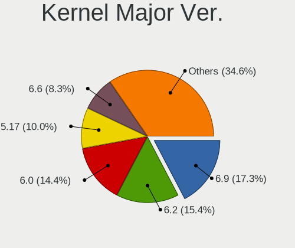
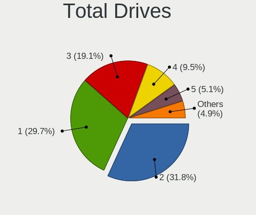
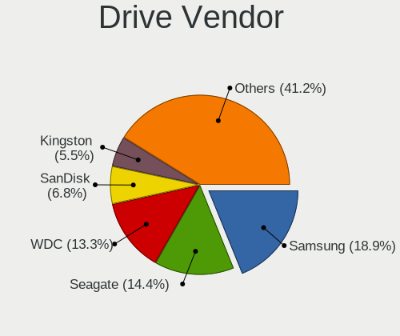
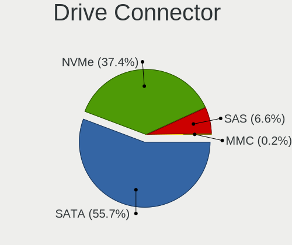
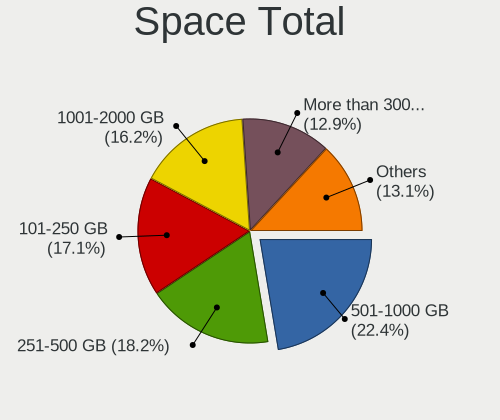
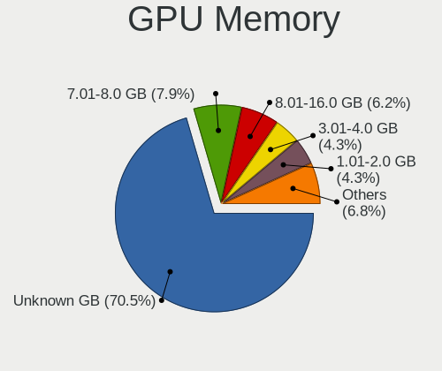
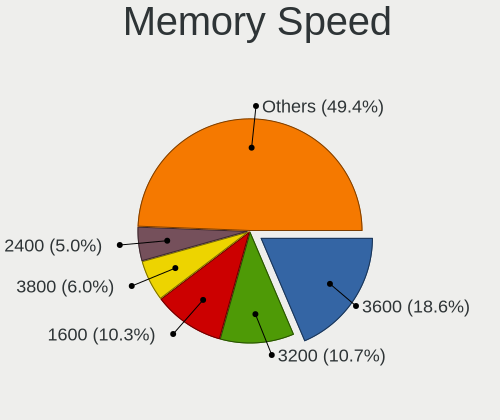

Pop!_OS 22.04 - Tested Hardware & Statistics (Desktops)
-------------------------------------------------------

A project to collect tested hardware configurations for Pop!_OS 22.04.

Anyone can contribute to this report by the [hw-probe](https://github.com/linuxhw/hw-probe) tool:

    sudo -E hw-probe -all -upload

Please contribute! Especially if your hardware is rare.

Contents
--------

* [ Test Cases ](#test-cases)

* [ System ](#system)
  - [ Kernel                   ](#kernel)
  - [ Kernel Family            ](#kernel-family)
  - [ Kernel Major Ver.        ](#kernel-major-ver)
  - [ Arch                     ](#arch)
  - [ DE                       ](#de)
  - [ Display Server           ](#display-server)
  - [ Display Manager          ](#display-manager)
  - [ OS Lang                  ](#os-lang)
  - [ Boot Mode                ](#boot-mode)
  - [ Filesystem               ](#filesystem)
  - [ Part. scheme             ](#part-scheme)
  - [ Dual Boot with Linux/BSD ](#dual-boot-with-linuxbsd)
  - [ Dual Boot (Win)          ](#dual-boot-win)

* [ Board ](#board)
  - [ Vendor                   ](#vendor)
  - [ Model                    ](#model)
  - [ Model Family             ](#model-family)
  - [ MFG Year                 ](#mfg-year)
  - [ Form Factor              ](#form-factor)
  - [ Secure Boot              ](#secure-boot)
  - [ Coreboot                 ](#coreboot)
  - [ RAM Size                 ](#ram-size)
  - [ RAM Used                 ](#ram-used)
  - [ Total Drives             ](#total-drives)
  - [ Has CD-ROM               ](#has-cd-rom)
  - [ Has Ethernet             ](#has-ethernet)
  - [ Has WiFi                 ](#has-wifi)
  - [ Has Bluetooth            ](#has-bluetooth)

* [ Location ](#location)
  - [ Country                  ](#country)
  - [ City                     ](#city)

* [ Drives ](#drives)
  - [ Drive Vendor             ](#drive-vendor)
  - [ Drive Model              ](#drive-model)
  - [ HDD Vendor               ](#hdd-vendor)
  - [ SSD Vendor               ](#ssd-vendor)
  - [ Drive Kind               ](#drive-kind)
  - [ Drive Connector          ](#drive-connector)
  - [ Drive Size               ](#drive-size)
  - [ Space Total              ](#space-total)
  - [ Space Used               ](#space-used)
  - [ Malfunc. Drives          ](#malfunc-drives)
  - [ Malfunc. Drive Vendor    ](#malfunc-drive-vendor)
  - [ Malfunc. HDD Vendor      ](#malfunc-hdd-vendor)
  - [ Malfunc. Drive Kind      ](#malfunc-drive-kind)
  - [ Failed Drives            ](#failed-drives)
  - [ Failed Drive Vendor      ](#failed-drive-vendor)
  - [ Drive Status             ](#drive-status)

* [ Storage controller ](#storage-controller)
  - [ Storage Vendor           ](#storage-vendor)
  - [ Storage Model            ](#storage-model)
  - [ Storage Kind             ](#storage-kind)

* [ Processor ](#processor)
  - [ CPU Vendor               ](#cpu-vendor)
  - [ CPU Model                ](#cpu-model)
  - [ CPU Model Family         ](#cpu-model-family)
  - [ CPU Cores                ](#cpu-cores)
  - [ CPU Sockets              ](#cpu-sockets)
  - [ CPU Threads              ](#cpu-threads)
  - [ CPU Op-Modes             ](#cpu-op-modes)
  - [ CPU Microcode            ](#cpu-microcode)
  - [ CPU Microarch            ](#cpu-microarch)

* [ Graphics ](#graphics)
  - [ GPU Vendor               ](#gpu-vendor)
  - [ GPU Model                ](#gpu-model)
  - [ GPU Combo                ](#gpu-combo)
  - [ GPU Driver               ](#gpu-driver)
  - [ GPU Memory               ](#gpu-memory)

* [ Monitor ](#monitor)
  - [ Monitor Vendor           ](#monitor-vendor)
  - [ Monitor Model            ](#monitor-model)
  - [ Monitor Resolution       ](#monitor-resolution)
  - [ Monitor Diagonal         ](#monitor-diagonal)
  - [ Monitor Width            ](#monitor-width)
  - [ Aspect Ratio             ](#aspect-ratio)
  - [ Monitor Area             ](#monitor-area)
  - [ Pixel Density            ](#pixel-density)
  - [ Multiple Monitors        ](#multiple-monitors)

* [ Network ](#network)
  - [ Net Controller Vendor    ](#net-controller-vendor)
  - [ Net Controller Model     ](#net-controller-model)
  - [ Wireless Vendor          ](#wireless-vendor)
  - [ Wireless Model           ](#wireless-model)
  - [ Ethernet Vendor          ](#ethernet-vendor)
  - [ Ethernet Model           ](#ethernet-model)
  - [ Net Controller Kind      ](#net-controller-kind)
  - [ Used Controller          ](#used-controller)
  - [ NICs                     ](#nics)
  - [ IPv6                     ](#ipv6)

* [ Bluetooth ](#bluetooth)
  - [ Bluetooth Vendor         ](#bluetooth-vendor)
  - [ Bluetooth Model          ](#bluetooth-model)

* [ Sound ](#sound)
  - [ Sound Vendor             ](#sound-vendor)
  - [ Sound Model              ](#sound-model)

* [ Memory ](#memory)
  - [ Memory Vendor            ](#memory-vendor)
  - [ Memory Model             ](#memory-model)
  - [ Memory Kind              ](#memory-kind)
  - [ Memory Form Factor       ](#memory-form-factor)
  - [ Memory Size              ](#memory-size)
  - [ Memory Speed             ](#memory-speed)

* [ Printers & scanners ](#printers--scanners)
  - [ Printer Vendor           ](#printer-vendor)
  - [ Printer Model            ](#printer-model)
  - [ Scanner Vendor           ](#scanner-vendor)
  - [ Scanner Model            ](#scanner-model)

* [ Camera ](#camera)
  - [ Camera Vendor            ](#camera-vendor)
  - [ Camera Model             ](#camera-model)

* [ Security ](#security)
  - [ Fingerprint Vendor       ](#fingerprint-vendor)
  - [ Fingerprint Model        ](#fingerprint-model)
  - [ Chipcard Vendor          ](#chipcard-vendor)
  - [ Chipcard Model           ](#chipcard-model)

* [ Unsupported ](#unsupported)
  - [ Unsupported Devices      ](#unsupported-devices)
  - [ Unsupported Device Types ](#unsupported-device-types)

Test Cases
----------

Total: 2886

| Vendor        | Model                       | Probe                                                      | Date         |
|---------------|-----------------------------|------------------------------------------------------------|--------------|
| MSI           | B650 GAMING PLUS WIFI       | [1ff9c9f7cb](https://linux-hardware.org/?probe=1ff9c9f7cb) | Jan 06, 2025 |
| Gigabyte      | H370M D3H GSM-CF            | [639eb0e4fc](https://linux-hardware.org/?probe=639eb0e4fc) | Jan 05, 2025 |
| Gigabyte      | B650M D3HP                  | [0d0a62d437](https://linux-hardware.org/?probe=0d0a62d437) | Jan 05, 2025 |
| Gigabyte      | B550 UD AC-Y1               | [b5d5a649e6](https://linux-hardware.org/?probe=b5d5a649e6) | Jan 05, 2025 |
| Apple         | Mac-F221BEC8                | [05de585a46](https://linux-hardware.org/?probe=05de585a46) | Jan 04, 2025 |
| Gigabyte      | H370M D3H GSM-CF            | [305c971d23](https://linux-hardware.org/?probe=305c971d23) | Jan 03, 2025 |
| ASUSTek       | ROG STRIX Z790-F GAMING ... | [e8f18de27b](https://linux-hardware.org/?probe=e8f18de27b) | Jan 03, 2025 |
| ASRock        | B450M/ac                    | [58bf1994a2](https://linux-hardware.org/?probe=58bf1994a2) | Jan 03, 2025 |
| Gigabyte      | B650 AORUS ELITE AX         | [91839e20df](https://linux-hardware.org/?probe=91839e20df) | Jan 03, 2025 |
| ASUSTek       | M5A97 R2.0                  | [7526506dc2](https://linux-hardware.org/?probe=7526506dc2) | Jan 03, 2025 |
| Gigabyte      | B450M DS3H WIFI-CF          | [e91eadd16c](https://linux-hardware.org/?probe=e91eadd16c) | Jan 02, 2025 |
| Gigabyte      | B450 AORUS ELITE            | [849e3021f2](https://linux-hardware.org/?probe=849e3021f2) | Jan 02, 2025 |
| MSI           | B450 TOMAHAWK               | [77e32dabcd](https://linux-hardware.org/?probe=77e32dabcd) | Jan 02, 2025 |
| ASUSTek       | M5A97 R2.0                  | [a15d70317f](https://linux-hardware.org/?probe=a15d70317f) | Jan 01, 2025 |
| ASUSTek       | PRIME B760M-A AX6 II        | [1012b4d63f](https://linux-hardware.org/?probe=1012b4d63f) | Jan 01, 2025 |
| ASUSTek       | PRIME B760M-A AX6 II        | [e3f9df9d9e](https://linux-hardware.org/?probe=e3f9df9d9e) | Jan 01, 2025 |
| ASRock        | N68-S UCC                   | [b83c60bccf](https://linux-hardware.org/?probe=b83c60bccf) | Jan 01, 2025 |
| Fujitsu       | D3220-A1 S26361-D3220-A1    | [079f7f1707](https://linux-hardware.org/?probe=079f7f1707) | Dec 31, 2024 |
| ASRock        | H570M Pro4                  | [ae9219a819](https://linux-hardware.org/?probe=ae9219a819) | Dec 31, 2024 |
| ASRock        | N68-S UCC                   | [e48cfb70c6](https://linux-hardware.org/?probe=e48cfb70c6) | Dec 31, 2024 |
| ASRock        | N68-S UCC                   | [a53617b9d5](https://linux-hardware.org/?probe=a53617b9d5) | Dec 31, 2024 |
| ASRock        | X370 Gaming-ITX/ac          | [f89abca0f9](https://linux-hardware.org/?probe=f89abca0f9) | Dec 29, 2024 |
| ASUSTek       | ROG STRIX X670E-I GAMING... | [0e48acaa7e](https://linux-hardware.org/?probe=0e48acaa7e) | Dec 29, 2024 |
| ASUSTek       | Z97-K                       | [53f0c1c555](https://linux-hardware.org/?probe=53f0c1c555) | Dec 29, 2024 |
| Lenovo        | 312A SDK0J40697 WIN 3305... | [9fa8931c0b](https://linux-hardware.org/?probe=9fa8931c0b) | Dec 29, 2024 |
| ASUSTek       | F1A75-M-PRO R2.0            | [8485c1ce27](https://linux-hardware.org/?probe=8485c1ce27) | Dec 28, 2024 |
| ASUSTek       | P8H61-M LX3 PLUS R2.0       | [39e50a00e4](https://linux-hardware.org/?probe=39e50a00e4) | Dec 28, 2024 |
| ASUSTek       | M4A87TD EVO                 | [4182d5a5ec](https://linux-hardware.org/?probe=4182d5a5ec) | Dec 28, 2024 |
| HP            | 8265                        | [3b63487fcf](https://linux-hardware.org/?probe=3b63487fcf) | Dec 28, 2024 |
| ASRock        | H110M-HDV                   | [4501aaefe1](https://linux-hardware.org/?probe=4501aaefe1) | Dec 27, 2024 |
| ASRock        | B450 Steel Legend           | [5320a7c488](https://linux-hardware.org/?probe=5320a7c488) | Dec 27, 2024 |
| ASRock        | H110M-HDV                   | [eb488f568b](https://linux-hardware.org/?probe=eb488f568b) | Dec 26, 2024 |
| Gigabyte      | B450 AORUS PRO WIFI-CF      | [283a58ac15](https://linux-hardware.org/?probe=283a58ac15) | Dec 26, 2024 |
| ASUSTek       | ROG Maximus Z790 HERO       | [9fcbcdf645](https://linux-hardware.org/?probe=9fcbcdf645) | Dec 26, 2024 |
| Dell          | 0WPMFG A00                  | [32af132170](https://linux-hardware.org/?probe=32af132170) | Dec 25, 2024 |
| Dell          | 0XHGV1 A00                  | [017302e467](https://linux-hardware.org/?probe=017302e467) | Dec 25, 2024 |
| Dell          | 0YF8P5 A00                  | [fab3c1d036](https://linux-hardware.org/?probe=fab3c1d036) | Dec 25, 2024 |
| HP            | 8906 SMVB                   | [7c1ad30996](https://linux-hardware.org/?probe=7c1ad30996) | Dec 25, 2024 |
| MSI           | Z370 GAMING PRO CARBON A... | [46c1540093](https://linux-hardware.org/?probe=46c1540093) | Dec 24, 2024 |
| Gigabyte      | X570 AORUS ULTRA            | [bbae43def0](https://linux-hardware.org/?probe=bbae43def0) | Dec 24, 2024 |
| MSI           | B550-A PRO                  | [dd6260a709](https://linux-hardware.org/?probe=dd6260a709) | Dec 24, 2024 |
| Gigabyte      | Z370P D3-CF                 | [9ea1b90178](https://linux-hardware.org/?probe=9ea1b90178) | Dec 23, 2024 |
| HP            | 3396                        | [6e2c93c063](https://linux-hardware.org/?probe=6e2c93c063) | Dec 23, 2024 |
| HP            | 3396                        | [a237d63fa3](https://linux-hardware.org/?probe=a237d63fa3) | Dec 23, 2024 |
| MSI           | B650 GAMING PLUS WIFI       | [ca3ac47c6d](https://linux-hardware.org/?probe=ca3ac47c6d) | Dec 23, 2024 |
| Gigabyte      | X570S AERO G                | [f4832ab80c](https://linux-hardware.org/?probe=f4832ab80c) | Dec 23, 2024 |
| MSI           | MPG B550 GAMING PLUS        | [b9260cccc7](https://linux-hardware.org/?probe=b9260cccc7) | Dec 22, 2024 |
| ASUSTek       | B150M-A/M.2                 | [bdb9de439f](https://linux-hardware.org/?probe=bdb9de439f) | Dec 22, 2024 |
| HP            | 3397                        | [d72e973be9](https://linux-hardware.org/?probe=d72e973be9) | Dec 22, 2024 |
| MSI           | B560M-A PRO                 | [814f11f38f](https://linux-hardware.org/?probe=814f11f38f) | Dec 22, 2024 |
| ASRock        | X670E PG Lightning          | [a87b7ceb23](https://linux-hardware.org/?probe=a87b7ceb23) | Dec 22, 2024 |
| ASRock        | X570 Phantom Gaming 4       | [c0bbc9c576](https://linux-hardware.org/?probe=c0bbc9c576) | Dec 22, 2024 |
| Unknown       | X99-D8                      | [0bd81498ad](https://linux-hardware.org/?probe=0bd81498ad) | Dec 21, 2024 |
| ECS           | H61H2-M6                    | [ee83334d6e](https://linux-hardware.org/?probe=ee83334d6e) | Dec 21, 2024 |
| ASUSTek       | B150M-A/M.2                 | [58579615c1](https://linux-hardware.org/?probe=58579615c1) | Dec 20, 2024 |
| ASRock        | 970 Extreme3 R2.0           | [cc8e8b062c](https://linux-hardware.org/?probe=cc8e8b062c) | Dec 19, 2024 |
| Gigabyte      | B550 GAMING X               | [5e7733d216](https://linux-hardware.org/?probe=5e7733d216) | Dec 19, 2024 |
| MSI           | B150 GAMING M3              | [eb7d688010](https://linux-hardware.org/?probe=eb7d688010) | Dec 18, 2024 |
| MSI           | Z370 GAMING PRO CARBON      | [3b9ab5404e](https://linux-hardware.org/?probe=3b9ab5404e) | Dec 17, 2024 |
| ASUSTek       | Z77-A                       | [905b20309d](https://linux-hardware.org/?probe=905b20309d) | Dec 17, 2024 |
| MSI           | MPG Z690 FORCE WIFI         | [67fda65f1a](https://linux-hardware.org/?probe=67fda65f1a) | Dec 16, 2024 |
| JGINYUE       | B650I Night Devil Ver:      | [d98b74d533](https://linux-hardware.org/?probe=d98b74d533) | Dec 15, 2024 |
| Gigabyte      | B550M AORUS ELITE           | [ea5d5a1d8f](https://linux-hardware.org/?probe=ea5d5a1d8f) | Dec 14, 2024 |
| ASUSTek       | PRIME Z270-A                | [5af9a6f758](https://linux-hardware.org/?probe=5af9a6f758) | Dec 14, 2024 |
| Biostar       | A520MH                      | [46f468d23e](https://linux-hardware.org/?probe=46f468d23e) | Dec 14, 2024 |
| Gigabyte      | Z590 VISION D               | [e51c407f40](https://linux-hardware.org/?probe=e51c407f40) | Dec 14, 2024 |
| ASUSTek       | Maximus IX HERO             | [277adb5291](https://linux-hardware.org/?probe=277adb5291) | Dec 14, 2024 |
| Gigabyte      | X870 GAMING X WIFI7         | [bf3a0594a1](https://linux-hardware.org/?probe=bf3a0594a1) | Dec 14, 2024 |
| Lenovo        | 0B98401 PRO                 | [fbf5a87269](https://linux-hardware.org/?probe=fbf5a87269) | Dec 14, 2024 |
| ASUSTek       | TUF Gaming Z690-PLUS        | [d46d8a8dc1](https://linux-hardware.org/?probe=d46d8a8dc1) | Dec 13, 2024 |
| Alienware     | 0K9TKY A00                  | [02f928f245](https://linux-hardware.org/?probe=02f928f245) | Dec 13, 2024 |
| Apple         | Mac-F60DEB81FF30ACF6 Mac... | [bc4af2a098](https://linux-hardware.org/?probe=bc4af2a098) | Dec 12, 2024 |
| Gigabyte      | B650 EAGLE                  | [b7d5b664b5](https://linux-hardware.org/?probe=b7d5b664b5) | Dec 12, 2024 |
| System76      | Thelio thelio-r2            | [7a66bf9502](https://linux-hardware.org/?probe=7a66bf9502) | Dec 12, 2024 |
| ASUSTek       | Z97-K                       | [8096f8f1b6](https://linux-hardware.org/?probe=8096f8f1b6) | Dec 12, 2024 |
| ASUSTek       | M5A97 R2.0                  | [e0157671c5](https://linux-hardware.org/?probe=e0157671c5) | Dec 12, 2024 |
| ASRock        | 970 Extreme3 R2.0           | [9fa51abc19](https://linux-hardware.org/?probe=9fa51abc19) | Dec 11, 2024 |
| Acer          | Aspire X3960                | [7bc5a0a910](https://linux-hardware.org/?probe=7bc5a0a910) | Dec 11, 2024 |
| ASUSTek       | TUF Gaming Z590-PLUS        | [4caf21526d](https://linux-hardware.org/?probe=4caf21526d) | Dec 11, 2024 |
| Gigabyte      | G41M-ES2L                   | [ff47572b6b](https://linux-hardware.org/?probe=ff47572b6b) | Dec 11, 2024 |
| Gigabyte      | X870 EAGLE WIFI7            | [9d8f1f5a1c](https://linux-hardware.org/?probe=9d8f1f5a1c) | Dec 11, 2024 |
| MSI           | Z270 SLI PLUS               | [4bd957e3ec](https://linux-hardware.org/?probe=4bd957e3ec) | Dec 10, 2024 |
| Dell          | 0478VN A00                  | [86908e3156](https://linux-hardware.org/?probe=86908e3156) | Dec 09, 2024 |
| Gigabyte      | X570 AORUS MASTER           | [7305cf039c](https://linux-hardware.org/?probe=7305cf039c) | Dec 09, 2024 |
| ASRock        | H610M-ITX/eDP               | [75e26c7c07](https://linux-hardware.org/?probe=75e26c7c07) | Dec 09, 2024 |
| ASUSTek       | Pro WS WRX80E-SAGE SE WI... | [d873aaad11](https://linux-hardware.org/?probe=d873aaad11) | Dec 09, 2024 |
| AZW           | MINI S                      | [a82e287e6c](https://linux-hardware.org/?probe=a82e287e6c) | Dec 09, 2024 |
| ASRock        | H610M-ITX/eDP               | [e9eed28958](https://linux-hardware.org/?probe=e9eed28958) | Dec 09, 2024 |
| Supermicro    | X9DRD-iF                    | [f90d8dfc09](https://linux-hardware.org/?probe=f90d8dfc09) | Dec 08, 2024 |
| ASUSTek       | PRIME H270-PLUS             | [79abd0b864](https://linux-hardware.org/?probe=79abd0b864) | Dec 08, 2024 |
| ASUSTek       | B150M-C                     | [0e25bdfd87](https://linux-hardware.org/?probe=0e25bdfd87) | Dec 07, 2024 |
| MSI           | MPG B650I EDGE WIFI         | [15ceab731a](https://linux-hardware.org/?probe=15ceab731a) | Dec 07, 2024 |
| Supermicro    | X9DRD-iF                    | [24c2ea7bbd](https://linux-hardware.org/?probe=24c2ea7bbd) | Dec 07, 2024 |
| ASUSTek       | P8P67 PRO                   | [89c4ef1413](https://linux-hardware.org/?probe=89c4ef1413) | Dec 07, 2024 |
| ASUSTek       | P8P67 PRO                   | [40751025a5](https://linux-hardware.org/?probe=40751025a5) | Dec 07, 2024 |
| ASUSTek       | PRIME Z690-P WIFI           | [741eb16cb4](https://linux-hardware.org/?probe=741eb16cb4) | Dec 07, 2024 |
| ASRock        | B450M Pro4                  | [780d8477b4](https://linux-hardware.org/?probe=780d8477b4) | Dec 07, 2024 |
| ASRock        | X570 Phantom Gaming 4       | [4b14a65ae5](https://linux-hardware.org/?probe=4b14a65ae5) | Dec 07, 2024 |
| ASUSTek       | Z170 PRO GAMING/AURA        | [e25da0298a](https://linux-hardware.org/?probe=e25da0298a) | Dec 06, 2024 |
| MSI           | PRO Z790-A WIFI             | [386b5bb2fa](https://linux-hardware.org/?probe=386b5bb2fa) | Dec 06, 2024 |
| Gigabyte      | Z390 AORUS PRO-CF           | [c28dd5c7ab](https://linux-hardware.org/?probe=c28dd5c7ab) | Dec 05, 2024 |
| Intel         | B75                         | [69a652cb51](https://linux-hardware.org/?probe=69a652cb51) | Dec 05, 2024 |
| Gigabyte      | Z170-Gaming K3              | [eb3f1d8587](https://linux-hardware.org/?probe=eb3f1d8587) | Dec 05, 2024 |
| Dell          | 0GY6Y8 A02                  | [315414ee85](https://linux-hardware.org/?probe=315414ee85) | Dec 05, 2024 |
| Dell          | 0GY6Y8 A02                  | [91d86a1a29](https://linux-hardware.org/?probe=91d86a1a29) | Dec 05, 2024 |
| MSI           | B650 GAMING PLUS WIFI       | [38917bc287](https://linux-hardware.org/?probe=38917bc287) | Dec 04, 2024 |
| Dell          | 09KPNV A00                  | [954003dcdc](https://linux-hardware.org/?probe=954003dcdc) | Dec 04, 2024 |
| ASRock        | X570 Taichi                 | [095dc95b9d](https://linux-hardware.org/?probe=095dc95b9d) | Dec 04, 2024 |
| MSI           | MPG B650I EDGE WIFI         | [b1cf6cfea9](https://linux-hardware.org/?probe=b1cf6cfea9) | Dec 04, 2024 |
| Gigabyte      | X870 EAGLE WIFI7            | [4178f34632](https://linux-hardware.org/?probe=4178f34632) | Dec 04, 2024 |
| MSI           | MPG Z690 FORCE WIFI         | [eea3d584af](https://linux-hardware.org/?probe=eea3d584af) | Dec 04, 2024 |
| Positivo      | POS-EIH61CQ                 | [d4fad86c11](https://linux-hardware.org/?probe=d4fad86c11) | Dec 04, 2024 |
| MSI           | MPG X570 GAMING PLUS        | [23325c9670](https://linux-hardware.org/?probe=23325c9670) | Dec 03, 2024 |
| ASUSTek       | PRIME B350M-K               | [8e7c6af74e](https://linux-hardware.org/?probe=8e7c6af74e) | Dec 03, 2024 |
| ASUSTek       | PRIME B350M-A               | [3b2b2cdb80](https://linux-hardware.org/?probe=3b2b2cdb80) | Dec 03, 2024 |
| MSI           | MAG Z590 TOMAHAWK WIFI      | [898f745e60](https://linux-hardware.org/?probe=898f745e60) | Dec 03, 2024 |
| ASRock        | B450M Steel Legend          | [b4a0a64ac0](https://linux-hardware.org/?probe=b4a0a64ac0) | Dec 03, 2024 |
| ASUSTek       | PRIME B660-PLUS D4          | [303b3a510d](https://linux-hardware.org/?probe=303b3a510d) | Dec 02, 2024 |
| ASUSTek       | PRIME B660-PLUS D4          | [98f50b0d90](https://linux-hardware.org/?probe=98f50b0d90) | Dec 02, 2024 |
| MSI           | MPG X570 GAMING PLUS        | [ad5a11492c](https://linux-hardware.org/?probe=ad5a11492c) | Dec 02, 2024 |
| ASUSTek       | PRIME B760M-A AX6 II        | [66cdfbda88](https://linux-hardware.org/?probe=66cdfbda88) | Dec 02, 2024 |
| Gigabyte      | X570 AORUS ULTRA            | [d71db12c0a](https://linux-hardware.org/?probe=d71db12c0a) | Dec 02, 2024 |
| ASUSTek       | PRIME Z690-P WIFI           | [6c84ee4665](https://linux-hardware.org/?probe=6c84ee4665) | Dec 01, 2024 |
| ASUSTek       | P6T DELUXE V2               | [fa59a3d752](https://linux-hardware.org/?probe=fa59a3d752) | Dec 01, 2024 |
| ASUSTek       | ROG STRIX B550-F GAMING ... | [6ba50b8196](https://linux-hardware.org/?probe=6ba50b8196) | Dec 01, 2024 |
| Gigabyte      | B550 AORUS ELITE V2         | [882e0e49e0](https://linux-hardware.org/?probe=882e0e49e0) | Dec 01, 2024 |
| ASUSTek       | TUF Gaming A620M-PLUS       | [b2a46b17d9](https://linux-hardware.org/?probe=b2a46b17d9) | Dec 01, 2024 |
| ASUSTek       | ROG STRIX B550-A GAMING     | [cfe2d2980e](https://linux-hardware.org/?probe=cfe2d2980e) | Dec 01, 2024 |
| MSI           | B550 GAMING GEN3            | [7f2c1251c1](https://linux-hardware.org/?probe=7f2c1251c1) | Dec 01, 2024 |
| Shenzhen M... | RPBNB                       | [471e0eae44](https://linux-hardware.org/?probe=471e0eae44) | Nov 30, 2024 |
| Dell          | 0VHWTR A02                  | [0295b5d88e](https://linux-hardware.org/?probe=0295b5d88e) | Nov 30, 2024 |
| ASUSTek       | ROG STRIX X570-E GAMING     | [be0716093f](https://linux-hardware.org/?probe=be0716093f) | Nov 30, 2024 |
| AZW           | MINI S                      | [b21eaf0955](https://linux-hardware.org/?probe=b21eaf0955) | Nov 29, 2024 |
| HP            | 18E6                        | [8ff866b586](https://linux-hardware.org/?probe=8ff866b586) | Nov 28, 2024 |
| MSI           | MAG X670E TOMAHAWK WIFI     | [0cfba5ec43](https://linux-hardware.org/?probe=0cfba5ec43) | Nov 27, 2024 |
| ASUSTek       | P5Q-WS                      | [9c1be46138](https://linux-hardware.org/?probe=9c1be46138) | Nov 27, 2024 |
| Gigabyte      | Z97X-Gaming 7               | [66ed7c3731](https://linux-hardware.org/?probe=66ed7c3731) | Nov 26, 2024 |
| ASUSTek       | PRIME Z790-V AX             | [e3dda3c505](https://linux-hardware.org/?probe=e3dda3c505) | Nov 26, 2024 |
| MSI           | H270-A PRO                  | [e2974172be](https://linux-hardware.org/?probe=e2974172be) | Nov 25, 2024 |
| MSI           | B650 GAMING PLUS WIFI       | [4f62376d84](https://linux-hardware.org/?probe=4f62376d84) | Nov 25, 2024 |
| Dell          | 0VHWTR A02                  | [c23095586a](https://linux-hardware.org/?probe=c23095586a) | Nov 24, 2024 |
| MSI           | H270-A PRO                  | [554c3ad6a6](https://linux-hardware.org/?probe=554c3ad6a6) | Nov 23, 2024 |
| MSI           | MAG X570 TOMAHAWK WIFI      | [ffd1398e1b](https://linux-hardware.org/?probe=ffd1398e1b) | Nov 23, 2024 |
| ASUSTek       | TUF Gaming X570-PLUS        | [5233943083](https://linux-hardware.org/?probe=5233943083) | Nov 22, 2024 |
| ASUSTek       | PRIME B450M-A               | [79597758d9](https://linux-hardware.org/?probe=79597758d9) | Nov 22, 2024 |
| ASRock        | 970 Extreme3 R2.0           | [3c75cf4004](https://linux-hardware.org/?probe=3c75cf4004) | Nov 21, 2024 |
| Gigabyte      | Z690 AORUS MASTER           | [0b7cd81ab1](https://linux-hardware.org/?probe=0b7cd81ab1) | Nov 21, 2024 |
| Gigabyte      | B75M-D3H                    | [f4e6dc4230](https://linux-hardware.org/?probe=f4e6dc4230) | Nov 21, 2024 |
| Gigabyte      | B550 AORUS ELITE AX V2      | [d9fa077e13](https://linux-hardware.org/?probe=d9fa077e13) | Nov 19, 2024 |
| ASRock        | X670E PG Lightning          | [07a38ec669](https://linux-hardware.org/?probe=07a38ec669) | Nov 19, 2024 |
| MSI           | H61M-P31                    | [0209ef23d5](https://linux-hardware.org/?probe=0209ef23d5) | Nov 19, 2024 |
| MSI           | H61M-P31                    | [6ff594d173](https://linux-hardware.org/?probe=6ff594d173) | Nov 18, 2024 |
| ASUSTek       | ROG STRIX Z390-F GAMING     | [896963442d](https://linux-hardware.org/?probe=896963442d) | Nov 18, 2024 |
| ASUSTek       | ROG STRIX Z390-F GAMING     | [5590d9581e](https://linux-hardware.org/?probe=5590d9581e) | Nov 18, 2024 |
| ASUSTek       | ROG STRIX B550-F GAMING ... | [56a3f6ca37](https://linux-hardware.org/?probe=56a3f6ca37) | Nov 18, 2024 |
| Dell          | 0VHWTR A02                  | [c4fd80459e](https://linux-hardware.org/?probe=c4fd80459e) | Nov 17, 2024 |
| ASRock        | X670E PG Lightning          | [0db2e7e64c](https://linux-hardware.org/?probe=0db2e7e64c) | Nov 17, 2024 |
| MSI           | B650 GAMING PLUS WIFI       | [2c5311e308](https://linux-hardware.org/?probe=2c5311e308) | Nov 17, 2024 |
| ASUSTek       | ROG STRIX B550-F GAMING ... | [ff04745822](https://linux-hardware.org/?probe=ff04745822) | Nov 16, 2024 |
| MSI           | PRO Z790-A WIFI             | [0c8044a2d4](https://linux-hardware.org/?probe=0c8044a2d4) | Nov 16, 2024 |
| ASUSTek       | ROG STRIX B550-F GAMING ... | [d13f4015bb](https://linux-hardware.org/?probe=d13f4015bb) | Nov 15, 2024 |
| ASUSTek       | ROG STRIX B550-F GAMING ... | [fc1124cd18](https://linux-hardware.org/?probe=fc1124cd18) | Nov 15, 2024 |
| ASUSTek       | TUF Gaming Z690-PLUS WIF... | [054b123f91](https://linux-hardware.org/?probe=054b123f91) | Nov 15, 2024 |
| ASUSTek       | M3A                         | [d3f42b3ab8](https://linux-hardware.org/?probe=d3f42b3ab8) | Nov 15, 2024 |
| Dell          | 0YF8P5 A00                  | [e42cce2813](https://linux-hardware.org/?probe=e42cce2813) | Nov 15, 2024 |
| ASUSTek       | PRIME B450M-A               | [792208442b](https://linux-hardware.org/?probe=792208442b) | Nov 14, 2024 |
| Dell          | 0YF8P5 A00                  | [e872037135](https://linux-hardware.org/?probe=e872037135) | Nov 14, 2024 |
| ASUSTek       | P8Z77-V LX2                 | [482dd6b939](https://linux-hardware.org/?probe=482dd6b939) | Nov 14, 2024 |
| AZW           | MINI S                      | [16e41e32ed](https://linux-hardware.org/?probe=16e41e32ed) | Nov 14, 2024 |
| AZW           | MINI S                      | [b766d78b0f](https://linux-hardware.org/?probe=b766d78b0f) | Nov 14, 2024 |
| Dell          | 0D4MD1 A00                  | [8a55c02e08](https://linux-hardware.org/?probe=8a55c02e08) | Nov 12, 2024 |
| HC Technol... | HCAR5000-MI                 | [3d0f0dc3a3](https://linux-hardware.org/?probe=3d0f0dc3a3) | Nov 11, 2024 |
| MSI           | Z270 SLI PLUS               | [ed80f0f9d6](https://linux-hardware.org/?probe=ed80f0f9d6) | Nov 11, 2024 |
| ASUSTek       | B85M-G                      | [83854ceaa7](https://linux-hardware.org/?probe=83854ceaa7) | Nov 10, 2024 |
| Gigabyte      | B650 GAMING X AX V2         | [06e904448b](https://linux-hardware.org/?probe=06e904448b) | Nov 09, 2024 |
| Intel         | X99H                        | [5e31d210ca](https://linux-hardware.org/?probe=5e31d210ca) | Nov 09, 2024 |
| Gigabyte      | B550 UD AC                  | [844ce5e614](https://linux-hardware.org/?probe=844ce5e614) | Nov 09, 2024 |
| Gigabyte      | B650 GAMING X AX V2         | [747035fcc0](https://linux-hardware.org/?probe=747035fcc0) | Nov 09, 2024 |
| Intel         | DH61BF AAG81311-102         | [fa09fae0e6](https://linux-hardware.org/?probe=fa09fae0e6) | Nov 08, 2024 |
| MSI           | PRO B660-A DDR4             | [723518a192](https://linux-hardware.org/?probe=723518a192) | Nov 08, 2024 |
| Dell          | 0HY9JP A00                  | [ba793c9a96](https://linux-hardware.org/?probe=ba793c9a96) | Nov 07, 2024 |
| Gigabyte      | X870 GAMING WIFI6           | [92957f360a](https://linux-hardware.org/?probe=92957f360a) | Nov 06, 2024 |
| Gigabyte      | B550 AORUS ELITE AX V2      | [c53cffc662](https://linux-hardware.org/?probe=c53cffc662) | Nov 06, 2024 |
| ASRock        | B650 LiveMixer              | [312b0972f7](https://linux-hardware.org/?probe=312b0972f7) | Nov 06, 2024 |
| ASUSTek       | PRIME Z790-V AX             | [24710cb98a](https://linux-hardware.org/?probe=24710cb98a) | Nov 06, 2024 |
| ASUSTek       | PRIME Z790-V AX             | [3d09c0f78f](https://linux-hardware.org/?probe=3d09c0f78f) | Nov 06, 2024 |
| ASUSTek       | PRIME B360M-A               | [45d0b46228](https://linux-hardware.org/?probe=45d0b46228) | Nov 06, 2024 |
| ASUSTek       | P7P55D-E                    | [e6cddc3d72](https://linux-hardware.org/?probe=e6cddc3d72) | Nov 05, 2024 |
| ASRock        | H87 Performance             | [5680ba8d20](https://linux-hardware.org/?probe=5680ba8d20) | Nov 04, 2024 |
| HP            | 2129                        | [0a6a53a99f](https://linux-hardware.org/?probe=0a6a53a99f) | Nov 04, 2024 |
| ASUSTek       | CM6870                      | [bb5ceef12d](https://linux-hardware.org/?probe=bb5ceef12d) | Nov 04, 2024 |
| Dell          | 0VHWTR A02                  | [0510510273](https://linux-hardware.org/?probe=0510510273) | Nov 03, 2024 |
| Dell          | 0JP3NX A01                  | [44c5885090](https://linux-hardware.org/?probe=44c5885090) | Nov 02, 2024 |
| Biostar       | A780L                       | [9fbbe8bb22](https://linux-hardware.org/?probe=9fbbe8bb22) | Nov 02, 2024 |
| Intel         | X99 V1.0                    | [41c10ad1c4](https://linux-hardware.org/?probe=41c10ad1c4) | Nov 01, 2024 |
| ASUSTek       | PRIME X670E-PRO WIFI        | [07c831fabd](https://linux-hardware.org/?probe=07c831fabd) | Nov 01, 2024 |
| Intel         | X99                         | [1090396c96](https://linux-hardware.org/?probe=1090396c96) | Oct 31, 2024 |
| Dell          | 0D4MD1 A00                  | [ba7413667b](https://linux-hardware.org/?probe=ba7413667b) | Oct 31, 2024 |
| ASUSTek       | TUF Gaming X670E-PLUS WI... | [df33da1aff](https://linux-hardware.org/?probe=df33da1aff) | Oct 30, 2024 |
| ASUSTek       | PRIME B650M-A WIFI II       | [fc46ea6344](https://linux-hardware.org/?probe=fc46ea6344) | Oct 29, 2024 |
| Dell          | 07T4MC A09                  | [e6f3a1ec08](https://linux-hardware.org/?probe=e6f3a1ec08) | Oct 29, 2024 |
| ASUSTek       | PRIME A320M-K               | [1f16dfb5a7](https://linux-hardware.org/?probe=1f16dfb5a7) | Oct 29, 2024 |
| MSI           | MPG X570 GAMING PLUS        | [6ba1445c64](https://linux-hardware.org/?probe=6ba1445c64) | Oct 29, 2024 |
| Gigabyte      | B450 AORUS M                | [028685c0a9](https://linux-hardware.org/?probe=028685c0a9) | Oct 26, 2024 |
| Gigabyte      | G41M-Combo                  | [4ddd0f69f1](https://linux-hardware.org/?probe=4ddd0f69f1) | Oct 26, 2024 |
| Gigabyte      | G41M-Combo                  | [0fb81a0008](https://linux-hardware.org/?probe=0fb81a0008) | Oct 26, 2024 |
| Gigabyte      | Z690 AORUS MASTER           | [bfa95cffa8](https://linux-hardware.org/?probe=bfa95cffa8) | Oct 26, 2024 |
| MSI           | B650 GAMING PLUS WIFI       | [9be6f0ffd0](https://linux-hardware.org/?probe=9be6f0ffd0) | Oct 25, 2024 |
| Intel         | DH77EB AAG39073-304         | [260a0dccc2](https://linux-hardware.org/?probe=260a0dccc2) | Oct 25, 2024 |
| Gigabyte      | Z690 AORUS MASTER           | [424bbe5529](https://linux-hardware.org/?probe=424bbe5529) | Oct 25, 2024 |
| TB            | WTR R1                      | [deb31354cb](https://linux-hardware.org/?probe=deb31354cb) | Oct 25, 2024 |
| MSI           | MPG X570 GAMING PLUS        | [d013c75bc0](https://linux-hardware.org/?probe=d013c75bc0) | Oct 25, 2024 |
| ASUSTek       | PRIME Z690-P WIFI           | [ec5c700007](https://linux-hardware.org/?probe=ec5c700007) | Oct 24, 2024 |
| Dell          | 0K240Y A01                  | [0c8041b514](https://linux-hardware.org/?probe=0c8041b514) | Oct 24, 2024 |
| ASUSTek       | TUF B450M-PLUS GAMING       | [51e502d243](https://linux-hardware.org/?probe=51e502d243) | Oct 24, 2024 |
| Gigabyte      | B75M-D3H                    | [833b93b860](https://linux-hardware.org/?probe=833b93b860) | Oct 23, 2024 |
| ASUSTek       | PRIME H310M-K R2.0          | [3c7f38442a](https://linux-hardware.org/?probe=3c7f38442a) | Oct 23, 2024 |
| Gigabyte      | H370M D3H GSM-CF            | [069580c3b2](https://linux-hardware.org/?probe=069580c3b2) | Oct 22, 2024 |
| ASRock        | B450M Steel Legend          | [4710ecffdc](https://linux-hardware.org/?probe=4710ecffdc) | Oct 22, 2024 |
| ASRock        | B450M Steel Legend          | [841c88c37f](https://linux-hardware.org/?probe=841c88c37f) | Oct 22, 2024 |
| TB            | WTR R1                      | [77199b6dc7](https://linux-hardware.org/?probe=77199b6dc7) | Oct 21, 2024 |
| ASRock        | 970 Extreme3 R2.0           | [1fcb0f751e](https://linux-hardware.org/?probe=1fcb0f751e) | Oct 21, 2024 |
| MSI           | X99S XPOWER AC              | [b089ed1300](https://linux-hardware.org/?probe=b089ed1300) | Oct 20, 2024 |
| ASRock        | B760M PG Riptide            | [dffb37693f](https://linux-hardware.org/?probe=dffb37693f) | Oct 20, 2024 |
| Unknown       | Unknown                     | [1380476f1e](https://linux-hardware.org/?probe=1380476f1e) | Oct 20, 2024 |
| ASUSTek       | TUF Gaming X570-PLUS        | [bd85cf1a79](https://linux-hardware.org/?probe=bd85cf1a79) | Oct 19, 2024 |
| ASUSTek       | TUF Gaming X570-PLUS        | [b4ee7a4976](https://linux-hardware.org/?probe=b4ee7a4976) | Oct 19, 2024 |
| Gigabyte      | B450 I AORUS PRO WIFI-CF    | [519c6c9fce](https://linux-hardware.org/?probe=519c6c9fce) | Oct 19, 2024 |
| Biostar       | A780L                       | [ce27f19033](https://linux-hardware.org/?probe=ce27f19033) | Oct 19, 2024 |
| Gigabyte      | GA-990FXA-UD3               | [ad76756fd0](https://linux-hardware.org/?probe=ad76756fd0) | Oct 19, 2024 |
| MSI           | PRO B650-P WIFI             | [19d2539e75](https://linux-hardware.org/?probe=19d2539e75) | Oct 19, 2024 |
| Gigabyte      | B450 I AORUS PRO WIFI-CF    | [0b40a221ac](https://linux-hardware.org/?probe=0b40a221ac) | Oct 18, 2024 |
| MSI           | MPG X570 GAMING PLUS        | [5dca39ff49](https://linux-hardware.org/?probe=5dca39ff49) | Oct 17, 2024 |
| Intel         | X99                         | [057dc6ac9f](https://linux-hardware.org/?probe=057dc6ac9f) | Oct 17, 2024 |
| MSI           | H110M PRO-VH PLUS           | [a10a4ae8fa](https://linux-hardware.org/?probe=a10a4ae8fa) | Oct 17, 2024 |
| HP            | 802F                        | [5553cbd4ca](https://linux-hardware.org/?probe=5553cbd4ca) | Oct 17, 2024 |
| ASUSTek       | TUF Gaming X570-PLUS        | [5d46c792d0](https://linux-hardware.org/?probe=5d46c792d0) | Oct 17, 2024 |
| Gigabyte      | B360 AORUS GAMING 3 WIFI... | [0a10d42a20](https://linux-hardware.org/?probe=0a10d42a20) | Oct 16, 2024 |
| ASUSTek       | TUF Gaming X570-PLUS        | [637bebb3f3](https://linux-hardware.org/?probe=637bebb3f3) | Oct 16, 2024 |
| Gigabyte      | Z490 GAMING X AX            | [e726c70ed6](https://linux-hardware.org/?probe=e726c70ed6) | Oct 16, 2024 |
| ASUSTek       | ROG STRIX X570-E GAMING ... | [76a70beb84](https://linux-hardware.org/?probe=76a70beb84) | Oct 16, 2024 |
| Gigabyte      | B550 AORUS ELITE AX V2      | [1d18778ca6](https://linux-hardware.org/?probe=1d18778ca6) | Oct 15, 2024 |
| Gigabyte      | X570S AORUS MASTER          | [30fd511ed4](https://linux-hardware.org/?probe=30fd511ed4) | Oct 15, 2024 |
| MSI           | H110M PRO-VH PLUS           | [fdd792f39b](https://linux-hardware.org/?probe=fdd792f39b) | Oct 15, 2024 |
| ASRock        | B550 Taichi Razer Editio... | [6a3e9babae](https://linux-hardware.org/?probe=6a3e9babae) | Oct 15, 2024 |
| ASRock        | B550 Taichi Razer Editio... | [abd8353fc1](https://linux-hardware.org/?probe=abd8353fc1) | Oct 15, 2024 |
| MSI           | H310-F PRO                  | [96e06666bd](https://linux-hardware.org/?probe=96e06666bd) | Oct 15, 2024 |
| ASUSTek       | ROG STRIX B650E-F GAMING... | [4ab8dafc86](https://linux-hardware.org/?probe=4ab8dafc86) | Oct 14, 2024 |
| MSI           | PRO Z790-A MAX WIFI         | [8fabff367d](https://linux-hardware.org/?probe=8fabff367d) | Oct 14, 2024 |
| ASRock        | B760M PG Riptide            | [f4e8c2acd6](https://linux-hardware.org/?probe=f4e8c2acd6) | Oct 14, 2024 |
| Koloe         | X58                         | [53ff53a4cc](https://linux-hardware.org/?probe=53ff53a4cc) | Oct 14, 2024 |
| ASUSTek       | Maximus VIII HERO           | [cc3ba34210](https://linux-hardware.org/?probe=cc3ba34210) | Oct 13, 2024 |
| ASUSTek       | PRIME X570-P                | [beeb197b20](https://linux-hardware.org/?probe=beeb197b20) | Oct 13, 2024 |
| ASRock        | AB350M-HDV R3.0             | [0caee97f69](https://linux-hardware.org/?probe=0caee97f69) | Oct 13, 2024 |
| Dell          | 0CU409                      | [674f7bd1a1](https://linux-hardware.org/?probe=674f7bd1a1) | Oct 13, 2024 |
| Alienware     | 0N4R4N A00                  | [0cfa6f6b4b](https://linux-hardware.org/?probe=0cfa6f6b4b) | Oct 13, 2024 |
| ASUSTek       | TUF Gaming B550-PLUS WIF... | [ec7fc07772](https://linux-hardware.org/?probe=ec7fc07772) | Oct 13, 2024 |
| ASUSTek       | PRIME Z690-P WIFI           | [24c4bcf3e5](https://linux-hardware.org/?probe=24c4bcf3e5) | Oct 13, 2024 |
| MSI           | MS-B9351                    | [9ab378024d](https://linux-hardware.org/?probe=9ab378024d) | Oct 13, 2024 |
| MSI           | MPG X570 GAMING PRO CARB... | [ce0e497ca9](https://linux-hardware.org/?probe=ce0e497ca9) | Oct 12, 2024 |
| ASUSTek       | PRIME H310M-R R2.0          | [700a309817](https://linux-hardware.org/?probe=700a309817) | Oct 12, 2024 |
| ASUSTek       | PRIME H310M-R R2.0          | [57aa3bcdd4](https://linux-hardware.org/?probe=57aa3bcdd4) | Oct 12, 2024 |
| MSI           | X470 GAMING PRO CARBON      | [685ba31b0b](https://linux-hardware.org/?probe=685ba31b0b) | Oct 10, 2024 |
| ASUSTek       | B150M-C                     | [09809c7c01](https://linux-hardware.org/?probe=09809c7c01) | Oct 10, 2024 |
| ASUSTek       | B150M-C                     | [3c5997535c](https://linux-hardware.org/?probe=3c5997535c) | Oct 10, 2024 |
| Gigabyte      | H170-HD3-CF                 | [767fd4f4a9](https://linux-hardware.org/?probe=767fd4f4a9) | Oct 10, 2024 |
| Foxconn       | 2ADA                        | [1660f30544](https://linux-hardware.org/?probe=1660f30544) | Oct 10, 2024 |
| Foxconn       | 2ADA                        | [48ef106fef](https://linux-hardware.org/?probe=48ef106fef) | Oct 10, 2024 |
| Dell          | 096JG8 A00                  | [eeaa3bb7a6](https://linux-hardware.org/?probe=eeaa3bb7a6) | Oct 10, 2024 |
| Gigabyte      | H170-HD3-CF                 | [9cf0171a3a](https://linux-hardware.org/?probe=9cf0171a3a) | Oct 09, 2024 |
| Dell          | 096JG8 A00                  | [19449a27f3](https://linux-hardware.org/?probe=19449a27f3) | Oct 09, 2024 |
| HP            | 2B4B                        | [0591688b19](https://linux-hardware.org/?probe=0591688b19) | Oct 09, 2024 |
| MSI           | MPG X570 GAMING PLUS        | [be147f67ae](https://linux-hardware.org/?probe=be147f67ae) | Oct 09, 2024 |
| ASUSTek       | ROG STRIX B550-F GAMING     | [1fc0dd6939](https://linux-hardware.org/?probe=1fc0dd6939) | Oct 09, 2024 |
| Alienware     | 0K9TKY A00                  | [eed362c8ce](https://linux-hardware.org/?probe=eed362c8ce) | Oct 09, 2024 |
| ASRock        | B760M PG Riptide            | [0112e0d2f6](https://linux-hardware.org/?probe=0112e0d2f6) | Oct 09, 2024 |
| Fujitsu       | D3118-A1 S26361-D3118-A1    | [0b42d66aec](https://linux-hardware.org/?probe=0b42d66aec) | Oct 08, 2024 |
| Fujitsu       | D3118-A1 S26361-D3118-A1    | [f57726906e](https://linux-hardware.org/?probe=f57726906e) | Oct 08, 2024 |
| System76      | Thelio Mira thelio-mira-... | [863019f9d8](https://linux-hardware.org/?probe=863019f9d8) | Oct 08, 2024 |
| ASUSTek       | P6X58D-E                    | [254590d90b](https://linux-hardware.org/?probe=254590d90b) | Oct 07, 2024 |
| Lenovo        | 1048 SDK0Q40104 WIN 3915... | [8e7794b5e5](https://linux-hardware.org/?probe=8e7794b5e5) | Oct 07, 2024 |
| MSI           | MPG Z590 GAMING FORCE       | [224dee322a](https://linux-hardware.org/?probe=224dee322a) | Oct 06, 2024 |
| ASRock        | B550M-HDV                   | [f0ff453f6e](https://linux-hardware.org/?probe=f0ff453f6e) | Oct 06, 2024 |
| MSI           | MPG Z590 GAMING FORCE       | [e395202fd1](https://linux-hardware.org/?probe=e395202fd1) | Oct 05, 2024 |
| MSI           | MPG X570S EDGE MAX WIFI     | [2965460cd4](https://linux-hardware.org/?probe=2965460cd4) | Oct 05, 2024 |
| Dell          | 0K240Y A01                  | [67e40a612b](https://linux-hardware.org/?probe=67e40a612b) | Oct 05, 2024 |
| Gigabyte      | Z170-HD3-CF                 | [8ef4229227](https://linux-hardware.org/?probe=8ef4229227) | Oct 05, 2024 |
| Gigabyte      | Z170-HD3-CF                 | [b3d161f10c](https://linux-hardware.org/?probe=b3d161f10c) | Oct 05, 2024 |
| ASRock        | 970 Extreme3                | [3350145c6a](https://linux-hardware.org/?probe=3350145c6a) | Oct 05, 2024 |
| ASUSTek       | PRIME B350-PLUS             | [057d1d7a74](https://linux-hardware.org/?probe=057d1d7a74) | Oct 04, 2024 |
| Gigabyte      | B450M GAMING                | [5a7e21c336](https://linux-hardware.org/?probe=5a7e21c336) | Oct 04, 2024 |
| Gigabyte      | B450M GAMING                | [09718bd83a](https://linux-hardware.org/?probe=09718bd83a) | Oct 04, 2024 |
| ASRock        | 970 Extreme3                | [8eaad2bb51](https://linux-hardware.org/?probe=8eaad2bb51) | Oct 04, 2024 |
| ASUSTek       | TUF Gaming X570-PLUS        | [64e32d6a96](https://linux-hardware.org/?probe=64e32d6a96) | Oct 04, 2024 |
| MSI           | PRO B650-P WIFI             | [2d97f44bd4](https://linux-hardware.org/?probe=2d97f44bd4) | Oct 03, 2024 |
| MSI           | B450 TOMAHAWK MAX           | [11620bee22](https://linux-hardware.org/?probe=11620bee22) | Oct 03, 2024 |
| MSI           | B450 TOMAHAWK MAX           | [4462ad232a](https://linux-hardware.org/?probe=4462ad232a) | Oct 03, 2024 |
| ASUSTek       | PRIME Z790-P                | [5a20f0fbcf](https://linux-hardware.org/?probe=5a20f0fbcf) | Oct 03, 2024 |
| ASUSTek       | PRIME Z690-P WIFI D4        | [43ebb1e4ec](https://linux-hardware.org/?probe=43ebb1e4ec) | Oct 03, 2024 |
| ASUSTek       | ROG CROSSHAIR VIII DARK ... | [66c7197cab](https://linux-hardware.org/?probe=66c7197cab) | Oct 03, 2024 |
| ASRock        | 970 Extreme3 R2.0           | [234ffa3729](https://linux-hardware.org/?probe=234ffa3729) | Oct 02, 2024 |
| Gigabyte      | Z590 VISION D               | [992bb7d24d](https://linux-hardware.org/?probe=992bb7d24d) | Oct 02, 2024 |
| ASUSTek       | ROG STRIX X470-F GAMING     | [73dd513b22](https://linux-hardware.org/?probe=73dd513b22) | Oct 01, 2024 |
| HP            | 8597                        | [39f106b002](https://linux-hardware.org/?probe=39f106b002) | Sep 29, 2024 |
| HP            | 18E5                        | [e1758fc5c4](https://linux-hardware.org/?probe=e1758fc5c4) | Sep 29, 2024 |
| ASRock        | 970 Extreme3 R2.0           | [506731ea8d](https://linux-hardware.org/?probe=506731ea8d) | Sep 29, 2024 |
| ASUSTek       | PRIME Z690-P WIFI           | [3db990dffa](https://linux-hardware.org/?probe=3db990dffa) | Sep 29, 2024 |
| MSI           | X370 KRAIT GAMING           | [eda2ccd052](https://linux-hardware.org/?probe=eda2ccd052) | Sep 29, 2024 |
| Dell          | 0KRC95 A00                  | [886b6b82bf](https://linux-hardware.org/?probe=886b6b82bf) | Sep 29, 2024 |
| ASUSTek       | PRIME H310M-K R2.0          | [ccbfad6c6d](https://linux-hardware.org/?probe=ccbfad6c6d) | Sep 29, 2024 |
| Lenovo        | 30D0 SDK0J40697 WIN 3305... | [c356997396](https://linux-hardware.org/?probe=c356997396) | Sep 28, 2024 |
| ASRock        | H470M-HDV/M.2               | [8158f71264](https://linux-hardware.org/?probe=8158f71264) | Sep 28, 2024 |
| TianBei       | GOD88                       | [14aaf1d0f2](https://linux-hardware.org/?probe=14aaf1d0f2) | Sep 27, 2024 |
| ASUSTek       | ROG STRIX B450-I GAMING     | [dc0da7194e](https://linux-hardware.org/?probe=dc0da7194e) | Sep 27, 2024 |
| Dell          | 0VHWTR A02                  | [5edaae1ca1](https://linux-hardware.org/?probe=5edaae1ca1) | Sep 27, 2024 |
| MSI           | X670E GAMING PLUS WIFI      | [7956faa4b1](https://linux-hardware.org/?probe=7956faa4b1) | Sep 27, 2024 |
| MSI           | H410M-A PRO                 | [13cba33fe8](https://linux-hardware.org/?probe=13cba33fe8) | Sep 25, 2024 |
| ASUSTek       | PRIME A320M-K               | [4bd09ca30d](https://linux-hardware.org/?probe=4bd09ca30d) | Sep 24, 2024 |
| MACHINIST     | E5-MR9S V1.0                | [334e949999](https://linux-hardware.org/?probe=334e949999) | Sep 24, 2024 |
| ASUSTek       | PRIME A320M-K               | [c4e195980b](https://linux-hardware.org/?probe=c4e195980b) | Sep 23, 2024 |
| Dell          | 0VHWTR A02                  | [d5a9f39421](https://linux-hardware.org/?probe=d5a9f39421) | Sep 22, 2024 |
| Gigabyte      | 970A-DS3P                   | [8ee1bad547](https://linux-hardware.org/?probe=8ee1bad547) | Sep 22, 2024 |
| Lenovo        | SHARKBAY SDK0E50510 WIN     | [dc1a763d32](https://linux-hardware.org/?probe=dc1a763d32) | Sep 22, 2024 |
| ASUSTek       | PRIME X570-PRO              | [f1a006d1e1](https://linux-hardware.org/?probe=f1a006d1e1) | Sep 21, 2024 |
| ASRock        | B450 Steel Legend           | [2f3706f0c5](https://linux-hardware.org/?probe=2f3706f0c5) | Sep 21, 2024 |
| Gigabyte      | B550 UD AC-Y1               | [aa5cd0be8f](https://linux-hardware.org/?probe=aa5cd0be8f) | Sep 21, 2024 |
| Lenovo        | 31900058 STD                | [87e28eedb3](https://linux-hardware.org/?probe=87e28eedb3) | Sep 20, 2024 |
| ASUSTek       | TUF Gaming B650-E WIFI      | [cbdf576f50](https://linux-hardware.org/?probe=cbdf576f50) | Sep 19, 2024 |
| ASUSTek       | H81-GAMER                   | [be55c0ed79](https://linux-hardware.org/?probe=be55c0ed79) | Sep 19, 2024 |
| ASRock        | B450 Steel Legend           | [068811de2e](https://linux-hardware.org/?probe=068811de2e) | Sep 19, 2024 |
| Gigabyte      | B450 AORUS ELITE            | [2aaab87e79](https://linux-hardware.org/?probe=2aaab87e79) | Sep 18, 2024 |
| Lenovo        | 3168 SDK0J40697 WIN 3305... | [0fd910b3ad](https://linux-hardware.org/?probe=0fd910b3ad) | Sep 18, 2024 |
| MSI           | MAG B550 TOMAHAWK           | [09db67859d](https://linux-hardware.org/?probe=09db67859d) | Sep 18, 2024 |
| ASUSTek       | Z97-A                       | [15116f089f](https://linux-hardware.org/?probe=15116f089f) | Sep 18, 2024 |
| ASUSTek       | M4A78T-E                    | [b079e72277](https://linux-hardware.org/?probe=b079e72277) | Sep 18, 2024 |
| Lenovo        | 333B SDK0T76465 WIN 3422... | [3ebea78539](https://linux-hardware.org/?probe=3ebea78539) | Sep 17, 2024 |
| ASRock        | B365M-HDV                   | [4f11e504a4](https://linux-hardware.org/?probe=4f11e504a4) | Sep 17, 2024 |
| ASRock        | B650I Lightning WiFi        | [f8098b07c0](https://linux-hardware.org/?probe=f8098b07c0) | Sep 17, 2024 |
| ASUSTek       | M5A97 R2.0                  | [ebd8e172d8](https://linux-hardware.org/?probe=ebd8e172d8) | Sep 17, 2024 |
| Dell          | 0MGK50 A02                  | [c77fca48aa](https://linux-hardware.org/?probe=c77fca48aa) | Sep 16, 2024 |
| Gigabyte      | B550 AORUS ELITE V2         | [246cf80922](https://linux-hardware.org/?probe=246cf80922) | Sep 15, 2024 |
| OEM           | X79G                        | [6469747833](https://linux-hardware.org/?probe=6469747833) | Sep 15, 2024 |
| MSI           | B550 GAMING GEN3            | [55b783934d](https://linux-hardware.org/?probe=55b783934d) | Sep 14, 2024 |
| HP            | 89D8 SMVB                   | [83680c3917](https://linux-hardware.org/?probe=83680c3917) | Sep 14, 2024 |
| Dell          | 0MGK50 A02                  | [f135e80c90](https://linux-hardware.org/?probe=f135e80c90) | Sep 14, 2024 |
| ASUSTek       | PRIME B550M-A               | [d2eade6008](https://linux-hardware.org/?probe=d2eade6008) | Sep 14, 2024 |
| MSI           | B75MA-P45                   | [5f511858b7](https://linux-hardware.org/?probe=5f511858b7) | Sep 13, 2024 |
| MSI           | B75MA-P45                   | [2268718971](https://linux-hardware.org/?probe=2268718971) | Sep 13, 2024 |
| Intel         | DH77KC AAG39641-400         | [2478ecb6d7](https://linux-hardware.org/?probe=2478ecb6d7) | Sep 12, 2024 |
| MSI           | B650 GAMING PLUS WIFI       | [db5724bfce](https://linux-hardware.org/?probe=db5724bfce) | Sep 11, 2024 |
| MSI           | 880GMS-E41                  | [2bf925c67c](https://linux-hardware.org/?probe=2bf925c67c) | Sep 11, 2024 |
| ASRock        | Z390 Pro4                   | [ae24d0086f](https://linux-hardware.org/?probe=ae24d0086f) | Sep 11, 2024 |
| MSI           | B650 GAMING PLUS WIFI       | [cfcf6ea362](https://linux-hardware.org/?probe=cfcf6ea362) | Sep 11, 2024 |
| ASUSTek       | Z170 PRO GAMING             | [47253bcf4b](https://linux-hardware.org/?probe=47253bcf4b) | Sep 09, 2024 |
| MSI           | B550 GAMING GEN3            | [7b19658095](https://linux-hardware.org/?probe=7b19658095) | Sep 09, 2024 |
| ASRock        | A520M/ac                    | [a612bc35e1](https://linux-hardware.org/?probe=a612bc35e1) | Sep 09, 2024 |
| ASUSTek       | SABERTOOTH P67              | [e6c0c03a84](https://linux-hardware.org/?probe=e6c0c03a84) | Sep 08, 2024 |
| ASUSTek       | SABERTOOTH P67              | [c035e6b964](https://linux-hardware.org/?probe=c035e6b964) | Sep 08, 2024 |
| ASUSTek       | M4A785-M                    | [9182978bbb](https://linux-hardware.org/?probe=9182978bbb) | Sep 08, 2024 |
| ASUSTek       | PRIME B650-PLUS             | [19a2d37f08](https://linux-hardware.org/?probe=19a2d37f08) | Sep 08, 2024 |
| Gigabyte      | Z170X-Gaming 7              | [84cf77aa77](https://linux-hardware.org/?probe=84cf77aa77) | Sep 08, 2024 |
| ASUSTek       | ROG STRIX B650E-F GAMING... | [c2cef73d11](https://linux-hardware.org/?probe=c2cef73d11) | Sep 07, 2024 |
| Intel         | BOX-J4105A V3.0             | [b1d4dd0bd4](https://linux-hardware.org/?probe=b1d4dd0bd4) | Sep 07, 2024 |
| Intel         | BOX-J4105A V3.0             | [01d917fce6](https://linux-hardware.org/?probe=01d917fce6) | Sep 07, 2024 |
| ASUSTek       | PRIME A320M-K               | [a2923c2916](https://linux-hardware.org/?probe=a2923c2916) | Sep 04, 2024 |
| MSI           | B450 TOMAHAWK MAX           | [a62e0834a8](https://linux-hardware.org/?probe=a62e0834a8) | Sep 04, 2024 |
| ASRock        | B550 Phantom Gaming-ITX/... | [2e9c4a3189](https://linux-hardware.org/?probe=2e9c4a3189) | Sep 04, 2024 |
| ASRock        | B650E PG-ITX WiFi           | [64739c4c52](https://linux-hardware.org/?probe=64739c4c52) | Sep 03, 2024 |
| ASRock        | B650E PG-ITX WiFi           | [2f6b2386f3](https://linux-hardware.org/?probe=2f6b2386f3) | Sep 03, 2024 |
| Gigabyte      | Z370 AORUS Gaming 7         | [3f9d434cda](https://linux-hardware.org/?probe=3f9d434cda) | Sep 03, 2024 |
| ASUSTek       | M4A78T-E                    | [ba9e4ef02e](https://linux-hardware.org/?probe=ba9e4ef02e) | Sep 03, 2024 |
| ASUSTek       | TUF Gaming B760-PLUS WIF... | [59c732d659](https://linux-hardware.org/?probe=59c732d659) | Sep 03, 2024 |
| ASUSTek       | TUF Gaming B760-PLUS WIF... | [f1cb450aad](https://linux-hardware.org/?probe=f1cb450aad) | Sep 03, 2024 |
| Alienware     | 0K9TKY A00                  | [5cd57cb73f](https://linux-hardware.org/?probe=5cd57cb73f) | Sep 02, 2024 |
| ASRock        | B450 Gaming K4              | [bbaaf71d62](https://linux-hardware.org/?probe=bbaaf71d62) | Sep 02, 2024 |
| ASRock        | ALiveNF6G-VSTA              | [d5b3f47a4f](https://linux-hardware.org/?probe=d5b3f47a4f) | Sep 02, 2024 |
| ASRock        | ALiveNF6G-VSTA              | [e90b700498](https://linux-hardware.org/?probe=e90b700498) | Sep 02, 2024 |
| ASRock        | B550M Steel Legend          | [417c981b8f](https://linux-hardware.org/?probe=417c981b8f) | Sep 02, 2024 |
| ASUSTek       | M5A97 R2.0                  | [7ce9667960](https://linux-hardware.org/?probe=7ce9667960) | Sep 02, 2024 |
| ASUSTek       | H110M-K                     | [a1c10987b2](https://linux-hardware.org/?probe=a1c10987b2) | Sep 01, 2024 |
| Dell          | 0MGK50 A02                  | [4609e527b3](https://linux-hardware.org/?probe=4609e527b3) | Sep 01, 2024 |
| ASUSTek       | P6X58D PREMIUM              | [ec48a70ebf](https://linux-hardware.org/?probe=ec48a70ebf) | Sep 01, 2024 |
| ASUSTek       | M5A97 R2.0                  | [949ce28218](https://linux-hardware.org/?probe=949ce28218) | Sep 01, 2024 |
| Gigabyte      | H370M D3H GSM-CF            | [3341372848](https://linux-hardware.org/?probe=3341372848) | Aug 31, 2024 |
| ASRock        | B450 Gaming K4              | [1f76825972](https://linux-hardware.org/?probe=1f76825972) | Aug 31, 2024 |
| ASUSTek       | ROG STRIX B650E-I GAMING... | [0515980bed](https://linux-hardware.org/?probe=0515980bed) | Aug 31, 2024 |
| Dell          | 0RK936                      | [eaa47d3a8d](https://linux-hardware.org/?probe=eaa47d3a8d) | Aug 30, 2024 |
| Pegatron      | 2AD3                        | [89dfc9f55e](https://linux-hardware.org/?probe=89dfc9f55e) | Aug 30, 2024 |
| ASUSTek       | ROG STRIX B650E-I GAMING... | [4c473e9fe3](https://linux-hardware.org/?probe=4c473e9fe3) | Aug 30, 2024 |
| ASUSTek       | H81M-E                      | [9dec794b7f](https://linux-hardware.org/?probe=9dec794b7f) | Aug 30, 2024 |
| ASUSTek       | PRIME B450M-A II            | [e5c85f2d04](https://linux-hardware.org/?probe=e5c85f2d04) | Aug 29, 2024 |
| ASRock        | B550 Taichi                 | [c0740cc1dd](https://linux-hardware.org/?probe=c0740cc1dd) | Aug 28, 2024 |
| HP            | 8949 11                     | [1ef02868d1](https://linux-hardware.org/?probe=1ef02868d1) | Aug 27, 2024 |
| Dell          | 05MG37 A01                  | [66f6608841](https://linux-hardware.org/?probe=66f6608841) | Aug 26, 2024 |
| Gigabyte      | Z790 AORUS ELITE AX         | [7619941ef4](https://linux-hardware.org/?probe=7619941ef4) | Aug 25, 2024 |
| ASUSTek       | PRIME B650M-A WIFI II       | [43248f6c75](https://linux-hardware.org/?probe=43248f6c75) | Aug 24, 2024 |
| JGINYUE       | B550i-GAMING                | [21385ab790](https://linux-hardware.org/?probe=21385ab790) | Aug 24, 2024 |
| Gigabyte      | Z590 AORUS ELITE            | [f133a301ef](https://linux-hardware.org/?probe=f133a301ef) | Aug 24, 2024 |
| MSI           | Z490-A PRO                  | [34676385aa](https://linux-hardware.org/?probe=34676385aa) | Aug 24, 2024 |
| Gigabyte      | H97M-D3H                    | [6219f88938](https://linux-hardware.org/?probe=6219f88938) | Aug 24, 2024 |
| Intel         | H61                         | [235d185a09](https://linux-hardware.org/?probe=235d185a09) | Aug 23, 2024 |
| Gigabyte      | X79-UD3                     | [eaef87529d](https://linux-hardware.org/?probe=eaef87529d) | Aug 23, 2024 |
| Dell          | 05MG37 A01                  | [afe6bb3f3a](https://linux-hardware.org/?probe=afe6bb3f3a) | Aug 23, 2024 |
| ASUSTek       | PRIME A320M-K               | [312bbf1a56](https://linux-hardware.org/?probe=312bbf1a56) | Aug 23, 2024 |
| ASRock        | B760M PG Riptide            | [b645bcc70f](https://linux-hardware.org/?probe=b645bcc70f) | Aug 23, 2024 |
| ASRock        | B760M PG Riptide            | [634b1003f7](https://linux-hardware.org/?probe=634b1003f7) | Aug 22, 2024 |
| ASUSTek       | ROG STRIX B550-F GAMING ... | [b8be1cfaa0](https://linux-hardware.org/?probe=b8be1cfaa0) | Aug 22, 2024 |
| ASUSTek       | Maximus VIII HERO           | [b66200f3af](https://linux-hardware.org/?probe=b66200f3af) | Aug 21, 2024 |
| ASUSTek       | M4A78T-E                    | [850670b457](https://linux-hardware.org/?probe=850670b457) | Aug 20, 2024 |
| MSI           | B450 TOMAHAWK MAX           | [bd0e0e631d](https://linux-hardware.org/?probe=bd0e0e631d) | Aug 19, 2024 |
| Gigabyte      | H370M D3H GSM-CF            | [e9e34bd161](https://linux-hardware.org/?probe=e9e34bd161) | Aug 19, 2024 |
| HP            | 158A                        | [dba33b3615](https://linux-hardware.org/?probe=dba33b3615) | Aug 19, 2024 |
| ASUSTek       | TUF Gaming B550-PLUS        | [538bd3b7c8](https://linux-hardware.org/?probe=538bd3b7c8) | Aug 18, 2024 |
| HP            | 8298                        | [7c08836a71](https://linux-hardware.org/?probe=7c08836a71) | Aug 18, 2024 |
| Dell          | 0KRC95 A00                  | [3e257fb08c](https://linux-hardware.org/?probe=3e257fb08c) | Aug 18, 2024 |
| HP            | 8298                        | [9cdee21525](https://linux-hardware.org/?probe=9cdee21525) | Aug 18, 2024 |
| Alienware     | 0K9TKY A00                  | [bf601c79a0](https://linux-hardware.org/?probe=bf601c79a0) | Aug 18, 2024 |
| MSI           | B550 GAMING GEN3            | [3282cc5b8d](https://linux-hardware.org/?probe=3282cc5b8d) | Aug 17, 2024 |
| Lenovo        | SDK0E50510 WIN 262508278... | [705442b78e](https://linux-hardware.org/?probe=705442b78e) | Aug 17, 2024 |
| MSI           | PRO B760-P WIFI DDR4        | [f016b8e504](https://linux-hardware.org/?probe=f016b8e504) | Aug 17, 2024 |
| MSI           | PRO B760-P WIFI DDR4        | [5dfed557cd](https://linux-hardware.org/?probe=5dfed557cd) | Aug 17, 2024 |
| MSI           | X470 GAMING PRO             | [3c3b5c074d](https://linux-hardware.org/?probe=3c3b5c074d) | Aug 16, 2024 |
| MSI           | Z790 GAMING PLUS WIFI       | [0508702536](https://linux-hardware.org/?probe=0508702536) | Aug 16, 2024 |
| Dell          | 0M6C7G A00                  | [1cc2213cb3](https://linux-hardware.org/?probe=1cc2213cb3) | Aug 16, 2024 |
| Dell          | 0M6C7G A00                  | [15d2eb7ffa](https://linux-hardware.org/?probe=15d2eb7ffa) | Aug 16, 2024 |
| MSI           | Z390-A PRO                  | [061af3f20b](https://linux-hardware.org/?probe=061af3f20b) | Aug 15, 2024 |
| Gigabyte      | GA-890FXA-UD5               | [811a08f014](https://linux-hardware.org/?probe=811a08f014) | Aug 15, 2024 |
| Gigabyte      | G1.SNIPER B7-CF             | [9c74fd2453](https://linux-hardware.org/?probe=9c74fd2453) | Aug 15, 2024 |
| Dell          | 0MWYPT A02                  | [bf6bb2e1f9](https://linux-hardware.org/?probe=bf6bb2e1f9) | Aug 15, 2024 |
| ASUSTek       | Maximus VIII HERO           | [de7ad64690](https://linux-hardware.org/?probe=de7ad64690) | Aug 14, 2024 |
| Gigabyte      | Z170XP-SLI-CF               | [28698ba5b1](https://linux-hardware.org/?probe=28698ba5b1) | Aug 14, 2024 |
| Gigabyte      | Z170XP-SLI-CF               | [1c6e3b0798](https://linux-hardware.org/?probe=1c6e3b0798) | Aug 14, 2024 |
| ASUSTek       | PRIME B650-PLUS             | [bd67fc9306](https://linux-hardware.org/?probe=bd67fc9306) | Aug 13, 2024 |
| Unknown       | X99                         | [2424de4c27](https://linux-hardware.org/?probe=2424de4c27) | Aug 13, 2024 |
| Gigabyte      | H270M-DS3H-CF               | [b05ae1d293](https://linux-hardware.org/?probe=b05ae1d293) | Aug 12, 2024 |
| MSI           | MAG B650 TOMAHAWK WIFI      | [fc8c3576ff](https://linux-hardware.org/?probe=fc8c3576ff) | Aug 12, 2024 |
| Gigabyte      | B760M DS3H AX               | [2511e2e27c](https://linux-hardware.org/?probe=2511e2e27c) | Aug 12, 2024 |
| Gigabyte      | X570 AORUS MASTER           | [e9bf3f35c2](https://linux-hardware.org/?probe=e9bf3f35c2) | Aug 12, 2024 |
| ASUSTek       | PRIME TRX40-PRO S           | [8d430814f9](https://linux-hardware.org/?probe=8d430814f9) | Aug 12, 2024 |
| ASUSTek       | PRIME TRX40-PRO S           | [b8e277723a](https://linux-hardware.org/?probe=b8e277723a) | Aug 12, 2024 |
| MSI           | PRO Z790-VC WIFI            | [12fd87d753](https://linux-hardware.org/?probe=12fd87d753) | Aug 12, 2024 |
| ASUSTek       | ROG STRIX X570-F GAMING     | [a8a2ca27f5](https://linux-hardware.org/?probe=a8a2ca27f5) | Aug 11, 2024 |
| Huanan        | X99-QD4 V1.0                | [03d9cd7d8f](https://linux-hardware.org/?probe=03d9cd7d8f) | Aug 11, 2024 |
| Dell          | 0KWVT8 A03                  | [bd84edf70b](https://linux-hardware.org/?probe=bd84edf70b) | Aug 11, 2024 |
| ASRock        | B550 Taichi                 | [4c7c930992](https://linux-hardware.org/?probe=4c7c930992) | Aug 11, 2024 |
| ASRock        | B360M Pro4                  | [617db99564](https://linux-hardware.org/?probe=617db99564) | Aug 10, 2024 |
| MSI           | Z97 GAMING 5                | [f5df62e0e3](https://linux-hardware.org/?probe=f5df62e0e3) | Aug 09, 2024 |
| ASRock        | B550M Pro4                  | [4ee5c05e5d](https://linux-hardware.org/?probe=4ee5c05e5d) | Aug 08, 2024 |
| ASRock        | B650 PG Lightning           | [24b9cbc4c3](https://linux-hardware.org/?probe=24b9cbc4c3) | Aug 08, 2024 |
| MSI           | X470 GAMING PLUS            | [25ae750555](https://linux-hardware.org/?probe=25ae750555) | Aug 08, 2024 |
| JGINYUE       | B450I-GAMING Ver:1.1        | [30352439df](https://linux-hardware.org/?probe=30352439df) | Aug 07, 2024 |
| ASUSTek       | Maximus VIII HERO           | [6016928948](https://linux-hardware.org/?probe=6016928948) | Aug 07, 2024 |
| ASUSTek       | PRIME A520M-E               | [cb8a72934c](https://linux-hardware.org/?probe=cb8a72934c) | Aug 07, 2024 |
| Gigabyte      | B560M AORUS PRO AX          | [ad142aa4d2](https://linux-hardware.org/?probe=ad142aa4d2) | Aug 06, 2024 |
| ASRock        | B550M Pro4                  | [9292fcc7a3](https://linux-hardware.org/?probe=9292fcc7a3) | Aug 06, 2024 |
| Gigabyte      | B550 AORUS ELITE V2         | [69f6392035](https://linux-hardware.org/?probe=69f6392035) | Aug 05, 2024 |
| Gigabyte      | X670E AORUS MASTER          | [37373cb53a](https://linux-hardware.org/?probe=37373cb53a) | Aug 05, 2024 |
| MSI           | B450 TOMAHAWK MAX II        | [3571fff949](https://linux-hardware.org/?probe=3571fff949) | Aug 05, 2024 |
| ASUSTek       | PRIME H310M-R R2.0          | [61a0d663e1](https://linux-hardware.org/?probe=61a0d663e1) | Aug 04, 2024 |
| ASUSTek       | M5A78L-M LX PLUS            | [56a5fc5294](https://linux-hardware.org/?probe=56a5fc5294) | Aug 04, 2024 |
| ASUSTek       | M5A78L-M LX PLUS            | [3925335793](https://linux-hardware.org/?probe=3925335793) | Aug 04, 2024 |
| Gigabyte      | G41MT-S2P                   | [68972e8426](https://linux-hardware.org/?probe=68972e8426) | Aug 02, 2024 |
| Gigabyte      | X670 GAMING X AX            | [8fc63684ca](https://linux-hardware.org/?probe=8fc63684ca) | Aug 01, 2024 |
| ASRockRack    | ROMED6U-2L2T                | [bc2cfbbe18](https://linux-hardware.org/?probe=bc2cfbbe18) | Aug 01, 2024 |
| ASUSTek       | PRIME B660M-A D4            | [711db524cd](https://linux-hardware.org/?probe=711db524cd) | Aug 01, 2024 |
| HP            | 802F                        | [9e091395a1](https://linux-hardware.org/?probe=9e091395a1) | Aug 01, 2024 |
| Gigabyte      | X670 GAMING X AX            | [76160087f0](https://linux-hardware.org/?probe=76160087f0) | Aug 01, 2024 |
| MSI           | MPG B550 GAMING PLUS        | [9c32109aca](https://linux-hardware.org/?probe=9c32109aca) | Jul 31, 2024 |
| Gigabyte      | B760 DS3H                   | [e8ca621821](https://linux-hardware.org/?probe=e8ca621821) | Jul 31, 2024 |
| ASRock        | B760M PG Riptide            | [d48ccd8631](https://linux-hardware.org/?probe=d48ccd8631) | Jul 30, 2024 |
| Gigabyte      | H97N-WIFI                   | [02b2bee06f](https://linux-hardware.org/?probe=02b2bee06f) | Jul 30, 2024 |
| Gigabyte      | H97N-WIFI                   | [3b982914c0](https://linux-hardware.org/?probe=3b982914c0) | Jul 30, 2024 |
| AMI           | Intel                       | [e8c1dc7dbf](https://linux-hardware.org/?probe=e8c1dc7dbf) | Jul 30, 2024 |
| ASRock        | H470M-HDV/M.2               | [7a15f390cd](https://linux-hardware.org/?probe=7a15f390cd) | Jul 30, 2024 |
| MSI           | A320M PRO-VH PLUS           | [fe0642521d](https://linux-hardware.org/?probe=fe0642521d) | Jul 29, 2024 |
| Gigabyte      | B550M AORUS ELITE           | [0fd188eec7](https://linux-hardware.org/?probe=0fd188eec7) | Jul 29, 2024 |
| Gigabyte      | B550M AORUS ELITE           | [db921cc454](https://linux-hardware.org/?probe=db921cc454) | Jul 29, 2024 |
| Gigabyte      | Z690 UD DDR4                | [42e4e46256](https://linux-hardware.org/?probe=42e4e46256) | Jul 29, 2024 |
| Alienware     | 0K9TKY A00                  | [2b6c81fc5d](https://linux-hardware.org/?probe=2b6c81fc5d) | Jul 28, 2024 |
| MSI           | B450M PRO-VDH V2            | [d6f37140d4](https://linux-hardware.org/?probe=d6f37140d4) | Jul 28, 2024 |
| ASUSTek       | ROG STRIX B550-XE GAMING... | [5eeb285b4b](https://linux-hardware.org/?probe=5eeb285b4b) | Jul 28, 2024 |
| Gigabyte      | H270M-D3H-CF                | [527bafa1a2](https://linux-hardware.org/?probe=527bafa1a2) | Jul 27, 2024 |
| Gigabyte      | H270M-D3H-CF                | [8e61c77d83](https://linux-hardware.org/?probe=8e61c77d83) | Jul 27, 2024 |
| Gigabyte      | X570 AORUS MASTER           | [5b73fc65a2](https://linux-hardware.org/?probe=5b73fc65a2) | Jul 27, 2024 |
| Acer          | H57M01                      | [a5d0b5cb23](https://linux-hardware.org/?probe=a5d0b5cb23) | Jul 27, 2024 |
| MSI           | PRO Z790-VC WIFI            | [ce2bd01306](https://linux-hardware.org/?probe=ce2bd01306) | Jul 27, 2024 |
| ASUSTek       | PRIME B350M-A               | [7eca7458ea](https://linux-hardware.org/?probe=7eca7458ea) | Jul 26, 2024 |
| Biostar       | A320MH                      | [8185a71a75](https://linux-hardware.org/?probe=8185a71a75) | Jul 26, 2024 |
| ASUSTek       | M5A99X EVO R2.0             | [cc020bee59](https://linux-hardware.org/?probe=cc020bee59) | Jul 26, 2024 |
| Gigabyte      | X670 AORUS ELITE AX         | [ea83bd1705](https://linux-hardware.org/?probe=ea83bd1705) | Jul 26, 2024 |
| Intel         | H61                         | [75e5c32ae4](https://linux-hardware.org/?probe=75e5c32ae4) | Jul 25, 2024 |
| Alienware     | 0RF96M A01                  | [846675b6a3](https://linux-hardware.org/?probe=846675b6a3) | Jul 24, 2024 |
| Gigabyte      | X570 AORUS MASTER           | [b59bcf1a4d](https://linux-hardware.org/?probe=b59bcf1a4d) | Jul 24, 2024 |
| Gigabyte      | X570 GAMING X               | [9c0f3d7564](https://linux-hardware.org/?probe=9c0f3d7564) | Jul 23, 2024 |
| ASRock        | Z370 Gaming-ITX/ac          | [1feb2d1ed8](https://linux-hardware.org/?probe=1feb2d1ed8) | Jul 22, 2024 |
| HP            | 83E1                        | [8730997b3c](https://linux-hardware.org/?probe=8730997b3c) | Jul 22, 2024 |
| Dell          | 0782GW A01                  | [3977ca7e9a](https://linux-hardware.org/?probe=3977ca7e9a) | Jul 22, 2024 |
| HP            | 3646h                       | [372bfceee8](https://linux-hardware.org/?probe=372bfceee8) | Jul 22, 2024 |
| ASRock        | Z370 Gaming-ITX/ac          | [8bb305deae](https://linux-hardware.org/?probe=8bb305deae) | Jul 22, 2024 |
| Gigabyte      | B450 AORUS ELITE            | [ce47e04e8c](https://linux-hardware.org/?probe=ce47e04e8c) | Jul 21, 2024 |
| Gigabyte      | B650 EAGLE AX               | [6dd7e462ee](https://linux-hardware.org/?probe=6dd7e462ee) | Jul 21, 2024 |
| MSI           | PRO B760M-P DDR4            | [de6efe8006](https://linux-hardware.org/?probe=de6efe8006) | Jul 21, 2024 |
| NZXT          | N7 B650E                    | [a377d12a39](https://linux-hardware.org/?probe=a377d12a39) | Jul 21, 2024 |
| MSI           | PRO B760M-P DDR4            | [c2902561c9](https://linux-hardware.org/?probe=c2902561c9) | Jul 20, 2024 |
| Dell          | 0GY6Y8 A01                  | [790ecb5d30](https://linux-hardware.org/?probe=790ecb5d30) | Jul 20, 2024 |
| MSI           | B550-A PRO[CEC]             | [8df15d15a4](https://linux-hardware.org/?probe=8df15d15a4) | Jul 20, 2024 |
| MSI           | B550M PRO-VDH WIFI          | [51a79b8877](https://linux-hardware.org/?probe=51a79b8877) | Jul 19, 2024 |
| Apple         | Mac-F221BEC8                | [9e98e8a38c](https://linux-hardware.org/?probe=9e98e8a38c) | Jul 19, 2024 |
| Gigabyte      | B550M DS3H                  | [a3f16864aa](https://linux-hardware.org/?probe=a3f16864aa) | Jul 19, 2024 |
| Gigabyte      | X570 AORUS ELITE            | [a433142bff](https://linux-hardware.org/?probe=a433142bff) | Jul 19, 2024 |
| ASUSTek       | PRIME Z490-P                | [535e9dce6d](https://linux-hardware.org/?probe=535e9dce6d) | Jul 17, 2024 |
| MSI           | Z97 GAMING 5                | [fe874570ea](https://linux-hardware.org/?probe=fe874570ea) | Jul 17, 2024 |
| Unknown       | Unknown                     | [929917505d](https://linux-hardware.org/?probe=929917505d) | Jul 17, 2024 |
| MSI           | B550M PRO-VDH WIFI          | [8116b5ab58](https://linux-hardware.org/?probe=8116b5ab58) | Jul 17, 2024 |
| MSI           | B450 TOMAHAWK MAX II        | [1e38b6ee2b](https://linux-hardware.org/?probe=1e38b6ee2b) | Jul 16, 2024 |
| ASRock        | B550M Pro SE                | [ff98e2b24e](https://linux-hardware.org/?probe=ff98e2b24e) | Jul 15, 2024 |
| Gigabyte      | X58A-UD7                    | [6ba0085048](https://linux-hardware.org/?probe=6ba0085048) | Jul 15, 2024 |
| JGINYUE       | B550i-GAMING                | [facf752650](https://linux-hardware.org/?probe=facf752650) | Jul 15, 2024 |
| ASRock        | B550 PG Riptide             | [40de96ebe6](https://linux-hardware.org/?probe=40de96ebe6) | Jul 13, 2024 |
| MSI           | MAG Z390M MORTAR            | [a313a791dd](https://linux-hardware.org/?probe=a313a791dd) | Jul 13, 2024 |
| Gigabyte      | B450 AORUS M                | [49965ee28e](https://linux-hardware.org/?probe=49965ee28e) | Jul 12, 2024 |
| ASUSTek       | PRIME X570-P                | [6c0c752f84](https://linux-hardware.org/?probe=6c0c752f84) | Jul 12, 2024 |
| MSI           | MPG X570 GAMING PLUS        | [775d104dd5](https://linux-hardware.org/?probe=775d104dd5) | Jul 10, 2024 |
| ASUSTek       | TUF Gaming X570-PLUS        | [1630508daf](https://linux-hardware.org/?probe=1630508daf) | Jul 10, 2024 |
| HP            | 8594                        | [422cea7949](https://linux-hardware.org/?probe=422cea7949) | Jul 09, 2024 |
| Gigabyte      | H270M-DS3H-CF               | [880956dce2](https://linux-hardware.org/?probe=880956dce2) | Jul 09, 2024 |
| Gigabyte      | X670E AORUS PRO X           | [128fea1e97](https://linux-hardware.org/?probe=128fea1e97) | Jul 09, 2024 |
| Gigabyte      | X58A-UD7                    | [c5471b61ce](https://linux-hardware.org/?probe=c5471b61ce) | Jul 08, 2024 |
| Gigabyte      | Z170X-Gaming 3              | [509596fdcd](https://linux-hardware.org/?probe=509596fdcd) | Jul 08, 2024 |
| MSI           | PRO Z790-P WIFI DDR4        | [d49beb2797](https://linux-hardware.org/?probe=d49beb2797) | Jul 08, 2024 |
| Gigabyte      | Z690 UD DDR4                | [bd15491297](https://linux-hardware.org/?probe=bd15491297) | Jul 07, 2024 |
| MSI           | MEG X570 UNIFY              | [ec1a7d5e3f](https://linux-hardware.org/?probe=ec1a7d5e3f) | Jul 06, 2024 |
| Dell          | 0DF42J A00                  | [2c0fa89939](https://linux-hardware.org/?probe=2c0fa89939) | Jul 06, 2024 |
| ASUSTek       | PRIME H670-PLUS D4          | [fcde8cb1f0](https://linux-hardware.org/?probe=fcde8cb1f0) | Jul 06, 2024 |
| ASUSTek       | PRIME X470-PRO              | [5149c43ac4](https://linux-hardware.org/?probe=5149c43ac4) | Jul 05, 2024 |
| Gigabyte      | A520M K V2                  | [3315587330](https://linux-hardware.org/?probe=3315587330) | Jul 05, 2024 |
| Gigabyte      | H270M-DS3H-CF               | [85ee8988bc](https://linux-hardware.org/?probe=85ee8988bc) | Jul 05, 2024 |
| Gigabyte      | H270M-DS3H-CF               | [4135003321](https://linux-hardware.org/?probe=4135003321) | Jul 05, 2024 |
| ASUSTek       | ROG STRIX B550-I GAMING     | [a74e9f1285](https://linux-hardware.org/?probe=a74e9f1285) | Jul 04, 2024 |
| ASUSTek       | PRIME X570-P                | [853c595909](https://linux-hardware.org/?probe=853c595909) | Jul 04, 2024 |
| GEEKOM        | AE7                         | [44457a7465](https://linux-hardware.org/?probe=44457a7465) | Jul 04, 2024 |
| HP            | 3646h                       | [e86953fc1d](https://linux-hardware.org/?probe=e86953fc1d) | Jul 04, 2024 |
| ASUSTek       | Z87-PRO                     | [e96b292b22](https://linux-hardware.org/?probe=e96b292b22) | Jul 04, 2024 |
| Gigabyte      | B550 AORUS PRO V2           | [4e01739375](https://linux-hardware.org/?probe=4e01739375) | Jul 02, 2024 |
| ASUSTek       | PRIME B650M-A WIFI II       | [85e6955fa3](https://linux-hardware.org/?probe=85e6955fa3) | Jul 02, 2024 |
| ASUSTek       | Z87-K                       | [b1bc62b3b8](https://linux-hardware.org/?probe=b1bc62b3b8) | Jul 02, 2024 |
| ASUSTek       | ROG CROSSHAIR VIII HERO     | [ff1e4af5fd](https://linux-hardware.org/?probe=ff1e4af5fd) | Jul 02, 2024 |
| ASUSTek       | ROG CROSSHAIR VIII HERO     | [de10fc7f16](https://linux-hardware.org/?probe=de10fc7f16) | Jul 02, 2024 |
| HP            | 18E7                        | [d7e6718daf](https://linux-hardware.org/?probe=d7e6718daf) | Jul 01, 2024 |
| MSI           | B365M PRO-VH                | [58ca108468](https://linux-hardware.org/?probe=58ca108468) | Jun 30, 2024 |
| Dell          | 0XD433 A01                  | [b137bc0e39](https://linux-hardware.org/?probe=b137bc0e39) | Jun 30, 2024 |
| GEEKOM        | AE7                         | [4cd8965470](https://linux-hardware.org/?probe=4cd8965470) | Jun 30, 2024 |
| ASUSTek       | M4A79T Deluxe               | [1ffc2643fe](https://linux-hardware.org/?probe=1ffc2643fe) | Jun 29, 2024 |
| ASUSTek       | M4A79T Deluxe               | [4b5020cb2d](https://linux-hardware.org/?probe=4b5020cb2d) | Jun 29, 2024 |
| MSI           | MPG B650I EDGE WIFI         | [c1cca08c85](https://linux-hardware.org/?probe=c1cca08c85) | Jun 29, 2024 |
| ASUSTek       | ROG STRIX Z790-E GAMING ... | [012abe9f82](https://linux-hardware.org/?probe=012abe9f82) | Jun 28, 2024 |
| ASUSTek       | ProArt X670E-CREATOR WIF... | [fc1c8bb5cd](https://linux-hardware.org/?probe=fc1c8bb5cd) | Jun 28, 2024 |
| HP            | 18E7                        | [afd21565ec](https://linux-hardware.org/?probe=afd21565ec) | Jun 28, 2024 |
| Shenzhen M... | F7BFC                       | [f9159f1d37](https://linux-hardware.org/?probe=f9159f1d37) | Jun 27, 2024 |
| ASUSTek       | Pro WS TRX50-SAGE WIFI      | [480f889606](https://linux-hardware.org/?probe=480f889606) | Jun 27, 2024 |
| ASUSTek       | M5A78L-M LX PLUS            | [46e856fc41](https://linux-hardware.org/?probe=46e856fc41) | Jun 27, 2024 |
| ASUSTek       | M5A78L-M LX PLUS            | [81b37e4b57](https://linux-hardware.org/?probe=81b37e4b57) | Jun 27, 2024 |
| ASUSTek       | Maximus VI GENE             | [309582e7e2](https://linux-hardware.org/?probe=309582e7e2) | Jun 25, 2024 |
| MSI           | MAG X570 TOMAHAWK WIFI      | [9f5a8cdb08](https://linux-hardware.org/?probe=9f5a8cdb08) | Jun 25, 2024 |
| ASUSTek       | M5A97 R2.0                  | [04eff2c63f](https://linux-hardware.org/?probe=04eff2c63f) | Jun 24, 2024 |
| Acer          | FX58M                       | [d17ad6dfdf](https://linux-hardware.org/?probe=d17ad6dfdf) | Jun 24, 2024 |
| Acer          | FX58M                       | [12d25a0b03](https://linux-hardware.org/?probe=12d25a0b03) | Jun 24, 2024 |
| ASUSTek       | M4N72-E                     | [bf131f9def](https://linux-hardware.org/?probe=bf131f9def) | Jun 24, 2024 |
| ASUSTek       | ROG STRIX X570-E GAMING     | [9545489533](https://linux-hardware.org/?probe=9545489533) | Jun 24, 2024 |
| ASUSTek       | Maximus VI GENE             | [ecadf3dd2d](https://linux-hardware.org/?probe=ecadf3dd2d) | Jun 24, 2024 |
| MSI           | B365M PRO-VDH               | [850f3ea904](https://linux-hardware.org/?probe=850f3ea904) | Jun 24, 2024 |
| ASUSTek       | M5A97 R2.0                  | [c6be85ff7c](https://linux-hardware.org/?probe=c6be85ff7c) | Jun 23, 2024 |
| Dell          | 05YDCW A01                  | [39ed01c33a](https://linux-hardware.org/?probe=39ed01c33a) | Jun 23, 2024 |
| ASUSTek       | Z97-PRO GAMER               | [73032707be](https://linux-hardware.org/?probe=73032707be) | Jun 22, 2024 |
| ASUSTek       | Z97-PRO GAMER               | [15a3dbd5db](https://linux-hardware.org/?probe=15a3dbd5db) | Jun 22, 2024 |
| ASUSTek       | ROG STRIX Z690-A GAMING ... | [e52122428e](https://linux-hardware.org/?probe=e52122428e) | Jun 20, 2024 |
| MSI           | MPG X570 GAMING PLUS        | [de04fdf07e](https://linux-hardware.org/?probe=de04fdf07e) | Jun 20, 2024 |
| System76      | Thelio thelio-r3            | [ce68e3a906](https://linux-hardware.org/?probe=ce68e3a906) | Jun 19, 2024 |
| Gigabyte      | X570 AORUS MASTER           | [31ded147a8](https://linux-hardware.org/?probe=31ded147a8) | Jun 18, 2024 |
| ASRock        | H510 Pro BTC+               | [49d94371c8](https://linux-hardware.org/?probe=49d94371c8) | Jun 18, 2024 |
| MSI           | B650 GAMING PLUS WIFI       | [2f6972e738](https://linux-hardware.org/?probe=2f6972e738) | Jun 18, 2024 |
| MSI           | Z390-A PRO                  | [01dbafbb6e](https://linux-hardware.org/?probe=01dbafbb6e) | Jun 18, 2024 |
| Gigabyte      | B450 AORUS ELITE            | [8a2e597dec](https://linux-hardware.org/?probe=8a2e597dec) | Jun 18, 2024 |
| ASUSTek       | ProArt X670E-CREATOR WIF... | [adc88cbb14](https://linux-hardware.org/?probe=adc88cbb14) | Jun 18, 2024 |
| ASRock        | H510 Pro BTC+               | [09fe9680f7](https://linux-hardware.org/?probe=09fe9680f7) | Jun 18, 2024 |
| ASUSTek       | H97-PLUS                    | [0f87602b5a](https://linux-hardware.org/?probe=0f87602b5a) | Jun 18, 2024 |
| ASUSTek       | H97-PLUS                    | [d85b52226d](https://linux-hardware.org/?probe=d85b52226d) | Jun 18, 2024 |
| ASUSTek       | P8Z77-V LX                  | [f2691bf535](https://linux-hardware.org/?probe=f2691bf535) | Jun 17, 2024 |
| ASUSTek       | Z170-A                      | [432f4114f1](https://linux-hardware.org/?probe=432f4114f1) | Jun 17, 2024 |
| Dell          | 0KWVT8 A03                  | [72eddb2385](https://linux-hardware.org/?probe=72eddb2385) | Jun 17, 2024 |
| ASUSTek       | PRIME X670E-PRO WIFI        | [98fa90965a](https://linux-hardware.org/?probe=98fa90965a) | Jun 17, 2024 |
| Unknown       | Intel X79                   | [b2d0c166c4](https://linux-hardware.org/?probe=b2d0c166c4) | Jun 16, 2024 |
| MSI           | B450 GAMING PLUS MAX        | [3c22c8cd3f](https://linux-hardware.org/?probe=3c22c8cd3f) | Jun 16, 2024 |
| ASUSTek       | PRIME B660M-A D4            | [fade2029a5](https://linux-hardware.org/?probe=fade2029a5) | Jun 16, 2024 |
| MSI           | B450 GAMING PLUS MAX        | [53e13d322f](https://linux-hardware.org/?probe=53e13d322f) | Jun 16, 2024 |
| HP            | 8054                        | [9beee67f9c](https://linux-hardware.org/?probe=9beee67f9c) | Jun 15, 2024 |
| ASUSTek       | PRIME B450-PLUS             | [47bb7c0f58](https://linux-hardware.org/?probe=47bb7c0f58) | Jun 15, 2024 |
| MSI           | MAG X670E TOMAHAWK WIFI     | [aee377ab97](https://linux-hardware.org/?probe=aee377ab97) | Jun 15, 2024 |
| ASUSTek       | PRIME B650M-A WIFI II       | [a3adbfd79c](https://linux-hardware.org/?probe=a3adbfd79c) | Jun 15, 2024 |
| Gigabyte      | B75M-D2V                    | [1bdb0774ec](https://linux-hardware.org/?probe=1bdb0774ec) | Jun 14, 2024 |
| ASUSTek       | M5A78L-M LE/USB3            | [de724a5157](https://linux-hardware.org/?probe=de724a5157) | Jun 13, 2024 |
| Packard Be... | MCP73PV                     | [cee96d28a1](https://linux-hardware.org/?probe=cee96d28a1) | Jun 13, 2024 |
| HP            | 8054                        | [75ae1fa0b1](https://linux-hardware.org/?probe=75ae1fa0b1) | Jun 13, 2024 |
| Pegatron      | NARRA5                      | [3a6b723286](https://linux-hardware.org/?probe=3a6b723286) | Jun 13, 2024 |
| MSI           | MPG B550 GAMING PLUS        | [991030218a](https://linux-hardware.org/?probe=991030218a) | Jun 13, 2024 |
| Gigabyte      | X570 UD                     | [5be50e6828](https://linux-hardware.org/?probe=5be50e6828) | Jun 11, 2024 |
| ASUSTek       | PRIME H610M-K D4            | [2bcce1eb1d](https://linux-hardware.org/?probe=2bcce1eb1d) | Jun 11, 2024 |
| MSI           | B450M MORTAR MAX            | [1d847efc24](https://linux-hardware.org/?probe=1d847efc24) | Jun 10, 2024 |
| MSI           | PRO Z790-P WIFI DDR4        | [c433941141](https://linux-hardware.org/?probe=c433941141) | Jun 10, 2024 |
| MSI           | Z590-A PRO                  | [eabc9dc662](https://linux-hardware.org/?probe=eabc9dc662) | Jun 09, 2024 |
| MSI           | Z590-A PRO                  | [bf614aeed9](https://linux-hardware.org/?probe=bf614aeed9) | Jun 09, 2024 |
| System76      | Thelio Mira thelio-mira-... | [95d2abb431](https://linux-hardware.org/?probe=95d2abb431) | Jun 08, 2024 |
| ASUSTek       | ROG STRIX B550-F GAMING ... | [1bd06c13ce](https://linux-hardware.org/?probe=1bd06c13ce) | Jun 08, 2024 |
| ASUSTek       | ROG STRIX B550-F GAMING ... | [df3ab4e94b](https://linux-hardware.org/?probe=df3ab4e94b) | Jun 08, 2024 |
| HP            | 8062                        | [4e05352650](https://linux-hardware.org/?probe=4e05352650) | Jun 08, 2024 |
| ASRock        | B450 Gaming-ITX/ac          | [e6c7d4912f](https://linux-hardware.org/?probe=e6c7d4912f) | Jun 08, 2024 |
| Gigabyte      | Z77X-UP7                    | [4abbeda82d](https://linux-hardware.org/?probe=4abbeda82d) | Jun 07, 2024 |
| Gigabyte      | Z790 AORUS MASTER           | [7817d930fa](https://linux-hardware.org/?probe=7817d930fa) | Jun 07, 2024 |
| MSI           | B450M MORTAR MAX            | [5bec71f136](https://linux-hardware.org/?probe=5bec71f136) | Jun 07, 2024 |
| MSI           | MAG B550M MORTAR            | [6dc4d4c1dd](https://linux-hardware.org/?probe=6dc4d4c1dd) | Jun 06, 2024 |
| MSI           | B550-A PRO[CEC]             | [849db29a1d](https://linux-hardware.org/?probe=849db29a1d) | Jun 04, 2024 |
| MSI           | MAG B550 TOMAHAWK           | [f5bc6c6c54](https://linux-hardware.org/?probe=f5bc6c6c54) | Jun 04, 2024 |
| Biostar       | A780L3G                     | [4cb71b4e62](https://linux-hardware.org/?probe=4cb71b4e62) | Jun 04, 2024 |
| Biostar       | A780L3G                     | [ae6c98362a](https://linux-hardware.org/?probe=ae6c98362a) | Jun 04, 2024 |
| ASRock        | H87 Performance             | [5968bb803e](https://linux-hardware.org/?probe=5968bb803e) | Jun 04, 2024 |
| ASRock        | X399M Taichi                | [929dd2727f](https://linux-hardware.org/?probe=929dd2727f) | Jun 03, 2024 |
| System76      | Thelio thelio-r3            | [1c218fa3ad](https://linux-hardware.org/?probe=1c218fa3ad) | Jun 03, 2024 |
| ASUSTek       | TUF Gaming X570-PLUS        | [c957fc0c93](https://linux-hardware.org/?probe=c957fc0c93) | Jun 03, 2024 |
| Gigabyte      | B450 AORUS ELITE            | [2b10ae5b48](https://linux-hardware.org/?probe=2b10ae5b48) | Jun 03, 2024 |
| Gigabyte      | B550M AORUS ELITE AX        | [c1700109fd](https://linux-hardware.org/?probe=c1700109fd) | Jun 03, 2024 |
| ASUSTek       | ROG STRIX X670E-I GAMING... | [69b6277fcf](https://linux-hardware.org/?probe=69b6277fcf) | Jun 03, 2024 |
| MSI           | B365M PRO-VDH               | [14edaf1e7f](https://linux-hardware.org/?probe=14edaf1e7f) | Jun 02, 2024 |
| MSI           | B365M PRO-VDH               | [ffc93e1209](https://linux-hardware.org/?probe=ffc93e1209) | Jun 02, 2024 |
| ASRock        | FM2A68M-HD+                 | [cabf968b6e](https://linux-hardware.org/?probe=cabf968b6e) | Jun 02, 2024 |
| Gigabyte      | B360M DS3H                  | [833dd15bc4](https://linux-hardware.org/?probe=833dd15bc4) | Jun 02, 2024 |
| Lenovo        | 1030 SDK0J40697 WIN 3305... | [ae32a8e661](https://linux-hardware.org/?probe=ae32a8e661) | Jun 02, 2024 |
| Gigabyte      | B75M-D2V                    | [0c8e64428d](https://linux-hardware.org/?probe=0c8e64428d) | Jun 02, 2024 |
| ASUSTek       | PRIME H310M-K R2.0          | [72a9b30345](https://linux-hardware.org/?probe=72a9b30345) | Jun 01, 2024 |
| ASRock        | A620M Pro RS WiFi           | [ec74bbb795](https://linux-hardware.org/?probe=ec74bbb795) | Jun 01, 2024 |
| MSI           | MPG X670E CARBON WIFI       | [2a6ac8beef](https://linux-hardware.org/?probe=2a6ac8beef) | Jun 01, 2024 |
| HP            | 8299                        | [4a034c01ed](https://linux-hardware.org/?probe=4a034c01ed) | May 31, 2024 |
| Gigabyte      | H97-HD3                     | [236cebe749](https://linux-hardware.org/?probe=236cebe749) | May 31, 2024 |
| MSI           | B550-A PRO[CEC]             | [e545c7bbc2](https://linux-hardware.org/?probe=e545c7bbc2) | May 31, 2024 |
| Gigabyte      | B150M-Gaming 3 DDR3-CF      | [bace54b773](https://linux-hardware.org/?probe=bace54b773) | May 31, 2024 |
| Pegatron      | IPMH61P1                    | [cb15d21b08](https://linux-hardware.org/?probe=cb15d21b08) | May 31, 2024 |
| Pegatron      | IPMH61P1                    | [e48bc5d02a](https://linux-hardware.org/?probe=e48bc5d02a) | May 31, 2024 |
| HP            | 8918                        | [1004c84bae](https://linux-hardware.org/?probe=1004c84bae) | May 30, 2024 |
| Lenovo        | 36EB SDK0J40700 WIN 3258... | [7dc90447a3](https://linux-hardware.org/?probe=7dc90447a3) | May 28, 2024 |
| ASUSTek       | TUF Gaming B450M-PLUS II    | [868d1bdf81](https://linux-hardware.org/?probe=868d1bdf81) | May 28, 2024 |
| MSI           | B450 GAMING PRO CARBON M... | [f79e2971d2](https://linux-hardware.org/?probe=f79e2971d2) | May 28, 2024 |
| MSI           | B450 GAMING PRO CARBON M... | [0e655f1bfa](https://linux-hardware.org/?probe=0e655f1bfa) | May 28, 2024 |
| Dell          | 0NW6H5 A00                  | [1e9b9b0333](https://linux-hardware.org/?probe=1e9b9b0333) | May 28, 2024 |
| ASRock        | H310CM-HG4                  | [c6d4a074c8](https://linux-hardware.org/?probe=c6d4a074c8) | May 28, 2024 |
| ASRock        | H310CM-HG4                  | [5e2e1c09b6](https://linux-hardware.org/?probe=5e2e1c09b6) | May 28, 2024 |
| OEM           | X79G                        | [121e628b73](https://linux-hardware.org/?probe=121e628b73) | May 27, 2024 |
| wpc           | zrd616                      | [750cee7cf1](https://linux-hardware.org/?probe=750cee7cf1) | May 27, 2024 |
| Gigabyte      | Z370P D3-CF                 | [46d4ec8068](https://linux-hardware.org/?probe=46d4ec8068) | May 27, 2024 |
| ASUSTek       | TUF Gaming B450M-PLUS II    | [8b648fe3dd](https://linux-hardware.org/?probe=8b648fe3dd) | May 27, 2024 |
| Dell          | 088DT1 A01                  | [37c260cdf4](https://linux-hardware.org/?probe=37c260cdf4) | May 27, 2024 |
| Gigabyte      | X570 AORUS ELITE            | [20cafc4d87](https://linux-hardware.org/?probe=20cafc4d87) | May 27, 2024 |
| OEM           | X79G                        | [e87ff18bc6](https://linux-hardware.org/?probe=e87ff18bc6) | May 27, 2024 |
| ASUSTek       | ROG CROSSHAIR X670E HERO    | [2ca38eda81](https://linux-hardware.org/?probe=2ca38eda81) | May 26, 2024 |
| Dell          | 0NW6H5 A00                  | [2c36f9b7bf](https://linux-hardware.org/?probe=2c36f9b7bf) | May 26, 2024 |
| Dell          | 088DT1 A01                  | [8a594af62b](https://linux-hardware.org/?probe=8a594af62b) | May 26, 2024 |
| MSI           | MPG B650I EDGE WIFI         | [a8ec581725](https://linux-hardware.org/?probe=a8ec581725) | May 25, 2024 |
| ASUSTek       | ROG STRIX X570-I GAMING     | [4cfa5b370b](https://linux-hardware.org/?probe=4cfa5b370b) | May 25, 2024 |
| ASUSTek       | ROG STRIX B550-F GAMING     | [e3e492ea9d](https://linux-hardware.org/?probe=e3e492ea9d) | May 25, 2024 |
| ASUSTek       | PRIME X670E-PRO WIFI        | [294f10e7ec](https://linux-hardware.org/?probe=294f10e7ec) | May 25, 2024 |
| ASUSTek       | ROG STRIX B550-F GAMING ... | [6c7c56ff88](https://linux-hardware.org/?probe=6c7c56ff88) | May 25, 2024 |
| MSI           | B450 TOMAHAWK MAX II        | [957c0eb5a9](https://linux-hardware.org/?probe=957c0eb5a9) | May 24, 2024 |
| MSI           | B450 TOMAHAWK MAX II        | [e272ca0091](https://linux-hardware.org/?probe=e272ca0091) | May 24, 2024 |
| MSI           | MAG X670E TOMAHAWK WIFI     | [a44eb792e2](https://linux-hardware.org/?probe=a44eb792e2) | May 24, 2024 |
| ASUSTek       | H61M-K                      | [ed0fb6e87d](https://linux-hardware.org/?probe=ed0fb6e87d) | May 24, 2024 |
| System76      | Thelio Major thelio-majo... | [dadeec5b07](https://linux-hardware.org/?probe=dadeec5b07) | May 23, 2024 |
| System76      | Thelio Major thelio-majo... | [5342f98e5d](https://linux-hardware.org/?probe=5342f98e5d) | May 23, 2024 |
| ASUSTek       | TUF Gaming X570-PLUS        | [57ba2db209](https://linux-hardware.org/?probe=57ba2db209) | May 23, 2024 |
| MSI           | MPG X570 GAMING PLUS        | [69dad0d312](https://linux-hardware.org/?probe=69dad0d312) | May 23, 2024 |
| Gigabyte      | B650I AORUS ULTRA se2       | [d7174a91c0](https://linux-hardware.org/?probe=d7174a91c0) | May 23, 2024 |
| MSI           | X470 GAMING PRO CARBON      | [42ad45fdb0](https://linux-hardware.org/?probe=42ad45fdb0) | May 23, 2024 |
| MSI           | X470 GAMING PRO CARBON      | [3e96be14e5](https://linux-hardware.org/?probe=3e96be14e5) | May 23, 2024 |
| ASUSTek       | ROG STRIX X670E-E GAMING... | [7106807bee](https://linux-hardware.org/?probe=7106807bee) | May 22, 2024 |
| MSI           | B450 GAMING PRO CARBON A... | [fb438ab94d](https://linux-hardware.org/?probe=fb438ab94d) | May 22, 2024 |
| Supermicro    | X9DRD-iF                    | [c3e37574b8](https://linux-hardware.org/?probe=c3e37574b8) | May 19, 2024 |
| ASUSTek       | ROG STRIX B550-A GAMING     | [ca50be5e65](https://linux-hardware.org/?probe=ca50be5e65) | May 19, 2024 |
| Fujitsu       | D3161-A1 S26361-D3161-A1    | [2dd203a224](https://linux-hardware.org/?probe=2dd203a224) | May 18, 2024 |
| Dell          | 0D28YY A01                  | [2c136b41f3](https://linux-hardware.org/?probe=2c136b41f3) | May 18, 2024 |
| ASUSTek       | ROG STRIX B760-I GAMING ... | [29ba819911](https://linux-hardware.org/?probe=29ba819911) | May 18, 2024 |
| ASUSTek       | ROG STRIX Z690-A GAMING ... | [04c04edfa1](https://linux-hardware.org/?probe=04c04edfa1) | May 17, 2024 |
| Gigabyte      | GB-BRR5H-4500               | [d99dadbc4b](https://linux-hardware.org/?probe=d99dadbc4b) | May 17, 2024 |
| ASRock        | Z77 Extreme4                | [adf0c13a95](https://linux-hardware.org/?probe=adf0c13a95) | May 17, 2024 |
| ASUSTek       | TUF Gaming B550-PLUS        | [3c34af9c72](https://linux-hardware.org/?probe=3c34af9c72) | May 16, 2024 |
| ASUSTek       | ROG STRIX Z690-A GAMING ... | [5952316fb5](https://linux-hardware.org/?probe=5952316fb5) | May 15, 2024 |
| MSI           | MPG B550 GAMING PLUS        | [be312ef1e8](https://linux-hardware.org/?probe=be312ef1e8) | May 12, 2024 |
| Shenzhen M... | AHWSA                       | [19f474bae1](https://linux-hardware.org/?probe=19f474bae1) | May 12, 2024 |
| MSI           | MPG B550 GAMING PLUS        | [1748ce8131](https://linux-hardware.org/?probe=1748ce8131) | May 12, 2024 |
| ASUSTek       | PRIME Z390-P                | [5c270250f4](https://linux-hardware.org/?probe=5c270250f4) | May 11, 2024 |
| ASRock        | B450M Pro4 R2.0             | [ef2b611075](https://linux-hardware.org/?probe=ef2b611075) | May 10, 2024 |
| wpc           | zrd616                      | [9b15a24303](https://linux-hardware.org/?probe=9b15a24303) | May 09, 2024 |
| Gigabyte      | Z790 UD AX                  | [38ae310bd0](https://linux-hardware.org/?probe=38ae310bd0) | May 08, 2024 |
| HP            | 8AC1                        | [34fb750829](https://linux-hardware.org/?probe=34fb750829) | May 08, 2024 |
| ASUSTek       | P8Z77-V LX2                 | [1181eb41ee](https://linux-hardware.org/?probe=1181eb41ee) | May 06, 2024 |
| Dell          | 088DT1 A01                  | [9cdeec0464](https://linux-hardware.org/?probe=9cdeec0464) | May 05, 2024 |
| ASUSTek       | ROG STRIX B550-F GAMING     | [28d0d4304f](https://linux-hardware.org/?probe=28d0d4304f) | May 04, 2024 |
| SZMZ          | X99-S3                      | [9dc9366e04](https://linux-hardware.org/?probe=9dc9366e04) | May 03, 2024 |
| MSI           | PRO Z790-A WIFI             | [b7cb9e7573](https://linux-hardware.org/?probe=b7cb9e7573) | May 03, 2024 |
| Intel         | B75                         | [4925a7fcb7](https://linux-hardware.org/?probe=4925a7fcb7) | May 02, 2024 |
| HP            | 3646h                       | [3c2faf0d32](https://linux-hardware.org/?probe=3c2faf0d32) | May 02, 2024 |
| MSI           | MPG X570S EDGE MAX WIFI     | [0299f8321b](https://linux-hardware.org/?probe=0299f8321b) | May 01, 2024 |
| MSI           | MPG X570S EDGE MAX WIFI     | [569772c380](https://linux-hardware.org/?probe=569772c380) | May 01, 2024 |
| ASUSTek       | TUF Gaming X570-PRO         | [2ffc5da09f](https://linux-hardware.org/?probe=2ffc5da09f) | May 01, 2024 |
| ASUSTek       | P7P55D PRO                  | [9ae885f7fd](https://linux-hardware.org/?probe=9ae885f7fd) | Apr 30, 2024 |
| ASUSTek       | M4N72-E                     | [c8920341bc](https://linux-hardware.org/?probe=c8920341bc) | Apr 29, 2024 |
| HP            | 2129                        | [40fa42996a](https://linux-hardware.org/?probe=40fa42996a) | Apr 29, 2024 |
| ASRock        | B650 PG Lightning           | [2afe25d1f8](https://linux-hardware.org/?probe=2afe25d1f8) | Apr 28, 2024 |
| Gigabyte      | B75M-D3H                    | [48a48b4523](https://linux-hardware.org/?probe=48a48b4523) | Apr 28, 2024 |
| HP            | 2129                        | [03800251ed](https://linux-hardware.org/?probe=03800251ed) | Apr 28, 2024 |
| System76      | Thelio Mira thelio-mira-... | [14dbfab450](https://linux-hardware.org/?probe=14dbfab450) | Apr 27, 2024 |
| Gigabyte      | H410M S2 V2                 | [a1fbe8858b](https://linux-hardware.org/?probe=a1fbe8858b) | Apr 26, 2024 |
| Dell          | 0K240Y A01                  | [6b932e4eb7](https://linux-hardware.org/?probe=6b932e4eb7) | Apr 26, 2024 |
| Acer          | FX58M                       | [d8aec92fe1](https://linux-hardware.org/?probe=d8aec92fe1) | Apr 25, 2024 |
| HP            | 8704                        | [deeb399937](https://linux-hardware.org/?probe=deeb399937) | Apr 25, 2024 |
| Dell          | 0K240Y A01                  | [554822996a](https://linux-hardware.org/?probe=554822996a) | Apr 24, 2024 |
| ASUSTek       | PRIME B450M-K II            | [31838248fa](https://linux-hardware.org/?probe=31838248fa) | Apr 24, 2024 |
| ASUSTek       | Maximus IX CODE             | [db21083720](https://linux-hardware.org/?probe=db21083720) | Apr 24, 2024 |
| ASRock        | B450M Pro4 R2.0             | [188e5e5bde](https://linux-hardware.org/?probe=188e5e5bde) | Apr 24, 2024 |
| Gigabyte      | B560M H                     | [db05a445f8](https://linux-hardware.org/?probe=db05a445f8) | Apr 24, 2024 |
| Dell          | 0C1R19 A02                  | [de862a6d95](https://linux-hardware.org/?probe=de862a6d95) | Apr 24, 2024 |
| Gigabyte      | 970A-DS3P                   | [0253ffc79c](https://linux-hardware.org/?probe=0253ffc79c) | Apr 24, 2024 |
| Gigabyte      | X570 AORUS MASTER           | [b6aa6b2262](https://linux-hardware.org/?probe=b6aa6b2262) | Apr 22, 2024 |
| ASUSTek       | ROG CROSSHAIR VIII DARK ... | [d24a794778](https://linux-hardware.org/?probe=d24a794778) | Apr 22, 2024 |
| ASRock        | B450M Steel Legend          | [7fb64c7bef](https://linux-hardware.org/?probe=7fb64c7bef) | Apr 22, 2024 |
| Supermicro    | C7Q67 V1.01                 | [e63cba3bfa](https://linux-hardware.org/?probe=e63cba3bfa) | Apr 22, 2024 |
| Gigabyte      | B450M S2H                   | [d3e9e01950](https://linux-hardware.org/?probe=d3e9e01950) | Apr 21, 2024 |
| Gigabyte      | B450 AORUS ELITE            | [ff86440a74](https://linux-hardware.org/?probe=ff86440a74) | Apr 21, 2024 |
| MSI           | MPG B550 GAMING PLUS        | [42a4ba108a](https://linux-hardware.org/?probe=42a4ba108a) | Apr 21, 2024 |
| Intel         | B75                         | [27d3a826f4](https://linux-hardware.org/?probe=27d3a826f4) | Apr 20, 2024 |
| ASRock        | Z77 Extreme4                | [52009ffcd0](https://linux-hardware.org/?probe=52009ffcd0) | Apr 20, 2024 |
| ASUSTek       | TUF Gaming B650M-E WIFI     | [8fd0a624a7](https://linux-hardware.org/?probe=8fd0a624a7) | Apr 20, 2024 |
| ASUSTek       | TUF Gaming B650M-E WIFI     | [5e91dc2b03](https://linux-hardware.org/?probe=5e91dc2b03) | Apr 20, 2024 |
| ASRock        | X570 Taichi                 | [2de05483c5](https://linux-hardware.org/?probe=2de05483c5) | Apr 19, 2024 |
| ASUSTek       | P7P55D PRO                  | [712655c5bd](https://linux-hardware.org/?probe=712655c5bd) | Apr 19, 2024 |
| Gigabyte      | H170-HD3-CF                 | [4f5d1a37c3](https://linux-hardware.org/?probe=4f5d1a37c3) | Apr 19, 2024 |
| ASUSTek       | TUF Gaming B650M-E WIFI     | [6190a14941](https://linux-hardware.org/?probe=6190a14941) | Apr 19, 2024 |
| HP            | 8299                        | [aecdc0598b](https://linux-hardware.org/?probe=aecdc0598b) | Apr 19, 2024 |
| HP            | 8949 11                     | [ab13748833](https://linux-hardware.org/?probe=ab13748833) | Apr 18, 2024 |
| HP            | 8949 11                     | [3f180801bd](https://linux-hardware.org/?probe=3f180801bd) | Apr 18, 2024 |
| ASUSTek       | PRIME B450M-K II            | [e25b6a6321](https://linux-hardware.org/?probe=e25b6a6321) | Apr 18, 2024 |
| MSI           | B250M PRO-VD                | [ec68301ab8](https://linux-hardware.org/?probe=ec68301ab8) | Apr 17, 2024 |
| MSI           | Z87-G45 GAMING              | [f646b54913](https://linux-hardware.org/?probe=f646b54913) | Apr 17, 2024 |
| ASUSTek       | ROG CROSSHAIR VIII HERO     | [e9fcf03a9f](https://linux-hardware.org/?probe=e9fcf03a9f) | Apr 17, 2024 |
| Gigabyte      | 970A-DS3P                   | [53055c8335](https://linux-hardware.org/?probe=53055c8335) | Apr 17, 2024 |
| ASUSTek       | Z170 PRO GAMING             | [e45ac0e9cc](https://linux-hardware.org/?probe=e45ac0e9cc) | Apr 16, 2024 |
| ASRock        | Z790 Nova WiFi              | [e7087ec7e4](https://linux-hardware.org/?probe=e7087ec7e4) | Apr 16, 2024 |
| MSI           | B450 TOMAHAWK MAX II        | [d504f8b8a6](https://linux-hardware.org/?probe=d504f8b8a6) | Apr 16, 2024 |
| Unknown       | Unknown                     | [bcaf7cac1a](https://linux-hardware.org/?probe=bcaf7cac1a) | Apr 15, 2024 |
| ASUSTek       | STRIX Z270H GAMING          | [47f139152e](https://linux-hardware.org/?probe=47f139152e) | Apr 15, 2024 |
| ASRock        | B450 Steel Legend           | [eae63cf682](https://linux-hardware.org/?probe=eae63cf682) | Apr 15, 2024 |
| ASUSTek       | P5Q-EM                      | [dc780bc9a5](https://linux-hardware.org/?probe=dc780bc9a5) | Apr 15, 2024 |
| MSI           | B550M PRO-VDH WIFI          | [ad14cabff5](https://linux-hardware.org/?probe=ad14cabff5) | Apr 13, 2024 |
| Unknown       | Unknown                     | [31b430e45e](https://linux-hardware.org/?probe=31b430e45e) | Apr 13, 2024 |
| ASUSTek       | TUF Gaming Z690-PLUS WIF... | [b977bc3a0a](https://linux-hardware.org/?probe=b977bc3a0a) | Apr 12, 2024 |
| Intel         | X99 V1.0                    | [57c2d76c65](https://linux-hardware.org/?probe=57c2d76c65) | Apr 12, 2024 |
| ASUSTek       | PRIME H310T R2.0            | [66cbd66636](https://linux-hardware.org/?probe=66cbd66636) | Apr 11, 2024 |
| Itautec       | ST 4271                     | [8fc18963b3](https://linux-hardware.org/?probe=8fc18963b3) | Apr 09, 2024 |
| Dell          | 0VTJVC A00                  | [edb54fbe32](https://linux-hardware.org/?probe=edb54fbe32) | Apr 09, 2024 |
| Gigabyte      | X570 AORUS MASTER           | [43618657fd](https://linux-hardware.org/?probe=43618657fd) | Apr 09, 2024 |
| Dell          | 088DT1 A01                  | [a22e72117f](https://linux-hardware.org/?probe=a22e72117f) | Apr 09, 2024 |
| Huanan        | X99-QD4 V1.0                | [732523a553](https://linux-hardware.org/?probe=732523a553) | Apr 09, 2024 |
| Huanan        | X99-QD4 V1.0                | [d53567aeb3](https://linux-hardware.org/?probe=d53567aeb3) | Apr 09, 2024 |
| Acer          | Aspire TC-105               | [7ecc002fc3](https://linux-hardware.org/?probe=7ecc002fc3) | Apr 07, 2024 |
| Acer          | Aspire TC-105               | [9c7c1f6869](https://linux-hardware.org/?probe=9c7c1f6869) | Apr 07, 2024 |
| ASUSTek       | TUF Gaming B650-PLUS WIF... | [e7b99f79ab](https://linux-hardware.org/?probe=e7b99f79ab) | Apr 06, 2024 |
| Dell          | 0DF42J A00                  | [575fd0d93d](https://linux-hardware.org/?probe=575fd0d93d) | Apr 06, 2024 |
| Intel         | DH67CF AAG10215-203         | [c26c93bb88](https://linux-hardware.org/?probe=c26c93bb88) | Apr 06, 2024 |
| Gigabyte      | Z590I AORUS ULTRA           | [2a11ab4791](https://linux-hardware.org/?probe=2a11ab4791) | Apr 06, 2024 |
| Gigabyte      | Z590I AORUS ULTRA           | [e786bc1b13](https://linux-hardware.org/?probe=e786bc1b13) | Apr 06, 2024 |
| ASUSTek       | PRIME B550-PLUS             | [f519652f57](https://linux-hardware.org/?probe=f519652f57) | Apr 06, 2024 |
| Biostar       | TA970                       | [b95526c668](https://linux-hardware.org/?probe=b95526c668) | Apr 05, 2024 |
| ASUSTek       | PRIME X670E-PRO WIFI        | [b1f7625755](https://linux-hardware.org/?probe=b1f7625755) | Apr 05, 2024 |
| ASUSTek       | TUF Gaming B650M-PLUS       | [836a40664c](https://linux-hardware.org/?probe=836a40664c) | Apr 05, 2024 |
| ASUSTek       | J1800I-C/BR                 | [bdde2d1fe9](https://linux-hardware.org/?probe=bdde2d1fe9) | Apr 05, 2024 |
| ASUSTek       | TUF B450M-PLUS GAMING       | [a92eac3002](https://linux-hardware.org/?probe=a92eac3002) | Apr 05, 2024 |
| BESSTAR Te... | HM90                        | [6dda4c2573](https://linux-hardware.org/?probe=6dda4c2573) | Apr 05, 2024 |
| BESSTAR Te... | HM90                        | [e9b2e7f701](https://linux-hardware.org/?probe=e9b2e7f701) | Apr 05, 2024 |
| Gigabyte      | Z790 GAMING X AX            | [5aa6e72318](https://linux-hardware.org/?probe=5aa6e72318) | Apr 04, 2024 |
| ASUSTek       | P7P55D PRO                  | [0b96c3a901](https://linux-hardware.org/?probe=0b96c3a901) | Apr 02, 2024 |
| ASUSTek       | P5G41T-M                    | [731881f720](https://linux-hardware.org/?probe=731881f720) | Apr 02, 2024 |
| MSI           | MPG B550I GAMING EDGE WI... | [98c3893edd](https://linux-hardware.org/?probe=98c3893edd) | Apr 01, 2024 |
| MSI           | MAG B460M MORTAR            | [0a8f92ffe1](https://linux-hardware.org/?probe=0a8f92ffe1) | Mar 30, 2024 |
| ASUSTek       | AT3N7A-I                    | [0af90b54ec](https://linux-hardware.org/?probe=0af90b54ec) | Mar 30, 2024 |
| MSI           | MAG X570 TOMAHAWK WIFI      | [943c4e0f41](https://linux-hardware.org/?probe=943c4e0f41) | Mar 29, 2024 |
| ASUSTek       | PRIME H310M-K R2.0          | [6f6c4699f5](https://linux-hardware.org/?probe=6f6c4699f5) | Mar 29, 2024 |
| Biostar       | A960D+V2                    | [1295e48af0](https://linux-hardware.org/?probe=1295e48af0) | Mar 28, 2024 |
| Gigabyte      | B550M AORUS ELITE           | [ba5d17c1d9](https://linux-hardware.org/?probe=ba5d17c1d9) | Mar 28, 2024 |
| ASUSTek       | P8P67                       | [6ab2d189e5](https://linux-hardware.org/?probe=6ab2d189e5) | Mar 28, 2024 |
| ASUSTek       | P8P67                       | [eae7373113](https://linux-hardware.org/?probe=eae7373113) | Mar 28, 2024 |
| Dell          | 0MN1TX A00                  | [8cef7b13b5](https://linux-hardware.org/?probe=8cef7b13b5) | Mar 27, 2024 |
| Dell          | 0MN1TX A00                  | [6a8ffef6f2](https://linux-hardware.org/?probe=6a8ffef6f2) | Mar 27, 2024 |
| Apple         | Mac-F221BEC8                | [35cbc2ccda](https://linux-hardware.org/?probe=35cbc2ccda) | Mar 27, 2024 |
| Dell          | 02GDWG A00                  | [a138fcbf39](https://linux-hardware.org/?probe=a138fcbf39) | Mar 26, 2024 |
| MSI           | MPG Z390 GAMING PLUS        | [e98dcc5095](https://linux-hardware.org/?probe=e98dcc5095) | Mar 26, 2024 |
| MSI           | PRO Z790-S WIFI             | [ecaa8a51cb](https://linux-hardware.org/?probe=ecaa8a51cb) | Mar 26, 2024 |
| ASUSTek       | TUF Gaming X570-PLUS        | [efbd82bed8](https://linux-hardware.org/?probe=efbd82bed8) | Mar 25, 2024 |
| HP            | 83EF                        | [a2e4b98916](https://linux-hardware.org/?probe=a2e4b98916) | Mar 22, 2024 |
| HP            | 83EF                        | [79c2564db3](https://linux-hardware.org/?probe=79c2564db3) | Mar 22, 2024 |
| Gigabyte      | B550M AORUS ELITE           | [0565d53d0c](https://linux-hardware.org/?probe=0565d53d0c) | Mar 21, 2024 |
| ASUSTek       | PRIME B550M-A WIFI II       | [caecf9a750](https://linux-hardware.org/?probe=caecf9a750) | Mar 21, 2024 |
| MSI           | Z170A GAMING M3             | [8e89b3ef32](https://linux-hardware.org/?probe=8e89b3ef32) | Mar 20, 2024 |
| Gigabyte      | B450 AORUS ELITE            | [302a31192b](https://linux-hardware.org/?probe=302a31192b) | Mar 20, 2024 |
| ASUSTek       | PRIME X570-PRO              | [56b4e033b8](https://linux-hardware.org/?probe=56b4e033b8) | Mar 20, 2024 |
| MSI           | MAG B660M MORTAR WIFI DD... | [d1ba139b4e](https://linux-hardware.org/?probe=d1ba139b4e) | Mar 19, 2024 |
| MSI           | MPG B550 GAMING PLUS        | [37a57d5b70](https://linux-hardware.org/?probe=37a57d5b70) | Mar 19, 2024 |
| ASUSTek       | TUF Gaming Z690-PLUS WIF... | [0eaf5f5be0](https://linux-hardware.org/?probe=0eaf5f5be0) | Mar 18, 2024 |
| ASUSTek       | M4A785TD-V EVO              | [9a29b7badd](https://linux-hardware.org/?probe=9a29b7badd) | Mar 17, 2024 |
| Apple         | Mac-7BA5B2D9E42DDD94 iMa... | [16b029f8b8](https://linux-hardware.org/?probe=16b029f8b8) | Mar 17, 2024 |
| ASRock        | H110M-DVS R3.0              | [311809b062](https://linux-hardware.org/?probe=311809b062) | Mar 16, 2024 |
| Gigabyte      | A520M DS3H                  | [e9eaacfaa2](https://linux-hardware.org/?probe=e9eaacfaa2) | Mar 15, 2024 |
| Dell          | 0KV62T A00                  | [7f865ffb79](https://linux-hardware.org/?probe=7f865ffb79) | Mar 15, 2024 |
| ASUSTek       | TUF Gaming Z490-PLUS        | [ed06ccc20a](https://linux-hardware.org/?probe=ed06ccc20a) | Mar 15, 2024 |
| System76      | Thelio thelio-r2            | [609e72eef1](https://linux-hardware.org/?probe=609e72eef1) | Mar 14, 2024 |
| Gigabyte      | H310M S2P                   | [3d5cf9dd65](https://linux-hardware.org/?probe=3d5cf9dd65) | Mar 13, 2024 |
| Gigabyte      | AX370-Gaming 3-CF           | [c0420b6b81](https://linux-hardware.org/?probe=c0420b6b81) | Mar 11, 2024 |
| Intel         | B75                         | [d0ba74ec7d](https://linux-hardware.org/?probe=d0ba74ec7d) | Mar 10, 2024 |
| MSI           | MPG X570 GAMING PLUS        | [b07882e6fb](https://linux-hardware.org/?probe=b07882e6fb) | Mar 07, 2024 |
| MSI           | MAG Z790 TOMAHAWK MAX WI... | [f9fa747b4f](https://linux-hardware.org/?probe=f9fa747b4f) | Mar 07, 2024 |
| ASUSTek       | PRIME B650M-A WIFI II       | [d5ee5ee229](https://linux-hardware.org/?probe=d5ee5ee229) | Mar 06, 2024 |
| HP            | 81C5 MVB                    | [957fd824c5](https://linux-hardware.org/?probe=957fd824c5) | Mar 05, 2024 |
| MSI           | X470 GAMING PLUS MAX        | [d746e0ee2c](https://linux-hardware.org/?probe=d746e0ee2c) | Mar 05, 2024 |
| ASUSTek       | Z97M-PLUS/BR                | [3772b43c62](https://linux-hardware.org/?probe=3772b43c62) | Mar 05, 2024 |
| Dell          | 0HD5W2 A01                  | [f015ff4f75](https://linux-hardware.org/?probe=f015ff4f75) | Mar 05, 2024 |
| ASUSTek       | ROG STRIX B550-I GAMING     | [e415b0c776](https://linux-hardware.org/?probe=e415b0c776) | Mar 04, 2024 |
| Gigabyte      | Z390 AORUS ULTRA-CF         | [01c04e14c0](https://linux-hardware.org/?probe=01c04e14c0) | Mar 04, 2024 |
| Intel         | B75                         | [2b0d558a5e](https://linux-hardware.org/?probe=2b0d558a5e) | Mar 04, 2024 |
| Gigabyte      | B450M DS3H-CF               | [95bfa43508](https://linux-hardware.org/?probe=95bfa43508) | Mar 04, 2024 |
| Gigabyte      | B450M DS3H-CF               | [1eb604d726](https://linux-hardware.org/?probe=1eb604d726) | Mar 04, 2024 |
| ASUSTek       | TUF B350M-PLUS GAMING       | [abbcee09db](https://linux-hardware.org/?probe=abbcee09db) | Mar 03, 2024 |
| ASUSTek       | TUF B350M-PLUS GAMING       | [040699f391](https://linux-hardware.org/?probe=040699f391) | Mar 03, 2024 |
| AZW           | MINI S                      | [dc07e234d0](https://linux-hardware.org/?probe=dc07e234d0) | Mar 03, 2024 |
| ASUSTek       | TUF Gaming X570-PLUS        | [c2b4500a60](https://linux-hardware.org/?probe=c2b4500a60) | Mar 03, 2024 |
| Gigabyte      | X570 AORUS ELITE            | [a0a450644b](https://linux-hardware.org/?probe=a0a450644b) | Mar 02, 2024 |
| ASUSTek       | ROG STRIX B650E-F GAMING... | [e8dae907db](https://linux-hardware.org/?probe=e8dae907db) | Mar 02, 2024 |
| Dell          | 02GDWG A00                  | [dd54511393](https://linux-hardware.org/?probe=dd54511393) | Mar 01, 2024 |
| ASUSTek       | ROG STRIX Z370-F GAMING     | [13c3d127e8](https://linux-hardware.org/?probe=13c3d127e8) | Mar 01, 2024 |
| HP            | 843B                        | [4293861b42](https://linux-hardware.org/?probe=4293861b42) | Mar 01, 2024 |
| HP            | 18E9                        | [9bdda08a35](https://linux-hardware.org/?probe=9bdda08a35) | Mar 01, 2024 |
| ASRock        | B550 Phantom Gaming 4       | [223fbfa988](https://linux-hardware.org/?probe=223fbfa988) | Feb 29, 2024 |
| ASRock        | H97 Anniversary             | [f4f4c960d4](https://linux-hardware.org/?probe=f4f4c960d4) | Feb 28, 2024 |
| ASUSTek       | PRIME X670E-PRO WIFI        | [365e852379](https://linux-hardware.org/?probe=365e852379) | Feb 28, 2024 |
| ASUSTek       | PRIME Z790-P WIFI           | [5c749148f2](https://linux-hardware.org/?probe=5c749148f2) | Feb 28, 2024 |
| Intel         | H410M                       | [b22fd32a7d](https://linux-hardware.org/?probe=b22fd32a7d) | Feb 27, 2024 |
| ASUSTek       | TUF Gaming X570-PLUS        | [15510ee9c4](https://linux-hardware.org/?probe=15510ee9c4) | Feb 27, 2024 |
| JGINYUE       | B550i-GAMING                | [8d44c9ccdd](https://linux-hardware.org/?probe=8d44c9ccdd) | Feb 27, 2024 |
| ASUSTek       | F2A85-M                     | [a78b141db1](https://linux-hardware.org/?probe=a78b141db1) | Feb 26, 2024 |
| Gigabyte      | B450 AORUS ELITE            | [2b4ed9044c](https://linux-hardware.org/?probe=2b4ed9044c) | Feb 25, 2024 |
| ASUSTek       | PRIME Z790-P                | [e302c30d09](https://linux-hardware.org/?probe=e302c30d09) | Feb 25, 2024 |
| ASUSTek       | P7P55D PRO                  | [f6c4f78658](https://linux-hardware.org/?probe=f6c4f78658) | Feb 24, 2024 |
| ASRock        | B450M Steel Legend          | [650af37e87](https://linux-hardware.org/?probe=650af37e87) | Feb 23, 2024 |
| ASRock        | Z68 Extreme4 Gen3           | [bc9dad6852](https://linux-hardware.org/?probe=bc9dad6852) | Feb 23, 2024 |
| MSI           | MS-B9171                    | [8d8e1e76c8](https://linux-hardware.org/?probe=8d8e1e76c8) | Feb 23, 2024 |
| ASUSTek       | Z87-K                       | [82f0780a43](https://linux-hardware.org/?probe=82f0780a43) | Feb 23, 2024 |
| ASUSTek       | PRIME Z690-P WIFI D4        | [bade017d6b](https://linux-hardware.org/?probe=bade017d6b) | Feb 22, 2024 |
| ASUSTek       | PRIME Z490-P                | [9c9f621388](https://linux-hardware.org/?probe=9c9f621388) | Feb 21, 2024 |
| ASUSTek       | Z87-K                       | [d091e6a911](https://linux-hardware.org/?probe=d091e6a911) | Feb 21, 2024 |
| Gigabyte      | Z590 VISION D               | [8070df1f8e](https://linux-hardware.org/?probe=8070df1f8e) | Feb 21, 2024 |
| Gigabyte      | B450 AORUS PRO WIFI-CF      | [dd7412b565](https://linux-hardware.org/?probe=dd7412b565) | Feb 21, 2024 |
| ASUSTek       | PRIME B660-PLUS D4          | [e65b561651](https://linux-hardware.org/?probe=e65b561651) | Feb 20, 2024 |
| Intel         | H55                         | [77825586e5](https://linux-hardware.org/?probe=77825586e5) | Feb 20, 2024 |
| HP            | 885F A                      | [0e14337b75](https://linux-hardware.org/?probe=0e14337b75) | Feb 20, 2024 |
| BESSTAR Te... | B550                        | [864d3987bc](https://linux-hardware.org/?probe=864d3987bc) | Feb 19, 2024 |
| Dell          | 0J3C2F A02                  | [17a18809d8](https://linux-hardware.org/?probe=17a18809d8) | Feb 18, 2024 |
| Gigabyte      | A320M-H-CF                  | [e115b602d3](https://linux-hardware.org/?probe=e115b602d3) | Feb 18, 2024 |
| Gigabyte      | Q87M-MK                     | [31f52cfaa6](https://linux-hardware.org/?probe=31f52cfaa6) | Feb 18, 2024 |
| HP            | 82F2                        | [10051f1b07](https://linux-hardware.org/?probe=10051f1b07) | Feb 18, 2024 |
| ASRock        | B450M Steel Legend          | [2d7aaba177](https://linux-hardware.org/?probe=2d7aaba177) | Feb 18, 2024 |
| MSI           | Z87-GD65 GAMING             | [c6883405b2](https://linux-hardware.org/?probe=c6883405b2) | Feb 17, 2024 |
| Gigabyte      | B550 AORUS ELITE AX V2      | [ac497abd97](https://linux-hardware.org/?probe=ac497abd97) | Feb 17, 2024 |
| Gigabyte      | B550 AORUS ELITE AX V2      | [5e4e265aeb](https://linux-hardware.org/?probe=5e4e265aeb) | Feb 16, 2024 |
| Gigabyte      | B660 DS3H AX DDR4           | [993110fab0](https://linux-hardware.org/?probe=993110fab0) | Feb 16, 2024 |
| MSI           | B450M PRO-VDH MAX           | [16a3b93921](https://linux-hardware.org/?probe=16a3b93921) | Feb 16, 2024 |
| MSI           | B450M-A PRO MAX             | [dbe01c0fc4](https://linux-hardware.org/?probe=dbe01c0fc4) | Feb 16, 2024 |
| MSI           | B450M-A PRO MAX             | [06ec01ce9a](https://linux-hardware.org/?probe=06ec01ce9a) | Feb 15, 2024 |
| ASUSTek       | TUF X470-PLUS GAMING        | [76f7aa1d25](https://linux-hardware.org/?probe=76f7aa1d25) | Feb 14, 2024 |
| Fujitsu       | D3118-A2 S26361-D3118-A2    | [169a2bedd3](https://linux-hardware.org/?probe=169a2bedd3) | Feb 14, 2024 |
| MSI           | A520M-A PRO                 | [66417e286c](https://linux-hardware.org/?probe=66417e286c) | Feb 14, 2024 |
| Acer          | Predator PO3-640            | [4e920c60c3](https://linux-hardware.org/?probe=4e920c60c3) | Feb 14, 2024 |
| Acer          | Predator PO3-640            | [b081b6359d](https://linux-hardware.org/?probe=b081b6359d) | Feb 13, 2024 |
| Gigabyte      | A520M K V2                  | [dca7100475](https://linux-hardware.org/?probe=dca7100475) | Feb 13, 2024 |
| ASRock        | A320M/ac                    | [adc9f93ca8](https://linux-hardware.org/?probe=adc9f93ca8) | Feb 13, 2024 |
| HP            | 2B2C                        | [a39c469e43](https://linux-hardware.org/?probe=a39c469e43) | Feb 13, 2024 |
| Apple         | Mac-F221BEC8                | [6e8ebecbf2](https://linux-hardware.org/?probe=6e8ebecbf2) | Feb 11, 2024 |
| ASUSTek       | P8H61                       | [6b53ddd469](https://linux-hardware.org/?probe=6b53ddd469) | Feb 11, 2024 |
| HP            | 18E5                        | [3e90471e97](https://linux-hardware.org/?probe=3e90471e97) | Feb 09, 2024 |
| HP            | 18E5                        | [9ae685a4cb](https://linux-hardware.org/?probe=9ae685a4cb) | Feb 09, 2024 |
| MSI           | A320M-A PRO                 | [33988a8ce4](https://linux-hardware.org/?probe=33988a8ce4) | Feb 08, 2024 |
| ASUSTek       | ROG STRIX B550-F GAMING ... | [e3a70ea869](https://linux-hardware.org/?probe=e3a70ea869) | Feb 07, 2024 |
| ASUSTek       | ROG STRIX B550-F GAMING ... | [18bb015935](https://linux-hardware.org/?probe=18bb015935) | Feb 07, 2024 |
| Acer          | Aspire XC-603G              | [f4bc1814e8](https://linux-hardware.org/?probe=f4bc1814e8) | Feb 06, 2024 |
| ASUSTek       | P8Z68-V PRO                 | [c2ee1a3fc6](https://linux-hardware.org/?probe=c2ee1a3fc6) | Feb 04, 2024 |
| Dell          | 0C522T A03                  | [8a0946f2b4](https://linux-hardware.org/?probe=8a0946f2b4) | Feb 04, 2024 |
| MSI           | H310M PRO-VDH PLUS          | [d28656e6f3](https://linux-hardware.org/?probe=d28656e6f3) | Feb 03, 2024 |
| MSI           | H310M PRO-VDH PLUS          | [eb7d7aa84f](https://linux-hardware.org/?probe=eb7d7aa84f) | Feb 03, 2024 |
| ASUSTek       | A_F_K20CE                   | [7f1b60be2a](https://linux-hardware.org/?probe=7f1b60be2a) | Feb 03, 2024 |
| Gigabyte      | H55M-S2H                    | [e5a8865f78](https://linux-hardware.org/?probe=e5a8865f78) | Feb 03, 2024 |
| Gigabyte      | X570 AORUS MASTER           | [2b98b922fe](https://linux-hardware.org/?probe=2b98b922fe) | Feb 03, 2024 |
| ASUSTek       | M4N72-E                     | [815b251540](https://linux-hardware.org/?probe=815b251540) | Feb 02, 2024 |
| Dell          | 0V8WGR A00                  | [9762a633ab](https://linux-hardware.org/?probe=9762a633ab) | Feb 01, 2024 |
| MSI           | B760 GAMING PLUS WIFI       | [a5425cfc63](https://linux-hardware.org/?probe=a5425cfc63) | Feb 01, 2024 |
| MSI           | B760 GAMING PLUS WIFI       | [67539ba367](https://linux-hardware.org/?probe=67539ba367) | Feb 01, 2024 |
| ASUSTek       | ProArt Z490-CREATOR 10G     | [54beeb17dc](https://linux-hardware.org/?probe=54beeb17dc) | Jan 31, 2024 |
| ASUSTek       | ProArt Z490-CREATOR 10G     | [65272ffc77](https://linux-hardware.org/?probe=65272ffc77) | Jan 31, 2024 |
| MSI           | MAG B550 TOMAHAWK           | [5222452ba4](https://linux-hardware.org/?probe=5222452ba4) | Jan 30, 2024 |
| Gigabyte      | Z690 UD DDR4                | [454433be44](https://linux-hardware.org/?probe=454433be44) | Jan 30, 2024 |
| Alienware     | 07HV66 A01                  | [732d349380](https://linux-hardware.org/?probe=732d349380) | Jan 29, 2024 |
| SZMZ          | X99-S3                      | [acf24ed760](https://linux-hardware.org/?probe=acf24ed760) | Jan 29, 2024 |
| ASUSTek       | ROG STRIX X470-F GAMING     | [4e6d22c388](https://linux-hardware.org/?probe=4e6d22c388) | Jan 28, 2024 |
| MSI           | MPG B550 GAMING PLUS        | [a7826ae1af](https://linux-hardware.org/?probe=a7826ae1af) | Jan 28, 2024 |
| Lenovo        | SHARKBAY SDK0E50510 WIN     | [f80e16d62d](https://linux-hardware.org/?probe=f80e16d62d) | Jan 28, 2024 |
| Fujitsu       | D3233-A1 S26361-D3233-A1    | [d5f5ab4b3f](https://linux-hardware.org/?probe=d5f5ab4b3f) | Jan 27, 2024 |
| ASUSTek       | Z170-A                      | [0f1f062eda](https://linux-hardware.org/?probe=0f1f062eda) | Jan 27, 2024 |
| Dell          | 0DF42J A00                  | [f0ac1844ad](https://linux-hardware.org/?probe=f0ac1844ad) | Jan 27, 2024 |
| ASUSTek       | PRIME A320M-K               | [b1d979bcb3](https://linux-hardware.org/?probe=b1d979bcb3) | Jan 27, 2024 |
| Foxconn       | 2ABF                        | [91412d213a](https://linux-hardware.org/?probe=91412d213a) | Jan 26, 2024 |
| Gigabyte      | Z97X-SLI-CF                 | [1eb12a361c](https://linux-hardware.org/?probe=1eb12a361c) | Jan 26, 2024 |
| ASUSTek       | P5QPL-AM                    | [1f2bb560a8](https://linux-hardware.org/?probe=1f2bb560a8) | Jan 26, 2024 |
| ASRock        | B550M-HDV                   | [afbea953be](https://linux-hardware.org/?probe=afbea953be) | Jan 26, 2024 |
| MSI           | MAG X670E TOMAHAWK WIFI     | [068df25275](https://linux-hardware.org/?probe=068df25275) | Jan 26, 2024 |
| Huanan        | X99-8M-F V1.4               | [65388b76e1](https://linux-hardware.org/?probe=65388b76e1) | Jan 25, 2024 |
| ASUSTek       | ROG STRIX Z790-E GAMING ... | [4cedf6ee3a](https://linux-hardware.org/?probe=4cedf6ee3a) | Jan 25, 2024 |
| Gigabyte      | X99-Gaming 5P               | [e306ef8710](https://linux-hardware.org/?probe=e306ef8710) | Jan 24, 2024 |
| MSI           | B460M PRO-VDH WIFI          | [8b3e1a6d31](https://linux-hardware.org/?probe=8b3e1a6d31) | Jan 24, 2024 |
| ASUSTek       | ROG Maximus Z690 HERO EV... | [340fdb1832](https://linux-hardware.org/?probe=340fdb1832) | Jan 24, 2024 |
| MSI           | H55M-E33                    | [2935476b48](https://linux-hardware.org/?probe=2935476b48) | Jan 23, 2024 |
| MSI           | B350M MORTAR                | [f728e7ad76](https://linux-hardware.org/?probe=f728e7ad76) | Jan 22, 2024 |
| ASUSTek       | M5A99FX PRO R2.0            | [ed9635f427](https://linux-hardware.org/?probe=ed9635f427) | Jan 22, 2024 |
| ASUSTek       | ROG STRIX B560-I GAMING ... | [d248b6e5a9](https://linux-hardware.org/?probe=d248b6e5a9) | Jan 21, 2024 |
| ASUSTek       | ROG STRIX Z790-E GAMING ... | [66cf4b0b5a](https://linux-hardware.org/?probe=66cf4b0b5a) | Jan 21, 2024 |
| MSI           | B450 TOMAHAWK MAX           | [41a62ec1d4](https://linux-hardware.org/?probe=41a62ec1d4) | Jan 21, 2024 |
| Gigabyte      | B660 AORUS MASTER DDR4      | [d36c2b07fd](https://linux-hardware.org/?probe=d36c2b07fd) | Jan 20, 2024 |
| MSI           | PRO X670-P WIFI             | [a0637d4400](https://linux-hardware.org/?probe=a0637d4400) | Jan 20, 2024 |
| Dell          | 0GDG8Y A00                  | [8f41b6b7f9](https://linux-hardware.org/?probe=8f41b6b7f9) | Jan 20, 2024 |
| Gigabyte      | B550I AORUS PRO AX          | [af503dbdd1](https://linux-hardware.org/?probe=af503dbdd1) | Jan 20, 2024 |
| ASUSTek       | H97M-E                      | [d6fe598f33](https://linux-hardware.org/?probe=d6fe598f33) | Jan 20, 2024 |
| Dell          | 0TTDMJ A00                  | [e5d9f41477](https://linux-hardware.org/?probe=e5d9f41477) | Jan 19, 2024 |
| Gigabyte      | B450 AORUS M                | [06cced7a39](https://linux-hardware.org/?probe=06cced7a39) | Jan 18, 2024 |
| ASUSTek       | ROG STRIX B450-I GAMING     | [42e7298c19](https://linux-hardware.org/?probe=42e7298c19) | Jan 17, 2024 |
| MSI           | PRO X670-P WIFI             | [3b62b0b588](https://linux-hardware.org/?probe=3b62b0b588) | Jan 17, 2024 |
| Gigabyte      | B450 AORUS ELITE            | [a5bd71f259](https://linux-hardware.org/?probe=a5bd71f259) | Jan 17, 2024 |
| ASUSTek       | Z170 PRO GAMING             | [48399b3fc4](https://linux-hardware.org/?probe=48399b3fc4) | Jan 16, 2024 |
| ASUSTek       | PRIME Z490M-PLUS            | [be6d425c5a](https://linux-hardware.org/?probe=be6d425c5a) | Jan 16, 2024 |
| MSI           | MAG B660M MORTAR WIFI DD... | [58d64e6a70](https://linux-hardware.org/?probe=58d64e6a70) | Jan 16, 2024 |
| Gigabyte      | GA-78LMT-USB3 R2 sex        | [adb9343764](https://linux-hardware.org/?probe=adb9343764) | Jan 16, 2024 |
| MSI           | PRO B650M-A WIFI            | [cb4fc4f2da](https://linux-hardware.org/?probe=cb4fc4f2da) | Jan 16, 2024 |
| MSI           | B550M PRO-VDH WIFI          | [8e26115f48](https://linux-hardware.org/?probe=8e26115f48) | Jan 16, 2024 |
| MSI           | Z68A-G43                    | [9ab9ae7952](https://linux-hardware.org/?probe=9ab9ae7952) | Jan 15, 2024 |
| MSI           | PRO B650M-A WIFI            | [75e74c82af](https://linux-hardware.org/?probe=75e74c82af) | Jan 15, 2024 |
| Dell          | 0J8H4R A00                  | [ce34102531](https://linux-hardware.org/?probe=ce34102531) | Jan 15, 2024 |
| ASUSTek       | P8P67 LE                    | [8e77609cb6](https://linux-hardware.org/?probe=8e77609cb6) | Jan 14, 2024 |
| ASUSTek       | PRIME Z790-P WIFI           | [fe987e391e](https://linux-hardware.org/?probe=fe987e391e) | Jan 14, 2024 |
| ASUSTek       | M5A78L-M/USB3               | [08074470dd](https://linux-hardware.org/?probe=08074470dd) | Jan 13, 2024 |
| Gigabyte      | 970A-DS3P                   | [1b6a4a4985](https://linux-hardware.org/?probe=1b6a4a4985) | Jan 13, 2024 |
| Gigabyte      | H610M H DDR4                | [7ad8786f92](https://linux-hardware.org/?probe=7ad8786f92) | Jan 13, 2024 |
| ASUSTek       | PRIME X670E-PRO WIFI        | [dbcc44707c](https://linux-hardware.org/?probe=dbcc44707c) | Jan 13, 2024 |
| Dell          | 04Y8V0 A02                  | [e5e36f25f0](https://linux-hardware.org/?probe=e5e36f25f0) | Jan 12, 2024 |
| Gigabyte      | B450M DS3H WIFI-CF          | [50ff1c2eb6](https://linux-hardware.org/?probe=50ff1c2eb6) | Jan 12, 2024 |
| Gigabyte      | B450M S2H                   | [5ff6a8a29a](https://linux-hardware.org/?probe=5ff6a8a29a) | Jan 12, 2024 |
| Gigabyte      | B450M S2H                   | [ea8bf22b21](https://linux-hardware.org/?probe=ea8bf22b21) | Jan 12, 2024 |
| MSI           | MPG Z590 GAMING PLUS        | [b9fe694efb](https://linux-hardware.org/?probe=b9fe694efb) | Jan 12, 2024 |
| ASUSTek       | PRIME B550M-A AC            | [4ec27cc26b](https://linux-hardware.org/?probe=4ec27cc26b) | Jan 10, 2024 |
| Gigabyte      | H610M S2H                   | [c2a2c8a049](https://linux-hardware.org/?probe=c2a2c8a049) | Jan 09, 2024 |
| Gigabyte      | H610M S2H                   | [8a7432cd09](https://linux-hardware.org/?probe=8a7432cd09) | Jan 09, 2024 |
| Gigabyte      | X570 AORUS MASTER           | [50ff3c4620](https://linux-hardware.org/?probe=50ff3c4620) | Jan 08, 2024 |
| HP            | 8434 11                     | [3c7307cadb](https://linux-hardware.org/?probe=3c7307cadb) | Jan 08, 2024 |
| ASUSTek       | PRIME Z490M-PLUS            | [f63753ff07](https://linux-hardware.org/?probe=f63753ff07) | Jan 08, 2024 |
| MSI           | B250M PRO-VD                | [46148b3b7a](https://linux-hardware.org/?probe=46148b3b7a) | Jan 07, 2024 |
| Unknown       | Unknown                     | [8f7440e4aa](https://linux-hardware.org/?probe=8f7440e4aa) | Jan 06, 2024 |
| ASRock        | B550M-HDV                   | [b247cc09d2](https://linux-hardware.org/?probe=b247cc09d2) | Jan 06, 2024 |
| ASUSTek       | ROG CROSSHAIR X670E EXTR... | [cae755fe43](https://linux-hardware.org/?probe=cae755fe43) | Jan 06, 2024 |
| MSI           | B560M PRO-E                 | [0fd8636acb](https://linux-hardware.org/?probe=0fd8636acb) | Jan 05, 2024 |
| ASRock        | X470 Taichi Ultimate        | [204ff304cf](https://linux-hardware.org/?probe=204ff304cf) | Jan 05, 2024 |
| ASUSTek       | ROG STRIX X670E-E GAMING... | [18ebf2cf02](https://linux-hardware.org/?probe=18ebf2cf02) | Jan 04, 2024 |
| Gigabyte      | H81M-D2V                    | [1c7845bdee](https://linux-hardware.org/?probe=1c7845bdee) | Jan 04, 2024 |
| MSI           | MPG B550 GAMING CARBON W... | [4c587bc867](https://linux-hardware.org/?probe=4c587bc867) | Jan 04, 2024 |
| ASUSTek       | Z87-K                       | [4bd9034918](https://linux-hardware.org/?probe=4bd9034918) | Jan 04, 2024 |
| ASUSTek       | PRIME Z390-A                | [8bb04983f7](https://linux-hardware.org/?probe=8bb04983f7) | Jan 02, 2024 |
| ASUSTek       | Z87-K                       | [3f1ffd98e9](https://linux-hardware.org/?probe=3f1ffd98e9) | Jan 02, 2024 |
| Unknown       | X99H                        | [61c57cb006](https://linux-hardware.org/?probe=61c57cb006) | Jan 01, 2024 |
| ASUSTek       | P6T                         | [7b5a14566d](https://linux-hardware.org/?probe=7b5a14566d) | Jan 01, 2024 |
| ASRock        | X570 Phantom Gaming-ITX/... | [58557ae7c7](https://linux-hardware.org/?probe=58557ae7c7) | Jan 01, 2024 |
| Gigabyte      | H97N-WIFI                   | [eb47ce9900](https://linux-hardware.org/?probe=eb47ce9900) | Jan 01, 2024 |
| ASUSTek       | M4N72-E                     | [7d21517ee3](https://linux-hardware.org/?probe=7d21517ee3) | Dec 31, 2023 |
| ASUSTek       | SABERTOOTH P67              | [fa478c5226](https://linux-hardware.org/?probe=fa478c5226) | Dec 31, 2023 |
| ASUSTek       | PRIME Z690-A                | [faf34bf75f](https://linux-hardware.org/?probe=faf34bf75f) | Dec 30, 2023 |
| ASUSTek       | ROG STRIX X670E-I GAMING... | [b1b1057a4b](https://linux-hardware.org/?probe=b1b1057a4b) | Dec 30, 2023 |
| HP            | 802E                        | [a519d89c9e](https://linux-hardware.org/?probe=a519d89c9e) | Dec 29, 2023 |
| MSI           | MEG X570S ACE MAX           | [e0e92720cb](https://linux-hardware.org/?probe=e0e92720cb) | Dec 29, 2023 |
| ASUSTek       | ROG STRIX B550-F GAMING ... | [94b90795bb](https://linux-hardware.org/?probe=94b90795bb) | Dec 28, 2023 |
| ASUSTek       | ROG STRIX B450-F GAMING     | [2d2449e5d7](https://linux-hardware.org/?probe=2d2449e5d7) | Dec 28, 2023 |
| ASUSTek       | PRIME Z790-P WIFI           | [f52a281bd2](https://linux-hardware.org/?probe=f52a281bd2) | Dec 28, 2023 |
| ASUSTek       | PRIME B450-PLUS             | [61116b6285](https://linux-hardware.org/?probe=61116b6285) | Dec 27, 2023 |
| Gigabyte      | B365 M AORUS ELITE-CF       | [0927068d89](https://linux-hardware.org/?probe=0927068d89) | Dec 27, 2023 |
| SZMZ          | X99-S3                      | [85c9abf0f3](https://linux-hardware.org/?probe=85c9abf0f3) | Dec 26, 2023 |

...

See full list of test cases in the file [Test_Cases.md](</Dist/Pop!_OS_22.04/Desktop/Test_Cases.md>).

System
------

Kernel
------

Version of the Linux kernel

| Version                             | Desktops | Percent |
|-------------------------------------|----------|---------|
| 6.9.3-76060903-generic              | 380      | 16.99%  |
| 6.2.6-76060206-generic              | 305      | 13.63%  |
| 6.0.12-76060006-generic             | 175      | 7.82%   |
| 6.8.0-76060800daily20240311-generic | 174      | 7.78%   |
| 5.17.5-76051705-generic             | 159      | 7.11%   |
| 5.19.0-76051900-generic             | 144      | 6.44%   |
| 6.5.6-76060506-generic              | 116      | 5.19%   |
| 6.0.6-76060006-generic              | 102      | 4.56%   |
| 6.6.10-76060610-generic             | 100      | 4.47%   |
| 6.4.6-76060406-generic              | 92       | 4.11%   |
| 6.6.6-76060606-generic              | 90       | 4.02%   |
| 5.18.10-76051810-generic            | 72       | 3.22%   |
| 5.17.15-76051715-generic            | 66       | 2.95%   |
| 6.5.4-76060504-generic              | 53       | 2.37%   |
| 5.16.19-76051619-generic            | 40       | 1.79%   |
| 6.2.0-76060200-generic              | 36       | 1.61%   |
| 6.1.11-76060111-generic             | 29       | 1.3%    |
| 6.0.2-76060002-generic              | 29       | 1.3%    |
| 5.19.16-76051916-generic            | 18       | 0.8%    |
| 6.0.3-76060003-generic              | 14       | 0.63%   |
| 6.3.7-060307-generic                | 3        | 0.13%   |
| 6.9.8-x64v3-xanmod1                 | 2        | 0.09%   |
| 6.11.0-061100-generic               | 2        | 0.09%   |
| 6.1.0-x64v1-xanmod1                 | 2        | 0.09%   |
| 6.9.12-x64v3-xanmod1-1724051801     | 1        | 0.04%   |
| 6.8.9-x64v3-xanmod1                 | 1        | 0.04%   |
| 6.7.1-1-liquorix-amd64              | 1        | 0.04%   |
| 6.7.1-060701-generic                | 1        | 0.04%   |
| 6.5.7-x64v3-xanmod1                 | 1        | 0.04%   |
| 6.5.5-x64v3-xanmod1                 | 1        | 0.04%   |
| 6.5.12-x64v3-xanmod1                | 1        | 0.04%   |
| 6.5.10-x64v3-xanmod1                | 1        | 0.04%   |
| 6.4.8-x64v3-xanmod1                 | 1        | 0.04%   |
| 6.4.8-x64v2-xanmod1                 | 1        | 0.04%   |
| 6.3.4-x64v1-xanmod1                 | 1        | 0.04%   |
| 6.3.4-060304-generic                | 1        | 0.04%   |
| 6.3.1-x64v1-xanmod1                 | 1        | 0.04%   |
| 6.2.9-060209-generic                | 1        | 0.04%   |
| 6.2.8-060208-generic                | 1        | 0.04%   |
| 6.2.2-x64v3-xanmod1                 | 1        | 0.04%   |

Kernel Family
-------------

Linux kernel without a distro release

| Version | Desktops | Percent |
|---------|----------|---------|
| 6.9.3   | 380      | 16.99%  |
| 6.2.6   | 305      | 13.63%  |
| 6.0.12  | 176      | 7.87%   |
| 6.8.0   | 174      | 7.78%   |
| 5.17.5  | 159      | 7.11%   |
| 5.19.0  | 144      | 6.44%   |
| 6.5.6   | 116      | 5.19%   |
| 6.0.6   | 103      | 4.6%    |
| 6.6.10  | 100      | 4.47%   |
| 6.4.6   | 92       | 4.11%   |
| 6.6.6   | 90       | 4.02%   |
| 5.18.10 | 72       | 3.22%   |
| 5.17.15 | 66       | 2.95%   |
| 6.5.4   | 53       | 2.37%   |
| 5.16.19 | 40       | 1.79%   |
| 6.2.0   | 37       | 1.65%   |
| 6.0.2   | 30       | 1.34%   |
| 6.1.11  | 29       | 1.3%    |
| 5.19.16 | 18       | 0.8%    |
| 6.0.3   | 14       | 0.63%   |
| 6.3.7   | 3        | 0.13%   |
| 6.1.0   | 3        | 0.13%   |
| 6.9.8   | 2        | 0.09%   |
| 6.7.1   | 2        | 0.09%   |
| 6.4.8   | 2        | 0.09%   |
| 6.3.4   | 2        | 0.09%   |
| 6.11.0  | 2        | 0.09%   |
| 6.9.12  | 1        | 0.04%   |
| 6.8.9   | 1        | 0.04%   |
| 6.5.7   | 1        | 0.04%   |
| 6.5.5   | 1        | 0.04%   |
| 6.5.12  | 1        | 0.04%   |
| 6.5.10  | 1        | 0.04%   |
| 6.3.1   | 1        | 0.04%   |
| 6.2.9   | 1        | 0.04%   |
| 6.2.8   | 1        | 0.04%   |
| 6.2.2   | 1        | 0.04%   |
| 6.10.7  | 1        | 0.04%   |
| 6.1.8   | 1        | 0.04%   |
| 6.1.13  | 1        | 0.04%   |

Kernel Major Ver.
-----------------

Linux kernel major version

| Version | Desktops | Percent |
|---------|----------|---------|
| 6.9     | 382      | 17.31%  |
| 6.2     | 339      | 15.36%  |
| 6.0     | 318      | 14.41%  |
| 5.17    | 220      | 9.97%   |
| 6.6     | 184      | 8.34%   |
| 6.8     | 175      | 7.93%   |
| 6.5     | 171      | 7.75%   |
| 5.19    | 162      | 7.34%   |
| 6.4     | 94       | 4.26%   |
| 5.18    | 73       | 3.31%   |
| 5.16    | 41       | 1.86%   |
| 6.1     | 35       | 1.59%   |
| 6.3     | 6        | 0.27%   |
| 6.7     | 2        | 0.09%   |
| 6.11    | 2        | 0.09%   |
| 6.10    | 1        | 0.05%   |
| 5.4     | 1        | 0.05%   |
| 5.15    | 1        | 0.05%   |

Arch
----

OS architecture (x86_64, i586, etc.)

| Name   | Desktops | Percent |
|--------|----------|---------|
| x86_64 | 1963     | 100%    |

DE
--

Desktop Environment

| Name            | Desktops | Percent |
|-----------------|----------|---------|
| GNOME           | 1886     | 95.54%  |
| KDE5            | 45       | 2.28%   |
| Unknown         | 12       | 0.61%   |
| X-Cinnamon      | 10       | 0.51%   |
| COSMIC          | 6        | 0.3%    |
| LXQt            | 3        | 0.15%   |
| GNOME Flashback | 3        | 0.15%   |
| XFCE            | 2        | 0.1%    |
| i3              | 2        | 0.1%    |
| Unity           | 1        | 0.05%   |
| UKUI            | 1        | 0.05%   |
| KDE             | 1        | 0.05%   |
| GNOME Classic   | 1        | 0.05%   |
| Cinnamon        | 1        | 0.05%   |

Display Server
--------------

X11 or Wayland

| Name    | Desktops | Percent |
|---------|----------|---------|
| X11     | 1891     | 95.7%   |
| Wayland | 73       | 3.69%   |
| Unknown | 9        | 0.46%   |
| Tty     | 3        | 0.15%   |

Display Manager
---------------

SDDM, LightDM, etc.

| Name    | Desktops | Percent |
|---------|----------|---------|
| Unknown | 1569     | 79.4%   |
| GDM3    | 391      | 19.79%  |
| SDDM    | 11       | 0.56%   |
| GDM     | 4        | 0.2%    |
| LightDM | 1        | 0.05%   |

OS Lang
-------

Language

| Lang    | Desktops | Percent |
|---------|----------|---------|
| en_US   | 1136     | 57.14%  |
| en_GB   | 133      | 6.69%   |
| de_DE   | 131      | 6.59%   |
| pt_BR   | 95       | 4.78%   |
| C       | 87       | 4.38%   |
| en_CA   | 51       | 2.57%   |
| en_AU   | 49       | 2.46%   |
| fr_FR   | 43       | 2.16%   |
| it_IT   | 38       | 1.91%   |
| ru_RU   | 21       | 1.06%   |
| es_ES   | 20       | 1.01%   |
| pl_PL   | 18       | 0.91%   |
| sv_SE   | 13       | 0.65%   |
| Unknown | 11       | 0.55%   |
| es_CL   | 9        | 0.45%   |
| da_DK   | 9        | 0.45%   |
| fi_FI   | 8        | 0.4%    |
| ja_JP   | 7        | 0.35%   |
| en_IN   | 7        | 0.35%   |
| pt_PT   | 6        | 0.3%    |
| nl_NL   | 6        | 0.3%    |
| de_CH   | 6        | 0.3%    |
| de_AT   | 6        | 0.3%    |
| cs_CZ   | 6        | 0.3%    |
| en_ZA   | 5        | 0.25%   |
| en_DK   | 5        | 0.25%   |
| nb_NO   | 4        | 0.2%    |
| hu_HU   | 4        | 0.2%    |
| fr_CA   | 4        | 0.2%    |
| es_AR   | 4        | 0.2%    |
| zh_TW   | 3        | 0.15%   |
| tr_TR   | 3        | 0.15%   |
| sk_SK   | 3        | 0.15%   |
| ro_RO   | 3        | 0.15%   |
| nl_BE   | 3        | 0.15%   |
| fr_BE   | 3        | 0.15%   |
| en_NZ   | 3        | 0.15%   |
| fr_CH   | 2        | 0.1%    |
| en_ZW   | 2        | 0.1%    |
| en_IE   | 2        | 0.1%    |

Boot Mode
---------

EFI or BIOS

| Mode | Desktops | Percent |
|------|----------|---------|
| BIOS | 1619     | 81.97%  |
| EFI  | 356      | 18.03%  |

Filesystem
----------

Type of filesystem

| Type    | Desktops | Percent |
|---------|----------|---------|
| Ext4    | 1875     | 95.13%  |
| Btrfs   | 46       | 2.33%   |
| Overlay | 41       | 2.08%   |
| Xfs     | 5        | 0.25%   |
| Zfs     | 2        | 0.1%    |
| Tmpfs   | 1        | 0.05%   |
| Unknown | 1        | 0.05%   |

Part. scheme
------------

Scheme of partitioning

| Type    | Desktops | Percent |
|---------|----------|---------|
| Unknown | 1560     | 78.95%  |
| GPT     | 387      | 19.59%  |
| MBR     | 29       | 1.47%   |

Dual Boot with Linux/BSD
------------------------

Hosting more than one Linux/BSD

| Dual boot | Desktops | Percent |
|-----------|----------|---------|
| No        | 1883     | 95.63%  |
| Yes       | 86       | 4.37%   |

Dual Boot (Win)
---------------

Hosting Linux and Windows

| Dual boot | Desktops | Percent |
|-----------|----------|---------|
| No        | 1737     | 88.08%  |
| Yes       | 235      | 11.92%  |

Board
-----

Vendor
------

Motherboard manufacturer

| Name                                 | Desktops | Percent |
|--------------------------------------|----------|---------|
| ASUSTek Computer                     | 590      | 30.06%  |
| Gigabyte Technology                  | 355      | 18.08%  |
| MSI                                  | 326      | 16.61%  |
| ASRock                               | 163      | 8.3%    |
| Dell                                 | 123      | 6.27%   |
| Hewlett-Packard                      | 106      | 5.4%    |
| Lenovo                               | 50       | 2.55%   |
| Intel                                | 39       | 1.99%   |
| Unknown                              | 19       | 0.97%   |
| System76                             | 17       | 0.87%   |
| Acer                                 | 17       | 0.87%   |
| Fujitsu                              | 13       | 0.66%   |
| Biostar                              | 12       | 0.61%   |
| Alienware                            | 12       | 0.61%   |
| Apple                                | 11       | 0.56%   |
| BESSTAR Tech                         | 9        | 0.46%   |
| Pegatron                             | 7        | 0.36%   |
| MACHINIST                            | 7        | 0.36%   |
| Foxconn                              | 7        | 0.36%   |
| AZW                                  | 7        | 0.36%   |
| Supermicro                           | 6        | 0.31%   |
| Shenzhen Meigao Electronic Equipment | 5        | 0.25%   |
| Positivo                             | 5        | 0.25%   |
| NZXT                                 | 5        | 0.25%   |
| Huanan                               | 5        | 0.25%   |
| JGINYUE                              | 4        | 0.2%    |
| Samsung Electronics                  | 3        | 0.15%   |
| EVGA                                 | 3        | 0.15%   |
| ECS                                  | 3        | 0.15%   |
| ASRockRack                           | 3        | 0.15%   |
| Packard Bell                         | 2        | 0.1%    |
| AMI                                  | 2        | 0.1%    |
| ZOTAC                                | 1        | 0.05%   |
| wpc                                  | 1        | 0.05%   |
| Win element                          | 1        | 0.05%   |
| TianBei                              | 1        | 0.05%   |
| TB                                   | 1        | 0.05%   |
| SZMZ                                 | 1        | 0.05%   |
| Soyo                                 | 1        | 0.05%   |
| SIEMENS                              | 1        | 0.05%   |

Model
-----

Motherboard model

| Name                                 | Desktops | Percent |
|--------------------------------------|----------|---------|
| ASUS All Series                      | 40       | 2.04%   |
| ASUS ROG STRIX B550-F GAMING         | 21       | 1.07%   |
| Unknown                              | 19       | 0.97%   |
| ASUS TUF Gaming X570-PLUS            | 16       | 0.82%   |
| MSI MS-7C56                          | 12       | 0.61%   |
| MSI MS-7C02                          | 12       | 0.61%   |
| MSI MS-7B86                          | 11       | 0.56%   |
| Gigabyte X570 AORUS ELITE            | 11       | 0.56%   |
| ASUS ROG STRIX B550-I GAMING         | 11       | 0.56%   |
| ASUS ROG STRIX B450-F GAMING         | 11       | 0.56%   |
| MSI MS-7C95                          | 10       | 0.51%   |
| MSI MS-7C37                          | 10       | 0.51%   |
| Gigabyte X570 AORUS MASTER           | 10       | 0.51%   |
| Gigabyte B450 AORUS M                | 10       | 0.51%   |
| ASUS TUF Gaming B550-PLUS            | 10       | 0.51%   |
| MSI MS-7C91                          | 9        | 0.46%   |
| Dell OptiPlex 7010                   | 9        | 0.46%   |
| MSI MS-7A38                          | 8        | 0.41%   |
| Gigabyte B550 AORUS ELITE AX V2      | 8        | 0.41%   |
| ASUS PRIME B450M-A                   | 8        | 0.41%   |
| ASUS PRIME A320M-K                   | 8        | 0.41%   |
| System76 Thelio Mira                 | 7        | 0.36%   |
| System76 Thelio                      | 7        | 0.36%   |
| Gigabyte B550M DS3H                  | 7        | 0.36%   |
| Gigabyte A320M-S2H                   | 7        | 0.36%   |
| Dell OptiPlex 790                    | 7        | 0.36%   |
| ASUS ROG STRIX B550-F GAMING WIFI II | 7        | 0.36%   |
| ASUS PRIME B550M-A                   | 7        | 0.36%   |
| MSI MS-7E07                          | 6        | 0.31%   |
| MSI MS-7D54                          | 6        | 0.31%   |
| MSI MS-7C35                          | 6        | 0.31%   |
| MSI MS-7B89                          | 6        | 0.31%   |
| Intel X99                            | 6        | 0.31%   |
| Gigabyte B550I AORUS PRO AX          | 6        | 0.31%   |
| Gigabyte B550 AORUS ELITE V2         | 6        | 0.31%   |
| Gigabyte B450M DS3H                  | 6        | 0.31%   |
| Dell OptiPlex 3020                   | 6        | 0.31%   |
| ASUS TUF Gaming B550M-PLUS           | 6        | 0.31%   |
| ASUS ROG STRIX X570-E GAMING         | 6        | 0.31%   |
| ASUS ROG CROSSHAIR VIII HERO         | 6        | 0.31%   |

Model Family
------------

Motherboard model prefix

| Name               | Desktops | Percent |
|--------------------|----------|---------|
| ASUS ROG           | 167      | 8.51%   |
| ASUS PRIME         | 119      | 6.06%   |
| ASUS TUF           | 87       | 4.43%   |
| Dell OptiPlex      | 64       | 3.26%   |
| ASUS All           | 40       | 2.04%   |
| Gigabyte X570      | 37       | 1.88%   |
| Lenovo ThinkCentre | 29       | 1.48%   |
| Gigabyte B550      | 26       | 1.32%   |
| HP Compaq          | 24       | 1.22%   |
| Gigabyte B450      | 24       | 1.22%   |
| Dell Precision     | 24       | 1.22%   |
| HP EliteDesk       | 20       | 1.02%   |
| Unknown            | 19       | 0.97%   |
| System76 Thelio    | 17       | 0.87%   |
| Gigabyte B550M     | 17       | 0.87%   |
| Gigabyte B450M     | 14       | 0.71%   |
| Dell Inspiron      | 13       | 0.66%   |
| ASRock X570        | 13       | 0.66%   |
| MSI MS-7C56        | 12       | 0.61%   |
| MSI MS-7C02        | 12       | 0.61%   |
| Dell XPS           | 12       | 0.61%   |
| ASRock B550        | 12       | 0.61%   |
| Acer Aspire        | 12       | 0.61%   |
| MSI MS-7B86        | 11       | 0.56%   |
| ASRock B450M       | 11       | 0.56%   |
| ASRock B450        | 11       | 0.56%   |
| MSI MS-7C95        | 10       | 0.51%   |
| MSI MS-7C37        | 10       | 0.51%   |
| HP ProDesk         | 10       | 0.51%   |
| Fujitsu ESPRIMO    | 10       | 0.51%   |
| Alienware Aurora   | 10       | 0.51%   |
| MSI MS-7C91        | 9        | 0.46%   |
| Lenovo IdeaCentre  | 9        | 0.46%   |
| MSI MS-7A38        | 8        | 0.41%   |
| Intel X99          | 8        | 0.41%   |
| HP OMEN            | 8        | 0.41%   |
| Gigabyte Z690      | 8        | 0.41%   |
| Gigabyte Z390      | 8        | 0.41%   |
| Gigabyte A320M-S2H | 8        | 0.41%   |
| ASUS Maximus       | 8        | 0.41%   |

MFG Year
--------

Motherboard manufacture year

| Year | Desktops | Percent |
|------|----------|---------|
| 2020 | 274      | 13.96%  |
| 2018 | 220      | 11.21%  |
| 2021 | 192      | 9.78%   |
| 2022 | 190      | 9.68%   |
| 2019 | 187      | 9.53%   |
| 2017 | 119      | 6.06%   |
| 2012 | 113      | 5.76%   |
| 2014 | 104      | 5.3%    |
| 2013 | 103      | 5.25%   |
| 2023 | 86       | 4.38%   |
| 2011 | 71       | 3.62%   |
| 2016 | 69       | 3.52%   |
| 2015 | 69       | 3.52%   |
| 2009 | 57       | 2.9%    |
| 2010 | 53       | 2.7%    |
| 2024 | 21       | 1.07%   |
| 2008 | 21       | 1.07%   |
| 2007 | 12       | 0.61%   |
| 2006 | 1        | 0.05%   |
| 2005 | 1        | 0.05%   |

Form Factor
-----------

Physical design of the computer

| Name    | Desktops | Percent |
|---------|----------|---------|
| Desktop | 1963     | 100%    |

Secure Boot
-----------

Enabled or disabled

| State    | Desktops | Percent |
|----------|----------|---------|
| Disabled | 1959     | 99.75%  |
| Enabled  | 5        | 0.25%   |

Coreboot
--------

Have coreboot on board

| Used | Desktops | Percent |
|------|----------|---------|
| No   | 1963     | 100%    |

RAM Size
--------

Total RAM memory

| Size in GB      | Desktops | Percent |
|-----------------|----------|---------|
| 32.01-64.0      | 591      | 29.65%  |
| 16.01-24.0      | 586      | 29.4%   |
| 8.01-16.0       | 249      | 12.49%  |
| 64.01-256.0     | 226      | 11.34%  |
| 4.01-8.0        | 150      | 7.53%   |
| 24.01-32.0      | 107      | 5.37%   |
| 3.01-4.0        | 74       | 3.71%   |
| More than 256.0 | 4        | 0.2%    |
| 1.01-2.0        | 4        | 0.2%    |
| 2.01-3.0        | 2        | 0.1%    |

RAM Used
--------

Used RAM memory

| Used GB     | Desktops | Percent |
|-------------|----------|---------|
| 4.01-8.0    | 859      | 39.84%  |
| 3.01-4.0    | 399      | 18.51%  |
| 8.01-16.0   | 362      | 16.79%  |
| 2.01-3.0    | 341      | 15.82%  |
| 1.01-2.0    | 110      | 5.1%    |
| 16.01-24.0  | 54       | 2.5%    |
| 24.01-32.0  | 15       | 0.7%    |
| 32.01-64.0  | 14       | 0.65%   |
| 64.01-256.0 | 1        | 0.05%   |
| 0.51-1.0    | 1        | 0.05%   |

Total Drives
------------

Number of drives on board

| Drives | Desktops | Percent |
|--------|----------|---------|
| 2      | 645      | 31.84%  |
| 1      | 601      | 29.66%  |
| 3      | 386      | 19.05%  |
| 4      | 192      | 9.48%   |
| 5      | 103      | 5.08%   |
| 6      | 53       | 2.62%   |
| 7      | 22       | 1.09%   |
| 9      | 6        | 0.3%    |
| 8      | 4        | 0.2%    |
| 0      | 4        | 0.2%    |
| 12     | 2        | 0.1%    |
| 11     | 2        | 0.1%    |
| 10     | 2        | 0.1%    |
| 26     | 1        | 0.05%   |
| 22     | 1        | 0.05%   |
| 19     | 1        | 0.05%   |
| 14     | 1        | 0.05%   |

Has CD-ROM
----------

Has CD-ROM on board

| Presented | Desktops | Percent |
|-----------|----------|---------|
| No        | 1480     | 74.75%  |
| Yes       | 500      | 25.25%  |

Has Ethernet
------------

Has Ethernet on board

| Presented | Desktops | Percent |
|-----------|----------|---------|
| Yes       | 1944     | 99.03%  |
| No        | 19       | 0.97%   |

Has WiFi
--------

Has WiFi module

| Presented | Desktops | Percent |
|-----------|----------|---------|
| Yes       | 1112     | 56.3%   |
| No        | 863      | 43.7%   |

Has Bluetooth
-------------

Has Bluetooth module

| Presented | Desktops | Percent |
|-----------|----------|---------|
| No        | 1001     | 50.68%  |
| Yes       | 974      | 49.32%  |

Location
--------

Country
-------

Geographic location (country)

| Country      | Desktops | Percent |
|--------------|----------|---------|
| USA          | 679      | 34.41%  |
| Germany      | 188      | 9.53%   |
| Brazil       | 139      | 7.05%   |
| Canada       | 108      | 5.47%   |
| UK           | 102      | 5.17%   |
| Italy        | 65       | 3.29%   |
| Australia    | 65       | 3.29%   |
| France       | 56       | 2.84%   |
| Netherlands  | 40       | 2.03%   |
| Poland       | 36       | 1.82%   |
| Sweden       | 35       | 1.77%   |
| Russia       | 32       | 1.62%   |
| Finland      | 28       | 1.42%   |
| Spain        | 26       | 1.32%   |
| Austria      | 19       | 0.96%   |
| Switzerland  | 18       | 0.91%   |
| Norway       | 18       | 0.91%   |
| Hungary      | 18       | 0.91%   |
| Mexico       | 17       | 0.86%   |
| Greece       | 17       | 0.86%   |
| Portugal     | 15       | 0.76%   |
| Denmark      | 15       | 0.76%   |
| Belgium      | 15       | 0.76%   |
| India        | 14       | 0.71%   |
| South Africa | 13       | 0.66%   |
| Czechia      | 13       | 0.66%   |
| Japan        | 11       | 0.56%   |
| Chile        | 11       | 0.56%   |
| Romania      | 9        | 0.46%   |
| New Zealand  | 9        | 0.46%   |
| Argentina    | 9        | 0.46%   |
| Malaysia     | 8        | 0.41%   |
| Hong Kong    | 8        | 0.41%   |
| Slovakia     | 7        | 0.35%   |
| Bulgaria     | 7        | 0.35%   |
| Serbia       | 6        | 0.3%    |
| Philippines  | 6        | 0.3%    |
| Indonesia    | 6        | 0.3%    |
| Vietnam      | 5        | 0.25%   |
| Turkey       | 5        | 0.25%   |

City
----

Geographic location (city)

| City           | Desktops | Percent |
|----------------|----------|---------|
| Sao Paulo      | 19       | 0.92%   |
| Sydney         | 18       | 0.87%   |
| Rio de Janeiro | 16       | 0.78%   |
| Berlin         | 16       | 0.78%   |
| Seattle        | 14       | 0.68%   |
| Helsinki       | 14       | 0.68%   |
| Toronto        | 11       | 0.53%   |
| Chicago        | 11       | 0.53%   |
| Vienna         | 10       | 0.49%   |
| New York       | 10       | 0.49%   |
| Melbourne      | 10       | 0.49%   |
| Hamburg        | 10       | 0.49%   |
| Rome           | 9        | 0.44%   |
| Montreal       | 9        | 0.44%   |
| Milan          | 9        | 0.44%   |
| Dallas         | 9        | 0.44%   |
| Brisbane       | 9        | 0.44%   |
| Denver         | 8        | 0.39%   |
| Cologne        | 8        | 0.39%   |
| Cleveland      | 8        | 0.39%   |
| Moscow         | 7        | 0.34%   |
| Minneapolis    | 7        | 0.34%   |
| Miami          | 7        | 0.34%   |
| Edmonton       | 7        | 0.34%   |
| Budapest       | 7        | 0.34%   |
| Amsterdam      | 7        | 0.34%   |
| Watertown      | 6        | 0.29%   |
| San Jose       | 6        | 0.29%   |
| San Francisco  | 6        | 0.29%   |
| Richmond       | 6        | 0.29%   |
| Munich         | 6        | 0.29%   |
| Central        | 6        | 0.29%   |
| Belgrade       | 6        | 0.29%   |
| Adelaide       | 6        | 0.29%   |
| Prague         | 5        | 0.24%   |
| Portland       | 5        | 0.24%   |
| Perth          | 5        | 0.24%   |
| Orlando        | 5        | 0.24%   |
| Mexico City    | 5        | 0.24%   |
| Mannheim       | 5        | 0.24%   |

Drives
------

Drive Vendor
------------

Hard drive vendors

| Vendor                      | Desktops | Drives | Percent |
|-----------------------------|----------|--------|---------|
| Samsung Electronics         | 756      | 1299   | 18.87%  |
| Seagate                     | 577      | 922    | 14.4%   |
| WDC                         | 532      | 820    | 13.28%  |
| SanDisk                     | 272      | 360    | 6.79%   |
| Kingston                    | 220      | 282    | 5.49%   |
| Crucial                     | 220      | 340    | 5.49%   |
| Toshiba                     | 150      | 196    | 3.74%   |
| Phison Electronics          | 97       | 160    | 2.42%   |
| Hitachi                     | 78       | 121    | 1.95%   |
| Micron/Crucial Technology   | 77       | 108    | 1.92%   |
| Intel                       | 62       | 89     | 1.55%   |
| A-DATA Technology           | 62       | 70     | 1.55%   |
| Kingston Technology Company | 50       | 65     | 1.25%   |
| Silicon Motion              | 47       | 60     | 1.17%   |
| China                       | 44       | 67     | 1.1%    |
| PNY                         | 42       | 53     | 1.05%   |
| SK hynix                    | 38       | 51     | 0.95%   |
| Unknown                     | 37       | 81     | 0.92%   |
| SPCC                        | 37       | 62     | 0.92%   |
| Phison                      | 33       | 47     | 0.82%   |
| HGST                        | 31       | 39     | 0.77%   |
| Realtek Semiconductor       | 26       | 30     | 0.65%   |
| Team                        | 25       | 31     | 0.62%   |
| Micron Technology           | 25       | 28     | 0.62%   |
| OCZ                         | 20       | 27     | 0.5%    |
| Intenso                     | 20       | 25     | 0.5%    |
| ADATA Technology            | 18       | 21     | 0.45%   |
| Patriot                     | 16       | 24     | 0.4%    |
| Corsair                     | 16       | 23     | 0.4%    |
| Netac                       | 15       | 18     | 0.37%   |
| MAXIO Technology (Hangzhou) | 15       | 19     | 0.37%   |
| Apple                       | 14       | 15     | 0.35%   |
| Unknown                     | 14       | 15     | 0.35%   |
| Hewlett-Packard             | 13       | 16     | 0.32%   |
| XPG                         | 11       | 17     | 0.27%   |
| Lexar                       | 11       | 19     | 0.27%   |
| JMicron Technology          | 11       | 22     | 0.27%   |
| T-FORCE                     | 10       | 13     | 0.25%   |
| Realtek                     | 9        | 10     | 0.22%   |
| Gigabyte Technology         | 9        | 10     | 0.22%   |

Drive Model
-----------

Hard drive models

| Model                                                 | Desktops | Percent |
|-------------------------------------------------------|----------|---------|
| Samsung NVMe SSD Controller SM981/PM981/PM983 512GB   | 120      | 2.56%   |
| Samsung NVMe SSD Controller PM9A1/PM9A3/980PRO 512GB  | 84       | 1.79%   |
| Seagate ST2000DM008-2FR102 2TB                        | 54       | 1.15%   |
| Samsung SSD 850 EVO 250GB                             | 54       | 1.15%   |
| Samsung SSD 860 EVO 1TB                               | 48       | 1.02%   |
| Seagate ST1000DM010-2EP102 1TB                        | 47       | 1%      |
| Kingston SA400S37240G 240GB SSD                       | 45       | 0.96%   |
| Micron/Crucial P2 NVMe PCIe SSD 500GB                 | 42       | 0.9%    |
| Samsung SSD 850 EVO 500GB                             | 41       | 0.87%   |
| Crucial CT1000MX500SSD1 1TB                           | 40       | 0.85%   |
| Samsung SSD 980 1TB                                   | 38       | 0.81%   |
| Samsung SSD 860 EVO 500GB                             | 38       | 0.81%   |
| Kingston SA400S37480G 480GB SSD                       | 35       | 0.75%   |
| Phison E12 NVMe Controller 480GB                      | 34       | 0.72%   |
| Seagate ST4000DM004-2CV104 4TB                        | 32       | 0.68%   |
| Kingston SA400S37120G 120GB SSD                       | 29       | 0.62%   |
| Crucial CT500MX500SSD1 500GB                          | 29       | 0.62%   |
| Silicon Motion SM2263EN/SM2263XT SSD Controller 256GB | 27       | 0.58%   |
| Sandisk WD Blue SN550 NVMe SSD 256GB                  | 27       | 0.58%   |
| Samsung NVMe SSD Drive 1TB                            | 26       | 0.55%   |
| Samsung SSD 870 QVO 1TB                               | 25       | 0.53%   |
| Toshiba DT01ACA100 1TB                                | 24       | 0.51%   |
| Seagate ST500DM002-1BD142 500GB                       | 24       | 0.51%   |
| SanDisk NVMe SSD Drive 1TB                            | 24       | 0.51%   |
| WDC WD10EZEX-08WN4A0 1TB                              | 23       | 0.49%   |
| Samsung SSD 870 EVO 1TB                               | 22       | 0.47%   |
| Crucial CT1000BX500SSD1 1TB                           | 22       | 0.47%   |
| Samsung SSD 970 EVO Plus 1TB                          | 21       | 0.45%   |
| Seagate ST1000DM003-1ER162 1TB                        | 20       | 0.43%   |
| Seagate ST1000DM003-1CH162 1TB                        | 20       | 0.43%   |
| Kingston Company SNV2S1000G 1TB                       | 19       | 0.41%   |
| Samsung SSD 870 QVO 2TB                               | 18       | 0.38%   |
| Samsung NVMe SSD Drive 500GB                          | 18       | 0.38%   |
| Seagate Expansion 1TB                                 | 17       | 0.36%   |
| Samsung SSD 980 500GB                                 | 17       | 0.36%   |
| Phison E16 PCIe4 NVMe Controller 1TB                  | 17       | 0.36%   |
| Seagate ST2000DM001-1ER164 2TB                        | 16       | 0.34%   |
| Sandisk WD Black SN750 / PC SN730 NVMe SSD 512GB      | 16       | 0.34%   |
| Samsung SSD 980 PRO 1TB                               | 16       | 0.34%   |
| Samsung NVMe SSD Controller SM961/PM961/SM963 256GB   | 16       | 0.34%   |

HDD Vendor
----------

Hard disk drive vendors

| Vendor              | Desktops | Drives | Percent |
|---------------------|----------|--------|---------|
| Seagate             | 555      | 869    | 41.45%  |
| WDC                 | 437      | 682    | 32.64%  |
| Toshiba             | 127      | 170    | 9.48%   |
| Hitachi             | 78       | 121    | 5.83%   |
| Samsung Electronics | 50       | 65     | 3.73%   |
| HGST                | 31       | 39     | 2.32%   |
| Unknown             | 13       | 18     | 0.97%   |
| Apple               | 9        | 9      | 0.67%   |
| JMicron Technology  | 8        | 16     | 0.6%    |
| SABRENT             | 7        | 9      | 0.52%   |
| ASMT                | 5        | 8      | 0.37%   |
| TO Exter            | 4        | 4      | 0.3%    |
| Maxtor              | 3        | 3      | 0.22%   |
| WD MediaMax         | 2        | 8      | 0.15%   |
| MaxDigital          | 2        | 2      | 0.15%   |
| Fujitsu             | 2        | 6      | 0.15%   |
| RSH-339             | 1        | 1      | 0.07%   |
| LaCie               | 1        | 2      | 0.07%   |
| Inateck             | 1        | 1      | 0.07%   |
| Hewlett-Packard     | 1        | 1      | 0.07%   |
| External            | 1        | 1      | 0.07%   |
| Unknown             | 1        | 1      | 0.07%   |

SSD Vendor
----------

Solid state drive vendors

| Vendor              | Desktops | Drives | Percent |
|---------------------|----------|--------|---------|
| Samsung Electronics | 380      | 581    | 26.91%  |
| Crucial             | 188      | 274    | 13.31%  |
| Kingston            | 175      | 221    | 12.39%  |
| SanDisk             | 98       | 121    | 6.94%   |
| WDC                 | 88       | 106    | 6.23%   |
| A-DATA Technology   | 51       | 59     | 3.61%   |
| China               | 42       | 65     | 2.97%   |
| PNY                 | 41       | 52     | 2.9%    |
| SPCC                | 27       | 36     | 1.91%   |
| Intel               | 22       | 33     | 1.56%   |
| Team                | 21       | 26     | 1.49%   |
| OCZ                 | 20       | 27     | 1.42%   |
| Patriot             | 16       | 24     | 1.13%   |
| Intenso             | 16       | 21     | 1.13%   |
| SK hynix            | 15       | 19     | 1.06%   |
| Netac               | 11       | 13     | 0.78%   |
| Seagate             | 10       | 11     | 0.71%   |
| Corsair             | 10       | 13     | 0.71%   |
| Micron Technology   | 9        | 10     | 0.64%   |
| Hewlett-Packard     | 9        | 12     | 0.64%   |
| Apacer              | 9        | 10     | 0.64%   |
| Toshiba             | 8        | 9      | 0.57%   |
| KingSpec            | 8        | 8      | 0.57%   |
| Transcend           | 7        | 10     | 0.5%    |
| LITEON              | 7        | 9      | 0.5%    |
| Lexar               | 7        | 14     | 0.5%    |
| Verbatim            | 6        | 10     | 0.42%   |
| Mushkin             | 6        | 8      | 0.42%   |
| GOODRAM             | 6        | 6      | 0.42%   |
| Gigabyte Technology | 6        | 7      | 0.42%   |
| T-FORCE             | 4        | 5      | 0.28%   |
| LITEONIT            | 4        | 4      | 0.28%   |
| KingDian            | 4        | 10     | 0.28%   |
| Fanxiang            | 4        | 4      | 0.28%   |
| Dogfish             | 4        | 7      | 0.28%   |
| Apple               | 4        | 5      | 0.28%   |
| Plextor             | 3        | 4      | 0.21%   |
| FIKWOT              | 3        | 6      | 0.21%   |
| Unknown             | 3        | 3      | 0.21%   |
| Timetec             | 2        | 3      | 0.14%   |

Drive Kind
----------

HDD or SSD

| Kind    | Desktops | Drives | Percent |
|---------|----------|--------|---------|
| SSD     | 1123     | 1941   | 33.73%  |
| NVMe    | 1059     | 1862   | 31.81%  |
| HDD     | 1055     | 2036   | 31.69%  |
| Unknown | 85       | 163    | 2.55%   |
| MMC     | 7        | 8      | 0.21%   |

Drive Connector
---------------

SATA, SAS, NVMe, etc.

| Type | Desktops | Drives | Percent |
|------|----------|--------|---------|
| SATA | 1572     | 3817   | 55.74%  |
| NVMe | 1055     | 1844   | 37.41%  |
| SAS  | 186      | 341    | 6.6%    |
| MMC  | 7        | 8      | 0.25%   |

Drive Size
----------

Size of hard drive

| Size in TB | Desktops | Drives | Percent |
|------------|----------|--------|---------|
| 0.01-0.5   | 1031     | 1731   | 41.88%  |
| 0.51-1.0   | 733      | 1128   | 29.77%  |
| 1.01-2.0   | 391      | 598    | 15.88%  |
| 3.01-4.0   | 139      | 237    | 5.65%   |
| 4.01-10.0  | 86       | 148    | 3.49%   |
| 2.01-3.0   | 57       | 86     | 2.32%   |
| 10.01-20.0 | 25       | 49     | 1.02%   |

Space Total
-----------

Amount of disk space available on the file system

| Size in GB     | Desktops | Percent |
|----------------|----------|---------|
| 501-1000       | 460      | 22.38%  |
| 251-500        | 375      | 18.25%  |
| 101-250        | 352      | 17.13%  |
| 1001-2000      | 332      | 16.16%  |
| More than 3000 | 266      | 12.94%  |
| 2001-3000      | 139      | 6.76%   |
| 51-100         | 49       | 2.38%   |
| 1-20           | 46       | 2.24%   |
| 21-50          | 18       | 0.88%   |
| Unknown        | 18       | 0.88%   |

Space Used
----------

Amount of used disk space

| Used GB        | Desktops | Percent |
|----------------|----------|---------|
| 1-20           | 454      | 21.11%  |
| 21-50          | 364      | 16.92%  |
| 101-250        | 322      | 14.97%  |
| 251-500        | 243      | 11.3%   |
| 51-100         | 229      | 10.65%  |
| 501-1000       | 214      | 9.95%   |
| 1001-2000      | 146      | 6.79%   |
| More than 3000 | 98       | 4.56%   |
| 2001-3000      | 63       | 2.93%   |
| Unknown        | 18       | 0.84%   |

Malfunc. Drives
---------------

Drive models with a malfunction

| Model                                 | Desktops | Drives | Percent |
|---------------------------------------|----------|--------|---------|
| WDC WD10EZEX-60WN4A0 1TB              | 2        | 2      | 2.06%   |
| Seagate ST3250310AS 250GB             | 2        | 4      | 2.06%   |
| Samsung Electronics SSD 850 EVO 250GB | 2        | 2      | 2.06%   |
| Samsung Electronics HD154UI 1TB       | 2        | 2      | 2.06%   |
| Samsung Electronics HD103SI 1TB       | 2        | 2      | 2.06%   |
| WDC WD80EZZX-11CSGA0 8TB              | 1        | 2      | 1.03%   |
| WDC WD60EFRX-68L0BN1 6TB              | 1        | 1      | 1.03%   |
| WDC WD5001AALS-00J7B1 500GB           | 1        | 1      | 1.03%   |
| WDC WD5000AADS-00S9B0 500GB           | 1        | 1      | 1.03%   |
| WDC WD40EZRZ-00GXCB0 4TB              | 1        | 1      | 1.03%   |
| WDC WD30EZRX-00DC0B0 3TB              | 1        | 1      | 1.03%   |
| WDC WD20PURZ-85AKKY0 2TB              | 1        | 1      | 1.03%   |
| WDC WD20PURX-64P6ZY0 2TB              | 1        | 1      | 1.03%   |
| WDC WD20EZRZ-00Z5HB0 2TB              | 1        | 1      | 1.03%   |
| WDC WD20EFRX-68EUZN0 2TB              | 1        | 1      | 1.03%   |
| WDC WD20EFRX-68AX9N0 2TB              | 1        | 15     | 1.03%   |
| WDC WD2003FZEX-00Z4SA0 2TB            | 1        | 1      | 1.03%   |
| WDC WD15EADS-00P8B0 1TB               | 1        | 1      | 1.03%   |
| WDC WD10JPVX-60JC3T0 1TB              | 1        | 1      | 1.03%   |
| WDC WD10EZEX-60ZF5A0 1TB              | 1        | 1      | 1.03%   |
| WDC WD10EZEX-00BN5A0 1TB              | 1        | 1      | 1.03%   |
| WDC WD10EARS-00MVWB0 1TB              | 1        | 1      | 1.03%   |
| WDC WD1002FAEX-00Z3A0 1TB             | 1        | 1      | 1.03%   |
| WDC WD1002FAEX-00Y9A0 1TB             | 1        | 1      | 1.03%   |
| WDC WD1001FALS-00E8B0 1TB             | 1        | 1      | 1.03%   |
| Toshiba MQ01ABD100 1TB                | 1        | 1      | 1.03%   |
| Toshiba MQ01ABD050 500GB              | 1        | 1      | 1.03%   |
| Toshiba MK1655GSX 160GB               | 1        | 1      | 1.03%   |
| Toshiba HDWE150 5TB                   | 1        | 1      | 1.03%   |
| Toshiba DT01ACA100 1TB                | 1        | 1      | 1.03%   |
| Team T253X1120G 120GB SSD             | 1        | 1      | 1.03%   |
| Seagate STM3500418AS 500GB            | 1        | 1      | 1.03%   |
| Seagate ST8000DM004-2CX188 8TB        | 1        | 1      | 1.03%   |
| Seagate ST6000AS0002-1N917X 6TB       | 1        | 1      | 1.03%   |
| Seagate ST500DM002-1BD142 500GB       | 1        | 1      | 1.03%   |
| Seagate ST5000LM000-2AN170 5TB        | 1        | 1      | 1.03%   |
| Seagate ST4000LM024-2AN17V 4TB        | 1        | 1      | 1.03%   |
| Seagate ST4000DX001-1CE168 4TB        | 1        | 1      | 1.03%   |
| Seagate ST3750640AS 752GB             | 1        | 1      | 1.03%   |
| Seagate ST3750528AS 752GB             | 1        | 1      | 1.03%   |

Malfunc. Drive Vendor
---------------------

Vendors of faulty drives

| Vendor              | Desktops | Drives | Percent |
|---------------------|----------|--------|---------|
| WDC                 | 21       | 37     | 23.33%  |
| Seagate             | 18       | 25     | 20%     |
| Samsung Electronics | 14       | 18     | 15.56%  |
| Crucial             | 6        | 6      | 6.67%   |
| Toshiba             | 5        | 5      | 5.56%   |
| SanDisk             | 4        | 4      | 4.44%   |
| Hitachi             | 4        | 4      | 4.44%   |
| A-DATA Technology   | 4        | 4      | 4.44%   |
| Kingston            | 3        | 4      | 3.33%   |
| HGST                | 3        | 3      | 3.33%   |
| Apple               | 2        | 2      | 2.22%   |
| Team                | 1        | 1      | 1.11%   |
| SABRENT             | 1        | 1      | 1.11%   |
| Plextor             | 1        | 1      | 1.11%   |
| Flashwar            | 1        | 1      | 1.11%   |
| China               | 1        | 1      | 1.11%   |
| BAITITON            | 1        | 1      | 1.11%   |

Malfunc. HDD Vendor
-------------------

Vendors of faulty HDD drives

| Vendor              | Desktops | Drives | Percent |
|---------------------|----------|--------|---------|
| WDC                 | 21       | 37     | 36.21%  |
| Seagate             | 18       | 25     | 31.03%  |
| Toshiba             | 5        | 5      | 8.62%   |
| Samsung Electronics | 4        | 6      | 6.9%    |
| Hitachi             | 4        | 4      | 6.9%    |
| HGST                | 3        | 3      | 5.17%   |
| Apple               | 2        | 2      | 3.45%   |
| SABRENT             | 1        | 1      | 1.72%   |

Malfunc. Drive Kind
-------------------

Kinds of faulty drives

| Kind | Desktops | Drives | Percent |
|------|----------|--------|---------|
| HDD  | 54       | 83     | 62.07%  |
| SSD  | 25       | 27     | 28.74%  |
| NVMe | 8        | 8      | 9.2%    |

Failed Drives
-------------

Failed drive models

| Model                             | Desktops | Drives | Percent |
|-----------------------------------|----------|--------|---------|
| Seagate ST500DM002-1BD142 500GB   | 1        | 1      | 33.33%  |
| Samsung Electronics SSD 980 500GB | 1        | 1      | 33.33%  |
| Samsung Electronics SSD 980 1TB   | 1        | 1      | 33.33%  |

Failed Drive Vendor
-------------------

Failed drive vendors

| Vendor              | Desktops | Drives | Percent |
|---------------------|----------|--------|---------|
| Samsung Electronics | 2        | 2      | 66.67%  |
| Seagate             | 1        | 1      | 33.33%  |

Drive Status
------------

Number of failed and malfunc. drives

| Status   | Desktops | Drives | Percent |
|----------|----------|--------|---------|
| Detected | 1628     | 4857   | 76.54%  |
| Works    | 416      | 1032   | 19.56%  |
| Malfunc  | 80       | 118    | 3.76%   |
| Failed   | 3        | 3      | 0.14%   |

Storage controller
------------------

Storage Vendor
--------------

Storage controller vendors

| Vendor                         | Desktops | Percent |
|--------------------------------|----------|---------|
| Intel                          | 1020     | 29.68%  |
| AMD                            | 927      | 26.97%  |
| Samsung Electronics            | 446      | 12.98%  |
| SanDisk                        | 204      | 5.94%   |
| Phison Electronics             | 137      | 3.99%   |
| ASMedia Technology             | 114      | 3.32%   |
| Micron/Crucial Technology      | 113      | 3.29%   |
| Kingston Technology Company    | 96       | 2.79%   |
| Silicon Motion                 | 54       | 1.57%   |
| Marvell Technology Group       | 46       | 1.34%   |
| Realtek Semiconductor          | 36       | 1.05%   |
| JMicron Technology             | 33       | 0.96%   |
| ADATA Technology               | 31       | 0.9%    |
| SK hynix                       | 23       | 0.67%   |
| MAXIO Technology (Hangzhou)    | 19       | 0.55%   |
| Toshiba America Info Systems   | 18       | 0.52%   |
| Nvidia                         | 18       | 0.52%   |
| Micron Technology              | 18       | 0.52%   |
| Seagate Technology             | 15       | 0.44%   |
| Broadcom / LSI                 | 10       | 0.29%   |
| Shenzhen Longsys Electronics   | 9        | 0.26%   |
| Solidigm                       | 8        | 0.23%   |
| KIOXIA                         | 7        | 0.2%    |
| INNOGRIT                       | 7        | 0.2%    |
| LSI Logic / Symbios Logic      | 6        | 0.17%   |
| VIA Technologies               | 3        | 0.09%   |
| Solid State Storage Technology | 3        | 0.09%   |
| Silicon Image                  | 3        | 0.09%   |
| Netac Technology               | 3        | 0.09%   |
| Lite-On Technology             | 3        | 0.09%   |
| Biwin Storage Technology       | 2        | 0.06%   |
| Apple                          | 2        | 0.06%   |
| Union Memory (Shenzhen)        | 1        | 0.03%   |
| Hosin Global Electronics       | 1        | 0.03%   |
| Adaptec                        | 1        | 0.03%   |

Storage Model
-------------

Storage controller models

| Model                                                                                   | Desktops | Percent |
|-----------------------------------------------------------------------------------------|----------|---------|
| AMD FCH SATA Controller [AHCI mode]                                                     | 435      | 10.82%  |
| AMD 500 Series Chipset SATA Controller                                                  | 227      | 5.64%   |
| Samsung NVMe SSD Controller SM981/PM981/PM983                                           | 214      | 5.32%   |
| AMD 400 Series Chipset SATA Controller                                                  | 185      | 4.6%    |
| Samsung NVMe SSD Controller PM9A1/PM9A3/980PRO                                          | 133      | 3.31%   |
| AMD 600 Series Chipset SATA Controller                                                  | 113      | 2.81%   |
| Intel 8 Series/C220 Series Chipset Family 6-port SATA Controller 1 [AHCI mode]          | 105      | 2.61%   |
| ASMedia ASM1061/ASM1062 Serial ATA Controller                                           | 105      | 2.61%   |
| Intel 200 Series PCH SATA controller [AHCI mode]                                        | 89       | 2.21%   |
| Intel Q170/Q150/B150/H170/H110/Z170/CM236 Chipset SATA Controller [AHCI Mode]           | 85       | 2.11%   |
| Intel SATA Controller [RAID mode]                                                       | 79       | 1.96%   |
| Intel Alder Lake-S PCH SATA Controller [AHCI Mode]                                      | 75       | 1.86%   |
| Samsung NVMe SSD Controller 980 (DRAM-less)                                             | 70       | 1.74%   |
| Micron/Crucial P2 [Nick P2] / P3 / P3 Plus NVMe PCIe SSD (DRAM-less)                    | 66       | 1.64%   |
| Intel 7 Series/C210 Series Chipset Family 6-port SATA Controller [AHCI mode]            | 65       | 1.62%   |
| Intel 6 Series/C200 Series Chipset Family 6 port Desktop SATA AHCI Controller           | 55       | 1.37%   |
| Intel Raptor Lake SATA AHCI Controller                                                  | 52       | 1.29%   |
| Intel Cannon Lake PCH SATA AHCI Controller                                              | 51       | 1.27%   |
| Phison E12 NVMe Controller                                                              | 49       | 1.22%   |
| AMD SB7x0/SB8x0/SB9x0 SATA Controller [AHCI mode]                                       | 49       | 1.22%   |
| AMD SB7x0/SB8x0/SB9x0 IDE Controller                                                    | 47       | 1.17%   |
| Intel 9 Series Chipset Family SATA Controller [AHCI Mode]                               | 44       | 1.09%   |
| Intel 500 Series Chipset Family SATA AHCI Controller                                    | 43       | 1.07%   |
| Silicon Motion SM2263EN/SM2263XT (DRAM-less) NVMe SSD Controllers                       | 42       | 1.04%   |
| SanDisk Ultra 3D / WD PC SN530, IX SN530, Blue SN550 NVMe SSD (DRAM-less)               | 40       | 0.99%   |
| AMD 300 Series Chipset SATA Controller                                                  | 39       | 0.97%   |
| AMD A320 Chipset SATA Controller [AHCI mode]                                            | 33       | 0.82%   |
| Phison E16 PCIe4 NVMe Controller                                                        | 32       | 0.8%    |
| AMD SB7x0/SB8x0/SB9x0 SATA Controller [IDE mode]                                        | 31       | 0.77%   |
| SanDisk WD Black SN770 / PC SN740 256GB / PC SN560 (DRAM-less) NVMe SSD                 | 29       | 0.72%   |
| SanDisk Extreme Pro / WD Black SN750 / PC SN730 / Red SN700 NVMe SSD                    | 28       | 0.7%    |
| Samsung NVMe SSD Controller S4LV008[Pascal]                                             | 28       | 0.7%    |
| Kingston Company NV2 NVMe SSD [SM2267XT] (DRAM-less)                                    | 27       | 0.67%   |
| Intel Comet Lake SATA AHCI Controller                                                   | 27       | 0.67%   |
| Intel 82801JI (ICH10 Family) SATA AHCI Controller                                       | 27       | 0.67%   |
| Intel 6 Series/C200 Series Chipset Family Desktop SATA Controller (IDE mode, ports 4-5) | 27       | 0.67%   |
| Samsung NVMe SSD Controller SM961/PM961/SM963                                           | 26       | 0.65%   |
| Intel 6 Series/C200 Series Chipset Family Desktop SATA Controller (IDE mode, ports 0-3) | 26       | 0.65%   |
| Intel Volume Management Device NVMe RAID Controller                                     | 24       | 0.6%    |
| Phison PS5013-E13 PCIe3 NVMe Controller (DRAM-less)                                     | 22       | 0.55%   |

Storage Kind
------------

Kind of storage controller (IDE, SATA, NVMe, SAS, ...)

| Kind | Desktops | Percent |
|------|----------|---------|
| SATA | 1748     | 54.85%  |
| NVMe | 1052     | 33.01%  |
| IDE  | 208      | 6.53%   |
| RAID | 156      | 4.89%   |
| SAS  | 20       | 0.63%   |
| SCSI | 3        | 0.09%   |

Processor
---------

CPU Vendor
----------

Processor vendors

| Vendor | Desktops | Percent |
|--------|----------|---------|
| Intel  | 1014     | 51.66%  |
| AMD    | 949      | 48.34%  |

CPU Model
---------

Processor models

| Model                                       | Desktops | Percent |
|---------------------------------------------|----------|---------|
| AMD Ryzen 5 3600 6-Core Processor           | 59       | 2.99%   |
| AMD Ryzen 7 5800X 8-Core Processor          | 54       | 2.74%   |
| AMD Ryzen 5 5600X 6-Core Processor          | 54       | 2.74%   |
| AMD Ryzen 9 5900X 12-Core Processor         | 45       | 2.28%   |
| AMD Ryzen 5 5600G with Radeon Graphics      | 38       | 1.93%   |
| AMD Ryzen 9 5950X 16-Core Processor         | 37       | 1.88%   |
| AMD Ryzen 7 3700X 8-Core Processor          | 37       | 1.88%   |
| AMD Ryzen 7 5700G with Radeon Graphics      | 36       | 1.83%   |
| Intel Core i7-6700K CPU @ 4.00GHz           | 27       | 1.37%   |
| AMD Ryzen 7 2700X Eight-Core Processor      | 26       | 1.32%   |
| AMD Ryzen 7 5700X 8-Core Processor          | 21       | 1.07%   |
| AMD Ryzen 5 2600 Six-Core Processor         | 21       | 1.07%   |
| Intel Core i7-3770 CPU @ 3.40GHz            | 20       | 1.02%   |
| AMD Ryzen 5 1600 Six-Core Processor         | 20       | 1.02%   |
| AMD Ryzen 7 7800X3D 8-Core Processor        | 19       | 0.96%   |
| Intel Core i7-4790K CPU @ 4.00GHz           | 18       | 0.91%   |
| Intel Core i7-4790 CPU @ 3.60GHz            | 18       | 0.91%   |
| Intel Core i5-6500 CPU @ 3.20GHz            | 18       | 0.91%   |
| AMD Ryzen 9 3900X 12-Core Processor         | 18       | 0.91%   |
| AMD Ryzen 5 5600 6-Core Processor           | 18       | 0.91%   |
| Intel Core i7-9700K CPU @ 3.60GHz           | 16       | 0.81%   |
| AMD Ryzen 9 7950X 16-Core Processor         | 16       | 0.81%   |
| AMD Ryzen 7 7700X 8-Core Processor          | 16       | 0.81%   |
| AMD Ryzen 7 5800X3D 8-Core Processor        | 16       | 0.81%   |
| AMD Ryzen 5 7600X 6-Core Processor          | 16       | 0.81%   |
| AMD Ryzen 5 3600X 6-Core Processor          | 16       | 0.81%   |
| AMD FX-8350 Eight-Core Processor            | 16       | 0.81%   |
| Intel Core i7-8700K CPU @ 3.70GHz           | 15       | 0.76%   |
| Intel Core i7-2600 CPU @ 3.40GHz            | 15       | 0.76%   |
| Intel 12th Gen Core i9-12900K               | 15       | 0.76%   |
| AMD Ryzen 5 3400G with Radeon Vega Graphics | 15       | 0.76%   |
| Intel Core i7-6700 CPU @ 3.40GHz            | 14       | 0.71%   |
| Intel Core i5-2400 CPU @ 3.10GHz            | 14       | 0.71%   |
| Intel 12th Gen Core i7-12700K               | 14       | 0.71%   |
| Intel Core i7-7700K CPU @ 4.20GHz           | 13       | 0.66%   |
| Intel Core i5-6600K CPU @ 3.50GHz           | 13       | 0.66%   |
| AMD Ryzen 9 7900X 12-Core Processor         | 13       | 0.66%   |
| AMD Ryzen 9 3950X 16-Core Processor         | 13       | 0.66%   |
| AMD FX-6300 Six-Core Processor              | 13       | 0.66%   |
| Intel Core i5-4590 CPU @ 3.30GHz            | 12       | 0.61%   |

CPU Model Family
----------------

Processor model prefix

| Model                   | Desktops | Percent |
|-------------------------|----------|---------|
| AMD Ryzen 5             | 318      | 16.15%  |
| Intel Core i5           | 288      | 14.63%  |
| AMD Ryzen 7             | 286      | 14.53%  |
| Intel Core i7           | 278      | 14.12%  |
| AMD Ryzen 9             | 167      | 8.48%   |
| Other                   | 144      | 7.31%   |
| Intel Xeon              | 103      | 5.23%   |
| Intel Core i3           | 74       | 3.76%   |
| AMD FX                  | 52       | 2.64%   |
| Intel Core i9           | 35       | 1.78%   |
| AMD Ryzen 3             | 24       | 1.22%   |
| Intel Celeron           | 20       | 1.02%   |
| Intel Pentium           | 17       | 0.86%   |
| AMD Ryzen Threadripper  | 17       | 0.86%   |
| Intel Core 2 Duo        | 15       | 0.76%   |
| Intel Core 2 Quad       | 12       | 0.61%   |
| AMD Phenom II X4        | 11       | 0.56%   |
| AMD Athlon II X4        | 10       | 0.51%   |
| AMD Athlon II X2        | 10       | 0.51%   |
| Intel Pentium Gold      | 8        | 0.41%   |
| AMD A8                  | 8        | 0.41%   |
| AMD A10                 | 7        | 0.36%   |
| AMD Ryzen 5 PRO         | 6        | 0.3%    |
| AMD Athlon              | 6        | 0.3%    |
| Intel Pentium Dual-Core | 5        | 0.25%   |
| AMD Phenom II X6        | 5        | 0.25%   |
| AMD A4                  | 5        | 0.25%   |
| AMD Phenom              | 4        | 0.2%    |
| Intel Pentium D         | 3        | 0.15%   |
| Intel Core 2            | 3        | 0.15%   |
| Intel Atom              | 3        | 0.15%   |
| Intel Pentium Silver    | 2        | 0.1%    |
| Intel Pentium Dual      | 2        | 0.1%    |
| Intel Genuine           | 2        | 0.1%    |
| AMD Phenom II X3        | 2        | 0.1%    |
| AMD Athlon X4           | 2        | 0.1%    |
| AMD Athlon 64 X2        | 2        | 0.1%    |
| AMD A6                  | 2        | 0.1%    |
| Intel Core 2 Extreme    | 1        | 0.05%   |
| AMD Sempron             | 1        | 0.05%   |

CPU Cores
---------

Number of processor cores

| Number | Desktops | Percent |
|--------|----------|---------|
| 4      | 608      | 30.85%  |
| 6      | 441      | 22.37%  |
| 8      | 380      | 19.28%  |
| 2      | 163      | 8.27%   |
| 12     | 123      | 6.24%   |
| 16     | 122      | 6.19%   |
| 10     | 41       | 2.08%   |
| 24     | 24       | 1.22%   |
| 3      | 22       | 1.12%   |
| 14     | 15       | 0.76%   |
| 1      | 13       | 0.66%   |
| 20     | 9        | 0.46%   |
| 32     | 4        | 0.2%    |
| 18     | 2        | 0.1%    |
| 64     | 1        | 0.05%   |
| 36     | 1        | 0.05%   |
| 28     | 1        | 0.05%   |
| 9      | 1        | 0.05%   |

CPU Sockets
-----------

Number of sockets

| Number | Desktops | Percent |
|--------|----------|---------|
| 1      | 1940     | 98.83%  |
| 2      | 23       | 1.17%   |

CPU Threads
-----------

Threads per core (Hyper-Threading)

| Number | Desktops | Percent |
|--------|----------|---------|
| 2      | 1477     | 75.17%  |
| 1      | 482      | 24.53%  |
| 8      | 3        | 0.15%   |
| 16     | 2        | 0.1%    |
| 12     | 1        | 0.05%   |

CPU Op-Modes
------------

CPU Operation Modes (32-bit, 64-bit)

| Op mode        | Desktops | Percent |
|----------------|----------|---------|
| 32-bit, 64-bit | 1963     | 100%    |

CPU Microcode
-------------

Microcode number

| Number     | Desktops | Percent |
|------------|----------|---------|
| Unknown    | 1758     | 88.7%   |
| 0x08701021 | 28       | 1.41%   |
| 0x0a601203 | 18       | 0.91%   |
| 0x0800820d | 17       | 0.86%   |
| 0x0a201016 | 16       | 0.81%   |
| 0x0a20120a | 13       | 0.66%   |
| 0x0a50000d | 9        | 0.45%   |
| 0x506e3    | 7        | 0.35%   |
| 0x306c3    | 7        | 0.35%   |
| 0x90672    | 6        | 0.3%    |
| 0x306a9    | 6        | 0.3%    |
| 0x08701013 | 6        | 0.3%    |
| 0x08108109 | 6        | 0.3%    |
| 0x906ec    | 5        | 0.25%   |
| 0x206a7    | 5        | 0.25%   |
| 0x0a201205 | 5        | 0.25%   |
| 0x08001137 | 5        | 0.25%   |
| 0x906e9    | 4        | 0.2%    |
| 0x0a50000c | 4        | 0.2%    |
| 0x0a201009 | 4        | 0.2%    |
| 0x08001138 | 4        | 0.2%    |
| 0xa0655    | 3        | 0.15%   |
| 0x906ea    | 3        | 0.15%   |
| 0x0a20102b | 3        | 0.15%   |
| 0x08101016 | 3        | 0.15%   |
| 0x06003106 | 3        | 0.15%   |
| 0x06000852 | 3        | 0.15%   |
| 0xa0671    | 2        | 0.1%    |
| 0xa0653    | 2        | 0.1%    |
| 0x50657    | 2        | 0.1%    |
| 0x0a601206 | 2        | 0.1%    |
| 0x0a601201 | 2        | 0.1%    |
| 0x0a201204 | 2        | 0.1%    |
| 0x0a201025 | 2        | 0.1%    |
| 0xb0671    | 1        | 0.05%   |
| 0x906ed    | 1        | 0.05%   |
| 0x906c0    | 1        | 0.05%   |
| 0x806d1    | 1        | 0.05%   |
| 0x406f1    | 1        | 0.05%   |
| 0x306e4    | 1        | 0.05%   |

CPU Microarch
-------------

Microarchitecture

| Name             | Desktops | Percent |
|------------------|----------|---------|
| Zen 3            | 331      | 16.81%  |
| Unknown          | 256      | 13%     |
| Zen 2            | 189      | 9.6%    |
| Haswell          | 186      | 9.45%   |
| KabyLake         | 160      | 8.13%   |
| Zen+             | 110      | 5.59%   |
| IvyBridge        | 109      | 5.54%   |
| Skylake          | 108      | 5.49%   |
| SandyBridge      | 85       | 4.32%   |
| CometLake        | 69       | 3.5%    |
| Zen              | 68       | 3.45%   |
| Piledriver       | 57       | 2.89%   |
| K10              | 43       | 2.18%   |
| Nehalem          | 38       | 1.93%   |
| Penryn           | 32       | 1.63%   |
| Alderlake Hybrid | 32       | 1.63%   |
| Westmere         | 19       | 0.96%   |
| Broadwell        | 14       | 0.71%   |
| Steamroller      | 11       | 0.56%   |
| Core             | 11       | 0.56%   |
| Silvermont       | 7        | 0.36%   |
| Goldmont plus    | 5        | 0.25%   |
| Excavator        | 4        | 0.2%    |
| Bulldozer        | 4        | 0.2%    |
| NetBurst         | 3        | 0.15%   |
| K8 Hammer        | 3        | 0.15%   |
| Icelake          | 3        | 0.15%   |
| Goldmont         | 3        | 0.15%   |
| K10 Llano        | 2        | 0.1%    |
| Jaguar           | 2        | 0.1%    |
| Gracemont        | 2        | 0.1%    |
| Tremont          | 1        | 0.05%   |
| Bonnell          | 1        | 0.05%   |
| Bobcat           | 1        | 0.05%   |

Graphics
--------

GPU Vendor
----------

Vendors of graphics cards

| Vendor                     | Desktops | Percent |
|----------------------------|----------|---------|
| Nvidia                     | 1067     | 48.52%  |
| AMD                        | 746      | 33.92%  |
| Intel                      | 381      | 17.33%  |
| Matrox Electronics Systems | 3        | 0.14%   |
| ASPEED Technology          | 1        | 0.05%   |
| 3Dfx Interactive           | 1        | 0.05%   |

GPU Model
---------

Graphics card models

| Model                                                                       | Desktops | Percent |
|-----------------------------------------------------------------------------|----------|---------|
| AMD Ellesmere [Radeon RX 470/480/570/570X/580/580X/590]                     | 105      | 4.56%   |
| AMD Raphael                                                                 | 98       | 4.25%   |
| Intel Xeon E3-1200 v3/4th Gen Core Processor Integrated Graphics Controller | 74       | 3.21%   |
| AMD Navi 22 [Radeon RX 6700/6700 XT/6750 XT / 6800M/6850M XT]               | 53       | 2.3%    |
| AMD Navi 21 [Radeon RX 6800/6800 XT / 6900 XT]                              | 49       | 2.13%   |
| AMD Cezanne [Radeon Vega Series / Radeon Vega Mobile Series]                | 47       | 2.04%   |
| Nvidia GP107 [GeForce GTX 1050 Ti]                                          | 46       | 2%      |
| AMD Navi 23 [Radeon RX 6600/6600 XT/6600M]                                  | 44       | 1.91%   |
| AMD Navi 10 [Radeon RX 5600 OEM/5600 XT / 5700/5700 XT]                     | 41       | 1.78%   |
| Nvidia GA106 [GeForce RTX 3060 Lite Hash Rate]                              | 39       | 1.69%   |
| Intel CoffeeLake-S GT2 [UHD Graphics 630]                                   | 39       | 1.69%   |
| Intel HD Graphics 530                                                       | 36       | 1.56%   |
| AMD Navi 31 [Radeon RX 7900 XT/7900 XTX/7900 GRE/7900M]                     | 34       | 1.48%   |
| Nvidia GP106 [GeForce GTX 1060 6GB]                                         | 31       | 1.34%   |
| Nvidia TU116 [GeForce GTX 1660 SUPER]                                       | 30       | 1.3%    |
| Nvidia GP104 [GeForce GTX 1070]                                             | 30       | 1.3%    |
| Nvidia GA104 [GeForce RTX 3070 Ti]                                          | 29       | 1.26%   |
| Nvidia TU104 [GeForce RTX 2070 SUPER]                                       | 28       | 1.21%   |
| Nvidia GP104 [GeForce GTX 1080]                                             | 28       | 1.21%   |
| Intel Xeon E3-1200 v2/3rd Gen Core processor Graphics Controller            | 27       | 1.17%   |
| AMD Picasso/Raven 2 [Radeon Vega Series / Radeon Vega Mobile Series]        | 25       | 1.08%   |
| Nvidia TU116 [GeForce GTX 1660 Ti]                                          | 24       | 1.04%   |
| Nvidia TU106 [GeForce RTX 2060 Rev. A]                                      | 24       | 1.04%   |
| Intel 2nd Generation Core Processor Family Integrated Graphics Controller   | 24       | 1.04%   |
| Nvidia GP108 [GeForce GT 1030]                                              | 23       | 1%      |
| Nvidia GM204 [GeForce GTX 970]                                              | 23       | 1%      |
| Nvidia GA104 [GeForce RTX 3060 Ti Lite Hash Rate]                           | 23       | 1%      |
| Intel Raptor Lake-S GT1 [UHD Graphics 770]                                  | 23       | 1%      |
| Nvidia TU117 [GeForce GTX 1650]                                             | 22       | 0.95%   |
| Nvidia GK208B [GeForce GT 710]                                              | 21       | 0.91%   |
| Nvidia GA104 [GeForce RTX 3070]                                             | 20       | 0.87%   |
| Nvidia GA102 [GeForce RTX 3090]                                             | 20       | 0.87%   |
| AMD Navi 32 [Radeon RX 7700 XT / 7800 XT]                                   | 20       | 0.87%   |
| Nvidia GP106 [GeForce GTX 1060 3GB]                                         | 19       | 0.82%   |
| Nvidia GP102 [GeForce GTX 1080 Ti]                                          | 19       | 0.82%   |
| Nvidia GM107 [GeForce GTX 750 Ti]                                           | 19       | 0.82%   |
| Intel AlderLake-S GT1                                                       | 19       | 0.82%   |
| Nvidia GA102 [GeForce RTX 3080 Lite Hash Rate]                              | 18       | 0.78%   |
| Nvidia AD102 [GeForce RTX 4090]                                             | 18       | 0.78%   |
| AMD Lexa PRO [Radeon 540/540X/550/550X / RX 540X/550/550X]                  | 18       | 0.78%   |

GPU Combo
---------

Combinations of graphics cards

| Name                      | Desktops | Percent |
|---------------------------|----------|---------|
| 1 x Nvidia                | 928      | 46.4%   |
| 1 x AMD                   | 590      | 29.5%   |
| 1 x Intel                 | 253      | 12.65%  |
| 2 x AMD                   | 69       | 3.45%   |
| AMD + Nvidia              | 67       | 3.35%   |
| Intel + Nvidia            | 47       | 2.35%   |
| 2 x Nvidia                | 18       | 0.9%    |
| Intel + AMD               | 15       | 0.75%   |
| Other                     | 2        | 0.1%    |
| Nvidia + Matrox           | 2        | 0.1%    |
| 4 x Nvidia                | 1        | 0.05%   |
| 2 x AMD + 2 x Nvidia      | 1        | 0.05%   |
| 2 x AMD + 1 x Nvidia      | 1        | 0.05%   |
| Nvidia + ASPEED           | 1        | 0.05%   |
| Nvidia + 3Dfx Interactive | 1        | 0.05%   |
| 1 x Matrox                | 1        | 0.05%   |
| Intel + 2 x Nvidia        | 1        | 0.05%   |
| Intel + AMD + 2 x Nvidia  | 1        | 0.05%   |
| AMD + 2 x Nvidia          | 1        | 0.05%   |

GPU Driver
----------

Free vs proprietary

| Driver      | Desktops | Percent |
|-------------|----------|---------|
| Free        | 1017     | 50.95%  |
| Proprietary | 901      | 45.14%  |
| Unknown     | 78       | 3.91%   |

GPU Memory
----------

Total video memory

| Size in GB | Desktops | Percent |
|------------|----------|---------|
| Unknown    | 1422     | 70.5%   |
| 7.01-8.0   | 159      | 7.88%   |
| 8.01-16.0  | 125      | 6.2%    |
| 3.01-4.0   | 87       | 4.31%   |
| 1.01-2.0   | 87       | 4.31%   |
| 5.01-6.0   | 67       | 3.32%   |
| 16.01-24.0 | 18       | 0.89%   |
| 0.51-1.0   | 18       | 0.89%   |
| 0.01-0.5   | 18       | 0.89%   |
| 2.01-3.0   | 15       | 0.74%   |
| 32.01-64.0 | 1        | 0.05%   |

Monitor
-------

Monitor Vendor
--------------

Monitor vendors

| Vendor               | Desktops | Percent |
|----------------------|----------|---------|
| Samsung Electronics  | 371      | 16.07%  |
| Goldstar             | 283      | 12.26%  |
| Dell                 | 241      | 10.44%  |
| Acer                 | 180      | 7.8%    |
| Hewlett-Packard      | 141      | 6.11%   |
| AOC                  | 128      | 5.54%   |
| ASUSTek Computer     | 109      | 4.72%   |
| BenQ                 | 103      | 4.46%   |
| Ancor Communications | 101      | 4.37%   |
| Philips              | 64       | 2.77%   |
| MSI                  | 50       | 2.17%   |
| Iiyama               | 38       | 1.65%   |
| Lenovo               | 34       | 1.47%   |
| ViewSonic            | 29       | 1.26%   |
| Gigabyte Technology  | 27       | 1.17%   |
| Sceptre Tech         | 24       | 1.04%   |
| Sony                 | 19       | 0.82%   |
| Vizio                | 17       | 0.74%   |
| NEC Computers        | 13       | 0.56%   |
| Unknown              | 12       | 0.52%   |
| Valve                | 11       | 0.48%   |
| Eizo                 | 11       | 0.48%   |
| Vestel Elektronik    | 9        | 0.39%   |
| Mi                   | 9        | 0.39%   |
| HKC                  | 9        | 0.39%   |
| Sharp                | 8        | 0.35%   |
| Panasonic            | 8        | 0.35%   |
| HUAWEI               | 8        | 0.35%   |
| Hitachi              | 8        | 0.35%   |
| Fujitsu Siemens      | 8        | 0.35%   |
| Viotek               | 7        | 0.3%    |
| Unknown (XXX)        | 7        | 0.3%    |
| SKG                  | 7        | 0.3%    |
| Insignia             | 7        | 0.3%    |
| GDH                  | 7        | 0.3%    |
| ONN                  | 6        | 0.26%   |
| Toshiba              | 5        | 0.22%   |
| RTK                  | 5        | 0.22%   |
| Pixio                | 5        | 0.22%   |
| Huion                | 5        | 0.22%   |

Monitor Model
-------------

Monitor models

| Model                                                                 | Desktops | Percent |
|-----------------------------------------------------------------------|----------|---------|
| Goldstar FULL HD GSM5B55 1920x1080 480x270mm 21.7-inch                | 17       | 0.69%   |
| AOC Q27G2WG4 AOC2702 2560x1440 597x336mm 27.0-inch                    | 15       | 0.61%   |
| Goldstar ULTRAWIDE GSM59F1 2560x1080 677x290mm 29.0-inch              | 13       | 0.53%   |
| Goldstar ULTRAGEAR GSM7766 2560x1440 697x392mm 31.5-inch              | 13       | 0.53%   |
| Samsung Electronics C27F390 SAM0D32 1920x1080 600x340mm 27.2-inch     | 12       | 0.49%   |
| Ancor Communications VE247 ACI2493 1920x1080 531x299mm 24.0-inch      | 12       | 0.49%   |
| Valve Index HMD VLV91A8                                               | 11       | 0.45%   |
| Samsung Electronics U28E590 SAM0C4D 3840x2160 607x345mm 27.5-inch     | 10       | 0.41%   |
| Samsung Electronics C24F390 SAM0D2C 1920x1080 521x293mm 23.5-inch     | 10       | 0.41%   |
| Goldstar Ultra HD GSM5B09 3840x2160 600x340mm 27.2-inch               | 10       | 0.41%   |
| Goldstar HDR WFHD GSM7714 2560x1080 798x334mm 34.1-inch               | 10       | 0.41%   |
| Vestel Elektronik 49FHD_LCD_TV VES3700 1920x1080 1280x720mm 57.8-inch | 9        | 0.37%   |
| Samsung Electronics LC49G95T SAM7053 3840x1080 1193x336mm 48.8-inch   | 9        | 0.37%   |
| Goldstar LG TV SSCR2 GSMC0C8 3840x2160                                | 8        | 0.32%   |
| AOC 24G2W1G5 AOC2402 1920x1080 527x296mm 23.8-inch                    | 8        | 0.32%   |
| Ancor Communications VG248 ACI24A4 1920x1080 531x299mm 24.0-inch      | 8        | 0.32%   |
| Samsung Electronics LS28AG700N SAM7177 3840x2160 632x360mm 28.6-inch  | 7        | 0.28%   |
| Hitachi HISENSE HEC002F 3840x2160 1872x1053mm 84.6-inch               | 7        | 0.28%   |
| Goldstar ULTRAGEAR GSM5B7F 2560x1440 597x336mm 27.0-inch              | 7        | 0.28%   |
| GDH TV PHILCO GDH0030 1920x540                                        | 7        | 0.28%   |
| ASUSTek Computer VG249 AUS2421 1920x1080 527x296mm 23.8-inch          | 7        | 0.28%   |
| Sceptre Tech Sceptre F24 SPT09AB 1920x1080 526x296mm 23.8-inch        | 6        | 0.24%   |
| Samsung Electronics LC34G55T SAM711A 3440x1440 798x334mm 34.1-inch    | 6        | 0.24%   |
| Samsung Electronics LC32G7xT SAM7058 2560x1440 698x393mm 31.5-inch    | 6        | 0.24%   |
| Goldstar ULTRAGEAR GSM5BD3 2560x1440 697x392mm 31.5-inch              | 6        | 0.24%   |
| Goldstar Ultra HD GSM5B08 3840x2160 600x340mm 27.2-inch               | 6        | 0.24%   |
| Goldstar HD GSM5ACB 1366x768 410x230mm 18.5-inch                      | 6        | 0.24%   |
| Gigabyte Technology G27Q GBT2709 2560x1440 598x336mm 27.0-inch        | 6        | 0.24%   |
| Dell U2412M DELA07A 1920x1200 518x324mm 24.1-inch                     | 6        | 0.24%   |
| Dell P2419H DELD0D9 1920x1080 527x296mm 23.8-inch                     | 6        | 0.24%   |
| BenQ ZOWIE XL LCD BNQ7F33 1920x1080 531x298mm 24.0-inch               | 6        | 0.24%   |
| BenQ GL2460 BNQ78CE 1920x1080 531x299mm 24.0-inch                     | 6        | 0.24%   |
| AOC Q3279WG5B AOC3279 2560x1440 725x428mm 33.1-inch                   | 6        | 0.24%   |
| AOC G2460 AOC0001 1920x1080 531x299mm 24.0-inch                       | 6        | 0.24%   |
| AOC 2460G4 AOC246A 1920x1080 531x299mm 24.0-inch                      | 6        | 0.24%   |
| Unknown LCD Monitor FFFF 2288x1287 2550x2550mm 142.0-inch             | 5        | 0.2%    |
| Unknown (XXX) Beyond TV XXX2851 3840x2160 1210x680mm 54.6-inch        | 5        | 0.2%    |
| Samsung Electronics LF24T35 SAM707D 1920x1080 528x297mm 23.9-inch     | 5        | 0.2%    |
| Samsung Electronics LCD Monitor SAM0F13 3840x2160 950x540mm 43.0-inch | 5        | 0.2%    |
| Samsung Electronics C49RG9x SAM0F9C 3840x1080 1193x336mm 48.8-inch    | 5        | 0.2%    |

Monitor Resolution
------------------

Monitor screen resolution

| Resolution         | Desktops | Percent |
|--------------------|----------|---------|
| 1920x1080 (FHD)    | 973      | 44.21%  |
| 3840x2160 (4K)     | 363      | 16.49%  |
| 2560x1440 (QHD)    | 292      | 13.27%  |
| 3440x1440          | 113      | 5.13%   |
| 1680x1050 (WSXGA+) | 62       | 2.82%   |
| 2560x1080          | 57       | 2.59%   |
| 1366x768 (WXGA)    | 56       | 2.54%   |
| 1280x1024 (SXGA)   | 45       | 2.04%   |
| 1600x900 (HD+)     | 41       | 1.86%   |
| 1920x1200 (WUXGA)  | 38       | 1.73%   |
| 3840x1080          | 28       | 1.27%   |
| 1440x900 (WXGA+)   | 28       | 1.27%   |
| 1360x768           | 27       | 1.23%   |
| Unknown            | 15       | 0.68%   |
| 1920x540           | 12       | 0.55%   |
| 3840x1600          | 10       | 0.45%   |
| 2560x1600          | 6        | 0.27%   |
| 2288x1287          | 6        | 0.27%   |
| 1024x768 (XGA)     | 6        | 0.27%   |
| 3840x1200          | 4        | 0.18%   |
| 1600x1200          | 3        | 0.14%   |
| 4480x1440          | 2        | 0.09%   |
| 1280x720 (HD)      | 2        | 0.09%   |
| 800x480            | 1        | 0.05%   |
| 3840x2560          | 1        | 0.05%   |
| 3280x1080          | 1        | 0.05%   |
| 3040x900           | 1        | 0.05%   |
| 2880x1600          | 1        | 0.05%   |
| 2520x1680          | 1        | 0.05%   |
| 2304x1440          | 1        | 0.05%   |
| 2048x1152          | 1        | 0.05%   |
| 1440x240           | 1        | 0.05%   |
| 1400x1050          | 1        | 0.05%   |
| 1280x800 (WXGA)    | 1        | 0.05%   |
| 1024x600           | 1        | 0.05%   |

Monitor Diagonal
----------------

Diagonal size in inches

| Inches  | Desktops | Percent |
|---------|----------|---------|
| 27      | 461      | 20.07%  |
| 24      | 364      | 15.85%  |
| 23      | 254      | 11.06%  |
| 31      | 217      | 9.45%   |
| 21      | 154      | 6.7%    |
| 34      | 150      | 6.53%   |
| Unknown | 69       | 3%      |
| 19      | 61       | 2.66%   |
| 84      | 56       | 2.44%   |
| 22      | 45       | 1.96%   |
| 18      | 43       | 1.87%   |
| 20      | 41       | 1.78%   |
| 32      | 40       | 1.74%   |
| 48      | 28       | 1.22%   |
| 72      | 27       | 1.18%   |
| 54      | 27       | 1.18%   |
| 17      | 26       | 1.13%   |
| 28      | 21       | 0.91%   |
| 40      | 17       | 0.74%   |
| 15      | 15       | 0.65%   |
| 25      | 14       | 0.61%   |
| 37      | 13       | 0.57%   |
| 52      | 11       | 0.48%   |
| 26      | 11       | 0.48%   |
| 65      | 9        | 0.39%   |
| 46      | 9        | 0.39%   |
| 29      | 9        | 0.39%   |
| 49      | 8        | 0.35%   |
| 36      | 8        | 0.35%   |
| 33      | 8        | 0.35%   |
| 16      | 8        | 0.35%   |
| 44      | 7        | 0.3%    |
| 43      | 7        | 0.3%    |
| 35      | 7        | 0.3%    |
| 38      | 6        | 0.26%   |
| 12      | 6        | 0.26%   |
| 142     | 5        | 0.22%   |
| 42      | 5        | 0.22%   |
| 13      | 5        | 0.22%   |
| 30      | 3        | 0.13%   |

Monitor Width
-------------

Physical width

| Width in mm    | Desktops | Percent |
|----------------|----------|---------|
| 501-600        | 949      | 43.49%  |
| 401-500        | 313      | 14.34%  |
| 601-700        | 301      | 13.79%  |
| 701-800        | 198      | 9.07%   |
| 1001-1500      | 112      | 5.13%   |
| 1501-2000      | 90       | 4.12%   |
| Unknown        | 69       | 3.16%   |
| 801-900        | 50       | 2.29%   |
| 301-350        | 41       | 1.88%   |
| 351-400        | 31       | 1.42%   |
| 201-300        | 13       | 0.6%    |
| 901-1000       | 10       | 0.46%   |
| More than 2000 | 5        | 0.23%   |

Aspect Ratio
------------

Proportional relationship between the width and the height

| Ratio   | Desktops | Percent |
|---------|----------|---------|
| 16/9    | 1513     | 75.35%  |
| 21/9    | 180      | 8.96%   |
| 16/10   | 165      | 8.22%   |
| 5/4     | 46       | 2.29%   |
| 32/9    | 36       | 1.79%   |
| Unknown | 33       | 1.64%   |
| 4/3     | 19       | 0.95%   |
| 1.00    | 6        | 0.3%    |
| 3/2     | 5        | 0.25%   |
| 3.20    | 4        | 0.2%    |
| 6.00    | 1        | 0.05%   |

Monitor Area
------------

Area in inch

| Area in inch | Desktops | Percent |
|----------------|----------|---------|
| 201-250        | 632      | 28.37%  |
| 301-350        | 475      | 21.32%  |
| 351-500        | 426      | 19.12%  |
| More than 1000 | 156      | 7%      |
| 151-200        | 144      | 6.46%   |
| 251-300        | 122      | 5.48%   |
| 501-1000       | 103      | 4.62%   |
| Unknown        | 69       | 3.1%    |
| 141-150        | 62       | 2.78%   |
| 101-110        | 20       | 0.9%    |
| 71-80          | 10       | 0.45%   |
| 111-120        | 5        | 0.22%   |
| 121-130        | 2        | 0.09%   |
| 81-90          | 1        | 0.04%   |
| 131-140        | 1        | 0.04%   |

Pixel Density
-------------

Pixels per inch

| Density       | Desktops | Percent |
|---------------|----------|---------|
| 51-100        | 1261     | 60.31%  |
| 101-120       | 444      | 21.23%  |
| 121-160       | 147      | 7.03%   |
| 1-50          | 105      | 5.02%   |
| Unknown       | 69       | 3.3%    |
| 161-240       | 64       | 3.06%   |
| More than 240 | 1        | 0.05%   |

Multiple Monitors
-----------------

Total monitors connected

| Total | Desktops | Percent |
|-------|----------|---------|
| 1     | 1394     | 69.67%  |
| 2     | 442      | 22.09%  |
| 0     | 80       | 4%      |
| 3     | 73       | 3.65%   |
| 4     | 10       | 0.5%    |
| 6     | 1        | 0.05%   |
| 5     | 1        | 0.05%   |

Network
-------

Net Controller Vendor
---------------------

Controller vendors

| Vendor                                | Desktops | Percent |
|---------------------------------------|----------|---------|
| Realtek Semiconductor                 | 1188     | 40.27%  |
| Intel                                 | 1016     | 34.44%  |
| Qualcomm Atheros                      | 146      | 4.95%   |
| MediaTek                              | 120      | 4.07%   |
| Broadcom                              | 76       | 2.58%   |
| TP-Link                               | 54       | 1.83%   |
| Aquantia                              | 33       | 1.12%   |
| Ralink Technology                     | 30       | 1.02%   |
| Microsoft                             | 26       | 0.88%   |
| Samsung Electronics                   | 24       | 0.81%   |
| NetGear                               | 24       | 0.81%   |
| ASIX Electronics                      | 17       | 0.58%   |
| Ralink                                | 15       | 0.51%   |
| Nvidia                                | 15       | 0.51%   |
| InterBiometrics                       | 15       | 0.51%   |
| D-Link                                | 12       | 0.41%   |
| Qualcomm Atheros Communications       | 11       | 0.37%   |
| Linksys                               | 11       | 0.37%   |
| Google                                | 9        | 0.31%   |
| Broadcom Limited                      | 9        | 0.31%   |
| ASUSTek Computer                      | 9        | 0.31%   |
| Xiaomi                                | 8        | 0.27%   |
| Marvell Technology Group              | 7        | 0.24%   |
| D-Link System                         | 7        | 0.24%   |
| Huawei Technologies                   | 5        | 0.17%   |
| DisplayLink                           | 5        | 0.17%   |
| Qualcomm Technologies                 | 4        | 0.14%   |
| Mellanox Technologies                 | 4        | 0.14%   |
| Belkin Components                     | 4        | 0.14%   |
| Qualcomm                              | 3        | 0.1%    |
| QinHeng Electronics                   | 3        | 0.1%    |
| OPPO Electronics                      | 3        | 0.1%    |
| Edimax Technology                     | 3        | 0.1%    |
| American Future Technology            | 3        | 0.1%    |
| STMicroelectronics                    | 2        | 0.07%   |
| Motorola PCS                          | 2        | 0.07%   |
| American Megatrends                   | 2        | 0.07%   |
| 802.11g Adapter [Linksys WUSB54GC v3] | 2        | 0.07%   |
| Wacom                                 | 1        | 0.03%   |
| VIA Technologies                      | 1        | 0.03%   |

Net Controller Model
--------------------

Controller models

| Model                                                                          | Desktops | Percent |
|--------------------------------------------------------------------------------|----------|---------|
| Realtek RTL8111/8168/8211/8411 PCI Express Gigabit Ethernet Controller         | 795      | 22.83%  |
| Realtek RTL8125 2.5GbE Controller                                              | 280      | 8.04%   |
| Intel Wi-Fi 6 AX200                                                            | 196      | 5.63%   |
| Intel I211 Gigabit Network Connection                                          | 185      | 5.31%   |
| Intel Ethernet Controller I225-V                                               | 171      | 4.91%   |
| Intel Wi-Fi 6E(802.11ax) AX210/AX1675* 2x2 [Typhoon Peak]                      | 71       | 2.04%   |
| Intel Ethernet Connection (2) I219-V                                           | 70       | 2.01%   |
| MediaTek MT7922 802.11ax PCI Express Wireless Network Adapter                  | 54       | 1.55%   |
| Intel Dual Band Wireless-AC 3168NGW [Stone Peak]                               | 54       | 1.55%   |
| Intel 82579LM Gigabit Network Connection (Lewisville)                          | 54       | 1.55%   |
| Intel Ethernet Connection I217-LM                                              | 43       | 1.23%   |
| MediaTek MT7921K (RZ608) Wi-Fi 6E 80MHz                                        | 42       | 1.21%   |
| Realtek 802.11ac NIC                                                           | 41       | 1.18%   |
| Intel Ethernet Connection (7) I219-V                                           | 39       | 1.12%   |
| Intel Alder Lake-S PCH CNVi WiFi                                               | 39       | 1.12%   |
| Broadcom BCM4360 802.11ac Dual Band Wireless Network Adapter                   | 35       | 1.01%   |
| Intel Raptor Lake-S PCH CNVi WiFi                                              | 33       | 0.95%   |
| Intel Wi-Fi 5(802.11ac) Wireless-AC 9x6x [Thunder Peak]                        | 31       | 0.89%   |
| Realtek RTL8153 Gigabit Ethernet Adapter                                       | 26       | 0.75%   |
| Intel Ethernet Connection (2) I218-V                                           | 24       | 0.69%   |
| Intel 82579V Gigabit Network Connection                                        | 23       | 0.66%   |
| Qualcomm Atheros Killer E220x Gigabit Ethernet Controller                      | 21       | 0.6%    |
| Intel Cannon Lake PCH CNVi WiFi                                                | 21       | 0.6%    |
| Realtek RTL88x2bu [AC1200 Techkey]                                             | 20       | 0.57%   |
| Intel Ethernet Connection (2) I219-LM                                          | 20       | 0.57%   |
| Realtek RTL810xE PCI Express Fast Ethernet controller                          | 19       | 0.55%   |
| Intel Ethernet Controller I226-V                                               | 19       | 0.55%   |
| Realtek RTL8852BE PCIe 802.11ax Wireless Network Controller                    | 18       | 0.52%   |
| Realtek RTL8821CE 802.11ac PCIe Wireless Network Adapter                       | 18       | 0.52%   |
| Intel Ethernet Connection I217-V                                               | 18       | 0.52%   |
| Intel 82574L Gigabit Network Connection                                        | 18       | 0.52%   |
| Samsung Galaxy series, misc. (tethering mode)                                  | 17       | 0.49%   |
| Realtek RTL8188EUS 802.11n Wireless Network Adapter                            | 17       | 0.49%   |
| Intel Wireless 7260                                                            | 17       | 0.49%   |
| Qualcomm Atheros Killer E2400 Gigabit Ethernet Controller                      | 16       | 0.46%   |
| Microsoft Xbox Wireless Adapter for Windows                                    | 16       | 0.46%   |
| MediaTek MT7921 802.11ax PCI Express Wireless Network Adapter                  | 15       | 0.43%   |
| InterBiometrics Io                                                             | 15       | 0.43%   |
| Ralink MT7601U Wireless Adapter                                                | 14       | 0.4%    |
| Aquantia AQtion AQC107 NBase-T/IEEE 802.3an Ethernet Controller [Atlantic 10G] | 14       | 0.4%    |

Wireless Vendor
---------------

Wireless vendors

| Vendor                                | Desktops | Percent |
|---------------------------------------|----------|---------|
| Intel                                 | 527      | 44.85%  |
| Realtek Semiconductor                 | 198      | 16.85%  |
| MediaTek                              | 103      | 8.77%   |
| Qualcomm Atheros                      | 74       | 6.3%    |
| Broadcom                              | 56       | 4.77%   |
| TP-Link                               | 50       | 4.26%   |
| Ralink Technology                     | 30       | 2.55%   |
| Microsoft                             | 26       | 2.21%   |
| NetGear                               | 24       | 2.04%   |
| Ralink                                | 15       | 1.28%   |
| Qualcomm Atheros Communications       | 11       | 0.94%   |
| Linksys                               | 11       | 0.94%   |
| D-Link                                | 10       | 0.85%   |
| ASUSTek Computer                      | 9        | 0.77%   |
| Broadcom Limited                      | 6        | 0.51%   |
| D-Link System                         | 5        | 0.43%   |
| Qualcomm Technologies                 | 4        | 0.34%   |
| Belkin Components                     | 4        | 0.34%   |
| Edimax Technology                     | 3        | 0.26%   |
| 802.11g Adapter [Linksys WUSB54GC v3] | 2        | 0.17%   |
| Wacom                                 | 1        | 0.09%   |
| Sitecom Europe                        | 1        | 0.09%   |
| Micro Star International              | 1        | 0.09%   |
| IMC Networks                          | 1        | 0.09%   |
| Gemtek                                | 1        | 0.09%   |
| AVM                                   | 1        | 0.09%   |
| Accton Technology                     | 1        | 0.09%   |

Wireless Model
--------------

Wireless models

| Model                                                         | Desktops | Percent |
|---------------------------------------------------------------|----------|---------|
| Intel Wi-Fi 6 AX200                                           | 196      | 16.5%   |
| Intel Wi-Fi 6E(802.11ax) AX210/AX1675* 2x2 [Typhoon Peak]     | 71       | 5.98%   |
| Intel Dual Band Wireless-AC 3168NGW [Stone Peak]              | 54       | 4.55%   |
| MediaTek MT7921K (RZ608) Wi-Fi 6E 80MHz                       | 42       | 3.54%   |
| Realtek 802.11ac NIC                                          | 41       | 3.45%   |
| MediaTek MT7922 802.11ax PCI Express Wireless Network Adapter | 40       | 3.37%   |
| Intel Alder Lake-S PCH CNVi WiFi                              | 39       | 3.28%   |
| Broadcom BCM4360 802.11ac Dual Band Wireless Network Adapter  | 35       | 2.95%   |
| Intel Raptor Lake-S PCH CNVi WiFi                             | 33       | 2.78%   |
| Intel Wi-Fi 5(802.11ac) Wireless-AC 9x6x [Thunder Peak]       | 31       | 2.61%   |
| Intel Cannon Lake PCH CNVi WiFi                               | 21       | 1.77%   |
| Realtek RTL88x2bu [AC1200 Techkey]                            | 20       | 1.68%   |
| Realtek RTL8821CE 802.11ac PCIe Wireless Network Adapter      | 18       | 1.52%   |
| Realtek RTL8188EUS 802.11n Wireless Network Adapter           | 17       | 1.43%   |
| Intel Wireless 7260                                           | 17       | 1.43%   |
| Microsoft Xbox Wireless Adapter for Windows                   | 16       | 1.35%   |
| MediaTek MT7921 802.11ax PCI Express Wireless Network Adapter | 15       | 1.26%   |
| Ralink MT7601U Wireless Adapter                               | 14       | 1.18%   |
| TP-Link TL-WN722N v2/v3 [Realtek RTL8188EUS]                  | 13       | 1.09%   |
| Qualcomm Atheros AR9485 Wireless Network Adapter              | 13       | 1.09%   |
| Intel Comet Lake PCH CNVi WiFi                                | 13       | 1.09%   |
| Intel Wireless 7265                                           | 12       | 1.01%   |
| Realtek RTL8192EE PCIe Wireless Network Adapter               | 11       | 0.93%   |
| Qualcomm Atheros QCA6174 802.11ac Wireless Network Adapter    | 11       | 0.93%   |
| Intel Wireless 8265 / 8275                                    | 11       | 0.93%   |
| Realtek RTL8852BE PCIe 802.11ax Wireless Network Controller   | 10       | 0.84%   |
| Realtek RTL8822BE 802.11a/b/g/n/ac WiFi adapter               | 10       | 0.84%   |
| Realtek RTL8812AE 802.11ac PCIe Wireless Network Adapter      | 10       | 0.84%   |
| Qualcomm Atheros AR9271 802.11n                               | 10       | 0.84%   |
| Qualcomm Atheros AR93xx Wireless Network Adapter              | 10       | 0.84%   |
| NetGear A6210                                                 | 10       | 0.84%   |
| Microsoft Xbox 360 Wireless Adapter                           | 10       | 0.84%   |
| Realtek RTL8822CE 802.11ac PCIe Wireless Network Adapter      | 9        | 0.76%   |
| Realtek RTL8852CE PCIe 802.11ax Wireless Network Controller   | 8        | 0.67%   |
| Qualcomm Atheros QCA9377 802.11ac Wireless Network Adapter    | 8        | 0.67%   |
| NetGear A6100 AC600 DB Wireless Adapter [Realtek RTL8811AU]   | 8        | 0.67%   |
| TP-Link TL-WN823N v2/v3 [Realtek RTL8192EU]                   | 7        | 0.59%   |
| Realtek RTL8192EU 802.11b/g/n WLAN Adapter                    | 7        | 0.59%   |
| Realtek RTL8188FTV 802.11b/g/n 1T1R 2.4G WLAN Adapter         | 7        | 0.59%   |
| Qualcomm Atheros AR9462 Wireless Network Adapter              | 7        | 0.59%   |

Ethernet Vendor
---------------

Ethernet vendors

| Vendor                   | Desktops | Percent |
|--------------------------|----------|---------|
| Realtek Semiconductor    | 1112     | 51.46%  |
| Intel                    | 786      | 36.37%  |
| Qualcomm Atheros         | 79       | 3.66%   |
| Aquantia                 | 33       | 1.53%   |
| Broadcom                 | 26       | 1.2%    |
| Samsung Electronics      | 17       | 0.79%   |
| MediaTek                 | 17       | 0.79%   |
| ASIX Electronics         | 17       | 0.79%   |
| Nvidia                   | 15       | 0.69%   |
| Xiaomi                   | 8        | 0.37%   |
| Marvell Technology Group | 7        | 0.32%   |
| Google                   | 7        | 0.32%   |
| DisplayLink              | 5        | 0.23%   |
| TP-Link                  | 4        | 0.19%   |
| Huawei Technologies      | 4        | 0.19%   |
| Qualcomm                 | 3        | 0.14%   |
| OPPO Electronics         | 3        | 0.14%   |
| Mellanox Technologies    | 3        | 0.14%   |
| Broadcom Limited         | 3        | 0.14%   |
| Motorola PCS             | 2        | 0.09%   |
| D-Link System            | 2        | 0.09%   |
| D-Link                   | 2        | 0.09%   |
| American Megatrends      | 2        | 0.09%   |
| VIA Technologies         | 1        | 0.05%   |
| T & A Mobile Phones      | 1        | 0.05%   |
| Motorola BCS             | 1        | 0.05%   |
| Lenovo                   | 1        | 0.05%   |

Ethernet Model
--------------

Ethernet models

| Model                                                                           | Desktops | Percent |
|---------------------------------------------------------------------------------|----------|---------|
| Realtek RTL8111/8168/8211/8411 PCI Express Gigabit Ethernet Controller          | 795      | 35.36%  |
| Realtek RTL8125 2.5GbE Controller                                               | 280      | 12.46%  |
| Intel I211 Gigabit Network Connection                                           | 185      | 8.23%   |
| Intel Ethernet Controller I225-V                                                | 171      | 7.61%   |
| Intel Ethernet Connection (2) I219-V                                            | 70       | 3.11%   |
| Intel 82579LM Gigabit Network Connection (Lewisville)                           | 54       | 2.4%    |
| Intel Ethernet Connection I217-LM                                               | 43       | 1.91%   |
| Intel Ethernet Connection (7) I219-V                                            | 39       | 1.73%   |
| Realtek RTL8153 Gigabit Ethernet Adapter                                        | 26       | 1.16%   |
| Intel Ethernet Connection (2) I218-V                                            | 24       | 1.07%   |
| Intel 82579V Gigabit Network Connection                                         | 23       | 1.02%   |
| Qualcomm Atheros Killer E220x Gigabit Ethernet Controller                       | 21       | 0.93%   |
| Intel Ethernet Connection (2) I219-LM                                           | 20       | 0.89%   |
| Realtek RTL810xE PCI Express Fast Ethernet controller                           | 19       | 0.85%   |
| Intel Ethernet Controller I226-V                                                | 19       | 0.85%   |
| Intel Ethernet Connection I217-V                                                | 18       | 0.8%    |
| Intel 82574L Gigabit Network Connection                                         | 18       | 0.8%    |
| Samsung Galaxy series, misc. (tethering mode)                                   | 17       | 0.76%   |
| Qualcomm Atheros Killer E2400 Gigabit Ethernet Controller                       | 16       | 0.71%   |
| MediaTek MT7922 802.11ax PCI Express Wireless Network Adapter                   | 14       | 0.62%   |
| Aquantia AQtion AQC107 NBase-T/IEEE 802.3an Ethernet Controller [Atlantic 10G]  | 14       | 0.62%   |
| Intel I210 Gigabit Network Connection                                           | 13       | 0.58%   |
| ASIX AX88179 Gigabit Ethernet                                                   | 13       | 0.58%   |
| Qualcomm Atheros Killer E2500 Gigabit Ethernet Controller                       | 12       | 0.53%   |
| Nvidia MCP61 Ethernet                                                           | 12       | 0.53%   |
| Qualcomm Atheros AR8161 Gigabit Ethernet                                        | 10       | 0.44%   |
| Intel Ethernet Connection (11) I219-V                                           | 10       | 0.44%   |
| Intel Ethernet Connection (2) I218-LM                                           | 9        | 0.4%    |
| Realtek RTL8852BE PCIe 802.11ax Wireless Network Controller                     | 8        | 0.36%   |
| Realtek Killer E3000 2.5GbE Controller                                          | 8        | 0.36%   |
| Qualcomm Atheros AR8121/AR8113/AR8114 Gigabit or Fast Ethernet                  | 8        | 0.36%   |
| Intel Ethernet Connection (7) I219-LM                                           | 8        | 0.36%   |
| Intel Ethernet Connection (5) I219-LM                                           | 8        | 0.36%   |
| Intel 82567LM-3 Gigabit Network Connection                                      | 8        | 0.36%   |
| Broadcom NetXtreme BCM5761 Gigabit Ethernet PCIe                                | 8        | 0.36%   |
| Aquantia AQtion AQC113CS NBase-T/IEEE 802.3an Ethernet Controller [Antigua 10G] | 8        | 0.36%   |
| Realtek Killer E2600 GbE Controller                                             | 7        | 0.31%   |
| Intel Ethernet Connection (17) I219-V                                           | 7        | 0.31%   |
| Intel 82578DM Gigabit Network Connection                                        | 7        | 0.31%   |
| Qualcomm Atheros AR8151 v2.0 Gigabit Ethernet                                   | 6        | 0.27%   |

Net Controller Kind
-------------------

Ethernet, WiFi or modem

| Kind     | Desktops | Percent |
|----------|----------|---------|
| Ethernet | 1946     | 62.65%  |
| WiFi     | 1114     | 35.87%  |
| Modem    | 39       | 1.26%   |
| Unknown  | 7        | 0.23%   |

Used Controller
---------------

Currently used network controller

| Kind     | Desktops | Percent |
|----------|----------|---------|
| Ethernet | 1466     | 70.18%  |
| WiFi     | 622      | 29.78%  |
| Modem    | 1        | 0.05%   |

NICs
----

Total network controllers on board

| Total | Desktops | Percent |
|-------|----------|---------|
| 1     | 975      | 49.47%  |
| 2     | 844      | 42.82%  |
| 3     | 118      | 5.99%   |
| 4     | 17       | 0.86%   |
| 0     | 13       | 0.66%   |
| 5     | 4        | 0.2%    |

IPv6
----

IPv6 vs IPv4

| Used | Desktops | Percent |
|------|----------|---------|
| No   | 1311     | 65.78%  |
| Yes  | 682      | 34.22%  |

Bluetooth
---------

Bluetooth Vendor
----------------

Controller vendors

| Vendor                          | Desktops | Percent |
|---------------------------------|----------|---------|
| Intel                           | 483      | 48.06%  |
| Cambridge Silicon Radio         | 134      | 13.33%  |
| Realtek Semiconductor           | 83       | 8.26%   |
| MediaTek                        | 73       | 7.26%   |
| ASUSTek Computer                | 46       | 4.58%   |
| IMC Networks                    | 27       | 2.69%   |
| Foxconn / Hon Hai               | 27       | 2.69%   |
| TP-Link                         | 26       | 2.59%   |
| Qualcomm Atheros Communications | 26       | 2.59%   |
| Broadcom                        | 22       | 2.19%   |
| Apple                           | 21       | 2.09%   |
| Dynex                           | 8        | 0.8%    |
| Actions                         | 7        | 0.7%    |
| Realtek                         | 5        | 0.5%    |
| Edimax Technology               | 4        | 0.4%    |
| Logitech                        | 2        | 0.2%    |
| Lite-On Technology              | 2        | 0.2%    |
| Integrated System Solution      | 2        | 0.2%    |
| SINO WEALTH                     | 1        | 0.1%    |
| Ralink                          | 1        | 0.1%    |
| Micro Star International        | 1        | 0.1%    |
| HTC (High Tech Computer)        | 1        | 0.1%    |
| Dell                            | 1        | 0.1%    |
| Belkin Components               | 1        | 0.1%    |
| Unknown                         | 1        | 0.1%    |

Bluetooth Model
---------------

Controller models

| Model                                                    | Desktops | Percent |
|----------------------------------------------------------|----------|---------|
| Intel AX200 Bluetooth                                    | 177      | 17.59%  |
| Cambridge Silicon Radio Bluetooth Dongle (HCI mode)      | 134      | 13.32%  |
| MediaTek Wireless_Device                                 | 73       | 7.26%   |
| Intel AX210 Bluetooth                                    | 65       | 6.46%   |
| Realtek Bluetooth Radio                                  | 62       | 6.16%   |
| Intel AX201 Bluetooth                                    | 54       | 5.37%   |
| Intel Wireless-AC 3168 Bluetooth                         | 50       | 4.97%   |
| Intel Bluetooth wireless interface                       | 46       | 4.57%   |
| Intel AX211 Bluetooth                                    | 39       | 3.88%   |
| Intel Wireless-AC 9260 Bluetooth Adapter                 | 28       | 2.78%   |
| TP-Link TP-Link Bluetooth USB Adapter                    | 26       | 2.58%   |
| Intel Bluetooth 9460/9560 Jefferson Peak (JfP)           | 22       | 2.19%   |
| ASUS ASUS USB-BT500                                      | 17       | 1.69%   |
| Broadcom BCM20702A0 Bluetooth 4.0                        | 16       | 1.59%   |
| IMC Networks Bluetooth Radio                             | 15       | 1.49%   |
| Foxconn / Hon Hai Wireless_Device                        | 14       | 1.39%   |
| Qualcomm Atheros  Bluetooth Device                       | 13       | 1.29%   |
| IMC Networks Wireless_Device                             | 11       | 1.09%   |
| ASUS Bluetooth Radio                                     | 11       | 1.09%   |
| Apple Bluetooth Host Controller                          | 11       | 1.09%   |
| Realtek  Bluetooth 4.2 Adapter                           | 10       | 0.99%   |
| ASUS Broadcom BCM20702A0 Bluetooth                       | 10       | 0.99%   |
| Dynex Bluetooth 4.0 Adapter [Broadcom, 1.12, BCM20702A0] | 8        | 0.8%    |
| Foxconn / Hon Hai Bluetooth Device                       | 7        | 0.7%    |
| Actions general adapter                                  | 7        | 0.7%    |
| Realtek Bluetooth Radio                                  | 5        | 0.5%    |
| Apple Built-in Bluetooth 2.0+EDR HCI                     | 5        | 0.5%    |
| Realtek Bluetooth 5.3 Radio                              | 4        | 0.4%    |
| Edimax Bluetooth Adapter                                 | 4        | 0.4%    |
| Realtek 802.11ac WLAN Adapter                            | 3        | 0.3%    |
| Qualcomm Atheros QCA61x4 Bluetooth 4.0                   | 3        | 0.3%    |
| Qualcomm Atheros Bluetooth USB Host Controller           | 3        | 0.3%    |
| Qualcomm Atheros AR9462 Bluetooth                        | 3        | 0.3%    |
| Qualcomm Atheros AR3011 Bluetooth                        | 3        | 0.3%    |
| Foxconn / Hon Hai Bluetooth Radio                        | 3        | 0.3%    |
| ASUS Qualcomm Bluetooth 4.1                              | 3        | 0.3%    |
| ASUS Broadcom BCM20702 Single-Chip Bluetooth 4.0 + LE    | 3        | 0.3%    |
| Apple Bluetooth USB Host Controller                      | 3        | 0.3%    |
| Realtek RTL8821A Bluetooth                               | 2        | 0.2%    |
| Logitech BT Mini-Receiver (HCI mode)                     | 2        | 0.2%    |

Sound
-----

Sound Vendor
------------

Sound card vendors

| Vendor                               | Desktops | Percent |
|--------------------------------------|----------|---------|
| AMD                                  | 1119     | 27.59%  |
| Nvidia                               | 1048     | 25.84%  |
| Intel                                | 991      | 24.43%  |
| C-Media Electronics                  | 108      | 2.66%   |
| Logitech                             | 63       | 1.55%   |
| ASUSTek Computer                     | 49       | 1.21%   |
| Kingston Technology                  | 48       | 1.18%   |
| Razer USA                            | 46       | 1.13%   |
| Micro Star International             | 43       | 1.06%   |
| Creative Labs                        | 41       | 1.01%   |
| SteelSeries ApS                      | 35       | 0.86%   |
| Focusrite-Novation                   | 32       | 0.79%   |
| JMTek                                | 31       | 0.76%   |
| Creative Technology                  | 23       | 0.57%   |
| Texas Instruments                    | 22       | 0.54%   |
| Corsair                              | 22       | 0.54%   |
| Blue Microphones                     | 17       | 0.42%   |
| Generalplus Technology               | 16       | 0.39%   |
| Valve Software                       | 11       | 0.27%   |
| KTMicro                              | 10       | 0.25%   |
| Plantronics                          | 9        | 0.22%   |
| Hewlett-Packard                      | 9        | 0.22%   |
| GN Netcom                            | 9        | 0.22%   |
| Thesycon Systemsoftware & Consulting | 8        | 0.2%    |
| Sony                                 | 8        | 0.2%    |
| Realtek Semiconductor                | 8        | 0.2%    |
| DSEA A/S                             | 8        | 0.2%    |
| BEHRINGER International              | 8        | 0.2%    |
| Astro Gaming                         | 8        | 0.2%    |
| Tenx Technology                      | 7        | 0.17%   |
| RODE Microphones                     | 7        | 0.17%   |
| Jieli Technology                     | 7        | 0.17%   |
| Giga-Byte Technology                 | 7        | 0.17%   |
| Medeli Electronics                   | 6        | 0.15%   |
| Trust                                | 5        | 0.12%   |
| FiiO Electronics Technology          | 5        | 0.12%   |
| Dell                                 | 5        | 0.12%   |
| Unknown                              | 5        | 0.12%   |
| Schiit Audio                         | 4        | 0.1%    |
| SAVITECH                             | 4        | 0.1%    |

Sound Model
-----------

Sound card models

| Model                                                                      | Desktops | Percent |
|----------------------------------------------------------------------------|----------|---------|
| AMD Starship/Matisse HD Audio Controller                                   | 405      | 8.45%   |
| AMD Family 17h/19h/1ah HD Audio Controller                                 | 249      | 5.2%    |
| AMD Navi 21/23 HDMI/DP Audio Controller                                    | 174      | 3.63%   |
| AMD Family 17h (Models 00h-0fh) HD Audio Controller                        | 124      | 2.59%   |
| Intel 8 Series/C220 Series Chipset High Definition Audio Controller        | 121      | 2.53%   |
| AMD Ellesmere HDMI Audio [Radeon RX 470/480 / 570/580/590]                 | 118      | 2.46%   |
| Nvidia GA104 High Definition Audio Controller                              | 110      | 2.3%    |
| AMD Rembrandt Radeon High Definition Audio Controller                      | 107      | 2.23%   |
| AMD Renoir Radeon High Definition Audio Controller                         | 101      | 2.11%   |
| Intel 200 Series PCH HD Audio                                              | 100      | 2.09%   |
| Intel 100 Series/C230 Series Chipset Family HD Audio Controller            | 93       | 1.94%   |
| Nvidia TU116 High Definition Audio Controller                              | 86       | 1.8%    |
| Intel 6 Series/C200 Series Chipset Family High Definition Audio Controller | 82       | 1.71%   |
| Intel 7 Series/C216 Chipset Family High Definition Audio Controller        | 81       | 1.69%   |
| AMD SBx00 Azalia (Intel HDA)                                               | 79       | 1.65%   |
| Nvidia GP104 High Definition Audio Controller                              | 78       | 1.63%   |
| Nvidia GA102 High Definition Audio Controller                              | 78       | 1.63%   |
| Intel Xeon E3-1200 v3/4th Gen Core Processor HD Audio Controller           | 76       | 1.59%   |
| Intel Alder Lake-S HD Audio Controller                                     | 72       | 1.5%    |
| Nvidia GP107GL High Definition Audio Controller                            | 66       | 1.38%   |
| Intel Cannon Lake PCH cAVS                                                 | 65       | 1.36%   |
| AMD Navi 31 HDMI/DP Audio                                                  | 64       | 1.34%   |
| Nvidia GA106 High Definition Audio Controller                              | 58       | 1.21%   |
| Nvidia TU106 High Definition Audio Controller                              | 55       | 1.15%   |
| Nvidia TU104 HD Audio Controller                                           | 55       | 1.15%   |
| Nvidia GP106 High Definition Audio Controller                              | 54       | 1.13%   |
| Intel Raptor Lake High Definition Audio Controller                         | 50       | 1.04%   |
| AMD Navi 10 HDMI Audio                                                     | 48       | 1%      |
| Micro Star International USB Audio                                         | 43       | 0.9%    |
| Intel 9 Series Chipset Family HD Audio Controller                          | 43       | 0.9%    |
| AMD Raven/Raven2/Fenghuang HDMI/DP Audio Controller                        | 40       | 0.83%   |
| ASUSTek Computer USB Audio                                                 | 39       | 0.81%   |
| Intel 82801JI (ICH10 Family) HD Audio Controller                           | 38       | 0.79%   |
| AMD Baffin HDMI/DP Audio [Radeon RX 550 640SP / RX 560/560X]               | 36       | 0.75%   |
| Nvidia GK208 HDMI/DP Audio Controller                                      | 34       | 0.71%   |
| Nvidia GM107 High Definition Audio Controller [GeForce 940MX]              | 32       | 0.67%   |
| Intel Comet Lake PCH cAVS                                                  | 32       | 0.67%   |
| Nvidia GM204 High Definition Audio Controller                              | 31       | 0.65%   |
| Intel C610/X99 series chipset HD Audio Controller                          | 29       | 0.61%   |
| AMD Oland/Hainan/Cape Verde/Pitcairn HDMI Audio [Radeon HD 7000 Series]    | 29       | 0.61%   |

Memory
------

Memory Vendor
-------------

Memory module vendors

| Vendor                       | Desktops | Percent |
|------------------------------|----------|---------|
| Corsair                      | 130      | 27.54%  |
| G.Skill                      | 77       | 16.31%  |
| Kingston                     | 68       | 14.41%  |
| Crucial                      | 39       | 8.26%   |
| Team                         | 28       | 5.93%   |
| Samsung Electronics          | 27       | 5.72%   |
| SK hynix                     | 23       | 4.87%   |
| Unknown                      | 17       | 3.6%    |
| Micron Technology            | 16       | 3.39%   |
| Unknown                      | 12       | 2.54%   |
| A-DATA Technology            | 8        | 1.69%   |
| Patriot                      | 4        | 0.85%   |
| Unknown (ABCD)               | 2        | 0.42%   |
| Patriot Memory (PDP Systems) | 2        | 0.42%   |
| Avant                        | 2        | 0.42%   |
| Apacer                       | 2        | 0.42%   |
| Unknown (0B92)               | 1        | 0.21%   |
| Unifosa                      | 1        | 0.21%   |
| Teikon                       | 1        | 0.21%   |
| PNY                          | 1        | 0.21%   |
| Pioneer                      | 1        | 0.21%   |
| Patriot Memory               | 1        | 0.21%   |
| Neo Forza                    | 1        | 0.21%   |
| Juhor                        | 1        | 0.21%   |
| J&A Information              | 1        | 0.21%   |
| GOODRAM                      | 1        | 0.21%   |
| Goldkey                      | 1        | 0.21%   |
| GeIL                         | 1        | 0.21%   |
| Colorful                     | 1        | 0.21%   |
| ASint Technology             | 1        | 0.21%   |
| Asgard                       | 1        | 0.21%   |

Memory Model
------------

Memory module models

| Model                                                        | Desktops | Percent |
|--------------------------------------------------------------|----------|---------|
| Corsair RAM CMK16GX4M2B3000C15 8GB DIMM DDR4 3600MT/s        | 14       | 2.76%   |
| Corsair RAM CMK32GX4M2E3200C16 16GB DIMM DDR4 3534MT/s       | 13       | 2.56%   |
| Unknown                                                      | 12       | 2.37%   |
| Corsair RAM CMK16GX4M2B3200C16 8GB DIMM DDR4 3600MT/s        | 11       | 2.17%   |
| Team RAM TEAMGROUP-UD4-3200 8GB DIMM DDR4 3800MT/s           | 9        | 1.78%   |
| Team RAM TEAMGROUP-UD4-3200 8GB DIMM DDR4 3733MT/s           | 6        | 1.18%   |
| G.Skill RAM F4-3200C16-16GVK 16GB DIMM DDR4 3600MT/s         | 5        | 0.99%   |
| Corsair RAM CMW16GX4M2C3200C16 8GB DIMM DDR4 3733MT/s        | 5        | 0.99%   |
| Corsair RAM CMK32GX4M2D3600C18 16GB DIMM DDR4 3800MT/s       | 5        | 0.99%   |
| Samsung RAM M378B5173QH0-CK0 4GB DIMM DDR3 1600MT/s          | 4        | 0.79%   |
| Kingston RAM KF3200C16D4/8GX 8GB DIMM DDR4 3600MT/s          | 4        | 0.79%   |
| G.Skill RAM F5-6000J3040G32G 32GB DIMM DDR5 6000MT/s         | 4        | 0.79%   |
| Corsair RAM CMW32GX4M2Z3600C18 16GB DIMM DDR4 3733MT/s       | 4        | 0.79%   |
| Team RAM TEAMGROUP-UD4-3600 8GB DIMM DDR4 3733MT/s           | 3        | 0.59%   |
| Team RAM TEAMGROUP-UD4-3000 8GB DIMM DDR4 3200MT/s           | 3        | 0.59%   |
| Samsung RAM M378B5173DB0-CK0 4096MB DIMM DDR3 1600MT/s       | 3        | 0.59%   |
| Kingston RAM KHX3200C16D4/16GX 16GB DIMM DDR4 3600MT/s       | 3        | 0.59%   |
| G.Skill RAM F5-6000J3636F16G 16GB DIMM DDR5 6400MT/s         | 3        | 0.59%   |
| G.Skill RAM F4-3600C18-32GVK 32GB DIMM DDR4 3600MT/s         | 3        | 0.59%   |
| G.Skill RAM F4-3600C16-16GVKC 16GB DIMM DDR4 3866MT/s        | 3        | 0.59%   |
| G.Skill RAM F4-3600C16-16GTZNC 16GB DIMM DDR4 3866MT/s       | 3        | 0.59%   |
| Corsair RAM CMK64GX5M2B5200C40 32GB DIMM DDR5 5200MT/s       | 3        | 0.59%   |
| Corsair RAM CMK64GX4M2E3200C16 32GB DIMM DDR4 3600MT/s       | 3        | 0.59%   |
| Corsair RAM CMK32GX4M2B3200C16 16GB DIMM DDR4 3800MT/s       | 3        | 0.59%   |
| A-DATA RAM DDR4 3000 8GB DIMM DDR4 3600MT/s                  | 3        | 0.59%   |
| Unknown (ABCD) RAM 123456789012345678 2GB DIMM DDR3 2400MT/s | 2        | 0.39%   |
| Team RAM TEAMGROUP-UD4-2400 8GB DIMM DDR4 2400MT/s           | 2        | 0.39%   |
| SK hynix RAM HMT351U6CFR8C-PB 4GB DIMM DDR3 1800MT/s         | 2        | 0.39%   |
| Samsung RAM Module 8GB DIMM DDR4 2133MT/s                    | 2        | 0.39%   |
| Samsung RAM M471B5173QH0-YK0 4GB SODIMM DDR3 1600MT/s        | 2        | 0.39%   |
| Samsung RAM M378B5173EB0-CK0 4GB DIMM DDR3 1600MT/s          | 2        | 0.39%   |
| Micron RAM Module 4GB DIMM DDR3 1600MT/s                     | 2        | 0.39%   |
| Micron RAM 8JTF51264AZ-1G6E1 4GB DIMM 1600MT/s               | 2        | 0.39%   |
| Kingston RAM KHX2666C16/8G 8GB DIMM DDR4 3466MT/s            | 2        | 0.39%   |
| Kingston RAM KHX2400C15/8G 8GB DIMM DDR4 3400MT/s            | 2        | 0.39%   |
| Kingston RAM KHX2133C14/8G 8GB DIMM DDR4 2666MT/s            | 2        | 0.39%   |
| Kingston RAM KF552C40-16 16GB DIMM DDR5 5200MT/s             | 2        | 0.39%   |
| Kingston RAM KF3600C16D4/16GX 16GB DIMM DDR4 3800MT/s        | 2        | 0.39%   |
| Kingston RAM KF2666C16D4/8G 8GB DIMM DDR4 2667MT/s           | 2        | 0.39%   |
| G.Skill RAM F5-6000J3238F16G 16GB DIMM DDR5 6000MT/s         | 2        | 0.39%   |

Memory Kind
-----------

Memory module kinds

| Kind    | Desktops | Percent |
|---------|----------|---------|
| DDR4    | 304      | 68.93%  |
| DDR3    | 65       | 14.74%  |
| DDR5    | 58       | 13.15%  |
| DDR2    | 4        | 0.91%   |
| Unknown | 4        | 0.91%   |
| LPDDR4  | 3        | 0.68%   |
| SDRAM   | 2        | 0.45%   |
| DRAM    | 1        | 0.23%   |

Memory Form Factor
------------------

Physical design of the memory module

| Name         | Desktops | Percent |
|--------------|----------|---------|
| DIMM         | 421      | 95.68%  |
| SODIMM       | 18       | 4.09%   |
| Row Of Chips | 1        | 0.23%   |

Memory Size
-----------

Memory module size

| Size  | Desktops | Percent |
|-------|----------|---------|
| 16384 | 181      | 39.26%  |
| 8192  | 161      | 34.92%  |
| 32768 | 59       | 12.8%   |
| 4096  | 52       | 11.28%  |
| 2048  | 6        | 1.3%    |
| 65536 | 1        | 0.22%   |
| 1024  | 1        | 0.22%   |

Memory Speed
------------

Memory module speed

| Speed   | Desktops | Percent |
|---------|----------|---------|
| 3600    | 90       | 18.6%   |
| 3200    | 52       | 10.74%  |
| 1600    | 50       | 10.33%  |
| 3800    | 29       | 5.99%   |
| 2400    | 24       | 4.96%   |
| 3733    | 23       | 4.75%   |
| 2667    | 23       | 4.75%   |
| 6000    | 20       | 4.13%   |
| 2133    | 17       | 3.51%   |
| 3534    | 13       | 2.69%   |
| 4800    | 11       | 2.27%   |
| 3000    | 9        | 1.86%   |
| 1333    | 9        | 1.86%   |
| 5200    | 8        | 1.65%   |
| 2666    | 8        | 1.65%   |
| 6400    | 7        | 1.45%   |
| 3400    | 7        | 1.45%   |
| 2933    | 7        | 1.45%   |
| 5600    | 6        | 1.24%   |
| 4000    | 6        | 1.24%   |
| 3866    | 6        | 1.24%   |
| 1866    | 6        | 1.24%   |
| 2800    | 5        | 1.03%   |
| 1800    | 4        | 0.83%   |
| 800     | 4        | 0.83%   |
| 12800   | 3        | 0.62%   |
| 3666    | 3        | 0.62%   |
| 3466    | 3        | 0.62%   |
| 3266    | 3        | 0.62%   |
| 1867    | 3        | 0.62%   |
| 4400    | 2        | 0.41%   |
| 3467    | 2        | 0.41%   |
| 3333    | 2        | 0.41%   |
| 3100    | 2        | 0.41%   |
| 3066    | 2        | 0.41%   |
| 667     | 2        | 0.41%   |
| Unknown | 2        | 0.41%   |
| 7000    | 1        | 0.21%   |
| 6800    | 1        | 0.21%   |
| 6600    | 1        | 0.21%   |

Printers & scanners
-------------------

Printer Vendor
--------------

Printer device vendors

| Vendor              | Desktops | Percent |
|---------------------|----------|---------|
| Hewlett-Packard     | 19       | 26.39%  |
| Brother Industries  | 15       | 20.83%  |
| Canon               | 11       | 15.28%  |
| Samsung Electronics | 8        | 11.11%  |
| Seiko Epson         | 7        | 9.72%   |
| Dymo-CoStar         | 4        | 5.56%   |
| Dell                | 2        | 2.78%   |
| STMicroelectronics  | 1        | 1.39%   |
| Ricoh               | 1        | 1.39%   |
| QinHeng Electronics | 1        | 1.39%   |
| Prolific Technology | 1        | 1.39%   |
| Pantum              | 1        | 1.39%   |
| Kyocera             | 1        | 1.39%   |

Printer Model
-------------

Printer device models

| Model                                                    | Desktops | Percent |
|----------------------------------------------------------|----------|---------|
| Brother HL-2130 series                                   | 4        | 5.48%   |
| Seiko Epson WF-4830 Series                               | 2        | 2.74%   |
| HP ENVY Pro 6400 series                                  | 2        | 2.74%   |
| Dymo-CoStar LabelWriter 450                              | 2        | 2.74%   |
| Dymo-CoStar DYMO LabelWriter 450 Turbo                   | 2        | 2.74%   |
| Canon PIXMA MG2500 Series                                | 2        | 2.74%   |
| Brother Printer                                          | 2        | 2.74%   |
| STMicroelectronics YICHIP3121 Virtual ComPort in FS Mode | 1        | 1.37%   |
| Seiko Epson XP-3100 Series                               | 1        | 1.37%   |
| Seiko Epson XP-243 245 247 Series                        | 1        | 1.37%   |
| Seiko Epson ME 320/330 Series [Stylus SX125]             | 1        | 1.37%   |
| Seiko Epson ET-3760 Series                               | 1        | 1.37%   |
| Seiko Epson ET-2800 Series                               | 1        | 1.37%   |
| Samsung SCX-4500 Laser Printer                           | 1        | 1.37%   |
| Samsung SCX-3400 Series                                  | 1        | 1.37%   |
| Samsung ML-216x Series Laser Printer                     | 1        | 1.37%   |
| Samsung ML-191x/ML-252x Laser Printer                    | 1        | 1.37%   |
| Samsung M283x Series                                     | 1        | 1.37%   |
| Samsung M2070 Series                                     | 1        | 1.37%   |
| Samsung CLX-3300 Series                                  | 1        | 1.37%   |
| Samsung C460 Series                                      | 1        | 1.37%   |
| Ricoh SP 213SUw                                          | 1        | 1.37%   |
| QinHeng CH340S                                           | 1        | 1.37%   |
| Prolific PL2305 Parallel Port                            | 1        | 1.37%   |
| Pantum P2500W-series                                     | 1        | 1.37%   |
| Kyocera UTAX_TA LP 3035_LP 4035                          | 1        | 1.37%   |
| HP PSC-1315/PSC-1317                                     | 1        | 1.37%   |
| HP OfficeJet Pro 9010 series                             | 1        | 1.37%   |
| HP Officejet 4500 G510a-f                                | 1        | 1.37%   |
| HP LaserJet Professional P1102w                          | 1        | 1.37%   |
| HP LaserJet Professional P 1102w                         | 1        | 1.37%   |
| HP LaserJet Pro M201dw                                   | 1        | 1.37%   |
| HP LaserJet Pro M118-M119                                | 1        | 1.37%   |
| HP LaserJet M203-M206                                    | 1        | 1.37%   |
| HP LaserJet 3050                                         | 1        | 1.37%   |
| HP LaserJet 1018                                         | 1        | 1.37%   |
| HP Ink Tank 110 series                                   | 1        | 1.37%   |
| HP HP LaserJet P2035                                     | 1        | 1.37%   |
| HP HP LaserJet M14-M17                                   | 1        | 1.37%   |
| HP Deskjet F2280 series                                  | 1        | 1.37%   |

Scanner Vendor
--------------

Scanner device vendors

| Vendor          | Desktops | Percent |
|-----------------|----------|---------|
| Seiko Epson     | 5        | 41.67%  |
| Canon           | 4        | 33.33%  |
| Hewlett-Packard | 2        | 16.67%  |
| Mustek Systems  | 1        | 8.33%   |

Scanner Model
-------------

Scanner device models

| Model                                                   | Desktops | Percent |
|---------------------------------------------------------|----------|---------|
| Seiko Epson Perfection V37/V370                         | 1        | 8.33%   |
| Seiko Epson GT-X800 [Perfection 4990 PHOTO]             | 1        | 8.33%   |
| Seiko Epson GT-X770 [Perfection V500]                   | 1        | 8.33%   |
| Seiko Epson GT-F720 [GT-S620/Perfection V30/V300 Photo] | 1        | 8.33%   |
| Seiko Epson GT-7200U [Perfection 1250/1250 PHOTO]       | 1        | 8.33%   |
| Mustek Systems ScanExpress 1200 UB                      | 1        | 8.33%   |
| HP Scanjet G2710                                        | 1        | 8.33%   |
| HP ScanJet 82x0C                                        | 1        | 8.33%   |
| Canon CanoScan N650U/N656U                              | 1        | 8.33%   |
| Canon CanoScan LiDE 60                                  | 1        | 8.33%   |
| Canon CanoScan LiDE 200                                 | 1        | 8.33%   |
| Canon CanoScan 9000F Mark II                            | 1        | 8.33%   |

Camera
------

Camera Vendor
-------------

Camera device vendors

| Vendor                        | Desktops | Percent |
|-------------------------------|----------|---------|
| Logitech                      | 189      | 40.38%  |
| Microdia                      | 43       | 9.19%   |
| Sunplus Innovation Technology | 28       | 5.98%   |
| Microsoft                     | 21       | 4.49%   |
| Apple                         | 15       | 3.21%   |
| Samsung Electronics           | 12       | 2.56%   |
| Razer USA                     | 12       | 2.56%   |
| Valve Software                | 9        | 1.92%   |
| Realtek Semiconductor         | 9        | 1.92%   |
| Generalplus Technology        | 9        | 1.92%   |
| Creative Technology           | 9        | 1.92%   |
| Jieli Technology              | 8        | 1.71%   |
| eMeet                         | 6        | 1.28%   |
| ARC International             | 6        | 1.28%   |
| Trust                         | 5        | 1.07%   |
| Hewlett-Packard               | 5        | 1.07%   |
| Cubeternet                    | 5        | 1.07%   |
| MacroSilicon                  | 4        | 0.85%   |
| Chicony Electronics           | 4        | 0.85%   |
| Anker PowerConf C200          | 4        | 0.85%   |
| Z-Star Microelectronics       | 3        | 0.64%   |
| YGTek                         | 3        | 0.64%   |
| ValueHD                       | 3        | 0.64%   |
| LG Electronics                | 3        | 0.64%   |
| WaveRider Communications      | 2        | 0.43%   |
| Unknown                       | 2        | 0.43%   |
| SunplusIT                     | 2        | 0.43%   |
| Sunplus IT                    | 2        | 0.43%   |
| SN0002                        | 2        | 0.43%   |
| Ruision                       | 2        | 0.43%   |
| OmniVision Technologies       | 2        | 0.43%   |
| Lenovo                        | 2        | 0.43%   |
| KYE Systems (Mouse Systems)   | 2        | 0.43%   |
| EVGA                          | 2        | 0.43%   |
| Elgato Systems                | 2        | 0.43%   |
| AVerMedia Technologies        | 2        | 0.43%   |
| 2M UVC CAMERA                 | 2        | 0.43%   |
| Xiaomi                        | 1        | 0.21%   |
| XHT-210518                    | 1        | 0.21%   |
| USB3.0 HD Audio Capture       | 1        | 0.21%   |

Camera Model
------------

Camera device models

| Model                                                 | Desktops | Percent |
|-------------------------------------------------------|----------|---------|
| Logitech HD Pro Webcam C920                           | 45       | 9.51%   |
| Logitech Webcam C270                                  | 37       | 7.82%   |
| Logitech C922 Pro Stream Webcam                       | 22       | 4.65%   |
| Microdia Webcam Vitade AF                             | 15       | 3.17%   |
| Apple iPhone 5/5C/5S/6/SE/7/8/X/XR                    | 15       | 3.17%   |
| Microdia USB 2.0 Camera                               | 13       | 2.75%   |
| Logitech BRIO Ultra HD Webcam                         | 13       | 2.75%   |
| Samsung Galaxy series, misc. (MTP mode)               | 12       | 2.54%   |
| Valve Software 3D Camera                              | 9        | 1.9%    |
| Logitech Logitech Webcam C925e                        | 9        | 1.9%    |
| Generalplus GENERAL WEBCAM                            | 9        | 1.9%    |
| Sunplus FULL HD webcam                                | 8        | 1.69%   |
| Razer USA Gaming Webcam [Kiyo]                        | 7        | 1.48%   |
| Microsoft LifeCam HD-3000                             | 7        | 1.48%   |
| Logitech StreamCam                                    | 7        | 1.48%   |
| Logitech HD Webcam C615                               | 7        | 1.48%   |
| Logitech HD Webcam C525                               | 7        | 1.48%   |
| Jieli USB PHY 2.0                                     | 7        | 1.48%   |
| Microsoft LifeCam Cinema                              | 6        | 1.27%   |
| ARC International Camera                              | 6        | 1.27%   |
| Sunplus DICOTA 4K                                     | 5        | 1.06%   |
| Logitech Webcam C930e                                 | 5        | 1.06%   |
| Logitech BRIO 4K Stream Edition                       | 5        | 1.06%   |
| eMeet HD Webcam C960                                  | 5        | 1.06%   |
| Razer USA Razer Kiyo Pro                              | 4        | 0.85%   |
| Microdia Camera                                       | 4        | 0.85%   |
| MacroSilicon USB Video                                | 4        | 0.85%   |
| Logitech Webcam C170                                  | 4        | 0.85%   |
| Logitech HD Webcam C910                               | 4        | 0.85%   |
| Anker PowerConf C200 Anker PowerConf C200             | 4        | 0.85%   |
| YGTek Webcam                                          | 3        | 0.63%   |
| Trust Trust USB Camera                                | 3        | 0.63%   |
| Sunplus FHD Capture                                   | 3        | 0.63%   |
| Realtek Full HD webcam                                | 3        | 0.63%   |
| Microdia AUKEY-W1                                     | 3        | 0.63%   |
| Logitech Webcam C310                                  | 3        | 0.63%   |
| LG LM-X420xxx/G2/G3 Android Phone (MTP/download mode) | 3        | 0.63%   |
| Creative Live! Cam Sync 1080p V2                      | 3        | 0.63%   |
| WaveRider USB Live camera                             | 2        | 0.42%   |
| Unknown HD camera                                     | 2        | 0.42%   |

Security
--------

Fingerprint Vendor
------------------

Fingerprint sensor vendors

| Vendor                | Desktops | Percent |
|-----------------------|----------|---------|
| LighTuning Technology | 1        | 33.33%  |
| Elan Microelectronics | 1        | 33.33%  |
| DigitalPersona        | 1        | 33.33%  |

Fingerprint Model
-----------------

Fingerprint sensor models

| Model                                       | Desktops | Percent |
|---------------------------------------------|----------|---------|
| LighTuning Fingerprint Sensor               | 1        | 33.33%  |
| Elan fingerprint sensor [FeinTech FPS00200] | 1        | 33.33%  |
| DigitalPersona Fingerprint Reader           | 1        | 33.33%  |

Chipcard Vendor
---------------

Chipcard module vendors

| Vendor                | Desktops | Percent |
|-----------------------|----------|---------|
| Alcor Micro           | 3        | 42.86%  |
| SCM Microsystems      | 2        | 28.57%  |
| Realtek Semiconductor | 1        | 14.29%  |
| Advanced Card Systems | 1        | 14.29%  |

Chipcard Model
--------------

Chipcard module models

| Model                                                  | Desktops | Percent |
|--------------------------------------------------------|----------|---------|
| SCM Microsystems SCR331-LC1 / SCR3310 SmartCard Reader | 2        | 28.57%  |
| Alcor Micro AU9540 Smartcard Reader                    | 2        | 28.57%  |
| Realtek Semiconductor Smart Card Reader Interface      | 1        | 14.29%  |
| Alcor Micro Watchdata W 1981                           | 1        | 14.29%  |
| Advanced Card Systems ACR1252 Dual Reader              | 1        | 14.29%  |

Unsupported
-----------

Unsupported Devices
-------------------

Total unsupported devices on board

| Total | Desktops | Percent |
|-------|----------|---------|
| 0     | 1659     | 82.74%  |
| 1     | 310      | 15.46%  |
| 2     | 31       | 1.55%   |
| 3     | 4        | 0.2%    |
| 5     | 1        | 0.05%   |

Unsupported Device Types
------------------------

Types of unsupported devices

| Type                     | Desktops | Percent |
|--------------------------|----------|---------|
| Graphics card            | 123      | 32.89%  |
| Net/wireless             | 115      | 30.75%  |
| Unassigned class         | 32       | 8.56%   |
| Bluetooth                | 20       | 5.35%   |
| Sound                    | 16       | 4.28%   |
| Storage/raid             | 13       | 3.48%   |
| Multimedia controller    | 13       | 3.48%   |
| Communication controller | 10       | 2.67%   |
| Net/ethernet             | 8        | 2.14%   |
| Chipcard                 | 6        | 1.6%    |
| Camera                   | 6        | 1.6%    |
| Network                  | 4        | 1.07%   |
| Fingerprint reader       | 3        | 0.8%    |
| Storage/nvme             | 2        | 0.53%   |
| Tv card                  | 1        | 0.27%   |
| Storage/ide              | 1        | 0.27%   |
| Firewire controller      | 1        | 0.27%   |

