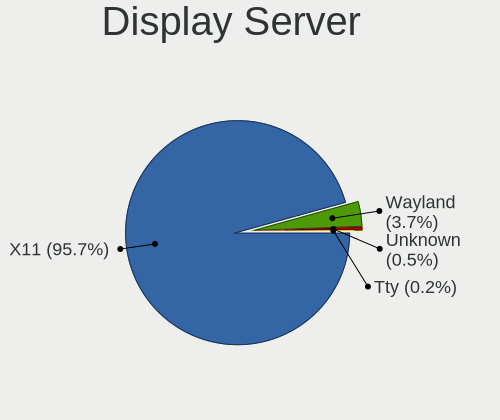
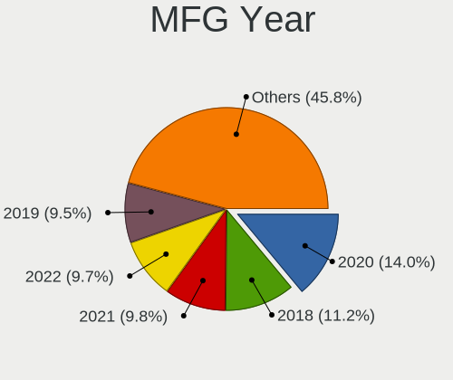
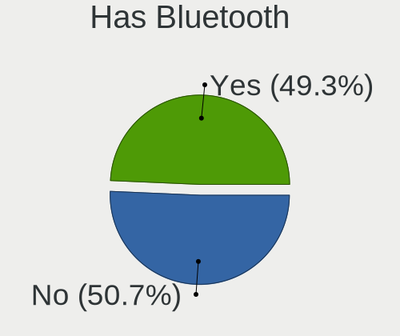
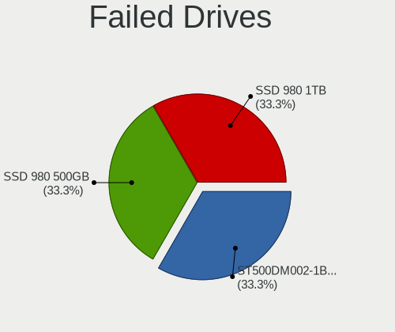
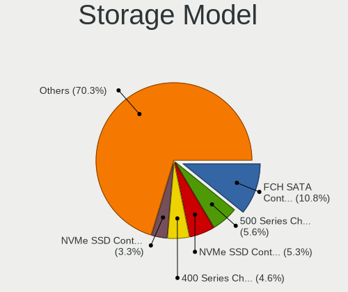
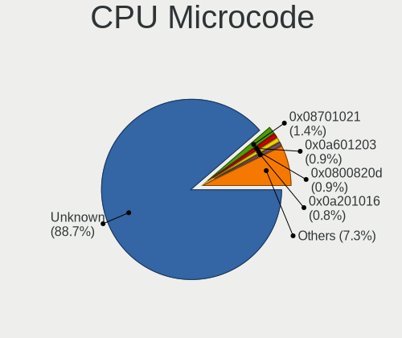
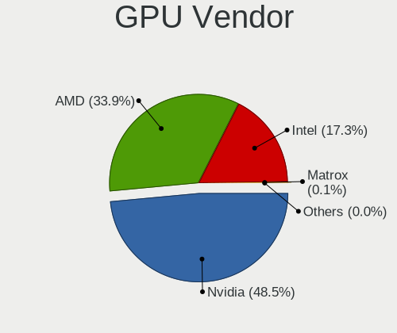
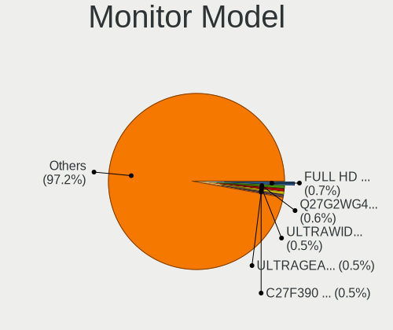
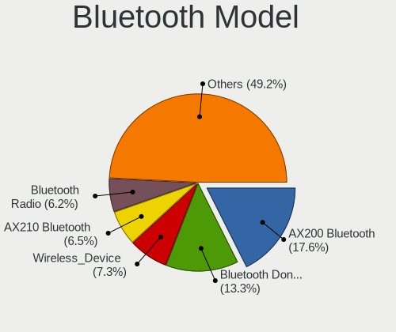
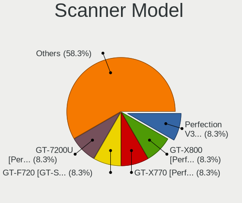

Pop!_OS 22.04 - Tested Hardware & Statistics (Desktops)
-------------------------------------------------------

A project to collect tested hardware configurations for Pop!_OS 22.04.

Anyone can contribute to this report by the [hw-probe](https://github.com/linuxhw/hw-probe) tool:

    sudo -E hw-probe -all -upload

Please contribute! Especially if your hardware is rare.

Contents
--------

* [ Test Cases ](#test-cases)

* [ System ](#system)
  - [ Kernel                   ](#kernel)
  - [ Kernel Family            ](#kernel-family)
  - [ Kernel Major Ver.        ](#kernel-major-ver)
  - [ Arch                     ](#arch)
  - [ DE                       ](#de)
  - [ Display Server           ](#display-server)
  - [ Display Manager          ](#display-manager)
  - [ OS Lang                  ](#os-lang)
  - [ Boot Mode                ](#boot-mode)
  - [ Filesystem               ](#filesystem)
  - [ Part. scheme             ](#part-scheme)
  - [ Dual Boot with Linux/BSD ](#dual-boot-with-linuxbsd)
  - [ Dual Boot (Win)          ](#dual-boot-win)

* [ Board ](#board)
  - [ Vendor                   ](#vendor)
  - [ Model                    ](#model)
  - [ Model Family             ](#model-family)
  - [ MFG Year                 ](#mfg-year)
  - [ Form Factor              ](#form-factor)
  - [ Secure Boot              ](#secure-boot)
  - [ Coreboot                 ](#coreboot)
  - [ RAM Size                 ](#ram-size)
  - [ RAM Used                 ](#ram-used)
  - [ Total Drives             ](#total-drives)
  - [ Has CD-ROM               ](#has-cd-rom)
  - [ Has Ethernet             ](#has-ethernet)
  - [ Has WiFi                 ](#has-wifi)
  - [ Has Bluetooth            ](#has-bluetooth)

* [ Location ](#location)
  - [ Country                  ](#country)
  - [ City                     ](#city)

* [ Drives ](#drives)
  - [ Drive Vendor             ](#drive-vendor)
  - [ Drive Model              ](#drive-model)
  - [ HDD Vendor               ](#hdd-vendor)
  - [ SSD Vendor               ](#ssd-vendor)
  - [ Drive Kind               ](#drive-kind)
  - [ Drive Connector          ](#drive-connector)
  - [ Drive Size               ](#drive-size)
  - [ Space Total              ](#space-total)
  - [ Space Used               ](#space-used)
  - [ Malfunc. Drives          ](#malfunc-drives)
  - [ Malfunc. Drive Vendor    ](#malfunc-drive-vendor)
  - [ Malfunc. HDD Vendor      ](#malfunc-hdd-vendor)
  - [ Malfunc. Drive Kind      ](#malfunc-drive-kind)
  - [ Failed Drives            ](#failed-drives)
  - [ Failed Drive Vendor      ](#failed-drive-vendor)
  - [ Drive Status             ](#drive-status)

* [ Storage controller ](#storage-controller)
  - [ Storage Vendor           ](#storage-vendor)
  - [ Storage Model            ](#storage-model)
  - [ Storage Kind             ](#storage-kind)

* [ Processor ](#processor)
  - [ CPU Vendor               ](#cpu-vendor)
  - [ CPU Model                ](#cpu-model)
  - [ CPU Model Family         ](#cpu-model-family)
  - [ CPU Cores                ](#cpu-cores)
  - [ CPU Sockets              ](#cpu-sockets)
  - [ CPU Threads              ](#cpu-threads)
  - [ CPU Op-Modes             ](#cpu-op-modes)
  - [ CPU Microcode            ](#cpu-microcode)
  - [ CPU Microarch            ](#cpu-microarch)

* [ Graphics ](#graphics)
  - [ GPU Vendor               ](#gpu-vendor)
  - [ GPU Model                ](#gpu-model)
  - [ GPU Combo                ](#gpu-combo)
  - [ GPU Driver               ](#gpu-driver)
  - [ GPU Memory               ](#gpu-memory)

* [ Monitor ](#monitor)
  - [ Monitor Vendor           ](#monitor-vendor)
  - [ Monitor Model            ](#monitor-model)
  - [ Monitor Resolution       ](#monitor-resolution)
  - [ Monitor Diagonal         ](#monitor-diagonal)
  - [ Monitor Width            ](#monitor-width)
  - [ Aspect Ratio             ](#aspect-ratio)
  - [ Monitor Area             ](#monitor-area)
  - [ Pixel Density            ](#pixel-density)
  - [ Multiple Monitors        ](#multiple-monitors)

* [ Network ](#network)
  - [ Net Controller Vendor    ](#net-controller-vendor)
  - [ Net Controller Model     ](#net-controller-model)
  - [ Wireless Vendor          ](#wireless-vendor)
  - [ Wireless Model           ](#wireless-model)
  - [ Ethernet Vendor          ](#ethernet-vendor)
  - [ Ethernet Model           ](#ethernet-model)
  - [ Net Controller Kind      ](#net-controller-kind)
  - [ Used Controller          ](#used-controller)
  - [ NICs                     ](#nics)
  - [ IPv6                     ](#ipv6)

* [ Bluetooth ](#bluetooth)
  - [ Bluetooth Vendor         ](#bluetooth-vendor)
  - [ Bluetooth Model          ](#bluetooth-model)

* [ Sound ](#sound)
  - [ Sound Vendor             ](#sound-vendor)
  - [ Sound Model              ](#sound-model)

* [ Memory ](#memory)
  - [ Memory Vendor            ](#memory-vendor)
  - [ Memory Model             ](#memory-model)
  - [ Memory Kind              ](#memory-kind)
  - [ Memory Form Factor       ](#memory-form-factor)
  - [ Memory Size              ](#memory-size)
  - [ Memory Speed             ](#memory-speed)

* [ Printers & scanners ](#printers--scanners)
  - [ Printer Vendor           ](#printer-vendor)
  - [ Printer Model            ](#printer-model)
  - [ Scanner Vendor           ](#scanner-vendor)
  - [ Scanner Model            ](#scanner-model)

* [ Camera ](#camera)
  - [ Camera Vendor            ](#camera-vendor)
  - [ Camera Model             ](#camera-model)

* [ Security ](#security)
  - [ Fingerprint Vendor       ](#fingerprint-vendor)
  - [ Fingerprint Model        ](#fingerprint-model)
  - [ Chipcard Vendor          ](#chipcard-vendor)
  - [ Chipcard Model           ](#chipcard-model)

* [ Unsupported ](#unsupported)
  - [ Unsupported Devices      ](#unsupported-devices)
  - [ Unsupported Device Types ](#unsupported-device-types)

Test Cases
----------

Total: 2189

| Vendor        | Model                       | Probe                                                      | Date         |
|---------------|-----------------------------|------------------------------------------------------------|--------------|
| Gigabyte      | Z790 UD AX                  | [38ae310bd0](https://linux-hardware.org/?probe=38ae310bd0) | May 08, 2024 |
| HP            | 8AC1                        | [34fb750829](https://linux-hardware.org/?probe=34fb750829) | May 08, 2024 |
| ASUSTek       | P8Z77-V LX2                 | [1181eb41ee](https://linux-hardware.org/?probe=1181eb41ee) | May 06, 2024 |
| Dell          | 088DT1 A01                  | [9cdeec0464](https://linux-hardware.org/?probe=9cdeec0464) | May 05, 2024 |
| ASUSTek       | ROG STRIX B550-F GAMING     | [28d0d4304f](https://linux-hardware.org/?probe=28d0d4304f) | May 04, 2024 |
| SZMZ          | X99-S3                      | [9dc9366e04](https://linux-hardware.org/?probe=9dc9366e04) | May 03, 2024 |
| MSI           | PRO Z790-A WIFI             | [b7cb9e7573](https://linux-hardware.org/?probe=b7cb9e7573) | May 03, 2024 |
| Intel         | B75                         | [4925a7fcb7](https://linux-hardware.org/?probe=4925a7fcb7) | May 02, 2024 |
| HP            | 3646h                       | [3c2faf0d32](https://linux-hardware.org/?probe=3c2faf0d32) | May 02, 2024 |
| MSI           | MPG X570S EDGE MAX WIFI     | [0299f8321b](https://linux-hardware.org/?probe=0299f8321b) | May 01, 2024 |
| MSI           | MPG X570S EDGE MAX WIFI     | [569772c380](https://linux-hardware.org/?probe=569772c380) | May 01, 2024 |
| ASUSTek       | TUF Gaming X570-PRO         | [2ffc5da09f](https://linux-hardware.org/?probe=2ffc5da09f) | May 01, 2024 |
| ASUSTek       | P7P55D PRO                  | [9ae885f7fd](https://linux-hardware.org/?probe=9ae885f7fd) | Apr 30, 2024 |
| ASUSTek       | M4N72-E                     | [c8920341bc](https://linux-hardware.org/?probe=c8920341bc) | Apr 29, 2024 |
| HP            | 2129                        | [40fa42996a](https://linux-hardware.org/?probe=40fa42996a) | Apr 29, 2024 |
| ASRock        | B650 PG Lightning           | [2afe25d1f8](https://linux-hardware.org/?probe=2afe25d1f8) | Apr 28, 2024 |
| Gigabyte      | B75M-D3H                    | [48a48b4523](https://linux-hardware.org/?probe=48a48b4523) | Apr 28, 2024 |
| HP            | 2129                        | [03800251ed](https://linux-hardware.org/?probe=03800251ed) | Apr 28, 2024 |
| System76      | Thelio Mira thelio-mira-... | [14dbfab450](https://linux-hardware.org/?probe=14dbfab450) | Apr 27, 2024 |
| Gigabyte      | H410M S2 V2                 | [a1fbe8858b](https://linux-hardware.org/?probe=a1fbe8858b) | Apr 26, 2024 |
| Dell          | 0K240Y A01                  | [6b932e4eb7](https://linux-hardware.org/?probe=6b932e4eb7) | Apr 26, 2024 |
| Acer          | FX58M                       | [d8aec92fe1](https://linux-hardware.org/?probe=d8aec92fe1) | Apr 25, 2024 |
| HP            | 8704                        | [deeb399937](https://linux-hardware.org/?probe=deeb399937) | Apr 25, 2024 |
| Dell          | 0K240Y A01                  | [554822996a](https://linux-hardware.org/?probe=554822996a) | Apr 24, 2024 |
| ASUSTek       | PRIME B450M-K II            | [31838248fa](https://linux-hardware.org/?probe=31838248fa) | Apr 24, 2024 |
| ASUSTek       | Maximus IX CODE             | [db21083720](https://linux-hardware.org/?probe=db21083720) | Apr 24, 2024 |
| ASRock        | B450M Pro4 R2.0             | [188e5e5bde](https://linux-hardware.org/?probe=188e5e5bde) | Apr 24, 2024 |
| Gigabyte      | B560M H                     | [db05a445f8](https://linux-hardware.org/?probe=db05a445f8) | Apr 24, 2024 |
| Dell          | 0C1R19 A02                  | [de862a6d95](https://linux-hardware.org/?probe=de862a6d95) | Apr 24, 2024 |
| Gigabyte      | 970A-DS3P                   | [0253ffc79c](https://linux-hardware.org/?probe=0253ffc79c) | Apr 24, 2024 |
| Gigabyte      | X570 AORUS MASTER           | [b6aa6b2262](https://linux-hardware.org/?probe=b6aa6b2262) | Apr 22, 2024 |
| ASUSTek       | ROG CROSSHAIR VIII DARK ... | [d24a794778](https://linux-hardware.org/?probe=d24a794778) | Apr 22, 2024 |
| ASRock        | B450M Steel Legend          | [7fb64c7bef](https://linux-hardware.org/?probe=7fb64c7bef) | Apr 22, 2024 |
| Supermicro    | C7Q67 V1.01                 | [e63cba3bfa](https://linux-hardware.org/?probe=e63cba3bfa) | Apr 22, 2024 |
| Gigabyte      | B450M S2H                   | [d3e9e01950](https://linux-hardware.org/?probe=d3e9e01950) | Apr 21, 2024 |
| Gigabyte      | B450 AORUS ELITE            | [ff86440a74](https://linux-hardware.org/?probe=ff86440a74) | Apr 21, 2024 |
| MSI           | MPG B550 GAMING PLUS        | [42a4ba108a](https://linux-hardware.org/?probe=42a4ba108a) | Apr 21, 2024 |
| Intel         | B75                         | [27d3a826f4](https://linux-hardware.org/?probe=27d3a826f4) | Apr 20, 2024 |
| ASRock        | Z77 Extreme4                | [52009ffcd0](https://linux-hardware.org/?probe=52009ffcd0) | Apr 20, 2024 |
| ASUSTek       | TUF Gaming B650M-E WIFI     | [8fd0a624a7](https://linux-hardware.org/?probe=8fd0a624a7) | Apr 20, 2024 |
| ASUSTek       | TUF Gaming B650M-E WIFI     | [5e91dc2b03](https://linux-hardware.org/?probe=5e91dc2b03) | Apr 20, 2024 |
| ASRock        | X570 Taichi                 | [2de05483c5](https://linux-hardware.org/?probe=2de05483c5) | Apr 19, 2024 |
| ASUSTek       | P7P55D PRO                  | [712655c5bd](https://linux-hardware.org/?probe=712655c5bd) | Apr 19, 2024 |
| Gigabyte      | H170-HD3-CF                 | [4f5d1a37c3](https://linux-hardware.org/?probe=4f5d1a37c3) | Apr 19, 2024 |
| ASUSTek       | TUF Gaming B650M-E WIFI     | [6190a14941](https://linux-hardware.org/?probe=6190a14941) | Apr 19, 2024 |
| HP            | 8299                        | [aecdc0598b](https://linux-hardware.org/?probe=aecdc0598b) | Apr 19, 2024 |
| HP            | 8949 11                     | [ab13748833](https://linux-hardware.org/?probe=ab13748833) | Apr 18, 2024 |
| HP            | 8949 11                     | [3f180801bd](https://linux-hardware.org/?probe=3f180801bd) | Apr 18, 2024 |
| ASUSTek       | PRIME B450M-K II            | [e25b6a6321](https://linux-hardware.org/?probe=e25b6a6321) | Apr 18, 2024 |
| MSI           | B250M PRO-VD                | [ec68301ab8](https://linux-hardware.org/?probe=ec68301ab8) | Apr 17, 2024 |
| MSI           | Z87-G45 GAMING              | [f646b54913](https://linux-hardware.org/?probe=f646b54913) | Apr 17, 2024 |
| ASUSTek       | ROG CROSSHAIR VIII HERO     | [e9fcf03a9f](https://linux-hardware.org/?probe=e9fcf03a9f) | Apr 17, 2024 |
| Gigabyte      | 970A-DS3P                   | [53055c8335](https://linux-hardware.org/?probe=53055c8335) | Apr 17, 2024 |
| ASUSTek       | Z170 PRO GAMING             | [e45ac0e9cc](https://linux-hardware.org/?probe=e45ac0e9cc) | Apr 16, 2024 |
| ASRock        | Z790 Nova WiFi              | [e7087ec7e4](https://linux-hardware.org/?probe=e7087ec7e4) | Apr 16, 2024 |
| MSI           | B450 TOMAHAWK MAX II        | [d504f8b8a6](https://linux-hardware.org/?probe=d504f8b8a6) | Apr 16, 2024 |
| Unknown       | Unknown                     | [bcaf7cac1a](https://linux-hardware.org/?probe=bcaf7cac1a) | Apr 15, 2024 |
| ASUSTek       | STRIX Z270H GAMING          | [47f139152e](https://linux-hardware.org/?probe=47f139152e) | Apr 15, 2024 |
| ASRock        | B450 Steel Legend           | [eae63cf682](https://linux-hardware.org/?probe=eae63cf682) | Apr 15, 2024 |
| ASUSTek       | P5Q-EM                      | [dc780bc9a5](https://linux-hardware.org/?probe=dc780bc9a5) | Apr 15, 2024 |
| MSI           | B550M PRO-VDH WIFI          | [ad14cabff5](https://linux-hardware.org/?probe=ad14cabff5) | Apr 13, 2024 |
| Unknown       | Unknown                     | [31b430e45e](https://linux-hardware.org/?probe=31b430e45e) | Apr 13, 2024 |
| ASUSTek       | TUF Gaming Z690-PLUS WIF... | [b977bc3a0a](https://linux-hardware.org/?probe=b977bc3a0a) | Apr 12, 2024 |
| Intel         | X99 V1.0                    | [57c2d76c65](https://linux-hardware.org/?probe=57c2d76c65) | Apr 12, 2024 |
| ASUSTek       | PRIME H310T R2.0            | [66cbd66636](https://linux-hardware.org/?probe=66cbd66636) | Apr 11, 2024 |
| Itautec       | ST 4271                     | [8fc18963b3](https://linux-hardware.org/?probe=8fc18963b3) | Apr 09, 2024 |
| Dell          | 0VTJVC A00                  | [edb54fbe32](https://linux-hardware.org/?probe=edb54fbe32) | Apr 09, 2024 |
| Gigabyte      | X570 AORUS MASTER           | [43618657fd](https://linux-hardware.org/?probe=43618657fd) | Apr 09, 2024 |
| Dell          | 088DT1 A01                  | [a22e72117f](https://linux-hardware.org/?probe=a22e72117f) | Apr 09, 2024 |
| Huanan        | X99-QD4 V1.0                | [732523a553](https://linux-hardware.org/?probe=732523a553) | Apr 09, 2024 |
| Huanan        | X99-QD4 V1.0                | [d53567aeb3](https://linux-hardware.org/?probe=d53567aeb3) | Apr 09, 2024 |
| Acer          | Aspire TC-105               | [7ecc002fc3](https://linux-hardware.org/?probe=7ecc002fc3) | Apr 07, 2024 |
| Acer          | Aspire TC-105               | [9c7c1f6869](https://linux-hardware.org/?probe=9c7c1f6869) | Apr 07, 2024 |
| ASUSTek       | TUF Gaming B650-PLUS WIF... | [e7b99f79ab](https://linux-hardware.org/?probe=e7b99f79ab) | Apr 06, 2024 |
| Dell          | 0DF42J A00                  | [575fd0d93d](https://linux-hardware.org/?probe=575fd0d93d) | Apr 06, 2024 |
| Intel         | DH67CF AAG10215-203         | [c26c93bb88](https://linux-hardware.org/?probe=c26c93bb88) | Apr 06, 2024 |
| Gigabyte      | Z590I AORUS ULTRA           | [2a11ab4791](https://linux-hardware.org/?probe=2a11ab4791) | Apr 06, 2024 |
| Gigabyte      | Z590I AORUS ULTRA           | [e786bc1b13](https://linux-hardware.org/?probe=e786bc1b13) | Apr 06, 2024 |
| ASUSTek       | PRIME B550-PLUS             | [f519652f57](https://linux-hardware.org/?probe=f519652f57) | Apr 06, 2024 |
| Biostar       | TA970                       | [b95526c668](https://linux-hardware.org/?probe=b95526c668) | Apr 05, 2024 |
| ASUSTek       | PRIME X670E-PRO WIFI        | [b1f7625755](https://linux-hardware.org/?probe=b1f7625755) | Apr 05, 2024 |
| ASUSTek       | TUF Gaming B650M-PLUS       | [836a40664c](https://linux-hardware.org/?probe=836a40664c) | Apr 05, 2024 |
| ASUSTek       | J1800I-C/BR                 | [bdde2d1fe9](https://linux-hardware.org/?probe=bdde2d1fe9) | Apr 05, 2024 |
| ASUSTek       | TUF B450M-PLUS GAMING       | [a92eac3002](https://linux-hardware.org/?probe=a92eac3002) | Apr 05, 2024 |
| BESSTAR Te... | HM90                        | [6dda4c2573](https://linux-hardware.org/?probe=6dda4c2573) | Apr 05, 2024 |
| BESSTAR Te... | HM90                        | [e9b2e7f701](https://linux-hardware.org/?probe=e9b2e7f701) | Apr 05, 2024 |
| Gigabyte      | Z790 GAMING X AX            | [5aa6e72318](https://linux-hardware.org/?probe=5aa6e72318) | Apr 04, 2024 |
| ASUSTek       | P7P55D PRO                  | [0b96c3a901](https://linux-hardware.org/?probe=0b96c3a901) | Apr 02, 2024 |
| ASUSTek       | P5G41T-M                    | [731881f720](https://linux-hardware.org/?probe=731881f720) | Apr 02, 2024 |
| MSI           | MPG B550I GAMING EDGE WI... | [98c3893edd](https://linux-hardware.org/?probe=98c3893edd) | Apr 01, 2024 |
| MSI           | MAG B460M MORTAR            | [0a8f92ffe1](https://linux-hardware.org/?probe=0a8f92ffe1) | Mar 30, 2024 |
| ASUSTek       | AT3N7A-I                    | [0af90b54ec](https://linux-hardware.org/?probe=0af90b54ec) | Mar 30, 2024 |
| MSI           | MAG X570 TOMAHAWK WIFI      | [943c4e0f41](https://linux-hardware.org/?probe=943c4e0f41) | Mar 29, 2024 |
| ASUSTek       | PRIME H310M-K R2.0          | [6f6c4699f5](https://linux-hardware.org/?probe=6f6c4699f5) | Mar 29, 2024 |
| Biostar       | A960D+V2                    | [1295e48af0](https://linux-hardware.org/?probe=1295e48af0) | Mar 28, 2024 |
| Gigabyte      | B550M AORUS ELITE           | [ba5d17c1d9](https://linux-hardware.org/?probe=ba5d17c1d9) | Mar 28, 2024 |
| ASUSTek       | P8P67                       | [6ab2d189e5](https://linux-hardware.org/?probe=6ab2d189e5) | Mar 28, 2024 |
| ASUSTek       | P8P67                       | [eae7373113](https://linux-hardware.org/?probe=eae7373113) | Mar 28, 2024 |
| Dell          | 0MN1TX A00                  | [8cef7b13b5](https://linux-hardware.org/?probe=8cef7b13b5) | Mar 27, 2024 |
| Dell          | 0MN1TX A00                  | [6a8ffef6f2](https://linux-hardware.org/?probe=6a8ffef6f2) | Mar 27, 2024 |
| Apple         | Mac-F221BEC8                | [35cbc2ccda](https://linux-hardware.org/?probe=35cbc2ccda) | Mar 27, 2024 |
| Dell          | 02GDWG A00                  | [a138fcbf39](https://linux-hardware.org/?probe=a138fcbf39) | Mar 26, 2024 |
| MSI           | MPG Z390 GAMING PLUS        | [e98dcc5095](https://linux-hardware.org/?probe=e98dcc5095) | Mar 26, 2024 |
| MSI           | PRO Z790-S WIFI             | [ecaa8a51cb](https://linux-hardware.org/?probe=ecaa8a51cb) | Mar 26, 2024 |
| ASUSTek       | TUF Gaming X570-PLUS        | [efbd82bed8](https://linux-hardware.org/?probe=efbd82bed8) | Mar 25, 2024 |
| HP            | 83EF                        | [a2e4b98916](https://linux-hardware.org/?probe=a2e4b98916) | Mar 22, 2024 |
| HP            | 83EF                        | [79c2564db3](https://linux-hardware.org/?probe=79c2564db3) | Mar 22, 2024 |
| Gigabyte      | B550M AORUS ELITE           | [0565d53d0c](https://linux-hardware.org/?probe=0565d53d0c) | Mar 21, 2024 |
| ASUSTek       | PRIME B550M-A WIFI II       | [caecf9a750](https://linux-hardware.org/?probe=caecf9a750) | Mar 21, 2024 |
| MSI           | Z170A GAMING M3             | [8e89b3ef32](https://linux-hardware.org/?probe=8e89b3ef32) | Mar 20, 2024 |
| Gigabyte      | B450 AORUS ELITE            | [302a31192b](https://linux-hardware.org/?probe=302a31192b) | Mar 20, 2024 |
| ASUSTek       | PRIME X570-PRO              | [56b4e033b8](https://linux-hardware.org/?probe=56b4e033b8) | Mar 20, 2024 |
| MSI           | MAG B660M MORTAR WIFI DD... | [d1ba139b4e](https://linux-hardware.org/?probe=d1ba139b4e) | Mar 19, 2024 |
| MSI           | MPG B550 GAMING PLUS        | [37a57d5b70](https://linux-hardware.org/?probe=37a57d5b70) | Mar 19, 2024 |
| ASUSTek       | TUF Gaming Z690-PLUS WIF... | [0eaf5f5be0](https://linux-hardware.org/?probe=0eaf5f5be0) | Mar 18, 2024 |
| ASUSTek       | M4A785TD-V EVO              | [9a29b7badd](https://linux-hardware.org/?probe=9a29b7badd) | Mar 17, 2024 |
| Apple         | Mac-7BA5B2D9E42DDD94 iMa... | [16b029f8b8](https://linux-hardware.org/?probe=16b029f8b8) | Mar 17, 2024 |
| ASRock        | H110M-DVS R3.0              | [311809b062](https://linux-hardware.org/?probe=311809b062) | Mar 16, 2024 |
| Gigabyte      | A520M DS3H                  | [e9eaacfaa2](https://linux-hardware.org/?probe=e9eaacfaa2) | Mar 15, 2024 |
| Dell          | 0KV62T A00                  | [7f865ffb79](https://linux-hardware.org/?probe=7f865ffb79) | Mar 15, 2024 |
| ASUSTek       | TUF Gaming Z490-PLUS        | [ed06ccc20a](https://linux-hardware.org/?probe=ed06ccc20a) | Mar 15, 2024 |
| System76      | Thelio thelio-r2            | [609e72eef1](https://linux-hardware.org/?probe=609e72eef1) | Mar 14, 2024 |
| Gigabyte      | H310M S2P                   | [3d5cf9dd65](https://linux-hardware.org/?probe=3d5cf9dd65) | Mar 13, 2024 |
| Gigabyte      | AX370-Gaming 3-CF           | [c0420b6b81](https://linux-hardware.org/?probe=c0420b6b81) | Mar 11, 2024 |
| Intel         | B75                         | [d0ba74ec7d](https://linux-hardware.org/?probe=d0ba74ec7d) | Mar 10, 2024 |
| MSI           | MPG X570 GAMING PLUS        | [b07882e6fb](https://linux-hardware.org/?probe=b07882e6fb) | Mar 07, 2024 |
| MSI           | MAG Z790 TOMAHAWK MAX WI... | [f9fa747b4f](https://linux-hardware.org/?probe=f9fa747b4f) | Mar 07, 2024 |
| ASUSTek       | PRIME B650M-A WIFI II       | [d5ee5ee229](https://linux-hardware.org/?probe=d5ee5ee229) | Mar 06, 2024 |
| HP            | 81C5 MVB                    | [957fd824c5](https://linux-hardware.org/?probe=957fd824c5) | Mar 05, 2024 |
| MSI           | X470 GAMING PLUS MAX        | [d746e0ee2c](https://linux-hardware.org/?probe=d746e0ee2c) | Mar 05, 2024 |
| ASUSTek       | Z97M-PLUS/BR                | [3772b43c62](https://linux-hardware.org/?probe=3772b43c62) | Mar 05, 2024 |
| Dell          | 0HD5W2 A01                  | [f015ff4f75](https://linux-hardware.org/?probe=f015ff4f75) | Mar 05, 2024 |
| ASUSTek       | ROG STRIX B550-I GAMING     | [e415b0c776](https://linux-hardware.org/?probe=e415b0c776) | Mar 04, 2024 |
| Gigabyte      | Z390 AORUS ULTRA-CF         | [01c04e14c0](https://linux-hardware.org/?probe=01c04e14c0) | Mar 04, 2024 |
| Intel         | B75                         | [2b0d558a5e](https://linux-hardware.org/?probe=2b0d558a5e) | Mar 04, 2024 |
| Gigabyte      | B450M DS3H-CF               | [95bfa43508](https://linux-hardware.org/?probe=95bfa43508) | Mar 04, 2024 |
| Gigabyte      | B450M DS3H-CF               | [1eb604d726](https://linux-hardware.org/?probe=1eb604d726) | Mar 04, 2024 |
| ASUSTek       | TUF B350M-PLUS GAMING       | [abbcee09db](https://linux-hardware.org/?probe=abbcee09db) | Mar 03, 2024 |
| ASUSTek       | TUF B350M-PLUS GAMING       | [040699f391](https://linux-hardware.org/?probe=040699f391) | Mar 03, 2024 |
| AZW           | MINI S                      | [dc07e234d0](https://linux-hardware.org/?probe=dc07e234d0) | Mar 03, 2024 |
| ASUSTek       | TUF Gaming X570-PLUS        | [c2b4500a60](https://linux-hardware.org/?probe=c2b4500a60) | Mar 03, 2024 |
| Gigabyte      | X570 AORUS ELITE            | [a0a450644b](https://linux-hardware.org/?probe=a0a450644b) | Mar 02, 2024 |
| ASUSTek       | ROG STRIX B650E-F GAMING... | [e8dae907db](https://linux-hardware.org/?probe=e8dae907db) | Mar 02, 2024 |
| Dell          | 02GDWG A00                  | [dd54511393](https://linux-hardware.org/?probe=dd54511393) | Mar 01, 2024 |
| ASUSTek       | ROG STRIX Z370-F GAMING     | [13c3d127e8](https://linux-hardware.org/?probe=13c3d127e8) | Mar 01, 2024 |
| HP            | 843B                        | [4293861b42](https://linux-hardware.org/?probe=4293861b42) | Mar 01, 2024 |
| HP            | 18E9                        | [9bdda08a35](https://linux-hardware.org/?probe=9bdda08a35) | Mar 01, 2024 |
| ASRock        | B550 Phantom Gaming 4       | [223fbfa988](https://linux-hardware.org/?probe=223fbfa988) | Feb 29, 2024 |
| ASRock        | H97 Anniversary             | [f4f4c960d4](https://linux-hardware.org/?probe=f4f4c960d4) | Feb 28, 2024 |
| ASUSTek       | PRIME X670E-PRO WIFI        | [365e852379](https://linux-hardware.org/?probe=365e852379) | Feb 28, 2024 |
| ASUSTek       | PRIME Z790-P WIFI           | [5c749148f2](https://linux-hardware.org/?probe=5c749148f2) | Feb 28, 2024 |
| Intel         | H410M                       | [b22fd32a7d](https://linux-hardware.org/?probe=b22fd32a7d) | Feb 27, 2024 |
| ASUSTek       | TUF Gaming X570-PLUS        | [15510ee9c4](https://linux-hardware.org/?probe=15510ee9c4) | Feb 27, 2024 |
| JGINYUE       | B550i-GAMING                | [8d44c9ccdd](https://linux-hardware.org/?probe=8d44c9ccdd) | Feb 27, 2024 |
| ASUSTek       | F2A85-M                     | [a78b141db1](https://linux-hardware.org/?probe=a78b141db1) | Feb 26, 2024 |
| Gigabyte      | B450 AORUS ELITE            | [2b4ed9044c](https://linux-hardware.org/?probe=2b4ed9044c) | Feb 25, 2024 |
| ASUSTek       | PRIME Z790-P                | [e302c30d09](https://linux-hardware.org/?probe=e302c30d09) | Feb 25, 2024 |
| ASUSTek       | P7P55D PRO                  | [f6c4f78658](https://linux-hardware.org/?probe=f6c4f78658) | Feb 24, 2024 |
| ASRock        | B450M Steel Legend          | [650af37e87](https://linux-hardware.org/?probe=650af37e87) | Feb 23, 2024 |
| ASRock        | Z68 Extreme4 Gen3           | [bc9dad6852](https://linux-hardware.org/?probe=bc9dad6852) | Feb 23, 2024 |
| MSI           | MS-B9171                    | [8d8e1e76c8](https://linux-hardware.org/?probe=8d8e1e76c8) | Feb 23, 2024 |
| ASUSTek       | Z87-K                       | [82f0780a43](https://linux-hardware.org/?probe=82f0780a43) | Feb 23, 2024 |
| ASUSTek       | PRIME Z690-P WIFI D4        | [bade017d6b](https://linux-hardware.org/?probe=bade017d6b) | Feb 22, 2024 |
| ASUSTek       | PRIME Z490-P                | [9c9f621388](https://linux-hardware.org/?probe=9c9f621388) | Feb 21, 2024 |
| ASUSTek       | Z87-K                       | [d091e6a911](https://linux-hardware.org/?probe=d091e6a911) | Feb 21, 2024 |
| Gigabyte      | Z590 VISION D               | [8070df1f8e](https://linux-hardware.org/?probe=8070df1f8e) | Feb 21, 2024 |
| Gigabyte      | B450 AORUS PRO WIFI-CF      | [dd7412b565](https://linux-hardware.org/?probe=dd7412b565) | Feb 21, 2024 |
| ASUSTek       | PRIME B660-PLUS D4          | [e65b561651](https://linux-hardware.org/?probe=e65b561651) | Feb 20, 2024 |
| Intel         | H55                         | [77825586e5](https://linux-hardware.org/?probe=77825586e5) | Feb 20, 2024 |
| HP            | 885F A                      | [0e14337b75](https://linux-hardware.org/?probe=0e14337b75) | Feb 20, 2024 |
| BESSTAR Te... | B550                        | [864d3987bc](https://linux-hardware.org/?probe=864d3987bc) | Feb 19, 2024 |
| Dell          | 0J3C2F A02                  | [17a18809d8](https://linux-hardware.org/?probe=17a18809d8) | Feb 18, 2024 |
| Gigabyte      | A320M-H-CF                  | [e115b602d3](https://linux-hardware.org/?probe=e115b602d3) | Feb 18, 2024 |
| Gigabyte      | Q87M-MK                     | [31f52cfaa6](https://linux-hardware.org/?probe=31f52cfaa6) | Feb 18, 2024 |
| HP            | 82F2                        | [10051f1b07](https://linux-hardware.org/?probe=10051f1b07) | Feb 18, 2024 |
| ASRock        | B450M Steel Legend          | [2d7aaba177](https://linux-hardware.org/?probe=2d7aaba177) | Feb 18, 2024 |
| MSI           | Z87-GD65 GAMING             | [c6883405b2](https://linux-hardware.org/?probe=c6883405b2) | Feb 17, 2024 |
| Gigabyte      | B550 AORUS ELITE AX V2      | [ac497abd97](https://linux-hardware.org/?probe=ac497abd97) | Feb 17, 2024 |
| Gigabyte      | B550 AORUS ELITE AX V2      | [5e4e265aeb](https://linux-hardware.org/?probe=5e4e265aeb) | Feb 16, 2024 |
| Gigabyte      | B660 DS3H AX DDR4           | [993110fab0](https://linux-hardware.org/?probe=993110fab0) | Feb 16, 2024 |
| MSI           | B450M PRO-VDH MAX           | [16a3b93921](https://linux-hardware.org/?probe=16a3b93921) | Feb 16, 2024 |
| MSI           | B450M-A PRO MAX             | [dbe01c0fc4](https://linux-hardware.org/?probe=dbe01c0fc4) | Feb 16, 2024 |
| MSI           | B450M-A PRO MAX             | [06ec01ce9a](https://linux-hardware.org/?probe=06ec01ce9a) | Feb 15, 2024 |
| ASUSTek       | TUF X470-PLUS GAMING        | [76f7aa1d25](https://linux-hardware.org/?probe=76f7aa1d25) | Feb 14, 2024 |
| Fujitsu       | D3118-A2 S26361-D3118-A2    | [169a2bedd3](https://linux-hardware.org/?probe=169a2bedd3) | Feb 14, 2024 |
| MSI           | A520M-A PRO                 | [66417e286c](https://linux-hardware.org/?probe=66417e286c) | Feb 14, 2024 |
| Acer          | Predator PO3-640            | [4e920c60c3](https://linux-hardware.org/?probe=4e920c60c3) | Feb 14, 2024 |
| Acer          | Predator PO3-640            | [b081b6359d](https://linux-hardware.org/?probe=b081b6359d) | Feb 13, 2024 |
| Gigabyte      | A520M K V2                  | [dca7100475](https://linux-hardware.org/?probe=dca7100475) | Feb 13, 2024 |
| ASRock        | A320M/ac                    | [adc9f93ca8](https://linux-hardware.org/?probe=adc9f93ca8) | Feb 13, 2024 |
| HP            | 2B2C                        | [a39c469e43](https://linux-hardware.org/?probe=a39c469e43) | Feb 13, 2024 |
| Apple         | Mac-F221BEC8                | [6e8ebecbf2](https://linux-hardware.org/?probe=6e8ebecbf2) | Feb 11, 2024 |
| ASUSTek       | P8H61                       | [6b53ddd469](https://linux-hardware.org/?probe=6b53ddd469) | Feb 11, 2024 |
| HP            | 18E5                        | [3e90471e97](https://linux-hardware.org/?probe=3e90471e97) | Feb 09, 2024 |
| HP            | 18E5                        | [9ae685a4cb](https://linux-hardware.org/?probe=9ae685a4cb) | Feb 09, 2024 |
| MSI           | A320M-A PRO                 | [33988a8ce4](https://linux-hardware.org/?probe=33988a8ce4) | Feb 08, 2024 |
| ASUSTek       | ROG STRIX B550-F GAMING ... | [e3a70ea869](https://linux-hardware.org/?probe=e3a70ea869) | Feb 07, 2024 |
| ASUSTek       | ROG STRIX B550-F GAMING ... | [18bb015935](https://linux-hardware.org/?probe=18bb015935) | Feb 07, 2024 |
| Acer          | Aspire XC-603G              | [f4bc1814e8](https://linux-hardware.org/?probe=f4bc1814e8) | Feb 06, 2024 |
| ASUSTek       | P8Z68-V PRO                 | [c2ee1a3fc6](https://linux-hardware.org/?probe=c2ee1a3fc6) | Feb 04, 2024 |
| Dell          | 0C522T A03                  | [8a0946f2b4](https://linux-hardware.org/?probe=8a0946f2b4) | Feb 04, 2024 |
| MSI           | H310M PRO-VDH PLUS          | [d28656e6f3](https://linux-hardware.org/?probe=d28656e6f3) | Feb 03, 2024 |
| MSI           | H310M PRO-VDH PLUS          | [eb7d7aa84f](https://linux-hardware.org/?probe=eb7d7aa84f) | Feb 03, 2024 |
| ASUSTek       | A_F_K20CE                   | [7f1b60be2a](https://linux-hardware.org/?probe=7f1b60be2a) | Feb 03, 2024 |
| Gigabyte      | H55M-S2H                    | [e5a8865f78](https://linux-hardware.org/?probe=e5a8865f78) | Feb 03, 2024 |
| Gigabyte      | X570 AORUS MASTER           | [2b98b922fe](https://linux-hardware.org/?probe=2b98b922fe) | Feb 03, 2024 |
| ASUSTek       | M4N72-E                     | [815b251540](https://linux-hardware.org/?probe=815b251540) | Feb 02, 2024 |
| Dell          | 0V8WGR A00                  | [9762a633ab](https://linux-hardware.org/?probe=9762a633ab) | Feb 01, 2024 |
| MSI           | B760 GAMING PLUS WIFI       | [a5425cfc63](https://linux-hardware.org/?probe=a5425cfc63) | Feb 01, 2024 |
| MSI           | B760 GAMING PLUS WIFI       | [67539ba367](https://linux-hardware.org/?probe=67539ba367) | Feb 01, 2024 |
| ASUSTek       | ProArt Z490-CREATOR 10G     | [54beeb17dc](https://linux-hardware.org/?probe=54beeb17dc) | Jan 31, 2024 |
| ASUSTek       | ProArt Z490-CREATOR 10G     | [65272ffc77](https://linux-hardware.org/?probe=65272ffc77) | Jan 31, 2024 |
| MSI           | MAG B550 TOMAHAWK           | [5222452ba4](https://linux-hardware.org/?probe=5222452ba4) | Jan 30, 2024 |
| Gigabyte      | Z690 UD DDR4                | [454433be44](https://linux-hardware.org/?probe=454433be44) | Jan 30, 2024 |
| Alienware     | 07HV66 A01                  | [732d349380](https://linux-hardware.org/?probe=732d349380) | Jan 29, 2024 |
| SZMZ          | X99-S3                      | [acf24ed760](https://linux-hardware.org/?probe=acf24ed760) | Jan 29, 2024 |
| ASUSTek       | ROG STRIX X470-F GAMING     | [4e6d22c388](https://linux-hardware.org/?probe=4e6d22c388) | Jan 28, 2024 |
| MSI           | MPG B550 GAMING PLUS        | [a7826ae1af](https://linux-hardware.org/?probe=a7826ae1af) | Jan 28, 2024 |
| Lenovo        | SHARKBAY SDK0E50510 WIN     | [f80e16d62d](https://linux-hardware.org/?probe=f80e16d62d) | Jan 28, 2024 |
| Fujitsu       | D3233-A1 S26361-D3233-A1    | [d5f5ab4b3f](https://linux-hardware.org/?probe=d5f5ab4b3f) | Jan 27, 2024 |
| ASUSTek       | Z170-A                      | [0f1f062eda](https://linux-hardware.org/?probe=0f1f062eda) | Jan 27, 2024 |
| Dell          | 0DF42J A00                  | [f0ac1844ad](https://linux-hardware.org/?probe=f0ac1844ad) | Jan 27, 2024 |
| ASUSTek       | PRIME A320M-K               | [b1d979bcb3](https://linux-hardware.org/?probe=b1d979bcb3) | Jan 27, 2024 |
| Foxconn       | 2ABF                        | [91412d213a](https://linux-hardware.org/?probe=91412d213a) | Jan 26, 2024 |
| Gigabyte      | Z97X-SLI-CF                 | [1eb12a361c](https://linux-hardware.org/?probe=1eb12a361c) | Jan 26, 2024 |
| ASUSTek       | P5QPL-AM                    | [1f2bb560a8](https://linux-hardware.org/?probe=1f2bb560a8) | Jan 26, 2024 |
| ASRock        | B550M-HDV                   | [afbea953be](https://linux-hardware.org/?probe=afbea953be) | Jan 26, 2024 |
| MSI           | MAG X670E TOMAHAWK WIFI     | [068df25275](https://linux-hardware.org/?probe=068df25275) | Jan 26, 2024 |
| Huanan        | X99-8M-F V1.4               | [65388b76e1](https://linux-hardware.org/?probe=65388b76e1) | Jan 25, 2024 |
| ASUSTek       | ROG STRIX Z790-E GAMING ... | [4cedf6ee3a](https://linux-hardware.org/?probe=4cedf6ee3a) | Jan 25, 2024 |
| Gigabyte      | X99-Gaming 5P               | [e306ef8710](https://linux-hardware.org/?probe=e306ef8710) | Jan 24, 2024 |
| MSI           | B460M PRO-VDH WIFI          | [8b3e1a6d31](https://linux-hardware.org/?probe=8b3e1a6d31) | Jan 24, 2024 |
| ASUSTek       | ROG Maximus Z690 HERO EV... | [340fdb1832](https://linux-hardware.org/?probe=340fdb1832) | Jan 24, 2024 |
| MSI           | H55M-E33                    | [2935476b48](https://linux-hardware.org/?probe=2935476b48) | Jan 23, 2024 |
| MSI           | B350M MORTAR                | [f728e7ad76](https://linux-hardware.org/?probe=f728e7ad76) | Jan 22, 2024 |
| ASUSTek       | M5A99FX PRO R2.0            | [ed9635f427](https://linux-hardware.org/?probe=ed9635f427) | Jan 22, 2024 |
| ASUSTek       | ROG STRIX B560-I GAMING ... | [d248b6e5a9](https://linux-hardware.org/?probe=d248b6e5a9) | Jan 21, 2024 |
| ASUSTek       | ROG STRIX Z790-E GAMING ... | [66cf4b0b5a](https://linux-hardware.org/?probe=66cf4b0b5a) | Jan 21, 2024 |
| MSI           | B450 TOMAHAWK MAX           | [41a62ec1d4](https://linux-hardware.org/?probe=41a62ec1d4) | Jan 21, 2024 |
| Gigabyte      | B660 AORUS MASTER DDR4      | [d36c2b07fd](https://linux-hardware.org/?probe=d36c2b07fd) | Jan 20, 2024 |
| MSI           | PRO X670-P WIFI             | [a0637d4400](https://linux-hardware.org/?probe=a0637d4400) | Jan 20, 2024 |
| Dell          | 0GDG8Y A00                  | [8f41b6b7f9](https://linux-hardware.org/?probe=8f41b6b7f9) | Jan 20, 2024 |
| Gigabyte      | B550I AORUS PRO AX          | [af503dbdd1](https://linux-hardware.org/?probe=af503dbdd1) | Jan 20, 2024 |
| ASUSTek       | H97M-E                      | [d6fe598f33](https://linux-hardware.org/?probe=d6fe598f33) | Jan 20, 2024 |
| Dell          | 0TTDMJ A00                  | [e5d9f41477](https://linux-hardware.org/?probe=e5d9f41477) | Jan 19, 2024 |
| Gigabyte      | B450 AORUS M                | [06cced7a39](https://linux-hardware.org/?probe=06cced7a39) | Jan 18, 2024 |
| ASUSTek       | ROG STRIX B450-I GAMING     | [42e7298c19](https://linux-hardware.org/?probe=42e7298c19) | Jan 17, 2024 |
| MSI           | PRO X670-P WIFI             | [3b62b0b588](https://linux-hardware.org/?probe=3b62b0b588) | Jan 17, 2024 |
| Gigabyte      | B450 AORUS ELITE            | [a5bd71f259](https://linux-hardware.org/?probe=a5bd71f259) | Jan 17, 2024 |
| ASUSTek       | Z170 PRO GAMING             | [48399b3fc4](https://linux-hardware.org/?probe=48399b3fc4) | Jan 16, 2024 |
| ASUSTek       | PRIME Z490M-PLUS            | [be6d425c5a](https://linux-hardware.org/?probe=be6d425c5a) | Jan 16, 2024 |
| MSI           | MAG B660M MORTAR WIFI DD... | [58d64e6a70](https://linux-hardware.org/?probe=58d64e6a70) | Jan 16, 2024 |
| Gigabyte      | GA-78LMT-USB3 R2 sex        | [adb9343764](https://linux-hardware.org/?probe=adb9343764) | Jan 16, 2024 |
| MSI           | PRO B650M-A WIFI            | [cb4fc4f2da](https://linux-hardware.org/?probe=cb4fc4f2da) | Jan 16, 2024 |
| MSI           | B550M PRO-VDH WIFI          | [8e26115f48](https://linux-hardware.org/?probe=8e26115f48) | Jan 16, 2024 |
| MSI           | Z68A-G43                    | [9ab9ae7952](https://linux-hardware.org/?probe=9ab9ae7952) | Jan 15, 2024 |
| MSI           | PRO B650M-A WIFI            | [75e74c82af](https://linux-hardware.org/?probe=75e74c82af) | Jan 15, 2024 |
| Dell          | 0J8H4R A00                  | [ce34102531](https://linux-hardware.org/?probe=ce34102531) | Jan 15, 2024 |
| ASUSTek       | P8P67 LE                    | [8e77609cb6](https://linux-hardware.org/?probe=8e77609cb6) | Jan 14, 2024 |
| ASUSTek       | PRIME Z790-P WIFI           | [fe987e391e](https://linux-hardware.org/?probe=fe987e391e) | Jan 14, 2024 |
| ASUSTek       | M5A78L-M/USB3               | [08074470dd](https://linux-hardware.org/?probe=08074470dd) | Jan 13, 2024 |
| Gigabyte      | 970A-DS3P                   | [1b6a4a4985](https://linux-hardware.org/?probe=1b6a4a4985) | Jan 13, 2024 |
| Gigabyte      | H610M H DDR4                | [7ad8786f92](https://linux-hardware.org/?probe=7ad8786f92) | Jan 13, 2024 |
| ASUSTek       | PRIME X670E-PRO WIFI        | [dbcc44707c](https://linux-hardware.org/?probe=dbcc44707c) | Jan 13, 2024 |
| Dell          | 04Y8V0 A02                  | [e5e36f25f0](https://linux-hardware.org/?probe=e5e36f25f0) | Jan 12, 2024 |
| Gigabyte      | B450M DS3H WIFI-CF          | [50ff1c2eb6](https://linux-hardware.org/?probe=50ff1c2eb6) | Jan 12, 2024 |
| Gigabyte      | B450M S2H                   | [5ff6a8a29a](https://linux-hardware.org/?probe=5ff6a8a29a) | Jan 12, 2024 |
| Gigabyte      | B450M S2H                   | [ea8bf22b21](https://linux-hardware.org/?probe=ea8bf22b21) | Jan 12, 2024 |
| MSI           | MPG Z590 GAMING PLUS        | [b9fe694efb](https://linux-hardware.org/?probe=b9fe694efb) | Jan 12, 2024 |
| ASUSTek       | PRIME B550M-A AC            | [4ec27cc26b](https://linux-hardware.org/?probe=4ec27cc26b) | Jan 10, 2024 |
| Gigabyte      | H610M S2H                   | [c2a2c8a049](https://linux-hardware.org/?probe=c2a2c8a049) | Jan 09, 2024 |
| Gigabyte      | H610M S2H                   | [8a7432cd09](https://linux-hardware.org/?probe=8a7432cd09) | Jan 09, 2024 |
| Gigabyte      | X570 AORUS MASTER           | [50ff3c4620](https://linux-hardware.org/?probe=50ff3c4620) | Jan 08, 2024 |
| HP            | 8434 11                     | [3c7307cadb](https://linux-hardware.org/?probe=3c7307cadb) | Jan 08, 2024 |
| ASUSTek       | PRIME Z490M-PLUS            | [f63753ff07](https://linux-hardware.org/?probe=f63753ff07) | Jan 08, 2024 |
| MSI           | B250M PRO-VD                | [46148b3b7a](https://linux-hardware.org/?probe=46148b3b7a) | Jan 07, 2024 |
| Unknown       | Unknown                     | [8f7440e4aa](https://linux-hardware.org/?probe=8f7440e4aa) | Jan 06, 2024 |
| ASRock        | B550M-HDV                   | [b247cc09d2](https://linux-hardware.org/?probe=b247cc09d2) | Jan 06, 2024 |
| ASUSTek       | ROG CROSSHAIR X670E EXTR... | [cae755fe43](https://linux-hardware.org/?probe=cae755fe43) | Jan 06, 2024 |
| MSI           | B560M PRO-E                 | [0fd8636acb](https://linux-hardware.org/?probe=0fd8636acb) | Jan 05, 2024 |
| ASRock        | X470 Taichi Ultimate        | [204ff304cf](https://linux-hardware.org/?probe=204ff304cf) | Jan 05, 2024 |
| ASUSTek       | ROG STRIX X670E-E GAMING... | [18ebf2cf02](https://linux-hardware.org/?probe=18ebf2cf02) | Jan 04, 2024 |
| Gigabyte      | H81M-D2V                    | [1c7845bdee](https://linux-hardware.org/?probe=1c7845bdee) | Jan 04, 2024 |
| MSI           | MPG B550 GAMING CARBON W... | [4c587bc867](https://linux-hardware.org/?probe=4c587bc867) | Jan 04, 2024 |
| ASUSTek       | Z87-K                       | [4bd9034918](https://linux-hardware.org/?probe=4bd9034918) | Jan 04, 2024 |
| ASUSTek       | PRIME Z390-A                | [8bb04983f7](https://linux-hardware.org/?probe=8bb04983f7) | Jan 02, 2024 |
| ASUSTek       | Z87-K                       | [3f1ffd98e9](https://linux-hardware.org/?probe=3f1ffd98e9) | Jan 02, 2024 |
| Unknown       | X99H                        | [61c57cb006](https://linux-hardware.org/?probe=61c57cb006) | Jan 01, 2024 |
| ASUSTek       | P6T                         | [7b5a14566d](https://linux-hardware.org/?probe=7b5a14566d) | Jan 01, 2024 |
| ASRock        | X570 Phantom Gaming-ITX/... | [58557ae7c7](https://linux-hardware.org/?probe=58557ae7c7) | Jan 01, 2024 |
| Gigabyte      | H97N-WIFI                   | [eb47ce9900](https://linux-hardware.org/?probe=eb47ce9900) | Jan 01, 2024 |
| ASUSTek       | M4N72-E                     | [7d21517ee3](https://linux-hardware.org/?probe=7d21517ee3) | Dec 31, 2023 |
| ASUSTek       | SABERTOOTH P67              | [fa478c5226](https://linux-hardware.org/?probe=fa478c5226) | Dec 31, 2023 |
| ASUSTek       | PRIME Z690-A                | [faf34bf75f](https://linux-hardware.org/?probe=faf34bf75f) | Dec 30, 2023 |
| ASUSTek       | ROG STRIX X670E-I GAMING... | [b1b1057a4b](https://linux-hardware.org/?probe=b1b1057a4b) | Dec 30, 2023 |
| HP            | 802E                        | [a519d89c9e](https://linux-hardware.org/?probe=a519d89c9e) | Dec 29, 2023 |
| MSI           | MEG X570S ACE MAX           | [e0e92720cb](https://linux-hardware.org/?probe=e0e92720cb) | Dec 29, 2023 |
| ASUSTek       | ROG STRIX B550-F GAMING ... | [94b90795bb](https://linux-hardware.org/?probe=94b90795bb) | Dec 28, 2023 |
| ASUSTek       | ROG STRIX B450-F GAMING     | [2d2449e5d7](https://linux-hardware.org/?probe=2d2449e5d7) | Dec 28, 2023 |
| ASUSTek       | PRIME Z790-P WIFI           | [f52a281bd2](https://linux-hardware.org/?probe=f52a281bd2) | Dec 28, 2023 |
| ASUSTek       | PRIME B450-PLUS             | [61116b6285](https://linux-hardware.org/?probe=61116b6285) | Dec 27, 2023 |
| Gigabyte      | B365 M AORUS ELITE-CF       | [0927068d89](https://linux-hardware.org/?probe=0927068d89) | Dec 27, 2023 |
| SZMZ          | X99-S3                      | [85c9abf0f3](https://linux-hardware.org/?probe=85c9abf0f3) | Dec 26, 2023 |
| ASRock        | B450M Pro4 R2.0             | [96aa7493e0](https://linux-hardware.org/?probe=96aa7493e0) | Dec 25, 2023 |
| Gigabyte      | H510M H                     | [f9cf1edcee](https://linux-hardware.org/?probe=f9cf1edcee) | Dec 24, 2023 |
| ASUSTek       | PRIME H310M-K R2.0          | [8decde512f](https://linux-hardware.org/?probe=8decde512f) | Dec 23, 2023 |
| Gigabyte      | H87M-HD3                    | [00781519db](https://linux-hardware.org/?probe=00781519db) | Dec 22, 2023 |
| Gigabyte      | B550 AORUS PRO AC           | [de502eec48](https://linux-hardware.org/?probe=de502eec48) | Dec 22, 2023 |
| Alienware     | 0K9TKY A00                  | [ec6847b7f2](https://linux-hardware.org/?probe=ec6847b7f2) | Dec 22, 2023 |
| Gigabyte      | H610M S2H                   | [6c554a9668](https://linux-hardware.org/?probe=6c554a9668) | Dec 22, 2023 |
| ASUSTek       | PRIME B450-PLUS             | [9515cb0c90](https://linux-hardware.org/?probe=9515cb0c90) | Dec 22, 2023 |
| Gigabyte      | AB350-Gaming 3-CF           | [b49d16daf5](https://linux-hardware.org/?probe=b49d16daf5) | Dec 21, 2023 |
| MSI           | B450M PRO-VDH MAX           | [1b8100314e](https://linux-hardware.org/?probe=1b8100314e) | Dec 21, 2023 |
| MSI           | MPG X570 GAMING PRO CARB... | [67098aebca](https://linux-hardware.org/?probe=67098aebca) | Dec 20, 2023 |
| ASUSTek       | Maximus VIII EXTREME        | [d2ed93003e](https://linux-hardware.org/?probe=d2ed93003e) | Dec 20, 2023 |
| System76      | Thelio thelio-r3            | [86b686b3cf](https://linux-hardware.org/?probe=86b686b3cf) | Dec 19, 2023 |
| MSI           | Z77A-G45                    | [047feb8e76](https://linux-hardware.org/?probe=047feb8e76) | Dec 19, 2023 |
| Biostar       | A320MH                      | [9ec714a02b](https://linux-hardware.org/?probe=9ec714a02b) | Dec 19, 2023 |
| ASUSTek       | PRIME Z390-P                | [29169b6700](https://linux-hardware.org/?probe=29169b6700) | Dec 19, 2023 |
| ASRock        | B450M/ac                    | [1375b869d1](https://linux-hardware.org/?probe=1375b869d1) | Dec 19, 2023 |
| ASRock        | B550 Phantom Gaming 4/ac    | [0759f6c04f](https://linux-hardware.org/?probe=0759f6c04f) | Dec 19, 2023 |
| ASRock        | B550 Phantom Gaming 4/ac    | [939c3a4be6](https://linux-hardware.org/?probe=939c3a4be6) | Dec 19, 2023 |
| Gigabyte      | Z590I VISION D              | [92531d60e9](https://linux-hardware.org/?probe=92531d60e9) | Dec 19, 2023 |
| ASUSTek       | TUF Gaming A520M-PLUS WI... | [8efe53adcb](https://linux-hardware.org/?probe=8efe53adcb) | Dec 18, 2023 |
| Gigabyte      | Z270N-WIFI-CF               | [2e837d2a52](https://linux-hardware.org/?probe=2e837d2a52) | Dec 18, 2023 |
| MSI           | MAG X570 TOMAHAWK WIFI      | [85358f7505](https://linux-hardware.org/?probe=85358f7505) | Dec 18, 2023 |
| Gigabyte      | B550I AORUS PRO AX          | [825b7230bc](https://linux-hardware.org/?probe=825b7230bc) | Dec 18, 2023 |
| ASUSTek       | Maximus VIII EXTREME        | [2d78f7257c](https://linux-hardware.org/?probe=2d78f7257c) | Dec 17, 2023 |
| MSI           | MAG X570S TORPEDO MAX       | [3a10e23529](https://linux-hardware.org/?probe=3a10e23529) | Dec 17, 2023 |
| ASUSTek       | ROG STRIX B660-A GAMING ... | [b9029b0475](https://linux-hardware.org/?probe=b9029b0475) | Dec 17, 2023 |
| MSI           | MPG Z790 EDGE TI MAX WIF... | [47bc0a39bf](https://linux-hardware.org/?probe=47bc0a39bf) | Dec 17, 2023 |
| Dell          | 0J8H4R A00                  | [4f6031c3b2](https://linux-hardware.org/?probe=4f6031c3b2) | Dec 16, 2023 |
| Gigabyte      | B660 DS3H DDR4              | [51a1a58859](https://linux-hardware.org/?probe=51a1a58859) | Dec 16, 2023 |
| ASUSTek       | TUF Gaming X570-PLUS        | [976a5e3ec2](https://linux-hardware.org/?probe=976a5e3ec2) | Dec 16, 2023 |
| Gigabyte      | H410M H V3                  | [7da400b028](https://linux-hardware.org/?probe=7da400b028) | Dec 16, 2023 |
| Dell          | 0J8H4R A00                  | [17fcc16842](https://linux-hardware.org/?probe=17fcc16842) | Dec 14, 2023 |
| Intel         | DH61BF AAG81311-101         | [9d6455339e](https://linux-hardware.org/?probe=9d6455339e) | Dec 14, 2023 |
| ASUSTek       | P7P55D-E                    | [3280eaaea1](https://linux-hardware.org/?probe=3280eaaea1) | Dec 14, 2023 |
| ASUSTek       | M4A79XTD EVO                | [b7bef0ec08](https://linux-hardware.org/?probe=b7bef0ec08) | Dec 14, 2023 |
| ASUSTek       | ROG STRIX B650E-E GAMING... | [c132a249e4](https://linux-hardware.org/?probe=c132a249e4) | Dec 13, 2023 |
| ASUSTek       | ROG STRIX B450-I GAMING     | [913708c3f0](https://linux-hardware.org/?probe=913708c3f0) | Dec 13, 2023 |
| ASUSTek       | P7P55D-E                    | [3f2ed65cf0](https://linux-hardware.org/?probe=3f2ed65cf0) | Dec 13, 2023 |
| Gigabyte      | Q87M-MK                     | [25a03e3488](https://linux-hardware.org/?probe=25a03e3488) | Dec 13, 2023 |
| ASUSTek       | PRIME B450M-A II            | [ca9ceaf4a0](https://linux-hardware.org/?probe=ca9ceaf4a0) | Dec 11, 2023 |
| ASUSTek       | TUF Gaming Z490-PLUS        | [efba53721c](https://linux-hardware.org/?probe=efba53721c) | Dec 11, 2023 |
| MSI           | H610M BOMBER DDR4           | [7ea9e34c4c](https://linux-hardware.org/?probe=7ea9e34c4c) | Dec 11, 2023 |
| ASRock        | B650 PG Lightning           | [7b2a48d751](https://linux-hardware.org/?probe=7b2a48d751) | Dec 11, 2023 |
| MSI           | NIGHTBLADE Z97              | [90fce6c777](https://linux-hardware.org/?probe=90fce6c777) | Dec 11, 2023 |
| ASRock        | B450 Steel Legend           | [18df358540](https://linux-hardware.org/?probe=18df358540) | Dec 11, 2023 |
| MSI           | NIGHTBLADE Z97              | [6c83c2bec6](https://linux-hardware.org/?probe=6c83c2bec6) | Dec 11, 2023 |
| Gigabyte      | B660 DS3H DDR4              | [ad9ec5bc5b](https://linux-hardware.org/?probe=ad9ec5bc5b) | Dec 10, 2023 |
| HP            | 2AF7                        | [e7a6fd7a82](https://linux-hardware.org/?probe=e7a6fd7a82) | Dec 10, 2023 |
| ASRock        | B760M PG Riptide            | [ef47cf6d30](https://linux-hardware.org/?probe=ef47cf6d30) | Dec 10, 2023 |
| MSI           | B350M GAMING PRO            | [981334c448](https://linux-hardware.org/?probe=981334c448) | Dec 08, 2023 |
| ASRock        | A520M-HDV                   | [8c7f7f9b91](https://linux-hardware.org/?probe=8c7f7f9b91) | Dec 08, 2023 |
| MSI           | Z270 GAMING M3              | [68bd979ae6](https://linux-hardware.org/?probe=68bd979ae6) | Dec 07, 2023 |
| ASRock        | B450M/ac                    | [895b027832](https://linux-hardware.org/?probe=895b027832) | Dec 07, 2023 |
| MSI           | MEG X570 ACE                | [18c7fcf897](https://linux-hardware.org/?probe=18c7fcf897) | Dec 06, 2023 |
| MSI           | B550M PRO-VDH               | [49e317cfc8](https://linux-hardware.org/?probe=49e317cfc8) | Dec 06, 2023 |
| ASUSTek       | TUF Gaming X570-PLUS        | [eeb3db62db](https://linux-hardware.org/?probe=eeb3db62db) | Dec 06, 2023 |
| ASUSTek       | TUF Gaming X570-PLUS        | [5160cc41b9](https://linux-hardware.org/?probe=5160cc41b9) | Dec 06, 2023 |
| ASRock        | B550M-HDV                   | [4ae43e0af1](https://linux-hardware.org/?probe=4ae43e0af1) | Dec 05, 2023 |
| Gigabyte      | GA-MA770T-UD3P              | [973530edc6](https://linux-hardware.org/?probe=973530edc6) | Dec 05, 2023 |
| Gigabyte      | B450 AORUS ELITE            | [67d1badc93](https://linux-hardware.org/?probe=67d1badc93) | Dec 05, 2023 |
| Gigabyte      | GA-MA770T-UD3P              | [1f66aaf874](https://linux-hardware.org/?probe=1f66aaf874) | Dec 05, 2023 |
| ASUSTek       | X99-A/USB                   | [474cae9549](https://linux-hardware.org/?probe=474cae9549) | Dec 05, 2023 |
| Dell          | 0HY9JP A00                  | [c5bdb91907](https://linux-hardware.org/?probe=c5bdb91907) | Dec 03, 2023 |
| Gigabyte      | H81M-D2W                    | [98567fb8e0](https://linux-hardware.org/?probe=98567fb8e0) | Dec 03, 2023 |
| Gigabyte      | H81M-D2W                    | [00da9d31bd](https://linux-hardware.org/?probe=00da9d31bd) | Dec 03, 2023 |
| MSI           | MAG X570 TOMAHAWK WIFI      | [c7a7d555a6](https://linux-hardware.org/?probe=c7a7d555a6) | Dec 02, 2023 |
| Dell          | 0HY9JP A00                  | [0714d912db](https://linux-hardware.org/?probe=0714d912db) | Dec 02, 2023 |
| ASUSTek       | ROG STRIX Z790-A GAMING ... | [7488b95d21](https://linux-hardware.org/?probe=7488b95d21) | Dec 02, 2023 |
| ASUSTek       | P5Q                         | [31ac2917e3](https://linux-hardware.org/?probe=31ac2917e3) | Dec 01, 2023 |
| ASUSTek       | PRIME X670-P WIFI           | [92a2b35bc8](https://linux-hardware.org/?probe=92a2b35bc8) | Dec 01, 2023 |
| Gigabyte      | B660M DS3H AX DDR4          | [53bc6eba90](https://linux-hardware.org/?probe=53bc6eba90) | Dec 01, 2023 |
| MSI           | Z370 GAMING PRO CARBON      | [11e0af1d39](https://linux-hardware.org/?probe=11e0af1d39) | Nov 30, 2023 |
| HP            | 8299                        | [7d01726c17](https://linux-hardware.org/?probe=7d01726c17) | Nov 30, 2023 |
| MSI           | B450 GAMING PLUS MAX        | [e43b293d0e](https://linux-hardware.org/?probe=e43b293d0e) | Nov 30, 2023 |
| MSI           | A320M-A PRO                 | [43e0c71549](https://linux-hardware.org/?probe=43e0c71549) | Nov 30, 2023 |
| MSI           | B450-A PRO MAX              | [707797695c](https://linux-hardware.org/?probe=707797695c) | Nov 30, 2023 |
| Gigabyte      | A320M-S2H-CF                | [a05b28f5b1](https://linux-hardware.org/?probe=a05b28f5b1) | Nov 29, 2023 |
| HP            | 0B40h                       | [9875f70785](https://linux-hardware.org/?probe=9875f70785) | Nov 29, 2023 |
| ASUSTek       | ROG STRIX B550-A GAMING     | [977a25b18b](https://linux-hardware.org/?probe=977a25b18b) | Nov 29, 2023 |
| ASUSTek       | ProArt X570-CREATOR WIFI    | [a193c9a207](https://linux-hardware.org/?probe=a193c9a207) | Nov 29, 2023 |
| ASUSTek       | PRIME B650M-A WIFI II       | [f502294656](https://linux-hardware.org/?probe=f502294656) | Nov 28, 2023 |
| MSI           | MPG B550 GAMING CARBON W... | [1f793dc2d3](https://linux-hardware.org/?probe=1f793dc2d3) | Nov 28, 2023 |
| ASUSTek       | ROG STRIX B550-F GAMING     | [78e9bae926](https://linux-hardware.org/?probe=78e9bae926) | Nov 26, 2023 |
| Gigabyte      | X570 AORUS PRO              | [d6f36dff1d](https://linux-hardware.org/?probe=d6f36dff1d) | Nov 26, 2023 |
| Dell          | 0RY206                      | [7115b05660](https://linux-hardware.org/?probe=7115b05660) | Nov 25, 2023 |
| MSI           | Z87-S02                     | [2d40c55867](https://linux-hardware.org/?probe=2d40c55867) | Nov 25, 2023 |
| Gigabyte      | H410M S2 V2                 | [c6955988fb](https://linux-hardware.org/?probe=c6955988fb) | Nov 25, 2023 |
| ASUSTek       | TUF B450M-PLUS GAMING       | [ab26a80bc5](https://linux-hardware.org/?probe=ab26a80bc5) | Nov 25, 2023 |
| ASUSTek       | P8Z77-V PRO                 | [98b666cd95](https://linux-hardware.org/?probe=98b666cd95) | Nov 24, 2023 |
| MSI           | MEG X570 ACE                | [9e25aa3d8f](https://linux-hardware.org/?probe=9e25aa3d8f) | Nov 24, 2023 |
| ASUSTek       | TUF B450M-PLUS GAMING       | [3730101bfb](https://linux-hardware.org/?probe=3730101bfb) | Nov 24, 2023 |
| HP            | 2AF7                        | [5594c88f44](https://linux-hardware.org/?probe=5594c88f44) | Nov 23, 2023 |
| ASUSTek       | Z170M-PLUS                  | [b6e4999e4f](https://linux-hardware.org/?probe=b6e4999e4f) | Nov 22, 2023 |
| MSI           | B350M PRO-VDH               | [b8a0ad5987](https://linux-hardware.org/?probe=b8a0ad5987) | Nov 22, 2023 |
| ASUSTek       | TUF B360M-PLUS GAMING       | [21257dcbad](https://linux-hardware.org/?probe=21257dcbad) | Nov 22, 2023 |
| ASUSTek       | TUF B360M-PLUS GAMING       | [b69760e673](https://linux-hardware.org/?probe=b69760e673) | Nov 22, 2023 |
| Gigabyte      | H510M S2H V2                | [00c164e154](https://linux-hardware.org/?probe=00c164e154) | Nov 21, 2023 |
| MSI           | B450 TOMAHAWK               | [be7c395cc7](https://linux-hardware.org/?probe=be7c395cc7) | Nov 21, 2023 |
| ASRock        | X570 Taichi                 | [96172d652b](https://linux-hardware.org/?probe=96172d652b) | Nov 21, 2023 |
| ASUSTek       | PRIME B450M-GAMING/BR       | [a166dbb3cf](https://linux-hardware.org/?probe=a166dbb3cf) | Nov 20, 2023 |
| ASUSTek       | ROG STRIX Z490-E GAMING     | [ece8c390b1](https://linux-hardware.org/?probe=ece8c390b1) | Nov 20, 2023 |
| ASUSTek       | ROG STRIX B550-F GAMING     | [55dac497f4](https://linux-hardware.org/?probe=55dac497f4) | Nov 20, 2023 |
| ASUSTek       | PRIME X570-PRO              | [f58ea2a820](https://linux-hardware.org/?probe=f58ea2a820) | Nov 20, 2023 |
| ASUSTek       | STRIX X99 GAMING            | [a4f7b1d9d3](https://linux-hardware.org/?probe=a4f7b1d9d3) | Nov 20, 2023 |
| HP            | 8054                        | [2ccc2c67f2](https://linux-hardware.org/?probe=2ccc2c67f2) | Nov 20, 2023 |
| MSI           | B350M PRO-VDH               | [56cd0716d9](https://linux-hardware.org/?probe=56cd0716d9) | Nov 19, 2023 |
| ASUSTek       | STRIX X99 GAMING            | [a7d065988a](https://linux-hardware.org/?probe=a7d065988a) | Nov 19, 2023 |
| ASRock        | B760M PG Riptide            | [fca337aea5](https://linux-hardware.org/?probe=fca337aea5) | Nov 19, 2023 |
| ASRock        | B760M PG Riptide            | [7c45a9b620](https://linux-hardware.org/?probe=7c45a9b620) | Nov 19, 2023 |
| ASRock        | B450 Gaming-ITX/ac          | [ae962a2552](https://linux-hardware.org/?probe=ae962a2552) | Nov 18, 2023 |
| Dell          | 0KWVT8 A03                  | [0619c3b255](https://linux-hardware.org/?probe=0619c3b255) | Nov 17, 2023 |
| ASUSTek       | ROG STRIX B550-F GAMING ... | [d402c27e5c](https://linux-hardware.org/?probe=d402c27e5c) | Nov 17, 2023 |
| HP            | 83E8                        | [393ca40cd9](https://linux-hardware.org/?probe=393ca40cd9) | Nov 16, 2023 |
| Gigabyte      | Z270-Gaming K3              | [9b4ca9cc96](https://linux-hardware.org/?probe=9b4ca9cc96) | Nov 16, 2023 |
| HC Technol... | HCAR5000-MI                 | [e4ac0f919f](https://linux-hardware.org/?probe=e4ac0f919f) | Nov 16, 2023 |
| Gigabyte      | X570 I AORUS PRO WIFI       | [6a6b0096bb](https://linux-hardware.org/?probe=6a6b0096bb) | Nov 15, 2023 |
| MSI           | Z390-A PRO                  | [c3c068a998](https://linux-hardware.org/?probe=c3c068a998) | Nov 14, 2023 |
| Gigabyte      | H510M S2H V2                | [7b17ba0f7f](https://linux-hardware.org/?probe=7b17ba0f7f) | Nov 14, 2023 |
| HP            | 2AF7                        | [dd8d87a916](https://linux-hardware.org/?probe=dd8d87a916) | Nov 14, 2023 |
| Gigabyte      | H170N-WIFI-CF               | [73ef67d393](https://linux-hardware.org/?probe=73ef67d393) | Nov 13, 2023 |
| AMI           | Intel                       | [7c96434a18](https://linux-hardware.org/?probe=7c96434a18) | Nov 13, 2023 |
| MSI           | Z170A GAMING M3             | [cac951f39c](https://linux-hardware.org/?probe=cac951f39c) | Nov 13, 2023 |
| MSI           | Z170A GAMING M3             | [a6083e5df9](https://linux-hardware.org/?probe=a6083e5df9) | Nov 12, 2023 |
| Gigabyte      | B550M DS3H AC               | [f3b49f17b1](https://linux-hardware.org/?probe=f3b49f17b1) | Nov 12, 2023 |
| ASUSTek       | SABERTOOTH P67              | [61994e2e2e](https://linux-hardware.org/?probe=61994e2e2e) | Nov 12, 2023 |
| MSI           | Z370 GAMING PRO CARBON      | [0e6185c9db](https://linux-hardware.org/?probe=0e6185c9db) | Nov 11, 2023 |
| Intel         | DH61WW AAG23116-206         | [75735f5b69](https://linux-hardware.org/?probe=75735f5b69) | Nov 11, 2023 |
| Gigabyte      | H97M-D3H                    | [9c77400bbf](https://linux-hardware.org/?probe=9c77400bbf) | Nov 11, 2023 |
| Apple         | Mac-F60DEB81FF30ACF6 Mac... | [ecc5d08bd8](https://linux-hardware.org/?probe=ecc5d08bd8) | Nov 10, 2023 |
| ASUSTek       | SABERTOOTH P67              | [1473413ce2](https://linux-hardware.org/?probe=1473413ce2) | Nov 09, 2023 |
| Gigabyte      | X399 AORUS Gaming 7         | [8ca7abbf03](https://linux-hardware.org/?probe=8ca7abbf03) | Nov 08, 2023 |
| MSI           | PRO Z790-A WIFI             | [a675ce6c08](https://linux-hardware.org/?probe=a675ce6c08) | Nov 07, 2023 |
| ASUSTek       | Z87M-PLUS                   | [4075eda03c](https://linux-hardware.org/?probe=4075eda03c) | Nov 07, 2023 |
| ASUSTek       | P8B75-M                     | [c88dde8f18](https://linux-hardware.org/?probe=c88dde8f18) | Nov 07, 2023 |
| ASRock        | Z97 Killer                  | [f575f3121e](https://linux-hardware.org/?probe=f575f3121e) | Nov 06, 2023 |
| ASRock        | Z68 Pro3                    | [e6c695d4a7](https://linux-hardware.org/?probe=e6c695d4a7) | Nov 05, 2023 |
| ASUSTek       | ROG STRIX B650E-F GAMING... | [6f11758faa](https://linux-hardware.org/?probe=6f11758faa) | Nov 04, 2023 |
| Gigabyte      | H410M S2H V2                | [8bbce8a378](https://linux-hardware.org/?probe=8bbce8a378) | Nov 04, 2023 |
| ASUSTek       | PRIME X670E-PRO WIFI        | [f27bded4c1](https://linux-hardware.org/?probe=f27bded4c1) | Nov 04, 2023 |
| ASRock        | B450 Steel Legend           | [26aff1917e](https://linux-hardware.org/?probe=26aff1917e) | Nov 04, 2023 |
| Intel         | X79 V1.0                    | [9483a097a1](https://linux-hardware.org/?probe=9483a097a1) | Nov 03, 2023 |
| ASUSTek       | TUF Gaming B650-PLUS WIF... | [d35fc5aa78](https://linux-hardware.org/?probe=d35fc5aa78) | Nov 03, 2023 |
| ASUSTek       | TUF Gaming B650-PLUS WIF... | [9a5c45e54b](https://linux-hardware.org/?probe=9a5c45e54b) | Nov 02, 2023 |
| ASUSTek       | ROG CROSSHAIR VII HERO      | [fc0052213d](https://linux-hardware.org/?probe=fc0052213d) | Nov 02, 2023 |
| ASUSTek       | Z170-A                      | [7812f09d39](https://linux-hardware.org/?probe=7812f09d39) | Nov 02, 2023 |
| ASUSTek       | Z170-A                      | [b45e25ec01](https://linux-hardware.org/?probe=b45e25ec01) | Nov 02, 2023 |
| HP            | 2AF7                        | [65ac8348d7](https://linux-hardware.org/?probe=65ac8348d7) | Nov 02, 2023 |
| MSI           | B550M PRO-VDH WIFI          | [cd018c7ab7](https://linux-hardware.org/?probe=cd018c7ab7) | Nov 02, 2023 |
| Gigabyte      | H61M-S2PV                   | [523fd59139](https://linux-hardware.org/?probe=523fd59139) | Nov 01, 2023 |
| ASRock        | X470 Taichi Ultimate        | [d85d5f59c2](https://linux-hardware.org/?probe=d85d5f59c2) | Nov 01, 2023 |
| Lenovo        | 370A SDK0J40700 WIN 3258... | [39f8a7c959](https://linux-hardware.org/?probe=39f8a7c959) | Nov 01, 2023 |
| MSI           | B550M PRO-VDH WIFI          | [38d664802f](https://linux-hardware.org/?probe=38d664802f) | Nov 01, 2023 |
| ASUSTek       | PRIME B550-PLUS             | [037e92aebd](https://linux-hardware.org/?probe=037e92aebd) | Nov 01, 2023 |
| ASRock        | B85M Pro4                   | [0ea7f00b4e](https://linux-hardware.org/?probe=0ea7f00b4e) | Nov 01, 2023 |
| ASUSTek       | ROG STRIX Z690-F GAMING ... | [7d5fd28d41](https://linux-hardware.org/?probe=7d5fd28d41) | Nov 01, 2023 |
| Unknown       | Unknown                     | [d58a78a617](https://linux-hardware.org/?probe=d58a78a617) | Oct 31, 2023 |
| eMachines     | EL1352G                     | [e133fecf3e](https://linux-hardware.org/?probe=e133fecf3e) | Oct 31, 2023 |
| ASRock        | A520M Phantom Gaming 4      | [a63d934992](https://linux-hardware.org/?probe=a63d934992) | Oct 31, 2023 |
| HP            | 8299                        | [e45f46df9d](https://linux-hardware.org/?probe=e45f46df9d) | Oct 30, 2023 |
| MSI           | MPG X570 GAMING PLUS        | [e231035f6e](https://linux-hardware.org/?probe=e231035f6e) | Oct 30, 2023 |
| MSI           | PRO Z790-P WIFI             | [b62cfa508b](https://linux-hardware.org/?probe=b62cfa508b) | Oct 30, 2023 |
| HP            | 2AF7                        | [1960b3a243](https://linux-hardware.org/?probe=1960b3a243) | Oct 29, 2023 |
| Gigabyte      | B450 GAMING X               | [c1785bec94](https://linux-hardware.org/?probe=c1785bec94) | Oct 29, 2023 |
| MSI           | MPG X570 GAMING PLUS        | [6b8560a943](https://linux-hardware.org/?probe=6b8560a943) | Oct 28, 2023 |
| ASUSTek       | ProArt B650-CREATOR         | [fdb96441a0](https://linux-hardware.org/?probe=fdb96441a0) | Oct 27, 2023 |
| ASUSTek       | ProArt B650-CREATOR         | [dde83d5de1](https://linux-hardware.org/?probe=dde83d5de1) | Oct 27, 2023 |
| Lenovo        | SHARKBAY SDK0E50510 WIN     | [880bf38f49](https://linux-hardware.org/?probe=880bf38f49) | Oct 27, 2023 |
| ASUSTek       | PRIME X570-PRO              | [815b0a4bc4](https://linux-hardware.org/?probe=815b0a4bc4) | Oct 27, 2023 |
| MSI           | X370 GAMING PRO CARBON      | [61bdfadaa0](https://linux-hardware.org/?probe=61bdfadaa0) | Oct 26, 2023 |
| ASUSTek       | P8H61-M LE/USB3             | [13ad3bb316](https://linux-hardware.org/?probe=13ad3bb316) | Oct 26, 2023 |
| ASUSTek       | P8H61-M LE/USB3             | [a8d850eef8](https://linux-hardware.org/?probe=a8d850eef8) | Oct 26, 2023 |
| Lenovo        | SHARKBAY NOK                | [023bd4d497](https://linux-hardware.org/?probe=023bd4d497) | Oct 25, 2023 |
| MSI           | PRO Z690-A DDR4             | [638386d33c](https://linux-hardware.org/?probe=638386d33c) | Oct 25, 2023 |
| HP            | 3047h                       | [cdd7fbc37f](https://linux-hardware.org/?probe=cdd7fbc37f) | Oct 25, 2023 |
| HP            | 3047h                       | [4235f287b2](https://linux-hardware.org/?probe=4235f287b2) | Oct 25, 2023 |
| ASUSTek       | TUF Gaming B650-PLUS WIF... | [b7447f21b5](https://linux-hardware.org/?probe=b7447f21b5) | Oct 25, 2023 |
| Gigabyte      | X570S AORUS ELITE AX        | [5ad24eb928](https://linux-hardware.org/?probe=5ad24eb928) | Oct 24, 2023 |
| Danuri        | B550M-PX                    | [e24df1ad61](https://linux-hardware.org/?probe=e24df1ad61) | Oct 24, 2023 |
| Intel         | H61 V124                    | [034689793f](https://linux-hardware.org/?probe=034689793f) | Oct 24, 2023 |
| Gigabyte      | Z390 M GAMING-CF            | [b1f52f8dc1](https://linux-hardware.org/?probe=b1f52f8dc1) | Oct 23, 2023 |
| Gigabyte      | 970A-DS3P                   | [a9af589ace](https://linux-hardware.org/?probe=a9af589ace) | Oct 23, 2023 |
| ASUSTek       | PRIME B450M-A               | [cf347b4567](https://linux-hardware.org/?probe=cf347b4567) | Oct 23, 2023 |
| Dell          | 096JG8 A01                  | [ce5ff412d1](https://linux-hardware.org/?probe=ce5ff412d1) | Oct 23, 2023 |
| ASUSTek       | PRIME B450M-A               | [e0f48fec00](https://linux-hardware.org/?probe=e0f48fec00) | Oct 22, 2023 |
| ASUSTek       | PRIME H310-PLUS R2.0        | [58a9a7a091](https://linux-hardware.org/?probe=58a9a7a091) | Oct 22, 2023 |
| ASUSTek       | PRIME H310-PLUS R2.0        | [9b380c5e6a](https://linux-hardware.org/?probe=9b380c5e6a) | Oct 22, 2023 |
| ASRock        | N68C-S UCC                  | [6468bd6335](https://linux-hardware.org/?probe=6468bd6335) | Oct 21, 2023 |
| Dell          | 00V62H A01                  | [85894d27fe](https://linux-hardware.org/?probe=85894d27fe) | Oct 21, 2023 |
| ASUSTek       | ROG STRIX B550-F GAMING     | [3b8a5a44c7](https://linux-hardware.org/?probe=3b8a5a44c7) | Oct 21, 2023 |
| Dell          | 06FW8P A01                  | [356c2f38aa](https://linux-hardware.org/?probe=356c2f38aa) | Oct 21, 2023 |
| Gigabyte      | Z77-DS3H                    | [ca61a8649a](https://linux-hardware.org/?probe=ca61a8649a) | Oct 21, 2023 |
| Gigabyte      | Z77-DS3H                    | [6108985945](https://linux-hardware.org/?probe=6108985945) | Oct 21, 2023 |
| ASUSTek       | PRIME Z790-P WIFI           | [e7cd525d35](https://linux-hardware.org/?probe=e7cd525d35) | Oct 21, 2023 |
| Intel         | DG965RY AAD41691-301        | [0bdf442d3d](https://linux-hardware.org/?probe=0bdf442d3d) | Oct 19, 2023 |
| ASUSTek       | ROG CROSSHAIR VIII HERO     | [ed3ce7aaa6](https://linux-hardware.org/?probe=ed3ce7aaa6) | Oct 18, 2023 |
| MSI           | X470 GAMING PRO             | [e275cfc499](https://linux-hardware.org/?probe=e275cfc499) | Oct 18, 2023 |
| ASUSTek       | Z97-PRO GAMER               | [d652b15856](https://linux-hardware.org/?probe=d652b15856) | Oct 17, 2023 |
| ASUSTek       | ROG Rampage VI EXTREME E... | [3d5d8ee9e6](https://linux-hardware.org/?probe=3d5d8ee9e6) | Oct 17, 2023 |
| Gigabyte      | Z590 VISION D               | [f9d3acd4e2](https://linux-hardware.org/?probe=f9d3acd4e2) | Oct 16, 2023 |
| MSI           | MPG Z690 FORCE WIFI         | [5631fc0230](https://linux-hardware.org/?probe=5631fc0230) | Oct 16, 2023 |
| ASUSTek       | TUF Gaming B450-PLUS II     | [04afaee575](https://linux-hardware.org/?probe=04afaee575) | Oct 15, 2023 |
| ASUSTek       | PRIME B450M-A II            | [98224c65b6](https://linux-hardware.org/?probe=98224c65b6) | Oct 15, 2023 |
| Huanan        | X99-QD4 V1.0                | [47788537bf](https://linux-hardware.org/?probe=47788537bf) | Oct 15, 2023 |
| Huanan        | X99-QD4 V1.0                | [30723700f1](https://linux-hardware.org/?probe=30723700f1) | Oct 15, 2023 |
| Huanan        | X99-QD4 V1.0                | [e4dc0eeb72](https://linux-hardware.org/?probe=e4dc0eeb72) | Oct 15, 2023 |
| MSI           | MPG Z690 FORCE WIFI         | [abc6dc18ab](https://linux-hardware.org/?probe=abc6dc18ab) | Oct 15, 2023 |
| HP            | 212B                        | [c0b9765d6e](https://linux-hardware.org/?probe=c0b9765d6e) | Oct 15, 2023 |
| Gigabyte      | Z270P-D3-CF                 | [5bbd5682e8](https://linux-hardware.org/?probe=5bbd5682e8) | Oct 15, 2023 |
| ASUSTek       | Z97-PRO GAMER               | [5a1df4c4df](https://linux-hardware.org/?probe=5a1df4c4df) | Oct 14, 2023 |
| MSI           | MPG X570 GAMING PRO CARB... | [a8e7e9b968](https://linux-hardware.org/?probe=a8e7e9b968) | Oct 14, 2023 |
| Gigabyte      | Z590I VISION D              | [725929fa07](https://linux-hardware.org/?probe=725929fa07) | Oct 14, 2023 |
| ASRock        | H97M Anniversary            | [7df48c5c5d](https://linux-hardware.org/?probe=7df48c5c5d) | Oct 14, 2023 |
| Dell          | 0NW6H5 A00                  | [0594aaa28b](https://linux-hardware.org/?probe=0594aaa28b) | Oct 13, 2023 |
| Dell          | 0NW6H5 A00                  | [596e3973bc](https://linux-hardware.org/?probe=596e3973bc) | Oct 13, 2023 |
| ASUSTek       | PRIME A320M-K               | [4d6379353d](https://linux-hardware.org/?probe=4d6379353d) | Oct 13, 2023 |
| MSI           | MPG B550 GAMING PLUS        | [52fdfb249e](https://linux-hardware.org/?probe=52fdfb249e) | Oct 12, 2023 |
| Gigabyte      | B550M AORUS PRO             | [d7d6c5206f](https://linux-hardware.org/?probe=d7d6c5206f) | Oct 12, 2023 |
| Biostar       | B550GTQ                     | [63f1b39dd4](https://linux-hardware.org/?probe=63f1b39dd4) | Oct 12, 2023 |
| Gigabyte      | B550M AORUS PRO             | [5e2f8bdc4d](https://linux-hardware.org/?probe=5e2f8bdc4d) | Oct 12, 2023 |
| Shenzhen M... | F6BFC                       | [e71b9295ca](https://linux-hardware.org/?probe=e71b9295ca) | Oct 11, 2023 |
| System76      | Thelio Mega thelio-mega-... | [abb07364c1](https://linux-hardware.org/?probe=abb07364c1) | Oct 11, 2023 |
| ASUSTek       | ROG CROSSHAIR VIII HERO     | [4ce0d26e3c](https://linux-hardware.org/?probe=4ce0d26e3c) | Oct 11, 2023 |
| ASUSTek       | ROG Maximus X HERO          | [835f369588](https://linux-hardware.org/?probe=835f369588) | Oct 11, 2023 |
| ASUSTek       | ROG Maximus X HERO          | [9acd34e892](https://linux-hardware.org/?probe=9acd34e892) | Oct 11, 2023 |
| ASUSTek       | PRIME Z590-V                | [ee15914a37](https://linux-hardware.org/?probe=ee15914a37) | Oct 10, 2023 |
| ASRock        | B450 Gaming-ITX/ac          | [3d02079672](https://linux-hardware.org/?probe=3d02079672) | Oct 10, 2023 |
| Gigabyte      | X570 GAMING X               | [b09f4a3a8a](https://linux-hardware.org/?probe=b09f4a3a8a) | Oct 10, 2023 |
| Gigabyte      | B550M AORUS PRO             | [c39ce018d6](https://linux-hardware.org/?probe=c39ce018d6) | Oct 10, 2023 |
| Gigabyte      | Z77MX-D3H                   | [2d033cba6c](https://linux-hardware.org/?probe=2d033cba6c) | Oct 08, 2023 |
| MSI           | MPG X570 GAMING PLUS        | [3d510e53b4](https://linux-hardware.org/?probe=3d510e53b4) | Oct 08, 2023 |
| MSI           | B450M-A PRO MAX             | [3ac34a911c](https://linux-hardware.org/?probe=3ac34a911c) | Oct 08, 2023 |
| ASRock        | B550 Phantom Gaming 4       | [a3190a6c6d](https://linux-hardware.org/?probe=a3190a6c6d) | Oct 07, 2023 |
| Gigabyte      | B75M-D3V                    | [17cdd65d6b](https://linux-hardware.org/?probe=17cdd65d6b) | Oct 07, 2023 |
| Huanan        | X99-BD4 V1.33               | [9477d90e51](https://linux-hardware.org/?probe=9477d90e51) | Oct 07, 2023 |
| MSI           | PRO Z690-A WIFI             | [5ec4f81683](https://linux-hardware.org/?probe=5ec4f81683) | Oct 06, 2023 |
| Dell          | 0WR7PY A02                  | [6507df947b](https://linux-hardware.org/?probe=6507df947b) | Oct 06, 2023 |
| ASUSTek       | ROG STRIX B450-F GAMING ... | [a308ec4180](https://linux-hardware.org/?probe=a308ec4180) | Oct 06, 2023 |
| Gigabyte      | X570 GAMING X               | [ebbd23f352](https://linux-hardware.org/?probe=ebbd23f352) | Oct 05, 2023 |
| Unknown       | Unknown                     | [3f779c87f6](https://linux-hardware.org/?probe=3f779c87f6) | Oct 05, 2023 |
| HP            | 0AA4h                       | [8e4a645689](https://linux-hardware.org/?probe=8e4a645689) | Oct 03, 2023 |
| ASUSTek       | ROG STRIX B550-F GAMING     | [5932daaa4e](https://linux-hardware.org/?probe=5932daaa4e) | Oct 03, 2023 |
| ASRock        | Z790 PG Riptide             | [82630a534f](https://linux-hardware.org/?probe=82630a534f) | Oct 03, 2023 |
| Kllisre       | X79 V1.2                    | [fb9b29c804](https://linux-hardware.org/?probe=fb9b29c804) | Oct 03, 2023 |
| ASUSTek       | P8H77-M PRO                 | [bc03d7f758](https://linux-hardware.org/?probe=bc03d7f758) | Oct 02, 2023 |
| ASUSTek       | B150M-C/BR                  | [2435f20a18](https://linux-hardware.org/?probe=2435f20a18) | Oct 02, 2023 |
| MSI           | B450M-A PRO MAX             | [57ddb0f758](https://linux-hardware.org/?probe=57ddb0f758) | Oct 01, 2023 |
| Gigabyte      | Z390 AORUS ULTRA-CF         | [d16a64a7e1](https://linux-hardware.org/?probe=d16a64a7e1) | Oct 01, 2023 |
| Gigabyte      | H61M-S2PV                   | [691c015f6f](https://linux-hardware.org/?probe=691c015f6f) | Oct 01, 2023 |
| HP            | 8054                        | [20f337b1e7](https://linux-hardware.org/?probe=20f337b1e7) | Sep 29, 2023 |
| AZW           | SER V1                      | [10660522cb](https://linux-hardware.org/?probe=10660522cb) | Sep 28, 2023 |
| ASRock        | A520M-HDV                   | [d19f334f02](https://linux-hardware.org/?probe=d19f334f02) | Sep 28, 2023 |
| MSI           | PRO Z690-A WIFI             | [2ede90f6eb](https://linux-hardware.org/?probe=2ede90f6eb) | Sep 28, 2023 |
| ASUSTek       | M5A97 LE R2.0               | [240ff7b72a](https://linux-hardware.org/?probe=240ff7b72a) | Sep 27, 2023 |
| Fujitsu       | D3233-A1 S26361-D3233-A1    | [09a71cddc4](https://linux-hardware.org/?probe=09a71cddc4) | Sep 26, 2023 |
| ASUSTek       | ROG STRIX B450-F GAMING     | [5a73611f4d](https://linux-hardware.org/?probe=5a73611f4d) | Sep 26, 2023 |
| ASUSTek       | Z97-PRO GAMER               | [0a5cc18946](https://linux-hardware.org/?probe=0a5cc18946) | Sep 26, 2023 |
| ASUSTek       | P5QPL-AM                    | [4259a21921](https://linux-hardware.org/?probe=4259a21921) | Sep 26, 2023 |
| Gigabyte      | B760I AORUS PRO DDR4        | [2fe436c443](https://linux-hardware.org/?probe=2fe436c443) | Sep 26, 2023 |
| Gigabyte      | B550I AORUS PRO AX          | [a58111d9ae](https://linux-hardware.org/?probe=a58111d9ae) | Sep 25, 2023 |
| ASUSTek       | M4A79T Deluxe               | [ac151127e1](https://linux-hardware.org/?probe=ac151127e1) | Sep 25, 2023 |
| ASUSTek       | TUF Gaming X670E-PLUS       | [3346cccd71](https://linux-hardware.org/?probe=3346cccd71) | Sep 24, 2023 |
| MSI           | B350 TOMAHAWK               | [7119229a1b](https://linux-hardware.org/?probe=7119229a1b) | Sep 24, 2023 |
| ASUSTek       | PRIME A320M-K               | [a3e2e5f3c0](https://linux-hardware.org/?probe=a3e2e5f3c0) | Sep 24, 2023 |
| Unknown       | Unknown                     | [9be7572b83](https://linux-hardware.org/?probe=9be7572b83) | Sep 23, 2023 |
| Unknown       | Unknown                     | [b063963175](https://linux-hardware.org/?probe=b063963175) | Sep 23, 2023 |
| MSI           | X399 SLI PLUS               | [1c755bb49f](https://linux-hardware.org/?probe=1c755bb49f) | Sep 23, 2023 |
| ASUSTek       | ROG Maximus Z690 HERO EV... | [32b162a364](https://linux-hardware.org/?probe=32b162a364) | Sep 23, 2023 |
| ASUSTek       | TUF Gaming B550-PLUS WIF... | [6656c28ec7](https://linux-hardware.org/?probe=6656c28ec7) | Sep 23, 2023 |
| Lenovo        | 3111 SDK0J40697 WIN 3305... | [9867cb03bb](https://linux-hardware.org/?probe=9867cb03bb) | Sep 23, 2023 |
| Dell          | 0GWHMW A00                  | [d344d1e396](https://linux-hardware.org/?probe=d344d1e396) | Sep 23, 2023 |
| ASUSTek       | Crosshair IV Formula        | [4679088d4e](https://linux-hardware.org/?probe=4679088d4e) | Sep 22, 2023 |
| Hardkernel    | ODROID-H3                   | [19d1333b4f](https://linux-hardware.org/?probe=19d1333b4f) | Sep 21, 2023 |
| Dell          | 0F6X5P A00                  | [5e45e8b196](https://linux-hardware.org/?probe=5e45e8b196) | Sep 21, 2023 |
| ASUSTek       | M5A78L/USB3                 | [e1805d26c3](https://linux-hardware.org/?probe=e1805d26c3) | Sep 17, 2023 |
| ASRockRack    | Z490D4U-2L2T                | [0d43dbb11d](https://linux-hardware.org/?probe=0d43dbb11d) | Sep 17, 2023 |
| ASUSTek       | M5A97 LE R2.0               | [e0371fc03e](https://linux-hardware.org/?probe=e0371fc03e) | Sep 17, 2023 |
| ASUSTek       | M5A97 LE R2.0               | [43bf92a01b](https://linux-hardware.org/?probe=43bf92a01b) | Sep 17, 2023 |
| Gigabyte      | Z270X-UD5-CF                | [5c77a043ae](https://linux-hardware.org/?probe=5c77a043ae) | Sep 15, 2023 |
| ASUSTek       | ROG STRIX B660-A GAMING ... | [efda5ec51a](https://linux-hardware.org/?probe=efda5ec51a) | Sep 15, 2023 |
| ASUSTek       | ROG STRIX B550-XE GAMING... | [ebac37bdbd](https://linux-hardware.org/?probe=ebac37bdbd) | Sep 14, 2023 |
| ASRock        | X470 Taichi                 | [49aca37979](https://linux-hardware.org/?probe=49aca37979) | Sep 13, 2023 |
| Lenovo        | 3717 NO DPK                 | [13870a17b4](https://linux-hardware.org/?probe=13870a17b4) | Sep 13, 2023 |
| Dell          | 0YXT71 A01                  | [36991ac5a6](https://linux-hardware.org/?probe=36991ac5a6) | Sep 11, 2023 |
| Shenzhen M... | F6BFC                       | [ca89a07b9e](https://linux-hardware.org/?probe=ca89a07b9e) | Sep 10, 2023 |
| Gigabyte      | B450 AORUS ELITE            | [56bef39b59](https://linux-hardware.org/?probe=56bef39b59) | Sep 10, 2023 |
| ASUSTek       | Z170-A                      | [a812c1659b](https://linux-hardware.org/?probe=a812c1659b) | Sep 09, 2023 |
| MSI           | MAG B560M BAZOOKA           | [c3ba2033e2](https://linux-hardware.org/?probe=c3ba2033e2) | Sep 09, 2023 |
| Gigabyte      | Q87M-MK                     | [1c45c834fe](https://linux-hardware.org/?probe=1c45c834fe) | Sep 09, 2023 |
| HP            | 1495                        | [b56f622d7a](https://linux-hardware.org/?probe=b56f622d7a) | Sep 09, 2023 |
| Gigabyte      | F2A68HM-H                   | [bad7c8bf82](https://linux-hardware.org/?probe=bad7c8bf82) | Sep 08, 2023 |
| MSI           | MAG B650 TOMAHAWK WIFI      | [3221a3e5dd](https://linux-hardware.org/?probe=3221a3e5dd) | Sep 07, 2023 |
| MSI           | MAG B650 TOMAHAWK WIFI      | [13bae1c4e9](https://linux-hardware.org/?probe=13bae1c4e9) | Sep 07, 2023 |
| Dell          | 0WN7Y6 A02                  | [aaf64e4624](https://linux-hardware.org/?probe=aaf64e4624) | Sep 07, 2023 |
| Biostar       | A58MD                       | [40f078fcfc](https://linux-hardware.org/?probe=40f078fcfc) | Sep 06, 2023 |
| MSI           | H310M PRO-VH PLUS           | [56f00eec4a](https://linux-hardware.org/?probe=56f00eec4a) | Sep 05, 2023 |
| Shenzhen M... | F6BFC                       | [a33ec74b50](https://linux-hardware.org/?probe=a33ec74b50) | Sep 05, 2023 |
| Shenzhen M... | F6BFC                       | [d5cd8916d0](https://linux-hardware.org/?probe=d5cd8916d0) | Sep 05, 2023 |
| Gigabyte      | Z590 AORUS MASTER           | [40785211e9](https://linux-hardware.org/?probe=40785211e9) | Sep 05, 2023 |
| ASUSTek       | ROG STRIX B460-H GAMING     | [865ce7b55b](https://linux-hardware.org/?probe=865ce7b55b) | Sep 04, 2023 |
| ASUSTek       | Rampage V EDITION 10        | [a30ea8885d](https://linux-hardware.org/?probe=a30ea8885d) | Sep 03, 2023 |
| Gigabyte      | Z170X-Gaming 7              | [e9faf4759d](https://linux-hardware.org/?probe=e9faf4759d) | Sep 03, 2023 |
| Gigabyte      | Z97X-SLI-CF                 | [ffc201e884](https://linux-hardware.org/?probe=ffc201e884) | Sep 02, 2023 |
| ASUSTek       | M5A78L-M LX PLUS            | [b4907a6220](https://linux-hardware.org/?probe=b4907a6220) | Sep 02, 2023 |
| MSI           | A320M-A PRO M2              | [6745b7e37d](https://linux-hardware.org/?probe=6745b7e37d) | Sep 01, 2023 |
| Gigabyte      | Z370 AORUS Gaming 7         | [6ddc9b767d](https://linux-hardware.org/?probe=6ddc9b767d) | Sep 01, 2023 |
| MSI           | 760GM-P23                   | [76b83d4e93](https://linux-hardware.org/?probe=76b83d4e93) | Sep 01, 2023 |
| System76      | Thelio thelio-r3            | [d0cdea5d23](https://linux-hardware.org/?probe=d0cdea5d23) | Sep 01, 2023 |
| Gigabyte      | H97-HD3                     | [ba11958a48](https://linux-hardware.org/?probe=ba11958a48) | Aug 31, 2023 |
| Gigabyte      | H97-HD3                     | [158ed240bf](https://linux-hardware.org/?probe=158ed240bf) | Aug 31, 2023 |
| ASRock        | Q1900B-ITX                  | [875427cd72](https://linux-hardware.org/?probe=875427cd72) | Aug 31, 2023 |
| MSI           | MAG B550 TOMAHAWK           | [085b3d4330](https://linux-hardware.org/?probe=085b3d4330) | Aug 31, 2023 |
| MSI           | MAG B550 TOMAHAWK           | [98b18bb67a](https://linux-hardware.org/?probe=98b18bb67a) | Aug 31, 2023 |
| Apple         | Mac-F60DEB81FF30ACF6 Mac... | [45f86c066d](https://linux-hardware.org/?probe=45f86c066d) | Aug 30, 2023 |
| Unknown       | Unknown                     | [ebebe5ddf7](https://linux-hardware.org/?probe=ebebe5ddf7) | Aug 29, 2023 |
| ASUSTek       | ROG STRIX B660-A GAMING ... | [0be67de1c9](https://linux-hardware.org/?probe=0be67de1c9) | Aug 29, 2023 |
| Dell          | 0VRWRC A00                  | [e3a47f55c9](https://linux-hardware.org/?probe=e3a47f55c9) | Aug 26, 2023 |
| MSI           | PRO Z790-A WIFI             | [f3874bf2fc](https://linux-hardware.org/?probe=f3874bf2fc) | Aug 26, 2023 |
| ASUSTek       | PRIME B365M-A               | [8d952e28e1](https://linux-hardware.org/?probe=8d952e28e1) | Aug 25, 2023 |
| MSI           | B550M PRO-VDH WIFI          | [51d4eefbc9](https://linux-hardware.org/?probe=51d4eefbc9) | Aug 25, 2023 |
| System76      | Thelio Major thelio-majo... | [e5caa63b77](https://linux-hardware.org/?probe=e5caa63b77) | Aug 25, 2023 |
| HP            | 0B4Ch D                     | [958521d2be](https://linux-hardware.org/?probe=958521d2be) | Aug 25, 2023 |
| MSI           | X470 GAMING PLUS MAX        | [254f8aee40](https://linux-hardware.org/?probe=254f8aee40) | Aug 25, 2023 |
| MSI           | X470 GAMING PLUS MAX        | [6f72852248](https://linux-hardware.org/?probe=6f72852248) | Aug 25, 2023 |
| ASUSTek       | ProArt X670E-CREATOR WIF... | [c0bf920a5b](https://linux-hardware.org/?probe=c0bf920a5b) | Aug 24, 2023 |
| ASRock        | B450 Steel Legend           | [40660610aa](https://linux-hardware.org/?probe=40660610aa) | Aug 24, 2023 |
| HP            | 0B4Ch D                     | [5abce3a991](https://linux-hardware.org/?probe=5abce3a991) | Aug 23, 2023 |
| HP            | 18E7                        | [a78496c36e](https://linux-hardware.org/?probe=a78496c36e) | Aug 23, 2023 |
| Gigabyte      | B550 VISION D-P             | [145d800029](https://linux-hardware.org/?probe=145d800029) | Aug 23, 2023 |
| ASUSTek       | P7P55-M                     | [0f5028d5fc](https://linux-hardware.org/?probe=0f5028d5fc) | Aug 22, 2023 |
| AZW           | GTR V02                     | [d699113f95](https://linux-hardware.org/?probe=d699113f95) | Aug 21, 2023 |
| NZXT          | N7 B550                     | [1f105eadd8](https://linux-hardware.org/?probe=1f105eadd8) | Aug 20, 2023 |
| Gigabyte      | X570 I AORUS PRO WIFI       | [31861c8357](https://linux-hardware.org/?probe=31861c8357) | Aug 20, 2023 |
| Gigabyte      | Z270X-UD5-CF                | [04df52e837](https://linux-hardware.org/?probe=04df52e837) | Aug 20, 2023 |
| ASUSTek       | ROG STRIX X470-F GAMING     | [63d06430e4](https://linux-hardware.org/?probe=63d06430e4) | Aug 18, 2023 |
| HP            | 0266                        | [636546711d](https://linux-hardware.org/?probe=636546711d) | Aug 18, 2023 |
| ASUSTek       | P8Z77-I DELUXE              | [53c4af621d](https://linux-hardware.org/?probe=53c4af621d) | Aug 18, 2023 |
| HP            | 2AF7                        | [4e55d08586](https://linux-hardware.org/?probe=4e55d08586) | Aug 17, 2023 |
| MSI           | Z87-GD65 GAMING             | [7c09135f98](https://linux-hardware.org/?probe=7c09135f98) | Aug 17, 2023 |
| Positivo      | POS-RIQ470EN 11190998       | [1eec60309a](https://linux-hardware.org/?probe=1eec60309a) | Aug 15, 2023 |
| Gigabyte      | X570 AORUS MASTER           | [0927025cfc](https://linux-hardware.org/?probe=0927025cfc) | Aug 15, 2023 |
| Intel         | B75A                        | [c081fb2ca8](https://linux-hardware.org/?probe=c081fb2ca8) | Aug 15, 2023 |
| ASUSTek       | ROG STRIX B650E-E GAMING... | [0b194349eb](https://linux-hardware.org/?probe=0b194349eb) | Aug 14, 2023 |
| ASUSTek       | PRIME B550M-A WIFI II       | [9a8e4bc08d](https://linux-hardware.org/?probe=9a8e4bc08d) | Aug 14, 2023 |
| Gigabyte      | 970A-DS3P                   | [302fb03dce](https://linux-hardware.org/?probe=302fb03dce) | Aug 13, 2023 |
| ASUSTek       | PRIME B350M-A               | [2c2aca991d](https://linux-hardware.org/?probe=2c2aca991d) | Aug 13, 2023 |
| ASUSTek       | TUF Gaming B450-PLUS II     | [ee66d3a81c](https://linux-hardware.org/?probe=ee66d3a81c) | Aug 13, 2023 |
| MSI           | X99A GODLIKE GAMING         | [b87f112952](https://linux-hardware.org/?probe=b87f112952) | Aug 13, 2023 |
| Alienware     | 0K9TKY A00                  | [edf714498f](https://linux-hardware.org/?probe=edf714498f) | Aug 13, 2023 |
| Alienware     | 0K9TKY A00                  | [213d229837](https://linux-hardware.org/?probe=213d229837) | Aug 13, 2023 |
| Intel         | B75A                        | [91f9e56ace](https://linux-hardware.org/?probe=91f9e56ace) | Aug 12, 2023 |
| HP            | 8643 SMVB                   | [2832e701f2](https://linux-hardware.org/?probe=2832e701f2) | Aug 12, 2023 |
| MSI           | MPG X570 GAMING PLUS        | [2c92ed92eb](https://linux-hardware.org/?probe=2c92ed92eb) | Aug 12, 2023 |
| ASUSTek       | ROG STRIX B550-F GAMING ... | [580fda2e6b](https://linux-hardware.org/?probe=580fda2e6b) | Aug 12, 2023 |
| MSI           | A55M-E33                    | [7d538db764](https://linux-hardware.org/?probe=7d538db764) | Aug 12, 2023 |
| MSI           | A55M-E33                    | [9e64865fbc](https://linux-hardware.org/?probe=9e64865fbc) | Aug 12, 2023 |
| Gigabyte      | Z790 GAMING X AX            | [a6d2358585](https://linux-hardware.org/?probe=a6d2358585) | Aug 11, 2023 |
| Unknown       | Unknown                     | [cf0d6729b4](https://linux-hardware.org/?probe=cf0d6729b4) | Aug 11, 2023 |
| ASRock        | B650M-HDV/M.2               | [ffd395aee0](https://linux-hardware.org/?probe=ffd395aee0) | Aug 11, 2023 |
| Gigabyte      | H410M S2 V2                 | [d4c5a12d06](https://linux-hardware.org/?probe=d4c5a12d06) | Aug 10, 2023 |
| HP            | 2AF9                        | [b31b796804](https://linux-hardware.org/?probe=b31b796804) | Aug 10, 2023 |
| Gigabyte      | B450 AORUS M                | [739bc450b8](https://linux-hardware.org/?probe=739bc450b8) | Aug 09, 2023 |
| Gigabyte      | 970A-UD3P                   | [b1a8fc0704](https://linux-hardware.org/?probe=b1a8fc0704) | Aug 09, 2023 |
| Gigabyte      | 970A-UD3P                   | [920797388b](https://linux-hardware.org/?probe=920797388b) | Aug 09, 2023 |
| Gigabyte      | X570 AORUS ELITE            | [13b739e83a](https://linux-hardware.org/?probe=13b739e83a) | Aug 09, 2023 |
| NZXT          | N7 Z590                     | [3831033bdc](https://linux-hardware.org/?probe=3831033bdc) | Aug 09, 2023 |
| Gigabyte      | H410M H V3                  | [c4ac4952a4](https://linux-hardware.org/?probe=c4ac4952a4) | Aug 09, 2023 |
| Gigabyte      | H410M H V3                  | [62a5817462](https://linux-hardware.org/?probe=62a5817462) | Aug 09, 2023 |
| ASUSTek       | ROG STRIX B550-F GAMING     | [6abad99081](https://linux-hardware.org/?probe=6abad99081) | Aug 08, 2023 |
| ASUSTek       | P5Q                         | [f485bf4b6e](https://linux-hardware.org/?probe=f485bf4b6e) | Aug 08, 2023 |
| ASUSTek       | TUF Gaming Z590-PLUS WIF... | [58208c1f16](https://linux-hardware.org/?probe=58208c1f16) | Aug 08, 2023 |
| Unknown       | Unknown                     | [45fe14954d](https://linux-hardware.org/?probe=45fe14954d) | Aug 07, 2023 |
| Unknown       | Unknown                     | [d1bca9ae8b](https://linux-hardware.org/?probe=d1bca9ae8b) | Aug 07, 2023 |
| Fujitsu       | D3128-A1 S26361-D3128-A1    | [ac2bdfc67b](https://linux-hardware.org/?probe=ac2bdfc67b) | Aug 06, 2023 |
| ASUSTek       | PRIME B650-PLUS             | [93917e587f](https://linux-hardware.org/?probe=93917e587f) | Aug 06, 2023 |
| Lenovo        | 3178 SDK0J40700 WIN 3258... | [4e0084cd74](https://linux-hardware.org/?probe=4e0084cd74) | Aug 05, 2023 |
| MSI           | 760GM-P23                   | [5746742389](https://linux-hardware.org/?probe=5746742389) | Aug 04, 2023 |
| ASRock        | X370 Taichi                 | [af453d6ef1](https://linux-hardware.org/?probe=af453d6ef1) | Aug 04, 2023 |
| ASUSTek       | P8Z77-V LX                  | [92ef92268a](https://linux-hardware.org/?probe=92ef92268a) | Aug 04, 2023 |
| ASUSTek       | P8Z77-V LX                  | [ca1a97268c](https://linux-hardware.org/?probe=ca1a97268c) | Aug 04, 2023 |
| Dell          | 0KWVT8 A03                  | [6ec952b536](https://linux-hardware.org/?probe=6ec952b536) | Aug 04, 2023 |
| MSI           | MAG B650 TOMAHAWK WIFI      | [983329d56b](https://linux-hardware.org/?probe=983329d56b) | Aug 03, 2023 |
| JHZD          | X830                        | [7de7f6bb75](https://linux-hardware.org/?probe=7de7f6bb75) | Aug 03, 2023 |
| JHZD          | X830                        | [4fed3648c0](https://linux-hardware.org/?probe=4fed3648c0) | Aug 03, 2023 |
| ASUSTek       | P5QPL-AM                    | [2254be2ae2](https://linux-hardware.org/?probe=2254be2ae2) | Aug 03, 2023 |
| Gigabyte      | X570S AORUS ELITE AX        | [1a9566fa0a](https://linux-hardware.org/?probe=1a9566fa0a) | Aug 03, 2023 |
| Dell          | 07PR60 A00                  | [590695e09f](https://linux-hardware.org/?probe=590695e09f) | Aug 02, 2023 |
| HP            | 8054                        | [f53df18325](https://linux-hardware.org/?probe=f53df18325) | Aug 02, 2023 |
| HP            | 8309                        | [6cb1cfc925](https://linux-hardware.org/?probe=6cb1cfc925) | Aug 02, 2023 |
| MSI           | X399 GAMING PRO CARBON A... | [41d4bd6cfe](https://linux-hardware.org/?probe=41d4bd6cfe) | Aug 01, 2023 |
| MSI           | X399 GAMING PRO CARBON A... | [3a655f04e1](https://linux-hardware.org/?probe=3a655f04e1) | Aug 01, 2023 |
| ASRock        | B450M/ac                    | [82be4b3dfb](https://linux-hardware.org/?probe=82be4b3dfb) | Aug 01, 2023 |
| ASUSTek       | ROG STRIX B550-F GAMING     | [1c44863a1c](https://linux-hardware.org/?probe=1c44863a1c) | Jul 31, 2023 |
| ASRock        | X570 Phantom Gaming 4       | [030f8afe2d](https://linux-hardware.org/?probe=030f8afe2d) | Jul 31, 2023 |
| ASUSTek       | Z87-K                       | [ed53779d9a](https://linux-hardware.org/?probe=ed53779d9a) | Jul 31, 2023 |
| Gigabyte      | B450M DS3H WIFI-CF          | [d1d59592c3](https://linux-hardware.org/?probe=d1d59592c3) | Jul 30, 2023 |
| ASUSTek       | Z170-PRO                    | [ac4682042f](https://linux-hardware.org/?probe=ac4682042f) | Jul 30, 2023 |
| MSI           | MAG B760M MORTAR WIFI       | [44937ea360](https://linux-hardware.org/?probe=44937ea360) | Jul 30, 2023 |
| ASUSTek       | TUF Gaming B550M-PLUS WI... | [96b197dffc](https://linux-hardware.org/?probe=96b197dffc) | Jul 29, 2023 |
| HP            | 3646h                       | [e00952810b](https://linux-hardware.org/?probe=e00952810b) | Jul 29, 2023 |
| ASUSTek       | TUF Gaming X570-PLUS_BR     | [bc88e3dbae](https://linux-hardware.org/?probe=bc88e3dbae) | Jul 28, 2023 |
| ASRock        | X670E PG Lightning          | [b5fec7d5ff](https://linux-hardware.org/?probe=b5fec7d5ff) | Jul 28, 2023 |
| Gigabyte      | X570 AORUS ELITE WIFI       | [f4941e530b](https://linux-hardware.org/?probe=f4941e530b) | Jul 28, 2023 |
| System76      | Thelio Mira thelio-mira-... | [785fb534be](https://linux-hardware.org/?probe=785fb534be) | Jul 27, 2023 |
| ASUSTek       | ROG CROSSHAIR VIII HERO     | [aac37c9ed6](https://linux-hardware.org/?probe=aac37c9ed6) | Jul 27, 2023 |
| Gigabyte      | H61M-S2PV                   | [0be5bf84c6](https://linux-hardware.org/?probe=0be5bf84c6) | Jul 27, 2023 |
| Gigabyte      | A320M-S2H-CF SE1            | [b9bba11373](https://linux-hardware.org/?probe=b9bba11373) | Jul 27, 2023 |
| Gigabyte      | B550 VISION D-P             | [2c300ff820](https://linux-hardware.org/?probe=2c300ff820) | Jul 27, 2023 |
| Dell          | 07PR60 A00                  | [67ef05bdd5](https://linux-hardware.org/?probe=67ef05bdd5) | Jul 27, 2023 |
| Intel         | H81                         | [6fa9f0cd2d](https://linux-hardware.org/?probe=6fa9f0cd2d) | Jul 27, 2023 |
| Gigabyte      | B450 AORUS PRO WIFI-CF      | [247f6d8816](https://linux-hardware.org/?probe=247f6d8816) | Jul 27, 2023 |
| Dell          | 0YXG0N A00                  | [fb365f50a0](https://linux-hardware.org/?probe=fb365f50a0) | Jul 26, 2023 |
| ASUSTek       | 970 PRO GAMING/AURA         | [c950e4d2f9](https://linux-hardware.org/?probe=c950e4d2f9) | Jul 25, 2023 |
| Gigabyte      | H81M-H                      | [50cf88ae28](https://linux-hardware.org/?probe=50cf88ae28) | Jul 23, 2023 |
| ASUSTek       | ROG STRIX X570-F GAMING     | [bf4dff1328](https://linux-hardware.org/?probe=bf4dff1328) | Jul 23, 2023 |
| MSI           | Boston                      | [d71010f2a7](https://linux-hardware.org/?probe=d71010f2a7) | Jul 22, 2023 |
| ASRock        | B550M Pro4                  | [46283ad18b](https://linux-hardware.org/?probe=46283ad18b) | Jul 22, 2023 |
| MSI           | Z97 PC Mate                 | [f4cddb5e86](https://linux-hardware.org/?probe=f4cddb5e86) | Jul 22, 2023 |
| Intel         | X99H                        | [474e78b162](https://linux-hardware.org/?probe=474e78b162) | Jul 21, 2023 |
| ASUSTek       | TUF Gaming B650-PLUS        | [c3994db136](https://linux-hardware.org/?probe=c3994db136) | Jul 21, 2023 |
| MSI           | Z370-A PRO                  | [9a1d731109](https://linux-hardware.org/?probe=9a1d731109) | Jul 21, 2023 |
| ASUSTek       | ROG STRIX B450-F GAMING     | [d23dfad700](https://linux-hardware.org/?probe=d23dfad700) | Jul 20, 2023 |
| ASUSTek       | ROG STRIX B450-F GAMING     | [ebb1eed757](https://linux-hardware.org/?probe=ebb1eed757) | Jul 20, 2023 |
| ASUSTek       | Z97-A                       | [fe36d4fde0](https://linux-hardware.org/?probe=fe36d4fde0) | Jul 19, 2023 |
| ASUSTek       | ROG ZENITH EXTREME ALPHA    | [1dc0977942](https://linux-hardware.org/?probe=1dc0977942) | Jul 19, 2023 |
| ASUSTek       | ROG STRIX B550-F GAMING     | [1f57cb78e8](https://linux-hardware.org/?probe=1f57cb78e8) | Jul 18, 2023 |
| ASUSTek       | ROG STRIX B550-F GAMING     | [d3413475e2](https://linux-hardware.org/?probe=d3413475e2) | Jul 18, 2023 |
| Gigabyte      | B760M DS3H AX DDR4          | [199e0d2e12](https://linux-hardware.org/?probe=199e0d2e12) | Jul 18, 2023 |
| Gigabyte      | A320M-S2H-CF SE1            | [69f0859638](https://linux-hardware.org/?probe=69f0859638) | Jul 18, 2023 |
| ASUSTek       | ROG STRIX X470-F GAMING     | [25737bce66](https://linux-hardware.org/?probe=25737bce66) | Jul 17, 2023 |
| MSI           | MAG B550M MORTAR            | [83175318ff](https://linux-hardware.org/?probe=83175318ff) | Jul 16, 2023 |
| Alienware     | 0XJKKD A01                  | [b47699e30d](https://linux-hardware.org/?probe=b47699e30d) | Jul 16, 2023 |
| MSI           | B550M-A PRO                 | [0063ae1936](https://linux-hardware.org/?probe=0063ae1936) | Jul 16, 2023 |
| Dell          | 02YYK5 A01                  | [e984f2562d](https://linux-hardware.org/?probe=e984f2562d) | Jul 16, 2023 |
| Gigabyte      | 970A-DS3P                   | [32b56b85c4](https://linux-hardware.org/?probe=32b56b85c4) | Jul 15, 2023 |
| MSI           | PRO Z790-A WIFI             | [c1dba9e7b8](https://linux-hardware.org/?probe=c1dba9e7b8) | Jul 14, 2023 |
| HP            | 0B40h                       | [b452ab2c8d](https://linux-hardware.org/?probe=b452ab2c8d) | Jul 14, 2023 |
| ASUSTek       | B85M-G                      | [2afe11b7e4](https://linux-hardware.org/?probe=2afe11b7e4) | Jul 13, 2023 |
| HP            | 0AA8h                       | [297e7364cb](https://linux-hardware.org/?probe=297e7364cb) | Jul 13, 2023 |
| Apple         | Mac-F60DEB81FF30ACF6 Mac... | [2f5bf1f247](https://linux-hardware.org/?probe=2f5bf1f247) | Jul 12, 2023 |
| HP            | 0AA8h                       | [db16057ca8](https://linux-hardware.org/?probe=db16057ca8) | Jul 12, 2023 |
| ASUSTek       | Z87-K                       | [a95cc808e9](https://linux-hardware.org/?probe=a95cc808e9) | Jul 12, 2023 |
| ASUSTek       | Z87-K                       | [d962460a5e](https://linux-hardware.org/?probe=d962460a5e) | Jul 12, 2023 |
| ASUSTek       | PRIME B550M-A               | [d08295d5f4](https://linux-hardware.org/?probe=d08295d5f4) | Jul 12, 2023 |
| MSI           | MAG B650M MORTAR WIFI       | [ee2dc6ac7b](https://linux-hardware.org/?probe=ee2dc6ac7b) | Jul 11, 2023 |
| Biostar       | A960D+V2                    | [e6bfab517b](https://linux-hardware.org/?probe=e6bfab517b) | Jul 10, 2023 |
| Positivo      | POS-MIH61CF POSITIVO        | [02113d0b75](https://linux-hardware.org/?probe=02113d0b75) | Jul 10, 2023 |
| ASUSTek       | ROG STRIX B450-I GAMING     | [b581326f50](https://linux-hardware.org/?probe=b581326f50) | Jul 10, 2023 |
| Gigabyte      | Z170X-Gaming 3              | [a4650f89f7](https://linux-hardware.org/?probe=a4650f89f7) | Jul 10, 2023 |
| Gigabyte      | Z270-Gaming K3              | [3937b5d17a](https://linux-hardware.org/?probe=3937b5d17a) | Jul 09, 2023 |
| Gigabyte      | Z270-Gaming K3              | [0aea3d9721](https://linux-hardware.org/?probe=0aea3d9721) | Jul 09, 2023 |
| HP            | 8918                        | [af366ea249](https://linux-hardware.org/?probe=af366ea249) | Jul 07, 2023 |
| Gigabyte      | X570 AORUS ELITE WIFI       | [80164b7a44](https://linux-hardware.org/?probe=80164b7a44) | Jul 07, 2023 |
| ASUSTek       | PRIME X299-DELUXE II        | [d122a1cedc](https://linux-hardware.org/?probe=d122a1cedc) | Jul 07, 2023 |
| MACHINIST     | E5 MR9A PRO MAX V1.1        | [88649252eb](https://linux-hardware.org/?probe=88649252eb) | Jul 06, 2023 |
| MSI           | Z97 PC Mate                 | [495b6e6e4a](https://linux-hardware.org/?probe=495b6e6e4a) | Jul 06, 2023 |
| MSI           | B350 GAMING PLUS            | [8115e08748](https://linux-hardware.org/?probe=8115e08748) | Jul 05, 2023 |
| MSI           | Z97 PC Mate                 | [0d9ce2b3d2](https://linux-hardware.org/?probe=0d9ce2b3d2) | Jul 05, 2023 |
| Unknown       | 1.31                        | [d34eb9e5d4](https://linux-hardware.org/?probe=d34eb9e5d4) | Jul 05, 2023 |
| Gigabyte      | A320M-H-CF                  | [e2706e4472](https://linux-hardware.org/?probe=e2706e4472) | Jul 05, 2023 |
| Gigabyte      | B550 GAMING X V2            | [6013dcdf1e](https://linux-hardware.org/?probe=6013dcdf1e) | Jul 04, 2023 |
| ASUSTek       | PRIME B365M-A               | [bc423a1cb9](https://linux-hardware.org/?probe=bc423a1cb9) | Jul 04, 2023 |
| ASUSTek       | PRIME B550M-A               | [a44e9e946f](https://linux-hardware.org/?probe=a44e9e946f) | Jul 03, 2023 |
| ASUSTek       | PRIME B550M-A               | [cc5348e995](https://linux-hardware.org/?probe=cc5348e995) | Jul 03, 2023 |
| Gigabyte      | B450M DS3H WIFI-CF          | [b8ff99b486](https://linux-hardware.org/?probe=b8ff99b486) | Jul 03, 2023 |
| ASRock        | B450M/ac                    | [1f5703db9b](https://linux-hardware.org/?probe=1f5703db9b) | Jul 03, 2023 |
| ASUSTek       | ROG STRIX B650E-F GAMING... | [73015ee7be](https://linux-hardware.org/?probe=73015ee7be) | Jul 02, 2023 |
| Gigabyte      | B550 GAMING X V2            | [6db9b5e42a](https://linux-hardware.org/?probe=6db9b5e42a) | Jul 02, 2023 |
| Gigabyte      | B550 GAMING X V2            | [73d4fb6c33](https://linux-hardware.org/?probe=73d4fb6c33) | Jul 02, 2023 |
| Dell          | 02GDWG A00                  | [228db73d17](https://linux-hardware.org/?probe=228db73d17) | Jul 02, 2023 |
| Shenzhen M... | F6BFC                       | [38e6f08816](https://linux-hardware.org/?probe=38e6f08816) | Jul 02, 2023 |
| Dell          | 05XGC8 A00                  | [7797ece08f](https://linux-hardware.org/?probe=7797ece08f) | Jul 01, 2023 |
| Gigabyte      | A320M-S2H V2-CF             | [18b6484d81](https://linux-hardware.org/?probe=18b6484d81) | Jul 01, 2023 |
| Gigabyte      | X570 AORUS ELITE WIFI       | [a70ec8bdf1](https://linux-hardware.org/?probe=a70ec8bdf1) | Jul 01, 2023 |
| Gigabyte      | B550 UD AC                  | [7d7d37522c](https://linux-hardware.org/?probe=7d7d37522c) | Jun 30, 2023 |
| Gigabyte      | H170-HD3-CF                 | [59d1be1c5d](https://linux-hardware.org/?probe=59d1be1c5d) | Jun 30, 2023 |
| Samsung       | DT1234567890 SAMSUNG_SW_... | [878e617ba4](https://linux-hardware.org/?probe=878e617ba4) | Jun 30, 2023 |
| Gigabyte      | X570 AORUS ELITE WIFI       | [cdb77bf9b6](https://linux-hardware.org/?probe=cdb77bf9b6) | Jun 30, 2023 |
| Dell          | 0M6C7G A00                  | [d7dfcc4a38](https://linux-hardware.org/?probe=d7dfcc4a38) | Jun 30, 2023 |
| Lenovo        | 3111 SDK0J40697 WIN 3305... | [323464eebb](https://linux-hardware.org/?probe=323464eebb) | Jun 28, 2023 |
| Dell          | 08NPPY A00                  | [b1b4052442](https://linux-hardware.org/?probe=b1b4052442) | Jun 28, 2023 |
| Dell          | 02YYK5 A01                  | [4054ebeac8](https://linux-hardware.org/?probe=4054ebeac8) | Jun 28, 2023 |
| Dell          | 0F6X5P A00                  | [cad43414b4](https://linux-hardware.org/?probe=cad43414b4) | Jun 27, 2023 |
| Dell          | 0427JK A00                  | [0dda4e26da](https://linux-hardware.org/?probe=0dda4e26da) | Jun 27, 2023 |
| ASRock        | X370 Gaming-ITX/ac          | [975e5164c6](https://linux-hardware.org/?probe=975e5164c6) | Jun 27, 2023 |
| MSI           | B450 TOMAHAWK MAX           | [1bd3b2b912](https://linux-hardware.org/?probe=1bd3b2b912) | Jun 25, 2023 |
| MSI           | B450 TOMAHAWK MAX           | [d436c6bcdf](https://linux-hardware.org/?probe=d436c6bcdf) | Jun 25, 2023 |
| ASUSTek       | TUF Gaming X670E-PLUS       | [3907252056](https://linux-hardware.org/?probe=3907252056) | Jun 25, 2023 |
| MSI           | B450M MORTAR                | [9888e54285](https://linux-hardware.org/?probe=9888e54285) | Jun 25, 2023 |
| Biostar       | H81MHV3 5.0                 | [0f95f72b43](https://linux-hardware.org/?probe=0f95f72b43) | Jun 25, 2023 |
| ASUSTek       | Z170M-PLUS                  | [b4ab698b09](https://linux-hardware.org/?probe=b4ab698b09) | Jun 25, 2023 |
| ASUSTek       | ROG STRIX B550-F GAMING     | [210d09c5dd](https://linux-hardware.org/?probe=210d09c5dd) | Jun 24, 2023 |
| Shenzhen M... | F6BFC                       | [7f13c620bf](https://linux-hardware.org/?probe=7f13c620bf) | Jun 23, 2023 |
| MSI           | B450M PRO-VDH MAX           | [700914c136](https://linux-hardware.org/?probe=700914c136) | Jun 23, 2023 |
| MSI           | H77MA-G43                   | [510d2844bd](https://linux-hardware.org/?probe=510d2844bd) | Jun 23, 2023 |
| ASUSTek       | TUF Gaming X670E-PLUS WI... | [082d9a4988](https://linux-hardware.org/?probe=082d9a4988) | Jun 22, 2023 |
| ASUSTek       | P8H61-M LE R2.0             | [3c27e4a91d](https://linux-hardware.org/?probe=3c27e4a91d) | Jun 22, 2023 |
| ASUSTek       | PRIME Z490-A                | [f7c2ec659b](https://linux-hardware.org/?probe=f7c2ec659b) | Jun 22, 2023 |
| Intel         | H55                         | [545c7e42b3](https://linux-hardware.org/?probe=545c7e42b3) | Jun 21, 2023 |
| HP            | 89B5 A                      | [01e8a85a35](https://linux-hardware.org/?probe=01e8a85a35) | Jun 21, 2023 |
| ASUSTek       | Maximus VI HERO             | [ec5318fcd1](https://linux-hardware.org/?probe=ec5318fcd1) | Jun 20, 2023 |
| Lenovo        | ThinkCentre M90p 5498R97    | [4a18635ad7](https://linux-hardware.org/?probe=4a18635ad7) | Jun 20, 2023 |
| Dell          | 0X9M3X A01                  | [1d14950f1e](https://linux-hardware.org/?probe=1d14950f1e) | Jun 20, 2023 |
| Dell          | 0X9M3X A01                  | [46baecef13](https://linux-hardware.org/?probe=46baecef13) | Jun 20, 2023 |
| BESSTAR Te... | HM90                        | [796769b68a](https://linux-hardware.org/?probe=796769b68a) | Jun 20, 2023 |
| Lenovo        | ThinkCentre M90p 5498R97    | [d2550efee5](https://linux-hardware.org/?probe=d2550efee5) | Jun 19, 2023 |
| ASRock        | B450 Steel Legend           | [26d77cd5be](https://linux-hardware.org/?probe=26d77cd5be) | Jun 19, 2023 |
| ASUSTek       | Maximus VI HERO             | [fcbe9b509b](https://linux-hardware.org/?probe=fcbe9b509b) | Jun 18, 2023 |
| HP            | 8949 11                     | [bd6b95fc23](https://linux-hardware.org/?probe=bd6b95fc23) | Jun 18, 2023 |
| Biostar       | A320MH                      | [0c38427f58](https://linux-hardware.org/?probe=0c38427f58) | Jun 18, 2023 |
| Gigabyte      | Z170-Gaming K3-CF           | [6e40a39112](https://linux-hardware.org/?probe=6e40a39112) | Jun 18, 2023 |
| Gigabyte      | Z690 AORUS PRO              | [e9dd574827](https://linux-hardware.org/?probe=e9dd574827) | Jun 18, 2023 |
| ASRock        | Z77 Extreme4                | [c45aea7474](https://linux-hardware.org/?probe=c45aea7474) | Jun 18, 2023 |
| BESSTAR Te... | B550                        | [6c2811bbf5](https://linux-hardware.org/?probe=6c2811bbf5) | Jun 18, 2023 |
| ASUSTek       | PRIME X470-PRO              | [c2f10ad55c](https://linux-hardware.org/?probe=c2f10ad55c) | Jun 17, 2023 |
| ASUSTek       | P5QPL-AM                    | [2b3a058830](https://linux-hardware.org/?probe=2b3a058830) | Jun 17, 2023 |
| MSI           | H67MA-E35                   | [8b37f91738](https://linux-hardware.org/?probe=8b37f91738) | Jun 16, 2023 |
| Dell          | 00V62H A00                  | [da12f0d8e3](https://linux-hardware.org/?probe=da12f0d8e3) | Jun 16, 2023 |
| ASUSTek       | ROG STRIX B450-I GAMING     | [989287c8b1](https://linux-hardware.org/?probe=989287c8b1) | Jun 16, 2023 |
| Gigabyte      | B450M S2H                   | [1bcfd50d08](https://linux-hardware.org/?probe=1bcfd50d08) | Jun 15, 2023 |
| Gigabyte      | B450M S2H                   | [04b5148080](https://linux-hardware.org/?probe=04b5148080) | Jun 15, 2023 |
| Dell          | 0WMJ54 A01                  | [b3303b8ed6](https://linux-hardware.org/?probe=b3303b8ed6) | Jun 13, 2023 |
| ASUSTek       | ProArt X570-CREATOR WIFI    | [5281ad2271](https://linux-hardware.org/?probe=5281ad2271) | Jun 13, 2023 |
| ASRock        | Z690 Steel Legend WiFi 6... | [0190531869](https://linux-hardware.org/?probe=0190531869) | Jun 12, 2023 |
| ASRock        | Z690 Steel Legend WiFi 6... | [648161a6ff](https://linux-hardware.org/?probe=648161a6ff) | Jun 12, 2023 |
| Pegatron      | NARRA5                      | [3e7cbbb991](https://linux-hardware.org/?probe=3e7cbbb991) | Jun 12, 2023 |
| MSI           | MEG X570 UNIFY              | [1f4d0ebdc1](https://linux-hardware.org/?probe=1f4d0ebdc1) | Jun 12, 2023 |
| MSI           | MPG X570 GAMING PLUS        | [a9bb4cfb62](https://linux-hardware.org/?probe=a9bb4cfb62) | Jun 12, 2023 |
| MSI           | MPG X570 GAMING PLUS        | [9c0f9bf219](https://linux-hardware.org/?probe=9c0f9bf219) | Jun 12, 2023 |
| BESSTAR Te... | B550                        | [b74cc9dfff](https://linux-hardware.org/?probe=b74cc9dfff) | Jun 11, 2023 |
| Pegatron      | NARRA5                      | [609c2921d3](https://linux-hardware.org/?probe=609c2921d3) | Jun 11, 2023 |
| BESSTAR Te... | HM90                        | [86c52dcc7a](https://linux-hardware.org/?probe=86c52dcc7a) | Jun 11, 2023 |
| HP            | 89B5 A                      | [7bf638dc35](https://linux-hardware.org/?probe=7bf638dc35) | Jun 10, 2023 |
| MSI           | X99A GODLIKE GAMING         | [19511501c7](https://linux-hardware.org/?probe=19511501c7) | Jun 10, 2023 |
| ASUSTek       | ROG STRIX B450-F GAMING     | [6c8e1de1cf](https://linux-hardware.org/?probe=6c8e1de1cf) | Jun 10, 2023 |
| HP            | 8949 11                     | [f5e1f4b6c9](https://linux-hardware.org/?probe=f5e1f4b6c9) | Jun 10, 2023 |
| ASUSTek       | ROG STRIX B450-F GAMING     | [cac24c37e5](https://linux-hardware.org/?probe=cac24c37e5) | Jun 10, 2023 |
| Gigabyte      | B450 AORUS M                | [280baa2765](https://linux-hardware.org/?probe=280baa2765) | Jun 09, 2023 |
| ASUSTek       | ROG STRIX B550-F GAMING     | [0f42ca8c95](https://linux-hardware.org/?probe=0f42ca8c95) | Jun 09, 2023 |
| ASUSTek       | PRIME A520M-A II            | [176b4ca0bb](https://linux-hardware.org/?probe=176b4ca0bb) | Jun 09, 2023 |
| Gigabyte      | B450 AORUS M                | [50b022f065](https://linux-hardware.org/?probe=50b022f065) | Jun 09, 2023 |
| Gigabyte      | GA-78LMT-USB3 SEx           | [1189f6696f](https://linux-hardware.org/?probe=1189f6696f) | Jun 09, 2023 |
| ASUSTek       | M4A785G-HTPC                | [76304dfb4a](https://linux-hardware.org/?probe=76304dfb4a) | Jun 09, 2023 |
| AZW           | SEi                         | [2b085e7ed2](https://linux-hardware.org/?probe=2b085e7ed2) | Jun 09, 2023 |
| MSI           | MAG B650 TOMAHAWK WIFI      | [35c7fcb130](https://linux-hardware.org/?probe=35c7fcb130) | Jun 08, 2023 |
| Gigabyte      | M68M-S2P                    | [ee2b6b0279](https://linux-hardware.org/?probe=ee2b6b0279) | Jun 08, 2023 |
| MSI           | PRO B550M-VC WIFI           | [70c409a2b8](https://linux-hardware.org/?probe=70c409a2b8) | Jun 08, 2023 |
| Gigabyte      | 970A-DS3P                   | [540fc1c58d](https://linux-hardware.org/?probe=540fc1c58d) | Jun 07, 2023 |
| ASUSTek       | ROG STRIX B550-F GAMING     | [276844abe2](https://linux-hardware.org/?probe=276844abe2) | Jun 07, 2023 |
| System76      | Thelio Mira thelio-mira-... | [d7d155d89d](https://linux-hardware.org/?probe=d7d155d89d) | Jun 07, 2023 |
| HP            | 8949 11                     | [06bca18276](https://linux-hardware.org/?probe=06bca18276) | Jun 04, 2023 |
| ASUSTek       | M4N72-E                     | [51d39945ec](https://linux-hardware.org/?probe=51d39945ec) | Jun 04, 2023 |
| MSI           | A55M-E33                    | [336b7f877d](https://linux-hardware.org/?probe=336b7f877d) | Jun 04, 2023 |
| MSI           | MAG B550M MORTAR WIFI       | [aafda7cf63](https://linux-hardware.org/?probe=aafda7cf63) | Jun 04, 2023 |
| Foxconn       | A74ML-K                     | [7a4f7e239b](https://linux-hardware.org/?probe=7a4f7e239b) | Jun 03, 2023 |
| HP            | 8949 11                     | [f06749002f](https://linux-hardware.org/?probe=f06749002f) | Jun 03, 2023 |
| ASUSTek       | PRIME B365M-A               | [5c280bbd6c](https://linux-hardware.org/?probe=5c280bbd6c) | Jun 03, 2023 |
| MSI           | B150M MORTAR                | [3fc6303165](https://linux-hardware.org/?probe=3fc6303165) | Jun 03, 2023 |
| MSI           | B450M BAZOOKA V2            | [e0008bd879](https://linux-hardware.org/?probe=e0008bd879) | Jun 03, 2023 |
| MSI           | B450M BAZOOKA V2            | [979df15914](https://linux-hardware.org/?probe=979df15914) | Jun 03, 2023 |
| MSI           | X370 GAMING PRO CARBON      | [9966a3f6d1](https://linux-hardware.org/?probe=9966a3f6d1) | Jun 03, 2023 |
| MSI           | MPG Z490 GAMING EDGE WIF... | [b86be4f1de](https://linux-hardware.org/?probe=b86be4f1de) | Jun 02, 2023 |
| Gigabyte      | B550M DS3H                  | [a8f8239e40](https://linux-hardware.org/?probe=a8f8239e40) | Jun 02, 2023 |
| Dell          | 0GY6Y8 A02                  | [7f2c514dff](https://linux-hardware.org/?probe=7f2c514dff) | Jun 02, 2023 |
| ASUSTek       | ROG STRIX X570-I GAMING     | [ded9a8f554](https://linux-hardware.org/?probe=ded9a8f554) | Jun 02, 2023 |
| Gigabyte      | B550M DS3H                  | [df7287f2c8](https://linux-hardware.org/?probe=df7287f2c8) | Jun 01, 2023 |
| HP            | 212A                        | [a0e56b03e2](https://linux-hardware.org/?probe=a0e56b03e2) | Jun 01, 2023 |
| MSI           | B350M BAZOOKA               | [a494d94087](https://linux-hardware.org/?probe=a494d94087) | May 31, 2023 |
| ASUSTek       | TUF Gaming X570-PLUS        | [16f1d67220](https://linux-hardware.org/?probe=16f1d67220) | May 31, 2023 |
| MSI           | B350M PRO-VD PLUS           | [ca4e5a8f82](https://linux-hardware.org/?probe=ca4e5a8f82) | May 30, 2023 |
| BESSTAR Te... | HM90                        | [cb78f83d80](https://linux-hardware.org/?probe=cb78f83d80) | May 30, 2023 |
| Lenovo        | 3098 SDK0E50510 WIN         | [2334995ee9](https://linux-hardware.org/?probe=2334995ee9) | May 30, 2023 |
| ASUSTek       | F2A85-M                     | [1793fc9d72](https://linux-hardware.org/?probe=1793fc9d72) | May 30, 2023 |
| ASUSTek       | F2A85-M                     | [94fda2dea0](https://linux-hardware.org/?probe=94fda2dea0) | May 30, 2023 |
| ASUSTek       | M5A97                       | [650fb21fd0](https://linux-hardware.org/?probe=650fb21fd0) | May 29, 2023 |
| Dell          | 0NM64V A01                  | [a109a924f0](https://linux-hardware.org/?probe=a109a924f0) | May 29, 2023 |
| ASUSTek       | TUF Gaming H770-PRO WIFI    | [6729d5ffa7](https://linux-hardware.org/?probe=6729d5ffa7) | May 29, 2023 |
| ASRock        | H110M-DVS R3.0              | [505b123692](https://linux-hardware.org/?probe=505b123692) | May 29, 2023 |
| MSI           | MAG X570 TOMAHAWK WIFI      | [8b1445b47c](https://linux-hardware.org/?probe=8b1445b47c) | May 29, 2023 |
| MSI           | MAG X570 TOMAHAWK WIFI      | [06318d2354](https://linux-hardware.org/?probe=06318d2354) | May 29, 2023 |
| Gigabyte      | X670 AORUS ELITE AX         | [c24eb2f7dd](https://linux-hardware.org/?probe=c24eb2f7dd) | May 29, 2023 |
| ASUSTek       | Crosshair IV Formula        | [2f1017a58e](https://linux-hardware.org/?probe=2f1017a58e) | May 28, 2023 |
| ASUSTek       | ROG CROSSHAIR VIII HERO     | [439a2f1c9e](https://linux-hardware.org/?probe=439a2f1c9e) | May 28, 2023 |
| AZW           | EQ                          | [8e6c18ebbb](https://linux-hardware.org/?probe=8e6c18ebbb) | May 28, 2023 |
| AZW           | EQ                          | [98e5ea581c](https://linux-hardware.org/?probe=98e5ea581c) | May 28, 2023 |
| Gigabyte      | X570 AORUS ELITE WIFI       | [46460561e1](https://linux-hardware.org/?probe=46460561e1) | May 27, 2023 |
| ASRock        | X670E Steel Legend          | [b2672eb1db](https://linux-hardware.org/?probe=b2672eb1db) | May 27, 2023 |
| ASUSTek       | ROG STRIX X570-F GAMING     | [ea5ba11b48](https://linux-hardware.org/?probe=ea5ba11b48) | May 27, 2023 |
| Gigabyte      | H61M-S2PV                   | [ce5179659e](https://linux-hardware.org/?probe=ce5179659e) | May 26, 2023 |
| ASRock        | X300M-STX                   | [c3af0f3242](https://linux-hardware.org/?probe=c3af0f3242) | May 26, 2023 |
| ASUSTek       | TUF X299 MARK 1             | [9b2b467879](https://linux-hardware.org/?probe=9b2b467879) | May 26, 2023 |
| HP            | 0AA4h                       | [41ec821e77](https://linux-hardware.org/?probe=41ec821e77) | May 26, 2023 |
| ASRock        | 990FX Extreme4              | [8c61dd5381](https://linux-hardware.org/?probe=8c61dd5381) | May 26, 2023 |
| ASUSTek       | G20AJ                       | [92223e639f](https://linux-hardware.org/?probe=92223e639f) | May 26, 2023 |
| ASUSTek       | G20AJ                       | [9a58438669](https://linux-hardware.org/?probe=9a58438669) | May 26, 2023 |
| ASUSTek       | PRIME A320M-K/BR            | [248bd35ba0](https://linux-hardware.org/?probe=248bd35ba0) | May 26, 2023 |
| ASUSTek       | Z170 PRO GAMING             | [486d6ac497](https://linux-hardware.org/?probe=486d6ac497) | May 25, 2023 |
| ASUSTek       | P8H67-M                     | [41755306e6](https://linux-hardware.org/?probe=41755306e6) | May 24, 2023 |
| ASUSTek       | ROG STRIX X570-F GAMING     | [31ea0c4ab8](https://linux-hardware.org/?probe=31ea0c4ab8) | May 24, 2023 |
| HP            | 212A                        | [87b3c9809f](https://linux-hardware.org/?probe=87b3c9809f) | May 23, 2023 |
| MSI           | MAG B550 TOMAHAWK MAX WI... | [8604115d8b](https://linux-hardware.org/?probe=8604115d8b) | May 23, 2023 |
| MSI           | B150M MORTAR                | [c2b6ba6654](https://linux-hardware.org/?probe=c2b6ba6654) | May 23, 2023 |
| MSI           | B450 GAMING PLUS MAX        | [e781194fb3](https://linux-hardware.org/?probe=e781194fb3) | May 23, 2023 |
| Gigabyte      | B660M AORUS PRO DDR4        | [6a3afbb593](https://linux-hardware.org/?probe=6a3afbb593) | May 20, 2023 |
| Dell          | 0VTJVC A00                  | [1acd938f30](https://linux-hardware.org/?probe=1acd938f30) | May 20, 2023 |
| MSI           | B450 GAMING PLUS MAX        | [7384b29d21](https://linux-hardware.org/?probe=7384b29d21) | May 20, 2023 |
| Samsung       | DeskTop System              | [0f49fcc9e8](https://linux-hardware.org/?probe=0f49fcc9e8) | May 20, 2023 |
| ASUSTek       | ROG STRIX B650E-F GAMING... | [e16a632eca](https://linux-hardware.org/?probe=e16a632eca) | May 20, 2023 |
| Gigabyte      | H61M-S2PV                   | [a5fdda0f63](https://linux-hardware.org/?probe=a5fdda0f63) | May 19, 2023 |
| ASUSTek       | ROG CROSSHAIR VIII HERO     | [a100e90e0b](https://linux-hardware.org/?probe=a100e90e0b) | May 19, 2023 |
| ASUSTek       | PRIME A320M-K/BR            | [986792e4f0](https://linux-hardware.org/?probe=986792e4f0) | May 19, 2023 |
| Gigabyte      | Z390 AORUS MASTER-CF        | [75d3691dae](https://linux-hardware.org/?probe=75d3691dae) | May 18, 2023 |
| ASUSTek       | PRIME Z690-P WIFI           | [994adfd229](https://linux-hardware.org/?probe=994adfd229) | May 18, 2023 |
| Dell          | 0KWVT8 A03                  | [e28f96322d](https://linux-hardware.org/?probe=e28f96322d) | May 18, 2023 |
| Gigabyte      | H410M S2 V2                 | [9d2439e8d7](https://linux-hardware.org/?probe=9d2439e8d7) | May 18, 2023 |
| ASUSTek       | SABERTOOTH Z77              | [06003cbcc2](https://linux-hardware.org/?probe=06003cbcc2) | May 18, 2023 |
| PS            | X570 Pro4                   | [cde38918e6](https://linux-hardware.org/?probe=cde38918e6) | May 18, 2023 |
| Gigabyte      | B450M H                     | [a1cb84300e](https://linux-hardware.org/?probe=a1cb84300e) | May 18, 2023 |
| Dell          | 048DY8 A01                  | [aaf390dad1](https://linux-hardware.org/?probe=aaf390dad1) | May 17, 2023 |
| EVGA          | 151-HE-E999                 | [aa87f447d5](https://linux-hardware.org/?probe=aa87f447d5) | May 16, 2023 |
| Fujitsu       | D2924-A1 S26361-D2924-A1    | [af5b595698](https://linux-hardware.org/?probe=af5b595698) | May 16, 2023 |
| Lenovo        | 3111 SDK0J40697 WIN 3305... | [9a08def3ae](https://linux-hardware.org/?probe=9a08def3ae) | May 15, 2023 |
| ASUSTek       | ROG STRIX B550-F GAMING ... | [d35caae2b6](https://linux-hardware.org/?probe=d35caae2b6) | May 15, 2023 |
| ASRock        | B550 Phantom Gaming-ITX/... | [829665d7bf](https://linux-hardware.org/?probe=829665d7bf) | May 15, 2023 |
| HP            | 3398                        | [7339f433ef](https://linux-hardware.org/?probe=7339f433ef) | May 15, 2023 |
| MSI           | H61M-P23                    | [e6b643867b](https://linux-hardware.org/?probe=e6b643867b) | May 15, 2023 |
| Dell          | 02GDWG A00                  | [38a459c2e0](https://linux-hardware.org/?probe=38a459c2e0) | May 14, 2023 |
| EVGA          | 151-HE-E999                 | [a431f34e2b](https://linux-hardware.org/?probe=a431f34e2b) | May 14, 2023 |
| MSI           | H110I PRO                   | [1224d45c07](https://linux-hardware.org/?probe=1224d45c07) | May 14, 2023 |
| ASUSTek       | Q87M-E                      | [88a88bec15](https://linux-hardware.org/?probe=88a88bec15) | May 14, 2023 |
| Gigabyte      | B550 AORUS ELITE AX V2      | [676c25e644](https://linux-hardware.org/?probe=676c25e644) | May 13, 2023 |
| ASUSTek       | ROG CROSSHAIR VIII HERO     | [1d4c35daa6](https://linux-hardware.org/?probe=1d4c35daa6) | May 13, 2023 |
| MSI           | MAG X570 TOMAHAWK WIFI      | [275f194797](https://linux-hardware.org/?probe=275f194797) | May 13, 2023 |
| ASUSTek       | ROG STRIX B550-I GAMING     | [415306aabf](https://linux-hardware.org/?probe=415306aabf) | May 12, 2023 |
| MSI           | MPG X570 GAMING PLUS        | [cf7c801d5c](https://linux-hardware.org/?probe=cf7c801d5c) | May 12, 2023 |
| Apple         | Mac-F221BEC8                | [ffffd119fb](https://linux-hardware.org/?probe=ffffd119fb) | May 12, 2023 |
| MSI           | 970A-G46                    | [6ad3215735](https://linux-hardware.org/?probe=6ad3215735) | May 12, 2023 |
| ASUSTek       | ROG STRIX X470-I GAMING     | [39f854e5de](https://linux-hardware.org/?probe=39f854e5de) | May 11, 2023 |
| HP            | 158A                        | [a085c7a516](https://linux-hardware.org/?probe=a085c7a516) | May 11, 2023 |
| Dell          | 0T2HR0 A01                  | [96c6b065e8](https://linux-hardware.org/?probe=96c6b065e8) | May 11, 2023 |
| Lenovo        | 3111 SDK0J40697 WIN 3305... | [5d50ca41ef](https://linux-hardware.org/?probe=5d50ca41ef) | May 11, 2023 |
| Lenovo        | 3111 SDK0J40697 WIN 3305... | [0e8fab037b](https://linux-hardware.org/?probe=0e8fab037b) | May 11, 2023 |
| Gigabyte      | GA-78LMT-USB3 SEx           | [4276c0fd28](https://linux-hardware.org/?probe=4276c0fd28) | May 11, 2023 |
| Gigabyte      | H97N-WIFI                   | [ceebdc263a](https://linux-hardware.org/?probe=ceebdc263a) | May 10, 2023 |
| ASRock        | X570 Phantom Gaming-ITX/... | [5f3555ab64](https://linux-hardware.org/?probe=5f3555ab64) | May 10, 2023 |
| ASUSTek       | Z170-K                      | [695a40ecc7](https://linux-hardware.org/?probe=695a40ecc7) | May 09, 2023 |
| ASUSTek       | P8Z77-I DELUXE              | [c40e865226](https://linux-hardware.org/?probe=c40e865226) | May 08, 2023 |
| ASUSTek       | M3N WS                      | [fb7920c5f9](https://linux-hardware.org/?probe=fb7920c5f9) | May 08, 2023 |
| ASUSTek       | P8P67-M                     | [386d7c9de4](https://linux-hardware.org/?probe=386d7c9de4) | May 07, 2023 |
| Dell          | 0T0MHW A03                  | [1945ccd76d](https://linux-hardware.org/?probe=1945ccd76d) | May 07, 2023 |
| Acer          | Aspire TC-885 V:1.1         | [894029cc14](https://linux-hardware.org/?probe=894029cc14) | May 07, 2023 |
| Dell          | 0T0MHW A03                  | [a5c758152f](https://linux-hardware.org/?probe=a5c758152f) | May 07, 2023 |
| Gigabyte      | Z170X-Gaming 7              | [8c5b603452](https://linux-hardware.org/?probe=8c5b603452) | May 07, 2023 |
| ASUSTek       | M4A87TD EVO                 | [ecb5894e85](https://linux-hardware.org/?probe=ecb5894e85) | May 06, 2023 |
| Gigabyte      | H310M H x.x                 | [fec056072d](https://linux-hardware.org/?probe=fec056072d) | May 05, 2023 |
| Dell          | 02GDWG A00                  | [7b9a0196b1](https://linux-hardware.org/?probe=7b9a0196b1) | May 05, 2023 |
| ASUSTek       | ROG STRIX Z370-G GAMING     | [95f75e1344](https://linux-hardware.org/?probe=95f75e1344) | May 04, 2023 |
| Gigabyte      | H410M H                     | [3e13b2bc4a](https://linux-hardware.org/?probe=3e13b2bc4a) | May 04, 2023 |
| ASRock        | X570 Phantom Gaming 4       | [b3ed654fde](https://linux-hardware.org/?probe=b3ed654fde) | May 04, 2023 |
| Dell          | 02GDWG A00                  | [46abb3e5c7](https://linux-hardware.org/?probe=46abb3e5c7) | May 03, 2023 |
| MSI           | B450M MORTAR                | [691239a442](https://linux-hardware.org/?probe=691239a442) | May 03, 2023 |
| Lenovo        | SHARKBAY 0B98401 WIN        | [eae11b1ac4](https://linux-hardware.org/?probe=eae11b1ac4) | May 02, 2023 |
| ASUSTek       | TUF B450-PLUS GAMING        | [ee33a17baa](https://linux-hardware.org/?probe=ee33a17baa) | May 02, 2023 |
| Gigabyte      | Z170X-Gaming 7              | [d817c9a53f](https://linux-hardware.org/?probe=d817c9a53f) | May 02, 2023 |
| Gigabyte      | Z170X-Gaming 7              | [a14544f923](https://linux-hardware.org/?probe=a14544f923) | May 02, 2023 |
| EVGA          | 151-HE-E999                 | [b293ade39d](https://linux-hardware.org/?probe=b293ade39d) | May 01, 2023 |
| ASUSTek       | TUF Gaming Z690-PLUS WIF... | [37ba71ddb4](https://linux-hardware.org/?probe=37ba71ddb4) | May 01, 2023 |
| ASUSTek       | TUF Gaming Z690-PLUS WIF... | [b61c6e5277](https://linux-hardware.org/?probe=b61c6e5277) | May 01, 2023 |
| Fujitsu       | D3223-A1 S26361-D3223-A1    | [9b6f7cea89](https://linux-hardware.org/?probe=9b6f7cea89) | May 01, 2023 |
| ASUSTek       | ROG STRIX X670E-E GAMING... | [0d5e9310d3](https://linux-hardware.org/?probe=0d5e9310d3) | Apr 30, 2023 |
| ASRock        | X670E Steel Legend          | [04a7cea7cb](https://linux-hardware.org/?probe=04a7cea7cb) | Apr 29, 2023 |
| ASUSTek       | ROG CROSSHAIR X670E HERO    | [4ac7cbf111](https://linux-hardware.org/?probe=4ac7cbf111) | Apr 29, 2023 |
| Gigabyte      | B660 GAMING X DDR4          | [c203c197b7](https://linux-hardware.org/?probe=c203c197b7) | Apr 29, 2023 |
| Intel         | DB75EN AAG39650-303         | [713c422641](https://linux-hardware.org/?probe=713c422641) | Apr 29, 2023 |
| HP            | 8054                        | [81a57b4a2f](https://linux-hardware.org/?probe=81a57b4a2f) | Apr 29, 2023 |
| Gigabyte      | H410M H                     | [3ea3271f4a](https://linux-hardware.org/?probe=3ea3271f4a) | Apr 29, 2023 |
| MSI           | PRO X670-P WIFI             | [266688994a](https://linux-hardware.org/?probe=266688994a) | Apr 28, 2023 |
| MSI           | PRO X670-P WIFI             | [af0663fd52](https://linux-hardware.org/?probe=af0663fd52) | Apr 28, 2023 |
| ASUSTek       | ROG CROSSHAIR VIII HERO     | [f1679a62d0](https://linux-hardware.org/?probe=f1679a62d0) | Apr 28, 2023 |
| MSI           | MAG B550M MORTAR WIFI       | [26c158df39](https://linux-hardware.org/?probe=26c158df39) | Apr 28, 2023 |
| Gigabyte      | Z170X-Gaming 7              | [4363ca582a](https://linux-hardware.org/?probe=4363ca582a) | Apr 26, 2023 |
| Gigabyte      | Z170X-Gaming 7              | [f5de49d5b3](https://linux-hardware.org/?probe=f5de49d5b3) | Apr 26, 2023 |
| ASUSTek       | ROG STRIX Z390-I GAMING     | [83453e6960](https://linux-hardware.org/?probe=83453e6960) | Apr 26, 2023 |
| Gigabyte      | B550M DS3H                  | [208a0fc365](https://linux-hardware.org/?probe=208a0fc365) | Apr 26, 2023 |
| Intel         | B75                         | [72a3677ac2](https://linux-hardware.org/?probe=72a3677ac2) | Apr 26, 2023 |
| Foxconn       | 2ABF                        | [d040f4ff16](https://linux-hardware.org/?probe=d040f4ff16) | Apr 26, 2023 |
| Intel         | X99H                        | [d0f8c22128](https://linux-hardware.org/?probe=d0f8c22128) | Apr 26, 2023 |
| ASRock        | Z370 Extreme4               | [0e46ae0751](https://linux-hardware.org/?probe=0e46ae0751) | Apr 25, 2023 |
| Lenovo        | 103D SDK0J40697 WIN 3305... | [f82b3152d0](https://linux-hardware.org/?probe=f82b3152d0) | Apr 25, 2023 |
| ASUSTek       | ROG CROSSHAIR VIII HERO     | [517a694a82](https://linux-hardware.org/?probe=517a694a82) | Apr 25, 2023 |
| ASUSTek       | PRIME H310-PLUS             | [a06d7e1f82](https://linux-hardware.org/?probe=a06d7e1f82) | Apr 25, 2023 |
| Gigabyte      | B450M S2H                   | [db176db0db](https://linux-hardware.org/?probe=db176db0db) | Apr 25, 2023 |
| Gigabyte      | B550 AORUS ELITE AX V2      | [0d6740c2a8](https://linux-hardware.org/?probe=0d6740c2a8) | Apr 24, 2023 |
| G7-2011       | X79                         | [5070a0a7a7](https://linux-hardware.org/?probe=5070a0a7a7) | Apr 24, 2023 |
| ASRock        | A320M Pro4                  | [bfe26862f0](https://linux-hardware.org/?probe=bfe26862f0) | Apr 24, 2023 |
| ASUSTek       | TUF Gaming B550M-PLUS       | [074135d4f4](https://linux-hardware.org/?probe=074135d4f4) | Apr 24, 2023 |
| Gigabyte      | B450M S2H                   | [f3c853b789](https://linux-hardware.org/?probe=f3c853b789) | Apr 23, 2023 |
| ASUSTek       | AM1M-A/BR                   | [0b29ee62f9](https://linux-hardware.org/?probe=0b29ee62f9) | Apr 23, 2023 |

...

See full list of test cases in the file [Test_Cases.md](</Dist/Pop!_OS_22.04/Desktop/Test_Cases.md>).

System
------

Kernel
------

Version of the Linux kernel

| Version                             | Desktops | Percent |
|-------------------------------------|----------|---------|
| 6.2.6-76060206-generic              | 303      | 17.48%  |
| 6.0.12-76060006-generic             | 174      | 10.04%  |
| 5.17.5-76051705-generic             | 159      | 9.17%   |
| 5.19.0-76051900-generic             | 144      | 8.31%   |
| 6.5.6-76060506-generic              | 114      | 6.58%   |
| 6.0.6-76060006-generic              | 102      | 5.89%   |
| 6.6.10-76060610-generic             | 96       | 5.54%   |
| 6.4.6-76060406-generic              | 91       | 5.25%   |
| 6.6.6-76060606-generic              | 90       | 5.19%   |
| 5.18.10-76051810-generic            | 72       | 4.15%   |
| 6.8.0-76060800daily20240311-generic | 69       | 3.98%   |
| 5.17.15-76051715-generic            | 66       | 3.81%   |
| 6.5.4-76060504-generic              | 53       | 3.06%   |
| 5.16.19-76051619-generic            | 40       | 2.31%   |
| 6.2.0-76060200-generic              | 36       | 2.08%   |
| 6.1.11-76060111-generic             | 29       | 1.67%   |
| 6.0.2-76060002-generic              | 28       | 1.62%   |
| 5.19.16-76051916-generic            | 18       | 1.04%   |
| 6.0.3-76060003-generic              | 14       | 0.81%   |
| 6.3.7-060307-generic                | 3        | 0.17%   |
| 6.1.0-x64v1-xanmod1                 | 2        | 0.12%   |
| 6.7.1-1-liquorix-amd64              | 1        | 0.06%   |
| 6.7.1-060701-generic                | 1        | 0.06%   |
| 6.5.7-x64v3-xanmod1                 | 1        | 0.06%   |
| 6.5.5-x64v3-xanmod1                 | 1        | 0.06%   |
| 6.5.12-x64v3-xanmod1                | 1        | 0.06%   |
| 6.5.10-x64v3-xanmod1                | 1        | 0.06%   |
| 6.4.8-x64v3-xanmod1                 | 1        | 0.06%   |
| 6.4.8-x64v2-xanmod1                 | 1        | 0.06%   |
| 6.3.4-x64v1-xanmod1                 | 1        | 0.06%   |
| 6.3.4-060304-generic                | 1        | 0.06%   |
| 6.3.1-x64v1-xanmod1                 | 1        | 0.06%   |
| 6.2.9-060209-generic                | 1        | 0.06%   |
| 6.2.8-060208-generic                | 1        | 0.06%   |
| 6.2.2-x64v3-xanmod1                 | 1        | 0.06%   |
| 6.1.8-060108-generic                | 1        | 0.06%   |
| 6.1.13-x64v3-xanmod1                | 1        | 0.06%   |
| 6.1.12-x64v3-xanmod1                | 1        | 0.06%   |
| 6.1.0-060100rc5-generic             | 1        | 0.06%   |
| 6.0.9-060009-generic                | 1        | 0.06%   |

Kernel Family
-------------

Linux kernel without a distro release

| Version | Desktops | Percent |
|---------|----------|---------|
| 6.2.6   | 303      | 17.48%  |
| 6.0.12  | 175      | 10.1%   |
| 5.17.5  | 159      | 9.17%   |
| 5.19.0  | 144      | 8.31%   |
| 6.5.6   | 114      | 6.58%   |
| 6.0.6   | 103      | 5.94%   |
| 6.6.10  | 96       | 5.54%   |
| 6.4.6   | 91       | 5.25%   |
| 6.6.6   | 90       | 5.19%   |
| 5.18.10 | 72       | 4.15%   |
| 6.8.0   | 69       | 3.98%   |
| 5.17.15 | 66       | 3.81%   |
| 6.5.4   | 53       | 3.06%   |
| 5.16.19 | 40       | 2.31%   |
| 6.2.0   | 36       | 2.08%   |
| 6.1.11  | 29       | 1.67%   |
| 6.0.2   | 29       | 1.67%   |
| 5.19.16 | 18       | 1.04%   |
| 6.0.3   | 14       | 0.81%   |
| 6.3.7   | 3        | 0.17%   |
| 6.1.0   | 3        | 0.17%   |
| 6.7.1   | 2        | 0.12%   |
| 6.4.8   | 2        | 0.12%   |
| 6.3.4   | 2        | 0.12%   |
| 6.5.7   | 1        | 0.06%   |
| 6.5.5   | 1        | 0.06%   |
| 6.5.12  | 1        | 0.06%   |
| 6.5.10  | 1        | 0.06%   |
| 6.3.1   | 1        | 0.06%   |
| 6.2.9   | 1        | 0.06%   |
| 6.2.8   | 1        | 0.06%   |
| 6.2.2   | 1        | 0.06%   |
| 6.1.8   | 1        | 0.06%   |
| 6.1.13  | 1        | 0.06%   |
| 6.1.12  | 1        | 0.06%   |
| 6.0.9   | 1        | 0.06%   |
| 6.0.8   | 1        | 0.06%   |
| 5.4.210 | 1        | 0.06%   |
| 5.19.6  | 1        | 0.06%   |
| 5.18.0  | 1        | 0.06%   |

Kernel Major Ver.
-----------------

Linux kernel major version

| Version | Desktops | Percent |
|---------|----------|---------|
| 6.2     | 336      | 19.71%  |
| 6.0     | 316      | 18.53%  |
| 5.17    | 220      | 12.9%   |
| 6.6     | 181      | 10.62%  |
| 6.5     | 169      | 9.91%   |
| 5.19    | 162      | 9.5%    |
| 6.4     | 93       | 5.45%   |
| 5.18    | 73       | 4.28%   |
| 6.8     | 69       | 4.05%   |
| 5.16    | 41       | 2.4%    |
| 6.1     | 35       | 2.05%   |
| 6.3     | 6        | 0.35%   |
| 6.7     | 2        | 0.12%   |
| 5.4     | 1        | 0.06%   |
| 5.15    | 1        | 0.06%   |

Arch
----

OS architecture (x86_64, i586, etc.)

| Name   | Desktops | Percent |
|--------|----------|---------|
| x86_64 | 1516     | 100%    |

DE
--

Desktop Environment

| Name            | Desktops | Percent |
|-----------------|----------|---------|
| GNOME           | 1456     | 95.66%  |
| KDE5            | 39       | 2.56%   |
| Unknown         | 9        | 0.59%   |
| X-Cinnamon      | 8        | 0.53%   |
| GNOME Flashback | 3        | 0.2%    |
| LXQt            | 2        | 0.13%   |
| i3              | 2        | 0.13%   |
| XFCE            | 1        | 0.07%   |
| UKUI            | 1        | 0.07%   |
| Cinnamon        | 1        | 0.07%   |

Display Server
--------------

X11 or Wayland

| Name    | Desktops | Percent |
|---------|----------|---------|
| X11     | 1468     | 96.33%  |
| Wayland | 47       | 3.08%   |
| Unknown | 7        | 0.46%   |
| Tty     | 2        | 0.13%   |

Display Manager
---------------

SDDM, LightDM, etc.

| Name    | Desktops | Percent |
|---------|----------|---------|
| Unknown | 1215     | 79.67%  |
| GDM3    | 295      | 19.34%  |
| SDDM    | 11       | 0.72%   |
| GDM     | 3        | 0.2%    |
| LightDM | 1        | 0.07%   |

OS Lang
-------

Language

| Lang    | Desktops | Percent |
|---------|----------|---------|
| en_US   | 880      | 57.44%  |
| en_GB   | 100      | 6.53%   |
| de_DE   | 96       | 6.27%   |
| pt_BR   | 82       | 5.35%   |
| C       | 61       | 3.98%   |
| en_AU   | 39       | 2.55%   |
| en_CA   | 38       | 2.48%   |
| fr_FR   | 32       | 2.09%   |
| it_IT   | 28       | 1.83%   |
| ru_RU   | 15       | 0.98%   |
| es_ES   | 15       | 0.98%   |
| pl_PL   | 13       | 0.85%   |
| sv_SE   | 9        | 0.59%   |
| Unknown | 9        | 0.59%   |
| fi_FI   | 8        | 0.52%   |
| es_CL   | 8        | 0.52%   |
| da_DK   | 7        | 0.46%   |
| en_IN   | 6        | 0.39%   |
| de_AT   | 6        | 0.39%   |
| pt_PT   | 5        | 0.33%   |
| nl_NL   | 5        | 0.33%   |
| ja_JP   | 5        | 0.33%   |
| nb_NO   | 4        | 0.26%   |
| es_AR   | 4        | 0.26%   |
| en_ZA   | 4        | 0.26%   |
| en_DK   | 4        | 0.26%   |
| de_CH   | 4        | 0.26%   |
| zh_TW   | 3        | 0.2%    |
| ro_RO   | 3        | 0.2%    |
| fr_BE   | 3        | 0.2%    |
| en_NZ   | 3        | 0.2%    |
| cs_CZ   | 3        | 0.2%    |
| tr_TR   | 2        | 0.13%   |
| sk_SK   | 2        | 0.13%   |
| nl_BE   | 2        | 0.13%   |
| fr_CH   | 2        | 0.13%   |
| fr_CA   | 2        | 0.13%   |
| en_ZW   | 2        | 0.13%   |
| en_FI   | 2        | 0.13%   |
| zh_CN   | 1        | 0.07%   |

Boot Mode
---------

EFI or BIOS

| Mode | Desktops | Percent |
|------|----------|---------|
| BIOS | 1251     | 81.98%  |
| EFI  | 275      | 18.02%  |

Filesystem
----------

Type of filesystem

| Type    | Desktops | Percent |
|---------|----------|---------|
| Ext4    | 1446     | 95.01%  |
| Btrfs   | 35       | 2.3%    |
| Overlay | 34       | 2.23%   |
| Xfs     | 3        | 0.2%    |
| Zfs     | 2        | 0.13%   |
| Tmpfs   | 1        | 0.07%   |
| Unknown | 1        | 0.07%   |

Part. scheme
------------

Scheme of partitioning

| Type    | Desktops | Percent |
|---------|----------|---------|
| Unknown | 1208     | 79.21%  |
| GPT     | 295      | 19.34%  |
| MBR     | 22       | 1.44%   |

Dual Boot with Linux/BSD
------------------------

Hosting more than one Linux/BSD

| Dual boot | Desktops | Percent |
|-----------|----------|---------|
| No        | 1453     | 95.53%  |
| Yes       | 68       | 4.47%   |

Dual Boot (Win)
---------------

Hosting Linux and Windows

| Dual boot | Desktops | Percent |
|-----------|----------|---------|
| No        | 1346     | 88.38%  |
| Yes       | 177      | 11.62%  |

Board
-----

Vendor
------

Motherboard manufacturer

| Name                                 | Desktops | Percent |
|--------------------------------------|----------|---------|
| ASUSTek Computer                     | 463      | 30.54%  |
| Gigabyte Technology                  | 269      | 17.74%  |
| MSI                                  | 243      | 16.03%  |
| ASRock                               | 126      | 8.31%   |
| Dell                                 | 98       | 6.46%   |
| Hewlett-Packard                      | 85       | 5.61%   |
| Lenovo                               | 39       | 2.57%   |
| Intel                                | 30       | 1.98%   |
| Acer                                 | 15       | 0.99%   |
| System76                             | 14       | 0.92%   |
| Unknown                              | 14       | 0.92%   |
| Fujitsu                              | 10       | 0.66%   |
| Alienware                            | 10       | 0.66%   |
| BESSTAR Tech                         | 9        | 0.59%   |
| Apple                                | 9        | 0.59%   |
| Biostar                              | 8        | 0.53%   |
| MACHINIST                            | 6        | 0.4%    |
| Foxconn                              | 6        | 0.4%    |
| AZW                                  | 6        | 0.4%    |
| Supermicro                           | 4        | 0.26%   |
| Positivo                             | 4        | 0.26%   |
| Pegatron                             | 4        | 0.26%   |
| NZXT                                 | 4        | 0.26%   |
| Huanan                               | 4        | 0.26%   |
| Samsung Electronics                  | 3        | 0.2%    |
| EVGA                                 | 3        | 0.2%    |
| Shenzhen Meigao Electronic Equipment | 2        | 0.13%   |
| ECS                                  | 2        | 0.13%   |
| ASRockRack                           | 2        | 0.13%   |
| ZOTAC                                | 1        | 0.07%   |
| Win element                          | 1        | 0.07%   |
| SZMZ                                 | 1        | 0.07%   |
| Soyo                                 | 1        | 0.07%   |
| SIEMENS                              | 1        | 0.07%   |
| PS                                   | 1        | 0.07%   |
| Packard Bell                         | 1        | 0.07%   |
| Minix                                | 1        | 0.07%   |
| Medion                               | 1        | 0.07%   |
| MAXSUN                               | 1        | 0.07%   |
| LattePanda                           | 1        | 0.07%   |

Model
-----

Motherboard model

| Name                            | Desktops | Percent |
|---------------------------------|----------|---------|
| ASUS All Series                 | 31       | 2.04%   |
| ASUS ROG STRIX B550-F GAMING    | 19       | 1.25%   |
| Unknown                         | 14       | 0.92%   |
| ASUS TUF Gaming X570-PLUS       | 12       | 0.79%   |
| ASUS ROG STRIX B450-F GAMING    | 11       | 0.73%   |
| ASUS ROG STRIX B550-I GAMING    | 10       | 0.66%   |
| MSI MS-7C95                     | 9        | 0.59%   |
| Gigabyte X570 AORUS ELITE       | 9        | 0.59%   |
| MSI MS-7C37                     | 8        | 0.53%   |
| MSI MS-7C02                     | 8        | 0.53%   |
| MSI MS-7B86                     | 8        | 0.53%   |
| Gigabyte B450 AORUS M           | 8        | 0.53%   |
| ASUS TUF Gaming B550-PLUS       | 8        | 0.53%   |
| MSI MS-7C91                     | 7        | 0.46%   |
| MSI MS-7C56                     | 7        | 0.46%   |
| MSI MS-7A38                     | 7        | 0.46%   |
| ASUS PRIME B450M-A              | 7        | 0.46%   |
| System76 Thelio                 | 6        | 0.4%    |
| MSI MS-7D54                     | 6        | 0.4%    |
| Gigabyte X570 AORUS MASTER      | 6        | 0.4%    |
| Gigabyte B550M DS3H             | 6        | 0.4%    |
| Gigabyte B550I AORUS PRO AX     | 6        | 0.4%    |
| Gigabyte B450M DS3H             | 6        | 0.4%    |
| Gigabyte A320M-S2H              | 6        | 0.4%    |
| Dell OptiPlex 7010              | 6        | 0.4%    |
| ASUS TUF Gaming B550M-PLUS      | 6        | 0.4%    |
| ASUS PRIME B550M-A              | 6        | 0.4%    |
| ASUS PRIME A320M-K              | 6        | 0.4%    |
| System76 Thelio Mira            | 5        | 0.33%   |
| MSI MS-7D32                     | 5        | 0.33%   |
| MSI MS-7D25                     | 5        | 0.33%   |
| MSI MS-7C52                     | 5        | 0.33%   |
| MSI MS-7C35                     | 5        | 0.33%   |
| MSI MS-7A34                     | 5        | 0.33%   |
| MSI MS-7693                     | 5        | 0.33%   |
| Gigabyte X570 I AORUS PRO WIFI  | 5        | 0.33%   |
| Gigabyte B550 AORUS ELITE AX V2 | 5        | 0.33%   |
| Gigabyte B450 AORUS PRO WIFI    | 5        | 0.33%   |
| Dell OptiPlex 9020              | 5        | 0.33%   |
| Dell OptiPlex 790               | 5        | 0.33%   |

Model Family
------------

Motherboard model prefix

| Name                   | Desktops | Percent |
|------------------------|----------|---------|
| ASUS ROG               | 138      | 9.1%    |
| ASUS PRIME             | 85       | 5.61%   |
| ASUS TUF               | 72       | 4.75%   |
| Dell OptiPlex          | 50       | 3.3%    |
| ASUS All               | 31       | 2.04%   |
| Gigabyte X570          | 27       | 1.78%   |
| Lenovo ThinkCentre     | 23       | 1.52%   |
| HP Compaq              | 21       | 1.39%   |
| Gigabyte B450          | 21       | 1.39%   |
| Dell Precision         | 20       | 1.32%   |
| Gigabyte B550          | 15       | 0.99%   |
| System76 Thelio        | 14       | 0.92%   |
| HP EliteDesk           | 14       | 0.92%   |
| Gigabyte B450M         | 14       | 0.92%   |
| Unknown                | 14       | 0.92%   |
| Gigabyte B550M         | 13       | 0.86%   |
| ASRock X570            | 12       | 0.79%   |
| Dell Inspiron          | 11       | 0.73%   |
| Dell XPS               | 10       | 0.66%   |
| Acer Aspire            | 10       | 0.66%   |
| MSI MS-7C95            | 9        | 0.59%   |
| ASRock B550            | 9        | 0.59%   |
| ASRock B450M           | 9        | 0.59%   |
| ASRock B450            | 9        | 0.59%   |
| Alienware Aurora       | 9        | 0.59%   |
| MSI MS-7C37            | 8        | 0.53%   |
| MSI MS-7C02            | 8        | 0.53%   |
| MSI MS-7B86            | 8        | 0.53%   |
| HP OMEN                | 8        | 0.53%   |
| Fujitsu ESPRIMO        | 8        | 0.53%   |
| MSI MS-7C91            | 7        | 0.46%   |
| MSI MS-7C56            | 7        | 0.46%   |
| MSI MS-7A38            | 7        | 0.46%   |
| Lenovo IdeaCentre      | 7        | 0.46%   |
| HP ProDesk             | 7        | 0.46%   |
| Gigabyte Z390          | 7        | 0.46%   |
| Gigabyte A320M-S2H     | 7        | 0.46%   |
| MSI MS-7D54            | 6        | 0.4%    |
| Gigabyte GA-78LMT-USB3 | 6        | 0.4%    |
| Gigabyte B550I         | 6        | 0.4%    |

MFG Year
--------

Motherboard manufacture year

| Year | Desktops | Percent |
|------|----------|---------|
| 2020 | 229      | 15.11%  |
| 2018 | 179      | 11.81%  |
| 2019 | 149      | 9.83%   |
| 2021 | 146      | 9.63%   |
| 2022 | 141      | 9.3%    |
| 2017 | 91       | 6%      |
| 2012 | 88       | 5.8%    |
| 2013 | 87       | 5.74%   |
| 2014 | 84       | 5.54%   |
| 2011 | 64       | 4.22%   |
| 2015 | 57       | 3.76%   |
| 2016 | 48       | 3.17%   |
| 2010 | 45       | 2.97%   |
| 2023 | 41       | 2.7%    |
| 2009 | 40       | 2.64%   |
| 2008 | 16       | 1.06%   |
| 2007 | 9        | 0.59%   |
| 2006 | 1        | 0.07%   |
| 2005 | 1        | 0.07%   |

Form Factor
-----------

Physical design of the computer

| Name    | Desktops | Percent |
|---------|----------|---------|
| Desktop | 1516     | 100%    |

Secure Boot
-----------

Enabled or disabled

| State    | Desktops | Percent |
|----------|----------|---------|
| Disabled | 1513     | 99.74%  |
| Enabled  | 4        | 0.26%   |

Coreboot
--------

Have coreboot on board

| Used | Desktops | Percent |
|------|----------|---------|
| No   | 1516     | 100%    |

RAM Size
--------

Total RAM memory

| Size in GB      | Desktops | Percent |
|-----------------|----------|---------|
| 16.01-24.0      | 472      | 30.63%  |
| 32.01-64.0      | 441      | 28.62%  |
| 8.01-16.0       | 203      | 13.17%  |
| 64.01-256.0     | 160      | 10.38%  |
| 4.01-8.0        | 129      | 8.37%   |
| 24.01-32.0      | 68       | 4.41%   |
| 3.01-4.0        | 59       | 3.83%   |
| 1.01-2.0        | 4        | 0.26%   |
| More than 256.0 | 3        | 0.19%   |
| 2.01-3.0        | 2        | 0.13%   |

RAM Used
--------

Used RAM memory

| Used GB     | Desktops | Percent |
|-------------|----------|---------|
| 4.01-8.0    | 640      | 38.39%  |
| 3.01-4.0    | 327      | 19.62%  |
| 2.01-3.0    | 303      | 18.18%  |
| 8.01-16.0   | 241      | 14.46%  |
| 1.01-2.0    | 101      | 6.06%   |
| 16.01-24.0  | 32       | 1.92%   |
| 32.01-64.0  | 11       | 0.66%   |
| 24.01-32.0  | 10       | 0.6%    |
| 64.01-256.0 | 1        | 0.06%   |
| 0.51-1.0    | 1        | 0.06%   |

Total Drives
------------

Number of drives on board

| Drives | Desktops | Percent |
|--------|----------|---------|
| 2      | 502      | 32.12%  |
| 1      | 459      | 29.37%  |
| 3      | 292      | 18.68%  |
| 4      | 153      | 9.79%   |
| 5      | 81       | 5.18%   |
| 6      | 41       | 2.62%   |
| 7      | 17       | 1.09%   |
| 9      | 4        | 0.26%   |
| 8      | 4        | 0.26%   |
| 0      | 4        | 0.26%   |
| 11     | 2        | 0.13%   |
| 10     | 2        | 0.13%   |
| 26     | 1        | 0.06%   |
| 19     | 1        | 0.06%   |

Has CD-ROM
----------

Has CD-ROM on board

| Presented | Desktops | Percent |
|-----------|----------|---------|
| No        | 1132     | 74.23%  |
| Yes       | 393      | 25.77%  |

Has Ethernet
------------

Has Ethernet on board

| Presented | Desktops | Percent |
|-----------|----------|---------|
| Yes       | 1501     | 99.01%  |
| No        | 15       | 0.99%   |

Has WiFi
--------

Has WiFi module

| Presented | Desktops | Percent |
|-----------|----------|---------|
| Yes       | 875      | 57.41%  |
| No        | 649      | 42.59%  |

Has Bluetooth
-------------

Has Bluetooth module

| Presented | Desktops | Percent |
|-----------|----------|---------|
| No        | 792      | 51.9%   |
| Yes       | 734      | 48.1%   |

Location
--------

Country
-------

Geographic location (country)

| Country      | Desktops | Percent |
|--------------|----------|---------|
| USA          | 533      | 34.97%  |
| Germany      | 138      | 9.06%   |
| Brazil       | 116      | 7.61%   |
| Canada       | 84       | 5.51%   |
| UK           | 76       | 4.99%   |
| Australia    | 53       | 3.48%   |
| Italy        | 52       | 3.41%   |
| France       | 42       | 2.76%   |
| Netherlands  | 29       | 1.9%    |
| Sweden       | 26       | 1.71%   |
| Poland       | 26       | 1.71%   |
| Russia       | 24       | 1.57%   |
| Finland      | 24       | 1.57%   |
| Spain        | 20       | 1.31%   |
| Norway       | 16       | 1.05%   |
| Greece       | 16       | 1.05%   |
| Austria      | 16       | 1.05%   |
| Mexico       | 14       | 0.92%   |
| India        | 13       | 0.85%   |
| Switzerland  | 12       | 0.79%   |
| Belgium      | 12       | 0.79%   |
| Denmark      | 11       | 0.72%   |
| Portugal     | 10       | 0.66%   |
| South Africa | 9        | 0.59%   |
| Japan        | 9        | 0.59%   |
| Hungary      | 9        | 0.59%   |
| Chile        | 9        | 0.59%   |
| Hong Kong    | 8        | 0.52%   |
| Argentina    | 8        | 0.52%   |
| Romania      | 7        | 0.46%   |
| Czechia      | 7        | 0.46%   |
| New Zealand  | 6        | 0.39%   |
| Malaysia     | 6        | 0.39%   |
| Slovakia     | 5        | 0.33%   |
| Ireland      | 5        | 0.33%   |
| Indonesia    | 5        | 0.33%   |
| Serbia       | 4        | 0.26%   |
| Philippines  | 4        | 0.26%   |
| Lithuania    | 4        | 0.26%   |
| Bulgaria     | 4        | 0.26%   |

City
----

Geographic location (city)

| City           | Desktops | Percent |
|----------------|----------|---------|
| Rio de Janeiro | 14       | 0.88%   |
| Sydney         | 13       | 0.82%   |
| Seattle        | 13       | 0.82%   |
| Berlin         | 12       | 0.75%   |
| Sao Paulo      | 11       | 0.69%   |
| Helsinki       | 11       | 0.69%   |
| Vienna         | 9        | 0.57%   |
| Melbourne      | 9        | 0.57%   |
| Milan          | 8        | 0.5%    |
| Hamburg        | 8        | 0.5%    |
| Chicago        | 8        | 0.5%    |
| Brisbane       | 8        | 0.5%    |
| Toronto        | 7        | 0.44%   |
| Rome           | 7        | 0.44%   |
| Montreal       | 7        | 0.44%   |
| Denver         | 7        | 0.44%   |
| Cleveland      | 7        | 0.44%   |
| New York       | 6        | 0.38%   |
| Edmonton       | 6        | 0.38%   |
| Central        | 6        | 0.38%   |
| Amsterdam      | 6        | 0.38%   |
| San Francisco  | 5        | 0.31%   |
| Richmond       | 5        | 0.31%   |
| Portland       | 5        | 0.31%   |
| Moscow         | 5        | 0.31%   |
| Miami          | 5        | 0.31%   |
| Mannheim       | 5        | 0.31%   |
| Juiz de Fora   | 5        | 0.31%   |
| Dallas         | 5        | 0.31%   |
| Cologne        | 5        | 0.31%   |
| Athens         | 5        | 0.31%   |
| Adelaide       | 5        | 0.31%   |
| Yekaterinburg  | 4        | 0.25%   |
| Weimar         | 4        | 0.25%   |
| Springfield    | 4        | 0.25%   |
| Prague         | 4        | 0.25%   |
| Perth          | 4        | 0.25%   |
| Orlando        | 4        | 0.25%   |
| Nuremberg      | 4        | 0.25%   |
| Minneapolis    | 4        | 0.25%   |

Drives
------

Drive Vendor
------------

Hard drive vendors

| Vendor                      | Desktops | Drives | Percent |
|-----------------------------|----------|--------|---------|
| Samsung Electronics         | 594      | 1011   | 19.13%  |
| Seagate                     | 454      | 712    | 14.62%  |
| WDC                         | 419      | 627    | 13.49%  |
| Sandisk                     | 211      | 268    | 6.8%    |
| Crucial                     | 180      | 263    | 5.8%    |
| Kingston                    | 169      | 219    | 5.44%   |
| Toshiba                     | 116      | 143    | 3.74%   |
| Phison Electronics          | 70       | 108    | 2.25%   |
| Hitachi                     | 59       | 91     | 1.9%    |
| Micron/Crucial Technology   | 51       | 70     | 1.64%   |
| Intel                       | 51       | 75     | 1.64%   |
| A-DATA Technology           | 51       | 55     | 1.64%   |
| Silicon Motion              | 41       | 51     | 1.32%   |
| China                       | 39       | 54     | 1.26%   |
| Unknown                     | 32       | 67     | 1.03%   |
| PNY                         | 32       | 39     | 1.03%   |
| Kingston Technology Company | 32       | 41     | 1.03%   |
| Phison                      | 29       | 38     | 0.93%   |
| SPCC                        | 27       | 46     | 0.87%   |
| SK hynix                    | 27       | 37     | 0.87%   |
| HGST                        | 24       | 31     | 0.77%   |
| Realtek Semiconductor       | 19       | 21     | 0.61%   |
| Micron Technology           | 19       | 21     | 0.61%   |
| OCZ                         | 17       | 23     | 0.55%   |
| Team                        | 16       | 21     | 0.52%   |
| Intenso                     | 15       | 20     | 0.48%   |
| Patriot                     | 13       | 18     | 0.42%   |
| Netac                       | 13       | 16     | 0.42%   |
| Apple                       | 13       | 14     | 0.42%   |
| ADATA Technology            | 13       | 16     | 0.42%   |
| XPG                         | 10       | 13     | 0.32%   |
| JMicron Technology          | 10       | 21     | 0.32%   |
| Lexar                       | 9        | 14     | 0.29%   |
| Hewlett-Packard             | 9        | 12     | 0.29%   |
| Gigabyte Technology         | 9        | 10     | 0.29%   |
| Unknown                     | 9        | 9      | 0.29%   |
| MAXIO Technology (Hangzhou) | 8        | 9      | 0.26%   |
| KingSpec                    | 8        | 8      | 0.26%   |
| Corsair                     | 8        | 14     | 0.26%   |
| Verbatim                    | 7        | 11     | 0.23%   |

Drive Model
-----------

Hard drive models

| Model                                                 | Desktops | Percent |
|-------------------------------------------------------|----------|---------|
| Samsung NVMe SSD Controller SM981/PM981/PM983 1TB     | 92       | 2.54%   |
| Samsung NVMe SSD Controller PM9A1/PM9A3/980PRO 1TB    | 63       | 1.74%   |
| Seagate ST2000DM008-2FR102 2TB                        | 43       | 1.19%   |
| Samsung SSD 860 EVO 1TB                               | 42       | 1.16%   |
| Samsung SSD 850 EVO 500GB                             | 39       | 1.08%   |
| Samsung SSD 850 EVO 250GB                             | 38       | 1.05%   |
| Kingston SA400S37240G 240GB SSD                       | 36       | 0.99%   |
| Seagate ST1000DM010-2EP102 1TB                        | 34       | 0.94%   |
| Samsung SSD 860 EVO 500GB                             | 31       | 0.86%   |
| Crucial CT1000MX500SSD1 1TB                           | 31       | 0.86%   |
| Seagate ST4000DM004-2CV104 4TB                        | 26       | 0.72%   |
| Phison E12 NVMe Controller 2TB                        | 26       | 0.72%   |
| Kingston SA400S37480G 480GB SSD                       | 26       | 0.72%   |
| Samsung SSD 980 1TB                                   | 25       | 0.69%   |
| Samsung NVMe SSD Drive 1TB                            | 25       | 0.69%   |
| Sandisk WD Blue SN550 NVMe SSD 2TB                    | 24       | 0.66%   |
| Micron/Crucial P2 NVMe PCIe SSD 4TB                   | 24       | 0.66%   |
| Samsung SSD 870 QVO 1TB                               | 23       | 0.63%   |
| Kingston SA400S37120G 120GB SSD                       | 23       | 0.63%   |
| Silicon Motion SM2263EN/SM2263XT SSD Controller 256GB | 22       | 0.61%   |
| Seagate ST500DM002-1BD142 500GB                       | 22       | 0.61%   |
| Crucial CT500MX500SSD1 500GB                          | 22       | 0.61%   |
| Seagate ST1000DM003-1ER162 1TB                        | 20       | 0.55%   |
| SanDisk NVMe SSD Drive 1TB                            | 20       | 0.55%   |
| WDC WD10EZEX-08WN4A0 1TB                              | 19       | 0.52%   |
| Toshiba DT01ACA100 1TB                                | 18       | 0.5%    |
| Samsung NVMe SSD Drive 500GB                          | 18       | 0.5%    |
| Samsung SSD 970 EVO Plus 1TB                          | 17       | 0.47%   |
| Crucial CT1000BX500SSD1 1TB                           | 17       | 0.47%   |
| Seagate ST1000DM003-1CH162 1TB                        | 15       | 0.41%   |
| Samsung SSD 980 PRO 1TB                               | 15       | 0.41%   |
| Phison E16 PCIe4 NVMe Controller 1TB                  | 15       | 0.41%   |
| Samsung SSD 980 500GB                                 | 14       | 0.39%   |
| Samsung SSD 870 QVO 2TB                               | 14       | 0.39%   |
| Samsung SSD 870 EVO 1TB                               | 14       | 0.39%   |
| Samsung NVMe SSD Controller SM961/PM961/SM963 1TB     | 14       | 0.39%   |
| Crucial CT2000MX500SSD1 2TB                           | 14       | 0.39%   |
| Seagate Expansion 2TB                                 | 13       | 0.36%   |
| Sandisk WD Black SN850 512GB                          | 13       | 0.36%   |
| Kingston SV300S37A120G 120GB SSD                      | 13       | 0.36%   |

HDD Vendor
----------

Hard disk drive vendors

| Vendor              | Desktops | Drives | Percent |
|---------------------|----------|--------|---------|
| Seagate             | 436      | 669    | 41.09%  |
| WDC                 | 349      | 521    | 32.89%  |
| Toshiba             | 101      | 127    | 9.52%   |
| Hitachi             | 59       | 91     | 5.56%   |
| Samsung Electronics | 41       | 53     | 3.86%   |
| HGST                | 24       | 31     | 2.26%   |
| Unknown             | 13       | 18     | 1.23%   |
| JMicron Technology  | 8        | 16     | 0.75%   |
| Apple               | 8        | 8      | 0.75%   |
| SABRENT             | 6        | 7      | 0.57%   |
| TO Exter            | 3        | 3      | 0.28%   |
| Maxtor              | 3        | 3      | 0.28%   |
| WD MediaMax         | 2        | 3      | 0.19%   |
| MaxDigital          | 2        | 2      | 0.19%   |
| Fujitsu             | 2        | 6      | 0.19%   |
| RSH-339             | 1        | 1      | 0.09%   |
| LaCie               | 1        | 2      | 0.09%   |
| ASMT                | 1        | 1      | 0.09%   |
| Unknown             | 1        | 1      | 0.09%   |

SSD Vendor
----------

Solid state drive vendors

| Vendor              | Desktops | Drives | Percent |
|---------------------|----------|--------|---------|
| Samsung Electronics | 301      | 471    | 27.04%  |
| Crucial             | 156      | 218    | 14.02%  |
| Kingston            | 135      | 170    | 12.13%  |
| SanDisk             | 76       | 91     | 6.83%   |
| WDC                 | 67       | 82     | 6.02%   |
| A-DATA Technology   | 43       | 47     | 3.86%   |
| China               | 37       | 52     | 3.32%   |
| PNY                 | 32       | 39     | 2.88%   |
| SPCC                | 23       | 31     | 2.07%   |
| Intel               | 20       | 31     | 1.8%    |
| OCZ                 | 17       | 23     | 1.53%   |
| Team                | 13       | 17     | 1.17%   |
| Patriot             | 13       | 18     | 1.17%   |
| SK hynix            | 12       | 16     | 1.08%   |
| Intenso             | 11       | 16     | 0.99%   |
| Netac               | 10       | 12     | 0.9%    |
| KingSpec            | 8        | 8      | 0.72%   |
| Seagate             | 7        | 8      | 0.63%   |
| Micron Technology   | 7        | 7      | 0.63%   |
| Lexar               | 7        | 12     | 0.63%   |
| Apacer              | 7        | 8      | 0.63%   |
| Transcend           | 6        | 8      | 0.54%   |
| Toshiba             | 6        | 7      | 0.54%   |
| Hewlett-Packard     | 6        | 9      | 0.54%   |
| Gigabyte Technology | 6        | 7      | 0.54%   |
| Verbatim            | 5        | 9      | 0.45%   |
| Corsair             | 5        | 7      | 0.45%   |
| Mushkin             | 4        | 5      | 0.36%   |
| LITEON              | 4        | 6      | 0.36%   |
| GOODRAM             | 4        | 4      | 0.36%   |
| Apple               | 4        | 5      | 0.36%   |
| LITEONIT            | 3        | 3      | 0.27%   |
| KingDian            | 3        | 8      | 0.27%   |
| Unknown             | 3        | 3      | 0.27%   |
| T-FORCE             | 2        | 2      | 0.18%   |
| Plextor             | 2        | 2      | 0.18%   |
| Integral            | 2        | 2      | 0.18%   |
| FIKWOT              | 2        | 5      | 0.18%   |
| Fanxiang            | 2        | 2      | 0.18%   |
| Dogfish             | 2        | 2      | 0.18%   |

Drive Kind
----------

HDD or SSD

| Kind    | Desktops | Drives | Percent |
|---------|----------|--------|---------|
| SSD     | 884      | 1520   | 34.48%  |
| HDD     | 821      | 1563   | 32.02%  |
| NVMe    | 786      | 1342   | 30.66%  |
| Unknown | 67       | 130    | 2.61%   |
| MMC     | 6        | 7      | 0.23%   |

Drive Connector
---------------

SATA, SAS, NVMe, etc.

| Type | Desktops | Drives | Percent |
|------|----------|--------|---------|
| SATA | 1240     | 2956   | 57.04%  |
| NVMe | 784      | 1334   | 36.06%  |
| SAS  | 144      | 265    | 6.62%   |
| MMC  | 6        | 7      | 0.28%   |

Drive Size
----------

Size of hard drive

| Size in TB | Desktops | Drives | Percent |
|------------|----------|--------|---------|
| 0.01-0.5   | 829      | 1377   | 43.29%  |
| 0.51-1.0   | 571      | 881    | 29.82%  |
| 1.01-2.0   | 290      | 441    | 15.14%  |
| 3.01-4.0   | 106      | 182    | 5.54%   |
| 4.01-10.0  | 63       | 121    | 3.29%   |
| 2.01-3.0   | 43       | 61     | 2.25%   |
| 10.01-20.0 | 13       | 20     | 0.68%   |

Space Total
-----------

Amount of disk space available on the file system

| Size in GB     | Desktops | Percent |
|----------------|----------|---------|
| 501-1000       | 350      | 22.04%  |
| 251-500        | 299      | 18.83%  |
| 101-250        | 286      | 18.01%  |
| 1001-2000      | 247      | 15.55%  |
| More than 3000 | 193      | 12.15%  |
| 2001-3000      | 105      | 6.61%   |
| 1-20           | 40       | 2.52%   |
| 51-100         | 40       | 2.52%   |
| 21-50          | 15       | 0.94%   |
| Unknown        | 13       | 0.82%   |

Space Used
----------

Amount of used disk space

| Used GB        | Desktops | Percent |
|----------------|----------|---------|
| 1-20           | 358      | 21.59%  |
| 21-50          | 285      | 17.19%  |
| 101-250        | 251      | 15.14%  |
| 251-500        | 189      | 11.4%   |
| 51-100         | 187      | 11.28%  |
| 501-1000       | 151      | 9.11%   |
| 1001-2000      | 110      | 6.63%   |
| More than 3000 | 73       | 4.4%    |
| 2001-3000      | 41       | 2.47%   |
| Unknown        | 13       | 0.78%   |

Malfunc. Drives
---------------

Drive models with a malfunction

| Model                                 | Desktops | Drives | Percent |
|---------------------------------------|----------|--------|---------|
| Seagate ST3250310AS 250GB             | 2        | 4      | 2.74%   |
| Samsung Electronics SSD 850 EVO 250GB | 2        | 2      | 2.74%   |
| WDC WD80EZZX-11CSGA0 8TB              | 1        | 2      | 1.37%   |
| WDC WD60EFRX-68L0BN1 6TB              | 1        | 1      | 1.37%   |
| WDC WD5001AALS-00J7B1 500GB           | 1        | 1      | 1.37%   |
| WDC WD5000AADS-00S9B0 500GB           | 1        | 1      | 1.37%   |
| WDC WD30EZRX-00DC0B0 3TB              | 1        | 1      | 1.37%   |
| WDC WD20PURZ-85AKKY0 2TB              | 1        | 1      | 1.37%   |
| WDC WD20PURX-64P6ZY0 2TB              | 1        | 1      | 1.37%   |
| WDC WD20EZRZ-00Z5HB0 2TB              | 1        | 1      | 1.37%   |
| WDC WD20EFRX-68EUZN0 2TB              | 1        | 1      | 1.37%   |
| WDC WD20EFRX-68AX9N0 2TB              | 1        | 11     | 1.37%   |
| WDC WD15EADS-00P8B0 1TB               | 1        | 1      | 1.37%   |
| WDC WD10JPVX-60JC3T0 1TB              | 1        | 1      | 1.37%   |
| WDC WD10EZEX-60ZF5A0 1TB              | 1        | 1      | 1.37%   |
| WDC WD10EZEX-60WN4A0 1TB              | 1        | 1      | 1.37%   |
| WDC WD10EZEX-00BN5A0 1TB              | 1        | 1      | 1.37%   |
| WDC WD10EARS-00MVWB0 1TB              | 1        | 1      | 1.37%   |
| WDC WD1002FAEX-00Z3A0 1TB             | 1        | 1      | 1.37%   |
| WDC WD1001FALS-00E8B0 1TB             | 1        | 1      | 1.37%   |
| Toshiba MQ01ABD100 1TB                | 1        | 1      | 1.37%   |
| Toshiba MK1655GSX 160GB               | 1        | 1      | 1.37%   |
| Team T253X1120G 120GB SSD             | 1        | 1      | 1.37%   |
| Seagate STM3500418AS 500GB            | 1        | 1      | 1.37%   |
| Seagate ST6000AS0002-1N917X 6TB       | 1        | 1      | 1.37%   |
| Seagate ST500DM002-1BD142 500GB       | 1        | 1      | 1.37%   |
| Seagate ST5000LM000-2AN170 5TB        | 1        | 1      | 1.37%   |
| Seagate ST4000LM024-2AN17V 4TB        | 1        | 1      | 1.37%   |
| Seagate ST4000DX001-1CE168 4TB        | 1        | 1      | 1.37%   |
| Seagate ST3750640AS 752GB             | 1        | 1      | 1.37%   |
| Seagate ST320LM001 HN-M320MBB 320GB   | 1        | 1      | 1.37%   |
| Seagate ST2000DM008-2FR102 2TB        | 1        | 1      | 1.37%   |
| Seagate ST2000DM006-2DM164 2TB        | 1        | 1      | 1.37%   |
| Seagate ST2000DM001-1CH164 2TB        | 1        | 2      | 1.37%   |
| Seagate ST2000DL004 HD204UI 2TB       | 1        | 1      | 1.37%   |
| Seagate ST1500DL003-9VT16L 1TB        | 1        | 2      | 1.37%   |
| Seagate Expansion+ Desk 4TB           | 1        | 1      | 1.37%   |
| SanDisk SSD PLUS 480GB                | 1        | 1      | 1.37%   |
| SanDisk SSD PLUS 1000GB               | 1        | 1      | 1.37%   |
| SanDisk SD8TB8U-256G-1006 256GB SSD   | 1        | 1      | 1.37%   |

Malfunc. Drive Vendor
---------------------

Vendors of faulty drives

| Vendor              | Desktops | Drives | Percent |
|---------------------|----------|--------|---------|
| WDC                 | 17       | 29     | 25%     |
| Seagate             | 14       | 20     | 20.59%  |
| Samsung Electronics | 12       | 15     | 17.65%  |
| Crucial             | 4        | 4      | 5.88%   |
| SanDisk             | 3        | 3      | 4.41%   |
| Hitachi             | 3        | 3      | 4.41%   |
| Toshiba             | 2        | 2      | 2.94%   |
| Kingston            | 2        | 3      | 2.94%   |
| HGST                | 2        | 2      | 2.94%   |
| A-DATA Technology   | 2        | 2      | 2.94%   |
| Team                | 1        | 1      | 1.47%   |
| SABRENT             | 1        | 1      | 1.47%   |
| Plextor             | 1        | 1      | 1.47%   |
| Flashwar            | 1        | 1      | 1.47%   |
| China               | 1        | 1      | 1.47%   |
| BAITITON            | 1        | 1      | 1.47%   |
| Apple               | 1        | 1      | 1.47%   |

Malfunc. HDD Vendor
-------------------

Vendors of faulty HDD drives

| Vendor              | Desktops | Drives | Percent |
|---------------------|----------|--------|---------|
| WDC                 | 17       | 29     | 39.53%  |
| Seagate             | 14       | 20     | 32.56%  |
| Samsung Electronics | 3        | 4      | 6.98%   |
| Hitachi             | 3        | 3      | 6.98%   |
| Toshiba             | 2        | 2      | 4.65%   |
| HGST                | 2        | 2      | 4.65%   |
| SABRENT             | 1        | 1      | 2.33%   |
| Apple               | 1        | 1      | 2.33%   |

Malfunc. Drive Kind
-------------------

Kinds of faulty drives

| Kind | Desktops | Drives | Percent |
|------|----------|--------|---------|
| HDD  | 40       | 62     | 60.61%  |
| SSD  | 22       | 24     | 33.33%  |
| NVMe | 4        | 4      | 6.06%   |

Failed Drives
-------------

Failed drive models

| Model                           | Desktops | Drives | Percent |
|---------------------------------|----------|--------|---------|
| Seagate ST500DM002-1BD142 500GB | 1        | 1      | 100%    |

Failed Drive Vendor
-------------------

Failed drive vendors

| Vendor  | Desktops | Drives | Percent |
|---------|----------|--------|---------|
| Seagate | 1        | 1      | 100%    |

Drive Status
------------

Number of failed and malfunc. drives

| Status   | Desktops | Drives | Percent |
|----------|----------|--------|---------|
| Detected | 1259     | 3685   | 76.77%  |
| Works    | 320      | 786    | 19.51%  |
| Malfunc  | 60       | 90     | 3.66%   |
| Failed   | 1        | 1      | 0.06%   |

Storage controller
------------------

Storage Vendor
--------------

Storage controller vendors

| Vendor                         | Desktops | Percent |
|--------------------------------|----------|---------|
| Intel                          | 789      | 29.99%  |
| AMD                            | 719      | 27.33%  |
| Samsung Electronics            | 347      | 13.19%  |
| SanDisk                        | 158      | 6.01%   |
| Phison Electronics             | 103      | 3.91%   |
| ASMedia Technology             | 92       | 3.5%    |
| Micron/Crucial Technology      | 77       | 2.93%   |
| Kingston Technology Company    | 68       | 2.58%   |
| Silicon Motion                 | 46       | 1.75%   |
| Marvell Technology Group       | 33       | 1.25%   |
| Realtek Semiconductor          | 26       | 0.99%   |
| JMicron Technology             | 24       | 0.91%   |
| ADATA Technology               | 24       | 0.91%   |
| SK hynix                       | 16       | 0.61%   |
| Nvidia                         | 14       | 0.53%   |
| Seagate Technology             | 13       | 0.49%   |
| Micron Technology              | 13       | 0.49%   |
| Toshiba America Info Systems   | 10       | 0.38%   |
| MAXIO Technology (Hangzhou)    | 10       | 0.38%   |
| Broadcom / LSI                 | 8        | 0.3%    |
| Solidigm                       | 6        | 0.23%   |
| LSI Logic / Symbios Logic      | 5        | 0.19%   |
| KIOXIA                         | 4        | 0.15%   |
| INNOGRIT                       | 4        | 0.15%   |
| VIA Technologies               | 3        | 0.11%   |
| Silicon Image                  | 3        | 0.11%   |
| Shenzhen Longsys Electronics   | 3        | 0.11%   |
| Lite-On Technology             | 3        | 0.11%   |
| Solid State Storage Technology | 2        | 0.08%   |
| Netac Technology               | 2        | 0.08%   |
| Biwin Storage Technology       | 2        | 0.08%   |
| Apple                          | 2        | 0.08%   |
| Union Memory (Shenzhen)        | 1        | 0.04%   |
| Adaptec                        | 1        | 0.04%   |

Storage Model
-------------

Storage controller models

| Model                                                                                   | Desktops | Percent |
|-----------------------------------------------------------------------------------------|----------|---------|
| AMD FCH SATA Controller [AHCI mode]                                                     | 363      | 11.72%  |
| AMD 500 Series Chipset SATA Controller                                                  | 179      | 5.78%   |
| Samsung NVMe SSD Controller SM981/PM981/PM983                                           | 174      | 5.62%   |
| AMD 400 Series Chipset SATA Controller                                                  | 153      | 4.94%   |
| Samsung NVMe SSD Controller PM9A1/PM9A3/980PRO                                          | 102      | 3.29%   |
| Intel 8 Series/C220 Series Chipset Family 6-port SATA Controller 1 [AHCI mode]          | 89       | 2.87%   |
| ASMedia ASM1061/ASM1062 Serial ATA Controller                                           | 85       | 2.74%   |
| Intel 200 Series PCH SATA controller [AHCI mode]                                        | 68       | 2.2%    |
| Intel SATA Controller [RAID mode]                                                       | 62       | 2%      |
| Intel Q170/Q150/B150/H170/H110/Z170/CM236 Chipset SATA Controller [AHCI Mode]           | 61       | 1.97%   |
| AMD 600 Series Chipset SATA Controller                                                  | 60       | 1.94%   |
| Intel Alder Lake-S PCH SATA Controller [AHCI Mode]                                      | 54       | 1.74%   |
| Samsung NVMe SSD Controller 980 (DRAM-less)                                             | 53       | 1.71%   |
| Intel 7 Series/C210 Series Chipset Family 6-port SATA Controller [AHCI mode]            | 49       | 1.58%   |
| Intel 6 Series/C200 Series Chipset Family 6 port Desktop SATA AHCI Controller           | 44       | 1.42%   |
| Micron/Crucial P2 [Nick P2] / P3 / P3 Plus NVMe PCIe SSD (DRAM-less)                    | 42       | 1.36%   |
| AMD SB7x0/SB8x0/SB9x0 SATA Controller [AHCI mode]                                       | 42       | 1.36%   |
| Phison E12 NVMe Controller                                                              | 41       | 1.32%   |
| AMD SB7x0/SB8x0/SB9x0 IDE Controller                                                    | 37       | 1.19%   |
| Silicon Motion SM2263EN/SM2263XT (DRAM-less) NVMe SSD Controllers                       | 36       | 1.16%   |
| Intel 9 Series Chipset Family SATA Controller [AHCI Mode]                               | 35       | 1.13%   |
| Intel 500 Series Chipset Family SATA AHCI Controller                                    | 35       | 1.13%   |
| SanDisk Ultra 3D / WD Blue SN550 NVMe SSD                                               | 34       | 1.1%    |
| Intel Cannon Lake PCH SATA AHCI Controller                                              | 34       | 1.1%    |
| AMD 300 Series Chipset SATA Controller                                                  | 34       | 1.1%    |
| Intel Raptor Lake SATA AHCI Controller                                                  | 29       | 0.94%   |
| Phison E16 PCIe4 NVMe Controller                                                        | 28       | 0.9%    |
| AMD FCH SATA Controller D                                                               | 28       | 0.9%    |
| Samsung NVMe SSD Controller SM961/PM961/SM963                                           | 23       | 0.74%   |
| Intel 6 Series/C200 Series Chipset Family Desktop SATA Controller (IDE mode, ports 4-5) | 23       | 0.74%   |
| SanDisk Extreme Pro / WD Black SN750 / PC SN730 / Red SN700 NVMe SSD                    | 22       | 0.71%   |
| Intel 82801JI (ICH10 Family) SATA AHCI Controller                                       | 22       | 0.71%   |
| Intel 6 Series/C200 Series Chipset Family Desktop SATA Controller (IDE mode, ports 0-3) | 22       | 0.71%   |
| AMD SB7x0/SB8x0/SB9x0 SATA Controller [IDE mode]                                        | 22       | 0.71%   |
| SanDisk WD Black SN770 / PC SN740 256GB / PC SN560 (DRAM-less) NVMe SSD                 | 21       | 0.68%   |
| Kingston Company NV2 NVMe SSD SM2267XT (DRAM-less)                                      | 21       | 0.68%   |
| Intel Comet Lake SATA AHCI Controller                                                   | 20       | 0.65%   |
| SanDisk Ultra 3D / WD Blue SN570 NVMe SSD (DRAM-less)                                   | 19       | 0.61%   |
| SanDisk WD PC SN810 / Black SN850 NVMe SSD                                              | 18       | 0.58%   |
| Intel C610/X99 series chipset sSATA Controller [AHCI mode]                              | 17       | 0.55%   |

Storage Kind
------------

Kind of storage controller (IDE, SATA, NVMe, SAS, ...)

| Kind | Desktops | Percent |
|------|----------|---------|
| SATA | 1349     | 55.49%  |
| NVMe | 781      | 32.13%  |
| IDE  | 173      | 7.12%   |
| RAID | 110      | 4.52%   |
| SAS  | 15       | 0.62%   |
| SCSI | 3        | 0.12%   |

Processor
---------

CPU Vendor
----------

Processor vendors

| Vendor | Desktops | Percent |
|--------|----------|---------|
| Intel  | 781      | 51.52%  |
| AMD    | 735      | 48.48%  |

CPU Model
---------

Processor models

| Model                                       | Desktops | Percent |
|---------------------------------------------|----------|---------|
| AMD Ryzen 5 3600 6-Core Processor           | 48       | 3.15%   |
| AMD Ryzen 7 5800X 8-Core Processor          | 43       | 2.83%   |
| AMD Ryzen 5 5600X 6-Core Processor          | 41       | 2.69%   |
| AMD Ryzen 7 3700X 8-Core Processor          | 35       | 2.3%    |
| AMD Ryzen 9 5900X 12-Core Processor         | 34       | 2.23%   |
| AMD Ryzen 5 5600G with Radeon Graphics      | 32       | 2.1%    |
| AMD Ryzen 9 5950X 16-Core Processor         | 31       | 2.04%   |
| AMD Ryzen 7 5700G with Radeon Graphics      | 30       | 1.97%   |
| AMD Ryzen 7 2700X Eight-Core Processor      | 22       | 1.45%   |
| AMD Ryzen 5 1600 Six-Core Processor         | 20       | 1.31%   |
| Intel Core i7-6700K CPU @ 4.00GHz           | 19       | 1.25%   |
| Intel Core i7-4790 CPU @ 3.60GHz            | 17       | 1.12%   |
| AMD Ryzen 5 2600 Six-Core Processor         | 17       | 1.12%   |
| Intel Core i7-4790K CPU @ 4.00GHz           | 16       | 1.05%   |
| AMD Ryzen 9 3900X 12-Core Processor         | 16       | 1.05%   |
| Intel Core i7-3770 CPU @ 3.40GHz            | 14       | 0.92%   |
| Intel Core i7-2600 CPU @ 3.40GHz            | 14       | 0.92%   |
| AMD Ryzen 7 5700X 8-Core Processor          | 14       | 0.92%   |
| AMD Ryzen 5 3600X 6-Core Processor          | 14       | 0.92%   |
| Intel Core i7-9700K CPU @ 3.60GHz           | 13       | 0.85%   |
| Intel Core i7-8700K CPU @ 3.70GHz           | 13       | 0.85%   |
| Intel Core i5-6500 CPU @ 3.20GHz            | 13       | 0.85%   |
| Intel Core i5-2400 CPU @ 3.10GHz            | 13       | 0.85%   |
| AMD Ryzen 5 3400G with Radeon Vega Graphics | 13       | 0.85%   |
| AMD FX-8350 Eight-Core Processor            | 13       | 0.85%   |
| Intel Core i7-7700K CPU @ 4.20GHz           | 11       | 0.72%   |
| Intel Core i5-6600K CPU @ 3.50GHz           | 11       | 0.72%   |
| Intel 12th Gen Core i9-12900K               | 11       | 0.72%   |
| AMD Ryzen 7 7700X 8-Core Processor          | 11       | 0.72%   |
| AMD Ryzen 7 5800X3D 8-Core Processor        | 11       | 0.72%   |
| AMD Ryzen 5 5600 6-Core Processor           | 11       | 0.72%   |
| Intel Core i7-6700 CPU @ 3.40GHz            | 10       | 0.66%   |
| Intel 13th Gen Core i7-13700K               | 10       | 0.66%   |
| AMD Ryzen 9 3950X 16-Core Processor         | 10       | 0.66%   |
| AMD Ryzen 5 7600X 6-Core Processor          | 10       | 0.66%   |
| AMD FX-6300 Six-Core Processor              | 10       | 0.66%   |
| Intel Core i7-4770 CPU @ 3.40GHz            | 9        | 0.59%   |
| Intel Core i5-4590 CPU @ 3.30GHz            | 9        | 0.59%   |
| Intel Core i5-10400F CPU @ 2.90GHz          | 9        | 0.59%   |
| Intel 12th Gen Core i5-12600K               | 9        | 0.59%   |

CPU Model Family
----------------

Processor model prefix

| Model                   | Desktops | Percent |
|-------------------------|----------|---------|
| AMD Ryzen 5             | 251      | 16.5%   |
| Intel Core i7           | 220      | 14.46%  |
| Intel Core i5           | 218      | 14.33%  |
| AMD Ryzen 7             | 217      | 14.27%  |
| AMD Ryzen 9             | 121      | 7.96%   |
| Other                   | 103      | 6.77%   |
| Intel Xeon              | 77       | 5.06%   |
| Intel Core i3           | 62       | 4.08%   |
| AMD FX                  | 44       | 2.89%   |
| Intel Core i9           | 25       | 1.64%   |
| AMD Ryzen 3             | 19       | 1.25%   |
| Intel Celeron           | 15       | 0.99%   |
| Intel Pentium           | 14       | 0.92%   |
| Intel Core 2 Duo        | 13       | 0.85%   |
| AMD Ryzen Threadripper  | 13       | 0.85%   |
| Intel Core 2 Quad       | 12       | 0.79%   |
| AMD Athlon II X2        | 9        | 0.59%   |
| AMD Athlon II X4        | 8        | 0.53%   |
| AMD A8                  | 7        | 0.46%   |
| Intel Pentium Gold      | 6        | 0.39%   |
| AMD Ryzen 5 PRO         | 6        | 0.39%   |
| AMD Phenom II X4        | 6        | 0.39%   |
| AMD Athlon              | 6        | 0.39%   |
| AMD A4                  | 5        | 0.33%   |
| AMD A10                 | 5        | 0.33%   |
| AMD Phenom II X6        | 4        | 0.26%   |
| Intel Pentium Dual-Core | 3        | 0.2%    |
| Intel Pentium D         | 3        | 0.2%    |
| Intel Core 2            | 3        | 0.2%    |
| Intel Atom              | 3        | 0.2%    |
| AMD Phenom              | 3        | 0.2%    |
| Intel Pentium Silver    | 2        | 0.13%   |
| Intel Pentium Dual      | 2        | 0.13%   |
| AMD Phenom II X3        | 2        | 0.13%   |
| AMD Athlon X4           | 2        | 0.13%   |
| AMD A6                  | 2        | 0.13%   |
| Intel Genuine           | 1        | 0.07%   |
| AMD Sempron             | 1        | 0.07%   |
| AMD Ryzen Embedded      | 1        | 0.07%   |
| AMD Ryzen 7 PRO         | 1        | 0.07%   |

CPU Cores
---------

Number of processor cores

| Number | Desktops | Percent |
|--------|----------|---------|
| 4      | 482      | 31.69%  |
| 6      | 345      | 22.68%  |
| 8      | 288      | 18.93%  |
| 2      | 137      | 9.01%   |
| 12     | 92       | 6.05%   |
| 16     | 90       | 5.92%   |
| 10     | 31       | 2.04%   |
| 3      | 18       | 1.18%   |
| 24     | 12       | 0.79%   |
| 14     | 11       | 0.72%   |
| 1      | 7        | 0.46%   |
| 32     | 2        | 0.13%   |
| 20     | 2        | 0.13%   |
| 18     | 2        | 0.13%   |
| 64     | 1        | 0.07%   |
| 36     | 1        | 0.07%   |

CPU Sockets
-----------

Number of sockets

| Number | Desktops | Percent |
|--------|----------|---------|
| 1      | 1499     | 98.88%  |
| 2      | 17       | 1.12%   |

CPU Threads
-----------

Threads per core (Hyper-Threading)

| Number | Desktops | Percent |
|--------|----------|---------|
| 2      | 1152     | 75.99%  |
| 1      | 364      | 24.01%  |

CPU Op-Modes
------------

CPU Operation Modes (32-bit, 64-bit)

| Op mode        | Desktops | Percent |
|----------------|----------|---------|
| 32-bit, 64-bit | 1516     | 100%    |

CPU Microcode
-------------

Microcode number

| Number     | Desktops | Percent |
|------------|----------|---------|
| Unknown    | 1311     | 85.41%  |
| 0x08701021 | 28       | 1.82%   |
| 0x0a601203 | 18       | 1.17%   |
| 0x0800820d | 17       | 1.11%   |
| 0x0a201016 | 16       | 1.04%   |
| 0x0a20120a | 13       | 0.85%   |
| 0x0a50000d | 9        | 0.59%   |
| 0x506e3    | 7        | 0.46%   |
| 0x306c3    | 7        | 0.46%   |
| 0x90672    | 6        | 0.39%   |
| 0x306a9    | 6        | 0.39%   |
| 0x08701013 | 6        | 0.39%   |
| 0x08108109 | 6        | 0.39%   |
| 0x906ec    | 5        | 0.33%   |
| 0x206a7    | 5        | 0.33%   |
| 0x0a201205 | 5        | 0.33%   |
| 0x08001137 | 5        | 0.33%   |
| 0x906e9    | 4        | 0.26%   |
| 0x0a50000c | 4        | 0.26%   |
| 0x0a201009 | 4        | 0.26%   |
| 0x08001138 | 4        | 0.26%   |
| 0xa0655    | 3        | 0.2%    |
| 0x906ea    | 3        | 0.2%    |
| 0x0a20102b | 3        | 0.2%    |
| 0x08101016 | 3        | 0.2%    |
| 0x06003106 | 3        | 0.2%    |
| 0x06000852 | 3        | 0.2%    |
| 0xa0671    | 2        | 0.13%   |
| 0xa0653    | 2        | 0.13%   |
| 0x50657    | 2        | 0.13%   |
| 0x0a601206 | 2        | 0.13%   |
| 0x0a601201 | 2        | 0.13%   |
| 0x0a201204 | 2        | 0.13%   |
| 0x0a201025 | 2        | 0.13%   |
| 0xb0671    | 1        | 0.07%   |
| 0x906ed    | 1        | 0.07%   |
| 0x906c0    | 1        | 0.07%   |
| 0x806d1    | 1        | 0.07%   |
| 0x406f1    | 1        | 0.07%   |
| 0x306e4    | 1        | 0.07%   |

CPU Microarch
-------------

Microarchitecture

| Name             | Desktops | Percent |
|------------------|----------|---------|
| Zen 3            | 252      | 16.58%  |
| Zen 2            | 160      | 10.53%  |
| Haswell          | 156      | 10.26%  |
| Unknown          | 154      | 10.13%  |
| KabyLake         | 117      | 7.7%    |
| Zen+             | 91       | 5.99%   |
| IvyBridge        | 83       | 5.46%   |
| Skylake          | 78       | 5.13%   |
| SandyBridge      | 70       | 4.61%   |
| Zen              | 61       | 4.01%   |
| CometLake        | 54       | 3.55%   |
| Piledriver       | 49       | 3.22%   |
| K10              | 33       | 2.17%   |
| Nehalem          | 31       | 2.04%   |
| Penryn           | 26       | 1.71%   |
| Alderlake Hybrid | 24       | 1.58%   |
| Westmere         | 17       | 1.12%   |
| Steamroller      | 10       | 0.66%   |
| Core             | 10       | 0.66%   |
| Broadwell        | 10       | 0.66%   |
| Silvermont       | 7        | 0.46%   |
| Bulldozer        | 4        | 0.26%   |
| NetBurst         | 3        | 0.2%    |
| Icelake          | 3        | 0.2%    |
| Goldmont         | 3        | 0.2%    |
| Excavator        | 3        | 0.2%    |
| K8 Hammer        | 2        | 0.13%   |
| Jaguar           | 2        | 0.13%   |
| Gracemont        | 2        | 0.13%   |
| Goldmont plus    | 2        | 0.13%   |
| Tremont          | 1        | 0.07%   |
| K10 Llano        | 1        | 0.07%   |
| Bonnell          | 1        | 0.07%   |

Graphics
--------

GPU Vendor
----------

Vendors of graphics cards

| Vendor                     | Desktops | Percent |
|----------------------------|----------|---------|
| Nvidia                     | 797      | 47.58%  |
| AMD                        | 588      | 35.1%   |
| Intel                      | 289      | 17.25%  |
| Matrox Electronics Systems | 1        | 0.06%   |

GPU Model
---------

Graphics card models

| Model                                                                       | Desktops | Percent |
|-----------------------------------------------------------------------------|----------|---------|
| AMD Ellesmere [Radeon RX 470/480/570/570X/580/580X/590]                     | 85       | 4.88%   |
| Intel Xeon E3-1200 v3/4th Gen Core Processor Integrated Graphics Controller | 62       | 3.56%   |
| AMD Raphael                                                                 | 52       | 2.98%   |
| AMD Navi 21 [Radeon RX 6800/6800 XT / 6900 XT]                              | 43       | 2.47%   |
| AMD Cezanne [Radeon Vega Series / Radeon Vega Mobile Series]                | 41       | 2.35%   |
| AMD Navi 23 [Radeon RX 6600/6600 XT/6600M]                                  | 38       | 2.18%   |
| AMD Navi 22 [Radeon RX 6700/6700 XT/6750 XT / 6800M/6850M XT]               | 38       | 2.18%   |
| Nvidia GP107 [GeForce GTX 1050 Ti]                                          | 36       | 2.07%   |
| AMD Navi 10 [Radeon RX 5600 OEM/5600 XT / 5700/5700 XT]                     | 36       | 2.07%   |
| Nvidia GA106 [GeForce RTX 3060 Lite Hash Rate]                              | 29       | 1.66%   |
| Nvidia GP106 [GeForce GTX 1060 6GB]                                         | 28       | 1.61%   |
| Intel CoffeeLake-S GT2 [UHD Graphics 630]                                   | 28       | 1.61%   |
| Nvidia TU104 [GeForce RTX 2070 SUPER]                                       | 26       | 1.49%   |
| Nvidia GP104 [GeForce GTX 1070]                                             | 24       | 1.38%   |
| Nvidia GA104 [GeForce RTX 3070 Ti]                                          | 24       | 1.38%   |
| Intel HD Graphics 530                                                       | 24       | 1.38%   |
| Intel Xeon E3-1200 v2/3rd Gen Core processor Graphics Controller            | 22       | 1.26%   |
| Intel 2nd Generation Core Processor Family Integrated Graphics Controller   | 22       | 1.26%   |
| AMD Picasso/Raven 2 [Radeon Vega Series / Radeon Vega Mobile Series]        | 22       | 1.26%   |
| Nvidia TU116 [GeForce GTX 1660 SUPER]                                       | 20       | 1.15%   |
| AMD Navi 31 [Radeon RX 7900 XT/7900 XTX/7900M]                              | 20       | 1.15%   |
| Nvidia TU106 [GeForce RTX 2060 Rev. A]                                      | 19       | 1.09%   |
| Nvidia GP108 [GeForce GT 1030]                                              | 19       | 1.09%   |
| Nvidia GP104 [GeForce GTX 1080]                                             | 19       | 1.09%   |
| Nvidia TU116 [GeForce GTX 1660 Ti]                                          | 18       | 1.03%   |
| Nvidia GP106 [GeForce GTX 1060 3GB]                                         | 17       | 0.98%   |
| Nvidia GM204 [GeForce GTX 970]                                              | 17       | 0.98%   |
| Nvidia GM107 [GeForce GTX 750 Ti]                                           | 16       | 0.92%   |
| Nvidia GK208B [GeForce GT 710]                                              | 16       | 0.92%   |
| Nvidia GA104 [GeForce RTX 3070]                                             | 16       | 0.92%   |
| Nvidia GA104 [GeForce RTX 3060 Ti Lite Hash Rate]                           | 16       | 0.92%   |
| Intel AlderLake-S GT1                                                       | 16       | 0.92%   |
| AMD Lexa PRO [Radeon 540/540X/550/550X / RX 540X/550/550X]                  | 16       | 0.92%   |
| Nvidia TU117 [GeForce GTX 1650]                                             | 15       | 0.86%   |
| Nvidia GA102 [GeForce RTX 3090]                                             | 15       | 0.86%   |
| Nvidia GA102 [GeForce RTX 3080 Lite Hash Rate]                              | 14       | 0.8%    |
| Nvidia TU106 [GeForce RTX 2060 SUPER]                                       | 13       | 0.75%   |
| Nvidia GP104 [GeForce GTX 1070 Ti]                                          | 13       | 0.75%   |
| Nvidia GP102 [GeForce GTX 1080 Ti]                                          | 13       | 0.75%   |
| Nvidia GA104 [GeForce RTX 3070 Lite Hash Rate]                              | 13       | 0.75%   |

GPU Combo
---------

Combinations of graphics cards

| Name                 | Desktops | Percent |
|----------------------|----------|---------|
| 1 x Nvidia           | 711      | 46.02%  |
| 1 x AMD              | 489      | 31.65%  |
| 1 x Intel            | 196      | 12.69%  |
| 2 x AMD              | 47       | 3.04%   |
| AMD + Nvidia         | 38       | 2.46%   |
| Intel + Nvidia       | 34       | 2.2%    |
| 2 x Nvidia           | 12       | 0.78%   |
| Intel + AMD          | 12       | 0.78%   |
| Other                | 2        | 0.13%   |
| 2 x AMD + 1 x Nvidia | 1        | 0.06%   |
| 1 x Matrox           | 1        | 0.06%   |
| Intel + 2 x Nvidia   | 1        | 0.06%   |
| AMD + 2 x Nvidia     | 1        | 0.06%   |

GPU Driver
----------

Free vs proprietary

| Driver      | Desktops | Percent |
|-------------|----------|---------|
| Free        | 813      | 52.66%  |
| Proprietary | 674      | 43.65%  |
| Unknown     | 57       | 3.69%   |

GPU Memory
----------

Total video memory

| Size in GB | Desktops | Percent |
|------------|----------|---------|
| Unknown    | 1077     | 69.08%  |
| 7.01-8.0   | 127      | 8.15%   |
| 8.01-16.0  | 95       | 6.09%   |
| 3.01-4.0   | 74       | 4.75%   |
| 1.01-2.0   | 74       | 4.75%   |
| 5.01-6.0   | 55       | 3.53%   |
| 0.51-1.0   | 15       | 0.96%   |
| 16.01-24.0 | 14       | 0.9%    |
| 0.01-0.5   | 14       | 0.9%    |
| 2.01-3.0   | 13       | 0.83%   |
| 32.01-64.0 | 1        | 0.06%   |

Monitor
-------

Monitor Vendor
--------------

Monitor vendors

| Vendor               | Desktops | Percent |
|----------------------|----------|---------|
| Samsung Electronics  | 286      | 16.34%  |
| Goldstar             | 219      | 12.51%  |
| Dell                 | 185      | 10.57%  |
| Acer                 | 128      | 7.31%   |
| Hewlett-Packard      | 112      | 6.4%    |
| AOC                  | 100      | 5.71%   |
| ASUSTek Computer     | 79       | 4.51%   |
| BenQ                 | 78       | 4.46%   |
| Ancor Communications | 76       | 4.34%   |
| Philips              | 51       | 2.91%   |
| MSI                  | 33       | 1.89%   |
| Iiyama               | 30       | 1.71%   |
| Lenovo               | 29       | 1.66%   |
| ViewSonic            | 22       | 1.26%   |
| Gigabyte Technology  | 18       | 1.03%   |
| Sony                 | 15       | 0.86%   |
| Sceptre Tech         | 15       | 0.86%   |
| Vizio                | 12       | 0.69%   |
| NEC Computers        | 12       | 0.69%   |
| Mi                   | 9        | 0.51%   |
| Eizo                 | 9        | 0.51%   |
| Valve                | 7        | 0.4%    |
| Unknown              | 7        | 0.4%    |
| Unknown (XXX)        | 6        | 0.34%   |
| Sharp                | 6        | 0.34%   |
| Panasonic            | 6        | 0.34%   |
| HKC                  | 6        | 0.34%   |
| Fujitsu Siemens      | 6        | 0.34%   |
| Vestel Elektronik    | 5        | 0.29%   |
| Toshiba              | 5        | 0.29%   |
| Pixio                | 5        | 0.29%   |
| Insignia             | 5        | 0.29%   |
| Huion                | 5        | 0.29%   |
| Hitachi              | 5        | 0.29%   |
| Viotek               | 4        | 0.23%   |
| RTK                  | 4        | 0.23%   |
| Pioneer              | 4        | 0.23%   |
| ONN                  | 4        | 0.23%   |
| Medion               | 4        | 0.23%   |
| GDH                  | 4        | 0.23%   |

Monitor Model
-------------

Monitor models

| Model                                                                   | Desktops | Percent |
|-------------------------------------------------------------------------|----------|---------|
| Goldstar ULTRAWIDE GSM59F1 2560x1080 673x284mm 28.8-inch                | 13       | 0.7%    |
| Goldstar FULL HD GSM5B55 1920x1080 480x270mm 21.7-inch                  | 13       | 0.7%    |
| AOC 27G2G3 AOC2702 1920x1080 598x336mm 27.0-inch                        | 10       | 0.54%   |
| Samsung Electronics U28E590 SAM0C4D 3840x2160 607x345mm 27.5-inch       | 9        | 0.48%   |
| Samsung Electronics C24F390 SAM0D2C 1920x1080 521x293mm 23.5-inch       | 8        | 0.43%   |
| Goldstar Ultra HD GSM5B09 3840x2160 600x340mm 27.2-inch                 | 8        | 0.43%   |
| Valve Index HMD VLV91A8 2880x1600                                       | 7        | 0.38%   |
| Samsung Electronics LS28AG700N SAM7177 3840x2160 632x360mm 28.6-inch    | 7        | 0.38%   |
| Samsung Electronics LC49G95T SAM7053 3840x1080 1193x336mm 48.8-inch     | 7        | 0.38%   |
| Samsung Electronics C27F390 SAM0D32 1920x1080 598x336mm 27.0-inch       | 7        | 0.38%   |
| Goldstar HDR WFHD GSM7714 2560x1080 798x334mm 34.1-inch                 | 7        | 0.38%   |
| Ancor Communications VE247 ACI2493 1920x1080 531x299mm 24.0-inch        | 7        | 0.38%   |
| Samsung Electronics LC34G55T SAM711A 3440x1440 798x334mm 34.1-inch      | 6        | 0.32%   |
| Goldstar ULTRAGEAR GSM7766 2560x1440 697x392mm 31.5-inch                | 6        | 0.32%   |
| Dell U2412M DELA07A 1920x1200 518x324mm 24.1-inch                       | 6        | 0.32%   |
| AOC G2460 AOC0001 1920x1080 531x299mm 24.0-inch                         | 6        | 0.32%   |
| Vestel Elektronik 22W_LCD_TV VES3700 1920x540                           | 5        | 0.27%   |
| Samsung Electronics LC32G7xT SAM7058 2560x1440 698x393mm 31.5-inch      | 5        | 0.27%   |
| Samsung Electronics C49RG9x SAM0F9C 3840x1080 1193x336mm 48.8-inch      | 5        | 0.27%   |
| Philips PHL 243V7 PHLC155 1920x1080 527x296mm 23.8-inch                 | 5        | 0.27%   |
| Hitachi HISENSE HEC002F 3840x2160 1872x1053mm 84.6-inch                 | 5        | 0.27%   |
| Goldstar ULTRAGEAR GSM5B7F 2560x1440 597x336mm 27.0-inch                | 5        | 0.27%   |
| Goldstar TV SSCR2 GSMC0C8 3840x2160                                     | 5        | 0.27%   |
| Goldstar IPS FULLHD GSM5AB8 1920x1080 480x270mm 21.7-inch               | 5        | 0.27%   |
| Goldstar HDR 4K GSM7706 3840x2160 600x340mm 27.2-inch                   | 5        | 0.27%   |
| Goldstar HD GSM5ACB 1366x768 410x230mm 18.5-inch                        | 5        | 0.27%   |
| Dell S2721DGF DEL41D9 2560x1440 597x336mm 27.0-inch                     | 5        | 0.27%   |
| ASUSTek Computer VG279 AUS2782 1920x1080 598x336mm 27.0-inch            | 5        | 0.27%   |
| ASUSTek Computer VG249 AUS2421 1920x1080 527x296mm 23.8-inch            | 5        | 0.27%   |
| AOC 24B2W1 AOC2402 1920x1080 527x296mm 23.8-inch                        | 5        | 0.27%   |
| Ancor Communications ASUS VP228 ACI22C3 1920x1080 476x268mm 21.5-inch   | 5        | 0.27%   |
| Ancor Communications ASUS VN247 ACI24C3 1920x1080 521x293mm 23.5-inch   | 5        | 0.27%   |
| Unknown (XXX) Beyond TV XXX2851 3840x2160 1209x680mm 54.6-inch          | 4        | 0.21%   |
| Samsung Electronics LS49AG95 SAM71AC 3840x1080 1193x336mm 48.8-inch     | 4        | 0.21%   |
| Samsung Electronics LCD Monitor SAM0F14 3840x2160 1872x1053mm 84.6-inch | 4        | 0.21%   |
| Samsung Electronics LCD Monitor SAM0C3C 1366x768 609x347mm 27.6-inch    | 4        | 0.21%   |
| Samsung Electronics C32JG5x SAM0F55 2560x1440 700x390mm 31.5-inch       | 4        | 0.21%   |
| Samsung Electronics C27FG7x SAM0E41 1920x1080 598x337mm 27.0-inch       | 4        | 0.21%   |
| MSI Optix MAG24C MSI1462 1920x1080 521x293mm 23.5-inch                  | 4        | 0.21%   |
| Goldstar ULTRAGEAR GSM5BD3 2560x1440 697x392mm 31.5-inch                | 4        | 0.21%   |

Monitor Resolution
------------------

Monitor screen resolution

| Resolution         | Desktops | Percent |
|--------------------|----------|---------|
| 1920x1080 (FHD)    | 747      | 44.57%  |
| 3840x2160 (4K)     | 265      | 15.81%  |
| 2560x1440 (QHD)    | 207      | 12.35%  |
| 3440x1440          | 86       | 5.13%   |
| 1366x768 (WXGA)    | 51       | 3.04%   |
| 2560x1080          | 48       | 2.86%   |
| 1680x1050 (WSXGA+) | 45       | 2.68%   |
| 1280x1024 (SXGA)   | 40       | 2.39%   |
| 1600x900 (HD+)     | 34       | 2.03%   |
| 1920x1200 (WUXGA)  | 33       | 1.97%   |
| 3840x1080          | 22       | 1.31%   |
| 1440x900 (WXGA+)   | 21       | 1.25%   |
| 1360x768           | 19       | 1.13%   |
| 1920x540           | 12       | 0.72%   |
| Unknown            | 11       | 0.66%   |
| 3840x1600          | 9        | 0.54%   |
| 1024x768 (XGA)     | 5        | 0.3%    |
| 2560x1600          | 4        | 0.24%   |
| 3840x1200          | 3        | 0.18%   |
| 1600x1200          | 3        | 0.18%   |
| 4480x1440          | 2        | 0.12%   |
| 2288x1287          | 2        | 0.12%   |
| 1280x720 (HD)      | 2        | 0.12%   |
| 3280x1080          | 1        | 0.06%   |
| 3040x900           | 1        | 0.06%   |
| 2880x1600          | 1        | 0.06%   |
| 2048x1152          | 1        | 0.06%   |
| 1280x800 (WXGA)    | 1        | 0.06%   |

Monitor Diagonal
----------------

Diagonal size in inches

| Inches  | Desktops | Percent |
|---------|----------|---------|
| 27      | 338      | 19.36%  |
| 24      | 273      | 15.64%  |
| 23      | 201      | 11.51%  |
| 31      | 159      | 9.11%   |
| 21      | 135      | 7.73%   |
| 34      | 116      | 6.64%   |
| Unknown | 53       | 3.04%   |
| 19      | 50       | 2.86%   |
| 84      | 38       | 2.18%   |
| 22      | 34       | 1.95%   |
| 18      | 34       | 1.95%   |
| 32      | 33       | 1.89%   |
| 20      | 32       | 1.83%   |
| 72      | 23       | 1.32%   |
| 48      | 23       | 1.32%   |
| 17      | 22       | 1.26%   |
| 54      | 19       | 1.09%   |
| 28      | 18       | 1.03%   |
| 15      | 13       | 0.74%   |
| 37      | 12       | 0.69%   |
| 25      | 11       | 0.63%   |
| 40      | 10       | 0.57%   |
| 26      | 9        | 0.52%   |
| 65      | 7        | 0.4%    |
| 52      | 7        | 0.4%    |
| 36      | 6        | 0.34%   |
| 35      | 6        | 0.34%   |
| 29      | 6        | 0.34%   |
| 12      | 6        | 0.34%   |
| 46      | 5        | 0.29%   |
| 42      | 5        | 0.29%   |
| 33      | 5        | 0.29%   |
| 16      | 5        | 0.29%   |
| 44      | 4        | 0.23%   |
| 43      | 3        | 0.17%   |
| 38      | 3        | 0.17%   |
| 13      | 3        | 0.17%   |
| 74      | 2        | 0.11%   |
| 69      | 2        | 0.11%   |
| 57      | 2        | 0.11%   |

Monitor Width
-------------

Physical width

| Width in mm    | Desktops | Percent |
|----------------|----------|---------|
| 501-600        | 717      | 43.3%   |
| 401-500        | 255      | 15.4%   |
| 601-700        | 222      | 13.41%  |
| 701-800        | 153      | 9.24%   |
| 1001-1500      | 76       | 4.59%   |
| 1501-2000      | 66       | 3.99%   |
| Unknown        | 53       | 3.2%    |
| 801-900        | 36       | 2.17%   |
| 301-350        | 34       | 2.05%   |
| 351-400        | 27       | 1.63%   |
| 201-300        | 9        | 0.54%   |
| 901-1000       | 7        | 0.42%   |
| More than 2000 | 1        | 0.06%   |

Aspect Ratio
------------

Proportional relationship between the width and the height

| Ratio   | Desktops | Percent |
|---------|----------|---------|
| 16/9    | 1160     | 75.28%  |
| 21/9    | 141      | 9.15%   |
| 16/10   | 127      | 8.24%   |
| 5/4     | 41       | 2.66%   |
| 32/9    | 26       | 1.69%   |
| Unknown | 24       | 1.56%   |
| 4/3     | 16       | 1.04%   |
| 3.20    | 3        | 0.19%   |
| 3/2     | 2        | 0.13%   |
| 1.00    | 1        | 0.06%   |

Monitor Area
------------

Area in inch

| Area in inch | Desktops | Percent |
|----------------|----------|---------|
| 201-250        | 499      | 29.47%  |
| 301-350        | 348      | 20.56%  |
| 351-500        | 323      | 19.08%  |
| 151-200        | 110      | 6.5%    |
| More than 1000 | 107      | 6.32%   |
| 251-300        | 100      | 5.91%   |
| 501-1000       | 71       | 4.19%   |
| 141-150        | 53       | 3.13%   |
| Unknown        | 53       | 3.13%   |
| 101-110        | 15       | 0.89%   |
| 71-80          | 9        | 0.53%   |
| 111-120        | 3        | 0.18%   |
| 131-140        | 1        | 0.06%   |
| 121-130        | 1        | 0.06%   |

Pixel Density
-------------

Pixels per inch

| Density       | Desktops | Percent |
|---------------|----------|---------|
| 51-100        | 958      | 60.21%  |
| 101-120       | 350      | 22%     |
| 121-160       | 106      | 6.66%   |
| 1-50          | 73       | 4.59%   |
| Unknown       | 53       | 3.33%   |
| 161-240       | 50       | 3.14%   |
| More than 240 | 1        | 0.06%   |

Multiple Monitors
-----------------

Total monitors connected

| Total | Desktops | Percent |
|-------|----------|---------|
| 1     | 1101     | 71.26%  |
| 2     | 324      | 20.97%  |
| 0     | 62       | 4.01%   |
| 3     | 47       | 3.04%   |
| 4     | 9        | 0.58%   |
| 6     | 1        | 0.06%   |
| 5     | 1        | 0.06%   |

Network
-------

Net Controller Vendor
---------------------

Controller vendors

| Vendor                          | Desktops | Percent |
|---------------------------------|----------|---------|
| Realtek Semiconductor           | 912      | 40.28%  |
| Intel                           | 784      | 34.63%  |
| Qualcomm Atheros                | 123      | 5.43%   |
| MediaTek                        | 72       | 3.18%   |
| Broadcom                        | 65       | 2.87%   |
| TP-Link                         | 44       | 1.94%   |
| Ralink Technology               | 28       | 1.24%   |
| Aquantia                        | 24       | 1.06%   |
| Microsoft                       | 21       | 0.93%   |
| NetGear                         | 20       | 0.88%   |
| Samsung Electronics             | 17       | 0.75%   |
| InterBiometrics                 | 14       | 0.62%   |
| Ralink                          | 12       | 0.53%   |
| Nvidia                          | 11       | 0.49%   |
| ASIX Electronics                | 11       | 0.49%   |
| Linksys                         | 9        | 0.4%    |
| Google                          | 9        | 0.4%    |
| Qualcomm Atheros Communications | 7        | 0.31%   |
| D-Link                          | 7        | 0.31%   |
| Broadcom Limited                | 7        | 0.31%   |
| Xiaomi                          | 6        | 0.27%   |
| D-Link System                   | 6        | 0.27%   |
| Huawei Technologies             | 5        | 0.22%   |
| ASUSTek Computer                | 5        | 0.22%   |
| Mellanox Technologies           | 4        | 0.18%   |
| Marvell Technology Group        | 4        | 0.18%   |
| Belkin Components               | 3        | 0.13%   |
| Qualcomm                        | 2        | 0.09%   |
| QinHeng Electronics             | 2        | 0.09%   |
| OPPO Electronics                | 2        | 0.09%   |
| DisplayLink                     | 2        | 0.09%   |
| Wacom                           | 1        | 0.04%   |
| VIA Technologies                | 1        | 0.04%   |
| U-Blox                          | 1        | 0.04%   |
| T & A Mobile Phones             | 1        | 0.04%   |
| STMicroelectronics              | 1        | 0.04%   |
| Sitecom Europe                  | 1        | 0.04%   |
| SIEMENS                         | 1        | 0.04%   |
| ROCCAT                          | 1        | 0.04%   |
| Qualcomm Technologies           | 1        | 0.04%   |

Net Controller Model
--------------------

Controller models

| Model                                                                          | Desktops | Percent |
|--------------------------------------------------------------------------------|----------|---------|
| Realtek RTL8111/8168/8211/8411 PCI Express Gigabit Ethernet Controller         | 633      | 23.65%  |
| Realtek RTL8125 2.5GbE Controller                                              | 191      | 7.13%   |
| Intel Wi-Fi 6 AX200                                                            | 166      | 6.2%    |
| Intel I211 Gigabit Network Connection                                          | 154      | 5.75%   |
| Intel Ethernet Controller I225-V                                               | 135      | 5.04%   |
| Intel Ethernet Connection (2) I219-V                                           | 53       | 1.98%   |
| Intel Wi-Fi 6E(802.11ax) AX210/AX1675* 2x2 [Typhoon Peak]                      | 50       | 1.87%   |
| Intel Dual Band Wireless-AC 3168NGW [Stone Peak]                               | 49       | 1.83%   |
| Intel 82579LM Gigabit Network Connection (Lewisville)                          | 45       | 1.68%   |
| Intel Ethernet Connection I217-LM                                              | 38       | 1.42%   |
| Realtek 802.11ac NIC                                                           | 31       | 1.16%   |
| MediaTek MT7921K (RZ608) Wi-Fi 6E 80MHz                                        | 31       | 1.16%   |
| Intel Alder Lake-S PCH CNVi WiFi                                               | 29       | 1.08%   |
| Broadcom BCM4360 802.11ac Dual Band Wireless Network Adapter                   | 29       | 1.08%   |
| Intel Ethernet Connection (7) I219-V                                           | 27       | 1.01%   |
| MediaTek MT7922 802.11ax PCI Express Wireless Network Adapter                  | 25       | 0.93%   |
| Realtek RTL8153 Gigabit Ethernet Adapter                                       | 21       | 0.78%   |
| Intel Wi-Fi 5(802.11ac) Wireless-AC 9x6x [Thunder Peak]                        | 21       | 0.78%   |
| Intel Ethernet Connection (2) I218-V                                           | 20       | 0.75%   |
| Intel Raptor Lake-S PCH CNVi WiFi                                              | 19       | 0.71%   |
| Qualcomm Atheros Killer E220x Gigabit Ethernet Controller                      | 18       | 0.67%   |
| Intel Cannon Lake PCH CNVi WiFi                                                | 18       | 0.67%   |
| Realtek RTL88x2bu [AC1200 Techkey]                                             | 17       | 0.64%   |
| Realtek RTL810xE PCI Express Fast Ethernet controller                          | 16       | 0.6%    |
| Intel 82579V Gigabit Network Connection                                        | 15       | 0.56%   |
| Realtek RTL8188EUS 802.11n Wireless Network Adapter                            | 14       | 0.52%   |
| Qualcomm Atheros Killer E2400 Gigabit Ethernet Controller                      | 14       | 0.52%   |
| InterBiometrics Io                                                             | 14       | 0.52%   |
| Intel Ethernet Connection I217-V                                               | 14       | 0.52%   |
| Intel 82574L Gigabit Network Connection                                        | 14       | 0.52%   |
| Realtek RTL8821CE 802.11ac PCIe Wireless Network Adapter                       | 13       | 0.49%   |
| Intel Ethernet Connection (2) I219-LM                                          | 13       | 0.49%   |
| Aquantia AQtion AQC107 NBase-T/IEEE 802.3an Ethernet Controller [Atlantic 10G] | 13       | 0.49%   |
| Ralink MT7601U Wireless Adapter                                                | 12       | 0.45%   |
| Qualcomm Atheros Killer E2500 Gigabit Ethernet Controller                      | 12       | 0.45%   |
| Qualcomm Atheros AR9485 Wireless Network Adapter                               | 12       | 0.45%   |
| Intel Wireless 7260                                                            | 12       | 0.45%   |
| Intel Comet Lake PCH CNVi WiFi                                                 | 12       | 0.45%   |
| MediaTek MT7921 802.11ax PCI Express Wireless Network Adapter                  | 11       | 0.41%   |
| TP-Link TL-WN722N v2/v3 [Realtek RTL8188EUS]                                   | 10       | 0.37%   |

Wireless Vendor
---------------

Wireless vendors

| Vendor                                | Desktops | Percent |
|---------------------------------------|----------|---------|
| Intel                                 | 417      | 44.94%  |
| Realtek Semiconductor                 | 157      | 16.92%  |
| MediaTek                              | 72       | 7.76%   |
| Qualcomm Atheros                      | 65       | 7%      |
| Broadcom                              | 48       | 5.17%   |
| TP-Link                               | 40       | 4.31%   |
| Ralink Technology                     | 28       | 3.02%   |
| Microsoft                             | 21       | 2.26%   |
| NetGear                               | 20       | 2.16%   |
| Ralink                                | 12       | 1.29%   |
| Linksys                               | 9        | 0.97%   |
| Qualcomm Atheros Communications       | 7        | 0.75%   |
| D-Link                                | 6        | 0.65%   |
| D-Link System                         | 5        | 0.54%   |
| ASUSTek Computer                      | 5        | 0.54%   |
| Broadcom Limited                      | 4        | 0.43%   |
| Belkin Components                     | 3        | 0.32%   |
| Wacom                                 | 1        | 0.11%   |
| Sitecom Europe                        | 1        | 0.11%   |
| Qualcomm Technologies                 | 1        | 0.11%   |
| Micro Star International              | 1        | 0.11%   |
| IMC Networks                          | 1        | 0.11%   |
| Gemtek                                | 1        | 0.11%   |
| Edimax Technology                     | 1        | 0.11%   |
| AVM                                   | 1        | 0.11%   |
| 802.11g Adapter [Linksys WUSB54GC v3] | 1        | 0.11%   |

Wireless Model
--------------

Wireless models

| Model                                                         | Desktops | Percent |
|---------------------------------------------------------------|----------|---------|
| Intel Wi-Fi 6 AX200                                           | 166      | 17.72%  |
| Intel Wi-Fi 6E(802.11ax) AX210/AX1675* 2x2 [Typhoon Peak]     | 50       | 5.34%   |
| Intel Dual Band Wireless-AC 3168NGW [Stone Peak]              | 49       | 5.23%   |
| Realtek 802.11ac NIC                                          | 31       | 3.31%   |
| MediaTek MT7921K (RZ608) Wi-Fi 6E 80MHz                       | 31       | 3.31%   |
| Intel Alder Lake-S PCH CNVi WiFi                              | 29       | 3.09%   |
| Broadcom BCM4360 802.11ac Dual Band Wireless Network Adapter  | 29       | 3.09%   |
| MediaTek MT7922 802.11ax PCI Express Wireless Network Adapter | 25       | 2.67%   |
| Intel Wi-Fi 5(802.11ac) Wireless-AC 9x6x [Thunder Peak]       | 21       | 2.24%   |
| Intel Raptor Lake-S PCH CNVi WiFi                             | 19       | 2.03%   |
| Intel Cannon Lake PCH CNVi WiFi                               | 18       | 1.92%   |
| Realtek RTL88x2bu [AC1200 Techkey]                            | 17       | 1.81%   |
| Realtek RTL8188EUS 802.11n Wireless Network Adapter           | 14       | 1.49%   |
| Realtek RTL8821CE 802.11ac PCIe Wireless Network Adapter      | 13       | 1.39%   |
| Ralink MT7601U Wireless Adapter                               | 12       | 1.28%   |
| Qualcomm Atheros AR9485 Wireless Network Adapter              | 12       | 1.28%   |
| Intel Wireless 7260                                           | 12       | 1.28%   |
| Intel Comet Lake PCH CNVi WiFi                                | 12       | 1.28%   |
| MediaTek MT7921 802.11ax PCI Express Wireless Network Adapter | 11       | 1.17%   |
| TP-Link TL-WN722N v2/v3 [Realtek RTL8188EUS]                  | 10       | 1.07%   |
| Realtek RTL8192EE PCIe Wireless Network Adapter               | 10       | 1.07%   |
| Qualcomm Atheros AR93xx Wireless Network Adapter              | 10       | 1.07%   |
| Microsoft XBOX ACC                                            | 10       | 1.07%   |
| Microsoft Xbox 360 Wireless Adapter                           | 10       | 1.07%   |
| Realtek RTL8852BE PCIe 802.11ax Wireless Network Controller   | 9        | 0.96%   |
| Realtek RTL8822CE 802.11ac PCIe Wireless Network Adapter      | 9        | 0.96%   |
| Realtek RTL8822BE 802.11a/b/g/n/ac WiFi adapter               | 9        | 0.96%   |
| Qualcomm Atheros QCA6174 802.11ac Wireless Network Adapter    | 9        | 0.96%   |
| Intel Wireless 8265 / 8275                                    | 9        | 0.96%   |
| Intel Wireless 7265                                           | 9        | 0.96%   |
| NetGear A6100 AC600 DB Wireless Adapter [Realtek RTL8811AU]   | 8        | 0.85%   |
| TP-Link TL-WN823N v2/v3 [Realtek RTL8192EU]                   | 7        | 0.75%   |
| Realtek RTL8812AE 802.11ac PCIe Wireless Network Adapter      | 7        | 0.75%   |
| Qualcomm Atheros QCA9377 802.11ac Wireless Network Adapter    | 7        | 0.75%   |
| Qualcomm Atheros AR9271 802.11n                               | 7        | 0.75%   |
| NetGear A6210                                                 | 7        | 0.75%   |
| TP-Link 802.11ac NIC                                          | 6        | 0.64%   |
| Ralink RT2870/RT3070 Wireless Adapter                         | 6        | 0.64%   |
| Qualcomm Atheros QCA9565 / AR9565 Wireless Network Adapter    | 6        | 0.64%   |
| Qualcomm Atheros AR9462 Wireless Network Adapter              | 6        | 0.64%   |

Ethernet Vendor
---------------

Ethernet vendors

| Vendor                   | Desktops | Percent |
|--------------------------|----------|---------|
| Realtek Semiconductor    | 855      | 51.63%  |
| Intel                    | 604      | 36.47%  |
| Qualcomm Atheros         | 65       | 3.93%   |
| Aquantia                 | 24       | 1.45%   |
| Broadcom                 | 22       | 1.33%   |
| Samsung Electronics      | 17       | 1.03%   |
| Nvidia                   | 11       | 0.66%   |
| ASIX Electronics         | 11       | 0.66%   |
| Google                   | 9        | 0.54%   |
| Xiaomi                   | 6        | 0.36%   |
| TP-Link                  | 4        | 0.24%   |
| Marvell Technology Group | 4        | 0.24%   |
| Huawei Technologies      | 4        | 0.24%   |
| Mellanox Technologies    | 3        | 0.18%   |
| Broadcom Limited         | 3        | 0.18%   |
| Qualcomm                 | 2        | 0.12%   |
| OPPO Electronics         | 2        | 0.12%   |
| DisplayLink              | 2        | 0.12%   |
| VIA Technologies         | 1        | 0.06%   |
| T & A Mobile Phones      | 1        | 0.06%   |
| Motorola PCS             | 1        | 0.06%   |
| Motorola BCS             | 1        | 0.06%   |
| Lenovo                   | 1        | 0.06%   |
| D-Link System            | 1        | 0.06%   |
| D-Link                   | 1        | 0.06%   |
| American Megatrends      | 1        | 0.06%   |

Ethernet Model
--------------

Ethernet models

| Model                                                                           | Desktops | Percent |
|---------------------------------------------------------------------------------|----------|---------|
| Realtek RTL8111/8168/8211/8411 PCI Express Gigabit Ethernet Controller          | 633      | 37%     |
| Realtek RTL8125 2.5GbE Controller                                               | 191      | 11.16%  |
| Intel I211 Gigabit Network Connection                                           | 154      | 9%      |
| Intel Ethernet Controller I225-V                                                | 135      | 7.89%   |
| Intel Ethernet Connection (2) I219-V                                            | 53       | 3.1%    |
| Intel 82579LM Gigabit Network Connection (Lewisville)                           | 45       | 2.63%   |
| Intel Ethernet Connection I217-LM                                               | 38       | 2.22%   |
| Intel Ethernet Connection (7) I219-V                                            | 27       | 1.58%   |
| Realtek RTL8153 Gigabit Ethernet Adapter                                        | 21       | 1.23%   |
| Intel Ethernet Connection (2) I218-V                                            | 20       | 1.17%   |
| Qualcomm Atheros Killer E220x Gigabit Ethernet Controller                       | 18       | 1.05%   |
| Realtek RTL810xE PCI Express Fast Ethernet controller                           | 16       | 0.94%   |
| Intel 82579V Gigabit Network Connection                                         | 15       | 0.88%   |
| Qualcomm Atheros Killer E2400 Gigabit Ethernet Controller                       | 14       | 0.82%   |
| Intel Ethernet Connection I217-V                                                | 14       | 0.82%   |
| Intel 82574L Gigabit Network Connection                                         | 14       | 0.82%   |
| Intel Ethernet Connection (2) I219-LM                                           | 13       | 0.76%   |
| Aquantia AQtion AQC107 NBase-T/IEEE 802.3an Ethernet Controller [Atlantic 10G]  | 13       | 0.76%   |
| Qualcomm Atheros Killer E2500 Gigabit Ethernet Controller                       | 12       | 0.7%    |
| Samsung Galaxy series, misc. (tethering mode)                                   | 10       | 0.58%   |
| Intel Ethernet Controller I226-V                                                | 10       | 0.58%   |
| Nvidia MCP61 Ethernet                                                           | 9        | 0.53%   |
| Intel I210 Gigabit Network Connection                                           | 9        | 0.53%   |
| ASIX AX88179 Gigabit Ethernet                                                   | 8        | 0.47%   |
| Samsung GT-I9070 (network tethering, USB debugging enabled)                     | 7        | 0.41%   |
| Qualcomm Atheros AR8161 Gigabit Ethernet                                        | 7        | 0.41%   |
| Qualcomm Atheros AR8121/AR8113/AR8114 Gigabit or Fast Ethernet                  | 7        | 0.41%   |
| Intel Ethernet Connection (2) I218-LM                                           | 7        | 0.41%   |
| Intel Ethernet Connection (11) I219-V                                           | 7        | 0.41%   |
| Intel 82578DM Gigabit Network Connection                                        | 7        | 0.41%   |
| Intel 82567LM-3 Gigabit Network Connection                                      | 7        | 0.41%   |
| Broadcom NetXtreme BCM5761 Gigabit Ethernet PCIe                                | 7        | 0.41%   |
| Realtek Killer E2600 GbE Controller                                             | 6        | 0.35%   |
| Aquantia AQtion AQC113CS NBase-T/IEEE 802.3an Ethernet Controller [Antigua 10G] | 6        | 0.35%   |
| Qualcomm Atheros AR8151 v2.0 Gigabit Ethernet                                   | 5        | 0.29%   |
| Intel Ethernet Connection (7) I219-LM                                           | 5        | 0.29%   |
| Intel Ethernet Connection (17) I219-V                                           | 5        | 0.29%   |
| Google Pixel 7 Pro                                                              | 5        | 0.29%   |
| TP-Link UE300 10/100/1000 LAN (ethernet mode) [Realtek RTL8153]                 | 4        | 0.23%   |
| Realtek RTL8169 PCI Gigabit Ethernet Controller                                 | 4        | 0.23%   |

Net Controller Kind
-------------------

Ethernet, WiFi or modem

| Kind     | Desktops | Percent |
|----------|----------|---------|
| Ethernet | 1503     | 62.39%  |
| WiFi     | 877      | 36.41%  |
| Modem    | 22       | 0.91%   |
| Unknown  | 7        | 0.29%   |

Used Controller
---------------

Currently used network controller

| Kind     | Desktops | Percent |
|----------|----------|---------|
| Ethernet | 1127     | 69.65%  |
| WiFi     | 491      | 30.35%  |

NICs
----

Total network controllers on board

| Total | Desktops | Percent |
|-------|----------|---------|
| 1     | 764      | 50.23%  |
| 2     | 639      | 42.01%  |
| 3     | 95       | 6.25%   |
| 0     | 11       | 0.72%   |
| 4     | 9        | 0.59%   |
| 5     | 3        | 0.2%    |

IPv6
----

IPv6 vs IPv4

| Used | Desktops | Percent |
|------|----------|---------|
| No   | 1016     | 65.85%  |
| Yes  | 527      | 34.15%  |

Bluetooth
---------

Bluetooth Vendor
----------------

Controller vendors

| Vendor                          | Desktops | Percent |
|---------------------------------|----------|---------|
| Intel                           | 380      | 50.07%  |
| Cambridge Silicon Radio         | 114      | 15.02%  |
| Realtek Semiconductor           | 57       | 7.51%   |
| MediaTek                        | 45       | 5.93%   |
| ASUSTek Computer                | 35       | 4.61%   |
| Qualcomm Atheros Communications | 23       | 3.03%   |
| Apple                           | 18       | 2.37%   |
| TP-Link                         | 17       | 2.24%   |
| IMC Networks                    | 17       | 2.24%   |
| Broadcom                        | 16       | 2.11%   |
| Foxconn / Hon Hai               | 11       | 1.45%   |
| Dynex                           | 6        | 0.79%   |
| Actions                         | 5        | 0.66%   |
| Realtek                         | 2        | 0.26%   |
| Logitech                        | 2        | 0.26%   |
| Lite-On Technology              | 2        | 0.26%   |
| Integrated System Solution      | 2        | 0.26%   |
| Edimax Technology               | 2        | 0.26%   |
| SINO WEALTH                     | 1        | 0.13%   |
| Micro Star International        | 1        | 0.13%   |
| HTC (High Tech Computer)        | 1        | 0.13%   |
| Dell                            | 1        | 0.13%   |
| Belkin Components               | 1        | 0.13%   |

Bluetooth Model
---------------

Controller models

| Model                                                    | Desktops | Percent |
|----------------------------------------------------------|----------|---------|
| Intel AX200 Bluetooth                                    | 150      | 19.74%  |
| Cambridge Silicon Radio Bluetooth Dongle (HCI mode)      | 114      | 15%     |
| MediaTek Wireless_Device                                 | 45       | 5.92%   |
| Intel Wireless-AC 3168 Bluetooth                         | 45       | 5.92%   |
| Realtek Bluetooth Radio                                  | 44       | 5.79%   |
| Intel AX210 Bluetooth                                    | 44       | 5.79%   |
| Intel AX201 Bluetooth                                    | 44       | 5.79%   |
| Intel Bluetooth wireless interface                       | 24       | 3.16%   |
| Intel AX211 Bluetooth                                    | 23       | 3.03%   |
| Intel Wireless-AC 9260 Bluetooth Adapter                 | 20       | 2.63%   |
| Intel Bluetooth 9460/9560 Jefferson Peak (JfP)           | 19       | 2.5%    |
| TP-Link UB500 Adapter                                    | 17       | 2.24%   |
| Qualcomm Atheros  Bluetooth Device                       | 11       | 1.45%   |
| Broadcom BCM20702A0 Bluetooth 4.0                        | 11       | 1.45%   |
| ASUS ASUS USB-BT500                                      | 11       | 1.45%   |
| Intel Bluetooth Device                                   | 10       | 1.32%   |
| ASUS Bluetooth Radio                                     | 10       | 1.32%   |
| Apple Bluetooth Host Controller                          | 10       | 1.32%   |
| IMC Networks Wireless_Device                             | 8        | 1.05%   |
| IMC Networks Bluetooth Radio                             | 8        | 1.05%   |
| ASUS Broadcom BCM20702A0 Bluetooth                       | 8        | 1.05%   |
| Realtek  Bluetooth 4.2 Adapter                           | 7        | 0.92%   |
| Foxconn / Hon Hai Wireless_Device                        | 6        | 0.79%   |
| Dynex Bluetooth 4.0 Adapter [Broadcom, 1.12, BCM20702A0] | 6        | 0.79%   |
| Actions general adapter                                  | 5        | 0.66%   |
| Apple Built-in Bluetooth 2.0+EDR HCI                     | 4        | 0.53%   |
| Realtek 802.11ac WLAN Adapter                            | 3        | 0.39%   |
| Qualcomm Atheros Bluetooth USB Host Controller           | 3        | 0.39%   |
| Qualcomm Atheros AR9462 Bluetooth                        | 3        | 0.39%   |
| Qualcomm Atheros AR3011 Bluetooth                        | 3        | 0.39%   |
| Foxconn / Hon Hai Bluetooth Device                       | 3        | 0.39%   |
| ASUS Qualcomm Bluetooth 4.1                              | 3        | 0.39%   |
| ASUS Broadcom BCM20702 Single-Chip Bluetooth 4.0 + LE    | 3        | 0.39%   |
| Realtek RTL8821A Bluetooth                               | 2        | 0.26%   |
| Realtek Bluetooth Radio                                  | 2        | 0.26%   |
| Qualcomm Atheros QCA61x4 Bluetooth 4.0                   | 2        | 0.26%   |
| Logitech BT Mini-Receiver (HCI mode)                     | 2        | 0.26%   |
| Foxconn / Hon Hai MediaTek MT7921 Bluetooth              | 2        | 0.26%   |
| Edimax Edimax Bluetooth Adapter                          | 2        | 0.26%   |
| Broadcom BCM43142 Bluetooth 4.0                          | 2        | 0.26%   |

Sound
-----

Sound Vendor
------------

Sound card vendors

| Vendor                               | Desktops | Percent |
|--------------------------------------|----------|---------|
| AMD                                  | 882      | 28.47%  |
| Nvidia                               | 782      | 25.24%  |
| Intel                                | 758      | 24.47%  |
| C-Media Electronics                  | 87       | 2.81%   |
| Logitech                             | 51       | 1.65%   |
| Kingston Technology                  | 38       | 1.23%   |
| Razer USA                            | 37       | 1.19%   |
| ASUSTek Computer                     | 37       | 1.19%   |
| Micro Star International             | 31       | 1%      |
| Creative Labs                        | 31       | 1%      |
| Focusrite-Novation                   | 26       | 0.84%   |
| JMTek                                | 24       | 0.77%   |
| SteelSeries ApS                      | 22       | 0.71%   |
| Corsair                              | 16       | 0.52%   |
| Creative Technology                  | 15       | 0.48%   |
| Texas Instruments                    | 13       | 0.42%   |
| Generalplus Technology               | 12       | 0.39%   |
| Blue Microphones                     | 12       | 0.39%   |
| DSEA A/S                             | 9        | 0.29%   |
| GN Netcom                            | 8        | 0.26%   |
| Valve Software                       | 7        | 0.23%   |
| Plantronics                          | 7        | 0.23%   |
| DCMT Technology                      | 7        | 0.23%   |
| Tenx Technology                      | 6        | 0.19%   |
| Realtek Semiconductor                | 6        | 0.19%   |
| Giga-Byte Technology                 | 6        | 0.19%   |
| Astro Gaming                         | 6        | 0.19%   |
| Thesycon Systemsoftware & Consulting | 5        | 0.16%   |
| Medeli Electronics                   | 5        | 0.16%   |
| BEHRINGER International              | 5        | 0.16%   |
| Trust                                | 4        | 0.13%   |
| Sony                                 | 4        | 0.13%   |
| RODE Microphones                     | 4        | 0.13%   |
| M-Audio                              | 4        | 0.13%   |
| Dell                                 | 4        | 0.13%   |
| Unknown                              | 4        | 0.13%   |
| Yamaha                               | 3        | 0.1%    |
| Schiit Audio                         | 3        | 0.1%    |
| SAVITECH                             | 3        | 0.1%    |
| PreSonus Audio Electronics           | 3        | 0.1%    |

Sound Model
-----------

Sound card models

| Model                                                                      | Desktops | Percent |
|----------------------------------------------------------------------------|----------|---------|
| AMD Starship/Matisse HD Audio Controller                                   | 320      | 8.76%   |
| AMD Family 17h/19h HD Audio Controller                                     | 175      | 4.79%   |
| AMD Navi 21/23 HDMI/DP Audio Controller                                    | 143      | 3.91%   |
| AMD Family 17h (Models 00h-0fh) HD Audio Controller                        | 107      | 2.93%   |
| Intel 8 Series/C220 Series Chipset High Definition Audio Controller        | 103      | 2.82%   |
| AMD Ellesmere HDMI Audio [Radeon RX 470/480 / 570/580/590]                 | 94       | 2.57%   |
| Nvidia GA104 High Definition Audio Controller                              | 85       | 2.33%   |
| AMD Renoir Radeon High Definition Audio Controller                         | 84       | 2.3%    |
| Intel 200 Series PCH HD Audio                                              | 75       | 2.05%   |
| Intel 6 Series/C200 Series Chipset Family High Definition Audio Controller | 67       | 1.83%   |
| Intel Xeon E3-1200 v3/4th Gen Core Processor HD Audio Controller           | 65       | 1.78%   |
| Intel 100 Series/C230 Series Chipset Family HD Audio Controller            | 65       | 1.78%   |
| Nvidia TU116 High Definition Audio Controller                              | 63       | 1.72%   |
| Intel 7 Series/C216 Chipset Family High Definition Audio Controller        | 63       | 1.72%   |
| AMD SBx00 Azalia (Intel HDA)                                               | 62       | 1.7%    |
| Nvidia GP104 High Definition Audio Controller                              | 59       | 1.61%   |
| Nvidia GA102 High Definition Audio Controller                              | 59       | 1.61%   |
| AMD Rembrandt Radeon High Definition Audio Controller                      | 56       | 1.53%   |
| Nvidia GP107GL High Definition Audio Controller                            | 54       | 1.48%   |
| Intel Alder Lake-S HD Audio Controller                                     | 52       | 1.42%   |
| Nvidia GP106 High Definition Audio Controller                              | 48       | 1.31%   |
| Nvidia TU104 HD Audio Controller                                           | 46       | 1.26%   |
| Intel Cannon Lake PCH cAVS                                                 | 46       | 1.26%   |
| Nvidia GA106 High Definition Audio Controller                              | 45       | 1.23%   |
| Nvidia TU106 High Definition Audio Controller                              | 42       | 1.15%   |
| AMD Navi 10 HDMI Audio                                                     | 42       | 1.15%   |
| Intel 9 Series Chipset Family HD Audio Controller                          | 35       | 0.96%   |
| AMD Raven/Raven2/Fenghuang HDMI/DP Audio Controller                        | 35       | 0.96%   |
| AMD Baffin HDMI/DP Audio [Radeon RX 550 640SP / RX 560/560X]               | 32       | 0.88%   |
| Micro Star International USB Audio                                         | 31       | 0.85%   |
| AMD Navi 31 HDMI/DP Audio                                                  | 30       | 0.82%   |
| Intel 82801JI (ICH10 Family) HD Audio Controller                           | 29       | 0.79%   |
| ASUSTek Computer USB Audio                                                 | 28       | 0.77%   |
| Nvidia Audio device                                                        | 27       | 0.74%   |
| Intel Raptor Lake High Definition Audio Controller                         | 27       | 0.74%   |
| Nvidia GK208 HDMI/DP Audio Controller                                      | 26       | 0.71%   |
| Nvidia GM107 High Definition Audio Controller [GeForce 940MX]              | 25       | 0.68%   |
| AMD Oland/Hainan/Cape Verde/Pitcairn HDMI Audio [Radeon HD 7000 Series]    | 25       | 0.68%   |
| Intel Comet Lake PCH cAVS                                                  | 24       | 0.66%   |
| Nvidia GM204 High Definition Audio Controller                              | 23       | 0.63%   |

Memory
------

Memory Vendor
-------------

Memory module vendors

| Vendor                       | Desktops | Percent |
|------------------------------|----------|---------|
| Corsair                      | 97       | 27.25%  |
| G.Skill                      | 56       | 15.73%  |
| Kingston                     | 50       | 14.04%  |
| Crucial                      | 29       | 8.15%   |
| Samsung Electronics          | 24       | 6.74%   |
| Team                         | 23       | 6.46%   |
| SK hynix                     | 17       | 4.78%   |
| Unknown                      | 15       | 4.21%   |
| Micron Technology            | 12       | 3.37%   |
| A-DATA Technology            | 7        | 1.97%   |
| Unknown                      | 7        | 1.97%   |
| Patriot                      | 4        | 1.12%   |
| Avant                        | 2        | 0.56%   |
| Apacer                       | 2        | 0.56%   |
| Unknown (ABCD)               | 1        | 0.28%   |
| Teikon                       | 1        | 0.28%   |
| PNY                          | 1        | 0.28%   |
| Patriot Memory (PDP Systems) | 1        | 0.28%   |
| Patriot Memory               | 1        | 0.28%   |
| Neo Forza                    | 1        | 0.28%   |
| Juhor                        | 1        | 0.28%   |
| Goldkey                      | 1        | 0.28%   |
| GeIL                         | 1        | 0.28%   |
| Colorful                     | 1        | 0.28%   |
| Asgard                       | 1        | 0.28%   |

Memory Model
------------

Memory module models

| Model                                                    | Desktops | Percent |
|----------------------------------------------------------|----------|---------|
| Corsair RAM CMK16GX4M2B3200C16 8GB DIMM DDR4 3600MT/s    | 11       | 2.9%    |
| Corsair RAM CMK16GX4M2B3000C15 8GB DIMM DDR4 3600MT/s    | 10       | 2.64%   |
| Corsair RAM CMK32GX4M2E3200C16 16GB DIMM DDR4 3534MT/s   | 8        | 2.11%   |
| Team RAM TEAMGROUP-UD4-3200 8GB DIMM DDR4 3800MT/s       | 7        | 1.85%   |
| Unknown                                                  | 7        | 1.85%   |
| G.Skill RAM F4-3200C16-16GVK 16GB DIMM DDR4 3600MT/s     | 5        | 1.32%   |
| Team RAM TEAMGROUP-UD4-3200 16GB DIMM DDR4 3733MT/s      | 4        | 1.06%   |
| Samsung RAM M378B5173QH0-CK0 4GB DIMM DDR3 1600MT/s      | 4        | 1.06%   |
| Corsair RAM CMW16GX4M2C3200C16 8GB DIMM DDR4 3733MT/s    | 4        | 1.06%   |
| Team RAM TEAMGROUP-UD4-3000 8GB DIMM DDR4 3200MT/s       | 3        | 0.79%   |
| Samsung RAM M378B5173DB0-CK0 4GB DIMM DDR3 1600MT/s      | 3        | 0.79%   |
| Corsair RAM CMW32GX4M2Z3600C18 16GB DIMM DDR4 3733MT/s   | 3        | 0.79%   |
| Corsair RAM CMK64GX4M2E3200C16 32GB DIMM DDR4 3600MT/s   | 3        | 0.79%   |
| Corsair RAM CMK32GX4M2D3600C18 16GB DIMM DDR4 3800MT/s   | 3        | 0.79%   |
| A-DATA RAM DDR4 3000 8GB DIMM DDR4 3600MT/s              | 3        | 0.79%   |
| Team RAM TEAMGROUP-UD4-3600 16GB DIMM DDR4 3733MT/s      | 2        | 0.53%   |
| Team RAM TEAMGROUP-UD4-2400 8GB DIMM DDR4 2400MT/s       | 2        | 0.53%   |
| SK hynix RAM HMT351U6CFR8C-PB 4GB DIMM DDR3 1800MT/s     | 2        | 0.53%   |
| Samsung RAM M471B5173QH0-YK0 4GB SODIMM DDR3 1600MT/s    | 2        | 0.53%   |
| Samsung RAM M378B5173EB0-CK0 4GB DIMM DDR3 1600MT/s      | 2        | 0.53%   |
| Micron RAM Module 4GB DIMM DDR3 1600MT/s                 | 2        | 0.53%   |
| Micron RAM 8JTF51264AZ-1G6E1 4GB DIMM DDR3 1600MT/s      | 2        | 0.53%   |
| Kingston RAM KHX3200C16D4/16GX 16GB DIMM DDR4 3600MT/s   | 2        | 0.53%   |
| Kingston RAM KHX2666C16/8G 8GB DIMM DDR4 3466MT/s        | 2        | 0.53%   |
| Kingston RAM KHX2133C14/8G 8GB DIMM DDR4 2666MT/s        | 2        | 0.53%   |
| Kingston RAM KF552C40-16 16GB DIMM 5200MT/s              | 2        | 0.53%   |
| Kingston RAM KF3600C16D4/16GX 16GB DIMM DDR4 3800MT/s    | 2        | 0.53%   |
| Kingston RAM KF2666C16D4/8G 8GB DIMM DDR4 2667MT/s       | 2        | 0.53%   |
| G.Skill RAM F5-6000J3636F16G 16GB DIMM DDR5 6400MT/s     | 2        | 0.53%   |
| G.Skill RAM F5-6000J3040G32G 32GB DIMM DDR5 6000MT/s     | 2        | 0.53%   |
| G.Skill RAM F4-3600C18-8GVK 8GB DIMM DDR4 3600MT/s       | 2        | 0.53%   |
| G.Skill RAM F4-3600C18-8GTZRX 8GB DIMM DDR4 3600MT/s     | 2        | 0.53%   |
| G.Skill RAM F4-3600C18-32GVK 32GB DIMM DDR4 3600MT/s     | 2        | 0.53%   |
| G.Skill RAM F4-3600C16-8GTZNC 8GB DIMM DDR4 3800MT/s     | 2        | 0.53%   |
| G.Skill RAM F4-3600C16-16GTZRC 16GB DIMM DDR4 4400MT/s   | 2        | 0.53%   |
| G.Skill RAM F4-3600C16-16GTZNC 16GB DIMM DDR4 3866MT/s   | 2        | 0.53%   |
| G.Skill RAM F4-3200C16-8GVKB 8GB DIMM DDR4 3866MT/s      | 2        | 0.53%   |
| G.Skill RAM F4-3200C16-8GTZR 8GB DIMM DDR4 3200MT/s      | 2        | 0.53%   |
| Crucial RAM BL8G36C16U4B.M8FE1 8GB DIMM DDR4 3733MT/s    | 2        | 0.53%   |
| Crucial RAM BL16G32C16U4B.M16FE1 16GB DIMM DDR4 3400MT/s | 2        | 0.53%   |

Memory Kind
-----------

Memory module kinds

| Kind    | Desktops | Percent |
|---------|----------|---------|
| DDR4    | 233      | 70.18%  |
| DDR3    | 50       | 15.06%  |
| DDR5    | 39       | 11.75%  |
| DDR2    | 3        | 0.9%    |
| Unknown | 3        | 0.9%    |
| SDRAM   | 2        | 0.6%    |
| LPDDR4  | 2        | 0.6%    |

Memory Form Factor
------------------

Physical design of the memory module

| Name         | Desktops | Percent |
|--------------|----------|---------|
| DIMM         | 315      | 95.17%  |
| SODIMM       | 15       | 4.53%   |
| Row Of Chips | 1        | 0.3%    |

Memory Size
-----------

Memory module size

| Size  | Desktops | Percent |
|-------|----------|---------|
| 16384 | 129      | 37.39%  |
| 8192  | 123      | 35.65%  |
| 32768 | 47       | 13.62%  |
| 4096  | 41       | 11.88%  |
| 2048  | 4        | 1.16%   |
| 1024  | 1        | 0.29%   |

Memory Speed
------------

Memory module speed

| Speed | Desktops | Percent |
|-------|----------|---------|
| 3600  | 71       | 19.67%  |
| 3200  | 40       | 11.08%  |
| 1600  | 40       | 11.08%  |
| 3800  | 22       | 6.09%   |
| 2667  | 19       | 5.26%   |
| 3733  | 16       | 4.43%   |
| 2400  | 15       | 4.16%   |
| 4800  | 12       | 3.32%   |
| 6000  | 11       | 3.05%   |
| 2133  | 11       | 3.05%   |
| 3534  | 8        | 2.22%   |
| 1333  | 8        | 2.22%   |
| 3000  | 6        | 1.66%   |
| 2933  | 6        | 1.66%   |
| 2666  | 6        | 1.66%   |
| 5200  | 5        | 1.39%   |
| 3866  | 5        | 1.39%   |
| 3400  | 5        | 1.39%   |
| 6400  | 4        | 1.11%   |
| 5600  | 4        | 1.11%   |
| 4000  | 4        | 1.11%   |
| 2800  | 4        | 1.11%   |
| 1866  | 4        | 1.11%   |
| 3666  | 3        | 0.83%   |
| 3266  | 3        | 0.83%   |
| 800   | 3        | 0.83%   |
| 4400  | 2        | 0.55%   |
| 3466  | 2        | 0.55%   |
| 3333  | 2        | 0.55%   |
| 3100  | 2        | 0.55%   |
| 3066  | 2        | 0.55%   |
| 1867  | 2        | 0.55%   |
| 1800  | 2        | 0.55%   |
| 667   | 2        | 0.55%   |
| 12800 | 1        | 0.28%   |
| 6800  | 1        | 0.28%   |
| 6600  | 1        | 0.28%   |
| 3500  | 1        | 0.28%   |
| 2733  | 1        | 0.28%   |
| 2600  | 1        | 0.28%   |

Printers & scanners
-------------------

Printer Vendor
--------------

Printer device vendors

| Vendor              | Desktops | Percent |
|---------------------|----------|---------|
| Hewlett-Packard     | 18       | 31.58%  |
| Brother Industries  | 11       | 19.3%   |
| Canon               | 8        | 14.04%  |
| Samsung Electronics | 6        | 10.53%  |
| Seiko Epson         | 4        | 7.02%   |
| Dymo-CoStar         | 3        | 5.26%   |
| STMicroelectronics  | 1        | 1.75%   |
| Ricoh               | 1        | 1.75%   |
| QinHeng Electronics | 1        | 1.75%   |
| Prolific Technology | 1        | 1.75%   |
| Pantum              | 1        | 1.75%   |
| Kyocera             | 1        | 1.75%   |
| Dell                | 1        | 1.75%   |

Printer Model
-------------

Printer device models

| Model                                        | Desktops | Percent |
|----------------------------------------------|----------|---------|
| Brother HL-2130 series                       | 3        | 5.17%   |
| Seiko Epson WF-4830 Series                   | 2        | 3.45%   |
| HP ENVY Pro 6400 series                      | 2        | 3.45%   |
| Dymo-CoStar LabelWriter 450                  | 2        | 3.45%   |
| Canon PIXMA MG2500 Series                    | 2        | 3.45%   |
| STMicroelectronics USB Printer P             | 1        | 1.72%   |
| Seiko Epson ME 320/330 Series [Stylus SX125] | 1        | 1.72%   |
| Seiko Epson ET-2800 Series                   | 1        | 1.72%   |
| Samsung SCX-4500 Laser Printer               | 1        | 1.72%   |
| Samsung SCX-3400 Series                      | 1        | 1.72%   |
| Samsung ML-216x Series Laser Printer         | 1        | 1.72%   |
| Samsung ML-191x/ML-252x Laser Printer        | 1        | 1.72%   |
| Samsung M2070 Series                         | 1        | 1.72%   |
| Samsung C460 Series                          | 1        | 1.72%   |
| Ricoh SP 213SUw                              | 1        | 1.72%   |
| QinHeng CH340S                               | 1        | 1.72%   |
| Prolific PL2305 Parallel Port                | 1        | 1.72%   |
| Pantum P2500W-series                         | 1        | 1.72%   |
| Kyocera UTAX_TA LP 3035_LP 4035              | 1        | 1.72%   |
| HP PSC-1315/PSC-1317                         | 1        | 1.72%   |
| HP OfficeJet Pro 9010 series                 | 1        | 1.72%   |
| HP Officejet 4500 G510a-f                    | 1        | 1.72%   |
| HP LaserJet Professional P1102w              | 1        | 1.72%   |
| HP LaserJet Professional P 1102w             | 1        | 1.72%   |
| HP LaserJet Pro M201dw                       | 1        | 1.72%   |
| HP LaserJet Pro M118-M119                    | 1        | 1.72%   |
| HP LaserJet M203-M206                        | 1        | 1.72%   |
| HP LaserJet 3050                             | 1        | 1.72%   |
| HP LaserJet 1018                             | 1        | 1.72%   |
| HP Ink Tank 110 series                       | 1        | 1.72%   |
| HP HP LaserJet P2035                         | 1        | 1.72%   |
| HP HP LaserJet M14-M17                       | 1        | 1.72%   |
| HP Deskjet F2280 series                      | 1        | 1.72%   |
| HP Deskjet 3520 series                       | 1        | 1.72%   |
| HP DeskJet 2600 series                       | 1        | 1.72%   |
| Dymo-CoStar DYMO LabelWriter 4XL             | 1        | 1.72%   |
| Dymo-CoStar DYMO LabelWriter 450 Turbo       | 1        | 1.72%   |
| Dell Laser Printer 1720                      | 1        | 1.72%   |
| Canon TS9100 series                          | 1        | 1.72%   |
| Canon TR8500 series                          | 1        | 1.72%   |

Scanner Vendor
--------------

Scanner device vendors

| Vendor          | Desktops | Percent |
|-----------------|----------|---------|
| Seiko Epson     | 4        | 36.36%  |
| Canon           | 4        | 36.36%  |
| Hewlett-Packard | 2        | 18.18%  |
| Mustek Systems  | 1        | 9.09%   |

Scanner Model
-------------

Scanner device models

| Model                                                   | Desktops | Percent |
|---------------------------------------------------------|----------|---------|
| Seiko Epson GT-X800 [Perfection 4990 PHOTO]             | 1        | 9.09%   |
| Seiko Epson GT-X770 [Perfection V500]                   | 1        | 9.09%   |
| Seiko Epson GT-F720 [GT-S620/Perfection V30/V300 Photo] | 1        | 9.09%   |
| Seiko Epson GT-7200U [Perfection 1250/1250 PHOTO]       | 1        | 9.09%   |
| Mustek Systems ScanExpress 1200 UB                      | 1        | 9.09%   |
| HP Scanjet G2710                                        | 1        | 9.09%   |
| HP ScanJet 82x0C                                        | 1        | 9.09%   |
| Canon CanoScan N650U/N656U                              | 1        | 9.09%   |
| Canon CanoScan LiDE 60                                  | 1        | 9.09%   |
| Canon CanoScan LiDE 200                                 | 1        | 9.09%   |
| Canon CanoScan 9000F Mark II                            | 1        | 9.09%   |

Camera
------

Camera Vendor
-------------

Camera device vendors

| Vendor                        | Desktops | Percent |
|-------------------------------|----------|---------|
| Logitech                      | 144      | 40.34%  |
| Microdia                      | 35       | 9.8%    |
| Sunplus Innovation Technology | 20       | 5.6%    |
| Microsoft                     | 17       | 4.76%   |
| Apple                         | 14       | 3.92%   |
| Samsung Electronics           | 10       | 2.8%    |
| Razer USA                     | 8        | 2.24%   |
| Jieli Technology              | 7        | 1.96%   |
| Creative Technology           | 7        | 1.96%   |
| Valve Software                | 6        | 1.68%   |
| Realtek Semiconductor         | 6        | 1.68%   |
| ARC International             | 6        | 1.68%   |
| Generalplus Technology        | 5        | 1.4%    |
| MacroSilicon                  | 4        | 1.12%   |
| Cubeternet                    | 4        | 1.12%   |
| Chicony Electronics           | 4        | 1.12%   |
| YGTek                         | 3        | 0.84%   |
| Trust                         | 3        | 0.84%   |
| LG Electronics                | 3        | 0.84%   |
| Hewlett-Packard               | 3        | 0.84%   |
| eMeet                         | 3        | 0.84%   |
| Z-Star Microelectronics       | 2        | 0.56%   |
| WaveRider Communications      | 2        | 0.56%   |
| ValueHD                       | 2        | 0.56%   |
| Sunplus IT                    | 2        | 0.56%   |
| Ruision                       | 2        | 0.56%   |
| OmniVision Technologies       | 2        | 0.56%   |
| Lenovo                        | 2        | 0.56%   |
| KYE Systems (Mouse Systems)   | 2        | 0.56%   |
| Elgato Systems                | 2        | 0.56%   |
| AVerMedia Technologies        | 2        | 0.56%   |
| 04004000_P040200_SN0002       | 2        | 0.56%   |
| YT-221117-J                   | 1        | 0.28%   |
| Xiaomi                        | 1        | 0.28%   |
| XHT-210518                    | 1        | 0.28%   |
| USB3.0 HD Audio Capture       | 1        | 0.28%   |
| Unknown                       | 1        | 0.28%   |
| Tobii Technology AB           | 1        | 0.28%   |
| SunplusIT                     | 1        | 0.28%   |
| Polycom                       | 1        | 0.28%   |

Camera Model
------------

Camera device models

| Model                                                 | Desktops | Percent |
|-------------------------------------------------------|----------|---------|
| Logitech Webcam C270                                  | 31       | 8.59%   |
| Logitech HD Pro Webcam C920                           | 25       | 6.93%   |
| Apple iPhone 5/5C/5S/6/SE/7/8/X                       | 14       | 3.88%   |
| Microdia Webcam Vitade AF                             | 13       | 3.6%    |
| Logitech C922 Pro Stream Webcam                       | 13       | 3.6%    |
| Logitech C920 PRO HD Webcam                           | 13       | 3.6%    |
| Microdia USB 2.0 Camera                               | 11       | 3.05%   |
| Samsung Galaxy series, misc. (MTP mode)               | 10       | 2.77%   |
| Logitech BRIO Ultra HD Webcam                         | 10       | 2.77%   |
| Logitech Webcam C925e                                 | 7        | 1.94%   |
| Jieli USB PHY 2.0                                     | 7        | 1.94%   |
| Valve Software 3D Camera                              | 6        | 1.66%   |
| Razer USA Gaming Webcam [Kiyo]                        | 6        | 1.66%   |
| Microsoft LifeCam HD-3000                             | 6        | 1.66%   |
| Logitech HD Webcam C615                               | 6        | 1.66%   |
| Logitech HD Webcam C525                               | 6        | 1.66%   |
| ARC International Camera                              | 6        | 1.66%   |
| Logitech Webcam C930e                                 | 5        | 1.39%   |
| Sunplus PC Camera                                     | 4        | 1.11%   |
| Sunplus Full HD webcam                                | 4        | 1.11%   |
| Microsoft LifeCam Cinema                              | 4        | 1.11%   |
| MacroSilicon MiraBox Capture                          | 4        | 1.11%   |
| Logitech StreamCam                                    | 4        | 1.11%   |
| YGTek Webcam                                          | 3        | 0.83%   |
| Sunplus FHD Capture                                   | 3        | 0.83%   |
| Microdia Camera                                       | 3        | 0.83%   |
| Microdia AUKEY-W1                                     | 3        | 0.83%   |
| Logitech Webcam C170                                  | 3        | 0.83%   |
| Logitech BRIO 4K Stream Edition                       | 3        | 0.83%   |
| LG LM-X420xxx/G2/G3 Android Phone (MTP/download mode) | 3        | 0.83%   |
| Generalplus CAMERA - UVC                              | 3        | 0.83%   |
| eMeet HD Webcam C960                                  | 3        | 0.83%   |
| WaveRider USB Live camera                             | 2        | 0.55%   |
| Trust USB Camera                                      | 2        | 0.55%   |
| Sunplus IT AUKEY PC-LM1 USB Camera                    | 2        | 0.55%   |
| Sunplus SPCA2281 Web Camera                           | 2        | 0.55%   |
| Sunplus HD 720P webcam                                | 2        | 0.55%   |
| Ruision UVC Camera                                    | 2        | 0.55%   |
| Realtek Full HD webcam                                | 2        | 0.55%   |
| Microdia Integrated Camera                            | 2        | 0.55%   |

Security
--------

Fingerprint Vendor
------------------

Fingerprint sensor vendors

| Vendor                | Desktops | Percent |
|-----------------------|----------|---------|
| LighTuning Technology | 1        | 33.33%  |
| Elan Microelectronics | 1        | 33.33%  |
| DigitalPersona        | 1        | 33.33%  |

Fingerprint Model
-----------------

Fingerprint sensor models

| Model                                       | Desktops | Percent |
|---------------------------------------------|----------|---------|
| LighTuning Fingerprint Sensor               | 1        | 33.33%  |
| Elan fingerprint sensor [FeinTech FPS00200] | 1        | 33.33%  |
| DigitalPersona Fingerprint Reader           | 1        | 33.33%  |

Chipcard Vendor
---------------

Chipcard module vendors

| Vendor                | Desktops | Percent |
|-----------------------|----------|---------|
| Alcor Micro           | 2        | 40%     |
| SCM Microsystems      | 1        | 20%     |
| Realtek Semiconductor | 1        | 20%     |
| Advanced Card Systems | 1        | 20%     |

Chipcard Model
--------------

Chipcard module models

| Model                                                  | Desktops | Percent |
|--------------------------------------------------------|----------|---------|
| SCM Microsystems SCR331-LC1 / SCR3310 SmartCard Reader | 1        | 20%     |
| Realtek Semiconductor Smart Card Reader Interface      | 1        | 20%     |
| Alcor Micro Watchdata W 1981                           | 1        | 20%     |
| Alcor Micro AU9540 Smartcard Reader                    | 1        | 20%     |
| Advanced Card Systems ACR1252 Dual Reader              | 1        | 20%     |

Unsupported
-----------

Unsupported Devices
-------------------

Total unsupported devices on board

| Total | Desktops | Percent |
|-------|----------|---------|
| 0     | 1276     | 82.16%  |
| 1     | 251      | 16.16%  |
| 2     | 22       | 1.42%   |
| 3     | 3        | 0.19%   |
| 5     | 1        | 0.06%   |

Unsupported Device Types
------------------------

Types of unsupported devices

| Type                     | Desktops | Percent |
|--------------------------|----------|---------|
| Net/wireless             | 98       | 33%     |
| Graphics card            | 86       | 28.96%  |
| Unassigned class         | 25       | 8.42%   |
| Bluetooth                | 18       | 6.06%   |
| Sound                    | 14       | 4.71%   |
| Multimedia controller    | 13       | 4.38%   |
| Net/ethernet             | 8        | 2.69%   |
| Communication controller | 8        | 2.69%   |
| Storage/raid             | 7        | 2.36%   |
| Camera                   | 6        | 2.02%   |
| Chipcard                 | 4        | 1.35%   |
| Fingerprint reader       | 3        | 1.01%   |
| Storage/nvme             | 2        | 0.67%   |
| Network                  | 2        | 0.67%   |
| Tv card                  | 1        | 0.34%   |
| Storage/ide              | 1        | 0.34%   |
| Firewire controller      | 1        | 0.34%   |

