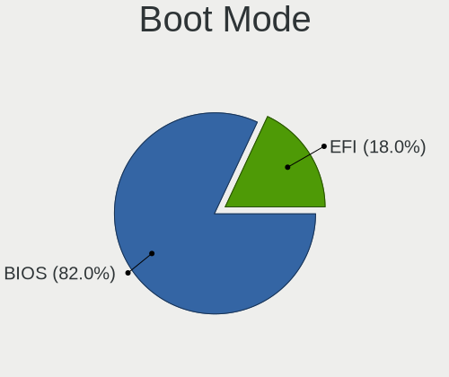
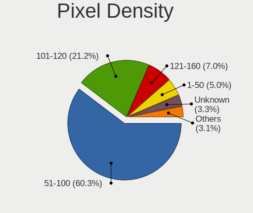
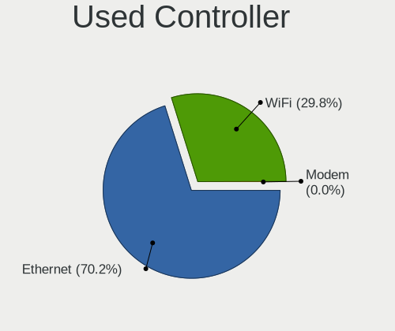
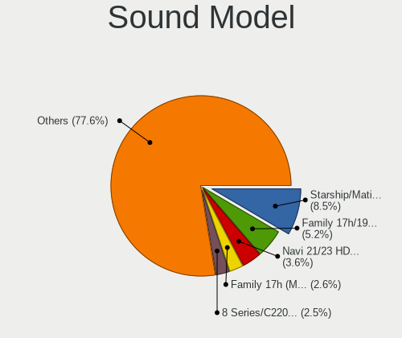
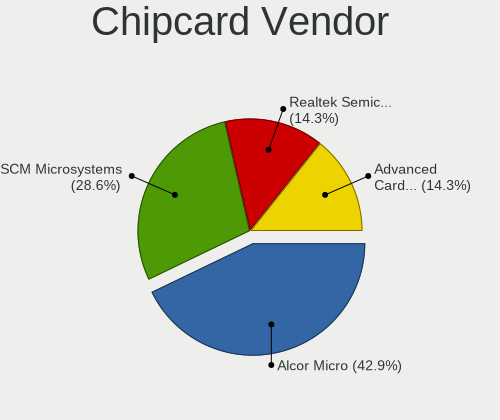

Pop!_OS 22.04 - Tested Hardware & Statistics (Desktops)
-------------------------------------------------------

A project to collect tested hardware configurations for Pop!_OS 22.04.

Anyone can contribute to this report by the [hw-probe](https://github.com/linuxhw/hw-probe) tool:

    sudo -E hw-probe -all -upload

Please contribute! Especially if your hardware is rare.

Contents
--------

* [ Test Cases ](#test-cases)

* [ System ](#system)
  - [ Kernel                   ](#kernel)
  - [ Kernel Family            ](#kernel-family)
  - [ Kernel Major Ver.        ](#kernel-major-ver)
  - [ Arch                     ](#arch)
  - [ DE                       ](#de)
  - [ Display Server           ](#display-server)
  - [ Display Manager          ](#display-manager)
  - [ OS Lang                  ](#os-lang)
  - [ Boot Mode                ](#boot-mode)
  - [ Filesystem               ](#filesystem)
  - [ Part. scheme             ](#part-scheme)
  - [ Dual Boot with Linux/BSD ](#dual-boot-with-linuxbsd)
  - [ Dual Boot (Win)          ](#dual-boot-win)

* [ Board ](#board)
  - [ Vendor                   ](#vendor)
  - [ Model                    ](#model)
  - [ Model Family             ](#model-family)
  - [ MFG Year                 ](#mfg-year)
  - [ Form Factor              ](#form-factor)
  - [ Secure Boot              ](#secure-boot)
  - [ Coreboot                 ](#coreboot)
  - [ RAM Size                 ](#ram-size)
  - [ RAM Used                 ](#ram-used)
  - [ Total Drives             ](#total-drives)
  - [ Has CD-ROM               ](#has-cd-rom)
  - [ Has Ethernet             ](#has-ethernet)
  - [ Has WiFi                 ](#has-wifi)
  - [ Has Bluetooth            ](#has-bluetooth)

* [ Location ](#location)
  - [ Country                  ](#country)
  - [ City                     ](#city)

* [ Drives ](#drives)
  - [ Drive Vendor             ](#drive-vendor)
  - [ Drive Model              ](#drive-model)
  - [ HDD Vendor               ](#hdd-vendor)
  - [ SSD Vendor               ](#ssd-vendor)
  - [ Drive Kind               ](#drive-kind)
  - [ Drive Connector          ](#drive-connector)
  - [ Drive Size               ](#drive-size)
  - [ Space Total              ](#space-total)
  - [ Space Used               ](#space-used)
  - [ Malfunc. Drives          ](#malfunc-drives)
  - [ Malfunc. Drive Vendor    ](#malfunc-drive-vendor)
  - [ Malfunc. HDD Vendor      ](#malfunc-hdd-vendor)
  - [ Malfunc. Drive Kind      ](#malfunc-drive-kind)
  - [ Failed Drives            ](#failed-drives)
  - [ Failed Drive Vendor      ](#failed-drive-vendor)
  - [ Drive Status             ](#drive-status)

* [ Storage controller ](#storage-controller)
  - [ Storage Vendor           ](#storage-vendor)
  - [ Storage Model            ](#storage-model)
  - [ Storage Kind             ](#storage-kind)

* [ Processor ](#processor)
  - [ CPU Vendor               ](#cpu-vendor)
  - [ CPU Model                ](#cpu-model)
  - [ CPU Model Family         ](#cpu-model-family)
  - [ CPU Cores                ](#cpu-cores)
  - [ CPU Sockets              ](#cpu-sockets)
  - [ CPU Threads              ](#cpu-threads)
  - [ CPU Op-Modes             ](#cpu-op-modes)
  - [ CPU Microcode            ](#cpu-microcode)
  - [ CPU Microarch            ](#cpu-microarch)

* [ Graphics ](#graphics)
  - [ GPU Vendor               ](#gpu-vendor)
  - [ GPU Model                ](#gpu-model)
  - [ GPU Combo                ](#gpu-combo)
  - [ GPU Driver               ](#gpu-driver)
  - [ GPU Memory               ](#gpu-memory)

* [ Monitor ](#monitor)
  - [ Monitor Vendor           ](#monitor-vendor)
  - [ Monitor Model            ](#monitor-model)
  - [ Monitor Resolution       ](#monitor-resolution)
  - [ Monitor Diagonal         ](#monitor-diagonal)
  - [ Monitor Width            ](#monitor-width)
  - [ Aspect Ratio             ](#aspect-ratio)
  - [ Monitor Area             ](#monitor-area)
  - [ Pixel Density            ](#pixel-density)
  - [ Multiple Monitors        ](#multiple-monitors)

* [ Network ](#network)
  - [ Net Controller Vendor    ](#net-controller-vendor)
  - [ Net Controller Model     ](#net-controller-model)
  - [ Wireless Vendor          ](#wireless-vendor)
  - [ Wireless Model           ](#wireless-model)
  - [ Ethernet Vendor          ](#ethernet-vendor)
  - [ Ethernet Model           ](#ethernet-model)
  - [ Net Controller Kind      ](#net-controller-kind)
  - [ Used Controller          ](#used-controller)
  - [ NICs                     ](#nics)
  - [ IPv6                     ](#ipv6)

* [ Bluetooth ](#bluetooth)
  - [ Bluetooth Vendor         ](#bluetooth-vendor)
  - [ Bluetooth Model          ](#bluetooth-model)

* [ Sound ](#sound)
  - [ Sound Vendor             ](#sound-vendor)
  - [ Sound Model              ](#sound-model)

* [ Memory ](#memory)
  - [ Memory Vendor            ](#memory-vendor)
  - [ Memory Model             ](#memory-model)
  - [ Memory Kind              ](#memory-kind)
  - [ Memory Form Factor       ](#memory-form-factor)
  - [ Memory Size              ](#memory-size)
  - [ Memory Speed             ](#memory-speed)

* [ Printers & scanners ](#printers--scanners)
  - [ Printer Vendor           ](#printer-vendor)
  - [ Printer Model            ](#printer-model)
  - [ Scanner Vendor           ](#scanner-vendor)
  - [ Scanner Model            ](#scanner-model)

* [ Camera ](#camera)
  - [ Camera Vendor            ](#camera-vendor)
  - [ Camera Model             ](#camera-model)

* [ Security ](#security)
  - [ Fingerprint Vendor       ](#fingerprint-vendor)
  - [ Fingerprint Model        ](#fingerprint-model)
  - [ Chipcard Vendor          ](#chipcard-vendor)
  - [ Chipcard Model           ](#chipcard-model)

* [ Unsupported ](#unsupported)
  - [ Unsupported Devices      ](#unsupported-devices)
  - [ Unsupported Device Types ](#unsupported-device-types)

Test Cases
----------

Total: 1011

| Vendor        | Model                       | Probe                                                      | Date         |
|---------------|-----------------------------|------------------------------------------------------------|--------------|
| Gigabyte      | Z77X-UP4 TH                 | [b80cb49656](https://linux-hardware.org/?probe=b80cb49656) | Mar 01, 2023 |
| Gigabyte      | B450 AORUS ELITE V2         | [0e0b3360ba](https://linux-hardware.org/?probe=0e0b3360ba) | Feb 28, 2023 |
| Lenovo        | 30D9 SDK0J40705 WIN 3425... | [7f53a53eba](https://linux-hardware.org/?probe=7f53a53eba) | Feb 28, 2023 |
| MSI           | MAG Z690 TOMAHAWK WIFI D... | [13edc00539](https://linux-hardware.org/?probe=13edc00539) | Feb 27, 2023 |
| Dell          | 03KWTV A02                  | [8b6eae9fd5](https://linux-hardware.org/?probe=8b6eae9fd5) | Feb 26, 2023 |
| MSI           | MPG Z390 GAMING EDGE AC     | [a3b8430bad](https://linux-hardware.org/?probe=a3b8430bad) | Feb 26, 2023 |
| MSI           | MAG Z690 TOMAHAWK WIFI D... | [fe1c90a3aa](https://linux-hardware.org/?probe=fe1c90a3aa) | Feb 26, 2023 |
| MSI           | B450-A PRO MAX              | [f081452f55](https://linux-hardware.org/?probe=f081452f55) | Feb 26, 2023 |
| MACHINIST     | X99-RS9 V2.0                | [f991f0e9df](https://linux-hardware.org/?probe=f991f0e9df) | Feb 26, 2023 |
| Gigabyte      | 970A-DS3P                   | [87647b8c76](https://linux-hardware.org/?probe=87647b8c76) | Feb 26, 2023 |
| ASUSTek       | SABERTOOTH 990FX R2.0       | [42fe607d11](https://linux-hardware.org/?probe=42fe607d11) | Feb 25, 2023 |
| MSI           | PRO Z790-P WIFI DDR4        | [59b7e1da6d](https://linux-hardware.org/?probe=59b7e1da6d) | Feb 25, 2023 |
| ZOTAC         | MEK1                        | [a61a52d794](https://linux-hardware.org/?probe=a61a52d794) | Feb 24, 2023 |
| HP            | 8433 11                     | [881b062090](https://linux-hardware.org/?probe=881b062090) | Feb 24, 2023 |
| ASUSTek       | SABERTOOTH 990FX R2.0       | [59d0e692ef](https://linux-hardware.org/?probe=59d0e692ef) | Feb 24, 2023 |
| ASUSTek       | TUF Gaming X570-PLUS        | [27a3c3c4c1](https://linux-hardware.org/?probe=27a3c3c4c1) | Feb 24, 2023 |
| Dell          | 0M6C7G A00                  | [8d8af65e26](https://linux-hardware.org/?probe=8d8af65e26) | Feb 23, 2023 |
| Dell          | 0M6C7G A00                  | [f8f5ea8885](https://linux-hardware.org/?probe=f8f5ea8885) | Feb 23, 2023 |
| Huanan        | X99-QD4 V1.0                | [205f7c6f50](https://linux-hardware.org/?probe=205f7c6f50) | Feb 23, 2023 |
| ASUSTek       | M5A78L-M/USB3               | [ec6ab709e5](https://linux-hardware.org/?probe=ec6ab709e5) | Feb 22, 2023 |
| Lenovo        | 102F SBB0J05441 WIN 3305... | [ea890b85f3](https://linux-hardware.org/?probe=ea890b85f3) | Feb 22, 2023 |
| Gigabyte      | H81M-HD3                    | [d19e079879](https://linux-hardware.org/?probe=d19e079879) | Feb 22, 2023 |
| ASRock        | B550 Extreme4               | [db2686086b](https://linux-hardware.org/?probe=db2686086b) | Feb 21, 2023 |
| ASUSTek       | PRIME B450M-A               | [8c97a04c10](https://linux-hardware.org/?probe=8c97a04c10) | Feb 21, 2023 |
| ASUSTek       | PRIME B550M-A               | [7dd9134373](https://linux-hardware.org/?probe=7dd9134373) | Feb 21, 2023 |
| ASUSTek       | PRIME B550M-A               | [fafea002be](https://linux-hardware.org/?probe=fafea002be) | Feb 21, 2023 |
| ASUSTek       | B75M-A                      | [c0c41ca089](https://linux-hardware.org/?probe=c0c41ca089) | Feb 21, 2023 |
| Alienware     | 0NWN7M A00                  | [eef5c2f68f](https://linux-hardware.org/?probe=eef5c2f68f) | Feb 21, 2023 |
| ASUSTek       | B75M-A                      | [2ea45a0d80](https://linux-hardware.org/?probe=2ea45a0d80) | Feb 21, 2023 |
| ASUSTek       | PRIME B550M-A               | [edbf6ce468](https://linux-hardware.org/?probe=edbf6ce468) | Feb 20, 2023 |
| ASRock        | A520M-HVS                   | [cc8628ae2c](https://linux-hardware.org/?probe=cc8628ae2c) | Feb 20, 2023 |
| Dell          | 09KPNV A01                  | [b335ec1cc3](https://linux-hardware.org/?probe=b335ec1cc3) | Feb 20, 2023 |
| ASRock        | H87 Performance             | [a28df01cad](https://linux-hardware.org/?probe=a28df01cad) | Feb 19, 2023 |
| Gigabyte      | Z590I AORUS ULTRA           | [9805ab5764](https://linux-hardware.org/?probe=9805ab5764) | Feb 19, 2023 |
| Gigabyte      | GA-78LMT-S2P                | [8df8fe9ae8](https://linux-hardware.org/?probe=8df8fe9ae8) | Feb 19, 2023 |
| Lenovo        | 1036 NO DPK                 | [b99541f6ad](https://linux-hardware.org/?probe=b99541f6ad) | Feb 19, 2023 |
| HP            | 8437                        | [f8f0f71bf5](https://linux-hardware.org/?probe=f8f0f71bf5) | Feb 18, 2023 |
| Gigabyte      | X570 AORUS ELITE            | [4101f152f5](https://linux-hardware.org/?probe=4101f152f5) | Feb 17, 2023 |
| ASRock        | B550M-HDV                   | [755006e226](https://linux-hardware.org/?probe=755006e226) | Feb 17, 2023 |
| Gigabyte      | B450M DS3H-CF               | [684445aeab](https://linux-hardware.org/?probe=684445aeab) | Feb 16, 2023 |
| MSI           | G41M-P33 Combo              | [5a6d751e4b](https://linux-hardware.org/?probe=5a6d751e4b) | Feb 15, 2023 |
| Gigabyte      | X570 I AORUS PRO WIFI       | [c82882e708](https://linux-hardware.org/?probe=c82882e708) | Feb 15, 2023 |
| Intel         | X99 V1.x                    | [31da77bea8](https://linux-hardware.org/?probe=31da77bea8) | Feb 15, 2023 |
| ASUSTek       | B85M-G                      | [c803a7f9e8](https://linux-hardware.org/?probe=c803a7f9e8) | Feb 15, 2023 |
| ASUSTek       | B85M-G                      | [3a660768c0](https://linux-hardware.org/?probe=3a660768c0) | Feb 15, 2023 |
| Gigabyte      | G41MT-S2                    | [9dfc369401](https://linux-hardware.org/?probe=9dfc369401) | Feb 15, 2023 |
| MSI           | G41M-P33 Combo              | [1161e39e43](https://linux-hardware.org/?probe=1161e39e43) | Feb 15, 2023 |
| Gigabyte      | GA-MA770T-UD3P              | [2ca590a85e](https://linux-hardware.org/?probe=2ca590a85e) | Feb 14, 2023 |
| Gigabyte      | X570 I AORUS PRO WIFI       | [27c2ee6ee0](https://linux-hardware.org/?probe=27c2ee6ee0) | Feb 14, 2023 |
| Dell          | 0Y7WYT A00                  | [d94084bbee](https://linux-hardware.org/?probe=d94084bbee) | Feb 12, 2023 |
| ASRock        | B550M Steel Legend          | [2a6f501cb1](https://linux-hardware.org/?probe=2a6f501cb1) | Feb 12, 2023 |
| Dell          | 08WKV3 A00                  | [89ba42b53e](https://linux-hardware.org/?probe=89ba42b53e) | Feb 12, 2023 |
| ASUSTek       | CROSSHAIR VI HERO           | [687ecdce15](https://linux-hardware.org/?probe=687ecdce15) | Feb 12, 2023 |
| ASUSTek       | CROSSHAIR VI HERO           | [2c1562b21f](https://linux-hardware.org/?probe=2c1562b21f) | Feb 11, 2023 |
| Gigabyte      | X570 AORUS ELITE            | [2d776f8810](https://linux-hardware.org/?probe=2d776f8810) | Feb 11, 2023 |
| Gigabyte      | X399 AORUS Gaming 7         | [b82ab8816d](https://linux-hardware.org/?probe=b82ab8816d) | Feb 11, 2023 |
| HP            | 18E4                        | [55972b87dd](https://linux-hardware.org/?probe=55972b87dd) | Feb 11, 2023 |
| ASUSTek       | CROSSHAIR VI HERO           | [0b14ee6551](https://linux-hardware.org/?probe=0b14ee6551) | Feb 11, 2023 |
| Gigabyte      | B85M-DS3H-A                 | [181c0e03e2](https://linux-hardware.org/?probe=181c0e03e2) | Feb 10, 2023 |
| Dell          | 0Y7WYT A00                  | [e4369afe1e](https://linux-hardware.org/?probe=e4369afe1e) | Feb 10, 2023 |
| ASUSTek       | A55BM-PLUS                  | [7c9763c23f](https://linux-hardware.org/?probe=7c9763c23f) | Feb 10, 2023 |
| Samsung       | DeskTop System              | [2437c4afda](https://linux-hardware.org/?probe=2437c4afda) | Feb 10, 2023 |
| Biostar       | H81MHV3 5.0                 | [390c8dd03a](https://linux-hardware.org/?probe=390c8dd03a) | Feb 09, 2023 |
| ASUSTek       | ROG STRIX X570-E GAMING     | [17bf959fd0](https://linux-hardware.org/?probe=17bf959fd0) | Feb 09, 2023 |
| Acer          | Aspire M3970                | [718cc13462](https://linux-hardware.org/?probe=718cc13462) | Feb 09, 2023 |
| ASUSTek       | ROG STRIX B550-F GAMING     | [16af8175a4](https://linux-hardware.org/?probe=16af8175a4) | Feb 08, 2023 |
| Gigabyte      | B650I AORUS ULTRA           | [1c07b901bb](https://linux-hardware.org/?probe=1c07b901bb) | Feb 08, 2023 |
| HP            | 2129                        | [80920d0d75](https://linux-hardware.org/?probe=80920d0d75) | Feb 08, 2023 |
| ASUSTek       | TUF Gaming B550-PLUS        | [d8dcaddb54](https://linux-hardware.org/?probe=d8dcaddb54) | Feb 08, 2023 |
| ASRock        | B660 Pro-C/ax               | [31e10f0e68](https://linux-hardware.org/?probe=31e10f0e68) | Feb 07, 2023 |
| ASRock        | FM2A68M-HD+                 | [8588a36683](https://linux-hardware.org/?probe=8588a36683) | Feb 07, 2023 |
| Lenovo        | 3743 SDK0T76463 WIN 3422... | [81ece9483e](https://linux-hardware.org/?probe=81ece9483e) | Feb 07, 2023 |
| Gigabyte      | F2A55M-HD2                  | [fe95bfe3d3](https://linux-hardware.org/?probe=fe95bfe3d3) | Feb 07, 2023 |
| Dell          | 0HHV7N A00                  | [e67a1c86b7](https://linux-hardware.org/?probe=e67a1c86b7) | Feb 07, 2023 |
| Gigabyte      | Z170X-UD5-CF                | [03a392d41f](https://linux-hardware.org/?probe=03a392d41f) | Feb 07, 2023 |
| Dell          | 02GDWG A00                  | [c0660c15fb](https://linux-hardware.org/?probe=c0660c15fb) | Feb 07, 2023 |
| MSI           | MAG Z690 TOMAHAWK WIFI      | [25fbfe1d66](https://linux-hardware.org/?probe=25fbfe1d66) | Feb 07, 2023 |
| System76      | Thelio thelio-r2            | [4cdf7d2895](https://linux-hardware.org/?probe=4cdf7d2895) | Feb 06, 2023 |
| Gigabyte      | B550I AORUS PRO AX          | [42dba6bdb3](https://linux-hardware.org/?probe=42dba6bdb3) | Feb 06, 2023 |
| ASUSTek       | TUF B450M-PLUS GAMING       | [a9bfc9669d](https://linux-hardware.org/?probe=a9bfc9669d) | Feb 06, 2023 |
| ASUSTek       | H81M-K                      | [6f09d6cd6c](https://linux-hardware.org/?probe=6f09d6cd6c) | Feb 05, 2023 |
| HP            | 8054                        | [c709653825](https://linux-hardware.org/?probe=c709653825) | Feb 05, 2023 |
| MSI           | PRO Z690-A DDR4             | [403785d1ec](https://linux-hardware.org/?probe=403785d1ec) | Feb 05, 2023 |
| ASUSTek       | PRIME X299-DELUXE II        | [c66fb39891](https://linux-hardware.org/?probe=c66fb39891) | Feb 04, 2023 |
| Gigabyte      | Z170X-UD5-CF                | [cd9d867630](https://linux-hardware.org/?probe=cd9d867630) | Feb 04, 2023 |
| Biostar       | H81MHV3 5.0                 | [084eee2317](https://linux-hardware.org/?probe=084eee2317) | Feb 03, 2023 |
| HP            | 834F                        | [9a4a1839d3](https://linux-hardware.org/?probe=9a4a1839d3) | Feb 02, 2023 |
| MSI           | MPG B560I GAMING EDGE WI... | [6d4ee8a3c6](https://linux-hardware.org/?probe=6d4ee8a3c6) | Feb 02, 2023 |
| ASUSTek       | TUF Gaming X570-PLUS        | [ffabf45521](https://linux-hardware.org/?probe=ffabf45521) | Feb 02, 2023 |
| MSI           | B450 TOMAHAWK MAX           | [a899b18189](https://linux-hardware.org/?probe=a899b18189) | Feb 02, 2023 |
| ASUSTek       | ROG STRIX B550-I GAMING     | [33ae030343](https://linux-hardware.org/?probe=33ae030343) | Jan 31, 2023 |
| MSI           | PRO Z690-P DDR4             | [a434328de5](https://linux-hardware.org/?probe=a434328de5) | Jan 30, 2023 |
| MSI           | H310M PRO-M2 PLUS           | [a96d93846a](https://linux-hardware.org/?probe=a96d93846a) | Jan 30, 2023 |
| ASUSTek       | ROG STRIX B550-I GAMING     | [3d555e69f7](https://linux-hardware.org/?probe=3d555e69f7) | Jan 30, 2023 |
| Intel         | H61                         | [87a72c61f2](https://linux-hardware.org/?probe=87a72c61f2) | Jan 29, 2023 |
| Gigabyte      | Z690 AORUS PRO              | [b07e189d3c](https://linux-hardware.org/?probe=b07e189d3c) | Jan 29, 2023 |
| Gigabyte      | X570 AORUS MASTER           | [6b71ec1a01](https://linux-hardware.org/?probe=6b71ec1a01) | Jan 28, 2023 |
| Gigabyte      | H77M-D3H                    | [a9367f87d4](https://linux-hardware.org/?probe=a9367f87d4) | Jan 28, 2023 |
| ASUSTek       | GA35DX                      | [697b0d8654](https://linux-hardware.org/?probe=697b0d8654) | Jan 28, 2023 |
| ASUSTek       | PRIME B560M-K               | [c74b6b90f0](https://linux-hardware.org/?probe=c74b6b90f0) | Jan 28, 2023 |
| Gigabyte      | GA-78LMT-USB3               | [55d50f6d18](https://linux-hardware.org/?probe=55d50f6d18) | Jan 27, 2023 |
| HP            | 1495                        | [8c1f7b5fbd](https://linux-hardware.org/?probe=8c1f7b5fbd) | Jan 27, 2023 |
| ASRock        | B450 Steel Legend           | [c2a36422b4](https://linux-hardware.org/?probe=c2a36422b4) | Jan 27, 2023 |
| ASUSTek       | ROG STRIX X570-E GAMING     | [df315d8050](https://linux-hardware.org/?probe=df315d8050) | Jan 27, 2023 |
| ASUSTek       | ROG STRIX X570-E GAMING     | [14a0252d88](https://linux-hardware.org/?probe=14a0252d88) | Jan 27, 2023 |
| ASUSTek       | G10DK                       | [0b70a364b7](https://linux-hardware.org/?probe=0b70a364b7) | Jan 27, 2023 |
| ASUSTek       | G10DK                       | [a42ba7ef9e](https://linux-hardware.org/?probe=a42ba7ef9e) | Jan 26, 2023 |
| ASUSTek       | P8B75-V                     | [1f8bd6b38e](https://linux-hardware.org/?probe=1f8bd6b38e) | Jan 26, 2023 |
| MSI           | B460M PRO-VDH WIFI          | [e32b0f2c79](https://linux-hardware.org/?probe=e32b0f2c79) | Jan 25, 2023 |
| ASUSTek       | TUF Gaming B550-PRO         | [10f149abb7](https://linux-hardware.org/?probe=10f149abb7) | Jan 24, 2023 |
| Acer          | Aspire M3970                | [c822a510e5](https://linux-hardware.org/?probe=c822a510e5) | Jan 24, 2023 |
| MSI           | B450M MORTAR MAX            | [4f5be0720a](https://linux-hardware.org/?probe=4f5be0720a) | Jan 23, 2023 |
| ASRock        | B450M Steel Legend          | [c87ce45f84](https://linux-hardware.org/?probe=c87ce45f84) | Jan 23, 2023 |
| ASUSTek       | Rampage II GENE             | [112b5304d9](https://linux-hardware.org/?probe=112b5304d9) | Jan 23, 2023 |
| MACHINIST     | X79 Z9-D7 V2.0              | [9d5d06d342](https://linux-hardware.org/?probe=9d5d06d342) | Jan 23, 2023 |
| ASUSTek       | PRIME A320M-K               | [bfb889f5d5](https://linux-hardware.org/?probe=bfb889f5d5) | Jan 23, 2023 |
| MSI           | MAG B550 TOMAHAWK           | [6597dd71bc](https://linux-hardware.org/?probe=6597dd71bc) | Jan 23, 2023 |
| Gigabyte      | G41MT-S2                    | [8f19cbfb31](https://linux-hardware.org/?probe=8f19cbfb31) | Jan 22, 2023 |
| MSI           | H81M-E34                    | [c11041ba13](https://linux-hardware.org/?probe=c11041ba13) | Jan 22, 2023 |
| ASUSTek       | H61M-E                      | [eec3fddef5](https://linux-hardware.org/?probe=eec3fddef5) | Jan 22, 2023 |
| ASRock        | B450 Pro4                   | [758ea69493](https://linux-hardware.org/?probe=758ea69493) | Jan 22, 2023 |
| ASUSTek       | ROG STRIX B550-A GAMING     | [d1b63bbd2d](https://linux-hardware.org/?probe=d1b63bbd2d) | Jan 22, 2023 |
| ASUSTek       | TUF Gaming B550-PRO         | [ebab459512](https://linux-hardware.org/?probe=ebab459512) | Jan 22, 2023 |
| ASUSTek       | G10DK                       | [1a27b660c2](https://linux-hardware.org/?probe=1a27b660c2) | Jan 21, 2023 |
| ASUSTek       | P8H77-V LE                  | [6dd531590e](https://linux-hardware.org/?probe=6dd531590e) | Jan 21, 2023 |
| MSI           | B550M PRO-VDH WIFI          | [bd601f83d3](https://linux-hardware.org/?probe=bd601f83d3) | Jan 21, 2023 |
| ASRock        | X99 Professional Gaming ... | [d203633f83](https://linux-hardware.org/?probe=d203633f83) | Jan 21, 2023 |
| Dell          | 0KC9NP A01                  | [ce0ba337df](https://linux-hardware.org/?probe=ce0ba337df) | Jan 21, 2023 |
| ASRock        | X99 Professional Gaming ... | [e47d5b2419](https://linux-hardware.org/?probe=e47d5b2419) | Jan 21, 2023 |
| ASUSTek       | P6T SE                      | [011553878f](https://linux-hardware.org/?probe=011553878f) | Jan 21, 2023 |
| Intel         | DQ67SW AAG12527-310         | [b7b8f92df1](https://linux-hardware.org/?probe=b7b8f92df1) | Jan 21, 2023 |
| ASUSTek       | P8Z77-V LK                  | [a10fc5f5a9](https://linux-hardware.org/?probe=a10fc5f5a9) | Jan 20, 2023 |
| ASRock        | X99 Professional Gaming ... | [266b8bc492](https://linux-hardware.org/?probe=266b8bc492) | Jan 20, 2023 |
| Alienware     | 0N43JM A00                  | [06a6ec74c0](https://linux-hardware.org/?probe=06a6ec74c0) | Jan 20, 2023 |
| ASRock        | X99 Professional Gaming ... | [0fbcb3df67](https://linux-hardware.org/?probe=0fbcb3df67) | Jan 19, 2023 |
| ASUSTek       | PRIME B450M-K               | [cbad1c4df4](https://linux-hardware.org/?probe=cbad1c4df4) | Jan 19, 2023 |
| ASUSTek       | PRIME B450M-K               | [3ff2eaf5ed](https://linux-hardware.org/?probe=3ff2eaf5ed) | Jan 19, 2023 |
| ASUSTek       | P6T SE                      | [d13ca33fcf](https://linux-hardware.org/?probe=d13ca33fcf) | Jan 18, 2023 |
| ASRock        | H510M-HVS R2.0              | [3ee772766c](https://linux-hardware.org/?probe=3ee772766c) | Jan 18, 2023 |
| ASUSTek       | G10DK                       | [ebc45fdfd5](https://linux-hardware.org/?probe=ebc45fdfd5) | Jan 18, 2023 |
| ASUSTek       | G10DK                       | [0eae2f92fa](https://linux-hardware.org/?probe=0eae2f92fa) | Jan 17, 2023 |
| ASRock        | B450 Pro4                   | [f908807ed9](https://linux-hardware.org/?probe=f908807ed9) | Jan 17, 2023 |
| Gigabyte      | B550I AORUS PRO AX          | [564482477e](https://linux-hardware.org/?probe=564482477e) | Jan 17, 2023 |
| ASUSTek       | ROG STRIX B450-F GAMING     | [6e8f360d6e](https://linux-hardware.org/?probe=6e8f360d6e) | Jan 17, 2023 |
| ASRock        | H87 Performance             | [a71c911bcf](https://linux-hardware.org/?probe=a71c911bcf) | Jan 17, 2023 |
| Gigabyte      | B550M DS3H AC               | [22fca13d2b](https://linux-hardware.org/?probe=22fca13d2b) | Jan 17, 2023 |
| Gigabyte      | B450M S2H                   | [2ba8d32a71](https://linux-hardware.org/?probe=2ba8d32a71) | Jan 17, 2023 |
| Gateway       | WG43M                       | [af3a009366](https://linux-hardware.org/?probe=af3a009366) | Jan 17, 2023 |
| ASRock        | B450 Pro4                   | [48cc2e0e69](https://linux-hardware.org/?probe=48cc2e0e69) | Jan 17, 2023 |
| Gateway       | WG43M                       | [b0aa3af22f](https://linux-hardware.org/?probe=b0aa3af22f) | Jan 17, 2023 |
| ASRock        | H87 Performance             | [9e2cd66ef5](https://linux-hardware.org/?probe=9e2cd66ef5) | Jan 16, 2023 |
| ASRock        | B450 Pro4                   | [2e65fc8357](https://linux-hardware.org/?probe=2e65fc8357) | Jan 16, 2023 |
| Gigabyte      | B450 AORUS PRO WIFI-CF      | [ba736834cd](https://linux-hardware.org/?probe=ba736834cd) | Jan 16, 2023 |
| HC            | HCAR357-MI V1.0             | [ef934af180](https://linux-hardware.org/?probe=ef934af180) | Jan 16, 2023 |
| ASRock        | B550 Extreme4               | [01f850d2fb](https://linux-hardware.org/?probe=01f850d2fb) | Jan 15, 2023 |
| Dell          | 0PXWHK A00                  | [82f04ecd77](https://linux-hardware.org/?probe=82f04ecd77) | Jan 15, 2023 |
| Dell          | 0PXWHK A00                  | [25db796fd6](https://linux-hardware.org/?probe=25db796fd6) | Jan 14, 2023 |
| MAXSUN        | MS-TZZ B460M                | [14758fc3e7](https://linux-hardware.org/?probe=14758fc3e7) | Jan 14, 2023 |
| ASUSTek       | TUF Gaming Z590-PLUS        | [f5499bf32a](https://linux-hardware.org/?probe=f5499bf32a) | Jan 14, 2023 |
| ASUSTek       | ROG STRIX X570-I GAMING     | [d3896698c8](https://linux-hardware.org/?probe=d3896698c8) | Jan 14, 2023 |
| ASUSTek       | G10DK                       | [a92296f2e7](https://linux-hardware.org/?probe=a92296f2e7) | Jan 14, 2023 |
| Acer          | Aspire XC-603G              | [21e24944ad](https://linux-hardware.org/?probe=21e24944ad) | Jan 14, 2023 |
| ASUSTek       | M4A78                       | [4ce5e1fd02](https://linux-hardware.org/?probe=4ce5e1fd02) | Jan 14, 2023 |
| ASUSTek       | M4A78                       | [09560460b9](https://linux-hardware.org/?probe=09560460b9) | Jan 14, 2023 |
| ASUSTek       | P9X79-E WS                  | [e868d6909e](https://linux-hardware.org/?probe=e868d6909e) | Jan 14, 2023 |
| MSI           | B450 GAMING PRO CARBON M... | [c01da2fcf9](https://linux-hardware.org/?probe=c01da2fcf9) | Jan 14, 2023 |
| MSI           | B450 GAMING PRO CARBON M... | [d4a8ff871f](https://linux-hardware.org/?probe=d4a8ff871f) | Jan 14, 2023 |
| Gigabyte      | B450 AORUS PRO WIFI-CF      | [1921b19009](https://linux-hardware.org/?probe=1921b19009) | Jan 13, 2023 |
| HP            | 8299                        | [e4e0920f71](https://linux-hardware.org/?probe=e4e0920f71) | Jan 12, 2023 |
| ASUSTek       | H61M-E                      | [38691cf2cc](https://linux-hardware.org/?probe=38691cf2cc) | Jan 11, 2023 |
| Lenovo        | ThinkCentre M71e 3157W8B    | [70078ceabd](https://linux-hardware.org/?probe=70078ceabd) | Jan 11, 2023 |
| ASUSTek       | ROG STRIX B560-I GAMING ... | [ae12526ceb](https://linux-hardware.org/?probe=ae12526ceb) | Jan 11, 2023 |
| ASUSTek       | P9X79-E WS                  | [f3b4e5135f](https://linux-hardware.org/?probe=f3b4e5135f) | Jan 10, 2023 |
| HP            | 8433 11                     | [5e26cba33b](https://linux-hardware.org/?probe=5e26cba33b) | Jan 10, 2023 |
| ASUSTek       | M5A97 EVO R2.0              | [b39213e4d0](https://linux-hardware.org/?probe=b39213e4d0) | Jan 09, 2023 |
| ASUSTek       | ROG STRIX B450-F GAMING     | [3982bc570e](https://linux-hardware.org/?probe=3982bc570e) | Jan 09, 2023 |
| Gigabyte      | B550 GAMING X V2            | [e64cca399f](https://linux-hardware.org/?probe=e64cca399f) | Jan 09, 2023 |
| MSI           | B350M BAZOOKA               | [e7d2bcfcfb](https://linux-hardware.org/?probe=e7d2bcfcfb) | Jan 09, 2023 |
| ASRock        | X370 Gaming K4              | [0ed2f96ba8](https://linux-hardware.org/?probe=0ed2f96ba8) | Jan 09, 2023 |
| ASUSTek       | ROG CROSSHAIR VIII DARK ... | [36ed66f057](https://linux-hardware.org/?probe=36ed66f057) | Jan 08, 2023 |
| ASRock        | B550 Phantom Gaming 4       | [1b055dc79d](https://linux-hardware.org/?probe=1b055dc79d) | Jan 08, 2023 |
| ASRock        | B550 Phantom Gaming-ITX/... | [0b85968e35](https://linux-hardware.org/?probe=0b85968e35) | Jan 08, 2023 |
| MSI           | MPG X570S EDGE MAX WIFI     | [15f31fc9a5](https://linux-hardware.org/?probe=15f31fc9a5) | Jan 07, 2023 |
| HP            | 2B4B                        | [57273c7b72](https://linux-hardware.org/?probe=57273c7b72) | Jan 07, 2023 |
| Dell          | 04GJJT A00                  | [85142569a6](https://linux-hardware.org/?probe=85142569a6) | Jan 07, 2023 |
| ASUSTek       | ROG CROSSHAIR VIII HERO     | [f2024a8808](https://linux-hardware.org/?probe=f2024a8808) | Jan 06, 2023 |
| Acer          | Aspire M3970                | [2ef35b6d4b](https://linux-hardware.org/?probe=2ef35b6d4b) | Jan 05, 2023 |
| MSI           | B250M PRO-VD                | [0abf746107](https://linux-hardware.org/?probe=0abf746107) | Jan 05, 2023 |
| Intel         | HM570                       | [8728d2372a](https://linux-hardware.org/?probe=8728d2372a) | Jan 05, 2023 |
| AZW           | GTR V02                     | [2cf7a814cb](https://linux-hardware.org/?probe=2cf7a814cb) | Jan 05, 2023 |
| Gigabyte      | X570S AERO G                | [04ca884448](https://linux-hardware.org/?probe=04ca884448) | Jan 05, 2023 |
| ASRock        | B550 Phantom Gaming 4       | [98fafd877d](https://linux-hardware.org/?probe=98fafd877d) | Jan 04, 2023 |
| HP            | 3047h                       | [2c75b0b4ee](https://linux-hardware.org/?probe=2c75b0b4ee) | Jan 04, 2023 |
| ASRock        | 760GM-HDV                   | [f994e91031](https://linux-hardware.org/?probe=f994e91031) | Jan 04, 2023 |
| ASUSTek       | M5A97 R2.0                  | [6da268e22f](https://linux-hardware.org/?probe=6da268e22f) | Jan 03, 2023 |
| System76      | Thelio Mira thelio-mira-... | [78367dd37f](https://linux-hardware.org/?probe=78367dd37f) | Jan 03, 2023 |
| ASRock        | FM2A55M-VG3+                | [741f0d79a1](https://linux-hardware.org/?probe=741f0d79a1) | Jan 03, 2023 |
| ASRock        | B550M Steel Legend          | [e8ad216a59](https://linux-hardware.org/?probe=e8ad216a59) | Jan 02, 2023 |
| ASUSTek       | P6T                         | [e648b2523e](https://linux-hardware.org/?probe=e648b2523e) | Jan 02, 2023 |
| Acer          | Aspire XC-603G              | [b2e25a20de](https://linux-hardware.org/?probe=b2e25a20de) | Jan 02, 2023 |
| ASUSTek       | ROG STRIX B550-I GAMING     | [0e4b6aa6c2](https://linux-hardware.org/?probe=0e4b6aa6c2) | Jan 02, 2023 |
| Gigabyte      | A320M-S2H-CF                | [e26cc7285f](https://linux-hardware.org/?probe=e26cc7285f) | Jan 02, 2023 |
| Win elemen... | M600                        | [5d4320db68](https://linux-hardware.org/?probe=5d4320db68) | Jan 02, 2023 |
| MSI           | PRO B550-VC                 | [f5574e6e00](https://linux-hardware.org/?probe=f5574e6e00) | Jan 01, 2023 |
| ASUSTek       | TUF Gaming B550M-PLUS       | [28f9b91b32](https://linux-hardware.org/?probe=28f9b91b32) | Jan 01, 2023 |
| ASUSTek       | TUF Gaming B550M-PLUS       | [6b98637c82](https://linux-hardware.org/?probe=6b98637c82) | Jan 01, 2023 |
| Acer          | Aspire XC-603G              | [660548d31c](https://linux-hardware.org/?probe=660548d31c) | Jan 01, 2023 |
| ASUSTek       | TUF Gaming B550-PLUS        | [34528f04fe](https://linux-hardware.org/?probe=34528f04fe) | Jan 01, 2023 |
| Acer          | Predator PO3-600 V:1.1      | [e5f5073bcd](https://linux-hardware.org/?probe=e5f5073bcd) | Dec 31, 2022 |
| MSI           | B250M BAZOOKA               | [5b204eade4](https://linux-hardware.org/?probe=5b204eade4) | Dec 31, 2022 |
| Dell          | 0KWVT8 A03                  | [ad32666c8c](https://linux-hardware.org/?probe=ad32666c8c) | Dec 31, 2022 |
| ASUSTek       | Z97-A                       | [6f61aac097](https://linux-hardware.org/?probe=6f61aac097) | Dec 31, 2022 |
| Dell          | 0KWVT8 A03                  | [17fc3a4abc](https://linux-hardware.org/?probe=17fc3a4abc) | Dec 30, 2022 |
| ASUSTek       | TUF Gaming B550-PLUS        | [76e9829e66](https://linux-hardware.org/?probe=76e9829e66) | Dec 30, 2022 |
| ASUSTek       | Z87-PLUS                    | [85bfa942e6](https://linux-hardware.org/?probe=85bfa942e6) | Dec 30, 2022 |
| Gigabyte      | B450 AORUS ELITE V2         | [4b3cfd1d9c](https://linux-hardware.org/?probe=4b3cfd1d9c) | Dec 30, 2022 |
| MSI           | B550M PRO-VDH WIFI          | [17f72460f6](https://linux-hardware.org/?probe=17f72460f6) | Dec 29, 2022 |
| Acer          | Aspire XC-603G              | [08dc8ac6b7](https://linux-hardware.org/?probe=08dc8ac6b7) | Dec 29, 2022 |
| ASRock        | Z790 PG Riptide             | [19c8814aba](https://linux-hardware.org/?probe=19c8814aba) | Dec 29, 2022 |
| Dell          | 0NNGP2 A00                  | [12638171d9](https://linux-hardware.org/?probe=12638171d9) | Dec 28, 2022 |
| Lenovo        | No DPK                      | [944f84567a](https://linux-hardware.org/?probe=944f84567a) | Dec 28, 2022 |
| ASRock        | Z790M-ITX WiFi              | [c1c0ab5824](https://linux-hardware.org/?probe=c1c0ab5824) | Dec 28, 2022 |
| Dell          | 00CV7F A00                  | [49a36278c4](https://linux-hardware.org/?probe=49a36278c4) | Dec 28, 2022 |
| Gigabyte      | AB350M-DS3H V2-CF           | [2522f716da](https://linux-hardware.org/?probe=2522f716da) | Dec 28, 2022 |
| HP            | 2B4B                        | [b07e2ecc23](https://linux-hardware.org/?probe=b07e2ecc23) | Dec 28, 2022 |
| MSI           | MAG X570S TOMAHAWK MAX W... | [1522e4a536](https://linux-hardware.org/?probe=1522e4a536) | Dec 28, 2022 |
| Acer          | Aspire XC-603G              | [e8adbb63a4](https://linux-hardware.org/?probe=e8adbb63a4) | Dec 28, 2022 |
| ASUSTek       | ROG STRIX B550-F GAMING     | [20ca7dd779](https://linux-hardware.org/?probe=20ca7dd779) | Dec 27, 2022 |
| Gigabyte      | B450 I AORUS PRO WIFI-CF    | [dab993d989](https://linux-hardware.org/?probe=dab993d989) | Dec 27, 2022 |
| ASUSTek       | PRIME B450-PLUS             | [ee1658b320](https://linux-hardware.org/?probe=ee1658b320) | Dec 27, 2022 |
| HP            | 876C SMVB                   | [7926807626](https://linux-hardware.org/?probe=7926807626) | Dec 27, 2022 |
| ASUSTek       | Z87-K                       | [9c65749eb1](https://linux-hardware.org/?probe=9c65749eb1) | Dec 27, 2022 |
| MSI           | B450M PRO-M2                | [89d9265559](https://linux-hardware.org/?probe=89d9265559) | Dec 27, 2022 |
| ASRock        | Z390M-ITX/ac                | [23d6589918](https://linux-hardware.org/?probe=23d6589918) | Dec 27, 2022 |
| Gigabyte      | H61M-S2PV                   | [4403153e04](https://linux-hardware.org/?probe=4403153e04) | Dec 27, 2022 |
| Gigabyte      | 970-GAMING                  | [c49123106a](https://linux-hardware.org/?probe=c49123106a) | Dec 24, 2022 |
| Gigabyte      | MJPLNBB-00                  | [17c300ac96](https://linux-hardware.org/?probe=17c300ac96) | Dec 22, 2022 |
| ASUSTek       | P7P55D PRO                  | [7402ac8671](https://linux-hardware.org/?probe=7402ac8671) | Dec 22, 2022 |
| MSI           | B85M-E45                    | [b60edb092f](https://linux-hardware.org/?probe=b60edb092f) | Dec 21, 2022 |
| MSI           | MPG B550 GAMING PLUS        | [07dc9b96c1](https://linux-hardware.org/?probe=07dc9b96c1) | Dec 21, 2022 |
| Dell          | 02GDWG A00                  | [d20f5b0751](https://linux-hardware.org/?probe=d20f5b0751) | Dec 21, 2022 |
| Intel         | X99 V1.x                    | [5e961d12dc](https://linux-hardware.org/?probe=5e961d12dc) | Dec 21, 2022 |
| Supermicro    | X9DR3-F                     | [0a1557ab4a](https://linux-hardware.org/?probe=0a1557ab4a) | Dec 20, 2022 |
| HP            | 18E7                        | [c3b91e80df](https://linux-hardware.org/?probe=c3b91e80df) | Dec 20, 2022 |
| ASUSTek       | ROG STRIX B550-I GAMING     | [03dfcb8079](https://linux-hardware.org/?probe=03dfcb8079) | Dec 19, 2022 |
| ASUSTek       | ROG STRIX B550-I GAMING     | [1f6885ef2f](https://linux-hardware.org/?probe=1f6885ef2f) | Dec 19, 2022 |
| Gigabyte      | H110M-S2H-CF                | [cdbf94efce](https://linux-hardware.org/?probe=cdbf94efce) | Dec 19, 2022 |
| ASUSTek       | ROG CROSSHAIR VIII HERO     | [c7b01f9875](https://linux-hardware.org/?probe=c7b01f9875) | Dec 19, 2022 |
| MSI           | MAG X570 TOMAHAWK WIFI      | [c168fe495f](https://linux-hardware.org/?probe=c168fe495f) | Dec 19, 2022 |
| ASUSTek       | ROG STRIX B550-F GAMING     | [d179359230](https://linux-hardware.org/?probe=d179359230) | Dec 18, 2022 |
| HP            | 8433 11                     | [4368b19d60](https://linux-hardware.org/?probe=4368b19d60) | Dec 18, 2022 |
| Gigabyte      | B550 VISION D-P             | [163b883ce2](https://linux-hardware.org/?probe=163b883ce2) | Dec 17, 2022 |
| ASUSTek       | ROG CROSSHAIR VIII HERO     | [2a0f5be3bf](https://linux-hardware.org/?probe=2a0f5be3bf) | Dec 17, 2022 |
| Dell          | 02GDWG A00                  | [d7e869aded](https://linux-hardware.org/?probe=d7e869aded) | Dec 17, 2022 |
| Unknown       | Unknown                     | [988a2e80c0](https://linux-hardware.org/?probe=988a2e80c0) | Dec 17, 2022 |
| Dell          | 02GDWG A00                  | [f12e6b75b5](https://linux-hardware.org/?probe=f12e6b75b5) | Dec 16, 2022 |
| ASUSTek       | SABERTOOTH X58              | [b31e9dfa64](https://linux-hardware.org/?probe=b31e9dfa64) | Dec 16, 2022 |
| MSI           | X370 GAMING PLUS            | [893af38c43](https://linux-hardware.org/?probe=893af38c43) | Dec 16, 2022 |
| Fujitsu       | D3230-A1 S26361-D3230-A1    | [90912f0bba](https://linux-hardware.org/?probe=90912f0bba) | Dec 16, 2022 |
| ASUSTek       | SABERTOOTH X58              | [9cff930a2e](https://linux-hardware.org/?probe=9cff930a2e) | Dec 16, 2022 |
| ASUSTek       | PRIME H310M-E R2.0          | [0b1367de2f](https://linux-hardware.org/?probe=0b1367de2f) | Dec 16, 2022 |
| ASUSTek       | M51BC                       | [3b744c3d0c](https://linux-hardware.org/?probe=3b744c3d0c) | Dec 16, 2022 |
| ASUSTek       | PRIME A320M-K/BR            | [60848aa48e](https://linux-hardware.org/?probe=60848aa48e) | Dec 16, 2022 |
| ASUSTek       | PRIME X570-PRO              | [af4e397bbe](https://linux-hardware.org/?probe=af4e397bbe) | Dec 16, 2022 |
| System76      | Thelio thelio-r2            | [d2065497b9](https://linux-hardware.org/?probe=d2065497b9) | Dec 15, 2022 |
| ASUSTek       | ROG STRIX Z390-H GAMING     | [1d1a225cde](https://linux-hardware.org/?probe=1d1a225cde) | Dec 15, 2022 |
| MSI           | Z170A PC MATE               | [e6f5c32627](https://linux-hardware.org/?probe=e6f5c32627) | Dec 15, 2022 |
| Gigabyte      | B550 AORUS ELITE AX V2      | [35ef32b165](https://linux-hardware.org/?probe=35ef32b165) | Dec 14, 2022 |
| ASRock        | B450M-HDV R4.0              | [b4d843d4c2](https://linux-hardware.org/?probe=b4d843d4c2) | Dec 14, 2022 |
| ASRock        | X670E PG Lightning          | [08e4e03d36](https://linux-hardware.org/?probe=08e4e03d36) | Dec 13, 2022 |
| ASRock        | X670E PG Lightning          | [3a6a347ff9](https://linux-hardware.org/?probe=3a6a347ff9) | Dec 13, 2022 |
| Acer          | Aspire T3-100               | [918ad73eb1](https://linux-hardware.org/?probe=918ad73eb1) | Dec 13, 2022 |
| ASUSTek       | TUF Gaming X570-PLUS        | [e583774bc6](https://linux-hardware.org/?probe=e583774bc6) | Dec 13, 2022 |
| Gigabyte      | F2A88XM-D3H                 | [cdc6f36d8c](https://linux-hardware.org/?probe=cdc6f36d8c) | Dec 11, 2022 |
| ASRock        | X570 Extreme4 WiFi ax       | [8f45bcde64](https://linux-hardware.org/?probe=8f45bcde64) | Dec 11, 2022 |
| Dell          | 02GDWG A00                  | [229065f67f](https://linux-hardware.org/?probe=229065f67f) | Dec 11, 2022 |
| MSI           | A55M-E33                    | [327967e6a4](https://linux-hardware.org/?probe=327967e6a4) | Dec 11, 2022 |
| Dell          | 02GDWG A00                  | [5cea05fe88](https://linux-hardware.org/?probe=5cea05fe88) | Dec 11, 2022 |
| Apple         | Mac-F221BEC8                | [55a5f34bf0](https://linux-hardware.org/?probe=55a5f34bf0) | Dec 10, 2022 |
| ASUSTek       | ROG CROSSHAIR VIII DARK ... | [d83227cce9](https://linux-hardware.org/?probe=d83227cce9) | Dec 10, 2022 |
| ASUSTek       | PRIME B550M-A               | [05f65af47e](https://linux-hardware.org/?probe=05f65af47e) | Dec 10, 2022 |
| Supermicro    | C7Q67 V1.01                 | [8f571548fd](https://linux-hardware.org/?probe=8f571548fd) | Dec 10, 2022 |
| Gigabyte      | B450 AORUS ELITE            | [8f38dcc9d4](https://linux-hardware.org/?probe=8f38dcc9d4) | Dec 10, 2022 |
| ASUSTek       | TUF Gaming A520M-PLUS WI... | [e8d8a922a2](https://linux-hardware.org/?probe=e8d8a922a2) | Dec 10, 2022 |
| MSI           | MAG X570S TORPEDO MAX       | [560e61c57f](https://linux-hardware.org/?probe=560e61c57f) | Dec 10, 2022 |
| Dell          | 0HY9JP A02                  | [94a6153aeb](https://linux-hardware.org/?probe=94a6153aeb) | Dec 09, 2022 |
| ASUSTek       | PRIME B550M-A               | [1b848d1587](https://linux-hardware.org/?probe=1b848d1587) | Dec 09, 2022 |
| ASUSTek       | TUF Gaming B550-PLUS        | [e61897fa56](https://linux-hardware.org/?probe=e61897fa56) | Dec 09, 2022 |
| ASUSTek       | ROG STRIX B550-F GAMING     | [1280df2c5d](https://linux-hardware.org/?probe=1280df2c5d) | Dec 08, 2022 |
| MSI           | PRO Z790-A WIFI             | [9dfb20d74f](https://linux-hardware.org/?probe=9dfb20d74f) | Dec 08, 2022 |
| ASRock        | Z97 Extreme6                | [f000ea7b78](https://linux-hardware.org/?probe=f000ea7b78) | Dec 08, 2022 |
| ASUSTek       | PRIME Z390-A                | [d2c01d70df](https://linux-hardware.org/?probe=d2c01d70df) | Dec 08, 2022 |
| BESSTAR Te... | B550                        | [5471ce4bdc](https://linux-hardware.org/?probe=5471ce4bdc) | Dec 07, 2022 |
| ASUSTek       | ROG STRIX B550-E GAMING     | [c376825cca](https://linux-hardware.org/?probe=c376825cca) | Dec 07, 2022 |
| ASUSTek       | PRIME Z690M-PLUS D4         | [7abcfecd34](https://linux-hardware.org/?probe=7abcfecd34) | Dec 07, 2022 |
| ASUSTek       | ROG STRIX B550-E GAMING     | [6abdbbb7e7](https://linux-hardware.org/?probe=6abdbbb7e7) | Dec 07, 2022 |
| Gigabyte      | A320M-S2H-CF                | [3c65af8425](https://linux-hardware.org/?probe=3c65af8425) | Dec 06, 2022 |
| Gigabyte      | 990FXA-UD3                  | [6ff5feb92c](https://linux-hardware.org/?probe=6ff5feb92c) | Dec 06, 2022 |
| Gigabyte      | A320M-S2H-CF                | [d66311f833](https://linux-hardware.org/?probe=d66311f833) | Dec 06, 2022 |
| MSI           | B150M MORTAR                | [9a87b35e1c](https://linux-hardware.org/?probe=9a87b35e1c) | Dec 06, 2022 |
| Gigabyte      | B450 AORUS PRO-CF           | [310ff494e7](https://linux-hardware.org/?probe=310ff494e7) | Dec 06, 2022 |
| Gigabyte      | 990FXA-UD3                  | [c0f26cbe79](https://linux-hardware.org/?probe=c0f26cbe79) | Dec 06, 2022 |
| MSI           | 760GM-P23                   | [df9ebcbba6](https://linux-hardware.org/?probe=df9ebcbba6) | Dec 06, 2022 |
| ASUSTek       | ROG STRIX B550-E GAMING     | [69cc6b3ad3](https://linux-hardware.org/?probe=69cc6b3ad3) | Dec 05, 2022 |
| ASUSTek       | ROG STRIX X670E-I GAMING... | [b9d333782f](https://linux-hardware.org/?probe=b9d333782f) | Dec 05, 2022 |
| ASUSTek       | ROG Maximus Z690 HERO       | [c74d870263](https://linux-hardware.org/?probe=c74d870263) | Dec 04, 2022 |
| MSI           | B350 TOMAHAWK               | [2607a15d58](https://linux-hardware.org/?probe=2607a15d58) | Dec 03, 2022 |
| ASRock        | Z370 Pro4                   | [76cd787c24](https://linux-hardware.org/?probe=76cd787c24) | Dec 03, 2022 |
| ASUSTek       | ROG STRIX X470-F GAMING     | [dd1874248c](https://linux-hardware.org/?probe=dd1874248c) | Dec 02, 2022 |
| ASUSTek       | ROG STRIX X470-F GAMING     | [eaf129dcfe](https://linux-hardware.org/?probe=eaf129dcfe) | Dec 02, 2022 |
| MSI           | MAG B650M MORTAR WIFI       | [8e317647dc](https://linux-hardware.org/?probe=8e317647dc) | Dec 02, 2022 |
| ASUSTek       | ROG STRIX B550-A GAMING     | [953943c231](https://linux-hardware.org/?probe=953943c231) | Dec 02, 2022 |
| ASRock        | H97 Pro4                    | [0e0ed0822c](https://linux-hardware.org/?probe=0e0ed0822c) | Dec 02, 2022 |
| ASRock        | H97 Pro4                    | [adeb151478](https://linux-hardware.org/?probe=adeb151478) | Dec 02, 2022 |
| ASUSTek       | Maximus VIII RANGER         | [c8d4cd1faf](https://linux-hardware.org/?probe=c8d4cd1faf) | Dec 01, 2022 |
| ASUSTek       | Maximus VIII RANGER         | [866e8151d7](https://linux-hardware.org/?probe=866e8151d7) | Dec 01, 2022 |
| System76      | Thelio thelio-r2            | [a7ae37f43e](https://linux-hardware.org/?probe=a7ae37f43e) | Dec 01, 2022 |
| Unknown       | 1.0                         | [c8cfeaf2be](https://linux-hardware.org/?probe=c8cfeaf2be) | Dec 01, 2022 |
| MSI           | MPG Z390 GAMING PRO CARB... | [f8a7663037](https://linux-hardware.org/?probe=f8a7663037) | Dec 01, 2022 |
| MSI           | B350 GAMING PLUS            | [b840a0d02e](https://linux-hardware.org/?probe=b840a0d02e) | Dec 01, 2022 |
| ASRock        | H77M                        | [ffa3496b0d](https://linux-hardware.org/?probe=ffa3496b0d) | Nov 30, 2022 |
| ASUSTek       | M5A97 EVO R2.0              | [a42a4d6080](https://linux-hardware.org/?probe=a42a4d6080) | Nov 29, 2022 |
| MSI           | B560M PRO-VDH               | [cee0622b1f](https://linux-hardware.org/?probe=cee0622b1f) | Nov 29, 2022 |
| ASUSTek       | Pro WS WRX80E-SAGE SE WI... | [40c84f5af9](https://linux-hardware.org/?probe=40c84f5af9) | Nov 28, 2022 |
| Gigabyte      | A520M S2H                   | [151f18b424](https://linux-hardware.org/?probe=151f18b424) | Nov 28, 2022 |
| MSI           | B450M PRO-VDH MAX           | [dee60b9f35](https://linux-hardware.org/?probe=dee60b9f35) | Nov 28, 2022 |
| MSI           | B450M PRO-VDH MAX           | [1651962e5a](https://linux-hardware.org/?probe=1651962e5a) | Nov 28, 2022 |
| Acer          | Nitro N50-610               | [1a50d26810](https://linux-hardware.org/?probe=1a50d26810) | Nov 27, 2022 |
| Acer          | Nitro N50-610               | [b924b1fdd6](https://linux-hardware.org/?probe=b924b1fdd6) | Nov 27, 2022 |
| MSI           | Z97A GAMING 7               | [74341c948b](https://linux-hardware.org/?probe=74341c948b) | Nov 27, 2022 |
| MSI           | B350 GAMING PLUS            | [1e016dcb9b](https://linux-hardware.org/?probe=1e016dcb9b) | Nov 26, 2022 |
| Dell          | 04MFRM A02                  | [43239e45b1](https://linux-hardware.org/?probe=43239e45b1) | Nov 26, 2022 |
| Gigabyte      | B650M AORUS ELITE AX        | [a8a722921c](https://linux-hardware.org/?probe=a8a722921c) | Nov 26, 2022 |
| Dell          | 06NWYK A01                  | [3afe7122f3](https://linux-hardware.org/?probe=3afe7122f3) | Nov 26, 2022 |
| Gigabyte      | Z77-HD3                     | [e3b7bbc736](https://linux-hardware.org/?probe=e3b7bbc736) | Nov 25, 2022 |
| Pegatron      | 2A9A                        | [ee74398a78](https://linux-hardware.org/?probe=ee74398a78) | Nov 25, 2022 |
| ASRock        | Z170 Gaming K6              | [de7addf17b](https://linux-hardware.org/?probe=de7addf17b) | Nov 25, 2022 |
| ASRock        | B550M-ITX/ac                | [c72c157583](https://linux-hardware.org/?probe=c72c157583) | Nov 24, 2022 |
| ASRock        | B550M-ITX/ac                | [bd50429870](https://linux-hardware.org/?probe=bd50429870) | Nov 24, 2022 |
| MSI           | MPG Z690 EDGE WIFI DDR4     | [880f8b9c45](https://linux-hardware.org/?probe=880f8b9c45) | Nov 23, 2022 |
| HP            | 8309                        | [8329dc7b8d](https://linux-hardware.org/?probe=8329dc7b8d) | Nov 23, 2022 |
| Dell          | 09M8Y8 A01                  | [4b44aea106](https://linux-hardware.org/?probe=4b44aea106) | Nov 23, 2022 |
| Dell          | 09M8Y8 A01                  | [1c232e6d70](https://linux-hardware.org/?probe=1c232e6d70) | Nov 23, 2022 |
| ASRock        | H310CM-HG4                  | [d4f3608765](https://linux-hardware.org/?probe=d4f3608765) | Nov 21, 2022 |
| BESSTAR Te... | DMAF5 V1.0                  | [eed1e72aba](https://linux-hardware.org/?probe=eed1e72aba) | Nov 21, 2022 |
| Gigabyte      | H110M-S2H-CF                | [412c1923c5](https://linux-hardware.org/?probe=412c1923c5) | Nov 20, 2022 |
| MSI           | MPG B550 GAMING PLUS        | [a1b9357fc6](https://linux-hardware.org/?probe=a1b9357fc6) | Nov 20, 2022 |
| Gigabyte      | B550M DS3H                  | [884474637c](https://linux-hardware.org/?probe=884474637c) | Nov 18, 2022 |
| Gigabyte      | B550M DS3H                  | [0b7bd42177](https://linux-hardware.org/?probe=0b7bd42177) | Nov 18, 2022 |
| Gigabyte      | H81M-S1                     | [4498bc64bc](https://linux-hardware.org/?probe=4498bc64bc) | Nov 18, 2022 |
| Gigabyte      | 990FXA-UD3                  | [078e04eb73](https://linux-hardware.org/?probe=078e04eb73) | Nov 17, 2022 |
| ASUSTek       | ROG CROSSHAIR VIII HERO     | [33f2716179](https://linux-hardware.org/?probe=33f2716179) | Nov 17, 2022 |
| Gigabyte      | B450 AORUS ELITE            | [478fa166bd](https://linux-hardware.org/?probe=478fa166bd) | Nov 17, 2022 |
| HP            | 805D                        | [cb811984e0](https://linux-hardware.org/?probe=cb811984e0) | Nov 17, 2022 |
| Dell          | 0KWVT8 A03                  | [b696d9eae7](https://linux-hardware.org/?probe=b696d9eae7) | Nov 16, 2022 |
| Huanan        | X99-8M-F V1.1               | [0a623c060a](https://linux-hardware.org/?probe=0a623c060a) | Nov 16, 2022 |
| Gigabyte      | B550I AORUS PRO AX          | [c6f5c91413](https://linux-hardware.org/?probe=c6f5c91413) | Nov 16, 2022 |
| Dell          | 04MFRM A02                  | [677ab8eb16](https://linux-hardware.org/?probe=677ab8eb16) | Nov 16, 2022 |
| Foxconn       | 2ABF                        | [9b870d8287](https://linux-hardware.org/?probe=9b870d8287) | Nov 16, 2022 |
| Foxconn       | 2ABF                        | [2f6204153a](https://linux-hardware.org/?probe=2f6204153a) | Nov 15, 2022 |
| ASRock        | 970 Extreme3 R2.0           | [a7e5419c89](https://linux-hardware.org/?probe=a7e5419c89) | Nov 15, 2022 |
| Dell          | 0KWVT8 A03                  | [965a35d0b0](https://linux-hardware.org/?probe=965a35d0b0) | Nov 15, 2022 |
| HP            | 1998                        | [ddcba37929](https://linux-hardware.org/?probe=ddcba37929) | Nov 14, 2022 |
| HP            | 1998                        | [5249f1cdd7](https://linux-hardware.org/?probe=5249f1cdd7) | Nov 14, 2022 |
| MSI           | B450M PRO-M2 MAX            | [e1f2995c6f](https://linux-hardware.org/?probe=e1f2995c6f) | Nov 14, 2022 |
| Gigabyte      | B75M-D3H                    | [7de064ae3a](https://linux-hardware.org/?probe=7de064ae3a) | Nov 13, 2022 |
| ASUSTek       | M4N72-E                     | [092c39d271](https://linux-hardware.org/?probe=092c39d271) | Nov 13, 2022 |
| Gigabyte      | B75M-D3H                    | [bf79743ff5](https://linux-hardware.org/?probe=bf79743ff5) | Nov 13, 2022 |
| Lenovo        | ThinkCentre M90p 5498R97    | [8104152607](https://linux-hardware.org/?probe=8104152607) | Nov 13, 2022 |
| ASUSTek       | TUF Z370-PRO GAMING         | [e6ad281519](https://linux-hardware.org/?probe=e6ad281519) | Nov 11, 2022 |
| ASUSTek       | P5KPL-AM EPU                | [dc1c83bed5](https://linux-hardware.org/?probe=dc1c83bed5) | Nov 11, 2022 |
| System76      | Thelio thelio-r2            | [1ce532916f](https://linux-hardware.org/?probe=1ce532916f) | Nov 11, 2022 |
| ASUSTek       | ROG STRIX B450-F GAMING ... | [fd835d99e7](https://linux-hardware.org/?probe=fd835d99e7) | Nov 10, 2022 |
| ASUSTek       | ROG STRIX B550-F GAMING     | [b4aa454d9a](https://linux-hardware.org/?probe=b4aa454d9a) | Nov 10, 2022 |
| MSI           | B450M-A PRO MAX             | [485568beb7](https://linux-hardware.org/?probe=485568beb7) | Nov 10, 2022 |
| MSI           | B450M-A PRO MAX             | [e5fa54bf6f](https://linux-hardware.org/?probe=e5fa54bf6f) | Nov 10, 2022 |
| MSI           | H61M-P31/W8                 | [933683bc04](https://linux-hardware.org/?probe=933683bc04) | Nov 10, 2022 |
| ASUSTek       | Rampage V EDITION 10        | [4ff6488cb2](https://linux-hardware.org/?probe=4ff6488cb2) | Nov 10, 2022 |
| ASUSTek       | PRIME A320M-K               | [fcd0449df8](https://linux-hardware.org/?probe=fcd0449df8) | Nov 09, 2022 |
| ASUSTek       | TUF Gaming B550M-E          | [e7fb74c85e](https://linux-hardware.org/?probe=e7fb74c85e) | Nov 08, 2022 |
| ASUSTek       | P8H61                       | [3928df6d1f](https://linux-hardware.org/?probe=3928df6d1f) | Nov 08, 2022 |
| System76      | Thelio thelio-r2            | [0c282237ab](https://linux-hardware.org/?probe=0c282237ab) | Nov 08, 2022 |
| ASUSTek       | ROG STRIX B550-XE GAMING... | [fa94f8afc5](https://linux-hardware.org/?probe=fa94f8afc5) | Nov 08, 2022 |
| ASUSTek       | P8H61                       | [97e9d1458f](https://linux-hardware.org/?probe=97e9d1458f) | Nov 07, 2022 |
| ASRock        | X570M Pro4                  | [581ff62688](https://linux-hardware.org/?probe=581ff62688) | Nov 07, 2022 |
| ASRock        | X570M Pro4                  | [a0a7ef6e3a](https://linux-hardware.org/?probe=a0a7ef6e3a) | Nov 07, 2022 |
| Dell          | 0200DY A02                  | [43db111de5](https://linux-hardware.org/?probe=43db111de5) | Nov 07, 2022 |
| Lenovo        | ThinkCentre M90p 5498R97    | [29c3e37808](https://linux-hardware.org/?probe=29c3e37808) | Nov 06, 2022 |
| ASUSTek       | H97M-PLUS                   | [cb778b5593](https://linux-hardware.org/?probe=cb778b5593) | Nov 06, 2022 |
| Intel         | P61A-D3                     | [5561c81cf4](https://linux-hardware.org/?probe=5561c81cf4) | Nov 06, 2022 |
| Lenovo        | ThinkCentre M90p 5498R97    | [cd2a716a60](https://linux-hardware.org/?probe=cd2a716a60) | Nov 06, 2022 |
| ASUSTek       | TUF Gaming B550-PLUS        | [bad7b9a014](https://linux-hardware.org/?probe=bad7b9a014) | Nov 05, 2022 |
| ASUSTek       | ROG Maximus XI HERO         | [4abe56ea2e](https://linux-hardware.org/?probe=4abe56ea2e) | Nov 05, 2022 |
| ASUSTek       | ROG Maximus XI HERO         | [5b939b71c7](https://linux-hardware.org/?probe=5b939b71c7) | Nov 05, 2022 |
| Lenovo        | ThinkCentre M91p 4518RS8    | [00fc5e3a1b](https://linux-hardware.org/?probe=00fc5e3a1b) | Nov 05, 2022 |
| ASRock        | X399 Taichi                 | [99f51ff157](https://linux-hardware.org/?probe=99f51ff157) | Nov 04, 2022 |
| ASRock        | X570 Phantom Gaming 4       | [4be0967ca1](https://linux-hardware.org/?probe=4be0967ca1) | Nov 04, 2022 |
| MSI           | MPG Z390 GAMING PLUS        | [42edcc018a](https://linux-hardware.org/?probe=42edcc018a) | Nov 03, 2022 |
| MSI           | MPG B550I GAMING EDGE WI... | [77f847ca29](https://linux-hardware.org/?probe=77f847ca29) | Nov 02, 2022 |
| MSI           | X399 SLI PLUS               | [4191ce8788](https://linux-hardware.org/?probe=4191ce8788) | Nov 02, 2022 |
| ASUSTek       | ROG STRIX B550-F GAMING     | [4e97493141](https://linux-hardware.org/?probe=4e97493141) | Nov 02, 2022 |
| HP            | 212A                        | [80abe48959](https://linux-hardware.org/?probe=80abe48959) | Nov 02, 2022 |
| ASUSTek       | H110M-D                     | [248b9533a3](https://linux-hardware.org/?probe=248b9533a3) | Nov 01, 2022 |
| Intel         | DH61DL AAG14066-205         | [0f62f6f3b1](https://linux-hardware.org/?probe=0f62f6f3b1) | Nov 01, 2022 |
| MSI           | MEG X570 UNIFY              | [11de150949](https://linux-hardware.org/?probe=11de150949) | Nov 01, 2022 |
| ASUSTek       | H97-PRO                     | [bae404d45c](https://linux-hardware.org/?probe=bae404d45c) | Oct 31, 2022 |
| ASUSTek       | PRIME A320M-K               | [87187c0e23](https://linux-hardware.org/?probe=87187c0e23) | Oct 31, 2022 |
| ASUSTek       | ROG STRIX B450-F GAMING     | [4c3ae53c16](https://linux-hardware.org/?probe=4c3ae53c16) | Oct 31, 2022 |
| ASUSTek       | PRIME B350-PLUS             | [43a99f49f8](https://linux-hardware.org/?probe=43a99f49f8) | Oct 31, 2022 |
| MSI           | MAG B550M MORTAR WIFI       | [56ee27b737](https://linux-hardware.org/?probe=56ee27b737) | Oct 31, 2022 |
| MSI           | B450 GAMING PLUS MAX        | [e638ed7bd3](https://linux-hardware.org/?probe=e638ed7bd3) | Oct 30, 2022 |
| HP            | 3048h                       | [6ce1d2bf43](https://linux-hardware.org/?probe=6ce1d2bf43) | Oct 30, 2022 |
| ASUSTek       | PRIME A320M-K               | [4bc0220a01](https://linux-hardware.org/?probe=4bc0220a01) | Oct 30, 2022 |
| ASUSTek       | PRIME A320M-K               | [bd18c2b33d](https://linux-hardware.org/?probe=bd18c2b33d) | Oct 29, 2022 |
| MSI           | B560M PRO-VDH               | [ab324c3cdd](https://linux-hardware.org/?probe=ab324c3cdd) | Oct 29, 2022 |
| ASRock        | B450M Pro4                  | [0616272661](https://linux-hardware.org/?probe=0616272661) | Oct 29, 2022 |
| Gigabyte      | B550M DS3H                  | [1c5d979ba1](https://linux-hardware.org/?probe=1c5d979ba1) | Oct 29, 2022 |
| ASUSTek       | ROG CROSSHAIR VIII HERO     | [77ef1a661c](https://linux-hardware.org/?probe=77ef1a661c) | Oct 29, 2022 |
| Intel         | B75                         | [59cc97d6c7](https://linux-hardware.org/?probe=59cc97d6c7) | Oct 28, 2022 |
| Pegatron      | TRUCKEE                     | [2a6fe2bcd1](https://linux-hardware.org/?probe=2a6fe2bcd1) | Oct 28, 2022 |
| Intel         | DH61DL AAG14066-205         | [9031f7b82b](https://linux-hardware.org/?probe=9031f7b82b) | Oct 27, 2022 |
| MSI           | B85-G43                     | [48ac016cd9](https://linux-hardware.org/?probe=48ac016cd9) | Oct 27, 2022 |
| ASUSTek       | ROG STRIX X570-E GAMING     | [9e7c028b0b](https://linux-hardware.org/?probe=9e7c028b0b) | Oct 27, 2022 |
| MSI           | MPG Z390 GAMING PRO CARB... | [97d2bacb5d](https://linux-hardware.org/?probe=97d2bacb5d) | Oct 26, 2022 |
| ASUSTek       | Maximus VIII HERO           | [cb657f604d](https://linux-hardware.org/?probe=cb657f604d) | Oct 26, 2022 |
| Pegatron      | 2AD5                        | [daf7975ca0](https://linux-hardware.org/?probe=daf7975ca0) | Oct 26, 2022 |
| ASUSTek       | TUF Gaming Z690-PLUS WIF... | [58af9b9a77](https://linux-hardware.org/?probe=58af9b9a77) | Oct 26, 2022 |
| Gigabyte      | B450 AORUS M                | [1603f6064b](https://linux-hardware.org/?probe=1603f6064b) | Oct 26, 2022 |
| Gigabyte      | Z690 UD DDR4                | [c838769296](https://linux-hardware.org/?probe=c838769296) | Oct 25, 2022 |
| MSI           | H61M-P31/W8                 | [7ba2ecf5f0](https://linux-hardware.org/?probe=7ba2ecf5f0) | Oct 25, 2022 |
| MSI           | MPG B560I GAMING EDGE WI... | [3cd266dbbb](https://linux-hardware.org/?probe=3cd266dbbb) | Oct 25, 2022 |
| MSI           | MAG X570S TORPEDO MAX       | [c77d3dfeba](https://linux-hardware.org/?probe=c77d3dfeba) | Oct 25, 2022 |
| Lenovo        | 3708 SDK0J40700 WIN 3258... | [df05c11ff4](https://linux-hardware.org/?probe=df05c11ff4) | Oct 24, 2022 |
| MSI           | B560M PRO-VDH               | [0a2cbff604](https://linux-hardware.org/?probe=0a2cbff604) | Oct 24, 2022 |
| Gigabyte      | H310M H                     | [3a8627fb53](https://linux-hardware.org/?probe=3a8627fb53) | Oct 24, 2022 |
| MSI           | 970A-G46                    | [38541ac772](https://linux-hardware.org/?probe=38541ac772) | Oct 24, 2022 |
| ASUSTek       | A88X-PLUS                   | [7435d326b7](https://linux-hardware.org/?probe=7435d326b7) | Oct 23, 2022 |
| Lenovo        | SHARKBAY 0B98401 WIN        | [04ea0c7dd2](https://linux-hardware.org/?probe=04ea0c7dd2) | Oct 23, 2022 |
| Lenovo        | SHARKBAY NOK                | [153aaa07cd](https://linux-hardware.org/?probe=153aaa07cd) | Oct 23, 2022 |
| ASUSTek       | PRIME B450M-GAMING/BR       | [cfb362baf3](https://linux-hardware.org/?probe=cfb362baf3) | Oct 23, 2022 |
| ASUSTek       | TUF Gaming X570-PLUS_BR     | [e14654d246](https://linux-hardware.org/?probe=e14654d246) | Oct 22, 2022 |
| ASUSTek       | TUF Gaming X570-PLUS        | [c0867dfce4](https://linux-hardware.org/?probe=c0867dfce4) | Oct 22, 2022 |
| ASUSTek       | TUF Gaming X570-PLUS        | [6199e2daaa](https://linux-hardware.org/?probe=6199e2daaa) | Oct 22, 2022 |
| ASUSTek       | TUF Gaming B450M-PRO S      | [dc48a995c4](https://linux-hardware.org/?probe=dc48a995c4) | Oct 22, 2022 |
| ASUSTek       | ROG CROSSHAIR VIII EXTRE... | [32cd9cd246](https://linux-hardware.org/?probe=32cd9cd246) | Oct 22, 2022 |
| ASRock        | B550M Pro4                  | [b2cc208474](https://linux-hardware.org/?probe=b2cc208474) | Oct 22, 2022 |
| MSI           | PRO Z690-A DDR4             | [1056e456bc](https://linux-hardware.org/?probe=1056e456bc) | Oct 22, 2022 |
| ASRock        | A320M-HD                    | [d8f21a8ec6](https://linux-hardware.org/?probe=d8f21a8ec6) | Oct 22, 2022 |
| ASRock        | B550M Pro4                  | [9f293160d5](https://linux-hardware.org/?probe=9f293160d5) | Oct 22, 2022 |
| ASUSTek       | TUF Z370-PRO GAMING         | [624b9f3b57](https://linux-hardware.org/?probe=624b9f3b57) | Oct 22, 2022 |
| Gigabyte      | B550 AORUS ELITE V2         | [15c764f6fa](https://linux-hardware.org/?probe=15c764f6fa) | Oct 21, 2022 |
| ASRock        | B450M Steel Legend          | [2a9b4f61c6](https://linux-hardware.org/?probe=2a9b4f61c6) | Oct 21, 2022 |
| ASUSTek       | ROG STRIX X670E-I GAMING... | [fb86c213ca](https://linux-hardware.org/?probe=fb86c213ca) | Oct 21, 2022 |
| ASUSTek       | TUF Gaming B550M-PLUS       | [02b0d2ded2](https://linux-hardware.org/?probe=02b0d2ded2) | Oct 20, 2022 |
| Dell          | 0HY175 A03                  | [86950688ac](https://linux-hardware.org/?probe=86950688ac) | Oct 20, 2022 |
| Dell          | 0HY175 A03                  | [ede27fb1d0](https://linux-hardware.org/?probe=ede27fb1d0) | Oct 19, 2022 |
| Gigabyte      | X79-UP4                     | [c6e10b3bcb](https://linux-hardware.org/?probe=c6e10b3bcb) | Oct 18, 2022 |
| ASUSTek       | TUF Gaming X570-PRO         | [c84509fb21](https://linux-hardware.org/?probe=c84509fb21) | Oct 18, 2022 |
| ASUSTek       | TUF Gaming X670E-PLUS WI... | [e3ce426450](https://linux-hardware.org/?probe=e3ce426450) | Oct 18, 2022 |
| HP            | 339A                        | [e168e3b75b](https://linux-hardware.org/?probe=e168e3b75b) | Oct 18, 2022 |
| ASUSTek       | ROG STRIX B560-I GAMING ... | [e8e5ae4784](https://linux-hardware.org/?probe=e8e5ae4784) | Oct 17, 2022 |
| ASRock        | X300M-STX                   | [40c27af11f](https://linux-hardware.org/?probe=40c27af11f) | Oct 17, 2022 |
| ASRock        | X300M-STX                   | [25fdbfba33](https://linux-hardware.org/?probe=25fdbfba33) | Oct 17, 2022 |
| MSI           | Z590-A PRO                  | [0a30a79788](https://linux-hardware.org/?probe=0a30a79788) | Oct 17, 2022 |
| MSI           | Z590-A PRO                  | [a4f5a5b0be](https://linux-hardware.org/?probe=a4f5a5b0be) | Oct 17, 2022 |
| ASUSTek       | STRIX Z270H GAMING          | [dfdde1675c](https://linux-hardware.org/?probe=dfdde1675c) | Oct 17, 2022 |
| MSI           | Z590-A PRO                  | [e2991c4619](https://linux-hardware.org/?probe=e2991c4619) | Oct 17, 2022 |
| MSI           | MEG X570 UNIFY              | [0ec570b33c](https://linux-hardware.org/?probe=0ec570b33c) | Oct 16, 2022 |
| Gigabyte      | AB350M-DS3H V2-CF           | [def577cdb8](https://linux-hardware.org/?probe=def577cdb8) | Oct 16, 2022 |
| ASUSTek       | ROG CROSSHAIR VIII IMPAC... | [bf7cebc10e](https://linux-hardware.org/?probe=bf7cebc10e) | Oct 16, 2022 |
| ASUSTek       | ROG STRIX B550-F GAMING     | [0e0a3b9cf0](https://linux-hardware.org/?probe=0e0a3b9cf0) | Oct 16, 2022 |
| ASUSTek       | PRIME H270-PRO              | [3c2eef945d](https://linux-hardware.org/?probe=3c2eef945d) | Oct 16, 2022 |
| ASRock        | X570 Phantom Gaming 4 Wi... | [d91f9fb542](https://linux-hardware.org/?probe=d91f9fb542) | Oct 16, 2022 |
| ASUSTek       | ROG STRIX B450-F GAMING     | [daaa9d8dcc](https://linux-hardware.org/?probe=daaa9d8dcc) | Oct 16, 2022 |
| Gigabyte      | GA-78LMT-USB3               | [b7ebef4e11](https://linux-hardware.org/?probe=b7ebef4e11) | Oct 15, 2022 |
| Lenovo        | ThinkCentre M90 5536A76     | [d6f13cdb14](https://linux-hardware.org/?probe=d6f13cdb14) | Oct 15, 2022 |
| ASRock        | B450 Steel Legend           | [b1de0617da](https://linux-hardware.org/?probe=b1de0617da) | Oct 15, 2022 |
| ASUSTek       | TUF Gaming B550-PLUS        | [2e1434c4ff](https://linux-hardware.org/?probe=2e1434c4ff) | Oct 14, 2022 |
| ASRock        | X570 Taichi                 | [6b78ca11b4](https://linux-hardware.org/?probe=6b78ca11b4) | Oct 14, 2022 |
| Pegatron      | 2AD5                        | [512238de46](https://linux-hardware.org/?probe=512238de46) | Oct 12, 2022 |
| MSI           | B450M MORTAR MAX            | [c82722f056](https://linux-hardware.org/?probe=c82722f056) | Oct 12, 2022 |
| ASRock        | B450 Gaming K4              | [4b0116a8c6](https://linux-hardware.org/?probe=4b0116a8c6) | Oct 12, 2022 |
| Lenovo        | SHARKBAY SDK0E50510 WIN     | [3462676a1d](https://linux-hardware.org/?probe=3462676a1d) | Oct 10, 2022 |
| Dell          | 0GM819                      | [e0266a8468](https://linux-hardware.org/?probe=e0266a8468) | Oct 09, 2022 |
| Gigabyte      | AB350-Gaming 3-CF           | [e26fca4929](https://linux-hardware.org/?probe=e26fca4929) | Oct 09, 2022 |
| Dell          | 0J3C2F A01                  | [d1001275c6](https://linux-hardware.org/?probe=d1001275c6) | Oct 09, 2022 |
| ASUSTek       | SABERTOOTH Z97 MARK 1       | [324f177fa7](https://linux-hardware.org/?probe=324f177fa7) | Oct 08, 2022 |
| ASUSTek       | PRIME B450M-K               | [53ca822dcd](https://linux-hardware.org/?probe=53ca822dcd) | Oct 07, 2022 |
| ASRock        | B550 Phantom Gaming-ITX/... | [8ad48ccaec](https://linux-hardware.org/?probe=8ad48ccaec) | Oct 07, 2022 |
| ASUSTek       | ROG STRIX B450-F GAMING ... | [9525ea0de3](https://linux-hardware.org/?probe=9525ea0de3) | Oct 07, 2022 |
| ASUSTek       | PRIME X570-PRO              | [83a49e76b9](https://linux-hardware.org/?probe=83a49e76b9) | Oct 06, 2022 |
| ASRock        | B450M/ac                    | [af66fef71a](https://linux-hardware.org/?probe=af66fef71a) | Oct 06, 2022 |
| HP            | 3398                        | [c70e10b68b](https://linux-hardware.org/?probe=c70e10b68b) | Oct 06, 2022 |
| ASUSTek       | ROG CROSSHAIR VIII HERO     | [512c095e83](https://linux-hardware.org/?probe=512c095e83) | Oct 06, 2022 |
| ASUSTek       | Maximus VII HERO            | [d4a282a4b8](https://linux-hardware.org/?probe=d4a282a4b8) | Oct 06, 2022 |
| ASUSTek       | Rampage V EDITION 10        | [9232451f1a](https://linux-hardware.org/?probe=9232451f1a) | Oct 06, 2022 |
| HP            | 3398                        | [7dd62dded1](https://linux-hardware.org/?probe=7dd62dded1) | Oct 05, 2022 |
| Intel         | DQ35JO AAD82085-801         | [4056c37c50](https://linux-hardware.org/?probe=4056c37c50) | Oct 04, 2022 |
| ASUSTek       | Maximus VII HERO            | [7fbccd3f20](https://linux-hardware.org/?probe=7fbccd3f20) | Oct 03, 2022 |
| Gigabyte      | B550 AORUS ELITE V2         | [54c3aa5cc5](https://linux-hardware.org/?probe=54c3aa5cc5) | Oct 02, 2022 |
| Dell          | 0KWVT8 A03                  | [ae706e478d](https://linux-hardware.org/?probe=ae706e478d) | Oct 02, 2022 |
| Gigabyte      | GA-MA770T-UD3P              | [692b59019a](https://linux-hardware.org/?probe=692b59019a) | Oct 01, 2022 |
| ASUSTek       | GRYPHON Z87                 | [3f01bbaa12](https://linux-hardware.org/?probe=3f01bbaa12) | Sep 30, 2022 |
| Gigabyte      | X570 AORUS PRO WIFI         | [7a2f334861](https://linux-hardware.org/?probe=7a2f334861) | Sep 29, 2022 |
| ASUSTek       | Maximus VII HERO            | [d23d86be40](https://linux-hardware.org/?probe=d23d86be40) | Sep 28, 2022 |
| Dell          | 0NDYHG A01                  | [7a5df20f28](https://linux-hardware.org/?probe=7a5df20f28) | Sep 28, 2022 |
| Dell          | 09M8Y8 A01                  | [f129c4da4a](https://linux-hardware.org/?probe=f129c4da4a) | Sep 28, 2022 |
| HP            | 83E9                        | [c24faa3c5b](https://linux-hardware.org/?probe=c24faa3c5b) | Sep 27, 2022 |
| ASUSTek       | ROG STRIX B550-F GAMING     | [2c52de3e56](https://linux-hardware.org/?probe=2c52de3e56) | Sep 27, 2022 |
| Gigabyte      | Z170MX-Gaming 5             | [fbc760a09c](https://linux-hardware.org/?probe=fbc760a09c) | Sep 26, 2022 |
| ASUSTek       | ROG CROSSHAIR VIII DARK ... | [9fff405744](https://linux-hardware.org/?probe=9fff405744) | Sep 26, 2022 |
| Gigabyte      | B550 GAMING X V2            | [34035b63b6](https://linux-hardware.org/?probe=34035b63b6) | Sep 25, 2022 |
| ASRock        | H97M Anniversary            | [289532b8bb](https://linux-hardware.org/?probe=289532b8bb) | Sep 24, 2022 |
| MSI           | Z97-G55 SLI                 | [dc60d66502](https://linux-hardware.org/?probe=dc60d66502) | Sep 24, 2022 |
| System76      | Thelio Mira                 | [2e9601d2a2](https://linux-hardware.org/?probe=2e9601d2a2) | Sep 24, 2022 |
| ASRock        | X570M Pro4                  | [9e8207dfb7](https://linux-hardware.org/?probe=9e8207dfb7) | Sep 23, 2022 |
| MSI           | MPG B550 GAMING PLUS        | [59c4a7e761](https://linux-hardware.org/?probe=59c4a7e761) | Sep 23, 2022 |
| MSI           | Z97-G55 SLI                 | [27b47d5592](https://linux-hardware.org/?probe=27b47d5592) | Sep 23, 2022 |
| Dell          | 0HHV7N A00                  | [cda6d76f04](https://linux-hardware.org/?probe=cda6d76f04) | Sep 22, 2022 |
| ASRock        | 4X4-V1000                   | [e73062fe01](https://linux-hardware.org/?probe=e73062fe01) | Sep 22, 2022 |
| MSI           | MPG X570 GAMING PLUS        | [dc49b2baf4](https://linux-hardware.org/?probe=dc49b2baf4) | Sep 21, 2022 |
| Dell          | 09M8Y8 A01                  | [07dd388834](https://linux-hardware.org/?probe=07dd388834) | Sep 21, 2022 |
| Dell          | 09M8Y8 A01                  | [2c7466119d](https://linux-hardware.org/?probe=2c7466119d) | Sep 21, 2022 |
| HP            | 1589                        | [da376a40a1](https://linux-hardware.org/?probe=da376a40a1) | Sep 20, 2022 |
| Gigabyte      | EX58-UD4P                   | [394aad4be9](https://linux-hardware.org/?probe=394aad4be9) | Sep 20, 2022 |
| ASRock        | AB350 Pro4                  | [61a4ab7c20](https://linux-hardware.org/?probe=61a4ab7c20) | Sep 20, 2022 |
| Gigabyte      | B450 I AORUS PRO WIFI-CF    | [df0348739e](https://linux-hardware.org/?probe=df0348739e) | Sep 20, 2022 |
| Lenovo        | SHARKBAY SDK0E50510 WIN     | [a0d6f208fb](https://linux-hardware.org/?probe=a0d6f208fb) | Sep 19, 2022 |
| Gigabyte      | B450 AORUS M                | [136eca7e32](https://linux-hardware.org/?probe=136eca7e32) | Sep 19, 2022 |
| Gigabyte      | Z97X-UD3H-BK-CF             | [83b0a59729](https://linux-hardware.org/?probe=83b0a59729) | Sep 18, 2022 |
| Gigabyte      | GA-78LMT-USB3 SEx           | [fa4082533e](https://linux-hardware.org/?probe=fa4082533e) | Sep 18, 2022 |
| Gigabyte      | GA-78LMT-USB3 SEx           | [a418c3e997](https://linux-hardware.org/?probe=a418c3e997) | Sep 18, 2022 |
| Gigabyte      | X570 AORUS MASTER           | [bd7ddbf9f7](https://linux-hardware.org/?probe=bd7ddbf9f7) | Sep 18, 2022 |
| Alienware     | 0CPDXD A00                  | [f65bdb053d](https://linux-hardware.org/?probe=f65bdb053d) | Sep 18, 2022 |
| ASUSTek       | PRIME A520M-A II            | [0bec316a0b](https://linux-hardware.org/?probe=0bec316a0b) | Sep 17, 2022 |
| Minix         | NEO Z83-4 V1.1              | [545552c43e](https://linux-hardware.org/?probe=545552c43e) | Sep 16, 2022 |
| NZXT          | N7 B550                     | [7deb3849db](https://linux-hardware.org/?probe=7deb3849db) | Sep 16, 2022 |
| ASRock        | Z97 Extreme6                | [2c90f58ae4](https://linux-hardware.org/?probe=2c90f58ae4) | Sep 16, 2022 |
| MACHINIST     | X99-RS9 V3.0                | [3f9fc3fc62](https://linux-hardware.org/?probe=3f9fc3fc62) | Sep 15, 2022 |
| ASUSTek       | TUF Gaming B550M-PLUS       | [6de8f25119](https://linux-hardware.org/?probe=6de8f25119) | Sep 15, 2022 |
| ASUSTek       | TUF Gaming X570-PLUS_BR     | [9c97b9e2c1](https://linux-hardware.org/?probe=9c97b9e2c1) | Sep 14, 2022 |
| MACHINIST     | X99-RS9 V3.0                | [64795f6f69](https://linux-hardware.org/?probe=64795f6f69) | Sep 13, 2022 |
| ASUSTek       | ROG STRIX B550-I GAMING     | [cacc85ca2e](https://linux-hardware.org/?probe=cacc85ca2e) | Sep 13, 2022 |
| ASUSTek       | ROG STRIX B550-I GAMING     | [0c6d5b57dd](https://linux-hardware.org/?probe=0c6d5b57dd) | Sep 13, 2022 |
| ASRock        | H97M Anniversary            | [1b5e2c2e0a](https://linux-hardware.org/?probe=1b5e2c2e0a) | Sep 13, 2022 |
| ASRock        | H97M Anniversary            | [649c5fb453](https://linux-hardware.org/?probe=649c5fb453) | Sep 13, 2022 |
| ASUSTek       | P8P67 DELUXE                | [89fb49d843](https://linux-hardware.org/?probe=89fb49d843) | Sep 13, 2022 |
| ASUSTek       | P8P67 DELUXE                | [a385e1220b](https://linux-hardware.org/?probe=a385e1220b) | Sep 13, 2022 |
| ASRock        | X570 Phantom Gaming 4       | [4fbc7a765f](https://linux-hardware.org/?probe=4fbc7a765f) | Sep 12, 2022 |
| ECS           | Nettle3                     | [23f7f8708c](https://linux-hardware.org/?probe=23f7f8708c) | Sep 12, 2022 |
| System76      | Thelio thelio-r2            | [2f6745bad5](https://linux-hardware.org/?probe=2f6745bad5) | Sep 11, 2022 |
| ASUSTek       | TUF Gaming B550-PLUS        | [ce4fc6576c](https://linux-hardware.org/?probe=ce4fc6576c) | Sep 11, 2022 |
| MSI           | MPG Z490 GAMING EDGE WIF... | [29da7835e4](https://linux-hardware.org/?probe=29da7835e4) | Sep 10, 2022 |
| ASUSTek       | M4N72-E                     | [83be030771](https://linux-hardware.org/?probe=83be030771) | Sep 09, 2022 |
| ASUSTek       | ROG STRIX B550-I GAMING     | [b3aa7bd9ca](https://linux-hardware.org/?probe=b3aa7bd9ca) | Sep 09, 2022 |
| Unknown       | Unknown                     | [87f754ac29](https://linux-hardware.org/?probe=87f754ac29) | Sep 09, 2022 |
| Gigabyte      | GA-MA770T-UD3P              | [1be1b9b040](https://linux-hardware.org/?probe=1be1b9b040) | Sep 09, 2022 |
| Intel         | X99                         | [9ebaa38244](https://linux-hardware.org/?probe=9ebaa38244) | Sep 08, 2022 |
| LattePanda    | 3 Delta CDJQ-BS-7-S70JR1... | [dbfdcae895](https://linux-hardware.org/?probe=dbfdcae895) | Sep 08, 2022 |
| LattePanda    | 3 Delta CDJQ-BS-7-S70JR1... | [4167167e38](https://linux-hardware.org/?probe=4167167e38) | Sep 08, 2022 |
| Dell          | 0TTDMJ A00                  | [66aa958693](https://linux-hardware.org/?probe=66aa958693) | Sep 08, 2022 |
| ASRock        | B450M/ac                    | [efb78c5d25](https://linux-hardware.org/?probe=efb78c5d25) | Sep 07, 2022 |
| ASUSTek       | P6X58D PREMIUM              | [483a414289](https://linux-hardware.org/?probe=483a414289) | Sep 07, 2022 |
| Gigabyte      | B450M DS3H-CF               | [0efcfb2037](https://linux-hardware.org/?probe=0efcfb2037) | Sep 07, 2022 |
| Acer          | 1.0                         | [b81c44ff15](https://linux-hardware.org/?probe=b81c44ff15) | Sep 06, 2022 |
| Gigabyte      | Z77-D3H                     | [47d065ed5c](https://linux-hardware.org/?probe=47d065ed5c) | Sep 06, 2022 |
| Dell          | 088DT1 A01                  | [c17c4d475f](https://linux-hardware.org/?probe=c17c4d475f) | Sep 05, 2022 |
| ASUSTek       | ROG STRIX X570-I GAMING     | [8b964572d7](https://linux-hardware.org/?probe=8b964572d7) | Sep 04, 2022 |
| Alienware     | 0NWN7M A00                  | [e254b049c3](https://linux-hardware.org/?probe=e254b049c3) | Sep 04, 2022 |
| Dell          | 0KWVT8 A03                  | [bd0c518002](https://linux-hardware.org/?probe=bd0c518002) | Sep 03, 2022 |
| ASUSTek       | PRIME B550M-A               | [81eb6e9f4e](https://linux-hardware.org/?probe=81eb6e9f4e) | Sep 03, 2022 |
| ASUSTek       | M5A97                       | [de7dc826b0](https://linux-hardware.org/?probe=de7dc826b0) | Sep 03, 2022 |
| Intel         | DX58SO AAE29331-702         | [24c48ddc3e](https://linux-hardware.org/?probe=24c48ddc3e) | Sep 03, 2022 |
| Gigabyte      | B450 I AORUS PRO WIFI-CF    | [7b914b0347](https://linux-hardware.org/?probe=7b914b0347) | Sep 03, 2022 |
| HP            | 1497                        | [a8566c45a9](https://linux-hardware.org/?probe=a8566c45a9) | Sep 03, 2022 |
| MSI           | MEG Z390 ACE                | [1f702cfc06](https://linux-hardware.org/?probe=1f702cfc06) | Sep 03, 2022 |
| ASUSTek       | Pro WS WRX80E-SAGE SE WI... | [39cb364d6f](https://linux-hardware.org/?probe=39cb364d6f) | Sep 03, 2022 |
| MSI           | B450 GAMING PLUS            | [3561723d92](https://linux-hardware.org/?probe=3561723d92) | Sep 02, 2022 |
| Gigabyte      | H61M-S1                     | [b54a09966b](https://linux-hardware.org/?probe=b54a09966b) | Sep 02, 2022 |
| Lenovo        | SHARKBAY SDK0E50510 WIN     | [d664029076](https://linux-hardware.org/?probe=d664029076) | Sep 02, 2022 |
| HP            | 87D6 SMVB                   | [8efd1ba4e0](https://linux-hardware.org/?probe=8efd1ba4e0) | Sep 02, 2022 |
| Gigabyte      | B85M-HD3                    | [4f4717cb85](https://linux-hardware.org/?probe=4f4717cb85) | Sep 02, 2022 |
| Gigabyte      | B450M DS3H WIFI-CF          | [fb12fe29dd](https://linux-hardware.org/?probe=fb12fe29dd) | Sep 01, 2022 |
| ASUSTek       | ROG STRIX Z590-A GAMING ... | [e311938d4a](https://linux-hardware.org/?probe=e311938d4a) | Sep 01, 2022 |
| ASRock        | B450M/ac                    | [393a08345e](https://linux-hardware.org/?probe=393a08345e) | Sep 01, 2022 |
| Acer          | Aspire X3400                | [705a3242ae](https://linux-hardware.org/?probe=705a3242ae) | Sep 01, 2022 |
| Acidanther... | Mac-F60DEB81FF30ACF6 Mac... | [1dd7a06125](https://linux-hardware.org/?probe=1dd7a06125) | Aug 31, 2022 |
| Acer          | Aspire X3400                | [cb5288e92d](https://linux-hardware.org/?probe=cb5288e92d) | Aug 31, 2022 |
| Acer          | Aspire X3400                | [5e9e5dd1ce](https://linux-hardware.org/?probe=5e9e5dd1ce) | Aug 31, 2022 |
| Lenovo        | MAHOBAY                     | [53af4f5de7](https://linux-hardware.org/?probe=53af4f5de7) | Aug 30, 2022 |
| ASRock        | B450M Pro4 R2.0             | [d0ca11a18a](https://linux-hardware.org/?probe=d0ca11a18a) | Aug 29, 2022 |
| ASRock        | B450M Pro4 R2.0             | [fb155ef3bd](https://linux-hardware.org/?probe=fb155ef3bd) | Aug 29, 2022 |
| Dell          | 0KWVT8 A03                  | [b91ce43523](https://linux-hardware.org/?probe=b91ce43523) | Aug 29, 2022 |
| HP            | 1497                        | [625185d1db](https://linux-hardware.org/?probe=625185d1db) | Aug 29, 2022 |
| ASUSTek       | ROG STRIX B550-F GAMING     | [281360b58a](https://linux-hardware.org/?probe=281360b58a) | Aug 29, 2022 |
| BESSTAR Te... | UM700                       | [13fdf5ef5e](https://linux-hardware.org/?probe=13fdf5ef5e) | Aug 29, 2022 |
| MSI           | B450M MORTAR MAX            | [2d89536f80](https://linux-hardware.org/?probe=2d89536f80) | Aug 28, 2022 |
| Gigabyte      | B450 I AORUS PRO WIFI-CF    | [a328df0016](https://linux-hardware.org/?probe=a328df0016) | Aug 28, 2022 |
| MSI           | B450 TOMAHAWK               | [3a448c33f9](https://linux-hardware.org/?probe=3a448c33f9) | Aug 28, 2022 |
| MSI           | B450 TOMAHAWK               | [4210c6a219](https://linux-hardware.org/?probe=4210c6a219) | Aug 28, 2022 |
| Gigabyte      | B450 AORUS ELITE            | [f07bd2b99b](https://linux-hardware.org/?probe=f07bd2b99b) | Aug 28, 2022 |
| Lenovo        | Bantry CRB 31900058 STD     | [d0c37f7188](https://linux-hardware.org/?probe=d0c37f7188) | Aug 28, 2022 |
| Gigabyte      | H67A-USB3-B3                | [b04fc1333e](https://linux-hardware.org/?probe=b04fc1333e) | Aug 28, 2022 |
| Gigabyte      | B450M DS3H WIFI-CF          | [a90735a9e9](https://linux-hardware.org/?probe=a90735a9e9) | Aug 27, 2022 |
| ASUSTek       | TUF Gaming B550-PLUS        | [704ce84e6a](https://linux-hardware.org/?probe=704ce84e6a) | Aug 27, 2022 |
| ASRock        | B560 Steel Legend           | [55ebdff357](https://linux-hardware.org/?probe=55ebdff357) | Aug 26, 2022 |
| HP            | 1850                        | [85b5eedc40](https://linux-hardware.org/?probe=85b5eedc40) | Aug 26, 2022 |
| ASRock        | X570 Creator                | [612ada6405](https://linux-hardware.org/?probe=612ada6405) | Aug 26, 2022 |
| MSI           | X370 GAMING PRO CARBON      | [d988a14a82](https://linux-hardware.org/?probe=d988a14a82) | Aug 26, 2022 |
| Acer          | Aspire X3400                | [81acff75f6](https://linux-hardware.org/?probe=81acff75f6) | Aug 25, 2022 |
| Dell          | 0KWVT8 A03                  | [967ff51388](https://linux-hardware.org/?probe=967ff51388) | Aug 24, 2022 |
| Gigabyte      | B360 AORUS GAMING 3 WIFI... | [18102e8a9a](https://linux-hardware.org/?probe=18102e8a9a) | Aug 24, 2022 |
| ASRock        | B660-ITX                    | [316ae22af8](https://linux-hardware.org/?probe=316ae22af8) | Aug 24, 2022 |
| HP            | 3647h                       | [dc17a52501](https://linux-hardware.org/?probe=dc17a52501) | Aug 23, 2022 |
| Lenovo        | 370A SDK0J40700 WIN 3258... | [8118d6f78c](https://linux-hardware.org/?probe=8118d6f78c) | Aug 23, 2022 |
| MSI           | PRO Z690-A DDR4             | [beb3c92510](https://linux-hardware.org/?probe=beb3c92510) | Aug 23, 2022 |
| MSI           | PRO Z690-A DDR4             | [8e57e188c9](https://linux-hardware.org/?probe=8e57e188c9) | Aug 23, 2022 |
| ASUSTek       | P9X79 LE                    | [1fbde15177](https://linux-hardware.org/?probe=1fbde15177) | Aug 22, 2022 |
| ASRock        | X470 Taichi                 | [8f7d642c46](https://linux-hardware.org/?probe=8f7d642c46) | Aug 22, 2022 |
| Gigabyte      | B450M DS3H-CF               | [e8bee7737a](https://linux-hardware.org/?probe=e8bee7737a) | Aug 22, 2022 |
| Gigabyte      | B450M DS3H-CF               | [b182084c88](https://linux-hardware.org/?probe=b182084c88) | Aug 22, 2022 |
| MSI           | FM2-A55M-E33                | [fac0116bf7](https://linux-hardware.org/?probe=fac0116bf7) | Aug 21, 2022 |
| Gigabyte      | M68MT-S2P                   | [23c07b5d2b](https://linux-hardware.org/?probe=23c07b5d2b) | Aug 21, 2022 |
| Acidanther... | Mac-F60DEB81FF30ACF6 Mac... | [c717f7c6d5](https://linux-hardware.org/?probe=c717f7c6d5) | Aug 21, 2022 |
| MSI           | Z170A PC MATE               | [8df71394cd](https://linux-hardware.org/?probe=8df71394cd) | Aug 20, 2022 |
| Gigabyte      | B550M DS3H                  | [774796ffbd](https://linux-hardware.org/?probe=774796ffbd) | Aug 20, 2022 |
| ASUSTek       | ROG STRIX X299-E GAMING     | [3a7a62f6f8](https://linux-hardware.org/?probe=3a7a62f6f8) | Aug 19, 2022 |
| MSI           | MAG B550 TOMAHAWK           | [93c5d7b0f9](https://linux-hardware.org/?probe=93c5d7b0f9) | Aug 19, 2022 |
| Dell          | 0KWVT8 A03                  | [7af77fd850](https://linux-hardware.org/?probe=7af77fd850) | Aug 18, 2022 |
| Gigabyte      | X299 AORUS MASTER           | [8d76a030ca](https://linux-hardware.org/?probe=8d76a030ca) | Aug 18, 2022 |
| Gigabyte      | B450M DS3H-CF               | [8a1a495053](https://linux-hardware.org/?probe=8a1a495053) | Aug 18, 2022 |
| ASUSTek       | B150M-C/BR                  | [b15c721e4c](https://linux-hardware.org/?probe=b15c721e4c) | Aug 18, 2022 |
| Acer          | Predator PO5-600s V:1.0     | [6e8b922033](https://linux-hardware.org/?probe=6e8b922033) | Aug 18, 2022 |
| MSI           | B450-A PRO MAX              | [9a1a049600](https://linux-hardware.org/?probe=9a1a049600) | Aug 18, 2022 |
| ASUSTek       | ROG STRIX B550-F GAMING     | [169469e8b6](https://linux-hardware.org/?probe=169469e8b6) | Aug 18, 2022 |
| ASUSTek       | ROG STRIX B550-I GAMING     | [d98e5c8b5e](https://linux-hardware.org/?probe=d98e5c8b5e) | Aug 17, 2022 |
| Gigabyte      | B360 AORUS GAMING 3 WIFI... | [1e4e125d11](https://linux-hardware.org/?probe=1e4e125d11) | Aug 17, 2022 |
| HP            | 2215                        | [71a33dc713](https://linux-hardware.org/?probe=71a33dc713) | Aug 17, 2022 |
| HP            | 2215                        | [aa386126ad](https://linux-hardware.org/?probe=aa386126ad) | Aug 17, 2022 |
| MSI           | H110M PRO-VH PLUS           | [e6e4efd93a](https://linux-hardware.org/?probe=e6e4efd93a) | Aug 17, 2022 |
| Gigabyte      | GA-MA770T-UD3P              | [8441adcca9](https://linux-hardware.org/?probe=8441adcca9) | Aug 17, 2022 |
| ASUSTek       | ROG STRIX B550-A GAMING     | [5c2c3d81ef](https://linux-hardware.org/?probe=5c2c3d81ef) | Aug 16, 2022 |
| ASUSTek       | ROG STRIX B550-A GAMING     | [0a5775d3a8](https://linux-hardware.org/?probe=0a5775d3a8) | Aug 16, 2022 |
| ASUSTek       | TUF Gaming B550-PLUS        | [e75de6c205](https://linux-hardware.org/?probe=e75de6c205) | Aug 15, 2022 |
| Gigabyte      | Z77X-UD5H                   | [5262ee60e8](https://linux-hardware.org/?probe=5262ee60e8) | Aug 14, 2022 |
| HP            | 8054                        | [75e3136f50](https://linux-hardware.org/?probe=75e3136f50) | Aug 14, 2022 |
| ASUSTek       | ROG STRIX Z690-A GAMING ... | [5a5538ce52](https://linux-hardware.org/?probe=5a5538ce52) | Aug 13, 2022 |
| ASUSTek       | ROG STRIX X299-E GAMING     | [5ef85261aa](https://linux-hardware.org/?probe=5ef85261aa) | Aug 13, 2022 |
| Gigabyte      | H97N-WIFI                   | [966a3e1593](https://linux-hardware.org/?probe=966a3e1593) | Aug 13, 2022 |
| BESSTAR Te... | UM700                       | [81a59240ea](https://linux-hardware.org/?probe=81a59240ea) | Aug 13, 2022 |
| Gigabyte      | GA-A55M-DS2                 | [29e8c10282](https://linux-hardware.org/?probe=29e8c10282) | Aug 13, 2022 |
| MSI           | Z87-G45 GAMING              | [2f541727e1](https://linux-hardware.org/?probe=2f541727e1) | Aug 12, 2022 |
| ASRock        | A320M                       | [1e0a574078](https://linux-hardware.org/?probe=1e0a574078) | Aug 12, 2022 |
| ASUSTek       | H97-PLUS                    | [4ca1b1050d](https://linux-hardware.org/?probe=4ca1b1050d) | Aug 12, 2022 |
| ASUSTek       | PRIME B450M-A               | [230d7247c0](https://linux-hardware.org/?probe=230d7247c0) | Aug 11, 2022 |
| ASUSTek       | M5A78L-M/USB3               | [aebe04abda](https://linux-hardware.org/?probe=aebe04abda) | Aug 11, 2022 |
| HP            | 3397                        | [9beccd0ca8](https://linux-hardware.org/?probe=9beccd0ca8) | Aug 10, 2022 |
| MSI           | MAG X570S TORPEDO MAX       | [d0b0186eb9](https://linux-hardware.org/?probe=d0b0186eb9) | Aug 09, 2022 |
| ASUSTek       | P6X58D PREMIUM              | [80bb75a792](https://linux-hardware.org/?probe=80bb75a792) | Aug 07, 2022 |
| ASUSTek       | Z87-K                       | [d1954b42ae](https://linux-hardware.org/?probe=d1954b42ae) | Aug 06, 2022 |
| HP            | 1998                        | [5164a156e2](https://linux-hardware.org/?probe=5164a156e2) | Aug 05, 2022 |
| Intel         | D955XBK AAC96732-501        | [d6463d7629](https://linux-hardware.org/?probe=d6463d7629) | Aug 05, 2022 |
| MSI           | 970A-G43                    | [a77e1878ae](https://linux-hardware.org/?probe=a77e1878ae) | Aug 05, 2022 |
| ASUSTek       | TUF B450M-PLUS GAMING       | [56b0b42020](https://linux-hardware.org/?probe=56b0b42020) | Aug 04, 2022 |
| Gigabyte      | B450M DS3H WIFI-CF          | [585bf3495e](https://linux-hardware.org/?probe=585bf3495e) | Aug 04, 2022 |
| Gigabyte      | B450M DS3H WIFI-CF          | [2d017b110e](https://linux-hardware.org/?probe=2d017b110e) | Aug 04, 2022 |
| Gigabyte      | AX370-Gaming K7             | [14447cf212](https://linux-hardware.org/?probe=14447cf212) | Aug 04, 2022 |
| ASUSTek       | P8Z77-V LK                  | [9878a3365c](https://linux-hardware.org/?probe=9878a3365c) | Aug 03, 2022 |
| Intel         | D955XBK AAC96732-501        | [ed4b3ec577](https://linux-hardware.org/?probe=ed4b3ec577) | Aug 03, 2022 |
| Intel         | DP55WB AAE64798-208         | [0c66cac06d](https://linux-hardware.org/?probe=0c66cac06d) | Aug 03, 2022 |
| ASUSTek       | PRIME B550M-A               | [3f1ccf427a](https://linux-hardware.org/?probe=3f1ccf427a) | Aug 03, 2022 |
| ASUSTek       | TUF Gaming B550-PLUS        | [73b2c51a7e](https://linux-hardware.org/?probe=73b2c51a7e) | Aug 02, 2022 |
| ASRock        | X370 Gaming-ITX/ac          | [6127d6e7a3](https://linux-hardware.org/?probe=6127d6e7a3) | Aug 02, 2022 |
| Gigabyte      | A520I AC                    | [0bf3f1a8a2](https://linux-hardware.org/?probe=0bf3f1a8a2) | Jul 31, 2022 |
| EVGA          | 134-KS-E377                 | [2624cfe274](https://linux-hardware.org/?probe=2624cfe274) | Jul 30, 2022 |
| Apple         | Mac-F42C88C8 Proto1         | [cc3deb0a17](https://linux-hardware.org/?probe=cc3deb0a17) | Jul 30, 2022 |
| Gigabyte      | B450M DS3H-CF               | [ea83758651](https://linux-hardware.org/?probe=ea83758651) | Jul 30, 2022 |
| MSI           | MEG Z690 UNIFY              | [571f500e5e](https://linux-hardware.org/?probe=571f500e5e) | Jul 30, 2022 |
| Dell          | 0TP412                      | [c6138574f4](https://linux-hardware.org/?probe=c6138574f4) | Jul 30, 2022 |
| Gigabyte      | A520I AC                    | [f0d27ae2f0](https://linux-hardware.org/?probe=f0d27ae2f0) | Jul 30, 2022 |
| MSI           | B450M MORTAR MAX            | [1316e90024](https://linux-hardware.org/?probe=1316e90024) | Jul 30, 2022 |
| HP            | 2215                        | [6e351e6da3](https://linux-hardware.org/?probe=6e351e6da3) | Jul 30, 2022 |
| Gigabyte      | B450 AORUS ELITE            | [31b2d82a52](https://linux-hardware.org/?probe=31b2d82a52) | Jul 29, 2022 |
| Alienware     | 02XRCM A00                  | [622aa6421e](https://linux-hardware.org/?probe=622aa6421e) | Jul 29, 2022 |
| Alienware     | 02XRCM A00                  | [d8c0404bad](https://linux-hardware.org/?probe=d8c0404bad) | Jul 29, 2022 |
| MACHINIST     | X79 V2.82H                  | [29694e2098](https://linux-hardware.org/?probe=29694e2098) | Jul 29, 2022 |
| Gigabyte      | Z97X-UD3H-BK-CF             | [b25ca31168](https://linux-hardware.org/?probe=b25ca31168) | Jul 27, 2022 |
| MSI           | PRO Z690-A DDR4             | [2d81f40aad](https://linux-hardware.org/?probe=2d81f40aad) | Jul 27, 2022 |
| ASUSTek       | Z170M-PLUS                  | [8d563bf194](https://linux-hardware.org/?probe=8d563bf194) | Jul 27, 2022 |
| Dell          | 0F896N A02                  | [ede9425ed8](https://linux-hardware.org/?probe=ede9425ed8) | Jul 27, 2022 |
| Gigabyte      | Z170X-Gaming 3              | [a3c2fdccfc](https://linux-hardware.org/?probe=a3c2fdccfc) | Jul 27, 2022 |
| ASUSTek       | PRIME B450M-A               | [4812de622f](https://linux-hardware.org/?probe=4812de622f) | Jul 26, 2022 |
| ASUSTek       | ROG STRIX B550-I GAMING     | [1361193180](https://linux-hardware.org/?probe=1361193180) | Jul 25, 2022 |
| ASUSTek       | PRIME Z390-A                | [b8e8d2b6c4](https://linux-hardware.org/?probe=b8e8d2b6c4) | Jul 25, 2022 |
| Fujitsu       | D3162-A1 S26361-D3162-A1    | [567addf380](https://linux-hardware.org/?probe=567addf380) | Jul 24, 2022 |
| ASRock        | B450 Gaming-ITX/ac          | [221bb14fbd](https://linux-hardware.org/?probe=221bb14fbd) | Jul 24, 2022 |
| MSI           | MEG X570 ACE                | [f13fde648e](https://linux-hardware.org/?probe=f13fde648e) | Jul 23, 2022 |
| ASUSTek       | ROG STRIX B450-F GAMING     | [8f131b55b9](https://linux-hardware.org/?probe=8f131b55b9) | Jul 22, 2022 |
| MSI           | Z170A KRAIT GAMING 3X       | [1fef57c873](https://linux-hardware.org/?probe=1fef57c873) | Jul 22, 2022 |
| Gigabyte      | H110M-S2H-CF                | [f70ea66873](https://linux-hardware.org/?probe=f70ea66873) | Jul 21, 2022 |
| ASUSTek       | ROG STRIX Z370-E GAMING     | [9689ac8020](https://linux-hardware.org/?probe=9689ac8020) | Jul 21, 2022 |
| ASUSTek       | TUF Gaming X570-PLUS        | [5a52692425](https://linux-hardware.org/?probe=5a52692425) | Jul 21, 2022 |
| ASUSTek       | ROG STRIX B450-F GAMING     | [f524dac3fa](https://linux-hardware.org/?probe=f524dac3fa) | Jul 20, 2022 |
| MSI           | Z590-A PRO                  | [9500cfd7e1](https://linux-hardware.org/?probe=9500cfd7e1) | Jul 19, 2022 |
| Dell          | 02YYK5 A01                  | [94b2dc99fa](https://linux-hardware.org/?probe=94b2dc99fa) | Jul 19, 2022 |
| Lenovo        | MAHOBAY                     | [c1c146a0f9](https://linux-hardware.org/?probe=c1c146a0f9) | Jul 18, 2022 |
| Gigabyte      | B75M-D3H                    | [1c0d0a79d1](https://linux-hardware.org/?probe=1c0d0a79d1) | Jul 17, 2022 |
| Lenovo        | 30BE SDK0J40705 WIN 3425... | [3c55557131](https://linux-hardware.org/?probe=3c55557131) | Jul 17, 2022 |
| Gigabyte      | H97M-Gaming 3               | [a72ad8ba14](https://linux-hardware.org/?probe=a72ad8ba14) | Jul 16, 2022 |
| MACHINIST     | X99-RS9 V2.0                | [36ad4a7384](https://linux-hardware.org/?probe=36ad4a7384) | Jul 16, 2022 |
| Lenovo        | SHARKBAY 0B98401 PRO        | [a23b73c3ff](https://linux-hardware.org/?probe=a23b73c3ff) | Jul 16, 2022 |
| Gigabyte      | AB350-Gaming 3-CF           | [2e73a9947c](https://linux-hardware.org/?probe=2e73a9947c) | Jul 15, 2022 |
| ASUSTek       | TUF Gaming B550M-PLUS       | [c9ff108124](https://linux-hardware.org/?probe=c9ff108124) | Jul 15, 2022 |
| Lenovo        | ThinkCentre M90p 5864A1U    | [406232d6c2](https://linux-hardware.org/?probe=406232d6c2) | Jul 15, 2022 |
| MSI           | Z170A GAMING M5             | [16d2d7469b](https://linux-hardware.org/?probe=16d2d7469b) | Jul 15, 2022 |
| Gigabyte      | H310M S2 x.x                | [a55538b651](https://linux-hardware.org/?probe=a55538b651) | Jul 14, 2022 |
| Gigabyte      | X570 I AORUS PRO WIFI       | [608d209fe5](https://linux-hardware.org/?probe=608d209fe5) | Jul 14, 2022 |
| ASRock        | Z77 Pro4-M                  | [69b486ea31](https://linux-hardware.org/?probe=69b486ea31) | Jul 14, 2022 |
| Dell          | 02YYK5 A01                  | [ca4bfe598b](https://linux-hardware.org/?probe=ca4bfe598b) | Jul 14, 2022 |
| ASUSTek       | M4A79XTD EVO                | [b12edadc03](https://linux-hardware.org/?probe=b12edadc03) | Jul 13, 2022 |
| ASRock        | B450M Steel Legend          | [3732c0ad0c](https://linux-hardware.org/?probe=3732c0ad0c) | Jul 13, 2022 |
| MSI           | B450 GAMING PRO CARBON M... | [a6d5a615d0](https://linux-hardware.org/?probe=a6d5a615d0) | Jul 13, 2022 |
| MSI           | B450 TOMAHAWK MAX           | [97b45f9af7](https://linux-hardware.org/?probe=97b45f9af7) | Jul 12, 2022 |
| Gigabyte      | G1.Sniper M3-CF             | [d7e4d34816](https://linux-hardware.org/?probe=d7e4d34816) | Jul 12, 2022 |
| Gigabyte      | GB-BRR7H-4800               | [a3c14e06c9](https://linux-hardware.org/?probe=a3c14e06c9) | Jul 11, 2022 |
| MSI           | P67A-C43                    | [c76725f62c](https://linux-hardware.org/?probe=c76725f62c) | Jul 11, 2022 |
| ASRock        | B550 Phantom Gaming-ITX/... | [84e5c2ab51](https://linux-hardware.org/?probe=84e5c2ab51) | Jul 11, 2022 |
| ASUSTek       | P5Q-PRO                     | [ad6eedb5e5](https://linux-hardware.org/?probe=ad6eedb5e5) | Jul 10, 2022 |
| ASUSTek       | Z170-A                      | [1ac13f76b1](https://linux-hardware.org/?probe=1ac13f76b1) | Jul 10, 2022 |
| Dell          | 042P49 A02                  | [1b8b98b54d](https://linux-hardware.org/?probe=1b8b98b54d) | Jul 10, 2022 |
| Gigabyte      | X570 AORUS MASTER           | [0e0d93b899](https://linux-hardware.org/?probe=0e0d93b899) | Jul 10, 2022 |
| ASUSTek       | P5Q-PRO                     | [9860ca66f6](https://linux-hardware.org/?probe=9860ca66f6) | Jul 09, 2022 |
| Gigabyte      | B450 AORUS M                | [5d50b40871](https://linux-hardware.org/?probe=5d50b40871) | Jul 09, 2022 |
| HP            | 1495                        | [3e67bd3405](https://linux-hardware.org/?probe=3e67bd3405) | Jul 09, 2022 |
| Gigabyte      | GA-78LMT-S2P                | [a374367376](https://linux-hardware.org/?probe=a374367376) | Jul 09, 2022 |
| ASUSTek       | TUF Gaming B550-PLUS        | [fe383d7488](https://linux-hardware.org/?probe=fe383d7488) | Jul 09, 2022 |
| ASUSTek       | TUF Gaming B550-PLUS        | [786c9e341c](https://linux-hardware.org/?probe=786c9e341c) | Jul 09, 2022 |
| ASUSTek       | M5A78L-M/USB3               | [833f3df27a](https://linux-hardware.org/?probe=833f3df27a) | Jul 09, 2022 |
| ASUSTek       | M5A78L-M/USB3               | [199e7db55a](https://linux-hardware.org/?probe=199e7db55a) | Jul 09, 2022 |
| Gigabyte      | B550 AORUS PRO AX           | [9ad45447d4](https://linux-hardware.org/?probe=9ad45447d4) | Jul 08, 2022 |
| ASUSTek       | ROG STRIX B450-F GAMING     | [6ebe4f89b7](https://linux-hardware.org/?probe=6ebe4f89b7) | Jul 08, 2022 |
| Gigabyte      | X570 AORUS ELITE            | [3458084b51](https://linux-hardware.org/?probe=3458084b51) | Jul 08, 2022 |
| HP            | 3398                        | [fb1290d5b3](https://linux-hardware.org/?probe=fb1290d5b3) | Jul 07, 2022 |
| Gigabyte      | B450M DS3H-CF               | [8b1a622249](https://linux-hardware.org/?probe=8b1a622249) | Jul 07, 2022 |
| ASUSTek       | PRIME Z390-A                | [0e7b73b341](https://linux-hardware.org/?probe=0e7b73b341) | Jul 06, 2022 |
| Intel         | DQ35JO AAD82085-801         | [9c2efc454e](https://linux-hardware.org/?probe=9c2efc454e) | Jul 06, 2022 |
| Intel         | DQ35JO AAD82085-801         | [eb5d4499aa](https://linux-hardware.org/?probe=eb5d4499aa) | Jul 06, 2022 |
| ASRock        | B550 Phantom Gaming 4/ac    | [e068e197b4](https://linux-hardware.org/?probe=e068e197b4) | Jul 06, 2022 |
| Dell          | 0200DY A00                  | [442b0c2a46](https://linux-hardware.org/?probe=442b0c2a46) | Jul 06, 2022 |
| Soyo          | SY-A68M FS V2.0             | [ab243c130a](https://linux-hardware.org/?probe=ab243c130a) | Jul 06, 2022 |
| ASRock        | B550 Phantom Gaming 4       | [7a6f484b16](https://linux-hardware.org/?probe=7a6f484b16) | Jul 06, 2022 |
| ASUSTek       | ROG Maximus XI HERO         | [bfa2b2f092](https://linux-hardware.org/?probe=bfa2b2f092) | Jul 05, 2022 |
| MSI           | MPG B460I GAMING EDGE WI... | [161f8c2665](https://linux-hardware.org/?probe=161f8c2665) | Jul 03, 2022 |
| MSI           | MPG B460I GAMING EDGE WI... | [15118ef9fd](https://linux-hardware.org/?probe=15118ef9fd) | Jul 03, 2022 |
| HP            | 18E7                        | [8f2b2cb5e5](https://linux-hardware.org/?probe=8f2b2cb5e5) | Jul 02, 2022 |
| MSI           | MPG X570 GAMING EDGE WIF... | [7da3547526](https://linux-hardware.org/?probe=7da3547526) | Jul 01, 2022 |
| Gigabyte      | X570 I AORUS PRO WIFI       | [d979555615](https://linux-hardware.org/?probe=d979555615) | Jul 01, 2022 |
| ASRock        | B450 Gaming K4              | [2bdfc5f472](https://linux-hardware.org/?probe=2bdfc5f472) | Jul 01, 2022 |
| MSI           | B250M PRO-VD                | [b48e88849b](https://linux-hardware.org/?probe=b48e88849b) | Jul 01, 2022 |
| ASUSTek       | Maximus IX FORMULA          | [8c29343495](https://linux-hardware.org/?probe=8c29343495) | Jul 01, 2022 |
| ASUSTek       | Maximus IX FORMULA          | [2631bf2ae1](https://linux-hardware.org/?probe=2631bf2ae1) | Jul 01, 2022 |
| HP            | 18E7                        | [1808b6dee4](https://linux-hardware.org/?probe=1808b6dee4) | Jul 01, 2022 |
| Dell          | 0HHV7N A00                  | [41255f7150](https://linux-hardware.org/?probe=41255f7150) | Jun 30, 2022 |
| ASRock        | X399 Taichi                 | [caea75035f](https://linux-hardware.org/?probe=caea75035f) | Jun 30, 2022 |
| Gigabyte      | B450 AORUS M                | [b85b1f9277](https://linux-hardware.org/?probe=b85b1f9277) | Jun 30, 2022 |
| Gigabyte      | B450 AORUS M                | [67dc174a62](https://linux-hardware.org/?probe=67dc174a62) | Jun 29, 2022 |
| Lenovo        | 36C5 NOK                    | [94d44ae5f2](https://linux-hardware.org/?probe=94d44ae5f2) | Jun 29, 2022 |
| Lenovo        | 36C5 NOK                    | [cd5e39b07a](https://linux-hardware.org/?probe=cd5e39b07a) | Jun 29, 2022 |
| MSI           | B450M PRO-VDH MAX           | [f01192b57e](https://linux-hardware.org/?probe=f01192b57e) | Jun 29, 2022 |
| Gigabyte      | Z97X-SLI-CF                 | [0a66ce61c6](https://linux-hardware.org/?probe=0a66ce61c6) | Jun 29, 2022 |
| Gigabyte      | Z97X-SLI-CF                 | [f2b790de57](https://linux-hardware.org/?probe=f2b790de57) | Jun 29, 2022 |
| HP            | 3647h                       | [3227f38f98](https://linux-hardware.org/?probe=3227f38f98) | Jun 28, 2022 |
| Gigabyte      | Z170-Gaming K3              | [70dc9ba605](https://linux-hardware.org/?probe=70dc9ba605) | Jun 28, 2022 |
| MSI           | B250M PRO-VD                | [8efb1d3556](https://linux-hardware.org/?probe=8efb1d3556) | Jun 28, 2022 |
| MSI           | B250M PRO-VD                | [5b239d8bba](https://linux-hardware.org/?probe=5b239d8bba) | Jun 28, 2022 |
| ASRock        | B450 Gaming K4              | [6ecc609381](https://linux-hardware.org/?probe=6ecc609381) | Jun 27, 2022 |
| ASRock        | B450 Steel Legend           | [6f8f8a9df6](https://linux-hardware.org/?probe=6f8f8a9df6) | Jun 26, 2022 |
| ASRock        | B450 Steel Legend           | [547aab5039](https://linux-hardware.org/?probe=547aab5039) | Jun 26, 2022 |
| ASUSTek       | VM40B                       | [35f67bace1](https://linux-hardware.org/?probe=35f67bace1) | Jun 26, 2022 |
| Dell          | 0D6H9T A00                  | [fd65f44d25](https://linux-hardware.org/?probe=fd65f44d25) | Jun 26, 2022 |
| MSI           | MPG B460I GAMING EDGE WI... | [01fcd4495e](https://linux-hardware.org/?probe=01fcd4495e) | Jun 25, 2022 |
| Dell          | 040DDP A00                  | [02721926a7](https://linux-hardware.org/?probe=02721926a7) | Jun 25, 2022 |
| MSI           | MAG Z690 TORPEDO            | [44700880cf](https://linux-hardware.org/?probe=44700880cf) | Jun 24, 2022 |
| ASUSTek       | LEUCITE                     | [c4d2ed5723](https://linux-hardware.org/?probe=c4d2ed5723) | Jun 24, 2022 |
| MSI           | MAG Z690 TORPEDO            | [517a155f9b](https://linux-hardware.org/?probe=517a155f9b) | Jun 24, 2022 |
| Dell          | 0WMJ54 A01                  | [ee865231c1](https://linux-hardware.org/?probe=ee865231c1) | Jun 24, 2022 |
| Gigabyte      | G1.Sniper M3-CF             | [055977bdee](https://linux-hardware.org/?probe=055977bdee) | Jun 23, 2022 |
| ASUSTek       | CROSSHAIR VI HERO           | [f3d1eeadb3](https://linux-hardware.org/?probe=f3d1eeadb3) | Jun 23, 2022 |
| MSI           | MAG X570S TOMAHAWK MAX W... | [1e7e58ae1d](https://linux-hardware.org/?probe=1e7e58ae1d) | Jun 23, 2022 |
| Gigabyte      | X570 AORUS ELITE            | [0bd1e7d592](https://linux-hardware.org/?probe=0bd1e7d592) | Jun 23, 2022 |
| ASUSTek       | PRIME B550M-A               | [d4492d1e5d](https://linux-hardware.org/?probe=d4492d1e5d) | Jun 23, 2022 |
| ASUSTek       | PRIME X570-PRO              | [ae30cadddf](https://linux-hardware.org/?probe=ae30cadddf) | Jun 22, 2022 |
| MSI           | MPG X570 GAMING EDGE WIF... | [21d1dc43e6](https://linux-hardware.org/?probe=21d1dc43e6) | Jun 22, 2022 |
| ASUSTek       | ROG STRIX X570-F GAMING     | [27bc9defca](https://linux-hardware.org/?probe=27bc9defca) | Jun 22, 2022 |
| ASUSTek       | ROG STRIX X570-F GAMING     | [941b96e6ab](https://linux-hardware.org/?probe=941b96e6ab) | Jun 22, 2022 |
| ASUSTek       | ROG CROSSHAIR VIII HERO     | [d5fd58e3b0](https://linux-hardware.org/?probe=d5fd58e3b0) | Jun 21, 2022 |
| ASUSTek       | PRIME Z370-A                | [8dca736a46](https://linux-hardware.org/?probe=8dca736a46) | Jun 21, 2022 |
| ASUSTek       | P7H55-M LX                  | [f747d1bfd3](https://linux-hardware.org/?probe=f747d1bfd3) | Jun 21, 2022 |
| System76      | Thelio thelio-r2            | [b9b9d5ffda](https://linux-hardware.org/?probe=b9b9d5ffda) | Jun 21, 2022 |
| MSI           | B550M-A PRO                 | [1765b91360](https://linux-hardware.org/?probe=1765b91360) | Jun 21, 2022 |
| Gigabyte      | B550 AORUS ELITE V2         | [eb61c79793](https://linux-hardware.org/?probe=eb61c79793) | Jun 21, 2022 |
| ASUSTek       | Z170 PRO GAMING/AURA        | [6ddca91c97](https://linux-hardware.org/?probe=6ddca91c97) | Jun 21, 2022 |
| Biostar       | N68S3+                      | [efe83d16ac](https://linux-hardware.org/?probe=efe83d16ac) | Jun 21, 2022 |
| Intel         | MAHOBAY                     | [f615165669](https://linux-hardware.org/?probe=f615165669) | Jun 21, 2022 |
| ASRock        | B450 Gaming K4              | [230bdf84a1](https://linux-hardware.org/?probe=230bdf84a1) | Jun 20, 2022 |
| MSI           | MPG Z490 GAMING PLUS        | [ec3bc83e7a](https://linux-hardware.org/?probe=ec3bc83e7a) | Jun 20, 2022 |
| Gigabyte      | X570 AORUS MASTER           | [d5af99ece6](https://linux-hardware.org/?probe=d5af99ece6) | Jun 20, 2022 |
| ASUSTek       | P8Z77-V LX                  | [ad271e0eec](https://linux-hardware.org/?probe=ad271e0eec) | Jun 19, 2022 |
| Gigabyte      | Z590 AORUS ELITE AX         | [3d4d492e9d](https://linux-hardware.org/?probe=3d4d492e9d) | Jun 19, 2022 |
| Dell          | 0YXT71 A03                  | [890e65c781](https://linux-hardware.org/?probe=890e65c781) | Jun 19, 2022 |
| HP            | 158B                        | [b66a2770e7](https://linux-hardware.org/?probe=b66a2770e7) | Jun 18, 2022 |
| MSI           | MPG X570 GAMING EDGE WIF... | [6ba04b0f37](https://linux-hardware.org/?probe=6ba04b0f37) | Jun 18, 2022 |
| BESSTAR Te... | UM700                       | [d0c247db91](https://linux-hardware.org/?probe=d0c247db91) | Jun 17, 2022 |
| Intel         | MAHOBAY                     | [755ead951d](https://linux-hardware.org/?probe=755ead951d) | Jun 17, 2022 |
| Gigabyte      | B450M DS3H WIFI-CF          | [5241a60357](https://linux-hardware.org/?probe=5241a60357) | Jun 17, 2022 |
| ASUSTek       | ROG CROSSHAIR VIII DARK ... | [f4178c276d](https://linux-hardware.org/?probe=f4178c276d) | Jun 16, 2022 |
| Intel         | MAHOBAY                     | [91039940ea](https://linux-hardware.org/?probe=91039940ea) | Jun 16, 2022 |
| Lenovo        | 3715 SDK0L77769 WIN 3423... | [16d122d03e](https://linux-hardware.org/?probe=16d122d03e) | Jun 16, 2022 |
| Lenovo        | SHARKBAY 0B98401 WIN        | [24140a62de](https://linux-hardware.org/?probe=24140a62de) | Jun 16, 2022 |
| Foxconn       | G41MX/G41MX-K 2.0 1.0       | [f5af934210](https://linux-hardware.org/?probe=f5af934210) | Jun 16, 2022 |
| ASUSTek       | ROG STRIX B550-I GAMING     | [7cebf6f4c1](https://linux-hardware.org/?probe=7cebf6f4c1) | Jun 16, 2022 |
| MSI           | B450 TOMAHAWK               | [e11d001f52](https://linux-hardware.org/?probe=e11d001f52) | Jun 15, 2022 |
| MSI           | MPG Z390 GAMING EDGE AC     | [29cfeda814](https://linux-hardware.org/?probe=29cfeda814) | Jun 15, 2022 |
| Gigabyte      | 970A-DS3P                   | [b12643d9ac](https://linux-hardware.org/?probe=b12643d9ac) | Jun 15, 2022 |
| Gigabyte      | X470 AORUS ULTRA GAMING-... | [d4e4001c4c](https://linux-hardware.org/?probe=d4e4001c4c) | Jun 15, 2022 |
| Medion        | MS-7728                     | [ae02539c17](https://linux-hardware.org/?probe=ae02539c17) | Jun 15, 2022 |
| ASUSTek       | TUF Gaming Z590-PLUS WIF... | [5be4039515](https://linux-hardware.org/?probe=5be4039515) | Jun 15, 2022 |
| ASUSTek       | TUF X299 MARK 2             | [507c214577](https://linux-hardware.org/?probe=507c214577) | Jun 15, 2022 |
| MSI           | B550-A PRO                  | [f7201ee1de](https://linux-hardware.org/?probe=f7201ee1de) | Jun 14, 2022 |
| HP            | 1905                        | [b3d0170095](https://linux-hardware.org/?probe=b3d0170095) | Jun 14, 2022 |
| HP            | 18E7                        | [9f82638329](https://linux-hardware.org/?probe=9f82638329) | Jun 14, 2022 |
| Lenovo        | 0B98401 PRO                 | [23de86aa97](https://linux-hardware.org/?probe=23de86aa97) | Jun 14, 2022 |
| Alienware     | 0R3FWM A00                  | [6690a39447](https://linux-hardware.org/?probe=6690a39447) | Jun 13, 2022 |
| Gigabyte      | AB350-Gaming 3-CF           | [f9e74fdcd3](https://linux-hardware.org/?probe=f9e74fdcd3) | Jun 13, 2022 |
| Dell          | 073MMW A03                  | [3e206d2462](https://linux-hardware.org/?probe=3e206d2462) | Jun 13, 2022 |
| ASUSTek       | Z87-K                       | [cafc34944d](https://linux-hardware.org/?probe=cafc34944d) | Jun 13, 2022 |
| MSI           | B350 PC MATE                | [baf792ad50](https://linux-hardware.org/?probe=baf792ad50) | Jun 12, 2022 |
| ASUSTek       | PRIME H570M-PLUS            | [a332c946a2](https://linux-hardware.org/?probe=a332c946a2) | Jun 11, 2022 |
| Gigabyte      | G1.Sniper M3-CF             | [d02f89642d](https://linux-hardware.org/?probe=d02f89642d) | Jun 11, 2022 |
| ASUSTek       | ROG STRIX B560-F GAMING ... | [a4277bcba9](https://linux-hardware.org/?probe=a4277bcba9) | Jun 11, 2022 |
| MSI           | MEG X570 ACE                | [d88374c06d](https://linux-hardware.org/?probe=d88374c06d) | Jun 11, 2022 |
| Unknown       | Unknown                     | [19d1362c66](https://linux-hardware.org/?probe=19d1362c66) | Jun 10, 2022 |
| Gigabyte      | H87M-HD3                    | [eadd724efa](https://linux-hardware.org/?probe=eadd724efa) | Jun 10, 2022 |
| MSI           | H97 GAMING 3                | [839bbee3fa](https://linux-hardware.org/?probe=839bbee3fa) | Jun 10, 2022 |
| Gigabyte      | X570 AORUS ELITE            | [1fef4f1cf3](https://linux-hardware.org/?probe=1fef4f1cf3) | Jun 10, 2022 |
| Gigabyte      | GA-78LMT-USB3 SEx           | [9c7b34c996](https://linux-hardware.org/?probe=9c7b34c996) | Jun 09, 2022 |
| Gigabyte      | B550 AORUS ELITE V2         | [70254d6e4d](https://linux-hardware.org/?probe=70254d6e4d) | Jun 08, 2022 |
| ASUSTek       | ROG Maximus XI HERO         | [44a6f3e33d](https://linux-hardware.org/?probe=44a6f3e33d) | Jun 07, 2022 |
| Gigabyte      | Z390 UD                     | [cd4b8b609f](https://linux-hardware.org/?probe=cd4b8b609f) | Jun 07, 2022 |
| Dell          | 0JW6C6 A01                  | [34d9fc3968](https://linux-hardware.org/?probe=34d9fc3968) | Jun 06, 2022 |
| Gigabyte      | B550I AORUS PRO AX          | [a0c155ffb9](https://linux-hardware.org/?probe=a0c155ffb9) | Jun 05, 2022 |
| ASUSTek       | P6X58D PREMIUM              | [816b4e757d](https://linux-hardware.org/?probe=816b4e757d) | Jun 05, 2022 |
| ASUSTek       | Rampage V EDITION 10        | [e92e195362](https://linux-hardware.org/?probe=e92e195362) | Jun 05, 2022 |
| ASUSTek       | P8Z68-V LX                  | [e7e3608105](https://linux-hardware.org/?probe=e7e3608105) | Jun 04, 2022 |
| ASUSTek       | 970 PRO GAMING/AURA         | [a65dd5834e](https://linux-hardware.org/?probe=a65dd5834e) | Jun 04, 2022 |
| ASUSTek       | P6X58D PREMIUM              | [81bfe17cb5](https://linux-hardware.org/?probe=81bfe17cb5) | Jun 04, 2022 |
| ASUSTek       | PRIME B450M-GAMING/BR       | [95db56a864](https://linux-hardware.org/?probe=95db56a864) | Jun 03, 2022 |
| ASUSTek       | Z87-K                       | [915e2819c0](https://linux-hardware.org/?probe=915e2819c0) | Jun 02, 2022 |
| ASRock        | Z390 Phantom Gaming SLI/... | [5f40da7ae9](https://linux-hardware.org/?probe=5f40da7ae9) | Jun 02, 2022 |
| ASUSTek       | TUF Gaming B550M-PLUS       | [5348dd6576](https://linux-hardware.org/?probe=5348dd6576) | Jun 01, 2022 |
| ASUSTek       | PRIME Z590-A                | [fa29e357fa](https://linux-hardware.org/?probe=fa29e357fa) | Jun 01, 2022 |
| ASUSTek       | F2A85-M                     | [82b4935292](https://linux-hardware.org/?probe=82b4935292) | Jun 01, 2022 |
| MSI           | Z170A MPOWER GAMING TITA... | [538feade4f](https://linux-hardware.org/?probe=538feade4f) | May 31, 2022 |
| ASUSTek       | PRIME A320M-K               | [bee74ec003](https://linux-hardware.org/?probe=bee74ec003) | May 31, 2022 |
| ASRock        | B450 Steel Legend           | [136730f4ac](https://linux-hardware.org/?probe=136730f4ac) | May 31, 2022 |
| ASRock        | B450 Steel Legend           | [62b7e9aacd](https://linux-hardware.org/?probe=62b7e9aacd) | May 31, 2022 |
| System76      | Thelio Major thelio-majo... | [291730a3bb](https://linux-hardware.org/?probe=291730a3bb) | May 31, 2022 |
| Dell          | 0Y2MRG A00                  | [013e0da975](https://linux-hardware.org/?probe=013e0da975) | May 30, 2022 |
| Dell          | 0D02VH A01                  | [fc97b0a5bf](https://linux-hardware.org/?probe=fc97b0a5bf) | May 30, 2022 |
| ASUSTek       | PRIME Z590-A                | [1058cdf867](https://linux-hardware.org/?probe=1058cdf867) | May 30, 2022 |
| HP            | 8266                        | [d0e35451ab](https://linux-hardware.org/?probe=d0e35451ab) | May 29, 2022 |
| Gigabyte      | H270-Gaming 3               | [c28c21c4d8](https://linux-hardware.org/?probe=c28c21c4d8) | May 29, 2022 |
| ASUSTek       | ROG CROSSHAIR VIII DARK ... | [5d899f8fc5](https://linux-hardware.org/?probe=5d899f8fc5) | May 29, 2022 |
| ASUSTek       | ROG STRIX X570-E GAMING     | [d1923db949](https://linux-hardware.org/?probe=d1923db949) | May 29, 2022 |
| Dell          | 0J3C2F A00                  | [c192680ab5](https://linux-hardware.org/?probe=c192680ab5) | May 29, 2022 |
| MSI           | MAG B550 TOMAHAWK           | [b78390767c](https://linux-hardware.org/?probe=b78390767c) | May 28, 2022 |
| MSI           | MS-7717                     | [101b488b80](https://linux-hardware.org/?probe=101b488b80) | May 28, 2022 |
| MSI           | MS-7717                     | [9b0c2d0d8c](https://linux-hardware.org/?probe=9b0c2d0d8c) | May 28, 2022 |
| ASRock        | B450 Steel Legend           | [5d47d967ba](https://linux-hardware.org/?probe=5d47d967ba) | May 28, 2022 |
| Dell          | 040DDP A01                  | [925d3dce8d](https://linux-hardware.org/?probe=925d3dce8d) | May 28, 2022 |
| HP            | 158B                        | [a74e9da8aa](https://linux-hardware.org/?probe=a74e9da8aa) | May 28, 2022 |
| ASUSTek       | SABERTOOTH Z170 MARK 1      | [bdf54228e5](https://linux-hardware.org/?probe=bdf54228e5) | May 27, 2022 |
| Lenovo        | SHARKBAY 0B98401 WIN        | [f5195788f8](https://linux-hardware.org/?probe=f5195788f8) | May 27, 2022 |
| ASUSTek       | PRIME Z270-A                | [5d1ee4048a](https://linux-hardware.org/?probe=5d1ee4048a) | May 27, 2022 |
| ASUSTek       | P5KPL-SE                    | [c4b27d79ef](https://linux-hardware.org/?probe=c4b27d79ef) | May 26, 2022 |
| ASUSTek       | P5QPL-AM                    | [938ab3ec5c](https://linux-hardware.org/?probe=938ab3ec5c) | May 26, 2022 |
| ASUSTek       | TUF B450M-PLUS GAMING       | [ae0ada290a](https://linux-hardware.org/?probe=ae0ada290a) | May 26, 2022 |
| ASRock        | H670M-ITX/ax                | [b3f7ff3d98](https://linux-hardware.org/?probe=b3f7ff3d98) | May 25, 2022 |
| ASUSTek       | M5A78L/USB3                 | [852a292ba3](https://linux-hardware.org/?probe=852a292ba3) | May 25, 2022 |
| Gigabyte      | AB350-Gaming 3-CF           | [4738560555](https://linux-hardware.org/?probe=4738560555) | May 25, 2022 |
| HP            | 8703                        | [14af29c571](https://linux-hardware.org/?probe=14af29c571) | May 24, 2022 |
| ASRock        | H470M-ITX/ac                | [181f7decc6](https://linux-hardware.org/?probe=181f7decc6) | May 24, 2022 |
| Dell          | 0Y2MRG A00                  | [08527b166e](https://linux-hardware.org/?probe=08527b166e) | May 24, 2022 |
| Gigabyte      | B550M AORUS PRO-P           | [1122022ae1](https://linux-hardware.org/?probe=1122022ae1) | May 24, 2022 |
| SIEMENS       | A5E02122237 ES010           | [3d7173e7a3](https://linux-hardware.org/?probe=3d7173e7a3) | May 24, 2022 |
| Lenovo        | MAHOBAY                     | [dbfb736222](https://linux-hardware.org/?probe=dbfb736222) | May 23, 2022 |
| ASUSTek       | ROG CROSSHAIR VIII DARK ... | [78bb2ba75c](https://linux-hardware.org/?probe=78bb2ba75c) | May 23, 2022 |
| Foxconn       | 2ABF                        | [39f9e9e717](https://linux-hardware.org/?probe=39f9e9e717) | May 22, 2022 |
| ASUSTek       | ROG STRIX Z390-E GAMING     | [21818b99b4](https://linux-hardware.org/?probe=21818b99b4) | May 22, 2022 |
| ASRock        | B450 Gaming K4              | [152469abdd](https://linux-hardware.org/?probe=152469abdd) | May 22, 2022 |
| ASUSTek       | ROG STRIX Z390-E GAMING     | [f1db82519f](https://linux-hardware.org/?probe=f1db82519f) | May 22, 2022 |
| MSI           | MEG Z390 ACE                | [0065576586](https://linux-hardware.org/?probe=0065576586) | May 22, 2022 |
| Gigabyte      | H67N-USB3-B3                | [382f206597](https://linux-hardware.org/?probe=382f206597) | May 21, 2022 |
| ASRock        | B450 Steel Legend           | [3c436952c7](https://linux-hardware.org/?probe=3c436952c7) | May 21, 2022 |
| ASUSTek       | P7P55D-E LX                 | [358e85c524](https://linux-hardware.org/?probe=358e85c524) | May 21, 2022 |
| MSI           | B250M PRO-VD                | [540e0831b1](https://linux-hardware.org/?probe=540e0831b1) | May 20, 2022 |
| ASRock        | TRX40 Creator               | [a810336f3f](https://linux-hardware.org/?probe=a810336f3f) | May 20, 2022 |
| ASRock        | TRX40 Creator               | [6993400976](https://linux-hardware.org/?probe=6993400976) | May 20, 2022 |
| Gigabyte      | GA-78LMT-S2P                | [2211d5c2a2](https://linux-hardware.org/?probe=2211d5c2a2) | May 20, 2022 |
| ASUSTek       | H110M-R                     | [7cae58580a](https://linux-hardware.org/?probe=7cae58580a) | May 20, 2022 |
| ASRock        | Z390 Phantom Gaming 4-IB    | [543ab770e8](https://linux-hardware.org/?probe=543ab770e8) | May 20, 2022 |
| Positivo      | POS-MI945AA                 | [0f9875e8fc](https://linux-hardware.org/?probe=0f9875e8fc) | May 19, 2022 |
| Lenovo        | MAHOBAY                     | [fa1f318919](https://linux-hardware.org/?probe=fa1f318919) | May 19, 2022 |
| ASUSTek       | ROG CROSSHAIR VIII IMPAC... | [d94f4b0a43](https://linux-hardware.org/?probe=d94f4b0a43) | May 19, 2022 |
| Gigabyte      | B450 AORUS M                | [5ddfbf547b](https://linux-hardware.org/?probe=5ddfbf547b) | May 19, 2022 |
| Supermicro    | X8SIL                       | [66e8a4001f](https://linux-hardware.org/?probe=66e8a4001f) | May 18, 2022 |
| MSI           | B350M MORTAR                | [fd66fd9a5a](https://linux-hardware.org/?probe=fd66fd9a5a) | May 18, 2022 |
| Supermicro    | X8SIL                       | [5cb6f1067b](https://linux-hardware.org/?probe=5cb6f1067b) | May 18, 2022 |
| HP            | 8054                        | [725f204fd0](https://linux-hardware.org/?probe=725f204fd0) | May 18, 2022 |
| ASUSTek       | GA15DH                      | [ca68812bf2](https://linux-hardware.org/?probe=ca68812bf2) | May 17, 2022 |
| MSI           | Z270-A PRO                  | [f005623f03](https://linux-hardware.org/?probe=f005623f03) | May 17, 2022 |
| ASUSTek       | AM1M-A/BR                   | [e23e8291e0](https://linux-hardware.org/?probe=e23e8291e0) | May 17, 2022 |
| Gigabyte      | AX370M-DS3H-CF              | [2f7a99c28b](https://linux-hardware.org/?probe=2f7a99c28b) | May 17, 2022 |
| ASUSTek       | M4A785TD-V EVO              | [ee4e4a7bc7](https://linux-hardware.org/?probe=ee4e4a7bc7) | May 17, 2022 |
| Dell          | 040DDP A00                  | [4806ca2a7e](https://linux-hardware.org/?probe=4806ca2a7e) | May 17, 2022 |
| Gigabyte      | H310M S2H x.x               | [4d76b03e66](https://linux-hardware.org/?probe=4d76b03e66) | May 17, 2022 |
| ASUSTek       | Z87-K                       | [2daea316b2](https://linux-hardware.org/?probe=2daea316b2) | May 16, 2022 |
| MSI           | MPG X570 GAMING PLUS        | [91d8b47a30](https://linux-hardware.org/?probe=91d8b47a30) | May 15, 2022 |
| ASRock        | B550 Phantom Gaming-ITX/... | [608664ce7a](https://linux-hardware.org/?probe=608664ce7a) | May 15, 2022 |
| Dell          | 0CRH6C A02                  | [655afd62e6](https://linux-hardware.org/?probe=655afd62e6) | May 14, 2022 |
| ASUSTek       | M4A89GTD-PRO/USB3           | [a049c51989](https://linux-hardware.org/?probe=a049c51989) | May 14, 2022 |
| ASUSTek       | P8H61-M LX3 R2.0            | [cb7b6b9cde](https://linux-hardware.org/?probe=cb7b6b9cde) | May 14, 2022 |
| ASUSTek       | ROG STRIX X299-E GAMING ... | [0cc824e2a5](https://linux-hardware.org/?probe=0cc824e2a5) | May 13, 2022 |
| NZXT          | N7 B550                     | [73441bbfc4](https://linux-hardware.org/?probe=73441bbfc4) | May 12, 2022 |
| Unknown       | BTC79X5                     | [42b222eb65](https://linux-hardware.org/?probe=42b222eb65) | May 12, 2022 |
| Gigabyte      | Z170-Gaming K3              | [768acb5df2](https://linux-hardware.org/?probe=768acb5df2) | May 12, 2022 |
| AZW           | BT3 X                       | [a17cb64acb](https://linux-hardware.org/?probe=a17cb64acb) | May 12, 2022 |
| Lenovo        | 0B98401 PRO                 | [ee225906fc](https://linux-hardware.org/?probe=ee225906fc) | May 12, 2022 |
| Lenovo        | 0B98401 PRO                 | [16911d5e64](https://linux-hardware.org/?probe=16911d5e64) | May 11, 2022 |
| Gigabyte      | B660 AORUS MASTER DDR4      | [e5981a9f20](https://linux-hardware.org/?probe=e5981a9f20) | May 11, 2022 |
| Gigabyte      | Z390 AORUS PRO-CF           | [1d4364ac51](https://linux-hardware.org/?probe=1d4364ac51) | May 10, 2022 |
| NZXT          | N7 B550                     | [147247dfb6](https://linux-hardware.org/?probe=147247dfb6) | May 10, 2022 |
| Gigabyte      | Z170-HD3P-CF                | [396a39e5a6](https://linux-hardware.org/?probe=396a39e5a6) | May 10, 2022 |
| ASRock        | X370 Professional Gaming    | [1e22ba0468](https://linux-hardware.org/?probe=1e22ba0468) | May 10, 2022 |
| ASUSTek       | PRIME B450M-A               | [0b3cda16db](https://linux-hardware.org/?probe=0b3cda16db) | May 10, 2022 |
| ASUSTek       | PRIME B450M-A               | [90190717eb](https://linux-hardware.org/?probe=90190717eb) | May 09, 2022 |
| Gigabyte      | X570 AORUS ELITE            | [9f6a18226f](https://linux-hardware.org/?probe=9f6a18226f) | May 09, 2022 |
| ASUSTek       | Z97-AR                      | [29c93ea162](https://linux-hardware.org/?probe=29c93ea162) | May 09, 2022 |
| Gigabyte      | B450 AORUS M                | [cd1aff125e](https://linux-hardware.org/?probe=cd1aff125e) | May 09, 2022 |
| SIEMENS       | A5E02122237 ES010           | [cc728f6c38](https://linux-hardware.org/?probe=cc728f6c38) | May 09, 2022 |
| ASRock        | X299 Taichi CLX             | [47a45fca48](https://linux-hardware.org/?probe=47a45fca48) | May 08, 2022 |
| Gigabyte      | X470 AORUS GAMING 7 WIFI... | [8964a4c5ec](https://linux-hardware.org/?probe=8964a4c5ec) | May 08, 2022 |
| ECS           | Nettle3                     | [36f8cde007](https://linux-hardware.org/?probe=36f8cde007) | May 08, 2022 |
| ASUSTek       | PRIME X570-P                | [65d94c8458](https://linux-hardware.org/?probe=65d94c8458) | May 08, 2022 |
| ECS           | Nettle3                     | [646fb53a2c](https://linux-hardware.org/?probe=646fb53a2c) | May 07, 2022 |
| Gigabyte      | X570 AORUS PRO WIFI         | [61a4daec98](https://linux-hardware.org/?probe=61a4daec98) | May 07, 2022 |
| ASUSTek       | ROG CROSSHAIR VIII HERO     | [180dd73bd6](https://linux-hardware.org/?probe=180dd73bd6) | May 07, 2022 |
| ASUSTek       | TUF Gaming Z690-PLUS WIF... | [f71ca35596](https://linux-hardware.org/?probe=f71ca35596) | May 06, 2022 |
| MSI           | B450-A PRO                  | [5b5ceb0f53](https://linux-hardware.org/?probe=5b5ceb0f53) | May 06, 2022 |
| Gigabyte      | 990FXA-UD3                  | [4fe934e84d](https://linux-hardware.org/?probe=4fe934e84d) | May 06, 2022 |
| ASRock        | 970M Pro3                   | [2853128cd0](https://linux-hardware.org/?probe=2853128cd0) | May 05, 2022 |
| ASRock        | 970M Pro3                   | [5f51fd4cf8](https://linux-hardware.org/?probe=5f51fd4cf8) | May 05, 2022 |
| Gigabyte      | Z170-HD3P-CF                | [7b7f29e504](https://linux-hardware.org/?probe=7b7f29e504) | May 05, 2022 |
| ASRock        | X470 Taichi                 | [e133868179](https://linux-hardware.org/?probe=e133868179) | May 05, 2022 |
| ASRock        | X470 Taichi                 | [93d6fb1610](https://linux-hardware.org/?probe=93d6fb1610) | May 05, 2022 |
| ASRock        | A320M-HDV R4.0              | [36cabd86ba](https://linux-hardware.org/?probe=36cabd86ba) | May 04, 2022 |
| ASUSTek       | B85M-E                      | [2b6338d755](https://linux-hardware.org/?probe=2b6338d755) | May 04, 2022 |
| Gigabyte      | Z170-HD3P-CF                | [7196bf2ec6](https://linux-hardware.org/?probe=7196bf2ec6) | May 03, 2022 |
| ASRock        | 970M Pro3                   | [f20f31b107](https://linux-hardware.org/?probe=f20f31b107) | May 03, 2022 |
| ASRock        | 970M Pro3                   | [73a563257a](https://linux-hardware.org/?probe=73a563257a) | May 03, 2022 |
| ASUSTek       | ROG STRIX B450-I GAMING     | [65a2309744](https://linux-hardware.org/?probe=65a2309744) | May 03, 2022 |
| Alienware     | 0CPDXD A00                  | [17da14a17d](https://linux-hardware.org/?probe=17da14a17d) | May 03, 2022 |
| ASUSTek       | B85M-E                      | [9645231d87](https://linux-hardware.org/?probe=9645231d87) | May 03, 2022 |
| MSI           | B450I GAMING PLUS AC        | [c0ef0738b5](https://linux-hardware.org/?probe=c0ef0738b5) | May 02, 2022 |
| MSI           | X370 GAMING PRO CARBON      | [4a09f5d3f3](https://linux-hardware.org/?probe=4a09f5d3f3) | May 02, 2022 |
| MSI           | X370 GAMING PRO CARBON      | [ab716981c3](https://linux-hardware.org/?probe=ab716981c3) | May 02, 2022 |
| Alienware     | 0P0JWX A00                  | [e6e1548aa1](https://linux-hardware.org/?probe=e6e1548aa1) | May 02, 2022 |
| ASUSTek       | ROG CROSSHAIR VIII FORMU... | [a456619489](https://linux-hardware.org/?probe=a456619489) | May 02, 2022 |
| ASUSTek       | ROG STRIX B350-F GAMING     | [925447d7e9](https://linux-hardware.org/?probe=925447d7e9) | May 01, 2022 |
| ASUSTek       | ROG STRIX B350-F GAMING     | [b1e331055f](https://linux-hardware.org/?probe=b1e331055f) | May 01, 2022 |
| ASUSTek       | ROG CROSSHAIR VII HERO      | [dec71580c4](https://linux-hardware.org/?probe=dec71580c4) | May 01, 2022 |
| Gigabyte      | X570S AERO G                | [ab6b8eaa71](https://linux-hardware.org/?probe=ab6b8eaa71) | May 01, 2022 |
| MSI           | 970 GAMING                  | [32052450db](https://linux-hardware.org/?probe=32052450db) | May 01, 2022 |
| Gigabyte      | X570 AORUS ELITE            | [8db041a1e4](https://linux-hardware.org/?probe=8db041a1e4) | May 01, 2022 |
| ASRock        | B450 Steel Legend           | [ecc527cb4b](https://linux-hardware.org/?probe=ecc527cb4b) | May 01, 2022 |
| ASRock        | B450 Steel Legend           | [ca217fe968](https://linux-hardware.org/?probe=ca217fe968) | May 01, 2022 |
| MSI           | B450M GAMING PLUS           | [0929d58de7](https://linux-hardware.org/?probe=0929d58de7) | Apr 30, 2022 |
| Apple         | Mac-F42C88C8 Proto1         | [3edd5f05f7](https://linux-hardware.org/?probe=3edd5f05f7) | Apr 30, 2022 |
| ASRock        | X99 Extreme4                | [d45e1e88db](https://linux-hardware.org/?probe=d45e1e88db) | Apr 30, 2022 |
| ASRock        | X99 Extreme4                | [41cec63ac6](https://linux-hardware.org/?probe=41cec63ac6) | Apr 30, 2022 |
| EVGA          | X58 SLI Classified Tyler... | [07254f2dbb](https://linux-hardware.org/?probe=07254f2dbb) | Apr 30, 2022 |
| ASUSTek       | PRIME H510M-E               | [5c9e5fc14c](https://linux-hardware.org/?probe=5c9e5fc14c) | Apr 29, 2022 |
| ASUSTek       | ROG STRIX X299-E GAMING ... | [bce425f138](https://linux-hardware.org/?probe=bce425f138) | Apr 29, 2022 |
| Gigabyte      | AB350-Gaming 3-CF           | [7b292b972d](https://linux-hardware.org/?probe=7b292b972d) | Apr 29, 2022 |
| MSI           | MAG Z690 TOMAHAWK WIFI D... | [e37bc471b1](https://linux-hardware.org/?probe=e37bc471b1) | Apr 29, 2022 |
| ASUSTek       | PRIME H310M-E R2.0          | [2b7167b16e](https://linux-hardware.org/?probe=2b7167b16e) | Apr 29, 2022 |
| ASUSTek       | ROG STRIX B450-F GAMING     | [aed5ee3ded](https://linux-hardware.org/?probe=aed5ee3ded) | Apr 28, 2022 |
| Gigabyte      | B550 AORUS ELITE AX V2      | [ab83eedd1f](https://linux-hardware.org/?probe=ab83eedd1f) | Apr 28, 2022 |
| MSI           | H55M-E23                    | [4ab5f58470](https://linux-hardware.org/?probe=4ab5f58470) | Apr 28, 2022 |
| MSI           | MAG Z690 TOMAHAWK WIFI D... | [46430e1117](https://linux-hardware.org/?probe=46430e1117) | Apr 28, 2022 |
| Dell          | 09KPNV A00                  | [5046e0575b](https://linux-hardware.org/?probe=5046e0575b) | Apr 28, 2022 |

...

See full list of test cases in the file [Test_Cases.md](</Dist/Pop!_OS_22.04/Desktop/Test_Cases.md>).

System
------

Kernel
------

Version of the Linux kernel

| Version                   | Desktops | Percent |
|---------------------------|----------|---------|
| 6.0.12-76060006-generic   | 159      | 19.46%  |
| 5.17.5-76051705-generic   | 156      | 19.09%  |
| 5.19.0-76051900-generic   | 142      | 17.38%  |
| 6.0.6-76060006-generic    | 101      | 12.36%  |
| 5.18.10-76051810-generic  | 71       | 8.69%   |
| 5.17.15-76051715-generic  | 65       | 7.96%   |
| 5.16.19-76051619-generic  | 40       | 4.9%    |
| 6.0.2-76060002-generic    | 24       | 2.94%   |
| 5.19.16-76051916-generic  | 18       | 2.2%    |
| 6.0.3-76060003-generic    | 14       | 1.71%   |
| 6.1.11-76060111-generic   | 9        | 1.1%    |
| 6.1.0-x64v1-xanmod1       | 2        | 0.24%   |
| 6.1.8-060108-generic      | 1        | 0.12%   |
| 6.1.13-x64v3-xanmod1      | 1        | 0.12%   |
| 6.1.12-x64v3-xanmod1      | 1        | 0.12%   |
| 6.1.0-060100rc5-generic   | 1        | 0.12%   |
| 6.0.9-060009-generic      | 1        | 0.12%   |
| 6.0.8-x64v1-xanmod1       | 1        | 0.12%   |
| 6.0.6-060006-generic      | 1        | 0.12%   |
| 6.0.2-x64v1-xanmod1       | 1        | 0.12%   |
| 6.0.12-x64v1-xanmod1      | 1        | 0.12%   |
| 5.4.210-whitehax0r        | 1        | 0.12%   |
| 5.19.6-xanmod1-x64v2      | 1        | 0.12%   |
| 5.18.0-9.1-liquorix-amd64 | 1        | 0.12%   |
| 5.17.4-051704-generic     | 1        | 0.12%   |
| 5.17.14-xanmod1           | 1        | 0.12%   |
| 5.16.15-76051615-generic  | 1        | 0.12%   |
| 5.15.15-76051515-generic  | 1        | 0.12%   |

Kernel Family
-------------

Linux kernel without a distro release

| Version | Desktops | Percent |
|---------|----------|---------|
| 6.0.12  | 160      | 19.58%  |
| 5.17.5  | 156      | 19.09%  |
| 5.19.0  | 142      | 17.38%  |
| 6.0.6   | 102      | 12.48%  |
| 5.18.10 | 71       | 8.69%   |
| 5.17.15 | 65       | 7.96%   |
| 5.16.19 | 40       | 4.9%    |
| 6.0.2   | 25       | 3.06%   |
| 5.19.16 | 18       | 2.2%    |
| 6.0.3   | 14       | 1.71%   |
| 6.1.11  | 9        | 1.1%    |
| 6.1.0   | 3        | 0.37%   |
| 6.1.8   | 1        | 0.12%   |
| 6.1.13  | 1        | 0.12%   |
| 6.1.12  | 1        | 0.12%   |
| 6.0.9   | 1        | 0.12%   |
| 6.0.8   | 1        | 0.12%   |
| 5.4.210 | 1        | 0.12%   |
| 5.19.6  | 1        | 0.12%   |
| 5.18.0  | 1        | 0.12%   |
| 5.17.4  | 1        | 0.12%   |
| 5.17.14 | 1        | 0.12%   |
| 5.16.15 | 1        | 0.12%   |
| 5.15.15 | 1        | 0.12%   |

Kernel Major Ver.
-----------------

Linux kernel major version

| Version | Desktops | Percent |
|---------|----------|---------|
| 6.0     | 298      | 37.06%  |
| 5.17    | 216      | 26.87%  |
| 5.19    | 160      | 19.9%   |
| 5.18    | 72       | 8.96%   |
| 5.16    | 41       | 5.1%    |
| 6.1     | 15       | 1.87%   |
| 5.4     | 1        | 0.12%   |
| 5.15    | 1        | 0.12%   |

Arch
----

OS architecture (x86_64, i586, etc.)

| Name   | Desktops | Percent |
|--------|----------|---------|
| x86_64 | 747      | 100%    |

DE
--

Desktop Environment

| Name            | Desktops | Percent |
|-----------------|----------|---------|
| GNOME           | 722      | 96.4%   |
| KDE5            | 16       | 2.14%   |
| X-Cinnamon      | 5        | 0.67%   |
| LXQt            | 2        | 0.27%   |
| Unknown         | 2        | 0.27%   |
| GNOME Flashback | 1        | 0.13%   |
| Cinnamon        | 1        | 0.13%   |

Display Server
--------------

X11 or Wayland

| Name    | Desktops | Percent |
|---------|----------|---------|
| X11     | 731      | 97.6%   |
| Wayland | 16       | 2.14%   |
| Tty     | 1        | 0.13%   |
| Unknown | 1        | 0.13%   |

Display Manager
---------------

SDDM, LightDM, etc.

| Name    | Desktops | Percent |
|---------|----------|---------|
| Unknown | 632      | 84.38%  |
| GDM3    | 110      | 14.69%  |
| SDDM    | 4        | 0.53%   |
| GDM     | 2        | 0.27%   |
| LightDM | 1        | 0.13%   |

OS Lang
-------

Language

| Lang    | Desktops | Percent |
|---------|----------|---------|
| en_US   | 457      | 60.69%  |
| en_GB   | 48       | 6.37%   |
| pt_BR   | 42       | 5.58%   |
| de_DE   | 34       | 4.52%   |
| C       | 29       | 3.85%   |
| en_CA   | 23       | 3.05%   |
| fr_FR   | 16       | 2.12%   |
| en_AU   | 15       | 1.99%   |
| it_IT   | 12       | 1.59%   |
| pl_PL   | 10       | 1.33%   |
| fi_FI   | 6        | 0.8%    |
| es_ES   | 6        | 0.8%    |
| sv_SE   | 4        | 0.53%   |
| nl_NL   | 4        | 0.53%   |
| es_CL   | 4        | 0.53%   |
| ru_RU   | 3        | 0.4%    |
| ja_JP   | 3        | 0.4%    |
| en_IN   | 3        | 0.4%    |
| de_AT   | 3        | 0.4%    |
| Unknown | 3        | 0.4%    |
| zh_TW   | 2        | 0.27%   |
| ro_RO   | 2        | 0.27%   |
| pt_PT   | 2        | 0.27%   |
| nl_BE   | 2        | 0.27%   |
| nb_NO   | 2        | 0.27%   |
| en_DK   | 2        | 0.27%   |
| da_DK   | 2        | 0.27%   |
| cs_CZ   | 2        | 0.27%   |
| sk_SK   | 1        | 0.13%   |
| hu_HU   | 1        | 0.13%   |
| fr_CH   | 1        | 0.13%   |
| fr_BE   | 1        | 0.13%   |
| et_EE   | 1        | 0.13%   |
| es_UY   | 1        | 0.13%   |
| es_DO   | 1        | 0.13%   |
| es_AR   | 1        | 0.13%   |
| en_ZA   | 1        | 0.13%   |
| en_IL   | 1        | 0.13%   |
| en_IE   | 1        | 0.13%   |
| en_FI   | 1        | 0.13%   |

Boot Mode
---------

EFI or BIOS

| Mode | Desktops | Percent |
|------|----------|---------|
| BIOS | 644      | 85.98%  |
| EFI  | 105      | 14.02%  |

Filesystem
----------

Type of filesystem

| Type    | Desktops | Percent |
|---------|----------|---------|
| Ext4    | 709      | 94.91%  |
| Overlay | 18       | 2.41%   |
| Btrfs   | 16       | 2.14%   |
| Xfs     | 3        | 0.4%    |
| Unknown | 1        | 0.13%   |

Part. scheme
------------

Scheme of partitioning

| Type    | Desktops | Percent |
|---------|----------|---------|
| Unknown | 630      | 84.11%  |
| GPT     | 111      | 14.82%  |
| MBR     | 8        | 1.07%   |

Dual Boot with Linux/BSD
------------------------

Hosting more than one Linux/BSD

| Dual boot | Desktops | Percent |
|-----------|----------|---------|
| No        | 723      | 96.4%   |
| Yes       | 27       | 3.6%    |

Dual Boot (Win)
---------------

Hosting Linux and Windows

| Dual boot | Desktops | Percent |
|-----------|----------|---------|
| No        | 673      | 89.97%  |
| Yes       | 75       | 10.03%  |

Board
-----

Vendor
------

Motherboard manufacturer

| Name                | Desktops | Percent |
|---------------------|----------|---------|
| ASUSTek Computer    | 227      | 30.39%  |
| Gigabyte Technology | 132      | 17.67%  |
| MSI                 | 111      | 14.86%  |
| ASRock              | 75       | 10.04%  |
| Dell                | 47       | 6.29%   |
| Hewlett-Packard     | 39       | 5.22%   |
| Lenovo              | 26       | 3.48%   |
| Intel               | 13       | 1.74%   |
| Acer                | 9        | 1.2%    |
| System76            | 8        | 1.07%   |
| Alienware           | 7        | 0.94%   |
| Unknown             | 6        | 0.8%    |
| MACHINIST           | 5        | 0.67%   |
| BESSTAR Tech        | 4        | 0.54%   |
| Supermicro          | 3        | 0.4%    |
| Pegatron            | 3        | 0.4%    |
| Fujitsu             | 3        | 0.4%    |
| Foxconn             | 3        | 0.4%    |
| NZXT                | 2        | 0.27%   |
| EVGA                | 2        | 0.27%   |
| ECS                 | 2        | 0.27%   |
| Biostar             | 2        | 0.27%   |
| AZW                 | 2        | 0.27%   |
| Apple               | 2        | 0.27%   |
| ZOTAC               | 1        | 0.13%   |
| Win element         | 1        | 0.13%   |
| Soyo                | 1        | 0.13%   |
| SIEMENS             | 1        | 0.13%   |
| Samsung Electronics | 1        | 0.13%   |
| Positivo            | 1        | 0.13%   |
| Minix               | 1        | 0.13%   |
| Medion              | 1        | 0.13%   |
| MAXSUN              | 1        | 0.13%   |
| LattePanda          | 1        | 0.13%   |
| Huanan              | 1        | 0.13%   |
| HC                  | 1        | 0.13%   |
| Gateway             | 1        | 0.13%   |
| Acidanthera         | 1        | 0.13%   |

Model
-----

Motherboard model

| Name                              | Desktops | Percent |
|-----------------------------------|----------|---------|
| ASUS All Series                   | 15       | 2.01%   |
| ASUS ROG STRIX B550-F GAMING      | 9        | 1.2%    |
| ASUS TUF Gaming B550-PLUS         | 8        | 1.07%   |
| ASUS ROG STRIX B550-I GAMING      | 8        | 1.07%   |
| Gigabyte X570 AORUS ELITE         | 7        | 0.94%   |
| ASUS ROG STRIX B450-F GAMING      | 7        | 0.94%   |
| Gigabyte B450 AORUS M             | 6        | 0.8%    |
| ASUS PRIME B550M-A                | 6        | 0.8%    |
| Unknown                           | 6        | 0.8%    |
| System76 Thelio                   | 5        | 0.67%   |
| MSI MS-7D54                       | 5        | 0.67%   |
| MSI MS-7B86                       | 5        | 0.67%   |
| Gigabyte B450M DS3H               | 5        | 0.67%   |
| ASUS TUF Gaming X570-PLUS         | 5        | 0.67%   |
| ASUS ROG CROSSHAIR VIII DARK HERO | 5        | 0.67%   |
| ASUS PRIME B450M-A                | 5        | 0.67%   |
| MSI MS-7D32                       | 4        | 0.54%   |
| MSI MS-7C56                       | 4        | 0.54%   |
| MSI MS-7C02                       | 4        | 0.54%   |
| ASUS TUF Gaming B550M-PLUS        | 4        | 0.54%   |
| ASUS ROG STRIX X570-E GAMING      | 4        | 0.54%   |
| ASUS PRIME A320M-K                | 4        | 0.54%   |
| MSI MS-7D25                       | 3        | 0.4%    |
| MSI MS-7C91                       | 3        | 0.4%    |
| MSI MS-7C37                       | 3        | 0.4%    |
| MSI MS-7C35                       | 3        | 0.4%    |
| MSI MS-7B17                       | 3        | 0.4%    |
| MSI MS-7A38                       | 3        | 0.4%    |
| MSI MS-7A34                       | 3        | 0.4%    |
| MSI MS-7693                       | 3        | 0.4%    |
| HP ProDesk 600 G1 SFF             | 3        | 0.4%    |
| HP Compaq Elite 8300 USDT         | 3        | 0.4%    |
| Gigabyte X570 I AORUS PRO WIFI    | 3        | 0.4%    |
| Gigabyte X570 AORUS MASTER        | 3        | 0.4%    |
| Gigabyte B550M DS3H               | 3        | 0.4%    |
| Gigabyte B550I AORUS PRO AX       | 3        | 0.4%    |
| Gigabyte B550 AORUS ELITE V2      | 3        | 0.4%    |
| Gigabyte B450 I AORUS PRO WIFI    | 3        | 0.4%    |
| Dell XPS 8700                     | 3        | 0.4%    |
| Dell Precision Tower 5810         | 3        | 0.4%    |

Model Family
------------

Motherboard model prefix

| Name               | Desktops | Percent |
|--------------------|----------|---------|
| ASUS ROG           | 74       | 9.91%   |
| ASUS PRIME         | 40       | 5.35%   |
| ASUS TUF           | 33       | 4.42%   |
| Dell OptiPlex      | 19       | 2.54%   |
| Lenovo ThinkCentre | 16       | 2.14%   |
| Gigabyte X570      | 15       | 2.01%   |
| Gigabyte B450      | 15       | 2.01%   |
| ASUS All           | 15       | 2.01%   |
| Dell Precision     | 13       | 1.74%   |
| HP Compaq          | 12       | 1.61%   |
| HP EliteDesk       | 9        | 1.2%    |
| System76 Thelio    | 8        | 1.07%   |
| Gigabyte B450M     | 8        | 1.07%   |
| Gigabyte B550      | 7        | 0.94%   |
| Dell Inspiron      | 7        | 0.94%   |
| ASRock B450        | 7        | 0.94%   |
| Alienware Aurora   | 7        | 0.94%   |
| ASRock X570        | 6        | 0.8%    |
| ASRock B550        | 6        | 0.8%    |
| Unknown            | 6        | 0.8%    |
| MSI MS-7D54        | 5        | 0.67%   |
| MSI MS-7B86        | 5        | 0.67%   |
| Gigabyte B550M     | 5        | 0.67%   |
| Dell XPS           | 5        | 0.67%   |
| ASRock B450M       | 5        | 0.67%   |
| Acer Aspire        | 5        | 0.67%   |
| MSI MS-7D32        | 4        | 0.54%   |
| MSI MS-7C56        | 4        | 0.54%   |
| MSI MS-7C02        | 4        | 0.54%   |
| Lenovo IdeaCentre  | 4        | 0.54%   |
| HP ProDesk         | 4        | 0.54%   |
| ASUS M5A97         | 4        | 0.54%   |
| MSI MS-7D25        | 3        | 0.4%    |
| MSI MS-7C91        | 3        | 0.4%    |
| MSI MS-7C37        | 3        | 0.4%    |
| MSI MS-7C35        | 3        | 0.4%    |
| MSI MS-7B17        | 3        | 0.4%    |
| MSI MS-7A38        | 3        | 0.4%    |
| MSI MS-7A34        | 3        | 0.4%    |
| MSI MS-7693        | 3        | 0.4%    |

MFG Year
--------

Motherboard manufacture year

| Year    | Desktops | Percent |
|---------|----------|---------|
| 2020    | 125      | 16.73%  |
| 2018    | 99       | 13.25%  |
| 2021    | 80       | 10.71%  |
| 2019    | 77       | 10.31%  |
| 2012    | 50       | 6.69%   |
| 2013    | 46       | 6.16%   |
| 2017    | 43       | 5.76%   |
| 2022    | 42       | 5.62%   |
| 2014    | 39       | 5.22%   |
| 2011    | 36       | 4.82%   |
| 2016    | 29       | 3.88%   |
| 2015    | 24       | 3.21%   |
| 2010    | 21       | 2.81%   |
| 2009    | 20       | 2.68%   |
| 2008    | 7        | 0.94%   |
| 2007    | 6        | 0.8%    |
| 2023    | 1        | 0.13%   |
| 2006    | 1        | 0.13%   |
| Unknown | 1        | 0.13%   |

Form Factor
-----------

Physical design of the computer

| Name    | Desktops | Percent |
|---------|----------|---------|
| Desktop | 747      | 100%    |

Secure Boot
-----------

Enabled or disabled

| State    | Desktops | Percent |
|----------|----------|---------|
| Disabled | 746      | 99.73%  |
| Enabled  | 2        | 0.27%   |

Coreboot
--------

Have coreboot on board

| Used | Desktops | Percent |
|------|----------|---------|
| No   | 747      | 100%    |

RAM Size
--------

Total RAM memory

| Size in GB      | Desktops | Percent |
|-----------------|----------|---------|
| 16.01-24.0      | 254      | 33.6%   |
| 32.01-64.0      | 205      | 27.12%  |
| 8.01-16.0       | 110      | 14.55%  |
| 64.01-256.0     | 66       | 8.73%   |
| 4.01-8.0        | 63       | 8.33%   |
| 3.01-4.0        | 32       | 4.23%   |
| 24.01-32.0      | 21       | 2.78%   |
| More than 256.0 | 3        | 0.4%    |
| 2.01-3.0        | 1        | 0.13%   |
| 1.01-2.0        | 1        | 0.13%   |

RAM Used
--------

Used RAM memory

| Used GB     | Desktops | Percent |
|-------------|----------|---------|
| 4.01-8.0    | 252      | 31.19%  |
| 2.01-3.0    | 205      | 25.37%  |
| 3.01-4.0    | 194      | 24.01%  |
| 1.01-2.0    | 76       | 9.41%   |
| 8.01-16.0   | 59       | 7.3%    |
| 16.01-24.0  | 14       | 1.73%   |
| 32.01-64.0  | 4        | 0.5%    |
| 24.01-32.0  | 3        | 0.37%   |
| 64.01-256.0 | 1        | 0.12%   |

Total Drives
------------

Number of drives on board

| Drives | Desktops | Percent |
|--------|----------|---------|
| 2      | 248      | 32.85%  |
| 1      | 218      | 28.87%  |
| 3      | 142      | 18.81%  |
| 4      | 70       | 9.27%   |
| 5      | 40       | 5.3%    |
| 6      | 18       | 2.38%   |
| 7      | 8        | 1.06%   |
| 0      | 4        | 0.53%   |
| 9      | 3        | 0.4%    |
| 10     | 2        | 0.26%   |
| 19     | 1        | 0.13%   |
| 11     | 1        | 0.13%   |

Has CD-ROM
----------

Has CD-ROM on board

| Presented | Desktops | Percent |
|-----------|----------|---------|
| No        | 544      | 72.63%  |
| Yes       | 205      | 27.37%  |

Has Ethernet
------------

Has Ethernet on board

| Presented | Desktops | Percent |
|-----------|----------|---------|
| Yes       | 737      | 98.66%  |
| No        | 10       | 1.34%   |

Has WiFi
--------

Has WiFi module

| Presented | Desktops | Percent |
|-----------|----------|---------|
| Yes       | 426      | 56.72%  |
| No        | 325      | 43.28%  |

Has Bluetooth
-------------

Has Bluetooth module

| Presented | Desktops | Percent |
|-----------|----------|---------|
| No        | 406      | 53.99%  |
| Yes       | 346      | 46.01%  |

Location
--------

Country
-------

Geographic location (country)

| Country      | Desktops | Percent |
|--------------|----------|---------|
| USA          | 282      | 37.6%   |
| Germany      | 52       | 6.93%   |
| Canada       | 47       | 6.27%   |
| Brazil       | 47       | 6.27%   |
| UK           | 33       | 4.4%    |
| Italy        | 27       | 3.6%    |
| Australia    | 25       | 3.33%   |
| France       | 22       | 2.93%   |
| Netherlands  | 16       | 2.13%   |
| Poland       | 15       | 2%      |
| Finland      | 14       | 1.87%   |
| Norway       | 12       | 1.6%    |
| Greece       | 11       | 1.47%   |
| Sweden       | 9        | 1.2%    |
| Spain        | 8        | 1.07%   |
| Austria      | 8        | 1.07%   |
| Russia       | 7        | 0.93%   |
| Portugal     | 7        | 0.93%   |
| Switzerland  | 6        | 0.8%    |
| Romania      | 6        | 0.8%    |
| Belgium      | 6        | 0.8%    |
| South Africa | 5        | 0.67%   |
| Mexico       | 5        | 0.67%   |
| Japan        | 5        | 0.67%   |
| Ireland      | 5        | 0.67%   |
| India        | 5        | 0.67%   |
| Hungary      | 5        | 0.67%   |
| Hong Kong    | 5        | 0.67%   |
| Slovakia     | 4        | 0.53%   |
| Denmark      | 4        | 0.53%   |
| Czechia      | 4        | 0.53%   |
| Chile        | 4        | 0.53%   |
| Thailand     | 3        | 0.4%    |
| Serbia       | 3        | 0.4%    |
| Philippines  | 3        | 0.4%    |
| Malaysia     | 3        | 0.4%    |
| South Korea  | 2        | 0.27%   |
| Lithuania    | 2        | 0.27%   |
| Indonesia    | 2        | 0.27%   |
| Argentina    | 2        | 0.27%   |

City
----

Geographic location (city)

| City           | Desktops | Percent |
|----------------|----------|---------|
| Berlin         | 8        | 1.04%   |
| Seattle        | 7        | 0.91%   |
| Rio de Janeiro | 7        | 0.91%   |
| Helsinki       | 7        | 0.91%   |
| Vienna         | 6        | 0.78%   |
| Sao Paulo      | 5        | 0.65%   |
| San Francisco  | 5        | 0.65%   |
| Milan          | 5        | 0.65%   |
| Melbourne      | 5        | 0.65%   |
| Sydney         | 4        | 0.52%   |
| Portland       | 4        | 0.52%   |
| Miami          | 4        | 0.52%   |
| Mannheim       | 4        | 0.52%   |
| Dublin         | 4        | 0.52%   |
| Cleveland      | 4        | 0.52%   |
| Brisbane       | 4        | 0.52%   |
| Bratislava     | 4        | 0.52%   |
| Zurich         | 3        | 0.39%   |
| Weimar         | 3        | 0.39%   |
| Virginia Beach | 3        | 0.39%   |
| Paris          | 3        | 0.39%   |
| Ogden          | 3        | 0.39%   |
| Nuremberg      | 3        | 0.39%   |
| Moscow         | 3        | 0.39%   |
| Madrid         | 3        | 0.39%   |
| Lodz           | 3        | 0.39%   |
| Lisbon         | 3        | 0.39%   |
| Johannesburg   | 3        | 0.39%   |
| Jacksonville   | 3        | 0.39%   |
| Hamburg        | 3        | 0.39%   |
| Edmonton       | 3        | 0.39%   |
| Dallas         | 3        | 0.39%   |
| Central        | 3        | 0.39%   |
| Cambridge      | 3        | 0.39%   |
| Belgrade       | 3        | 0.39%   |
| Bedford        | 3        | 0.39%   |
| Bargo          | 3        | 0.39%   |
| Athens         | 3        | 0.39%   |
| Amsterdam      | 3        | 0.39%   |
| Adelaide       | 3        | 0.39%   |

Drives
------

Drive Vendor
------------

Hard drive vendors

| Vendor                      | Desktops | Drives | Percent |
|-----------------------------|----------|--------|---------|
| Samsung Electronics         | 282      | 432    | 18.64%  |
| Seagate                     | 236      | 346    | 15.6%   |
| WDC                         | 226      | 330    | 14.94%  |
| SanDisk                     | 110      | 129    | 7.27%   |
| Crucial                     | 88       | 133    | 5.82%   |
| Kingston                    | 76       | 94     | 5.02%   |
| Toshiba                     | 63       | 73     | 4.16%   |
| Hitachi                     | 28       | 36     | 1.85%   |
| Phison Electronics          | 25       | 36     | 1.65%   |
| Intel                       | 25       | 32     | 1.65%   |
| Phison                      | 23       | 32     | 1.52%   |
| A-DATA Technology           | 23       | 24     | 1.52%   |
| Micron/Crucial Technology   | 22       | 28     | 1.45%   |
| Silicon Motion              | 20       | 27     | 1.32%   |
| PNY                         | 18       | 24     | 1.19%   |
| Unknown                     | 15       | 27     | 0.99%   |
| SK hynix                    | 15       | 22     | 0.99%   |
| China                       | 14       | 18     | 0.93%   |
| SPCC                        | 13       | 18     | 0.86%   |
| Micron Technology           | 10       | 12     | 0.66%   |
| Realtek Semiconductor       | 9        | 9      | 0.59%   |
| HGST                        | 9        | 12     | 0.59%   |
| XPG                         | 8        | 10     | 0.53%   |
| OCZ                         | 8        | 11     | 0.53%   |
| Patriot                     | 7        | 9      | 0.46%   |
| Intenso                     | 7        | 7      | 0.46%   |
| ADATA Technology            | 7        | 7      | 0.46%   |
| Team                        | 6        | 9      | 0.4%    |
| Netac                       | 6        | 6      | 0.4%    |
| Lexar                       | 6        | 6      | 0.4%    |
| JMicron Technology          | 5        | 14     | 0.33%   |
| Hewlett-Packard             | 5        | 5      | 0.33%   |
| Maxtor                      | 4        | 4      | 0.26%   |
| GOODRAM                     | 4        | 4      | 0.26%   |
| Corsair                     | 4        | 8      | 0.26%   |
| Apple                       | 4        | 4      | 0.26%   |
| Verbatim                    | 3        | 4      | 0.2%    |
| LITEON                      | 3        | 5      | 0.2%    |
| LaCie                       | 3        | 3      | 0.2%    |
| Kingston Technology Company | 3        | 4      | 0.2%    |

Drive Model
-----------

Hard drive models

| Model                                                 | Desktops | Percent |
|-------------------------------------------------------|----------|---------|
| Samsung NVMe SSD Controller SM981/PM981/PM983 250GB   | 29       | 1.64%   |
| Seagate ST2000DM008-2FR102 2TB                        | 28       | 1.58%   |
| Samsung NVMe SSD Drive 1TB                            | 25       | 1.41%   |
| Samsung SSD 860 EVO 1TB                               | 23       | 1.3%    |
| Seagate ST1000DM010-2EP102 1TB                        | 19       | 1.07%   |
| Samsung SSD 850 EVO 500GB                             | 18       | 1.02%   |
| Samsung SSD 850 EVO 250GB                             | 18       | 1.02%   |
| Samsung NVMe SSD Drive 500GB                          | 18       | 1.02%   |
| Samsung NVMe SSD Controller PM9A1/PM9A3/980PRO 960GB  | 18       | 1.02%   |
| Kingston SA400S37240G 240GB SSD                       | 18       | 1.02%   |
| SanDisk NVMe SSD Drive 1TB                            | 16       | 0.9%    |
| Crucial CT1000MX500SSD1 1TB                           | 16       | 0.9%    |
| Seagate ST4000DM004-2CV104 4TB                        | 13       | 0.73%   |
| Seagate ST1000DM003-1ER162 1TB                        | 13       | 0.73%   |
| Samsung SSD 860 EVO 500GB                             | 13       | 0.73%   |
| WDC WD10EZEX-08WN4A0 1TB                              | 12       | 0.68%   |
| Kingston SA400S37480G 480GB SSD                       | 12       | 0.68%   |
| Seagate ST500DM002-1BD142 500GB                       | 11       | 0.62%   |
| Samsung SSD 980 1TB                                   | 11       | 0.62%   |
| Phison E12 NVMe Controller 1024GB                     | 11       | 0.62%   |
| Crucial CT500MX500SSD1 500GB                          | 11       | 0.62%   |
| Seagate ST1000DM003-1CH162 1TB                        | 10       | 0.56%   |
| Sandisk WD Blue SN550 NVMe SSD 1TB                    | 10       | 0.56%   |
| Samsung NVMe SSD Drive 2TB                            | 10       | 0.56%   |
| Kingston SA400S37120G 120GB SSD                       | 10       | 0.56%   |
| Crucial CT1000BX500SSD1 1TB                           | 10       | 0.56%   |
| WDC WDS500G2B0A-00SM50 500GB SSD                      | 9        | 0.51%   |
| Phison E16 PCIe4 NVMe Controller 512GB                | 9        | 0.51%   |
| WDC WDS100T2B0A-00SM50 1TB SSD                        | 8        | 0.45%   |
| Seagate Expansion 1TB                                 | 8        | 0.45%   |
| SanDisk NVMe SSD Drive 500GB                          | 8        | 0.45%   |
| Kingston SV300S37A120G 120GB SSD                      | 8        | 0.45%   |
| Toshiba DT01ACA200 2TB                                | 7        | 0.39%   |
| Toshiba DT01ACA100 1TB                                | 7        | 0.39%   |
| Silicon Motion SM2263EN/SM2263XT SSD Controller 512GB | 7        | 0.39%   |
| Seagate ST8000DM004-2CX188 8TB                        | 7        | 0.39%   |
| Seagate ST2000DM001-1ER164 2TB                        | 7        | 0.39%   |
| Seagate ST1000LM024 HN-M101MBB 1TB                    | 7        | 0.39%   |
| Samsung SSD 850 EVO 1TB                               | 7        | 0.39%   |
| Phison NVMe SSD Drive 1TB                             | 7        | 0.39%   |

HDD Vendor
----------

Hard disk drive vendors

| Vendor              | Desktops | Drives | Percent |
|---------------------|----------|--------|---------|
| Seagate             | 226      | 328    | 40.94%  |
| WDC                 | 189      | 267    | 34.24%  |
| Toshiba             | 56       | 66     | 10.14%  |
| Hitachi             | 28       | 36     | 5.07%   |
| Samsung Electronics | 21       | 27     | 3.8%    |
| HGST                | 9        | 12     | 1.63%   |
| Unknown             | 7        | 11     | 1.27%   |
| JMicron Technology  | 4        | 9      | 0.72%   |
| Apple               | 4        | 4      | 0.72%   |
| Maxtor              | 3        | 3      | 0.54%   |
| SABRENT             | 2        | 2      | 0.36%   |
| RSH-339             | 1        | 1      | 0.18%   |
| Fujitsu             | 1        | 2      | 0.18%   |
| ASMT                | 1        | 1      | 0.18%   |

SSD Vendor
----------

Solid state drive vendors

| Vendor              | Desktops | Drives | Percent |
|---------------------|----------|--------|---------|
| Samsung Electronics | 142      | 202    | 26.3%   |
| Crucial             | 79       | 116    | 14.63%  |
| Kingston            | 65       | 79     | 12.04%  |
| SanDisk             | 41       | 46     | 7.59%   |
| WDC                 | 40       | 50     | 7.41%   |
| A-DATA Technology   | 20       | 21     | 3.7%    |
| PNY                 | 18       | 24     | 3.33%   |
| China               | 13       | 17     | 2.41%   |
| SPCC                | 11       | 12     | 2.04%   |
| Intel               | 11       | 13     | 2.04%   |
| SK hynix            | 8        | 12     | 1.48%   |
| OCZ                 | 8        | 11     | 1.48%   |
| Patriot             | 7        | 9      | 1.3%    |
| Team                | 6        | 9      | 1.11%   |
| Netac               | 6        | 6      | 1.11%   |
| Micron Technology   | 5        | 5      | 0.93%   |
| Lexar               | 5        | 5      | 0.93%   |
| Seagate             | 4        | 4      | 0.74%   |
| Intenso             | 4        | 4      | 0.74%   |
| Hewlett-Packard     | 4        | 4      | 0.74%   |
| GOODRAM             | 4        | 4      | 0.74%   |
| Toshiba             | 3        | 3      | 0.56%   |
| TO Exter            | 2        | 2      | 0.37%   |
| Mushkin             | 2        | 3      | 0.37%   |
| LITEON              | 2        | 4      | 0.37%   |
| Corsair             | 2        | 3      | 0.37%   |
| Yeyian              | 1        | 1      | 0.19%   |
| XPG                 | 1        | 1      | 0.19%   |
| Verbatim            | 1        | 2      | 0.19%   |
| TrekStor            | 1        | 1      | 0.19%   |
| Transcend           | 1        | 2      | 0.19%   |
| Timetec             | 1        | 1      | 0.19%   |
| TCSUNBOW            | 1        | 1      | 0.19%   |
| RZX                 | 1        | 2      | 0.19%   |
| PNY USB             | 1        | 1      | 0.19%   |
| Plextor             | 1        | 1      | 0.19%   |
| Maxtor              | 1        | 1      | 0.19%   |
| LITEONIT            | 1        | 1      | 0.19%   |
| LaCie               | 1        | 1      | 0.19%   |
| KingSpec            | 1        | 1      | 0.19%   |

Drive Kind
----------

HDD or SSD

| Kind    | Desktops | Drives | Percent |
|---------|----------|--------|---------|
| SSD     | 435      | 702    | 34.28%  |
| HDD     | 432      | 769    | 34.04%  |
| NVMe    | 357      | 562    | 28.13%  |
| Unknown | 41       | 63     | 3.23%   |
| MMC     | 4        | 5      | 0.32%   |

Drive Connector
---------------

SATA, SAS, NVMe, etc.

| Type | Desktops | Drives | Percent |
|------|----------|--------|---------|
| SATA | 630      | 1425   | 59.1%   |
| NVMe | 357      | 561    | 33.49%  |
| SAS  | 75       | 110    | 7.04%   |
| MMC  | 4        | 5      | 0.38%   |

Drive Size
----------

Size of hard drive

| Size in TB | Desktops | Drives | Percent |
|------------|----------|--------|---------|
| 0.01-0.5   | 414      | 648    | 42.55%  |
| 0.51-1.0   | 304      | 452    | 31.24%  |
| 1.01-2.0   | 149      | 197    | 15.31%  |
| 3.01-4.0   | 45       | 73     | 4.62%   |
| 4.01-10.0  | 33       | 53     | 3.39%   |
| 2.01-3.0   | 26       | 40     | 2.67%   |
| 10.01-20.0 | 2        | 8      | 0.21%   |

Space Total
-----------

Amount of disk space available on the file system

| Size in GB     | Desktops | Percent |
|----------------|----------|---------|
| 501-1000       | 177      | 22.99%  |
| 101-250        | 139      | 18.05%  |
| 251-500        | 138      | 17.92%  |
| 1001-2000      | 115      | 14.94%  |
| More than 3000 | 89       | 11.56%  |
| 2001-3000      | 58       | 7.53%   |
| 1-20           | 23       | 2.99%   |
| 51-100         | 16       | 2.08%   |
| 21-50          | 11       | 1.43%   |
| Unknown        | 4        | 0.52%   |

Space Used
----------

Amount of used disk space

| Used GB        | Desktops | Percent |
|----------------|----------|---------|
| 1-20           | 180      | 22.64%  |
| 21-50          | 141      | 17.74%  |
| 101-250        | 112      | 14.09%  |
| 251-500        | 95       | 11.95%  |
| 51-100         | 92       | 11.57%  |
| 501-1000       | 64       | 8.05%   |
| 1001-2000      | 56       | 7.04%   |
| More than 3000 | 32       | 4.03%   |
| 2001-3000      | 19       | 2.39%   |
| Unknown        | 4        | 0.5%    |

Malfunc. Drives
---------------

Drive models with a malfunction

| Model                                        | Desktops | Drives | Percent |
|----------------------------------------------|----------|--------|---------|
| WDC WD60EFRX-68L0BN1 6TB                     | 1        | 1      | 3.03%   |
| WDC WD5001AALS-00J7B1 500GB                  | 1        | 1      | 3.03%   |
| WDC WD5000AADS-00S9B0 500GB                  | 1        | 1      | 3.03%   |
| WDC WD20EFRX-68AX9N0 2TB                     | 1        | 4      | 3.03%   |
| WDC WD10JPVX-60JC3T0 1TB                     | 1        | 1      | 3.03%   |
| WDC WD10EZEX-60WN4A0 1TB                     | 1        | 1      | 3.03%   |
| WDC WD1002FAEX-00Z3A0 1TB                    | 1        | 1      | 3.03%   |
| WDC WD1001FALS-00E8B0 1TB                    | 1        | 1      | 3.03%   |
| Toshiba MK1655GSX 160GB                      | 1        | 1      | 3.03%   |
| Seagate ST5000LM000-2AN170 5TB               | 1        | 1      | 3.03%   |
| Seagate ST320LM001 HN-M320MBB 320GB          | 1        | 1      | 3.03%   |
| Seagate ST2000DM008-2FR102 2TB               | 1        | 1      | 3.03%   |
| Seagate ST2000DM006-2DM164 2TB               | 1        | 1      | 3.03%   |
| Seagate ST2000DM001-1CH164 2TB               | 1        | 1      | 3.03%   |
| Seagate ST1500DL003-9VT16L 1TB               | 1        | 1      | 3.03%   |
| Seagate Expansion Desk 5TB                   | 1        | 1      | 3.03%   |
| Samsung Electronics SSD 850 PRO 256GB        | 1        | 1      | 3.03%   |
| Samsung Electronics SSD 850 EVO 250GB        | 1        | 1      | 3.03%   |
| Samsung Electronics SSD 840 PRO Series 512GB | 1        | 1      | 3.03%   |
| Samsung Electronics MZVKW512HMJP-00000 512GB | 1        | 1      | 3.03%   |
| Samsung Electronics HD502HI 500GB            | 1        | 1      | 3.03%   |
| Samsung Electronics HD103SI 1TB              | 1        | 1      | 3.03%   |
| SABRENT Disk 256GB                           | 1        | 1      | 3.03%   |
| Plextor PX-128M6M 128GB SSD                  | 1        | 1      | 3.03%   |
| Kingston SV300S37A240G 240GB SSD             | 1        | 1      | 3.03%   |
| Kingston SA400S37120G 120GB SSD              | 1        | 1      | 3.03%   |
| Hitachi HDS5C3020BLE630 2TB                  | 1        | 1      | 3.03%   |
| Hitachi HDP725050GLA360 500GB                | 1        | 1      | 3.03%   |
| HGST HTS725050A7E630 500GB                   | 1        | 1      | 3.03%   |
| Crucial CT525MX300SSD1 528GB                 | 1        | 1      | 3.03%   |
| Crucial CT500MX500SSD1 500GB                 | 1        | 1      | 3.03%   |
| BAITITON BT58SSD08M 128GB                    | 1        | 1      | 3.03%   |
| A-DATA Technology SU800 512GB SSD            | 1        | 1      | 3.03%   |

Malfunc. Drive Vendor
---------------------

Vendors of faulty drives

| Vendor              | Desktops | Drives | Percent |
|---------------------|----------|--------|---------|
| WDC                 | 8        | 11     | 25.81%  |
| Samsung Electronics | 6        | 6      | 19.35%  |
| Seagate             | 5        | 7      | 16.13%  |
| Kingston            | 2        | 2      | 6.45%   |
| Hitachi             | 2        | 2      | 6.45%   |
| Crucial             | 2        | 2      | 6.45%   |
| Toshiba             | 1        | 1      | 3.23%   |
| SABRENT             | 1        | 1      | 3.23%   |
| Plextor             | 1        | 1      | 3.23%   |
| HGST                | 1        | 1      | 3.23%   |
| BAITITON            | 1        | 1      | 3.23%   |
| A-DATA Technology   | 1        | 1      | 3.23%   |

Malfunc. HDD Vendor
-------------------

Vendors of faulty HDD drives

| Vendor              | Desktops | Drives | Percent |
|---------------------|----------|--------|---------|
| WDC                 | 8        | 11     | 40%     |
| Seagate             | 5        | 7      | 25%     |
| Samsung Electronics | 2        | 2      | 10%     |
| Hitachi             | 2        | 2      | 10%     |
| Toshiba             | 1        | 1      | 5%      |
| SABRENT             | 1        | 1      | 5%      |
| HGST                | 1        | 1      | 5%      |

Malfunc. Drive Kind
-------------------

Kinds of faulty drives

| Kind | Desktops | Drives | Percent |
|------|----------|--------|---------|
| HDD  | 18       | 25     | 62.07%  |
| SSD  | 10       | 10     | 34.48%  |
| NVMe | 1        | 1      | 3.45%   |

Failed Drives
-------------

Failed drive models

Zero info for selected period =(

Failed Drive Vendor
-------------------

Failed drive vendors

Zero info for selected period =(

Drive Status
------------

Number of failed and malfunc. drives

| Status   | Desktops | Drives | Percent |
|----------|----------|--------|---------|
| Detected | 648      | 1757   | 81%     |
| Works    | 125      | 308    | 15.63%  |
| Malfunc  | 27       | 36     | 3.38%   |

Storage controller
------------------

Storage Vendor
--------------

Storage controller vendors

| Vendor                         | Desktops | Percent |
|--------------------------------|----------|---------|
| Intel                          | 372      | 29.78%  |
| AMD                            | 372      | 29.78%  |
| Samsung Electronics            | 161      | 12.89%  |
| SanDisk                        | 79       | 6.33%   |
| Phison Electronics             | 52       | 4.16%   |
| ASMedia Technology             | 45       | 3.6%    |
| Micron/Crucial Technology      | 32       | 2.56%   |
| Silicon Motion                 | 22       | 1.76%   |
| Marvell Technology Group       | 15       | 1.2%    |
| Kingston Technology Company    | 15       | 1.2%    |
| ADATA Technology               | 13       | 1.04%   |
| Realtek Semiconductor          | 12       | 0.96%   |
| JMicron Technology             | 9        | 0.72%   |
| SK hynix                       | 7        | 0.56%   |
| Nvidia                         | 7        | 0.56%   |
| Seagate Technology             | 6        | 0.48%   |
| Micron Technology              | 6        | 0.48%   |
| Toshiba America Info Systems   | 5        | 0.4%    |
| Broadcom / LSI                 | 5        | 0.4%    |
| Silicon Image                  | 2        | 0.16%   |
| LSI Logic / Symbios Logic      | 2        | 0.16%   |
| Lite-On Technology             | 2        | 0.16%   |
| KIOXIA                         | 2        | 0.16%   |
| INNOGRIT                       | 2        | 0.16%   |
| VIA Technologies               | 1        | 0.08%   |
| Solid State Storage Technology | 1        | 0.08%   |
| Shenzhen Longsys Electronics   | 1        | 0.08%   |
| MAXIO Technology (Hangzhou)    | 1        | 0.08%   |

Storage Model
-------------

Storage controller models

| Model                                                                          | Desktops | Percent |
|--------------------------------------------------------------------------------|----------|---------|
| AMD FCH SATA Controller [AHCI mode]                                            | 219      | 14.78%  |
| AMD 500 Series Chipset SATA Controller                                         | 91       | 6.14%   |
| AMD 400 Series Chipset SATA Controller                                         | 88       | 5.94%   |
| Samsung NVMe SSD Controller SM981/PM981/PM983                                  | 85       | 5.74%   |
| ASMedia ASM1062 Serial ATA Controller                                          | 42       | 2.83%   |
| Samsung NVMe SSD Controller PM9A1/PM9A3/980PRO                                 | 41       | 2.77%   |
| Intel 8 Series/C220 Series Chipset Family 6-port SATA Controller 1 [AHCI mode] | 41       | 2.77%   |
| Intel 200 Series PCH SATA controller [AHCI mode]                               | 31       | 2.09%   |
| Intel Q170/Q150/B150/H170/H110/Z170/CM236 Chipset SATA Controller [AHCI Mode]  | 30       | 2.02%   |
| Samsung NVMe SSD Controller 980                                                | 27       | 1.82%   |
| Intel 6 Series/C200 Series Chipset Family 6 port Desktop SATA AHCI Controller  | 27       | 1.82%   |
| AMD SB7x0/SB8x0/SB9x0 SATA Controller [AHCI mode]                              | 25       | 1.69%   |
| Phison E12 NVMe Controller                                                     | 24       | 1.62%   |
| Intel Alder Lake-S PCH SATA Controller [AHCI Mode]                             | 23       | 1.55%   |
| Intel SATA Controller [RAID mode]                                              | 22       | 1.48%   |
| Intel 7 Series/C210 Series Chipset Family 6-port SATA Controller [AHCI mode]   | 21       | 1.42%   |
| Intel Cannon Lake PCH SATA AHCI Controller                                     | 20       | 1.35%   |
| AMD SB7x0/SB8x0/SB9x0 IDE Controller                                           | 20       | 1.35%   |
| SanDisk Non-Volatile memory controller                                         | 19       | 1.28%   |
| SanDisk WD Blue SN550 NVMe SSD                                                 | 18       | 1.21%   |
| Phison E16 PCIe4 NVMe Controller                                               | 18       | 1.21%   |
| Intel 9 Series Chipset Family SATA Controller [AHCI Mode]                      | 18       | 1.21%   |
| Intel 500 Series Chipset Family SATA AHCI Controller                           | 18       | 1.21%   |
| AMD 300 Series Chipset SATA Controller                                         | 17       | 1.15%   |
| Silicon Motion SM2263EN/SM2263XT SSD Controller                                | 16       | 1.08%   |
| SanDisk WD Black SN750 / PC SN730 NVMe SSD                                     | 14       | 0.94%   |
| Intel 82801JI (ICH10 Family) SATA AHCI Controller                              | 14       | 0.94%   |
| Micron/Crucial P2 NVMe PCIe SSD                                                | 13       | 0.88%   |
| Samsung NVMe SSD Controller SM961/PM961/SM963                                  | 11       | 0.74%   |
| SanDisk WD Blue SN570 NVMe SSD                                                 | 10       | 0.67%   |
| AMD X370 Series Chipset SATA Controller                                        | 10       | 0.67%   |
| AMD SB7x0/SB8x0/SB9x0 SATA Controller [IDE mode]                               | 10       | 0.67%   |
| AMD FCH SATA Controller D                                                      | 10       | 0.67%   |
| ADATA XPG SX8200 Pro PCIe Gen3x4 M.2 2280 Solid State Drive                    | 10       | 0.67%   |
| Intel SSD 660P Series                                                          | 9        | 0.61%   |
| Intel NM10/ICH7 Family SATA Controller [IDE mode]                              | 9        | 0.61%   |
| Intel C610/X99 series chipset sSATA Controller [AHCI mode]                     | 9        | 0.61%   |
| Intel C600/X79 series chipset 6-Port SATA AHCI Controller                      | 9        | 0.61%   |
| SanDisk WD PC SN810 / Black SN850 NVMe SSD                                     | 8        | 0.54%   |
| SanDisk WD Black 2018/SN750 / PC SN720 NVMe SSD                                | 8        | 0.54%   |

Storage Kind
------------

Kind of storage controller (IDE, SATA, NVMe, SAS, ...)

| Kind | Desktops | Percent |
|------|----------|---------|
| SATA | 667      | 57.2%   |
| NVMe | 358      | 30.7%   |
| IDE  | 91       | 7.8%    |
| RAID | 41       | 3.52%   |
| SAS  | 9        | 0.77%   |

Processor
---------

CPU Vendor
----------

Processor vendors

| Vendor | Desktops | Percent |
|--------|----------|---------|
| AMD    | 381      | 51%     |
| Intel  | 366      | 49%     |

CPU Model
---------

Processor models

| Model                                       | Desktops | Percent |
|---------------------------------------------|----------|---------|
| AMD Ryzen 5 3600 6-Core Processor           | 32       | 4.27%   |
| AMD Ryzen 5 5600X 6-Core Processor          | 26       | 3.47%   |
| AMD Ryzen 7 3700X 8-Core Processor          | 21       | 2.8%    |
| AMD Ryzen 7 5800X 8-Core Processor          | 20       | 2.67%   |
| AMD Ryzen 5 5600G with Radeon Graphics      | 19       | 2.54%   |
| AMD Ryzen 9 5900X 12-Core Processor         | 17       | 2.27%   |
| AMD Ryzen 9 5950X 16-Core Processor         | 16       | 2.14%   |
| AMD Ryzen 7 5700G with Radeon Graphics      | 16       | 2.14%   |
| AMD Ryzen 9 3900X 12-Core Processor         | 12       | 1.6%    |
| AMD Ryzen 7 2700X Eight-Core Processor      | 12       | 1.6%    |
| Intel Core i7-4790 CPU @ 3.60GHz            | 11       | 1.47%   |
| Intel Core i7-6700K CPU @ 4.00GHz           | 10       | 1.34%   |
| Intel Core i7-8700K CPU @ 3.70GHz           | 9        | 1.2%    |
| Intel Core i7-4790K CPU @ 4.00GHz           | 9        | 1.2%    |
| Intel Core i7-3770 CPU @ 3.40GHz            | 9        | 1.2%    |
| Intel Core i7-2600 CPU @ 3.40GHz            | 9        | 1.2%    |
| Intel Core i5-2400 CPU @ 3.10GHz            | 9        | 1.2%    |
| AMD Ryzen 5 3600X 6-Core Processor          | 9        | 1.2%    |
| AMD Ryzen 5 2600 Six-Core Processor         | 9        | 1.2%    |
| AMD Ryzen 7 5700X 8-Core Processor          | 7        | 0.93%   |
| AMD Ryzen 5 1600 Six-Core Processor         | 7        | 0.93%   |
| AMD FX-8350 Eight-Core Processor            | 7        | 0.93%   |
| AMD FX-6300 Six-Core Processor              | 7        | 0.93%   |
| Intel Core i5-6500 CPU @ 3.20GHz            | 6        | 0.8%    |
| Intel Core i5-4570 CPU @ 3.20GHz            | 6        | 0.8%    |
| AMD Ryzen 9 3950X 16-Core Processor         | 6        | 0.8%    |
| AMD Ryzen 7 1800X Eight-Core Processor      | 6        | 0.8%    |
| AMD Ryzen 7 1700 Eight-Core Processor       | 6        | 0.8%    |
| AMD Ryzen 5 3400G with Radeon Vega Graphics | 6        | 0.8%    |
| AMD FX-8320 Eight-Core Processor            | 6        | 0.8%    |
| Intel Core i7-9700K CPU @ 3.60GHz           | 5        | 0.67%   |
| Intel Core i7-7700K CPU @ 4.20GHz           | 5        | 0.67%   |
| Intel Core i7-4770 CPU @ 3.40GHz            | 5        | 0.67%   |
| Intel Core i5-9400 CPU @ 2.90GHz            | 5        | 0.67%   |
| Intel Core i5-6600K CPU @ 3.50GHz           | 5        | 0.67%   |
| Intel Core i5-10400F CPU @ 2.90GHz          | 5        | 0.67%   |
| Intel 12th Gen Core i9-12900K               | 5        | 0.67%   |
| Intel 12th Gen Core i5-12600K               | 5        | 0.67%   |
| AMD Ryzen 5 5600 6-Core Processor           | 5        | 0.67%   |
| AMD Ryzen 5 2600X Six-Core Processor        | 5        | 0.67%   |

CPU Model Family
----------------

Processor model prefix

| Model                   | Desktops | Percent |
|-------------------------|----------|---------|
| AMD Ryzen 5             | 136      | 18.16%  |
| Intel Core i7           | 110      | 14.69%  |
| AMD Ryzen 7             | 102      | 13.62%  |
| Intel Core i5           | 101      | 13.48%  |
| AMD Ryzen 9             | 59       | 7.88%   |
| Other                   | 40       | 5.34%   |
| Intel Xeon              | 35       | 4.67%   |
| Intel Core i3           | 29       | 3.87%   |
| AMD FX                  | 25       | 3.34%   |
| Intel Core i9           | 12       | 1.6%    |
| AMD Ryzen 3             | 10       | 1.34%   |
| Intel Core 2 Quad       | 8        | 1.07%   |
| AMD Ryzen Threadripper  | 8        | 1.07%   |
| Intel Pentium           | 7        | 0.93%   |
| Intel Celeron           | 7        | 0.93%   |
| Intel Core 2 Duo        | 5        | 0.67%   |
| AMD A8                  | 5        | 0.67%   |
| Intel Pentium Gold      | 4        | 0.53%   |
| AMD Athlon II X4        | 4        | 0.53%   |
| AMD Athlon II X2        | 4        | 0.53%   |
| AMD A10                 | 4        | 0.53%   |
| AMD Phenom              | 3        | 0.4%    |
| AMD Athlon              | 3        | 0.4%    |
| AMD A4                  | 3        | 0.4%    |
| Intel Pentium Dual      | 2        | 0.27%   |
| Intel Pentium D         | 2        | 0.27%   |
| Intel Core 2            | 2        | 0.27%   |
| AMD Phenom II X6        | 2        | 0.27%   |
| AMD Phenom II X4        | 2        | 0.27%   |
| AMD Athlon X4           | 2        | 0.27%   |
| Intel Pentium Silver    | 1        | 0.13%   |
| Intel Pentium Dual-Core | 1        | 0.13%   |
| Intel Atom              | 1        | 0.13%   |
| AMD Sempron             | 1        | 0.13%   |
| AMD Ryzen Embedded      | 1        | 0.13%   |
| AMD Ryzen 5 PRO         | 1        | 0.13%   |
| AMD Ryzen 3 PRO         | 1        | 0.13%   |
| AMD PRO A8              | 1        | 0.13%   |
| AMD PRO A10             | 1        | 0.13%   |
| AMD Phenom II X3        | 1        | 0.13%   |

CPU Cores
---------

Number of processor cores

| Number | Desktops | Percent |
|--------|----------|---------|
| 4      | 244      | 32.58%  |
| 6      | 176      | 23.5%   |
| 8      | 135      | 18.02%  |
| 2      | 74       | 9.88%   |
| 12     | 43       | 5.74%   |
| 16     | 37       | 4.94%   |
| 10     | 13       | 1.74%   |
| 3      | 11       | 1.47%   |
| 24     | 5        | 0.67%   |
| 1      | 4        | 0.53%   |
| 32     | 2        | 0.27%   |
| 14     | 2        | 0.27%   |
| 64     | 1        | 0.13%   |
| 36     | 1        | 0.13%   |
| 18     | 1        | 0.13%   |

CPU Sockets
-----------

Number of sockets

| Number | Desktops | Percent |
|--------|----------|---------|
| 1      | 740      | 99.06%  |
| 2      | 7        | 0.94%   |

CPU Threads
-----------

Threads per core (Hyper-Threading)

| Number | Desktops | Percent |
|--------|----------|---------|
| 2      | 565      | 75.64%  |
| 1      | 182      | 24.36%  |

CPU Op-Modes
------------

CPU Operation Modes (32-bit, 64-bit)

| Op mode        | Desktops | Percent |
|----------------|----------|---------|
| 32-bit, 64-bit | 747      | 100%    |

CPU Microcode
-------------

Microcode number

| Number     | Desktops | Percent |
|------------|----------|---------|
| Unknown    | 626      | 82.91%  |
| 0x08701021 | 20       | 2.65%   |
| 0x0a201016 | 13       | 1.72%   |
| 0x0800820d | 11       | 1.46%   |
| 0x506e3    | 6        | 0.79%   |
| 0x906ec    | 5        | 0.66%   |
| 0x90672    | 5        | 0.66%   |
| 0x306a9    | 5        | 0.66%   |
| 0x206a7    | 5        | 0.66%   |
| 0x906e9    | 4        | 0.53%   |
| 0x306c3    | 4        | 0.53%   |
| 0x08701013 | 4        | 0.53%   |
| 0x08108109 | 4        | 0.53%   |
| 0x906ea    | 3        | 0.4%    |
| 0x0a201205 | 3        | 0.4%    |
| 0x08001138 | 3        | 0.4%    |
| 0x08001137 | 3        | 0.4%    |
| 0x06003106 | 3        | 0.4%    |
| 0xa0671    | 2        | 0.26%   |
| 0xa0655    | 2        | 0.26%   |
| 0xa0653    | 2        | 0.26%   |
| 0x50657    | 2        | 0.26%   |
| 0x0a50000c | 2        | 0.26%   |
| 0x08101016 | 2        | 0.26%   |
| 0x06000852 | 2        | 0.26%   |
| 0xb0671    | 1        | 0.13%   |
| 0x906ed    | 1        | 0.13%   |
| 0x906c0    | 1        | 0.13%   |
| 0x806d1    | 1        | 0.13%   |
| 0x306e4    | 1        | 0.13%   |
| 0x0a601203 | 1        | 0.13%   |
| 0x0a601201 | 1        | 0.13%   |
| 0x0a50000d | 1        | 0.13%   |
| 0x0a20120a | 1        | 0.13%   |
| 0x0a201006 | 1        | 0.13%   |
| 0x08301039 | 1        | 0.13%   |
| 0x08001129 | 1        | 0.13%   |
| 0x07013005 | 1        | 0.13%   |
| 0x0600611a | 1        | 0.13%   |

CPU Microarch
-------------

Microarchitecture

| Name             | Desktops | Percent |
|------------------|----------|---------|
| Zen 3            | 128      | 17.09%  |
| Zen 2            | 96       | 12.82%  |
| Haswell          | 72       | 9.61%   |
| KabyLake         | 56       | 7.48%   |
| Zen+             | 50       | 6.68%   |
| Unknown          | 48       | 6.41%   |
| Skylake          | 40       | 5.34%   |
| IvyBridge        | 40       | 5.34%   |
| SandyBridge      | 39       | 5.21%   |
| Zen              | 35       | 4.67%   |
| Piledriver       | 30       | 4.01%   |
| CometLake        | 19       | 2.54%   |
| Nehalem          | 18       | 2.4%    |
| K10              | 17       | 2.27%   |
| Penryn           | 13       | 1.74%   |
| Westmere         | 8        | 1.07%   |
| Steamroller      | 8        | 1.07%   |
| Core             | 6        | 0.8%    |
| Alderlake Hybrid | 6        | 0.8%    |
| Broadwell        | 5        | 0.67%   |
| Silvermont       | 3        | 0.4%    |
| Excavator        | 3        | 0.4%    |
| NetBurst         | 2        | 0.27%   |
| Icelake          | 2        | 0.27%   |
| Goldmont         | 2        | 0.27%   |
| K8 Hammer        | 1        | 0.13%   |
| K10 Llano        | 1        | 0.13%   |
| Jaguar           | 1        | 0.13%   |

Graphics
--------

GPU Vendor
----------

Vendors of graphics cards

| Vendor                     | Desktops | Percent |
|----------------------------|----------|---------|
| Nvidia                     | 383      | 47.7%   |
| AMD                        | 300      | 37.36%  |
| Intel                      | 119      | 14.82%  |
| Matrox Electronics Systems | 1        | 0.12%   |

GPU Model
---------

Graphics card models

| Model                                                                       | Desktops | Percent |
|-----------------------------------------------------------------------------|----------|---------|
| AMD Ellesmere [Radeon RX 470/480/570/570X/580/580X/590]                     | 36       | 4.35%   |
| AMD Navi 23 [Radeon RX 6600/6600 XT/6600M]                                  | 27       | 3.26%   |
| AMD Cezanne [Radeon Vega Series / Radeon Vega Mobile Series]                | 25       | 3.02%   |
| Nvidia GP107 [GeForce GTX 1050 Ti]                                          | 23       | 2.78%   |
| Intel Xeon E3-1200 v3/4th Gen Core Processor Integrated Graphics Controller | 23       | 2.78%   |
| AMD Navi 21 [Radeon RX 6800/6800 XT / 6900 XT]                              | 21       | 2.54%   |
| AMD Navi 10 [Radeon RX 5600 OEM/5600 XT / 5700/5700 XT]                     | 21       | 2.54%   |
| AMD Navi 22 [Radeon RX 6700/6700 XT/6750 XT / 6800M/6850M XT]               | 17       | 2.06%   |
| Nvidia GP106 [GeForce GTX 1060 6GB]                                         | 14       | 1.69%   |
| Nvidia GP104 [GeForce GTX 1070]                                             | 13       | 1.57%   |
| Intel 2nd Generation Core Processor Family Integrated Graphics Controller   | 13       | 1.57%   |
| AMD Picasso/Raven 2 [Radeon Vega Series / Radeon Vega Mobile Series]        | 13       | 1.57%   |
| Nvidia GP108 [GeForce GT 1030]                                              | 12       | 1.45%   |
| Nvidia GP104 [GeForce GTX 1080]                                             | 12       | 1.45%   |
| Intel HD Graphics 530                                                       | 12       | 1.45%   |
| Intel CoffeeLake-S GT2 [UHD Graphics 630]                                   | 12       | 1.45%   |
| Nvidia TU116 [GeForce GTX 1660 SUPER]                                       | 11       | 1.33%   |
| Nvidia GP106 [GeForce GTX 1060 3GB]                                         | 11       | 1.33%   |
| Nvidia GA106 [GeForce RTX 3060 Lite Hash Rate]                              | 11       | 1.33%   |
| Nvidia TU116 [GeForce GTX 1660 Ti]                                          | 10       | 1.21%   |
| Nvidia GA104 [GeForce RTX 3070 Ti]                                          | 10       | 1.21%   |
| Nvidia TU104 [GeForce RTX 2070 SUPER]                                       | 9        | 1.09%   |
| Nvidia GK208B [GeForce GT 710]                                              | 9        | 1.09%   |
| Nvidia GA102 [GeForce RTX 3080 Lite Hash Rate]                              | 9        | 1.09%   |
| Intel Xeon E3-1200 v2/3rd Gen Core processor Graphics Controller            | 9        | 1.09%   |
| Intel AlderLake-S GT1                                                       | 9        | 1.09%   |
| AMD Lexa PRO [Radeon 540/540X/550/550X / RX 540X/550/550X]                  | 9        | 1.09%   |
| Nvidia TU117 [GeForce GTX 1650]                                             | 8        | 0.97%   |
| Nvidia TU116 [GeForce GTX 1660]                                             | 8        | 0.97%   |
| Nvidia TU106 [GeForce RTX 2060 Rev. A]                                      | 8        | 0.97%   |
| Nvidia GP107 [GeForce GTX 1050]                                             | 8        | 0.97%   |
| Nvidia GF108 [GeForce GT 730]                                               | 8        | 0.97%   |
| AMD Raven Ridge [Radeon Vega Series / Radeon Vega Mobile Series]            | 8        | 0.97%   |
| AMD Navi 24 [Radeon RX 6400/6500 XT/6500M]                                  | 8        | 0.97%   |
| AMD Baffin [Radeon RX 550 640SP / RX 560/560X]                              | 8        | 0.97%   |
| Nvidia TU106 [GeForce RTX 2060 SUPER]                                       | 7        | 0.85%   |
| Nvidia GP104 [GeForce GTX 1070 Ti]                                          | 7        | 0.85%   |
| Nvidia GA104 [GeForce RTX 3070 Lite Hash Rate]                              | 7        | 0.85%   |
| Nvidia GA104 [GeForce RTX 3060 Ti Lite Hash Rate]                           | 7        | 0.85%   |
| Nvidia GM107 [GeForce GTX 750 Ti]                                           | 6        | 0.73%   |

GPU Combo
---------

Combinations of graphics cards

| Name                 | Desktops | Percent |
|----------------------|----------|---------|
| 1 x Nvidia           | 350      | 46.36%  |
| 1 x AMD              | 271      | 35.89%  |
| 1 x Intel            | 82       | 10.86%  |
| 2 x AMD              | 13       | 1.72%   |
| Intel + Nvidia       | 12       | 1.59%   |
| AMD + Nvidia         | 11       | 1.46%   |
| 2 x Nvidia           | 6        | 0.79%   |
| Intel + AMD          | 5        | 0.66%   |
| Other                | 1        | 0.13%   |
| 2 x AMD + 1 x Nvidia | 1        | 0.13%   |
| 1 x Matrox           | 1        | 0.13%   |
| Intel + 2 x Nvidia   | 1        | 0.13%   |
| AMD + 2 x Nvidia     | 1        | 0.13%   |

GPU Driver
----------

Free vs proprietary

| Driver      | Desktops | Percent |
|-------------|----------|---------|
| Free        | 400      | 52.98%  |
| Proprietary | 325      | 43.05%  |
| Unknown     | 30       | 3.97%   |

GPU Memory
----------

Total video memory

| Size in GB | Desktops | Percent |
|------------|----------|---------|
| Unknown    | 510      | 66.84%  |
| 7.01-8.0   | 69       | 9.04%   |
| 1.01-2.0   | 44       | 5.77%   |
| 8.01-16.0  | 44       | 5.77%   |
| 3.01-4.0   | 37       | 4.85%   |
| 5.01-6.0   | 36       | 4.72%   |
| 2.01-3.0   | 9        | 1.18%   |
| 0.51-1.0   | 7        | 0.92%   |
| 16.01-24.0 | 3        | 0.39%   |
| 0.01-0.5   | 3        | 0.39%   |
| 32.01-64.0 | 1        | 0.13%   |

Monitor
-------

Monitor Vendor
--------------

Monitor vendors

| Vendor               | Desktops | Percent |
|----------------------|----------|---------|
| Samsung Electronics  | 144      | 17.2%   |
| Goldstar             | 105      | 12.54%  |
| Dell                 | 95       | 11.35%  |
| Acer                 | 58       | 6.93%   |
| Hewlett-Packard      | 53       | 6.33%   |
| AOC                  | 48       | 5.73%   |
| Ancor Communications | 43       | 5.14%   |
| ASUSTek Computer     | 41       | 4.9%    |
| BenQ                 | 39       | 4.66%   |
| Philips              | 18       | 2.15%   |
| Lenovo               | 15       | 1.79%   |
| MSI                  | 14       | 1.67%   |
| Iiyama               | 14       | 1.67%   |
| Sceptre Tech         | 11       | 1.31%   |
| ViewSonic            | 9        | 1.08%   |
| NEC Computers        | 7        | 0.84%   |
| Gigabyte Technology  | 7        | 0.84%   |
| Sony                 | 6        | 0.72%   |
| Vizio                | 5        | 0.6%    |
| Viotek               | 4        | 0.48%   |
| Unknown              | 4        | 0.48%   |
| Pioneer              | 4        | 0.48%   |
| Eizo                 | 4        | 0.48%   |
| Vestel Elektronik    | 3        | 0.36%   |
| Valve                | 3        | 0.36%   |
| Sharp                | 3        | 0.36%   |
| NCS                  | 3        | 0.36%   |
| Fujitsu Siemens      | 3        | 0.36%   |
| Xiaomi               | 2        | 0.24%   |
| Unknown (XXX)        | 2        | 0.24%   |
| Toshiba              | 2        | 0.24%   |
| SKY                  | 2        | 0.24%   |
| Plain Tree Systems   | 2        | 0.24%   |
| Pixio                | 2        | 0.24%   |
| ONN                  | 2        | 0.24%   |
| MiTAC                | 2        | 0.24%   |
| Mi                   | 2        | 0.24%   |
| LLL                  | 2        | 0.24%   |
| LG Electronics       | 2        | 0.24%   |
| ITE                  | 2        | 0.24%   |

Monitor Model
-------------

Monitor models

| Model                                                                 | Desktops | Percent |
|-----------------------------------------------------------------------|----------|---------|
| Goldstar ULTRAWIDE GSM59F1 2560x1080 798x334mm 34.1-inch              | 9        | 1.02%   |
| Samsung Electronics LC49G95T SAM7053 2560x1440 1193x336mm 48.8-inch   | 6        | 0.68%   |
| Goldstar FULL HD GSM5B55 1920x1080 480x270mm 21.7-inch                | 6        | 0.68%   |
| Ancor Communications VE247 ACI2493 1920x1080 531x299mm 24.0-inch      | 6        | 0.68%   |
| Samsung Electronics U28E590 SAM0C4D 3840x2160 607x345mm 27.5-inch     | 5        | 0.57%   |
| AOC 27G2G4 AOC2702 1920x1080 598x336mm 27.0-inch                      | 5        | 0.57%   |
| Samsung Electronics C27F390 SAM0D32 1920x1080 598x336mm 27.0-inch     | 4        | 0.45%   |
| Samsung Electronics C24F390 SAM0D2C 1920x1080 521x293mm 23.5-inch     | 4        | 0.45%   |
| Goldstar TV SSCR2 GSMC0C8 3840x2160                                   | 4        | 0.45%   |
| Dell U2412M DELA07A 1920x1200 518x324mm 24.1-inch                     | 4        | 0.45%   |
| AOC 2460G5 AOC0001 1920x1080 531x299mm 24.0-inch                      | 4        | 0.45%   |
| Ancor Communications ASUS VP228 ACI22C3 1920x1080 476x268mm 21.5-inch | 4        | 0.45%   |
| Ancor Communications ASUS VN247 ACI24C3 1920x1080 521x293mm 23.5-inch | 4        | 0.45%   |
| Vestel Elektronik 42 FHD_LCD-TV VES3700 1920x540                      | 3        | 0.34%   |
| Valve LCD Monitor VLV91A8                                             | 3        | 0.34%   |
| Samsung Electronics S24D590 SAM0B47 1920x1080 521x293mm 23.5-inch     | 3        | 0.34%   |
| Samsung Electronics LCD Monitor SAM0C3C 1366x768 609x347mm 27.6-inch  | 3        | 0.34%   |
| Samsung Electronics LC32G7xT SAM7058 2560x1440 698x393mm 31.5-inch    | 3        | 0.34%   |
| Samsung Electronics C49RG9x SAM0F9C 3840x1080 1193x336mm 48.8-inch    | 3        | 0.34%   |
| Samsung Electronics C32JG5x SAM0F55 2560x1440 697x392mm 31.5-inch     | 3        | 0.34%   |
| Samsung Electronics C27FG7x SAM0E41 1920x1080 598x337mm 27.0-inch     | 3        | 0.34%   |
| NCS LCD Monitor NCS2275 1920x1080 256x192mm 12.6-inch                 | 3        | 0.34%   |
| MSI G273 MSI3CA7 1920x1080 597x336mm 27.0-inch                        | 3        | 0.34%   |
| Hewlett-Packard E231 HWP3063 1920x1080 510x287mm 23.0-inch            | 3        | 0.34%   |
| Goldstar ULTRAGEAR GSM5B7F 2560x1440 597x336mm 27.0-inch              | 3        | 0.34%   |
| Goldstar Ultra HD GSM5B09 3840x2160 600x340mm 27.2-inch               | 3        | 0.34%   |
| Goldstar HDR WFHD GSM7714 2560x1080 798x334mm 34.1-inch               | 3        | 0.34%   |
| Goldstar HDR 4K GSM7707 3840x2160 600x340mm 27.2-inch                 | 3        | 0.34%   |
| Dell U2412M DELA07B 1920x1200 518x324mm 24.1-inch                     | 3        | 0.34%   |
| Dell P2419H DELD0DA 1920x1080 527x296mm 23.8-inch                     | 3        | 0.34%   |
| Dell AW3821DW DELA17F 3840x1600 880x367mm 37.5-inch                   | 3        | 0.34%   |
| BenQ PD3200U BNQ8025 3840x2160 708x399mm 32.0-inch                    | 3        | 0.34%   |
| BenQ G2420HD BNQ7840 1920x1080 531x299mm 24.0-inch                    | 3        | 0.34%   |
| ASUSTek Computer VG279 AUS2782 1920x1080 598x336mm 27.0-inch          | 3        | 0.34%   |
| ASUSTek Computer VG249 AUS2421 1920x1080 527x296mm 23.8-inch          | 3        | 0.34%   |
| AOC AG241QG4 AOC2410 2560x1440 527x396mm 26.0-inch                    | 3        | 0.34%   |
| AOC 2770G4 AOC2770 1920x1080 598x336mm 27.0-inch                      | 3        | 0.34%   |
| AOC 24G1WG4 AOC2401 1920x1080 521x293mm 23.5-inch                     | 3        | 0.34%   |
| AOC 2369M AOC2369 1920x1080 509x286mm 23.0-inch                       | 3        | 0.34%   |
| Ancor Communications VG248 ACI24E1 1920x1080 531x299mm 24.0-inch      | 3        | 0.34%   |

Monitor Resolution
------------------

Monitor screen resolution

| Resolution         | Desktops | Percent |
|--------------------|----------|---------|
| 1920x1080 (FHD)    | 363      | 45.43%  |
| 3840x2160 (4K)     | 115      | 14.39%  |
| 2560x1440 (QHD)    | 100      | 12.52%  |
| 3440x1440          | 35       | 4.38%   |
| 2560x1080          | 26       | 3.25%   |
| 1920x1200 (WUXGA)  | 22       | 2.75%   |
| 1366x768 (WXGA)    | 22       | 2.75%   |
| 1280x1024 (SXGA)   | 22       | 2.75%   |
| 1680x1050 (WSXGA+) | 21       | 2.63%   |
| 1600x900 (HD+)     | 16       | 2%      |
| 3840x1080          | 13       | 1.63%   |
| 1440x900 (WXGA+)   | 9        | 1.13%   |
| 1920x540           | 6        | 0.75%   |
| 1360x768           | 6        | 0.75%   |
| 3840x1600          | 5        | 0.63%   |
| Unknown            | 5        | 0.63%   |
| 1024x768 (XGA)     | 3        | 0.38%   |
| 2560x1600          | 2        | 0.25%   |
| 1600x1200          | 2        | 0.25%   |
| 4480x1440          | 1        | 0.13%   |
| 3280x1080          | 1        | 0.13%   |
| 3040x900           | 1        | 0.13%   |
| 2880x1600          | 1        | 0.13%   |
| 1280x800 (WXGA)    | 1        | 0.13%   |
| 1280x720 (HD)      | 1        | 0.13%   |

Monitor Diagonal
----------------

Diagonal size in inches

| Inches  | Desktops | Percent |
|---------|----------|---------|
| 27      | 164      | 19.66%  |
| 24      | 123      | 14.75%  |
| 23      | 105      | 12.59%  |
| 31      | 67       | 8.03%   |
| 21      | 66       | 7.91%   |
| 34      | 58       | 6.95%   |
| Unknown | 28       | 3.36%   |
| 19      | 25       | 3%      |
| 32      | 19       | 2.28%   |
| 22      | 17       | 2.04%   |
| 18      | 16       | 1.92%   |
| 84      | 15       | 1.8%    |
| 20      | 13       | 1.56%   |
| 17      | 13       | 1.56%   |
| 72      | 12       | 1.44%   |
| 48      | 12       | 1.44%   |
| 28      | 7        | 0.84%   |
| 25      | 7        | 0.84%   |
| 54      | 6        | 0.72%   |
| 37      | 6        | 0.72%   |
| 15      | 6        | 0.72%   |
| 40      | 5        | 0.6%    |
| 26      | 5        | 0.6%    |
| 65      | 4        | 0.48%   |
| 49      | 3        | 0.36%   |
| 46      | 3        | 0.36%   |
| 42      | 3        | 0.36%   |
| 36      | 3        | 0.36%   |
| 35      | 3        | 0.36%   |
| 33      | 3        | 0.36%   |
| 12      | 3        | 0.36%   |
| 52      | 2        | 0.24%   |
| 47      | 2        | 0.24%   |
| 44      | 2        | 0.24%   |
| 29      | 2        | 0.24%   |
| 75      | 1        | 0.12%   |
| 69      | 1        | 0.12%   |
| 61      | 1        | 0.12%   |
| 60      | 1        | 0.12%   |
| 57      | 1        | 0.12%   |

Monitor Width
-------------

Physical width

| Width in mm | Desktops | Percent |
|-------------|----------|---------|
| 501-600     | 349      | 43.95%  |
| 401-500     | 121      | 15.24%  |
| 601-700     | 96       | 12.09%  |
| 701-800     | 81       | 10.2%   |
| 1001-1500   | 35       | 4.41%   |
| 1501-2000   | 29       | 3.65%   |
| Unknown     | 28       | 3.53%   |
| 301-350     | 18       | 2.27%   |
| 801-900     | 15       | 1.89%   |
| 351-400     | 14       | 1.76%   |
| 901-1000    | 5        | 0.63%   |
| 201-300     | 3        | 0.38%   |

Aspect Ratio
------------

Proportional relationship between the width and the height

| Ratio   | Desktops | Percent |
|---------|----------|---------|
| 16/9    | 557      | 74.17%  |
| 21/9    | 68       | 9.05%   |
| 16/10   | 64       | 8.52%   |
| 5/4     | 24       | 3.2%    |
| 32/9    | 16       | 2.13%   |
| Unknown | 13       | 1.73%   |
| 4/3     | 9        | 1.2%    |

Monitor Area
------------

Area in inch

| Area in inch | Desktops | Percent |
|----------------|----------|---------|
| 201-250        | 238      | 29.49%  |
| 301-350        | 169      | 20.94%  |
| 351-500        | 149      | 18.46%  |
| 151-200        | 55       | 6.82%   |
| 251-300        | 50       | 6.2%    |
| More than 1000 | 44       | 5.45%   |
| 501-1000       | 37       | 4.58%   |
| Unknown        | 28       | 3.47%   |
| 141-150        | 27       | 3.35%   |
| 101-110        | 6        | 0.74%   |
| 71-80          | 3        | 0.37%   |
| 131-140        | 1        | 0.12%   |

Pixel Density
-------------

Pixels per inch

| Density       | Desktops | Percent |
|---------------|----------|---------|
| 51-100        | 460      | 60.53%  |
| 101-120       | 168      | 22.11%  |
| 121-160       | 46       | 6.05%   |
| 1-50          | 36       | 4.74%   |
| Unknown       | 28       | 3.68%   |
| 161-240       | 21       | 2.76%   |
| More than 240 | 1        | 0.13%   |

Multiple Monitors
-----------------

Total monitors connected

| Total | Desktops | Percent |
|-------|----------|---------|
| 1     | 542      | 71.98%  |
| 2     | 152      | 20.19%  |
| 0     | 32       | 4.25%   |
| 3     | 23       | 3.05%   |
| 4     | 3        | 0.4%    |
| 6     | 1        | 0.13%   |

Network
-------

Net Controller Vendor
---------------------

Controller vendors

| Vendor                          | Desktops | Percent |
|---------------------------------|----------|---------|
| Realtek Semiconductor           | 437      | 40.05%  |
| Intel                           | 390      | 35.75%  |
| Qualcomm Atheros                | 63       | 5.77%   |
| Broadcom                        | 33       | 3.02%   |
| TP-Link                         | 24       | 2.2%    |
| MediaTek                        | 18       | 1.65%   |
| Ralink Technology               | 15       | 1.37%   |
| NetGear                         | 10       | 0.92%   |
| Aquantia                        | 9        | 0.82%   |
| Microsoft                       | 8        | 0.73%   |
| InterBiometrics                 | 8        | 0.73%   |
| Xiaomi                          | 6        | 0.55%   |
| Ralink                          | 6        | 0.55%   |
| Nvidia                          | 6        | 0.55%   |
| D-Link                          | 6        | 0.55%   |
| Samsung Electronics             | 5        | 0.46%   |
| D-Link System                   | 5        | 0.46%   |
| Qualcomm Atheros Communications | 3        | 0.27%   |
| Huawei Technologies             | 3        | 0.27%   |
| Google                          | 3        | 0.27%   |
| Broadcom Limited                | 3        | 0.27%   |
| ASUSTek Computer                | 3        | 0.27%   |
| Mellanox Technologies           | 2        | 0.18%   |
| Linksys                         | 2        | 0.18%   |
| ASIX Electronics                | 2        | 0.18%   |
| VIA Technologies                | 1        | 0.09%   |
| U-Blox                          | 1        | 0.09%   |
| T & A Mobile Phones             | 1        | 0.09%   |
| STMicroelectronics              | 1        | 0.09%   |
| Sitecom Europe                  | 1        | 0.09%   |
| SIEMENS                         | 1        | 0.09%   |
| Qualcomm                        | 1        | 0.09%   |
| QinHeng Electronics             | 1        | 0.09%   |
| OPPO                            | 1        | 0.09%   |
| Micro Star International        | 1        | 0.09%   |
| Marvell Technology Group        | 1        | 0.09%   |
| Manta                           | 1        | 0.09%   |
| Lenovo                          | 1        | 0.09%   |
| IMC Networks                    | 1        | 0.09%   |
| Hyperkin                        | 1        | 0.09%   |

Net Controller Model
--------------------

Controller models

| Model                                                             | Desktops | Percent |
|-------------------------------------------------------------------|----------|---------|
| Realtek RTL8111/8168/8411 PCI Express Gigabit Ethernet Controller | 313      | 24.11%  |
| Intel Wi-Fi 6 AX200                                               | 102      | 7.86%   |
| Intel I211 Gigabit Network Connection                             | 93       | 7.16%   |
| Realtek RTL8125 2.5GbE Controller                                 | 82       | 6.32%   |
| Intel Ethernet Controller I225-V                                  | 62       | 4.78%   |
| Intel Dual Band Wireless-AC 3168NGW [Stone Peak]                  | 29       | 2.23%   |
| Intel 82579LM Gigabit Network Connection (Lewisville)             | 27       | 2.08%   |
| Intel Ethernet Connection (2) I219-V                              | 25       | 1.93%   |
| Intel Ethernet Connection I217-LM                                 | 18       | 1.39%   |
| Intel Wi-Fi 6 AX210/AX211/AX411 160MHz                            | 16       | 1.23%   |
| Intel Ethernet Connection (7) I219-V                              | 16       | 1.23%   |
| Intel Wireless-AC 9260                                            | 15       | 1.16%   |
| Broadcom BCM4360 802.11ac Wireless Network Adapter                | 15       | 1.16%   |
| Realtek 802.11ac NIC                                              | 14       | 1.08%   |
| Intel Ethernet Connection (2) I218-V                              | 12       | 0.92%   |
| Intel Alder Lake-S PCH CNVi WiFi                                  | 12       | 0.92%   |
| Realtek RTL88x2bu [AC1200 Techkey]                                | 11       | 0.85%   |
| Intel Cannon Lake PCH CNVi WiFi                                   | 11       | 0.85%   |
| Qualcomm Atheros Killer E2500 Gigabit Ethernet Controller         | 8        | 0.62%   |
| Qualcomm Atheros Killer E220x Gigabit Ethernet Controller         | 8        | 0.62%   |
| MediaTek MT7921K (RZ608) Wi-Fi 6E 80MHz                           | 8        | 0.62%   |
| InterBiometrics Io                                                | 8        | 0.62%   |
| TP-Link TL-WN722N v2/v3 [Realtek RTL8188EUS]                      | 7        | 0.54%   |
| Realtek RTL8821CE 802.11ac PCIe Wireless Network Adapter          | 7        | 0.54%   |
| Realtek RTL8153 Gigabit Ethernet Adapter                          | 7        | 0.54%   |
| Realtek RTL810xE PCI Express Fast Ethernet controller             | 7        | 0.54%   |
| Intel Ethernet Connection I217-V                                  | 7        | 0.54%   |
| Realtek RTL8192EE PCIe Wireless Network Adapter                   | 6        | 0.46%   |
| Realtek RTL8188EUS 802.11n Wireless Network Adapter               | 6        | 0.46%   |
| Qualcomm Atheros AR93xx Wireless Network Adapter                  | 6        | 0.46%   |
| NetGear A6100 AC600 DB Wireless Adapter [Realtek RTL8811AU]       | 6        | 0.46%   |
| Intel Comet Lake PCH CNVi WiFi                                    | 6        | 0.46%   |
| Realtek RTL8822CE 802.11ac PCIe Wireless Network Adapter          | 5        | 0.39%   |
| Realtek RTL8822BE 802.11a/b/g/n/ac WiFi adapter                   | 5        | 0.39%   |
| Ralink MT7601U Wireless Adapter                                   | 5        | 0.39%   |
| Qualcomm Atheros QCA9565 / AR9565 Wireless Network Adapter        | 5        | 0.39%   |
| Qualcomm Atheros AR8161 Gigabit Ethernet                          | 5        | 0.39%   |
| MediaTek MT7922 802.11ax PCI Express Wireless Network Adapter     | 5        | 0.39%   |
| Intel Wireless 7265                                               | 5        | 0.39%   |
| Intel Ethernet Connection (2) I219-LM                             | 5        | 0.39%   |

Wireless Vendor
---------------

Wireless vendors

| Vendor                          | Desktops | Percent |
|---------------------------------|----------|---------|
| Intel                           | 214      | 47.66%  |
| Realtek Semiconductor           | 74       | 16.48%  |
| Qualcomm Atheros                | 33       | 7.35%   |
| Broadcom                        | 23       | 5.12%   |
| TP-Link                         | 22       | 4.9%    |
| MediaTek                        | 18       | 4.01%   |
| Ralink Technology               | 15       | 3.34%   |
| NetGear                         | 10       | 2.23%   |
| Microsoft                       | 8        | 1.78%   |
| Ralink                          | 6        | 1.34%   |
| D-Link System                   | 5        | 1.11%   |
| D-Link                          | 5        | 1.11%   |
| Qualcomm Atheros Communications | 3        | 0.67%   |
| ASUSTek Computer                | 3        | 0.67%   |
| Linksys                         | 2        | 0.45%   |
| Sitecom Europe                  | 1        | 0.22%   |
| Micro Star International        | 1        | 0.22%   |
| IMC Networks                    | 1        | 0.22%   |
| Gemtek                          | 1        | 0.22%   |
| Edimax Technology               | 1        | 0.22%   |
| Broadcom Limited                | 1        | 0.22%   |
| Belkin Components               | 1        | 0.22%   |
| AVM                             | 1        | 0.22%   |

Wireless Model
--------------

Wireless models

| Model                                                                                         | Desktops | Percent |
|-----------------------------------------------------------------------------------------------|----------|---------|
| Intel Wi-Fi 6 AX200                                                                           | 102      | 22.42%  |
| Intel Dual Band Wireless-AC 3168NGW [Stone Peak]                                              | 29       | 6.37%   |
| Intel Wi-Fi 6 AX210/AX211/AX411 160MHz                                                        | 16       | 3.52%   |
| Intel Wireless-AC 9260                                                                        | 15       | 3.3%    |
| Broadcom BCM4360 802.11ac Wireless Network Adapter                                            | 15       | 3.3%    |
| Realtek 802.11ac NIC                                                                          | 14       | 3.08%   |
| Intel Alder Lake-S PCH CNVi WiFi                                                              | 12       | 2.64%   |
| Realtek RTL88x2bu [AC1200 Techkey]                                                            | 11       | 2.42%   |
| Intel Cannon Lake PCH CNVi WiFi                                                               | 11       | 2.42%   |
| MediaTek MT7921K (RZ608) Wi-Fi 6E 80MHz                                                       | 8        | 1.76%   |
| TP-Link TL-WN722N v2/v3 [Realtek RTL8188EUS]                                                  | 7        | 1.54%   |
| Realtek RTL8821CE 802.11ac PCIe Wireless Network Adapter                                      | 7        | 1.54%   |
| Realtek RTL8192EE PCIe Wireless Network Adapter                                               | 6        | 1.32%   |
| Realtek RTL8188EUS 802.11n Wireless Network Adapter                                           | 6        | 1.32%   |
| Qualcomm Atheros AR93xx Wireless Network Adapter                                              | 6        | 1.32%   |
| NetGear A6100 AC600 DB Wireless Adapter [Realtek RTL8811AU]                                   | 6        | 1.32%   |
| Intel Comet Lake PCH CNVi WiFi                                                                | 6        | 1.32%   |
| Realtek RTL8822CE 802.11ac PCIe Wireless Network Adapter                                      | 5        | 1.1%    |
| Realtek RTL8822BE 802.11a/b/g/n/ac WiFi adapter                                               | 5        | 1.1%    |
| Ralink MT7601U Wireless Adapter                                                               | 5        | 1.1%    |
| Qualcomm Atheros QCA9565 / AR9565 Wireless Network Adapter                                    | 5        | 1.1%    |
| MediaTek MT7922 802.11ax PCI Express Wireless Network Adapter                                 | 5        | 1.1%    |
| Intel Wireless 7265                                                                           | 5        | 1.1%    |
| Qualcomm Atheros AR9485 Wireless Network Adapter                                              | 4        | 0.88%   |
| NetGear A6210                                                                                 | 4        | 0.88%   |
| Microsoft XBOX ACC                                                                            | 4        | 0.88%   |
| Microsoft Xbox 360 Wireless Adapter                                                           | 4        | 0.88%   |
| TP-Link TL-WN823N v2/v3 [Realtek RTL8192EU]                                                   | 3        | 0.66%   |
| TP-Link 802.11ac NIC                                                                          | 3        | 0.66%   |
| Realtek RTL8812AE 802.11ac PCIe Wireless Network Adapter                                      | 3        | 0.66%   |
| Realtek Realtek 8812AU/8821AU 802.11ac WLAN Adapter [USB Wireless Dual-Band Adapter 2.4/5Ghz] | 3        | 0.66%   |
| Ralink RT5372 Wireless Adapter                                                                | 3        | 0.66%   |
| Ralink RT2870/RT3070 Wireless Adapter                                                         | 3        | 0.66%   |
| Qualcomm Atheros QCA9377 802.11ac Wireless Network Adapter                                    | 3        | 0.66%   |
| Qualcomm Atheros AR9271 802.11n                                                               | 3        | 0.66%   |
| Qualcomm Atheros AR9462 Wireless Network Adapter                                              | 3        | 0.66%   |
| MediaTek MT7921 802.11ax PCI Express Wireless Network Adapter                                 | 3        | 0.66%   |
| Intel WLAN controller                                                                         | 3        | 0.66%   |
| Intel Wireless Gigabit 17265                                                                  | 3        | 0.66%   |
| Intel Wireless 8265 / 8275                                                                    | 3        | 0.66%   |

Ethernet Vendor
---------------

Ethernet vendors

| Vendor                   | Desktops | Percent |
|--------------------------|----------|---------|
| Realtek Semiconductor    | 410      | 50.81%  |
| Intel                    | 305      | 37.79%  |
| Qualcomm Atheros         | 32       | 3.97%   |
| Broadcom                 | 12       | 1.49%   |
| Aquantia                 | 9        | 1.12%   |
| Xiaomi                   | 6        | 0.74%   |
| Nvidia                   | 6        | 0.74%   |
| Samsung Electronics      | 5        | 0.62%   |
| Huawei Technologies      | 3        | 0.37%   |
| Google                   | 3        | 0.37%   |
| TP-Link                  | 2        | 0.25%   |
| Mellanox Technologies    | 2        | 0.25%   |
| Broadcom Limited         | 2        | 0.25%   |
| ASIX Electronics         | 2        | 0.25%   |
| VIA Technologies         | 1        | 0.12%   |
| T & A Mobile Phones      | 1        | 0.12%   |
| Qualcomm                 | 1        | 0.12%   |
| OPPO                     | 1        | 0.12%   |
| Marvell Technology Group | 1        | 0.12%   |
| Lenovo                   | 1        | 0.12%   |
| DisplayLink              | 1        | 0.12%   |
| D-Link                   | 1        | 0.12%   |

Ethernet Model
--------------

Ethernet models

| Model                                                             | Desktops | Percent |
|-------------------------------------------------------------------|----------|---------|
| Realtek RTL8111/8168/8411 PCI Express Gigabit Ethernet Controller | 313      | 37.85%  |
| Intel I211 Gigabit Network Connection                             | 93       | 11.25%  |
| Realtek RTL8125 2.5GbE Controller                                 | 82       | 9.92%   |
| Intel Ethernet Controller I225-V                                  | 62       | 7.5%    |
| Intel 82579LM Gigabit Network Connection (Lewisville)             | 27       | 3.26%   |
| Intel Ethernet Connection (2) I219-V                              | 25       | 3.02%   |
| Intel Ethernet Connection I217-LM                                 | 18       | 2.18%   |
| Intel Ethernet Connection (7) I219-V                              | 16       | 1.93%   |
| Intel Ethernet Connection (2) I218-V                              | 12       | 1.45%   |
| Qualcomm Atheros Killer E2500 Gigabit Ethernet Controller         | 8        | 0.97%   |
| Qualcomm Atheros Killer E220x Gigabit Ethernet Controller         | 8        | 0.97%   |
| Realtek RTL8153 Gigabit Ethernet Adapter                          | 7        | 0.85%   |
| Realtek RTL810xE PCI Express Fast Ethernet controller             | 7        | 0.85%   |
| Intel Ethernet Connection I217-V                                  | 7        | 0.85%   |
| Qualcomm Atheros AR8161 Gigabit Ethernet                          | 5        | 0.6%    |
| Intel Ethernet Connection (2) I219-LM                             | 5        | 0.6%    |
| Intel 82579V Gigabit Network Connection                           | 5        | 0.6%    |
| Aquantia AQC107 NBase-T/IEEE 802.3bz Ethernet Controller [AQtion] | 5        | 0.6%    |
| Samsung Galaxy series, misc. (tethering mode)                     | 4        | 0.48%   |
| Qualcomm Atheros Killer E2400 Gigabit Ethernet Controller         | 4        | 0.48%   |
| Nvidia MCP61 Ethernet                                             | 4        | 0.48%   |
| Intel Ethernet Connection (17) I219-V                             | 4        | 0.48%   |
| Intel 82574L Gigabit Network Connection                           | 4        | 0.48%   |
| Intel 82567LM-3 Gigabit Network Connection                        | 4        | 0.48%   |
| Broadcom NetXtreme BCM5761 Gigabit Ethernet PCIe                  | 4        | 0.48%   |
| Xiaomi Mi/Redmi series (RNDIS)                                    | 3        | 0.36%   |
| Xiaomi Mi/Redmi series (RNDIS + ADB)                              | 3        | 0.36%   |
| Realtek Killer E3000 2.5GbE Controller                            | 3        | 0.36%   |
| Realtek Killer E2600 Gigabit Ethernet Controller                  | 3        | 0.36%   |
| Qualcomm Atheros AR8151 v2.0 Gigabit Ethernet                     | 3        | 0.36%   |
| Qualcomm Atheros AR8121/AR8113/AR8114 Gigabit or Fast Ethernet    | 3        | 0.36%   |
| Intel Ethernet Connection (7) I219-LM                             | 3        | 0.36%   |
| Intel Ethernet Connection (2) I218-LM                             | 3        | 0.36%   |
| Intel Ethernet Connection (14) I219-V                             | 3        | 0.36%   |
| Intel 82578DM Gigabit Network Connection                          | 3        | 0.36%   |
| Huawei MLA-L11                                                    | 3        | 0.36%   |
| Broadcom NetXtreme BCM5762 Gigabit Ethernet PCIe                  | 3        | 0.36%   |
| TP-Link UE300 10/100/1000 LAN (ethernet mode) [Realtek RTL8153]   | 2        | 0.24%   |
| Realtek RTL8169 PCI Gigabit Ethernet Controller                   | 2        | 0.24%   |
| Nvidia MCP77 Ethernet                                             | 2        | 0.24%   |

Net Controller Kind
-------------------

Ethernet, WiFi or modem

| Kind     | Desktops | Percent |
|----------|----------|---------|
| Ethernet | 738      | 62.49%  |
| WiFi     | 427      | 36.16%  |
| Modem    | 12       | 1.02%   |
| Unknown  | 4        | 0.34%   |

Used Controller
---------------

Currently used network controller

| Kind     | Desktops | Percent |
|----------|----------|---------|
| Ethernet | 557      | 70.87%  |
| WiFi     | 229      | 29.13%  |

NICs
----

Total network controllers on board

| Total | Desktops | Percent |
|-------|----------|---------|
| 1     | 389      | 51.94%  |
| 2     | 302      | 40.32%  |
| 3     | 46       | 6.14%   |
| 0     | 9        | 1.2%    |
| 4     | 3        | 0.4%    |

IPv6
----

IPv6 vs IPv4

| Used | Desktops | Percent |
|------|----------|---------|
| No   | 509      | 67.69%  |
| Yes  | 243      | 32.31%  |

Bluetooth
---------

Bluetooth Vendor
----------------

Controller vendors

| Vendor                          | Desktops | Percent |
|---------------------------------|----------|---------|
| Intel                           | 196      | 55.37%  |
| Cambridge Silicon Radio         | 59       | 16.67%  |
| Realtek Semiconductor           | 22       | 6.21%   |
| ASUSTek Computer                | 17       | 4.8%    |
| Qualcomm Atheros Communications | 12       | 3.39%   |
| MediaTek                        | 10       | 2.82%   |
| Broadcom                        | 8        | 2.26%   |
| TP-Link                         | 6        | 1.69%   |
| Apple                           | 6        | 1.69%   |
| Foxconn / Hon Hai               | 5        | 1.41%   |
| Dynex                           | 4        | 1.13%   |
| Lite-On Technology              | 2        | 0.56%   |
| SINO WEALTH                     | 1        | 0.28%   |
| Micro Star International        | 1        | 0.28%   |
| Integrated System Solution      | 1        | 0.28%   |
| IMC Networks                    | 1        | 0.28%   |
| HTC (High Tech Computer)        | 1        | 0.28%   |
| Edimax Technology               | 1        | 0.28%   |
| Belkin Components               | 1        | 0.28%   |

Bluetooth Model
---------------

Controller models

| Model                                                                | Desktops | Percent |
|----------------------------------------------------------------------|----------|---------|
| Intel AX200 Bluetooth                                                | 94       | 26.55%  |
| Cambridge Silicon Radio Bluetooth Dongle (HCI mode)                  | 59       | 16.67%  |
| Intel Wireless-AC 3168 Bluetooth                                     | 27       | 7.63%   |
| Intel AX201 Bluetooth                                                | 19       | 5.37%   |
| Realtek Bluetooth Radio                                              | 15       | 4.24%   |
| Intel Wireless-AC 9260 Bluetooth Adapter                             | 15       | 4.24%   |
| Intel Bluetooth wireless interface                                   | 12       | 3.39%   |
| Intel AX210 Bluetooth                                                | 12       | 3.39%   |
| Intel Bluetooth 9460/9560 Jefferson Peak (JfP)                       | 11       | 3.11%   |
| MediaTek Wireless_Device                                             | 10       | 2.82%   |
| Qualcomm Atheros  Bluetooth Device                                   | 7        | 1.98%   |
| TP-Link TPuLink UB500 Adapter                                        | 6        | 1.69%   |
| Realtek  Bluetooth 4.2 Adapter                                       | 6        | 1.69%   |
| Intel Bluetooth Device                                               | 6        | 1.69%   |
| ASUS ASUS USB-BT500                                                  | 6        | 1.69%   |
| Broadcom BCM20702A0 Bluetooth 4.0                                    | 5        | 1.41%   |
| ASUS Bluetooth Radio                                                 | 5        | 1.41%   |
| Dynex Bluetooth 4.0 Adapter [Broadcom, 1.12, BCM20702A0]             | 4        | 1.13%   |
| Foxconn / Hon Hai Wireless_Device                                    | 3        | 0.85%   |
| ASUS Broadcom BCM20702A0 Bluetooth                                   | 3        | 0.85%   |
| Apple Bluetooth USB Host Controller                                  | 3        | 0.85%   |
| Qualcomm Atheros Bluetooth USB Host Controller                       | 2        | 0.56%   |
| Qualcomm Atheros AR9462 Bluetooth                                    | 2        | 0.56%   |
| Foxconn / Hon Hai Bluetooth Device                                   | 2        | 0.56%   |
| Broadcom BCM43142 Bluetooth 4.0                                      | 2        | 0.56%   |
| ASUS Broadcom BCM20702 Single-Chip Bluetooth 4.0 + LE                | 2        | 0.56%   |
| SINO WEALTH RK Bluetooth Keyboar                                     | 1        | 0.28%   |
| Realtek RTL8821A Bluetooth                                           | 1        | 0.28%   |
| Qualcomm Atheros Bluetooth                                           | 1        | 0.28%   |
| Micro Star International Bluetooth Device                            | 1        | 0.28%   |
| Lite-On Bluetooth Radio                                              | 1        | 0.28%   |
| Lite-On Bluetooth Device                                             | 1        | 0.28%   |
| Integrated System Solution Bluetooth Device                          | 1        | 0.28%   |
| IMC Networks Bluetooth Radio                                         | 1        | 0.28%   |
| HTC (High Tech Computer) Vive Hub Bluetooth 4.1 (Broadcom BCM920703) | 1        | 0.28%   |
| Edimax Bluetooth Adapter                                             | 1        | 0.28%   |
| Broadcom BCM2035 Bluetooth dongle                                    | 1        | 0.28%   |
| Belkin Components F8T065BF Mini Bluetooth 4.0 Adapter                | 1        | 0.28%   |
| ASUS Qualcomm Bluetooth 4.1                                          | 1        | 0.28%   |
| Apple Built-in Bluetooth 2.0+EDR HCI                                 | 1        | 0.28%   |

Sound
-----

Sound Vendor
------------

Sound card vendors

| Vendor                               | Desktops | Percent |
|--------------------------------------|----------|---------|
| AMD                                  | 456      | 30.42%  |
| Nvidia                               | 375      | 25.02%  |
| Intel                                | 347      | 23.15%  |
| C-Media Electronics                  | 40       | 2.67%   |
| Logitech                             | 23       | 1.53%   |
| Razer USA                            | 18       | 1.2%    |
| Kingston Technology                  | 17       | 1.13%   |
| Creative Labs                        | 15       | 1%      |
| JMTek                                | 14       | 0.93%   |
| Focusrite-Novation                   | 14       | 0.93%   |
| ASUSTek Computer                     | 14       | 0.93%   |
| Micro Star International             | 13       | 0.87%   |
| Corsair                              | 9        | 0.6%    |
| Texas Instruments                    | 8        | 0.53%   |
| Generalplus Technology               | 8        | 0.53%   |
| Blue Microphones                     | 7        | 0.47%   |
| SteelSeries ApS                      | 6        | 0.4%    |
| Creative Technology                  | 6        | 0.4%    |
| Tenx Technology                      | 4        | 0.27%   |
| BEHRINGER International              | 4        | 0.27%   |
| Valve Software                       | 3        | 0.2%    |
| Sony                                 | 3        | 0.2%    |
| Mackie Designs                       | 3        | 0.2%    |
| M-Audio                              | 3        | 0.2%    |
| GN Netcom                            | 3        | 0.2%    |
| Giga-Byte Technology                 | 3        | 0.2%    |
| FiiO Electronics Technology          | 3        | 0.2%    |
| DSEA A/S                             | 3        | 0.2%    |
| Astro Gaming                         | 3        | 0.2%    |
| Antlion Audio                        | 3        | 0.2%    |
| Trust                                | 2        | 0.13%   |
| Thesycon Systemsoftware & Consulting | 2        | 0.13%   |
| Schiit Audio                         | 2        | 0.13%   |
| SAVITECH                             | 2        | 0.13%   |
| Samson Technologies                  | 2        | 0.13%   |
| Realtek Semiconductor                | 2        | 0.13%   |
| Plantronics                          | 2        | 0.13%   |
| Nordic Semiconductor ASA             | 2        | 0.13%   |
| Native Instruments                   | 2        | 0.13%   |
| Medeli Electronics                   | 2        | 0.13%   |

Sound Model
-----------

Sound card models

| Model                                                                      | Desktops | Percent |
|----------------------------------------------------------------------------|----------|---------|
| AMD Starship/Matisse HD Audio Controller                                   | 180      | 10.19%  |
| AMD Navi 21/23 HDMI/DP Audio Controller                                    | 80       | 4.53%   |
| AMD Family 17h/19h HD Audio Controller                                     | 69       | 3.91%   |
| AMD Family 17h (Models 00h-0fh) HD Audio Controller                        | 61       | 3.45%   |
| Intel 8 Series/C220 Series Chipset High Definition Audio Controller        | 47       | 2.66%   |
| AMD Renoir Radeon High Definition Audio Controller                         | 39       | 2.21%   |
| AMD Ellesmere HDMI Audio [Radeon RX 470/480 / 570/580/590]                 | 37       | 2.1%    |
| Nvidia TU116 High Definition Audio Controller                              | 36       | 2.04%   |
| Intel 6 Series/C200 Series Chipset Family High Definition Audio Controller | 36       | 2.04%   |
| Intel 200 Series PCH HD Audio                                              | 35       | 1.98%   |
| Nvidia GP107GL High Definition Audio Controller                            | 34       | 1.93%   |
| Nvidia GP104 High Definition Audio Controller                              | 34       | 1.93%   |
| Nvidia GA104 High Definition Audio Controller                              | 34       | 1.93%   |
| AMD SBx00 Azalia (Intel HDA)                                               | 33       | 1.87%   |
| Intel 100 Series/C230 Series Chipset Family HD Audio Controller            | 32       | 1.81%   |
| Intel 7 Series/C216 Chipset Family High Definition Audio Controller        | 30       | 1.7%    |
| Intel Xeon E3-1200 v3/4th Gen Core Processor HD Audio Controller           | 28       | 1.59%   |
| Nvidia GP106 High Definition Audio Controller                              | 27       | 1.53%   |
| Nvidia GA102 High Definition Audio Controller                              | 27       | 1.53%   |
| Intel Cannon Lake PCH cAVS                                                 | 26       | 1.47%   |
| AMD Navi 10 HDMI Audio                                                     | 26       | 1.47%   |
| Nvidia TU106 High Definition Audio Controller                              | 21       | 1.19%   |
| Nvidia TU104 HD Audio Controller                                           | 21       | 1.19%   |
| Intel Alder Lake-S HD Audio Controller                                     | 21       | 1.19%   |
| AMD Raven/Raven2/Fenghuang HDMI/DP Audio Controller                        | 21       | 1.19%   |
| AMD Baffin HDMI/DP Audio [Radeon RX 550 640SP / RX 560/560X]               | 20       | 1.13%   |
| Nvidia GA106 High Definition Audio Controller                              | 19       | 1.08%   |
| Intel 9 Series Chipset Family HD Audio Controller                          | 18       | 1.02%   |
| Intel 82801JI (ICH10 Family) HD Audio Controller                           | 16       | 0.91%   |
| AMD FCH Azalia Controller                                                  | 16       | 0.91%   |
| AMD Oland/Hainan/Cape Verde/Pitcairn HDMI Audio [Radeon HD 7000 Series]    | 15       | 0.85%   |
| Nvidia GK208 HDMI/DP Audio Controller                                      | 13       | 0.74%   |
| Micro Star International USB Audio                                         | 13       | 0.74%   |
| Nvidia GP108 High Definition Audio Controller                              | 12       | 0.68%   |
| Kingston Technology HyperX 7.1 Audio                                       | 12       | 0.68%   |
| Intel Tiger Lake-H HD Audio Controller                                     | 12       | 0.68%   |
| Nvidia GK107 HDMI Audio Controller                                         | 11       | 0.62%   |
| JMTek USB PnP Audio Device                                                 | 11       | 0.62%   |
| Intel Audio device                                                         | 11       | 0.62%   |
| Intel C610/X99 series chipset HD Audio Controller                          | 10       | 0.57%   |

Memory
------

Memory Vendor
-------------

Memory module vendors

| Vendor                       | Desktops | Percent |
|------------------------------|----------|---------|
| Corsair                      | 43       | 31.16%  |
| Kingston                     | 23       | 16.67%  |
| G.Skill                      | 21       | 15.22%  |
| Team                         | 10       | 7.25%   |
| Samsung Electronics          | 9        | 6.52%   |
| Crucial                      | 8        | 5.8%    |
| Unknown                      | 6        | 4.35%   |
| Micron Technology            | 5        | 3.62%   |
| SK hynix                     | 4        | 2.9%    |
| Unknown                      | 2        | 1.45%   |
| Teikon                       | 1        | 0.72%   |
| Patriot Memory (PDP Systems) | 1        | 0.72%   |
| Patriot Memory               | 1        | 0.72%   |
| Patriot                      | 1        | 0.72%   |
| GeIL                         | 1        | 0.72%   |
| Avant                        | 1        | 0.72%   |
| A-DATA Technology            | 1        | 0.72%   |

Memory Model
------------

Memory module models

| Model                                                    | Desktops | Percent |
|----------------------------------------------------------|----------|---------|
| Corsair RAM CMK16GX4M2B3200C16 8GB DIMM DDR4 3600MT/s    | 8        | 5.59%   |
| Corsair RAM CMK16GX4M2B3000C15 8GB DIMM DDR4 3200MT/s    | 7        | 4.9%    |
| Team RAM TEAMGROUP-UD4-3200 8GB DIMM DDR4 3800MT/s       | 5        | 3.5%    |
| G.Skill RAM F4-3200C16-16GVK 16GB DIMM DDR4 3600MT/s     | 3        | 2.1%    |
| Team RAM TEAMGROUP-UD4-3000 8GB DIMM DDR4 3200MT/s       | 2        | 1.4%    |
| Samsung RAM M378B5173QH0-CK0 4GB DIMM DDR3 1600MT/s      | 2        | 1.4%    |
| Samsung RAM M378B5173DB0-CK0 4096MB DIMM DDR3 1600MT/s   | 2        | 1.4%    |
| Micron RAM 8JTF51264AZ-1G6E1 4GB DIMM DDR3 1600MT/s      | 2        | 1.4%    |
| Kingston RAM KHX3200C16D4/16GX 16GB DIMM DDR4 3600MT/s   | 2        | 1.4%    |
| Kingston RAM KF3600C16D4/16GX 16GB DIMM DDR4 3600MT/s    | 2        | 1.4%    |
| G.Skill RAM F4-3600C18-8GVK 8GB DIMM DDR4 3600MT/s       | 2        | 1.4%    |
| G.Skill RAM F4-3600C18-8GTZRX 8GB DIMM DDR4 3600MT/s     | 2        | 1.4%    |
| G.Skill RAM F4-3200C16-8GVKB 8GB DIMM DDR4 3866MT/s      | 2        | 1.4%    |
| Crucial RAM BL16G32C16U4B.M16FE1 16GB DIMM DDR4 3200MT/s | 2        | 1.4%    |
| Corsair RAM CMK64GX5M2B5200C40 32GB DIMM DDR5 4800MT/s   | 2        | 1.4%    |
| Corsair RAM CMK32GX4M2E3200C16 16GB DIMM DDR4 3534MT/s   | 2        | 1.4%    |
| Corsair RAM CMK32GX4M2D3600C18 16GB DIMM DDR4 3800MT/s   | 2        | 1.4%    |
| Corsair RAM CMK32GX4M2B3200C16 16GB DIMM DDR4 3400MT/s   | 2        | 1.4%    |
| Corsair RAM CMK32GX4M2A2666C16 16GB DIMM DDR4 3100MT/s   | 2        | 1.4%    |
| Unknown                                                  | 2        | 1.4%    |
| Unknown RAM Module 4GB DIMM DDR3 1333MT/s                | 1        | 0.7%    |
| Unknown RAM Module 4GB DIMM 1600MT/s                     | 1        | 0.7%    |
| Unknown RAM Module 4GB DIMM 1333MT/s                     | 1        | 0.7%    |
| Unknown RAM Module 2GB DIMM 1333MT/s                     | 1        | 0.7%    |
| Unknown RAM Module 16GB DIMM DDR4 3600MT/s               | 1        | 0.7%    |
| Unknown RAM 3600 C20 Series 32GB DIMM DDR4 3666MT/s      | 1        | 0.7%    |
| Unknown RAM 3600 C17 Series 8GB DIMM DDR4 3200MT/s       | 1        | 0.7%    |
| Teikon RAM TMT451U6BFR8C-PBHJ 4GB DIMM DDR3 1600MT/s     | 1        | 0.7%    |
| Team RAM TEAMGROUP-UD4-3200 16384MB DIMM DDR4 3733MT/s   | 1        | 0.7%    |
| Team RAM TEAMGROUP-UD4-3000 8GB DIMM DDR4 3000MT/s       | 1        | 0.7%    |
| Team RAM TEAMGROUP-UD4-2400 4GB DIMM DDR4 2400MT/s       | 1        | 0.7%    |
| SK hynix RAM HMT42GR7AFR4A 16GB DIMM DDR3 1600MT/s       | 1        | 0.7%    |
| SK hynix RAM HMT351U6CFR8C-PBA 2GB DIMM DDR3 1600MT/s    | 1        | 0.7%    |
| SK hynix RAM HMA82GU6DJR8N-WM 16GB DIMM DDR4 2933MT/s    | 1        | 0.7%    |
| SK hynix RAM HMA451U6AFR8N-TF 4GB DIMM DDR4 2133MT/s     | 1        | 0.7%    |
| Samsung RAM Module 8GB Row Of Chips LPDDR4 2933MT/s      | 1        | 0.7%    |
| Samsung RAM M471B5173QH0-YK0 4GB SODIMM DDR3 1600MT/s    | 1        | 0.7%    |
| Samsung RAM M471B5173DB0-YK0 4GB SODIMM DDR3 1600MT/s    | 1        | 0.7%    |
| Samsung RAM M471A5244CB0-CWE 4GB SODIMM DDR4 3200MT/s    | 1        | 0.7%    |
| Samsung RAM M378B5173EB0-CK0 4GB DIMM DDR3 1600MT/s      | 1        | 0.7%    |

Memory Kind
-----------

Memory module kinds

| Kind    | Desktops | Percent |
|---------|----------|---------|
| DDR4    | 105      | 80.77%  |
| DDR3    | 19       | 14.62%  |
| DDR5    | 3        | 2.31%   |
| Unknown | 2        | 1.54%   |
| LPDDR4  | 1        | 0.77%   |

Memory Form Factor
------------------

Physical design of the memory module

| Name         | Desktops | Percent |
|--------------|----------|---------|
| DIMM         | 125      | 96.15%  |
| SODIMM       | 4        | 3.08%   |
| Row Of Chips | 1        | 0.77%   |

Memory Size
-----------

Memory module size

| Size  | Desktops | Percent |
|-------|----------|---------|
| 8192  | 60       | 44.12%  |
| 16384 | 42       | 30.88%  |
| 4096  | 20       | 14.71%  |
| 32768 | 13       | 9.56%   |
| 2048  | 1        | 0.74%   |

Memory Speed
------------

Memory module speed

| Speed | Desktops | Percent |
|-------|----------|---------|
| 3600  | 31       | 22.79%  |
| 3200  | 15       | 11.03%  |
| 1600  | 15       | 11.03%  |
| 3800  | 8        | 5.88%   |
| 3466  | 8        | 5.88%   |
| 2400  | 8        | 5.88%   |
| 3000  | 5        | 3.68%   |
| 2667  | 5        | 3.68%   |
| 1333  | 5        | 3.68%   |
| 3733  | 4        | 2.94%   |
| 3400  | 3        | 2.21%   |
| 2933  | 3        | 2.21%   |
| 2133  | 3        | 2.21%   |
| 4800  | 2        | 1.47%   |
| 3866  | 2        | 1.47%   |
| 3666  | 2        | 1.47%   |
| 3534  | 2        | 1.47%   |
| 3333  | 2        | 1.47%   |
| 3100  | 2        | 1.47%   |
| 2800  | 2        | 1.47%   |
| 2666  | 2        | 1.47%   |
| 1866  | 2        | 1.47%   |
| 6400  | 1        | 0.74%   |
| 4000  | 1        | 0.74%   |
| 3266  | 1        | 0.74%   |
| 3066  | 1        | 0.74%   |
| 2733  | 1        | 0.74%   |

Printers & scanners
-------------------

Printer Vendor
--------------

Printer device vendors

| Vendor              | Desktops | Percent |
|---------------------|----------|---------|
| Hewlett-Packard     | 8        | 28.57%  |
| Brother Industries  | 7        | 25%     |
| Canon               | 5        | 17.86%  |
| Samsung Electronics | 3        | 10.71%  |
| Seiko Epson         | 2        | 7.14%   |
| QinHeng Electronics | 1        | 3.57%   |
| Prolific Technology | 1        | 3.57%   |
| Dymo-CoStar         | 1        | 3.57%   |

Printer Model
-------------

Printer device models

| Model                                  | Desktops | Percent |
|----------------------------------------|----------|---------|
| Brother HL-2130 series                 | 3        | 10.34%  |
| Seiko Epson WF-4830 Series             | 1        | 3.45%   |
| Seiko Epson ET-2800 Series             | 1        | 3.45%   |
| Samsung SCX-3400 Series                | 1        | 3.45%   |
| Samsung ML-191x/ML-252x Laser Printer  | 1        | 3.45%   |
| Samsung M2070 Series                   | 1        | 3.45%   |
| QinHeng CH340S                         | 1        | 3.45%   |
| Prolific PL2305 Parallel Port          | 1        | 3.45%   |
| HP PSC-1315/PSC-1317                   | 1        | 3.45%   |
| HP OfficeJet Pro 9010 series           | 1        | 3.45%   |
| HP LaserJet Professional P1102w        | 1        | 3.45%   |
| HP LaserJet P2035                      | 1        | 3.45%   |
| HP LaserJet 3050                       | 1        | 3.45%   |
| HP Ink Tank 110 series                 | 1        | 3.45%   |
| HP ENVY Pro 6400 series                | 1        | 3.45%   |
| HP DeskJet 2620 All-in-One Printer     | 1        | 3.45%   |
| Dymo-CoStar DYMO LabelWriter 4XL       | 1        | 3.45%   |
| Dymo-CoStar DYMO LabelWriter 450 Turbo | 1        | 3.45%   |
| Canon TS9100 series                    | 1        | 3.45%   |
| Canon TR8500 series                    | 1        | 3.45%   |
| Canon Pro9000II series                 | 1        | 3.45%   |
| Canon PIXMA MP240                      | 1        | 3.45%   |
| Canon PIXMA MG2500 Series              | 1        | 3.45%   |
| Brother MFC-L2700DW                    | 1        | 3.45%   |
| Brother MFC-5440CN                     | 1        | 3.45%   |
| Brother HL-3140CW series               | 1        | 3.45%   |
| Brother HL-2270DW Laser Printer        | 1        | 3.45%   |

Scanner Vendor
--------------

Scanner device vendors

| Vendor         | Desktops | Percent |
|----------------|----------|---------|
| Canon          | 3        | 75%     |
| Mustek Systems | 1        | 25%     |

Scanner Model
-------------

Scanner device models

| Model                              | Desktops | Percent |
|------------------------------------|----------|---------|
| Mustek Systems ScanExpress 1200 UB | 1        | 25%     |
| Canon CanoScan N650U/N656U         | 1        | 25%     |
| Canon CanoScan LiDE 60             | 1        | 25%     |
| Canon CanoScan LiDE 200            | 1        | 25%     |

Camera
------

Camera Vendor
-------------

Camera device vendors

| Vendor                        | Desktops | Percent |
|-------------------------------|----------|---------|
| Logitech                      | 71       | 37.97%  |
| Microdia                      | 13       | 6.95%   |
| Sunplus Innovation Technology | 11       | 5.88%   |
| Microsoft                     | 11       | 5.88%   |
| Apple                         | 6        | 3.21%   |
| Samsung Electronics           | 5        | 2.67%   |
| Realtek Semiconductor         | 5        | 2.67%   |
| Razer USA                     | 5        | 2.67%   |
| Jieli Technology              | 5        | 2.67%   |
| ARC International             | 5        | 2.67%   |
| MacroSilicon                  | 4        | 2.14%   |
| Creative Technology           | 4        | 2.14%   |
| LG Electronics                | 3        | 1.6%    |
| Cubeternet                    | 3        | 1.6%    |
| Valve Software                | 2        | 1.07%   |
| Sunplus IT                    | 2        | 1.07%   |
| HD WEBCAM                     | 2        | 1.07%   |
| Generalplus Technology        | 2        | 1.07%   |
| Chicony Electronics           | 2        | 1.07%   |
| AVerMedia Technologies        | 2        | 1.07%   |
| Z-Star Microelectronics       | 1        | 0.53%   |
| Xiaomi                        | 1        | 0.53%   |
| XHT-210518                    | 1        | 0.53%   |
| WaveRider Communications      | 1        | 0.53%   |
| Trust                         | 1        | 0.53%   |
| SunplusIT                     | 1        | 0.53%   |
| SN0002                        | 1        | 0.53%   |
| Ruision                       | 1        | 0.53%   |
| Philips (or NXP)              | 1        | 0.53%   |
| Owon                          | 1        | 0.53%   |
| Novatek Microelectronics      | 1        | 0.53%   |
| Lenovo                        | 1        | 0.53%   |
| KYE Systems (Mouse Systems)   | 1        | 0.53%   |
| icSpring                      | 1        | 0.53%   |
| HTC (High Tech Computer)      | 1        | 0.53%   |
| Hewlett-Packard               | 1        | 0.53%   |
| GenesysLogic Technology       | 1        | 0.53%   |
| Genesys Logic                 | 1        | 0.53%   |
| eMeet                         | 1        | 0.53%   |
| Elgato Systems                | 1        | 0.53%   |

Camera Model
------------

Camera device models

| Model                                                 | Desktops | Percent |
|-------------------------------------------------------|----------|---------|
| Logitech Webcam C270                                  | 20       | 10.7%   |
| Logitech HD Pro Webcam C920                           | 13       | 6.95%   |
| Logitech C922 Pro Stream Webcam                       | 6        | 3.21%   |
| Apple iPhone 5/5C/5S/6/SE                             | 6        | 3.21%   |
| Samsung Galaxy A5 (MTP)                               | 5        | 2.67%   |
| Microdia Webcam Vitade AF                             | 5        | 2.67%   |
| Jieli USB PHY 2.0                                     | 5        | 2.67%   |
| ARC International Camera                              | 5        | 2.67%   |
| Razer USA Razer Kiyo                                  | 4        | 2.14%   |
| Microsoft LifeCam HD-3000                             | 4        | 2.14%   |
| MacroSilicon USB Video                                | 4        | 2.14%   |
| Logitech Webcam C925e                                 | 4        | 2.14%   |
| Logitech HD Webcam C525                               | 4        | 2.14%   |
| Microsoft LifeCam Cinema                              | 3        | 1.6%    |
| Microdia USB 2.0 Camera                               | 3        | 1.6%    |
| Logitech Webcam C930e                                 | 3        | 1.6%    |
| Logitech StreamCam                                    | 3        | 1.6%    |
| Logitech HD Webcam C615                               | 3        | 1.6%    |
| Logitech C920 PRO HD Webcam                           | 3        | 1.6%    |
| Logitech BRIO Ultra HD Webcam                         | 3        | 1.6%    |
| LG LM-X420xxx/G2/G3 Android Phone (MTP/download mode) | 3        | 1.6%    |
| Valve Software 3D Camera                              | 2        | 1.07%   |
| Sunplus IT AUKEY PC-LM1 USB Camera                    | 2        | 1.07%   |
| Sunplus SPCA2281 Web Camera                           | 2        | 1.07%   |
| Sunplus FHD Camera Microphone                         | 2        | 1.07%   |
| Microdia CameraA                                      | 2        | 1.07%   |
| Logitech Webcam C170                                  | 2        | 1.07%   |
| HD WEBCAM Web Camera                                  | 2        | 1.07%   |
| AVerMedia Live Streamer CAM 313                       | 2        | 1.07%   |
| Z-Star Vimicro USB Camera (Altair)                    | 1        | 0.53%   |
| Xiaomi Mi 10 Lite 5G                                  | 1        | 0.53%   |
| XHT-210518 EC500X                                     | 1        | 0.53%   |
| WaveRider USB 2.0 Camera                              | 1        | 0.53%   |
| Trust USB Camera                                      | 1        | 0.53%   |
| SunplusIT USB camera                                  | 1        | 0.53%   |
| Sunplus USB 2.0 Camera                                | 1        | 0.53%   |
| Sunplus UHD Capture                                   | 1        | 0.53%   |
| Sunplus SunplusIT PC Camera                           | 1        | 0.53%   |
| Sunplus HD 720P webcam                                | 1        | 0.53%   |
| Sunplus Full HD webcam                                | 1        | 0.53%   |

Security
--------

Fingerprint Vendor
------------------

Fingerprint sensor vendors

| Vendor                | Desktops | Percent |
|-----------------------|----------|---------|
| LighTuning Technology | 1        | 50%     |
| DigitalPersona        | 1        | 50%     |

Fingerprint Model
-----------------

Fingerprint sensor models

| Model                             | Desktops | Percent |
|-----------------------------------|----------|---------|
| LighTuning Fingerprint Sensor     | 1        | 50%     |
| DigitalPersona Fingerprint Reader | 1        | 50%     |

Chipcard Vendor
---------------

Chipcard module vendors

| Vendor                | Desktops | Percent |
|-----------------------|----------|---------|
| SCM Microsystems      | 1        | 33.33%  |
| Alcor Micro           | 1        | 33.33%  |
| Advanced Card Systems | 1        | 33.33%  |

Chipcard Model
--------------

Chipcard module models

| Model                                                  | Desktops | Percent |
|--------------------------------------------------------|----------|---------|
| SCM Microsystems SCR331-LC1 / SCR3310 SmartCard Reader | 1        | 33.33%  |
| Alcor Micro AU9540 Smartcard Reader                    | 1        | 33.33%  |
| Advanced Card Systems ACR1252 Dual Reader              | 1        | 33.33%  |

Unsupported
-----------

Unsupported Devices
-------------------

Total unsupported devices on board

| Total | Desktops | Percent |
|-------|----------|---------|
| 0     | 615      | 81.35%  |
| 1     | 125      | 16.53%  |
| 2     | 14       | 1.85%   |
| 3     | 2        | 0.26%   |

Unsupported Device Types
------------------------

Types of unsupported devices

| Type                     | Desktops | Percent |
|--------------------------|----------|---------|
| Net/wireless             | 54       | 35.29%  |
| Graphics card            | 39       | 25.49%  |
| Bluetooth                | 12       | 7.84%   |
| Unassigned class         | 10       | 6.54%   |
| Sound                    | 8        | 5.23%   |
| Net/ethernet             | 6        | 3.92%   |
| Multimedia controller    | 5        | 3.27%   |
| Communication controller | 5        | 3.27%   |
| Chipcard                 | 3        | 1.96%   |
| Storage/raid             | 2        | 1.31%   |
| Storage/nvme             | 2        | 1.31%   |
| Network                  | 2        | 1.31%   |
| Fingerprint reader       | 2        | 1.31%   |
| Camera                   | 2        | 1.31%   |
| Storage/ide              | 1        | 0.65%   |

