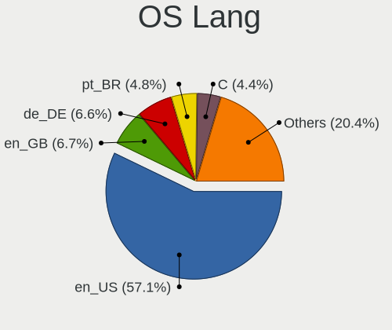
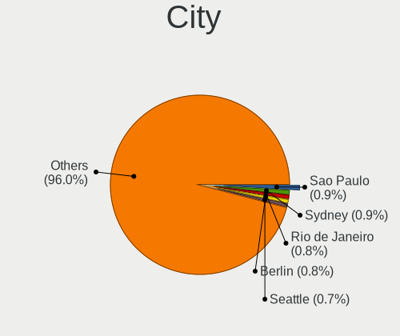
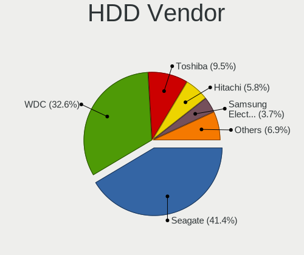
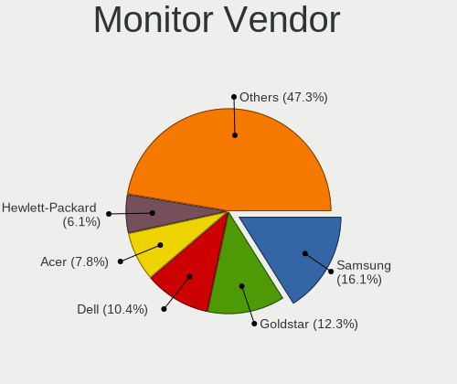
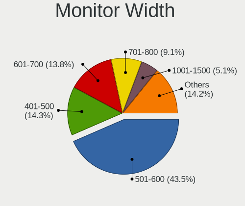
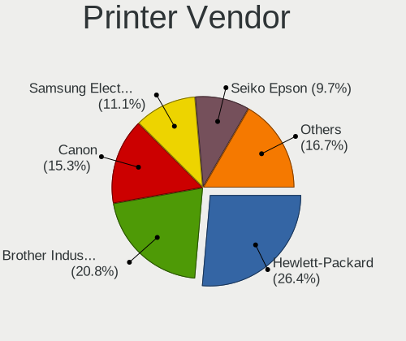
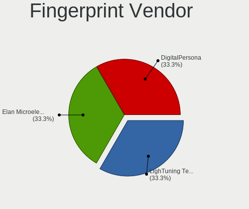

Pop!_OS 22.04 - Tested Hardware & Statistics (Desktops)
-------------------------------------------------------

A project to collect tested hardware configurations for Pop!_OS 22.04.

Anyone can contribute to this report by the [hw-probe](https://github.com/linuxhw/hw-probe) tool:

    sudo -E hw-probe -all -upload

Please contribute! Especially if your hardware is rare.

Contents
--------

* [ Test Cases ](#test-cases)

* [ System ](#system)
  - [ Kernel                   ](#kernel)
  - [ Kernel Family            ](#kernel-family)
  - [ Kernel Major Ver.        ](#kernel-major-ver)
  - [ Arch                     ](#arch)
  - [ DE                       ](#de)
  - [ Display Server           ](#display-server)
  - [ Display Manager          ](#display-manager)
  - [ OS Lang                  ](#os-lang)
  - [ Boot Mode                ](#boot-mode)
  - [ Filesystem               ](#filesystem)
  - [ Part. scheme             ](#part-scheme)
  - [ Dual Boot with Linux/BSD ](#dual-boot-with-linuxbsd)
  - [ Dual Boot (Win)          ](#dual-boot-win)

* [ Board ](#board)
  - [ Vendor                   ](#vendor)
  - [ Model                    ](#model)
  - [ Model Family             ](#model-family)
  - [ MFG Year                 ](#mfg-year)
  - [ Form Factor              ](#form-factor)
  - [ Secure Boot              ](#secure-boot)
  - [ Coreboot                 ](#coreboot)
  - [ RAM Size                 ](#ram-size)
  - [ RAM Used                 ](#ram-used)
  - [ Total Drives             ](#total-drives)
  - [ Has CD-ROM               ](#has-cd-rom)
  - [ Has Ethernet             ](#has-ethernet)
  - [ Has WiFi                 ](#has-wifi)
  - [ Has Bluetooth            ](#has-bluetooth)

* [ Location ](#location)
  - [ Country                  ](#country)
  - [ City                     ](#city)

* [ Drives ](#drives)
  - [ Drive Vendor             ](#drive-vendor)
  - [ Drive Model              ](#drive-model)
  - [ HDD Vendor               ](#hdd-vendor)
  - [ SSD Vendor               ](#ssd-vendor)
  - [ Drive Kind               ](#drive-kind)
  - [ Drive Connector          ](#drive-connector)
  - [ Drive Size               ](#drive-size)
  - [ Space Total              ](#space-total)
  - [ Space Used               ](#space-used)
  - [ Malfunc. Drives          ](#malfunc-drives)
  - [ Malfunc. Drive Vendor    ](#malfunc-drive-vendor)
  - [ Malfunc. HDD Vendor      ](#malfunc-hdd-vendor)
  - [ Malfunc. Drive Kind      ](#malfunc-drive-kind)
  - [ Failed Drives            ](#failed-drives)
  - [ Failed Drive Vendor      ](#failed-drive-vendor)
  - [ Drive Status             ](#drive-status)

* [ Storage controller ](#storage-controller)
  - [ Storage Vendor           ](#storage-vendor)
  - [ Storage Model            ](#storage-model)
  - [ Storage Kind             ](#storage-kind)

* [ Processor ](#processor)
  - [ CPU Vendor               ](#cpu-vendor)
  - [ CPU Model                ](#cpu-model)
  - [ CPU Model Family         ](#cpu-model-family)
  - [ CPU Cores                ](#cpu-cores)
  - [ CPU Sockets              ](#cpu-sockets)
  - [ CPU Threads              ](#cpu-threads)
  - [ CPU Op-Modes             ](#cpu-op-modes)
  - [ CPU Microcode            ](#cpu-microcode)
  - [ CPU Microarch            ](#cpu-microarch)

* [ Graphics ](#graphics)
  - [ GPU Vendor               ](#gpu-vendor)
  - [ GPU Model                ](#gpu-model)
  - [ GPU Combo                ](#gpu-combo)
  - [ GPU Driver               ](#gpu-driver)
  - [ GPU Memory               ](#gpu-memory)

* [ Monitor ](#monitor)
  - [ Monitor Vendor           ](#monitor-vendor)
  - [ Monitor Model            ](#monitor-model)
  - [ Monitor Resolution       ](#monitor-resolution)
  - [ Monitor Diagonal         ](#monitor-diagonal)
  - [ Monitor Width            ](#monitor-width)
  - [ Aspect Ratio             ](#aspect-ratio)
  - [ Monitor Area             ](#monitor-area)
  - [ Pixel Density            ](#pixel-density)
  - [ Multiple Monitors        ](#multiple-monitors)

* [ Network ](#network)
  - [ Net Controller Vendor    ](#net-controller-vendor)
  - [ Net Controller Model     ](#net-controller-model)
  - [ Wireless Vendor          ](#wireless-vendor)
  - [ Wireless Model           ](#wireless-model)
  - [ Ethernet Vendor          ](#ethernet-vendor)
  - [ Ethernet Model           ](#ethernet-model)
  - [ Net Controller Kind      ](#net-controller-kind)
  - [ Used Controller          ](#used-controller)
  - [ NICs                     ](#nics)
  - [ IPv6                     ](#ipv6)

* [ Bluetooth ](#bluetooth)
  - [ Bluetooth Vendor         ](#bluetooth-vendor)
  - [ Bluetooth Model          ](#bluetooth-model)

* [ Sound ](#sound)
  - [ Sound Vendor             ](#sound-vendor)
  - [ Sound Model              ](#sound-model)

* [ Memory ](#memory)
  - [ Memory Vendor            ](#memory-vendor)
  - [ Memory Model             ](#memory-model)
  - [ Memory Kind              ](#memory-kind)
  - [ Memory Form Factor       ](#memory-form-factor)
  - [ Memory Size              ](#memory-size)
  - [ Memory Speed             ](#memory-speed)

* [ Printers & scanners ](#printers--scanners)
  - [ Printer Vendor           ](#printer-vendor)
  - [ Printer Model            ](#printer-model)
  - [ Scanner Vendor           ](#scanner-vendor)
  - [ Scanner Model            ](#scanner-model)

* [ Camera ](#camera)
  - [ Camera Vendor            ](#camera-vendor)
  - [ Camera Model             ](#camera-model)

* [ Security ](#security)
  - [ Fingerprint Vendor       ](#fingerprint-vendor)
  - [ Fingerprint Model        ](#fingerprint-model)
  - [ Chipcard Vendor          ](#chipcard-vendor)
  - [ Chipcard Model           ](#chipcard-model)

* [ Unsupported ](#unsupported)
  - [ Unsupported Devices      ](#unsupported-devices)
  - [ Unsupported Device Types ](#unsupported-device-types)

Test Cases
----------

Total: 1751

| Vendor        | Model                       | Probe                                                      | Date         |
|---------------|-----------------------------|------------------------------------------------------------|--------------|
| ASRock        | Z97 Killer                  | [f575f3121e](https://linux-hardware.org/?probe=f575f3121e) | Nov 06, 2023 |
| ASRock        | Z68 Pro3                    | [e6c695d4a7](https://linux-hardware.org/?probe=e6c695d4a7) | Nov 05, 2023 |
| ASUSTek       | ROG STRIX B650E-F GAMING... | [6f11758faa](https://linux-hardware.org/?probe=6f11758faa) | Nov 04, 2023 |
| Gigabyte      | H410M S2H V2                | [8bbce8a378](https://linux-hardware.org/?probe=8bbce8a378) | Nov 04, 2023 |
| ASUSTek       | PRIME X670E-PRO WIFI        | [f27bded4c1](https://linux-hardware.org/?probe=f27bded4c1) | Nov 04, 2023 |
| ASRock        | B450 Steel Legend           | [26aff1917e](https://linux-hardware.org/?probe=26aff1917e) | Nov 04, 2023 |
| Intel         | X79 V1.0                    | [9483a097a1](https://linux-hardware.org/?probe=9483a097a1) | Nov 03, 2023 |
| ASUSTek       | TUF Gaming B650-PLUS WIF... | [d35fc5aa78](https://linux-hardware.org/?probe=d35fc5aa78) | Nov 03, 2023 |
| ASUSTek       | TUF Gaming B650-PLUS WIF... | [9a5c45e54b](https://linux-hardware.org/?probe=9a5c45e54b) | Nov 02, 2023 |
| ASUSTek       | ROG CROSSHAIR VII HERO      | [fc0052213d](https://linux-hardware.org/?probe=fc0052213d) | Nov 02, 2023 |
| ASUSTek       | Z170-A                      | [7812f09d39](https://linux-hardware.org/?probe=7812f09d39) | Nov 02, 2023 |
| ASUSTek       | Z170-A                      | [b45e25ec01](https://linux-hardware.org/?probe=b45e25ec01) | Nov 02, 2023 |
| HP            | 2AF7                        | [65ac8348d7](https://linux-hardware.org/?probe=65ac8348d7) | Nov 02, 2023 |
| MSI           | B550M PRO-VDH WIFI          | [cd018c7ab7](https://linux-hardware.org/?probe=cd018c7ab7) | Nov 02, 2023 |
| Gigabyte      | H61M-S2PV                   | [523fd59139](https://linux-hardware.org/?probe=523fd59139) | Nov 01, 2023 |
| ASRock        | X470 Taichi Ultimate        | [d85d5f59c2](https://linux-hardware.org/?probe=d85d5f59c2) | Nov 01, 2023 |
| Lenovo        | 370A SDK0J40700 WIN 3258... | [39f8a7c959](https://linux-hardware.org/?probe=39f8a7c959) | Nov 01, 2023 |
| MSI           | B550M PRO-VDH WIFI          | [38d664802f](https://linux-hardware.org/?probe=38d664802f) | Nov 01, 2023 |
| ASUSTek       | PRIME B550-PLUS             | [037e92aebd](https://linux-hardware.org/?probe=037e92aebd) | Nov 01, 2023 |
| ASRock        | B85M Pro4                   | [0ea7f00b4e](https://linux-hardware.org/?probe=0ea7f00b4e) | Nov 01, 2023 |
| ASUSTek       | ROG STRIX Z690-F GAMING ... | [7d5fd28d41](https://linux-hardware.org/?probe=7d5fd28d41) | Nov 01, 2023 |
| Unknown       | Unknown                     | [d58a78a617](https://linux-hardware.org/?probe=d58a78a617) | Oct 31, 2023 |
| eMachines     | EL1352G                     | [e133fecf3e](https://linux-hardware.org/?probe=e133fecf3e) | Oct 31, 2023 |
| ASRock        | A520M Phantom Gaming 4      | [a63d934992](https://linux-hardware.org/?probe=a63d934992) | Oct 31, 2023 |
| HP            | 8299                        | [e45f46df9d](https://linux-hardware.org/?probe=e45f46df9d) | Oct 30, 2023 |
| MSI           | MPG X570 GAMING PLUS        | [e231035f6e](https://linux-hardware.org/?probe=e231035f6e) | Oct 30, 2023 |
| MSI           | PRO Z790-P WIFI             | [b62cfa508b](https://linux-hardware.org/?probe=b62cfa508b) | Oct 30, 2023 |
| HP            | 2AF7                        | [1960b3a243](https://linux-hardware.org/?probe=1960b3a243) | Oct 29, 2023 |
| Gigabyte      | B450 GAMING X               | [c1785bec94](https://linux-hardware.org/?probe=c1785bec94) | Oct 29, 2023 |
| MSI           | MPG X570 GAMING PLUS        | [6b8560a943](https://linux-hardware.org/?probe=6b8560a943) | Oct 28, 2023 |
| ASUSTek       | ProArt B650-CREATOR         | [fdb96441a0](https://linux-hardware.org/?probe=fdb96441a0) | Oct 27, 2023 |
| ASUSTek       | ProArt B650-CREATOR         | [dde83d5de1](https://linux-hardware.org/?probe=dde83d5de1) | Oct 27, 2023 |
| Lenovo        | SHARKBAY SDK0E50510 WIN     | [880bf38f49](https://linux-hardware.org/?probe=880bf38f49) | Oct 27, 2023 |
| ASUSTek       | PRIME X570-PRO              | [815b0a4bc4](https://linux-hardware.org/?probe=815b0a4bc4) | Oct 27, 2023 |
| MSI           | X370 GAMING PRO CARBON      | [61bdfadaa0](https://linux-hardware.org/?probe=61bdfadaa0) | Oct 26, 2023 |
| ASUSTek       | P8H61-M LE/USB3             | [13ad3bb316](https://linux-hardware.org/?probe=13ad3bb316) | Oct 26, 2023 |
| ASUSTek       | P8H61-M LE/USB3             | [a8d850eef8](https://linux-hardware.org/?probe=a8d850eef8) | Oct 26, 2023 |
| Lenovo        | SHARKBAY NOK                | [023bd4d497](https://linux-hardware.org/?probe=023bd4d497) | Oct 25, 2023 |
| MSI           | PRO Z690-A DDR4             | [638386d33c](https://linux-hardware.org/?probe=638386d33c) | Oct 25, 2023 |
| HP            | 3047h                       | [cdd7fbc37f](https://linux-hardware.org/?probe=cdd7fbc37f) | Oct 25, 2023 |
| HP            | 3047h                       | [4235f287b2](https://linux-hardware.org/?probe=4235f287b2) | Oct 25, 2023 |
| ASUSTek       | TUF Gaming B650-PLUS WIF... | [b7447f21b5](https://linux-hardware.org/?probe=b7447f21b5) | Oct 25, 2023 |
| Gigabyte      | X570S AORUS ELITE AX        | [5ad24eb928](https://linux-hardware.org/?probe=5ad24eb928) | Oct 24, 2023 |
| Danuri        | B550M-PX                    | [e24df1ad61](https://linux-hardware.org/?probe=e24df1ad61) | Oct 24, 2023 |
| Intel         | H61 V124                    | [034689793f](https://linux-hardware.org/?probe=034689793f) | Oct 24, 2023 |
| Gigabyte      | Z390 M GAMING-CF            | [b1f52f8dc1](https://linux-hardware.org/?probe=b1f52f8dc1) | Oct 23, 2023 |
| Gigabyte      | 970A-DS3P                   | [a9af589ace](https://linux-hardware.org/?probe=a9af589ace) | Oct 23, 2023 |
| ASUSTek       | PRIME B450M-A               | [cf347b4567](https://linux-hardware.org/?probe=cf347b4567) | Oct 23, 2023 |
| Dell          | 096JG8 A01                  | [ce5ff412d1](https://linux-hardware.org/?probe=ce5ff412d1) | Oct 23, 2023 |
| ASUSTek       | PRIME B450M-A               | [e0f48fec00](https://linux-hardware.org/?probe=e0f48fec00) | Oct 22, 2023 |
| ASUSTek       | PRIME H310-PLUS R2.0        | [58a9a7a091](https://linux-hardware.org/?probe=58a9a7a091) | Oct 22, 2023 |
| ASUSTek       | PRIME H310-PLUS R2.0        | [9b380c5e6a](https://linux-hardware.org/?probe=9b380c5e6a) | Oct 22, 2023 |
| ASRock        | N68C-S UCC                  | [6468bd6335](https://linux-hardware.org/?probe=6468bd6335) | Oct 21, 2023 |
| Dell          | 00V62H A01                  | [85894d27fe](https://linux-hardware.org/?probe=85894d27fe) | Oct 21, 2023 |
| ASUSTek       | ROG STRIX B550-F GAMING     | [3b8a5a44c7](https://linux-hardware.org/?probe=3b8a5a44c7) | Oct 21, 2023 |
| Dell          | 06FW8P A01                  | [356c2f38aa](https://linux-hardware.org/?probe=356c2f38aa) | Oct 21, 2023 |
| Gigabyte      | Z77-DS3H                    | [ca61a8649a](https://linux-hardware.org/?probe=ca61a8649a) | Oct 21, 2023 |
| Gigabyte      | Z77-DS3H                    | [6108985945](https://linux-hardware.org/?probe=6108985945) | Oct 21, 2023 |
| ASUSTek       | PRIME Z790-P WIFI           | [e7cd525d35](https://linux-hardware.org/?probe=e7cd525d35) | Oct 21, 2023 |
| Intel         | DG965RY AAD41691-301        | [0bdf442d3d](https://linux-hardware.org/?probe=0bdf442d3d) | Oct 19, 2023 |
| ASUSTek       | ROG CROSSHAIR VIII HERO     | [ed3ce7aaa6](https://linux-hardware.org/?probe=ed3ce7aaa6) | Oct 18, 2023 |
| MSI           | X470 GAMING PRO             | [e275cfc499](https://linux-hardware.org/?probe=e275cfc499) | Oct 18, 2023 |
| ASUSTek       | Z97-PRO GAMER               | [d652b15856](https://linux-hardware.org/?probe=d652b15856) | Oct 17, 2023 |
| ASUSTek       | ROG Rampage VI EXTREME E... | [3d5d8ee9e6](https://linux-hardware.org/?probe=3d5d8ee9e6) | Oct 17, 2023 |
| Gigabyte      | Z590 VISION D               | [f9d3acd4e2](https://linux-hardware.org/?probe=f9d3acd4e2) | Oct 16, 2023 |
| MSI           | MPG Z690 FORCE WIFI         | [5631fc0230](https://linux-hardware.org/?probe=5631fc0230) | Oct 16, 2023 |
| ASUSTek       | TUF Gaming B450-PLUS II     | [04afaee575](https://linux-hardware.org/?probe=04afaee575) | Oct 15, 2023 |
| ASUSTek       | PRIME B450M-A II            | [98224c65b6](https://linux-hardware.org/?probe=98224c65b6) | Oct 15, 2023 |
| Huanan        | X99-QD4 V1.0                | [47788537bf](https://linux-hardware.org/?probe=47788537bf) | Oct 15, 2023 |
| Huanan        | X99-QD4 V1.0                | [30723700f1](https://linux-hardware.org/?probe=30723700f1) | Oct 15, 2023 |
| Huanan        | X99-QD4 V1.0                | [e4dc0eeb72](https://linux-hardware.org/?probe=e4dc0eeb72) | Oct 15, 2023 |
| MSI           | MPG Z690 FORCE WIFI         | [abc6dc18ab](https://linux-hardware.org/?probe=abc6dc18ab) | Oct 15, 2023 |
| HP            | 212B                        | [c0b9765d6e](https://linux-hardware.org/?probe=c0b9765d6e) | Oct 15, 2023 |
| Gigabyte      | Z270P-D3-CF                 | [5bbd5682e8](https://linux-hardware.org/?probe=5bbd5682e8) | Oct 15, 2023 |
| ASUSTek       | Z97-PRO GAMER               | [5a1df4c4df](https://linux-hardware.org/?probe=5a1df4c4df) | Oct 14, 2023 |
| MSI           | MPG X570 GAMING PRO CARB... | [a8e7e9b968](https://linux-hardware.org/?probe=a8e7e9b968) | Oct 14, 2023 |
| Gigabyte      | Z590I VISION D              | [725929fa07](https://linux-hardware.org/?probe=725929fa07) | Oct 14, 2023 |
| ASRock        | H97M Anniversary            | [7df48c5c5d](https://linux-hardware.org/?probe=7df48c5c5d) | Oct 14, 2023 |
| Dell          | 0NW6H5 A00                  | [0594aaa28b](https://linux-hardware.org/?probe=0594aaa28b) | Oct 13, 2023 |
| Dell          | 0NW6H5 A00                  | [596e3973bc](https://linux-hardware.org/?probe=596e3973bc) | Oct 13, 2023 |
| ASUSTek       | PRIME A320M-K               | [4d6379353d](https://linux-hardware.org/?probe=4d6379353d) | Oct 13, 2023 |
| MSI           | MPG B550 GAMING PLUS        | [52fdfb249e](https://linux-hardware.org/?probe=52fdfb249e) | Oct 12, 2023 |
| Gigabyte      | B550M AORUS PRO             | [d7d6c5206f](https://linux-hardware.org/?probe=d7d6c5206f) | Oct 12, 2023 |
| Biostar       | B550GTQ                     | [63f1b39dd4](https://linux-hardware.org/?probe=63f1b39dd4) | Oct 12, 2023 |
| Gigabyte      | B550M AORUS PRO             | [5e2f8bdc4d](https://linux-hardware.org/?probe=5e2f8bdc4d) | Oct 12, 2023 |
| Shenzhen M... | F6BFC                       | [e71b9295ca](https://linux-hardware.org/?probe=e71b9295ca) | Oct 11, 2023 |
| System76      | Thelio Mega thelio-mega-... | [abb07364c1](https://linux-hardware.org/?probe=abb07364c1) | Oct 11, 2023 |
| ASUSTek       | ROG CROSSHAIR VIII HERO     | [4ce0d26e3c](https://linux-hardware.org/?probe=4ce0d26e3c) | Oct 11, 2023 |
| ASUSTek       | ROG Maximus X HERO          | [835f369588](https://linux-hardware.org/?probe=835f369588) | Oct 11, 2023 |
| ASUSTek       | ROG Maximus X HERO          | [9acd34e892](https://linux-hardware.org/?probe=9acd34e892) | Oct 11, 2023 |
| ASUSTek       | PRIME Z590-V                | [ee15914a37](https://linux-hardware.org/?probe=ee15914a37) | Oct 10, 2023 |
| ASRock        | B450 Gaming-ITX/ac          | [3d02079672](https://linux-hardware.org/?probe=3d02079672) | Oct 10, 2023 |
| Gigabyte      | X570 GAMING X               | [b09f4a3a8a](https://linux-hardware.org/?probe=b09f4a3a8a) | Oct 10, 2023 |
| Gigabyte      | B550M AORUS PRO             | [c39ce018d6](https://linux-hardware.org/?probe=c39ce018d6) | Oct 10, 2023 |
| Gigabyte      | Z77MX-D3H                   | [2d033cba6c](https://linux-hardware.org/?probe=2d033cba6c) | Oct 08, 2023 |
| MSI           | MPG X570 GAMING PLUS        | [3d510e53b4](https://linux-hardware.org/?probe=3d510e53b4) | Oct 08, 2023 |
| MSI           | B450M-A PRO MAX             | [3ac34a911c](https://linux-hardware.org/?probe=3ac34a911c) | Oct 08, 2023 |
| ASRock        | B550 Phantom Gaming 4       | [a3190a6c6d](https://linux-hardware.org/?probe=a3190a6c6d) | Oct 07, 2023 |
| Gigabyte      | B75M-D3V                    | [17cdd65d6b](https://linux-hardware.org/?probe=17cdd65d6b) | Oct 07, 2023 |
| Huanan        | X99-BD4 V1.33               | [9477d90e51](https://linux-hardware.org/?probe=9477d90e51) | Oct 07, 2023 |
| MSI           | PRO Z690-A WIFI             | [5ec4f81683](https://linux-hardware.org/?probe=5ec4f81683) | Oct 06, 2023 |
| Dell          | 0WR7PY A02                  | [6507df947b](https://linux-hardware.org/?probe=6507df947b) | Oct 06, 2023 |
| ASUSTek       | ROG STRIX B450-F GAMING ... | [a308ec4180](https://linux-hardware.org/?probe=a308ec4180) | Oct 06, 2023 |
| Gigabyte      | X570 GAMING X               | [ebbd23f352](https://linux-hardware.org/?probe=ebbd23f352) | Oct 05, 2023 |
| Unknown       | Unknown                     | [3f779c87f6](https://linux-hardware.org/?probe=3f779c87f6) | Oct 05, 2023 |
| HP            | 0AA4h                       | [8e4a645689](https://linux-hardware.org/?probe=8e4a645689) | Oct 03, 2023 |
| ASUSTek       | ROG STRIX B550-F GAMING     | [5932daaa4e](https://linux-hardware.org/?probe=5932daaa4e) | Oct 03, 2023 |
| ASRock        | Z790 PG Riptide             | [82630a534f](https://linux-hardware.org/?probe=82630a534f) | Oct 03, 2023 |
| Kllisre       | X79 V1.2                    | [fb9b29c804](https://linux-hardware.org/?probe=fb9b29c804) | Oct 03, 2023 |
| ASUSTek       | P8H77-M PRO                 | [bc03d7f758](https://linux-hardware.org/?probe=bc03d7f758) | Oct 02, 2023 |
| ASUSTek       | B150M-C/BR                  | [2435f20a18](https://linux-hardware.org/?probe=2435f20a18) | Oct 02, 2023 |
| MSI           | B450M-A PRO MAX             | [57ddb0f758](https://linux-hardware.org/?probe=57ddb0f758) | Oct 01, 2023 |
| Gigabyte      | Z390 AORUS ULTRA-CF         | [d16a64a7e1](https://linux-hardware.org/?probe=d16a64a7e1) | Oct 01, 2023 |
| Gigabyte      | H61M-S2PV                   | [691c015f6f](https://linux-hardware.org/?probe=691c015f6f) | Oct 01, 2023 |
| HP            | 8054                        | [20f337b1e7](https://linux-hardware.org/?probe=20f337b1e7) | Sep 29, 2023 |
| AZW           | SER V1                      | [10660522cb](https://linux-hardware.org/?probe=10660522cb) | Sep 28, 2023 |
| ASRock        | A520M-HDV                   | [d19f334f02](https://linux-hardware.org/?probe=d19f334f02) | Sep 28, 2023 |
| MSI           | PRO Z690-A WIFI             | [2ede90f6eb](https://linux-hardware.org/?probe=2ede90f6eb) | Sep 28, 2023 |
| ASUSTek       | M5A97 LE R2.0               | [240ff7b72a](https://linux-hardware.org/?probe=240ff7b72a) | Sep 27, 2023 |
| Fujitsu       | D3233-A1 S26361-D3233-A1    | [09a71cddc4](https://linux-hardware.org/?probe=09a71cddc4) | Sep 26, 2023 |
| ASUSTek       | ROG STRIX B450-F GAMING     | [5a73611f4d](https://linux-hardware.org/?probe=5a73611f4d) | Sep 26, 2023 |
| ASUSTek       | Z97-PRO GAMER               | [0a5cc18946](https://linux-hardware.org/?probe=0a5cc18946) | Sep 26, 2023 |
| ASUSTek       | P5QPL-AM                    | [4259a21921](https://linux-hardware.org/?probe=4259a21921) | Sep 26, 2023 |
| Gigabyte      | B760I AORUS PRO DDR4        | [2fe436c443](https://linux-hardware.org/?probe=2fe436c443) | Sep 26, 2023 |
| Gigabyte      | B550I AORUS PRO AX          | [a58111d9ae](https://linux-hardware.org/?probe=a58111d9ae) | Sep 25, 2023 |
| ASUSTek       | M4A79T Deluxe               | [ac151127e1](https://linux-hardware.org/?probe=ac151127e1) | Sep 25, 2023 |
| ASUSTek       | TUF Gaming X670E-PLUS       | [3346cccd71](https://linux-hardware.org/?probe=3346cccd71) | Sep 24, 2023 |
| MSI           | B350 TOMAHAWK               | [7119229a1b](https://linux-hardware.org/?probe=7119229a1b) | Sep 24, 2023 |
| ASUSTek       | PRIME A320M-K               | [a3e2e5f3c0](https://linux-hardware.org/?probe=a3e2e5f3c0) | Sep 24, 2023 |
| Unknown       | Unknown                     | [9be7572b83](https://linux-hardware.org/?probe=9be7572b83) | Sep 23, 2023 |
| Unknown       | Unknown                     | [b063963175](https://linux-hardware.org/?probe=b063963175) | Sep 23, 2023 |
| MSI           | X399 SLI PLUS               | [1c755bb49f](https://linux-hardware.org/?probe=1c755bb49f) | Sep 23, 2023 |
| ASUSTek       | ROG Maximus Z690 HERO EV... | [32b162a364](https://linux-hardware.org/?probe=32b162a364) | Sep 23, 2023 |
| ASUSTek       | TUF Gaming B550-PLUS WIF... | [6656c28ec7](https://linux-hardware.org/?probe=6656c28ec7) | Sep 23, 2023 |
| Lenovo        | 3111 SDK0J40697 WIN 3305... | [9867cb03bb](https://linux-hardware.org/?probe=9867cb03bb) | Sep 23, 2023 |
| Dell          | 0GWHMW A00                  | [d344d1e396](https://linux-hardware.org/?probe=d344d1e396) | Sep 23, 2023 |
| ASUSTek       | Crosshair IV Formula        | [4679088d4e](https://linux-hardware.org/?probe=4679088d4e) | Sep 22, 2023 |
| Hardkernel    | ODROID-H3                   | [19d1333b4f](https://linux-hardware.org/?probe=19d1333b4f) | Sep 21, 2023 |
| Dell          | 0F6X5P A00                  | [5e45e8b196](https://linux-hardware.org/?probe=5e45e8b196) | Sep 21, 2023 |
| ASUSTek       | M5A78L/USB3                 | [e1805d26c3](https://linux-hardware.org/?probe=e1805d26c3) | Sep 17, 2023 |
| ASRockRack    | Z490D4U-2L2T                | [0d43dbb11d](https://linux-hardware.org/?probe=0d43dbb11d) | Sep 17, 2023 |
| ASUSTek       | M5A97 LE R2.0               | [e0371fc03e](https://linux-hardware.org/?probe=e0371fc03e) | Sep 17, 2023 |
| ASUSTek       | M5A97 LE R2.0               | [43bf92a01b](https://linux-hardware.org/?probe=43bf92a01b) | Sep 17, 2023 |
| Gigabyte      | Z270X-UD5-CF                | [5c77a043ae](https://linux-hardware.org/?probe=5c77a043ae) | Sep 15, 2023 |
| ASUSTek       | ROG STRIX B660-A GAMING ... | [efda5ec51a](https://linux-hardware.org/?probe=efda5ec51a) | Sep 15, 2023 |
| ASUSTek       | ROG STRIX B550-XE GAMING... | [ebac37bdbd](https://linux-hardware.org/?probe=ebac37bdbd) | Sep 14, 2023 |
| ASRock        | X470 Taichi                 | [49aca37979](https://linux-hardware.org/?probe=49aca37979) | Sep 13, 2023 |
| Lenovo        | 3717 NO DPK                 | [13870a17b4](https://linux-hardware.org/?probe=13870a17b4) | Sep 13, 2023 |
| Dell          | 0YXT71 A01                  | [36991ac5a6](https://linux-hardware.org/?probe=36991ac5a6) | Sep 11, 2023 |
| Shenzhen M... | F6BFC                       | [ca89a07b9e](https://linux-hardware.org/?probe=ca89a07b9e) | Sep 10, 2023 |
| Gigabyte      | B450 AORUS ELITE            | [56bef39b59](https://linux-hardware.org/?probe=56bef39b59) | Sep 10, 2023 |
| ASUSTek       | Z170-A                      | [a812c1659b](https://linux-hardware.org/?probe=a812c1659b) | Sep 09, 2023 |
| MSI           | MAG B560M BAZOOKA           | [c3ba2033e2](https://linux-hardware.org/?probe=c3ba2033e2) | Sep 09, 2023 |
| Gigabyte      | Q87M-MK                     | [1c45c834fe](https://linux-hardware.org/?probe=1c45c834fe) | Sep 09, 2023 |
| HP            | 1495                        | [b56f622d7a](https://linux-hardware.org/?probe=b56f622d7a) | Sep 09, 2023 |
| Gigabyte      | F2A68HM-H                   | [bad7c8bf82](https://linux-hardware.org/?probe=bad7c8bf82) | Sep 08, 2023 |
| MSI           | MAG B650 TOMAHAWK WIFI      | [3221a3e5dd](https://linux-hardware.org/?probe=3221a3e5dd) | Sep 07, 2023 |
| MSI           | MAG B650 TOMAHAWK WIFI      | [13bae1c4e9](https://linux-hardware.org/?probe=13bae1c4e9) | Sep 07, 2023 |
| Dell          | 0WN7Y6 A02                  | [aaf64e4624](https://linux-hardware.org/?probe=aaf64e4624) | Sep 07, 2023 |
| Biostar       | A58MD                       | [40f078fcfc](https://linux-hardware.org/?probe=40f078fcfc) | Sep 06, 2023 |
| MSI           | H310M PRO-VH PLUS           | [56f00eec4a](https://linux-hardware.org/?probe=56f00eec4a) | Sep 05, 2023 |
| Shenzhen M... | F6BFC                       | [a33ec74b50](https://linux-hardware.org/?probe=a33ec74b50) | Sep 05, 2023 |
| Shenzhen M... | F6BFC                       | [d5cd8916d0](https://linux-hardware.org/?probe=d5cd8916d0) | Sep 05, 2023 |
| Gigabyte      | Z590 AORUS MASTER           | [40785211e9](https://linux-hardware.org/?probe=40785211e9) | Sep 05, 2023 |
| ASUSTek       | ROG STRIX B460-H GAMING     | [865ce7b55b](https://linux-hardware.org/?probe=865ce7b55b) | Sep 04, 2023 |
| ASUSTek       | Rampage V EDITION 10        | [a30ea8885d](https://linux-hardware.org/?probe=a30ea8885d) | Sep 03, 2023 |
| Gigabyte      | Z170X-Gaming 7              | [e9faf4759d](https://linux-hardware.org/?probe=e9faf4759d) | Sep 03, 2023 |
| Gigabyte      | Z97X-SLI-CF                 | [ffc201e884](https://linux-hardware.org/?probe=ffc201e884) | Sep 02, 2023 |
| ASUSTek       | M5A78L-M LX PLUS            | [b4907a6220](https://linux-hardware.org/?probe=b4907a6220) | Sep 02, 2023 |
| MSI           | A320M-A PRO M2              | [6745b7e37d](https://linux-hardware.org/?probe=6745b7e37d) | Sep 01, 2023 |
| Gigabyte      | Z370 AORUS Gaming 7         | [6ddc9b767d](https://linux-hardware.org/?probe=6ddc9b767d) | Sep 01, 2023 |
| MSI           | 760GM-P23                   | [76b83d4e93](https://linux-hardware.org/?probe=76b83d4e93) | Sep 01, 2023 |
| System76      | Thelio thelio-r3            | [d0cdea5d23](https://linux-hardware.org/?probe=d0cdea5d23) | Sep 01, 2023 |
| Gigabyte      | H97-HD3                     | [ba11958a48](https://linux-hardware.org/?probe=ba11958a48) | Aug 31, 2023 |
| Gigabyte      | H97-HD3                     | [158ed240bf](https://linux-hardware.org/?probe=158ed240bf) | Aug 31, 2023 |
| ASRock        | Q1900B-ITX                  | [875427cd72](https://linux-hardware.org/?probe=875427cd72) | Aug 31, 2023 |
| MSI           | MAG B550 TOMAHAWK           | [085b3d4330](https://linux-hardware.org/?probe=085b3d4330) | Aug 31, 2023 |
| MSI           | MAG B550 TOMAHAWK           | [98b18bb67a](https://linux-hardware.org/?probe=98b18bb67a) | Aug 31, 2023 |
| Apple         | Mac-F60DEB81FF30ACF6 Mac... | [45f86c066d](https://linux-hardware.org/?probe=45f86c066d) | Aug 30, 2023 |
| Unknown       | Unknown                     | [ebebe5ddf7](https://linux-hardware.org/?probe=ebebe5ddf7) | Aug 29, 2023 |
| ASUSTek       | ROG STRIX B660-A GAMING ... | [0be67de1c9](https://linux-hardware.org/?probe=0be67de1c9) | Aug 29, 2023 |
| Dell          | 0VRWRC A00                  | [e3a47f55c9](https://linux-hardware.org/?probe=e3a47f55c9) | Aug 26, 2023 |
| MSI           | PRO Z790-A WIFI             | [f3874bf2fc](https://linux-hardware.org/?probe=f3874bf2fc) | Aug 26, 2023 |
| ASUSTek       | PRIME B365M-A               | [8d952e28e1](https://linux-hardware.org/?probe=8d952e28e1) | Aug 25, 2023 |
| MSI           | B550M PRO-VDH WIFI          | [51d4eefbc9](https://linux-hardware.org/?probe=51d4eefbc9) | Aug 25, 2023 |
| System76      | Thelio Major thelio-majo... | [e5caa63b77](https://linux-hardware.org/?probe=e5caa63b77) | Aug 25, 2023 |
| HP            | 0B4Ch D                     | [958521d2be](https://linux-hardware.org/?probe=958521d2be) | Aug 25, 2023 |
| MSI           | X470 GAMING PLUS MAX        | [254f8aee40](https://linux-hardware.org/?probe=254f8aee40) | Aug 25, 2023 |
| MSI           | X470 GAMING PLUS MAX        | [6f72852248](https://linux-hardware.org/?probe=6f72852248) | Aug 25, 2023 |
| ASUSTek       | ProArt X670E-CREATOR WIF... | [c0bf920a5b](https://linux-hardware.org/?probe=c0bf920a5b) | Aug 24, 2023 |
| ASRock        | B450 Steel Legend           | [40660610aa](https://linux-hardware.org/?probe=40660610aa) | Aug 24, 2023 |
| HP            | 0B4Ch D                     | [5abce3a991](https://linux-hardware.org/?probe=5abce3a991) | Aug 23, 2023 |
| HP            | 18E7                        | [a78496c36e](https://linux-hardware.org/?probe=a78496c36e) | Aug 23, 2023 |
| Gigabyte      | B550 VISION D-P             | [145d800029](https://linux-hardware.org/?probe=145d800029) | Aug 23, 2023 |
| ASUSTek       | P7P55-M                     | [0f5028d5fc](https://linux-hardware.org/?probe=0f5028d5fc) | Aug 22, 2023 |
| AZW           | GTR V02                     | [d699113f95](https://linux-hardware.org/?probe=d699113f95) | Aug 21, 2023 |
| NZXT          | N7 B550                     | [1f105eadd8](https://linux-hardware.org/?probe=1f105eadd8) | Aug 20, 2023 |
| Gigabyte      | X570 I AORUS PRO WIFI       | [31861c8357](https://linux-hardware.org/?probe=31861c8357) | Aug 20, 2023 |
| Gigabyte      | Z270X-UD5-CF                | [04df52e837](https://linux-hardware.org/?probe=04df52e837) | Aug 20, 2023 |
| ASUSTek       | ROG STRIX X470-F GAMING     | [63d06430e4](https://linux-hardware.org/?probe=63d06430e4) | Aug 18, 2023 |
| HP            | 0266                        | [636546711d](https://linux-hardware.org/?probe=636546711d) | Aug 18, 2023 |
| ASUSTek       | P8Z77-I DELUXE              | [53c4af621d](https://linux-hardware.org/?probe=53c4af621d) | Aug 18, 2023 |
| HP            | 2AF7                        | [4e55d08586](https://linux-hardware.org/?probe=4e55d08586) | Aug 17, 2023 |
| MSI           | Z87-GD65 GAMING             | [7c09135f98](https://linux-hardware.org/?probe=7c09135f98) | Aug 17, 2023 |
| Positivo      | POS-RIQ470EN 11190998       | [1eec60309a](https://linux-hardware.org/?probe=1eec60309a) | Aug 15, 2023 |
| Gigabyte      | X570 AORUS MASTER           | [0927025cfc](https://linux-hardware.org/?probe=0927025cfc) | Aug 15, 2023 |
| Intel         | B75A                        | [c081fb2ca8](https://linux-hardware.org/?probe=c081fb2ca8) | Aug 15, 2023 |
| ASUSTek       | ROG STRIX B650E-E GAMING... | [0b194349eb](https://linux-hardware.org/?probe=0b194349eb) | Aug 14, 2023 |
| ASUSTek       | PRIME B550M-A WIFI II       | [9a8e4bc08d](https://linux-hardware.org/?probe=9a8e4bc08d) | Aug 14, 2023 |
| Gigabyte      | 970A-DS3P                   | [302fb03dce](https://linux-hardware.org/?probe=302fb03dce) | Aug 13, 2023 |
| ASUSTek       | PRIME B350M-A               | [2c2aca991d](https://linux-hardware.org/?probe=2c2aca991d) | Aug 13, 2023 |
| ASUSTek       | TUF Gaming B450-PLUS II     | [ee66d3a81c](https://linux-hardware.org/?probe=ee66d3a81c) | Aug 13, 2023 |
| MSI           | X99A GODLIKE GAMING         | [b87f112952](https://linux-hardware.org/?probe=b87f112952) | Aug 13, 2023 |
| Alienware     | 0K9TKY A00                  | [edf714498f](https://linux-hardware.org/?probe=edf714498f) | Aug 13, 2023 |
| Alienware     | 0K9TKY A00                  | [213d229837](https://linux-hardware.org/?probe=213d229837) | Aug 13, 2023 |
| Intel         | B75A                        | [91f9e56ace](https://linux-hardware.org/?probe=91f9e56ace) | Aug 12, 2023 |
| HP            | 8643 SMVB                   | [2832e701f2](https://linux-hardware.org/?probe=2832e701f2) | Aug 12, 2023 |
| MSI           | MPG X570 GAMING PLUS        | [2c92ed92eb](https://linux-hardware.org/?probe=2c92ed92eb) | Aug 12, 2023 |
| ASUSTek       | ROG STRIX B550-F GAMING ... | [580fda2e6b](https://linux-hardware.org/?probe=580fda2e6b) | Aug 12, 2023 |
| MSI           | A55M-E33                    | [7d538db764](https://linux-hardware.org/?probe=7d538db764) | Aug 12, 2023 |
| MSI           | A55M-E33                    | [9e64865fbc](https://linux-hardware.org/?probe=9e64865fbc) | Aug 12, 2023 |
| Gigabyte      | Z790 GAMING X AX            | [a6d2358585](https://linux-hardware.org/?probe=a6d2358585) | Aug 11, 2023 |
| Unknown       | Unknown                     | [cf0d6729b4](https://linux-hardware.org/?probe=cf0d6729b4) | Aug 11, 2023 |
| ASRock        | B650M-HDV/M.2               | [ffd395aee0](https://linux-hardware.org/?probe=ffd395aee0) | Aug 11, 2023 |
| Gigabyte      | H410M S2 V2                 | [d4c5a12d06](https://linux-hardware.org/?probe=d4c5a12d06) | Aug 10, 2023 |
| HP            | 2AF9                        | [b31b796804](https://linux-hardware.org/?probe=b31b796804) | Aug 10, 2023 |
| Gigabyte      | B450 AORUS M                | [739bc450b8](https://linux-hardware.org/?probe=739bc450b8) | Aug 09, 2023 |
| Gigabyte      | 970A-UD3P                   | [b1a8fc0704](https://linux-hardware.org/?probe=b1a8fc0704) | Aug 09, 2023 |
| Gigabyte      | 970A-UD3P                   | [920797388b](https://linux-hardware.org/?probe=920797388b) | Aug 09, 2023 |
| Gigabyte      | X570 AORUS ELITE            | [13b739e83a](https://linux-hardware.org/?probe=13b739e83a) | Aug 09, 2023 |
| NZXT          | N7 Z590                     | [3831033bdc](https://linux-hardware.org/?probe=3831033bdc) | Aug 09, 2023 |
| Gigabyte      | H410M H V3                  | [c4ac4952a4](https://linux-hardware.org/?probe=c4ac4952a4) | Aug 09, 2023 |
| Gigabyte      | H410M H V3                  | [62a5817462](https://linux-hardware.org/?probe=62a5817462) | Aug 09, 2023 |
| ASUSTek       | ROG STRIX B550-F GAMING     | [6abad99081](https://linux-hardware.org/?probe=6abad99081) | Aug 08, 2023 |
| ASUSTek       | P5Q                         | [f485bf4b6e](https://linux-hardware.org/?probe=f485bf4b6e) | Aug 08, 2023 |
| ASUSTek       | TUF Gaming Z590-PLUS WIF... | [58208c1f16](https://linux-hardware.org/?probe=58208c1f16) | Aug 08, 2023 |
| Unknown       | Unknown                     | [45fe14954d](https://linux-hardware.org/?probe=45fe14954d) | Aug 07, 2023 |
| Unknown       | Unknown                     | [d1bca9ae8b](https://linux-hardware.org/?probe=d1bca9ae8b) | Aug 07, 2023 |
| Fujitsu       | D3128-A1 S26361-D3128-A1    | [ac2bdfc67b](https://linux-hardware.org/?probe=ac2bdfc67b) | Aug 06, 2023 |
| ASUSTek       | PRIME B650-PLUS             | [93917e587f](https://linux-hardware.org/?probe=93917e587f) | Aug 06, 2023 |
| Lenovo        | 3178 SDK0J40700 WIN 3258... | [4e0084cd74](https://linux-hardware.org/?probe=4e0084cd74) | Aug 05, 2023 |
| MSI           | 760GM-P23                   | [5746742389](https://linux-hardware.org/?probe=5746742389) | Aug 04, 2023 |
| ASRock        | X370 Taichi                 | [af453d6ef1](https://linux-hardware.org/?probe=af453d6ef1) | Aug 04, 2023 |
| ASUSTek       | P8Z77-V LX                  | [92ef92268a](https://linux-hardware.org/?probe=92ef92268a) | Aug 04, 2023 |
| ASUSTek       | P8Z77-V LX                  | [ca1a97268c](https://linux-hardware.org/?probe=ca1a97268c) | Aug 04, 2023 |
| Dell          | 0KWVT8 A03                  | [6ec952b536](https://linux-hardware.org/?probe=6ec952b536) | Aug 04, 2023 |
| MSI           | MAG B650 TOMAHAWK WIFI      | [983329d56b](https://linux-hardware.org/?probe=983329d56b) | Aug 03, 2023 |
| JHZD          | X830                        | [7de7f6bb75](https://linux-hardware.org/?probe=7de7f6bb75) | Aug 03, 2023 |
| JHZD          | X830                        | [4fed3648c0](https://linux-hardware.org/?probe=4fed3648c0) | Aug 03, 2023 |
| ASUSTek       | P5QPL-AM                    | [2254be2ae2](https://linux-hardware.org/?probe=2254be2ae2) | Aug 03, 2023 |
| Gigabyte      | X570S AORUS ELITE AX        | [1a9566fa0a](https://linux-hardware.org/?probe=1a9566fa0a) | Aug 03, 2023 |
| Dell          | 07PR60 A00                  | [590695e09f](https://linux-hardware.org/?probe=590695e09f) | Aug 02, 2023 |
| HP            | 8054                        | [f53df18325](https://linux-hardware.org/?probe=f53df18325) | Aug 02, 2023 |
| HP            | 8309                        | [6cb1cfc925](https://linux-hardware.org/?probe=6cb1cfc925) | Aug 02, 2023 |
| MSI           | X399 GAMING PRO CARBON A... | [41d4bd6cfe](https://linux-hardware.org/?probe=41d4bd6cfe) | Aug 01, 2023 |
| MSI           | X399 GAMING PRO CARBON A... | [3a655f04e1](https://linux-hardware.org/?probe=3a655f04e1) | Aug 01, 2023 |
| ASRock        | B450M/ac                    | [82be4b3dfb](https://linux-hardware.org/?probe=82be4b3dfb) | Aug 01, 2023 |
| ASUSTek       | ROG STRIX B550-F GAMING     | [1c44863a1c](https://linux-hardware.org/?probe=1c44863a1c) | Jul 31, 2023 |
| ASRock        | X570 Phantom Gaming 4       | [030f8afe2d](https://linux-hardware.org/?probe=030f8afe2d) | Jul 31, 2023 |
| ASUSTek       | Z87-K                       | [ed53779d9a](https://linux-hardware.org/?probe=ed53779d9a) | Jul 31, 2023 |
| Gigabyte      | B450M DS3H WIFI-CF          | [d1d59592c3](https://linux-hardware.org/?probe=d1d59592c3) | Jul 30, 2023 |
| ASUSTek       | Z170-PRO                    | [ac4682042f](https://linux-hardware.org/?probe=ac4682042f) | Jul 30, 2023 |
| MSI           | MAG B760M MORTAR WIFI       | [44937ea360](https://linux-hardware.org/?probe=44937ea360) | Jul 30, 2023 |
| ASUSTek       | TUF Gaming B550M-PLUS WI... | [96b197dffc](https://linux-hardware.org/?probe=96b197dffc) | Jul 29, 2023 |
| HP            | 3646h                       | [e00952810b](https://linux-hardware.org/?probe=e00952810b) | Jul 29, 2023 |
| ASUSTek       | TUF Gaming X570-PLUS_BR     | [bc88e3dbae](https://linux-hardware.org/?probe=bc88e3dbae) | Jul 28, 2023 |
| ASRock        | X670E PG Lightning          | [b5fec7d5ff](https://linux-hardware.org/?probe=b5fec7d5ff) | Jul 28, 2023 |
| Gigabyte      | X570 AORUS ELITE WIFI       | [f4941e530b](https://linux-hardware.org/?probe=f4941e530b) | Jul 28, 2023 |
| System76      | Thelio Mira thelio-mira-... | [785fb534be](https://linux-hardware.org/?probe=785fb534be) | Jul 27, 2023 |
| ASUSTek       | ROG CROSSHAIR VIII HERO     | [aac37c9ed6](https://linux-hardware.org/?probe=aac37c9ed6) | Jul 27, 2023 |
| Gigabyte      | H61M-S2PV                   | [0be5bf84c6](https://linux-hardware.org/?probe=0be5bf84c6) | Jul 27, 2023 |
| Gigabyte      | A320M-S2H-CF SE1            | [b9bba11373](https://linux-hardware.org/?probe=b9bba11373) | Jul 27, 2023 |
| Gigabyte      | B550 VISION D-P             | [2c300ff820](https://linux-hardware.org/?probe=2c300ff820) | Jul 27, 2023 |
| Dell          | 07PR60 A00                  | [67ef05bdd5](https://linux-hardware.org/?probe=67ef05bdd5) | Jul 27, 2023 |
| Intel         | H81                         | [6fa9f0cd2d](https://linux-hardware.org/?probe=6fa9f0cd2d) | Jul 27, 2023 |
| Gigabyte      | B450 AORUS PRO WIFI-CF      | [247f6d8816](https://linux-hardware.org/?probe=247f6d8816) | Jul 27, 2023 |
| Dell          | 0YXG0N A00                  | [fb365f50a0](https://linux-hardware.org/?probe=fb365f50a0) | Jul 26, 2023 |
| ASUSTek       | 970 PRO GAMING/AURA         | [c950e4d2f9](https://linux-hardware.org/?probe=c950e4d2f9) | Jul 25, 2023 |
| Gigabyte      | H81M-H                      | [50cf88ae28](https://linux-hardware.org/?probe=50cf88ae28) | Jul 23, 2023 |
| ASUSTek       | ROG STRIX X570-F GAMING     | [bf4dff1328](https://linux-hardware.org/?probe=bf4dff1328) | Jul 23, 2023 |
| MSI           | Boston                      | [d71010f2a7](https://linux-hardware.org/?probe=d71010f2a7) | Jul 22, 2023 |
| ASRock        | B550M Pro4                  | [46283ad18b](https://linux-hardware.org/?probe=46283ad18b) | Jul 22, 2023 |
| MSI           | Z97 PC Mate                 | [f4cddb5e86](https://linux-hardware.org/?probe=f4cddb5e86) | Jul 22, 2023 |
| Intel         | X99H                        | [474e78b162](https://linux-hardware.org/?probe=474e78b162) | Jul 21, 2023 |
| ASUSTek       | TUF Gaming B650-PLUS        | [c3994db136](https://linux-hardware.org/?probe=c3994db136) | Jul 21, 2023 |
| MSI           | Z370-A PRO                  | [9a1d731109](https://linux-hardware.org/?probe=9a1d731109) | Jul 21, 2023 |
| ASUSTek       | ROG STRIX B450-F GAMING     | [d23dfad700](https://linux-hardware.org/?probe=d23dfad700) | Jul 20, 2023 |
| ASUSTek       | ROG STRIX B450-F GAMING     | [ebb1eed757](https://linux-hardware.org/?probe=ebb1eed757) | Jul 20, 2023 |
| ASUSTek       | Z97-A                       | [fe36d4fde0](https://linux-hardware.org/?probe=fe36d4fde0) | Jul 19, 2023 |
| ASUSTek       | ROG ZENITH EXTREME ALPHA    | [1dc0977942](https://linux-hardware.org/?probe=1dc0977942) | Jul 19, 2023 |
| ASUSTek       | ROG STRIX B550-F GAMING     | [1f57cb78e8](https://linux-hardware.org/?probe=1f57cb78e8) | Jul 18, 2023 |
| ASUSTek       | ROG STRIX B550-F GAMING     | [d3413475e2](https://linux-hardware.org/?probe=d3413475e2) | Jul 18, 2023 |
| Gigabyte      | B760M DS3H AX DDR4          | [199e0d2e12](https://linux-hardware.org/?probe=199e0d2e12) | Jul 18, 2023 |
| Gigabyte      | A320M-S2H-CF SE1            | [69f0859638](https://linux-hardware.org/?probe=69f0859638) | Jul 18, 2023 |
| ASUSTek       | ROG STRIX X470-F GAMING     | [25737bce66](https://linux-hardware.org/?probe=25737bce66) | Jul 17, 2023 |
| MSI           | MAG B550M MORTAR            | [83175318ff](https://linux-hardware.org/?probe=83175318ff) | Jul 16, 2023 |
| Alienware     | 0XJKKD A01                  | [b47699e30d](https://linux-hardware.org/?probe=b47699e30d) | Jul 16, 2023 |
| MSI           | B550M-A PRO                 | [0063ae1936](https://linux-hardware.org/?probe=0063ae1936) | Jul 16, 2023 |
| Dell          | 02YYK5 A01                  | [e984f2562d](https://linux-hardware.org/?probe=e984f2562d) | Jul 16, 2023 |
| Gigabyte      | 970A-DS3P                   | [32b56b85c4](https://linux-hardware.org/?probe=32b56b85c4) | Jul 15, 2023 |
| MSI           | PRO Z790-A WIFI             | [c1dba9e7b8](https://linux-hardware.org/?probe=c1dba9e7b8) | Jul 14, 2023 |
| HP            | 0B40h                       | [b452ab2c8d](https://linux-hardware.org/?probe=b452ab2c8d) | Jul 14, 2023 |
| ASUSTek       | B85M-G                      | [2afe11b7e4](https://linux-hardware.org/?probe=2afe11b7e4) | Jul 13, 2023 |
| HP            | 0AA8h                       | [297e7364cb](https://linux-hardware.org/?probe=297e7364cb) | Jul 13, 2023 |
| Apple         | Mac-F60DEB81FF30ACF6 Mac... | [2f5bf1f247](https://linux-hardware.org/?probe=2f5bf1f247) | Jul 12, 2023 |
| HP            | 0AA8h                       | [db16057ca8](https://linux-hardware.org/?probe=db16057ca8) | Jul 12, 2023 |
| ASUSTek       | Z87-K                       | [a95cc808e9](https://linux-hardware.org/?probe=a95cc808e9) | Jul 12, 2023 |
| ASUSTek       | Z87-K                       | [d962460a5e](https://linux-hardware.org/?probe=d962460a5e) | Jul 12, 2023 |
| ASUSTek       | PRIME B550M-A               | [d08295d5f4](https://linux-hardware.org/?probe=d08295d5f4) | Jul 12, 2023 |
| MSI           | MAG B650M MORTAR WIFI       | [ee2dc6ac7b](https://linux-hardware.org/?probe=ee2dc6ac7b) | Jul 11, 2023 |
| Biostar       | A960D+V2                    | [e6bfab517b](https://linux-hardware.org/?probe=e6bfab517b) | Jul 10, 2023 |
| Positivo      | POS-MIH61CF POSITIVO        | [02113d0b75](https://linux-hardware.org/?probe=02113d0b75) | Jul 10, 2023 |
| ASUSTek       | ROG STRIX B450-I GAMING     | [b581326f50](https://linux-hardware.org/?probe=b581326f50) | Jul 10, 2023 |
| Gigabyte      | Z170X-Gaming 3              | [a4650f89f7](https://linux-hardware.org/?probe=a4650f89f7) | Jul 10, 2023 |
| Gigabyte      | Z270-Gaming K3              | [3937b5d17a](https://linux-hardware.org/?probe=3937b5d17a) | Jul 09, 2023 |
| Gigabyte      | Z270-Gaming K3              | [0aea3d9721](https://linux-hardware.org/?probe=0aea3d9721) | Jul 09, 2023 |
| HP            | 8918                        | [af366ea249](https://linux-hardware.org/?probe=af366ea249) | Jul 07, 2023 |
| Gigabyte      | X570 AORUS ELITE WIFI       | [80164b7a44](https://linux-hardware.org/?probe=80164b7a44) | Jul 07, 2023 |
| ASUSTek       | PRIME X299-DELUXE II        | [d122a1cedc](https://linux-hardware.org/?probe=d122a1cedc) | Jul 07, 2023 |
| MACHINIST     | E5 MR9A PRO MAX V1.1        | [88649252eb](https://linux-hardware.org/?probe=88649252eb) | Jul 06, 2023 |
| MSI           | Z97 PC Mate                 | [495b6e6e4a](https://linux-hardware.org/?probe=495b6e6e4a) | Jul 06, 2023 |
| MSI           | B350 GAMING PLUS            | [8115e08748](https://linux-hardware.org/?probe=8115e08748) | Jul 05, 2023 |
| MSI           | Z97 PC Mate                 | [0d9ce2b3d2](https://linux-hardware.org/?probe=0d9ce2b3d2) | Jul 05, 2023 |
| Unknown       | 1.31                        | [d34eb9e5d4](https://linux-hardware.org/?probe=d34eb9e5d4) | Jul 05, 2023 |
| Gigabyte      | A320M-H-CF                  | [e2706e4472](https://linux-hardware.org/?probe=e2706e4472) | Jul 05, 2023 |
| Gigabyte      | B550 GAMING X V2            | [6013dcdf1e](https://linux-hardware.org/?probe=6013dcdf1e) | Jul 04, 2023 |
| ASUSTek       | PRIME B365M-A               | [bc423a1cb9](https://linux-hardware.org/?probe=bc423a1cb9) | Jul 04, 2023 |
| ASUSTek       | PRIME B550M-A               | [a44e9e946f](https://linux-hardware.org/?probe=a44e9e946f) | Jul 03, 2023 |
| ASUSTek       | PRIME B550M-A               | [cc5348e995](https://linux-hardware.org/?probe=cc5348e995) | Jul 03, 2023 |
| Gigabyte      | B450M DS3H WIFI-CF          | [b8ff99b486](https://linux-hardware.org/?probe=b8ff99b486) | Jul 03, 2023 |
| ASRock        | B450M/ac                    | [1f5703db9b](https://linux-hardware.org/?probe=1f5703db9b) | Jul 03, 2023 |
| ASUSTek       | ROG STRIX B650E-F GAMING... | [73015ee7be](https://linux-hardware.org/?probe=73015ee7be) | Jul 02, 2023 |
| Gigabyte      | B550 GAMING X V2            | [6db9b5e42a](https://linux-hardware.org/?probe=6db9b5e42a) | Jul 02, 2023 |
| Gigabyte      | B550 GAMING X V2            | [73d4fb6c33](https://linux-hardware.org/?probe=73d4fb6c33) | Jul 02, 2023 |
| Dell          | 02GDWG A00                  | [228db73d17](https://linux-hardware.org/?probe=228db73d17) | Jul 02, 2023 |
| Shenzhen M... | F6BFC                       | [38e6f08816](https://linux-hardware.org/?probe=38e6f08816) | Jul 02, 2023 |
| Dell          | 05XGC8 A00                  | [7797ece08f](https://linux-hardware.org/?probe=7797ece08f) | Jul 01, 2023 |
| Gigabyte      | A320M-S2H V2-CF             | [18b6484d81](https://linux-hardware.org/?probe=18b6484d81) | Jul 01, 2023 |
| Gigabyte      | X570 AORUS ELITE WIFI       | [a70ec8bdf1](https://linux-hardware.org/?probe=a70ec8bdf1) | Jul 01, 2023 |
| Gigabyte      | B550 UD AC                  | [7d7d37522c](https://linux-hardware.org/?probe=7d7d37522c) | Jun 30, 2023 |
| Gigabyte      | H170-HD3-CF                 | [59d1be1c5d](https://linux-hardware.org/?probe=59d1be1c5d) | Jun 30, 2023 |
| Samsung       | DT1234567890 SAMSUNG_SW_... | [878e617ba4](https://linux-hardware.org/?probe=878e617ba4) | Jun 30, 2023 |
| Gigabyte      | X570 AORUS ELITE WIFI       | [cdb77bf9b6](https://linux-hardware.org/?probe=cdb77bf9b6) | Jun 30, 2023 |
| Dell          | 0M6C7G A00                  | [d7dfcc4a38](https://linux-hardware.org/?probe=d7dfcc4a38) | Jun 30, 2023 |
| Lenovo        | 3111 SDK0J40697 WIN 3305... | [323464eebb](https://linux-hardware.org/?probe=323464eebb) | Jun 28, 2023 |
| Dell          | 08NPPY A00                  | [b1b4052442](https://linux-hardware.org/?probe=b1b4052442) | Jun 28, 2023 |
| Dell          | 02YYK5 A01                  | [4054ebeac8](https://linux-hardware.org/?probe=4054ebeac8) | Jun 28, 2023 |
| Dell          | 0F6X5P A00                  | [cad43414b4](https://linux-hardware.org/?probe=cad43414b4) | Jun 27, 2023 |
| Dell          | 0427JK A00                  | [0dda4e26da](https://linux-hardware.org/?probe=0dda4e26da) | Jun 27, 2023 |
| ASRock        | X370 Gaming-ITX/ac          | [975e5164c6](https://linux-hardware.org/?probe=975e5164c6) | Jun 27, 2023 |
| MSI           | B450 TOMAHAWK MAX           | [1bd3b2b912](https://linux-hardware.org/?probe=1bd3b2b912) | Jun 25, 2023 |
| MSI           | B450 TOMAHAWK MAX           | [d436c6bcdf](https://linux-hardware.org/?probe=d436c6bcdf) | Jun 25, 2023 |
| ASUSTek       | TUF Gaming X670E-PLUS       | [3907252056](https://linux-hardware.org/?probe=3907252056) | Jun 25, 2023 |
| MSI           | B450M MORTAR                | [9888e54285](https://linux-hardware.org/?probe=9888e54285) | Jun 25, 2023 |
| Biostar       | H81MHV3 5.0                 | [0f95f72b43](https://linux-hardware.org/?probe=0f95f72b43) | Jun 25, 2023 |
| ASUSTek       | Z170M-PLUS                  | [b4ab698b09](https://linux-hardware.org/?probe=b4ab698b09) | Jun 25, 2023 |
| ASUSTek       | ROG STRIX B550-F GAMING     | [210d09c5dd](https://linux-hardware.org/?probe=210d09c5dd) | Jun 24, 2023 |
| Shenzhen M... | F6BFC                       | [7f13c620bf](https://linux-hardware.org/?probe=7f13c620bf) | Jun 23, 2023 |
| MSI           | B450M PRO-VDH MAX           | [700914c136](https://linux-hardware.org/?probe=700914c136) | Jun 23, 2023 |
| MSI           | H77MA-G43                   | [510d2844bd](https://linux-hardware.org/?probe=510d2844bd) | Jun 23, 2023 |
| ASUSTek       | TUF Gaming X670E-PLUS WI... | [082d9a4988](https://linux-hardware.org/?probe=082d9a4988) | Jun 22, 2023 |
| ASUSTek       | P8H61-M LE R2.0             | [3c27e4a91d](https://linux-hardware.org/?probe=3c27e4a91d) | Jun 22, 2023 |
| ASUSTek       | PRIME Z490-A                | [f7c2ec659b](https://linux-hardware.org/?probe=f7c2ec659b) | Jun 22, 2023 |
| Intel         | H55                         | [545c7e42b3](https://linux-hardware.org/?probe=545c7e42b3) | Jun 21, 2023 |
| HP            | 89B5 A                      | [01e8a85a35](https://linux-hardware.org/?probe=01e8a85a35) | Jun 21, 2023 |
| ASUSTek       | Maximus VI HERO             | [ec5318fcd1](https://linux-hardware.org/?probe=ec5318fcd1) | Jun 20, 2023 |
| Lenovo        | ThinkCentre M90p 5498R97    | [4a18635ad7](https://linux-hardware.org/?probe=4a18635ad7) | Jun 20, 2023 |
| Dell          | 0X9M3X A01                  | [1d14950f1e](https://linux-hardware.org/?probe=1d14950f1e) | Jun 20, 2023 |
| Dell          | 0X9M3X A01                  | [46baecef13](https://linux-hardware.org/?probe=46baecef13) | Jun 20, 2023 |
| BESSTAR Te... | HM90                        | [796769b68a](https://linux-hardware.org/?probe=796769b68a) | Jun 20, 2023 |
| Lenovo        | ThinkCentre M90p 5498R97    | [d2550efee5](https://linux-hardware.org/?probe=d2550efee5) | Jun 19, 2023 |
| ASRock        | B450 Steel Legend           | [26d77cd5be](https://linux-hardware.org/?probe=26d77cd5be) | Jun 19, 2023 |
| ASUSTek       | Maximus VI HERO             | [fcbe9b509b](https://linux-hardware.org/?probe=fcbe9b509b) | Jun 18, 2023 |
| HP            | 8949 11                     | [bd6b95fc23](https://linux-hardware.org/?probe=bd6b95fc23) | Jun 18, 2023 |
| Biostar       | A320MH                      | [0c38427f58](https://linux-hardware.org/?probe=0c38427f58) | Jun 18, 2023 |
| Gigabyte      | Z170-Gaming K3-CF           | [6e40a39112](https://linux-hardware.org/?probe=6e40a39112) | Jun 18, 2023 |
| Gigabyte      | Z690 AORUS PRO              | [e9dd574827](https://linux-hardware.org/?probe=e9dd574827) | Jun 18, 2023 |
| ASRock        | Z77 Extreme4                | [c45aea7474](https://linux-hardware.org/?probe=c45aea7474) | Jun 18, 2023 |
| BESSTAR Te... | B550                        | [6c2811bbf5](https://linux-hardware.org/?probe=6c2811bbf5) | Jun 18, 2023 |
| ASUSTek       | PRIME X470-PRO              | [c2f10ad55c](https://linux-hardware.org/?probe=c2f10ad55c) | Jun 17, 2023 |
| ASUSTek       | P5QPL-AM                    | [2b3a058830](https://linux-hardware.org/?probe=2b3a058830) | Jun 17, 2023 |
| MSI           | H67MA-E35                   | [8b37f91738](https://linux-hardware.org/?probe=8b37f91738) | Jun 16, 2023 |
| Dell          | 00V62H A00                  | [da12f0d8e3](https://linux-hardware.org/?probe=da12f0d8e3) | Jun 16, 2023 |
| ASUSTek       | ROG STRIX B450-I GAMING     | [989287c8b1](https://linux-hardware.org/?probe=989287c8b1) | Jun 16, 2023 |
| Gigabyte      | B450M S2H                   | [1bcfd50d08](https://linux-hardware.org/?probe=1bcfd50d08) | Jun 15, 2023 |
| Gigabyte      | B450M S2H                   | [04b5148080](https://linux-hardware.org/?probe=04b5148080) | Jun 15, 2023 |
| Dell          | 0WMJ54 A01                  | [b3303b8ed6](https://linux-hardware.org/?probe=b3303b8ed6) | Jun 13, 2023 |
| ASUSTek       | ProArt X570-CREATOR WIFI    | [5281ad2271](https://linux-hardware.org/?probe=5281ad2271) | Jun 13, 2023 |
| ASRock        | Z690 Steel Legend WiFi 6... | [0190531869](https://linux-hardware.org/?probe=0190531869) | Jun 12, 2023 |
| ASRock        | Z690 Steel Legend WiFi 6... | [648161a6ff](https://linux-hardware.org/?probe=648161a6ff) | Jun 12, 2023 |
| Pegatron      | NARRA5                      | [3e7cbbb991](https://linux-hardware.org/?probe=3e7cbbb991) | Jun 12, 2023 |
| MSI           | MEG X570 UNIFY              | [1f4d0ebdc1](https://linux-hardware.org/?probe=1f4d0ebdc1) | Jun 12, 2023 |
| MSI           | MPG X570 GAMING PLUS        | [a9bb4cfb62](https://linux-hardware.org/?probe=a9bb4cfb62) | Jun 12, 2023 |
| MSI           | MPG X570 GAMING PLUS        | [9c0f9bf219](https://linux-hardware.org/?probe=9c0f9bf219) | Jun 12, 2023 |
| BESSTAR Te... | B550                        | [b74cc9dfff](https://linux-hardware.org/?probe=b74cc9dfff) | Jun 11, 2023 |
| Pegatron      | NARRA5                      | [609c2921d3](https://linux-hardware.org/?probe=609c2921d3) | Jun 11, 2023 |
| BESSTAR Te... | HM90                        | [86c52dcc7a](https://linux-hardware.org/?probe=86c52dcc7a) | Jun 11, 2023 |
| HP            | 89B5 A                      | [7bf638dc35](https://linux-hardware.org/?probe=7bf638dc35) | Jun 10, 2023 |
| MSI           | X99A GODLIKE GAMING         | [19511501c7](https://linux-hardware.org/?probe=19511501c7) | Jun 10, 2023 |
| ASUSTek       | ROG STRIX B450-F GAMING     | [6c8e1de1cf](https://linux-hardware.org/?probe=6c8e1de1cf) | Jun 10, 2023 |
| HP            | 8949 11                     | [f5e1f4b6c9](https://linux-hardware.org/?probe=f5e1f4b6c9) | Jun 10, 2023 |
| ASUSTek       | ROG STRIX B450-F GAMING     | [cac24c37e5](https://linux-hardware.org/?probe=cac24c37e5) | Jun 10, 2023 |
| Gigabyte      | B450 AORUS M                | [280baa2765](https://linux-hardware.org/?probe=280baa2765) | Jun 09, 2023 |
| ASUSTek       | ROG STRIX B550-F GAMING     | [0f42ca8c95](https://linux-hardware.org/?probe=0f42ca8c95) | Jun 09, 2023 |
| ASUSTek       | PRIME A520M-A II            | [176b4ca0bb](https://linux-hardware.org/?probe=176b4ca0bb) | Jun 09, 2023 |
| Gigabyte      | B450 AORUS M                | [50b022f065](https://linux-hardware.org/?probe=50b022f065) | Jun 09, 2023 |
| Gigabyte      | GA-78LMT-USB3 SEx           | [1189f6696f](https://linux-hardware.org/?probe=1189f6696f) | Jun 09, 2023 |
| ASUSTek       | M4A785G-HTPC                | [76304dfb4a](https://linux-hardware.org/?probe=76304dfb4a) | Jun 09, 2023 |
| AZW           | SEi                         | [2b085e7ed2](https://linux-hardware.org/?probe=2b085e7ed2) | Jun 09, 2023 |
| MSI           | MAG B650 TOMAHAWK WIFI      | [35c7fcb130](https://linux-hardware.org/?probe=35c7fcb130) | Jun 08, 2023 |
| Gigabyte      | M68M-S2P                    | [ee2b6b0279](https://linux-hardware.org/?probe=ee2b6b0279) | Jun 08, 2023 |
| MSI           | PRO B550M-VC WIFI           | [70c409a2b8](https://linux-hardware.org/?probe=70c409a2b8) | Jun 08, 2023 |
| Gigabyte      | 970A-DS3P                   | [540fc1c58d](https://linux-hardware.org/?probe=540fc1c58d) | Jun 07, 2023 |
| ASUSTek       | ROG STRIX B550-F GAMING     | [276844abe2](https://linux-hardware.org/?probe=276844abe2) | Jun 07, 2023 |
| System76      | Thelio Mira thelio-mira-... | [d7d155d89d](https://linux-hardware.org/?probe=d7d155d89d) | Jun 07, 2023 |
| HP            | 8949 11                     | [06bca18276](https://linux-hardware.org/?probe=06bca18276) | Jun 04, 2023 |
| ASUSTek       | M4N72-E                     | [51d39945ec](https://linux-hardware.org/?probe=51d39945ec) | Jun 04, 2023 |
| MSI           | A55M-E33                    | [336b7f877d](https://linux-hardware.org/?probe=336b7f877d) | Jun 04, 2023 |
| MSI           | MAG B550M MORTAR WIFI       | [aafda7cf63](https://linux-hardware.org/?probe=aafda7cf63) | Jun 04, 2023 |
| Foxconn       | A74ML-K                     | [7a4f7e239b](https://linux-hardware.org/?probe=7a4f7e239b) | Jun 03, 2023 |
| HP            | 8949 11                     | [f06749002f](https://linux-hardware.org/?probe=f06749002f) | Jun 03, 2023 |
| ASUSTek       | PRIME B365M-A               | [5c280bbd6c](https://linux-hardware.org/?probe=5c280bbd6c) | Jun 03, 2023 |
| MSI           | B150M MORTAR                | [3fc6303165](https://linux-hardware.org/?probe=3fc6303165) | Jun 03, 2023 |
| MSI           | B450M BAZOOKA V2            | [e0008bd879](https://linux-hardware.org/?probe=e0008bd879) | Jun 03, 2023 |
| MSI           | B450M BAZOOKA V2            | [979df15914](https://linux-hardware.org/?probe=979df15914) | Jun 03, 2023 |
| MSI           | X370 GAMING PRO CARBON      | [9966a3f6d1](https://linux-hardware.org/?probe=9966a3f6d1) | Jun 03, 2023 |
| MSI           | MPG Z490 GAMING EDGE WIF... | [b86be4f1de](https://linux-hardware.org/?probe=b86be4f1de) | Jun 02, 2023 |
| Gigabyte      | B550M DS3H                  | [a8f8239e40](https://linux-hardware.org/?probe=a8f8239e40) | Jun 02, 2023 |
| Dell          | 0GY6Y8 A02                  | [7f2c514dff](https://linux-hardware.org/?probe=7f2c514dff) | Jun 02, 2023 |
| ASUSTek       | ROG STRIX X570-I GAMING     | [ded9a8f554](https://linux-hardware.org/?probe=ded9a8f554) | Jun 02, 2023 |
| Gigabyte      | B550M DS3H                  | [df7287f2c8](https://linux-hardware.org/?probe=df7287f2c8) | Jun 01, 2023 |
| HP            | 212A                        | [a0e56b03e2](https://linux-hardware.org/?probe=a0e56b03e2) | Jun 01, 2023 |
| MSI           | B350M BAZOOKA               | [a494d94087](https://linux-hardware.org/?probe=a494d94087) | May 31, 2023 |
| ASUSTek       | TUF Gaming X570-PLUS        | [16f1d67220](https://linux-hardware.org/?probe=16f1d67220) | May 31, 2023 |
| MSI           | B350M PRO-VD PLUS           | [ca4e5a8f82](https://linux-hardware.org/?probe=ca4e5a8f82) | May 30, 2023 |
| BESSTAR Te... | HM90                        | [cb78f83d80](https://linux-hardware.org/?probe=cb78f83d80) | May 30, 2023 |
| Lenovo        | 3098 SDK0E50510 WIN         | [2334995ee9](https://linux-hardware.org/?probe=2334995ee9) | May 30, 2023 |
| ASUSTek       | F2A85-M                     | [1793fc9d72](https://linux-hardware.org/?probe=1793fc9d72) | May 30, 2023 |
| ASUSTek       | F2A85-M                     | [94fda2dea0](https://linux-hardware.org/?probe=94fda2dea0) | May 30, 2023 |
| ASUSTek       | M5A97                       | [650fb21fd0](https://linux-hardware.org/?probe=650fb21fd0) | May 29, 2023 |
| Dell          | 0NM64V A01                  | [a109a924f0](https://linux-hardware.org/?probe=a109a924f0) | May 29, 2023 |
| ASUSTek       | TUF Gaming H770-PRO WIFI    | [6729d5ffa7](https://linux-hardware.org/?probe=6729d5ffa7) | May 29, 2023 |
| ASRock        | H110M-DVS R3.0              | [505b123692](https://linux-hardware.org/?probe=505b123692) | May 29, 2023 |
| MSI           | MAG X570 TOMAHAWK WIFI      | [8b1445b47c](https://linux-hardware.org/?probe=8b1445b47c) | May 29, 2023 |
| MSI           | MAG X570 TOMAHAWK WIFI      | [06318d2354](https://linux-hardware.org/?probe=06318d2354) | May 29, 2023 |
| Gigabyte      | X670 AORUS ELITE AX         | [c24eb2f7dd](https://linux-hardware.org/?probe=c24eb2f7dd) | May 29, 2023 |
| ASUSTek       | Crosshair IV Formula        | [2f1017a58e](https://linux-hardware.org/?probe=2f1017a58e) | May 28, 2023 |
| ASUSTek       | ROG CROSSHAIR VIII HERO     | [439a2f1c9e](https://linux-hardware.org/?probe=439a2f1c9e) | May 28, 2023 |
| AZW           | EQ                          | [8e6c18ebbb](https://linux-hardware.org/?probe=8e6c18ebbb) | May 28, 2023 |
| AZW           | EQ                          | [98e5ea581c](https://linux-hardware.org/?probe=98e5ea581c) | May 28, 2023 |
| Gigabyte      | X570 AORUS ELITE WIFI       | [46460561e1](https://linux-hardware.org/?probe=46460561e1) | May 27, 2023 |
| ASRock        | X670E Steel Legend          | [b2672eb1db](https://linux-hardware.org/?probe=b2672eb1db) | May 27, 2023 |
| ASUSTek       | ROG STRIX X570-F GAMING     | [ea5ba11b48](https://linux-hardware.org/?probe=ea5ba11b48) | May 27, 2023 |
| Gigabyte      | H61M-S2PV                   | [ce5179659e](https://linux-hardware.org/?probe=ce5179659e) | May 26, 2023 |
| ASRock        | X300M-STX                   | [c3af0f3242](https://linux-hardware.org/?probe=c3af0f3242) | May 26, 2023 |
| ASUSTek       | TUF X299 MARK 1             | [9b2b467879](https://linux-hardware.org/?probe=9b2b467879) | May 26, 2023 |
| HP            | 0AA4h                       | [41ec821e77](https://linux-hardware.org/?probe=41ec821e77) | May 26, 2023 |
| ASRock        | 990FX Extreme4              | [8c61dd5381](https://linux-hardware.org/?probe=8c61dd5381) | May 26, 2023 |
| ASUSTek       | G20AJ                       | [92223e639f](https://linux-hardware.org/?probe=92223e639f) | May 26, 2023 |
| ASUSTek       | G20AJ                       | [9a58438669](https://linux-hardware.org/?probe=9a58438669) | May 26, 2023 |
| ASUSTek       | PRIME A320M-K/BR            | [248bd35ba0](https://linux-hardware.org/?probe=248bd35ba0) | May 26, 2023 |
| ASUSTek       | Z170 PRO GAMING             | [486d6ac497](https://linux-hardware.org/?probe=486d6ac497) | May 25, 2023 |
| ASUSTek       | P8H67-M                     | [41755306e6](https://linux-hardware.org/?probe=41755306e6) | May 24, 2023 |
| ASUSTek       | ROG STRIX X570-F GAMING     | [31ea0c4ab8](https://linux-hardware.org/?probe=31ea0c4ab8) | May 24, 2023 |
| HP            | 212A                        | [87b3c9809f](https://linux-hardware.org/?probe=87b3c9809f) | May 23, 2023 |
| MSI           | MAG B550 TOMAHAWK MAX WI... | [8604115d8b](https://linux-hardware.org/?probe=8604115d8b) | May 23, 2023 |
| MSI           | B150M MORTAR                | [c2b6ba6654](https://linux-hardware.org/?probe=c2b6ba6654) | May 23, 2023 |
| MSI           | B450 GAMING PLUS MAX        | [e781194fb3](https://linux-hardware.org/?probe=e781194fb3) | May 23, 2023 |
| Gigabyte      | B660M AORUS PRO DDR4        | [6a3afbb593](https://linux-hardware.org/?probe=6a3afbb593) | May 20, 2023 |
| Dell          | 0VTJVC A00                  | [1acd938f30](https://linux-hardware.org/?probe=1acd938f30) | May 20, 2023 |
| MSI           | B450 GAMING PLUS MAX        | [7384b29d21](https://linux-hardware.org/?probe=7384b29d21) | May 20, 2023 |
| Samsung       | DeskTop System              | [0f49fcc9e8](https://linux-hardware.org/?probe=0f49fcc9e8) | May 20, 2023 |
| ASUSTek       | ROG STRIX B650E-F GAMING... | [e16a632eca](https://linux-hardware.org/?probe=e16a632eca) | May 20, 2023 |
| Gigabyte      | H61M-S2PV                   | [a5fdda0f63](https://linux-hardware.org/?probe=a5fdda0f63) | May 19, 2023 |
| ASUSTek       | ROG CROSSHAIR VIII HERO     | [a100e90e0b](https://linux-hardware.org/?probe=a100e90e0b) | May 19, 2023 |
| ASUSTek       | PRIME A320M-K/BR            | [986792e4f0](https://linux-hardware.org/?probe=986792e4f0) | May 19, 2023 |
| Gigabyte      | Z390 AORUS MASTER-CF        | [75d3691dae](https://linux-hardware.org/?probe=75d3691dae) | May 18, 2023 |
| ASUSTek       | PRIME Z690-P WIFI           | [994adfd229](https://linux-hardware.org/?probe=994adfd229) | May 18, 2023 |
| Dell          | 0KWVT8 A03                  | [e28f96322d](https://linux-hardware.org/?probe=e28f96322d) | May 18, 2023 |
| Gigabyte      | H410M S2 V2                 | [9d2439e8d7](https://linux-hardware.org/?probe=9d2439e8d7) | May 18, 2023 |
| ASUSTek       | SABERTOOTH Z77              | [06003cbcc2](https://linux-hardware.org/?probe=06003cbcc2) | May 18, 2023 |
| PS            | X570 Pro4                   | [cde38918e6](https://linux-hardware.org/?probe=cde38918e6) | May 18, 2023 |
| Gigabyte      | B450M H                     | [a1cb84300e](https://linux-hardware.org/?probe=a1cb84300e) | May 18, 2023 |
| Dell          | 048DY8 A01                  | [aaf390dad1](https://linux-hardware.org/?probe=aaf390dad1) | May 17, 2023 |
| EVGA          | 151-HE-E999                 | [aa87f447d5](https://linux-hardware.org/?probe=aa87f447d5) | May 16, 2023 |
| Fujitsu       | D2924-A1 S26361-D2924-A1    | [af5b595698](https://linux-hardware.org/?probe=af5b595698) | May 16, 2023 |
| Lenovo        | 3111 SDK0J40697 WIN 3305... | [9a08def3ae](https://linux-hardware.org/?probe=9a08def3ae) | May 15, 2023 |
| ASUSTek       | ROG STRIX B550-F GAMING ... | [d35caae2b6](https://linux-hardware.org/?probe=d35caae2b6) | May 15, 2023 |
| ASRock        | B550 Phantom Gaming-ITX/... | [829665d7bf](https://linux-hardware.org/?probe=829665d7bf) | May 15, 2023 |
| HP            | 3398                        | [7339f433ef](https://linux-hardware.org/?probe=7339f433ef) | May 15, 2023 |
| MSI           | H61M-P23                    | [e6b643867b](https://linux-hardware.org/?probe=e6b643867b) | May 15, 2023 |
| Dell          | 02GDWG A00                  | [38a459c2e0](https://linux-hardware.org/?probe=38a459c2e0) | May 14, 2023 |
| EVGA          | 151-HE-E999                 | [a431f34e2b](https://linux-hardware.org/?probe=a431f34e2b) | May 14, 2023 |
| MSI           | H110I PRO                   | [1224d45c07](https://linux-hardware.org/?probe=1224d45c07) | May 14, 2023 |
| ASUSTek       | Q87M-E                      | [88a88bec15](https://linux-hardware.org/?probe=88a88bec15) | May 14, 2023 |
| Gigabyte      | B550 AORUS ELITE AX V2      | [676c25e644](https://linux-hardware.org/?probe=676c25e644) | May 13, 2023 |
| ASUSTek       | ROG CROSSHAIR VIII HERO     | [1d4c35daa6](https://linux-hardware.org/?probe=1d4c35daa6) | May 13, 2023 |
| MSI           | MAG X570 TOMAHAWK WIFI      | [275f194797](https://linux-hardware.org/?probe=275f194797) | May 13, 2023 |
| ASUSTek       | ROG STRIX B550-I GAMING     | [415306aabf](https://linux-hardware.org/?probe=415306aabf) | May 12, 2023 |
| MSI           | MPG X570 GAMING PLUS        | [cf7c801d5c](https://linux-hardware.org/?probe=cf7c801d5c) | May 12, 2023 |
| Apple         | Mac-F221BEC8                | [ffffd119fb](https://linux-hardware.org/?probe=ffffd119fb) | May 12, 2023 |
| MSI           | 970A-G46                    | [6ad3215735](https://linux-hardware.org/?probe=6ad3215735) | May 12, 2023 |
| ASUSTek       | ROG STRIX X470-I GAMING     | [39f854e5de](https://linux-hardware.org/?probe=39f854e5de) | May 11, 2023 |
| HP            | 158A                        | [a085c7a516](https://linux-hardware.org/?probe=a085c7a516) | May 11, 2023 |
| Dell          | 0T2HR0 A01                  | [96c6b065e8](https://linux-hardware.org/?probe=96c6b065e8) | May 11, 2023 |
| Lenovo        | 3111 SDK0J40697 WIN 3305... | [5d50ca41ef](https://linux-hardware.org/?probe=5d50ca41ef) | May 11, 2023 |
| Lenovo        | 3111 SDK0J40697 WIN 3305... | [0e8fab037b](https://linux-hardware.org/?probe=0e8fab037b) | May 11, 2023 |
| Gigabyte      | GA-78LMT-USB3 SEx           | [4276c0fd28](https://linux-hardware.org/?probe=4276c0fd28) | May 11, 2023 |
| Gigabyte      | H97N-WIFI                   | [ceebdc263a](https://linux-hardware.org/?probe=ceebdc263a) | May 10, 2023 |
| ASRock        | X570 Phantom Gaming-ITX/... | [5f3555ab64](https://linux-hardware.org/?probe=5f3555ab64) | May 10, 2023 |
| ASUSTek       | Z170-K                      | [695a40ecc7](https://linux-hardware.org/?probe=695a40ecc7) | May 09, 2023 |
| ASUSTek       | P8Z77-I DELUXE              | [c40e865226](https://linux-hardware.org/?probe=c40e865226) | May 08, 2023 |
| ASUSTek       | M3N WS                      | [fb7920c5f9](https://linux-hardware.org/?probe=fb7920c5f9) | May 08, 2023 |
| ASUSTek       | P8P67-M                     | [386d7c9de4](https://linux-hardware.org/?probe=386d7c9de4) | May 07, 2023 |
| Dell          | 0T0MHW A03                  | [1945ccd76d](https://linux-hardware.org/?probe=1945ccd76d) | May 07, 2023 |
| Acer          | Aspire TC-885 V:1.1         | [894029cc14](https://linux-hardware.org/?probe=894029cc14) | May 07, 2023 |
| Dell          | 0T0MHW A03                  | [a5c758152f](https://linux-hardware.org/?probe=a5c758152f) | May 07, 2023 |
| Gigabyte      | Z170X-Gaming 7              | [8c5b603452](https://linux-hardware.org/?probe=8c5b603452) | May 07, 2023 |
| ASUSTek       | M4A87TD EVO                 | [ecb5894e85](https://linux-hardware.org/?probe=ecb5894e85) | May 06, 2023 |
| Gigabyte      | H310M H x.x                 | [fec056072d](https://linux-hardware.org/?probe=fec056072d) | May 05, 2023 |
| Dell          | 02GDWG A00                  | [7b9a0196b1](https://linux-hardware.org/?probe=7b9a0196b1) | May 05, 2023 |
| ASUSTek       | ROG STRIX Z370-G GAMING     | [95f75e1344](https://linux-hardware.org/?probe=95f75e1344) | May 04, 2023 |
| Gigabyte      | H410M H                     | [3e13b2bc4a](https://linux-hardware.org/?probe=3e13b2bc4a) | May 04, 2023 |
| ASRock        | X570 Phantom Gaming 4       | [b3ed654fde](https://linux-hardware.org/?probe=b3ed654fde) | May 04, 2023 |
| Dell          | 02GDWG A00                  | [46abb3e5c7](https://linux-hardware.org/?probe=46abb3e5c7) | May 03, 2023 |
| MSI           | B450M MORTAR                | [691239a442](https://linux-hardware.org/?probe=691239a442) | May 03, 2023 |
| Lenovo        | SHARKBAY 0B98401 WIN        | [eae11b1ac4](https://linux-hardware.org/?probe=eae11b1ac4) | May 02, 2023 |
| ASUSTek       | TUF B450-PLUS GAMING        | [ee33a17baa](https://linux-hardware.org/?probe=ee33a17baa) | May 02, 2023 |
| Gigabyte      | Z170X-Gaming 7              | [d817c9a53f](https://linux-hardware.org/?probe=d817c9a53f) | May 02, 2023 |
| Gigabyte      | Z170X-Gaming 7              | [a14544f923](https://linux-hardware.org/?probe=a14544f923) | May 02, 2023 |
| EVGA          | 151-HE-E999                 | [b293ade39d](https://linux-hardware.org/?probe=b293ade39d) | May 01, 2023 |
| ASUSTek       | TUF Gaming Z690-PLUS WIF... | [37ba71ddb4](https://linux-hardware.org/?probe=37ba71ddb4) | May 01, 2023 |
| ASUSTek       | TUF Gaming Z690-PLUS WIF... | [b61c6e5277](https://linux-hardware.org/?probe=b61c6e5277) | May 01, 2023 |
| Fujitsu       | D3223-A1 S26361-D3223-A1    | [9b6f7cea89](https://linux-hardware.org/?probe=9b6f7cea89) | May 01, 2023 |
| ASUSTek       | ROG STRIX X670E-E GAMING... | [0d5e9310d3](https://linux-hardware.org/?probe=0d5e9310d3) | Apr 30, 2023 |
| ASRock        | X670E Steel Legend          | [04a7cea7cb](https://linux-hardware.org/?probe=04a7cea7cb) | Apr 29, 2023 |
| ASUSTek       | ROG CROSSHAIR X670E HERO    | [4ac7cbf111](https://linux-hardware.org/?probe=4ac7cbf111) | Apr 29, 2023 |
| Gigabyte      | B660 GAMING X DDR4          | [c203c197b7](https://linux-hardware.org/?probe=c203c197b7) | Apr 29, 2023 |
| Intel         | DB75EN AAG39650-303         | [713c422641](https://linux-hardware.org/?probe=713c422641) | Apr 29, 2023 |
| HP            | 8054                        | [81a57b4a2f](https://linux-hardware.org/?probe=81a57b4a2f) | Apr 29, 2023 |
| Gigabyte      | H410M H                     | [3ea3271f4a](https://linux-hardware.org/?probe=3ea3271f4a) | Apr 29, 2023 |
| MSI           | PRO X670-P WIFI             | [266688994a](https://linux-hardware.org/?probe=266688994a) | Apr 28, 2023 |
| MSI           | PRO X670-P WIFI             | [af0663fd52](https://linux-hardware.org/?probe=af0663fd52) | Apr 28, 2023 |
| ASUSTek       | ROG CROSSHAIR VIII HERO     | [f1679a62d0](https://linux-hardware.org/?probe=f1679a62d0) | Apr 28, 2023 |
| MSI           | MAG B550M MORTAR WIFI       | [26c158df39](https://linux-hardware.org/?probe=26c158df39) | Apr 28, 2023 |
| Gigabyte      | Z170X-Gaming 7              | [4363ca582a](https://linux-hardware.org/?probe=4363ca582a) | Apr 26, 2023 |
| Gigabyte      | Z170X-Gaming 7              | [f5de49d5b3](https://linux-hardware.org/?probe=f5de49d5b3) | Apr 26, 2023 |
| ASUSTek       | ROG STRIX Z390-I GAMING     | [83453e6960](https://linux-hardware.org/?probe=83453e6960) | Apr 26, 2023 |
| Gigabyte      | B550M DS3H                  | [208a0fc365](https://linux-hardware.org/?probe=208a0fc365) | Apr 26, 2023 |
| Intel         | B75                         | [72a3677ac2](https://linux-hardware.org/?probe=72a3677ac2) | Apr 26, 2023 |
| Foxconn       | 2ABF                        | [d040f4ff16](https://linux-hardware.org/?probe=d040f4ff16) | Apr 26, 2023 |
| Intel         | X99H                        | [d0f8c22128](https://linux-hardware.org/?probe=d0f8c22128) | Apr 26, 2023 |
| ASRock        | Z370 Extreme4               | [0e46ae0751](https://linux-hardware.org/?probe=0e46ae0751) | Apr 25, 2023 |
| Lenovo        | 103D SDK0J40697 WIN 3305... | [f82b3152d0](https://linux-hardware.org/?probe=f82b3152d0) | Apr 25, 2023 |
| ASUSTek       | ROG CROSSHAIR VIII HERO     | [517a694a82](https://linux-hardware.org/?probe=517a694a82) | Apr 25, 2023 |
| ASUSTek       | PRIME H310-PLUS             | [a06d7e1f82](https://linux-hardware.org/?probe=a06d7e1f82) | Apr 25, 2023 |
| Gigabyte      | B450M S2H                   | [db176db0db](https://linux-hardware.org/?probe=db176db0db) | Apr 25, 2023 |
| Gigabyte      | B550 AORUS ELITE AX V2      | [0d6740c2a8](https://linux-hardware.org/?probe=0d6740c2a8) | Apr 24, 2023 |
| G7-2011       | X79                         | [5070a0a7a7](https://linux-hardware.org/?probe=5070a0a7a7) | Apr 24, 2023 |
| ASRock        | A320M Pro4                  | [bfe26862f0](https://linux-hardware.org/?probe=bfe26862f0) | Apr 24, 2023 |
| ASUSTek       | TUF Gaming B550M-PLUS       | [074135d4f4](https://linux-hardware.org/?probe=074135d4f4) | Apr 24, 2023 |
| Gigabyte      | B450M S2H                   | [f3c853b789](https://linux-hardware.org/?probe=f3c853b789) | Apr 23, 2023 |
| ASUSTek       | AM1M-A/BR                   | [0b29ee62f9](https://linux-hardware.org/?probe=0b29ee62f9) | Apr 23, 2023 |
| Packard Be... | IPOWER G3610                | [05de2306b0](https://linux-hardware.org/?probe=05de2306b0) | Apr 23, 2023 |
| Gigabyte      | Z170X-Gaming 7              | [cd11cc0e25](https://linux-hardware.org/?probe=cd11cc0e25) | Apr 23, 2023 |
| ASUSTek       | TUF Gaming B550M-PLUS       | [1b475eaa99](https://linux-hardware.org/?probe=1b475eaa99) | Apr 23, 2023 |
| Dell          | 0FDY5C A00                  | [c35628b7c7](https://linux-hardware.org/?probe=c35628b7c7) | Apr 22, 2023 |
| ASUSTek       | 970 PRO GAMING/AURA         | [7215ce49dd](https://linux-hardware.org/?probe=7215ce49dd) | Apr 21, 2023 |
| MSI           | MAG Z690 TOMAHAWK WIFI D... | [68d07ba405](https://linux-hardware.org/?probe=68d07ba405) | Apr 20, 2023 |
| MSI           | H110M PRO-D                 | [cc76c44731](https://linux-hardware.org/?probe=cc76c44731) | Apr 19, 2023 |
| ASUSTek       | M5A78L-M LX V2              | [1e8a2bbf1d](https://linux-hardware.org/?probe=1e8a2bbf1d) | Apr 19, 2023 |
| ASUSTek       | ROG STRIX X470-F GAMING     | [4abccb30eb](https://linux-hardware.org/?probe=4abccb30eb) | Apr 18, 2023 |
| Samsung       | DT1234567890 SAMSUNG_SW_... | [e84a6f3538](https://linux-hardware.org/?probe=e84a6f3538) | Apr 18, 2023 |
| Dell          | 08WKV3 A00                  | [091f305ccb](https://linux-hardware.org/?probe=091f305ccb) | Apr 18, 2023 |
| ASUSTek       | PRIME H670-PLUS D4          | [59f6a81039](https://linux-hardware.org/?probe=59f6a81039) | Apr 17, 2023 |
| ASRock        | X670E Pro RS                | [cfc2be8311](https://linux-hardware.org/?probe=cfc2be8311) | Apr 16, 2023 |
| ASRock        | X670E Pro RS                | [be0c962cda](https://linux-hardware.org/?probe=be0c962cda) | Apr 16, 2023 |
| MSI           | MPG B560I GAMING EDGE WI... | [8888f53504](https://linux-hardware.org/?probe=8888f53504) | Apr 16, 2023 |
| ASUSTek       | TUF B450-PRO GAMING         | [da31814636](https://linux-hardware.org/?probe=da31814636) | Apr 15, 2023 |
| ASUSTek       | ROG CROSSHAIR VII HERO      | [e405d73576](https://linux-hardware.org/?probe=e405d73576) | Apr 15, 2023 |
| Dell          | 0HY9JP A02                  | [25a1ee5a25](https://linux-hardware.org/?probe=25a1ee5a25) | Apr 15, 2023 |
| Biostar       | A960D+V2                    | [da262e3956](https://linux-hardware.org/?probe=da262e3956) | Apr 14, 2023 |
| Gigabyte      | B550 AORUS ELITE AX V2      | [c30c14f9b0](https://linux-hardware.org/?probe=c30c14f9b0) | Apr 14, 2023 |
| Gigabyte      | B650M AORUS ELITE AX        | [87b5989939](https://linux-hardware.org/?probe=87b5989939) | Apr 13, 2023 |
| HP            | 8433 11                     | [911f2844c9](https://linux-hardware.org/?probe=911f2844c9) | Apr 13, 2023 |
| MSI           | MPG X570S EDGE MAX WIFI     | [df59296148](https://linux-hardware.org/?probe=df59296148) | Apr 13, 2023 |
| Gigabyte      | X570 AORUS ELITE            | [df185fb277](https://linux-hardware.org/?probe=df185fb277) | Apr 12, 2023 |
| System76      | Thelio thelio-r3            | [3acd31b3be](https://linux-hardware.org/?probe=3acd31b3be) | Apr 12, 2023 |
| Lenovo        | 3098 SDK0E50510 WIN         | [0d8eb6aa86](https://linux-hardware.org/?probe=0d8eb6aa86) | Apr 12, 2023 |
| System76      | Thelio thelio-r3            | [7a1d69f216](https://linux-hardware.org/?probe=7a1d69f216) | Apr 12, 2023 |
| Gigabyte      | G1.Sniper M3-CF             | [d3ecd3c066](https://linux-hardware.org/?probe=d3ecd3c066) | Apr 12, 2023 |
| ASRock        | X370 Gaming-ITX/ac          | [29ed28536e](https://linux-hardware.org/?probe=29ed28536e) | Apr 12, 2023 |
| ASUSTek       | 970 PRO GAMING/AURA         | [4c217a8a03](https://linux-hardware.org/?probe=4c217a8a03) | Apr 11, 2023 |
| Gigabyte      | G41MT-S2                    | [73233d1c4c](https://linux-hardware.org/?probe=73233d1c4c) | Apr 11, 2023 |
| MSI           | MEG X570 UNIFY              | [02d670e0db](https://linux-hardware.org/?probe=02d670e0db) | Apr 11, 2023 |
| MSI           | B350 GAMING PLUS            | [df2f924a6e](https://linux-hardware.org/?probe=df2f924a6e) | Apr 11, 2023 |
| MSI           | H81M-P33                    | [129abe0b90](https://linux-hardware.org/?probe=129abe0b90) | Apr 10, 2023 |
| ASRock        | B650M PG Riptide WiFi       | [8302310eaf](https://linux-hardware.org/?probe=8302310eaf) | Apr 06, 2023 |
| MSI           | MPG B560I GAMING EDGE WI... | [645fe56eb3](https://linux-hardware.org/?probe=645fe56eb3) | Apr 06, 2023 |
| MSI           | MPG B560I GAMING EDGE WI... | [c963121074](https://linux-hardware.org/?probe=c963121074) | Apr 06, 2023 |
| Dell          | 09KPNV A01                  | [06d1f0e63f](https://linux-hardware.org/?probe=06d1f0e63f) | Apr 06, 2023 |
| Apple         | Mac-F221BEC8                | [d1f4197f52](https://linux-hardware.org/?probe=d1f4197f52) | Apr 05, 2023 |
| MSI           | B75MA-E33                   | [eb35e0beff](https://linux-hardware.org/?probe=eb35e0beff) | Apr 05, 2023 |
| MSI           | B75MA-E33                   | [d89431372f](https://linux-hardware.org/?probe=d89431372f) | Apr 05, 2023 |
| MSI           | 970 GAMING                  | [87b536f504](https://linux-hardware.org/?probe=87b536f504) | Apr 05, 2023 |
| ASRock        | B450 Steel Legend           | [add0dfc4ca](https://linux-hardware.org/?probe=add0dfc4ca) | Apr 05, 2023 |
| PS            | X570 Pro4                   | [f67323ef28](https://linux-hardware.org/?probe=f67323ef28) | Apr 05, 2023 |
| ASUSTek       | M4A87TD EVO                 | [6f3f9cf977](https://linux-hardware.org/?probe=6f3f9cf977) | Apr 05, 2023 |
| ASRock        | B450M Steel Legend          | [fb0dc3cc20](https://linux-hardware.org/?probe=fb0dc3cc20) | Apr 05, 2023 |
| Unknown       | X99-GT                      | [d4b6b3ebe8](https://linux-hardware.org/?probe=d4b6b3ebe8) | Apr 05, 2023 |
| Gigabyte      | X670 AORUS ELITE AX         | [29dc58335f](https://linux-hardware.org/?probe=29dc58335f) | Apr 04, 2023 |
| Gigabyte      | B550M DS3H                  | [7a5ee5da76](https://linux-hardware.org/?probe=7a5ee5da76) | Apr 04, 2023 |
| Dell          | 0DF42J A00                  | [056818267b](https://linux-hardware.org/?probe=056818267b) | Apr 04, 2023 |
| MSI           | H310M PRO-VH PLUS           | [606eb36d59](https://linux-hardware.org/?probe=606eb36d59) | Apr 04, 2023 |
| MSI           | MAG Z690 TOMAHAWK WIFI D... | [b65273209b](https://linux-hardware.org/?probe=b65273209b) | Apr 03, 2023 |
| Dell          | 0KWVT8 A03                  | [1e66b2ab37](https://linux-hardware.org/?probe=1e66b2ab37) | Apr 03, 2023 |
| Gigabyte      | Z97X-Gaming 3               | [daa2099403](https://linux-hardware.org/?probe=daa2099403) | Apr 03, 2023 |
| MSI           | G41M-P33 Combo              | [0385e01f4d](https://linux-hardware.org/?probe=0385e01f4d) | Apr 02, 2023 |
| MSI           | G41M-P33 Combo              | [20b1ee364f](https://linux-hardware.org/?probe=20b1ee364f) | Apr 02, 2023 |
| Dell          | 0KWVT8 A03                  | [a700fbd33d](https://linux-hardware.org/?probe=a700fbd33d) | Apr 02, 2023 |
| MSI           | B350 GAMING PRO CARBON      | [0ffb7303f2](https://linux-hardware.org/?probe=0ffb7303f2) | Apr 02, 2023 |
| HP            | 0AA4h                       | [9b84d8c935](https://linux-hardware.org/?probe=9b84d8c935) | Apr 02, 2023 |
| Gigabyte      | Z390 M GAMING-CF            | [cf9da855fc](https://linux-hardware.org/?probe=cf9da855fc) | Apr 02, 2023 |
| BESSTAR Te... | HM80                        | [4242425ada](https://linux-hardware.org/?probe=4242425ada) | Apr 01, 2023 |
| BESSTAR Te... | HM80                        | [702890870e](https://linux-hardware.org/?probe=702890870e) | Apr 01, 2023 |
| Gigabyte      | B450 AORUS ELITE            | [5dddcdcb25](https://linux-hardware.org/?probe=5dddcdcb25) | Apr 01, 2023 |
| Gigabyte      | B450 AORUS ELITE            | [277d3c7f43](https://linux-hardware.org/?probe=277d3c7f43) | Apr 01, 2023 |
| Lenovo        | 4030                        | [7a23fd4fb4](https://linux-hardware.org/?probe=7a23fd4fb4) | Apr 01, 2023 |
| Gigabyte      | Z170X-Gaming 7              | [f7c90851ac](https://linux-hardware.org/?probe=f7c90851ac) | Apr 01, 2023 |
| Apple         | Mac-F42C88C8 Proto1         | [fc44ad8c07](https://linux-hardware.org/?probe=fc44ad8c07) | Mar 31, 2023 |
| ASUSTek       | ROG STRIX B550-F GAMING     | [61e2653466](https://linux-hardware.org/?probe=61e2653466) | Mar 31, 2023 |
| ASUSTek       | P8H67-M LE                  | [11b3a7cdb1](https://linux-hardware.org/?probe=11b3a7cdb1) | Mar 31, 2023 |
| Gigabyte      | B360M AORUS Gaming 3-CF     | [c346cf16d3](https://linux-hardware.org/?probe=c346cf16d3) | Mar 30, 2023 |
| HP            | 0AA4h                       | [97457bb10c](https://linux-hardware.org/?probe=97457bb10c) | Mar 30, 2023 |
| Gigabyte      | B450 AORUS PRO WIFI-CF      | [af4901f141](https://linux-hardware.org/?probe=af4901f141) | Mar 30, 2023 |
| Foxconn       | 2AB1 DVT                    | [a9e8e4d4b0](https://linux-hardware.org/?probe=a9e8e4d4b0) | Mar 30, 2023 |
| Gigabyte      | AB350-Gaming 3-CF           | [81dda92e58](https://linux-hardware.org/?probe=81dda92e58) | Mar 30, 2023 |
| HP            | 8433 11                     | [55f7473ba8](https://linux-hardware.org/?probe=55f7473ba8) | Mar 29, 2023 |
| ASUSTek       | TUF Gaming X570-PLUS        | [78046d9b99](https://linux-hardware.org/?probe=78046d9b99) | Mar 29, 2023 |
| HP            | 0AA4h                       | [801f843749](https://linux-hardware.org/?probe=801f843749) | Mar 29, 2023 |
| Win elemen... | M600                        | [7cf2343b6f](https://linux-hardware.org/?probe=7cf2343b6f) | Mar 29, 2023 |
| ASUSTek       | H81M-A/BR                   | [c994f20b64](https://linux-hardware.org/?probe=c994f20b64) | Mar 29, 2023 |
| HP            | 09F0h                       | [540ec71101](https://linux-hardware.org/?probe=540ec71101) | Mar 28, 2023 |
| ASRock        | H510M-HVS                   | [97744fad07](https://linux-hardware.org/?probe=97744fad07) | Mar 28, 2023 |
| ASRock        | B650M PG Riptide WiFi       | [f17c95f91b](https://linux-hardware.org/?probe=f17c95f91b) | Mar 28, 2023 |
| ASRock        | B650M PG Riptide WiFi       | [1b67e2c4fd](https://linux-hardware.org/?probe=1b67e2c4fd) | Mar 28, 2023 |
| MSI           | MPG X670E CARBON WIFI       | [cde470cb39](https://linux-hardware.org/?probe=cde470cb39) | Mar 28, 2023 |
| ASUSTek       | TUF Gaming X570-PLUS        | [c4bba42d7b](https://linux-hardware.org/?probe=c4bba42d7b) | Mar 28, 2023 |
| Gigabyte      | X570 AORUS MASTER           | [adee3bbdde](https://linux-hardware.org/?probe=adee3bbdde) | Mar 28, 2023 |
| MSI           | B450M BAZOOKA V2            | [f6236c5962](https://linux-hardware.org/?probe=f6236c5962) | Mar 27, 2023 |
| ASUSTek       | ROG CROSSHAIR VIII HERO     | [878fa94b87](https://linux-hardware.org/?probe=878fa94b87) | Mar 26, 2023 |
| MSI           | Z490 PLUS                   | [06032b5e04](https://linux-hardware.org/?probe=06032b5e04) | Mar 26, 2023 |
| Lenovo        | CRESCENTBAY SDK0J40677 W... | [479aff4877](https://linux-hardware.org/?probe=479aff4877) | Mar 26, 2023 |
| Lenovo        | CRESCENTBAY SDK0J40677 W... | [67ddc813cf](https://linux-hardware.org/?probe=67ddc813cf) | Mar 26, 2023 |
| ASUSTek       | ROG CROSSHAIR X670E HERO    | [fc01cd79a4](https://linux-hardware.org/?probe=fc01cd79a4) | Mar 26, 2023 |
| MSI           | MAG B550 TOMAHAWK           | [c08caf1dee](https://linux-hardware.org/?probe=c08caf1dee) | Mar 26, 2023 |
| MSI           | MAG B550 TOMAHAWK           | [f6f4996c63](https://linux-hardware.org/?probe=f6f4996c63) | Mar 26, 2023 |
| Gigabyte      | X570 AORUS ELITE            | [0f7d28bd43](https://linux-hardware.org/?probe=0f7d28bd43) | Mar 25, 2023 |
| Dell          | 0PC5F7 A01                  | [61550296b7](https://linux-hardware.org/?probe=61550296b7) | Mar 24, 2023 |
| HP            | 212B                        | [266912cedd](https://linux-hardware.org/?probe=266912cedd) | Mar 24, 2023 |
| ASUSTek       | ROG STRIX X570-I GAMING     | [09fec047e4](https://linux-hardware.org/?probe=09fec047e4) | Mar 23, 2023 |
| MSI           | MPG Z590 GAMING FORCE       | [7a3319972e](https://linux-hardware.org/?probe=7a3319972e) | Mar 23, 2023 |
| Gigabyte      | X570 AORUS ULTRA            | [c06eaca849](https://linux-hardware.org/?probe=c06eaca849) | Mar 23, 2023 |
| Dell          | 0RK936                      | [af3e7f60cb](https://linux-hardware.org/?probe=af3e7f60cb) | Mar 22, 2023 |
| ASUSTek       | ROG STRIX X570-I GAMING     | [b4c65fead7](https://linux-hardware.org/?probe=b4c65fead7) | Mar 21, 2023 |
| Dell          | 0RK936                      | [6c2680e4e9](https://linux-hardware.org/?probe=6c2680e4e9) | Mar 21, 2023 |
| ASRock        | B550M Pro4                  | [16253cadcf](https://linux-hardware.org/?probe=16253cadcf) | Mar 21, 2023 |
| ASUSTek       | PRIME X670E-PRO WIFI        | [d4e033725b](https://linux-hardware.org/?probe=d4e033725b) | Mar 21, 2023 |
| ASUSTek       | PRIME B650-PLUS             | [5ea7504472](https://linux-hardware.org/?probe=5ea7504472) | Mar 21, 2023 |
| ASUSTek       | PRIME X299-DELUXE II        | [b133c68356](https://linux-hardware.org/?probe=b133c68356) | Mar 20, 2023 |
| MSI           | MAG B550M BAZOOKA           | [3fe3c818f7](https://linux-hardware.org/?probe=3fe3c818f7) | Mar 20, 2023 |
| Gigabyte      | Z97X-Gaming 7               | [6681949ccc](https://linux-hardware.org/?probe=6681949ccc) | Mar 19, 2023 |
| Gigabyte      | X470 AORUS ULTRA GAMING-... | [d0079fa594](https://linux-hardware.org/?probe=d0079fa594) | Mar 19, 2023 |
| Gigabyte      | X79-UD3                     | [0139691951](https://linux-hardware.org/?probe=0139691951) | Mar 19, 2023 |
| Dell          | 0WMJ54 A00                  | [bcb1a34cf2](https://linux-hardware.org/?probe=bcb1a34cf2) | Mar 19, 2023 |
| ASUSTek       | ROG STRIX B550-I GAMING     | [c4bebd7028](https://linux-hardware.org/?probe=c4bebd7028) | Mar 17, 2023 |
| Unknown       | Unknown                     | [2389fcea33](https://linux-hardware.org/?probe=2389fcea33) | Mar 17, 2023 |
| Intel         | X99 V1.x                    | [9b471dcdcf](https://linux-hardware.org/?probe=9b471dcdcf) | Mar 17, 2023 |
| Gigabyte      | X399 DESIGNARE EX-CF        | [557a99333f](https://linux-hardware.org/?probe=557a99333f) | Mar 17, 2023 |
| ASUSTek       | ROG STRIX Z370-G GAMING     | [27356d58d5](https://linux-hardware.org/?probe=27356d58d5) | Mar 17, 2023 |
| HP            | 843F                        | [e444e0d76a](https://linux-hardware.org/?probe=e444e0d76a) | Mar 17, 2023 |
| ASUSTek       | TUF Gaming B650-PLUS WIF... | [b20fcd6878](https://linux-hardware.org/?probe=b20fcd6878) | Mar 17, 2023 |
| Dell          | 02GDWG A00                  | [c81ac4434e](https://linux-hardware.org/?probe=c81ac4434e) | Mar 16, 2023 |
| ASUSTek       | Z87-K                       | [fe2d844bfb](https://linux-hardware.org/?probe=fe2d844bfb) | Mar 15, 2023 |
| ASUSTek       | ROG STRIX B650E-I GAMING... | [88c4c221af](https://linux-hardware.org/?probe=88c4c221af) | Mar 15, 2023 |
| Huanan        | X99-AD3 GAMING V2.0         | [0586633e29](https://linux-hardware.org/?probe=0586633e29) | Mar 15, 2023 |
| ASUSTek       | PRIME Z790-P WIFI D4        | [e8bbe7a962](https://linux-hardware.org/?probe=e8bbe7a962) | Mar 15, 2023 |
| ASUSTek       | ROG STRIX B650E-I GAMING... | [0c74f7b048](https://linux-hardware.org/?probe=0c74f7b048) | Mar 15, 2023 |
| ASRock        | B550 Extreme4               | [9a139b5bad](https://linux-hardware.org/?probe=9a139b5bad) | Mar 14, 2023 |
| Gigabyte      | X58A-UD7                    | [95248fc9a0](https://linux-hardware.org/?probe=95248fc9a0) | Mar 14, 2023 |
| Dell          | 0RK936                      | [59cbc1f071](https://linux-hardware.org/?probe=59cbc1f071) | Mar 14, 2023 |
| ASUSTek       | PRIME A320M-K               | [f5215489c7](https://linux-hardware.org/?probe=f5215489c7) | Mar 13, 2023 |
| ASUSTek       | H97-PRO                     | [b03c056ee1](https://linux-hardware.org/?probe=b03c056ee1) | Mar 13, 2023 |
| Gateway       | WG43M                       | [c1ab165971](https://linux-hardware.org/?probe=c1ab165971) | Mar 13, 2023 |
| MSI           | A68HM-E33 V2                | [0e2618e3ea](https://linux-hardware.org/?probe=0e2618e3ea) | Mar 12, 2023 |
| Dell          | 0DFRFW A01                  | [1b8b00dbc5](https://linux-hardware.org/?probe=1b8b00dbc5) | Mar 12, 2023 |
| Gigabyte      | Z590I AORUS ULTRA           | [47ea9647d3](https://linux-hardware.org/?probe=47ea9647d3) | Mar 12, 2023 |
| ASUSTek       | ROG STRIX X570-I GAMING     | [75fc2c0a15](https://linux-hardware.org/?probe=75fc2c0a15) | Mar 12, 2023 |
| Acer          | Aspire X1935                | [6846ecd490](https://linux-hardware.org/?probe=6846ecd490) | Mar 11, 2023 |
| Gigabyte      | B550 AORUS ELITE V2         | [8736fd04a8](https://linux-hardware.org/?probe=8736fd04a8) | Mar 11, 2023 |
| Dell          | 0KC9NP A00                  | [873a2bf50c](https://linux-hardware.org/?probe=873a2bf50c) | Mar 11, 2023 |
| ASRock        | FM2A68M-HD+                 | [ccba86bda3](https://linux-hardware.org/?probe=ccba86bda3) | Mar 10, 2023 |
| ASUSTek       | PRIME B550-PLUS             | [dbdadff4f2](https://linux-hardware.org/?probe=dbdadff4f2) | Mar 10, 2023 |
| ASRock        | B450 Steel Legend           | [e183f14e7e](https://linux-hardware.org/?probe=e183f14e7e) | Mar 10, 2023 |
| Positivo      | POS-PIQ77CL                 | [789838055a](https://linux-hardware.org/?probe=789838055a) | Mar 10, 2023 |
| Gigabyte      | X570S AORUS ELITE AX        | [214efb1e94](https://linux-hardware.org/?probe=214efb1e94) | Mar 09, 2023 |
| MSI           | A68HM-E33 V2                | [670e89da85](https://linux-hardware.org/?probe=670e89da85) | Mar 09, 2023 |
| Gigabyte      | H110M-DS2V DDR3-CF          | [d101f34459](https://linux-hardware.org/?probe=d101f34459) | Mar 09, 2023 |
| MSI           | X58 PLATINUM SLI            | [c8875fb17f](https://linux-hardware.org/?probe=c8875fb17f) | Mar 08, 2023 |
| ASUSTek       | SABERTOOTH 990FX R2.0       | [b99222314c](https://linux-hardware.org/?probe=b99222314c) | Mar 08, 2023 |
| Gigabyte      | X570 AORUS ELITE            | [4f64764c75](https://linux-hardware.org/?probe=4f64764c75) | Mar 08, 2023 |
| Dell          | 051FJ8 A02                  | [4c15877e95](https://linux-hardware.org/?probe=4c15877e95) | Mar 08, 2023 |
| Dell          | 0KWVT8 A03                  | [6ddf3ecd86](https://linux-hardware.org/?probe=6ddf3ecd86) | Mar 08, 2023 |
| ASRock        | 890GX Extreme3              | [4d59bfb158](https://linux-hardware.org/?probe=4d59bfb158) | Mar 08, 2023 |
| HP            | 83E9                        | [9a756f9158](https://linux-hardware.org/?probe=9a756f9158) | Mar 07, 2023 |
| ASRock        | G41M-GS3                    | [9e11e1f2af](https://linux-hardware.org/?probe=9e11e1f2af) | Mar 07, 2023 |
| Fujitsu       | D3222-A1 S26361-D3222-A1    | [bfc1bf412e](https://linux-hardware.org/?probe=bfc1bf412e) | Mar 06, 2023 |
| ASUSTek       | SABERTOOTH 990FX R2.0       | [da3b20e7c1](https://linux-hardware.org/?probe=da3b20e7c1) | Mar 06, 2023 |
| ASUSTek       | SABERTOOTH 990FX R2.0       | [eb3f7a337f](https://linux-hardware.org/?probe=eb3f7a337f) | Mar 05, 2023 |
| Gigabyte      | B450M GAMING                | [b75483941a](https://linux-hardware.org/?probe=b75483941a) | Mar 05, 2023 |
| HP            | 339A                        | [a2af229dad](https://linux-hardware.org/?probe=a2af229dad) | Mar 05, 2023 |
| Gigabyte      | Z87X-UD4H-CF                | [efd2d0c074](https://linux-hardware.org/?probe=efd2d0c074) | Mar 05, 2023 |
| MSI           | B350 GAMING PLUS            | [c3d6a142c0](https://linux-hardware.org/?probe=c3d6a142c0) | Mar 04, 2023 |
| ASUSTek       | PRIME Z390-A                | [87cdc5bd5a](https://linux-hardware.org/?probe=87cdc5bd5a) | Mar 04, 2023 |
| ASUSTek       | ROG CROSSHAIR VIII HERO     | [ca004eceae](https://linux-hardware.org/?probe=ca004eceae) | Mar 03, 2023 |
| Acer          | Aspire M3970                | [2708d5fa99](https://linux-hardware.org/?probe=2708d5fa99) | Mar 03, 2023 |
| Gigabyte      | B550M DS3H AC               | [141faab02f](https://linux-hardware.org/?probe=141faab02f) | Mar 03, 2023 |
| Gigabyte      | X570 AORUS ELITE            | [c2d6b5218e](https://linux-hardware.org/?probe=c2d6b5218e) | Mar 03, 2023 |
| ASUSTek       | SABERTOOTH 990FX R2.0       | [840dab3a7c](https://linux-hardware.org/?probe=840dab3a7c) | Mar 03, 2023 |
| Biostar       | H81MHV3 5.0                 | [6ea9159a52](https://linux-hardware.org/?probe=6ea9159a52) | Mar 03, 2023 |
| Gigabyte      | B550M DS3H AC               | [8ce5103cac](https://linux-hardware.org/?probe=8ce5103cac) | Mar 03, 2023 |
| ASUSTek       | ROG STRIX B450-F GAMING     | [62c37af17b](https://linux-hardware.org/?probe=62c37af17b) | Mar 03, 2023 |
| Gigabyte      | X570 AORUS ELITE            | [f942bae731](https://linux-hardware.org/?probe=f942bae731) | Mar 02, 2023 |
| ASRockRack    | X570D4U                     | [9c4b25d5dc](https://linux-hardware.org/?probe=9c4b25d5dc) | Mar 02, 2023 |
| MSI           | B350 TOMAHAWK               | [4207bf1ee6](https://linux-hardware.org/?probe=4207bf1ee6) | Mar 02, 2023 |
| ASUSTek       | Crosshair IV Formula        | [ed4f0e394a](https://linux-hardware.org/?probe=ed4f0e394a) | Mar 02, 2023 |
| ASUSTek       | PRIME B650-PLUS             | [5b94fc8fa8](https://linux-hardware.org/?probe=5b94fc8fa8) | Mar 02, 2023 |
| Gigabyte      | B550M AORUS ELITE           | [85456379c1](https://linux-hardware.org/?probe=85456379c1) | Mar 02, 2023 |
| ASRock        | B450 Gaming-ITX/ac          | [6126e81a28](https://linux-hardware.org/?probe=6126e81a28) | Mar 01, 2023 |
| Gigabyte      | A320M-S2H-CF                | [b6930e4615](https://linux-hardware.org/?probe=b6930e4615) | Mar 01, 2023 |
| Gigabyte      | Z77X-UP4 TH                 | [b80cb49656](https://linux-hardware.org/?probe=b80cb49656) | Mar 01, 2023 |
| Gigabyte      | B450 AORUS ELITE V2         | [0e0b3360ba](https://linux-hardware.org/?probe=0e0b3360ba) | Feb 28, 2023 |
| Lenovo        | 30D9 SDK0J40705 WIN 3425... | [7f53a53eba](https://linux-hardware.org/?probe=7f53a53eba) | Feb 28, 2023 |
| MSI           | MAG Z690 TOMAHAWK WIFI D... | [13edc00539](https://linux-hardware.org/?probe=13edc00539) | Feb 27, 2023 |
| Dell          | 03KWTV A02                  | [8b6eae9fd5](https://linux-hardware.org/?probe=8b6eae9fd5) | Feb 26, 2023 |
| MSI           | MPG Z390 GAMING EDGE AC     | [a3b8430bad](https://linux-hardware.org/?probe=a3b8430bad) | Feb 26, 2023 |
| MSI           | MAG Z690 TOMAHAWK WIFI D... | [fe1c90a3aa](https://linux-hardware.org/?probe=fe1c90a3aa) | Feb 26, 2023 |
| MSI           | B450-A PRO MAX              | [f081452f55](https://linux-hardware.org/?probe=f081452f55) | Feb 26, 2023 |
| MACHINIST     | X99-RS9 V2.0                | [f991f0e9df](https://linux-hardware.org/?probe=f991f0e9df) | Feb 26, 2023 |
| Gigabyte      | 970A-DS3P                   | [87647b8c76](https://linux-hardware.org/?probe=87647b8c76) | Feb 26, 2023 |
| ASUSTek       | SABERTOOTH 990FX R2.0       | [42fe607d11](https://linux-hardware.org/?probe=42fe607d11) | Feb 25, 2023 |
| MSI           | PRO Z790-P WIFI DDR4        | [59b7e1da6d](https://linux-hardware.org/?probe=59b7e1da6d) | Feb 25, 2023 |
| ZOTAC         | MEK1                        | [a61a52d794](https://linux-hardware.org/?probe=a61a52d794) | Feb 24, 2023 |
| HP            | 8433 11                     | [881b062090](https://linux-hardware.org/?probe=881b062090) | Feb 24, 2023 |
| ASUSTek       | SABERTOOTH 990FX R2.0       | [59d0e692ef](https://linux-hardware.org/?probe=59d0e692ef) | Feb 24, 2023 |
| ASUSTek       | TUF Gaming X570-PLUS        | [27a3c3c4c1](https://linux-hardware.org/?probe=27a3c3c4c1) | Feb 24, 2023 |
| Dell          | 0M6C7G A00                  | [8d8af65e26](https://linux-hardware.org/?probe=8d8af65e26) | Feb 23, 2023 |
| Dell          | 0M6C7G A00                  | [f8f5ea8885](https://linux-hardware.org/?probe=f8f5ea8885) | Feb 23, 2023 |
| Huanan        | X99-QD4 V1.0                | [205f7c6f50](https://linux-hardware.org/?probe=205f7c6f50) | Feb 23, 2023 |
| ASUSTek       | M5A78L-M/USB3               | [ec6ab709e5](https://linux-hardware.org/?probe=ec6ab709e5) | Feb 22, 2023 |
| Lenovo        | 102F SBB0J05441 WIN 3305... | [ea890b85f3](https://linux-hardware.org/?probe=ea890b85f3) | Feb 22, 2023 |
| Gigabyte      | H81M-HD3                    | [d19e079879](https://linux-hardware.org/?probe=d19e079879) | Feb 22, 2023 |
| ASRock        | B550 Extreme4               | [db2686086b](https://linux-hardware.org/?probe=db2686086b) | Feb 21, 2023 |
| ASUSTek       | PRIME B450M-A               | [8c97a04c10](https://linux-hardware.org/?probe=8c97a04c10) | Feb 21, 2023 |
| ASUSTek       | PRIME B550M-A               | [7dd9134373](https://linux-hardware.org/?probe=7dd9134373) | Feb 21, 2023 |
| ASUSTek       | PRIME B550M-A               | [fafea002be](https://linux-hardware.org/?probe=fafea002be) | Feb 21, 2023 |
| ASUSTek       | B75M-A                      | [c0c41ca089](https://linux-hardware.org/?probe=c0c41ca089) | Feb 21, 2023 |
| Alienware     | 0NWN7M A00                  | [eef5c2f68f](https://linux-hardware.org/?probe=eef5c2f68f) | Feb 21, 2023 |
| ASUSTek       | B75M-A                      | [2ea45a0d80](https://linux-hardware.org/?probe=2ea45a0d80) | Feb 21, 2023 |
| ASUSTek       | PRIME B550M-A               | [edbf6ce468](https://linux-hardware.org/?probe=edbf6ce468) | Feb 20, 2023 |
| ASRock        | A520M-HVS                   | [cc8628ae2c](https://linux-hardware.org/?probe=cc8628ae2c) | Feb 20, 2023 |
| Dell          | 09KPNV A01                  | [b335ec1cc3](https://linux-hardware.org/?probe=b335ec1cc3) | Feb 20, 2023 |
| ASRock        | H87 Performance             | [a28df01cad](https://linux-hardware.org/?probe=a28df01cad) | Feb 19, 2023 |
| Gigabyte      | Z590I AORUS ULTRA           | [9805ab5764](https://linux-hardware.org/?probe=9805ab5764) | Feb 19, 2023 |
| Gigabyte      | GA-78LMT-S2P                | [8df8fe9ae8](https://linux-hardware.org/?probe=8df8fe9ae8) | Feb 19, 2023 |
| Lenovo        | 1036 NO DPK                 | [b99541f6ad](https://linux-hardware.org/?probe=b99541f6ad) | Feb 19, 2023 |
| HP            | 8437                        | [f8f0f71bf5](https://linux-hardware.org/?probe=f8f0f71bf5) | Feb 18, 2023 |
| Gigabyte      | X570 AORUS ELITE            | [4101f152f5](https://linux-hardware.org/?probe=4101f152f5) | Feb 17, 2023 |
| ASRock        | B550M-HDV                   | [755006e226](https://linux-hardware.org/?probe=755006e226) | Feb 17, 2023 |
| Gigabyte      | B450M DS3H-CF               | [684445aeab](https://linux-hardware.org/?probe=684445aeab) | Feb 16, 2023 |
| MSI           | G41M-P33 Combo              | [5a6d751e4b](https://linux-hardware.org/?probe=5a6d751e4b) | Feb 15, 2023 |
| Gigabyte      | X570 I AORUS PRO WIFI       | [c82882e708](https://linux-hardware.org/?probe=c82882e708) | Feb 15, 2023 |
| Intel         | X99 V1.x                    | [31da77bea8](https://linux-hardware.org/?probe=31da77bea8) | Feb 15, 2023 |
| ASUSTek       | B85M-G                      | [c803a7f9e8](https://linux-hardware.org/?probe=c803a7f9e8) | Feb 15, 2023 |
| ASUSTek       | B85M-G                      | [3a660768c0](https://linux-hardware.org/?probe=3a660768c0) | Feb 15, 2023 |
| Gigabyte      | G41MT-S2                    | [9dfc369401](https://linux-hardware.org/?probe=9dfc369401) | Feb 15, 2023 |
| MSI           | G41M-P33 Combo              | [1161e39e43](https://linux-hardware.org/?probe=1161e39e43) | Feb 15, 2023 |
| Gigabyte      | GA-MA770T-UD3P              | [2ca590a85e](https://linux-hardware.org/?probe=2ca590a85e) | Feb 14, 2023 |
| Gigabyte      | X570 I AORUS PRO WIFI       | [27c2ee6ee0](https://linux-hardware.org/?probe=27c2ee6ee0) | Feb 14, 2023 |
| Dell          | 0Y7WYT A00                  | [d94084bbee](https://linux-hardware.org/?probe=d94084bbee) | Feb 12, 2023 |
| ASRock        | B550M Steel Legend          | [2a6f501cb1](https://linux-hardware.org/?probe=2a6f501cb1) | Feb 12, 2023 |
| Dell          | 08WKV3 A00                  | [89ba42b53e](https://linux-hardware.org/?probe=89ba42b53e) | Feb 12, 2023 |
| ASUSTek       | CROSSHAIR VI HERO           | [687ecdce15](https://linux-hardware.org/?probe=687ecdce15) | Feb 12, 2023 |
| ASUSTek       | CROSSHAIR VI HERO           | [2c1562b21f](https://linux-hardware.org/?probe=2c1562b21f) | Feb 11, 2023 |
| Gigabyte      | X570 AORUS ELITE            | [2d776f8810](https://linux-hardware.org/?probe=2d776f8810) | Feb 11, 2023 |
| Gigabyte      | X399 AORUS Gaming 7         | [b82ab8816d](https://linux-hardware.org/?probe=b82ab8816d) | Feb 11, 2023 |
| HP            | 18E4                        | [55972b87dd](https://linux-hardware.org/?probe=55972b87dd) | Feb 11, 2023 |
| ASUSTek       | CROSSHAIR VI HERO           | [0b14ee6551](https://linux-hardware.org/?probe=0b14ee6551) | Feb 11, 2023 |
| Gigabyte      | B85M-DS3H-A                 | [181c0e03e2](https://linux-hardware.org/?probe=181c0e03e2) | Feb 10, 2023 |
| Dell          | 0Y7WYT A00                  | [e4369afe1e](https://linux-hardware.org/?probe=e4369afe1e) | Feb 10, 2023 |
| ASUSTek       | A55BM-PLUS                  | [7c9763c23f](https://linux-hardware.org/?probe=7c9763c23f) | Feb 10, 2023 |
| Samsung       | DeskTop System              | [2437c4afda](https://linux-hardware.org/?probe=2437c4afda) | Feb 10, 2023 |
| Biostar       | H81MHV3 5.0                 | [390c8dd03a](https://linux-hardware.org/?probe=390c8dd03a) | Feb 09, 2023 |
| ASUSTek       | ROG STRIX X570-E GAMING     | [17bf959fd0](https://linux-hardware.org/?probe=17bf959fd0) | Feb 09, 2023 |
| Acer          | Aspire M3970                | [718cc13462](https://linux-hardware.org/?probe=718cc13462) | Feb 09, 2023 |
| ASUSTek       | ROG STRIX B550-F GAMING     | [16af8175a4](https://linux-hardware.org/?probe=16af8175a4) | Feb 08, 2023 |
| Gigabyte      | B650I AORUS ULTRA           | [1c07b901bb](https://linux-hardware.org/?probe=1c07b901bb) | Feb 08, 2023 |
| HP            | 2129                        | [80920d0d75](https://linux-hardware.org/?probe=80920d0d75) | Feb 08, 2023 |
| ASUSTek       | TUF Gaming B550-PLUS        | [d8dcaddb54](https://linux-hardware.org/?probe=d8dcaddb54) | Feb 08, 2023 |
| ASRock        | B660 Pro-C/ax               | [31e10f0e68](https://linux-hardware.org/?probe=31e10f0e68) | Feb 07, 2023 |
| ASRock        | FM2A68M-HD+                 | [8588a36683](https://linux-hardware.org/?probe=8588a36683) | Feb 07, 2023 |
| Lenovo        | 3743 SDK0T76463 WIN 3422... | [81ece9483e](https://linux-hardware.org/?probe=81ece9483e) | Feb 07, 2023 |
| Gigabyte      | F2A55M-HD2                  | [fe95bfe3d3](https://linux-hardware.org/?probe=fe95bfe3d3) | Feb 07, 2023 |
| Dell          | 0HHV7N A00                  | [e67a1c86b7](https://linux-hardware.org/?probe=e67a1c86b7) | Feb 07, 2023 |
| Gigabyte      | Z170X-UD5-CF                | [03a392d41f](https://linux-hardware.org/?probe=03a392d41f) | Feb 07, 2023 |
| Dell          | 02GDWG A00                  | [c0660c15fb](https://linux-hardware.org/?probe=c0660c15fb) | Feb 07, 2023 |
| MSI           | MAG Z690 TOMAHAWK WIFI      | [25fbfe1d66](https://linux-hardware.org/?probe=25fbfe1d66) | Feb 07, 2023 |
| System76      | Thelio thelio-r2            | [4cdf7d2895](https://linux-hardware.org/?probe=4cdf7d2895) | Feb 06, 2023 |
| Gigabyte      | B550I AORUS PRO AX          | [42dba6bdb3](https://linux-hardware.org/?probe=42dba6bdb3) | Feb 06, 2023 |
| ASUSTek       | TUF B450M-PLUS GAMING       | [a9bfc9669d](https://linux-hardware.org/?probe=a9bfc9669d) | Feb 06, 2023 |
| ASUSTek       | H81M-K                      | [6f09d6cd6c](https://linux-hardware.org/?probe=6f09d6cd6c) | Feb 05, 2023 |
| HP            | 8054                        | [c709653825](https://linux-hardware.org/?probe=c709653825) | Feb 05, 2023 |
| MSI           | PRO Z690-A DDR4             | [403785d1ec](https://linux-hardware.org/?probe=403785d1ec) | Feb 05, 2023 |
| ASUSTek       | PRIME X299-DELUXE II        | [c66fb39891](https://linux-hardware.org/?probe=c66fb39891) | Feb 04, 2023 |
| Gigabyte      | Z170X-UD5-CF                | [cd9d867630](https://linux-hardware.org/?probe=cd9d867630) | Feb 04, 2023 |
| Biostar       | H81MHV3 5.0                 | [084eee2317](https://linux-hardware.org/?probe=084eee2317) | Feb 03, 2023 |
| HP            | 834F                        | [9a4a1839d3](https://linux-hardware.org/?probe=9a4a1839d3) | Feb 02, 2023 |
| MSI           | MPG B560I GAMING EDGE WI... | [6d4ee8a3c6](https://linux-hardware.org/?probe=6d4ee8a3c6) | Feb 02, 2023 |
| ASUSTek       | TUF Gaming X570-PLUS        | [ffabf45521](https://linux-hardware.org/?probe=ffabf45521) | Feb 02, 2023 |
| MSI           | B450 TOMAHAWK MAX           | [a899b18189](https://linux-hardware.org/?probe=a899b18189) | Feb 02, 2023 |
| ASUSTek       | ROG STRIX B550-I GAMING     | [33ae030343](https://linux-hardware.org/?probe=33ae030343) | Jan 31, 2023 |
| MSI           | PRO Z690-P DDR4             | [a434328de5](https://linux-hardware.org/?probe=a434328de5) | Jan 30, 2023 |
| MSI           | H310M PRO-M2 PLUS           | [a96d93846a](https://linux-hardware.org/?probe=a96d93846a) | Jan 30, 2023 |
| ASUSTek       | ROG STRIX B550-I GAMING     | [3d555e69f7](https://linux-hardware.org/?probe=3d555e69f7) | Jan 30, 2023 |
| Intel         | H61                         | [87a72c61f2](https://linux-hardware.org/?probe=87a72c61f2) | Jan 29, 2023 |
| Gigabyte      | Z690 AORUS PRO              | [b07e189d3c](https://linux-hardware.org/?probe=b07e189d3c) | Jan 29, 2023 |
| Gigabyte      | X570 AORUS MASTER           | [6b71ec1a01](https://linux-hardware.org/?probe=6b71ec1a01) | Jan 28, 2023 |
| Gigabyte      | H77M-D3H                    | [a9367f87d4](https://linux-hardware.org/?probe=a9367f87d4) | Jan 28, 2023 |
| ASUSTek       | GA35DX                      | [697b0d8654](https://linux-hardware.org/?probe=697b0d8654) | Jan 28, 2023 |
| ASUSTek       | PRIME B560M-K               | [c74b6b90f0](https://linux-hardware.org/?probe=c74b6b90f0) | Jan 28, 2023 |
| Gigabyte      | GA-78LMT-USB3               | [55d50f6d18](https://linux-hardware.org/?probe=55d50f6d18) | Jan 27, 2023 |
| HP            | 1495                        | [8c1f7b5fbd](https://linux-hardware.org/?probe=8c1f7b5fbd) | Jan 27, 2023 |
| ASRock        | B450 Steel Legend           | [c2a36422b4](https://linux-hardware.org/?probe=c2a36422b4) | Jan 27, 2023 |
| ASUSTek       | ROG STRIX X570-E GAMING     | [df315d8050](https://linux-hardware.org/?probe=df315d8050) | Jan 27, 2023 |
| ASUSTek       | ROG STRIX X570-E GAMING     | [14a0252d88](https://linux-hardware.org/?probe=14a0252d88) | Jan 27, 2023 |
| ASUSTek       | G10DK                       | [0b70a364b7](https://linux-hardware.org/?probe=0b70a364b7) | Jan 27, 2023 |
| ASUSTek       | G10DK                       | [a42ba7ef9e](https://linux-hardware.org/?probe=a42ba7ef9e) | Jan 26, 2023 |
| ASUSTek       | P8B75-V                     | [1f8bd6b38e](https://linux-hardware.org/?probe=1f8bd6b38e) | Jan 26, 2023 |
| MSI           | B460M PRO-VDH WIFI          | [e32b0f2c79](https://linux-hardware.org/?probe=e32b0f2c79) | Jan 25, 2023 |
| ASUSTek       | TUF Gaming B550-PRO         | [10f149abb7](https://linux-hardware.org/?probe=10f149abb7) | Jan 24, 2023 |
| Acer          | Aspire M3970                | [c822a510e5](https://linux-hardware.org/?probe=c822a510e5) | Jan 24, 2023 |
| MSI           | B450M MORTAR MAX            | [4f5be0720a](https://linux-hardware.org/?probe=4f5be0720a) | Jan 23, 2023 |
| ASRock        | B450M Steel Legend          | [c87ce45f84](https://linux-hardware.org/?probe=c87ce45f84) | Jan 23, 2023 |
| ASUSTek       | Rampage II GENE             | [112b5304d9](https://linux-hardware.org/?probe=112b5304d9) | Jan 23, 2023 |
| MACHINIST     | X79 Z9-D7 V2.0              | [9d5d06d342](https://linux-hardware.org/?probe=9d5d06d342) | Jan 23, 2023 |
| ASUSTek       | PRIME A320M-K               | [bfb889f5d5](https://linux-hardware.org/?probe=bfb889f5d5) | Jan 23, 2023 |
| MSI           | MAG B550 TOMAHAWK           | [6597dd71bc](https://linux-hardware.org/?probe=6597dd71bc) | Jan 23, 2023 |
| Gigabyte      | G41MT-S2                    | [8f19cbfb31](https://linux-hardware.org/?probe=8f19cbfb31) | Jan 22, 2023 |
| MSI           | H81M-E34                    | [c11041ba13](https://linux-hardware.org/?probe=c11041ba13) | Jan 22, 2023 |
| ASUSTek       | H61M-E                      | [eec3fddef5](https://linux-hardware.org/?probe=eec3fddef5) | Jan 22, 2023 |
| ASRock        | B450 Pro4                   | [758ea69493](https://linux-hardware.org/?probe=758ea69493) | Jan 22, 2023 |
| ASUSTek       | ROG STRIX B550-A GAMING     | [d1b63bbd2d](https://linux-hardware.org/?probe=d1b63bbd2d) | Jan 22, 2023 |
| ASUSTek       | TUF Gaming B550-PRO         | [ebab459512](https://linux-hardware.org/?probe=ebab459512) | Jan 22, 2023 |
| ASUSTek       | G10DK                       | [1a27b660c2](https://linux-hardware.org/?probe=1a27b660c2) | Jan 21, 2023 |
| ASUSTek       | P8H77-V LE                  | [6dd531590e](https://linux-hardware.org/?probe=6dd531590e) | Jan 21, 2023 |
| MSI           | B550M PRO-VDH WIFI          | [bd601f83d3](https://linux-hardware.org/?probe=bd601f83d3) | Jan 21, 2023 |
| ASRock        | X99 Professional Gaming ... | [d203633f83](https://linux-hardware.org/?probe=d203633f83) | Jan 21, 2023 |
| Dell          | 0KC9NP A01                  | [ce0ba337df](https://linux-hardware.org/?probe=ce0ba337df) | Jan 21, 2023 |
| ASRock        | X99 Professional Gaming ... | [e47d5b2419](https://linux-hardware.org/?probe=e47d5b2419) | Jan 21, 2023 |
| ASUSTek       | P6T SE                      | [011553878f](https://linux-hardware.org/?probe=011553878f) | Jan 21, 2023 |
| Intel         | DQ67SW AAG12527-310         | [b7b8f92df1](https://linux-hardware.org/?probe=b7b8f92df1) | Jan 21, 2023 |
| ASUSTek       | P8Z77-V LK                  | [a10fc5f5a9](https://linux-hardware.org/?probe=a10fc5f5a9) | Jan 20, 2023 |
| ASRock        | X99 Professional Gaming ... | [266b8bc492](https://linux-hardware.org/?probe=266b8bc492) | Jan 20, 2023 |
| Alienware     | 0N43JM A00                  | [06a6ec74c0](https://linux-hardware.org/?probe=06a6ec74c0) | Jan 20, 2023 |
| ASRock        | X99 Professional Gaming ... | [0fbcb3df67](https://linux-hardware.org/?probe=0fbcb3df67) | Jan 19, 2023 |
| ASUSTek       | PRIME B450M-K               | [cbad1c4df4](https://linux-hardware.org/?probe=cbad1c4df4) | Jan 19, 2023 |
| ASUSTek       | PRIME B450M-K               | [3ff2eaf5ed](https://linux-hardware.org/?probe=3ff2eaf5ed) | Jan 19, 2023 |
| ASUSTek       | P6T SE                      | [d13ca33fcf](https://linux-hardware.org/?probe=d13ca33fcf) | Jan 18, 2023 |
| ASRock        | H510M-HVS R2.0              | [3ee772766c](https://linux-hardware.org/?probe=3ee772766c) | Jan 18, 2023 |
| ASUSTek       | G10DK                       | [ebc45fdfd5](https://linux-hardware.org/?probe=ebc45fdfd5) | Jan 18, 2023 |
| ASUSTek       | G10DK                       | [0eae2f92fa](https://linux-hardware.org/?probe=0eae2f92fa) | Jan 17, 2023 |
| ASRock        | B450 Pro4                   | [f908807ed9](https://linux-hardware.org/?probe=f908807ed9) | Jan 17, 2023 |
| Gigabyte      | B550I AORUS PRO AX          | [564482477e](https://linux-hardware.org/?probe=564482477e) | Jan 17, 2023 |
| ASUSTek       | ROG STRIX B450-F GAMING     | [6e8f360d6e](https://linux-hardware.org/?probe=6e8f360d6e) | Jan 17, 2023 |
| ASRock        | H87 Performance             | [a71c911bcf](https://linux-hardware.org/?probe=a71c911bcf) | Jan 17, 2023 |
| Gigabyte      | B550M DS3H AC               | [22fca13d2b](https://linux-hardware.org/?probe=22fca13d2b) | Jan 17, 2023 |
| Gigabyte      | B450M S2H                   | [2ba8d32a71](https://linux-hardware.org/?probe=2ba8d32a71) | Jan 17, 2023 |
| Gateway       | WG43M                       | [af3a009366](https://linux-hardware.org/?probe=af3a009366) | Jan 17, 2023 |
| ASRock        | B450 Pro4                   | [48cc2e0e69](https://linux-hardware.org/?probe=48cc2e0e69) | Jan 17, 2023 |
| Gateway       | WG43M                       | [b0aa3af22f](https://linux-hardware.org/?probe=b0aa3af22f) | Jan 17, 2023 |
| ASRock        | H87 Performance             | [9e2cd66ef5](https://linux-hardware.org/?probe=9e2cd66ef5) | Jan 16, 2023 |
| ASRock        | B450 Pro4                   | [2e65fc8357](https://linux-hardware.org/?probe=2e65fc8357) | Jan 16, 2023 |
| Gigabyte      | B450 AORUS PRO WIFI-CF      | [ba736834cd](https://linux-hardware.org/?probe=ba736834cd) | Jan 16, 2023 |
| HC            | HCAR357-MI V1.0             | [ef934af180](https://linux-hardware.org/?probe=ef934af180) | Jan 16, 2023 |
| ASRock        | B550 Extreme4               | [01f850d2fb](https://linux-hardware.org/?probe=01f850d2fb) | Jan 15, 2023 |
| Dell          | 0PXWHK A00                  | [82f04ecd77](https://linux-hardware.org/?probe=82f04ecd77) | Jan 15, 2023 |
| Dell          | 0PXWHK A00                  | [25db796fd6](https://linux-hardware.org/?probe=25db796fd6) | Jan 14, 2023 |
| MAXSUN        | MS-TZZ B460M                | [14758fc3e7](https://linux-hardware.org/?probe=14758fc3e7) | Jan 14, 2023 |
| ASUSTek       | TUF Gaming Z590-PLUS        | [f5499bf32a](https://linux-hardware.org/?probe=f5499bf32a) | Jan 14, 2023 |
| ASUSTek       | ROG STRIX X570-I GAMING     | [d3896698c8](https://linux-hardware.org/?probe=d3896698c8) | Jan 14, 2023 |
| ASUSTek       | G10DK                       | [a92296f2e7](https://linux-hardware.org/?probe=a92296f2e7) | Jan 14, 2023 |
| Acer          | Aspire XC-603G              | [21e24944ad](https://linux-hardware.org/?probe=21e24944ad) | Jan 14, 2023 |
| ASUSTek       | M4A78                       | [4ce5e1fd02](https://linux-hardware.org/?probe=4ce5e1fd02) | Jan 14, 2023 |
| ASUSTek       | M4A78                       | [09560460b9](https://linux-hardware.org/?probe=09560460b9) | Jan 14, 2023 |
| ASUSTek       | P9X79-E WS                  | [e868d6909e](https://linux-hardware.org/?probe=e868d6909e) | Jan 14, 2023 |
| MSI           | B450 GAMING PRO CARBON M... | [c01da2fcf9](https://linux-hardware.org/?probe=c01da2fcf9) | Jan 14, 2023 |
| MSI           | B450 GAMING PRO CARBON M... | [d4a8ff871f](https://linux-hardware.org/?probe=d4a8ff871f) | Jan 14, 2023 |
| Gigabyte      | B450 AORUS PRO WIFI-CF      | [1921b19009](https://linux-hardware.org/?probe=1921b19009) | Jan 13, 2023 |
| HP            | 8299                        | [e4e0920f71](https://linux-hardware.org/?probe=e4e0920f71) | Jan 12, 2023 |
| ASUSTek       | H61M-E                      | [38691cf2cc](https://linux-hardware.org/?probe=38691cf2cc) | Jan 11, 2023 |
| Lenovo        | ThinkCentre M71e 3157W8B    | [70078ceabd](https://linux-hardware.org/?probe=70078ceabd) | Jan 11, 2023 |
| ASUSTek       | ROG STRIX B560-I GAMING ... | [ae12526ceb](https://linux-hardware.org/?probe=ae12526ceb) | Jan 11, 2023 |
| ASUSTek       | P9X79-E WS                  | [f3b4e5135f](https://linux-hardware.org/?probe=f3b4e5135f) | Jan 10, 2023 |
| HP            | 8433 11                     | [5e26cba33b](https://linux-hardware.org/?probe=5e26cba33b) | Jan 10, 2023 |
| ASUSTek       | M5A97 EVO R2.0              | [b39213e4d0](https://linux-hardware.org/?probe=b39213e4d0) | Jan 09, 2023 |
| ASUSTek       | ROG STRIX B450-F GAMING     | [3982bc570e](https://linux-hardware.org/?probe=3982bc570e) | Jan 09, 2023 |
| Gigabyte      | B550 GAMING X V2            | [e64cca399f](https://linux-hardware.org/?probe=e64cca399f) | Jan 09, 2023 |
| MSI           | B350M BAZOOKA               | [e7d2bcfcfb](https://linux-hardware.org/?probe=e7d2bcfcfb) | Jan 09, 2023 |
| ASRock        | X370 Gaming K4              | [0ed2f96ba8](https://linux-hardware.org/?probe=0ed2f96ba8) | Jan 09, 2023 |
| ASUSTek       | ROG CROSSHAIR VIII DARK ... | [36ed66f057](https://linux-hardware.org/?probe=36ed66f057) | Jan 08, 2023 |
| ASRock        | B550 Phantom Gaming 4       | [1b055dc79d](https://linux-hardware.org/?probe=1b055dc79d) | Jan 08, 2023 |
| ASRock        | B550 Phantom Gaming-ITX/... | [0b85968e35](https://linux-hardware.org/?probe=0b85968e35) | Jan 08, 2023 |
| MSI           | MPG X570S EDGE MAX WIFI     | [15f31fc9a5](https://linux-hardware.org/?probe=15f31fc9a5) | Jan 07, 2023 |
| HP            | 2B4B                        | [57273c7b72](https://linux-hardware.org/?probe=57273c7b72) | Jan 07, 2023 |
| Dell          | 04GJJT A00                  | [85142569a6](https://linux-hardware.org/?probe=85142569a6) | Jan 07, 2023 |
| ASUSTek       | ROG CROSSHAIR VIII HERO     | [f2024a8808](https://linux-hardware.org/?probe=f2024a8808) | Jan 06, 2023 |
| Acer          | Aspire M3970                | [2ef35b6d4b](https://linux-hardware.org/?probe=2ef35b6d4b) | Jan 05, 2023 |
| MSI           | B250M PRO-VD                | [0abf746107](https://linux-hardware.org/?probe=0abf746107) | Jan 05, 2023 |
| Intel         | HM570                       | [8728d2372a](https://linux-hardware.org/?probe=8728d2372a) | Jan 05, 2023 |
| AZW           | GTR V02                     | [2cf7a814cb](https://linux-hardware.org/?probe=2cf7a814cb) | Jan 05, 2023 |
| Gigabyte      | X570S AERO G                | [04ca884448](https://linux-hardware.org/?probe=04ca884448) | Jan 05, 2023 |
| ASRock        | B550 Phantom Gaming 4       | [98fafd877d](https://linux-hardware.org/?probe=98fafd877d) | Jan 04, 2023 |
| HP            | 3047h                       | [2c75b0b4ee](https://linux-hardware.org/?probe=2c75b0b4ee) | Jan 04, 2023 |
| ASRock        | 760GM-HDV                   | [f994e91031](https://linux-hardware.org/?probe=f994e91031) | Jan 04, 2023 |
| ASUSTek       | M5A97 R2.0                  | [6da268e22f](https://linux-hardware.org/?probe=6da268e22f) | Jan 03, 2023 |
| System76      | Thelio Mira thelio-mira-... | [78367dd37f](https://linux-hardware.org/?probe=78367dd37f) | Jan 03, 2023 |
| ASRock        | FM2A55M-VG3+                | [741f0d79a1](https://linux-hardware.org/?probe=741f0d79a1) | Jan 03, 2023 |
| ASRock        | B550M Steel Legend          | [e8ad216a59](https://linux-hardware.org/?probe=e8ad216a59) | Jan 02, 2023 |
| ASUSTek       | P6T                         | [e648b2523e](https://linux-hardware.org/?probe=e648b2523e) | Jan 02, 2023 |
| Acer          | Aspire XC-603G              | [b2e25a20de](https://linux-hardware.org/?probe=b2e25a20de) | Jan 02, 2023 |
| ASUSTek       | ROG STRIX B550-I GAMING     | [0e4b6aa6c2](https://linux-hardware.org/?probe=0e4b6aa6c2) | Jan 02, 2023 |
| Gigabyte      | A320M-S2H-CF                | [e26cc7285f](https://linux-hardware.org/?probe=e26cc7285f) | Jan 02, 2023 |
| Win elemen... | M600                        | [5d4320db68](https://linux-hardware.org/?probe=5d4320db68) | Jan 02, 2023 |
| MSI           | PRO B550-VC                 | [f5574e6e00](https://linux-hardware.org/?probe=f5574e6e00) | Jan 01, 2023 |
| ASUSTek       | TUF Gaming B550M-PLUS       | [28f9b91b32](https://linux-hardware.org/?probe=28f9b91b32) | Jan 01, 2023 |
| ASUSTek       | TUF Gaming B550M-PLUS       | [6b98637c82](https://linux-hardware.org/?probe=6b98637c82) | Jan 01, 2023 |
| Acer          | Aspire XC-603G              | [660548d31c](https://linux-hardware.org/?probe=660548d31c) | Jan 01, 2023 |
| ASUSTek       | TUF Gaming B550-PLUS        | [34528f04fe](https://linux-hardware.org/?probe=34528f04fe) | Jan 01, 2023 |
| Acer          | Predator PO3-600 V:1.1      | [e5f5073bcd](https://linux-hardware.org/?probe=e5f5073bcd) | Dec 31, 2022 |
| MSI           | B250M BAZOOKA               | [5b204eade4](https://linux-hardware.org/?probe=5b204eade4) | Dec 31, 2022 |
| Dell          | 0KWVT8 A03                  | [ad32666c8c](https://linux-hardware.org/?probe=ad32666c8c) | Dec 31, 2022 |
| ASUSTek       | Z97-A                       | [6f61aac097](https://linux-hardware.org/?probe=6f61aac097) | Dec 31, 2022 |
| Dell          | 0KWVT8 A03                  | [17fc3a4abc](https://linux-hardware.org/?probe=17fc3a4abc) | Dec 30, 2022 |
| ASUSTek       | TUF Gaming B550-PLUS        | [76e9829e66](https://linux-hardware.org/?probe=76e9829e66) | Dec 30, 2022 |
| ASUSTek       | Z87-PLUS                    | [85bfa942e6](https://linux-hardware.org/?probe=85bfa942e6) | Dec 30, 2022 |
| Gigabyte      | B450 AORUS ELITE V2         | [4b3cfd1d9c](https://linux-hardware.org/?probe=4b3cfd1d9c) | Dec 30, 2022 |
| MSI           | B550M PRO-VDH WIFI          | [17f72460f6](https://linux-hardware.org/?probe=17f72460f6) | Dec 29, 2022 |
| Acer          | Aspire XC-603G              | [08dc8ac6b7](https://linux-hardware.org/?probe=08dc8ac6b7) | Dec 29, 2022 |
| ASRock        | Z790 PG Riptide             | [19c8814aba](https://linux-hardware.org/?probe=19c8814aba) | Dec 29, 2022 |
| Dell          | 0NNGP2 A00                  | [12638171d9](https://linux-hardware.org/?probe=12638171d9) | Dec 28, 2022 |
| Lenovo        | No DPK                      | [944f84567a](https://linux-hardware.org/?probe=944f84567a) | Dec 28, 2022 |
| ASRock        | Z790M-ITX WiFi              | [c1c0ab5824](https://linux-hardware.org/?probe=c1c0ab5824) | Dec 28, 2022 |
| Dell          | 00CV7F A00                  | [49a36278c4](https://linux-hardware.org/?probe=49a36278c4) | Dec 28, 2022 |
| Gigabyte      | AB350M-DS3H V2-CF           | [2522f716da](https://linux-hardware.org/?probe=2522f716da) | Dec 28, 2022 |
| HP            | 2B4B                        | [b07e2ecc23](https://linux-hardware.org/?probe=b07e2ecc23) | Dec 28, 2022 |
| MSI           | MAG X570S TOMAHAWK MAX W... | [1522e4a536](https://linux-hardware.org/?probe=1522e4a536) | Dec 28, 2022 |
| Acer          | Aspire XC-603G              | [e8adbb63a4](https://linux-hardware.org/?probe=e8adbb63a4) | Dec 28, 2022 |
| ASUSTek       | ROG STRIX B550-F GAMING     | [20ca7dd779](https://linux-hardware.org/?probe=20ca7dd779) | Dec 27, 2022 |
| Gigabyte      | B450 I AORUS PRO WIFI-CF    | [dab993d989](https://linux-hardware.org/?probe=dab993d989) | Dec 27, 2022 |
| ASUSTek       | PRIME B450-PLUS             | [ee1658b320](https://linux-hardware.org/?probe=ee1658b320) | Dec 27, 2022 |
| HP            | 876C SMVB                   | [7926807626](https://linux-hardware.org/?probe=7926807626) | Dec 27, 2022 |
| ASUSTek       | Z87-K                       | [9c65749eb1](https://linux-hardware.org/?probe=9c65749eb1) | Dec 27, 2022 |
| MSI           | B450M PRO-M2                | [89d9265559](https://linux-hardware.org/?probe=89d9265559) | Dec 27, 2022 |
| ASRock        | Z390M-ITX/ac                | [23d6589918](https://linux-hardware.org/?probe=23d6589918) | Dec 27, 2022 |
| Gigabyte      | H61M-S2PV                   | [4403153e04](https://linux-hardware.org/?probe=4403153e04) | Dec 27, 2022 |
| Gigabyte      | 970-GAMING                  | [c49123106a](https://linux-hardware.org/?probe=c49123106a) | Dec 24, 2022 |
| Gigabyte      | MJPLNBB-00                  | [17c300ac96](https://linux-hardware.org/?probe=17c300ac96) | Dec 22, 2022 |
| ASUSTek       | P7P55D PRO                  | [7402ac8671](https://linux-hardware.org/?probe=7402ac8671) | Dec 22, 2022 |
| MSI           | B85M-E45                    | [b60edb092f](https://linux-hardware.org/?probe=b60edb092f) | Dec 21, 2022 |
| MSI           | MPG B550 GAMING PLUS        | [07dc9b96c1](https://linux-hardware.org/?probe=07dc9b96c1) | Dec 21, 2022 |
| Dell          | 02GDWG A00                  | [d20f5b0751](https://linux-hardware.org/?probe=d20f5b0751) | Dec 21, 2022 |
| Intel         | X99 V1.x                    | [5e961d12dc](https://linux-hardware.org/?probe=5e961d12dc) | Dec 21, 2022 |
| Supermicro    | X9DR3-F                     | [0a1557ab4a](https://linux-hardware.org/?probe=0a1557ab4a) | Dec 20, 2022 |
| HP            | 18E7                        | [c3b91e80df](https://linux-hardware.org/?probe=c3b91e80df) | Dec 20, 2022 |
| ASUSTek       | ROG STRIX B550-I GAMING     | [03dfcb8079](https://linux-hardware.org/?probe=03dfcb8079) | Dec 19, 2022 |
| ASUSTek       | ROG STRIX B550-I GAMING     | [1f6885ef2f](https://linux-hardware.org/?probe=1f6885ef2f) | Dec 19, 2022 |
| Gigabyte      | H110M-S2H-CF                | [cdbf94efce](https://linux-hardware.org/?probe=cdbf94efce) | Dec 19, 2022 |
| ASUSTek       | ROG CROSSHAIR VIII HERO     | [c7b01f9875](https://linux-hardware.org/?probe=c7b01f9875) | Dec 19, 2022 |
| MSI           | MAG X570 TOMAHAWK WIFI      | [c168fe495f](https://linux-hardware.org/?probe=c168fe495f) | Dec 19, 2022 |
| ASUSTek       | ROG STRIX B550-F GAMING     | [d179359230](https://linux-hardware.org/?probe=d179359230) | Dec 18, 2022 |
| HP            | 8433 11                     | [4368b19d60](https://linux-hardware.org/?probe=4368b19d60) | Dec 18, 2022 |
| Gigabyte      | B550 VISION D-P             | [163b883ce2](https://linux-hardware.org/?probe=163b883ce2) | Dec 17, 2022 |
| ASUSTek       | ROG CROSSHAIR VIII HERO     | [2a0f5be3bf](https://linux-hardware.org/?probe=2a0f5be3bf) | Dec 17, 2022 |
| Dell          | 02GDWG A00                  | [d7e869aded](https://linux-hardware.org/?probe=d7e869aded) | Dec 17, 2022 |
| Unknown       | Unknown                     | [988a2e80c0](https://linux-hardware.org/?probe=988a2e80c0) | Dec 17, 2022 |
| Dell          | 02GDWG A00                  | [f12e6b75b5](https://linux-hardware.org/?probe=f12e6b75b5) | Dec 16, 2022 |
| ASUSTek       | SABERTOOTH X58              | [b31e9dfa64](https://linux-hardware.org/?probe=b31e9dfa64) | Dec 16, 2022 |
| MSI           | X370 GAMING PLUS            | [893af38c43](https://linux-hardware.org/?probe=893af38c43) | Dec 16, 2022 |
| Fujitsu       | D3230-A1 S26361-D3230-A1    | [90912f0bba](https://linux-hardware.org/?probe=90912f0bba) | Dec 16, 2022 |
| ASUSTek       | SABERTOOTH X58              | [9cff930a2e](https://linux-hardware.org/?probe=9cff930a2e) | Dec 16, 2022 |
| ASUSTek       | PRIME H310M-E R2.0          | [0b1367de2f](https://linux-hardware.org/?probe=0b1367de2f) | Dec 16, 2022 |

...

See full list of test cases in the file [Test_Cases.md](</Dist/Pop!_OS_22.04/Desktop/Test_Cases.md>).

System
------

Kernel
------

Version of the Linux kernel

| Version                   | Desktops | Percent |
|---------------------------|----------|---------|
| 6.2.6-76060206-generic    | 301      | 21.8%   |
| 6.0.12-76060006-generic   | 174      | 12.6%   |
| 5.17.5-76051705-generic   | 158      | 11.44%  |
| 5.19.0-76051900-generic   | 144      | 10.43%  |
| 6.0.6-76060006-generic    | 102      | 7.39%   |
| 6.4.6-76060406-generic    | 88       | 6.37%   |
| 5.18.10-76051810-generic  | 72       | 5.21%   |
| 5.17.15-76051715-generic  | 66       | 4.78%   |
| 6.5.4-76060504-generic    | 45       | 3.26%   |
| 5.16.19-76051619-generic  | 40       | 2.9%    |
| 6.2.0-76060200-generic    | 37       | 2.68%   |
| 6.5.6-76060506-generic    | 35       | 2.53%   |
| 6.1.11-76060111-generic   | 28       | 2.03%   |
| 6.0.2-76060002-generic    | 28       | 2.03%   |
| 5.19.16-76051916-generic  | 18       | 1.3%    |
| 6.0.3-76060003-generic    | 14       | 1.01%   |
| 6.3.7-060307-generic      | 3        | 0.22%   |
| 6.1.0-x64v1-xanmod1       | 2        | 0.14%   |
| 6.5.7-x64v3-xanmod1       | 1        | 0.07%   |
| 6.5.5-x64v3-xanmod1       | 1        | 0.07%   |
| 6.5.10-x64v3-xanmod1      | 1        | 0.07%   |
| 6.4.8-x64v3-xanmod1       | 1        | 0.07%   |
| 6.3.4-x64v1-xanmod1       | 1        | 0.07%   |
| 6.3.4-060304-generic      | 1        | 0.07%   |
| 6.3.1-x64v1-xanmod1       | 1        | 0.07%   |
| 6.2.9-060209-generic      | 1        | 0.07%   |
| 6.2.8-060208-generic      | 1        | 0.07%   |
| 6.2.2-x64v3-xanmod1       | 1        | 0.07%   |
| 6.1.8-060108-generic      | 1        | 0.07%   |
| 6.1.13-x64v3-xanmod1      | 1        | 0.07%   |
| 6.1.12-x64v3-xanmod1      | 1        | 0.07%   |
| 6.1.0-060100rc5-generic   | 1        | 0.07%   |
| 6.0.9-060009-generic      | 1        | 0.07%   |
| 6.0.8-x64v1-xanmod1       | 1        | 0.07%   |
| 6.0.6-060006-generic      | 1        | 0.07%   |
| 6.0.2-x64v1-xanmod1       | 1        | 0.07%   |
| 6.0.12-x64v1-xanmod1      | 1        | 0.07%   |
| 5.4.210-whitehax0r        | 1        | 0.07%   |
| 5.19.6-xanmod1-x64v2      | 1        | 0.07%   |
| 5.18.0-9.1-liquorix-amd64 | 1        | 0.07%   |

Kernel Family
-------------

Linux kernel without a distro release

| Version | Desktops | Percent |
|---------|----------|---------|
| 6.2.6   | 301      | 21.8%   |
| 6.0.12  | 175      | 12.67%  |
| 5.17.5  | 158      | 11.44%  |
| 5.19.0  | 144      | 10.43%  |
| 6.0.6   | 103      | 7.46%   |
| 6.4.6   | 88       | 6.37%   |
| 5.18.10 | 72       | 5.21%   |
| 5.17.15 | 66       | 4.78%   |
| 6.5.4   | 45       | 3.26%   |
| 5.16.19 | 40       | 2.9%    |
| 6.2.0   | 37       | 2.68%   |
| 6.5.6   | 35       | 2.53%   |
| 6.0.2   | 29       | 2.1%    |
| 6.1.11  | 28       | 2.03%   |
| 5.19.16 | 18       | 1.3%    |
| 6.0.3   | 14       | 1.01%   |
| 6.3.7   | 3        | 0.22%   |
| 6.1.0   | 3        | 0.22%   |
| 6.3.4   | 2        | 0.14%   |
| 6.5.7   | 1        | 0.07%   |
| 6.5.5   | 1        | 0.07%   |
| 6.5.10  | 1        | 0.07%   |
| 6.4.8   | 1        | 0.07%   |
| 6.3.1   | 1        | 0.07%   |
| 6.2.9   | 1        | 0.07%   |
| 6.2.8   | 1        | 0.07%   |
| 6.2.2   | 1        | 0.07%   |
| 6.1.8   | 1        | 0.07%   |
| 6.1.13  | 1        | 0.07%   |
| 6.1.12  | 1        | 0.07%   |
| 6.0.9   | 1        | 0.07%   |
| 6.0.8   | 1        | 0.07%   |
| 5.4.210 | 1        | 0.07%   |
| 5.19.6  | 1        | 0.07%   |
| 5.18.0  | 1        | 0.07%   |
| 5.17.4  | 1        | 0.07%   |
| 5.17.14 | 1        | 0.07%   |
| 5.16.15 | 1        | 0.07%   |
| 5.15.15 | 1        | 0.07%   |

Kernel Major Ver.
-----------------

Linux kernel major version

| Version | Desktops | Percent |
|---------|----------|---------|
| 6.2     | 335      | 24.65%  |
| 6.0     | 316      | 23.25%  |
| 5.17    | 219      | 16.11%  |
| 5.19    | 162      | 11.92%  |
| 6.4     | 89       | 6.55%   |
| 6.5     | 82       | 6.03%   |
| 5.18    | 73       | 5.37%   |
| 5.16    | 41       | 3.02%   |
| 6.1     | 34       | 2.5%    |
| 6.3     | 6        | 0.44%   |
| 5.4     | 1        | 0.07%   |
| 5.15    | 1        | 0.07%   |

Arch
----

OS architecture (x86_64, i586, etc.)

| Name   | Desktops | Percent |
|--------|----------|---------|
| x86_64 | 1233     | 100%    |

DE
--

Desktop Environment

| Name            | Desktops | Percent |
|-----------------|----------|---------|
| GNOME           | 1188     | 95.88%  |
| KDE5            | 28       | 2.26%   |
| X-Cinnamon      | 8        | 0.65%   |
| Unknown         | 5        | 0.4%    |
| GNOME Flashback | 3        | 0.24%   |
| LXQt            | 2        | 0.16%   |
| i3              | 2        | 0.16%   |
| XFCE            | 1        | 0.08%   |
| UKUI            | 1        | 0.08%   |
| Cinnamon        | 1        | 0.08%   |

Display Server
--------------

X11 or Wayland

| Name    | Desktops | Percent |
|---------|----------|---------|
| X11     | 1200     | 96.93%  |
| Wayland | 34       | 2.75%   |
| Unknown | 3        | 0.24%   |
| Tty     | 1        | 0.08%   |

Display Manager
---------------

SDDM, LightDM, etc.

| Name    | Desktops | Percent |
|---------|----------|---------|
| Unknown | 1011     | 81.8%   |
| GDM3    | 214      | 17.31%  |
| SDDM    | 7        | 0.57%   |
| GDM     | 3        | 0.24%   |
| LightDM | 1        | 0.08%   |

OS Lang
-------

Language

| Lang    | Desktops | Percent |
|---------|----------|---------|
| en_US   | 732      | 58.8%   |
| en_GB   | 80       | 6.43%   |
| de_DE   | 73       | 5.86%   |
| pt_BR   | 68       | 5.46%   |
| C       | 47       | 3.78%   |
| en_CA   | 33       | 2.65%   |
| en_AU   | 31       | 2.49%   |
| fr_FR   | 26       | 2.09%   |
| it_IT   | 19       | 1.53%   |
| pl_PL   | 13       | 1.04%   |
| ru_RU   | 11       | 0.88%   |
| es_ES   | 11       | 0.88%   |
| sv_SE   | 7        | 0.56%   |
| fi_FI   | 7        | 0.56%   |
| es_CL   | 7        | 0.56%   |
| da_DK   | 7        | 0.56%   |
| nl_NL   | 5        | 0.4%    |
| ja_JP   | 5        | 0.4%    |
| de_AT   | 5        | 0.4%    |
| Unknown | 5        | 0.4%    |
| pt_PT   | 4        | 0.32%   |
| nb_NO   | 4        | 0.32%   |
| es_AR   | 4        | 0.32%   |
| en_IN   | 4        | 0.32%   |
| en_DK   | 4        | 0.32%   |
| zh_TW   | 3        | 0.24%   |
| ro_RO   | 2        | 0.16%   |
| nl_BE   | 2        | 0.16%   |
| fr_CH   | 2        | 0.16%   |
| fr_CA   | 2        | 0.16%   |
| fr_BE   | 2        | 0.16%   |
| en_ZA   | 2        | 0.16%   |
| de_CH   | 2        | 0.16%   |
| cs_CZ   | 2        | 0.16%   |
| sk_SK   | 1        | 0.08%   |
| lv_LV   | 1        | 0.08%   |
| ko_KR   | 1        | 0.08%   |
| hu_HU   | 1        | 0.08%   |
| et_EE   | 1        | 0.08%   |
| es_UY   | 1        | 0.08%   |

Boot Mode
---------

EFI or BIOS

| Mode | Desktops | Percent |
|------|----------|---------|
| BIOS | 1037     | 83.9%   |
| EFI  | 199      | 16.1%   |

Filesystem
----------

Type of filesystem

| Type    | Desktops | Percent |
|---------|----------|---------|
| Ext4    | 1174     | 94.91%  |
| Overlay | 29       | 2.34%   |
| Btrfs   | 27       | 2.18%   |
| Xfs     | 3        | 0.24%   |
| Zfs     | 2        | 0.16%   |
| Tmpfs   | 1        | 0.08%   |
| Unknown | 1        | 0.08%   |

Part. scheme
------------

Scheme of partitioning

| Type    | Desktops | Percent |
|---------|----------|---------|
| Unknown | 1009     | 81.63%  |
| GPT     | 208      | 16.83%  |
| MBR     | 19       | 1.54%   |

Dual Boot with Linux/BSD
------------------------

Hosting more than one Linux/BSD

| Dual boot | Desktops | Percent |
|-----------|----------|---------|
| No        | 1185     | 95.8%   |
| Yes       | 52       | 4.2%    |

Dual Boot (Win)
---------------

Hosting Linux and Windows

| Dual boot | Desktops | Percent |
|-----------|----------|---------|
| No        | 1100     | 89.07%  |
| Yes       | 135      | 10.93%  |

Board
-----

Vendor
------

Motherboard manufacturer

| Name                                 | Desktops | Percent |
|--------------------------------------|----------|---------|
| ASUSTek Computer                     | 366      | 29.68%  |
| Gigabyte Technology                  | 221      | 17.92%  |
| MSI                                  | 189      | 15.33%  |
| ASRock                               | 108      | 8.76%   |
| Dell                                 | 82       | 6.65%   |
| Hewlett-Packard                      | 68       | 5.52%   |
| Lenovo                               | 38       | 3.08%   |
| Intel                                | 23       | 1.87%   |
| System76                             | 13       | 1.05%   |
| Acer                                 | 11       | 0.89%   |
| Unknown                              | 11       | 0.89%   |
| Alienware                            | 9        | 0.73%   |
| Fujitsu                              | 8        | 0.65%   |
| BESSTAR Tech                         | 8        | 0.65%   |
| MACHINIST                            | 6        | 0.49%   |
| Biostar                              | 6        | 0.49%   |
| Apple                                | 6        | 0.49%   |
| Foxconn                              | 5        | 0.41%   |
| AZW                                  | 5        | 0.41%   |
| Positivo                             | 4        | 0.32%   |
| Pegatron                             | 4        | 0.32%   |
| NZXT                                 | 4        | 0.32%   |
| Huanan                               | 4        | 0.32%   |
| Supermicro                           | 3        | 0.24%   |
| Samsung Electronics                  | 3        | 0.24%   |
| EVGA                                 | 3        | 0.24%   |
| Shenzhen Meigao Electronic Equipment | 2        | 0.16%   |
| ECS                                  | 2        | 0.16%   |
| ASRockRack                           | 2        | 0.16%   |
| ZOTAC                                | 1        | 0.08%   |
| Win element                          | 1        | 0.08%   |
| Soyo                                 | 1        | 0.08%   |
| SIEMENS                              | 1        | 0.08%   |
| PS                                   | 1        | 0.08%   |
| Packard Bell                         | 1        | 0.08%   |
| Minix                                | 1        | 0.08%   |
| Medion                               | 1        | 0.08%   |
| MAXSUN                               | 1        | 0.08%   |
| LattePanda                           | 1        | 0.08%   |
| Kllisre                              | 1        | 0.08%   |

Model
-----

Motherboard model

| Name                              | Desktops | Percent |
|-----------------------------------|----------|---------|
| ASUS All Series                   | 23       | 1.87%   |
| ASUS ROG STRIX B550-F GAMING      | 17       | 1.38%   |
| Unknown                           | 11       | 0.89%   |
| ASUS ROG STRIX B550-I GAMING      | 10       | 0.81%   |
| ASUS ROG STRIX B450-F GAMING      | 10       | 0.81%   |
| Gigabyte X570 AORUS ELITE         | 9        | 0.73%   |
| ASUS TUF Gaming X570-PLUS         | 8        | 0.65%   |
| ASUS TUF Gaming B550-PLUS         | 8        | 0.65%   |
| MSI MS-7C91                       | 7        | 0.57%   |
| MSI MS-7C37                       | 7        | 0.57%   |
| MSI MS-7B86                       | 7        | 0.57%   |
| Gigabyte B450 AORUS M             | 7        | 0.57%   |
| ASUS PRIME B450M-A                | 7        | 0.57%   |
| System76 Thelio                   | 6        | 0.49%   |
| MSI MS-7C95                       | 6        | 0.49%   |
| MSI MS-7A38                       | 6        | 0.49%   |
| Gigabyte B550M DS3H               | 6        | 0.49%   |
| ASUS TUF Gaming B550M-PLUS        | 6        | 0.49%   |
| ASUS PRIME B550M-A                | 6        | 0.49%   |
| MSI MS-7D54                       | 5        | 0.41%   |
| MSI MS-7D32                       | 5        | 0.41%   |
| MSI MS-7D25                       | 5        | 0.41%   |
| MSI MS-7C56                       | 5        | 0.41%   |
| MSI MS-7C02                       | 5        | 0.41%   |
| MSI MS-7A34                       | 5        | 0.41%   |
| MSI MS-7693                       | 5        | 0.41%   |
| Gigabyte B450M DS3H               | 5        | 0.41%   |
| Gigabyte A320M-S2H                | 5        | 0.41%   |
| Dell OptiPlex 9020                | 5        | 0.41%   |
| Dell OptiPlex 3020                | 5        | 0.41%   |
| ASUS ROG CROSSHAIR VIII HERO      | 5        | 0.41%   |
| ASUS ROG CROSSHAIR VIII DARK HERO | 5        | 0.41%   |
| ASUS PRIME A320M-K                | 5        | 0.41%   |
| System76 Thelio Mira              | 4        | 0.32%   |
| MSI MS-7C94                       | 4        | 0.32%   |
| MSI MS-7C52                       | 4        | 0.32%   |
| MSI MS-7C35                       | 4        | 0.32%   |
| MSI MS-7B89                       | 4        | 0.32%   |
| MSI MS-7A32                       | 4        | 0.32%   |
| MSI MS-7721                       | 4        | 0.32%   |

Model Family
------------

Motherboard model prefix

| Name               | Desktops | Percent |
|--------------------|----------|---------|
| ASUS ROG           | 119      | 9.65%   |
| ASUS PRIME         | 64       | 5.19%   |
| ASUS TUF           | 55       | 4.46%   |
| Dell OptiPlex      | 41       | 3.33%   |
| Gigabyte X570      | 23       | 1.87%   |
| ASUS All           | 23       | 1.87%   |
| Lenovo ThinkCentre | 22       | 1.78%   |
| HP Compaq          | 20       | 1.62%   |
| Gigabyte B450      | 19       | 1.54%   |
| Dell Precision     | 19       | 1.54%   |
| System76 Thelio    | 13       | 1.05%   |
| Gigabyte B550      | 13       | 1.05%   |
| HP EliteDesk       | 12       | 0.97%   |
| Unknown            | 11       | 0.89%   |
| Gigabyte B550M     | 10       | 0.81%   |
| Gigabyte B450M     | 10       | 0.81%   |
| Dell Inspiron      | 9        | 0.73%   |
| ASRock X570        | 9        | 0.73%   |
| ASRock B450        | 9        | 0.73%   |
| Dell XPS           | 8        | 0.65%   |
| Alienware Aurora   | 8        | 0.65%   |
| MSI MS-7C91        | 7        | 0.57%   |
| MSI MS-7C37        | 7        | 0.57%   |
| MSI MS-7B86        | 7        | 0.57%   |
| Lenovo IdeaCentre  | 7        | 0.57%   |
| Fujitsu ESPRIMO    | 7        | 0.57%   |
| ASRock B550        | 7        | 0.57%   |
| Acer Aspire        | 7        | 0.57%   |
| MSI MS-7C95        | 6        | 0.49%   |
| MSI MS-7A38        | 6        | 0.49%   |
| HP OMEN            | 6        | 0.49%   |
| Gigabyte Z390      | 6        | 0.49%   |
| Gigabyte A320M-S2H | 6        | 0.49%   |
| ASUS M5A97         | 6        | 0.49%   |
| ASRock B450M       | 6        | 0.49%   |
| MSI MS-7D54        | 5        | 0.41%   |
| MSI MS-7D32        | 5        | 0.41%   |
| MSI MS-7D25        | 5        | 0.41%   |
| MSI MS-7C56        | 5        | 0.41%   |
| MSI MS-7C02        | 5        | 0.41%   |

MFG Year
--------

Motherboard manufacture year

| Year    | Desktops | Percent |
|---------|----------|---------|
| 2020    | 184      | 14.92%  |
| 2018    | 150      | 12.17%  |
| 2019    | 122      | 9.89%   |
| 2021    | 120      | 9.73%   |
| 2022    | 111      | 9%      |
| 2012    | 75       | 6.08%   |
| 2013    | 74       | 6%      |
| 2014    | 71       | 5.76%   |
| 2017    | 70       | 5.68%   |
| 2011    | 53       | 4.3%    |
| 2015    | 47       | 3.81%   |
| 2016    | 41       | 3.33%   |
| 2010    | 37       | 3%      |
| 2009    | 32       | 2.6%    |
| 2023    | 22       | 1.78%   |
| 2008    | 13       | 1.05%   |
| 2007    | 8        | 0.65%   |
| 2006    | 1        | 0.08%   |
| 2005    | 1        | 0.08%   |
| Unknown | 1        | 0.08%   |

Form Factor
-----------

Physical design of the computer

| Name    | Desktops | Percent |
|---------|----------|---------|
| Desktop | 1233     | 100%    |

Secure Boot
-----------

Enabled or disabled

| State    | Desktops | Percent |
|----------|----------|---------|
| Disabled | 1231     | 99.76%  |
| Enabled  | 3        | 0.24%   |

Coreboot
--------

Have coreboot on board

| Used | Desktops | Percent |
|------|----------|---------|
| No   | 1233     | 100%    |

RAM Size
--------

Total RAM memory

| Size in GB      | Desktops | Percent |
|-----------------|----------|---------|
| 16.01-24.0      | 393      | 31.41%  |
| 32.01-64.0      | 349      | 27.9%   |
| 8.01-16.0       | 171      | 13.67%  |
| 64.01-256.0     | 127      | 10.15%  |
| 4.01-8.0        | 101      | 8.07%   |
| 24.01-32.0      | 51       | 4.08%   |
| 3.01-4.0        | 50       | 4%      |
| 1.01-2.0        | 4        | 0.32%   |
| More than 256.0 | 3        | 0.24%   |
| 2.01-3.0        | 2        | 0.16%   |

RAM Used
--------

Used RAM memory

| Used GB     | Desktops | Percent |
|-------------|----------|---------|
| 4.01-8.0    | 483      | 35.65%  |
| 3.01-4.0    | 279      | 20.59%  |
| 2.01-3.0    | 274      | 20.22%  |
| 8.01-16.0   | 188      | 13.87%  |
| 1.01-2.0    | 95       | 7.01%   |
| 16.01-24.0  | 18       | 1.33%   |
| 32.01-64.0  | 8        | 0.59%   |
| 24.01-32.0  | 8        | 0.59%   |
| 64.01-256.0 | 1        | 0.07%   |
| 0.51-1.0    | 1        | 0.07%   |

Total Drives
------------

Number of drives on board

| Drives | Desktops | Percent |
|--------|----------|---------|
| 2      | 403      | 31.86%  |
| 1      | 369      | 29.17%  |
| 3      | 238      | 18.81%  |
| 4      | 125      | 9.88%   |
| 5      | 67       | 5.3%    |
| 6      | 30       | 2.37%   |
| 7      | 15       | 1.19%   |
| 9      | 4        | 0.32%   |
| 8      | 4        | 0.32%   |
| 0      | 4        | 0.32%   |
| 11     | 2        | 0.16%   |
| 10     | 2        | 0.16%   |
| 26     | 1        | 0.08%   |
| 19     | 1        | 0.08%   |

Has CD-ROM
----------

Has CD-ROM on board

| Presented | Desktops | Percent |
|-----------|----------|---------|
| No        | 904      | 73.08%  |
| Yes       | 333      | 26.92%  |

Has Ethernet
------------

Has Ethernet on board

| Presented | Desktops | Percent |
|-----------|----------|---------|
| Yes       | 1219     | 98.86%  |
| No        | 14       | 1.14%   |

Has WiFi
--------

Has WiFi module

| Presented | Desktops | Percent |
|-----------|----------|---------|
| Yes       | 704      | 56.87%  |
| No        | 534      | 43.13%  |

Has Bluetooth
-------------

Has Bluetooth module

| Presented | Desktops | Percent |
|-----------|----------|---------|
| No        | 664      | 53.51%  |
| Yes       | 577      | 46.49%  |

Location
--------

Country
-------

Geographic location (country)

| Country      | Desktops | Percent |
|--------------|----------|---------|
| USA          | 451      | 36.34%  |
| Germany      | 108      | 8.7%    |
| Brazil       | 93       | 7.49%   |
| Canada       | 70       | 5.64%   |
| UK           | 59       | 4.75%   |
| Australia    | 44       | 3.55%   |
| Italy        | 37       | 2.98%   |
| France       | 36       | 2.9%    |
| Poland       | 23       | 1.85%   |
| Netherlands  | 22       | 1.77%   |
| Sweden       | 20       | 1.61%   |
| Finland      | 19       | 1.53%   |
| Russia       | 17       | 1.37%   |
| Norway       | 14       | 1.13%   |
| Greece       | 14       | 1.13%   |
| Spain        | 13       | 1.05%   |
| Austria      | 13       | 1.05%   |
| Mexico       | 12       | 0.97%   |
| Denmark      | 11       | 0.89%   |
| Portugal     | 10       | 0.81%   |
| Switzerland  | 9        | 0.73%   |
| India        | 9        | 0.73%   |
| Belgium      | 9        | 0.73%   |
| Japan        | 8        | 0.64%   |
| Hong Kong    | 8        | 0.64%   |
| Chile        | 8        | 0.64%   |
| South Africa | 7        | 0.56%   |
| Romania      | 7        | 0.56%   |
| Hungary      | 7        | 0.56%   |
| Malaysia     | 5        | 0.4%    |
| Ireland      | 5        | 0.4%    |
| Argentina    | 5        | 0.4%    |
| Slovakia     | 4        | 0.32%   |
| Serbia       | 4        | 0.32%   |
| Czechia      | 4        | 0.32%   |
| Thailand     | 3        | 0.24%   |
| South Korea  | 3        | 0.24%   |
| Philippines  | 3        | 0.24%   |
| Lithuania    | 3        | 0.24%   |
| Indonesia    | 3        | 0.24%   |

City
----

Geographic location (city)

| City           | Desktops | Percent |
|----------------|----------|---------|
| Berlin         | 12       | 0.93%   |
| Sydney         | 11       | 0.85%   |
| Seattle        | 10       | 0.78%   |
| Sao Paulo      | 10       | 0.78%   |
| Rio de Janeiro | 10       | 0.78%   |
| Helsinki       | 9        | 0.7%    |
| Vienna         | 7        | 0.54%   |
| Milan          | 7        | 0.54%   |
| Melbourne      | 7        | 0.54%   |
| Hamburg        | 6        | 0.47%   |
| Edmonton       | 6        | 0.47%   |
| Cleveland      | 6        | 0.47%   |
| Central        | 6        | 0.47%   |
| Brisbane       | 6        | 0.47%   |
| Toronto        | 5        | 0.39%   |
| San Francisco  | 5        | 0.39%   |
| Moscow         | 5        | 0.39%   |
| Miami          | 5        | 0.39%   |
| Denver         | 5        | 0.39%   |
| Chicago        | 5        | 0.39%   |
| Weimar         | 4        | 0.31%   |
| Springfield    | 4        | 0.31%   |
| Portland       | 4        | 0.31%   |
| Nuremberg      | 4        | 0.31%   |
| Montreal       | 4        | 0.31%   |
| Mannheim       | 4        | 0.31%   |
| Madrid         | 4        | 0.31%   |
| Madison        | 4        | 0.31%   |
| Johannesburg   | 4        | 0.31%   |
| Dublin         | 4        | 0.31%   |
| Dallas         | 4        | 0.31%   |
| Bratislava     | 4        | 0.31%   |
| Belgrade       | 4        | 0.31%   |
| Athens         | 4        | 0.31%   |
| Amsterdam      | 4        | 0.31%   |
| Adelaide       | 4        | 0.31%   |
| Zurich         | 3        | 0.23%   |
| Washington     | 3        | 0.23%   |
| Virginia Beach | 3        | 0.23%   |
| Vancouver      | 3        | 0.23%   |

Drives
------

Drive Vendor
------------

Hard drive vendors

| Vendor                      | Desktops | Drives | Percent |
|-----------------------------|----------|--------|---------|
| Samsung Electronics         | 475      | 776    | 18.81%  |
| Seagate                     | 385      | 578    | 15.25%  |
| WDC                         | 345      | 524    | 13.66%  |
| SanDisk                     | 175      | 223    | 6.93%   |
| Kingston                    | 140      | 177    | 5.54%   |
| Crucial                     | 139      | 207    | 5.5%    |
| Toshiba                     | 95       | 114    | 3.76%   |
| Phison Electronics          | 58       | 88     | 2.3%    |
| Hitachi                     | 50       | 80     | 1.98%   |
| A-DATA Technology           | 42       | 45     | 1.66%   |
| Micron/Crucial Technology   | 39       | 52     | 1.54%   |
| Intel                       | 39       | 58     | 1.54%   |
| Silicon Motion              | 30       | 39     | 1.19%   |
| China                       | 30       | 42     | 1.19%   |
| PNY                         | 28       | 35     | 1.11%   |
| Phison                      | 27       | 36     | 1.07%   |
| Unknown                     | 26       | 46     | 1.03%   |
| SK hynix                    | 25       | 35     | 0.99%   |
| SPCC                        | 22       | 32     | 0.87%   |
| HGST                        | 21       | 28     | 0.83%   |
| Kingston Technology Company | 19       | 24     | 0.75%   |
| Realtek Semiconductor       | 15       | 15     | 0.59%   |
| OCZ                         | 14       | 19     | 0.55%   |
| Micron Technology           | 13       | 15     | 0.51%   |
| ADATA Technology            | 13       | 16     | 0.51%   |
| Team                        | 12       | 17     | 0.48%   |
| Patriot                     | 12       | 15     | 0.48%   |
| Apple                       | 11       | 12     | 0.44%   |
| Netac                       | 10       | 12     | 0.4%    |
| Intenso                     | 10       | 15     | 0.4%    |
| XPG                         | 9        | 11     | 0.36%   |
| Lexar                       | 8        | 10     | 0.32%   |
| JMicron Technology          | 8        | 17     | 0.32%   |
| Gigabyte Technology         | 8        | 8      | 0.32%   |
| Unknown                     | 8        | 8      | 0.32%   |
| Verbatim                    | 6        | 10     | 0.24%   |
| Transcend                   | 6        | 8      | 0.24%   |
| Hewlett-Packard             | 6        | 9      | 0.24%   |
| Corsair                     | 6        | 12     | 0.24%   |
| Apacer                      | 6        | 7      | 0.24%   |

Drive Model
-----------

Hard drive models

| Model                                                 | Desktops | Percent |
|-------------------------------------------------------|----------|---------|
| Samsung NVMe SSD Controller SM981/PM981/PM983 1TB     | 69       | 2.34%   |
| Samsung NVMe SSD Controller PM9A1/PM9A3/980PRO 1TB    | 47       | 1.6%    |
| Seagate ST2000DM008-2FR102 2TB                        | 40       | 1.36%   |
| Samsung SSD 860 EVO 1TB                               | 35       | 1.19%   |
| Samsung SSD 850 EVO 250GB                             | 35       | 1.19%   |
| Kingston SA400S37240G 240GB SSD                       | 32       | 1.09%   |
| Seagate ST1000DM010-2EP102 1TB                        | 29       | 0.98%   |
| Samsung SSD 850 EVO 500GB                             | 28       | 0.95%   |
| Samsung NVMe SSD Drive 1TB                            | 25       | 0.85%   |
| Samsung SSD 860 EVO 500GB                             | 23       | 0.78%   |
| Phison E12 NVMe Controller 1TB                        | 23       | 0.78%   |
| Crucial CT1000MX500SSD1 1TB                           | 23       | 0.78%   |
| Seagate ST4000DM004-2CV104 4TB                        | 22       | 0.75%   |
| Kingston SA400S37120G 120GB SSD                       | 21       | 0.71%   |
| Seagate ST500DM002-1BD142 500GB                       | 20       | 0.68%   |
| Samsung SSD 980 1TB                                   | 19       | 0.65%   |
| Kingston SA400S37480G 480GB SSD                       | 19       | 0.65%   |
| Seagate ST1000DM003-1ER162 1TB                        | 18       | 0.61%   |
| SanDisk NVMe SSD Drive 1TB                            | 18       | 0.61%   |
| Samsung SSD 870 QVO 1TB                               | 18       | 0.61%   |
| Samsung NVMe SSD Drive 500GB                          | 18       | 0.61%   |
| WDC WD10EZEX-08WN4A0 1TB                              | 17       | 0.58%   |
| Sandisk WD Blue SN550 NVMe SSD 1TB                    | 17       | 0.58%   |
| Crucial CT500MX500SSD1 500GB                          | 17       | 0.58%   |
| Micron/Crucial P2 NVMe PCIe SSD 500GB                 | 16       | 0.54%   |
| Toshiba DT01ACA100 1TB                                | 14       | 0.48%   |
| Seagate ST1000DM003-1CH162 1TB                        | 14       | 0.48%   |
| Crucial CT1000BX500SSD1 1TB                           | 14       | 0.48%   |
| Silicon Motion SM2263EN/SM2263XT SSD Controller 256GB | 13       | 0.44%   |
| Phison E16 PCIe4 NVMe Controller 500GB                | 13       | 0.44%   |
| Kingston SV300S37A120G 120GB SSD                      | 13       | 0.44%   |
| Samsung SSD 970 EVO Plus 1TB                          | 12       | 0.41%   |
| WDC WDS500G2B0A-00SM50 500GB SSD                      | 11       | 0.37%   |
| Toshiba DT01ACA200 2TB                                | 11       | 0.37%   |
| Seagate ST1000DM003-1SB102 1TB                        | 11       | 0.37%   |
| Seagate Expansion 1TB                                 | 11       | 0.37%   |
| Samsung SSD 980 PRO 1TB                               | 11       | 0.37%   |
| Samsung SSD 980 500GB                                 | 11       | 0.37%   |
| Samsung SSD 870 QVO 2TB                               | 11       | 0.37%   |
| Samsung SSD 870 EVO 1TB                               | 11       | 0.37%   |

HDD Vendor
----------

Hard disk drive vendors

| Vendor              | Desktops | Drives | Percent |
|---------------------|----------|--------|---------|
| Seagate             | 370      | 545    | 42.05%  |
| WDC                 | 289      | 437    | 32.84%  |
| Toshiba             | 86       | 105    | 9.77%   |
| Hitachi             | 50       | 80     | 5.68%   |
| Samsung Electronics | 33       | 42     | 3.75%   |
| HGST                | 21       | 28     | 2.39%   |
| Unknown             | 9        | 13     | 1.02%   |
| Apple               | 8        | 8      | 0.91%   |
| Maxtor              | 3        | 3      | 0.34%   |
| SABRENT             | 2        | 3      | 0.23%   |
| JMicron Technology  | 2        | 9      | 0.23%   |
| Fujitsu             | 2        | 6      | 0.23%   |
| WD MediaMax         | 1        | 1      | 0.11%   |
| RSH-339             | 1        | 1      | 0.11%   |
| LaCie               | 1        | 2      | 0.11%   |
| ASMT                | 1        | 1      | 0.11%   |
| Unknown             | 1        | 1      | 0.11%   |

SSD Vendor
----------

Solid state drive vendors

| Vendor              | Desktops | Drives | Percent |
|---------------------|----------|--------|---------|
| Samsung Electronics | 239      | 364    | 26.29%  |
| Crucial             | 120      | 173    | 13.2%   |
| Kingston            | 113      | 139    | 12.43%  |
| SanDisk             | 65       | 79     | 7.15%   |
| WDC                 | 57       | 69     | 6.27%   |
| A-DATA Technology   | 36       | 39     | 3.96%   |
| China               | 29       | 41     | 3.19%   |
| PNY                 | 28       | 35     | 3.08%   |
| SPCC                | 18       | 22     | 1.98%   |
| Intel               | 17       | 27     | 1.87%   |
| OCZ                 | 14       | 19     | 1.54%   |
| SK hynix            | 12       | 16     | 1.32%   |
| Patriot             | 12       | 15     | 1.32%   |
| Team                | 10       | 14     | 1.1%    |
| Netac               | 8        | 10     | 0.88%   |
| Intenso             | 7        | 12     | 0.77%   |
| Transcend           | 6        | 8      | 0.66%   |
| Seagate             | 6        | 7      | 0.66%   |
| Micron Technology   | 6        | 6      | 0.66%   |
| Lexar               | 6        | 8      | 0.66%   |
| Apacer              | 6        | 7      | 0.66%   |
| KingSpec            | 5        | 5      | 0.55%   |
| Hewlett-Packard     | 5        | 8      | 0.55%   |
| Gigabyte Technology | 5        | 5      | 0.55%   |
| Verbatim            | 4        | 8      | 0.44%   |
| Toshiba             | 4        | 4      | 0.44%   |
| GOODRAM             | 4        | 4      | 0.44%   |
| Corsair             | 4        | 6      | 0.44%   |
| TO Exter            | 3        | 3      | 0.33%   |
| SABRENT             | 3        | 3      | 0.33%   |
| Mushkin             | 3        | 4      | 0.33%   |
| LITEON              | 3        | 5      | 0.33%   |
| Apple               | 3        | 4      | 0.33%   |
| Plextor             | 2        | 2      | 0.22%   |
| LITEONIT            | 2        | 2      | 0.22%   |
| KingDian            | 2        | 4      | 0.22%   |
| Fanxiang            | 2        | 2      | 0.22%   |
| ASMT                | 2        | 2      | 0.22%   |
| Unknown             | 2        | 2      | 0.22%   |
| Yeyian              | 1        | 1      | 0.11%   |

Drive Kind
----------

HDD or SSD

| Kind    | Desktops | Drives | Percent |
|---------|----------|--------|---------|
| SSD     | 730      | 1225   | 34.88%  |
| HDD     | 684      | 1285   | 32.68%  |
| NVMe    | 620      | 1032   | 29.62%  |
| Unknown | 53       | 99     | 2.53%   |
| MMC     | 6        | 7      | 0.29%   |

Drive Connector
---------------

SATA, SAS, NVMe, etc.

| Type | Desktops | Drives | Percent |
|------|----------|--------|---------|
| SATA | 1027     | 2411   | 58.12%  |
| NVMe | 616      | 1021   | 34.86%  |
| SAS  | 118      | 209    | 6.68%   |
| MMC  | 6        | 7      | 0.34%   |

Drive Size
----------

Size of hard drive

| Size in TB | Desktops | Drives | Percent |
|------------|----------|--------|---------|
| 0.01-0.5   | 680      | 1108   | 42.66%  |
| 0.51-1.0   | 488      | 736    | 30.61%  |
| 1.01-2.0   | 234      | 336    | 14.68%  |
| 3.01-4.0   | 85       | 152    | 5.33%   |
| 4.01-10.0  | 56       | 103    | 3.51%   |
| 2.01-3.0   | 44       | 61     | 2.76%   |
| 10.01-20.0 | 7        | 14     | 0.44%   |

Space Total
-----------

Amount of disk space available on the file system

| Size in GB     | Desktops | Percent |
|----------------|----------|---------|
| 501-1000       | 286      | 22.2%   |
| 101-250        | 237      | 18.4%   |
| 251-500        | 233      | 18.09%  |
| 1001-2000      | 193      | 14.98%  |
| More than 3000 | 163      | 12.66%  |
| 2001-3000      | 89       | 6.91%   |
| 1-20           | 34       | 2.64%   |
| 51-100         | 33       | 2.56%   |
| 21-50          | 13       | 1.01%   |
| Unknown        | 7        | 0.54%   |

Space Used
----------

Amount of used disk space

| Used GB        | Desktops | Percent |
|----------------|----------|---------|
| 1-20           | 299      | 22.23%  |
| 21-50          | 240      | 17.84%  |
| 101-250        | 203      | 15.09%  |
| 251-500        | 152      | 11.3%   |
| 51-100         | 145      | 10.78%  |
| 501-1000       | 109      | 8.1%    |
| 1001-2000      | 91       | 6.77%   |
| More than 3000 | 64       | 4.76%   |
| 2001-3000      | 35       | 2.6%    |
| Unknown        | 7        | 0.52%   |

Malfunc. Drives
---------------

Drive models with a malfunction

| Model                                        | Desktops | Drives | Percent |
|----------------------------------------------|----------|--------|---------|
| Seagate ST3250310AS 250GB                    | 2        | 4      | 3.64%   |
| Samsung Electronics SSD 850 EVO 250GB        | 2        | 2      | 3.64%   |
| WDC WD60EFRX-68L0BN1 6TB                     | 1        | 1      | 1.82%   |
| WDC WD5001AALS-00J7B1 500GB                  | 1        | 1      | 1.82%   |
| WDC WD5000AADS-00S9B0 500GB                  | 1        | 1      | 1.82%   |
| WDC WD20PURZ-85AKKY0 2TB                     | 1        | 1      | 1.82%   |
| WDC WD20PURX-64P6ZY0 2TB                     | 1        | 1      | 1.82%   |
| WDC WD20EFRX-68AX9N0 2TB                     | 1        | 6      | 1.82%   |
| WDC WD15EADS-00P8B0 1TB                      | 1        | 1      | 1.82%   |
| WDC WD10JPVX-60JC3T0 1TB                     | 1        | 1      | 1.82%   |
| WDC WD10EZEX-60ZF5A0 1TB                     | 1        | 1      | 1.82%   |
| WDC WD10EZEX-60WN4A0 1TB                     | 1        | 1      | 1.82%   |
| WDC WD10EARS-00MVWB0 1TB                     | 1        | 1      | 1.82%   |
| WDC WD1002FAEX-00Z3A0 1TB                    | 1        | 1      | 1.82%   |
| WDC WD1001FALS-00E8B0 1TB                    | 1        | 1      | 1.82%   |
| Toshiba MK1655GSX 160GB                      | 1        | 1      | 1.82%   |
| Team T253X1120G 120GB SSD                    | 1        | 1      | 1.82%   |
| Seagate STM3500418AS 500GB                   | 1        | 1      | 1.82%   |
| Seagate ST6000AS0002-1N917X 6TB              | 1        | 1      | 1.82%   |
| Seagate ST5000LM000-2AN170 5TB               | 1        | 1      | 1.82%   |
| Seagate ST4000LM024-2AN17V 4TB               | 1        | 1      | 1.82%   |
| Seagate ST4000DX001-1CE168 4TB               | 1        | 1      | 1.82%   |
| Seagate ST320LM001 HN-M320MBB 320GB          | 1        | 1      | 1.82%   |
| Seagate ST2000DM008-2FR102 2TB               | 1        | 1      | 1.82%   |
| Seagate ST2000DM006-2DM164 2TB               | 1        | 1      | 1.82%   |
| Seagate ST2000DM001-1CH164 2TB               | 1        | 1      | 1.82%   |
| Seagate ST2000DL004 HD204UI 2TB              | 1        | 1      | 1.82%   |
| Seagate ST1500DL003-9VT16L 1TB               | 1        | 1      | 1.82%   |
| Seagate Expansion Desk 3TB                   | 1        | 1      | 1.82%   |
| SanDisk SD8TB8U-256G-1006 256GB SSD          | 1        | 1      | 1.82%   |
| Samsung Electronics SSD 970 EVO Plus 1TB     | 1        | 1      | 1.82%   |
| Samsung Electronics SSD 870 EVO 1TB          | 1        | 1      | 1.82%   |
| Samsung Electronics SSD 850 PRO 256GB        | 1        | 1      | 1.82%   |
| Samsung Electronics SSD 840 PRO Series 512GB | 1        | 1      | 1.82%   |
| Samsung Electronics MZVLB512HAJQ-000L7 512GB | 1        | 1      | 1.82%   |
| Samsung Electronics MZVKW512HMJP-00000 512GB | 1        | 1      | 1.82%   |
| Samsung Electronics HD502HI 500GB            | 1        | 1      | 1.82%   |
| Samsung Electronics HD103SI 1TB              | 1        | 1      | 1.82%   |
| SABRENT Disk 240GB SSD                       | 1        | 1      | 1.82%   |
| Plextor PX-128M6M 128GB SSD                  | 1        | 1      | 1.82%   |

Malfunc. Drive Vendor
---------------------

Vendors of faulty drives

| Vendor              | Desktops | Drives | Percent |
|---------------------|----------|--------|---------|
| WDC                 | 13       | 18     | 25%     |
| Seagate             | 12       | 16     | 23.08%  |
| Samsung Electronics | 9        | 10     | 17.31%  |
| Hitachi             | 3        | 3      | 5.77%   |
| Kingston            | 2        | 3      | 3.85%   |
| HGST                | 2        | 2      | 3.85%   |
| Crucial             | 2        | 2      | 3.85%   |
| Toshiba             | 1        | 1      | 1.92%   |
| Team                | 1        | 1      | 1.92%   |
| SanDisk             | 1        | 1      | 1.92%   |
| SABRENT             | 1        | 1      | 1.92%   |
| Plextor             | 1        | 1      | 1.92%   |
| China               | 1        | 1      | 1.92%   |
| BAITITON            | 1        | 1      | 1.92%   |
| Apple               | 1        | 1      | 1.92%   |
| A-DATA Technology   | 1        | 1      | 1.92%   |

Malfunc. HDD Vendor
-------------------

Vendors of faulty HDD drives

| Vendor              | Desktops | Drives | Percent |
|---------------------|----------|--------|---------|
| WDC                 | 13       | 18     | 38.24%  |
| Seagate             | 12       | 16     | 35.29%  |
| Hitachi             | 3        | 3      | 8.82%   |
| Samsung Electronics | 2        | 2      | 5.88%   |
| HGST                | 2        | 2      | 5.88%   |
| Toshiba             | 1        | 1      | 2.94%   |
| Apple               | 1        | 1      | 2.94%   |

Malfunc. Drive Kind
-------------------

Kinds of faulty drives

| Kind | Desktops | Drives | Percent |
|------|----------|--------|---------|
| HDD  | 32       | 43     | 64%     |
| SSD  | 15       | 17     | 30%     |
| NVMe | 3        | 3      | 6%      |

Failed Drives
-------------

Failed drive models

| Model                           | Desktops | Drives | Percent |
|---------------------------------|----------|--------|---------|
| Seagate ST500DM002-1BD142 500GB | 1        | 1      | 100%    |

Failed Drive Vendor
-------------------

Failed drive vendors

| Vendor  | Desktops | Drives | Percent |
|---------|----------|--------|---------|
| Seagate | 1        | 1      | 100%    |

Drive Status
------------

Number of failed and malfunc. drives

| Status   | Desktops | Drives | Percent |
|----------|----------|--------|---------|
| Detected | 1037     | 2988   | 78.38%  |
| Works    | 239      | 596    | 18.07%  |
| Malfunc  | 46       | 63     | 3.48%   |
| Failed   | 1        | 1      | 0.08%   |

Storage controller
------------------

Storage Vendor
--------------

Storage controller vendors

| Vendor                         | Desktops | Percent |
|--------------------------------|----------|---------|
| Intel                          | 622      | 29.37%  |
| AMD                            | 604      | 28.52%  |
| Samsung Electronics            | 274      | 12.94%  |
| Sandisk                        | 127      | 6%      |
| Phison Electronics             | 89       | 4.2%    |
| ASMedia Technology             | 79       | 3.73%   |
| Micron/Crucial Technology      | 61       | 2.88%   |
| Kingston Technology Company    | 48       | 2.27%   |
| Silicon Motion                 | 34       | 1.61%   |
| Marvell Technology Group       | 26       | 1.23%   |
| Realtek Semiconductor          | 22       | 1.04%   |
| ADATA Technology               | 21       | 0.99%   |
| JMicron Technology             | 17       | 0.8%    |
| SK hynix                       | 14       | 0.66%   |
| Nvidia                         | 12       | 0.57%   |
| Seagate Technology             | 11       | 0.52%   |
| Micron Technology              | 8        | 0.38%   |
| Broadcom / LSI                 | 7        | 0.33%   |
| Toshiba America Info Systems   | 6        | 0.28%   |
| Solidigm                       | 5        | 0.24%   |
| MAXIO Technology (Hangzhou)    | 5        | 0.24%   |
| LSI Logic / Symbios Logic      | 5        | 0.24%   |
| VIA Technologies               | 3        | 0.14%   |
| Lite-On Technology             | 3        | 0.14%   |
| KIOXIA                         | 3        | 0.14%   |
| INNOGRIT                       | 3        | 0.14%   |
| Solid State Storage Technology | 2        | 0.09%   |
| Silicon Image                  | 2        | 0.09%   |
| Union Memory (Shenzhen)        | 1        | 0.05%   |
| Shenzhen Longsys Electronics   | 1        | 0.05%   |
| Netac Technology               | 1        | 0.05%   |
| Biwin Storage Technology       | 1        | 0.05%   |
| Adaptec                        | 1        | 0.05%   |

Storage Model
-------------

Storage controller models

| Model                                                                                   | Desktops | Percent |
|-----------------------------------------------------------------------------------------|----------|---------|
| AMD FCH SATA Controller [AHCI mode]                                                     | 359      | 14.34%  |
| AMD 500 Series Chipset SATA Controller                                                  | 149      | 5.95%   |
| Samsung NVMe SSD Controller SM981/PM981/PM983                                           | 141      | 5.63%   |
| AMD 400 Series Chipset SATA Controller                                                  | 127      | 5.07%   |
| Samsung NVMe SSD Controller PM9A1/PM9A3/980PRO                                          | 77       | 3.08%   |
| ASMedia ASM1062 Serial ATA Controller                                                   | 72       | 2.88%   |
| Intel 8 Series/C220 Series Chipset Family 6-port SATA Controller 1 [AHCI mode]          | 71       | 2.84%   |
| Intel 200 Series PCH SATA controller [AHCI mode]                                        | 52       | 2.08%   |
| Intel Q170/Q150/B150/H170/H110/Z170/CM236 Chipset SATA Controller [AHCI Mode]           | 50       | 2%      |
| Samsung NVMe SSD Controller 980 (DRAM-less)                                             | 42       | 1.68%   |
| Intel SATA Controller [RAID mode]                                                       | 42       | 1.68%   |
| Intel 7 Series/C210 Series Chipset Family 6-port SATA Controller [AHCI mode]            | 40       | 1.6%    |
| AMD SB7x0/SB8x0/SB9x0 SATA Controller [AHCI mode]                                       | 40       | 1.6%    |
| Intel Alder Lake-S PCH SATA Controller [AHCI Mode]                                      | 38       | 1.52%   |
| Phison E12 NVMe Controller                                                              | 37       | 1.48%   |
| Intel 6 Series/C200 Series Chipset Family 6 port Desktop SATA AHCI Controller           | 33       | 1.32%   |
| Micron/Crucial P2 [Nick P2] / P3 / P3 Plus NVMe PCIe SSD (DRAM-less)                    | 32       | 1.28%   |
| AMD SB7x0/SB8x0/SB9x0 IDE Controller                                                    | 32       | 1.28%   |
| Intel 9 Series Chipset Family SATA Controller [AHCI Mode]                               | 30       | 1.2%    |
| Intel Cannon Lake PCH SATA AHCI Controller                                              | 28       | 1.12%   |
| Intel 500 Series Chipset Family SATA AHCI Controller                                    | 27       | 1.08%   |
| AMD 300 Series Chipset SATA Controller                                                  | 27       | 1.08%   |
| Silicon Motion SM2263EN/SM2263XT (DRAM-less) NVMe SSD Controllers                       | 25       | 1%      |
| SanDisk Ultra 3D / WD Blue SN550 NVMe SSD                                               | 25       | 1%      |
| Phison E16 PCIe4 NVMe Controller                                                        | 24       | 0.96%   |
| AMD FCH SATA Controller D                                                               | 22       | 0.88%   |
| SanDisk WD Black SN770 / PC SN740 256GB / PC SN560 (DRAM-less) NVMe SSD                 | 19       | 0.76%   |
| Intel 6 Series/C200 Series Chipset Family Desktop SATA Controller (IDE mode, ports 4-5) | 19       | 0.76%   |
| Intel 6 Series/C200 Series Chipset Family Desktop SATA Controller (IDE mode, ports 0-3) | 19       | 0.76%   |
| Samsung NVMe SSD Controller SM961/PM961/SM963                                           | 18       | 0.72%   |
| AMD SB7x0/SB8x0/SB9x0 SATA Controller [IDE mode]                                        | 18       | 0.72%   |
| SanDisk Extreme Pro / WD Black SN750 / PC SN730 / Red SN700 NVMe SSD                    | 17       | 0.68%   |
| Intel 82801JI (ICH10 Family) SATA AHCI Controller                                       | 17       | 0.68%   |
| Intel Comet Lake SATA AHCI Controller                                                   | 16       | 0.64%   |
| SanDisk Ultra 3D / WD Blue SN570 NVMe SSD (DRAM-less)                                   | 15       | 0.6%    |
| Phison PS5013-E13 PCIe3 NVMe Controller (DRAM-less)                                     | 15       | 0.6%    |
| Intel 700 Series Chipset Family SATA AHCI Controller                                    | 15       | 0.6%    |
| Intel C610/X99 series chipset sSATA Controller [AHCI mode]                              | 14       | 0.56%   |
| ADATA XPG SX8200 Pro PCIe Gen3x4 M.2 2280 Solid State Drive                             | 14       | 0.56%   |
| SanDisk WD PC SN810 / Black SN850 NVMe SSD                                              | 13       | 0.52%   |

Storage Kind
------------

Kind of storage controller (IDE, SATA, NVMe, SAS, ...)

| Kind | Desktops | Percent |
|------|----------|---------|
| SATA | 1092     | 55.86%  |
| NVMe | 613      | 31.36%  |
| IDE  | 150      | 7.67%   |
| RAID | 84       | 4.3%    |
| SAS  | 14       | 0.72%   |
| SCSI | 2        | 0.1%    |

Processor
---------

CPU Vendor
----------

Processor vendors

| Vendor | Desktops | Percent |
|--------|----------|---------|
| AMD    | 619      | 50.2%   |
| Intel  | 614      | 49.8%   |

CPU Model
---------

Processor models

| Model                                       | Desktops | Percent |
|---------------------------------------------|----------|---------|
| AMD Ryzen 5 3600 6-Core Processor           | 42       | 3.39%   |
| AMD Ryzen 5 5600X 6-Core Processor          | 35       | 2.83%   |
| AMD Ryzen 7 5800X 8-Core Processor          | 31       | 2.5%    |
| AMD Ryzen 7 3700X 8-Core Processor          | 30       | 2.42%   |
| AMD Ryzen 9 5900X 12-Core Processor         | 27       | 2.18%   |
| AMD Ryzen 7 5700G with Radeon Graphics      | 27       | 2.18%   |
| AMD Ryzen 5 5600G with Radeon Graphics      | 27       | 2.18%   |
| AMD Ryzen 9 5950X 16-Core Processor         | 25       | 2.02%   |
| AMD Ryzen 7 2700X Eight-Core Processor      | 18       | 1.45%   |
| AMD Ryzen 5 2600 Six-Core Processor         | 17       | 1.37%   |
| Intel Core i7-6700K CPU @ 4.00GHz           | 16       | 1.29%   |
| AMD Ryzen 9 3900X 12-Core Processor         | 16       | 1.29%   |
| AMD Ryzen 5 1600 Six-Core Processor         | 16       | 1.29%   |
| Intel Core i7-4790K CPU @ 4.00GHz           | 15       | 1.21%   |
| Intel Core i7-4790 CPU @ 3.60GHz            | 15       | 1.21%   |
| Intel Core i7-3770 CPU @ 3.40GHz            | 14       | 1.13%   |
| Intel Core i7-2600 CPU @ 3.40GHz            | 13       | 1.05%   |
| AMD FX-8350 Eight-Core Processor            | 13       | 1.05%   |
| Intel Core i7-8700K CPU @ 3.70GHz           | 12       | 0.97%   |
| Intel Core i5-6500 CPU @ 3.20GHz            | 12       | 0.97%   |
| AMD Ryzen 7 5700X 8-Core Processor          | 12       | 0.97%   |
| AMD Ryzen 5 3600X 6-Core Processor          | 12       | 0.97%   |
| Intel Core i7-9700K CPU @ 3.60GHz           | 11       | 0.89%   |
| AMD Ryzen 7 5800X3D 8-Core Processor        | 11       | 0.89%   |
| Intel Core i5-2400 CPU @ 3.10GHz            | 10       | 0.81%   |
| AMD Ryzen 5 3400G with Radeon Vega Graphics | 10       | 0.81%   |
| Intel Core i5-4590 CPU @ 3.30GHz            | 9        | 0.73%   |
| Intel 12th Gen Core i9-12900K               | 9        | 0.73%   |
| AMD Ryzen 9 7950X 16-Core Processor         | 9        | 0.73%   |
| AMD Ryzen 9 3950X 16-Core Processor         | 9        | 0.73%   |
| AMD Ryzen 5 7600X 6-Core Processor          | 9        | 0.73%   |
| AMD Ryzen 5 5600 6-Core Processor           | 9        | 0.73%   |
| AMD FX-6300 Six-Core Processor              | 9        | 0.73%   |
| Intel Core i7-7700K CPU @ 4.20GHz           | 8        | 0.65%   |
| Intel Core i7-4770 CPU @ 3.40GHz            | 8        | 0.65%   |
| Intel Core i5-6600K CPU @ 3.50GHz           | 8        | 0.65%   |
| Intel Core i5-4570 CPU @ 3.20GHz            | 8        | 0.65%   |
| AMD Ryzen 7 7700X 8-Core Processor          | 8        | 0.65%   |
| AMD Ryzen 7 1800X Eight-Core Processor      | 8        | 0.65%   |
| Intel Core i5-3570K CPU @ 3.40GHz           | 7        | 0.57%   |

CPU Model Family
----------------

Processor model prefix

| Model                   | Desktops | Percent |
|-------------------------|----------|---------|
| AMD Ryzen 5             | 211      | 17.04%  |
| Intel Core i7           | 183      | 14.78%  |
| AMD Ryzen 7             | 177      | 14.3%   |
| Intel Core i5           | 168      | 13.57%  |
| AMD Ryzen 9             | 102      | 8.24%   |
| Other                   | 73       | 5.9%    |
| Intel Xeon              | 62       | 5.01%   |
| Intel Core i3           | 48       | 3.88%   |
| AMD FX                  | 40       | 3.23%   |
| Intel Core i9           | 18       | 1.45%   |
| AMD Ryzen 3             | 15       | 1.21%   |
| AMD Ryzen Threadripper  | 13       | 1.05%   |
| Intel Core 2 Duo        | 12       | 0.97%   |
| Intel Celeron           | 12       | 0.97%   |
| Intel Pentium           | 10       | 0.81%   |
| Intel Core 2 Quad       | 9        | 0.73%   |
| AMD Athlon II X2        | 9        | 0.73%   |
| AMD Athlon II X4        | 7        | 0.57%   |
| AMD Phenom II X4        | 6        | 0.48%   |
| AMD A8                  | 6        | 0.48%   |
| Intel Pentium Gold      | 5        | 0.4%    |
| AMD A4                  | 5        | 0.4%    |
| AMD A10                 | 5        | 0.4%    |
| AMD Phenom II X6        | 4        | 0.32%   |
| AMD Athlon              | 4        | 0.32%   |
| Intel Pentium Dual-Core | 3        | 0.24%   |
| Intel Pentium D         | 3        | 0.24%   |
| Intel Core 2            | 3        | 0.24%   |
| AMD Ryzen 5 PRO         | 3        | 0.24%   |
| AMD Phenom              | 3        | 0.24%   |
| AMD Athlon X4           | 3        | 0.24%   |
| Intel Pentium Silver    | 2        | 0.16%   |
| Intel Pentium Dual      | 2        | 0.16%   |
| Intel Atom              | 2        | 0.16%   |
| AMD A6                  | 2        | 0.16%   |
| AMD Sempron             | 1        | 0.08%   |
| AMD Ryzen Embedded      | 1        | 0.08%   |
| AMD Ryzen 3 PRO         | 1        | 0.08%   |
| AMD PRO A8              | 1        | 0.08%   |
| AMD PRO A10             | 1        | 0.08%   |

CPU Cores
---------

Number of processor cores

| Number | Desktops | Percent |
|--------|----------|---------|
| 4      | 388      | 31.34%  |
| 6      | 278      | 22.46%  |
| 8      | 237      | 19.14%  |
| 2      | 117      | 9.45%   |
| 12     | 75       | 6.06%   |
| 16     | 74       | 5.98%   |
| 10     | 24       | 1.94%   |
| 3      | 16       | 1.29%   |
| 14     | 10       | 0.81%   |
| 1      | 7        | 0.57%   |
| 24     | 6        | 0.48%   |
| 32     | 2        | 0.16%   |
| 18     | 2        | 0.16%   |
| 64     | 1        | 0.08%   |
| 36     | 1        | 0.08%   |

CPU Sockets
-----------

Number of sockets

| Number | Desktops | Percent |
|--------|----------|---------|
| 1      | 1218     | 98.78%  |
| 2      | 15       | 1.22%   |

CPU Threads
-----------

Threads per core (Hyper-Threading)

| Number | Desktops | Percent |
|--------|----------|---------|
| 2      | 933      | 75.67%  |
| 1      | 300      | 24.33%  |

CPU Op-Modes
------------

CPU Operation Modes (32-bit, 64-bit)

| Op mode        | Desktops | Percent |
|----------------|----------|---------|
| 32-bit, 64-bit | 1233     | 100%    |

CPU Microcode
-------------

Microcode number

| Number     | Desktops | Percent |
|------------|----------|---------|
| Unknown    | 1052     | 84.63%  |
| 0x08701021 | 25       | 2.01%   |
| 0x0a601203 | 16       | 1.29%   |
| 0x0a201016 | 14       | 1.13%   |
| 0x0800820d | 14       | 1.13%   |
| 0x0a20120a | 9        | 0.72%   |
| 0x506e3    | 7        | 0.56%   |
| 0x306c3    | 6        | 0.48%   |
| 0x306a9    | 6        | 0.48%   |
| 0x0a50000d | 6        | 0.48%   |
| 0x906ec    | 5        | 0.4%    |
| 0x90672    | 5        | 0.4%    |
| 0x206a7    | 5        | 0.4%    |
| 0x0a201205 | 5        | 0.4%    |
| 0x08701013 | 5        | 0.4%    |
| 0x08108109 | 5        | 0.4%    |
| 0x906e9    | 4        | 0.32%   |
| 0x08001138 | 4        | 0.32%   |
| 0x08001137 | 4        | 0.32%   |
| 0xa0655    | 3        | 0.24%   |
| 0x906ea    | 3        | 0.24%   |
| 0x0a50000c | 3        | 0.24%   |
| 0x0a201009 | 3        | 0.24%   |
| 0x06003106 | 3        | 0.24%   |
| 0x06000852 | 3        | 0.24%   |
| 0xa0671    | 2        | 0.16%   |
| 0xa0653    | 2        | 0.16%   |
| 0x50657    | 2        | 0.16%   |
| 0x0a201025 | 2        | 0.16%   |
| 0x08101016 | 2        | 0.16%   |
| 0xb0671    | 1        | 0.08%   |
| 0x906ed    | 1        | 0.08%   |
| 0x906c0    | 1        | 0.08%   |
| 0x806d1    | 1        | 0.08%   |
| 0x406f1    | 1        | 0.08%   |
| 0x306e4    | 1        | 0.08%   |
| 0x0a601201 | 1        | 0.08%   |
| 0x0a404102 | 1        | 0.08%   |
| 0x0a20102b | 1        | 0.08%   |
| 0x0a201006 | 1        | 0.08%   |

CPU Microarch
-------------

Microarchitecture

| Name             | Desktops | Percent |
|------------------|----------|---------|
| Zen 3            | 206      | 16.65%  |
| Zen 2            | 140      | 11.32%  |
| Haswell          | 128      | 10.35%  |
| Unknown          | 113      | 9.14%   |
| KabyLake         | 90       | 7.28%   |
| Zen+             | 74       | 5.98%   |
| IvyBridge        | 67       | 5.42%   |
| Skylake          | 64       | 5.17%   |
| SandyBridge      | 59       | 4.77%   |
| Zen              | 53       | 4.28%   |
| Piledriver       | 45       | 3.64%   |
| CometLake        | 39       | 3.15%   |
| K10              | 31       | 2.51%   |
| Nehalem          | 24       | 1.94%   |
| Penryn           | 21       | 1.7%    |
| Westmere         | 14       | 1.13%   |
| Alderlake Hybrid | 14       | 1.13%   |
| Steamroller      | 10       | 0.81%   |
| Core             | 10       | 0.81%   |
| Broadwell        | 9        | 0.73%   |
| Silvermont       | 4        | 0.32%   |
| Excavator        | 4        | 0.32%   |
| NetBurst         | 3        | 0.24%   |
| Icelake          | 3        | 0.24%   |
| Goldmont         | 3        | 0.24%   |
| Bulldozer        | 3        | 0.24%   |
| Jaguar           | 2        | 0.16%   |
| Tremont          | 1        | 0.08%   |
| K8 Hammer        | 1        | 0.08%   |
| K10 Llano        | 1        | 0.08%   |
| Goldmont plus    | 1        | 0.08%   |

Graphics
--------

GPU Vendor
----------

Vendors of graphics cards

| Vendor                     | Desktops | Percent |
|----------------------------|----------|---------|
| Nvidia                     | 651      | 48.26%  |
| AMD                        | 473      | 35.06%  |
| Intel                      | 224      | 16.6%   |
| Matrox Electronics Systems | 1        | 0.07%   |

GPU Model
---------

Graphics card models

| Model                                                                       | Desktops | Percent |
|-----------------------------------------------------------------------------|----------|---------|
| AMD Ellesmere [Radeon RX 470/480/570/570X/580/580X/590]                     | 67       | 4.78%   |
| Intel Xeon E3-1200 v3/4th Gen Core Processor Integrated Graphics Controller | 51       | 3.64%   |
| AMD Raphael                                                                 | 38       | 2.71%   |
| AMD Navi 23 [Radeon RX 6600/6600 XT/6600M]                                  | 33       | 2.36%   |
| AMD Cezanne [Radeon Vega Series / Radeon Vega Mobile Series]                | 33       | 2.36%   |
| Nvidia GP107 [GeForce GTX 1050 Ti]                                          | 32       | 2.28%   |
| AMD Navi 21 [Radeon RX 6800/6800 XT / 6900 XT]                              | 32       | 2.28%   |
| AMD Navi 10 [Radeon RX 5600 OEM/5600 XT / 5700/5700 XT]                     | 32       | 2.28%   |
| AMD Navi 22 [Radeon RX 6700/6700 XT/6750 XT / 6800M/6850M XT]               | 30       | 2.14%   |
| Nvidia GP106 [GeForce GTX 1060 6GB]                                         | 25       | 1.78%   |
| Nvidia GA106 [GeForce RTX 3060 Lite Hash Rate]                              | 23       | 1.64%   |
| Nvidia TU104 [GeForce RTX 2070 SUPER]                                       | 21       | 1.5%    |
| Nvidia GP104 [GeForce GTX 1070]                                             | 21       | 1.5%    |
| Intel CoffeeLake-S GT2 [UHD Graphics 630]                                   | 21       | 1.5%    |
| Nvidia GA104 [GeForce RTX 3070 Ti]                                          | 20       | 1.43%   |
| Intel HD Graphics 530                                                       | 20       | 1.43%   |
| Intel 2nd Generation Core Processor Family Integrated Graphics Controller   | 18       | 1.28%   |
| Nvidia TU116 [GeForce GTX 1660 SUPER]                                       | 17       | 1.21%   |
| Nvidia GP104 [GeForce GTX 1080]                                             | 17       | 1.21%   |
| Nvidia TU116 [GeForce GTX 1660 Ti]                                          | 16       | 1.14%   |
| Nvidia GP108 [GeForce GT 1030]                                              | 16       | 1.14%   |
| AMD Picasso/Raven 2 [Radeon Vega Series / Radeon Vega Mobile Series]        | 16       | 1.14%   |
| Nvidia GP106 [GeForce GTX 1060 3GB]                                         | 15       | 1.07%   |
| Intel Xeon E3-1200 v2/3rd Gen Core processor Graphics Controller            | 15       | 1.07%   |
| Nvidia TU106 [GeForce RTX 2060 Rev. A]                                      | 14       | 1%      |
| Nvidia GK208B [GeForce GT 710]                                              | 14       | 1%      |
| AMD Navi 31 [Radeon RX 7900 XT/7900 XTX]                                    | 14       | 1%      |
| Nvidia TU117 [GeForce GTX 1650]                                             | 13       | 0.93%   |
| Nvidia GA104 [GeForce RTX 3070 Lite Hash Rate]                              | 13       | 0.93%   |
| Intel AlderLake-S GT1                                                       | 13       | 0.93%   |
| AMD Lexa PRO [Radeon 540/540X/550/550X / RX 540X/550/550X]                  | 13       | 0.93%   |
| Nvidia GP104 [GeForce GTX 1070 Ti]                                          | 12       | 0.86%   |
| Nvidia GF108 [GeForce GT 730]                                               | 12       | 0.86%   |
| Nvidia GA104 [GeForce RTX 3060 Ti Lite Hash Rate]                           | 12       | 0.86%   |
| Nvidia GA102 [GeForce RTX 3090]                                             | 12       | 0.86%   |
| Nvidia GM107 [GeForce GTX 750 Ti]                                           | 11       | 0.79%   |
| Nvidia GA104 [GeForce RTX 3070]                                             | 11       | 0.79%   |
| Nvidia GA102 [GeForce RTX 3080 Lite Hash Rate]                              | 11       | 0.79%   |
| AMD Baffin [Radeon RX 550 640SP / RX 560/560X]                              | 11       | 0.79%   |
| Nvidia TU116 [GeForce GTX 1660]                                             | 10       | 0.71%   |

GPU Combo
---------

Combinations of graphics cards

| Name                 | Desktops | Percent |
|----------------------|----------|---------|
| 1 x Nvidia           | 585      | 46.76%  |
| 1 x AMD              | 402      | 32.13%  |
| 1 x Intel            | 154      | 12.31%  |
| 2 x AMD              | 33       | 2.64%   |
| AMD + Nvidia         | 30       | 2.4%    |
| Intel + Nvidia       | 25       | 2%      |
| 2 x Nvidia           | 9        | 0.72%   |
| Intel + AMD          | 8        | 0.64%   |
| Other                | 1        | 0.08%   |
| 2 x AMD + 1 x Nvidia | 1        | 0.08%   |
| 1 x Matrox           | 1        | 0.08%   |
| Intel + 2 x Nvidia   | 1        | 0.08%   |
| AMD + 2 x Nvidia     | 1        | 0.08%   |

GPU Driver
----------

Free vs proprietary

| Driver      | Desktops | Percent |
|-------------|----------|---------|
| Free        | 652      | 52.12%  |
| Proprietary | 551      | 44.04%  |
| Unknown     | 48       | 3.84%   |

GPU Memory
----------

Total video memory

| Size in GB | Desktops | Percent |
|------------|----------|---------|
| Unknown    | 875      | 69.33%  |
| 7.01-8.0   | 102      | 8.08%   |
| 8.01-16.0  | 72       | 5.71%   |
| 1.01-2.0   | 63       | 4.99%   |
| 3.01-4.0   | 59       | 4.68%   |
| 5.01-6.0   | 47       | 3.72%   |
| 2.01-3.0   | 12       | 0.95%   |
| 0.51-1.0   | 11       | 0.87%   |
| 16.01-24.0 | 10       | 0.79%   |
| 0.01-0.5   | 10       | 0.79%   |
| 32.01-64.0 | 1        | 0.08%   |

Monitor
-------

Monitor Vendor
--------------

Monitor vendors

| Vendor               | Desktops | Percent |
|----------------------|----------|---------|
| Samsung Electronics  | 232      | 16.51%  |
| Goldstar             | 174      | 12.38%  |
| Dell                 | 149      | 10.6%   |
| Acer                 | 105      | 7.47%   |
| Hewlett-Packard      | 87       | 6.19%   |
| AOC                  | 86       | 6.12%   |
| ASUSTek Computer     | 66       | 4.7%    |
| BenQ                 | 61       | 4.34%   |
| Ancor Communications | 61       | 4.34%   |
| Philips              | 37       | 2.63%   |
| MSI                  | 26       | 1.85%   |
| Iiyama               | 26       | 1.85%   |
| Lenovo               | 23       | 1.64%   |
| ViewSonic            | 16       | 1.14%   |
| Gigabyte Technology  | 16       | 1.14%   |
| Sceptre Tech         | 14       | 1%      |
| Sony                 | 13       | 0.93%   |
| NEC Computers        | 11       | 0.78%   |
| Vizio                | 9        | 0.64%   |
| Unknown              | 6        | 0.43%   |
| Eizo                 | 6        | 0.43%   |
| Toshiba              | 5        | 0.36%   |
| Sharp                | 5        | 0.36%   |
| Panasonic            | 5        | 0.36%   |
| Mi                   | 5        | 0.36%   |
| HKC                  | 5        | 0.36%   |
| Fujitsu Siemens      | 5        | 0.36%   |
| Viotek               | 4        | 0.28%   |
| Pioneer              | 4        | 0.28%   |
| ONN                  | 4        | 0.28%   |
| Medion               | 4        | 0.28%   |
| Insignia             | 4        | 0.28%   |
| Hitachi              | 4        | 0.28%   |
| Unknown              | 4        | 0.28%   |
| Xiaomi               | 3        | 0.21%   |
| Wacom                | 3        | 0.21%   |
| Vestel Elektronik    | 3        | 0.21%   |
| Valve                | 3        | 0.21%   |
| Unknown (XXX)        | 3        | 0.21%   |
| RTK                  | 3        | 0.21%   |

Monitor Model
-------------

Monitor models

| Model                                                                   | Desktops | Percent |
|-------------------------------------------------------------------------|----------|---------|
| Goldstar FULL HD GSM5B55 1920x1080 480x270mm 21.7-inch                  | 13       | 0.87%   |
| Goldstar LG ULTRAWIDE GSM59F1 2560x1080 800x340mm 34.2-inch             | 11       | 0.73%   |
| Goldstar Ultra HD GSM5B09 3840x2160 600x340mm 27.2-inch                 | 8        | 0.53%   |
| AOC Q27P2W AOC2702 2560x1440 597x336mm 27.0-inch                        | 8        | 0.53%   |
| Samsung Electronics U28E590 SAM0C4D 3840x2160 610x350mm 27.7-inch       | 7        | 0.47%   |
| Samsung Electronics LC49G95T SAM7053 3840x1080 1193x336mm 48.8-inch     | 7        | 0.47%   |
| Samsung Electronics C24F390 SAM0D2C 1920x1080 521x293mm 23.5-inch       | 7        | 0.47%   |
| Ancor Communications VE247 ACI2493 1920x1080 531x299mm 24.0-inch        | 7        | 0.47%   |
| Samsung Electronics C27F390 SAM0D32 1920x1080 598x336mm 27.0-inch       | 6        | 0.4%    |
| Samsung Electronics LS28AG700N SAM7177 3840x2160 632x360mm 28.6-inch    | 5        | 0.33%   |
| Samsung Electronics LC32G7xT SAM7058 2560x1440 698x393mm 31.5-inch      | 5        | 0.33%   |
| Goldstar LG TV SSCR2 GSMC0C8 3840x2160                                  | 5        | 0.33%   |
| Goldstar HDR WFHD GSM7714 2560x1080 798x334mm 34.1-inch                 | 5        | 0.33%   |
| Dell U2412M DELA07A 1920x1200 518x324mm 24.1-inch                       | 5        | 0.33%   |
| Ancor Communications ASUS VP228 ACI22C3 1920x1080 476x268mm 21.5-inch   | 5        | 0.33%   |
| Ancor Communications ASUS VN247 ACI24C3 1920x1080 521x293mm 23.5-inch   | 5        | 0.33%   |
| Samsung Electronics LCD Monitor SAM0C3C 1366x768 609x347mm 27.6-inch    | 4        | 0.27%   |
| Samsung Electronics C49RG9x SAM0F9C 3840x1080 1193x336mm 48.8-inch      | 4        | 0.27%   |
| Philips PHL 243V7 PHLC155 1920x1080 530x300mm 24.0-inch                 | 4        | 0.27%   |
| Hitachi HISENSE HEC002F 3840x2160 1872x1053mm 84.6-inch                 | 4        | 0.27%   |
| Goldstar ULTRAGEAR GSM5B7F 2560x1440 597x336mm 27.0-inch                | 4        | 0.27%   |
| Goldstar LG IPS FULLHD GSM5AB8 1920x1080 480x270mm 21.7-inch            | 4        | 0.27%   |
| Goldstar HDR 4K GSM7707 3840x2160 600x340mm 27.2-inch                   | 4        | 0.27%   |
| Goldstar HDR 4K GSM7706 3840x2160 600x340mm 27.2-inch                   | 4        | 0.27%   |
| Dell S2721DGF DEL41D9 2560x1440 597x336mm 27.0-inch                     | 4        | 0.27%   |
| ASUSTek Computer VP28U AUS28B1 3840x2160 621x341mm 27.9-inch            | 4        | 0.27%   |
| ASUSTek Computer VG279 AUS2782 1920x1080 598x336mm 27.0-inch            | 4        | 0.27%   |
| ASUSTek Computer VG249 AUS2421 1920x1080 527x296mm 23.8-inch            | 4        | 0.27%   |
| AOC Q2770 AOC2770 2560x1440 597x336mm 27.0-inch                         | 4        | 0.27%   |
| AOC AG241QG4 AOC2410 2560x1440 527x396mm 26.0-inch                      | 4        | 0.27%   |
| AOC 24B1W1 AOC2401 1920x1080 527x296mm 23.8-inch                        | 4        | 0.27%   |
| AOC 2460G4 AOC0001 1920x1080 531x299mm 24.0-inch                        | 4        | 0.27%   |
| Ancor Communications VG248 ACI24A5 1920x1080 530x300mm 24.0-inch        | 4        | 0.27%   |
| Unknown                                                                 | 4        | 0.27%   |
| Vestel Elektronik 42 FHD_LCD-TV VES3700 1920x540                        | 3        | 0.2%    |
| Valve Index HMD VLV91A8                                                 | 3        | 0.2%    |
| Sceptre Tech Sceptre F24 SPT09AB 1920x1080 530x290mm 23.8-inch          | 3        | 0.2%    |
| Samsung Electronics S24D590 SAM0B47 1920x1080 521x293mm 23.5-inch       | 3        | 0.2%    |
| Samsung Electronics LCD Monitor SAM0F14 3840x2160 1872x1053mm 84.6-inch | 3        | 0.2%    |
| Samsung Electronics LCD Monitor SAM0C39 1920x1080 885x498mm 40.0-inch   | 3        | 0.2%    |

Monitor Resolution
------------------

Monitor screen resolution

| Resolution         | Desktops | Percent |
|--------------------|----------|---------|
| 1920x1080 (FHD)    | 603      | 44.53%  |
| 3840x2160 (4K)     | 216      | 15.95%  |
| 2560x1440 (QHD)    | 162      | 11.96%  |
| 3440x1440          | 65       | 4.8%    |
| 1366x768 (WXGA)    | 44       | 3.25%   |
| 2560x1080          | 41       | 3.03%   |
| 1680x1050 (WSXGA+) | 40       | 2.95%   |
| 1280x1024 (SXGA)   | 31       | 2.29%   |
| 1920x1200 (WUXGA)  | 29       | 2.14%   |
| 1600x900 (HD+)     | 28       | 2.07%   |
| 1440x900 (WXGA+)   | 19       | 1.4%    |
| 3840x1080          | 18       | 1.33%   |
| 1360x768           | 13       | 0.96%   |
| 1920x540           | 10       | 0.74%   |
| 3840x1600          | 8        | 0.59%   |
| Unknown            | 7        | 0.52%   |
| 1024x768 (XGA)     | 5        | 0.37%   |
| 2560x1600          | 3        | 0.22%   |
| 1600x1200          | 3        | 0.22%   |
| 4480x1440          | 2        | 0.15%   |
| 1280x720 (HD)      | 2        | 0.15%   |
| 3280x1080          | 1        | 0.07%   |
| 3040x900           | 1        | 0.07%   |
| 2880x1600          | 1        | 0.07%   |
| 2288x1287          | 1        | 0.07%   |
| 1280x800 (WXGA)    | 1        | 0.07%   |

Monitor Diagonal
----------------

Diagonal size in inches

| Inches  | Desktops | Percent |
|---------|----------|---------|
| 27      | 277      | 19.65%  |
| 24      | 215      | 15.25%  |
| 23      | 163      | 11.56%  |
| 31      | 122      | 8.65%   |
| 21      | 111      | 7.87%   |
| 34      | 93       | 6.6%    |
| Unknown | 44       | 3.12%   |
| 19      | 40       | 2.84%   |
| 84      | 31       | 2.2%    |
| 22      | 31       | 2.2%    |
| 18      | 28       | 1.99%   |
| 32      | 27       | 1.91%   |
| 20      | 26       | 1.84%   |
| 72      | 21       | 1.49%   |
| 48      | 19       | 1.35%   |
| 17      | 19       | 1.35%   |
| 28      | 15       | 1.06%   |
| 54      | 12       | 0.85%   |
| 15      | 12       | 0.85%   |
| 37      | 10       | 0.71%   |
| 25      | 9        | 0.64%   |
| 40      | 8        | 0.57%   |
| 26      | 8        | 0.57%   |
| 65      | 6        | 0.43%   |
| 29      | 6        | 0.43%   |
| 12      | 6        | 0.43%   |
| 52      | 5        | 0.35%   |
| 33      | 5        | 0.35%   |
| 46      | 4        | 0.28%   |
| 36      | 4        | 0.28%   |
| 35      | 4        | 0.28%   |
| 49      | 3        | 0.21%   |
| 44      | 3        | 0.21%   |
| 42      | 3        | 0.21%   |
| 74      | 2        | 0.14%   |
| 69      | 2        | 0.14%   |
| 57      | 2        | 0.14%   |
| 55      | 2        | 0.14%   |
| 38      | 2        | 0.14%   |
| 30      | 2        | 0.14%   |

Monitor Width
-------------

Physical width

| Width in mm | Desktops | Percent |
|-------------|----------|---------|
| 501-600     | 581      | 43.49%  |
| 401-500     | 212      | 15.87%  |
| 601-700     | 172      | 12.87%  |
| 701-800     | 125      | 9.36%   |
| 1501-2000   | 57       | 4.27%   |
| 1001-1500   | 57       | 4.27%   |
| Unknown     | 44       | 3.29%   |
| 301-350     | 30       | 2.25%   |
| 801-900     | 26       | 1.95%   |
| 351-400     | 19       | 1.42%   |
| 201-300     | 8        | 0.6%    |
| 901-1000    | 5        | 0.37%   |

Aspect Ratio
------------

Proportional relationship between the width and the height

| Ratio   | Desktops | Percent |
|---------|----------|---------|
| 16/9    | 931      | 74.66%  |
| 21/9    | 113      | 9.06%   |
| 16/10   | 112      | 8.98%   |
| 5/4     | 33       | 2.65%   |
| 32/9    | 21       | 1.68%   |
| Unknown | 20       | 1.6%    |
| 4/3     | 16       | 1.28%   |
| 3/2     | 1        | 0.08%   |

Monitor Area
------------

Area in inch

| Area in inch | Desktops | Percent |
|----------------|----------|---------|
| 201-250        | 399      | 29.19%  |
| 301-350        | 287      | 20.99%  |
| 351-500        | 257      | 18.8%   |
| 151-200        | 90       | 6.58%   |
| More than 1000 | 88       | 6.44%   |
| 251-300        | 83       | 6.07%   |
| 501-1000       | 51       | 3.73%   |
| 141-150        | 45       | 3.29%   |
| Unknown        | 44       | 3.22%   |
| 101-110        | 12       | 0.88%   |
| 71-80          | 8        | 0.59%   |
| 111-120        | 2        | 0.15%   |
| 131-140        | 1        | 0.07%   |

Pixel Density
-------------

Pixels per inch

| Density       | Desktops | Percent |
|---------------|----------|---------|
| 51-100        | 776      | 60.58%  |
| 101-120       | 279      | 21.78%  |
| 121-160       | 81       | 6.32%   |
| 1-50          | 59       | 4.61%   |
| Unknown       | 44       | 3.43%   |
| 161-240       | 41       | 3.2%    |
| More than 240 | 1        | 0.08%   |

Multiple Monitors
-----------------

Total monitors connected

| Total | Desktops | Percent |
|-------|----------|---------|
| 1     | 890      | 71.2%   |
| 2     | 258      | 20.64%  |
| 0     | 54       | 4.32%   |
| 3     | 40       | 3.2%    |
| 4     | 7        | 0.56%   |
| 6     | 1        | 0.08%   |

Network
-------

Net Controller Vendor
---------------------

Controller vendors

| Vendor                          | Desktops | Percent |
|---------------------------------|----------|---------|
| Realtek Semiconductor           | 731      | 39.92%  |
| Intel                           | 638      | 34.84%  |
| Qualcomm Atheros                | 99       | 5.41%   |
| MediaTek                        | 58       | 3.17%   |
| Broadcom                        | 53       | 2.89%   |
| TP-Link                         | 36       | 1.97%   |
| Ralink Technology               | 24       | 1.31%   |
| Aquantia                        | 18       | 0.98%   |
| NetGear                         | 16       | 0.87%   |
| Microsoft                       | 16       | 0.87%   |
| InterBiometrics                 | 13       | 0.71%   |
| Ralink                          | 12       | 0.66%   |
| Samsung Electronics             | 11       | 0.6%    |
| Nvidia                          | 10       | 0.55%   |
| Google                          | 9        | 0.49%   |
| Qualcomm Atheros Communications | 7        | 0.38%   |
| Linksys                         | 7        | 0.38%   |
| D-Link                          | 7        | 0.38%   |
| Xiaomi                          | 6        | 0.33%   |
| D-Link System                   | 6        | 0.33%   |
| Broadcom Limited                | 6        | 0.33%   |
| ASIX Electronics                | 6        | 0.33%   |
| Mellanox Technologies           | 4        | 0.22%   |
| Marvell Technology Group        | 4        | 0.22%   |
| ASUSTek Computer                | 4        | 0.22%   |
| Huawei Technologies             | 3        | 0.16%   |
| OPPO Electronics                | 2        | 0.11%   |
| Belkin Components               | 2        | 0.11%   |
| Wacom                           | 1        | 0.05%   |
| VIA Technologies                | 1        | 0.05%   |
| U-Blox                          | 1        | 0.05%   |
| T & A Mobile Phones             | 1        | 0.05%   |
| STMicroelectronics              | 1        | 0.05%   |
| Sitecom Europe                  | 1        | 0.05%   |
| SIEMENS                         | 1        | 0.05%   |
| ROCCAT                          | 1        | 0.05%   |
| Qualcomm                        | 1        | 0.05%   |
| QinHeng Electronics             | 1        | 0.05%   |
| OnePlus Technology (Shenzhen)   | 1        | 0.05%   |
| Micro Star International        | 1        | 0.05%   |

Net Controller Model
--------------------

Controller models

| Model                                                             | Desktops | Percent |
|-------------------------------------------------------------------|----------|---------|
| Realtek RTL8111/8168/8411 PCI Express Gigabit Ethernet Controller | 505      | 23.31%  |
| Realtek RTL8125 2.5GbE Controller                                 | 149      | 6.88%   |
| Intel Wi-Fi 6 AX200                                               | 148      | 6.83%   |
| Intel I211 Gigabit Network Connection                             | 138      | 6.37%   |
| Intel Ethernet Controller I225-V                                  | 112      | 5.17%   |
| Intel Ethernet Connection (2) I219-V                              | 41       | 1.89%   |
| Intel Dual Band Wireless-AC 3168NGW [Stone Peak]                  | 39       | 1.8%    |
| Intel 82579LM Gigabit Network Connection (Lewisville)             | 38       | 1.75%   |
| Intel Wi-Fi 6 AX210/AX211/AX411 160MHz                            | 35       | 1.62%   |
| Intel Ethernet Connection I217-LM                                 | 34       | 1.57%   |
| MediaTek MT7921K (RZ608) Wi-Fi 6E 80MHz                           | 28       | 1.29%   |
| Realtek 802.11ac NIC                                              | 26       | 1.2%    |
| Broadcom BCM4360 802.11ac Dual Band Wireless Network Adapter      | 25       | 1.15%   |
| Intel Ethernet Connection (7) I219-V                              | 23       | 1.06%   |
| Intel Alder Lake-S PCH CNVi WiFi                                  | 20       | 0.92%   |
| MediaTek MT7922 802.11ax PCI Express Wireless Network Adapter     | 19       | 0.88%   |
| Realtek RTL8153 Gigabit Ethernet Adapter                          | 18       | 0.83%   |
| Intel Wireless-AC 9260                                            | 18       | 0.83%   |
| Intel Ethernet Connection (2) I218-V                              | 17       | 0.78%   |
| Realtek RTL88x2bu [AC1200 Techkey]                                | 16       | 0.74%   |
| Qualcomm Atheros Killer E220x Gigabit Ethernet Controller         | 15       | 0.69%   |
| Intel Cannon Lake PCH CNVi WiFi                                   | 15       | 0.69%   |
| Realtek RTL810xE PCI Express Fast Ethernet controller             | 13       | 0.6%    |
| InterBiometrics Io                                                | 13       | 0.6%    |
| Intel Ethernet Connection I217-V                                  | 13       | 0.6%    |
| Intel 700 Series Chipset Family Wi-Fi                             | 13       | 0.6%    |
| Realtek RTL8188EUS 802.11n Wireless Network Adapter               | 12       | 0.55%   |
| Realtek RTL8821CE 802.11ac PCIe Wireless Network Adapter          | 11       | 0.51%   |
| Ralink MT7601U Wireless Adapter                                   | 11       | 0.51%   |
| Qualcomm Atheros Killer E2500 Gigabit Ethernet Controller         | 10       | 0.46%   |
| Qualcomm Atheros Killer E2400 Gigabit Ethernet Controller         | 10       | 0.46%   |
| Intel Ethernet Connection (2) I219-LM                             | 10       | 0.46%   |
| Intel 82579V Gigabit Network Connection                           | 10       | 0.46%   |
| Intel 82574L Gigabit Network Connection                           | 10       | 0.46%   |
| Aquantia AQC107 NBase-T/IEEE 802.3bz Ethernet Controller [AQtion] | 10       | 0.46%   |
| Qualcomm Atheros AR9485 Wireless Network Adapter                  | 9        | 0.42%   |
| MediaTek MT7921 802.11ax PCI Express Wireless Network Adapter     | 9        | 0.42%   |
| Intel Wireless 7265                                               | 9        | 0.42%   |
| Intel Comet Lake PCH CNVi WiFi                                    | 9        | 0.42%   |
| TP-Link TL-WN722N v2/v3 [Realtek RTL8188EUS]                      | 8        | 0.37%   |

Wireless Vendor
---------------

Wireless vendors

| Vendor                          | Desktops | Percent |
|---------------------------------|----------|---------|
| Intel                           | 335      | 44.73%  |
| Realtek Semiconductor           | 125      | 16.69%  |
| MediaTek                        | 58       | 7.74%   |
| Qualcomm Atheros                | 51       | 6.81%   |
| Broadcom                        | 39       | 5.21%   |
| TP-Link                         | 32       | 4.27%   |
| Ralink Technology               | 24       | 3.2%    |
| NetGear                         | 16       | 2.14%   |
| Microsoft                       | 16       | 2.14%   |
| Ralink                          | 12       | 1.6%    |
| Qualcomm Atheros Communications | 7        | 0.93%   |
| Linksys                         | 7        | 0.93%   |
| D-Link                          | 6        | 0.8%    |
| D-Link System                   | 5        | 0.67%   |
| ASUSTek Computer                | 4        | 0.53%   |
| Broadcom Limited                | 3        | 0.4%    |
| Belkin Components               | 2        | 0.27%   |
| Wacom                           | 1        | 0.13%   |
| Sitecom Europe                  | 1        | 0.13%   |
| Micro Star International        | 1        | 0.13%   |
| IMC Networks                    | 1        | 0.13%   |
| Gemtek                          | 1        | 0.13%   |
| Edimax Technology               | 1        | 0.13%   |
| AVM                             | 1        | 0.13%   |

Wireless Model
--------------

Wireless models

| Model                                                         | Desktops | Percent |
|---------------------------------------------------------------|----------|---------|
| Intel Wi-Fi 6 AX200                                           | 148      | 19.55%  |
| Intel Dual Band Wireless-AC 3168NGW [Stone Peak]              | 39       | 5.15%   |
| Intel Wi-Fi 6 AX210/AX211/AX411 160MHz                        | 35       | 4.62%   |
| MediaTek MT7921K (RZ608) Wi-Fi 6E 80MHz                       | 28       | 3.7%    |
| Realtek 802.11ac NIC                                          | 26       | 3.43%   |
| Broadcom BCM4360 802.11ac Dual Band Wireless Network Adapter  | 25       | 3.3%    |
| Intel Alder Lake-S PCH CNVi WiFi                              | 20       | 2.64%   |
| MediaTek MT7922 802.11ax PCI Express Wireless Network Adapter | 19       | 2.51%   |
| Intel Wireless-AC 9260                                        | 18       | 2.38%   |
| Realtek RTL88x2bu [AC1200 Techkey]                            | 16       | 2.11%   |
| Intel Cannon Lake PCH CNVi WiFi                               | 15       | 1.98%   |
| Intel 700 Series Chipset Family Wi-Fi                         | 13       | 1.72%   |
| Realtek RTL8188EUS 802.11n Wireless Network Adapter           | 12       | 1.59%   |
| Realtek RTL8821CE 802.11ac PCIe Wireless Network Adapter      | 11       | 1.45%   |
| Ralink MT7601U Wireless Adapter                               | 11       | 1.45%   |
| Qualcomm Atheros AR9485 Wireless Network Adapter              | 9        | 1.19%   |
| MediaTek MT7921 802.11ax PCI Express Wireless Network Adapter | 9        | 1.19%   |
| Intel Wireless 7265                                           | 9        | 1.19%   |
| Intel Comet Lake PCH CNVi WiFi                                | 9        | 1.19%   |
| TP-Link TL-WN722N v2/v3 [Realtek RTL8188EUS]                  | 8        | 1.06%   |
| Realtek RTL8822BE 802.11a/b/g/n/ac WiFi adapter               | 8        | 1.06%   |
| NetGear A6100 AC600 DB Wireless Adapter [Realtek RTL8811AU]   | 8        | 1.06%   |
| Microsoft Xbox 360 Wireless Adapter                           | 8        | 1.06%   |
| Intel Wireless 8265 / 8275                                    | 8        | 1.06%   |
| Realtek RTL8192EE PCIe Wireless Network Adapter               | 7        | 0.92%   |
| Qualcomm Atheros AR9271 802.11n                               | 7        | 0.92%   |
| Qualcomm Atheros AR93xx Wireless Network Adapter              | 7        | 0.92%   |
| NetGear A6210                                                 | 7        | 0.92%   |
| Microsoft Xbox Wireless Adapter for Windows                   | 7        | 0.92%   |
| TP-Link TL-WN823N v2/v3 [Realtek RTL8192EU]                   | 6        | 0.79%   |
| Realtek RTL8822CE 802.11ac PCIe Wireless Network Adapter      | 6        | 0.79%   |
| Qualcomm Atheros QCA9377 802.11ac Wireless Network Adapter    | 6        | 0.79%   |
| Qualcomm Atheros QCA6174 802.11ac Wireless Network Adapter    | 6        | 0.79%   |
| Qualcomm Atheros AR9462 Wireless Network Adapter              | 6        | 0.79%   |
| Intel Wireless 7260                                           | 6        | 0.79%   |
| TP-Link 802.11ac NIC                                          | 5        | 0.66%   |
| Realtek RTL8852BE PCIe 802.11ax Wireless Network Controller   | 5        | 0.66%   |
| Realtek RTL8812AE 802.11ac PCIe Wireless Network Adapter      | 5        | 0.66%   |
| Qualcomm Atheros QCA9565 / AR9565 Wireless Network Adapter    | 5        | 0.66%   |
| Realtek RTL8192EU 802.11b/g/n WLAN Adapter                    | 4        | 0.53%   |

Ethernet Vendor
---------------

Ethernet vendors

| Vendor                   | Desktops | Percent |
|--------------------------|----------|---------|
| Realtek Semiconductor    | 679      | 50.63%  |
| Intel                    | 505      | 37.66%  |
| Qualcomm Atheros         | 53       | 3.95%   |
| Aquantia                 | 18       | 1.34%   |
| Broadcom                 | 17       | 1.27%   |
| Samsung Electronics      | 11       | 0.82%   |
| Nvidia                   | 10       | 0.75%   |
| Google                   | 9        | 0.67%   |
| Xiaomi                   | 6        | 0.45%   |
| ASIX Electronics         | 6        | 0.45%   |
| TP-Link                  | 4        | 0.3%    |
| Marvell Technology Group | 4        | 0.3%    |
| Mellanox Technologies    | 3        | 0.22%   |
| Huawei Technologies      | 3        | 0.22%   |
| Broadcom Limited         | 3        | 0.22%   |
| OPPO Electronics         | 2        | 0.15%   |
| VIA Technologies         | 1        | 0.07%   |
| T & A Mobile Phones      | 1        | 0.07%   |
| Qualcomm                 | 1        | 0.07%   |
| Lenovo                   | 1        | 0.07%   |
| DisplayLink              | 1        | 0.07%   |
| D-Link System            | 1        | 0.07%   |
| D-Link                   | 1        | 0.07%   |
| American Megatrends      | 1        | 0.07%   |

Ethernet Model
--------------

Ethernet models

| Model                                                             | Desktops | Percent |
|-------------------------------------------------------------------|----------|---------|
| Realtek RTL8111/8168/8411 PCI Express Gigabit Ethernet Controller | 505      | 36.46%  |
| Realtek RTL8125 2.5GbE Controller                                 | 149      | 10.76%  |
| Intel I211 Gigabit Network Connection                             | 138      | 9.96%   |
| Intel Ethernet Controller I225-V                                  | 112      | 8.09%   |
| Intel Ethernet Connection (2) I219-V                              | 41       | 2.96%   |
| Intel 82579LM Gigabit Network Connection (Lewisville)             | 38       | 2.74%   |
| Intel Ethernet Connection I217-LM                                 | 34       | 2.45%   |
| Intel Ethernet Connection (7) I219-V                              | 23       | 1.66%   |
| Realtek RTL8153 Gigabit Ethernet Adapter                          | 18       | 1.3%    |
| Intel Ethernet Connection (2) I218-V                              | 17       | 1.23%   |
| Qualcomm Atheros Killer E220x Gigabit Ethernet Controller         | 15       | 1.08%   |
| Realtek RTL810xE PCI Express Fast Ethernet controller             | 13       | 0.94%   |
| Intel Ethernet Connection I217-V                                  | 13       | 0.94%   |
| Qualcomm Atheros Killer E2500 Gigabit Ethernet Controller         | 10       | 0.72%   |
| Qualcomm Atheros Killer E2400 Gigabit Ethernet Controller         | 10       | 0.72%   |
| Intel Ethernet Connection (2) I219-LM                             | 10       | 0.72%   |
| Intel 82579V Gigabit Network Connection                           | 10       | 0.72%   |
| Intel 82574L Gigabit Network Connection                           | 10       | 0.72%   |
| Aquantia AQC107 NBase-T/IEEE 802.3bz Ethernet Controller [AQtion] | 10       | 0.72%   |
| Nvidia MCP61 Ethernet                                             | 8        | 0.58%   |
| Samsung Galaxy series, misc. (tethering mode)                     | 7        | 0.51%   |
| Qualcomm Atheros AR8161 Gigabit Ethernet                          | 7        | 0.51%   |
| Intel I210 Gigabit Network Connection                             | 7        | 0.51%   |
| Broadcom NetXtreme BCM5761 Gigabit Ethernet PCIe                  | 7        | 0.51%   |
| Intel Ethernet Connection (2) I218-LM                             | 6        | 0.43%   |
| Intel 82567LM-3 Gigabit Network Connection                        | 6        | 0.43%   |
| Realtek Killer E2600 Gigabit Ethernet Controller                  | 5        | 0.36%   |
| Qualcomm Atheros AR8151 v2.0 Gigabit Ethernet                     | 5        | 0.36%   |
| Qualcomm Atheros AR8121/AR8113/AR8114 Gigabit or Fast Ethernet    | 5        | 0.36%   |
| Intel Ethernet Controller I226-V                                  | 5        | 0.36%   |
| Intel 82578DM Gigabit Network Connection                          | 5        | 0.36%   |
| Google Pixel 8 Pro                                                | 5        | 0.36%   |
| TP-Link UE300 10/100/1000 LAN (ethernet mode) [Realtek RTL8153]   | 4        | 0.29%   |
| Samsung GT-I9070 (network tethering, USB debugging enabled)       | 4        | 0.29%   |
| Realtek RTL8169 PCI Gigabit Ethernet Controller                   | 4        | 0.29%   |
| Intel Ethernet Connection (17) I219-V                             | 4        | 0.29%   |
| Intel Ethernet Connection (14) I219-V                             | 4        | 0.29%   |
| Intel Ethernet Connection (11) I219-V                             | 4        | 0.29%   |
| Intel 82566DM-2 Gigabit Network Connection                        | 4        | 0.29%   |
| ASIX AX88179 Gigabit Ethernet                                     | 4        | 0.29%   |

Net Controller Kind
-------------------

Ethernet, WiFi or modem

| Kind     | Desktops | Percent |
|----------|----------|---------|
| Ethernet | 1220     | 62.56%  |
| WiFi     | 706      | 36.21%  |
| Modem    | 17       | 0.87%   |
| Unknown  | 7        | 0.36%   |

Used Controller
---------------

Currently used network controller

| Kind     | Desktops | Percent |
|----------|----------|---------|
| Ethernet | 921      | 70.09%  |
| WiFi     | 393      | 29.91%  |

NICs
----

Total network controllers on board

| Total | Desktops | Percent |
|-------|----------|---------|
| 1     | 629      | 50.85%  |
| 2     | 510      | 41.23%  |
| 3     | 80       | 6.47%   |
| 0     | 11       | 0.89%   |
| 4     | 5        | 0.4%    |
| 5     | 2        | 0.16%   |

IPv6
----

IPv6 vs IPv4

| Used | Desktops | Percent |
|------|----------|---------|
| No   | 835      | 66.69%  |
| Yes  | 417      | 33.31%  |

Bluetooth
---------

Bluetooth Vendor
----------------

Controller vendors

| Vendor                          | Desktops | Percent |
|---------------------------------|----------|---------|
| Intel                           | 304      | 51.18%  |
| Cambridge Silicon Radio         | 92       | 15.49%  |
| Realtek Semiconductor           | 39       | 6.57%   |
| MediaTek                        | 37       | 6.23%   |
| ASUSTek Computer                | 29       | 4.88%   |
| Qualcomm Atheros Communications | 17       | 2.86%   |
| Apple                           | 15       | 2.53%   |
| Broadcom                        | 13       | 2.19%   |
| TP-Link                         | 11       | 1.85%   |
| Foxconn / Hon Hai               | 8        | 1.35%   |
| IMC Networks                    | 7        | 1.18%   |
| Dynex                           | 6        | 1.01%   |
| Actions                         | 3        | 0.51%   |
| Realtek                         | 2        | 0.34%   |
| Lite-On Technology              | 2        | 0.34%   |
| Integrated System Solution      | 2        | 0.34%   |
| Edimax Technology               | 2        | 0.34%   |
| SINO WEALTH                     | 1        | 0.17%   |
| Micro Star International        | 1        | 0.17%   |
| Logitech                        | 1        | 0.17%   |
| HTC (High Tech Computer)        | 1        | 0.17%   |
| Belkin Components               | 1        | 0.17%   |

Bluetooth Model
---------------

Controller models

| Model                                                    | Desktops | Percent |
|----------------------------------------------------------|----------|---------|
| Intel AX200 Bluetooth                                    | 133      | 22.35%  |
| Cambridge Silicon Radio Bluetooth Dongle (HCI mode)      | 92       | 15.46%  |
| MediaTek Wireless_Device                                 | 37       | 6.22%   |
| Intel Wireless-AC 3168 Bluetooth                         | 36       | 6.05%   |
| Intel AX201 Bluetooth                                    | 34       | 5.71%   |
| Intel AX210 Bluetooth                                    | 30       | 5.04%   |
| Realtek Bluetooth Radio                                  | 28       | 4.71%   |
| Intel Bluetooth wireless interface                       | 23       | 3.87%   |
| Intel Wireless-AC 9260 Bluetooth Adapter                 | 17       | 2.86%   |
| Intel Bluetooth Device                                   | 15       | 2.52%   |
| Intel Bluetooth 9460/9560 Jefferson Peak (JfP)           | 15       | 2.52%   |
| TP-Link UB500 Adapter                                    | 11       | 1.85%   |
| Qualcomm Atheros  Bluetooth Device                       | 10       | 1.68%   |
| Realtek  Bluetooth 4.2 Adapter                           | 9        | 1.51%   |
| Broadcom BCM20702A0 Bluetooth 4.0                        | 9        | 1.51%   |
| ASUS Bluetooth Radio                                     | 9        | 1.51%   |
| ASUS ASUS USB-BT500                                      | 9        | 1.51%   |
| ASUS Broadcom BCM20702A0 Bluetooth                       | 8        | 1.34%   |
| Apple Bluetooth Host Controller                          | 8        | 1.34%   |
| Dynex Bluetooth 4.0 Adapter [Broadcom, 1.12, BCM20702A0] | 6        | 1.01%   |
| IMC Networks Wireless_Device                             | 4        | 0.67%   |
| Foxconn / Hon Hai Wireless_Device                        | 4        | 0.67%   |
| Qualcomm Atheros Bluetooth USB Host Controller           | 3        | 0.5%    |
| IMC Networks Bluetooth Radio                             | 3        | 0.5%    |
| Apple Built-in Bluetooth 2.0+EDR HCI                     | 3        | 0.5%    |
| Actions general adapter                                  | 3        | 0.5%    |
| Realtek RTL8821A Bluetooth                               | 2        | 0.34%   |
| Realtek Bluetooth Radio                                  | 2        | 0.34%   |
| Qualcomm Atheros AR9462 Bluetooth                        | 2        | 0.34%   |
| Foxconn / Hon Hai MediaTek MT7921 Bluetooth              | 2        | 0.34%   |
| Foxconn / Hon Hai Bluetooth Device                       | 2        | 0.34%   |
| Edimax Bluetooth Adapter                                 | 2        | 0.34%   |
| Broadcom BCM43142 Bluetooth 4.0                          | 2        | 0.34%   |
| ASUS Broadcom BCM20702 Single-Chip Bluetooth 4.0 + LE    | 2        | 0.34%   |
| Apple Bluetooth USB Host Controller                      | 2        | 0.34%   |
| Apple Bluetooth HCI                                      | 2        | 0.34%   |
| SINO WEALTH RK Bluetooth Keyboar                         | 1        | 0.17%   |
| Qualcomm Atheros QCA61x4 Bluetooth 4.0                   | 1        | 0.17%   |
| Qualcomm Atheros Bluetooth                               | 1        | 0.17%   |
| Micro Star International Bluetooth Device                | 1        | 0.17%   |

Sound
-----

Sound Vendor
------------

Sound card vendors

| Vendor                               | Desktops | Percent |
|--------------------------------------|----------|---------|
| AMD                                  | 729      | 29.18%  |
| Nvidia                               | 640      | 25.62%  |
| Intel                                | 594      | 23.78%  |
| C-Media Electronics                  | 75       | 3%      |
| Logitech                             | 39       | 1.56%   |
| Kingston Technology                  | 31       | 1.24%   |
| Razer USA                            | 28       | 1.12%   |
| ASUSTek Computer                     | 28       | 1.12%   |
| Creative Labs                        | 25       | 1%      |
| Micro Star International             | 23       | 0.92%   |
| Focusrite-Novation                   | 22       | 0.88%   |
| SteelSeries ApS                      | 19       | 0.76%   |
| JMTek                                | 18       | 0.72%   |
| Corsair                              | 12       | 0.48%   |
| Texas Instruments                    | 11       | 0.44%   |
| Generalplus Technology               | 11       | 0.44%   |
| Creative Technology                  | 11       | 0.44%   |
| Blue Microphones                     | 10       | 0.4%    |
| GN Netcom                            | 7        | 0.28%   |
| Giga-Byte Technology                 | 6        | 0.24%   |
| DSEA A/S                             | 6        | 0.24%   |
| Tenx Technology                      | 5        | 0.2%    |
| DCMT Technology                      | 5        | 0.2%    |
| BEHRINGER International              | 5        | 0.2%    |
| Realtek Semiconductor                | 4        | 0.16%   |
| Plantronics                          | 4        | 0.16%   |
| Medeli Electronics                   | 4        | 0.16%   |
| M-Audio                              | 4        | 0.16%   |
| Astro Gaming                         | 4        | 0.16%   |
| Valve Software                       | 3        | 0.12%   |
| Trust                                | 3        | 0.12%   |
| Thesycon Systemsoftware & Consulting | 3        | 0.12%   |
| Sony                                 | 3        | 0.12%   |
| Schiit Audio                         | 3        | 0.12%   |
| SAVITECH                             | 3        | 0.12%   |
| RODE Microphones                     | 3        | 0.12%   |
| PreSonus Audio Electronics           | 3        | 0.12%   |
| Native Instruments                   | 3        | 0.12%   |
| Mackie Designs                       | 3        | 0.12%   |
| Lenovo                               | 3        | 0.12%   |

Sound Model
-----------

Sound card models

| Model                                                                      | Desktops | Percent |
|----------------------------------------------------------------------------|----------|---------|
| AMD Starship/Matisse HD Audio Controller                                   | 269      | 9.1%    |
| AMD Family 17h/19h HD Audio Controller                                     | 139      | 4.7%    |
| AMD Navi 21/23 HDMI/DP Audio Controller                                    | 116      | 3.92%   |
| AMD Family 17h (Models 00h-0fh) HD Audio Controller                        | 91       | 3.08%   |
| Intel 8 Series/C220 Series Chipset High Definition Audio Controller        | 85       | 2.87%   |
| AMD Ellesmere HDMI Audio [Radeon RX 470/480 / 570/580/590]                 | 72       | 2.43%   |
| AMD Renoir Radeon High Definition Audio Controller                         | 70       | 2.37%   |
| Nvidia GA104 High Definition Audio Controller                              | 68       | 2.3%    |
| Intel 200 Series PCH HD Audio                                              | 58       | 1.96%   |
| AMD SBx00 Azalia (Intel HDA)                                               | 56       | 1.89%   |
| Nvidia TU116 High Definition Audio Controller                              | 55       | 1.86%   |
| Intel Xeon E3-1200 v3/4th Gen Core Processor HD Audio Controller           | 55       | 1.86%   |
| Nvidia GP104 High Definition Audio Controller                              | 53       | 1.79%   |
| Intel 7 Series/C216 Chipset Family High Definition Audio Controller        | 53       | 1.79%   |
| Intel 6 Series/C200 Series Chipset Family High Definition Audio Controller | 53       | 1.79%   |
| Intel 100 Series/C230 Series Chipset Family HD Audio Controller            | 53       | 1.79%   |
| Nvidia GA102 High Definition Audio Controller                              | 50       | 1.69%   |
| Nvidia GP107GL High Definition Audio Controller                            | 47       | 1.59%   |
| Nvidia GP106 High Definition Audio Controller                              | 43       | 1.45%   |
| AMD Rembrandt Radeon High Definition Audio Controller                      | 41       | 1.39%   |
| Nvidia TU104 HD Audio Controller                                           | 39       | 1.32%   |
| Intel Cannon Lake PCH cAVS                                                 | 38       | 1.29%   |
| AMD Navi 10 HDMI Audio                                                     | 37       | 1.25%   |
| Intel Alder Lake-S HD Audio Controller                                     | 36       | 1.22%   |
| Nvidia GA106 High Definition Audio Controller                              | 35       | 1.18%   |
| Nvidia TU106 High Definition Audio Controller                              | 30       | 1.01%   |
| Intel 9 Series Chipset Family HD Audio Controller                          | 29       | 0.98%   |
| AMD Baffin HDMI/DP Audio [Radeon RX 550 640SP / RX 560/560X]               | 28       | 0.95%   |
| AMD Raven/Raven2/Fenghuang HDMI/DP Audio Controller                        | 26       | 0.88%   |
| Intel 82801JI (ICH10 Family) HD Audio Controller                           | 24       | 0.81%   |
| Micro Star International USB Audio                                         | 23       | 0.78%   |
| Nvidia GK208 HDMI/DP Audio Controller                                      | 22       | 0.74%   |
| AMD Oland/Hainan/Cape Verde/Pitcairn HDMI Audio [Radeon HD 7000 Series]    | 22       | 0.74%   |
| AMD FCH Azalia Controller                                                  | 21       | 0.71%   |
| ASUSTek Computer USB Audio                                                 | 20       | 0.68%   |
| Nvidia GM107 High Definition Audio Controller [GeForce 940MX]              | 18       | 0.61%   |
| Kingston Technology HyperX 7.1 Audio                                       | 18       | 0.61%   |
| Intel C610/X99 series chipset HD Audio Controller                          | 18       | 0.61%   |
| Intel Comet Lake PCH cAVS                                                  | 17       | 0.57%   |
| Nvidia GP108 High Definition Audio Controller                              | 16       | 0.54%   |

Memory
------

Memory Vendor
-------------

Memory module vendors

| Vendor                       | Desktops | Percent |
|------------------------------|----------|---------|
| Corsair                      | 72       | 27.07%  |
| G.Skill                      | 45       | 16.92%  |
| Kingston                     | 44       | 16.54%  |
| Crucial                      | 22       | 8.27%   |
| Samsung Electronics          | 19       | 7.14%   |
| Team                         | 17       | 6.39%   |
| Unknown                      | 10       | 3.76%   |
| SK hynix                     | 10       | 3.76%   |
| Micron Technology            | 8        | 3.01%   |
| A-DATA Technology            | 6        | 2.26%   |
| Patriot                      | 3        | 1.13%   |
| Unknown                      | 2        | 0.75%   |
| Teikon                       | 1        | 0.38%   |
| Patriot Memory (PDP Systems) | 1        | 0.38%   |
| Patriot Memory               | 1        | 0.38%   |
| Neo Forza                    | 1        | 0.38%   |
| GeIL                         | 1        | 0.38%   |
| Avant                        | 1        | 0.38%   |
| Asgard                       | 1        | 0.38%   |
| Apacer                       | 1        | 0.38%   |

Memory Model
------------

Memory module models

| Model                                                    | Desktops | Percent |
|----------------------------------------------------------|----------|---------|
| Corsair RAM CMK16GX4M2B3200C16 8GB DIMM DDR4 3600MT/s    | 11       | 3.91%   |
| Corsair RAM CMK16GX4M2B3000C15 8GB DIMM DDR4 3533MT/s    | 9        | 3.2%    |
| Team RAM TEAMGROUP-UD4-3200 16GB DIMM DDR4 3800MT/s      | 7        | 2.49%   |
| Corsair RAM CMK32GX4M2E3200C16 16GB DIMM DDR4 3534MT/s   | 5        | 1.78%   |
| G.Skill RAM F4-3200C16-16GVK 16GB DIMM DDR4 3600MT/s     | 4        | 1.42%   |
| Team RAM TEAMGROUP-UD4-3200 8192MB DIMM DDR4 3733MT/s    | 3        | 1.07%   |
| Team RAM TEAMGROUP-UD4-3000 8GB DIMM DDR4 3200MT/s       | 3        | 1.07%   |
| Samsung RAM M378B5173QH0-CK0 4GB DIMM DDR3 1600MT/s      | 3        | 1.07%   |
| Samsung RAM M378B5173DB0-CK0 4GB DIMM DDR3 1600MT/s      | 3        | 1.07%   |
| Corsair RAM CMK64GX4M2E3200C16 32GB DIMM DDR4 3200MT/s   | 3        | 1.07%   |
| Corsair RAM CMK32GX4M2D3600C18 16GB DIMM DDR4 3800MT/s   | 3        | 1.07%   |
| A-DATA RAM DDR4 3000 16GB DIMM DDR4 3600MT/s             | 3        | 1.07%   |
| Samsung RAM M471B5173QH0-YK0 4GB SODIMM DDR3 1600MT/s    | 2        | 0.71%   |
| Micron RAM 8JTF51264AZ-1G6E1 4GB DIMM DDR3 1600MT/s      | 2        | 0.71%   |
| Kingston RAM KHX3200C16D4/16GX 16GB DIMM DDR4 3600MT/s   | 2        | 0.71%   |
| Kingston RAM KHX2666C16/8G 8GB DIMM DDR4 3466MT/s        | 2        | 0.71%   |
| Kingston RAM KHX2133C14/8G 8GB DIMM DDR4 2666MT/s        | 2        | 0.71%   |
| Kingston RAM KF3600C16D4/16GX 16GB DIMM DDR4 3600MT/s    | 2        | 0.71%   |
| G.Skill RAM F5-6000J3040G32G 32GB DIMM DDR5 6000MT/s     | 2        | 0.71%   |
| G.Skill RAM F4-3600C18-8GVK 8GB DIMM DDR4 3600MT/s       | 2        | 0.71%   |
| G.Skill RAM F4-3600C18-8GTZRX 8GB DIMM DDR4 3600MT/s     | 2        | 0.71%   |
| G.Skill RAM F4-3600C16-8GTZNC 8GB DIMM DDR4 3800MT/s     | 2        | 0.71%   |
| G.Skill RAM F4-3600C16-16GTZNC 16GB DIMM DDR4 3600MT/s   | 2        | 0.71%   |
| G.Skill RAM F4-3200C16-8GVKB 8GB DIMM DDR4 3866MT/s      | 2        | 0.71%   |
| G.Skill RAM F4-3200C16-8GTZR 8GB DIMM DDR4 3200MT/s      | 2        | 0.71%   |
| Crucial RAM BL8G36C16U4B.M8FE1 8GB DIMM DDR4 3733MT/s    | 2        | 0.71%   |
| Crucial RAM BL16G32C16U4B.M16FE1 16GB DIMM DDR4 3400MT/s | 2        | 0.71%   |
| Corsair RAM CMW16GX4M2C3200C16 8GB DIMM DDR4 3733MT/s    | 2        | 0.71%   |
| Corsair RAM CMK64GX5M2B5200C40 32GB DIMM DDR5 5200MT/s   | 2        | 0.71%   |
| Corsair RAM CMK32GX4M2D3200C16 16GB DIMM DDR4 3266MT/s   | 2        | 0.71%   |
| Corsair RAM CMK32GX4M2B3200C16 16GB DIMM DDR4 3400MT/s   | 2        | 0.71%   |
| Corsair RAM CMK32GX4M2B3000C15 16GB DIMM DDR4 3000MT/s   | 2        | 0.71%   |
| Corsair RAM CMK32GX4M2A2666C16 16GB DIMM DDR4 3100MT/s   | 2        | 0.71%   |
| Corsair RAM CMH32GX5M2D6000C36 16GB DIMM DDR5 4800MT/s   | 2        | 0.71%   |
| Corsair RAM CMH32GX5M2B5600Z36 16GB DIMM DDR5 4800MT/s   | 2        | 0.71%   |
| Unknown                                                  | 2        | 0.71%   |
| Unknown RAM Module 8GB DIMM DDR3 1333MT/s                | 1        | 0.36%   |
| Unknown RAM Module 4GB DIMM DDR3 667MT/s                 | 1        | 0.36%   |
| Unknown RAM Module 4GB DIMM DDR3 1333MT/s                | 1        | 0.36%   |
| Unknown RAM Module 4GB DIMM 1600MT/s                     | 1        | 0.36%   |

Memory Kind
-----------

Memory module kinds

| Kind    | Desktops | Percent |
|---------|----------|---------|
| DDR4    | 178      | 72.06%  |
| DDR3    | 40       | 16.19%  |
| DDR5    | 23       | 9.31%   |
| Unknown | 3        | 1.21%   |
| DDR2    | 2        | 0.81%   |
| LPDDR4  | 1        | 0.4%    |

Memory Form Factor
------------------

Physical design of the memory module

| Name         | Desktops | Percent |
|--------------|----------|---------|
| DIMM         | 235      | 95.14%  |
| SODIMM       | 11       | 4.45%   |
| Row Of Chips | 1        | 0.4%    |

Memory Size
-----------

Memory module size

| Size  | Desktops | Percent |
|-------|----------|---------|
| 8192  | 106      | 41.09%  |
| 16384 | 80       | 31.01%  |
| 32768 | 36       | 13.95%  |
| 4096  | 32       | 12.4%   |
| 2048  | 4        | 1.55%   |

Memory Speed
------------

Memory module speed

| Speed | Desktops | Percent |
|-------|----------|---------|
| 3600  | 51       | 19.17%  |
| 1600  | 32       | 12.03%  |
| 3200  | 30       | 11.28%  |
| 3800  | 15       | 5.64%   |
| 3733  | 10       | 3.76%   |
| 2400  | 10       | 3.76%   |
| 3533  | 9        | 3.38%   |
| 2667  | 9        | 3.38%   |
| 4800  | 8        | 3.01%   |
| 1333  | 8        | 3.01%   |
| 2133  | 7        | 2.63%   |
| 6000  | 6        | 2.26%   |
| 3000  | 6        | 2.26%   |
| 3534  | 5        | 1.88%   |
| 3400  | 5        | 1.88%   |
| 2933  | 5        | 1.88%   |
| 2666  | 5        | 1.88%   |
| 3266  | 4        | 1.5%    |
| 2800  | 4        | 1.5%    |
| 5200  | 3        | 1.13%   |
| 3866  | 3        | 1.13%   |
| 1866  | 3        | 1.13%   |
| 6400  | 2        | 0.75%   |
| 5600  | 2        | 0.75%   |
| 4000  | 2        | 0.75%   |
| 3666  | 2        | 0.75%   |
| 3466  | 2        | 0.75%   |
| 3333  | 2        | 0.75%   |
| 3100  | 2        | 0.75%   |
| 800   | 2        | 0.75%   |
| 6800  | 1        | 0.38%   |
| 6600  | 1        | 0.38%   |
| 4400  | 1        | 0.38%   |
| 3500  | 1        | 0.38%   |
| 3066  | 1        | 0.38%   |
| 2733  | 1        | 0.38%   |
| 2600  | 1        | 0.38%   |
| 2187  | 1        | 0.38%   |
| 1867  | 1        | 0.38%   |
| 1800  | 1        | 0.38%   |

Printers & scanners
-------------------

Printer Vendor
--------------

Printer device vendors

| Vendor              | Desktops | Percent |
|---------------------|----------|---------|
| Hewlett-Packard     | 14       | 30.43%  |
| Brother Industries  | 9        | 19.57%  |
| Canon               | 7        | 15.22%  |
| Samsung Electronics | 6        | 13.04%  |
| Seiko Epson         | 4        | 8.7%    |
| Dymo-CoStar         | 2        | 4.35%   |
| STMicroelectronics  | 1        | 2.17%   |
| QinHeng Electronics | 1        | 2.17%   |
| Prolific Technology | 1        | 2.17%   |
| Dell                | 1        | 2.17%   |

Printer Model
-------------

Printer device models

| Model                                        | Desktops | Percent |
|----------------------------------------------|----------|---------|
| Brother HL-2130 series                       | 3        | 6.38%   |
| Seiko Epson WF-4830 Series                   | 2        | 4.26%   |
| HP ENVY Pro 6400 series                      | 2        | 4.26%   |
| STMicroelectronics USB Printer P             | 1        | 2.13%   |
| Seiko Epson ME 320/330 Series [Stylus SX125] | 1        | 2.13%   |
| Seiko Epson ET-2800 Series                   | 1        | 2.13%   |
| Samsung SCX-4500 Laser Printer               | 1        | 2.13%   |
| Samsung SCX-3400 Series                      | 1        | 2.13%   |
| Samsung ML-216x Series Laser Printer         | 1        | 2.13%   |
| Samsung ML-191x/ML-252x Laser Printer        | 1        | 2.13%   |
| Samsung M2070 Series                         | 1        | 2.13%   |
| Samsung C460 Series                          | 1        | 2.13%   |
| QinHeng CH340S                               | 1        | 2.13%   |
| Prolific PL2305 Parallel Port                | 1        | 2.13%   |
| HP PSC-1315/PSC-1317                         | 1        | 2.13%   |
| HP OfficeJet Pro 9010 series                 | 1        | 2.13%   |
| HP LaserJet Professional P1102w              | 1        | 2.13%   |
| HP LaserJet Professional P 1102w             | 1        | 2.13%   |
| HP LaserJet Pro M201dw                       | 1        | 2.13%   |
| HP LaserJet P2035                            | 1        | 2.13%   |
| HP LaserJet M203-M206                        | 1        | 2.13%   |
| HP LaserJet 3050                             | 1        | 2.13%   |
| HP LaserJet 1018                             | 1        | 2.13%   |
| HP Ink Tank 110 series                       | 1        | 2.13%   |
| HP Deskjet F2280 series                      | 1        | 2.13%   |
| HP DeskJet 2600 series                       | 1        | 2.13%   |
| Dymo-CoStar LabelWriter 450                  | 1        | 2.13%   |
| Dymo-CoStar DYMO LabelWriter 4XL             | 1        | 2.13%   |
| Dymo-CoStar DYMO LabelWriter 450 Turbo       | 1        | 2.13%   |
| Dell Laser Printer 1720                      | 1        | 2.13%   |
| Canon TS9100 series                          | 1        | 2.13%   |
| Canon TR8500 series                          | 1        | 2.13%   |
| Canon TR4700 series                          | 1        | 2.13%   |
| Canon Pro9000II series                       | 1        | 2.13%   |
| Canon PIXMA MX490 Series                     | 1        | 2.13%   |
| Canon PIXMA MP240                            | 1        | 2.13%   |
| Canon PIXMA MG2500 Series                    | 1        | 2.13%   |
| Brother MFC-L2700DW                          | 1        | 2.13%   |
| Brother MFC-5440CN                           | 1        | 2.13%   |
| Brother HL-5250DN Printer                    | 1        | 2.13%   |

Scanner Vendor
--------------

Scanner device vendors

| Vendor          | Desktops | Percent |
|-----------------|----------|---------|
| Seiko Epson     | 4        | 36.36%  |
| Canon           | 4        | 36.36%  |
| Hewlett-Packard | 2        | 18.18%  |
| Mustek Systems  | 1        | 9.09%   |

Scanner Model
-------------

Scanner device models

| Model                                                   | Desktops | Percent |
|---------------------------------------------------------|----------|---------|
| Seiko Epson GT-X800 [Perfection 4990 PHOTO]             | 1        | 9.09%   |
| Seiko Epson GT-X770 [Perfection V500]                   | 1        | 9.09%   |
| Seiko Epson GT-F720 [GT-S620/Perfection V30/V300 Photo] | 1        | 9.09%   |
| Seiko Epson GT-7200U [Perfection 1250/1250 PHOTO]       | 1        | 9.09%   |
| Mustek Systems ScanExpress 1200 UB                      | 1        | 9.09%   |
| HP Scanjet G2710                                        | 1        | 9.09%   |
| HP ScanJet 82x0C                                        | 1        | 9.09%   |
| Canon CanoScan N650U/N656U                              | 1        | 9.09%   |
| Canon CanoScan LiDE 60                                  | 1        | 9.09%   |
| Canon CanoScan LiDE 200                                 | 1        | 9.09%   |
| Canon CanoScan 9000F Mark II                            | 1        | 9.09%   |

Camera
------

Camera Vendor
-------------

Camera device vendors

| Vendor                        | Desktops | Percent |
|-------------------------------|----------|---------|
| Logitech                      | 117      | 40.21%  |
| Microdia                      | 27       | 9.28%   |
| Sunplus Innovation Technology | 18       | 6.19%   |
| Microsoft                     | 13       | 4.47%   |
| Apple                         | 12       | 4.12%   |
| Samsung Electronics           | 8        | 2.75%   |
| Razer USA                     | 7        | 2.41%   |
| Jieli Technology              | 6        | 2.06%   |
| Creative Technology           | 6        | 2.06%   |
| Realtek Semiconductor         | 5        | 1.72%   |
| Generalplus Technology        | 5        | 1.72%   |
| ARC International             | 5        | 1.72%   |
| MacroSilicon                  | 4        | 1.37%   |
| Cubeternet                    | 4        | 1.37%   |
| YGTek                         | 3        | 1.03%   |
| LG Electronics                | 3        | 1.03%   |
| Hewlett-Packard               | 3        | 1.03%   |
| Chicony Electronics           | 3        | 1.03%   |
| Z-Star Microelectronics       | 2        | 0.69%   |
| Valve Software                | 2        | 0.69%   |
| Trust                         | 2        | 0.69%   |
| Sunplus IT                    | 2        | 0.69%   |
| SN0002                        | 2        | 0.69%   |
| Ruision                       | 2        | 0.69%   |
| eMeet                         | 2        | 0.69%   |
| Elgato Systems                | 2        | 0.69%   |
| AVerMedia Technologies        | 2        | 0.69%   |
| Xiaomi                        | 1        | 0.34%   |
| XHT-210518                    | 1        | 0.34%   |
| WaveRider Communications      | 1        | 0.34%   |
| ValueHD                       | 1        | 0.34%   |
| Unknown                       | 1        | 0.34%   |
| SunplusIT                     | 1        | 0.34%   |
| SHENZHEN EMEET TECHNOLOGY     | 1        | 0.34%   |
| Polycom                       | 1        | 0.34%   |
| Philips (or NXP)              | 1        | 0.34%   |
| Owon                          | 1        | 0.34%   |
| OmniVision Technologies       | 1        | 0.34%   |
| Novatek Microelectronics      | 1        | 0.34%   |
| Lenovo                        | 1        | 0.34%   |

Camera Model
------------

Camera device models

| Model                                                 | Desktops | Percent |
|-------------------------------------------------------|----------|---------|
| Logitech Webcam C270                                  | 27       | 9.18%   |
| Logitech HD Pro Webcam C920                           | 22       | 7.48%   |
| Apple iPhone 5/5C/5S/6/SE/7/8/X                       | 12       | 4.08%   |
| Microdia Webcam Vitade AF                             | 10       | 3.4%    |
| Samsung Galaxy series, misc. (MTP mode)               | 8        | 2.72%   |
| Logitech C920 PRO HD Webcam                           | 8        | 2.72%   |
| Logitech BRIO Ultra HD Webcam                         | 8        | 2.72%   |
| Logitech Webcam C925e                                 | 7        | 2.38%   |
| Logitech C922 Pro Stream Webcam                       | 7        | 2.38%   |
| Sunplus Full HD webcam                                | 6        | 2.04%   |
| Logitech HD Webcam C525                               | 6        | 2.04%   |
| Jieli USB PHY 2.0                                     | 6        | 2.04%   |
| Razer USA Gaming Webcam [Kiyo]                        | 5        | 1.7%    |
| Logitech Webcam C930e                                 | 5        | 1.7%    |
| Logitech HD Webcam C615                               | 5        | 1.7%    |
| ARC International Camera                              | 5        | 1.7%    |
| Microsoft LifeCam HD-3000                             | 4        | 1.36%   |
| Microsoft LifeCam Cinema                              | 4        | 1.36%   |
| Microdia USB 2.0 Camera                               | 4        | 1.36%   |
| MacroSilicon USB Video                                | 4        | 1.36%   |
| Logitech StreamCam                                    | 4        | 1.36%   |
| YGTek Webcam                                          | 3        | 1.02%   |
| Sunplus FHD Capture                                   | 3        | 1.02%   |
| Microdia Camera                                       | 3        | 1.02%   |
| Microdia AUKEY-W1                                     | 3        | 1.02%   |
| Logitech BRIO 4K Stream Edition                       | 3        | 1.02%   |
| LG LM-X420xxx/G2/G3 Android Phone (MTP/download mode) | 3        | 1.02%   |
| Generalplus GENERAL WEBCAM                            | 3        | 1.02%   |
| Valve Software 3D Camera                              | 2        | 0.68%   |
| Trust Trust USB Camera                                | 2        | 0.68%   |
| Sunplus IT AUKEY PC-LM1 USB Camera                    | 2        | 0.68%   |
| Sunplus SPCA2281 Web Camera                           | 2        | 0.68%   |
| Sunplus MTD Camera                                    | 2        | 0.68%   |
| SN0002 1080P Web Camera                               | 2        | 0.68%   |
| Ruision UVC Camera                                    | 2        | 0.68%   |
| Realtek Full HD webcam                                | 2        | 0.68%   |
| Microdia Rapoo camera                                 | 2        | 0.68%   |
| Microdia Integrated Camera                            | 2        | 0.68%   |
| Logitech Webcam C170                                  | 2        | 0.68%   |
| Logitech HD Webcam C510                               | 2        | 0.68%   |

Security
--------

Fingerprint Vendor
------------------

Fingerprint sensor vendors

| Vendor                | Desktops | Percent |
|-----------------------|----------|---------|
| LighTuning Technology | 1        | 33.33%  |
| Elan Microelectronics | 1        | 33.33%  |
| DigitalPersona        | 1        | 33.33%  |

Fingerprint Model
-----------------

Fingerprint sensor models

| Model                                       | Desktops | Percent |
|---------------------------------------------|----------|---------|
| LighTuning Fingerprint Sensor               | 1        | 33.33%  |
| Elan fingerprint sensor [FeinTech FPS00200] | 1        | 33.33%  |
| DigitalPersona Fingerprint Reader           | 1        | 33.33%  |

Chipcard Vendor
---------------

Chipcard module vendors

| Vendor                | Desktops | Percent |
|-----------------------|----------|---------|
| Alcor Micro           | 2        | 40%     |
| SCM Microsystems      | 1        | 20%     |
| Realtek Semiconductor | 1        | 20%     |
| Advanced Card Systems | 1        | 20%     |

Chipcard Model
--------------

Chipcard module models

| Model                                                  | Desktops | Percent |
|--------------------------------------------------------|----------|---------|
| SCM Microsystems SCR331-LC1 / SCR3310 SmartCard Reader | 1        | 20%     |
| Realtek Semiconductor Smart Card Reader Interface      | 1        | 20%     |
| Alcor Micro Watchdata W 1981                           | 1        | 20%     |
| Alcor Micro AU9540 Smartcard Reader                    | 1        | 20%     |
| Advanced Card Systems ACR1252 Dual Reader              | 1        | 20%     |

Unsupported
-----------

Unsupported Devices
-------------------

Total unsupported devices on board

| Total | Desktops | Percent |
|-------|----------|---------|
| 0     | 1030     | 82.01%  |
| 1     | 203      | 16.16%  |
| 2     | 21       | 1.67%   |
| 3     | 2        | 0.16%   |

Unsupported Device Types
------------------------

Types of unsupported devices

| Type                     | Desktops | Percent |
|--------------------------|----------|---------|
| Net/wireless             | 80       | 33.06%  |
| Graphics card            | 69       | 28.51%  |
| Unassigned class         | 20       | 8.26%   |
| Bluetooth                | 15       | 6.2%    |
| Sound                    | 11       | 4.55%   |
| Multimedia controller    | 11       | 4.55%   |
| Net/ethernet             | 8        | 3.31%   |
| Communication controller | 7        | 2.89%   |
| Storage/raid             | 5        | 2.07%   |
| Chipcard                 | 4        | 1.65%   |
| Fingerprint reader       | 3        | 1.24%   |
| Camera                   | 3        | 1.24%   |
| Storage/nvme             | 2        | 0.83%   |
| Network                  | 2        | 0.83%   |
| Storage/ide              | 1        | 0.41%   |
| Firewire controller      | 1        | 0.41%   |

