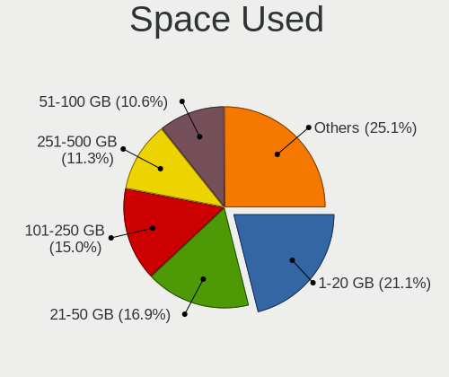
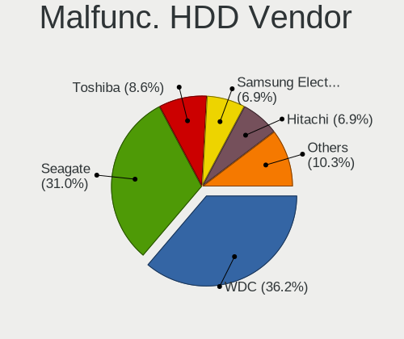

Pop!_OS 22.04 - Tested Hardware & Statistics (Desktops)
-------------------------------------------------------

A project to collect tested hardware configurations for Pop!_OS 22.04.

Anyone can contribute to this report by the [hw-probe](https://github.com/linuxhw/hw-probe) tool:

    sudo -E hw-probe -all -upload

Please contribute! Especially if your hardware is rare.

Contents
--------

* [ Test Cases ](#test-cases)

* [ System ](#system)
  - [ Kernel                   ](#kernel)
  - [ Kernel Family            ](#kernel-family)
  - [ Kernel Major Ver.        ](#kernel-major-ver)
  - [ Arch                     ](#arch)
  - [ DE                       ](#de)
  - [ Display Server           ](#display-server)
  - [ Display Manager          ](#display-manager)
  - [ OS Lang                  ](#os-lang)
  - [ Boot Mode                ](#boot-mode)
  - [ Filesystem               ](#filesystem)
  - [ Part. scheme             ](#part-scheme)
  - [ Dual Boot with Linux/BSD ](#dual-boot-with-linuxbsd)
  - [ Dual Boot (Win)          ](#dual-boot-win)

* [ Board ](#board)
  - [ Vendor                   ](#vendor)
  - [ Model                    ](#model)
  - [ Model Family             ](#model-family)
  - [ MFG Year                 ](#mfg-year)
  - [ Form Factor              ](#form-factor)
  - [ Secure Boot              ](#secure-boot)
  - [ Coreboot                 ](#coreboot)
  - [ RAM Size                 ](#ram-size)
  - [ RAM Used                 ](#ram-used)
  - [ Total Drives             ](#total-drives)
  - [ Has CD-ROM               ](#has-cd-rom)
  - [ Has Ethernet             ](#has-ethernet)
  - [ Has WiFi                 ](#has-wifi)
  - [ Has Bluetooth            ](#has-bluetooth)

* [ Location ](#location)
  - [ Country                  ](#country)
  - [ City                     ](#city)

* [ Drives ](#drives)
  - [ Drive Vendor             ](#drive-vendor)
  - [ Drive Model              ](#drive-model)
  - [ HDD Vendor               ](#hdd-vendor)
  - [ SSD Vendor               ](#ssd-vendor)
  - [ Drive Kind               ](#drive-kind)
  - [ Drive Connector          ](#drive-connector)
  - [ Drive Size               ](#drive-size)
  - [ Space Total              ](#space-total)
  - [ Space Used               ](#space-used)
  - [ Malfunc. Drives          ](#malfunc-drives)
  - [ Malfunc. Drive Vendor    ](#malfunc-drive-vendor)
  - [ Malfunc. HDD Vendor      ](#malfunc-hdd-vendor)
  - [ Malfunc. Drive Kind      ](#malfunc-drive-kind)
  - [ Failed Drives            ](#failed-drives)
  - [ Failed Drive Vendor      ](#failed-drive-vendor)
  - [ Drive Status             ](#drive-status)

* [ Storage controller ](#storage-controller)
  - [ Storage Vendor           ](#storage-vendor)
  - [ Storage Model            ](#storage-model)
  - [ Storage Kind             ](#storage-kind)

* [ Processor ](#processor)
  - [ CPU Vendor               ](#cpu-vendor)
  - [ CPU Model                ](#cpu-model)
  - [ CPU Model Family         ](#cpu-model-family)
  - [ CPU Cores                ](#cpu-cores)
  - [ CPU Sockets              ](#cpu-sockets)
  - [ CPU Threads              ](#cpu-threads)
  - [ CPU Op-Modes             ](#cpu-op-modes)
  - [ CPU Microcode            ](#cpu-microcode)
  - [ CPU Microarch            ](#cpu-microarch)

* [ Graphics ](#graphics)
  - [ GPU Vendor               ](#gpu-vendor)
  - [ GPU Model                ](#gpu-model)
  - [ GPU Combo                ](#gpu-combo)
  - [ GPU Driver               ](#gpu-driver)
  - [ GPU Memory               ](#gpu-memory)

* [ Monitor ](#monitor)
  - [ Monitor Vendor           ](#monitor-vendor)
  - [ Monitor Model            ](#monitor-model)
  - [ Monitor Resolution       ](#monitor-resolution)
  - [ Monitor Diagonal         ](#monitor-diagonal)
  - [ Monitor Width            ](#monitor-width)
  - [ Aspect Ratio             ](#aspect-ratio)
  - [ Monitor Area             ](#monitor-area)
  - [ Pixel Density            ](#pixel-density)
  - [ Multiple Monitors        ](#multiple-monitors)

* [ Network ](#network)
  - [ Net Controller Vendor    ](#net-controller-vendor)
  - [ Net Controller Model     ](#net-controller-model)
  - [ Wireless Vendor          ](#wireless-vendor)
  - [ Wireless Model           ](#wireless-model)
  - [ Ethernet Vendor          ](#ethernet-vendor)
  - [ Ethernet Model           ](#ethernet-model)
  - [ Net Controller Kind      ](#net-controller-kind)
  - [ Used Controller          ](#used-controller)
  - [ NICs                     ](#nics)
  - [ IPv6                     ](#ipv6)

* [ Bluetooth ](#bluetooth)
  - [ Bluetooth Vendor         ](#bluetooth-vendor)
  - [ Bluetooth Model          ](#bluetooth-model)

* [ Sound ](#sound)
  - [ Sound Vendor             ](#sound-vendor)
  - [ Sound Model              ](#sound-model)

* [ Memory ](#memory)
  - [ Memory Vendor            ](#memory-vendor)
  - [ Memory Model             ](#memory-model)
  - [ Memory Kind              ](#memory-kind)
  - [ Memory Form Factor       ](#memory-form-factor)
  - [ Memory Size              ](#memory-size)
  - [ Memory Speed             ](#memory-speed)

* [ Printers & scanners ](#printers--scanners)
  - [ Printer Vendor           ](#printer-vendor)
  - [ Printer Model            ](#printer-model)
  - [ Scanner Vendor           ](#scanner-vendor)
  - [ Scanner Model            ](#scanner-model)

* [ Camera ](#camera)
  - [ Camera Vendor            ](#camera-vendor)
  - [ Camera Model             ](#camera-model)

* [ Security ](#security)
  - [ Fingerprint Vendor       ](#fingerprint-vendor)
  - [ Fingerprint Model        ](#fingerprint-model)
  - [ Chipcard Vendor          ](#chipcard-vendor)
  - [ Chipcard Model           ](#chipcard-model)

* [ Unsupported ](#unsupported)
  - [ Unsupported Devices      ](#unsupported-devices)
  - [ Unsupported Device Types ](#unsupported-device-types)

Test Cases
----------

Total: 151

| Vendor     | Model                       | Probe                                                      | Date         |
|------------|-----------------------------|------------------------------------------------------------|--------------|
| ASUSTek    | PRIME Z590-A                | [fa29e357fa](https://linux-hardware.org/?probe=fa29e357fa) | Jun 01, 2022 |
| ASUSTek    | F2A85-M                     | [82b4935292](https://linux-hardware.org/?probe=82b4935292) | Jun 01, 2022 |
| MSI        | Z170A MPOWER GAMING TITA... | [538feade4f](https://linux-hardware.org/?probe=538feade4f) | May 31, 2022 |
| ASUSTek    | PRIME A320M-K               | [bee74ec003](https://linux-hardware.org/?probe=bee74ec003) | May 31, 2022 |
| ASRock     | B450 Steel Legend           | [136730f4ac](https://linux-hardware.org/?probe=136730f4ac) | May 31, 2022 |
| ASRock     | B450 Steel Legend           | [62b7e9aacd](https://linux-hardware.org/?probe=62b7e9aacd) | May 31, 2022 |
| System76   | Thelio Major thelio-majo... | [291730a3bb](https://linux-hardware.org/?probe=291730a3bb) | May 31, 2022 |
| Dell       | 0Y2MRG A00                  | [013e0da975](https://linux-hardware.org/?probe=013e0da975) | May 30, 2022 |
| Dell       | 0D02VH A01                  | [fc97b0a5bf](https://linux-hardware.org/?probe=fc97b0a5bf) | May 30, 2022 |
| ASUSTek    | PRIME Z590-A                | [1058cdf867](https://linux-hardware.org/?probe=1058cdf867) | May 30, 2022 |
| HP         | 8266                        | [d0e35451ab](https://linux-hardware.org/?probe=d0e35451ab) | May 29, 2022 |
| Gigabyte   | H270-Gaming 3               | [c28c21c4d8](https://linux-hardware.org/?probe=c28c21c4d8) | May 29, 2022 |
| ASUSTek    | ROG CROSSHAIR VIII DARK ... | [5d899f8fc5](https://linux-hardware.org/?probe=5d899f8fc5) | May 29, 2022 |
| ASUSTek    | ROG STRIX X570-E GAMING     | [d1923db949](https://linux-hardware.org/?probe=d1923db949) | May 29, 2022 |
| Dell       | 0J3C2F A00                  | [c192680ab5](https://linux-hardware.org/?probe=c192680ab5) | May 29, 2022 |
| MSI        | MAG B550 TOMAHAWK           | [b78390767c](https://linux-hardware.org/?probe=b78390767c) | May 28, 2022 |
| MSI        | MS-7717                     | [101b488b80](https://linux-hardware.org/?probe=101b488b80) | May 28, 2022 |
| MSI        | MS-7717                     | [9b0c2d0d8c](https://linux-hardware.org/?probe=9b0c2d0d8c) | May 28, 2022 |
| ASRock     | B450 Steel Legend           | [5d47d967ba](https://linux-hardware.org/?probe=5d47d967ba) | May 28, 2022 |
| Dell       | 040DDP A01                  | [925d3dce8d](https://linux-hardware.org/?probe=925d3dce8d) | May 28, 2022 |
| HP         | 158B                        | [a74e9da8aa](https://linux-hardware.org/?probe=a74e9da8aa) | May 28, 2022 |
| ASUSTek    | SABERTOOTH Z170 MARK 1      | [bdf54228e5](https://linux-hardware.org/?probe=bdf54228e5) | May 27, 2022 |
| Lenovo     | SHARKBAY 0B98401 WIN        | [f5195788f8](https://linux-hardware.org/?probe=f5195788f8) | May 27, 2022 |
| ASUSTek    | PRIME Z270-A                | [5d1ee4048a](https://linux-hardware.org/?probe=5d1ee4048a) | May 27, 2022 |
| ASUSTek    | P5KPL-SE                    | [c4b27d79ef](https://linux-hardware.org/?probe=c4b27d79ef) | May 26, 2022 |
| ASUSTek    | P5QPL-AM                    | [938ab3ec5c](https://linux-hardware.org/?probe=938ab3ec5c) | May 26, 2022 |
| ASUSTek    | TUF B450M-PLUS GAMING       | [ae0ada290a](https://linux-hardware.org/?probe=ae0ada290a) | May 26, 2022 |
| ASRock     | H670M-ITX/ax                | [b3f7ff3d98](https://linux-hardware.org/?probe=b3f7ff3d98) | May 25, 2022 |
| ASUSTek    | M5A78L/USB3                 | [852a292ba3](https://linux-hardware.org/?probe=852a292ba3) | May 25, 2022 |
| Gigabyte   | AB350-Gaming 3-CF           | [4738560555](https://linux-hardware.org/?probe=4738560555) | May 25, 2022 |
| HP         | 8703                        | [14af29c571](https://linux-hardware.org/?probe=14af29c571) | May 24, 2022 |
| ASRock     | H470M-ITX/ac                | [181f7decc6](https://linux-hardware.org/?probe=181f7decc6) | May 24, 2022 |
| Dell       | 0Y2MRG A00                  | [08527b166e](https://linux-hardware.org/?probe=08527b166e) | May 24, 2022 |
| Gigabyte   | B550M AORUS PRO-P           | [1122022ae1](https://linux-hardware.org/?probe=1122022ae1) | May 24, 2022 |
| SIEMENS    | A5E02122237 ES010           | [3d7173e7a3](https://linux-hardware.org/?probe=3d7173e7a3) | May 24, 2022 |
| Lenovo     | MAHOBAY                     | [dbfb736222](https://linux-hardware.org/?probe=dbfb736222) | May 23, 2022 |
| ASUSTek    | ROG CROSSHAIR VIII DARK ... | [78bb2ba75c](https://linux-hardware.org/?probe=78bb2ba75c) | May 23, 2022 |
| Foxconn    | 2ABF                        | [39f9e9e717](https://linux-hardware.org/?probe=39f9e9e717) | May 22, 2022 |
| ASUSTek    | ROG STRIX Z390-E GAMING     | [21818b99b4](https://linux-hardware.org/?probe=21818b99b4) | May 22, 2022 |
| ASRock     | B450 Gaming K4              | [152469abdd](https://linux-hardware.org/?probe=152469abdd) | May 22, 2022 |
| ASUSTek    | ROG STRIX Z390-E GAMING     | [f1db82519f](https://linux-hardware.org/?probe=f1db82519f) | May 22, 2022 |
| MSI        | MEG Z390 ACE                | [0065576586](https://linux-hardware.org/?probe=0065576586) | May 22, 2022 |
| Gigabyte   | H67N-USB3-B3                | [382f206597](https://linux-hardware.org/?probe=382f206597) | May 21, 2022 |
| ASRock     | B450 Steel Legend           | [3c436952c7](https://linux-hardware.org/?probe=3c436952c7) | May 21, 2022 |
| ASUSTek    | P7P55D-E LX                 | [358e85c524](https://linux-hardware.org/?probe=358e85c524) | May 21, 2022 |
| MSI        | B250M PRO-VD                | [540e0831b1](https://linux-hardware.org/?probe=540e0831b1) | May 20, 2022 |
| ASRock     | TRX40 Creator               | [a810336f3f](https://linux-hardware.org/?probe=a810336f3f) | May 20, 2022 |
| ASRock     | TRX40 Creator               | [6993400976](https://linux-hardware.org/?probe=6993400976) | May 20, 2022 |
| Gigabyte   | GA-78LMT-S2P                | [2211d5c2a2](https://linux-hardware.org/?probe=2211d5c2a2) | May 20, 2022 |
| ASUSTek    | H110M-R                     | [7cae58580a](https://linux-hardware.org/?probe=7cae58580a) | May 20, 2022 |
| ASRock     | Z390 Phantom Gaming 4-IB    | [543ab770e8](https://linux-hardware.org/?probe=543ab770e8) | May 20, 2022 |
| Positivo   | POS-MI945AA                 | [0f9875e8fc](https://linux-hardware.org/?probe=0f9875e8fc) | May 19, 2022 |
| Lenovo     | MAHOBAY                     | [fa1f318919](https://linux-hardware.org/?probe=fa1f318919) | May 19, 2022 |
| ASUSTek    | ROG CROSSHAIR VIII IMPAC... | [d94f4b0a43](https://linux-hardware.org/?probe=d94f4b0a43) | May 19, 2022 |
| Gigabyte   | B450 AORUS M                | [5ddfbf547b](https://linux-hardware.org/?probe=5ddfbf547b) | May 19, 2022 |
| Supermicro | X8SIL                       | [66e8a4001f](https://linux-hardware.org/?probe=66e8a4001f) | May 18, 2022 |
| MSI        | B350M MORTAR                | [fd66fd9a5a](https://linux-hardware.org/?probe=fd66fd9a5a) | May 18, 2022 |
| Supermicro | X8SIL                       | [5cb6f1067b](https://linux-hardware.org/?probe=5cb6f1067b) | May 18, 2022 |
| HP         | 8054                        | [725f204fd0](https://linux-hardware.org/?probe=725f204fd0) | May 18, 2022 |
| ASUSTek    | GA15DH                      | [ca68812bf2](https://linux-hardware.org/?probe=ca68812bf2) | May 17, 2022 |
| MSI        | Z270-A PRO                  | [f005623f03](https://linux-hardware.org/?probe=f005623f03) | May 17, 2022 |
| ASUSTek    | AM1M-A/BR                   | [e23e8291e0](https://linux-hardware.org/?probe=e23e8291e0) | May 17, 2022 |
| Gigabyte   | AX370M-DS3H-CF              | [2f7a99c28b](https://linux-hardware.org/?probe=2f7a99c28b) | May 17, 2022 |
| ASUSTek    | M4A785TD-V EVO              | [ee4e4a7bc7](https://linux-hardware.org/?probe=ee4e4a7bc7) | May 17, 2022 |
| Dell       | 040DDP A00                  | [4806ca2a7e](https://linux-hardware.org/?probe=4806ca2a7e) | May 17, 2022 |
| Gigabyte   | H310M S2H x.x               | [4d76b03e66](https://linux-hardware.org/?probe=4d76b03e66) | May 17, 2022 |
| ASUSTek    | Z87-K                       | [2daea316b2](https://linux-hardware.org/?probe=2daea316b2) | May 16, 2022 |
| MSI        | MPG X570 GAMING PLUS        | [91d8b47a30](https://linux-hardware.org/?probe=91d8b47a30) | May 15, 2022 |
| ASRock     | B550 Phantom Gaming-ITX/... | [608664ce7a](https://linux-hardware.org/?probe=608664ce7a) | May 15, 2022 |
| Dell       | 0CRH6C A02                  | [655afd62e6](https://linux-hardware.org/?probe=655afd62e6) | May 14, 2022 |
| ASUSTek    | M4A89GTD-PRO/USB3           | [a049c51989](https://linux-hardware.org/?probe=a049c51989) | May 14, 2022 |
| ASUSTek    | P8H61-M LX3 R2.0            | [cb7b6b9cde](https://linux-hardware.org/?probe=cb7b6b9cde) | May 14, 2022 |
| ASUSTek    | ROG STRIX X299-E GAMING ... | [0cc824e2a5](https://linux-hardware.org/?probe=0cc824e2a5) | May 13, 2022 |
| NZXT       | N7 B550                     | [73441bbfc4](https://linux-hardware.org/?probe=73441bbfc4) | May 12, 2022 |
| Unknown    | BTC79X5                     | [42b222eb65](https://linux-hardware.org/?probe=42b222eb65) | May 12, 2022 |
| Gigabyte   | Z170-Gaming K3              | [768acb5df2](https://linux-hardware.org/?probe=768acb5df2) | May 12, 2022 |
| AZW        | BT3 X                       | [a17cb64acb](https://linux-hardware.org/?probe=a17cb64acb) | May 12, 2022 |
| Lenovo     | 0B98401 PRO                 | [ee225906fc](https://linux-hardware.org/?probe=ee225906fc) | May 12, 2022 |
| Lenovo     | 0B98401 PRO                 | [16911d5e64](https://linux-hardware.org/?probe=16911d5e64) | May 11, 2022 |
| Gigabyte   | B660 AORUS MASTER DDR4      | [e5981a9f20](https://linux-hardware.org/?probe=e5981a9f20) | May 11, 2022 |
| Gigabyte   | Z390 AORUS PRO-CF           | [1d4364ac51](https://linux-hardware.org/?probe=1d4364ac51) | May 10, 2022 |
| NZXT       | N7 B550                     | [147247dfb6](https://linux-hardware.org/?probe=147247dfb6) | May 10, 2022 |
| Gigabyte   | Z170-HD3P-CF                | [396a39e5a6](https://linux-hardware.org/?probe=396a39e5a6) | May 10, 2022 |
| ASRock     | X370 Professional Gaming    | [1e22ba0468](https://linux-hardware.org/?probe=1e22ba0468) | May 10, 2022 |
| ASUSTek    | PRIME B450M-A               | [0b3cda16db](https://linux-hardware.org/?probe=0b3cda16db) | May 10, 2022 |
| ASUSTek    | PRIME B450M-A               | [90190717eb](https://linux-hardware.org/?probe=90190717eb) | May 09, 2022 |
| Gigabyte   | X570 AORUS ELITE            | [9f6a18226f](https://linux-hardware.org/?probe=9f6a18226f) | May 09, 2022 |
| ASUSTek    | Z97-AR                      | [29c93ea162](https://linux-hardware.org/?probe=29c93ea162) | May 09, 2022 |
| Gigabyte   | B450 AORUS M                | [cd1aff125e](https://linux-hardware.org/?probe=cd1aff125e) | May 09, 2022 |
| SIEMENS    | A5E02122237 ES010           | [cc728f6c38](https://linux-hardware.org/?probe=cc728f6c38) | May 09, 2022 |
| ASRock     | X299 Taichi CLX             | [47a45fca48](https://linux-hardware.org/?probe=47a45fca48) | May 08, 2022 |
| Gigabyte   | X470 AORUS GAMING 7 WIFI... | [8964a4c5ec](https://linux-hardware.org/?probe=8964a4c5ec) | May 08, 2022 |
| ECS        | Nettle3                     | [36f8cde007](https://linux-hardware.org/?probe=36f8cde007) | May 08, 2022 |
| ASUSTek    | PRIME X570-P                | [65d94c8458](https://linux-hardware.org/?probe=65d94c8458) | May 08, 2022 |
| ECS        | Nettle3                     | [646fb53a2c](https://linux-hardware.org/?probe=646fb53a2c) | May 07, 2022 |
| Gigabyte   | X570 AORUS PRO WIFI         | [61a4daec98](https://linux-hardware.org/?probe=61a4daec98) | May 07, 2022 |
| ASUSTek    | ROG CROSSHAIR VIII HERO     | [180dd73bd6](https://linux-hardware.org/?probe=180dd73bd6) | May 07, 2022 |
| ASUSTek    | TUF Gaming Z690-PLUS WIF... | [f71ca35596](https://linux-hardware.org/?probe=f71ca35596) | May 06, 2022 |
| MSI        | B450-A PRO                  | [5b5ceb0f53](https://linux-hardware.org/?probe=5b5ceb0f53) | May 06, 2022 |
| Gigabyte   | 990FXA-UD3                  | [4fe934e84d](https://linux-hardware.org/?probe=4fe934e84d) | May 06, 2022 |
| ASRock     | 970M Pro3                   | [2853128cd0](https://linux-hardware.org/?probe=2853128cd0) | May 05, 2022 |
| ASRock     | 970M Pro3                   | [5f51fd4cf8](https://linux-hardware.org/?probe=5f51fd4cf8) | May 05, 2022 |
| Gigabyte   | Z170-HD3P-CF                | [7b7f29e504](https://linux-hardware.org/?probe=7b7f29e504) | May 05, 2022 |
| ASRock     | X470 Taichi                 | [e133868179](https://linux-hardware.org/?probe=e133868179) | May 05, 2022 |
| ASRock     | X470 Taichi                 | [93d6fb1610](https://linux-hardware.org/?probe=93d6fb1610) | May 05, 2022 |
| ASRock     | A320M-HDV R4.0              | [36cabd86ba](https://linux-hardware.org/?probe=36cabd86ba) | May 04, 2022 |
| ASUSTek    | B85M-E                      | [2b6338d755](https://linux-hardware.org/?probe=2b6338d755) | May 04, 2022 |
| Gigabyte   | Z170-HD3P-CF                | [7196bf2ec6](https://linux-hardware.org/?probe=7196bf2ec6) | May 03, 2022 |
| ASRock     | 970M Pro3                   | [f20f31b107](https://linux-hardware.org/?probe=f20f31b107) | May 03, 2022 |
| ASRock     | 970M Pro3                   | [73a563257a](https://linux-hardware.org/?probe=73a563257a) | May 03, 2022 |
| ASUSTek    | ROG STRIX B450-I GAMING     | [65a2309744](https://linux-hardware.org/?probe=65a2309744) | May 03, 2022 |
| Alienware  | 0CPDXD A00                  | [17da14a17d](https://linux-hardware.org/?probe=17da14a17d) | May 03, 2022 |
| ASUSTek    | B85M-E                      | [9645231d87](https://linux-hardware.org/?probe=9645231d87) | May 03, 2022 |
| MSI        | B450I GAMING PLUS AC        | [c0ef0738b5](https://linux-hardware.org/?probe=c0ef0738b5) | May 02, 2022 |
| MSI        | X370 GAMING PRO CARBON      | [4a09f5d3f3](https://linux-hardware.org/?probe=4a09f5d3f3) | May 02, 2022 |
| MSI        | X370 GAMING PRO CARBON      | [ab716981c3](https://linux-hardware.org/?probe=ab716981c3) | May 02, 2022 |
| Alienware  | 0P0JWX A00                  | [e6e1548aa1](https://linux-hardware.org/?probe=e6e1548aa1) | May 02, 2022 |
| ASUSTek    | ROG CROSSHAIR VIII FORMU... | [a456619489](https://linux-hardware.org/?probe=a456619489) | May 02, 2022 |
| ASUSTek    | ROG STRIX B350-F GAMING     | [925447d7e9](https://linux-hardware.org/?probe=925447d7e9) | May 01, 2022 |
| ASUSTek    | ROG STRIX B350-F GAMING     | [b1e331055f](https://linux-hardware.org/?probe=b1e331055f) | May 01, 2022 |
| ASUSTek    | ROG CROSSHAIR VII HERO      | [dec71580c4](https://linux-hardware.org/?probe=dec71580c4) | May 01, 2022 |
| Gigabyte   | X570S AERO G                | [ab6b8eaa71](https://linux-hardware.org/?probe=ab6b8eaa71) | May 01, 2022 |
| MSI        | 970 GAMING                  | [32052450db](https://linux-hardware.org/?probe=32052450db) | May 01, 2022 |
| Gigabyte   | X570 AORUS ELITE            | [8db041a1e4](https://linux-hardware.org/?probe=8db041a1e4) | May 01, 2022 |
| ASRock     | B450 Steel Legend           | [ecc527cb4b](https://linux-hardware.org/?probe=ecc527cb4b) | May 01, 2022 |
| ASRock     | B450 Steel Legend           | [ca217fe968](https://linux-hardware.org/?probe=ca217fe968) | May 01, 2022 |
| MSI        | B450M GAMING PLUS           | [0929d58de7](https://linux-hardware.org/?probe=0929d58de7) | Apr 30, 2022 |
| Apple      | Mac-F42C88C8 Proto1         | [3edd5f05f7](https://linux-hardware.org/?probe=3edd5f05f7) | Apr 30, 2022 |
| ASRock     | X99 Extreme4                | [d45e1e88db](https://linux-hardware.org/?probe=d45e1e88db) | Apr 30, 2022 |
| ASRock     | X99 Extreme4                | [41cec63ac6](https://linux-hardware.org/?probe=41cec63ac6) | Apr 30, 2022 |
| EVGA       | X58 SLI Classified Tyler... | [07254f2dbb](https://linux-hardware.org/?probe=07254f2dbb) | Apr 30, 2022 |
| ASUSTek    | PRIME H510M-E               | [5c9e5fc14c](https://linux-hardware.org/?probe=5c9e5fc14c) | Apr 29, 2022 |
| ASUSTek    | ROG STRIX X299-E GAMING ... | [bce425f138](https://linux-hardware.org/?probe=bce425f138) | Apr 29, 2022 |
| Gigabyte   | AB350-Gaming 3-CF           | [7b292b972d](https://linux-hardware.org/?probe=7b292b972d) | Apr 29, 2022 |
| MSI        | MAG Z690 TOMAHAWK WIFI D... | [e37bc471b1](https://linux-hardware.org/?probe=e37bc471b1) | Apr 29, 2022 |
| ASUSTek    | PRIME H310M-E R2.0          | [2b7167b16e](https://linux-hardware.org/?probe=2b7167b16e) | Apr 29, 2022 |
| ASUSTek    | ROG STRIX B450-F GAMING     | [aed5ee3ded](https://linux-hardware.org/?probe=aed5ee3ded) | Apr 28, 2022 |
| Gigabyte   | B550 AORUS ELITE AX V2      | [ab83eedd1f](https://linux-hardware.org/?probe=ab83eedd1f) | Apr 28, 2022 |
| MSI        | H55M-E23                    | [4ab5f58470](https://linux-hardware.org/?probe=4ab5f58470) | Apr 28, 2022 |
| MSI        | MAG Z690 TOMAHAWK WIFI D... | [46430e1117](https://linux-hardware.org/?probe=46430e1117) | Apr 28, 2022 |
| Dell       | 09KPNV A00                  | [5046e0575b](https://linux-hardware.org/?probe=5046e0575b) | Apr 28, 2022 |
| Dell       | 0NW73C A00                  | [344e2b816e](https://linux-hardware.org/?probe=344e2b816e) | Apr 28, 2022 |
| Dell       | 088DT1 A01                  | [b664b8720e](https://linux-hardware.org/?probe=b664b8720e) | Apr 28, 2022 |
| Fujitsu    | D3162-A1 S26361-D3162-A1    | [19e0445e6f](https://linux-hardware.org/?probe=19e0445e6f) | Apr 27, 2022 |
| Dell       | 0R1PCR A00                  | [feec38a0f5](https://linux-hardware.org/?probe=feec38a0f5) | Apr 27, 2022 |
| Unknown    | Unknown                     | [82ad7e86b5](https://linux-hardware.org/?probe=82ad7e86b5) | Apr 27, 2022 |
| ASUSTek    | GA15DH                      | [30a22d7be3](https://linux-hardware.org/?probe=30a22d7be3) | Apr 27, 2022 |
| ASUSTek    | ROG STRIX B450-I GAMING     | [4b9faf4848](https://linux-hardware.org/?probe=4b9faf4848) | Apr 26, 2022 |
| System76   | Thelio thelio-r2            | [aae937be8b](https://linux-hardware.org/?probe=aae937be8b) | Apr 25, 2022 |
| Gigabyte   | B360 AORUS GAMING 3 WIFI... | [fabaa5b3ab](https://linux-hardware.org/?probe=fabaa5b3ab) | Apr 24, 2022 |
| MSI        | B250M BAZOOKA               | [91392a601e](https://linux-hardware.org/?probe=91392a601e) | Apr 08, 2022 |

System
------

Kernel
------

Version of the Linux kernel

| Version                  | Desktops | Percent |
|--------------------------|----------|---------|
| 5.17.5-76051705-generic  | 82       | 66.13%  |
| 5.16.19-76051619-generic | 40       | 32.26%  |
| 5.17.4-051704-generic    | 1        | 0.81%   |
| 5.16.15-76051615-generic | 1        | 0.81%   |

Kernel Family
-------------

Linux kernel without a distro release

| Version | Desktops | Percent |
|---------|----------|---------|
| 5.17.5  | 82       | 66.13%  |
| 5.16.19 | 40       | 32.26%  |
| 5.17.4  | 1        | 0.81%   |
| 5.16.15 | 1        | 0.81%   |

Kernel Major Ver.
-----------------

Linux kernel major version

| Version | Desktops | Percent |
|---------|----------|---------|
| 5.17    | 83       | 66.94%  |
| 5.16    | 41       | 33.06%  |

Arch
----

OS architecture (x86_64, i586, etc.)

| Name   | Desktops | Percent |
|--------|----------|---------|
| x86_64 | 122      | 100%    |

DE
--

Desktop Environment

| Name       | Desktops | Percent |
|------------|----------|---------|
| GNOME      | 119      | 97.54%  |
| X-Cinnamon | 1        | 0.82%   |
| LXQt       | 1        | 0.82%   |
| KDE5       | 1        | 0.82%   |

Display Server
--------------

X11 or Wayland

| Name    | Desktops | Percent |
|---------|----------|---------|
| X11     | 120      | 98.36%  |
| Wayland | 2        | 1.64%   |

Display Manager
---------------

SDDM, LightDM, etc.

| Name    | Desktops | Percent |
|---------|----------|---------|
| Unknown | 105      | 86.07%  |
| GDM3    | 17       | 13.93%  |

OS Lang
-------

Language

| Lang  | Desktops | Percent |
|-------|----------|---------|
| en_US | 78       | 63.93%  |
| de_DE | 7        | 5.74%   |
| en_GB | 6        | 4.92%   |
| en_CA | 5        | 4.1%    |
| en_AU | 5        | 4.1%    |
| C     | 5        | 4.1%    |
| pt_BR | 4        | 3.28%   |
| pl_PL | 3        | 2.46%   |
| fr_FR | 3        | 2.46%   |
| sv_SE | 1        | 0.82%   |
| nl_NL | 1        | 0.82%   |
| es_ES | 1        | 0.82%   |
| en_IL | 1        | 0.82%   |
| en_IE | 1        | 0.82%   |
| cs_CZ | 1        | 0.82%   |

Boot Mode
---------

EFI or BIOS

| Mode | Desktops | Percent |
|------|----------|---------|
| BIOS | 107      | 87.7%   |
| EFI  | 15       | 12.3%   |

Filesystem
----------

Type of filesystem

| Type    | Desktops | Percent |
|---------|----------|---------|
| Ext4    | 116      | 95.08%  |
| Btrfs   | 4        | 3.28%   |
| Overlay | 2        | 1.64%   |

Part. scheme
------------

Scheme of partitioning

| Type    | Desktops | Percent |
|---------|----------|---------|
| Unknown | 105      | 86.07%  |
| GPT     | 17       | 13.93%  |

Dual Boot with Linux/BSD
------------------------

Hosting more than one Linux/BSD

| Dual boot | Desktops | Percent |
|-----------|----------|---------|
| No        | 120      | 98.36%  |
| Yes       | 2        | 1.64%   |

Dual Boot (Win)
---------------

Hosting Linux and Windows

| Dual boot | Desktops | Percent |
|-----------|----------|---------|
| No        | 108      | 88.52%  |
| Yes       | 14       | 11.48%  |

Board
-----

Vendor
------

Motherboard manufacturer

| Name                | Desktops | Percent |
|---------------------|----------|---------|
| ASUSTek Computer    | 38       | 31.15%  |
| Gigabyte Technology | 23       | 18.85%  |
| MSI                 | 16       | 13.11%  |
| ASRock              | 12       | 9.84%   |
| Dell                | 10       | 8.2%    |
| Hewlett-Packard     | 4        | 3.28%   |
| Lenovo              | 3        | 2.46%   |
| System76            | 2        | 1.64%   |
| Alienware           | 2        | 1.64%   |
| Unknown             | 2        | 1.64%   |
| Supermicro          | 1        | 0.82%   |
| SIEMENS             | 1        | 0.82%   |
| Positivo            | 1        | 0.82%   |
| NZXT                | 1        | 0.82%   |
| Fujitsu             | 1        | 0.82%   |
| Foxconn             | 1        | 0.82%   |
| EVGA                | 1        | 0.82%   |
| ECS                 | 1        | 0.82%   |
| AZW                 | 1        | 0.82%   |
| Apple               | 1        | 0.82%   |

Model
-----

Motherboard model

| Name                                               | Desktops | Percent |
|----------------------------------------------------|----------|---------|
| ASUS All Series                                    | 4        | 3.28%   |
| Gigabyte Z170-HD3P                                 | 2        | 1.64%   |
| Gigabyte X570 AORUS ELITE                          | 2        | 1.64%   |
| Gigabyte B450 AORUS M                              | 2        | 1.64%   |
| Dell OptiPlex 3020                                 | 2        | 1.64%   |
| ASUS ROG STRIX B450-I GAMING                       | 2        | 1.64%   |
| ASUS ROG CROSSHAIR VIII DARK HERO                  | 2        | 1.64%   |
| ASUS PRIME B450M-A                                 | 2        | 1.64%   |
| Unknown                                            | 2        | 1.64%   |
| System76 Thelio Major                              | 1        | 0.82%   |
| System76 Thelio                                    | 1        | 0.82%   |
| Supermicro X8SIL                                   | 1        | 0.82%   |
| SIEMENS SIMATIC BOX PC 627B/PANEL PC 677B Profibus | 1        | 0.82%   |
| Positivo POS-MI945AA                               | 1        | 0.82%   |
| NZXT N7 B550                                       | 1        | 0.82%   |
| MSI MS-7D32                                        | 1        | 0.82%   |
| MSI MS-7C91                                        | 1        | 0.82%   |
| MSI MS-7C37                                        | 1        | 0.82%   |
| MSI MS-7B87                                        | 1        | 0.82%   |
| MSI MS-7B86                                        | 1        | 0.82%   |
| MSI MS-7B12                                        | 1        | 0.82%   |
| MSI MS-7A74                                        | 1        | 0.82%   |
| MSI MS-7A71                                        | 1        | 0.82%   |
| MSI MS-7A70                                        | 1        | 0.82%   |
| MSI MS-7A40                                        | 1        | 0.82%   |
| MSI MS-7A37                                        | 1        | 0.82%   |
| MSI MS-7A32                                        | 1        | 0.82%   |
| MSI MS-7A16                                        | 1        | 0.82%   |
| MSI MS-7693                                        | 1        | 0.82%   |
| MSI MS-7636                                        | 1        | 0.82%   |
| MSI A55PV.AR3510D                                  | 1        | 0.82%   |
| Lenovo ThinkStation S30 43516Y7                    | 1        | 0.82%   |
| Lenovo ThinkCentre M93p 10A6S0RN00                 | 1        | 0.82%   |
| Lenovo ThinkCentre M82 2929AZ6                     | 1        | 0.82%   |
| HP Z820 Workstation                                | 1        | 0.82%   |
| HP OMEN 30L Desktop GT13-0xxx                      | 1        | 0.82%   |
| HP EliteDesk 800 G2 SFF                            | 1        | 0.82%   |
| HP EliteDesk 705 G3 Desktop Mini                   | 1        | 0.82%   |
| Gigabyte Z390 AORUS PRO                            | 1        | 0.82%   |
| Gigabyte Z170-Gaming K3                            | 1        | 0.82%   |
| Gigabyte X570S AERO G                              | 1        | 0.82%   |
| Gigabyte X570 AORUS PRO WIFI                       | 1        | 0.82%   |
| Gigabyte X470 AORUS GAMING 7 WIFI                  | 1        | 0.82%   |
| Gigabyte H67N-USB3-B3                              | 1        | 0.82%   |
| Gigabyte H310M S2H 2.0                             | 1        | 0.82%   |
| Gigabyte H270-Gaming 3                             | 1        | 0.82%   |
| Gigabyte GA-78LMT-S2P                              | 1        | 0.82%   |
| Gigabyte B660 AORUS MASTER DDR4                    | 1        | 0.82%   |
| Gigabyte B550M AORUS PRO-P                         | 1        | 0.82%   |
| Gigabyte B550 AORUS ELITE AX V2                    | 1        | 0.82%   |
| Gigabyte B360 AORUS GAMING 3 WIFI                  | 1        | 0.82%   |
| Gigabyte AX370M-DS3H                               | 1        | 0.82%   |
| Gigabyte AB350-Gaming 3-CF                         | 1        | 0.82%   |
| Gigabyte AB350-Gaming 3                            | 1        | 0.82%   |
| Gigabyte 990FXA-UD3                                | 1        | 0.82%   |
| Fujitsu ESPRIMO E910                               | 1        | 0.82%   |
| Foxconn Pro 3500 Series                            | 1        | 0.82%   |
| EVGA X58 SLI Classified Tylersburg                 | 1        | 0.82%   |
| ECS FQ565AA-ABA a6700f                             | 1        | 0.82%   |
| Dell XPS 8500                                      | 1        | 0.82%   |

Model Family
------------

Motherboard model prefix

| Name                  | Desktops | Percent |
|-----------------------|----------|---------|
| ASUS ROG              | 14       | 11.48%  |
| ASUS PRIME            | 8        | 6.56%   |
| ASUS All              | 4        | 3.28%   |
| Gigabyte X570         | 3        | 2.46%   |
| Dell OptiPlex         | 3        | 2.46%   |
| Dell Inspiron         | 3        | 2.46%   |
| System76 Thelio       | 2        | 1.64%   |
| Lenovo ThinkCentre    | 2        | 1.64%   |
| HP EliteDesk          | 2        | 1.64%   |
| Gigabyte Z170-HD3P    | 2        | 1.64%   |
| Gigabyte B450         | 2        | 1.64%   |
| Gigabyte AB350-Gaming | 2        | 1.64%   |
| Dell XPS              | 2        | 1.64%   |
| Dell Precision        | 2        | 1.64%   |
| ASUS TUF              | 2        | 1.64%   |
| ASRock B450           | 2        | 1.64%   |
| Alienware Aurora      | 2        | 1.64%   |
| Unknown               | 2        | 1.64%   |
| Supermicro X8SIL      | 1        | 0.82%   |
| SIEMENS SIMATIC       | 1        | 0.82%   |
| Positivo POS-MI945AA  | 1        | 0.82%   |
| NZXT N7               | 1        | 0.82%   |
| MSI MS-7D32           | 1        | 0.82%   |
| MSI MS-7C91           | 1        | 0.82%   |
| MSI MS-7C37           | 1        | 0.82%   |
| MSI MS-7B87           | 1        | 0.82%   |
| MSI MS-7B86           | 1        | 0.82%   |
| MSI MS-7B12           | 1        | 0.82%   |
| MSI MS-7A74           | 1        | 0.82%   |
| MSI MS-7A71           | 1        | 0.82%   |
| MSI MS-7A70           | 1        | 0.82%   |
| MSI MS-7A40           | 1        | 0.82%   |
| MSI MS-7A37           | 1        | 0.82%   |
| MSI MS-7A32           | 1        | 0.82%   |
| MSI MS-7A16           | 1        | 0.82%   |
| MSI MS-7693           | 1        | 0.82%   |
| MSI MS-7636           | 1        | 0.82%   |
| MSI A55PV.AR3510D     | 1        | 0.82%   |
| Lenovo ThinkStation   | 1        | 0.82%   |
| HP Z820               | 1        | 0.82%   |
| HP OMEN               | 1        | 0.82%   |
| Gigabyte Z390         | 1        | 0.82%   |
| Gigabyte Z170-Gaming  | 1        | 0.82%   |
| Gigabyte X570S        | 1        | 0.82%   |
| Gigabyte X470         | 1        | 0.82%   |
| Gigabyte H67N-USB3-B3 | 1        | 0.82%   |
| Gigabyte H310M        | 1        | 0.82%   |
| Gigabyte H270-Gaming  | 1        | 0.82%   |
| Gigabyte GA-78LMT-S2P | 1        | 0.82%   |
| Gigabyte B660         | 1        | 0.82%   |
| Gigabyte B550M        | 1        | 0.82%   |
| Gigabyte B550         | 1        | 0.82%   |
| Gigabyte B360         | 1        | 0.82%   |
| Gigabyte AX370M-DS3H  | 1        | 0.82%   |
| Gigabyte 990FXA-UD3   | 1        | 0.82%   |
| Fujitsu ESPRIMO       | 1        | 0.82%   |
| Foxconn Pro           | 1        | 0.82%   |
| EVGA X58              | 1        | 0.82%   |
| ECS FQ565AA-ABA       | 1        | 0.82%   |
| AZW BT3               | 1        | 0.82%   |

MFG Year
--------

Motherboard manufacture year

| Year | Desktops | Percent |
|------|----------|---------|
| 2018 | 25       | 20.49%  |
| 2021 | 14       | 11.48%  |
| 2019 | 13       | 10.66%  |
| 2020 | 10       | 8.2%    |
| 2011 | 9        | 7.38%   |
| 2017 | 8        | 6.56%   |
| 2016 | 8        | 6.56%   |
| 2014 | 7        | 5.74%   |
| 2015 | 5        | 4.1%    |
| 2013 | 5        | 4.1%    |
| 2012 | 5        | 4.1%    |
| 2009 | 4        | 3.28%   |
| 2010 | 3        | 2.46%   |
| 2008 | 3        | 2.46%   |
| 2022 | 2        | 1.64%   |
| 2007 | 1        | 0.82%   |

Form Factor
-----------

Physical design of the computer

| Name    | Desktops | Percent |
|---------|----------|---------|
| Desktop | 122      | 100%    |

Secure Boot
-----------

Enabled or disabled

| State    | Desktops | Percent |
|----------|----------|---------|
| Disabled | 122      | 100%    |

Coreboot
--------

Have coreboot on board

| Used | Desktops | Percent |
|------|----------|---------|
| No   | 122      | 100%    |

RAM Size
--------

Total RAM memory

| Size in GB      | Desktops | Percent |
|-----------------|----------|---------|
| 32.01-64.0      | 38       | 31.15%  |
| 16.01-24.0      | 37       | 30.33%  |
| 8.01-16.0       | 22       | 18.03%  |
| 64.01-256.0     | 8        | 6.56%   |
| 3.01-4.0        | 7        | 5.74%   |
| 4.01-8.0        | 6        | 4.92%   |
| More than 256.0 | 2        | 1.64%   |
| 24.01-32.0      | 2        | 1.64%   |

RAM Used
--------

Used RAM memory

| Used GB    | Desktops | Percent |
|------------|----------|---------|
| 2.01-3.0   | 38       | 30.65%  |
| 4.01-8.0   | 37       | 29.84%  |
| 3.01-4.0   | 26       | 20.97%  |
| 1.01-2.0   | 15       | 12.1%   |
| 8.01-16.0  | 6        | 4.84%   |
| 16.01-24.0 | 2        | 1.61%   |

Total Drives
------------

Number of drives on board

| Drives | Desktops | Percent |
|--------|----------|---------|
| 2      | 52       | 42.62%  |
| 1      | 28       | 22.95%  |
| 3      | 22       | 18.03%  |
| 4      | 8        | 6.56%   |
| 5      | 6        | 4.92%   |
| 6      | 3        | 2.46%   |
| 11     | 1        | 0.82%   |
| 10     | 1        | 0.82%   |
| 9      | 1        | 0.82%   |

Has CD-ROM
----------

Has CD-ROM on board

| Presented | Desktops | Percent |
|-----------|----------|---------|
| No        | 89       | 72.95%  |
| Yes       | 33       | 27.05%  |

Has Ethernet
------------

Has Ethernet on board

| Presented | Desktops | Percent |
|-----------|----------|---------|
| Yes       | 121      | 99.18%  |
| No        | 1        | 0.82%   |

Has WiFi
--------

Has WiFi module

| Presented | Desktops | Percent |
|-----------|----------|---------|
| Yes       | 78       | 63.93%  |
| No        | 44       | 36.07%  |

Has Bluetooth
-------------

Has Bluetooth module

| Presented | Desktops | Percent |
|-----------|----------|---------|
| No        | 67       | 54.92%  |
| Yes       | 55       | 45.08%  |

Location
--------

Country
-------

Geographic location (country)

| Country      | Desktops | Percent |
|--------------|----------|---------|
| USA          | 54       | 44.26%  |
| Germany      | 7        | 5.74%   |
| Australia    | 7        | 5.74%   |
| Canada       | 5        | 4.1%    |
| UK           | 4        | 3.28%   |
| Brazil       | 4        | 3.28%   |
| Switzerland  | 3        | 2.46%   |
| Norway       | 3        | 2.46%   |
| Netherlands  | 3        | 2.46%   |
| Ireland      | 3        | 2.46%   |
| France       | 3        | 2.46%   |
| Sweden       | 2        | 1.64%   |
| South Africa | 2        | 1.64%   |
| Poland       | 2        | 1.64%   |
| Austria      | 2        | 1.64%   |
| Turkey       | 1        | 0.82%   |
| Thailand     | 1        | 0.82%   |
| Spain        | 1        | 0.82%   |
| South Korea  | 1        | 0.82%   |
| Slovakia     | 1        | 0.82%   |
| Saudi Arabia | 1        | 0.82%   |
| Russia       | 1        | 0.82%   |
| Philippines  | 1        | 0.82%   |
| Nicaragua    | 1        | 0.82%   |
| Mexico       | 1        | 0.82%   |
| Lithuania    | 1        | 0.82%   |
| Jordan       | 1        | 0.82%   |
| Japan        | 1        | 0.82%   |
| Israel       | 1        | 0.82%   |
| Greece       | 1        | 0.82%   |
| Finland      | 1        | 0.82%   |
| Czechia      | 1        | 0.82%   |
| Azerbaijan   | 1        | 0.82%   |

City
----

Geographic location (city)

| City                 | Desktops | Percent |
|----------------------|----------|---------|
| Zurich               | 2        | 1.64%   |
| Vienna               | 2        | 1.64%   |
| Mannheim             | 2        | 1.64%   |
| Brisbane             | 2        | 1.64%   |
| Berlin               | 2        | 1.64%   |
| Żyrardów           | 1        | 0.82%   |
| Zaragoza             | 1        | 0.82%   |
| Zapopan              | 1        | 0.82%   |
| Woodstock            | 1        | 0.82%   |
| Wichita              | 1        | 0.82%   |
| Weston-super-Mare    | 1        | 0.82%   |
| Weimar               | 1        | 0.82%   |
| Wausau               | 1        | 0.82%   |
| Walker               | 1        | 0.82%   |
| Vilnius              | 1        | 0.82%   |
| Ventura              | 1        | 0.82%   |
| Valparaiso           | 1        | 0.82%   |
| Union                | 1        | 0.82%   |
| Turku                | 1        | 0.82%   |
| Tucson               | 1        | 0.82%   |
| Tuam                 | 1        | 0.82%   |
| Trondheim            | 1        | 0.82%   |
| Thessaloniki         | 1        | 0.82%   |
| Theilingen           | 1        | 0.82%   |
| Taunton              | 1        | 0.82%   |
| Tarlac City          | 1        | 0.82%   |
| Tahlequah            | 1        | 0.82%   |
| Sydney               | 1        | 0.82%   |
| Sumter               | 1        | 0.82%   |
| Stuttgart            | 1        | 0.82%   |
| Stevensville         | 1        | 0.82%   |
| Solleftea            | 1        | 0.82%   |
| Sokolov              | 1        | 0.82%   |
| Seattle              | 1        | 0.82%   |
| Sapporo              | 1        | 0.82%   |
| Sao Paulo            | 1        | 0.82%   |
| Sanger               | 1        | 0.82%   |
| San Jose             | 1        | 0.82%   |
| San Francisco        | 1        | 0.82%   |
| San Antonio          | 1        | 0.82%   |
| Saint Paul           | 1        | 0.82%   |
| Saint John           | 1        | 0.82%   |
| Røyken Municipality | 1        | 0.82%   |
| Rotterdam            | 1        | 0.82%   |
| Riyadh               | 1        | 0.82%   |
| Richmond             | 1        | 0.82%   |
| Rensselaer           | 1        | 0.82%   |
| Recife               | 1        | 0.82%   |
| Provo                | 1        | 0.82%   |
| Potsdam              | 1        | 0.82%   |
| Portsmouth           | 1        | 0.82%   |
| Phitsanulok          | 1        | 0.82%   |
| Pelotas              | 1        | 0.82%   |
| Parsippany           | 1        | 0.82%   |
| Paris                | 1        | 0.82%   |
| Oslo                 | 1        | 0.82%   |
| Orzesze              | 1        | 0.82%   |
| Olympia              | 1        | 0.82%   |
| Ollainville          | 1        | 0.82%   |
| Norwalk              | 1        | 0.82%   |

Drives
------

Drive Vendor
------------

Hard drive vendors

| Vendor                    | Desktops | Drives | Percent |
|---------------------------|----------|--------|---------|
| Seagate                   | 46       | 64     | 18.47%  |
| Samsung Electronics       | 46       | 66     | 18.47%  |
| WDC                       | 35       | 48     | 14.06%  |
| Sandisk                   | 16       | 21     | 6.43%   |
| Toshiba                   | 14       | 14     | 5.62%   |
| Kingston                  | 13       | 15     | 5.22%   |
| Crucial                   | 12       | 16     | 4.82%   |
| Hitachi                   | 11       | 13     | 4.42%   |
| Phison                    | 10       | 10     | 4.02%   |
| Intel                     | 6        | 7      | 2.41%   |
| Silicon Motion            | 4        | 6      | 1.61%   |
| A-DATA Technology         | 4        | 4      | 1.61%   |
| SPCC                      | 3        | 4      | 1.2%    |
| Micron Technology         | 3        | 3      | 1.2%    |
| Patriot                   | 2        | 2      | 0.8%    |
| Micron/Crucial Technology | 2        | 2      | 0.8%    |
| Intenso                   | 2        | 2      | 0.8%    |
| China                     | 2        | 3      | 0.8%    |
| Unknown                   | 1        | 1      | 0.4%    |
| TurXun                    | 1        | 1      | 0.4%    |
| Transcend                 | 1        | 2      | 0.4%    |
| TO Exter                  | 1        | 1      | 0.4%    |
| SK Hynix                  | 1        | 1      | 0.4%    |
| PNY USB                   | 1        | 1      | 0.4%    |
| PNY                       | 1        | 1      | 0.4%    |
| OCZ                       | 1        | 1      | 0.4%    |
| MAXTOR                    | 1        | 1      | 0.4%    |
| Mass                      | 1        | 1      | 0.4%    |
| LITEON                    | 1        | 1      | 0.4%    |
| HS-SSD-C100               | 1        | 1      | 0.4%    |
| HGST                      | 1        | 1      | 0.4%    |
| Hewlett-Packard           | 1        | 1      | 0.4%    |
| Gigabyte Technology       | 1        | 1      | 0.4%    |
| Fujitsu                   | 1        | 1      | 0.4%    |
| FORESEE                   | 1        | 1      | 0.4%    |
| ASMT                      | 1        | 1      | 0.4%    |

Drive Model
-----------

Hard drive models

| Model                               | Desktops | Percent |
|-------------------------------------|----------|---------|
| Samsung NVMe SSD Drive 1TB          | 10       | 3.37%   |
| Samsung NVMe SSD Drive 500GB        | 9        | 3.03%   |
| Seagate ST2000DM008-2FR102 2TB      | 7        | 2.36%   |
| Seagate ST4000DM004-2CV104 4TB      | 5        | 1.68%   |
| Seagate ST1000DM010-2EP102 1TB      | 4        | 1.35%   |
| Sandisk NVMe SSD Drive 1TB          | 4        | 1.35%   |
| Samsung SSD 860 EVO 1TB             | 4        | 1.35%   |
| Kingston SA400S37240G 240GB SSD     | 4        | 1.35%   |
| Crucial CT1000MX500SSD1 1TB         | 4        | 1.35%   |
| WDC WDS500G2B0A-00SM50 500GB SSD    | 3        | 1.01%   |
| Toshiba HDWD120 2TB                 | 3        | 1.01%   |
| Seagate ST500LM012 HN-M500MBB 500GB | 3        | 1.01%   |
| Seagate ST500DM002-1BD142 500GB     | 3        | 1.01%   |
| Samsung SSD 970 EVO Plus 1TB        | 3        | 1.01%   |
| Samsung SSD 860 EVO 500GB           | 3        | 1.01%   |
| Samsung SSD 850 EVO 250GB           | 3        | 1.01%   |
| Samsung NVMe SSD Drive 2TB          | 3        | 1.01%   |
| Phison NVMe SSD Drive 2TB           | 3        | 1.01%   |
| Phison NVMe SSD Drive 1TB           | 3        | 1.01%   |
| WDC WD10EZEX-08WN4A0 1TB            | 2        | 0.67%   |
| WDC WD10EZEX-08M2NA0 1TB            | 2        | 0.67%   |
| Toshiba DT01ACA200 2TB              | 2        | 0.67%   |
| SPCC Solid State Disk 512GB         | 2        | 0.67%   |
| Silicon Motion NVMe SSD Drive 128GB | 2        | 0.67%   |
| Seagate ST4000DM000-1F2168 4TB      | 2        | 0.67%   |
| Seagate ST2000DM006-2DM164 2TB      | 2        | 0.67%   |
| Seagate ST2000DM001-1ER164 2TB      | 2        | 0.67%   |
| Seagate ST1000DM003-1CH162 1TB      | 2        | 0.67%   |
| Seagate NVMe SSD Drive 1TB          | 2        | 0.67%   |
| Seagate Expansion 4TB               | 2        | 0.67%   |
| Sandisk NVMe SSD Drive 512GB        | 2        | 0.67%   |
| Sandisk NVMe SSD Drive 500GB        | 2        | 0.67%   |
| Sandisk NVMe SSD Drive 2TB          | 2        | 0.67%   |
| Samsung SSD 980 PRO 1TB             | 2        | 0.67%   |
| Samsung SSD 840 PRO Series 256GB    | 2        | 0.67%   |
| Phison NVMe SSD Drive 960GB         | 2        | 0.67%   |
| Hitachi HDS723020BLA642 2TB         | 2        | 0.67%   |
| WDC WDS500G2B0B 500GB SSD           | 1        | 0.34%   |
| WDC WDS500G1B0B-00AS40 500GB SSD    | 1        | 0.34%   |
| WDC WDS240G2G0B-00EPW0 240GB SSD    | 1        | 0.34%   |
| WDC WDS100T3X0C-00SJG0 1TB          | 1        | 0.34%   |
| WDC WDS100T2G0A-00JH30 1TB SSD      | 1        | 0.34%   |
| WDC WD80EZAZ-11TDBA0 8TB            | 1        | 0.34%   |
| WDC WD800BD-22MRA1 80GB             | 1        | 0.34%   |
| WDC WD60EFRX-68MYMN1 6TB            | 1        | 0.34%   |
| WDC WD5000LPCX-00VHAT0 500GB        | 1        | 0.34%   |
| WDC WD50 00LPCX-00VHAT0 500GB       | 1        | 0.34%   |
| WDC WD40EZRZ-22GXCB0 4TB            | 1        | 0.34%   |
| WDC WD40EZRZ-00GXCB0 4TB            | 1        | 0.34%   |
| WDC WD40EZAZ-19SF3B0 4TB            | 1        | 0.34%   |
| WDC WD40EFRX-68WT0N0 4TB            | 1        | 0.34%   |
| WDC WD3200AAKS-00L6A0 320GB         | 1        | 0.34%   |
| WDC WD30EZRZ-00GXCB0 3TB            | 1        | 0.34%   |
| WDC WD30EZRX-00DC0B0 3TB            | 1        | 0.34%   |
| WDC WD30EZRX-00D8PB0 3TB            | 1        | 0.34%   |
| WDC WD30EFRX-68EUZN0 3TB            | 1        | 0.34%   |
| WDC WD2500BEVS-60UST0 250GB         | 1        | 0.34%   |
| WDC WD20EZWX-60F5KA0 2TB            | 1        | 0.34%   |
| WDC WD20EZRZ-00Z5HB0 2TB            | 1        | 0.34%   |
| WDC WD20EZRX-00D8PB0 2TB            | 1        | 0.34%   |

HDD Vendor
----------

Hard disk drive vendors

| Vendor              | Desktops | Drives | Percent |
|---------------------|----------|--------|---------|
| Seagate             | 43       | 59     | 43%     |
| WDC                 | 29       | 39     | 29%     |
| Toshiba             | 13       | 13     | 13%     |
| Hitachi             | 11       | 13     | 11%     |
| Samsung Electronics | 1        | 1      | 1%      |
| MAXTOR              | 1        | 1      | 1%      |
| HGST                | 1        | 1      | 1%      |
| ASMT                | 1        | 1      | 1%      |

SSD Vendor
----------

Solid state drive vendors

| Vendor              | Desktops | Drives | Percent |
|---------------------|----------|--------|---------|
| Samsung Electronics | 20       | 30     | 26.32%  |
| Kingston            | 11       | 12     | 14.47%  |
| Crucial             | 9        | 13     | 11.84%  |
| WDC                 | 6        | 7      | 7.89%   |
| SanDisk             | 6        | 7      | 7.89%   |
| Intel               | 3        | 3      | 3.95%   |
| A-DATA Technology   | 3        | 3      | 3.95%   |
| SPCC                | 2        | 2      | 2.63%   |
| Patriot             | 2        | 2      | 2.63%   |
| China               | 2        | 3      | 2.63%   |
| Transcend           | 1        | 2      | 1.32%   |
| Toshiba             | 1        | 1      | 1.32%   |
| TO Exter            | 1        | 1      | 1.32%   |
| SK Hynix            | 1        | 1      | 1.32%   |
| PNY USB             | 1        | 1      | 1.32%   |
| PNY                 | 1        | 1      | 1.32%   |
| OCZ                 | 1        | 1      | 1.32%   |
| Micron Technology   | 1        | 1      | 1.32%   |
| Hewlett-Packard     | 1        | 1      | 1.32%   |
| Gigabyte Technology | 1        | 1      | 1.32%   |
| Fujitsu             | 1        | 1      | 1.32%   |
| FORESEE             | 1        | 1      | 1.32%   |

Drive Kind
----------

HDD or SSD

| Kind    | Desktops | Drives | Percent |
|---------|----------|--------|---------|
| HDD     | 76       | 128    | 37.25%  |
| SSD     | 65       | 95     | 31.86%  |
| NVMe    | 56       | 89     | 27.45%  |
| Unknown | 6        | 6      | 2.94%   |
| MMC     | 1        | 1      | 0.49%   |

Drive Connector
---------------

SATA, SAS, NVMe, etc.

| Type | Desktops | Drives | Percent |
|------|----------|--------|---------|
| SATA | 102      | 214    | 60%     |
| NVMe | 56       | 89     | 32.94%  |
| SAS  | 11       | 15     | 6.47%   |
| MMC  | 1        | 1      | 0.59%   |

Drive Size
----------

Size of hard drive

| Size in TB | Desktops | Drives | Percent |
|------------|----------|--------|---------|
| 0.01-0.5   | 63       | 88     | 37.28%  |
| 0.51-1.0   | 46       | 62     | 27.22%  |
| 1.01-2.0   | 34       | 39     | 20.12%  |
| 3.01-4.0   | 16       | 20     | 9.47%   |
| 2.01-3.0   | 5        | 7      | 2.96%   |
| 4.01-10.0  | 5        | 7      | 2.96%   |

Space Total
-----------

Amount of disk space available on the file system

| Size in GB     | Desktops | Percent |
|----------------|----------|---------|
| 1001-2000      | 24       | 19.51%  |
| 501-1000       | 22       | 17.89%  |
| 251-500        | 21       | 17.07%  |
| 101-250        | 21       | 17.07%  |
| More than 3000 | 16       | 13.01%  |
| 2001-3000      | 9        | 7.32%   |
| 1-20           | 4        | 3.25%   |
| 51-100         | 3        | 2.44%   |
| 21-50          | 2        | 1.63%   |
| Unknown        | 1        | 0.81%   |

Space Used
----------

Amount of used disk space

| Used GB        | Desktops | Percent |
|----------------|----------|---------|
| 1-20           | 34       | 27.64%  |
| 21-50          | 20       | 16.26%  |
| 51-100         | 17       | 13.82%  |
| 1001-2000      | 13       | 10.57%  |
| 101-250        | 12       | 9.76%   |
| 251-500        | 10       | 8.13%   |
| 501-1000       | 9        | 7.32%   |
| More than 3000 | 4        | 3.25%   |
| 2001-3000      | 3        | 2.44%   |
| Unknown        | 1        | 0.81%   |

Malfunc. Drives
---------------

Drive models with a malfunction

| Model                                 | Desktops | Drives | Percent |
|---------------------------------------|----------|--------|---------|
| WDC WD10JPVX-60JC3T0 1TB              | 1        | 1      | 25%     |
| Samsung Electronics SSD 850 PRO 256GB | 1        | 1      | 25%     |
| Kingston SV300S37A240G 240GB SSD      | 1        | 1      | 25%     |
| Hitachi HDP725050GLA360 500GB         | 1        | 1      | 25%     |

Malfunc. Drive Vendor
---------------------

Vendors of faulty drives

| Vendor              | Desktops | Drives | Percent |
|---------------------|----------|--------|---------|
| WDC                 | 1        | 1      | 25%     |
| Samsung Electronics | 1        | 1      | 25%     |
| Kingston            | 1        | 1      | 25%     |
| Hitachi             | 1        | 1      | 25%     |

Malfunc. HDD Vendor
-------------------

Vendors of faulty HDD drives

| Vendor  | Desktops | Drives | Percent |
|---------|----------|--------|---------|
| WDC     | 1        | 1      | 50%     |
| Hitachi | 1        | 1      | 50%     |

Malfunc. Drive Kind
-------------------

Kinds of faulty drives

| Kind | Desktops | Drives | Percent |
|------|----------|--------|---------|
| SSD  | 2        | 2      | 50%     |
| HDD  | 2        | 2      | 50%     |

Failed Drives
-------------

Failed drive models

Zero info for selected period =(

Failed Drive Vendor
-------------------

Failed drive vendors

Zero info for selected period =(

Drive Status
------------

Number of failed and malfunc. drives

| Status   | Desktops | Drives | Percent |
|----------|----------|--------|---------|
| Detected | 108      | 274    | 81.82%  |
| Works    | 20       | 41     | 15.15%  |
| Malfunc  | 4        | 4      | 3.03%   |

Storage controller
------------------

Storage Vendor
--------------

Storage controller vendors

| Vendor                      | Desktops | Percent |
|-----------------------------|----------|---------|
| Intel                       | 65       | 30.81%  |
| AMD                         | 57       | 27.01%  |
| Samsung Electronics         | 30       | 14.22%  |
| Phison Electronics          | 12       | 5.69%   |
| Sandisk                     | 10       | 4.74%   |
| ASMedia Technology          | 10       | 4.74%   |
| Silicon Motion              | 5        | 2.37%   |
| Micron/Crucial Technology   | 4        | 1.9%    |
| Seagate Technology          | 3        | 1.42%   |
| JMicron Technology          | 3        | 1.42%   |
| Micron Technology           | 2        | 0.95%   |
| Marvell Technology Group    | 2        | 0.95%   |
| Kingston Technology Company | 2        | 0.95%   |
| Silicon Image               | 1        | 0.47%   |
| Nvidia                      | 1        | 0.47%   |
| LSI Logic / Symbios Logic   | 1        | 0.47%   |
| Lite-On Technology          | 1        | 0.47%   |
| Broadcom / LSI              | 1        | 0.47%   |
| ADATA Technology            | 1        | 0.47%   |

Storage Model
-------------

Storage controller models

| Model                                                                                   | Desktops | Percent |
|-----------------------------------------------------------------------------------------|----------|---------|
| AMD FCH SATA Controller [AHCI mode]                                                     | 40       | 15.27%  |
| Samsung NVMe SSD Controller SM981/PM981/PM983                                           | 23       | 8.78%   |
| AMD 400 Series Chipset SATA Controller                                                  | 17       | 6.49%   |
| Intel 200 Series PCH SATA controller [AHCI mode]                                        | 9        | 3.44%   |
| ASMedia ASM1062 Serial ATA Controller                                                   | 9        | 3.44%   |
| Samsung NVMe SSD Controller PM9A1/PM9A3/980PRO                                          | 7        | 2.67%   |
| Phison E12 NVMe Controller                                                              | 7        | 2.67%   |
| Intel Q170/Q150/B150/H170/H110/Z170/CM236 Chipset SATA Controller [AHCI Mode]           | 6        | 2.29%   |
| AMD 500 Series Chipset SATA Controller                                                  | 6        | 2.29%   |
| Silicon Motion SM2263EN/SM2263XT SSD Controller                                         | 5        | 1.91%   |
| Intel 8 Series/C220 Series Chipset Family 6-port SATA Controller 1 [AHCI mode]          | 5        | 1.91%   |
| Intel SATA Controller [RAID mode]                                                       | 4        | 1.53%   |
| Intel NM10/ICH7 Family SATA Controller [IDE mode]                                       | 4        | 1.53%   |
| Intel Cannon Lake PCH SATA AHCI Controller                                              | 4        | 1.53%   |
| Intel Alder Lake-S PCH SATA Controller [AHCI Mode]                                      | 4        | 1.53%   |
| Intel 82801G (ICH7 Family) IDE Controller                                               | 4        | 1.53%   |
| Intel 6 Series/C200 Series Chipset Family 6 port Desktop SATA AHCI Controller           | 4        | 1.53%   |
| AMD SB7x0/SB8x0/SB9x0 IDE Controller                                                    | 4        | 1.53%   |
| AMD 300 Series Chipset SATA Controller                                                  | 4        | 1.53%   |
| Sandisk WD Black SN750 / PC SN730 NVMe SSD                                              | 3        | 1.15%   |
| Sandisk WD Black 2018/SN750 / PC SN720 NVMe SSD                                         | 3        | 1.15%   |
| Samsung NVMe SSD Controller SM951/PM951                                                 | 3        | 1.15%   |
| Phison E16 PCIe4 NVMe Controller                                                        | 3        | 1.15%   |
| Intel 82801JI (ICH10 Family) SATA AHCI Controller                                       | 3        | 1.15%   |
| Intel 7 Series/C210 Series Chipset Family 6-port SATA Controller [AHCI mode]            | 3        | 1.15%   |
| AMD X370 Series Chipset SATA Controller                                                 | 3        | 1.15%   |
| AMD SB7x0/SB8x0/SB9x0 SATA Controller [IDE mode]                                        | 3        | 1.15%   |
| AMD SB7x0/SB8x0/SB9x0 SATA Controller [AHCI mode]                                       | 3        | 1.15%   |
| Seagate FireCuda 530 SSD                                                                | 2        | 0.76%   |
| Sandisk WD PC SN810 / Black SN850 NVMe SSD                                              | 2        | 0.76%   |
| Micron/Crucial P1 NVMe PCIe SSD                                                         | 2        | 0.76%   |
| Micron Non-Volatile memory controller                                                   | 2        | 0.76%   |
| JMicron JMB361 AHCI/IDE                                                                 | 2        | 0.76%   |
| Intel SSD 660P Series                                                                   | 2        | 0.76%   |
| Intel C602 chipset 4-Port SATA Storage Control Unit                                     | 2        | 0.76%   |
| Intel C600/X79 series chipset IDE-r Controller                                          | 2        | 0.76%   |
| Intel 6 Series/C200 Series Chipset Family Desktop SATA Controller (IDE mode, ports 4-5) | 2        | 0.76%   |
| Intel 6 Series/C200 Series Chipset Family Desktop SATA Controller (IDE mode, ports 0-3) | 2        | 0.76%   |
| Intel 5 Series/3400 Series Chipset 2 port SATA IDE Controller                           | 2        | 0.76%   |
| AMD FCH SATA Controller D                                                               | 2        | 0.76%   |
| Silicon Image SiI 3132 Serial ATA Raid II Controller                                    | 1        | 0.38%   |
| Seagate FireCuda 520 SSD                                                                | 1        | 0.38%   |
| Sandisk WD Blue SN500 / PC SN520 NVMe SSD                                               | 1        | 0.38%   |
| Sandisk WD Black NVMe SSD                                                               | 1        | 0.38%   |
| Sandisk Non-Volatile memory controller                                                  | 1        | 0.38%   |
| Samsung NVMe SSD Controller SM961/PM961/SM963                                           | 1        | 0.38%   |
| Phison PS5013 E13 NVMe Controller                                                       | 1        | 0.38%   |
| Phison E18 PCIe4 NVMe Controller                                                        | 1        | 0.38%   |
| Nvidia MCP61 SATA Controller                                                            | 1        | 0.38%   |
| Nvidia MCP61 IDE                                                                        | 1        | 0.38%   |
| Micron/Crucial P2 NVMe PCIe SSD                                                         | 1        | 0.38%   |
| Micron/Crucial NVMe Controller                                                          | 1        | 0.38%   |
| Marvell Group 88SE9172 SATA 6Gb/s Controller                                            | 1        | 0.38%   |
| Marvell Group 88SE9120 SATA 6Gb/s Controller                                            | 1        | 0.38%   |
| LSI Logic / Symbios Logic SAS2008 PCI-Express Fusion-MPT SAS-2 [Falcon]                 | 1        | 0.38%   |
| Lite-On Non-Volatile memory controller                                                  | 1        | 0.38%   |
| Kingston Company Company Non-Volatile memory controller                                 | 1        | 0.38%   |
| Kingston Company KC2000 NVMe SSD                                                        | 1        | 0.38%   |
| Kingston Company A2000 NVMe SSD                                                         | 1        | 0.38%   |
| JMicron JMB368 IDE controller                                                           | 1        | 0.38%   |

Storage Kind
------------

Kind of storage controller (IDE, SATA, NVMe, SAS, ...)

| Kind | Desktops | Percent |
|------|----------|---------|
| SATA | 103      | 53.65%  |
| NVMe | 57       | 29.69%  |
| IDE  | 19       | 9.9%    |
| RAID | 11       | 5.73%   |
| SAS  | 2        | 1.04%   |

Processor
---------

CPU Vendor
----------

Processor vendors

| Vendor | Desktops | Percent |
|--------|----------|---------|
| Intel  | 64       | 52.46%  |
| AMD    | 58       | 47.54%  |

CPU Model
---------

Processor models

| Model                                  | Desktops | Percent |
|----------------------------------------|----------|---------|
| AMD Ryzen 7 5800X 8-Core Processor     | 5        | 4.1%    |
| Intel Core i7-7700K CPU @ 4.20GHz      | 4        | 3.28%   |
| Intel Core i7-6700K CPU @ 4.00GHz      | 4        | 3.28%   |
| AMD Ryzen 5 3600 6-Core Processor      | 4        | 3.28%   |
| Intel Core i7-2600 CPU @ 3.40GHz       | 3        | 2.46%   |
| AMD Ryzen 9 5950X 16-Core Processor    | 3        | 2.46%   |
| AMD Ryzen 9 5900X 12-Core Processor    | 3        | 2.46%   |
| AMD Ryzen 7 5700G with Radeon Graphics | 3        | 2.46%   |
| AMD Ryzen 7 3700X 8-Core Processor     | 3        | 2.46%   |
| AMD Ryzen 5 2600X Six-Core Processor   | 3        | 2.46%   |
| AMD Ryzen 5 1600X Six-Core Processor   | 3        | 2.46%   |
| Intel Core i9-10900X CPU @ 3.70GHz     | 2        | 1.64%   |
| Intel Core i7-8700K CPU @ 3.70GHz      | 2        | 1.64%   |
| Intel Core i7-4790K CPU @ 4.00GHz      | 2        | 1.64%   |
| Intel Core i7-3770 CPU @ 3.40GHz       | 2        | 1.64%   |
| Intel Core i3-8100 CPU @ 3.60GHz       | 2        | 1.64%   |
| Intel 12th Gen Core i5-12600K          | 2        | 1.64%   |
| AMD Ryzen 9 3900X 12-Core Processor    | 2        | 1.64%   |
| AMD Ryzen 7 2700X Eight-Core Processor | 2        | 1.64%   |
| AMD Ryzen 7 1700 Eight-Core Processor  | 2        | 1.64%   |
| AMD Ryzen 5 3600X 6-Core Processor     | 2        | 1.64%   |
| AMD FX-8350 Eight-Core Processor       | 2        | 1.64%   |
| Intel Xeon CPU X5670 @ 2.93GHz         | 1        | 0.82%   |
| Intel Xeon CPU X3430 @ 2.40GHz         | 1        | 0.82%   |
| Intel Xeon CPU W3530 @ 2.80GHz         | 1        | 0.82%   |
| Intel Xeon CPU E5462 @ 2.80GHz         | 1        | 0.82%   |
| Intel Xeon CPU E5-2687W 0 @ 3.10GHz    | 1        | 0.82%   |
| Intel Xeon CPU E5-2620 0 @ 2.00GHz     | 1        | 0.82%   |
| Intel Xeon CPU E5-1680 v2 @ 3.00GHz    | 1        | 0.82%   |
| Intel Pentium Gold G6400 CPU @ 4.00GHz | 1        | 0.82%   |
| Intel Pentium Dual CPU E2140 @ 1.60GHz | 1        | 0.82%   |
| Intel Pentium CPU G3240 @ 3.10GHz      | 1        | 0.82%   |
| Intel Pentium CPU G2030 @ 3.00GHz      | 1        | 0.82%   |
| Intel Core i9-9900KF CPU @ 3.60GHz     | 1        | 0.82%   |
| Intel Core i9-9900K CPU @ 3.60GHz      | 1        | 0.82%   |
| Intel Core i7-7700 CPU @ 3.60GHz       | 1        | 0.82%   |
| Intel Core i7-6700 CPU @ 3.40GHz       | 1        | 0.82%   |
| Intel Core i7-5820K CPU @ 3.30GHz      | 1        | 0.82%   |
| Intel Core i7-4790 CPU @ 3.60GHz       | 1        | 0.82%   |
| Intel Core i7-10700K CPU @ 3.80GHz     | 1        | 0.82%   |
| Intel Core i7 CPU 965 @ 3.20GHz        | 1        | 0.82%   |
| Intel Core i5-9600K CPU @ 3.70GHz      | 1        | 0.82%   |
| Intel Core i5-9400 CPU @ 2.90GHz       | 1        | 0.82%   |
| Intel Core i5-7400 CPU @ 3.00GHz       | 1        | 0.82%   |
| Intel Core i5-6600K CPU @ 3.50GHz      | 1        | 0.82%   |
| Intel Core i5-4670 CPU @ 3.40GHz       | 1        | 0.82%   |
| Intel Core i5-4590 CPU @ 3.30GHz       | 1        | 0.82%   |
| Intel Core i5-4570 CPU @ 3.20GHz       | 1        | 0.82%   |
| Intel Core i5-3470 CPU @ 3.20GHz       | 1        | 0.82%   |
| Intel Core i5-2400 CPU @ 3.10GHz       | 1        | 0.82%   |
| Intel Core i5 CPU 760 @ 2.80GHz        | 1        | 0.82%   |
| Intel Core i5 CPU 650 @ 3.20GHz        | 1        | 0.82%   |
| Intel Core i3-2120 CPU @ 3.30GHz       | 1        | 0.82%   |
| Intel Core i3-10105 CPU @ 3.70GHz      | 1        | 0.82%   |
| Intel Core 2 Quad CPU Q9400 @ 2.66GHz  | 1        | 0.82%   |
| Intel Core 2 Quad CPU Q8400 @ 2.66GHz  | 1        | 0.82%   |
| Intel Core 2 CPU T5500 @ 1.66GHz       | 1        | 0.82%   |
| Intel Celeron CPU N3160 @ 1.60GHz      | 1        | 0.82%   |
| Intel Celeron CPU J3355 @ 2.00GHz      | 1        | 0.82%   |
| Intel 12th Gen Core i7-12700KF         | 1        | 0.82%   |

CPU Model Family
----------------

Processor model prefix

| Model                  | Desktops | Percent |
|------------------------|----------|---------|
| Intel Core i7          | 23       | 18.85%  |
| AMD Ryzen 5            | 18       | 14.75%  |
| AMD Ryzen 7            | 16       | 13.11%  |
| Intel Core i5          | 11       | 9.02%   |
| AMD Ryzen 9            | 9        | 7.38%   |
| Intel Xeon             | 7        | 5.74%   |
| Other                  | 6        | 4.92%   |
| Intel Core i9          | 4        | 3.28%   |
| Intel Core i3          | 4        | 3.28%   |
| AMD FX                 | 3        | 2.46%   |
| Intel Pentium          | 2        | 1.64%   |
| Intel Core 2 Quad      | 2        | 1.64%   |
| Intel Celeron          | 2        | 1.64%   |
| AMD Ryzen Threadripper | 2        | 1.64%   |
| AMD Ryzen 3            | 2        | 1.64%   |
| Intel Pentium Gold     | 1        | 0.82%   |
| Intel Pentium Dual     | 1        | 0.82%   |
| Intel Core 2           | 1        | 0.82%   |
| AMD Sempron            | 1        | 0.82%   |
| AMD PRO A10            | 1        | 0.82%   |
| AMD Phenom II X6       | 1        | 0.82%   |
| AMD Phenom II X3       | 1        | 0.82%   |
| AMD Phenom             | 1        | 0.82%   |
| AMD Athlon II X2       | 1        | 0.82%   |
| AMD A8                 | 1        | 0.82%   |
| AMD A10                | 1        | 0.82%   |

CPU Cores
---------

Number of processor cores

| Number | Desktops | Percent |
|--------|----------|---------|
| 4      | 41       | 33.61%  |
| 6      | 25       | 20.49%  |
| 8      | 22       | 18.03%  |
| 2      | 14       | 11.48%  |
| 12     | 7        | 5.74%   |
| 16     | 5        | 4.1%    |
| 10     | 4        | 3.28%   |
| 3      | 2        | 1.64%   |
| 32     | 1        | 0.82%   |
| 24     | 1        | 0.82%   |

CPU Sockets
-----------

Number of sockets

| Number | Desktops | Percent |
|--------|----------|---------|
| 1      | 119      | 97.54%  |
| 2      | 3        | 2.46%   |

CPU Threads
-----------

Threads per core (Hyper-Threading)

| Number | Desktops | Percent |
|--------|----------|---------|
| 2      | 89       | 72.95%  |
| 1      | 33       | 27.05%  |

CPU Op-Modes
------------

CPU Operation Modes (32-bit, 64-bit)

| Op mode        | Desktops | Percent |
|----------------|----------|---------|
| 32-bit, 64-bit | 122      | 100%    |

CPU Microcode
-------------

Microcode number

| Number     | Desktops | Percent |
|------------|----------|---------|
| Unknown    | 102      | 83.61%  |
| 0x0800820d | 4        | 3.28%   |
| 0x906e9    | 2        | 1.64%   |
| 0x90672    | 2        | 1.64%   |
| 0x906ec    | 1        | 0.82%   |
| 0x906ea    | 1        | 0.82%   |
| 0x506e3    | 1        | 0.82%   |
| 0x50657    | 1        | 0.82%   |
| 0x206a7    | 1        | 0.82%   |
| 0x0a201016 | 1        | 0.82%   |
| 0x08701021 | 1        | 0.82%   |
| 0x08301039 | 1        | 0.82%   |
| 0x08101016 | 1        | 0.82%   |
| 0x08001138 | 1        | 0.82%   |
| 0x08001137 | 1        | 0.82%   |
| 0x0600611a | 1        | 0.82%   |

CPU Microarch
-------------

Microarchitecture

| Name             | Desktops | Percent |
|------------------|----------|---------|
| Zen 3            | 16       | 13.11%  |
| Zen 2            | 15       | 12.3%   |
| KabyLake         | 14       | 11.48%  |
| Zen+             | 9        | 7.38%   |
| Skylake          | 8        | 6.56%   |
| Haswell          | 8        | 6.56%   |
| Zen              | 7        | 5.74%   |
| SandyBridge      | 7        | 5.74%   |
| IvyBridge        | 5        | 4.1%    |
| Piledriver       | 4        | 3.28%   |
| Nehalem          | 4        | 3.28%   |
| K10              | 4        | 3.28%   |
| Unknown          | 4        | 3.28%   |
| Penryn           | 3        | 2.46%   |
| CometLake        | 3        | 2.46%   |
| Westmere         | 2        | 1.64%   |
| Excavator        | 2        | 1.64%   |
| Core             | 2        | 1.64%   |
| Alderlake Hybrid | 2        | 1.64%   |
| Silvermont       | 1        | 0.82%   |
| Jaguar           | 1        | 0.82%   |
| Goldmont         | 1        | 0.82%   |

Graphics
--------

GPU Vendor
----------

Vendors of graphics cards

| Vendor                     | Desktops | Percent |
|----------------------------|----------|---------|
| Nvidia                     | 63       | 50%     |
| AMD                        | 47       | 37.3%   |
| Intel                      | 15       | 11.9%   |
| Matrox Electronics Systems | 1        | 0.79%   |

GPU Model
---------

Graphics card models

| Model                                                                                    | Desktops | Percent |
|------------------------------------------------------------------------------------------|----------|---------|
| Nvidia GP106 [GeForce GTX 1060 6GB]                                                      | 6        | 4.58%   |
| AMD Navi 10 [Radeon RX 5600 OEM/5600 XT / 5700/5700 XT]                                  | 6        | 4.58%   |
| AMD Navi 21 [Radeon RX 6800/6800 XT / 6900 XT]                                           | 5        | 3.82%   |
| AMD Ellesmere [Radeon RX 470/480/570/570X/580/580X/590]                                  | 5        | 3.82%   |
| Nvidia GP107 [GeForce GTX 1050 Ti]                                                       | 4        | 3.05%   |
| Nvidia GP106 [GeForce GTX 1060 3GB]                                                      | 4        | 3.05%   |
| Nvidia GP104 [GeForce GTX 1080]                                                          | 4        | 3.05%   |
| Nvidia GK208B [GeForce GT 710]                                                           | 3        | 2.29%   |
| AMD Baffin [Radeon RX 550 640SP / RX 560/560X]                                           | 3        | 2.29%   |
| Nvidia TU116 [GeForce GTX 1660]                                                          | 2        | 1.53%   |
| Nvidia TU106 [GeForce RTX 2060 Rev. A]                                                   | 2        | 1.53%   |
| Nvidia TU104 [GeForce RTX 2080 SUPER]                                                    | 2        | 1.53%   |
| Nvidia TU102 [GeForce RTX 2080 Ti Rev. A]                                                | 2        | 1.53%   |
| Nvidia GP108 [GeForce GT 1030]                                                           | 2        | 1.53%   |
| Nvidia GP107 [GeForce GTX 1050]                                                          | 2        | 1.53%   |
| Nvidia GP104 [GeForce GTX 1070]                                                          | 2        | 1.53%   |
| Nvidia GK104 [GeForce GTX 760]                                                           | 2        | 1.53%   |
| Nvidia GA106 [GeForce RTX 3060]                                                          | 2        | 1.53%   |
| Nvidia GA106 [GeForce RTX 3060 Lite Hash Rate]                                           | 2        | 1.53%   |
| Nvidia GA104 [GeForce RTX 3070 Ti]                                                       | 2        | 1.53%   |
| Nvidia GA104 [GeForce RTX 3060 Ti]                                                       | 2        | 1.53%   |
| Nvidia GA102 [GeForce RTX 3080 Ti]                                                       | 2        | 1.53%   |
| Intel HD Graphics 530                                                                    | 2        | 1.53%   |
| Intel AlderLake-S GT1                                                                    | 2        | 1.53%   |
| AMD Wani [Radeon R5/R6/R7 Graphics]                                                      | 2        | 1.53%   |
| AMD Picasso/Raven 2 [Radeon Vega Series / Radeon Vega Mobile Series]                     | 2        | 1.53%   |
| AMD Navi 23 [Radeon RX 6600/6600 XT/6600M]                                               | 2        | 1.53%   |
| AMD Cezanne                                                                              | 2        | 1.53%   |
| AMD Cedar [Radeon HD 5000/6000/7350/8350 Series]                                         | 2        | 1.53%   |
| Nvidia TU117 [GeForce GTX 1650]                                                          | 1        | 0.76%   |
| Nvidia TU104 [GeForce RTX 2080]                                                          | 1        | 0.76%   |
| Nvidia TU104 [GeForce RTX 2070 SUPER]                                                    | 1        | 0.76%   |
| Nvidia GT216 [GeForce GT 220]                                                            | 1        | 0.76%   |
| Nvidia GP107 [GeForce GTX 1050 3GB]                                                      | 1        | 0.76%   |
| Nvidia GP104 [GeForce GTX 1070 Ti]                                                       | 1        | 0.76%   |
| Nvidia GP102 [GeForce GTX 1080 Ti]                                                       | 1        | 0.76%   |
| Nvidia GM204 [GeForce GTX 970]                                                           | 1        | 0.76%   |
| Nvidia GM107GL [Quadro K620]                                                             | 1        | 0.76%   |
| Nvidia GK208B [GeForce GT 730]                                                           | 1        | 0.76%   |
| Nvidia GK110GL [Tesla K20Xm]                                                             | 1        | 0.76%   |
| Nvidia GK107 [GeForce GT 640]                                                            | 1        | 0.76%   |
| Nvidia GK106 [GeForce GTX 660]                                                           | 1        | 0.76%   |
| Nvidia GK104GL [Quadro K5000]                                                            | 1        | 0.76%   |
| Nvidia GF108 [GeForce GT 730]                                                            | 1        | 0.76%   |
| Nvidia GA104 [GeForce RTX 3070 Lite Hash Rate]                                           | 1        | 0.76%   |
| Nvidia GA104 [GeForce RTX 3060 Ti Lite Hash Rate]                                        | 1        | 0.76%   |
| Nvidia GA102GL [RTX A6000]                                                               | 1        | 0.76%   |
| Nvidia GA102 [GeForce RTX 3080]                                                          | 1        | 0.76%   |
| Nvidia G96C [GeForce 9500 GT]                                                            | 1        | 0.76%   |
| Matrox Electronics Systems MGA G200eW WPCM450                                            | 1        | 0.76%   |
| Intel Xeon E3-1200 v3/4th Gen Core Processor Integrated Graphics Controller              | 1        | 0.76%   |
| Intel VGA compatible controller                                                          | 1        | 0.76%   |
| Intel RocketLake-S GT1 [UHD Graphics 750]                                                | 1        | 0.76%   |
| Intel Mobile 945GM/GMS/GME, 943/940GML Express Integrated Graphics Controller            | 1        | 0.76%   |
| Intel Mobile 945GM/GMS, 943/940GML Express Integrated Graphics Controller                | 1        | 0.76%   |
| Intel HD Graphics 630                                                                    | 1        | 0.76%   |
| Intel HD Graphics 500                                                                    | 1        | 0.76%   |
| Intel CometLake-S GT1 [UHD Graphics 610]                                                 | 1        | 0.76%   |
| Intel CoffeeLake-S GT2 [UHD Graphics 630]                                                | 1        | 0.76%   |
| Intel Atom/Celeron/Pentium Processor x5-E8000/J3xxx/N3xxx Integrated Graphics Controller | 1        | 0.76%   |

GPU Combo
---------

Combinations of graphics cards

| Name             | Desktops | Percent |
|------------------|----------|---------|
| 1 x Nvidia       | 58       | 47.54%  |
| 1 x AMD          | 44       | 36.07%  |
| 1 x Intel        | 12       | 9.84%   |
| 2 x Nvidia       | 3        | 2.46%   |
| 2 x AMD          | 1        | 0.82%   |
| 1 x Matrox       | 1        | 0.82%   |
| Intel + Nvidia   | 1        | 0.82%   |
| Intel + AMD      | 1        | 0.82%   |
| AMD + 2 x Nvidia | 1        | 0.82%   |

GPU Driver
----------

Free vs proprietary

| Driver      | Desktops | Percent |
|-------------|----------|---------|
| Free        | 63       | 51.64%  |
| Proprietary | 57       | 46.72%  |
| Unknown     | 2        | 1.64%   |

GPU Memory
----------

Total video memory

| Size in GB | Desktops | Percent |
|------------|----------|---------|
| Unknown    | 61       | 50%     |
| 7.01-8.0   | 17       | 13.93%  |
| 5.01-6.0   | 11       | 9.02%   |
| 8.01-16.0  | 11       | 9.02%   |
| 3.01-4.0   | 9        | 7.38%   |
| 1.01-2.0   | 7        | 5.74%   |
| 2.01-3.0   | 4        | 3.28%   |
| 32.01-64.0 | 1        | 0.82%   |
| 0.01-0.5   | 1        | 0.82%   |

Monitor
-------

Monitor Vendor
--------------

Monitor vendors

| Vendor               | Desktops | Percent |
|----------------------|----------|---------|
| Dell                 | 22       | 15.38%  |
| Samsung Electronics  | 21       | 14.69%  |
| Goldstar             | 17       | 11.89%  |
| Ancor Communications | 11       | 7.69%   |
| Hewlett-Packard      | 10       | 6.99%   |
| ASUSTek Computer     | 8        | 5.59%   |
| AOC                  | 8        | 5.59%   |
| BenQ                 | 7        | 4.9%    |
| Acer                 | 7        | 4.9%    |
| Iiyama               | 5        | 3.5%    |
| ViewSonic            | 3        | 2.1%    |
| NEC Computers        | 3        | 2.1%    |
| Gigabyte Technology  | 3        | 2.1%    |
| Lenovo               | 2        | 1.4%    |
| ___                  | 1        | 0.7%    |
| VOXICON              | 1        | 0.7%    |
| Vizio                | 1        | 0.7%    |
| Viotek               | 1        | 0.7%    |
| Vestel Elektronik    | 1        | 0.7%    |
| Unknown (XXX)        | 1        | 0.7%    |
| Unknown              | 1        | 0.7%    |
| Sceptre Tech         | 1        | 0.7%    |
| Positivo             | 1        | 0.7%    |
| Pioneer              | 1        | 0.7%    |
| Philips              | 1        | 0.7%    |
| Orion                | 1        | 0.7%    |
| Onkyo                | 1        | 0.7%    |
| MSI                  | 1        | 0.7%    |
| Huion                | 1        | 0.7%    |
| CVT                  | 1        | 0.7%    |

Monitor Model
-------------

Monitor models

| Model                                                                 | Desktops | Percent |
|-----------------------------------------------------------------------|----------|---------|
| Goldstar FULL HD GSM5B55 1920x1080 480x270mm 21.7-inch                | 3        | 2.03%   |
| ASUSTek Computer VG249 AUS2421 1920x1080 527x296mm 23.8-inch          | 3        | 2.03%   |
| Dell U2212HM DELD048 1920x1080 475x267mm 21.5-inch                    | 2        | 1.35%   |
| Dell S2716DG DELA0D1 2560x1440 598x336mm 27.0-inch                    | 2        | 1.35%   |
| Dell P2419H DELD0DA 1920x1080 527x296mm 23.8-inch                     | 2        | 1.35%   |
| Dell AW3821DW DELA17F 3840x1600 880x367mm 37.5-inch                   | 2        | 1.35%   |
| Ancor Communications ASUS VP228 ACI22C3 1920x1080 476x268mm 21.5-inch | 2        | 1.35%   |
| ___ LCDTV16 ___9000 1360x768                                          | 1        | 0.68%   |
| VOXICON D27Q0 DUS2700 2560x1440 597x336mm 27.0-inch                   | 1        | 0.68%   |
| Vizio V435-H1 VIZ1039 3840x2160 941x529mm 42.5-inch                   | 1        | 0.68%   |
| Viotek VIOTEKGN27C2 VTK0027 1920x1080 598x336mm 27.0-inch             | 1        | 0.68%   |
| ViewSonic VX3276-FHD VSCE735 1920x1080 698x393mm 31.5-inch            | 1        | 0.68%   |
| ViewSonic VX2450 SERIES VSCE226 1920x1080 525x297mm 23.7-inch         | 1        | 0.68%   |
| ViewSonic VA2261 Series VSC0F30 1920x1080 477x268mm 21.5-inch         | 1        | 0.68%   |
| Vestel Elektronik 22W_LCD_TV VES3700 1920x540                         | 1        | 0.68%   |
| Unknown LCDTV16 9000 1360x768 1600x900mm 72.3-inch                    | 1        | 0.68%   |
| Unknown (XXX) SMART TV XXX2851 3840x2160                              | 1        | 0.68%   |
| Sceptre Tech Sceptre M25 SPT09FB 1920x1080 544x303mm 24.5-inch        | 1        | 0.68%   |
| Samsung Electronics SyncMaster SAM0613 1920x1080                      | 1        | 0.68%   |
| Samsung Electronics SyncMaster SAM0604 1920x1080                      | 1        | 0.68%   |
| Samsung Electronics SyncMaster SAM0598 1360x768 410x230mm 18.5-inch   | 1        | 0.68%   |
| Samsung Electronics SyncMaster SAM031F 1680x1050 474x296mm 22.0-inch  | 1        | 0.68%   |
| Samsung Electronics SMBX2440 SAM068A 1920x1080 531x299mm 24.0-inch    | 1        | 0.68%   |
| Samsung Electronics SA300/SA350 SAM0788 1366x768 410x230mm 18.5-inch  | 1        | 0.68%   |
| Samsung Electronics S32F351 SAM0D24 1920x1080 700x390mm 31.5-inch     | 1        | 0.68%   |
| Samsung Electronics S24E390 SAM0C1A 1920x1080 521x293mm 23.5-inch     | 1        | 0.68%   |
| Samsung Electronics S24B240 SAM08E9 1920x1080 521x293mm 23.5-inch     | 1        | 0.68%   |
| Samsung Electronics S23B550 SAM0919 1920x1080 510x287mm 23.0-inch     | 1        | 0.68%   |
| Samsung Electronics S22C300 SAM0A20 1920x1080 477x268mm 21.5-inch     | 1        | 0.68%   |
| Samsung Electronics S22B150 SAM08A3 1920x1080 477x268mm 21.5-inch     | 1        | 0.68%   |
| Samsung Electronics LS24AG30x SAM7178 1920x1080 527x296mm 23.8-inch   | 1        | 0.68%   |
| Samsung Electronics LCD Monitor SAM0C39 1920x1080 885x498mm 40.0-inch | 1        | 0.68%   |
| Samsung Electronics LCD Monitor SAM08FC 1366x768                      | 1        | 0.68%   |
| Samsung Electronics LC34G55T SAM711A 3440x1440 798x334mm 34.1-inch    | 1        | 0.68%   |
| Samsung Electronics LC27G7xT SAM105C 2560x1440 597x336mm 27.0-inch    | 1        | 0.68%   |
| Samsung Electronics LC24RG50 SAM0F90 1920x1080 532x304mm 24.1-inch    | 1        | 0.68%   |
| Samsung Electronics C49RG9x SAM0F9C 3840x1080 1193x336mm 48.8-inch    | 1        | 0.68%   |
| Samsung Electronics C32F39M SAM100B 1920x1080 698x393mm 31.5-inch     | 1        | 0.68%   |
| Samsung Electronics C24F390 SAM0D2C 1920x1080 521x293mm 23.5-inch     | 1        | 0.68%   |
| Positivo EM27144C NON0027 1920x1080 598x336mm 27.0-inch               | 1        | 0.68%   |
| Pioneer AV Receiver PIO10C7 3840x2160 1440x810mm 65.0-inch            | 1        | 0.68%   |
| Philips PHL 248E9Q PHLC17E 1920x1080 521x293mm 23.5-inch              | 1        | 0.68%   |
| Orion ORION ORN1209 1920x1080                                         | 1        | 0.68%   |
| Onkyo AV Receiver ONK1260 3840x2160 1209x680mm 54.6-inch              | 1        | 0.68%   |
| NEC Computers V423 NEC68AC 1920x1080 930x523mm 42.0-inch              | 1        | 0.68%   |
| NEC Computers EA245WMi-2 NEC2DE1 1920x1200 519x324mm 24.1-inch        | 1        | 0.68%   |
| NEC Computers EA223WM NEC6890 1680x1050 474x296mm 22.0-inch           | 1        | 0.68%   |
| MSI G273 MSI3CA7 1920x1080 597x336mm 27.0-inch                        | 1        | 0.68%   |
| Lenovo LEN Y27fA LEN65BF 1920x1080 595x336mm 26.9-inch                | 1        | 0.68%   |
| Lenovo LEN T2254pC LEN60CC 1680x1050 470x300mm 22.0-inch              | 1        | 0.68%   |
| Iiyama PLX2472HD IVM6106 1920x1080 531x299mm 24.0-inch                | 1        | 0.68%   |
| Iiyama PLE2001WSV IVM5398 1680x1050 433x271mm 20.1-inch               | 1        | 0.68%   |
| Iiyama PL3461WQ IVM7615 3440x1440 800x335mm 34.1-inch                 | 1        | 0.68%   |
| Iiyama PL2776HD IVM6605 1920x1080 598x336mm 27.0-inch                 | 1        | 0.68%   |
| Iiyama PL2530H IVM6132 1920x1080 544x303mm 24.5-inch                  | 1        | 0.68%   |
| Iiyama PL2473HD IVM6107 1920x1080 521x293mm 23.5-inch                 | 1        | 0.68%   |
| Huion Kamvas 20 HAT1950 1920x1080 432x243mm 19.5-inch                 | 1        | 0.68%   |
| Hewlett-Packard X24ih HPN36DA 1920x1080 527x297mm 23.8-inch           | 1        | 0.68%   |
| Hewlett-Packard X24ih HPN36D9 1920x1080 527x297mm 23.8-inch           | 1        | 0.68%   |
| Hewlett-Packard x23LED HWP2911 1920x1080 509x286mm 23.0-inch          | 1        | 0.68%   |

Monitor Resolution
------------------

Monitor screen resolution

| Resolution         | Desktops | Percent |
|--------------------|----------|---------|
| 1920x1080 (FHD)    | 64       | 47.76%  |
| 3840x2160 (4K)     | 16       | 11.94%  |
| 2560x1440 (QHD)    | 16       | 11.94%  |
| 1680x1050 (WSXGA+) | 7        | 5.22%   |
| 2560x1080          | 5        | 3.73%   |
| 3440x1440          | 4        | 2.99%   |
| 1280x1024 (SXGA)   | 4        | 2.99%   |
| 3840x1600          | 3        | 2.24%   |
| 1366x768 (WXGA)    | 3        | 2.24%   |
| 3840x1080          | 2        | 1.49%   |
| 1920x1200 (WUXGA)  | 2        | 1.49%   |
| 1600x900 (HD+)     | 2        | 1.49%   |
| 1360x768           | 2        | 1.49%   |
| 2560x1600          | 1        | 0.75%   |
| 1920x540           | 1        | 0.75%   |
| 1440x900 (WXGA+)   | 1        | 0.75%   |
| 1024x768 (XGA)     | 1        | 0.75%   |

Monitor Diagonal
----------------

Diagonal size in inches

| Inches  | Desktops | Percent |
|---------|----------|---------|
| 27      | 24       | 17.14%  |
| 24      | 20       | 14.29%  |
| 23      | 18       | 12.86%  |
| 21      | 13       | 9.29%   |
| 31      | 10       | 7.14%   |
| 34      | 9        | 6.43%   |
| 22      | 5        | 3.57%   |
| Unknown | 5        | 3.57%   |
| 20      | 4        | 2.86%   |
| 72      | 3        | 2.14%   |
| 37      | 3        | 2.14%   |
| 25      | 3        | 2.14%   |
| 19      | 3        | 2.14%   |
| 18      | 3        | 2.14%   |
| 17      | 3        | 2.14%   |
| 54      | 2        | 1.43%   |
| 26      | 2        | 1.43%   |
| 84      | 1        | 0.71%   |
| 65      | 1        | 0.71%   |
| 49      | 1        | 0.71%   |
| 48      | 1        | 0.71%   |
| 47      | 1        | 0.71%   |
| 42      | 1        | 0.71%   |
| 35      | 1        | 0.71%   |
| 33      | 1        | 0.71%   |
| 30      | 1        | 0.71%   |
| 15      | 1        | 0.71%   |

Monitor Width
-------------

Physical width

| Width in mm | Desktops | Percent |
|-------------|----------|---------|
| 501-600     | 61       | 45.52%  |
| 401-500     | 25       | 18.66%  |
| 601-700     | 12       | 8.96%   |
| 701-800     | 10       | 7.46%   |
| 1001-1500   | 6        | 4.48%   |
| Unknown     | 5        | 3.73%   |
| 801-900     | 4        | 2.99%   |
| 301-350     | 4        | 2.99%   |
| 1501-2000   | 4        | 2.99%   |
| 351-400     | 2        | 1.49%   |
| 901-1000    | 1        | 0.75%   |

Aspect Ratio
------------

Proportional relationship between the width and the height

| Ratio   | Desktops | Percent |
|---------|----------|---------|
| 16/9    | 96       | 73.85%  |
| 21/9    | 13       | 10%     |
| 16/10   | 12       | 9.23%   |
| 5/4     | 4        | 3.08%   |
| 4/3     | 2        | 1.54%   |
| 32/9    | 2        | 1.54%   |
| Unknown | 1        | 0.77%   |

Monitor Area
------------

Area in inch²

| Area in inch² | Desktops | Percent |
|----------------|----------|---------|
| 201-250        | 45       | 33.09%  |
| 301-350        | 25       | 18.38%  |
| 351-500        | 23       | 16.91%  |
| 251-300        | 9        | 6.62%   |
| 151-200        | 9        | 6.62%   |
| More than 1000 | 7        | 5.15%   |
| 141-150        | 6        | 4.41%   |
| 501-1000       | 6        | 4.41%   |
| Unknown        | 5        | 3.68%   |
| 101-110        | 1        | 0.74%   |

Pixel Density
-------------

Pixels per inch

| Density | Desktops | Percent |
|---------|----------|---------|
| 51-100  | 76       | 62.3%   |
| 101-120 | 33       | 27.05%  |
| Unknown | 5        | 4.1%    |
| 1-50    | 4        | 3.28%   |
| 161-240 | 2        | 1.64%   |
| 121-160 | 2        | 1.64%   |

Multiple Monitors
-----------------

Total monitors connected

| Total | Desktops | Percent |
|-------|----------|---------|
| 1     | 88       | 72.13%  |
| 2     | 30       | 24.59%  |
| 3     | 2        | 1.64%   |
| 0     | 2        | 1.64%   |

Network
-------

Net Controller Vendor
---------------------

Controller vendors

| Vendor                | Desktops | Percent |
|-----------------------|----------|---------|
| Realtek Semiconductor | 73       | 38.22%  |
| Intel                 | 65       | 34.03%  |
| Qualcomm Atheros      | 15       | 7.85%   |
| Broadcom              | 9        | 4.71%   |
| TP-Link               | 4        | 2.09%   |
| Aquantia              | 4        | 2.09%   |
| MEDIATEK              | 3        | 1.57%   |
| ASUSTek Computer      | 3        | 1.57%   |
| NetGear               | 2        | 1.05%   |
| Xiaomi                | 1        | 0.52%   |
| Sitecom Europe        | 1        | 0.52%   |
| Siemens               | 1        | 0.52%   |
| Ralink Technology     | 1        | 0.52%   |
| Ralink                | 1        | 0.52%   |
| Qualcomm              | 1        | 0.52%   |
| Nvidia                | 1        | 0.52%   |
| Microsoft             | 1        | 0.52%   |
| Mellanox Technologies | 1        | 0.52%   |
| InterBiometrics       | 1        | 0.52%   |
| Google                | 1        | 0.52%   |
| Gemtek                | 1        | 0.52%   |
| D-Link                | 1        | 0.52%   |

Net Controller Model
--------------------

Controller models

| Model                                                                                         | Desktops | Percent |
|-----------------------------------------------------------------------------------------------|----------|---------|
| Realtek RTL8111/8168/8411 PCI Express Gigabit Ethernet Controller                             | 52       | 23.01%  |
| Intel I211 Gigabit Network Connection                                                         | 20       | 8.85%   |
| Intel Wi-Fi 6 AX200                                                                           | 19       | 8.41%   |
| Realtek RTL8125 2.5GbE Controller                                                             | 14       | 6.19%   |
| Intel Ethernet Controller I225-V                                                              | 6        | 2.65%   |
| Intel Ethernet Connection (2) I219-V                                                          | 5        | 2.21%   |
| Intel Dual Band Wireless-AC 3168NGW [Stone Peak]                                              | 5        | 2.21%   |
| Intel 82579LM Gigabit Network Connection (Lewisville)                                         | 5        | 2.21%   |
| Broadcom BCM4360 802.11ac Wireless Network Adapter                                            | 5        | 2.21%   |
| Intel Wi-Fi 6 AX210/AX211/AX411 160MHz                                                        | 4        | 1.77%   |
| Intel Ethernet Connection (7) I219-V                                                          | 4        | 1.77%   |
| Intel Alder Lake-S PCH CNVi WiFi                                                              | 4        | 1.77%   |
| Qualcomm Atheros QCA9565 / AR9565 Wireless Network Adapter                                    | 3        | 1.33%   |
| Intel Cannon Lake PCH CNVi WiFi                                                               | 3        | 1.33%   |
| Realtek RTL8822BE 802.11a/b/g/n/ac WiFi adapter                                               | 2        | 0.88%   |
| Realtek RTL8188EUS 802.11n Wireless Network Adapter                                           | 2        | 0.88%   |
| Realtek RTL810xE PCI Express Fast Ethernet controller                                         | 2        | 0.88%   |
| Realtek 802.11ac NIC                                                                          | 2        | 0.88%   |
| Qualcomm Atheros Killer E2500 Gigabit Ethernet Controller                                     | 2        | 0.88%   |
| Qualcomm Atheros Killer E220x Gigabit Ethernet Controller                                     | 2        | 0.88%   |
| Intel Wireless Gigabit 17265                                                                  | 2        | 0.88%   |
| Intel Ethernet Connection (2) I218-V                                                          | 2        | 0.88%   |
| Intel Comet Lake PCH CNVi WiFi                                                                | 2        | 0.88%   |
| Intel 82574L Gigabit Network Connection                                                       | 2        | 0.88%   |
| Broadcom NetXtreme BCM5761 Gigabit Ethernet PCIe                                              | 2        | 0.88%   |
| Aquantia AQC107 NBase-T/IEEE 802.3bz Ethernet Controller [AQtion]                             | 2        | 0.88%   |
| Xiaomi Mi/Redmi series (RNDIS + ADB)                                                          | 1        | 0.44%   |
| TP-Link TL-WN722N v2/v3 [Realtek RTL8188EUS]                                                  | 1        | 0.44%   |
| TP-Link Archer T1U 802.11a/n/ac Wireless Adapter [MediaTek MT7610U]                           | 1        | 0.44%   |
| TP-Link 802.11ac WLAN Adapter                                                                 | 1        | 0.44%   |
| TP-Link 802.11ac NIC                                                                          | 1        | 0.44%   |
| Sitecom Europe WL-344 Wireless Adapter 300N X2 [Ralink RT3071]                                | 1        | 0.44%   |
| Siemens SIMATIC NET CP 5611 / 5621                                                            | 1        | 0.44%   |
| Realtek RTL88x2bu [AC1200 Techkey]                                                            | 1        | 0.44%   |
| Realtek RTL8822CE 802.11ac PCIe Wireless Network Adapter                                      | 1        | 0.44%   |
| Realtek Realtek 8812AU/8821AU 802.11ac WLAN Adapter [USB Wireless Dual-Band Adapter 2.4/5Ghz] | 1        | 0.44%   |
| Realtek Killer E3000 2.5GbE Controller                                                        | 1        | 0.44%   |
| Ralink RT5372 Wireless Adapter                                                                | 1        | 0.44%   |
| Ralink RT2500 Wireless 802.11bg                                                               | 1        | 0.44%   |
| Qualcomm Redmi Note 9S                                                                        | 1        | 0.44%   |
| Qualcomm Atheros AR9485 Wireless Network Adapter                                              | 1        | 0.44%   |
| Qualcomm Atheros AR9462 Wireless Network Adapter                                              | 1        | 0.44%   |
| Qualcomm Atheros AR928X Wireless Network Adapter (PCI-Express)                                | 1        | 0.44%   |
| Qualcomm Atheros AR9285 Wireless Network Adapter (PCI-Express)                                | 1        | 0.44%   |
| Qualcomm Atheros AR9227 Wireless Network Adapter                                              | 1        | 0.44%   |
| Qualcomm Atheros AR8161 Gigabit Ethernet                                                      | 1        | 0.44%   |
| Qualcomm Atheros AR8121/AR8113/AR8114 Gigabit or Fast Ethernet                                | 1        | 0.44%   |
| Qualcomm Atheros AR5418 Wireless Network Adapter [AR5008E 802.11(a)bgn] (PCI-Express)         | 1        | 0.44%   |
| Nvidia MCP61 Ethernet                                                                         | 1        | 0.44%   |
| NetGear A6210                                                                                 | 1        | 0.44%   |
| NetGear A6100 AC600 DB Wireless Adapter [Realtek RTL8811AU]                                   | 1        | 0.44%   |
| Microsoft Xbox 360 Wireless Adapter                                                           | 1        | 0.44%   |
| Mellanox MT27500 Family [ConnectX-3]                                                          | 1        | 0.44%   |
| MediaTek Wireless                                                                             | 1        | 0.44%   |
| MEDIATEK MT7921K (RZ608) Wi-Fi 6E 80MHz                                                       | 1        | 0.44%   |
| MEDIATEK MT7921 802.11ax PCI Express Wireless Network Adapter                                 | 1        | 0.44%   |
| InterBiometrics Io                                                                            | 1        | 0.44%   |
| Intel Wireless-AC 9260                                                                        | 1        | 0.44%   |
| Intel Wireless 8260                                                                           | 1        | 0.44%   |
| Intel Wireless 3165                                                                           | 1        | 0.44%   |

Wireless Vendor
---------------

Wireless vendors

| Vendor                | Desktops | Percent |
|-----------------------|----------|---------|
| Intel                 | 40       | 48.78%  |
| Realtek Semiconductor | 9        | 10.98%  |
| Qualcomm Atheros      | 9        | 10.98%  |
| Broadcom              | 6        | 7.32%   |
| TP-Link               | 4        | 4.88%   |
| MEDIATEK              | 3        | 3.66%   |
| ASUSTek Computer      | 3        | 3.66%   |
| NetGear               | 2        | 2.44%   |
| Sitecom Europe        | 1        | 1.22%   |
| Ralink Technology     | 1        | 1.22%   |
| Ralink                | 1        | 1.22%   |
| Microsoft             | 1        | 1.22%   |
| Gemtek                | 1        | 1.22%   |
| D-Link                | 1        | 1.22%   |

Wireless Model
--------------

Wireless models

| Model                                                                                         | Desktops | Percent |
|-----------------------------------------------------------------------------------------------|----------|---------|
| Intel Wi-Fi 6 AX200                                                                           | 19       | 22.62%  |
| Intel Dual Band Wireless-AC 3168NGW [Stone Peak]                                              | 5        | 5.95%   |
| Broadcom BCM4360 802.11ac Wireless Network Adapter                                            | 5        | 5.95%   |
| Intel Wi-Fi 6 AX210/AX211/AX411 160MHz                                                        | 4        | 4.76%   |
| Intel Alder Lake-S PCH CNVi WiFi                                                              | 4        | 4.76%   |
| Qualcomm Atheros QCA9565 / AR9565 Wireless Network Adapter                                    | 3        | 3.57%   |
| Intel Cannon Lake PCH CNVi WiFi                                                               | 3        | 3.57%   |
| Realtek RTL8822BE 802.11a/b/g/n/ac WiFi adapter                                               | 2        | 2.38%   |
| Realtek RTL8188EUS 802.11n Wireless Network Adapter                                           | 2        | 2.38%   |
| Realtek 802.11ac NIC                                                                          | 2        | 2.38%   |
| Intel Wireless Gigabit 17265                                                                  | 2        | 2.38%   |
| Intel Comet Lake PCH CNVi WiFi                                                                | 2        | 2.38%   |
| TP-Link TL-WN722N v2/v3 [Realtek RTL8188EUS]                                                  | 1        | 1.19%   |
| TP-Link Archer T1U 802.11a/n/ac Wireless Adapter [MediaTek MT7610U]                           | 1        | 1.19%   |
| TP-Link 802.11ac WLAN Adapter                                                                 | 1        | 1.19%   |
| TP-Link 802.11ac NIC                                                                          | 1        | 1.19%   |
| Sitecom Europe WL-344 Wireless Adapter 300N X2 [Ralink RT3071]                                | 1        | 1.19%   |
| Realtek RTL88x2bu [AC1200 Techkey]                                                            | 1        | 1.19%   |
| Realtek RTL8822CE 802.11ac PCIe Wireless Network Adapter                                      | 1        | 1.19%   |
| Realtek Realtek 8812AU/8821AU 802.11ac WLAN Adapter [USB Wireless Dual-Band Adapter 2.4/5Ghz] | 1        | 1.19%   |
| Ralink RT5372 Wireless Adapter                                                                | 1        | 1.19%   |
| Ralink RT2500 Wireless 802.11bg                                                               | 1        | 1.19%   |
| Qualcomm Atheros AR9485 Wireless Network Adapter                                              | 1        | 1.19%   |
| Qualcomm Atheros AR9462 Wireless Network Adapter                                              | 1        | 1.19%   |
| Qualcomm Atheros AR928X Wireless Network Adapter (PCI-Express)                                | 1        | 1.19%   |
| Qualcomm Atheros AR9285 Wireless Network Adapter (PCI-Express)                                | 1        | 1.19%   |
| Qualcomm Atheros AR9227 Wireless Network Adapter                                              | 1        | 1.19%   |
| Qualcomm Atheros AR5418 Wireless Network Adapter [AR5008E 802.11(a)bgn] (PCI-Express)         | 1        | 1.19%   |
| NetGear A6210                                                                                 | 1        | 1.19%   |
| NetGear A6100 AC600 DB Wireless Adapter [Realtek RTL8811AU]                                   | 1        | 1.19%   |
| Microsoft Xbox 360 Wireless Adapter                                                           | 1        | 1.19%   |
| MediaTek Wireless                                                                             | 1        | 1.19%   |
| MEDIATEK MT7921K (RZ608) Wi-Fi 6E 80MHz                                                       | 1        | 1.19%   |
| MEDIATEK MT7921 802.11ax PCI Express Wireless Network Adapter                                 | 1        | 1.19%   |
| Intel Wireless-AC 9260                                                                        | 1        | 1.19%   |
| Intel Wireless 8260                                                                           | 1        | 1.19%   |
| Intel Wireless 3165                                                                           | 1        | 1.19%   |
| Gemtek WUBR-177G [Ralink RT2571W]                                                             | 1        | 1.19%   |
| D-Link DWA-131 Wireless N Nano Adapter (Rev. E1) [Realtek RTL8192EU]                          | 1        | 1.19%   |
| Broadcom BCM4313 802.11bgn Wireless Network Adapter                                           | 1        | 1.19%   |
| ASUS USB-AC68 802.11a/b/g/n/ac (4x4) Wireless Adapter [Realtek RTL8814AU]                     | 1        | 1.19%   |
| ASUS USB-AC56 802.11a/b/g/n/ac Wireless Adapter [Realtek RTL8812AU]                           | 1        | 1.19%   |
| ASUS 802.11ac NIC                                                                             | 1        | 1.19%   |

Ethernet Vendor
---------------

Ethernet vendors

| Vendor                | Desktops | Percent |
|-----------------------|----------|---------|
| Realtek Semiconductor | 68       | 49.64%  |
| Intel                 | 51       | 37.23%  |
| Qualcomm Atheros      | 6        | 4.38%   |
| Broadcom              | 4        | 2.92%   |
| Aquantia              | 4        | 2.92%   |
| Xiaomi                | 1        | 0.73%   |
| Qualcomm              | 1        | 0.73%   |
| Nvidia                | 1        | 0.73%   |
| Mellanox Technologies | 1        | 0.73%   |

Ethernet Model
--------------

Ethernet models

| Model                                                             | Desktops | Percent |
|-------------------------------------------------------------------|----------|---------|
| Realtek RTL8111/8168/8411 PCI Express Gigabit Ethernet Controller | 52       | 37.41%  |
| Intel I211 Gigabit Network Connection                             | 20       | 14.39%  |
| Realtek RTL8125 2.5GbE Controller                                 | 14       | 10.07%  |
| Intel Ethernet Controller I225-V                                  | 6        | 4.32%   |
| Intel Ethernet Connection (2) I219-V                              | 5        | 3.6%    |
| Intel 82579LM Gigabit Network Connection (Lewisville)             | 5        | 3.6%    |
| Intel Ethernet Connection (7) I219-V                              | 4        | 2.88%   |
| Realtek RTL810xE PCI Express Fast Ethernet controller             | 2        | 1.44%   |
| Qualcomm Atheros Killer E2500 Gigabit Ethernet Controller         | 2        | 1.44%   |
| Qualcomm Atheros Killer E220x Gigabit Ethernet Controller         | 2        | 1.44%   |
| Intel Ethernet Connection (2) I218-V                              | 2        | 1.44%   |
| Intel 82574L Gigabit Network Connection                           | 2        | 1.44%   |
| Broadcom NetXtreme BCM5761 Gigabit Ethernet PCIe                  | 2        | 1.44%   |
| Aquantia AQC107 NBase-T/IEEE 802.3bz Ethernet Controller [AQtion] | 2        | 1.44%   |
| Xiaomi Mi/Redmi series (RNDIS + ADB)                              | 1        | 0.72%   |
| Realtek Killer E3000 2.5GbE Controller                            | 1        | 0.72%   |
| Qualcomm Redmi Note 9S                                            | 1        | 0.72%   |
| Qualcomm Atheros AR8161 Gigabit Ethernet                          | 1        | 0.72%   |
| Qualcomm Atheros AR8121/AR8113/AR8114 Gigabit or Fast Ethernet    | 1        | 0.72%   |
| Nvidia MCP61 Ethernet                                             | 1        | 0.72%   |
| Mellanox MT27500 Family [ConnectX-3]                              | 1        | 0.72%   |
| Intel Ethernet Connection I217-LM                                 | 1        | 0.72%   |
| Intel Ethernet Connection (2) I219-LM                             | 1        | 0.72%   |
| Intel Ethernet Connection (17) I219-V                             | 1        | 0.72%   |
| Intel Ethernet Connection (14) I219-V                             | 1        | 0.72%   |
| Intel Ethernet Connection (11) I219-V                             | 1        | 0.72%   |
| Intel 82579V Gigabit Network Connection                           | 1        | 0.72%   |
| Intel 82573L Gigabit Ethernet Controller                          | 1        | 0.72%   |
| Intel 80003ES2LAN Gigabit Ethernet Controller (Copper)            | 1        | 0.72%   |
| Broadcom NetXtreme BCM5762 Gigabit Ethernet PCIe                  | 1        | 0.72%   |
| Broadcom NetLink BCM57788 Gigabit Ethernet PCIe                   | 1        | 0.72%   |
| Aquantia AQC111 NBase-T/IEEE 802.3bz Ethernet Controller [AQtion] | 1        | 0.72%   |
| Aquantia AQC108 NBase-T/IEEE 802.3bz Ethernet Controller [AQtion] | 1        | 0.72%   |

Net Controller Kind
-------------------

Ethernet, WiFi or modem

| Kind     | Desktops | Percent |
|----------|----------|---------|
| Ethernet | 121      | 59.61%  |
| WiFi     | 79       | 38.92%  |
| Modem    | 2        | 0.99%   |
| Unknown  | 1        | 0.49%   |

Used Controller
---------------

Currently used network controller

| Kind     | Desktops | Percent |
|----------|----------|---------|
| Ethernet | 89       | 72.36%  |
| WiFi     | 34       | 27.64%  |

NICs
----

Total network controllers on board

| Total | Desktops | Percent |
|-------|----------|---------|
| 1     | 56       | 45.9%   |
| 2     | 51       | 41.8%   |
| 3     | 13       | 10.66%  |
| 4     | 2        | 1.64%   |

IPv6
----

IPv6 vs IPv4

| Used | Desktops | Percent |
|------|----------|---------|
| No   | 92       | 75.41%  |
| Yes  | 30       | 24.59%  |

Bluetooth
---------

Bluetooth Vendor
----------------

Controller vendors

| Vendor                          | Desktops | Percent |
|---------------------------------|----------|---------|
| Intel                           | 38       | 69.09%  |
| Cambridge Silicon Radio         | 5        | 9.09%   |
| Qualcomm Atheros Communications | 4        | 7.27%   |
| ASUSTek Computer                | 3        | 5.45%   |
| Foxconn / Hon Hai               | 2        | 3.64%   |
| IMC Networks                    | 1        | 1.82%   |
| Broadcom                        | 1        | 1.82%   |
| Apple                           | 1        | 1.82%   |

Bluetooth Model
---------------

Controller models

| Model                                               | Desktops | Percent |
|-----------------------------------------------------|----------|---------|
| Intel AX200 Bluetooth                               | 18       | 32.73%  |
| Intel Wireless-AC 3168 Bluetooth                    | 5        | 9.09%   |
| Intel AX201 Bluetooth                               | 5        | 9.09%   |
| Cambridge Silicon Radio Bluetooth Dongle (HCI mode) | 5        | 9.09%   |
| Intel AX210 Bluetooth                               | 4        | 7.27%   |
| Qualcomm Atheros  Bluetooth Device                  | 3        | 5.45%   |
| Intel Bluetooth 9460/9560 Jefferson Peak (JfP)      | 3        | 5.45%   |
| ASUS Bluetooth Radio                                | 2        | 3.64%   |
| Qualcomm Atheros Bluetooth USB Host Controller      | 1        | 1.82%   |
| Intel Wireless-AC 9260 Bluetooth Adapter            | 1        | 1.82%   |
| Intel Bluetooth wireless interface                  | 1        | 1.82%   |
| Intel Bluetooth Device                              | 1        | 1.82%   |
| IMC Networks Bluetooth Radio                        | 1        | 1.82%   |
| Foxconn / Hon Hai Wireless_Device                   | 1        | 1.82%   |
| Foxconn / Hon Hai Bluetooth Device                  | 1        | 1.82%   |
| Broadcom BCM20702A0 Bluetooth 4.0                   | 1        | 1.82%   |
| ASUS ASUS USB-BT500                                 | 1        | 1.82%   |
| Apple Bluetooth HCI                                 | 1        | 1.82%   |

Sound
-----

Sound Vendor
------------

Sound card vendors

| Vendor                               | Desktops | Percent |
|--------------------------------------|----------|---------|
| AMD                                  | 69       | 28.63%  |
| Nvidia                               | 63       | 26.14%  |
| Intel                                | 59       | 24.48%  |
| C-Media Electronics                  | 5        | 2.07%   |
| Logitech                             | 4        | 1.66%   |
| Kingston Technology                  | 4        | 1.66%   |
| Focusrite-Novation                   | 4        | 1.66%   |
| Corsair                              | 4        | 1.66%   |
| SteelSeries ApS                      | 2        | 0.83%   |
| Sennheiser Communications            | 2        | 0.83%   |
| Razer USA                            | 2        | 0.83%   |
| JMTek                                | 2        | 0.83%   |
| Yamaha                               | 1        | 0.41%   |
| USB MIDI                             | 1        | 0.41%   |
| Unknown                              | 1        | 0.41%   |
| Turtle Beach                         | 1        | 0.41%   |
| Thesycon Systemsoftware & Consulting | 1        | 0.41%   |
| Shenzhen Rapoo Technology            | 1        | 0.41%   |
| SAVITECH                             | 1        | 0.41%   |
| Native Instruments                   | 1        | 0.41%   |
| Microsoft                            | 1        | 0.41%   |
| Micro Star International             | 1        | 0.41%   |
| Medeli Electronics                   | 1        | 0.41%   |
| JOUNIVO JV601                        | 1        | 0.41%   |
| GN Netcom                            | 1        | 0.41%   |
| Giga-Byte Technology                 | 1        | 0.41%   |
| DEXP BK-20                           | 1        | 0.41%   |
| Creative Technology                  | 1        | 0.41%   |
| Creative Labs                        | 1        | 0.41%   |
| CMX Systems                          | 1        | 0.41%   |
| BEHRINGER International              | 1        | 0.41%   |
| ASUSTek Computer                     | 1        | 0.41%   |
| Antlion Audio                        | 1        | 0.41%   |

Sound Model
-----------

Sound card models

| Model                                                                      | Desktops | Percent |
|----------------------------------------------------------------------------|----------|---------|
| AMD Starship/Matisse HD Audio Controller                                   | 26       | 9.35%   |
| AMD Family 17h (Models 00h-0fh) HD Audio Controller                        | 13       | 4.68%   |
| AMD Navi 21/23 HDMI/DP Audio Controller                                    | 11       | 3.96%   |
| Nvidia GP106 High Definition Audio Controller                              | 10       | 3.6%    |
| Intel 200 Series PCH HD Audio                                              | 9        | 3.24%   |
| Nvidia GP107GL High Definition Audio Controller                            | 7        | 2.52%   |
| Nvidia GP104 High Definition Audio Controller                              | 7        | 2.52%   |
| Intel 6 Series/C200 Series Chipset Family High Definition Audio Controller | 7        | 2.52%   |
| AMD Family 17h/19h HD Audio Controller                                     | 7        | 2.52%   |
| Nvidia GA104 High Definition Audio Controller                              | 6        | 2.16%   |
| Intel Cannon Lake PCH cAVS                                                 | 6        | 2.16%   |
| Intel 100 Series/C230 Series Chipset Family HD Audio Controller            | 6        | 2.16%   |
| AMD Navi 10 HDMI Audio                                                     | 6        | 2.16%   |
| Intel 8 Series/C220 Series Chipset High Definition Audio Controller        | 5        | 1.8%    |
| AMD SBx00 Azalia (Intel HDA)                                               | 5        | 1.8%    |
| AMD Ellesmere HDMI Audio [Radeon RX 470/480 / 570/580/590]                 | 5        | 1.8%    |
| Nvidia TU104 HD Audio Controller                                           | 4        | 1.44%   |
| Nvidia GK208 HDMI/DP Audio Controller                                      | 4        | 1.44%   |
| Nvidia GA102 High Definition Audio Controller                              | 4        | 1.44%   |
| Nvidia Audio device                                                        | 4        | 1.44%   |
| Kingston Technology HyperX 7.1 Audio                                       | 4        | 1.44%   |
| Intel Alder Lake-S HD Audio Controller                                     | 4        | 1.44%   |
| AMD Renoir Radeon High Definition Audio Controller                         | 4        | 1.44%   |
| AMD Baffin HDMI/DP Audio [Radeon RX 550 640SP / RX 560/560X]               | 4        | 1.44%   |
| Nvidia GK104 HDMI Audio Controller                                         | 3        | 1.08%   |
| Intel NM10/ICH7 Family High Definition Audio Controller                    | 3        | 1.08%   |
| Intel 82801JI (ICH10 Family) HD Audio Controller                           | 3        | 1.08%   |
| Intel 7 Series/C216 Chipset Family High Definition Audio Controller        | 3        | 1.08%   |
| Focusrite-Novation Scarlett 2i2 Camera                                     | 3        | 1.08%   |
| C-Media Electronics Blue Snowball                                          | 3        | 1.08%   |
| AMD Raven/Raven2/Fenghuang HDMI/DP Audio Controller                        | 3        | 1.08%   |
| AMD Kabini HDMI/DP Audio                                                   | 3        | 1.08%   |
| Nvidia TU116 High Definition Audio Controller                              | 2        | 0.72%   |
| Nvidia TU106 High Definition Audio Controller                              | 2        | 0.72%   |
| Nvidia TU102 High Definition Audio Controller                              | 2        | 0.72%   |
| Nvidia GP108 High Definition Audio Controller                              | 2        | 0.72%   |
| JMTek USB PnP Audio Device                                                 | 2        | 0.72%   |
| Intel Comet Lake PCH cAVS                                                  | 2        | 0.72%   |
| Intel Audio device                                                         | 2        | 0.72%   |
| Intel 5 Series/3400 Series Chipset High Definition Audio                   | 2        | 0.72%   |
| AMD RV710/730 HDMI Audio [Radeon HD 4000 series]                           | 2        | 0.72%   |
| AMD Juniper HDMI Audio [Radeon HD 5700 Series]                             | 2        | 0.72%   |
| AMD FCH Azalia Controller                                                  | 2        | 0.72%   |
| AMD Family 15h (Models 60h-6fh) Audio Controller                           | 2        | 0.72%   |
| AMD Cedar HDMI Audio [Radeon HD 5400/6300/7300 Series]                     | 2        | 0.72%   |
| Yamaha Steinberg UR242                                                     | 1        | 0.36%   |
| USB MIDI Simmons EDrum                                                     | 1        | 0.36%   |
| Unknown USB Audio                                                          | 1        | 0.36%   |
| Turtle Beach Ear Force Stealth 450                                         | 1        | 0.36%   |
| Thesycon Systemsoftware & Consulting SMSL USB AUDIO                        | 1        | 0.36%   |
| SteelSeries ApS SteelSeries SC2 USB Headset                                | 1        | 0.36%   |
| SteelSeries ApS SteelSeries Arctis 9                                       | 1        | 0.36%   |
| Shenzhen Rapoo Technology Rapoo Gaming Headset                             | 1        | 0.36%   |
| Sennheiser Communications Sennheiser DECT                                  | 1        | 0.36%   |
| Sennheiser Communications GSP 370                                          | 1        | 0.36%   |
| SAVITECH SA9023 audio controller                                           | 1        | 0.36%   |
| Razer USA RZ19-0229 Gaming Microphone                                      | 1        | 0.36%   |
| Razer USA Razer Barracuda X                                                | 1        | 0.36%   |
| Nvidia TU107 GeForce GTX 1650 High Definition Audio Controller             | 1        | 0.36%   |
| Nvidia MCP61 High Definition Audio                                         | 1        | 0.36%   |

Memory
------

Memory Vendor
-------------

Memory module vendors

| Vendor            | Desktops | Percent |
|-------------------|----------|---------|
| Corsair           | 11       | 52.38%  |
| G.Skill           | 3        | 14.29%  |
| Team              | 2        | 9.52%   |
| Unknown           | 1        | 4.76%   |
| Patriot Memory    | 1        | 4.76%   |
| Micron Technology | 1        | 4.76%   |
| Avant             | 1        | 4.76%   |
| Unknown           | 1        | 4.76%   |

Memory Model
------------

Memory module models

| Model                                                     | Desktops | Percent |
|-----------------------------------------------------------|----------|---------|
| Unknown RAM Module 16GB DIMM DDR4 3600MT/s                | 1        | 4.76%   |
| Team RAM TEAMGROUP-UD4-3200 8GB DIMM DDR4 3200MT/s        | 1        | 4.76%   |
| Team RAM TEAMGROUP-UD4-3000 8GB DIMM DDR4 3000MT/s        | 1        | 4.76%   |
| Patriot Memory RAM 4400 C19 Series 8GB DIMM DDR4 3000MT/s | 1        | 4.76%   |
| Micron RAM M378A1K43BB2G3A141 8GB DIMM DDR4 2400MT/s      | 1        | 4.76%   |
| G.Skill RAM F4-3600C18-8GVK 8GB DIMM DDR4 3600MT/s        | 1        | 4.76%   |
| G.Skill RAM F4-3200C16-4GVKB 4GB DIMM DDR4 3200MT/s       | 1        | 4.76%   |
| G.Skill RAM F4-3000C16-8GISB 8GB DIMM DDR4 3200MT/s       | 1        | 4.76%   |
| Corsair RAM Module 16GB SODIMM DDR4 2400MT/s              | 1        | 4.76%   |
| Corsair RAM CMY8GX3M2A2400C11 4GB DIMM DDR3 2133MT/s      | 1        | 4.76%   |
| Corsair RAM CMX16GX3M4A1333C9 4GB DIMM DDR3 1333MT/s      | 1        | 4.76%   |
| Corsair RAM CMW16GX4M2C3200C16 8GB DIMM DDR4 3266MT/s     | 1        | 4.76%   |
| Corsair RAM CMK8GX4M1A2400C14 8GB DIMM DDR4 2800MT/s      | 1        | 4.76%   |
| Corsair RAM CMK32GX4M4A2400C14 8GB DIMM DDR4 2666MT/s     | 1        | 4.76%   |
| Corsair RAM CMK32GX4M2D3600C18 16GB DIMM DDR4 3600MT/s    | 1        | 4.76%   |
| Corsair RAM CMK32GX4M2A2666C16 16GB DIMM DDR4 3100MT/s    | 1        | 4.76%   |
| Corsair RAM CMK16GX4M2B3200C16 8GB DIMM DDR4 3600MT/s     | 1        | 4.76%   |
| Corsair RAM CMK16GX4M2B3000C15 8GB DIMM DDR4 3000MT/s     | 1        | 4.76%   |
| Corsair RAM CMG32GX4M2D3600C18 16GB DIMM DDR4 2133MT/s    | 1        | 4.76%   |
| Avant RAM W641GU42J5213NB 8GB DIMM DDR4 2133MT/s          | 1        | 4.76%   |
| Unknown                                                   | 1        | 4.76%   |

Memory Kind
-----------

Memory module kinds

| Kind | Desktops | Percent |
|------|----------|---------|
| DDR4 | 19       | 90.48%  |
| DDR3 | 2        | 9.52%   |

Memory Form Factor
------------------

Physical design of the memory module

| Name   | Desktops | Percent |
|--------|----------|---------|
| DIMM   | 20       | 95.24%  |
| SODIMM | 1        | 4.76%   |

Memory Size
-----------

Memory module size

| Size  | Desktops | Percent |
|-------|----------|---------|
| 8192  | 11       | 52.38%  |
| 16384 | 6        | 28.57%  |
| 32768 | 2        | 9.52%   |
| 4096  | 2        | 9.52%   |

Memory Speed
------------

Memory module speed

| Speed | Desktops | Percent |
|-------|----------|---------|
| 3600  | 4        | 19.05%  |
| 3200  | 3        | 14.29%  |
| 2133  | 3        | 14.29%  |
| 3000  | 2        | 9.52%   |
| 2400  | 2        | 9.52%   |
| 3466  | 1        | 4.76%   |
| 3266  | 1        | 4.76%   |
| 3100  | 1        | 4.76%   |
| 2800  | 1        | 4.76%   |
| 2667  | 1        | 4.76%   |
| 2666  | 1        | 4.76%   |
| 1333  | 1        | 4.76%   |

Printers & scanners
-------------------

Printer Vendor
--------------

Printer device vendors

| Vendor              | Desktops | Percent |
|---------------------|----------|---------|
| Hewlett-Packard     | 3        | 42.86%  |
| Samsung Electronics | 2        | 28.57%  |
| Brother Industries  | 2        | 28.57%  |

Printer Model
-------------

Printer device models

| Model                   | Desktops | Percent |
|-------------------------|----------|---------|
| Samsung SCX-3400 Series | 1        | 14.29%  |
| Samsung M2070 Series    | 1        | 14.29%  |
| HP PSC-1315/PSC-1317    | 1        | 14.29%  |
| HP LaserJet P2035       | 1        | 14.29%  |
| HP ENVY Pro 6400 series | 1        | 14.29%  |
| Brother MFC-5440CN      | 1        | 14.29%  |
| Brother HL-2130 series  | 1        | 14.29%  |

Scanner Vendor
--------------

Scanner device vendors

| Vendor | Desktops | Percent |
|--------|----------|---------|
| Canon  | 1        | 100%    |

Scanner Model
-------------

Scanner device models

| Model                  | Desktops | Percent |
|------------------------|----------|---------|
| Canon CanoScan LiDE 60 | 1        | 100%    |

Camera
------

Camera Vendor
-------------

Camera device vendors

| Vendor                        | Desktops | Percent |
|-------------------------------|----------|---------|
| Logitech                      | 11       | 37.93%  |
| Sunplus Innovation Technology | 3        | 10.34%  |
| Sunplus IT                    | 2        | 6.9%    |
| Samsung Electronics           | 2        | 6.9%    |
| Razer USA                     | 2        | 6.9%    |
| Microdia                      | 2        | 6.9%    |
| MacroSilicon                  | 1        | 3.45%   |
| Jieli Technology              | 1        | 3.45%   |
| HD WEBCAM                     | 1        | 3.45%   |
| GenesysLogic Technology       | 1        | 3.45%   |
| Generalplus Technology        | 1        | 3.45%   |
| Creative Technology           | 1        | 3.45%   |
| ARC International             | 1        | 3.45%   |

Camera Model
------------

Camera device models

| Model                              | Desktops | Percent |
|------------------------------------|----------|---------|
| Logitech Webcam C270               | 3        | 10.34%  |
| Logitech HD Pro Webcam C920        | 3        | 10.34%  |
| Sunplus IT AUKEY PC-LM1 USB Camera | 2        | 6.9%    |
| Sunplus SPCA2281 Web Camera        | 2        | 6.9%    |
| Samsung Galaxy A5 (MTP)            | 2        | 6.9%    |
| Razer USA Gaming Webcam [Kiyo]     | 2        | 6.9%    |
| Sunplus Canyon CNS-CWC5 Webcam     | 1        | 3.45%   |
| Microdia Webcam Vitade AF          | 1        | 3.45%   |
| Microdia Integrated Camera         | 1        | 3.45%   |
| MacroSilicon USB Video             | 1        | 3.45%   |
| Logitech Webcam Pro 9000           | 1        | 3.45%   |
| Logitech HD Webcam C510            | 1        | 3.45%   |
| Logitech CrystalCam                | 1        | 3.45%   |
| Logitech C922 Pro Stream Webcam    | 1        | 3.45%   |
| Logitech C920 PRO HD Webcam        | 1        | 3.45%   |
| Jieli USB PHY 2.0                  | 1        | 3.45%   |
| HD WEBCAM Web Camera               | 1        | 3.45%   |
| GenesysLogic USB2.0 UVC PC Camera  | 1        | 3.45%   |
| Generalplus WEB CAM                | 1        | 3.45%   |
| Creative Live! Cam Optia           | 1        | 3.45%   |
| ARC International Camera           | 1        | 3.45%   |

Security
--------

Fingerprint Vendor
------------------

Fingerprint sensor vendors

Zero info for selected period =(

Fingerprint Model
-----------------

Fingerprint sensor models

Zero info for selected period =(

Chipcard Vendor
---------------

Chipcard module vendors

| Vendor           | Desktops | Percent |
|------------------|----------|---------|
| SCM Microsystems | 1        | 100%    |

Chipcard Model
--------------

Chipcard module models

| Model                                                  | Desktops | Percent |
|--------------------------------------------------------|----------|---------|
| SCM Microsystems SCR331-LC1 / SCR3310 SmartCard Reader | 1        | 100%    |

Unsupported
-----------

Unsupported Devices
-------------------

Total unsupported devices on board

| Total | Desktops | Percent |
|-------|----------|---------|
| 0     | 99       | 81.15%  |
| 1     | 20       | 16.39%  |
| 2     | 2        | 1.64%   |
| 3     | 1        | 0.82%   |

Unsupported Device Types
------------------------

Types of unsupported devices

| Type                     | Desktops | Percent |
|--------------------------|----------|---------|
| Net/wireless             | 10       | 38.46%  |
| Bluetooth                | 5        | 19.23%  |
| Graphics card            | 3        | 11.54%  |
| Communication controller | 2        | 7.69%   |
| Unassigned class         | 1        | 3.85%   |
| Storage/ide              | 1        | 3.85%   |
| Sound                    | 1        | 3.85%   |
| Network                  | 1        | 3.85%   |
| Multimedia controller    | 1        | 3.85%   |
| Chipcard                 | 1        | 3.85%   |

