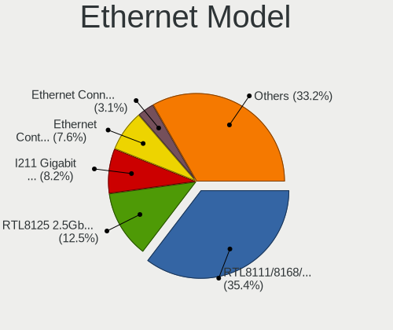
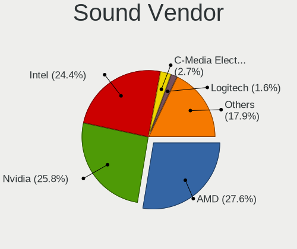

Pop!_OS 22.04 - Tested Hardware & Statistics (Desktops)
-------------------------------------------------------

A project to collect tested hardware configurations for Pop!_OS 22.04.

Anyone can contribute to this report by the [hw-probe](https://github.com/linuxhw/hw-probe) tool:

    sudo -E hw-probe -all -upload

Please contribute! Especially if your hardware is rare.

Contents
--------

* [ Test Cases ](#test-cases)

* [ System ](#system)
  - [ Kernel                   ](#kernel)
  - [ Kernel Family            ](#kernel-family)
  - [ Kernel Major Ver.        ](#kernel-major-ver)
  - [ Arch                     ](#arch)
  - [ DE                       ](#de)
  - [ Display Server           ](#display-server)
  - [ Display Manager          ](#display-manager)
  - [ OS Lang                  ](#os-lang)
  - [ Boot Mode                ](#boot-mode)
  - [ Filesystem               ](#filesystem)
  - [ Part. scheme             ](#part-scheme)
  - [ Dual Boot with Linux/BSD ](#dual-boot-with-linuxbsd)
  - [ Dual Boot (Win)          ](#dual-boot-win)

* [ Board ](#board)
  - [ Vendor                   ](#vendor)
  - [ Model                    ](#model)
  - [ Model Family             ](#model-family)
  - [ MFG Year                 ](#mfg-year)
  - [ Form Factor              ](#form-factor)
  - [ Secure Boot              ](#secure-boot)
  - [ Coreboot                 ](#coreboot)
  - [ RAM Size                 ](#ram-size)
  - [ RAM Used                 ](#ram-used)
  - [ Total Drives             ](#total-drives)
  - [ Has CD-ROM               ](#has-cd-rom)
  - [ Has Ethernet             ](#has-ethernet)
  - [ Has WiFi                 ](#has-wifi)
  - [ Has Bluetooth            ](#has-bluetooth)

* [ Location ](#location)
  - [ Country                  ](#country)
  - [ City                     ](#city)

* [ Drives ](#drives)
  - [ Drive Vendor             ](#drive-vendor)
  - [ Drive Model              ](#drive-model)
  - [ HDD Vendor               ](#hdd-vendor)
  - [ SSD Vendor               ](#ssd-vendor)
  - [ Drive Kind               ](#drive-kind)
  - [ Drive Connector          ](#drive-connector)
  - [ Drive Size               ](#drive-size)
  - [ Space Total              ](#space-total)
  - [ Space Used               ](#space-used)
  - [ Malfunc. Drives          ](#malfunc-drives)
  - [ Malfunc. Drive Vendor    ](#malfunc-drive-vendor)
  - [ Malfunc. HDD Vendor      ](#malfunc-hdd-vendor)
  - [ Malfunc. Drive Kind      ](#malfunc-drive-kind)
  - [ Failed Drives            ](#failed-drives)
  - [ Failed Drive Vendor      ](#failed-drive-vendor)
  - [ Drive Status             ](#drive-status)

* [ Storage controller ](#storage-controller)
  - [ Storage Vendor           ](#storage-vendor)
  - [ Storage Model            ](#storage-model)
  - [ Storage Kind             ](#storage-kind)

* [ Processor ](#processor)
  - [ CPU Vendor               ](#cpu-vendor)
  - [ CPU Model                ](#cpu-model)
  - [ CPU Model Family         ](#cpu-model-family)
  - [ CPU Cores                ](#cpu-cores)
  - [ CPU Sockets              ](#cpu-sockets)
  - [ CPU Threads              ](#cpu-threads)
  - [ CPU Op-Modes             ](#cpu-op-modes)
  - [ CPU Microcode            ](#cpu-microcode)
  - [ CPU Microarch            ](#cpu-microarch)

* [ Graphics ](#graphics)
  - [ GPU Vendor               ](#gpu-vendor)
  - [ GPU Model                ](#gpu-model)
  - [ GPU Combo                ](#gpu-combo)
  - [ GPU Driver               ](#gpu-driver)
  - [ GPU Memory               ](#gpu-memory)

* [ Monitor ](#monitor)
  - [ Monitor Vendor           ](#monitor-vendor)
  - [ Monitor Model            ](#monitor-model)
  - [ Monitor Resolution       ](#monitor-resolution)
  - [ Monitor Diagonal         ](#monitor-diagonal)
  - [ Monitor Width            ](#monitor-width)
  - [ Aspect Ratio             ](#aspect-ratio)
  - [ Monitor Area             ](#monitor-area)
  - [ Pixel Density            ](#pixel-density)
  - [ Multiple Monitors        ](#multiple-monitors)

* [ Network ](#network)
  - [ Net Controller Vendor    ](#net-controller-vendor)
  - [ Net Controller Model     ](#net-controller-model)
  - [ Wireless Vendor          ](#wireless-vendor)
  - [ Wireless Model           ](#wireless-model)
  - [ Ethernet Vendor          ](#ethernet-vendor)
  - [ Ethernet Model           ](#ethernet-model)
  - [ Net Controller Kind      ](#net-controller-kind)
  - [ Used Controller          ](#used-controller)
  - [ NICs                     ](#nics)
  - [ IPv6                     ](#ipv6)

* [ Bluetooth ](#bluetooth)
  - [ Bluetooth Vendor         ](#bluetooth-vendor)
  - [ Bluetooth Model          ](#bluetooth-model)

* [ Sound ](#sound)
  - [ Sound Vendor             ](#sound-vendor)
  - [ Sound Model              ](#sound-model)

* [ Memory ](#memory)
  - [ Memory Vendor            ](#memory-vendor)
  - [ Memory Model             ](#memory-model)
  - [ Memory Kind              ](#memory-kind)
  - [ Memory Form Factor       ](#memory-form-factor)
  - [ Memory Size              ](#memory-size)
  - [ Memory Speed             ](#memory-speed)

* [ Printers & scanners ](#printers--scanners)
  - [ Printer Vendor           ](#printer-vendor)
  - [ Printer Model            ](#printer-model)
  - [ Scanner Vendor           ](#scanner-vendor)
  - [ Scanner Model            ](#scanner-model)

* [ Camera ](#camera)
  - [ Camera Vendor            ](#camera-vendor)
  - [ Camera Model             ](#camera-model)

* [ Security ](#security)
  - [ Fingerprint Vendor       ](#fingerprint-vendor)
  - [ Fingerprint Model        ](#fingerprint-model)
  - [ Chipcard Vendor          ](#chipcard-vendor)
  - [ Chipcard Model           ](#chipcard-model)

* [ Unsupported ](#unsupported)
  - [ Unsupported Devices      ](#unsupported-devices)
  - [ Unsupported Device Types ](#unsupported-device-types)

Test Cases
----------

Total: 519

| Vendor        | Model                       | Probe                                                      | Date         |
|---------------|-----------------------------|------------------------------------------------------------|--------------|
| Gigabyte      | GA-MA770T-UD3P              | [692b59019a](https://linux-hardware.org/?probe=692b59019a) | Oct 01, 2022 |
| ASUSTek       | GRYPHON Z87                 | [3f01bbaa12](https://linux-hardware.org/?probe=3f01bbaa12) | Sep 30, 2022 |
| Gigabyte      | X570 AORUS PRO WIFI         | [7a2f334861](https://linux-hardware.org/?probe=7a2f334861) | Sep 29, 2022 |
| ASUSTek       | Maximus VII HERO            | [d23d86be40](https://linux-hardware.org/?probe=d23d86be40) | Sep 28, 2022 |
| Dell          | 0NDYHG A01                  | [7a5df20f28](https://linux-hardware.org/?probe=7a5df20f28) | Sep 28, 2022 |
| Dell          | 09M8Y8 A01                  | [f129c4da4a](https://linux-hardware.org/?probe=f129c4da4a) | Sep 28, 2022 |
| HP            | 83E9                        | [c24faa3c5b](https://linux-hardware.org/?probe=c24faa3c5b) | Sep 27, 2022 |
| ASUSTek       | ROG STRIX B550-F GAMING     | [2c52de3e56](https://linux-hardware.org/?probe=2c52de3e56) | Sep 27, 2022 |
| Gigabyte      | Z170MX-Gaming 5             | [fbc760a09c](https://linux-hardware.org/?probe=fbc760a09c) | Sep 26, 2022 |
| ASUSTek       | ROG CROSSHAIR VIII DARK ... | [9fff405744](https://linux-hardware.org/?probe=9fff405744) | Sep 26, 2022 |
| Gigabyte      | B550 GAMING X V2            | [34035b63b6](https://linux-hardware.org/?probe=34035b63b6) | Sep 25, 2022 |
| ASRock        | H97M Anniversary            | [289532b8bb](https://linux-hardware.org/?probe=289532b8bb) | Sep 24, 2022 |
| MSI           | Z97-G55 SLI                 | [dc60d66502](https://linux-hardware.org/?probe=dc60d66502) | Sep 24, 2022 |
| System76      | Thelio Mira                 | [2e9601d2a2](https://linux-hardware.org/?probe=2e9601d2a2) | Sep 24, 2022 |
| ASRock        | X570M Pro4                  | [9e8207dfb7](https://linux-hardware.org/?probe=9e8207dfb7) | Sep 23, 2022 |
| MSI           | MPG B550 GAMING PLUS        | [59c4a7e761](https://linux-hardware.org/?probe=59c4a7e761) | Sep 23, 2022 |
| MSI           | Z97-G55 SLI                 | [27b47d5592](https://linux-hardware.org/?probe=27b47d5592) | Sep 23, 2022 |
| Dell          | 0HHV7N A00                  | [cda6d76f04](https://linux-hardware.org/?probe=cda6d76f04) | Sep 22, 2022 |
| ASRock        | 4X4-V1000                   | [e73062fe01](https://linux-hardware.org/?probe=e73062fe01) | Sep 22, 2022 |
| MSI           | MPG X570 GAMING PLUS        | [dc49b2baf4](https://linux-hardware.org/?probe=dc49b2baf4) | Sep 21, 2022 |
| Dell          | 09M8Y8 A01                  | [07dd388834](https://linux-hardware.org/?probe=07dd388834) | Sep 21, 2022 |
| Dell          | 09M8Y8 A01                  | [2c7466119d](https://linux-hardware.org/?probe=2c7466119d) | Sep 21, 2022 |
| HP            | 1589                        | [da376a40a1](https://linux-hardware.org/?probe=da376a40a1) | Sep 20, 2022 |
| Gigabyte      | EX58-UD4P                   | [394aad4be9](https://linux-hardware.org/?probe=394aad4be9) | Sep 20, 2022 |
| ASRock        | AB350 Pro4                  | [61a4ab7c20](https://linux-hardware.org/?probe=61a4ab7c20) | Sep 20, 2022 |
| Gigabyte      | B450 I AORUS PRO WIFI-CF    | [df0348739e](https://linux-hardware.org/?probe=df0348739e) | Sep 20, 2022 |
| Lenovo        | SHARKBAY SDK0E50510 WIN     | [a0d6f208fb](https://linux-hardware.org/?probe=a0d6f208fb) | Sep 19, 2022 |
| Gigabyte      | B450 AORUS M                | [136eca7e32](https://linux-hardware.org/?probe=136eca7e32) | Sep 19, 2022 |
| Gigabyte      | Z97X-UD3H-BK-CF             | [83b0a59729](https://linux-hardware.org/?probe=83b0a59729) | Sep 18, 2022 |
| Gigabyte      | GA-78LMT-USB3 SEx           | [fa4082533e](https://linux-hardware.org/?probe=fa4082533e) | Sep 18, 2022 |
| Gigabyte      | GA-78LMT-USB3 SEx           | [a418c3e997](https://linux-hardware.org/?probe=a418c3e997) | Sep 18, 2022 |
| Gigabyte      | X570 AORUS MASTER           | [bd7ddbf9f7](https://linux-hardware.org/?probe=bd7ddbf9f7) | Sep 18, 2022 |
| Alienware     | 0CPDXD A00                  | [f65bdb053d](https://linux-hardware.org/?probe=f65bdb053d) | Sep 18, 2022 |
| ASUSTek       | PRIME A520M-A II            | [0bec316a0b](https://linux-hardware.org/?probe=0bec316a0b) | Sep 17, 2022 |
| Minix         | NEO Z83-4 V1.1              | [545552c43e](https://linux-hardware.org/?probe=545552c43e) | Sep 16, 2022 |
| NZXT          | N7 B550                     | [7deb3849db](https://linux-hardware.org/?probe=7deb3849db) | Sep 16, 2022 |
| ASRock        | Z97 Extreme6                | [2c90f58ae4](https://linux-hardware.org/?probe=2c90f58ae4) | Sep 16, 2022 |
| MACHINIST     | X99-RS9 V3.0                | [3f9fc3fc62](https://linux-hardware.org/?probe=3f9fc3fc62) | Sep 15, 2022 |
| ASUSTek       | TUF Gaming B550M-PLUS       | [6de8f25119](https://linux-hardware.org/?probe=6de8f25119) | Sep 15, 2022 |
| ASUSTek       | TUF Gaming X570-PLUS_BR     | [9c97b9e2c1](https://linux-hardware.org/?probe=9c97b9e2c1) | Sep 14, 2022 |
| MACHINIST     | X99-RS9 V3.0                | [64795f6f69](https://linux-hardware.org/?probe=64795f6f69) | Sep 13, 2022 |
| ASUSTek       | ROG STRIX B550-I GAMING     | [cacc85ca2e](https://linux-hardware.org/?probe=cacc85ca2e) | Sep 13, 2022 |
| ASUSTek       | ROG STRIX B550-I GAMING     | [0c6d5b57dd](https://linux-hardware.org/?probe=0c6d5b57dd) | Sep 13, 2022 |
| ASRock        | H97M Anniversary            | [1b5e2c2e0a](https://linux-hardware.org/?probe=1b5e2c2e0a) | Sep 13, 2022 |
| ASRock        | H97M Anniversary            | [649c5fb453](https://linux-hardware.org/?probe=649c5fb453) | Sep 13, 2022 |
| ASUSTek       | P8P67 DELUXE                | [89fb49d843](https://linux-hardware.org/?probe=89fb49d843) | Sep 13, 2022 |
| ASUSTek       | P8P67 DELUXE                | [a385e1220b](https://linux-hardware.org/?probe=a385e1220b) | Sep 13, 2022 |
| ASRock        | X570 Phantom Gaming 4       | [4fbc7a765f](https://linux-hardware.org/?probe=4fbc7a765f) | Sep 12, 2022 |
| ECS           | Nettle3                     | [23f7f8708c](https://linux-hardware.org/?probe=23f7f8708c) | Sep 12, 2022 |
| System76      | Thelio thelio-r2            | [2f6745bad5](https://linux-hardware.org/?probe=2f6745bad5) | Sep 11, 2022 |
| ASUSTek       | TUF Gaming B550-PLUS        | [ce4fc6576c](https://linux-hardware.org/?probe=ce4fc6576c) | Sep 11, 2022 |
| MSI           | MPG Z490 GAMING EDGE WIF... | [29da7835e4](https://linux-hardware.org/?probe=29da7835e4) | Sep 10, 2022 |
| ASUSTek       | M4N72-E                     | [83be030771](https://linux-hardware.org/?probe=83be030771) | Sep 09, 2022 |
| ASUSTek       | ROG STRIX B550-I GAMING     | [b3aa7bd9ca](https://linux-hardware.org/?probe=b3aa7bd9ca) | Sep 09, 2022 |
| Unknown       | Unknown                     | [87f754ac29](https://linux-hardware.org/?probe=87f754ac29) | Sep 09, 2022 |
| Gigabyte      | GA-MA770T-UD3P              | [1be1b9b040](https://linux-hardware.org/?probe=1be1b9b040) | Sep 09, 2022 |
| Intel         | X99                         | [9ebaa38244](https://linux-hardware.org/?probe=9ebaa38244) | Sep 08, 2022 |
| LattePanda    | 3 Delta CDJQ-BS-7-S70JR1... | [dbfdcae895](https://linux-hardware.org/?probe=dbfdcae895) | Sep 08, 2022 |
| LattePanda    | 3 Delta CDJQ-BS-7-S70JR1... | [4167167e38](https://linux-hardware.org/?probe=4167167e38) | Sep 08, 2022 |
| Dell          | 0TTDMJ A00                  | [66aa958693](https://linux-hardware.org/?probe=66aa958693) | Sep 08, 2022 |
| ASRock        | B450M/ac                    | [efb78c5d25](https://linux-hardware.org/?probe=efb78c5d25) | Sep 07, 2022 |
| ASUSTek       | P6X58D PREMIUM              | [483a414289](https://linux-hardware.org/?probe=483a414289) | Sep 07, 2022 |
| Gigabyte      | B450M DS3H-CF               | [0efcfb2037](https://linux-hardware.org/?probe=0efcfb2037) | Sep 07, 2022 |
| Acer          | 1.0                         | [b81c44ff15](https://linux-hardware.org/?probe=b81c44ff15) | Sep 06, 2022 |
| ASUSTek       | P6X58D PREMIUM              | [b68de7e7d1](https://linux-hardware.org/?probe=b68de7e7d1) | Sep 06, 2022 |
| Gigabyte      | Z77-D3H                     | [47d065ed5c](https://linux-hardware.org/?probe=47d065ed5c) | Sep 06, 2022 |
| Dell          | 088DT1 A01                  | [c17c4d475f](https://linux-hardware.org/?probe=c17c4d475f) | Sep 05, 2022 |
| ASUSTek       | ROG STRIX X570-I GAMING     | [8b964572d7](https://linux-hardware.org/?probe=8b964572d7) | Sep 04, 2022 |
| Alienware     | 0NWN7M A00                  | [e254b049c3](https://linux-hardware.org/?probe=e254b049c3) | Sep 04, 2022 |
| Dell          | 0KWVT8 A03                  | [bd0c518002](https://linux-hardware.org/?probe=bd0c518002) | Sep 03, 2022 |
| ASUSTek       | PRIME B550M-A               | [81eb6e9f4e](https://linux-hardware.org/?probe=81eb6e9f4e) | Sep 03, 2022 |
| ASUSTek       | M5A97                       | [de7dc826b0](https://linux-hardware.org/?probe=de7dc826b0) | Sep 03, 2022 |
| Intel         | DX58SO AAE29331-702         | [24c48ddc3e](https://linux-hardware.org/?probe=24c48ddc3e) | Sep 03, 2022 |
| Gigabyte      | B450 I AORUS PRO WIFI-CF    | [7b914b0347](https://linux-hardware.org/?probe=7b914b0347) | Sep 03, 2022 |
| HP            | 1497                        | [a8566c45a9](https://linux-hardware.org/?probe=a8566c45a9) | Sep 03, 2022 |
| MSI           | MEG Z390 ACE                | [1f702cfc06](https://linux-hardware.org/?probe=1f702cfc06) | Sep 03, 2022 |
| ASUSTek       | Pro WS WRX80E-SAGE SE WI... | [39cb364d6f](https://linux-hardware.org/?probe=39cb364d6f) | Sep 03, 2022 |
| MSI           | B450 GAMING PLUS            | [3561723d92](https://linux-hardware.org/?probe=3561723d92) | Sep 02, 2022 |
| Gigabyte      | H61M-S1                     | [b54a09966b](https://linux-hardware.org/?probe=b54a09966b) | Sep 02, 2022 |
| Lenovo        | SHARKBAY SDK0E50510 WIN     | [d664029076](https://linux-hardware.org/?probe=d664029076) | Sep 02, 2022 |
| HP            | 87D6 SMVB                   | [8efd1ba4e0](https://linux-hardware.org/?probe=8efd1ba4e0) | Sep 02, 2022 |
| Gigabyte      | B85M-HD3                    | [4f4717cb85](https://linux-hardware.org/?probe=4f4717cb85) | Sep 02, 2022 |
| Gigabyte      | B450M DS3H WIFI-CF          | [fb12fe29dd](https://linux-hardware.org/?probe=fb12fe29dd) | Sep 01, 2022 |
| ASUSTek       | ROG STRIX Z590-A GAMING ... | [e311938d4a](https://linux-hardware.org/?probe=e311938d4a) | Sep 01, 2022 |
| ASRock        | B450M/ac                    | [393a08345e](https://linux-hardware.org/?probe=393a08345e) | Sep 01, 2022 |
| Acer          | Aspire X3400                | [705a3242ae](https://linux-hardware.org/?probe=705a3242ae) | Sep 01, 2022 |
| Acidanther... | Mac-F60DEB81FF30ACF6 Mac... | [1dd7a06125](https://linux-hardware.org/?probe=1dd7a06125) | Aug 31, 2022 |
| Acer          | Aspire X3400                | [cb5288e92d](https://linux-hardware.org/?probe=cb5288e92d) | Aug 31, 2022 |
| Acer          | Aspire X3400                | [5e9e5dd1ce](https://linux-hardware.org/?probe=5e9e5dd1ce) | Aug 31, 2022 |
| Lenovo        | MAHOBAY                     | [53af4f5de7](https://linux-hardware.org/?probe=53af4f5de7) | Aug 30, 2022 |
| ASRock        | B450M Pro4 R2.0             | [d0ca11a18a](https://linux-hardware.org/?probe=d0ca11a18a) | Aug 29, 2022 |
| ASRock        | B450M Pro4 R2.0             | [fb155ef3bd](https://linux-hardware.org/?probe=fb155ef3bd) | Aug 29, 2022 |
| Dell          | 0KWVT8 A03                  | [b91ce43523](https://linux-hardware.org/?probe=b91ce43523) | Aug 29, 2022 |
| HP            | 1497                        | [625185d1db](https://linux-hardware.org/?probe=625185d1db) | Aug 29, 2022 |
| ASUSTek       | ROG STRIX B550-F GAMING     | [281360b58a](https://linux-hardware.org/?probe=281360b58a) | Aug 29, 2022 |
| BESSTAR Te... | UM700                       | [13fdf5ef5e](https://linux-hardware.org/?probe=13fdf5ef5e) | Aug 29, 2022 |
| MSI           | B450M MORTAR MAX            | [2d89536f80](https://linux-hardware.org/?probe=2d89536f80) | Aug 28, 2022 |
| Gigabyte      | B450 I AORUS PRO WIFI-CF    | [a328df0016](https://linux-hardware.org/?probe=a328df0016) | Aug 28, 2022 |
| MSI           | B450 TOMAHAWK               | [3a448c33f9](https://linux-hardware.org/?probe=3a448c33f9) | Aug 28, 2022 |
| MSI           | B450 TOMAHAWK               | [4210c6a219](https://linux-hardware.org/?probe=4210c6a219) | Aug 28, 2022 |
| Gigabyte      | B450 AORUS ELITE            | [f07bd2b99b](https://linux-hardware.org/?probe=f07bd2b99b) | Aug 28, 2022 |
| Lenovo        | Bantry CRB 31900058 STD     | [d0c37f7188](https://linux-hardware.org/?probe=d0c37f7188) | Aug 28, 2022 |
| Gigabyte      | B450M DS3H WIFI-CF          | [dbb099ef3e](https://linux-hardware.org/?probe=dbb099ef3e) | Aug 28, 2022 |
| Gigabyte      | H67A-USB3-B3                | [b04fc1333e](https://linux-hardware.org/?probe=b04fc1333e) | Aug 28, 2022 |
| Gigabyte      | B450M DS3H WIFI-CF          | [a90735a9e9](https://linux-hardware.org/?probe=a90735a9e9) | Aug 27, 2022 |
| ASUSTek       | TUF Gaming B550-PLUS        | [704ce84e6a](https://linux-hardware.org/?probe=704ce84e6a) | Aug 27, 2022 |
| ASRock        | B560 Steel Legend           | [55ebdff357](https://linux-hardware.org/?probe=55ebdff357) | Aug 26, 2022 |
| HP            | 1850                        | [85b5eedc40](https://linux-hardware.org/?probe=85b5eedc40) | Aug 26, 2022 |
| ASRock        | X570 Creator                | [612ada6405](https://linux-hardware.org/?probe=612ada6405) | Aug 26, 2022 |
| MSI           | X370 GAMING PRO CARBON      | [d988a14a82](https://linux-hardware.org/?probe=d988a14a82) | Aug 26, 2022 |
| Acer          | Aspire X3400                | [81acff75f6](https://linux-hardware.org/?probe=81acff75f6) | Aug 25, 2022 |
| Dell          | 0KWVT8 A03                  | [967ff51388](https://linux-hardware.org/?probe=967ff51388) | Aug 24, 2022 |
| Gigabyte      | B360 AORUS GAMING 3 WIFI... | [18102e8a9a](https://linux-hardware.org/?probe=18102e8a9a) | Aug 24, 2022 |
| ASRock        | B660-ITX                    | [316ae22af8](https://linux-hardware.org/?probe=316ae22af8) | Aug 24, 2022 |
| HP            | 3647h                       | [dc17a52501](https://linux-hardware.org/?probe=dc17a52501) | Aug 23, 2022 |
| Lenovo        | 370A SDK0J40700 WIN 3258... | [8118d6f78c](https://linux-hardware.org/?probe=8118d6f78c) | Aug 23, 2022 |
| MSI           | PRO Z690-A DDR4             | [beb3c92510](https://linux-hardware.org/?probe=beb3c92510) | Aug 23, 2022 |
| MSI           | PRO Z690-A DDR4             | [8e57e188c9](https://linux-hardware.org/?probe=8e57e188c9) | Aug 23, 2022 |
| ASUSTek       | P9X79 LE                    | [1fbde15177](https://linux-hardware.org/?probe=1fbde15177) | Aug 22, 2022 |
| ASUSTek       | P6X58D PREMIUM              | [a44650a9d8](https://linux-hardware.org/?probe=a44650a9d8) | Aug 22, 2022 |
| ASRock        | X470 Taichi                 | [8f7d642c46](https://linux-hardware.org/?probe=8f7d642c46) | Aug 22, 2022 |
| Gigabyte      | B450M DS3H-CF               | [e8bee7737a](https://linux-hardware.org/?probe=e8bee7737a) | Aug 22, 2022 |
| Gigabyte      | B450M DS3H-CF               | [b182084c88](https://linux-hardware.org/?probe=b182084c88) | Aug 22, 2022 |
| MSI           | FM2-A55M-E33                | [fac0116bf7](https://linux-hardware.org/?probe=fac0116bf7) | Aug 21, 2022 |
| Gigabyte      | M68MT-S2P                   | [23c07b5d2b](https://linux-hardware.org/?probe=23c07b5d2b) | Aug 21, 2022 |
| Acidanther... | Mac-F60DEB81FF30ACF6 Mac... | [c717f7c6d5](https://linux-hardware.org/?probe=c717f7c6d5) | Aug 21, 2022 |
| MSI           | Z170A PC MATE               | [8df71394cd](https://linux-hardware.org/?probe=8df71394cd) | Aug 20, 2022 |
| Gigabyte      | B550M DS3H                  | [774796ffbd](https://linux-hardware.org/?probe=774796ffbd) | Aug 20, 2022 |
| ASUSTek       | ROG STRIX X299-E GAMING     | [3a7a62f6f8](https://linux-hardware.org/?probe=3a7a62f6f8) | Aug 19, 2022 |
| MSI           | MAG B550 TOMAHAWK           | [93c5d7b0f9](https://linux-hardware.org/?probe=93c5d7b0f9) | Aug 19, 2022 |
| Dell          | 0KWVT8 A03                  | [7af77fd850](https://linux-hardware.org/?probe=7af77fd850) | Aug 18, 2022 |
| Gigabyte      | X299 AORUS MASTER           | [8d76a030ca](https://linux-hardware.org/?probe=8d76a030ca) | Aug 18, 2022 |
| Gigabyte      | B450M DS3H-CF               | [8a1a495053](https://linux-hardware.org/?probe=8a1a495053) | Aug 18, 2022 |
| ASUSTek       | B150M-C/BR                  | [b15c721e4c](https://linux-hardware.org/?probe=b15c721e4c) | Aug 18, 2022 |
| Acer          | Predator PO5-600s V:1.0     | [6e8b922033](https://linux-hardware.org/?probe=6e8b922033) | Aug 18, 2022 |
| MSI           | B450-A PRO MAX              | [9a1a049600](https://linux-hardware.org/?probe=9a1a049600) | Aug 18, 2022 |
| ASUSTek       | ROG STRIX B550-F GAMING     | [169469e8b6](https://linux-hardware.org/?probe=169469e8b6) | Aug 18, 2022 |
| ASUSTek       | ROG STRIX B550-I GAMING     | [d98e5c8b5e](https://linux-hardware.org/?probe=d98e5c8b5e) | Aug 17, 2022 |
| Gigabyte      | B360 AORUS GAMING 3 WIFI... | [1e4e125d11](https://linux-hardware.org/?probe=1e4e125d11) | Aug 17, 2022 |
| HP            | 2215                        | [71a33dc713](https://linux-hardware.org/?probe=71a33dc713) | Aug 17, 2022 |
| HP            | 2215                        | [aa386126ad](https://linux-hardware.org/?probe=aa386126ad) | Aug 17, 2022 |
| MSI           | H110M PRO-VH PLUS           | [e6e4efd93a](https://linux-hardware.org/?probe=e6e4efd93a) | Aug 17, 2022 |
| Gigabyte      | GA-MA770T-UD3P              | [8441adcca9](https://linux-hardware.org/?probe=8441adcca9) | Aug 17, 2022 |
| ASUSTek       | ROG STRIX B550-A GAMING     | [5c2c3d81ef](https://linux-hardware.org/?probe=5c2c3d81ef) | Aug 16, 2022 |
| ASUSTek       | ROG STRIX B550-A GAMING     | [0a5775d3a8](https://linux-hardware.org/?probe=0a5775d3a8) | Aug 16, 2022 |
| ASUSTek       | TUF Gaming B550-PLUS        | [e75de6c205](https://linux-hardware.org/?probe=e75de6c205) | Aug 15, 2022 |
| Gigabyte      | Z77X-UD5H                   | [5262ee60e8](https://linux-hardware.org/?probe=5262ee60e8) | Aug 14, 2022 |
| HP            | 8054                        | [75e3136f50](https://linux-hardware.org/?probe=75e3136f50) | Aug 14, 2022 |
| ASUSTek       | ROG STRIX Z690-A GAMING ... | [5a5538ce52](https://linux-hardware.org/?probe=5a5538ce52) | Aug 13, 2022 |
| ASUSTek       | ROG STRIX X299-E GAMING     | [5ef85261aa](https://linux-hardware.org/?probe=5ef85261aa) | Aug 13, 2022 |
| Gigabyte      | H97N-WIFI                   | [966a3e1593](https://linux-hardware.org/?probe=966a3e1593) | Aug 13, 2022 |
| BESSTAR Te... | UM700                       | [81a59240ea](https://linux-hardware.org/?probe=81a59240ea) | Aug 13, 2022 |
| Gigabyte      | GA-A55M-DS2                 | [29e8c10282](https://linux-hardware.org/?probe=29e8c10282) | Aug 13, 2022 |
| MSI           | Z87-G45 GAMING              | [2f541727e1](https://linux-hardware.org/?probe=2f541727e1) | Aug 12, 2022 |
| ASRock        | A320M                       | [1e0a574078](https://linux-hardware.org/?probe=1e0a574078) | Aug 12, 2022 |
| ASUSTek       | H97-PLUS                    | [4ca1b1050d](https://linux-hardware.org/?probe=4ca1b1050d) | Aug 12, 2022 |
| ASUSTek       | PRIME B450M-A               | [230d7247c0](https://linux-hardware.org/?probe=230d7247c0) | Aug 11, 2022 |
| ASUSTek       | M5A78L-M/USB3               | [aebe04abda](https://linux-hardware.org/?probe=aebe04abda) | Aug 11, 2022 |
| HP            | 3397                        | [9beccd0ca8](https://linux-hardware.org/?probe=9beccd0ca8) | Aug 10, 2022 |
| MSI           | MAG X570S TORPEDO MAX       | [d0b0186eb9](https://linux-hardware.org/?probe=d0b0186eb9) | Aug 09, 2022 |
| ASUSTek       | P6X58D PREMIUM              | [80bb75a792](https://linux-hardware.org/?probe=80bb75a792) | Aug 07, 2022 |
| ASUSTek       | Z87-K                       | [d1954b42ae](https://linux-hardware.org/?probe=d1954b42ae) | Aug 06, 2022 |
| HP            | 1998                        | [5164a156e2](https://linux-hardware.org/?probe=5164a156e2) | Aug 05, 2022 |
| Intel         | D955XBK AAC96732-501        | [d6463d7629](https://linux-hardware.org/?probe=d6463d7629) | Aug 05, 2022 |
| MSI           | 970A-G43                    | [a77e1878ae](https://linux-hardware.org/?probe=a77e1878ae) | Aug 05, 2022 |
| ASUSTek       | TUF B450M-PLUS GAMING       | [56b0b42020](https://linux-hardware.org/?probe=56b0b42020) | Aug 04, 2022 |
| Gigabyte      | B450M DS3H WIFI-CF          | [585bf3495e](https://linux-hardware.org/?probe=585bf3495e) | Aug 04, 2022 |
| Gigabyte      | B450M DS3H WIFI-CF          | [2d017b110e](https://linux-hardware.org/?probe=2d017b110e) | Aug 04, 2022 |
| Gigabyte      | AX370-Gaming K7             | [14447cf212](https://linux-hardware.org/?probe=14447cf212) | Aug 04, 2022 |
| Intel         | D955XBK AAC96732-501        | [53e0f1bc02](https://linux-hardware.org/?probe=53e0f1bc02) | Aug 03, 2022 |
| ASUSTek       | P8Z77-V LK                  | [9878a3365c](https://linux-hardware.org/?probe=9878a3365c) | Aug 03, 2022 |
| Intel         | D955XBK AAC96732-501        | [ed4b3ec577](https://linux-hardware.org/?probe=ed4b3ec577) | Aug 03, 2022 |
| Intel         | DP55WB AAE64798-208         | [0c66cac06d](https://linux-hardware.org/?probe=0c66cac06d) | Aug 03, 2022 |
| ASUSTek       | PRIME B550M-A               | [3f1ccf427a](https://linux-hardware.org/?probe=3f1ccf427a) | Aug 03, 2022 |
| Intel         | DQ35JO AAD82085-801         | [754017fe21](https://linux-hardware.org/?probe=754017fe21) | Aug 03, 2022 |
| ASUSTek       | TUF Gaming B550-PLUS        | [73b2c51a7e](https://linux-hardware.org/?probe=73b2c51a7e) | Aug 02, 2022 |
| ASRock        | X370 Gaming-ITX/ac          | [6127d6e7a3](https://linux-hardware.org/?probe=6127d6e7a3) | Aug 02, 2022 |
| Gigabyte      | A520I AC                    | [0bf3f1a8a2](https://linux-hardware.org/?probe=0bf3f1a8a2) | Jul 31, 2022 |
| EVGA          | 134-KS-E377                 | [2624cfe274](https://linux-hardware.org/?probe=2624cfe274) | Jul 30, 2022 |
| Apple         | Mac-F42C88C8 Proto1         | [cc3deb0a17](https://linux-hardware.org/?probe=cc3deb0a17) | Jul 30, 2022 |
| Gigabyte      | B450M DS3H-CF               | [ea83758651](https://linux-hardware.org/?probe=ea83758651) | Jul 30, 2022 |
| MSI           | MEG Z690 UNIFY              | [571f500e5e](https://linux-hardware.org/?probe=571f500e5e) | Jul 30, 2022 |
| Dell          | 0TP412                      | [c6138574f4](https://linux-hardware.org/?probe=c6138574f4) | Jul 30, 2022 |
| Gigabyte      | A520I AC                    | [f0d27ae2f0](https://linux-hardware.org/?probe=f0d27ae2f0) | Jul 30, 2022 |
| MSI           | B450M MORTAR MAX            | [1316e90024](https://linux-hardware.org/?probe=1316e90024) | Jul 30, 2022 |
| HP            | 2215                        | [6e351e6da3](https://linux-hardware.org/?probe=6e351e6da3) | Jul 30, 2022 |
| Gigabyte      | B450 AORUS ELITE            | [31b2d82a52](https://linux-hardware.org/?probe=31b2d82a52) | Jul 29, 2022 |
| Alienware     | 02XRCM A00                  | [622aa6421e](https://linux-hardware.org/?probe=622aa6421e) | Jul 29, 2022 |
| Alienware     | 02XRCM A00                  | [d8c0404bad](https://linux-hardware.org/?probe=d8c0404bad) | Jul 29, 2022 |
| MACHINIST     | X79 V2.82H                  | [29694e2098](https://linux-hardware.org/?probe=29694e2098) | Jul 29, 2022 |
| Gigabyte      | Z97X-UD3H-BK-CF             | [b25ca31168](https://linux-hardware.org/?probe=b25ca31168) | Jul 27, 2022 |
| MSI           | PRO Z690-A DDR4             | [2d81f40aad](https://linux-hardware.org/?probe=2d81f40aad) | Jul 27, 2022 |
| ASUSTek       | Z170M-PLUS                  | [8d563bf194](https://linux-hardware.org/?probe=8d563bf194) | Jul 27, 2022 |
| Dell          | 0F896N A02                  | [ede9425ed8](https://linux-hardware.org/?probe=ede9425ed8) | Jul 27, 2022 |
| Gigabyte      | Z170X-Gaming 3              | [a3c2fdccfc](https://linux-hardware.org/?probe=a3c2fdccfc) | Jul 27, 2022 |
| ASUSTek       | PRIME B450M-A               | [4812de622f](https://linux-hardware.org/?probe=4812de622f) | Jul 26, 2022 |
| ASUSTek       | ROG STRIX B550-I GAMING     | [1361193180](https://linux-hardware.org/?probe=1361193180) | Jul 25, 2022 |
| ASUSTek       | PRIME Z390-A                | [b8e8d2b6c4](https://linux-hardware.org/?probe=b8e8d2b6c4) | Jul 25, 2022 |
| Fujitsu       | D3162-A1 S26361-D3162-A1    | [567addf380](https://linux-hardware.org/?probe=567addf380) | Jul 24, 2022 |
| ASRock        | B450 Gaming-ITX/ac          | [221bb14fbd](https://linux-hardware.org/?probe=221bb14fbd) | Jul 24, 2022 |
| MSI           | MEG X570 ACE                | [f13fde648e](https://linux-hardware.org/?probe=f13fde648e) | Jul 23, 2022 |
| ASUSTek       | ROG STRIX B450-F GAMING     | [8f131b55b9](https://linux-hardware.org/?probe=8f131b55b9) | Jul 22, 2022 |
| MSI           | Z170A KRAIT GAMING 3X       | [1fef57c873](https://linux-hardware.org/?probe=1fef57c873) | Jul 22, 2022 |
| Gigabyte      | H110M-S2H-CF                | [f70ea66873](https://linux-hardware.org/?probe=f70ea66873) | Jul 21, 2022 |
| ASUSTek       | ROG STRIX Z370-E GAMING     | [9689ac8020](https://linux-hardware.org/?probe=9689ac8020) | Jul 21, 2022 |
| ASUSTek       | ROG STRIX B450-F GAMING     | [20d32236ad](https://linux-hardware.org/?probe=20d32236ad) | Jul 21, 2022 |
| ASUSTek       | TUF Gaming X570-PLUS        | [5a52692425](https://linux-hardware.org/?probe=5a52692425) | Jul 21, 2022 |
| ASUSTek       | ROG STRIX B450-F GAMING     | [f524dac3fa](https://linux-hardware.org/?probe=f524dac3fa) | Jul 20, 2022 |
| MSI           | Z590-A PRO                  | [9500cfd7e1](https://linux-hardware.org/?probe=9500cfd7e1) | Jul 19, 2022 |
| Dell          | 02YYK5 A01                  | [94b2dc99fa](https://linux-hardware.org/?probe=94b2dc99fa) | Jul 19, 2022 |
| Lenovo        | MAHOBAY                     | [c1c146a0f9](https://linux-hardware.org/?probe=c1c146a0f9) | Jul 18, 2022 |
| Gigabyte      | B75M-D3H                    | [1c0d0a79d1](https://linux-hardware.org/?probe=1c0d0a79d1) | Jul 17, 2022 |
| Lenovo        | 30BE SDK0J40705 WIN 3425... | [3c55557131](https://linux-hardware.org/?probe=3c55557131) | Jul 17, 2022 |
| Gigabyte      | H97M-Gaming 3               | [a72ad8ba14](https://linux-hardware.org/?probe=a72ad8ba14) | Jul 16, 2022 |
| MACHINIST     | X99-RS9 V2.0                | [36ad4a7384](https://linux-hardware.org/?probe=36ad4a7384) | Jul 16, 2022 |
| Lenovo        | SHARKBAY 0B98401 PRO        | [a23b73c3ff](https://linux-hardware.org/?probe=a23b73c3ff) | Jul 16, 2022 |
| Gigabyte      | AB350-Gaming 3-CF           | [2e73a9947c](https://linux-hardware.org/?probe=2e73a9947c) | Jul 15, 2022 |
| ASUSTek       | TUF Gaming B550M-PLUS       | [c9ff108124](https://linux-hardware.org/?probe=c9ff108124) | Jul 15, 2022 |
| Lenovo        | ThinkCentre M90p 5864A1U    | [406232d6c2](https://linux-hardware.org/?probe=406232d6c2) | Jul 15, 2022 |
| MSI           | Z170A GAMING M5             | [16d2d7469b](https://linux-hardware.org/?probe=16d2d7469b) | Jul 15, 2022 |
| Gigabyte      | H310M S2 x.x                | [a55538b651](https://linux-hardware.org/?probe=a55538b651) | Jul 14, 2022 |
| Gigabyte      | X570 I AORUS PRO WIFI       | [608d209fe5](https://linux-hardware.org/?probe=608d209fe5) | Jul 14, 2022 |
| ASRock        | Z77 Pro4-M                  | [69b486ea31](https://linux-hardware.org/?probe=69b486ea31) | Jul 14, 2022 |
| Dell          | 02YYK5 A01                  | [ca4bfe598b](https://linux-hardware.org/?probe=ca4bfe598b) | Jul 14, 2022 |
| ASUSTek       | M4A79XTD EVO                | [b12edadc03](https://linux-hardware.org/?probe=b12edadc03) | Jul 13, 2022 |
| ASRock        | B450M Steel Legend          | [3732c0ad0c](https://linux-hardware.org/?probe=3732c0ad0c) | Jul 13, 2022 |
| MSI           | B450 GAMING PRO CARBON M... | [a6d5a615d0](https://linux-hardware.org/?probe=a6d5a615d0) | Jul 13, 2022 |
| MSI           | B450 TOMAHAWK MAX           | [97b45f9af7](https://linux-hardware.org/?probe=97b45f9af7) | Jul 12, 2022 |
| Gigabyte      | G1.Sniper M3-CF             | [d7e4d34816](https://linux-hardware.org/?probe=d7e4d34816) | Jul 12, 2022 |
| Gigabyte      | GB-BRR7H-4800               | [a3c14e06c9](https://linux-hardware.org/?probe=a3c14e06c9) | Jul 11, 2022 |
| MSI           | P67A-C43                    | [c76725f62c](https://linux-hardware.org/?probe=c76725f62c) | Jul 11, 2022 |
| ASRock        | B550 Phantom Gaming-ITX/... | [84e5c2ab51](https://linux-hardware.org/?probe=84e5c2ab51) | Jul 11, 2022 |
| ASUSTek       | P5Q-PRO                     | [ad6eedb5e5](https://linux-hardware.org/?probe=ad6eedb5e5) | Jul 10, 2022 |
| ASUSTek       | Z170-A                      | [1ac13f76b1](https://linux-hardware.org/?probe=1ac13f76b1) | Jul 10, 2022 |
| Dell          | 042P49 A02                  | [1b8b98b54d](https://linux-hardware.org/?probe=1b8b98b54d) | Jul 10, 2022 |
| Gigabyte      | X570 AORUS MASTER           | [0e0d93b899](https://linux-hardware.org/?probe=0e0d93b899) | Jul 10, 2022 |
| ASUSTek       | P5Q-PRO                     | [9860ca66f6](https://linux-hardware.org/?probe=9860ca66f6) | Jul 09, 2022 |
| Gigabyte      | B450 AORUS M                | [5d50b40871](https://linux-hardware.org/?probe=5d50b40871) | Jul 09, 2022 |
| HP            | 1495                        | [3e67bd3405](https://linux-hardware.org/?probe=3e67bd3405) | Jul 09, 2022 |
| Gigabyte      | GA-78LMT-S2P                | [a374367376](https://linux-hardware.org/?probe=a374367376) | Jul 09, 2022 |
| ASUSTek       | TUF Gaming B550-PLUS        | [fe383d7488](https://linux-hardware.org/?probe=fe383d7488) | Jul 09, 2022 |
| ASUSTek       | TUF Gaming B550-PLUS        | [786c9e341c](https://linux-hardware.org/?probe=786c9e341c) | Jul 09, 2022 |
| ASUSTek       | M5A78L-M/USB3               | [833f3df27a](https://linux-hardware.org/?probe=833f3df27a) | Jul 09, 2022 |
| ASUSTek       | M5A78L-M/USB3               | [199e7db55a](https://linux-hardware.org/?probe=199e7db55a) | Jul 09, 2022 |
| Gigabyte      | B550 AORUS PRO AX           | [9ad45447d4](https://linux-hardware.org/?probe=9ad45447d4) | Jul 08, 2022 |
| ASUSTek       | ROG STRIX B450-F GAMING     | [6ebe4f89b7](https://linux-hardware.org/?probe=6ebe4f89b7) | Jul 08, 2022 |
| Gigabyte      | X570 AORUS ELITE            | [3458084b51](https://linux-hardware.org/?probe=3458084b51) | Jul 08, 2022 |
| HP            | 3398                        | [fb1290d5b3](https://linux-hardware.org/?probe=fb1290d5b3) | Jul 07, 2022 |
| Gigabyte      | B450M DS3H-CF               | [8b1a622249](https://linux-hardware.org/?probe=8b1a622249) | Jul 07, 2022 |
| ASUSTek       | PRIME Z390-A                | [0e7b73b341](https://linux-hardware.org/?probe=0e7b73b341) | Jul 06, 2022 |
| Intel         | DQ35JO AAD82085-801         | [9c2efc454e](https://linux-hardware.org/?probe=9c2efc454e) | Jul 06, 2022 |
| Intel         | DQ35JO AAD82085-801         | [eb5d4499aa](https://linux-hardware.org/?probe=eb5d4499aa) | Jul 06, 2022 |
| ASRock        | B550 Phantom Gaming 4/ac    | [e068e197b4](https://linux-hardware.org/?probe=e068e197b4) | Jul 06, 2022 |
| Dell          | 0200DY A00                  | [442b0c2a46](https://linux-hardware.org/?probe=442b0c2a46) | Jul 06, 2022 |
| Soyo          | SY-A68M FS V2.0             | [ab243c130a](https://linux-hardware.org/?probe=ab243c130a) | Jul 06, 2022 |
| ASRock        | B550 Phantom Gaming 4       | [7a6f484b16](https://linux-hardware.org/?probe=7a6f484b16) | Jul 06, 2022 |
| ASUSTek       | ROG Maximus XI HERO         | [bfa2b2f092](https://linux-hardware.org/?probe=bfa2b2f092) | Jul 05, 2022 |
| MSI           | MPG B460I GAMING EDGE WI... | [161f8c2665](https://linux-hardware.org/?probe=161f8c2665) | Jul 03, 2022 |
| MSI           | MPG B460I GAMING EDGE WI... | [15118ef9fd](https://linux-hardware.org/?probe=15118ef9fd) | Jul 03, 2022 |
| HP            | 18E7                        | [8f2b2cb5e5](https://linux-hardware.org/?probe=8f2b2cb5e5) | Jul 02, 2022 |
| MSI           | MPG X570 GAMING EDGE WIF... | [7da3547526](https://linux-hardware.org/?probe=7da3547526) | Jul 01, 2022 |
| Gigabyte      | X570 I AORUS PRO WIFI       | [d979555615](https://linux-hardware.org/?probe=d979555615) | Jul 01, 2022 |
| ASRock        | B450 Gaming K4              | [2bdfc5f472](https://linux-hardware.org/?probe=2bdfc5f472) | Jul 01, 2022 |
| MSI           | B250M PRO-VD                | [b48e88849b](https://linux-hardware.org/?probe=b48e88849b) | Jul 01, 2022 |
| ASUSTek       | Maximus IX FORMULA          | [8c29343495](https://linux-hardware.org/?probe=8c29343495) | Jul 01, 2022 |
| ASUSTek       | Maximus IX FORMULA          | [2631bf2ae1](https://linux-hardware.org/?probe=2631bf2ae1) | Jul 01, 2022 |
| HP            | 18E7                        | [1808b6dee4](https://linux-hardware.org/?probe=1808b6dee4) | Jul 01, 2022 |
| Dell          | 0HHV7N A00                  | [41255f7150](https://linux-hardware.org/?probe=41255f7150) | Jun 30, 2022 |
| ASRock        | X399 Taichi                 | [caea75035f](https://linux-hardware.org/?probe=caea75035f) | Jun 30, 2022 |
| Gigabyte      | B450 AORUS M                | [b85b1f9277](https://linux-hardware.org/?probe=b85b1f9277) | Jun 30, 2022 |
| Gigabyte      | B450 AORUS M                | [67dc174a62](https://linux-hardware.org/?probe=67dc174a62) | Jun 29, 2022 |
| Lenovo        | 36C5 NOK                    | [94d44ae5f2](https://linux-hardware.org/?probe=94d44ae5f2) | Jun 29, 2022 |
| Lenovo        | 36C5 NOK                    | [cd5e39b07a](https://linux-hardware.org/?probe=cd5e39b07a) | Jun 29, 2022 |
| MSI           | B450M PRO-VDH MAX           | [f01192b57e](https://linux-hardware.org/?probe=f01192b57e) | Jun 29, 2022 |
| Gigabyte      | Z97X-SLI-CF                 | [0a66ce61c6](https://linux-hardware.org/?probe=0a66ce61c6) | Jun 29, 2022 |
| Gigabyte      | Z97X-SLI-CF                 | [f2b790de57](https://linux-hardware.org/?probe=f2b790de57) | Jun 29, 2022 |
| HP            | 3647h                       | [3227f38f98](https://linux-hardware.org/?probe=3227f38f98) | Jun 28, 2022 |
| Gigabyte      | Z170-Gaming K3              | [70dc9ba605](https://linux-hardware.org/?probe=70dc9ba605) | Jun 28, 2022 |
| MSI           | B250M PRO-VD                | [8efb1d3556](https://linux-hardware.org/?probe=8efb1d3556) | Jun 28, 2022 |
| MSI           | B250M PRO-VD                | [5b239d8bba](https://linux-hardware.org/?probe=5b239d8bba) | Jun 28, 2022 |
| ASRock        | B450 Gaming K4              | [6ecc609381](https://linux-hardware.org/?probe=6ecc609381) | Jun 27, 2022 |
| ASRock        | B450 Steel Legend           | [6f8f8a9df6](https://linux-hardware.org/?probe=6f8f8a9df6) | Jun 26, 2022 |
| ASRock        | B450 Steel Legend           | [547aab5039](https://linux-hardware.org/?probe=547aab5039) | Jun 26, 2022 |
| ASUSTek       | VM40B                       | [35f67bace1](https://linux-hardware.org/?probe=35f67bace1) | Jun 26, 2022 |
| Dell          | 0D6H9T A00                  | [fd65f44d25](https://linux-hardware.org/?probe=fd65f44d25) | Jun 26, 2022 |
| MSI           | MPG B460I GAMING EDGE WI... | [6580b51e30](https://linux-hardware.org/?probe=6580b51e30) | Jun 25, 2022 |
| MSI           | MPG B460I GAMING EDGE WI... | [01fcd4495e](https://linux-hardware.org/?probe=01fcd4495e) | Jun 25, 2022 |
| Dell          | 040DDP A00                  | [02721926a7](https://linux-hardware.org/?probe=02721926a7) | Jun 25, 2022 |
| MSI           | MAG Z690 TORPEDO            | [44700880cf](https://linux-hardware.org/?probe=44700880cf) | Jun 24, 2022 |
| ASUSTek       | LEUCITE                     | [c4d2ed5723](https://linux-hardware.org/?probe=c4d2ed5723) | Jun 24, 2022 |
| MSI           | MAG Z690 TORPEDO            | [517a155f9b](https://linux-hardware.org/?probe=517a155f9b) | Jun 24, 2022 |
| Dell          | 0WMJ54 A01                  | [ee865231c1](https://linux-hardware.org/?probe=ee865231c1) | Jun 24, 2022 |
| Gigabyte      | G1.Sniper M3-CF             | [055977bdee](https://linux-hardware.org/?probe=055977bdee) | Jun 23, 2022 |
| ASUSTek       | CROSSHAIR VI HERO           | [f3d1eeadb3](https://linux-hardware.org/?probe=f3d1eeadb3) | Jun 23, 2022 |
| MSI           | MAG X570S TOMAHAWK MAX W... | [1e7e58ae1d](https://linux-hardware.org/?probe=1e7e58ae1d) | Jun 23, 2022 |
| Gigabyte      | X570 AORUS ELITE            | [0bd1e7d592](https://linux-hardware.org/?probe=0bd1e7d592) | Jun 23, 2022 |
| ASUSTek       | PRIME B550M-A               | [d4492d1e5d](https://linux-hardware.org/?probe=d4492d1e5d) | Jun 23, 2022 |
| ASUSTek       | PRIME X570-PRO              | [ae30cadddf](https://linux-hardware.org/?probe=ae30cadddf) | Jun 22, 2022 |
| MSI           | MPG X570 GAMING EDGE WIF... | [21d1dc43e6](https://linux-hardware.org/?probe=21d1dc43e6) | Jun 22, 2022 |
| ASUSTek       | ROG STRIX X570-F GAMING     | [27bc9defca](https://linux-hardware.org/?probe=27bc9defca) | Jun 22, 2022 |
| ASUSTek       | ROG STRIX X570-F GAMING     | [941b96e6ab](https://linux-hardware.org/?probe=941b96e6ab) | Jun 22, 2022 |
| BESSTAR Te... | UM700                       | [5dc08ee2d7](https://linux-hardware.org/?probe=5dc08ee2d7) | Jun 22, 2022 |
| ASUSTek       | ROG CROSSHAIR VIII HERO     | [d5fd58e3b0](https://linux-hardware.org/?probe=d5fd58e3b0) | Jun 21, 2022 |
| ASUSTek       | PRIME Z370-A                | [8dca736a46](https://linux-hardware.org/?probe=8dca736a46) | Jun 21, 2022 |
| ASUSTek       | P7H55-M LX                  | [f747d1bfd3](https://linux-hardware.org/?probe=f747d1bfd3) | Jun 21, 2022 |
| System76      | Thelio thelio-r2            | [b9b9d5ffda](https://linux-hardware.org/?probe=b9b9d5ffda) | Jun 21, 2022 |
| MSI           | B550M-A PRO                 | [1765b91360](https://linux-hardware.org/?probe=1765b91360) | Jun 21, 2022 |
| Gigabyte      | B550 AORUS ELITE V2         | [eb61c79793](https://linux-hardware.org/?probe=eb61c79793) | Jun 21, 2022 |
| ASUSTek       | Z170 PRO GAMING/AURA        | [6ddca91c97](https://linux-hardware.org/?probe=6ddca91c97) | Jun 21, 2022 |
| Biostar       | N68S3+                      | [efe83d16ac](https://linux-hardware.org/?probe=efe83d16ac) | Jun 21, 2022 |
| Intel         | MAHOBAY                     | [f615165669](https://linux-hardware.org/?probe=f615165669) | Jun 21, 2022 |
| ASRock        | B450 Gaming K4              | [230bdf84a1](https://linux-hardware.org/?probe=230bdf84a1) | Jun 20, 2022 |
| MSI           | MPG Z490 GAMING PLUS        | [ec3bc83e7a](https://linux-hardware.org/?probe=ec3bc83e7a) | Jun 20, 2022 |
| Gigabyte      | X570 AORUS MASTER           | [d5af99ece6](https://linux-hardware.org/?probe=d5af99ece6) | Jun 20, 2022 |
| ASUSTek       | P8Z77-V LX                  | [ad271e0eec](https://linux-hardware.org/?probe=ad271e0eec) | Jun 19, 2022 |
| Gigabyte      | Z590 AORUS ELITE AX         | [3d4d492e9d](https://linux-hardware.org/?probe=3d4d492e9d) | Jun 19, 2022 |
| Dell          | 0YXT71 A03                  | [890e65c781](https://linux-hardware.org/?probe=890e65c781) | Jun 19, 2022 |
| HP            | 158B                        | [b66a2770e7](https://linux-hardware.org/?probe=b66a2770e7) | Jun 18, 2022 |
| MSI           | MPG X570 GAMING EDGE WIF... | [6ba04b0f37](https://linux-hardware.org/?probe=6ba04b0f37) | Jun 18, 2022 |
| BESSTAR Te... | UM700                       | [d0c247db91](https://linux-hardware.org/?probe=d0c247db91) | Jun 17, 2022 |
| Intel         | MAHOBAY                     | [755ead951d](https://linux-hardware.org/?probe=755ead951d) | Jun 17, 2022 |
| Gigabyte      | B450M DS3H WIFI-CF          | [5241a60357](https://linux-hardware.org/?probe=5241a60357) | Jun 17, 2022 |
| ASUSTek       | ROG CROSSHAIR VIII DARK ... | [f4178c276d](https://linux-hardware.org/?probe=f4178c276d) | Jun 16, 2022 |
| Intel         | MAHOBAY                     | [91039940ea](https://linux-hardware.org/?probe=91039940ea) | Jun 16, 2022 |
| Lenovo        | 3715 SDK0L77769 WIN 3423... | [16d122d03e](https://linux-hardware.org/?probe=16d122d03e) | Jun 16, 2022 |
| Lenovo        | SHARKBAY 0B98401 WIN        | [24140a62de](https://linux-hardware.org/?probe=24140a62de) | Jun 16, 2022 |
| Foxconn       | G41MX/G41MX-K 2.0 1.0       | [f5af934210](https://linux-hardware.org/?probe=f5af934210) | Jun 16, 2022 |
| ASUSTek       | ROG STRIX B550-I GAMING     | [7cebf6f4c1](https://linux-hardware.org/?probe=7cebf6f4c1) | Jun 16, 2022 |
| MSI           | B450 TOMAHAWK               | [e11d001f52](https://linux-hardware.org/?probe=e11d001f52) | Jun 15, 2022 |
| MSI           | MPG Z390 GAMING EDGE AC     | [29cfeda814](https://linux-hardware.org/?probe=29cfeda814) | Jun 15, 2022 |
| Gigabyte      | 970A-DS3P                   | [b12643d9ac](https://linux-hardware.org/?probe=b12643d9ac) | Jun 15, 2022 |
| Gigabyte      | X470 AORUS ULTRA GAMING-... | [d4e4001c4c](https://linux-hardware.org/?probe=d4e4001c4c) | Jun 15, 2022 |
| Medion        | MS-7728                     | [ae02539c17](https://linux-hardware.org/?probe=ae02539c17) | Jun 15, 2022 |
| ASUSTek       | TUF Gaming Z590-PLUS WIF... | [5be4039515](https://linux-hardware.org/?probe=5be4039515) | Jun 15, 2022 |
| ASUSTek       | TUF X299 MARK 2             | [507c214577](https://linux-hardware.org/?probe=507c214577) | Jun 15, 2022 |
| MSI           | B550-A PRO                  | [f7201ee1de](https://linux-hardware.org/?probe=f7201ee1de) | Jun 14, 2022 |
| HP            | 1905                        | [b3d0170095](https://linux-hardware.org/?probe=b3d0170095) | Jun 14, 2022 |
| HP            | 18E7                        | [9f82638329](https://linux-hardware.org/?probe=9f82638329) | Jun 14, 2022 |
| Lenovo        | 0B98401 PRO                 | [23de86aa97](https://linux-hardware.org/?probe=23de86aa97) | Jun 14, 2022 |
| Alienware     | 0R3FWM A00                  | [6690a39447](https://linux-hardware.org/?probe=6690a39447) | Jun 13, 2022 |
| Gigabyte      | AB350-Gaming 3-CF           | [f9e74fdcd3](https://linux-hardware.org/?probe=f9e74fdcd3) | Jun 13, 2022 |
| Dell          | 073MMW A03                  | [3e206d2462](https://linux-hardware.org/?probe=3e206d2462) | Jun 13, 2022 |
| ASUSTek       | Z87-K                       | [cafc34944d](https://linux-hardware.org/?probe=cafc34944d) | Jun 13, 2022 |
| MSI           | B350 PC MATE                | [baf792ad50](https://linux-hardware.org/?probe=baf792ad50) | Jun 12, 2022 |
| ASUSTek       | PRIME H570M-PLUS            | [a332c946a2](https://linux-hardware.org/?probe=a332c946a2) | Jun 11, 2022 |
| Gigabyte      | G1.Sniper M3-CF             | [d02f89642d](https://linux-hardware.org/?probe=d02f89642d) | Jun 11, 2022 |
| ASUSTek       | ROG STRIX B560-F GAMING ... | [a4277bcba9](https://linux-hardware.org/?probe=a4277bcba9) | Jun 11, 2022 |
| MSI           | MEG X570 ACE                | [d88374c06d](https://linux-hardware.org/?probe=d88374c06d) | Jun 11, 2022 |
| Unknown       | Unknown                     | [19d1362c66](https://linux-hardware.org/?probe=19d1362c66) | Jun 10, 2022 |
| Gigabyte      | H87M-HD3                    | [eadd724efa](https://linux-hardware.org/?probe=eadd724efa) | Jun 10, 2022 |
| MSI           | H97 GAMING 3                | [839bbee3fa](https://linux-hardware.org/?probe=839bbee3fa) | Jun 10, 2022 |
| Gigabyte      | X570 AORUS ELITE            | [1fef4f1cf3](https://linux-hardware.org/?probe=1fef4f1cf3) | Jun 10, 2022 |
| Gigabyte      | GA-78LMT-USB3 SEx           | [9c7b34c996](https://linux-hardware.org/?probe=9c7b34c996) | Jun 09, 2022 |
| Gigabyte      | B550 AORUS ELITE V2         | [70254d6e4d](https://linux-hardware.org/?probe=70254d6e4d) | Jun 08, 2022 |
| ASUSTek       | ROG Maximus XI HERO         | [44a6f3e33d](https://linux-hardware.org/?probe=44a6f3e33d) | Jun 07, 2022 |
| Gigabyte      | Z390 UD                     | [cd4b8b609f](https://linux-hardware.org/?probe=cd4b8b609f) | Jun 07, 2022 |
| Dell          | 0JW6C6 A01                  | [34d9fc3968](https://linux-hardware.org/?probe=34d9fc3968) | Jun 06, 2022 |
| Lenovo        | SHARKBAY 0B98401 WIN        | [56c4428636](https://linux-hardware.org/?probe=56c4428636) | Jun 06, 2022 |
| Gigabyte      | B550I AORUS PRO AX          | [a0c155ffb9](https://linux-hardware.org/?probe=a0c155ffb9) | Jun 05, 2022 |
| ASUSTek       | P6X58D PREMIUM              | [816b4e757d](https://linux-hardware.org/?probe=816b4e757d) | Jun 05, 2022 |
| ASUSTek       | Rampage V EDITION 10        | [e92e195362](https://linux-hardware.org/?probe=e92e195362) | Jun 05, 2022 |
| ASUSTek       | P8Z68-V LX                  | [e7e3608105](https://linux-hardware.org/?probe=e7e3608105) | Jun 04, 2022 |
| ASUSTek       | 970 PRO GAMING/AURA         | [a65dd5834e](https://linux-hardware.org/?probe=a65dd5834e) | Jun 04, 2022 |
| ASUSTek       | P6X58D PREMIUM              | [81bfe17cb5](https://linux-hardware.org/?probe=81bfe17cb5) | Jun 04, 2022 |
| ASUSTek       | PRIME B450M-GAMING/BR       | [95db56a864](https://linux-hardware.org/?probe=95db56a864) | Jun 03, 2022 |
| ASUSTek       | Z87-K                       | [915e2819c0](https://linux-hardware.org/?probe=915e2819c0) | Jun 02, 2022 |
| ASRock        | Z390 Phantom Gaming SLI/... | [5f40da7ae9](https://linux-hardware.org/?probe=5f40da7ae9) | Jun 02, 2022 |
| ASUSTek       | TUF Gaming B550M-PLUS       | [5348dd6576](https://linux-hardware.org/?probe=5348dd6576) | Jun 01, 2022 |
| ASUSTek       | PRIME Z590-A                | [fa29e357fa](https://linux-hardware.org/?probe=fa29e357fa) | Jun 01, 2022 |
| ASUSTek       | F2A85-M                     | [82b4935292](https://linux-hardware.org/?probe=82b4935292) | Jun 01, 2022 |
| MSI           | Z170A MPOWER GAMING TITA... | [538feade4f](https://linux-hardware.org/?probe=538feade4f) | May 31, 2022 |
| ASUSTek       | PRIME A320M-K               | [bee74ec003](https://linux-hardware.org/?probe=bee74ec003) | May 31, 2022 |
| ASRock        | B450 Steel Legend           | [136730f4ac](https://linux-hardware.org/?probe=136730f4ac) | May 31, 2022 |
| ASRock        | B450 Steel Legend           | [62b7e9aacd](https://linux-hardware.org/?probe=62b7e9aacd) | May 31, 2022 |
| System76      | Thelio Major thelio-majo... | [291730a3bb](https://linux-hardware.org/?probe=291730a3bb) | May 31, 2022 |
| Dell          | 0Y2MRG A00                  | [013e0da975](https://linux-hardware.org/?probe=013e0da975) | May 30, 2022 |
| Dell          | 0D02VH A01                  | [fc97b0a5bf](https://linux-hardware.org/?probe=fc97b0a5bf) | May 30, 2022 |
| ASUSTek       | PRIME Z590-A                | [1058cdf867](https://linux-hardware.org/?probe=1058cdf867) | May 30, 2022 |
| HP            | 8266                        | [d0e35451ab](https://linux-hardware.org/?probe=d0e35451ab) | May 29, 2022 |
| Gigabyte      | H270-Gaming 3               | [c28c21c4d8](https://linux-hardware.org/?probe=c28c21c4d8) | May 29, 2022 |
| ASUSTek       | ROG CROSSHAIR VIII DARK ... | [5d899f8fc5](https://linux-hardware.org/?probe=5d899f8fc5) | May 29, 2022 |
| ASUSTek       | ROG STRIX X570-E GAMING     | [d1923db949](https://linux-hardware.org/?probe=d1923db949) | May 29, 2022 |
| Dell          | 0J3C2F A00                  | [c192680ab5](https://linux-hardware.org/?probe=c192680ab5) | May 29, 2022 |
| MSI           | MAG B550 TOMAHAWK           | [b78390767c](https://linux-hardware.org/?probe=b78390767c) | May 28, 2022 |
| MSI           | MS-7717                     | [101b488b80](https://linux-hardware.org/?probe=101b488b80) | May 28, 2022 |
| MSI           | MS-7717                     | [9b0c2d0d8c](https://linux-hardware.org/?probe=9b0c2d0d8c) | May 28, 2022 |
| ASRock        | B450 Steel Legend           | [5d47d967ba](https://linux-hardware.org/?probe=5d47d967ba) | May 28, 2022 |
| Dell          | 040DDP A01                  | [925d3dce8d](https://linux-hardware.org/?probe=925d3dce8d) | May 28, 2022 |
| HP            | 158B                        | [a74e9da8aa](https://linux-hardware.org/?probe=a74e9da8aa) | May 28, 2022 |
| ASUSTek       | SABERTOOTH Z170 MARK 1      | [bdf54228e5](https://linux-hardware.org/?probe=bdf54228e5) | May 27, 2022 |
| Lenovo        | SHARKBAY 0B98401 WIN        | [f5195788f8](https://linux-hardware.org/?probe=f5195788f8) | May 27, 2022 |
| ASUSTek       | PRIME Z270-A                | [5d1ee4048a](https://linux-hardware.org/?probe=5d1ee4048a) | May 27, 2022 |
| ASUSTek       | P5KPL-SE                    | [c4b27d79ef](https://linux-hardware.org/?probe=c4b27d79ef) | May 26, 2022 |
| ASUSTek       | P5QPL-AM                    | [938ab3ec5c](https://linux-hardware.org/?probe=938ab3ec5c) | May 26, 2022 |
| ASUSTek       | TUF B450M-PLUS GAMING       | [ae0ada290a](https://linux-hardware.org/?probe=ae0ada290a) | May 26, 2022 |
| ASRock        | H670M-ITX/ax                | [b3f7ff3d98](https://linux-hardware.org/?probe=b3f7ff3d98) | May 25, 2022 |
| ASUSTek       | M5A78L/USB3                 | [852a292ba3](https://linux-hardware.org/?probe=852a292ba3) | May 25, 2022 |
| Gigabyte      | AB350-Gaming 3-CF           | [4738560555](https://linux-hardware.org/?probe=4738560555) | May 25, 2022 |
| HP            | 8703                        | [14af29c571](https://linux-hardware.org/?probe=14af29c571) | May 24, 2022 |
| ASRock        | H470M-ITX/ac                | [181f7decc6](https://linux-hardware.org/?probe=181f7decc6) | May 24, 2022 |
| Dell          | 0Y2MRG A00                  | [08527b166e](https://linux-hardware.org/?probe=08527b166e) | May 24, 2022 |
| Gigabyte      | B550M AORUS PRO-P           | [1122022ae1](https://linux-hardware.org/?probe=1122022ae1) | May 24, 2022 |
| SIEMENS       | A5E02122237 ES010           | [3d7173e7a3](https://linux-hardware.org/?probe=3d7173e7a3) | May 24, 2022 |
| Lenovo        | MAHOBAY                     | [dbfb736222](https://linux-hardware.org/?probe=dbfb736222) | May 23, 2022 |
| ASUSTek       | ROG CROSSHAIR VIII DARK ... | [78bb2ba75c](https://linux-hardware.org/?probe=78bb2ba75c) | May 23, 2022 |
| Foxconn       | 2ABF                        | [39f9e9e717](https://linux-hardware.org/?probe=39f9e9e717) | May 22, 2022 |
| ASUSTek       | ROG STRIX Z390-E GAMING     | [21818b99b4](https://linux-hardware.org/?probe=21818b99b4) | May 22, 2022 |
| ASRock        | B450 Gaming K4              | [152469abdd](https://linux-hardware.org/?probe=152469abdd) | May 22, 2022 |
| ASUSTek       | ROG STRIX Z390-E GAMING     | [f1db82519f](https://linux-hardware.org/?probe=f1db82519f) | May 22, 2022 |
| MSI           | MEG Z390 ACE                | [0065576586](https://linux-hardware.org/?probe=0065576586) | May 22, 2022 |
| Gigabyte      | H67N-USB3-B3                | [382f206597](https://linux-hardware.org/?probe=382f206597) | May 21, 2022 |
| ASRock        | B450 Steel Legend           | [3c436952c7](https://linux-hardware.org/?probe=3c436952c7) | May 21, 2022 |
| ASUSTek       | P7P55D-E LX                 | [358e85c524](https://linux-hardware.org/?probe=358e85c524) | May 21, 2022 |
| MSI           | B250M PRO-VD                | [540e0831b1](https://linux-hardware.org/?probe=540e0831b1) | May 20, 2022 |
| ASRock        | TRX40 Creator               | [a810336f3f](https://linux-hardware.org/?probe=a810336f3f) | May 20, 2022 |
| ASRock        | TRX40 Creator               | [6993400976](https://linux-hardware.org/?probe=6993400976) | May 20, 2022 |
| Gigabyte      | GA-78LMT-S2P                | [2211d5c2a2](https://linux-hardware.org/?probe=2211d5c2a2) | May 20, 2022 |
| ASUSTek       | H110M-R                     | [7cae58580a](https://linux-hardware.org/?probe=7cae58580a) | May 20, 2022 |
| ASRock        | Z390 Phantom Gaming 4-IB    | [543ab770e8](https://linux-hardware.org/?probe=543ab770e8) | May 20, 2022 |
| Positivo      | POS-MI945AA                 | [0f9875e8fc](https://linux-hardware.org/?probe=0f9875e8fc) | May 19, 2022 |
| Lenovo        | MAHOBAY                     | [fa1f318919](https://linux-hardware.org/?probe=fa1f318919) | May 19, 2022 |
| ASUSTek       | ROG CROSSHAIR VIII IMPAC... | [d94f4b0a43](https://linux-hardware.org/?probe=d94f4b0a43) | May 19, 2022 |
| Gigabyte      | B450 AORUS M                | [5ddfbf547b](https://linux-hardware.org/?probe=5ddfbf547b) | May 19, 2022 |
| Supermicro    | X8SIL                       | [66e8a4001f](https://linux-hardware.org/?probe=66e8a4001f) | May 18, 2022 |
| MSI           | B350M MORTAR                | [fd66fd9a5a](https://linux-hardware.org/?probe=fd66fd9a5a) | May 18, 2022 |
| Supermicro    | X8SIL                       | [5cb6f1067b](https://linux-hardware.org/?probe=5cb6f1067b) | May 18, 2022 |
| HP            | 8054                        | [725f204fd0](https://linux-hardware.org/?probe=725f204fd0) | May 18, 2022 |
| ASUSTek       | GA15DH                      | [ca68812bf2](https://linux-hardware.org/?probe=ca68812bf2) | May 17, 2022 |
| MSI           | Z270-A PRO                  | [f005623f03](https://linux-hardware.org/?probe=f005623f03) | May 17, 2022 |
| ASUSTek       | AM1M-A/BR                   | [e23e8291e0](https://linux-hardware.org/?probe=e23e8291e0) | May 17, 2022 |
| Gigabyte      | AX370M-DS3H-CF              | [2f7a99c28b](https://linux-hardware.org/?probe=2f7a99c28b) | May 17, 2022 |
| ASUSTek       | M4A785TD-V EVO              | [ee4e4a7bc7](https://linux-hardware.org/?probe=ee4e4a7bc7) | May 17, 2022 |
| Dell          | 040DDP A00                  | [4806ca2a7e](https://linux-hardware.org/?probe=4806ca2a7e) | May 17, 2022 |
| Gigabyte      | H310M S2H x.x               | [4d76b03e66](https://linux-hardware.org/?probe=4d76b03e66) | May 17, 2022 |
| ASUSTek       | Z87-K                       | [2daea316b2](https://linux-hardware.org/?probe=2daea316b2) | May 16, 2022 |
| MSI           | MPG X570 GAMING PLUS        | [91d8b47a30](https://linux-hardware.org/?probe=91d8b47a30) | May 15, 2022 |
| ASRock        | B550 Phantom Gaming-ITX/... | [608664ce7a](https://linux-hardware.org/?probe=608664ce7a) | May 15, 2022 |
| Dell          | 0CRH6C A02                  | [655afd62e6](https://linux-hardware.org/?probe=655afd62e6) | May 14, 2022 |
| ASUSTek       | M4A89GTD-PRO/USB3           | [a049c51989](https://linux-hardware.org/?probe=a049c51989) | May 14, 2022 |
| ASUSTek       | P8H61-M LX3 R2.0            | [cb7b6b9cde](https://linux-hardware.org/?probe=cb7b6b9cde) | May 14, 2022 |
| ASUSTek       | ROG STRIX X299-E GAMING ... | [0cc824e2a5](https://linux-hardware.org/?probe=0cc824e2a5) | May 13, 2022 |
| NZXT          | N7 B550                     | [73441bbfc4](https://linux-hardware.org/?probe=73441bbfc4) | May 12, 2022 |
| Unknown       | BTC79X5                     | [42b222eb65](https://linux-hardware.org/?probe=42b222eb65) | May 12, 2022 |
| Gigabyte      | Z170-Gaming K3              | [768acb5df2](https://linux-hardware.org/?probe=768acb5df2) | May 12, 2022 |
| AZW           | BT3 X                       | [a17cb64acb](https://linux-hardware.org/?probe=a17cb64acb) | May 12, 2022 |
| Lenovo        | 0B98401 PRO                 | [ee225906fc](https://linux-hardware.org/?probe=ee225906fc) | May 12, 2022 |
| Lenovo        | 0B98401 PRO                 | [16911d5e64](https://linux-hardware.org/?probe=16911d5e64) | May 11, 2022 |
| Gigabyte      | B660 AORUS MASTER DDR4      | [e5981a9f20](https://linux-hardware.org/?probe=e5981a9f20) | May 11, 2022 |
| Gigabyte      | Z390 AORUS PRO-CF           | [1d4364ac51](https://linux-hardware.org/?probe=1d4364ac51) | May 10, 2022 |
| NZXT          | N7 B550                     | [147247dfb6](https://linux-hardware.org/?probe=147247dfb6) | May 10, 2022 |
| Gigabyte      | Z170-HD3P-CF                | [396a39e5a6](https://linux-hardware.org/?probe=396a39e5a6) | May 10, 2022 |
| ASRock        | X370 Professional Gaming    | [1e22ba0468](https://linux-hardware.org/?probe=1e22ba0468) | May 10, 2022 |
| ASUSTek       | PRIME B450M-A               | [0b3cda16db](https://linux-hardware.org/?probe=0b3cda16db) | May 10, 2022 |
| ASUSTek       | PRIME B450M-A               | [90190717eb](https://linux-hardware.org/?probe=90190717eb) | May 09, 2022 |
| Gigabyte      | X570 AORUS ELITE            | [9f6a18226f](https://linux-hardware.org/?probe=9f6a18226f) | May 09, 2022 |
| ASUSTek       | Z97-AR                      | [29c93ea162](https://linux-hardware.org/?probe=29c93ea162) | May 09, 2022 |
| Gigabyte      | B450 AORUS M                | [cd1aff125e](https://linux-hardware.org/?probe=cd1aff125e) | May 09, 2022 |
| SIEMENS       | A5E02122237 ES010           | [cc728f6c38](https://linux-hardware.org/?probe=cc728f6c38) | May 09, 2022 |
| ASRock        | X299 Taichi CLX             | [47a45fca48](https://linux-hardware.org/?probe=47a45fca48) | May 08, 2022 |
| Gigabyte      | X470 AORUS GAMING 7 WIFI... | [8964a4c5ec](https://linux-hardware.org/?probe=8964a4c5ec) | May 08, 2022 |
| ECS           | Nettle3                     | [36f8cde007](https://linux-hardware.org/?probe=36f8cde007) | May 08, 2022 |
| ASUSTek       | PRIME X570-P                | [65d94c8458](https://linux-hardware.org/?probe=65d94c8458) | May 08, 2022 |
| ECS           | Nettle3                     | [646fb53a2c](https://linux-hardware.org/?probe=646fb53a2c) | May 07, 2022 |
| Gigabyte      | X570 AORUS PRO WIFI         | [61a4daec98](https://linux-hardware.org/?probe=61a4daec98) | May 07, 2022 |
| ASUSTek       | ROG CROSSHAIR VIII HERO     | [180dd73bd6](https://linux-hardware.org/?probe=180dd73bd6) | May 07, 2022 |
| ASUSTek       | TUF Gaming Z690-PLUS WIF... | [f71ca35596](https://linux-hardware.org/?probe=f71ca35596) | May 06, 2022 |
| MSI           | B450-A PRO                  | [5b5ceb0f53](https://linux-hardware.org/?probe=5b5ceb0f53) | May 06, 2022 |
| Gigabyte      | 990FXA-UD3                  | [4fe934e84d](https://linux-hardware.org/?probe=4fe934e84d) | May 06, 2022 |
| ASRock        | 970M Pro3                   | [2853128cd0](https://linux-hardware.org/?probe=2853128cd0) | May 05, 2022 |
| ASRock        | 970M Pro3                   | [5f51fd4cf8](https://linux-hardware.org/?probe=5f51fd4cf8) | May 05, 2022 |
| Gigabyte      | Z170-HD3P-CF                | [7b7f29e504](https://linux-hardware.org/?probe=7b7f29e504) | May 05, 2022 |
| ASRock        | X470 Taichi                 | [e133868179](https://linux-hardware.org/?probe=e133868179) | May 05, 2022 |
| ASRock        | X470 Taichi                 | [93d6fb1610](https://linux-hardware.org/?probe=93d6fb1610) | May 05, 2022 |
| ASRock        | A320M-HDV R4.0              | [36cabd86ba](https://linux-hardware.org/?probe=36cabd86ba) | May 04, 2022 |
| ASUSTek       | B85M-E                      | [2b6338d755](https://linux-hardware.org/?probe=2b6338d755) | May 04, 2022 |
| Gigabyte      | Z170-HD3P-CF                | [7196bf2ec6](https://linux-hardware.org/?probe=7196bf2ec6) | May 03, 2022 |
| ASRock        | 970M Pro3                   | [f20f31b107](https://linux-hardware.org/?probe=f20f31b107) | May 03, 2022 |
| ASRock        | 970M Pro3                   | [73a563257a](https://linux-hardware.org/?probe=73a563257a) | May 03, 2022 |
| ASUSTek       | ROG STRIX B450-I GAMING     | [65a2309744](https://linux-hardware.org/?probe=65a2309744) | May 03, 2022 |
| Alienware     | 0CPDXD A00                  | [17da14a17d](https://linux-hardware.org/?probe=17da14a17d) | May 03, 2022 |
| ASUSTek       | B85M-E                      | [9645231d87](https://linux-hardware.org/?probe=9645231d87) | May 03, 2022 |
| MSI           | B450I GAMING PLUS AC        | [c0ef0738b5](https://linux-hardware.org/?probe=c0ef0738b5) | May 02, 2022 |
| MSI           | X370 GAMING PRO CARBON      | [4a09f5d3f3](https://linux-hardware.org/?probe=4a09f5d3f3) | May 02, 2022 |
| MSI           | X370 GAMING PRO CARBON      | [ab716981c3](https://linux-hardware.org/?probe=ab716981c3) | May 02, 2022 |
| Alienware     | 0P0JWX A00                  | [e6e1548aa1](https://linux-hardware.org/?probe=e6e1548aa1) | May 02, 2022 |
| ASUSTek       | ROG CROSSHAIR VIII FORMU... | [a456619489](https://linux-hardware.org/?probe=a456619489) | May 02, 2022 |
| ASUSTek       | ROG STRIX B350-F GAMING     | [925447d7e9](https://linux-hardware.org/?probe=925447d7e9) | May 01, 2022 |
| ASUSTek       | ROG STRIX B350-F GAMING     | [b1e331055f](https://linux-hardware.org/?probe=b1e331055f) | May 01, 2022 |
| ASUSTek       | ROG CROSSHAIR VII HERO      | [dec71580c4](https://linux-hardware.org/?probe=dec71580c4) | May 01, 2022 |
| Gigabyte      | X570S AERO G                | [ab6b8eaa71](https://linux-hardware.org/?probe=ab6b8eaa71) | May 01, 2022 |
| MSI           | 970 GAMING                  | [32052450db](https://linux-hardware.org/?probe=32052450db) | May 01, 2022 |
| Gigabyte      | X570 AORUS ELITE            | [8db041a1e4](https://linux-hardware.org/?probe=8db041a1e4) | May 01, 2022 |
| ASRock        | B450 Steel Legend           | [ecc527cb4b](https://linux-hardware.org/?probe=ecc527cb4b) | May 01, 2022 |
| ASRock        | B450 Steel Legend           | [ca217fe968](https://linux-hardware.org/?probe=ca217fe968) | May 01, 2022 |
| MSI           | B450M GAMING PLUS           | [0929d58de7](https://linux-hardware.org/?probe=0929d58de7) | Apr 30, 2022 |
| Apple         | Mac-F42C88C8 Proto1         | [3edd5f05f7](https://linux-hardware.org/?probe=3edd5f05f7) | Apr 30, 2022 |
| ASRock        | X99 Extreme4                | [d45e1e88db](https://linux-hardware.org/?probe=d45e1e88db) | Apr 30, 2022 |
| ASRock        | X99 Extreme4                | [41cec63ac6](https://linux-hardware.org/?probe=41cec63ac6) | Apr 30, 2022 |
| EVGA          | X58 SLI Classified Tyler... | [07254f2dbb](https://linux-hardware.org/?probe=07254f2dbb) | Apr 30, 2022 |
| ASUSTek       | PRIME H510M-E               | [5c9e5fc14c](https://linux-hardware.org/?probe=5c9e5fc14c) | Apr 29, 2022 |
| ASUSTek       | ROG STRIX X299-E GAMING ... | [bce425f138](https://linux-hardware.org/?probe=bce425f138) | Apr 29, 2022 |
| Gigabyte      | AB350-Gaming 3-CF           | [7b292b972d](https://linux-hardware.org/?probe=7b292b972d) | Apr 29, 2022 |
| MSI           | MAG Z690 TOMAHAWK WIFI D... | [e37bc471b1](https://linux-hardware.org/?probe=e37bc471b1) | Apr 29, 2022 |
| ASUSTek       | PRIME H310M-E R2.0          | [2b7167b16e](https://linux-hardware.org/?probe=2b7167b16e) | Apr 29, 2022 |
| ASUSTek       | ROG STRIX B450-F GAMING     | [aed5ee3ded](https://linux-hardware.org/?probe=aed5ee3ded) | Apr 28, 2022 |
| Gigabyte      | B550 AORUS ELITE AX V2      | [ab83eedd1f](https://linux-hardware.org/?probe=ab83eedd1f) | Apr 28, 2022 |
| MSI           | H55M-E23                    | [4ab5f58470](https://linux-hardware.org/?probe=4ab5f58470) | Apr 28, 2022 |
| MSI           | MAG Z690 TOMAHAWK WIFI D... | [46430e1117](https://linux-hardware.org/?probe=46430e1117) | Apr 28, 2022 |
| Dell          | 09KPNV A00                  | [5046e0575b](https://linux-hardware.org/?probe=5046e0575b) | Apr 28, 2022 |
| Dell          | 0NW73C A00                  | [344e2b816e](https://linux-hardware.org/?probe=344e2b816e) | Apr 28, 2022 |
| Dell          | 088DT1 A01                  | [b664b8720e](https://linux-hardware.org/?probe=b664b8720e) | Apr 28, 2022 |
| Fujitsu       | D3162-A1 S26361-D3162-A1    | [19e0445e6f](https://linux-hardware.org/?probe=19e0445e6f) | Apr 27, 2022 |
| Dell          | 0R1PCR A00                  | [feec38a0f5](https://linux-hardware.org/?probe=feec38a0f5) | Apr 27, 2022 |
| Unknown       | Unknown                     | [82ad7e86b5](https://linux-hardware.org/?probe=82ad7e86b5) | Apr 27, 2022 |
| ASUSTek       | GA15DH                      | [30a22d7be3](https://linux-hardware.org/?probe=30a22d7be3) | Apr 27, 2022 |
| ASUSTek       | ROG STRIX B450-I GAMING     | [4b9faf4848](https://linux-hardware.org/?probe=4b9faf4848) | Apr 26, 2022 |
| System76      | Thelio thelio-r2            | [aae937be8b](https://linux-hardware.org/?probe=aae937be8b) | Apr 25, 2022 |
| Gigabyte      | B360 AORUS GAMING 3 WIFI... | [fabaa5b3ab](https://linux-hardware.org/?probe=fabaa5b3ab) | Apr 24, 2022 |
| MSI           | B250M BAZOOKA               | [91392a601e](https://linux-hardware.org/?probe=91392a601e) | Apr 08, 2022 |

...

See full list of test cases in the file [Test_Cases.md](</Dist/Pop!_OS_22.04/Desktop/Test_Cases.md>).

System
------

Kernel
------

Version of the Linux kernel

| Version                   | Desktops | Percent |
|---------------------------|----------|---------|
| 5.17.5-76051705-generic   | 155      | 36.99%  |
| 5.19.0-76051900-generic   | 85       | 20.29%  |
| 5.18.10-76051810-generic  | 70       | 16.71%  |
| 5.17.15-76051715-generic  | 63       | 15.04%  |
| 5.16.19-76051619-generic  | 40       | 9.55%   |
| 5.4.210-whitehax0r        | 1        | 0.24%   |
| 5.19.6-xanmod1-x64v2      | 1        | 0.24%   |
| 5.18.0-9.1-liquorix-amd64 | 1        | 0.24%   |
| 5.17.4-051704-generic     | 1        | 0.24%   |
| 5.16.15-76051615-generic  | 1        | 0.24%   |
| 5.15.15-76051515-generic  | 1        | 0.24%   |

Kernel Family
-------------

Linux kernel without a distro release

| Version | Desktops | Percent |
|---------|----------|---------|
| 5.17.5  | 155      | 36.99%  |
| 5.19.0  | 85       | 20.29%  |
| 5.18.10 | 70       | 16.71%  |
| 5.17.15 | 63       | 15.04%  |
| 5.16.19 | 40       | 9.55%   |
| 5.4.210 | 1        | 0.24%   |
| 5.19.6  | 1        | 0.24%   |
| 5.18.0  | 1        | 0.24%   |
| 5.17.4  | 1        | 0.24%   |
| 5.16.15 | 1        | 0.24%   |
| 5.15.15 | 1        | 0.24%   |

Kernel Major Ver.
-----------------

Linux kernel major version

| Version | Desktops | Percent |
|---------|----------|---------|
| 5.17    | 213      | 51.57%  |
| 5.19    | 86       | 20.82%  |
| 5.18    | 71       | 17.19%  |
| 5.16    | 41       | 9.93%   |
| 5.4     | 1        | 0.24%   |
| 5.15    | 1        | 0.24%   |

Arch
----

OS architecture (x86_64, i586, etc.)

| Name   | Desktops | Percent |
|--------|----------|---------|
| x86_64 | 395      | 100%    |

DE
--

Desktop Environment

| Name       | Desktops | Percent |
|------------|----------|---------|
| GNOME      | 379      | 95.95%  |
| KDE5       | 10       | 2.53%   |
| X-Cinnamon | 2        | 0.51%   |
| Unknown    | 2        | 0.51%   |
| LXQt       | 1        | 0.25%   |
| Cinnamon   | 1        | 0.25%   |

Display Server
--------------

X11 or Wayland

| Name    | Desktops | Percent |
|---------|----------|---------|
| X11     | 387      | 97.97%  |
| Wayland | 6        | 1.52%   |
| Tty     | 1        | 0.25%   |
| Unknown | 1        | 0.25%   |

Display Manager
---------------

SDDM, LightDM, etc.

| Name    | Desktops | Percent |
|---------|----------|---------|
| Unknown | 337      | 85.32%  |
| GDM3    | 53       | 13.42%  |
| SDDM    | 4        | 1.01%   |
| GDM     | 1        | 0.25%   |

OS Lang
-------

Language

| Lang    | Desktops | Percent |
|---------|----------|---------|
| en_US   | 240      | 60.61%  |
| pt_BR   | 22       | 5.56%   |
| en_GB   | 21       | 5.3%    |
| de_DE   | 18       | 4.55%   |
| C       | 16       | 4.04%   |
| en_CA   | 12       | 3.03%   |
| fr_FR   | 11       | 2.78%   |
| en_AU   | 10       | 2.53%   |
| pl_PL   | 5        | 1.26%   |
| es_ES   | 5        | 1.26%   |
| sv_SE   | 4        | 1.01%   |
| es_CL   | 3        | 0.76%   |
| Unknown | 3        | 0.76%   |
| nl_NL   | 2        | 0.51%   |
| ja_JP   | 2        | 0.51%   |
| it_IT   | 2        | 0.51%   |
| fi_FI   | 2        | 0.51%   |
| en_IN   | 2        | 0.51%   |
| zh_TW   | 1        | 0.25%   |
| ru_RU   | 1        | 0.25%   |
| ro_RO   | 1        | 0.25%   |
| pt_PT   | 1        | 0.25%   |
| nl_BE   | 1        | 0.25%   |
| nb_NO   | 1        | 0.25%   |
| fr_BE   | 1        | 0.25%   |
| es_UY   | 1        | 0.25%   |
| es_DO   | 1        | 0.25%   |
| en_IL   | 1        | 0.25%   |
| en_IE   | 1        | 0.25%   |
| en_FI   | 1        | 0.25%   |
| en_DK   | 1        | 0.25%   |
| de_AT   | 1        | 0.25%   |
| da_DK   | 1        | 0.25%   |
| cs_CZ   | 1        | 0.25%   |

Boot Mode
---------

EFI or BIOS

| Mode | Desktops | Percent |
|------|----------|---------|
| BIOS | 344      | 87.09%  |
| EFI  | 51       | 12.91%  |

Filesystem
----------

Type of filesystem

| Type    | Desktops | Percent |
|---------|----------|---------|
| Ext4    | 375      | 94.94%  |
| Btrfs   | 10       | 2.53%   |
| Overlay | 9        | 2.28%   |
| Xfs     | 1        | 0.25%   |

Part. scheme
------------

Scheme of partitioning

| Type    | Desktops | Percent |
|---------|----------|---------|
| Unknown | 335      | 84.81%  |
| GPT     | 55       | 13.92%  |
| MBR     | 5        | 1.27%   |

Dual Boot with Linux/BSD
------------------------

Hosting more than one Linux/BSD

| Dual boot | Desktops | Percent |
|-----------|----------|---------|
| No        | 381      | 96.46%  |
| Yes       | 14       | 3.54%   |

Dual Boot (Win)
---------------

Hosting Linux and Windows

| Dual boot | Desktops | Percent |
|-----------|----------|---------|
| No        | 356      | 90.13%  |
| Yes       | 39       | 9.87%   |

Board
-----

Vendor
------

Motherboard manufacturer

| Name                | Desktops | Percent |
|---------------------|----------|---------|
| ASUSTek Computer    | 113      | 28.61%  |
| Gigabyte Technology | 81       | 20.51%  |
| MSI                 | 57       | 14.43%  |
| ASRock              | 34       | 8.61%   |
| Dell                | 28       | 7.09%   |
| Hewlett-Packard     | 19       | 4.81%   |
| Lenovo              | 14       | 3.54%   |
| Intel               | 6        | 1.52%   |
| System76            | 5        | 1.27%   |
| Alienware           | 5        | 1.27%   |
| Unknown             | 4        | 1.01%   |
| MACHINIST           | 3        | 0.76%   |
| Acer                | 3        | 0.76%   |
| NZXT                | 2        | 0.51%   |
| Fujitsu             | 2        | 0.51%   |
| Foxconn             | 2        | 0.51%   |
| EVGA                | 2        | 0.51%   |
| ECS                 | 2        | 0.51%   |
| BESSTAR Tech        | 2        | 0.51%   |
| Supermicro          | 1        | 0.25%   |
| Soyo                | 1        | 0.25%   |
| SIEMENS             | 1        | 0.25%   |
| Positivo            | 1        | 0.25%   |
| Minix               | 1        | 0.25%   |
| Medion              | 1        | 0.25%   |
| LattePanda          | 1        | 0.25%   |
| Biostar             | 1        | 0.25%   |
| AZW                 | 1        | 0.25%   |
| Apple               | 1        | 0.25%   |
| Acidanthera         | 1        | 0.25%   |

Model
-----

Motherboard model

| Name                              | Desktops | Percent |
|-----------------------------------|----------|---------|
| ASUS All Series                   | 8        | 2.03%   |
| Gigabyte X570 AORUS ELITE         | 5        | 1.27%   |
| Gigabyte B450 AORUS M             | 5        | 1.27%   |
| ASUS TUF Gaming B550-PLUS         | 5        | 1.27%   |
| ASUS ROG STRIX B550-I GAMING      | 5        | 1.27%   |
| Gigabyte B450M DS3H               | 4        | 1.01%   |
| ASUS ROG CROSSHAIR VIII DARK HERO | 4        | 1.01%   |
| ASUS PRIME B450M-A                | 4        | 1.01%   |
| Unknown                           | 4        | 1.01%   |
| System76 Thelio                   | 3        | 0.76%   |
| MSI MS-7C37                       | 3        | 0.76%   |
| MSI MS-7C02                       | 3        | 0.76%   |
| MSI MS-7B86                       | 3        | 0.76%   |
| Gigabyte X570 AORUS MASTER        | 3        | 0.76%   |
| Dell OptiPlex 3020                | 3        | 0.76%   |
| ASUS ROG STRIX B550-F GAMING      | 3        | 0.76%   |
| ASUS ROG STRIX B450-F GAMING      | 3        | 0.76%   |
| ASUS P6X58D PREMIUM               | 3        | 0.76%   |
| NZXT N7 B550                      | 2        | 0.51%   |
| MSI MS-7D54                       | 2        | 0.51%   |
| MSI MS-7D32                       | 2        | 0.51%   |
| MSI MS-7D25                       | 2        | 0.51%   |
| MSI MS-7C91                       | 2        | 0.51%   |
| MSI MS-7C56                       | 2        | 0.51%   |
| MSI MS-7C35                       | 2        | 0.51%   |
| MSI MS-7B89                       | 2        | 0.51%   |
| MSI MS-7B12                       | 2        | 0.51%   |
| MSI MS-7A32                       | 2        | 0.51%   |
| MSI MS-7693                       | 2        | 0.51%   |
| HP ProDesk 600 G1 SFF             | 2        | 0.51%   |
| HP EliteDesk 705 G1 SFF           | 2        | 0.51%   |
| Gigabyte Z170-HD3P                | 2        | 0.51%   |
| Gigabyte Z170-Gaming K3           | 2        | 0.51%   |
| Gigabyte X570 I AORUS PRO WIFI    | 2        | 0.51%   |
| Gigabyte X570 AORUS PRO WIFI      | 2        | 0.51%   |
| Gigabyte B450M DS3H WIFI          | 2        | 0.51%   |
| Gigabyte B450 I AORUS PRO WIFI    | 2        | 0.51%   |
| Gigabyte AB350-Gaming 3           | 2        | 0.51%   |
| Dell XPS 8700                     | 2        | 0.51%   |
| Dell Precision Tower 5810         | 2        | 0.51%   |

Model Family
------------

Motherboard model prefix

| Name                  | Desktops | Percent |
|-----------------------|----------|---------|
| ASUS ROG              | 37       | 9.37%   |
| ASUS PRIME            | 19       | 4.81%   |
| ASUS TUF              | 14       | 3.54%   |
| Gigabyte X570         | 12       | 3.04%   |
| Dell OptiPlex         | 10       | 2.53%   |
| Lenovo ThinkCentre    | 9        | 2.28%   |
| Dell Precision        | 9        | 2.28%   |
| Gigabyte B450         | 8        | 2.03%   |
| ASUS All              | 8        | 2.03%   |
| HP EliteDesk          | 6        | 1.52%   |
| HP Compaq             | 6        | 1.52%   |
| Gigabyte B450M        | 6        | 1.52%   |
| System76 Thelio       | 5        | 1.27%   |
| Dell Inspiron         | 5        | 1.27%   |
| Alienware Aurora      | 5        | 1.27%   |
| Gigabyte B550         | 4        | 1.01%   |
| Dell XPS              | 4        | 1.01%   |
| ASRock B450           | 4        | 1.01%   |
| Unknown               | 4        | 1.01%   |
| MSI MS-7C37           | 3        | 0.76%   |
| MSI MS-7C02           | 3        | 0.76%   |
| MSI MS-7B86           | 3        | 0.76%   |
| Gigabyte AB350-Gaming | 3        | 0.76%   |
| ASUS P6X58D           | 3        | 0.76%   |
| ASRock B450M          | 3        | 0.76%   |
| NZXT N7               | 2        | 0.51%   |
| MSI MS-7D54           | 2        | 0.51%   |
| MSI MS-7D32           | 2        | 0.51%   |
| MSI MS-7D25           | 2        | 0.51%   |
| MSI MS-7C91           | 2        | 0.51%   |
| MSI MS-7C56           | 2        | 0.51%   |
| MSI MS-7C35           | 2        | 0.51%   |
| MSI MS-7B89           | 2        | 0.51%   |
| MSI MS-7B12           | 2        | 0.51%   |
| MSI MS-7A32           | 2        | 0.51%   |
| MSI MS-7693           | 2        | 0.51%   |
| MACHINIST X99-RS9     | 2        | 0.51%   |
| Lenovo IdeaCentre     | 2        | 0.51%   |
| HP ProDesk            | 2        | 0.51%   |
| Gigabyte Z390         | 2        | 0.51%   |

MFG Year
--------

Motherboard manufacture year

| Year | Desktops | Percent |
|------|----------|---------|
| 2018 | 60       | 15.19%  |
| 2020 | 55       | 13.92%  |
| 2019 | 46       | 11.65%  |
| 2021 | 39       | 9.87%   |
| 2014 | 27       | 6.84%   |
| 2013 | 22       | 5.57%   |
| 2017 | 21       | 5.32%   |
| 2016 | 21       | 5.32%   |
| 2012 | 21       | 5.32%   |
| 2011 | 20       | 5.06%   |
| 2022 | 15       | 3.8%    |
| 2010 | 14       | 3.54%   |
| 2015 | 13       | 3.29%   |
| 2009 | 11       | 2.78%   |
| 2008 | 6        | 1.52%   |
| 2007 | 3        | 0.76%   |
| 2006 | 1        | 0.25%   |

Form Factor
-----------

Physical design of the computer

| Name    | Desktops | Percent |
|---------|----------|---------|
| Desktop | 395      | 100%    |

Secure Boot
-----------

Enabled or disabled

| State    | Desktops | Percent |
|----------|----------|---------|
| Disabled | 394      | 99.75%  |
| Enabled  | 1        | 0.25%   |

Coreboot
--------

Have coreboot on board

| Used | Desktops | Percent |
|------|----------|---------|
| No   | 395      | 100%    |

RAM Size
--------

Total RAM memory

| Size in GB      | Desktops | Percent |
|-----------------|----------|---------|
| 16.01-24.0      | 133      | 33.17%  |
| 32.01-64.0      | 106      | 26.43%  |
| 8.01-16.0       | 65       | 16.21%  |
| 64.01-256.0     | 36       | 8.98%   |
| 4.01-8.0        | 32       | 7.98%   |
| 3.01-4.0        | 19       | 4.74%   |
| 24.01-32.0      | 6        | 1.5%    |
| More than 256.0 | 2        | 0.5%    |
| 2.01-3.0        | 1        | 0.25%   |
| 1.01-2.0        | 1        | 0.25%   |

RAM Used
--------

Used RAM memory

| Used GB    | Desktops | Percent |
|------------|----------|---------|
| 2.01-3.0   | 122      | 28.98%  |
| 4.01-8.0   | 108      | 25.65%  |
| 3.01-4.0   | 101      | 23.99%  |
| 1.01-2.0   | 52       | 12.35%  |
| 8.01-16.0  | 27       | 6.41%   |
| 16.01-24.0 | 8        | 1.9%    |
| 32.01-64.0 | 3        | 0.71%   |

Total Drives
------------

Number of drives on board

| Drives | Desktops | Percent |
|--------|----------|---------|
| 2      | 132      | 33.25%  |
| 1      | 109      | 27.46%  |
| 3      | 83       | 20.91%  |
| 4      | 31       | 7.81%   |
| 5      | 17       | 4.28%   |
| 6      | 12       | 3.02%   |
| 7      | 6        | 1.51%   |
| 9      | 3        | 0.76%   |
| 10     | 2        | 0.5%    |
| 11     | 1        | 0.25%   |
| 0      | 1        | 0.25%   |

Has CD-ROM
----------

Has CD-ROM on board

| Presented | Desktops | Percent |
|-----------|----------|---------|
| No        | 277      | 69.95%  |
| Yes       | 119      | 30.05%  |

Has Ethernet
------------

Has Ethernet on board

| Presented | Desktops | Percent |
|-----------|----------|---------|
| Yes       | 389      | 98.48%  |
| No        | 6        | 1.52%   |

Has WiFi
--------

Has WiFi module

| Presented | Desktops | Percent |
|-----------|----------|---------|
| Yes       | 223      | 56.46%  |
| No        | 172      | 43.54%  |

Has Bluetooth
-------------

Has Bluetooth module

| Presented | Desktops | Percent |
|-----------|----------|---------|
| No        | 223      | 56.17%  |
| Yes       | 174      | 43.83%  |

Location
--------

Country
-------

Geographic location (country)

| Country      | Desktops | Percent |
|--------------|----------|---------|
| USA          | 166      | 41.92%  |
| Brazil       | 25       | 6.31%   |
| Germany      | 23       | 5.81%   |
| Canada       | 19       | 4.8%    |
| UK           | 16       | 4.04%   |
| France       | 13       | 3.28%   |
| Australia    | 13       | 3.28%   |
| Netherlands  | 11       | 2.78%   |
| Norway       | 7        | 1.77%   |
| Sweden       | 6        | 1.52%   |
| Poland       | 6        | 1.52%   |
| Spain        | 5        | 1.26%   |
| Italy        | 5        | 1.26%   |
| Finland      | 5        | 1.26%   |
| Austria      | 5        | 1.26%   |
| Switzerland  | 4        | 1.01%   |
| Mexico       | 4        | 1.01%   |
| Japan        | 4        | 1.01%   |
| Ireland      | 4        | 1.01%   |
| Greece       | 4        | 1.01%   |
| Belgium      | 4        | 1.01%   |
| Romania      | 3        | 0.76%   |
| Portugal     | 3        | 0.76%   |
| India        | 3        | 0.76%   |
| Hong Kong    | 3        | 0.76%   |
| Denmark      | 3        | 0.76%   |
| Chile        | 3        | 0.76%   |
| Thailand     | 2        | 0.51%   |
| South Africa | 2        | 0.51%   |
| Russia       | 2        | 0.51%   |
| Philippines  | 2        | 0.51%   |
| Czechia      | 2        | 0.51%   |
| Uruguay      | 1        | 0.25%   |
| Turkey       | 1        | 0.25%   |
| Tunisia      | 1        | 0.25%   |
| South Korea  | 1        | 0.25%   |
| Slovenia     | 1        | 0.25%   |
| Slovakia     | 1        | 0.25%   |
| Saudi Arabia | 1        | 0.25%   |
| Nicaragua    | 1        | 0.25%   |

City
----

Geographic location (city)

| City           | Desktops | Percent |
|----------------|----------|---------|
| Seattle        | 5        | 1.25%   |
| San Francisco  | 5        | 1.25%   |
| Berlin         | 5        | 1.25%   |
| Vienna         | 3        | 0.75%   |
| Sydney         | 3        | 0.75%   |
| Rio de Janeiro | 3        | 0.75%   |
| Helsinki       | 3        | 0.75%   |
| Cleveland      | 3        | 0.75%   |
| Bedford        | 3        | 0.75%   |
| Zurich         | 2        | 0.5%    |
| Weimar         | 2        | 0.5%    |
| Trondheim      | 2        | 0.5%    |
| Springfield    | 2        | 0.5%    |
| Sapporo        | 2        | 0.5%    |
| Sao Paulo      | 2        | 0.5%    |
| Richmond       | 2        | 0.5%    |
| Recife         | 2        | 0.5%    |
| Paris          | 2        | 0.5%    |
| Ogden          | 2        | 0.5%    |
| Montreal       | 2        | 0.5%    |
| Miami          | 2        | 0.5%    |
| Merced         | 2        | 0.5%    |
| Melbourne      | 2        | 0.5%    |
| Mannheim       | 2        | 0.5%    |
| Madrid         | 2        | 0.5%    |
| Ludwigsburg    | 2        | 0.5%    |
| Kolkata        | 2        | 0.5%    |
| Joinville      | 2        | 0.5%    |
| Goinia       | 2        | 0.5%    |
| Fresno         | 2        | 0.5%    |
| Dublin         | 2        | 0.5%    |
| Dallas         | 2        | 0.5%    |
| Chicago        | 2        | 0.5%    |
| Central        | 2        | 0.5%    |
| Broomfield     | 2        | 0.5%    |
| Brisbane       | 2        | 0.5%    |
| Atlanta        | 2        | 0.5%    |
| Athens         | 2        | 0.5%    |
| Adelaide       | 2        | 0.5%    |
| yrardw     | 1        | 0.25%   |

Drives
------

Drive Vendor
------------

Hard drive vendors

| Vendor                    | Desktops | Drives | Percent |
|---------------------------|----------|--------|---------|
| Samsung Electronics       | 148      | 218    | 18.39%  |
| Seagate                   | 140      | 201    | 17.39%  |
| WDC                       | 122      | 179    | 15.16%  |
| SanDisk                   | 50       | 60     | 6.21%   |
| Crucial                   | 50       | 75     | 6.21%   |
| Toshiba                   | 39       | 44     | 4.84%   |
| Kingston                  | 34       | 44     | 4.22%   |
| Hitachi                   | 20       | 26     | 2.48%   |
| Phison                    | 19       | 27     | 2.36%   |
| Intel                     | 16       | 17     | 1.99%   |
| A-DATA Technology         | 13       | 14     | 1.61%   |
| Silicon Motion            | 12       | 15     | 1.49%   |
| China                     | 11       | 12     | 1.37%   |
| Micron/Crucial Technology | 10       | 12     | 1.24%   |
| PNY                       | 8        | 12     | 0.99%   |
| Micron Technology         | 8        | 10     | 0.99%   |
| Unknown                   | 7        | 10     | 0.87%   |
| SPCC                      | 7        | 10     | 0.87%   |
| SK hynix                  | 6        | 6      | 0.75%   |
| OCZ                       | 5        | 7      | 0.62%   |
| Patriot                   | 4        | 5      | 0.5%    |
| Intenso                   | 4        | 4      | 0.5%    |
| Hewlett-Packard           | 4        | 4      | 0.5%    |
| XPG                       | 3        | 3      | 0.37%   |
| Realtek Semiconductor     | 3        | 3      | 0.37%   |
| Phison Electronics        | 3        | 4      | 0.37%   |
| Maxtor                    | 3        | 3      | 0.37%   |
| Lexar                     | 3        | 3      | 0.37%   |
| JMicron Technology        | 3        | 3      | 0.37%   |
| HGST                      | 3        | 3      | 0.37%   |
| WALRAM                    | 2        | 2      | 0.25%   |
| T-FORCE                   | 2        | 3      | 0.25%   |
| Netac                     | 2        | 2      | 0.25%   |
| Mushkin                   | 2        | 3      | 0.25%   |
| LITEON                    | 2        | 2      | 0.25%   |
| Fujitsu                   | 2        | 3      | 0.25%   |
| Corsair                   | 2        | 3      | 0.25%   |
| Apple                     | 2        | 2      | 0.25%   |
| TurXun                    | 1        | 1      | 0.12%   |
| Transcend                 | 1        | 2      | 0.12%   |

Drive Model
-----------

Hard drive models

| Model                               | Desktops | Percent |
|-------------------------------------|----------|---------|
| Samsung NVMe SSD Drive 1TB          | 25       | 2.62%   |
| Seagate ST2000DM008-2FR102 2TB      | 18       | 1.88%   |
| Samsung NVMe SSD Drive 500GB        | 18       | 1.88%   |
| SanDisk NVMe SSD Drive 1TB          | 14       | 1.47%   |
| Samsung SSD 860 EVO 1TB             | 12       | 1.26%   |
| Samsung NVMe SSD Drive 2TB          | 10       | 1.05%   |
| Seagate ST1000DM010-2EP102 1TB      | 9        | 0.94%   |
| Samsung SSD 850 EVO 500GB           | 9        | 0.94%   |
| Samsung SSD 850 EVO 250GB           | 9        | 0.94%   |
| WDC WD10EZEX-08WN4A0 1TB            | 8        | 0.84%   |
| Seagate ST500DM002-1BD142 500GB     | 8        | 0.84%   |
| Seagate ST1000DM003-1ER162 1TB      | 8        | 0.84%   |
| Seagate ST1000DM003-1CH162 1TB      | 8        | 0.84%   |
| Samsung SSD 860 EVO 500GB           | 8        | 0.84%   |
| Crucial CT1000MX500SSD1 1TB         | 8        | 0.84%   |
| Seagate ST4000DM004-2CV104 4TB      | 7        | 0.73%   |
| SanDisk NVMe SSD Drive 500GB        | 7        | 0.73%   |
| Phison NVMe SSD Drive 1TB           | 7        | 0.73%   |
| Micron/Crucial NVMe SSD Drive 1TB   | 7        | 0.73%   |
| Kingston SA400S37240G 240GB SSD     | 7        | 0.73%   |
| Kingston SA400S37120G 120GB SSD     | 7        | 0.73%   |
| Crucial CT2000MX500SSD1 2TB         | 7        | 0.73%   |
| WDC WDS500G2B0A-00SM50 500GB SSD    | 6        | 0.63%   |
| Seagate Expansion 1TB               | 6        | 0.63%   |
| WDC WDS100T2B0A-00SM50 1TB SSD      | 5        | 0.52%   |
| WDC WD10EZEX-00BN5A0 1TB            | 5        | 0.52%   |
| Toshiba DT01ACA200 2TB              | 5        | 0.52%   |
| Seagate ST8000DM004-2CX188 8TB      | 5        | 0.52%   |
| Seagate ST31000528AS 1TB            | 5        | 0.52%   |
| Seagate NVMe SSD Drive 1TB          | 5        | 0.52%   |
| Samsung SSD 970 EVO Plus 1TB        | 5        | 0.52%   |
| Phison NVMe SSD Drive 2TB           | 5        | 0.52%   |
| Crucial CT1000BX500SSD1 1TB         | 5        | 0.52%   |
| WDC WD30EFRX-68EUZN0 3TB            | 4        | 0.42%   |
| Toshiba HDWD120 2TB                 | 4        | 0.42%   |
| Toshiba DT01ACA100 1TB              | 4        | 0.42%   |
| Seagate ST500LM012 HN-M500MBB 500GB | 4        | 0.42%   |
| Seagate ST4000DM000-1F2168 4TB      | 4        | 0.42%   |
| Seagate ST2000DM001-1ER164 2TB      | 4        | 0.42%   |
| Seagate ST1000LM024 HN-M101MBB 1TB  | 4        | 0.42%   |

HDD Vendor
----------

Hard disk drive vendors

| Vendor              | Desktops | Drives | Percent |
|---------------------|----------|--------|---------|
| Seagate             | 132      | 187    | 42.17%  |
| WDC                 | 101      | 143    | 32.27%  |
| Toshiba             | 34       | 39     | 10.86%  |
| Hitachi             | 20       | 26     | 6.39%   |
| Samsung Electronics | 15       | 19     | 4.79%   |
| HGST                | 3        | 3      | 0.96%   |
| Maxtor              | 2        | 2      | 0.64%   |
| Apple               | 2        | 2      | 0.64%   |
| Unknown             | 1        | 1      | 0.32%   |
| JMicron Technology  | 1        | 1      | 0.32%   |
| Fujitsu             | 1        | 2      | 0.32%   |
| ASMT                | 1        | 1      | 0.32%   |

SSD Vendor
----------

Solid state drive vendors

| Vendor              | Desktops | Drives | Percent |
|---------------------|----------|--------|---------|
| Samsung Electronics | 68       | 99     | 24.73%  |
| Crucial             | 46       | 68     | 16.73%  |
| Kingston            | 29       | 35     | 10.55%  |
| WDC                 | 23       | 29     | 8.36%   |
| SanDisk             | 18       | 21     | 6.55%   |
| A-DATA Technology   | 11       | 12     | 4%      |
| China               | 10       | 11     | 3.64%   |
| PNY                 | 8        | 12     | 2.91%   |
| Intel               | 7        | 7      | 2.55%   |
| SPCC                | 5        | 6      | 1.82%   |
| OCZ                 | 5        | 7      | 1.82%   |
| Patriot             | 4        | 5      | 1.45%   |
| Toshiba             | 3        | 3      | 1.09%   |
| SK hynix            | 3        | 3      | 1.09%   |
| Micron Technology   | 3        | 3      | 1.09%   |
| Lexar               | 3        | 3      | 1.09%   |
| Hewlett-Packard     | 3        | 3      | 1.09%   |
| Seagate             | 2        | 2      | 0.73%   |
| Netac               | 2        | 2      | 0.73%   |
| Mushkin             | 2        | 3      | 0.73%   |
| Intenso             | 2        | 2      | 0.73%   |
| Transcend           | 1        | 2      | 0.36%   |
| TO Exter            | 1        | 1      | 0.36%   |
| Team                | 1        | 3      | 0.36%   |
| PNY USB             | 1        | 1      | 0.36%   |
| Plextor             | 1        | 1      | 0.36%   |
| Maxtor              | 1        | 1      | 0.36%   |
| LITEON              | 1        | 1      | 0.36%   |
| KingDian            | 1        | 1      | 0.36%   |
| HS-SSD-E100N        | 1        | 1      | 0.36%   |
| GOODRAM             | 1        | 1      | 0.36%   |
| Gigabyte Technology | 1        | 1      | 0.36%   |
| Fujitsu             | 1        | 1      | 0.36%   |
| FORESEE             | 1        | 2      | 0.36%   |
| Digital             | 1        | 1      | 0.36%   |
| Corsair             | 1        | 2      | 0.36%   |
| Apotop              | 1        | 1      | 0.36%   |
| Apacer              | 1        | 1      | 0.36%   |
| AFOX                | 1        | 1      | 0.36%   |

Drive Kind
----------

HDD or SSD

| Kind    | Desktops | Drives | Percent |
|---------|----------|--------|---------|
| HDD     | 243      | 426    | 35.89%  |
| SSD     | 228      | 359    | 33.68%  |
| NVMe    | 178      | 271    | 26.29%  |
| Unknown | 25       | 32     | 3.69%   |
| MMC     | 3        | 4      | 0.44%   |

Drive Connector
---------------

SATA, SAS, NVMe, etc.

| Type | Desktops | Drives | Percent |
|------|----------|--------|---------|
| SATA | 343      | 771    | 61.47%  |
| NVMe | 178      | 269    | 31.9%   |
| SAS  | 34       | 48     | 6.09%   |
| MMC  | 3        | 4      | 0.54%   |

Drive Size
----------

Size of hard drive

| Size in TB | Desktops | Drives | Percent |
|------------|----------|--------|---------|
| 0.01-0.5   | 226      | 349    | 41.47%  |
| 0.51-1.0   | 164      | 239    | 30.09%  |
| 1.01-2.0   | 92       | 114    | 16.88%  |
| 3.01-4.0   | 28       | 36     | 5.14%   |
| 4.01-10.0  | 19       | 26     | 3.49%   |
| 2.01-3.0   | 14       | 17     | 2.57%   |
| 10.01-20.0 | 2        | 4      | 0.37%   |

Space Total
-----------

Amount of disk space available on the file system

| Size in GB     | Desktops | Percent |
|----------------|----------|---------|
| 501-1000       | 88       | 21.89%  |
| 251-500        | 73       | 18.16%  |
| 101-250        | 71       | 17.66%  |
| 1001-2000      | 68       | 16.92%  |
| More than 3000 | 50       | 12.44%  |
| 2001-3000      | 24       | 5.97%   |
| 1-20           | 11       | 2.74%   |
| 51-100         | 8        | 1.99%   |
| 21-50          | 5        | 1.24%   |
| Unknown        | 4        | 1%      |

Space Used
----------

Amount of used disk space

| Used GB        | Desktops | Percent |
|----------------|----------|---------|
| 1-20           | 98       | 23.84%  |
| 21-50          | 70       | 17.03%  |
| 101-250        | 57       | 13.87%  |
| 251-500        | 48       | 11.68%  |
| 51-100         | 46       | 11.19%  |
| 1001-2000      | 32       | 7.79%   |
| 501-1000       | 27       | 6.57%   |
| More than 3000 | 21       | 5.11%   |
| 2001-3000      | 8        | 1.95%   |
| Unknown        | 4        | 0.97%   |

Malfunc. Drives
---------------

Drive models with a malfunction

| Model                                        | Desktops | Drives | Percent |
|----------------------------------------------|----------|--------|---------|
| WDC WD5001AALS-00J7B1 500GB                  | 1        | 1      | 5.26%   |
| WDC WD5000AADS-00S9B0 500GB                  | 1        | 1      | 5.26%   |
| WDC WD20EFRX-68AX9N0 2TB                     | 1        | 2      | 5.26%   |
| WDC WD10JPVX-60JC3T0 1TB                     | 1        | 1      | 5.26%   |
| WDC WD1001FALS-00E8B0 1TB                    | 1        | 1      | 5.26%   |
| Seagate ST5000LM000-2AN170 5TB               | 1        | 1      | 5.26%   |
| Seagate ST320LM001 HN-M320MBB 320GB          | 1        | 1      | 5.26%   |
| Seagate ST2000DM008-2FR102 2TB               | 1        | 1      | 5.26%   |
| Seagate ST2000DM006-2DM164 2TB               | 1        | 1      | 5.26%   |
| Seagate Expansion Desk 2TB                   | 1        | 1      | 5.26%   |
| Samsung Electronics SSD 850 PRO 256GB        | 1        | 1      | 5.26%   |
| Samsung Electronics SSD 840 PRO Series 512GB | 1        | 1      | 5.26%   |
| Samsung Electronics HD103SI 1TB              | 1        | 1      | 5.26%   |
| SABRENT Disk 1TB                             | 1        | 1      | 5.26%   |
| Plextor PX-128M6M 128GB SSD                  | 1        | 1      | 5.26%   |
| Kingston SV300S37A240G 240GB SSD             | 1        | 1      | 5.26%   |
| Hitachi HDP725050GLA360 500GB                | 1        | 1      | 5.26%   |
| Crucial CT525MX300SSD1 528GB                 | 1        | 1      | 5.26%   |
| A-DATA Technology SU800 512GB SSD            | 1        | 1      | 5.26%   |

Malfunc. Drive Vendor
---------------------

Vendors of faulty drives

| Vendor              | Desktops | Drives | Percent |
|---------------------|----------|--------|---------|
| WDC                 | 5        | 6      | 27.78%  |
| Seagate             | 4        | 5      | 22.22%  |
| Samsung Electronics | 3        | 3      | 16.67%  |
| SABRENT             | 1        | 1      | 5.56%   |
| Plextor             | 1        | 1      | 5.56%   |
| Kingston            | 1        | 1      | 5.56%   |
| Hitachi             | 1        | 1      | 5.56%   |
| Crucial             | 1        | 1      | 5.56%   |
| A-DATA Technology   | 1        | 1      | 5.56%   |

Malfunc. HDD Vendor
-------------------

Vendors of faulty HDD drives

| Vendor              | Desktops | Drives | Percent |
|---------------------|----------|--------|---------|
| WDC                 | 5        | 6      | 45.45%  |
| Seagate             | 4        | 5      | 36.36%  |
| Samsung Electronics | 1        | 1      | 9.09%   |
| Hitachi             | 1        | 1      | 9.09%   |

Malfunc. Drive Kind
-------------------

Kinds of faulty drives

| Kind | Desktops | Drives | Percent |
|------|----------|--------|---------|
| HDD  | 11       | 13     | 61.11%  |
| SSD  | 6        | 6      | 33.33%  |
| NVMe | 1        | 1      | 5.56%   |

Failed Drives
-------------

Failed drive models

Zero info for selected period =(

Failed Drive Vendor
-------------------

Failed drive vendors

Zero info for selected period =(

Drive Status
------------

Number of failed and malfunc. drives

| Status   | Desktops | Drives | Percent |
|----------|----------|--------|---------|
| Detected | 342      | 920    | 80.66%  |
| Works    | 67       | 152    | 15.8%   |
| Malfunc  | 15       | 20     | 3.54%   |

Storage controller
------------------

Storage Vendor
--------------

Storage controller vendors

| Vendor                         | Desktops | Percent |
|--------------------------------|----------|---------|
| Intel                          | 207      | 31.65%  |
| AMD                            | 186      | 28.44%  |
| Samsung Electronics            | 86       | 13.15%  |
| SanDisk                        | 34       | 5.2%    |
| Phison Electronics             | 26       | 3.98%   |
| ASMedia Technology             | 22       | 3.36%   |
| Silicon Motion                 | 14       | 2.14%   |
| Micron/Crucial Technology      | 14       | 2.14%   |
| Marvell Technology Group       | 10       | 1.53%   |
| Kingston Technology Company    | 7        | 1.07%   |
| Seagate Technology             | 6        | 0.92%   |
| Nvidia                         | 6        | 0.92%   |
| Micron Technology              | 5        | 0.76%   |
| JMicron Technology             | 5        | 0.76%   |
| Realtek Semiconductor          | 4        | 0.61%   |
| ADATA Technology               | 4        | 0.61%   |
| Toshiba America Info Systems   | 3        | 0.46%   |
| SK hynix                       | 3        | 0.46%   |
| Broadcom / LSI                 | 3        | 0.46%   |
| Silicon Image                  | 2        | 0.31%   |
| LSI Logic / Symbios Logic      | 2        | 0.31%   |
| VIA Technologies               | 1        | 0.15%   |
| Unknown                        | 1        | 0.15%   |
| Solid State Storage Technology | 1        | 0.15%   |
| Lite-On Technology             | 1        | 0.15%   |
| KIOXIA                         | 1        | 0.15%   |

Storage Model
-------------

Storage controller models

| Model                                                                                   | Desktops | Percent |
|-----------------------------------------------------------------------------------------|----------|---------|
| AMD FCH SATA Controller [AHCI mode]                                                     | 118      | 15.03%  |
| AMD 400 Series Chipset SATA Controller                                                  | 53       | 6.75%   |
| Samsung NVMe SSD Controller SM981/PM981/PM983                                           | 51       | 6.5%    |
| AMD 500 Series Chipset SATA Controller                                                  | 38       | 4.84%   |
| Samsung NVMe SSD Controller PM9A1/PM9A3/980PRO                                          | 24       | 3.06%   |
| ASMedia ASM1062 Serial ATA Controller                                                   | 21       | 2.68%   |
| Intel Q170/Q150/B150/H170/H110/Z170/CM236 Chipset SATA Controller [AHCI Mode]           | 20       | 2.55%   |
| Intel 8 Series/C220 Series Chipset Family 6-port SATA Controller 1 [AHCI mode]          | 20       | 2.55%   |
| Intel 200 Series PCH SATA controller [AHCI mode]                                        | 18       | 2.29%   |
| Intel 7 Series/C210 Series Chipset Family 6-port SATA Controller [AHCI mode]            | 14       | 1.78%   |
| Phison E12 NVMe Controller                                                              | 13       | 1.66%   |
| Intel SATA Controller [RAID mode]                                                       | 12       | 1.53%   |
| Intel 9 Series Chipset Family SATA Controller [AHCI Mode]                               | 12       | 1.53%   |
| Intel Cannon Lake PCH SATA AHCI Controller                                              | 11       | 1.4%    |
| Intel Alder Lake-S PCH SATA Controller [AHCI Mode]                                      | 11       | 1.4%    |
| Intel 6 Series/C200 Series Chipset Family 6 port Desktop SATA AHCI Controller           | 11       | 1.4%    |
| AMD SB7x0/SB8x0/SB9x0 SATA Controller [AHCI mode]                                       | 11       | 1.4%    |
| AMD SB7x0/SB8x0/SB9x0 IDE Controller                                                    | 11       | 1.4%    |
| Silicon Motion SM2263EN/SM2263XT SSD Controller                                         | 10       | 1.27%   |
| Samsung NVMe SSD Controller 980                                                         | 10       | 1.27%   |
| SanDisk WD Blue SN550 NVMe SSD                                                          | 9        | 1.15%   |
| Phison E16 PCIe4 NVMe Controller                                                        | 9        | 1.15%   |
| Intel 500 Series Chipset Family SATA AHCI Controller                                    | 8        | 1.02%   |
| AMD 300 Series Chipset SATA Controller                                                  | 8        | 1.02%   |
| Intel 82801JI (ICH10 Family) SATA AHCI Controller                                       | 7        | 0.89%   |
| AMD X370 Series Chipset SATA Controller                                                 | 7        | 0.89%   |
| SanDisk WD Black SN750 / PC SN730 NVMe SSD                                              | 6        | 0.76%   |
| SanDisk Non-Volatile memory controller                                                  | 6        | 0.76%   |
| Micron/Crucial P2 NVMe PCIe SSD                                                         | 6        | 0.76%   |
| Intel SSD 660P Series                                                                   | 6        | 0.76%   |
| Intel NM10/ICH7 Family SATA Controller [IDE mode]                                       | 6        | 0.76%   |
| Intel 82801G (ICH7 Family) IDE Controller                                               | 6        | 0.76%   |
| Intel 6 Series/C200 Series Chipset Family Desktop SATA Controller (IDE mode, ports 4-5) | 6        | 0.76%   |
| Intel 6 Series/C200 Series Chipset Family Desktop SATA Controller (IDE mode, ports 0-3) | 6        | 0.76%   |
| AMD SB7x0/SB8x0/SB9x0 SATA Controller [IDE mode]                                        | 6        | 0.76%   |
| SanDisk WD PC SN810 / Black SN850 NVMe SSD                                              | 5        | 0.64%   |
| SanDisk WD Black 2018/SN750 / PC SN720 NVMe SSD                                         | 5        | 0.64%   |
| Micron/Crucial P1 NVMe PCIe SSD                                                         | 5        | 0.64%   |
| Micron Non-Volatile memory controller                                                   | 5        | 0.64%   |
| Intel Comet Lake SATA AHCI Controller                                                   | 5        | 0.64%   |

Storage Kind
------------

Kind of storage controller (IDE, SATA, NVMe, SAS, ...)

| Kind | Desktops | Percent |
|------|----------|---------|
| SATA | 345      | 56.65%  |
| NVMe | 179      | 29.39%  |
| IDE  | 55       | 9.03%   |
| RAID | 24       | 3.94%   |
| SAS  | 6        | 0.99%   |

Processor
---------

CPU Vendor
----------

Processor vendors

| Vendor | Desktops | Percent |
|--------|----------|---------|
| Intel  | 202      | 51.14%  |
| AMD    | 193      | 48.86%  |

CPU Model
---------

Processor models

| Model                                       | Desktops | Percent |
|---------------------------------------------|----------|---------|
| AMD Ryzen 5 3600 6-Core Processor           | 19       | 4.8%    |
| AMD Ryzen 5 5600X 6-Core Processor          | 15       | 3.79%   |
| AMD Ryzen 7 3700X 8-Core Processor          | 13       | 3.28%   |
| AMD Ryzen 7 5800X 8-Core Processor          | 11       | 2.78%   |
| AMD Ryzen 9 5900X 12-Core Processor         | 10       | 2.53%   |
| AMD Ryzen 5 5600G with Radeon Graphics      | 10       | 2.53%   |
| AMD Ryzen 9 3900X 12-Core Processor         | 8        | 2.02%   |
| Intel Core i7-6700K CPU @ 4.00GHz           | 7        | 1.77%   |
| AMD Ryzen 9 5950X 16-Core Processor         | 7        | 1.77%   |
| AMD Ryzen 7 5700G with Radeon Graphics      | 7        | 1.77%   |
| Intel Core i7-4790 CPU @ 3.60GHz            | 6        | 1.52%   |
| Intel Core i7-8700K CPU @ 3.70GHz           | 5        | 1.26%   |
| Intel Core i7-3770 CPU @ 3.40GHz            | 5        | 1.26%   |
| Intel Core i5-4570 CPU @ 3.20GHz            | 5        | 1.26%   |
| Intel Core i5-2400 CPU @ 3.10GHz            | 5        | 1.26%   |
| AMD Ryzen 9 3950X 16-Core Processor         | 5        | 1.26%   |
| AMD Ryzen 7 2700X Eight-Core Processor      | 5        | 1.26%   |
| Intel Core i7-7700K CPU @ 4.20GHz           | 4        | 1.01%   |
| Intel Core i7-4790K CPU @ 4.00GHz           | 4        | 1.01%   |
| Intel Core i5-6600K CPU @ 3.50GHz           | 4        | 1.01%   |
| Intel Core i5-4460 CPU @ 3.20GHz            | 4        | 1.01%   |
| Intel Core i5-3570K CPU @ 3.40GHz           | 4        | 1.01%   |
| AMD Ryzen 7 1700 Eight-Core Processor       | 4        | 1.01%   |
| AMD Ryzen 5 2600X Six-Core Processor        | 4        | 1.01%   |
| AMD FX-8350 Eight-Core Processor            | 4        | 1.01%   |
| Intel Core i9-9900K CPU @ 3.60GHz           | 3        | 0.76%   |
| Intel Core i7-9700K CPU @ 3.60GHz           | 3        | 0.76%   |
| Intel Core i7-2600 CPU @ 3.40GHz            | 3        | 0.76%   |
| Intel Core i7 CPU 950 @ 3.07GHz             | 3        | 0.76%   |
| Intel Core i5-9600K CPU @ 3.70GHz           | 3        | 0.76%   |
| Intel Core i5-10400F CPU @ 2.90GHz          | 3        | 0.76%   |
| Intel Core i5 CPU 650 @ 3.20GHz             | 3        | 0.76%   |
| Intel 12th Gen Core i9-12900K               | 3        | 0.76%   |
| AMD Ryzen 7 5700X 8-Core Processor          | 3        | 0.76%   |
| AMD Ryzen 7 1800X Eight-Core Processor      | 3        | 0.76%   |
| AMD Ryzen 5 3600X 6-Core Processor          | 3        | 0.76%   |
| AMD Ryzen 5 3400G with Radeon Vega Graphics | 3        | 0.76%   |
| AMD Ryzen 5 2600 Six-Core Processor         | 3        | 0.76%   |
| AMD Ryzen 5 1600X Six-Core Processor        | 3        | 0.76%   |
| AMD Ryzen 5 1600 Six-Core Processor         | 3        | 0.76%   |

CPU Model Family
----------------

Processor model prefix

| Model                   | Desktops | Percent |
|-------------------------|----------|---------|
| AMD Ryzen 5             | 68       | 17.17%  |
| Intel Core i7           | 61       | 15.4%   |
| Intel Core i5           | 59       | 14.9%   |
| AMD Ryzen 7             | 52       | 13.13%  |
| AMD Ryzen 9             | 30       | 7.58%   |
| Intel Xeon              | 17       | 4.29%   |
| Other                   | 16       | 4.04%   |
| Intel Core i3           | 15       | 3.79%   |
| AMD FX                  | 12       | 3.03%   |
| Intel Core i9           | 10       | 2.53%   |
| Intel Core 2 Quad       | 5        | 1.26%   |
| Intel Celeron           | 5        | 1.26%   |
| Intel Pentium Gold      | 4        | 1.01%   |
| AMD Ryzen Threadripper  | 4        | 1.01%   |
| AMD A8                  | 4        | 1.01%   |
| Intel Pentium           | 3        | 0.76%   |
| AMD Phenom              | 3        | 0.76%   |
| Intel Pentium D         | 2        | 0.51%   |
| Intel Core 2            | 2        | 0.51%   |
| AMD Ryzen 3             | 2        | 0.51%   |
| AMD Phenom II X6        | 2        | 0.51%   |
| AMD Phenom II X4        | 2        | 0.51%   |
| AMD Athlon II X4        | 2        | 0.51%   |
| AMD Athlon II X2        | 2        | 0.51%   |
| AMD A4                  | 2        | 0.51%   |
| Intel Pentium Dual-Core | 1        | 0.25%   |
| Intel Pentium Dual      | 1        | 0.25%   |
| Intel Core 2 Duo        | 1        | 0.25%   |
| Intel Atom              | 1        | 0.25%   |
| AMD Sempron             | 1        | 0.25%   |
| AMD Ryzen Embedded      | 1        | 0.25%   |
| AMD Ryzen 5 PRO         | 1        | 0.25%   |
| AMD PRO A10             | 1        | 0.25%   |
| AMD Phenom II X3        | 1        | 0.25%   |
| AMD Athlon              | 1        | 0.25%   |
| AMD A6                  | 1        | 0.25%   |
| AMD A10                 | 1        | 0.25%   |

CPU Cores
---------

Number of processor cores

| Number | Desktops | Percent |
|--------|----------|---------|
| 4      | 132      | 33.33%  |
| 6      | 90       | 22.73%  |
| 8      | 70       | 17.68%  |
| 2      | 43       | 10.86%  |
| 12     | 23       | 5.81%   |
| 16     | 16       | 4.04%   |
| 10     | 8        | 2.02%   |
| 3      | 6        | 1.52%   |
| 32     | 2        | 0.51%   |
| 24     | 2        | 0.51%   |
| 1      | 2        | 0.51%   |
| 18     | 1        | 0.25%   |
| 14     | 1        | 0.25%   |

CPU Sockets
-----------

Number of sockets

| Number | Desktops | Percent |
|--------|----------|---------|
| 1      | 392      | 99.24%  |
| 2      | 3        | 0.76%   |

CPU Threads
-----------

Threads per core (Hyper-Threading)

| Number | Desktops | Percent |
|--------|----------|---------|
| 2      | 291      | 73.67%  |
| 1      | 104      | 26.33%  |

CPU Op-Modes
------------

CPU Operation Modes (32-bit, 64-bit)

| Op mode        | Desktops | Percent |
|----------------|----------|---------|
| 32-bit, 64-bit | 395      | 100%    |

CPU Microcode
-------------

Microcode number

| Number     | Desktops | Percent |
|------------|----------|---------|
| Unknown    | 328      | 82.83%  |
| 0x08701021 | 10       | 2.53%   |
| 0x0800820d | 6        | 1.52%   |
| 0x906ec    | 4        | 1.01%   |
| 0x206a7    | 4        | 1.01%   |
| 0x0a201016 | 4        | 1.01%   |
| 0x08701013 | 4        | 1.01%   |
| 0x506e3    | 3        | 0.76%   |
| 0x08001138 | 3        | 0.76%   |
| 0x06003106 | 3        | 0.76%   |
| 0xa0653    | 2        | 0.51%   |
| 0x906ea    | 2        | 0.51%   |
| 0x906e9    | 2        | 0.51%   |
| 0x90672    | 2        | 0.51%   |
| 0x50657    | 2        | 0.51%   |
| 0x306c3    | 2        | 0.51%   |
| 0x08001137 | 2        | 0.51%   |
| 0xa0671    | 1        | 0.25%   |
| 0xa0655    | 1        | 0.25%   |
| 0x906c0    | 1        | 0.25%   |
| 0x306a9    | 1        | 0.25%   |
| 0x0a201205 | 1        | 0.25%   |
| 0x0a201006 | 1        | 0.25%   |
| 0x08301039 | 1        | 0.25%   |
| 0x08108109 | 1        | 0.25%   |
| 0x08101016 | 1        | 0.25%   |
| 0x08001129 | 1        | 0.25%   |
| 0x07013005 | 1        | 0.25%   |
| 0x0600611a | 1        | 0.25%   |
| 0x06000852 | 1        | 0.25%   |

CPU Microarch
-------------

Microarchitecture

| Name             | Desktops | Percent |
|------------------|----------|---------|
| Zen 3            | 65       | 16.41%  |
| Zen 2            | 54       | 13.64%  |
| Haswell          | 39       | 9.85%   |
| KabyLake         | 32       | 8.08%   |
| Skylake          | 25       | 6.31%   |
| IvyBridge        | 24       | 6.06%   |
| Zen+             | 23       | 5.81%   |
| SandyBridge      | 18       | 4.55%   |
| Unknown          | 17       | 4.29%   |
| Zen              | 16       | 4.04%   |
| Piledriver       | 14       | 3.54%   |
| K10              | 12       | 3.03%   |
| CometLake        | 12       | 3.03%   |
| Nehalem          | 11       | 2.78%   |
| Penryn           | 7        | 1.77%   |
| Westmere         | 4        | 1.01%   |
| Steamroller      | 4        | 1.01%   |
| Core             | 4        | 1.01%   |
| Broadwell        | 3        | 0.76%   |
| Silvermont       | 2        | 0.51%   |
| NetBurst         | 2        | 0.51%   |
| Excavator        | 2        | 0.51%   |
| Alderlake Hybrid | 2        | 0.51%   |
| K10 Llano        | 1        | 0.25%   |
| Jaguar           | 1        | 0.25%   |
| Icelake          | 1        | 0.25%   |
| Goldmont         | 1        | 0.25%   |

Graphics
--------

GPU Vendor
----------

Vendors of graphics cards

| Vendor                     | Desktops | Percent |
|----------------------------|----------|---------|
| Nvidia                     | 206      | 48.47%  |
| AMD                        | 154      | 36.24%  |
| Intel                      | 64       | 15.06%  |
| Matrox Electronics Systems | 1        | 0.24%   |

GPU Model
---------

Graphics card models

| Model                                                                       | Desktops | Percent |
|-----------------------------------------------------------------------------|----------|---------|
| AMD Ellesmere [Radeon RX 470/480/570/570X/580/580X/590]                     | 18       | 4.1%    |
| Nvidia GP107 [GeForce GTX 1050 Ti]                                          | 13       | 2.96%   |
| Intel Xeon E3-1200 v3/4th Gen Core Processor Integrated Graphics Controller | 13       | 2.96%   |
| AMD Navi 10 [Radeon RX 5600 OEM/5600 XT / 5700/5700 XT]                     | 12       | 2.73%   |
| AMD Navi 21 [Radeon RX 6800/6800 XT / 6900 XT]                              | 11       | 2.51%   |
| AMD Cezanne                                                                 | 11       | 2.51%   |
| AMD Navi 23 [Radeon RX 6600/6600 XT/6600M]                                  | 10       | 2.28%   |
| Nvidia GP106 [GeForce GTX 1060 6GB]                                         | 9        | 2.05%   |
| AMD Navi 22 [Radeon RX 6700/6700 XT/6750 XT / 6800M]                        | 9        | 2.05%   |
| Nvidia GP106 [GeForce GTX 1060 3GB]                                         | 8        | 1.82%   |
| Nvidia TU104 [GeForce RTX 2070 SUPER]                                       | 7        | 1.59%   |
| Nvidia GP108 [GeForce GT 1030]                                              | 7        | 1.59%   |
| Nvidia TU116 [GeForce GTX 1660]                                             | 6        | 1.37%   |
| Nvidia GP104 [GeForce GTX 1080]                                             | 6        | 1.37%   |
| Nvidia GA106 [GeForce RTX 3060 Lite Hash Rate]                              | 6        | 1.37%   |
| Intel AlderLake-S GT1                                                       | 6        | 1.37%   |
| Intel 2nd Generation Core Processor Family Integrated Graphics Controller   | 6        | 1.37%   |
| AMD Picasso/Raven 2 [Radeon Vega Series / Radeon Vega Mobile Series]        | 6        | 1.37%   |
| Nvidia TU116 [GeForce GTX 1660 SUPER]                                       | 5        | 1.14%   |
| Nvidia TU106 [GeForce RTX 2060 Rev. A]                                      | 5        | 1.14%   |
| Nvidia GP104 [GeForce GTX 1070]                                             | 5        | 1.14%   |
| Nvidia GP104 [GeForce GTX 1070 Ti]                                          | 5        | 1.14%   |
| Nvidia GK208B [GeForce GT 710]                                              | 5        | 1.14%   |
| Nvidia GA106 [GeForce RTX 3060]                                             | 5        | 1.14%   |
| Nvidia GA104 [GeForce RTX 3070 Ti]                                          | 5        | 1.14%   |
| Intel HD Graphics 530                                                       | 5        | 1.14%   |
| Intel CoffeeLake-S GT2 [UHD Graphics 630]                                   | 5        | 1.14%   |
| AMD Lexa PRO [Radeon 540/540X/550/550X / RX 540X/550/550X]                  | 5        | 1.14%   |
| Nvidia TU117 [GeForce GTX 1650]                                             | 4        | 0.91%   |
| Nvidia TU116 [GeForce GTX 1660 Ti]                                          | 4        | 0.91%   |
| Nvidia TU104 [GeForce RTX 2080 SUPER]                                       | 4        | 0.91%   |
| Nvidia TU104 [GeForce RTX 2080 Rev. A]                                      | 4        | 0.91%   |
| Nvidia GP107 [GeForce GTX 1050]                                             | 4        | 0.91%   |
| Nvidia GM206 [GeForce GTX 960]                                              | 4        | 0.91%   |
| AMD Raven Ridge [Radeon Vega Series / Radeon Vega Mobile Series]            | 4        | 0.91%   |
| AMD Cedar [Radeon HD 5000/6000/7350/8350 Series]                            | 4        | 0.91%   |
| AMD Baffin [Radeon RX 550 640SP / RX 560/560X]                              | 4        | 0.91%   |
| Nvidia TU102 [GeForce RTX 2080 Ti]                                          | 3        | 0.68%   |
| Nvidia GP102 [GeForce GTX 1080 Ti]                                          | 3        | 0.68%   |
| Nvidia GM107 [GeForce GTX 750 Ti]                                           | 3        | 0.68%   |

GPU Combo
---------

Combinations of graphics cards

| Name                 | Desktops | Percent |
|----------------------|----------|---------|
| 1 x Nvidia           | 192      | 47.88%  |
| 1 x AMD              | 142      | 35.41%  |
| 1 x Intel            | 40       | 9.98%   |
| Intel + Nvidia       | 7        | 1.75%   |
| 2 x AMD              | 6        | 1.5%    |
| 2 x Nvidia           | 5        | 1.25%   |
| Intel + AMD          | 3        | 0.75%   |
| AMD + Nvidia         | 2        | 0.5%    |
| Other                | 1        | 0.25%   |
| 2 x AMD + 1 x Nvidia | 1        | 0.25%   |
| 1 x Matrox           | 1        | 0.25%   |
| AMD + 2 x Nvidia     | 1        | 0.25%   |

GPU Driver
----------

Free vs proprietary

| Driver      | Desktops | Percent |
|-------------|----------|---------|
| Free        | 209      | 52.25%  |
| Proprietary | 177      | 44.25%  |
| Unknown     | 14       | 3.5%    |

GPU Memory
----------

Total video memory

| Size in GB | Desktops | Percent |
|------------|----------|---------|
| Unknown    | 235      | 58.6%   |
| 7.01-8.0   | 46       | 11.47%  |
| 1.01-2.0   | 27       | 6.73%   |
| 8.01-16.0  | 27       | 6.73%   |
| 5.01-6.0   | 25       | 6.23%   |
| 3.01-4.0   | 25       | 6.23%   |
| 2.01-3.0   | 7        | 1.75%   |
| 0.51-1.0   | 4        | 1%      |
| 16.01-24.0 | 2        | 0.5%    |
| 0.01-0.5   | 2        | 0.5%    |
| 32.01-64.0 | 1        | 0.25%   |

Monitor
-------

Monitor Vendor
--------------

Monitor vendors

| Vendor               | Desktops | Percent |
|----------------------|----------|---------|
| Samsung Electronics  | 80       | 18.02%  |
| Goldstar             | 54       | 12.16%  |
| Dell                 | 54       | 12.16%  |
| Hewlett-Packard      | 33       | 7.43%   |
| AOC                  | 25       | 5.63%   |
| Ancor Communications | 24       | 5.41%   |
| ASUSTek Computer     | 22       | 4.95%   |
| BenQ                 | 21       | 4.73%   |
| Acer                 | 21       | 4.73%   |
| Lenovo               | 9        | 2.03%   |
| Philips              | 7        | 1.58%   |
| MSI                  | 7        | 1.58%   |
| Sceptre Tech         | 6        | 1.35%   |
| Iiyama               | 6        | 1.35%   |
| NEC Computers        | 5        | 1.13%   |
| Gigabyte Technology  | 5        | 1.13%   |
| ViewSonic            | 4        | 0.9%    |
| Unknown              | 4        | 0.9%    |
| Viotek               | 3        | 0.68%   |
| Vizio                | 2        | 0.45%   |
| Vestel Elektronik    | 2        | 0.45%   |
| Valve                | 2        | 0.45%   |
| Toshiba              | 2        | 0.45%   |
| Sony                 | 2        | 0.45%   |
| Sharp                | 2        | 0.45%   |
| LLL                  | 2        | 0.45%   |
| LG Electronics       | 2        | 0.45%   |
| ITE                  | 2        | 0.45%   |
| GDH                  | 2        | 0.45%   |
| ___                  | 1        | 0.23%   |
| VOXICON              | 1        | 0.23%   |
| Unknown (XXX)        | 1        | 0.23%   |
| Targa Visionary      | 1        | 0.23%   |
| STD                  | 1        | 0.23%   |
| SKY                  | 1        | 0.23%   |
| RTK                  | 1        | 0.23%   |
| Positivo             | 1        | 0.23%   |
| Plain Tree Systems   | 1        | 0.23%   |
| Pixio                | 1        | 0.23%   |
| Pioneer              | 1        | 0.23%   |

Monitor Model
-------------

Monitor models

| Model                                                                 | Desktops | Percent |
|-----------------------------------------------------------------------|----------|---------|
| Goldstar FULL HD GSM5B55 1920x1080 480x270mm 21.7-inch                | 4        | 0.86%   |
| AOC 27G2G3 AOC2702 1920x1080 598x336mm 27.0-inch                      | 4        | 0.86%   |
| Samsung Electronics C24F390 SAM0D2C 1920x1080 521x293mm 23.5-inch     | 3        | 0.65%   |
| Goldstar ULTRAWIDE GSM59F1 2560x1080 673x284mm 28.8-inch              | 3        | 0.65%   |
| Goldstar TV SSCR2 GSMC0C8 3840x2160                                   | 3        | 0.65%   |
| ASUSTek Computer VG249 AUS2421 1920x1080 527x296mm 23.8-inch          | 3        | 0.65%   |
| AOC 2460G5 AOC0001 1920x1080 531x299mm 24.0-inch                      | 3        | 0.65%   |
| Ancor Communications VE247 ACI2493 1920x1080 531x299mm 24.0-inch      | 3        | 0.65%   |
| Ancor Communications ASUS VP228 ACI22C3 1920x1080 476x268mm 21.5-inch | 3        | 0.65%   |
| Vestel Elektronik 24W_LCD_TV VES3700 1920x1080 706x398mm 31.9-inch    | 2        | 0.43%   |
| Valve Index HMD VLV91A8                                               | 2        | 0.43%   |
| Samsung Electronics U28E590 SAM0C4D 3840x2160 607x345mm 27.5-inch     | 2        | 0.43%   |
| Samsung Electronics S24D590 SAM0B47 1920x1080 520x290mm 23.4-inch     | 2        | 0.43%   |
| Samsung Electronics LS24AG30x SAM7178 1920x1080 527x296mm 23.8-inch   | 2        | 0.43%   |
| Samsung Electronics LCD Monitor SAM0F14 3840x2160 950x540mm 43.0-inch | 2        | 0.43%   |
| Samsung Electronics LC49G95T SAM7053 3840x1080 1193x336mm 48.8-inch   | 2        | 0.43%   |
| Samsung Electronics LC34G55T SAM711A 3440x1440 798x334mm 34.1-inch    | 2        | 0.43%   |
| Samsung Electronics LC32G7xT SAM7058 2560x1440 698x393mm 31.5-inch    | 2        | 0.43%   |
| Samsung Electronics LC24RG50 SAM0F90 1920x1080 532x304mm 24.1-inch    | 2        | 0.43%   |
| Samsung Electronics C32F39M SAM100B 1920x1080 698x393mm 31.5-inch     | 2        | 0.43%   |
| Samsung Electronics C27FG7x SAM0E41 1920x1080 598x337mm 27.0-inch     | 2        | 0.43%   |
| Philips PHL 276E9Q PHLC17B 1920x1080 598x336mm 27.0-inch              | 2        | 0.43%   |
| MSI G273 MSI3CA7 1920x1080 597x336mm 27.0-inch                        | 2        | 0.43%   |
| LLL LRK32G30RQ LLL4200 1920x1080 983x576mm 44.9-inch                  | 2        | 0.43%   |
| Hewlett-Packard 2310 HWP288F 1920x1080 510x287mm 23.0-inch            | 2        | 0.43%   |
| Goldstar ULTRAWIDE GSM76E4 3440x1440 800x335mm 34.1-inch              | 2        | 0.43%   |
| Goldstar Ultra HD GSM5B09 3840x2160 600x340mm 27.2-inch               | 2        | 0.43%   |
| Goldstar HDR 4K GSM7707 3840x2160 600x340mm 27.2-inch                 | 2        | 0.43%   |
| Goldstar 34GL750 GSM773B 2560x1080 800x340mm 34.2-inch                | 2        | 0.43%   |
| Goldstar 27GL850 GSM5B7F 2560x1440 600x340mm 27.2-inch                | 2        | 0.43%   |
| Gigabyte Technology G34WQC GBT3400 3440x1440 800x330mm 34.1-inch      | 2        | 0.43%   |
| GDH PHILCO GDH0030 1920x540 708x398mm 32.0-inch                       | 2        | 0.43%   |
| Dell U2212HM DELD048 1920x1080 475x267mm 21.5-inch                    | 2        | 0.43%   |
| Dell S2716DG DELA0D1 2560x1440 598x336mm 27.0-inch                    | 2        | 0.43%   |
| Dell S2340M DELD05A 1920x1080 509x286mm 23.0-inch                     | 2        | 0.43%   |
| Dell P2419H DELD0DA 1920x1080 527x296mm 23.8-inch                     | 2        | 0.43%   |
| Dell AW3821DW DELA17F 3840x1600 880x367mm 37.5-inch                   | 2        | 0.43%   |
| Dell 1704FPV DEL3016 1280x1024 340x270mm 17.1-inch                    | 2        | 0.43%   |
| BenQ PD3200U BNQ8025 3840x2160 708x399mm 32.0-inch                    | 2        | 0.43%   |
| BenQ GW2765 BNQ78D6 2560x1440 597x336mm 27.0-inch                     | 2        | 0.43%   |

Monitor Resolution
------------------

Monitor screen resolution

| Resolution         | Desktops | Percent |
|--------------------|----------|---------|
| 1920x1080 (FHD)    | 201      | 47.86%  |
| 3840x2160 (4K)     | 65       | 15.48%  |
| 2560x1440 (QHD)    | 41       | 9.76%   |
| 3440x1440          | 16       | 3.81%   |
| 1680x1050 (WSXGA+) | 16       | 3.81%   |
| 2560x1080          | 15       | 3.57%   |
| 1366x768 (WXGA)    | 12       | 2.86%   |
| 1280x1024 (SXGA)   | 12       | 2.86%   |
| 1920x1200 (WUXGA)  | 6        | 1.43%   |
| 1600x900 (HD+)     | 6        | 1.43%   |
| 1920x540           | 5        | 1.19%   |
| 3840x1080          | 4        | 0.95%   |
| 1440x900 (WXGA+)   | 4        | 0.95%   |
| 1360x768           | 4        | 0.95%   |
| 3840x1600          | 3        | 0.71%   |
| 1024x768 (XGA)     | 3        | 0.71%   |
| Unknown            | 3        | 0.71%   |
| 3280x1080          | 1        | 0.24%   |
| 3040x900           | 1        | 0.24%   |
| 2560x1600          | 1        | 0.24%   |
| 1280x800 (WXGA)    | 1        | 0.24%   |

Monitor Diagonal
----------------

Diagonal size in inches

| Inches  | Desktops | Percent |
|---------|----------|---------|
| 27      | 75       | 17.36%  |
| 24      | 65       | 15.05%  |
| 23      | 57       | 13.19%  |
| 21      | 37       | 8.56%   |
| 31      | 34       | 7.87%   |
| 34      | 28       | 6.48%   |
| Unknown | 17       | 3.94%   |
| 22      | 11       | 2.55%   |
| 19      | 11       | 2.55%   |
| 18      | 11       | 2.55%   |
| 32      | 10       | 2.31%   |
| 72      | 9        | 2.08%   |
| 84      | 8        | 1.85%   |
| 20      | 6        | 1.39%   |
| 17      | 6        | 1.39%   |
| 15      | 6        | 1.39%   |
| 25      | 5        | 1.16%   |
| 54      | 4        | 0.93%   |
| 48      | 4        | 0.93%   |
| 37      | 4        | 0.93%   |
| 26      | 4        | 0.93%   |
| 28      | 3        | 0.69%   |
| 65      | 2        | 0.46%   |
| 52      | 2        | 0.46%   |
| 46      | 2        | 0.46%   |
| 44      | 2        | 0.46%   |
| 35      | 2        | 0.46%   |
| 69      | 1        | 0.23%   |
| 49      | 1        | 0.23%   |
| 47      | 1        | 0.23%   |
| 42      | 1        | 0.23%   |
| 33      | 1        | 0.23%   |
| 30      | 1        | 0.23%   |
| 29      | 1        | 0.23%   |

Monitor Width
-------------

Physical width

| Width in mm | Desktops | Percent |
|-------------|----------|---------|
| 501-600     | 184      | 44.02%  |
| 401-500     | 68       | 16.27%  |
| 601-700     | 48       | 11.48%  |
| 701-800     | 39       | 9.33%   |
| 1501-2000   | 18       | 4.31%   |
| Unknown     | 17       | 4.07%   |
| 1001-1500   | 16       | 3.83%   |
| 301-350     | 12       | 2.87%   |
| 351-400     | 7        | 1.67%   |
| 801-900     | 6        | 1.44%   |
| 901-1000    | 3        | 0.72%   |

Aspect Ratio
------------

Proportional relationship between the width and the height

| Ratio   | Desktops | Percent |
|---------|----------|---------|
| 16/9    | 297      | 75%     |
| 21/9    | 35       | 8.84%   |
| 16/10   | 32       | 8.08%   |
| 5/4     | 12       | 3.03%   |
| Unknown | 9        | 2.27%   |
| 32/9    | 6        | 1.52%   |
| 4/3     | 5        | 1.26%   |

Monitor Area
------------

Area in inch

| Area in inch | Desktops | Percent |
|----------------|----------|---------|
| 201-250        | 132      | 31.65%  |
| 301-350        | 79       | 18.94%  |
| 351-500        | 76       | 18.23%  |
| 151-200        | 27       | 6.47%   |
| More than 1000 | 26       | 6.24%   |
| 251-300        | 24       | 5.76%   |
| Unknown        | 17       | 4.08%   |
| 141-150        | 16       | 3.84%   |
| 501-1000       | 14       | 3.36%   |
| 101-110        | 6        | 1.44%   |

Pixel Density
-------------

Pixels per inch

| Density       | Desktops | Percent |
|---------------|----------|---------|
| 51-100        | 238      | 60.56%  |
| 101-120       | 85       | 21.63%  |
| 121-160       | 24       | 6.11%   |
| 1-50          | 20       | 5.09%   |
| Unknown       | 17       | 4.33%   |
| 161-240       | 8        | 2.04%   |
| More than 240 | 1        | 0.25%   |

Multiple Monitors
-----------------

Total monitors connected

| Total | Desktops | Percent |
|-------|----------|---------|
| 1     | 289      | 72.8%   |
| 2     | 79       | 19.9%   |
| 0     | 14       | 3.53%   |
| 3     | 12       | 3.02%   |
| 4     | 2        | 0.5%    |
| 6     | 1        | 0.25%   |

Network
-------

Net Controller Vendor
---------------------

Controller vendors

| Vendor                          | Desktops | Percent |
|---------------------------------|----------|---------|
| Realtek Semiconductor           | 228      | 38.78%  |
| Intel                           | 211      | 35.88%  |
| Qualcomm Atheros                | 37       | 6.29%   |
| Broadcom                        | 21       | 3.57%   |
| TP-Link                         | 10       | 1.7%    |
| Ralink Technology               | 8        | 1.36%   |
| Nvidia                          | 6        | 1.02%   |
| NetGear                         | 6        | 1.02%   |
| MediaTek                        | 6        | 1.02%   |
| Aquantia                        | 6        | 1.02%   |
| Microsoft                       | 5        | 0.85%   |
| InterBiometrics                 | 5        | 0.85%   |
| Xiaomi                          | 4        | 0.68%   |
| Ralink                          | 3        | 0.51%   |
| Qualcomm Atheros Communications | 3        | 0.51%   |
| ASUSTek Computer                | 3        | 0.51%   |
| Samsung Electronics             | 2        | 0.34%   |
| Mellanox Technologies           | 2        | 0.34%   |
| D-Link                          | 2        | 0.34%   |
| Broadcom Limited                | 2        | 0.34%   |
| STMicroelectronics              | 1        | 0.17%   |
| Sitecom Europe                  | 1        | 0.17%   |
| SIEMENS                         | 1        | 0.17%   |
| Qualcomm                        | 1        | 0.17%   |
| OPPO Electronics                | 1        | 0.17%   |
| Micro Star International        | 1        | 0.17%   |
| Marvell Technology Group        | 1        | 0.17%   |
| Manta                           | 1        | 0.17%   |
| IMC Networks                    | 1        | 0.17%   |
| Hyperkin                        | 1        | 0.17%   |
| Huawei Technologies             | 1        | 0.17%   |
| Google                          | 1        | 0.17%   |
| Gemtek                          | 1        | 0.17%   |
| DisplayLink                     | 1        | 0.17%   |
| D-Link System                   | 1        | 0.17%   |
| Belkin Components               | 1        | 0.17%   |
| AVM                             | 1        | 0.17%   |
| Unknown                         | 1        | 0.17%   |

Net Controller Model
--------------------

Controller models

| Model                                                                                         | Desktops | Percent |
|-----------------------------------------------------------------------------------------------|----------|---------|
| Realtek RTL8111/8168/8411 PCI Express Gigabit Ethernet Controller                             | 157      | 22.79%  |
| Intel I211 Gigabit Network Connection                                                         | 56       | 8.13%   |
| Intel Wi-Fi 6 AX200                                                                           | 53       | 7.69%   |
| Realtek RTL8125 2.5GbE Controller                                                             | 42       | 6.1%    |
| Intel Ethernet Controller I225-V                                                              | 26       | 3.77%   |
| Intel Ethernet Connection (2) I219-V                                                          | 16       | 2.32%   |
| Intel Dual Band Wireless-AC 3168NGW [Stone Peak]                                              | 16       | 2.32%   |
| Realtek 802.11ac NIC                                                                          | 15       | 2.18%   |
| Intel 82579LM Gigabit Network Connection (Lewisville)                                         | 15       | 2.18%   |
| Intel Ethernet Connection I217-LM                                                             | 12       | 1.74%   |
| Intel Wi-Fi 6 AX210/AX211/AX411 160MHz                                                        | 9        | 1.31%   |
| Intel Ethernet Connection (7) I219-V                                                          | 9        | 1.31%   |
| Broadcom BCM4360 802.11ac Wireless Network Adapter                                            | 9        | 1.31%   |
| Intel Wireless-AC 9260                                                                        | 8        | 1.16%   |
| Intel Cannon Lake PCH CNVi WiFi                                                               | 8        | 1.16%   |
| Qualcomm Atheros Killer E2500 Gigabit Ethernet Controller                                     | 7        | 1.02%   |
| Qualcomm Atheros Killer E220x Gigabit Ethernet Controller                                     | 7        | 1.02%   |
| Intel Alder Lake-S PCH CNVi WiFi                                                              | 7        | 1.02%   |
| Realtek RTL810xE PCI Express Fast Ethernet controller                                         | 6        | 0.87%   |
| InterBiometrics Io                                                                            | 5        | 0.73%   |
| Intel Ethernet Connection (2) I218-V                                                          | 5        | 0.73%   |
| Intel Comet Lake PCH CNVi WiFi                                                                | 5        | 0.73%   |
| Realtek RTL8188EUS 802.11n Wireless Network Adapter                                           | 4        | 0.58%   |
| Qualcomm Atheros QCA9565 / AR9565 Wireless Network Adapter                                    | 4        | 0.58%   |
| Nvidia MCP61 Ethernet                                                                         | 4        | 0.58%   |
| NetGear A6210                                                                                 | 4        | 0.58%   |
| Intel Ethernet Connection I217-V                                                              | 4        | 0.58%   |
| Intel 82579V Gigabit Network Connection                                                       | 4        | 0.58%   |
| Aquantia AQC107 NBase-T/IEEE 802.3bz Ethernet Controller [AQtion]                             | 4        | 0.58%   |
| TP-Link TL-WN722N v2/v3 [Realtek RTL8188EUS]                                                  | 3        | 0.44%   |
| Realtek RTL8822BE 802.11a/b/g/n/ac WiFi adapter                                               | 3        | 0.44%   |
| Realtek RTL8153 Gigabit Ethernet Adapter                                                      | 3        | 0.44%   |
| Realtek Realtek 8812AU/8821AU 802.11ac WLAN Adapter [USB Wireless Dual-Band Adapter 2.4/5Ghz] | 3        | 0.44%   |
| Ralink MT7601U Wireless Adapter                                                               | 3        | 0.44%   |
| Qualcomm Atheros AR9271 802.11n                                                               | 3        | 0.44%   |
| Microsoft Xbox 360 Wireless Adapter                                                           | 3        | 0.44%   |
| MediaTek MT7921 802.11ax PCI Express Wireless Network Adapter                                 | 3        | 0.44%   |
| Intel Wireless 7265                                                                           | 3        | 0.44%   |
| Intel Wireless 7260                                                                           | 3        | 0.44%   |
| Broadcom NetXtreme BCM5762 Gigabit Ethernet PCIe                                              | 3        | 0.44%   |

Wireless Vendor
---------------

Wireless vendors

| Vendor                          | Desktops | Percent |
|---------------------------------|----------|---------|
| Intel                           | 119      | 50.42%  |
| Realtek Semiconductor           | 36       | 15.25%  |
| Qualcomm Atheros                | 16       | 6.78%   |
| Broadcom                        | 14       | 5.93%   |
| TP-Link                         | 8        | 3.39%   |
| Ralink Technology               | 8        | 3.39%   |
| NetGear                         | 6        | 2.54%   |
| MediaTek                        | 6        | 2.54%   |
| Microsoft                       | 5        | 2.12%   |
| Ralink                          | 3        | 1.27%   |
| Qualcomm Atheros Communications | 3        | 1.27%   |
| ASUSTek Computer                | 3        | 1.27%   |
| D-Link                          | 2        | 0.85%   |
| Sitecom Europe                  | 1        | 0.42%   |
| Micro Star International        | 1        | 0.42%   |
| IMC Networks                    | 1        | 0.42%   |
| Gemtek                          | 1        | 0.42%   |
| D-Link System                   | 1        | 0.42%   |
| Belkin Components               | 1        | 0.42%   |
| AVM                             | 1        | 0.42%   |

Wireless Model
--------------

Wireless models

| Model                                                                                         | Desktops | Percent |
|-----------------------------------------------------------------------------------------------|----------|---------|
| Intel Wi-Fi 6 AX200                                                                           | 53       | 22.27%  |
| Intel Dual Band Wireless-AC 3168NGW [Stone Peak]                                              | 16       | 6.72%   |
| Realtek 802.11ac NIC                                                                          | 15       | 6.3%    |
| Intel Wi-Fi 6 AX210/AX211/AX411 160MHz                                                        | 9        | 3.78%   |
| Broadcom BCM4360 802.11ac Wireless Network Adapter                                            | 9        | 3.78%   |
| Intel Wireless-AC 9260                                                                        | 8        | 3.36%   |
| Intel Cannon Lake PCH CNVi WiFi                                                               | 8        | 3.36%   |
| Intel Alder Lake-S PCH CNVi WiFi                                                              | 7        | 2.94%   |
| Intel Comet Lake PCH CNVi WiFi                                                                | 5        | 2.1%    |
| Realtek RTL8188EUS 802.11n Wireless Network Adapter                                           | 4        | 1.68%   |
| Qualcomm Atheros QCA9565 / AR9565 Wireless Network Adapter                                    | 4        | 1.68%   |
| NetGear A6210                                                                                 | 4        | 1.68%   |
| TP-Link TL-WN722N v2/v3 [Realtek RTL8188EUS]                                                  | 3        | 1.26%   |
| Realtek RTL8822BE 802.11a/b/g/n/ac WiFi adapter                                               | 3        | 1.26%   |
| Realtek Realtek 8812AU/8821AU 802.11ac WLAN Adapter [USB Wireless Dual-Band Adapter 2.4/5Ghz] | 3        | 1.26%   |
| Ralink MT7601U Wireless Adapter                                                               | 3        | 1.26%   |
| Qualcomm Atheros AR9271 802.11n                                                               | 3        | 1.26%   |
| Microsoft Xbox 360 Wireless Adapter                                                           | 3        | 1.26%   |
| MediaTek MT7921 802.11ax PCI Express Wireless Network Adapter                                 | 3        | 1.26%   |
| Intel Wireless 7265                                                                           | 3        | 1.26%   |
| Intel Wireless 7260                                                                           | 3        | 1.26%   |
| TP-Link AC600 wireless Realtek RTL8811AU [Archer T2U Nano]                                    | 2        | 0.84%   |
| Realtek RTL8822CE 802.11ac PCIe Wireless Network Adapter                                      | 2        | 0.84%   |
| Realtek RTL8821AE 802.11ac PCIe Wireless Network Adapter                                      | 2        | 0.84%   |
| Realtek RTL8192EE PCIe Wireless Network Adapter                                               | 2        | 0.84%   |
| Qualcomm Atheros QCA6174 802.11ac Wireless Network Adapter                                    | 2        | 0.84%   |
| Qualcomm Atheros AR9462 Wireless Network Adapter                                              | 2        | 0.84%   |
| Qualcomm Atheros AR93xx Wireless Network Adapter                                              | 2        | 0.84%   |
| NetGear A6100 AC600 DB Wireless Adapter [Realtek RTL8811AU]                                   | 2        | 0.84%   |
| Microsoft XBOX ACC                                                                            | 2        | 0.84%   |
| MediaTek MT7921K (RZ608) Wi-Fi 6E 80MHz                                                       | 2        | 0.84%   |
| Intel Wireless Gigabit 17265                                                                  | 2        | 0.84%   |
| Intel Wireless 8265 / 8275                                                                    | 2        | 0.84%   |
| Intel Tiger Lake PCH CNVi WiFi                                                                | 2        | 0.84%   |
| Broadcom BCM43142 802.11b/g/n                                                                 | 2        | 0.84%   |
| TP-Link Archer T4UH wireless Realtek 8812AU                                                   | 1        | 0.42%   |
| TP-Link Archer T1U 802.11a/n/ac Wireless Adapter [MediaTek MT7610U]                           | 1        | 0.42%   |
| TP-Link 802.11ac NIC                                                                          | 1        | 0.42%   |
| Sitecom Europe WL-344 Wireless Adapter 300N X2 [Ralink RT3071]                                | 1        | 0.42%   |
| Realtek RTL8821CE 802.11ac PCIe Wireless Network Adapter                                      | 1        | 0.42%   |

Ethernet Vendor
---------------

Ethernet vendors

| Vendor                   | Desktops | Percent |
|--------------------------|----------|---------|
| Realtek Semiconductor    | 208      | 47.93%  |
| Intel                    | 166      | 38.25%  |
| Qualcomm Atheros         | 22       | 5.07%   |
| Broadcom                 | 8        | 1.84%   |
| Nvidia                   | 6        | 1.38%   |
| Aquantia                 | 6        | 1.38%   |
| Xiaomi                   | 4        | 0.92%   |
| TP-Link                  | 2        | 0.46%   |
| Samsung Electronics      | 2        | 0.46%   |
| Mellanox Technologies    | 2        | 0.46%   |
| Broadcom Limited         | 2        | 0.46%   |
| Qualcomm                 | 1        | 0.23%   |
| OPPO Electronics         | 1        | 0.23%   |
| Marvell Technology Group | 1        | 0.23%   |
| Huawei Technologies      | 1        | 0.23%   |
| Google                   | 1        | 0.23%   |
| DisplayLink              | 1        | 0.23%   |

Ethernet Model
--------------

Ethernet models

| Model                                                             | Desktops | Percent |
|-------------------------------------------------------------------|----------|---------|
| Realtek RTL8111/8168/8411 PCI Express Gigabit Ethernet Controller | 157      | 35.6%   |
| Intel I211 Gigabit Network Connection                             | 56       | 12.7%   |
| Realtek RTL8125 2.5GbE Controller                                 | 42       | 9.52%   |
| Intel Ethernet Controller I225-V                                  | 26       | 5.9%    |
| Intel Ethernet Connection (2) I219-V                              | 16       | 3.63%   |
| Intel 82579LM Gigabit Network Connection (Lewisville)             | 15       | 3.4%    |
| Intel Ethernet Connection I217-LM                                 | 12       | 2.72%   |
| Intel Ethernet Connection (7) I219-V                              | 9        | 2.04%   |
| Qualcomm Atheros Killer E2500 Gigabit Ethernet Controller         | 7        | 1.59%   |
| Qualcomm Atheros Killer E220x Gigabit Ethernet Controller         | 7        | 1.59%   |
| Realtek RTL810xE PCI Express Fast Ethernet controller             | 6        | 1.36%   |
| Intel Ethernet Connection (2) I218-V                              | 5        | 1.13%   |
| Nvidia MCP61 Ethernet                                             | 4        | 0.91%   |
| Intel Ethernet Connection I217-V                                  | 4        | 0.91%   |
| Intel 82579V Gigabit Network Connection                           | 4        | 0.91%   |
| Aquantia AQC107 NBase-T/IEEE 802.3bz Ethernet Controller [AQtion] | 4        | 0.91%   |
| Realtek RTL8153 Gigabit Ethernet Adapter                          | 3        | 0.68%   |
| Broadcom NetXtreme BCM5762 Gigabit Ethernet PCIe                  | 3        | 0.68%   |
| Xiaomi Mi/Redmi series (RNDIS)                                    | 2        | 0.45%   |
| Xiaomi Mi/Redmi series (RNDIS + ADB)                              | 2        | 0.45%   |
| TP-Link UE300 10/100/1000 LAN (ethernet mode) [Realtek RTL8153]   | 2        | 0.45%   |
| Samsung Galaxy series, misc. (tethering mode)                     | 2        | 0.45%   |
| Qualcomm Atheros Killer E2400 Gigabit Ethernet Controller         | 2        | 0.45%   |
| Qualcomm Atheros AR8161 Gigabit Ethernet                          | 2        | 0.45%   |
| Qualcomm Atheros AR8151 v2.0 Gigabit Ethernet                     | 2        | 0.45%   |
| Qualcomm Atheros AR8121/AR8113/AR8114 Gigabit or Fast Ethernet    | 2        | 0.45%   |
| Nvidia MCP77 Ethernet                                             | 2        | 0.45%   |
| Mellanox MT27500 Family [ConnectX-3]                              | 2        | 0.45%   |
| Intel Ethernet Connection (2) I219-LM                             | 2        | 0.45%   |
| Intel Ethernet Connection (17) I219-V                             | 2        | 0.45%   |
| Intel Ethernet Connection (14) I219-V                             | 2        | 0.45%   |
| Intel 82574L Gigabit Network Connection                           | 2        | 0.45%   |
| Intel 82573L Gigabit Ethernet Controller                          | 2        | 0.45%   |
| Intel 82567LM-3 Gigabit Network Connection                        | 2        | 0.45%   |
| Broadcom NetXtreme BCM5761 Gigabit Ethernet PCIe                  | 2        | 0.45%   |
| Realtek RTL8169 PCI Gigabit Ethernet Controller                   | 1        | 0.23%   |
| Realtek RTL8152 Fast Ethernet Adapter                             | 1        | 0.23%   |
| Realtek Killer E3000 2.5GbE Controller                            | 1        | 0.23%   |
| Realtek Killer E2600 Gigabit Ethernet Controller                  | 1        | 0.23%   |
| Qualcomm Mobile Router                                            | 1        | 0.23%   |

Net Controller Kind
-------------------

Ethernet, WiFi or modem

| Kind     | Desktops | Percent |
|----------|----------|---------|
| Ethernet | 390      | 62.5%   |
| WiFi     | 224      | 35.9%   |
| Modem    | 7        | 1.12%   |
| Unknown  | 3        | 0.48%   |

Used Controller
---------------

Currently used network controller

| Kind     | Desktops | Percent |
|----------|----------|---------|
| Ethernet | 297      | 71.91%  |
| WiFi     | 116      | 28.09%  |

NICs
----

Total network controllers on board

| Total | Desktops | Percent |
|-------|----------|---------|
| 1     | 209      | 52.78%  |
| 2     | 147      | 37.12%  |
| 3     | 31       | 7.83%   |
| 0     | 7        | 1.77%   |
| 4     | 2        | 0.51%   |

IPv6
----

IPv6 vs IPv4

| Used | Desktops | Percent |
|------|----------|---------|
| No   | 282      | 70.85%  |
| Yes  | 116      | 29.15%  |

Bluetooth
---------

Bluetooth Vendor
----------------

Controller vendors

| Vendor                          | Desktops | Percent |
|---------------------------------|----------|---------|
| Intel                           | 107      | 59.44%  |
| Cambridge Silicon Radio         | 29       | 16.11%  |
| ASUSTek Computer                | 12       | 6.67%   |
| Broadcom                        | 7        | 3.89%   |
| Qualcomm Atheros Communications | 6        | 3.33%   |
| Realtek Semiconductor           | 5        | 2.78%   |
| Apple                           | 4        | 2.22%   |
| Foxconn / Hon Hai               | 3        | 1.67%   |
| MediaTek                        | 2        | 1.11%   |
| TP-Link                         | 1        | 0.56%   |
| Micro Star International        | 1        | 0.56%   |
| IMC Networks                    | 1        | 0.56%   |
| Edimax Technology               | 1        | 0.56%   |
| Belkin Components               | 1        | 0.56%   |

Bluetooth Model
---------------

Controller models

| Model                                                 | Desktops | Percent |
|-------------------------------------------------------|----------|---------|
| Intel AX200 Bluetooth                                 | 47       | 26.11%  |
| Cambridge Silicon Radio Bluetooth Dongle (HCI mode)   | 29       | 16.11%  |
| Intel Wireless-AC 3168 Bluetooth                      | 15       | 8.33%   |
| Intel AX201 Bluetooth                                 | 13       | 7.22%   |
| Intel Bluetooth wireless interface                    | 9        | 5%      |
| Intel Bluetooth 9460/9560 Jefferson Peak (JfP)        | 8        | 4.44%   |
| Intel Wireless-AC 9260 Bluetooth Adapter              | 7        | 3.89%   |
| Intel AX210 Bluetooth                                 | 6        | 3.33%   |
| ASUS ASUS USB-BT500                                   | 5        | 2.78%   |
| Realtek Bluetooth Radio                               | 4        | 2.22%   |
| Broadcom BCM20702A0 Bluetooth 4.0                     | 4        | 2.22%   |
| ASUS Bluetooth Radio                                  | 4        | 2.22%   |
| Qualcomm Atheros  Bluetooth Device                    | 3        | 1.67%   |
| Qualcomm Atheros AR9462 Bluetooth                     | 2        | 1.11%   |
| MediaTek Wireless_Device                              | 2        | 1.11%   |
| Intel Bluetooth Device                                | 2        | 1.11%   |
| Foxconn / Hon Hai Bluetooth Device                    | 2        | 1.11%   |
| Broadcom BCM43142 Bluetooth 4.0                       | 2        | 1.11%   |
| Apple Bluetooth USB Host Controller                   | 2        | 1.11%   |
| TP-Link UB500 Adapter                                 | 1        | 0.56%   |
| Realtek  Bluetooth 4.2 Adapter                        | 1        | 0.56%   |
| Qualcomm Atheros Bluetooth USB Host Controller        | 1        | 0.56%   |
| Micro Star International Bluetooth Device             | 1        | 0.56%   |
| IMC Networks Bluetooth Radio                          | 1        | 0.56%   |
| Foxconn / Hon Hai Wireless_Device                     | 1        | 0.56%   |
| Edimax Bluetooth Adapter                              | 1        | 0.56%   |
| Broadcom BCM2035 Bluetooth dongle                     | 1        | 0.56%   |
| Belkin Components F8T065BF Mini Bluetooth 4.0 Adapter | 1        | 0.56%   |
| ASUS Qualcomm Bluetooth 4.1                           | 1        | 0.56%   |
| ASUS Broadcom BCM20702A0 Bluetooth                    | 1        | 0.56%   |
| ASUS Broadcom BCM20702 Single-Chip Bluetooth 4.0 + LE | 1        | 0.56%   |
| Apple Bluetooth Host Controller                       | 1        | 0.56%   |
| Apple Bluetooth HCI                                   | 1        | 0.56%   |

Sound
-----

Sound Vendor
------------

Sound card vendors

| Vendor                               | Desktops | Percent |
|--------------------------------------|----------|---------|
| AMD                                  | 230      | 29.11%  |
| Nvidia                               | 203      | 25.7%   |
| Intel                                | 193      | 24.43%  |
| C-Media Electronics                  | 21       | 2.66%   |
| Logitech                             | 13       | 1.65%   |
| Kingston Technology                  | 11       | 1.39%   |
| Creative Labs                        | 9        | 1.14%   |
| JMTek                                | 7        | 0.89%   |
| Focusrite-Novation                   | 7        | 0.89%   |
| Texas Instruments                    | 5        | 0.63%   |
| Corsair                              | 5        | 0.63%   |
| ASUSTek Computer                     | 5        | 0.63%   |
| SteelSeries ApS                      | 4        | 0.51%   |
| Razer USA                            | 4        | 0.51%   |
| Micro Star International             | 4        | 0.51%   |
| Generalplus Technology               | 4        | 0.51%   |
| GN Netcom                            | 3        | 0.38%   |
| Blue Microphones                     | 3        | 0.38%   |
| Valve Software                       | 2        | 0.25%   |
| Thesycon Systemsoftware & Consulting | 2        | 0.25%   |
| Tenx Technology                      | 2        | 0.25%   |
| Mackie Designs                       | 2        | 0.25%   |
| M-Audio                              | 2        | 0.25%   |
| Creative Technology                  | 2        | 0.25%   |
| BEHRINGER International              | 2        | 0.25%   |
| Antlion Audio                        | 2        | 0.25%   |
| Yamaha                               | 1        | 0.13%   |
| USB MIDI                             | 1        | 0.13%   |
| Unknown                              | 1        | 0.13%   |
| Turtle Beach                         | 1        | 0.13%   |
| Trust                                | 1        | 0.13%   |
| Sony                                 | 1        | 0.13%   |
| Solid State System                   | 1        | 0.13%   |
| Shure                                | 1        | 0.13%   |
| Shenzhen Rapoo Technology            | 1        | 0.13%   |
| Sennheiser Communications            | 1        | 0.13%   |
| SAVITECH                             | 1        | 0.13%   |
| Samson Technologies                  | 1        | 0.13%   |
| Realtek Semiconductor                | 1        | 0.13%   |
| Plantronics                          | 1        | 0.13%   |

Sound Model
-----------

Sound card models

| Model                                                                      | Desktops | Percent |
|----------------------------------------------------------------------------|----------|---------|
| AMD Starship/Matisse HD Audio Controller                                   | 96       | 10.32%  |
| AMD Navi 21/23 HDMI/DP Audio Controller                                    | 38       | 4.09%   |
| AMD Family 17h/19h HD Audio Controller                                     | 30       | 3.23%   |
| AMD Family 17h (Models 00h-0fh) HD Audio Controller                        | 29       | 3.12%   |
| Intel 8 Series/C220 Series Chipset High Definition Audio Controller        | 24       | 2.58%   |
| Nvidia GP107GL High Definition Audio Controller                            | 20       | 2.15%   |
| Intel 200 Series PCH HD Audio                                              | 20       | 2.15%   |
| Intel 100 Series/C230 Series Chipset Family HD Audio Controller            | 20       | 2.15%   |
| AMD Renoir Radeon High Definition Audio Controller                         | 20       | 2.15%   |
| Nvidia TU116 High Definition Audio Controller                              | 18       | 1.94%   |
| Nvidia GP106 High Definition Audio Controller                              | 18       | 1.94%   |
| Intel 7 Series/C216 Chipset Family High Definition Audio Controller        | 18       | 1.94%   |
| Intel 6 Series/C200 Series Chipset Family High Definition Audio Controller | 18       | 1.94%   |
| AMD Ellesmere HDMI Audio [Radeon RX 470/480 / 570/580/590]                 | 18       | 1.94%   |
| Nvidia TU104 HD Audio Controller                                           | 17       | 1.83%   |
| Nvidia GP104 High Definition Audio Controller                              | 17       | 1.83%   |
| Intel Xeon E3-1200 v3/4th Gen Core Processor HD Audio Controller           | 16       | 1.72%   |
| Intel Cannon Lake PCH cAVS                                                 | 15       | 1.61%   |
| AMD SBx00 Azalia (Intel HDA)                                               | 15       | 1.61%   |
| Nvidia GA104 High Definition Audio Controller                              | 14       | 1.51%   |
| AMD Navi 10 HDMI Audio                                                     | 13       | 1.4%    |
| Nvidia GA106 High Definition Audio Controller                              | 12       | 1.29%   |
| Nvidia GA102 High Definition Audio Controller                              | 12       | 1.29%   |
| Intel 9 Series Chipset Family HD Audio Controller                          | 12       | 1.29%   |
| AMD Baffin HDMI/DP Audio [Radeon RX 550 640SP / RX 560/560X]               | 12       | 1.29%   |
| Intel Alder Lake-S HD Audio Controller                                     | 11       | 1.18%   |
| AMD Raven/Raven2/Fenghuang HDMI/DP Audio Controller                        | 10       | 1.08%   |
| AMD Oland/Hainan/Cape Verde/Pitcairn HDMI Audio [Radeon HD 7000 Series]    | 10       | 1.08%   |
| Intel 82801JI (ICH10 Family) HD Audio Controller                           | 9        | 0.97%   |
| AMD FCH Azalia Controller                                                  | 9        | 0.97%   |
| Nvidia TU106 High Definition Audio Controller                              | 8        | 0.86%   |
| Kingston Technology HyperX 7.1 Audio                                       | 8        | 0.86%   |
| Nvidia GP108 High Definition Audio Controller                              | 7        | 0.75%   |
| Nvidia GK208 HDMI/DP Audio Controller                                      | 7        | 0.75%   |
| Nvidia GK104 HDMI Audio Controller                                         | 7        | 0.75%   |
| Intel Comet Lake PCH cAVS                                                  | 6        | 0.65%   |
| Intel 5 Series/3400 Series Chipset High Definition Audio                   | 6        | 0.65%   |
| Nvidia TU102 High Definition Audio Controller                              | 5        | 0.54%   |
| Nvidia GM206 High Definition Audio Controller                              | 5        | 0.54%   |
| Nvidia GM107 High Definition Audio Controller [GeForce 940MX]              | 5        | 0.54%   |

Memory
------

Memory Vendor
-------------

Memory module vendors

| Vendor              | Desktops | Percent |
|---------------------|----------|---------|
| Corsair             | 22       | 29.73%  |
| G.Skill             | 12       | 16.22%  |
| Kingston            | 10       | 13.51%  |
| Team                | 6        | 8.11%   |
| Samsung Electronics | 5        | 6.76%   |
| Unknown             | 4        | 5.41%   |
| Micron Technology   | 4        | 5.41%   |
| Crucial             | 4        | 5.41%   |
| SK hynix            | 2        | 2.7%    |
| Unknown             | 2        | 2.7%    |
| Teikon              | 1        | 1.35%   |
| Patriot Memory      | 1        | 1.35%   |
| Avant               | 1        | 1.35%   |

Memory Model
------------

Memory module models

| Model                                                     | Desktops | Percent |
|-----------------------------------------------------------|----------|---------|
| Corsair RAM CMK16GX4M2B3200C16 8GB DIMM DDR4 3600MT/s     | 5        | 6.49%   |
| Team RAM TEAMGROUP-UD4-3200 8GB DIMM DDR4 3200MT/s        | 4        | 5.19%   |
| Corsair RAM CMK16GX4M2B3000C15 8GB DIMM DDR4 3200MT/s     | 4        | 5.19%   |
| Samsung RAM M378B5173DB0-CK0 4GB DIMM DDR3 1600MT/s       | 2        | 2.6%    |
| G.Skill RAM F4-3600C18-8GVK 8GB DIMM DDR4 3600MT/s        | 2        | 2.6%    |
| G.Skill RAM F4-3600C18-8GTZRX 8GB DIMM DDR4 3600MT/s      | 2        | 2.6%    |
| Unknown                                                   | 2        | 2.6%    |
| Unknown RAM Module 4GB DIMM 1600MT/s                      | 1        | 1.3%    |
| Unknown RAM Module 4GB DIMM 1333MT/s                      | 1        | 1.3%    |
| Unknown RAM Module 2GB DIMM 1333MT/s                      | 1        | 1.3%    |
| Unknown RAM Module 16GB DIMM DDR4 3600MT/s                | 1        | 1.3%    |
| Unknown RAM 3600 C17 Series 8GB DIMM DDR4 3200MT/s        | 1        | 1.3%    |
| Teikon RAM TMT451U6BFR8C-PBHJ 4GB DIMM DDR3 1600MT/s      | 1        | 1.3%    |
| Team RAM TEAMGROUP-UD4-3000 8GB DIMM DDR4 3067MT/s        | 1        | 1.3%    |
| Team RAM TEAMGROUP-UD4-3000 8GB DIMM DDR4 3000MT/s        | 1        | 1.3%    |
| SK hynix RAM HMT351U6CFR8C-PBA 2GB DIMM DDR3 1600MT/s     | 1        | 1.3%    |
| SK hynix RAM HMA82GU6DJR8N-WM 16GB DIMM DDR4 2933MT/s     | 1        | 1.3%    |
| Samsung RAM Module 8GB Row Of Chips LPDDR4 2933MT/s       | 1        | 1.3%    |
| Samsung RAM M378B5173QH0-CK0 4GB DIMM DDR3 1866MT/s       | 1        | 1.3%    |
| Samsung RAM M378B5173EB0-CK0 4096MB DIMM DDR3 1600MT/s    | 1        | 1.3%    |
| Samsung RAM M378A1K43CB2-CTD 8192MB DIMM DDR4 3200MT/s    | 1        | 1.3%    |
| Patriot Memory RAM 4400 C19 Series 8GB DIMM DDR4 3000MT/s | 1        | 1.3%    |
| Micron RAM M378A1K43BB2G3A141 8GB DIMM DDR4 2400MT/s      | 1        | 1.3%    |
| Micron RAM 8JTF51264AZ-1G6E1 4GB DIMM DDR3 1600MT/s       | 1        | 1.3%    |
| Micron RAM 8ATF2G64AZ-3G2B1 16GB DIMM DDR4 3200MT/s       | 1        | 1.3%    |
| Micron RAM 16JTF51264AZ-1G4M1 4GB DIMM DDR3 1333MT/s      | 1        | 1.3%    |
| Kingston RAM Module 16GB DIMM DDR4 2666MT/s               | 1        | 1.3%    |
| Kingston RAM KVT8FP-HYC 4GB DIMM DDR3 1600MT/s            | 1        | 1.3%    |
| Kingston RAM KHX3600C18D4/16GX 16GB DIMM DDR4 3600MT/s    | 1        | 1.3%    |
| Kingston RAM KHX3200C16D4/16GX 16GB DIMM DDR4 3600MT/s    | 1        | 1.3%    |
| Kingston RAM KHX2133C14D4/4G 4GB DIMM DDR4 2933MT/s       | 1        | 1.3%    |
| Kingston RAM KF3600C16D4/16GX 16GB DIMM DDR4 3600MT/s     | 1        | 1.3%    |
| Kingston RAM CL16-18-18 D4-3000 8GB DIMM DDR4 3000MT/s    | 1        | 1.3%    |
| Kingston RAM 99U5471-033.A00LF 4GB DIMM DDR3 1333MT/s     | 1        | 1.3%    |
| Kingston RAM 99P5471-033.A00LF 8192MB DIMM DDR3 1600MT/s  | 1        | 1.3%    |
| Kingston RAM 9905702-136.A00G 8GB DIMM DDR4 2667MT/s      | 1        | 1.3%    |
| G.Skill RAM F4-4400C19-16GVK 16GB DIMM DDR4 4000MT/s      | 1        | 1.3%    |
| G.Skill RAM F4-3600C18-32GTZN 32GB DIMM DDR4 3600MT/s     | 1        | 1.3%    |
| G.Skill RAM F4-3600C16-8GVKC 8GB DIMM DDR4 3600MT/s       | 1        | 1.3%    |
| G.Skill RAM F4-3200C16-8GVKB 8GB DIMM DDR4 3200MT/s       | 1        | 1.3%    |

Memory Kind
-----------

Memory module kinds

| Kind    | Desktops | Percent |
|---------|----------|---------|
| DDR4    | 55       | 80.88%  |
| DDR3    | 10       | 14.71%  |
| Unknown | 2        | 2.94%   |
| LPDDR4  | 1        | 1.47%   |

Memory Form Factor
------------------

Physical design of the memory module

| Name         | Desktops | Percent |
|--------------|----------|---------|
| DIMM         | 66       | 97.06%  |
| SODIMM       | 1        | 1.47%   |
| Row Of Chips | 1        | 1.47%   |

Memory Size
-----------

Memory module size

| Size  | Desktops | Percent |
|-------|----------|---------|
| 8192  | 33       | 46.48%  |
| 16384 | 19       | 26.76%  |
| 4096  | 12       | 16.9%   |
| 32768 | 6        | 8.45%   |
| 2048  | 1        | 1.41%   |

Memory Speed
------------

Memory module speed

| Speed | Desktops | Percent |
|-------|----------|---------|
| 3600  | 21       | 29.17%  |
| 3200  | 13       | 18.06%  |
| 1600  | 8        | 11.11%  |
| 3466  | 5        | 6.94%   |
| 1333  | 4        | 5.56%   |
| 3000  | 3        | 4.17%   |
| 2933  | 3        | 4.17%   |
| 2667  | 2        | 2.78%   |
| 2666  | 2        | 2.78%   |
| 2400  | 2        | 2.78%   |
| 2133  | 2        | 2.78%   |
| 4000  | 1        | 1.39%   |
| 3266  | 1        | 1.39%   |
| 3100  | 1        | 1.39%   |
| 3067  | 1        | 1.39%   |
| 2800  | 1        | 1.39%   |
| 2733  | 1        | 1.39%   |
| 1866  | 1        | 1.39%   |

Printers & scanners
-------------------

Printer Vendor
--------------

Printer device vendors

| Vendor              | Desktops | Percent |
|---------------------|----------|---------|
| Brother Industries  | 5        | 26.32%  |
| Samsung Electronics | 3        | 15.79%  |
| Hewlett-Packard     | 3        | 15.79%  |
| Canon               | 3        | 15.79%  |
| Seiko Epson         | 2        | 10.53%  |
| QinHeng Electronics | 1        | 5.26%   |
| Prolific Technology | 1        | 5.26%   |
| Dymo-CoStar         | 1        | 5.26%   |

Printer Model
-------------

Printer device models

| Model                                  | Desktops | Percent |
|----------------------------------------|----------|---------|
| Seiko Epson WF-4830 Series             | 1        | 5%      |
| Seiko Epson ET-2800 Series             | 1        | 5%      |
| Samsung SCX-3400 Series                | 1        | 5%      |
| Samsung ML-191x/ML-252x Laser Printer  | 1        | 5%      |
| Samsung M2070 Series                   | 1        | 5%      |
| QinHeng CH340S                         | 1        | 5%      |
| Prolific PL2305 Parallel Port          | 1        | 5%      |
| HP PSC-1315/PSC-1317                   | 1        | 5%      |
| HP LaserJet P2035                      | 1        | 5%      |
| HP ENVY Pro 6400 series                | 1        | 5%      |
| Dymo-CoStar DYMO LabelWriter 4XL       | 1        | 5%      |
| Dymo-CoStar DYMO LabelWriter 450 Turbo | 1        | 5%      |
| Canon TR8500 series                    | 1        | 5%      |
| Canon Pro9000II series                 | 1        | 5%      |
| Canon PIXMA MP240                      | 1        | 5%      |
| Brother MFC-L2700DW                    | 1        | 5%      |
| Brother MFC-5440CN                     | 1        | 5%      |
| Brother HL-3140CW series               | 1        | 5%      |
| Brother HL-2270DW Laser Printer        | 1        | 5%      |
| Brother HL-2130 series                 | 1        | 5%      |

Scanner Vendor
--------------

Scanner device vendors

| Vendor         | Desktops | Percent |
|----------------|----------|---------|
| Canon          | 3        | 75%     |
| Mustek Systems | 1        | 25%     |

Scanner Model
-------------

Scanner device models

| Model                              | Desktops | Percent |
|------------------------------------|----------|---------|
| Mustek Systems ScanExpress 1200 UB | 1        | 25%     |
| Canon CanoScan N650U/N656U         | 1        | 25%     |
| Canon CanoScan LiDE 60             | 1        | 25%     |
| Canon CanoScan LiDE 200            | 1        | 25%     |

Camera
------

Camera Vendor
-------------

Camera device vendors

| Vendor                        | Desktops | Percent |
|-------------------------------|----------|---------|
| Logitech                      | 38       | 38.78%  |
| Sunplus Innovation Technology | 6        | 6.12%   |
| Microdia                      | 6        | 6.12%   |
| Samsung Electronics           | 5        | 5.1%    |
| Jieli Technology              | 4        | 4.08%   |
| Microsoft                     | 3        | 3.06%   |
| MacroSilicon                  | 3        | 3.06%   |
| Apple                         | 3        | 3.06%   |
| Valve Software                | 2        | 2.04%   |
| Sunplus IT                    | 2        | 2.04%   |
| Realtek Semiconductor         | 2        | 2.04%   |
| Razer USA                     | 2        | 2.04%   |
| Creative Technology           | 2        | 2.04%   |
| AVerMedia Technologies        | 2        | 2.04%   |
| ARC International             | 2        | 2.04%   |
| Z-Star Microelectronics       | 1        | 1.02%   |
| YGTek                         | 1        | 1.02%   |
| XHT-210518                    | 1        | 1.02%   |
| WaveRider Communications      | 1        | 1.02%   |
| Trust                         | 1        | 1.02%   |
| SN0002                        | 1        | 1.02%   |
| Novatek Microelectronics      | 1        | 1.02%   |
| KYE Systems (Mouse Systems)   | 1        | 1.02%   |
| icSpring                      | 1        | 1.02%   |
| Hewlett-Packard               | 1        | 1.02%   |
| GenesysLogic Technology       | 1        | 1.02%   |
| Genesys Logic                 | 1        | 1.02%   |
| Generalplus Technology        | 1        | 1.02%   |
| eMeet                         | 1        | 1.02%   |
| Cubeternet                    | 1        | 1.02%   |
| 2M UVC CAMERA                 | 1        | 1.02%   |

Camera Model
------------

Camera device models

| Model                                | Desktops | Percent |
|--------------------------------------|----------|---------|
| Logitech Webcam C270                 | 9        | 9.18%   |
| Logitech HD Pro Webcam C920          | 8        | 8.16%   |
| Samsung Galaxy A5 (MTP)              | 5        | 5.1%    |
| Logitech C922 Pro Stream Webcam      | 4        | 4.08%   |
| Jieli USB PHY 2.0                    | 4        | 4.08%   |
| MacroSilicon USB Video               | 3        | 3.06%   |
| Logitech Webcam C925e                | 3        | 3.06%   |
| Apple iPhone5/5C/5S/6                | 3        | 3.06%   |
| Valve Software 3D Camera             | 2        | 2.04%   |
| Sunplus IT AUKEY PC-LM1 USB Camera   | 2        | 2.04%   |
| Sunplus SPCA2281 Web Camera          | 2        | 2.04%   |
| Razer USA Gaming Webcam [Kiyo]       | 2        | 2.04%   |
| Microsoft LifeCam Cinema             | 2        | 2.04%   |
| Microdia CameraA                     | 2        | 2.04%   |
| Logitech Webcam C930e                | 2        | 2.04%   |
| Logitech HD Webcam C615              | 2        | 2.04%   |
| Logitech HD Webcam C525              | 2        | 2.04%   |
| Logitech C920 PRO HD Webcam          | 2        | 2.04%   |
| Logitech BRIO Ultra HD Webcam        | 2        | 2.04%   |
| AVerMedia Live Streamer CAM 313      | 2        | 2.04%   |
| ARC International Camera             | 2        | 2.04%   |
| Z-Star A4 TECH USB2.0 PC Camera E    | 1        | 1.02%   |
| YGTek Webcam                         | 1        | 1.02%   |
| XHT-210518 EC500X                    | 1        | 1.02%   |
| WaveRider USB Live camera            | 1        | 1.02%   |
| Trust USB Camera                     | 1        | 1.02%   |
| Sunplus PAPALOOK_229AF               | 1        | 1.02%   |
| Sunplus HD 720P webcam               | 1        | 1.02%   |
| Sunplus ezcap U3 capture             | 1        | 1.02%   |
| Sunplus Canyon CNS-CWC5 Webcam       | 1        | 1.02%   |
| SN0002 1080P Web Camera              | 1        | 1.02%   |
| Realtek Thronmax StreamGo Webcam     | 1        | 1.02%   |
| Realtek FULL HD 1080P Webcam         | 1        | 1.02%   |
| Novatek T2S Webcam                   | 1        | 1.02%   |
| Microsoft Microsoft LifeCam Studio | 1        | 1.02%   |
| Microdia Webcam Vitade AF            | 1        | 1.02%   |
| Microdia USB 2.0 Camera              | 1        | 1.02%   |
| Microdia Integrated Camera           | 1        | 1.02%   |
| Microdia AUKEY PC-W1                 | 1        | 1.02%   |
| Logitech Webcam Pro 9000             | 1        | 1.02%   |

Security
--------

Fingerprint Vendor
------------------

Fingerprint sensor vendors

| Vendor         | Desktops | Percent |
|----------------|----------|---------|
| DigitalPersona | 1        | 100%    |

Fingerprint Model
-----------------

Fingerprint sensor models

| Model                             | Desktops | Percent |
|-----------------------------------|----------|---------|
| DigitalPersona Fingerprint Reader | 1        | 100%    |

Chipcard Vendor
---------------

Chipcard module vendors

| Vendor                | Desktops | Percent |
|-----------------------|----------|---------|
| SCM Microsystems      | 1        | 50%     |
| Advanced Card Systems | 1        | 50%     |

Chipcard Model
--------------

Chipcard module models

| Model                                                  | Desktops | Percent |
|--------------------------------------------------------|----------|---------|
| SCM Microsystems SCR331-LC1 / SCR3310 SmartCard Reader | 1        | 50%     |
| Advanced Card Systems ACR1252 Dual Reader              | 1        | 50%     |

Unsupported
-----------

Unsupported Devices
-------------------

Total unsupported devices on board

| Total | Desktops | Percent |
|-------|----------|---------|
| 0     | 330      | 83.33%  |
| 1     | 60       | 15.15%  |
| 2     | 5        | 1.26%   |
| 3     | 1        | 0.25%   |

Unsupported Device Types
------------------------

Types of unsupported devices

| Type                     | Desktops | Percent |
|--------------------------|----------|---------|
| Net/wireless             | 24       | 33.8%   |
| Graphics card            | 16       | 22.54%  |
| Bluetooth                | 7        | 9.86%   |
| Unassigned class         | 5        | 7.04%   |
| Net/ethernet             | 5        | 7.04%   |
| Sound                    | 4        | 5.63%   |
| Network                  | 2        | 2.82%   |
| Multimedia controller    | 2        | 2.82%   |
| Communication controller | 2        | 2.82%   |
| Chipcard                 | 2        | 2.82%   |
| Storage/ide              | 1        | 1.41%   |
| Fingerprint reader       | 1        | 1.41%   |

