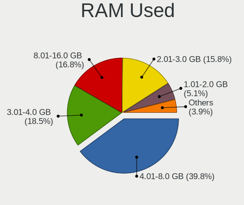
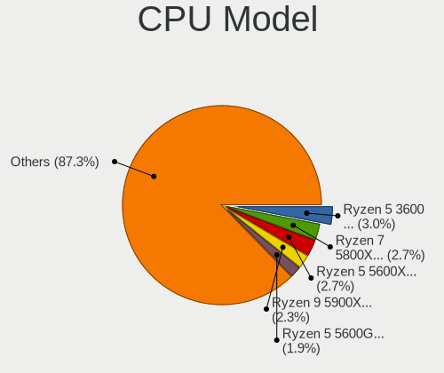
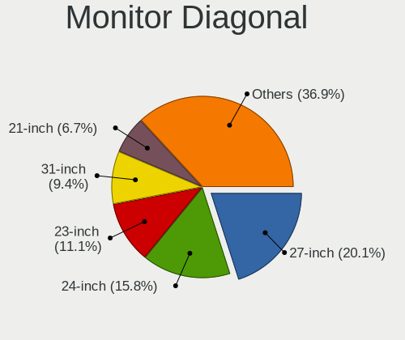

Pop!_OS 22.04 - Tested Hardware & Statistics (Desktops)
-------------------------------------------------------

A project to collect tested hardware configurations for Pop!_OS 22.04.

Anyone can contribute to this report by the [hw-probe](https://github.com/linuxhw/hw-probe) tool:

    sudo -E hw-probe -all -upload

Please contribute! Especially if your hardware is rare.

Contents
--------

* [ Test Cases ](#test-cases)

* [ System ](#system)
  - [ Kernel                   ](#kernel)
  - [ Kernel Family            ](#kernel-family)
  - [ Kernel Major Ver.        ](#kernel-major-ver)
  - [ Arch                     ](#arch)
  - [ DE                       ](#de)
  - [ Display Server           ](#display-server)
  - [ Display Manager          ](#display-manager)
  - [ OS Lang                  ](#os-lang)
  - [ Boot Mode                ](#boot-mode)
  - [ Filesystem               ](#filesystem)
  - [ Part. scheme             ](#part-scheme)
  - [ Dual Boot with Linux/BSD ](#dual-boot-with-linuxbsd)
  - [ Dual Boot (Win)          ](#dual-boot-win)

* [ Board ](#board)
  - [ Vendor                   ](#vendor)
  - [ Model                    ](#model)
  - [ Model Family             ](#model-family)
  - [ MFG Year                 ](#mfg-year)
  - [ Form Factor              ](#form-factor)
  - [ Secure Boot              ](#secure-boot)
  - [ Coreboot                 ](#coreboot)
  - [ RAM Size                 ](#ram-size)
  - [ RAM Used                 ](#ram-used)
  - [ Total Drives             ](#total-drives)
  - [ Has CD-ROM               ](#has-cd-rom)
  - [ Has Ethernet             ](#has-ethernet)
  - [ Has WiFi                 ](#has-wifi)
  - [ Has Bluetooth            ](#has-bluetooth)

* [ Location ](#location)
  - [ Country                  ](#country)
  - [ City                     ](#city)

* [ Drives ](#drives)
  - [ Drive Vendor             ](#drive-vendor)
  - [ Drive Model              ](#drive-model)
  - [ HDD Vendor               ](#hdd-vendor)
  - [ SSD Vendor               ](#ssd-vendor)
  - [ Drive Kind               ](#drive-kind)
  - [ Drive Connector          ](#drive-connector)
  - [ Drive Size               ](#drive-size)
  - [ Space Total              ](#space-total)
  - [ Space Used               ](#space-used)
  - [ Malfunc. Drives          ](#malfunc-drives)
  - [ Malfunc. Drive Vendor    ](#malfunc-drive-vendor)
  - [ Malfunc. HDD Vendor      ](#malfunc-hdd-vendor)
  - [ Malfunc. Drive Kind      ](#malfunc-drive-kind)
  - [ Failed Drives            ](#failed-drives)
  - [ Failed Drive Vendor      ](#failed-drive-vendor)
  - [ Drive Status             ](#drive-status)

* [ Storage controller ](#storage-controller)
  - [ Storage Vendor           ](#storage-vendor)
  - [ Storage Model            ](#storage-model)
  - [ Storage Kind             ](#storage-kind)

* [ Processor ](#processor)
  - [ CPU Vendor               ](#cpu-vendor)
  - [ CPU Model                ](#cpu-model)
  - [ CPU Model Family         ](#cpu-model-family)
  - [ CPU Cores                ](#cpu-cores)
  - [ CPU Sockets              ](#cpu-sockets)
  - [ CPU Threads              ](#cpu-threads)
  - [ CPU Op-Modes             ](#cpu-op-modes)
  - [ CPU Microcode            ](#cpu-microcode)
  - [ CPU Microarch            ](#cpu-microarch)

* [ Graphics ](#graphics)
  - [ GPU Vendor               ](#gpu-vendor)
  - [ GPU Model                ](#gpu-model)
  - [ GPU Combo                ](#gpu-combo)
  - [ GPU Driver               ](#gpu-driver)
  - [ GPU Memory               ](#gpu-memory)

* [ Monitor ](#monitor)
  - [ Monitor Vendor           ](#monitor-vendor)
  - [ Monitor Model            ](#monitor-model)
  - [ Monitor Resolution       ](#monitor-resolution)
  - [ Monitor Diagonal         ](#monitor-diagonal)
  - [ Monitor Width            ](#monitor-width)
  - [ Aspect Ratio             ](#aspect-ratio)
  - [ Monitor Area             ](#monitor-area)
  - [ Pixel Density            ](#pixel-density)
  - [ Multiple Monitors        ](#multiple-monitors)

* [ Network ](#network)
  - [ Net Controller Vendor    ](#net-controller-vendor)
  - [ Net Controller Model     ](#net-controller-model)
  - [ Wireless Vendor          ](#wireless-vendor)
  - [ Wireless Model           ](#wireless-model)
  - [ Ethernet Vendor          ](#ethernet-vendor)
  - [ Ethernet Model           ](#ethernet-model)
  - [ Net Controller Kind      ](#net-controller-kind)
  - [ Used Controller          ](#used-controller)
  - [ NICs                     ](#nics)
  - [ IPv6                     ](#ipv6)

* [ Bluetooth ](#bluetooth)
  - [ Bluetooth Vendor         ](#bluetooth-vendor)
  - [ Bluetooth Model          ](#bluetooth-model)

* [ Sound ](#sound)
  - [ Sound Vendor             ](#sound-vendor)
  - [ Sound Model              ](#sound-model)

* [ Memory ](#memory)
  - [ Memory Vendor            ](#memory-vendor)
  - [ Memory Model             ](#memory-model)
  - [ Memory Kind              ](#memory-kind)
  - [ Memory Form Factor       ](#memory-form-factor)
  - [ Memory Size              ](#memory-size)
  - [ Memory Speed             ](#memory-speed)

* [ Printers & scanners ](#printers--scanners)
  - [ Printer Vendor           ](#printer-vendor)
  - [ Printer Model            ](#printer-model)
  - [ Scanner Vendor           ](#scanner-vendor)
  - [ Scanner Model            ](#scanner-model)

* [ Camera ](#camera)
  - [ Camera Vendor            ](#camera-vendor)
  - [ Camera Model             ](#camera-model)

* [ Security ](#security)
  - [ Fingerprint Vendor       ](#fingerprint-vendor)
  - [ Fingerprint Model        ](#fingerprint-model)
  - [ Chipcard Vendor          ](#chipcard-vendor)
  - [ Chipcard Model           ](#chipcard-model)

* [ Unsupported ](#unsupported)
  - [ Unsupported Devices      ](#unsupported-devices)
  - [ Unsupported Device Types ](#unsupported-device-types)

Test Cases
----------

Total: 25

| Vendor   | Model                       | Probe                                                      | Date         |
|----------|-----------------------------|------------------------------------------------------------|--------------|
| MSI      | B450M GAMING PLUS           | [0929d58de7](https://linux-hardware.org/?probe=0929d58de7) | Apr 30, 2022 |
| Apple    | Mac-F42C88C8 Proto1         | [3edd5f05f7](https://linux-hardware.org/?probe=3edd5f05f7) | Apr 30, 2022 |
| ASRock   | X99 Extreme4                | [d45e1e88db](https://linux-hardware.org/?probe=d45e1e88db) | Apr 30, 2022 |
| ASRock   | X99 Extreme4                | [41cec63ac6](https://linux-hardware.org/?probe=41cec63ac6) | Apr 30, 2022 |
| EVGA     | X58 SLI Classified Tyler... | [07254f2dbb](https://linux-hardware.org/?probe=07254f2dbb) | Apr 30, 2022 |
| ASUSTek  | PRIME H510M-E               | [5c9e5fc14c](https://linux-hardware.org/?probe=5c9e5fc14c) | Apr 29, 2022 |
| ASUSTek  | ROG STRIX X299-E GAMING ... | [bce425f138](https://linux-hardware.org/?probe=bce425f138) | Apr 29, 2022 |
| Gigabyte | AB350-Gaming 3-CF           | [7b292b972d](https://linux-hardware.org/?probe=7b292b972d) | Apr 29, 2022 |
| MSI      | MAG Z690 TOMAHAWK WIFI D... | [e37bc471b1](https://linux-hardware.org/?probe=e37bc471b1) | Apr 29, 2022 |
| ASUSTek  | PRIME H310M-E R2.0          | [2b7167b16e](https://linux-hardware.org/?probe=2b7167b16e) | Apr 29, 2022 |
| ASUSTek  | ROG STRIX B450-F GAMING     | [aed5ee3ded](https://linux-hardware.org/?probe=aed5ee3ded) | Apr 28, 2022 |
| Gigabyte | B550 AORUS ELITE AX V2      | [ab83eedd1f](https://linux-hardware.org/?probe=ab83eedd1f) | Apr 28, 2022 |
| MSI      | H55M-E23                    | [4ab5f58470](https://linux-hardware.org/?probe=4ab5f58470) | Apr 28, 2022 |
| MSI      | MAG Z690 TOMAHAWK WIFI D... | [46430e1117](https://linux-hardware.org/?probe=46430e1117) | Apr 28, 2022 |
| Dell     | 09KPNV A00                  | [5046e0575b](https://linux-hardware.org/?probe=5046e0575b) | Apr 28, 2022 |
| Dell     | 0NW73C A00                  | [344e2b816e](https://linux-hardware.org/?probe=344e2b816e) | Apr 28, 2022 |
| Dell     | 088DT1 A01                  | [b664b8720e](https://linux-hardware.org/?probe=b664b8720e) | Apr 28, 2022 |
| Fujitsu  | D3162-A1 S26361-D3162-A1    | [19e0445e6f](https://linux-hardware.org/?probe=19e0445e6f) | Apr 27, 2022 |
| Dell     | 0R1PCR A00                  | [feec38a0f5](https://linux-hardware.org/?probe=feec38a0f5) | Apr 27, 2022 |
| Unknown  | Unknown                     | [82ad7e86b5](https://linux-hardware.org/?probe=82ad7e86b5) | Apr 27, 2022 |
| ASUSTek  | GA15DH                      | [30a22d7be3](https://linux-hardware.org/?probe=30a22d7be3) | Apr 27, 2022 |
| ASUSTek  | ROG STRIX B450-I GAMING     | [4b9faf4848](https://linux-hardware.org/?probe=4b9faf4848) | Apr 26, 2022 |
| System76 | Thelio thelio-r2            | [aae937be8b](https://linux-hardware.org/?probe=aae937be8b) | Apr 25, 2022 |
| Gigabyte | B360 AORUS GAMING 3 WIFI... | [fabaa5b3ab](https://linux-hardware.org/?probe=fabaa5b3ab) | Apr 24, 2022 |
| MSI      | B250M BAZOOKA               | [91392a601e](https://linux-hardware.org/?probe=91392a601e) | Apr 08, 2022 |

System
------

Kernel
------

Version of the Linux kernel

| Version                  | Desktops | Percent |
|--------------------------|----------|---------|
| 5.16.19-76051619-generic | 22       | 95.65%  |
| 5.16.15-76051615-generic | 1        | 4.35%   |

Kernel Family
-------------

Linux kernel without a distro release

| Version | Desktops | Percent |
|---------|----------|---------|
| 5.16.19 | 22       | 95.65%  |
| 5.16.15 | 1        | 4.35%   |

Kernel Major Ver.
-----------------

Linux kernel major version

| Version | Desktops | Percent |
|---------|----------|---------|
| 5.16    | 23       | 100%    |

Arch
----

OS architecture (x86_64, i586, etc.)

| Name   | Desktops | Percent |
|--------|----------|---------|
| x86_64 | 23       | 100%    |

DE
--

Desktop Environment

| Name  | Desktops | Percent |
|-------|----------|---------|
| GNOME | 22       | 95.65%  |
| KDE5  | 1        | 4.35%   |

Display Server
--------------

X11 or Wayland

| Name | Desktops | Percent |
|------|----------|---------|
| X11  | 23       | 100%    |

Display Manager
---------------

SDDM, LightDM, etc.

| Name    | Desktops | Percent |
|---------|----------|---------|
| Unknown | 23       | 100%    |

OS Lang
-------

Language

| Lang  | Desktops | Percent |
|-------|----------|---------|
| en_US | 16       | 69.57%  |
| en_GB | 2        | 8.7%    |
| en_CA | 2        | 8.7%    |
| sv_SE | 1        | 4.35%   |
| en_AU | 1        | 4.35%   |
| de_DE | 1        | 4.35%   |

Boot Mode
---------

EFI or BIOS

| Mode | Desktops | Percent |
|------|----------|---------|
| BIOS | 23       | 100%    |

Filesystem
----------

Type of filesystem

| Type | Desktops | Percent |
|------|----------|---------|
| Ext4 | 23       | 100%    |

Part. scheme
------------

Scheme of partitioning

| Type    | Desktops | Percent |
|---------|----------|---------|
| Unknown | 23       | 100%    |

Dual Boot with Linux/BSD
------------------------

Hosting more than one Linux/BSD

| Dual boot | Desktops | Percent |
|-----------|----------|---------|
| No        | 23       | 100%    |

Dual Boot (Win)
---------------

Hosting Linux and Windows

| Dual boot | Desktops | Percent |
|-----------|----------|---------|
| No        | 23       | 100%    |

Board
-----

Vendor
------

Motherboard manufacturer

| Name                | Desktops | Percent |
|---------------------|----------|---------|
| ASUSTek Computer    | 6        | 26.09%  |
| MSI                 | 4        | 17.39%  |
| Dell                | 4        | 17.39%  |
| Gigabyte Technology | 3        | 13.04%  |
| System76            | 1        | 4.35%   |
| Fujitsu             | 1        | 4.35%   |
| EVGA                | 1        | 4.35%   |
| ASRock              | 1        | 4.35%   |
| Apple               | 1        | 4.35%   |
| Unknown             | 1        | 4.35%   |

Model
-----

Motherboard model

| Name                               | Desktops | Percent |
|------------------------------------|----------|---------|
| System76 Thelio                    | 1        | 4.35%   |
| MSI MS-7D32                        | 1        | 4.35%   |
| MSI MS-7B87                        | 1        | 4.35%   |
| MSI MS-7A70                        | 1        | 4.35%   |
| MSI MS-7636                        | 1        | 4.35%   |
| Gigabyte B550 AORUS ELITE AX V2    | 1        | 4.35%   |
| Gigabyte B360 AORUS GAMING 3 WIFI  | 1        | 4.35%   |
| Gigabyte AB350-Gaming 3-CF         | 1        | 4.35%   |
| Fujitsu ESPRIMO E910               | 1        | 4.35%   |
| EVGA X58 SLI Classified Tylersburg | 1        | 4.35%   |
| Dell XPS 8500                      | 1        | 4.35%   |
| Dell Precision WorkStation T3500   | 1        | 4.35%   |
| Dell Inspiron 3847                 | 1        | 4.35%   |
| Dell Inspiron 3656                 | 1        | 4.35%   |
| ASUS ROG STRIX X299-E GAMING II    | 1        | 4.35%   |
| ASUS ROG Strix GA15DH              | 1        | 4.35%   |
| ASUS ROG STRIX B450-I GAMING       | 1        | 4.35%   |
| ASUS ROG STRIX B450-F GAMING       | 1        | 4.35%   |
| ASUS PRIME H510M-E                 | 1        | 4.35%   |
| ASUS PRIME H310M-E R2.0            | 1        | 4.35%   |
| ASRock X99 Extreme4                | 1        | 4.35%   |
| Apple MacPro3,1                    | 1        | 4.35%   |
| Unknown                            | 1        | 4.35%   |

Model Family
------------

Motherboard model prefix

| Name                  | Desktops | Percent |
|-----------------------|----------|---------|
| ASUS ROG              | 4        | 17.39%  |
| Dell Inspiron         | 2        | 8.7%    |
| ASUS PRIME            | 2        | 8.7%    |
| System76 Thelio       | 1        | 4.35%   |
| MSI MS-7D32           | 1        | 4.35%   |
| MSI MS-7B87           | 1        | 4.35%   |
| MSI MS-7A70           | 1        | 4.35%   |
| MSI MS-7636           | 1        | 4.35%   |
| Gigabyte B550         | 1        | 4.35%   |
| Gigabyte B360         | 1        | 4.35%   |
| Gigabyte AB350-Gaming | 1        | 4.35%   |
| Fujitsu ESPRIMO       | 1        | 4.35%   |
| EVGA X58              | 1        | 4.35%   |
| Dell XPS              | 1        | 4.35%   |
| Dell Precision        | 1        | 4.35%   |
| ASRock X99            | 1        | 4.35%   |
| Apple MacPro3         | 1        | 4.35%   |
| Unknown               | 1        | 4.35%   |

MFG Year
--------

Motherboard manufacture year

| Year | Desktops | Percent |
|------|----------|---------|
| 2020 | 4        | 17.39%  |
| 2018 | 4        | 17.39%  |
| 2021 | 2        | 8.7%    |
| 2019 | 2        | 8.7%    |
| 2016 | 2        | 8.7%    |
| 2012 | 2        | 8.7%    |
| 2010 | 2        | 8.7%    |
| 2017 | 1        | 4.35%   |
| 2014 | 1        | 4.35%   |
| 2013 | 1        | 4.35%   |
| 2011 | 1        | 4.35%   |
| 2008 | 1        | 4.35%   |

Form Factor
-----------

Physical design of the computer

| Name    | Desktops | Percent |
|---------|----------|---------|
| Desktop | 23       | 100%    |

Secure Boot
-----------

Enabled or disabled

| State    | Desktops | Percent |
|----------|----------|---------|
| Disabled | 23       | 100%    |

Coreboot
--------

Have coreboot on board

| Used | Desktops | Percent |
|------|----------|---------|
| No   | 23       | 100%    |

RAM Size
--------

Total RAM memory

| Size in GB | Desktops | Percent |
|------------|----------|---------|
| 16.01-24.0 | 11       | 47.83%  |
| 32.01-64.0 | 6        | 26.09%  |
| 8.01-16.0  | 4        | 17.39%  |
| 4.01-8.0   | 2        | 8.7%    |

RAM Used
--------

Used RAM memory

| Used GB   | Desktops | Percent |
|-----------|----------|---------|
| 2.01-3.0  | 8        | 34.78%  |
| 4.01-8.0  | 5        | 21.74%  |
| 3.01-4.0  | 5        | 21.74%  |
| 1.01-2.0  | 4        | 17.39%  |
| 8.01-16.0 | 1        | 4.35%   |

Total Drives
------------

Number of drives on board

| Drives | Desktops | Percent |
|--------|----------|---------|
| 2      | 8        | 34.78%  |
| 1      | 6        | 26.09%  |
| 3      | 5        | 21.74%  |
| 4      | 2        | 8.7%    |
| 11     | 1        | 4.35%   |
| 5      | 1        | 4.35%   |

Has CD-ROM
----------

Has CD-ROM on board

| Presented | Desktops | Percent |
|-----------|----------|---------|
| No        | 14       | 60.87%  |
| Yes       | 9        | 39.13%  |

Has Ethernet
------------

Has Ethernet on board

| Presented | Desktops | Percent |
|-----------|----------|---------|
| Yes       | 22       | 95.65%  |
| No        | 1        | 4.35%   |

Has WiFi
--------

Has WiFi module

| Presented | Desktops | Percent |
|-----------|----------|---------|
| Yes       | 15       | 65.22%  |
| No        | 8        | 34.78%  |

Has Bluetooth
-------------

Has Bluetooth module

| Presented | Desktops | Percent |
|-----------|----------|---------|
| Yes       | 12       | 52.17%  |
| No        | 11       | 47.83%  |

Location
--------

Country
-------

Geographic location (country)

| Country     | Desktops | Percent |
|-------------|----------|---------|
| USA         | 12       | 52.17%  |
| Netherlands | 2        | 8.7%    |
| Canada      | 2        | 8.7%    |
| Sweden      | 1        | 4.35%   |
| Slovakia    | 1        | 4.35%   |
| Japan       | 1        | 4.35%   |
| Israel      | 1        | 4.35%   |
| Ireland     | 1        | 4.35%   |
| Germany     | 1        | 4.35%   |
| Australia   | 1        | 4.35%   |

City
----

Geographic location (city)

| City                | Desktops | Percent |
|---------------------|----------|---------|
| Wausau              | 1        | 4.35%   |
| Tahlequah           | 1        | 4.35%   |
| Solleftea           | 1        | 4.35%   |
| Seattle             | 1        | 4.35%   |
| Sapporo             | 1        | 4.35%   |
| San Jose            | 1        | 4.35%   |
| Saint Paul          | 1        | 4.35%   |
| Saint John          | 1        | 4.35%   |
| Nahariya            | 1        | 4.35%   |
| Nackawic            | 1        | 4.35%   |
| Mannheim            | 1        | 4.35%   |
| Lake Mary           | 1        | 4.35%   |
| Hot Springs         | 1        | 4.35%   |
| Dalfsen             | 1        | 4.35%   |
| Cork                | 1        | 4.35%   |
| Colebrook           | 1        | 4.35%   |
| Cassopolis          | 1        | 4.35%   |
| Cairo               | 1        | 4.35%   |
| Brunswick West      | 1        | 4.35%   |
| Bratislava          | 1        | 4.35%   |
| Berlin              | 1        | 4.35%   |
| Atlanta             | 1        | 4.35%   |
| Alphen aan den Rijn | 1        | 4.35%   |

Drives
------

Drive Vendor
------------

Hard drive vendors

| Vendor                    | Desktops | Drives | Percent |
|---------------------------|----------|--------|---------|
| WDC                       | 9        | 17     | 20.93%  |
| Seagate                   | 8        | 11     | 18.6%   |
| Samsung Electronics       | 5        | 7      | 11.63%  |
| Intel                     | 3        | 3      | 6.98%   |
| Crucial                   | 3        | 3      | 6.98%   |
| Sandisk                   | 2        | 3      | 4.65%   |
| Phison                    | 2        | 2      | 4.65%   |
| Kingston                  | 2        | 2      | 4.65%   |
| Hitachi                   | 2        | 3      | 4.65%   |
| Transcend                 | 1        | 2      | 2.33%   |
| Toshiba                   | 1        | 1      | 2.33%   |
| PNY                       | 1        | 1      | 2.33%   |
| Micron/Crucial Technology | 1        | 1      | 2.33%   |
| MAXTOR                    | 1        | 1      | 2.33%   |
| Intenso                   | 1        | 1      | 2.33%   |
| China                     | 1        | 1      | 2.33%   |

Drive Model
-----------

Hard drive models

| Model                              | Desktops | Percent |
|------------------------------------|----------|---------|
| Seagate ST2000DM008-2FR102 2TB     | 2        | 3.51%   |
| Seagate ST2000DM001-1ER164 2TB     | 2        | 3.51%   |
| WDC WDS500G2B0A-00SM50 500GB SSD   | 1        | 1.75%   |
| WDC WDS240G2G0B-00EPW0 240GB SSD   | 1        | 1.75%   |
| WDC WD800BD-22MRA1 80GB            | 1        | 1.75%   |
| WDC WD60EFRX-68MYMN1 6TB           | 1        | 1.75%   |
| WDC WD40EFRX-68WT0N0 4TB           | 1        | 1.75%   |
| WDC WD30EZRZ-00GXCB0 3TB           | 1        | 1.75%   |
| WDC WD30EZRX-00DC0B0 3TB           | 1        | 1.75%   |
| WDC WD30EZRX-00D8PB0 3TB           | 1        | 1.75%   |
| WDC WD30EFRX-68EUZN0 3TB           | 1        | 1.75%   |
| WDC WD20EZAZ-00GGJB0 2TB           | 1        | 1.75%   |
| WDC WD20EARS-60MVWB0 2TB           | 1        | 1.75%   |
| WDC WD20EADS-00R6B0 2TB            | 1        | 1.75%   |
| WDC WD2003FZEX-00Z4SA0 2TB         | 1        | 1.75%   |
| WDC WD10EZEX-08WN4A0 1TB           | 1        | 1.75%   |
| WDC WD10EZEX-00RKKA0 1TB           | 1        | 1.75%   |
| WDC WD10EAVS-22D7B0 1TB            | 1        | 1.75%   |
| WDC WD10EADS-65M2B1 1TB            | 1        | 1.75%   |
| Transcend TS256GSSD370S 256GB      | 1        | 1.75%   |
| Transcend TS1TSSD230S 1024GB       | 1        | 1.75%   |
| Toshiba MK3265GSX 320GB            | 1        | 1.75%   |
| Seagate ST31000528AS 1TB           | 1        | 1.75%   |
| Seagate ST2000DX002-2DV164 2TB     | 1        | 1.75%   |
| Seagate ST2000DM006-2DM164 2TB     | 1        | 1.75%   |
| Seagate ST1000VM002-1CT162 1TB     | 1        | 1.75%   |
| Seagate ST1000LM024 HN-M101MBB 1TB | 1        | 1.75%   |
| Seagate ST1000DX002-2DV162 1TB     | 1        | 1.75%   |
| Seagate ST1000DM003-1ER162 1TB     | 1        | 1.75%   |
| SanDisk SSD PLUS 240GB             | 1        | 1.75%   |
| Sandisk NVMe SSD Drive 1TB         | 1        | 1.75%   |
| Samsung SSD 860 EVO 500GB          | 1        | 1.75%   |
| Samsung SSD 860 EVO 1TB            | 1        | 1.75%   |
| Samsung SSD 850 EVO 500GB          | 1        | 1.75%   |
| Samsung SSD 850 EVO 250GB          | 1        | 1.75%   |
| Samsung SSD 850 EVO 1TB            | 1        | 1.75%   |
| Samsung NVMe SSD Drive 1TB         | 1        | 1.75%   |
| PNY CS900 240GB SSD                | 1        | 1.75%   |
| Phison NVMe SSD Drive 512GB        | 1        | 1.75%   |
| Phison NVMe SSD Drive 1TB          | 1        | 1.75%   |
| Micron/Crucial NVMe SSD Drive 1TB  | 1        | 1.75%   |
| MAXTOR STM3160215AS 160GB          | 1        | 1.75%   |
| Kingston SUV400S37240G 240GB SSD   | 1        | 1.75%   |
| Kingston SH103S3120G 120GB SSD     | 1        | 1.75%   |
| Intenso 256GB                      | 1        | 1.75%   |
| Intel SSDSA2BW160G3H 160GB         | 1        | 1.75%   |
| Intel NVMe SSD Drive 512GB         | 1        | 1.75%   |
| Intel NVMe SSD Drive 1024GB        | 1        | 1.75%   |
| Hitachi HUA721010KLA330 1TB        | 1        | 1.75%   |
| Hitachi HDT721064SLA360 640GB      | 1        | 1.75%   |
| Hitachi HDS723020BLA642 2TB        | 1        | 1.75%   |
| Crucial CT525MX300SSD1 528GB       | 1        | 1.75%   |
| Crucial CT500MX500SSD4 500GB       | 1        | 1.75%   |
| Crucial CT1000MX500SSD1 1TB        | 1        | 1.75%   |
| China SATA SSD 64GB                | 1        | 1.75%   |

HDD Vendor
----------

Hard disk drive vendors

| Vendor  | Desktops | Drives | Percent |
|---------|----------|--------|---------|
| WDC     | 8        | 15     | 40%     |
| Seagate | 8        | 11     | 40%     |
| Hitachi | 2        | 3      | 10%     |
| Toshiba | 1        | 1      | 5%      |
| MAXTOR  | 1        | 1      | 5%      |

SSD Vendor
----------

Solid state drive vendors

| Vendor              | Desktops | Drives | Percent |
|---------------------|----------|--------|---------|
| Samsung Electronics | 5        | 6      | 31.25%  |
| Crucial             | 3        | 3      | 18.75%  |
| Kingston            | 2        | 2      | 12.5%   |
| WDC                 | 1        | 2      | 6.25%   |
| Transcend           | 1        | 2      | 6.25%   |
| SanDisk             | 1        | 1      | 6.25%   |
| PNY                 | 1        | 1      | 6.25%   |
| Intel               | 1        | 1      | 6.25%   |
| China               | 1        | 1      | 6.25%   |

Drive Kind
----------

HDD or SSD

| Kind    | Desktops | Drives | Percent |
|---------|----------|--------|---------|
| HDD     | 16       | 31     | 43.24%  |
| SSD     | 14       | 19     | 37.84%  |
| NVMe    | 6        | 8      | 16.22%  |
| Unknown | 1        | 1      | 2.7%    |

Drive Connector
---------------

SATA, SAS, NVMe, etc.

| Type | Desktops | Drives | Percent |
|------|----------|--------|---------|
| SATA | 21       | 51     | 77.78%  |
| NVMe | 6        | 8      | 22.22%  |

Drive Size
----------

Size of hard drive

| Size in TB | Desktops | Drives | Percent |
|------------|----------|--------|---------|
| 0.01-0.5   | 13       | 17     | 35.14%  |
| 1.01-2.0   | 10       | 12     | 27.03%  |
| 0.51-1.0   | 10       | 15     | 27.03%  |
| 2.01-3.0   | 2        | 4      | 5.41%   |
| 3.01-4.0   | 1        | 1      | 2.7%    |
| 4.01-10.0  | 1        | 1      | 2.7%    |

Space Total
-----------

Amount of disk space available on the file system

| Size in GB     | Desktops | Percent |
|----------------|----------|---------|
| 501-1000       | 7        | 30.43%  |
| 251-500        | 3        | 13.04%  |
| 2001-3000      | 3        | 13.04%  |
| 101-250        | 3        | 13.04%  |
| 1001-2000      | 3        | 13.04%  |
| 51-100         | 3        | 13.04%  |
| More than 3000 | 1        | 4.35%   |

Space Used
----------

Amount of used disk space

| Used GB   | Desktops | Percent |
|-----------|----------|---------|
| 21-50     | 6        | 26.09%  |
| 51-100    | 6        | 26.09%  |
| 1-20      | 4        | 17.39%  |
| 251-500   | 2        | 8.7%    |
| 1001-2000 | 2        | 8.7%    |
| 2001-3000 | 1        | 4.35%   |
| 101-250   | 1        | 4.35%   |
| 501-1000  | 1        | 4.35%   |

Malfunc. Drives
---------------

Drive models with a malfunction

Zero info for selected period =(

Malfunc. Drive Vendor
---------------------

Vendors of faulty drives

Zero info for selected period =(

Malfunc. HDD Vendor
-------------------

Vendors of faulty HDD drives

Zero info for selected period =(

Malfunc. Drive Kind
-------------------

Kinds of faulty drives

Zero info for selected period =(

Failed Drives
-------------

Failed drive models

Zero info for selected period =(

Failed Drive Vendor
-------------------

Failed drive vendors

Zero info for selected period =(

Drive Status
------------

Number of failed and malfunc. drives

| Status   | Desktops | Drives | Percent |
|----------|----------|--------|---------|
| Detected | 23       | 59     | 100%    |

Storage controller
------------------

Storage Vendor
--------------

Storage controller vendors

| Vendor                    | Desktops | Percent |
|---------------------------|----------|---------|
| Intel                     | 16       | 51.61%  |
| AMD                       | 8        | 25.81%  |
| Phison Electronics        | 2        | 6.45%   |
| Sandisk                   | 1        | 3.23%   |
| Samsung Electronics       | 1        | 3.23%   |
| Micron/Crucial Technology | 1        | 3.23%   |
| JMicron Technology        | 1        | 3.23%   |
| ASMedia Technology        | 1        | 3.23%   |

Storage Model
-------------

Storage controller models

| Model                                                                            | Desktops | Percent |
|----------------------------------------------------------------------------------|----------|---------|
| AMD FCH SATA Controller [AHCI mode]                                              | 6        | 14.63%  |
| AMD 400 Series Chipset SATA Controller                                           | 4        | 9.76%   |
| Intel 200 Series PCH SATA controller [AHCI mode]                                 | 3        | 7.32%   |
| Intel SSD 660P Series                                                            | 2        | 4.88%   |
| Intel 82801JI (ICH10 Family) SATA AHCI Controller                                | 2        | 4.88%   |
| Intel 7 Series/C210 Series Chipset Family 6-port SATA Controller [AHCI mode]     | 2        | 4.88%   |
| Sandisk WD Black 2018/SN750 / PC SN720 NVMe SSD                                  | 1        | 2.44%   |
| Sandisk Non-Volatile memory controller                                           | 1        | 2.44%   |
| Samsung NVMe SSD Controller PM9A1/PM9A3/980PRO                                   | 1        | 2.44%   |
| Phison PS5013 E13 NVMe Controller                                                | 1        | 2.44%   |
| Phison E12 NVMe Controller                                                       | 1        | 2.44%   |
| Micron/Crucial P1 NVMe PCIe SSD                                                  | 1        | 2.44%   |
| JMicron JMB363 SATA/IDE Controller                                               | 1        | 2.44%   |
| Intel SATA Controller [RAID mode]                                                | 1        | 2.44%   |
| Intel C610/X99 series chipset sSATA Controller [AHCI mode]                       | 1        | 2.44%   |
| Intel C610/X99 series chipset 6-Port SATA Controller [AHCI mode]                 | 1        | 2.44%   |
| Intel Atom/Celeron/Pentium Processor x5-E8000/J3xxx/N3xxx Series SATA Controller | 1        | 2.44%   |
| Intel Alder Lake-S PCH SATA Controller [AHCI Mode]                               | 1        | 2.44%   |
| Intel 8 Series/C220 Series Chipset Family 4-port SATA Controller 1 [IDE mode]    | 1        | 2.44%   |
| Intel 8 Series/C220 Series Chipset Family 2-port SATA Controller 2 [IDE mode]    | 1        | 2.44%   |
| Intel 631xESB/632xESB SATA AHCI Controller                                       | 1        | 2.44%   |
| Intel 631xESB/632xESB IDE Controller                                             | 1        | 2.44%   |
| Intel 500 Series Chipset Family SATA AHCI Controller                             | 1        | 2.44%   |
| Intel 5 Series/3400 Series Chipset 4 port SATA IDE Controller                    | 1        | 2.44%   |
| Intel 5 Series/3400 Series Chipset 2 port SATA IDE Controller                    | 1        | 2.44%   |
| ASMedia ASM1062 Serial ATA Controller                                            | 1        | 2.44%   |
| AMD 500 Series Chipset SATA Controller                                           | 1        | 2.44%   |
| AMD 300 Series Chipset SATA Controller                                           | 1        | 2.44%   |

Storage Kind
------------

Kind of storage controller (IDE, SATA, NVMe, SAS, ...)

| Kind | Desktops | Percent |
|------|----------|---------|
| SATA | 20       | 64.52%  |
| NVMe | 6        | 19.35%  |
| IDE  | 4        | 12.9%   |
| RAID | 1        | 3.23%   |

Processor
---------

CPU Vendor
----------

Processor vendors

| Vendor | Desktops | Percent |
|--------|----------|---------|
| Intel  | 15       | 65.22%  |
| AMD    | 8        | 34.78%  |

CPU Model
---------

Processor models

| Model                                           | Desktops | Percent |
|-------------------------------------------------|----------|---------|
| AMD Ryzen 5 3600 6-Core Processor               | 2        | 8.7%    |
| Intel Xeon CPU W3530 @ 2.80GHz                  | 1        | 4.35%   |
| Intel Xeon CPU E5462 @ 2.80GHz                  | 1        | 4.35%   |
| Intel Core i9-10900X CPU @ 3.70GHz              | 1        | 4.35%   |
| Intel Core i7-7700 CPU @ 3.60GHz                | 1        | 4.35%   |
| Intel Core i7-5820K CPU @ 3.30GHz               | 1        | 4.35%   |
| Intel Core i7-4790 CPU @ 3.60GHz                | 1        | 4.35%   |
| Intel Core i7-3770 CPU @ 3.40GHz                | 1        | 4.35%   |
| Intel Core i7 CPU 965 @ 3.20GHz                 | 1        | 4.35%   |
| Intel Core i5-9600K CPU @ 3.70GHz               | 1        | 4.35%   |
| Intel Core i5-9400 CPU @ 2.90GHz                | 1        | 4.35%   |
| Intel Core i5-3470 CPU @ 3.20GHz                | 1        | 4.35%   |
| Intel Core i5 CPU 760 @ 2.80GHz                 | 1        | 4.35%   |
| Intel Core i3-10105 CPU @ 3.70GHz               | 1        | 4.35%   |
| Intel Celeron CPU N3160 @ 1.60GHz               | 1        | 4.35%   |
| Intel 12th Gen Core i5-12600K                   | 1        | 4.35%   |
| AMD Ryzen 7 5800X 8-Core Processor              | 1        | 4.35%   |
| AMD Ryzen 7 3700X 8-Core Processor              | 1        | 4.35%   |
| AMD Ryzen 7 1800X Eight-Core Processor          | 1        | 4.35%   |
| AMD Ryzen 5 3600X 6-Core Processor              | 1        | 4.35%   |
| AMD Ryzen 3 3200G with Radeon Vega Graphics     | 1        | 4.35%   |
| AMD A10-8700P Radeon R6, 10 Compute Cores 4C+6G | 1        | 4.35%   |

CPU Model Family
----------------

Processor model prefix

| Model         | Desktops | Percent |
|---------------|----------|---------|
| Intel Core i7 | 5        | 21.74%  |
| Intel Core i5 | 4        | 17.39%  |
| AMD Ryzen 7   | 3        | 13.04%  |
| AMD Ryzen 5   | 3        | 13.04%  |
| Intel Xeon    | 2        | 8.7%    |
| Other         | 1        | 4.35%   |
| Intel Core i9 | 1        | 4.35%   |
| Intel Core i3 | 1        | 4.35%   |
| Intel Celeron | 1        | 4.35%   |
| AMD Ryzen 3   | 1        | 4.35%   |
| AMD A10       | 1        | 4.35%   |

CPU Cores
---------

Number of processor cores

| Number | Desktops | Percent |
|--------|----------|---------|
| 4      | 10       | 43.48%  |
| 6      | 6        | 26.09%  |
| 8      | 4        | 17.39%  |
| 10     | 2        | 8.7%    |
| 2      | 1        | 4.35%   |

CPU Sockets
-----------

Number of sockets

| Number | Desktops | Percent |
|--------|----------|---------|
| 1      | 22       | 95.65%  |
| 2      | 1        | 4.35%   |

CPU Threads
-----------

Threads per core (Hyper-Threading)

| Number | Desktops | Percent |
|--------|----------|---------|
| 2      | 15       | 65.22%  |
| 1      | 8        | 34.78%  |

CPU Op-Modes
------------

CPU Operation Modes (32-bit, 64-bit)

| Op mode        | Desktops | Percent |
|----------------|----------|---------|
| 32-bit, 64-bit | 23       | 100%    |

CPU Microcode
-------------

Microcode number

| Number  | Desktops | Percent |
|---------|----------|---------|
| Unknown | 23       | 100%    |

CPU Microarch
-------------

Microarchitecture

| Name       | Desktops | Percent |
|------------|----------|---------|
| Zen 2      | 4        | 17.39%  |
| Nehalem    | 3        | 13.04%  |
| KabyLake   | 3        | 13.04%  |
| IvyBridge  | 2        | 8.7%    |
| Haswell    | 2        | 8.7%    |
| Zen+       | 1        | 4.35%   |
| Zen 3      | 1        | 4.35%   |
| Zen        | 1        | 4.35%   |
| Skylake    | 1        | 4.35%   |
| Silvermont | 1        | 4.35%   |
| Penryn     | 1        | 4.35%   |
| Excavator  | 1        | 4.35%   |
| CometLake  | 1        | 4.35%   |
| Unknown    | 1        | 4.35%   |

Graphics
--------

GPU Vendor
----------

Vendors of graphics cards

| Vendor | Desktops | Percent |
|--------|----------|---------|
| Nvidia | 13       | 54.17%  |
| AMD    | 9        | 37.5%   |
| Intel  | 2        | 8.33%   |

GPU Model
---------

Graphics card models

| Model                                                                                    | Desktops | Percent |
|------------------------------------------------------------------------------------------|----------|---------|
| Nvidia GP106 [GeForce GTX 1060 6GB]                                                      | 2        | 8.33%   |
| Nvidia GP104 [GeForce GTX 1080]                                                          | 2        | 8.33%   |
| AMD Navi 10 [Radeon RX 5600 OEM/5600 XT / 5700/5700 XT]                                  | 2        | 8.33%   |
| Nvidia TU116 [GeForce GTX 1660]                                                          | 1        | 4.17%   |
| Nvidia TU106 [GeForce RTX 2060 Rev. A]                                                   | 1        | 4.17%   |
| Nvidia GP107 [GeForce GTX 1050]                                                          | 1        | 4.17%   |
| Nvidia GP106 [GeForce GTX 1060 3GB]                                                      | 1        | 4.17%   |
| Nvidia GP102 [GeForce GTX 1080 Ti]                                                       | 1        | 4.17%   |
| Nvidia GM204 [GeForce GTX 970]                                                           | 1        | 4.17%   |
| Nvidia GK208B [GeForce GT 730]                                                           | 1        | 4.17%   |
| Nvidia GK104 [GeForce GTX 760]                                                           | 1        | 4.17%   |
| Nvidia GF108 [GeForce GT 730]                                                            | 1        | 4.17%   |
| Intel Atom/Celeron/Pentium Processor x5-E8000/J3xxx/N3xxx Integrated Graphics Controller | 1        | 4.17%   |
| Intel AlderLake-S GT1                                                                    | 1        | 4.17%   |
| AMD Wani [Radeon R5/R6/R7 Graphics]                                                      | 1        | 4.17%   |
| AMD RV730 PRO [Radeon HD 4650]                                                           | 1        | 4.17%   |
| AMD RV630 XT [Radeon HD 2600 XT]                                                         | 1        | 4.17%   |
| AMD RV620 LE [Radeon HD 3450]                                                            | 1        | 4.17%   |
| AMD Picasso/Raven 2 [Radeon Vega Series / Radeon Vega Mobile Series]                     | 1        | 4.17%   |
| AMD Ellesmere [Radeon RX 470/480/570/570X/580/580X/590]                                  | 1        | 4.17%   |
| AMD Baffin [Radeon RX 550 640SP / RX 560/560X]                                           | 1        | 4.17%   |

GPU Combo
---------

Combinations of graphics cards

| Name       | Desktops | Percent |
|------------|----------|---------|
| 1 x Nvidia | 13       | 56.52%  |
| 1 x AMD    | 9        | 39.13%  |
| 1 x Intel  | 1        | 4.35%   |

GPU Driver
----------

Free vs proprietary

| Driver      | Desktops | Percent |
|-------------|----------|---------|
| Free        | 11       | 47.83%  |
| Proprietary | 10       | 43.48%  |
| Unknown     | 2        | 8.7%    |

GPU Memory
----------

Total video memory

| Size in GB | Desktops | Percent |
|------------|----------|---------|
| Unknown    | 13       | 56.52%  |
| 5.01-6.0   | 4        | 17.39%  |
| 7.01-8.0   | 2        | 8.7%    |
| 3.01-4.0   | 1        | 4.35%   |
| 2.01-3.0   | 1        | 4.35%   |
| 1.01-2.0   | 1        | 4.35%   |
| 8.01-16.0  | 1        | 4.35%   |

Monitor
-------

Monitor Vendor
--------------

Monitor vendors

| Vendor               | Desktops | Percent |
|----------------------|----------|---------|
| Goldstar             | 5        | 19.23%  |
| Dell                 | 4        | 15.38%  |
| Samsung Electronics  | 3        | 11.54%  |
| ViewSonic            | 2        | 7.69%   |
| Iiyama               | 2        | 7.69%   |
| BenQ                 | 2        | 7.69%   |
| AOC                  | 2        | 7.69%   |
| Acer                 | 2        | 7.69%   |
| Vestel Elektronik    | 1        | 3.85%   |
| Hewlett-Packard      | 1        | 3.85%   |
| CVT                  | 1        | 3.85%   |
| Ancor Communications | 1        | 3.85%   |

Monitor Model
-------------

Monitor models

| Model                                                                | Desktops | Percent |
|----------------------------------------------------------------------|----------|---------|
| Goldstar FULL HD GSM5B55 1920x1080 480x270mm 21.7-inch               | 2        | 7.14%   |
| ViewSonic VX3276-FHD VSCE735 1920x1080 698x393mm 31.5-inch           | 1        | 3.57%   |
| ViewSonic VX2450 SERIES VSCE226 1920x1080 525x297mm 23.7-inch        | 1        | 3.57%   |
| Vestel Elektronik 40UHD_LCD_TV VES3700 3840x2160 890x500mm 40.2-inch | 1        | 3.57%   |
| Samsung Electronics SyncMaster SAM0613 1920x1080                     | 1        | 3.57%   |
| Samsung Electronics S24B240 SAM08E9 1920x1080 521x293mm 23.5-inch    | 1        | 3.57%   |
| Samsung Electronics LCD Monitor SAM08FC 1366x768                     | 1        | 3.57%   |
| Iiyama PLX2472HD IVM6106 1920x1080 531x299mm 24.0-inch               | 1        | 3.57%   |
| Iiyama PL2530H IVM6132 1920x1080 544x303mm 24.5-inch                 | 1        | 3.57%   |
| Hewlett-Packard 32f HPN3659 1920x1080 699x393mm 31.6-inch            | 1        | 3.57%   |
| Goldstar ULTRAWIDE GSM76FE 2560x1080 798x334mm 34.1-inch             | 1        | 3.57%   |
| Goldstar ULTRAWIDE GSM76FA 2560x1080 798x334mm 34.1-inch             | 1        | 3.57%   |
| Goldstar ULTRAWIDE GSM59F2 2560x1080 798x334mm 34.1-inch             | 1        | 3.57%   |
| Goldstar 32ML600 GSM772D 1920x1080 480x270mm 21.7-inch               | 1        | 3.57%   |
| Dell S2721DGF DEL41D9 2560x1440 597x336mm 27.0-inch                  | 1        | 3.57%   |
| Dell S2340M DELD05A 1920x1080 509x286mm 23.0-inch                    | 1        | 3.57%   |
| Dell DEL 1908FPBLK DEL4047 1280x1024 376x301mm 19.0-inch             | 1        | 3.57%   |
| Dell 1703FP DEL3010 1280x1024 338x270mm 17.0-inch                    | 1        | 3.57%   |
| Dell 1503FP DEL3003 1024x768 304x228mm 15.0-inch                     | 1        | 3.57%   |
| CVT CVTE TV CVT1080 1920x1080 735x420mm 33.3-inch                    | 1        | 3.57%   |
| BenQ GL2760 BNQ78D5 1920x1080 598x336mm 27.0-inch                    | 1        | 3.57%   |
| BenQ GL2480 BNQ78ED 1920x1080 531x298mm 24.0-inch                    | 1        | 3.57%   |
| AOC Q3583 AOC3583 2560x1080 820x346mm 35.0-inch                      | 1        | 3.57%   |
| AOC AG241QG4 AOC2410 2560x1440 527x396mm 26.0-inch                   | 1        | 3.57%   |
| Ancor Communications VE247 ACI2493 1920x1080 531x299mm 24.0-inch     | 1        | 3.57%   |
| Acer H203H ACR0103 1600x900 443x249mm 20.0-inch                      | 1        | 3.57%   |
| Acer EI272UR ACR072E 2560x1440 597x336mm 27.0-inch                   | 1        | 3.57%   |

Monitor Resolution
------------------

Monitor screen resolution

| Resolution       | Desktops | Percent |
|------------------|----------|---------|
| 1920x1080 (FHD)  | 11       | 47.83%  |
| 3840x2160 (4K)   | 3        | 13.04%  |
| 2560x1080        | 3        | 13.04%  |
| 2560x1440 (QHD)  | 2        | 8.7%    |
| 1600x900 (HD+)   | 1        | 4.35%   |
| 1366x768 (WXGA)  | 1        | 4.35%   |
| 1280x1024 (SXGA) | 1        | 4.35%   |
| 1024x768 (XGA)   | 1        | 4.35%   |

Monitor Diagonal
----------------

Diagonal size in inches

| Inches  | Desktops | Percent |
|---------|----------|---------|
| 24      | 5        | 18.52%  |
| 27      | 3        | 11.11%  |
| 21      | 3        | 11.11%  |
| 34      | 2        | 7.41%   |
| 31      | 2        | 7.41%   |
| 23      | 2        | 7.41%   |
| Unknown | 2        | 7.41%   |
| 84      | 1        | 3.7%    |
| 35      | 1        | 3.7%    |
| 33      | 1        | 3.7%    |
| 26      | 1        | 3.7%    |
| 20      | 1        | 3.7%    |
| 19      | 1        | 3.7%    |
| 17      | 1        | 3.7%    |
| 15      | 1        | 3.7%    |

Monitor Width
-------------

Physical width

| Width in mm | Desktops | Percent |
|-------------|----------|---------|
| 501-600     | 8        | 33.33%  |
| 401-500     | 4        | 16.67%  |
| 701-800     | 3        | 12.5%   |
| 601-700     | 2        | 8.33%   |
| 301-350     | 2        | 8.33%   |
| Unknown     | 2        | 8.33%   |
| 801-900     | 1        | 4.17%   |
| 351-400     | 1        | 4.17%   |
| 1501-2000   | 1        | 4.17%   |

Aspect Ratio
------------

Proportional relationship between the width and the height

| Ratio | Desktops | Percent |
|-------|----------|---------|
| 16/9  | 17       | 73.91%  |
| 21/9  | 3        | 13.04%  |
| 4/3   | 2        | 8.7%    |
| 5/4   | 1        | 4.35%   |

Monitor Area
------------

Area in inch²

| Area in inch² | Desktops | Percent |
|----------------|----------|---------|
| 201-250        | 8        | 32%     |
| 351-500        | 6        | 24%     |
| 301-350        | 3        | 12%     |
| 151-200        | 2        | 8%      |
| Unknown        | 2        | 8%      |
| More than 1000 | 1        | 4%      |
| 251-300        | 1        | 4%      |
| 141-150        | 1        | 4%      |
| 101-110        | 1        | 4%      |

Pixel Density
-------------

Pixels per inch

| Density | Desktops | Percent |
|---------|----------|---------|
| 51-100  | 14       | 66.67%  |
| 101-120 | 5        | 23.81%  |
| Unknown | 2        | 9.52%   |

Multiple Monitors
-----------------

Total monitors connected

| Total | Desktops | Percent |
|-------|----------|---------|
| 1     | 13       | 56.52%  |
| 2     | 7        | 30.43%  |
| 0     | 2        | 8.7%    |
| 3     | 1        | 4.35%   |

Network
-------

Net Controller Vendor
---------------------

Controller vendors

| Vendor                | Desktops | Percent |
|-----------------------|----------|---------|
| Realtek Semiconductor | 14       | 40%     |
| Intel                 | 12       | 34.29%  |
| Qualcomm Atheros      | 4        | 11.43%  |
| Broadcom              | 2        | 5.71%   |
| TP-Link               | 1        | 2.86%   |
| MEDIATEK              | 1        | 2.86%   |
| InterBiometrics       | 1        | 2.86%   |

Net Controller Model
--------------------

Controller models

| Model                                                                                 | Desktops | Percent |
|---------------------------------------------------------------------------------------|----------|---------|
| Realtek RTL8111/8168/8411 PCI Express Gigabit Ethernet Controller                     | 10       | 25%     |
| Intel Wi-Fi 6 AX200                                                                   | 3        | 7.5%    |
| Intel I211 Gigabit Network Connection                                                 | 3        | 7.5%    |
| Realtek RTL8125 2.5GbE Controller                                                     | 2        | 5%      |
| Qualcomm Atheros QCA9565 / AR9565 Wireless Network Adapter                            | 2        | 5%      |
| TP-Link AC600 wireless Realtek RTL8811AU [Archer T2U Nano]                            | 1        | 2.5%    |
| Realtek RTL8822CE 802.11ac PCIe Wireless Network Adapter                              | 1        | 2.5%    |
| Realtek RTL8822BE 802.11a/b/g/n/ac WiFi adapter                                       | 1        | 2.5%    |
| Realtek RTL8188EUS 802.11n Wireless Network Adapter                                   | 1        | 2.5%    |
| Qualcomm Atheros AR9485 Wireless Network Adapter                                      | 1        | 2.5%    |
| Qualcomm Atheros AR5418 Wireless Network Adapter [AR5008E 802.11(a)bgn] (PCI-Express) | 1        | 2.5%    |
| MEDIATEK RZ608 Wi-Fi 6E 80MHz                                                         | 1        | 2.5%    |
| InterBiometrics Io                                                                    | 1        | 2.5%    |
| Intel Wireless 3165                                                                   | 1        | 2.5%    |
| Intel Ethernet Controller I225-V                                                      | 1        | 2.5%    |
| Intel Ethernet Connection (7) I219-V                                                  | 1        | 2.5%    |
| Intel Ethernet Connection (2) I219-V                                                  | 1        | 2.5%    |
| Intel Ethernet Connection (2) I218-V                                                  | 1        | 2.5%    |
| Intel Ethernet Connection (14) I219-V                                                 | 1        | 2.5%    |
| Intel Cannon Lake PCH CNVi WiFi                                                       | 1        | 2.5%    |
| Intel Alder Lake-S PCH CNVi WiFi                                                      | 1        | 2.5%    |
| Intel 82579LM Gigabit Network Connection (Lewisville)                                 | 1        | 2.5%    |
| Intel 80003ES2LAN Gigabit Ethernet Controller (Copper)                                | 1        | 2.5%    |
| Broadcom NetXtreme BCM5761 Gigabit Ethernet PCIe                                      | 1        | 2.5%    |
| Broadcom BCM4360 802.11ac Wireless Network Adapter                                    | 1        | 2.5%    |

Wireless Vendor
---------------

Wireless vendors

| Vendor                | Desktops | Percent |
|-----------------------|----------|---------|
| Intel                 | 6        | 37.5%   |
| Qualcomm Atheros      | 4        | 25%     |
| Realtek Semiconductor | 3        | 18.75%  |
| TP-Link               | 1        | 6.25%   |
| MEDIATEK              | 1        | 6.25%   |
| Broadcom              | 1        | 6.25%   |

Wireless Model
--------------

Wireless models

| Model                                                                                 | Desktops | Percent |
|---------------------------------------------------------------------------------------|----------|---------|
| Intel Wi-Fi 6 AX200                                                                   | 3        | 18.75%  |
| Qualcomm Atheros QCA9565 / AR9565 Wireless Network Adapter                            | 2        | 12.5%   |
| TP-Link AC600 wireless Realtek RTL8811AU [Archer T2U Nano]                            | 1        | 6.25%   |
| Realtek RTL8822CE 802.11ac PCIe Wireless Network Adapter                              | 1        | 6.25%   |
| Realtek RTL8822BE 802.11a/b/g/n/ac WiFi adapter                                       | 1        | 6.25%   |
| Realtek RTL8188EUS 802.11n Wireless Network Adapter                                   | 1        | 6.25%   |
| Qualcomm Atheros AR9485 Wireless Network Adapter                                      | 1        | 6.25%   |
| Qualcomm Atheros AR5418 Wireless Network Adapter [AR5008E 802.11(a)bgn] (PCI-Express) | 1        | 6.25%   |
| MEDIATEK RZ608 Wi-Fi 6E 80MHz                                                         | 1        | 6.25%   |
| Intel Wireless 3165                                                                   | 1        | 6.25%   |
| Intel Cannon Lake PCH CNVi WiFi                                                       | 1        | 6.25%   |
| Intel Alder Lake-S PCH CNVi WiFi                                                      | 1        | 6.25%   |
| Broadcom BCM4360 802.11ac Wireless Network Adapter                                    | 1        | 6.25%   |

Ethernet Vendor
---------------

Ethernet vendors

| Vendor                | Desktops | Percent |
|-----------------------|----------|---------|
| Realtek Semiconductor | 12       | 52.17%  |
| Intel                 | 10       | 43.48%  |
| Broadcom              | 1        | 4.35%   |

Ethernet Model
--------------

Ethernet models

| Model                                                             | Desktops | Percent |
|-------------------------------------------------------------------|----------|---------|
| Realtek RTL8111/8168/8411 PCI Express Gigabit Ethernet Controller | 10       | 43.48%  |
| Intel I211 Gigabit Network Connection                             | 3        | 13.04%  |
| Realtek RTL8125 2.5GbE Controller                                 | 2        | 8.7%    |
| Intel Ethernet Controller I225-V                                  | 1        | 4.35%   |
| Intel Ethernet Connection (7) I219-V                              | 1        | 4.35%   |
| Intel Ethernet Connection (2) I219-V                              | 1        | 4.35%   |
| Intel Ethernet Connection (2) I218-V                              | 1        | 4.35%   |
| Intel Ethernet Connection (14) I219-V                             | 1        | 4.35%   |
| Intel 82579LM Gigabit Network Connection (Lewisville)             | 1        | 4.35%   |
| Intel 80003ES2LAN Gigabit Ethernet Controller (Copper)            | 1        | 4.35%   |
| Broadcom NetXtreme BCM5761 Gigabit Ethernet PCIe                  | 1        | 4.35%   |

Net Controller Kind
-------------------

Ethernet, WiFi or modem

| Kind     | Desktops | Percent |
|----------|----------|---------|
| Ethernet | 22       | 57.89%  |
| WiFi     | 15       | 39.47%  |
| Modem    | 1        | 2.63%   |

Used Controller
---------------

Currently used network controller

| Kind     | Desktops | Percent |
|----------|----------|---------|
| Ethernet | 18       | 75%     |
| WiFi     | 6        | 25%     |

NICs
----

Total network controllers on board

| Total | Desktops | Percent |
|-------|----------|---------|
| 2     | 12       | 52.17%  |
| 1     | 9        | 39.13%  |
| 3     | 2        | 8.7%    |

IPv6
----

IPv6 vs IPv4

| Used | Desktops | Percent |
|------|----------|---------|
| No   | 16       | 69.57%  |
| Yes  | 7        | 30.43%  |

Bluetooth
---------

Bluetooth Vendor
----------------

Controller vendors

| Vendor                          | Desktops | Percent |
|---------------------------------|----------|---------|
| Intel                           | 5        | 41.67%  |
| Qualcomm Atheros Communications | 3        | 25%     |
| IMC Networks                    | 1        | 8.33%   |
| Cambridge Silicon Radio         | 1        | 8.33%   |
| ASUSTek Computer                | 1        | 8.33%   |
| Apple                           | 1        | 8.33%   |

Bluetooth Model
---------------

Controller models

| Model                                               | Desktops | Percent |
|-----------------------------------------------------|----------|---------|
| Intel AX200 Bluetooth                               | 3        | 25%     |
| Qualcomm Atheros  Bluetooth Device                  | 1        | 8.33%   |
| Qualcomm Atheros Bluetooth USB Host Controller      | 1        | 8.33%   |
| Qualcomm Atheros AR9462 Bluetooth                   | 1        | 8.33%   |
| Intel Bluetooth Device                              | 1        | 8.33%   |
| Intel Bluetooth 9460/9560 Jefferson Peak (JfP)      | 1        | 8.33%   |
| IMC Networks Bluetooth Radio                        | 1        | 8.33%   |
| Cambridge Silicon Radio Bluetooth Dongle (HCI mode) | 1        | 8.33%   |
| ASUS Bluetooth Radio                                | 1        | 8.33%   |
| Apple Bluetooth HCI                                 | 1        | 8.33%   |

Sound
-----

Sound Vendor
------------

Sound card vendors

| Vendor                   | Desktops | Percent |
|--------------------------|----------|---------|
| Intel                    | 14       | 29.17%  |
| Nvidia                   | 13       | 27.08%  |
| AMD                      | 11       | 22.92%  |
| Yamaha                   | 1        | 2.08%   |
| USB MIDI                 | 1        | 2.08%   |
| SAVITECH                 | 1        | 2.08%   |
| Micro Star International | 1        | 2.08%   |
| Medeli Electronics       | 1        | 2.08%   |
| Logitech                 | 1        | 2.08%   |
| Kingston Technology      | 1        | 2.08%   |
| Focusrite-Novation       | 1        | 2.08%   |
| Creative Technology      | 1        | 2.08%   |
| C-Media Electronics      | 1        | 2.08%   |

Sound Model
-----------

Sound card models

| Model                                                                                             | Desktops | Percent |
|---------------------------------------------------------------------------------------------------|----------|---------|
| AMD Starship/Matisse HD Audio Controller                                                          | 5        | 9.62%   |
| Nvidia GP106 High Definition Audio Controller                                                     | 3        | 5.77%   |
| Intel 200 Series PCH HD Audio                                                                     | 3        | 5.77%   |
| Nvidia GP104 High Definition Audio Controller                                                     | 2        | 3.85%   |
| Intel 82801JI (ICH10 Family) HD Audio Controller                                                  | 2        | 3.85%   |
| Intel 7 Series/C216 Chipset Family High Definition Audio Controller                               | 2        | 3.85%   |
| AMD Navi 10 HDMI Audio                                                                            | 2        | 3.85%   |
| Yamaha Steinberg UR242                                                                            | 1        | 1.92%   |
| USB MIDI Simmons EDrum                                                                            | 1        | 1.92%   |
| SAVITECH SA9023 audio controller                                                                  | 1        | 1.92%   |
| Nvidia TU116 High Definition Audio Controller                                                     | 1        | 1.92%   |
| Nvidia TU106 High Definition Audio Controller                                                     | 1        | 1.92%   |
| Nvidia GP107GL High Definition Audio Controller                                                   | 1        | 1.92%   |
| Nvidia GP102 HDMI Audio Controller                                                                | 1        | 1.92%   |
| Nvidia GM204 High Definition Audio Controller                                                     | 1        | 1.92%   |
| Nvidia GK208 HDMI/DP Audio Controller                                                             | 1        | 1.92%   |
| Nvidia GK104 HDMI Audio Controller                                                                | 1        | 1.92%   |
| Nvidia GF119 HDMI Audio Controller                                                                | 1        | 1.92%   |
| Micro Star International USB Audio                                                                | 1        | 1.92%   |
| Medeli Electronics e-Organ                                                                        | 1        | 1.92%   |
| Logitech G933 Wireless Headset Dongle                                                             | 1        | 1.92%   |
| Kingston Technology HyperX 7.1 Audio                                                              | 1        | 1.92%   |
| Intel Cannon Lake PCH cAVS                                                                        | 1        | 1.92%   |
| Intel C610/X99 series chipset HD Audio Controller                                                 | 1        | 1.92%   |
| Intel Audio device                                                                                | 1        | 1.92%   |
| Intel Atom/Celeron/Pentium Processor x5-E8000/J3xxx/N3xxx Series High Definition Audio Controller | 1        | 1.92%   |
| Intel Alder Lake-S HD Audio Controller                                                            | 1        | 1.92%   |
| Intel 631xESB/632xESB High Definition Audio Controller                                            | 1        | 1.92%   |
| Intel 5 Series/3400 Series Chipset High Definition Audio                                          | 1        | 1.92%   |
| Focusrite-Novation Scarlett 2i2 Camera                                                            | 1        | 1.92%   |
| Creative Technology SB Omni Surround 5.1                                                          | 1        | 1.92%   |
| C-Media Electronics Blue Snowball                                                                 | 1        | 1.92%   |
| AMD RV710/730 HDMI Audio [Radeon HD 4000 series]                                                  | 1        | 1.92%   |
| AMD Raven/Raven2/Fenghuang HDMI/DP Audio Controller                                               | 1        | 1.92%   |
| AMD Kabini HDMI/DP Audio                                                                          | 1        | 1.92%   |
| AMD Family 17h/19h HD Audio Controller                                                            | 1        | 1.92%   |
| AMD Family 17h (Models 00h-0fh) HD Audio Controller                                               | 1        | 1.92%   |
| AMD Family 15h (Models 60h-6fh) Audio Controller                                                  | 1        | 1.92%   |
| AMD Ellesmere HDMI Audio [Radeon RX 470/480 / 570/580/590]                                        | 1        | 1.92%   |
| AMD Baffin HDMI/DP Audio [Radeon RX 550 640SP / RX 560/560X]                                      | 1        | 1.92%   |

Memory
------

Memory Vendor
-------------

Memory module vendors

Zero info for selected period =(

Memory Model
------------

Memory module models

Zero info for selected period =(

Memory Kind
-----------

Memory module kinds

Zero info for selected period =(

Memory Form Factor
------------------

Physical design of the memory module

Zero info for selected period =(

Memory Size
-----------

Memory module size

Zero info for selected period =(

Memory Speed
------------

Memory module speed

Zero info for selected period =(

Printers & scanners
-------------------

Printer Vendor
--------------

Printer device vendors

| Vendor             | Desktops | Percent |
|--------------------|----------|---------|
| Hewlett-Packard    | 1        | 50%     |
| Brother Industries | 1        | 50%     |

Printer Model
-------------

Printer device models

| Model                | Desktops | Percent |
|----------------------|----------|---------|
| HP PSC-1315/PSC-1317 | 1        | 50%     |
| Brother MFC-5440CN   | 1        | 50%     |

Scanner Vendor
--------------

Scanner device vendors

Zero info for selected period =(

Scanner Model
-------------

Scanner device models

Zero info for selected period =(

Camera
------

Camera Vendor
-------------

Camera device vendors

| Vendor                 | Desktops | Percent |
|------------------------|----------|---------|
| Logitech               | 2        | 28.57%  |
| YGTek                  | 1        | 14.29%  |
| Microdia               | 1        | 14.29%  |
| MacroSilicon           | 1        | 14.29%  |
| Generalplus Technology | 1        | 14.29%  |
| ARC International      | 1        | 14.29%  |

Camera Model
------------

Camera device models

| Model                                 | Desktops | Percent |
|---------------------------------------|----------|---------|
| YGTek Webcam                          | 1        | 14.29%  |
| Microdia Laptop_Integrated_Webcam_FHD | 1        | 14.29%  |
| MacroSilicon USB Video                | 1        | 14.29%  |
| Logitech Webcam Pro 9000              | 1        | 14.29%  |
| Logitech Webcam C270                  | 1        | 14.29%  |
| Generalplus USB WEBCAM                | 1        | 14.29%  |
| ARC International Camera              | 1        | 14.29%  |

Security
--------

Fingerprint Vendor
------------------

Fingerprint sensor vendors

Zero info for selected period =(

Fingerprint Model
-----------------

Fingerprint sensor models

Zero info for selected period =(

Chipcard Vendor
---------------

Chipcard module vendors

Zero info for selected period =(

Chipcard Model
--------------

Chipcard module models

Zero info for selected period =(

Unsupported
-----------

Unsupported Devices
-------------------

Total unsupported devices on board

| Total | Desktops | Percent |
|-------|----------|---------|
| 0     | 16       | 69.57%  |
| 1     | 7        | 30.43%  |

Unsupported Device Types
------------------------

Types of unsupported devices

| Type             | Desktops | Percent |
|------------------|----------|---------|
| Bluetooth        | 3        | 42.86%  |
| Graphics card    | 2        | 28.57%  |
| Unassigned class | 1        | 14.29%  |
| Net/wireless     | 1        | 14.29%  |

