Pop!_OS 22.04 - Tested Hardware & Statistics (Notebooks)
--------------------------------------------------------

A project to collect tested hardware configurations for Pop!_OS 22.04.

Anyone can contribute to this report by the [hw-probe](https://github.com/linuxhw/hw-probe) tool:

    sudo -E hw-probe -all -upload

Please contribute! Especially if your hardware is rare.

Contents
--------

* [ Test Cases ](#test-cases)

* [ System ](#system)
  - [ Kernel                   ](#kernel)
  - [ Kernel Family            ](#kernel-family)
  - [ Kernel Major Ver.        ](#kernel-major-ver)
  - [ Arch                     ](#arch)
  - [ DE                       ](#de)
  - [ Display Server           ](#display-server)
  - [ Display Manager          ](#display-manager)
  - [ OS Lang                  ](#os-lang)
  - [ Boot Mode                ](#boot-mode)
  - [ Filesystem               ](#filesystem)
  - [ Part. scheme             ](#part-scheme)
  - [ Dual Boot with Linux/BSD ](#dual-boot-with-linuxbsd)
  - [ Dual Boot (Win)          ](#dual-boot-win)

* [ Board ](#board)
  - [ Vendor                   ](#vendor)
  - [ Model                    ](#model)
  - [ Model Family             ](#model-family)
  - [ MFG Year                 ](#mfg-year)
  - [ Form Factor              ](#form-factor)
  - [ Secure Boot              ](#secure-boot)
  - [ Coreboot                 ](#coreboot)
  - [ RAM Size                 ](#ram-size)
  - [ RAM Used                 ](#ram-used)
  - [ Total Drives             ](#total-drives)
  - [ Has CD-ROM               ](#has-cd-rom)
  - [ Has Ethernet             ](#has-ethernet)
  - [ Has WiFi                 ](#has-wifi)
  - [ Has Bluetooth            ](#has-bluetooth)

* [ Location ](#location)
  - [ Country                  ](#country)
  - [ City                     ](#city)

* [ Drives ](#drives)
  - [ Drive Vendor             ](#drive-vendor)
  - [ Drive Model              ](#drive-model)
  - [ HDD Vendor               ](#hdd-vendor)
  - [ SSD Vendor               ](#ssd-vendor)
  - [ Drive Kind               ](#drive-kind)
  - [ Drive Connector          ](#drive-connector)
  - [ Drive Size               ](#drive-size)
  - [ Space Total              ](#space-total)
  - [ Space Used               ](#space-used)
  - [ Malfunc. Drives          ](#malfunc-drives)
  - [ Malfunc. Drive Vendor    ](#malfunc-drive-vendor)
  - [ Malfunc. HDD Vendor      ](#malfunc-hdd-vendor)
  - [ Malfunc. Drive Kind      ](#malfunc-drive-kind)
  - [ Failed Drives            ](#failed-drives)
  - [ Failed Drive Vendor      ](#failed-drive-vendor)
  - [ Drive Status             ](#drive-status)

* [ Storage controller ](#storage-controller)
  - [ Storage Vendor           ](#storage-vendor)
  - [ Storage Model            ](#storage-model)
  - [ Storage Kind             ](#storage-kind)

* [ Processor ](#processor)
  - [ CPU Vendor               ](#cpu-vendor)
  - [ CPU Model                ](#cpu-model)
  - [ CPU Model Family         ](#cpu-model-family)
  - [ CPU Cores                ](#cpu-cores)
  - [ CPU Sockets              ](#cpu-sockets)
  - [ CPU Threads              ](#cpu-threads)
  - [ CPU Op-Modes             ](#cpu-op-modes)
  - [ CPU Microcode            ](#cpu-microcode)
  - [ CPU Microarch            ](#cpu-microarch)

* [ Graphics ](#graphics)
  - [ GPU Vendor               ](#gpu-vendor)
  - [ GPU Model                ](#gpu-model)
  - [ GPU Combo                ](#gpu-combo)
  - [ GPU Driver               ](#gpu-driver)
  - [ GPU Memory               ](#gpu-memory)

* [ Monitor ](#monitor)
  - [ Monitor Vendor           ](#monitor-vendor)
  - [ Monitor Model            ](#monitor-model)
  - [ Monitor Resolution       ](#monitor-resolution)
  - [ Monitor Diagonal         ](#monitor-diagonal)
  - [ Monitor Width            ](#monitor-width)
  - [ Aspect Ratio             ](#aspect-ratio)
  - [ Monitor Area             ](#monitor-area)
  - [ Pixel Density            ](#pixel-density)
  - [ Multiple Monitors        ](#multiple-monitors)

* [ Network ](#network)
  - [ Net Controller Vendor    ](#net-controller-vendor)
  - [ Net Controller Model     ](#net-controller-model)
  - [ Wireless Vendor          ](#wireless-vendor)
  - [ Wireless Model           ](#wireless-model)
  - [ Ethernet Vendor          ](#ethernet-vendor)
  - [ Ethernet Model           ](#ethernet-model)
  - [ Net Controller Kind      ](#net-controller-kind)
  - [ Used Controller          ](#used-controller)
  - [ NICs                     ](#nics)
  - [ IPv6                     ](#ipv6)

* [ Bluetooth ](#bluetooth)
  - [ Bluetooth Vendor         ](#bluetooth-vendor)
  - [ Bluetooth Model          ](#bluetooth-model)

* [ Sound ](#sound)
  - [ Sound Vendor             ](#sound-vendor)
  - [ Sound Model              ](#sound-model)

* [ Memory ](#memory)
  - [ Memory Vendor            ](#memory-vendor)
  - [ Memory Model             ](#memory-model)
  - [ Memory Kind              ](#memory-kind)
  - [ Memory Form Factor       ](#memory-form-factor)
  - [ Memory Size              ](#memory-size)
  - [ Memory Speed             ](#memory-speed)

* [ Printers & scanners ](#printers--scanners)
  - [ Printer Vendor           ](#printer-vendor)
  - [ Printer Model            ](#printer-model)
  - [ Scanner Vendor           ](#scanner-vendor)
  - [ Scanner Model            ](#scanner-model)

* [ Camera ](#camera)
  - [ Camera Vendor            ](#camera-vendor)
  - [ Camera Model             ](#camera-model)

* [ Security ](#security)
  - [ Fingerprint Vendor       ](#fingerprint-vendor)
  - [ Fingerprint Model        ](#fingerprint-model)
  - [ Chipcard Vendor          ](#chipcard-vendor)
  - [ Chipcard Model           ](#chipcard-model)

* [ Unsupported ](#unsupported)
  - [ Unsupported Devices      ](#unsupported-devices)
  - [ Unsupported Device Types ](#unsupported-device-types)

Test Cases
----------

Total: 5513

| Vendor        | Model                       | Probe                                                      | Date         |
|---------------|-----------------------------|------------------------------------------------------------|--------------|
| Dell          | Pro 14 Plus PB14250         | [436aef9d4e](https://linux-hardware.org/?probe=436aef9d4e) | Dec 30, 2025 |
| Acer          | Aspire A715-43G             | [c7197c1477](https://linux-hardware.org/?probe=c7197c1477) | Dec 29, 2025 |
| System76      | Pangolin                    | [69c6f92c89](https://linux-hardware.org/?probe=69c6f92c89) | Dec 28, 2025 |
| Dell          | G7 7588                     | [db4f0c9c08](https://linux-hardware.org/?probe=db4f0c9c08) | Dec 27, 2025 |
| Framework     | Laptop                      | [f68799061a](https://linux-hardware.org/?probe=f68799061a) | Dec 27, 2025 |
| ASUSTek       | Strix GL704GW               | [297317bc4f](https://linux-hardware.org/?probe=297317bc4f) | Dec 26, 2025 |
| Acer          | Nitro ANV15-41              | [7a17abcef8](https://linux-hardware.org/?probe=7a17abcef8) | Dec 24, 2025 |
| HP            | 15                          | [3e11bcc056](https://linux-hardware.org/?probe=3e11bcc056) | Dec 23, 2025 |
| ASUSTek       | G750JX                      | [f9d6799459](https://linux-hardware.org/?probe=f9d6799459) | Dec 21, 2025 |
| PC Special... | X6AR558Y                    | [61d457afc8](https://linux-hardware.org/?probe=61d457afc8) | Dec 20, 2025 |
| Framework     | Laptop 16 (AMD Ryzen 704... | [297ab467bd](https://linux-hardware.org/?probe=297ab467bd) | Dec 20, 2025 |
| Dell          | Latitude E6230              | [6aa39f5ba0](https://linux-hardware.org/?probe=6aa39f5ba0) | Dec 20, 2025 |
| System76      | Darter Pro                  | [1136a615cd](https://linux-hardware.org/?probe=1136a615cd) | Dec 18, 2025 |
| HP            | Victus by Laptop 16-e0xx... | [9c4738faec](https://linux-hardware.org/?probe=9c4738faec) | Dec 17, 2025 |
| HP            | Victus by Laptop 16-e0xx... | [6fe0087b6f](https://linux-hardware.org/?probe=6fe0087b6f) | Dec 17, 2025 |
| HP            | OMEN by Laptop 15-dh1xxx    | [4afb48efb2](https://linux-hardware.org/?probe=4afb48efb2) | Dec 17, 2025 |
| HP            | OMEN by Laptop 15-dh1xxx    | [7233aeadbb](https://linux-hardware.org/?probe=7233aeadbb) | Dec 17, 2025 |
| MSI           | Summit E14Evo A12M          | [2d49308a04](https://linux-hardware.org/?probe=2d49308a04) | Dec 16, 2025 |
| Lenovo        | Legion 5 15IAX10 83F0       | [789489ae23](https://linux-hardware.org/?probe=789489ae23) | Dec 16, 2025 |
| ASUSTek       | VivoBook_ASUSLaptop X512... | [8ad2c3fd5c](https://linux-hardware.org/?probe=8ad2c3fd5c) | Dec 15, 2025 |
| Alienware     | M17xR4                      | [d53c636aca](https://linux-hardware.org/?probe=d53c636aca) | Dec 15, 2025 |
| Lenovo        | ThinkPad W530 243857U       | [93e57d7342](https://linux-hardware.org/?probe=93e57d7342) | Dec 14, 2025 |
| HP            | Laptop 14-dk0xxx            | [c03e61af95](https://linux-hardware.org/?probe=c03e61af95) | Dec 14, 2025 |
| MSI           | Thin 15 B12VE               | [e92adcbcc8](https://linux-hardware.org/?probe=e92adcbcc8) | Dec 13, 2025 |
| Lenovo        | Y40-70 20347                | [15b80e1e91](https://linux-hardware.org/?probe=15b80e1e91) | Dec 13, 2025 |
| Lenovo        | Y40-70 20347                | [50d8db10cb](https://linux-hardware.org/?probe=50d8db10cb) | Dec 13, 2025 |
| Lenovo        | ThinkPad L14 Gen 2 20X20... | [b29aec059d](https://linux-hardware.org/?probe=b29aec059d) | Dec 13, 2025 |
| System76      | Adder WS                    | [6c4c3d426e](https://linux-hardware.org/?probe=6c4c3d426e) | Dec 13, 2025 |
| HP            | Pavilion Gaming Laptop 1... | [6374abd589](https://linux-hardware.org/?probe=6374abd589) | Dec 12, 2025 |
| Lenovo        | ThinkPad T460s 20FAS0KH0... | [4b6c2b8bd0](https://linux-hardware.org/?probe=4b6c2b8bd0) | Dec 10, 2025 |
| Dell          | Latitude E6510              | [0e61ffb576](https://linux-hardware.org/?probe=0e61ffb576) | Dec 09, 2025 |
| Apple         | MacBookPro9,1               | [9e1d9798af](https://linux-hardware.org/?probe=9e1d9798af) | Dec 08, 2025 |
| Apple         | MacBookPro9,1               | [edbb6ad45a](https://linux-hardware.org/?probe=edbb6ad45a) | Dec 08, 2025 |
| ASUSTek       | GL553VE                     | [792423abe6](https://linux-hardware.org/?probe=792423abe6) | Dec 07, 2025 |
| Acer          | Nitro ANV15-41              | [0747d333f7](https://linux-hardware.org/?probe=0747d333f7) | Dec 07, 2025 |
| Acer          | Aspire V7-481P              | [f4f893a793](https://linux-hardware.org/?probe=f4f893a793) | Dec 07, 2025 |
| Acer          | Nitro ANV15-41              | [cf099ccdea](https://linux-hardware.org/?probe=cf099ccdea) | Dec 06, 2025 |
| ASUSTek       | VivoBook_ASUSLaptop X571... | [fb31831872](https://linux-hardware.org/?probe=fb31831872) | Dec 06, 2025 |
| Toshiba       | Satellite A300              | [50a0c8532c](https://linux-hardware.org/?probe=50a0c8532c) | Dec 06, 2025 |
| Dell          | Pro 16 Plus PB16255         | [2a31ed9ec3](https://linux-hardware.org/?probe=2a31ed9ec3) | Dec 04, 2025 |
| Acer          | Nitro AN515-45              | [7d7962356d](https://linux-hardware.org/?probe=7d7962356d) | Dec 04, 2025 |
| ASUSTek       | ROG Zephyrus G15 GA503QR... | [d858bcbd94](https://linux-hardware.org/?probe=d858bcbd94) | Dec 04, 2025 |
| System76      | Darter Pro                  | [21b9b327c2](https://linux-hardware.org/?probe=21b9b327c2) | Dec 04, 2025 |
| HP            | 15                          | [0322173c14](https://linux-hardware.org/?probe=0322173c14) | Dec 02, 2025 |
| HP            | 15                          | [da5232ce02](https://linux-hardware.org/?probe=da5232ce02) | Dec 02, 2025 |
| ASUSTek       | X555LJ                      | [3c12e5e01b](https://linux-hardware.org/?probe=3c12e5e01b) | Nov 30, 2025 |
| Google        | Volet                       | [dba215a8ea](https://linux-hardware.org/?probe=dba215a8ea) | Nov 29, 2025 |
| Panasonic     | CF-31WB91TFM                | [577b0783d3](https://linux-hardware.org/?probe=577b0783d3) | Nov 28, 2025 |
| ASUSTek       | N501VW                      | [218eecb3bb](https://linux-hardware.org/?probe=218eecb3bb) | Nov 28, 2025 |
| Lenovo        | ThinkPad T480 20L6S42300    | [90a2ec7f39](https://linux-hardware.org/?probe=90a2ec7f39) | Nov 28, 2025 |
| System76      | Bonobo WS                   | [1ac83f26c0](https://linux-hardware.org/?probe=1ac83f26c0) | Nov 27, 2025 |
| ASUSTek       | VivoBook_ASUSLaptop M740... | [f3dfdebe8e](https://linux-hardware.org/?probe=f3dfdebe8e) | Nov 26, 2025 |
| MSI           | Thin 15 B13UC               | [6776dfcf29](https://linux-hardware.org/?probe=6776dfcf29) | Nov 26, 2025 |
| MSI           | GF63 Thin 10UD              | [76ae648a67](https://linux-hardware.org/?probe=76ae648a67) | Nov 25, 2025 |
| TongFang      | GX5MRXL                     | [ea88de111d](https://linux-hardware.org/?probe=ea88de111d) | Nov 24, 2025 |
| ASUSTek       | GL752VW                     | [78933458ca](https://linux-hardware.org/?probe=78933458ca) | Nov 23, 2025 |
| HP            | Laptop 15-bs0xx             | [b441b41b34](https://linux-hardware.org/?probe=b441b41b34) | Nov 22, 2025 |
| Lenovo        | ThinkPad P15s Gen 1 20T4... | [d7b549283e](https://linux-hardware.org/?probe=d7b549283e) | Nov 22, 2025 |
| ASUSTek       | GL552VW                     | [26f205d4ad](https://linux-hardware.org/?probe=26f205d4ad) | Nov 22, 2025 |
| SIEMENS       | SIMATIC Field PG M2         | [eca5a420e8](https://linux-hardware.org/?probe=eca5a420e8) | Nov 21, 2025 |
| Apple         | MacBookAir7,2               | [17b46cb92c](https://linux-hardware.org/?probe=17b46cb92c) | Nov 21, 2025 |
| Lenovo        | ThinkPad P15 Gen 1 20SUS... | [7785d53587](https://linux-hardware.org/?probe=7785d53587) | Nov 20, 2025 |
| Lenovo        | ThinkPad L13 Gen 2 20VJ0... | [08a0993e67](https://linux-hardware.org/?probe=08a0993e67) | Nov 19, 2025 |
| Novatech      | P65_67RSRP                  | [65b61d4558](https://linux-hardware.org/?probe=65b61d4558) | Nov 19, 2025 |
| HP            | Laptop 15-fc0xxx            | [32ef98c225](https://linux-hardware.org/?probe=32ef98c225) | Nov 18, 2025 |
| Lenovo        | ThinkPad E14 Gen 4 21E3C... | [7229df3f9d](https://linux-hardware.org/?probe=7229df3f9d) | Nov 17, 2025 |
| ASUSTek       | VivoBook_ASUSLaptop X160... | [7ad3e3af10](https://linux-hardware.org/?probe=7ad3e3af10) | Nov 17, 2025 |
| Lenovo        | ThinkPad T430 2342CTO       | [1b53d1b84c](https://linux-hardware.org/?probe=1b53d1b84c) | Nov 17, 2025 |
| MSI           | GP62 6QE                    | [7569598435](https://linux-hardware.org/?probe=7569598435) | Nov 17, 2025 |
| Lenovo        | ThinkPad T14 Gen 2i 20W1... | [450c917ed3](https://linux-hardware.org/?probe=450c917ed3) | Nov 15, 2025 |
| GPU Compan... | GWTN141-10                  | [162bf83945](https://linux-hardware.org/?probe=162bf83945) | Nov 15, 2025 |
| PC Special... | Standard                    | [dcffada0f7](https://linux-hardware.org/?probe=dcffada0f7) | Nov 14, 2025 |
| Acer          | Nitro ANV15-51              | [abf3c85360](https://linux-hardware.org/?probe=abf3c85360) | Nov 13, 2025 |
| ASUSTek       | VivoBook_ASUSLaptop X150... | [3ee9e47377](https://linux-hardware.org/?probe=3ee9e47377) | Nov 12, 2025 |
| HP            | Spectre Pro x360 G2         | [5d4c553ea0](https://linux-hardware.org/?probe=5d4c553ea0) | Nov 12, 2025 |
| ASUSTek       | VivoBook_ASUSLaptop X150... | [b0edef25ef](https://linux-hardware.org/?probe=b0edef25ef) | Nov 12, 2025 |
| ASUSTek       | ASUS TUF Gaming A16 FA60... | [eb20e28600](https://linux-hardware.org/?probe=eb20e28600) | Nov 12, 2025 |
| HP            | Pavilion dv6                | [b40aa4d651](https://linux-hardware.org/?probe=b40aa4d651) | Nov 12, 2025 |
| HP            | Pavilion dv6                | [8149bfcaf0](https://linux-hardware.org/?probe=8149bfcaf0) | Nov 12, 2025 |
| Dell          | G5 5587                     | [fa3534d695](https://linux-hardware.org/?probe=fa3534d695) | Nov 11, 2025 |
| Lenovo        | ThinkPad T14 Gen 2i 20W0... | [26f4e7fa03](https://linux-hardware.org/?probe=26f4e7fa03) | Nov 10, 2025 |
| Lenovo        | ThinkPad T14 Gen 2i 20W0... | [fbc7e7c93c](https://linux-hardware.org/?probe=fbc7e7c93c) | Nov 10, 2025 |
| Acer          | Nitro AN515-58              | [143b87d1fa](https://linux-hardware.org/?probe=143b87d1fa) | Nov 09, 2025 |
| Dell          | Inspiron 5420               | [df8c24bc92](https://linux-hardware.org/?probe=df8c24bc92) | Nov 08, 2025 |
| Acer          | Aspire A517-51              | [ee9d4faa34](https://linux-hardware.org/?probe=ee9d4faa34) | Nov 07, 2025 |
| Lenovo        | Yoga 2 13 20344             | [ff2c624155](https://linux-hardware.org/?probe=ff2c624155) | Nov 06, 2025 |
| Acer          | Nitro AN517-54              | [adc57d859c](https://linux-hardware.org/?probe=adc57d859c) | Nov 05, 2025 |
| Acer          | TravelMate P259-M           | [fd2fb3a425](https://linux-hardware.org/?probe=fd2fb3a425) | Nov 05, 2025 |
| Acer          | TravelMate P259-M           | [e3c5b73ea5](https://linux-hardware.org/?probe=e3c5b73ea5) | Nov 05, 2025 |
| HUAWEI        | WRT-WX9                     | [ce057ca73d](https://linux-hardware.org/?probe=ce057ca73d) | Nov 05, 2025 |
| Apple         | MacBookPro11,3              | [7cd39452f2](https://linux-hardware.org/?probe=7cd39452f2) | Nov 03, 2025 |
| Acer          | Nitro AN515-43              | [f7d3b086b8](https://linux-hardware.org/?probe=f7d3b086b8) | Nov 02, 2025 |
| HP            | 255R 15.6 inch G10 Noteb... | [98e59fc506](https://linux-hardware.org/?probe=98e59fc506) | Nov 02, 2025 |
| Apple         | MacBookPro11,3              | [37770f9c3b](https://linux-hardware.org/?probe=37770f9c3b) | Oct 31, 2025 |
| Dell          | Inspiron 7577               | [a60a901cde](https://linux-hardware.org/?probe=a60a901cde) | Oct 31, 2025 |
| HP            | ProBook 455 15.6 inch G1... | [3694ccaf63](https://linux-hardware.org/?probe=3694ccaf63) | Oct 31, 2025 |
| ASUSTek       | G750JM                      | [d85db49611](https://linux-hardware.org/?probe=d85db49611) | Oct 31, 2025 |
| ASUSTek       | G750JM                      | [af826bdb3b](https://linux-hardware.org/?probe=af826bdb3b) | Oct 30, 2025 |
| ASUSTek       | X750JB                      | [f9fcacc64a](https://linux-hardware.org/?probe=f9fcacc64a) | Oct 29, 2025 |
| MSI           | PRO B650M-P                 | [41c89f7d32](https://linux-hardware.org/?probe=41c89f7d32) | Oct 29, 2025 |
| Unknown       | Unknown                     | [6324a95442](https://linux-hardware.org/?probe=6324a95442) | Oct 28, 2025 |
| ASUSTek       | Zenbook UX3404VA_Q420VA     | [7cd36b25bd](https://linux-hardware.org/?probe=7cd36b25bd) | Oct 28, 2025 |
| Lenovo        | ThinkPad X250 20CMA03VHH    | [da27460399](https://linux-hardware.org/?probe=da27460399) | Oct 27, 2025 |
| Lenovo        | IdeaPad 320-15IKB 81BG      | [70b0413204](https://linux-hardware.org/?probe=70b0413204) | Oct 27, 2025 |
| Lenovo        | ThinkPad X250 20CMA03VHH    | [b2b1b4f09c](https://linux-hardware.org/?probe=b2b1b4f09c) | Oct 26, 2025 |
| Dell          | Inspiron 3551               | [8f9ba33ef1](https://linux-hardware.org/?probe=8f9ba33ef1) | Oct 26, 2025 |
| Apple         | MacBookPro11,1              | [6779d87d3c](https://linux-hardware.org/?probe=6779d87d3c) | Oct 26, 2025 |
| Apple         | MacBookPro11,1              | [88f73b217d](https://linux-hardware.org/?probe=88f73b217d) | Oct 25, 2025 |
| HP            | Victus by Laptop 16-e0xx... | [33f82d394b](https://linux-hardware.org/?probe=33f82d394b) | Oct 25, 2025 |
| ASUSTek       | ROG Strix G16 G614PR_G61... | [37ca4c334d](https://linux-hardware.org/?probe=37ca4c334d) | Oct 24, 2025 |
| Gigabyte      | Q2432M                      | [d7ed236336](https://linux-hardware.org/?probe=d7ed236336) | Oct 24, 2025 |
| Gigabyte      | Z170N-Gaming 5              | [b7211ed996](https://linux-hardware.org/?probe=b7211ed996) | Oct 23, 2025 |
| Timi          | Mi Laptop Pro 15            | [bd95569a02](https://linux-hardware.org/?probe=bd95569a02) | Oct 23, 2025 |
| System76      | Oryx Pro                    | [8cc15aaeaf](https://linux-hardware.org/?probe=8cc15aaeaf) | Oct 23, 2025 |
| Acer          | Aspire A515-45              | [3cb422437c](https://linux-hardware.org/?probe=3cb422437c) | Oct 22, 2025 |
| HP            | EliteBook 850 G5            | [187ad354a0](https://linux-hardware.org/?probe=187ad354a0) | Oct 22, 2025 |
| Lenovo        | IdeaPad 5 14ALC05 82LM      | [1162e01f43](https://linux-hardware.org/?probe=1162e01f43) | Oct 21, 2025 |
| Lenovo        | ThinkPad X280 20KESBL212    | [7e86893e24](https://linux-hardware.org/?probe=7e86893e24) | Oct 19, 2025 |
| ASUSTek       | ROG STRIX B550-F GAMING     | [d4ceda7b1f](https://linux-hardware.org/?probe=d4ceda7b1f) | Oct 19, 2025 |
| Lenovo        | IdeaPad Flex-14API 81SS     | [9986ff06ec](https://linux-hardware.org/?probe=9986ff06ec) | Oct 19, 2025 |
| Apple         | MacBookPro16,2              | [15dee65c7f](https://linux-hardware.org/?probe=15dee65c7f) | Oct 19, 2025 |
| Lenovo        | Legion 5 Pro 16IAH7 82S0    | [1167e372aa](https://linux-hardware.org/?probe=1167e372aa) | Oct 18, 2025 |
| ASUSTek       | X542UAR                     | [0f43076953](https://linux-hardware.org/?probe=0f43076953) | Oct 18, 2025 |
| ASUSTek       | X542UAR                     | [106a113cb9](https://linux-hardware.org/?probe=106a113cb9) | Oct 18, 2025 |
| Acer          | Aspire A315-24P             | [dff9bd1563](https://linux-hardware.org/?probe=dff9bd1563) | Oct 18, 2025 |
| ASUSTek       | GL552VW                     | [bdbf41c651](https://linux-hardware.org/?probe=bdbf41c651) | Oct 17, 2025 |
| Acer          | Aspire A315-24P             | [621c2dccf9](https://linux-hardware.org/?probe=621c2dccf9) | Oct 17, 2025 |
| ASUSTek       | VivoBook_ASUSLaptop X512... | [0de54a78a5](https://linux-hardware.org/?probe=0de54a78a5) | Oct 16, 2025 |
| Lenovo        | Legion Pro 5 16ADR10 83L... | [d8fd0c5623](https://linux-hardware.org/?probe=d8fd0c5623) | Oct 16, 2025 |
| ASUSTek       | GL552VX                     | [f57fa6bf75](https://linux-hardware.org/?probe=f57fa6bf75) | Oct 15, 2025 |
| Apple         | MacBookAir7,2               | [5b1c3dd71b](https://linux-hardware.org/?probe=5b1c3dd71b) | Oct 15, 2025 |
| Lenovo        | 14w Gen 2 82N9              | [7405452bf1](https://linux-hardware.org/?probe=7405452bf1) | Oct 14, 2025 |
| Lenovo        | IdeaPad S145-15IGM 81WT     | [9622cb9b0a](https://linux-hardware.org/?probe=9622cb9b0a) | Oct 14, 2025 |
| Toshiba       | Satellite Pro L450          | [b3f3e56595](https://linux-hardware.org/?probe=b3f3e56595) | Oct 13, 2025 |
| HP            | Pavilion dv6                | [69bfabc62a](https://linux-hardware.org/?probe=69bfabc62a) | Oct 13, 2025 |
| Lenovo        | V130-14IGM 81HM             | [122738a4fb](https://linux-hardware.org/?probe=122738a4fb) | Oct 13, 2025 |
| ASUSTek       | Q302LA                      | [b26c7fe470](https://linux-hardware.org/?probe=b26c7fe470) | Oct 13, 2025 |
| ASUSTek       | N550JV                      | [f3cd853d66](https://linux-hardware.org/?probe=f3cd853d66) | Oct 12, 2025 |
| ASUSTek       | G750JX                      | [baa25ae52f](https://linux-hardware.org/?probe=baa25ae52f) | Oct 12, 2025 |
| AXIOO         | Mybook Hype 5 AMD           | [7638cca9f5](https://linux-hardware.org/?probe=7638cca9f5) | Oct 12, 2025 |
| HP            | Pavilion dv6                | [d1231e1a26](https://linux-hardware.org/?probe=d1231e1a26) | Oct 12, 2025 |
| AXIOO         | Mybook Hype 5 AMD           | [bcabd89eee](https://linux-hardware.org/?probe=bcabd89eee) | Oct 12, 2025 |
| HP            | Victus by Laptop 16-e0xx... | [76b40af27d](https://linux-hardware.org/?probe=76b40af27d) | Oct 11, 2025 |
| ASUSTek       | G750JX                      | [f94027975d](https://linux-hardware.org/?probe=f94027975d) | Oct 11, 2025 |
| Alienware     | 15 R3                       | [f98229db74](https://linux-hardware.org/?probe=f98229db74) | Oct 10, 2025 |
| System76      | Pangolin                    | [0853a09e2c](https://linux-hardware.org/?probe=0853a09e2c) | Oct 10, 2025 |
| MSI           | Raider 18 HX AI A2XWIG      | [ec60a4ddf0](https://linux-hardware.org/?probe=ec60a4ddf0) | Oct 09, 2025 |
| ASUSTek       | ROG Strix G513QY_G513QY     | [9d12f5c210](https://linux-hardware.org/?probe=9d12f5c210) | Oct 09, 2025 |
| System76      | Pangolin                    | [db6eb68e15](https://linux-hardware.org/?probe=db6eb68e15) | Oct 07, 2025 |
| HP            | ZBook Firefly 15 G7 Mobi... | [30bb9ebd08](https://linux-hardware.org/?probe=30bb9ebd08) | Oct 06, 2025 |
| HP            | EliteBook 850 G2            | [ab26bded85](https://linux-hardware.org/?probe=ab26bded85) | Oct 06, 2025 |
| ASUSTek       | VivoBook_ASUSLaptop K660... | [8fd82ecdaa](https://linux-hardware.org/?probe=8fd82ecdaa) | Oct 05, 2025 |
| HP            | EliteBook 850 G2            | [b253442711](https://linux-hardware.org/?probe=b253442711) | Oct 05, 2025 |
| ASUSTek       | TUF Gaming FX505DD_FX505... | [62d7416ff3](https://linux-hardware.org/?probe=62d7416ff3) | Oct 04, 2025 |
| ASUSTek       | TUF Gaming FX505DD_FX505... | [0f5eb683d5](https://linux-hardware.org/?probe=0f5eb683d5) | Oct 04, 2025 |
| Lenovo        | V130-14IGM 81HM             | [bbbe41fd8d](https://linux-hardware.org/?probe=bbbe41fd8d) | Oct 04, 2025 |
| Alienware     | 15 R3                       | [67b5a1ab45](https://linux-hardware.org/?probe=67b5a1ab45) | Oct 04, 2025 |
| Apple         | MacBookPro14,1              | [8e3129a05c](https://linux-hardware.org/?probe=8e3129a05c) | Oct 04, 2025 |
| ASUSTek       | ROG Strix G614JV_G614JV     | [fdb617a02c](https://linux-hardware.org/?probe=fdb617a02c) | Oct 03, 2025 |
| Acer          | Aspire A315-59              | [237fef86c6](https://linux-hardware.org/?probe=237fef86c6) | Oct 02, 2025 |
| Acer          | Aspire A315-59              | [e9967e6aca](https://linux-hardware.org/?probe=e9967e6aca) | Oct 02, 2025 |
| ASUSTek       | G751JY                      | [339328a6f3](https://linux-hardware.org/?probe=339328a6f3) | Oct 02, 2025 |
| HP            | Pavilion Aero Laptop 13-... | [62ce33cf19](https://linux-hardware.org/?probe=62ce33cf19) | Sep 30, 2025 |
| ASUSTek       | ROG Strix G614JV_G614JV     | [35f3d1fa8e](https://linux-hardware.org/?probe=35f3d1fa8e) | Sep 30, 2025 |
| Lenovo        | ThinkPad T470s 20HFCT01W... | [77e99df618](https://linux-hardware.org/?probe=77e99df618) | Sep 30, 2025 |
| HP            | 15                          | [c770879416](https://linux-hardware.org/?probe=c770879416) | Sep 29, 2025 |
| Dell          | XPS 15 9510                 | [4ea379bba1](https://linux-hardware.org/?probe=4ea379bba1) | Sep 29, 2025 |
| ASUSTek       | ROG Zephyrus M15 GU502LV... | [e53f6b5af7](https://linux-hardware.org/?probe=e53f6b5af7) | Sep 29, 2025 |
| Acer          | Aspire A315-57G             | [ff753de962](https://linux-hardware.org/?probe=ff753de962) | Sep 28, 2025 |
| Lenovo        | IdeaPad 3 14IIL05 81WD      | [5b23458051](https://linux-hardware.org/?probe=5b23458051) | Sep 28, 2025 |
| ASUSTek       | K52Jr                       | [ebd100c700](https://linux-hardware.org/?probe=ebd100c700) | Sep 28, 2025 |
| ASUSTek       | K52Jr                       | [03eb120b31](https://linux-hardware.org/?probe=03eb120b31) | Sep 28, 2025 |
| Toshiba       | Satellite C75D-B            | [5d98b6e7fc](https://linux-hardware.org/?probe=5d98b6e7fc) | Sep 28, 2025 |
| System76      | Galago Pro                  | [25170bbf0b](https://linux-hardware.org/?probe=25170bbf0b) | Sep 28, 2025 |
| System76      | Adder WS                    | [9e5cb93bfd](https://linux-hardware.org/?probe=9e5cb93bfd) | Sep 27, 2025 |
| System76      | Adder WS                    | [95c8214086](https://linux-hardware.org/?probe=95c8214086) | Sep 27, 2025 |
| Lenovo        | ThinkPad T14 Gen 2a 20XL... | [54003117c4](https://linux-hardware.org/?probe=54003117c4) | Sep 27, 2025 |
| HP            | Pavilion Laptop 15-cs1xx... | [d255281ce9](https://linux-hardware.org/?probe=d255281ce9) | Sep 26, 2025 |
| Unknown       | AX16                        | [f726e79267](https://linux-hardware.org/?probe=f726e79267) | Sep 25, 2025 |
| HP            | OMEN by Laptop 15-dc0xxx    | [3d69eba5d8](https://linux-hardware.org/?probe=3d69eba5d8) | Sep 25, 2025 |
| Lenovo        | ThinkPad X260 20F6006XUK    | [61f9c39c6b](https://linux-hardware.org/?probe=61f9c39c6b) | Sep 25, 2025 |
| HP            | EliteBook 840 G3            | [ca1ccdb44c](https://linux-hardware.org/?probe=ca1ccdb44c) | Sep 25, 2025 |
| Dell          | Latitude 5290 2-in-1        | [4d0b21ca58](https://linux-hardware.org/?probe=4d0b21ca58) | Sep 24, 2025 |
| Dell          | Latitude 5290 2-in-1        | [8f4940716a](https://linux-hardware.org/?probe=8f4940716a) | Sep 24, 2025 |
| Chuwi         | CoreBook X                  | [06cf58ce96](https://linux-hardware.org/?probe=06cf58ce96) | Sep 23, 2025 |
| ASUSTek       | VivoBook_ASUSLaptop X409... | [2d4415cdad](https://linux-hardware.org/?probe=2d4415cdad) | Sep 23, 2025 |
| HP            | EliteBook 840 G3 Y2Q29UP    | [3cd7fdcebd](https://linux-hardware.org/?probe=3cd7fdcebd) | Sep 23, 2025 |
| HP            | EliteBook 840 G3 Y2Q29UP    | [1326cd8d09](https://linux-hardware.org/?probe=1326cd8d09) | Sep 23, 2025 |
| HP            | 894A 10                     | [8088421b09](https://linux-hardware.org/?probe=8088421b09) | Sep 22, 2025 |
| ASUSTek       | ASUS V16 V3607VH_V3607VH    | [9d18be4221](https://linux-hardware.org/?probe=9d18be4221) | Sep 21, 2025 |
| ASUSTek       | ROG Strix G614JV_G614JV     | [71740d836c](https://linux-hardware.org/?probe=71740d836c) | Sep 20, 2025 |
| ASUSTek       | ROG Strix G531GV_G531GV     | [eb6e349b90](https://linux-hardware.org/?probe=eb6e349b90) | Sep 20, 2025 |
| HP            | Pavilion Aero Laptop 13-... | [a33c158e83](https://linux-hardware.org/?probe=a33c158e83) | Sep 20, 2025 |
| Lenovo        | Legion 5 15ACH6H 82JU       | [b2518bb0e5](https://linux-hardware.org/?probe=b2518bb0e5) | Sep 20, 2025 |
| Dell          | Latitude 5300               | [fd3f70070b](https://linux-hardware.org/?probe=fd3f70070b) | Sep 19, 2025 |
| HP            | Pavilion Gaming Laptop 1... | [1e4b5219a8](https://linux-hardware.org/?probe=1e4b5219a8) | Sep 19, 2025 |
| Lenovo        | ThinkPad E490 20N80006AD    | [58873d4a7c](https://linux-hardware.org/?probe=58873d4a7c) | Sep 18, 2025 |
| Dell          | Latitude 5300               | [9c6489b4c4](https://linux-hardware.org/?probe=9c6489b4c4) | Sep 18, 2025 |
| Dell          | Pro 14 Plus PB14250         | [0c9a5a7368](https://linux-hardware.org/?probe=0c9a5a7368) | Sep 17, 2025 |
| ASUSTek       | ROG Strix G531GV_G531GV     | [d09ad6a8dd](https://linux-hardware.org/?probe=d09ad6a8dd) | Sep 16, 2025 |
| HP            | OMEN by Laptop 15-ce0xx     | [a08ee6c630](https://linux-hardware.org/?probe=a08ee6c630) | Sep 16, 2025 |
| Dell          | Inspiron N5110              | [cc981ff69a](https://linux-hardware.org/?probe=cc981ff69a) | Sep 16, 2025 |
| Dell          | Latitude E5540              | [546e2a45d8](https://linux-hardware.org/?probe=546e2a45d8) | Sep 14, 2025 |
| Framework     | Laptop 16 (AMD Ryzen 704... | [aad39cd43b](https://linux-hardware.org/?probe=aad39cd43b) | Sep 14, 2025 |
| Apple         | MacBookAir6,2               | [6102c1fe2c](https://linux-hardware.org/?probe=6102c1fe2c) | Sep 13, 2025 |
| System76      | Darter Pro                  | [ea73200ad1](https://linux-hardware.org/?probe=ea73200ad1) | Sep 13, 2025 |
| Dell          | Precision 7670              | [97364bbe98](https://linux-hardware.org/?probe=97364bbe98) | Sep 12, 2025 |
| Dell          | Inspiron N5110              | [c22cb6375c](https://linux-hardware.org/?probe=c22cb6375c) | Sep 12, 2025 |
| Dell          | Inspiron N5110              | [423987696b](https://linux-hardware.org/?probe=423987696b) | Sep 12, 2025 |
| Dell          | Pro 14 Plus PB14250         | [601e9f576e](https://linux-hardware.org/?probe=601e9f576e) | Sep 11, 2025 |
| ASUSTek       | X541UVK                     | [bda837e806](https://linux-hardware.org/?probe=bda837e806) | Sep 11, 2025 |
| Dell          | Pro Max 16 Premium MA162... | [823574cc07](https://linux-hardware.org/?probe=823574cc07) | Sep 11, 2025 |
| Lenovo        | IdeaPad 130-15AST 81H5      | [8fe1178583](https://linux-hardware.org/?probe=8fe1178583) | Sep 11, 2025 |
| Lenovo        | ThinkPad X13 Gen 1 20T3S... | [d080073069](https://linux-hardware.org/?probe=d080073069) | Sep 11, 2025 |
| Dell          | Precision 3571              | [775d877896](https://linux-hardware.org/?probe=775d877896) | Sep 11, 2025 |
| ASUSTek       | ASUS TUF Gaming F15 FX50... | [ab02cb504d](https://linux-hardware.org/?probe=ab02cb504d) | Sep 10, 2025 |
| ASUSTek       | ROG Zephyrus G14 GA403UI... | [b262c6617f](https://linux-hardware.org/?probe=b262c6617f) | Sep 10, 2025 |
| Samsung       | 340XAA/350XAA/550XAA        | [6228fcbc78](https://linux-hardware.org/?probe=6228fcbc78) | Sep 10, 2025 |
| ASUSTek       | ASUS TUF Gaming A15 FA50... | [8f5ba85a93](https://linux-hardware.org/?probe=8f5ba85a93) | Sep 09, 2025 |
| Packard Be... | ENBFXS                      | [79eb425f5d](https://linux-hardware.org/?probe=79eb425f5d) | Sep 09, 2025 |
| Dell          | G5 5587                     | [58f00d3e45](https://linux-hardware.org/?probe=58f00d3e45) | Sep 08, 2025 |
| Apple         | MacBookAir7,2               | [ee893f6f70](https://linux-hardware.org/?probe=ee893f6f70) | Sep 07, 2025 |
| Dell          | Latitude E6420              | [af83dd94a5](https://linux-hardware.org/?probe=af83dd94a5) | Sep 06, 2025 |
| Dell          | Latitude E6420              | [4c1bda74d5](https://linux-hardware.org/?probe=4c1bda74d5) | Sep 04, 2025 |
| Dell          | Inspiron 5584               | [2c3427112f](https://linux-hardware.org/?probe=2c3427112f) | Sep 04, 2025 |
| System76      | Darter Pro                  | [ca35503054](https://linux-hardware.org/?probe=ca35503054) | Sep 03, 2025 |
| Lenovo        | ThinkBook 14-IIL 20SL       | [e07bf31ecf](https://linux-hardware.org/?probe=e07bf31ecf) | Sep 03, 2025 |
| MSI           | Katana A15 AI B8VF          | [17ef7b7521](https://linux-hardware.org/?probe=17ef7b7521) | Sep 03, 2025 |
| HP            | ZBook 15                    | [8bd8e78e42](https://linux-hardware.org/?probe=8bd8e78e42) | Sep 02, 2025 |
| MSI           | GT72 6QD                    | [a47df5dd29](https://linux-hardware.org/?probe=a47df5dd29) | Sep 02, 2025 |
| Acer          | Nitro AN17-41               | [c26091e9d8](https://linux-hardware.org/?probe=c26091e9d8) | Sep 01, 2025 |
| Google        | Blooglet                    | [370390ad2f](https://linux-hardware.org/?probe=370390ad2f) | Sep 01, 2025 |
| Lenovo        | IdeaPad 1 15AMN7 82X5       | [25d3ade113](https://linux-hardware.org/?probe=25d3ade113) | Sep 01, 2025 |
| HP            | Laptop 14-dk1xxx            | [c31e78ba72](https://linux-hardware.org/?probe=c31e78ba72) | Sep 01, 2025 |
| Apple         | MacBookAir5,2               | [a767dab6a6](https://linux-hardware.org/?probe=a767dab6a6) | Aug 31, 2025 |
| HP            | Pavilion g7                 | [4ac250001b](https://linux-hardware.org/?probe=4ac250001b) | Aug 30, 2025 |
| Razer         | Blade                       | [cb98e123be](https://linux-hardware.org/?probe=cb98e123be) | Aug 30, 2025 |
| Dell          | Inspiron 5566               | [268a296123](https://linux-hardware.org/?probe=268a296123) | Aug 30, 2025 |
| System76      | Pangolin                    | [721dd30734](https://linux-hardware.org/?probe=721dd30734) | Aug 29, 2025 |
| Apple         | MacBookPro11,5              | [424d535907](https://linux-hardware.org/?probe=424d535907) | Aug 29, 2025 |
| Lenovo        | IdeaPad 710S-13ISK 80SW     | [80e83bee7f](https://linux-hardware.org/?probe=80e83bee7f) | Aug 29, 2025 |
| Acer          | TravelMate 5760             | [1b5e622c00](https://linux-hardware.org/?probe=1b5e622c00) | Aug 29, 2025 |
| Apple         | MacBookAir7,2               | [732677a76f](https://linux-hardware.org/?probe=732677a76f) | Aug 29, 2025 |
| Apple         | MacBookPro11,2              | [b7ce67e63b](https://linux-hardware.org/?probe=b7ce67e63b) | Aug 29, 2025 |
| TongFang      | GX5MRXL                     | [e60a77d23d](https://linux-hardware.org/?probe=e60a77d23d) | Aug 27, 2025 |
| Dell          | Vostro 3520                 | [3348304703](https://linux-hardware.org/?probe=3348304703) | Aug 27, 2025 |
| Lenovo        | ThinkPad Yoga 14 20FY000... | [8e35e58b46](https://linux-hardware.org/?probe=8e35e58b46) | Aug 27, 2025 |
| ASUSTek       | VivoBook_ASUSLaptop X150... | [151894ed32](https://linux-hardware.org/?probe=151894ed32) | Aug 27, 2025 |
| Lenovo        | Unknown                     | [6ddd3c5199](https://linux-hardware.org/?probe=6ddd3c5199) | Aug 26, 2025 |
| LG Electro... | 16Z90TP-K.ADL6U1            | [341b1299f0](https://linux-hardware.org/?probe=341b1299f0) | Aug 26, 2025 |
| System76      | Oryx Pro                    | [4eaaf90b5b](https://linux-hardware.org/?probe=4eaaf90b5b) | Aug 26, 2025 |
| MSI           | Modern 14 C7M               | [798ffdf8f2](https://linux-hardware.org/?probe=798ffdf8f2) | Aug 25, 2025 |
| Lenovo        | ThinkPad P15v Gen 1 20TQ... | [30790b2256](https://linux-hardware.org/?probe=30790b2256) | Aug 25, 2025 |
| MSI           | Modern 14 B11MOU            | [400d26fa5d](https://linux-hardware.org/?probe=400d26fa5d) | Aug 25, 2025 |
| HP            | OMEN by Laptop 15-dh1xxx    | [3a4f0e662e](https://linux-hardware.org/?probe=3a4f0e662e) | Aug 25, 2025 |
| Acer          | Aspire V5-571G              | [d2155eeec3](https://linux-hardware.org/?probe=d2155eeec3) | Aug 25, 2025 |
| ASUSTek       | X555LPB                     | [ec0565afaf](https://linux-hardware.org/?probe=ec0565afaf) | Aug 25, 2025 |
| Lenovo        | V14 G3 IAP 82TS             | [b12d5ed99a](https://linux-hardware.org/?probe=b12d5ed99a) | Aug 24, 2025 |
| Lenovo        | IdeaPad 1 15AMN7 82VG       | [0e8fa70a07](https://linux-hardware.org/?probe=0e8fa70a07) | Aug 24, 2025 |
| Dell          | Latitude E6230              | [e5eda492e5](https://linux-hardware.org/?probe=e5eda492e5) | Aug 23, 2025 |
| Apple         | MacBookPro9,2               | [7e58a7f36f](https://linux-hardware.org/?probe=7e58a7f36f) | Aug 23, 2025 |
| HP            | ZBook 17 G3                 | [c7d807af40](https://linux-hardware.org/?probe=c7d807af40) | Aug 22, 2025 |
| HP            | ProBook 440 G2              | [6e73779cc7](https://linux-hardware.org/?probe=6e73779cc7) | Aug 22, 2025 |
| HP            | ProBook 440 G2              | [220639ed23](https://linux-hardware.org/?probe=220639ed23) | Aug 22, 2025 |
| Dell          | XPS 15 9560                 | [03edd91283](https://linux-hardware.org/?probe=03edd91283) | Aug 22, 2025 |
| Dell          | XPS 15 9560                 | [b829688f84](https://linux-hardware.org/?probe=b829688f84) | Aug 22, 2025 |
| HP            | Pavilion Sleekbook 14 PC    | [d9aa96ec2f](https://linux-hardware.org/?probe=d9aa96ec2f) | Aug 22, 2025 |
| HP            | Pavilion Sleekbook 14 PC    | [91b67e5ab5](https://linux-hardware.org/?probe=91b67e5ab5) | Aug 22, 2025 |
| Razer         | Blade 15 Advanced Model ... | [718ec76478](https://linux-hardware.org/?probe=718ec76478) | Aug 21, 2025 |
| HP            | Presario C700 (GR582EA#A... | [4edf58541e](https://linux-hardware.org/?probe=4edf58541e) | Aug 21, 2025 |
| HP            | Presario C700 (GR582EA#A... | [4dfccf9cce](https://linux-hardware.org/?probe=4dfccf9cce) | Aug 21, 2025 |
| HP            | EliteBook 845 G7 Noteboo... | [c2a56b5473](https://linux-hardware.org/?probe=c2a56b5473) | Aug 21, 2025 |
| ASUSTek       | ASUS V16 V3607VH_V3607VH    | [e303b36082](https://linux-hardware.org/?probe=e303b36082) | Aug 19, 2025 |
| Acer          | Nitro AN515-58              | [2b78e0bc1b](https://linux-hardware.org/?probe=2b78e0bc1b) | Aug 19, 2025 |
| Dell          | XPS 15 9510                 | [e2a086b7d2](https://linux-hardware.org/?probe=e2a086b7d2) | Aug 18, 2025 |
| MSI           | GF63 Thin 10SC              | [2671e91beb](https://linux-hardware.org/?probe=2671e91beb) | Aug 17, 2025 |
| System76      | Darter Pro                  | [bc6a4cf761](https://linux-hardware.org/?probe=bc6a4cf761) | Aug 17, 2025 |
| HP            | Laptop 15s-eq1xxx           | [6d90f82ef6](https://linux-hardware.org/?probe=6d90f82ef6) | Aug 17, 2025 |
| HP            | Notebook                    | [d0697ecad0](https://linux-hardware.org/?probe=d0697ecad0) | Aug 17, 2025 |
| HP            | OMEN by Laptop 15-dh1xxx    | [e5c9e27d78](https://linux-hardware.org/?probe=e5c9e27d78) | Aug 16, 2025 |
| XIAOMI        | REDMI Book Pro 16 2025      | [dc1689517b](https://linux-hardware.org/?probe=dc1689517b) | Aug 16, 2025 |
| Alienware     | m17 R3                      | [91c06c76e7](https://linux-hardware.org/?probe=91c06c76e7) | Aug 16, 2025 |
| Dell          | Inspiron 15 7000 Gaming     | [200a08c26a](https://linux-hardware.org/?probe=200a08c26a) | Aug 15, 2025 |
| HUAWEI        | BOHB-WAX9                   | [09868d5e3f](https://linux-hardware.org/?probe=09868d5e3f) | Aug 15, 2025 |
| Alienware     | 17 R4                       | [c57541a7ff](https://linux-hardware.org/?probe=c57541a7ff) | Aug 15, 2025 |
| ASUSTek       | ZenBook UX450FDX_UX480FD    | [9be5a7e4be](https://linux-hardware.org/?probe=9be5a7e4be) | Aug 14, 2025 |
| System76      | Adder WS                    | [249b11879f](https://linux-hardware.org/?probe=249b11879f) | Aug 14, 2025 |
| HP            | 14                          | [034a9f9626](https://linux-hardware.org/?probe=034a9f9626) | Aug 13, 2025 |
| ASUSTek       | ASUS TUF Gaming F15 FX50... | [8d9c41f5ab](https://linux-hardware.org/?probe=8d9c41f5ab) | Aug 13, 2025 |
| Alienware     | 17 R4                       | [b96554dfcb](https://linux-hardware.org/?probe=b96554dfcb) | Aug 13, 2025 |
| Alienware     | 17 R4                       | [b46d9ab3d2](https://linux-hardware.org/?probe=b46d9ab3d2) | Aug 13, 2025 |
| ASUSTek       | VivoBook_ASUSLaptop X160... | [72ddde3f42](https://linux-hardware.org/?probe=72ddde3f42) | Aug 12, 2025 |
| ASUSTek       | VivoBook_ASUSLaptop X421... | [14c02ab82a](https://linux-hardware.org/?probe=14c02ab82a) | Aug 11, 2025 |
| Dell          | Latitude 7390               | [202fd58a5e](https://linux-hardware.org/?probe=202fd58a5e) | Aug 10, 2025 |
| Apple         | MacBookPro11,2              | [5da31d9e6d](https://linux-hardware.org/?probe=5da31d9e6d) | Aug 10, 2025 |
| Lenovo        | ThinkPad X280 20KESBL212    | [0318071c67](https://linux-hardware.org/?probe=0318071c67) | Aug 10, 2025 |
| HP            | ProBook 6560b               | [77aa5bcb5e](https://linux-hardware.org/?probe=77aa5bcb5e) | Aug 10, 2025 |
| Notebook      | NH5x_7xEDx,RCx,RDx          | [1f5411a102](https://linux-hardware.org/?probe=1f5411a102) | Aug 09, 2025 |
| ASUSTek       | ZenBook UX450FDX_UX480FD    | [9d446f9ef6](https://linux-hardware.org/?probe=9d446f9ef6) | Aug 08, 2025 |
| System76      | Oryx Pro                    | [72f348aef6](https://linux-hardware.org/?probe=72f348aef6) | Aug 08, 2025 |
| Lenovo        | ThinkPad T420 423665U       | [5b31d29c0e](https://linux-hardware.org/?probe=5b31d29c0e) | Aug 07, 2025 |
| Lenovo        | IdeaPad Slim 5 16AKP10 8... | [c06d9c641f](https://linux-hardware.org/?probe=c06d9c641f) | Aug 07, 2025 |
| Acer          | Aspire V5-573G              | [512e07dc60](https://linux-hardware.org/?probe=512e07dc60) | Aug 07, 2025 |
| Acer          | Aspire A715-42G             | [b9fb93fc30](https://linux-hardware.org/?probe=b9fb93fc30) | Aug 05, 2025 |
| ASUSTek       | TUF Gaming FX504GE_FX80G... | [0b023054b7](https://linux-hardware.org/?probe=0b023054b7) | Aug 04, 2025 |
| INFINITY      | XQ6-8R7R6A (23)             | [0df5c7eedd](https://linux-hardware.org/?probe=0df5c7eedd) | Aug 01, 2025 |
| Dell          | Inspiron 7460               | [c3b9bf3647](https://linux-hardware.org/?probe=c3b9bf3647) | Aug 01, 2025 |
| HP            | Notebook                    | [77c2a3f00b](https://linux-hardware.org/?probe=77c2a3f00b) | Jul 30, 2025 |
| ASUSTek       | VivoBook_ASUSLaptop X409... | [bb1f15107f](https://linux-hardware.org/?probe=bb1f15107f) | Jul 30, 2025 |
| Lenovo        | Legion 7 16IRX9 83FD        | [62bbfe3580](https://linux-hardware.org/?probe=62bbfe3580) | Jul 30, 2025 |
| Acer          | Nitro AN515-45              | [70ef8f6a66](https://linux-hardware.org/?probe=70ef8f6a66) | Jul 29, 2025 |
| MSI           | GS60 6QE                    | [f70e9b17a9](https://linux-hardware.org/?probe=f70e9b17a9) | Jul 28, 2025 |
| Lenovo        | ThinkPad E595 20NF001HMX    | [a62a6e5f84](https://linux-hardware.org/?probe=a62a6e5f84) | Jul 27, 2025 |
| Lenovo        | ThinkPad T560 20FHCTO1WW    | [f4058f7b13](https://linux-hardware.org/?probe=f4058f7b13) | Jul 27, 2025 |
| Acer          | Aspire A514-54              | [5d27d3738c](https://linux-hardware.org/?probe=5d27d3738c) | Jul 27, 2025 |
| Notebook      | X370SNx                     | [b54541d50a](https://linux-hardware.org/?probe=b54541d50a) | Jul 27, 2025 |
| Framework     | Laptop                      | [ebaf6ceeeb](https://linux-hardware.org/?probe=ebaf6ceeeb) | Jul 26, 2025 |
| Dell          | Vostro 3700                 | [b3133e04c0](https://linux-hardware.org/?probe=b3133e04c0) | Jul 26, 2025 |
| ASUSTek       | ASUS V16 V3607VH_V3607VH    | [260393025d](https://linux-hardware.org/?probe=260393025d) | Jul 25, 2025 |
| System76      | Darter Pro                  | [25f8f54f0e](https://linux-hardware.org/?probe=25f8f54f0e) | Jul 24, 2025 |
| Acer          | Predator PH315-52           | [56b22a8441](https://linux-hardware.org/?probe=56b22a8441) | Jul 24, 2025 |
| HP            | OMEN by Gaming Laptop 16... | [e24a340eba](https://linux-hardware.org/?probe=e24a340eba) | Jul 23, 2025 |
| ASUSTek       | N551JW                      | [a109c986a8](https://linux-hardware.org/?probe=a109c986a8) | Jul 23, 2025 |
| HP            | Victus by Laptop 16-d0xx... | [fec0d03b43](https://linux-hardware.org/?probe=fec0d03b43) | Jul 22, 2025 |
| Apple         | MacBookPro15,1              | [1650970366](https://linux-hardware.org/?probe=1650970366) | Jul 22, 2025 |
| HP            | ProBook 430 G8 Notebook ... | [ffd1782bf3](https://linux-hardware.org/?probe=ffd1782bf3) | Jul 22, 2025 |
| MSI           | PS63 Modern 8RC             | [3877ff4481](https://linux-hardware.org/?probe=3877ff4481) | Jul 22, 2025 |
| Lenovo        | Yoga Slim 7 14AKP10 83JY    | [b45c559c30](https://linux-hardware.org/?probe=b45c559c30) | Jul 21, 2025 |
| Casper        | NIRVANA NB F500             | [7d0398ec28](https://linux-hardware.org/?probe=7d0398ec28) | Jul 21, 2025 |
| Lenovo        | Legion 5 Pro 16IAH7H 82R... | [2ab94639cc](https://linux-hardware.org/?probe=2ab94639cc) | Jul 21, 2025 |
| Alienware     | m17 R5 AMD                  | [2895503f07](https://linux-hardware.org/?probe=2895503f07) | Jul 21, 2025 |
| ASUSTek       | N73SV                       | [26d04a5e60](https://linux-hardware.org/?probe=26d04a5e60) | Jul 21, 2025 |
| MSI           | PS63 Modern 8RC             | [76cfa037ae](https://linux-hardware.org/?probe=76cfa037ae) | Jul 20, 2025 |
| Lenovo        | ThinkPad X250 20CLS69S00    | [601e123879](https://linux-hardware.org/?probe=601e123879) | Jul 20, 2025 |
| Medion        | P6681 MD60677               | [8d7f19ce6f](https://linux-hardware.org/?probe=8d7f19ce6f) | Jul 19, 2025 |
| ASUSTek       | GL752VW                     | [9648d71d87](https://linux-hardware.org/?probe=9648d71d87) | Jul 19, 2025 |
| System76      | Pangolin                    | [82f10c8289](https://linux-hardware.org/?probe=82f10c8289) | Jul 19, 2025 |
| System76      | Oryx Pro                    | [56cfecb33a](https://linux-hardware.org/?probe=56cfecb33a) | Jul 18, 2025 |
| Dell          | XPS 13 9300                 | [7076a0208c](https://linux-hardware.org/?probe=7076a0208c) | Jul 18, 2025 |
| ASUSTek       | ASUS TUF Gaming F16 FX60... | [ac22e2b602](https://linux-hardware.org/?probe=ac22e2b602) | Jul 18, 2025 |
| ASUSTek       | ASUS Vivobook S 14 S5406... | [95b3156df3](https://linux-hardware.org/?probe=95b3156df3) | Jul 18, 2025 |
| ASUSTek       | G74Sx                       | [08c3f13e37](https://linux-hardware.org/?probe=08c3f13e37) | Jul 17, 2025 |
| ASUSTek       | G74Sx                       | [059091c1e5](https://linux-hardware.org/?probe=059091c1e5) | Jul 17, 2025 |
| ASUSTek       | VivoBook_ASUSLaptop M760... | [a085f23042](https://linux-hardware.org/?probe=a085f23042) | Jul 17, 2025 |
| ASUSTek       | ASUS TUF Gaming F17 FX70... | [18e0374597](https://linux-hardware.org/?probe=18e0374597) | Jul 16, 2025 |
| ASUSTek       | ROG Strix G513QM_G513QM     | [0145ce930d](https://linux-hardware.org/?probe=0145ce930d) | Jul 16, 2025 |
| Lenovo        | ThinkBook 15 G2 ITL 20VE    | [efae1c3685](https://linux-hardware.org/?probe=efae1c3685) | Jul 15, 2025 |
| ASUSTek       | VivoBook_ASUSLaptop K360... | [f19364cf20](https://linux-hardware.org/?probe=f19364cf20) | Jul 15, 2025 |
| Alienware     | m17 R3                      | [58b1b6711b](https://linux-hardware.org/?probe=58b1b6711b) | Jul 15, 2025 |
| Lenovo        | ThinkPad E14 Gen 5 21JRS... | [2e740c60e5](https://linux-hardware.org/?probe=2e740c60e5) | Jul 15, 2025 |
| Lenovo        | IdeaPad MIIX 700-12ISK 8... | [08a7b13aed](https://linux-hardware.org/?probe=08a7b13aed) | Jul 15, 2025 |
| Lenovo        | Legion 5 15IMH05 82AU       | [f0ea99968a](https://linux-hardware.org/?probe=f0ea99968a) | Jul 14, 2025 |
| Acer          | Nitro AN517-52              | [c83be66cef](https://linux-hardware.org/?probe=c83be66cef) | Jul 13, 2025 |
| ASUSTek       | VivoBook_ASUSLaptop X512... | [c83e2d2bd7](https://linux-hardware.org/?probe=c83e2d2bd7) | Jul 13, 2025 |
| ASUSTek       | ROG Strix G513QM_G513QM     | [b53ccd6ffe](https://linux-hardware.org/?probe=b53ccd6ffe) | Jul 13, 2025 |
| ASUSTek       | K46CB                       | [e9226d5b99](https://linux-hardware.org/?probe=e9226d5b99) | Jul 12, 2025 |
| MSI           | GT62VR 7RE                  | [61c719f58e](https://linux-hardware.org/?probe=61c719f58e) | Jul 11, 2025 |
| ASUSTek       | K46CB                       | [48d2659871](https://linux-hardware.org/?probe=48d2659871) | Jul 11, 2025 |
| Lenovo        | IdeaPad Gaming 3 15ARH7 ... | [96723c7b16](https://linux-hardware.org/?probe=96723c7b16) | Jul 11, 2025 |
| Acer          | Nitro AN515-54              | [dfa02e27a8](https://linux-hardware.org/?probe=dfa02e27a8) | Jul 11, 2025 |
| Acer          | Nitro AN515-54              | [f79d1fae4b](https://linux-hardware.org/?probe=f79d1fae4b) | Jul 11, 2025 |
| HP            | Victus by Gaming Laptop ... | [31e1efebc3](https://linux-hardware.org/?probe=31e1efebc3) | Jul 10, 2025 |
| Apple         | MacBook8,1                  | [e02361fb60](https://linux-hardware.org/?probe=e02361fb60) | Jul 10, 2025 |
| HP            | EliteBook 845 G8 Noteboo... | [d7c9a1a7e5](https://linux-hardware.org/?probe=d7c9a1a7e5) | Jul 10, 2025 |
| Lenovo        | IdeaPad 3 17ABA7 82RQ       | [f01c6cb572](https://linux-hardware.org/?probe=f01c6cb572) | Jul 10, 2025 |
| System76      | Darter Pro                  | [17726b23c3](https://linux-hardware.org/?probe=17726b23c3) | Jul 09, 2025 |
| System76      | Pangolin                    | [2afc0f81c8](https://linux-hardware.org/?probe=2afc0f81c8) | Jul 09, 2025 |
| Infinix       | ZERO BOOK 13                | [f6533aa1d8](https://linux-hardware.org/?probe=f6533aa1d8) | Jul 09, 2025 |
| HP            | Unknown                     | [1b41e6e58c](https://linux-hardware.org/?probe=1b41e6e58c) | Jul 09, 2025 |
| Medion        | Deputy P60i                 | [871329b6ca](https://linux-hardware.org/?probe=871329b6ca) | Jul 08, 2025 |
| Medion        | Deputy P60i                 | [fb2e0ca039](https://linux-hardware.org/?probe=fb2e0ca039) | Jul 08, 2025 |
| HP            | Unknown                     | [4325dc6f7a](https://linux-hardware.org/?probe=4325dc6f7a) | Jul 08, 2025 |
| MSI           | Thin A15 B7VF               | [8af882ca47](https://linux-hardware.org/?probe=8af882ca47) | Jul 08, 2025 |
| MSI           | Thin A15 B7VF               | [03b32ca9e7](https://linux-hardware.org/?probe=03b32ca9e7) | Jul 08, 2025 |
| Lenovo        | ThinkPad T470s 20HFCT01W... | [ce440d731d](https://linux-hardware.org/?probe=ce440d731d) | Jul 07, 2025 |
| Acer          | Aspire E5-575G              | [c284d077ae](https://linux-hardware.org/?probe=c284d077ae) | Jul 07, 2025 |
| Compaq(Int... | Unknown                     | [70258d60d8](https://linux-hardware.org/?probe=70258d60d8) | Jul 06, 2025 |
| Lenovo        | ThinkPad P53 20QQS3831M     | [27339875ca](https://linux-hardware.org/?probe=27339875ca) | Jul 06, 2025 |
| Lenovo        | ThinkPad T14s Gen 2i 20W... | [2d1183d668](https://linux-hardware.org/?probe=2d1183d668) | Jul 05, 2025 |
| Acer          | Swift SF514-52T             | [48f0d10ad2](https://linux-hardware.org/?probe=48f0d10ad2) | Jul 05, 2025 |
| Digma         | Pro Fortis M DN15P3-8DXW... | [e6a59f1384](https://linux-hardware.org/?probe=e6a59f1384) | Jul 05, 2025 |
| MSI           | MPG B550 GAMING PLUS        | [de632aeb8a](https://linux-hardware.org/?probe=de632aeb8a) | Jul 05, 2025 |
| System76      | Galago Pro                  | [e70c206a7d](https://linux-hardware.org/?probe=e70c206a7d) | Jul 04, 2025 |
| Lenovo        | ThinkPad X1 Carbon Gen 1... | [70129e8fc8](https://linux-hardware.org/?probe=70129e8fc8) | Jul 04, 2025 |
| ASUSTek       | GL552VX                     | [6c6bba2b66](https://linux-hardware.org/?probe=6c6bba2b66) | Jul 04, 2025 |
| Apple         | MacBook8,1                  | [d22f167253](https://linux-hardware.org/?probe=d22f167253) | Jul 04, 2025 |
| HP            | OMEN by Transcend Gaming... | [6113974d9f](https://linux-hardware.org/?probe=6113974d9f) | Jul 03, 2025 |
| Dell          | Latitude E6530              | [53d5baa731](https://linux-hardware.org/?probe=53d5baa731) | Jul 03, 2025 |
| HP            | Pavilion Laptop 15-cd0xx    | [16bd0fbadd](https://linux-hardware.org/?probe=16bd0fbadd) | Jul 03, 2025 |
| Dell          | Latitude E6330              | [0ba2c3c247](https://linux-hardware.org/?probe=0ba2c3c247) | Jul 03, 2025 |
| Lenovo        | ThinkPad P1 Gen 6 21FV00... | [4431563903](https://linux-hardware.org/?probe=4431563903) | Jul 02, 2025 |
| ASUSTek       | ROG Strix G513IE_G513IE     | [897908d2d5](https://linux-hardware.org/?probe=897908d2d5) | Jul 02, 2025 |
| ASUSTek       | N501VW                      | [49f3584d20](https://linux-hardware.org/?probe=49f3584d20) | Jul 01, 2025 |
| ASUSTek       | N501VW                      | [0bd13c5a26](https://linux-hardware.org/?probe=0bd13c5a26) | Jul 01, 2025 |
| HUAWEI        | MCLG-XX                     | [d8a9fae03f](https://linux-hardware.org/?probe=d8a9fae03f) | Jul 01, 2025 |
| Apple         | MacBook8,1                  | [8f3272c2e6](https://linux-hardware.org/?probe=8f3272c2e6) | Jul 01, 2025 |
| Acer          | Nitro ANV15-51              | [5d53d398ce](https://linux-hardware.org/?probe=5d53d398ce) | Jun 30, 2025 |
| Acer          | Nitro ANV15-51              | [9f77deebdd](https://linux-hardware.org/?probe=9f77deebdd) | Jun 30, 2025 |
| ASUSTek       | K53SC                       | [ca635bc519](https://linux-hardware.org/?probe=ca635bc519) | Jun 30, 2025 |
| System76      | Pangolin                    | [7aadbc0b69](https://linux-hardware.org/?probe=7aadbc0b69) | Jun 30, 2025 |
| MOTILE        | M142                        | [0747de105b](https://linux-hardware.org/?probe=0747de105b) | Jun 29, 2025 |
| ASUSTek       | VivoBook_ASUSLaptop X150... | [e403befcb5](https://linux-hardware.org/?probe=e403befcb5) | Jun 29, 2025 |
| HP            | ProBook 640 G4              | [edd64bc616](https://linux-hardware.org/?probe=edd64bc616) | Jun 28, 2025 |
| Acer          | Swift SF314-57              | [464bfc5796](https://linux-hardware.org/?probe=464bfc5796) | Jun 28, 2025 |
| Dell          | Latitude 5590               | [3e0ecf8c1b](https://linux-hardware.org/?probe=3e0ecf8c1b) | Jun 28, 2025 |
| Positivo      | CI38256GBW10                | [84afcc376a](https://linux-hardware.org/?probe=84afcc376a) | Jun 28, 2025 |
| Lenovo        | Y520-15IKBN 80WK            | [d0d5274050](https://linux-hardware.org/?probe=d0d5274050) | Jun 27, 2025 |
| MSI           | Prestige 16Studio A13VF     | [c80c700709](https://linux-hardware.org/?probe=c80c700709) | Jun 26, 2025 |
| LG Electro... | R590-P.BE54P1               | [f52d3ffb66](https://linux-hardware.org/?probe=f52d3ffb66) | Jun 26, 2025 |
| LG Electro... | R590-P.BE54P1               | [d36cc7d165](https://linux-hardware.org/?probe=d36cc7d165) | Jun 26, 2025 |
| Acer          | Aspire 5738                 | [7b0ee1cba4](https://linux-hardware.org/?probe=7b0ee1cba4) | Jun 26, 2025 |
| Lenovo        | Y520-15IKBN 80WK            | [35c922cd18](https://linux-hardware.org/?probe=35c922cd18) | Jun 25, 2025 |
| Standard      | Unknown                     | [b92f7876b4](https://linux-hardware.org/?probe=b92f7876b4) | Jun 25, 2025 |
| ASUSTek       | G74Sx                       | [952afcce17](https://linux-hardware.org/?probe=952afcce17) | Jun 24, 2025 |
| Acer          | Aspire VN7-592G             | [ae150597c7](https://linux-hardware.org/?probe=ae150597c7) | Jun 24, 2025 |
| HP            | Dragonfly Pro Laptop PC     | [1f7946197c](https://linux-hardware.org/?probe=1f7946197c) | Jun 24, 2025 |
| Lenovo        | ThinkPad T470s 20HFCT01W... | [8bb362b28e](https://linux-hardware.org/?probe=8bb362b28e) | Jun 24, 2025 |
| Acer          | Aspire A14-52M              | [ed8dfd78a5](https://linux-hardware.org/?probe=ed8dfd78a5) | Jun 23, 2025 |
| Apple         | MacBookAir7,2               | [b9ca9ce9aa](https://linux-hardware.org/?probe=b9ca9ce9aa) | Jun 23, 2025 |
| HP            | Pavilion Gaming Laptop 1... | [291faf05bc](https://linux-hardware.org/?probe=291faf05bc) | Jun 23, 2025 |
| ASUSTek       | VivoBook_ASUSLaptop X515... | [856ec752ea](https://linux-hardware.org/?probe=856ec752ea) | Jun 22, 2025 |
| Dell          | XPS 13 9360                 | [b165b7cd23](https://linux-hardware.org/?probe=b165b7cd23) | Jun 21, 2025 |
| Lenovo        | IdeaPad S340-14API 81NB     | [56bf68ba81](https://linux-hardware.org/?probe=56bf68ba81) | Jun 21, 2025 |
| Lenovo        | ThinkBook 14s-IWL 20RM      | [f462643005](https://linux-hardware.org/?probe=f462643005) | Jun 21, 2025 |
| Lenovo        | IdeaPad S340-15API 81NC     | [fb5dae8293](https://linux-hardware.org/?probe=fb5dae8293) | Jun 21, 2025 |
| HP            | Pavilion Plus Laptop 14-... | [3e66b84454](https://linux-hardware.org/?probe=3e66b84454) | Jun 21, 2025 |
| MSI           | Katana GF76 12UGS           | [1f0df83186](https://linux-hardware.org/?probe=1f0df83186) | Jun 21, 2025 |
| HP            | Pavilion Gaming Laptop 1... | [754192704e](https://linux-hardware.org/?probe=754192704e) | Jun 20, 2025 |
| Dell          | Precision 3530              | [d618b22c67](https://linux-hardware.org/?probe=d618b22c67) | Jun 20, 2025 |
| HP            | ENVY 17                     | [360dda0e39](https://linux-hardware.org/?probe=360dda0e39) | Jun 20, 2025 |
| HP            | ENVY 17                     | [08dff225d2](https://linux-hardware.org/?probe=08dff225d2) | Jun 20, 2025 |
| MSI           | GS76 Stealth 11UH           | [3bae8ae406](https://linux-hardware.org/?probe=3bae8ae406) | Jun 20, 2025 |
| Dell          | Latitude D630               | [8804afbc73](https://linux-hardware.org/?probe=8804afbc73) | Jun 20, 2025 |
| Apple         | MacBook5,1                  | [ceb308df54](https://linux-hardware.org/?probe=ceb308df54) | Jun 19, 2025 |
| ASUSTek       | ZenBook UX434IQ_Q407IQ      | [ac61963cb0](https://linux-hardware.org/?probe=ac61963cb0) | Jun 18, 2025 |
| Samsung       | 300E5E/300E4E/300E5V/300... | [05f5bd0171](https://linux-hardware.org/?probe=05f5bd0171) | Jun 18, 2025 |
| System76      | Darter Pro                  | [5ca8b470c6](https://linux-hardware.org/?probe=5ca8b470c6) | Jun 17, 2025 |
| Dell          | Precision 3591              | [5ee399a2f1](https://linux-hardware.org/?probe=5ee399a2f1) | Jun 17, 2025 |
| TongFang      | GX5MRXL                     | [5740fc59cd](https://linux-hardware.org/?probe=5740fc59cd) | Jun 16, 2025 |
| HP            | Pavilion Gaming Laptop 1... | [0ddb6daba2](https://linux-hardware.org/?probe=0ddb6daba2) | Jun 16, 2025 |
| HP            | Pavilion Gaming Laptop 1... | [e50f0d4fc3](https://linux-hardware.org/?probe=e50f0d4fc3) | Jun 16, 2025 |
| Lenovo        | ThinkPad P1 Gen 7 21KV00... | [5bb9dd8c62](https://linux-hardware.org/?probe=5bb9dd8c62) | Jun 16, 2025 |
| HP            | 15                          | [83f13ac2e0](https://linux-hardware.org/?probe=83f13ac2e0) | Jun 16, 2025 |
| MSI           | GS70 2PC Stealth            | [bcc741566b](https://linux-hardware.org/?probe=bcc741566b) | Jun 16, 2025 |
| Dell          | XPS 15 9570                 | [1c26dab19b](https://linux-hardware.org/?probe=1c26dab19b) | Jun 15, 2025 |
| Dell          | Inspiron 1525               | [bc8cf2a4de](https://linux-hardware.org/?probe=bc8cf2a4de) | Jun 15, 2025 |
| Dell          | Inspiron 1525               | [94a7724f6a](https://linux-hardware.org/?probe=94a7724f6a) | Jun 15, 2025 |
| HP            | Pavilion Gaming Laptop 1... | [7abf7c1d5b](https://linux-hardware.org/?probe=7abf7c1d5b) | Jun 15, 2025 |
| MSI           | GF63 Thin 10SCXR            | [cbf652d529](https://linux-hardware.org/?probe=cbf652d529) | Jun 14, 2025 |
| Lenovo        | IdeaPad 3 15ALC6 82KU       | [c8eb984098](https://linux-hardware.org/?probe=c8eb984098) | Jun 13, 2025 |
| ASUSTek       | P552LA                      | [c3240548cd](https://linux-hardware.org/?probe=c3240548cd) | Jun 13, 2025 |
| ASUSTek       | P552LA                      | [4a461e497b](https://linux-hardware.org/?probe=4a461e497b) | Jun 13, 2025 |
| Dell          | XPS 15 9500                 | [2bc09a8e15](https://linux-hardware.org/?probe=2bc09a8e15) | Jun 13, 2025 |
| Dell          | Precision 5520              | [b191cdb6c9](https://linux-hardware.org/?probe=b191cdb6c9) | Jun 13, 2025 |
| MSI           | GL65 Leopard 10SER          | [110eac6315](https://linux-hardware.org/?probe=110eac6315) | Jun 12, 2025 |
| Dell          | Latitude 3540               | [36bd5d2724](https://linux-hardware.org/?probe=36bd5d2724) | Jun 12, 2025 |
| ASUSTek       | ASUS TUF Gaming A15 FA50... | [020a315574](https://linux-hardware.org/?probe=020a315574) | Jun 11, 2025 |
| Dell          | Precision 3591              | [886855260a](https://linux-hardware.org/?probe=886855260a) | Jun 11, 2025 |
| Lenovo        | ThinkPad T14 Gen 2a 20XK... | [3d461b1067](https://linux-hardware.org/?probe=3d461b1067) | Jun 11, 2025 |
| System76      | Gazelle                     | [a43a5e4d45](https://linux-hardware.org/?probe=a43a5e4d45) | Jun 11, 2025 |
| Dell          | Latitude E6330              | [1f904bdc3d](https://linux-hardware.org/?probe=1f904bdc3d) | Jun 11, 2025 |
| Toshiba       | Satellite C850-F31Q         | [c5b61196a3](https://linux-hardware.org/?probe=c5b61196a3) | Jun 10, 2025 |
| HP            | Laptop 15-db0xxx            | [b2a94c804c](https://linux-hardware.org/?probe=b2a94c804c) | Jun 10, 2025 |
| HP            | Victus by Gaming Laptop ... | [04ea93d7bf](https://linux-hardware.org/?probe=04ea93d7bf) | Jun 10, 2025 |
| HP            | Victus by Gaming Laptop ... | [e5db167b7f](https://linux-hardware.org/?probe=e5db167b7f) | Jun 10, 2025 |
| Dell          | Inspiron 5584               | [41cfaa2565](https://linux-hardware.org/?probe=41cfaa2565) | Jun 09, 2025 |
| Lenovo        | ThinkPad T480 20L6S03X00    | [213327a2e0](https://linux-hardware.org/?probe=213327a2e0) | Jun 09, 2025 |
| ASUSTek       | ProArt Studiobook W7600Z... | [c32df33cb2](https://linux-hardware.org/?probe=c32df33cb2) | Jun 09, 2025 |
| Lenovo        | LOQ 15AHP9 83DX             | [3b799ab6bf](https://linux-hardware.org/?probe=3b799ab6bf) | Jun 09, 2025 |
| Lenovo        | Legion Y530-15ICH 81FV      | [7276797749](https://linux-hardware.org/?probe=7276797749) | Jun 09, 2025 |
| Dell          | Inspiron 5584               | [018448ec6d](https://linux-hardware.org/?probe=018448ec6d) | Jun 09, 2025 |
| Lenovo        | ThinkPad P53 20QQS3831M     | [34665aebd4](https://linux-hardware.org/?probe=34665aebd4) | Jun 08, 2025 |
| Timi          | Xiaomi NoteBook Pro         | [6ac6fb5a53](https://linux-hardware.org/?probe=6ac6fb5a53) | Jun 08, 2025 |
| Chuwi         | LapBook Plus                | [6af3892713](https://linux-hardware.org/?probe=6af3892713) | Jun 07, 2025 |
| MSI           | Vector 17 HX A14VIG         | [bf2a9334fa](https://linux-hardware.org/?probe=bf2a9334fa) | Jun 06, 2025 |
| Alienware     | m16 R1                      | [7090318af2](https://linux-hardware.org/?probe=7090318af2) | Jun 06, 2025 |
| Lenovo        | ThinkPad X13 Gen 1 20UGS... | [420bcdc2da](https://linux-hardware.org/?probe=420bcdc2da) | Jun 05, 2025 |
| Lenovo        | ThinkPad L450 20DSS17N00    | [789d2d0302](https://linux-hardware.org/?probe=789d2d0302) | Jun 05, 2025 |
| Metabox       | Flo L140AU                  | [1d19f0ee35](https://linux-hardware.org/?probe=1d19f0ee35) | Jun 05, 2025 |
| Acer          | Nitro ANV15-51              | [593a8149ea](https://linux-hardware.org/?probe=593a8149ea) | Jun 05, 2025 |
| Lenovo        | V145-15AST 81MT             | [b06e73acf7](https://linux-hardware.org/?probe=b06e73acf7) | Jun 05, 2025 |
| Lenovo        | IdeaPad 3 15ADA05 81W1      | [5a93b6641c](https://linux-hardware.org/?probe=5a93b6641c) | Jun 04, 2025 |
| Lenovo        | IdeaPad 3 15ADA05 81W1      | [8e48e2da7f](https://linux-hardware.org/?probe=8e48e2da7f) | Jun 04, 2025 |
| Apple         | MacBookPro11,1              | [53ac9ab67c](https://linux-hardware.org/?probe=53ac9ab67c) | Jun 04, 2025 |
| Dell          | Venue 11 Pro 7140           | [5368020290](https://linux-hardware.org/?probe=5368020290) | Jun 04, 2025 |
| Dell          | Latitude 5401               | [63bcc6b194](https://linux-hardware.org/?probe=63bcc6b194) | Jun 03, 2025 |
| Lenovo        | ThinkPad E14 Gen 6 21M30... | [d589daa890](https://linux-hardware.org/?probe=d589daa890) | Jun 03, 2025 |
| Apple         | MacBookAir8,1               | [dafcf26cee](https://linux-hardware.org/?probe=dafcf26cee) | Jun 02, 2025 |
| Dell          | Vostro 3500                 | [f2e1fe619b](https://linux-hardware.org/?probe=f2e1fe619b) | Jun 01, 2025 |
| ASUSTek       | ASUS TUF Gaming F17 FX70... | [ef413831da](https://linux-hardware.org/?probe=ef413831da) | Jun 01, 2025 |
| ASUSTek       | ASUS TUF Gaming F15 FX50... | [587d0e9a7b](https://linux-hardware.org/?probe=587d0e9a7b) | Jun 01, 2025 |
| Apple         | MacBookPro11,1              | [fbcd2dfff6](https://linux-hardware.org/?probe=fbcd2dfff6) | May 31, 2025 |
| Apple         | MacBookPro11,4              | [72c190a240](https://linux-hardware.org/?probe=72c190a240) | May 31, 2025 |
| MSI           | MS-7C04                     | [b792d72ef6](https://linux-hardware.org/?probe=b792d72ef6) | May 31, 2025 |
| Lenovo        | ThinkPad X280 20KESBL212    | [95ff6874c8](https://linux-hardware.org/?probe=95ff6874c8) | May 31, 2025 |
| ASUSTek       | VivoBook 15_ASUS Laptop ... | [24fe361240](https://linux-hardware.org/?probe=24fe361240) | May 30, 2025 |
| HP            | EliteBook 850 G3            | [2e296c7d5d](https://linux-hardware.org/?probe=2e296c7d5d) | May 30, 2025 |
| Unknown       | Unknown                     | [a1d3abe494](https://linux-hardware.org/?probe=a1d3abe494) | May 29, 2025 |
| ASUSTek       | X556UQK                     | [51115aa946](https://linux-hardware.org/?probe=51115aa946) | May 29, 2025 |
| Unknown       | Unknown                     | [3e7b7b2345](https://linux-hardware.org/?probe=3e7b7b2345) | May 28, 2025 |
| Dell          | Vostro 5301                 | [16dea8f26a](https://linux-hardware.org/?probe=16dea8f26a) | May 28, 2025 |
| ASUSTek       | X555LF                      | [9d92fe2c2b](https://linux-hardware.org/?probe=9d92fe2c2b) | May 28, 2025 |
| TongFang      | GX5MRXL                     | [32383d7d05](https://linux-hardware.org/?probe=32383d7d05) | May 27, 2025 |
| ASUSTek       | ASUS TUF Gaming F17 FX70... | [c76bbfb5a1](https://linux-hardware.org/?probe=c76bbfb5a1) | May 27, 2025 |
| Lenovo        | ThinkPad T480 20L6S7K10A    | [380e41127d](https://linux-hardware.org/?probe=380e41127d) | May 27, 2025 |
| Dell          | Latitude E7240              | [a9e599536c](https://linux-hardware.org/?probe=a9e599536c) | May 27, 2025 |
| ASUSTek       | ASUS Vivobook S 16 M5606... | [903fa1ce34](https://linux-hardware.org/?probe=903fa1ce34) | May 27, 2025 |
| HP            | Pavilion 17                 | [c8f62e99c1](https://linux-hardware.org/?probe=c8f62e99c1) | May 27, 2025 |
| ASUSTek       | G75VX                       | [f9fd7c56ed](https://linux-hardware.org/?probe=f9fd7c56ed) | May 27, 2025 |
| System76      | Serval WS                   | [a58de16c1a](https://linux-hardware.org/?probe=a58de16c1a) | May 27, 2025 |
| Lenovo        | ThinkPad T480 20L6S6WQ00    | [3a94729ddd](https://linux-hardware.org/?probe=3a94729ddd) | May 27, 2025 |
| Lenovo        | ThinkPad T480 20L6S6WQ00    | [b57b9af820](https://linux-hardware.org/?probe=b57b9af820) | May 27, 2025 |
| System76      | Adder WS                    | [600e1b80cf](https://linux-hardware.org/?probe=600e1b80cf) | May 25, 2025 |
| Lenovo        | IdeaPad Gaming 3 15ACH6 ... | [8057a11a98](https://linux-hardware.org/?probe=8057a11a98) | May 25, 2025 |
| ASUSTek       | ROG Zephyrus G14 GA401IH... | [d844d1244e](https://linux-hardware.org/?probe=d844d1244e) | May 25, 2025 |
| ASUSTek       | ROG Zephyrus G14 GA401IH... | [ea22ca86b5](https://linux-hardware.org/?probe=ea22ca86b5) | May 25, 2025 |
| HP            | Laptop 14s-cf2xxx           | [9cc98bf67c](https://linux-hardware.org/?probe=9cc98bf67c) | May 24, 2025 |
| Dell          | XPS 13 9370                 | [dc87251713](https://linux-hardware.org/?probe=dc87251713) | May 24, 2025 |
| ASUSTek       | Vivobook Go E1404FA_E140... | [fdeb3fc2f9](https://linux-hardware.org/?probe=fdeb3fc2f9) | May 23, 2025 |
| ASUSTek       | X555LAB                     | [3566904e95](https://linux-hardware.org/?probe=3566904e95) | May 23, 2025 |
| ASUSTek       | ASUS Zenbook S 16 UM5606... | [04ce62a75b](https://linux-hardware.org/?probe=04ce62a75b) | May 23, 2025 |
| Acer          | Predator PT316-51s          | [f3a0f26602](https://linux-hardware.org/?probe=f3a0f26602) | May 22, 2025 |
| Lenovo        | IdeaPad 320-15IKB 80XL      | [cc717a0224](https://linux-hardware.org/?probe=cc717a0224) | May 22, 2025 |
| Apple         | MacBook5,1                  | [751943b073](https://linux-hardware.org/?probe=751943b073) | May 22, 2025 |
| HP            | Dragonfly Pro Laptop PC     | [0d7d676122](https://linux-hardware.org/?probe=0d7d676122) | May 22, 2025 |
| ASUSTek       | X555LAB                     | [e78de1353a](https://linux-hardware.org/?probe=e78de1353a) | May 22, 2025 |
| Acer          | Aspire 5741G                | [42ed2de824](https://linux-hardware.org/?probe=42ed2de824) | May 21, 2025 |
| Lenovo        | ThinkPad X1 Carbon 4th 2... | [2e039c9628](https://linux-hardware.org/?probe=2e039c9628) | May 20, 2025 |
| System76      | Lemur Pro                   | [56e3711a39](https://linux-hardware.org/?probe=56e3711a39) | May 20, 2025 |
| ASUSTek       | ROG Strix G16 G614JVR_G6... | [fe7269558f](https://linux-hardware.org/?probe=fe7269558f) | May 20, 2025 |
| Lenovo        | ThinkPad T480 20L6S03X00    | [2db012da4e](https://linux-hardware.org/?probe=2db012da4e) | May 19, 2025 |
| HP            | EliteBook 845 G8 Noteboo... | [0093eac096](https://linux-hardware.org/?probe=0093eac096) | May 19, 2025 |
| HP            | OMEN by Laptop 17-ck2xxx    | [785f22df00](https://linux-hardware.org/?probe=785f22df00) | May 19, 2025 |
| Dell          | G7 7588                     | [f4e2c778f5](https://linux-hardware.org/?probe=f4e2c778f5) | May 19, 2025 |
| HP            | Laptop 15-bs0xx             | [e6fa2b079a](https://linux-hardware.org/?probe=e6fa2b079a) | May 18, 2025 |
| HP            | Presario V3000 (RD545PA#... | [f413204098](https://linux-hardware.org/?probe=f413204098) | May 18, 2025 |
| Lenovo        | ThinkPad X13 Gen 1 20UGS... | [c291f7da79](https://linux-hardware.org/?probe=c291f7da79) | May 18, 2025 |
| ASUSTek       | GL752VW                     | [fdbf44e446](https://linux-hardware.org/?probe=fdbf44e446) | May 18, 2025 |
| Google        | Sasuke                      | [e7c2a92c9b](https://linux-hardware.org/?probe=e7c2a92c9b) | May 17, 2025 |
| Lenovo        | IdeaPad 3 15ADA05 81W1      | [3573b94fb8](https://linux-hardware.org/?probe=3573b94fb8) | May 17, 2025 |
| Dell          | Vostro 3500                 | [e045997920](https://linux-hardware.org/?probe=e045997920) | May 16, 2025 |
| ASUSTek       | VivoBook_ASUSLaptop K360... | [c445378496](https://linux-hardware.org/?probe=c445378496) | May 16, 2025 |
| HP            | EliteBook 845 G8 Noteboo... | [ea5eb1b9a4](https://linux-hardware.org/?probe=ea5eb1b9a4) | May 16, 2025 |
| Unknown       | TX15                        | [2b679370db](https://linux-hardware.org/?probe=2b679370db) | May 16, 2025 |
| TongFang      | GX5MRXL                     | [637f772afc](https://linux-hardware.org/?probe=637f772afc) | May 15, 2025 |
| HP            | Laptop 15s-du3xxx           | [f7bb1043c0](https://linux-hardware.org/?probe=f7bb1043c0) | May 15, 2025 |
| Acer          | Aspire A515-54              | [57b442620b](https://linux-hardware.org/?probe=57b442620b) | May 14, 2025 |
| HP            | ProBook 450 G6              | [3af2cf2eef](https://linux-hardware.org/?probe=3af2cf2eef) | May 14, 2025 |
| Dell          | G7 7588                     | [69bb9e2c7e](https://linux-hardware.org/?probe=69bb9e2c7e) | May 13, 2025 |
| HP            | Presario CQ62               | [48eb034b0a](https://linux-hardware.org/?probe=48eb034b0a) | May 13, 2025 |
| Apple         | MacBookPro8,1               | [7104a36bbf](https://linux-hardware.org/?probe=7104a36bbf) | May 13, 2025 |
| Lenovo        | ThinkPad X1 Carbon Gen 1... | [41fdd83009](https://linux-hardware.org/?probe=41fdd83009) | May 12, 2025 |
| HP            | Laptop 15s-eq3xxx           | [33cc23c449](https://linux-hardware.org/?probe=33cc23c449) | May 12, 2025 |
| HP            | EliteBook 840 G1            | [164fd32025](https://linux-hardware.org/?probe=164fd32025) | May 11, 2025 |
| Lenovo        | ThinkPad T495 20NKS29V00    | [f7214549ce](https://linux-hardware.org/?probe=f7214549ce) | May 11, 2025 |
| Apple         | MacBookPro10,1              | [4272c7f642](https://linux-hardware.org/?probe=4272c7f642) | May 11, 2025 |
| Samsung       | 550XED                      | [84c546a2da](https://linux-hardware.org/?probe=84c546a2da) | May 10, 2025 |
| ASUSTek       | ASUS TUF Gaming A15 FA50... | [5ba549b393](https://linux-hardware.org/?probe=5ba549b393) | May 10, 2025 |
| Acer          | Aspire A315-44P             | [70f8a964a9](https://linux-hardware.org/?probe=70f8a964a9) | May 09, 2025 |
| NOBLEX        | SF20BA                      | [124bd008a7](https://linux-hardware.org/?probe=124bd008a7) | May 09, 2025 |
| Dell          | Inspiron N4010              | [5d3d2f7765](https://linux-hardware.org/?probe=5d3d2f7765) | May 09, 2025 |
| Lenovo        | Legion 5 15ARH05H 82B1      | [83e996d508](https://linux-hardware.org/?probe=83e996d508) | May 09, 2025 |
| ASUSTek       | ASUS TUF Gaming F17 FX70... | [04074f29ca](https://linux-hardware.org/?probe=04074f29ca) | May 09, 2025 |
| System76      | Gazelle                     | [9eadffb40b](https://linux-hardware.org/?probe=9eadffb40b) | May 08, 2025 |
| HP            | OMEN by Laptop 17-ck2xxx    | [02c550b01c](https://linux-hardware.org/?probe=02c550b01c) | May 08, 2025 |
| Chuwi         | GemiBook Plus               | [6f52fea97c](https://linux-hardware.org/?probe=6f52fea97c) | May 07, 2025 |
| Apple         | MacBookPro11,3              | [42f32b8207](https://linux-hardware.org/?probe=42f32b8207) | May 07, 2025 |
| HP            | Dragonfly Pro Laptop PC     | [1775caec36](https://linux-hardware.org/?probe=1775caec36) | May 07, 2025 |
| Dell          | Latitude 7420               | [2a3f507b40](https://linux-hardware.org/?probe=2a3f507b40) | May 07, 2025 |
| Lenovo        | IdeaPad S340-14API 81NB     | [09a1adf45d](https://linux-hardware.org/?probe=09a1adf45d) | May 06, 2025 |
| Acer          | Predator PH315-54           | [6b9b716c35](https://linux-hardware.org/?probe=6b9b716c35) | May 06, 2025 |
| ASUSTek       | ROG Zephyrus G14 GA402RJ... | [ca69c61d60](https://linux-hardware.org/?probe=ca69c61d60) | May 06, 2025 |
| Apple         | MacBookPro10,1              | [ec61acb092](https://linux-hardware.org/?probe=ec61acb092) | May 05, 2025 |
| ASUSTek       | GL553VE                     | [86218432c6](https://linux-hardware.org/?probe=86218432c6) | May 04, 2025 |
| Lenovo        | IdeaPad 320-15ABR 80XS      | [7658f7c994](https://linux-hardware.org/?probe=7658f7c994) | May 04, 2025 |
| MSI           | Prestige 16 AI Evo B1MG     | [af711a0e3d](https://linux-hardware.org/?probe=af711a0e3d) | May 04, 2025 |
| HP            | OMEN Gaming Laptop 16-ae... | [fd0dbb9a2e](https://linux-hardware.org/?probe=fd0dbb9a2e) | May 04, 2025 |
| System76      | Darter Pro                  | [d8226488ae](https://linux-hardware.org/?probe=d8226488ae) | May 03, 2025 |
| MSI           | Katana 15 B13VFK            | [d002135e86](https://linux-hardware.org/?probe=d002135e86) | May 03, 2025 |
| Intel         | AH16                        | [4da20f52a8](https://linux-hardware.org/?probe=4da20f52a8) | May 03, 2025 |
| Acer          | Aspire V3-571G              | [766b12a5d1](https://linux-hardware.org/?probe=766b12a5d1) | May 03, 2025 |
| Intel Clie... | LAPQC71A                    | [14beba1eff](https://linux-hardware.org/?probe=14beba1eff) | May 03, 2025 |
| Apple         | MacBookAir7,2               | [88f0b0f9c0](https://linux-hardware.org/?probe=88f0b0f9c0) | May 03, 2025 |
| Apple         | MacBookPro9,2               | [af7f6e2712](https://linux-hardware.org/?probe=af7f6e2712) | May 02, 2025 |
| Apple         | MacBookPro11,3              | [3d8eaae696](https://linux-hardware.org/?probe=3d8eaae696) | May 02, 2025 |
| Lenovo        | ThinkPad E14 Gen 3 20Y70... | [acdb86d0e7](https://linux-hardware.org/?probe=acdb86d0e7) | May 02, 2025 |
| ASUSTek       | ROG Zephyrus M16 GU603ZW... | [ab24c594d2](https://linux-hardware.org/?probe=ab24c594d2) | May 02, 2025 |
| Acer          | Aspire V3-572G              | [8719a8dad9](https://linux-hardware.org/?probe=8719a8dad9) | May 01, 2025 |
| Alienware     | M17xR4                      | [91a3740544](https://linux-hardware.org/?probe=91a3740544) | May 01, 2025 |
| HP            | Laptop 15s-eq2xxx           | [de211d4542](https://linux-hardware.org/?probe=de211d4542) | Apr 29, 2025 |
| NEC Comput... | PC-VKT12HZG1                | [0dfa9dccbc](https://linux-hardware.org/?probe=0dfa9dccbc) | Apr 29, 2025 |
| HP            | Victus by Gaming Laptop ... | [091321557a](https://linux-hardware.org/?probe=091321557a) | Apr 29, 2025 |
| HP            | Victus by Gaming Laptop ... | [ab57ff11b4](https://linux-hardware.org/?probe=ab57ff11b4) | Apr 29, 2025 |
| System76      | Darter Pro                  | [9d1a488e72](https://linux-hardware.org/?probe=9d1a488e72) | Apr 29, 2025 |
| Acer          | Aspire A515-54              | [e416137d59](https://linux-hardware.org/?probe=e416137d59) | Apr 28, 2025 |
| HP            | Victus by Laptop 16-e0xx... | [e724e79019](https://linux-hardware.org/?probe=e724e79019) | Apr 28, 2025 |
| MSI           | Z170A GAMING M7             | [01cdf4c2fe](https://linux-hardware.org/?probe=01cdf4c2fe) | Apr 28, 2025 |
| Dell          | XPS 15 7590                 | [bbe0132fdd](https://linux-hardware.org/?probe=bbe0132fdd) | Apr 28, 2025 |
| ASUSTek       | ProArt P16 H7606WV_H7606... | [c924dd7e91](https://linux-hardware.org/?probe=c924dd7e91) | Apr 28, 2025 |
| ARDOR GAMI... | V15x_V17xRNx                | [5f850a6551](https://linux-hardware.org/?probe=5f850a6551) | Apr 28, 2025 |
| Acer          | Aspire V3-572G              | [8eb3c5644e](https://linux-hardware.org/?probe=8eb3c5644e) | Apr 27, 2025 |
| Schenker      | XMG CORE (REN/E21)          | [1bcc3823ed](https://linux-hardware.org/?probe=1bcc3823ed) | Apr 27, 2025 |
| Schenker      | XMG CORE (REN/E21)          | [16292506cf](https://linux-hardware.org/?probe=16292506cf) | Apr 27, 2025 |
| Dell          | Inspiron 15 7510            | [58f2cd330f](https://linux-hardware.org/?probe=58f2cd330f) | Apr 27, 2025 |
| Dell          | Inspiron 5770               | [1a1f8fc7ba](https://linux-hardware.org/?probe=1a1f8fc7ba) | Apr 27, 2025 |
| Dell          | Latitude E6500              | [9e60170d7f](https://linux-hardware.org/?probe=9e60170d7f) | Apr 27, 2025 |
| Lenovo        | IdeaPad S145-15IWL 81S9     | [a79fb6446c](https://linux-hardware.org/?probe=a79fb6446c) | Apr 27, 2025 |
| Lenovo        | Legion Slim 5 16IRH8 82Y... | [105d49b21f](https://linux-hardware.org/?probe=105d49b21f) | Apr 26, 2025 |
| MSI           | GS66 Stealth 10UG           | [dab6be5281](https://linux-hardware.org/?probe=dab6be5281) | Apr 24, 2025 |
| Dell          | Inspiron 14 5445            | [6ca086eb0c](https://linux-hardware.org/?probe=6ca086eb0c) | Apr 23, 2025 |
| MSI           | Z170A GAMING M7             | [500ab26758](https://linux-hardware.org/?probe=500ab26758) | Apr 23, 2025 |
| Shenzhen R... | X16 Extreme Pro             | [56c46a3623](https://linux-hardware.org/?probe=56c46a3623) | Apr 23, 2025 |
| Acer          | Aspire A515-54              | [b7b72d7af8](https://linux-hardware.org/?probe=b7b72d7af8) | Apr 23, 2025 |
| System76      | Pangolin                    | [040351aa05](https://linux-hardware.org/?probe=040351aa05) | Apr 23, 2025 |
| System76      | Pangolin                    | [2170b823e3](https://linux-hardware.org/?probe=2170b823e3) | Apr 23, 2025 |
| Infinix       | INBOOK Y1 PLUS              | [0889d99164](https://linux-hardware.org/?probe=0889d99164) | Apr 22, 2025 |
| System76      | Darter Pro                  | [a338fb16fe](https://linux-hardware.org/?probe=a338fb16fe) | Apr 22, 2025 |
| LG Electro... | 14Z90Q-G.AA76B              | [1555e054cc](https://linux-hardware.org/?probe=1555e054cc) | Apr 21, 2025 |
| HP            | ProBook 4421s               | [02e93a1c9a](https://linux-hardware.org/?probe=02e93a1c9a) | Apr 21, 2025 |
| HP            | ProBook 4421s               | [844511443f](https://linux-hardware.org/?probe=844511443f) | Apr 21, 2025 |
| Apple         | MacBookPro12,1              | [d54c4eb1fe](https://linux-hardware.org/?probe=d54c4eb1fe) | Apr 21, 2025 |
| HP            | Victus by Gaming Laptop ... | [d65b5ba036](https://linux-hardware.org/?probe=d65b5ba036) | Apr 20, 2025 |
| Lenovo        | Legion Slim 5 16AHP9 83D... | [bf56369ddd](https://linux-hardware.org/?probe=bf56369ddd) | Apr 20, 2025 |
| ASUSTek       | G74Sx                       | [5645f7e84d](https://linux-hardware.org/?probe=5645f7e84d) | Apr 20, 2025 |
| Apple         | MacBookPro11,3              | [cd1e1da3c5](https://linux-hardware.org/?probe=cd1e1da3c5) | Apr 20, 2025 |
| Lenovo        | ThinkPad T480 20L5CTO1WW    | [028c30096f](https://linux-hardware.org/?probe=028c30096f) | Apr 19, 2025 |
| Dell          | Inspiron 3543               | [bee4ef5664](https://linux-hardware.org/?probe=bee4ef5664) | Apr 19, 2025 |
| Shenzhen R... | X16 Extreme Pro             | [d4ac82f56c](https://linux-hardware.org/?probe=d4ac82f56c) | Apr 18, 2025 |
| Sony          | VJPG11                      | [f13f61e34f](https://linux-hardware.org/?probe=f13f61e34f) | Apr 18, 2025 |
| Lenovo        | ThinkPad P50 20EQS2NM00     | [1a9202c5c2](https://linux-hardware.org/?probe=1a9202c5c2) | Apr 17, 2025 |
| System76      | Adder WS                    | [3288b9b9a9](https://linux-hardware.org/?probe=3288b9b9a9) | Apr 17, 2025 |
| Dell          | Latitude 7390               | [f79b0ffd90](https://linux-hardware.org/?probe=f79b0ffd90) | Apr 16, 2025 |
| ASUSTek       | X550LN                      | [f55b9dd373](https://linux-hardware.org/?probe=f55b9dd373) | Apr 15, 2025 |
| Lenovo        | ThinkPad X260 20F5S5E200    | [83ad9aaca5](https://linux-hardware.org/?probe=83ad9aaca5) | Apr 15, 2025 |
| ASUSTek       | ROG Zephyrus G15 GA503QR... | [9a7653c977](https://linux-hardware.org/?probe=9a7653c977) | Apr 15, 2025 |
| HP            | ZBook 17 G3                 | [42287104d0](https://linux-hardware.org/?probe=42287104d0) | Apr 14, 2025 |
| Dell          | Inspiron 16 Plus 7640       | [27d0619a10](https://linux-hardware.org/?probe=27d0619a10) | Apr 14, 2025 |
| Lenovo        | ThinkPad E14 20RB000QBR     | [0ccc08d58b](https://linux-hardware.org/?probe=0ccc08d58b) | Apr 14, 2025 |
| Lenovo        | ThinkPad E14 20RB000QBR     | [131ce614e4](https://linux-hardware.org/?probe=131ce614e4) | Apr 14, 2025 |
| ASUSTek       | ROG Strix G18 G834JZR_G8... | [2e16f610de](https://linux-hardware.org/?probe=2e16f610de) | Apr 14, 2025 |
| ASUSTek       | ZenBook UX434IQ_UM433IQ     | [fa9484c3d7](https://linux-hardware.org/?probe=fa9484c3d7) | Apr 13, 2025 |
| Apple         | MacBookPro11,1              | [42cffd237a](https://linux-hardware.org/?probe=42cffd237a) | Apr 13, 2025 |
| Lenovo        | ThinkPad T14s Gen 3 21CQ... | [92a86334fc](https://linux-hardware.org/?probe=92a86334fc) | Apr 13, 2025 |
| HP            | EliteBook 840 G1            | [194ddbd68d](https://linux-hardware.org/?probe=194ddbd68d) | Apr 13, 2025 |
| Lenovo        | Legion 5 15ARH7 82RE        | [2f120b8144](https://linux-hardware.org/?probe=2f120b8144) | Apr 13, 2025 |
| HP            | Pavilion Laptop 15-eg0xx... | [10589efd75](https://linux-hardware.org/?probe=10589efd75) | Apr 13, 2025 |
| ASUSTek       | X555LF                      | [c3697a155f](https://linux-hardware.org/?probe=c3697a155f) | Apr 12, 2025 |
| Dell          | Precision 5520              | [4ab28be1ee](https://linux-hardware.org/?probe=4ab28be1ee) | Apr 12, 2025 |
| Lenovo        | IdeaPad 5 15ITL05 82FG      | [a0e3778bdd](https://linux-hardware.org/?probe=a0e3778bdd) | Apr 12, 2025 |
| ASUSTek       | VivoBook_ASUSLaptop X150... | [2149720f63](https://linux-hardware.org/?probe=2149720f63) | Apr 11, 2025 |
| Apple         | MacBookPro5,5               | [35f98c7109](https://linux-hardware.org/?probe=35f98c7109) | Apr 10, 2025 |
| ASUSTek       | ROG Zephyrus G14 GA401IU... | [ac6a4c13e2](https://linux-hardware.org/?probe=ac6a4c13e2) | Apr 10, 2025 |
| HP            | EliteBook 840 G3            | [d2cceb8259](https://linux-hardware.org/?probe=d2cceb8259) | Apr 10, 2025 |
| Toshiba       | PORTEGE Z30t-A              | [871b0d2df6](https://linux-hardware.org/?probe=871b0d2df6) | Apr 09, 2025 |
| Positivo B... | VJFE69F11X-B0911H           | [72ffec2faf](https://linux-hardware.org/?probe=72ffec2faf) | Apr 09, 2025 |
| Positivo B... | VJFE69F11X-B0911H           | [8e103cfa11](https://linux-hardware.org/?probe=8e103cfa11) | Apr 09, 2025 |
| Lenovo        | Edge 15 80K9                | [32e475ba29](https://linux-hardware.org/?probe=32e475ba29) | Apr 09, 2025 |
| Apple         | MacBookAir7,2               | [566398781b](https://linux-hardware.org/?probe=566398781b) | Apr 09, 2025 |
| Lenovo        | Legion Pro 7 16IRX8H 82W... | [79c439b581](https://linux-hardware.org/?probe=79c439b581) | Apr 08, 2025 |
| Samsung       | 750XGK                      | [48f4d0ab2b](https://linux-hardware.org/?probe=48f4d0ab2b) | Apr 08, 2025 |
| Lenovo        | ThinkPad E14 Gen 5 21JRS... | [0bede03424](https://linux-hardware.org/?probe=0bede03424) | Apr 08, 2025 |
| MSI           | GE62 6QF                    | [707974ca83](https://linux-hardware.org/?probe=707974ca83) | Apr 07, 2025 |
| Unknown       | Unknown                     | [8caf0a0ee5](https://linux-hardware.org/?probe=8caf0a0ee5) | Apr 07, 2025 |
| Acer          | Swift SFX14-41G             | [0388cacd7c](https://linux-hardware.org/?probe=0388cacd7c) | Apr 04, 2025 |
| Lenovo        | IdeaPad 5 15ITL05 82FG      | [19596cd5ab](https://linux-hardware.org/?probe=19596cd5ab) | Apr 03, 2025 |
| System76      | Adder WS                    | [3de4df5eda](https://linux-hardware.org/?probe=3de4df5eda) | Apr 03, 2025 |
| Lenovo        | IdeaPad Slim 5 16AHP9 83... | [051f89d8ed](https://linux-hardware.org/?probe=051f89d8ed) | Apr 02, 2025 |
| Panasonic     | FZ55-1                      | [6b67c3d8f9](https://linux-hardware.org/?probe=6b67c3d8f9) | Apr 02, 2025 |
| Panasonic     | FZ55-1                      | [14cee48878](https://linux-hardware.org/?probe=14cee48878) | Apr 02, 2025 |
| HP            | Dragonfly Pro Laptop PC     | [97ee920659](https://linux-hardware.org/?probe=97ee920659) | Apr 02, 2025 |
| Sony          | VPCZ120GL                   | [ad6c8045fe](https://linux-hardware.org/?probe=ad6c8045fe) | Apr 01, 2025 |
| Dell          | Vostro 3560                 | [2cb789a649](https://linux-hardware.org/?probe=2cb789a649) | Apr 01, 2025 |
| Lenovo        | IdeaPad Slim 5 16AHP9 83... | [f3b9521850](https://linux-hardware.org/?probe=f3b9521850) | Mar 31, 2025 |
| HP            | Pavilion Laptop 15-eg0xx... | [e78e91fd2b](https://linux-hardware.org/?probe=e78e91fd2b) | Mar 30, 2025 |
| Dell          | Precision 5520              | [920aa7a6b7](https://linux-hardware.org/?probe=920aa7a6b7) | Mar 30, 2025 |
| Valve         | Jupiter                     | [ad7a694891](https://linux-hardware.org/?probe=ad7a694891) | Mar 30, 2025 |
| Samsung       | 300E5K/300E5Q               | [d91b3d833e](https://linux-hardware.org/?probe=d91b3d833e) | Mar 30, 2025 |
| Dell          | Vostro 3560                 | [ea79fd7839](https://linux-hardware.org/?probe=ea79fd7839) | Mar 30, 2025 |
| Acer          | Nitro ANV15-51              | [5f46f5b244](https://linux-hardware.org/?probe=5f46f5b244) | Mar 29, 2025 |
| Lenovo        | IdeaPad Slim 1-14AST-05 ... | [9d5d3df639](https://linux-hardware.org/?probe=9d5d3df639) | Mar 29, 2025 |
| MSI           | PS63 Modern 8RC             | [7ab5de1f69](https://linux-hardware.org/?probe=7ab5de1f69) | Mar 29, 2025 |
| Acer          | Nitro ANV15-51              | [97be52c0e4](https://linux-hardware.org/?probe=97be52c0e4) | Mar 29, 2025 |
| HP            | Laptop 17-ak0xx             | [83dddca38a](https://linux-hardware.org/?probe=83dddca38a) | Mar 28, 2025 |
| Apple         | MacBookAir7,2               | [4d60e68844](https://linux-hardware.org/?probe=4d60e68844) | Mar 27, 2025 |
| Lenovo        | ThinkPad T420 4180AG8       | [73cf848abe](https://linux-hardware.org/?probe=73cf848abe) | Mar 27, 2025 |
| Dell          | Latitude E7450              | [88f4547d89](https://linux-hardware.org/?probe=88f4547d89) | Mar 26, 2025 |
| Toshiba       | dynabook T45/RGY            | [2b59e2eac5](https://linux-hardware.org/?probe=2b59e2eac5) | Mar 26, 2025 |
| HP            | 245 14 inch G9              | [9f79bf7878](https://linux-hardware.org/?probe=9f79bf7878) | Mar 25, 2025 |
| HP            | Pavilion dv7                | [e376062c9a](https://linux-hardware.org/?probe=e376062c9a) | Mar 24, 2025 |
| ASUSTek       | VivoBook_ASUSLaptop M160... | [552871c459](https://linux-hardware.org/?probe=552871c459) | Mar 24, 2025 |
| HP            | OMEN Laptop 15-en1xxx       | [5fc18278a6](https://linux-hardware.org/?probe=5fc18278a6) | Mar 24, 2025 |
| Dell          | Inspiron 3583               | [eda5dc40fa](https://linux-hardware.org/?probe=eda5dc40fa) | Mar 23, 2025 |
| ASUSTek       | X550JK                      | [1ae4ee9207](https://linux-hardware.org/?probe=1ae4ee9207) | Mar 23, 2025 |
| System76      | Darter Pro                  | [49629b1f3a](https://linux-hardware.org/?probe=49629b1f3a) | Mar 23, 2025 |
| HP            | Pavilion Laptop 15-eg0xx... | [01aa71df0c](https://linux-hardware.org/?probe=01aa71df0c) | Mar 23, 2025 |
| System76      | Darter Pro                  | [1a37c02712](https://linux-hardware.org/?probe=1a37c02712) | Mar 23, 2025 |
| HP            | 355 G2                      | [da41c8fa00](https://linux-hardware.org/?probe=da41c8fa00) | Mar 23, 2025 |
| HP            | 355 G2                      | [8ccd514031](https://linux-hardware.org/?probe=8ccd514031) | Mar 23, 2025 |
| Apple         | MacBookPro12,1              | [20258d9bee](https://linux-hardware.org/?probe=20258d9bee) | Mar 23, 2025 |
| Apple         | MacBookPro12,1              | [6df69ef3a4](https://linux-hardware.org/?probe=6df69ef3a4) | Mar 22, 2025 |
| HP            | Pavilion dv6                | [fbd6b31972](https://linux-hardware.org/?probe=fbd6b31972) | Mar 22, 2025 |
| Lenovo        | ThinkPad E16 Gen 2 21M50... | [259176c0c6](https://linux-hardware.org/?probe=259176c0c6) | Mar 21, 2025 |
| HP            | Pavilion Aero Laptop 13-... | [e38ebae82c](https://linux-hardware.org/?probe=e38ebae82c) | Mar 21, 2025 |
| Dell          | Latitude 7300               | [2f17e5e794](https://linux-hardware.org/?probe=2f17e5e794) | Mar 21, 2025 |
| Dell          | XPS 15 9570                 | [971cc31bad](https://linux-hardware.org/?probe=971cc31bad) | Mar 21, 2025 |
| System76      | Oryx Pro                    | [1d5e785e0c](https://linux-hardware.org/?probe=1d5e785e0c) | Mar 21, 2025 |
| Acer          | Nitro ANV15-51              | [adbc38cd32](https://linux-hardware.org/?probe=adbc38cd32) | Mar 21, 2025 |
| HP            | ProBook 4710s               | [fe15c024da](https://linux-hardware.org/?probe=fe15c024da) | Mar 21, 2025 |
| Lenovo        | ThinkPad P50 20EQS1P700     | [d100366c59](https://linux-hardware.org/?probe=d100366c59) | Mar 21, 2025 |
| Samsung       | 550XED                      | [726f383a3e](https://linux-hardware.org/?probe=726f383a3e) | Mar 21, 2025 |
| HP            | 250 G4                      | [66e008c250](https://linux-hardware.org/?probe=66e008c250) | Mar 21, 2025 |
| Lenovo        | Z51-70 80K6                 | [555347babc](https://linux-hardware.org/?probe=555347babc) | Mar 20, 2025 |
| HP            | Dragonfly Pro Laptop PC     | [8ae5e4df92](https://linux-hardware.org/?probe=8ae5e4df92) | Mar 20, 2025 |
| ASUSTek       | ROG Strix SCAR 18 G834JY... | [193813b3f7](https://linux-hardware.org/?probe=193813b3f7) | Mar 20, 2025 |
| Lenovo        | VILG1                       | [256116bd90](https://linux-hardware.org/?probe=256116bd90) | Mar 20, 2025 |
| Lenovo        | ThinkPad E15 Gen 4 21E70... | [56a0d18435](https://linux-hardware.org/?probe=56a0d18435) | Mar 20, 2025 |
| HP            | Pavilion Laptop 15-eg0xx... | [2bf173ea65](https://linux-hardware.org/?probe=2bf173ea65) | Mar 19, 2025 |
| Lenovo        | ThinkPad E15 Gen 4 21E70... | [a7d561f789](https://linux-hardware.org/?probe=a7d561f789) | Mar 19, 2025 |
| Dell          | XPS 15 9530                 | [2d61d7d0d1](https://linux-hardware.org/?probe=2d61d7d0d1) | Mar 18, 2025 |
| Lenovo        | IdeaPad 100-15IBY 80MJ      | [d217ef1293](https://linux-hardware.org/?probe=d217ef1293) | Mar 18, 2025 |
| Dell          | Latitude 5501               | [eb7ee63034](https://linux-hardware.org/?probe=eb7ee63034) | Mar 18, 2025 |
| MSI           | GT72VR 6RD                  | [51b85c1ece](https://linux-hardware.org/?probe=51b85c1ece) | Mar 18, 2025 |
| Dell          | Latitude 5501               | [54e6c5de8a](https://linux-hardware.org/?probe=54e6c5de8a) | Mar 17, 2025 |
| Dell          | G15 5530                    | [403556a3ed](https://linux-hardware.org/?probe=403556a3ed) | Mar 17, 2025 |
| ASUSTek       | ASUS TUF Gaming F17 FX70... | [26327f0a61](https://linux-hardware.org/?probe=26327f0a61) | Mar 17, 2025 |
| ASUSTek       | ASUS TUF Gaming F17 FX70... | [d1b7a94569](https://linux-hardware.org/?probe=d1b7a94569) | Mar 17, 2025 |
| ASUSTek       | G75VX                       | [52202acb9e](https://linux-hardware.org/?probe=52202acb9e) | Mar 17, 2025 |
| Lenovo        | ThinkBook 15-IIL 20SM       | [5d9bda93a0](https://linux-hardware.org/?probe=5d9bda93a0) | Mar 16, 2025 |
| HUAWEI        | BOD-WXX9                    | [de9f2b126d](https://linux-hardware.org/?probe=de9f2b126d) | Mar 16, 2025 |
| ASUSTek       | ROG Strix SCAR 18 G834JY... | [457f7776f2](https://linux-hardware.org/?probe=457f7776f2) | Mar 16, 2025 |
| Apple         | MacBookPro9,2               | [81d53cdc8d](https://linux-hardware.org/?probe=81d53cdc8d) | Mar 15, 2025 |
| Apple         | MacBookPro9,2               | [fb1d745d02](https://linux-hardware.org/?probe=fb1d745d02) | Mar 15, 2025 |
| Alienware     | m16 R1                      | [afeac5e82c](https://linux-hardware.org/?probe=afeac5e82c) | Mar 15, 2025 |
| Lenovo        | G500 20236                  | [b47f403d4d](https://linux-hardware.org/?probe=b47f403d4d) | Mar 15, 2025 |
| ASUSTek       | ZenBook 13 UX310UFR         | [bf8c33329f](https://linux-hardware.org/?probe=bf8c33329f) | Mar 14, 2025 |
| ASUSTek       | ASUS TUF Gaming F17 FX70... | [7be920486a](https://linux-hardware.org/?probe=7be920486a) | Mar 14, 2025 |
| ASUSTek       | ROG Strix SCAR 18 G834JY... | [9dd59508d9](https://linux-hardware.org/?probe=9dd59508d9) | Mar 14, 2025 |
| ASUSTek       | ZenBook 13 UX310UFR         | [e647d35051](https://linux-hardware.org/?probe=e647d35051) | Mar 13, 2025 |
| HP            | Pavilion HDX9300            | [f3e9e45bba](https://linux-hardware.org/?probe=f3e9e45bba) | Mar 13, 2025 |
| Acer          | Aspire A515-45              | [65b981a359](https://linux-hardware.org/?probe=65b981a359) | Mar 13, 2025 |
| Dell          | Latitude E6520              | [2456e2a2a5](https://linux-hardware.org/?probe=2456e2a2a5) | Mar 13, 2025 |
| Toshiba       | Satellite L55-B             | [f498575a9c](https://linux-hardware.org/?probe=f498575a9c) | Mar 13, 2025 |
| Dell          | Latitude E5570              | [a54b018322](https://linux-hardware.org/?probe=a54b018322) | Mar 12, 2025 |
| Apple         | MacBookPro15,1              | [fc076d436a](https://linux-hardware.org/?probe=fc076d436a) | Mar 12, 2025 |
| Sony          | VGN-FW51MF_H                | [039b1f998d](https://linux-hardware.org/?probe=039b1f998d) | Mar 12, 2025 |
| Apple         | MacBookPro8,2               | [b8af6ea947](https://linux-hardware.org/?probe=b8af6ea947) | Mar 11, 2025 |
| Chuwi         | GemiBook Plus               | [98b7fe1b29](https://linux-hardware.org/?probe=98b7fe1b29) | Mar 11, 2025 |
| Medion        | S6445 MD61489               | [969c6ab3b1](https://linux-hardware.org/?probe=969c6ab3b1) | Mar 10, 2025 |
| Dell          | Inspiron 5447               | [e2ccaf02f4](https://linux-hardware.org/?probe=e2ccaf02f4) | Mar 10, 2025 |
| Dell          | Inspiron 7348               | [0c65db6f8b](https://linux-hardware.org/?probe=0c65db6f8b) | Mar 09, 2025 |
| ASUSTek       | G750JZA                     | [875a2ac76a](https://linux-hardware.org/?probe=875a2ac76a) | Mar 09, 2025 |
| MSI           | Pulse 15 B13VFK             | [768935118d](https://linux-hardware.org/?probe=768935118d) | Mar 08, 2025 |
| Samsung       | 530E5M                      | [87e16a95bd](https://linux-hardware.org/?probe=87e16a95bd) | Mar 08, 2025 |
| HP            | Pavilion Laptop 14-ce0xx... | [5663c266ae](https://linux-hardware.org/?probe=5663c266ae) | Mar 08, 2025 |
| Samsung       | 530E5M                      | [c0cec86249](https://linux-hardware.org/?probe=c0cec86249) | Mar 08, 2025 |
| Google        | Atlas                       | [f9ad33f301](https://linux-hardware.org/?probe=f9ad33f301) | Mar 08, 2025 |
| ASUSTek       | ASUS TUF Gaming A16 FA61... | [724bc350df](https://linux-hardware.org/?probe=724bc350df) | Mar 08, 2025 |
| Apple         | MacBookAir7,2               | [89e6433a41](https://linux-hardware.org/?probe=89e6433a41) | Mar 08, 2025 |
| ASUSTek       | ASUS TUF Gaming A17 FA70... | [93b4a52ba4](https://linux-hardware.org/?probe=93b4a52ba4) | Mar 07, 2025 |
| ASUSTek       | ASUS TUF Gaming A17 FA70... | [e8fdf94778](https://linux-hardware.org/?probe=e8fdf94778) | Mar 07, 2025 |
| Apple         | MacBook8,1                  | [c554c516ae](https://linux-hardware.org/?probe=c554c516ae) | Mar 07, 2025 |
| HP            | 250 G4                      | [b18ea1c075](https://linux-hardware.org/?probe=b18ea1c075) | Mar 06, 2025 |
| Dell          | Precision 5530              | [7124fa7ad5](https://linux-hardware.org/?probe=7124fa7ad5) | Mar 06, 2025 |
| Lenovo        | ThinkPad T490 20N2S04T00    | [76918274cc](https://linux-hardware.org/?probe=76918274cc) | Mar 05, 2025 |
| Positivo      | CI7161128GBW10              | [6a825adb98](https://linux-hardware.org/?probe=6a825adb98) | Mar 04, 2025 |
| HP            | ProBook 450 G6              | [62f383291a](https://linux-hardware.org/?probe=62f383291a) | Mar 04, 2025 |
| HP            | ProBook 450 G6              | [7f355579dd](https://linux-hardware.org/?probe=7f355579dd) | Mar 04, 2025 |
| Lenovo        | Y520-15IKBN 80WK            | [9faeebc956](https://linux-hardware.org/?probe=9faeebc956) | Mar 04, 2025 |
| Lenovo        | Y520-15IKBN 80WK            | [ea21f45e4f](https://linux-hardware.org/?probe=ea21f45e4f) | Mar 04, 2025 |
| Lenovo        | Legion Y540-17IRH-PG0 81... | [40af3b159b](https://linux-hardware.org/?probe=40af3b159b) | Mar 04, 2025 |
| HP            | Dragonfly Pro Laptop PC     | [51c4f29445](https://linux-hardware.org/?probe=51c4f29445) | Mar 04, 2025 |
| Apple         | MacBookPro11,4              | [ae68c1556c](https://linux-hardware.org/?probe=ae68c1556c) | Mar 04, 2025 |
| Apple         | MacBookAir7,2               | [3dacfa34d2](https://linux-hardware.org/?probe=3dacfa34d2) | Mar 03, 2025 |
| Lenovo        | ThinkPad T14 Gen 5 21MCC... | [3996d4f53e](https://linux-hardware.org/?probe=3996d4f53e) | Mar 02, 2025 |
| MSI           | Katana 15 B12UDXK           | [99eaa90e46](https://linux-hardware.org/?probe=99eaa90e46) | Mar 02, 2025 |
| Dell          | Latitude E6400              | [48c23871f6](https://linux-hardware.org/?probe=48c23871f6) | Mar 02, 2025 |
| Lenovo        | ThinkPad T14s Gen 6 21M1... | [c9cd04c99a](https://linux-hardware.org/?probe=c9cd04c99a) | Mar 02, 2025 |
| Lenovo        | ThinkPad T14s Gen 6 21M1... | [a4c826ce08](https://linux-hardware.org/?probe=a4c826ce08) | Mar 02, 2025 |
| Casper        | EXCALIBUR G770              | [7b24d2d82e](https://linux-hardware.org/?probe=7b24d2d82e) | Mar 02, 2025 |
| Casper        | EXCALIBUR G770              | [537ad250d2](https://linux-hardware.org/?probe=537ad250d2) | Mar 02, 2025 |
| Casper        | EXCALIBUR G770              | [a06c479d70](https://linux-hardware.org/?probe=a06c479d70) | Mar 02, 2025 |
| ASUSTek       | PRIME Z490M-PLUS            | [9545696863](https://linux-hardware.org/?probe=9545696863) | Mar 02, 2025 |
| Dell          | Latitude E6400              | [cb8d9d4be4](https://linux-hardware.org/?probe=cb8d9d4be4) | Mar 01, 2025 |
| Dell          | Latitude 5400               | [f5fede94fc](https://linux-hardware.org/?probe=f5fede94fc) | Mar 01, 2025 |
| Framework     | Laptop                      | [11a051a27c](https://linux-hardware.org/?probe=11a051a27c) | Mar 01, 2025 |
| Dell          | Latitude 5400               | [92e509d7d2](https://linux-hardware.org/?probe=92e509d7d2) | Mar 01, 2025 |
| Lenovo        | IdeaPad 3 15ABA7 82RN       | [8253fb774a](https://linux-hardware.org/?probe=8253fb774a) | Feb 27, 2025 |
| HP            | Pavilion g6                 | [76a4ff1b4f](https://linux-hardware.org/?probe=76a4ff1b4f) | Feb 27, 2025 |
| Lenovo        | ThinkBook 16 G6 ABP 21KK    | [94fd3420c0](https://linux-hardware.org/?probe=94fd3420c0) | Feb 27, 2025 |
| System76      | Oryx Pro                    | [bfe3a1e66b](https://linux-hardware.org/?probe=bfe3a1e66b) | Feb 27, 2025 |
| Alienware     | 13 R3                       | [9b80140e67](https://linux-hardware.org/?probe=9b80140e67) | Feb 27, 2025 |
| HUAWEI        | NBLK-WAX9X                  | [a4e1ab77e9](https://linux-hardware.org/?probe=a4e1ab77e9) | Feb 26, 2025 |
| Lenovo        | IdeaPad Gaming 3 15IAH7 ... | [aff8124d4f](https://linux-hardware.org/?probe=aff8124d4f) | Feb 26, 2025 |
| Lenovo        | Legion Slim 5 16ARP9 83E... | [f9324b5c1d](https://linux-hardware.org/?probe=f9324b5c1d) | Feb 25, 2025 |
| Lenovo        | IdeaPad Slim 5 14ABR8 82... | [bd7505c1f7](https://linux-hardware.org/?probe=bd7505c1f7) | Feb 25, 2025 |
| Dell          | XPS M1530                   | [7005eb4adb](https://linux-hardware.org/?probe=7005eb4adb) | Feb 25, 2025 |
| Lenovo        | ThinkBook 15 G4 IAP 21DJ    | [97648c321b](https://linux-hardware.org/?probe=97648c321b) | Feb 25, 2025 |
| Dell          | XPS M1530                   | [34b07ab93b](https://linux-hardware.org/?probe=34b07ab93b) | Feb 25, 2025 |
| System76      | Pangolin                    | [00e0b7296f](https://linux-hardware.org/?probe=00e0b7296f) | Feb 24, 2025 |
| Acer          | Aspire A315-56              | [21f0334e39](https://linux-hardware.org/?probe=21f0334e39) | Feb 24, 2025 |
| Lenovo        | ThinkPad T495s 20QJ0012G... | [539415de9b](https://linux-hardware.org/?probe=539415de9b) | Feb 24, 2025 |
| Lenovo        | ThinkPad T495s 20QJ0012G... | [a887087410](https://linux-hardware.org/?probe=a887087410) | Feb 24, 2025 |
| Lenovo        | G500 20236                  | [2bed3a3053](https://linux-hardware.org/?probe=2bed3a3053) | Feb 24, 2025 |
| Dell          | Latitude 7410               | [88fa2f37c5](https://linux-hardware.org/?probe=88fa2f37c5) | Feb 23, 2025 |
| HP            | ZBook 17 G2                 | [8785fc7d6e](https://linux-hardware.org/?probe=8785fc7d6e) | Feb 23, 2025 |
| Acer          | Predator PHN16-71           | [a6a91d4cdf](https://linux-hardware.org/?probe=a6a91d4cdf) | Feb 21, 2025 |
| Samsung       | 550XED                      | [d3b5919013](https://linux-hardware.org/?probe=d3b5919013) | Feb 21, 2025 |
| Lenovo        | Legion Pro 7 16IRX9H 83D... | [19bf8d7f1b](https://linux-hardware.org/?probe=19bf8d7f1b) | Feb 21, 2025 |
| GPU Compan... | GWTC116-2                   | [9037c6761f](https://linux-hardware.org/?probe=9037c6761f) | Feb 20, 2025 |
| Lenovo        | IdeaPad 3 15ALC6 82MF       | [aeedcd5ca6](https://linux-hardware.org/?probe=aeedcd5ca6) | Feb 20, 2025 |
| Lenovo        | ThinkPad X270 W10DG 20K5... | [417b5e88e8](https://linux-hardware.org/?probe=417b5e88e8) | Feb 19, 2025 |
| Dell          | Latitude 7214               | [7cda098c96](https://linux-hardware.org/?probe=7cda098c96) | Feb 19, 2025 |
| Dell          | Latitude E7240              | [91382e9f8b](https://linux-hardware.org/?probe=91382e9f8b) | Feb 18, 2025 |
| ASUSTek       | ASUS TUF Gaming A15 FA50... | [951c55f19d](https://linux-hardware.org/?probe=951c55f19d) | Feb 18, 2025 |
| HP            | 2000                        | [7f7bcec351](https://linux-hardware.org/?probe=7f7bcec351) | Feb 18, 2025 |
| Lenovo        | ThinkPad E14 Gen 2 20TA0... | [c9e125e07e](https://linux-hardware.org/?probe=c9e125e07e) | Feb 17, 2025 |
| HP            | Laptop 14-dk1xxx            | [dc9134d7a8](https://linux-hardware.org/?probe=dc9134d7a8) | Feb 17, 2025 |
| Multilaser    | UB23X                       | [ed19336ce7](https://linux-hardware.org/?probe=ed19336ce7) | Feb 16, 2025 |
| Acer          | Aspire A315-59              | [391830b413](https://linux-hardware.org/?probe=391830b413) | Feb 16, 2025 |
| Infinix       | INBook X1 Pro               | [31d8d76e64](https://linux-hardware.org/?probe=31d8d76e64) | Feb 16, 2025 |
| Apple         | MacBookPro10,1              | [cf587a356e](https://linux-hardware.org/?probe=cf587a356e) | Feb 16, 2025 |
| System76      | Lemur Pro                   | [9e78e4074c](https://linux-hardware.org/?probe=9e78e4074c) | Feb 15, 2025 |
| Lenovo        | IdeaPad Slim 5 14IMH9 83... | [3dcd65e2df](https://linux-hardware.org/?probe=3dcd65e2df) | Feb 15, 2025 |
| HP            | ZBook 15 G5                 | [8390963ab5](https://linux-hardware.org/?probe=8390963ab5) | Feb 15, 2025 |
| HP            | ZBook 15 G5                 | [cf3849d302](https://linux-hardware.org/?probe=cf3849d302) | Feb 15, 2025 |
| ASUSTek       | ROG Zephyrus G14 GA401IV    | [3befb46e5a](https://linux-hardware.org/?probe=3befb46e5a) | Feb 15, 2025 |
| Compaq        | Presario CQ-23              | [168407dfeb](https://linux-hardware.org/?probe=168407dfeb) | Feb 14, 2025 |
| MSI           | GE76 Raider 10UG            | [2a82ed6cf4](https://linux-hardware.org/?probe=2a82ed6cf4) | Feb 13, 2025 |
| ASUSTek       | G551JM                      | [93e6855ae7](https://linux-hardware.org/?probe=93e6855ae7) | Feb 13, 2025 |
| HP            | Laptop 15s-eq2xxx           | [ec1e2ed13c](https://linux-hardware.org/?probe=ec1e2ed13c) | Feb 13, 2025 |
| HP            | Laptop 15s-eq2xxx           | [24de86f07f](https://linux-hardware.org/?probe=24de86f07f) | Feb 13, 2025 |
| Lenovo        | ThinkBook 15 G4 IAP 21DJ    | [ebb97bad25](https://linux-hardware.org/?probe=ebb97bad25) | Feb 12, 2025 |
| ASUSTek       | G74Sx                       | [579a9a2be0](https://linux-hardware.org/?probe=579a9a2be0) | Feb 12, 2025 |
| ASUSTek       | G74Sx                       | [16ce518930](https://linux-hardware.org/?probe=16ce518930) | Feb 12, 2025 |
| MSI           | GF63 Thin 10SC              | [ed5ca33c82](https://linux-hardware.org/?probe=ed5ca33c82) | Feb 12, 2025 |
| Dell          | Inspiron 15 3515            | [39d2dd89de](https://linux-hardware.org/?probe=39d2dd89de) | Feb 12, 2025 |
| Lenovo        | ThinkPad T480 20L6SBTX00    | [1cb7073fa4](https://linux-hardware.org/?probe=1cb7073fa4) | Feb 11, 2025 |
| Lenovo        | ThinkPad T480 20L6SBTX00    | [ebc5c7eaac](https://linux-hardware.org/?probe=ebc5c7eaac) | Feb 11, 2025 |
| MSI           | GF63 Thin 10SC              | [c6c9d0cbfa](https://linux-hardware.org/?probe=c6c9d0cbfa) | Feb 10, 2025 |
| Dell          | Latitude 7214               | [75a209ef8d](https://linux-hardware.org/?probe=75a209ef8d) | Feb 10, 2025 |
| Acer          | Predator PH18-72            | [ad5840dafe](https://linux-hardware.org/?probe=ad5840dafe) | Feb 09, 2025 |
| Apple         | MacBookPro8,1               | [a01b7c06f9](https://linux-hardware.org/?probe=a01b7c06f9) | Feb 09, 2025 |
| ASUSTek       | Q550LF                      | [773ae0dc63](https://linux-hardware.org/?probe=773ae0dc63) | Feb 09, 2025 |
| Acer          | Predator PH18-72            | [49ecf133d2](https://linux-hardware.org/?probe=49ecf133d2) | Feb 09, 2025 |
| HP            | OMEN by Laptop 15-ce0xx     | [ae02ca71d0](https://linux-hardware.org/?probe=ae02ca71d0) | Feb 09, 2025 |
| ASUSTek       | Q550LF                      | [1bd47420f1](https://linux-hardware.org/?probe=1bd47420f1) | Feb 09, 2025 |
| Apple         | MacBookPro5,2               | [dafdeb5d52](https://linux-hardware.org/?probe=dafdeb5d52) | Feb 09, 2025 |
| HP            | ENVY Laptop 15-ep0xxx       | [c922703160](https://linux-hardware.org/?probe=c922703160) | Feb 08, 2025 |
| Acer          | Nitro ANV15-41              | [399cf744ec](https://linux-hardware.org/?probe=399cf744ec) | Feb 08, 2025 |
| Lenovo        | Legion 5 15ARH05 82B5       | [24dd6dfb6f](https://linux-hardware.org/?probe=24dd6dfb6f) | Feb 08, 2025 |
| ASUSTek       | Zenbook UM3402YAR_UM3402... | [90873a47bb](https://linux-hardware.org/?probe=90873a47bb) | Feb 07, 2025 |
| Lenovo        | V15-ADA 82C7                | [1f6e233f27](https://linux-hardware.org/?probe=1f6e233f27) | Feb 07, 2025 |
| ASUSTek       | VivoBook_ASUSLaptop X415... | [7bc356bfe5](https://linux-hardware.org/?probe=7bc356bfe5) | Feb 07, 2025 |
| Samsung       | 550XED                      | [187c741131](https://linux-hardware.org/?probe=187c741131) | Feb 07, 2025 |
| ASUSTek       | Zenbook UX3404VA_Q420VA     | [6fd4d03080](https://linux-hardware.org/?probe=6fd4d03080) | Feb 06, 2025 |
| ASUSTek       | Zenbook UX3404VA_Q420VA     | [825fbdc204](https://linux-hardware.org/?probe=825fbdc204) | Feb 06, 2025 |
| HP            | Pavilion Laptop 15-eg3xx... | [2ba51ff2ca](https://linux-hardware.org/?probe=2ba51ff2ca) | Feb 05, 2025 |
| Dell          | System Vostro 3450          | [e945dbbb88](https://linux-hardware.org/?probe=e945dbbb88) | Feb 05, 2025 |
| Dell          | Inspiron 7460               | [12f4dc9bb5](https://linux-hardware.org/?probe=12f4dc9bb5) | Feb 05, 2025 |
| Framework     | Laptop (12th Gen Intel C... | [c1e96358ee](https://linux-hardware.org/?probe=c1e96358ee) | Feb 05, 2025 |
| Toshiba       | Satellite S50-B             | [ffd98d9c4a](https://linux-hardware.org/?probe=ffd98d9c4a) | Feb 05, 2025 |
| Dell          | System Vostro 3450          | [adeb7dc553](https://linux-hardware.org/?probe=adeb7dc553) | Feb 05, 2025 |
| Acer          | Aspire V3-571G              | [e774c92f82](https://linux-hardware.org/?probe=e774c92f82) | Feb 04, 2025 |
| Lenovo        | ThinkPad T470s 20HFCT01W... | [38daa38297](https://linux-hardware.org/?probe=38daa38297) | Feb 04, 2025 |
| Acer          | Aspire AV15-51              | [6b97fe0b00](https://linux-hardware.org/?probe=6b97fe0b00) | Feb 03, 2025 |
| ASUSTek       | ASUS Vivobook S 14 M5406... | [d8cd238e34](https://linux-hardware.org/?probe=d8cd238e34) | Feb 03, 2025 |
| Acer          | Aspire AV15-51              | [a2e3d573db](https://linux-hardware.org/?probe=a2e3d573db) | Feb 03, 2025 |
| Lenovo        | ThinkPad L14 Gen 1 20U6S... | [6b6054f8fb](https://linux-hardware.org/?probe=6b6054f8fb) | Feb 02, 2025 |
| MSI           | Stealth 16 AI Studio A1V... | [1b5325e297](https://linux-hardware.org/?probe=1b5325e297) | Feb 02, 2025 |
| Apple         | MacBookPro9,2               | [db47ec1d1b](https://linux-hardware.org/?probe=db47ec1d1b) | Feb 01, 2025 |
| Lenovo        | V15-ADA 82C7                | [f12eccf445](https://linux-hardware.org/?probe=f12eccf445) | Jan 31, 2025 |
| Dell          | Latitude E7270              | [8724a1e496](https://linux-hardware.org/?probe=8724a1e496) | Jan 31, 2025 |
| Toshiba       | Satellite E105              | [efaf43188f](https://linux-hardware.org/?probe=efaf43188f) | Jan 31, 2025 |
| MSI           | GT60 2PE                    | [3912373605](https://linux-hardware.org/?probe=3912373605) | Jan 30, 2025 |
| Acer          | Aspire V5-561               | [7a2f4cb17a](https://linux-hardware.org/?probe=7a2f4cb17a) | Jan 30, 2025 |
| Lenovo        | LOQ 15IAX9I 83FQ            | [e1a47470d9](https://linux-hardware.org/?probe=e1a47470d9) | Jan 30, 2025 |
| ASUSTek       | ASUS TUF Gaming A15 FA50... | [680d73bce9](https://linux-hardware.org/?probe=680d73bce9) | Jan 30, 2025 |
| Acer          | Nitro AN515-45              | [ba7aa0eb79](https://linux-hardware.org/?probe=ba7aa0eb79) | Jan 29, 2025 |
| Alienware     | m16 R2                      | [75395fe64c](https://linux-hardware.org/?probe=75395fe64c) | Jan 29, 2025 |
| ASUSTek       | TUF Gaming FX505DT_FX505... | [65f2f0f1b8](https://linux-hardware.org/?probe=65f2f0f1b8) | Jan 29, 2025 |
| Dell          | Latitude 5430               | [a67bd57348](https://linux-hardware.org/?probe=a67bd57348) | Jan 29, 2025 |
| Multilaser    | UB23X                       | [e5e4337a0b](https://linux-hardware.org/?probe=e5e4337a0b) | Jan 29, 2025 |
| Apple         | MacBookPro5,2               | [03c5376ae9](https://linux-hardware.org/?probe=03c5376ae9) | Jan 28, 2025 |
| Lenovo        | Yoga Pro 9 16IMH9 83DN      | [fa42f4bf5d](https://linux-hardware.org/?probe=fa42f4bf5d) | Jan 28, 2025 |
| Lenovo        | ThinkPad E485 20KUCTO1WW    | [5f48d33df8](https://linux-hardware.org/?probe=5f48d33df8) | Jan 28, 2025 |
| Gigabyte      | G6X9KG                      | [203fc73531](https://linux-hardware.org/?probe=203fc73531) | Jan 27, 2025 |
| Apple         | MacBookPro11,5              | [7970e1fce1](https://linux-hardware.org/?probe=7970e1fce1) | Jan 27, 2025 |
| Lenovo        | IdeaPad 5 14ARE05 81YM      | [67bedc2f07](https://linux-hardware.org/?probe=67bedc2f07) | Jan 26, 2025 |
| ASUSTek       | VivoBook_ASUSLaptop X415... | [ed8c90b85d](https://linux-hardware.org/?probe=ed8c90b85d) | Jan 26, 2025 |
| HP            | ENVY Laptop 17-ce0xxx       | [7154887dce](https://linux-hardware.org/?probe=7154887dce) | Jan 26, 2025 |
| HP            | ENVY Laptop 17-ce0xxx       | [25d28b6459](https://linux-hardware.org/?probe=25d28b6459) | Jan 26, 2025 |
| Lenovo        | ThinkPad E560 20EV002FUS    | [1964c332ab](https://linux-hardware.org/?probe=1964c332ab) | Jan 25, 2025 |
| HP            | Unknown                     | [8e85866f9b](https://linux-hardware.org/?probe=8e85866f9b) | Jan 25, 2025 |
| Dell          | XPS 15 9570                 | [1620bfa6b0](https://linux-hardware.org/?probe=1620bfa6b0) | Jan 25, 2025 |
| Lenovo        | ThinkPad X260 20F5S4PL00    | [c3f0fdc4f6](https://linux-hardware.org/?probe=c3f0fdc4f6) | Jan 25, 2025 |
| Lenovo        | G50-70 20351                | [c63fea914a](https://linux-hardware.org/?probe=c63fea914a) | Jan 25, 2025 |
| Panasonic     | CF-31WB91TFM                | [c605253358](https://linux-hardware.org/?probe=c605253358) | Jan 25, 2025 |
| Dell          | Latitude E7470              | [1a78627d95](https://linux-hardware.org/?probe=1a78627d95) | Jan 25, 2025 |
| HP            | ProBook 640 G1              | [5183f9476e](https://linux-hardware.org/?probe=5183f9476e) | Jan 24, 2025 |
| Apple         | MacBookPro10,1              | [17255cabcb](https://linux-hardware.org/?probe=17255cabcb) | Jan 24, 2025 |
| Lenovo        | IdeaPad 5 14ARE05 81YM      | [7f76ef08bf](https://linux-hardware.org/?probe=7f76ef08bf) | Jan 23, 2025 |
| Dell          | Latitude 7280               | [3d20a6db19](https://linux-hardware.org/?probe=3d20a6db19) | Jan 23, 2025 |
| Dell          | Latitude 7280               | [b704926a2b](https://linux-hardware.org/?probe=b704926a2b) | Jan 23, 2025 |
| Lenovo        | ThinkPad P52s 20LCS1BE00    | [3b3f7b35f2](https://linux-hardware.org/?probe=3b3f7b35f2) | Jan 23, 2025 |
| Lenovo        | ThinkPad P52s 20LCS1BE00    | [e142513ffd](https://linux-hardware.org/?probe=e142513ffd) | Jan 23, 2025 |
| Danew         | Dbook 131                   | [4b846ff117](https://linux-hardware.org/?probe=4b846ff117) | Jan 23, 2025 |
| Danew         | Dbook 131                   | [24904b706e](https://linux-hardware.org/?probe=24904b706e) | Jan 23, 2025 |
| HP            | Presario CQ62               | [23ed2e6a9f](https://linux-hardware.org/?probe=23ed2e6a9f) | Jan 22, 2025 |
| Dell          | Precision M6700             | [74b47170fa](https://linux-hardware.org/?probe=74b47170fa) | Jan 21, 2025 |
| HUAWEI        | MRC-WX0                     | [1353a13b21](https://linux-hardware.org/?probe=1353a13b21) | Jan 21, 2025 |
| HP            | ZBook Fury 17.3 inch G8 ... | [5fca5b2add](https://linux-hardware.org/?probe=5fca5b2add) | Jan 21, 2025 |
| Lenovo        | ThinkPad X270 W10DG 20K5... | [6c09faf1ae](https://linux-hardware.org/?probe=6c09faf1ae) | Jan 20, 2025 |
| ASUSTek       | ROG Zephyrus G14 GA402XV... | [ae4cb875bf](https://linux-hardware.org/?probe=ae4cb875bf) | Jan 20, 2025 |
| Dell          | G5 5587                     | [ac5a10727b](https://linux-hardware.org/?probe=ac5a10727b) | Jan 19, 2025 |
| Lenovo        | ThinkPad T480s 20L8SAKD0... | [b006caeed7](https://linux-hardware.org/?probe=b006caeed7) | Jan 19, 2025 |
| Acer          | Nitro AN517-54              | [974d93931b](https://linux-hardware.org/?probe=974d93931b) | Jan 18, 2025 |
| MSI           | GT70 2PE                    | [04a04df9e3](https://linux-hardware.org/?probe=04a04df9e3) | Jan 18, 2025 |
| System76      | Oryx Pro                    | [1d620cdaf2](https://linux-hardware.org/?probe=1d620cdaf2) | Jan 18, 2025 |
| Lenovo        | ThinkPad X390 20Q0003VGE    | [a10eabcfec](https://linux-hardware.org/?probe=a10eabcfec) | Jan 18, 2025 |
| Dell          | Inspiron 3585               | [cf2eb8ad87](https://linux-hardware.org/?probe=cf2eb8ad87) | Jan 18, 2025 |
| HP            | Victus by Gaming Laptop ... | [4348d3d811](https://linux-hardware.org/?probe=4348d3d811) | Jan 17, 2025 |
| Dell          | Precision 5480              | [ff16eb093e](https://linux-hardware.org/?probe=ff16eb093e) | Jan 17, 2025 |
| Lenovo        | B70-80 80MR                 | [46a2dfb5a3](https://linux-hardware.org/?probe=46a2dfb5a3) | Jan 17, 2025 |
| Acer          | Swift SFA16-41              | [a8ff371dac](https://linux-hardware.org/?probe=a8ff371dac) | Jan 17, 2025 |
| HP            | Victus by Gaming Laptop ... | [6a54b1af40](https://linux-hardware.org/?probe=6a54b1af40) | Jan 17, 2025 |
| Dell          | Inspiron 7460               | [e729143925](https://linux-hardware.org/?probe=e729143925) | Jan 16, 2025 |
| Acer          | Predator PHN16-71           | [b6934a57bc](https://linux-hardware.org/?probe=b6934a57bc) | Jan 16, 2025 |
| Dell          | Inspiron 3501               | [476fdba8b3](https://linux-hardware.org/?probe=476fdba8b3) | Jan 16, 2025 |
| HP            | Presario CQ62               | [8429a444bd](https://linux-hardware.org/?probe=8429a444bd) | Jan 16, 2025 |
| Dell          | Latitude E6410              | [06d4c1adcc](https://linux-hardware.org/?probe=06d4c1adcc) | Jan 15, 2025 |
| Lenovo        | Legion Y9000P IAH7H 82RF    | [7331aa0041](https://linux-hardware.org/?probe=7331aa0041) | Jan 15, 2025 |
| System76      | Adder WS                    | [e2bdeebb9a](https://linux-hardware.org/?probe=e2bdeebb9a) | Jan 13, 2025 |
| Google        | Caroline                    | [9dfd07a7ce](https://linux-hardware.org/?probe=9dfd07a7ce) | Jan 12, 2025 |
| ASUSTek       | ASUS TUF Gaming A15 FA50... | [e5acbe58ad](https://linux-hardware.org/?probe=e5acbe58ad) | Jan 12, 2025 |
| ASUSTek       | VivoBook_ASUSLaptop M760... | [b626c2eb32](https://linux-hardware.org/?probe=b626c2eb32) | Jan 11, 2025 |
| Apple         | MacBook5,1                  | [a62f53ae2c](https://linux-hardware.org/?probe=a62f53ae2c) | Jan 11, 2025 |
| HP            | ENVY dv7                    | [11ec0277b4](https://linux-hardware.org/?probe=11ec0277b4) | Jan 11, 2025 |
| Acer          | Nitro AN515-47              | [a3bf745f30](https://linux-hardware.org/?probe=a3bf745f30) | Jan 11, 2025 |
| Lenovo        | LOQ 15APH8 82XT             | [aeae3cdf2a](https://linux-hardware.org/?probe=aeae3cdf2a) | Jan 11, 2025 |
| System76      | Adder WS                    | [99812130cd](https://linux-hardware.org/?probe=99812130cd) | Jan 10, 2025 |
| ASUSTek       | VivoBook_ASUSLaptop X150... | [a93796e236](https://linux-hardware.org/?probe=a93796e236) | Jan 10, 2025 |
| Apple         | MacBookPro12,1              | [332408f32a](https://linux-hardware.org/?probe=332408f32a) | Jan 10, 2025 |
| ASUSTek       | VivoBook_ASUSLaptop X150... | [bc0242c707](https://linux-hardware.org/?probe=bc0242c707) | Jan 09, 2025 |
| Dell          | Inspiron 3581               | [fb0ade7662](https://linux-hardware.org/?probe=fb0ade7662) | Jan 09, 2025 |
| System76      | Gazelle                     | [3263292e59](https://linux-hardware.org/?probe=3263292e59) | Jan 08, 2025 |
| System76      | Oryx Pro                    | [508e310df3](https://linux-hardware.org/?probe=508e310df3) | Jan 07, 2025 |
| HUAWEI        | NBLK-WAX9X                  | [b92f3443ce](https://linux-hardware.org/?probe=b92f3443ce) | Jan 07, 2025 |
| ELUKTRONIC... | MAX-15                      | [2364cc137e](https://linux-hardware.org/?probe=2364cc137e) | Jan 07, 2025 |
| ASUSTek       | Zenbook UM5401QAB_UM5401... | [52ad02bd6f](https://linux-hardware.org/?probe=52ad02bd6f) | Jan 07, 2025 |
| HP            | EliteBook 850 G3            | [9e313a8cbd](https://linux-hardware.org/?probe=9e313a8cbd) | Jan 07, 2025 |
| ASUSTek       | ASUS EXPERTBOOK B1502CBA... | [527cdbaf13](https://linux-hardware.org/?probe=527cdbaf13) | Jan 07, 2025 |
| Lenovo        | Yoga Pro 7 14IRH8 82Y7      | [098df8310d](https://linux-hardware.org/?probe=098df8310d) | Jan 07, 2025 |
| Lenovo        | Yoga Pro 7 14IRH8 82Y7      | [0f1a375c56](https://linux-hardware.org/?probe=0f1a375c56) | Jan 07, 2025 |
| ASUSTek       | VivoBook_ASUSLaptop X512... | [b71108c57c](https://linux-hardware.org/?probe=b71108c57c) | Jan 07, 2025 |
| ASUSTek       | ZenBook UX325UA_UM325UA     | [eca3fb242c](https://linux-hardware.org/?probe=eca3fb242c) | Jan 06, 2025 |
| ASUSTek       | F5N                         | [b04fac9072](https://linux-hardware.org/?probe=b04fac9072) | Jan 06, 2025 |
| Dell          | Latitude 5320               | [c7f4eada6c](https://linux-hardware.org/?probe=c7f4eada6c) | Jan 06, 2025 |
| Lenovo        | ThinkPad T440s 20ARS46M0... | [17ac336e9c](https://linux-hardware.org/?probe=17ac336e9c) | Jan 05, 2025 |
| Lenovo        | ThinkPad T540p 20BFS0Y00... | [8e40087118](https://linux-hardware.org/?probe=8e40087118) | Jan 05, 2025 |
| Apple         | MacBookPro12,1              | [0699689325](https://linux-hardware.org/?probe=0699689325) | Jan 05, 2025 |
| ASUSTek       | X71Sr                       | [c76c5d5a1c](https://linux-hardware.org/?probe=c76c5d5a1c) | Jan 05, 2025 |
| Apple         | MacBookPro11,1              | [e994e68b69](https://linux-hardware.org/?probe=e994e68b69) | Jan 05, 2025 |
| Apple         | MacBookPro5,5               | [de39de3147](https://linux-hardware.org/?probe=de39de3147) | Jan 05, 2025 |
| Apple         | MacBookPro11,1              | [370a49426e](https://linux-hardware.org/?probe=370a49426e) | Jan 04, 2025 |
| ASUSTek       | X71Sr                       | [c17afe99ee](https://linux-hardware.org/?probe=c17afe99ee) | Jan 03, 2025 |
| Lenovo        | Legion Pro 5 16ARX8 82WM    | [427c508e21](https://linux-hardware.org/?probe=427c508e21) | Jan 03, 2025 |
| System76      | Oryx Pro                    | [3e45c3caac](https://linux-hardware.org/?probe=3e45c3caac) | Jan 02, 2025 |
| Dell          | Inspiron 3558               | [06fdffd5e6](https://linux-hardware.org/?probe=06fdffd5e6) | Jan 02, 2025 |
| ASUSTek       | Vivobook Go E1504FA_E150... | [3bb27ee500](https://linux-hardware.org/?probe=3bb27ee500) | Jan 02, 2025 |
| Lenovo        | ThinkPad T14 Gen 3 21CGS... | [f2f5dbd7b9](https://linux-hardware.org/?probe=f2f5dbd7b9) | Jan 01, 2025 |
| Lenovo        | ThinkPad X1 Carbon 7th 2... | [497be29097](https://linux-hardware.org/?probe=497be29097) | Jan 01, 2025 |
| Lenovo        | IdeaPad L340-15IRH Gamin... | [8782970610](https://linux-hardware.org/?probe=8782970610) | Jan 01, 2025 |
| Dell          | Inspiron 7520               | [d24db96b79](https://linux-hardware.org/?probe=d24db96b79) | Jan 01, 2025 |
| Dell          | G15 5520                    | [19d5a43273](https://linux-hardware.org/?probe=19d5a43273) | Jan 01, 2025 |
| Apple         | MacBookPro9,2               | [e6da658e0f](https://linux-hardware.org/?probe=e6da658e0f) | Jan 01, 2025 |
| Acer          | Aspire ES1-572              | [419ddbb177](https://linux-hardware.org/?probe=419ddbb177) | Dec 31, 2024 |
| Acer          | Aspire ES1-572              | [dc58f6466e](https://linux-hardware.org/?probe=dc58f6466e) | Dec 31, 2024 |
| Acer          | Aspire A114-32              | [3af2175d58](https://linux-hardware.org/?probe=3af2175d58) | Dec 31, 2024 |
| Apple         | MacBookAir6,2               | [903e299f16](https://linux-hardware.org/?probe=903e299f16) | Dec 30, 2024 |
| Apple         | MacBookPro9,2               | [a509973046](https://linux-hardware.org/?probe=a509973046) | Dec 30, 2024 |
| Apple         | MacBookPro9,2               | [1e4cb7054c](https://linux-hardware.org/?probe=1e4cb7054c) | Dec 30, 2024 |
| ASUSTek       | ASUS TUF Gaming A15 FA50... | [b16417fac3](https://linux-hardware.org/?probe=b16417fac3) | Dec 30, 2024 |
| HP            | EliteBook 840 Aero G8 No... | [af5219d90f](https://linux-hardware.org/?probe=af5219d90f) | Dec 30, 2024 |
| Acer          | Aspire A515-57              | [4bccbc5b01](https://linux-hardware.org/?probe=4bccbc5b01) | Dec 29, 2024 |
| ASUSTek       | TP500LN                     | [beeccb21e7](https://linux-hardware.org/?probe=beeccb21e7) | Dec 29, 2024 |
| ASUSTek       | TP500LN                     | [e71efdddcc](https://linux-hardware.org/?probe=e71efdddcc) | Dec 29, 2024 |
| Lenovo        | Legion Pro 7 16ARX8H 82W... | [702096b561](https://linux-hardware.org/?probe=702096b561) | Dec 29, 2024 |
| Lenovo        | Legion Pro 7 16ARX8H 82W... | [968258cf48](https://linux-hardware.org/?probe=968258cf48) | Dec 29, 2024 |
| HUAWEI        | KLVL-WXX9                   | [eb1589c7c0](https://linux-hardware.org/?probe=eb1589c7c0) | Dec 28, 2024 |
| HP            | EliteBook 8540p             | [3fba3ebc56](https://linux-hardware.org/?probe=3fba3ebc56) | Dec 27, 2024 |
| Acer          | Aspire VX5-591G             | [723f61dbcf](https://linux-hardware.org/?probe=723f61dbcf) | Dec 27, 2024 |
| Acer          | Aspire VX5-591G             | [773ac488ff](https://linux-hardware.org/?probe=773ac488ff) | Dec 27, 2024 |
| Framework     | Laptop 16 (AMD Ryzen 704... | [b892b107e9](https://linux-hardware.org/?probe=b892b107e9) | Dec 27, 2024 |
| System76      | Gazelle                     | [cb477659f5](https://linux-hardware.org/?probe=cb477659f5) | Dec 27, 2024 |
| Chuwi         | MiniBook X                  | [2959afdb7e](https://linux-hardware.org/?probe=2959afdb7e) | Dec 27, 2024 |
| Apple         | MacBookPro11,3              | [8c323a18f3](https://linux-hardware.org/?probe=8c323a18f3) | Dec 26, 2024 |
| Apple         | MacBookPro11,3              | [68bd4716f4](https://linux-hardware.org/?probe=68bd4716f4) | Dec 26, 2024 |
| Dell          | G15 5510                    | [e381abffc2](https://linux-hardware.org/?probe=e381abffc2) | Dec 26, 2024 |
| Acer          | Aspire E1-731               | [e633d3e555](https://linux-hardware.org/?probe=e633d3e555) | Dec 26, 2024 |
| System76      | Oryx Pro                    | [336ade52bd](https://linux-hardware.org/?probe=336ade52bd) | Dec 25, 2024 |
| Dell          | Precision 7670              | [7b879477ba](https://linux-hardware.org/?probe=7b879477ba) | Dec 24, 2024 |

...

See full list of test cases in the file [Test_Cases.md](</Dist/Pop!_OS_22.04/Notebook/Test_Cases.md>).

System
------

Kernel
------

Version of the Linux kernel

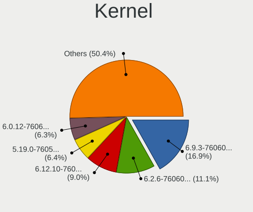

| Version                             | Notebooks | Percent |
|-------------------------------------|-----------|---------|
| 6.9.3-76060903-generic              | 731       | 16.85%  |
| 6.2.6-76060206-generic              | 480       | 11.07%  |
| 6.12.10-76061203-generic            | 390       | 8.99%   |
| 5.19.0-76051900-generic             | 276       | 6.36%   |
| 6.0.12-76060006-generic             | 273       | 6.29%   |
| 6.8.0-76060800daily20240311-generic | 260       | 5.99%   |
| 5.17.5-76051705-generic             | 237       | 5.46%   |
| 6.6.10-76060610-generic             | 191       | 4.4%    |
| 6.4.6-76060406-generic              | 188       | 4.33%   |
| 6.0.6-76060006-generic              | 166       | 3.83%   |
| 6.5.6-76060506-generic              | 163       | 3.76%   |
| 6.6.6-76060606-generic              | 128       | 2.95%   |
| 5.18.10-76051810-generic            | 119       | 2.74%   |
| 6.16.3-76061603-generic             | 107       | 2.47%   |
| 5.17.15-76051715-generic            | 105       | 2.42%   |
| 6.2.0-76060200-generic              | 79        | 1.82%   |
| 5.16.19-76051619-generic            | 72        | 1.66%   |
| 6.5.4-76060504-generic              | 66        | 1.52%   |
| 6.0.2-76060002-generic              | 59        | 1.36%   |
| 6.1.11-76060111-generic             | 54        | 1.25%   |
| 6.17.4-76061704-generic             | 48        | 1.11%   |
| 6.0.3-76060003-generic              | 24        | 0.55%   |
| 5.19.16-76051916-generic            | 21        | 0.48%   |
| 6.5.7-060507-generic                | 3         | 0.07%   |
| 6.7.10-x64v3-xanmod1                | 2         | 0.05%   |
| 6.4.0-060400-generic                | 2         | 0.05%   |
| 6.3.7-060307-generic                | 2         | 0.05%   |
| 6.2.11-060211-generic               | 2         | 0.05%   |
| 6.1.0-1006-oem                      | 2         | 0.05%   |
| 5.17.5-051705-generic               | 2         | 0.05%   |
| 5.16.15-76051615-generic            | 2         | 0.05%   |
| 6.9.1-060901-generic                | 1         | 0.02%   |
| 6.8.9-x64v4-xanmod1                 | 1         | 0.02%   |
| 6.8.0-060800rc1-generic             | 1         | 0.02%   |
| 6.7.5-060705-generic                | 1         | 0.02%   |
| 6.5.8-x64v1-xanmod1                 | 1         | 0.02%   |
| 6.5.5-x64v3-xanmod1                 | 1         | 0.02%   |
| 6.5.12-x64v3-xanmod1                | 1         | 0.02%   |
| 6.5.10-x64v2-xanmod1                | 1         | 0.02%   |
| 6.5.0-rc2                           | 1         | 0.02%   |

Kernel Family
-------------

Linux kernel without a distro release

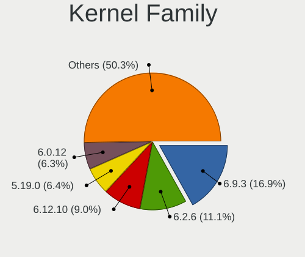

| Version | Notebooks | Percent |
|---------|-----------|---------|
| 6.9.3   | 731       | 16.87%  |
| 6.2.6   | 481       | 11.1%   |
| 6.12.10 | 390       | 9%      |
| 5.19.0  | 279       | 6.44%   |
| 6.0.12  | 273       | 6.3%    |
| 6.8.0   | 261       | 6.02%   |
| 5.17.5  | 240       | 5.54%   |
| 6.6.10  | 191       | 4.41%   |
| 6.4.6   | 188       | 4.34%   |
| 6.0.6   | 166       | 3.83%   |
| 6.5.6   | 163       | 3.76%   |
| 6.6.6   | 128       | 2.95%   |
| 5.18.10 | 119       | 2.75%   |
| 6.16.3  | 107       | 2.47%   |
| 5.17.15 | 105       | 2.42%   |
| 6.2.0   | 79        | 1.82%   |
| 5.16.19 | 72        | 1.66%   |
| 6.5.4   | 66        | 1.52%   |
| 6.0.2   | 60        | 1.38%   |
| 6.1.11  | 54        | 1.25%   |
| 6.17.4  | 48        | 1.11%   |
| 6.0.3   | 24        | 0.55%   |
| 5.19.16 | 21        | 0.48%   |
| 6.5.7   | 3         | 0.07%   |
| 6.5.0   | 3         | 0.07%   |
| 5.15.0  | 3         | 0.07%   |
| 6.7.10  | 2         | 0.05%   |
| 6.4.0   | 2         | 0.05%   |
| 6.3.9   | 2         | 0.05%   |
| 6.3.7   | 2         | 0.05%   |
| 6.2.11  | 2         | 0.05%   |
| 6.15.0  | 2         | 0.05%   |
| 6.12.3  | 2         | 0.05%   |
| 6.12.0  | 2         | 0.05%   |
| 6.11.0  | 2         | 0.05%   |
| 6.10.6  | 2         | 0.05%   |
| 6.1.9   | 2         | 0.05%   |
| 6.1.0   | 2         | 0.05%   |
| 6.0.9   | 2         | 0.05%   |
| 6.0.0   | 2         | 0.05%   |

Kernel Major Ver.
-----------------

Linux kernel major version

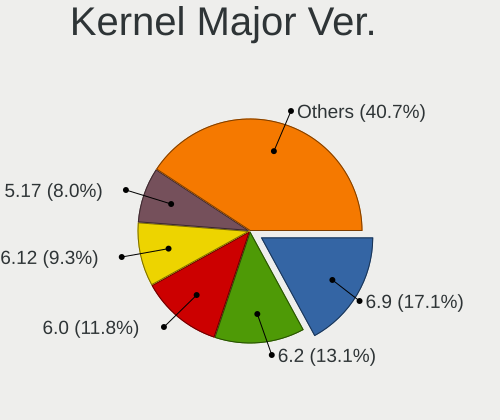

| Version | Notebooks | Percent |
|---------|-----------|---------|
| 6.9     | 732       | 17.07%  |
| 6.2     | 560       | 13.06%  |
| 6.0     | 508       | 11.85%  |
| 6.12    | 397       | 9.26%   |
| 5.17    | 344       | 8.02%   |
| 6.6     | 312       | 7.28%   |
| 5.19    | 302       | 7.04%   |
| 6.8     | 262       | 6.11%   |
| 6.5     | 236       | 5.5%    |
| 6.4     | 192       | 4.48%   |
| 5.18    | 123       | 2.87%   |
| 6.16    | 108       | 2.52%   |
| 5.16    | 75        | 1.75%   |
| 6.1     | 61        | 1.42%   |
| 6.17    | 48        | 1.12%   |
| 6.3     | 8         | 0.19%   |
| 5.15    | 5         | 0.12%   |
| 6.10    | 4         | 0.09%   |
| 6.7     | 3         | 0.07%   |
| 6.15    | 3         | 0.07%   |
| 6.11    | 2         | 0.05%   |
| 6.18    | 1         | 0.02%   |
| 6.14    | 1         | 0.02%   |
| 6.13    | 1         | 0.02%   |

Arch
----

OS architecture (x86_64, i586, etc.)

| Name   | Notebooks | Percent |
|--------|-----------|---------|
| x86_64 | 3898      | 100%    |

DE
--

Desktop Environment

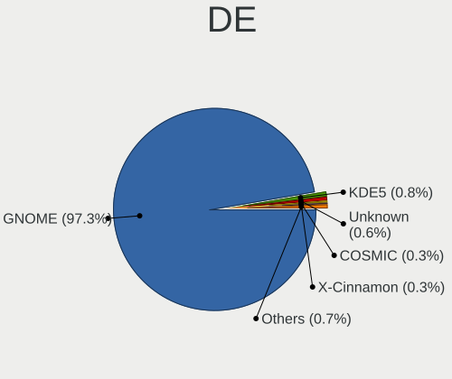

| Name            | Notebooks | Percent |
|-----------------|-----------|---------|
| GNOME           | 3806      | 97.29%  |
| KDE5            | 33        | 0.84%   |
| Unknown         | 24        | 0.61%   |
| COSMIC          | 13        | 0.33%   |
| X-Cinnamon      | 10        | 0.26%   |
| Unity           | 6         | 0.15%   |
| GNOME Flashback | 5         | 0.13%   |
| XFCE            | 4         | 0.1%    |
| MATE            | 3         | 0.08%   |
| Cinnamon        | 3         | 0.08%   |
| LXQt            | 2         | 0.05%   |
| awesome         | 2         | 0.05%   |
| i3              | 1         | 0.03%   |

Display Server
--------------

X11 or Wayland

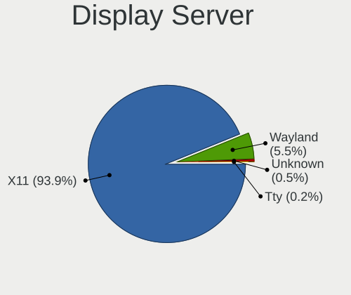

| Name    | Notebooks | Percent |
|---------|-----------|---------|
| X11     | 3688      | 93.87%  |
| Wayland | 216       | 5.5%    |
| Unknown | 19        | 0.48%   |
| Tty     | 6         | 0.15%   |

Display Manager
---------------

SDDM, LightDM, etc.

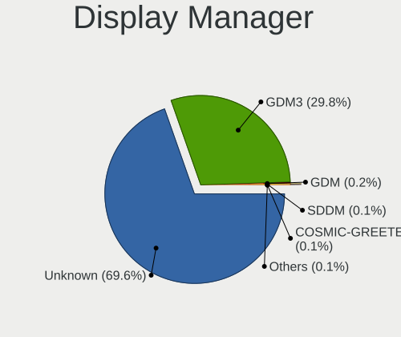

| Name           | Notebooks | Percent |
|----------------|-----------|---------|
| Unknown        | 2743      | 69.62%  |
| GDM3           | 1176      | 29.85%  |
| GDM            | 8         | 0.2%    |
| SDDM           | 5         | 0.13%   |
| COSMIC-GREETER | 5         | 0.13%   |
| LightDM        | 3         | 0.08%   |

OS Lang
-------

Language

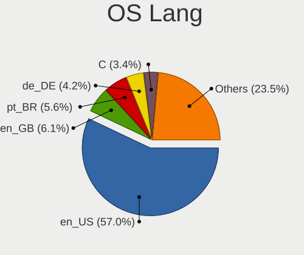

| Lang    | Notebooks | Percent |
|---------|-----------|---------|
| en_US   | 2242      | 57.05%  |
| en_GB   | 240       | 6.11%   |
| pt_BR   | 222       | 5.65%   |
| de_DE   | 166       | 4.22%   |
| C       | 135       | 3.44%   |
| en_AU   | 101       | 2.57%   |
| fr_FR   | 94        | 2.39%   |
| it_IT   | 86        | 2.19%   |
| en_CA   | 64        | 1.63%   |
| es_ES   | 60        | 1.53%   |
| pl_PL   | 50        | 1.27%   |
| ru_RU   | 46        | 1.17%   |
| pt_PT   | 29        | 0.74%   |
| tr_TR   | 24        | 0.61%   |
| en_IN   | 23        | 0.59%   |
| Unknown | 21        | 0.53%   |
| nb_NO   | 20        | 0.51%   |
| sv_SE   | 19        | 0.48%   |
| es_MX   | 18        | 0.46%   |
| nl_NL   | 15        | 0.38%   |
| hu_HU   | 15        | 0.38%   |
| en_NZ   | 15        | 0.38%   |
| en_IE   | 15        | 0.38%   |
| fi_FI   | 14        | 0.36%   |
| es_CL   | 14        | 0.36%   |
| es_AR   | 13        | 0.33%   |
| en_ZA   | 13        | 0.33%   |
| cs_CZ   | 13        | 0.33%   |
| en_DK   | 12        | 0.31%   |
| de_CH   | 11        | 0.28%   |
| es_CO   | 9         | 0.23%   |
| de_AT   | 9         | 0.23%   |
| da_DK   | 9         | 0.23%   |
| zh_CN   | 7         | 0.18%   |
| sk_SK   | 7         | 0.18%   |
| fr_CH   | 6         | 0.15%   |
| fr_CA   | 6         | 0.15%   |
| fr_BE   | 6         | 0.15%   |
| zh_TW   | 4         | 0.1%    |
| en_PH   | 4         | 0.1%    |

Boot Mode
---------

EFI or BIOS

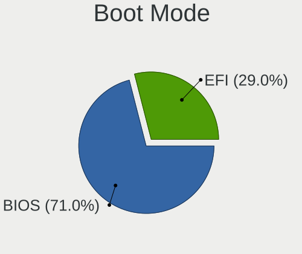

| Mode | Notebooks | Percent |
|------|-----------|---------|
| BIOS | 2794      | 71%     |
| EFI  | 1141      | 29%     |

Filesystem
----------

Type of filesystem

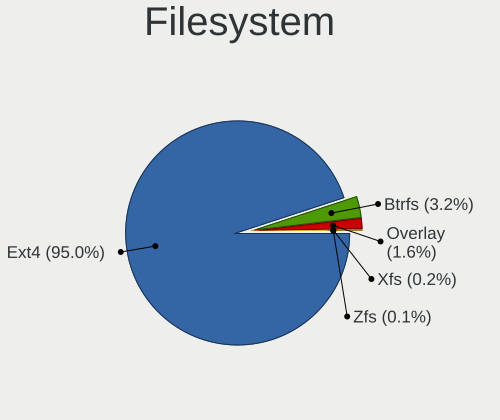

| Type    | Notebooks | Percent |
|---------|-----------|---------|
| Ext4    | 3714      | 94.96%  |
| Btrfs   | 124       | 3.17%   |
| Overlay | 63        | 1.61%   |
| Xfs     | 8         | 0.2%    |
| Zfs     | 2         | 0.05%   |

Part. scheme
------------

Scheme of partitioning

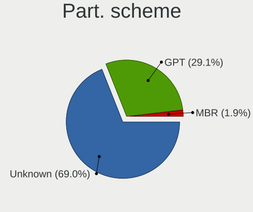

| Type    | Notebooks | Percent |
|---------|-----------|---------|
| Unknown | 2718      | 69.02%  |
| GPT     | 1146      | 29.1%   |
| MBR     | 74        | 1.88%   |

Dual Boot with Linux/BSD
------------------------

Hosting more than one Linux/BSD

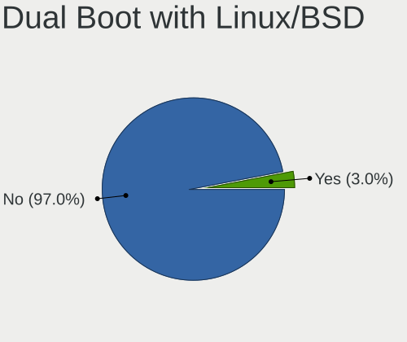

| Dual boot | Notebooks | Percent |
|-----------|-----------|---------|
| No        | 3789      | 96.98%  |
| Yes       | 118       | 3.02%   |

Dual Boot (Win)
---------------

Hosting Linux and Windows

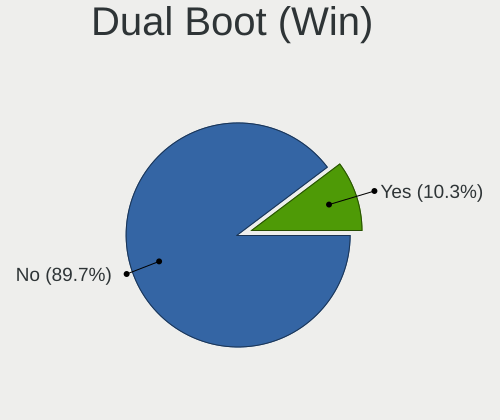

| Dual boot | Notebooks | Percent |
|-----------|-----------|---------|
| No        | 3519      | 89.72%  |
| Yes       | 403       | 10.28%  |

Board
-----

Vendor
------

Motherboard manufacturer

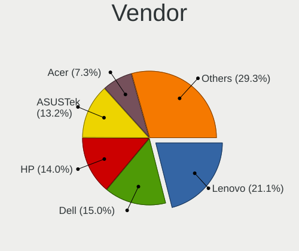

| Name                   | Notebooks | Percent |
|------------------------|-----------|---------|
| Lenovo                 | 821       | 21.06%  |
| Dell                   | 585       | 15.01%  |
| Hewlett-Packard        | 546       | 14.01%  |
| ASUSTek Computer       | 516       | 13.24%  |
| Acer                   | 286       | 7.34%   |
| Apple                  | 269       | 6.9%    |
| MSI                    | 151       | 3.87%   |
| System76               | 143       | 3.67%   |
| Toshiba                | 59        | 1.51%   |
| HUAWEI                 | 59        | 1.51%   |
| Samsung Electronics    | 52        | 1.33%   |
| Alienware              | 35        | 0.9%    |
| Google                 | 32        | 0.82%   |
| Notebook               | 29        | 0.74%   |
| Unknown                | 18        | 0.46%   |
| Sony                   | 17        | 0.44%   |
| Gigabyte Technology    | 16        | 0.41%   |
| Fujitsu                | 15        | 0.38%   |
| Razer                  | 14        | 0.36%   |
| Framework              | 14        | 0.36%   |
| Positivo               | 12        | 0.31%   |
| PC Specialist          | 12        | 0.31%   |
| GPU Company            | 12        | 0.31%   |
| Timi                   | 11        | 0.28%   |
| LG Electronics         | 10        | 0.26%   |
| Medion                 | 9         | 0.23%   |
| HONOR                  | 8         | 0.21%   |
| GPD                    | 6         | 0.15%   |
| Avell High Performance | 6         | 0.15%   |
| Schenker               | 5         | 0.13%   |
| Chuwi                  | 5         | 0.13%   |
| TUXEDO                 | 4         | 0.1%    |
| Panasonic              | 4         | 0.1%    |
| Infinix                | 4         | 0.1%    |
| Clevo                  | 4         | 0.1%    |
| ASRock                 | 4         | 0.1%    |
| Valve                  | 3         | 0.08%   |
| Packard Bell           | 3         | 0.08%   |
| ELUKTRONICS            | 3         | 0.08%   |
| XIAOMI                 | 2         | 0.05%   |

Model
-----

Motherboard model

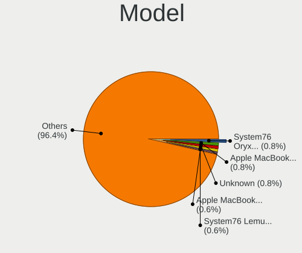

| Name                                | Notebooks | Percent |
|-------------------------------------|-----------|---------|
| System76 Oryx Pro                   | 32        | 0.82%   |
| Apple MacBookAir7,2                 | 30        | 0.77%   |
| Unknown                             | 30        | 0.77%   |
| Apple MacBookPro9,2                 | 25        | 0.64%   |
| System76 Lemur Pro                  | 23        | 0.59%   |
| System76 Gazelle                    | 21        | 0.54%   |
| System76 Darter Pro                 | 18        | 0.46%   |
| Apple MacBookPro8,1                 | 18        | 0.46%   |
| Apple MacBookPro12,1                | 18        | 0.46%   |
| System76 Pangolin                   | 16        | 0.41%   |
| Apple MacBookPro11,3                | 16        | 0.41%   |
| Apple MacBookPro11,1                | 16        | 0.41%   |
| Apple MacBookAir6,2                 | 16        | 0.41%   |
| HP Dev One Notebook PC              | 13        | 0.33%   |
| System76 Galago Pro                 | 12        | 0.31%   |
| HP Notebook                         | 12        | 0.31%   |
| Lenovo Legion 5 15ACH6H 82JU        | 11        | 0.28%   |
| Dell XPS 15 9570                    | 11        | 0.28%   |
| Acer Nitro AN515-58                 | 11        | 0.28%   |
| Dell XPS 15 7590                    | 10        | 0.26%   |
| Apple MacBookPro10,1                | 10        | 0.26%   |
| Lenovo IdeaPad Gaming 3 15ACH6 82K2 | 9         | 0.23%   |
| Lenovo IdeaPad 3 15ALC6 82MF        | 9         | 0.23%   |
| HP Pavilion dv6                     | 9         | 0.23%   |
| Dell Inspiron 15 7000 Gaming        | 9         | 0.23%   |
| Apple MacBookPro8,2                 | 9         | 0.23%   |
| Apple MacBookPro7,1                 | 9         | 0.23%   |
| System76 Adder WS                   | 8         | 0.21%   |
| Dell XPS 15 9520                    | 8         | 0.21%   |
| Dell XPS 13 9370                    | 8         | 0.21%   |
| Apple MacBook5,1                    | 8         | 0.21%   |
| Acer Aspire A515-45                 | 8         | 0.21%   |
| Lenovo IdeaPad S145-15API 81V7      | 7         | 0.18%   |
| Lenovo IdeaPad Gaming 3 15IAH7 82S9 | 7         | 0.18%   |
| HUAWEI BOHB-WAX9                    | 7         | 0.18%   |
| HP Victus by Laptop 16-e0xxx        | 7         | 0.18%   |
| HP Pavilion g6                      | 7         | 0.18%   |
| HP Pavilion dv7                     | 7         | 0.18%   |
| HP Pavilion 15                      | 7         | 0.18%   |
| HP Laptop 15s-eq2xxx                | 7         | 0.18%   |

Model Family
------------

Motherboard model prefix

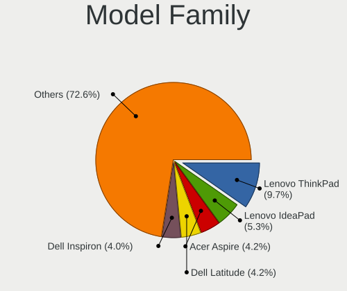

| Name               | Notebooks | Percent |
|--------------------|-----------|---------|
| Lenovo ThinkPad    | 378       | 9.7%    |
| Lenovo IdeaPad     | 207       | 5.31%   |
| Acer Aspire        | 165       | 4.23%   |
| Dell Latitude      | 164       | 4.21%   |
| Dell Inspiron      | 156       | 4%      |
| ASUS VivoBook      | 113       | 2.9%    |
| Dell XPS           | 107       | 2.74%   |
| HP Pavilion        | 106       | 2.72%   |
| Lenovo Legion      | 96        | 2.46%   |
| ASUS ROG           | 94        | 2.41%   |
| HP EliteBook       | 89        | 2.28%   |
| HP Laptop          | 82        | 2.1%    |
| ASUS ASUS          | 81        | 2.08%   |
| Dell Precision     | 65        | 1.67%   |
| HP ProBook         | 59        | 1.51%   |
| Acer Nitro         | 57        | 1.46%   |
| Toshiba Satellite  | 49        | 1.26%   |
| Apple MacBookPro11 | 49        | 1.26%   |
| Dell Vostro        | 38        | 0.97%   |
| HP ZBook           | 37        | 0.95%   |
| ASUS ZenBook       | 34        | 0.87%   |
| HP OMEN            | 33        | 0.85%   |
| System76 Oryx      | 32        | 0.82%   |
| Acer Swift         | 31        | 0.8%    |
| Apple MacBookAir7  | 30        | 0.77%   |
| Unknown            | 30        | 0.77%   |
| Apple MacBookPro8  | 28        | 0.72%   |
| Apple MacBookPro9  | 27        | 0.69%   |
| Lenovo ThinkBook   | 26        | 0.67%   |
| HP Victus          | 25        | 0.64%   |
| System76 Lemur     | 24        | 0.62%   |
| Lenovo Yoga        | 24        | 0.62%   |
| System76 Gazelle   | 21        | 0.54%   |
| Acer Predator      | 19        | 0.49%   |
| System76 Darter    | 18        | 0.46%   |
| HP ENVY            | 18        | 0.46%   |
| Apple MacBookPro12 | 18        | 0.46%   |
| Dell G15           | 17        | 0.44%   |
| Apple MacBookAir6  | 17        | 0.44%   |
| System76 Pangolin  | 16        | 0.41%   |

MFG Year
--------

Motherboard manufacture year

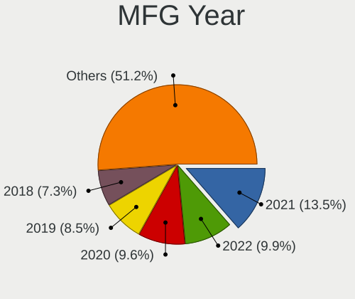

| Year    | Notebooks | Percent |
|---------|-----------|---------|
| 2021    | 528       | 13.55%  |
| 2022    | 387       | 9.93%   |
| 2020    | 373       | 9.57%   |
| 2019    | 330       | 8.47%   |
| 2018    | 285       | 7.31%   |
| 2023    | 260       | 6.67%   |
| 2012    | 225       | 5.77%   |
| 2013    | 222       | 5.7%    |
| 2017    | 192       | 4.93%   |
| 2011    | 176       | 4.52%   |
| 2015    | 175       | 4.49%   |
| 2016    | 174       | 4.46%   |
| 2014    | 171       | 4.39%   |
| 2024    | 126       | 3.23%   |
| 2010    | 80        | 2.05%   |
| 2009    | 70        | 1.8%    |
| 2008    | 56        | 1.44%   |
| 2006    | 32        | 0.82%   |
| 2025    | 22        | 0.56%   |
| 2007    | 13        | 0.33%   |
| Unknown | 1         | 0.03%   |

Form Factor
-----------

Physical design of the computer

| Name     | Notebooks | Percent |
|----------|-----------|---------|
| Notebook | 3898      | 100%    |

Secure Boot
-----------

Enabled or disabled

| State    | Notebooks | Percent |
|----------|-----------|---------|
| Disabled | 3898      | 100%    |

Coreboot
--------

Have coreboot on board

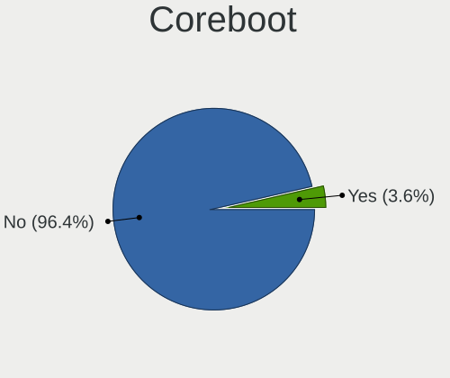

| Used | Notebooks | Percent |
|------|-----------|---------|
| No   | 3759      | 96.43%  |
| Yes  | 139       | 3.57%   |

RAM Size
--------

Total RAM memory

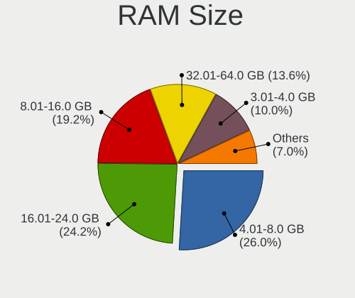

| Size in GB  | Notebooks | Percent |
|-------------|-----------|---------|
| 4.01-8.0    | 1020      | 25.95%  |
| 16.01-24.0  | 952       | 24.22%  |
| 8.01-16.0   | 755       | 19.21%  |
| 32.01-64.0  | 536       | 13.64%  |
| 3.01-4.0    | 392       | 9.97%   |
| 64.01-256.0 | 131       | 3.33%   |
| 24.01-32.0  | 108       | 2.75%   |
| 1.01-2.0    | 19        | 0.48%   |
| 2.01-3.0    | 17        | 0.43%   |

RAM Used
--------

Used RAM memory

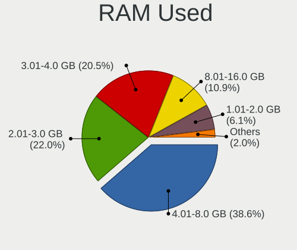

| Used GB    | Notebooks | Percent |
|------------|-----------|---------|
| 4.01-8.0   | 1625      | 38.64%  |
| 2.01-3.0   | 923       | 21.95%  |
| 3.01-4.0   | 861       | 20.48%  |
| 8.01-16.0  | 457       | 10.87%  |
| 1.01-2.0   | 256       | 6.09%   |
| 16.01-24.0 | 63        | 1.5%    |
| 24.01-32.0 | 15        | 0.36%   |
| 32.01-64.0 | 3         | 0.07%   |
| 0.51-1.0   | 2         | 0.05%   |

Total Drives
------------

Number of drives on board

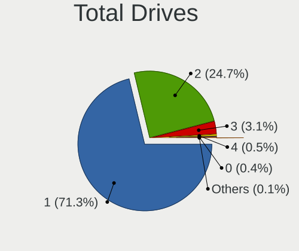

| Drives | Notebooks | Percent |
|--------|-----------|---------|
| 1      | 2815      | 71.27%  |
| 2      | 974       | 24.66%  |
| 3      | 124       | 3.14%   |
| 4      | 19        | 0.48%   |
| 0      | 14        | 0.35%   |
| 5      | 3         | 0.08%   |
| 7      | 1         | 0.03%   |

Has CD-ROM
----------

Has CD-ROM on board

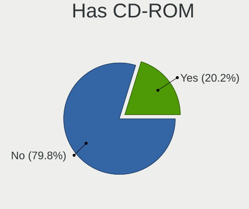

| Presented | Notebooks | Percent |
|-----------|-----------|---------|
| No        | 3113      | 79.76%  |
| Yes       | 790       | 20.24%  |

Has Ethernet
------------

Has Ethernet on board

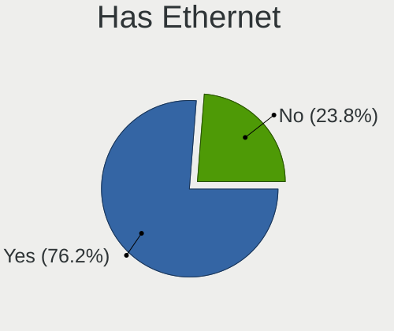

| Presented | Notebooks | Percent |
|-----------|-----------|---------|
| Yes       | 2989      | 76.25%  |
| No        | 931       | 23.75%  |

Has WiFi
--------

Has WiFi module

| Presented | Notebooks | Percent |
|-----------|-----------|---------|
| Yes       | 3748      | 96.13%  |
| No        | 151       | 3.87%   |

Has Bluetooth
-------------

Has Bluetooth module

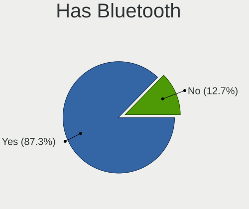

| Presented | Notebooks | Percent |
|-----------|-----------|---------|
| Yes       | 3424      | 87.3%   |
| No        | 498       | 12.7%   |

Location
--------

Country
-------

Geographic location (country)

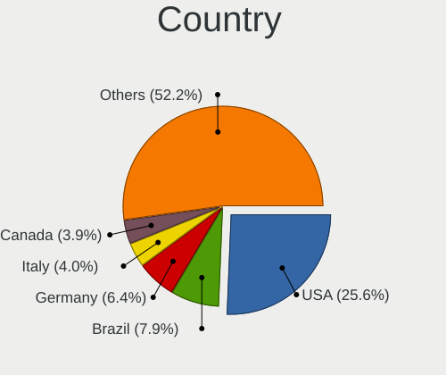

| Country      | Notebooks | Percent |
|--------------|-----------|---------|
| USA          | 1005      | 25.64%  |
| Brazil       | 310       | 7.91%   |
| Germany      | 249       | 6.35%   |
| Italy        | 157       | 4.01%   |
| Canada       | 152       | 3.88%   |
| UK           | 151       | 3.85%   |
| India        | 145       | 3.7%    |
| France       | 127       | 3.24%   |
| Australia    | 125       | 3.19%   |
| Poland       | 82        | 2.09%   |
| Russia       | 81        | 2.07%   |
| Spain        | 79        | 2.02%   |
| Netherlands  | 76        | 1.94%   |
| Sweden       | 55        | 1.4%    |
| Mexico       | 51        | 1.3%    |
| Portugal     | 48        | 1.22%   |
| Turkey       | 47        | 1.2%    |
| Indonesia    | 45        | 1.15%   |
| Czechia      | 44        | 1.12%   |
| Norway       | 43        | 1.1%    |
| Switzerland  | 34        | 0.87%   |
| Finland      | 34        | 0.87%   |
| Denmark      | 33        | 0.84%   |
| Romania      | 32        | 0.82%   |
| Philippines  | 30        | 0.77%   |
| New Zealand  | 30        | 0.77%   |
| Hungary      | 29        | 0.74%   |
| Belgium      | 27        | 0.69%   |
| South Africa | 26        | 0.66%   |
| Chile        | 25        | 0.64%   |
| Austria      | 25        | 0.64%   |
| Argentina    | 25        | 0.64%   |
| Ireland      | 22        | 0.56%   |
| Bulgaria     | 22        | 0.56%   |
| Serbia       | 20        | 0.51%   |
| Greece       | 20        | 0.51%   |
| Thailand     | 17        | 0.43%   |
| Colombia     | 17        | 0.43%   |
| Slovakia     | 16        | 0.41%   |
| Japan        | 14        | 0.36%   |

City
----

Geographic location (city)

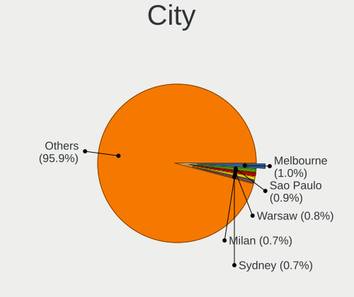

| City           | Notebooks | Percent |
|----------------|-----------|---------|
| Melbourne      | 42        | 1.02%   |
| Sao Paulo      | 36        | 0.87%   |
| Warsaw         | 32        | 0.78%   |
| Milan          | 30        | 0.73%   |
| Sydney         | 29        | 0.7%    |
| Brisbane       | 28        | 0.68%   |
| Helsinki       | 27        | 0.65%   |
| Berlin         | 26        | 0.63%   |
| Istanbul       | 24        | 0.58%   |
| Chicago        | 23        | 0.56%   |
| Bengaluru      | 22        | 0.53%   |
| Moscow         | 21        | 0.51%   |
| Madrid         | 21        | 0.51%   |
| Paris          | 20        | 0.48%   |
| Prague         | 19        | 0.46%   |
| New York       | 19        | 0.46%   |
| Oslo           | 18        | 0.44%   |
| Denver         | 18        | 0.44%   |
| Auckland       | 18        | 0.44%   |
| Rome           | 16        | 0.39%   |
| Seattle        | 15        | 0.36%   |
| Rio de Janeiro | 15        | 0.36%   |
| Lisbon         | 15        | 0.36%   |
| Toronto        | 14        | 0.34%   |
| Jakarta        | 14        | 0.34%   |
| Delhi          | 14        | 0.34%   |
| Budapest       | 14        | 0.34%   |
| Vienna         | 13        | 0.32%   |
| St Petersburg  | 13        | 0.32%   |
| Sofia          | 13        | 0.32%   |
| Los Angeles    | 13        | 0.32%   |
| Mexico City    | 12        | 0.29%   |
| Dublin         | 12        | 0.29%   |
| Dallas         | 12        | 0.29%   |
| Belgrade       | 12        | 0.29%   |
| Amsterdam      | 12        | 0.29%   |
| Singapore      | 11        | 0.27%   |
| Salt Lake City | 11        | 0.27%   |
| Munich         | 11        | 0.27%   |
| Mumbai         | 11        | 0.27%   |

Drives
------

Drive Vendor
------------

Hard drive vendors

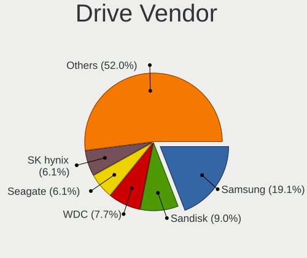

| Vendor                         | Notebooks | Drives | Percent |
|--------------------------------|-----------|--------|---------|
| Samsung Electronics            | 957       | 1273   | 19.11%  |
| Sandisk                        | 452       | 574    | 9.03%   |
| WDC                            | 385       | 446    | 7.69%   |
| Seagate                        | 305       | 353    | 6.09%   |
| SK hynix                       | 304       | 351    | 6.07%   |
| Toshiba                        | 238       | 278    | 4.75%   |
| Micron Technology              | 235       | 278    | 4.69%   |
| Kingston                       | 235       | 286    | 4.69%   |
| Intel                          | 179       | 214    | 3.57%   |
| Unknown                        | 162       | 191    | 3.24%   |
| Apple                          | 156       | 177    | 3.12%   |
| Crucial                        | 155       | 184    | 3.1%    |
| KIOXIA                         | 99        | 114    | 1.98%   |
| HGST                           | 99        | 109    | 1.98%   |
| Micron/Crucial Technology      | 64        | 76     | 1.28%   |
| Hitachi                        | 54        | 62     | 1.08%   |
| Kingston Technology Company    | 51        | 55     | 1.02%   |
| A-DATA Technology              | 51        | 61     | 1.02%   |
| Phison Electronics             | 46        | 59     | 0.92%   |
| Silicon Motion                 | 43        | 52     | 0.86%   |
| Phison                         | 43        | 55     | 0.86%   |
| China                          | 43        | 50     | 0.86%   |
| PNY                            | 32        | 41     | 0.64%   |
| Unknown                        | 31        | 35     | 0.62%   |
| ADATA Technology               | 29        | 31     | 0.58%   |
| LITEON                         | 28        | 35     | 0.56%   |
| Intenso                        | 21        | 31     | 0.42%   |
| MAXIO Technology (Hangzhou)    | 20        | 21     | 0.4%    |
| SPCC                           | 19        | 20     | 0.38%   |
| KingSpec                       | 19        | 21     | 0.38%   |
| Transcend                      | 17        | 20     | 0.34%   |
| ASMT                           | 17        | 17     | 0.34%   |
| Team                           | 16        | 17     | 0.32%   |
| Patriot                        | 15        | 18     | 0.3%    |
| LITEONIT                       | 15        | 27     | 0.3%    |
| Netac                          | 13        | 13     | 0.26%   |
| Union Memory (Shenzhen)        | 12        | 15     | 0.24%   |
| Solid State Storage Technology | 12        | 12     | 0.24%   |
| JMicron Technology             | 12        | 14     | 0.24%   |
| Lexar                          | 11        | 14     | 0.22%   |

Drive Model
-----------

Hard drive models

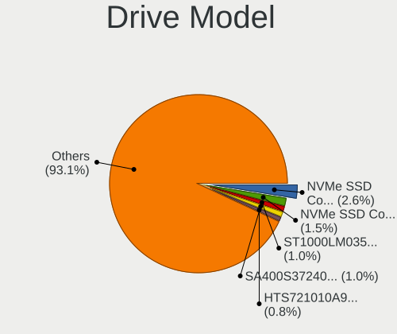

| Model                                                 | Notebooks | Percent |
|-------------------------------------------------------|-----------|---------|
| Samsung NVMe SSD Controller SM981/PM981/PM983 1TB     | 133       | 2.55%   |
| Samsung NVMe SSD Controller PM9A1/PM9A3/980PRO 1TB    | 79        | 1.52%   |
| Seagate ST1000LM035-1RK172 1TB                        | 54        | 1.04%   |
| Kingston SA400S37240G 240GB SSD                       | 52        | 1%      |
| HGST HTS721010A9E630 1TB                              | 43        | 0.82%   |
| SanDisk NVMe SSD Drive 1TB                            | 41        | 0.79%   |
| Samsung NVMe SSD Controller SM961/PM961/SM963 1024GB  | 39        | 0.75%   |
| Sandisk WD Blue SN550 NVMe SSD 1024GB                 | 37        | 0.71%   |
| Sandisk WD Black SN750 / PC SN730 NVMe SSD 500GB      | 34        | 0.65%   |
| Micron/Crucial P2 NVMe PCIe SSD 2TB                   | 33        | 0.63%   |
| Toshiba MQ04ABF100 1TB                                | 32        | 0.61%   |
| Intel SSD 660P Series 512GB                           | 31        | 0.59%   |
| Unknown                                               | 31        | 0.59%   |
| Intel SSDPEKNU512GZ 512GB                             | 29        | 0.56%   |
| Toshiba MQ01ABD100 1TB                                | 28        | 0.54%   |
| Kingston SA400S37480G 480GB SSD                       | 28        | 0.54%   |
| Apple SSD SM0128G 121GB                               | 28        | 0.54%   |
| Unknown MMC Card  64GB                                | 26        | 0.5%    |
| Seagate ST1000LM024 HN-M101MBB 1TB                    | 26        | 0.5%    |
| Unknown MMC Card  32GB                                | 25        | 0.48%   |
| Unknown MMC Card  128GB                               | 25        | 0.48%   |
| Silicon Motion SM2263EN/SM2263XT SSD Controller 512GB | 23        | 0.44%   |
| Toshiba XG6 NVMe SSD Controller 1024GB                | 21        | 0.4%    |
| Samsung SSD 980 1TB                                   | 21        | 0.4%    |
| Crucial CT1000MX500SSD1 1TB                           | 21        | 0.4%    |
| SanDisk NVMe SSD Drive 512GB                          | 20        | 0.38%   |
| Samsung SSD 860 EVO 500GB                             | 20        | 0.38%   |
| Crucial CT240BX500SSD1 240GB                          | 20        | 0.38%   |
| Samsung SSD 850 EVO 500GB                             | 19        | 0.36%   |
| Samsung SSD 870 EVO 500GB                             | 18        | 0.35%   |
| Phison E12 NVMe Controller 1TB                        | 18        | 0.35%   |
| WDC WD10SPZX-24Z10 1TB                                | 17        | 0.33%   |
| Samsung NVMe SSD Drive 512GB                          | 17        | 0.33%   |
| Crucial CT500MX500SSD1 500GB                          | 17        | 0.33%   |
| SK hynix BC501 NVMe Solid State Drive 512GB           | 16        | 0.31%   |
| Seagate ST500LT012-1DG142 500GB                       | 16        | 0.31%   |
| Seagate ST1000LM049-2GH172 1TB                        | 16        | 0.31%   |
| Sandisk WD Black SN850 1TB                            | 16        | 0.31%   |
| Phison PS5013 E13 NVMe Controller 500GB               | 16        | 0.31%   |
| Intel SSD Pro 7600p/760p/E 6100p Series 256GB         | 16        | 0.31%   |

HDD Vendor
----------

Hard disk drive vendors

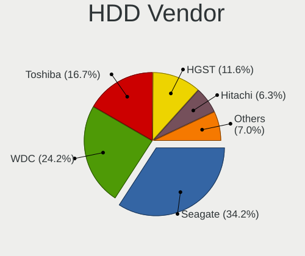

| Vendor              | Notebooks | Drives | Percent |
|---------------------|-----------|--------|---------|
| Seagate             | 292       | 338    | 34.15%  |
| WDC                 | 207       | 241    | 24.21%  |
| Toshiba             | 143       | 165    | 16.73%  |
| HGST                | 99        | 109    | 11.58%  |
| Hitachi             | 54        | 62     | 6.32%   |
| Samsung Electronics | 12        | 12     | 1.4%    |
| Unknown             | 9         | 10     | 1.05%   |
| Apple               | 9         | 10     | 1.05%   |
| JMicron Technology  | 5         | 6      | 0.58%   |
| Fujitsu             | 5         | 5      | 0.58%   |
| Intenso             | 3         | 9      | 0.35%   |
| TO Exter            | 2         | 2      | 0.23%   |
| External            | 2         | 2      | 0.23%   |
| ASMT                | 2         | 2      | 0.23%   |
| USB3.0              | 1         | 1      | 0.12%   |
| T-FORCE             | 1         | 1      | 0.12%   |
| StoreJet            | 1         | 1      | 0.12%   |
| SATAFIRM            | 1         | 1      | 0.12%   |
| Min Yi U            | 1         | 1      | 0.12%   |
| MaxDigital          | 1         | 1      | 0.12%   |
| KESU                | 1         | 1      | 0.12%   |
| Inateck             | 1         | 1      | 0.12%   |
| HGST HDN            | 1         | 1      | 0.12%   |
| ASMedia             | 1         | 1      | 0.12%   |
| Asm                 | 1         | 1      | 0.12%   |

SSD Vendor
----------

Solid state drive vendors

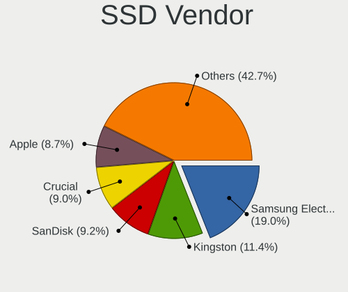

| Vendor              | Notebooks | Drives | Percent |
|---------------------|-----------|--------|---------|
| Samsung Electronics | 271       | 336    | 18.99%  |
| Kingston            | 163       | 191    | 11.42%  |
| SanDisk             | 131       | 164    | 9.18%   |
| Crucial             | 129       | 152    | 9.04%   |
| Apple               | 124       | 142    | 8.69%   |
| WDC                 | 79        | 92     | 5.54%   |
| China               | 43        | 50     | 3.01%   |
| SK hynix            | 39        | 40     | 2.73%   |
| Micron Technology   | 30        | 34     | 2.1%    |
| Intel               | 30        | 32     | 2.1%    |
| Toshiba             | 29        | 30     | 2.03%   |
| PNY                 | 29        | 37     | 2.03%   |
| A-DATA Technology   | 26        | 31     | 1.82%   |
| LITEON              | 25        | 32     | 1.75%   |
| KingSpec            | 17        | 19     | 1.19%   |
| SPCC                | 16        | 17     | 1.12%   |
| Intenso             | 16        | 20     | 1.12%   |
| Transcend           | 15        | 18     | 1.05%   |
| LITEONIT            | 15        | 27     | 1.05%   |
| Patriot             | 13        | 15     | 0.91%   |
| Netac               | 12        | 12     | 0.84%   |
| Verbatim            | 7         | 9      | 0.49%   |
| Team                | 7         | 8      | 0.49%   |
| SABRENT             | 7         | 9      | 0.49%   |
| Apacer              | 7         | 11     | 0.49%   |
| Lexar               | 6         | 8      | 0.42%   |
| Unknown             | 6         | 6      | 0.42%   |
| KIOXIA-EXCERIA      | 5         | 5      | 0.35%   |
| Hewlett-Packard     | 5         | 5      | 0.35%   |
| GOODRAM             | 4         | 4      | 0.28%   |
| Wibtek              | 3         | 5      | 0.21%   |
| Timetec             | 3         | 3      | 0.21%   |
| Teclast             | 3         | 4      | 0.21%   |
| OCZ                 | 3         | 3      | 0.21%   |
| MyDigitalSSD        | 3         | 3      | 0.21%   |
| KingDian            | 3         | 3      | 0.21%   |
| Fanxiang            | 3         | 3      | 0.21%   |
| Dogfish             | 3         | 4      | 0.21%   |
| Corsair             | 3         | 3      | 0.21%   |
| BHT                 | 3         | 3      | 0.21%   |

Drive Kind
----------

HDD or SSD

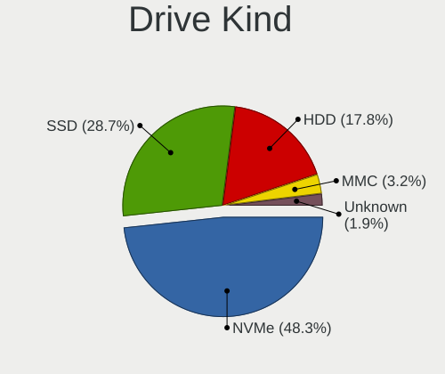

| Kind    | Notebooks | Drives | Percent |
|---------|-----------|--------|---------|
| NVMe    | 2222      | 3101   | 48.3%   |
| SSD     | 1322      | 1687   | 28.74%  |
| HDD     | 821       | 984    | 17.85%  |
| MMC     | 146       | 168    | 3.17%   |
| Unknown | 89        | 106    | 1.93%   |

Drive Connector
---------------

SATA, SAS, NVMe, etc.

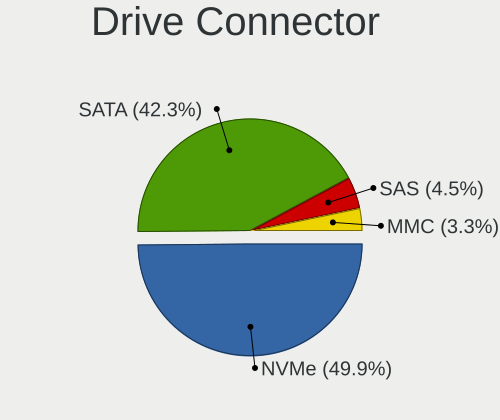

| Type | Notebooks | Drives | Percent |
|------|-----------|--------|---------|
| NVMe | 2217      | 3080   | 49.85%  |
| SATA | 1882      | 2544   | 42.32%  |
| SAS  | 202       | 254    | 4.54%   |
| MMC  | 146       | 168    | 3.28%   |

Drive Size
----------

Size of hard drive

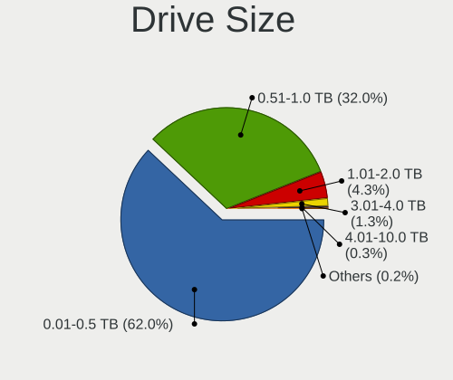

| Size in TB | Notebooks | Drives | Percent |
|------------|-----------|--------|---------|
| 0.01-0.5   | 1333      | 1688   | 62.03%  |
| 0.51-1.0   | 687       | 823    | 31.97%  |
| 1.01-2.0   | 92        | 113    | 4.28%   |
| 3.01-4.0   | 27        | 36     | 1.26%   |
| 4.01-10.0  | 6         | 7      | 0.28%   |
| 2.01-3.0   | 3         | 3      | 0.14%   |
| 10.01-20.0 | 1         | 1      | 0.05%   |

Space Total
-----------

Amount of disk space available on the file system

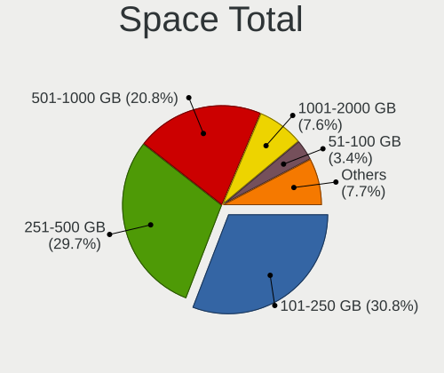

| Size in GB     | Notebooks | Percent |
|----------------|-----------|---------|
| 101-250        | 1237      | 30.85%  |
| 251-500        | 1192      | 29.73%  |
| 501-1000       | 833       | 20.77%  |
| 1001-2000      | 305       | 7.61%   |
| 51-100         | 136       | 3.39%   |
| More than 3000 | 80        | 2%      |
| 1-20           | 78        | 1.95%   |
| 2001-3000      | 71        | 1.77%   |
| 21-50          | 55        | 1.37%   |
| Unknown        | 23        | 0.57%   |

Space Used
----------

Amount of used disk space

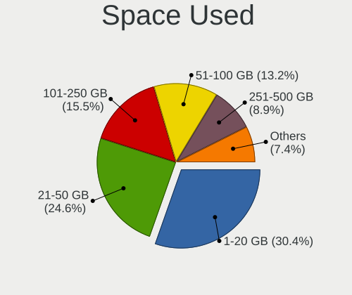

| Used GB        | Notebooks | Percent |
|----------------|-----------|---------|
| 1-20           | 1277      | 30.38%  |
| 21-50          | 1033      | 24.57%  |
| 101-250        | 652       | 15.51%  |
| 51-100         | 554       | 13.18%  |
| 251-500        | 376       | 8.94%   |
| 501-1000       | 197       | 4.69%   |
| 1001-2000      | 57        | 1.36%   |
| Unknown        | 23        | 0.55%   |
| More than 3000 | 21        | 0.5%    |
| 2001-3000      | 14        | 0.33%   |

Malfunc. Drives
---------------

Drive models with a malfunction

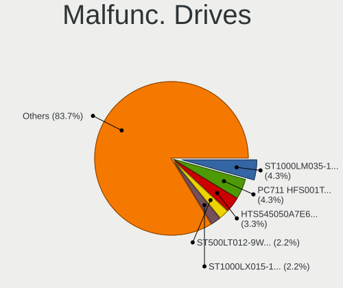

| Model                                    | Notebooks | Drives | Percent |
|------------------------------------------|-----------|--------|---------|
| SK hynix PC711 HFS001TDE9X073N 1TB       | 4         | 4      | 4.35%   |
| Seagate ST1000LM035-1RK172 1TB           | 4         | 4      | 4.35%   |
| HGST HTS545050A7E680 500GB               | 3         | 3      | 3.26%   |
| SK hynix PC711 HFS512GDE9X073N 512GB     | 2         | 2      | 2.17%   |
| Seagate ST500LT012-9WS142 500GB          | 2         | 2      | 2.17%   |
| Seagate ST1000LX015-1U7172 1TB           | 2         | 2      | 2.17%   |
| Seagate ST1000LM049-2GH172 1TB           | 2         | 2      | 2.17%   |
| Seagate ST1000LM024 HN-M101MBB 1TB       | 2         | 2      | 2.17%   |
| HGST HTS725050A7E630 500GB               | 2         | 3      | 2.17%   |
| HGST HTS541010A9E680 1TB                 | 2         | 2      | 2.17%   |
| XPG GAMMIX S41 512GB                     | 1         | 1      | 1.09%   |
| WHALEKOM SSD 512GB                       | 1         | 1      | 1.09%   |
| WDC WDS480G2G0B-00EPW0 480GB SSD         | 1         | 2      | 1.09%   |
| WDC WDS240G2G0A-00JH30 240GB SSD         | 1         | 1      | 1.09%   |
| WDC WDS200T2B0B-00YS70 2TB SSD           | 1         | 1      | 1.09%   |
| WDC WDS100T2G0A-00JH30 1TB SSD           | 1         | 1      | 1.09%   |
| WDC WDS100T2B0B-00YS70 1TB SSD           | 1         | 1      | 1.09%   |
| WDC WD5000LPVX-75V0TT0 500GB             | 1         | 1      | 1.09%   |
| WDC WD5000LPVX-22V0TT0 500GB             | 1         | 1      | 1.09%   |
| WDC WD3200BEVT-60ZCT1 320GB              | 1         | 1      | 1.09%   |
| WDC WD3200BEKX-75B7WT0 320GB             | 1         | 1      | 1.09%   |
| WDC WD3200BEKT-60PVMT0 320GB             | 1         | 1      | 1.09%   |
| WDC WD10SPZX-24Z10T0 1TB                 | 1         | 1      | 1.09%   |
| WDC WD10SPZX-22Z10T0 1TB                 | 1         | 1      | 1.09%   |
| WDC WD10SPZX-16Z10T0 1TB                 | 1         | 1      | 1.09%   |
| WDC WD10JPVX-60JC3T1 1TB                 | 1         | 1      | 1.09%   |
| WDC WD10JPVX-60JC3T0 1TB                 | 1         | 1      | 1.09%   |
| WDC WD10JPVX-22JC3T0 1TB                 | 1         | 1      | 1.09%   |
| WDC WD Green M.2 2280 480GB              | 1         | 1      | 1.09%   |
| WDC PC SN520 SDAPMUW-128G-1001 128GB     | 1         | 1      | 1.09%   |
| Toshiba THNSNK256GVN8 M.2 2280 256GB SSD | 1         | 1      | 1.09%   |
| Toshiba THNSNK128GVN8 M.2 2280 128GB SSD | 1         | 1      | 1.09%   |
| Toshiba MQ04ABF100 1TB                   | 1         | 1      | 1.09%   |
| Toshiba MQ01ACF050 500GB                 | 1         | 1      | 1.09%   |
| Toshiba MQ01ACF032 320GB                 | 1         | 1      | 1.09%   |
| Toshiba MK7559GSXP 752GB                 | 1         | 1      | 1.09%   |
| Toshiba MK3252GSX 320GB                  | 1         | 1      | 1.09%   |
| Team TM8FP4004T 4TB                      | 1         | 1      | 1.09%   |
| SSSTC CL4-8D256-Q79 256GB                | 1         | 1      | 1.09%   |
| SPCC Solid State Disk 128GB              | 1         | 1      | 1.09%   |

Malfunc. Drive Vendor
---------------------

Vendors of faulty drives

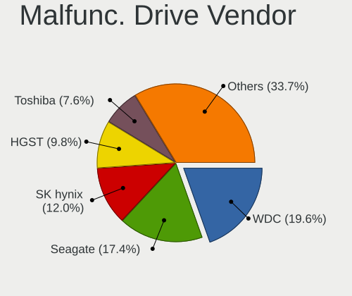

| Vendor              | Notebooks | Drives | Percent |
|---------------------|-----------|--------|---------|
| WDC                 | 18        | 19     | 19.57%  |
| Seagate             | 16        | 16     | 17.39%  |
| SK hynix            | 11        | 11     | 11.96%  |
| HGST                | 9         | 10     | 9.78%   |
| Toshiba             | 7         | 7      | 7.61%   |
| Samsung Electronics | 6         | 6      | 6.52%   |
| Intel               | 3         | 3      | 3.26%   |
| A-DATA Technology   | 3         | 3      | 3.26%   |
| Kingston            | 2         | 2      | 2.17%   |
| Crucial             | 2         | 2      | 2.17%   |
| XPG                 | 1         | 1      | 1.09%   |
| WHALEKOM            | 1         | 1      | 1.09%   |
| Team                | 1         | 1      | 1.09%   |
| SSSTC               | 1         | 1      | 1.09%   |
| SPCC                | 1         | 1      | 1.09%   |
| Silicon Motion      | 1         | 1      | 1.09%   |
| SanDisk             | 1         | 1      | 1.09%   |
| Micron Technology   | 1         | 1      | 1.09%   |
| LITEON              | 1         | 1      | 1.09%   |
| Lexar               | 1         | 1      | 1.09%   |
| Leven               | 1         | 1      | 1.09%   |
| Hitachi             | 1         | 3      | 1.09%   |
| Hewlett-Packard     | 1         | 1      | 1.09%   |
| ASMT                | 1         | 1      | 1.09%   |
| Apacer              | 1         | 1      | 1.09%   |

Malfunc. HDD Vendor
-------------------

Vendors of faulty HDD drives

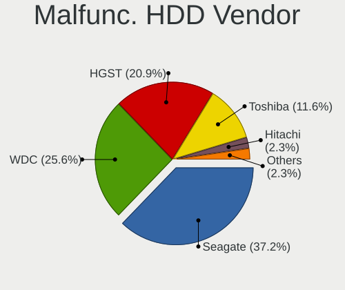

| Vendor  | Notebooks | Drives | Percent |
|---------|-----------|--------|---------|
| Seagate | 16        | 16     | 37.21%  |
| WDC     | 11        | 11     | 25.58%  |
| HGST    | 9         | 10     | 20.93%  |
| Toshiba | 5         | 5      | 11.63%  |
| Hitachi | 1         | 3      | 2.33%   |
| ASMT    | 1         | 1      | 2.33%   |

Malfunc. Drive Kind
-------------------

Kinds of faulty drives

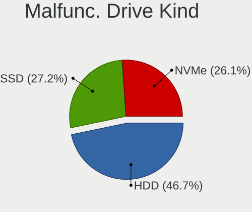

| Kind | Notebooks | Drives | Percent |
|------|-----------|--------|---------|
| HDD  | 43        | 46     | 46.74%  |
| SSD  | 25        | 26     | 27.17%  |
| NVMe | 24        | 24     | 26.09%  |

Failed Drives
-------------

Failed drive models

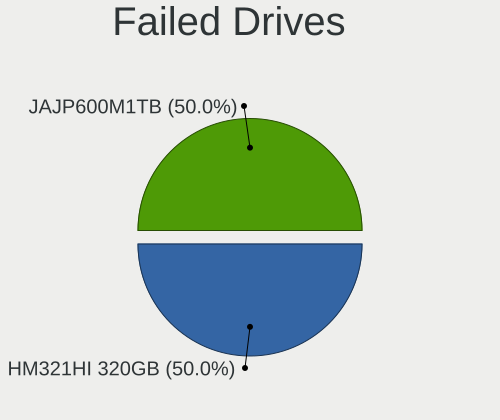

| Model                             | Notebooks | Drives | Percent |
|-----------------------------------|-----------|--------|---------|
| Samsung Electronics HM321HI 320GB | 1         | 1      | 50%     |
| Intenso JAJP600M1TB               | 1         | 1      | 50%     |

Failed Drive Vendor
-------------------

Failed drive vendors

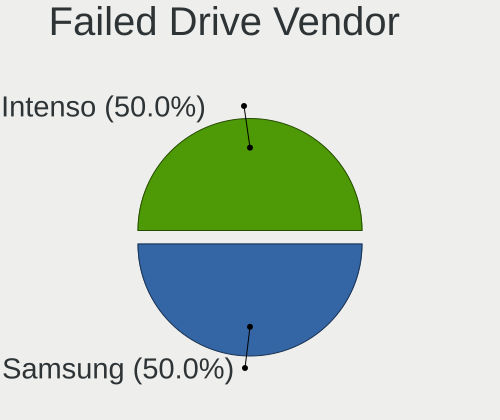

| Vendor              | Notebooks | Drives | Percent |
|---------------------|-----------|--------|---------|
| Samsung Electronics | 1         | 1      | 50%     |
| Intenso             | 1         | 1      | 50%     |

Drive Status
------------

Number of failed and malfunc. drives

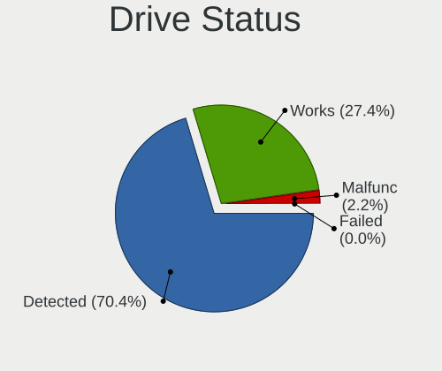

| Status   | Notebooks | Drives | Percent |
|----------|-----------|--------|---------|
| Detected | 2884      | 4454   | 70.38%  |
| Works    | 1121      | 1494   | 27.35%  |
| Malfunc  | 91        | 96     | 2.22%   |
| Failed   | 2         | 2      | 0.05%   |

Storage controller
------------------

Storage Vendor
--------------

Storage controller vendors

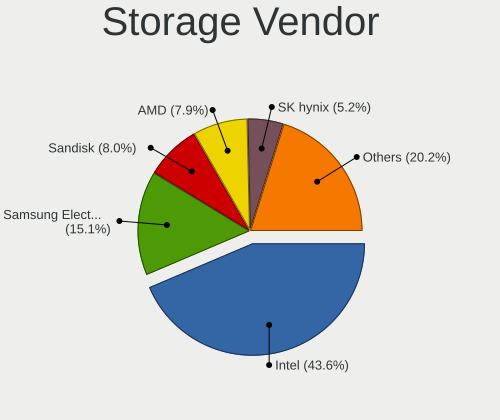

| Vendor                                  | Notebooks | Percent |
|-----------------------------------------|-----------|---------|
| Intel                                   | 2223      | 43.6%   |
| Samsung Electronics                     | 770       | 15.1%   |
| Sandisk                                 | 408       | 8%      |
| AMD                                     | 405       | 7.94%   |
| SK hynix                                | 265       | 5.2%    |
| Micron Technology                       | 208       | 4.08%   |
| Kingston Technology Company             | 122       | 2.39%   |
| Phison Electronics                      | 95        | 1.86%   |
| KIOXIA                                  | 91        | 1.78%   |
| Micron/Crucial Technology               | 81        | 1.59%   |
| Toshiba America Info Systems            | 76        | 1.49%   |
| Silicon Motion                          | 55        | 1.08%   |
| ADATA Technology                        | 53        | 1.04%   |
| Nvidia                                  | 50        | 0.98%   |
| MAXIO Technology (Hangzhou)             | 33        | 0.65%   |
| Solid State Storage Technology          | 30        | 0.59%   |
| Apple                                   | 22        | 0.43%   |
| Marvell Technology Group                | 21        | 0.41%   |
| Union Memory (Shenzhen)                 | 15        | 0.29%   |
| Solidigm                                | 15        | 0.29%   |
| Shenzhen Longsys Electronics            | 14        | 0.27%   |
| Realtek Semiconductor                   | 11        | 0.22%   |
| INNOGRIT                                | 7         | 0.14%   |
| Yangtze Memory Technologies             | 5         | 0.1%    |
| Shenzhen Unionmemory Information System | 3         | 0.06%   |
| Seagate Technology                      | 3         | 0.06%   |
| Lite-On Technology                      | 3         | 0.06%   |
| Hosin Global Electronics                | 3         | 0.06%   |
| Transcend                               | 2         | 0.04%   |
| Silicon Image                           | 2         | 0.04%   |
| O2 Micro                                | 2         | 0.04%   |
| Lenovo                                  | 2         | 0.04%   |
| OCZ Technology Group                    | 1         | 0.02%   |
| Netac Technology                        | 1         | 0.02%   |
| JMicron Technology                      | 1         | 0.02%   |
| ASMedia Technology                      | 1         | 0.02%   |

Storage Model
-------------

Storage controller models

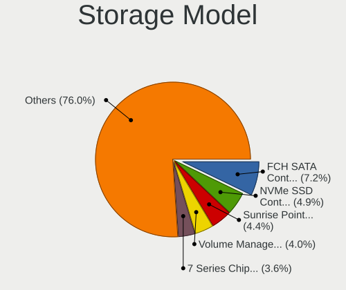

| Model                                                                          | Notebooks | Percent |
|--------------------------------------------------------------------------------|-----------|---------|
| AMD FCH SATA Controller [AHCI mode]                                            | 384       | 7.18%   |
| Samsung NVMe SSD Controller SM981/PM981/PM983                                  | 260       | 4.86%   |
| Intel Sunrise Point-LP SATA Controller [AHCI mode]                             | 234       | 4.38%   |
| Intel Volume Management Device NVMe RAID Controller                            | 212       | 3.96%   |
| Intel 7 Series Chipset Family 6-port SATA Controller [AHCI mode]               | 191       | 3.57%   |
| Intel 82801 Mobile SATA Controller [RAID mode]                                 | 181       | 3.38%   |
| Samsung NVMe SSD Controller PM9A1/PM9A3/980PRO                                 | 170       | 3.18%   |
| Intel 6 Series/C200 Series Chipset Family 6 port Mobile SATA AHCI Controller   | 169       | 3.16%   |
| Samsung NVMe SSD Controller 980 (DRAM-less)                                    | 152       | 2.84%   |
| Intel Cannon Lake Mobile PCH SATA AHCI Controller                              | 122       | 2.28%   |
| SK hynix Gold P31/BC711/PC711 NVMe Solid State Drive                           | 108       | 2.02%   |
| Intel 8 Series/C220 Series Chipset Family 6-port SATA Controller 1 [AHCI mode] | 101       | 1.89%   |
| Intel Wildcat Point-LP SATA Controller [AHCI Mode]                             | 98        | 1.83%   |
| Intel 8 Series SATA Controller 1 [AHCI mode]                                   | 98        | 1.83%   |
| Intel HM170/QM170 Chipset SATA Controller [AHCI Mode]                          | 89        | 1.66%   |
| SanDisk Ultra 3D / WD PC SN530, IX SN530, Blue SN550 NVMe SSD (DRAM-less)      | 71        | 1.33%   |
| SanDisk WD SN560/SN740/SN770/SN5000 NVMe SSD                                   | 67        | 1.25%   |
| SanDisk Extreme Pro / WD Black SN750 / PC SN730 / Red SN700 NVMe SSD           | 67        | 1.25%   |
| Intel Alder Lake-P SATA AHCI Controller                                        | 65        | 1.22%   |
| Intel Comet Lake SATA AHCI Controller                                          | 60        | 1.12%   |
| Intel 400 Series Chipset Family SATA AHCI Controller                           | 60        | 1.12%   |
| Intel SSD 660P Series                                                          | 59        | 1.1%    |
| Samsung NVMe SSD Controller SM961/PM961/SM963                                  | 58        | 1.08%   |
| SK hynix Platinum P41/PC801 NVMe Solid State Drive                             | 54        | 1.01%   |
| Intel SSD 670p Series [Keystone Harbor]                                        | 53        | 0.99%   |
| Samsung S4LN058A01[SSUBX] AHCI SSD Controller (Apple slot)                     | 51        | 0.95%   |
| Intel RST Volume Management Device Controller                                  | 51        | 0.95%   |
| Intel Tiger Lake-LP SATA Controller                                            | 50        | 0.93%   |
| Micron 2450 NVMe SSD [HendrixV] (DRAM-less)                                    | 49        | 0.92%   |
| Silicon Motion SM2263EN/SM2263XT (DRAM-less) NVMe SSD Controllers              | 45        | 0.84%   |
| Micron/Crucial P2 [Nick P2] / P3 / P3 Plus NVMe PCIe SSD (DRAM-less)           | 44        | 0.82%   |
| Intel Tiger Lake SATA AHCI Controller                                          | 44        | 0.82%   |
| KIOXIA NVMe SSD Controller BG4 (DRAM-less)                                     | 43        | 0.8%    |
| Intel 5 Series/3400 Series Chipset 4 port SATA AHCI Controller                 | 41        | 0.77%   |
| Toshiba America Info Systems XG6 NVMe SSD Controller                           | 39        | 0.73%   |
| Micron 2400 NVMe SSD (DRAM-less)                                               | 39        | 0.73%   |
| Intel Cannon Point-LP SATA Controller [AHCI Mode]                              | 39        | 0.73%   |
| Intel Q170/Q150/B150/H170/H110/Z170/CM236 Chipset SATA Controller [AHCI Mode]  | 37        | 0.69%   |
| Intel Celeron/Pentium Silver Processor SATA Controller                         | 37        | 0.69%   |
| Intel 82801IBM/IEM (ICH9M/ICH9M-E) 4 port SATA Controller [AHCI mode]          | 37        | 0.69%   |

Storage Kind
------------

Kind of storage controller (IDE, SATA, NVMe, SAS, ...)

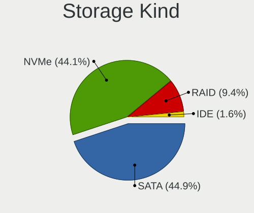

| Kind | Notebooks | Percent |
|------|-----------|---------|
| SATA | 2249      | 44.92%  |
| NVMe | 2207      | 44.08%  |
| RAID | 470       | 9.39%   |
| IDE  | 81        | 1.62%   |

Processor
---------

CPU Vendor
----------

Processor vendors

| Vendor | Notebooks | Percent |
|--------|-----------|---------|
| Intel  | 2993      | 76.78%  |
| AMD    | 905       | 23.22%  |

CPU Model
---------

Processor models

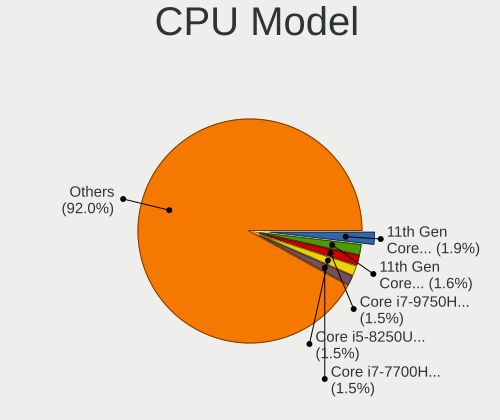

| Model                                         | Notebooks | Percent |
|-----------------------------------------------|-----------|---------|
| Intel 11th Gen Core i5-1135G7 @ 2.40GHz       | 73        | 1.87%   |
| Intel 11th Gen Core i7-11800H @ 2.30GHz       | 62        | 1.59%   |
| Intel Core i7-9750H CPU @ 2.60GHz             | 60        | 1.54%   |
| Intel Core i5-8250U CPU @ 1.60GHz             | 60        | 1.54%   |
| Intel Core i7-7700HQ CPU @ 2.80GHz            | 58        | 1.49%   |
| Intel 12th Gen Core i7-12700H                 | 57        | 1.46%   |
| Intel 11th Gen Core i7-1165G7 @ 2.80GHz       | 54        | 1.38%   |
| AMD Ryzen 7 5800H with Radeon Graphics        | 53        | 1.36%   |
| Intel Core i7-8750H CPU @ 2.20GHz             | 51        | 1.31%   |
| Intel Core i7-10750H CPU @ 2.60GHz            | 51        | 1.31%   |
| Intel Core i5-7200U CPU @ 2.50GHz             | 42        | 1.08%   |
| AMD Ryzen 5 5500U with Radeon Graphics        | 42        | 1.08%   |
| Intel Core i7-8550U CPU @ 1.80GHz             | 41        | 1.05%   |
| AMD Ryzen 7 5700U with Radeon Graphics        | 41        | 1.05%   |
| AMD Ryzen 5 3500U with Radeon Vega Mobile Gfx | 41        | 1.05%   |
| Intel Core i7-10510U CPU @ 1.80GHz            | 38        | 0.97%   |
| Intel Core i5-6300U CPU @ 2.40GHz             | 38        | 0.97%   |
| Intel Core i5-10210U CPU @ 1.60GHz            | 37        | 0.95%   |
| AMD Ryzen 7 4800H with Radeon Graphics        | 37        | 0.95%   |
| Intel Core i5-8265U CPU @ 1.60GHz             | 36        | 0.92%   |
| Intel Core i5-3210M CPU @ 2.50GHz             | 36        | 0.92%   |
| Intel Core i7-6700HQ CPU @ 2.60GHz            | 35        | 0.9%    |
| AMD Ryzen 5 5600H with Radeon Graphics        | 32        | 0.82%   |
| Intel Core i7-8565U CPU @ 1.80GHz             | 31        | 0.8%    |
| Intel Core i5-6200U CPU @ 2.30GHz             | 31        | 0.8%    |
| Intel Core i5-5200U CPU @ 2.20GHz             | 31        | 0.8%    |
| Intel Core i7-8650U CPU @ 1.90GHz             | 28        | 0.72%   |
| Intel 12th Gen Core i5-1235U                  | 28        | 0.72%   |
| AMD Ryzen 7 PRO 5850U with Radeon Graphics    | 27        | 0.69%   |
| Intel Core i5-1035G1 CPU @ 1.00GHz            | 25        | 0.64%   |
| Intel Core i5-8350U CPU @ 1.70GHz             | 24        | 0.62%   |
| Intel Core i5-10300H CPU @ 2.50GHz            | 23        | 0.59%   |
| Intel Celeron N4020 CPU @ 1.10GHz             | 23        | 0.59%   |
| Intel Core i7-7500U CPU @ 2.70GHz             | 22        | 0.56%   |
| Intel Core 2 Duo CPU P8600 @ 2.40GHz          | 22        | 0.56%   |
| Intel 12th Gen Core i7-1255U                  | 22        | 0.56%   |
| Intel Core i5-2520M CPU @ 2.50GHz             | 21        | 0.54%   |
| Intel Core i9-14900HX                         | 20        | 0.51%   |
| Intel 13th Gen Core i9-13900H                 | 20        | 0.51%   |
| Intel Core i7-4510U CPU @ 2.00GHz             | 19        | 0.49%   |

CPU Model Family
----------------

Processor model prefix

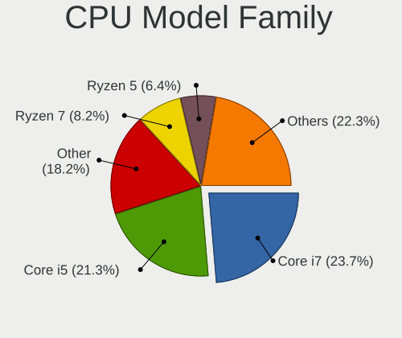

| Model                          | Notebooks | Percent |
|--------------------------------|-----------|---------|
| Intel Core i7                  | 922       | 23.65%  |
| Intel Core i5                  | 832       | 21.34%  |
| Other                          | 708       | 18.16%  |
| AMD Ryzen 7                    | 318       | 8.16%   |
| AMD Ryzen 5                    | 248       | 6.36%   |
| Intel Core i3                  | 192       | 4.93%   |
| Intel Celeron                  | 105       | 2.69%   |
| Intel Core 2 Duo               | 94        | 2.41%   |
| AMD Ryzen 9                    | 71        | 1.82%   |
| AMD Ryzen 7 PRO                | 48        | 1.23%   |
| Intel Core                     | 41        | 1.05%   |
| Intel Core i9                  | 37        | 0.95%   |
| AMD Ryzen 3                    | 32        | 0.82%   |
| Intel Pentium                  | 27        | 0.69%   |
| AMD Ryzen 5 PRO                | 26        | 0.67%   |
| AMD A6                         | 24        | 0.62%   |
| AMD A8                         | 22        | 0.56%   |
| AMD A10                        | 21        | 0.54%   |
| Intel Pentium Dual-Core        | 15        | 0.38%   |
| AMD A4                         | 14        | 0.36%   |
| Intel Xeon                     | 13        | 0.33%   |
| AMD Athlon                     | 11        | 0.28%   |
| Intel Pentium Silver           | 8         | 0.21%   |
| Intel Core M                   | 7         | 0.18%   |
| Intel Core m3                  | 5         | 0.13%   |
| AMD E1                         | 5         | 0.13%   |
| AMD E                          | 5         | 0.13%   |
| Intel Atom                     | 4         | 0.1%    |
| AMD E2                         | 4         | 0.1%    |
| AMD A12                        | 4         | 0.1%    |
| Intel Genuine                  | 3         | 0.08%   |
| AMD Ryzen 3 PRO                | 3         | 0.08%   |
| AMD FX                         | 3         | 0.08%   |
| AMD Athlon X2                  | 3         | 0.08%   |
| Intel Pentium Dual             | 2         | 0.05%   |
| Intel Core m5                  | 2         | 0.05%   |
| Intel Core 2                   | 2         | 0.05%   |
| AMD Turion X2 Dual-Core Mobile | 2         | 0.05%   |
| AMD Turion 64 X2 Mobile        | 2         | 0.05%   |
| AMD Phenom II                  | 2         | 0.05%   |

CPU Cores
---------

Number of processor cores

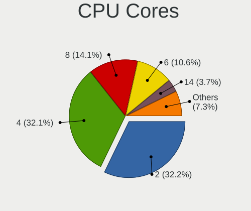

| Number | Notebooks | Percent |
|--------|-----------|---------|
| 2      | 1255      | 32.2%   |
| 4      | 1253      | 32.14%  |
| 8      | 551       | 14.14%  |
| 6      | 413       | 10.6%   |
| 14     | 143       | 3.67%   |
| 10     | 102       | 2.62%   |
| 12     | 74        | 1.9%    |
| 16     | 48        | 1.23%   |
| 24     | 45        | 1.15%   |
| 1      | 11        | 0.28%   |
| 3      | 2         | 0.05%   |
| 20     | 1         | 0.03%   |

CPU Sockets
-----------

Number of sockets

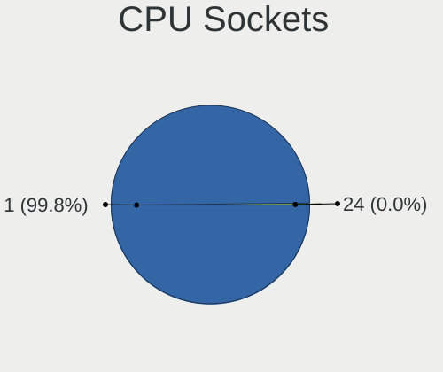

| Number | Notebooks | Percent |
|--------|-----------|---------|
| 1      | 3891      | 99.82%  |
| 2      | 6         | 0.15%   |
| 24     | 1         | 0.03%   |

CPU Threads
-----------

Threads per core (Hyper-Threading)

| Number | Notebooks | Percent |
|--------|-----------|---------|
| 2      | 3441      | 88.23%  |
| 1      | 459       | 11.77%  |

CPU Op-Modes
------------

CPU Operation Modes (32-bit, 64-bit)

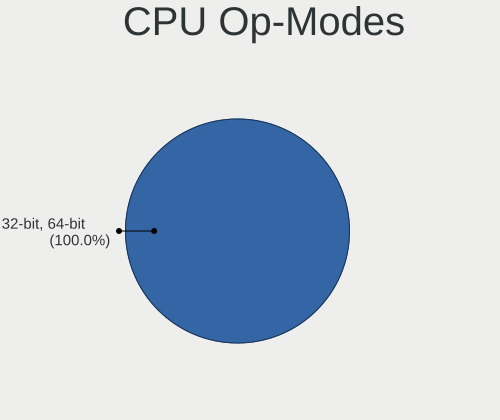

| Op mode        | Notebooks | Percent |
|----------------|-----------|---------|
| 32-bit, 64-bit | 3898      | 100%    |

CPU Microcode
-------------

Microcode number

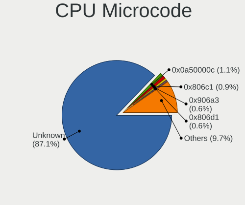

| Number     | Notebooks | Percent |
|------------|-----------|---------|
| Unknown    | 3435      | 87.14%  |
| 0x0a50000c | 44        | 1.12%   |
| 0x806c1    | 36        | 0.91%   |
| 0x906a3    | 23        | 0.58%   |
| 0x806d1    | 23        | 0.58%   |
| 0x08608103 | 22        | 0.56%   |
| 0xa0652    | 20        | 0.51%   |
| 0x806ea    | 20        | 0.51%   |
| 0x0a404102 | 20        | 0.51%   |
| 0x08600106 | 20        | 0.51%   |
| 0x806ec    | 19        | 0.48%   |
| 0x306a9    | 18        | 0.46%   |
| 0x906ea    | 17        | 0.43%   |
| 0x406e3    | 14        | 0.36%   |
| 0x0a50000d | 14        | 0.36%   |
| 0x0a404101 | 13        | 0.33%   |
| 0x08108109 | 13        | 0.33%   |
| 0x806e9    | 12        | 0.3%    |
| 0x40651    | 11        | 0.28%   |
| 0x08600104 | 11        | 0.28%   |
| 0x906a4    | 9         | 0.23%   |
| 0x206a7    | 9         | 0.23%   |
| 0x306d4    | 8         | 0.2%    |
| 0x1067a    | 8         | 0.2%    |
| 0x906e9    | 7         | 0.18%   |
| 0x706e5    | 7         | 0.18%   |
| 0x506e3    | 7         | 0.18%   |
| 0x306c3    | 7         | 0.18%   |
| 0x0a704103 | 7         | 0.18%   |
| 0x08108102 | 7         | 0.18%   |
| 0x08600103 | 6         | 0.15%   |
| 0x806eb    | 5         | 0.13%   |
| 0x706a8    | 4         | 0.1%    |
| 0x0a601203 | 4         | 0.1%    |
| 0x08608102 | 4         | 0.1%    |
| 0x906c0    | 3         | 0.08%   |
| 0x806c2    | 3         | 0.08%   |
| 0x08a00008 | 3         | 0.08%   |
| 0x0810100b | 3         | 0.08%   |
| 0xa0660    | 2         | 0.05%   |

CPU Microarch
-------------

Microarchitecture

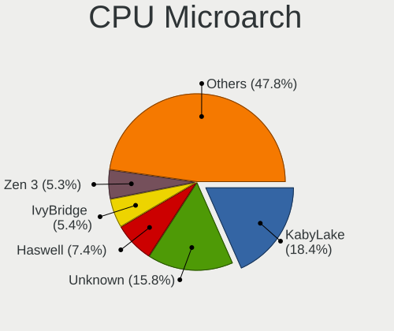

| Name               | Notebooks | Percent |
|--------------------|-----------|---------|
| KabyLake           | 718       | 18.37%  |
| Unknown            | 617       | 15.78%  |
| Haswell            | 289       | 7.39%   |
| IvyBridge          | 210       | 5.37%   |
| Zen 3              | 208       | 5.32%   |
| TigerLake          | 204       | 5.22%   |
| SandyBridge        | 201       | 5.14%   |
| Skylake            | 195       | 4.99%   |
| Alderlake Hybrid   | 172       | 4.4%    |
| Broadwell          | 159       | 4.07%   |
| CometLake          | 129       | 3.3%    |
| Zen+               | 121       | 3.1%    |
| Zen 2              | 118       | 3.02%   |
| Penryn             | 99        | 2.53%   |
| Icelake            | 96        | 2.46%   |
| Westmere           | 65        | 1.66%   |
| Goldmont plus      | 48        | 1.23%   |
| Excavator          | 38        | 0.97%   |
| Silvermont         | 36        | 0.92%   |
| Zen                | 30        | 0.77%   |
| Puma               | 23        | 0.59%   |
| Core               | 19        | 0.49%   |
| Piledriver         | 17        | 0.43%   |
| Meteorlake Hybrid  | 13        | 0.33%   |
| K10 Llano          | 13        | 0.33%   |
| Goldmont           | 12        | 0.31%   |
| Steamroller        | 8         | 0.2%    |
| Jaguar             | 8         | 0.2%    |
| Bobcat             | 8         | 0.2%    |
| K8 Hammer          | 7         | 0.18%   |
| Nehalem            | 6         | 0.15%   |
| K10                | 6         | 0.15%   |
| Gracemont          | 5         | 0.13%   |
| Tremont            | 4         | 0.1%    |
| K8 & K10 hybrid    | 4         | 0.1%    |
| Lunarlake Hybrid   | 2         | 0.05%   |
| ArrowLake-H Hybrid | 1         | 0.03%   |

Graphics
--------

GPU Vendor
----------

Vendors of graphics cards

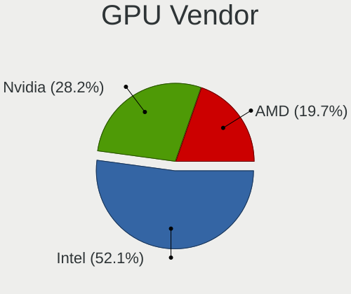

| Vendor | Notebooks | Percent |
|--------|-----------|---------|
| Intel  | 2758      | 52.15%  |
| Nvidia | 1490      | 28.17%  |
| AMD    | 1041      | 19.68%  |

GPU Model
---------

Graphics card models

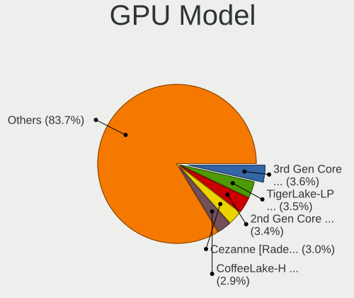

| Model                                                                     | Notebooks | Percent |
|---------------------------------------------------------------------------|-----------|---------|
| Intel 3rd Gen Core processor Graphics Controller                          | 192       | 3.56%   |
| Intel TigerLake-LP GT2 [Iris Xe Graphics]                                 | 187       | 3.47%   |
| Intel 2nd Generation Core Processor Family Integrated Graphics Controller | 181       | 3.36%   |
| AMD Cezanne [Radeon Vega Series / Radeon Vega Mobile Series]              | 162       | 3%      |
| Intel CoffeeLake-H GT2 [UHD Graphics 630]                                 | 158       | 2.93%   |
| Intel Kaby Lake-R GT2 [UHD Graphics 620]                                  | 156       | 2.89%   |
| Intel Haswell-ULT Integrated Graphics Controller                          | 141       | 2.61%   |
| AMD Picasso/Raven 2 [Radeon Vega Series / Radeon Vega Mobile Series]      | 123       | 2.28%   |
| Intel Alder Lake-P GT2 [Iris Xe Graphics]                                 | 122       | 2.26%   |
| Intel Skylake-U GT2 [HD Graphics 520]                                     | 116       | 2.15%   |
| AMD Renoir [Radeon Vega Series / Radeon Vega Mobile Series]               | 114       | 2.11%   |
| Nvidia TU117M [GeForce GTX 1650 Mobile / Max-Q]                           | 107       | 1.98%   |
| Intel CometLake-H GT2 [UHD Graphics]                                      | 103       | 1.91%   |
| AMD Rembrandt [Radeon 680M]                                               | 103       | 1.91%   |
| Intel Broadwell-U GT2 [HD Graphics 5500]                                  | 101       | 1.87%   |
| Intel 4th Gen Core Processor Integrated Graphics Controller               | 100       | 1.85%   |
| Intel CometLake-U GT2 [UHD Graphics]                                      | 96        | 1.78%   |
| Intel WhiskeyLake-U GT2 [UHD Graphics 620]                                | 92        | 1.71%   |
| Nvidia GA106M [GeForce RTX 3060 Mobile / Max-Q]                           | 91        | 1.69%   |
| Intel TigerLake-H GT1 [UHD Graphics]                                      | 91        | 1.69%   |
| AMD Lucienne                                                              | 88        | 1.63%   |
| Intel Kaby Lake-U GT2 [HD Graphics 620]                                   | 83        | 1.54%   |
| Intel Raptor Lake-P [Iris Xe Graphics]                                    | 74        | 1.37%   |
| Nvidia GA107M [GeForce RTX 3050 Mobile]                                   | 72        | 1.33%   |
| Intel Kaby Lake-H GT2 [HD Graphics 630]                                   | 71        | 1.32%   |
| Nvidia AD107M [GeForce RTX 4060 Max-Q / Mobile]                           | 69        | 1.28%   |
| Nvidia GA107M [GeForce RTX 3050 Ti Mobile]                                | 65        | 1.21%   |
| Intel Core Processor Integrated Graphics Controller                       | 50        | 0.93%   |
| Intel Alder Lake-UP3 GT2 [Iris Xe Graphics]                               | 50        | 0.93%   |
| Intel Skylake-H GT2 [HD Graphics 530]                                     | 49        | 0.91%   |
| Nvidia GA104M [GeForce RTX 3070 Mobile / Max-Q]                           | 45        | 0.83%   |
| Nvidia GP107M [GeForce GTX 1050 Mobile]                                   | 44        | 0.82%   |
| Intel Raptor Lake-S UHD Graphics                                          | 44        | 0.82%   |
| Nvidia AD106M [GeForce RTX 4070 Max-Q / Mobile]                           | 43        | 0.8%    |
| Intel GeminiLake [UHD Graphics 600]                                       | 43        | 0.8%    |
| Nvidia AD107M [GeForce RTX 4050 Max-Q / Mobile]                           | 40        | 0.74%   |
| AMD Phoenix1                                                              | 40        | 0.74%   |
| Nvidia TU117M [GeForce GTX 1650 Ti Mobile]                                | 38        | 0.7%    |
| Nvidia TU106M [GeForce RTX 2060 Mobile]                                   | 38        | 0.7%    |
| Nvidia GP107M [GeForce GTX 1050 Ti Mobile]                                | 38        | 0.7%    |

GPU Combo
---------

Combinations of graphics cards

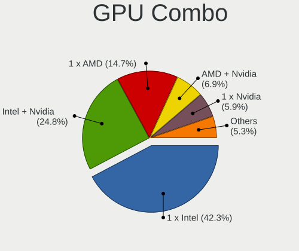

| Name               | Notebooks | Percent |
|--------------------|-----------|---------|
| 1 x Intel          | 1657      | 42.27%  |
| Intel + Nvidia     | 973       | 24.82%  |
| 1 x AMD            | 578       | 14.74%  |
| AMD + Nvidia       | 272       | 6.94%   |
| 1 x Nvidia         | 233       | 5.94%   |
| Intel + AMD        | 119       | 3.04%   |
| 2 x AMD            | 73        | 1.86%   |
| 2 x Nvidia         | 6         | 0.15%   |
| Other              | 5         | 0.13%   |
| 2 x Intel          | 2         | 0.05%   |
| Intel + 2 x Nvidia | 2         | 0.05%   |

GPU Driver
----------

Free vs proprietary

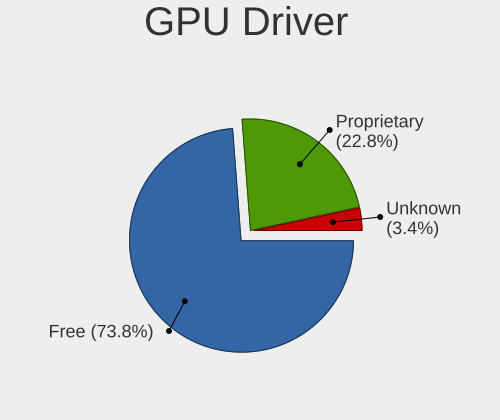

| Driver      | Notebooks | Percent |
|-------------|-----------|---------|
| Free        | 2907      | 73.8%   |
| Proprietary | 899       | 22.82%  |
| Unknown     | 133       | 3.38%   |

GPU Memory
----------

Total video memory

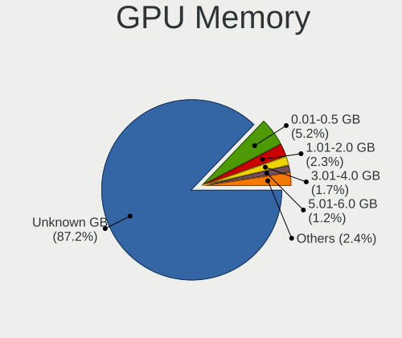

| Size in GB | Notebooks | Percent |
|------------|-----------|---------|
| Unknown    | 3429      | 87.19%  |
| 0.01-0.5   | 203       | 5.16%   |
| 1.01-2.0   | 91        | 2.31%   |
| 3.01-4.0   | 66        | 1.68%   |
| 5.01-6.0   | 49        | 1.25%   |
| 7.01-8.0   | 48        | 1.22%   |
| 0.51-1.0   | 31        | 0.79%   |
| 8.01-16.0  | 11        | 0.28%   |
| 2.01-3.0   | 5         | 0.13%   |

Monitor
-------

Monitor Vendor
--------------

Monitor vendors

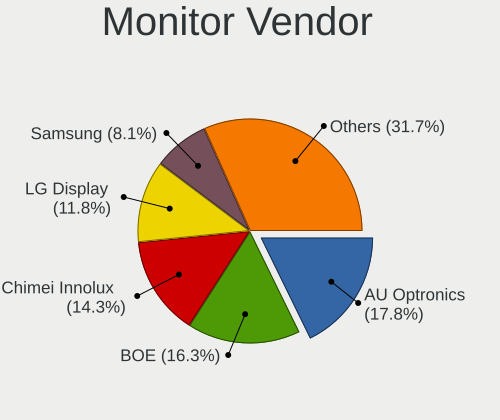

| Vendor                  | Notebooks | Percent |
|-------------------------|-----------|---------|
| AU Optronics            | 816       | 17.75%  |
| BOE                     | 751       | 16.34%  |
| Chimei Innolux          | 658       | 14.32%  |
| LG Display              | 544       | 11.84%  |
| Samsung Electronics     | 371       | 8.07%   |
| Apple                   | 236       | 5.13%   |
| Dell                    | 137       | 2.98%   |
| Sharp                   | 131       | 2.85%   |
| Goldstar                | 122       | 2.65%   |
| PANDA                   | 104       | 2.26%   |
| Lenovo                  | 65        | 1.41%   |
| Chi Mei Optoelectronics | 56        | 1.22%   |
| InfoVision              | 53        | 1.15%   |
| Acer                    | 47        | 1.02%   |
| AOC                     | 44        | 0.96%   |
| Hewlett-Packard         | 43        | 0.94%   |
| CSO                     | 41        | 0.89%   |
| Philips                 | 36        | 0.78%   |
| ASUSTek Computer        | 32        | 0.7%    |
| BenQ                    | 22        | 0.48%   |
| TMX                     | 21        | 0.46%   |
| Ancor Communications    | 21        | 0.46%   |
| Iiyama                  | 17        | 0.37%   |
| ViewSonic               | 15        | 0.33%   |
| HKC                     | 12        | 0.26%   |
| MSI                     | 10        | 0.22%   |
| CSW                     | 10        | 0.22%   |
| RTK                     | 8         | 0.17%   |
| Sony                    | 7         | 0.15%   |
| Panasonic               | 7         | 0.15%   |
| LG Philips              | 7         | 0.15%   |
| Gigabyte Technology     | 7         | 0.15%   |
| Vestel Elektronik       | 6         | 0.13%   |
| Toshiba                 | 6         | 0.13%   |
| NEC Computers           | 5         | 0.11%   |
| JDI                     | 5         | 0.11%   |
| Hitachi                 | 5         | 0.11%   |
| CSOT                    | 5         | 0.11%   |
| Vizio                   | 4         | 0.09%   |
| TMA                     | 4         | 0.09%   |

Monitor Model
-------------

Monitor models

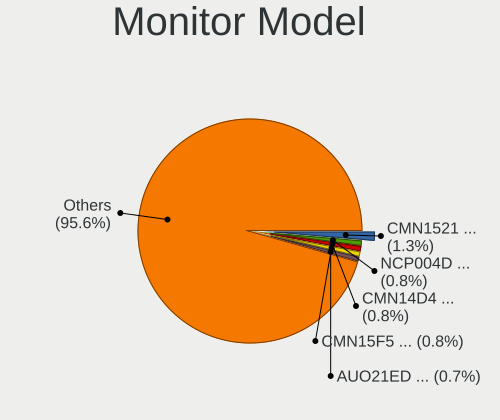

| Model                                                                     | Notebooks | Percent |
|---------------------------------------------------------------------------|-----------|---------|
| Chimei Innolux LCD Monitor CMN1521 1920x1080 344x193mm 15.5-inch          | 62        | 1.33%   |
| PANDA LCD Monitor NCP004D 1920x1080 344x194mm 15.5-inch                   | 37        | 0.8%    |
| Chimei Innolux LCD Monitor CMN14D4 1920x1080 309x173mm 13.9-inch          | 37        | 0.8%    |
| Chimei Innolux LCD Monitor CMN15F5 1920x1080 344x193mm 15.5-inch          | 35        | 0.75%   |
| AU Optronics LCD Monitor AUO21ED 1920x1080 344x193mm 15.5-inch            | 33        | 0.71%   |
| Chimei Innolux LCD Monitor CMN14D5 1920x1080 309x173mm 13.9-inch          | 28        | 0.6%    |
| Chimei Innolux LCD Monitor CMN15E7 1920x1080 344x193mm 15.5-inch          | 25        | 0.54%   |
| LG Display LCD Monitor LGD046F 1920x1080 344x194mm 15.5-inch              | 24        | 0.52%   |
| LG Display LCD Monitor LGD05E5 1920x1080 344x194mm 15.5-inch              | 23        | 0.5%    |
| Apple Color LCD APP9CDF 1440x900 286x179mm 13.3-inch                      | 20        | 0.43%   |
| Chimei Innolux LCD Monitor CMN15E6 1366x768 344x193mm 15.5-inch           | 18        | 0.39%   |
| AU Optronics LCD Monitor AUO38ED 1920x1080 344x193mm 15.5-inch            | 18        | 0.39%   |
| Apple Color LCD APPA01B 1440x900 286x179mm 13.3-inch                      | 17        | 0.37%   |
| BOE LCD Monitor BOE0812 1920x1080 344x194mm 15.5-inch                     | 16        | 0.34%   |
| Apple Color LCD APP9CF0 1440x900 290x180mm 13.4-inch                      | 16        | 0.34%   |
| Chimei Innolux LCD Monitor CMN15E8 1920x1080 344x193mm 15.5-inch          | 15        | 0.32%   |
| AU Optronics LCD Monitor AUOAF90 1920x1080 344x193mm 15.5-inch            | 15        | 0.32%   |
| AU Optronics LCD Monitor AUO403D 1920x1080 309x174mm 14.0-inch            | 15        | 0.32%   |
| AU Optronics LCD Monitor AUO243D 1920x1080 309x173mm 13.9-inch            | 15        | 0.32%   |
| InfoVision LCD Monitor IVO8C78 1920x1080 309x174mm 14.0-inch              | 14        | 0.3%    |
| Chimei Innolux LCD Monitor CMN15DB 1366x768 344x193mm 15.5-inch           | 14        | 0.3%    |
| Chimei Innolux LCD Monitor CMN14D6 1366x768 309x173mm 13.9-inch           | 14        | 0.3%    |
| Chimei Innolux LCD Monitor CMN1408 1920x1080 309x173mm 13.9-inch          | 14        | 0.3%    |
| AU Optronics LCD Monitor AUO22EC 1366x768 344x193mm 15.5-inch             | 14        | 0.3%    |
| Apple LCD Monitor APP9CCB 1280x800 286x179mm 13.3-inch                    | 14        | 0.3%    |
| Apple Color LCD APP9CC7 1280x800 286x179mm 13.3-inch                      | 14        | 0.3%    |
| BOE LCD Monitor BOE0893 2160x1440 296x197mm 14.0-inch                     | 13        | 0.28%   |
| BOE LCD Monitor BOE0872 1920x1080 344x194mm 15.5-inch                     | 12        | 0.26%   |
| AU Optronics LCD Monitor AUO61ED 1920x1080 344x194mm 15.5-inch            | 12        | 0.26%   |
| AU Optronics LCD Monitor AUO26EC 1366x768 344x193mm 15.5-inch             | 12        | 0.26%   |
| AU Optronics LCD Monitor AUO139E 1600x900 382x214mm 17.2-inch             | 12        | 0.26%   |
| LG Display LCD Monitor LGD02DC 1366x768 344x194mm 15.5-inch               | 11        | 0.24%   |
| Chi Mei Optoelectronics LCD Monitor CMO1720 1920x1080 382x215mm 17.3-inch | 11        | 0.24%   |
| AU Optronics LCD Monitor AUOD1ED 1920x1080 344x193mm 15.5-inch            | 11        | 0.24%   |
| AU Optronics LCD Monitor AUO46EC 1366x768 344x193mm 15.5-inch             | 11        | 0.24%   |
| AU Optronics LCD Monitor AUO2E3C 1366x768 309x173mm 13.9-inch             | 11        | 0.24%   |
| AU Optronics LCD Monitor AUO133D 1920x1080 309x173mm 13.9-inch            | 11        | 0.24%   |
| Apple Color LCD APPA022 2880x1800 331x207mm 15.4-inch                     | 11        | 0.24%   |
| Sharp LCD Monitor SHP149A 1920x1080 344x194mm 15.5-inch                   | 10        | 0.22%   |
| Samsung Electronics LCD Monitor SEC544B 1600x900 382x214mm 17.2-inch      | 10        | 0.22%   |

Monitor Resolution
------------------

Monitor screen resolution

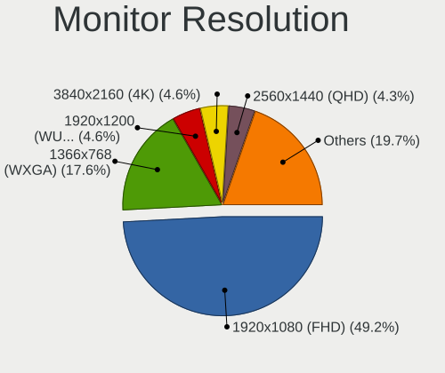

| Resolution         | Notebooks | Percent |
|--------------------|-----------|---------|
| 1920x1080 (FHD)    | 2125      | 49.17%  |
| 1366x768 (WXGA)    | 760       | 17.58%  |
| 1920x1200 (WUXGA)  | 200       | 4.63%   |
| 3840x2160 (4K)     | 198       | 4.58%   |
| 2560x1440 (QHD)    | 187       | 4.33%   |
| 2560x1600          | 161       | 3.73%   |
| 1600x900 (HD+)     | 131       | 3.03%   |
| 2880x1800          | 93        | 2.15%   |
| 1280x800 (WXGA)    | 90        | 2.08%   |
| 1440x900 (WXGA+)   | 77        | 1.78%   |
| 3840x2400          | 34        | 0.79%   |
| 3440x1440          | 31        | 0.72%   |
| 2560x1080          | 31        | 0.72%   |
| 2160x1440          | 23        | 0.53%   |
| 3072x1920          | 18        | 0.42%   |
| 1680x1050 (WSXGA+) | 17        | 0.39%   |
| 1280x1024 (SXGA)   | 15        | 0.35%   |
| 3200x2000          | 14        | 0.32%   |
| 2256x1504          | 11        | 0.25%   |
| 3200x1800 (QHD+)   | 10        | 0.23%   |
| 1360x768           | 10        | 0.23%   |
| 3840x1080          | 9         | 0.21%   |
| 3840x1100          | 7         | 0.16%   |
| 3456x2160          | 7         | 0.16%   |
| 2304x1440          | 7         | 0.16%   |
| 1920x1280          | 7         | 0.16%   |
| 2240x1400          | 5         | 0.12%   |
| 1920x540           | 5         | 0.12%   |
| 3000x2000          | 4         | 0.09%   |
| 2880x1620          | 4         | 0.09%   |
| 2520x1680          | 4         | 0.09%   |
| 1280x720 (HD)      | 4         | 0.09%   |
| 800x1280           | 3         | 0.07%   |
| Unknown            | 3         | 0.07%   |
| 2560x1700          | 2         | 0.05%   |
| 1600x2560          | 2         | 0.05%   |
| 1400x1050          | 2         | 0.05%   |
| 4096x2304          | 1         | 0.02%   |
| 3840x1200          | 1         | 0.02%   |
| 3120x2080          | 1         | 0.02%   |

Monitor Diagonal
----------------

Diagonal size in inches

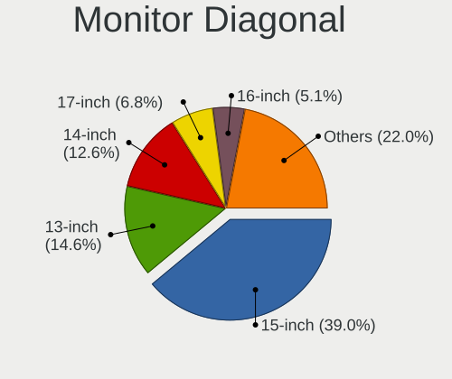

| Inches  | Notebooks | Percent |
|---------|-----------|---------|
| 15      | 1787      | 38.96%  |
| 13      | 670       | 14.61%  |
| 14      | 576       | 12.56%  |
| 17      | 311       | 6.78%   |
| 16      | 233       | 5.08%   |
| 27      | 184       | 4.01%   |
| 24      | 148       | 3.23%   |
| 21      | 97        | 2.11%   |
| 23      | 94        | 2.05%   |
| 31      | 80        | 1.74%   |
| 12      | 79        | 1.72%   |
| 34      | 46        | 1%      |
| 11      | 39        | 0.85%   |
| 18      | 33        | 0.72%   |
| 84      | 22        | 0.48%   |
| Unknown | 22        | 0.48%   |
| 19      | 21        | 0.46%   |
| 40      | 16        | 0.35%   |
| 32      | 15        | 0.33%   |
| 63      | 11        | 0.24%   |
| 48      | 11        | 0.24%   |
| 20      | 10        | 0.22%   |
| 22      | 9         | 0.2%    |
| 35      | 7         | 0.15%   |
| 72      | 6         | 0.13%   |
| 28      | 6         | 0.13%   |
| 54      | 5         | 0.11%   |
| 29      | 5         | 0.11%   |
| 49      | 4         | 0.09%   |
| 42      | 4         | 0.09%   |
| 25      | 4         | 0.09%   |
| 43      | 3         | 0.07%   |
| 8       | 3         | 0.07%   |
| 74      | 2         | 0.04%   |
| 65      | 2         | 0.04%   |
| 46      | 2         | 0.04%   |
| 36      | 2         | 0.04%   |
| 33      | 2         | 0.04%   |
| 26      | 2         | 0.04%   |
| 7       | 2         | 0.04%   |

Monitor Width
-------------

Physical width

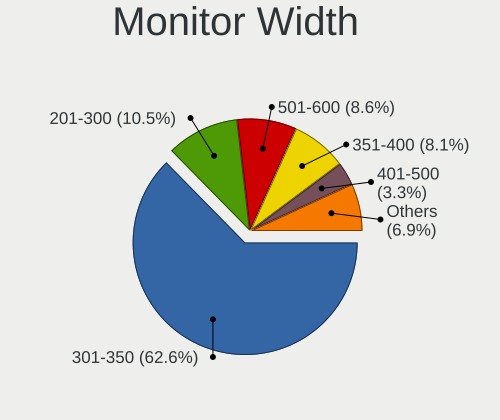

| Width in mm | Notebooks | Percent |
|-------------|-----------|---------|
| 301-350     | 2849      | 62.64%  |
| 201-300     | 479       | 10.53%  |
| 501-600     | 389       | 8.55%   |
| 351-400     | 367       | 8.07%   |
| 401-500     | 152       | 3.34%   |
| 601-700     | 115       | 2.53%   |
| 701-800     | 64        | 1.41%   |
| 1001-1500   | 41        | 0.9%    |
| 1501-2000   | 30        | 0.66%   |
| 801-900     | 25        | 0.55%   |
| Unknown     | 22        | 0.48%   |
| 901-1000    | 8         | 0.18%   |
| 101-200     | 4         | 0.09%   |
| 1-100       | 3         | 0.07%   |

Aspect Ratio
------------

Proportional relationship between the width and the height

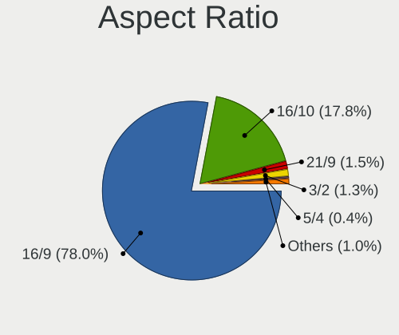

| Ratio   | Notebooks | Percent |
|---------|-----------|---------|
| 16/9    | 3155      | 77.98%  |
| 16/10   | 721       | 17.82%  |
| 21/9    | 59        | 1.46%   |
| 3/2     | 53        | 1.31%   |
| 5/4     | 16        | 0.4%    |
| 32/9    | 11        | 0.27%   |
| 3.40    | 7         | 0.17%   |
| Unknown | 7         | 0.17%   |
| 4/3     | 4         | 0.1%    |
| 0.67    | 2         | 0.05%   |
| 0.63    | 2         | 0.05%   |
| 0.56    | 2         | 0.05%   |
| 6/5     | 1         | 0.02%   |
| 3.73    | 1         | 0.02%   |
| 3.20    | 1         | 0.02%   |
| 2.00    | 1         | 0.02%   |
| 1.96    | 1         | 0.02%   |
| 0.89    | 1         | 0.02%   |
| 0.62    | 1         | 0.02%   |

Monitor Area
------------

Area in inch²

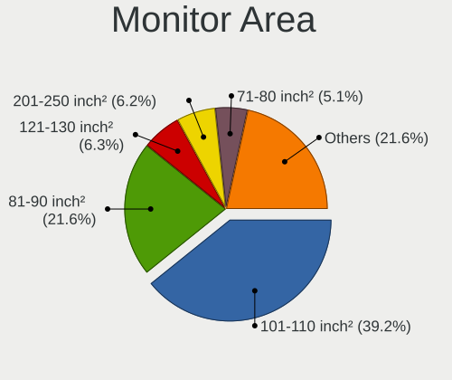

| Area in inch² | Notebooks | Percent |
|----------------|-----------|---------|
| 101-110        | 1793      | 39.22%  |
| 81-90          | 986       | 21.57%  |
| 121-130        | 287       | 6.28%   |
| 201-250        | 285       | 6.23%   |
| 71-80          | 235       | 5.14%   |
| 111-120        | 220       | 4.81%   |
| 301-350        | 186       | 4.07%   |
| 351-500        | 155       | 3.39%   |
| 61-70          | 75        | 1.64%   |
| More than 1000 | 57        | 1.25%   |
| 151-200        | 53        | 1.16%   |
| 51-60          | 46        | 1.01%   |
| 501-1000       | 42        | 0.92%   |
| 251-300        | 41        | 0.9%    |
| 141-150        | 39        | 0.85%   |
| 131-140        | 22        | 0.48%   |
| Unknown        | 22        | 0.48%   |
| 91-100         | 21        | 0.46%   |
| 1-40           | 7         | 0.15%   |

Pixel Density
-------------

Pixels per inch

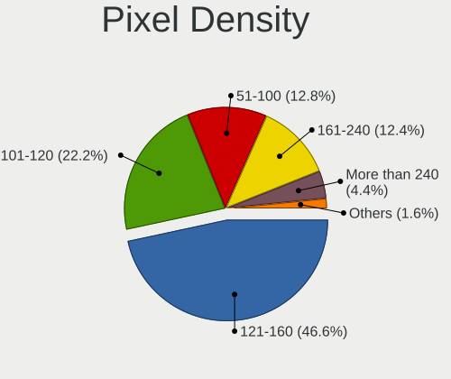

| Density       | Notebooks | Percent |
|---------------|-----------|---------|
| 121-160       | 2098      | 46.63%  |
| 101-120       | 1000      | 22.23%  |
| 51-100        | 574       | 12.76%  |
| 161-240       | 556       | 12.36%  |
| More than 240 | 199       | 4.42%   |
| 1-50          | 50        | 1.11%   |
| Unknown       | 22        | 0.49%   |

Multiple Monitors
-----------------

Total monitors connected

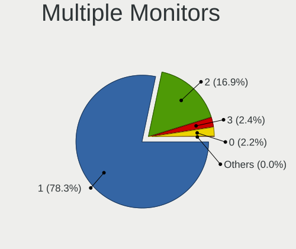

| Total | Notebooks | Percent |
|-------|-----------|---------|
| 1     | 3107      | 78.3%   |
| 2     | 671       | 16.91%  |
| 3     | 94        | 2.37%   |
| 0     | 89        | 2.24%   |
| 4     | 6         | 0.15%   |
| 6     | 1         | 0.03%   |

Network
-------

Net Controller Vendor
---------------------

Controller vendors

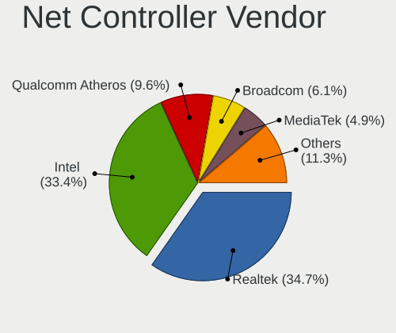

| Vendor                                 | Notebooks | Percent |
|----------------------------------------|-----------|---------|
| Realtek Semiconductor                  | 2157      | 34.73%  |
| Intel                                  | 2074      | 33.4%   |
| Qualcomm Atheros                       | 596       | 9.6%    |
| Broadcom                               | 380       | 6.12%   |
| MediaTek                               | 304       | 4.9%    |
| Broadcom Limited                       | 126       | 2.03%   |
| ASIX Electronics                       | 63        | 1.01%   |
| Shenzhen Goodix Technology             | 37        | 0.6%    |
| Samsung Electronics                    | 35        | 0.56%   |
| Nvidia                                 | 33        | 0.53%   |
| TP-Link                                | 32        | 0.52%   |
| Marvell Technology Group               | 30        | 0.48%   |
| Ralink                                 | 27        | 0.43%   |
| Qualcomm                               | 27        | 0.43%   |
| Dell                                   | 27        | 0.43%   |
| Xiaomi                                 | 22        | 0.35%   |
| Ralink Technology                      | 22        | 0.35%   |
| Lenovo                                 | 22        | 0.35%   |
| DisplayLink                            | 22        | 0.35%   |
| Sierra Wireless                        | 19        | 0.31%   |
| OPPO Electronics                       | 14        | 0.23%   |
| NetGear                                | 12        | 0.19%   |
| JMicron Technology                     | 10        | 0.16%   |
| Huawei Technologies                    | 10        | 0.16%   |
| Hewlett-Packard                        | 10        | 0.16%   |
| Motorola PCS                           | 9         | 0.14%   |
| Google                                 | 9         | 0.14%   |
| Fibocom                                | 8         | 0.13%   |
| ASUSTek Computer                       | 8         | 0.13%   |
| Qualcomm Atheros Communications        | 6         | 0.1%    |
| Ericsson Business Mobile Networks      | 6         | 0.1%    |
| OnePlus Technology (Shenzhen)          | 5         | 0.08%   |
| D-Link                                 | 5         | 0.08%   |
| Qualcomm Technologies                  | 4         | 0.06%   |
| Microsoft                              | 4         | 0.06%   |
| Apple                                  | 4         | 0.06%   |
| Edimax Technology                      | 3         | 0.05%   |
| Arduino SA                             | 3         | 0.05%   |
| ZTE WCDMA Technologies MSM             | 2         | 0.03%   |
| Suzhou Motorcomm Electronic Technology | 2         | 0.03%   |

Net Controller Model
--------------------

Controller models

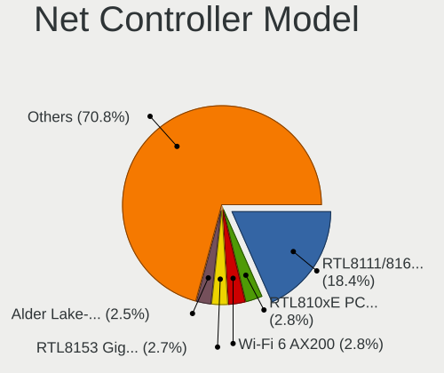

| Model                                                                  | Notebooks | Percent |
|------------------------------------------------------------------------|-----------|---------|
| Realtek RTL8111/8168/8211/8411 PCI Express Gigabit Ethernet Controller | 1347      | 18.36%  |
| Realtek RTL810xE PCI Express Fast Ethernet controller                  | 208       | 2.84%   |
| Intel Wi-Fi 6 AX200                                                    | 207       | 2.82%   |
| Realtek RTL8153 Gigabit Ethernet Adapter                               | 199       | 2.71%   |
| Intel Alder Lake-P PCH CNVi WiFi                                       | 181       | 2.47%   |
| MediaTek MT7921 802.11ax PCIe Wireless Network Adapter [Filogic 330]   | 158       | 2.15%   |
| Intel Wi-Fi 6 AX201                                                    | 158       | 2.15%   |
| Intel Wireless 8265 / 8275                                             | 156       | 2.13%   |
| Realtek RTL8822CE 802.11ac PCIe Wireless Network Adapter               | 122       | 1.66%   |
| Qualcomm Atheros QCA9377 802.11ac Wireless Network Adapter             | 117       | 1.59%   |
| Realtek RTL8821CE 802.11ac PCIe Wireless Network Adapter               | 114       | 1.55%   |
| Qualcomm Atheros QCA6174 802.11ac Wireless Network Adapter             | 103       | 1.4%    |
| Intel Wireless 8260                                                    | 102       | 1.39%   |
| Intel Comet Lake PCH CNVi WiFi                                         | 97        | 1.32%   |
| Intel Wireless 7260                                                    | 95        | 1.29%   |
| Intel 82579LM Gigabit Network Connection (Lewisville)                  | 91        | 1.24%   |
| Qualcomm Atheros QCA9565 / AR9565 Wireless Network Adapter             | 90        | 1.23%   |
| Intel Wireless 7265                                                    | 90        | 1.23%   |
| Intel Comet Lake PCH-LP CNVi WiFi                                      | 84        | 1.15%   |
| MediaTek MT7922 802.11ax PCI Express Wireless Network Adapter          | 82        | 1.12%   |
| Intel Cannon Lake PCH CNVi WiFi                                        | 81        | 1.1%    |
| Intel Raptor Lake PCH CNVi WiFi                                        | 77        | 1.05%   |
| Qualcomm Atheros AR9485 Wireless Network Adapter                       | 76        | 1.04%   |
| Realtek RTL8852BE PCIe 802.11ax Wireless Network Controller            | 74        | 1.01%   |
| Intel Tiger Lake PCH CNVi WiFi                                         | 73        | 1%      |
| Broadcom Limited BCM4360 802.11ac Dual Band Wireless Network Adapter   | 67        | 0.91%   |
| Intel Cannon Point-LP CNVi [Wireless-AC]                               | 64        | 0.87%   |
| Intel Ethernet Connection (4) I219-LM                                  | 62        | 0.85%   |
| Realtek RTL8125 2.5GbE Controller                                      | 61        | 0.83%   |
| Intel Wi-Fi 6E(802.11ax) AX210/AX1675* 2x2 [Typhoon Peak]              | 60        | 0.82%   |
| Broadcom BCM4331 802.11a/b/g/n                                         | 57        | 0.78%   |
| ASIX AX88179 Gigabit Ethernet                                          | 57        | 0.78%   |
| Broadcom NetXtreme BCM57765 Gigabit Ethernet PCIe                      | 55        | 0.75%   |
| Qualcomm Atheros AR9285 Wireless Network Adapter (PCI-Express)         | 53        | 0.72%   |
| Intel Ethernet Connection I219-LM                                      | 50        | 0.68%   |
| Realtek RTL8852AE 802.11ax PCIe Wireless Network Adapter               | 49        | 0.67%   |
| Realtek Killer E2600 GbE Controller                                    | 49        | 0.67%   |
| Intel Centrino Advanced-N 6205 [Taylor Peak]                           | 48        | 0.65%   |
| Broadcom BCM43142 802.11b/g/n                                          | 44        | 0.6%    |
| Intel 700 Series Chipset CNVi WiFi                                     | 40        | 0.55%   |

Wireless Vendor
---------------

Wireless vendors

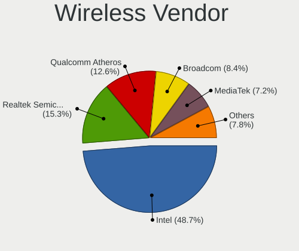

| Vendor                                | Notebooks | Percent |
|---------------------------------------|-----------|---------|
| Intel                                 | 1933      | 48.73%  |
| Realtek Semiconductor                 | 605       | 15.25%  |
| Qualcomm Atheros                      | 499       | 12.58%  |
| Broadcom                              | 335       | 8.44%   |
| MediaTek                              | 284       | 7.16%   |
| Broadcom Limited                      | 111       | 2.8%    |
| Ralink                                | 27        | 0.68%   |
| TP-Link                               | 25        | 0.63%   |
| Qualcomm                              | 24        | 0.6%    |
| Ralink Technology                     | 22        | 0.55%   |
| Dell                                  | 22        | 0.55%   |
| Sierra Wireless                       | 19        | 0.48%   |
| NetGear                               | 10        | 0.25%   |
| Fibocom                               | 8         | 0.2%    |
| Qualcomm Atheros Communications       | 6         | 0.15%   |
| ASUSTek Computer                      | 6         | 0.15%   |
| Hewlett-Packard                       | 5         | 0.13%   |
| Qualcomm Technologies                 | 4         | 0.1%    |
| Microsoft                             | 4         | 0.1%    |
| D-Link                                | 4         | 0.1%    |
| Edimax Technology                     | 3         | 0.08%   |
| AVM                                   | 2         | 0.05%   |
| 802.11g Adapter [Linksys WUSB54GC v3] | 2         | 0.05%   |
| ZyDAS                                 | 1         | 0.03%   |
| Senao                                 | 1         | 0.03%   |
| Realtek                               | 1         | 0.03%   |
| Linksys                               | 1         | 0.03%   |
| BUFFALO                               | 1         | 0.03%   |
| Arduino SA                            | 1         | 0.03%   |
| Accton Technology                     | 1         | 0.03%   |

Wireless Model
--------------

Wireless models

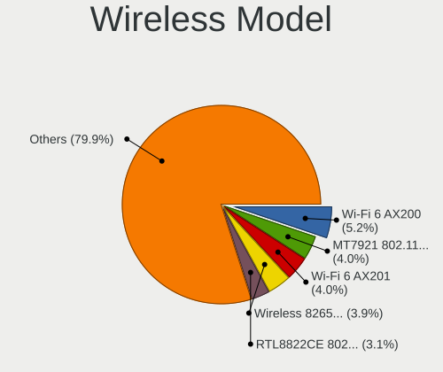

| Model                                                                | Notebooks | Percent |
|----------------------------------------------------------------------|-----------|---------|
| Intel Wi-Fi 6 AX200                                                  | 207       | 5.19%   |
| MediaTek MT7921 802.11ax PCIe Wireless Network Adapter [Filogic 330] | 158       | 3.96%   |
| Intel Wi-Fi 6 AX201                                                  | 158       | 3.96%   |
| Intel Wireless 8265 / 8275                                           | 156       | 3.91%   |
| Realtek RTL8822CE 802.11ac PCIe Wireless Network Adapter             | 122       | 3.06%   |
| Intel Alder Lake-P PCH CNVi WiFi                                     | 122       | 3.06%   |
| Qualcomm Atheros QCA9377 802.11ac Wireless Network Adapter           | 117       | 2.93%   |
| Realtek RTL8821CE 802.11ac PCIe Wireless Network Adapter             | 114       | 2.86%   |
| Qualcomm Atheros QCA6174 802.11ac Wireless Network Adapter           | 103       | 2.58%   |
| Intel Wireless 8260                                                  | 102       | 2.56%   |
| Intel Comet Lake PCH CNVi WiFi                                       | 97        | 2.43%   |
| Intel Wireless 7260                                                  | 95        | 2.38%   |
| Qualcomm Atheros QCA9565 / AR9565 Wireless Network Adapter           | 90        | 2.26%   |
| Intel Wireless 7265                                                  | 90        | 2.26%   |
| Intel Comet Lake PCH-LP CNVi WiFi                                    | 84        | 2.11%   |
| Intel Cannon Lake PCH CNVi WiFi                                      | 81        | 2.03%   |
| Qualcomm Atheros AR9485 Wireless Network Adapter                     | 76        | 1.91%   |
| Intel Tiger Lake PCH CNVi WiFi                                       | 73        | 1.83%   |
| Intel Raptor Lake PCH CNVi WiFi                                      | 73        | 1.83%   |
| Realtek RTL8852BE PCIe 802.11ax Wireless Network Controller          | 70        | 1.76%   |
| Broadcom Limited BCM4360 802.11ac Dual Band Wireless Network Adapter | 67        | 1.68%   |
| Intel Cannon Point-LP CNVi [Wireless-AC]                             | 64        | 1.61%   |
| MediaTek MT7922 802.11ax PCI Express Wireless Network Adapter        | 63        | 1.58%   |
| Intel Wi-Fi 6E(802.11ax) AX210/AX1675* 2x2 [Typhoon Peak]            | 60        | 1.5%    |
| Broadcom BCM4331 802.11a/b/g/n                                       | 57        | 1.43%   |
| Qualcomm Atheros AR9285 Wireless Network Adapter (PCI-Express)       | 53        | 1.33%   |
| Realtek RTL8852AE 802.11ax PCIe Wireless Network Adapter             | 49        | 1.23%   |
| Intel Centrino Advanced-N 6205 [Taylor Peak]                         | 48        | 1.2%    |
| Broadcom BCM43142 802.11b/g/n                                        | 44        | 1.1%    |
| Intel 700 Series Chipset CNVi WiFi                                   | 40        | 1%      |
| Broadcom BCM4322 802.11a/b/g/n Wireless LAN Controller               | 40        | 1%      |
| Intel Wireless 3165                                                  | 37        | 0.93%   |
| Intel Wi-Fi 5(802.11ac) Wireless-AC 9x6x [Thunder Peak]              | 32        | 0.8%    |
| Realtek RTL8822BE 802.11a/b/g/n/ac WiFi adapter                      | 31        | 0.78%   |
| Intel Ice Lake-LP PCH CNVi WiFi                                      | 30        | 0.75%   |
| Intel Dual Band Wireless-AC 3168NGW [Stone Peak]                     | 28        | 0.7%    |
| MediaTek MT7902 802.11ax PCIe Wireless Network Adapter [Filogic 310] | 27        | 0.68%   |
| Intel Dual Band Wireless-AC 3165 Plus Bluetooth                      | 27        | 0.68%   |
| Broadcom BCM4313 802.11bgn Wireless Network Adapter                  | 27        | 0.68%   |
| Qualcomm Atheros AR9462 Wireless Network Adapter                     | 26        | 0.65%   |

Ethernet Vendor
---------------

Ethernet vendors

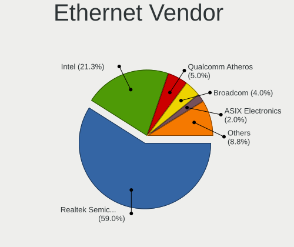

| Vendor                                 | Notebooks | Percent |
|----------------------------------------|-----------|---------|
| Realtek Semiconductor                  | 1884      | 58.99%  |
| Intel                                  | 679       | 21.26%  |
| Qualcomm Atheros                       | 159       | 4.98%   |
| Broadcom                               | 128       | 4.01%   |
| ASIX Electronics                       | 63        | 1.97%   |
| Samsung Electronics                    | 35        | 1.1%    |
| Nvidia                                 | 33        | 1.03%   |
| Marvell Technology Group               | 30        | 0.94%   |
| Xiaomi                                 | 22        | 0.69%   |
| Lenovo                                 | 22        | 0.69%   |
| DisplayLink                            | 22        | 0.69%   |
| MediaTek                               | 19        | 0.59%   |
| Broadcom Limited                       | 16        | 0.5%    |
| OPPO Electronics                       | 14        | 0.44%   |
| JMicron Technology                     | 10        | 0.31%   |
| Motorola PCS                           | 9         | 0.28%   |
| Google                                 | 9         | 0.28%   |
| TP-Link                                | 7         | 0.22%   |
| Huawei Technologies                    | 7         | 0.22%   |
| OnePlus Technology (Shenzhen)          | 5         | 0.16%   |
| Apple                                  | 4         | 0.13%   |
| Qualcomm                               | 3         | 0.09%   |
| Hewlett-Packard                        | 3         | 0.09%   |
| Suzhou Motorcomm Electronic Technology | 2         | 0.06%   |
| NetGear                                | 2         | 0.06%   |
| ASUSTek Computer                       | 2         | 0.06%   |
| T & A Mobile Phones                    | 1         | 0.03%   |
| Sony Ericsson Mobile Communications AB | 1         | 0.03%   |
| ICS Advent                             | 1         | 0.03%   |
| D-Link                                 | 1         | 0.03%   |
| Belkin Components                      | 1         | 0.03%   |

Ethernet Model
--------------

Ethernet models

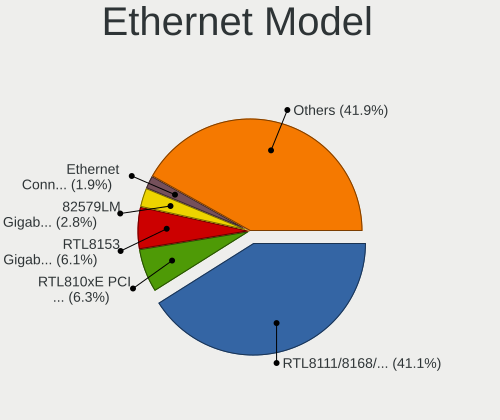

| Model                                                                  | Notebooks | Percent |
|------------------------------------------------------------------------|-----------|---------|
| Realtek RTL8111/8168/8211/8411 PCI Express Gigabit Ethernet Controller | 1347      | 41.05%  |
| Realtek RTL810xE PCI Express Fast Ethernet controller                  | 208       | 6.34%   |
| Realtek RTL8153 Gigabit Ethernet Adapter                               | 199       | 6.07%   |
| Intel 82579LM Gigabit Network Connection (Lewisville)                  | 91        | 2.77%   |
| Intel Ethernet Connection (4) I219-LM                                  | 62        | 1.89%   |
| Realtek RTL8125 2.5GbE Controller                                      | 61        | 1.86%   |
| Intel Alder Lake-P PCH CNVi WiFi                                       | 59        | 1.8%    |
| ASIX AX88179 Gigabit Ethernet                                          | 57        | 1.74%   |
| Broadcom NetXtreme BCM57765 Gigabit Ethernet PCIe                      | 55        | 1.68%   |
| Intel Ethernet Connection I219-LM                                      | 50        | 1.52%   |
| Realtek Killer E2600 GbE Controller                                    | 49        | 1.49%   |
| Intel Ethernet Connection I217-LM                                      | 36        | 1.1%    |
| Intel Ethernet Connection I218-LM                                      | 31        | 0.94%   |
| Intel Ethernet Connection (3) I218-LM                                  | 30        | 0.91%   |
| Qualcomm Atheros AR8151 v2.0 Gigabit Ethernet                          | 27        | 0.82%   |
| Qualcomm Atheros Killer E2400 Gigabit Ethernet Controller              | 26        | 0.79%   |
| Nvidia MCP79 Ethernet                                                  | 26        | 0.79%   |
| Realtek Killer E3000 2.5GbE Controller                                 | 24        | 0.73%   |
| Qualcomm Atheros Killer E2500 Gigabit Ethernet Controller              | 24        | 0.73%   |
| Intel Ethernet Connection (4) I219-V                                   | 24        | 0.73%   |
| Samsung Galaxy series, misc. (tethering mode)                          | 20        | 0.61%   |
| Intel Ethernet Connection I219-V                                       | 20        | 0.61%   |
| Intel Ethernet Connection (7) I219-LM                                  | 20        | 0.61%   |
| Qualcomm Atheros QCA8171 Gigabit Ethernet                              | 19        | 0.58%   |
| MediaTek MT7922 802.11ax PCI Express Wireless Network Adapter          | 19        | 0.58%   |
| Intel Ethernet Connection (6) I219-LM                                  | 19        | 0.58%   |
| Intel Ethernet Connection (2) I219-LM                                  | 19        | 0.58%   |
| Intel Ethernet Connection (13) I219-V                                  | 19        | 0.58%   |
| Intel Ethernet Connection (16) I219-V                                  | 18        | 0.55%   |
| Xiaomi Mi/Redmi series (RNDIS)                                         | 17        | 0.52%   |
| Qualcomm Atheros Killer E220x Gigabit Ethernet Controller              | 17        | 0.52%   |
| Broadcom NetXtreme BCM57786 Gigabit Ethernet PCIe                      | 17        | 0.52%   |
| Intel Ethernet Connection (6) I219-V                                   | 16        | 0.49%   |
| Broadcom NetXtreme BCM5764M Gigabit Ethernet PCIe                      | 16        | 0.49%   |
| Samsung GT-I9070 (network tethering, USB debugging enabled)            | 15        | 0.46%   |
| Realtek RTL8152 Fast Ethernet Adapter                                  | 15        | 0.46%   |
| Broadcom NetLink BCM57785 Gigabit Ethernet PCIe                        | 13        | 0.4%    |
| Realtek PCIe GbE Family Controller                                     | 12        | 0.37%   |
| Qualcomm Atheros AR8152 v2.0 Fast Ethernet                             | 12        | 0.37%   |
| OPPO Ace 3V                                                            | 12        | 0.37%   |

Net Controller Kind
-------------------

Ethernet, WiFi or modem

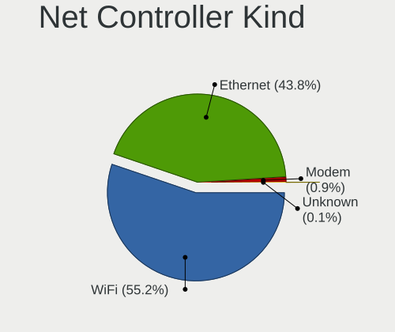

| Kind     | Notebooks | Percent |
|----------|-----------|---------|
| WiFi     | 3750      | 55.2%   |
| Ethernet | 2975      | 43.8%   |
| Modem    | 61        | 0.9%    |
| Unknown  | 7         | 0.1%    |

Used Controller
---------------

Currently used network controller

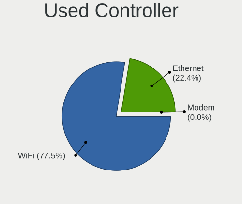

| Kind     | Notebooks | Percent |
|----------|-----------|---------|
| WiFi     | 3190      | 77.54%  |
| Ethernet | 923       | 22.44%  |
| Modem    | 1         | 0.02%   |

NICs
----

Total network controllers on board

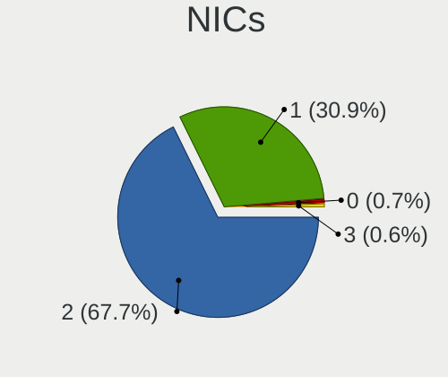

| Total | Notebooks | Percent |
|-------|-----------|---------|
| 2     | 2639      | 67.7%   |
| 1     | 1206      | 30.94%  |
| 0     | 28        | 0.72%   |
| 3     | 25        | 0.64%   |

IPv6
----

IPv6 vs IPv4

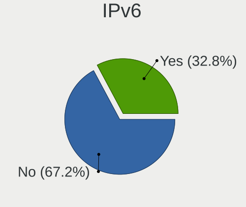

| Used | Notebooks | Percent |
|------|-----------|---------|
| No   | 2668      | 67.17%  |
| Yes  | 1304      | 32.83%  |

Bluetooth
---------

Bluetooth Vendor
----------------

Controller vendors

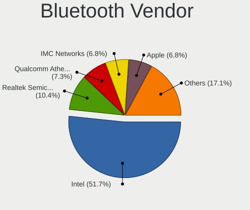

| Vendor                          | Notebooks | Percent |
|---------------------------------|-----------|---------|
| Intel                           | 1781      | 51.65%  |
| Realtek Semiconductor           | 358       | 10.38%  |
| Qualcomm Atheros Communications | 250       | 7.25%   |
| IMC Networks                    | 234       | 6.79%   |
| Apple                           | 234       | 6.79%   |
| Foxconn / Hon Hai               | 173       | 5.02%   |
| Lite-On Technology              | 116       | 3.36%   |
| Broadcom                        | 88        | 2.55%   |
| Dell                            | 43        | 1.25%   |
| MediaTek                        | 29        | 0.84%   |
| Realtek                         | 25        | 0.73%   |
| Toshiba                         | 20        | 0.58%   |
| Hewlett-Packard                 | 20        | 0.58%   |
| Cambridge Silicon Radio         | 19        | 0.55%   |
| Ralink                          | 13        | 0.38%   |
| USI                             | 10        | 0.29%   |
| ASUSTek Computer                | 7         | 0.2%    |
| Foxconn International           | 5         | 0.15%   |
| Opticis                         | 4         | 0.12%   |
| TP-Link                         | 3         | 0.09%   |
| Ralink Technology               | 3         | 0.09%   |
| Taiyo Yuden                     | 2         | 0.06%   |
| Smart Modular Technologies      | 2         | 0.06%   |
| Fujitsu                         | 2         | 0.06%   |
| Alps Electric                   | 2         | 0.06%   |
| Actions                         | 2         | 0.06%   |
| Qcom                            | 1         | 0.03%   |
| Micro Star International        | 1         | 0.03%   |
| Integrated System Solution      | 1         | 0.03%   |

Bluetooth Model
---------------

Controller models

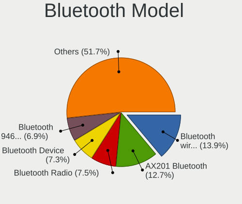

| Model                                               | Notebooks | Percent |
|-----------------------------------------------------|-----------|---------|
| Intel Bluetooth wireless interface                  | 479       | 13.88%  |
| Intel AX201 Bluetooth                               | 437       | 12.66%  |
| Realtek Bluetooth Radio                             | 260       | 7.53%   |
| Intel Bluetooth Device                              | 252       | 7.3%    |
| Intel Bluetooth 9460/9560 Jefferson Peak (JfP)      | 239       | 6.92%   |
| Intel AX200 Bluetooth                               | 201       | 5.82%   |
| Qualcomm Atheros  Bluetooth Device                  | 136       | 3.94%   |
| Apple Bluetooth Host Controller                     | 136       | 3.94%   |
| IMC Networks Wireless_Device                        | 130       | 3.77%   |
| Apple Bluetooth USB Host Controller                 | 83        | 2.4%    |
| Realtek  Bluetooth 4.2 Adapter                      | 68        | 1.97%   |
| Foxconn / Hon Hai Wireless_Device                   | 61        | 1.77%   |
| Intel AX210 Bluetooth                               | 57        | 1.65%   |
| IMC Networks Bluetooth Radio                        | 46        | 1.33%   |
| Foxconn / Hon Hai Bluetooth Device                  | 40        | 1.16%   |
| Intel Centrino Bluetooth Wireless Transceiver       | 38        | 1.1%    |
| Qualcomm Atheros QCA61x4 Bluetooth 4.0              | 32        | 0.93%   |
| Foxconn / Hon Hai MediaTek Bluetooth Adapter        | 32        | 0.93%   |
| Lite-On Wireless_Device                             | 31        | 0.9%    |
| MediaTek Wireless_Device                            | 29        | 0.84%   |
| Intel Wireless-AC 9260 Bluetooth Adapter            | 29        | 0.84%   |
| Qualcomm Atheros AR3012 Bluetooth 4.0               | 28        | 0.81%   |
| IMC Networks Bluetooth Device                       | 28        | 0.81%   |
| Intel Wireless-AC 3168 Bluetooth                    | 27        | 0.78%   |
| Qualcomm Atheros AR3011 Bluetooth                   | 26        | 0.75%   |
| Realtek Bluetooth Radio                             | 25        | 0.72%   |
| Lite-On Bluetooth Device                            | 23        | 0.67%   |
| Intel Centrino Advanced-N 6230 Bluetooth adapter    | 23        | 0.67%   |
| Lite-On Qualcomm Atheros QCA9377 Bluetooth          | 19        | 0.55%   |
| Cambridge Silicon Radio Bluetooth Dongle (HCI mode) | 19        | 0.55%   |
| Broadcom BCM2045B (BDC-2.1)                         | 18        | 0.52%   |
| Qualcomm Atheros AR9462 Bluetooth                   | 16        | 0.46%   |
| Dell BCM20702A0 Bluetooth Module                    | 16        | 0.46%   |
| Realtek RTL8822BE Bluetooth 4.2 Adapter             | 14        | 0.41%   |
| Ralink RT3290 Bluetooth                             | 13        | 0.38%   |
| Lite-On Atheros AR3012 Bluetooth                    | 13        | 0.38%   |
| HP Broadcom 2070 Bluetooth Combo                    | 13        | 0.38%   |
| IMC Networks BCM20702A0                             | 12        | 0.35%   |
| Lite-On Bluetooth Radio                             | 11        | 0.32%   |
| Dell DW375 Bluetooth Module                         | 11        | 0.32%   |

Sound
-----

Sound Vendor
------------

Sound card vendors

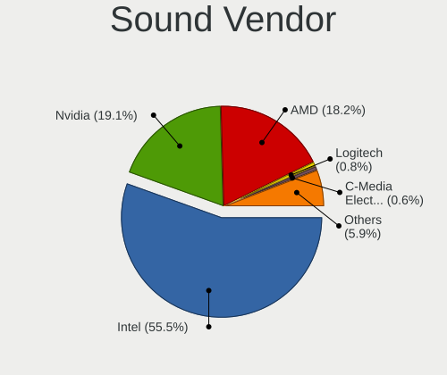

| Vendor                      | Notebooks | Percent |
|-----------------------------|-----------|---------|
| Intel                       | 2941      | 55.49%  |
| Nvidia                      | 1010      | 19.06%  |
| AMD                         | 963       | 18.17%  |
| Logitech                    | 40        | 0.75%   |
| C-Media Electronics         | 34        | 0.64%   |
| Lenovo                      | 28        | 0.53%   |
| GN Netcom                   | 22        | 0.42%   |
| Realtek Semiconductor       | 20        | 0.38%   |
| Sony                        | 19        | 0.36%   |
| Hewlett-Packard             | 16        | 0.3%    |
| Apple                       | 16        | 0.3%    |
| Kingston Technology         | 15        | 0.28%   |
| JMTek                       | 15        | 0.28%   |
| Generalplus Technology      | 15        | 0.28%   |
| SteelSeries ApS             | 13        | 0.25%   |
| Plantronics                 | 10        | 0.19%   |
| Texas Instruments           | 8         | 0.15%   |
| Focusrite-Novation          | 8         | 0.15%   |
| Corsair                     | 8         | 0.15%   |
| Razer USA                   | 7         | 0.13%   |
| ASUSTek Computer            | 6         | 0.11%   |
| Walmart                     | 4         | 0.08%   |
| FiiO Electronics Technology | 4         | 0.08%   |
| DSEA A/S                    | 4         | 0.08%   |
| Turtle Beach                | 3         | 0.06%   |
| Nordic Semiconductor ASA    | 3         | 0.06%   |
| Creative Technology         | 3         | 0.06%   |
| Blue Microphones            | 3         | 0.06%   |
| Unknown                     | 3         | 0.06%   |
| TerraTec Electronic         | 2         | 0.04%   |
| Samsung Electronics         | 2         | 0.04%   |
| Samson Technologies         | 2         | 0.04%   |
| Microsoft                   | 2         | 0.04%   |
| iConnectivity               | 2         | 0.04%   |
| fifine Microphones          | 2         | 0.04%   |
| Dell                        | 2         | 0.04%   |
| Bose                        | 2         | 0.04%   |
| BEHRINGER International     | 2         | 0.04%   |
| Audio-Technica              | 2         | 0.04%   |
| Arturia                     | 2         | 0.04%   |

Sound Model
-----------

Sound card models

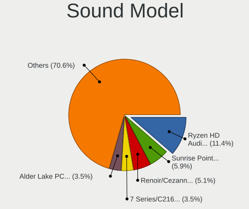

| Model                                                                      | Notebooks | Percent |
|----------------------------------------------------------------------------|-----------|---------|
| AMD Ryzen HD Audio Controller                                              | 739       | 11.38%  |
| Intel Sunrise Point-LP HD Audio                                            | 383       | 5.9%    |
| AMD Renoir/Cezanne HDMI/DP Audio Controller                                | 333       | 5.13%   |
| Intel 7 Series/C216 Chipset Family High Definition Audio Controller        | 228       | 3.51%   |
| Intel Alder Lake PCH-P High Definition Audio Controller                    | 227       | 3.5%    |
| Intel Tiger Lake-LP Smart Sound Technology Audio Controller                | 204       | 3.14%   |
| Intel 6 Series/C200 Series Chipset Family High Definition Audio Controller | 183       | 2.82%   |
| Intel Cannon Lake PCH cAVS                                                 | 177       | 2.73%   |
| AMD Radeon High Definition Audio Controller                                | 177       | 2.73%   |
| Intel Broadwell-U Audio Controller                                         | 159       | 2.45%   |
| Intel Wildcat Point-LP High Definition Audio Controller                    | 155       | 2.39%   |
| Intel 8 Series/C220 Series Chipset High Definition Audio Controller        | 148       | 2.28%   |
| Intel Haswell-ULT HD Audio Controller                                      | 142       | 2.19%   |
| Intel 8 Series HD Audio Controller                                         | 141       | 2.17%   |
| AMD Raven/Raven2/Fenghuang HDMI/DP Audio Controller                        | 132       | 2.03%   |
| Intel Comet Lake PCH cAVS                                                  | 119       | 1.83%   |
| Nvidia TU107 GeForce GTX 1650 High Definition Audio Controller             | 109       | 1.68%   |
| Nvidia GA107 High Definition Audio Controller                              | 108       | 1.66%   |
| Intel Comet Lake PCH-LP cAVS                                               | 106       | 1.63%   |
| Nvidia AD107 High Definition Audio Controller                              | 104       | 1.6%    |
| Intel Tiger Lake-H HD Audio Controller                                     | 100       | 1.54%   |
| Intel Raptor Lake-P/U/H cAVS                                               | 97        | 1.49%   |
| Intel Cannon Point-LP High Definition Audio Controller                     | 96        | 1.48%   |
| Intel Xeon E3-1200 v3/4th Gen Core Processor HD Audio Controller           | 95        | 1.46%   |
| Nvidia GA106 High Definition Audio Controller                              | 93        | 1.43%   |
| Nvidia GA104 High Definition Audio Controller                              | 89        | 1.37%   |
| Intel CM238 HD Audio Controller                                            | 88        | 1.36%   |
| Nvidia TU106 High Definition Audio Controller                              | 73        | 1.12%   |
| AMD FCH Azalia Controller                                                  | 73        | 1.12%   |
| Intel 5 Series/3400 Series Chipset High Definition Audio                   | 71        | 1.09%   |
| Intel 100 Series/C230 Series Chipset Family HD Audio Controller            | 65        | 1%      |
| Intel Raptor Lake High Definition Audio Controller                         | 53        | 0.82%   |
| Nvidia GP107GL High Definition Audio Controller                            | 50        | 0.77%   |
| Intel Ice Lake-LP Smart Sound Technology Audio Controller                  | 49        | 0.75%   |
| Intel Celeron/Pentium Silver Processor High Definition Audio               | 48        | 0.74%   |
| Intel 82801I (ICH9 Family) HD Audio Controller                             | 46        | 0.71%   |
| AMD Kabini HDMI/DP Audio                                                   | 46        | 0.71%   |
| Nvidia GP106 High Definition Audio Controller                              | 40        | 0.62%   |
| Nvidia GK107 HDMI Audio Controller                                         | 40        | 0.62%   |
| Nvidia AD106M High Definition Audio Controller                             | 38        | 0.59%   |

Memory
------

Memory Vendor
-------------

Memory module vendors

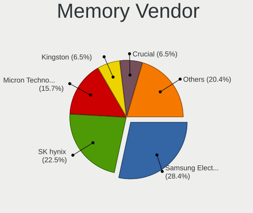

| Vendor                                  | Notebooks | Percent |
|-----------------------------------------|-----------|---------|
| Samsung Electronics                     | 425       | 28.39%  |
| SK hynix                                | 337       | 22.51%  |
| Micron Technology                       | 235       | 15.7%   |
| Kingston                                | 97        | 6.48%   |
| Crucial                                 | 97        | 6.48%   |
| Unknown                                 | 34        | 2.27%   |
| Unknown                                 | 34        | 2.27%   |
| Corsair                                 | 33        | 2.2%    |
| A-DATA Technology                       | 33        | 2.2%    |
| Ramaxel Technology                      | 23        | 1.54%   |
| Neo Forza                               | 16        | 1.07%   |
| Smart                                   | 15        | 1%      |
| Elpida                                  | 15        | 1%      |
| Team                                    | 13        | 0.87%   |
| Goldkey                                 | 12        | 0.8%    |
| G.Skill                                 | 12        | 0.8%    |
| Unknown (ABCD)                          | 6         | 0.4%    |
| PNY                                     | 5         | 0.33%   |
| Nanya Technology                        | 5         | 0.33%   |
| Timetec                                 | 4         | 0.27%   |
| Smart Brazil                            | 4         | 0.27%   |
| GSkill                                  | 4         | 0.27%   |
| Transcend                               | 3         | 0.2%    |
| Teikon                                  | 2         | 0.13%   |
| Gold Key                                | 2         | 0.13%   |
| ChangXin Memory                         | 2         | 0.13%   |
| Avant                                   | 2         | 0.13%   |
| ASint Technology                        | 2         | 0.13%   |
| Wilk                                    | 1         | 0.07%   |
| Unknown (8A02)                          | 1         | 0.07%   |
| Unknown (0x0E2A)                        | 1         | 0.07%   |
| Unknown (0x0CAB)                        | 1         | 0.07%   |
| Unknown (0x0C26)                        | 1         | 0.07%   |
| Unknown (09B6)                          | 1         | 0.07%   |
| Unknown (09A4)                          | 1         | 0.07%   |
| TEXTORM                                 | 1         | 0.07%   |
| Smart Modular                           | 1         | 0.07%   |
| Silicon Power Computer & Communications | 1         | 0.07%   |
| Silicon Power                           | 1         | 0.07%   |
| SHARETRONIC                             | 1         | 0.07%   |

Memory Model
------------

Memory module models

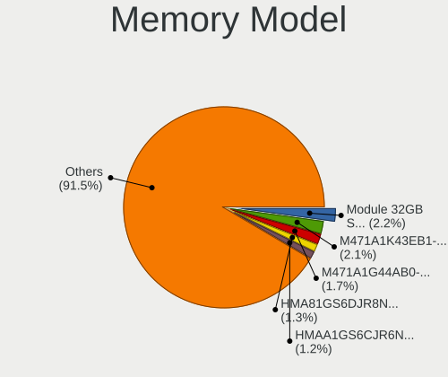

| Model                                                            | Notebooks | Percent |
|------------------------------------------------------------------|-----------|---------|
| Unknown                                                          | 34        | 2.16%   |
| Samsung RAM M471A1K43EB1-CWE 8GB SODIMM DDR4 3200MT/s            | 33        | 2.1%    |
| Samsung RAM M471A1G44AB0-CWE 8GiB SODIMM DDR4 3200MT/s           | 27        | 1.72%   |
| SK hynix RAM HMA81GS6DJR8N-XN 8GB SODIMM DDR4 3200MT/s           | 20        | 1.27%   |
| SK hynix RAM HMAA1GS6CJR6N-XN 8GB SODIMM DDR4 3200MT/s           | 19        | 1.21%   |
| Samsung RAM M471A1G44BB0-CWE 8GB SODIMM DDR4 3200MT/s            | 17        | 1.08%   |
| SK hynix RAM HMA81GS6AFR8N-UH 8GB SODIMM DDR4 2667MT/s           | 16        | 1.02%   |
| Micron RAM 8ATF1G64HZ-3G2R1 8GB SODIMM DDR4 3200MT/s             | 15        | 0.95%   |
| Samsung RAM M471A1K43CB1-CTD 8GB SODIMM DDR4 3200MT/s            | 14        | 0.89%   |
| Samsung RAM M471A5244CB0-CWE 4GB SODIMM DDR4 3200MT/s            | 13        | 0.83%   |
| Samsung RAM M471A5244CB0-CTD 4GB SODIMM DDR4 3266MT/s            | 13        | 0.83%   |
| Samsung RAM M471A1K43CB1-CRC 8GB SODIMM DDR4 8400MT/s            | 13        | 0.83%   |
| Samsung RAM M425R1GB4BB0-CQKOL 8GB SODIMM DDR5 4800MT/s          | 13        | 0.83%   |
| Samsung RAM M471A2G43AB2-CWE 16GB SODIMM DDR4 3200MT/s           | 12        | 0.76%   |
| SK hynix RAM HMAA1GS6CJR6N-XN 8GB Row Of Chips DDR4 3200MT/s     | 11        | 0.7%    |
| Samsung RAM M471B1G73QH0-YK0 8GB SODIMM DDR3 1600MT/s            | 11        | 0.7%    |
| Samsung RAM M471A1K43DB1-CWE 8GB SODIMM DDR4 3200MT/s            | 11        | 0.7%    |
| Samsung RAM M471B5173DB0-YK0 4GB SODIMM DDR3 1600MT/s            | 10        | 0.64%   |
| Samsung RAM M471A1G44AB0-CWE 8GB Row Of Chips DDR4 3200MT/s      | 10        | 0.64%   |
| Team RAM TEAMGROUP-SD4-3200 16GB SODIMM DDR4 3200MT/s            | 9         | 0.57%   |
| SK hynix RAM HMT41GS6BFR8A-PB 8GB SODIMM DDR3 2667MT/s           | 9         | 0.57%   |
| SK hynix RAM HMA82GS6AFR8N-UH 16GB SODIMM DDR4 2667MT/s          | 9         | 0.57%   |
| Samsung RAM M471A5244CB0-CWE 4GB Row Of Chips DDR4 3200MT/s      | 9         | 0.57%   |
| Samsung RAM M471A2K43CB1-CTD 16GB SODIMM DDR4 8400MT/s           | 9         | 0.57%   |
| Micron RAM 8ATF1G64HZ-3G2J1 8GB SODIMM DDR4 3200MT/s             | 9         | 0.57%   |
| Micron RAM 4ATF51264HZ-2G6E1 4GB SODIMM DDR4 2667MT/s            | 9         | 0.57%   |
| Micron RAM 4ATF1G64HZ-3G2F1 8GB SODIMM DDR4 3200MT/s             | 9         | 0.57%   |
| Micron RAM 4ATF1G64HZ-3G2E1 8GB SODIMM DDR4 3200MT/s             | 9         | 0.57%   |
| SK hynix RAM HMCG78AGBSA095N 16GB SODIMM DDR5 5600MT/s           | 8         | 0.51%   |
| SK hynix RAM HMA81GS6CJR8N-VK 8GB SODIMM DDR4 2667MT/s           | 8         | 0.51%   |
| Samsung RAM Module 16GB SODIMM DDR4 3200MT/s                     | 8         | 0.51%   |
| Samsung RAM M471B1G73EB0-YK0 8192MB SODIMM DDR3 1600MT/s         | 8         | 0.51%   |
| Micron RAM MT62F1G32D4DR-031 WT 4GB Row Of Chips LPDDR5 6400MT/s | 8         | 0.51%   |
| Micron RAM 4ATF1G64HZ-3G2E2 8GB SODIMM DDR4 3200MT/s             | 8         | 0.51%   |
| SK hynix RAM HMT451S6BFR8A-PB 4GB SODIMM DDR3 1600MT/s           | 7         | 0.45%   |
| SK hynix RAM HMT351S6CFR8C-PB 4GB SODIMM DDR3 1600MT/s           | 7         | 0.45%   |
| SK hynix RAM HMCG78MEBSA092N 16GB SODIMM DDR5 4800MT/s           | 7         | 0.45%   |
| SK hynix RAM HMA851S6CJR6N-VK 4GB SODIMM DDR4 2667MT/s           | 7         | 0.45%   |
| Samsung RAM M471A2K43DB1-CTD 16GB SODIMM DDR4 2667MT/s           | 7         | 0.45%   |
| Samsung RAM M425R1GB4BB0-CQKOD 8GB SODIMM DDR5 4800MT/s          | 7         | 0.45%   |

Memory Kind
-----------

Memory module kinds

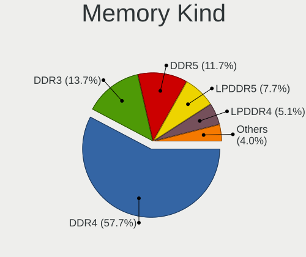

| Kind   | Notebooks | Percent |
|--------|-----------|---------|
| DDR4   | 740       | 57.72%  |
| DDR3   | 176       | 13.73%  |
| DDR5   | 150       | 11.7%   |
| LPDDR5 | 99        | 7.72%   |
| LPDDR4 | 66        | 5.15%   |
| LPDDR3 | 40        | 3.12%   |
| SDRAM  | 6         | 0.47%   |
| DDR2   | 5         | 0.39%   |

Memory Form Factor
------------------

Physical design of the memory module

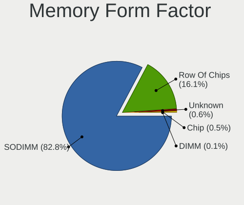

| Name         | Notebooks | Percent |
|--------------|-----------|---------|
| SODIMM       | 1080      | 82.76%  |
| Row Of Chips | 210       | 16.09%  |
| Unknown      | 8         | 0.61%   |
| Chip         | 6         | 0.46%   |
| DIMM         | 1         | 0.08%   |

Memory Size
-----------

Memory module size

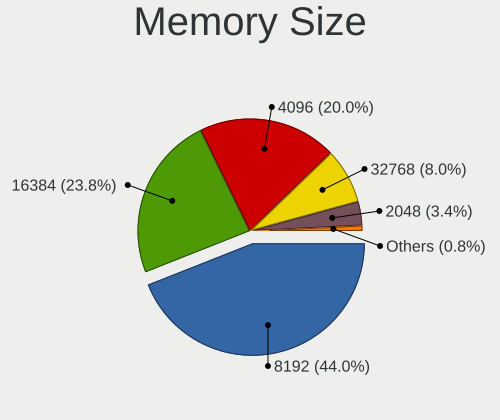

| Size  | Notebooks | Percent |
|-------|-----------|---------|
| 8192  | 613       | 44.01%  |
| 16384 | 331       | 23.76%  |
| 4096  | 279       | 20.03%  |
| 32768 | 111       | 7.97%   |
| 2048  | 48        | 3.45%   |
| 1024  | 7         | 0.5%    |
| 49152 | 1         | 0.07%   |
| 24576 | 1         | 0.07%   |
| 6144  | 1         | 0.07%   |
| 3072  | 1         | 0.07%   |

Memory Speed
------------

Memory module speed

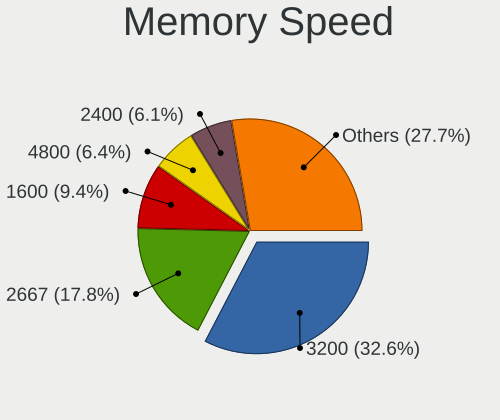

| Speed   | Notebooks | Percent |
|---------|-----------|---------|
| 3200    | 448       | 32.63%  |
| 2667    | 244       | 17.77%  |
| 1600    | 129       | 9.4%    |
| 4800    | 88        | 6.41%   |
| 2400    | 84        | 6.12%   |
| 6400    | 65        | 4.73%   |
| 5600    | 64        | 4.66%   |
| 2133    | 54        | 3.93%   |
| 4267    | 32        | 2.33%   |
| 8400    | 22        | 1.6%    |
| 7500    | 19        | 1.38%   |
| 1867    | 19        | 1.38%   |
| 1333    | 14        | 1.02%   |
| 3266    | 13        | 0.95%   |
| 1334    | 12        | 0.87%   |
| 4266    | 11        | 0.8%    |
| 1067    | 9         | 0.66%   |
| 8533    | 7         | 0.51%   |
| 8600    | 4         | 0.29%   |
| 3733    | 4         | 0.29%   |
| 2933    | 4         | 0.29%   |
| 2048    | 4         | 0.29%   |
| 800     | 4         | 0.29%   |
| 5200    | 3         | 0.22%   |
| 3000    | 3         | 0.22%   |
| 7467    | 2         | 0.15%   |
| 5500    | 2         | 0.15%   |
| 4199    | 2         | 0.15%   |
| 3333    | 1         | 0.07%   |
| 1200    | 1         | 0.07%   |
| 1066    | 1         | 0.07%   |
| 975     | 1         | 0.07%   |
| 667     | 1         | 0.07%   |
| 666     | 1         | 0.07%   |
| Unknown | 1         | 0.07%   |

Printers & scanners
-------------------

Printer Vendor
--------------

Printer device vendors

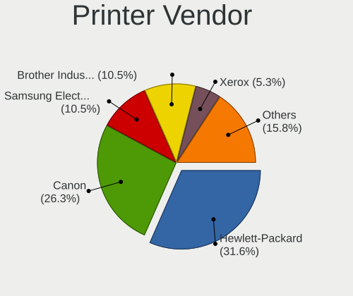

| Vendor              | Notebooks | Percent |
|---------------------|-----------|---------|
| Hewlett-Packard     | 6         | 31.58%  |
| Canon               | 5         | 26.32%  |
| Samsung Electronics | 2         | 10.53%  |
| Brother Industries  | 2         | 10.53%  |
| Xerox               | 1         | 5.26%   |
| Seiko Epson         | 1         | 5.26%   |
| ICS Advent          | 1         | 5.26%   |
| Dymo-CoStar         | 1         | 5.26%   |

Printer Model
-------------

Printer device models

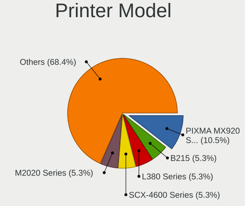

| Model                           | Notebooks | Percent |
|---------------------------------|-----------|---------|
| Canon PIXMA MX920 Series        | 2         | 10.53%  |
| Xerox B215                      | 1         | 5.26%   |
| Seiko Epson L380 Series         | 1         | 5.26%   |
| Samsung SCX-4600 Series         | 1         | 5.26%   |
| Samsung M2020 Series            | 1         | 5.26%   |
| ICS Advent Parallel Adapter     | 1         | 5.26%   |
| HP OfficeJet 3830 series        | 1         | 5.26%   |
| HP Ink Tank Wireless 410 series | 1         | 5.26%   |
| HP ENVY 6000 series             | 1         | 5.26%   |
| HP DeskJet Plus 4100 series     | 1         | 5.26%   |
| HP DeskJet 2130 series          | 1         | 5.26%   |
| HP Color LaserJet CP2025dn      | 1         | 5.26%   |
| Dymo-CoStar LabelWriter 450     | 1         | 5.26%   |
| Canon TR4700 series             | 1         | 5.26%   |
| Canon LiDE 300                  | 1         | 5.26%   |
| Canon E400 series               | 1         | 5.26%   |
| Brother HL-L2370DW series       | 1         | 5.26%   |
| Brother DCP-T500W               | 1         | 5.26%   |

Scanner Vendor
--------------

Scanner device vendors

Zero info for selected period =(

Scanner Model
-------------

Scanner device models

Zero info for selected period =(

Camera
------

Camera Vendor
-------------

Camera device vendors

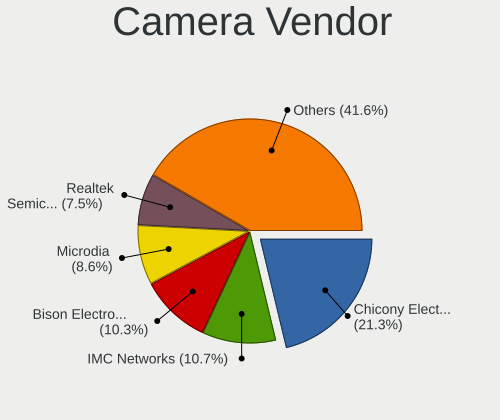

| Vendor                                 | Notebooks | Percent |
|----------------------------------------|-----------|---------|
| Chicony Electronics                    | 744       | 21.25%  |
| IMC Networks                           | 374       | 10.68%  |
| Bison Electronics                      | 360       | 10.28%  |
| Microdia                               | 302       | 8.63%   |
| Realtek Semiconductor                  | 263       | 7.51%   |
| Quanta                                 | 241       | 6.88%   |
| Sunplus Innovation Technology          | 175       | 5%      |
| Apple                                  | 159       | 4.54%   |
| Luxvisions Innotech Limited            | 129       | 3.68%   |
| Syntek                                 | 92        | 2.63%   |
| Cheng Uei Precision Industry (Foxlink) | 92        | 2.63%   |
| Lite-On Technology                     | 82        | 2.34%   |
| Sonix Technology                       | 69        | 1.97%   |
| Suyin                                  | 64        | 1.83%   |
| Logitech                               | 48        | 1.37%   |
| Silicon Motion                         | 33        | 0.94%   |
| SunplusIT                              | 28        | 0.8%    |
| Shinetech                              | 25        | 0.71%   |
| Alcor Micro                            | 23        | 0.66%   |
| Samsung Electronics                    | 22        | 0.63%   |
| Acer                                   | 16        | 0.46%   |
| Ricoh                                  | 13        | 0.37%   |
| Microsoft                              | 9         | 0.26%   |
| Z-Star Microelectronics                | 8         | 0.23%   |
| Primax Electronics                     | 8         | 0.23%   |
| kingcome                               | 7         | 0.2%    |
| OmniVision Technologies                | 6         | 0.17%   |
| Generalplus Technology                 | 6         | 0.17%   |
| Razer USA                              | 5         | 0.14%   |
| Importek                               | 5         | 0.14%   |
| Tobii Technology AB                    | 4         | 0.11%   |
| Shine-optics                           | 4         | 0.11%   |
| Lenovo                                 | 4         | 0.11%   |
| icSpring                               | 4         | 0.11%   |
| BillionPixels                          | 4         | 0.11%   |
| ALi                                    | 4         | 0.11%   |
| Unknown                                | 4         | 0.11%   |
| Y Media                                | 3         | 0.09%   |
| Tripath Technology                     | 3         | 0.09%   |
| Intel                                  | 3         | 0.09%   |

Camera Model
------------

Camera device models

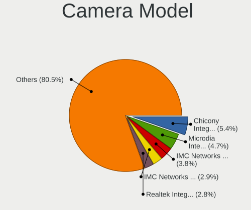

| Model                                                | Notebooks | Percent |
|------------------------------------------------------|-----------|---------|
| Chicony Integrated Camera                            | 189       | 5.37%   |
| Microdia Integrated_Webcam_HD                        | 166       | 4.71%   |
| IMC Networks USB2.0 HD UVC WebCam                    | 133       | 3.78%   |
| IMC Networks Integrated Camera                       | 101       | 2.87%   |
| Realtek Integrated_Webcam_HD                         | 97        | 2.75%   |
| Bison BisonCam,NB Pro                                | 87        | 2.47%   |
| Bison Integrated Camera                              | 78        | 2.22%   |
| Syntek Integrated Camera                             | 69        | 1.96%   |
| Chicony HD Webcam                                    | 65        | 1.85%   |
| Apple FaceTime HD Camera                             | 56        | 1.59%   |
| Quanta HD User Facing                                | 50        | 1.42%   |
| Bison HD Webcam                                      | 50        | 1.42%   |
| Sonix USB2.0 HD UVC WebCam                           | 45        | 1.28%   |
| Sunplus Integrated_Webcam_HD                         | 44        | 1.25%   |
| Chicony Chicony USB2.0 Camera                        | 41        | 1.16%   |
| Apple Built-in iSight                                | 39        | 1.11%   |
| Apple iPhone 5/5C/5S/6/SE/7/8/X                      | 38        | 1.08%   |
| Luxvisions Innotech Limited Integrated Camera        | 36        | 1.02%   |
| Chicony HP HD Camera                                 | 36        | 1.02%   |
| Lite-On Integrated Camera                            | 35        | 0.99%   |
| Chicony HD User Facing                               | 33        | 0.94%   |
| IMC Networks USB2.0 VGA UVC WebCam                   | 31        | 0.88%   |
| Bison SunplusIT Integrated Camera                    | 31        | 0.88%   |
| Luxvisions Innotech Limited HP TrueVision HD Camera  | 29        | 0.82%   |
| Chicony USB2.0 Camera                                | 29        | 0.82%   |
| Chicony HP Truevision HD camera                      | 28        | 0.8%    |
| Quanta ACER HD User Facing                           | 27        | 0.77%   |
| Quanta HP TrueVision HD Camera                       | 26        | 0.74%   |
| Quanta HP HD Camera                                  | 25        | 0.71%   |
| Quanta HD Webcam                                     | 25        | 0.71%   |
| Microdia Integrated Webcam                           | 24        | 0.68%   |
| Chicony HP Wide Vision HD Camera                     | 23        | 0.65%   |
| Samsung Galaxy series, misc. (MTP mode)              | 22        | 0.62%   |
| Realtek USB Camera                                   | 21        | 0.6%    |
| Quanta HP Wide Vision HD Camera                      | 21        | 0.6%    |
| Chicony USB 2.0 Camera                               | 21        | 0.6%    |
| Sonix USB2.0 FHD UVC WebCam                          | 20        | 0.57%   |
| Luxvisions Innotech Limited HP Wide Vision HD Camera | 19        | 0.54%   |
| Chicony USB2.0 VGA UVC WebCam                        | 19        | 0.54%   |
| Chicony USB2.0 HD UVC WebCam                         | 19        | 0.54%   |

Security
--------

Fingerprint Vendor
------------------

Fingerprint sensor vendors

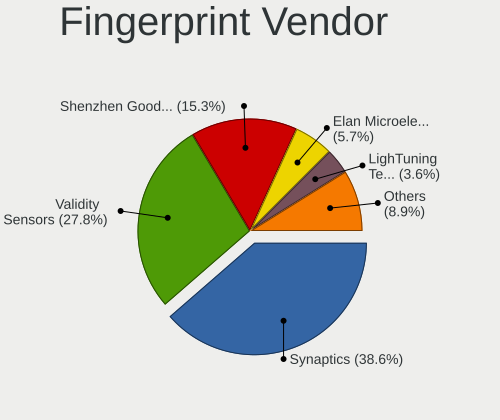

| Vendor                             | Notebooks | Percent |
|------------------------------------|-----------|---------|
| Synaptics                          | 244       | 38.61%  |
| Validity Sensors                   | 176       | 27.85%  |
| Shenzhen Goodix Technology         | 97        | 15.35%  |
| Elan Microelectronics              | 36        | 5.7%    |
| LighTuning Technology              | 23        | 3.64%   |
| Upek                               | 22        | 3.48%   |
| AuthenTec                          | 15        | 2.37%   |
| Realtek USB2.0 Finger Print Bridge | 9         | 1.42%   |
| Focal-systems.Corp                 | 5         | 0.79%   |
| HOLTEK                             | 4         | 0.63%   |
| STMicroelectronics                 | 1         | 0.16%   |

Fingerprint Model
-----------------

Fingerprint sensor models

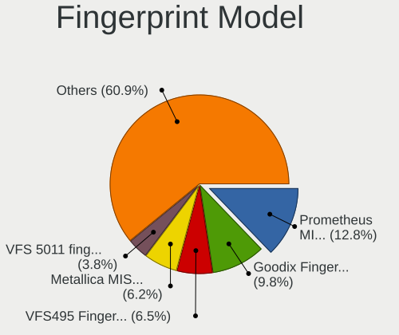

| Model                                                                      | Notebooks | Percent |
|----------------------------------------------------------------------------|-----------|---------|
| Synaptics Prometheus MIS Touch Fingerprint Reader                          | 81        | 12.82%  |
| Shenzhen Goodix  FingerPrint Device                                        | 62        | 9.81%   |
| Validity Sensors VFS495 Fingerprint Reader                                 | 41        | 6.49%   |
| Synaptics Metallica MIS Touch Fingerprint Reader                           | 39        | 6.17%   |
| Validity Sensors VFS 5011 fingerprint sensor                               | 24        | 3.8%    |
| Synaptics FS7604 Touch Fingerprint Sensor with PurePrint                   | 24        | 3.8%    |
| Shenzhen Goodix FingerPrint                                                | 20        | 3.16%   |
| Elan ELAN:ARM-M4                                                           | 19        | 3.01%   |
| Upek Biometric Touchchip/Touchstrip Fingerprint Sensor                     | 18        | 2.85%   |
| Elan ELAN:Fingerprint                                                      | 17        | 2.69%   |
| Validity Sensors VFS5011 Fingerprint Reader                                | 15        | 2.37%   |
| Shenzhen Goodix Fingerprint Reader                                         | 15        | 2.37%   |
| Validity Sensors VFS7500 Touch Fingerprint Sensor                          | 14        | 2.22%   |
| LighTuning ES603 Swipe Fingerprint Sensor                                  | 14        | 2.22%   |
| Synaptics WBDI Fingerprint Reader USB 086                                  | 13        | 2.06%   |
| Validity Sensors Synaptics WBDI                                            | 12        | 1.9%    |
| Validity Sensors Fingerprint scanner                                       | 12        | 1.9%    |
| Synaptics Fingerprint reader [HP G6]                                       | 12        | 1.9%    |
| Validity Sensors Synaptics VFS7552 Touch Fingerprint Sensor with PurePrint | 11        | 1.74%   |
| Synaptics WBDI Device                                                      | 11        | 1.74%   |
| Synaptics UWP WBDI Device                                                  | 11        | 1.74%   |
| Synaptics TouchPad                                                         | 11        | 1.74%   |
| Validity Sensors VFS491                                                    | 10        | 1.58%   |
| Validity Sensors VFS471 Fingerprint Reader                                 | 10        | 1.58%   |
| Validity Sensors Swipe Fingerprint Sensor                                  | 9         | 1.42%   |
| Synaptics Metallica MOH Touch Fingerprint Reader                           | 9         | 1.42%   |
| Realtek USB2.0 Finger Print Bridge FocalTech Fingerprint Device            | 9         | 1.42%   |
| LighTuning EgisTec Touch Fingerprint Sensor                                | 9         | 1.42%   |
| Validity Sensors VFS451 Fingerprint Reader                                 | 8         | 1.27%   |
| Synaptics  FS7604 Touch Fingerprint Sensor with PurePrint                  | 8         | 1.27%   |
| Synaptics Prometheus Fingerprint Reader                                    | 8         | 1.27%   |
| Unknown                                                                    | 8         | 1.27%   |
| Synaptics  WBDI                                                            | 7         | 1.11%   |
| Focal-systems.Corp FT9201Fingerprint.                                      | 5         | 0.79%   |
| AuthenTec Fingerprint Sensor                                               | 5         | 0.79%   |
| Validity Sensors VFS Fingerprint sensor                                    | 4         | 0.63%   |
| Upek TCS5B Fingerprint sensor                                              | 4         | 0.63%   |
| HOLTEK FocalTech Fingerprint Device                                        | 4         | 0.63%   |
| AuthenTec AES2501 Fingerprint Sensor                                       | 4         | 0.63%   |
| Validity Sensors VFS7552 Touch Fingerprint Sensor                          | 3         | 0.47%   |

Chipcard Vendor
---------------

Chipcard module vendors

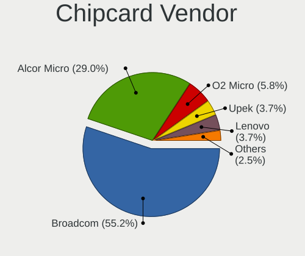

| Vendor                | Notebooks | Percent |
|-----------------------|-----------|---------|
| Broadcom              | 133       | 55.19%  |
| Alcor Micro           | 70        | 29.05%  |
| O2 Micro              | 14        | 5.81%   |
| Upek                  | 9         | 3.73%   |
| Lenovo                | 9         | 3.73%   |
| SCM Microsystems      | 2         | 0.83%   |
| Yubico.com            | 1         | 0.41%   |
| OmniKey               | 1         | 0.41%   |
| Gemalto (was Gemplus) | 1         | 0.41%   |
| Clay Logic            | 1         | 0.41%   |

Chipcard Model
--------------

Chipcard module models

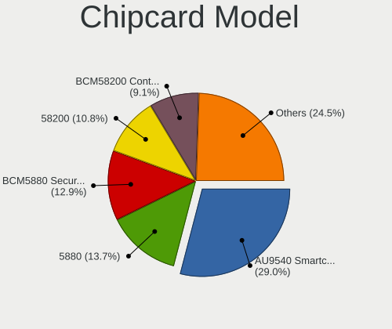

| Model                                                                        | Notebooks | Percent |
|------------------------------------------------------------------------------|-----------|---------|
| Alcor Micro AU9540 Smartcard Reader                                          | 70        | 29.05%  |
| Broadcom 5880                                                                | 33        | 13.69%  |
| Broadcom BCM5880 Secure Applications Processor                               | 31        | 12.86%  |
| Broadcom 58200                                                               | 26        | 10.79%  |
| Broadcom BCM58200 ControlVault 3 (FingerPrint sensor + Contacted SmartCard)  | 22        | 9.13%   |
| Broadcom BCM5880 Secure Applications Processor with fingerprint swipe sensor | 20        | 8.3%    |
| O2 Micro OZ776 CCID Smartcard Reader                                         | 13        | 5.39%   |
| Upek TouchChip Fingerprint Coprocessor (WBF advanced mode)                   | 9         | 3.73%   |
| Lenovo Integrated Smart Card Reader                                          | 9         | 3.73%   |
| Yubico.com Yubikey 4/5 U2F+CCID                                              | 1         | 0.41%   |
| SCM Microsystems SCR35xx Smart Card Reader                                   | 1         | 0.41%   |
| SCM Microsystems SCR331-LC1 / SCR3310 SmartCard Reader                       | 1         | 0.41%   |
| OmniKey CardMan 4321                                                         | 1         | 0.41%   |
| O2 Micro Oz776 SmartCard Reader                                              | 1         | 0.41%   |
| Gemalto (was Gemplus) GemPC Twin SmartCard Reader                            | 1         | 0.41%   |
| Clay Logic Nitrokey Pro                                                      | 1         | 0.41%   |
| Broadcom BCM5880 Secure Applications Processor with fingerprint touch sensor | 1         | 0.41%   |

Unsupported
-----------

Unsupported Devices
-------------------

Total unsupported devices on board

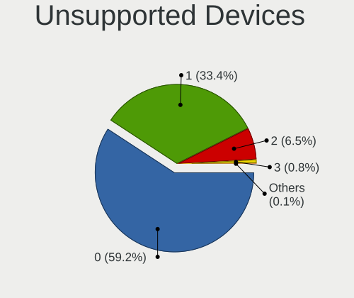

| Total | Notebooks | Percent |
|-------|-----------|---------|
| 0     | 2355      | 59.22%  |
| 1     | 1329      | 33.42%  |
| 2     | 257       | 6.46%   |
| 3     | 30        | 0.75%   |
| 4     | 3         | 0.08%   |
| 5     | 2         | 0.05%   |
| 6     | 1         | 0.03%   |

Unsupported Device Types
------------------------

Types of unsupported devices

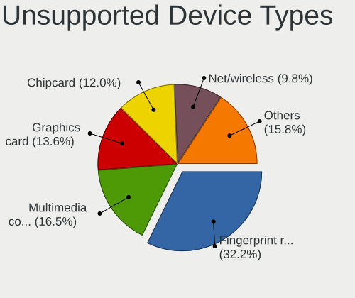

| Type                     | Notebooks | Percent |
|--------------------------|-----------|---------|
| Fingerprint reader       | 615       | 32.25%  |
| Multimedia controller    | 315       | 16.52%  |
| Graphics card            | 260       | 13.63%  |
| Chipcard                 | 228       | 11.96%  |
| Net/wireless             | 187       | 9.81%   |
| Camera                   | 110       | 5.77%   |
| Bluetooth                | 70        | 3.67%   |
| Sound                    | 25        | 1.31%   |
| Net/ethernet             | 21        | 1.1%    |
| Storage                  | 20        | 1.05%   |
| Communication controller | 15        | 0.79%   |
| Card reader              | 14        | 0.73%   |
| Network                  | 13        | 0.68%   |
| Modem                    | 10        | 0.52%   |
| Storage/ide              | 2         | 0.1%    |
| Unassigned class         | 1         | 0.05%   |
| Storage/nvme             | 1         | 0.05%   |

