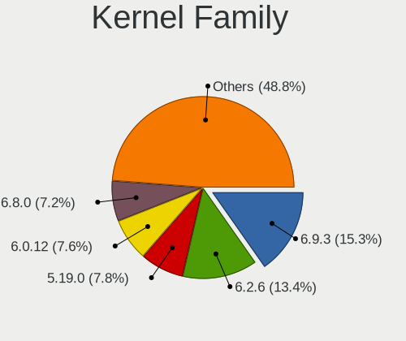
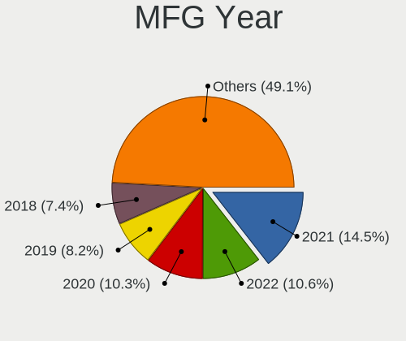
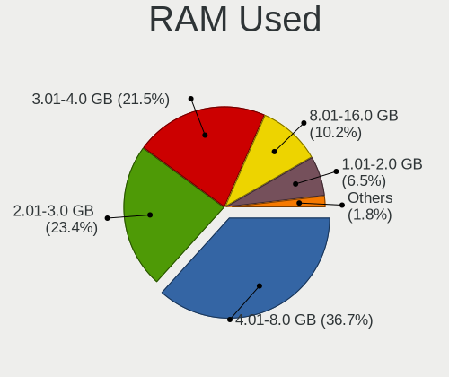
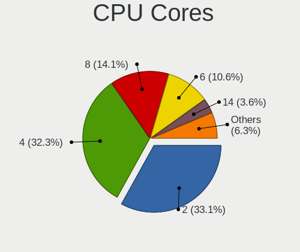
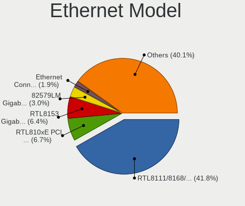
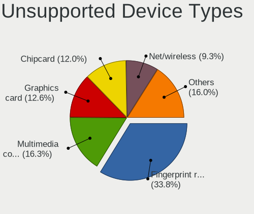

Pop!_OS 22.04 - Tested Hardware & Statistics (Notebooks)
--------------------------------------------------------

A project to collect tested hardware configurations for Pop!_OS 22.04.

Anyone can contribute to this report by the [hw-probe](https://github.com/linuxhw/hw-probe) tool:

    sudo -E hw-probe -all -upload

Please contribute! Especially if your hardware is rare.

Contents
--------

* [ Test Cases ](#test-cases)

* [ System ](#system)
  - [ Kernel                   ](#kernel)
  - [ Kernel Family            ](#kernel-family)
  - [ Kernel Major Ver.        ](#kernel-major-ver)
  - [ Arch                     ](#arch)
  - [ DE                       ](#de)
  - [ Display Server           ](#display-server)
  - [ Display Manager          ](#display-manager)
  - [ OS Lang                  ](#os-lang)
  - [ Boot Mode                ](#boot-mode)
  - [ Filesystem               ](#filesystem)
  - [ Part. scheme             ](#part-scheme)
  - [ Dual Boot with Linux/BSD ](#dual-boot-with-linuxbsd)
  - [ Dual Boot (Win)          ](#dual-boot-win)

* [ Board ](#board)
  - [ Vendor                   ](#vendor)
  - [ Model                    ](#model)
  - [ Model Family             ](#model-family)
  - [ MFG Year                 ](#mfg-year)
  - [ Form Factor              ](#form-factor)
  - [ Secure Boot              ](#secure-boot)
  - [ Coreboot                 ](#coreboot)
  - [ RAM Size                 ](#ram-size)
  - [ RAM Used                 ](#ram-used)
  - [ Total Drives             ](#total-drives)
  - [ Has CD-ROM               ](#has-cd-rom)
  - [ Has Ethernet             ](#has-ethernet)
  - [ Has WiFi                 ](#has-wifi)
  - [ Has Bluetooth            ](#has-bluetooth)

* [ Location ](#location)
  - [ Country                  ](#country)
  - [ City                     ](#city)

* [ Drives ](#drives)
  - [ Drive Vendor             ](#drive-vendor)
  - [ Drive Model              ](#drive-model)
  - [ HDD Vendor               ](#hdd-vendor)
  - [ SSD Vendor               ](#ssd-vendor)
  - [ Drive Kind               ](#drive-kind)
  - [ Drive Connector          ](#drive-connector)
  - [ Drive Size               ](#drive-size)
  - [ Space Total              ](#space-total)
  - [ Space Used               ](#space-used)
  - [ Malfunc. Drives          ](#malfunc-drives)
  - [ Malfunc. Drive Vendor    ](#malfunc-drive-vendor)
  - [ Malfunc. HDD Vendor      ](#malfunc-hdd-vendor)
  - [ Malfunc. Drive Kind      ](#malfunc-drive-kind)
  - [ Failed Drives            ](#failed-drives)
  - [ Failed Drive Vendor      ](#failed-drive-vendor)
  - [ Drive Status             ](#drive-status)

* [ Storage controller ](#storage-controller)
  - [ Storage Vendor           ](#storage-vendor)
  - [ Storage Model            ](#storage-model)
  - [ Storage Kind             ](#storage-kind)

* [ Processor ](#processor)
  - [ CPU Vendor               ](#cpu-vendor)
  - [ CPU Model                ](#cpu-model)
  - [ CPU Model Family         ](#cpu-model-family)
  - [ CPU Cores                ](#cpu-cores)
  - [ CPU Sockets              ](#cpu-sockets)
  - [ CPU Threads              ](#cpu-threads)
  - [ CPU Op-Modes             ](#cpu-op-modes)
  - [ CPU Microcode            ](#cpu-microcode)
  - [ CPU Microarch            ](#cpu-microarch)

* [ Graphics ](#graphics)
  - [ GPU Vendor               ](#gpu-vendor)
  - [ GPU Model                ](#gpu-model)
  - [ GPU Combo                ](#gpu-combo)
  - [ GPU Driver               ](#gpu-driver)
  - [ GPU Memory               ](#gpu-memory)

* [ Monitor ](#monitor)
  - [ Monitor Vendor           ](#monitor-vendor)
  - [ Monitor Model            ](#monitor-model)
  - [ Monitor Resolution       ](#monitor-resolution)
  - [ Monitor Diagonal         ](#monitor-diagonal)
  - [ Monitor Width            ](#monitor-width)
  - [ Aspect Ratio             ](#aspect-ratio)
  - [ Monitor Area             ](#monitor-area)
  - [ Pixel Density            ](#pixel-density)
  - [ Multiple Monitors        ](#multiple-monitors)

* [ Network ](#network)
  - [ Net Controller Vendor    ](#net-controller-vendor)
  - [ Net Controller Model     ](#net-controller-model)
  - [ Wireless Vendor          ](#wireless-vendor)
  - [ Wireless Model           ](#wireless-model)
  - [ Ethernet Vendor          ](#ethernet-vendor)
  - [ Ethernet Model           ](#ethernet-model)
  - [ Net Controller Kind      ](#net-controller-kind)
  - [ Used Controller          ](#used-controller)
  - [ NICs                     ](#nics)
  - [ IPv6                     ](#ipv6)

* [ Bluetooth ](#bluetooth)
  - [ Bluetooth Vendor         ](#bluetooth-vendor)
  - [ Bluetooth Model          ](#bluetooth-model)

* [ Sound ](#sound)
  - [ Sound Vendor             ](#sound-vendor)
  - [ Sound Model              ](#sound-model)

* [ Memory ](#memory)
  - [ Memory Vendor            ](#memory-vendor)
  - [ Memory Model             ](#memory-model)
  - [ Memory Kind              ](#memory-kind)
  - [ Memory Form Factor       ](#memory-form-factor)
  - [ Memory Size              ](#memory-size)
  - [ Memory Speed             ](#memory-speed)

* [ Printers & scanners ](#printers--scanners)
  - [ Printer Vendor           ](#printer-vendor)
  - [ Printer Model            ](#printer-model)
  - [ Scanner Vendor           ](#scanner-vendor)
  - [ Scanner Model            ](#scanner-model)

* [ Camera ](#camera)
  - [ Camera Vendor            ](#camera-vendor)
  - [ Camera Model             ](#camera-model)

* [ Security ](#security)
  - [ Fingerprint Vendor       ](#fingerprint-vendor)
  - [ Fingerprint Model        ](#fingerprint-model)
  - [ Chipcard Vendor          ](#chipcard-vendor)
  - [ Chipcard Model           ](#chipcard-model)

* [ Unsupported ](#unsupported)
  - [ Unsupported Devices      ](#unsupported-devices)
  - [ Unsupported Device Types ](#unsupported-device-types)

Test Cases
----------

Total: 55

| Vendor   | Model                       | Probe                                                      | Date         |
|----------|-----------------------------|------------------------------------------------------------|--------------|
| HP       | ProBook 455 G7              | [88fcea9210](https://linux-hardware.org/?probe=88fcea9210) | Apr 30, 2022 |
| Lenovo   | ThinkPad L15 Gen 2 20X4S... | [48d3759522](https://linux-hardware.org/?probe=48d3759522) | Apr 30, 2022 |
| Toshiba  | Satellite L10W-B-101        | [8383d306f3](https://linux-hardware.org/?probe=8383d306f3) | Apr 30, 2022 |
| Dell     | XPS 13 9343                 | [b48ccc106e](https://linux-hardware.org/?probe=b48ccc106e) | Apr 30, 2022 |
| Toshiba  | IS 1413G                    | [8074a86bc7](https://linux-hardware.org/?probe=8074a86bc7) | Apr 30, 2022 |
| Dell     | XPS 15 9510                 | [b92517268e](https://linux-hardware.org/?probe=b92517268e) | Apr 30, 2022 |
| ASUSTek  | G55VW                       | [6bd8a1b04a](https://linux-hardware.org/?probe=6bd8a1b04a) | Apr 29, 2022 |
| Dell     | Inspiron 3542               | [19f5e16bce](https://linux-hardware.org/?probe=19f5e16bce) | Apr 29, 2022 |
| Lenovo   | ThinkPad E14 Gen 4 21ECS... | [61bb949815](https://linux-hardware.org/?probe=61bb949815) | Apr 29, 2022 |
| Dell     | G5 5500                     | [c6064853ad](https://linux-hardware.org/?probe=c6064853ad) | Apr 29, 2022 |
| HP       | Pavilion 15                 | [2484213956](https://linux-hardware.org/?probe=2484213956) | Apr 29, 2022 |
| Lenovo   | ThinkPad T480 20L50004UK    | [34015c4874](https://linux-hardware.org/?probe=34015c4874) | Apr 29, 2022 |
| ASUSTek  | X540SAA                     | [6c8e397ca3](https://linux-hardware.org/?probe=6c8e397ca3) | Apr 29, 2022 |
| System76 | Oryx Pro                    | [cf999d4581](https://linux-hardware.org/?probe=cf999d4581) | Apr 29, 2022 |
| Dell     | Inspiron 5547               | [a5d8e73a23](https://linux-hardware.org/?probe=a5d8e73a23) | Apr 28, 2022 |
| Dell     | Inspiron 5547               | [be4ab0fd27](https://linux-hardware.org/?probe=be4ab0fd27) | Apr 28, 2022 |
| Toshiba  | IS 1413G                    | [995f77010e](https://linux-hardware.org/?probe=995f77010e) | Apr 28, 2022 |
| Toshiba  | IS 1413G                    | [e2293170b3](https://linux-hardware.org/?probe=e2293170b3) | Apr 28, 2022 |
| HP       | Pavilion 13 x360 PC         | [f898a6a476](https://linux-hardware.org/?probe=f898a6a476) | Apr 28, 2022 |
| Lenovo   | ThinkPad T431s 20ACS03P0... | [3c0878aee3](https://linux-hardware.org/?probe=3c0878aee3) | Apr 28, 2022 |
| System76 | Oryx Pro                    | [ae46ece731](https://linux-hardware.org/?probe=ae46ece731) | Apr 28, 2022 |
| HP       | Pavilion 15                 | [fee7e96d70](https://linux-hardware.org/?probe=fee7e96d70) | Apr 28, 2022 |
| Toshiba  | IS 1413G                    | [a63dc69025](https://linux-hardware.org/?probe=a63dc69025) | Apr 28, 2022 |
| Apple    | MacBookPro10,2              | [2d79aab0aa](https://linux-hardware.org/?probe=2d79aab0aa) | Apr 28, 2022 |
| ASUSTek  | K40IN                       | [ab6a95da52](https://linux-hardware.org/?probe=ab6a95da52) | Apr 28, 2022 |
| HP       | Pavilion 13 x360 PC         | [d48ed77abc](https://linux-hardware.org/?probe=d48ed77abc) | Apr 28, 2022 |
| Dell     | Inspiron 5566               | [695d362d8f](https://linux-hardware.org/?probe=695d362d8f) | Apr 27, 2022 |
| ASUSTek  | FX503VM                     | [c227966510](https://linux-hardware.org/?probe=c227966510) | Apr 27, 2022 |
| ASUSTek  | FX503VM                     | [1275aa643d](https://linux-hardware.org/?probe=1275aa643d) | Apr 27, 2022 |
| HP       | ENVY Laptop 14-eb0xxx       | [495a74c914](https://linux-hardware.org/?probe=495a74c914) | Apr 27, 2022 |
| Dell     | XPS 13 9310                 | [d394f4e0d9](https://linux-hardware.org/?probe=d394f4e0d9) | Apr 27, 2022 |
| HUAWEI   | HVY-WXX9                    | [824ccc1317](https://linux-hardware.org/?probe=824ccc1317) | Apr 27, 2022 |
| HP       | Pavilion 13 x360 PC         | [3e5933fe0d](https://linux-hardware.org/?probe=3e5933fe0d) | Apr 27, 2022 |
| Lenovo   | IdeaPad 110-15ISK 80UD      | [e51ff27a5a](https://linux-hardware.org/?probe=e51ff27a5a) | Apr 27, 2022 |
| Dell     | Vostro 15 3515              | [7c99d7d4c5](https://linux-hardware.org/?probe=7c99d7d4c5) | Apr 27, 2022 |
| ASUSTek  | ROG Zephyrus G14 GA401IH... | [863612cc05](https://linux-hardware.org/?probe=863612cc05) | Apr 27, 2022 |
| Purism   | Librem 15 v3                | [d2a13c9d0a](https://linux-hardware.org/?probe=d2a13c9d0a) | Apr 27, 2022 |
| Toshiba  | Satellite C55t-C            | [1fe2032839](https://linux-hardware.org/?probe=1fe2032839) | Apr 27, 2022 |
| Toshiba  | Satellite C55t-C            | [cabf0c7464](https://linux-hardware.org/?probe=cabf0c7464) | Apr 27, 2022 |
| Lenovo   | IdeaPad S145-15API 81V7     | [b7ac79ff8f](https://linux-hardware.org/?probe=b7ac79ff8f) | Apr 27, 2022 |
| MSI      | GS66 Stealth 10UG           | [77b699045a](https://linux-hardware.org/?probe=77b699045a) | Apr 27, 2022 |
| Acer     | Aspire E1-570               | [1621e22812](https://linux-hardware.org/?probe=1621e22812) | Apr 26, 2022 |
| Acer     | Swift SF316-51              | [fe42983639](https://linux-hardware.org/?probe=fe42983639) | Apr 26, 2022 |
| Acer     | TravelMate P249-G2-MG       | [2e0bd790c6](https://linux-hardware.org/?probe=2e0bd790c6) | Apr 26, 2022 |
| Dell     | Inspiron 3442               | [d4b7580074](https://linux-hardware.org/?probe=d4b7580074) | Apr 26, 2022 |
| Dell     | Inspiron 3442               | [d994ff2a13](https://linux-hardware.org/?probe=d994ff2a13) | Apr 26, 2022 |
| Unknown  | Unknown                     | [885f468161](https://linux-hardware.org/?probe=885f468161) | Apr 26, 2022 |
| ASUSTek  | X555LF                      | [0aa3a88c0c](https://linux-hardware.org/?probe=0aa3a88c0c) | Apr 25, 2022 |
| Toshiba  | IS 1413G                    | [d5918f0d93](https://linux-hardware.org/?probe=d5918f0d93) | Apr 23, 2022 |
| Dell     | XPS 13 9360                 | [ffb9cf10be](https://linux-hardware.org/?probe=ffb9cf10be) | Apr 20, 2022 |
| Dell     | XPS 13 9360                 | [f174d4ced7](https://linux-hardware.org/?probe=f174d4ced7) | Apr 20, 2022 |
| Toshiba  | IS 1413G                    | [1b3267b605](https://linux-hardware.org/?probe=1b3267b605) | Apr 18, 2022 |
| Dell     | Latitude 5590               | [ade3f33fb9](https://linux-hardware.org/?probe=ade3f33fb9) | Apr 16, 2022 |
| Dell     | Latitude 5590               | [1638db9ad7](https://linux-hardware.org/?probe=1638db9ad7) | Apr 13, 2022 |
| Dell     | Latitude E7270              | [79cc908dcc](https://linux-hardware.org/?probe=79cc908dcc) | Apr 08, 2022 |

System
------

Kernel
------

Version of the Linux kernel

| Version                  | Notebooks | Percent |
|--------------------------|-----------|---------|
| 5.16.19-76051619-generic | 36        | 92.31%  |
| 5.16.15-76051615-generic | 2         | 5.13%   |
| 5.17.2-xanmod1           | 1         | 2.56%   |

Kernel Family
-------------

Linux kernel without a distro release

| Version | Notebooks | Percent |
|---------|-----------|---------|
| 5.16.19 | 36        | 92.31%  |
| 5.16.15 | 2         | 5.13%   |
| 5.17.2  | 1         | 2.56%   |

Kernel Major Ver.
-----------------

Linux kernel major version

| Version | Notebooks | Percent |
|---------|-----------|---------|
| 5.16    | 38        | 97.44%  |
| 5.17    | 1         | 2.56%   |

Arch
----

OS architecture (x86_64, i586, etc.)

| Name   | Notebooks | Percent |
|--------|-----------|---------|
| x86_64 | 39        | 100%    |

DE
--

Desktop Environment

| Name  | Notebooks | Percent |
|-------|-----------|---------|
| GNOME | 39        | 100%    |

Display Server
--------------

X11 or Wayland

| Name    | Notebooks | Percent |
|---------|-----------|---------|
| X11     | 38        | 97.44%  |
| Wayland | 1         | 2.56%   |

Display Manager
---------------

SDDM, LightDM, etc.

| Name    | Notebooks | Percent |
|---------|-----------|---------|
| Unknown | 31        | 79.49%  |
| GDM3    | 8         | 20.51%  |

OS Lang
-------

Language

| Lang  | Notebooks | Percent |
|-------|-----------|---------|
| en_US | 25        | 64.1%   |
| pt_BR | 6         | 15.38%  |
| en_GB | 2         | 5.13%   |
| pt_PT | 1         | 2.56%   |
| fr_FR | 1         | 2.56%   |
| es_AR | 1         | 2.56%   |
| en_PH | 1         | 2.56%   |
| en_CA | 1         | 2.56%   |
| de_DE | 1         | 2.56%   |

Boot Mode
---------

EFI or BIOS

| Mode | Notebooks | Percent |
|------|-----------|---------|
| BIOS | 31        | 79.49%  |
| EFI  | 8         | 20.51%  |

Filesystem
----------

Type of filesystem

| Type  | Notebooks | Percent |
|-------|-----------|---------|
| Ext4  | 37        | 94.87%  |
| Btrfs | 2         | 5.13%   |

Part. scheme
------------

Scheme of partitioning

| Type    | Notebooks | Percent |
|---------|-----------|---------|
| Unknown | 31        | 79.49%  |
| GPT     | 8         | 20.51%  |

Dual Boot with Linux/BSD
------------------------

Hosting more than one Linux/BSD

| Dual boot | Notebooks | Percent |
|-----------|-----------|---------|
| No        | 39        | 100%    |

Dual Boot (Win)
---------------

Hosting Linux and Windows

| Dual boot | Notebooks | Percent |
|-----------|-----------|---------|
| No        | 37        | 94.87%  |
| Yes       | 2         | 5.13%   |

Board
-----

Vendor
------

Motherboard manufacturer

| Name             | Notebooks | Percent |
|------------------|-----------|---------|
| Dell             | 12        | 30.77%  |
| Lenovo           | 6         | 15.38%  |
| ASUSTek Computer | 6         | 15.38%  |
| Hewlett-Packard  | 4         | 10.26%  |
| Toshiba          | 2         | 5.13%   |
| Acer             | 2         | 5.13%   |
| System76         | 1         | 2.56%   |
| Semp Toshiba     | 1         | 2.56%   |
| Purism           | 1         | 2.56%   |
| MSI              | 1         | 2.56%   |
| HUAWEI           | 1         | 2.56%   |
| Apple            | 1         | 2.56%   |
| Unknown          | 1         | 2.56%   |

Model
-----

Motherboard model

| Name                                  | Notebooks | Percent |
|---------------------------------------|-----------|---------|
| Toshiba Satellite L10W-B-101          | 1         | 2.56%   |
| Toshiba Satellite C55t-C              | 1         | 2.56%   |
| System76 Oryx Pro                     | 1         | 2.56%   |
| Semp Toshiba IS 1413G                 | 1         | 2.56%   |
| Purism Librem 15 v3                   | 1         | 2.56%   |
| MSI GS66 Stealth 10UG                 | 1         | 2.56%   |
| Lenovo ThinkPad T480 20L50004UK       | 1         | 2.56%   |
| Lenovo ThinkPad T431s 20ACS03P00      | 1         | 2.56%   |
| Lenovo ThinkPad L15 Gen 2 20X4S68100  | 1         | 2.56%   |
| Lenovo ThinkPad E14 Gen 4 21ECS00000  | 1         | 2.56%   |
| Lenovo IdeaPad S145-15API 81V7        | 1         | 2.56%   |
| Lenovo IdeaPad 110-15ISK 80UD         | 1         | 2.56%   |
| HUAWEI HVY-WXX9                       | 1         | 2.56%   |
| HP ProBook 455 G7                     | 1         | 2.56%   |
| HP Pavilion 15                        | 1         | 2.56%   |
| HP Pavilion 13 x360 PC                | 1         | 2.56%   |
| HP ENVY Laptop 14-eb0xxx              | 1         | 2.56%   |
| Dell XPS 15 9510                      | 1         | 2.56%   |
| Dell XPS 13 9360                      | 1         | 2.56%   |
| Dell XPS 13 9343                      | 1         | 2.56%   |
| Dell XPS 13 9310                      | 1         | 2.56%   |
| Dell Vostro 15 3515                   | 1         | 2.56%   |
| Dell Latitude E7270                   | 1         | 2.56%   |
| Dell Latitude 5590                    | 1         | 2.56%   |
| Dell Inspiron 5566                    | 1         | 2.56%   |
| Dell Inspiron 5547                    | 1         | 2.56%   |
| Dell Inspiron 3542                    | 1         | 2.56%   |
| Dell Inspiron 3442                    | 1         | 2.56%   |
| Dell G5 5500                          | 1         | 2.56%   |
| ASUS X555LF                           | 1         | 2.56%   |
| ASUS X540SAA                          | 1         | 2.56%   |
| ASUS ROG Zephyrus G14 GA401IH_GA401IH | 1         | 2.56%   |
| ASUS K40IN                            | 1         | 2.56%   |
| ASUS G55VW                            | 1         | 2.56%   |
| ASUS FX503VM                          | 1         | 2.56%   |
| Apple MacBookPro10,2                  | 1         | 2.56%   |
| Acer TravelMate P249-G2-MG            | 1         | 2.56%   |
| Acer Swift SF316-51                   | 1         | 2.56%   |
| Unknown                               | 1         | 2.56%   |

Model Family
------------

Motherboard model prefix

| Name               | Notebooks | Percent |
|--------------------|-----------|---------|
| Lenovo ThinkPad    | 4         | 10.26%  |
| Dell XPS           | 4         | 10.26%  |
| Dell Inspiron      | 4         | 10.26%  |
| Toshiba Satellite  | 2         | 5.13%   |
| Lenovo IdeaPad     | 2         | 5.13%   |
| HP Pavilion        | 2         | 5.13%   |
| Dell Latitude      | 2         | 5.13%   |
| System76 Oryx      | 1         | 2.56%   |
| Semp Toshiba IS    | 1         | 2.56%   |
| Purism Librem      | 1         | 2.56%   |
| MSI GS66           | 1         | 2.56%   |
| HUAWEI HVY-WXX9    | 1         | 2.56%   |
| HP ProBook         | 1         | 2.56%   |
| HP ENVY            | 1         | 2.56%   |
| Dell Vostro        | 1         | 2.56%   |
| Dell G5            | 1         | 2.56%   |
| ASUS X555LF        | 1         | 2.56%   |
| ASUS X540SAA       | 1         | 2.56%   |
| ASUS ROG           | 1         | 2.56%   |
| ASUS K40IN         | 1         | 2.56%   |
| ASUS G55VW         | 1         | 2.56%   |
| ASUS FX503VM       | 1         | 2.56%   |
| Apple MacBookPro10 | 1         | 2.56%   |
| Acer TravelMate    | 1         | 2.56%   |
| Acer Swift         | 1         | 2.56%   |
| Unknown            | 1         | 2.56%   |

MFG Year
--------

Motherboard manufacture year

| Year | Notebooks | Percent |
|------|-----------|---------|
| 2021 | 7         | 17.95%  |
| 2020 | 6         | 15.38%  |
| 2016 | 5         | 12.82%  |
| 2014 | 5         | 12.82%  |
| 2018 | 3         | 7.69%   |
| 2015 | 3         | 7.69%   |
| 2019 | 2         | 5.13%   |
| 2017 | 2         | 5.13%   |
| 2013 | 2         | 5.13%   |
| 2009 | 2         | 5.13%   |
| 2022 | 1         | 2.56%   |
| 2012 | 1         | 2.56%   |

Form Factor
-----------

Physical design of the computer

| Name     | Notebooks | Percent |
|----------|-----------|---------|
| Notebook | 39        | 100%    |

Secure Boot
-----------

Enabled or disabled

| State    | Notebooks | Percent |
|----------|-----------|---------|
| Disabled | 39        | 100%    |

Coreboot
--------

Have coreboot on board

| Used | Notebooks | Percent |
|------|-----------|---------|
| No   | 37        | 94.87%  |
| Yes  | 2         | 5.13%   |

RAM Size
--------

Total RAM memory

| Size in GB  | Notebooks | Percent |
|-------------|-----------|---------|
| 4.01-8.0    | 13        | 33.33%  |
| 16.01-24.0  | 10        | 25.64%  |
| 3.01-4.0    | 7         | 17.95%  |
| 8.01-16.0   | 5         | 12.82%  |
| 32.01-64.0  | 2         | 5.13%   |
| 64.01-256.0 | 2         | 5.13%   |

RAM Used
--------

Used RAM memory

| Used GB  | Notebooks | Percent |
|----------|-----------|---------|
| 2.01-3.0 | 17        | 43.59%  |
| 4.01-8.0 | 8         | 20.51%  |
| 3.01-4.0 | 8         | 20.51%  |
| 1.01-2.0 | 6         | 15.38%  |

Total Drives
------------

Number of drives on board

| Drives | Notebooks | Percent |
|--------|-----------|---------|
| 1      | 31        | 79.49%  |
| 2      | 7         | 17.95%  |
| 3      | 1         | 2.56%   |

Has CD-ROM
----------

Has CD-ROM on board

| Presented | Notebooks | Percent |
|-----------|-----------|---------|
| No        | 31        | 79.49%  |
| Yes       | 8         | 20.51%  |

Has Ethernet
------------

Has Ethernet on board

| Presented | Notebooks | Percent |
|-----------|-----------|---------|
| Yes       | 29        | 74.36%  |
| No        | 10        | 25.64%  |

Has WiFi
--------

Has WiFi module

| Presented | Notebooks | Percent |
|-----------|-----------|---------|
| Yes       | 38        | 97.44%  |
| No        | 1         | 2.56%   |

Has Bluetooth
-------------

Has Bluetooth module

| Presented | Notebooks | Percent |
|-----------|-----------|---------|
| Yes       | 34        | 87.18%  |
| No        | 5         | 12.82%  |

Location
--------

Country
-------

Geographic location (country)

| Country     | Notebooks | Percent |
|-------------|-----------|---------|
| USA         | 10        | 25.64%  |
| Brazil      | 7         | 17.95%  |
| Germany     | 4         | 10.26%  |
| India       | 3         | 7.69%   |
| UK          | 2         | 5.13%   |
| Argentina   | 2         | 5.13%   |
| Venezuela   | 1         | 2.56%   |
| Thailand    | 1         | 2.56%   |
| Spain       | 1         | 2.56%   |
| Romania     | 1         | 2.56%   |
| Portugal    | 1         | 2.56%   |
| Philippines | 1         | 2.56%   |
| Mexico      | 1         | 2.56%   |
| Japan       | 1         | 2.56%   |
| France      | 1         | 2.56%   |
| Egypt       | 1         | 2.56%   |
| Canada      | 1         | 2.56%   |

City
----

Geographic location (city)

| City                     | Notebooks | Percent |
|--------------------------|-----------|---------|
| Mendoza                  | 2         | 5.13%   |
| Vaihingen an der Enz     | 1         | 2.56%   |
| Truckee                  | 1         | 2.56%   |
| Somerset                 | 1         | 2.56%   |
| Sittingbourne            | 1         | 2.56%   |
| Sao Sebastiao do Paraiso | 1         | 2.56%   |
| Sao Paulo                | 1         | 2.56%   |
| San Miguel               | 1         | 2.56%   |
| San Diego                | 1         | 2.56%   |
| Riverview                | 1         | 2.56%   |
| Rio de Janeiro           | 1         | 2.56%   |
| Remscheid                | 1         | 2.56%   |
| Recife                   | 1         | 2.56%   |
| Porto                    | 1         | 2.56%   |
| Ottawa                   | 1         | 2.56%   |
| Nome                     | 1         | 2.56%   |
| Munich                   | 1         | 2.56%   |
| Mumbai                   | 1         | 2.56%   |
| Monufia                  | 1         | 2.56%   |
| Maringá                 | 1         | 2.56%   |
| Madrid                   | 1         | 2.56%   |
| Lincoln                  | 1         | 2.56%   |
| La Crau                  | 1         | 2.56%   |
| Kottayam                 | 1         | 2.56%   |
| Khlong Luang             | 1         | 2.56%   |
| Katsushika               | 1         | 2.56%   |
| Itatiba                  | 1         | 2.56%   |
| Iasi                     | 1         | 2.56%   |
| Guadalajara              | 1         | 2.56%   |
| Gonzales                 | 1         | 2.56%   |
| Fayetteville             | 1         | 2.56%   |
| Ciudad Guayana           | 1         | 2.56%   |
| Chicago                  | 1         | 2.56%   |
| Blacksburg               | 1         | 2.56%   |
| Bengaluru                | 1         | 2.56%   |
| Bamberg                  | 1         | 2.56%   |
| Angleton                 | 1         | 2.56%   |
| Alto Santo               | 1         | 2.56%   |

Drives
------

Drive Vendor
------------

Hard drive vendors

| Vendor                      | Notebooks | Drives | Percent |
|-----------------------------|-----------|--------|---------|
| Samsung Electronics         | 6         | 6      | 13.04%  |
| WDC                         | 5         | 5      | 10.87%  |
| Toshiba                     | 5         | 5      | 10.87%  |
| Seagate                     | 4         | 4      | 8.7%    |
| SanDisk                     | 4         | 5      | 8.7%    |
| SK Hynix                    | 3         | 3      | 6.52%   |
| Unknown                     | 2         | 3      | 4.35%   |
| Intel                       | 2         | 2      | 4.35%   |
| A-DATA Technology           | 2         | 2      | 4.35%   |
| YMTC                        | 1         | 1      | 2.17%   |
| Union Memory (Shenzhen)     | 1         | 1      | 2.17%   |
| Ramaxel Technology          | 1         | 1      | 2.17%   |
| PNY                         | 1         | 1      | 2.17%   |
| Phison                      | 1         | 1      | 2.17%   |
| Micron Technology           | 1         | 1      | 2.17%   |
| MAXIO Technology (Hangzhou) | 1         | 1      | 2.17%   |
| KIOXIA                      | 1         | 1      | 2.17%   |
| KINGBANK                    | 1         | 1      | 2.17%   |
| HGST                        | 1         | 1      | 2.17%   |
| Crucial                     | 1         | 1      | 2.17%   |
| Apple                       | 1         | 1      | 2.17%   |
| ADATA Technology            | 1         | 1      | 2.17%   |

Drive Model
-----------

Hard drive models

| Model                                        | Notebooks | Percent |
|----------------------------------------------|-----------|---------|
| YMTC PC005 512GB                             | 1         | 2.08%   |
| WDC WDS100T2B0C-00PXH0 1TB                   | 1         | 2.08%   |
| WDC WD800BEVS-07RST0 80GB                    | 1         | 2.08%   |
| WDC WD10SPZX-24Z10 1TB                       | 1         | 2.08%   |
| WDC WD10JPVX-75JC3T0 1TB                     | 1         | 2.08%   |
| WDC WD easystore 240GB                       | 1         | 2.08%   |
| Unknown MMC Card  64GB                       | 1         | 2.08%   |
| Unknown MMC Card  256GB                      | 1         | 2.08%   |
| Unknown MMC Card  128GB                      | 1         | 2.08%   |
| Union Memory (Shenzhen) NVMe SSD Drive 512GB | 1         | 2.08%   |
| Toshiba NVMe SSD Drive 1024GB                | 1         | 2.08%   |
| Toshiba MQ01ACF050 500GB                     | 1         | 2.08%   |
| Toshiba MQ01ABF050 500GB                     | 1         | 2.08%   |
| Toshiba MQ01ABD075 752GB                     | 1         | 2.08%   |
| Toshiba KXG50ZNV512G NVMe 512GB              | 1         | 2.08%   |
| SK Hynix NVMe SSD Drive 512GB                | 1         | 2.08%   |
| SK Hynix NVMe SSD Drive 256GB                | 1         | 2.08%   |
| SK Hynix NVMe SSD Drive 1024GB               | 1         | 2.08%   |
| Seagate ST9320325AS 320GB                    | 1         | 2.08%   |
| Seagate ST500LM030-2E717D 500GB              | 1         | 2.08%   |
| Seagate ST1000LM048-2E7172 1TB               | 1         | 2.08%   |
| Seagate ST1000LM024 HN-M101MBB 1TB           | 1         | 2.08%   |
| SanDisk X400 M.2 2280 256GB SSD              | 1         | 2.08%   |
| SanDisk Ultra II 480GB SSD                   | 1         | 2.08%   |
| SanDisk SSD PLUS 240 GB                      | 1         | 2.08%   |
| SanDisk SDSSDH3 1T00 1TB                     | 1         | 2.08%   |
| Sandisk NVMe SSD Drive 1TB                   | 1         | 2.08%   |
| Samsung SSD PM851 M.2 2280 256GB             | 1         | 2.08%   |
| Samsung SSD 980 PRO 2TB                      | 1         | 2.08%   |
| Samsung SSD 850 EVO 500GB                    | 1         | 2.08%   |
| Samsung NVMe SSD Drive 500GB                 | 1         | 2.08%   |
| Samsung NVMe SSD Drive 2TB                   | 1         | 2.08%   |
| Samsung MZ7TD256HAFV-000L7 256GB SSD         | 1         | 2.08%   |
| Ramaxel RTNTE256PCA8EADL 256GB SSD           | 1         | 2.08%   |
| PNY CS900 SSD 120GB                          | 1         | 2.08%   |
| Phison NVMe SSD Drive 256GB                  | 1         | 2.08%   |
| Micron 2210_MTFDHBA1T0QFD 1TB                | 1         | 2.08%   |
| MAXIO (Hangzhou) NVMe SSD Drive 1024GB       | 1         | 2.08%   |
| KIOXIA NVMe SSD Drive 512GB                  | 1         | 2.08%   |
| KINGBANK KP330 120GB SSD                     | 1         | 2.08%   |
| Intel NVMe SSD Drive 512GB                   | 1         | 2.08%   |
| Intel NVMe SSD Drive 256GB                   | 1         | 2.08%   |
| HGST HTS545050A7E380 500GB                   | 1         | 2.08%   |
| Crucial CT240BX500SSD1 240GB                 | 1         | 2.08%   |
| Apple SSD SM512E 500GB                       | 1         | 2.08%   |
| ADATA NVMe SSD Drive 256GB                   | 1         | 2.08%   |
| A-DATA SWORDFISH 2TB                         | 1         | 2.08%   |
| A-DATA SU800 512GB SSD                       | 1         | 2.08%   |

HDD Vendor
----------

Hard disk drive vendors

| Vendor  | Notebooks | Drives | Percent |
|---------|-----------|--------|---------|
| Seagate | 4         | 4      | 36.36%  |
| WDC     | 3         | 3      | 27.27%  |
| Toshiba | 3         | 3      | 27.27%  |
| HGST    | 1         | 1      | 9.09%   |

SSD Vendor
----------

Solid state drive vendors

| Vendor              | Notebooks | Drives | Percent |
|---------------------|-----------|--------|---------|
| SanDisk             | 4         | 4      | 28.57%  |
| Samsung Electronics | 3         | 3      | 21.43%  |
| WDC                 | 1         | 1      | 7.14%   |
| Ramaxel Technology  | 1         | 1      | 7.14%   |
| PNY                 | 1         | 1      | 7.14%   |
| KINGBANK            | 1         | 1      | 7.14%   |
| Crucial             | 1         | 1      | 7.14%   |
| Apple               | 1         | 1      | 7.14%   |
| A-DATA Technology   | 1         | 1      | 7.14%   |

Drive Kind
----------

HDD or SSD

| Kind | Notebooks | Drives | Percent |
|------|-----------|--------|---------|
| NVMe | 18        | 20     | 40.91%  |
| SSD  | 14        | 14     | 31.82%  |
| HDD  | 10        | 11     | 22.73%  |
| MMC  | 2         | 3      | 4.55%   |

Drive Connector
---------------

SATA, SAS, NVMe, etc.

| Type | Notebooks | Drives | Percent |
|------|-----------|--------|---------|
| SATA | 24        | 25     | 54.55%  |
| NVMe | 18        | 20     | 40.91%  |
| MMC  | 2         | 3      | 4.55%   |

Drive Size
----------

Size of hard drive

| Size in TB | Notebooks | Drives | Percent |
|------------|-----------|--------|---------|
| 0.01-0.5   | 18        | 18     | 72%     |
| 0.51-1.0   | 7         | 7      | 28%     |

Space Total
-----------

Amount of disk space available on the file system

| Size in GB | Notebooks | Percent |
|------------|-----------|---------|
| 251-500    | 14        | 35.9%   |
| 101-250    | 11        | 28.21%  |
| 501-1000   | 7         | 17.95%  |
| 1001-2000  | 4         | 10.26%  |
| 51-100     | 3         | 7.69%   |

Space Used
----------

Amount of used disk space

| Used GB | Notebooks | Percent |
|---------|-----------|---------|
| 1-20    | 13        | 33.33%  |
| 21-50   | 9         | 23.08%  |
| 101-250 | 8         | 20.51%  |
| 251-500 | 6         | 15.38%  |
| 51-100  | 3         | 7.69%   |

Malfunc. Drives
---------------

Drive models with a malfunction

| Model                              | Notebooks | Drives | Percent |
|------------------------------------|-----------|--------|---------|
| Toshiba MQ01ACF050 500GB           | 1         | 1      | 50%     |
| Seagate ST1000LM024 HN-M101MBB 1TB | 1         | 1      | 50%     |

Malfunc. Drive Vendor
---------------------

Vendors of faulty drives

| Vendor  | Notebooks | Drives | Percent |
|---------|-----------|--------|---------|
| Toshiba | 1         | 1      | 50%     |
| Seagate | 1         | 1      | 50%     |

Malfunc. HDD Vendor
-------------------

Vendors of faulty HDD drives

| Vendor  | Notebooks | Drives | Percent |
|---------|-----------|--------|---------|
| Toshiba | 1         | 1      | 50%     |
| Seagate | 1         | 1      | 50%     |

Malfunc. Drive Kind
-------------------

Kinds of faulty drives

| Kind | Notebooks | Drives | Percent |
|------|-----------|--------|---------|
| HDD  | 2         | 2      | 100%    |

Failed Drives
-------------

Failed drive models

Zero info for selected period =(

Failed Drive Vendor
-------------------

Failed drive vendors

Zero info for selected period =(

Drive Status
------------

Number of failed and malfunc. drives

| Status   | Notebooks | Drives | Percent |
|----------|-----------|--------|---------|
| Detected | 31        | 39     | 77.5%   |
| Works    | 7         | 7      | 17.5%   |
| Malfunc  | 2         | 2      | 5%      |

Storage controller
------------------

Storage Vendor
--------------

Storage controller vendors

| Vendor                       | Notebooks | Percent |
|------------------------------|-----------|---------|
| Intel                        | 28        | 57.14%  |
| SK Hynix                     | 3         | 6.12%   |
| Samsung Electronics          | 3         | 6.12%   |
| AMD                          | 3         | 6.12%   |
| Toshiba America Info Systems | 2         | 4.08%   |
| Yangtze Memory Technologies  | 1         | 2.04%   |
| Union Memory (Shenzhen)      | 1         | 2.04%   |
| Sandisk                      | 1         | 2.04%   |
| Realtek Semiconductor        | 1         | 2.04%   |
| Phison Electronics           | 1         | 2.04%   |
| Nvidia                       | 1         | 2.04%   |
| Micron Technology            | 1         | 2.04%   |
| MAXIO Technology (Hangzhou)  | 1         | 2.04%   |
| KIOXIA                       | 1         | 2.04%   |
| ADATA Technology             | 1         | 2.04%   |

Storage Model
-------------

Storage controller models

| Model                                                                            | Notebooks | Percent |
|----------------------------------------------------------------------------------|-----------|---------|
| Intel 8 Series SATA Controller 1 [AHCI mode]                                     | 5         | 10%     |
| Intel Sunrise Point-LP SATA Controller [AHCI mode]                               | 4         | 8%      |
| Intel Wildcat Point-LP SATA Controller [AHCI Mode]                               | 3         | 6%      |
| Intel Volume Management Device NVMe RAID Controller                              | 3         | 6%      |
| Intel 82801 Mobile SATA Controller [RAID mode]                                   | 3         | 6%      |
| Intel 7 Series Chipset Family 6-port SATA Controller [AHCI mode]                 | 3         | 6%      |
| AMD FCH SATA Controller [AHCI mode]                                              | 3         | 6%      |
| SK Hynix Gold P31 SSD                                                            | 2         | 4%      |
| Samsung NVMe SSD Controller SM981/PM981/PM983                                    | 2         | 4%      |
| Yangtze Memory Non-Volatile memory controller                                    | 1         | 2%      |
| Union Memory (Shenzhen) AM630 PCIe 4.0 x4 NVMe SSD Controller                    | 1         | 2%      |
| Toshiba America Info Systems XG6 NVMe SSD Controller                             | 1         | 2%      |
| Toshiba America Info Systems Toshiba America Info Non-Volatile memory controller | 1         | 2%      |
| SK Hynix BC511                                                                   | 1         | 2%      |
| Sandisk WD Blue SN550 NVMe SSD                                                   | 1         | 2%      |
| Samsung NVMe SSD Controller PM9A1/PM9A3/980PRO                                   | 1         | 2%      |
| Realtek Realtek Non-Volatile memory controller                                   | 1         | 2%      |
| Phison PS5013 E13 NVMe Controller                                                | 1         | 2%      |
| Nvidia MCP79 AHCI Controller                                                     | 1         | 2%      |
| Micron Non-Volatile memory controller                                            | 1         | 2%      |
| MAXIO (Hangzhou) NVMe SSD Controller MAP1001                                     | 1         | 2%      |
| KIOXIA Non-Volatile memory controller                                            | 1         | 2%      |
| Intel SSD Pro 7600p/760p/E 6100p Series                                          | 1         | 2%      |
| Intel SSD 660P Series                                                            | 1         | 2%      |
| Intel Celeron N3350/Pentium N4200/Atom E3900 Series SATA AHCI Controller         | 1         | 2%      |
| Intel Atom/Celeron/Pentium Processor x5-E8000/J3xxx/N3xxx Series SATA Controller | 1         | 2%      |
| Intel Atom Processor E3800 Series SATA AHCI Controller                           | 1         | 2%      |
| Intel 82801IBM/IEM (ICH9M/ICH9M-E) 4 port SATA Controller [AHCI mode]            | 1         | 2%      |
| Intel 82801IBM/IEM (ICH9M/ICH9M-E) 2 port SATA Controller [IDE mode]             | 1         | 2%      |
| Intel 400 Series Chipset Family SATA AHCI Controller                             | 1         | 2%      |
| ADATA Non-Volatile memory controller                                             | 1         | 2%      |

Storage Kind
------------

Kind of storage controller (IDE, SATA, NVMe, SAS, ...)

| Kind | Notebooks | Percent |
|------|-----------|---------|
| SATA | 24        | 48.98%  |
| NVMe | 18        | 36.73%  |
| RAID | 6         | 12.24%  |
| IDE  | 1         | 2.04%   |

Processor
---------

CPU Vendor
----------

Processor vendors

| Vendor | Notebooks | Percent |
|--------|-----------|---------|
| Intel  | 33        | 84.62%  |
| AMD    | 6         | 15.38%  |

CPU Model
---------

Processor models

| Model                                         | Notebooks | Percent |
|-----------------------------------------------|-----------|---------|
| Intel Core i7-8550U CPU @ 1.80GHz             | 2         | 5.13%   |
| Intel Core i3-6006U CPU @ 2.00GHz             | 2         | 5.13%   |
| Intel 11th Gen Core i7-11800H @ 2.30GHz       | 2         | 5.13%   |
| Intel Core i7-7500U CPU @ 2.70GHz             | 1         | 2.56%   |
| Intel Core i7-6600U CPU @ 2.60GHz             | 1         | 2.56%   |
| Intel Core i7-6500U CPU @ 2.50GHz             | 1         | 2.56%   |
| Intel Core i7-4510U CPU @ 2.00GHz             | 1         | 2.56%   |
| Intel Core i7-3687U CPU @ 2.10GHz             | 1         | 2.56%   |
| Intel Core i7-3630QM CPU @ 2.40GHz            | 1         | 2.56%   |
| Intel Core i7-10870H CPU @ 2.20GHz            | 1         | 2.56%   |
| Intel Core i5-7300U CPU @ 2.60GHz             | 1         | 2.56%   |
| Intel Core i5-7300HQ CPU @ 2.50GHz            | 1         | 2.56%   |
| Intel Core i5-5200U CPU @ 2.20GHz             | 1         | 2.56%   |
| Intel Core i5-4210U CPU @ 1.70GHz             | 1         | 2.56%   |
| Intel Core i5-4200U CPU @ 1.60GHz             | 1         | 2.56%   |
| Intel Core i5-3210M CPU @ 2.50GHz             | 1         | 2.56%   |
| Intel Core i5-10300H CPU @ 2.50GHz            | 1         | 2.56%   |
| Intel Core i3-5020U CPU @ 2.20GHz             | 1         | 2.56%   |
| Intel Core i3-5010U CPU @ 2.10GHz             | 1         | 2.56%   |
| Intel Core i3-4030U CPU @ 1.90GHz             | 1         | 2.56%   |
| Intel Core i3-4005U CPU @ 1.70GHz             | 1         | 2.56%   |
| Intel Core 2 Duo CPU T6600 @ 2.20GHz          | 1         | 2.56%   |
| Intel Core 2 Duo CPU T6500 @ 2.10GHz          | 1         | 2.56%   |
| Intel Celeron CPU N3450 @ 1.10GHz             | 1         | 2.56%   |
| Intel Celeron CPU N3160 @ 1.60GHz             | 1         | 2.56%   |
| Intel Celeron CPU N2840 @ 2.16GHz             | 1         | 2.56%   |
| Intel 11th Gen Core i7-1185G7 @ 3.00GHz       | 1         | 2.56%   |
| Intel 11th Gen Core i7-1165G7 @ 2.80GHz       | 1         | 2.56%   |
| Intel 11th Gen Core i7-11370H @ 3.30GHz       | 1         | 2.56%   |
| Intel 11th Gen Core i5-11300H @ 3.10GHz       | 1         | 2.56%   |
| AMD Ryzen 7 4800HS with Radeon Graphics       | 1         | 2.56%   |
| AMD Ryzen 5 5625U with Radeon Graphics        | 1         | 2.56%   |
| AMD Ryzen 5 4600H with Radeon Graphics        | 1         | 2.56%   |
| AMD Ryzen 5 4500U with Radeon Graphics        | 1         | 2.56%   |
| AMD Ryzen 5 3500U with Radeon Vega Mobile Gfx | 1         | 2.56%   |
| AMD Ryzen 5 3450U with Radeon Vega Mobile Gfx | 1         | 2.56%   |

CPU Model Family
----------------

Processor model prefix

| Model            | Notebooks | Percent |
|------------------|-----------|---------|
| Intel Core i7    | 9         | 23.08%  |
| Intel Core i5    | 7         | 17.95%  |
| Other            | 6         | 15.38%  |
| Intel Core i3    | 6         | 15.38%  |
| AMD Ryzen 5      | 5         | 12.82%  |
| Intel Celeron    | 3         | 7.69%   |
| Intel Core 2 Duo | 2         | 5.13%   |
| AMD Ryzen 7      | 1         | 2.56%   |

CPU Cores
---------

Number of processor cores

| Number | Notebooks | Percent |
|--------|-----------|---------|
| 2      | 19        | 48.72%  |
| 4      | 13        | 33.33%  |
| 8      | 4         | 10.26%  |
| 6      | 3         | 7.69%   |

CPU Sockets
-----------

Number of sockets

| Number | Notebooks | Percent |
|--------|-----------|---------|
| 1      | 39        | 100%    |

CPU Threads
-----------

Threads per core (Hyper-Threading)

| Number | Notebooks | Percent |
|--------|-----------|---------|
| 2      | 32        | 82.05%  |
| 1      | 7         | 17.95%  |

CPU Op-Modes
------------

CPU Operation Modes (32-bit, 64-bit)

| Op mode        | Notebooks | Percent |
|----------------|-----------|---------|
| 32-bit, 64-bit | 39        | 100%    |

CPU Microcode
-------------

Microcode number

| Number     | Notebooks | Percent |
|------------|-----------|---------|
| Unknown    | 28        | 71.79%  |
| 0xa0652    | 1         | 2.56%   |
| 0x906e9    | 1         | 2.56%   |
| 0x806ea    | 1         | 2.56%   |
| 0x806e9    | 1         | 2.56%   |
| 0x806d1    | 1         | 2.56%   |
| 0x806c1    | 1         | 2.56%   |
| 0x406e3    | 1         | 2.56%   |
| 0x40651    | 1         | 2.56%   |
| 0x306a9    | 1         | 2.56%   |
| 0x1067a    | 1         | 2.56%   |
| 0x08600106 | 1         | 2.56%   |

CPU Microarch
-------------

Microarchitecture

| Name       | Notebooks | Percent |
|------------|-----------|---------|
| KabyLake   | 5         | 12.82%  |
| Haswell    | 5         | 12.82%  |
| TigerLake  | 4         | 10.26%  |
| Skylake    | 4         | 10.26%  |
| Zen 2      | 3         | 7.69%   |
| IvyBridge  | 3         | 7.69%   |
| Broadwell  | 3         | 7.69%   |
| Zen+       | 2         | 5.13%   |
| Silvermont | 2         | 5.13%   |
| Penryn     | 2         | 5.13%   |
| CometLake  | 2         | 5.13%   |
| Zen 3      | 1         | 2.56%   |
| Icelake    | 1         | 2.56%   |
| Goldmont   | 1         | 2.56%   |
| Unknown    | 1         | 2.56%   |

Graphics
--------

GPU Vendor
----------

Vendors of graphics cards

| Vendor | Notebooks | Percent |
|--------|-----------|---------|
| Intel  | 30        | 61.22%  |
| Nvidia | 12        | 24.49%  |
| AMD    | 7         | 14.29%  |

GPU Model
---------

Graphics card models

| Model                                                                                    | Notebooks | Percent |
|------------------------------------------------------------------------------------------|-----------|---------|
| Intel Haswell-ULT Integrated Graphics Controller                                         | 5         | 10.2%   |
| Intel TigerLake-LP GT2 [Iris Xe Graphics]                                                | 4         | 8.16%   |
| Intel Skylake GT2 [HD Graphics 520]                                                      | 4         | 8.16%   |
| Intel HD Graphics 5500                                                                   | 3         | 6.12%   |
| AMD Renoir                                                                               | 3         | 6.12%   |
| Nvidia GA104M [GeForce RTX 3070 Mobile / Max-Q]                                          | 2         | 4.08%   |
| Intel UHD Graphics 620                                                                   | 2         | 4.08%   |
| Intel TigerLake-H GT1 [UHD Graphics]                                                     | 2         | 4.08%   |
| Intel HD Graphics 620                                                                    | 2         | 4.08%   |
| Intel CometLake-H GT2 [UHD Graphics]                                                     | 2         | 4.08%   |
| Intel 3rd Gen Core processor Graphics Controller                                         | 2         | 4.08%   |
| AMD Picasso/Raven 2 [Radeon Vega Series / Radeon Vega Mobile Series]                     | 2         | 4.08%   |
| Nvidia TU117M [GeForce GTX 1650 Ti Mobile]                                               | 1         | 2.04%   |
| Nvidia TU117M                                                                            | 1         | 2.04%   |
| Nvidia GP106M [GeForce GTX 1060 Mobile]                                                  | 1         | 2.04%   |
| Nvidia GM108M [GeForce 940MX]                                                            | 1         | 2.04%   |
| Nvidia GM108M [GeForce 930M]                                                             | 1         | 2.04%   |
| Nvidia GK208M [GeForce GT 740M]                                                          | 1         | 2.04%   |
| Nvidia GK107M [GeForce GTX 660M]                                                         | 1         | 2.04%   |
| Nvidia GF117M [GeForce 610M/710M/810M/820M / GT 620M/625M/630M/720M]                     | 1         | 2.04%   |
| Nvidia GA107M [GeForce RTX 3050 Ti Mobile]                                               | 1         | 2.04%   |
| Nvidia C79 [GeForce G102M]                                                               | 1         | 2.04%   |
| Intel Mobile 4 Series Chipset Integrated Graphics Controller                             | 1         | 2.04%   |
| Intel HD Graphics 500                                                                    | 1         | 2.04%   |
| Intel Atom/Celeron/Pentium Processor x5-E8000/J3xxx/N3xxx Integrated Graphics Controller | 1         | 2.04%   |
| Intel Atom Processor Z36xxx/Z37xxx Series Graphics & Display                             | 1         | 2.04%   |
| AMD Topaz XT [Radeon R7 M260/M265 / M340/M360 / M440/M445 / 530/535 / 620/625 Mobile]    | 1         | 2.04%   |
| AMD Barcelo                                                                              | 1         | 2.04%   |

GPU Combo
---------

Combinations of graphics cards

| Name           | Notebooks | Percent |
|----------------|-----------|---------|
| 1 x Intel      | 21        | 53.85%  |
| Intel + Nvidia | 8         | 20.51%  |
| 1 x AMD        | 5         | 12.82%  |
| 1 x Nvidia     | 3         | 7.69%   |
| Intel + AMD    | 1         | 2.56%   |
| AMD + Nvidia   | 1         | 2.56%   |

GPU Driver
----------

Free vs proprietary

| Driver      | Notebooks | Percent |
|-------------|-----------|---------|
| Free        | 29        | 74.36%  |
| Proprietary | 10        | 25.64%  |

GPU Memory
----------

Total video memory

| Size in GB | Notebooks | Percent |
|------------|-----------|---------|
| Unknown    | 32        | 82.05%  |
| 7.01-8.0   | 2         | 5.13%   |
| 1.01-2.0   | 2         | 5.13%   |
| 5.01-6.0   | 1         | 2.56%   |
| 3.01-4.0   | 1         | 2.56%   |
| 0.01-0.5   | 1         | 2.56%   |

Monitor
-------

Monitor Vendor
--------------

Monitor vendors

| Vendor              | Notebooks | Percent |
|---------------------|-----------|---------|
| BOE                 | 12        | 26.09%  |
| Chimei Innolux      | 9         | 19.57%  |
| AU Optronics        | 7         | 15.22%  |
| LG Display          | 4         | 8.7%    |
| Sharp               | 3         | 6.52%   |
| Samsung Electronics | 3         | 6.52%   |
| Dell                | 3         | 6.52%   |
| TCL                 | 1         | 2.17%   |
| Philips             | 1         | 2.17%   |
| KDC                 | 1         | 2.17%   |
| Goldstar            | 1         | 2.17%   |
| Apple               | 1         | 2.17%   |

Monitor Model
-------------

Monitor models

| Model                                                                 | Notebooks | Percent |
|-----------------------------------------------------------------------|-----------|---------|
| LG Display LCD Monitor LGD045C 1366x768 345x194mm 15.6-inch           | 2         | 4.26%   |
| TCL LCD TV TCL0030 1920x1080 708x398mm 32.0-inch                      | 1         | 2.13%   |
| Sharp LCD Monitor SHP14FA 3840x2400 288x180mm 13.4-inch               | 1         | 2.13%   |
| Sharp LCD Monitor SHP144A 3200x1800 294x165mm 13.3-inch               | 1         | 2.13%   |
| Sharp LCD Monitor SHP1420 1920x1080 294x165mm 13.3-inch               | 1         | 2.13%   |
| Samsung Electronics T24B350 SAM093E 1920x1080 531x299mm 24.0-inch     | 1         | 2.13%   |
| Samsung Electronics LCD Monitor SEC314C 1920x1080 340x190mm 15.3-inch | 1         | 2.13%   |
| Samsung Electronics LCD Monitor SDC414D 3456x2160 336x210mm 15.6-inch | 1         | 2.13%   |
| Samsung Electronics C27F390 SAM0D32 1920x1080 598x336mm 27.0-inch     | 1         | 2.13%   |
| Philips 298P4 PHLC0BE 2560x1080 673x284mm 28.8-inch                   | 1         | 2.13%   |
| LG Display LCD Monitor LGD0521 1920x1080 309x174mm 14.0-inch          | 1         | 2.13%   |
| LG Display LCD Monitor LGD018B 1366x768 309x174mm 14.0-inch           | 1         | 2.13%   |
| KDC LCD Monitor KDC05F1 1366x768 256x144mm 11.6-inch                  | 1         | 2.13%   |
| Goldstar HDR DQHD GSM9E7B 3840x1080 1198x337mm 49.0-inch              | 1         | 2.13%   |
| Dell P2419H DELD0DA 1920x1080 527x296mm 23.8-inch                     | 1         | 2.13%   |
| Dell P2317H DEL40F4 1920x1080 509x286mm 23.0-inch                     | 1         | 2.13%   |
| Dell E2418HN DELA105 1920x1080 527x296mm 23.8-inch                    | 1         | 2.13%   |
| Chimei Innolux LCD Monitor CMN160B 1920x1080 355x199mm 16.0-inch      | 1         | 2.13%   |
| Chimei Innolux LCD Monitor CMN15E6 1366x768 344x193mm 15.5-inch       | 1         | 2.13%   |
| Chimei Innolux LCD Monitor CMN15E5 1920x1080 344x193mm 15.5-inch      | 1         | 2.13%   |
| Chimei Innolux LCD Monitor CMN15BF 1366x768 344x193mm 15.5-inch       | 1         | 2.13%   |
| Chimei Innolux LCD Monitor CMN15AB 1366x768 344x194mm 15.5-inch       | 1         | 2.13%   |
| Chimei Innolux LCD Monitor CMN1522 1920x1080 344x193mm 15.5-inch      | 1         | 2.13%   |
| Chimei Innolux LCD Monitor CMN14D5 1920x1080 309x173mm 13.9-inch      | 1         | 2.13%   |
| Chimei Innolux LCD Monitor CMN1482 1600x900 309x174mm 14.0-inch       | 1         | 2.13%   |
| Chimei Innolux LCD Monitor CMN1128 1366x768 256x144mm 11.6-inch       | 1         | 2.13%   |
| BOE LCD Monitor BOE0929 1920x1200 302x188mm 14.0-inch                 | 1         | 2.13%   |
| BOE LCD Monitor BOE08DF 1920x1080 344x194mm 15.5-inch                 | 1         | 2.13%   |
| BOE LCD Monitor BOE08D7 1920x1080 309x174mm 14.0-inch                 | 1         | 2.13%   |
| BOE LCD Monitor BOE0878 1920x1080 355x200mm 16.0-inch                 | 1         | 2.13%   |
| BOE LCD Monitor BOE0757 1366x768 344x194mm 15.5-inch                  | 1         | 2.13%   |
| BOE LCD Monitor BOE06CB 1920x1080 344x194mm 15.5-inch                 | 1         | 2.13%   |
| BOE LCD Monitor BOE0686 1920x1080 344x193mm 15.5-inch                 | 1         | 2.13%   |
| BOE LCD Monitor BOE066E 1366x768 344x194mm 15.5-inch                  | 1         | 2.13%   |
| BOE LCD Monitor BOE065E 1920x1080 344x194mm 15.5-inch                 | 1         | 2.13%   |
| BOE LCD Monitor BOE0600 1366x768 309x173mm 13.9-inch                  | 1         | 2.13%   |
| BOE LCD Monitor BOE05F4 1366x768 277x156mm 12.5-inch                  | 1         | 2.13%   |
| BOE LCD Monitor BOE058A 1280x800 303x190mm 14.1-inch                  | 1         | 2.13%   |
| AU Optronics LCD Monitor AUO70EC 1366x768 344x193mm 15.5-inch         | 1         | 2.13%   |
| AU Optronics LCD Monitor AUO38ED 1920x1080 344x193mm 15.5-inch        | 1         | 2.13%   |
| AU Optronics LCD Monitor AUO333C 1366x768 309x173mm 13.9-inch         | 1         | 2.13%   |
| AU Optronics LCD Monitor AUO328E 1920x1080 344x193mm 15.5-inch        | 1         | 2.13%   |
| AU Optronics LCD Monitor AUO312C 1366x768 293x164mm 13.2-inch         | 1         | 2.13%   |
| AU Optronics LCD Monitor AUO21ED 1920x1080 344x194mm 15.5-inch        | 1         | 2.13%   |
| AU Optronics LCD Monitor AUO10ED 1920x1080 344x193mm 15.5-inch        | 1         | 2.13%   |
| Apple Color LCD APPA014 2560x1600 286x179mm 13.3-inch                 | 1         | 2.13%   |

Monitor Resolution
------------------

Monitor screen resolution

| Resolution        | Notebooks | Percent |
|-------------------|-----------|---------|
| 1920x1080 (FHD)   | 22        | 48.89%  |
| 1366x768 (WXGA)   | 14        | 31.11%  |
| 3840x2400         | 1         | 2.22%   |
| 3840x1080         | 1         | 2.22%   |
| 3456x2160         | 1         | 2.22%   |
| 3200x1800 (QHD+)  | 1         | 2.22%   |
| 2560x1600         | 1         | 2.22%   |
| 2560x1080         | 1         | 2.22%   |
| 1920x1200 (WUXGA) | 1         | 2.22%   |
| 1600x900 (HD+)    | 1         | 2.22%   |
| 1280x800 (WXGA)   | 1         | 2.22%   |

Monitor Diagonal
----------------

Diagonal size in inches

| Inches | Notebooks | Percent |
|--------|-----------|---------|
| 15     | 21        | 44.68%  |
| 13     | 7         | 14.89%  |
| 14     | 6         | 12.77%  |
| 24     | 3         | 6.38%   |
| 23     | 2         | 4.26%   |
| 16     | 2         | 4.26%   |
| 49     | 1         | 2.13%   |
| 32     | 1         | 2.13%   |
| 28     | 1         | 2.13%   |
| 27     | 1         | 2.13%   |
| 12     | 1         | 2.13%   |
| 11     | 1         | 2.13%   |

Monitor Width
-------------

Physical width

| Width in mm | Notebooks | Percent |
|-------------|-----------|---------|
| 301-350     | 28        | 59.57%  |
| 201-300     | 7         | 14.89%  |
| 501-600     | 6         | 12.77%  |
| 351-400     | 3         | 6.38%   |
| 701-800     | 1         | 2.13%   |
| 601-700     | 1         | 2.13%   |
| 1001-1500   | 1         | 2.13%   |

Aspect Ratio
------------

Proportional relationship between the width and the height

| Ratio | Notebooks | Percent |
|-------|-----------|---------|
| 16/9  | 35        | 83.33%  |
| 16/10 | 5         | 11.9%   |
| 32/9  | 1         | 2.38%   |
| 21/9  | 1         | 2.38%   |

Monitor Area
------------

Area in inch²

| Area in inch² | Notebooks | Percent |
|----------------|-----------|---------|
| 101-110        | 23        | 48.94%  |
| 81-90          | 8         | 17.02%  |
| 71-80          | 5         | 10.64%  |
| 201-250        | 5         | 10.64%  |
| 61-70          | 1         | 2.13%   |
| 51-60          | 1         | 2.13%   |
| 351-500        | 1         | 2.13%   |
| 301-350        | 1         | 2.13%   |
| 251-300        | 1         | 2.13%   |
| 501-1000       | 1         | 2.13%   |

Pixel Density
-------------

Pixels per inch

| Density       | Notebooks | Percent |
|---------------|-----------|---------|
| 121-160       | 18        | 38.3%   |
| 51-100        | 13        | 27.66%  |
| 101-120       | 10        | 21.28%  |
| More than 240 | 3         | 6.38%   |
| 161-240       | 3         | 6.38%   |

Multiple Monitors
-----------------

Total monitors connected

| Total | Notebooks | Percent |
|-------|-----------|---------|
| 1     | 30        | 76.92%  |
| 2     | 9         | 23.08%  |

Network
-------

Net Controller Vendor
---------------------

Controller vendors

| Vendor                | Notebooks | Percent |
|-----------------------|-----------|---------|
| Realtek Semiconductor | 24        | 39.34%  |
| Intel                 | 16        | 26.23%  |
| Qualcomm Atheros      | 12        | 19.67%  |
| TP-Link               | 3         | 4.92%   |
| Broadcom Limited      | 2         | 3.28%   |
| Broadcom              | 2         | 3.28%   |
| Ralink                | 1         | 1.64%   |
| MEDIATEK              | 1         | 1.64%   |

Net Controller Model
--------------------

Controller models

| Model                                                             | Notebooks | Percent |
|-------------------------------------------------------------------|-----------|---------|
| Realtek RTL8111/8168/8411 PCI Express Gigabit Ethernet Controller | 10        | 13.51%  |
| Realtek RTL810xE PCI Express Fast Ethernet controller             | 9         | 12.16%  |
| Qualcomm Atheros QCA9565 / AR9565 Wireless Network Adapter        | 6         | 8.11%   |
| Intel Wireless 8265 / 8275                                        | 4         | 5.41%   |
| Realtek RTL8153 Gigabit Ethernet Adapter                          | 3         | 4.05%   |
| Intel Wi-Fi 6 AX201                                               | 3         | 4.05%   |
| Qualcomm Atheros QCA9377 802.11ac Wireless Network Adapter        | 2         | 2.7%    |
| Intel Wi-Fi 6 AX200                                               | 2         | 2.7%    |
| Intel Tiger Lake PCH CNVi WiFi                                    | 2         | 2.7%    |
| TP-Link USB 10/100 LAN                                            | 1         | 1.35%   |
| TP-Link Archer T2U PLUS [RTL8821AU]                               | 1         | 1.35%   |
| TP-Link AC600 wireless Realtek RTL8811AU [Archer T2U Nano]        | 1         | 1.35%   |
| Realtek RTL88x2bu [AC1200 Techkey]                                | 1         | 1.35%   |
| Realtek RTL8822CE 802.11ac PCIe Wireless Network Adapter          | 1         | 1.35%   |
| Realtek RTL8821CE 802.11ac PCIe Wireless Network Adapter          | 1         | 1.35%   |
| Realtek RTL8723BE PCIe Wireless Network Adapter                   | 1         | 1.35%   |
| Realtek RTL8191SEvA Wireless LAN Controller                       | 1         | 1.35%   |
| Realtek Realtek Network controller                                | 1         | 1.35%   |
| Realtek 802.11n WLAN Adapter                                      | 1         | 1.35%   |
| Realtek 802.11ac NIC                                              | 1         | 1.35%   |
| Ralink RT3290 Wireless 802.11n 1T/1R PCIe                         | 1         | 1.35%   |
| Qualcomm Atheros QCA6174 802.11ac Wireless Network Adapter        | 1         | 1.35%   |
| Qualcomm Atheros AR9485 Wireless Network Adapter                  | 1         | 1.35%   |
| Qualcomm Atheros AR9462 Wireless Network Adapter                  | 1         | 1.35%   |
| Qualcomm Atheros AR928X Wireless Network Adapter (PCI-Express)    | 1         | 1.35%   |
| Qualcomm Atheros AR8151 v2.0 Gigabit Ethernet                     | 1         | 1.35%   |
| MEDIATEK MT7921 802.11ax PCI Express Wireless Network Adapter     | 1         | 1.35%   |
| Intel Wireless 8260                                               | 1         | 1.35%   |
| Intel Wireless 7265                                               | 1         | 1.35%   |
| Intel Wi-Fi 6 AX210/AX211/AX411 160MHz                            | 1         | 1.35%   |
| Intel Ethernet controller                                         | 1         | 1.35%   |
| Intel Ethernet Connection I219-LM                                 | 1         | 1.35%   |
| Intel Ethernet Connection (4) I219-V                              | 1         | 1.35%   |
| Intel Ethernet Connection (4) I219-LM                             | 1         | 1.35%   |
| Intel Ethernet Connection (13) I219-V                             | 1         | 1.35%   |
| Intel Centrino Advanced-N 6235                                    | 1         | 1.35%   |
| Intel 82579LM Gigabit Network Connection (Lewisville)             | 1         | 1.35%   |
| Broadcom NetXtreme BCM57786 Gigabit Ethernet PCIe                 | 1         | 1.35%   |
| Broadcom Limited BCM4360 802.11ac Wireless Network Adapter        | 1         | 1.35%   |
| Broadcom Limited BCM4352 802.11ac Wireless Network Adapter        | 1         | 1.35%   |
| Broadcom BCM4331 802.11a/b/g/n                                    | 1         | 1.35%   |
| Broadcom BCM43142 802.11b/g/n                                     | 1         | 1.35%   |

Wireless Vendor
---------------

Wireless vendors

| Vendor                | Notebooks | Percent |
|-----------------------|-----------|---------|
| Intel                 | 15        | 37.5%   |
| Qualcomm Atheros      | 12        | 30%     |
| Realtek Semiconductor | 5         | 12.5%   |
| TP-Link               | 2         | 5%      |
| Broadcom Limited      | 2         | 5%      |
| Broadcom              | 2         | 5%      |
| Ralink                | 1         | 2.5%    |
| MEDIATEK              | 1         | 2.5%    |

Wireless Model
--------------

Wireless models

| Model                                                          | Notebooks | Percent |
|----------------------------------------------------------------|-----------|---------|
| Qualcomm Atheros QCA9565 / AR9565 Wireless Network Adapter     | 6         | 14.29%  |
| Intel Wireless 8265 / 8275                                     | 4         | 9.52%   |
| Intel Wi-Fi 6 AX201                                            | 3         | 7.14%   |
| Qualcomm Atheros QCA9377 802.11ac Wireless Network Adapter     | 2         | 4.76%   |
| Intel Wi-Fi 6 AX200                                            | 2         | 4.76%   |
| Intel Tiger Lake PCH CNVi WiFi                                 | 2         | 4.76%   |
| TP-Link Archer T2U PLUS [RTL8821AU]                            | 1         | 2.38%   |
| TP-Link AC600 wireless Realtek RTL8811AU [Archer T2U Nano]     | 1         | 2.38%   |
| Realtek RTL88x2bu [AC1200 Techkey]                             | 1         | 2.38%   |
| Realtek RTL8822CE 802.11ac PCIe Wireless Network Adapter       | 1         | 2.38%   |
| Realtek RTL8821CE 802.11ac PCIe Wireless Network Adapter       | 1         | 2.38%   |
| Realtek RTL8723BE PCIe Wireless Network Adapter                | 1         | 2.38%   |
| Realtek RTL8191SEvA Wireless LAN Controller                    | 1         | 2.38%   |
| Realtek 802.11n WLAN Adapter                                   | 1         | 2.38%   |
| Realtek 802.11ac NIC                                           | 1         | 2.38%   |
| Ralink RT3290 Wireless 802.11n 1T/1R PCIe                      | 1         | 2.38%   |
| Qualcomm Atheros QCA6174 802.11ac Wireless Network Adapter     | 1         | 2.38%   |
| Qualcomm Atheros AR9485 Wireless Network Adapter               | 1         | 2.38%   |
| Qualcomm Atheros AR9462 Wireless Network Adapter               | 1         | 2.38%   |
| Qualcomm Atheros AR928X Wireless Network Adapter (PCI-Express) | 1         | 2.38%   |
| MEDIATEK MT7921 802.11ax PCI Express Wireless Network Adapter  | 1         | 2.38%   |
| Intel Wireless 8260                                            | 1         | 2.38%   |
| Intel Wireless 7265                                            | 1         | 2.38%   |
| Intel Wi-Fi 6 AX210/AX211/AX411 160MHz                         | 1         | 2.38%   |
| Intel Centrino Advanced-N 6235                                 | 1         | 2.38%   |
| Broadcom Limited BCM4360 802.11ac Wireless Network Adapter     | 1         | 2.38%   |
| Broadcom Limited BCM4352 802.11ac Wireless Network Adapter     | 1         | 2.38%   |
| Broadcom BCM4331 802.11a/b/g/n                                 | 1         | 2.38%   |
| Broadcom BCM43142 802.11b/g/n                                  | 1         | 2.38%   |

Ethernet Vendor
---------------

Ethernet vendors

| Vendor                | Notebooks | Percent |
|-----------------------|-----------|---------|
| Realtek Semiconductor | 22        | 70.97%  |
| Intel                 | 6         | 19.35%  |
| TP-Link               | 1         | 3.23%   |
| Qualcomm Atheros      | 1         | 3.23%   |
| Broadcom              | 1         | 3.23%   |

Ethernet Model
--------------

Ethernet models

| Model                                                             | Notebooks | Percent |
|-------------------------------------------------------------------|-----------|---------|
| Realtek RTL8111/8168/8411 PCI Express Gigabit Ethernet Controller | 10        | 32.26%  |
| Realtek RTL810xE PCI Express Fast Ethernet controller             | 9         | 29.03%  |
| Realtek RTL8153 Gigabit Ethernet Adapter                          | 3         | 9.68%   |
| TP-Link USB 10/100 LAN                                            | 1         | 3.23%   |
| Qualcomm Atheros AR8151 v2.0 Gigabit Ethernet                     | 1         | 3.23%   |
| Intel Ethernet controller                                         | 1         | 3.23%   |
| Intel Ethernet Connection I219-LM                                 | 1         | 3.23%   |
| Intel Ethernet Connection (4) I219-V                              | 1         | 3.23%   |
| Intel Ethernet Connection (4) I219-LM                             | 1         | 3.23%   |
| Intel Ethernet Connection (13) I219-V                             | 1         | 3.23%   |
| Intel 82579LM Gigabit Network Connection (Lewisville)             | 1         | 3.23%   |
| Broadcom NetXtreme BCM57786 Gigabit Ethernet PCIe                 | 1         | 3.23%   |

Net Controller Kind
-------------------

Ethernet, WiFi or modem

| Kind     | Notebooks | Percent |
|----------|-----------|---------|
| WiFi     | 38        | 55.88%  |
| Ethernet | 29        | 42.65%  |
| Unknown  | 1         | 1.47%   |

Used Controller
---------------

Currently used network controller

| Kind     | Notebooks | Percent |
|----------|-----------|---------|
| WiFi     | 30        | 75%     |
| Ethernet | 10        | 25%     |

NICs
----

Total network controllers on board

| Total | Notebooks | Percent |
|-------|-----------|---------|
| 2     | 27        | 69.23%  |
| 1     | 11        | 28.21%  |
| 0     | 1         | 2.56%   |

IPv6
----

IPv6 vs IPv4

| Used | Notebooks | Percent |
|------|-----------|---------|
| No   | 28        | 71.79%  |
| Yes  | 11        | 28.21%  |

Bluetooth
---------

Bluetooth Vendor
----------------

Controller vendors

| Vendor                          | Notebooks | Percent |
|---------------------------------|-----------|---------|
| Intel                           | 14        | 42.42%  |
| Qualcomm Atheros Communications | 7         | 21.21%  |
| IMC Networks                    | 3         | 9.09%   |
| Realtek Semiconductor           | 2         | 6.06%   |
| Apple                           | 2         | 6.06%   |
| Toshiba                         | 1         | 3.03%   |
| Ralink                          | 1         | 3.03%   |
| Lite-On Technology              | 1         | 3.03%   |
| Foxconn / Hon Hai               | 1         | 3.03%   |
| Broadcom                        | 1         | 3.03%   |

Bluetooth Model
---------------

Controller models

| Model                                             | Notebooks | Percent |
|---------------------------------------------------|-----------|---------|
| Qualcomm Atheros  Bluetooth Device                | 5         | 15.15%  |
| Intel Bluetooth wireless interface                | 5         | 15.15%  |
| Intel Bluetooth Device                            | 5         | 15.15%  |
| Realtek Bluetooth Radio                           | 2         | 6.06%   |
| Qualcomm Atheros AR9462 Bluetooth                 | 2         | 6.06%   |
| Intel AX200 Bluetooth                             | 2         | 6.06%   |
| IMC Networks Bluetooth Device                     | 2         | 6.06%   |
| Toshiba BCM43142A0                                | 1         | 3.03%   |
| Ralink RT3290 Bluetooth                           | 1         | 3.03%   |
| Lite-On Atheros AR3012 Bluetooth                  | 1         | 3.03%   |
| Intel Centrino Bluetooth Wireless Transceiver     | 1         | 3.03%   |
| Intel AX210 Bluetooth                             | 1         | 3.03%   |
| IMC Networks Atheros AR3012 Bluetooth 4.0 Adapter | 1         | 3.03%   |
| Foxconn / Hon Hai Wireless_Device                 | 1         | 3.03%   |
| Broadcom BCM20702A0 Bluetooth                     | 1         | 3.03%   |
| Apple Bluetooth USB Host Controller               | 1         | 3.03%   |
| Apple Bluetooth Host Controller                   | 1         | 3.03%   |

Sound
-----

Sound Vendor
------------

Sound card vendors

| Vendor              | Notebooks | Percent |
|---------------------|-----------|---------|
| Intel               | 32        | 66.67%  |
| Nvidia              | 7         | 14.58%  |
| AMD                 | 6         | 12.5%   |
| Texas Instruments   | 1         | 2.08%   |
| Sony                | 1         | 2.08%   |
| Kingston Technology | 1         | 2.08%   |

Sound Model
-----------

Sound card models

| Model                                                                                             | Notebooks | Percent |
|---------------------------------------------------------------------------------------------------|-----------|---------|
| Intel Sunrise Point-LP HD Audio                                                                   | 8         | 13.11%  |
| Intel Haswell-ULT HD Audio Controller                                                             | 5         | 8.2%    |
| Intel 8 Series HD Audio Controller                                                                | 5         | 8.2%    |
| AMD Family 17h/19h HD Audio Controller                                                            | 5         | 8.2%    |
| Intel Tiger Lake-LP Smart Sound Technology Audio Controller                                       | 4         | 6.56%   |
| AMD Renoir Radeon High Definition Audio Controller                                                | 4         | 6.56%   |
| Intel Wildcat Point-LP High Definition Audio Controller                                           | 3         | 4.92%   |
| Intel Broadwell-U Audio Controller                                                                | 3         | 4.92%   |
| Intel 7 Series/C216 Chipset Family High Definition Audio Controller                               | 3         | 4.92%   |
| Nvidia TU107 GeForce GTX 1650 High Definition Audio Controller                                    | 2         | 3.28%   |
| Nvidia GA104 High Definition Audio Controller                                                     | 2         | 3.28%   |
| Intel Tiger Lake-H HD Audio Controller                                                            | 2         | 3.28%   |
| Intel Comet Lake PCH cAVS                                                                         | 2         | 3.28%   |
| AMD Raven/Raven2/Fenghuang HDMI/DP Audio Controller                                               | 2         | 3.28%   |
| Texas Instruments PCM2902 Audio Codec                                                             | 1         | 1.64%   |
| Sony DualShock 4 [CUH-ZCT2x]                                                                      | 1         | 1.64%   |
| Nvidia MCP79 High Definition Audio                                                                | 1         | 1.64%   |
| Nvidia GP106 High Definition Audio Controller                                                     | 1         | 1.64%   |
| Nvidia GK107 HDMI Audio Controller                                                                | 1         | 1.64%   |
| Kingston Technology HyperX Cloud Revolver S                                                       | 1         | 1.64%   |
| Intel CM238 HD Audio Controller                                                                   | 1         | 1.64%   |
| Intel Celeron N3350/Pentium N4200/Atom E3900 Series Audio Cluster                                 | 1         | 1.64%   |
| Intel Atom/Celeron/Pentium Processor x5-E8000/J3xxx/N3xxx Series High Definition Audio Controller | 1         | 1.64%   |
| Intel Atom Processor Z36xxx/Z37xxx Series High Definition Audio Controller                        | 1         | 1.64%   |
| Intel 82801I (ICH9 Family) HD Audio Controller                                                    | 1         | 1.64%   |

Memory
------

Memory Vendor
-------------

Memory module vendors

| Vendor              | Notebooks | Percent |
|---------------------|-----------|---------|
| SK Hynix            | 4         | 30.77%  |
| Micron Technology   | 3         | 23.08%  |
| Samsung Electronics | 2         | 15.38%  |
| Smart               | 1         | 7.69%   |
| Neo Forza           | 1         | 7.69%   |
| Avant               | 1         | 7.69%   |
| Unknown             | 1         | 7.69%   |

Memory Model
------------

Memory module models

| Model                                                            | Notebooks | Percent |
|------------------------------------------------------------------|-----------|---------|
| Smart RAM SG564568FG8NWKFSQR 2GB SODIMM DDR2 800MT/s             | 1         | 7.14%   |
| SK Hynix RAM HMT351S6CFR8C-PB 4GB SODIMM DDR3 1600MT/s           | 1         | 7.14%   |
| SK Hynix RAM HMT351S6CFR8C-H9 4GB SODIMM DDR3 1333MT/s           | 1         | 7.14%   |
| SK Hynix RAM HMA81GS6AFR8N-UH 8GB SODIMM DDR4 2667MT/s           | 1         | 7.14%   |
| SK Hynix RAM HCNNNCPMBLHR-NEE 2GB Row Of Chips LPDDR4 4267MT/s   | 1         | 7.14%   |
| SK Hynix RAM H9CCNNNCLGALAR-NVD 8GB Row Of Chips LPDDR3 2133MT/s | 1         | 7.14%   |
| Samsung RAM M471A1K43CB1-CRC 8GB SODIMM DDR4 2667MT/s            | 1         | 7.14%   |
| Samsung RAM M4 70T5663QZ3-CF7 2GB SODIMM DDR2 2048MT/s           | 1         | 7.14%   |
| Neo Forza RAM NMSO416E82-3200E 16GB SODIMM DDR4 3200MT/s         | 1         | 7.14%   |
| Micron RAM 4ATF51264HZ-2G3E1 4096MB SODIMM DDR4 2667MT/s         | 1         | 7.14%   |
| Micron RAM 4ATF51264HZ-2G2AZ 4GB SODIMM DDR4 2133MT/s            | 1         | 7.14%   |
| Micron RAM 4ATF1G64HZ-3G2E1 8GB Row Of Chips DDR4 3200MT/s       | 1         | 7.14%   |
| Avant RAM J644GU44J2320NF 32GB SODIMM DDR4 3200MT/s              | 1         | 7.14%   |
| Unknown                                                          | 1         | 7.14%   |

Memory Kind
-----------

Memory module kinds

| Kind   | Notebooks | Percent |
|--------|-----------|---------|
| DDR4   | 6         | 50%     |
| DDR3   | 2         | 16.67%  |
| SDRAM  | 1         | 8.33%   |
| LPDDR4 | 1         | 8.33%   |
| LPDDR3 | 1         | 8.33%   |
| DDR2   | 1         | 8.33%   |

Memory Form Factor
------------------

Physical design of the memory module

| Name         | Notebooks | Percent |
|--------------|-----------|---------|
| SODIMM       | 8         | 72.73%  |
| Row Of Chips | 3         | 27.27%  |

Memory Size
-----------

Memory module size

| Size  | Notebooks | Percent |
|-------|-----------|---------|
| 8192  | 5         | 45.45%  |
| 4096  | 3         | 27.27%  |
| 32768 | 1         | 9.09%   |
| 16384 | 1         | 9.09%   |
| 2048  | 1         | 9.09%   |

Memory Speed
------------

Memory module speed

| Speed | Notebooks | Percent |
|-------|-----------|---------|
| 3200  | 3         | 23.08%  |
| 2667  | 2         | 15.38%  |
| 2133  | 2         | 15.38%  |
| 1333  | 2         | 15.38%  |
| 4267  | 1         | 7.69%   |
| 2048  | 1         | 7.69%   |
| 1600  | 1         | 7.69%   |
| 800   | 1         | 7.69%   |

Printers & scanners
-------------------

Printer Vendor
--------------

Printer device vendors

Zero info for selected period =(

Printer Model
-------------

Printer device models

Zero info for selected period =(

Scanner Vendor
--------------

Scanner device vendors

Zero info for selected period =(

Scanner Model
-------------

Scanner device models

Zero info for selected period =(

Camera
------

Camera Vendor
-------------

Camera device vendors

| Vendor                                 | Notebooks | Percent |
|----------------------------------------|-----------|---------|
| Chicony Electronics                    | 11        | 30.56%  |
| Microdia                               | 7         | 19.44%  |
| Realtek Semiconductor                  | 5         | 13.89%  |
| Acer                                   | 4         | 11.11%  |
| IMC Networks                           | 2         | 5.56%   |
| Sunplus Innovation Technology          | 1         | 2.78%   |
| Silicon Motion                         | 1         | 2.78%   |
| Microsoft                              | 1         | 2.78%   |
| Luxvisions Innotech Limited            | 1         | 2.78%   |
| Cheng Uei Precision Industry (Foxlink) | 1         | 2.78%   |
| Apple                                  | 1         | 2.78%   |
| Alcor Micro                            | 1         | 2.78%   |

Camera Model
------------

Camera device models

| Model                                            | Notebooks | Percent |
|--------------------------------------------------|-----------|---------|
| Microdia Integrated_Webcam_HD                    | 4         | 11.11%  |
| Realtek Integrated_Webcam_HD                     | 3         | 8.33%   |
| Microdia Integrated Webcam HD                    | 3         | 8.33%   |
| Chicony Integrated Camera                        | 3         | 8.33%   |
| Sunplus ASUS Webcam                              | 1         | 2.78%   |
| Silicon Motion 300k Pixel Camera                 | 1         | 2.78%   |
| Realtek Integrated Webcam HD                     | 1         | 2.78%   |
| Realtek HP "Truevision HD" laptop camera         | 1         | 2.78%   |
| Microsoft LifeCam VX-2000                        | 1         | 2.78%   |
| Luxvisions Innotech Limited HP HD Camera         | 1         | 2.78%   |
| IMC Networks USB2.0 HD UVC WebCam                | 1         | 2.78%   |
| IMC Networks TOSHIBA Web Camera - HD             | 1         | 2.78%   |
| Chicony USB2.0 VGA UVC WebCam                    | 1         | 2.78%   |
| Chicony TOSHIBA Web Camera - HD                  | 1         | 2.78%   |
| Chicony Integrated Camera (1280x720@30)          | 1         | 2.78%   |
| Chicony HP Wide Vision HD Camera                 | 1         | 2.78%   |
| Chicony HP Truevision HD camera                  | 1         | 2.78%   |
| Chicony HD WebCam                                | 1         | 2.78%   |
| Chicony HD User Facing                           | 1         | 2.78%   |
| Chicony 2.0M UVC Webcam / CNF7129                | 1         | 2.78%   |
| Cheng Uei Precision Industry (Foxlink) HD Camera | 1         | 2.78%   |
| Apple FaceTime HD Camera (Built-in)              | 1         | 2.78%   |
| Alcor Micro USB 2.0 PC Camera                    | 1         | 2.78%   |
| Acer Integrated RGB Camera                       | 1         | 2.78%   |
| Acer HD Camera                                   | 1         | 2.78%   |
| Acer EasyCamera                                  | 1         | 2.78%   |
| Acer BisonCam,NB Pro                             | 1         | 2.78%   |

Security
--------

Fingerprint Vendor
------------------

Fingerprint sensor vendors

| Vendor                     | Notebooks | Percent |
|----------------------------|-----------|---------|
| Synaptics                  | 4         | 50%     |
| Shenzhen Goodix Technology | 3         | 37.5%   |
| Validity Sensors           | 1         | 12.5%   |

Fingerprint Model
-----------------

Fingerprint sensor models

| Model                                                     | Notebooks | Percent |
|-----------------------------------------------------------|-----------|---------|
| Validity Sensors VFS7552 Touch Fingerprint Sensor         | 1         | 12.5%   |
| Synaptics  FS7604 Touch Fingerprint Sensor with PurePrint | 1         | 12.5%   |
| Synaptics Prometheus MIS Touch Fingerprint Reader         | 1         | 12.5%   |
| Synaptics Metallica MIS Touch Fingerprint Reader          | 1         | 12.5%   |
| Shenzhen Goodix  Fingerprint Device                       | 1         | 12.5%   |
| Shenzhen Goodix Fingerprint Reader                        | 1         | 12.5%   |
| Shenzhen Goodix FingerPrint                               | 1         | 12.5%   |
| Unknown                                                   | 1         | 12.5%   |

Chipcard Vendor
---------------

Chipcard module vendors

| Vendor      | Notebooks | Percent |
|-------------|-----------|---------|
| Upek        | 1         | 25%     |
| Lenovo      | 1         | 25%     |
| Broadcom    | 1         | 25%     |
| Alcor Micro | 1         | 25%     |

Chipcard Model
--------------

Chipcard module models

| Model                                                      | Notebooks | Percent |
|------------------------------------------------------------|-----------|---------|
| Upek TouchChip Fingerprint Coprocessor (WBF advanced mode) | 1         | 25%     |
| Lenovo Integrated Smart Card Reader                        | 1         | 25%     |
| Broadcom 5880                                              | 1         | 25%     |
| Alcor Micro AU9540 Smartcard Reader                        | 1         | 25%     |

Unsupported
-----------

Unsupported Devices
-------------------

Total unsupported devices on board

| Total | Notebooks | Percent |
|-------|-----------|---------|
| 1     | 17        | 43.59%  |
| 0     | 15        | 38.46%  |
| 2     | 7         | 17.95%  |

Unsupported Device Types
------------------------

Types of unsupported devices

| Type                  | Notebooks | Percent |
|-----------------------|-----------|---------|
| Bluetooth             | 9         | 31.03%  |
| Fingerprint reader    | 8         | 27.59%  |
| Multimedia controller | 3         | 10.34%  |
| Chipcard              | 3         | 10.34%  |
| Net/wireless          | 2         | 6.9%    |
| Graphics card         | 2         | 6.9%    |
| Network               | 1         | 3.45%   |
| Net/ethernet          | 1         | 3.45%   |

