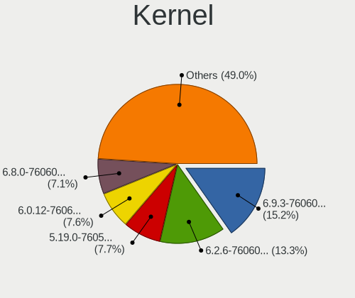
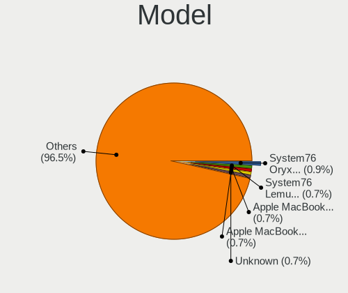
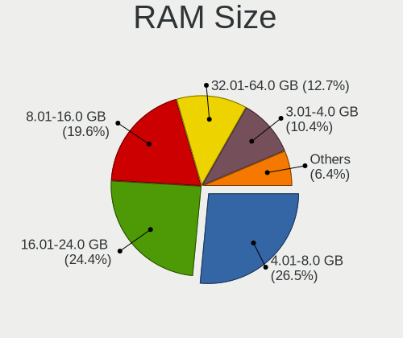
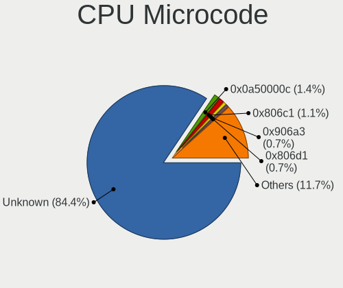
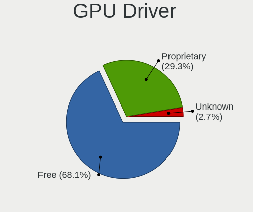
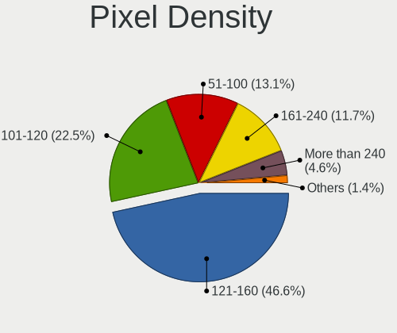

Pop!_OS 22.04 - Tested Hardware & Statistics (Notebooks)
--------------------------------------------------------

A project to collect tested hardware configurations for Pop!_OS 22.04.

Anyone can contribute to this report by the [hw-probe](https://github.com/linuxhw/hw-probe) tool:

    sudo -E hw-probe -all -upload

Please contribute! Especially if your hardware is rare.

Contents
--------

* [ Test Cases ](#test-cases)

* [ System ](#system)
  - [ Kernel                   ](#kernel)
  - [ Kernel Family            ](#kernel-family)
  - [ Kernel Major Ver.        ](#kernel-major-ver)
  - [ Arch                     ](#arch)
  - [ DE                       ](#de)
  - [ Display Server           ](#display-server)
  - [ Display Manager          ](#display-manager)
  - [ OS Lang                  ](#os-lang)
  - [ Boot Mode                ](#boot-mode)
  - [ Filesystem               ](#filesystem)
  - [ Part. scheme             ](#part-scheme)
  - [ Dual Boot with Linux/BSD ](#dual-boot-with-linuxbsd)
  - [ Dual Boot (Win)          ](#dual-boot-win)

* [ Board ](#board)
  - [ Vendor                   ](#vendor)
  - [ Model                    ](#model)
  - [ Model Family             ](#model-family)
  - [ MFG Year                 ](#mfg-year)
  - [ Form Factor              ](#form-factor)
  - [ Secure Boot              ](#secure-boot)
  - [ Coreboot                 ](#coreboot)
  - [ RAM Size                 ](#ram-size)
  - [ RAM Used                 ](#ram-used)
  - [ Total Drives             ](#total-drives)
  - [ Has CD-ROM               ](#has-cd-rom)
  - [ Has Ethernet             ](#has-ethernet)
  - [ Has WiFi                 ](#has-wifi)
  - [ Has Bluetooth            ](#has-bluetooth)

* [ Location ](#location)
  - [ Country                  ](#country)
  - [ City                     ](#city)

* [ Drives ](#drives)
  - [ Drive Vendor             ](#drive-vendor)
  - [ Drive Model              ](#drive-model)
  - [ HDD Vendor               ](#hdd-vendor)
  - [ SSD Vendor               ](#ssd-vendor)
  - [ Drive Kind               ](#drive-kind)
  - [ Drive Connector          ](#drive-connector)
  - [ Drive Size               ](#drive-size)
  - [ Space Total              ](#space-total)
  - [ Space Used               ](#space-used)
  - [ Malfunc. Drives          ](#malfunc-drives)
  - [ Malfunc. Drive Vendor    ](#malfunc-drive-vendor)
  - [ Malfunc. HDD Vendor      ](#malfunc-hdd-vendor)
  - [ Malfunc. Drive Kind      ](#malfunc-drive-kind)
  - [ Failed Drives            ](#failed-drives)
  - [ Failed Drive Vendor      ](#failed-drive-vendor)
  - [ Drive Status             ](#drive-status)

* [ Storage controller ](#storage-controller)
  - [ Storage Vendor           ](#storage-vendor)
  - [ Storage Model            ](#storage-model)
  - [ Storage Kind             ](#storage-kind)

* [ Processor ](#processor)
  - [ CPU Vendor               ](#cpu-vendor)
  - [ CPU Model                ](#cpu-model)
  - [ CPU Model Family         ](#cpu-model-family)
  - [ CPU Cores                ](#cpu-cores)
  - [ CPU Sockets              ](#cpu-sockets)
  - [ CPU Threads              ](#cpu-threads)
  - [ CPU Op-Modes             ](#cpu-op-modes)
  - [ CPU Microcode            ](#cpu-microcode)
  - [ CPU Microarch            ](#cpu-microarch)

* [ Graphics ](#graphics)
  - [ GPU Vendor               ](#gpu-vendor)
  - [ GPU Model                ](#gpu-model)
  - [ GPU Combo                ](#gpu-combo)
  - [ GPU Driver               ](#gpu-driver)
  - [ GPU Memory               ](#gpu-memory)

* [ Monitor ](#monitor)
  - [ Monitor Vendor           ](#monitor-vendor)
  - [ Monitor Model            ](#monitor-model)
  - [ Monitor Resolution       ](#monitor-resolution)
  - [ Monitor Diagonal         ](#monitor-diagonal)
  - [ Monitor Width            ](#monitor-width)
  - [ Aspect Ratio             ](#aspect-ratio)
  - [ Monitor Area             ](#monitor-area)
  - [ Pixel Density            ](#pixel-density)
  - [ Multiple Monitors        ](#multiple-monitors)

* [ Network ](#network)
  - [ Net Controller Vendor    ](#net-controller-vendor)
  - [ Net Controller Model     ](#net-controller-model)
  - [ Wireless Vendor          ](#wireless-vendor)
  - [ Wireless Model           ](#wireless-model)
  - [ Ethernet Vendor          ](#ethernet-vendor)
  - [ Ethernet Model           ](#ethernet-model)
  - [ Net Controller Kind      ](#net-controller-kind)
  - [ Used Controller          ](#used-controller)
  - [ NICs                     ](#nics)
  - [ IPv6                     ](#ipv6)

* [ Bluetooth ](#bluetooth)
  - [ Bluetooth Vendor         ](#bluetooth-vendor)
  - [ Bluetooth Model          ](#bluetooth-model)

* [ Sound ](#sound)
  - [ Sound Vendor             ](#sound-vendor)
  - [ Sound Model              ](#sound-model)

* [ Memory ](#memory)
  - [ Memory Vendor            ](#memory-vendor)
  - [ Memory Model             ](#memory-model)
  - [ Memory Kind              ](#memory-kind)
  - [ Memory Form Factor       ](#memory-form-factor)
  - [ Memory Size              ](#memory-size)
  - [ Memory Speed             ](#memory-speed)

* [ Printers & scanners ](#printers--scanners)
  - [ Printer Vendor           ](#printer-vendor)
  - [ Printer Model            ](#printer-model)
  - [ Scanner Vendor           ](#scanner-vendor)
  - [ Scanner Model            ](#scanner-model)

* [ Camera ](#camera)
  - [ Camera Vendor            ](#camera-vendor)
  - [ Camera Model             ](#camera-model)

* [ Security ](#security)
  - [ Fingerprint Vendor       ](#fingerprint-vendor)
  - [ Fingerprint Model        ](#fingerprint-model)
  - [ Chipcard Vendor          ](#chipcard-vendor)
  - [ Chipcard Model           ](#chipcard-model)

* [ Unsupported ](#unsupported)
  - [ Unsupported Devices      ](#unsupported-devices)
  - [ Unsupported Device Types ](#unsupported-device-types)

Test Cases
----------

Total: 2080

| Vendor        | Model                       | Probe                                                      | Date         |
|---------------|-----------------------------|------------------------------------------------------------|--------------|
| Lenovo        | ThinkPad P52s 20LCS1H100    | [34b877bcb5](https://linux-hardware.org/?probe=34b877bcb5) | May 01, 2023 |
| ASUSTek       | X455LJ                      | [4e252eab9f](https://linux-hardware.org/?probe=4e252eab9f) | May 01, 2023 |
| Lenovo        | Legion 5 15ARH05H 82B1      | [9df1b688c0](https://linux-hardware.org/?probe=9df1b688c0) | Apr 30, 2023 |
| Lenovo        | IdeaPad 330-15IKB 81DE      | [875ae124a1](https://linux-hardware.org/?probe=875ae124a1) | Apr 30, 2023 |
| Dell          | Latitude E6430              | [4c20239367](https://linux-hardware.org/?probe=4c20239367) | Apr 30, 2023 |
| Apple         | MacBookPro11,3              | [3feeeb3341](https://linux-hardware.org/?probe=3feeeb3341) | Apr 29, 2023 |
| Apple         | MacBookPro11,3              | [8e0692ebe3](https://linux-hardware.org/?probe=8e0692ebe3) | Apr 29, 2023 |
| Lenovo        | IdeaPad 320-15IKB 80YH      | [af0c1ea83c](https://linux-hardware.org/?probe=af0c1ea83c) | Apr 29, 2023 |
| Lenovo        | IdeaPad 320-15IKB 80YH      | [7c8c5a4668](https://linux-hardware.org/?probe=7c8c5a4668) | Apr 29, 2023 |
| HUAWEI        | BOHK-WAX9X                  | [9b560392f5](https://linux-hardware.org/?probe=9b560392f5) | Apr 29, 2023 |
| Lenovo        | Yoga Slim 7 Pro 14ARH7 8... | [39644ab1d4](https://linux-hardware.org/?probe=39644ab1d4) | Apr 28, 2023 |
| Lenovo        | ThinkPad T450 20BUS0B000    | [a2cbf65767](https://linux-hardware.org/?probe=a2cbf65767) | Apr 28, 2023 |
| HP            | ENVY 15                     | [d870c486c7](https://linux-hardware.org/?probe=d870c486c7) | Apr 27, 2023 |
| Toshiba       | IS 1413G                    | [f96c9382bd](https://linux-hardware.org/?probe=f96c9382bd) | Apr 27, 2023 |
| Dell          | Latitude D520               | [a643e2e424](https://linux-hardware.org/?probe=a643e2e424) | Apr 27, 2023 |
| Toshiba       | IS 1413G                    | [a24f74af8e](https://linux-hardware.org/?probe=a24f74af8e) | Apr 26, 2023 |
| Lenovo        | ThinkPad L570 20J80021MD    | [26e9a466cd](https://linux-hardware.org/?probe=26e9a466cd) | Apr 26, 2023 |
| System76      | Gazelle                     | [ca2e23db8d](https://linux-hardware.org/?probe=ca2e23db8d) | Apr 25, 2023 |
| HUAWEI        | BOHK-WAX9X                  | [f797b7112c](https://linux-hardware.org/?probe=f797b7112c) | Apr 25, 2023 |
| HP            | ENVY 15                     | [3539894e49](https://linux-hardware.org/?probe=3539894e49) | Apr 25, 2023 |
| Acer          | E5-551G-871W                | [2730a30d89](https://linux-hardware.org/?probe=2730a30d89) | Apr 25, 2023 |
| Lenovo        | V14-IIL 82C4                | [42a0a6d5e4](https://linux-hardware.org/?probe=42a0a6d5e4) | Apr 25, 2023 |
| Lenovo        | V14-IIL 82C4                | [7ab59d4ba9](https://linux-hardware.org/?probe=7ab59d4ba9) | Apr 25, 2023 |
| HP            | Laptop 15-ef1xxx            | [05d2b26ee6](https://linux-hardware.org/?probe=05d2b26ee6) | Apr 25, 2023 |
| HP            | Laptop 15-ef1xxx            | [0ef0676073](https://linux-hardware.org/?probe=0ef0676073) | Apr 25, 2023 |
| HP            | ENVY 15                     | [39d32b035a](https://linux-hardware.org/?probe=39d32b035a) | Apr 25, 2023 |
| Apple         | MacBookPro8,1               | [2f1eb3e6ee](https://linux-hardware.org/?probe=2f1eb3e6ee) | Apr 24, 2023 |
| Alienware     | 13 R2                       | [ee7a023f6d](https://linux-hardware.org/?probe=ee7a023f6d) | Apr 24, 2023 |
| Lenovo        | ThinkPad T480 20L50003GE    | [1259bb0006](https://linux-hardware.org/?probe=1259bb0006) | Apr 24, 2023 |
| Alienware     | 13 R3                       | [f04b34f41d](https://linux-hardware.org/?probe=f04b34f41d) | Apr 23, 2023 |
| ASUSTek       | X551MA                      | [44ca7e29c0](https://linux-hardware.org/?probe=44ca7e29c0) | Apr 23, 2023 |
| Dell          | Inspiron 7737               | [50b75a71d3](https://linux-hardware.org/?probe=50b75a71d3) | Apr 23, 2023 |
| HP            | ZBook 15                    | [c7ae51efcd](https://linux-hardware.org/?probe=c7ae51efcd) | Apr 22, 2023 |
| Dell          | Inspiron 5567               | [f639b8e21a](https://linux-hardware.org/?probe=f639b8e21a) | Apr 22, 2023 |
| Lenovo        | IdeaPad 5 Pro 14ACN6 82L... | [1c76d0f5a4](https://linux-hardware.org/?probe=1c76d0f5a4) | Apr 22, 2023 |
| Lenovo        | Legion S7 15IMH5 82BC       | [332fdb5298](https://linux-hardware.org/?probe=332fdb5298) | Apr 22, 2023 |
| Dell          | XPS 13 9350                 | [1ed1930799](https://linux-hardware.org/?probe=1ed1930799) | Apr 21, 2023 |
| GPU Compan... | GWTC116-2                   | [8f7df56d73](https://linux-hardware.org/?probe=8f7df56d73) | Apr 21, 2023 |
| HP            | ProBook 640 G1              | [b5022d8a2f](https://linux-hardware.org/?probe=b5022d8a2f) | Apr 21, 2023 |
| Dell          | Precision M6600             | [e71bf9e7bb](https://linux-hardware.org/?probe=e71bf9e7bb) | Apr 20, 2023 |
| Lenovo        | ThinkPad X220 4291WF5       | [4c78af0e05](https://linux-hardware.org/?probe=4c78af0e05) | Apr 20, 2023 |
| Dell          | XPS 13 9343                 | [573d482e45](https://linux-hardware.org/?probe=573d482e45) | Apr 20, 2023 |
| HP            | Compaq 6510b (KE131ET#AK... | [f9415c65e9](https://linux-hardware.org/?probe=f9415c65e9) | Apr 20, 2023 |
| Dell          | Inspiron 17 7000 Series ... | [6222d9b2b0](https://linux-hardware.org/?probe=6222d9b2b0) | Apr 19, 2023 |
| HP            | Compaq 6510b (KE131ET#AK... | [fc27cf4b3e](https://linux-hardware.org/?probe=fc27cf4b3e) | Apr 19, 2023 |
| HP            | Pavilion Gaming Laptop 1... | [0187ac7a0c](https://linux-hardware.org/?probe=0187ac7a0c) | Apr 19, 2023 |
| Lenovo        | ThinkPad T480s 20L8S6S30... | [9241adf5fb](https://linux-hardware.org/?probe=9241adf5fb) | Apr 19, 2023 |
| American M... | XA133PR110                  | [5c634b7029](https://linux-hardware.org/?probe=5c634b7029) | Apr 19, 2023 |
| Lenovo        | IdeaPad 1 15ADA7 82R1       | [0f058078c9](https://linux-hardware.org/?probe=0f058078c9) | Apr 19, 2023 |
| HP            | EliteBook 8460p             | [33b92210c7](https://linux-hardware.org/?probe=33b92210c7) | Apr 19, 2023 |
| HP            | EliteBook 8460p             | [fe26aeffdd](https://linux-hardware.org/?probe=fe26aeffdd) | Apr 19, 2023 |
| ASUSTek       | X541UJ                      | [1aa63436a5](https://linux-hardware.org/?probe=1aa63436a5) | Apr 19, 2023 |
| Acer          | Aspire AV15-52              | [e1044f40e2](https://linux-hardware.org/?probe=e1044f40e2) | Apr 18, 2023 |
| Acer          | Aspire E5-575               | [58b159ef8f](https://linux-hardware.org/?probe=58b159ef8f) | Apr 18, 2023 |
| Lenovo        | ThinkPad A275 20KDS01T00    | [c35c104c5e](https://linux-hardware.org/?probe=c35c104c5e) | Apr 18, 2023 |
| Lenovo        | ThinkPad A275 20KDS01T00    | [14df620b0a](https://linux-hardware.org/?probe=14df620b0a) | Apr 18, 2023 |
| Lenovo        | Y50-70 20378                | [af6c719754](https://linux-hardware.org/?probe=af6c719754) | Apr 18, 2023 |
| Dell          | Inspiron 7559               | [9c66c608f3](https://linux-hardware.org/?probe=9c66c608f3) | Apr 18, 2023 |
| Lenovo        | ThinkPad T480 20L50003GE    | [e779a9606f](https://linux-hardware.org/?probe=e779a9606f) | Apr 18, 2023 |
| Apple         | MacBookPro12,1              | [f045e3f800](https://linux-hardware.org/?probe=f045e3f800) | Apr 18, 2023 |
| Gigabyte      | G5 GE                       | [f1baab4be4](https://linux-hardware.org/?probe=f1baab4be4) | Apr 17, 2023 |
| MSI           | PS42 Modern 8RC             | [459a84f65e](https://linux-hardware.org/?probe=459a84f65e) | Apr 17, 2023 |
| American M... | XA133PR110                  | [08b47e43a7](https://linux-hardware.org/?probe=08b47e43a7) | Apr 17, 2023 |
| Toshiba       | Satellite E45-B             | [ec0bb6bfc6](https://linux-hardware.org/?probe=ec0bb6bfc6) | Apr 17, 2023 |
| Lenovo        | Legion 7 16IAX7 82TD        | [8f0188b2a1](https://linux-hardware.org/?probe=8f0188b2a1) | Apr 17, 2023 |
| Dell          | Inspiron 3541               | [dd409790ad](https://linux-hardware.org/?probe=dd409790ad) | Apr 17, 2023 |
| HP            | Pavilion Gaming Laptop 1... | [55325c372c](https://linux-hardware.org/?probe=55325c372c) | Apr 17, 2023 |
| HP            | ENVY 17                     | [ba2c1aae76](https://linux-hardware.org/?probe=ba2c1aae76) | Apr 17, 2023 |
| HP            | Dev One Notebook PC         | [5e3f0907fa](https://linux-hardware.org/?probe=5e3f0907fa) | Apr 16, 2023 |
| Lenovo        | IdeaPad 3 15ALC6 82MF       | [beac478abb](https://linux-hardware.org/?probe=beac478abb) | Apr 16, 2023 |
| Dell          | XPS 13 9310                 | [3a7d52ef90](https://linux-hardware.org/?probe=3a7d52ef90) | Apr 16, 2023 |
| Lenovo        | ThinkBook 15 G4 IAP 21DJ    | [6b126883e9](https://linux-hardware.org/?probe=6b126883e9) | Apr 16, 2023 |
| Lenovo        | ThinkPad X1 Carbon 7th 2... | [9ac7ca1a63](https://linux-hardware.org/?probe=9ac7ca1a63) | Apr 16, 2023 |
| Lenovo        | Legion 5 17ACH6H 82JY       | [762ad80f82](https://linux-hardware.org/?probe=762ad80f82) | Apr 16, 2023 |
| Dell          | Inspiron 1525               | [3b20856ccc](https://linux-hardware.org/?probe=3b20856ccc) | Apr 16, 2023 |
| Acer          | Swift SFX14-41G             | [a0f08c4442](https://linux-hardware.org/?probe=a0f08c4442) | Apr 16, 2023 |
| Lenovo        | ThinkPad T14 Gen 1 20S1S... | [f7ce1b2ab5](https://linux-hardware.org/?probe=f7ce1b2ab5) | Apr 15, 2023 |
| Medion        | E15415                      | [fb905ef988](https://linux-hardware.org/?probe=fb905ef988) | Apr 15, 2023 |
| Lenovo        | ThinkPad T14 Gen 1 20S1S... | [1d253a4901](https://linux-hardware.org/?probe=1d253a4901) | Apr 15, 2023 |
| HP            | ZBook Firefly 15.6 inch ... | [f45051411c](https://linux-hardware.org/?probe=f45051411c) | Apr 15, 2023 |
| Lenovo        | IdeaPad 5 Pro 16ARH7 82S... | [aedbc43074](https://linux-hardware.org/?probe=aedbc43074) | Apr 15, 2023 |
| HP            | Pavilion g6                 | [a918284993](https://linux-hardware.org/?probe=a918284993) | Apr 15, 2023 |
| Dell          | XPS 15 9560                 | [5ab7cc057f](https://linux-hardware.org/?probe=5ab7cc057f) | Apr 14, 2023 |
| Dell          | Precision 5550              | [1546772c9f](https://linux-hardware.org/?probe=1546772c9f) | Apr 14, 2023 |
| Dell          | Latitude E5440              | [a827218c2e](https://linux-hardware.org/?probe=a827218c2e) | Apr 14, 2023 |
| ASUSTek       | X551MA                      | [871fd53afd](https://linux-hardware.org/?probe=871fd53afd) | Apr 14, 2023 |
| HP            | Laptop 15z-fc000            | [df47336192](https://linux-hardware.org/?probe=df47336192) | Apr 14, 2023 |
| HP            | Notebook                    | [79541411b2](https://linux-hardware.org/?probe=79541411b2) | Apr 14, 2023 |
| Toshiba       | IS 1413G                    | [f57cf8ddf4](https://linux-hardware.org/?probe=f57cf8ddf4) | Apr 13, 2023 |
| Lenovo        | Legion 5 15ARH05H 82B1      | [5a86b52121](https://linux-hardware.org/?probe=5a86b52121) | Apr 13, 2023 |
| System76      | Pangolin                    | [1750f20c8d](https://linux-hardware.org/?probe=1750f20c8d) | Apr 12, 2023 |
| Lenovo        | Legion S7 15ACH6 82K8       | [1f12146974](https://linux-hardware.org/?probe=1f12146974) | Apr 12, 2023 |
| Lenovo        | Legion S7 15ACH6 82K8       | [9aadb88a2d](https://linux-hardware.org/?probe=9aadb88a2d) | Apr 12, 2023 |
| Apple         | MacBookPro8,1               | [94372e3520](https://linux-hardware.org/?probe=94372e3520) | Apr 12, 2023 |
| ASUSTek       | VivoBook_ASUSLaptop X515... | [0120f0db62](https://linux-hardware.org/?probe=0120f0db62) | Apr 12, 2023 |
| Dell          | G3 3579                     | [24d10a8497](https://linux-hardware.org/?probe=24d10a8497) | Apr 12, 2023 |
| Timi          | TM1707                      | [0e015e68ec](https://linux-hardware.org/?probe=0e015e68ec) | Apr 12, 2023 |
| Timi          | TM1707                      | [b611ba24ed](https://linux-hardware.org/?probe=b611ba24ed) | Apr 12, 2023 |
| ASUSTek       | ZenBook UX325UA_UM325UA     | [87059322b0](https://linux-hardware.org/?probe=87059322b0) | Apr 11, 2023 |
| Samsung       | 760XDA                      | [bdc1648c05](https://linux-hardware.org/?probe=bdc1648c05) | Apr 11, 2023 |
| Dell          | Latitude 5590               | [f8f0f0125f](https://linux-hardware.org/?probe=f8f0f0125f) | Apr 11, 2023 |
| MSI           | GF63 Thin 9RCX              | [c48286f8a2](https://linux-hardware.org/?probe=c48286f8a2) | Apr 10, 2023 |
| Apple         | MacBookPro11,4              | [85a39124f3](https://linux-hardware.org/?probe=85a39124f3) | Apr 09, 2023 |
| Apple         | MacBookPro12,1              | [0844c71fd0](https://linux-hardware.org/?probe=0844c71fd0) | Apr 07, 2023 |
| System76      | Oryx Pro                    | [a221f4f9d4](https://linux-hardware.org/?probe=a221f4f9d4) | Apr 06, 2023 |
| HP            | ProBook 640 G1              | [769d886cc9](https://linux-hardware.org/?probe=769d886cc9) | Apr 05, 2023 |
| HP            | ProBook 640 G1              | [de7d3ba0c0](https://linux-hardware.org/?probe=de7d3ba0c0) | Apr 05, 2023 |
| Razer         | Blade                       | [351fe907cb](https://linux-hardware.org/?probe=351fe907cb) | Apr 05, 2023 |
| Apple         | MacBookPro12,1              | [c77ef60bcc](https://linux-hardware.org/?probe=c77ef60bcc) | Apr 05, 2023 |
| HP            | Laptop 14-dq0xxx            | [ba87782532](https://linux-hardware.org/?probe=ba87782532) | Apr 05, 2023 |
| Lenovo        | Edge 15 80K9                | [911d261c1b](https://linux-hardware.org/?probe=911d261c1b) | Apr 05, 2023 |
| ASUSTek       | N76VZ                       | [d87006e429](https://linux-hardware.org/?probe=d87006e429) | Apr 05, 2023 |
| Samsung       | RC530/RC730                 | [3f886e678f](https://linux-hardware.org/?probe=3f886e678f) | Apr 05, 2023 |
| Samsung       | RC530/RC730                 | [43e4869357](https://linux-hardware.org/?probe=43e4869357) | Apr 05, 2023 |
| Lenovo        | ThinkBook 15-IML 20RW       | [58f5904dec](https://linux-hardware.org/?probe=58f5904dec) | Apr 04, 2023 |
| Dell          | Inspiron 7375               | [0d8465f75c](https://linux-hardware.org/?probe=0d8465f75c) | Apr 04, 2023 |
| Samsung       | 300E4Z/300E5Z/300E7Z        | [d56565f374](https://linux-hardware.org/?probe=d56565f374) | Apr 04, 2023 |
| Dell          | XPS 15 9500                 | [84f877fde3](https://linux-hardware.org/?probe=84f877fde3) | Apr 04, 2023 |
| ASUSTek       | E201NA                      | [098fb721f8](https://linux-hardware.org/?probe=098fb721f8) | Apr 04, 2023 |
| Acer          | Swift SF314-43              | [a964b0aa55](https://linux-hardware.org/?probe=a964b0aa55) | Apr 04, 2023 |
| Razer         | Blade Stealth               | [2cf4a53eb5](https://linux-hardware.org/?probe=2cf4a53eb5) | Apr 04, 2023 |
| Dell          | Latitude E7240              | [fce3da8380](https://linux-hardware.org/?probe=fce3da8380) | Apr 04, 2023 |
| Unknown       | Unknown                     | [190b5364e1](https://linux-hardware.org/?probe=190b5364e1) | Apr 03, 2023 |
| Unknown       | Unknown                     | [a6a766a40a](https://linux-hardware.org/?probe=a6a766a40a) | Apr 03, 2023 |
| ASUSTek       | ASUS TUF Gaming A15 FA50... | [9880810adc](https://linux-hardware.org/?probe=9880810adc) | Apr 03, 2023 |
| MSI           | GV62 7RE                    | [5d441311f4](https://linux-hardware.org/?probe=5d441311f4) | Apr 03, 2023 |
| Lenovo        | IdeaPad 330-15IKB 81FE      | [777f7d0fc4](https://linux-hardware.org/?probe=777f7d0fc4) | Apr 03, 2023 |
| MSI           | GL63 8RC                    | [8c90ec7da1](https://linux-hardware.org/?probe=8c90ec7da1) | Apr 03, 2023 |
| ASUSTek       | Zenbook UX3402ZA_UX3402Z... | [f013c5ca48](https://linux-hardware.org/?probe=f013c5ca48) | Apr 03, 2023 |
| Apple         | MacBookPro12,1              | [edb2f4188e](https://linux-hardware.org/?probe=edb2f4188e) | Apr 03, 2023 |
| HP            | 650                         | [bcb4e8d60a](https://linux-hardware.org/?probe=bcb4e8d60a) | Apr 03, 2023 |
| Lenovo        | ThinkPad T470 20HES0FA03    | [7274c8222b](https://linux-hardware.org/?probe=7274c8222b) | Apr 02, 2023 |
| Lenovo        | ThinkPad T460p 20FXS08N0... | [ffcf174547](https://linux-hardware.org/?probe=ffcf174547) | Apr 02, 2023 |
| Apple         | MacBook3,1                  | [44f31f3094](https://linux-hardware.org/?probe=44f31f3094) | Apr 02, 2023 |
| System76      | Kudu                        | [2baafe374c](https://linux-hardware.org/?probe=2baafe374c) | Apr 02, 2023 |
| Toshiba       | IS 1413G                    | [76a94d8c87](https://linux-hardware.org/?probe=76a94d8c87) | Apr 02, 2023 |
| Sony          | VPCSC1AFM                   | [854b8bfa02](https://linux-hardware.org/?probe=854b8bfa02) | Apr 01, 2023 |
| Lenovo        | ThinkPad T570 W10DG 20JX... | [51c7ed9156](https://linux-hardware.org/?probe=51c7ed9156) | Apr 01, 2023 |
| Lenovo        | Slim 7 16ARH7 82UX          | [cca7093e15](https://linux-hardware.org/?probe=cca7093e15) | Apr 01, 2023 |
| Lenovo        | IdeaPad U310                | [6add75e18c](https://linux-hardware.org/?probe=6add75e18c) | Apr 01, 2023 |
| Toshiba       | Satellite L45-B             | [6d4878cdbf](https://linux-hardware.org/?probe=6d4878cdbf) | Apr 01, 2023 |
| HP            | 240 G6 Notebook PC          | [44e093df31](https://linux-hardware.org/?probe=44e093df31) | Apr 01, 2023 |
| System76      | Lemur Pro                   | [5d57a3397e](https://linux-hardware.org/?probe=5d57a3397e) | Mar 31, 2023 |
| ASUSTek       | X751LD                      | [2ef82331de](https://linux-hardware.org/?probe=2ef82331de) | Mar 31, 2023 |
| Acer          | Aspire A515-56              | [bf846cebb9](https://linux-hardware.org/?probe=bf846cebb9) | Mar 30, 2023 |
| Acer          | Nitro AN515-58              | [27befad01f](https://linux-hardware.org/?probe=27befad01f) | Mar 30, 2023 |
| Apple         | MacBookPro12,1              | [21515b7373](https://linux-hardware.org/?probe=21515b7373) | Mar 30, 2023 |
| Apple         | MacBookPro12,1              | [080e22fdb2](https://linux-hardware.org/?probe=080e22fdb2) | Mar 30, 2023 |
| Toshiba       | IS 1413G                    | [13f35137bd](https://linux-hardware.org/?probe=13f35137bd) | Mar 30, 2023 |
| Multilaser    | MLSH1H LINUX                | [7ee1845d96](https://linux-hardware.org/?probe=7ee1845d96) | Mar 30, 2023 |
| Multilaser    | MLSH1H LINUX                | [bb80f561a2](https://linux-hardware.org/?probe=bb80f561a2) | Mar 30, 2023 |
| Lenovo        | IdeaPad 3 15ALC6 82MF       | [854490056d](https://linux-hardware.org/?probe=854490056d) | Mar 29, 2023 |
| HP            | ZBook 15 G5                 | [059358e49b](https://linux-hardware.org/?probe=059358e49b) | Mar 29, 2023 |
| Lenovo        | ThinkPad P14s Gen 2a 21A... | [af48722867](https://linux-hardware.org/?probe=af48722867) | Mar 28, 2023 |
| ASUSTek       | ASUS TUF Gaming A15 FA50... | [0667374075](https://linux-hardware.org/?probe=0667374075) | Mar 28, 2023 |
| Acer          | Nitro AN515-45              | [0aabfe954d](https://linux-hardware.org/?probe=0aabfe954d) | Mar 28, 2023 |
| Lenovo        | Legion 5 Pro 16ARH7H 82R... | [7939320fa4](https://linux-hardware.org/?probe=7939320fa4) | Mar 28, 2023 |
| Positivo      | Mobile                      | [60fd382fbf](https://linux-hardware.org/?probe=60fd382fbf) | Mar 28, 2023 |
| Positivo      | Mobile                      | [b08c430903](https://linux-hardware.org/?probe=b08c430903) | Mar 28, 2023 |
| Razer         | Blade                       | [ffa791eb4a](https://linux-hardware.org/?probe=ffa791eb4a) | Mar 28, 2023 |
| ASUSTek       | X751LD                      | [61382d0bd8](https://linux-hardware.org/?probe=61382d0bd8) | Mar 28, 2023 |
| Dell          | Inspiron 15-3567            | [d2b4780094](https://linux-hardware.org/?probe=d2b4780094) | Mar 28, 2023 |
| Toshiba       | IS 1413G                    | [635309aff4](https://linux-hardware.org/?probe=635309aff4) | Mar 28, 2023 |
| Lenovo        | ThinkPad P50 20EQS0T400     | [5b4466c085](https://linux-hardware.org/?probe=5b4466c085) | Mar 28, 2023 |
| Lenovo        | ThinkPad T420 4180AP3       | [8ddee342c9](https://linux-hardware.org/?probe=8ddee342c9) | Mar 28, 2023 |
| Dell          | XPS 15 9570                 | [5be538736f](https://linux-hardware.org/?probe=5be538736f) | Mar 27, 2023 |
| Toshiba       | Satellite C55-C             | [d7ec0eb4b1](https://linux-hardware.org/?probe=d7ec0eb4b1) | Mar 27, 2023 |
| Apple         | MacBook5,1                  | [a5c200217f](https://linux-hardware.org/?probe=a5c200217f) | Mar 26, 2023 |
| MSI           | GL63 8RC                    | [935b78c3da](https://linux-hardware.org/?probe=935b78c3da) | Mar 26, 2023 |
| ASUSTek       | ASUS TUF Gaming A15 FA50... | [537fc6af0e](https://linux-hardware.org/?probe=537fc6af0e) | Mar 26, 2023 |
| HP            | 250 15.6 inch G9 Noteboo... | [55c29cec29](https://linux-hardware.org/?probe=55c29cec29) | Mar 26, 2023 |
| Lenovo        | IdeaPad 3 15ITL6 82H8       | [905078c7b9](https://linux-hardware.org/?probe=905078c7b9) | Mar 26, 2023 |
| Dell          | Latitude E7240              | [3d91b46fda](https://linux-hardware.org/?probe=3d91b46fda) | Mar 26, 2023 |
| Dell          | XPS 13 9370                 | [3f3967267f](https://linux-hardware.org/?probe=3f3967267f) | Mar 26, 2023 |
| Lenovo        | Y50-70 20378                | [61897b32de](https://linux-hardware.org/?probe=61897b32de) | Mar 25, 2023 |
| HP            | Spectre Laptop 13-af0xx     | [6fdc683220](https://linux-hardware.org/?probe=6fdc683220) | Mar 25, 2023 |
| MSI           | Katana GF66 12UG            | [9e03ac14c0](https://linux-hardware.org/?probe=9e03ac14c0) | Mar 25, 2023 |
| Apple         | MacBookPro11,3              | [21c3ce9508](https://linux-hardware.org/?probe=21c3ce9508) | Mar 24, 2023 |
| ASUSTek       | VivoBook_ASUSLaptop X512... | [ac415822b8](https://linux-hardware.org/?probe=ac415822b8) | Mar 24, 2023 |
| HP            | Laptop 15-db0xxx            | [ad0e5c0483](https://linux-hardware.org/?probe=ad0e5c0483) | Mar 24, 2023 |
| Dell          | Latitude 5420               | [e6afbbee47](https://linux-hardware.org/?probe=e6afbbee47) | Mar 24, 2023 |
| HP            | EliteBook 8460p             | [f78f58795c](https://linux-hardware.org/?probe=f78f58795c) | Mar 24, 2023 |
| Alienware     | 17 R4                       | [3c456dc309](https://linux-hardware.org/?probe=3c456dc309) | Mar 24, 2023 |
| GPU Compan... | GWTN141-10                  | [9007c1d23f](https://linux-hardware.org/?probe=9007c1d23f) | Mar 24, 2023 |
| ASUSTek       | ROG STRIX B450-F GAMING ... | [f8f47e3220](https://linux-hardware.org/?probe=f8f47e3220) | Mar 23, 2023 |
| Dell          | Precision 7710              | [25a4797475](https://linux-hardware.org/?probe=25a4797475) | Mar 23, 2023 |
| Toshiba       | IS 1413G                    | [3a75d7fb8d](https://linux-hardware.org/?probe=3a75d7fb8d) | Mar 23, 2023 |
| HP            | ProBook 440 G8 Notebook ... | [aba9609828](https://linux-hardware.org/?probe=aba9609828) | Mar 23, 2023 |
| Lenovo        | IdeaPad Gaming 3 15IMH05... | [f6580b20d3](https://linux-hardware.org/?probe=f6580b20d3) | Mar 22, 2023 |
| Apple         | MacBook5,1                  | [bc6e3fa274](https://linux-hardware.org/?probe=bc6e3fa274) | Mar 22, 2023 |
| Apple         | MacBookAir7,2               | [627590f38c](https://linux-hardware.org/?probe=627590f38c) | Mar 22, 2023 |
| Lenovo        | ThinkPad Twist 33472HU      | [a49ece0e6c](https://linux-hardware.org/?probe=a49ece0e6c) | Mar 22, 2023 |
| Lenovo        | ThinkPad Twist 33472HU      | [315f2256c6](https://linux-hardware.org/?probe=315f2256c6) | Mar 22, 2023 |
| Apple         | MacBookPro8,1               | [b616377b13](https://linux-hardware.org/?probe=b616377b13) | Mar 22, 2023 |
| Apple         | MacBookPro12,1              | [aff8d829e0](https://linux-hardware.org/?probe=aff8d829e0) | Mar 22, 2023 |
| Samsung       | 350V5C/350V5X/350V4C/350... | [99fe9f96c6](https://linux-hardware.org/?probe=99fe9f96c6) | Mar 22, 2023 |
| Apple         | MacBookPro12,1              | [af60ed4cde](https://linux-hardware.org/?probe=af60ed4cde) | Mar 22, 2023 |
| Apple         | MacBookAir7,2               | [3b3376e72c](https://linux-hardware.org/?probe=3b3376e72c) | Mar 21, 2023 |
| HUAWEI        | KPL-W0X                     | [afc1ff125b](https://linux-hardware.org/?probe=afc1ff125b) | Mar 21, 2023 |
| Lenovo        | ThinkPad T420 4180AP3       | [3c100c55be](https://linux-hardware.org/?probe=3c100c55be) | Mar 21, 2023 |
| Lenovo        | ThinkPad T420 4180AP3       | [039724e2c2](https://linux-hardware.org/?probe=039724e2c2) | Mar 21, 2023 |
| Dell          | G15 5511                    | [6d71997e08](https://linux-hardware.org/?probe=6d71997e08) | Mar 21, 2023 |
| Dell          | XPS L421X                   | [fd54af9534](https://linux-hardware.org/?probe=fd54af9534) | Mar 21, 2023 |
| HP            | Pavilion Gaming Laptop 1... | [afe8ca841c](https://linux-hardware.org/?probe=afe8ca841c) | Mar 21, 2023 |
| Acer          | Aspire 5349                 | [c0f5810e5c](https://linux-hardware.org/?probe=c0f5810e5c) | Mar 21, 2023 |
| MSI           | Prestige 14Evo A11M         | [cac8d6b991](https://linux-hardware.org/?probe=cac8d6b991) | Mar 21, 2023 |
| HP            | Dev One Notebook PC         | [d6ff521952](https://linux-hardware.org/?probe=d6ff521952) | Mar 21, 2023 |
| Acer          | Nitro AN517-55              | [d6393f5710](https://linux-hardware.org/?probe=d6393f5710) | Mar 21, 2023 |
| HP            | Dev One Notebook PC         | [404c84b0ea](https://linux-hardware.org/?probe=404c84b0ea) | Mar 21, 2023 |
| Acer          | Nitro AN517-55              | [edf722e245](https://linux-hardware.org/?probe=edf722e245) | Mar 21, 2023 |
| Gigabyte      | A320M-S2H-CF                | [2ff2eab844](https://linux-hardware.org/?probe=2ff2eab844) | Mar 21, 2023 |
| ASUSTek       | G74Sx                       | [d2b90b7d2f](https://linux-hardware.org/?probe=d2b90b7d2f) | Mar 21, 2023 |
| HP            | ZBook Power 15.6 inch G9... | [2ef051fd19](https://linux-hardware.org/?probe=2ef051fd19) | Mar 20, 2023 |
| Lenovo        | IdeaPad 330-15ARR 81D2      | [48de9eb9e3](https://linux-hardware.org/?probe=48de9eb9e3) | Mar 20, 2023 |
| HP            | Pavilion Gaming Laptop 1... | [afcac034a9](https://linux-hardware.org/?probe=afcac034a9) | Mar 20, 2023 |
| HP            | Pavilion Laptop 15-cw1xx... | [d08f174747](https://linux-hardware.org/?probe=d08f174747) | Mar 20, 2023 |
| ASRock        | X570 Phantom Gaming 4       | [c9b4e3cf00](https://linux-hardware.org/?probe=c9b4e3cf00) | Mar 20, 2023 |
| Dell          | Latitude 5590               | [49922a3223](https://linux-hardware.org/?probe=49922a3223) | Mar 19, 2023 |
| Lenovo        | IdeaPad 5 Pro 16ARH7 82S... | [55dc5e3ef4](https://linux-hardware.org/?probe=55dc5e3ef4) | Mar 19, 2023 |
| MSI           | PS42 8M                     | [aad18852f4](https://linux-hardware.org/?probe=aad18852f4) | Mar 19, 2023 |
| ASUSTek       | G74Sx                       | [f7f92408dc](https://linux-hardware.org/?probe=f7f92408dc) | Mar 19, 2023 |
| Lenovo        | IdeaPad Gaming 3 15IHU6 ... | [6b6ceb1a1a](https://linux-hardware.org/?probe=6b6ceb1a1a) | Mar 19, 2023 |
| Lenovo        | ThinkPad X1 Carbon 6th 2... | [e3410282c5](https://linux-hardware.org/?probe=e3410282c5) | Mar 19, 2023 |
| ASUSTek       | S551LB                      | [7d4485326f](https://linux-hardware.org/?probe=7d4485326f) | Mar 18, 2023 |
| GPU Compan... | GWTN141-10                  | [ff8db61ccf](https://linux-hardware.org/?probe=ff8db61ccf) | Mar 18, 2023 |
| ASUSTek       | X540LJ                      | [4eab8887fa](https://linux-hardware.org/?probe=4eab8887fa) | Mar 18, 2023 |
| ASUSTek       | X540LJ                      | [b3bf824f3a](https://linux-hardware.org/?probe=b3bf824f3a) | Mar 18, 2023 |
| ASRock        | X570 Phantom Gaming 4       | [dd296a8801](https://linux-hardware.org/?probe=dd296a8801) | Mar 18, 2023 |
| Lenovo        | ThinkPad T480 20L6S11N00    | [60d80937ea](https://linux-hardware.org/?probe=60d80937ea) | Mar 18, 2023 |
| ASUSTek       | ZenBook UX325UA_UM325UA     | [91ae5652cc](https://linux-hardware.org/?probe=91ae5652cc) | Mar 18, 2023 |
| Lenovo        | IdeaPad L340-17IRH Gamin... | [274f959cfc](https://linux-hardware.org/?probe=274f959cfc) | Mar 17, 2023 |
| Dell          | Latitude E7240              | [cbcae7df75](https://linux-hardware.org/?probe=cbcae7df75) | Mar 17, 2023 |
| Positivo      | N1250                       | [e5ee22876a](https://linux-hardware.org/?probe=e5ee22876a) | Mar 17, 2023 |
| HP            | ProBook 4530s               | [f0abd32fe4](https://linux-hardware.org/?probe=f0abd32fe4) | Mar 17, 2023 |
| Lenovo        | G40-80 80JE                 | [a7a6cc1ab5](https://linux-hardware.org/?probe=a7a6cc1ab5) | Mar 17, 2023 |
| Lenovo        | G40-80 80JE                 | [204994be7f](https://linux-hardware.org/?probe=204994be7f) | Mar 17, 2023 |
| TUXEDO        | Pulse 14 Gen1               | [525b267c31](https://linux-hardware.org/?probe=525b267c31) | Mar 17, 2023 |
| Toshiba       | Satellite Pro C50-A-1E2     | [a1adc8641d](https://linux-hardware.org/?probe=a1adc8641d) | Mar 17, 2023 |
| Toshiba       | Satellite Pro C50-A-1E2     | [a0eea87e02](https://linux-hardware.org/?probe=a0eea87e02) | Mar 17, 2023 |
| Unknown       | Unknown                     | [3eb0bf05b4](https://linux-hardware.org/?probe=3eb0bf05b4) | Mar 17, 2023 |
| Lenovo        | ThinkPad T460s 20FAS0RP0... | [f901058202](https://linux-hardware.org/?probe=f901058202) | Mar 16, 2023 |
| ASUSTek       | ASUS TUF Gaming A15 FA50... | [d6f5cd9505](https://linux-hardware.org/?probe=d6f5cd9505) | Mar 16, 2023 |
| Lenovo        | IdeaPad 330-15IGM 81FN      | [5f48c46d68](https://linux-hardware.org/?probe=5f48c46d68) | Mar 16, 2023 |
| HP            | Laptop 15s-eq1xxx           | [59a304e790](https://linux-hardware.org/?probe=59a304e790) | Mar 15, 2023 |
| Acer          | Aspire A715-42G             | [8bdae79f7a](https://linux-hardware.org/?probe=8bdae79f7a) | Mar 15, 2023 |
| Lenovo        | ThinkPad T440p 20AWS19P0... | [6a2d338526](https://linux-hardware.org/?probe=6a2d338526) | Mar 15, 2023 |
| Razer         | Blade Stealth 13 (Early ... | [eb1d71edb4](https://linux-hardware.org/?probe=eb1d71edb4) | Mar 15, 2023 |
| HCL Infosy... | HCL ME LAPTOP               | [af254fca4d](https://linux-hardware.org/?probe=af254fca4d) | Mar 15, 2023 |
| SAGER         | X8100                       | [90aaefeb9e](https://linux-hardware.org/?probe=90aaefeb9e) | Mar 15, 2023 |
| System76      | Pangolin                    | [4f39796131](https://linux-hardware.org/?probe=4f39796131) | Mar 15, 2023 |
| Dell          | Latitude E7240              | [d4ed345a47](https://linux-hardware.org/?probe=d4ed345a47) | Mar 14, 2023 |
| Lenovo        | ThinkPad T450s 20BWS14G0... | [1161c07721](https://linux-hardware.org/?probe=1161c07721) | Mar 14, 2023 |
| Sony          | VPCZ12V9R                   | [28be5f7f2b](https://linux-hardware.org/?probe=28be5f7f2b) | Mar 14, 2023 |
| Dell          | Latitude E7240              | [4a7d442938](https://linux-hardware.org/?probe=4a7d442938) | Mar 14, 2023 |
| HP            | EliteBook 8560w             | [44d9ce8acb](https://linux-hardware.org/?probe=44d9ce8acb) | Mar 14, 2023 |
| HP            | EliteBook 8560w             | [986fe8c418](https://linux-hardware.org/?probe=986fe8c418) | Mar 14, 2023 |
| Fujitsu       | LIFEBOOK E5512A             | [ae9f2da5a4](https://linux-hardware.org/?probe=ae9f2da5a4) | Mar 14, 2023 |
| HP            | EliteBook 840 G6            | [874706952d](https://linux-hardware.org/?probe=874706952d) | Mar 14, 2023 |
| Lenovo        | ThinkPad X220 Tablet 429... | [de22b8a7e6](https://linux-hardware.org/?probe=de22b8a7e6) | Mar 14, 2023 |
| Dell          | Inspiron 7348               | [7459d24035](https://linux-hardware.org/?probe=7459d24035) | Mar 13, 2023 |
| Toshiba       | IS 1413G                    | [b93a4bdcbb](https://linux-hardware.org/?probe=b93a4bdcbb) | Mar 13, 2023 |
| Acer          | Aspire 4530                 | [84f4733a96](https://linux-hardware.org/?probe=84f4733a96) | Mar 13, 2023 |
| Acer          | Nitro AN515-58              | [7f2ecd927d](https://linux-hardware.org/?probe=7f2ecd927d) | Mar 13, 2023 |
| Apple         | MacBookPro15,1              | [663f73a08e](https://linux-hardware.org/?probe=663f73a08e) | Mar 13, 2023 |
| Apple         | MacBookPro15,1              | [5d1a30091e](https://linux-hardware.org/?probe=5d1a30091e) | Mar 13, 2023 |
| Lenovo        | ThinkPad X1 Extreme 2nd ... | [a826b1cd32](https://linux-hardware.org/?probe=a826b1cd32) | Mar 13, 2023 |
| Lenovo        | ThinkPad T480s 20L8S7AS0... | [87ef2f6efb](https://linux-hardware.org/?probe=87ef2f6efb) | Mar 12, 2023 |
| HUAWEI        | NBM-WXX9                    | [27b710cd68](https://linux-hardware.org/?probe=27b710cd68) | Mar 12, 2023 |
| Google        | Kefka                       | [4a54e34e44](https://linux-hardware.org/?probe=4a54e34e44) | Mar 12, 2023 |
| ASUSTek       | ZenBook UX434IQ_Q407IQ      | [7090114437](https://linux-hardware.org/?probe=7090114437) | Mar 12, 2023 |
| Dell          | Inspiron 5452               | [2c8ca0e296](https://linux-hardware.org/?probe=2c8ca0e296) | Mar 12, 2023 |
| Positivo B... | VJFE41F11X-XXXXXX           | [99f410d801](https://linux-hardware.org/?probe=99f410d801) | Mar 11, 2023 |
| ASUSTek       | VivoBook S14 X411UF         | [e101a1c94c](https://linux-hardware.org/?probe=e101a1c94c) | Mar 11, 2023 |
| HONOR         | NMH-WCX9                    | [d8cf10f11d](https://linux-hardware.org/?probe=d8cf10f11d) | Mar 11, 2023 |
| HP            | ZBook 17                    | [a775bc33c5](https://linux-hardware.org/?probe=a775bc33c5) | Mar 11, 2023 |
| Maibenben     | P748                        | [a44d1bb8e4](https://linux-hardware.org/?probe=a44d1bb8e4) | Mar 11, 2023 |
| Toshiba       | IS 1413G                    | [39cc207ce7](https://linux-hardware.org/?probe=39cc207ce7) | Mar 11, 2023 |
| Lenovo        | ThinkPad L440 20ASS0ET00    | [2ac6dfff4f](https://linux-hardware.org/?probe=2ac6dfff4f) | Mar 11, 2023 |
| GPD           | G1619-04                    | [302ff30130](https://linux-hardware.org/?probe=302ff30130) | Mar 11, 2023 |
| GPD           | G1619-04                    | [d8f5b9eec9](https://linux-hardware.org/?probe=d8f5b9eec9) | Mar 11, 2023 |
| Gigabyte      | X570S AORUS ELITE AX        | [96f4bd0a52](https://linux-hardware.org/?probe=96f4bd0a52) | Mar 10, 2023 |
| Gigabyte      | X570S AORUS ELITE AX        | [969ab4279f](https://linux-hardware.org/?probe=969ab4279f) | Mar 10, 2023 |
| Lenovo        | ThinkPad X1 Carbon 3rd 2... | [c44f0eab3e](https://linux-hardware.org/?probe=c44f0eab3e) | Mar 10, 2023 |
| Lenovo        | ThinkPad T440p 20AWS19P0... | [44867c946f](https://linux-hardware.org/?probe=44867c946f) | Mar 10, 2023 |
| Lenovo        | IdeaPad Gaming 3 15IMH05... | [50dd87563b](https://linux-hardware.org/?probe=50dd87563b) | Mar 10, 2023 |
| Samsung       | R430/R480/R440              | [cdb2525b51](https://linux-hardware.org/?probe=cdb2525b51) | Mar 10, 2023 |
| ASUSTek       | Zenbook UM3402YA_UM3402Y... | [410a5a70f3](https://linux-hardware.org/?probe=410a5a70f3) | Mar 10, 2023 |
| Lenovo        | ThinkPad L13 Yoga Gen 2a... | [eac4ae85a4](https://linux-hardware.org/?probe=eac4ae85a4) | Mar 10, 2023 |
| Lenovo        | ThinkPad X220 Tablet 429... | [baffc24bef](https://linux-hardware.org/?probe=baffc24bef) | Mar 10, 2023 |
| Lenovo        | IdeaPad 330-15IKB 81DE      | [187761b57d](https://linux-hardware.org/?probe=187761b57d) | Mar 09, 2023 |
| Lenovo        | IdeaPad 330-15IKB 81DE      | [4e1196658a](https://linux-hardware.org/?probe=4e1196658a) | Mar 09, 2023 |
| HP            | ENVY Notebook               | [8a063efa19](https://linux-hardware.org/?probe=8a063efa19) | Mar 09, 2023 |
| Lenovo        | ThinkPad L13 Yoga Gen 2a... | [a8d1bd3e81](https://linux-hardware.org/?probe=a8d1bd3e81) | Mar 09, 2023 |
| ASUSTek       | Zenbook Pro Duo UX582ZW_... | [7805fe229d](https://linux-hardware.org/?probe=7805fe229d) | Mar 08, 2023 |
| Razer         | Blade 15 Advanced Model ... | [46fa9eab7d](https://linux-hardware.org/?probe=46fa9eab7d) | Mar 08, 2023 |
| Google        | Bobba                       | [01d8f57c7e](https://linux-hardware.org/?probe=01d8f57c7e) | Mar 08, 2023 |
| Lenovo        | IdeaPad U310                | [f666446ecb](https://linux-hardware.org/?probe=f666446ecb) | Mar 07, 2023 |
| ASUSTek       | VivoBook_ASUSLaptop X512... | [3ff5ff8f2d](https://linux-hardware.org/?probe=3ff5ff8f2d) | Mar 07, 2023 |
| Lenovo        | ThinkPad P1 Gen 2 20QT00... | [3b02985778](https://linux-hardware.org/?probe=3b02985778) | Mar 07, 2023 |
| Lenovo        | ThinkPad P1 Gen 2 20QT00... | [e6e0d7226d](https://linux-hardware.org/?probe=e6e0d7226d) | Mar 07, 2023 |
| HP            | Dev One Notebook PC         | [4a698cb3eb](https://linux-hardware.org/?probe=4a698cb3eb) | Mar 07, 2023 |
| Lenovo        | ThinkPad X1 Extreme Gen ... | [8a6c736217](https://linux-hardware.org/?probe=8a6c736217) | Mar 07, 2023 |
| Toshiba       | IS 1413G                    | [12954ccbdb](https://linux-hardware.org/?probe=12954ccbdb) | Mar 07, 2023 |
| Google        | Lillipup                    | [b924f92de8](https://linux-hardware.org/?probe=b924f92de8) | Mar 07, 2023 |
| HP            | Dev One Notebook PC         | [5a03b7e11e](https://linux-hardware.org/?probe=5a03b7e11e) | Mar 07, 2023 |
| Apple         | MacBookPro8,1               | [bef545e821](https://linux-hardware.org/?probe=bef545e821) | Mar 07, 2023 |
| Dell          | Inspiron 16 7610            | [625691c490](https://linux-hardware.org/?probe=625691c490) | Mar 06, 2023 |
| Dell          | Inspiron 16 7610            | [66b4f88fb7](https://linux-hardware.org/?probe=66b4f88fb7) | Mar 06, 2023 |
| HP            | 3115m                       | [87abd0ac9d](https://linux-hardware.org/?probe=87abd0ac9d) | Mar 06, 2023 |
| Dell          | G7 7588                     | [a50e6bef64](https://linux-hardware.org/?probe=a50e6bef64) | Mar 06, 2023 |
| HUAWEI        | KPL-W0X                     | [76ebbe553f](https://linux-hardware.org/?probe=76ebbe553f) | Mar 06, 2023 |
| Apple         | MacBookAir7,2               | [ae4d8e9128](https://linux-hardware.org/?probe=ae4d8e9128) | Mar 06, 2023 |
| MSI           | Vector GP76 12UHSO          | [e82fbd8c0a](https://linux-hardware.org/?probe=e82fbd8c0a) | Mar 06, 2023 |
| Acer          | Swift SFX14-41G             | [baff849073](https://linux-hardware.org/?probe=baff849073) | Mar 05, 2023 |
| HP            | ProBook 450 G1              | [a6c8ba1040](https://linux-hardware.org/?probe=a6c8ba1040) | Mar 05, 2023 |
| Apple         | MacBookAir7,2               | [fef18d1795](https://linux-hardware.org/?probe=fef18d1795) | Mar 05, 2023 |
| Lenovo        | Legion 5 15ACH6H 82JU       | [779113ef3c](https://linux-hardware.org/?probe=779113ef3c) | Mar 05, 2023 |
| HP            | Pavilion 15                 | [0c4050d1ef](https://linux-hardware.org/?probe=0c4050d1ef) | Mar 05, 2023 |
| ASUSTek       | VivoBook S14 X411UF         | [ff4621a345](https://linux-hardware.org/?probe=ff4621a345) | Mar 05, 2023 |
| Dell          | Latitude 5420               | [ea5ac72a44](https://linux-hardware.org/?probe=ea5ac72a44) | Mar 05, 2023 |
| Toshiba       | IS 1413G                    | [a655c49d8b](https://linux-hardware.org/?probe=a655c49d8b) | Mar 05, 2023 |
| Lenovo        | IdeaPad Gaming 3 15IAH7 ... | [b73251069c](https://linux-hardware.org/?probe=b73251069c) | Mar 05, 2023 |
| HP            | ProBook 450 G1              | [ca5a019457](https://linux-hardware.org/?probe=ca5a019457) | Mar 04, 2023 |
| Apple         | MacBookPro9,2               | [ba908d3339](https://linux-hardware.org/?probe=ba908d3339) | Mar 04, 2023 |
| Lenovo        | ThinkPad E490 20N8005JMH    | [26ca476e1a](https://linux-hardware.org/?probe=26ca476e1a) | Mar 04, 2023 |
| Dell          | System XPS L321X            | [24d0d12eca](https://linux-hardware.org/?probe=24d0d12eca) | Mar 04, 2023 |
| Lenovo        | ThinkPad X270 20HN001RUS    | [ccda7b2155](https://linux-hardware.org/?probe=ccda7b2155) | Mar 04, 2023 |
| Gigabyte      | AORUS 17 XE4                | [6f6750ee73](https://linux-hardware.org/?probe=6f6750ee73) | Mar 03, 2023 |
| Lenovo        | ThinkPad T14 Gen 3 21AHC... | [db92a5f137](https://linux-hardware.org/?probe=db92a5f137) | Mar 03, 2023 |
| HP            | EliteBook 8440p             | [9ce5a599cd](https://linux-hardware.org/?probe=9ce5a599cd) | Mar 03, 2023 |
| Lenovo        | ThinkPad P1 Gen 3 20TJS0... | [e73235d592](https://linux-hardware.org/?probe=e73235d592) | Mar 03, 2023 |
| Lenovo        | IdeaPad L340-15IRH Gamin... | [2c6ad91981](https://linux-hardware.org/?probe=2c6ad91981) | Mar 02, 2023 |
| Acer          | Swift SF314-54              | [62defb89e3](https://linux-hardware.org/?probe=62defb89e3) | Mar 02, 2023 |
| System76      | Lemur Pro                   | [e7ed83aaf7](https://linux-hardware.org/?probe=e7ed83aaf7) | Mar 01, 2023 |
| HP            | 15                          | [97985ac192](https://linux-hardware.org/?probe=97985ac192) | Mar 01, 2023 |
| HP            | EliteBook 830 G5            | [9abfe7631c](https://linux-hardware.org/?probe=9abfe7631c) | Mar 01, 2023 |
| ASUSTek       | X751LD                      | [46eecb2678](https://linux-hardware.org/?probe=46eecb2678) | Mar 01, 2023 |
| Dell          | Precision 3571              | [40348190de](https://linux-hardware.org/?probe=40348190de) | Mar 01, 2023 |
| Lenovo        | IdeaPad Slim 7 14ITL05 8... | [571d426262](https://linux-hardware.org/?probe=571d426262) | Mar 01, 2023 |
| Lenovo        | Slim 7 ProX 14ARH7 82V2     | [78ee2e145b](https://linux-hardware.org/?probe=78ee2e145b) | Mar 01, 2023 |
| ASUSTek       | VivoBook S14 X411UF         | [bd4fd4080d](https://linux-hardware.org/?probe=bd4fd4080d) | Mar 01, 2023 |
| ASUSTek       | VivoBook S14 X411UF         | [90d8927f0a](https://linux-hardware.org/?probe=90d8927f0a) | Mar 01, 2023 |
| ASUSTek       | Zenbook UX5401ZA_UX5401Z... | [5aad25779a](https://linux-hardware.org/?probe=5aad25779a) | Feb 28, 2023 |
| Acer          | Aspire A515-57              | [6c511739eb](https://linux-hardware.org/?probe=6c511739eb) | Feb 28, 2023 |
| Lenovo        | ThinkPad X270 20HN001RUS    | [ff84200b75](https://linux-hardware.org/?probe=ff84200b75) | Feb 28, 2023 |
| ASUSTek       | VivoBook S14 X411UF         | [88745e1f03](https://linux-hardware.org/?probe=88745e1f03) | Feb 28, 2023 |
| Lenovo        | ThinkPad X1 Carbon 7th 2... | [357c1abb1d](https://linux-hardware.org/?probe=357c1abb1d) | Feb 27, 2023 |
| Razer         | Blade 15 Base Model (Ear... | [425567e8f3](https://linux-hardware.org/?probe=425567e8f3) | Feb 27, 2023 |
| Lenovo        | ThinkPad T480s 20L8S7AS0... | [bd62e34a09](https://linux-hardware.org/?probe=bd62e34a09) | Feb 27, 2023 |
| HCL Infosy... | HCL ME LAPTOP               | [82a40f1881](https://linux-hardware.org/?probe=82a40f1881) | Feb 27, 2023 |
| Acer          | Aspire A515-56              | [97e3001416](https://linux-hardware.org/?probe=97e3001416) | Feb 26, 2023 |
| Dell          | XPS 13 7390                 | [2a8830034a](https://linux-hardware.org/?probe=2a8830034a) | Feb 26, 2023 |
| Acer          | Nitro AN515-58              | [1c93095718](https://linux-hardware.org/?probe=1c93095718) | Feb 26, 2023 |
| Sony          | VPCZ12V9R                   | [3014067c24](https://linux-hardware.org/?probe=3014067c24) | Feb 26, 2023 |
| GPU Compan... | GWTN141-10                  | [1550bec17e](https://linux-hardware.org/?probe=1550bec17e) | Feb 25, 2023 |
| GPU Compan... | GWTN141-10                  | [aa535b0731](https://linux-hardware.org/?probe=aa535b0731) | Feb 25, 2023 |
| Dell          | G7 7588                     | [82f1398a69](https://linux-hardware.org/?probe=82f1398a69) | Feb 25, 2023 |
| Alienware     | 15 R3                       | [72543030d5](https://linux-hardware.org/?probe=72543030d5) | Feb 25, 2023 |
| Lenovo        | IdeaPad 305-15IBD 80NJ      | [42b9d60137](https://linux-hardware.org/?probe=42b9d60137) | Feb 25, 2023 |
| HP            | Pavilion Gaming Laptop 1... | [b5f840e593](https://linux-hardware.org/?probe=b5f840e593) | Feb 25, 2023 |
| System76      | Galago Pro                  | [3e4391562b](https://linux-hardware.org/?probe=3e4391562b) | Feb 25, 2023 |
| Packard Be... | EasyNote TS11HR             | [0a63352761](https://linux-hardware.org/?probe=0a63352761) | Feb 25, 2023 |
| Dell          | XPS 15 9500                 | [96e6c2c201](https://linux-hardware.org/?probe=96e6c2c201) | Feb 25, 2023 |
| Dell          | Latitude 3310               | [d989647d9d](https://linux-hardware.org/?probe=d989647d9d) | Feb 25, 2023 |
| Acer          | Aspire A515-56              | [517a6211c9](https://linux-hardware.org/?probe=517a6211c9) | Feb 24, 2023 |
| HP            | ProBook 450 G1              | [f7c4b009f1](https://linux-hardware.org/?probe=f7c4b009f1) | Feb 24, 2023 |
| ASUSTek       | VivoBook_ASUSLaptop X509... | [297c37ec04](https://linux-hardware.org/?probe=297c37ec04) | Feb 24, 2023 |
| Lenovo        | ThinkPad X220 Tablet 429... | [2f561a23c3](https://linux-hardware.org/?probe=2f561a23c3) | Feb 24, 2023 |
| ASUSTek       | ROG Strix G513RC_G513RC     | [041c57ebe6](https://linux-hardware.org/?probe=041c57ebe6) | Feb 24, 2023 |
| Apple         | MacBookPro9,2               | [c591acd5d6](https://linux-hardware.org/?probe=c591acd5d6) | Feb 24, 2023 |
| Dell          | Inspiron 5423               | [7cf47f3118](https://linux-hardware.org/?probe=7cf47f3118) | Feb 23, 2023 |
| Lenovo        | Legion 5 15ARH05H 82B1      | [00591dc764](https://linux-hardware.org/?probe=00591dc764) | Feb 23, 2023 |
| Lenovo        | ThinkPad T430s 2356CU8      | [bb0d8e868d](https://linux-hardware.org/?probe=bb0d8e868d) | Feb 23, 2023 |
| Toshiba       | Satellite C855-1T5          | [8a96579c89](https://linux-hardware.org/?probe=8a96579c89) | Feb 23, 2023 |
| System76      | Gazelle                     | [609f452af9](https://linux-hardware.org/?probe=609f452af9) | Feb 23, 2023 |
| ONE-NETBOO... | ONE XPLAYER 1002-C          | [33a4731a5e](https://linux-hardware.org/?probe=33a4731a5e) | Feb 23, 2023 |
| Dell          | Latitude E7240              | [7f8278ff44](https://linux-hardware.org/?probe=7f8278ff44) | Feb 23, 2023 |
| ASUSTek       | Zenbook Pro Duo UX582ZW_... | [34016a67d9](https://linux-hardware.org/?probe=34016a67d9) | Feb 22, 2023 |
| Lenovo        | IdeaPad 5 14ITL05 82FE      | [312937f0d0](https://linux-hardware.org/?probe=312937f0d0) | Feb 22, 2023 |
| Lenovo        | ThinkPad T450 20BUS0B000    | [6ab727e8c0](https://linux-hardware.org/?probe=6ab727e8c0) | Feb 22, 2023 |
| Apple         | MacBookPro11,4              | [c4eab564b3](https://linux-hardware.org/?probe=c4eab564b3) | Feb 22, 2023 |
| HP            | EliteBook 845 G8 Noteboo... | [af2d2bd596](https://linux-hardware.org/?probe=af2d2bd596) | Feb 21, 2023 |
| HP            | EliteBook 845 G8 Noteboo... | [41b4e0957f](https://linux-hardware.org/?probe=41b4e0957f) | Feb 21, 2023 |
| HP            | EliteBook Folio 1040 G2     | [265018acd3](https://linux-hardware.org/?probe=265018acd3) | Feb 21, 2023 |
| Apple         | MacBookPro16,1              | [a5cff07fd8](https://linux-hardware.org/?probe=a5cff07fd8) | Feb 21, 2023 |
| ASUSTek       | VivoBook_ASUSLaptop X580... | [022527aa4c](https://linux-hardware.org/?probe=022527aa4c) | Feb 21, 2023 |
| ASUSTek       | VivoBook_ASUSLaptop X580... | [3b1afb00a2](https://linux-hardware.org/?probe=3b1afb00a2) | Feb 21, 2023 |
| Dell          | G15 5525                    | [63bd2ac7b9](https://linux-hardware.org/?probe=63bd2ac7b9) | Feb 21, 2023 |
| Acer          | Swift SF114-34              | [e9f5a9d293](https://linux-hardware.org/?probe=e9f5a9d293) | Feb 21, 2023 |
| Dell          | Precision M4800             | [b8e31b63ce](https://linux-hardware.org/?probe=b8e31b63ce) | Feb 20, 2023 |
| HP            | Laptop 14s-fq0xxx           | [0bc03f3b39](https://linux-hardware.org/?probe=0bc03f3b39) | Feb 20, 2023 |
| HP            | ProBook 450 G1              | [b5e8826f8c](https://linux-hardware.org/?probe=b5e8826f8c) | Feb 20, 2023 |
| Dell          | XPS 15 7590                 | [297b06716d](https://linux-hardware.org/?probe=297b06716d) | Feb 19, 2023 |
| Lenovo        | Legion 5 Pro 16ARH7H 82R... | [d4fdbbf1ba](https://linux-hardware.org/?probe=d4fdbbf1ba) | Feb 19, 2023 |
| Lenovo        | Legion 5 Pro 16ARH7H 82R... | [a11d164d69](https://linux-hardware.org/?probe=a11d164d69) | Feb 19, 2023 |
| Apple         | MacBook4,1                  | [2011c2060b](https://linux-hardware.org/?probe=2011c2060b) | Feb 19, 2023 |
| HP            | Pavilion Laptop 15-cw0xx... | [cc0e711862](https://linux-hardware.org/?probe=cc0e711862) | Feb 18, 2023 |
| HP            | 240 G6 Notebook PC          | [fc39dde214](https://linux-hardware.org/?probe=fc39dde214) | Feb 18, 2023 |
| Dell          | Latitude E7240              | [461873da2d](https://linux-hardware.org/?probe=461873da2d) | Feb 18, 2023 |
| Lenovo        | ThinkPad P14s Gen 2a 21A... | [5cc4ff8271](https://linux-hardware.org/?probe=5cc4ff8271) | Feb 18, 2023 |
| Lenovo        | ThinkPad P14s Gen 2a 21A... | [75f9e575b3](https://linux-hardware.org/?probe=75f9e575b3) | Feb 18, 2023 |
| Lenovo        | ThinkPad P14s Gen 2a 21A... | [f120e182a1](https://linux-hardware.org/?probe=f120e182a1) | Feb 17, 2023 |
| HUAWEI        | BOD-WXX9                    | [a56a788adf](https://linux-hardware.org/?probe=a56a788adf) | Feb 17, 2023 |
| HP            | EliteBook 830 G5            | [7ef47e7131](https://linux-hardware.org/?probe=7ef47e7131) | Feb 17, 2023 |
| HONOR         | NBR-WAX9                    | [b16ea0055d](https://linux-hardware.org/?probe=b16ea0055d) | Feb 17, 2023 |
| Dell          | Latitude E4200              | [18868db8a1](https://linux-hardware.org/?probe=18868db8a1) | Feb 17, 2023 |
| Lenovo        | ThinkPad P14s Gen 2a 21A... | [91c566ccc9](https://linux-hardware.org/?probe=91c566ccc9) | Feb 16, 2023 |
| Apple         | MacBookPro9,2               | [e67f600749](https://linux-hardware.org/?probe=e67f600749) | Feb 16, 2023 |
| Lenovo        | ThinkPad L15 Gen 3 21C7C... | [2b0904349a](https://linux-hardware.org/?probe=2b0904349a) | Feb 16, 2023 |
| Lenovo        | G50-80 80E5                 | [64c385ee36](https://linux-hardware.org/?probe=64c385ee36) | Feb 16, 2023 |
| OriginPC      | Voyager a1600               | [9608c5afd5](https://linux-hardware.org/?probe=9608c5afd5) | Feb 16, 2023 |
| Google        | Blorb                       | [286353731c](https://linux-hardware.org/?probe=286353731c) | Feb 16, 2023 |
| Lenovo        | ThinkPad T530 2392AQU       | [1b89c43b58](https://linux-hardware.org/?probe=1b89c43b58) | Feb 16, 2023 |
| HP            | EliteBook 850 G2            | [ed0641ce38](https://linux-hardware.org/?probe=ed0641ce38) | Feb 15, 2023 |
| Lenovo        | ThinkBook 15 G3 ACL 21A4    | [74a61dff13](https://linux-hardware.org/?probe=74a61dff13) | Feb 15, 2023 |
| Apple         | MacBookPro12,1              | [bdb6e585b0](https://linux-hardware.org/?probe=bdb6e585b0) | Feb 15, 2023 |
| Lenovo        | ThinkPad T450s 20BWS14G0... | [5c4a26ada0](https://linux-hardware.org/?probe=5c4a26ada0) | Feb 14, 2023 |
| Dell          | Precision M3800             | [98b54858cb](https://linux-hardware.org/?probe=98b54858cb) | Feb 14, 2023 |
| Dell          | Inspiron 15 3511            | [1028ef9686](https://linux-hardware.org/?probe=1028ef9686) | Feb 14, 2023 |
| MSI           | Prestige 14Evo A11M         | [abeebd4312](https://linux-hardware.org/?probe=abeebd4312) | Feb 13, 2023 |
| Sony          | VPCEG27FM                   | [748a67669f](https://linux-hardware.org/?probe=748a67669f) | Feb 13, 2023 |
| Lenovo        | IdeaPad Slim 7 Pro 14IHU... | [a6af7624cd](https://linux-hardware.org/?probe=a6af7624cd) | Feb 13, 2023 |
| Samsung       | 730U3E/740U3E               | [91ac69dfa1](https://linux-hardware.org/?probe=91ac69dfa1) | Feb 13, 2023 |
| Lenovo        | ThinkPad T410 2522G76       | [b15d4051cd](https://linux-hardware.org/?probe=b15d4051cd) | Feb 13, 2023 |
| Lenovo        | ThinkPad X1 Extreme 20MF... | [d38212ee96](https://linux-hardware.org/?probe=d38212ee96) | Feb 13, 2023 |
| Apple         | MacBookPro11,2              | [2314b98760](https://linux-hardware.org/?probe=2314b98760) | Feb 12, 2023 |
| Apple         | MacBookPro12,1              | [139b92595a](https://linux-hardware.org/?probe=139b92595a) | Feb 12, 2023 |
| Haier         | GG1500A                     | [4c4598157f](https://linux-hardware.org/?probe=4c4598157f) | Feb 12, 2023 |
| Dell          | Latitude XT2                | [9b98bf4722](https://linux-hardware.org/?probe=9b98bf4722) | Feb 12, 2023 |
| Dell          | Precision M4700             | [1a44cb5ef9](https://linux-hardware.org/?probe=1a44cb5ef9) | Feb 11, 2023 |
| Apple         | MacBookPro11,1              | [fb407bfc13](https://linux-hardware.org/?probe=fb407bfc13) | Feb 11, 2023 |
| Lenovo        | ThinkPad T470s 20HFCT01W... | [322a9d340e](https://linux-hardware.org/?probe=322a9d340e) | Feb 11, 2023 |
| Acer          | Aspire 5742G                | [1315dbeb6c](https://linux-hardware.org/?probe=1315dbeb6c) | Feb 11, 2023 |
| Lenovo        | G50-45 80E3                 | [ab07f075d8](https://linux-hardware.org/?probe=ab07f075d8) | Feb 11, 2023 |
| Apple         | MacBook8,1                  | [2f1c5b90a8](https://linux-hardware.org/?probe=2f1c5b90a8) | Feb 11, 2023 |
| Lenovo        | G50-45 80E3                 | [24cb179c5a](https://linux-hardware.org/?probe=24cb179c5a) | Feb 11, 2023 |
| MSI           | GF63 Thin 9RCX              | [9cbcfdd748](https://linux-hardware.org/?probe=9cbcfdd748) | Feb 10, 2023 |
| Dell          | Latitude 5290 2-in-1        | [cb03f9e72e](https://linux-hardware.org/?probe=cb03f9e72e) | Feb 10, 2023 |
| Dell          | G15 5520                    | [121b06f3cc](https://linux-hardware.org/?probe=121b06f3cc) | Feb 10, 2023 |
| Dell          | Venue 11 Pro 7130 MS        | [d0cc5f80fc](https://linux-hardware.org/?probe=d0cc5f80fc) | Feb 09, 2023 |
| HP            | EliteBook 840 G5            | [39dbdb0fa9](https://linux-hardware.org/?probe=39dbdb0fa9) | Feb 09, 2023 |
| Lenovo        | ThinkPad T450 20BUA0PNUK    | [8837c33007](https://linux-hardware.org/?probe=8837c33007) | Feb 09, 2023 |
| Dell          | Venue 11 Pro 7130 MS        | [74dd2176ff](https://linux-hardware.org/?probe=74dd2176ff) | Feb 09, 2023 |
| TUXEDO        | Polaris AMD Gen3 (CZN)      | [93afe9ddeb](https://linux-hardware.org/?probe=93afe9ddeb) | Feb 09, 2023 |
| Dell          | Inspiron 3576               | [a025641dfc](https://linux-hardware.org/?probe=a025641dfc) | Feb 09, 2023 |
| Acer          | Aspire A315-59              | [edc6b0a3af](https://linux-hardware.org/?probe=edc6b0a3af) | Feb 09, 2023 |
| Dell          | XPS 13 9360                 | [db7e89340f](https://linux-hardware.org/?probe=db7e89340f) | Feb 09, 2023 |
| System76      | Lemur Pro                   | [94cf78a9d9](https://linux-hardware.org/?probe=94cf78a9d9) | Feb 08, 2023 |
| Dell          | G15 5520                    | [7f4d36cea1](https://linux-hardware.org/?probe=7f4d36cea1) | Feb 08, 2023 |
| HP            | EliteBook 830 G5            | [5554154df2](https://linux-hardware.org/?probe=5554154df2) | Feb 07, 2023 |
| Dell          | System XPS L702X            | [cdbc3578d0](https://linux-hardware.org/?probe=cdbc3578d0) | Feb 07, 2023 |
| Alienware     | m15 R7                      | [254ab40fcf](https://linux-hardware.org/?probe=254ab40fcf) | Feb 07, 2023 |
| Lenovo        | IdeaPad 330-15IKB 81FE      | [f6c24b1ea8](https://linux-hardware.org/?probe=f6c24b1ea8) | Feb 07, 2023 |
| Lenovo        | IdeaPad 5 Pro 16ARH7 82S... | [50af8c9fe6](https://linux-hardware.org/?probe=50af8c9fe6) | Feb 06, 2023 |
| ASUSTek       | UX430UNR                    | [96d7a1938a](https://linux-hardware.org/?probe=96d7a1938a) | Feb 06, 2023 |
| Acer          | Swift SF114-34              | [28aad1fae5](https://linux-hardware.org/?probe=28aad1fae5) | Feb 06, 2023 |
| ASUSTek       | X751LD                      | [12d5592082](https://linux-hardware.org/?probe=12d5592082) | Feb 06, 2023 |
| Notebook      | NJ50_70CU                   | [c0c9951f8d](https://linux-hardware.org/?probe=c0c9951f8d) | Feb 05, 2023 |
| Dell          | Latitude 7380               | [7b9d4ef8b4](https://linux-hardware.org/?probe=7b9d4ef8b4) | Feb 05, 2023 |
| Acer          | Swift SF114-34              | [ea8a0e0617](https://linux-hardware.org/?probe=ea8a0e0617) | Feb 05, 2023 |
| VANT          | MOOVE3-14                   | [5c2bd1284d](https://linux-hardware.org/?probe=5c2bd1284d) | Feb 05, 2023 |
| Alienware     | 17 R5                       | [7f5f8bdb1f](https://linux-hardware.org/?probe=7f5f8bdb1f) | Feb 05, 2023 |
| Fujitsu       | LIFEBOOK T902               | [9c92a1772d](https://linux-hardware.org/?probe=9c92a1772d) | Feb 05, 2023 |
| ASUSTek       | ASUS TUF Gaming F15 FX50... | [d95f28d447](https://linux-hardware.org/?probe=d95f28d447) | Feb 05, 2023 |
| Apple         | MacBookPro5,4               | [a705eb3101](https://linux-hardware.org/?probe=a705eb3101) | Feb 05, 2023 |
| Apple         | MacBookPro5,4               | [7a80b2d6d7](https://linux-hardware.org/?probe=7a80b2d6d7) | Feb 05, 2023 |
| Lenovo        | ThinkPad E580 20KSCTO1WW    | [e5e8537cef](https://linux-hardware.org/?probe=e5e8537cef) | Feb 05, 2023 |
| HP            | Laptop 15-bw0xx             | [0cb9ba3cf9](https://linux-hardware.org/?probe=0cb9ba3cf9) | Feb 05, 2023 |
| ASUSTek       | X751LD                      | [13948b75ae](https://linux-hardware.org/?probe=13948b75ae) | Feb 05, 2023 |
| VANT          | MOOVE3-14                   | [b5ac9ebd7c](https://linux-hardware.org/?probe=b5ac9ebd7c) | Feb 05, 2023 |
| HP            | Notebook                    | [0ad701667d](https://linux-hardware.org/?probe=0ad701667d) | Feb 05, 2023 |
| HP            | Notebook                    | [37f601798c](https://linux-hardware.org/?probe=37f601798c) | Feb 05, 2023 |
| Dell          | G15 5515                    | [7418ca82c1](https://linux-hardware.org/?probe=7418ca82c1) | Feb 04, 2023 |
| HP            | EliteBook 850 G8 Noteboo... | [fd2b67e6ab](https://linux-hardware.org/?probe=fd2b67e6ab) | Feb 04, 2023 |
| Dell          | Latitude 3520               | [ce594f431c](https://linux-hardware.org/?probe=ce594f431c) | Feb 04, 2023 |
| Acer          | Aspire A515-51G             | [149465f225](https://linux-hardware.org/?probe=149465f225) | Feb 04, 2023 |
| ASUSTek       | VivoBook_ASUSLaptop X515... | [448d3800ac](https://linux-hardware.org/?probe=448d3800ac) | Feb 04, 2023 |
| Toshiba       | Satellite C855-233          | [8fc7835588](https://linux-hardware.org/?probe=8fc7835588) | Feb 04, 2023 |
| Lenovo        | ThinkPad P50 20EN0017US     | [43c5ab14ec](https://linux-hardware.org/?probe=43c5ab14ec) | Feb 03, 2023 |
| Dell          | Latitude E7240              | [da54499919](https://linux-hardware.org/?probe=da54499919) | Feb 03, 2023 |
| Haier         | GG1500A                     | [b54ce000d3](https://linux-hardware.org/?probe=b54ce000d3) | Feb 03, 2023 |
| Star Labs     | StarBook                    | [98ad1bcab4](https://linux-hardware.org/?probe=98ad1bcab4) | Feb 03, 2023 |
| Star Labs     | StarBook                    | [5fe174bdd1](https://linux-hardware.org/?probe=5fe174bdd1) | Feb 03, 2023 |
| Acer          | Aspire A315-59              | [704c6e370c](https://linux-hardware.org/?probe=704c6e370c) | Feb 03, 2023 |
| Timi          | RedmiBook Pro 15S           | [8a1c423c67](https://linux-hardware.org/?probe=8a1c423c67) | Feb 03, 2023 |
| Apple         | MacBookPro8,1               | [c441c159c1](https://linux-hardware.org/?probe=c441c159c1) | Feb 03, 2023 |
| HP            | Laptop 15-db1xxx            | [8944f22b68](https://linux-hardware.org/?probe=8944f22b68) | Feb 02, 2023 |
| Acer          | Swift SF114-32              | [96b48bebd2](https://linux-hardware.org/?probe=96b48bebd2) | Feb 02, 2023 |
| Dell          | Inspiron 3584               | [4bfcbe7c13](https://linux-hardware.org/?probe=4bfcbe7c13) | Feb 02, 2023 |
| Dell          | Precision 3571              | [8ee8f6f768](https://linux-hardware.org/?probe=8ee8f6f768) | Feb 02, 2023 |
| Dell          | Precision 3571              | [9453f26568](https://linux-hardware.org/?probe=9453f26568) | Feb 02, 2023 |
| Lenovo        | ThinkPad L13 Yoga Gen 2a... | [8db619716a](https://linux-hardware.org/?probe=8db619716a) | Feb 02, 2023 |
| Lenovo        | ThinkPad L13 Yoga Gen 2a... | [7019bd88e0](https://linux-hardware.org/?probe=7019bd88e0) | Feb 01, 2023 |
| HP            | Pavilion 15                 | [946fec8f7d](https://linux-hardware.org/?probe=946fec8f7d) | Feb 01, 2023 |
| Lenovo        | IdeaPad C340-14API 81N6     | [6294616fc6](https://linux-hardware.org/?probe=6294616fc6) | Feb 01, 2023 |
| Lenovo        | IdeaPad S530-13IWL 81J7     | [6ed194a014](https://linux-hardware.org/?probe=6ed194a014) | Feb 01, 2023 |
| Timi          | Mi NoteBook Ultra           | [d897ec0114](https://linux-hardware.org/?probe=d897ec0114) | Feb 01, 2023 |
| Lenovo        | ThinkPad X220 Tablet 429... | [c4869ecf2c](https://linux-hardware.org/?probe=c4869ecf2c) | Feb 01, 2023 |
| Acer          | Predator PH517-61           | [b16ddc31d8](https://linux-hardware.org/?probe=b16ddc31d8) | Feb 01, 2023 |
| Dell          | Latitude E7240              | [fe655eca77](https://linux-hardware.org/?probe=fe655eca77) | Jan 31, 2023 |
| Lenovo        | IdeaPad S145-15IIL 82DJ     | [3803fd2405](https://linux-hardware.org/?probe=3803fd2405) | Jan 31, 2023 |
| Lenovo        | ThinkPad T14 Gen 2a 20XK... | [db8bdbd72b](https://linux-hardware.org/?probe=db8bdbd72b) | Jan 31, 2023 |
| Dell          | Inspiron 7400               | [a6b124fd34](https://linux-hardware.org/?probe=a6b124fd34) | Jan 31, 2023 |
| Apple         | MacBookPro12,1              | [228ab40738](https://linux-hardware.org/?probe=228ab40738) | Jan 31, 2023 |
| HP            | Notebook                    | [82d58b21c4](https://linux-hardware.org/?probe=82d58b21c4) | Jan 31, 2023 |
| HP            | ZBook Studio G3             | [506988f4ba](https://linux-hardware.org/?probe=506988f4ba) | Jan 31, 2023 |
| HP            | ENVY Laptop 13-ah0xxx       | [7636aeaacc](https://linux-hardware.org/?probe=7636aeaacc) | Jan 31, 2023 |
| Lenovo        | ThinkPad X220 Tablet 429... | [230b38f8e6](https://linux-hardware.org/?probe=230b38f8e6) | Jan 31, 2023 |
| Acer          | Swift SF114-32              | [82d317899e](https://linux-hardware.org/?probe=82d317899e) | Jan 31, 2023 |
| Dell          | XPS 15 9500                 | [6a0af9dbcb](https://linux-hardware.org/?probe=6a0af9dbcb) | Jan 31, 2023 |
| Lenovo        | IdeaPad S145-15API 81V7     | [2474b4641c](https://linux-hardware.org/?probe=2474b4641c) | Jan 30, 2023 |
| GPU Compan... | GWTN141-10                  | [f012d6d71c](https://linux-hardware.org/?probe=f012d6d71c) | Jan 30, 2023 |
| ASUSTek       | UX310UQK                    | [d4aec33c44](https://linux-hardware.org/?probe=d4aec33c44) | Jan 30, 2023 |
| ASUSTek       | UX310UQK                    | [58e7588538](https://linux-hardware.org/?probe=58e7588538) | Jan 30, 2023 |
| Acer          | Swift SF114-32              | [1228d6d0f7](https://linux-hardware.org/?probe=1228d6d0f7) | Jan 30, 2023 |
| Dell          | G15 5511                    | [36214ba4de](https://linux-hardware.org/?probe=36214ba4de) | Jan 30, 2023 |
| Dell          | Latitude E7240              | [a1f713f6e3](https://linux-hardware.org/?probe=a1f713f6e3) | Jan 30, 2023 |
| Avell High... | B11 MOB                     | [dd9d29ddc7](https://linux-hardware.org/?probe=dd9d29ddc7) | Jan 30, 2023 |
| Acer          | Aspire A515-45              | [42405a6a0c](https://linux-hardware.org/?probe=42405a6a0c) | Jan 30, 2023 |
| HP            | Pavilion dv6                | [0966ae419c](https://linux-hardware.org/?probe=0966ae419c) | Jan 30, 2023 |
| ASUSTek       | X555LD                      | [b70d834fe5](https://linux-hardware.org/?probe=b70d834fe5) | Jan 29, 2023 |
| Dell          | G15 5515                    | [1be125c3cd](https://linux-hardware.org/?probe=1be125c3cd) | Jan 29, 2023 |
| Lenovo        | ThinkPad Edge E540 20C60... | [ff3381fe1a](https://linux-hardware.org/?probe=ff3381fe1a) | Jan 28, 2023 |
| Lenovo        | IdeaPad C340-14API 81N6     | [c6770f3828](https://linux-hardware.org/?probe=c6770f3828) | Jan 28, 2023 |
| HP            | Pavilion dv6500             | [ec9bed5b5d](https://linux-hardware.org/?probe=ec9bed5b5d) | Jan 28, 2023 |
| ASUSTek       | ET2321I                     | [dbb162975e](https://linux-hardware.org/?probe=dbb162975e) | Jan 28, 2023 |
| MSI           | Vector GP76 12UHSO          | [549b690251](https://linux-hardware.org/?probe=549b690251) | Jan 28, 2023 |
| HP            | Pavilion dv6500             | [e225ce26a1](https://linux-hardware.org/?probe=e225ce26a1) | Jan 28, 2023 |
| MSI           | Vector GP76 12UHSO          | [cbbd1d3e3e](https://linux-hardware.org/?probe=cbbd1d3e3e) | Jan 28, 2023 |
| Dell          | XPS 13 9305                 | [684b829dbb](https://linux-hardware.org/?probe=684b829dbb) | Jan 28, 2023 |
| HP            | Pavilion Gaming Laptop 1... | [ce2955973a](https://linux-hardware.org/?probe=ce2955973a) | Jan 27, 2023 |
| System76      | Lemur Pro                   | [40c5731c48](https://linux-hardware.org/?probe=40c5731c48) | Jan 27, 2023 |
| Clevo         | W150HNM/W170HN              | [63709a14ca](https://linux-hardware.org/?probe=63709a14ca) | Jan 27, 2023 |
| Dell          | Latitude E7240              | [d88cdedff3](https://linux-hardware.org/?probe=d88cdedff3) | Jan 26, 2023 |
| Lenovo        | ThinkPad L14 Gen 1 20U6S... | [df04ffbd50](https://linux-hardware.org/?probe=df04ffbd50) | Jan 26, 2023 |
| Lenovo        | ThinkPad L14 Gen 1 20U6S... | [b2ffc58bb1](https://linux-hardware.org/?probe=b2ffc58bb1) | Jan 26, 2023 |
| Dell          | G3 3590                     | [8a7e4e4db0](https://linux-hardware.org/?probe=8a7e4e4db0) | Jan 26, 2023 |
| System76      | Lemur Pro                   | [097cd4c9f8](https://linux-hardware.org/?probe=097cd4c9f8) | Jan 26, 2023 |
| Gigabyte      | A5 K1                       | [e0771eb5f6](https://linux-hardware.org/?probe=e0771eb5f6) | Jan 25, 2023 |
| HP            | ProBook 6550b               | [c7983e417c](https://linux-hardware.org/?probe=c7983e417c) | Jan 25, 2023 |
| Timi          | RedmiBook Pro 15S           | [4629dc82aa](https://linux-hardware.org/?probe=4629dc82aa) | Jan 25, 2023 |
| ASUSTek       | VivoBook_ASUSLaptop X340... | [bc56140257](https://linux-hardware.org/?probe=bc56140257) | Jan 25, 2023 |
| Gigabyte      | A5 K1                       | [d5e00555ca](https://linux-hardware.org/?probe=d5e00555ca) | Jan 25, 2023 |
| Dell          | Inspiron 13-7353            | [5ebcba8c52](https://linux-hardware.org/?probe=5ebcba8c52) | Jan 25, 2023 |
| Dell          | Latitude E7240              | [2d488752b6](https://linux-hardware.org/?probe=2d488752b6) | Jan 25, 2023 |
| Dell          | System Inspiron N7110       | [935a295b28](https://linux-hardware.org/?probe=935a295b28) | Jan 25, 2023 |
| ASUSTek       | N551JW                      | [9694a30eff](https://linux-hardware.org/?probe=9694a30eff) | Jan 25, 2023 |
| Dell          | Latitude E7240              | [9d44efa2f9](https://linux-hardware.org/?probe=9d44efa2f9) | Jan 24, 2023 |
| Acer          | Swift SFA16-41              | [1c05334105](https://linux-hardware.org/?probe=1c05334105) | Jan 24, 2023 |
| LG Electro... | 17Z90Q-K.AAC7U1             | [73a0023203](https://linux-hardware.org/?probe=73a0023203) | Jan 24, 2023 |
| Google        | Link                        | [5c44e38153](https://linux-hardware.org/?probe=5c44e38153) | Jan 23, 2023 |
| Lenovo        | ThinkPad L13 Yoga Gen 2a... | [f6e09cc9fb](https://linux-hardware.org/?probe=f6e09cc9fb) | Jan 23, 2023 |
| Lenovo        | ThinkPad L13 Yoga Gen 2a... | [306e6ae925](https://linux-hardware.org/?probe=306e6ae925) | Jan 23, 2023 |
| HP            | Pavilion Laptop 14-dv0xx... | [821e7b4330](https://linux-hardware.org/?probe=821e7b4330) | Jan 22, 2023 |
| Purism        | Librem 15 v3                | [fcb1d44df6](https://linux-hardware.org/?probe=fcb1d44df6) | Jan 22, 2023 |
| Dell          | Latitude E5470              | [1a2810f035](https://linux-hardware.org/?probe=1a2810f035) | Jan 22, 2023 |
| HP            | Notebook                    | [57bf6826ef](https://linux-hardware.org/?probe=57bf6826ef) | Jan 22, 2023 |
| Lenovo        | ThinkPad L380 20M50013UK    | [0729d0a10f](https://linux-hardware.org/?probe=0729d0a10f) | Jan 22, 2023 |
| Dell          | XPS 13 9350                 | [223ab1f016](https://linux-hardware.org/?probe=223ab1f016) | Jan 22, 2023 |
| ASUSTek       | ASUS TUF Dash F15 FX516P... | [9b3b21f5b7](https://linux-hardware.org/?probe=9b3b21f5b7) | Jan 21, 2023 |
| HP            | Pavilion Laptop 14-dv0xx... | [22d9f43ef5](https://linux-hardware.org/?probe=22d9f43ef5) | Jan 21, 2023 |
| Razer x La... | TensorBook (late 2021)      | [9062d4274f](https://linux-hardware.org/?probe=9062d4274f) | Jan 21, 2023 |
| Dell          | Latitude 5300               | [e8c4218110](https://linux-hardware.org/?probe=e8c4218110) | Jan 21, 2023 |
| Lenovo        | ThinkPad T530 23943J8       | [1da6722b35](https://linux-hardware.org/?probe=1da6722b35) | Jan 21, 2023 |
| Dell          | Inspiron 5505               | [9a17165647](https://linux-hardware.org/?probe=9a17165647) | Jan 20, 2023 |
| Dell          | Inspiron 5505               | [e1003a85c9](https://linux-hardware.org/?probe=e1003a85c9) | Jan 20, 2023 |
| ASUSTek       | X442URR                     | [6104ee1f65](https://linux-hardware.org/?probe=6104ee1f65) | Jan 20, 2023 |
| Dell          | Latitude E7240              | [a4e01b187f](https://linux-hardware.org/?probe=a4e01b187f) | Jan 20, 2023 |
| HP            | Laptop 15-bw0xx             | [0bf7ea6726](https://linux-hardware.org/?probe=0bf7ea6726) | Jan 20, 2023 |
| Lenovo        | Legion 5 15ARH05H 82B1      | [c1169d55de](https://linux-hardware.org/?probe=c1169d55de) | Jan 19, 2023 |
| Dell          | Latitude E7240              | [475187029d](https://linux-hardware.org/?probe=475187029d) | Jan 19, 2023 |
| ASUSTek       | ROG Strix G512LU_G512LU     | [edc36777f0](https://linux-hardware.org/?probe=edc36777f0) | Jan 19, 2023 |
| HP            | ZBook Power 15.6 inch G9... | [b318baed4f](https://linux-hardware.org/?probe=b318baed4f) | Jan 19, 2023 |
| ASUSTek       | VivoBook_ASUSLaptop X515... | [eddf4927eb](https://linux-hardware.org/?probe=eddf4927eb) | Jan 19, 2023 |
| Razer         | Blade                       | [b3f154ac11](https://linux-hardware.org/?probe=b3f154ac11) | Jan 19, 2023 |
| Dell          | G5 5590                     | [01888c3049](https://linux-hardware.org/?probe=01888c3049) | Jan 19, 2023 |
| Dell          | Latitude E6540              | [440b0eec1c](https://linux-hardware.org/?probe=440b0eec1c) | Jan 18, 2023 |
| MSI           | Alpha 15 A3DDK              | [832ee11e43](https://linux-hardware.org/?probe=832ee11e43) | Jan 18, 2023 |
| HP            | OMEN Laptop 15-en1xxx       | [81d4385a14](https://linux-hardware.org/?probe=81d4385a14) | Jan 18, 2023 |
| Lenovo        | ThinkPad T560 20FH001QUS    | [933f67b6b5](https://linux-hardware.org/?probe=933f67b6b5) | Jan 18, 2023 |
| Dell          | Precision 7670              | [5c70243651](https://linux-hardware.org/?probe=5c70243651) | Jan 18, 2023 |
| Lenovo        | ThinkPad T560 20FH001QUS    | [48a56bd8c2](https://linux-hardware.org/?probe=48a56bd8c2) | Jan 18, 2023 |
| HP            | ZBook Firefly 15.6 inch ... | [ac28c1fba4](https://linux-hardware.org/?probe=ac28c1fba4) | Jan 18, 2023 |
| HP            | ZBook Firefly 15.6 inch ... | [45e2d0fb2d](https://linux-hardware.org/?probe=45e2d0fb2d) | Jan 18, 2023 |
| Dell          | Latitude E5440              | [eb945eac4e](https://linux-hardware.org/?probe=eb945eac4e) | Jan 18, 2023 |
| Lenovo        | IdeaPad 110-15ISK 80UD      | [8bf0f8c8fe](https://linux-hardware.org/?probe=8bf0f8c8fe) | Jan 17, 2023 |
| Lenovo        | IdeaPad 3 15IML05 82BS      | [18d3c84771](https://linux-hardware.org/?probe=18d3c84771) | Jan 17, 2023 |
| Lenovo        | IdeaPad 3 15IML05 82BS      | [bd0bc47120](https://linux-hardware.org/?probe=bd0bc47120) | Jan 17, 2023 |
| Framework     | Laptop                      | [e94774a411](https://linux-hardware.org/?probe=e94774a411) | Jan 17, 2023 |
| Acer          | Aspire 5625G                | [244d8473fc](https://linux-hardware.org/?probe=244d8473fc) | Jan 16, 2023 |
| Dell          | Latitude E7240              | [dc47f005d6](https://linux-hardware.org/?probe=dc47f005d6) | Jan 16, 2023 |
| Lenovo        | IdeaPad Y570 0862           | [8c43e56714](https://linux-hardware.org/?probe=8c43e56714) | Jan 16, 2023 |
| Chuwi         | GemiBook Pro                | [b51cc41cb3](https://linux-hardware.org/?probe=b51cc41cb3) | Jan 16, 2023 |
| System76      | Lemur Pro                   | [fde9d32359](https://linux-hardware.org/?probe=fde9d32359) | Jan 16, 2023 |
| Apple         | MacBook8,1                  | [64b089dfb7](https://linux-hardware.org/?probe=64b089dfb7) | Jan 15, 2023 |
| ASUSTek       | VivoBook_ASUSLaptop X421... | [db57593b81](https://linux-hardware.org/?probe=db57593b81) | Jan 14, 2023 |
| MSI           | Bravo 15 B5DD               | [ffb8653d34](https://linux-hardware.org/?probe=ffb8653d34) | Jan 14, 2023 |
| Dell          | Latitude E7240              | [76f54ae84c](https://linux-hardware.org/?probe=76f54ae84c) | Jan 14, 2023 |
| Dell          | Precision 3571              | [c71e32c6ea](https://linux-hardware.org/?probe=c71e32c6ea) | Jan 14, 2023 |
| Acer          | Predator PT315-52           | [149941b52c](https://linux-hardware.org/?probe=149941b52c) | Jan 14, 2023 |
| Dell          | Latitude E7240              | [9eed89d744](https://linux-hardware.org/?probe=9eed89d744) | Jan 14, 2023 |
| HP            | Pavilion Laptop 15-eh1xx... | [d10834c7df](https://linux-hardware.org/?probe=d10834c7df) | Jan 14, 2023 |
| System76      | Oryx Pro                    | [da1374fa1c](https://linux-hardware.org/?probe=da1374fa1c) | Jan 14, 2023 |
| Dell          | Latitude E7240              | [ed7ff7569c](https://linux-hardware.org/?probe=ed7ff7569c) | Jan 14, 2023 |
| Lenovo        | ThinkPad Edge E540 20C60... | [2860788f11](https://linux-hardware.org/?probe=2860788f11) | Jan 14, 2023 |
| HONOR         | NMH-WCX9                    | [10a9c33aed](https://linux-hardware.org/?probe=10a9c33aed) | Jan 13, 2023 |
| HP            | EliteBook 855 G8 Noteboo... | [362d8c4594](https://linux-hardware.org/?probe=362d8c4594) | Jan 13, 2023 |
| Dell          | Latitude 5300               | [148745c883](https://linux-hardware.org/?probe=148745c883) | Jan 13, 2023 |
| HP            | EliteBook 8570w             | [84035db95c](https://linux-hardware.org/?probe=84035db95c) | Jan 13, 2023 |
| Lenovo        | ThinkPad T500 2081CTO       | [96a079dbf8](https://linux-hardware.org/?probe=96a079dbf8) | Jan 13, 2023 |
| Lenovo        | ThinkPad T500 2081CTO       | [53b39e47e9](https://linux-hardware.org/?probe=53b39e47e9) | Jan 13, 2023 |
| Lenovo        | ThinkPad T460 20FMS2BM00    | [afefa18c04](https://linux-hardware.org/?probe=afefa18c04) | Jan 12, 2023 |
| HP            | Dev One Notebook PC         | [f7304c0af2](https://linux-hardware.org/?probe=f7304c0af2) | Jan 12, 2023 |
| Samsung       | 270E5J/2570EJ               | [22f9a03d68](https://linux-hardware.org/?probe=22f9a03d68) | Jan 12, 2023 |
| HP            | EliteBook 840 G5            | [a62af2c5a8](https://linux-hardware.org/?probe=a62af2c5a8) | Jan 11, 2023 |
| Dell          | Latitude E7240              | [93d832d08f](https://linux-hardware.org/?probe=93d832d08f) | Jan 11, 2023 |
| Lenovo        | IdeaPad Y570 20091          | [3538dd1b8a](https://linux-hardware.org/?probe=3538dd1b8a) | Jan 11, 2023 |
| Acer          | TravelMate P245-M           | [1722e41c8d](https://linux-hardware.org/?probe=1722e41c8d) | Jan 11, 2023 |
| ASUSTek       | ASUS TUF Dash F15 FX517Z... | [0f1f6b2662](https://linux-hardware.org/?probe=0f1f6b2662) | Jan 11, 2023 |
| Lenovo        | Legion 5 15ACH6H 82JU       | [a2363c6939](https://linux-hardware.org/?probe=a2363c6939) | Jan 11, 2023 |
| Acer          | Swift SF314-56              | [456445a93c](https://linux-hardware.org/?probe=456445a93c) | Jan 10, 2023 |
| Dell          | Latitude E7240              | [83a785903b](https://linux-hardware.org/?probe=83a785903b) | Jan 10, 2023 |
| HP            | EliteBook 840 G5            | [0eb6418a53](https://linux-hardware.org/?probe=0eb6418a53) | Jan 10, 2023 |
| HP            | OMEN by Laptop              | [a365222a35](https://linux-hardware.org/?probe=a365222a35) | Jan 09, 2023 |
| Razer x La... | TensorBook (late 2021)      | [d798473e75](https://linux-hardware.org/?probe=d798473e75) | Jan 09, 2023 |
| Lenovo        | Legion 5 15ACH6H 82JU       | [e384aea51e](https://linux-hardware.org/?probe=e384aea51e) | Jan 09, 2023 |
| Lenovo        | ThinkPad X1 Extreme Gen ... | [1829eed17a](https://linux-hardware.org/?probe=1829eed17a) | Jan 09, 2023 |
| Dell          | Latitude E7240              | [c191d76ac2](https://linux-hardware.org/?probe=c191d76ac2) | Jan 09, 2023 |
| HP            | Pavilion Gaming Laptop 1... | [07cc23f1cd](https://linux-hardware.org/?probe=07cc23f1cd) | Jan 08, 2023 |
| HP            | Pavilion Gaming Laptop 1... | [d784655474](https://linux-hardware.org/?probe=d784655474) | Jan 08, 2023 |
| Notebook      | PCX0DX                      | [7e17526b20](https://linux-hardware.org/?probe=7e17526b20) | Jan 08, 2023 |
| Notebook      | PCX0DX                      | [698649c9ae](https://linux-hardware.org/?probe=698649c9ae) | Jan 08, 2023 |
| Dell          | Latitude E7240              | [c7cf2afdd9](https://linux-hardware.org/?probe=c7cf2afdd9) | Jan 07, 2023 |
| HP            | ENVY dv6                    | [2a01900cb1](https://linux-hardware.org/?probe=2a01900cb1) | Jan 07, 2023 |
| ASUSTek       | VivoBook_ASUSLaptop X430... | [f191d63ace](https://linux-hardware.org/?probe=f191d63ace) | Jan 07, 2023 |
| Dell          | Latitude E7240              | [7018e90a09](https://linux-hardware.org/?probe=7018e90a09) | Jan 07, 2023 |
| System76      | Bonobo WS                   | [afb9abd3c6](https://linux-hardware.org/?probe=afb9abd3c6) | Jan 07, 2023 |
| Dell          | Latitude E7240              | [d4dc080444](https://linux-hardware.org/?probe=d4dc080444) | Jan 07, 2023 |
| Lenovo        | Y720-15IKB 80VR             | [ab9f1d1812](https://linux-hardware.org/?probe=ab9f1d1812) | Jan 07, 2023 |
| Lenovo        | Y720-15IKB 80VR             | [bf425a41f8](https://linux-hardware.org/?probe=bf425a41f8) | Jan 07, 2023 |
| Lenovo        | G580 20157                  | [63bc1e725c](https://linux-hardware.org/?probe=63bc1e725c) | Jan 07, 2023 |
| Lenovo        | IdeaPad 330S-14IKB 81F4     | [43f6676d9d](https://linux-hardware.org/?probe=43f6676d9d) | Jan 06, 2023 |
| Dell          | Latitude 7520               | [f4f253a52b](https://linux-hardware.org/?probe=f4f253a52b) | Jan 06, 2023 |
| Apple         | MacBookPro12,1              | [67f40c78ec](https://linux-hardware.org/?probe=67f40c78ec) | Jan 06, 2023 |
| Apple         | MacBookPro12,1              | [58f2e834d8](https://linux-hardware.org/?probe=58f2e834d8) | Jan 06, 2023 |
| Dell          | Precision M4700             | [414d8c4701](https://linux-hardware.org/?probe=414d8c4701) | Jan 06, 2023 |
| Dell          | Latitude E7240              | [b00208bba7](https://linux-hardware.org/?probe=b00208bba7) | Jan 06, 2023 |
| Dell          | Latitude E7240              | [6eae9dc932](https://linux-hardware.org/?probe=6eae9dc932) | Jan 05, 2023 |
| ASUSTek       | Zephyrus G GU502DU_GA502... | [7acb37a2f5](https://linux-hardware.org/?probe=7acb37a2f5) | Jan 05, 2023 |
| HP            | ZBook Power 15.6 inch G8... | [28eb8d09fa](https://linux-hardware.org/?probe=28eb8d09fa) | Jan 05, 2023 |
| Acer          | Aspire 7745G                | [4f54cd1f61](https://linux-hardware.org/?probe=4f54cd1f61) | Jan 05, 2023 |
| Acer          | Aspire 7745G                | [0393900e99](https://linux-hardware.org/?probe=0393900e99) | Jan 05, 2023 |
| System76      | Gazelle                     | [b603d1ecc7](https://linux-hardware.org/?probe=b603d1ecc7) | Jan 04, 2023 |
| HP            | EliteBook 840 G3            | [8f42c7bc8c](https://linux-hardware.org/?probe=8f42c7bc8c) | Jan 04, 2023 |
| Datto         | Unknown                     | [e8c9c2e91f](https://linux-hardware.org/?probe=e8c9c2e91f) | Jan 04, 2023 |
| Dell          | XPS 13 9300                 | [7b1ce41c16](https://linux-hardware.org/?probe=7b1ce41c16) | Jan 03, 2023 |
| Lenovo        | Y720-15IKB 80VR             | [f6d1d35842](https://linux-hardware.org/?probe=f6d1d35842) | Jan 02, 2023 |
| Panasonic     | FZ55-1                      | [b09d64c936](https://linux-hardware.org/?probe=b09d64c936) | Jan 02, 2023 |
| Fujitsu       | FMVNS6C3                    | [49d8591166](https://linux-hardware.org/?probe=49d8591166) | Jan 02, 2023 |
| ASUSTek       | Zephyrus G GU502DU_GA502... | [1490ccc480](https://linux-hardware.org/?probe=1490ccc480) | Jan 02, 2023 |
| Dell          | Latitude E7240              | [ccf48432e0](https://linux-hardware.org/?probe=ccf48432e0) | Jan 02, 2023 |
| Lenovo        | Legion Y540-15IRH 81SX      | [5e52308407](https://linux-hardware.org/?probe=5e52308407) | Jan 02, 2023 |
| Lenovo        | ThinkPad X1 Carbon 6th 2... | [d841c27fe1](https://linux-hardware.org/?probe=d841c27fe1) | Jan 02, 2023 |
| ASUSTek       | UX310UQK                    | [79baf6f82a](https://linux-hardware.org/?probe=79baf6f82a) | Jan 01, 2023 |
| Dell          | Latitude E7270              | [09f72d101d](https://linux-hardware.org/?probe=09f72d101d) | Jan 01, 2023 |
| Dell          | XPS 9320                    | [28342f1b5c](https://linux-hardware.org/?probe=28342f1b5c) | Jan 01, 2023 |
| HP            | ZBook 15 G3                 | [a53517f382](https://linux-hardware.org/?probe=a53517f382) | Jan 01, 2023 |
| Dell          | XPS 9320                    | [4ef3eb6975](https://linux-hardware.org/?probe=4ef3eb6975) | Jan 01, 2023 |
| Lenovo        | Y520-15IKBN 80WK            | [9f2441851f](https://linux-hardware.org/?probe=9f2441851f) | Dec 31, 2022 |
| HP            | EliteBook 8740w (WH274UT... | [e42d4e66a0](https://linux-hardware.org/?probe=e42d4e66a0) | Dec 31, 2022 |
| MSI           | GE60 2OC\2OE                | [c307379c36](https://linux-hardware.org/?probe=c307379c36) | Dec 30, 2022 |
| Dell          | G3 3500                     | [6be65a4ee5](https://linux-hardware.org/?probe=6be65a4ee5) | Dec 30, 2022 |
| Lenovo        | Z50-70 20354                | [29984f68c6](https://linux-hardware.org/?probe=29984f68c6) | Dec 30, 2022 |
| Apple         | MacBookPro7,1               | [db4379ed1e](https://linux-hardware.org/?probe=db4379ed1e) | Dec 30, 2022 |
| ASUSTek       | ASUS TUF Gaming A15 FA50... | [3f1ca6740d](https://linux-hardware.org/?probe=3f1ca6740d) | Dec 30, 2022 |
| Dell          | Latitude E7240              | [5f83c8f4ad](https://linux-hardware.org/?probe=5f83c8f4ad) | Dec 30, 2022 |
| Lenovo        | IdeaPad 330-15IKB 81FE      | [d048930c78](https://linux-hardware.org/?probe=d048930c78) | Dec 30, 2022 |
| Dell          | G5 5590                     | [dada63bf04](https://linux-hardware.org/?probe=dada63bf04) | Dec 30, 2022 |
| HP            | Pavilion 15                 | [956866bbdd](https://linux-hardware.org/?probe=956866bbdd) | Dec 29, 2022 |
| ASUSTek       | Zephyrus G GU502DU_GA502... | [aa2aad674b](https://linux-hardware.org/?probe=aa2aad674b) | Dec 29, 2022 |
| Lenovo        | ThinkPad W510 4389W14       | [c83a9ac8a9](https://linux-hardware.org/?probe=c83a9ac8a9) | Dec 29, 2022 |
| Lenovo        | Legion 5 Pro 16ITH6H 82J... | [467a749806](https://linux-hardware.org/?probe=467a749806) | Dec 29, 2022 |
| System76      | Lemur Pro                   | [0a61e4fe8d](https://linux-hardware.org/?probe=0a61e4fe8d) | Dec 29, 2022 |
| HP            | ENVY dv7                    | [97e029af78](https://linux-hardware.org/?probe=97e029af78) | Dec 29, 2022 |
| Apple         | MacBookPro14,1              | [2bd4899c8a](https://linux-hardware.org/?probe=2bd4899c8a) | Dec 29, 2022 |
| Apple         | MacBookPro14,1              | [919cfc2c9c](https://linux-hardware.org/?probe=919cfc2c9c) | Dec 29, 2022 |
| HP            | Pavilion Notebook 15-bc5... | [f2ea0a18c8](https://linux-hardware.org/?probe=f2ea0a18c8) | Dec 28, 2022 |
| HP            | Pavilion Notebook 15-bc5... | [2e62e57e1c](https://linux-hardware.org/?probe=2e62e57e1c) | Dec 28, 2022 |
| ASUSTek       | P453UA                      | [0bf89f0f8f](https://linux-hardware.org/?probe=0bf89f0f8f) | Dec 28, 2022 |
| Lenovo        | Y50-70 20378                | [fe7926d39a](https://linux-hardware.org/?probe=fe7926d39a) | Dec 28, 2022 |
| Lenovo        | ThinkPad P14s Gen 2a 21A... | [c844147ffd](https://linux-hardware.org/?probe=c844147ffd) | Dec 28, 2022 |
| Alienware     | M11x R2                     | [a0da72bec0](https://linux-hardware.org/?probe=a0da72bec0) | Dec 28, 2022 |
| Dell          | Inspiron 5505               | [ba2d75cfa7](https://linux-hardware.org/?probe=ba2d75cfa7) | Dec 28, 2022 |
| HP            | Pavilion Notebook 15-bc5... | [9cc79e51c0](https://linux-hardware.org/?probe=9cc79e51c0) | Dec 28, 2022 |
| HUAWEI        | HVY-WXX9                    | [069f0917d6](https://linux-hardware.org/?probe=069f0917d6) | Dec 28, 2022 |
| Apple         | MacBookPro8,2               | [e4255e8ed7](https://linux-hardware.org/?probe=e4255e8ed7) | Dec 28, 2022 |
| HP            | Laptop 15s-eq2xxx           | [6a2f859c67](https://linux-hardware.org/?probe=6a2f859c67) | Dec 27, 2022 |
| Acer          | Aspire A515-57              | [470c8d54ba](https://linux-hardware.org/?probe=470c8d54ba) | Dec 27, 2022 |
| Apple         | MacBookPro8,2               | [c62b37d15c](https://linux-hardware.org/?probe=c62b37d15c) | Dec 27, 2022 |
| Acer          | Aspire A515-57              | [c0a659dbb1](https://linux-hardware.org/?probe=c0a659dbb1) | Dec 27, 2022 |
| Dell          | XPS 15 9500                 | [d1d8257c05](https://linux-hardware.org/?probe=d1d8257c05) | Dec 27, 2022 |
| Lenovo        | ThinkBook 15-IML 20RW       | [2195143f19](https://linux-hardware.org/?probe=2195143f19) | Dec 27, 2022 |
| Lenovo        | ThinkBook 15-IML 20RW       | [73e9da47ae](https://linux-hardware.org/?probe=73e9da47ae) | Dec 27, 2022 |
| HP            | Pavilion dv6                | [d759125511](https://linux-hardware.org/?probe=d759125511) | Dec 26, 2022 |
| Acer          | Swift SF314-511             | [b8ad48c33c](https://linux-hardware.org/?probe=b8ad48c33c) | Dec 26, 2022 |
| Apple         | MacBookPro14,1              | [eb6c6ee49e](https://linux-hardware.org/?probe=eb6c6ee49e) | Dec 26, 2022 |
| ASUSTek       | N550JV                      | [748284a21e](https://linux-hardware.org/?probe=748284a21e) | Dec 26, 2022 |
| Dell          | XPS 13 9360                 | [bddcc1503f](https://linux-hardware.org/?probe=bddcc1503f) | Dec 26, 2022 |
| Acer          | Aspire A114-32              | [593969da1f](https://linux-hardware.org/?probe=593969da1f) | Dec 26, 2022 |
| Avell High... | C62 MOB                     | [658f34e70d](https://linux-hardware.org/?probe=658f34e70d) | Dec 26, 2022 |
| Lenovo        | IdeaPad S145-15API 81V7     | [46687a6be3](https://linux-hardware.org/?probe=46687a6be3) | Dec 26, 2022 |
| Sony          | VGN-FW21E                   | [e5eb6c865f](https://linux-hardware.org/?probe=e5eb6c865f) | Dec 25, 2022 |
| GPD           | G1621-02                    | [10a7e912f8](https://linux-hardware.org/?probe=10a7e912f8) | Dec 25, 2022 |
| Lenovo        | Y520-15IKBN 80WK            | [576fb3852f](https://linux-hardware.org/?probe=576fb3852f) | Dec 25, 2022 |
| ASUSTek       | ASUS TUF Gaming F15 FX50... | [9ea4a13b0f](https://linux-hardware.org/?probe=9ea4a13b0f) | Dec 25, 2022 |
| HP            | 255 G8 Notebook PC          | [3f72d88324](https://linux-hardware.org/?probe=3f72d88324) | Dec 24, 2022 |
| ASUSTek       | VivoBook_ASUSLaptop M160... | [de111c3be5](https://linux-hardware.org/?probe=de111c3be5) | Dec 24, 2022 |
| HP            | EliteBook 865 16 inch G9... | [857cb922f9](https://linux-hardware.org/?probe=857cb922f9) | Dec 24, 2022 |
| Dell          | Latitude E7470              | [8e6bdc1809](https://linux-hardware.org/?probe=8e6bdc1809) | Dec 24, 2022 |
| System76      | Pangolin                    | [2ee273cbcf](https://linux-hardware.org/?probe=2ee273cbcf) | Dec 24, 2022 |
| Lenovo        | ThinkPad T14 Gen 1 20UD0... | [214b2a3235](https://linux-hardware.org/?probe=214b2a3235) | Dec 23, 2022 |
| HP            | Laptop 14s-dk0xxx           | [53aa474cf5](https://linux-hardware.org/?probe=53aa474cf5) | Dec 23, 2022 |
| Timi          | TM1703                      | [5e25655f36](https://linux-hardware.org/?probe=5e25655f36) | Dec 23, 2022 |
| Toshiba       | Satellite Pro C50-A-1MX     | [78487975ce](https://linux-hardware.org/?probe=78487975ce) | Dec 23, 2022 |
| Dell          | Latitude E7240              | [918223cece](https://linux-hardware.org/?probe=918223cece) | Dec 23, 2022 |
| Medion        | X6816                       | [bafbf1ea90](https://linux-hardware.org/?probe=bafbf1ea90) | Dec 23, 2022 |
| Medion        | X6816                       | [ac9627e5d4](https://linux-hardware.org/?probe=ac9627e5d4) | Dec 23, 2022 |
| Dell          | Latitude E7240              | [7bd2309063](https://linux-hardware.org/?probe=7bd2309063) | Dec 23, 2022 |
| Lenovo        | IdeaPad 5 15ARE05 81YQ      | [d7b8ef01e2](https://linux-hardware.org/?probe=d7b8ef01e2) | Dec 23, 2022 |
| Lenovo        | Legion 5 15ARH05H 82B1      | [db7dc4fa25](https://linux-hardware.org/?probe=db7dc4fa25) | Dec 22, 2022 |
| Lenovo        | Legion 5 15ARH05H 82B1      | [e8ac233c29](https://linux-hardware.org/?probe=e8ac233c29) | Dec 22, 2022 |
| ASUSTek       | K53SJ                       | [341becfd8a](https://linux-hardware.org/?probe=341becfd8a) | Dec 22, 2022 |
| ASUSTek       | ROG Zephyrus G14 GA401QM... | [ad4be7f0fa](https://linux-hardware.org/?probe=ad4be7f0fa) | Dec 22, 2022 |
| ASUSTek       | ROG Zephyrus G14 GA401QM... | [a70ba97a7a](https://linux-hardware.org/?probe=a70ba97a7a) | Dec 22, 2022 |
| ASUSTek       | K53SJ                       | [e60df2d8ba](https://linux-hardware.org/?probe=e60df2d8ba) | Dec 22, 2022 |
| Acer          | Swift SF314-512             | [505ab3f60a](https://linux-hardware.org/?probe=505ab3f60a) | Dec 22, 2022 |
| Dell          | Latitude E7240              | [d81efafde1](https://linux-hardware.org/?probe=d81efafde1) | Dec 22, 2022 |
| System76      | Lemur Pro                   | [ed549bfe74](https://linux-hardware.org/?probe=ed549bfe74) | Dec 21, 2022 |
| System76      | Lemur Pro                   | [30be17e71c](https://linux-hardware.org/?probe=30be17e71c) | Dec 21, 2022 |
| Dell          | Precision 3520              | [1763494294](https://linux-hardware.org/?probe=1763494294) | Dec 21, 2022 |
| ASUSTek       | Strix 15 GL503GE            | [0377cc3170](https://linux-hardware.org/?probe=0377cc3170) | Dec 21, 2022 |
| Dell          | Latitude E7240              | [545294a23a](https://linux-hardware.org/?probe=545294a23a) | Dec 21, 2022 |
| Apple         | MacBookPro12,1              | [debd2eb829](https://linux-hardware.org/?probe=debd2eb829) | Dec 21, 2022 |
| Dell          | Inspiron 5515               | [b0df20f3d1](https://linux-hardware.org/?probe=b0df20f3d1) | Dec 21, 2022 |
| ASUSTek       | ASUS TUF Gaming F15 FX50... | [7d5914dcb2](https://linux-hardware.org/?probe=7d5914dcb2) | Dec 21, 2022 |
| Dell          | Latitude E7240              | [a368a7be00](https://linux-hardware.org/?probe=a368a7be00) | Dec 21, 2022 |
| ASUSTek       | VivoBook S14 X411UF         | [894f0ab5df](https://linux-hardware.org/?probe=894f0ab5df) | Dec 21, 2022 |
| ASUSTek       | N53SM                       | [9c9b1d3f5b](https://linux-hardware.org/?probe=9c9b1d3f5b) | Dec 21, 2022 |
| Lenovo        | Y70-70 Touch 80DU           | [d5a877b2c6](https://linux-hardware.org/?probe=d5a877b2c6) | Dec 20, 2022 |
| Acer          | Aspire A315-23G             | [b7999f8a61](https://linux-hardware.org/?probe=b7999f8a61) | Dec 20, 2022 |
| Acer          | Aspire A315-23G             | [04b9163920](https://linux-hardware.org/?probe=04b9163920) | Dec 19, 2022 |
| Lenovo        | IdeaPad Z410 20292          | [e46710b0cf](https://linux-hardware.org/?probe=e46710b0cf) | Dec 19, 2022 |
| Dell          | Inspiron 7572               | [418178c3ca](https://linux-hardware.org/?probe=418178c3ca) | Dec 19, 2022 |
| Lenovo        | ThinkPad T480s 20L8S1QX0... | [76771fa0aa](https://linux-hardware.org/?probe=76771fa0aa) | Dec 19, 2022 |
| Chuwi         | GemiBook Pro                | [b34ce3474d](https://linux-hardware.org/?probe=b34ce3474d) | Dec 19, 2022 |
| System76      | Gazelle                     | [da46fb926a](https://linux-hardware.org/?probe=da46fb926a) | Dec 19, 2022 |
| Dell          | Inspiron 15-3567            | [f58039213b](https://linux-hardware.org/?probe=f58039213b) | Dec 18, 2022 |
| GPU Compan... | GWNR71517                   | [e680612eb4](https://linux-hardware.org/?probe=e680612eb4) | Dec 18, 2022 |
| Lenovo        | ThinkPad Edge E430 62718... | [92fede3d5a](https://linux-hardware.org/?probe=92fede3d5a) | Dec 18, 2022 |
| Avell High... | B.ON                        | [9661ece374](https://linux-hardware.org/?probe=9661ece374) | Dec 17, 2022 |
| Dell          | XPS 15 9510                 | [1641d91910](https://linux-hardware.org/?probe=1641d91910) | Dec 17, 2022 |
| Dell          | Inspiron 5458               | [8ed4687f2f](https://linux-hardware.org/?probe=8ed4687f2f) | Dec 16, 2022 |
| System76      | Gazelle                     | [b5ef8cec53](https://linux-hardware.org/?probe=b5ef8cec53) | Dec 16, 2022 |
| Acer          | Aspire V5-571G              | [575a61802b](https://linux-hardware.org/?probe=575a61802b) | Dec 16, 2022 |
| Dell          | Latitude 3310               | [4066d1434e](https://linux-hardware.org/?probe=4066d1434e) | Dec 16, 2022 |
| Lenovo        | IdeaPad 5 15ARE05 81YQ      | [544e464dab](https://linux-hardware.org/?probe=544e464dab) | Dec 15, 2022 |
| Samsung       | 350V5C/351V5C/3540VC/344... | [18d67ba2ab](https://linux-hardware.org/?probe=18d67ba2ab) | Dec 15, 2022 |
| ALLDOCUBE     | i1405C                      | [10d8101488](https://linux-hardware.org/?probe=10d8101488) | Dec 15, 2022 |
| Fujitsu       | FMVNS6C3                    | [d7a6961431](https://linux-hardware.org/?probe=d7a6961431) | Dec 15, 2022 |
| Apple         | MacBookPro10,1              | [a22dd35e04](https://linux-hardware.org/?probe=a22dd35e04) | Dec 14, 2022 |
| Apple         | MacBookPro11,3              | [d0c2bf600a](https://linux-hardware.org/?probe=d0c2bf600a) | Dec 14, 2022 |
| Lenovo        | IdeaPad 330-15ARR 81D2      | [d623f983cd](https://linux-hardware.org/?probe=d623f983cd) | Dec 13, 2022 |
| Lenovo        | G505 20240                  | [e6777c2fbc](https://linux-hardware.org/?probe=e6777c2fbc) | Dec 13, 2022 |
| HP            | Pavilion Aero Laptop 13-... | [b08795ce45](https://linux-hardware.org/?probe=b08795ce45) | Dec 13, 2022 |
| Lenovo        | ThinkPad T530 23943J8       | [e5d69d9f81](https://linux-hardware.org/?probe=e5d69d9f81) | Dec 13, 2022 |
| Apple         | MacBookPro9,2               | [2981da7231](https://linux-hardware.org/?probe=2981da7231) | Dec 12, 2022 |
| MSI           | Summit E16Flip A12UCT       | [1db3976bb5](https://linux-hardware.org/?probe=1db3976bb5) | Dec 12, 2022 |
| Toshiba       | Satellite C55-C             | [777b365c04](https://linux-hardware.org/?probe=777b365c04) | Dec 12, 2022 |
| System76      | Gazelle                     | [8498636db6](https://linux-hardware.org/?probe=8498636db6) | Dec 12, 2022 |
| Lenovo        | Legion S7 16ARHA7 82UG      | [d438f3f50a](https://linux-hardware.org/?probe=d438f3f50a) | Dec 12, 2022 |
| Apple         | MacBookPro13,3              | [10b29f88c5](https://linux-hardware.org/?probe=10b29f88c5) | Dec 12, 2022 |
| Lenovo        | ThinkPad P17 Gen 2i 20YU... | [75a9a0c076](https://linux-hardware.org/?probe=75a9a0c076) | Dec 12, 2022 |
| ASUSTek       | K56CB                       | [94b056f1f4](https://linux-hardware.org/?probe=94b056f1f4) | Dec 12, 2022 |
| Lenovo        | ThinkPad E14 Gen 4 21E4C... | [7ffd00681b](https://linux-hardware.org/?probe=7ffd00681b) | Dec 12, 2022 |
| Lenovo        | Legion 5 15ACH6H 82JU       | [6de2a0ad33](https://linux-hardware.org/?probe=6de2a0ad33) | Dec 11, 2022 |
| ASUSTek       | ROG Flow X13 GV301QH_GV3... | [4b0492b053](https://linux-hardware.org/?probe=4b0492b053) | Dec 11, 2022 |
| Dell          | Latitude E7240              | [d6dddd9632](https://linux-hardware.org/?probe=d6dddd9632) | Dec 11, 2022 |
| Acer          | Aspire A515-44G             | [b85a211b25](https://linux-hardware.org/?probe=b85a211b25) | Dec 11, 2022 |
| ASUSTek       | ROG Flow X13 GV301QH_GV3... | [ca7d835a38](https://linux-hardware.org/?probe=ca7d835a38) | Dec 11, 2022 |
| System76      | Gazelle                     | [8b0297b19e](https://linux-hardware.org/?probe=8b0297b19e) | Dec 11, 2022 |
| Lenovo        | G470 20078                  | [65264ef208](https://linux-hardware.org/?probe=65264ef208) | Dec 11, 2022 |
| Fujitsu       | FMVNS6C3                    | [2cdacbc923](https://linux-hardware.org/?probe=2cdacbc923) | Dec 11, 2022 |
| Lenovo        | ThinkPad P17 Gen 2i 20YU... | [15695e4deb](https://linux-hardware.org/?probe=15695e4deb) | Dec 11, 2022 |
| ASUSTek       | VivoBook_ASUSLaptop X513... | [1a7d599cd5](https://linux-hardware.org/?probe=1a7d599cd5) | Dec 10, 2022 |
| ASUSTek       | ASUS TUF Gaming A17 FA70... | [040652df3d](https://linux-hardware.org/?probe=040652df3d) | Dec 10, 2022 |
| Lenovo        | G470 20078                  | [ea75ebf831](https://linux-hardware.org/?probe=ea75ebf831) | Dec 09, 2022 |
| Lenovo        | IdeaPad Gaming 3 15IAH7 ... | [2dc32e31b3](https://linux-hardware.org/?probe=2dc32e31b3) | Dec 09, 2022 |
| Lenovo        | ThinkPad L560 20F2S0DA00    | [e8fe4392be](https://linux-hardware.org/?probe=e8fe4392be) | Dec 09, 2022 |
| Lenovo        | ThinkPad L560 20F2S0DA00    | [cf32d7158c](https://linux-hardware.org/?probe=cf32d7158c) | Dec 09, 2022 |
| GPU Compan... | GWNR71517                   | [ef20df1d4f](https://linux-hardware.org/?probe=ef20df1d4f) | Dec 09, 2022 |
| Lenovo        | ThinkPad T440p 20AWS1200... | [8ce314db56](https://linux-hardware.org/?probe=8ce314db56) | Dec 08, 2022 |
| Lenovo        | ThinkPad T440p 20AWS1200... | [858f06f0e5](https://linux-hardware.org/?probe=858f06f0e5) | Dec 08, 2022 |
| Acer          | TravelMate P214-41-G2       | [cb52e49fa2](https://linux-hardware.org/?probe=cb52e49fa2) | Dec 08, 2022 |
| Dell          | G15 5515                    | [861bd0cabf](https://linux-hardware.org/?probe=861bd0cabf) | Dec 08, 2022 |
| Lenovo        | V15 G2 ITL 82KB             | [ca25d43c56](https://linux-hardware.org/?probe=ca25d43c56) | Dec 08, 2022 |
| Lenovo        | V15 G2 ITL 82KB             | [104e0e02d1](https://linux-hardware.org/?probe=104e0e02d1) | Dec 08, 2022 |
| LG Electro... | 16Z90P-K.AA78A1             | [1646f1763d](https://linux-hardware.org/?probe=1646f1763d) | Dec 08, 2022 |
| Avell High... | A62 LIV                     | [a4f96694c4](https://linux-hardware.org/?probe=a4f96694c4) | Dec 07, 2022 |
| Acer          | Aspire A515-45              | [7eebb7f601](https://linux-hardware.org/?probe=7eebb7f601) | Dec 07, 2022 |
| Dell          | Latitude E7240              | [632cda6ecd](https://linux-hardware.org/?probe=632cda6ecd) | Dec 07, 2022 |
| HP            | ENVY 17                     | [a19d90a89f](https://linux-hardware.org/?probe=a19d90a89f) | Dec 07, 2022 |
| ASUSTek       | VivoBook_ASUSLaptop X421... | [b5f311cc8f](https://linux-hardware.org/?probe=b5f311cc8f) | Dec 07, 2022 |
| Dell          | Inspiron 1750               | [e369c14198](https://linux-hardware.org/?probe=e369c14198) | Dec 07, 2022 |
| Lenovo        | IdeaPad Y560                | [64abd8c6fe](https://linux-hardware.org/?probe=64abd8c6fe) | Dec 06, 2022 |
| Fujitsu       | FMVNS6C3                    | [5b60c9dfd0](https://linux-hardware.org/?probe=5b60c9dfd0) | Dec 06, 2022 |
| Lenovo        | ThinkPad T440p 20AWS1200... | [05f4b7d7cf](https://linux-hardware.org/?probe=05f4b7d7cf) | Dec 06, 2022 |
| Lenovo        | ThinkPad L13 Yoga Gen 2a... | [86cd634760](https://linux-hardware.org/?probe=86cd634760) | Dec 06, 2022 |
| Lenovo        | ThinkPad T440p 20AWS1200... | [6f0ceb7a46](https://linux-hardware.org/?probe=6f0ceb7a46) | Dec 05, 2022 |
| Dell          | G5 5505                     | [f19a76c344](https://linux-hardware.org/?probe=f19a76c344) | Dec 05, 2022 |
| Samsung       | 300E4A/300E5A/300E7A/343... | [1798adf382](https://linux-hardware.org/?probe=1798adf382) | Dec 05, 2022 |
| ASUSTek       | UL50VT                      | [ff4edb7010](https://linux-hardware.org/?probe=ff4edb7010) | Dec 05, 2022 |
| HP            | ProBook 6450b               | [f602f6c0bc](https://linux-hardware.org/?probe=f602f6c0bc) | Dec 05, 2022 |
| HP            | ProBook 6450b               | [de39c86a4c](https://linux-hardware.org/?probe=de39c86a4c) | Dec 05, 2022 |
| System76      | Gazelle                     | [deb2c9b6c9](https://linux-hardware.org/?probe=deb2c9b6c9) | Dec 04, 2022 |
| HUAWEI        | KLVL-WXX9                   | [7687bdc111](https://linux-hardware.org/?probe=7687bdc111) | Dec 04, 2022 |
| Acer          | Nitro AN515-54              | [33f26cca4f](https://linux-hardware.org/?probe=33f26cca4f) | Dec 04, 2022 |
| HP            | Notebook                    | [610cea9ebc](https://linux-hardware.org/?probe=610cea9ebc) | Dec 04, 2022 |
| Dell          | Latitude E7240              | [6f34110d45](https://linux-hardware.org/?probe=6f34110d45) | Dec 04, 2022 |
| Unknown       | Unknown                     | [54c6593c53](https://linux-hardware.org/?probe=54c6593c53) | Dec 03, 2022 |
| Unknown       | Unknown                     | [7668b4d9a2](https://linux-hardware.org/?probe=7668b4d9a2) | Dec 03, 2022 |
| HP            | EliteBook 820 G3            | [6913ec89c8](https://linux-hardware.org/?probe=6913ec89c8) | Dec 03, 2022 |
| ASUSTek       | VivoBook_ASUS Laptop X50... | [4f36906529](https://linux-hardware.org/?probe=4f36906529) | Dec 02, 2022 |
| HP            | ProBook 450 G7 HP NOTEBO... | [2fe5c76c3c](https://linux-hardware.org/?probe=2fe5c76c3c) | Dec 02, 2022 |
| HP            | Notebook                    | [4184c8fa06](https://linux-hardware.org/?probe=4184c8fa06) | Dec 02, 2022 |
| Framework     | Laptop (12th Gen Intel C... | [9c5bc7ca10](https://linux-hardware.org/?probe=9c5bc7ca10) | Dec 02, 2022 |
| Lenovo        | ThinkPad X1 Extreme Gen ... | [0ade3eaab1](https://linux-hardware.org/?probe=0ade3eaab1) | Dec 02, 2022 |
| Lenovo        | ThinkPad X1 Extreme Gen ... | [a3746e8985](https://linux-hardware.org/?probe=a3746e8985) | Dec 01, 2022 |
| Lenovo        | IdeaPad Gaming 3 15IAH7 ... | [562e1f4b92](https://linux-hardware.org/?probe=562e1f4b92) | Dec 01, 2022 |
| Lenovo        | IdeaPad 3 15ALC6 82MF       | [c8ef49d294](https://linux-hardware.org/?probe=c8ef49d294) | Dec 01, 2022 |
| HP            | Pavilion dv7                | [aa6cdce8f8](https://linux-hardware.org/?probe=aa6cdce8f8) | Dec 01, 2022 |
| ASUSTek       | VivoBook_ASUSLaptop E410... | [62ae8cb7dc](https://linux-hardware.org/?probe=62ae8cb7dc) | Dec 01, 2022 |
| Dell          | Inspiron 13-5378            | [9d25b2f6e0](https://linux-hardware.org/?probe=9d25b2f6e0) | Dec 01, 2022 |
| Dell          | XPS 13 9310                 | [aadf1c39a0](https://linux-hardware.org/?probe=aadf1c39a0) | Dec 01, 2022 |
| Google        | Cyan                        | [4aa7125981](https://linux-hardware.org/?probe=4aa7125981) | Nov 30, 2022 |
| HP            | ZBook 14 G2                 | [b2bba919b2](https://linux-hardware.org/?probe=b2bba919b2) | Nov 30, 2022 |
| ASUSTek       | ASUS TUF Gaming A15 FA50... | [66b6e49eb5](https://linux-hardware.org/?probe=66b6e49eb5) | Nov 30, 2022 |
| Acer          | Nitro AN515-43              | [b315e85bda](https://linux-hardware.org/?probe=b315e85bda) | Nov 30, 2022 |
| MSI           | Modern 14 B5M               | [8277ece293](https://linux-hardware.org/?probe=8277ece293) | Nov 30, 2022 |
| Lenovo        | IdeaPad S145-15API 81V7     | [53ee9a8fb9](https://linux-hardware.org/?probe=53ee9a8fb9) | Nov 30, 2022 |
| HP            | Laptop 14-dq1xxx            | [b12534f13d](https://linux-hardware.org/?probe=b12534f13d) | Nov 30, 2022 |
| Dell          | Latitude E7240              | [8b0b984870](https://linux-hardware.org/?probe=8b0b984870) | Nov 29, 2022 |
| HP            | ProBook 450 G8              | [eec30c7857](https://linux-hardware.org/?probe=eec30c7857) | Nov 29, 2022 |
| HUAWEI        | NBD-WXX9                    | [e9932df850](https://linux-hardware.org/?probe=e9932df850) | Nov 29, 2022 |
| HUAWEI        | NBD-WXX9                    | [179ff76e75](https://linux-hardware.org/?probe=179ff76e75) | Nov 29, 2022 |
| HP            | Pavilion dv7                | [1ba2fdd19b](https://linux-hardware.org/?probe=1ba2fdd19b) | Nov 29, 2022 |
| HP            | Compaq nc6320 (GB940ES#A... | [bb417133ee](https://linux-hardware.org/?probe=bb417133ee) | Nov 29, 2022 |
| HP            | Compaq nc6320 (GB940ES#A... | [ddb2f42bcc](https://linux-hardware.org/?probe=ddb2f42bcc) | Nov 29, 2022 |
| Dell          | Latitude 5411               | [122facad78](https://linux-hardware.org/?probe=122facad78) | Nov 28, 2022 |
| HP            | Pavilion dv7                | [db7897d2fc](https://linux-hardware.org/?probe=db7897d2fc) | Nov 28, 2022 |
| Apple         | MacBookPro10,1              | [c0c2f77cdb](https://linux-hardware.org/?probe=c0c2f77cdb) | Nov 28, 2022 |
| Lenovo        | IdeaPad Y560                | [4918810cd1](https://linux-hardware.org/?probe=4918810cd1) | Nov 28, 2022 |
| Lenovo        | ThinkPad E15 Gen 4 21E60... | [16705fe86c](https://linux-hardware.org/?probe=16705fe86c) | Nov 28, 2022 |
| Dell          | Inspiron 15 5510            | [5ec5306c0f](https://linux-hardware.org/?probe=5ec5306c0f) | Nov 28, 2022 |
| Clevo         | W55xEU                      | [5ed799ba64](https://linux-hardware.org/?probe=5ed799ba64) | Nov 28, 2022 |
| MSI           | GP72 7RDX                   | [648eb6d88a](https://linux-hardware.org/?probe=648eb6d88a) | Nov 28, 2022 |
| Acer          | Aspire A515-57              | [984e01118e](https://linux-hardware.org/?probe=984e01118e) | Nov 28, 2022 |
| HP            | Laptop 14-fq1xxx            | [7837242848](https://linux-hardware.org/?probe=7837242848) | Nov 27, 2022 |
| Toshiba       | Satellite L775D             | [bf6fc6fd49](https://linux-hardware.org/?probe=bf6fc6fd49) | Nov 27, 2022 |
| Dell          | Latitude E6230              | [f3536b80de](https://linux-hardware.org/?probe=f3536b80de) | Nov 27, 2022 |
| Dell          | Latitude E6230              | [dbaae2beb7](https://linux-hardware.org/?probe=dbaae2beb7) | Nov 27, 2022 |
| Apple         | MacBookPro6,2               | [409c3edc19](https://linux-hardware.org/?probe=409c3edc19) | Nov 27, 2022 |
| Alienware     | 17                          | [08ebf1e9a2](https://linux-hardware.org/?probe=08ebf1e9a2) | Nov 27, 2022 |
| HP            | Laptop 14-fq1xxx            | [49dc64dc76](https://linux-hardware.org/?probe=49dc64dc76) | Nov 27, 2022 |
| Lenovo        | IdeaPad Gaming 3 15IAH7 ... | [935c9528be](https://linux-hardware.org/?probe=935c9528be) | Nov 26, 2022 |
| Dell          | Inspiron 3521               | [015854e59a](https://linux-hardware.org/?probe=015854e59a) | Nov 26, 2022 |
| HP            | ZBook 15                    | [2ff5969ae6](https://linux-hardware.org/?probe=2ff5969ae6) | Nov 26, 2022 |
| HP            | ZBook 15                    | [55e4fb5ba0](https://linux-hardware.org/?probe=55e4fb5ba0) | Nov 26, 2022 |
| ASUSTek       | ROG Flow X13 GV301QE_GV3... | [e784cdc15d](https://linux-hardware.org/?probe=e784cdc15d) | Nov 26, 2022 |
| Gigabyte      | AORUS 5 SE                  | [d9e1ceb3c1](https://linux-hardware.org/?probe=d9e1ceb3c1) | Nov 26, 2022 |
| HUAWEI        | MRGF-XX                     | [f60090b407](https://linux-hardware.org/?probe=f60090b407) | Nov 26, 2022 |
| Apple         | MacBookPro7,1               | [8268fc2c12](https://linux-hardware.org/?probe=8268fc2c12) | Nov 26, 2022 |
| HP            | ProBook 450 G5              | [9a8373739a](https://linux-hardware.org/?probe=9a8373739a) | Nov 26, 2022 |
| HP            | Victus by Laptop 16-e0xx... | [32ab0a36a4](https://linux-hardware.org/?probe=32ab0a36a4) | Nov 25, 2022 |
| Acer          | Aspire A315-54              | [b7269b7617](https://linux-hardware.org/?probe=b7269b7617) | Nov 24, 2022 |
| ASUSTek       | ASUS TUF Gaming A15 FA50... | [770e9d413e](https://linux-hardware.org/?probe=770e9d413e) | Nov 24, 2022 |
| ASUSTek       | ASUS TUF Dash F15 FX516P... | [f0bebe7a20](https://linux-hardware.org/?probe=f0bebe7a20) | Nov 24, 2022 |
| ASUSTek       | VivoBook_ASUSLaptop E210... | [ce5a80936d](https://linux-hardware.org/?probe=ce5a80936d) | Nov 24, 2022 |
| Lenovo        | IdeaPad 5 Pro 14ACN6 82L... | [dce6415c9e](https://linux-hardware.org/?probe=dce6415c9e) | Nov 23, 2022 |
| Lenovo        | IdeaPad Y560                | [154702cbc6](https://linux-hardware.org/?probe=154702cbc6) | Nov 23, 2022 |
| Dell          | XPS 15 7590                 | [2355853fda](https://linux-hardware.org/?probe=2355853fda) | Nov 23, 2022 |
| HP            | G62                         | [754a471519](https://linux-hardware.org/?probe=754a471519) | Nov 23, 2022 |
| ASUSTek       | Strix GL504GW_GL504GW       | [f06e160e11](https://linux-hardware.org/?probe=f06e160e11) | Nov 23, 2022 |
| Dell          | Latitude E7470              | [03725ebee3](https://linux-hardware.org/?probe=03725ebee3) | Nov 22, 2022 |
| Acer          | Aspire A515-57              | [4692ce22fb](https://linux-hardware.org/?probe=4692ce22fb) | Nov 22, 2022 |
| Acer          | Aspire A515-57              | [cb82f6d418](https://linux-hardware.org/?probe=cb82f6d418) | Nov 22, 2022 |
| Dell          | Latitude E6540              | [9a3ff03cbb](https://linux-hardware.org/?probe=9a3ff03cbb) | Nov 22, 2022 |
| Gigabyte      | AORUS 5 SE                  | [c88614e7f3](https://linux-hardware.org/?probe=c88614e7f3) | Nov 22, 2022 |
| MSI           | Katana GF76 11UG            | [e29dda268c](https://linux-hardware.org/?probe=e29dda268c) | Nov 21, 2022 |
| MSI           | Katana GF76 11UG            | [9627a23b1f](https://linux-hardware.org/?probe=9627a23b1f) | Nov 21, 2022 |
| Acer          | Aspire A515-45              | [b0b972f8ef](https://linux-hardware.org/?probe=b0b972f8ef) | Nov 21, 2022 |
| Dell          | Precision 7670              | [93f14c8b55](https://linux-hardware.org/?probe=93f14c8b55) | Nov 21, 2022 |
| Alienware     | 17                          | [16b37ce649](https://linux-hardware.org/?probe=16b37ce649) | Nov 21, 2022 |
| Acer          | Swift SF314-42              | [5ec428f8b3](https://linux-hardware.org/?probe=5ec428f8b3) | Nov 21, 2022 |
| Unknown       | Unknown                     | [5a06cde126](https://linux-hardware.org/?probe=5a06cde126) | Nov 20, 2022 |
| Lenovo        | ThinkPad X13 Gen 1 20UFC... | [6355251bd6](https://linux-hardware.org/?probe=6355251bd6) | Nov 20, 2022 |
| Lenovo        | IdeaPad 3 15ALC6 82MF       | [18f301f8c5](https://linux-hardware.org/?probe=18f301f8c5) | Nov 20, 2022 |
| Dell          | Vostro 3458                 | [9f05e54f99](https://linux-hardware.org/?probe=9f05e54f99) | Nov 20, 2022 |
| Lenovo        | Legion 5 15ARH7H 82RD       | [cba7abe277](https://linux-hardware.org/?probe=cba7abe277) | Nov 20, 2022 |
| Lenovo        | ThinkPad E490 20N8000RUK    | [6eb57e34de](https://linux-hardware.org/?probe=6eb57e34de) | Nov 20, 2022 |
| Apple         | MacBookPro11,2              | [03447c1967](https://linux-hardware.org/?probe=03447c1967) | Nov 20, 2022 |
| ASUSTek       | ZenBook UX425EA_UX425EA     | [d4bb2f3867](https://linux-hardware.org/?probe=d4bb2f3867) | Nov 19, 2022 |
| ASUSTek       | VivoBook_ASUSLaptop N740... | [37145c9282](https://linux-hardware.org/?probe=37145c9282) | Nov 19, 2022 |
| HP            | ProBook 6450b               | [10c8ec5d4c](https://linux-hardware.org/?probe=10c8ec5d4c) | Nov 19, 2022 |
| Lenovo        | ThinkPad P1 Gen 4i 20Y30... | [41ffb4e75f](https://linux-hardware.org/?probe=41ffb4e75f) | Nov 19, 2022 |
| Dell          | XPS 13 9360                 | [250885e79f](https://linux-hardware.org/?probe=250885e79f) | Nov 19, 2022 |
| Valve         | Jupiter                     | [afdcde154a](https://linux-hardware.org/?probe=afdcde154a) | Nov 18, 2022 |
| HP            | ProBook 450 G6              | [ceac47decc](https://linux-hardware.org/?probe=ceac47decc) | Nov 18, 2022 |
| HP            | ProBook 450 G6              | [5abeec1752](https://linux-hardware.org/?probe=5abeec1752) | Nov 18, 2022 |
| Dell          | Precision M4400             | [715efc61ae](https://linux-hardware.org/?probe=715efc61ae) | Nov 18, 2022 |
| HP            | Pavilion Aero Laptop 13-... | [95b46d1513](https://linux-hardware.org/?probe=95b46d1513) | Nov 18, 2022 |
| Lenovo        | ThinkPad T480 20L50004UK    | [8f4df3bbda](https://linux-hardware.org/?probe=8f4df3bbda) | Nov 18, 2022 |
| Lenovo        | ThinkPad E14 Gen 4 21E3C... | [dee1a4e29e](https://linux-hardware.org/?probe=dee1a4e29e) | Nov 17, 2022 |
| Lenovo        | ThinkPad T550 20CJS18S00    | [ba94994594](https://linux-hardware.org/?probe=ba94994594) | Nov 17, 2022 |
| Dell          | G15 5515                    | [bb76ce58ad](https://linux-hardware.org/?probe=bb76ce58ad) | Nov 17, 2022 |
| Toshiba       | Satellite L500              | [5579ea8656](https://linux-hardware.org/?probe=5579ea8656) | Nov 17, 2022 |
| ASUSTek       | VivoBook_ASUSLaptop N760... | [5c49c7037b](https://linux-hardware.org/?probe=5c49c7037b) | Nov 16, 2022 |
| Razer x La... | TensorBook (late 2021)      | [b7fff356a7](https://linux-hardware.org/?probe=b7fff356a7) | Nov 16, 2022 |
| HP            | ZBook 14 G2                 | [8ce9402aad](https://linux-hardware.org/?probe=8ce9402aad) | Nov 16, 2022 |
| Acer          | Aspire V3-575G              | [9044e30d53](https://linux-hardware.org/?probe=9044e30d53) | Nov 16, 2022 |
| Acer          | Aspire A114-32              | [5a76aee400](https://linux-hardware.org/?probe=5a76aee400) | Nov 16, 2022 |
| Lenovo        | IdeaPad 330-15ICH 81FK      | [1f2e05b205](https://linux-hardware.org/?probe=1f2e05b205) | Nov 15, 2022 |
| Samsung       | 350V5C/351V5C/3540VC/344... | [809e86d562](https://linux-hardware.org/?probe=809e86d562) | Nov 15, 2022 |
| Acer          | Swift SF314-43              | [bc5218c5da](https://linux-hardware.org/?probe=bc5218c5da) | Nov 15, 2022 |
| OEGStone      | NOTCHA-322                  | [a5f28e095e](https://linux-hardware.org/?probe=a5f28e095e) | Nov 15, 2022 |
| System76      | Oryx Pro                    | [3ea0d459e1](https://linux-hardware.org/?probe=3ea0d459e1) | Nov 15, 2022 |
| Lenovo        | ThinkPad T450 20BVA02TCD    | [426dec8739](https://linux-hardware.org/?probe=426dec8739) | Nov 15, 2022 |
| Lenovo        | ThinkPad T450 20BVA02TCD    | [f55f35c2fe](https://linux-hardware.org/?probe=f55f35c2fe) | Nov 15, 2022 |
| Lenovo        | ThinkBook 16p Gen 2 20YM    | [31cf057099](https://linux-hardware.org/?probe=31cf057099) | Nov 14, 2022 |
| Lenovo        | ThinkBook 14 G2 ARE 20VF    | [0d39dde901](https://linux-hardware.org/?probe=0d39dde901) | Nov 14, 2022 |
| Dell          | Inspiron 7560               | [45474958e5](https://linux-hardware.org/?probe=45474958e5) | Nov 14, 2022 |
| Dell          | Inspiron 15 3511            | [43214de971](https://linux-hardware.org/?probe=43214de971) | Nov 13, 2022 |
| Timi          | TM1613                      | [d038ff5636](https://linux-hardware.org/?probe=d038ff5636) | Nov 13, 2022 |
| MSI           | GL73 9SC                    | [25b89592e0](https://linux-hardware.org/?probe=25b89592e0) | Nov 13, 2022 |
| GPU Compan... | GWTN141-10                  | [1e4f22395f](https://linux-hardware.org/?probe=1e4f22395f) | Nov 13, 2022 |
| GPU Compan... | GWTN141-10                  | [7325cce71f](https://linux-hardware.org/?probe=7325cce71f) | Nov 13, 2022 |
| MSI           | GL73 9SC                    | [86b0a359fa](https://linux-hardware.org/?probe=86b0a359fa) | Nov 13, 2022 |
| Apple         | MacBookPro10,1              | [d433817b4f](https://linux-hardware.org/?probe=d433817b4f) | Nov 13, 2022 |
| Lenovo        | Legion S7 15ACH6 82K8       | [3e75f5aa87](https://linux-hardware.org/?probe=3e75f5aa87) | Nov 12, 2022 |
| Dell          | Latitude E7270              | [629a581a22](https://linux-hardware.org/?probe=629a581a22) | Nov 12, 2022 |
| Apple         | MacBookAir6,2               | [c6b54c443e](https://linux-hardware.org/?probe=c6b54c443e) | Nov 12, 2022 |
| Google        | Shyvana                     | [2df69a0782](https://linux-hardware.org/?probe=2df69a0782) | Nov 12, 2022 |
| Acer          | Aspire A114-32              | [aec286073d](https://linux-hardware.org/?probe=aec286073d) | Nov 12, 2022 |
| Acer          | Aspire A114-32              | [3884507df6](https://linux-hardware.org/?probe=3884507df6) | Nov 11, 2022 |
| Dell          | Precision M4700             | [4fc304d429](https://linux-hardware.org/?probe=4fc304d429) | Nov 11, 2022 |
| HP            | EliteBook 840 G1            | [4ed347e186](https://linux-hardware.org/?probe=4ed347e186) | Nov 11, 2022 |
| System76      | Lemur Pro                   | [7df985e36a](https://linux-hardware.org/?probe=7df985e36a) | Nov 10, 2022 |
| Acer          | Aspire A114-32              | [a06fb78621](https://linux-hardware.org/?probe=a06fb78621) | Nov 10, 2022 |
| HP            | EliteBook 840 G5            | [e281a0277b](https://linux-hardware.org/?probe=e281a0277b) | Nov 10, 2022 |
| HP            | EliteBook 840 G3            | [6d00ba40be](https://linux-hardware.org/?probe=6d00ba40be) | Nov 10, 2022 |
| MSI           | MS-1688                     | [d8c76d2264](https://linux-hardware.org/?probe=d8c76d2264) | Nov 09, 2022 |
| ASUSTek       | VivoBook_ASUSLaptop X412... | [234729e8b5](https://linux-hardware.org/?probe=234729e8b5) | Nov 08, 2022 |
| Samsung       | 500R4K/500R5H/5400RK/501... | [9979d8a6b6](https://linux-hardware.org/?probe=9979d8a6b6) | Nov 08, 2022 |
| Apple         | MacBookAir7,2               | [c4afe62f3b](https://linux-hardware.org/?probe=c4afe62f3b) | Nov 08, 2022 |
| HP            | ProBook 440 G8 Notebook ... | [1918990398](https://linux-hardware.org/?probe=1918990398) | Nov 07, 2022 |
| ASUSTek       | ASUS TUF Gaming F15 FX50... | [44e88f2879](https://linux-hardware.org/?probe=44e88f2879) | Nov 07, 2022 |
| HP            | ENVY NOTEBOOK PC            | [ba3abf3883](https://linux-hardware.org/?probe=ba3abf3883) | Nov 07, 2022 |
| ASUSTek       | ASUS TUF Gaming F15 FX50... | [61756efe8c](https://linux-hardware.org/?probe=61756efe8c) | Nov 07, 2022 |
| Lenovo        | ThinkPad P50 20EQS16P00     | [ca4bb217ab](https://linux-hardware.org/?probe=ca4bb217ab) | Nov 07, 2022 |
| Dell          | Latitude E7240              | [2db569e056](https://linux-hardware.org/?probe=2db569e056) | Nov 06, 2022 |
| Dell          | Inspiron 1525               | [f28061e4da](https://linux-hardware.org/?probe=f28061e4da) | Nov 06, 2022 |
| Dell          | G7 7700                     | [ba3a89822a](https://linux-hardware.org/?probe=ba3a89822a) | Nov 06, 2022 |
| Wortmann      | TERRA_MOBILE_1542           | [2a2464e0a3](https://linux-hardware.org/?probe=2a2464e0a3) | Nov 06, 2022 |
| Wortmann      | TERRA_MOBILE_1542           | [eded2f5469](https://linux-hardware.org/?probe=eded2f5469) | Nov 06, 2022 |
| Acer          | Swift SF314-42              | [c4c5bd2515](https://linux-hardware.org/?probe=c4c5bd2515) | Nov 06, 2022 |
| Lenovo        | IdeaPad S540-15IWL D 81N... | [1f4a1244b3](https://linux-hardware.org/?probe=1f4a1244b3) | Nov 06, 2022 |
| HP            | 15 Notebook PC              | [ba76e04444](https://linux-hardware.org/?probe=ba76e04444) | Nov 06, 2022 |
| Lenovo        | ThinkPad X1 Carbon 5th 2... | [1cc6297ab8](https://linux-hardware.org/?probe=1cc6297ab8) | Nov 06, 2022 |
| HP            | Pavilion Aero Laptop 13-... | [82048cfa4a](https://linux-hardware.org/?probe=82048cfa4a) | Nov 06, 2022 |
| Acer          | Aspire 5520                 | [6e6b76588b](https://linux-hardware.org/?probe=6e6b76588b) | Nov 06, 2022 |
| Lenovo        | ThinkPad P50 20EQS16P00     | [d10e0ce942](https://linux-hardware.org/?probe=d10e0ce942) | Nov 05, 2022 |
| HP            | ProBook 440 G8 Notebook ... | [a26a719002](https://linux-hardware.org/?probe=a26a719002) | Nov 05, 2022 |
| HP            | ENVY NOTEBOOK PC            | [b0600fe299](https://linux-hardware.org/?probe=b0600fe299) | Nov 05, 2022 |
| ASUSTek       | VivoBook_ASUSLaptop K350... | [2eb5db395b](https://linux-hardware.org/?probe=2eb5db395b) | Nov 05, 2022 |
| ASUSTek       | ASUS TUF Gaming F15 FX50... | [f078009dc8](https://linux-hardware.org/?probe=f078009dc8) | Nov 05, 2022 |
| MSI           | Modern 14 B11SB             | [61543eb00f](https://linux-hardware.org/?probe=61543eb00f) | Nov 04, 2022 |
| ASUSTek       | VivoBook_ASUSLaptop X509... | [5881bdde3a](https://linux-hardware.org/?probe=5881bdde3a) | Nov 04, 2022 |
| Lenovo        | ThinkBook 13s G2 ITL 20V... | [58989ea140](https://linux-hardware.org/?probe=58989ea140) | Nov 04, 2022 |
| Lenovo        | ThinkPad T15 Gen 2i 20W4... | [578d48ac0c](https://linux-hardware.org/?probe=578d48ac0c) | Nov 04, 2022 |
| Toshiba       | Satellite L350              | [17157970ee](https://linux-hardware.org/?probe=17157970ee) | Nov 04, 2022 |
| Toshiba       | Satellite L350              | [7479ad8a79](https://linux-hardware.org/?probe=7479ad8a79) | Nov 04, 2022 |
| Lenovo        | ThinkPad P50 20EQS16P00     | [0622b6fa8f](https://linux-hardware.org/?probe=0622b6fa8f) | Nov 04, 2022 |
| Lenovo        | ThinkPad P50 20EQS16P00     | [bec7082d7a](https://linux-hardware.org/?probe=bec7082d7a) | Nov 04, 2022 |
| HUAWEI        | KLVL-WXX9                   | [de163caae3](https://linux-hardware.org/?probe=de163caae3) | Nov 04, 2022 |
| Apple         | MacBookPro10,1              | [fa19e49b0a](https://linux-hardware.org/?probe=fa19e49b0a) | Nov 04, 2022 |
| Dell          | Inspiron 3442               | [9fec26118c](https://linux-hardware.org/?probe=9fec26118c) | Nov 04, 2022 |
| Lenovo        | ThinkPad P1 Gen 4i 20Y30... | [d63435720c](https://linux-hardware.org/?probe=d63435720c) | Nov 04, 2022 |
| Lenovo        | ThinkPad L13 Yoga Gen 2a... | [c868e47483](https://linux-hardware.org/?probe=c868e47483) | Nov 03, 2022 |
| Lenovo        | ThinkPad X1 Carbon 7th 2... | [f391e8dce8](https://linux-hardware.org/?probe=f391e8dce8) | Nov 03, 2022 |
| Samsung       | 355V4C/355V4X/355V5C/355... | [a43927efff](https://linux-hardware.org/?probe=a43927efff) | Nov 03, 2022 |
| Dell          | Precision 14 5470           | [dab29b7f5b](https://linux-hardware.org/?probe=dab29b7f5b) | Nov 03, 2022 |
| Acer          | Aspire A114-32              | [2394d00673](https://linux-hardware.org/?probe=2394d00673) | Nov 03, 2022 |

...

See full list of test cases in the file [Test_Cases.md](</Dist/Pop!_OS_22.04/Notebook/Test_Cases.md>).

System
------

Kernel
------

Version of the Linux kernel

| Version                              | Notebooks | Percent |
|--------------------------------------|-----------|---------|
| 5.19.0-76051900-generic              | 272       | 16.86%  |
| 6.0.12-76060006-generic              | 257       | 15.93%  |
| 5.17.5-76051705-generic              | 228       | 14.14%  |
| 6.0.6-76060006-generic               | 162       | 10.04%  |
| 6.2.6-76060206-generic               | 129       | 8%      |
| 5.18.10-76051810-generic             | 117       | 7.25%   |
| 5.17.15-76051715-generic             | 104       | 6.45%   |
| 6.2.0-76060200-generic               | 73        | 4.53%   |
| 5.16.19-76051619-generic             | 70        | 4.34%   |
| 6.0.2-76060002-generic               | 59        | 3.66%   |
| 6.1.11-76060111-generic              | 53        | 3.29%   |
| 6.0.3-76060003-generic               | 23        | 1.43%   |
| 5.19.16-76051916-generic             | 21        | 1.3%    |
| 6.2.11-060211-generic                | 2         | 0.12%   |
| 6.1.0-1006-oem                       | 2         | 0.12%   |
| 5.17.5-051705-generic                | 2         | 0.12%   |
| 5.16.15-76051615-generic             | 2         | 0.12%   |
| 6.2.9-1-liquorix-amd64               | 1         | 0.06%   |
| 6.2.6-060206-generic                 | 1         | 0.06%   |
| 6.2.10-060210-generic                | 1         | 0.06%   |
| 6.2.1-060201-generic                 | 1         | 0.06%   |
| 6.1.9-x64v1-xanmod1                  | 1         | 0.06%   |
| 6.1.9-060109-generic                 | 1         | 0.06%   |
| 6.1.8-060108-generic                 | 1         | 0.06%   |
| 6.1.7-060107-generic                 | 1         | 0.06%   |
| 6.1.18-x64v2-xanmod1                 | 1         | 0.06%   |
| 6.1.14-x64v2-xanmod1                 | 1         | 0.06%   |
| 6.1.0-2.1-liquorix-amd64             | 1         | 0.06%   |
| 6.0.9-x64v1-xanmod1                  | 1         | 0.06%   |
| 6.0.9-060009-generic                 | 1         | 0.06%   |
| 6.0.2-x64v2-xanmod1                  | 1         | 0.06%   |
| 6.0.0-060000rc1daily20220820-generic | 1         | 0.06%   |
| 6.0.0-060000-generic                 | 1         | 0.06%   |
| 5.19.4-xanmod1                       | 1         | 0.06%   |
| 5.19.3-051903-generic                | 1         | 0.06%   |
| 5.19.14-xanmod1                      | 1         | 0.06%   |
| 5.19.12-xanmod1                      | 1         | 0.06%   |
| 5.19.0-rc1+                          | 1         | 0.06%   |
| 5.19.0-051900-generic                | 1         | 0.06%   |
| 5.18.6-xanmod1                       | 1         | 0.06%   |

Kernel Family
-------------

Linux kernel without a distro release

| Version | Notebooks | Percent |
|---------|-----------|---------|
| 5.19.0  | 274       | 17%     |
| 6.0.12  | 257       | 15.94%  |
| 5.17.5  | 231       | 14.33%  |
| 6.0.6   | 162       | 10.05%  |
| 6.2.6   | 130       | 8.06%   |
| 5.18.10 | 117       | 7.26%   |
| 5.17.15 | 104       | 6.45%   |
| 6.2.0   | 73        | 4.53%   |
| 5.16.19 | 70        | 4.34%   |
| 6.0.2   | 60        | 3.72%   |
| 6.1.11  | 53        | 3.29%   |
| 6.0.3   | 23        | 1.43%   |
| 5.19.16 | 21        | 1.3%    |
| 6.2.11  | 2         | 0.12%   |
| 6.1.9   | 2         | 0.12%   |
| 6.1.0   | 2         | 0.12%   |
| 6.0.9   | 2         | 0.12%   |
| 6.0.0   | 2         | 0.12%   |
| 5.17.0  | 2         | 0.12%   |
| 5.16.15 | 2         | 0.12%   |
| 5.15.0  | 2         | 0.12%   |
| 6.2.9   | 1         | 0.06%   |
| 6.2.10  | 1         | 0.06%   |
| 6.2.1   | 1         | 0.06%   |
| 6.1.8   | 1         | 0.06%   |
| 6.1.7   | 1         | 0.06%   |
| 6.1.18  | 1         | 0.06%   |
| 6.1.14  | 1         | 0.06%   |
| 5.19.4  | 1         | 0.06%   |
| 5.19.3  | 1         | 0.06%   |
| 5.19.14 | 1         | 0.06%   |
| 5.19.12 | 1         | 0.06%   |
| 5.18.6  | 1         | 0.06%   |
| 5.18.4  | 1         | 0.06%   |
| 5.18.16 | 1         | 0.06%   |
| 5.18.0  | 1         | 0.06%   |
| 5.17.7  | 1         | 0.06%   |
| 5.17.6  | 1         | 0.06%   |
| 5.17.2  | 1         | 0.06%   |
| 5.16.11 | 1         | 0.06%   |

Kernel Major Ver.
-----------------

Linux kernel major version

| Version | Notebooks | Percent |
|---------|-----------|---------|
| 6.0     | 488       | 30.83%  |
| 5.17    | 334       | 21.1%   |
| 5.19    | 297       | 18.76%  |
| 6.2     | 206       | 13.01%  |
| 5.18    | 121       | 7.64%   |
| 5.16    | 73        | 4.61%   |
| 6.1     | 60        | 3.79%   |
| 5.15    | 4         | 0.25%   |

Arch
----

OS architecture (x86_64, i586, etc.)

| Name   | Notebooks | Percent |
|--------|-----------|---------|
| x86_64 | 1476      | 100%    |

DE
--

Desktop Environment

| Name            | Notebooks | Percent |
|-----------------|-----------|---------|
| GNOME           | 1445      | 97.77%  |
| KDE5            | 14        | 0.95%   |
| Unknown         | 9         | 0.61%   |
| X-Cinnamon      | 3         | 0.2%    |
| Unity           | 2         | 0.14%   |
| GNOME Flashback | 2         | 0.14%   |
| XFCE            | 1         | 0.07%   |
| MATE            | 1         | 0.07%   |
| LXQt            | 1         | 0.07%   |

Display Server
--------------

X11 or Wayland

| Name    | Notebooks | Percent |
|---------|-----------|---------|
| X11     | 1411      | 95.08%  |
| Wayland | 64        | 4.31%   |
| Unknown | 7         | 0.47%   |
| Tty     | 2         | 0.13%   |

Display Manager
---------------

SDDM, LightDM, etc.

| Name    | Notebooks | Percent |
|---------|-----------|---------|
| Unknown | 1074      | 72.18%  |
| GDM3    | 407       | 27.35%  |
| GDM     | 4         | 0.27%   |
| SDDM    | 2         | 0.13%   |
| LightDM | 1         | 0.07%   |

OS Lang
-------

Language

| Lang    | Notebooks | Percent |
|---------|-----------|---------|
| en_US   | 904       | 61%     |
| en_GB   | 96        | 6.48%   |
| pt_BR   | 84        | 5.67%   |
| de_DE   | 58        | 3.91%   |
| it_IT   | 40        | 2.7%    |
| C       | 35        | 2.36%   |
| en_AU   | 29        | 1.96%   |
| fr_FR   | 23        | 1.55%   |
| es_ES   | 20        | 1.35%   |
| ru_RU   | 16        | 1.08%   |
| en_CA   | 16        | 1.08%   |
| nb_NO   | 14        | 0.94%   |
| pl_PL   | 12        | 0.81%   |
| sv_SE   | 10        | 0.67%   |
| en_IE   | 9         | 0.61%   |
| pt_PT   | 8         | 0.54%   |
| en_NZ   | 8         | 0.54%   |
| Unknown | 8         | 0.54%   |
| fi_FI   | 7         | 0.47%   |
| es_MX   | 7         | 0.47%   |
| en_IN   | 7         | 0.47%   |
| nl_NL   | 6         | 0.4%    |
| fr_CA   | 5         | 0.34%   |
| es_CL   | 5         | 0.34%   |
| es_AR   | 5         | 0.34%   |
| en_ZA   | 5         | 0.34%   |
| de_CH   | 5         | 0.34%   |
| tr_TR   | 4         | 0.27%   |
| es_CO   | 4         | 0.27%   |
| en_DK   | 3         | 0.2%    |
| cs_CZ   | 3         | 0.2%    |
| fr_CH   | 2         | 0.13%   |
| fr_BE   | 2         | 0.13%   |
| en_SG   | 2         | 0.13%   |
| de_AT   | 2         | 0.13%   |
| da_DK   | 2         | 0.13%   |
| tl_PH   | 1         | 0.07%   |
| sr_RS   | 1         | 0.07%   |
| ro_RO   | 1         | 0.07%   |
| lv_LV   | 1         | 0.07%   |

Boot Mode
---------

EFI or BIOS

| Mode | Notebooks | Percent |
|------|-----------|---------|
| BIOS | 1093      | 73.55%  |
| EFI  | 393       | 26.45%  |

Filesystem
----------

Type of filesystem

| Type    | Notebooks | Percent |
|---------|-----------|---------|
| Ext4    | 1396      | 94.26%  |
| Btrfs   | 56        | 3.78%   |
| Overlay | 23        | 1.55%   |
| Xfs     | 5         | 0.34%   |
| Zfs     | 1         | 0.07%   |

Part. scheme
------------

Scheme of partitioning

| Type    | Notebooks | Percent |
|---------|-----------|---------|
| Unknown | 1066      | 71.64%  |
| GPT     | 396       | 26.61%  |
| MBR     | 26        | 1.75%   |

Dual Boot with Linux/BSD
------------------------

Hosting more than one Linux/BSD

| Dual boot | Notebooks | Percent |
|-----------|-----------|---------|
| No        | 1443      | 97.5%   |
| Yes       | 37        | 2.5%    |

Dual Boot (Win)
---------------

Hosting Linux and Windows

| Dual boot | Notebooks | Percent |
|-----------|-----------|---------|
| No        | 1342      | 90.61%  |
| Yes       | 139       | 9.39%   |

Board
-----

Vendor
------

Motherboard manufacturer

| Name                   | Notebooks | Percent |
|------------------------|-----------|---------|
| Lenovo                 | 305       | 20.66%  |
| Dell                   | 248       | 16.8%   |
| Hewlett-Packard        | 196       | 13.28%  |
| ASUSTek Computer       | 179       | 12.13%  |
| Acer                   | 106       | 7.18%   |
| Apple                  | 102       | 6.91%   |
| MSI                    | 50        | 3.39%   |
| System76               | 46        | 3.12%   |
| Toshiba                | 28        | 1.9%    |
| Samsung Electronics    | 25        | 1.69%   |
| HUAWEI                 | 21        | 1.42%   |
| Google                 | 13        | 0.88%   |
| Alienware              | 12        | 0.81%   |
| Fujitsu                | 10        | 0.68%   |
| Razer                  | 9         | 0.61%   |
| GPU Company            | 9         | 0.61%   |
| Gigabyte Technology    | 9         | 0.61%   |
| Sony                   | 8         | 0.54%   |
| Timi                   | 7         | 0.47%   |
| Notebook               | 7         | 0.47%   |
| Framework              | 6         | 0.41%   |
| HONOR                  | 5         | 0.34%   |
| Avell High Performance | 5         | 0.34%   |
| Unknown                | 5         | 0.34%   |
| TUXEDO                 | 4         | 0.27%   |
| Positivo               | 4         | 0.27%   |
| PC Specialist          | 3         | 0.2%    |
| Medion                 | 3         | 0.2%    |
| LG Electronics         | 3         | 0.2%    |
| GPD                    | 3         | 0.2%    |
| Clevo                  | 3         | 0.2%    |
| Valve                  | 2         | 0.14%   |
| Panasonic              | 2         | 0.14%   |
| OriginPC               | 2         | 0.14%   |
| Wortmann AG            | 1         | 0.07%   |
| VANT                   | 1         | 0.07%   |
| Tactus                 | 1         | 0.07%   |
| Star Labs              | 1         | 0.07%   |
| Semp Toshiba           | 1         | 0.07%   |
| Schenker               | 1         | 0.07%   |

Model
-----

Motherboard model

| Name                             | Notebooks | Percent |
|----------------------------------|-----------|---------|
| System76 Oryx Pro                | 13        | 0.88%   |
| System76 Lemur Pro               | 12        | 0.81%   |
| Apple MacBookPro12,1             | 11        | 0.75%   |
| Apple MacBookAir7,2              | 9         | 0.61%   |
| Unknown                          | 9         | 0.61%   |
| System76 Gazelle                 | 8         | 0.54%   |
| HP Dev One Notebook PC           | 8         | 0.54%   |
| Apple MacBookPro9,2              | 8         | 0.54%   |
| Apple MacBookAir6,2              | 7         | 0.47%   |
| Lenovo IdeaPad S145-15API 81V7   | 6         | 0.41%   |
| Dell XPS 15 9520                 | 6         | 0.41%   |
| Apple MacBookPro11,3             | 6         | 0.41%   |
| Lenovo Legion 5 15ACH6H 82JU     | 5         | 0.34%   |
| Lenovo IdeaPad 5 Pro 16ARH7 82SN | 5         | 0.34%   |
| Lenovo IdeaPad 3 15ALC6 82MF     | 5         | 0.34%   |
| HP Pavilion 15                   | 5         | 0.34%   |
| HP Notebook                      | 5         | 0.34%   |
| Dell XPS 13 9360                 | 5         | 0.34%   |
| Dell XPS 13 9310                 | 5         | 0.34%   |
| Dell Latitude E7240              | 5         | 0.34%   |
| Apple MacBookPro8,1              | 5         | 0.34%   |
| Apple MacBookPro7,1              | 5         | 0.34%   |
| Acer Aspire A515-45              | 5         | 0.34%   |
| System76 Galago Pro              | 4         | 0.27%   |
| GPU Company GWTC116-2            | 4         | 0.27%   |
| Framework Laptop                 | 4         | 0.27%   |
| Dell XPS 15 9570                 | 4         | 0.27%   |
| Dell XPS 15 9500                 | 4         | 0.27%   |
| Dell XPS 13 9305                 | 4         | 0.27%   |
| Dell Latitude E7270              | 4         | 0.27%   |
| Dell Latitude E6540              | 4         | 0.27%   |
| Apple MacBook5,1                 | 4         | 0.27%   |
| Acer Swift SFX14-41G             | 4         | 0.27%   |
| Acer Nitro AN515-58              | 4         | 0.27%   |
| System76 Pangolin                | 3         | 0.2%    |
| System76 Darter Pro              | 3         | 0.2%    |
| Samsung 760XDA                   | 3         | 0.2%    |
| Razer Blade                      | 3         | 0.2%    |
| MSI Prestige 15 A10SC            | 3         | 0.2%    |
| Lenovo Legion Y530-15ICH 81FV    | 3         | 0.2%    |

Model Family
------------

Motherboard model prefix

| Name               | Notebooks | Percent |
|--------------------|-----------|---------|
| Lenovo ThinkPad    | 136       | 9.21%   |
| Lenovo IdeaPad     | 79        | 5.35%   |
| Dell Inspiron      | 68        | 4.61%   |
| Acer Aspire        | 65        | 4.4%    |
| Dell Latitude      | 59        | 4%      |
| Dell XPS           | 54        | 3.66%   |
| HP Pavilion        | 39        | 2.64%   |
| Lenovo Legion      | 38        | 2.57%   |
| HP EliteBook       | 33        | 2.24%   |
| ASUS VivoBook      | 33        | 2.24%   |
| HP Laptop          | 31        | 2.1%    |
| ASUS ROG           | 30        | 2.03%   |
| Dell Precision     | 27        | 1.83%   |
| Toshiba Satellite  | 25        | 1.69%   |
| HP ProBook         | 24        | 1.63%   |
| ASUS ASUS          | 22        | 1.49%   |
| Acer Swift         | 18        | 1.22%   |
| ASUS Zenbook       | 16        | 1.08%   |
| HP ZBook           | 15        | 1.02%   |
| Apple MacBookPro11 | 15        | 1.02%   |
| Acer Nitro         | 14        | 0.95%   |
| System76 Oryx      | 13        | 0.88%   |
| Dell Vostro        | 13        | 0.88%   |
| System76 Lemur     | 12        | 0.81%   |
| Lenovo ThinkBook   | 12        | 0.81%   |
| HP ENVY            | 12        | 0.81%   |
| Apple MacBookPro12 | 11        | 0.75%   |
| Razer Blade        | 9         | 0.61%   |
| HP OMEN            | 9         | 0.61%   |
| Apple MacBookPro9  | 9         | 0.61%   |
| Apple MacBookAir7  | 9         | 0.61%   |
| Unknown            | 9         | 0.61%   |
| System76 Gazelle   | 8         | 0.54%   |
| HP Dev             | 8         | 0.54%   |
| Fujitsu LIFEBOOK   | 8         | 0.54%   |
| Dell G15           | 8         | 0.54%   |
| Apple MacBookPro8  | 7         | 0.47%   |
| Apple MacBookPro5  | 7         | 0.47%   |
| Apple MacBookAir6  | 7         | 0.47%   |
| MSI Prestige       | 6         | 0.41%   |

MFG Year
--------

Motherboard manufacture year

| Year    | Notebooks | Percent |
|---------|-----------|---------|
| 2021    | 252       | 17.07%  |
| 2020    | 171       | 11.59%  |
| 2022    | 162       | 10.98%  |
| 2019    | 132       | 8.94%   |
| 2018    | 118       | 7.99%   |
| 2013    | 90        | 6.1%    |
| 2016    | 84        | 5.69%   |
| 2015    | 84        | 5.69%   |
| 2012    | 81        | 5.49%   |
| 2017    | 70        | 4.74%   |
| 2011    | 66        | 4.47%   |
| 2014    | 57        | 3.86%   |
| 2010    | 43        | 2.91%   |
| 2009    | 37        | 2.51%   |
| 2008    | 17        | 1.15%   |
| 2023    | 5         | 0.34%   |
| 2007    | 5         | 0.34%   |
| 2006    | 1         | 0.07%   |
| Unknown | 1         | 0.07%   |

Form Factor
-----------

Physical design of the computer

| Name     | Notebooks | Percent |
|----------|-----------|---------|
| Notebook | 1476      | 100%    |

Secure Boot
-----------

Enabled or disabled

| State    | Notebooks | Percent |
|----------|-----------|---------|
| Disabled | 1476      | 100%    |

Coreboot
--------

Have coreboot on board

| Used | Notebooks | Percent |
|------|-----------|---------|
| No   | 1428      | 96.75%  |
| Yes  | 48        | 3.25%   |

RAM Size
--------

Total RAM memory

| Size in GB  | Notebooks | Percent |
|-------------|-----------|---------|
| 4.01-8.0    | 425       | 28.58%  |
| 16.01-24.0  | 368       | 24.75%  |
| 8.01-16.0   | 280       | 18.83%  |
| 3.01-4.0    | 178       | 11.97%  |
| 32.01-64.0  | 159       | 10.69%  |
| 64.01-256.0 | 34        | 2.29%   |
| 24.01-32.0  | 31        | 2.08%   |
| 2.01-3.0    | 6         | 0.4%    |
| 1.01-2.0    | 6         | 0.4%    |

RAM Used
--------

Used RAM memory

| Used GB    | Notebooks | Percent |
|------------|-----------|---------|
| 2.01-3.0   | 502       | 31.81%  |
| 4.01-8.0   | 436       | 27.63%  |
| 3.01-4.0   | 353       | 22.37%  |
| 1.01-2.0   | 164       | 10.39%  |
| 8.01-16.0  | 108       | 6.84%   |
| 16.01-24.0 | 12        | 0.76%   |
| 24.01-32.0 | 2         | 0.13%   |
| 0.51-1.0   | 1         | 0.06%   |

Total Drives
------------

Number of drives on board

| Drives | Notebooks | Percent |
|--------|-----------|---------|
| 1      | 1077      | 72.43%  |
| 2      | 355       | 23.87%  |
| 3      | 45        | 3.03%   |
| 4      | 4         | 0.27%   |
| 0      | 4         | 0.27%   |
| 7      | 1         | 0.07%   |
| 5      | 1         | 0.07%   |

Has CD-ROM
----------

Has CD-ROM on board

| Presented | Notebooks | Percent |
|-----------|-----------|---------|
| No        | 1152      | 77.94%  |
| Yes       | 326       | 22.06%  |

Has Ethernet
------------

Has Ethernet on board

| Presented | Notebooks | Percent |
|-----------|-----------|---------|
| Yes       | 1100      | 74.22%  |
| No        | 382       | 25.78%  |

Has WiFi
--------

Has WiFi module

| Presented | Notebooks | Percent |
|-----------|-----------|---------|
| Yes       | 1459      | 98.85%  |
| No        | 17        | 1.15%   |

Has Bluetooth
-------------

Has Bluetooth module

| Presented | Notebooks | Percent |
|-----------|-----------|---------|
| Yes       | 1266      | 85.31%  |
| No        | 218       | 14.69%  |

Location
--------

Country
-------

Geographic location (country)

| Country      | Notebooks | Percent |
|--------------|-----------|---------|
| USA          | 411       | 27.71%  |
| Brazil       | 125       | 8.43%   |
| Germany      | 91        | 6.14%   |
| Italy        | 67        | 4.52%   |
| UK           | 66        | 4.45%   |
| India        | 58        | 3.91%   |
| Canada       | 50        | 3.37%   |
| France       | 39        | 2.63%   |
| Australia    | 37        | 2.49%   |
| Russia       | 29        | 1.96%   |
| Norway       | 26        | 1.75%   |
| Netherlands  | 25        | 1.69%   |
| Spain        | 24        | 1.62%   |
| Sweden       | 22        | 1.48%   |
| Poland       | 20        | 1.35%   |
| Mexico       | 20        | 1.35%   |
| Portugal     | 18        | 1.21%   |
| Turkey       | 15        | 1.01%   |
| Switzerland  | 15        | 1.01%   |
| New Zealand  | 14        | 0.94%   |
| Philippines  | 13        | 0.88%   |
| Greece       | 13        | 0.88%   |
| Finland      | 13        | 0.88%   |
| Argentina    | 13        | 0.88%   |
| Romania      | 12        | 0.81%   |
| Indonesia    | 12        | 0.81%   |
| Chile        | 12        | 0.81%   |
| Thailand     | 11        | 0.74%   |
| Belgium      | 11        | 0.74%   |
| South Africa | 9         | 0.61%   |
| Czechia      | 9         | 0.61%   |
| Bulgaria     | 9         | 0.61%   |
| Austria      | 9         | 0.61%   |
| Serbia       | 8         | 0.54%   |
| Ireland      | 8         | 0.54%   |
| Hungary      | 8         | 0.54%   |
| Denmark      | 8         | 0.54%   |
| Colombia     | 8         | 0.54%   |
| Vietnam      | 7         | 0.47%   |
| Malaysia     | 6         | 0.4%    |

City
----

Geographic location (city)

| City           | Notebooks | Percent |
|----------------|-----------|---------|
| Milan          | 12        | 0.78%   |
| Istanbul       | 11        | 0.72%   |
| Brisbane       | 11        | 0.72%   |
| Berlin         | 11        | 0.72%   |
| Bengaluru      | 11        | 0.72%   |
| Oslo           | 10        | 0.65%   |
| Helsinki       | 10        | 0.65%   |
| Sao Paulo      | 9         | 0.59%   |
| Melbourne      | 9         | 0.59%   |
| London         | 9         | 0.59%   |
| Seattle        | 8         | 0.52%   |
| Rome           | 8         | 0.52%   |
| Munich         | 8         | 0.52%   |
| Moscow         | 8         | 0.52%   |
| Chicago        | 8         | 0.52%   |
| Sydney         | 7         | 0.46%   |
| St Petersburg  | 7         | 0.46%   |
| Rio de Janeiro | 7         | 0.46%   |
| New York       | 7         | 0.46%   |
| Denver         | 7         | 0.46%   |
| Calgary        | 7         | 0.46%   |
| Auckland       | 7         | 0.46%   |
| Zurich         | 6         | 0.39%   |
| Vienna         | 6         | 0.39%   |
| Sofia          | 6         | 0.39%   |
| Mumbai         | 6         | 0.39%   |
| Minneapolis    | 6         | 0.39%   |
| Lisbon         | 6         | 0.39%   |
| Dallas         | 6         | 0.39%   |
| Belgrade       | 6         | 0.39%   |
| Warsaw         | 5         | 0.33%   |
| Singapore      | 5         | 0.33%   |
| San Jose       | 5         | 0.33%   |
| Paris          | 5         | 0.33%   |
| Madrid         | 5         | 0.33%   |
| Edmonton       | 5         | 0.33%   |
| Cologne        | 5         | 0.33%   |
| Budapest       | 5         | 0.33%   |
| Bucharest      | 5         | 0.33%   |
| Athens         | 5         | 0.33%   |

Drives
------

Drive Vendor
------------

Hard drive vendors

| Vendor                         | Notebooks | Drives | Percent |
|--------------------------------|-----------|--------|---------|
| Samsung Electronics            | 364       | 462    | 19.41%  |
| WDC                            | 170       | 189    | 9.07%   |
| SanDisk                        | 149       | 187    | 7.95%   |
| Seagate                        | 130       | 151    | 6.93%   |
| SK hynix                       | 113       | 129    | 6.03%   |
| Toshiba                        | 101       | 114    | 5.39%   |
| Kingston                       | 91        | 104    | 4.85%   |
| Micron Technology              | 72        | 81     | 3.84%   |
| Unknown                        | 67        | 79     | 3.57%   |
| Crucial                        | 64        | 70     | 3.41%   |
| Intel                          | 62        | 74     | 3.31%   |
| Apple                          | 56        | 61     | 2.99%   |
| HGST                           | 46        | 50     | 2.45%   |
| Phison                         | 24        | 26     | 1.28%   |
| KIOXIA                         | 23        | 25     | 1.23%   |
| Hitachi                        | 23        | 27     | 1.23%   |
| A-DATA Technology              | 22        | 26     | 1.17%   |
| PNY                            | 20        | 26     | 1.07%   |
| Micron/Crucial Technology      | 19        | 25     | 1.01%   |
| China                          | 18        | 20     | 0.96%   |
| Phison Electronics             | 15        | 17     | 0.8%    |
| Silicon Motion                 | 12        | 13     | 0.64%   |
| Kingston Technology Company    | 11        | 11     | 0.59%   |
| LITEON                         | 10        | 11     | 0.53%   |
| KingSpec                       | 10        | 11     | 0.53%   |
| Unknown                        | 10        | 12     | 0.53%   |
| LITEONIT                       | 9         | 13     | 0.48%   |
| Intenso                        | 9         | 11     | 0.48%   |
| Union Memory (Shenzhen)        | 8         | 10     | 0.43%   |
| Netac                          | 8         | 8      | 0.43%   |
| SPCC                           | 7         | 7      | 0.37%   |
| ADATA Technology               | 6         | 6      | 0.32%   |
| Transcend                      | 5         | 6      | 0.27%   |
| Solid State Storage Technology | 5         | 5      | 0.27%   |
| Solid State Storage            | 5         | 5      | 0.27%   |
| Team                           | 4         | 4      | 0.21%   |
| SSSTC                          | 4         | 4      | 0.21%   |
| Patriot                        | 4         | 5      | 0.21%   |
| W800S                          | 3         | 6      | 0.16%   |
| MyDigitalSSD                   | 3         | 3      | 0.16%   |

Drive Model
-----------

Hard drive models

| Model                                               | Notebooks | Percent |
|-----------------------------------------------------|-----------|---------|
| Samsung NVMe SSD Controller SM981/PM981/PM983 1TB   | 37        | 1.89%   |
| Kingston SA400S37240G 240GB SSD                     | 26        | 1.33%   |
| Seagate ST1000LM035-1RK172 970GB                    | 24        | 1.22%   |
| Samsung NVMe SSD Controller SM961/PM961/SM963 500GB | 19        | 0.97%   |
| Samsung NVMe SSD Controller PM9A1/PM9A3/980PRO 2TB  | 19        | 0.97%   |
| Samsung NVMe SSD Drive 512GB                        | 17        | 0.87%   |
| HGST HTS721010A9E630 1TB                            | 17        | 0.87%   |
| SanDisk NVMe SSD Drive 1TB                          | 16        | 0.82%   |
| Crucial CT240BX500SSD1 240GB                        | 15        | 0.76%   |
| SK hynix NVMe SSD Drive 512GB                       | 14        | 0.71%   |
| Unknown MMC Card  64GB                              | 13        | 0.66%   |
| Apple SSD SM0128G 121GB                             | 13        | 0.66%   |
| Toshiba MQ04ABF100 1TB                              | 12        | 0.61%   |
| Toshiba MQ01ABD100 1TB                              | 12        | 0.61%   |
| Seagate ST1000LM024 HN-M101MBB 1TB                  | 12        | 0.61%   |
| Micron/Crucial P2 NVMe PCIe SSD 1TB                 | 12        | 0.61%   |
| WDC WD10SPZX-24Z10 1TB                              | 11        | 0.56%   |
| Sandisk WD Blue SN550 NVMe SSD 1024GB               | 11        | 0.56%   |
| Kingston SA400S37480G 480GB SSD                     | 11        | 0.56%   |
| Intel SSD 660P Series 512GB                         | 11        | 0.56%   |
| Seagate ST1000LM049-2GH172 1TB                      | 10        | 0.51%   |
| Sandisk WD Black SN750 / PC SN730 NVMe SSD 512GB    | 10        | 0.51%   |
| SanDisk NVMe SSD Drive 512GB                        | 10        | 0.51%   |
| Samsung NVMe SSD Drive 1TB                          | 10        | 0.51%   |
| Unknown                                             | 10        | 0.51%   |
| Unknown MMC Card  32GB                              | 9         | 0.46%   |
| Unknown MMC Card  128GB                             | 9         | 0.46%   |
| SK hynix NVMe SSD Drive 1024GB                      | 9         | 0.46%   |
| SanDisk NVMe SSD Drive 256GB                        | 9         | 0.46%   |
| Samsung SSD 860 EVO 500GB                           | 9         | 0.46%   |
| Samsung NVMe SSD Drive 500GB                        | 9         | 0.46%   |
| Samsung NVMe SSD Drive 256GB                        | 9         | 0.46%   |
| Kingston SA400S37120G 120GB SSD                     | 9         | 0.46%   |
| Samsung SSD 850 EVO 500GB                           | 8         | 0.41%   |
| Samsung NVMe SSD Drive 2TB                          | 8         | 0.41%   |
| Samsung NVMe SSD Drive 1024GB                       | 8         | 0.41%   |
| PNY ELITE PSSD 240GB                                | 8         | 0.41%   |
| Micron NVMe SSD Drive 512GB                         | 8         | 0.41%   |
| Intel SSDPEKNW010T8 1TB                             | 8         | 0.41%   |
| Crucial CT1000MX500SSD1 1TB                         | 8         | 0.41%   |

HDD Vendor
----------

Hard disk drive vendors

| Vendor              | Notebooks | Drives | Percent |
|---------------------|-----------|--------|---------|
| Seagate             | 126       | 147    | 33.33%  |
| WDC                 | 100       | 112    | 26.46%  |
| Toshiba             | 57        | 64     | 15.08%  |
| HGST                | 46        | 50     | 12.17%  |
| Hitachi             | 23        | 27     | 6.08%   |
| Unknown             | 7         | 7      | 1.85%   |
| Samsung Electronics | 5         | 5      | 1.32%   |
| Fujitsu             | 3         | 3      | 0.79%   |
| Apple               | 3         | 4      | 0.79%   |
| JMicron Technology  | 2         | 2      | 0.53%   |
| Intenso             | 2         | 4      | 0.53%   |
| USB3.0              | 1         | 1      | 0.26%   |
| PHD 3.0             | 1         | 1      | 0.26%   |
| HGST HDN            | 1         | 1      | 0.26%   |
| Asm                 | 1         | 1      | 0.26%   |

SSD Vendor
----------

Solid state drive vendors

| Vendor              | Notebooks | Drives | Percent |
|---------------------|-----------|--------|---------|
| Samsung Electronics | 115       | 148    | 20.43%  |
| Kingston            | 67        | 73     | 11.9%   |
| Crucial             | 57        | 63     | 10.12%  |
| SanDisk             | 53        | 66     | 9.41%   |
| Apple               | 44        | 47     | 7.82%   |
| WDC                 | 28        | 32     | 4.97%   |
| PNY                 | 19        | 25     | 3.37%   |
| China               | 18        | 20     | 3.2%    |
| SK hynix            | 15        | 16     | 2.66%   |
| Toshiba             | 13        | 13     | 2.31%   |
| Micron Technology   | 12        | 12     | 2.13%   |
| KingSpec            | 10        | 11     | 1.78%   |
| LITEONIT            | 9         | 13     | 1.6%    |
| LITEON              | 9         | 10     | 1.6%    |
| Intel               | 9         | 10     | 1.6%    |
| A-DATA Technology   | 9         | 11     | 1.6%    |
| Netac               | 6         | 6      | 1.07%   |
| Transcend           | 5         | 6      | 0.89%   |
| SPCC                | 5         | 5      | 0.89%   |
| Intenso             | 5         | 5      | 0.89%   |
| Patriot             | 4         | 5      | 0.71%   |
| MyDigitalSSD        | 3         | 3      | 0.53%   |
| Apacer              | 3         | 7      | 0.53%   |
| KingDian            | 2         | 2      | 0.36%   |
| Hewlett-Packard     | 2         | 2      | 0.36%   |
| Fanxiang            | 2         | 2      | 0.36%   |
| Dogfish             | 2         | 2      | 0.36%   |
| Unknown             | 2         | 2      | 0.36%   |
| W800S               | 1         | 1      | 0.18%   |
| TwinMOS             | 1         | 1      | 0.18%   |
| TrekStor            | 1         | 1      | 0.18%   |
| Teutons             | 1         | 1      | 0.18%   |
| Teclast             | 1         | 1      | 0.18%   |
| TEAM TM8            | 1         | 1      | 0.18%   |
| SATAFIRM            | 1         | 1      | 0.18%   |
| Ramaxel Technology  | 1         | 1      | 0.18%   |
| Radeon              | 1         | 1      | 0.18%   |
| PUSKILL             | 1         | 1      | 0.18%   |
| PNY USB             | 1         | 1      | 0.18%   |
| Phison              | 1         | 1      | 0.18%   |

Drive Kind
----------

HDD or SSD

| Kind    | Notebooks | Drives | Percent |
|---------|-----------|--------|---------|
| NVMe    | 768       | 1008   | 44.19%  |
| SSD     | 519       | 654    | 29.86%  |
| HDD     | 363       | 429    | 20.89%  |
| MMC     | 61        | 69     | 3.51%   |
| Unknown | 27        | 39     | 1.55%   |

Drive Connector
---------------

SATA, SAS, NVMe, etc.

| Type | Notebooks | Drives | Percent |
|------|-----------|--------|---------|
| SATA | 784       | 1031   | 46.53%  |
| NVMe | 767       | 1003   | 45.52%  |
| SAS  | 73        | 96     | 4.33%   |
| MMC  | 61        | 69     | 3.62%   |

Drive Size
----------

Size of hard drive

| Size in TB | Notebooks | Drives | Percent |
|------------|-----------|--------|---------|
| 0.01-0.5   | 543       | 697    | 62.13%  |
| 0.51-1.0   | 292       | 332    | 33.41%  |
| 1.01-2.0   | 25        | 34     | 2.86%   |
| 3.01-4.0   | 9         | 9      | 1.03%   |
| 4.01-10.0  | 5         | 11     | 0.57%   |

Space Total
-----------

Amount of disk space available on the file system

| Size in GB     | Notebooks | Percent |
|----------------|-----------|---------|
| 101-250        | 470       | 31.27%  |
| 251-500        | 444       | 29.54%  |
| 501-1000       | 324       | 21.56%  |
| 1001-2000      | 102       | 6.79%   |
| 51-100         | 54        | 3.59%   |
| 1-20           | 32        | 2.13%   |
| 2001-3000      | 25        | 1.66%   |
| More than 3000 | 22        | 1.46%   |
| 21-50          | 22        | 1.46%   |
| Unknown        | 8         | 0.53%   |

Space Used
----------

Amount of used disk space

| Used GB        | Notebooks | Percent |
|----------------|-----------|---------|
| 1-20           | 497       | 31.82%  |
| 21-50          | 377       | 24.14%  |
| 101-250        | 236       | 15.11%  |
| 51-100         | 220       | 14.08%  |
| 251-500        | 135       | 8.64%   |
| 501-1000       | 64        | 4.1%    |
| 1001-2000      | 12        | 0.77%   |
| Unknown        | 8         | 0.51%   |
| More than 3000 | 7         | 0.45%   |
| 2001-3000      | 6         | 0.38%   |

Malfunc. Drives
---------------

Drive models with a malfunction

| Model                                               | Notebooks | Drives | Percent |
|-----------------------------------------------------|-----------|--------|---------|
| SK hynix PC711 HFS001TDE9X073N 1TB                  | 3         | 3      | 9.09%   |
| Seagate ST1000LM024 HN-M101MBB 1TB                  | 2         | 2      | 6.06%   |
| HGST HTS725050A7E630 500GB                          | 2         | 3      | 6.06%   |
| WDC WDS240G2G0A-00JH30 240GB SSD                    | 1         | 1      | 3.03%   |
| WDC WD3200BEKT-60PVMT0 320GB                        | 1         | 1      | 3.03%   |
| WDC WD10SPZX-22Z10T0 1TB                            | 1         | 1      | 3.03%   |
| WDC WD10JPVX-60JC3T1 1TB                            | 1         | 1      | 3.03%   |
| WDC WD10JPVX-60JC3T0 1TB                            | 1         | 1      | 3.03%   |
| WDC PC SN520 SDAPMUW-128G-1001 128GB                | 1         | 1      | 3.03%   |
| Toshiba THNSNK256GVN8 M.2 2280 256GB SSD            | 1         | 1      | 3.03%   |
| Toshiba THNSNK128GVN8 M.2 2280 128GB SSD            | 1         | 1      | 3.03%   |
| Toshiba MQ04ABF100 1TB                              | 1         | 1      | 3.03%   |
| Toshiba MQ01ACF050 500GB                            | 1         | 1      | 3.03%   |
| Team TM8FP4004T 4TB                                 | 1         | 1      | 3.03%   |
| SK hynix HFS512G39TND-N210A 512GB SSD               | 1         | 1      | 3.03%   |
| SK hynix BC501 NVMe Solid State Drive 512GB         | 1         | 1      | 3.03%   |
| Seagate ST9320325AS 320GB                           | 1         | 1      | 3.03%   |
| Seagate ST500LM030-2E717D 500GB                     | 1         | 1      | 3.03%   |
| Seagate ST1000LX015-1U7172 1TB                      | 1         | 1      | 3.03%   |
| Samsung Electronics SSD 870 EVO 500GB               | 1         | 1      | 3.03%   |
| Samsung Electronics SSD 850 EVO 500GB               | 1         | 1      | 3.03%   |
| Micron Technology MTFDDAK256MAY-1AH1ZABHA 256GB SSD | 1         | 1      | 3.03%   |
| Lexar 1TB SSD                                       | 1         | 1      | 3.03%   |
| Leven JAJS600M256C 256GB SSD                        | 1         | 1      | 3.03%   |
| Hitachi HTS545050A7E380 500GB                       | 1         | 3      | 3.03%   |
| HGST HTS721010A9E630 1TB                            | 1         | 1      | 3.03%   |
| HGST HTS545050A7E680 500GB                          | 1         | 1      | 3.03%   |
| HGST HTS541075A9E680 752GB                          | 1         | 1      | 3.03%   |
| A-DATA Technology IM2P33F3 NVMe 512GB               | 1         | 1      | 3.03%   |

Malfunc. Drive Vendor
---------------------

Vendors of faulty drives

| Vendor              | Notebooks | Drives | Percent |
|---------------------|-----------|--------|---------|
| WDC                 | 6         | 6      | 18.18%  |
| SK hynix            | 5         | 5      | 15.15%  |
| Seagate             | 5         | 5      | 15.15%  |
| HGST                | 5         | 6      | 15.15%  |
| Toshiba             | 4         | 4      | 12.12%  |
| Samsung Electronics | 2         | 2      | 6.06%   |
| Team                | 1         | 1      | 3.03%   |
| Micron Technology   | 1         | 1      | 3.03%   |
| Lexar               | 1         | 1      | 3.03%   |
| Leven               | 1         | 1      | 3.03%   |
| Hitachi             | 1         | 3      | 3.03%   |
| A-DATA Technology   | 1         | 1      | 3.03%   |

Malfunc. HDD Vendor
-------------------

Vendors of faulty HDD drives

| Vendor  | Notebooks | Drives | Percent |
|---------|-----------|--------|---------|
| Seagate | 5         | 5      | 29.41%  |
| HGST    | 5         | 6      | 29.41%  |
| WDC     | 4         | 4      | 23.53%  |
| Toshiba | 2         | 2      | 11.76%  |
| Hitachi | 1         | 3      | 5.88%   |

Malfunc. Drive Kind
-------------------

Kinds of faulty drives

| Kind | Notebooks | Drives | Percent |
|------|-----------|--------|---------|
| HDD  | 17        | 20     | 51.52%  |
| NVMe | 8         | 8      | 24.24%  |
| SSD  | 8         | 8      | 24.24%  |

Failed Drives
-------------

Failed drive models

| Model                             | Notebooks | Drives | Percent |
|-----------------------------------|-----------|--------|---------|
| Samsung Electronics HM321HI 320GB | 1         | 1      | 100%    |

Failed Drive Vendor
-------------------

Failed drive vendors

| Vendor              | Notebooks | Drives | Percent |
|---------------------|-----------|--------|---------|
| Samsung Electronics | 1         | 1      | 100%    |

Drive Status
------------

Number of failed and malfunc. drives

| Status   | Notebooks | Drives | Percent |
|----------|-----------|--------|---------|
| Detected | 1114      | 1631   | 71.41%  |
| Works    | 412       | 531    | 26.41%  |
| Malfunc  | 33        | 36     | 2.12%   |
| Failed   | 1         | 1      | 0.06%   |

Storage controller
------------------

Storage Vendor
--------------

Storage controller vendors

| Vendor                         | Notebooks | Percent |
|--------------------------------|-----------|---------|
| Intel                          | 871       | 45.55%  |
| Samsung Electronics            | 282       | 14.75%  |
| AMD                            | 194       | 10.15%  |
| SanDisk                        | 132       | 6.9%    |
| SK hynix                       | 98        | 5.13%   |
| Micron Technology              | 59        | 3.09%   |
| Phison Electronics             | 43        | 2.25%   |
| Kingston Technology Company    | 34        | 1.78%   |
| Toshiba America Info Systems   | 33        | 1.73%   |
| Micron/Crucial Technology      | 25        | 1.31%   |
| Nvidia                         | 24        | 1.26%   |
| KIOXIA                         | 22        | 1.15%   |
| ADATA Technology               | 19        | 0.99%   |
| Silicon Motion                 | 15        | 0.78%   |
| Solid State Storage Technology | 14        | 0.73%   |
| Union Memory (Shenzhen)        | 10        | 0.52%   |
| Apple                          | 9         | 0.47%   |
| Marvell Technology Group       | 8         | 0.42%   |
| Shenzhen Longsys Electronics   | 5         | 0.26%   |
| Realtek Semiconductor          | 4         | 0.21%   |
| MAXIO Technology (Hangzhou)    | 3         | 0.16%   |
| Seagate Technology             | 2         | 0.1%    |
| INNOGRIT                       | 2         | 0.1%    |
| Yangtze Memory Technologies    | 1         | 0.05%   |
| O2 Micro                       | 1         | 0.05%   |
| Netac Technology               | 1         | 0.05%   |
| Lite-On Technology             | 1         | 0.05%   |

Storage Model
-------------

Storage controller models

| Model                                                                          | Notebooks | Percent |
|--------------------------------------------------------------------------------|-----------|---------|
| AMD FCH SATA Controller [AHCI mode]                                            | 187       | 9.29%   |
| Samsung NVMe SSD Controller SM981/PM981/PM983                                  | 109       | 5.42%   |
| Intel Sunrise Point-LP SATA Controller [AHCI mode]                             | 98        | 4.87%   |
| Intel Volume Management Device NVMe RAID Controller                            | 83        | 4.13%   |
| Intel 82801 Mobile SATA Controller [RAID mode]                                 | 77        | 3.83%   |
| Intel 7 Series Chipset Family 6-port SATA Controller [AHCI mode]               | 73        | 3.63%   |
| Intel 6 Series/C200 Series Chipset Family 6 port Mobile SATA AHCI Controller   | 65        | 3.23%   |
| Micron NVMe Storage Controller                                                 | 58        | 2.88%   |
| Samsung NVMe SSD Controller 980                                                | 56        | 2.78%   |
| SK hynix Gold P31/PC711 NVMe Solid State Drive                                 | 55        | 2.73%   |
| Samsung NVMe SSD Controller PM9A1/PM9A3/980PRO                                 | 54        | 2.68%   |
| Intel Cannon Lake Mobile PCH SATA AHCI Controller                              | 50        | 2.49%   |
| Intel 8 Series SATA Controller 1 [AHCI mode]                                   | 43        | 2.14%   |
| Intel Wildcat Point-LP SATA Controller [AHCI Mode]                             | 42        | 2.09%   |
| Intel 8 Series/C220 Series Chipset Family 6-port SATA Controller 1 [AHCI mode] | 40        | 1.99%   |
| SanDisk WD Blue SN550 NVMe SSD                                                 | 35        | 1.74%   |
| Samsung NVMe SSD Controller SM961/PM961/SM963                                  | 32        | 1.59%   |
| Intel HM170/QM170 Chipset SATA Controller [AHCI Mode]                          | 29        | 1.44%   |
| Intel SSD 660P Series                                                          | 27        | 1.34%   |
| Intel 400 Series Chipset Family SATA AHCI Controller                           | 25        | 1.24%   |
| SanDisk WD Black SN750 / PC SN730 NVMe SSD                                     | 24        | 1.19%   |
| SanDisk Non-Volatile memory controller                                         | 23        | 1.14%   |
| Samsung Electronics SATA controller                                            | 23        | 1.14%   |
| Intel Tiger Lake-LP SATA Controller                                            | 23        | 1.14%   |
| Intel 500 Series Chipset Family SATA AHCI Controller                           | 23        | 1.14%   |
| Intel Alder Lake-P SATA AHCI Controller                                        | 22        | 1.09%   |
| Intel Celeron/Pentium Silver Processor SATA Controller                         | 21        | 1.04%   |
| Intel 5 Series/3400 Series Chipset 4 port SATA AHCI Controller                 | 21        | 1.04%   |
| KIOXIA NVMe SSD Controller BG4                                                 | 20        | 0.99%   |
| Phison E12 NVMe Controller                                                     | 19        | 0.94%   |
| Intel Comet Lake SATA AHCI Controller                                          | 19        | 0.94%   |
| Micron/Crucial P2 NVMe PCIe SSD                                                | 17        | 0.84%   |
| Intel 82801IBM/IEM (ICH9M/ICH9M-E) 4 port SATA Controller [AHCI mode]          | 17        | 0.84%   |
| Kingston Company Company Non-Volatile memory controller                        | 15        | 0.75%   |
| Intel Non-Volatile memory controller                                           | 15        | 0.75%   |
| Solid State Storage Non-Volatile memory controller                             | 14        | 0.7%    |
| SK hynix Non-Volatile memory controller                                        | 14        | 0.7%    |
| Silicon Motion SM2263EN/SM2263XT SSD Controller                                | 14        | 0.7%    |
| Nvidia MCP79 AHCI Controller                                                   | 14        | 0.7%    |
| Toshiba America Info Systems XG6 NVMe SSD Controller                           | 13        | 0.65%   |

Storage Kind
------------

Kind of storage controller (IDE, SATA, NVMe, SAS, ...)

| Kind | Notebooks | Percent |
|------|-----------|---------|
| SATA | 938       | 49.21%  |
| NVMe | 762       | 39.98%  |
| RAID | 167       | 8.76%   |
| IDE  | 39        | 2.05%   |

Processor
---------

CPU Vendor
----------

Processor vendors

| Vendor | Notebooks | Percent |
|--------|-----------|---------|
| Intel  | 1132      | 76.69%  |
| AMD    | 344       | 23.31%  |

CPU Model
---------

Processor models

| Model                                         | Notebooks | Percent |
|-----------------------------------------------|-----------|---------|
| Intel 11th Gen Core i5-1135G7 @ 2.40GHz       | 34        | 2.3%    |
| Intel 11th Gen Core i7-11800H @ 2.30GHz       | 31        | 2.1%    |
| Intel 11th Gen Core i7-1165G7 @ 2.80GHz       | 31        | 2.1%    |
| Intel Core i7-10750H CPU @ 2.60GHz            | 25        | 1.69%   |
| Intel Core i7-9750H CPU @ 2.60GHz             | 24        | 1.62%   |
| Intel Core i5-8250U CPU @ 1.60GHz             | 24        | 1.62%   |
| Intel 12th Gen Core i7-12700H                 | 23        | 1.56%   |
| AMD Ryzen 7 5800H with Radeon Graphics        | 23        | 1.56%   |
| AMD Ryzen 5 5500U with Radeon Graphics        | 23        | 1.56%   |
| Intel Core i7-8750H CPU @ 2.20GHz             | 21        | 1.42%   |
| Intel Core i7-7700HQ CPU @ 2.80GHz            | 21        | 1.42%   |
| Intel Core i7-8550U CPU @ 1.80GHz             | 19        | 1.29%   |
| Intel Core i5-7200U CPU @ 2.50GHz             | 19        | 1.29%   |
| AMD Ryzen 7 5700U with Radeon Graphics        | 19        | 1.29%   |
| AMD Ryzen 7 4800H with Radeon Graphics        | 18        | 1.22%   |
| AMD Ryzen 5 3500U with Radeon Vega Mobile Gfx | 18        | 1.22%   |
| Intel Core i5-10210U CPU @ 1.60GHz            | 15        | 1.02%   |
| Intel Core i5-8265U CPU @ 1.60GHz             | 14        | 0.95%   |
| Intel Celeron N4020 CPU @ 1.10GHz             | 14        | 0.95%   |
| Intel Core i7-7500U CPU @ 2.70GHz             | 13        | 0.88%   |
| Intel Core i5-6200U CPU @ 2.30GHz             | 13        | 0.88%   |
| Intel Core i5-5200U CPU @ 2.20GHz             | 13        | 0.88%   |
| Intel Core 2 Duo CPU P8600 @ 2.40GHz          | 13        | 0.88%   |
| AMD Ryzen 7 PRO 5850U with Radeon Graphics    | 13        | 0.88%   |
| Intel Core i7-6700HQ CPU @ 2.60GHz            | 12        | 0.81%   |
| AMD Ryzen 5 5600H with Radeon Graphics        | 12        | 0.81%   |
| Intel Core i7-8565U CPU @ 1.80GHz             | 11        | 0.74%   |
| Intel Core i7-10510U CPU @ 1.80GHz            | 11        | 0.74%   |
| Intel Core i5-1035G1 CPU @ 1.00GHz            | 11        | 0.74%   |
| AMD Ryzen 7 6800H with Radeon Graphics        | 11        | 0.74%   |
| Intel Core i7-8650U CPU @ 1.90GHz             | 10        | 0.68%   |
| Intel Core i7-4510U CPU @ 2.00GHz             | 10        | 0.68%   |
| Intel Core i5-6300U CPU @ 2.40GHz             | 10        | 0.68%   |
| Intel Core i5-2520M CPU @ 2.50GHz             | 10        | 0.68%   |
| Intel Core i7-6500U CPU @ 2.50GHz             | 9         | 0.61%   |
| Intel Core i5-5257U CPU @ 2.70GHz             | 9         | 0.61%   |
| Intel Core i3-5005U CPU @ 2.00GHz             | 9         | 0.61%   |
| Intel 12th Gen Core i7-1260P                  | 9         | 0.61%   |
| Intel 12th Gen Core i5-12500H                 | 9         | 0.61%   |
| Intel 11th Gen Core i7-1185G7 @ 3.00GHz       | 9         | 0.61%   |

CPU Model Family
----------------

Processor model prefix

| Model                   | Notebooks | Percent |
|-------------------------|-----------|---------|
| Intel Core i7           | 371       | 25.14%  |
| Intel Core i5           | 327       | 22.15%  |
| Other                   | 230       | 15.58%  |
| AMD Ryzen 7             | 119       | 8.06%   |
| AMD Ryzen 5             | 97        | 6.57%   |
| Intel Core i3           | 75        | 5.08%   |
| Intel Celeron           | 48        | 3.25%   |
| Intel Core 2 Duo        | 46        | 3.12%   |
| AMD Ryzen 9             | 23        | 1.56%   |
| AMD Ryzen 7 PRO         | 19        | 1.29%   |
| Intel Pentium           | 13        | 0.88%   |
| AMD Ryzen 3             | 13        | 0.88%   |
| AMD A8                  | 12        | 0.81%   |
| AMD A10                 | 12        | 0.81%   |
| AMD A6                  | 11        | 0.75%   |
| Intel Core i9           | 7         | 0.47%   |
| AMD Ryzen 5 PRO         | 7         | 0.47%   |
| Intel Xeon              | 5         | 0.34%   |
| Intel Pentium Dual-Core | 5         | 0.34%   |
| Intel Pentium Silver    | 4         | 0.27%   |
| AMD Athlon              | 4         | 0.27%   |
| AMD A4                  | 4         | 0.27%   |
| Intel Genuine           | 2         | 0.14%   |
| Intel Core M            | 2         | 0.14%   |
| Intel Core 2            | 2         | 0.14%   |
| AMD Ryzen 3 PRO         | 2         | 0.14%   |
| AMD Phenom II           | 2         | 0.14%   |
| AMD E1                  | 2         | 0.14%   |
| AMD E                   | 2         | 0.14%   |
| AMD Athlon X2           | 2         | 0.14%   |
| Intel Pentium Gold      | 1         | 0.07%   |
| Intel Core m3           | 1         | 0.07%   |
| Intel Core 2 Quad       | 1         | 0.07%   |
| Intel Atom              | 1         | 0.07%   |
| AMD Turion II           | 1         | 0.07%   |
| AMD Turion 64 X2 Mobile | 1         | 0.07%   |
| AMD E2                  | 1         | 0.07%   |
| AMD A12                 | 1         | 0.07%   |

CPU Cores
---------

Number of processor cores

| Number | Notebooks | Percent |
|--------|-----------|---------|
| 2      | 529       | 35.84%  |
| 4      | 498       | 33.74%  |
| 8      | 201       | 13.62%  |
| 6      | 162       | 10.98%  |
| 14     | 39        | 2.64%   |
| 12     | 22        | 1.49%   |
| 10     | 17        | 1.15%   |
| 1      | 5         | 0.34%   |
| 16     | 2         | 0.14%   |
| 3      | 1         | 0.07%   |

CPU Sockets
-----------

Number of sockets

| Number | Notebooks | Percent |
|--------|-----------|---------|
| 1      | 1476      | 100%    |

CPU Threads
-----------

Threads per core (Hyper-Threading)

| Number | Notebooks | Percent |
|--------|-----------|---------|
| 2      | 1280      | 86.6%   |
| 1      | 198       | 13.4%   |

CPU Op-Modes
------------

CPU Operation Modes (32-bit, 64-bit)

| Op mode        | Notebooks | Percent |
|----------------|-----------|---------|
| 32-bit, 64-bit | 1476      | 100%    |

CPU Microcode
-------------

Microcode number

| Number     | Notebooks | Percent |
|------------|-----------|---------|
| Unknown    | 1092      | 72.85%  |
| 0x806c1    | 35        | 2.33%   |
| 0x0a50000c | 32        | 2.13%   |
| 0x806d1    | 23        | 1.53%   |
| 0x906a3    | 22        | 1.47%   |
| 0x806ea    | 20        | 1.33%   |
| 0xa0652    | 19        | 1.27%   |
| 0x806ec    | 19        | 1.27%   |
| 0x906ea    | 16        | 1.07%   |
| 0x306a9    | 16        | 1.07%   |
| 0x08608103 | 14        | 0.93%   |
| 0x406e3    | 13        | 0.87%   |
| 0x0a404101 | 12        | 0.8%    |
| 0x08600106 | 12        | 0.8%    |
| 0x40651    | 11        | 0.73%   |
| 0x806e9    | 10        | 0.67%   |
| 0x08108109 | 9         | 0.6%    |
| 0x906a4    | 8         | 0.53%   |
| 0x306d4    | 8         | 0.53%   |
| 0x1067a    | 8         | 0.53%   |
| 0x0a404102 | 8         | 0.53%   |
| 0x08600104 | 8         | 0.53%   |
| 0x906e9    | 7         | 0.47%   |
| 0x706e5    | 7         | 0.47%   |
| 0x506e3    | 7         | 0.47%   |
| 0x306c3    | 7         | 0.47%   |
| 0x206a7    | 7         | 0.47%   |
| 0x0a50000d | 6         | 0.4%    |
| 0x806eb    | 5         | 0.33%   |
| 0x706a8    | 4         | 0.27%   |
| 0x08600103 | 4         | 0.27%   |
| 0x906c0    | 3         | 0.2%    |
| 0x806c2    | 3         | 0.2%    |
| 0x08608102 | 3         | 0.2%    |
| 0x08108102 | 3         | 0.2%    |
| 0xa0660    | 2         | 0.13%   |
| 0x906ed    | 2         | 0.13%   |
| 0x0810100b | 2         | 0.13%   |
| 0x07030106 | 2         | 0.13%   |
| 0x07030105 | 2         | 0.13%   |

CPU Microarch
-------------

Microarchitecture

| Name             | Notebooks | Percent |
|------------------|-----------|---------|
| KabyLake         | 279       | 18.86%  |
| Unknown          | 149       | 10.07%  |
| Haswell          | 118       | 7.98%   |
| TigerLake        | 99        | 6.69%   |
| Zen 3            | 89        | 6.02%   |
| SandyBridge      | 83        | 5.61%   |
| IvyBridge        | 77        | 5.21%   |
| Skylake          | 69        | 4.67%   |
| Broadwell        | 67        | 4.53%   |
| CometLake        | 56        | 3.79%   |
| Zen+             | 55        | 3.72%   |
| Zen 2            | 54        | 3.65%   |
| Penryn           | 48        | 3.25%   |
| IceLake          | 42        | 2.84%   |
| Alderlake Hybrid | 34        | 2.3%    |
| Westmere         | 33        | 2.23%   |
| Goldmont plus    | 24        | 1.62%   |
| Silvermont       | 18        | 1.22%   |
| Puma             | 15        | 1.01%   |
| Excavator        | 15        | 1.01%   |
| Zen              | 12        | 0.81%   |
| Piledriver       | 10        | 0.68%   |
| Core             | 8         | 0.54%   |
| K10 Llano        | 5         | 0.34%   |
| Tremont          | 3         | 0.2%    |
| Steamroller      | 3         | 0.2%    |
| Nehalem          | 3         | 0.2%    |
| K10              | 3         | 0.2%    |
| K8 Hammer        | 2         | 0.14%   |
| Goldmont         | 2         | 0.14%   |
| Bobcat           | 2         | 0.14%   |
| K8 & K10 hybrid  | 1         | 0.07%   |
| Jaguar           | 1         | 0.07%   |

Graphics
--------

GPU Vendor
----------

Vendors of graphics cards

| Vendor | Notebooks | Percent |
|--------|-----------|---------|
| Intel  | 1041      | 52.95%  |
| Nvidia | 526       | 26.75%  |
| AMD    | 399       | 20.3%   |

GPU Model
---------

Graphics card models

| Model                                                                                 | Notebooks | Percent |
|---------------------------------------------------------------------------------------|-----------|---------|
| Intel TigerLake-LP GT2 [Iris Xe Graphics]                                             | 91        | 4.53%   |
| Intel 2nd Generation Core Processor Family Integrated Graphics Controller             | 75        | 3.73%   |
| AMD Cezanne [Radeon Vega Series / Radeon Vega Mobile Series]                          | 73        | 3.63%   |
| Intel 3rd Gen Core processor Graphics Controller                                      | 72        | 3.58%   |
| Intel UHD Graphics 620                                                                | 62        | 3.08%   |
| Intel Alder Lake-P Integrated Graphics Controller                                     | 61        | 3.03%   |
| Intel CoffeeLake-H GT2 [UHD Graphics 630]                                             | 60        | 2.99%   |
| Intel Haswell-ULT Integrated Graphics Controller                                      | 58        | 2.89%   |
| AMD Renoir                                                                            | 54        | 2.69%   |
| AMD Picasso/Raven 2 [Radeon Vega Series / Radeon Vega Mobile Series]                  | 54        | 2.69%   |
| Intel HD Graphics 620                                                                 | 45        | 2.24%   |
| Intel HD Graphics 5500                                                                | 45        | 2.24%   |
| Intel CometLake-H GT2 [UHD Graphics]                                                  | 45        | 2.24%   |
| Intel Skylake GT2 [HD Graphics 520]                                                   | 44        | 2.19%   |
| AMD Lucienne                                                                          | 43        | 2.14%   |
| Nvidia GA106M [GeForce RTX 3060 Mobile / Max-Q]                                       | 41        | 2.04%   |
| Intel 4th Gen Core Processor Integrated Graphics Controller                           | 40        | 1.99%   |
| Intel TigerLake-H GT1 [UHD Graphics]                                                  | 37        | 1.84%   |
| Nvidia GA107M [GeForce RTX 3050 Ti Mobile]                                            | 33        | 1.64%   |
| Intel WhiskeyLake-U GT2 [UHD Graphics 620]                                            | 33        | 1.64%   |
| AMD Rembrandt [Radeon 680M]                                                           | 32        | 1.59%   |
| Intel CometLake-U GT2 [UHD Graphics]                                                  | 29        | 1.44%   |
| Intel Core Processor Integrated Graphics Controller                                   | 27        | 1.34%   |
| Nvidia GA107M [GeForce RTX 3050 Mobile]                                               | 26        | 1.29%   |
| Intel HD Graphics 630                                                                 | 25        | 1.24%   |
| Nvidia TU117M [GeForce GTX 1650 Mobile / Max-Q]                                       | 23        | 1.14%   |
| Intel GeminiLake [UHD Graphics 600]                                                   | 22        | 1.09%   |
| Intel HD Graphics 530                                                                 | 20        | 1%      |
| Nvidia TU116M [GeForce GTX 1660 Ti Mobile]                                            | 19        | 0.95%   |
| Nvidia GP107M [GeForce GTX 1050 Mobile]                                               | 19        | 0.95%   |
| Nvidia TU117M [GeForce GTX 1650 Ti Mobile]                                            | 18        | 0.9%    |
| Nvidia GA104M [GeForce RTX 3070 Mobile / Max-Q]                                       | 17        | 0.85%   |
| Intel Mobile 4 Series Chipset Integrated Graphics Controller                          | 17        | 0.85%   |
| Nvidia TU106M [GeForce RTX 2060 Mobile]                                               | 15        | 0.75%   |
| Nvidia TU117M                                                                         | 14        | 0.7%    |
| AMD Topaz XT [Radeon R7 M260/M265 / M340/M360 / M440/M445 / 530/535 / 620/625 Mobile] | 14        | 0.7%    |
| AMD Mullins [Radeon R4/R5 Graphics]                                                   | 14        | 0.7%    |
| Intel Iris Plus Graphics G1 (Ice Lake)                                                | 13        | 0.65%   |
| Intel Alder Lake-UP3 GT2 [Iris Xe Graphics]                                           | 13        | 0.65%   |
| Nvidia GP107M [GeForce GTX 1050 Ti Mobile]                                            | 12        | 0.6%    |

GPU Combo
---------

Combinations of graphics cards

| Name               | Notebooks | Percent |
|--------------------|-----------|---------|
| 1 x Intel          | 657       | 44.33%  |
| Intel + Nvidia     | 338       | 22.81%  |
| 1 x AMD            | 225       | 15.18%  |
| AMD + Nvidia       | 101       | 6.82%   |
| 1 x Nvidia         | 81        | 5.47%   |
| Intel + AMD        | 44        | 2.97%   |
| 2 x AMD            | 29        | 1.96%   |
| 2 x Nvidia         | 3         | 0.2%    |
| Other              | 2         | 0.13%   |
| Intel + 2 x Nvidia | 2         | 0.13%   |

GPU Driver
----------

Free vs proprietary

| Driver      | Notebooks | Percent |
|-------------|-----------|---------|
| Free        | 1053      | 70.91%  |
| Proprietary | 411       | 27.68%  |
| Unknown     | 21        | 1.41%   |

GPU Memory
----------

Total video memory

| Size in GB | Notebooks | Percent |
|------------|-----------|---------|
| Unknown    | 1291      | 86.47%  |
| 0.01-0.5   | 65        | 4.35%   |
| 1.01-2.0   | 38        | 2.55%   |
| 3.01-4.0   | 31        | 2.08%   |
| 5.01-6.0   | 26        | 1.74%   |
| 7.01-8.0   | 21        | 1.41%   |
| 0.51-1.0   | 13        | 0.87%   |
| 8.01-16.0  | 5         | 0.33%   |
| 2.01-3.0   | 3         | 0.2%    |

Monitor
-------

Monitor Vendor
--------------

Monitor vendors

| Vendor                  | Notebooks | Percent |
|-------------------------|-----------|---------|
| AU Optronics            | 314       | 18.12%  |
| BOE                     | 256       | 14.77%  |
| Chimei Innolux          | 251       | 14.48%  |
| LG Display              | 215       | 12.41%  |
| Samsung Electronics     | 137       | 7.91%   |
| Apple                   | 82        | 4.73%   |
| Sharp                   | 57        | 3.29%   |
| Dell                    | 57        | 3.29%   |
| Goldstar                | 51        | 2.94%   |
| PANDA                   | 48        | 2.77%   |
| Lenovo                  | 24        | 1.38%   |
| InfoVision              | 22        | 1.27%   |
| CSO                     | 21        | 1.21%   |
| Acer                    | 20        | 1.15%   |
| Hewlett-Packard         | 16        | 0.92%   |
| Chi Mei Optoelectronics | 16        | 0.92%   |
| ASUSTek Computer        | 14        | 0.81%   |
| AOC                     | 13        | 0.75%   |
| Philips                 | 12        | 0.69%   |
| Ancor Communications    | 10        | 0.58%   |
| BenQ                    | 9         | 0.52%   |
| TMX                     | 7         | 0.4%    |
| ViewSonic               | 5         | 0.29%   |
| Sony                    | 4         | 0.23%   |
| Panasonic               | 4         | 0.23%   |
| NEC Computers           | 4         | 0.23%   |
| MSI                     | 4         | 0.23%   |
| Vizio                   | 3         | 0.17%   |
| Vestel Elektronik       | 3         | 0.17%   |
| TCL                     | 3         | 0.17%   |
| JDI                     | 3         | 0.17%   |
| Iiyama                  | 3         | 0.17%   |
| Hitachi                 | 3         | 0.17%   |
| Unknown                 | 2         | 0.12%   |
| Toshiba                 | 2         | 0.12%   |
| Sceptre Tech            | 2         | 0.12%   |
| HKC                     | 2         | 0.12%   |
| Denver                  | 2         | 0.12%   |
| DENON                   | 2         | 0.12%   |
| ___                     | 1         | 0.06%   |

Monitor Model
-------------

Monitor models

| Model                                                                 | Notebooks | Percent |
|-----------------------------------------------------------------------|-----------|---------|
| Chimei Innolux LCD Monitor CMN14D5 1920x1080 309x173mm 13.9-inch      | 19        | 1.09%   |
| PANDA LCD Monitor NCP004D 1920x1080 344x194mm 15.5-inch               | 17        | 0.97%   |
| AU Optronics LCD Monitor AUO21ED 1920x1080 344x193mm 15.5-inch        | 16        | 0.91%   |
| Chimei Innolux LCD Monitor CMN1521 1920x1080 344x193mm 15.5-inch      | 15        | 0.86%   |
| Chimei Innolux LCD Monitor CMN14D4 1920x1080 309x173mm 13.9-inch      | 13        | 0.74%   |
| Chimei Innolux LCD Monitor CMN15E6 1366x768 344x193mm 15.5-inch       | 12        | 0.69%   |
| Chimei Innolux LCD Monitor CMN15F5 1920x1080 344x193mm 15.5-inch      | 10        | 0.57%   |
| AU Optronics LCD Monitor AUO38ED 1920x1080 344x193mm 15.5-inch        | 10        | 0.57%   |
| AU Optronics LCD Monitor AUO22EC 1366x768 344x193mm 15.5-inch         | 10        | 0.57%   |
| LG Display LCD Monitor LGD05E5 1920x1080 344x194mm 15.5-inch          | 9         | 0.51%   |
| Chimei Innolux LCD Monitor CMN1408 1920x1080 309x173mm 13.9-inch      | 9         | 0.51%   |
| LG Display LCD Monitor LGD046F 1920x1080 345x194mm 15.6-inch          | 8         | 0.46%   |
| InfoVision LCD Monitor IVO8C78 1920x1080 309x174mm 14.0-inch          | 8         | 0.46%   |
| BOE LCD Monitor BOE0812 1920x1080 344x194mm 15.5-inch                 | 8         | 0.46%   |
| Apple Color LCD APP9CF0 1440x900 290x180mm 13.4-inch                  | 8         | 0.46%   |
| LG Display LCD Monitor LGD02D8 1366x768 277x156mm 12.5-inch           | 7         | 0.4%    |
| BOE LCD Monitor BOE08DF 1920x1080 344x194mm 15.5-inch                 | 7         | 0.4%    |
| AU Optronics LCD Monitor AUO46EC 1366x768 344x193mm 15.5-inch         | 7         | 0.4%    |
| LG Display LCD Monitor LGD02DC 1366x768 344x194mm 15.5-inch           | 6         | 0.34%   |
| Chimei Innolux LCD Monitor CMN15E7 1920x1080 344x193mm 15.5-inch      | 6         | 0.34%   |
| BOE LCD Monitor BOE095F 2256x1504 285x190mm 13.5-inch                 | 6         | 0.34%   |
| BOE LCD Monitor BOE08D7 1920x1080 309x174mm 14.0-inch                 | 6         | 0.34%   |
| AU Optronics LCD Monitor AUOD1ED 1920x1080 344x193mm 15.5-inch        | 6         | 0.34%   |
| AU Optronics LCD Monitor AUO80ED 1920x1080 344x193mm 15.5-inch        | 6         | 0.34%   |
| AU Optronics LCD Monitor AUO70EC 1366x768 344x193mm 15.5-inch         | 6         | 0.34%   |
| AU Optronics LCD Monitor AUO5B2D 1920x1080 293x162mm 13.2-inch        | 6         | 0.34%   |
| AU Optronics LCD Monitor AUO133D 1920x1080 309x173mm 13.9-inch        | 6         | 0.34%   |
| Apple Color LCD APPA01B 1440x900 286x179mm 13.3-inch                  | 6         | 0.34%   |
| Sharp LCD Monitor SHP14D1 1920x1200 336x210mm 15.6-inch               | 5         | 0.29%   |
| Samsung Electronics LCD Monitor SDCA029 2560x1440 294x165mm 13.3-inch | 5         | 0.29%   |
| PANDA LCD Monitor NCP005F 1920x1080 344x194mm 15.5-inch               | 5         | 0.29%   |
| LG Display LCD Monitor LGD053F 1920x1080 344x194mm 15.5-inch          | 5         | 0.29%   |
| InfoVision LCD Monitor IVO057D 1920x1080 309x174mm 14.0-inch          | 5         | 0.29%   |
| CSO LCD Monitor CSO1402 2880x1800 302x188mm 14.0-inch                 | 5         | 0.29%   |
| Chimei Innolux LCD Monitor CMN15DB 1366x768 344x193mm 15.5-inch       | 5         | 0.29%   |
| Chimei Innolux LCD Monitor CMN15C4 1920x1080 344x193mm 15.5-inch      | 5         | 0.29%   |
| Chimei Innolux LCD Monitor CMN14D6 1366x768 309x173mm 13.9-inch       | 5         | 0.29%   |
| Chimei Innolux LCD Monitor CMN14C3 1366x768 309x173mm 13.9-inch       | 5         | 0.29%   |
| AU Optronics LCD Monitor AUO978F 1920x1080 382x215mm 17.3-inch        | 5         | 0.29%   |
| AU Optronics LCD Monitor AUO82ED 1920x1080 344x194mm 15.5-inch        | 5         | 0.29%   |

Monitor Resolution
------------------

Monitor screen resolution

| Resolution         | Notebooks | Percent |
|--------------------|-----------|---------|
| 1920x1080 (FHD)    | 793       | 48.71%  |
| 1366x768 (WXGA)    | 344       | 21.13%  |
| 3840x2160 (4K)     | 77        | 4.73%   |
| 2560x1440 (QHD)    | 65        | 3.99%   |
| 1600x900 (HD+)     | 56        | 3.44%   |
| 2560x1600          | 45        | 2.76%   |
| 1920x1200 (WUXGA)  | 45        | 2.76%   |
| 2880x1800          | 33        | 2.03%   |
| 1280x800 (WXGA)    | 32        | 1.97%   |
| 1440x900 (WXGA+)   | 30        | 1.84%   |
| 3440x1440          | 14        | 0.86%   |
| 3840x2400          | 11        | 0.68%   |
| 2560x1080          | 10        | 0.61%   |
| 1280x1024 (SXGA)   | 7         | 0.43%   |
| 3200x1800 (QHD+)   | 6         | 0.37%   |
| 2256x1504          | 6         | 0.37%   |
| 2160x1440          | 6         | 0.37%   |
| 1360x768           | 5         | 0.31%   |
| 3456x2160          | 4         | 0.25%   |
| 3200x2000          | 4         | 0.25%   |
| 3072x1920          | 4         | 0.25%   |
| 1680x1050 (WSXGA+) | 4         | 0.25%   |
| 3840x1080          | 3         | 0.18%   |
| 1920x540           | 3         | 0.18%   |
| 800x1280           | 2         | 0.12%   |
| 3840x1100          | 2         | 0.12%   |
| 3000x2000          | 2         | 0.12%   |
| 2304x1440          | 2         | 0.12%   |
| 1920x1280          | 2         | 0.12%   |
| 1280x720 (HD)      | 2         | 0.12%   |
| 3840x1200          | 1         | 0.06%   |
| 3120x2080          | 1         | 0.06%   |
| 2560x1700          | 1         | 0.06%   |
| 1920x515           | 1         | 0.06%   |
| 1600x2560          | 1         | 0.06%   |
| 1600x1200          | 1         | 0.06%   |
| 1400x1050          | 1         | 0.06%   |
| 1280x1080          | 1         | 0.06%   |
| Unknown            | 1         | 0.06%   |

Monitor Diagonal
----------------

Diagonal size in inches

| Inches  | Notebooks | Percent |
|---------|-----------|---------|
| 15      | 699       | 40.33%  |
| 13      | 293       | 16.91%  |
| 14      | 200       | 11.54%  |
| 17      | 111       | 6.41%   |
| 27      | 65        | 3.75%   |
| 24      | 53        | 3.06%   |
| 23      | 46        | 2.65%   |
| 16      | 42        | 2.42%   |
| 12      | 37        | 2.14%   |
| 21      | 28        | 1.62%   |
| 31      | 22        | 1.27%   |
| 34      | 21        | 1.21%   |
| 11      | 18        | 1.04%   |
| 19      | 13        | 0.75%   |
| 32      | 10        | 0.58%   |
| Unknown | 10        | 0.58%   |
| 84      | 9         | 0.52%   |
| 40      | 8         | 0.46%   |
| 18      | 7         | 0.4%    |
| 72      | 5         | 0.29%   |
| 48      | 4         | 0.23%   |
| 35      | 4         | 0.23%   |
| 22      | 4         | 0.23%   |
| 20      | 4         | 0.23%   |
| 54      | 2         | 0.12%   |
| 49      | 2         | 0.12%   |
| 33      | 2         | 0.12%   |
| 29      | 2         | 0.12%   |
| 28      | 2         | 0.12%   |
| 25      | 2         | 0.12%   |
| 74      | 1         | 0.06%   |
| 60      | 1         | 0.06%   |
| 57      | 1         | 0.06%   |
| 47      | 1         | 0.06%   |
| 43      | 1         | 0.06%   |
| 37      | 1         | 0.06%   |
| 8       | 1         | 0.06%   |
| 7       | 1         | 0.06%   |

Monitor Width
-------------

Physical width

| Width in mm | Notebooks | Percent |
|-------------|-----------|---------|
| 301-350     | 1069      | 62.3%   |
| 201-300     | 206       | 12%     |
| 501-600     | 146       | 8.51%   |
| 351-400     | 126       | 7.34%   |
| 401-500     | 50        | 2.91%   |
| 601-700     | 35        | 2.04%   |
| 701-800     | 33        | 1.92%   |
| 1501-2000   | 15        | 0.87%   |
| 801-900     | 13        | 0.76%   |
| 1001-1500   | 11        | 0.64%   |
| Unknown     | 10        | 0.58%   |
| 101-200     | 1         | 0.06%   |
| 1-100       | 1         | 0.06%   |

Aspect Ratio
------------

Proportional relationship between the width and the height

| Ratio   | Notebooks | Percent |
|---------|-----------|---------|
| 16/9    | 1232      | 81.11%  |
| 16/10   | 216       | 14.22%  |
| 21/9    | 26        | 1.71%   |
| 3/2     | 20        | 1.32%   |
| 5/4     | 8         | 0.53%   |
| 32/9    | 4         | 0.26%   |
| Unknown | 3         | 0.2%    |
| 4/3     | 2         | 0.13%   |
| 3.40    | 2         | 0.13%   |
| 3.73    | 1         | 0.07%   |
| 3.20    | 1         | 0.07%   |
| 0.67    | 1         | 0.07%   |
| 0.63    | 1         | 0.07%   |
| 0.62    | 1         | 0.07%   |
| 0.56    | 1         | 0.07%   |

Monitor Area
------------

Area in inch

| Area in inch | Notebooks | Percent |
|----------------|-----------|---------|
| 101-110        | 700       | 40.46%  |
| 81-90          | 386       | 22.31%  |
| 201-250        | 109       | 6.3%    |
| 71-80          | 102       | 5.9%    |
| 121-130        | 101       | 5.84%   |
| 301-350        | 65        | 3.76%   |
| 351-500        | 60        | 3.47%   |
| 111-120        | 39        | 2.25%   |
| 61-70          | 35        | 2.02%   |
| 151-200        | 24        | 1.39%   |
| More than 1000 | 22        | 1.27%   |
| 51-60          | 20        | 1.16%   |
| 251-300        | 17        | 0.98%   |
| 501-1000       | 14        | 0.81%   |
| 141-150        | 10        | 0.58%   |
| Unknown        | 10        | 0.58%   |
| 131-140        | 8         | 0.46%   |
| 91-100         | 6         | 0.35%   |
| 1-40           | 2         | 0.12%   |

Pixel Density
-------------

Pixels per inch

| Density       | Notebooks | Percent |
|---------------|-----------|---------|
| 121-160       | 775       | 45.7%   |
| 101-120       | 411       | 24.23%  |
| 51-100        | 225       | 13.27%  |
| 161-240       | 176       | 10.38%  |
| More than 240 | 81        | 4.78%   |
| 1-50          | 18        | 1.06%   |
| Unknown       | 10        | 0.59%   |

Multiple Monitors
-----------------

Total monitors connected

| Total | Notebooks | Percent |
|-------|-----------|---------|
| 1     | 1167      | 77.9%   |
| 2     | 255       | 17.02%  |
| 3     | 39        | 2.6%    |
| 0     | 35        | 2.34%   |
| 4     | 2         | 0.13%   |

Network
-------

Net Controller Vendor
---------------------

Controller vendors

| Vendor                                | Notebooks | Percent |
|---------------------------------------|-----------|---------|
| Realtek Semiconductor                 | 796       | 34.49%  |
| Intel                                 | 783       | 33.93%  |
| Qualcomm Atheros                      | 269       | 11.66%  |
| Broadcom                              | 132       | 5.72%   |
| MediaTek                              | 71        | 3.08%   |
| Broadcom Limited                      | 57        | 2.47%   |
| ASIX Electronics                      | 22        | 0.95%   |
| Marvell Technology Group              | 16        | 0.69%   |
| TP-Link                               | 15        | 0.65%   |
| Samsung Electronics                   | 15        | 0.65%   |
| Nvidia                                | 15        | 0.65%   |
| DisplayLink                           | 12        | 0.52%   |
| Ralink                                | 11        | 0.48%   |
| Dell                                  | 10        | 0.43%   |
| Xiaomi                                | 8         | 0.35%   |
| Qualcomm                              | 8         | 0.35%   |
| Sierra Wireless                       | 6         | 0.26%   |
| Ralink Technology                     | 6         | 0.26%   |
| Lenovo                                | 6         | 0.26%   |
| OnePlus Technology (Shenzhen)         | 5         | 0.22%   |
| JMicron Technology                    | 5         | 0.22%   |
| Hewlett-Packard                       | 5         | 0.22%   |
| NetGear                               | 4         | 0.17%   |
| Ericsson Business Mobile Networks     | 4         | 0.17%   |
| OPPO Electronics                      | 3         | 0.13%   |
| ASUSTek Computer                      | 3         | 0.13%   |
| Motorola PCS                          | 2         | 0.09%   |
| Linksys                               | 2         | 0.09%   |
| Huawei Technologies                   | 2         | 0.09%   |
| Google                                | 2         | 0.09%   |
| Fibocom                               | 2         | 0.09%   |
| D-Link                                | 2         | 0.09%   |
| Apple                                 | 2         | 0.09%   |
| ZyDAS                                 | 1         | 0.04%   |
| U-Blox                                | 1         | 0.04%   |
| Shenzhen Goodix Technology            | 1         | 0.04%   |
| Qualcomm Atheros Communications       | 1         | 0.04%   |
| Arduino SA                            | 1         | 0.04%   |
| Accton Technology                     | 1         | 0.04%   |
| 802.11g Adapter [Linksys WUSB54GC v3] | 1         | 0.04%   |

Net Controller Model
--------------------

Controller models

| Model                                                             | Notebooks | Percent |
|-------------------------------------------------------------------|-----------|---------|
| Realtek RTL8111/8168/8411 PCI Express Gigabit Ethernet Controller | 493       | 18.02%  |
| Intel Wi-Fi 6 AX200                                               | 97        | 3.55%   |
| Realtek RTL810xE PCI Express Fast Ethernet controller             | 88        | 3.22%   |
| Realtek RTL8153 Gigabit Ethernet Adapter                          | 76        | 2.78%   |
| Intel Wi-Fi 6 AX201                                               | 74        | 2.7%    |
| Intel Wireless 8265 / 8275                                        | 66        | 2.41%   |
| Intel Alder Lake-P PCH CNVi WiFi                                  | 66        | 2.41%   |
| Realtek RTL8822CE 802.11ac PCIe Wireless Network Adapter          | 50        | 1.83%   |
| Qualcomm Atheros QCA9377 802.11ac Wireless Network Adapter        | 50        | 1.83%   |
| MediaTek MT7921 802.11ax PCI Express Wireless Network Adapter     | 48        | 1.75%   |
| Qualcomm Atheros QCA9565 / AR9565 Wireless Network Adapter        | 47        | 1.72%   |
| Realtek RTL8821CE 802.11ac PCIe Wireless Network Adapter          | 45        | 1.64%   |
| Qualcomm Atheros QCA6174 802.11ac Wireless Network Adapter        | 45        | 1.64%   |
| Intel Comet Lake PCH CNVi WiFi                                    | 44        | 1.61%   |
| Intel Wireless 7265                                               | 40        | 1.46%   |
| Intel 82579LM Gigabit Network Connection (Lewisville)             | 39        | 1.43%   |
| Intel Wireless 8260                                               | 37        | 1.35%   |
| Qualcomm Atheros AR9485 Wireless Network Adapter                  | 34        | 1.24%   |
| Intel Wireless 7260                                               | 34        | 1.24%   |
| Intel Tiger Lake PCH CNVi WiFi                                    | 34        | 1.24%   |
| Intel Cannon Lake PCH CNVi WiFi                                   | 29        | 1.06%   |
| Intel Wi-Fi 6 AX210/AX211/AX411 160MHz                            | 26        | 0.95%   |
| Intel Comet Lake PCH-LP CNVi WiFi                                 | 26        | 0.95%   |
| Intel Ethernet Connection (4) I219-LM                             | 25        | 0.91%   |
| Qualcomm Atheros AR9285 Wireless Network Adapter (PCI-Express)    | 24        | 0.88%   |
| Realtek RTL8852AE 802.11ax PCIe Wireless Network Adapter          | 23        | 0.84%   |
| Broadcom Limited BCM4360 802.11ac Wireless Network Adapter        | 23        | 0.84%   |
| Intel Cannon Point-LP CNVi [Wireless-AC]                          | 21        | 0.77%   |
| Realtek RTL8125 2.5GbE Controller                                 | 20        | 0.73%   |
| Intel Centrino Advanced-N 6205 [Taylor Peak]                      | 20        | 0.73%   |
| Broadcom BCM4322 802.11a/b/g/n Wireless LAN Controller            | 20        | 0.73%   |
| ASIX AX88179 Gigabit Ethernet                                     | 19        | 0.69%   |
| Realtek RTL8852BE PCIe 802.11ax Wireless Network Controller       | 18        | 0.66%   |
| Intel Wireless-AC 9260                                            | 18        | 0.66%   |
| Broadcom BCM4331 802.11a/b/g/n                                    | 18        | 0.66%   |
| Broadcom BCM43142 802.11b/g/n                                     | 18        | 0.66%   |
| Intel Ethernet Connection I217-LM                                 | 17        | 0.62%   |
| Broadcom NetXtreme BCM57765 Gigabit Ethernet PCIe                 | 16        | 0.58%   |
| Qualcomm Atheros AR9462 Wireless Network Adapter                  | 15        | 0.55%   |
| Intel Ethernet Connection (3) I218-LM                             | 15        | 0.55%   |

Wireless Vendor
---------------

Wireless vendors

| Vendor                                | Notebooks | Percent |
|---------------------------------------|-----------|---------|
| Intel                                 | 759       | 49.32%  |
| Realtek Semiconductor                 | 241       | 15.66%  |
| Qualcomm Atheros                      | 234       | 15.2%   |
| Broadcom                              | 115       | 7.47%   |
| MediaTek                              | 70        | 4.55%   |
| Broadcom Limited                      | 48        | 3.12%   |
| TP-Link                               | 12        | 0.78%   |
| Ralink                                | 11        | 0.71%   |
| Dell                                  | 9         | 0.58%   |
| Qualcomm                              | 8         | 0.52%   |
| Sierra Wireless                       | 6         | 0.39%   |
| Ralink Technology                     | 6         | 0.39%   |
| NetGear                               | 4         | 0.26%   |
| Hewlett-Packard                       | 3         | 0.19%   |
| Linksys                               | 2         | 0.13%   |
| Fibocom                               | 2         | 0.13%   |
| D-Link                                | 2         | 0.13%   |
| ASUSTek Computer                      | 2         | 0.13%   |
| ZyDAS                                 | 1         | 0.06%   |
| Qualcomm Atheros Communications       | 1         | 0.06%   |
| Arduino SA                            | 1         | 0.06%   |
| Accton Technology                     | 1         | 0.06%   |
| 802.11g Adapter [Linksys WUSB54GC v3] | 1         | 0.06%   |

Wireless Model
--------------

Wireless models

| Model                                                          | Notebooks | Percent |
|----------------------------------------------------------------|-----------|---------|
| Intel Wi-Fi 6 AX200                                            | 97        | 6.26%   |
| Intel Wi-Fi 6 AX201                                            | 74        | 4.78%   |
| Intel Wireless 8265 / 8275                                     | 66        | 4.26%   |
| Intel Alder Lake-P PCH CNVi WiFi                               | 66        | 4.26%   |
| Realtek RTL8822CE 802.11ac PCIe Wireless Network Adapter       | 50        | 3.23%   |
| Qualcomm Atheros QCA9377 802.11ac Wireless Network Adapter     | 50        | 3.23%   |
| MediaTek MT7921 802.11ax PCI Express Wireless Network Adapter  | 48        | 3.1%    |
| Qualcomm Atheros QCA9565 / AR9565 Wireless Network Adapter     | 47        | 3.03%   |
| Realtek RTL8821CE 802.11ac PCIe Wireless Network Adapter       | 45        | 2.91%   |
| Qualcomm Atheros QCA6174 802.11ac Wireless Network Adapter     | 45        | 2.91%   |
| Intel Comet Lake PCH CNVi WiFi                                 | 44        | 2.84%   |
| Intel Wireless 7265                                            | 40        | 2.58%   |
| Intel Wireless 8260                                            | 37        | 2.39%   |
| Qualcomm Atheros AR9485 Wireless Network Adapter               | 34        | 2.19%   |
| Intel Wireless 7260                                            | 34        | 2.19%   |
| Intel Tiger Lake PCH CNVi WiFi                                 | 34        | 2.19%   |
| Intel Cannon Lake PCH CNVi WiFi                                | 29        | 1.87%   |
| Intel Wi-Fi 6 AX210/AX211/AX411 160MHz                         | 26        | 1.68%   |
| Intel Comet Lake PCH-LP CNVi WiFi                              | 26        | 1.68%   |
| Qualcomm Atheros AR9285 Wireless Network Adapter (PCI-Express) | 24        | 1.55%   |
| Realtek RTL8852AE 802.11ax PCIe Wireless Network Adapter       | 23        | 1.48%   |
| Broadcom Limited BCM4360 802.11ac Wireless Network Adapter     | 23        | 1.48%   |
| Intel Cannon Point-LP CNVi [Wireless-AC]                       | 21        | 1.36%   |
| Intel Centrino Advanced-N 6205 [Taylor Peak]                   | 20        | 1.29%   |
| Broadcom BCM4322 802.11a/b/g/n Wireless LAN Controller         | 20        | 1.29%   |
| Realtek RTL8852BE PCIe 802.11ax Wireless Network Controller    | 18        | 1.16%   |
| Intel Wireless-AC 9260                                         | 18        | 1.16%   |
| Broadcom BCM4331 802.11a/b/g/n                                 | 18        | 1.16%   |
| Broadcom BCM43142 802.11b/g/n                                  | 18        | 1.16%   |
| Qualcomm Atheros AR9462 Wireless Network Adapter               | 15        | 0.97%   |
| Intel Centrino Advanced-N 6235                                 | 15        | 0.97%   |
| Realtek RTL8822BE 802.11a/b/g/n/ac WiFi adapter                | 12        | 0.77%   |
| Intel Dual Band Wireless-AC 3168NGW [Stone Peak]               | 12        | 0.77%   |
| Intel Centrino Ultimate-N 6300                                 | 12        | 0.77%   |
| Broadcom BCM43602 802.11ac Wireless LAN SoC                    | 12        | 0.77%   |
| Realtek RTL8188CE 802.11b/g/n WiFi Adapter                     | 11        | 0.71%   |
| Realtek RTL8723BE PCIe Wireless Network Adapter                | 10        | 0.65%   |
| Broadcom Limited BCM4352 802.11ac Wireless Network Adapter     | 10        | 0.65%   |
| Realtek RTL8188EE Wireless Network Adapter                     | 9         | 0.58%   |
| Qualcomm Atheros AR928X Wireless Network Adapter (PCI-Express) | 9         | 0.58%   |

Ethernet Vendor
---------------

Ethernet vendors

| Vendor                        | Notebooks | Percent |
|-------------------------------|-----------|---------|
| Realtek Semiconductor         | 689       | 59.91%  |
| Intel                         | 232       | 20.17%  |
| Qualcomm Atheros              | 63        | 5.48%   |
| Broadcom                      | 45        | 3.91%   |
| ASIX Electronics              | 22        | 1.91%   |
| Marvell Technology Group      | 16        | 1.39%   |
| Nvidia                        | 15        | 1.3%    |
| DisplayLink                   | 12        | 1.04%   |
| Broadcom Limited              | 9         | 0.78%   |
| Xiaomi                        | 8         | 0.7%    |
| Samsung Electronics           | 8         | 0.7%    |
| Lenovo                        | 6         | 0.52%   |
| OnePlus Technology (Shenzhen) | 5         | 0.43%   |
| JMicron Technology            | 5         | 0.43%   |
| TP-Link                       | 3         | 0.26%   |
| OPPO Electronics              | 3         | 0.26%   |
| Motorola PCS                  | 2         | 0.17%   |
| Google                        | 2         | 0.17%   |
| Apple                         | 2         | 0.17%   |
| Huawei Technologies           | 1         | 0.09%   |
| Hewlett-Packard               | 1         | 0.09%   |
| ASUSTek Computer              | 1         | 0.09%   |

Ethernet Model
--------------

Ethernet models

| Model                                                             | Notebooks | Percent |
|-------------------------------------------------------------------|-----------|---------|
| Realtek RTL8111/8168/8411 PCI Express Gigabit Ethernet Controller | 493       | 42.21%  |
| Realtek RTL810xE PCI Express Fast Ethernet controller             | 88        | 7.53%   |
| Realtek RTL8153 Gigabit Ethernet Adapter                          | 76        | 6.51%   |
| Intel 82579LM Gigabit Network Connection (Lewisville)             | 39        | 3.34%   |
| Intel Ethernet Connection (4) I219-LM                             | 25        | 2.14%   |
| Realtek RTL8125 2.5GbE Controller                                 | 20        | 1.71%   |
| ASIX AX88179 Gigabit Ethernet                                     | 19        | 1.63%   |
| Intel Ethernet Connection I217-LM                                 | 17        | 1.46%   |
| Broadcom NetXtreme BCM57765 Gigabit Ethernet PCIe                 | 16        | 1.37%   |
| Intel Ethernet Connection (3) I218-LM                             | 15        | 1.28%   |
| Intel Ethernet Connection I219-LM                                 | 14        | 1.2%    |
| Nvidia MCP79 Ethernet                                             | 13        | 1.11%   |
| Realtek Killer E2600 Gigabit Ethernet Controller                  | 12        | 1.03%   |
| Intel Ethernet Connection I218-LM                                 | 11        | 0.94%   |
| Qualcomm Atheros Killer E2500 Gigabit Ethernet Controller         | 10        | 0.86%   |
| Qualcomm Atheros Killer E2400 Gigabit Ethernet Controller         | 9         | 0.77%   |
| Qualcomm Atheros AR8152 v2.0 Fast Ethernet                        | 9         | 0.77%   |
| Qualcomm Atheros AR8151 v2.0 Gigabit Ethernet                     | 9         | 0.77%   |
| Intel Ethernet Connection (4) I219-V                              | 9         | 0.77%   |
| Intel Ethernet Connection (13) I219-V                             | 9         | 0.77%   |
| Xiaomi Mi/Redmi series (RNDIS)                                    | 8         | 0.68%   |
| Samsung Galaxy series, misc. (tethering mode)                     | 8         | 0.68%   |
| Intel Ethernet Connection (2) I219-LM                             | 8         | 0.68%   |
| Broadcom NetXtreme BCM5764M Gigabit Ethernet PCIe                 | 8         | 0.68%   |
| Intel Ethernet Connection (16) I219-V                             | 7         | 0.6%    |
| Intel 82567LM Gigabit Network Connection                          | 7         | 0.6%    |
| Qualcomm Atheros QCA8171 Gigabit Ethernet                         | 6         | 0.51%   |
| Intel Ethernet Connection (7) I219-LM                             | 6         | 0.51%   |
| Intel Ethernet Connection (6) I219-LM                             | 6         | 0.51%   |
| Intel 82577LM Gigabit Network Connection                          | 6         | 0.51%   |
| Broadcom NetXtreme BCM57786 Gigabit Ethernet PCIe                 | 6         | 0.51%   |
| Realtek Killer E2500 Gigabit Ethernet Controller                  | 5         | 0.43%   |
| Qualcomm Atheros Killer E220x Gigabit Ethernet Controller         | 5         | 0.43%   |
| OnePlus (Shenzhen) OnePlus                                        | 5         | 0.43%   |
| Marvell Group 88E8058 PCI-E Gigabit Ethernet Controller           | 5         | 0.43%   |
| Marvell Group 88E8040 PCI-E Fast Ethernet Controller              | 5         | 0.43%   |
| JMicron JMC250 PCI Express Gigabit Ethernet Controller            | 5         | 0.43%   |
| Intel Ethernet Controller I225-V                                  | 5         | 0.43%   |
| Intel Ethernet Connection I219-V                                  | 5         | 0.43%   |
| Intel Ethernet Connection (16) I219-LM                            | 5         | 0.43%   |

Net Controller Kind
-------------------

Ethernet, WiFi or modem

| Kind     | Notebooks | Percent |
|----------|-----------|---------|
| WiFi     | 1459      | 56.73%  |
| Ethernet | 1094      | 42.53%  |
| Modem    | 16        | 0.62%   |
| Unknown  | 3         | 0.12%   |

Used Controller
---------------

Currently used network controller

| Kind     | Notebooks | Percent |
|----------|-----------|---------|
| WiFi     | 1247      | 80.09%  |
| Ethernet | 310       | 19.91%  |

NICs
----

Total network controllers on board

| Total | Notebooks | Percent |
|-------|-----------|---------|
| 2     | 982       | 66.53%  |
| 1     | 469       | 31.78%  |
| 0     | 16        | 1.08%   |
| 3     | 9         | 0.61%   |

IPv6
----

IPv6 vs IPv4

| Used | Notebooks | Percent |
|------|-----------|---------|
| No   | 1045      | 70.04%  |
| Yes  | 447       | 29.96%  |

Bluetooth
---------

Bluetooth Vendor
----------------

Controller vendors

| Vendor                          | Notebooks | Percent |
|---------------------------------|-----------|---------|
| Intel                           | 667       | 52.44%  |
| Realtek Semiconductor           | 127       | 9.98%   |
| Qualcomm Atheros Communications | 114       | 8.96%   |
| Apple                           | 87        | 6.84%   |
| IMC Networks                    | 73        | 5.74%   |
| Foxconn / Hon Hai               | 50        | 3.93%   |
| Lite-On Technology              | 46        | 3.62%   |
| Broadcom                        | 36        | 2.83%   |
| Dell                            | 12        | 0.94%   |
| Toshiba                         | 10        | 0.79%   |
| Realtek                         | 10        | 0.79%   |
| Cambridge Silicon Radio         | 8         | 0.63%   |
| Hewlett-Packard                 | 7         | 0.55%   |
| Ralink                          | 3         | 0.24%   |
| Opticis                         | 3         | 0.24%   |
| Foxconn International           | 3         | 0.24%   |
| Taiyo Yuden                     | 2         | 0.16%   |
| Smart Modular Technologies      | 2         | 0.16%   |
| Ralink Technology               | 2         | 0.16%   |
| MediaTek                        | 2         | 0.16%   |
| Fujitsu                         | 2         | 0.16%   |
| ASUSTek Computer                | 2         | 0.16%   |
| USI                             | 1         | 0.08%   |
| TP-Link                         | 1         | 0.08%   |
| Micro Star International        | 1         | 0.08%   |
| Actions                         | 1         | 0.08%   |

Bluetooth Model
---------------

Controller models

| Model                                               | Notebooks | Percent |
|-----------------------------------------------------|-----------|---------|
| Intel Bluetooth wireless interface                  | 189       | 14.85%  |
| Intel AX201 Bluetooth                               | 172       | 13.51%  |
| Intel AX200 Bluetooth                               | 95        | 7.46%   |
| Realtek Bluetooth Radio                             | 92        | 7.23%   |
| Intel Bluetooth 9460/9560 Jefferson Peak (JfP)      | 85        | 6.68%   |
| Qualcomm Atheros  Bluetooth Device                  | 81        | 6.36%   |
| Apple Bluetooth Host Controller                     | 51        | 4.01%   |
| Intel Bluetooth Device                              | 45        | 3.53%   |
| Apple Bluetooth USB Host Controller                 | 29        | 2.28%   |
| IMC Networks Wireless_Device                        | 28        | 2.2%    |
| Realtek  Bluetooth 4.2 Adapter                      | 26        | 2.04%   |
| Intel AX210 Bluetooth                               | 25        | 1.96%   |
| Intel Centrino Bluetooth Wireless Transceiver       | 18        | 1.41%   |
| Foxconn / Hon Hai Wireless_Device                   | 18        | 1.41%   |
| IMC Networks Bluetooth Radio                        | 17        | 1.34%   |
| Intel Wireless-AC 9260 Bluetooth Adapter            | 16        | 1.26%   |
| Foxconn / Hon Hai Bluetooth Device                  | 16        | 1.26%   |
| IMC Networks Bluetooth Device                       | 15        | 1.18%   |
| Lite-On Wireless_Device                             | 14        | 1.1%    |
| Qualcomm Atheros AR3012 Bluetooth 4.0               | 13        | 1.02%   |
| Intel Wireless-AC 3168 Bluetooth                    | 12        | 0.94%   |
| Intel Centrino Advanced-N 6230 Bluetooth adapter    | 11        | 0.86%   |
| Realtek 802.11ac WLAN Adapter                       | 8         | 0.63%   |
| Qualcomm Atheros AR9462 Bluetooth                   | 8         | 0.63%   |
| Qualcomm Atheros AR3011 Bluetooth                   | 8         | 0.63%   |
| Cambridge Silicon Radio Bluetooth Dongle (HCI mode) | 8         | 0.63%   |
| Lite-On Bluetooth Device                            | 7         | 0.55%   |
| Lite-On Atheros AR3012 Bluetooth                    | 7         | 0.55%   |
| Realtek RTL8822BE Bluetooth 4.2 Adapter             | 6         | 0.47%   |
| Lite-On Qualcomm Atheros QCA9377 Bluetooth          | 6         | 0.47%   |
| Broadcom BCM2045B (BDC-2.1)                         | 6         | 0.47%   |
| Lite-On Bluetooth Radio                             | 5         | 0.39%   |
| IMC Networks Bluetooth USB Host Controller          | 5         | 0.39%   |
| IMC Networks Atheros AR3012 Bluetooth 4.0 Adapter   | 5         | 0.39%   |
| Broadcom BCM20702A0                                 | 5         | 0.39%   |
| Broadcom BCM20702 Bluetooth 4.0 [ThinkPad]          | 5         | 0.39%   |
| Apple Bluetooth HCI                                 | 5         | 0.39%   |
| Toshiba BCM43142A0                                  | 4         | 0.31%   |
| HP Broadcom 2070 Bluetooth Combo                    | 4         | 0.31%   |
| Broadcom BCM43142A0 Bluetooth Device                | 4         | 0.31%   |

Sound
-----

Sound Vendor
------------

Sound card vendors

| Vendor                               | Notebooks | Percent |
|--------------------------------------|-----------|---------|
| Intel                                | 1107      | 56.94%  |
| AMD                                  | 366       | 18.83%  |
| Nvidia                               | 331       | 17.03%  |
| Logitech                             | 13        | 0.67%   |
| C-Media Electronics                  | 13        | 0.67%   |
| GN Netcom                            | 9         | 0.46%   |
| Generalplus Technology               | 9         | 0.46%   |
| Sony                                 | 8         | 0.41%   |
| Realtek Semiconductor                | 8         | 0.41%   |
| Kingston Technology                  | 7         | 0.36%   |
| Hewlett-Packard                      | 7         | 0.36%   |
| Lenovo                               | 6         | 0.31%   |
| Apple                                | 6         | 0.31%   |
| JMTek                                | 5         | 0.26%   |
| Texas Instruments                    | 4         | 0.21%   |
| SteelSeries ApS                      | 4         | 0.21%   |
| ASUSTek Computer                     | 4         | 0.21%   |
| Razer USA                            | 3         | 0.15%   |
| Plantronics                          | 3         | 0.15%   |
| Focusrite-Novation                   | 3         | 0.15%   |
| Corsair                              | 3         | 0.15%   |
| Turtle Beach                         | 2         | 0.1%    |
| Sennheiser Communications            | 2         | 0.1%    |
| FiiO Electronics Technology          | 2         | 0.1%    |
| DSEA A/S                             | 2         | 0.1%    |
| Thesycon Systemsoftware & Consulting | 1         | 0.05%   |
| TerraTec Electronic                  | 1         | 0.05%   |
| Samson Technologies                  | 1         | 0.05%   |
| Reloop                               | 1         | 0.05%   |
| Pioneer DJ                           | 1         | 0.05%   |
| Nordic Semiconductor ASA             | 1         | 0.05%   |
| No brand                             | 1         | 0.05%   |
| Midiplus                             | 1         | 0.05%   |
| iConnectivity                        | 1         | 0.05%   |
| GYROCOM C&C                          | 1         | 0.05%   |
| Creative Technology                  | 1         | 0.05%   |
| CMX Systems                          | 1         | 0.05%   |
| Blue Microphones                     | 1         | 0.05%   |
| Best Buy                             | 1         | 0.05%   |
| Audio-Technica                       | 1         | 0.05%   |

Sound Model
-----------

Sound card models

| Model                                                                      | Notebooks | Percent |
|----------------------------------------------------------------------------|-----------|---------|
| AMD Family 17h/19h HD Audio Controller                                     | 273       | 11.35%  |
| Intel Sunrise Point-LP HD Audio                                            | 157       | 6.53%   |
| AMD Renoir Radeon High Definition Audio Controller                         | 147       | 6.11%   |
| Intel Tiger Lake-LP Smart Sound Technology Audio Controller                | 99        | 4.12%   |
| Intel 7 Series/C216 Chipset Family High Definition Audio Controller        | 88        | 3.66%   |
| Intel Alder Lake PCH-P High Definition Audio Controller                    | 77        | 3.2%    |
| Intel 6 Series/C200 Series Chipset Family High Definition Audio Controller | 72        | 2.99%   |
| Intel Cannon Lake PCH cAVS                                                 | 68        | 2.83%   |
| Intel Wildcat Point-LP High Definition Audio Controller                    | 67        | 2.79%   |
| Intel Broadwell-U Audio Controller                                         | 67        | 2.79%   |
| Intel Haswell-ULT HD Audio Controller                                      | 59        | 2.45%   |
| Intel 8 Series/C220 Series Chipset High Definition Audio Controller        | 59        | 2.45%   |
| Intel 8 Series HD Audio Controller                                         | 58        | 2.41%   |
| AMD Raven/Raven2/Fenghuang HDMI/DP Audio Controller                        | 57        | 2.37%   |
| Intel Comet Lake PCH cAVS                                                  | 51        | 2.12%   |
| Intel Tiger Lake-H HD Audio Controller                                     | 44        | 1.83%   |
| Nvidia GA106 High Definition Audio Controller                              | 42        | 1.75%   |
| Nvidia TU107 GeForce GTX 1650 High Definition Audio Controller             | 41        | 1.7%    |
| Intel Xeon E3-1200 v3/4th Gen Core Processor HD Audio Controller           | 38        | 1.58%   |
| Nvidia Audio device                                                        | 36        | 1.5%    |
| Intel Cannon Point-LP High Definition Audio Controller                     | 36        | 1.5%    |
| Intel 5 Series/3400 Series Chipset High Definition Audio                   | 36        | 1.5%    |
| Nvidia GA104 High Definition Audio Controller                              | 35        | 1.46%   |
| Intel Comet Lake PCH-LP cAVS                                               | 34        | 1.41%   |
| AMD FCH Azalia Controller                                                  | 34        | 1.41%   |
| Intel CM238 HD Audio Controller                                            | 31        | 1.29%   |
| Nvidia TU106 High Definition Audio Controller                              | 30        | 1.25%   |
| AMD Rembrandt Radeon High Definition Audio Controller                      | 26        | 1.08%   |
| Intel 100 Series/C230 Series Chipset Family HD Audio Controller            | 25        | 1.04%   |
| Intel Celeron/Pentium Silver Processor High Definition Audio               | 24        | 1%      |
| AMD Kabini HDMI/DP Audio                                                   | 22        | 0.91%   |
| Intel 82801I (ICH9 Family) HD Audio Controller                             | 21        | 0.87%   |
| Nvidia TU116 High Definition Audio Controller                              | 20        | 0.83%   |
| Nvidia GP107GL High Definition Audio Controller                            | 17        | 0.71%   |
| Intel Ice Lake-LP Smart Sound Technology Audio Controller                  | 17        | 0.71%   |
| Nvidia GP106 High Definition Audio Controller                              | 16        | 0.67%   |
| Nvidia MCP79 High Definition Audio                                         | 15        | 0.62%   |
| AMD Family 15h (Models 60h-6fh) Audio Controller                           | 15        | 0.62%   |
| Nvidia GK107 HDMI Audio Controller                                         | 14        | 0.58%   |
| Nvidia GP104 High Definition Audio Controller                              | 11        | 0.46%   |

Memory
------

Memory Vendor
-------------

Memory module vendors

| Vendor              | Notebooks | Percent |
|---------------------|-----------|---------|
| Samsung Electronics | 174       | 32.16%  |
| SK hynix            | 125       | 23.11%  |
| Micron Technology   | 81        | 14.97%  |
| Kingston            | 28        | 5.18%   |
| Crucial             | 28        | 5.18%   |
| Unknown             | 14        | 2.59%   |
| A-DATA Technology   | 11        | 2.03%   |
| Unknown             | 8         | 1.48%   |
| Smart               | 7         | 1.29%   |
| Neo Forza           | 7         | 1.29%   |
| Goldkey             | 7         | 1.29%   |
| Team                | 5         | 0.92%   |
| G.Skill             | 5         | 0.92%   |
| Unknown (ABCD)      | 4         | 0.74%   |
| Ramaxel Technology  | 4         | 0.74%   |
| PNY                 | 4         | 0.74%   |
| Nanya Technology    | 3         | 0.55%   |
| GSkill              | 3         | 0.55%   |
| Elpida              | 3         | 0.55%   |
| Corsair             | 3         | 0.55%   |
| Transcend           | 2         | 0.37%   |
| Smart Brazil        | 2         | 0.37%   |
| Gold Key            | 2         | 0.37%   |
| Avant               | 2         | 0.37%   |
| Unknown (8A02)      | 1         | 0.18%   |
| Unknown (09B6)      | 1         | 0.18%   |
| Unknown (09A4)      | 1         | 0.18%   |
| Timetec             | 1         | 0.18%   |
| Teikon              | 1         | 0.18%   |
| Kllisre             | 1         | 0.18%   |
| CSX                 | 1         | 0.18%   |
| ChangXin Memory     | 1         | 0.18%   |
| Apacer              | 1         | 0.18%   |

Memory Model
------------

Memory module models

| Model                                                            | Notebooks | Percent |
|------------------------------------------------------------------|-----------|---------|
| SK hynix RAM HMAA1GS6CJR6N-XN 8GB SODIMM DDR4 3200MT/s           | 13        | 2.29%   |
| Samsung RAM M471A1K43EB1-CWE 8GB SODIMM DDR4 3200MT/s            | 12        | 2.12%   |
| Samsung RAM M471A1G44AB0-CWE 8GB SODIMM DDR4 3200MT/s            | 12        | 2.12%   |
| SK hynix RAM HMA81GS6DJR8N-XN 8GB SODIMM DDR4 3200MT/s           | 10        | 1.76%   |
| Samsung RAM M471A1K43CB1-CTD 8GB SODIMM DDR4 2667MT/s            | 8         | 1.41%   |
| Unknown                                                          | 8         | 1.41%   |
| Samsung RAM M471A2K43CB1-CTD 16384MB SODIMM DDR4 8400MT/s        | 7         | 1.23%   |
| Micron RAM 8ATF1G64HZ-3G2R1 8GB SODIMM DDR4 3200MT/s             | 7         | 1.23%   |
| Samsung RAM M471B1G73QH0-YK0 8GB SODIMM DDR3 1867MT/s            | 6         | 1.06%   |
| Samsung RAM M471A5244CB0-CTD 4GB SODIMM DDR4 3266MT/s            | 6         | 1.06%   |
| Samsung RAM M471A1K43CB1-CRC 8GB SODIMM DDR4 2667MT/s            | 6         | 1.06%   |
| Samsung RAM M425R1GB4BB0-CQKOL 8GB SODIMM DDR5 4800MT/s          | 6         | 1.06%   |
| SK hynix RAM HMT351S6CFR8C-PB 4GB SODIMM DDR3 1600MT/s           | 5         | 0.88%   |
| SK hynix RAM HMAA1GS6CJR6N-XN 8GB Row Of Chips DDR4 3200MT/s     | 5         | 0.88%   |
| SK hynix RAM HMA81GS6AFR8N-UH 8GB SODIMM DDR4 2667MT/s           | 5         | 0.88%   |
| Samsung RAM M471B1G73EB0-YK0 8GB SODIMM DDR3 1600MT/s            | 5         | 0.88%   |
| Samsung RAM M471A5244CB0-CWE 4GB Row Of Chips DDR4 3200MT/s      | 5         | 0.88%   |
| Samsung RAM M471A5244CB0-CRC 4GB SODIMM DDR4 2667MT/s            | 5         | 0.88%   |
| Samsung RAM M471A2G43AB2-CWE 16GB SODIMM DDR4 3200MT/s           | 5         | 0.88%   |
| Samsung RAM M471A1G44BB0-CWE 8GB SODIMM DDR4 3200MT/s            | 5         | 0.88%   |
| Micron RAM 8ATF1G64HZ-3G2J1 8GB SODIMM DDR4 3200MT/s             | 5         | 0.88%   |
| Micron RAM 4ATF51264HZ-2G6E1 4GB SODIMM DDR4 2667MT/s            | 5         | 0.88%   |
| Micron RAM 4ATF1G64HZ-3G2E2 8GB SODIMM DDR4 3200MT/s             | 5         | 0.88%   |
| Unknown (ABCD) RAM 123456789012345678 3GB SODIMM LPDDR4 2400MT/s | 4         | 0.71%   |
| SK hynix RAM HMT451S6BFR8A-PB 4GB SODIMM DDR3 1600MT/s           | 4         | 0.71%   |
| SK hynix RAM HMT41GS6BFR8A-PB 8GB SODIMM DDR3 1600MT/s           | 4         | 0.71%   |
| SK hynix RAM HMCG78MEBSA092N 16GB SODIMM DDR5 4800MT/s           | 4         | 0.71%   |
| SK hynix RAM HMA41GS6AFR8N-TF 8GB SODIMM DDR4 2667MT/s           | 4         | 0.71%   |
| Samsung RAM Module 4GB SODIMM DDR3 1867MT/s                      | 4         | 0.71%   |
| Samsung RAM M471B5173DB0-YK0 4GB SODIMM DDR3 1600MT/s            | 4         | 0.71%   |
| Samsung RAM M471A4G43MB1-CTD 32GB SODIMM DDR4 2667MT/s           | 4         | 0.71%   |
| Samsung RAM M471A1K43DB1-CWE 8GB SODIMM DDR4 3200MT/s            | 4         | 0.71%   |
| Micron RAM MT62F1G32D4DR-031 WT 4GB Row Of Chips LPDDR5 6400MT/s | 4         | 0.71%   |
| Micron RAM 4ATF1G64HZ-3G2E1 8GB SODIMM DDR4 3200MT/s             | 4         | 0.71%   |
| Goldkey RAM GKE800SO102408-2666A 8GB SODIMM DDR4 2667MT/s        | 4         | 0.71%   |
| Unknown RAM Module 2GB Row Of Chips LPDDR4 4267MT/s              | 3         | 0.53%   |
| Team RAM TEAMGROUP-SD4-3200 16GB SODIMM DDR4 3200MT/s            | 3         | 0.53%   |
| SK hynix RAM Module 4GB SODIMM DDR3 1600MT/s                     | 3         | 0.53%   |
| SK hynix RAM Module 16GB SODIMM DDR4 3200MT/s                    | 3         | 0.53%   |
| SK hynix RAM HMA851S6JJR6N-VK 4GB SODIMM DDR4 2667MT/s           | 3         | 0.53%   |

Memory Kind
-----------

Memory module kinds

| Kind   | Notebooks | Percent |
|--------|-----------|---------|
| DDR4   | 292       | 63.34%  |
| DDR3   | 77        | 16.7%   |
| LPDDR4 | 32        | 6.94%   |
| DDR5   | 20        | 4.34%   |
| LPDDR5 | 18        | 3.9%    |
| LPDDR3 | 16        | 3.47%   |
| SDRAM  | 3         | 0.65%   |
| DDR2   | 3         | 0.65%   |

Memory Form Factor
------------------

Physical design of the memory module

| Name         | Notebooks | Percent |
|--------------|-----------|---------|
| SODIMM       | 391       | 82.49%  |
| Row Of Chips | 78        | 16.46%  |
| Chip         | 3         | 0.63%   |
| DIMM         | 1         | 0.21%   |
| Unknown      | 1         | 0.21%   |

Memory Size
-----------

Memory module size

| Size  | Notebooks | Percent |
|-------|-----------|---------|
| 8192  | 233       | 46.88%  |
| 4096  | 116       | 23.34%  |
| 16384 | 90        | 18.11%  |
| 32768 | 28        | 5.63%   |
| 2048  | 26        | 5.23%   |
| 1024  | 4         | 0.8%    |

Memory Speed
------------

Memory module speed

| Speed | Notebooks | Percent |
|-------|-----------|---------|
| 3200  | 172       | 34.61%  |
| 2667  | 98        | 19.72%  |
| 1600  | 52        | 10.46%  |
| 2400  | 33        | 6.64%   |
| 2133  | 24        | 4.83%   |
| 4800  | 20        | 4.02%   |
| 6400  | 18        | 3.62%   |
| 4267  | 18        | 3.62%   |
| 1867  | 10        | 2.01%   |
| 8400  | 7         | 1.41%   |
| 1334  | 7         | 1.41%   |
| 1333  | 7         | 1.41%   |
| 3266  | 6         | 1.21%   |
| 1067  | 6         | 1.21%   |
| 4266  | 5         | 1.01%   |
| 3733  | 3         | 0.6%    |
| 800   | 3         | 0.6%    |
| 2933  | 2         | 0.4%    |
| 2048  | 2         | 0.4%    |
| 4199  | 1         | 0.2%    |
| 1200  | 1         | 0.2%    |
| 1066  | 1         | 0.2%    |
| 666   | 1         | 0.2%    |

Printers & scanners
-------------------

Printer Vendor
--------------

Printer device vendors

| Vendor              | Notebooks | Percent |
|---------------------|-----------|---------|
| Hewlett-Packard     | 3         | 33.33%  |
| Canon               | 2         | 22.22%  |
| Xerox               | 1         | 11.11%  |
| Samsung Electronics | 1         | 11.11%  |
| ICS Advent          | 1         | 11.11%  |
| Brother Industries  | 1         | 11.11%  |

Printer Model
-------------

Printer device models

| Model                           | Notebooks | Percent |
|---------------------------------|-----------|---------|
| Xerox B215                      | 1         | 11.11%  |
| Samsung M2020 Series            | 1         | 11.11%  |
| ICS Advent Parallel Adapter     | 1         | 11.11%  |
| HP OfficeJet 3830 series        | 1         | 11.11%  |
| HP Ink Tank Wireless 410 series | 1         | 11.11%  |
| HP Color LaserJet CP2025dn      | 1         | 11.11%  |
| Canon PIXMA MX920 Series        | 1         | 11.11%  |
| Canon E400 series               | 1         | 11.11%  |
| Brother HL-L2370DW series       | 1         | 11.11%  |

Scanner Vendor
--------------

Scanner device vendors

Zero info for selected period =(

Scanner Model
-------------

Scanner device models

Zero info for selected period =(

Camera
------

Camera Vendor
-------------

Camera device vendors

| Vendor                                 | Notebooks | Percent |
|----------------------------------------|-----------|---------|
| Chicony Electronics                    | 296       | 22.07%  |
| IMC Networks                           | 142       | 10.59%  |
| Microdia                               | 136       | 10.14%  |
| Realtek Semiconductor                  | 108       | 8.05%   |
| Bison Electronics                      | 90        | 6.71%   |
| Quanta                                 | 84        | 6.26%   |
| Sunplus Innovation Technology          | 67        | 5%      |
| Acer                                   | 66        | 4.92%   |
| Apple                                  | 60        | 4.47%   |
| Cheng Uei Precision Industry (Foxlink) | 39        | 2.91%   |
| Luxvisions Innotech Limited            | 36        | 2.68%   |
| Syntek                                 | 32        | 2.39%   |
| Lite-On Technology                     | 26        | 1.94%   |
| Suyin                                  | 25        | 1.86%   |
| Logitech                               | 18        | 1.34%   |
| Sonix Technology                       | 15        | 1.12%   |
| Silicon Motion                         | 14        | 1.04%   |
| SunplusIT                              | 11        | 0.82%   |
| Samsung Electronics                    | 10        | 0.75%   |
| Z-Star Microelectronics                | 7         | 0.52%   |
| Ricoh                                  | 5         | 0.37%   |
| Microsoft                              | 5         | 0.37%   |
| Alcor Micro                            | 5         | 0.37%   |
| Primax Electronics                     | 4         | 0.3%    |
| Generalplus Technology                 | 4         | 0.3%    |
| Razer USA                              | 3         | 0.22%   |
| Lenovo                                 | 3         | 0.22%   |
| icSpring                               | 3         | 0.22%   |
| Tobii Technology AB                    | 2         | 0.15%   |
| Sunplus IT                             | 2         | 0.15%   |
| BKX                                    | 2         | 0.15%   |
| AVerMedia Technologies                 | 2         | 0.15%   |
| ALi                                    | 2         | 0.15%   |
| Y Media                                | 1         | 0.07%   |
| Trust                                  | 1         | 0.07%   |
| Tripath Technology                     | 1         | 0.07%   |
| Shenzhen Kingcome Optoelectronic       | 1         | 0.07%   |
| Pixart Imaging                         | 1         | 0.07%   |
| OmniVision Technologies                | 1         | 0.07%   |
| Oculus VR                              | 1         | 0.07%   |

Camera Model
------------

Camera device models

| Model                                               | Notebooks | Percent |
|-----------------------------------------------------|-----------|---------|
| Chicony Integrated Camera                           | 71        | 5.27%   |
| Microdia Integrated_Webcam_HD                       | 69        | 5.12%   |
| IMC Networks USB2.0 HD UVC WebCam                   | 51        | 3.79%   |
| Realtek Integrated_Webcam_HD                        | 43        | 3.19%   |
| IMC Networks Integrated Camera                      | 34        | 2.52%   |
| Chicony HD WebCam                                   | 31        | 2.3%    |
| Syntek Integrated Camera                            | 26        | 1.93%   |
| Bison BisonCam,NB Pro                               | 26        | 1.93%   |
| Chicony USB2.0 Camera                               | 23        | 1.71%   |
| Sunplus Integrated_Webcam_HD                        | 22        | 1.63%   |
| Quanta HD User Facing                               | 21        | 1.56%   |
| Bison HD Webcam                                     | 21        | 1.56%   |
| Acer Integrated Camera                              | 20        | 1.48%   |
| Apple Built-in iSight                               | 19        | 1.41%   |
| Apple FaceTime HD Camera                            | 17        | 1.26%   |
| Chicony HD User Facing                              | 16        | 1.19%   |
| Apple iPhone 5/5C/5S/6/SE/7/8/X                     | 16        | 1.19%   |
| Quanta HP HD Camera                                 | 14        | 1.04%   |
| Microdia Integrated Webcam                          | 13        | 0.97%   |
| Chicony USB2.0 VGA UVC WebCam                       | 13        | 0.97%   |
| Chicony HP HD Camera                                | 13        | 0.97%   |
| Bison SunplusIT Integrated Camera                   | 13        | 0.97%   |
| Sonix USB2.0 HD UVC WebCam                          | 11        | 0.82%   |
| Realtek Integrated Webcam                           | 11        | 0.82%   |
| Luxvisions Innotech Limited HP HD Camera            | 11        | 0.82%   |
| Bison Integrated Camera                             | 11        | 0.82%   |
| Samsung Galaxy series, misc. (MTP mode)             | 10        | 0.74%   |
| Quanta HP TrueVision HD Camera                      | 10        | 0.74%   |
| Microdia Integrated Webcam HD                       | 10        | 0.74%   |
| Lite-On Integrated Camera                           | 10        | 0.74%   |
| IMC Networks USB2.0 VGA UVC WebCam                  | 10        | 0.74%   |
| Chicony Integrated Camera (1280x720@30)             | 10        | 0.74%   |
| Chicony HP TrueVision HD Camera                     | 10        | 0.74%   |
| Acer Lenovo EasyCamera                              | 10        | 0.74%   |
| Luxvisions Innotech Limited HP TrueVision HD Camera | 9         | 0.67%   |
| Chicony TOSHIBA Web Camera - HD                     | 9         | 0.67%   |
| Quanta ACER HD User Facing                          | 8         | 0.59%   |
| Chicony USB 2.0 Camera                              | 8         | 0.59%   |
| Suyin HP TrueVision HD                              | 7         | 0.52%   |
| Realtek USB2.0 HD UVC WebCam                        | 7         | 0.52%   |

Security
--------

Fingerprint Vendor
------------------

Fingerprint sensor vendors

| Vendor                             | Notebooks | Percent |
|------------------------------------|-----------|---------|
| Synaptics                          | 88        | 33.85%  |
| Validity Sensors                   | 72        | 27.69%  |
| Shenzhen Goodix Technology         | 50        | 19.23%  |
| Elan Microelectronics              | 12        | 4.62%   |
| LighTuning Technology              | 11        | 4.23%   |
| Upek                               | 10        | 3.85%   |
| AuthenTec                          | 7         | 2.69%   |
| Focal-systems.Corp                 | 4         | 1.54%   |
| Realtek USB2.0 Finger Print Bridge | 3         | 1.15%   |
| HOLTEK                             | 3         | 1.15%   |

Fingerprint Model
-----------------

Fingerprint sensor models

| Model                                                                      | Notebooks | Percent |
|----------------------------------------------------------------------------|-----------|---------|
| Shenzhen Goodix  Fingerprint Device                                        | 27        | 10.38%  |
| Synaptics Prometheus MIS Touch Fingerprint Reader                          | 26        | 10%     |
| Validity Sensors VFS495 Fingerprint Reader                                 | 17        | 6.54%   |
| Synaptics Metallica MIS Touch Fingerprint Reader                           | 16        | 6.15%   |
| Shenzhen Goodix FingerPrint                                                | 14        | 5.38%   |
| Validity Sensors VFS 5011 fingerprint sensor                               | 12        | 4.62%   |
| Synaptics WBDI Fingerprint Reader USB 086                                  | 9         | 3.46%   |
| Shenzhen Goodix Fingerprint Reader                                         | 9         | 3.46%   |
| Upek Biometric Touchchip/Touchstrip Fingerprint Sensor                     | 8         | 3.08%   |
| LighTuning ES603 Swipe Fingerprint Sensor                                  | 8         | 3.08%   |
| Elan ELAN:ARM-M4                                                           | 7         | 2.69%   |
| Validity Sensors Swipe Fingerprint Sensor                                  | 6         | 2.31%   |
| Validity Sensors Fingerprint scanner                                       | 6         | 2.31%   |
| Synaptics FS7604 Touch Fingerprint Sensor with PurePrint                   | 6         | 2.31%   |
| Validity Sensors VFS471 Fingerprint Reader                                 | 5         | 1.92%   |
| Validity Sensors VFS451 Fingerprint Reader                                 | 5         | 1.92%   |
| Validity Sensors Synaptics WBDI                                            | 5         | 1.92%   |
| Validity Sensors Synaptics VFS7552 Touch Fingerprint Sensor with PurePrint | 5         | 1.92%   |
| Synaptics WBDI Device                                                      | 5         | 1.92%   |
| Synaptics UWP WBDI Device                                                  | 5         | 1.92%   |
| Synaptics Metallica MOH Touch Fingerprint Reader                           | 5         | 1.92%   |
| Elan ELAN:Fingerprint                                                      | 5         | 1.92%   |
| Synaptics UWP WBDI                                                         | 4         | 1.54%   |
| Synaptics  FS7604 Touch Fingerprint Sensor with PurePrint                  | 4         | 1.54%   |
| Focal-systems.Corp FT9201Fingerprint.                                      | 4         | 1.54%   |
| Unknown                                                                    | 4         | 1.54%   |
| Validity Sensors VFS7500 Touch Fingerprint Sensor                          | 3         | 1.15%   |
| Validity Sensors VFS5011 Fingerprint Reader                                | 3         | 1.15%   |
| Synaptics  VFS7552 Touch Fingerprint Sensor with PurePrint                 | 3         | 1.15%   |
| Realtek USB2.0 Finger Print Bridge FocalTech Fingerprint Device            | 3         | 1.15%   |
| LighTuning EgisTec Touch Fingerprint Sensor                                | 3         | 1.15%   |
| HOLTEK FocalTech Fingerprint Device                                        | 3         | 1.15%   |
| Validity Sensors VFS491                                                    | 2         | 0.77%   |
| Validity Sensors VFS Fingerprint sensor                                    | 2         | 0.77%   |
| Upek TCS5B Fingerprint sensor                                              | 2         | 0.77%   |
| AuthenTec Fingerprint Sensor                                               | 2         | 0.77%   |
| AuthenTec AES2550 Fingerprint Sensor                                       | 2         | 0.77%   |
| AuthenTec AES2501 Fingerprint Sensor                                       | 2         | 0.77%   |
| Validity Sensors VFS7552 Touch Fingerprint Sensor                          | 1         | 0.38%   |
| Synaptics  WBDI                                                            | 1         | 0.38%   |

Chipcard Vendor
---------------

Chipcard module vendors

| Vendor                | Notebooks | Percent |
|-----------------------|-----------|---------|
| Broadcom              | 48        | 51.61%  |
| Alcor Micro           | 28        | 30.11%  |
| O2 Micro              | 6         | 6.45%   |
| Upek                  | 4         | 4.3%    |
| Lenovo                | 4         | 4.3%    |
| OmniKey               | 1         | 1.08%   |
| Gemalto (was Gemplus) | 1         | 1.08%   |
| Clay Logic            | 1         | 1.08%   |

Chipcard Model
--------------

Chipcard module models

| Model                                                                        | Notebooks | Percent |
|------------------------------------------------------------------------------|-----------|---------|
| Alcor Micro AU9540 Smartcard Reader                                          | 28        | 30.11%  |
| Broadcom 5880                                                                | 14        | 15.05%  |
| Broadcom 58200                                                               | 13        | 13.98%  |
| Broadcom BCM5880 Secure Applications Processor                               | 12        | 12.9%   |
| Broadcom BCM5880 Secure Applications Processor with fingerprint swipe sensor | 9         | 9.68%   |
| O2 Micro OZ776 CCID Smartcard Reader                                         | 5         | 5.38%   |
| Upek TouchChip Fingerprint Coprocessor (WBF advanced mode)                   | 4         | 4.3%    |
| Lenovo Integrated Smart Card Reader                                          | 4         | 4.3%    |
| OmniKey CardMan 4321                                                         | 1         | 1.08%   |
| O2 Micro Oz776 SmartCard Reader                                              | 1         | 1.08%   |
| Gemalto (was Gemplus) GemPC Twin SmartCard Reader                            | 1         | 1.08%   |
| Clay Logic Nitrokey Pro                                                      | 1         | 1.08%   |

Unsupported
-----------

Unsupported Devices
-------------------

Total unsupported devices on board

| Total | Notebooks | Percent |
|-------|-----------|---------|
| 0     | 891       | 59.56%  |
| 1     | 478       | 31.95%  |
| 2     | 108       | 7.22%   |
| 3     | 18        | 1.2%    |
| 4     | 1         | 0.07%   |

Unsupported Device Types
------------------------

Types of unsupported devices

| Type                     | Notebooks | Percent |
|--------------------------|-----------|---------|
| Fingerprint reader       | 250       | 34.34%  |
| Multimedia controller    | 124       | 17.03%  |
| Chipcard                 | 88        | 12.09%  |
| Graphics card            | 84        | 11.54%  |
| Net/wireless             | 73        | 10.03%  |
| Bluetooth                | 31        | 4.26%   |
| Camera                   | 29        | 3.98%   |
| Sound                    | 9         | 1.24%   |
| Storage                  | 7         | 0.96%   |
| Network                  | 7         | 0.96%   |
| Net/ethernet             | 7         | 0.96%   |
| Card reader              | 6         | 0.82%   |
| Modem                    | 5         | 0.69%   |
| Communication controller | 5         | 0.69%   |
| Storage/ide              | 2         | 0.27%   |
| Storage/nvme             | 1         | 0.14%   |

