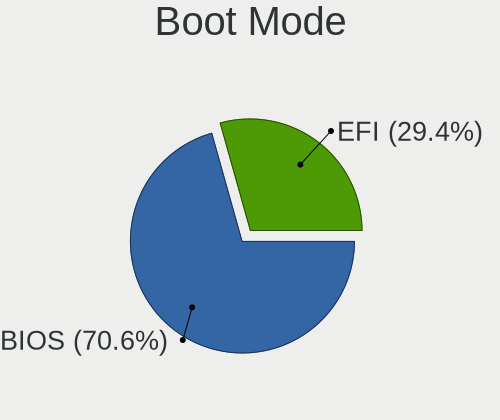
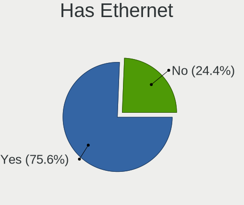
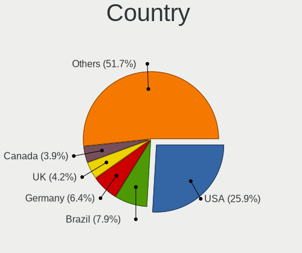
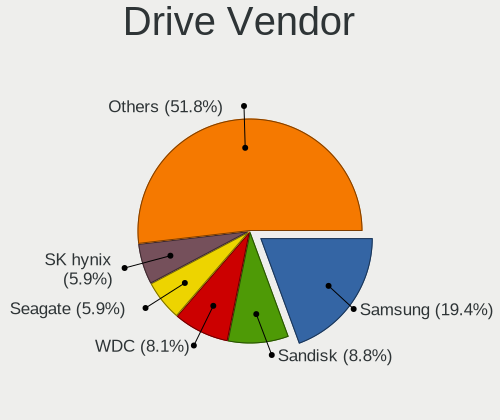
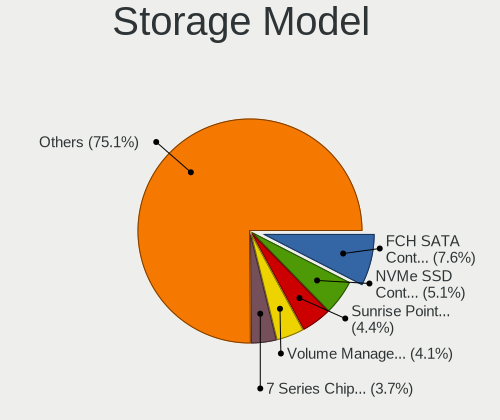
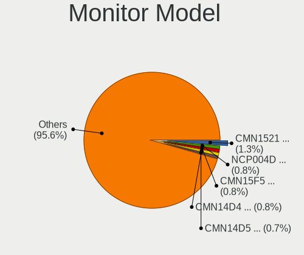
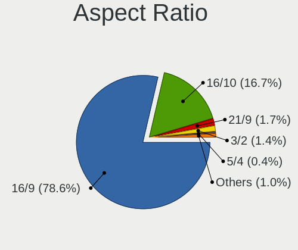
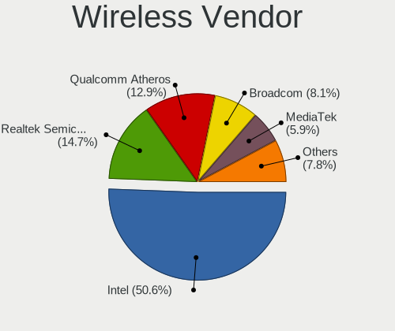

Pop!_OS 22.04 - Tested Hardware & Statistics (Notebooks)
--------------------------------------------------------

A project to collect tested hardware configurations for Pop!_OS 22.04.

Anyone can contribute to this report by the [hw-probe](https://github.com/linuxhw/hw-probe) tool:

    sudo -E hw-probe -all -upload

Please contribute! Especially if your hardware is rare.

Contents
--------

* [ Test Cases ](#test-cases)

* [ System ](#system)
  - [ Kernel                   ](#kernel)
  - [ Kernel Family            ](#kernel-family)
  - [ Kernel Major Ver.        ](#kernel-major-ver)
  - [ Arch                     ](#arch)
  - [ DE                       ](#de)
  - [ Display Server           ](#display-server)
  - [ Display Manager          ](#display-manager)
  - [ OS Lang                  ](#os-lang)
  - [ Boot Mode                ](#boot-mode)
  - [ Filesystem               ](#filesystem)
  - [ Part. scheme             ](#part-scheme)
  - [ Dual Boot with Linux/BSD ](#dual-boot-with-linuxbsd)
  - [ Dual Boot (Win)          ](#dual-boot-win)

* [ Board ](#board)
  - [ Vendor                   ](#vendor)
  - [ Model                    ](#model)
  - [ Model Family             ](#model-family)
  - [ MFG Year                 ](#mfg-year)
  - [ Form Factor              ](#form-factor)
  - [ Secure Boot              ](#secure-boot)
  - [ Coreboot                 ](#coreboot)
  - [ RAM Size                 ](#ram-size)
  - [ RAM Used                 ](#ram-used)
  - [ Total Drives             ](#total-drives)
  - [ Has CD-ROM               ](#has-cd-rom)
  - [ Has Ethernet             ](#has-ethernet)
  - [ Has WiFi                 ](#has-wifi)
  - [ Has Bluetooth            ](#has-bluetooth)

* [ Location ](#location)
  - [ Country                  ](#country)
  - [ City                     ](#city)

* [ Drives ](#drives)
  - [ Drive Vendor             ](#drive-vendor)
  - [ Drive Model              ](#drive-model)
  - [ HDD Vendor               ](#hdd-vendor)
  - [ SSD Vendor               ](#ssd-vendor)
  - [ Drive Kind               ](#drive-kind)
  - [ Drive Connector          ](#drive-connector)
  - [ Drive Size               ](#drive-size)
  - [ Space Total              ](#space-total)
  - [ Space Used               ](#space-used)
  - [ Malfunc. Drives          ](#malfunc-drives)
  - [ Malfunc. Drive Vendor    ](#malfunc-drive-vendor)
  - [ Malfunc. HDD Vendor      ](#malfunc-hdd-vendor)
  - [ Malfunc. Drive Kind      ](#malfunc-drive-kind)
  - [ Failed Drives            ](#failed-drives)
  - [ Failed Drive Vendor      ](#failed-drive-vendor)
  - [ Drive Status             ](#drive-status)

* [ Storage controller ](#storage-controller)
  - [ Storage Vendor           ](#storage-vendor)
  - [ Storage Model            ](#storage-model)
  - [ Storage Kind             ](#storage-kind)

* [ Processor ](#processor)
  - [ CPU Vendor               ](#cpu-vendor)
  - [ CPU Model                ](#cpu-model)
  - [ CPU Model Family         ](#cpu-model-family)
  - [ CPU Cores                ](#cpu-cores)
  - [ CPU Sockets              ](#cpu-sockets)
  - [ CPU Threads              ](#cpu-threads)
  - [ CPU Op-Modes             ](#cpu-op-modes)
  - [ CPU Microcode            ](#cpu-microcode)
  - [ CPU Microarch            ](#cpu-microarch)

* [ Graphics ](#graphics)
  - [ GPU Vendor               ](#gpu-vendor)
  - [ GPU Model                ](#gpu-model)
  - [ GPU Combo                ](#gpu-combo)
  - [ GPU Driver               ](#gpu-driver)
  - [ GPU Memory               ](#gpu-memory)

* [ Monitor ](#monitor)
  - [ Monitor Vendor           ](#monitor-vendor)
  - [ Monitor Model            ](#monitor-model)
  - [ Monitor Resolution       ](#monitor-resolution)
  - [ Monitor Diagonal         ](#monitor-diagonal)
  - [ Monitor Width            ](#monitor-width)
  - [ Aspect Ratio             ](#aspect-ratio)
  - [ Monitor Area             ](#monitor-area)
  - [ Pixel Density            ](#pixel-density)
  - [ Multiple Monitors        ](#multiple-monitors)

* [ Network ](#network)
  - [ Net Controller Vendor    ](#net-controller-vendor)
  - [ Net Controller Model     ](#net-controller-model)
  - [ Wireless Vendor          ](#wireless-vendor)
  - [ Wireless Model           ](#wireless-model)
  - [ Ethernet Vendor          ](#ethernet-vendor)
  - [ Ethernet Model           ](#ethernet-model)
  - [ Net Controller Kind      ](#net-controller-kind)
  - [ Used Controller          ](#used-controller)
  - [ NICs                     ](#nics)
  - [ IPv6                     ](#ipv6)

* [ Bluetooth ](#bluetooth)
  - [ Bluetooth Vendor         ](#bluetooth-vendor)
  - [ Bluetooth Model          ](#bluetooth-model)

* [ Sound ](#sound)
  - [ Sound Vendor             ](#sound-vendor)
  - [ Sound Model              ](#sound-model)

* [ Memory ](#memory)
  - [ Memory Vendor            ](#memory-vendor)
  - [ Memory Model             ](#memory-model)
  - [ Memory Kind              ](#memory-kind)
  - [ Memory Form Factor       ](#memory-form-factor)
  - [ Memory Size              ](#memory-size)
  - [ Memory Speed             ](#memory-speed)

* [ Printers & scanners ](#printers--scanners)
  - [ Printer Vendor           ](#printer-vendor)
  - [ Printer Model            ](#printer-model)
  - [ Scanner Vendor           ](#scanner-vendor)
  - [ Scanner Model            ](#scanner-model)

* [ Camera ](#camera)
  - [ Camera Vendor            ](#camera-vendor)
  - [ Camera Model             ](#camera-model)

* [ Security ](#security)
  - [ Fingerprint Vendor       ](#fingerprint-vendor)
  - [ Fingerprint Model        ](#fingerprint-model)
  - [ Chipcard Vendor          ](#chipcard-vendor)
  - [ Chipcard Model           ](#chipcard-model)

* [ Unsupported ](#unsupported)
  - [ Unsupported Devices      ](#unsupported-devices)
  - [ Unsupported Device Types ](#unsupported-device-types)

Test Cases
----------

Total: 2942

| Vendor        | Model                       | Probe                                                      | Date         |
|---------------|-----------------------------|------------------------------------------------------------|--------------|
| Lenovo        | Y720-15IKB 80VR             | [7cc876dcfa](https://linux-hardware.org/?probe=7cc876dcfa) | Nov 06, 2023 |
| Lenovo        | IdeaPad 320-15ABR 80XS      | [290be8911e](https://linux-hardware.org/?probe=290be8911e) | Nov 06, 2023 |
| Acer          | Aspire 5750G                | [a782c6c087](https://linux-hardware.org/?probe=a782c6c087) | Nov 05, 2023 |
| Lenovo        | IdeaPad 330-17ICH 81FL      | [e25bb48957](https://linux-hardware.org/?probe=e25bb48957) | Nov 05, 2023 |
| MSI           | Cyborg 15 A12VF             | [be39067306](https://linux-hardware.org/?probe=be39067306) | Nov 05, 2023 |
| ASUSTek       | G53SX                       | [7834b537a1](https://linux-hardware.org/?probe=7834b537a1) | Nov 05, 2023 |
| Lenovo        | ThinkPad T470s W10DG 20J... | [f1d00fbb93](https://linux-hardware.org/?probe=f1d00fbb93) | Nov 05, 2023 |
| Lenovo        | IdeaPad Gaming 3 15IAH7 ... | [1db5fee13c](https://linux-hardware.org/?probe=1db5fee13c) | Nov 05, 2023 |
| Lenovo        | ThinkPad T470s W10DG 20J... | [50306c96e2](https://linux-hardware.org/?probe=50306c96e2) | Nov 05, 2023 |
| Google        | Taeko                       | [d148b001d9](https://linux-hardware.org/?probe=d148b001d9) | Nov 05, 2023 |
| HP            | Pavilion Laptop 15-cw0xx... | [279f1b8b4f](https://linux-hardware.org/?probe=279f1b8b4f) | Nov 05, 2023 |
| System76      | Lemur Pro                   | [dacc229f22](https://linux-hardware.org/?probe=dacc229f22) | Nov 04, 2023 |
| Lenovo        | IdeaPad 5 15ITL05 82FG      | [cfdf343144](https://linux-hardware.org/?probe=cfdf343144) | Nov 04, 2023 |
| Lenovo        | IdeaPad 5 15ITL05 82FG      | [237bd5cfb2](https://linux-hardware.org/?probe=237bd5cfb2) | Nov 04, 2023 |
| System76      | Lemur Pro                   | [80b1ef75d6](https://linux-hardware.org/?probe=80b1ef75d6) | Nov 04, 2023 |
| System76      | Oryx Pro                    | [ea89273272](https://linux-hardware.org/?probe=ea89273272) | Nov 04, 2023 |
| HP            | 655                         | [8cf9aa61c7](https://linux-hardware.org/?probe=8cf9aa61c7) | Nov 04, 2023 |
| Apple         | MacBookAir6,2               | [f8507f333d](https://linux-hardware.org/?probe=f8507f333d) | Nov 04, 2023 |
| MSI           | Bravo 15 C7VE               | [5db0e7314a](https://linux-hardware.org/?probe=5db0e7314a) | Nov 04, 2023 |
| ASUSTek       | VivoBook_ASUSLaptop X415... | [972ef88623](https://linux-hardware.org/?probe=972ef88623) | Nov 04, 2023 |
| ASUSTek       | VivoBook_ASUSLaptop X415... | [927b50091e](https://linux-hardware.org/?probe=927b50091e) | Nov 04, 2023 |
| System76      | Oryx Pro                    | [1704acc89b](https://linux-hardware.org/?probe=1704acc89b) | Nov 03, 2023 |
| Lenovo        | ThinkPad T420s 417032U      | [76247c39f4](https://linux-hardware.org/?probe=76247c39f4) | Nov 03, 2023 |
| Lenovo        | IdeaPad C340-14API 81N6     | [3a8d337535](https://linux-hardware.org/?probe=3a8d337535) | Nov 03, 2023 |
| HP            | ProBook 6450b               | [75ad2cf5f8](https://linux-hardware.org/?probe=75ad2cf5f8) | Nov 02, 2023 |
| MSI           | Prestige 14Evo A11M         | [12414485a5](https://linux-hardware.org/?probe=12414485a5) | Nov 02, 2023 |
| Apple         | MacBookPro14,1              | [7d93bb6f25](https://linux-hardware.org/?probe=7d93bb6f25) | Nov 02, 2023 |
| ASUSTek       | N550JV                      | [200e3255d9](https://linux-hardware.org/?probe=200e3255d9) | Nov 02, 2023 |
| ASUSTek       | N550JV                      | [43a84b57f0](https://linux-hardware.org/?probe=43a84b57f0) | Nov 01, 2023 |
| Lenovo        | ThinkPad T480 20L6S68T00    | [dba91e5612](https://linux-hardware.org/?probe=dba91e5612) | Nov 01, 2023 |
| HP            | ENVY 15                     | [74dae44745](https://linux-hardware.org/?probe=74dae44745) | Nov 01, 2023 |
| Lenovo        | ThinkPad X260 20F5A28AUK    | [c1e44a55c8](https://linux-hardware.org/?probe=c1e44a55c8) | Nov 01, 2023 |
| Lenovo        | ThinkPad X260 20F5A28AUK    | [84ca0a285d](https://linux-hardware.org/?probe=84ca0a285d) | Nov 01, 2023 |
| Dell          | XPS 15 9520                 | [6b6da0ca4a](https://linux-hardware.org/?probe=6b6da0ca4a) | Nov 01, 2023 |
| System76      | Lemur Pro                   | [847ae1ea8d](https://linux-hardware.org/?probe=847ae1ea8d) | Nov 01, 2023 |
| Lenovo        | IdeaPad 320-14IKB 80YF      | [643c7ccd9b](https://linux-hardware.org/?probe=643c7ccd9b) | Nov 01, 2023 |
| Lenovo        | IdeaPad 5 14ALC05 82LM      | [f08e4e21a0](https://linux-hardware.org/?probe=f08e4e21a0) | Nov 01, 2023 |
| HUAWEI        | CREF-XX                     | [a10aa3c3e5](https://linux-hardware.org/?probe=a10aa3c3e5) | Oct 31, 2023 |
| MSI           | GP66 Leopard 11UG           | [cb013304f5](https://linux-hardware.org/?probe=cb013304f5) | Oct 31, 2023 |
| MSI           | GP66 Leopard 11UG           | [d6ac483e43](https://linux-hardware.org/?probe=d6ac483e43) | Oct 31, 2023 |
| Lenovo        | G50-80 80E5                 | [ee528fce07](https://linux-hardware.org/?probe=ee528fce07) | Oct 31, 2023 |
| Lenovo        | G50-80 80E5                 | [4e0042e20c](https://linux-hardware.org/?probe=4e0042e20c) | Oct 31, 2023 |
| Acer          | Aspire E5-553G              | [7c76f143a4](https://linux-hardware.org/?probe=7c76f143a4) | Oct 31, 2023 |
| HP            | ZBook Fury 15.6 inch G8 ... | [56f24de5ff](https://linux-hardware.org/?probe=56f24de5ff) | Oct 30, 2023 |
| Lenovo        | V15 G2 ALC 82KD             | [81a7cabe4f](https://linux-hardware.org/?probe=81a7cabe4f) | Oct 30, 2023 |
| HP            | Dev One Notebook PC         | [d5ace42b13](https://linux-hardware.org/?probe=d5ace42b13) | Oct 30, 2023 |
| Lenovo        | ThinkBook 15 G2 ARE 20VG    | [d51c491524](https://linux-hardware.org/?probe=d51c491524) | Oct 30, 2023 |
| Apple         | MacBookAir6,2               | [65f24e332a](https://linux-hardware.org/?probe=65f24e332a) | Oct 30, 2023 |
| System76      | Adder WS                    | [57478f4561](https://linux-hardware.org/?probe=57478f4561) | Oct 30, 2023 |
| System76      | Adder WS                    | [a10fcac3f4](https://linux-hardware.org/?probe=a10fcac3f4) | Oct 30, 2023 |
| ASUSTek       | ZenBook UX425EA_UX425EA     | [5863bd6189](https://linux-hardware.org/?probe=5863bd6189) | Oct 30, 2023 |
| ASUSTek       | VivoBook_ASUSLaptop X421... | [7301c9b3df](https://linux-hardware.org/?probe=7301c9b3df) | Oct 29, 2023 |
| Apple         | MacBookPro5,5               | [2815a5477f](https://linux-hardware.org/?probe=2815a5477f) | Oct 29, 2023 |
| SLIMBOOK      | TITAN                       | [8697e4de09](https://linux-hardware.org/?probe=8697e4de09) | Oct 29, 2023 |
| Lenovo        | ThinkBook 15 G2 ARE 20VG    | [c90dd43290](https://linux-hardware.org/?probe=c90dd43290) | Oct 29, 2023 |
| ASUSTek       | VivoBook_ASUSLaptop M650... | [d621a72336](https://linux-hardware.org/?probe=d621a72336) | Oct 28, 2023 |
| Lenovo        | ThinkPad T480 20L6S68T00    | [57e3abc23d](https://linux-hardware.org/?probe=57e3abc23d) | Oct 28, 2023 |
| Lenovo        | IdeaPad Gaming 3 15ARH05... | [0f9adbc34d](https://linux-hardware.org/?probe=0f9adbc34d) | Oct 28, 2023 |
| Maibenben     | MaiBook X series            | [63e0cb487a](https://linux-hardware.org/?probe=63e0cb487a) | Oct 28, 2023 |
| Lenovo        | IdeaPad 5 14ABA7 82SE       | [e08a8fa43b](https://linux-hardware.org/?probe=e08a8fa43b) | Oct 28, 2023 |
| Apple         | MacBookAir6,2               | [96b76fc377](https://linux-hardware.org/?probe=96b76fc377) | Oct 28, 2023 |
| Lenovo        | Z50-70 20354                | [2e5ee0032d](https://linux-hardware.org/?probe=2e5ee0032d) | Oct 27, 2023 |
| System76      | Lemur Pro                   | [e5b2c76907](https://linux-hardware.org/?probe=e5b2c76907) | Oct 27, 2023 |
| Samsung       | 550XCJ/550XCR               | [9d34ff8710](https://linux-hardware.org/?probe=9d34ff8710) | Oct 27, 2023 |
| System76      | Darter Pro                  | [9dcbc85a23](https://linux-hardware.org/?probe=9dcbc85a23) | Oct 27, 2023 |
| HP            | OMEN LAPTOP - 15-EK0013D... | [0c582fd597](https://linux-hardware.org/?probe=0c582fd597) | Oct 27, 2023 |
| Acer          | Aspire A315-42G             | [114e1e6d66](https://linux-hardware.org/?probe=114e1e6d66) | Oct 27, 2023 |
| Lenovo        | Legion 5 15IMH05H 81Y6      | [f0641b8822](https://linux-hardware.org/?probe=f0641b8822) | Oct 26, 2023 |
| Haier         | U1520SD                     | [3de6c48f15](https://linux-hardware.org/?probe=3de6c48f15) | Oct 26, 2023 |
| Dell          | Latitude E6530              | [ec57b86fe6](https://linux-hardware.org/?probe=ec57b86fe6) | Oct 26, 2023 |
| Acer          | Aspire VN7-793G             | [e4a7d4f368](https://linux-hardware.org/?probe=e4a7d4f368) | Oct 26, 2023 |
| Panasonic     | CF-31SBM08DM                | [820f042ba6](https://linux-hardware.org/?probe=820f042ba6) | Oct 26, 2023 |
| Haier         | U1520SD                     | [25229c3d32](https://linux-hardware.org/?probe=25229c3d32) | Oct 25, 2023 |
| Dell          | Inspiron 3442               | [7fc2a154e5](https://linux-hardware.org/?probe=7fc2a154e5) | Oct 25, 2023 |
| Lenovo        | IdeaPad 3 15ALC6 82MF       | [9a4561dabf](https://linux-hardware.org/?probe=9a4561dabf) | Oct 25, 2023 |
| HP            | Victus by Laptop 16-e0xx... | [ecde45a506](https://linux-hardware.org/?probe=ecde45a506) | Oct 24, 2023 |
| Apple         | MacBookAir6,2               | [f15ecd1759](https://linux-hardware.org/?probe=f15ecd1759) | Oct 24, 2023 |
| Dell          | Latitude E7240              | [6fead70e93](https://linux-hardware.org/?probe=6fead70e93) | Oct 23, 2023 |
| Lenovo        | ThinkBook 15 G2 ARE 20VG    | [47fdb21256](https://linux-hardware.org/?probe=47fdb21256) | Oct 23, 2023 |
| Dell          | XPS 13 9370                 | [7e9d761b35](https://linux-hardware.org/?probe=7e9d761b35) | Oct 23, 2023 |
| MSI           | Sword 15 A11UD              | [d07a7c777c](https://linux-hardware.org/?probe=d07a7c777c) | Oct 23, 2023 |
| HP            | EliteBook 820 G3            | [73c1b49eab](https://linux-hardware.org/?probe=73c1b49eab) | Oct 23, 2023 |
| HP            | EliteBook 820 G3            | [b6169d3a96](https://linux-hardware.org/?probe=b6169d3a96) | Oct 23, 2023 |
| ASUSTek       | G750JW                      | [9bafdb8250](https://linux-hardware.org/?probe=9bafdb8250) | Oct 22, 2023 |
| Dell          | Latitude 5520               | [f5664b02d2](https://linux-hardware.org/?probe=f5664b02d2) | Oct 22, 2023 |
| Toshiba       | Satellite C70D-B            | [7f1637fdb9](https://linux-hardware.org/?probe=7f1637fdb9) | Oct 22, 2023 |
| ASUSTek       | G53SX                       | [d19756d24b](https://linux-hardware.org/?probe=d19756d24b) | Oct 22, 2023 |
| Acer          | Aspire A315-23              | [14ed4adf6c](https://linux-hardware.org/?probe=14ed4adf6c) | Oct 22, 2023 |
| EUROCOM       | Tornado F5                  | [3056eeecf5](https://linux-hardware.org/?probe=3056eeecf5) | Oct 21, 2023 |
| ASUSTek       | N551JK                      | [010dd78352](https://linux-hardware.org/?probe=010dd78352) | Oct 21, 2023 |
| EUROCOM       | Tornado F5                  | [25b7095754](https://linux-hardware.org/?probe=25b7095754) | Oct 21, 2023 |
| MSI           | Cyborg 15 A12VF             | [b1a3bf1a75](https://linux-hardware.org/?probe=b1a3bf1a75) | Oct 21, 2023 |
| ASUSTek       | ASUS TUF Gaming F15 FX50... | [97d1264314](https://linux-hardware.org/?probe=97d1264314) | Oct 21, 2023 |
| HONOR         | NBR-WAX9                    | [5966a36809](https://linux-hardware.org/?probe=5966a36809) | Oct 21, 2023 |
| ASUSTek       | ASUS TUF Gaming F15 FX50... | [a2756e1d2b](https://linux-hardware.org/?probe=a2756e1d2b) | Oct 21, 2023 |
| ASUSTek       | VivoBook_ASUSLaptop X705... | [148be53a91](https://linux-hardware.org/?probe=148be53a91) | Oct 20, 2023 |
| Toshiba       | Satellite C70D-B            | [793d71f1d2](https://linux-hardware.org/?probe=793d71f1d2) | Oct 20, 2023 |
| Lenovo        | Y50-70 20378                | [e51b067a88](https://linux-hardware.org/?probe=e51b067a88) | Oct 20, 2023 |
| Acer          | Swift SFX14-51G             | [2adde1171a](https://linux-hardware.org/?probe=2adde1171a) | Oct 20, 2023 |
| ASUSTek       | X551MA                      | [6ee41b351a](https://linux-hardware.org/?probe=6ee41b351a) | Oct 20, 2023 |
| Acer          | Aspire 5253                 | [871f28b131](https://linux-hardware.org/?probe=871f28b131) | Oct 20, 2023 |
| Dell          | Latitude 5520               | [281fdb7e86](https://linux-hardware.org/?probe=281fdb7e86) | Oct 20, 2023 |
| HP            | Pavilion 17                 | [36613b2f1f](https://linux-hardware.org/?probe=36613b2f1f) | Oct 19, 2023 |
| MSI           | Cyborg 15 A12VF             | [7fab57f39a](https://linux-hardware.org/?probe=7fab57f39a) | Oct 19, 2023 |
| Samsung       | 355V4C/356V4C/3445VC/354... | [4312e9a007](https://linux-hardware.org/?probe=4312e9a007) | Oct 19, 2023 |
| ASUSTek       | VivoBook_ASUSLaptop X150... | [2f2d05a226](https://linux-hardware.org/?probe=2f2d05a226) | Oct 19, 2023 |
| HP            | Pavilion Laptop 15t-eg30... | [b2cba37968](https://linux-hardware.org/?probe=b2cba37968) | Oct 19, 2023 |
| Lenovo        | Legion R7000P APH8 82Y9     | [cd80438b02](https://linux-hardware.org/?probe=cd80438b02) | Oct 19, 2023 |
| Lenovo        | IdeaPad S145-15API 81V7     | [315376a82a](https://linux-hardware.org/?probe=315376a82a) | Oct 18, 2023 |
| Lenovo        | ThinkPad E14 Gen 4 21E30... | [52e7bc3407](https://linux-hardware.org/?probe=52e7bc3407) | Oct 18, 2023 |
| System76      | Gazelle                     | [061012cdb0](https://linux-hardware.org/?probe=061012cdb0) | Oct 17, 2023 |
| Apple         | MacBookPro11,1              | [ffeb95bd95](https://linux-hardware.org/?probe=ffeb95bd95) | Oct 17, 2023 |
| HP            | 250 G4                      | [a45d8a13df](https://linux-hardware.org/?probe=a45d8a13df) | Oct 16, 2023 |
| HP            | Laptop 15-dw4xxx            | [44ba7f4015](https://linux-hardware.org/?probe=44ba7f4015) | Oct 16, 2023 |
| HP            | Pavilion Gaming Laptop 1... | [471a6f3119](https://linux-hardware.org/?probe=471a6f3119) | Oct 16, 2023 |
| ASUSTek       | N551ZU                      | [e56a6c7957](https://linux-hardware.org/?probe=e56a6c7957) | Oct 16, 2023 |
| HP            | ProBook 4730s               | [42a7295a49](https://linux-hardware.org/?probe=42a7295a49) | Oct 15, 2023 |
| MECHREVO      | WUJIE14 PRO                 | [40cfeec2b2](https://linux-hardware.org/?probe=40cfeec2b2) | Oct 15, 2023 |
| Lenovo        | ThinkPad T480 20L50011US    | [7a732e8a25](https://linux-hardware.org/?probe=7a732e8a25) | Oct 15, 2023 |
| ASUSTek       | VivoBook_ASUSLaptop X513... | [22b5b65e16](https://linux-hardware.org/?probe=22b5b65e16) | Oct 15, 2023 |
| System76      | Lemur Pro                   | [f969d7a459](https://linux-hardware.org/?probe=f969d7a459) | Oct 15, 2023 |
| Acer          | Aspire A314-23P             | [142bc36a3f](https://linux-hardware.org/?probe=142bc36a3f) | Oct 14, 2023 |
| Notebook      | P9XXEN_EF_ED                | [89eae06fc2](https://linux-hardware.org/?probe=89eae06fc2) | Oct 13, 2023 |
| Acer          | Aspire E1-571               | [94754c98ce](https://linux-hardware.org/?probe=94754c98ce) | Oct 12, 2023 |
| Apple         | MacBookPro11,4              | [107524e9ec](https://linux-hardware.org/?probe=107524e9ec) | Oct 12, 2023 |
| Apple         | MacBookPro11,4              | [f9fee05f72](https://linux-hardware.org/?probe=f9fee05f72) | Oct 12, 2023 |
| Dell          | Inspiron 16 7610            | [ee849775df](https://linux-hardware.org/?probe=ee849775df) | Oct 12, 2023 |
| Lenovo        | Yoga Slim 7 Pro 14ACH5 8... | [c815acfae8](https://linux-hardware.org/?probe=c815acfae8) | Oct 11, 2023 |
| Gateway       | NE570                       | [533fec5226](https://linux-hardware.org/?probe=533fec5226) | Oct 11, 2023 |
| Acer          | Predator PH315-54           | [552e952ebe](https://linux-hardware.org/?probe=552e952ebe) | Oct 11, 2023 |
| Acer          | Aspire A515-44G             | [58d145f207](https://linux-hardware.org/?probe=58d145f207) | Oct 11, 2023 |
| HP            | Pavilion Sleekbook 15 PC    | [7d7f268cec](https://linux-hardware.org/?probe=7d7f268cec) | Oct 11, 2023 |
| Dell          | Inspiron 15 3525            | [66bd7ea744](https://linux-hardware.org/?probe=66bd7ea744) | Oct 10, 2023 |
| Lenovo        | ThinkPad P1 20MES05502      | [869264ad64](https://linux-hardware.org/?probe=869264ad64) | Oct 10, 2023 |
| Lenovo        | ThinkPad T480 20L50011US    | [5d606c8b1c](https://linux-hardware.org/?probe=5d606c8b1c) | Oct 10, 2023 |
| HP            | ZBook Fury 16 G9 Mobile ... | [6591296a12](https://linux-hardware.org/?probe=6591296a12) | Oct 10, 2023 |
| Gigabyte      | AORUS 17H BXF               | [4fcbae7a75](https://linux-hardware.org/?probe=4fcbae7a75) | Oct 10, 2023 |
| System76      | Darter Pro                  | [71e1a67b2a](https://linux-hardware.org/?probe=71e1a67b2a) | Oct 10, 2023 |
| Razer         | Blade                       | [22de5dfe50](https://linux-hardware.org/?probe=22de5dfe50) | Oct 09, 2023 |
| Gigabyte      | AERO 15 Classic-SA          | [420f5d5de9](https://linux-hardware.org/?probe=420f5d5de9) | Oct 09, 2023 |
| Lenovo        | ThinkPad P1 Gen 6 21FV00... | [c0a093d7d2](https://linux-hardware.org/?probe=c0a093d7d2) | Oct 08, 2023 |
| Lenovo        | ThinkPad T14s Gen 4 21F8... | [63cbb26f44](https://linux-hardware.org/?probe=63cbb26f44) | Oct 08, 2023 |
| Dell          | Inspiron 7375               | [3b54f5530b](https://linux-hardware.org/?probe=3b54f5530b) | Oct 08, 2023 |
| Lenovo        | Yoga 7 16ARP8 83BS          | [36d48fe6f7](https://linux-hardware.org/?probe=36d48fe6f7) | Oct 07, 2023 |
| System76      | Serval WS                   | [509cc872ee](https://linux-hardware.org/?probe=509cc872ee) | Oct 07, 2023 |
| Alienware     | m15 R7                      | [7bd2b6300f](https://linux-hardware.org/?probe=7bd2b6300f) | Oct 07, 2023 |
| HP            | EliteBook 850 G3            | [f773c3004e](https://linux-hardware.org/?probe=f773c3004e) | Oct 07, 2023 |
| HP            | ProBook 6450b               | [70e33902c1](https://linux-hardware.org/?probe=70e33902c1) | Oct 07, 2023 |
| HP            | ProBook 6450b               | [ddd8417a28](https://linux-hardware.org/?probe=ddd8417a28) | Oct 07, 2023 |
| MSI           | GE62 2QF                    | [cd73adb01d](https://linux-hardware.org/?probe=cd73adb01d) | Oct 07, 2023 |
| HP            | Laptop 15-db1xxx            | [687a37a00f](https://linux-hardware.org/?probe=687a37a00f) | Oct 06, 2023 |
| Dell          | XPS 15 7590                 | [f4c0266602](https://linux-hardware.org/?probe=f4c0266602) | Oct 06, 2023 |
| Dell          | XPS 15 7590                 | [8978850a77](https://linux-hardware.org/?probe=8978850a77) | Oct 06, 2023 |
| System76      | Serval WS                   | [f8e3cd9fd0](https://linux-hardware.org/?probe=f8e3cd9fd0) | Oct 06, 2023 |
| ASUSTek       | VivoBook_ASUSLaptop K660... | [b6caf35101](https://linux-hardware.org/?probe=b6caf35101) | Oct 05, 2023 |
| ASUSTek       | ROG Zephyrus G14 GA401QM... | [3e6f44ce5c](https://linux-hardware.org/?probe=3e6f44ce5c) | Oct 05, 2023 |
| Google        | Morphius                    | [735ed70d9c](https://linux-hardware.org/?probe=735ed70d9c) | Oct 05, 2023 |
| Lenovo        | ThinkBook 14 G4 IAP 21DH    | [34ff66e3a9](https://linux-hardware.org/?probe=34ff66e3a9) | Oct 05, 2023 |
| Lenovo        | ThinkBook 14 G4 IAP 21DH    | [314a6f2edf](https://linux-hardware.org/?probe=314a6f2edf) | Oct 05, 2023 |
| Dell          | Inspiron 5490               | [5ab40107ce](https://linux-hardware.org/?probe=5ab40107ce) | Oct 04, 2023 |
| Lenovo        | ThinkPad X1 Carbon 7th 2... | [234f939987](https://linux-hardware.org/?probe=234f939987) | Oct 04, 2023 |
| Lenovo        | ThinkPad L14 Gen 2a 20X5... | [8f0fc826ae](https://linux-hardware.org/?probe=8f0fc826ae) | Oct 04, 2023 |
| ASUSTek       | Zenbook UX3402ZA_Q409ZA     | [1dcdef2d17](https://linux-hardware.org/?probe=1dcdef2d17) | Oct 04, 2023 |
| Dell          | Latitude 7400               | [bd6eee3b51](https://linux-hardware.org/?probe=bd6eee3b51) | Oct 03, 2023 |
| Apple         | MacBookAir6,2               | [23c850d9d3](https://linux-hardware.org/?probe=23c850d9d3) | Oct 03, 2023 |
| Apple         | MacBookAir7,2               | [efcc70945c](https://linux-hardware.org/?probe=efcc70945c) | Oct 03, 2023 |
| Lenovo        | ThinkPad W540 20BG001EUK    | [6d78bda800](https://linux-hardware.org/?probe=6d78bda800) | Oct 02, 2023 |
| MSI           | GF65 Thin 9SEXR             | [1d315fb87d](https://linux-hardware.org/?probe=1d315fb87d) | Oct 02, 2023 |
| Dell          | Inspiron 5437               | [a348906862](https://linux-hardware.org/?probe=a348906862) | Oct 02, 2023 |
| Dell          | Inspiron 3543               | [1c681f7a14](https://linux-hardware.org/?probe=1c681f7a14) | Oct 02, 2023 |
| ASUSTek       | G74Sx                       | [2e57173dd9](https://linux-hardware.org/?probe=2e57173dd9) | Oct 02, 2023 |
| System76      | Lemur Pro                   | [8486fb3080](https://linux-hardware.org/?probe=8486fb3080) | Oct 02, 2023 |
| ASUSTek       | ROG Strix G713RW_G713RW     | [3bb0e0c792](https://linux-hardware.org/?probe=3bb0e0c792) | Oct 01, 2023 |
| Lenovo        | ThinkPad W540 20BG001EUK    | [55f747d352](https://linux-hardware.org/?probe=55f747d352) | Oct 01, 2023 |
| HP            | 250 G4                      | [30947c6039](https://linux-hardware.org/?probe=30947c6039) | Oct 01, 2023 |
| MSI           | Cyborg 15 A12VF             | [5f76307503](https://linux-hardware.org/?probe=5f76307503) | Oct 01, 2023 |
| Dell          | Latitude E7440              | [8e74ff2f99](https://linux-hardware.org/?probe=8e74ff2f99) | Oct 01, 2023 |
| HP            | ProBook 440 G4              | [810959ffa7](https://linux-hardware.org/?probe=810959ffa7) | Oct 01, 2023 |
| ASUSTek       | TUF Gaming FX505DV_FX505... | [6c314cd812](https://linux-hardware.org/?probe=6c314cd812) | Oct 01, 2023 |
| Lenovo        | IdeaPad Y700-15ACZ 80NY     | [12d98aba86](https://linux-hardware.org/?probe=12d98aba86) | Oct 01, 2023 |
| HP            | Dragonfly 13.5 inch G4 N... | [8fabc36e1c](https://linux-hardware.org/?probe=8fabc36e1c) | Oct 01, 2023 |
| Apple         | MacBookPro7,1               | [c69ebf2472](https://linux-hardware.org/?probe=c69ebf2472) | Oct 01, 2023 |
| ASUSTek       | VivoBook_ASUSLaptop K340... | [59dcd18330](https://linux-hardware.org/?probe=59dcd18330) | Sep 30, 2023 |
| ASUSTek       | VivoBook_ASUSLaptop K340... | [a6d0762090](https://linux-hardware.org/?probe=a6d0762090) | Sep 30, 2023 |
| HP            | Pro Tablet 608 G1           | [14fcb9ce4b](https://linux-hardware.org/?probe=14fcb9ce4b) | Sep 30, 2023 |
| HP            | Pro Tablet 608 G1           | [ab84386c83](https://linux-hardware.org/?probe=ab84386c83) | Sep 30, 2023 |
| Positivo      | C14CR01                     | [11b171838d](https://linux-hardware.org/?probe=11b171838d) | Sep 29, 2023 |
| HP            | Pavilion Laptop 15-eh1xx... | [55b44bb456](https://linux-hardware.org/?probe=55b44bb456) | Sep 29, 2023 |
| System76      | Darter Pro                  | [d8b78103d5](https://linux-hardware.org/?probe=d8b78103d5) | Sep 29, 2023 |
| ASUSTek       | VivoBook S14 X411UF         | [fb1c2503cf](https://linux-hardware.org/?probe=fb1c2503cf) | Sep 29, 2023 |
| Acer          | Aspire E5-575G              | [109490039d](https://linux-hardware.org/?probe=109490039d) | Sep 29, 2023 |
| MSI           | Cyborg 15 A12VF             | [960cd34617](https://linux-hardware.org/?probe=960cd34617) | Sep 29, 2023 |
| Lenovo        | Legion 5 17ACH6H 82JY       | [e23bfd302c](https://linux-hardware.org/?probe=e23bfd302c) | Sep 28, 2023 |
| Toshiba       | Satellite P775              | [7269165fd9](https://linux-hardware.org/?probe=7269165fd9) | Sep 28, 2023 |
| Apple         | MacBookAir6,2               | [b0c2b630a6](https://linux-hardware.org/?probe=b0c2b630a6) | Sep 28, 2023 |
| System76      | Oryx Pro                    | [f06316545d](https://linux-hardware.org/?probe=f06316545d) | Sep 28, 2023 |
| Acer          | Aspire VN7-791G             | [0cfe515d00](https://linux-hardware.org/?probe=0cfe515d00) | Sep 27, 2023 |
| ASUSTek       | VivoBook_ASUSLaptop K660... | [7c13a64c8a](https://linux-hardware.org/?probe=7c13a64c8a) | Sep 27, 2023 |
| Dell          | Latitude 5480               | [8dd1695b2c](https://linux-hardware.org/?probe=8dd1695b2c) | Sep 27, 2023 |
| System76      | Lemur Pro                   | [6013ab7f8a](https://linux-hardware.org/?probe=6013ab7f8a) | Sep 27, 2023 |
| Dell          | Latitude E7440              | [9e117fe599](https://linux-hardware.org/?probe=9e117fe599) | Sep 27, 2023 |
| HONOR         | NBR-WAX9                    | [68556b1e09](https://linux-hardware.org/?probe=68556b1e09) | Sep 27, 2023 |
| HONOR         | NBR-WAX9                    | [056de6b9b3](https://linux-hardware.org/?probe=056de6b9b3) | Sep 27, 2023 |
| ASUSTek       | VivoBook_ASUSLaptop K660... | [d9665a6ffd](https://linux-hardware.org/?probe=d9665a6ffd) | Sep 27, 2023 |
| Apple         | MacBookAir7,2               | [f9f08875e1](https://linux-hardware.org/?probe=f9f08875e1) | Sep 26, 2023 |
| MSI           | Summit E13FlipEvo A12MT     | [5fa9f0dde2](https://linux-hardware.org/?probe=5fa9f0dde2) | Sep 26, 2023 |
| HUAWEI        | NbDE-WXX9                   | [b3990570ee](https://linux-hardware.org/?probe=b3990570ee) | Sep 25, 2023 |
| HP            | 250 G4                      | [6e475cbb1f](https://linux-hardware.org/?probe=6e475cbb1f) | Sep 25, 2023 |
| HP            | 250 G4                      | [9543354fea](https://linux-hardware.org/?probe=9543354fea) | Sep 25, 2023 |
| Acer          | Swift SFX14-41G             | [ae755aa7e3](https://linux-hardware.org/?probe=ae755aa7e3) | Sep 25, 2023 |
| HP            | OMEN by Gaming Laptop 16... | [cb2b1325cc](https://linux-hardware.org/?probe=cb2b1325cc) | Sep 25, 2023 |
| MSI           | Cyborg 15 A12VF             | [f934062b23](https://linux-hardware.org/?probe=f934062b23) | Sep 25, 2023 |
| Lenovo        | ThinkPad X1 Carbon 3rd 2... | [7d18eb441e](https://linux-hardware.org/?probe=7d18eb441e) | Sep 24, 2023 |
| Fujitsu       | LIFEBOOK A557               | [e66c8c9ca7](https://linux-hardware.org/?probe=e66c8c9ca7) | Sep 24, 2023 |
| ASUSTek       | ASUS TUF Gaming F17 FX70... | [dfe5d4faaa](https://linux-hardware.org/?probe=dfe5d4faaa) | Sep 24, 2023 |
| ASUSTek       | ASUS TUF Gaming A15 FA50... | [8318fdeb5b](https://linux-hardware.org/?probe=8318fdeb5b) | Sep 24, 2023 |
| Dell          | System XPS L502X            | [22d93fe76c](https://linux-hardware.org/?probe=22d93fe76c) | Sep 24, 2023 |
| MSI           | Cyborg 15 A12VF             | [7aa2ea2853](https://linux-hardware.org/?probe=7aa2ea2853) | Sep 24, 2023 |
| Dell          | System XPS L502X            | [a1d4f683c1](https://linux-hardware.org/?probe=a1d4f683c1) | Sep 24, 2023 |
| Acer          | Swift SFX14-41G             | [7980181fcb](https://linux-hardware.org/?probe=7980181fcb) | Sep 24, 2023 |
| Dell          | XPS 15 9520                 | [b358b656c6](https://linux-hardware.org/?probe=b358b656c6) | Sep 24, 2023 |
| Toshiba       | TECRA X40-E                 | [280f949acc](https://linux-hardware.org/?probe=280f949acc) | Sep 24, 2023 |
| HP            | 250 G4                      | [5290896e7d](https://linux-hardware.org/?probe=5290896e7d) | Sep 23, 2023 |
| System76      | Gazelle                     | [2e31a65d58](https://linux-hardware.org/?probe=2e31a65d58) | Sep 23, 2023 |
| HP            | Laptop 15-db1xxx            | [8b16720f22](https://linux-hardware.org/?probe=8b16720f22) | Sep 23, 2023 |
| Dell          | Vostro 5481                 | [c416e12adb](https://linux-hardware.org/?probe=c416e12adb) | Sep 22, 2023 |
| ASUSTek       | ROG Strix G814JZ_G814JZ     | [2a6c2ef738](https://linux-hardware.org/?probe=2a6c2ef738) | Sep 22, 2023 |
| Lenovo        | Legion Slim 5 16APH8 82Y... | [726a5f4cf5](https://linux-hardware.org/?probe=726a5f4cf5) | Sep 22, 2023 |
| HUAWEI        | KPL-W0X                     | [3154e03d3f](https://linux-hardware.org/?probe=3154e03d3f) | Sep 22, 2023 |
| HP            | Laptop 15-db1xxx            | [504ed03ead](https://linux-hardware.org/?probe=504ed03ead) | Sep 22, 2023 |
| Lenovo        | IdeaPad 5 Pro 14ACN6 82L... | [1d9ae81bf1](https://linux-hardware.org/?probe=1d9ae81bf1) | Sep 22, 2023 |
| Notebook      | NH50_70RH                   | [57070abf3c](https://linux-hardware.org/?probe=57070abf3c) | Sep 21, 2023 |
| System76      | Darter Pro                  | [3266f46a3b](https://linux-hardware.org/?probe=3266f46a3b) | Sep 20, 2023 |
| Dell          | Precision 5680              | [a75a75f080](https://linux-hardware.org/?probe=a75a75f080) | Sep 20, 2023 |
| Lenovo        | IdeaPad 320-15ISK 80XH      | [a97463154d](https://linux-hardware.org/?probe=a97463154d) | Sep 20, 2023 |
| Lenovo        | IdeaPad Gaming 3 15ACH6 ... | [cbc4ec2df0](https://linux-hardware.org/?probe=cbc4ec2df0) | Sep 20, 2023 |
| Apple         | MacBookPro8,1               | [43edd5f49f](https://linux-hardware.org/?probe=43edd5f49f) | Sep 20, 2023 |
| ASUSTek       | Vivobook Go E1504FA_E150... | [a8b35a2b8f](https://linux-hardware.org/?probe=a8b35a2b8f) | Sep 19, 2023 |
| Lenovo        | IdeaPad 320-15ISK 80XH      | [8adb5c3a12](https://linux-hardware.org/?probe=8adb5c3a12) | Sep 19, 2023 |
| Framework     | Laptop                      | [f379873c4b](https://linux-hardware.org/?probe=f379873c4b) | Sep 19, 2023 |
| HP            | Pavilion 15                 | [eb15fe383c](https://linux-hardware.org/?probe=eb15fe383c) | Sep 18, 2023 |
| HP            | Pavilion 15                 | [fb86634643](https://linux-hardware.org/?probe=fb86634643) | Sep 18, 2023 |
| HP            | Dev One Notebook PC         | [2606a8d1c1](https://linux-hardware.org/?probe=2606a8d1c1) | Sep 17, 2023 |
| HONOR         | BMH-WCX9                    | [96a8945a17](https://linux-hardware.org/?probe=96a8945a17) | Sep 17, 2023 |
| Lenovo        | IdeaPad 100-15IBD 80QQ      | [797e19424f](https://linux-hardware.org/?probe=797e19424f) | Sep 16, 2023 |
| Notebook      | NV4XMB,ME,MZ                | [35bc7480cb](https://linux-hardware.org/?probe=35bc7480cb) | Sep 15, 2023 |
| Unknown       | Unknown                     | [ae1fde8210](https://linux-hardware.org/?probe=ae1fde8210) | Sep 15, 2023 |
| Lenovo        | Yoga Pro 7 14ARP8 83AU      | [98dbf213e7](https://linux-hardware.org/?probe=98dbf213e7) | Sep 15, 2023 |
| Lenovo        | ThinkPad X13 Gen 2a 20XH... | [5150bae6bd](https://linux-hardware.org/?probe=5150bae6bd) | Sep 15, 2023 |
| HP            | OMEN by Gaming Laptop 16... | [175e57d54f](https://linux-hardware.org/?probe=175e57d54f) | Sep 15, 2023 |
| Digibras      | CL341                       | [a358f5d40c](https://linux-hardware.org/?probe=a358f5d40c) | Sep 15, 2023 |
| Lenovo        | Slim Pro 9 14IRP8 83BV      | [bc86928972](https://linux-hardware.org/?probe=bc86928972) | Sep 15, 2023 |
| Lenovo        | Yoga Pro 7 14ARP8 83AU      | [4f6e19f508](https://linux-hardware.org/?probe=4f6e19f508) | Sep 14, 2023 |
| ASUSTek       | X556URK                     | [0996de9eac](https://linux-hardware.org/?probe=0996de9eac) | Sep 14, 2023 |
| Dell          | Latitude 7440               | [cd8e3aa6ed](https://linux-hardware.org/?probe=cd8e3aa6ed) | Sep 14, 2023 |
| realme        | RMNBXXXX                    | [7f93463d6a](https://linux-hardware.org/?probe=7f93463d6a) | Sep 14, 2023 |
| realme        | RMNBXXXX                    | [a635ea5599](https://linux-hardware.org/?probe=a635ea5599) | Sep 14, 2023 |
| Toshiba       | Satellite L735              | [fee724f874](https://linux-hardware.org/?probe=fee724f874) | Sep 14, 2023 |
| System76      | Pangolin                    | [c3803d0977](https://linux-hardware.org/?probe=c3803d0977) | Sep 13, 2023 |
| ASUSTek       | VivoBook E14 E402YA_E402... | [ef5a6433f3](https://linux-hardware.org/?probe=ef5a6433f3) | Sep 13, 2023 |
| Lenovo        | IdeaPad 310-15ISK 80UH      | [df7945af41](https://linux-hardware.org/?probe=df7945af41) | Sep 13, 2023 |
| Apple         | MacBookPro9,2               | [c159157024](https://linux-hardware.org/?probe=c159157024) | Sep 13, 2023 |
| ASUSTek       | VivoBook 15_ASUS Laptop ... | [03e666ab42](https://linux-hardware.org/?probe=03e666ab42) | Sep 12, 2023 |
| MSI           | Stealth 15M B12UE           | [9a23215875](https://linux-hardware.org/?probe=9a23215875) | Sep 11, 2023 |
| Schenker      | XMG NEO (TGL/M21)           | [8f9ada75e9](https://linux-hardware.org/?probe=8f9ada75e9) | Sep 11, 2023 |
| Dell          | Latitude E7250              | [44983ff513](https://linux-hardware.org/?probe=44983ff513) | Sep 11, 2023 |
| ASUSTek       | ZenBook UX433FA_UX433FA     | [1b2d76894b](https://linux-hardware.org/?probe=1b2d76894b) | Sep 10, 2023 |
| Lenovo        | IdeaPad 5 14ABA7 82SE       | [a9caf49f0e](https://linux-hardware.org/?probe=a9caf49f0e) | Sep 09, 2023 |
| Lenovo        | V720-14 80Y1                | [ec869beffd](https://linux-hardware.org/?probe=ec869beffd) | Sep 09, 2023 |
| ASUSTek       | VivoBook_ASUSLaptop X509... | [5fc227a0e8](https://linux-hardware.org/?probe=5fc227a0e8) | Sep 08, 2023 |
| Dell          | Vostro 5502                 | [a131efa36e](https://linux-hardware.org/?probe=a131efa36e) | Sep 08, 2023 |
| HP            | Laptop 14-dk0xxx            | [57b82728d8](https://linux-hardware.org/?probe=57b82728d8) | Sep 08, 2023 |
| HP            | EliteBook 745 G5            | [05d61b5c23](https://linux-hardware.org/?probe=05d61b5c23) | Sep 08, 2023 |
| MSI           | P65 Creator 8RD             | [3eab920cfc](https://linux-hardware.org/?probe=3eab920cfc) | Sep 07, 2023 |
| HP            | Laptop 15-dy2xxx            | [eae373ebd4](https://linux-hardware.org/?probe=eae373ebd4) | Sep 07, 2023 |
| MSI           | Alpha 15 A3DDK              | [9a87dfb80b](https://linux-hardware.org/?probe=9a87dfb80b) | Sep 07, 2023 |
| HP            | EliteBook 8760w             | [d061b57b29](https://linux-hardware.org/?probe=d061b57b29) | Sep 07, 2023 |
| Alienware     | m15 R7                      | [9e6b80bbf2](https://linux-hardware.org/?probe=9e6b80bbf2) | Sep 07, 2023 |
| Apple         | MacBookPro11,3              | [bfdd099826](https://linux-hardware.org/?probe=bfdd099826) | Sep 06, 2023 |
| HP            | Victus by Laptop 16-e0xx... | [0692b6f878](https://linux-hardware.org/?probe=0692b6f878) | Sep 06, 2023 |
| Acer          | Swift SFX14-41G             | [611bb4fe1a](https://linux-hardware.org/?probe=611bb4fe1a) | Sep 06, 2023 |
| Acer          | Swift SFX14-41G             | [38f9d1abd9](https://linux-hardware.org/?probe=38f9d1abd9) | Sep 05, 2023 |
| Lenovo        | Legion Slim 5 16APH8 82Y... | [27575898fe](https://linux-hardware.org/?probe=27575898fe) | Sep 05, 2023 |
| HP            | Victus by Laptop 16-e0xx... | [dda5b7f9c9](https://linux-hardware.org/?probe=dda5b7f9c9) | Sep 05, 2023 |
| Dell          | Inspiron 14 5420            | [70d0d79f77](https://linux-hardware.org/?probe=70d0d79f77) | Sep 05, 2023 |
| Apple         | MacBookPro10,1              | [11c016fb1b](https://linux-hardware.org/?probe=11c016fb1b) | Sep 05, 2023 |
| Dell          | Latitude E5430 non-vPro     | [ee1a881e82](https://linux-hardware.org/?probe=ee1a881e82) | Sep 04, 2023 |
| System76      | Lemur Pro                   | [9ea11da090](https://linux-hardware.org/?probe=9ea11da090) | Sep 04, 2023 |
| Lenovo        | ThinkPad L14 Gen 1 20U10... | [68e90ee0cb](https://linux-hardware.org/?probe=68e90ee0cb) | Sep 04, 2023 |
| ASUSTek       | K53E                        | [5604fe515d](https://linux-hardware.org/?probe=5604fe515d) | Sep 04, 2023 |
| Dell          | XPS 17 9700                 | [e758c8955e](https://linux-hardware.org/?probe=e758c8955e) | Sep 03, 2023 |
| ASUSTek       | VivoBook_ASUSLaptop X412... | [2ddf0c5c61](https://linux-hardware.org/?probe=2ddf0c5c61) | Sep 03, 2023 |
| HP            | 240 G8 Notebook PC          | [092ae0b34d](https://linux-hardware.org/?probe=092ae0b34d) | Sep 03, 2023 |
| ASUSTek       | VivoBook_ASUSLaptop N760... | [f2f5e496f1](https://linux-hardware.org/?probe=f2f5e496f1) | Sep 02, 2023 |
| HP            | Stream Laptop 14-cb1xxx     | [515e1f4bce](https://linux-hardware.org/?probe=515e1f4bce) | Sep 02, 2023 |
| Apple         | MacBookAir3,2               | [5ee8cbf433](https://linux-hardware.org/?probe=5ee8cbf433) | Sep 02, 2023 |
| Schenker      | VIA 15 Pro                  | [4a31ab4d2b](https://linux-hardware.org/?probe=4a31ab4d2b) | Sep 02, 2023 |
| Apple         | MacBookAir6,2               | [da8d60051c](https://linux-hardware.org/?probe=da8d60051c) | Sep 02, 2023 |
| Dell          | Inspiron 15 7000 Gaming     | [87e1726495](https://linux-hardware.org/?probe=87e1726495) | Sep 01, 2023 |
| Dell          | Inspiron 15 7000 Gaming     | [e73e853358](https://linux-hardware.org/?probe=e73e853358) | Sep 01, 2023 |
| ASUSTek       | N550JV                      | [b2effdc956](https://linux-hardware.org/?probe=b2effdc956) | Sep 01, 2023 |
| Lenovo        | Legion 5 Pro 16IAH7H 82R... | [2433535726](https://linux-hardware.org/?probe=2433535726) | Sep 01, 2023 |
| Dell          | Inspiron 5558               | [77c6379594](https://linux-hardware.org/?probe=77c6379594) | Sep 01, 2023 |
| Acer          | Swift SFX14-41G             | [67f553625a](https://linux-hardware.org/?probe=67f553625a) | Sep 01, 2023 |
| Dell          | Latitude E7470              | [0580f1c293](https://linux-hardware.org/?probe=0580f1c293) | Sep 01, 2023 |
| Lenovo        | ThinkPad T450 20BUS0B000    | [1213d3bf46](https://linux-hardware.org/?probe=1213d3bf46) | Aug 31, 2023 |
| Acer          | Aspire E5-551G              | [628d865373](https://linux-hardware.org/?probe=628d865373) | Aug 31, 2023 |
| Framework     | Laptop (12th Gen Intel C... | [3b890e064f](https://linux-hardware.org/?probe=3b890e064f) | Aug 31, 2023 |
| Acer          | Nitro AN515-55              | [6c5da44516](https://linux-hardware.org/?probe=6c5da44516) | Aug 31, 2023 |
| Google        | Kefka                       | [284517c2b3](https://linux-hardware.org/?probe=284517c2b3) | Aug 31, 2023 |
| Lenovo        | ThinkPad W520 427637U       | [5f995c7c48](https://linux-hardware.org/?probe=5f995c7c48) | Aug 30, 2023 |
| Apple         | MacBookPro5,5               | [641243c308](https://linux-hardware.org/?probe=641243c308) | Aug 30, 2023 |
| Lenovo        | G50-80 80E5                 | [5ba6fd6ca3](https://linux-hardware.org/?probe=5ba6fd6ca3) | Aug 30, 2023 |
| Google        | Kefka                       | [a018ae3fb5](https://linux-hardware.org/?probe=a018ae3fb5) | Aug 30, 2023 |
| Acer          | Aspire E5-571               | [500ef94276](https://linux-hardware.org/?probe=500ef94276) | Aug 29, 2023 |
| HP            | Pavilion Laptop 15-cw0xx... | [90a72df8ef](https://linux-hardware.org/?probe=90a72df8ef) | Aug 29, 2023 |
| Lenovo        | IdeaPad S540-15IWL GTX 8... | [4904c007c7](https://linux-hardware.org/?probe=4904c007c7) | Aug 29, 2023 |
| Lenovo        | IdeaPad Gaming 3 15IAH7 ... | [ba9dd7a62d](https://linux-hardware.org/?probe=ba9dd7a62d) | Aug 29, 2023 |
| Lenovo        | ThinkPad T470p 20J7S0CF0... | [f1b8efb723](https://linux-hardware.org/?probe=f1b8efb723) | Aug 29, 2023 |
| ASUSTek       | ROG Strix G634JZ_G634JZ     | [481b37b0fc](https://linux-hardware.org/?probe=481b37b0fc) | Aug 29, 2023 |
| Dell          | Latitude 5330               | [7e63575d10](https://linux-hardware.org/?probe=7e63575d10) | Aug 29, 2023 |
| Lenovo        | ThinkPad T430s 2356CU8      | [2f669d797f](https://linux-hardware.org/?probe=2f669d797f) | Aug 29, 2023 |
| Lenovo        | ThinkPad T430s 2356CU8      | [39f2feeed5](https://linux-hardware.org/?probe=39f2feeed5) | Aug 29, 2023 |
| Lenovo        | ThinkPad E15 Gen 3 20YHC... | [de65d63e10](https://linux-hardware.org/?probe=de65d63e10) | Aug 28, 2023 |
| Lenovo        | Legion 5 15IMH 82CF         | [4d8ac47399](https://linux-hardware.org/?probe=4d8ac47399) | Aug 28, 2023 |
| Lenovo        | ThinkPad E15 Gen 3 20YHC... | [dc9a79314c](https://linux-hardware.org/?probe=dc9a79314c) | Aug 28, 2023 |
| Dell          | XPS 15 7590                 | [ef97f75590](https://linux-hardware.org/?probe=ef97f75590) | Aug 28, 2023 |
| Dell          | Precision 5510              | [c6d08d9c28](https://linux-hardware.org/?probe=c6d08d9c28) | Aug 27, 2023 |
| HP            | EliteBook 865 16 inch G9... | [b07775a194](https://linux-hardware.org/?probe=b07775a194) | Aug 27, 2023 |
| HP            | 250 G7 Notebook PC          | [c4be1d7e95](https://linux-hardware.org/?probe=c4be1d7e95) | Aug 27, 2023 |
| Lenovo        | ThinkPad T460 20FMS05K05    | [747e8d4f6a](https://linux-hardware.org/?probe=747e8d4f6a) | Aug 27, 2023 |
| Dell          | Precision M4600             | [b7fca4d2f9](https://linux-hardware.org/?probe=b7fca4d2f9) | Aug 27, 2023 |
| Apple         | MacBookPro8,2               | [9e0b5b0b7e](https://linux-hardware.org/?probe=9e0b5b0b7e) | Aug 26, 2023 |
| Dell          | Precision M6800             | [6aa5f8e441](https://linux-hardware.org/?probe=6aa5f8e441) | Aug 26, 2023 |
| HP            | ProBook 4730s               | [32f610b810](https://linux-hardware.org/?probe=32f610b810) | Aug 26, 2023 |
| Google        | Kasumi                      | [9af5f77257](https://linux-hardware.org/?probe=9af5f77257) | Aug 25, 2023 |
| System76      | Gazelle                     | [b3fb438915](https://linux-hardware.org/?probe=b3fb438915) | Aug 25, 2023 |
| MSI           | GE60 2OC\2OD\2OE            | [e2e304c9eb](https://linux-hardware.org/?probe=e2e304c9eb) | Aug 25, 2023 |
| HP            | EliteBook 865 16 inch G9... | [34fc2a5f83](https://linux-hardware.org/?probe=34fc2a5f83) | Aug 24, 2023 |
| Dell          | Latitude E7240              | [cb61859037](https://linux-hardware.org/?probe=cb61859037) | Aug 24, 2023 |
| HP            | Victus by Laptop 16-e0xx... | [6cf9db7da7](https://linux-hardware.org/?probe=6cf9db7da7) | Aug 24, 2023 |
| Dell          | Latitude 7430               | [7daf0301c5](https://linux-hardware.org/?probe=7daf0301c5) | Aug 24, 2023 |
| Toshiba       | Satellite L655              | [18df557333](https://linux-hardware.org/?probe=18df557333) | Aug 24, 2023 |
| HP            | Pavilion Notebook           | [b0ca2ee250](https://linux-hardware.org/?probe=b0ca2ee250) | Aug 23, 2023 |
| MSI           | GE60 2OC\2OD\2OE            | [50f079ae44](https://linux-hardware.org/?probe=50f079ae44) | Aug 23, 2023 |
| Dell          | XPS 13 9310                 | [6f0e38b5e8](https://linux-hardware.org/?probe=6f0e38b5e8) | Aug 23, 2023 |
| Samsung       | 750TDA                      | [7b1ec96afa](https://linux-hardware.org/?probe=7b1ec96afa) | Aug 23, 2023 |
| ASUSTek       | Zenbook UX3402ZA_Q409ZA     | [4cd19df49e](https://linux-hardware.org/?probe=4cd19df49e) | Aug 23, 2023 |
| Lenovo        | ThinkPad T460s 20FAS2RV0... | [e8d2c8e1d5](https://linux-hardware.org/?probe=e8d2c8e1d5) | Aug 22, 2023 |
| Lenovo        | IdeaPad Gaming 3 15ARH7 ... | [fdd24243bf](https://linux-hardware.org/?probe=fdd24243bf) | Aug 22, 2023 |
| Acer          | Aspire A715-75G             | [54794fb9e8](https://linux-hardware.org/?probe=54794fb9e8) | Aug 22, 2023 |
| HP            | ProBook 4730s               | [5b4d88bc67](https://linux-hardware.org/?probe=5b4d88bc67) | Aug 21, 2023 |
| Samsung       | 270E5G/270E5U               | [930d312c36](https://linux-hardware.org/?probe=930d312c36) | Aug 21, 2023 |
| Samsung       | 270E5G/270E5U               | [2bc8c24081](https://linux-hardware.org/?probe=2bc8c24081) | Aug 21, 2023 |
| ASUSTek       | ASUS TUF Dash F15 FX516P... | [b66d308d42](https://linux-hardware.org/?probe=b66d308d42) | Aug 21, 2023 |
| MSI           | Modern 15 A5M               | [f9742049fc](https://linux-hardware.org/?probe=f9742049fc) | Aug 20, 2023 |
| System76      | Oryx Pro                    | [b7e0bd11e5](https://linux-hardware.org/?probe=b7e0bd11e5) | Aug 20, 2023 |
| Dell          | Precision 5520              | [42587aac96](https://linux-hardware.org/?probe=42587aac96) | Aug 20, 2023 |
| Dell          | Precision 5520              | [bec735d800](https://linux-hardware.org/?probe=bec735d800) | Aug 20, 2023 |
| ASUSTek       | ROG Zephyrus G15 GA503QR    | [5d063a6e59](https://linux-hardware.org/?probe=5d063a6e59) | Aug 19, 2023 |
| Lenovo        | B490 377224P                | [0e516ea22b](https://linux-hardware.org/?probe=0e516ea22b) | Aug 19, 2023 |
| HP            | Pavilion Laptop 15-cw1xx... | [a1ab007f7f](https://linux-hardware.org/?probe=a1ab007f7f) | Aug 18, 2023 |
| ASUSTek       | U38N                        | [0e0f709353](https://linux-hardware.org/?probe=0e0f709353) | Aug 17, 2023 |
| HP            | EliteBook 850 G3            | [a6a7224d63](https://linux-hardware.org/?probe=a6a7224d63) | Aug 17, 2023 |
| Dell          | XPS 13 9310                 | [680fae2274](https://linux-hardware.org/?probe=680fae2274) | Aug 17, 2023 |
| ASUSTek       | Vivobook Go E1404FA_E140... | [43fd1aad67](https://linux-hardware.org/?probe=43fd1aad67) | Aug 17, 2023 |
| System76      | Lemur Pro                   | [af3b387574](https://linux-hardware.org/?probe=af3b387574) | Aug 16, 2023 |
| Acer          | Aspire 5750                 | [ec4afb1917](https://linux-hardware.org/?probe=ec4afb1917) | Aug 16, 2023 |
| A-DATA Tec... | XENIA 14                    | [59faf4a458](https://linux-hardware.org/?probe=59faf4a458) | Aug 15, 2023 |
| A-DATA Tec... | XENIA 14                    | [537cce8a8e](https://linux-hardware.org/?probe=537cce8a8e) | Aug 15, 2023 |
| HP            | Laptop 15s-eq2xxx           | [c2cfa9bd7a](https://linux-hardware.org/?probe=c2cfa9bd7a) | Aug 15, 2023 |
| Apple         | MacBookAir6,2               | [431ac1b880](https://linux-hardware.org/?probe=431ac1b880) | Aug 15, 2023 |
| Dell          | XPS 15 9570                 | [ce22773504](https://linux-hardware.org/?probe=ce22773504) | Aug 15, 2023 |
| System76      | Galago Pro                  | [54348f9c55](https://linux-hardware.org/?probe=54348f9c55) | Aug 14, 2023 |
| Apple         | MacBookPro9,2               | [61ff7ac5f1](https://linux-hardware.org/?probe=61ff7ac5f1) | Aug 14, 2023 |
| Apple         | MacBookPro16,1              | [18b513f5f0](https://linux-hardware.org/?probe=18b513f5f0) | Aug 14, 2023 |
| Lenovo        | ThinkPad T480s 20L7CTO1W... | [1f27d0f994](https://linux-hardware.org/?probe=1f27d0f994) | Aug 14, 2023 |
| HP            | ProBook 4540s               | [84dbf6b759](https://linux-hardware.org/?probe=84dbf6b759) | Aug 13, 2023 |
| Dell          | Inspiron 3542               | [ae586a02aa](https://linux-hardware.org/?probe=ae586a02aa) | Aug 13, 2023 |
| ASUSTek       | Vivobook Go E1504FA_E150... | [823e276406](https://linux-hardware.org/?probe=823e276406) | Aug 13, 2023 |
| GPU Compan... | GWNR71517                   | [a38cee5cc9](https://linux-hardware.org/?probe=a38cee5cc9) | Aug 12, 2023 |
| Acer          | Aspire ES1-520              | [a47415983e](https://linux-hardware.org/?probe=a47415983e) | Aug 12, 2023 |
| Lenovo        | ThinkPad L13 20R3CTO1WW     | [6ac135c81c](https://linux-hardware.org/?probe=6ac135c81c) | Aug 12, 2023 |
| ASUSTek       | K53TK                       | [db9f130ade](https://linux-hardware.org/?probe=db9f130ade) | Aug 12, 2023 |
| Dell          | G7 7588                     | [48faf46c2c](https://linux-hardware.org/?probe=48faf46c2c) | Aug 12, 2023 |
| Lenovo        | Yoga Pro 9 14IRP8 83BU      | [f46a14b981](https://linux-hardware.org/?probe=f46a14b981) | Aug 12, 2023 |
| HP            | EliteBook 820 G3            | [544810db31](https://linux-hardware.org/?probe=544810db31) | Aug 12, 2023 |
| ASUSTek       | ZenBook UX425EA_UX425EA     | [0d45e9e048](https://linux-hardware.org/?probe=0d45e9e048) | Aug 12, 2023 |
| Dell          | Precision M4600             | [f97367efac](https://linux-hardware.org/?probe=f97367efac) | Aug 11, 2023 |
| Lenovo        | IdeaPad 310-15IAP 80TT      | [361e073b5c](https://linux-hardware.org/?probe=361e073b5c) | Aug 11, 2023 |
| Acer          | Nitro AN715-51              | [ea972c8686](https://linux-hardware.org/?probe=ea972c8686) | Aug 11, 2023 |
| ASUSTek       | ROG Zephyrus G14 GA401QM... | [e22f71b79d](https://linux-hardware.org/?probe=e22f71b79d) | Aug 11, 2023 |
| ASUSTek       | X751LD                      | [e98d8d116d](https://linux-hardware.org/?probe=e98d8d116d) | Aug 10, 2023 |
| Apple         | MacBookAir5,2               | [7f91d6f9d8](https://linux-hardware.org/?probe=7f91d6f9d8) | Aug 10, 2023 |
| Acer          | Nitro AN517-55              | [b77ff095f8](https://linux-hardware.org/?probe=b77ff095f8) | Aug 09, 2023 |
| Lenovo        | IdeaPad 5 14ABA7 82SE       | [6415840d5b](https://linux-hardware.org/?probe=6415840d5b) | Aug 09, 2023 |
| HP            | ProBook 4330s               | [5c854bed9f](https://linux-hardware.org/?probe=5c854bed9f) | Aug 09, 2023 |
| HP            | ProBook 4330s               | [d23ce497d2](https://linux-hardware.org/?probe=d23ce497d2) | Aug 09, 2023 |
| System76      | Darter Pro                  | [5162d61c01](https://linux-hardware.org/?probe=5162d61c01) | Aug 09, 2023 |
| MSI           | Cyborg 15 A12VF             | [b041192310](https://linux-hardware.org/?probe=b041192310) | Aug 09, 2023 |
| Alienware     | 14                          | [192b13997d](https://linux-hardware.org/?probe=192b13997d) | Aug 09, 2023 |
| HP            | Victus by 15.6 inch Gami... | [67f88ab571](https://linux-hardware.org/?probe=67f88ab571) | Aug 08, 2023 |
| ASUSTek       | Zenbook Pro Duo UX582ZW_... | [afa081b440](https://linux-hardware.org/?probe=afa081b440) | Aug 08, 2023 |
| Acer          | Ferrari One 200             | [be688aa584](https://linux-hardware.org/?probe=be688aa584) | Aug 08, 2023 |
| Apple         | MacBookPro10,1              | [00b169d241](https://linux-hardware.org/?probe=00b169d241) | Aug 08, 2023 |
| Apple         | MacBookPro11,3              | [c415fd317b](https://linux-hardware.org/?probe=c415fd317b) | Aug 08, 2023 |
| Apple         | MacBookPro10,1              | [5e0c7f7bfc](https://linux-hardware.org/?probe=5e0c7f7bfc) | Aug 08, 2023 |
| Acer          | Aspire A715-75G             | [57f1225daf](https://linux-hardware.org/?probe=57f1225daf) | Aug 08, 2023 |
| Lenovo        | Legion 5 17ACH6H 82JY       | [088a8fad47](https://linux-hardware.org/?probe=088a8fad47) | Aug 08, 2023 |
| System76      | Oryx Pro                    | [c5b97761d3](https://linux-hardware.org/?probe=c5b97761d3) | Aug 07, 2023 |
| MSI           | Cyborg 15 A12VF             | [5fe9a17769](https://linux-hardware.org/?probe=5fe9a17769) | Aug 07, 2023 |
| MSI           | GP72 7RDX                   | [43eb53850c](https://linux-hardware.org/?probe=43eb53850c) | Aug 06, 2023 |
| Clevo         | W150HRM                     | [1ddcfcbecc](https://linux-hardware.org/?probe=1ddcfcbecc) | Aug 06, 2023 |
| Apple         | MacBookPro9,2               | [16936ef482](https://linux-hardware.org/?probe=16936ef482) | Aug 06, 2023 |
| MSI           | GP72 7RDX                   | [6d2bc8aa9e](https://linux-hardware.org/?probe=6d2bc8aa9e) | Aug 06, 2023 |
| Timi          | RedmiBook Pro 15S           | [576241bbd4](https://linux-hardware.org/?probe=576241bbd4) | Aug 06, 2023 |
| Notebook      | 1745                        | [3561a5dbbe](https://linux-hardware.org/?probe=3561a5dbbe) | Aug 06, 2023 |
| HP            | Pavilion dm4                | [521b8518ed](https://linux-hardware.org/?probe=521b8518ed) | Aug 06, 2023 |
| Dell          | Latitude 5430               | [f63444b0be](https://linux-hardware.org/?probe=f63444b0be) | Aug 05, 2023 |
| Apple         | MacBookPro11,2              | [32f8bbeff7](https://linux-hardware.org/?probe=32f8bbeff7) | Aug 05, 2023 |
| MSI           | Modern 15 A5M               | [a4a6f81455](https://linux-hardware.org/?probe=a4a6f81455) | Aug 05, 2023 |
| MSI           | Modern 15 A5M               | [ef010c9d51](https://linux-hardware.org/?probe=ef010c9d51) | Aug 05, 2023 |
| Lenovo        | ThinkPad X13 Gen 2a 20XH... | [7d17fc9ff6](https://linux-hardware.org/?probe=7d17fc9ff6) | Aug 05, 2023 |
| Lenovo        | V15 G3 ABA 82TV             | [0147060507](https://linux-hardware.org/?probe=0147060507) | Aug 04, 2023 |
| HP            | ProBook 650 G1              | [286cc8b0dd](https://linux-hardware.org/?probe=286cc8b0dd) | Aug 04, 2023 |
| Lenovo        | ThinkPad W541 20EGS0GY0R    | [4d618e08b3](https://linux-hardware.org/?probe=4d618e08b3) | Aug 03, 2023 |
| Lenovo        | ThinkPad P16 Gen 1 21D6C... | [a97312771e](https://linux-hardware.org/?probe=a97312771e) | Aug 03, 2023 |
| Dell          | XPS 13 9370                 | [cf49ff3004](https://linux-hardware.org/?probe=cf49ff3004) | Aug 03, 2023 |
| Dell          | Latitude E7240              | [ec5ec88e59](https://linux-hardware.org/?probe=ec5ec88e59) | Aug 02, 2023 |
| Lenovo        | ThinkPad X270 W10DG 20K5... | [99ccd043cb](https://linux-hardware.org/?probe=99ccd043cb) | Aug 02, 2023 |
| Lenovo        | ThinkPad X270 W10DG 20K5... | [d4e267a214](https://linux-hardware.org/?probe=d4e267a214) | Aug 02, 2023 |
| HP            | ProBook 650 G4              | [d041df173b](https://linux-hardware.org/?probe=d041df173b) | Aug 02, 2023 |
| Apple         | MacBookPro11,3              | [1eb6fd9620](https://linux-hardware.org/?probe=1eb6fd9620) | Aug 02, 2023 |
| Apple         | MacBookPro7,1               | [0a3c5e5c4d](https://linux-hardware.org/?probe=0a3c5e5c4d) | Aug 02, 2023 |
| Apple         | MacBookPro7,1               | [9f852ea211](https://linux-hardware.org/?probe=9f852ea211) | Aug 02, 2023 |
| ASUSTek       | GL502VSK                    | [0ed7feaa05](https://linux-hardware.org/?probe=0ed7feaa05) | Aug 01, 2023 |
| Lenovo        | Legion 5 15ARH7 82RE        | [e1a79e094e](https://linux-hardware.org/?probe=e1a79e094e) | Aug 01, 2023 |
| Dell          | Inspiron 5567               | [d252fa93be](https://linux-hardware.org/?probe=d252fa93be) | Aug 01, 2023 |
| ASUSTek       | ASUS TUF Gaming F15 FX50... | [9fbfc590ad](https://linux-hardware.org/?probe=9fbfc590ad) | Aug 01, 2023 |
| Dell          | Latitude 3500               | [df5211a816](https://linux-hardware.org/?probe=df5211a816) | Aug 01, 2023 |
| Dell          | Latitude 5490               | [e24a9f877c](https://linux-hardware.org/?probe=e24a9f877c) | Aug 01, 2023 |
| System76      | Lemur Pro                   | [1ba844bc69](https://linux-hardware.org/?probe=1ba844bc69) | Aug 01, 2023 |
| System76      | Lemur Pro                   | [e019d33faf](https://linux-hardware.org/?probe=e019d33faf) | Aug 01, 2023 |
| MSI           | Katana GF66 12UC            | [d590bcd619](https://linux-hardware.org/?probe=d590bcd619) | Jul 31, 2023 |
| ASUSTek       | K95VM                       | [1ec08c4cf9](https://linux-hardware.org/?probe=1ec08c4cf9) | Jul 30, 2023 |
| Lenovo        | IdeaPad 5 14ARE05 81YM      | [60cfcb00e9](https://linux-hardware.org/?probe=60cfcb00e9) | Jul 30, 2023 |
| Dell          | Latitude E7440              | [7509a5f756](https://linux-hardware.org/?probe=7509a5f756) | Jul 30, 2023 |
| System76      | Darter Pro                  | [0220d19f38](https://linux-hardware.org/?probe=0220d19f38) | Jul 30, 2023 |
| Dell          | Latitude E7240              | [b794bcdde6](https://linux-hardware.org/?probe=b794bcdde6) | Jul 29, 2023 |
| HP            | Pavilion 11 x360 PC         | [d693783e7a](https://linux-hardware.org/?probe=d693783e7a) | Jul 29, 2023 |
| Unknown       | Unknown                     | [73836c0a75](https://linux-hardware.org/?probe=73836c0a75) | Jul 29, 2023 |
| HP            | EliteBook 850 G8 Noteboo... | [59f0eb6b57](https://linux-hardware.org/?probe=59f0eb6b57) | Jul 28, 2023 |
| ASUSTek       | ROG Strix G713PI_G713PI     | [cb2f78abf0](https://linux-hardware.org/?probe=cb2f78abf0) | Jul 28, 2023 |
| Dell          | Precision 3550              | [0ecac77f90](https://linux-hardware.org/?probe=0ecac77f90) | Jul 28, 2023 |
| Dell          | Precision 3550              | [95ae018833](https://linux-hardware.org/?probe=95ae018833) | Jul 28, 2023 |
| System76      | Oryx Pro                    | [0ad8c1d8a7](https://linux-hardware.org/?probe=0ad8c1d8a7) | Jul 28, 2023 |
| Acer          | Aspire A315-42G             | [0e3aa83494](https://linux-hardware.org/?probe=0e3aa83494) | Jul 28, 2023 |
| HP            | EliteBook 840 G3            | [5a1f6f3395](https://linux-hardware.org/?probe=5a1f6f3395) | Jul 27, 2023 |
| Dell          | G15 5520                    | [7a5b503737](https://linux-hardware.org/?probe=7a5b503737) | Jul 27, 2023 |
| ASUSTek       | VivoBook_ASUSLaptop X509... | [4152e1f98e](https://linux-hardware.org/?probe=4152e1f98e) | Jul 27, 2023 |
| Dell          | Latitude E7440              | [619c6e4b99](https://linux-hardware.org/?probe=619c6e4b99) | Jul 27, 2023 |
| Samsung       | 300E5M/300E5L               | [23b23d59aa](https://linux-hardware.org/?probe=23b23d59aa) | Jul 27, 2023 |
| HP            | Dev One Notebook PC         | [b54bb52258](https://linux-hardware.org/?probe=b54bb52258) | Jul 27, 2023 |
| ASUSTek       | ROG Zephyrus G15 GA503RW... | [9920824f1f](https://linux-hardware.org/?probe=9920824f1f) | Jul 27, 2023 |
| Acer          | Nitro AN515-55              | [00e9bb8973](https://linux-hardware.org/?probe=00e9bb8973) | Jul 26, 2023 |
| Dell          | Inspiron 5548               | [22b2519a90](https://linux-hardware.org/?probe=22b2519a90) | Jul 26, 2023 |
| Acer          | Aspire A515-56              | [7e0e30c1cf](https://linux-hardware.org/?probe=7e0e30c1cf) | Jul 26, 2023 |
| Dell          | Inspiron 5548               | [b583a1fbee](https://linux-hardware.org/?probe=b583a1fbee) | Jul 26, 2023 |
| Dell          | Inspiron 5548               | [3d3696e8fa](https://linux-hardware.org/?probe=3d3696e8fa) | Jul 25, 2023 |
| HP            | Laptop 14-bs0xx             | [e074ee90be](https://linux-hardware.org/?probe=e074ee90be) | Jul 25, 2023 |
| MSI           | GF63 Thin 10SCXR            | [b34b7fa5fb](https://linux-hardware.org/?probe=b34b7fa5fb) | Jul 25, 2023 |
| Dell          | Inspiron 5490               | [25f155c61a](https://linux-hardware.org/?probe=25f155c61a) | Jul 24, 2023 |
| Dell          | Inspiron 5490               | [6b80b41fee](https://linux-hardware.org/?probe=6b80b41fee) | Jul 24, 2023 |
| Dell          | XPS 15 7590                 | [fa64a82283](https://linux-hardware.org/?probe=fa64a82283) | Jul 24, 2023 |
| ASUSTek       | ASUS TUF Gaming A16 FA61... | [88cfdb061d](https://linux-hardware.org/?probe=88cfdb061d) | Jul 24, 2023 |
| ASUSTek       | ROG Strix G713PV_G713PV     | [61c84247e6](https://linux-hardware.org/?probe=61c84247e6) | Jul 24, 2023 |
| Apple         | MacBookAir4,2               | [e220379405](https://linux-hardware.org/?probe=e220379405) | Jul 24, 2023 |
| ASUSTek       | ROG Strix G533ZW_G533ZW     | [53bab7ac5e](https://linux-hardware.org/?probe=53bab7ac5e) | Jul 24, 2023 |
| Apple         | MacBookPro5,5               | [b2b0895194](https://linux-hardware.org/?probe=b2b0895194) | Jul 24, 2023 |
| Lenovo        | Y520-15IKBN 80WK            | [3d8ec4447b](https://linux-hardware.org/?probe=3d8ec4447b) | Jul 24, 2023 |
| Lenovo        | Yoga Slim 7 ProX 14ARH7 ... | [fe2ff0c21f](https://linux-hardware.org/?probe=fe2ff0c21f) | Jul 23, 2023 |
| Apple         | MacBookPro8,1               | [2cd0946aba](https://linux-hardware.org/?probe=2cd0946aba) | Jul 23, 2023 |
| Sony          | SVF1521A6EW                 | [3c39100c6f](https://linux-hardware.org/?probe=3c39100c6f) | Jul 23, 2023 |
| PC Special... | Standard                    | [992aec5bb8](https://linux-hardware.org/?probe=992aec5bb8) | Jul 23, 2023 |
| HP            | ZBook Studio G3             | [bcfc5b64f4](https://linux-hardware.org/?probe=bcfc5b64f4) | Jul 23, 2023 |
| Google        | Snappy                      | [a3e6774e43](https://linux-hardware.org/?probe=a3e6774e43) | Jul 23, 2023 |
| Dell          | Latitude 3500               | [0755576e96](https://linux-hardware.org/?probe=0755576e96) | Jul 22, 2023 |
| Dell          | Latitude E6430s             | [8e74e2a524](https://linux-hardware.org/?probe=8e74e2a524) | Jul 22, 2023 |
| Dell          | Vostro 3560                 | [05acc63d53](https://linux-hardware.org/?probe=05acc63d53) | Jul 22, 2023 |
| Dell          | Latitude 5410               | [82217114b4](https://linux-hardware.org/?probe=82217114b4) | Jul 21, 2023 |
| Dell          | Latitude 5520               | [070380568b](https://linux-hardware.org/?probe=070380568b) | Jul 21, 2023 |
| Dell          | Precision 7530              | [0d2e753768](https://linux-hardware.org/?probe=0d2e753768) | Jul 20, 2023 |
| Acer          | Aspire A515-52              | [243f0a8cab](https://linux-hardware.org/?probe=243f0a8cab) | Jul 20, 2023 |
| Acer          | Aspire A515-52              | [f310abe0bb](https://linux-hardware.org/?probe=f310abe0bb) | Jul 20, 2023 |
| HP            | Pavilion Plus Laptop 14-... | [937715a75f](https://linux-hardware.org/?probe=937715a75f) | Jul 20, 2023 |
| Dell          | Latitude E5270              | [9ea13fdc27](https://linux-hardware.org/?probe=9ea13fdc27) | Jul 20, 2023 |
| HP            | Laptop 15-da0xxx            | [6e17b916ee](https://linux-hardware.org/?probe=6e17b916ee) | Jul 20, 2023 |
| Acer          | Extensa 5635ZG              | [337f0cec05](https://linux-hardware.org/?probe=337f0cec05) | Jul 20, 2023 |
| Toshiba       | Satellite L750              | [662f89dcc3](https://linux-hardware.org/?probe=662f89dcc3) | Jul 20, 2023 |
| Dell          | XPS 13 9360                 | [ac1a8eea0e](https://linux-hardware.org/?probe=ac1a8eea0e) | Jul 19, 2023 |
| Lenovo        | ThinkBook 16p Gen 2 20YM    | [35944db669](https://linux-hardware.org/?probe=35944db669) | Jul 19, 2023 |
| Schenker      | XMG NEO (CML/E20)           | [9f99e57705](https://linux-hardware.org/?probe=9f99e57705) | Jul 19, 2023 |
| ASUSTek       | K53E                        | [7fddec038e](https://linux-hardware.org/?probe=7fddec038e) | Jul 19, 2023 |
| ASUSTek       | VivoBook_ASUS Laptop X50... | [8cb16d19aa](https://linux-hardware.org/?probe=8cb16d19aa) | Jul 19, 2023 |
| Notebook      | NH5x_7xDPx                  | [098f2f58c7](https://linux-hardware.org/?probe=098f2f58c7) | Jul 18, 2023 |
| Apple         | MacBookPro16,1              | [dd5d384a71](https://linux-hardware.org/?probe=dd5d384a71) | Jul 18, 2023 |
| HP            | ENVY Laptop 17-cr0xxx       | [f5dc246f7c](https://linux-hardware.org/?probe=f5dc246f7c) | Jul 18, 2023 |
| HP            | ENVY Laptop 17-cr0xxx       | [abec03689c](https://linux-hardware.org/?probe=abec03689c) | Jul 18, 2023 |
| ASRock        | Z77 Performance             | [585aaad9ad](https://linux-hardware.org/?probe=585aaad9ad) | Jul 18, 2023 |
| Lenovo        | IdeaPad 330-15IKB 81DE      | [1cffa4bad9](https://linux-hardware.org/?probe=1cffa4bad9) | Jul 18, 2023 |
| Lenovo        | ThinkBook 16p Gen 2 20YM    | [cdaad6fa25](https://linux-hardware.org/?probe=cdaad6fa25) | Jul 18, 2023 |
| HP            | 635                         | [500e11147e](https://linux-hardware.org/?probe=500e11147e) | Jul 18, 2023 |
| ASUSTek       | ASUS TUF Dash F15 FX516P... | [1426cda0a7](https://linux-hardware.org/?probe=1426cda0a7) | Jul 17, 2023 |
| Lenovo        | IdeaPad 3 15ITL6 82H8       | [c7a062709f](https://linux-hardware.org/?probe=c7a062709f) | Jul 17, 2023 |
| HUAWEI        | KLVC-WXX9                   | [0427f16143](https://linux-hardware.org/?probe=0427f16143) | Jul 17, 2023 |
| Lenovo        | ThinkPad L13 Yoga Gen 2a... | [0bbd5c68bb](https://linux-hardware.org/?probe=0bbd5c68bb) | Jul 17, 2023 |
| Dell          | Precision M6800             | [8ddd80db6c](https://linux-hardware.org/?probe=8ddd80db6c) | Jul 17, 2023 |
| Lenovo        | ThinkPad X390 20Q1S67S00    | [be43004463](https://linux-hardware.org/?probe=be43004463) | Jul 17, 2023 |
| System76      | Serval WS                   | [a916a92726](https://linux-hardware.org/?probe=a916a92726) | Jul 17, 2023 |
| ASUSTek       | ROG Strix G713PV_G713PV     | [55a5100039](https://linux-hardware.org/?probe=55a5100039) | Jul 16, 2023 |
| ASUSTek       | ROG Strix G713PV_G713PV     | [ad8f031cb2](https://linux-hardware.org/?probe=ad8f031cb2) | Jul 16, 2023 |
| Lenovo        | IdeaPad 3 15ITL6 82H8       | [51128412d5](https://linux-hardware.org/?probe=51128412d5) | Jul 16, 2023 |
| Lenovo        | Legion Slim 7 16IRH8 82Y... | [437209972c](https://linux-hardware.org/?probe=437209972c) | Jul 15, 2023 |
| Lenovo        | ThinkPad T480 20L5S1S000    | [91dbb2c969](https://linux-hardware.org/?probe=91dbb2c969) | Jul 15, 2023 |
| Dell          | G15 5510                    | [28b7a732f2](https://linux-hardware.org/?probe=28b7a732f2) | Jul 15, 2023 |
| System76      | Pangolin                    | [486df7ead2](https://linux-hardware.org/?probe=486df7ead2) | Jul 14, 2023 |
| Samsung       | 350V5C/351V5C/3540VC/344... | [0498e27f41](https://linux-hardware.org/?probe=0498e27f41) | Jul 14, 2023 |
| HP            | ENVY 15                     | [5cfb9d33bd](https://linux-hardware.org/?probe=5cfb9d33bd) | Jul 14, 2023 |
| HP            | Pavilion Gaming Laptop 1... | [21fc63e4dd](https://linux-hardware.org/?probe=21fc63e4dd) | Jul 14, 2023 |
| MSI           | GF63 Thin 10SC              | [d017610254](https://linux-hardware.org/?probe=d017610254) | Jul 14, 2023 |
| Lenovo        | Legion 7 16ITHg6 82K6       | [e53c63af42](https://linux-hardware.org/?probe=e53c63af42) | Jul 14, 2023 |
| Lenovo        | ThinkPad T530 23943J8       | [fb022ada73](https://linux-hardware.org/?probe=fb022ada73) | Jul 14, 2023 |
| HP            | Pavilion Gaming Laptop 1... | [e84bf83ac1](https://linux-hardware.org/?probe=e84bf83ac1) | Jul 13, 2023 |
| HP            | Compaq CQ58                 | [78977dd4de](https://linux-hardware.org/?probe=78977dd4de) | Jul 13, 2023 |
| Lenovo        | ThinkPad T470p 20J7S0CF0... | [7ef2028b06](https://linux-hardware.org/?probe=7ef2028b06) | Jul 13, 2023 |
| Acer          | Aspire E5-576G              | [0856b48ae7](https://linux-hardware.org/?probe=0856b48ae7) | Jul 13, 2023 |
| Acer          | Swift SF314-42              | [c82bb58705](https://linux-hardware.org/?probe=c82bb58705) | Jul 13, 2023 |
| Lenovo        | ThinkPad P53s 20N6001UUS    | [5a675551df](https://linux-hardware.org/?probe=5a675551df) | Jul 13, 2023 |
| Dell          | G3 3590                     | [089bfa3da7](https://linux-hardware.org/?probe=089bfa3da7) | Jul 13, 2023 |
| Apple         | MacBookPro8,1               | [d4910e3f43](https://linux-hardware.org/?probe=d4910e3f43) | Jul 13, 2023 |
| Acer          | Swift SF314-42              | [7a9624e7cc](https://linux-hardware.org/?probe=7a9624e7cc) | Jul 12, 2023 |
| Acer          | Swift SF314-58G             | [795625662c](https://linux-hardware.org/?probe=795625662c) | Jul 12, 2023 |
| Acer          | Swift SF314-58G             | [c01b74af46](https://linux-hardware.org/?probe=c01b74af46) | Jul 12, 2023 |
| Timi          | Xiaomi NoteBook Pro         | [618c0c975b](https://linux-hardware.org/?probe=618c0c975b) | Jul 12, 2023 |
| HP            | Laptop 17-cp0xxx            | [801537f1d4](https://linux-hardware.org/?probe=801537f1d4) | Jul 12, 2023 |
| Apple         | MacBookPro6,2               | [20e2180dc1](https://linux-hardware.org/?probe=20e2180dc1) | Jul 12, 2023 |
| MSI           | Cyborg 15 A12VF             | [2c4a8d9d63](https://linux-hardware.org/?probe=2c4a8d9d63) | Jul 12, 2023 |
| Lenovo        | ThinkPad T470s 20HGS01A0... | [54e51170a1](https://linux-hardware.org/?probe=54e51170a1) | Jul 11, 2023 |
| Apple         | MacBookAir3,2               | [cbfc272e87](https://linux-hardware.org/?probe=cbfc272e87) | Jul 11, 2023 |
| HP            | EliteBook 850 G6            | [556ef4473f](https://linux-hardware.org/?probe=556ef4473f) | Jul 11, 2023 |
| HP            | EliteBook 840 G6            | [a61e80c022](https://linux-hardware.org/?probe=a61e80c022) | Jul 11, 2023 |
| Apple         | MacBookAir7,2               | [1453f984c9](https://linux-hardware.org/?probe=1453f984c9) | Jul 11, 2023 |
| ASUSTek       | ASUS TUF Dash F15 FX516P... | [5a7dbc5d7c](https://linux-hardware.org/?probe=5a7dbc5d7c) | Jul 10, 2023 |
| Apple         | MacBookPro6,2               | [293ddc3253](https://linux-hardware.org/?probe=293ddc3253) | Jul 10, 2023 |
| Notebook      | NP5x_NP6x_NP7xRNJ_RNH       | [7663e77bff](https://linux-hardware.org/?probe=7663e77bff) | Jul 09, 2023 |
| Notebook      | P7xxTM1                     | [81c163ed4a](https://linux-hardware.org/?probe=81c163ed4a) | Jul 09, 2023 |
| HP            | Laptop 14s-fq0xxx           | [92feea0533](https://linux-hardware.org/?probe=92feea0533) | Jul 08, 2023 |
| HP            | Laptop 14s-fq0xxx           | [2287c62944](https://linux-hardware.org/?probe=2287c62944) | Jul 08, 2023 |
| Toshiba       | IS 1413G                    | [cf96aafbc0](https://linux-hardware.org/?probe=cf96aafbc0) | Jul 08, 2023 |
| Apple         | MacBookPro11,1              | [1f88a40c05](https://linux-hardware.org/?probe=1f88a40c05) | Jul 08, 2023 |
| Apple         | MacBookPro11,1              | [e1f22afb69](https://linux-hardware.org/?probe=e1f22afb69) | Jul 08, 2023 |
| MSI           | Cyborg 15 A12VF             | [a34d0d8290](https://linux-hardware.org/?probe=a34d0d8290) | Jul 08, 2023 |
| Dell          | Inspiron 5565               | [d1df053096](https://linux-hardware.org/?probe=d1df053096) | Jul 08, 2023 |
| Acer          | Nitro AN515-57              | [12e3f9ecc7](https://linux-hardware.org/?probe=12e3f9ecc7) | Jul 07, 2023 |
| ASUSTek       | N55SL                       | [1223d8b536](https://linux-hardware.org/?probe=1223d8b536) | Jul 07, 2023 |
| MSI           | GS66 Stealth 10SE           | [e689bf355c](https://linux-hardware.org/?probe=e689bf355c) | Jul 07, 2023 |
| Panasonic     | FZ55-1                      | [4d12f02737](https://linux-hardware.org/?probe=4d12f02737) | Jul 07, 2023 |
| Dell          | Inspiron 3501               | [e657049abf](https://linux-hardware.org/?probe=e657049abf) | Jul 06, 2023 |
| Toshiba       | IS 1413G                    | [f2a99b72dc](https://linux-hardware.org/?probe=f2a99b72dc) | Jul 06, 2023 |
| Acer          | Predator PT515-51           | [9971e8a3da](https://linux-hardware.org/?probe=9971e8a3da) | Jul 05, 2023 |
| HP            | Laptop 15-da0xxx            | [f634e3942a](https://linux-hardware.org/?probe=f634e3942a) | Jul 05, 2023 |
| Lenovo        | ThinkPad T480s 20L70028U... | [46e6f4b081](https://linux-hardware.org/?probe=46e6f4b081) | Jul 05, 2023 |
| Lenovo        | ThinkPad T480s 20L70028U... | [6bf093ef61](https://linux-hardware.org/?probe=6bf093ef61) | Jul 05, 2023 |
| Dell          | XPS 17 9720                 | [a99946b8f0](https://linux-hardware.org/?probe=a99946b8f0) | Jul 04, 2023 |
| HP            | OMEN by Laptop 17-cb1xxx    | [dbf87e0eec](https://linux-hardware.org/?probe=dbf87e0eec) | Jul 04, 2023 |
| ASUSTek       | VivoBook_ASUSLaptop X712... | [09dffdde54](https://linux-hardware.org/?probe=09dffdde54) | Jul 04, 2023 |
| MSI           | Cyborg 15 A12VF             | [156f923a72](https://linux-hardware.org/?probe=156f923a72) | Jul 04, 2023 |
| Acer          | Aspire E1-470G              | [db4125a1c5](https://linux-hardware.org/?probe=db4125a1c5) | Jul 04, 2023 |
| ASUSTek       | ROG Zephyrus G15 GA503QR... | [dda9b242fd](https://linux-hardware.org/?probe=dda9b242fd) | Jul 03, 2023 |
| Lenovo        | ThinkPad X13 Gen 2a 20XH... | [e8ff92b585](https://linux-hardware.org/?probe=e8ff92b585) | Jul 03, 2023 |
| Acer          | Aspire A515-52              | [3861c91dd4](https://linux-hardware.org/?probe=3861c91dd4) | Jul 02, 2023 |
| Acer          | Aspire A515-52              | [ab8898b9f3](https://linux-hardware.org/?probe=ab8898b9f3) | Jul 02, 2023 |
| Apple         | MacBookPro12,1              | [f89bdd4374](https://linux-hardware.org/?probe=f89bdd4374) | Jul 02, 2023 |
| Dell          | Precision 7510              | [46b90e25b0](https://linux-hardware.org/?probe=46b90e25b0) | Jul 02, 2023 |
| MSI           | GT72VR 6RD                  | [ea6887d031](https://linux-hardware.org/?probe=ea6887d031) | Jul 01, 2023 |
| HP            | ZBook Fury 16 G9 Mobile ... | [6ee8b4e949](https://linux-hardware.org/?probe=6ee8b4e949) | Jul 01, 2023 |
| Dell          | Latitude 3500               | [8293ebc591](https://linux-hardware.org/?probe=8293ebc591) | Jul 01, 2023 |
| Toshiba       | IS 1413G                    | [b95a7c049a](https://linux-hardware.org/?probe=b95a7c049a) | Jun 30, 2023 |
| Teclast       | F7 Plus                     | [cebd3b027c](https://linux-hardware.org/?probe=cebd3b027c) | Jun 30, 2023 |
| Dell          | XPS 13 9370                 | [ec4bf131f5](https://linux-hardware.org/?probe=ec4bf131f5) | Jun 30, 2023 |
| Positivo      | Mobile                      | [fdaaf6915b](https://linux-hardware.org/?probe=fdaaf6915b) | Jun 30, 2023 |
| MSI           | GS65 Stealth 9SD            | [568380fd59](https://linux-hardware.org/?probe=568380fd59) | Jun 30, 2023 |
| MSI           | GS65 Stealth 9SD            | [54013b2dfd](https://linux-hardware.org/?probe=54013b2dfd) | Jun 30, 2023 |
| Positivo      | H14CU02                     | [d50e6fbbdc](https://linux-hardware.org/?probe=d50e6fbbdc) | Jun 29, 2023 |
| ASRock        | Z77 Performance             | [a678dc9605](https://linux-hardware.org/?probe=a678dc9605) | Jun 29, 2023 |
| MSI           | Vector GP76 12UH            | [b7035d78a6](https://linux-hardware.org/?probe=b7035d78a6) | Jun 29, 2023 |
| MSI           | GE70 2PL                    | [e5354b6cb4](https://linux-hardware.org/?probe=e5354b6cb4) | Jun 28, 2023 |
| Acer          | Aspire A315-21              | [4bf524cd80](https://linux-hardware.org/?probe=4bf524cd80) | Jun 27, 2023 |
| Acer          | Aspire E1-571               | [894f8583ea](https://linux-hardware.org/?probe=894f8583ea) | Jun 27, 2023 |
| Dell          | Vostro 15 3510              | [adb3a3de68](https://linux-hardware.org/?probe=adb3a3de68) | Jun 27, 2023 |
| Dell          | Precision M6800             | [b0fe737883](https://linux-hardware.org/?probe=b0fe737883) | Jun 27, 2023 |
| Toshiba       | IS 1413G                    | [882bd512a2](https://linux-hardware.org/?probe=882bd512a2) | Jun 27, 2023 |
| ASUSTek       | X550JX                      | [80770014b8](https://linux-hardware.org/?probe=80770014b8) | Jun 27, 2023 |
| Dell          | Inspiron 3583               | [e1e76b3d77](https://linux-hardware.org/?probe=e1e76b3d77) | Jun 27, 2023 |
| HUAWEI        | KLVL-WXXW                   | [5454a08ba6](https://linux-hardware.org/?probe=5454a08ba6) | Jun 26, 2023 |
| Lenovo        | ThinkPad P53 20QQS34C04     | [3019d7a733](https://linux-hardware.org/?probe=3019d7a733) | Jun 26, 2023 |
| Apple         | MacBookAir6,1               | [6b44c8513d](https://linux-hardware.org/?probe=6b44c8513d) | Jun 26, 2023 |
| Dell          | Precision M6800             | [4e6c5423b1](https://linux-hardware.org/?probe=4e6c5423b1) | Jun 25, 2023 |
| Dell          | Precision M6800             | [feb0adfd99](https://linux-hardware.org/?probe=feb0adfd99) | Jun 25, 2023 |
| HP            | Notebook                    | [ea00ce6c5b](https://linux-hardware.org/?probe=ea00ce6c5b) | Jun 25, 2023 |
| Sony          | VPCEA23FB                   | [b9a835920f](https://linux-hardware.org/?probe=b9a835920f) | Jun 25, 2023 |
| Sony          | VPCEA23FB                   | [c462c4c75e](https://linux-hardware.org/?probe=c462c4c75e) | Jun 25, 2023 |
| HP            | ENVY NOTEBOOK PC            | [8bd62ffdf1](https://linux-hardware.org/?probe=8bd62ffdf1) | Jun 25, 2023 |
| Acer          | Swift SF314-512             | [12f361cd8c](https://linux-hardware.org/?probe=12f361cd8c) | Jun 24, 2023 |
| System76      | Oryx Pro                    | [eaa4d8e105](https://linux-hardware.org/?probe=eaa4d8e105) | Jun 24, 2023 |
| Lenovo        | ThinkPad T14 Gen 1 20UDC... | [737204f453](https://linux-hardware.org/?probe=737204f453) | Jun 24, 2023 |
| MSI           | Cyborg 15 A12VF             | [703e12843e](https://linux-hardware.org/?probe=703e12843e) | Jun 23, 2023 |
| HP            | Laptop 15-dw2xxx            | [7f41e23d3a](https://linux-hardware.org/?probe=7f41e23d3a) | Jun 23, 2023 |
| HP            | Laptop 15-dw2xxx            | [79ec1a7b3f](https://linux-hardware.org/?probe=79ec1a7b3f) | Jun 23, 2023 |
| Dell          | XPS 15 9500                 | [36dc72c683](https://linux-hardware.org/?probe=36dc72c683) | Jun 23, 2023 |
| ASUSTek       | X751LD                      | [c7be73b6ca](https://linux-hardware.org/?probe=c7be73b6ca) | Jun 23, 2023 |
| ASUSTek       | X751LD                      | [346bbb0b47](https://linux-hardware.org/?probe=346bbb0b47) | Jun 23, 2023 |
| MSI           | Alpha 15 A3DDK              | [410b20161b](https://linux-hardware.org/?probe=410b20161b) | Jun 23, 2023 |
| Dell          | Inspiron 3501               | [e8db86e014](https://linux-hardware.org/?probe=e8db86e014) | Jun 22, 2023 |
| ASUSTek       | X551MA                      | [5b2b7d4a7f](https://linux-hardware.org/?probe=5b2b7d4a7f) | Jun 22, 2023 |
| Dell          | Inspiron 3583               | [170d1f4f0b](https://linux-hardware.org/?probe=170d1f4f0b) | Jun 22, 2023 |
| HP            | Notebook                    | [35b8a2a187](https://linux-hardware.org/?probe=35b8a2a187) | Jun 22, 2023 |
| Lenovo        | B5400 80B6QB0               | [6885fc56aa](https://linux-hardware.org/?probe=6885fc56aa) | Jun 22, 2023 |
| Dell          | Inspiron 5567               | [8634954b1c](https://linux-hardware.org/?probe=8634954b1c) | Jun 22, 2023 |
| Acer          | Aspire A515-52              | [43ee82258d](https://linux-hardware.org/?probe=43ee82258d) | Jun 21, 2023 |
| Dell          | System Inspiron N4110       | [ebaceedccf](https://linux-hardware.org/?probe=ebaceedccf) | Jun 21, 2023 |
| Lenovo        | ThinkPad T480 20L6S3H102    | [4a8bd602ff](https://linux-hardware.org/?probe=4a8bd602ff) | Jun 21, 2023 |
| Dell          | System Inspiron N4110       | [a168f45822](https://linux-hardware.org/?probe=a168f45822) | Jun 21, 2023 |
| Lenovo        | ThinkPad T14 Gen 2i 20W1... | [b255195205](https://linux-hardware.org/?probe=b255195205) | Jun 21, 2023 |
| Acer          | Aspire A515-52              | [b2d464d2bc](https://linux-hardware.org/?probe=b2d464d2bc) | Jun 21, 2023 |
| Toshiba       | IS 1413G                    | [14296e98e7](https://linux-hardware.org/?probe=14296e98e7) | Jun 21, 2023 |
| Dell          | Latitude E7240              | [f8b3fce80b](https://linux-hardware.org/?probe=f8b3fce80b) | Jun 21, 2023 |
| HP            | Pavilion Laptop 15t-eg00... | [383aed9129](https://linux-hardware.org/?probe=383aed9129) | Jun 20, 2023 |
| HP            | Pavilion Laptop 15t-eg00... | [3996492e80](https://linux-hardware.org/?probe=3996492e80) | Jun 20, 2023 |
| ASUSTek       | ROG Strix G733PZ_G733PZ     | [1c9456fd1d](https://linux-hardware.org/?probe=1c9456fd1d) | Jun 20, 2023 |
| System76      | Lemur Pro                   | [5074769fee](https://linux-hardware.org/?probe=5074769fee) | Jun 19, 2023 |
| Dell          | Latitude 7430               | [84f66041f9](https://linux-hardware.org/?probe=84f66041f9) | Jun 19, 2023 |
| MSI           | Bravo 15 B5DD               | [5a89024be5](https://linux-hardware.org/?probe=5a89024be5) | Jun 19, 2023 |
| Dell          | XPS 15 9510                 | [347c5ce944](https://linux-hardware.org/?probe=347c5ce944) | Jun 19, 2023 |
| HP            | Laptop 15-dy2xxx            | [0699537327](https://linux-hardware.org/?probe=0699537327) | Jun 19, 2023 |
| MSI           | Raider GE66 12UGS           | [73b20b76a3](https://linux-hardware.org/?probe=73b20b76a3) | Jun 19, 2023 |
| Lenovo        | IdeaPad Gaming 3 15IAH7 ... | [f93c91b6d9](https://linux-hardware.org/?probe=f93c91b6d9) | Jun 18, 2023 |
| Acer          | Aspire 5750G                | [4f35e25c20](https://linux-hardware.org/?probe=4f35e25c20) | Jun 18, 2023 |
| Lenovo        | Flex 2-15 20405             | [ae0a1a134a](https://linux-hardware.org/?probe=ae0a1a134a) | Jun 18, 2023 |
| HONOR         | BRN-FXX                     | [d3671dca6a](https://linux-hardware.org/?probe=d3671dca6a) | Jun 18, 2023 |
| Avell High... | A70 HYB                     | [10eb079da8](https://linux-hardware.org/?probe=10eb079da8) | Jun 17, 2023 |
| ASUSTek       | ASUSPRO P5440UF             | [cf08c655b9](https://linux-hardware.org/?probe=cf08c655b9) | Jun 17, 2023 |
| Acer          | Aspire 4752                 | [441eb3fe51](https://linux-hardware.org/?probe=441eb3fe51) | Jun 17, 2023 |
| ASUSTek       | ASUSPRO P5440UF             | [272d8de237](https://linux-hardware.org/?probe=272d8de237) | Jun 16, 2023 |
| HP            | Laptop 14-bp0xx             | [fd6b492010](https://linux-hardware.org/?probe=fd6b492010) | Jun 16, 2023 |
| HP            | Pavilion dv6                | [55c83ec890](https://linux-hardware.org/?probe=55c83ec890) | Jun 15, 2023 |
| Dell          | Vostro 3420                 | [c1b8b07db0](https://linux-hardware.org/?probe=c1b8b07db0) | Jun 15, 2023 |
| System76      | Gazelle                     | [79c4236cdd](https://linux-hardware.org/?probe=79c4236cdd) | Jun 15, 2023 |
| HP            | Laptop 14-dk0xxx            | [1e6fdd560b](https://linux-hardware.org/?probe=1e6fdd560b) | Jun 14, 2023 |
| Lenovo        | ThinkPad P53s 20N6001UUS    | [667f0a20c1](https://linux-hardware.org/?probe=667f0a20c1) | Jun 14, 2023 |
| HP            | ZBook Fury 16 G9 Mobile ... | [17c4d68066](https://linux-hardware.org/?probe=17c4d68066) | Jun 14, 2023 |
| System76      | Gazelle                     | [117f199b15](https://linux-hardware.org/?probe=117f199b15) | Jun 14, 2023 |
| Samsung       | 340XAA/350XAA/550XAA        | [d7c90a9c25](https://linux-hardware.org/?probe=d7c90a9c25) | Jun 13, 2023 |
| Acer          | Swift SFX14-51G             | [c17f7d87b3](https://linux-hardware.org/?probe=c17f7d87b3) | Jun 13, 2023 |
| Dell          | Vostro 5470                 | [b5294ee338](https://linux-hardware.org/?probe=b5294ee338) | Jun 13, 2023 |
| ASUSTek       | ROG Zephyrus Duo 15 SE G... | [fff5e11f1c](https://linux-hardware.org/?probe=fff5e11f1c) | Jun 13, 2023 |
| TUXEDO        | Unknown                     | [d730799661](https://linux-hardware.org/?probe=d730799661) | Jun 12, 2023 |
| Dell          | Latitude E7470              | [1253de4554](https://linux-hardware.org/?probe=1253de4554) | Jun 12, 2023 |
| Lenovo        | IdeaPad 320-15IKB 81G3      | [c09c4a0f69](https://linux-hardware.org/?probe=c09c4a0f69) | Jun 12, 2023 |
| Toshiba       | Satellite P55t-B            | [efc0f87778](https://linux-hardware.org/?probe=efc0f87778) | Jun 11, 2023 |
| HP            | Stream Laptop 11-ah0XX      | [a3e566ad38](https://linux-hardware.org/?probe=a3e566ad38) | Jun 11, 2023 |
| Lenovo        | ThinkPad 13 2nd Gen 20J2... | [fd388e00c3](https://linux-hardware.org/?probe=fd388e00c3) | Jun 10, 2023 |
| Samsung       | 550XCJ/550XCR               | [d8dac01c79](https://linux-hardware.org/?probe=d8dac01c79) | Jun 10, 2023 |
| Lenovo        | ThinkPad T540p 20BFS4P80... | [4160d59c4f](https://linux-hardware.org/?probe=4160d59c4f) | Jun 10, 2023 |
| Acer          | Aspire 7750                 | [b0daafa057](https://linux-hardware.org/?probe=b0daafa057) | Jun 09, 2023 |
| Dell          | Latitude E7240              | [e21cc2151b](https://linux-hardware.org/?probe=e21cc2151b) | Jun 08, 2023 |
| Dell          | Latitude E6420              | [d408418ddd](https://linux-hardware.org/?probe=d408418ddd) | Jun 08, 2023 |
| Acer          | Aspire A515-45              | [975246674d](https://linux-hardware.org/?probe=975246674d) | Jun 08, 2023 |
| Acer          | Aspire A515-45              | [348173e172](https://linux-hardware.org/?probe=348173e172) | Jun 08, 2023 |
| ASUSTek       | VivoBook_ASUSLaptop M160... | [e355aa21b5](https://linux-hardware.org/?probe=e355aa21b5) | Jun 08, 2023 |
| ASUSTek       | VivoBook_ASUSLaptop M160... | [c5a1a47343](https://linux-hardware.org/?probe=c5a1a47343) | Jun 08, 2023 |
| HP            | Pavilion dv7                | [896e71aaaf](https://linux-hardware.org/?probe=896e71aaaf) | Jun 08, 2023 |
| Machcreato... | 14                          | [d889b02b13](https://linux-hardware.org/?probe=d889b02b13) | Jun 07, 2023 |
| Toshiba       | IS 1413G                    | [cc023db7a9](https://linux-hardware.org/?probe=cc023db7a9) | Jun 07, 2023 |
| ASUSTek       | ROG Zephyrus G14 GA401IU... | [ee9c6252ae](https://linux-hardware.org/?probe=ee9c6252ae) | Jun 07, 2023 |
| Fujitsu       | LIFEBOOK E5512A             | [7381bd00f3](https://linux-hardware.org/?probe=7381bd00f3) | Jun 07, 2023 |
| Dell          | Latitude E6420              | [620ca905d2](https://linux-hardware.org/?probe=620ca905d2) | Jun 07, 2023 |
| Machcreato... | 14                          | [f0a27a9f97](https://linux-hardware.org/?probe=f0a27a9f97) | Jun 06, 2023 |
| Lenovo        | ThinkPad T480s 20L8S3JE0... | [2834fee64f](https://linux-hardware.org/?probe=2834fee64f) | Jun 06, 2023 |
| HP            | Laptop 14-cf2xxx            | [e6bf4ead0a](https://linux-hardware.org/?probe=e6bf4ead0a) | Jun 06, 2023 |
| Lenovo        | ThinkPad W520 427637U       | [1bec07891b](https://linux-hardware.org/?probe=1bec07891b) | Jun 05, 2023 |
| ASUSTek       | ASUS TUF Gaming A15 FA50... | [841eeea3f9](https://linux-hardware.org/?probe=841eeea3f9) | Jun 05, 2023 |
| Apple         | MacBookAir4,2               | [afc9f50009](https://linux-hardware.org/?probe=afc9f50009) | Jun 05, 2023 |
| Apple         | MacBook5,1                  | [804abce033](https://linux-hardware.org/?probe=804abce033) | Jun 05, 2023 |
| Lenovo        | ThinkPad X1 Extreme 2nd ... | [f53388e7df](https://linux-hardware.org/?probe=f53388e7df) | Jun 05, 2023 |
| Lenovo        | ThinkPad X1 Extreme 2nd ... | [6c151a9750](https://linux-hardware.org/?probe=6c151a9750) | Jun 05, 2023 |
| HP            | 15 Notebook PC              | [7c76016c9d](https://linux-hardware.org/?probe=7c76016c9d) | Jun 05, 2023 |
| Lenovo        | ThinkPad T540p 20BFS4P80... | [5dd18339de](https://linux-hardware.org/?probe=5dd18339de) | Jun 05, 2023 |
| Dell          | Inspiron 5437               | [d805b4ec1f](https://linux-hardware.org/?probe=d805b4ec1f) | Jun 03, 2023 |
| Dell          | Inspiron 7472               | [53b9d0dfa6](https://linux-hardware.org/?probe=53b9d0dfa6) | Jun 03, 2023 |
| Dell          | XPS 17 9720                 | [71c4a65aae](https://linux-hardware.org/?probe=71c4a65aae) | Jun 03, 2023 |
| System76      | Oryx Pro                    | [b3b398ba61](https://linux-hardware.org/?probe=b3b398ba61) | Jun 03, 2023 |
| MSI           | Prestige 16 A12UD           | [b13e4f0242](https://linux-hardware.org/?probe=b13e4f0242) | Jun 02, 2023 |
| Acer          | Predator PH517-51           | [1de529b11c](https://linux-hardware.org/?probe=1de529b11c) | Jun 01, 2023 |
| HUAWEI        | CREM-WXX9                   | [c33f531350](https://linux-hardware.org/?probe=c33f531350) | Jun 01, 2023 |
| System76      | Adder WS                    | [5cfa553a01](https://linux-hardware.org/?probe=5cfa553a01) | May 31, 2023 |
| Toshiba       | IS 1413G                    | [d950f8b732](https://linux-hardware.org/?probe=d950f8b732) | May 31, 2023 |
| Acer          | Predator PH517-51           | [cc24e32ab1](https://linux-hardware.org/?probe=cc24e32ab1) | May 30, 2023 |
| HP            | Pavilion Aero Laptop 13-... | [907448944d](https://linux-hardware.org/?probe=907448944d) | May 30, 2023 |
| Lenovo        | ThinkPad T440p 20ANCTO1W... | [83f869ee2a](https://linux-hardware.org/?probe=83f869ee2a) | May 30, 2023 |
| Lenovo        | ThinkPad T440p 20ANCTO1W... | [23af21bb34](https://linux-hardware.org/?probe=23af21bb34) | May 30, 2023 |
| Toshiba       | Satellite P755              | [5dc8f46db5](https://linux-hardware.org/?probe=5dc8f46db5) | May 29, 2023 |
| Avell High... | A70 MOB                     | [70e4c12911](https://linux-hardware.org/?probe=70e4c12911) | May 29, 2023 |
| Dell          | XPS 15 9510                 | [bcad978a06](https://linux-hardware.org/?probe=bcad978a06) | May 29, 2023 |
| Dell          | XPS 15 9510                 | [331bbabc0e](https://linux-hardware.org/?probe=331bbabc0e) | May 29, 2023 |
| Apple         | MacBookAir5,1               | [4fc496bcc4](https://linux-hardware.org/?probe=4fc496bcc4) | May 29, 2023 |
| Lenovo        | ThinkPad T500 2056Y4R       | [dbd22d38bd](https://linux-hardware.org/?probe=dbd22d38bd) | May 28, 2023 |
| System76      | Adder WS                    | [d6de84e0c6](https://linux-hardware.org/?probe=d6de84e0c6) | May 28, 2023 |
| System76      | Adder WS                    | [5624c5b0e8](https://linux-hardware.org/?probe=5624c5b0e8) | May 28, 2023 |
| System76      | Adder WS                    | [2522fb534f](https://linux-hardware.org/?probe=2522fb534f) | May 28, 2023 |
| ASUSTek       | VivoBook_ASUSLaptop X513... | [1fde8a9c8c](https://linux-hardware.org/?probe=1fde8a9c8c) | May 28, 2023 |
| Lenovo        | ThinkPad T440p 20AWS1420... | [7faaacfcaf](https://linux-hardware.org/?probe=7faaacfcaf) | May 28, 2023 |
| ASUSTek       | VivoBook_ASUSLaptop M540... | [6b71e36a41](https://linux-hardware.org/?probe=6b71e36a41) | May 28, 2023 |
| Lenovo        | Yoga 700-11ISK 80QE         | [149dfccfe7](https://linux-hardware.org/?probe=149dfccfe7) | May 27, 2023 |
| Google        | Kohaku                      | [2b46417afd](https://linux-hardware.org/?probe=2b46417afd) | May 27, 2023 |
| Dell          | Inspiron 7520               | [07b70ac9e5](https://linux-hardware.org/?probe=07b70ac9e5) | May 27, 2023 |
| System76      | Galago Pro                  | [51cc594a01](https://linux-hardware.org/?probe=51cc594a01) | May 27, 2023 |
| Apple         | MacBookPro15,1              | [8d5c73bd4d](https://linux-hardware.org/?probe=8d5c73bd4d) | May 27, 2023 |
| Dell          | XPS 15 9570                 | [e74ee1390f](https://linux-hardware.org/?probe=e74ee1390f) | May 26, 2023 |
| ASUSTek       | X555LN                      | [8f16767017](https://linux-hardware.org/?probe=8f16767017) | May 26, 2023 |
| Dell          | XPS 15 9570                 | [ac75726738](https://linux-hardware.org/?probe=ac75726738) | May 26, 2023 |
| HP            | ZBook 17 G6                 | [177d184559](https://linux-hardware.org/?probe=177d184559) | May 26, 2023 |
| HP            | ZBook 17 G6                 | [56a8a0e368](https://linux-hardware.org/?probe=56a8a0e368) | May 26, 2023 |
| ASUSTek       | ROG Zephyrus G14 GA402RJ... | [a12e26f683](https://linux-hardware.org/?probe=a12e26f683) | May 26, 2023 |
| Dell          | Inspiron 7520               | [6d237fdf95](https://linux-hardware.org/?probe=6d237fdf95) | May 26, 2023 |
| Lenovo        | ThinkPad X1 Carbon 6th 2... | [72f5c85f7f](https://linux-hardware.org/?probe=72f5c85f7f) | May 26, 2023 |
| ASUSTek       | ROG Zephyrus G14 GA402RK... | [925f0e5016](https://linux-hardware.org/?probe=925f0e5016) | May 26, 2023 |
| ASUSTek       | X502CA                      | [7b19816353](https://linux-hardware.org/?probe=7b19816353) | May 25, 2023 |
| MSI           | Alpha 15 A3DDK              | [722e709153](https://linux-hardware.org/?probe=722e709153) | May 25, 2023 |
| Lenovo        | IdeaPad 330-15IKB 81FE      | [fcecd714d6](https://linux-hardware.org/?probe=fcecd714d6) | May 25, 2023 |
| Apple         | MacBookPro6,1               | [c8eb2c32b3](https://linux-hardware.org/?probe=c8eb2c32b3) | May 25, 2023 |
| Lenovo        | ThinkPad W540 20BHS0BD02    | [b6318da458](https://linux-hardware.org/?probe=b6318da458) | May 25, 2023 |
| Lenovo        | IdeaPad Y560                | [a8b595f03c](https://linux-hardware.org/?probe=a8b595f03c) | May 24, 2023 |
| HP            | Laptop PC 15-e3000          | [b3f6af4f8c](https://linux-hardware.org/?probe=b3f6af4f8c) | May 24, 2023 |
| Dell          | Precision 5470              | [e0a145106b](https://linux-hardware.org/?probe=e0a145106b) | May 24, 2023 |
| HP            | Laptop PC 15-e3000          | [29c9a90dc9](https://linux-hardware.org/?probe=29c9a90dc9) | May 24, 2023 |
| Lenovo        | ThinkPad T14s Gen 1 20UH... | [a38171543f](https://linux-hardware.org/?probe=a38171543f) | May 24, 2023 |
| ASUSTek       | TUF Gaming FX505DT_FX505... | [8e5402cb16](https://linux-hardware.org/?probe=8e5402cb16) | May 24, 2023 |
| Dell          | G15 5511                    | [3876065a3e](https://linux-hardware.org/?probe=3876065a3e) | May 24, 2023 |
| HP            | 250 G8 Notebook PC          | [b7d26b3293](https://linux-hardware.org/?probe=b7d26b3293) | May 24, 2023 |
| HP            | 250 G8 Notebook PC          | [e3a554c09d](https://linux-hardware.org/?probe=e3a554c09d) | May 24, 2023 |
| Apple         | MacBookPro6,1               | [a8da820b95](https://linux-hardware.org/?probe=a8da820b95) | May 24, 2023 |
| HP            | Spectre Pro x360 G1         | [90df3b7bfa](https://linux-hardware.org/?probe=90df3b7bfa) | May 23, 2023 |
| HP            | Spectre Pro x360 G1         | [0f0ad128aa](https://linux-hardware.org/?probe=0f0ad128aa) | May 23, 2023 |
| Lenovo        | ThinkPad E595 20NFS0TH00    | [c843de4a39](https://linux-hardware.org/?probe=c843de4a39) | May 23, 2023 |
| HUAWEI        | BOHB-WAX9                   | [da701ce37f](https://linux-hardware.org/?probe=da701ce37f) | May 23, 2023 |
| HP            | Laptop 14-dq0xxx            | [77ccb1431b](https://linux-hardware.org/?probe=77ccb1431b) | May 23, 2023 |
| Lenovo        | Unknown                     | [144302ab2c](https://linux-hardware.org/?probe=144302ab2c) | May 23, 2023 |
| Lenovo        | ThinkPad T470s W10DG 20J... | [b0fac119c2](https://linux-hardware.org/?probe=b0fac119c2) | May 22, 2023 |
| ASUSTek       | X550CC                      | [8226c82b49](https://linux-hardware.org/?probe=8226c82b49) | May 21, 2023 |
| ASUSTek       | X550CC                      | [6a8e6201be](https://linux-hardware.org/?probe=6a8e6201be) | May 21, 2023 |
| Lenovo        | Unknown                     | [1288108e10](https://linux-hardware.org/?probe=1288108e10) | May 21, 2023 |
| Lenovo        | ThinkPad T440p              | [b6c59c331b](https://linux-hardware.org/?probe=b6c59c331b) | May 21, 2023 |
| Apple         | MacBookPro5,3               | [0df526f042](https://linux-hardware.org/?probe=0df526f042) | May 21, 2023 |
| Dell          | G15 5511                    | [ad4c2a0521](https://linux-hardware.org/?probe=ad4c2a0521) | May 21, 2023 |
| HP            | EliteBook 840 G5            | [399ea93745](https://linux-hardware.org/?probe=399ea93745) | May 21, 2023 |
| Toshiba       | Satellite L855D             | [5be0280c53](https://linux-hardware.org/?probe=5be0280c53) | May 21, 2023 |
| HP            | EliteBook 820 G2            | [23fb35880e](https://linux-hardware.org/?probe=23fb35880e) | May 21, 2023 |
| HP            | EliteBook 820 G2            | [d52da23326](https://linux-hardware.org/?probe=d52da23326) | May 21, 2023 |
| Acer          | Aspire E5-575               | [fb1832d859](https://linux-hardware.org/?probe=fb1832d859) | May 20, 2023 |
| Toshiba       | IS 1413G                    | [4c5dce3a01](https://linux-hardware.org/?probe=4c5dce3a01) | May 20, 2023 |
| ASUSTek       | VivoBook_ASUSLaptop M650... | [51f87ac309](https://linux-hardware.org/?probe=51f87ac309) | May 20, 2023 |
| HP            | Pavilion dv6                | [51e808c93a](https://linux-hardware.org/?probe=51e808c93a) | May 20, 2023 |
| Lenovo        | ThinkPad E14 Gen 3 20Y7C... | [42e009b3c5](https://linux-hardware.org/?probe=42e009b3c5) | May 19, 2023 |
| Lenovo        | IdeaPad 320-15IKB 80YH      | [2cde0cc93d](https://linux-hardware.org/?probe=2cde0cc93d) | May 19, 2023 |
| Lenovo        | IdeaPad 5 15ITL05 82FG      | [4a9869b7a6](https://linux-hardware.org/?probe=4a9869b7a6) | May 19, 2023 |
| Apple         | MacBookAir7,2               | [337509e694](https://linux-hardware.org/?probe=337509e694) | May 19, 2023 |
| Lenovo        | Legion 5 15ARH05H 82B1      | [d51c5680e8](https://linux-hardware.org/?probe=d51c5680e8) | May 19, 2023 |
| Samsung       | 355V4C/356V4C/3445VC/354... | [08df098150](https://linux-hardware.org/?probe=08df098150) | May 18, 2023 |
| HP            | ZBook Fury 16 G9 Mobile ... | [a74f787d52](https://linux-hardware.org/?probe=a74f787d52) | May 18, 2023 |
| Acer          | Swift SFX14-51G             | [644878287e](https://linux-hardware.org/?probe=644878287e) | May 18, 2023 |
| Reliance C... | R141TL5                     | [a21525c003](https://linux-hardware.org/?probe=a21525c003) | May 18, 2023 |
| Dell          | Inspiron 5559               | [620177b4fa](https://linux-hardware.org/?probe=620177b4fa) | May 17, 2023 |
| Lenovo        | ThinkPad X260 20F6CTO1WW    | [a35e6c0b2d](https://linux-hardware.org/?probe=a35e6c0b2d) | May 17, 2023 |
| Dell          | Inspiron 14 5408            | [c1853f7df2](https://linux-hardware.org/?probe=c1853f7df2) | May 17, 2023 |
| HP            | Pavilion Laptop 15-eg0xx... | [dd1e6376c2](https://linux-hardware.org/?probe=dd1e6376c2) | May 17, 2023 |
| Google        | Blorb                       | [7537bc5890](https://linux-hardware.org/?probe=7537bc5890) | May 17, 2023 |
| Apple         | MacBookAir7,2               | [add6bcd4f7](https://linux-hardware.org/?probe=add6bcd4f7) | May 16, 2023 |
| Apple         | MacBookAir7,2               | [2616bd6b98](https://linux-hardware.org/?probe=2616bd6b98) | May 16, 2023 |
| HP            | Pavilion dv6                | [fd5291d10e](https://linux-hardware.org/?probe=fd5291d10e) | May 15, 2023 |
| HP            | OMEN by Laptop 17-cb0xxx    | [2192ceeebd](https://linux-hardware.org/?probe=2192ceeebd) | May 15, 2023 |
| Lenovo        | IdeaPad 330-15IKB 81DE      | [a7c2953571](https://linux-hardware.org/?probe=a7c2953571) | May 15, 2023 |
| Lenovo        | ThinkPad X230 23301E0       | [681e1f8c61](https://linux-hardware.org/?probe=681e1f8c61) | May 15, 2023 |
| ASUSTek       | X541UJ                      | [9be042ca8a](https://linux-hardware.org/?probe=9be042ca8a) | May 14, 2023 |
| Dell          | Inspiron 3583               | [3d3bfc28a6](https://linux-hardware.org/?probe=3d3bfc28a6) | May 14, 2023 |
| HP            | Victus by Gaming Laptop ... | [c74505560b](https://linux-hardware.org/?probe=c74505560b) | May 14, 2023 |
| Lenovo        | V15 G2 ALC 82KD             | [f67b1d428b](https://linux-hardware.org/?probe=f67b1d428b) | May 14, 2023 |
| Toshiba       | TECRA R850                  | [e48ff4432d](https://linux-hardware.org/?probe=e48ff4432d) | May 14, 2023 |
| ASUSTek       | TUF Gaming FX504GD_FX80G... | [effc7c876e](https://linux-hardware.org/?probe=effc7c876e) | May 14, 2023 |
| HP            | OMEN by Laptop 16-b0xxx     | [d26275a2de](https://linux-hardware.org/?probe=d26275a2de) | May 14, 2023 |
| HP            | Pavilion dv6                | [e20ba378ac](https://linux-hardware.org/?probe=e20ba378ac) | May 13, 2023 |
| Dell          | G7 7700                     | [6568ba5b4d](https://linux-hardware.org/?probe=6568ba5b4d) | May 13, 2023 |
| Gigabyte      | P34V7                       | [90e6e5d5d9](https://linux-hardware.org/?probe=90e6e5d5d9) | May 13, 2023 |
| System76      | Galago Pro                  | [a30efb5622](https://linux-hardware.org/?probe=a30efb5622) | May 13, 2023 |
| Lenovo        | ThinkPad X230 23301E0       | [9a5e07f865](https://linux-hardware.org/?probe=9a5e07f865) | May 13, 2023 |
| Dell          | Precision 3571              | [9a20dccb42](https://linux-hardware.org/?probe=9a20dccb42) | May 13, 2023 |
| HUAWEI        | BOHK-WAX9X                  | [69a20b9c03](https://linux-hardware.org/?probe=69a20b9c03) | May 13, 2023 |
| System76      | Gazelle                     | [bd4e912b20](https://linux-hardware.org/?probe=bd4e912b20) | May 12, 2023 |
| Lenovo        | ThinkPad X13 Gen 2a 20XH... | [7dd8e30770](https://linux-hardware.org/?probe=7dd8e30770) | May 12, 2023 |
| Lenovo        | ThinkPad T590 20N4002WGE    | [6caedd8a7b](https://linux-hardware.org/?probe=6caedd8a7b) | May 12, 2023 |
| ASUSTek       | ZenBook UX431FN             | [ee40bf2168](https://linux-hardware.org/?probe=ee40bf2168) | May 12, 2023 |
| System76      | Gazelle                     | [83ef9e6d2d](https://linux-hardware.org/?probe=83ef9e6d2d) | May 12, 2023 |
| HP            | Pavilion Gaming Laptop 1... | [729a4181de](https://linux-hardware.org/?probe=729a4181de) | May 12, 2023 |
| HP            | Pavilion Gaming Laptop 1... | [3010c8760e](https://linux-hardware.org/?probe=3010c8760e) | May 12, 2023 |
| ASUSTek       | ROG Zephyrus M16 GU603HM... | [f54531cd16](https://linux-hardware.org/?probe=f54531cd16) | May 11, 2023 |
| MSI           | Stealth 16Studio A13VG      | [7c232216fd](https://linux-hardware.org/?probe=7c232216fd) | May 11, 2023 |
| ASUSTek       | VivoBook_ASUSLaptop X513... | [a7155be531](https://linux-hardware.org/?probe=a7155be531) | May 11, 2023 |
| Lenovo        | IdeaPad 3 15IAU7 82RK       | [f46fe8b9ee](https://linux-hardware.org/?probe=f46fe8b9ee) | May 11, 2023 |
| Dell          | Inspiron 5566               | [e1e22ae448](https://linux-hardware.org/?probe=e1e22ae448) | May 10, 2023 |
| Acer          | Aspire VN7-591G             | [1fe1a8fcd2](https://linux-hardware.org/?probe=1fe1a8fcd2) | May 09, 2023 |
| MSI           | GL65 Leopard 10SCSR         | [4d9a7df494](https://linux-hardware.org/?probe=4d9a7df494) | May 09, 2023 |
| Lenovo        | ThinkPad X13 Gen 2a 20XH... | [28e1a5c2e9](https://linux-hardware.org/?probe=28e1a5c2e9) | May 09, 2023 |
| Lenovo        | ThinkPad X13 Gen 2a 20XH... | [fed7278850](https://linux-hardware.org/?probe=fed7278850) | May 09, 2023 |
| Lenovo        | ThinkPad T410 2522AA6       | [82755e3688](https://linux-hardware.org/?probe=82755e3688) | May 08, 2023 |
| Acer          | Aspire A715-72G             | [da1c6920b6](https://linux-hardware.org/?probe=da1c6920b6) | May 08, 2023 |
| Alienware     | Area-51m R2 A00             | [3cc417c9d9](https://linux-hardware.org/?probe=3cc417c9d9) | May 08, 2023 |
| Lenovo        | ThinkPad X1 Carbon 3rd 2... | [6bc581f37c](https://linux-hardware.org/?probe=6bc581f37c) | May 08, 2023 |
| HP            | Pavilion dv6                | [978d2165ac](https://linux-hardware.org/?probe=978d2165ac) | May 07, 2023 |
| Lenovo        | ThinkPad X260 20F6CTO1WW    | [e81eb02947](https://linux-hardware.org/?probe=e81eb02947) | May 07, 2023 |
| Notebook      | N141CU                      | [535b4ca746](https://linux-hardware.org/?probe=535b4ca746) | May 07, 2023 |
| ASUSTek       | VivoBook_ASUSLaptop X515... | [619dc53d25](https://linux-hardware.org/?probe=619dc53d25) | May 06, 2023 |
| ASUSTek       | VivoBook_ASUSLaptop X512... | [078d3ae45f](https://linux-hardware.org/?probe=078d3ae45f) | May 06, 2023 |
| Notebook      | P15SM                       | [dcea4ec037](https://linux-hardware.org/?probe=dcea4ec037) | May 06, 2023 |
| Packard Be... | EasyNote LM85               | [d37b9e6687](https://linux-hardware.org/?probe=d37b9e6687) | May 06, 2023 |
| Lenovo        | ThinkPad T580 20L9001HUS    | [4bad3ee37e](https://linux-hardware.org/?probe=4bad3ee37e) | May 06, 2023 |
| Lenovo        | ThinkBook 15 G4 IAP 21DJ    | [fbe46d0c6e](https://linux-hardware.org/?probe=fbe46d0c6e) | May 05, 2023 |
| Dell          | XPS 15 9510                 | [fbd91068d3](https://linux-hardware.org/?probe=fbd91068d3) | May 05, 2023 |
| Positivo      | N4350                       | [ec0df546f9](https://linux-hardware.org/?probe=ec0df546f9) | May 05, 2023 |
| ASUSTek       | ZenBook UX431FN             | [3194ab7fa2](https://linux-hardware.org/?probe=3194ab7fa2) | May 05, 2023 |
| Lenovo        | ThinkPad T14 Gen 2i 20W1... | [eaf28f6af4](https://linux-hardware.org/?probe=eaf28f6af4) | May 05, 2023 |
| Toshiba       | TECRA R850                  | [bb41171733](https://linux-hardware.org/?probe=bb41171733) | May 05, 2023 |
| Lenovo        | IdeaPad 5 Pro 14ARH7 82S... | [139c809251](https://linux-hardware.org/?probe=139c809251) | May 04, 2023 |
| HP            | Pavilion Aero Laptop 13-... | [5022c3993a](https://linux-hardware.org/?probe=5022c3993a) | May 04, 2023 |
| Dell          | Latitude 7370               | [6beab237df](https://linux-hardware.org/?probe=6beab237df) | May 04, 2023 |
| Dell          | XPS 15 9510                 | [2ab4f57ff6](https://linux-hardware.org/?probe=2ab4f57ff6) | May 04, 2023 |
| ASUSTek       | ROG Zephyrus G14 GA401IV... | [0767486bb6](https://linux-hardware.org/?probe=0767486bb6) | May 04, 2023 |
| ASUSTek       | ROG Zephyrus G14 GA401IV... | [3c6e20e260](https://linux-hardware.org/?probe=3c6e20e260) | May 04, 2023 |
| HP            | Unknown                     | [311e275897](https://linux-hardware.org/?probe=311e275897) | May 04, 2023 |
| MSI           | GV62 7RE                    | [1b048994c9](https://linux-hardware.org/?probe=1b048994c9) | May 04, 2023 |
| System76      | Oryx Pro                    | [cae9fadc38](https://linux-hardware.org/?probe=cae9fadc38) | May 04, 2023 |
| Lenovo        | Yoga 300-11IBY 80M0         | [a4a894bb7a](https://linux-hardware.org/?probe=a4a894bb7a) | May 03, 2023 |
| HP            | Unknown                     | [122c1783c0](https://linux-hardware.org/?probe=122c1783c0) | May 03, 2023 |
| American M... | XA133PR110                  | [4c02a6f8da](https://linux-hardware.org/?probe=4c02a6f8da) | May 03, 2023 |
| Lenovo        | IdeaPad Y510P 20217         | [6cb7429ec6](https://linux-hardware.org/?probe=6cb7429ec6) | May 02, 2023 |
| Lenovo        | ThinkPad T420 4180AP3       | [9322206a7d](https://linux-hardware.org/?probe=9322206a7d) | May 02, 2023 |
| Toshiba       | PORTEGE Z30-A               | [ccc620956f](https://linux-hardware.org/?probe=ccc620956f) | May 02, 2023 |
| System76      | Oryx Pro                    | [8bd4f39eaa](https://linux-hardware.org/?probe=8bd4f39eaa) | May 02, 2023 |
| Lenovo        | ThinkPad W541 20EGS0B010    | [3f87bce0eb](https://linux-hardware.org/?probe=3f87bce0eb) | May 01, 2023 |
| System76      | Gazelle                     | [8a8de3e027](https://linux-hardware.org/?probe=8a8de3e027) | May 01, 2023 |
| HP            | EliteBook 830 G5            | [1979bde291](https://linux-hardware.org/?probe=1979bde291) | May 01, 2023 |
| HUAWEI        | HVY-WXX9                    | [3c82fea068](https://linux-hardware.org/?probe=3c82fea068) | May 01, 2023 |
| Dell          | Precision 5530              | [c8878b0f0f](https://linux-hardware.org/?probe=c8878b0f0f) | May 01, 2023 |
| Lenovo        | ThinkPad P52s 20LCS1H100    | [34b877bcb5](https://linux-hardware.org/?probe=34b877bcb5) | May 01, 2023 |
| ASUSTek       | X455LJ                      | [4e252eab9f](https://linux-hardware.org/?probe=4e252eab9f) | May 01, 2023 |
| Lenovo        | Legion 5 15ARH05H 82B1      | [9df1b688c0](https://linux-hardware.org/?probe=9df1b688c0) | Apr 30, 2023 |
| Lenovo        | IdeaPad 330-15IKB 81DE      | [875ae124a1](https://linux-hardware.org/?probe=875ae124a1) | Apr 30, 2023 |
| Dell          | Latitude E6430              | [4c20239367](https://linux-hardware.org/?probe=4c20239367) | Apr 30, 2023 |
| Apple         | MacBookPro11,3              | [3feeeb3341](https://linux-hardware.org/?probe=3feeeb3341) | Apr 29, 2023 |
| Apple         | MacBookPro11,3              | [8e0692ebe3](https://linux-hardware.org/?probe=8e0692ebe3) | Apr 29, 2023 |
| Lenovo        | IdeaPad 320-15IKB 80YH      | [af0c1ea83c](https://linux-hardware.org/?probe=af0c1ea83c) | Apr 29, 2023 |
| Lenovo        | IdeaPad 320-15IKB 80YH      | [7c8c5a4668](https://linux-hardware.org/?probe=7c8c5a4668) | Apr 29, 2023 |
| HUAWEI        | BOHK-WAX9X                  | [9b560392f5](https://linux-hardware.org/?probe=9b560392f5) | Apr 29, 2023 |
| Lenovo        | Yoga Slim 7 Pro 14ARH7 8... | [39644ab1d4](https://linux-hardware.org/?probe=39644ab1d4) | Apr 28, 2023 |
| Lenovo        | ThinkPad T450 20BUS0B000    | [a2cbf65767](https://linux-hardware.org/?probe=a2cbf65767) | Apr 28, 2023 |
| HP            | ENVY 15                     | [d870c486c7](https://linux-hardware.org/?probe=d870c486c7) | Apr 27, 2023 |
| Toshiba       | IS 1413G                    | [f96c9382bd](https://linux-hardware.org/?probe=f96c9382bd) | Apr 27, 2023 |
| Dell          | Latitude D520               | [a643e2e424](https://linux-hardware.org/?probe=a643e2e424) | Apr 27, 2023 |
| Toshiba       | IS 1413G                    | [a24f74af8e](https://linux-hardware.org/?probe=a24f74af8e) | Apr 26, 2023 |
| Lenovo        | ThinkPad L570 20J80021MD    | [26e9a466cd](https://linux-hardware.org/?probe=26e9a466cd) | Apr 26, 2023 |
| System76      | Gazelle                     | [ca2e23db8d](https://linux-hardware.org/?probe=ca2e23db8d) | Apr 25, 2023 |
| HUAWEI        | BOHK-WAX9X                  | [f797b7112c](https://linux-hardware.org/?probe=f797b7112c) | Apr 25, 2023 |
| HP            | ENVY 15                     | [3539894e49](https://linux-hardware.org/?probe=3539894e49) | Apr 25, 2023 |
| Acer          | E5-551G-871W                | [2730a30d89](https://linux-hardware.org/?probe=2730a30d89) | Apr 25, 2023 |
| Lenovo        | V14-IIL 82C4                | [42a0a6d5e4](https://linux-hardware.org/?probe=42a0a6d5e4) | Apr 25, 2023 |
| Lenovo        | V14-IIL 82C4                | [7ab59d4ba9](https://linux-hardware.org/?probe=7ab59d4ba9) | Apr 25, 2023 |
| HP            | Laptop 15-ef1xxx            | [05d2b26ee6](https://linux-hardware.org/?probe=05d2b26ee6) | Apr 25, 2023 |
| HP            | Laptop 15-ef1xxx            | [0ef0676073](https://linux-hardware.org/?probe=0ef0676073) | Apr 25, 2023 |
| HP            | ENVY 15                     | [39d32b035a](https://linux-hardware.org/?probe=39d32b035a) | Apr 25, 2023 |
| Apple         | MacBookPro8,1               | [2f1eb3e6ee](https://linux-hardware.org/?probe=2f1eb3e6ee) | Apr 24, 2023 |
| Alienware     | 13 R2                       | [ee7a023f6d](https://linux-hardware.org/?probe=ee7a023f6d) | Apr 24, 2023 |
| Lenovo        | ThinkPad T480 20L50003GE    | [1259bb0006](https://linux-hardware.org/?probe=1259bb0006) | Apr 24, 2023 |
| Alienware     | 13 R3                       | [f04b34f41d](https://linux-hardware.org/?probe=f04b34f41d) | Apr 23, 2023 |
| ASUSTek       | X551MA                      | [44ca7e29c0](https://linux-hardware.org/?probe=44ca7e29c0) | Apr 23, 2023 |
| Dell          | Inspiron 7737               | [50b75a71d3](https://linux-hardware.org/?probe=50b75a71d3) | Apr 23, 2023 |
| HP            | ZBook 15                    | [c7ae51efcd](https://linux-hardware.org/?probe=c7ae51efcd) | Apr 22, 2023 |
| Dell          | Inspiron 5567               | [f639b8e21a](https://linux-hardware.org/?probe=f639b8e21a) | Apr 22, 2023 |
| Lenovo        | IdeaPad 5 Pro 14ACN6 82L... | [1c76d0f5a4](https://linux-hardware.org/?probe=1c76d0f5a4) | Apr 22, 2023 |
| Lenovo        | Legion S7 15IMH5 82BC       | [332fdb5298](https://linux-hardware.org/?probe=332fdb5298) | Apr 22, 2023 |
| Dell          | XPS 13 9350                 | [1ed1930799](https://linux-hardware.org/?probe=1ed1930799) | Apr 21, 2023 |
| GPU Compan... | GWTC116-2                   | [8f7df56d73](https://linux-hardware.org/?probe=8f7df56d73) | Apr 21, 2023 |
| HP            | ProBook 640 G1              | [b5022d8a2f](https://linux-hardware.org/?probe=b5022d8a2f) | Apr 21, 2023 |
| Dell          | Precision M6600             | [e71bf9e7bb](https://linux-hardware.org/?probe=e71bf9e7bb) | Apr 20, 2023 |
| Lenovo        | ThinkPad X220 4291WF5       | [4c78af0e05](https://linux-hardware.org/?probe=4c78af0e05) | Apr 20, 2023 |
| Dell          | XPS 13 9343                 | [573d482e45](https://linux-hardware.org/?probe=573d482e45) | Apr 20, 2023 |
| HP            | Compaq 6510b (KE131ET#AK... | [f9415c65e9](https://linux-hardware.org/?probe=f9415c65e9) | Apr 20, 2023 |
| Dell          | Inspiron 17 7000 Series ... | [6222d9b2b0](https://linux-hardware.org/?probe=6222d9b2b0) | Apr 19, 2023 |
| HP            | Compaq 6510b (KE131ET#AK... | [fc27cf4b3e](https://linux-hardware.org/?probe=fc27cf4b3e) | Apr 19, 2023 |
| HP            | Pavilion Gaming Laptop 1... | [0187ac7a0c](https://linux-hardware.org/?probe=0187ac7a0c) | Apr 19, 2023 |
| Lenovo        | ThinkPad T480s 20L8S6S30... | [9241adf5fb](https://linux-hardware.org/?probe=9241adf5fb) | Apr 19, 2023 |
| American M... | XA133PR110                  | [5c634b7029](https://linux-hardware.org/?probe=5c634b7029) | Apr 19, 2023 |
| Lenovo        | IdeaPad 1 15ADA7 82R1       | [0f058078c9](https://linux-hardware.org/?probe=0f058078c9) | Apr 19, 2023 |
| HP            | EliteBook 8460p             | [33b92210c7](https://linux-hardware.org/?probe=33b92210c7) | Apr 19, 2023 |
| HP            | EliteBook 8460p             | [fe26aeffdd](https://linux-hardware.org/?probe=fe26aeffdd) | Apr 19, 2023 |
| ASUSTek       | X541UJ                      | [1aa63436a5](https://linux-hardware.org/?probe=1aa63436a5) | Apr 19, 2023 |
| Acer          | Aspire AV15-52              | [e1044f40e2](https://linux-hardware.org/?probe=e1044f40e2) | Apr 18, 2023 |
| Acer          | Aspire E5-575               | [58b159ef8f](https://linux-hardware.org/?probe=58b159ef8f) | Apr 18, 2023 |
| Lenovo        | ThinkPad A275 20KDS01T00    | [c35c104c5e](https://linux-hardware.org/?probe=c35c104c5e) | Apr 18, 2023 |
| Lenovo        | ThinkPad A275 20KDS01T00    | [14df620b0a](https://linux-hardware.org/?probe=14df620b0a) | Apr 18, 2023 |
| Lenovo        | Y50-70 20378                | [af6c719754](https://linux-hardware.org/?probe=af6c719754) | Apr 18, 2023 |
| Dell          | Inspiron 7559               | [9c66c608f3](https://linux-hardware.org/?probe=9c66c608f3) | Apr 18, 2023 |
| Lenovo        | ThinkPad T480 20L50003GE    | [e779a9606f](https://linux-hardware.org/?probe=e779a9606f) | Apr 18, 2023 |
| Apple         | MacBookPro12,1              | [f045e3f800](https://linux-hardware.org/?probe=f045e3f800) | Apr 18, 2023 |
| Gigabyte      | G5 GE                       | [f1baab4be4](https://linux-hardware.org/?probe=f1baab4be4) | Apr 17, 2023 |
| MSI           | PS42 Modern 8RC             | [459a84f65e](https://linux-hardware.org/?probe=459a84f65e) | Apr 17, 2023 |
| American M... | XA133PR110                  | [08b47e43a7](https://linux-hardware.org/?probe=08b47e43a7) | Apr 17, 2023 |
| Toshiba       | Satellite E45-B             | [ec0bb6bfc6](https://linux-hardware.org/?probe=ec0bb6bfc6) | Apr 17, 2023 |
| Lenovo        | Legion 7 16IAX7 82TD        | [8f0188b2a1](https://linux-hardware.org/?probe=8f0188b2a1) | Apr 17, 2023 |
| Dell          | Inspiron 3541               | [dd409790ad](https://linux-hardware.org/?probe=dd409790ad) | Apr 17, 2023 |
| HP            | Pavilion Gaming Laptop 1... | [55325c372c](https://linux-hardware.org/?probe=55325c372c) | Apr 17, 2023 |
| HP            | ENVY 17                     | [ba2c1aae76](https://linux-hardware.org/?probe=ba2c1aae76) | Apr 17, 2023 |
| HP            | Dev One Notebook PC         | [5e3f0907fa](https://linux-hardware.org/?probe=5e3f0907fa) | Apr 16, 2023 |
| Lenovo        | IdeaPad 3 15ALC6 82MF       | [beac478abb](https://linux-hardware.org/?probe=beac478abb) | Apr 16, 2023 |
| Dell          | XPS 13 9310                 | [3a7d52ef90](https://linux-hardware.org/?probe=3a7d52ef90) | Apr 16, 2023 |
| Lenovo        | ThinkBook 15 G4 IAP 21DJ    | [6b126883e9](https://linux-hardware.org/?probe=6b126883e9) | Apr 16, 2023 |
| Lenovo        | ThinkPad X1 Carbon 7th 2... | [9ac7ca1a63](https://linux-hardware.org/?probe=9ac7ca1a63) | Apr 16, 2023 |
| Lenovo        | Legion 5 17ACH6H 82JY       | [762ad80f82](https://linux-hardware.org/?probe=762ad80f82) | Apr 16, 2023 |
| Dell          | Inspiron 1525               | [3b20856ccc](https://linux-hardware.org/?probe=3b20856ccc) | Apr 16, 2023 |
| Acer          | Swift SFX14-41G             | [a0f08c4442](https://linux-hardware.org/?probe=a0f08c4442) | Apr 16, 2023 |
| Lenovo        | ThinkPad T14 Gen 1 20S1S... | [f7ce1b2ab5](https://linux-hardware.org/?probe=f7ce1b2ab5) | Apr 15, 2023 |
| Medion        | E15415                      | [fb905ef988](https://linux-hardware.org/?probe=fb905ef988) | Apr 15, 2023 |
| Lenovo        | ThinkPad T14 Gen 1 20S1S... | [1d253a4901](https://linux-hardware.org/?probe=1d253a4901) | Apr 15, 2023 |
| HP            | ZBook Firefly 15.6 inch ... | [f45051411c](https://linux-hardware.org/?probe=f45051411c) | Apr 15, 2023 |
| Lenovo        | IdeaPad 5 Pro 16ARH7 82S... | [aedbc43074](https://linux-hardware.org/?probe=aedbc43074) | Apr 15, 2023 |
| HP            | Pavilion g6                 | [a918284993](https://linux-hardware.org/?probe=a918284993) | Apr 15, 2023 |
| Dell          | XPS 15 9560                 | [5ab7cc057f](https://linux-hardware.org/?probe=5ab7cc057f) | Apr 14, 2023 |
| Dell          | Precision 5550              | [1546772c9f](https://linux-hardware.org/?probe=1546772c9f) | Apr 14, 2023 |
| Dell          | Latitude E5440              | [a827218c2e](https://linux-hardware.org/?probe=a827218c2e) | Apr 14, 2023 |
| ASUSTek       | X551MA                      | [871fd53afd](https://linux-hardware.org/?probe=871fd53afd) | Apr 14, 2023 |
| HP            | Laptop 15z-fc000            | [df47336192](https://linux-hardware.org/?probe=df47336192) | Apr 14, 2023 |
| HP            | Notebook                    | [79541411b2](https://linux-hardware.org/?probe=79541411b2) | Apr 14, 2023 |
| Toshiba       | IS 1413G                    | [f57cf8ddf4](https://linux-hardware.org/?probe=f57cf8ddf4) | Apr 13, 2023 |
| Lenovo        | Legion 5 15ARH05H 82B1      | [5a86b52121](https://linux-hardware.org/?probe=5a86b52121) | Apr 13, 2023 |
| System76      | Pangolin                    | [1750f20c8d](https://linux-hardware.org/?probe=1750f20c8d) | Apr 12, 2023 |
| Lenovo        | Legion S7 15ACH6 82K8       | [1f12146974](https://linux-hardware.org/?probe=1f12146974) | Apr 12, 2023 |
| Lenovo        | Legion S7 15ACH6 82K8       | [9aadb88a2d](https://linux-hardware.org/?probe=9aadb88a2d) | Apr 12, 2023 |
| Apple         | MacBookPro8,1               | [94372e3520](https://linux-hardware.org/?probe=94372e3520) | Apr 12, 2023 |
| ASUSTek       | VivoBook_ASUSLaptop X515... | [0120f0db62](https://linux-hardware.org/?probe=0120f0db62) | Apr 12, 2023 |
| Dell          | G3 3579                     | [24d10a8497](https://linux-hardware.org/?probe=24d10a8497) | Apr 12, 2023 |
| Timi          | TM1707                      | [0e015e68ec](https://linux-hardware.org/?probe=0e015e68ec) | Apr 12, 2023 |
| Timi          | TM1707                      | [b611ba24ed](https://linux-hardware.org/?probe=b611ba24ed) | Apr 12, 2023 |
| ASUSTek       | ZenBook UX325UA_UM325UA     | [87059322b0](https://linux-hardware.org/?probe=87059322b0) | Apr 11, 2023 |
| Samsung       | 760XDA                      | [bdc1648c05](https://linux-hardware.org/?probe=bdc1648c05) | Apr 11, 2023 |
| Dell          | Latitude 5590               | [f8f0f0125f](https://linux-hardware.org/?probe=f8f0f0125f) | Apr 11, 2023 |
| MSI           | GF63 Thin 9RCX              | [c48286f8a2](https://linux-hardware.org/?probe=c48286f8a2) | Apr 10, 2023 |
| Apple         | MacBookPro11,4              | [85a39124f3](https://linux-hardware.org/?probe=85a39124f3) | Apr 09, 2023 |
| Apple         | MacBookPro12,1              | [0844c71fd0](https://linux-hardware.org/?probe=0844c71fd0) | Apr 07, 2023 |
| System76      | Oryx Pro                    | [a221f4f9d4](https://linux-hardware.org/?probe=a221f4f9d4) | Apr 06, 2023 |
| HP            | ProBook 640 G1              | [769d886cc9](https://linux-hardware.org/?probe=769d886cc9) | Apr 05, 2023 |
| HP            | ProBook 640 G1              | [de7d3ba0c0](https://linux-hardware.org/?probe=de7d3ba0c0) | Apr 05, 2023 |
| Razer         | Blade                       | [351fe907cb](https://linux-hardware.org/?probe=351fe907cb) | Apr 05, 2023 |
| Apple         | MacBookPro12,1              | [c77ef60bcc](https://linux-hardware.org/?probe=c77ef60bcc) | Apr 05, 2023 |
| HP            | Laptop 14-dq0xxx            | [ba87782532](https://linux-hardware.org/?probe=ba87782532) | Apr 05, 2023 |
| Lenovo        | Edge 15 80K9                | [911d261c1b](https://linux-hardware.org/?probe=911d261c1b) | Apr 05, 2023 |
| ASUSTek       | N76VZ                       | [d87006e429](https://linux-hardware.org/?probe=d87006e429) | Apr 05, 2023 |
| Samsung       | RC530/RC730                 | [3f886e678f](https://linux-hardware.org/?probe=3f886e678f) | Apr 05, 2023 |
| Samsung       | RC530/RC730                 | [43e4869357](https://linux-hardware.org/?probe=43e4869357) | Apr 05, 2023 |
| Lenovo        | ThinkBook 15-IML 20RW       | [58f5904dec](https://linux-hardware.org/?probe=58f5904dec) | Apr 04, 2023 |
| Dell          | Inspiron 7375               | [0d8465f75c](https://linux-hardware.org/?probe=0d8465f75c) | Apr 04, 2023 |
| Samsung       | 300E4Z/300E5Z/300E7Z        | [d56565f374](https://linux-hardware.org/?probe=d56565f374) | Apr 04, 2023 |
| Dell          | XPS 15 9500                 | [84f877fde3](https://linux-hardware.org/?probe=84f877fde3) | Apr 04, 2023 |
| ASUSTek       | E201NA                      | [098fb721f8](https://linux-hardware.org/?probe=098fb721f8) | Apr 04, 2023 |
| Acer          | Swift SF314-43              | [a964b0aa55](https://linux-hardware.org/?probe=a964b0aa55) | Apr 04, 2023 |
| Razer         | Blade Stealth               | [2cf4a53eb5](https://linux-hardware.org/?probe=2cf4a53eb5) | Apr 04, 2023 |
| Dell          | Latitude E7240              | [fce3da8380](https://linux-hardware.org/?probe=fce3da8380) | Apr 04, 2023 |
| Unknown       | Unknown                     | [190b5364e1](https://linux-hardware.org/?probe=190b5364e1) | Apr 03, 2023 |
| Unknown       | Unknown                     | [a6a766a40a](https://linux-hardware.org/?probe=a6a766a40a) | Apr 03, 2023 |
| ASUSTek       | ASUS TUF Gaming A15 FA50... | [9880810adc](https://linux-hardware.org/?probe=9880810adc) | Apr 03, 2023 |
| MSI           | GV62 7RE                    | [5d441311f4](https://linux-hardware.org/?probe=5d441311f4) | Apr 03, 2023 |
| Lenovo        | IdeaPad 330-15IKB 81FE      | [777f7d0fc4](https://linux-hardware.org/?probe=777f7d0fc4) | Apr 03, 2023 |
| MSI           | GL63 8RC                    | [8c90ec7da1](https://linux-hardware.org/?probe=8c90ec7da1) | Apr 03, 2023 |
| ASUSTek       | Zenbook UX3402ZA_UX3402Z... | [f013c5ca48](https://linux-hardware.org/?probe=f013c5ca48) | Apr 03, 2023 |
| Apple         | MacBookPro12,1              | [edb2f4188e](https://linux-hardware.org/?probe=edb2f4188e) | Apr 03, 2023 |
| HP            | 650                         | [bcb4e8d60a](https://linux-hardware.org/?probe=bcb4e8d60a) | Apr 03, 2023 |
| Lenovo        | ThinkPad T470 20HES0FA03    | [7274c8222b](https://linux-hardware.org/?probe=7274c8222b) | Apr 02, 2023 |
| Lenovo        | ThinkPad T460p 20FXS08N0... | [ffcf174547](https://linux-hardware.org/?probe=ffcf174547) | Apr 02, 2023 |
| Apple         | MacBook3,1                  | [44f31f3094](https://linux-hardware.org/?probe=44f31f3094) | Apr 02, 2023 |
| System76      | Kudu                        | [2baafe374c](https://linux-hardware.org/?probe=2baafe374c) | Apr 02, 2023 |
| Toshiba       | IS 1413G                    | [76a94d8c87](https://linux-hardware.org/?probe=76a94d8c87) | Apr 02, 2023 |
| Sony          | VPCSC1AFM                   | [854b8bfa02](https://linux-hardware.org/?probe=854b8bfa02) | Apr 01, 2023 |
| Lenovo        | ThinkPad T570 W10DG 20JX... | [51c7ed9156](https://linux-hardware.org/?probe=51c7ed9156) | Apr 01, 2023 |
| Lenovo        | Slim 7 16ARH7 82UX          | [cca7093e15](https://linux-hardware.org/?probe=cca7093e15) | Apr 01, 2023 |

...

See full list of test cases in the file [Test_Cases.md](</Dist/Pop!_OS_22.04/Notebook/Test_Cases.md>).

System
------

Kernel
------

Version of the Linux kernel

| Version                  | Notebooks | Percent |
|--------------------------|-----------|---------|
| 6.2.6-76060206-generic   | 468       | 20.48%  |
| 5.19.0-76051900-generic  | 274       | 11.99%  |
| 6.0.12-76060006-generic  | 265       | 11.6%   |
| 5.17.5-76051705-generic  | 232       | 10.15%  |
| 6.4.6-76060406-generic   | 183       | 8.01%   |
| 6.0.6-76060006-generic   | 162       | 7.09%   |
| 5.18.10-76051810-generic | 118       | 5.16%   |
| 5.17.15-76051715-generic | 105       | 4.6%    |
| 6.2.0-76060200-generic   | 77        | 3.37%   |
| 5.16.19-76051619-generic | 73        | 3.19%   |
| 6.0.2-76060002-generic   | 59        | 2.58%   |
| 6.5.6-76060506-generic   | 55        | 2.41%   |
| 6.1.11-76060111-generic  | 54        | 2.36%   |
| 6.5.4-76060504-generic   | 51        | 2.23%   |
| 6.0.3-76060003-generic   | 24        | 1.05%   |
| 5.19.16-76051916-generic | 21        | 0.92%   |
| 6.5.7-060507-generic     | 2         | 0.09%   |
| 6.4.0-060400-generic     | 2         | 0.09%   |
| 6.3.7-060307-generic     | 2         | 0.09%   |
| 6.2.11-060211-generic    | 2         | 0.09%   |
| 6.1.0-1006-oem           | 2         | 0.09%   |
| 5.17.5-051705-generic    | 2         | 0.09%   |
| 5.16.15-76051615-generic | 2         | 0.09%   |
| 6.5.8-x64v1-xanmod1      | 1         | 0.04%   |
| 6.5.5-x64v3-xanmod1      | 1         | 0.04%   |
| 6.5.0-rc2                | 1         | 0.04%   |
| 6.4.5-x64v2-xanmod1      | 1         | 0.04%   |
| 6.4.3-060403-generic     | 1         | 0.04%   |
| 6.4.12-2-liquorix-amd64  | 1         | 0.04%   |
| 6.3.9-x64v3-xanmod1      | 1         | 0.04%   |
| 6.3.9-060309-generic     | 1         | 0.04%   |
| 6.3.4-060304-generic     | 1         | 0.04%   |
| 6.3.2-060302-generic     | 1         | 0.04%   |
| 6.3.0-060300-generic     | 1         | 0.04%   |
| 6.2.9-1-liquorix-amd64   | 1         | 0.04%   |
| 6.2.6-060206-generic     | 1         | 0.04%   |
| 6.2.16-060216-generic    | 1         | 0.04%   |
| 6.2.10-060210-generic    | 1         | 0.04%   |
| 6.2.1-060201-generic     | 1         | 0.04%   |
| 6.1.9-x64v1-xanmod1      | 1         | 0.04%   |

Kernel Family
-------------

Linux kernel without a distro release

| Version | Notebooks | Percent |
|---------|-----------|---------|
| 6.2.6   | 469       | 20.53%  |
| 5.19.0  | 277       | 12.13%  |
| 6.0.12  | 265       | 11.6%   |
| 5.17.5  | 235       | 10.29%  |
| 6.4.6   | 183       | 8.01%   |
| 6.0.6   | 162       | 7.09%   |
| 5.18.10 | 118       | 5.17%   |
| 5.17.15 | 105       | 4.6%    |
| 6.2.0   | 77        | 3.37%   |
| 5.16.19 | 73        | 3.2%    |
| 6.0.2   | 60        | 2.63%   |
| 6.5.6   | 55        | 2.41%   |
| 6.1.11  | 54        | 2.36%   |
| 6.5.4   | 51        | 2.23%   |
| 6.0.3   | 24        | 1.05%   |
| 5.19.16 | 21        | 0.92%   |
| 6.5.7   | 2         | 0.09%   |
| 6.4.0   | 2         | 0.09%   |
| 6.3.9   | 2         | 0.09%   |
| 6.3.7   | 2         | 0.09%   |
| 6.2.11  | 2         | 0.09%   |
| 6.1.9   | 2         | 0.09%   |
| 6.1.0   | 2         | 0.09%   |
| 6.0.9   | 2         | 0.09%   |
| 6.0.0   | 2         | 0.09%   |
| 5.17.0  | 2         | 0.09%   |
| 5.16.15 | 2         | 0.09%   |
| 5.15.0  | 2         | 0.09%   |
| 6.5.8   | 1         | 0.04%   |
| 6.5.5   | 1         | 0.04%   |
| 6.5.0   | 1         | 0.04%   |
| 6.4.5   | 1         | 0.04%   |
| 6.4.3   | 1         | 0.04%   |
| 6.4.12  | 1         | 0.04%   |
| 6.3.4   | 1         | 0.04%   |
| 6.3.2   | 1         | 0.04%   |
| 6.3.0   | 1         | 0.04%   |
| 6.2.9   | 1         | 0.04%   |
| 6.2.16  | 1         | 0.04%   |
| 6.2.10  | 1         | 0.04%   |

Kernel Major Ver.
-----------------

Linux kernel major version

| Version | Notebooks | Percent |
|---------|-----------|---------|
| 6.2     | 547       | 24.3%   |
| 6.0     | 497       | 22.08%  |
| 5.17    | 339       | 15.06%  |
| 5.19    | 300       | 13.33%  |
| 6.4     | 187       | 8.31%   |
| 5.18    | 122       | 5.42%   |
| 6.5     | 111       | 4.93%   |
| 5.16    | 76        | 3.38%   |
| 6.1     | 61        | 2.71%   |
| 6.3     | 7         | 0.31%   |
| 5.15    | 4         | 0.18%   |

Arch
----

OS architecture (x86_64, i586, etc.)

| Name   | Notebooks | Percent |
|--------|-----------|---------|
| x86_64 | 2068      | 100%    |

DE
--

Desktop Environment

| Name            | Notebooks | Percent |
|-----------------|-----------|---------|
| GNOME           | 2015      | 97.3%   |
| KDE5            | 17        | 0.82%   |
| Unknown         | 17        | 0.82%   |
| X-Cinnamon      | 6         | 0.29%   |
| Unity           | 4         | 0.19%   |
| GNOME Flashback | 4         | 0.19%   |
| MATE            | 2         | 0.1%    |
| LXQt            | 2         | 0.1%    |
| XFCE            | 1         | 0.05%   |
| i3              | 1         | 0.05%   |
| Cinnamon        | 1         | 0.05%   |
| awesome         | 1         | 0.05%   |

Display Server
--------------

X11 or Wayland

| Name    | Notebooks | Percent |
|---------|-----------|---------|
| X11     | 1967      | 94.48%  |
| Wayland | 101       | 4.85%   |
| Unknown | 11        | 0.53%   |
| Tty     | 3         | 0.14%   |

Display Manager
---------------

SDDM, LightDM, etc.

| Name    | Notebooks | Percent |
|---------|-----------|---------|
| Unknown | 1475      | 70.68%  |
| GDM3    | 603       | 28.89%  |
| GDM     | 5         | 0.24%   |
| SDDM    | 3         | 0.14%   |
| LightDM | 1         | 0.05%   |

OS Lang
-------

Language

| Lang    | Notebooks | Percent |
|---------|-----------|---------|
| en_US   | 1249      | 60.08%  |
| en_GB   | 130       | 6.25%   |
| pt_BR   | 120       | 5.77%   |
| de_DE   | 85        | 4.09%   |
| C       | 57        | 2.74%   |
| it_IT   | 47        | 2.26%   |
| en_AU   | 42        | 2.02%   |
| fr_FR   | 38        | 1.83%   |
| es_ES   | 33        | 1.59%   |
| ru_RU   | 26        | 1.25%   |
| en_CA   | 26        | 1.25%   |
| pl_PL   | 20        | 0.96%   |
| nb_NO   | 17        | 0.82%   |
| Unknown | 16        | 0.77%   |
| pt_PT   | 13        | 0.63%   |
| en_NZ   | 12        | 0.58%   |
| en_IN   | 12        | 0.58%   |
| sv_SE   | 11        | 0.53%   |
| en_IE   | 10        | 0.48%   |
| tr_TR   | 9         | 0.43%   |
| es_MX   | 9         | 0.43%   |
| nl_NL   | 8         | 0.38%   |
| fi_FI   | 8         | 0.38%   |
| de_CH   | 7         | 0.34%   |
| fr_CA   | 6         | 0.29%   |
| en_ZA   | 6         | 0.29%   |
| es_CL   | 5         | 0.24%   |
| es_AR   | 5         | 0.24%   |
| en_DK   | 5         | 0.24%   |
| cs_CZ   | 5         | 0.24%   |
| es_CO   | 4         | 0.19%   |
| da_DK   | 4         | 0.19%   |
| de_AT   | 3         | 0.14%   |
| fr_CH   | 2         | 0.1%    |
| fr_BE   | 2         | 0.1%    |
| en_SG   | 2         | 0.1%    |
| en_PH   | 2         | 0.1%    |
| en_IL   | 2         | 0.1%    |
| en_AG   | 2         | 0.1%    |
| zh_CN   | 1         | 0.05%   |

Boot Mode
---------

EFI or BIOS

| Mode | Notebooks | Percent |
|------|-----------|---------|
| BIOS | 1494      | 71.62%  |
| EFI  | 592       | 28.38%  |

Filesystem
----------

Type of filesystem

| Type    | Notebooks | Percent |
|---------|-----------|---------|
| Ext4    | 1967      | 94.75%  |
| Btrfs   | 68        | 3.28%   |
| Overlay | 35        | 1.69%   |
| Xfs     | 5         | 0.24%   |
| Zfs     | 1         | 0.05%   |

Part. scheme
------------

Scheme of partitioning

| Type    | Notebooks | Percent |
|---------|-----------|---------|
| Unknown | 1459      | 69.91%  |
| GPT     | 593       | 28.41%  |
| MBR     | 35        | 1.68%   |

Dual Boot with Linux/BSD
------------------------

Hosting more than one Linux/BSD

| Dual boot | Notebooks | Percent |
|-----------|-----------|---------|
| No        | 2014      | 97.2%   |
| Yes       | 58        | 2.8%    |

Dual Boot (Win)
---------------

Hosting Linux and Windows

| Dual boot | Notebooks | Percent |
|-----------|-----------|---------|
| No        | 1869      | 89.99%  |
| Yes       | 208       | 10.01%  |

Board
-----

Vendor
------

Motherboard manufacturer

| Name                   | Notebooks | Percent |
|------------------------|-----------|---------|
| Lenovo                 | 425       | 20.55%  |
| Dell                   | 330       | 15.96%  |
| Hewlett-Packard        | 287       | 13.88%  |
| ASUSTek Computer       | 256       | 12.38%  |
| Acer                   | 148       | 7.16%   |
| Apple                  | 147       | 7.11%   |
| MSI                    | 75        | 3.63%   |
| System76               | 73        | 3.53%   |
| Toshiba                | 39        | 1.89%   |
| Samsung Electronics    | 33        | 1.6%    |
| HUAWEI                 | 29        | 1.4%    |
| Google                 | 19        | 0.92%   |
| Alienware              | 16        | 0.77%   |
| Notebook               | 15        | 0.73%   |
| Fujitsu                | 11        | 0.53%   |
| Sony                   | 10        | 0.48%   |
| Razer                  | 10        | 0.48%   |
| GPU Company            | 10        | 0.48%   |
| Gigabyte Technology    | 10        | 0.48%   |
| Timi                   | 8         | 0.39%   |
| Positivo               | 8         | 0.39%   |
| Framework              | 8         | 0.39%   |
| HONOR                  | 7         | 0.34%   |
| Unknown                | 7         | 0.34%   |
| Avell High Performance | 6         | 0.29%   |
| TUXEDO                 | 4         | 0.19%   |
| Schenker               | 4         | 0.19%   |
| PC Specialist          | 4         | 0.19%   |
| Clevo                  | 4         | 0.19%   |
| Panasonic              | 3         | 0.15%   |
| Medion                 | 3         | 0.15%   |
| LG Electronics         | 3         | 0.15%   |
| GPD                    | 3         | 0.15%   |
| Valve                  | 2         | 0.1%    |
| Packard Bell           | 2         | 0.1%    |
| OriginPC               | 2         | 0.1%    |
| Maibenben              | 2         | 0.1%    |
| Haier                  | 2         | 0.1%    |
| Gateway                | 2         | 0.1%    |
| ASRock                 | 2         | 0.1%    |

Model
-----

Motherboard model

| Name                                | Notebooks | Percent |
|-------------------------------------|-----------|---------|
| System76 Oryx Pro                   | 19        | 0.92%   |
| System76 Lemur Pro                  | 15        | 0.73%   |
| Apple MacBookAir7,2                 | 14        | 0.68%   |
| Unknown                             | 14        | 0.68%   |
| System76 Gazelle                    | 13        | 0.63%   |
| Apple MacBookPro12,1                | 12        | 0.58%   |
| Apple MacBookAir6,2                 | 12        | 0.58%   |
| HP Dev One Notebook PC              | 11        | 0.53%   |
| Apple MacBookPro9,2                 | 10        | 0.48%   |
| Apple MacBookPro11,3                | 9         | 0.44%   |
| System76 Darter Pro                 | 8         | 0.39%   |
| Dell XPS 15 9520                    | 8         | 0.39%   |
| Apple MacBookPro8,1                 | 8         | 0.39%   |
| System76 Galago Pro                 | 7         | 0.34%   |
| Lenovo IdeaPad S145-15API 81V7      | 7         | 0.34%   |
| Apple MacBookPro7,1                 | 7         | 0.34%   |
| Lenovo IdeaPad 3 15ALC6 82MF        | 6         | 0.29%   |
| HP Pavilion 15                      | 6         | 0.29%   |
| HP Notebook                         | 6         | 0.29%   |
| Dell XPS 15 9570                    | 6         | 0.29%   |
| Dell XPS 15 7590                    | 6         | 0.29%   |
| Dell XPS 13 9310                    | 6         | 0.29%   |
| Dell Latitude E7240                 | 6         | 0.29%   |
| Acer Aspire A515-45                 | 6         | 0.29%   |
| System76 Pangolin                   | 5         | 0.24%   |
| Lenovo Legion 5 15ACH6H 82JU        | 5         | 0.24%   |
| Lenovo IdeaPad Gaming 3 15IAH7 82S9 | 5         | 0.24%   |
| Lenovo IdeaPad 5 Pro 16ARH7 82SN    | 5         | 0.24%   |
| Lenovo IdeaPad 330-15IKB 81DE       | 5         | 0.24%   |
| HP Victus by Laptop 16-e0xxx        | 5         | 0.24%   |
| Framework Laptop                    | 5         | 0.24%   |
| Dell XPS 13 9370                    | 5         | 0.24%   |
| Dell XPS 13 9360                    | 5         | 0.24%   |
| ASUS N550JV                         | 5         | 0.24%   |
| Apple MacBookPro10,1                | 5         | 0.24%   |
| Apple MacBook5,1                    | 5         | 0.24%   |
| Razer Blade                         | 4         | 0.19%   |
| Lenovo Legion 5 15ARH05H 82B1       | 4         | 0.19%   |
| Lenovo IdeaPad 330-15IKB 81FE       | 4         | 0.19%   |
| Lenovo G50-80 80E5                  | 4         | 0.19%   |

Model Family
------------

Motherboard model prefix

| Name               | Notebooks | Percent |
|--------------------|-----------|---------|
| Lenovo ThinkPad    | 188       | 9.09%   |
| Lenovo IdeaPad     | 113       | 5.46%   |
| Acer Aspire        | 94        | 4.55%   |
| Dell Inspiron      | 90        | 4.35%   |
| Dell Latitude      | 83        | 4.01%   |
| Dell XPS           | 69        | 3.34%   |
| HP Pavilion        | 57        | 2.76%   |
| ASUS VivoBook      | 56        | 2.71%   |
| ASUS ROG           | 48        | 2.32%   |
| HP EliteBook       | 47        | 2.27%   |
| Lenovo Legion      | 46        | 2.22%   |
| HP Laptop          | 46        | 2.22%   |
| Dell Precision     | 35        | 1.69%   |
| Toshiba Satellite  | 33        | 1.6%    |
| HP ProBook         | 32        | 1.55%   |
| ASUS ASUS          | 30        | 1.45%   |
| Acer Swift         | 22        | 1.06%   |
| HP ZBook           | 21        | 1.02%   |
| Apple MacBookPro11 | 21        | 1.02%   |
| ASUS Zenbook       | 20        | 0.97%   |
| System76 Oryx      | 19        | 0.92%   |
| Dell Vostro        | 19        | 0.92%   |
| Acer Nitro         | 18        | 0.87%   |
| Lenovo ThinkBook   | 16        | 0.77%   |
| System76 Lemur     | 15        | 0.73%   |
| HP OMEN            | 15        | 0.73%   |
| Apple MacBookAir7  | 14        | 0.68%   |
| Unknown            | 14        | 0.68%   |
| System76 Gazelle   | 13        | 0.63%   |
| Lenovo Yoga        | 13        | 0.63%   |
| HP ENVY            | 13        | 0.63%   |
| Apple MacBookAir6  | 13        | 0.63%   |
| Apple MacBookPro12 | 12        | 0.58%   |
| HP Dev             | 11        | 0.53%   |
| Dell G15           | 11        | 0.53%   |
| Apple MacBookPro9  | 11        | 0.53%   |
| Apple MacBookPro8  | 11        | 0.53%   |
| Apple MacBookPro5  | 11        | 0.53%   |
| Razer Blade        | 10        | 0.48%   |
| Fujitsu LIFEBOOK   | 9         | 0.44%   |

MFG Year
--------

Motherboard manufacture year

| Year    | Notebooks | Percent |
|---------|-----------|---------|
| 2021    | 323       | 15.62%  |
| 2022    | 243       | 11.75%  |
| 2020    | 230       | 11.12%  |
| 2019    | 176       | 8.51%   |
| 2018    | 170       | 8.22%   |
| 2013    | 136       | 6.58%   |
| 2015    | 110       | 5.32%   |
| 2012    | 108       | 5.22%   |
| 2016    | 104       | 5.03%   |
| 2011    | 99        | 4.79%   |
| 2017    | 96        | 4.64%   |
| 2014    | 85        | 4.11%   |
| 2023    | 61        | 2.95%   |
| 2010    | 54        | 2.61%   |
| 2009    | 46        | 2.22%   |
| 2008    | 20        | 0.97%   |
| 2007    | 5         | 0.24%   |
| 2006    | 1         | 0.05%   |
| Unknown | 1         | 0.05%   |

Form Factor
-----------

Physical design of the computer

| Name     | Notebooks | Percent |
|----------|-----------|---------|
| Notebook | 2068      | 100%    |

Secure Boot
-----------

Enabled or disabled

| State    | Notebooks | Percent |
|----------|-----------|---------|
| Disabled | 2068      | 100%    |

Coreboot
--------

Have coreboot on board

| Used | Notebooks | Percent |
|------|-----------|---------|
| No   | 1992      | 96.32%  |
| Yes  | 76        | 3.68%   |

RAM Size
--------

Total RAM memory

| Size in GB  | Notebooks | Percent |
|-------------|-----------|---------|
| 4.01-8.0    | 588       | 28.23%  |
| 16.01-24.0  | 503       | 24.15%  |
| 8.01-16.0   | 400       | 19.2%   |
| 3.01-4.0    | 239       | 11.47%  |
| 32.01-64.0  | 237       | 11.38%  |
| 64.01-256.0 | 57        | 2.74%   |
| 24.01-32.0  | 44        | 2.11%   |
| 1.01-2.0    | 9         | 0.43%   |
| 2.01-3.0    | 6         | 0.29%   |

RAM Used
--------

Used RAM memory

| Used GB    | Notebooks | Percent |
|------------|-----------|---------|
| 4.01-8.0   | 717       | 32.18%  |
| 2.01-3.0   | 615       | 27.6%   |
| 3.01-4.0   | 478       | 21.45%  |
| 1.01-2.0   | 191       | 8.57%   |
| 8.01-16.0  | 188       | 8.44%   |
| 16.01-24.0 | 30        | 1.35%   |
| 24.01-32.0 | 7         | 0.31%   |
| 0.51-1.0   | 2         | 0.09%   |

Total Drives
------------

Number of drives on board

| Drives | Notebooks | Percent |
|--------|-----------|---------|
| 1      | 1513      | 72.32%  |
| 2      | 495       | 23.66%  |
| 3      | 69        | 3.3%    |
| 0      | 8         | 0.38%   |
| 4      | 5         | 0.24%   |
| 7      | 1         | 0.05%   |
| 5      | 1         | 0.05%   |

Has CD-ROM
----------

Has CD-ROM on board

| Presented | Notebooks | Percent |
|-----------|-----------|---------|
| No        | 1632      | 78.8%   |
| Yes       | 439       | 21.2%   |

Has Ethernet
------------

Has Ethernet on board

| Presented | Notebooks | Percent |
|-----------|-----------|---------|
| Yes       | 1556      | 74.81%  |
| No        | 524       | 25.19%  |

Has WiFi
--------

Has WiFi module

| Presented | Notebooks | Percent |
|-----------|-----------|---------|
| Yes       | 2044      | 98.84%  |
| No        | 24        | 1.16%   |

Has Bluetooth
-------------

Has Bluetooth module

| Presented | Notebooks | Percent |
|-----------|-----------|---------|
| Yes       | 1782      | 85.8%   |
| No        | 295       | 14.2%   |

Location
--------

Country
-------

Geographic location (country)

| Country      | Notebooks | Percent |
|--------------|-----------|---------|
| USA          | 566       | 27.24%  |
| Brazil       | 176       | 8.47%   |
| Germany      | 127       | 6.11%   |
| UK           | 88        | 4.23%   |
| Italy        | 83        | 3.99%   |
| India        | 82        | 3.95%   |
| Canada       | 74        | 3.56%   |
| France       | 56        | 2.69%   |
| Australia    | 55        | 2.65%   |
| Russia       | 46        | 2.21%   |
| Spain        | 40        | 1.92%   |
| Netherlands  | 39        | 1.88%   |
| Poland       | 34        | 1.64%   |
| Norway       | 31        | 1.49%   |
| Sweden       | 30        | 1.44%   |
| Mexico       | 29        | 1.4%    |
| Portugal     | 28        | 1.35%   |
| Turkey       | 27        | 1.3%    |
| Czechia      | 21        | 1.01%   |
| New Zealand  | 20        | 0.96%   |
| Philippines  | 18        | 0.87%   |
| Indonesia    | 18        | 0.87%   |
| Switzerland  | 17        | 0.82%   |
| Finland      | 17        | 0.82%   |
| Serbia       | 16        | 0.77%   |
| Romania      | 16        | 0.77%   |
| Denmark      | 16        | 0.77%   |
| Argentina    | 16        | 0.77%   |
| Greece       | 15        | 0.72%   |
| Chile        | 13        | 0.63%   |
| Belgium      | 12        | 0.58%   |
| Thailand     | 11        | 0.53%   |
| Bulgaria     | 11        | 0.53%   |
| Austria      | 11        | 0.53%   |
| South Africa | 10        | 0.48%   |
| Ireland      | 10        | 0.48%   |
| Hungary      | 9         | 0.43%   |
| Malaysia     | 8         | 0.38%   |
| Colombia     | 8         | 0.38%   |
| Vietnam      | 7         | 0.34%   |

City
----

Geographic location (city)

| City           | Notebooks | Percent |
|----------------|-----------|---------|
| Sao Paulo      | 19        | 0.88%   |
| Oslo           | 17        | 0.79%   |
| Brisbane       | 16        | 0.74%   |
| Warsaw         | 15        | 0.7%    |
| Milan          | 15        | 0.7%    |
| Melbourne      | 15        | 0.7%    |
| Istanbul       | 14        | 0.65%   |
| Helsinki       | 14        | 0.65%   |
| Bengaluru      | 14        | 0.65%   |
| Sydney         | 12        | 0.56%   |
| Moscow         | 12        | 0.56%   |
| Berlin         | 12        | 0.56%   |
| Rio de Janeiro | 11        | 0.51%   |
| New York       | 10        | 0.46%   |
| Madrid         | 10        | 0.46%   |
| Denver         | 10        | 0.46%   |
| Auckland       | 10        | 0.46%   |
| Seattle        | 9         | 0.42%   |
| Prague         | 9         | 0.42%   |
| Munich         | 9         | 0.42%   |
| Lisbon         | 9         | 0.42%   |
| Chicago        | 9         | 0.42%   |
| Belgrade       | 9         | 0.42%   |
| Vienna         | 8         | 0.37%   |
| St Petersburg  | 8         | 0.37%   |
| Sofia          | 8         | 0.37%   |
| Rome           | 8         | 0.37%   |
| Paris          | 8         | 0.37%   |
| Mumbai         | 8         | 0.37%   |
| London         | 8         | 0.37%   |
| Calgary        | 8         | 0.37%   |
| Stockholm      | 7         | 0.33%   |
| Singapore      | 7         | 0.33%   |
| Minneapolis    | 7         | 0.33%   |
| Los Angeles    | 7         | 0.33%   |
| Hamburg        | 7         | 0.33%   |
| Edmonton       | 7         | 0.33%   |
| Dallas         | 7         | 0.33%   |
| Bucharest      | 7         | 0.33%   |
| Athens         | 7         | 0.33%   |

Drives
------

Drive Vendor
------------

Hard drive vendors

| Vendor                         | Notebooks | Drives | Percent |
|--------------------------------|-----------|--------|---------|
| Samsung Electronics            | 498       | 659    | 18.97%  |
| WDC                            | 223       | 255    | 8.5%    |
| Sandisk                        | 222       | 277    | 8.46%   |
| Seagate                        | 173       | 200    | 6.59%   |
| SK hynix                       | 157       | 177    | 5.98%   |
| Toshiba                        | 137       | 160    | 5.22%   |
| Kingston                       | 135       | 155    | 5.14%   |
| Micron Technology              | 114       | 130    | 4.34%   |
| Intel                          | 93        | 109    | 3.54%   |
| Unknown                        | 92        | 110    | 3.5%    |
| Crucial                        | 85        | 95     | 3.24%   |
| Apple                          | 83        | 92     | 3.16%   |
| HGST                           | 55        | 62     | 2.1%    |
| KIOXIA                         | 46        | 49     | 1.75%   |
| Micron/Crucial Technology      | 30        | 37     | 1.14%   |
| Hitachi                        | 30        | 35     | 1.14%   |
| China                          | 27        | 33     | 1.03%   |
| A-DATA Technology              | 27        | 33     | 1.03%   |
| Phison                         | 26        | 28     | 0.99%   |
| PNY                            | 23        | 30     | 0.88%   |
| Phison Electronics             | 23        | 26     | 0.88%   |
| Kingston Technology Company    | 20        | 21     | 0.76%   |
| Silicon Motion                 | 17        | 20     | 0.65%   |
| Unknown                        | 14        | 18     | 0.53%   |
| Intenso                        | 13        | 17     | 0.5%    |
| KingSpec                       | 12        | 13     | 0.46%   |
| Netac                          | 11        | 11     | 0.42%   |
| LITEONIT                       | 11        | 19     | 0.42%   |
| LITEON                         | 11        | 12     | 0.42%   |
| ADATA Technology               | 10        | 10     | 0.38%   |
| Union Memory (Shenzhen)        | 9         | 11     | 0.34%   |
| Solid State Storage Technology | 9         | 9      | 0.34%   |
| Solid State Storage            | 9         | 10     | 0.34%   |
| Transcend                      | 8         | 9      | 0.3%    |
| Team                           | 8         | 8      | 0.3%    |
| SPCC                           | 8         | 8      | 0.3%    |
| SSSTC                          | 5         | 5      | 0.19%   |
| Patriot                        | 5         | 6      | 0.19%   |
| JMicron Technology             | 5         | 6      | 0.19%   |
| MAXIO Technology (Hangzhou)    | 4         | 4      | 0.15%   |

Drive Model
-----------

Hard drive models

| Model                                               | Notebooks | Percent |
|-----------------------------------------------------|-----------|---------|
| Samsung NVMe SSD Controller SM981/PM981/PM983 1TB   | 59        | 2.15%   |
| Samsung NVMe SSD Controller PM9A1/PM9A3/980PRO 1TB  | 37        | 1.35%   |
| Kingston SA400S37240G 240GB SSD                     | 34        | 1.24%   |
| Seagate ST1000LM035-1RK172 1TB                      | 31        | 1.13%   |
| Samsung NVMe SSD Controller SM961/PM961/SM963 121GB | 22        | 0.8%    |
| Toshiba MQ04ABF100 1TB                              | 19        | 0.69%   |
| SanDisk NVMe SSD Drive 1TB                          | 19        | 0.69%   |
| HGST HTS721010A9E630 1TB                            | 19        | 0.69%   |
| Apple SSD SM0128G 121GB                             | 19        | 0.69%   |
| Micron/Crucial P2 NVMe PCIe SSD 500GB               | 18        | 0.66%   |
| Intel SSD 660P Series 1024GB                        | 18        | 0.66%   |
| Crucial CT240BX500SSD1 240GB                        | 18        | 0.66%   |
| Unknown MMC Card  32GB                              | 17        | 0.62%   |
| Toshiba MQ01ABD100 1TB                              | 17        | 0.62%   |
| Samsung NVMe SSD Drive 512GB                        | 17        | 0.62%   |
| Unknown MMC Card  64GB                              | 16        | 0.58%   |
| Sandisk WD Blue SN550 NVMe SSD 1TB                  | 16        | 0.58%   |
| Kingston SA400S37480G 480GB SSD                     | 15        | 0.55%   |
| SK hynix NVMe SSD Drive 512GB                       | 14        | 0.51%   |
| Seagate ST1000LM024 HN-M101MBB 1TB                  | 14        | 0.51%   |
| Sandisk WD Black SN750 / PC SN730 NVMe SSD 1024GB   | 14        | 0.51%   |
| Unknown                                             | 14        | 0.51%   |
| WDC WD10SPZX-24Z10 1TB                              | 12        | 0.44%   |
| Unknown MMC Card  128GB                             | 12        | 0.44%   |
| SanDisk NVMe SSD Drive 512GB                        | 12        | 0.44%   |
| Intel SSDPEKNU512GZ 512GB                           | 12        | 0.44%   |
| Samsung SSD 850 EVO 500GB                           | 11        | 0.4%    |
| Kingston SA400S37120G 120GB SSD                     | 11        | 0.4%    |
| Unknown MMC Card  16GB                              | 10        | 0.37%   |
| Seagate ST1000LM049-2GH172 1TB                      | 10        | 0.37%   |
| Sandisk WD Blue SN500 / PC SN520 NVMe SSD 512GB     | 10        | 0.37%   |
| SanDisk NVMe SSD Drive 256GB                        | 10        | 0.37%   |
| Samsung SSD 970 EVO Plus 1TB                        | 10        | 0.37%   |
| Samsung SSD 860 EVO 500GB                           | 10        | 0.37%   |
| Samsung NVMe SSD Drive 1TB                          | 10        | 0.37%   |
| Phison E12 NVMe Controller 1TB                      | 10        | 0.37%   |
| Crucial CT500MX500SSD1 500GB                        | 10        | 0.37%   |
| SK hynix NVMe SSD Drive 1024GB                      | 9         | 0.33%   |
| Sandisk WD Black SN850 1TB                          | 9         | 0.33%   |
| Samsung SSD 870 EVO 500GB                           | 9         | 0.33%   |

HDD Vendor
----------

Hard disk drive vendors

| Vendor              | Notebooks | Drives | Percent |
|---------------------|-----------|--------|---------|
| Seagate             | 168       | 194    | 34.85%  |
| WDC                 | 118       | 137    | 24.48%  |
| Toshiba             | 82        | 93     | 17.01%  |
| HGST                | 55        | 62     | 11.41%  |
| Hitachi             | 30        | 35     | 6.22%   |
| Unknown             | 7         | 7      | 1.45%   |
| Samsung Electronics | 7         | 7      | 1.45%   |
| Fujitsu             | 4         | 4      | 0.83%   |
| Apple               | 3         | 4      | 0.62%   |
| Intenso             | 2         | 5      | 0.41%   |
| External            | 2         | 2      | 0.41%   |
| USB3.0              | 1         | 1      | 0.21%   |
| StoreJet            | 1         | 1      | 0.21%   |
| HGST HDN            | 1         | 1      | 0.21%   |
| Asm                 | 1         | 1      | 0.21%   |

SSD Vendor
----------

Solid state drive vendors

| Vendor              | Notebooks | Drives | Percent |
|---------------------|-----------|--------|---------|
| Samsung Electronics | 154       | 196    | 19.59%  |
| Kingston            | 98        | 109    | 12.47%  |
| SanDisk             | 77        | 95     | 9.8%    |
| Crucial             | 75        | 85     | 9.54%   |
| Apple               | 68        | 75     | 8.65%   |
| WDC                 | 42        | 48     | 5.34%   |
| China               | 27        | 33     | 3.44%   |
| Micron Technology   | 22        | 25     | 2.8%    |
| SK hynix            | 21        | 22     | 2.67%   |
| PNY                 | 21        | 28     | 2.67%   |
| Toshiba             | 17        | 17     | 2.16%   |
| KingSpec            | 12        | 13     | 1.53%   |
| LITEONIT            | 11        | 19     | 1.4%    |
| Intel               | 11        | 12     | 1.4%    |
| A-DATA Technology   | 11        | 13     | 1.4%    |
| LITEON              | 9         | 10     | 1.15%   |
| Netac               | 8         | 8      | 1.02%   |
| Intenso             | 8         | 8      | 1.02%   |
| Transcend           | 6         | 7      | 0.76%   |
| SPCC                | 6         | 6      | 0.76%   |
| Patriot             | 4         | 5      | 0.51%   |
| Apacer              | 4         | 8      | 0.51%   |
| Team                | 3         | 3      | 0.38%   |
| MyDigitalSSD        | 3         | 3      | 0.38%   |
| Hewlett-Packard     | 3         | 3      | 0.38%   |
| Dogfish             | 3         | 3      | 0.38%   |
| Wibtek              | 2         | 4      | 0.25%   |
| Teclast             | 2         | 2      | 0.25%   |
| SABRENT             | 2         | 3      | 0.25%   |
| PHD 3.0             | 2         | 2      | 0.25%   |
| KIOXIA-EXCERIA      | 2         | 2      | 0.25%   |
| KingDian            | 2         | 2      | 0.25%   |
| Inland              | 2         | 2      | 0.25%   |
| Hikvision           | 2         | 2      | 0.25%   |
| GOODRAM             | 2         | 2      | 0.25%   |
| Fanxiang            | 2         | 2      | 0.25%   |
| Unknown             | 2         | 2      | 0.25%   |
| W800S               | 1         | 1      | 0.13%   |
| TwinMOS             | 1         | 1      | 0.13%   |
| TrekStor            | 1         | 1      | 0.13%   |

Drive Kind
----------

HDD or SSD

| Kind    | Notebooks | Drives | Percent |
|---------|-----------|--------|---------|
| NVMe    | 1104      | 1491   | 45.62%  |
| SSD     | 724       | 921    | 29.92%  |
| HDD     | 463       | 554    | 19.13%  |
| MMC     | 88        | 103    | 3.64%   |
| Unknown | 41        | 54     | 1.69%   |

Drive Connector
---------------

SATA, SAS, NVMe, etc.

| Type | Notebooks | Drives | Percent |
|------|-----------|--------|---------|
| NVMe | 1102      | 1483   | 47.01%  |
| SATA | 1060      | 1411   | 45.22%  |
| SAS  | 94        | 126    | 4.01%   |
| MMC  | 88        | 103    | 3.75%   |

Drive Size
----------

Size of hard drive

| Size in TB | Notebooks | Drives | Percent |
|------------|-----------|--------|---------|
| 0.01-0.5   | 747       | 961    | 63.14%  |
| 0.51-1.0   | 384       | 445    | 32.46%  |
| 1.01-2.0   | 39        | 48     | 3.3%    |
| 2.01-3.0   | 6         | 13     | 0.51%   |
| 3.01-4.0   | 5         | 6      | 0.42%   |
| 4.01-10.0  | 2         | 2      | 0.17%   |

Space Total
-----------

Amount of disk space available on the file system

| Size in GB     | Notebooks | Percent |
|----------------|-----------|---------|
| 101-250        | 672       | 31.64%  |
| 251-500        | 621       | 29.24%  |
| 501-1000       | 449       | 21.14%  |
| 1001-2000      | 141       | 6.64%   |
| 51-100         | 70        | 3.3%    |
| 1-20           | 47        | 2.21%   |
| 2001-3000      | 42        | 1.98%   |
| More than 3000 | 37        | 1.74%   |
| 21-50          | 29        | 1.37%   |
| Unknown        | 16        | 0.75%   |

Space Used
----------

Amount of used disk space

| Used GB        | Notebooks | Percent |
|----------------|-----------|---------|
| 1-20           | 684       | 31.02%  |
| 21-50          | 538       | 24.4%   |
| 101-250        | 331       | 15.01%  |
| 51-100         | 307       | 13.92%  |
| 251-500        | 195       | 8.84%   |
| 501-1000       | 92        | 4.17%   |
| 1001-2000      | 25        | 1.13%   |
| Unknown        | 16        | 0.73%   |
| More than 3000 | 10        | 0.45%   |
| 2001-3000      | 7         | 0.32%   |

Malfunc. Drives
---------------

Drive models with a malfunction

| Model                                               | Notebooks | Drives | Percent |
|-----------------------------------------------------|-----------|--------|---------|
| SK hynix PC711 HFS001TDE9X073N 1024GB               | 3         | 3      | 6.38%   |
| Seagate ST1000LX015-1U7172 1TB                      | 2         | 2      | 4.26%   |
| Seagate ST1000LM024 HN-M101MBB 1TB                  | 2         | 2      | 4.26%   |
| HGST HTS725050A7E630 500GB                          | 2         | 3      | 4.26%   |
| WDC WDS480G2G0B-00EPW0 480GB SSD                    | 1         | 1      | 2.13%   |
| WDC WDS240G2G0A-00JH30 240GB SSD                    | 1         | 1      | 2.13%   |
| WDC WDS100T2B0B-00YS70 1TB SSD                      | 1         | 1      | 2.13%   |
| WDC WD5000LPVX-22V0TT0 500GB                        | 1         | 1      | 2.13%   |
| WDC WD3200BEKX-75B7WT0 320GB                        | 1         | 1      | 2.13%   |
| WDC WD3200BEKT-60PVMT0 320GB                        | 1         | 1      | 2.13%   |
| WDC WD10SPZX-22Z10T0 1TB                            | 1         | 1      | 2.13%   |
| WDC WD10JPVX-60JC3T1 1TB                            | 1         | 1      | 2.13%   |
| WDC WD10JPVX-60JC3T0 1TB                            | 1         | 1      | 2.13%   |
| WDC PC SN520 SDAPMUW-128G-1001 128GB                | 1         | 1      | 2.13%   |
| Toshiba THNSNK256GVN8 M.2 2280 256GB SSD            | 1         | 1      | 2.13%   |
| Toshiba THNSNK128GVN8 M.2 2280 128GB SSD            | 1         | 1      | 2.13%   |
| Toshiba MQ04ABF100 1TB                              | 1         | 1      | 2.13%   |
| Toshiba MQ01ACF050 500GB                            | 1         | 1      | 2.13%   |
| Toshiba MK7559GSXP 752GB                            | 1         | 1      | 2.13%   |
| Toshiba MK3252GSX 320GB                             | 1         | 1      | 2.13%   |
| Team TM8FP4004T 4TB                                 | 1         | 1      | 2.13%   |
| SK hynix PC711 HFS512GDE9X073N 512GB                | 1         | 1      | 2.13%   |
| SK hynix HFS512G39TND-N210A 512GB SSD               | 1         | 1      | 2.13%   |
| SK hynix HFS128G39TND-N210A 128GB SSD               | 1         | 1      | 2.13%   |
| SK hynix BC501 NVMe Solid State Drive 512GB         | 1         | 1      | 2.13%   |
| Seagate ST9320325AS 320GB                           | 1         | 1      | 2.13%   |
| Seagate ST500LT012-9WS142 500GB                     | 1         | 1      | 2.13%   |
| Seagate ST500LM030-2E717D 500GB                     | 1         | 1      | 2.13%   |
| Seagate ST1000LM035-1RK172 1TB                      | 1         | 1      | 2.13%   |
| Samsung Electronics SSD 870 EVO 500GB               | 1         | 1      | 2.13%   |
| Samsung Electronics SSD 850 EVO 500GB               | 1         | 1      | 2.13%   |
| Micron Technology MTFDDAK256MAY-1AH1ZABHA 256GB SSD | 1         | 1      | 2.13%   |
| LITEON CL1-8D512 512GB                              | 1         | 1      | 2.13%   |
| Lexar 1TB SSD                                       | 1         | 1      | 2.13%   |
| Leven JAJS600M256C 256GB                            | 1         | 1      | 2.13%   |
| Kingston SUV400S37240G 240GB SSD                    | 1         | 1      | 2.13%   |
| Intel SSDPEKKF512G7L 512GB                          | 1         | 1      | 2.13%   |
| Hitachi HTS545050A7E380 500GB                       | 1         | 3      | 2.13%   |
| HGST HTS721010A9E630 1TB                            | 1         | 1      | 2.13%   |
| HGST HTS545050A7E680 500GB                          | 1         | 1      | 2.13%   |

Malfunc. Drive Vendor
---------------------

Vendors of faulty drives

| Vendor              | Notebooks | Drives | Percent |
|---------------------|-----------|--------|---------|
| WDC                 | 10        | 10     | 21.28%  |
| Seagate             | 8         | 8      | 17.02%  |
| SK hynix            | 7         | 7      | 14.89%  |
| Toshiba             | 6         | 6      | 12.77%  |
| HGST                | 5         | 6      | 10.64%  |
| Samsung Electronics | 2         | 2      | 4.26%   |
| Team                | 1         | 1      | 2.13%   |
| Micron Technology   | 1         | 1      | 2.13%   |
| LITEON              | 1         | 1      | 2.13%   |
| Lexar               | 1         | 1      | 2.13%   |
| Leven               | 1         | 1      | 2.13%   |
| Kingston            | 1         | 1      | 2.13%   |
| Intel               | 1         | 1      | 2.13%   |
| Hitachi             | 1         | 3      | 2.13%   |
| A-DATA Technology   | 1         | 1      | 2.13%   |

Malfunc. HDD Vendor
-------------------

Vendors of faulty HDD drives

| Vendor  | Notebooks | Drives | Percent |
|---------|-----------|--------|---------|
| Seagate | 8         | 8      | 33.33%  |
| WDC     | 6         | 6      | 25%     |
| HGST    | 5         | 6      | 20.83%  |
| Toshiba | 4         | 4      | 16.67%  |
| Hitachi | 1         | 3      | 4.17%   |

Malfunc. Drive Kind
-------------------

Kinds of faulty drives

| Kind | Notebooks | Drives | Percent |
|------|-----------|--------|---------|
| HDD  | 24        | 27     | 51.06%  |
| SSD  | 12        | 12     | 25.53%  |
| NVMe | 11        | 11     | 23.4%   |

Failed Drives
-------------

Failed drive models

| Model                             | Notebooks | Drives | Percent |
|-----------------------------------|-----------|--------|---------|
| Samsung Electronics HM321HI 320GB | 1         | 1      | 50%     |
| Intenso JAJP600M1TB               | 1         | 1      | 50%     |

Failed Drive Vendor
-------------------

Failed drive vendors

| Vendor              | Notebooks | Drives | Percent |
|---------------------|-----------|--------|---------|
| Samsung Electronics | 1         | 1      | 50%     |
| Intenso             | 1         | 1      | 50%     |

Drive Status
------------

Number of failed and malfunc. drives

| Status   | Notebooks | Drives | Percent |
|----------|-----------|--------|---------|
| Detected | 1524      | 2279   | 69.97%  |
| Works    | 605       | 792    | 27.78%  |
| Malfunc  | 47        | 50     | 2.16%   |
| Failed   | 2         | 2      | 0.09%   |

Storage controller
------------------

Storage Vendor
--------------

Storage controller vendors

| Vendor                                  | Notebooks | Percent |
|-----------------------------------------|-----------|---------|
| Intel                                   | 1199      | 44.64%  |
| Samsung Electronics                     | 394       | 14.67%  |
| AMD                                     | 259       | 9.64%   |
| SanDisk                                 | 199       | 7.41%   |
| SK hynix                                | 136       | 5.06%   |
| Micron Technology                       | 91        | 3.39%   |
| Kingston Technology Company             | 56        | 2.08%   |
| Phison Electronics                      | 54        | 2.01%   |
| Toshiba America Info Systems            | 43        | 1.6%    |
| KIOXIA                                  | 43        | 1.6%    |
| Micron/Crucial Technology               | 38        | 1.41%   |
| Nvidia                                  | 33        | 1.23%   |
| ADATA Technology                        | 26        | 0.97%   |
| Silicon Motion                          | 24        | 0.89%   |
| Solid State Storage Technology          | 23        | 0.86%   |
| Union Memory (Shenzhen)                 | 12        | 0.45%   |
| Marvell Technology Group                | 12        | 0.45%   |
| Apple                                   | 12        | 0.45%   |
| Shenzhen Longsys Electronics            | 7         | 0.26%   |
| Realtek Semiconductor                   | 5         | 0.19%   |
| MAXIO Technology (Hangzhou)             | 4         | 0.15%   |
| Yangtze Memory Technologies             | 3         | 0.11%   |
| Transcend                               | 2         | 0.07%   |
| Seagate Technology                      | 2         | 0.07%   |
| Lite-On Technology                      | 2         | 0.07%   |
| INNOGRIT                                | 2         | 0.07%   |
| Solidigm                                | 1         | 0.04%   |
| Shenzhen Unionmemory Information System | 1         | 0.04%   |
| O2 Micro                                | 1         | 0.04%   |
| Netac Technology                        | 1         | 0.04%   |
| ASMedia Technology                      | 1         | 0.04%   |

Storage Model
-------------

Storage controller models

| Model                                                                          | Notebooks | Percent |
|--------------------------------------------------------------------------------|-----------|---------|
| AMD FCH SATA Controller [AHCI mode]                                            | 249       | 8.87%   |
| Samsung NVMe SSD Controller SM981/PM981/PM983                                  | 149       | 5.31%   |
| Intel Sunrise Point-LP SATA Controller [AHCI mode]                             | 133       | 4.74%   |
| Intel Volume Management Device NVMe RAID Controller                            | 114       | 4.06%   |
| Intel 82801 Mobile SATA Controller [RAID mode]                                 | 103       | 3.67%   |
| Intel 7 Series Chipset Family 6-port SATA Controller [AHCI mode]               | 97        | 3.46%   |
| Intel 6 Series/C200 Series Chipset Family 6 port Mobile SATA AHCI Controller   | 97        | 3.46%   |
| Samsung NVMe SSD Controller PM9A1/PM9A3/980PRO                                 | 83        | 2.96%   |
| Samsung NVMe SSD Controller 980 (DRAM-less)                                    | 77        | 2.74%   |
| SK hynix Gold P31/BC711/PC711 NVMe Solid State Drive                           | 69        | 2.46%   |
| Intel Cannon Lake Mobile PCH SATA AHCI Controller                              | 69        | 2.46%   |
| Intel 8 Series/C220 Series Chipset Family 6-port SATA Controller 1 [AHCI mode] | 64        | 2.28%   |
| Intel 8 Series SATA Controller 1 [AHCI mode]                                   | 58        | 2.07%   |
| Intel Wildcat Point-LP SATA Controller [AHCI Mode]                             | 53        | 1.89%   |
| SanDisk Ultra 3D / WD Blue SN550 NVMe SSD                                      | 46        | 1.64%   |
| Samsung NVMe SSD Controller SM961/PM961/SM963                                  | 38        | 1.35%   |
| Intel SSD 660P Series                                                          | 37        | 1.32%   |
| Intel 400 Series Chipset Family SATA AHCI Controller                           | 36        | 1.28%   |
| SanDisk Extreme Pro / WD Black SN750 / PC SN730 / Red SN700 NVMe SSD           | 34        | 1.21%   |
| Intel HM170/QM170 Chipset SATA Controller [AHCI Mode]                          | 33        | 1.18%   |
| Intel Comet Lake SATA AHCI Controller                                          | 32        | 1.14%   |
| Intel Tiger Lake SATA AHCI Controller                                          | 31        | 1.1%    |
| Samsung S4LN058A01[SSUBX] AHCI SSD Controller (Apple slot)                     | 30        | 1.07%   |
| Intel Alder Lake-P SATA AHCI Controller                                        | 30        | 1.07%   |
| Intel Tiger Lake-LP SATA Controller                                            | 29        | 1.03%   |
| KIOXIA NVMe SSD Controller BG4 (DRAM-less)                                     | 28        | 1%      |
| Intel 5 Series/3400 Series Chipset 4 port SATA AHCI Controller                 | 27        | 0.96%   |
| Micron 2450 NVMe SSD [HendrixV] (DRAM-less)                                    | 26        | 0.93%   |
| Phison E12 NVMe Controller                                                     | 25        | 0.89%   |
| Intel SSD 670p Series [Keystone Harbor]                                        | 25        | 0.89%   |
| Intel Celeron/Pentium Silver Processor SATA Controller                         | 25        | 0.89%   |
| Micron/Crucial P2 [Nick P2] / P3 / P3 Plus NVMe PCIe SSD (DRAM-less)           | 24        | 0.86%   |
| Silicon Motion SM2263EN/SM2263XT (DRAM-less) NVMe SSD Controllers              | 21        | 0.75%   |
| SanDisk WD PC SN810 / Black SN850 NVMe SSD                                     | 21        | 0.75%   |
| Intel 82801IBM/IEM (ICH9M/ICH9M-E) 4 port SATA Controller [AHCI mode]          | 20        | 0.71%   |
| SK hynix Platinum P41/PC801 NVMe Solid State Drive                             | 19        | 0.68%   |
| Nvidia MCP79 AHCI Controller                                                   | 19        | 0.68%   |
| Intel Cannon Point-LP SATA Controller [AHCI Mode]                              | 19        | 0.68%   |
| Toshiba America Info Systems XG6 NVMe SSD Controller                           | 18        | 0.64%   |
| Micron 2210 NVMe SSD [Cobain]                                                  | 18        | 0.64%   |

Storage Kind
------------

Kind of storage controller (IDE, SATA, NVMe, SAS, ...)

| Kind | Notebooks | Percent |
|------|-----------|---------|
| SATA | 1278      | 48.28%  |
| NVMe | 1098      | 41.48%  |
| RAID | 230       | 8.69%   |
| IDE  | 41        | 1.55%   |

Processor
---------

CPU Vendor
----------

Processor vendors

| Vendor | Notebooks | Percent |
|--------|-----------|---------|
| Intel  | 1581      | 76.45%  |
| AMD    | 487       | 23.55%  |

CPU Model
---------

Processor models

| Model                                         | Notebooks | Percent |
|-----------------------------------------------|-----------|---------|
| Intel 11th Gen Core i7-11800H @ 2.30GHz       | 43        | 2.08%   |
| Intel 11th Gen Core i5-1135G7 @ 2.40GHz       | 43        | 2.08%   |
| Intel 11th Gen Core i7-1165G7 @ 2.80GHz       | 38        | 1.84%   |
| Intel Core i7-9750H CPU @ 2.60GHz             | 37        | 1.79%   |
| Intel 12th Gen Core i7-12700H                 | 34        | 1.64%   |
| Intel Core i7-8750H CPU @ 2.20GHz             | 33        | 1.59%   |
| Intel Core i5-8250U CPU @ 1.60GHz             | 33        | 1.59%   |
| Intel Core i7-10750H CPU @ 2.60GHz            | 32        | 1.55%   |
| AMD Ryzen 5 5500U with Radeon Graphics        | 29        | 1.4%    |
| Intel Core i7-8550U CPU @ 1.80GHz             | 27        | 1.3%    |
| Intel Core i5-7200U CPU @ 2.50GHz             | 27        | 1.3%    |
| Intel Core i7-7700HQ CPU @ 2.80GHz            | 25        | 1.21%   |
| AMD Ryzen 7 5800H with Radeon Graphics        | 25        | 1.21%   |
| AMD Ryzen 7 5700U with Radeon Graphics        | 25        | 1.21%   |
| AMD Ryzen 5 3500U with Radeon Vega Mobile Gfx | 24        | 1.16%   |
| Intel Core i5-10210U CPU @ 1.60GHz            | 22        | 1.06%   |
| AMD Ryzen 5 5600H with Radeon Graphics        | 21        | 1.01%   |
| AMD Ryzen 7 4800H with Radeon Graphics        | 20        | 0.97%   |
| AMD Ryzen 7 PRO 5850U with Radeon Graphics    | 19        | 0.92%   |
| Intel Core i7-8565U CPU @ 1.80GHz             | 18        | 0.87%   |
| Intel Core i7-10510U CPU @ 1.80GHz            | 18        | 0.87%   |
| Intel Core i5-8265U CPU @ 1.60GHz             | 18        | 0.87%   |
| Intel Core i5-6300U CPU @ 2.40GHz             | 17        | 0.82%   |
| Intel Core 2 Duo CPU P8600 @ 2.40GHz          | 17        | 0.82%   |
| Intel Core i5-5200U CPU @ 2.20GHz             | 16        | 0.77%   |
| Intel Core i5-1035G1 CPU @ 1.00GHz            | 16        | 0.77%   |
| Intel Celeron N4020 CPU @ 1.10GHz             | 16        | 0.77%   |
| AMD Ryzen 7 6800H with Radeon Graphics        | 15        | 0.72%   |
| Intel Core i7-8650U CPU @ 1.90GHz             | 14        | 0.68%   |
| Intel Core i7-7500U CPU @ 2.70GHz             | 14        | 0.68%   |
| Intel Core i7-6700HQ CPU @ 2.60GHz            | 14        | 0.68%   |
| Intel Core i5-6200U CPU @ 2.30GHz             | 14        | 0.68%   |
| Intel Core i7-4510U CPU @ 2.00GHz             | 13        | 0.63%   |
| Intel Core i5-8350U CPU @ 1.70GHz             | 13        | 0.63%   |
| Intel Core i3-6006U CPU @ 2.00GHz             | 13        | 0.63%   |
| Intel 11th Gen Core i7-1185G7 @ 3.00GHz       | 13        | 0.63%   |
| Intel Core i5-5300U CPU @ 2.30GHz             | 12        | 0.58%   |
| Intel Core i5-2520M CPU @ 2.50GHz             | 12        | 0.58%   |
| Intel Core i5-2430M CPU @ 2.40GHz             | 12        | 0.58%   |
| Intel 12th Gen Core i7-1260P                  | 12        | 0.58%   |

CPU Model Family
----------------

Processor model prefix

| Model                   | Notebooks | Percent |
|-------------------------|-----------|---------|
| Intel Core i7           | 510       | 24.66%  |
| Intel Core i5           | 451       | 21.81%  |
| Other                   | 345       | 16.68%  |
| AMD Ryzen 7             | 161       | 7.79%   |
| AMD Ryzen 5             | 142       | 6.87%   |
| Intel Core i3           | 104       | 5.03%   |
| Intel Celeron           | 64        | 3.09%   |
| Intel Core 2 Duo        | 57        | 2.76%   |
| AMD Ryzen 9             | 37        | 1.79%   |
| AMD Ryzen 7 PRO         | 30        | 1.45%   |
| AMD Ryzen 3             | 20        | 0.97%   |
| Intel Pentium           | 18        | 0.87%   |
| AMD A8                  | 16        | 0.77%   |
| AMD A10                 | 16        | 0.77%   |
| Intel Core i9           | 12        | 0.58%   |
| AMD A6                  | 12        | 0.58%   |
| Intel Pentium Dual-Core | 7         | 0.34%   |
| AMD Ryzen 5 PRO         | 7         | 0.34%   |
| Intel Xeon              | 5         | 0.24%   |
| Intel Pentium Silver    | 5         | 0.24%   |
| AMD E1                  | 5         | 0.24%   |
| AMD Athlon              | 5         | 0.24%   |
| AMD A4                  | 5         | 0.24%   |
| AMD E2                  | 4         | 0.19%   |
| AMD E                   | 4         | 0.19%   |
| AMD Athlon X2           | 3         | 0.15%   |
| Intel Genuine           | 2         | 0.1%    |
| Intel Core m5           | 2         | 0.1%    |
| Intel Core M            | 2         | 0.1%    |
| Intel Core 2            | 2         | 0.1%    |
| Intel Atom              | 2         | 0.1%    |
| AMD Ryzen 3 PRO         | 2         | 0.1%    |
| AMD Phenom II           | 2         | 0.1%    |
| AMD FX                  | 2         | 0.1%    |
| AMD A12                 | 2         | 0.1%    |
| Intel Pentium Gold      | 1         | 0.05%   |
| Intel Core m3           | 1         | 0.05%   |
| Intel Core 2 Quad       | 1         | 0.05%   |
| AMD Turion II           | 1         | 0.05%   |
| AMD Turion 64 X2 Mobile | 1         | 0.05%   |

CPU Cores
---------

Number of processor cores

| Number | Notebooks | Percent |
|--------|-----------|---------|
| 2      | 717       | 34.67%  |
| 4      | 680       | 32.88%  |
| 8      | 286       | 13.83%  |
| 6      | 232       | 11.22%  |
| 14     | 67        | 3.24%   |
| 12     | 33        | 1.6%    |
| 10     | 30        | 1.45%   |
| 16     | 10        | 0.48%   |
| 24     | 6         | 0.29%   |
| 1      | 6         | 0.29%   |
| 3      | 1         | 0.05%   |

CPU Sockets
-----------

Number of sockets

| Number | Notebooks | Percent |
|--------|-----------|---------|
| 1      | 2068      | 100%    |

CPU Threads
-----------

Threads per core (Hyper-Threading)

| Number | Notebooks | Percent |
|--------|-----------|---------|
| 2      | 1807      | 87.29%  |
| 1      | 263       | 12.71%  |

CPU Op-Modes
------------

CPU Operation Modes (32-bit, 64-bit)

| Op mode        | Notebooks | Percent |
|----------------|-----------|---------|
| 32-bit, 64-bit | 2068      | 100%    |

CPU Microcode
-------------

Microcode number

| Number     | Notebooks | Percent |
|------------|-----------|---------|
| Unknown    | 1633      | 77.87%  |
| 0x0a50000c | 38        | 1.81%   |
| 0x806c1    | 36        | 1.72%   |
| 0x906a3    | 23        | 1.1%    |
| 0x806d1    | 23        | 1.1%    |
| 0xa0652    | 20        | 0.95%   |
| 0x806ea    | 20        | 0.95%   |
| 0x806ec    | 19        | 0.91%   |
| 0x08608103 | 19        | 0.91%   |
| 0x08600106 | 18        | 0.86%   |
| 0x906ea    | 17        | 0.81%   |
| 0x306a9    | 16        | 0.76%   |
| 0x0a404102 | 15        | 0.72%   |
| 0x406e3    | 13        | 0.62%   |
| 0x0a404101 | 13        | 0.62%   |
| 0x0a50000d | 12        | 0.57%   |
| 0x806e9    | 11        | 0.52%   |
| 0x40651    | 11        | 0.52%   |
| 0x08108109 | 11        | 0.52%   |
| 0x08600104 | 10        | 0.48%   |
| 0x906a4    | 8         | 0.38%   |
| 0x306d4    | 8         | 0.38%   |
| 0x206a7    | 8         | 0.38%   |
| 0x1067a    | 8         | 0.38%   |
| 0x906e9    | 7         | 0.33%   |
| 0x706e5    | 7         | 0.33%   |
| 0x506e3    | 7         | 0.33%   |
| 0x306c3    | 7         | 0.33%   |
| 0x08600103 | 6         | 0.29%   |
| 0x806eb    | 5         | 0.24%   |
| 0x08108102 | 5         | 0.24%   |
| 0x706a8    | 4         | 0.19%   |
| 0x0a704103 | 4         | 0.19%   |
| 0x906c0    | 3         | 0.14%   |
| 0x806c2    | 3         | 0.14%   |
| 0x08608102 | 3         | 0.14%   |
| 0xa0660    | 2         | 0.1%    |
| 0x906ed    | 2         | 0.1%    |
| 0x0a601203 | 2         | 0.1%    |
| 0x0810100b | 2         | 0.1%    |

CPU Microarch
-------------

Microarchitecture

| Name             | Notebooks | Percent |
|------------------|-----------|---------|
| KabyLake         | 388       | 18.72%  |
| Unknown          | 239       | 11.53%  |
| Haswell          | 171       | 8.25%   |
| TigerLake        | 126       | 6.08%   |
| Zen 3            | 121       | 5.84%   |
| SandyBridge      | 120       | 5.79%   |
| IvyBridge        | 101       | 4.87%   |
| Skylake          | 96        | 4.63%   |
| Broadwell        | 87        | 4.2%    |
| CometLake        | 77        | 3.71%   |
| Zen+             | 73        | 3.52%   |
| Alderlake Hybrid | 72        | 3.47%   |
| Zen 2            | 71        | 3.42%   |
| Penryn           | 61        | 2.94%   |
| IceLake          | 55        | 2.65%   |
| Westmere         | 41        | 1.98%   |
| Goldmont plus    | 32        | 1.54%   |
| Silvermont       | 25        | 1.21%   |
| Excavator        | 22        | 1.06%   |
| Zen              | 18        | 0.87%   |
| Puma             | 17        | 0.82%   |
| Piledriver       | 13        | 0.63%   |
| Core             | 8         | 0.39%   |
| Bobcat           | 7         | 0.34%   |
| K10 Llano        | 6         | 0.29%   |
| Steamroller      | 5         | 0.24%   |
| Goldmont         | 5         | 0.24%   |
| Tremont          | 3         | 0.14%   |
| Nehalem          | 3         | 0.14%   |
| K8 Hammer        | 3         | 0.14%   |
| K10              | 3         | 0.14%   |
| Jaguar           | 3         | 0.14%   |
| K8 & K10 hybrid  | 1         | 0.05%   |

Graphics
--------

GPU Vendor
----------

Vendors of graphics cards

| Vendor | Notebooks | Percent |
|--------|-----------|---------|
| Intel  | 1450      | 52.42%  |
| Nvidia | 747       | 27.01%  |
| AMD    | 569       | 20.57%  |

GPU Model
---------

Graphics card models

| Model                                                                                 | Notebooks | Percent |
|---------------------------------------------------------------------------------------|-----------|---------|
| Intel TigerLake-LP GT2 [Iris Xe Graphics]                                             | 118       | 4.18%   |
| Intel 2nd Generation Core Processor Family Integrated Graphics Controller             | 106       | 3.75%   |
| AMD Cezanne [Radeon Vega Series / Radeon Vega Mobile Series]                          | 100       | 3.54%   |
| Intel 3rd Gen Core processor Graphics Controller                                      | 94        | 3.33%   |
| Intel UHD Graphics 620                                                                | 89        | 3.15%   |
| Intel CoffeeLake-H GT2 [UHD Graphics 630]                                             | 87        | 3.08%   |
| Intel Haswell-ULT Integrated Graphics Controller                                      | 82        | 2.9%    |
| Intel Alder Lake-P GT2 [Iris Xe Graphics]                                             | 77        | 2.72%   |
| AMD Picasso/Raven 2 [Radeon Vega Series / Radeon Vega Mobile Series]                  | 72        | 2.55%   |
| AMD Renoir [Radeon RX Vega 6 (Ryzen 4000/5000 Mobile Series)]                         | 70        | 2.48%   |
| Intel Skylake GT2 [HD Graphics 520]                                                   | 63        | 2.23%   |
| Intel 4th Gen Core Processor Integrated Graphics Controller                           | 62        | 2.19%   |
| Intel CometLake-H GT2 [UHD Graphics]                                                  | 59        | 2.09%   |
| Intel HD Graphics 5500                                                                | 58        | 2.05%   |
| AMD Lucienne                                                                          | 57        | 2.02%   |
| Intel HD Graphics 620                                                                 | 56        | 1.98%   |
| Nvidia TU117M [GeForce GTX 1650 Mobile / Max-Q]                                       | 55        | 1.95%   |
| Intel TigerLake-H GT1 [UHD Graphics]                                                  | 55        | 1.95%   |
| Nvidia GA106M [GeForce RTX 3060 Mobile / Max-Q]                                       | 53        | 1.88%   |
| AMD Rembrandt [Radeon 680M]                                                           | 50        | 1.77%   |
| Nvidia GA107M [GeForce RTX 3050 Ti Mobile]                                            | 46        | 1.63%   |
| Intel WhiskeyLake-U GT2 [UHD Graphics 620]                                            | 46        | 1.63%   |
| Intel CometLake-U GT2 [UHD Graphics]                                                  | 44        | 1.56%   |
| Nvidia GA107M [GeForce RTX 3050 Mobile]                                               | 38        | 1.34%   |
| Intel Core Processor Integrated Graphics Controller                                   | 34        | 1.2%    |
| Intel HD Graphics 630                                                                 | 31        | 1.1%    |
| Intel GeminiLake [UHD Graphics 600]                                                   | 29        | 1.03%   |
| Nvidia GA104M [GeForce RTX 3070 Mobile / Max-Q]                                       | 25        | 0.88%   |
| Nvidia TU116M [GeForce GTX 1660 Ti Mobile]                                            | 24        | 0.85%   |
| Nvidia TU106M [GeForce RTX 2060 Mobile]                                               | 23        | 0.81%   |
| Nvidia TU117M [GeForce GTX 1650 Ti Mobile]                                            | 22        | 0.78%   |
| Nvidia GP107M [GeForce GTX 1050 Mobile]                                               | 22        | 0.78%   |
| Intel HD Graphics 530                                                                 | 22        | 0.78%   |
| Intel Alder Lake-UP3 GT2 [Iris Xe Graphics]                                           | 22        | 0.78%   |
| AMD Topaz XT [Radeon R7 M260/M265 / M340/M360 / M440/M445 / 530/535 / 620/625 Mobile] | 20        | 0.71%   |
| Intel Mobile 4 Series Chipset Integrated Graphics Controller                          | 18        | 0.64%   |
| Intel Iris Plus Graphics G1 (Ice Lake)                                                | 18        | 0.64%   |
| Nvidia GP107M [GeForce GTX 1050 Ti Mobile]                                            | 16        | 0.57%   |
| Nvidia C79 [GeForce 9400M]                                                            | 16        | 0.57%   |
| AMD Raven Ridge [Radeon Vega Series / Radeon Vega Mobile Series]                      | 16        | 0.57%   |

GPU Combo
---------

Combinations of graphics cards

| Name               | Notebooks | Percent |
|--------------------|-----------|---------|
| 1 x Intel          | 897       | 43.17%  |
| Intel + Nvidia     | 483       | 23.24%  |
| 1 x AMD            | 325       | 15.64%  |
| AMD + Nvidia       | 138       | 6.64%   |
| 1 x Nvidia         | 118       | 5.68%   |
| Intel + AMD        | 65        | 3.13%   |
| 2 x AMD            | 42        | 2.02%   |
| 2 x Nvidia         | 4         | 0.19%   |
| Other              | 3         | 0.14%   |
| Intel + 2 x Nvidia | 2         | 0.1%    |
| 2 x Intel          | 1         | 0.05%   |

GPU Driver
----------

Free vs proprietary

| Driver      | Notebooks | Percent |
|-------------|-----------|---------|
| Free        | 1474      | 70.73%  |
| Proprietary | 581       | 27.88%  |
| Unknown     | 29        | 1.39%   |

GPU Memory
----------

Total video memory

| Size in GB | Notebooks | Percent |
|------------|-----------|---------|
| Unknown    | 1811      | 86.82%  |
| 0.01-0.5   | 98        | 4.7%    |
| 1.01-2.0   | 53        | 2.54%   |
| 3.01-4.0   | 39        | 1.87%   |
| 5.01-6.0   | 30        | 1.44%   |
| 7.01-8.0   | 29        | 1.39%   |
| 0.51-1.0   | 17        | 0.81%   |
| 8.01-16.0  | 6         | 0.29%   |
| 2.01-3.0   | 3         | 0.14%   |

Monitor
-------

Monitor Vendor
--------------

Monitor vendors

| Vendor                  | Notebooks | Percent |
|-------------------------|-----------|---------|
| AU Optronics            | 446       | 18.28%  |
| BOE                     | 385       | 15.78%  |
| Chimei Innolux          | 353       | 14.47%  |
| LG Display              | 288       | 11.8%   |
| Samsung Electronics     | 185       | 7.58%   |
| Apple                   | 122       | 5%      |
| Dell                    | 83        | 3.4%    |
| Sharp                   | 81        | 3.32%   |
| Goldstar                | 70        | 2.87%   |
| PANDA                   | 58        | 2.38%   |
| Lenovo                  | 34        | 1.39%   |
| InfoVision              | 31        | 1.27%   |
| Acer                    | 26        | 1.07%   |
| CSO                     | 25        | 1.02%   |
| Chi Mei Optoelectronics | 25        | 1.02%   |
| Hewlett-Packard         | 24        | 0.98%   |
| AOC                     | 20        | 0.82%   |
| Philips                 | 18        | 0.74%   |
| ASUSTek Computer        | 18        | 0.74%   |
| BenQ                    | 13        | 0.53%   |
| Ancor Communications    | 13        | 0.53%   |
| TMX                     | 9         | 0.37%   |
| Iiyama                  | 9         | 0.37%   |
| ViewSonic               | 7         | 0.29%   |
| Panasonic               | 6         | 0.25%   |
| MSI                     | 6         | 0.25%   |
| NEC Computers           | 5         | 0.2%    |
| HKC                     | 5         | 0.2%    |
| Vestel Elektronik       | 4         | 0.16%   |
| Sony                    | 4         | 0.16%   |
| Vizio                   | 3         | 0.12%   |
| TCL                     | 3         | 0.12%   |
| RTK                     | 3         | 0.12%   |
| JDI                     | 3         | 0.12%   |
| HUAWEI                  | 3         | 0.12%   |
| Hitachi                 | 3         | 0.12%   |
| Gigabyte Technology     | 3         | 0.12%   |
| Unknown                 | 2         | 0.08%   |
| Toshiba                 | 2         | 0.08%   |
| Sceptre Tech            | 2         | 0.08%   |

Monitor Model
-------------

Monitor models

| Model                                                                 | Notebooks | Percent |
|-----------------------------------------------------------------------|-----------|---------|
| Chimei Innolux LCD Monitor CMN1521 1920x1080 344x193mm 15.5-inch      | 24        | 0.97%   |
| Chimei Innolux LCD Monitor CMN14D5 1920x1080 309x173mm 13.9-inch      | 22        | 0.89%   |
| Chimei Innolux LCD Monitor CMN14D4 1920x1080 309x173mm 13.9-inch      | 22        | 0.89%   |
| PANDA LCD Monitor NCP004D 1920x1080 344x194mm 15.5-inch               | 20        | 0.81%   |
| AU Optronics LCD Monitor AUO21ED 1920x1080 344x194mm 15.5-inch        | 20        | 0.81%   |
| Chimei Innolux LCD Monitor CMN15F5 1920x1080 344x193mm 15.5-inch      | 17        | 0.69%   |
| Chimei Innolux LCD Monitor CMN15E6 1366x768 344x193mm 15.5-inch       | 14        | 0.57%   |
| Apple Color LCD APP9CF0 1440x900 290x180mm 13.4-inch                  | 13        | 0.53%   |
| LG Display LCD Monitor LGD05E5 1920x1080 344x194mm 15.5-inch          | 12        | 0.49%   |
| AU Optronics LCD Monitor AUO38ED 1920x1080 344x193mm 15.5-inch        | 12        | 0.49%   |
| LG Display LCD Monitor LGD046F 1920x1080 345x194mm 15.6-inch          | 11        | 0.45%   |
| InfoVision LCD Monitor IVO8C78 1920x1080 309x174mm 14.0-inch          | 11        | 0.45%   |
| Chimei Innolux LCD Monitor CMN15E7 1920x1080 344x193mm 15.5-inch      | 11        | 0.45%   |
| AU Optronics LCD Monitor AUO22EC 1366x768 344x193mm 15.5-inch         | 11        | 0.45%   |
| Apple Color LCD APP9CDF 1440x900 286x179mm 13.3-inch                  | 11        | 0.45%   |
| Chimei Innolux LCD Monitor CMN1408 1920x1080 309x173mm 13.9-inch      | 10        | 0.41%   |
| AU Optronics LCD Monitor AUO243D 1920x1080 309x173mm 13.9-inch        | 10        | 0.41%   |
| Chimei Innolux LCD Monitor CMN15DB 1366x768 344x193mm 15.5-inch       | 9         | 0.37%   |
| BOE LCD Monitor BOE0812 1920x1080 344x194mm 15.5-inch                 | 9         | 0.37%   |
| LG Display LCD Monitor LGD02DC 1366x768 344x194mm 15.5-inch           | 8         | 0.32%   |
| BOE LCD Monitor BOE0974 2560x1440 344x194mm 15.5-inch                 | 8         | 0.32%   |
| AU Optronics LCD Monitor AUOD1ED 1920x1080 344x193mm 15.5-inch        | 8         | 0.32%   |
| AU Optronics LCD Monitor AUO46EC 1366x768 344x193mm 15.5-inch         | 8         | 0.32%   |
| AU Optronics LCD Monitor AUO133D 1920x1080 309x173mm 13.9-inch        | 8         | 0.32%   |
| LG Display LCD Monitor LGD02D8 1366x768 277x156mm 12.5-inch           | 7         | 0.28%   |
| Chimei Innolux LCD Monitor CMN15E8 1920x1080 344x193mm 15.5-inch      | 7         | 0.28%   |
| BOE LCD Monitor BOE095F 2256x1504 285x190mm 13.5-inch                 | 7         | 0.28%   |
| BOE LCD Monitor BOE08DF 1920x1080 344x194mm 15.5-inch                 | 7         | 0.28%   |
| BOE LCD Monitor BOE08D7 1920x1080 309x174mm 14.0-inch                 | 7         | 0.28%   |
| AU Optronics LCD Monitor AUO80ED 1920x1080 344x194mm 15.5-inch        | 7         | 0.28%   |
| AU Optronics LCD Monitor AUO2E3C 1366x768 309x173mm 13.9-inch         | 7         | 0.28%   |
| AU Optronics LCD Monitor AUO26EC 1366x768 344x193mm 15.5-inch         | 7         | 0.28%   |
| Apple Color LCD APPA01B 1440x900 286x179mm 13.3-inch                  | 7         | 0.28%   |
| Apple Color LCD APP9CC7 1280x800 286x179mm 13.3-inch                  | 7         | 0.28%   |
| Sharp LCD Monitor SHP149A 1920x1080 344x194mm 15.5-inch               | 6         | 0.24%   |
| Samsung Electronics LCD Monitor SEC544B 1600x900 382x214mm 17.2-inch  | 6         | 0.24%   |
| Samsung Electronics LCD Monitor SDC4171 2880x1800 302x189mm 14.0-inch | 6         | 0.24%   |
| LG Display LCD Monitor LGD065A 1920x1080 344x194mm 15.5-inch          | 6         | 0.24%   |
| LG Display LCD Monitor LGD053F 1920x1080 344x194mm 15.5-inch          | 6         | 0.24%   |
| Chimei Innolux LCD Monitor CMN1512 1920x1080 344x193mm 15.5-inch      | 6         | 0.24%   |

Monitor Resolution
------------------

Monitor screen resolution

| Resolution         | Notebooks | Percent |
|--------------------|-----------|---------|
| 1920x1080 (FHD)    | 1118      | 48.91%  |
| 1366x768 (WXGA)    | 467       | 20.43%  |
| 3840x2160 (4K)     | 105       | 4.59%   |
| 2560x1440 (QHD)    | 98        | 4.29%   |
| 1600x900 (HD+)     | 73        | 3.19%   |
| 1920x1200 (WUXGA)  | 69        | 3.02%   |
| 2560x1600          | 61        | 2.67%   |
| 2880x1800          | 46        | 2.01%   |
| 1440x900 (WXGA+)   | 45        | 1.97%   |
| 1280x800 (WXGA)    | 42        | 1.84%   |
| 3440x1440          | 20        | 0.87%   |
| 2560x1080          | 19        | 0.83%   |
| 3840x2400          | 17        | 0.74%   |
| 3072x1920          | 11        | 0.48%   |
| 1680x1050 (WSXGA+) | 10        | 0.44%   |
| 1280x1024 (SXGA)   | 9         | 0.39%   |
| 2160x1440          | 8         | 0.35%   |
| 3200x1800 (QHD+)   | 7         | 0.31%   |
| 2256x1504          | 7         | 0.31%   |
| 1360x768           | 6         | 0.26%   |
| 3200x2000          | 5         | 0.22%   |
| 3840x1080          | 4         | 0.17%   |
| 3456x2160          | 4         | 0.17%   |
| 2240x1400          | 4         | 0.17%   |
| 3840x1100          | 3         | 0.13%   |
| 1920x540           | 3         | 0.13%   |
| 1920x1280          | 3         | 0.13%   |
| 1280x720 (HD)      | 3         | 0.13%   |
| 800x1280           | 2         | 0.09%   |
| 3000x2000          | 2         | 0.09%   |
| 2880x1620          | 2         | 0.09%   |
| 2520x1680          | 2         | 0.09%   |
| 2304x1440          | 2         | 0.09%   |
| 3840x1200          | 1         | 0.04%   |
| 3120x2080          | 1         | 0.04%   |
| 2560x1700          | 1         | 0.04%   |
| 1920x515           | 1         | 0.04%   |
| 1600x2560          | 1         | 0.04%   |
| 1600x1200          | 1         | 0.04%   |
| 1400x1050          | 1         | 0.04%   |

Monitor Diagonal
----------------

Diagonal size in inches

| Inches  | Notebooks | Percent |
|---------|-----------|---------|
| 15      | 979       | 40.19%  |
| 13      | 396       | 16.26%  |
| 14      | 284       | 11.66%  |
| 17      | 157       | 6.44%   |
| 27      | 94        | 3.86%   |
| 24      | 78        | 3.2%    |
| 16      | 78        | 3.2%    |
| 23      | 60        | 2.46%   |
| 12      | 46        | 1.89%   |
| 21      | 42        | 1.72%   |
| 34      | 33        | 1.35%   |
| 31      | 33        | 1.35%   |
| 11      | 28        | 1.15%   |
| 19      | 15        | 0.62%   |
| 32      | 12        | 0.49%   |
| 18      | 12        | 0.49%   |
| Unknown | 11        | 0.45%   |
| 84      | 10        | 0.41%   |
| 40      | 10        | 0.41%   |
| 22      | 8         | 0.33%   |
| 20      | 6         | 0.25%   |
| 72      | 5         | 0.21%   |
| 48      | 5         | 0.21%   |
| 35      | 5         | 0.21%   |
| 28      | 4         | 0.16%   |
| 54      | 3         | 0.12%   |
| 29      | 3         | 0.12%   |
| 49      | 2         | 0.08%   |
| 33      | 2         | 0.08%   |
| 26      | 2         | 0.08%   |
| 25      | 2         | 0.08%   |
| 74      | 1         | 0.04%   |
| 60      | 1         | 0.04%   |
| 57      | 1         | 0.04%   |
| 47      | 1         | 0.04%   |
| 46      | 1         | 0.04%   |
| 43      | 1         | 0.04%   |
| 39      | 1         | 0.04%   |
| 37      | 1         | 0.04%   |
| 8       | 1         | 0.04%   |

Monitor Width
-------------

Physical width

| Width in mm | Notebooks | Percent |
|-------------|-----------|---------|
| 301-350     | 1508      | 62.47%  |
| 201-300     | 278       | 11.52%  |
| 501-600     | 208       | 8.62%   |
| 351-400     | 184       | 7.62%   |
| 401-500     | 74        | 3.07%   |
| 601-700     | 54        | 2.24%   |
| 701-800     | 47        | 1.95%   |
| 801-900     | 16        | 0.66%   |
| 1501-2000   | 16        | 0.66%   |
| 1001-1500   | 14        | 0.58%   |
| Unknown     | 11        | 0.46%   |
| 1-100       | 2         | 0.08%   |
| 101-200     | 1         | 0.04%   |
| 901-1000    | 1         | 0.04%   |

Aspect Ratio
------------

Proportional relationship between the width and the height

| Ratio   | Notebooks | Percent |
|---------|-----------|---------|
| 16/9    | 1729      | 80.57%  |
| 16/10   | 320       | 14.91%  |
| 21/9    | 42        | 1.96%   |
| 3/2     | 26        | 1.21%   |
| 5/4     | 10        | 0.47%   |
| 32/9    | 5         | 0.23%   |
| 3.40    | 3         | 0.14%   |
| Unknown | 3         | 0.14%   |
| 4/3     | 2         | 0.09%   |
| 6/5     | 1         | 0.05%   |
| 3.73    | 1         | 0.05%   |
| 3.20    | 1         | 0.05%   |
| 0.67    | 1         | 0.05%   |
| 0.63    | 1         | 0.05%   |
| 0.56    | 1         | 0.05%   |

Monitor Area
------------

Area in inch

| Area in inch | Notebooks | Percent |
|----------------|-----------|---------|
| 101-110        | 982       | 40.36%  |
| 81-90          | 533       | 21.91%  |
| 201-250        | 157       | 6.45%   |
| 121-130        | 144       | 5.92%   |
| 71-80          | 136       | 5.59%   |
| 301-350        | 96        | 3.95%   |
| 351-500        | 87        | 3.58%   |
| 111-120        | 71        | 2.92%   |
| 61-70          | 44        | 1.81%   |
| 151-200        | 32        | 1.32%   |
| 51-60          | 31        | 1.27%   |
| More than 1000 | 24        | 0.99%   |
| 251-300        | 24        | 0.99%   |
| 501-1000       | 19        | 0.78%   |
| 141-150        | 15        | 0.62%   |
| 131-140        | 13        | 0.53%   |
| 91-100         | 11        | 0.45%   |
| Unknown        | 11        | 0.45%   |
| 1-40           | 3         | 0.12%   |

Pixel Density
-------------

Pixels per inch

| Density       | Notebooks | Percent |
|---------------|-----------|---------|
| 121-160       | 1111      | 46.52%  |
| 101-120       | 568       | 23.79%  |
| 51-100        | 310       | 12.98%  |
| 161-240       | 255       | 10.68%  |
| More than 240 | 110       | 4.61%   |
| 1-50          | 23        | 0.96%   |
| Unknown       | 11        | 0.46%   |

Multiple Monitors
-----------------

Total monitors connected

| Total | Notebooks | Percent |
|-------|-----------|---------|
| 1     | 1632      | 77.57%  |
| 2     | 364       | 17.3%   |
| 3     | 56        | 2.66%   |
| 0     | 49        | 2.33%   |
| 4     | 3         | 0.14%   |

Network
-------

Net Controller Vendor
---------------------

Controller vendors

| Vendor                            | Notebooks | Percent |
|-----------------------------------|-----------|---------|
| Realtek Semiconductor             | 1133      | 34.73%  |
| Intel                             | 1088      | 33.35%  |
| Qualcomm Atheros                  | 362       | 11.1%   |
| Broadcom                          | 194       | 5.95%   |
| MediaTek                          | 117       | 3.59%   |
| Broadcom Limited                  | 74        | 2.27%   |
| ASIX Electronics                  | 34        | 1.04%   |
| Samsung Electronics               | 20        | 0.61%   |
| Nvidia                            | 20        | 0.61%   |
| TP-Link                           | 18        | 0.55%   |
| Ralink                            | 18        | 0.55%   |
| Marvell Technology Group          | 17        | 0.52%   |
| DisplayLink                       | 15        | 0.46%   |
| Dell                              | 15        | 0.46%   |
| Xiaomi                            | 14        | 0.43%   |
| Qualcomm                          | 13        | 0.4%    |
| Ralink Technology                 | 10        | 0.31%   |
| Sierra Wireless                   | 9         | 0.28%   |
| Lenovo                            | 9         | 0.28%   |
| JMicron Technology                | 8         | 0.25%   |
| Hewlett-Packard                   | 8         | 0.25%   |
| ASUSTek Computer                  | 8         | 0.25%   |
| OPPO Electronics                  | 6         | 0.18%   |
| OnePlus Technology (Shenzhen)     | 5         | 0.15%   |
| NetGear                           | 5         | 0.15%   |
| Google                            | 5         | 0.15%   |
| Motorola PCS                      | 4         | 0.12%   |
| Ericsson Business Mobile Networks | 4         | 0.12%   |
| Qualcomm Atheros Communications   | 3         | 0.09%   |
| Huawei Technologies               | 3         | 0.09%   |
| Fibocom                           | 3         | 0.09%   |
| Edimax Technology                 | 3         | 0.09%   |
| Linksys                           | 2         | 0.06%   |
| D-Link                            | 2         | 0.06%   |
| Arduino SA                        | 2         | 0.06%   |
| Apple                             | 2         | 0.06%   |
| ZyDAS                             | 1         | 0.03%   |
| ZTE WCDMA Technologies MSM        | 1         | 0.03%   |
| U-Blox                            | 1         | 0.03%   |
| Shenzhen Goodix Technology        | 1         | 0.03%   |

Net Controller Model
--------------------

Controller models

| Model                                                                | Notebooks | Percent |
|----------------------------------------------------------------------|-----------|---------|
| Realtek RTL8111/8168/8411 PCI Express Gigabit Ethernet Controller    | 700       | 18.16%  |
| Intel Wi-Fi 6 AX200                                                  | 127       | 3.29%   |
| Realtek RTL810xE PCI Express Fast Ethernet controller                | 117       | 3.04%   |
| Realtek RTL8153 Gigabit Ethernet Adapter                             | 109       | 2.83%   |
| Intel Alder Lake-P PCH CNVi WiFi                                     | 98        | 2.54%   |
| Intel Wi-Fi 6 AX201                                                  | 96        | 2.49%   |
| Intel Wireless 8265 / 8275                                           | 95        | 2.46%   |
| Qualcomm Atheros QCA9377 802.11ac Wireless Network Adapter           | 70        | 1.82%   |
| Realtek RTL8822CE 802.11ac PCIe Wireless Network Adapter             | 69        | 1.79%   |
| MediaTek MT7921 802.11ax PCI Express Wireless Network Adapter        | 68        | 1.76%   |
| Realtek RTL8821CE 802.11ac PCIe Wireless Network Adapter             | 66        | 1.71%   |
| Qualcomm Atheros QCA6174 802.11ac Wireless Network Adapter           | 62        | 1.61%   |
| Qualcomm Atheros QCA9565 / AR9565 Wireless Network Adapter           | 60        | 1.56%   |
| Intel Comet Lake PCH CNVi WiFi                                       | 58        | 1.5%    |
| Intel Wireless 8260                                                  | 53        | 1.37%   |
| Intel Wireless 7260                                                  | 50        | 1.3%    |
| Intel Wireless 7265                                                  | 49        | 1.27%   |
| Intel 82579LM Gigabit Network Connection (Lewisville)                | 49        | 1.27%   |
| Intel Tiger Lake PCH CNVi WiFi                                       | 48        | 1.25%   |
| Qualcomm Atheros AR9485 Wireless Network Adapter                     | 45        | 1.17%   |
| Intel Comet Lake PCH-LP CNVi WiFi                                    | 41        | 1.06%   |
| Intel Cannon Lake PCH CNVi WiFi                                      | 37        | 0.96%   |
| Realtek RTL8125 2.5GbE Controller                                    | 35        | 0.91%   |
| Intel Wi-Fi 6 AX210/AX211/AX411 160MHz                               | 35        | 0.91%   |
| Intel Ethernet Connection (4) I219-LM                                | 35        | 0.91%   |
| Broadcom Limited BCM4360 802.11ac Dual Band Wireless Network Adapter | 35        | 0.91%   |
| Qualcomm Atheros AR9285 Wireless Network Adapter (PCI-Express)       | 34        | 0.88%   |
| Realtek RTL8852BE PCIe 802.11ax Wireless Network Controller          | 33        | 0.86%   |
| MediaTek MT7922 802.11ax PCI Express Wireless Network Adapter        | 33        | 0.86%   |
| Intel Cannon Point-LP CNVi [Wireless-AC]                             | 32        | 0.83%   |
| Realtek RTL8852AE 802.11ax PCIe Wireless Network Adapter             | 30        | 0.78%   |
| ASIX AX88179 Gigabit Ethernet                                        | 29        | 0.75%   |
| Intel Ethernet Connection I219-LM                                    | 27        | 0.7%    |
| Broadcom BCM4322 802.11a/b/g/n Wireless LAN Controller               | 27        | 0.7%    |
| Intel Ethernet Connection I217-LM                                    | 26        | 0.67%   |
| Broadcom BCM43142 802.11b/g/n                                        | 26        | 0.67%   |
| Intel Centrino Advanced-N 6205 [Taylor Peak]                         | 23        | 0.6%    |
| Broadcom BCM4331 802.11a/b/g/n                                       | 23        | 0.6%    |
| Intel Wireless-AC 9260                                               | 22        | 0.57%   |
| Broadcom NetXtreme BCM57765 Gigabit Ethernet PCIe                    | 22        | 0.57%   |

Wireless Vendor
---------------

Wireless vendors

| Vendor                                | Notebooks | Percent |
|---------------------------------------|-----------|---------|
| Intel                                 | 1054      | 48.73%  |
| Realtek Semiconductor                 | 339       | 15.67%  |
| Qualcomm Atheros                      | 311       | 14.38%  |
| Broadcom                              | 167       | 7.72%   |
| MediaTek                              | 116       | 5.36%   |
| Broadcom Limited                      | 65        | 3.01%   |
| Ralink                                | 18        | 0.83%   |
| TP-Link                               | 15        | 0.69%   |
| Dell                                  | 13        | 0.6%    |
| Qualcomm                              | 12        | 0.55%   |
| Ralink Technology                     | 10        | 0.46%   |
| Sierra Wireless                       | 9         | 0.42%   |
| ASUSTek Computer                      | 6         | 0.28%   |
| NetGear                               | 5         | 0.23%   |
| Hewlett-Packard                       | 4         | 0.18%   |
| Qualcomm Atheros Communications       | 3         | 0.14%   |
| Fibocom                               | 3         | 0.14%   |
| Edimax Technology                     | 3         | 0.14%   |
| Linksys                               | 2         | 0.09%   |
| D-Link                                | 2         | 0.09%   |
| ZyDAS                                 | 1         | 0.05%   |
| Ericsson Business Mobile Networks     | 1         | 0.05%   |
| AVM                                   | 1         | 0.05%   |
| Arduino SA                            | 1         | 0.05%   |
| Accton Technology                     | 1         | 0.05%   |
| 802.11g Adapter [Linksys WUSB54GC v3] | 1         | 0.05%   |

Wireless Model
--------------

Wireless models

| Model                                                                | Notebooks | Percent |
|----------------------------------------------------------------------|-----------|---------|
| Intel Wi-Fi 6 AX200                                                  | 127       | 5.84%   |
| Intel Wi-Fi 6 AX201                                                  | 96        | 4.41%   |
| Intel Alder Lake-P PCH CNVi WiFi                                     | 96        | 4.41%   |
| Intel Wireless 8265 / 8275                                           | 95        | 4.37%   |
| Qualcomm Atheros QCA9377 802.11ac Wireless Network Adapter           | 70        | 3.22%   |
| Realtek RTL8822CE 802.11ac PCIe Wireless Network Adapter             | 69        | 3.17%   |
| MediaTek MT7921 802.11ax PCI Express Wireless Network Adapter        | 68        | 3.13%   |
| Realtek RTL8821CE 802.11ac PCIe Wireless Network Adapter             | 66        | 3.03%   |
| Qualcomm Atheros QCA6174 802.11ac Wireless Network Adapter           | 62        | 2.85%   |
| Qualcomm Atheros QCA9565 / AR9565 Wireless Network Adapter           | 60        | 2.76%   |
| Intel Comet Lake PCH CNVi WiFi                                       | 58        | 2.67%   |
| Intel Wireless 8260                                                  | 53        | 2.44%   |
| Intel Wireless 7260                                                  | 50        | 2.3%    |
| Intel Wireless 7265                                                  | 49        | 2.25%   |
| Intel Tiger Lake PCH CNVi WiFi                                       | 48        | 2.21%   |
| Qualcomm Atheros AR9485 Wireless Network Adapter                     | 45        | 2.07%   |
| Intel Comet Lake PCH-LP CNVi WiFi                                    | 41        | 1.89%   |
| Intel Cannon Lake PCH CNVi WiFi                                      | 37        | 1.7%    |
| Intel Wi-Fi 6 AX210/AX211/AX411 160MHz                               | 35        | 1.61%   |
| Broadcom Limited BCM4360 802.11ac Dual Band Wireless Network Adapter | 35        | 1.61%   |
| Qualcomm Atheros AR9285 Wireless Network Adapter (PCI-Express)       | 34        | 1.56%   |
| Realtek RTL8852BE PCIe 802.11ax Wireless Network Controller          | 33        | 1.52%   |
| MediaTek MT7922 802.11ax PCI Express Wireless Network Adapter        | 33        | 1.52%   |
| Intel Cannon Point-LP CNVi [Wireless-AC]                             | 32        | 1.47%   |
| Realtek RTL8852AE 802.11ax PCIe Wireless Network Adapter             | 30        | 1.38%   |
| Broadcom BCM4322 802.11a/b/g/n Wireless LAN Controller               | 27        | 1.24%   |
| Broadcom BCM43142 802.11b/g/n                                        | 26        | 1.2%    |
| Intel Centrino Advanced-N 6205 [Taylor Peak]                         | 23        | 1.06%   |
| Broadcom BCM4331 802.11a/b/g/n                                       | 23        | 1.06%   |
| Intel Wireless-AC 9260                                               | 22        | 1.01%   |
| Realtek RTL8188CE 802.11b/g/n WiFi Adapter                           | 17        | 0.78%   |
| Intel Dual Band Wireless-AC 3168NGW [Stone Peak]                     | 17        | 0.78%   |
| Intel Centrino Ultimate-N 6300                                       | 17        | 0.78%   |
| Intel Centrino Advanced-N 6235                                       | 17        | 0.78%   |
| Qualcomm Atheros AR9462 Wireless Network Adapter                     | 16        | 0.74%   |
| Intel Wireless 3160                                                  | 16        | 0.74%   |
| Realtek 802.11ac NIC                                                 | 15        | 0.69%   |
| Intel Dual Band Wireless-AC 3165 Plus Bluetooth                      | 15        | 0.69%   |
| Realtek RTL8822BE 802.11a/b/g/n/ac WiFi adapter                      | 14        | 0.64%   |
| Intel Wireless 3165                                                  | 14        | 0.64%   |

Ethernet Vendor
---------------

Ethernet vendors

| Vendor                        | Notebooks | Percent |
|-------------------------------|-----------|---------|
| Realtek Semiconductor         | 982       | 59.84%  |
| Intel                         | 325       | 19.8%   |
| Qualcomm Atheros              | 87        | 5.3%    |
| Broadcom                      | 67        | 4.08%   |
| ASIX Electronics              | 34        | 2.07%   |
| Samsung Electronics           | 20        | 1.22%   |
| Nvidia                        | 20        | 1.22%   |
| Marvell Technology Group      | 17        | 1.04%   |
| DisplayLink                   | 15        | 0.91%   |
| Xiaomi                        | 14        | 0.85%   |
| Lenovo                        | 9         | 0.55%   |
| Broadcom Limited              | 9         | 0.55%   |
| JMicron Technology            | 8         | 0.49%   |
| OPPO Electronics              | 6         | 0.37%   |
| OnePlus Technology (Shenzhen) | 5         | 0.3%    |
| Google                        | 5         | 0.3%    |
| TP-Link                       | 3         | 0.18%   |
| Motorola PCS                  | 3         | 0.18%   |
| Hewlett-Packard               | 3         | 0.18%   |
| Huawei Technologies           | 2         | 0.12%   |
| ASUSTek Computer              | 2         | 0.12%   |
| Apple                         | 2         | 0.12%   |
| ZTE WCDMA Technologies MSM    | 1         | 0.06%   |
| Qualcomm                      | 1         | 0.06%   |
| ICS Advent                    | 1         | 0.06%   |

Ethernet Model
--------------

Ethernet models

| Model                                                             | Notebooks | Percent |
|-------------------------------------------------------------------|-----------|---------|
| Realtek RTL8111/8168/8411 PCI Express Gigabit Ethernet Controller | 700       | 42.04%  |
| Realtek RTL810xE PCI Express Fast Ethernet controller             | 117       | 7.03%   |
| Realtek RTL8153 Gigabit Ethernet Adapter                          | 109       | 6.55%   |
| Intel 82579LM Gigabit Network Connection (Lewisville)             | 49        | 2.94%   |
| Realtek RTL8125 2.5GbE Controller                                 | 35        | 2.1%    |
| Intel Ethernet Connection (4) I219-LM                             | 35        | 2.1%    |
| ASIX AX88179 Gigabit Ethernet                                     | 29        | 1.74%   |
| Intel Ethernet Connection I219-LM                                 | 27        | 1.62%   |
| Intel Ethernet Connection I217-LM                                 | 26        | 1.56%   |
| Broadcom NetXtreme BCM57765 Gigabit Ethernet PCIe                 | 22        | 1.32%   |
| Nvidia MCP79 Ethernet                                             | 18        | 1.08%   |
| Intel Ethernet Connection (3) I218-LM                             | 18        | 1.08%   |
| Realtek Killer E2600 Gigabit Ethernet Controller                  | 17        | 1.02%   |
| Intel Ethernet Connection I218-LM                                 | 16        | 0.96%   |
| Qualcomm Atheros AR8151 v2.0 Gigabit Ethernet                     | 15        | 0.9%    |
| Qualcomm Atheros Killer E2500 Gigabit Ethernet Controller         | 14        | 0.84%   |
| Intel Ethernet Connection (4) I219-V                              | 14        | 0.84%   |
| Xiaomi Mi/Redmi series (RNDIS)                                    | 13        | 0.78%   |
| Broadcom NetXtreme BCM5764M Gigabit Ethernet PCIe                 | 12        | 0.72%   |
| Samsung Galaxy series, misc. (tethering mode)                     | 11        | 0.66%   |
| Qualcomm Atheros Killer E2400 Gigabit Ethernet Controller         | 11        | 0.66%   |
| Qualcomm Atheros AR8152 v2.0 Fast Ethernet                        | 10        | 0.6%    |
| Intel Ethernet Connection (16) I219-V                             | 10        | 0.6%    |
| Intel Ethernet Connection (13) I219-V                             | 10        | 0.6%    |
| Samsung GT-I9070 (network tethering, USB debugging enabled)       | 9         | 0.54%   |
| Qualcomm Atheros Killer E220x Gigabit Ethernet Controller         | 9         | 0.54%   |
| Intel Ethernet Connection (2) I219-LM                             | 9         | 0.54%   |
| Broadcom NetXtreme BCM57786 Gigabit Ethernet PCIe                 | 9         | 0.54%   |
| Realtek Killer E3000 2.5GbE Controller                            | 8         | 0.48%   |
| Qualcomm Atheros QCA8171 Gigabit Ethernet                         | 8         | 0.48%   |
| Intel Ethernet Connection (7) I219-LM                             | 8         | 0.48%   |
| Intel 82567LM Gigabit Network Connection                          | 8         | 0.48%   |
| Broadcom NetLink BCM57785 Gigabit Ethernet PCIe                   | 8         | 0.48%   |
| JMicron JMC250 PCI Express Gigabit Ethernet Controller            | 7         | 0.42%   |
| Intel Ethernet Connection (6) I219-V                              | 7         | 0.42%   |
| Intel Ethernet Connection (6) I219-LM                             | 7         | 0.42%   |
| Intel Ethernet Connection (16) I219-LM                            | 7         | 0.42%   |
| Intel 82577LM Gigabit Network Connection                          | 7         | 0.42%   |
| DisplayLink Dell Universal Dock D6000                             | 7         | 0.42%   |
| Realtek RTL8152 Fast Ethernet Adapter                             | 6         | 0.36%   |

Net Controller Kind
-------------------

Ethernet, WiFi or modem

| Kind     | Notebooks | Percent |
|----------|-----------|---------|
| WiFi     | 2045      | 56.68%  |
| Ethernet | 1548      | 42.9%   |
| Modem    | 11        | 0.3%    |
| Unknown  | 4         | 0.11%   |

Used Controller
---------------

Currently used network controller

| Kind     | Notebooks | Percent |
|----------|-----------|---------|
| WiFi     | 1745      | 79.79%  |
| Ethernet | 442       | 20.21%  |

NICs
----

Total network controllers on board

| Total | Notebooks | Percent |
|-------|-----------|---------|
| 2     | 1388      | 67.12%  |
| 1     | 649       | 31.38%  |
| 0     | 21        | 1.02%   |
| 3     | 10        | 0.48%   |

IPv6
----

IPv6 vs IPv4

| Used | Notebooks | Percent |
|------|-----------|---------|
| No   | 1464      | 70.05%  |
| Yes  | 626       | 29.95%  |

Bluetooth
---------

Bluetooth Vendor
----------------

Controller vendors

| Vendor                          | Notebooks | Percent |
|---------------------------------|-----------|---------|
| Intel                           | 933       | 51.98%  |
| Realtek Semiconductor           | 190       | 10.58%  |
| Qualcomm Atheros Communications | 149       | 8.3%    |
| Apple                           | 126       | 7.02%   |
| IMC Networks                    | 107       | 5.96%   |
| Foxconn / Hon Hai               | 80        | 4.46%   |
| Lite-On Technology              | 65        | 3.62%   |
| Broadcom                        | 44        | 2.45%   |
| Dell                            | 16        | 0.89%   |
| Realtek                         | 13        | 0.72%   |
| Toshiba                         | 12        | 0.67%   |
| Cambridge Silicon Radio         | 11        | 0.61%   |
| Hewlett-Packard                 | 9         | 0.5%    |
| MediaTek                        | 8         | 0.45%   |
| Ralink                          | 7         | 0.39%   |
| ASUSTek Computer                | 4         | 0.22%   |
| Opticis                         | 3         | 0.17%   |
| Foxconn International           | 3         | 0.17%   |
| USI                             | 2         | 0.11%   |
| TP-Link                         | 2         | 0.11%   |
| Taiyo Yuden                     | 2         | 0.11%   |
| Smart Modular Technologies      | 2         | 0.11%   |
| Ralink Technology               | 2         | 0.11%   |
| Fujitsu                         | 2         | 0.11%   |
| Micro Star International        | 1         | 0.06%   |
| Integrated System Solution      | 1         | 0.06%   |
| Actions                         | 1         | 0.06%   |

Bluetooth Model
---------------

Controller models

| Model                                               | Notebooks | Percent |
|-----------------------------------------------------|-----------|---------|
| Intel Bluetooth wireless interface                  | 267       | 14.87%  |
| Intel AX201 Bluetooth                               | 229       | 12.75%  |
| Realtek Bluetooth Radio                             | 137       | 7.63%   |
| Intel AX200 Bluetooth                               | 124       | 6.9%    |
| Intel Bluetooth 9460/9560 Jefferson Peak (JfP)      | 117       | 6.51%   |
| Intel Bluetooth Device                              | 106       | 5.9%    |
| Qualcomm Atheros  Bluetooth Device                  | 82        | 4.57%   |
| Apple Bluetooth Host Controller                     | 70        | 3.9%    |
| IMC Networks Wireless_Device                        | 45        | 2.51%   |
| Apple Bluetooth USB Host Controller                 | 45        | 2.51%   |
| Realtek  Bluetooth 4.2 Adapter                      | 38        | 2.12%   |
| Foxconn / Hon Hai Wireless_Device                   | 37        | 2.06%   |
| Intel AX210 Bluetooth                               | 33        | 1.84%   |
| IMC Networks Bluetooth Radio                        | 25        | 1.39%   |
| Foxconn / Hon Hai Bluetooth Device                  | 23        | 1.28%   |
| Intel Centrino Bluetooth Wireless Transceiver       | 22        | 1.22%   |
| Qualcomm Atheros QCA61x4 Bluetooth 4.0              | 20        | 1.11%   |
| Intel Wireless-AC 9260 Bluetooth Adapter            | 19        | 1.06%   |
| IMC Networks Bluetooth Device                       | 18        | 1%      |
| Qualcomm Atheros AR3012 Bluetooth 4.0               | 17        | 0.95%   |
| Intel Wireless-AC 3168 Bluetooth                    | 17        | 0.95%   |
| Lite-On Wireless_Device                             | 15        | 0.84%   |
| Qualcomm Atheros AR3011 Bluetooth                   | 14        | 0.78%   |
| Realtek Bluetooth Radio                             | 13        | 0.72%   |
| Lite-On Bluetooth Device                            | 13        | 0.72%   |
| Qualcomm Atheros AR9462 Bluetooth                   | 12        | 0.67%   |
| Cambridge Silicon Radio Bluetooth Dongle (HCI mode) | 11        | 0.61%   |
| Lite-On Qualcomm Atheros QCA9377 Bluetooth          | 10        | 0.56%   |
| Lite-On Atheros AR3012 Bluetooth                    | 10        | 0.56%   |
| Broadcom BCM2045B (BDC-2.1)                         | 9         | 0.5%    |
| MediaTek Wireless_Device                            | 8         | 0.45%   |
| Realtek RTL8822BE Bluetooth 4.2 Adapter             | 7         | 0.39%   |
| Ralink RT3290 Bluetooth                             | 7         | 0.39%   |
| Lite-On Bluetooth Radio                             | 7         | 0.39%   |
| IMC Networks Bluetooth USB Host Controller          | 6         | 0.33%   |
| IMC Networks Atheros AR3012 Bluetooth 4.0 Adapter   | 6         | 0.33%   |
| HP Broadcom 2070 Bluetooth Combo                    | 6         | 0.33%   |
| Apple Built-in Bluetooth 2.0+EDR HCI                | 6         | 0.33%   |
| Toshiba BCM43142A0                                  | 5         | 0.28%   |
| Lite-On Broadcom BCM43142A0 Bluetooth Device        | 5         | 0.28%   |

Sound
-----

Sound Vendor
------------

Sound card vendors

| Vendor                                          | Notebooks | Percent |
|-------------------------------------------------|-----------|---------|
| Intel                                           | 1543      | 56.01%  |
| AMD                                             | 518       | 18.8%   |
| Nvidia                                          | 489       | 17.75%  |
| C-Media Electronics                             | 21        | 0.76%   |
| Logitech                                        | 19        | 0.69%   |
| GN Netcom                                       | 15        | 0.54%   |
| Lenovo                                          | 13        | 0.47%   |
| Kingston Technology                             | 12        | 0.44%   |
| Generalplus Technology                          | 12        | 0.44%   |
| Realtek Semiconductor                           | 10        | 0.36%   |
| JMTek                                           | 10        | 0.36%   |
| Apple                                           | 9         | 0.33%   |
| Sony                                            | 8         | 0.29%   |
| Hewlett-Packard                                 | 8         | 0.29%   |
| Texas Instruments                               | 7         | 0.25%   |
| Plantronics                                     | 6         | 0.22%   |
| SteelSeries ApS                                 | 5         | 0.18%   |
| Focusrite-Novation                              | 5         | 0.18%   |
| Corsair                                         | 5         | 0.18%   |
| Razer USA                                       | 4         | 0.15%   |
| ASUSTek Computer                                | 4         | 0.15%   |
| Turtle Beach                                    | 2         | 0.07%   |
| Sennheiser Communications                       | 2         | 0.07%   |
| Samson Technologies                             | 2         | 0.07%   |
| FiiO Electronics Technology                     | 2         | 0.07%   |
| DSEA A/S                                        | 2         | 0.07%   |
| Yamaha                                          | 1         | 0.04%   |
| Thesycon Systemsoftware & Consulting            | 1         | 0.04%   |
| TerraTec Electronic                             | 1         | 0.04%   |
| Samsung Electronics                             | 1         | 0.04%   |
| Reloop                                          | 1         | 0.04%   |
| Pioneer DJ                                      | 1         | 0.04%   |
| ONN                                             | 1         | 0.04%   |
| Nordic Semiconductor ASA                        | 1         | 0.04%   |
| No brand                                        | 1         | 0.04%   |
| Midiplus                                        | 1         | 0.04%   |
| Licensed by Sony Computer Entertainment America | 1         | 0.04%   |
| iConnectivity                                   | 1         | 0.04%   |
| GYROCOM C&C                                     | 1         | 0.04%   |
| Goldvish                                        | 1         | 0.04%   |

Sound Model
-----------

Sound card models

| Model                                                                      | Notebooks | Percent |
|----------------------------------------------------------------------------|-----------|---------|
| AMD Family 17h/19h HD Audio Controller                                     | 391       | 11.45%  |
| Intel Sunrise Point-LP HD Audio                                            | 220       | 6.44%   |
| AMD Renoir Radeon High Definition Audio Controller                         | 203       | 5.95%   |
| Intel Tiger Lake-LP Smart Sound Technology Audio Controller                | 126       | 3.69%   |
| Intel Alder Lake PCH-P High Definition Audio Controller                    | 119       | 3.49%   |
| Intel 7 Series/C216 Chipset Family High Definition Audio Controller        | 115       | 3.37%   |
| Intel 6 Series/C200 Series Chipset Family High Definition Audio Controller | 106       | 3.1%    |
| Intel Cannon Lake PCH cAVS                                                 | 98        | 2.87%   |
| Intel 8 Series/C220 Series Chipset High Definition Audio Controller        | 89        | 2.61%   |
| Intel Broadwell-U Audio Controller                                         | 87        | 2.55%   |
| Intel Wildcat Point-LP High Definition Audio Controller                    | 85        | 2.49%   |
| Nvidia Audio device                                                        | 83        | 2.43%   |
| Intel Haswell-ULT HD Audio Controller                                      | 83        | 2.43%   |
| Intel 8 Series HD Audio Controller                                         | 82        | 2.4%    |
| AMD Raven/Raven2/Fenghuang HDMI/DP Audio Controller                        | 78        | 2.28%   |
| Intel Comet Lake PCH cAVS                                                  | 69        | 2.02%   |
| Intel Tiger Lake-H HD Audio Controller                                     | 61        | 1.79%   |
| Intel Xeon E3-1200 v3/4th Gen Core Processor HD Audio Controller           | 60        | 1.76%   |
| Nvidia TU107 GeForce GTX 1650 High Definition Audio Controller             | 58        | 1.7%    |
| Nvidia GA106 High Definition Audio Controller                              | 54        | 1.58%   |
| AMD Rembrandt Radeon High Definition Audio Controller                      | 54        | 1.58%   |
| Nvidia GA104 High Definition Audio Controller                              | 52        | 1.52%   |
| Intel Comet Lake PCH-LP cAVS                                               | 52        | 1.52%   |
| Intel Cannon Point-LP High Definition Audio Controller                     | 49        | 1.44%   |
| AMD FCH Azalia Controller                                                  | 47        | 1.38%   |
| Intel 5 Series/3400 Series Chipset High Definition Audio                   | 44        | 1.29%   |
| Nvidia TU106 High Definition Audio Controller                              | 42        | 1.23%   |
| Intel CM238 HD Audio Controller                                            | 38        | 1.11%   |
| Intel Celeron/Pentium Silver Processor High Definition Audio               | 32        | 0.94%   |
| AMD Kabini HDMI/DP Audio                                                   | 31        | 0.91%   |
| Intel 100 Series/C230 Series Chipset Family HD Audio Controller            | 29        | 0.85%   |
| Nvidia TU116 High Definition Audio Controller                              | 25        | 0.73%   |
| Intel 82801I (ICH9 Family) HD Audio Controller                             | 25        | 0.73%   |
| Nvidia GP106 High Definition Audio Controller                              | 22        | 0.64%   |
| Intel Ice Lake-LP Smart Sound Technology Audio Controller                  | 22        | 0.64%   |
| Nvidia GP107GL High Definition Audio Controller                            | 21        | 0.62%   |
| AMD Family 15h (Models 60h-6fh) Audio Controller                           | 21        | 0.62%   |
| Nvidia MCP79 High Definition Audio                                         | 20        | 0.59%   |
| Nvidia GK107 HDMI Audio Controller                                         | 20        | 0.59%   |
| Intel Raptor Lake-P/U/H cAVS                                               | 16        | 0.47%   |

Memory
------

Memory Vendor
-------------

Memory module vendors

| Vendor                                  | Notebooks | Percent |
|-----------------------------------------|-----------|---------|
| Samsung Electronics                     | 236       | 29.84%  |
| SK hynix                                | 189       | 23.89%  |
| Micron Technology                       | 125       | 15.8%   |
| Kingston                                | 49        | 6.19%   |
| Crucial                                 | 42        | 5.31%   |
| Unknown                                 | 16        | 2.02%   |
| Unknown                                 | 15        | 1.9%    |
| Smart                                   | 13        | 1.64%   |
| A-DATA Technology                       | 13        | 1.64%   |
| Ramaxel Technology                      | 10        | 1.26%   |
| Neo Forza                               | 9         | 1.14%   |
| Goldkey                                 | 9         | 1.14%   |
| Corsair                                 | 9         | 1.14%   |
| Team                                    | 7         | 0.88%   |
| G.Skill                                 | 7         | 0.88%   |
| Elpida                                  | 7         | 0.88%   |
| Unknown (ABCD)                          | 5         | 0.63%   |
| PNY                                     | 4         | 0.51%   |
| Nanya Technology                        | 3         | 0.38%   |
| GSkill                                  | 3         | 0.38%   |
| Transcend                               | 2         | 0.25%   |
| Teikon                                  | 2         | 0.25%   |
| Smart Brazil                            | 2         | 0.25%   |
| Gold Key                                | 2         | 0.25%   |
| ChangXin Memory                         | 2         | 0.25%   |
| Avant                                   | 2         | 0.25%   |
| Unknown (8A02)                          | 1         | 0.13%   |
| Unknown (09B6)                          | 1         | 0.13%   |
| Unknown (09A4)                          | 1         | 0.13%   |
| Timetec                                 | 1         | 0.13%   |
| Silicon Power Computer & Communications | 1         | 0.13%   |
| Kllisre                                 | 1         | 0.13%   |
| CSX                                     | 1         | 0.13%   |
| Apacer                                  | 1         | 0.13%   |

Memory Model
------------

Memory module models

| Model                                                            | Notebooks | Percent |
|------------------------------------------------------------------|-----------|---------|
| Samsung RAM M471A1G44AB0-CWE 8GB SODIMM DDR4 3200MT/s            | 21        | 2.54%   |
| Samsung RAM M471A1K43EB1-CWE 8GB SODIMM DDR4 3200MT/s            | 18        | 2.17%   |
| Unknown                                                          | 15        | 1.81%   |
| SK hynix RAM HMAA1GS6CJR6N-XN 8GB SODIMM DDR4 3200MT/s           | 14        | 1.69%   |
| SK hynix RAM HMA81GS6DJR8N-XN 8GB SODIMM DDR4 3200MT/s           | 14        | 1.69%   |
| Micron RAM 8ATF1G64HZ-3G2R1 8GB SODIMM DDR4 3200MT/s             | 13        | 1.57%   |
| SK hynix RAM HMA81GS6AFR8N-UH 8GB SODIMM DDR4 2667MT/s           | 10        | 1.21%   |
| Samsung RAM M471A1K43CB1-CTD 8GB SODIMM DDR4 2667MT/s            | 9         | 1.09%   |
| Samsung RAM M471A1G44BB0-CWE 8GB SODIMM DDR4 3200MT/s            | 9         | 1.09%   |
| SK hynix RAM HMT41GS6BFR8A-PB 8192MB SODIMM DDR3 1600MT/s        | 8         | 0.97%   |
| Samsung RAM M471A5244CB0-CTD 4GB SODIMM DDR4 3266MT/s            | 8         | 0.97%   |
| Samsung RAM M471A2K43CB1-CTD 16GB SODIMM DDR4 8400MT/s           | 8         | 0.97%   |
| Samsung RAM M471A1K43CB1-CRC 8GB SODIMM DDR4 2667MT/s            | 8         | 0.97%   |
| SK hynix RAM HMAA1GS6CJR6N-XN 8GB Row Of Chips DDR4 3200MT/s     | 7         | 0.85%   |
| Samsung RAM M471B1G73QH0-YK0 8GB SODIMM DDR3 1867MT/s            | 7         | 0.85%   |
| Samsung RAM M471A2G43AB2-CWE 16GB SODIMM DDR4 3200MT/s           | 7         | 0.85%   |
| Samsung RAM M425R1GB4BB0-CQKOL 8GB SODIMM DDR5 4800MT/s          | 7         | 0.85%   |
| SK hynix RAM HMCG78MEBSA092N 16GB SODIMM DDR5 4800MT/s           | 6         | 0.72%   |
| Samsung RAM M471B1G73EB0-YK0 8GB SODIMM DDR3 1600MT/s            | 6         | 0.72%   |
| Samsung RAM M471A5244CB0-CWE 4GB SODIMM DDR4 3200MT/s            | 6         | 0.72%   |
| Samsung RAM M471A1K43DB1-CWE 8GB SODIMM DDR4 3200MT/s            | 6         | 0.72%   |
| Micron RAM MT62F1G32D4DR-031 WT 4GB Row Of Chips LPDDR5 6400MT/s | 6         | 0.72%   |
| Micron RAM 8ATF1G64HZ-3G2J1 8GB SODIMM DDR4 3200MT/s             | 6         | 0.72%   |
| Micron RAM 4ATF51264HZ-2G6E1 4GB SODIMM DDR4 2667MT/s            | 6         | 0.72%   |
| Unknown (ABCD) RAM 123456789012345678 2GB SODIMM LPDDR4 2400MT/s | 5         | 0.6%    |
| Team RAM TEAMGROUP-SD4-3200 8GB SODIMM DDR4 3200MT/s             | 5         | 0.6%    |
| SK hynix RAM HMT451S6BFR8A-PB 4GB SODIMM DDR3 1600MT/s           | 5         | 0.6%    |
| SK hynix RAM HMT351S6CFR8C-PB 4GB SODIMM DDR3 1600MT/s           | 5         | 0.6%    |
| SK hynix RAM HMA851S6CJR6N-VK 4GB SODIMM DDR4 2667MT/s           | 5         | 0.6%    |
| SK hynix RAM HMA81GS6CJR8N-VK 8GB SODIMM DDR4 2667MT/s           | 5         | 0.6%    |
| Samsung RAM M471A5244CB0-CWE 4GB Row Of Chips DDR4 3200MT/s      | 5         | 0.6%    |
| Samsung RAM M471A5244CB0-CRC 4GB SODIMM DDR4 2667MT/s            | 5         | 0.6%    |
| Micron RAM 4ATF1G64HZ-3G2E2 8GB SODIMM DDR4 3200MT/s             | 5         | 0.6%    |
| Micron RAM 4ATF1G64HZ-3G2E1 8GB SODIMM DDR4 3200MT/s             | 5         | 0.6%    |
| Goldkey RAM GKE800SO102408-2666A 8GB SODIMM DDR4 2667MT/s        | 5         | 0.6%    |
| SK hynix RAM Module 16GB SODIMM DDR4 3200MT/s                    | 4         | 0.48%   |
| SK hynix RAM HMCG78MEBSA095N 16GB SODIMM DDR5 4800MT/s           | 4         | 0.48%   |
| SK hynix RAM HMA82GS6JJR8N-VK 16GB SODIMM DDR4 2667MT/s          | 4         | 0.48%   |
| SK hynix RAM HMA81GS6JJR8N-VK 8GB SODIMM DDR4 2667MT/s           | 4         | 0.48%   |
| SK hynix RAM HMA41GS6AFR8N-TF 8GB SODIMM DDR4 2667MT/s           | 4         | 0.48%   |

Memory Kind
-----------

Memory module kinds

| Kind   | Notebooks | Percent |
|--------|-----------|---------|
| DDR4   | 417       | 61.87%  |
| DDR3   | 107       | 15.88%  |
| DDR5   | 49        | 7.27%   |
| LPDDR4 | 40        | 5.93%   |
| LPDDR5 | 33        | 4.9%    |
| LPDDR3 | 21        | 3.12%   |
| SDRAM  | 4         | 0.59%   |
| DDR2   | 3         | 0.45%   |

Memory Form Factor
------------------

Physical design of the memory module

| Name         | Notebooks | Percent |
|--------------|-----------|---------|
| SODIMM       | 576       | 83.48%  |
| Row Of Chips | 106       | 15.36%  |
| Chip         | 4         | 0.58%   |
| Unknown      | 3         | 0.43%   |
| DIMM         | 1         | 0.14%   |

Memory Size
-----------

Memory module size

| Size  | Notebooks | Percent |
|-------|-----------|---------|
| 8192  | 339       | 46.57%  |
| 16384 | 152       | 20.88%  |
| 4096  | 152       | 20.88%  |
| 32768 | 45        | 6.18%   |
| 2048  | 35        | 4.81%   |
| 1024  | 5         | 0.69%   |

Memory Speed
------------

Memory module speed

| Speed | Notebooks | Percent |
|-------|-----------|---------|
| 3200  | 240       | 33.24%  |
| 2667  | 152       | 21.05%  |
| 1600  | 78        | 10.8%   |
| 4800  | 44        | 6.09%   |
| 2400  | 41        | 5.68%   |
| 6400  | 32        | 4.43%   |
| 2133  | 32        | 4.43%   |
| 4267  | 22        | 3.05%   |
| 1867  | 12        | 1.66%   |
| 1334  | 10        | 1.39%   |
| 8400  | 8         | 1.11%   |
| 3266  | 8         | 1.11%   |
| 1333  | 7         | 0.97%   |
| 1067  | 7         | 0.97%   |
| 4266  | 6         | 0.83%   |
| 5600  | 4         | 0.55%   |
| 3733  | 4         | 0.55%   |
| 800   | 3         | 0.42%   |
| 4199  | 2         | 0.28%   |
| 2933  | 2         | 0.28%   |
| 2048  | 2         | 0.28%   |
| 5500  | 1         | 0.14%   |
| 5200  | 1         | 0.14%   |
| 3000  | 1         | 0.14%   |
| 1200  | 1         | 0.14%   |
| 1066  | 1         | 0.14%   |
| 666   | 1         | 0.14%   |

Printers & scanners
-------------------

Printer Vendor
--------------

Printer device vendors

| Vendor              | Notebooks | Percent |
|---------------------|-----------|---------|
| Hewlett-Packard     | 3         | 30%     |
| Canon               | 3         | 30%     |
| Xerox               | 1         | 10%     |
| Samsung Electronics | 1         | 10%     |
| ICS Advent          | 1         | 10%     |
| Brother Industries  | 1         | 10%     |

Printer Model
-------------

Printer device models

| Model                           | Notebooks | Percent |
|---------------------------------|-----------|---------|
| Canon PIXMA MX920 Series        | 2         | 20%     |
| Xerox B215                      | 1         | 10%     |
| Samsung M2020 Series            | 1         | 10%     |
| ICS Advent Parallel Adapter     | 1         | 10%     |
| HP OfficeJet 3830 series        | 1         | 10%     |
| HP Ink Tank Wireless 410 series | 1         | 10%     |
| HP Color LaserJet CP2025dn      | 1         | 10%     |
| Canon E400 series               | 1         | 10%     |
| Brother HL-L2370DW series       | 1         | 10%     |

Scanner Vendor
--------------

Scanner device vendors

Zero info for selected period =(

Scanner Model
-------------

Scanner device models

Zero info for selected period =(

Camera
------

Camera Vendor
-------------

Camera device vendors

| Vendor                                 | Notebooks | Percent |
|----------------------------------------|-----------|---------|
| Chicony Electronics                    | 414       | 22.01%  |
| IMC Networks                           | 207       | 11%     |
| Microdia                               | 180       | 9.57%   |
| Bison Electronics                      | 164       | 8.72%   |
| Realtek Semiconductor                  | 147       | 7.81%   |
| Quanta                                 | 120       | 6.38%   |
| Sunplus Innovation Technology          | 93        | 4.94%   |
| Apple                                  | 87        | 4.63%   |
| Luxvisions Innotech Limited            | 54        | 2.87%   |
| Cheng Uei Precision Industry (Foxlink) | 54        | 2.87%   |
| Acer                                   | 49        | 2.6%    |
| Syntek                                 | 47        | 2.5%    |
| Lite-On Technology                     | 37        | 1.97%   |
| Suyin                                  | 28        | 1.49%   |
| Sonix Technology                       | 27        | 1.44%   |
| Logitech                               | 24        | 1.28%   |
| Silicon Motion                         | 21        | 1.12%   |
| SunplusIT                              | 14        | 0.74%   |
| Samsung Electronics                    | 13        | 0.69%   |
| Alcor Micro                            | 11        | 0.58%   |
| Z-Star Microelectronics                | 7         | 0.37%   |
| Ricoh                                  | 6         | 0.32%   |
| Primax Electronics                     | 6         | 0.32%   |
| Microsoft                              | 6         | 0.32%   |
| Razer USA                              | 5         | 0.27%   |
| Lenovo                                 | 4         | 0.21%   |
| Generalplus Technology                 | 4         | 0.21%   |
| DLTDC0A9II090N                         | 4         | 0.21%   |
| ALi                                    | 4         | 0.21%   |
| Tobii Technology AB                    | 3         | 0.16%   |
| Importek                               | 3         | 0.16%   |
| icSpring                               | 3         | 0.16%   |
| HRY                                    | 3         | 0.16%   |
| Y Media                                | 2         | 0.11%   |
| Intel                                  | 2         | 0.11%   |
| Goodong                                | 2         | 0.11%   |
| AVerMedia Technologies                 | 2         | 0.11%   |
| Trust                                  | 1         | 0.05%   |
| Tripath Technology                     | 1         | 0.05%   |
| ShineTech                              | 1         | 0.05%   |

Camera Model
------------

Camera device models

| Model                                               | Notebooks | Percent |
|-----------------------------------------------------|-----------|---------|
| Chicony integrated camera                           | 98        | 5.19%   |
| Microdia Integrated_Webcam_HD                       | 97        | 5.13%   |
| IMC Networks USB2.0 HD UVC WebCam                   | 75        | 3.97%   |
| Realtek Integrated_Webcam_HD                        | 62        | 3.28%   |
| IMC Networks Integrated Camera                      | 50        | 2.65%   |
| Chicony HD WebCam                                   | 49        | 2.59%   |
| Bison BisonCam,NB Pro                               | 38        | 2.01%   |
| Syntek Integrated Camera                            | 37        | 1.96%   |
| Chicony USB2.0 Camera                               | 35        | 1.85%   |
| Bison HD Webcam                                     | 31        | 1.64%   |
| Sunplus Integrated_Webcam_HD                        | 29        | 1.54%   |
| Quanta HD User Facing                               | 28        | 1.48%   |
| Apple Built-in iSight                               | 28        | 1.48%   |
| Bison Integrated Camera                             | 26        | 1.38%   |
| Apple FaceTime HD Camera                            | 23        | 1.22%   |
| Chicony HP HD Camera                                | 20        | 1.06%   |
| Apple iPhone 5/5C/5S/6/SE/7/8/X                     | 20        | 1.06%   |
| Sonix USB2.0 HD UVC WebCam                          | 19        | 1.01%   |
| Chicony HD User Facing                              | 19        | 1.01%   |
| Quanta HP HD Camera                                 | 18        | 0.95%   |
| IMC Networks USB2.0 VGA UVC WebCam                  | 17        | 0.9%    |
| Quanta HP TrueVision HD Camera                      | 16        | 0.85%   |
| Microdia Integrated Webcam                          | 16        | 0.85%   |
| Bison SunplusIT Integrated Camera                   | 16        | 0.85%   |
| Acer Integrated Camera                              | 16        | 0.85%   |
| Lite-On Integrated Camera                           | 14        | 0.74%   |
| Chicony USB2.0 VGA UVC WebCam                       | 14        | 0.74%   |
| Samsung Galaxy series, misc. (MTP mode)             | 13        | 0.69%   |
| Realtek Integrated Webcam                           | 13        | 0.69%   |
| Luxvisions Innotech Limited HP TrueVision HD Camera | 13        | 0.69%   |
| Luxvisions Innotech Limited HP HD Camera            | 13        | 0.69%   |
| Chicony HP TrueVision HD Camera                     | 13        | 0.69%   |
| Bison Lenovo EasyCamera                             | 13        | 0.69%   |
| Chicony Integrated Camera (1280x720@30)             | 12        | 0.64%   |
| Chicony HP Wide Vision HD Camera                    | 11        | 0.58%   |
| Realtek USB Camera                                  | 10        | 0.53%   |
| Quanta HP Wide Vision HD Camera                     | 10        | 0.53%   |
| Microdia Integrated Webcam HD                       | 10        | 0.53%   |
| Luxvisions Innotech Limited Integrated Camera       | 10        | 0.53%   |
| Chicony TOSHIBA Web Camera - HD                     | 10        | 0.53%   |

Security
--------

Fingerprint Vendor
------------------

Fingerprint sensor vendors

| Vendor                             | Notebooks | Percent |
|------------------------------------|-----------|---------|
| Synaptics                          | 123       | 34.55%  |
| Validity Sensors                   | 99        | 27.81%  |
| Shenzhen Goodix Technology         | 65        | 18.26%  |
| Elan Microelectronics              | 21        | 5.9%    |
| Upek                               | 15        | 4.21%   |
| LighTuning Technology              | 12        | 3.37%   |
| AuthenTec                          | 8         | 2.25%   |
| Realtek USB2.0 Finger Print Bridge | 5         | 1.4%    |
| Focal-systems.Corp                 | 5         | 1.4%    |
| HOLTEK                             | 3         | 0.84%   |

Fingerprint Model
-----------------

Fingerprint sensor models

| Model                                                                      | Notebooks | Percent |
|----------------------------------------------------------------------------|-----------|---------|
| Shenzhen Goodix  FingerPrint Device                                        | 35        | 9.83%   |
| Synaptics Prometheus MIS Touch Fingerprint Reader                          | 34        | 9.55%   |
| Validity Sensors VFS495 Fingerprint Reader                                 | 25        | 7.02%   |
| Synaptics Metallica MIS Touch Fingerprint Reader                           | 24        | 6.74%   |
| Validity Sensors VFS 5011 fingerprint sensor                               | 19        | 5.34%   |
| Shenzhen Goodix FingerPrint                                                | 16        | 4.49%   |
| Shenzhen Goodix Fingerprint Reader                                         | 14        | 3.93%   |
| Upek Biometric Touchchip/Touchstrip Fingerprint Sensor                     | 12        | 3.37%   |
| Synaptics FS7604 Touch Fingerprint Sensor with PurePrint                   | 11        | 3.09%   |
| Elan ELAN:ARM-M4                                                           | 11        | 3.09%   |
| Elan ELAN:Fingerprint                                                      | 10        | 2.81%   |
| Synaptics WBDI Fingerprint Reader USB 086                                  | 9         | 2.53%   |
| Synaptics WBDI Device                                                      | 9         | 2.53%   |
| LighTuning ES603 Swipe Fingerprint Sensor                                  | 8         | 2.25%   |
| Validity Sensors VFS471 Fingerprint Reader                                 | 7         | 1.97%   |
| Validity Sensors Synaptics WBDI                                            | 7         | 1.97%   |
| Validity Sensors Fingerprint scanner                                       | 7         | 1.97%   |
| Validity Sensors VFS451 Fingerprint Reader                                 | 6         | 1.69%   |
| Validity Sensors Synaptics VFS7552 Touch Fingerprint Sensor with PurePrint | 6         | 1.69%   |
| Validity Sensors Swipe Fingerprint Sensor                                  | 6         | 1.69%   |
| Synaptics UWP WBDI Device                                                  | 6         | 1.69%   |
| Synaptics Fingerprint reader [HP G6]                                       | 6         | 1.69%   |
| Validity Sensors VFS5011 Fingerprint Reader                                | 5         | 1.4%    |
| Synaptics TouchPad                                                         | 5         | 1.4%    |
| Synaptics Metallica MOH Touch Fingerprint Reader                           | 5         | 1.4%    |
| Realtek USB2.0 Finger Print Bridge FocalTech Fingerprint Device            | 5         | 1.4%    |
| Focal-systems.Corp FT9201Fingerprint.                                      | 5         | 1.4%    |
| Unknown                                                                    | 5         | 1.4%    |
| Validity Sensors VFS7500 Touch Fingerprint Sensor                          | 4         | 1.12%   |
| Synaptics  WBDI                                                            | 4         | 1.12%   |
| Synaptics  FS7604 Touch Fingerprint Sensor with PurePrint                  | 4         | 1.12%   |
| LighTuning EgisTec Touch Fingerprint Sensor                                | 4         | 1.12%   |
| Validity Sensors VFS491                                                    | 3         | 0.84%   |
| Validity Sensors VFS Fingerprint sensor                                    | 3         | 0.84%   |
| Upek TCS5B Fingerprint sensor                                              | 3         | 0.84%   |
| HOLTEK FocalTech Fingerprint Device                                        | 3         | 0.84%   |
| AuthenTec Fingerprint Sensor                                               | 3         | 0.84%   |
| AuthenTec AES2550 Fingerprint Sensor                                       | 2         | 0.56%   |
| AuthenTec AES2501 Fingerprint Sensor                                       | 2         | 0.56%   |
| Validity Sensors VFS7552 Touch Fingerprint Sensor                          | 1         | 0.28%   |

Chipcard Vendor
---------------

Chipcard module vendors

| Vendor                | Notebooks | Percent |
|-----------------------|-----------|---------|
| Broadcom              | 68        | 54.4%   |
| Alcor Micro           | 38        | 30.4%   |
| O2 Micro              | 7         | 5.6%    |
| Lenovo                | 5         | 4%      |
| Upek                  | 4         | 3.2%    |
| OmniKey               | 1         | 0.8%    |
| Gemalto (was Gemplus) | 1         | 0.8%    |
| Clay Logic            | 1         | 0.8%    |

Chipcard Model
--------------

Chipcard module models

| Model                                                                        | Notebooks | Percent |
|------------------------------------------------------------------------------|-----------|---------|
| Alcor Micro AU9540 Smartcard Reader                                          | 38        | 30.4%   |
| Broadcom 58200                                                               | 23        | 18.4%   |
| Broadcom 5880                                                                | 18        | 14.4%   |
| Broadcom BCM5880 Secure Applications Processor                               | 16        | 12.8%   |
| Broadcom BCM5880 Secure Applications Processor with fingerprint swipe sensor | 10        | 8%      |
| O2 Micro OZ776 CCID Smartcard Reader                                         | 6         | 4.8%    |
| Lenovo Integrated Smart Card Reader                                          | 5         | 4%      |
| Upek TouchChip Fingerprint Coprocessor (WBF advanced mode)                   | 4         | 3.2%    |
| OmniKey CardMan 4321                                                         | 1         | 0.8%    |
| O2 Micro Oz776 SmartCard Reader                                              | 1         | 0.8%    |
| Gemalto (was Gemplus) GemPC Twin SmartCard Reader                            | 1         | 0.8%    |
| Clay Logic Nitrokey Pro                                                      | 1         | 0.8%    |
| Broadcom BCM5880 Secure Applications Processor with fingerprint touch sensor | 1         | 0.8%    |

Unsupported
-----------

Unsupported Devices
-------------------

Total unsupported devices on board

| Total | Notebooks | Percent |
|-------|-----------|---------|
| 0     | 1244      | 59.04%  |
| 1     | 684       | 32.46%  |
| 2     | 154       | 7.31%   |
| 3     | 22        | 1.04%   |
| 6     | 1         | 0.05%   |
| 5     | 1         | 0.05%   |
| 4     | 1         | 0.05%   |

Unsupported Device Types
------------------------

Types of unsupported devices

| Type                     | Notebooks | Percent |
|--------------------------|-----------|---------|
| Fingerprint reader       | 344       | 33.17%  |
| Multimedia controller    | 171       | 16.49%  |
| Graphics card            | 123       | 11.86%  |
| Chipcard                 | 118       | 11.38%  |
| Net/wireless             | 109       | 10.51%  |
| Bluetooth                | 57        | 5.5%    |
| Camera                   | 43        | 4.15%   |
| Sound                    | 17        | 1.64%   |
| Net/ethernet             | 11        | 1.06%   |
| Network                  | 10        | 0.96%   |
| Storage                  | 9         | 0.87%   |
| Communication controller | 8         | 0.77%   |
| Modem                    | 7         | 0.68%   |
| Card reader              | 7         | 0.68%   |
| Storage/ide              | 2         | 0.19%   |
| Storage/nvme             | 1         | 0.1%    |

