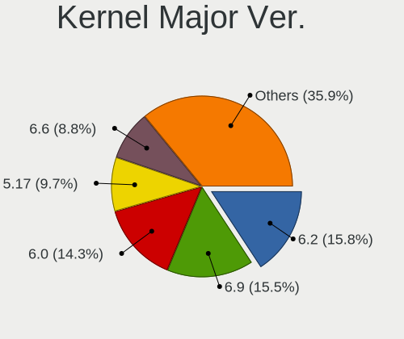
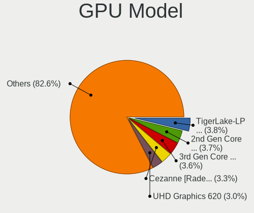
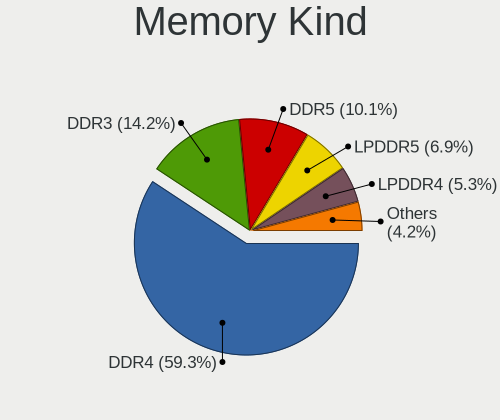

Pop!_OS 22.04 - Tested Hardware & Statistics (Notebooks)
--------------------------------------------------------

A project to collect tested hardware configurations for Pop!_OS 22.04.

Anyone can contribute to this report by the [hw-probe](https://github.com/linuxhw/hw-probe) tool:

    sudo -E hw-probe -all -upload

Please contribute! Especially if your hardware is rare.

Contents
--------

* [ Test Cases ](#test-cases)

* [ System ](#system)
  - [ Kernel                   ](#kernel)
  - [ Kernel Family            ](#kernel-family)
  - [ Kernel Major Ver.        ](#kernel-major-ver)
  - [ Arch                     ](#arch)
  - [ DE                       ](#de)
  - [ Display Server           ](#display-server)
  - [ Display Manager          ](#display-manager)
  - [ OS Lang                  ](#os-lang)
  - [ Boot Mode                ](#boot-mode)
  - [ Filesystem               ](#filesystem)
  - [ Part. scheme             ](#part-scheme)
  - [ Dual Boot with Linux/BSD ](#dual-boot-with-linuxbsd)
  - [ Dual Boot (Win)          ](#dual-boot-win)

* [ Board ](#board)
  - [ Vendor                   ](#vendor)
  - [ Model                    ](#model)
  - [ Model Family             ](#model-family)
  - [ MFG Year                 ](#mfg-year)
  - [ Form Factor              ](#form-factor)
  - [ Secure Boot              ](#secure-boot)
  - [ Coreboot                 ](#coreboot)
  - [ RAM Size                 ](#ram-size)
  - [ RAM Used                 ](#ram-used)
  - [ Total Drives             ](#total-drives)
  - [ Has CD-ROM               ](#has-cd-rom)
  - [ Has Ethernet             ](#has-ethernet)
  - [ Has WiFi                 ](#has-wifi)
  - [ Has Bluetooth            ](#has-bluetooth)

* [ Location ](#location)
  - [ Country                  ](#country)
  - [ City                     ](#city)

* [ Drives ](#drives)
  - [ Drive Vendor             ](#drive-vendor)
  - [ Drive Model              ](#drive-model)
  - [ HDD Vendor               ](#hdd-vendor)
  - [ SSD Vendor               ](#ssd-vendor)
  - [ Drive Kind               ](#drive-kind)
  - [ Drive Connector          ](#drive-connector)
  - [ Drive Size               ](#drive-size)
  - [ Space Total              ](#space-total)
  - [ Space Used               ](#space-used)
  - [ Malfunc. Drives          ](#malfunc-drives)
  - [ Malfunc. Drive Vendor    ](#malfunc-drive-vendor)
  - [ Malfunc. HDD Vendor      ](#malfunc-hdd-vendor)
  - [ Malfunc. Drive Kind      ](#malfunc-drive-kind)
  - [ Failed Drives            ](#failed-drives)
  - [ Failed Drive Vendor      ](#failed-drive-vendor)
  - [ Drive Status             ](#drive-status)

* [ Storage controller ](#storage-controller)
  - [ Storage Vendor           ](#storage-vendor)
  - [ Storage Model            ](#storage-model)
  - [ Storage Kind             ](#storage-kind)

* [ Processor ](#processor)
  - [ CPU Vendor               ](#cpu-vendor)
  - [ CPU Model                ](#cpu-model)
  - [ CPU Model Family         ](#cpu-model-family)
  - [ CPU Cores                ](#cpu-cores)
  - [ CPU Sockets              ](#cpu-sockets)
  - [ CPU Threads              ](#cpu-threads)
  - [ CPU Op-Modes             ](#cpu-op-modes)
  - [ CPU Microcode            ](#cpu-microcode)
  - [ CPU Microarch            ](#cpu-microarch)

* [ Graphics ](#graphics)
  - [ GPU Vendor               ](#gpu-vendor)
  - [ GPU Model                ](#gpu-model)
  - [ GPU Combo                ](#gpu-combo)
  - [ GPU Driver               ](#gpu-driver)
  - [ GPU Memory               ](#gpu-memory)

* [ Monitor ](#monitor)
  - [ Monitor Vendor           ](#monitor-vendor)
  - [ Monitor Model            ](#monitor-model)
  - [ Monitor Resolution       ](#monitor-resolution)
  - [ Monitor Diagonal         ](#monitor-diagonal)
  - [ Monitor Width            ](#monitor-width)
  - [ Aspect Ratio             ](#aspect-ratio)
  - [ Monitor Area             ](#monitor-area)
  - [ Pixel Density            ](#pixel-density)
  - [ Multiple Monitors        ](#multiple-monitors)

* [ Network ](#network)
  - [ Net Controller Vendor    ](#net-controller-vendor)
  - [ Net Controller Model     ](#net-controller-model)
  - [ Wireless Vendor          ](#wireless-vendor)
  - [ Wireless Model           ](#wireless-model)
  - [ Ethernet Vendor          ](#ethernet-vendor)
  - [ Ethernet Model           ](#ethernet-model)
  - [ Net Controller Kind      ](#net-controller-kind)
  - [ Used Controller          ](#used-controller)
  - [ NICs                     ](#nics)
  - [ IPv6                     ](#ipv6)

* [ Bluetooth ](#bluetooth)
  - [ Bluetooth Vendor         ](#bluetooth-vendor)
  - [ Bluetooth Model          ](#bluetooth-model)

* [ Sound ](#sound)
  - [ Sound Vendor             ](#sound-vendor)
  - [ Sound Model              ](#sound-model)

* [ Memory ](#memory)
  - [ Memory Vendor            ](#memory-vendor)
  - [ Memory Model             ](#memory-model)
  - [ Memory Kind              ](#memory-kind)
  - [ Memory Form Factor       ](#memory-form-factor)
  - [ Memory Size              ](#memory-size)
  - [ Memory Speed             ](#memory-speed)

* [ Printers & scanners ](#printers--scanners)
  - [ Printer Vendor           ](#printer-vendor)
  - [ Printer Model            ](#printer-model)
  - [ Scanner Vendor           ](#scanner-vendor)
  - [ Scanner Model            ](#scanner-model)

* [ Camera ](#camera)
  - [ Camera Vendor            ](#camera-vendor)
  - [ Camera Model             ](#camera-model)

* [ Security ](#security)
  - [ Fingerprint Vendor       ](#fingerprint-vendor)
  - [ Fingerprint Model        ](#fingerprint-model)
  - [ Chipcard Vendor          ](#chipcard-vendor)
  - [ Chipcard Model           ](#chipcard-model)

* [ Unsupported ](#unsupported)
  - [ Unsupported Devices      ](#unsupported-devices)
  - [ Unsupported Device Types ](#unsupported-device-types)

Test Cases
----------

Total: 1585

| Vendor        | Model                       | Probe                                                      | Date         |
|---------------|-----------------------------|------------------------------------------------------------|--------------|
| Lenovo        | IdeaPad S530-13IWL 81J7     | [6ed194a014](https://linux-hardware.org/?probe=6ed194a014) | Feb 01, 2023 |
| Timi          | Mi NoteBook Ultra           | [d897ec0114](https://linux-hardware.org/?probe=d897ec0114) | Feb 01, 2023 |
| Lenovo        | ThinkPad X220 Tablet 429... | [c4869ecf2c](https://linux-hardware.org/?probe=c4869ecf2c) | Feb 01, 2023 |
| Acer          | Predator PH517-61           | [b16ddc31d8](https://linux-hardware.org/?probe=b16ddc31d8) | Feb 01, 2023 |
| Dell          | Latitude E7240              | [fe655eca77](https://linux-hardware.org/?probe=fe655eca77) | Jan 31, 2023 |
| Lenovo        | IdeaPad S145-15IIL 82DJ     | [3803fd2405](https://linux-hardware.org/?probe=3803fd2405) | Jan 31, 2023 |
| Lenovo        | ThinkPad T14 Gen 2a 20XK... | [db8bdbd72b](https://linux-hardware.org/?probe=db8bdbd72b) | Jan 31, 2023 |
| Dell          | Inspiron 7400               | [a6b124fd34](https://linux-hardware.org/?probe=a6b124fd34) | Jan 31, 2023 |
| Apple         | MacBookPro12,1              | [228ab40738](https://linux-hardware.org/?probe=228ab40738) | Jan 31, 2023 |
| HP            | Notebook                    | [82d58b21c4](https://linux-hardware.org/?probe=82d58b21c4) | Jan 31, 2023 |
| HP            | ZBook Studio G3             | [506988f4ba](https://linux-hardware.org/?probe=506988f4ba) | Jan 31, 2023 |
| HP            | ENVY Laptop 13-ah0xxx       | [7636aeaacc](https://linux-hardware.org/?probe=7636aeaacc) | Jan 31, 2023 |
| Lenovo        | ThinkPad X220 Tablet 429... | [230b38f8e6](https://linux-hardware.org/?probe=230b38f8e6) | Jan 31, 2023 |
| Acer          | Swift SF114-32              | [82d317899e](https://linux-hardware.org/?probe=82d317899e) | Jan 31, 2023 |
| Dell          | XPS 15 9500                 | [6a0af9dbcb](https://linux-hardware.org/?probe=6a0af9dbcb) | Jan 31, 2023 |
| Lenovo        | IdeaPad S145-15API 81V7     | [2474b4641c](https://linux-hardware.org/?probe=2474b4641c) | Jan 30, 2023 |
| GPU Compan... | GWTN141-10                  | [f012d6d71c](https://linux-hardware.org/?probe=f012d6d71c) | Jan 30, 2023 |
| ASUSTek       | UX310UQK                    | [d4aec33c44](https://linux-hardware.org/?probe=d4aec33c44) | Jan 30, 2023 |
| ASUSTek       | UX310UQK                    | [58e7588538](https://linux-hardware.org/?probe=58e7588538) | Jan 30, 2023 |
| Acer          | Swift SF114-32              | [1228d6d0f7](https://linux-hardware.org/?probe=1228d6d0f7) | Jan 30, 2023 |
| Dell          | G15 5511                    | [36214ba4de](https://linux-hardware.org/?probe=36214ba4de) | Jan 30, 2023 |
| Dell          | Latitude E7240              | [a1f713f6e3](https://linux-hardware.org/?probe=a1f713f6e3) | Jan 30, 2023 |
| Avell High... | B11 MOB                     | [dd9d29ddc7](https://linux-hardware.org/?probe=dd9d29ddc7) | Jan 30, 2023 |
| Acer          | Aspire A515-45              | [42405a6a0c](https://linux-hardware.org/?probe=42405a6a0c) | Jan 30, 2023 |
| HP            | Pavilion dv6                | [0966ae419c](https://linux-hardware.org/?probe=0966ae419c) | Jan 30, 2023 |
| ASUSTek       | X555LD                      | [b70d834fe5](https://linux-hardware.org/?probe=b70d834fe5) | Jan 29, 2023 |
| Dell          | G15 5515                    | [1be125c3cd](https://linux-hardware.org/?probe=1be125c3cd) | Jan 29, 2023 |
| Lenovo        | ThinkPad Edge E540 20C60... | [ff3381fe1a](https://linux-hardware.org/?probe=ff3381fe1a) | Jan 28, 2023 |
| Lenovo        | IdeaPad C340-14API 81N6     | [c6770f3828](https://linux-hardware.org/?probe=c6770f3828) | Jan 28, 2023 |
| HP            | Pavilion dv6500             | [ec9bed5b5d](https://linux-hardware.org/?probe=ec9bed5b5d) | Jan 28, 2023 |
| ASUSTek       | ET2321I                     | [dbb162975e](https://linux-hardware.org/?probe=dbb162975e) | Jan 28, 2023 |
| MSI           | Vector GP76 12UHSO          | [549b690251](https://linux-hardware.org/?probe=549b690251) | Jan 28, 2023 |
| HP            | Pavilion dv6500             | [e225ce26a1](https://linux-hardware.org/?probe=e225ce26a1) | Jan 28, 2023 |
| MSI           | Vector GP76 12UHSO          | [cbbd1d3e3e](https://linux-hardware.org/?probe=cbbd1d3e3e) | Jan 28, 2023 |
| Dell          | XPS 13 9305                 | [684b829dbb](https://linux-hardware.org/?probe=684b829dbb) | Jan 28, 2023 |
| HP            | Pavilion Gaming Laptop 1... | [ce2955973a](https://linux-hardware.org/?probe=ce2955973a) | Jan 27, 2023 |
| System76      | Lemur Pro                   | [40c5731c48](https://linux-hardware.org/?probe=40c5731c48) | Jan 27, 2023 |
| Clevo         | W150HNM/W170HN              | [63709a14ca](https://linux-hardware.org/?probe=63709a14ca) | Jan 27, 2023 |
| Dell          | Latitude E7240              | [d88cdedff3](https://linux-hardware.org/?probe=d88cdedff3) | Jan 26, 2023 |
| Lenovo        | ThinkPad L14 Gen 1 20U6S... | [df04ffbd50](https://linux-hardware.org/?probe=df04ffbd50) | Jan 26, 2023 |
| Lenovo        | ThinkPad L14 Gen 1 20U6S... | [b2ffc58bb1](https://linux-hardware.org/?probe=b2ffc58bb1) | Jan 26, 2023 |
| Dell          | G3 3590                     | [8a7e4e4db0](https://linux-hardware.org/?probe=8a7e4e4db0) | Jan 26, 2023 |
| System76      | Lemur Pro                   | [097cd4c9f8](https://linux-hardware.org/?probe=097cd4c9f8) | Jan 26, 2023 |
| Gigabyte      | A5 K1                       | [e0771eb5f6](https://linux-hardware.org/?probe=e0771eb5f6) | Jan 25, 2023 |
| HP            | ProBook 6550b               | [c7983e417c](https://linux-hardware.org/?probe=c7983e417c) | Jan 25, 2023 |
| Timi          | RedmiBook Pro 15S           | [4629dc82aa](https://linux-hardware.org/?probe=4629dc82aa) | Jan 25, 2023 |
| ASUSTek       | VivoBook_ASUSLaptop X340... | [bc56140257](https://linux-hardware.org/?probe=bc56140257) | Jan 25, 2023 |
| Gigabyte      | A5 K1                       | [d5e00555ca](https://linux-hardware.org/?probe=d5e00555ca) | Jan 25, 2023 |
| Dell          | Inspiron 13-7353            | [5ebcba8c52](https://linux-hardware.org/?probe=5ebcba8c52) | Jan 25, 2023 |
| Dell          | Latitude E7240              | [2d488752b6](https://linux-hardware.org/?probe=2d488752b6) | Jan 25, 2023 |
| Dell          | System Inspiron N7110       | [935a295b28](https://linux-hardware.org/?probe=935a295b28) | Jan 25, 2023 |
| ASUSTek       | N551JW                      | [9694a30eff](https://linux-hardware.org/?probe=9694a30eff) | Jan 25, 2023 |
| Dell          | Latitude E7240              | [9d44efa2f9](https://linux-hardware.org/?probe=9d44efa2f9) | Jan 24, 2023 |
| Acer          | Swift SFA16-41              | [1c05334105](https://linux-hardware.org/?probe=1c05334105) | Jan 24, 2023 |
| LG Electro... | 17Z90Q-K.AAC7U1             | [73a0023203](https://linux-hardware.org/?probe=73a0023203) | Jan 24, 2023 |
| Google        | Link                        | [5c44e38153](https://linux-hardware.org/?probe=5c44e38153) | Jan 23, 2023 |
| Lenovo        | ThinkPad L13 Yoga Gen 2a... | [f6e09cc9fb](https://linux-hardware.org/?probe=f6e09cc9fb) | Jan 23, 2023 |
| Lenovo        | ThinkPad L13 Yoga Gen 2a... | [306e6ae925](https://linux-hardware.org/?probe=306e6ae925) | Jan 23, 2023 |
| HP            | Pavilion Laptop 14-dv0xx... | [821e7b4330](https://linux-hardware.org/?probe=821e7b4330) | Jan 22, 2023 |
| Purism        | Librem 15 v3                | [fcb1d44df6](https://linux-hardware.org/?probe=fcb1d44df6) | Jan 22, 2023 |
| Dell          | Latitude E5470              | [1a2810f035](https://linux-hardware.org/?probe=1a2810f035) | Jan 22, 2023 |
| HP            | Notebook                    | [57bf6826ef](https://linux-hardware.org/?probe=57bf6826ef) | Jan 22, 2023 |
| Lenovo        | ThinkPad L380 20M50013UK    | [0729d0a10f](https://linux-hardware.org/?probe=0729d0a10f) | Jan 22, 2023 |
| Dell          | XPS 13 9350                 | [223ab1f016](https://linux-hardware.org/?probe=223ab1f016) | Jan 22, 2023 |
| ASUSTek       | ASUS TUF Dash F15 FX516P... | [9b3b21f5b7](https://linux-hardware.org/?probe=9b3b21f5b7) | Jan 21, 2023 |
| HP            | Pavilion Laptop 14-dv0xx... | [22d9f43ef5](https://linux-hardware.org/?probe=22d9f43ef5) | Jan 21, 2023 |
| Razer x La... | TensorBook (late 2021)      | [9062d4274f](https://linux-hardware.org/?probe=9062d4274f) | Jan 21, 2023 |
| Dell          | Latitude 5300               | [e8c4218110](https://linux-hardware.org/?probe=e8c4218110) | Jan 21, 2023 |
| Lenovo        | ThinkPad T530 23943J8       | [1da6722b35](https://linux-hardware.org/?probe=1da6722b35) | Jan 21, 2023 |
| Dell          | Inspiron 5505               | [9a17165647](https://linux-hardware.org/?probe=9a17165647) | Jan 20, 2023 |
| Dell          | Inspiron 5505               | [e1003a85c9](https://linux-hardware.org/?probe=e1003a85c9) | Jan 20, 2023 |
| ASUSTek       | X442URR                     | [6104ee1f65](https://linux-hardware.org/?probe=6104ee1f65) | Jan 20, 2023 |
| Dell          | Latitude E7240              | [a4e01b187f](https://linux-hardware.org/?probe=a4e01b187f) | Jan 20, 2023 |
| HP            | Laptop 15-bw0xx             | [0bf7ea6726](https://linux-hardware.org/?probe=0bf7ea6726) | Jan 20, 2023 |
| Lenovo        | Legion 5 15ARH05H 82B1      | [c1169d55de](https://linux-hardware.org/?probe=c1169d55de) | Jan 19, 2023 |
| Dell          | Latitude E7240              | [475187029d](https://linux-hardware.org/?probe=475187029d) | Jan 19, 2023 |
| ASUSTek       | ROG Strix G512LU_G512LU     | [edc36777f0](https://linux-hardware.org/?probe=edc36777f0) | Jan 19, 2023 |
| HP            | ZBook Power 15.6 inch G9... | [b318baed4f](https://linux-hardware.org/?probe=b318baed4f) | Jan 19, 2023 |
| ASUSTek       | VivoBook_ASUSLaptop X515... | [eddf4927eb](https://linux-hardware.org/?probe=eddf4927eb) | Jan 19, 2023 |
| Razer         | Blade                       | [b3f154ac11](https://linux-hardware.org/?probe=b3f154ac11) | Jan 19, 2023 |
| Dell          | G5 5590                     | [01888c3049](https://linux-hardware.org/?probe=01888c3049) | Jan 19, 2023 |
| Dell          | Latitude E6540              | [440b0eec1c](https://linux-hardware.org/?probe=440b0eec1c) | Jan 18, 2023 |
| MSI           | Alpha 15 A3DDK              | [832ee11e43](https://linux-hardware.org/?probe=832ee11e43) | Jan 18, 2023 |
| HP            | OMEN Laptop 15-en1xxx       | [81d4385a14](https://linux-hardware.org/?probe=81d4385a14) | Jan 18, 2023 |
| Lenovo        | ThinkPad T560 20FH001QUS    | [933f67b6b5](https://linux-hardware.org/?probe=933f67b6b5) | Jan 18, 2023 |
| Dell          | Precision 7670              | [5c70243651](https://linux-hardware.org/?probe=5c70243651) | Jan 18, 2023 |
| Lenovo        | ThinkPad T560 20FH001QUS    | [48a56bd8c2](https://linux-hardware.org/?probe=48a56bd8c2) | Jan 18, 2023 |
| HP            | ZBook Firefly 15.6 inch ... | [ac28c1fba4](https://linux-hardware.org/?probe=ac28c1fba4) | Jan 18, 2023 |
| HP            | ZBook Firefly 15.6 inch ... | [45e2d0fb2d](https://linux-hardware.org/?probe=45e2d0fb2d) | Jan 18, 2023 |
| Dell          | Latitude E5440              | [eb945eac4e](https://linux-hardware.org/?probe=eb945eac4e) | Jan 18, 2023 |
| Lenovo        | IdeaPad 110-15ISK 80UD      | [8bf0f8c8fe](https://linux-hardware.org/?probe=8bf0f8c8fe) | Jan 17, 2023 |
| Lenovo        | IdeaPad 3 15IML05 82BS      | [18d3c84771](https://linux-hardware.org/?probe=18d3c84771) | Jan 17, 2023 |
| Lenovo        | IdeaPad 3 15IML05 82BS      | [bd0bc47120](https://linux-hardware.org/?probe=bd0bc47120) | Jan 17, 2023 |
| Framework     | Laptop                      | [e94774a411](https://linux-hardware.org/?probe=e94774a411) | Jan 17, 2023 |
| Acer          | Aspire 5625G                | [244d8473fc](https://linux-hardware.org/?probe=244d8473fc) | Jan 16, 2023 |
| Dell          | Latitude E7240              | [dc47f005d6](https://linux-hardware.org/?probe=dc47f005d6) | Jan 16, 2023 |
| Lenovo        | IdeaPad Y570 0862           | [8c43e56714](https://linux-hardware.org/?probe=8c43e56714) | Jan 16, 2023 |
| Chuwi         | GemiBook Pro                | [b51cc41cb3](https://linux-hardware.org/?probe=b51cc41cb3) | Jan 16, 2023 |
| System76      | Lemur Pro                   | [fde9d32359](https://linux-hardware.org/?probe=fde9d32359) | Jan 16, 2023 |
| Apple         | MacBook8,1                  | [64b089dfb7](https://linux-hardware.org/?probe=64b089dfb7) | Jan 15, 2023 |
| ASUSTek       | VivoBook_ASUSLaptop X421... | [db57593b81](https://linux-hardware.org/?probe=db57593b81) | Jan 14, 2023 |
| MSI           | Bravo 15 B5DD               | [ffb8653d34](https://linux-hardware.org/?probe=ffb8653d34) | Jan 14, 2023 |
| Dell          | Latitude E7240              | [76f54ae84c](https://linux-hardware.org/?probe=76f54ae84c) | Jan 14, 2023 |
| Dell          | Precision 3571              | [c71e32c6ea](https://linux-hardware.org/?probe=c71e32c6ea) | Jan 14, 2023 |
| Acer          | Predator PT315-52           | [149941b52c](https://linux-hardware.org/?probe=149941b52c) | Jan 14, 2023 |
| Dell          | Latitude E7240              | [9eed89d744](https://linux-hardware.org/?probe=9eed89d744) | Jan 14, 2023 |
| HP            | Pavilion Laptop 15-eh1xx... | [d10834c7df](https://linux-hardware.org/?probe=d10834c7df) | Jan 14, 2023 |
| System76      | Oryx Pro                    | [da1374fa1c](https://linux-hardware.org/?probe=da1374fa1c) | Jan 14, 2023 |
| Dell          | Latitude E7240              | [ed7ff7569c](https://linux-hardware.org/?probe=ed7ff7569c) | Jan 14, 2023 |
| Lenovo        | ThinkPad Edge E540 20C60... | [2860788f11](https://linux-hardware.org/?probe=2860788f11) | Jan 14, 2023 |
| HONOR         | NMH-WCX9                    | [10a9c33aed](https://linux-hardware.org/?probe=10a9c33aed) | Jan 13, 2023 |
| HP            | EliteBook 855 G8 Noteboo... | [362d8c4594](https://linux-hardware.org/?probe=362d8c4594) | Jan 13, 2023 |
| Dell          | Latitude 5300               | [148745c883](https://linux-hardware.org/?probe=148745c883) | Jan 13, 2023 |
| HP            | EliteBook 8570w             | [84035db95c](https://linux-hardware.org/?probe=84035db95c) | Jan 13, 2023 |
| Lenovo        | ThinkPad T500 2081CTO       | [96a079dbf8](https://linux-hardware.org/?probe=96a079dbf8) | Jan 13, 2023 |
| Lenovo        | ThinkPad T500 2081CTO       | [53b39e47e9](https://linux-hardware.org/?probe=53b39e47e9) | Jan 13, 2023 |
| Lenovo        | ThinkPad T460 20FMS2BM00    | [afefa18c04](https://linux-hardware.org/?probe=afefa18c04) | Jan 12, 2023 |
| HP            | Dev One Notebook PC         | [f7304c0af2](https://linux-hardware.org/?probe=f7304c0af2) | Jan 12, 2023 |
| Samsung       | 270E5J/2570EJ               | [22f9a03d68](https://linux-hardware.org/?probe=22f9a03d68) | Jan 12, 2023 |
| HP            | EliteBook 840 G5            | [a62af2c5a8](https://linux-hardware.org/?probe=a62af2c5a8) | Jan 11, 2023 |
| Dell          | Latitude E7240              | [93d832d08f](https://linux-hardware.org/?probe=93d832d08f) | Jan 11, 2023 |
| Lenovo        | IdeaPad Y570 20091          | [3538dd1b8a](https://linux-hardware.org/?probe=3538dd1b8a) | Jan 11, 2023 |
| Acer          | TravelMate P245-M           | [1722e41c8d](https://linux-hardware.org/?probe=1722e41c8d) | Jan 11, 2023 |
| ASUSTek       | ASUS TUF Dash F15 FX517Z... | [0f1f6b2662](https://linux-hardware.org/?probe=0f1f6b2662) | Jan 11, 2023 |
| Lenovo        | Legion 5 15ACH6H 82JU       | [a2363c6939](https://linux-hardware.org/?probe=a2363c6939) | Jan 11, 2023 |
| Acer          | Swift SF314-56              | [456445a93c](https://linux-hardware.org/?probe=456445a93c) | Jan 10, 2023 |
| Dell          | Latitude E7240              | [83a785903b](https://linux-hardware.org/?probe=83a785903b) | Jan 10, 2023 |
| HP            | EliteBook 840 G5            | [0eb6418a53](https://linux-hardware.org/?probe=0eb6418a53) | Jan 10, 2023 |
| HP            | OMEN by Laptop              | [a365222a35](https://linux-hardware.org/?probe=a365222a35) | Jan 09, 2023 |
| Razer x La... | TensorBook (late 2021)      | [d798473e75](https://linux-hardware.org/?probe=d798473e75) | Jan 09, 2023 |
| Lenovo        | Legion 5 15ACH6H 82JU       | [e384aea51e](https://linux-hardware.org/?probe=e384aea51e) | Jan 09, 2023 |
| Lenovo        | ThinkPad X1 Extreme Gen ... | [1829eed17a](https://linux-hardware.org/?probe=1829eed17a) | Jan 09, 2023 |
| Dell          | Latitude E7240              | [c191d76ac2](https://linux-hardware.org/?probe=c191d76ac2) | Jan 09, 2023 |
| HP            | Pavilion Gaming Laptop 1... | [07cc23f1cd](https://linux-hardware.org/?probe=07cc23f1cd) | Jan 08, 2023 |
| HP            | Pavilion Gaming Laptop 1... | [d784655474](https://linux-hardware.org/?probe=d784655474) | Jan 08, 2023 |
| Notebook      | PCX0DX                      | [7e17526b20](https://linux-hardware.org/?probe=7e17526b20) | Jan 08, 2023 |
| Notebook      | PCX0DX                      | [698649c9ae](https://linux-hardware.org/?probe=698649c9ae) | Jan 08, 2023 |
| Dell          | Latitude E7240              | [c7cf2afdd9](https://linux-hardware.org/?probe=c7cf2afdd9) | Jan 07, 2023 |
| HP            | ENVY dv6                    | [2a01900cb1](https://linux-hardware.org/?probe=2a01900cb1) | Jan 07, 2023 |
| ASUSTek       | VivoBook_ASUSLaptop X430... | [f191d63ace](https://linux-hardware.org/?probe=f191d63ace) | Jan 07, 2023 |
| Dell          | Latitude E7240              | [7018e90a09](https://linux-hardware.org/?probe=7018e90a09) | Jan 07, 2023 |
| System76      | Bonobo WS                   | [afb9abd3c6](https://linux-hardware.org/?probe=afb9abd3c6) | Jan 07, 2023 |
| Dell          | Latitude E7240              | [d4dc080444](https://linux-hardware.org/?probe=d4dc080444) | Jan 07, 2023 |
| Lenovo        | Y720-15IKB 80VR             | [ab9f1d1812](https://linux-hardware.org/?probe=ab9f1d1812) | Jan 07, 2023 |
| Lenovo        | Y720-15IKB 80VR             | [bf425a41f8](https://linux-hardware.org/?probe=bf425a41f8) | Jan 07, 2023 |
| Lenovo        | G580 20157                  | [63bc1e725c](https://linux-hardware.org/?probe=63bc1e725c) | Jan 07, 2023 |
| Lenovo        | IdeaPad 330S-14IKB 81F4     | [43f6676d9d](https://linux-hardware.org/?probe=43f6676d9d) | Jan 06, 2023 |
| Dell          | Latitude 7520               | [f4f253a52b](https://linux-hardware.org/?probe=f4f253a52b) | Jan 06, 2023 |
| Apple         | MacBookPro12,1              | [67f40c78ec](https://linux-hardware.org/?probe=67f40c78ec) | Jan 06, 2023 |
| Apple         | MacBookPro12,1              | [58f2e834d8](https://linux-hardware.org/?probe=58f2e834d8) | Jan 06, 2023 |
| Dell          | Precision M4700             | [414d8c4701](https://linux-hardware.org/?probe=414d8c4701) | Jan 06, 2023 |
| Dell          | Latitude E7240              | [b00208bba7](https://linux-hardware.org/?probe=b00208bba7) | Jan 06, 2023 |
| Dell          | Latitude E7240              | [6eae9dc932](https://linux-hardware.org/?probe=6eae9dc932) | Jan 05, 2023 |
| ASUSTek       | Zephyrus G GU502DU_GA502... | [7acb37a2f5](https://linux-hardware.org/?probe=7acb37a2f5) | Jan 05, 2023 |
| HP            | ZBook Power 15.6 inch G8... | [28eb8d09fa](https://linux-hardware.org/?probe=28eb8d09fa) | Jan 05, 2023 |
| Acer          | Aspire 7745G                | [4f54cd1f61](https://linux-hardware.org/?probe=4f54cd1f61) | Jan 05, 2023 |
| Acer          | Aspire 7745G                | [0393900e99](https://linux-hardware.org/?probe=0393900e99) | Jan 05, 2023 |
| System76      | Gazelle                     | [b603d1ecc7](https://linux-hardware.org/?probe=b603d1ecc7) | Jan 04, 2023 |
| HP            | EliteBook 840 G3            | [8f42c7bc8c](https://linux-hardware.org/?probe=8f42c7bc8c) | Jan 04, 2023 |
| Datto         | Unknown                     | [e8c9c2e91f](https://linux-hardware.org/?probe=e8c9c2e91f) | Jan 04, 2023 |
| Dell          | XPS 13 9300                 | [7b1ce41c16](https://linux-hardware.org/?probe=7b1ce41c16) | Jan 03, 2023 |
| Lenovo        | Y720-15IKB 80VR             | [f6d1d35842](https://linux-hardware.org/?probe=f6d1d35842) | Jan 02, 2023 |
| Panasonic     | FZ55-1                      | [b09d64c936](https://linux-hardware.org/?probe=b09d64c936) | Jan 02, 2023 |
| Fujitsu       | FMVNS6C3                    | [49d8591166](https://linux-hardware.org/?probe=49d8591166) | Jan 02, 2023 |
| ASUSTek       | Zephyrus G GU502DU_GA502... | [1490ccc480](https://linux-hardware.org/?probe=1490ccc480) | Jan 02, 2023 |
| Dell          | Latitude E7240              | [ccf48432e0](https://linux-hardware.org/?probe=ccf48432e0) | Jan 02, 2023 |
| Lenovo        | Legion Y540-15IRH 81SX      | [5e52308407](https://linux-hardware.org/?probe=5e52308407) | Jan 02, 2023 |
| Lenovo        | ThinkPad X1 Carbon 6th 2... | [d841c27fe1](https://linux-hardware.org/?probe=d841c27fe1) | Jan 02, 2023 |
| ASUSTek       | UX310UQK                    | [79baf6f82a](https://linux-hardware.org/?probe=79baf6f82a) | Jan 01, 2023 |
| Dell          | Latitude E7270              | [09f72d101d](https://linux-hardware.org/?probe=09f72d101d) | Jan 01, 2023 |
| Dell          | XPS 9320                    | [28342f1b5c](https://linux-hardware.org/?probe=28342f1b5c) | Jan 01, 2023 |
| HP            | ZBook 15 G3                 | [a53517f382](https://linux-hardware.org/?probe=a53517f382) | Jan 01, 2023 |
| Dell          | XPS 9320                    | [4ef3eb6975](https://linux-hardware.org/?probe=4ef3eb6975) | Jan 01, 2023 |
| Lenovo        | Y520-15IKBN 80WK            | [9f2441851f](https://linux-hardware.org/?probe=9f2441851f) | Dec 31, 2022 |
| HP            | EliteBook 8740w (WH274UT... | [e42d4e66a0](https://linux-hardware.org/?probe=e42d4e66a0) | Dec 31, 2022 |
| MSI           | GE60 2OC\2OE                | [c307379c36](https://linux-hardware.org/?probe=c307379c36) | Dec 30, 2022 |
| Dell          | G3 3500                     | [6be65a4ee5](https://linux-hardware.org/?probe=6be65a4ee5) | Dec 30, 2022 |
| Lenovo        | Z50-70 20354                | [29984f68c6](https://linux-hardware.org/?probe=29984f68c6) | Dec 30, 2022 |
| Apple         | MacBookPro7,1               | [db4379ed1e](https://linux-hardware.org/?probe=db4379ed1e) | Dec 30, 2022 |
| ASUSTek       | ASUS TUF Gaming A15 FA50... | [3f1ca6740d](https://linux-hardware.org/?probe=3f1ca6740d) | Dec 30, 2022 |
| Dell          | Latitude E7240              | [5f83c8f4ad](https://linux-hardware.org/?probe=5f83c8f4ad) | Dec 30, 2022 |
| Lenovo        | IdeaPad 330-15IKB 81FE      | [d048930c78](https://linux-hardware.org/?probe=d048930c78) | Dec 30, 2022 |
| Dell          | G5 5590                     | [dada63bf04](https://linux-hardware.org/?probe=dada63bf04) | Dec 30, 2022 |
| HP            | Pavilion 15                 | [956866bbdd](https://linux-hardware.org/?probe=956866bbdd) | Dec 29, 2022 |
| ASUSTek       | Zephyrus G GU502DU_GA502... | [aa2aad674b](https://linux-hardware.org/?probe=aa2aad674b) | Dec 29, 2022 |
| Lenovo        | ThinkPad W510 4389W14       | [c83a9ac8a9](https://linux-hardware.org/?probe=c83a9ac8a9) | Dec 29, 2022 |
| Lenovo        | Legion 5 Pro 16ITH6H 82J... | [467a749806](https://linux-hardware.org/?probe=467a749806) | Dec 29, 2022 |
| System76      | Lemur Pro                   | [0a61e4fe8d](https://linux-hardware.org/?probe=0a61e4fe8d) | Dec 29, 2022 |
| HP            | ENVY dv7                    | [97e029af78](https://linux-hardware.org/?probe=97e029af78) | Dec 29, 2022 |
| Apple         | MacBookPro14,1              | [2bd4899c8a](https://linux-hardware.org/?probe=2bd4899c8a) | Dec 29, 2022 |
| Apple         | MacBookPro14,1              | [919cfc2c9c](https://linux-hardware.org/?probe=919cfc2c9c) | Dec 29, 2022 |
| HP            | Pavilion Notebook 15-bc5... | [f2ea0a18c8](https://linux-hardware.org/?probe=f2ea0a18c8) | Dec 28, 2022 |
| HP            | Pavilion Notebook 15-bc5... | [2e62e57e1c](https://linux-hardware.org/?probe=2e62e57e1c) | Dec 28, 2022 |
| ASUSTek       | P453UA                      | [0bf89f0f8f](https://linux-hardware.org/?probe=0bf89f0f8f) | Dec 28, 2022 |
| Lenovo        | Y50-70 20378                | [fe7926d39a](https://linux-hardware.org/?probe=fe7926d39a) | Dec 28, 2022 |
| Lenovo        | ThinkPad P14s Gen 2a 21A... | [c844147ffd](https://linux-hardware.org/?probe=c844147ffd) | Dec 28, 2022 |
| Alienware     | M11x R2                     | [a0da72bec0](https://linux-hardware.org/?probe=a0da72bec0) | Dec 28, 2022 |
| Dell          | Inspiron 5505               | [ba2d75cfa7](https://linux-hardware.org/?probe=ba2d75cfa7) | Dec 28, 2022 |
| HP            | Pavilion Notebook 15-bc5... | [9cc79e51c0](https://linux-hardware.org/?probe=9cc79e51c0) | Dec 28, 2022 |
| HUAWEI        | HVY-WXX9                    | [069f0917d6](https://linux-hardware.org/?probe=069f0917d6) | Dec 28, 2022 |
| Apple         | MacBookPro8,2               | [e4255e8ed7](https://linux-hardware.org/?probe=e4255e8ed7) | Dec 28, 2022 |
| HP            | Laptop 15s-eq2xxx           | [6a2f859c67](https://linux-hardware.org/?probe=6a2f859c67) | Dec 27, 2022 |
| Acer          | Aspire A515-57              | [470c8d54ba](https://linux-hardware.org/?probe=470c8d54ba) | Dec 27, 2022 |
| Apple         | MacBookPro8,2               | [c62b37d15c](https://linux-hardware.org/?probe=c62b37d15c) | Dec 27, 2022 |
| Acer          | Aspire A515-57              | [c0a659dbb1](https://linux-hardware.org/?probe=c0a659dbb1) | Dec 27, 2022 |
| Dell          | XPS 15 9500                 | [d1d8257c05](https://linux-hardware.org/?probe=d1d8257c05) | Dec 27, 2022 |
| Lenovo        | ThinkBook 15-IML 20RW       | [2195143f19](https://linux-hardware.org/?probe=2195143f19) | Dec 27, 2022 |
| Lenovo        | ThinkBook 15-IML 20RW       | [73e9da47ae](https://linux-hardware.org/?probe=73e9da47ae) | Dec 27, 2022 |
| HP            | Pavilion dv6                | [d759125511](https://linux-hardware.org/?probe=d759125511) | Dec 26, 2022 |
| Acer          | Swift SF314-511             | [b8ad48c33c](https://linux-hardware.org/?probe=b8ad48c33c) | Dec 26, 2022 |
| Apple         | MacBookPro14,1              | [eb6c6ee49e](https://linux-hardware.org/?probe=eb6c6ee49e) | Dec 26, 2022 |
| ASUSTek       | N550JV                      | [748284a21e](https://linux-hardware.org/?probe=748284a21e) | Dec 26, 2022 |
| Dell          | XPS 13 9360                 | [bddcc1503f](https://linux-hardware.org/?probe=bddcc1503f) | Dec 26, 2022 |
| Acer          | Aspire A114-32              | [593969da1f](https://linux-hardware.org/?probe=593969da1f) | Dec 26, 2022 |
| Avell High... | C62 MOB                     | [658f34e70d](https://linux-hardware.org/?probe=658f34e70d) | Dec 26, 2022 |
| Lenovo        | IdeaPad S145-15API 81V7     | [46687a6be3](https://linux-hardware.org/?probe=46687a6be3) | Dec 26, 2022 |
| Sony          | VGN-FW21E                   | [e5eb6c865f](https://linux-hardware.org/?probe=e5eb6c865f) | Dec 25, 2022 |
| GPD           | G1621-02                    | [10a7e912f8](https://linux-hardware.org/?probe=10a7e912f8) | Dec 25, 2022 |
| Lenovo        | Y520-15IKBN 80WK            | [576fb3852f](https://linux-hardware.org/?probe=576fb3852f) | Dec 25, 2022 |
| ASUSTek       | ASUS TUF Gaming F15 FX50... | [9ea4a13b0f](https://linux-hardware.org/?probe=9ea4a13b0f) | Dec 25, 2022 |
| HP            | 255 G8 Notebook PC          | [3f72d88324](https://linux-hardware.org/?probe=3f72d88324) | Dec 24, 2022 |
| ASUSTek       | VivoBook_ASUSLaptop M160... | [de111c3be5](https://linux-hardware.org/?probe=de111c3be5) | Dec 24, 2022 |
| HP            | EliteBook 865 16 inch G9... | [857cb922f9](https://linux-hardware.org/?probe=857cb922f9) | Dec 24, 2022 |
| Dell          | Latitude E7470              | [8e6bdc1809](https://linux-hardware.org/?probe=8e6bdc1809) | Dec 24, 2022 |
| System76      | Pangolin                    | [2ee273cbcf](https://linux-hardware.org/?probe=2ee273cbcf) | Dec 24, 2022 |
| Lenovo        | ThinkPad T14 Gen 1 20UD0... | [214b2a3235](https://linux-hardware.org/?probe=214b2a3235) | Dec 23, 2022 |
| HP            | Laptop 14s-dk0xxx           | [53aa474cf5](https://linux-hardware.org/?probe=53aa474cf5) | Dec 23, 2022 |
| Timi          | TM1703                      | [5e25655f36](https://linux-hardware.org/?probe=5e25655f36) | Dec 23, 2022 |
| Toshiba       | Satellite Pro C50-A-1MX     | [78487975ce](https://linux-hardware.org/?probe=78487975ce) | Dec 23, 2022 |
| Dell          | Latitude E7240              | [918223cece](https://linux-hardware.org/?probe=918223cece) | Dec 23, 2022 |
| Medion        | X6816                       | [bafbf1ea90](https://linux-hardware.org/?probe=bafbf1ea90) | Dec 23, 2022 |
| Medion        | X6816                       | [ac9627e5d4](https://linux-hardware.org/?probe=ac9627e5d4) | Dec 23, 2022 |
| Dell          | Latitude E7240              | [7bd2309063](https://linux-hardware.org/?probe=7bd2309063) | Dec 23, 2022 |
| Lenovo        | IdeaPad 5 15ARE05 81YQ      | [d7b8ef01e2](https://linux-hardware.org/?probe=d7b8ef01e2) | Dec 23, 2022 |
| Lenovo        | Legion 5 15ARH05H 82B1      | [db7dc4fa25](https://linux-hardware.org/?probe=db7dc4fa25) | Dec 22, 2022 |
| Lenovo        | Legion 5 15ARH05H 82B1      | [e8ac233c29](https://linux-hardware.org/?probe=e8ac233c29) | Dec 22, 2022 |
| ASUSTek       | K53SJ                       | [341becfd8a](https://linux-hardware.org/?probe=341becfd8a) | Dec 22, 2022 |
| ASUSTek       | ROG Zephyrus G14 GA401QM... | [ad4be7f0fa](https://linux-hardware.org/?probe=ad4be7f0fa) | Dec 22, 2022 |
| ASUSTek       | ROG Zephyrus G14 GA401QM... | [a70ba97a7a](https://linux-hardware.org/?probe=a70ba97a7a) | Dec 22, 2022 |
| ASUSTek       | K53SJ                       | [e60df2d8ba](https://linux-hardware.org/?probe=e60df2d8ba) | Dec 22, 2022 |
| Acer          | Swift SF314-512             | [505ab3f60a](https://linux-hardware.org/?probe=505ab3f60a) | Dec 22, 2022 |
| Dell          | Latitude E7240              | [d81efafde1](https://linux-hardware.org/?probe=d81efafde1) | Dec 22, 2022 |
| System76      | Lemur Pro                   | [ed549bfe74](https://linux-hardware.org/?probe=ed549bfe74) | Dec 21, 2022 |
| System76      | Lemur Pro                   | [30be17e71c](https://linux-hardware.org/?probe=30be17e71c) | Dec 21, 2022 |
| Dell          | Precision 3520              | [1763494294](https://linux-hardware.org/?probe=1763494294) | Dec 21, 2022 |
| ASUSTek       | Strix 15 GL503GE            | [0377cc3170](https://linux-hardware.org/?probe=0377cc3170) | Dec 21, 2022 |
| Dell          | Latitude E7240              | [545294a23a](https://linux-hardware.org/?probe=545294a23a) | Dec 21, 2022 |
| Apple         | MacBookPro12,1              | [debd2eb829](https://linux-hardware.org/?probe=debd2eb829) | Dec 21, 2022 |
| Dell          | Inspiron 5515               | [b0df20f3d1](https://linux-hardware.org/?probe=b0df20f3d1) | Dec 21, 2022 |
| ASUSTek       | ASUS TUF Gaming F15 FX50... | [7d5914dcb2](https://linux-hardware.org/?probe=7d5914dcb2) | Dec 21, 2022 |
| Dell          | Latitude E7240              | [a368a7be00](https://linux-hardware.org/?probe=a368a7be00) | Dec 21, 2022 |
| ASUSTek       | VivoBook S14 X411UF         | [894f0ab5df](https://linux-hardware.org/?probe=894f0ab5df) | Dec 21, 2022 |
| ASUSTek       | N53SM                       | [9c9b1d3f5b](https://linux-hardware.org/?probe=9c9b1d3f5b) | Dec 21, 2022 |
| Lenovo        | Y70-70 Touch 80DU           | [d5a877b2c6](https://linux-hardware.org/?probe=d5a877b2c6) | Dec 20, 2022 |
| Acer          | Aspire A315-23G             | [b7999f8a61](https://linux-hardware.org/?probe=b7999f8a61) | Dec 20, 2022 |
| Acer          | Aspire A315-23G             | [04b9163920](https://linux-hardware.org/?probe=04b9163920) | Dec 19, 2022 |
| Lenovo        | IdeaPad Z410 20292          | [e46710b0cf](https://linux-hardware.org/?probe=e46710b0cf) | Dec 19, 2022 |
| Dell          | Inspiron 7572               | [418178c3ca](https://linux-hardware.org/?probe=418178c3ca) | Dec 19, 2022 |
| Lenovo        | ThinkPad T480s 20L8S1QX0... | [76771fa0aa](https://linux-hardware.org/?probe=76771fa0aa) | Dec 19, 2022 |
| Chuwi         | GemiBook Pro                | [b34ce3474d](https://linux-hardware.org/?probe=b34ce3474d) | Dec 19, 2022 |
| System76      | Gazelle                     | [da46fb926a](https://linux-hardware.org/?probe=da46fb926a) | Dec 19, 2022 |
| Dell          | Inspiron 15-3567            | [f58039213b](https://linux-hardware.org/?probe=f58039213b) | Dec 18, 2022 |
| GPU Compan... | GWNR71517                   | [e680612eb4](https://linux-hardware.org/?probe=e680612eb4) | Dec 18, 2022 |
| Lenovo        | ThinkPad Edge E430 62718... | [92fede3d5a](https://linux-hardware.org/?probe=92fede3d5a) | Dec 18, 2022 |
| Avell High... | B.ON                        | [9661ece374](https://linux-hardware.org/?probe=9661ece374) | Dec 17, 2022 |
| Dell          | XPS 15 9510                 | [1641d91910](https://linux-hardware.org/?probe=1641d91910) | Dec 17, 2022 |
| Dell          | Inspiron 5458               | [8ed4687f2f](https://linux-hardware.org/?probe=8ed4687f2f) | Dec 16, 2022 |
| System76      | Gazelle                     | [b5ef8cec53](https://linux-hardware.org/?probe=b5ef8cec53) | Dec 16, 2022 |
| Acer          | Aspire V5-571G              | [575a61802b](https://linux-hardware.org/?probe=575a61802b) | Dec 16, 2022 |
| Dell          | Latitude 3310               | [4066d1434e](https://linux-hardware.org/?probe=4066d1434e) | Dec 16, 2022 |
| Lenovo        | IdeaPad 5 15ARE05 81YQ      | [544e464dab](https://linux-hardware.org/?probe=544e464dab) | Dec 15, 2022 |
| Samsung       | 350V5C/351V5C/3540VC/344... | [18d67ba2ab](https://linux-hardware.org/?probe=18d67ba2ab) | Dec 15, 2022 |
| ALLDOCUBE     | i1405C                      | [10d8101488](https://linux-hardware.org/?probe=10d8101488) | Dec 15, 2022 |
| Fujitsu       | FMVNS6C3                    | [d7a6961431](https://linux-hardware.org/?probe=d7a6961431) | Dec 15, 2022 |
| Apple         | MacBookPro10,1              | [a22dd35e04](https://linux-hardware.org/?probe=a22dd35e04) | Dec 14, 2022 |
| Apple         | MacBookPro11,3              | [d0c2bf600a](https://linux-hardware.org/?probe=d0c2bf600a) | Dec 14, 2022 |
| Lenovo        | IdeaPad 330-15ARR 81D2      | [d623f983cd](https://linux-hardware.org/?probe=d623f983cd) | Dec 13, 2022 |
| Lenovo        | G505 20240                  | [e6777c2fbc](https://linux-hardware.org/?probe=e6777c2fbc) | Dec 13, 2022 |
| HP            | Pavilion Aero Laptop 13-... | [b08795ce45](https://linux-hardware.org/?probe=b08795ce45) | Dec 13, 2022 |
| Lenovo        | ThinkPad T530 23943J8       | [e5d69d9f81](https://linux-hardware.org/?probe=e5d69d9f81) | Dec 13, 2022 |
| Apple         | MacBookPro9,2               | [2981da7231](https://linux-hardware.org/?probe=2981da7231) | Dec 12, 2022 |
| MSI           | Summit E16Flip A12UCT       | [1db3976bb5](https://linux-hardware.org/?probe=1db3976bb5) | Dec 12, 2022 |
| Toshiba       | Satellite C55-C             | [777b365c04](https://linux-hardware.org/?probe=777b365c04) | Dec 12, 2022 |
| System76      | Gazelle                     | [8498636db6](https://linux-hardware.org/?probe=8498636db6) | Dec 12, 2022 |
| Lenovo        | Legion S7 16ARHA7 82UG      | [d438f3f50a](https://linux-hardware.org/?probe=d438f3f50a) | Dec 12, 2022 |
| Apple         | MacBookPro13,3              | [10b29f88c5](https://linux-hardware.org/?probe=10b29f88c5) | Dec 12, 2022 |
| Lenovo        | ThinkPad P17 Gen 2i 20YU... | [75a9a0c076](https://linux-hardware.org/?probe=75a9a0c076) | Dec 12, 2022 |
| ASUSTek       | K56CB                       | [94b056f1f4](https://linux-hardware.org/?probe=94b056f1f4) | Dec 12, 2022 |
| Lenovo        | ThinkPad E14 Gen 4 21E4C... | [7ffd00681b](https://linux-hardware.org/?probe=7ffd00681b) | Dec 12, 2022 |
| Lenovo        | Legion 5 15ACH6H 82JU       | [6de2a0ad33](https://linux-hardware.org/?probe=6de2a0ad33) | Dec 11, 2022 |
| ASUSTek       | ROG Flow X13 GV301QH_GV3... | [4b0492b053](https://linux-hardware.org/?probe=4b0492b053) | Dec 11, 2022 |
| Dell          | Latitude E7240              | [d6dddd9632](https://linux-hardware.org/?probe=d6dddd9632) | Dec 11, 2022 |
| Acer          | Aspire A515-44G             | [b85a211b25](https://linux-hardware.org/?probe=b85a211b25) | Dec 11, 2022 |
| ASUSTek       | ROG Flow X13 GV301QH_GV3... | [ca7d835a38](https://linux-hardware.org/?probe=ca7d835a38) | Dec 11, 2022 |
| System76      | Gazelle                     | [8b0297b19e](https://linux-hardware.org/?probe=8b0297b19e) | Dec 11, 2022 |
| Lenovo        | G470 20078                  | [65264ef208](https://linux-hardware.org/?probe=65264ef208) | Dec 11, 2022 |
| Fujitsu       | FMVNS6C3                    | [2cdacbc923](https://linux-hardware.org/?probe=2cdacbc923) | Dec 11, 2022 |
| Lenovo        | ThinkPad P17 Gen 2i 20YU... | [15695e4deb](https://linux-hardware.org/?probe=15695e4deb) | Dec 11, 2022 |
| ASUSTek       | VivoBook_ASUSLaptop X513... | [1a7d599cd5](https://linux-hardware.org/?probe=1a7d599cd5) | Dec 10, 2022 |
| ASUSTek       | ASUS TUF Gaming A17 FA70... | [040652df3d](https://linux-hardware.org/?probe=040652df3d) | Dec 10, 2022 |
| Lenovo        | G470 20078                  | [ea75ebf831](https://linux-hardware.org/?probe=ea75ebf831) | Dec 09, 2022 |
| Lenovo        | IdeaPad Gaming 3 15IAH7 ... | [2dc32e31b3](https://linux-hardware.org/?probe=2dc32e31b3) | Dec 09, 2022 |
| Lenovo        | ThinkPad L560 20F2S0DA00    | [e8fe4392be](https://linux-hardware.org/?probe=e8fe4392be) | Dec 09, 2022 |
| Lenovo        | ThinkPad L560 20F2S0DA00    | [cf32d7158c](https://linux-hardware.org/?probe=cf32d7158c) | Dec 09, 2022 |
| GPU Compan... | GWNR71517                   | [ef20df1d4f](https://linux-hardware.org/?probe=ef20df1d4f) | Dec 09, 2022 |
| Lenovo        | ThinkPad T440p 20AWS1200... | [8ce314db56](https://linux-hardware.org/?probe=8ce314db56) | Dec 08, 2022 |
| Lenovo        | ThinkPad T440p 20AWS1200... | [858f06f0e5](https://linux-hardware.org/?probe=858f06f0e5) | Dec 08, 2022 |
| Acer          | TravelMate P214-41-G2       | [cb52e49fa2](https://linux-hardware.org/?probe=cb52e49fa2) | Dec 08, 2022 |
| Dell          | G15 5515                    | [861bd0cabf](https://linux-hardware.org/?probe=861bd0cabf) | Dec 08, 2022 |
| Lenovo        | V15 G2 ITL 82KB             | [ca25d43c56](https://linux-hardware.org/?probe=ca25d43c56) | Dec 08, 2022 |
| Lenovo        | V15 G2 ITL 82KB             | [104e0e02d1](https://linux-hardware.org/?probe=104e0e02d1) | Dec 08, 2022 |
| LG Electro... | 16Z90P-K.AA78A1             | [1646f1763d](https://linux-hardware.org/?probe=1646f1763d) | Dec 08, 2022 |
| Avell High... | A62 LIV                     | [a4f96694c4](https://linux-hardware.org/?probe=a4f96694c4) | Dec 07, 2022 |
| Acer          | Aspire A515-45              | [7eebb7f601](https://linux-hardware.org/?probe=7eebb7f601) | Dec 07, 2022 |
| Dell          | Latitude E7240              | [632cda6ecd](https://linux-hardware.org/?probe=632cda6ecd) | Dec 07, 2022 |
| HP            | ENVY 17                     | [a19d90a89f](https://linux-hardware.org/?probe=a19d90a89f) | Dec 07, 2022 |
| ASUSTek       | VivoBook_ASUSLaptop X421... | [b5f311cc8f](https://linux-hardware.org/?probe=b5f311cc8f) | Dec 07, 2022 |
| Dell          | Inspiron 1750               | [e369c14198](https://linux-hardware.org/?probe=e369c14198) | Dec 07, 2022 |
| Lenovo        | IdeaPad Y560                | [64abd8c6fe](https://linux-hardware.org/?probe=64abd8c6fe) | Dec 06, 2022 |
| Fujitsu       | FMVNS6C3                    | [5b60c9dfd0](https://linux-hardware.org/?probe=5b60c9dfd0) | Dec 06, 2022 |
| Lenovo        | ThinkPad T440p 20AWS1200... | [05f4b7d7cf](https://linux-hardware.org/?probe=05f4b7d7cf) | Dec 06, 2022 |
| Lenovo        | ThinkPad L13 Yoga Gen 2a... | [86cd634760](https://linux-hardware.org/?probe=86cd634760) | Dec 06, 2022 |
| Lenovo        | ThinkPad T440p 20AWS1200... | [6f0ceb7a46](https://linux-hardware.org/?probe=6f0ceb7a46) | Dec 05, 2022 |
| Dell          | G5 5505                     | [f19a76c344](https://linux-hardware.org/?probe=f19a76c344) | Dec 05, 2022 |
| Samsung       | 300E4A/300E5A/300E7A/343... | [1798adf382](https://linux-hardware.org/?probe=1798adf382) | Dec 05, 2022 |
| ASUSTek       | UL50VT                      | [ff4edb7010](https://linux-hardware.org/?probe=ff4edb7010) | Dec 05, 2022 |
| HP            | ProBook 6450b               | [f602f6c0bc](https://linux-hardware.org/?probe=f602f6c0bc) | Dec 05, 2022 |
| HP            | ProBook 6450b               | [de39c86a4c](https://linux-hardware.org/?probe=de39c86a4c) | Dec 05, 2022 |
| System76      | Gazelle                     | [deb2c9b6c9](https://linux-hardware.org/?probe=deb2c9b6c9) | Dec 04, 2022 |
| HUAWEI        | KLVL-WXX9                   | [7687bdc111](https://linux-hardware.org/?probe=7687bdc111) | Dec 04, 2022 |
| Acer          | Nitro AN515-54              | [33f26cca4f](https://linux-hardware.org/?probe=33f26cca4f) | Dec 04, 2022 |
| HP            | Notebook                    | [610cea9ebc](https://linux-hardware.org/?probe=610cea9ebc) | Dec 04, 2022 |
| Dell          | Latitude E7240              | [6f34110d45](https://linux-hardware.org/?probe=6f34110d45) | Dec 04, 2022 |
| Unknown       | Unknown                     | [54c6593c53](https://linux-hardware.org/?probe=54c6593c53) | Dec 03, 2022 |
| Unknown       | Unknown                     | [7668b4d9a2](https://linux-hardware.org/?probe=7668b4d9a2) | Dec 03, 2022 |
| HP            | EliteBook 820 G3            | [6913ec89c8](https://linux-hardware.org/?probe=6913ec89c8) | Dec 03, 2022 |
| ASUSTek       | VivoBook_ASUS Laptop X50... | [4f36906529](https://linux-hardware.org/?probe=4f36906529) | Dec 02, 2022 |
| HP            | ProBook 450 G7 HP NOTEBO... | [2fe5c76c3c](https://linux-hardware.org/?probe=2fe5c76c3c) | Dec 02, 2022 |
| HP            | Notebook                    | [4184c8fa06](https://linux-hardware.org/?probe=4184c8fa06) | Dec 02, 2022 |
| Framework     | Laptop (12th Gen Intel C... | [9c5bc7ca10](https://linux-hardware.org/?probe=9c5bc7ca10) | Dec 02, 2022 |
| Lenovo        | ThinkPad X1 Extreme Gen ... | [0ade3eaab1](https://linux-hardware.org/?probe=0ade3eaab1) | Dec 02, 2022 |
| Lenovo        | ThinkPad X1 Extreme Gen ... | [a3746e8985](https://linux-hardware.org/?probe=a3746e8985) | Dec 01, 2022 |
| Lenovo        | IdeaPad Gaming 3 15IAH7 ... | [562e1f4b92](https://linux-hardware.org/?probe=562e1f4b92) | Dec 01, 2022 |
| Lenovo        | IdeaPad 3 15ALC6 82MF       | [c8ef49d294](https://linux-hardware.org/?probe=c8ef49d294) | Dec 01, 2022 |
| HP            | Pavilion dv7                | [aa6cdce8f8](https://linux-hardware.org/?probe=aa6cdce8f8) | Dec 01, 2022 |
| ASUSTek       | VivoBook_ASUSLaptop E410... | [62ae8cb7dc](https://linux-hardware.org/?probe=62ae8cb7dc) | Dec 01, 2022 |
| Dell          | Inspiron 13-5378            | [9d25b2f6e0](https://linux-hardware.org/?probe=9d25b2f6e0) | Dec 01, 2022 |
| Dell          | XPS 13 9310                 | [aadf1c39a0](https://linux-hardware.org/?probe=aadf1c39a0) | Dec 01, 2022 |
| Google        | Cyan                        | [4aa7125981](https://linux-hardware.org/?probe=4aa7125981) | Nov 30, 2022 |
| HP            | ZBook 14 G2                 | [b2bba919b2](https://linux-hardware.org/?probe=b2bba919b2) | Nov 30, 2022 |
| ASUSTek       | ASUS TUF Gaming A15 FA50... | [66b6e49eb5](https://linux-hardware.org/?probe=66b6e49eb5) | Nov 30, 2022 |
| Acer          | Nitro AN515-43              | [b315e85bda](https://linux-hardware.org/?probe=b315e85bda) | Nov 30, 2022 |
| MSI           | Modern 14 B5M               | [8277ece293](https://linux-hardware.org/?probe=8277ece293) | Nov 30, 2022 |
| Lenovo        | IdeaPad S145-15API 81V7     | [53ee9a8fb9](https://linux-hardware.org/?probe=53ee9a8fb9) | Nov 30, 2022 |
| HP            | Laptop 14-dq1xxx            | [b12534f13d](https://linux-hardware.org/?probe=b12534f13d) | Nov 30, 2022 |
| Dell          | Latitude E7240              | [8b0b984870](https://linux-hardware.org/?probe=8b0b984870) | Nov 29, 2022 |
| HP            | ProBook 450 G8              | [eec30c7857](https://linux-hardware.org/?probe=eec30c7857) | Nov 29, 2022 |
| HUAWEI        | NBD-WXX9                    | [e9932df850](https://linux-hardware.org/?probe=e9932df850) | Nov 29, 2022 |
| HUAWEI        | NBD-WXX9                    | [179ff76e75](https://linux-hardware.org/?probe=179ff76e75) | Nov 29, 2022 |
| HP            | Pavilion dv7                | [1ba2fdd19b](https://linux-hardware.org/?probe=1ba2fdd19b) | Nov 29, 2022 |
| HP            | Compaq nc6320 (GB940ES#A... | [bb417133ee](https://linux-hardware.org/?probe=bb417133ee) | Nov 29, 2022 |
| HP            | Compaq nc6320 (GB940ES#A... | [ddb2f42bcc](https://linux-hardware.org/?probe=ddb2f42bcc) | Nov 29, 2022 |
| Dell          | Latitude 5411               | [122facad78](https://linux-hardware.org/?probe=122facad78) | Nov 28, 2022 |
| HP            | Pavilion dv7                | [db7897d2fc](https://linux-hardware.org/?probe=db7897d2fc) | Nov 28, 2022 |
| Apple         | MacBookPro10,1              | [c0c2f77cdb](https://linux-hardware.org/?probe=c0c2f77cdb) | Nov 28, 2022 |
| Lenovo        | IdeaPad Y560                | [4918810cd1](https://linux-hardware.org/?probe=4918810cd1) | Nov 28, 2022 |
| Lenovo        | ThinkPad E15 Gen 4 21E60... | [16705fe86c](https://linux-hardware.org/?probe=16705fe86c) | Nov 28, 2022 |
| Dell          | Inspiron 15 5510            | [5ec5306c0f](https://linux-hardware.org/?probe=5ec5306c0f) | Nov 28, 2022 |
| Clevo         | W55xEU                      | [5ed799ba64](https://linux-hardware.org/?probe=5ed799ba64) | Nov 28, 2022 |
| MSI           | GP72 7RDX                   | [648eb6d88a](https://linux-hardware.org/?probe=648eb6d88a) | Nov 28, 2022 |
| Acer          | Aspire A515-57              | [984e01118e](https://linux-hardware.org/?probe=984e01118e) | Nov 28, 2022 |
| HP            | Laptop 14-fq1xxx            | [7837242848](https://linux-hardware.org/?probe=7837242848) | Nov 27, 2022 |
| Toshiba       | Satellite L775D             | [bf6fc6fd49](https://linux-hardware.org/?probe=bf6fc6fd49) | Nov 27, 2022 |
| Dell          | Latitude E6230              | [f3536b80de](https://linux-hardware.org/?probe=f3536b80de) | Nov 27, 2022 |
| Dell          | Latitude E6230              | [dbaae2beb7](https://linux-hardware.org/?probe=dbaae2beb7) | Nov 27, 2022 |
| Apple         | MacBookPro6,2               | [409c3edc19](https://linux-hardware.org/?probe=409c3edc19) | Nov 27, 2022 |
| Alienware     | 17                          | [08ebf1e9a2](https://linux-hardware.org/?probe=08ebf1e9a2) | Nov 27, 2022 |
| HP            | Laptop 14-fq1xxx            | [49dc64dc76](https://linux-hardware.org/?probe=49dc64dc76) | Nov 27, 2022 |
| Lenovo        | IdeaPad Gaming 3 15IAH7 ... | [935c9528be](https://linux-hardware.org/?probe=935c9528be) | Nov 26, 2022 |
| Dell          | Inspiron 3521               | [015854e59a](https://linux-hardware.org/?probe=015854e59a) | Nov 26, 2022 |
| HP            | ZBook 15                    | [2ff5969ae6](https://linux-hardware.org/?probe=2ff5969ae6) | Nov 26, 2022 |
| HP            | ZBook 15                    | [55e4fb5ba0](https://linux-hardware.org/?probe=55e4fb5ba0) | Nov 26, 2022 |
| ASUSTek       | ROG Flow X13 GV301QE_GV3... | [e784cdc15d](https://linux-hardware.org/?probe=e784cdc15d) | Nov 26, 2022 |
| Gigabyte      | AORUS 5 SE                  | [d9e1ceb3c1](https://linux-hardware.org/?probe=d9e1ceb3c1) | Nov 26, 2022 |
| HUAWEI        | MRGF-XX                     | [f60090b407](https://linux-hardware.org/?probe=f60090b407) | Nov 26, 2022 |
| Apple         | MacBookPro7,1               | [8268fc2c12](https://linux-hardware.org/?probe=8268fc2c12) | Nov 26, 2022 |
| HP            | ProBook 450 G5              | [9a8373739a](https://linux-hardware.org/?probe=9a8373739a) | Nov 26, 2022 |
| HP            | Victus by Laptop 16-e0xx... | [32ab0a36a4](https://linux-hardware.org/?probe=32ab0a36a4) | Nov 25, 2022 |
| Acer          | Aspire A315-54              | [b7269b7617](https://linux-hardware.org/?probe=b7269b7617) | Nov 24, 2022 |
| ASUSTek       | ASUS TUF Gaming A15 FA50... | [770e9d413e](https://linux-hardware.org/?probe=770e9d413e) | Nov 24, 2022 |
| ASUSTek       | ASUS TUF Dash F15 FX516P... | [f0bebe7a20](https://linux-hardware.org/?probe=f0bebe7a20) | Nov 24, 2022 |
| ASUSTek       | VivoBook_ASUSLaptop E210... | [ce5a80936d](https://linux-hardware.org/?probe=ce5a80936d) | Nov 24, 2022 |
| Lenovo        | IdeaPad 5 Pro 14ACN6 82L... | [dce6415c9e](https://linux-hardware.org/?probe=dce6415c9e) | Nov 23, 2022 |
| Lenovo        | IdeaPad Y560                | [154702cbc6](https://linux-hardware.org/?probe=154702cbc6) | Nov 23, 2022 |
| Dell          | XPS 15 7590                 | [2355853fda](https://linux-hardware.org/?probe=2355853fda) | Nov 23, 2022 |
| HP            | G62                         | [754a471519](https://linux-hardware.org/?probe=754a471519) | Nov 23, 2022 |
| ASUSTek       | Strix GL504GW_GL504GW       | [f06e160e11](https://linux-hardware.org/?probe=f06e160e11) | Nov 23, 2022 |
| Dell          | Latitude E7470              | [03725ebee3](https://linux-hardware.org/?probe=03725ebee3) | Nov 22, 2022 |
| Acer          | Aspire A515-57              | [4692ce22fb](https://linux-hardware.org/?probe=4692ce22fb) | Nov 22, 2022 |
| Acer          | Aspire A515-57              | [cb82f6d418](https://linux-hardware.org/?probe=cb82f6d418) | Nov 22, 2022 |
| Dell          | Latitude E6540              | [9a3ff03cbb](https://linux-hardware.org/?probe=9a3ff03cbb) | Nov 22, 2022 |
| Gigabyte      | AORUS 5 SE                  | [c88614e7f3](https://linux-hardware.org/?probe=c88614e7f3) | Nov 22, 2022 |
| MSI           | Katana GF76 11UG            | [e29dda268c](https://linux-hardware.org/?probe=e29dda268c) | Nov 21, 2022 |
| MSI           | Katana GF76 11UG            | [9627a23b1f](https://linux-hardware.org/?probe=9627a23b1f) | Nov 21, 2022 |
| Acer          | Aspire A515-45              | [b0b972f8ef](https://linux-hardware.org/?probe=b0b972f8ef) | Nov 21, 2022 |
| Dell          | Precision 7670              | [93f14c8b55](https://linux-hardware.org/?probe=93f14c8b55) | Nov 21, 2022 |
| Alienware     | 17                          | [16b37ce649](https://linux-hardware.org/?probe=16b37ce649) | Nov 21, 2022 |
| Acer          | Swift SF314-42              | [5ec428f8b3](https://linux-hardware.org/?probe=5ec428f8b3) | Nov 21, 2022 |
| Unknown       | Unknown                     | [5a06cde126](https://linux-hardware.org/?probe=5a06cde126) | Nov 20, 2022 |
| Lenovo        | ThinkPad X13 Gen 1 20UFC... | [6355251bd6](https://linux-hardware.org/?probe=6355251bd6) | Nov 20, 2022 |
| Lenovo        | IdeaPad 3 15ALC6 82MF       | [18f301f8c5](https://linux-hardware.org/?probe=18f301f8c5) | Nov 20, 2022 |
| Dell          | Vostro 3458                 | [9f05e54f99](https://linux-hardware.org/?probe=9f05e54f99) | Nov 20, 2022 |
| Lenovo        | Legion 5 15ARH7H 82RD       | [cba7abe277](https://linux-hardware.org/?probe=cba7abe277) | Nov 20, 2022 |
| Lenovo        | ThinkPad E490 20N8000RUK    | [6eb57e34de](https://linux-hardware.org/?probe=6eb57e34de) | Nov 20, 2022 |
| Apple         | MacBookPro11,2              | [03447c1967](https://linux-hardware.org/?probe=03447c1967) | Nov 20, 2022 |
| ASUSTek       | ZenBook UX425EA_UX425EA     | [d4bb2f3867](https://linux-hardware.org/?probe=d4bb2f3867) | Nov 19, 2022 |
| ASUSTek       | VivoBook_ASUSLaptop N740... | [37145c9282](https://linux-hardware.org/?probe=37145c9282) | Nov 19, 2022 |
| HP            | ProBook 6450b               | [10c8ec5d4c](https://linux-hardware.org/?probe=10c8ec5d4c) | Nov 19, 2022 |
| Lenovo        | ThinkPad P1 Gen 4i 20Y30... | [41ffb4e75f](https://linux-hardware.org/?probe=41ffb4e75f) | Nov 19, 2022 |
| Dell          | XPS 13 9360                 | [250885e79f](https://linux-hardware.org/?probe=250885e79f) | Nov 19, 2022 |
| Valve         | Jupiter                     | [afdcde154a](https://linux-hardware.org/?probe=afdcde154a) | Nov 18, 2022 |
| HP            | ProBook 450 G6              | [ceac47decc](https://linux-hardware.org/?probe=ceac47decc) | Nov 18, 2022 |
| HP            | ProBook 450 G6              | [5abeec1752](https://linux-hardware.org/?probe=5abeec1752) | Nov 18, 2022 |
| Dell          | Precision M4400             | [715efc61ae](https://linux-hardware.org/?probe=715efc61ae) | Nov 18, 2022 |
| HP            | Pavilion Aero Laptop 13-... | [95b46d1513](https://linux-hardware.org/?probe=95b46d1513) | Nov 18, 2022 |
| Lenovo        | ThinkPad T480 20L50004UK    | [8f4df3bbda](https://linux-hardware.org/?probe=8f4df3bbda) | Nov 18, 2022 |
| Lenovo        | ThinkPad E14 Gen 4 21E3C... | [dee1a4e29e](https://linux-hardware.org/?probe=dee1a4e29e) | Nov 17, 2022 |
| Lenovo        | ThinkPad T550 20CJS18S00    | [ba94994594](https://linux-hardware.org/?probe=ba94994594) | Nov 17, 2022 |
| Dell          | G15 5515                    | [bb76ce58ad](https://linux-hardware.org/?probe=bb76ce58ad) | Nov 17, 2022 |
| Toshiba       | Satellite L500              | [5579ea8656](https://linux-hardware.org/?probe=5579ea8656) | Nov 17, 2022 |
| ASUSTek       | VivoBook_ASUSLaptop N760... | [5c49c7037b](https://linux-hardware.org/?probe=5c49c7037b) | Nov 16, 2022 |
| Razer x La... | TensorBook (late 2021)      | [b7fff356a7](https://linux-hardware.org/?probe=b7fff356a7) | Nov 16, 2022 |
| HP            | ZBook 14 G2                 | [8ce9402aad](https://linux-hardware.org/?probe=8ce9402aad) | Nov 16, 2022 |
| Acer          | Aspire V3-575G              | [9044e30d53](https://linux-hardware.org/?probe=9044e30d53) | Nov 16, 2022 |
| Acer          | Aspire A114-32              | [5a76aee400](https://linux-hardware.org/?probe=5a76aee400) | Nov 16, 2022 |
| Lenovo        | IdeaPad 330-15ICH 81FK      | [1f2e05b205](https://linux-hardware.org/?probe=1f2e05b205) | Nov 15, 2022 |
| Samsung       | 350V5C/351V5C/3540VC/344... | [809e86d562](https://linux-hardware.org/?probe=809e86d562) | Nov 15, 2022 |
| Acer          | Swift SF314-43              | [bc5218c5da](https://linux-hardware.org/?probe=bc5218c5da) | Nov 15, 2022 |
| OEGStone      | NOTCHA-322                  | [a5f28e095e](https://linux-hardware.org/?probe=a5f28e095e) | Nov 15, 2022 |
| System76      | Oryx Pro                    | [3ea0d459e1](https://linux-hardware.org/?probe=3ea0d459e1) | Nov 15, 2022 |
| Lenovo        | ThinkPad T450 20BVA02TCD    | [426dec8739](https://linux-hardware.org/?probe=426dec8739) | Nov 15, 2022 |
| Lenovo        | ThinkPad T450 20BVA02TCD    | [f55f35c2fe](https://linux-hardware.org/?probe=f55f35c2fe) | Nov 15, 2022 |
| Lenovo        | ThinkBook 16p Gen 2 20YM    | [31cf057099](https://linux-hardware.org/?probe=31cf057099) | Nov 14, 2022 |
| Lenovo        | ThinkBook 14 G2 ARE 20VF    | [0d39dde901](https://linux-hardware.org/?probe=0d39dde901) | Nov 14, 2022 |
| Dell          | Inspiron 7560               | [45474958e5](https://linux-hardware.org/?probe=45474958e5) | Nov 14, 2022 |
| Dell          | Inspiron 15 3511            | [43214de971](https://linux-hardware.org/?probe=43214de971) | Nov 13, 2022 |
| Timi          | TM1613                      | [d038ff5636](https://linux-hardware.org/?probe=d038ff5636) | Nov 13, 2022 |
| MSI           | GL73 9SC                    | [25b89592e0](https://linux-hardware.org/?probe=25b89592e0) | Nov 13, 2022 |
| GPU Compan... | GWTN141-10                  | [1e4f22395f](https://linux-hardware.org/?probe=1e4f22395f) | Nov 13, 2022 |
| GPU Compan... | GWTN141-10                  | [7325cce71f](https://linux-hardware.org/?probe=7325cce71f) | Nov 13, 2022 |
| MSI           | GL73 9SC                    | [86b0a359fa](https://linux-hardware.org/?probe=86b0a359fa) | Nov 13, 2022 |
| Apple         | MacBookPro10,1              | [d433817b4f](https://linux-hardware.org/?probe=d433817b4f) | Nov 13, 2022 |
| Lenovo        | Legion S7 15ACH6 82K8       | [3e75f5aa87](https://linux-hardware.org/?probe=3e75f5aa87) | Nov 12, 2022 |
| Dell          | Latitude E7270              | [629a581a22](https://linux-hardware.org/?probe=629a581a22) | Nov 12, 2022 |
| Apple         | MacBookAir6,2               | [c6b54c443e](https://linux-hardware.org/?probe=c6b54c443e) | Nov 12, 2022 |
| Google        | Shyvana                     | [2df69a0782](https://linux-hardware.org/?probe=2df69a0782) | Nov 12, 2022 |
| Acer          | Aspire A114-32              | [aec286073d](https://linux-hardware.org/?probe=aec286073d) | Nov 12, 2022 |
| Acer          | Aspire A114-32              | [3884507df6](https://linux-hardware.org/?probe=3884507df6) | Nov 11, 2022 |
| Dell          | Precision M4700             | [4fc304d429](https://linux-hardware.org/?probe=4fc304d429) | Nov 11, 2022 |
| HP            | EliteBook 840 G1            | [4ed347e186](https://linux-hardware.org/?probe=4ed347e186) | Nov 11, 2022 |
| System76      | Lemur Pro                   | [7df985e36a](https://linux-hardware.org/?probe=7df985e36a) | Nov 10, 2022 |
| Acer          | Aspire A114-32              | [a06fb78621](https://linux-hardware.org/?probe=a06fb78621) | Nov 10, 2022 |
| HP            | EliteBook 840 G5            | [e281a0277b](https://linux-hardware.org/?probe=e281a0277b) | Nov 10, 2022 |
| HP            | EliteBook 840 G3            | [6d00ba40be](https://linux-hardware.org/?probe=6d00ba40be) | Nov 10, 2022 |
| MSI           | MS-1688                     | [d8c76d2264](https://linux-hardware.org/?probe=d8c76d2264) | Nov 09, 2022 |
| ASUSTek       | VivoBook_ASUSLaptop X412... | [234729e8b5](https://linux-hardware.org/?probe=234729e8b5) | Nov 08, 2022 |
| Samsung       | 500R4K/500R5H/5400RK/501... | [9979d8a6b6](https://linux-hardware.org/?probe=9979d8a6b6) | Nov 08, 2022 |
| Apple         | MacBookAir7,2               | [c4afe62f3b](https://linux-hardware.org/?probe=c4afe62f3b) | Nov 08, 2022 |
| HP            | ProBook 440 G8 Notebook ... | [1918990398](https://linux-hardware.org/?probe=1918990398) | Nov 07, 2022 |
| ASUSTek       | ASUS TUF Gaming F15 FX50... | [44e88f2879](https://linux-hardware.org/?probe=44e88f2879) | Nov 07, 2022 |
| HP            | ENVY NOTEBOOK PC            | [ba3abf3883](https://linux-hardware.org/?probe=ba3abf3883) | Nov 07, 2022 |
| ASUSTek       | ASUS TUF Gaming F15 FX50... | [61756efe8c](https://linux-hardware.org/?probe=61756efe8c) | Nov 07, 2022 |
| Lenovo        | ThinkPad P50 20EQS16P00     | [ca4bb217ab](https://linux-hardware.org/?probe=ca4bb217ab) | Nov 07, 2022 |
| Dell          | Latitude E7240              | [2db569e056](https://linux-hardware.org/?probe=2db569e056) | Nov 06, 2022 |
| Dell          | Inspiron 1525               | [f28061e4da](https://linux-hardware.org/?probe=f28061e4da) | Nov 06, 2022 |
| Dell          | G7 7700                     | [ba3a89822a](https://linux-hardware.org/?probe=ba3a89822a) | Nov 06, 2022 |
| Wortmann      | TERRA_MOBILE_1542           | [2a2464e0a3](https://linux-hardware.org/?probe=2a2464e0a3) | Nov 06, 2022 |
| Wortmann      | TERRA_MOBILE_1542           | [eded2f5469](https://linux-hardware.org/?probe=eded2f5469) | Nov 06, 2022 |
| Acer          | Swift SF314-42              | [c4c5bd2515](https://linux-hardware.org/?probe=c4c5bd2515) | Nov 06, 2022 |
| Lenovo        | IdeaPad S540-15IWL D 81N... | [1f4a1244b3](https://linux-hardware.org/?probe=1f4a1244b3) | Nov 06, 2022 |
| HP            | 15 Notebook PC              | [ba76e04444](https://linux-hardware.org/?probe=ba76e04444) | Nov 06, 2022 |
| Lenovo        | ThinkPad X1 Carbon 5th 2... | [1cc6297ab8](https://linux-hardware.org/?probe=1cc6297ab8) | Nov 06, 2022 |
| HP            | Pavilion Aero Laptop 13-... | [82048cfa4a](https://linux-hardware.org/?probe=82048cfa4a) | Nov 06, 2022 |
| Acer          | Aspire 5520                 | [6e6b76588b](https://linux-hardware.org/?probe=6e6b76588b) | Nov 06, 2022 |
| Lenovo        | ThinkPad P50 20EQS16P00     | [d10e0ce942](https://linux-hardware.org/?probe=d10e0ce942) | Nov 05, 2022 |
| HP            | ProBook 440 G8 Notebook ... | [a26a719002](https://linux-hardware.org/?probe=a26a719002) | Nov 05, 2022 |
| HP            | ENVY NOTEBOOK PC            | [b0600fe299](https://linux-hardware.org/?probe=b0600fe299) | Nov 05, 2022 |
| ASUSTek       | VivoBook_ASUSLaptop K350... | [2eb5db395b](https://linux-hardware.org/?probe=2eb5db395b) | Nov 05, 2022 |
| ASUSTek       | ASUS TUF Gaming F15 FX50... | [f078009dc8](https://linux-hardware.org/?probe=f078009dc8) | Nov 05, 2022 |
| MSI           | Modern 14 B11SB             | [61543eb00f](https://linux-hardware.org/?probe=61543eb00f) | Nov 04, 2022 |
| ASUSTek       | VivoBook_ASUSLaptop X509... | [5881bdde3a](https://linux-hardware.org/?probe=5881bdde3a) | Nov 04, 2022 |
| Lenovo        | ThinkBook 13s G2 ITL 20V... | [58989ea140](https://linux-hardware.org/?probe=58989ea140) | Nov 04, 2022 |
| Lenovo        | ThinkPad T15 Gen 2i 20W4... | [578d48ac0c](https://linux-hardware.org/?probe=578d48ac0c) | Nov 04, 2022 |
| Toshiba       | Satellite L350              | [17157970ee](https://linux-hardware.org/?probe=17157970ee) | Nov 04, 2022 |
| Toshiba       | Satellite L350              | [7479ad8a79](https://linux-hardware.org/?probe=7479ad8a79) | Nov 04, 2022 |
| Lenovo        | ThinkPad P50 20EQS16P00     | [0622b6fa8f](https://linux-hardware.org/?probe=0622b6fa8f) | Nov 04, 2022 |
| Lenovo        | ThinkPad P50 20EQS16P00     | [bec7082d7a](https://linux-hardware.org/?probe=bec7082d7a) | Nov 04, 2022 |
| HUAWEI        | KLVL-WXX9                   | [de163caae3](https://linux-hardware.org/?probe=de163caae3) | Nov 04, 2022 |
| Apple         | MacBookPro10,1              | [fa19e49b0a](https://linux-hardware.org/?probe=fa19e49b0a) | Nov 04, 2022 |
| Dell          | Inspiron 3442               | [9fec26118c](https://linux-hardware.org/?probe=9fec26118c) | Nov 04, 2022 |
| Lenovo        | ThinkPad P1 Gen 4i 20Y30... | [d63435720c](https://linux-hardware.org/?probe=d63435720c) | Nov 04, 2022 |
| Lenovo        | ThinkPad L13 Yoga Gen 2a... | [c868e47483](https://linux-hardware.org/?probe=c868e47483) | Nov 03, 2022 |
| Lenovo        | ThinkPad X1 Carbon 7th 2... | [f391e8dce8](https://linux-hardware.org/?probe=f391e8dce8) | Nov 03, 2022 |
| Samsung       | 355V4C/355V4X/355V5C/355... | [a43927efff](https://linux-hardware.org/?probe=a43927efff) | Nov 03, 2022 |
| Dell          | Precision 14 5470           | [dab29b7f5b](https://linux-hardware.org/?probe=dab29b7f5b) | Nov 03, 2022 |
| Acer          | Aspire A114-32              | [2394d00673](https://linux-hardware.org/?probe=2394d00673) | Nov 03, 2022 |
| Lenovo        | ThinkPad X1 Carbon 7th 2... | [39e7abb29a](https://linux-hardware.org/?probe=39e7abb29a) | Nov 03, 2022 |
| Lenovo        | ThinkPad Yoga 11e 20DAS0... | [d9de10d93e](https://linux-hardware.org/?probe=d9de10d93e) | Nov 02, 2022 |
| Acer          | Aspire A114-32              | [036ff9e51f](https://linux-hardware.org/?probe=036ff9e51f) | Nov 02, 2022 |
| Acer          | Aspire A114-32              | [d5d1583252](https://linux-hardware.org/?probe=d5d1583252) | Nov 02, 2022 |
| Apple         | MacBookPro9,2               | [0f40b36846](https://linux-hardware.org/?probe=0f40b36846) | Nov 02, 2022 |
| PC Special... | Elimina Iv 15               | [f462ba9c43](https://linux-hardware.org/?probe=f462ba9c43) | Nov 02, 2022 |
| Fujitsu       | LIFEBOOK A532               | [d4af3b0745](https://linux-hardware.org/?probe=d4af3b0745) | Nov 01, 2022 |
| Intel Clie... | CMCN1CC                     | [719731b244](https://linux-hardware.org/?probe=719731b244) | Nov 01, 2022 |
| Dell          | Latitude E7240              | [effafc033d](https://linux-hardware.org/?probe=effafc033d) | Nov 01, 2022 |
| Apple         | MacBookPro12,1              | [e08326bc94](https://linux-hardware.org/?probe=e08326bc94) | Nov 01, 2022 |
| Dell          | G5 5587                     | [a4e32e9eb8](https://linux-hardware.org/?probe=a4e32e9eb8) | Nov 01, 2022 |
| Lenovo        | IdeaPad 330S-14IKB 81JM     | [da8fec7ac4](https://linux-hardware.org/?probe=da8fec7ac4) | Nov 01, 2022 |
| Lenovo        | IdeaPad 3 15ADA05 81W1      | [6db184e152](https://linux-hardware.org/?probe=6db184e152) | Nov 01, 2022 |
| Lenovo        | IdeaPad 3 15ADA05 81W1      | [60cfb7dcc6](https://linux-hardware.org/?probe=60cfb7dcc6) | Nov 01, 2022 |
| Dell          | Latitude E7240              | [d8ae1a7195](https://linux-hardware.org/?probe=d8ae1a7195) | Nov 01, 2022 |
| Dell          | XPS 13 9310                 | [d284b1709a](https://linux-hardware.org/?probe=d284b1709a) | Oct 31, 2022 |
| ASUSTek       | ASUS TUF Gaming F15 FX50... | [325516bbce](https://linux-hardware.org/?probe=325516bbce) | Oct 31, 2022 |
| ASUSTek       | ASUS TUF Gaming F15 FX50... | [740d19ba42](https://linux-hardware.org/?probe=740d19ba42) | Oct 31, 2022 |
| Lenovo        | ThinkPad T495 20NKS01Y00    | [c6a13e1ab3](https://linux-hardware.org/?probe=c6a13e1ab3) | Oct 31, 2022 |
| Lenovo        | IdeaPad 700-15ISK 80RU      | [b4fedd7c20](https://linux-hardware.org/?probe=b4fedd7c20) | Oct 31, 2022 |
| Dell          | Precision M6700             | [e5952f6f57](https://linux-hardware.org/?probe=e5952f6f57) | Oct 31, 2022 |
| HP            | ENVY NOTEBOOK PC            | [f2893aaedf](https://linux-hardware.org/?probe=f2893aaedf) | Oct 31, 2022 |
| Apple         | MacBookPro11,3              | [64d1c159aa](https://linux-hardware.org/?probe=64d1c159aa) | Oct 30, 2022 |
| Fujitsu       | LIFEBOOK T904               | [4591ea2ad6](https://linux-hardware.org/?probe=4591ea2ad6) | Oct 30, 2022 |
| Fujitsu       | LIFEBOOK T904               | [5dd8b365d6](https://linux-hardware.org/?probe=5dd8b365d6) | Oct 30, 2022 |
| ASUSTek       | ASUS TUF Gaming F15 FX50... | [424aaaf5bd](https://linux-hardware.org/?probe=424aaaf5bd) | Oct 30, 2022 |
| Toshiba       | Satellite C855-1T5          | [c07f6a167a](https://linux-hardware.org/?probe=c07f6a167a) | Oct 30, 2022 |
| GPU Compan... | GWTN141-10                  | [189fca8ab3](https://linux-hardware.org/?probe=189fca8ab3) | Oct 30, 2022 |
| Tactus        | GeoBook 140                 | [71f32a229a](https://linux-hardware.org/?probe=71f32a229a) | Oct 30, 2022 |
| HP            | Pavilion dv7                | [6ff9a469f7](https://linux-hardware.org/?probe=6ff9a469f7) | Oct 30, 2022 |
| Apple         | MacBookPro3,1               | [27a5553057](https://linux-hardware.org/?probe=27a5553057) | Oct 29, 2022 |
| MSI           | GF63 Thin 11UD              | [8f48ae7586](https://linux-hardware.org/?probe=8f48ae7586) | Oct 29, 2022 |
| MSI           | GE60 0NC\0ND                | [79bd38da8f](https://linux-hardware.org/?probe=79bd38da8f) | Oct 29, 2022 |
| Samsung       | 800G5M/800G5W               | [d688233d28](https://linux-hardware.org/?probe=d688233d28) | Oct 29, 2022 |
| MSI           | GF63 Thin 11UD              | [8f1f41f3b0](https://linux-hardware.org/?probe=8f1f41f3b0) | Oct 29, 2022 |
| Acer          | Aspire E5-571G              | [cc0f34a2fa](https://linux-hardware.org/?probe=cc0f34a2fa) | Oct 29, 2022 |
| MSI           | Prestige 15 A12UC           | [3d4c4364f1](https://linux-hardware.org/?probe=3d4c4364f1) | Oct 28, 2022 |
| Notebook      | NV4xPZ                      | [86e7370778](https://linux-hardware.org/?probe=86e7370778) | Oct 28, 2022 |
| HP            | Laptop 15s-eq2xxx           | [9dcb685f5e](https://linux-hardware.org/?probe=9dcb685f5e) | Oct 28, 2022 |
| Lenovo        | ThinkPad T14 Gen 2i 20W0... | [df9ef8c115](https://linux-hardware.org/?probe=df9ef8c115) | Oct 28, 2022 |
| Apple         | MacBookPro5,3               | [4fa08c7d6f](https://linux-hardware.org/?probe=4fa08c7d6f) | Oct 28, 2022 |
| HP            | Pavilion Gaming Laptop 1... | [3e6896ee0a](https://linux-hardware.org/?probe=3e6896ee0a) | Oct 28, 2022 |
| Samsung       | 950XDB/951XDB/950XDY        | [2fdc53f0f3](https://linux-hardware.org/?probe=2fdc53f0f3) | Oct 28, 2022 |
| Acer          | Aspire E5-575G              | [04d54cb9c8](https://linux-hardware.org/?probe=04d54cb9c8) | Oct 28, 2022 |
| Dell          | Precision 5530              | [bb4d35f452](https://linux-hardware.org/?probe=bb4d35f452) | Oct 28, 2022 |
| Dell          | XPS 15 9520                 | [d04e962e56](https://linux-hardware.org/?probe=d04e962e56) | Oct 28, 2022 |
| HP            | EliteBook 845 G7 Noteboo... | [0957761dea](https://linux-hardware.org/?probe=0957761dea) | Oct 28, 2022 |
| Lenovo        | Legion Y540-15IRH 81RJ      | [a90eba59e8](https://linux-hardware.org/?probe=a90eba59e8) | Oct 28, 2022 |
| HP            | Laptop 15-db0xxx            | [b82aebb005](https://linux-hardware.org/?probe=b82aebb005) | Oct 28, 2022 |
| Samsung       | 950XDB/951XDB/950XDY        | [f27c4e1041](https://linux-hardware.org/?probe=f27c4e1041) | Oct 27, 2022 |
| System76      | Oryx Pro                    | [ff42b6e74a](https://linux-hardware.org/?probe=ff42b6e74a) | Oct 27, 2022 |
| Novatech      | NLx0MU                      | [41c5d984a0](https://linux-hardware.org/?probe=41c5d984a0) | Oct 27, 2022 |
| HP            | ProBook 450 G8 Notebook ... | [e7db99be75](https://linux-hardware.org/?probe=e7db99be75) | Oct 27, 2022 |
| Apple         | MacBookAir6,2               | [cca0d420fe](https://linux-hardware.org/?probe=cca0d420fe) | Oct 27, 2022 |
| HP            | Laptop 15-dy2xxx            | [304a013939](https://linux-hardware.org/?probe=304a013939) | Oct 27, 2022 |
| MSI           | GF63 Thin 11UD              | [9f7121381b](https://linux-hardware.org/?probe=9f7121381b) | Oct 27, 2022 |
| ASUSTek       | ASUS TUF Gaming F17 FX70... | [ada4cec1b7](https://linux-hardware.org/?probe=ada4cec1b7) | Oct 27, 2022 |
| Lenovo        | IdeaPad 3 15IIL05 81WE      | [022cfe6707](https://linux-hardware.org/?probe=022cfe6707) | Oct 26, 2022 |
| Acer          | Aspire A515-52              | [81371581d1](https://linux-hardware.org/?probe=81371581d1) | Oct 26, 2022 |
| Gigabyte      | AERO 15 Classic-SA          | [7977a48aca](https://linux-hardware.org/?probe=7977a48aca) | Oct 26, 2022 |
| Dell          | XPS 15 9520                 | [1ede815931](https://linux-hardware.org/?probe=1ede815931) | Oct 26, 2022 |
| Acer          | Nitro AN515-58              | [9deeea3723](https://linux-hardware.org/?probe=9deeea3723) | Oct 26, 2022 |
| MSI           | GF63 Thin 11UD              | [2b6b8d3854](https://linux-hardware.org/?probe=2b6b8d3854) | Oct 26, 2022 |
| Apple         | MacBookAir7,2               | [892c5e2cda](https://linux-hardware.org/?probe=892c5e2cda) | Oct 26, 2022 |
| Lenovo        | IdeaPad Gaming 3 15IMH05... | [b98bd6b361](https://linux-hardware.org/?probe=b98bd6b361) | Oct 26, 2022 |
| Lenovo        | ThinkPad X260 20F600A4MD    | [50cce404c7](https://linux-hardware.org/?probe=50cce404c7) | Oct 25, 2022 |
| Avell High... | A62 LIV                     | [673f411692](https://linux-hardware.org/?probe=673f411692) | Oct 25, 2022 |
| Lenovo        | Yoga Slim 7 Pro 14ACH5 8... | [3375318388](https://linux-hardware.org/?probe=3375318388) | Oct 25, 2022 |
| Dell          | XPS 15 7590                 | [7f9028d036](https://linux-hardware.org/?probe=7f9028d036) | Oct 25, 2022 |
| Toshiba       | Satellite Pro S500          | [a26efdcfb5](https://linux-hardware.org/?probe=a26efdcfb5) | Oct 25, 2022 |
| HP            | ZBook 15                    | [b2d2352668](https://linux-hardware.org/?probe=b2d2352668) | Oct 25, 2022 |
| HP            | EliteBook 820 G2            | [b31fec75e1](https://linux-hardware.org/?probe=b31fec75e1) | Oct 25, 2022 |
| Dell          | G15 5511                    | [0f47c64bab](https://linux-hardware.org/?probe=0f47c64bab) | Oct 25, 2022 |
| Acer          | Nitro AN515-58              | [d03f6896eb](https://linux-hardware.org/?probe=d03f6896eb) | Oct 25, 2022 |
| Dell          | Latitude E7240              | [6966cfc71f](https://linux-hardware.org/?probe=6966cfc71f) | Oct 25, 2022 |
| MSI           | Prestige 14Evo A11M         | [7c4edd1a6d](https://linux-hardware.org/?probe=7c4edd1a6d) | Oct 24, 2022 |
| Dell          | XPS 15 9570                 | [d76c41ef1b](https://linux-hardware.org/?probe=d76c41ef1b) | Oct 24, 2022 |
| Dell          | Inspiron 16 7610            | [47a3e2b5f6](https://linux-hardware.org/?probe=47a3e2b5f6) | Oct 24, 2022 |
| HP            | Laptop 15s-fq0xxx           | [2510215a0b](https://linux-hardware.org/?probe=2510215a0b) | Oct 24, 2022 |
| Apple         | MacBookAir6,2               | [c271de3628](https://linux-hardware.org/?probe=c271de3628) | Oct 24, 2022 |
| System76      | Gazelle                     | [77686d0854](https://linux-hardware.org/?probe=77686d0854) | Oct 24, 2022 |
| HP            | Laptop 15s-gy0xxx           | [d1219c1387](https://linux-hardware.org/?probe=d1219c1387) | Oct 23, 2022 |
| Razer         | Blade 15 (2022) - RZ09-0... | [c70d6b90b6](https://linux-hardware.org/?probe=c70d6b90b6) | Oct 23, 2022 |
| ASUSTek       | ROG Zephyrus G14 GA402RK... | [bd25fa1073](https://linux-hardware.org/?probe=bd25fa1073) | Oct 23, 2022 |
| Apple         | MacBookAir6,2               | [edd13bcc76](https://linux-hardware.org/?probe=edd13bcc76) | Oct 23, 2022 |
| Apple         | MacBookPro10,1              | [9380dfc8b7](https://linux-hardware.org/?probe=9380dfc8b7) | Oct 23, 2022 |
| Lenovo        | IdeaPad 5 15ALC05 82LN      | [4884be1a24](https://linux-hardware.org/?probe=4884be1a24) | Oct 22, 2022 |
| Dell          | Inspiron 3576               | [426ddc8fdb](https://linux-hardware.org/?probe=426ddc8fdb) | Oct 22, 2022 |
| Lenovo        | G50-30 80G0                 | [32a9b1de4f](https://linux-hardware.org/?probe=32a9b1de4f) | Oct 22, 2022 |
| Lenovo        | IdeaPad 5 15ALC05 82LN      | [079a05485d](https://linux-hardware.org/?probe=079a05485d) | Oct 22, 2022 |
| System76      | Oryx Pro                    | [7de5d55c99](https://linux-hardware.org/?probe=7de5d55c99) | Oct 22, 2022 |
| Intel         | Montevina CRB               | [11cb344c52](https://linux-hardware.org/?probe=11cb344c52) | Oct 22, 2022 |
| Lenovo        | Legion Y530-15ICH 81FV      | [1227d6561e](https://linux-hardware.org/?probe=1227d6561e) | Oct 22, 2022 |
| Lenovo        | IdeaPad Gaming 3 15IMH05... | [ed692d6080](https://linux-hardware.org/?probe=ed692d6080) | Oct 21, 2022 |
| Razer x La... | TensorBook (late 2021)      | [27cae45787](https://linux-hardware.org/?probe=27cae45787) | Oct 20, 2022 |
| ASUSTek       | Zenbook Pro Duo UX582ZW_... | [504036a2f6](https://linux-hardware.org/?probe=504036a2f6) | Oct 20, 2022 |
| ASUSTek       | VivoBook_ASUSLaptop M350... | [ddee1b5408](https://linux-hardware.org/?probe=ddee1b5408) | Oct 20, 2022 |
| System76      | Lemur Pro                   | [df61411c9d](https://linux-hardware.org/?probe=df61411c9d) | Oct 20, 2022 |
| ASUSTek       | ASUS TUF Gaming A15 FA50... | [c14937070e](https://linux-hardware.org/?probe=c14937070e) | Oct 19, 2022 |
| Dell          | Inspiron 3583               | [a8170f7786](https://linux-hardware.org/?probe=a8170f7786) | Oct 19, 2022 |
| MSI           | GF63 Thin 11UD              | [ca39605260](https://linux-hardware.org/?probe=ca39605260) | Oct 18, 2022 |
| HP            | ProBook 450 G8 Notebook ... | [08327d561d](https://linux-hardware.org/?probe=08327d561d) | Oct 18, 2022 |
| Apple         | MacBookPro5,4               | [2a51555c53](https://linux-hardware.org/?probe=2a51555c53) | Oct 18, 2022 |
| ASUSTek       | ROG Zephyrus G14 GA401IH... | [ed64a103f1](https://linux-hardware.org/?probe=ed64a103f1) | Oct 18, 2022 |
| HP            | Laptop 15-dy0xxx            | [2d1482e433](https://linux-hardware.org/?probe=2d1482e433) | Oct 18, 2022 |
| System76      | Lemur Pro                   | [53226822f5](https://linux-hardware.org/?probe=53226822f5) | Oct 18, 2022 |
| MSI           | GF63 Thin 11UD              | [d522208941](https://linux-hardware.org/?probe=d522208941) | Oct 17, 2022 |
| ASUSTek       | ZenBook UX333FA_UX333FA     | [40771441a2](https://linux-hardware.org/?probe=40771441a2) | Oct 17, 2022 |
| Lenovo        | Legion Y740-17IRH 81UG      | [67aec6ad33](https://linux-hardware.org/?probe=67aec6ad33) | Oct 17, 2022 |
| MSI           | GP72VR 7RF                  | [86a4902866](https://linux-hardware.org/?probe=86a4902866) | Oct 17, 2022 |
| Dell          | Latitude E6430s             | [ca202dddd6](https://linux-hardware.org/?probe=ca202dddd6) | Oct 17, 2022 |
| Acer          | Aspire E5-553G              | [bab2e8dad2](https://linux-hardware.org/?probe=bab2e8dad2) | Oct 17, 2022 |
| HP            | G62                         | [839b09744e](https://linux-hardware.org/?probe=839b09744e) | Oct 17, 2022 |
| Dell          | Vostro 15-3568              | [b7ea5640c2](https://linux-hardware.org/?probe=b7ea5640c2) | Oct 17, 2022 |
| HP            | ENVY 17                     | [ab25d54223](https://linux-hardware.org/?probe=ab25d54223) | Oct 16, 2022 |
| Framework     | Laptop (12th Gen Intel C... | [502f19e8b3](https://linux-hardware.org/?probe=502f19e8b3) | Oct 16, 2022 |
| HP            | Pavilion g6                 | [2729d4b101](https://linux-hardware.org/?probe=2729d4b101) | Oct 14, 2022 |
| ASUSTek       | TUF Gaming FX505DY_FX505... | [2ba7e8c424](https://linux-hardware.org/?probe=2ba7e8c424) | Oct 14, 2022 |
| Lenovo        | ThinkPad E14 Gen 4 21EBC... | [128cccafa6](https://linux-hardware.org/?probe=128cccafa6) | Oct 14, 2022 |
| HP            | Pavilion g6                 | [4fbce46637](https://linux-hardware.org/?probe=4fbce46637) | Oct 14, 2022 |
| System76      | Galago Pro                  | [ec92c5a918](https://linux-hardware.org/?probe=ec92c5a918) | Oct 14, 2022 |
| KELYX ARGE... | KL9120                      | [a14b57c22c](https://linux-hardware.org/?probe=a14b57c22c) | Oct 14, 2022 |
| ASUSTek       | ROG Zephyrus G14 GA401IV... | [e2db064195](https://linux-hardware.org/?probe=e2db064195) | Oct 13, 2022 |
| Google        | Kefka                       | [4775b995dd](https://linux-hardware.org/?probe=4775b995dd) | Oct 13, 2022 |
| System76      | Lemur Pro                   | [ec569ddc8f](https://linux-hardware.org/?probe=ec569ddc8f) | Oct 13, 2022 |
| MSI           | Katana GF76 11UD            | [3c11d61a58](https://linux-hardware.org/?probe=3c11d61a58) | Oct 13, 2022 |
| MSI           | Katana GF76 11UD            | [236e24530f](https://linux-hardware.org/?probe=236e24530f) | Oct 12, 2022 |
| Dell          | Precision M6700             | [4c867e9075](https://linux-hardware.org/?probe=4c867e9075) | Oct 12, 2022 |
| Acer          | Aspire 5740                 | [273721cef2](https://linux-hardware.org/?probe=273721cef2) | Oct 12, 2022 |
| Razer         | Blade                       | [c7386df23f](https://linux-hardware.org/?probe=c7386df23f) | Oct 12, 2022 |
| Lenovo        | Legion 5 15IMH05H 81Y6      | [2d102e0f1e](https://linux-hardware.org/?probe=2d102e0f1e) | Oct 12, 2022 |
| HP            | Pavilion 15                 | [8b93ec27f4](https://linux-hardware.org/?probe=8b93ec27f4) | Oct 12, 2022 |
| GPU Compan... | GWTN141-10                  | [1feb5d7501](https://linux-hardware.org/?probe=1feb5d7501) | Oct 12, 2022 |
| Alienware     | 15 R3                       | [bfdbf12cbb](https://linux-hardware.org/?probe=bfdbf12cbb) | Oct 11, 2022 |
| Acer          | Aspire A715-75G             | [93ca81946a](https://linux-hardware.org/?probe=93ca81946a) | Oct 11, 2022 |
| Acer          | Aspire A715-75G             | [921c4a26d1](https://linux-hardware.org/?probe=921c4a26d1) | Oct 11, 2022 |
| KELYX ARGE... | KL9120                      | [477851891a](https://linux-hardware.org/?probe=477851891a) | Oct 11, 2022 |
| MSI           | MS-7A34                     | [9850074c97](https://linux-hardware.org/?probe=9850074c97) | Oct 10, 2022 |
| Dell          | Inspiron 15 7000 Gaming     | [f4a46537c2](https://linux-hardware.org/?probe=f4a46537c2) | Oct 10, 2022 |
| Gigabyte      | P34V7                       | [c1423fce9e](https://linux-hardware.org/?probe=c1423fce9e) | Oct 10, 2022 |
| System76      | Galago Pro                  | [28e36afa26](https://linux-hardware.org/?probe=28e36afa26) | Oct 10, 2022 |
| Dell          | Latitude 5501               | [9051fd0e00](https://linux-hardware.org/?probe=9051fd0e00) | Oct 09, 2022 |
| Dell          | Latitude 5501               | [3396ccdbab](https://linux-hardware.org/?probe=3396ccdbab) | Oct 09, 2022 |
| HP            | Laptop 15-bw0xx             | [7231761ea1](https://linux-hardware.org/?probe=7231761ea1) | Oct 09, 2022 |
| MSI           | GV62 8RD                    | [8902a355f4](https://linux-hardware.org/?probe=8902a355f4) | Oct 09, 2022 |
| ASUSTek       | ZenBook UX482EA_UX482EA     | [1f013f181d](https://linux-hardware.org/?probe=1f013f181d) | Oct 09, 2022 |
| Sony          | VPCEB46FG                   | [71e2273974](https://linux-hardware.org/?probe=71e2273974) | Oct 08, 2022 |
| HP            | ProBook 640 G3              | [03112f2830](https://linux-hardware.org/?probe=03112f2830) | Oct 08, 2022 |
| Dell          | Inspiron 5458               | [d6742b3ec0](https://linux-hardware.org/?probe=d6742b3ec0) | Oct 08, 2022 |
| ASUSTek       | G752VS                      | [df98c91ed6](https://linux-hardware.org/?probe=df98c91ed6) | Oct 08, 2022 |
| Lenovo        | V155-15API 81V5             | [c08e4bed15](https://linux-hardware.org/?probe=c08e4bed15) | Oct 07, 2022 |
| Lenovo        | ThinkPad X1 Carbon Gen 1... | [ff847da23a](https://linux-hardware.org/?probe=ff847da23a) | Oct 07, 2022 |
| Lenovo        | ThinkPad X1 Carbon Gen 1... | [fceffec337](https://linux-hardware.org/?probe=fceffec337) | Oct 07, 2022 |
| Sony          | VPCEH3LFX                   | [fbb59e09fc](https://linux-hardware.org/?probe=fbb59e09fc) | Oct 07, 2022 |
| Alienware     | 17 R4                       | [cac06d6050](https://linux-hardware.org/?probe=cac06d6050) | Oct 07, 2022 |
| Positivo      | Mobile                      | [f26e597436](https://linux-hardware.org/?probe=f26e597436) | Oct 06, 2022 |
| MSI           | GP66 Leopard 10UG           | [c2082a042d](https://linux-hardware.org/?probe=c2082a042d) | Oct 06, 2022 |
| Acer          | Aspire 5520                 | [05e6a5cb26](https://linux-hardware.org/?probe=05e6a5cb26) | Oct 06, 2022 |
| Lenovo        | IdeaPad Y560                | [15e2c8994f](https://linux-hardware.org/?probe=15e2c8994f) | Oct 06, 2022 |
| ASUSTek       | ZenBook UX434IQ_Q407IQ      | [fa7e7d106e](https://linux-hardware.org/?probe=fa7e7d106e) | Oct 06, 2022 |
| Dell          | Vostro 15-3568              | [ed969ece24](https://linux-hardware.org/?probe=ed969ece24) | Oct 05, 2022 |
| ASUSTek       | ROG Zephyrus G14 GA401QM... | [72163c289e](https://linux-hardware.org/?probe=72163c289e) | Oct 05, 2022 |
| Valve         | Jupiter                     | [2fda8270f0](https://linux-hardware.org/?probe=2fda8270f0) | Oct 05, 2022 |
| Acer          | Aspire A315-21              | [48901aff3f](https://linux-hardware.org/?probe=48901aff3f) | Oct 04, 2022 |
| Lenovo        | Z51-70 80K6                 | [736ded7422](https://linux-hardware.org/?probe=736ded7422) | Oct 04, 2022 |
| Dell          | Latitude E7240              | [0a41ea4b4c](https://linux-hardware.org/?probe=0a41ea4b4c) | Oct 04, 2022 |
| HP            | EliteBook 1040 G4           | [8a19b834c8](https://linux-hardware.org/?probe=8a19b834c8) | Oct 04, 2022 |
| MSI           | GF63 Thin 11UD              | [b8237b1bd7](https://linux-hardware.org/?probe=b8237b1bd7) | Oct 04, 2022 |
| Lenovo        | Yoga S740-15IRH 81NX        | [eb1ee8ad1f](https://linux-hardware.org/?probe=eb1ee8ad1f) | Oct 04, 2022 |
| System76      | Lemur Pro                   | [8842585a92](https://linux-hardware.org/?probe=8842585a92) | Oct 03, 2022 |
| Lenovo        | ThinkPad T470 20HES2SH2B    | [50d641ecf9](https://linux-hardware.org/?probe=50d641ecf9) | Oct 03, 2022 |
| Dell          | Latitude E6420              | [652b18aabe](https://linux-hardware.org/?probe=652b18aabe) | Oct 03, 2022 |
| ASUSTek       | ROG Strix G713QM_G713QM     | [1e0190a274](https://linux-hardware.org/?probe=1e0190a274) | Oct 03, 2022 |
| Google        | Banon                       | [269a819905](https://linux-hardware.org/?probe=269a819905) | Oct 03, 2022 |
| Fujitsu       | LIFEBOOK T5010              | [2637a452d0](https://linux-hardware.org/?probe=2637a452d0) | Oct 03, 2022 |
| Samsung       | 550XDA                      | [418d32112e](https://linux-hardware.org/?probe=418d32112e) | Oct 03, 2022 |
| Lenovo        | Flex 2-14 20404             | [b3a9474c83](https://linux-hardware.org/?probe=b3a9474c83) | Oct 03, 2022 |
| HP            | Pavilion Gaming Laptop 1... | [0382d1ec36](https://linux-hardware.org/?probe=0382d1ec36) | Oct 02, 2022 |
| Lenovo        | ThinkPad T470 20HES2SH2B    | [8d405f5135](https://linux-hardware.org/?probe=8d405f5135) | Oct 02, 2022 |
| Dell          | XPS L421X                   | [aedcc42b0a](https://linux-hardware.org/?probe=aedcc42b0a) | Oct 02, 2022 |
| Apple         | MacBookPro5,2               | [b0a6dc4162](https://linux-hardware.org/?probe=b0a6dc4162) | Oct 02, 2022 |
| Acer          | Aspire ES1-522              | [b5c516677a](https://linux-hardware.org/?probe=b5c516677a) | Oct 02, 2022 |
| Acer          | Aspire ES1-522              | [86e57e249a](https://linux-hardware.org/?probe=86e57e249a) | Oct 02, 2022 |
| Alienware     | 15 R3                       | [28e4e84fb1](https://linux-hardware.org/?probe=28e4e84fb1) | Oct 02, 2022 |
| Lenovo        | Yoga 510-14ISK 80S7         | [8731307ce6](https://linux-hardware.org/?probe=8731307ce6) | Oct 02, 2022 |
| ASUSTek       | GL502VM                     | [1d1616405d](https://linux-hardware.org/?probe=1d1616405d) | Oct 02, 2022 |
| ASUSTek       | ASUS TUF Gaming F15 FX50... | [32dba0444e](https://linux-hardware.org/?probe=32dba0444e) | Oct 02, 2022 |
| Apple         | MacBook7,1                  | [49595ef8f4](https://linux-hardware.org/?probe=49595ef8f4) | Oct 02, 2022 |
| ASUSTek       | ASUS TUF Gaming F15 FX50... | [46d6046fce](https://linux-hardware.org/?probe=46d6046fce) | Oct 02, 2022 |
| Micro Elec... | Element                     | [9cee0f76c1](https://linux-hardware.org/?probe=9cee0f76c1) | Oct 02, 2022 |
| Apple         | MacBookPro5,5               | [42113dd7e3](https://linux-hardware.org/?probe=42113dd7e3) | Oct 01, 2022 |
| HUAWEI        | HN-WX9X                     | [4168f641b5](https://linux-hardware.org/?probe=4168f641b5) | Oct 01, 2022 |
| HP            | Laptop 15s-eq1xxx           | [a4252ba03a](https://linux-hardware.org/?probe=a4252ba03a) | Oct 01, 2022 |
| Dell          | Latitude E5530 non-vPro     | [b2d146f923](https://linux-hardware.org/?probe=b2d146f923) | Oct 01, 2022 |
| HP            | Pavilion                    | [124e8b760a](https://linux-hardware.org/?probe=124e8b760a) | Oct 01, 2022 |
| HP            | Pavilion Gaming Laptop 1... | [3595e90895](https://linux-hardware.org/?probe=3595e90895) | Oct 01, 2022 |
| System76      | Darter Pro                  | [2829e72506](https://linux-hardware.org/?probe=2829e72506) | Oct 01, 2022 |
| System76      | Darter Pro                  | [c142cf370a](https://linux-hardware.org/?probe=c142cf370a) | Oct 01, 2022 |
| HP            | Pavilion Gaming Laptop 1... | [29648b493a](https://linux-hardware.org/?probe=29648b493a) | Oct 01, 2022 |
| Lenovo        | ThinkPad P1 Gen 5 21DCCT... | [bde2b36c88](https://linux-hardware.org/?probe=bde2b36c88) | Oct 01, 2022 |
| Lenovo        | ThinkPad T480 20L5001FUS    | [a7e0da7aa4](https://linux-hardware.org/?probe=a7e0da7aa4) | Sep 30, 2022 |
| Dell          | Latitude 5400               | [66a5bc26f0](https://linux-hardware.org/?probe=66a5bc26f0) | Sep 30, 2022 |
| Apple         | MacBookPro14,3              | [3ccd7ea5d6](https://linux-hardware.org/?probe=3ccd7ea5d6) | Sep 30, 2022 |
| Fujitsu       | LIFEBOOK A6210              | [81653ba834](https://linux-hardware.org/?probe=81653ba834) | Sep 30, 2022 |
| HUAWEI        | VLT-WX0                     | [1669dae0a6](https://linux-hardware.org/?probe=1669dae0a6) | Sep 30, 2022 |
| Fujitsu       | LIFEBOOK A6210              | [d31b97630d](https://linux-hardware.org/?probe=d31b97630d) | Sep 29, 2022 |
| Dell          | Latitude 5400               | [4536a4b473](https://linux-hardware.org/?probe=4536a4b473) | Sep 29, 2022 |
| Dell          | Latitude 5400               | [972e4ab3fa](https://linux-hardware.org/?probe=972e4ab3fa) | Sep 29, 2022 |
| Lenovo        | ThinkPad X230 Tablet 343... | [d06b40ddf1](https://linux-hardware.org/?probe=d06b40ddf1) | Sep 29, 2022 |
| ASUSTek       | TUF Gaming FX505DT_TUF50... | [f758c22d98](https://linux-hardware.org/?probe=f758c22d98) | Sep 28, 2022 |
| Lenovo        | ThinkPad X220 4286PJ2       | [2d0c850c3a](https://linux-hardware.org/?probe=2d0c850c3a) | Sep 28, 2022 |
| ASUSTek       | TUF Gaming FX505DT_TUF50... | [b08fc47990](https://linux-hardware.org/?probe=b08fc47990) | Sep 28, 2022 |
| Lenovo        | G510 20238                  | [46cba6613f](https://linux-hardware.org/?probe=46cba6613f) | Sep 28, 2022 |
| Dell          | Latitude E7450              | [daeb4afb69](https://linux-hardware.org/?probe=daeb4afb69) | Sep 28, 2022 |
| Apple         | MacBookPro9,2               | [5ce350f38b](https://linux-hardware.org/?probe=5ce350f38b) | Sep 28, 2022 |
| Lenovo        | Legion 7 16ITHg6 82K6       | [a3c4032d28](https://linux-hardware.org/?probe=a3c4032d28) | Sep 27, 2022 |
| Gigabyte      | P34V7                       | [27b9651432](https://linux-hardware.org/?probe=27b9651432) | Sep 27, 2022 |
| Lenovo        | Legion 5 15ACH6 82JW        | [99b6a53bd2](https://linux-hardware.org/?probe=99b6a53bd2) | Sep 27, 2022 |
| ASUSTek       | GL702VSK                    | [3b69ddb263](https://linux-hardware.org/?probe=3b69ddb263) | Sep 27, 2022 |
| Acer          | Nitro AN515-45              | [8579eba471](https://linux-hardware.org/?probe=8579eba471) | Sep 26, 2022 |
| ASUSTek       | GL702VSK                    | [e91056ceab](https://linux-hardware.org/?probe=e91056ceab) | Sep 26, 2022 |
| Dell          | Inspiron N5110              | [eff6424aa4](https://linux-hardware.org/?probe=eff6424aa4) | Sep 26, 2022 |
| System76      | Galago Pro                  | [6b2de473b7](https://linux-hardware.org/?probe=6b2de473b7) | Sep 26, 2022 |
| Razer         | Blade 15 Base Model (Ear... | [1b4db0c30c](https://linux-hardware.org/?probe=1b4db0c30c) | Sep 26, 2022 |
| ASUSTek       | K52N                        | [8d7b00011f](https://linux-hardware.org/?probe=8d7b00011f) | Sep 26, 2022 |
| ASUSTek       | VivoBook_ASUSLaptop X515... | [acbd9cc9af](https://linux-hardware.org/?probe=acbd9cc9af) | Sep 25, 2022 |
| Acer          | Aspire V5-573G              | [50792d0ac6](https://linux-hardware.org/?probe=50792d0ac6) | Sep 25, 2022 |
| HP            | Pavilion Gaming Laptop 1... | [27d8d35004](https://linux-hardware.org/?probe=27d8d35004) | Sep 25, 2022 |
| ASUSTek       | ROG Zephyrus G14 GA401IH... | [e9de38d8eb](https://linux-hardware.org/?probe=e9de38d8eb) | Sep 25, 2022 |
| Lenovo        | ThinkPad E480 20KQ000EBR    | [5c39bdf4ab](https://linux-hardware.org/?probe=5c39bdf4ab) | Sep 24, 2022 |
| Razer         | Blade 15 Base Model (Ear... | [029c059963](https://linux-hardware.org/?probe=029c059963) | Sep 24, 2022 |
| HP            | Laptop 15s-eq1xxx           | [2bc6e102ef](https://linux-hardware.org/?probe=2bc6e102ef) | Sep 24, 2022 |
| MSI           | GF63 Thin 11UD              | [fac56b0962](https://linux-hardware.org/?probe=fac56b0962) | Sep 24, 2022 |
| HP            | OMEN Laptop 15-en1xxx       | [214a55ad3e](https://linux-hardware.org/?probe=214a55ad3e) | Sep 24, 2022 |
| Apple         | MacBookPro9,2               | [86b6d46191](https://linux-hardware.org/?probe=86b6d46191) | Sep 24, 2022 |
| MSI           | Prestige 14Evo A11M         | [609225524a](https://linux-hardware.org/?probe=609225524a) | Sep 23, 2022 |
| System76      | Darter Pro                  | [012968a4a3](https://linux-hardware.org/?probe=012968a4a3) | Sep 22, 2022 |
| ASUSTek       | ROG Strix G513IC_G513IC     | [7910fab01e](https://linux-hardware.org/?probe=7910fab01e) | Sep 22, 2022 |
| System76      | Darter Pro                  | [8d3bdb7585](https://linux-hardware.org/?probe=8d3bdb7585) | Sep 22, 2022 |
| Dell          | Inspiron 5520               | [032bbec1e3](https://linux-hardware.org/?probe=032bbec1e3) | Sep 22, 2022 |
| Lenovo        | IdeaPad 3 15ALC6 82MF       | [3c93753c6c](https://linux-hardware.org/?probe=3c93753c6c) | Sep 22, 2022 |
| Dell          | Latitude 3490               | [de749eeeb8](https://linux-hardware.org/?probe=de749eeeb8) | Sep 21, 2022 |
| Dell          | Precision 3561              | [b924a86b79](https://linux-hardware.org/?probe=b924a86b79) | Sep 21, 2022 |
| Acer          | Nitro AN715-51              | [36fb85e6cb](https://linux-hardware.org/?probe=36fb85e6cb) | Sep 21, 2022 |
| Dell          | Latitude 7490               | [b8c3a5519a](https://linux-hardware.org/?probe=b8c3a5519a) | Sep 21, 2022 |
| Dell          | XPS 13 9370                 | [facc4c1755](https://linux-hardware.org/?probe=facc4c1755) | Sep 21, 2022 |
| Acer          | Aspire A515-54              | [8116705a81](https://linux-hardware.org/?probe=8116705a81) | Sep 21, 2022 |
| Dell          | Vostro 3500                 | [7fa417e9a6](https://linux-hardware.org/?probe=7fa417e9a6) | Sep 21, 2022 |
| Apple         | MacBookAir6,2               | [7fc6799a48](https://linux-hardware.org/?probe=7fc6799a48) | Sep 21, 2022 |
| Dell          | Inspiron 5577               | [c6f4124e49](https://linux-hardware.org/?probe=c6f4124e49) | Sep 21, 2022 |
| Lenovo        | ThinkPad E490 20N8005JMH    | [8e78f3c776](https://linux-hardware.org/?probe=8e78f3c776) | Sep 20, 2022 |
| ASUSTek       | ROG Strix G712LV_G712LV     | [1e7ca74f13](https://linux-hardware.org/?probe=1e7ca74f13) | Sep 20, 2022 |
| HP            | ProBook 455 G8 Notebook ... | [b1df3aa03f](https://linux-hardware.org/?probe=b1df3aa03f) | Sep 20, 2022 |
| Itronix       | GD8200                      | [d9f515b935](https://linux-hardware.org/?probe=d9f515b935) | Sep 20, 2022 |
| Lenovo        | Legion 5-15ACH6H 82JU       | [1f48647e32](https://linux-hardware.org/?probe=1f48647e32) | Sep 20, 2022 |
| GPU Compan... | GWTN141-10                  | [6d43012457](https://linux-hardware.org/?probe=6d43012457) | Sep 20, 2022 |
| HONOR         | NMH-WCX9                    | [dd2687098a](https://linux-hardware.org/?probe=dd2687098a) | Sep 19, 2022 |
| ASUSTek       | GL502VSK                    | [a6dc9b627f](https://linux-hardware.org/?probe=a6dc9b627f) | Sep 19, 2022 |
| HONOR         | NMH-WCX9                    | [060f3bd895](https://linux-hardware.org/?probe=060f3bd895) | Sep 19, 2022 |
| Apple         | MacBookPro10,2              | [ecc3b7e71d](https://linux-hardware.org/?probe=ecc3b7e71d) | Sep 19, 2022 |
| Lenovo        | ThinkBook 16p Gen 2 20YM    | [4fcfd69ec1](https://linux-hardware.org/?probe=4fcfd69ec1) | Sep 19, 2022 |
| HP            | OMEN by Laptop 15z-en100    | [47b0aed151](https://linux-hardware.org/?probe=47b0aed151) | Sep 19, 2022 |
| Framework     | Laptop                      | [8dbbe54af9](https://linux-hardware.org/?probe=8dbbe54af9) | Sep 18, 2022 |
| HUAWEI        | KLVL-WXXW                   | [37b4da9922](https://linux-hardware.org/?probe=37b4da9922) | Sep 18, 2022 |
| Gateway       | NV55C                       | [e00587af22](https://linux-hardware.org/?probe=e00587af22) | Sep 18, 2022 |
| Dell          | Latitude E7470              | [ceed7544ab](https://linux-hardware.org/?probe=ceed7544ab) | Sep 18, 2022 |
| Lenovo        | ThinkBook 14 G2 ITL 20VD    | [f40cc0db8a](https://linux-hardware.org/?probe=f40cc0db8a) | Sep 18, 2022 |
| HP            | Pavilion Gaming Laptop 1... | [1ad10d3c4b](https://linux-hardware.org/?probe=1ad10d3c4b) | Sep 18, 2022 |
| Dell          | Precision 5530              | [8fc00af945](https://linux-hardware.org/?probe=8fc00af945) | Sep 18, 2022 |
| HP            | Pavilion Gaming Laptop 1... | [50da0a8acf](https://linux-hardware.org/?probe=50da0a8acf) | Sep 18, 2022 |
| MSI           | Sword 15 A11UD              | [e749154c3d](https://linux-hardware.org/?probe=e749154c3d) | Sep 18, 2022 |
| Dell          | Latitude E6330              | [5a1085f939](https://linux-hardware.org/?probe=5a1085f939) | Sep 18, 2022 |
| ASUSTek       | S550CA                      | [a403b2a79d](https://linux-hardware.org/?probe=a403b2a79d) | Sep 17, 2022 |
| MSI           | Prestige 15 A12UC           | [48437ccf94](https://linux-hardware.org/?probe=48437ccf94) | Sep 17, 2022 |
| OriginPC      | NT17-PRO                    | [962138caa9](https://linux-hardware.org/?probe=962138caa9) | Sep 17, 2022 |
| System76      | Darter Pro                  | [5d1e0ddc1a](https://linux-hardware.org/?probe=5d1e0ddc1a) | Sep 16, 2022 |
| ASUSTek       | ASUS TUF Gaming A17 FA70... | [7099830d0a](https://linux-hardware.org/?probe=7099830d0a) | Sep 16, 2022 |
| Dell          | Inspiron 5547               | [d66cbae64b](https://linux-hardware.org/?probe=d66cbae64b) | Sep 16, 2022 |
| Lenovo        | Yoga Slim 7 Pro 14IAH7 8... | [4dd83a1b80](https://linux-hardware.org/?probe=4dd83a1b80) | Sep 16, 2022 |
| Lenovo        | ThinkPad T15 Gen 2i 20W4... | [b0e6601fbf](https://linux-hardware.org/?probe=b0e6601fbf) | Sep 16, 2022 |
| ASUSTek       | N550LF                      | [73f2edfe65](https://linux-hardware.org/?probe=73f2edfe65) | Sep 16, 2022 |
| Apple         | MacBookPro5,4               | [9cc24963d4](https://linux-hardware.org/?probe=9cc24963d4) | Sep 16, 2022 |
| Apple         | MacBookPro5,4               | [6d28bb81ce](https://linux-hardware.org/?probe=6d28bb81ce) | Sep 16, 2022 |
| Toshiba       | Satellite C55t-C            | [9c45d5a042](https://linux-hardware.org/?probe=9c45d5a042) | Sep 16, 2022 |
| Dell          | XPS 13 9380                 | [6d94f648e4](https://linux-hardware.org/?probe=6d94f648e4) | Sep 16, 2022 |
| GPD           | MicroPC                     | [dadac68a23](https://linux-hardware.org/?probe=dadac68a23) | Sep 15, 2022 |
| ASUSTek       | TUF Gaming FX505DT_FX505... | [3196144640](https://linux-hardware.org/?probe=3196144640) | Sep 15, 2022 |
| Lenovo        | ThinkPad P53 MFG_IN_GO     | [d39fd89ab8](https://linux-hardware.org/?probe=d39fd89ab8) | Sep 15, 2022 |
| Dell          | Precision 3561              | [b61765a085](https://linux-hardware.org/?probe=b61765a085) | Sep 15, 2022 |
| Fujitsu       | LIFEBOOK A512               | [2d33f80fbd](https://linux-hardware.org/?probe=2d33f80fbd) | Sep 15, 2022 |
| Dell          | Latitude 3420               | [5c00a1875c](https://linux-hardware.org/?probe=5c00a1875c) | Sep 14, 2022 |
| ASUSTek       | ASUS TUF Gaming F15 FX50... | [ed284e43fb](https://linux-hardware.org/?probe=ed284e43fb) | Sep 14, 2022 |
| Dell          | XPS 13 9360                 | [750bf03293](https://linux-hardware.org/?probe=750bf03293) | Sep 14, 2022 |
| MSI           | Katana GF66 12UE            | [955b9787eb](https://linux-hardware.org/?probe=955b9787eb) | Sep 14, 2022 |
| ASUSTek       | X555LN                      | [64b85307ec](https://linux-hardware.org/?probe=64b85307ec) | Sep 14, 2022 |
| ASUSTek       | X405UA                      | [3b098addea](https://linux-hardware.org/?probe=3b098addea) | Sep 14, 2022 |
| Lenovo        | ThinkPad P53 MFG_IN_GO     | [aa0553a310](https://linux-hardware.org/?probe=aa0553a310) | Sep 13, 2022 |
| Lenovo        | ThinkBook 13x ITG 20WJ      | [2e6e759434](https://linux-hardware.org/?probe=2e6e759434) | Sep 13, 2022 |
| Lenovo        | Flex 2-14 20404             | [a27c60fbde](https://linux-hardware.org/?probe=a27c60fbde) | Sep 13, 2022 |
| ASUSTek       | ROG Zephyrus G15 GA503RS... | [81b9b18da4](https://linux-hardware.org/?probe=81b9b18da4) | Sep 13, 2022 |
| ASUSTek       | VivoBook_ASUSLaptop X513... | [b502b7938d](https://linux-hardware.org/?probe=b502b7938d) | Sep 13, 2022 |
| Dell          | Studio 1555                 | [0d0f3de3b4](https://linux-hardware.org/?probe=0d0f3de3b4) | Sep 12, 2022 |
| Apple         | MacBook5,1                  | [8bdaf4361b](https://linux-hardware.org/?probe=8bdaf4361b) | Sep 12, 2022 |
| Lenovo        | ThinkPad P53 MFG_IN_GO     | [0c3d0800eb](https://linux-hardware.org/?probe=0c3d0800eb) | Sep 12, 2022 |
| Lenovo        | IdeaPad 5 15ARE05 81YQ      | [e1d128b56a](https://linux-hardware.org/?probe=e1d128b56a) | Sep 12, 2022 |
| ASUSTek       | ROG STRIX Z590-E GAMING ... | [1889334e1f](https://linux-hardware.org/?probe=1889334e1f) | Sep 12, 2022 |
| ASUSTek       | ROG Zephyrus G15 GA503RS... | [f9add8f93d](https://linux-hardware.org/?probe=f9add8f93d) | Sep 11, 2022 |
| MSI           | Modern 15 A11M              | [931f4d2ca7](https://linux-hardware.org/?probe=931f4d2ca7) | Sep 11, 2022 |
| Acer          | Aspire A315-42G             | [34964d8e2d](https://linux-hardware.org/?probe=34964d8e2d) | Sep 11, 2022 |
| Lenovo        | ThinkPad T430 2350A26       | [7374ee44fa](https://linux-hardware.org/?probe=7374ee44fa) | Sep 10, 2022 |
| MSI           | Modern 15 A11M              | [4f1849370d](https://linux-hardware.org/?probe=4f1849370d) | Sep 10, 2022 |
| Lenovo        | ThinkPad X1 Carbon 2nd 2... | [f19e04efc1](https://linux-hardware.org/?probe=f19e04efc1) | Sep 10, 2022 |
| System76      | Oryx Pro                    | [d84de42ab6](https://linux-hardware.org/?probe=d84de42ab6) | Sep 10, 2022 |
| HP            | Laptop 15s-eq2xxx           | [c0adc468b3](https://linux-hardware.org/?probe=c0adc468b3) | Sep 10, 2022 |
| Dell          | Inspiron 16 5625            | [5ae1f0d923](https://linux-hardware.org/?probe=5ae1f0d923) | Sep 10, 2022 |
| Lenovo        | IdeaPad S340-14IIL 81VV     | [6c1c4c8712](https://linux-hardware.org/?probe=6c1c4c8712) | Sep 10, 2022 |
| HP            | Dev One Notebook PC         | [bb72f0c2f4](https://linux-hardware.org/?probe=bb72f0c2f4) | Sep 10, 2022 |
| Dell          | Vostro 3550                 | [2e9e331465](https://linux-hardware.org/?probe=2e9e331465) | Sep 10, 2022 |
| Lenovo        | Legion 5 15ACH6H 82JU       | [5811e17863](https://linux-hardware.org/?probe=5811e17863) | Sep 09, 2022 |
| ASUSTek       | ASUS TUF Gaming A15 FA50... | [4d3543d03f](https://linux-hardware.org/?probe=4d3543d03f) | Sep 09, 2022 |
| System76      | Galago Pro                  | [8d52d900f2](https://linux-hardware.org/?probe=8d52d900f2) | Sep 09, 2022 |
| Dell          | Inspiron 5457               | [e44e9d3a85](https://linux-hardware.org/?probe=e44e9d3a85) | Sep 08, 2022 |
| AZW           | SEi                         | [d3531738fa](https://linux-hardware.org/?probe=d3531738fa) | Sep 08, 2022 |
| Lenovo        | ThinkPad T460 20FN003LGE    | [6108c677a2](https://linux-hardware.org/?probe=6108c677a2) | Sep 08, 2022 |
| Lenovo        | ThinkPad T460 20FN003LGE    | [0f8da1f0c8](https://linux-hardware.org/?probe=0f8da1f0c8) | Sep 08, 2022 |
| Dell          | Latitude 5420               | [511ef8a105](https://linux-hardware.org/?probe=511ef8a105) | Sep 08, 2022 |
| Dell          | Latitude 5420               | [48db2c3954](https://linux-hardware.org/?probe=48db2c3954) | Sep 08, 2022 |
| Lenovo        | ThinkPad E480 20KQ000EBR    | [09e8283762](https://linux-hardware.org/?probe=09e8283762) | Sep 08, 2022 |
| HP            | 245 G6                      | [054d226709](https://linux-hardware.org/?probe=054d226709) | Sep 07, 2022 |
| Lenovo        | ThinkPad E480 20KQ000EBR    | [e73c83b5c7](https://linux-hardware.org/?probe=e73c83b5c7) | Sep 07, 2022 |
| HP            | EliteBook 840 G6            | [132a8e025a](https://linux-hardware.org/?probe=132a8e025a) | Sep 07, 2022 |
| HP            | Pavilion Gaming Laptop 1... | [af2641c077](https://linux-hardware.org/?probe=af2641c077) | Sep 07, 2022 |
| Acer          | Aspire S3                   | [cb62300974](https://linux-hardware.org/?probe=cb62300974) | Sep 07, 2022 |
| Lenovo        | ThinkPad T470s 20HGA039U... | [43c002ad40](https://linux-hardware.org/?probe=43c002ad40) | Sep 07, 2022 |
| ASUSTek       | ASUS TUF Gaming F15 FX50... | [11b9de78b5](https://linux-hardware.org/?probe=11b9de78b5) | Sep 06, 2022 |
| Lenovo        | ThinkPad T480s 20L8SC160... | [b860019cf4](https://linux-hardware.org/?probe=b860019cf4) | Sep 06, 2022 |
| HP            | ZBook Firefly 15.6 inch ... | [40d6a47565](https://linux-hardware.org/?probe=40d6a47565) | Sep 05, 2022 |
| Clevo         | P65_P67SE                   | [9a38027b73](https://linux-hardware.org/?probe=9a38027b73) | Sep 05, 2022 |
| Lenovo        | Legion 5 15ARH05 82B5       | [cb787086fa](https://linux-hardware.org/?probe=cb787086fa) | Sep 05, 2022 |
| Lenovo        | IdeaPad 330S-15IKB 81F5     | [61e1164988](https://linux-hardware.org/?probe=61e1164988) | Sep 04, 2022 |
| Dell          | XPS 15 9500                 | [ea5f9662d7](https://linux-hardware.org/?probe=ea5f9662d7) | Sep 04, 2022 |
| Dell          | Inspiron 3576               | [8f5998a9e4](https://linux-hardware.org/?probe=8f5998a9e4) | Sep 04, 2022 |
| Apple         | MacBookPro11,3              | [c40b757ca3](https://linux-hardware.org/?probe=c40b757ca3) | Sep 04, 2022 |
| MSI           | GP72 7RDX                   | [5d4efc6589](https://linux-hardware.org/?probe=5d4efc6589) | Sep 04, 2022 |
| Apple         | MacBookPro5,5               | [70de682c06](https://linux-hardware.org/?probe=70de682c06) | Sep 03, 2022 |
| Lenovo        | ThinkPad T460s 20FAS30D0... | [b75636bf8b](https://linux-hardware.org/?probe=b75636bf8b) | Sep 03, 2022 |
| Dell          | Inspiron 13-7378            | [0ab8b4e169](https://linux-hardware.org/?probe=0ab8b4e169) | Sep 03, 2022 |
| Dell          | XPS 15 9520                 | [39e1d43301](https://linux-hardware.org/?probe=39e1d43301) | Sep 03, 2022 |
| Lenovo        | IdeaPad S145-15API 81V7     | [db5a53a31c](https://linux-hardware.org/?probe=db5a53a31c) | Sep 03, 2022 |
| HUAWEI        | KPL-W0X                     | [cfb4e75518](https://linux-hardware.org/?probe=cfb4e75518) | Sep 03, 2022 |
| Lenovo        | IdeaPad 5 15ARE05 81YQ      | [5472c45d04](https://linux-hardware.org/?probe=5472c45d04) | Sep 03, 2022 |
| ASUSTek       | X550CL                      | [6e45ea1408](https://linux-hardware.org/?probe=6e45ea1408) | Sep 03, 2022 |
| Lenovo        | IdeaPad 5 Pro 16ARH7 82S... | [6d1fcccbb8](https://linux-hardware.org/?probe=6d1fcccbb8) | Sep 03, 2022 |
| Dell          | Latitude E5570              | [20350411cf](https://linux-hardware.org/?probe=20350411cf) | Sep 03, 2022 |
| HUAWEI        | KPL-W0X                     | [2e3f16bc80](https://linux-hardware.org/?probe=2e3f16bc80) | Sep 02, 2022 |
| Lenovo        | ThinkPad T480 20L6S80G00    | [bd599c876c](https://linux-hardware.org/?probe=bd599c876c) | Sep 02, 2022 |
| Lenovo        | Legion Y530-15ICH 81FV      | [d8505e212b](https://linux-hardware.org/?probe=d8505e212b) | Sep 02, 2022 |
| TUXEDO        | Pulse 15 Gen2               | [9b42566191](https://linux-hardware.org/?probe=9b42566191) | Sep 02, 2022 |
| Lenovo        | Legion Y530-15ICH 81FV      | [8e366d7e21](https://linux-hardware.org/?probe=8e366d7e21) | Sep 02, 2022 |
| Dell          | Precision 5530              | [0151d15e28](https://linux-hardware.org/?probe=0151d15e28) | Sep 02, 2022 |
| Lenovo        | IdeaPad 5 15ARE05 81YQ      | [b6e6d0a261](https://linux-hardware.org/?probe=b6e6d0a261) | Sep 02, 2022 |
| Samsung       | 270E5G/270E5U               | [7ef3570396](https://linux-hardware.org/?probe=7ef3570396) | Sep 02, 2022 |
| Dell          | XPS 13 9305                 | [1746053c5b](https://linux-hardware.org/?probe=1746053c5b) | Sep 01, 2022 |
| Lenovo        | IdeaPad 5 Pro 16ARH7 82S... | [46e67b2b16](https://linux-hardware.org/?probe=46e67b2b16) | Sep 01, 2022 |
| Dell          | G3 3590                     | [cbe6c26276](https://linux-hardware.org/?probe=cbe6c26276) | Sep 01, 2022 |
| ASUSTek       | N552VW                      | [99d4a9be86](https://linux-hardware.org/?probe=99d4a9be86) | Sep 01, 2022 |
| Lenovo        | ThinkPad T440p 20AWS1200... | [55073b08dc](https://linux-hardware.org/?probe=55073b08dc) | Sep 01, 2022 |
| Lenovo        | Z50-70 20354                | [8ac8531142](https://linux-hardware.org/?probe=8ac8531142) | Sep 01, 2022 |
| Toshiba       | Satellite C850              | [6cf6d8fca8](https://linux-hardware.org/?probe=6cf6d8fca8) | Sep 01, 2022 |
| Apple         | MacBookAir9,1               | [51c4002c97](https://linux-hardware.org/?probe=51c4002c97) | Sep 01, 2022 |
| Lenovo        | Legion S7 15ACH6 82K8       | [d96b24b7f3](https://linux-hardware.org/?probe=d96b24b7f3) | Sep 01, 2022 |
| Lenovo        | IdeaPad S145-15API 81V7     | [838e09c9cf](https://linux-hardware.org/?probe=838e09c9cf) | Sep 01, 2022 |
| Lenovo        | Z50-70 20354                | [6e245e4c63](https://linux-hardware.org/?probe=6e245e4c63) | Sep 01, 2022 |
| Lenovo        | ThinkPad T580 20L9CTO1WW    | [d6e9455a63](https://linux-hardware.org/?probe=d6e9455a63) | Aug 31, 2022 |
| Dell          | Inspiron 13-7378            | [42666a5460](https://linux-hardware.org/?probe=42666a5460) | Aug 31, 2022 |
| Samsung       | 305E4A/305E5A/305E7A        | [6eeadaf886](https://linux-hardware.org/?probe=6eeadaf886) | Aug 31, 2022 |
| Samsung       | 305E4A/305E5A/305E7A        | [56e8f54a3e](https://linux-hardware.org/?probe=56e8f54a3e) | Aug 31, 2022 |
| Acer          | Aspire E1-571               | [4db54180a8](https://linux-hardware.org/?probe=4db54180a8) | Aug 31, 2022 |
| Lenovo        | IdeaPad 5 15IIL05 81YK      | [6d04d534fa](https://linux-hardware.org/?probe=6d04d534fa) | Aug 31, 2022 |
| Lenovo        | IdeaPad S145-15API 81V7     | [988032b933](https://linux-hardware.org/?probe=988032b933) | Aug 31, 2022 |
| Toshiba       | Satellite C850              | [5d7cb36794](https://linux-hardware.org/?probe=5d7cb36794) | Aug 31, 2022 |
| Dell          | Inspiron 3493               | [dc23941a16](https://linux-hardware.org/?probe=dc23941a16) | Aug 31, 2022 |
| ASUSTek       | G75VX                       | [e249508d61](https://linux-hardware.org/?probe=e249508d61) | Aug 30, 2022 |
| Lenovo        | V330 81AX                   | [1457fc2903](https://linux-hardware.org/?probe=1457fc2903) | Aug 30, 2022 |
| Dell          | XPS 9320                    | [7fe70d3907](https://linux-hardware.org/?probe=7fe70d3907) | Aug 30, 2022 |
| Lenovo        | V330 81AX                   | [0699372547](https://linux-hardware.org/?probe=0699372547) | Aug 30, 2022 |
| Lenovo        | IdeaPad 330-15IKB 81DE      | [e5545fc36a](https://linux-hardware.org/?probe=e5545fc36a) | Aug 30, 2022 |
| Toshiba       | Satellite C845              | [58d3152512](https://linux-hardware.org/?probe=58d3152512) | Aug 29, 2022 |
| ASUSTek       | N550JV                      | [059ab7e21e](https://linux-hardware.org/?probe=059ab7e21e) | Aug 29, 2022 |
| HP            | EliteBook 8570w             | [907d5f36e6](https://linux-hardware.org/?probe=907d5f36e6) | Aug 29, 2022 |
| ASUSTek       | ROG Strix G513RW_G513RW     | [aa5f4a0207](https://linux-hardware.org/?probe=aa5f4a0207) | Aug 29, 2022 |
| Lenovo        | Legion 5 Pro 16ARH7H 82R... | [065da8ca1e](https://linux-hardware.org/?probe=065da8ca1e) | Aug 29, 2022 |
| Apple         | MacBook5,2                  | [780e5cbb44](https://linux-hardware.org/?probe=780e5cbb44) | Aug 28, 2022 |
| Dell          | XPS 13 9305                 | [d8bd3d6fc6](https://linux-hardware.org/?probe=d8bd3d6fc6) | Aug 28, 2022 |
| Lenovo        | ThinkPad W520 4270CTO       | [c4be3fe1b6](https://linux-hardware.org/?probe=c4be3fe1b6) | Aug 28, 2022 |
| Lenovo        | ThinkPad W520 4270CTO       | [568802fb43](https://linux-hardware.org/?probe=568802fb43) | Aug 28, 2022 |
| HP            | ENVY dv7                    | [cbd3824347](https://linux-hardware.org/?probe=cbd3824347) | Aug 28, 2022 |
| Lenovo        | IdeaPad 320-15ABR 80XS      | [2e085a419b](https://linux-hardware.org/?probe=2e085a419b) | Aug 27, 2022 |
| Lenovo        | IdeaPad 320-15ABR 80XS      | [c47cd7c7ed](https://linux-hardware.org/?probe=c47cd7c7ed) | Aug 27, 2022 |
| ASUSTek       | X556UQK                     | [262ff7d08a](https://linux-hardware.org/?probe=262ff7d08a) | Aug 27, 2022 |
| ASUSTek       | Zenbook UX5401ZAS_UX5401... | [e3c7cd81e8](https://linux-hardware.org/?probe=e3c7cd81e8) | Aug 27, 2022 |
| Lenovo        | ThinkPad X1 Extreme Gen ... | [1746f3874c](https://linux-hardware.org/?probe=1746f3874c) | Aug 27, 2022 |
| HP            | Pavilion Gaming Laptop 1... | [1c75cbf917](https://linux-hardware.org/?probe=1c75cbf917) | Aug 27, 2022 |
| Lenovo        | ThinkPad T470p 20J7S0CF0... | [7f2e793766](https://linux-hardware.org/?probe=7f2e793766) | Aug 27, 2022 |
| Lenovo        | ThinkPad T470p 20J7S0CF0... | [8aeb1b057b](https://linux-hardware.org/?probe=8aeb1b057b) | Aug 27, 2022 |
| Dell          | XPS 9315                    | [6ab1d7417d](https://linux-hardware.org/?probe=6ab1d7417d) | Aug 27, 2022 |
| Apple         | MacBook4,1                  | [fdb7c715b3](https://linux-hardware.org/?probe=fdb7c715b3) | Aug 26, 2022 |
| Panasonic     | FZ55-1                      | [a45848f10f](https://linux-hardware.org/?probe=a45848f10f) | Aug 26, 2022 |
| Acer          | Aspire A515-45              | [88467a99ae](https://linux-hardware.org/?probe=88467a99ae) | Aug 26, 2022 |
| Dell          | Precision M4600             | [de9a03d9be](https://linux-hardware.org/?probe=de9a03d9be) | Aug 26, 2022 |
| HP            | Laptop 15-da1xxx            | [51e23209a4](https://linux-hardware.org/?probe=51e23209a4) | Aug 26, 2022 |
| Samsung       | 3570R/370R/470R/450R/510... | [8aa6fdef16](https://linux-hardware.org/?probe=8aa6fdef16) | Aug 26, 2022 |
| Panasonic     | FZ55-1                      | [0ec106ca31](https://linux-hardware.org/?probe=0ec106ca31) | Aug 26, 2022 |
| Dell          | Precision M4600             | [83c727c6db](https://linux-hardware.org/?probe=83c727c6db) | Aug 26, 2022 |
| ASUSTek       | X540LJ                      | [edac754e93](https://linux-hardware.org/?probe=edac754e93) | Aug 25, 2022 |
| Acer          | Swift SFX14-41G             | [8d1cad5e52](https://linux-hardware.org/?probe=8d1cad5e52) | Aug 25, 2022 |
| Lenovo        | IdeaPad 5 Pro 16ARH7 82S... | [945109f9f8](https://linux-hardware.org/?probe=945109f9f8) | Aug 25, 2022 |
| Lenovo        | IdeaPad 3 15ALC6 Ub 82KU    | [5237518074](https://linux-hardware.org/?probe=5237518074) | Aug 25, 2022 |
| HONOR         | NBR-WAX9                    | [7e2c842043](https://linux-hardware.org/?probe=7e2c842043) | Aug 25, 2022 |
| HUAWEI        | KPL-W0X                     | [b502ab922f](https://linux-hardware.org/?probe=b502ab922f) | Aug 25, 2022 |
| ASUSTek       | ROG Flow X13 GV301QE_GV3... | [b008775e13](https://linux-hardware.org/?probe=b008775e13) | Aug 24, 2022 |
| HP            | Dev One Notebook PC         | [4263165650](https://linux-hardware.org/?probe=4263165650) | Aug 24, 2022 |
| MSI           | Prestige 15 A10SC           | [35ffc8d54b](https://linux-hardware.org/?probe=35ffc8d54b) | Aug 23, 2022 |
| Lenovo        | ThinkPad E14 Gen 4 21ECS... | [6cb194ca87](https://linux-hardware.org/?probe=6cb194ca87) | Aug 23, 2022 |
| Acer          | Aspire V3-772G              | [92b070c9be](https://linux-hardware.org/?probe=92b070c9be) | Aug 23, 2022 |
| Positivo      | W942SV_SV1                  | [24ad2b387d](https://linux-hardware.org/?probe=24ad2b387d) | Aug 23, 2022 |
| ASUSTek       | X556UQK                     | [62dbb0625f](https://linux-hardware.org/?probe=62dbb0625f) | Aug 23, 2022 |
| ASUSTek       | X556UQK                     | [e5442dd2d4](https://linux-hardware.org/?probe=e5442dd2d4) | Aug 23, 2022 |
| MSI           | PS63 Modern 8RC             | [33a1092c01](https://linux-hardware.org/?probe=33a1092c01) | Aug 22, 2022 |
| Dell          | XPS 15 9520                 | [33ff4e4962](https://linux-hardware.org/?probe=33ff4e4962) | Aug 22, 2022 |
| Lenovo        | IdeaPad 3 14ITL6 82H7       | [b41e95cd1b](https://linux-hardware.org/?probe=b41e95cd1b) | Aug 22, 2022 |
| Acer          | Swift SFX14-41G             | [959dda5404](https://linux-hardware.org/?probe=959dda5404) | Aug 22, 2022 |
| Apple         | MacBookPro6,1               | [52a1f16ef3](https://linux-hardware.org/?probe=52a1f16ef3) | Aug 22, 2022 |
| Apple         | MacBookPro6,1               | [ae19610f33](https://linux-hardware.org/?probe=ae19610f33) | Aug 21, 2022 |
| Acer          | Swift SFX14-41G             | [3de1fd7f2c](https://linux-hardware.org/?probe=3de1fd7f2c) | Aug 21, 2022 |
| System76      | Oryx Pro                    | [7c763e43c6](https://linux-hardware.org/?probe=7c763e43c6) | Aug 21, 2022 |
| Dell          | Inspiron 5547               | [f67221bd42](https://linux-hardware.org/?probe=f67221bd42) | Aug 21, 2022 |
| Acer          | Aspire 5740                 | [19158f2e35](https://linux-hardware.org/?probe=19158f2e35) | Aug 21, 2022 |
| HP            | ENVY TS m6 Sleekbook        | [314250b1d7](https://linux-hardware.org/?probe=314250b1d7) | Aug 21, 2022 |
| MSI           | Katana GF76 11UD            | [256a057752](https://linux-hardware.org/?probe=256a057752) | Aug 21, 2022 |
| Lenovo        | ThinkBook 15p 20V3          | [9c31fff4b2](https://linux-hardware.org/?probe=9c31fff4b2) | Aug 20, 2022 |
| Dell          | Vostro 15 3515              | [3f12b83029](https://linux-hardware.org/?probe=3f12b83029) | Aug 20, 2022 |
| ASUSTek       | ROG Strix G513QM_G513QM     | [0cef35b44a](https://linux-hardware.org/?probe=0cef35b44a) | Aug 20, 2022 |
| MSI           | GF63 Thin 10UC              | [b04f79d93a](https://linux-hardware.org/?probe=b04f79d93a) | Aug 20, 2022 |
| ASUSTek       | GL703VD                     | [54f9d46a7d](https://linux-hardware.org/?probe=54f9d46a7d) | Aug 19, 2022 |
| Gateway       | NV55C                       | [377412b832](https://linux-hardware.org/?probe=377412b832) | Aug 18, 2022 |
| System76      | Oryx Pro                    | [1583fbab76](https://linux-hardware.org/?probe=1583fbab76) | Aug 18, 2022 |
| Lenovo        | ThinkPad P15 Gen 2i 20YQ... | [0887012e66](https://linux-hardware.org/?probe=0887012e66) | Aug 18, 2022 |
| Lenovo        | ThinkPad E15 Gen 2 20T80... | [5967f639c3](https://linux-hardware.org/?probe=5967f639c3) | Aug 16, 2022 |
| Acer          | Aspire A515-43              | [bec0e1fbd6](https://linux-hardware.org/?probe=bec0e1fbd6) | Aug 16, 2022 |
| Apple         | MacBookPro13,3              | [6cf76ee482](https://linux-hardware.org/?probe=6cf76ee482) | Aug 15, 2022 |
| Acer          | Aspire ES1-512              | [cb59c4a321](https://linux-hardware.org/?probe=cb59c4a321) | Aug 15, 2022 |
| Acer          | Aspire ES1-512              | [496f0834ae](https://linux-hardware.org/?probe=496f0834ae) | Aug 15, 2022 |
| ASUSTek       | UX310UQ                     | [f058aa0bf2](https://linux-hardware.org/?probe=f058aa0bf2) | Aug 15, 2022 |
| Lenovo        | IdeaPad 3 14ADA05 81W0      | [332459de48](https://linux-hardware.org/?probe=332459de48) | Aug 15, 2022 |
| System76      | Oryx Pro                    | [b2c1b403b8](https://linux-hardware.org/?probe=b2c1b403b8) | Aug 14, 2022 |
| Acer          | Aspire 4752                 | [9854c38629](https://linux-hardware.org/?probe=9854c38629) | Aug 14, 2022 |
| MSI           | GF63 Thin 11UD              | [82bfe63c71](https://linux-hardware.org/?probe=82bfe63c71) | Aug 14, 2022 |
| MSI           | Prestige 15 A10SC           | [58d3be66c0](https://linux-hardware.org/?probe=58d3be66c0) | Aug 14, 2022 |
| Dell          | Latitude E7470              | [1c49732e63](https://linux-hardware.org/?probe=1c49732e63) | Aug 14, 2022 |
| Apple         | MacBookAir3,2               | [0756ed833b](https://linux-hardware.org/?probe=0756ed833b) | Aug 14, 2022 |
| Apple         | MacBookAir6,2               | [2c210a5825](https://linux-hardware.org/?probe=2c210a5825) | Aug 14, 2022 |
| Dell          | Inspiron 3521               | [ebf974be3e](https://linux-hardware.org/?probe=ebf974be3e) | Aug 13, 2022 |
| ASUSTek       | G74Sx                       | [309312e25d](https://linux-hardware.org/?probe=309312e25d) | Aug 13, 2022 |
| Dell          | Inspiron 3521               | [6dd71dbcf3](https://linux-hardware.org/?probe=6dd71dbcf3) | Aug 12, 2022 |
| Lenovo        | IdeaPad 3 15ITL6 82H8       | [fa9cdcd977](https://linux-hardware.org/?probe=fa9cdcd977) | Aug 12, 2022 |
| Lenovo        | IdeaPad 3 14ADA05 81W0      | [da7cc3fcb6](https://linux-hardware.org/?probe=da7cc3fcb6) | Aug 12, 2022 |
| HP            | EliteBook 840 G3            | [d7735b3387](https://linux-hardware.org/?probe=d7735b3387) | Aug 12, 2022 |
| Dell          | Inspiron N5110              | [74624820da](https://linux-hardware.org/?probe=74624820da) | Aug 12, 2022 |
| Lenovo        | IdeaPad 330S-15IKB 81F5     | [5e0a6f08b1](https://linux-hardware.org/?probe=5e0a6f08b1) | Aug 12, 2022 |
| Dell          | Inspiron 13-7378            | [097cd944e0](https://linux-hardware.org/?probe=097cd944e0) | Aug 12, 2022 |
| HP            | Laptop 15-db1xxx            | [0644c9f46c](https://linux-hardware.org/?probe=0644c9f46c) | Aug 12, 2022 |
| ASUSTek       | ROG Zephyrus G15 GA502IU... | [688ae71abc](https://linux-hardware.org/?probe=688ae71abc) | Aug 12, 2022 |
| HP            | OMEN by Laptop 15-dc0xxx    | [31a967ba05](https://linux-hardware.org/?probe=31a967ba05) | Aug 12, 2022 |
| HP            | OMEN by Laptop 15-dc0xxx    | [ff6370169f](https://linux-hardware.org/?probe=ff6370169f) | Aug 11, 2022 |
| ASUSTek       | ROG Strix G512LV_G512LV     | [fe91d8cdd3](https://linux-hardware.org/?probe=fe91d8cdd3) | Aug 11, 2022 |
| Dell          | XPS 9320                    | [bdb29b0481](https://linux-hardware.org/?probe=bdb29b0481) | Aug 11, 2022 |
| ASUSTek       | X455LJ                      | [f90572b8e2](https://linux-hardware.org/?probe=f90572b8e2) | Aug 11, 2022 |
| Lenovo        | ThinkPad T450s 20BWS1RT0... | [b2f479d0b0](https://linux-hardware.org/?probe=b2f479d0b0) | Aug 11, 2022 |
| HP            | ENVY TS m6 Sleekbook        | [1f0a966a58](https://linux-hardware.org/?probe=1f0a966a58) | Aug 11, 2022 |
| Dell          | XPS 9320                    | [1d0ef5711d](https://linux-hardware.org/?probe=1d0ef5711d) | Aug 11, 2022 |
| Acer          | Aspire 4736Z                | [16cf1afc2a](https://linux-hardware.org/?probe=16cf1afc2a) | Aug 11, 2022 |
| Dell          | Inspiron 13-7378            | [637b0f0905](https://linux-hardware.org/?probe=637b0f0905) | Aug 11, 2022 |
| System76      | Galago UltraPro             | [8c38c1dac4](https://linux-hardware.org/?probe=8c38c1dac4) | Aug 11, 2022 |
| Dell          | Latitude 3330               | [e1f58ad934](https://linux-hardware.org/?probe=e1f58ad934) | Aug 10, 2022 |
| Dell          | Latitude 3330               | [24c9c3fe68](https://linux-hardware.org/?probe=24c9c3fe68) | Aug 10, 2022 |
| Dell          | Inspiron 13-7378            | [4093a81a8d](https://linux-hardware.org/?probe=4093a81a8d) | Aug 10, 2022 |
| Lenovo        | ThinkPad E14 Gen 2 20TB0... | [84453db535](https://linux-hardware.org/?probe=84453db535) | Aug 10, 2022 |
| ASUSTek       | K55A                        | [fb75627e6c](https://linux-hardware.org/?probe=fb75627e6c) | Aug 10, 2022 |
| Lenovo        | ThinkPad E14 Gen 2 20TB0... | [87e84c988f](https://linux-hardware.org/?probe=87e84c988f) | Aug 10, 2022 |
| Fujitsu       | LIFEBOOK UH552              | [cbcfa4fc6e](https://linux-hardware.org/?probe=cbcfa4fc6e) | Aug 10, 2022 |
| Apple         | MacBookPro15,4              | [494f3495c8](https://linux-hardware.org/?probe=494f3495c8) | Aug 10, 2022 |
| Apple         | MacBookPro16,2              | [c0813b6c4e](https://linux-hardware.org/?probe=c0813b6c4e) | Aug 10, 2022 |
| Apple         | MacBookPro16,2              | [d93b98ed98](https://linux-hardware.org/?probe=d93b98ed98) | Aug 10, 2022 |
| GPU Compan... | GWTC116-2                   | [fa15ec0e79](https://linux-hardware.org/?probe=fa15ec0e79) | Aug 09, 2022 |

...

See full list of test cases in the file [Test_Cases.md](</Dist/Pop!_OS_22.04/Notebook/Test_Cases.md>).

System
------

Kernel
------

Version of the Linux kernel

| Version                              | Notebooks | Percent |
|--------------------------------------|-----------|---------|
| 5.19.0-76051900-generic              | 269       | 21.94%  |
| 5.17.5-76051705-generic              | 227       | 18.52%  |
| 6.0.6-76060006-generic               | 159       | 12.97%  |
| 6.0.12-76060006-generic              | 148       | 12.07%  |
| 5.18.10-76051810-generic             | 116       | 9.46%   |
| 5.17.15-76051715-generic             | 104       | 8.48%   |
| 5.16.19-76051619-generic             | 70        | 5.71%   |
| 6.0.2-76060002-generic               | 59        | 4.81%   |
| 6.0.3-76060003-generic               | 23        | 1.88%   |
| 5.19.16-76051916-generic             | 21        | 1.71%   |
| 5.17.5-051705-generic                | 2         | 0.16%   |
| 5.16.15-76051615-generic             | 2         | 0.16%   |
| 6.1.8-060108-generic                 | 1         | 0.08%   |
| 6.1.7-060107-generic                 | 1         | 0.08%   |
| 6.1.0-2.1-liquorix-amd64             | 1         | 0.08%   |
| 6.0.9-x64v1-xanmod1                  | 1         | 0.08%   |
| 6.0.9-060009-generic                 | 1         | 0.08%   |
| 6.0.2-x64v2-xanmod1                  | 1         | 0.08%   |
| 6.0.0-060000rc1daily20220820-generic | 1         | 0.08%   |
| 6.0.0-060000-generic                 | 1         | 0.08%   |
| 5.19.4-xanmod1                       | 1         | 0.08%   |
| 5.19.3-051903-generic                | 1         | 0.08%   |
| 5.19.14-xanmod1                      | 1         | 0.08%   |
| 5.19.12-xanmod1                      | 1         | 0.08%   |
| 5.19.0-rc1+                          | 1         | 0.08%   |
| 5.19.0-051900-generic                | 1         | 0.08%   |
| 5.18.6-xanmod1                       | 1         | 0.08%   |
| 5.18.4-xanmod1                       | 1         | 0.08%   |
| 5.18.16-xanmod1                      | 1         | 0.08%   |
| 5.18.0-051800rc1-generic             | 1         | 0.08%   |
| 5.17.7-051707-generic                | 1         | 0.08%   |
| 5.17.6-051706-generic                | 1         | 0.08%   |
| 5.17.5-tkg-bmq                       | 1         | 0.08%   |
| 5.17.2-xanmod1                       | 1         | 0.08%   |
| 5.17.0-051700-generic                | 1         | 0.08%   |
| 5.16.11-76051611-generic             | 1         | 0.08%   |
| 5.15.65-051565-generic               | 1         | 0.08%   |
| 5.15.0-46-generic                    | 1         | 0.08%   |

Kernel Family
-------------

Linux kernel without a distro release

| Version | Notebooks | Percent |
|---------|-----------|---------|
| 5.19.0  | 271       | 22.1%   |
| 5.17.5  | 230       | 18.76%  |
| 6.0.6   | 159       | 12.97%  |
| 6.0.12  | 148       | 12.07%  |
| 5.18.10 | 116       | 9.46%   |
| 5.17.15 | 104       | 8.48%   |
| 5.16.19 | 70        | 5.71%   |
| 6.0.2   | 60        | 4.89%   |
| 6.0.3   | 23        | 1.88%   |
| 5.19.16 | 21        | 1.71%   |
| 6.0.9   | 2         | 0.16%   |
| 6.0.0   | 2         | 0.16%   |
| 5.16.15 | 2         | 0.16%   |
| 6.1.8   | 1         | 0.08%   |
| 6.1.7   | 1         | 0.08%   |
| 6.1.0   | 1         | 0.08%   |
| 5.19.4  | 1         | 0.08%   |
| 5.19.3  | 1         | 0.08%   |
| 5.19.14 | 1         | 0.08%   |
| 5.19.12 | 1         | 0.08%   |
| 5.18.6  | 1         | 0.08%   |
| 5.18.4  | 1         | 0.08%   |
| 5.18.16 | 1         | 0.08%   |
| 5.18.0  | 1         | 0.08%   |
| 5.17.7  | 1         | 0.08%   |
| 5.17.6  | 1         | 0.08%   |
| 5.17.2  | 1         | 0.08%   |
| 5.17.0  | 1         | 0.08%   |
| 5.16.11 | 1         | 0.08%   |
| 5.15.65 | 1         | 0.08%   |
| 5.15.0  | 1         | 0.08%   |

Kernel Major Ver.
-----------------

Linux kernel major version

| Version | Notebooks | Percent |
|---------|-----------|---------|
| 6.0     | 381       | 31.62%  |
| 5.17    | 332       | 27.55%  |
| 5.19    | 294       | 24.4%   |
| 5.18    | 120       | 9.96%   |
| 5.16    | 73        | 6.06%   |
| 6.1     | 3         | 0.25%   |
| 5.15    | 2         | 0.17%   |

Arch
----

OS architecture (x86_64, i586, etc.)

| Name   | Notebooks | Percent |
|--------|-----------|---------|
| x86_64 | 1140      | 100%    |

DE
--

Desktop Environment

| Name            | Notebooks | Percent |
|-----------------|-----------|---------|
| GNOME           | 1116      | 97.72%  |
| KDE5            | 11        | 0.96%   |
| Unknown         | 7         | 0.61%   |
| X-Cinnamon      | 3         | 0.26%   |
| GNOME Flashback | 2         | 0.18%   |
| XFCE            | 1         | 0.09%   |
| Unity           | 1         | 0.09%   |
| LXQt            | 1         | 0.09%   |

Display Server
--------------

X11 or Wayland

| Name    | Notebooks | Percent |
|---------|-----------|---------|
| X11     | 1084      | 94.59%  |
| Wayland | 55        | 4.8%    |
| Unknown | 5         | 0.44%   |
| Tty     | 2         | 0.17%   |

Display Manager
---------------

SDDM, LightDM, etc.

| Name    | Notebooks | Percent |
|---------|-----------|---------|
| Unknown | 828       | 72.06%  |
| GDM3    | 317       | 27.59%  |
| GDM     | 3         | 0.26%   |
| SDDM    | 1         | 0.09%   |

OS Lang
-------

Language

| Lang    | Notebooks | Percent |
|---------|-----------|---------|
| en_US   | 684       | 59.74%  |
| en_GB   | 80        | 6.99%   |
| pt_BR   | 68        | 5.94%   |
| de_DE   | 41        | 3.58%   |
| it_IT   | 34        | 2.97%   |
| en_AU   | 28        | 2.45%   |
| C       | 24        | 2.1%    |
| fr_FR   | 19        | 1.66%   |
| es_ES   | 18        | 1.57%   |
| en_CA   | 15        | 1.31%   |
| ru_RU   | 12        | 1.05%   |
| pl_PL   | 9         | 0.79%   |
| nb_NO   | 9         | 0.79%   |
| en_IE   | 9         | 0.79%   |
| sv_SE   | 7         | 0.61%   |
| es_MX   | 6         | 0.52%   |
| en_NZ   | 6         | 0.52%   |
| en_IN   | 6         | 0.52%   |
| Unknown | 6         | 0.52%   |
| nl_NL   | 5         | 0.44%   |
| fr_CA   | 5         | 0.44%   |
| fi_FI   | 5         | 0.44%   |
| es_AR   | 5         | 0.44%   |
| de_CH   | 5         | 0.44%   |
| pt_PT   | 4         | 0.35%   |
| tr_TR   | 3         | 0.26%   |
| es_CO   | 3         | 0.26%   |
| es_CL   | 3         | 0.26%   |
| en_ZA   | 3         | 0.26%   |
| fr_CH   | 2         | 0.17%   |
| en_SG   | 2         | 0.17%   |
| en_DK   | 2         | 0.17%   |
| da_DK   | 2         | 0.17%   |
| sr_RS   | 1         | 0.09%   |
| ro_RO   | 1         | 0.09%   |
| ja_JP   | 1         | 0.09%   |
| hr_HR   | 1         | 0.09%   |
| fr_BE   | 1         | 0.09%   |
| es_UY   | 1         | 0.09%   |
| es_HN   | 1         | 0.09%   |

Boot Mode
---------

EFI or BIOS

| Mode | Notebooks | Percent |
|------|-----------|---------|
| BIOS | 842       | 73.41%  |
| EFI  | 305       | 26.59%  |

Filesystem
----------

Type of filesystem

| Type    | Notebooks | Percent |
|---------|-----------|---------|
| Ext4    | 1080      | 94.49%  |
| Btrfs   | 43        | 3.76%   |
| Overlay | 16        | 1.4%    |
| Xfs     | 3         | 0.26%   |
| Zfs     | 1         | 0.09%   |

Part. scheme
------------

Scheme of partitioning

| Type    | Notebooks | Percent |
|---------|-----------|---------|
| Unknown | 822       | 71.54%  |
| GPT     | 307       | 26.72%  |
| MBR     | 20        | 1.74%   |

Dual Boot with Linux/BSD
------------------------

Hosting more than one Linux/BSD

| Dual boot | Notebooks | Percent |
|-----------|-----------|---------|
| No        | 1110      | 97.11%  |
| Yes       | 33        | 2.89%   |

Dual Boot (Win)
---------------

Hosting Linux and Windows

| Dual boot | Notebooks | Percent |
|-----------|-----------|---------|
| No        | 1034      | 90.31%  |
| Yes       | 111       | 9.69%   |

Board
-----

Vendor
------

Motherboard manufacturer

| Name                   | Notebooks | Percent |
|------------------------|-----------|---------|
| Lenovo                 | 223       | 19.56%  |
| Dell                   | 191       | 16.75%  |
| ASUSTek Computer       | 151       | 13.25%  |
| Hewlett-Packard        | 147       | 12.89%  |
| Acer                   | 85        | 7.46%   |
| Apple                  | 75        | 6.58%   |
| MSI                    | 44        | 3.86%   |
| System76               | 40        | 3.51%   |
| Toshiba                | 23        | 2.02%   |
| Samsung Electronics    | 20        | 1.75%   |
| HUAWEI                 | 17        | 1.49%   |
| Google                 | 9         | 0.79%   |
| GPU Company            | 8         | 0.7%    |
| Fujitsu                | 8         | 0.7%    |
| Alienware              | 7         | 0.61%   |
| Timi                   | 6         | 0.53%   |
| Sony                   | 6         | 0.53%   |
| Notebook               | 6         | 0.53%   |
| Gigabyte Technology    | 6         | 0.53%   |
| Framework              | 6         | 0.53%   |
| Razer                  | 5         | 0.44%   |
| Avell High Performance | 5         | 0.44%   |
| PC Specialist          | 3         | 0.26%   |
| LG Electronics         | 3         | 0.26%   |
| HONOR                  | 3         | 0.26%   |
| Clevo                  | 3         | 0.26%   |
| Unknown                | 3         | 0.26%   |
| Valve                  | 2         | 0.18%   |
| TUXEDO                 | 2         | 0.18%   |
| Positivo               | 2         | 0.18%   |
| Panasonic              | 2         | 0.18%   |
| Medion                 | 2         | 0.18%   |
| GPD                    | 2         | 0.18%   |
| Wortmann AG            | 1         | 0.09%   |
| Tactus                 | 1         | 0.09%   |
| Semp Toshiba           | 1         | 0.09%   |
| Schenker               | 1         | 0.09%   |
| Razer x Lambda         | 1         | 0.09%   |
| Quanta                 | 1         | 0.09%   |
| Purism                 | 1         | 0.09%   |

Model
-----

Motherboard model

| Name                                | Notebooks | Percent |
|-------------------------------------|-----------|---------|
| System76 Oryx Pro                   | 13        | 1.14%   |
| System76 Lemur Pro                  | 11        | 0.96%   |
| Apple MacBookAir7,2                 | 7         | 0.61%   |
| Apple MacBookAir6,2                 | 7         | 0.61%   |
| Unknown                             | 7         | 0.61%   |
| System76 Gazelle                    | 6         | 0.53%   |
| Lenovo IdeaPad S145-15API 81V7      | 6         | 0.53%   |
| Dell XPS 15 9520                    | 6         | 0.53%   |
| Apple MacBookPro9,2                 | 6         | 0.53%   |
| Apple MacBookPro12,1                | 6         | 0.53%   |
| Dell Latitude E7240                 | 5         | 0.44%   |
| Apple MacBookPro7,1                 | 5         | 0.44%   |
| Acer Aspire A515-45                 | 5         | 0.44%   |
| Lenovo Legion 5 15ACH6H 82JU        | 4         | 0.35%   |
| HP Notebook                         | 4         | 0.35%   |
| HP Dev One Notebook PC              | 4         | 0.35%   |
| Framework Laptop                    | 4         | 0.35%   |
| Dell XPS 13 9360                    | 4         | 0.35%   |
| Dell XPS 13 9310                    | 4         | 0.35%   |
| Dell XPS 13 9305                    | 4         | 0.35%   |
| Dell Latitude E7270                 | 4         | 0.35%   |
| Dell Latitude E6540                 | 4         | 0.35%   |
| Apple MacBookPro11,3                | 4         | 0.35%   |
| System76 Galago Pro                 | 3         | 0.26%   |
| System76 Darter Pro                 | 3         | 0.26%   |
| MSI Prestige 15 A10SC               | 3         | 0.26%   |
| Lenovo Legion Y530-15ICH 81FV       | 3         | 0.26%   |
| Lenovo IdeaPad 3 15ALC6 82MF        | 3         | 0.26%   |
| HP Pavilion Notebook                | 3         | 0.26%   |
| HP Pavilion Gaming Laptop 15-dk0xxx | 3         | 0.26%   |
| HP Pavilion dv6                     | 3         | 0.26%   |
| HP Pavilion 15                      | 3         | 0.26%   |
| HP OMEN Laptop 15-en0xxx            | 3         | 0.26%   |
| HP Laptop 15s-eq2xxx                | 3         | 0.26%   |
| HP EliteBook 840 G5                 | 3         | 0.26%   |
| HP 15 Notebook PC                   | 3         | 0.26%   |
| GPU Company GWTN141-10              | 3         | 0.26%   |
| GPU Company GWTC116-2               | 3         | 0.26%   |
| Dell XPS 9320                       | 3         | 0.26%   |
| Dell XPS 15 9570                    | 3         | 0.26%   |

Model Family
------------

Motherboard model prefix

| Name               | Notebooks | Percent |
|--------------------|-----------|---------|
| Lenovo ThinkPad    | 96        | 8.42%   |
| Lenovo IdeaPad     | 57        | 5%      |
| Acer Aspire        | 55        | 4.82%   |
| Dell Inspiron      | 53        | 4.65%   |
| Dell Latitude      | 46        | 4.04%   |
| Dell XPS           | 42        | 3.68%   |
| HP Pavilion        | 31        | 2.72%   |
| Lenovo Legion      | 29        | 2.54%   |
| ASUS ROG           | 28        | 2.46%   |
| ASUS VivoBook      | 26        | 2.28%   |
| HP Laptop          | 25        | 2.19%   |
| HP EliteBook       | 22        | 1.93%   |
| Toshiba Satellite  | 20        | 1.75%   |
| HP ProBook         | 20        | 1.75%   |
| Dell Precision     | 19        | 1.67%   |
| ASUS ASUS          | 18        | 1.58%   |
| System76 Oryx      | 13        | 1.14%   |
| Dell Vostro        | 13        | 1.14%   |
| Acer Swift         | 13        | 1.14%   |
| System76 Lemur     | 11        | 0.96%   |
| HP ZBook           | 11        | 0.96%   |
| ASUS Zenbook       | 11        | 0.96%   |
| Lenovo ThinkBook   | 9         | 0.79%   |
| HP OMEN            | 9         | 0.79%   |
| HP ENVY            | 9         | 0.79%   |
| Apple MacBookPro11 | 9         | 0.79%   |
| Acer Nitro         | 9         | 0.79%   |
| Apple MacBookPro9  | 7         | 0.61%   |
| Apple MacBookAir7  | 7         | 0.61%   |
| Apple MacBookAir6  | 7         | 0.61%   |
| Unknown            | 7         | 0.61%   |
| System76 Gazelle   | 6         | 0.53%   |
| MSI Prestige       | 6         | 0.53%   |
| Fujitsu LIFEBOOK   | 6         | 0.53%   |
| Framework Laptop   | 6         | 0.53%   |
| Apple MacBookPro5  | 6         | 0.53%   |
| Apple MacBookPro12 | 6         | 0.53%   |
| Razer Blade        | 5         | 0.44%   |
| MSI Modern         | 5         | 0.44%   |
| Lenovo Yoga        | 5         | 0.44%   |

MFG Year
--------

Motherboard manufacture year

| Year | Notebooks | Percent |
|------|-----------|---------|
| 2021 | 210       | 18.42%  |
| 2020 | 139       | 12.19%  |
| 2022 | 112       | 9.82%   |
| 2019 | 104       | 9.12%   |
| 2018 | 84        | 7.37%   |
| 2016 | 72        | 6.32%   |
| 2013 | 69        | 6.05%   |
| 2012 | 61        | 5.35%   |
| 2015 | 58        | 5.09%   |
| 2017 | 52        | 4.56%   |
| 2014 | 48        | 4.21%   |
| 2011 | 46        | 4.04%   |
| 2010 | 38        | 3.33%   |
| 2009 | 30        | 2.63%   |
| 2008 | 12        | 1.05%   |
| 2007 | 5         | 0.44%   |

Form Factor
-----------

Physical design of the computer

| Name     | Notebooks | Percent |
|----------|-----------|---------|
| Notebook | 1140      | 100%    |

Secure Boot
-----------

Enabled or disabled

| State    | Notebooks | Percent |
|----------|-----------|---------|
| Disabled | 1140      | 100%    |

Coreboot
--------

Have coreboot on board

| Used | Notebooks | Percent |
|------|-----------|---------|
| No   | 1101      | 96.58%  |
| Yes  | 39        | 3.42%   |

RAM Size
--------

Total RAM memory

| Size in GB  | Notebooks | Percent |
|-------------|-----------|---------|
| 4.01-8.0    | 333       | 29.06%  |
| 16.01-24.0  | 282       | 24.61%  |
| 8.01-16.0   | 219       | 19.11%  |
| 3.01-4.0    | 137       | 11.95%  |
| 32.01-64.0  | 123       | 10.73%  |
| 64.01-256.0 | 28        | 2.44%   |
| 24.01-32.0  | 19        | 1.66%   |
| 1.01-2.0    | 3         | 0.26%   |
| 2.01-3.0    | 2         | 0.17%   |

RAM Used
--------

Used RAM memory

| Used GB    | Notebooks | Percent |
|------------|-----------|---------|
| 2.01-3.0   | 414       | 34.3%   |
| 4.01-8.0   | 287       | 23.78%  |
| 3.01-4.0   | 276       | 22.87%  |
| 1.01-2.0   | 138       | 11.43%  |
| 8.01-16.0  | 80        | 6.63%   |
| 16.01-24.0 | 10        | 0.83%   |
| 24.01-32.0 | 2         | 0.17%   |

Total Drives
------------

Number of drives on board

| Drives | Notebooks | Percent |
|--------|-----------|---------|
| 1      | 835       | 72.86%  |
| 2      | 273       | 23.82%  |
| 3      | 32        | 2.79%   |
| 0      | 3         | 0.26%   |
| 7      | 1         | 0.09%   |
| 5      | 1         | 0.09%   |
| 4      | 1         | 0.09%   |

Has CD-ROM
----------

Has CD-ROM on board

| Presented | Notebooks | Percent |
|-----------|-----------|---------|
| No        | 884       | 77.41%  |
| Yes       | 258       | 22.59%  |

Has Ethernet
------------

Has Ethernet on board

| Presented | Notebooks | Percent |
|-----------|-----------|---------|
| Yes       | 853       | 74.63%  |
| No        | 290       | 25.37%  |

Has WiFi
--------

Has WiFi module

| Presented | Notebooks | Percent |
|-----------|-----------|---------|
| Yes       | 1132      | 99.3%   |
| No        | 8         | 0.7%    |

Has Bluetooth
-------------

Has Bluetooth module

| Presented | Notebooks | Percent |
|-----------|-----------|---------|
| Yes       | 984       | 85.94%  |
| No        | 161       | 14.06%  |

Location
--------

Country
-------

Geographic location (country)

| Country     | Notebooks | Percent |
|-------------|-----------|---------|
| USA         | 290       | 25.28%  |
| Brazil      | 102       | 8.89%   |
| Germany     | 65        | 5.67%   |
| Italy       | 56        | 4.88%   |
| UK          | 51        | 4.45%   |
| India       | 51        | 4.45%   |
| Canada      | 44        | 3.84%   |
| France      | 32        | 2.79%   |
| Australia   | 32        | 2.79%   |
| Russia      | 25        | 2.18%   |
| Spain       | 20        | 1.74%   |
| Norway      | 20        | 1.74%   |
| Netherlands | 20        | 1.74%   |
| Sweden      | 17        | 1.48%   |
| Mexico      | 16        | 1.39%   |
| Turkey      | 13        | 1.13%   |
| Poland      | 13        | 1.13%   |
| Switzerland | 12        | 1.05%   |
| Portugal    | 12        | 1.05%   |
| Greece      | 12        | 1.05%   |
| Argentina   | 12        | 1.05%   |
| Romania     | 11        | 0.96%   |
| New Zealand | 11        | 0.96%   |
| Philippines | 10        | 0.87%   |
| Finland     | 10        | 0.87%   |
| Thailand    | 9         | 0.78%   |
| Indonesia   | 9         | 0.78%   |
| Belgium     | 9         | 0.78%   |
| Chile       | 8         | 0.7%    |
| Bulgaria    | 8         | 0.7%    |
| Ireland     | 7         | 0.61%   |
| Denmark     | 7         | 0.61%   |
| Colombia    | 7         | 0.61%   |
| Austria     | 7         | 0.61%   |
| Serbia      | 6         | 0.52%   |
| Hungary     | 6         | 0.52%   |
| Egypt       | 6         | 0.52%   |
| Singapore   | 5         | 0.44%   |
| Bangladesh  | 5         | 0.44%   |
| Vietnam     | 4         | 0.35%   |

City
----

Geographic location (city)

| City           | Notebooks | Percent |
|----------------|-----------|---------|
| Milan          | 11        | 0.94%   |
| Brisbane       | 11        | 0.94%   |
| Istanbul       | 10        | 0.85%   |
| Melbourne      | 9         | 0.77%   |
| Berlin         | 9         | 0.77%   |
| Rome           | 8         | 0.68%   |
| Oslo           | 8         | 0.68%   |
| Bengaluru      | 8         | 0.68%   |
| Sao Paulo      | 7         | 0.6%    |
| Rio de Janeiro | 7         | 0.6%    |
| London         | 7         | 0.6%    |
| Helsinki       | 7         | 0.6%    |
| Sydney         | 6         | 0.51%   |
| St Petersburg  | 6         | 0.51%   |
| Moscow         | 6         | 0.51%   |
| Zurich         | 5         | 0.43%   |
| Warsaw         | 5         | 0.43%   |
| Sofia          | 5         | 0.43%   |
| Singapore      | 5         | 0.43%   |
| Mumbai         | 5         | 0.43%   |
| Minneapolis    | 5         | 0.43%   |
| Edmonton       | 5         | 0.43%   |
| Chicago        | 5         | 0.43%   |
| Calgary        | 5         | 0.43%   |
| Bucharest      | 5         | 0.43%   |
| Vienna         | 4         | 0.34%   |
| Stockholm      | 4         | 0.34%   |
| San Jose       | 4         | 0.34%   |
| San Diego      | 4         | 0.34%   |
| Pune           | 4         | 0.34%   |
| Paris          | 4         | 0.34%   |
| Munich         | 4         | 0.34%   |
| Mannheim       | 4         | 0.34%   |
| Madrid         | 4         | 0.34%   |
| Lisbon         | 4         | 0.34%   |
| Lincoln        | 4         | 0.34%   |
| Jakarta        | 4         | 0.34%   |
| Hamburg        | 4         | 0.34%   |
| Denver         | 4         | 0.34%   |
| Dallas         | 4         | 0.34%   |

Drives
------

Drive Vendor
------------

Hard drive vendors

| Vendor                         | Notebooks | Drives | Percent |
|--------------------------------|-----------|--------|---------|
| Samsung Electronics            | 278       | 343    | 19.33%  |
| WDC                            | 129       | 143    | 8.97%   |
| SanDisk                        | 121       | 150    | 8.41%   |
| Seagate                        | 105       | 119    | 7.3%    |
| SK hynix                       | 85        | 97     | 5.91%   |
| Toshiba                        | 80        | 91     | 5.56%   |
| Kingston                       | 71        | 81     | 4.94%   |
| Micron Technology              | 55        | 60     | 3.82%   |
| Crucial                        | 51        | 52     | 3.55%   |
| Unknown                        | 49        | 59     | 3.41%   |
| Intel                          | 49        | 57     | 3.41%   |
| Apple                          | 40        | 43     | 2.78%   |
| HGST                           | 34        | 35     | 2.36%   |
| Phison                         | 21        | 23     | 1.46%   |
| KIOXIA                         | 21        | 21     | 1.46%   |
| A-DATA Technology              | 18        | 21     | 1.25%   |
| Hitachi                        | 16        | 19     | 1.11%   |
| PNY                            | 15        | 19     | 1.04%   |
| Micron/Crucial Technology      | 13        | 15     | 0.9%    |
| Silicon Motion                 | 11        | 12     | 0.76%   |
| China                          | 10        | 11     | 0.7%    |
| Phison Electronics             | 9         | 11     | 0.63%   |
| Union Memory (Shenzhen)        | 8         | 10     | 0.56%   |
| Netac                          | 8         | 8      | 0.56%   |
| LITEON                         | 8         | 9      | 0.56%   |
| KingSpec                       | 8         | 9      | 0.56%   |
| Intenso                        | 8         | 8      | 0.56%   |
| LITEONIT                       | 7         | 9      | 0.49%   |
| Unknown                        | 7         | 8      | 0.49%   |
| Kingston Technology Company    | 5         | 5      | 0.35%   |
| ADATA Technology               | 5         | 5      | 0.35%   |
| Team                           | 4         | 4      | 0.28%   |
| SPCC                           | 4         | 4      | 0.28%   |
| Solid State Storage Technology | 4         | 4      | 0.28%   |
| W800S                          | 3         | 6      | 0.21%   |
| SSSTC                          | 3         | 3      | 0.21%   |
| Solid State Storage            | 3         | 3      | 0.21%   |
| MyDigitalSSD                   | 3         | 3      | 0.21%   |
| Fujitsu                        | 3         | 3      | 0.21%   |
| UMIS                           | 2         | 2      | 0.14%   |

Drive Model
-----------

Hard drive models

| Model                                                | Notebooks | Percent |
|------------------------------------------------------|-----------|---------|
| Samsung NVMe SSD Controller SM981/PM981/PM983 500GB  | 22        | 1.46%   |
| Kingston SA400S37240G 240GB SSD                      | 22        | 1.46%   |
| Seagate ST1000LM035-1RK172 1TB                       | 19        | 1.26%   |
| Samsung NVMe SSD Drive 512GB                         | 17        | 1.13%   |
| SK hynix NVMe SSD Drive 512GB                        | 14        | 0.93%   |
| Samsung NVMe SSD Controller SM961/PM961/SM963 256GB  | 14        | 0.93%   |
| HGST HTS721010A9E630 1TB                             | 13        | 0.86%   |
| Toshiba MQ01ABD100 1TB                               | 12        | 0.79%   |
| SanDisk NVMe SSD Drive 1TB                           | 12        | 0.79%   |
| Crucial CT240BX500SSD1 240GB                         | 12        | 0.79%   |
| Samsung NVMe SSD Controller PM9A1/PM9A3/980PRO 512GB | 11        | 0.73%   |
| Seagate ST1000LM049-2GH172 1TB                       | 10        | 0.66%   |
| Samsung NVMe SSD Drive 1TB                           | 10        | 0.66%   |
| Kingston SA400S37480G 480GB SSD                      | 10        | 0.66%   |
| WDC WD10SPZX-24Z10 1TB                               | 9         | 0.6%    |
| SK hynix NVMe SSD Drive 1024GB                       | 9         | 0.6%    |
| Seagate ST1000LM024 HN-M101MBB 1TB                   | 9         | 0.6%    |
| Sandisk WD Blue SN550 NVMe SSD 1TB                   | 9         | 0.6%    |
| SanDisk NVMe SSD Drive 512GB                         | 9         | 0.6%    |
| SanDisk NVMe SSD Drive 256GB                         | 9         | 0.6%    |
| Samsung SM963 2.5" NVMe PCIe SSD 256GB               | 9         | 0.6%    |
| Samsung NVMe SSD Drive 500GB                         | 9         | 0.6%    |
| Unknown MMC Card  64GB                               | 8         | 0.53%   |
| Toshiba MQ04ABF100 1TB                               | 8         | 0.53%   |
| Sandisk WD Black SN750 / PC SN730 NVMe SSD 1TB       | 8         | 0.53%   |
| Samsung SSD 850 EVO 500GB                            | 8         | 0.53%   |
| Samsung NVMe SSD Drive 2TB                           | 8         | 0.53%   |
| Samsung NVMe SSD Drive 1024GB                        | 8         | 0.53%   |
| Intel SSD 660P Series 512GB                          | 8         | 0.53%   |
| Unknown MMC Card  32GB                               | 7         | 0.46%   |
| Unknown MMC Card  128GB                              | 7         | 0.46%   |
| Samsung SSD 970 EVO Plus 1TB                         | 7         | 0.46%   |
| Micron NVMe SSD Drive 512GB                          | 7         | 0.46%   |
| Kingston SA400S37120G 120GB SSD                      | 7         | 0.46%   |
| Kingston NVMe SSD Drive 512GB                        | 7         | 0.46%   |
| Intel SSDPEKNW010T8 1TB                              | 7         | 0.46%   |
| Crucial CT1000MX500SSD1 1TB                          | 7         | 0.46%   |
| Apple SSD SM0128G 121GB                              | 7         | 0.46%   |
| Unknown                                              | 7         | 0.46%   |
| Seagate Expansion 240GB                              | 6         | 0.4%    |

HDD Vendor
----------

Hard disk drive vendors

| Vendor              | Notebooks | Drives | Percent |
|---------------------|-----------|--------|---------|
| Seagate             | 103       | 117    | 35.64%  |
| WDC                 | 72        | 80     | 24.91%  |
| Toshiba             | 45        | 51     | 15.57%  |
| HGST                | 34        | 35     | 11.76%  |
| Hitachi             | 16        | 19     | 5.54%   |
| Unknown             | 5         | 5      | 1.73%   |
| Samsung Electronics | 4         | 4      | 1.38%   |
| Fujitsu             | 3         | 3      | 1.04%   |
| Intenso             | 2         | 2      | 0.69%   |
| Apple               | 2         | 2      | 0.69%   |
| USB3.0              | 1         | 1      | 0.35%   |
| HGST HDN            | 1         | 1      | 0.35%   |
| Asm                 | 1         | 1      | 0.35%   |

SSD Vendor
----------

Solid state drive vendors

| Vendor              | Notebooks | Drives | Percent |
|---------------------|-----------|--------|---------|
| Samsung Electronics | 86        | 106    | 20.05%  |
| Kingston            | 53        | 57     | 12.35%  |
| SanDisk             | 46        | 54     | 10.72%  |
| Crucial             | 45        | 46     | 10.49%  |
| Apple               | 32        | 34     | 7.46%   |
| WDC                 | 24        | 28     | 5.59%   |
| PNY                 | 14        | 18     | 3.26%   |
| Toshiba             | 10        | 10     | 2.33%   |
| China               | 10        | 11     | 2.33%   |
| SK hynix            | 9         | 10     | 2.1%    |
| Micron Technology   | 8         | 8      | 1.86%   |
| LITEON              | 8         | 9      | 1.86%   |
| KingSpec            | 8         | 9      | 1.86%   |
| LITEONIT            | 7         | 9      | 1.63%   |
| Intel               | 7         | 7      | 1.63%   |
| Netac               | 6         | 6      | 1.4%    |
| A-DATA Technology   | 6         | 8      | 1.4%    |
| Intenso             | 5         | 5      | 1.17%   |
| MyDigitalSSD        | 3         | 3      | 0.7%    |
| SPCC                | 2         | 2      | 0.47%   |
| Patriot             | 2         | 2      | 0.47%   |
| KingDian            | 2         | 2      | 0.47%   |
| JMicron Technology  | 2         | 2      | 0.47%   |
| Apacer              | 2         | 6      | 0.47%   |
| Unknown             | 2         | 2      | 0.47%   |
| W800S               | 1         | 1      | 0.23%   |
| TwinMOS             | 1         | 1      | 0.23%   |
| TrekStor            | 1         | 1      | 0.23%   |
| Transcend           | 1         | 2      | 0.23%   |
| Teutons             | 1         | 1      | 0.23%   |
| SATAFIRM            | 1         | 1      | 0.23%   |
| Ramaxel Technology  | 1         | 1      | 0.23%   |
| Radeon              | 1         | 1      | 0.23%   |
| PUSKILL             | 1         | 1      | 0.23%   |
| PNY USB             | 1         | 1      | 0.23%   |
| Phison              | 1         | 1      | 0.23%   |
| OWC                 | 1         | 1      | 0.23%   |
| Lexar               | 1         | 1      | 0.23%   |
| Leven               | 1         | 1      | 0.23%   |
| KingFast            | 1         | 1      | 0.23%   |

Drive Kind
----------

HDD or SSD

| Kind    | Notebooks | Drives | Percent |
|---------|-----------|--------|---------|
| NVMe    | 600       | 777    | 44.54%  |
| SSD     | 405       | 485    | 30.07%  |
| HDD     | 280       | 321    | 20.79%  |
| MMC     | 44        | 49     | 3.27%   |
| Unknown | 18        | 25     | 1.34%   |

Drive Connector
---------------

SATA, SAS, NVMe, etc.

| Type | Notebooks | Drives | Percent |
|------|-----------|--------|---------|
| SATA | 608       | 771    | 46.7%   |
| NVMe | 599       | 775    | 46.01%  |
| SAS  | 51        | 62     | 3.92%   |
| MMC  | 44        | 49     | 3.38%   |

Drive Size
----------

Size of hard drive

| Size in TB | Notebooks | Drives | Percent |
|------------|-----------|--------|---------|
| 0.01-0.5   | 426       | 527    | 63.39%  |
| 0.51-1.0   | 221       | 243    | 32.89%  |
| 1.01-2.0   | 18        | 25     | 2.68%   |
| 4.01-10.0  | 5         | 9      | 0.74%   |
| 3.01-4.0   | 2         | 2      | 0.3%    |

Space Total
-----------

Amount of disk space available on the file system

| Size in GB     | Notebooks | Percent |
|----------------|-----------|---------|
| 101-250        | 374       | 32.32%  |
| 251-500        | 343       | 29.65%  |
| 501-1000       | 245       | 21.18%  |
| 1001-2000      | 78        | 6.74%   |
| 51-100         | 39        | 3.37%   |
| 1-20           | 22        | 1.9%    |
| 21-50          | 20        | 1.73%   |
| 2001-3000      | 17        | 1.47%   |
| More than 3000 | 14        | 1.21%   |
| Unknown        | 5         | 0.43%   |

Space Used
----------

Amount of used disk space

| Used GB        | Notebooks | Percent |
|----------------|-----------|---------|
| 1-20           | 394       | 32.89%  |
| 21-50          | 281       | 23.46%  |
| 101-250        | 191       | 15.94%  |
| 51-100         | 160       | 13.36%  |
| 251-500        | 105       | 8.76%   |
| 501-1000       | 47        | 3.92%   |
| 1001-2000      | 9         | 0.75%   |
| Unknown        | 5         | 0.42%   |
| More than 3000 | 4         | 0.33%   |
| 2001-3000      | 2         | 0.17%   |

Malfunc. Drives
---------------

Drive models with a malfunction

| Model                                               | Notebooks | Drives | Percent |
|-----------------------------------------------------|-----------|--------|---------|
| Seagate ST1000LM024 HN-M101MBB 1TB                  | 2         | 2      | 7.69%   |
| HGST HTS725050A7E630 500GB                          | 2         | 3      | 7.69%   |
| WDC WDS240G2G0A-00JH30 240GB SSD                    | 1         | 1      | 3.85%   |
| WDC WD10SPZX-22Z10T0 1TB                            | 1         | 1      | 3.85%   |
| WDC WD10JPVX-60JC3T1 1TB                            | 1         | 1      | 3.85%   |
| WDC PC SN520 SDAPMUW-128G-1001 128GB                | 1         | 1      | 3.85%   |
| Toshiba THNSNK128GVN8 M.2 2280 128GB SSD            | 1         | 1      | 3.85%   |
| Toshiba MQ04ABF100 1TB                              | 1         | 1      | 3.85%   |
| Toshiba MQ01ACF050 500GB                            | 1         | 1      | 3.85%   |
| Team TM8FP4004T 4TB                                 | 1         | 1      | 3.85%   |
| SK hynix PC711 HFS001TDE9X073N 1TB                  | 1         | 1      | 3.85%   |
| SK hynix HFS512G39TND-N210A 512GB SSD               | 1         | 1      | 3.85%   |
| SK hynix BC501 NVMe Solid State Drive 512GB         | 1         | 1      | 3.85%   |
| Seagate ST9320325AS 320GB                           | 1         | 1      | 3.85%   |
| Seagate ST500LM030-2E717D 500GB                     | 1         | 1      | 3.85%   |
| Seagate ST1000LX015-1U7172 1TB                      | 1         | 1      | 3.85%   |
| Samsung Electronics SSD 870 EVO 500GB               | 1         | 1      | 3.85%   |
| Samsung Electronics SSD 850 EVO 500GB               | 1         | 1      | 3.85%   |
| Micron Technology MTFDDAK256MAY-1AH1ZABHA 256GB SSD | 1         | 1      | 3.85%   |
| Lexar 1TB SSD                                       | 1         | 1      | 3.85%   |
| Leven JAJS600M256C 256GB                            | 1         | 1      | 3.85%   |
| Hitachi HTS545050A7E380 500GB                       | 1         | 3      | 3.85%   |
| HGST HTS721010A9E630 1TB                            | 1         | 1      | 3.85%   |
| A-DATA Technology IM2P33F3 NVMe 512GB               | 1         | 1      | 3.85%   |

Malfunc. Drive Vendor
---------------------

Vendors of faulty drives

| Vendor              | Notebooks | Drives | Percent |
|---------------------|-----------|--------|---------|
| Seagate             | 5         | 5      | 19.23%  |
| WDC                 | 4         | 4      | 15.38%  |
| Toshiba             | 3         | 3      | 11.54%  |
| SK hynix            | 3         | 3      | 11.54%  |
| HGST                | 3         | 4      | 11.54%  |
| Samsung Electronics | 2         | 2      | 7.69%   |
| Team                | 1         | 1      | 3.85%   |
| Micron Technology   | 1         | 1      | 3.85%   |
| Lexar               | 1         | 1      | 3.85%   |
| Leven               | 1         | 1      | 3.85%   |
| Hitachi             | 1         | 3      | 3.85%   |
| A-DATA Technology   | 1         | 1      | 3.85%   |

Malfunc. HDD Vendor
-------------------

Vendors of faulty HDD drives

| Vendor  | Notebooks | Drives | Percent |
|---------|-----------|--------|---------|
| Seagate | 5         | 5      | 38.46%  |
| HGST    | 3         | 4      | 23.08%  |
| WDC     | 2         | 2      | 15.38%  |
| Toshiba | 2         | 2      | 15.38%  |
| Hitachi | 1         | 3      | 7.69%   |

Malfunc. Drive Kind
-------------------

Kinds of faulty drives

| Kind | Notebooks | Drives | Percent |
|------|-----------|--------|---------|
| HDD  | 13        | 16     | 50%     |
| SSD  | 7         | 7      | 26.92%  |
| NVMe | 6         | 6      | 23.08%  |

Failed Drives
-------------

Failed drive models

| Model                             | Notebooks | Drives | Percent |
|-----------------------------------|-----------|--------|---------|
| Samsung Electronics HM321HI 320GB | 1         | 1      | 100%    |

Failed Drive Vendor
-------------------

Failed drive vendors

| Vendor              | Notebooks | Drives | Percent |
|---------------------|-----------|--------|---------|
| Samsung Electronics | 1         | 1      | 100%    |

Drive Status
------------

Number of failed and malfunc. drives

| Status   | Notebooks | Drives | Percent |
|----------|-----------|--------|---------|
| Detected | 851       | 1215   | 70.68%  |
| Works    | 326       | 412    | 27.08%  |
| Malfunc  | 26        | 29     | 2.16%   |
| Failed   | 1         | 1      | 0.08%   |

Storage controller
------------------

Storage Vendor
--------------

Storage controller vendors

| Vendor                         | Notebooks | Percent |
|--------------------------------|-----------|---------|
| Intel                          | 680       | 45.52%  |
| Samsung Electronics            | 215       | 14.39%  |
| AMD                            | 155       | 10.37%  |
| SanDisk                        | 105       | 7.03%   |
| SK hynix                       | 76        | 5.09%   |
| Micron Technology              | 46        | 3.08%   |
| Phison Electronics             | 32        | 2.14%   |
| Toshiba America Info Systems   | 25        | 1.67%   |
| Kingston Technology Company    | 22        | 1.47%   |
| KIOXIA                         | 21        | 1.41%   |
| Nvidia                         | 20        | 1.34%   |
| Micron/Crucial Technology      | 18        | 1.2%    |
| ADATA Technology               | 16        | 1.07%   |
| Silicon Motion                 | 13        | 0.87%   |
| Union Memory (Shenzhen)        | 10        | 0.67%   |
| Solid State Storage Technology | 10        | 0.67%   |
| Marvell Technology Group       | 7         | 0.47%   |
| Apple                          | 6         | 0.4%    |
| Shenzhen Longsys Electronics   | 5         | 0.33%   |
| Realtek Semiconductor          | 3         | 0.2%    |
| MAXIO Technology (Hangzhou)    | 2         | 0.13%   |
| INNOGRIT                       | 2         | 0.13%   |
| Yangtze Memory Technologies    | 1         | 0.07%   |
| Seagate Technology             | 1         | 0.07%   |
| O2 Micro                       | 1         | 0.07%   |
| Netac Technology               | 1         | 0.07%   |
| Lite-On Technology             | 1         | 0.07%   |

Storage Model
-------------

Storage controller models

| Model                                                                          | Notebooks | Percent |
|--------------------------------------------------------------------------------|-----------|---------|
| AMD FCH SATA Controller [AHCI mode]                                            | 149       | 9.51%   |
| Samsung NVMe SSD Controller SM981/PM981/PM983                                  | 84        | 5.36%   |
| Intel Sunrise Point-LP SATA Controller [AHCI mode]                             | 78        | 4.98%   |
| Intel Volume Management Device NVMe RAID Controller                            | 62        | 3.96%   |
| Intel 82801 Mobile SATA Controller [RAID mode]                                 | 61        | 3.9%    |
| Intel 7 Series Chipset Family 6-port SATA Controller [AHCI mode]               | 60        | 3.83%   |
| Micron Non-Volatile memory controller                                          | 46        | 2.94%   |
| Samsung NVMe SSD Controller 980                                                | 44        | 2.81%   |
| Intel 6 Series/C200 Series Chipset Family 6 port Mobile SATA AHCI Controller   | 43        | 2.75%   |
| SK hynix Gold P31/PC711 NVMe Solid State Drive                                 | 42        | 2.68%   |
| Samsung NVMe SSD Controller PM9A1/PM9A3/980PRO                                 | 41        | 2.62%   |
| Intel Cannon Lake Mobile PCH SATA AHCI Controller                              | 38        | 2.43%   |
| Intel 8 Series SATA Controller 1 [AHCI mode]                                   | 38        | 2.43%   |
| Intel 8 Series/C220 Series Chipset Family 6-port SATA Controller 1 [AHCI mode] | 30        | 1.92%   |
| SanDisk WD Blue SN550 NVMe SSD                                                 | 29        | 1.85%   |
| SanDisk Non-Volatile memory controller                                         | 28        | 1.79%   |
| Samsung NVMe SSD Controller SM961/PM961/SM963                                  | 26        | 1.66%   |
| Intel Wildcat Point-LP SATA Controller [AHCI Mode]                             | 25        | 1.6%    |
| Intel HM170/QM170 Chipset SATA Controller [AHCI Mode]                          | 25        | 1.6%    |
| Intel SSD 660P Series                                                          | 23        | 1.47%   |
| Intel 400 Series Chipset Family SATA AHCI Controller                           | 23        | 1.47%   |
| Intel 500 Series Chipset Family SATA AHCI Controller                           | 21        | 1.34%   |
| SanDisk WD Black SN750 / PC SN730 NVMe SSD                                     | 19        | 1.21%   |
| KIOXIA NVMe SSD Controller BG4                                                 | 19        | 1.21%   |
| Intel 5 Series/3400 Series Chipset 4 port SATA AHCI Controller                 | 19        | 1.21%   |
| SK hynix Non-Volatile memory controller                                        | 17        | 1.09%   |
| Phison E12 NVMe Controller                                                     | 17        | 1.09%   |
| Intel 82801IBM/IEM (ICH9M/ICH9M-E) 4 port SATA Controller [AHCI mode]          | 17        | 1.09%   |
| Intel Tiger Lake-LP SATA Controller                                            | 16        | 1.02%   |
| Samsung Electronics SATA controller                                            | 15        | 0.96%   |
| Intel Comet Lake SATA AHCI Controller                                          | 15        | 0.96%   |
| Intel Celeron/Pentium Silver Processor SATA Controller                         | 14        | 0.89%   |
| Kingston Company Company Non-Volatile memory controller                        | 13        | 0.83%   |
| Silicon Motion SM2263EN/SM2263XT SSD Controller                                | 12        | 0.77%   |
| Intel Non-Volatile memory controller                                           | 12        | 0.77%   |
| SanDisk WD PC SN810 / Black SN850 NVMe SSD                                     | 11        | 0.7%    |
| Nvidia MCP79 AHCI Controller                                                   | 11        | 0.7%    |
| Intel Cannon Point-LP SATA Controller [AHCI Mode]                              | 11        | 0.7%    |
| Solid State Storage Non-Volatile memory controller                             | 10        | 0.64%   |
| SK hynix BC501 NVMe Solid State Drive                                          | 10        | 0.64%   |

Storage Kind
------------

Kind of storage controller (IDE, SATA, NVMe, SAS, ...)

| Kind | Notebooks | Percent |
|------|-----------|---------|
| SATA | 731       | 49.23%  |
| NVMe | 596       | 40.13%  |
| RAID | 128       | 8.62%   |
| IDE  | 30        | 2.02%   |

Processor
---------

CPU Vendor
----------

Processor vendors

| Vendor | Notebooks | Percent |
|--------|-----------|---------|
| Intel  | 873       | 76.58%  |
| AMD    | 267       | 23.42%  |

CPU Model
---------

Processor models

| Model                                         | Notebooks | Percent |
|-----------------------------------------------|-----------|---------|
| Intel 11th Gen Core i7-11800H @ 2.30GHz       | 29        | 2.54%   |
| Intel 11th Gen Core i7-1165G7 @ 2.80GHz       | 28        | 2.45%   |
| Intel 11th Gen Core i5-1135G7 @ 2.40GHz       | 28        | 2.45%   |
| Intel Core i7-10750H CPU @ 2.60GHz            | 21        | 1.84%   |
| Intel Core i7-9750H CPU @ 2.60GHz             | 18        | 1.58%   |
| Intel Core i7-7700HQ CPU @ 2.80GHz            | 18        | 1.58%   |
| Intel Core i5-8250U CPU @ 1.60GHz             | 18        | 1.58%   |
| AMD Ryzen 7 5800H with Radeon Graphics        | 18        | 1.58%   |
| Intel 12th Gen Core i7-12700H                 | 17        | 1.49%   |
| AMD Ryzen 7 5700U with Radeon Graphics        | 17        | 1.49%   |
| AMD Ryzen 5 5500U with Radeon Graphics        | 17        | 1.49%   |
| Intel Core i5-7200U CPU @ 2.50GHz             | 15        | 1.31%   |
| Intel Core i7-8750H CPU @ 2.20GHz             | 14        | 1.23%   |
| Intel Core i5-8265U CPU @ 1.60GHz             | 14        | 1.23%   |
| Intel Core i7-8550U CPU @ 1.80GHz             | 13        | 1.14%   |
| AMD Ryzen 7 4800H with Radeon Graphics        | 13        | 1.14%   |
| AMD Ryzen 5 3500U with Radeon Vega Mobile Gfx | 13        | 1.14%   |
| Intel Core i5-6200U CPU @ 2.30GHz             | 12        | 1.05%   |
| Intel Core i5-1035G1 CPU @ 1.00GHz            | 11        | 0.96%   |
| Intel Core i5-10210U CPU @ 1.60GHz            | 11        | 0.96%   |
| Intel Core 2 Duo CPU P8600 @ 2.40GHz          | 11        | 0.96%   |
| AMD Ryzen 5 5600H with Radeon Graphics        | 11        | 0.96%   |
| Intel Core i7-8565U CPU @ 1.80GHz             | 10        | 0.88%   |
| Intel Core i7-10510U CPU @ 1.80GHz            | 10        | 0.88%   |
| Intel Core i7-4510U CPU @ 2.00GHz             | 9         | 0.79%   |
| Intel Core i5-6300U CPU @ 2.40GHz             | 9         | 0.79%   |
| Intel Celeron N4020 CPU @ 1.10GHz             | 9         | 0.79%   |
| Intel Core i7-7500U CPU @ 2.70GHz             | 8         | 0.7%    |
| Intel Core i7-6700HQ CPU @ 2.60GHz            | 8         | 0.7%    |
| Intel Core i5-5200U CPU @ 2.20GHz             | 8         | 0.7%    |
| Intel Core i5-2430M CPU @ 2.40GHz             | 8         | 0.7%    |
| Intel 12th Gen Core i7-1260P                  | 8         | 0.7%    |
| AMD Ryzen 7 PRO 5850U with Radeon Graphics    | 8         | 0.7%    |
| AMD Ryzen 5 4600H with Radeon Graphics        | 8         | 0.7%    |
| Intel Core i7-8650U CPU @ 1.90GHz             | 7         | 0.61%   |
| Intel Core i7-6500U CPU @ 2.50GHz             | 7         | 0.61%   |
| Intel Core i5-4200U CPU @ 1.60GHz             | 7         | 0.61%   |
| Intel Core i5-3230M CPU @ 2.60GHz             | 7         | 0.61%   |
| Intel Core i5-10300H CPU @ 2.50GHz            | 7         | 0.61%   |
| Intel 11th Gen Core i7-1185G7 @ 3.00GHz       | 7         | 0.61%   |

CPU Model Family
----------------

Processor model prefix

| Model                   | Notebooks | Percent |
|-------------------------|-----------|---------|
| Intel Core i7           | 282       | 24.74%  |
| Intel Core i5           | 253       | 22.19%  |
| Other                   | 182       | 15.96%  |
| AMD Ryzen 7             | 88        | 7.72%   |
| AMD Ryzen 5             | 76        | 6.67%   |
| Intel Core i3           | 56        | 4.91%   |
| Intel Core 2 Duo        | 38        | 3.33%   |
| Intel Celeron           | 33        | 2.89%   |
| AMD Ryzen 9             | 19        | 1.67%   |
| AMD Ryzen 3             | 13        | 1.14%   |
| AMD Ryzen 7 PRO         | 12        | 1.05%   |
| Intel Pentium           | 11        | 0.96%   |
| AMD A10                 | 11        | 0.96%   |
| AMD A8                  | 9         | 0.79%   |
| AMD A6                  | 9         | 0.79%   |
| Intel Core i9           | 6         | 0.53%   |
| AMD Ryzen 5 PRO         | 6         | 0.53%   |
| Intel Pentium Dual-Core | 5         | 0.44%   |
| Intel Xeon              | 4         | 0.35%   |
| AMD A4                  | 4         | 0.35%   |
| Intel Genuine           | 2         | 0.18%   |
| AMD Ryzen 3 PRO         | 2         | 0.18%   |
| AMD Phenom II           | 2         | 0.18%   |
| AMD E1                  | 2         | 0.18%   |
| AMD Athlon              | 2         | 0.18%   |
| Intel Pentium Silver    | 1         | 0.09%   |
| Intel Pentium Gold      | 1         | 0.09%   |
| Intel Core m3           | 1         | 0.09%   |
| Intel Core M            | 1         | 0.09%   |
| Intel Core 2 Quad       | 1         | 0.09%   |
| Intel Core 2            | 1         | 0.09%   |
| Intel Atom              | 1         | 0.09%   |
| AMD Turion II           | 1         | 0.09%   |
| AMD Turion 64 X2 Mobile | 1         | 0.09%   |
| AMD E2                  | 1         | 0.09%   |
| AMD E                   | 1         | 0.09%   |
| AMD Athlon X2           | 1         | 0.09%   |
| AMD A12                 | 1         | 0.09%   |

CPU Cores
---------

Number of processor cores

| Number | Notebooks | Percent |
|--------|-----------|---------|
| 2      | 399       | 35%     |
| 4      | 398       | 34.91%  |
| 8      | 157       | 13.77%  |
| 6      | 125       | 10.96%  |
| 14     | 30        | 2.63%   |
| 12     | 15        | 1.32%   |
| 10     | 10        | 0.88%   |
| 1      | 4         | 0.35%   |
| 16     | 1         | 0.09%   |
| 3      | 1         | 0.09%   |

CPU Sockets
-----------

Number of sockets

| Number | Notebooks | Percent |
|--------|-----------|---------|
| 1      | 1140      | 100%    |

CPU Threads
-----------

Threads per core (Hyper-Threading)

| Number | Notebooks | Percent |
|--------|-----------|---------|
| 2      | 989       | 86.75%  |
| 1      | 151       | 13.25%  |

CPU Op-Modes
------------

CPU Operation Modes (32-bit, 64-bit)

| Op mode        | Notebooks | Percent |
|----------------|-----------|---------|
| 32-bit, 64-bit | 1140      | 100%    |

CPU Microcode
-------------

Microcode number

| Number     | Notebooks | Percent |
|------------|-----------|---------|
| Unknown    | 810       | 70.13%  |
| 0x806c1    | 31        | 2.68%   |
| 0x0a50000c | 26        | 2.25%   |
| 0x806d1    | 22        | 1.9%    |
| 0x906a3    | 20        | 1.73%   |
| 0x806ec    | 19        | 1.65%   |
| 0xa0652    | 18        | 1.56%   |
| 0x806ea    | 16        | 1.39%   |
| 0x906ea    | 14        | 1.21%   |
| 0x306a9    | 13        | 1.13%   |
| 0x406e3    | 11        | 0.95%   |
| 0x08600106 | 11        | 0.95%   |
| 0x08608103 | 10        | 0.87%   |
| 0x40651    | 9         | 0.78%   |
| 0x806e9    | 8         | 0.69%   |
| 0x0a404101 | 8         | 0.69%   |
| 0x08600104 | 8         | 0.69%   |
| 0x906e9    | 7         | 0.61%   |
| 0x706e5    | 7         | 0.61%   |
| 0x506e3    | 7         | 0.61%   |
| 0x306c3    | 7         | 0.61%   |
| 0x08108109 | 7         | 0.61%   |
| 0x906a4    | 6         | 0.52%   |
| 0x206a7    | 6         | 0.52%   |
| 0x1067a    | 6         | 0.52%   |
| 0x806eb    | 5         | 0.43%   |
| 0x306d4    | 5         | 0.43%   |
| 0x706a8    | 4         | 0.35%   |
| 0x0a404102 | 4         | 0.35%   |
| 0x806c2    | 3         | 0.26%   |
| 0x08608102 | 3         | 0.26%   |
| 0x08600103 | 3         | 0.26%   |
| 0x08108102 | 3         | 0.26%   |
| 0xa0660    | 2         | 0.17%   |
| 0x0a50000d | 2         | 0.17%   |
| 0x0810100b | 2         | 0.17%   |
| 0x07030105 | 2         | 0.17%   |
| 0x906ed    | 1         | 0.09%   |
| 0x906c0    | 1         | 0.09%   |
| 0x706a1    | 1         | 0.09%   |

CPU Microarch
-------------

Microarchitecture

| Name             | Notebooks | Percent |
|------------------|-----------|---------|
| KabyLake         | 210       | 18.39%  |
| Unknown          | 112       | 9.81%   |
| Haswell          | 95        | 8.32%   |
| TigerLake        | 81        | 7.09%   |
| Zen 3            | 67        | 5.87%   |
| IvyBridge        | 62        | 5.43%   |
| SandyBridge      | 59        | 5.17%   |
| Skylake          | 55        | 4.82%   |
| Zen 2            | 46        | 4.03%   |
| CometLake        | 46        | 4.03%   |
| Zen+             | 43        | 3.77%   |
| Broadwell        | 42        | 3.68%   |
| Penryn           | 41        | 3.59%   |
| Icelake          | 39        | 3.42%   |
| Westmere         | 28        | 2.45%   |
| Alderlake Hybrid | 23        | 2.01%   |
| Silvermont       | 14        | 1.23%   |
| Goldmont plus    | 14        | 1.23%   |
| Excavator        | 13        | 1.14%   |
| Puma             | 11        | 0.96%   |
| Zen              | 9         | 0.79%   |
| Piledriver       | 9         | 0.79%   |
| K10 Llano        | 5         | 0.44%   |
| Core             | 5         | 0.44%   |
| K10              | 3         | 0.26%   |
| Steamroller      | 2         | 0.18%   |
| Nehalem          | 2         | 0.18%   |
| K8 Hammer        | 2         | 0.18%   |
| Tremont          | 1         | 0.09%   |
| Jaguar           | 1         | 0.09%   |
| Goldmont         | 1         | 0.09%   |
| Bobcat           | 1         | 0.09%   |

Graphics
--------

GPU Vendor
----------

Vendors of graphics cards

| Vendor | Notebooks | Percent |
|--------|-----------|---------|
| Intel  | 798       | 52.36%  |
| Nvidia | 417       | 27.36%  |
| AMD    | 309       | 20.28%  |

GPU Model
---------

Graphics card models

| Model                                                                                 | Notebooks | Percent |
|---------------------------------------------------------------------------------------|-----------|---------|
| Intel TigerLake-LP GT2 [Iris Xe Graphics]                                             | 76        | 4.88%   |
| Intel 3rd Gen Core processor Graphics Controller                                      | 59        | 3.79%   |
| AMD Cezanne [Radeon Vega Series / Radeon Vega Mobile Series]                          | 57        | 3.66%   |
| Intel 2nd Generation Core Processor Family Integrated Graphics Controller             | 54        | 3.47%   |
| Intel Haswell-ULT Integrated Graphics Controller                                      | 51        | 3.27%   |
| AMD Renoir                                                                            | 46        | 2.95%   |
| Intel CoffeeLake-H GT2 [UHD Graphics 630]                                             | 45        | 2.89%   |
| Intel Alder Lake-P Integrated Graphics Controller                                     | 45        | 2.89%   |
| AMD Picasso/Raven 2 [Radeon Vega Series / Radeon Vega Mobile Series]                  | 42        | 2.7%    |
| Intel UHD Graphics 620                                                                | 41        | 2.63%   |
| Intel CometLake-H GT2 [UHD Graphics]                                                  | 38        | 2.44%   |
| Intel Skylake GT2 [HD Graphics 520]                                                   | 37        | 2.37%   |
| AMD Lucienne                                                                          | 35        | 2.25%   |
| Nvidia GA106M [GeForce RTX 3060 Mobile / Max-Q]                                       | 34        | 2.18%   |
| Intel TigerLake-H GT1 [UHD Graphics]                                                  | 34        | 2.18%   |
| Intel WhiskeyLake-U GT2 [UHD Graphics 620]                                            | 31        | 1.99%   |
| Intel 4th Gen Core Processor Integrated Graphics Controller                           | 31        | 1.99%   |
| Intel HD Graphics 620                                                                 | 30        | 1.93%   |
| Intel HD Graphics 5500                                                                | 28        | 1.8%    |
| Nvidia GA107M [GeForce RTX 3050 Ti Mobile]                                            | 26        | 1.67%   |
| Intel CometLake-U GT2 [UHD Graphics]                                                  | 23        | 1.48%   |
| Intel Core Processor Integrated Graphics Controller                                   | 22        | 1.41%   |
| Nvidia GA107M [GeForce RTX 3050 Mobile]                                               | 21        | 1.35%   |
| Intel HD Graphics 630                                                                 | 21        | 1.35%   |
| AMD Rembrandt [Radeon 680M]                                                           | 18        | 1.16%   |
| Nvidia TU117M [GeForce GTX 1650 Mobile / Max-Q]                                       | 17        | 1.09%   |
| Nvidia TU116M [GeForce GTX 1660 Ti Mobile]                                            | 17        | 1.09%   |
| Nvidia GP107M [GeForce GTX 1050 Mobile]                                               | 15        | 0.96%   |
| Nvidia GA104M [GeForce RTX 3070 Mobile / Max-Q]                                       | 15        | 0.96%   |
| Intel Mobile 4 Series Chipset Integrated Graphics Controller                          | 15        | 0.96%   |
| Nvidia TU117M                                                                         | 13        | 0.83%   |
| Intel Iris Plus Graphics G1 (Ice Lake)                                                | 13        | 0.83%   |
| Intel HD Graphics 530                                                                 | 13        | 0.83%   |
| Intel GeminiLake [UHD Graphics 600]                                                   | 13        | 0.83%   |
| AMD Topaz XT [Radeon R7 M260/M265 / M340/M360 / M440/M445 / 530/535 / 620/625 Mobile] | 13        | 0.83%   |
| Nvidia TU117M [GeForce GTX 1650 Ti Mobile]                                            | 12        | 0.77%   |
| Nvidia TU106M [GeForce RTX 2060 Mobile]                                               | 12        | 0.77%   |
| Nvidia GM108M [GeForce 940MX]                                                         | 10        | 0.64%   |
| AMD Mullins [Radeon R4/R5 Graphics]                                                   | 10        | 0.64%   |
| Nvidia GP107M [GeForce GTX 1050 Ti Mobile]                                            | 8         | 0.51%   |

GPU Combo
---------

Combinations of graphics cards

| Name               | Notebooks | Percent |
|--------------------|-----------|---------|
| 1 x Intel          | 493       | 43.06%  |
| Intel + Nvidia     | 273       | 23.84%  |
| 1 x AMD            | 178       | 15.55%  |
| AMD + Nvidia       | 73        | 6.38%   |
| 1 x Nvidia         | 66        | 5.76%   |
| Intel + AMD        | 33        | 2.88%   |
| 2 x AMD            | 25        | 2.18%   |
| 2 x Nvidia         | 3         | 0.26%   |
| Intel + 2 x Nvidia | 1         | 0.09%   |

GPU Driver
----------

Free vs proprietary

| Driver      | Notebooks | Percent |
|-------------|-----------|---------|
| Free        | 800       | 69.81%  |
| Proprietary | 329       | 28.71%  |
| Unknown     | 17        | 1.48%   |

GPU Memory
----------

Total video memory

| Size in GB | Notebooks | Percent |
|------------|-----------|---------|
| Unknown    | 990       | 85.79%  |
| 0.01-0.5   | 49        | 4.25%   |
| 1.01-2.0   | 30        | 2.6%    |
| 3.01-4.0   | 27        | 2.34%   |
| 7.01-8.0   | 21        | 1.82%   |
| 5.01-6.0   | 21        | 1.82%   |
| 0.51-1.0   | 9         | 0.78%   |
| 8.01-16.0  | 4         | 0.35%   |
| 2.01-3.0   | 3         | 0.26%   |

Monitor
-------

Monitor Vendor
--------------

Monitor vendors

| Vendor                  | Notebooks | Percent |
|-------------------------|-----------|---------|
| AU Optronics            | 258       | 18.94%  |
| BOE                     | 202       | 14.83%  |
| Chimei Innolux          | 185       | 13.58%  |
| LG Display              | 176       | 12.92%  |
| Samsung Electronics     | 106       | 7.78%   |
| Apple                   | 62        | 4.55%   |
| Dell                    | 46        | 3.38%   |
| Goldstar                | 42        | 3.08%   |
| Sharp                   | 41        | 3.01%   |
| PANDA                   | 40        | 2.94%   |
| Lenovo                  | 20        | 1.47%   |
| Acer                    | 16        | 1.17%   |
| InfoVision              | 15        | 1.1%    |
| CSO                     | 14        | 1.03%   |
| Hewlett-Packard         | 12        | 0.88%   |
| Chi Mei Optoelectronics | 11        | 0.81%   |
| ASUSTek Computer        | 11        | 0.81%   |
| AOC                     | 11        | 0.81%   |
| Philips                 | 10        | 0.73%   |
| TMX                     | 7         | 0.51%   |
| BenQ                    | 7         | 0.51%   |
| Ancor Communications    | 6         | 0.44%   |
| ViewSonic               | 5         | 0.37%   |
| Panasonic               | 4         | 0.29%   |
| MSI                     | 4         | 0.29%   |
| Vizio                   | 3         | 0.22%   |
| Sony                    | 3         | 0.22%   |
| Iiyama                  | 3         | 0.22%   |
| Vestel Elektronik       | 2         | 0.15%   |
| Unknown                 | 2         | 0.15%   |
| Toshiba                 | 2         | 0.15%   |
| TCL                     | 2         | 0.15%   |
| JDI                     | 2         | 0.15%   |
| Hitachi                 | 2         | 0.15%   |
| Denver                  | 2         | 0.15%   |
| DENON                   | 2         | 0.15%   |
| ___                     | 1         | 0.07%   |
| Valve                   | 1         | 0.07%   |
| STA                     | 1         | 0.07%   |
| SGT                     | 1         | 0.07%   |

Monitor Model
-------------

Monitor models

| Model                                                                 | Notebooks | Percent |
|-----------------------------------------------------------------------|-----------|---------|
| Chimei Innolux LCD Monitor CMN14D5 1920x1080 309x173mm 13.9-inch      | 15        | 1.09%   |
| PANDA LCD Monitor NCP004D 1920x1080 344x194mm 15.5-inch               | 13        | 0.94%   |
| Chimei Innolux LCD Monitor CMN14D4 1920x1080 309x173mm 13.9-inch      | 11        | 0.8%    |
| AU Optronics LCD Monitor AUO21ED 1920x1080 344x194mm 15.5-inch        | 11        | 0.8%    |
| AU Optronics LCD Monitor AUO38ED 1920x1080 344x193mm 15.5-inch        | 10        | 0.73%   |
| AU Optronics LCD Monitor AUO22EC 1366x768 344x193mm 15.5-inch         | 10        | 0.73%   |
| Chimei Innolux LCD Monitor CMN15E6 1366x768 344x193mm 15.5-inch       | 9         | 0.65%   |
| AU Optronics LCD Monitor AUO61ED 1920x1080 344x194mm 15.5-inch        | 8         | 0.58%   |
| Apple Color LCD APP9CF0 1440x900 290x180mm 13.4-inch                  | 8         | 0.58%   |
| LG Display LCD Monitor LGD05E5 1920x1080 344x194mm 15.5-inch          | 7         | 0.51%   |
| LG Display LCD Monitor LGD046F 1920x1080 344x194mm 15.5-inch          | 7         | 0.51%   |
| Chimei Innolux LCD Monitor CMN1521 1920x1080 344x193mm 15.5-inch      | 7         | 0.51%   |
| Chimei Innolux LCD Monitor CMN1408 1920x1080 309x173mm 13.9-inch      | 7         | 0.51%   |
| Chimei Innolux LCD Monitor CMN15F5 1920x1080 344x193mm 15.5-inch      | 6         | 0.44%   |
| BOE LCD Monitor BOE095F 2256x1504 285x190mm 13.5-inch                 | 6         | 0.44%   |
| BOE LCD Monitor BOE0812 1920x1080 344x194mm 15.5-inch                 | 6         | 0.44%   |
| AU Optronics LCD Monitor AUO80ED 1920x1080 344x194mm 15.5-inch        | 6         | 0.44%   |
| AU Optronics LCD Monitor AUO5B2D 1920x1080 293x162mm 13.2-inch        | 6         | 0.44%   |
| LG Display LCD Monitor LGD02DC 1366x768 344x194mm 15.5-inch           | 5         | 0.36%   |
| LG Display LCD Monitor LGD02D8 1366x768 277x156mm 12.5-inch           | 5         | 0.36%   |
| Chimei Innolux LCD Monitor CMN14D6 1366x768 309x173mm 13.9-inch       | 5         | 0.36%   |
| BOE LCD Monitor BOE08DF 1920x1080 344x194mm 15.5-inch                 | 5         | 0.36%   |
| BOE LCD Monitor BOE08D7 1920x1080 309x174mm 14.0-inch                 | 5         | 0.36%   |
| AU Optronics LCD Monitor AUO978F 1920x1080 382x215mm 17.3-inch        | 5         | 0.36%   |
| AU Optronics LCD Monitor AUO82ED 1920x1080 344x193mm 15.5-inch        | 5         | 0.36%   |
| AU Optronics LCD Monitor AUO70EC 1366x768 344x193mm 15.5-inch         | 5         | 0.36%   |
| AU Optronics LCD Monitor AUO46EC 1366x768 344x193mm 15.5-inch         | 5         | 0.36%   |
| TMX TL156MDMP01-0 TMX1560 3200x2000 336x210mm 15.6-inch               | 4         | 0.29%   |
| Sharp LCD Monitor SHP14D1 1920x1200 336x210mm 15.6-inch               | 4         | 0.29%   |
| Samsung Electronics LCD Monitor SEC544B 1600x900 310x174mm 14.0-inch  | 4         | 0.29%   |
| Samsung Electronics LCD Monitor SDC4161 1920x1080 344x194mm 15.5-inch | 4         | 0.29%   |
| Samsung Electronics LCD Monitor SDC414D 1366x768 310x170mm 13.9-inch  | 4         | 0.29%   |
| PANDA LCD Monitor NCP005F 1920x1080 344x194mm 15.5-inch               | 4         | 0.29%   |
| PANDA LCD Monitor NCP0050 1920x1080 309x174mm 14.0-inch               | 4         | 0.29%   |
| PANDA LCD Monitor NCP0036 1920x1080 344x194mm 15.5-inch               | 4         | 0.29%   |
| PANDA LCD Monitor NCP002D 1920x1080 344x194mm 15.5-inch               | 4         | 0.29%   |
| LG Display LCD Monitor LGD065A 1920x1080 344x194mm 15.5-inch          | 4         | 0.29%   |
| LG Display LCD Monitor LGD033A 1366x768 344x194mm 15.5-inch           | 4         | 0.29%   |
| InfoVision LCD Monitor IVO8C78 1920x1080 309x174mm 14.0-inch          | 4         | 0.29%   |
| Chimei Innolux LCD Monitor CMN15E8 1920x1080 344x193mm 15.5-inch      | 4         | 0.29%   |

Monitor Resolution
------------------

Monitor screen resolution

| Resolution         | Notebooks | Percent |
|--------------------|-----------|---------|
| 1920x1080 (FHD)    | 614       | 47.93%  |
| 1366x768 (WXGA)    | 270       | 21.08%  |
| 3840x2160 (4K)     | 55        | 4.29%   |
| 2560x1440 (QHD)    | 55        | 4.29%   |
| 1600x900 (HD+)     | 49        | 3.83%   |
| 1920x1200 (WUXGA)  | 43        | 3.36%   |
| 2560x1600          | 35        | 2.73%   |
| 1440x900 (WXGA+)   | 27        | 2.11%   |
| 2880x1800          | 22        | 1.72%   |
| 1280x800 (WXGA)    | 19        | 1.48%   |
| 3440x1440          | 13        | 1.01%   |
| 3840x2400          | 9         | 0.7%    |
| 2560x1080          | 9         | 0.7%    |
| 2256x1504          | 6         | 0.47%   |
| 2160x1440          | 6         | 0.47%   |
| 1280x1024 (SXGA)   | 5         | 0.39%   |
| 3456x2160          | 4         | 0.31%   |
| 3200x2000          | 4         | 0.31%   |
| 3200x1800 (QHD+)   | 4         | 0.31%   |
| 1680x1050 (WSXGA+) | 4         | 0.31%   |
| 1360x768           | 4         | 0.31%   |
| 1920x540           | 3         | 0.23%   |
| 800x1280           | 2         | 0.16%   |
| 3840x1100          | 2         | 0.16%   |
| 3840x1080          | 2         | 0.16%   |
| 3000x2000          | 2         | 0.16%   |
| 1280x720 (HD)      | 2         | 0.16%   |
| 3840x1200          | 1         | 0.08%   |
| 3120x2080          | 1         | 0.08%   |
| 3072x1920          | 1         | 0.08%   |
| 2560x1700          | 1         | 0.08%   |
| 2304x1440          | 1         | 0.08%   |
| 1920x515           | 1         | 0.08%   |
| 1920x1280          | 1         | 0.08%   |
| 1600x1200          | 1         | 0.08%   |
| 1400x1050          | 1         | 0.08%   |
| 1280x1080          | 1         | 0.08%   |
| Unknown            | 1         | 0.08%   |

Monitor Diagonal
----------------

Diagonal size in inches

| Inches  | Notebooks | Percent |
|---------|-----------|---------|
| 15      | 552       | 40.5%   |
| 13      | 230       | 16.87%  |
| 14      | 149       | 10.93%  |
| 17      | 90        | 6.6%    |
| 27      | 47        | 3.45%   |
| 24      | 41        | 3.01%   |
| 23      | 40        | 2.93%   |
| 16      | 32        | 2.35%   |
| 12      | 28        | 2.05%   |
| 31      | 21        | 1.54%   |
| 21      | 21        | 1.54%   |
| 34      | 19        | 1.39%   |
| 11      | 13        | 0.95%   |
| 19      | 11        | 0.81%   |
| Unknown | 10        | 0.73%   |
| 32      | 8         | 0.59%   |
| 84      | 6         | 0.44%   |
| 18      | 6         | 0.44%   |
| 72      | 5         | 0.37%   |
| 35      | 4         | 0.29%   |
| 22      | 4         | 0.29%   |
| 20      | 4         | 0.29%   |
| 48      | 3         | 0.22%   |
| 40      | 3         | 0.22%   |
| 54      | 2         | 0.15%   |
| 49      | 2         | 0.15%   |
| 29      | 2         | 0.15%   |
| 28      | 2         | 0.15%   |
| 57      | 1         | 0.07%   |
| 47      | 1         | 0.07%   |
| 43      | 1         | 0.07%   |
| 37      | 1         | 0.07%   |
| 33      | 1         | 0.07%   |
| 26      | 1         | 0.07%   |
| 25      | 1         | 0.07%   |
| 7       | 1         | 0.07%   |

Monitor Width
-------------

Physical width

| Width in mm | Notebooks | Percent |
|-------------|-----------|---------|
| 301-350     | 832       | 61.63%  |
| 201-300     | 159       | 11.78%  |
| 501-600     | 114       | 8.44%   |
| 351-400     | 104       | 7.7%    |
| 401-500     | 41        | 3.04%   |
| 601-700     | 33        | 2.44%   |
| 701-800     | 28        | 2.07%   |
| 1501-2000   | 11        | 0.81%   |
| Unknown     | 10        | 0.74%   |
| 1001-1500   | 9         | 0.67%   |
| 801-900     | 8         | 0.59%   |
| 1-100       | 1         | 0.07%   |

Aspect Ratio
------------

Proportional relationship between the width and the height

| Ratio   | Notebooks | Percent |
|---------|-----------|---------|
| 16/9    | 954       | 80.3%   |
| 16/10   | 170       | 14.31%  |
| 21/9    | 24        | 2.02%   |
| 3/2     | 19        | 1.6%    |
| 5/4     | 6         | 0.51%   |
| 32/9    | 3         | 0.25%   |
| Unknown | 3         | 0.25%   |
| 4/3     | 2         | 0.17%   |
| 3.40    | 2         | 0.17%   |
| 3.73    | 1         | 0.08%   |
| 3.20    | 1         | 0.08%   |
| 0.67    | 1         | 0.08%   |
| 0.62    | 1         | 0.08%   |
| 0.56    | 1         | 0.08%   |

Monitor Area
------------

Area in inch

| Area in inch | Notebooks | Percent |
|----------------|-----------|---------|
| 101-110        | 553       | 40.66%  |
| 81-90          | 297       | 21.84%  |
| 201-250        | 83        | 6.1%    |
| 121-130        | 83        | 6.1%    |
| 71-80          | 78        | 5.74%   |
| 351-500        | 54        | 3.97%   |
| 301-350        | 47        | 3.46%   |
| 111-120        | 29        | 2.13%   |
| 61-70          | 26        | 1.91%   |
| 151-200        | 22        | 1.62%   |
| 251-300        | 18        | 1.32%   |
| More than 1000 | 17        | 1.25%   |
| 51-60          | 15        | 1.1%    |
| Unknown        | 10        | 0.74%   |
| 141-150        | 8         | 0.59%   |
| 501-1000       | 8         | 0.59%   |
| 131-140        | 6         | 0.44%   |
| 91-100         | 5         | 0.37%   |
| 1-40           | 1         | 0.07%   |

Pixel Density
-------------

Pixels per inch

| Density       | Notebooks | Percent |
|---------------|-----------|---------|
| 121-160       | 605       | 45.45%  |
| 101-120       | 322       | 24.19%  |
| 51-100        | 180       | 13.52%  |
| 161-240       | 143       | 10.74%  |
| More than 240 | 56        | 4.21%   |
| 1-50          | 15        | 1.13%   |
| Unknown       | 10        | 0.75%   |

Multiple Monitors
-----------------

Total monitors connected

| Total | Notebooks | Percent |
|-------|-----------|---------|
| 1     | 887       | 76.86%  |
| 2     | 204       | 17.68%  |
| 3     | 32        | 2.77%   |
| 0     | 29        | 2.51%   |
| 4     | 2         | 0.17%   |

Network
-------

Net Controller Vendor
---------------------

Controller vendors

| Vendor                                | Notebooks | Percent |
|---------------------------------------|-----------|---------|
| Realtek Semiconductor                 | 626       | 34.66%  |
| Intel                                 | 602       | 33.33%  |
| Qualcomm Atheros                      | 224       | 12.4%   |
| Broadcom                              | 105       | 5.81%   |
| MediaTek                              | 56        | 3.1%    |
| Broadcom Limited                      | 47        | 2.6%    |
| ASIX Electronics                      | 17        | 0.94%   |
| TP-Link                               | 13        | 0.72%   |
| Nvidia                                | 12        | 0.66%   |
| Marvell Technology Group              | 12        | 0.66%   |
| Samsung Electronics                   | 11        | 0.61%   |
| DisplayLink                           | 10        | 0.55%   |
| Dell                                  | 7         | 0.39%   |
| Ralink                                | 6         | 0.33%   |
| Ralink Technology                     | 5         | 0.28%   |
| Qualcomm                              | 5         | 0.28%   |
| Lenovo                                | 5         | 0.28%   |
| Xiaomi                                | 4         | 0.22%   |
| Sierra Wireless                       | 4         | 0.22%   |
| NetGear                               | 4         | 0.22%   |
| JMicron Technology                    | 4         | 0.22%   |
| Hewlett-Packard                       | 3         | 0.17%   |
| OPPO Electronics                      | 2         | 0.11%   |
| OnePlus Technology (Shenzhen)         | 2         | 0.11%   |
| Motorola PCS                          | 2         | 0.11%   |
| Huawei Technologies                   | 2         | 0.11%   |
| Ericsson Business Mobile Networks     | 2         | 0.11%   |
| D-Link                                | 2         | 0.11%   |
| ASUSTek Computer                      | 2         | 0.11%   |
| Apple                                 | 2         | 0.11%   |
| U-Blox                                | 1         | 0.06%   |
| Shenzhen Goodix Technology            | 1         | 0.06%   |
| Qualcomm Atheros Communications       | 1         | 0.06%   |
| Google                                | 1         | 0.06%   |
| Fibocom                               | 1         | 0.06%   |
| Arduino SA                            | 1         | 0.06%   |
| Accton Technology                     | 1         | 0.06%   |
| 802.11g Adapter [Linksys WUSB54GC v3] | 1         | 0.06%   |

Net Controller Model
--------------------

Controller models

| Model                                                             | Notebooks | Percent |
|-------------------------------------------------------------------|-----------|---------|
| Realtek RTL8111/8168/8411 PCI Express Gigabit Ethernet Controller | 402       | 18.99%  |
| Intel Wi-Fi 6 AX200                                               | 81        | 3.83%   |
| Realtek RTL810xE PCI Express Fast Ethernet controller             | 70        | 3.31%   |
| Realtek RTL8153 Gigabit Ethernet Adapter                          | 58        | 2.74%   |
| Intel Wi-Fi 6 AX201                                               | 58        | 2.74%   |
| Intel Alder Lake-P PCH CNVi WiFi                                  | 46        | 2.17%   |
| Qualcomm Atheros QCA9377 802.11ac Wireless Network Adapter        | 44        | 2.08%   |
| Intel Wireless 8265 / 8275                                        | 43        | 2.03%   |
| MediaTek MT7921 802.11ax PCI Express Wireless Network Adapter     | 38        | 1.79%   |
| Intel Comet Lake PCH CNVi WiFi                                    | 36        | 1.7%    |
| Qualcomm Atheros QCA9565 / AR9565 Wireless Network Adapter        | 35        | 1.65%   |
| Qualcomm Atheros QCA6174 802.11ac Wireless Network Adapter        | 35        | 1.65%   |
| Realtek RTL8822CE 802.11ac PCIe Wireless Network Adapter          | 34        | 1.61%   |
| Realtek RTL8821CE 802.11ac PCIe Wireless Network Adapter          | 33        | 1.56%   |
| Intel Wireless 8260                                               | 31        | 1.46%   |
| Intel Tiger Lake PCH CNVi WiFi                                    | 31        | 1.46%   |
| Intel Wireless 7265                                               | 29        | 1.37%   |
| Qualcomm Atheros AR9485 Wireless Network Adapter                  | 28        | 1.32%   |
| Intel Wireless 7260                                               | 28        | 1.32%   |
| Intel 82579LM Gigabit Network Connection (Lewisville)             | 27        | 1.28%   |
| Intel Wi-Fi 6 AX210/AX211/AX411 160MHz                            | 23        | 1.09%   |
| Intel Cannon Lake PCH CNVi WiFi                                   | 23        | 1.09%   |
| Qualcomm Atheros AR9285 Wireless Network Adapter (PCI-Express)    | 21        | 0.99%   |
| Intel Comet Lake PCH-LP CNVi WiFi                                 | 21        | 0.99%   |
| Realtek RTL8852AE 802.11ax PCIe Wireless Network Adapter          | 20        | 0.94%   |
| Broadcom Limited BCM4360 802.11ac Wireless Network Adapter        | 20        | 0.94%   |
| Intel Cannon Point-LP CNVi [Wireless-AC]                          | 19        | 0.9%    |
| Realtek RTL8125 2.5GbE Controller                                 | 16        | 0.76%   |
| Broadcom BCM4322 802.11a/b/g/n Wireless LAN Controller            | 16        | 0.76%   |
| Broadcom BCM43142 802.11b/g/n                                     | 16        | 0.76%   |
| ASIX AX88179 Gigabit Ethernet                                     | 16        | 0.76%   |
| Intel Wireless-AC 9260                                            | 14        | 0.66%   |
| Realtek Realtek Network controller                                | 13        | 0.61%   |
| Qualcomm Atheros AR9462 Wireless Network Adapter                  | 13        | 0.61%   |
| Intel Ethernet Connection I217-LM                                 | 13        | 0.61%   |
| Intel Ethernet Connection (4) I219-LM                             | 13        | 0.61%   |
| Intel Centrino Advanced-N 6235                                    | 13        | 0.61%   |
| Intel Ethernet Connection I219-LM                                 | 12        | 0.57%   |
| Broadcom BCM4331 802.11a/b/g/n                                    | 12        | 0.57%   |
| Intel Centrino Advanced-N 6205 [Taylor Peak]                      | 11        | 0.52%   |

Wireless Vendor
---------------

Wireless vendors

| Vendor                                | Notebooks | Percent |
|---------------------------------------|-----------|---------|
| Intel                                 | 584       | 49.03%  |
| Qualcomm Atheros                      | 193       | 16.2%   |
| Realtek Semiconductor                 | 178       | 14.95%  |
| Broadcom                              | 91        | 7.64%   |
| MediaTek                              | 55        | 4.62%   |
| Broadcom Limited                      | 40        | 3.36%   |
| TP-Link                               | 10        | 0.84%   |
| Dell                                  | 7         | 0.59%   |
| Ralink                                | 6         | 0.5%    |
| Ralink Technology                     | 5         | 0.42%   |
| Qualcomm                              | 5         | 0.42%   |
| Sierra Wireless                       | 4         | 0.34%   |
| NetGear                               | 4         | 0.34%   |
| D-Link                                | 2         | 0.17%   |
| Qualcomm Atheros Communications       | 1         | 0.08%   |
| Hewlett-Packard                       | 1         | 0.08%   |
| Fibocom                               | 1         | 0.08%   |
| ASUSTek Computer                      | 1         | 0.08%   |
| Arduino SA                            | 1         | 0.08%   |
| Accton Technology                     | 1         | 0.08%   |
| 802.11g Adapter [Linksys WUSB54GC v3] | 1         | 0.08%   |

Wireless Model
--------------

Wireless models

| Model                                                          | Notebooks | Percent |
|----------------------------------------------------------------|-----------|---------|
| Intel Wi-Fi 6 AX200                                            | 81        | 6.76%   |
| Intel Wi-Fi 6 AX201                                            | 58        | 4.84%   |
| Intel Alder Lake-P PCH CNVi WiFi                               | 46        | 3.84%   |
| Qualcomm Atheros QCA9377 802.11ac Wireless Network Adapter     | 44        | 3.67%   |
| Intel Wireless 8265 / 8275                                     | 43        | 3.59%   |
| MediaTek MT7921 802.11ax PCI Express Wireless Network Adapter  | 38        | 3.17%   |
| Intel Comet Lake PCH CNVi WiFi                                 | 36        | 3%      |
| Qualcomm Atheros QCA9565 / AR9565 Wireless Network Adapter     | 35        | 2.92%   |
| Qualcomm Atheros QCA6174 802.11ac Wireless Network Adapter     | 35        | 2.92%   |
| Realtek RTL8822CE 802.11ac PCIe Wireless Network Adapter       | 34        | 2.84%   |
| Realtek RTL8821CE 802.11ac PCIe Wireless Network Adapter       | 33        | 2.75%   |
| Intel Wireless 8260                                            | 31        | 2.59%   |
| Intel Tiger Lake PCH CNVi WiFi                                 | 31        | 2.59%   |
| Intel Wireless 7265                                            | 29        | 2.42%   |
| Qualcomm Atheros AR9485 Wireless Network Adapter               | 28        | 2.34%   |
| Intel Wireless 7260                                            | 28        | 2.34%   |
| Intel Wi-Fi 6 AX210/AX211/AX411 160MHz                         | 23        | 1.92%   |
| Intel Cannon Lake PCH CNVi WiFi                                | 23        | 1.92%   |
| Qualcomm Atheros AR9285 Wireless Network Adapter (PCI-Express) | 21        | 1.75%   |
| Intel Comet Lake PCH-LP CNVi WiFi                              | 21        | 1.75%   |
| Realtek RTL8852AE 802.11ax PCIe Wireless Network Adapter       | 20        | 1.67%   |
| Broadcom Limited BCM4360 802.11ac Wireless Network Adapter     | 20        | 1.67%   |
| Intel Cannon Point-LP CNVi [Wireless-AC]                       | 19        | 1.58%   |
| Broadcom BCM4322 802.11a/b/g/n Wireless LAN Controller         | 16        | 1.33%   |
| Broadcom BCM43142 802.11b/g/n                                  | 16        | 1.33%   |
| Intel Wireless-AC 9260                                         | 14        | 1.17%   |
| Realtek Realtek Network controller                             | 13        | 1.08%   |
| Qualcomm Atheros AR9462 Wireless Network Adapter               | 13        | 1.08%   |
| Intel Centrino Advanced-N 6235                                 | 13        | 1.08%   |
| Broadcom BCM4331 802.11a/b/g/n                                 | 12        | 1%      |
| Intel Centrino Advanced-N 6205 [Taylor Peak]                   | 11        | 0.92%   |
| Broadcom BCM43602 802.11ac Wireless LAN SoC                    | 10        | 0.83%   |
| Realtek RTL8822BE 802.11a/b/g/n/ac WiFi adapter                | 9         | 0.75%   |
| Realtek RTL8188CE 802.11b/g/n WiFi Adapter                     | 9         | 0.75%   |
| Qualcomm Atheros AR928X Wireless Network Adapter (PCI-Express) | 9         | 0.75%   |
| Realtek RTL8723BE PCIe Wireless Network Adapter                | 8         | 0.67%   |
| MediaTek WLAN controller                                       | 8         | 0.67%   |
| Intel Ice Lake-LP PCH CNVi WiFi                                | 8         | 0.67%   |
| Intel Centrino Wireless-N 1000 [Condor Peak]                   | 8         | 0.67%   |
| Intel Centrino Ultimate-N 6300                                 | 8         | 0.67%   |

Ethernet Vendor
---------------

Ethernet vendors

| Vendor                        | Notebooks | Percent |
|-------------------------------|-----------|---------|
| Realtek Semiconductor         | 549       | 61.48%  |
| Intel                         | 162       | 18.14%  |
| Qualcomm Atheros              | 50        | 5.6%    |
| Broadcom                      | 35        | 3.92%   |
| ASIX Electronics              | 17        | 1.9%    |
| Nvidia                        | 12        | 1.34%   |
| Marvell Technology Group      | 12        | 1.34%   |
| Samsung Electronics           | 11        | 1.23%   |
| DisplayLink                   | 10        | 1.12%   |
| Broadcom Limited              | 7         | 0.78%   |
| Lenovo                        | 5         | 0.56%   |
| Xiaomi                        | 4         | 0.45%   |
| JMicron Technology            | 4         | 0.45%   |
| TP-Link                       | 3         | 0.34%   |
| OPPO Electronics              | 2         | 0.22%   |
| OnePlus Technology (Shenzhen) | 2         | 0.22%   |
| Motorola PCS                  | 2         | 0.22%   |
| Apple                         | 2         | 0.22%   |
| Huawei Technologies           | 1         | 0.11%   |
| Hewlett-Packard               | 1         | 0.11%   |
| Google                        | 1         | 0.11%   |
| ASUSTek Computer              | 1         | 0.11%   |

Ethernet Model
--------------

Ethernet models

| Model                                                             | Notebooks | Percent |
|-------------------------------------------------------------------|-----------|---------|
| Realtek RTL8111/8168/8411 PCI Express Gigabit Ethernet Controller | 402       | 44.22%  |
| Realtek RTL810xE PCI Express Fast Ethernet controller             | 70        | 7.7%    |
| Realtek RTL8153 Gigabit Ethernet Adapter                          | 58        | 6.38%   |
| Intel 82579LM Gigabit Network Connection (Lewisville)             | 27        | 2.97%   |
| Realtek RTL8125 2.5GbE Controller                                 | 16        | 1.76%   |
| ASIX AX88179 Gigabit Ethernet                                     | 16        | 1.76%   |
| Intel Ethernet Connection I217-LM                                 | 13        | 1.43%   |
| Intel Ethernet Connection (4) I219-LM                             | 13        | 1.43%   |
| Intel Ethernet Connection I219-LM                                 | 12        | 1.32%   |
| Nvidia MCP79 Ethernet                                             | 10        | 1.1%    |
| Intel Ethernet Connection I218-LM                                 | 10        | 1.1%    |
| Broadcom NetXtreme BCM57765 Gigabit Ethernet PCIe                 | 10        | 1.1%    |
| Intel Ethernet Connection (3) I218-LM                             | 9         | 0.99%   |
| Qualcomm Atheros Killer E2500 Gigabit Ethernet Controller         | 8         | 0.88%   |
| Qualcomm Atheros AR8152 v2.0 Fast Ethernet                        | 8         | 0.88%   |
| Qualcomm Atheros AR8151 v2.0 Gigabit Ethernet                     | 8         | 0.88%   |
| Samsung GT-I9070 (network tethering, USB debugging enabled)       | 7         | 0.77%   |
| Realtek Killer E2600 Gigabit Ethernet Controller                  | 7         | 0.77%   |
| Broadcom NetXtreme BCM5764M Gigabit Ethernet PCIe                 | 7         | 0.77%   |
| Intel Ethernet Connection (4) I219-V                              | 6         | 0.66%   |
| Intel Ethernet Connection (13) I219-V                             | 6         | 0.66%   |
| Broadcom NetXtreme BCM57786 Gigabit Ethernet PCIe                 | 6         | 0.66%   |
| Realtek Killer E2500 Gigabit Ethernet Controller                  | 5         | 0.55%   |
| Qualcomm Atheros Killer E2400 Gigabit Ethernet Controller         | 5         | 0.55%   |
| Qualcomm Atheros Killer E220x Gigabit Ethernet Controller         | 5         | 0.55%   |
| Intel Ethernet Controller I225-V                                  | 5         | 0.55%   |
| Intel Ethernet Connection I219-V                                  | 5         | 0.55%   |
| Intel Ethernet Connection (6) I219-LM                             | 5         | 0.55%   |
| Intel Ethernet Connection (16) I219-V                             | 5         | 0.55%   |
| Intel 82567LM Gigabit Network Connection                          | 5         | 0.55%   |
| DisplayLink Dell Universal Dock D6000                             | 5         | 0.55%   |
| Xiaomi Mi/Redmi series (RNDIS)                                    | 4         | 0.44%   |
| Samsung Galaxy series, misc. (tethering mode)                     | 4         | 0.44%   |
| Qualcomm Atheros AR8131 Gigabit Ethernet                          | 4         | 0.44%   |
| Marvell Group 88E8055 PCI-E Gigabit Ethernet Controller           | 4         | 0.44%   |
| JMicron JMC250 PCI Express Gigabit Ethernet Controller            | 4         | 0.44%   |
| Intel Ethernet Connection (7) I219-LM                             | 4         | 0.44%   |
| Intel Ethernet Connection (2) I219-LM                             | 4         | 0.44%   |
| Intel 82577LM Gigabit Network Connection                          | 4         | 0.44%   |
| Intel 82577LC Gigabit Network Connection                          | 4         | 0.44%   |

Net Controller Kind
-------------------

Ethernet, WiFi or modem

| Kind     | Notebooks | Percent |
|----------|-----------|---------|
| WiFi     | 1132      | 56.88%  |
| Ethernet | 849       | 42.66%  |
| Modem    | 6         | 0.3%    |
| Unknown  | 3         | 0.15%   |

Used Controller
---------------

Currently used network controller

| Kind     | Notebooks | Percent |
|----------|-----------|---------|
| WiFi     | 971       | 80.58%  |
| Ethernet | 234       | 19.42%  |

NICs
----

Total network controllers on board

| Total | Notebooks | Percent |
|-------|-----------|---------|
| 2     | 769       | 67.46%  |
| 1     | 355       | 31.14%  |
| 3     | 8         | 0.7%    |
| 0     | 8         | 0.7%    |

IPv6
----

IPv6 vs IPv4

| Used | Notebooks | Percent |
|------|-----------|---------|
| No   | 805       | 70.12%  |
| Yes  | 343       | 29.88%  |

Bluetooth
---------

Bluetooth Vendor
----------------

Controller vendors

| Vendor                          | Notebooks | Percent |
|---------------------------------|-----------|---------|
| Intel                           | 519       | 52.58%  |
| Realtek Semiconductor           | 91        | 9.22%   |
| Qualcomm Atheros Communications | 89        | 9.02%   |
| Apple                           | 68        | 6.89%   |
| IMC Networks                    | 65        | 6.59%   |
| Lite-On Technology              | 38        | 3.85%   |
| Foxconn / Hon Hai               | 36        | 3.65%   |
| Broadcom                        | 27        | 2.74%   |
| Toshiba                         | 8         | 0.81%   |
| Dell                            | 8         | 0.81%   |
| Realtek                         | 7         | 0.71%   |
| Cambridge Silicon Radio         | 7         | 0.71%   |
| Hewlett-Packard                 | 6         | 0.61%   |
| Opticis                         | 3         | 0.3%    |
| Foxconn International           | 3         | 0.3%    |
| Taiyo Yuden                     | 2         | 0.2%    |
| Ralink                          | 2         | 0.2%    |
| USI                             | 1         | 0.1%    |
| Unknown                         | 1         | 0.1%    |
| Ralink Technology               | 1         | 0.1%    |
| Micro Star International        | 1         | 0.1%    |
| MediaTek                        | 1         | 0.1%    |
| Fujitsu                         | 1         | 0.1%    |
| ASUSTek Computer                | 1         | 0.1%    |
| Actions                         | 1         | 0.1%    |

Bluetooth Model
---------------

Controller models

| Model                                               | Notebooks | Percent |
|-----------------------------------------------------|-----------|---------|
| Intel Bluetooth Device                              | 169       | 17.11%  |
| Intel Bluetooth wireless interface                  | 138       | 13.97%  |
| Intel AX200 Bluetooth                               | 79        | 8%      |
| Intel Bluetooth 9460/9560 Jefferson Peak (JfP)      | 70        | 7.09%   |
| Realtek Bluetooth Radio                             | 65        | 6.58%   |
| Qualcomm Atheros  Bluetooth Device                  | 51        | 5.16%   |
| Apple Bluetooth Host Controller                     | 35        | 3.54%   |
| Apple Bluetooth USB Host Controller                 | 28        | 2.83%   |
| IMC Networks Wireless_Device                        | 27        | 2.73%   |
| Intel AX210 Bluetooth                               | 22        | 2.23%   |
| Realtek  Bluetooth 4.2 Adapter                      | 20        | 2.02%   |
| Intel Centrino Bluetooth Wireless Transceiver       | 16        | 1.62%   |
| Foxconn / Hon Hai Wireless_Device                   | 15        | 1.52%   |
| Qualcomm Atheros QCA61x4 Bluetooth 4.0              | 14        | 1.42%   |
| Intel Wireless-AC 9260 Bluetooth Adapter            | 13        | 1.32%   |
| IMC Networks Bluetooth Radio                        | 13        | 1.32%   |
| Lite-On Bluetooth Device                            | 12        | 1.21%   |
| IMC Networks Bluetooth Device                       | 12        | 1.21%   |
| Foxconn / Hon Hai Bluetooth Device                  | 12        | 1.21%   |
| Lite-On Wireless_Device                             | 10        | 1.01%   |
| Qualcomm Atheros AR3012 Bluetooth 4.0               | 9         | 0.91%   |
| Realtek Bluetooth Radio                             | 7         | 0.71%   |
| Qualcomm Atheros AR9462 Bluetooth                   | 7         | 0.71%   |
| Intel Centrino Advanced-N 6230 Bluetooth adapter    | 7         | 0.71%   |
| Cambridge Silicon Radio Bluetooth Dongle (HCI mode) | 7         | 0.71%   |
| Qualcomm Atheros AR3011 Bluetooth                   | 6         | 0.61%   |
| Lite-On Atheros AR3012 Bluetooth                    | 6         | 0.61%   |
| Intel Wireless-AC 3168 Bluetooth                    | 6         | 0.61%   |
| IMC Networks Bluetooth USB Host Controller          | 5         | 0.51%   |
| IMC Networks Atheros AR3012 Bluetooth 4.0 Adapter   | 5         | 0.51%   |
| Realtek RTL8822BE Bluetooth 4.2 Adapter             | 4         | 0.4%    |
| Broadcom BCM20702A0                                 | 4         | 0.4%    |
| Broadcom BCM20702 Bluetooth 4.0 [ThinkPad]          | 4         | 0.4%    |
| Toshiba BCM43142A0                                  | 3         | 0.3%    |
| Opticis Bluetooth Radio                             | 3         | 0.3%    |
| Lite-On Broadcom BCM43142A0 Bluetooth Device        | 3         | 0.3%    |
| Lite-On Bluetooth Radio                             | 3         | 0.3%    |
| HP Broadcom 2070 Bluetooth Combo                    | 3         | 0.3%    |
| HP Bluetooth 2.0 Interface [Broadcom BCM2045]       | 3         | 0.3%    |
| Foxconn International BCM43142A0 Bluetooth module   | 3         | 0.3%    |

Sound
-----

Sound Vendor
------------

Sound card vendors

| Vendor                               | Notebooks | Percent |
|--------------------------------------|-----------|---------|
| Intel                                | 853       | 56.79%  |
| AMD                                  | 283       | 18.84%  |
| Nvidia                               | 263       | 17.51%  |
| C-Media Electronics                  | 10        | 0.67%   |
| GN Netcom                            | 9         | 0.6%    |
| Logitech                             | 8         | 0.53%   |
| Hewlett-Packard                      | 7         | 0.47%   |
| Realtek Semiconductor                | 6         | 0.4%    |
| Lenovo                               | 6         | 0.4%    |
| Kingston Technology                  | 6         | 0.4%    |
| Texas Instruments                    | 4         | 0.27%   |
| Sony                                 | 4         | 0.27%   |
| JMTek                                | 4         | 0.27%   |
| Generalplus Technology               | 4         | 0.27%   |
| Apple                                | 4         | 0.27%   |
| SteelSeries ApS                      | 3         | 0.2%    |
| Razer USA                            | 3         | 0.2%    |
| Focusrite-Novation                   | 3         | 0.2%    |
| ASUSTek Computer                     | 3         | 0.2%    |
| Sennheiser Communications            | 2         | 0.13%   |
| Plantronics                          | 2         | 0.13%   |
| Turtle Beach                         | 1         | 0.07%   |
| Thesycon Systemsoftware & Consulting | 1         | 0.07%   |
| TerraTec Electronic                  | 1         | 0.07%   |
| Samson Technologies                  | 1         | 0.07%   |
| Reloop                               | 1         | 0.07%   |
| Pioneer DJ                           | 1         | 0.07%   |
| No brand                             | 1         | 0.07%   |
| Midiplus                             | 1         | 0.07%   |
| iConnectivity                        | 1         | 0.07%   |
| FiiO Electronics Technology          | 1         | 0.07%   |
| Corsair                              | 1         | 0.07%   |
| CMX Systems                          | 1         | 0.07%   |
| Audio-Technica                       | 1         | 0.07%   |
| Astro Gaming                         | 1         | 0.07%   |
| Antlion Audio                        | 1         | 0.07%   |

Sound Model
-----------

Sound card models

| Model                                                                      | Notebooks | Percent |
|----------------------------------------------------------------------------|-----------|---------|
| AMD Family 17h/19h HD Audio Controller                                     | 210       | 11.3%   |
| AMD Renoir Radeon High Definition Audio Controller                         | 120       | 6.46%   |
| Intel Sunrise Point-LP HD Audio                                            | 113       | 6.08%   |
| Intel Tiger Lake-LP Smart Sound Technology Audio Controller                | 81        | 4.36%   |
| Intel 7 Series/C216 Chipset Family High Definition Audio Controller        | 72        | 3.88%   |
| Intel Alder Lake PCH-P High Definition Audio Controller                    | 54        | 2.91%   |
| Intel Haswell-ULT HD Audio Controller                                      | 51        | 2.74%   |
| Intel Cannon Lake PCH cAVS                                                 | 51        | 2.74%   |
| Intel 8 Series HD Audio Controller                                         | 50        | 2.69%   |
| Intel 6 Series/C200 Series Chipset Family High Definition Audio Controller | 49        | 2.64%   |
| AMD Raven/Raven2/Fenghuang HDMI/DP Audio Controller                        | 45        | 2.42%   |
| Intel 8 Series/C220 Series Chipset High Definition Audio Controller        | 44        | 2.37%   |
| Intel Wildcat Point-LP High Definition Audio Controller                    | 42        | 2.26%   |
| Intel Comet Lake PCH cAVS                                                  | 42        | 2.26%   |
| Intel Broadwell-U Audio Controller                                         | 42        | 2.26%   |
| Intel Tiger Lake-H HD Audio Controller                                     | 41        | 2.21%   |
| Nvidia GA106 High Definition Audio Controller                              | 34        | 1.83%   |
| Intel Cannon Point-LP High Definition Audio Controller                     | 33        | 1.78%   |
| Nvidia TU107 GeForce GTX 1650 High Definition Audio Controller             | 32        | 1.72%   |
| Intel Xeon E3-1200 v3/4th Gen Core Processor HD Audio Controller           | 30        | 1.61%   |
| Intel 5 Series/3400 Series Chipset High Definition Audio                   | 30        | 1.61%   |
| Nvidia GA104 High Definition Audio Controller                              | 28        | 1.51%   |
| AMD FCH Azalia Controller                                                  | 28        | 1.51%   |
| Nvidia Audio device                                                        | 27        | 1.45%   |
| Intel Comet Lake PCH-LP cAVS                                               | 27        | 1.45%   |
| Intel CM238 HD Audio Controller                                            | 27        | 1.45%   |
| Nvidia TU106 High Definition Audio Controller                              | 26        | 1.4%    |
| Intel 82801I (ICH9 Family) HD Audio Controller                             | 19        | 1.02%   |
| Intel 100 Series/C230 Series Chipset Family HD Audio Controller            | 18        | 0.97%   |
| Nvidia TU116 High Definition Audio Controller                              | 17        | 0.91%   |
| AMD Kabini HDMI/DP Audio                                                   | 17        | 0.91%   |
| Intel Ice Lake-LP Smart Sound Technology Audio Controller                  | 16        | 0.86%   |
| AMD Rembrandt Radeon High Definition Audio Controller                      | 16        | 0.86%   |
| Intel Celeron/Pentium Silver Processor High Definition Audio               | 14        | 0.75%   |
| Nvidia GP106 High Definition Audio Controller                              | 13        | 0.7%    |
| AMD Family 15h (Models 60h-6fh) Audio Controller                           | 13        | 0.7%    |
| Nvidia MCP79 High Definition Audio                                         | 12        | 0.65%   |
| Nvidia GP107GL High Definition Audio Controller                            | 12        | 0.65%   |
| Nvidia GK107 HDMI Audio Controller                                         | 11        | 0.59%   |
| AMD Trinity HDMI Audio Controller                                          | 9         | 0.48%   |

Memory
------

Memory Vendor
-------------

Memory module vendors

| Vendor              | Notebooks | Percent |
|---------------------|-----------|---------|
| Samsung Electronics | 132       | 31.21%  |
| SK hynix            | 92        | 21.75%  |
| Micron Technology   | 66        | 15.6%   |
| Kingston            | 26        | 6.15%   |
| Crucial             | 22        | 5.2%    |
| Unknown             | 12        | 2.84%   |
| Unknown             | 9         | 2.13%   |
| A-DATA Technology   | 7         | 1.65%   |
| Neo Forza           | 6         | 1.42%   |
| Goldkey             | 6         | 1.42%   |
| Team                | 5         | 1.18%   |
| Smart               | 5         | 1.18%   |
| G.Skill             | 4         | 0.95%   |
| Ramaxel Technology  | 3         | 0.71%   |
| PNY                 | 3         | 0.71%   |
| Nanya Technology    | 3         | 0.71%   |
| Elpida              | 3         | 0.71%   |
| Corsair             | 3         | 0.71%   |
| Unknown (ABCD)      | 2         | 0.47%   |
| Smart Brazil        | 2         | 0.47%   |
| GSkill              | 2         | 0.47%   |
| Gold Key            | 2         | 0.47%   |
| Avant               | 2         | 0.47%   |
| Unknown (8A02)      | 1         | 0.24%   |
| Transcend           | 1         | 0.24%   |
| Timetec             | 1         | 0.24%   |
| Teikon              | 1         | 0.24%   |
| ChangXin Memory     | 1         | 0.24%   |
| Apacer              | 1         | 0.24%   |

Memory Model
------------

Memory module models

| Model                                                            | Notebooks | Percent |
|------------------------------------------------------------------|-----------|---------|
| SK hynix RAM HMAA1GS6CJR6N-XN 8GB SODIMM DDR4 3200MT/s           | 12        | 2.7%    |
| Samsung RAM M471A1G44AB0-CWE 8GB SODIMM DDR4 3200MT/s            | 10        | 2.25%   |
| Unknown                                                          | 9         | 2.03%   |
| Samsung RAM M471A1K43EB1-CWE 8GB SODIMM DDR4 3200MT/s            | 8         | 1.8%    |
| SK hynix RAM HMA81GS6DJR8N-XN 8GB SODIMM DDR4 3200MT/s           | 7         | 1.58%   |
| Samsung RAM M471A1K43CB1-CTD 8GB SODIMM DDR4 2667MT/s            | 7         | 1.58%   |
| Samsung RAM M471B1G73QH0-YK0 8GB SODIMM DDR3 1867MT/s            | 6         | 1.35%   |
| Samsung RAM M471A2K43CB1-CTD 16384MB SODIMM DDR4 8400MT/s        | 6         | 1.35%   |
| Micron RAM 8ATF1G64HZ-3G2R1 8192MB SODIMM DDR4 3200MT/s          | 6         | 1.35%   |
| SK hynix RAM HMT351S6CFR8C-PB 4GB SODIMM DDR3 1600MT/s           | 5         | 1.13%   |
| SK hynix RAM HMA81GS6AFR8N-UH 8192MB SODIMM DDR4 2667MT/s        | 5         | 1.13%   |
| Samsung RAM M471A5244CB0-CTD 4GB SODIMM DDR4 3266MT/s            | 5         | 1.13%   |
| Micron RAM 8ATF1G64HZ-3G2J1 8GB SODIMM DDR4 3200MT/s             | 5         | 1.13%   |
| Team RAM TEAMGROUP-SD4-3200 16GB SODIMM DDR4 3200MT/s            | 4         | 0.9%    |
| SK hynix RAM HMA41GS6AFR8N-TF 8GB SODIMM DDR4 2667MT/s           | 4         | 0.9%    |
| Samsung RAM M471B1G73EB0-YK0 8GB SODIMM DDR3 1600MT/s            | 4         | 0.9%    |
| Samsung RAM M471A5244CB0-CRC 4GB SODIMM DDR4 2667MT/s            | 4         | 0.9%    |
| Samsung RAM M471A4G43MB1-CTD 32GB SODIMM DDR4 2667MT/s           | 4         | 0.9%    |
| Samsung RAM M471A2G43AB2-CWE 16GB SODIMM DDR4 3200MT/s           | 4         | 0.9%    |
| Samsung RAM M471A1K43DB1-CWE 8GB SODIMM DDR4 3200MT/s            | 4         | 0.9%    |
| Samsung RAM M471A1K43CB1-CRC 8GB SODIMM DDR4 2667MT/s            | 4         | 0.9%    |
| Samsung RAM M471A1G44BB0-CWE 8GB SODIMM DDR4 3200MT/s            | 4         | 0.9%    |
| Samsung RAM M425R1GB4BB0-CQKOL 8GB SODIMM DDR5 4800MT/s          | 4         | 0.9%    |
| Micron RAM 4ATF1G64HZ-3G2E2 8GB SODIMM DDR4 3200MT/s             | 4         | 0.9%    |
| Micron RAM 4ATF1G64HZ-3G2E1 8GB SODIMM DDR4 3200MT/s             | 4         | 0.9%    |
| Unknown RAM Module 2GB Row Of Chips LPDDR4 4267MT/s              | 3         | 0.68%   |
| SK hynix RAM HMT41GS6BFR8A-PB 8GB SODIMM DDR3 1600MT/s           | 3         | 0.68%   |
| SK hynix RAM HMAA1GS6CJR6N-XN 8GB Row Of Chips DDR4 3200MT/s     | 3         | 0.68%   |
| SK hynix RAM H9CCNNNBJTALAR-NVD 4GB Row Of Chips LPDDR3 2133MT/s | 3         | 0.68%   |
| Samsung RAM M471A5244CB0-CWE 4GB SODIMM DDR4 3200MT/s            | 3         | 0.68%   |
| Samsung RAM M471A5244CB0-CWE 4GB Row Of Chips DDR4 3200MT/s      | 3         | 0.68%   |
| Samsung RAM M471A5244CB0-CTD 4GB Row Of Chips DDR4 2667MT/s      | 3         | 0.68%   |
| Samsung RAM M471A1G44AB0-CWE 8GB Row Of Chips DDR4 3200MT/s      | 3         | 0.68%   |
| Samsung RAM K4E6E304EC-EGCG 4GB Row Of Chips LPDDR3 2133MT/s     | 3         | 0.68%   |
| Neo Forza RAM NMSO416E82-3200E 16GB SODIMM DDR4 3200MT/s         | 3         | 0.68%   |
| Micron RAM 4ATF51264HZ-2G6E1 4GB SODIMM DDR4 2667MT/s            | 3         | 0.68%   |
| Goldkey RAM GKE800SO102408-2666A 8GB SODIMM DDR4 2667MT/s        | 3         | 0.68%   |
| G.Skill RAM F4-3200C22-16GRS 16GB SODIMM DDR4 3200MT/s           | 3         | 0.68%   |
| Unknown RAM Module 8GB Row Of Chips LPDDR4 4267MT/s              | 2         | 0.45%   |
| Unknown (ABCD) RAM 123456789012345678 2GB SODIMM LPDDR4 2400MT/s | 2         | 0.45%   |

Memory Kind
-----------

Memory module kinds

| Kind   | Notebooks | Percent |
|--------|-----------|---------|
| DDR4   | 233       | 65.08%  |
| DDR3   | 52        | 14.53%  |
| LPDDR4 | 26        | 7.26%   |
| DDR5   | 16        | 4.47%   |
| LPDDR3 | 13        | 3.63%   |
| LPDDR5 | 12        | 3.35%   |
| SDRAM  | 3         | 0.84%   |
| DDR2   | 3         | 0.84%   |

Memory Form Factor
------------------

Physical design of the memory module

| Name         | Notebooks | Percent |
|--------------|-----------|---------|
| SODIMM       | 302       | 82.07%  |
| Row Of Chips | 64        | 17.39%  |
| Chip         | 2         | 0.54%   |

Memory Size
-----------

Memory module size

| Size  | Notebooks | Percent |
|-------|-----------|---------|
| 8192  | 185       | 48.05%  |
| 4096  | 82        | 21.3%   |
| 16384 | 69        | 17.92%  |
| 32768 | 24        | 6.23%   |
| 2048  | 22        | 5.71%   |
| 1024  | 3         | 0.78%   |

Memory Speed
------------

Memory module speed

| Speed | Notebooks | Percent |
|-------|-----------|---------|
| 3200  | 137       | 35.49%  |
| 2667  | 77        | 19.95%  |
| 1600  | 35        | 9.07%   |
| 2400  | 26        | 6.74%   |
| 2133  | 21        | 5.44%   |
| 4800  | 16        | 4.15%   |
| 4267  | 15        | 3.89%   |
| 6400  | 12        | 3.11%   |
| 8400  | 6         | 1.55%   |
| 1334  | 6         | 1.55%   |
| 1333  | 6         | 1.55%   |
| 3266  | 5         | 1.3%    |
| 1067  | 5         | 1.3%    |
| 4266  | 4         | 1.04%   |
| 3733  | 3         | 0.78%   |
| 1867  | 3         | 0.78%   |
| 800   | 3         | 0.78%   |
| 2933  | 2         | 0.52%   |
| 2048  | 2         | 0.52%   |
| 4199  | 1         | 0.26%   |
| 1200  | 1         | 0.26%   |

Printers & scanners
-------------------

Printer Vendor
--------------

Printer device vendors

| Vendor             | Notebooks | Percent |
|--------------------|-----------|---------|
| Hewlett-Packard    | 2         | 28.57%  |
| Canon              | 2         | 28.57%  |
| Xerox              | 1         | 14.29%  |
| ICS Advent         | 1         | 14.29%  |
| Brother Industries | 1         | 14.29%  |

Printer Model
-------------

Printer device models

| Model                           | Notebooks | Percent |
|---------------------------------|-----------|---------|
| Xerox B215                      | 1         | 14.29%  |
| ICS Advent Parallel Adapter     | 1         | 14.29%  |
| HP Ink Tank Wireless 410 series | 1         | 14.29%  |
| HP Color LaserJet CP2025dn      | 1         | 14.29%  |
| Canon PIXMA MX920 Series        | 1         | 14.29%  |
| Canon E400 series               | 1         | 14.29%  |
| Brother HL-L2370DW series       | 1         | 14.29%  |

Scanner Vendor
--------------

Scanner device vendors

Zero info for selected period =(

Scanner Model
-------------

Scanner device models

Zero info for selected period =(

Camera
------

Camera Vendor
-------------

Camera device vendors

| Vendor                                 | Notebooks | Percent |
|----------------------------------------|-----------|---------|
| Chicony Electronics                    | 235       | 22.77%  |
| Acer                                   | 123       | 11.92%  |
| IMC Networks                           | 106       | 10.27%  |
| Microdia                               | 101       | 9.79%   |
| Realtek Semiconductor                  | 86        | 8.33%   |
| Quanta                                 | 64        | 6.2%    |
| Sunplus Innovation Technology          | 50        | 4.84%   |
| Apple                                  | 47        | 4.55%   |
| Cheng Uei Precision Industry (Foxlink) | 32        | 3.1%    |
| Luxvisions Innotech Limited            | 26        | 2.52%   |
| Syntek                                 | 25        | 2.42%   |
| Suyin                                  | 21        | 2.03%   |
| Lite-On Technology                     | 18        | 1.74%   |
| Logitech                               | 14        | 1.36%   |
| Sonix Technology                       | 13        | 1.26%   |
| Silicon Motion                         | 12        | 1.16%   |
| SunplusIT                              | 10        | 0.97%   |
| Samsung Electronics                    | 7         | 0.68%   |
| Z-Star Microelectronics                | 5         | 0.48%   |
| Microsoft                              | 4         | 0.39%   |
| Alcor Micro                            | 4         | 0.39%   |
| Ricoh                                  | 3         | 0.29%   |
| Razer USA                              | 3         | 0.29%   |
| Primax Electronics                     | 3         | 0.29%   |
| Generalplus Technology                 | 3         | 0.29%   |
| HRY                                    | 2         | 0.19%   |
| Unknown                                | 1         | 0.1%    |
| Tobii Technology AB                    | 1         | 0.1%    |
| Pixart Imaging                         | 1         | 0.1%    |
| Oculus VR                              | 1         | 0.1%    |
| MacroSilicon                           | 1         | 0.1%    |
| LG Electronics                         | 1         | 0.1%    |
| Lenovo                                 | 1         | 0.1%    |
| KYE Systems (Mouse Systems)            | 1         | 0.1%    |
| Intel                                  | 1         | 0.1%    |
| Importek                               | 1         | 0.1%    |
| icSpring                               | 1         | 0.1%    |
| Goodong Industry                       | 1         | 0.1%    |
| eMPIA Technology                       | 1         | 0.1%    |
| AVerMedia Technologies                 | 1         | 0.1%    |

Camera Model
------------

Camera device models

| Model                                               | Notebooks | Percent |
|-----------------------------------------------------|-----------|---------|
| Microdia Integrated_Webcam_HD                       | 51        | 4.92%   |
| Chicony Integrated Camera                           | 50        | 4.83%   |
| IMC Networks USB2.0 HD UVC WebCam                   | 40        | 3.86%   |
| Realtek Integrated_Webcam_HD                        | 36        | 3.47%   |
| IMC Networks Integrated Camera                      | 25        | 2.41%   |
| Chicony HD WebCam                                   | 25        | 2.41%   |
| Acer Integrated Camera                              | 24        | 2.32%   |
| Chicony USB2.0 Camera                               | 22        | 2.12%   |
| Acer BisonCam,NB Pro                                | 22        | 2.12%   |
| Acer HD Webcam                                      | 21        | 2.03%   |
| Syntek Integrated Camera                            | 20        | 1.93%   |
| Quanta HD User Facing                               | 16        | 1.54%   |
| Apple Built-in iSight                               | 16        | 1.54%   |
| Sunplus Integrated_Webcam_HD                        | 14        | 1.35%   |
| Apple iPhone 5/5C/5S/6/SE                           | 12        | 1.16%   |
| Microdia Integrated Webcam                          | 11        | 1.06%   |
| Chicony USB2.0 VGA UVC WebCam                       | 11        | 1.06%   |
| Chicony HD User Facing                              | 11        | 1.06%   |
| Apple FaceTime HD Camera                            | 11        | 1.06%   |
| Sonix USB2.0 HD UVC WebCam                          | 10        | 0.97%   |
| Quanta HP HD Camera                                 | 10        | 0.97%   |
| Luxvisions Innotech Limited HP HD Camera            | 9         | 0.87%   |
| Chicony Integrated Camera (1280x720@30)             | 9         | 0.87%   |
| Acer SunplusIT Integrated Camera                    | 9         | 0.87%   |
| Acer Lenovo EasyCamera                              | 9         | 0.87%   |
| Lite-On Integrated Camera                           | 8         | 0.77%   |
| Chicony HP HD Camera                                | 8         | 0.77%   |
| Samsung Galaxy A5 (MTP)                             | 7         | 0.68%   |
| Microdia USB 2.0 Camera                             | 7         | 0.68%   |
| Microdia Integrated Webcam HD                       | 7         | 0.68%   |
| IMC Networks USB2.0 VGA UVC WebCam                  | 7         | 0.68%   |
| Chicony USB 2.0 Camera                              | 7         | 0.68%   |
| Chicony HP TrueVision HD Camera                     | 7         | 0.68%   |
| Cheng Uei Precision Industry (Foxlink) HD Camera    | 7         | 0.68%   |
| Acer BisonCam, NB Pro                               | 7         | 0.68%   |
| Realtek USB2.0 HD UVC WebCam                        | 6         | 0.58%   |
| Realtek Integrated Webcam                           | 6         | 0.58%   |
| Quanta HP TrueVision HD Camera                      | 6         | 0.58%   |
| Luxvisions Innotech Limited HP TrueVision HD Camera | 6         | 0.58%   |
| Apple FaceTime HD Camera (Built-in)                 | 6         | 0.58%   |

Security
--------

Fingerprint Vendor
------------------

Fingerprint sensor vendors

| Vendor                             | Notebooks | Percent |
|------------------------------------|-----------|---------|
| Synaptics                          | 69        | 35.03%  |
| Validity Sensors                   | 50        | 25.38%  |
| Shenzhen Goodix Technology         | 40        | 20.3%   |
| LighTuning Technology              | 10        | 5.08%   |
| Elan Microelectronics              | 9         | 4.57%   |
| Upek                               | 6         | 3.05%   |
| AuthenTec                          | 5         | 2.54%   |
| Realtek USB2.0 Finger Print Bridge | 3         | 1.52%   |
| Focal-systems.Corp                 | 3         | 1.52%   |
| HOLTEK                             | 2         | 1.02%   |

Fingerprint Model
-----------------

Fingerprint sensor models

| Model                                                                      | Notebooks | Percent |
|----------------------------------------------------------------------------|-----------|---------|
| Unknown                                                                    | 24        | 12.18%  |
| Shenzhen Goodix  Fingerprint Device                                        | 21        | 10.66%  |
| Synaptics Prometheus MIS Touch Fingerprint Reader                          | 20        | 10.15%  |
| Validity Sensors VFS495 Fingerprint Reader                                 | 12        | 6.09%   |
| Shenzhen Goodix FingerPrint                                                | 10        | 5.08%   |
| Validity Sensors VFS 5011 fingerprint sensor                               | 9         | 4.57%   |
| Synaptics Metallica MIS Touch Fingerprint Reader                           | 9         | 4.57%   |
| Shenzhen Goodix Fingerprint Reader                                         | 9         | 4.57%   |
| LighTuning ES603 Swipe Fingerprint Sensor                                  | 7         | 3.55%   |
| Elan ELAN:ARM-M4                                                           | 7         | 3.55%   |
| Validity Sensors Fingerprint scanner                                       | 6         | 3.05%   |
| Upek Biometric Touchchip/Touchstrip Fingerprint Sensor                     | 5         | 2.54%   |
| Synaptics WBDI Device                                                      | 5         | 2.54%   |
| Validity Sensors VFS451 Fingerprint Reader                                 | 4         | 2.03%   |
| Synaptics  FS7604 Touch Fingerprint Sensor with PurePrint                  | 4         | 2.03%   |
| Synaptics Metallica MOH Touch Fingerprint Reader                           | 4         | 2.03%   |
| Validity Sensors VFS5011 Fingerprint Reader                                | 3         | 1.52%   |
| Validity Sensors Synaptics WBDI                                            | 3         | 1.52%   |
| Validity Sensors Synaptics VFS7552 Touch Fingerprint Sensor with PurePrint | 3         | 1.52%   |
| Validity Sensors Swipe Fingerprint Sensor                                  | 3         | 1.52%   |
| Realtek USB2.0 Finger Print Bridge FocalTech Fingerprint Device            | 3         | 1.52%   |
| LighTuning EgisTec Touch Fingerprint Sensor                                | 3         | 1.52%   |
| Focal-systems.Corp FT9201Fingerprint.                                      | 3         | 1.52%   |
| Validity Sensors VFS491                                                    | 2         | 1.02%   |
| Validity Sensors VFS Fingerprint sensor                                    | 2         | 1.02%   |
| Synaptics  VFS7552 Touch Fingerprint Sensor with PurePrint                 | 2         | 1.02%   |
| HOLTEK FocalTech Fingerprint Device                                        | 2         | 1.02%   |
| Elan ELAN:Fingerprint                                                      | 2         | 1.02%   |
| AuthenTec AES2550 Fingerprint Sensor                                       | 2         | 1.02%   |
| Validity Sensors VFS7552 Touch Fingerprint Sensor                          | 1         | 0.51%   |
| Validity Sensors VFS7500 Touch Fingerprint Sensor                          | 1         | 0.51%   |
| Validity Sensors VFS471 Fingerprint Reader                                 | 1         | 0.51%   |
| Upek TCS5B Fingerprint sensor                                              | 1         | 0.51%   |
| Synaptics  WBDI                                                            | 1         | 0.51%   |
| AuthenTec Fingerprint Sensor                                               | 1         | 0.51%   |
| AuthenTec AES2810                                                          | 1         | 0.51%   |
| AuthenTec AES2501 Fingerprint Sensor                                       | 1         | 0.51%   |

Chipcard Vendor
---------------

Chipcard module vendors

| Vendor      | Notebooks | Percent |
|-------------|-----------|---------|
| Broadcom    | 36        | 50%     |
| Alcor Micro | 22        | 30.56%  |
| O2 Micro    | 5         | 6.94%   |
| Lenovo      | 4         | 5.56%   |
| Upek        | 3         | 4.17%   |
| OmniKey     | 1         | 1.39%   |
| Clay Logic  | 1         | 1.39%   |

Chipcard Model
--------------

Chipcard module models

| Model                                                                        | Notebooks | Percent |
|------------------------------------------------------------------------------|-----------|---------|
| Alcor Micro AU9540 Smartcard Reader                                          | 22        | 30.56%  |
| Broadcom 5880                                                                | 11        | 15.28%  |
| Broadcom BCM5880 Secure Applications Processor                               | 10        | 13.89%  |
| Broadcom 58200                                                               | 9         | 12.5%   |
| Broadcom BCM5880 Secure Applications Processor with fingerprint swipe sensor | 6         | 8.33%   |
| O2 Micro OZ776 CCID Smartcard Reader                                         | 4         | 5.56%   |
| Lenovo Integrated Smart Card Reader                                          | 4         | 5.56%   |
| Upek TouchChip Fingerprint Coprocessor (WBF advanced mode)                   | 3         | 4.17%   |
| OmniKey CardMan 4321                                                         | 1         | 1.39%   |
| O2 Micro Oz776 SmartCard Reader                                              | 1         | 1.39%   |
| Clay Logic Nitrokey Pro                                                      | 1         | 1.39%   |

Unsupported
-----------

Unsupported Devices
-------------------

Total unsupported devices on board

| Total | Notebooks | Percent |
|-------|-----------|---------|
| 0     | 695       | 60.33%  |
| 1     | 358       | 31.08%  |
| 2     | 82        | 7.12%   |
| 3     | 16        | 1.39%   |
| 4     | 1         | 0.09%   |

Unsupported Device Types
------------------------

Types of unsupported devices

| Type                     | Notebooks | Percent |
|--------------------------|-----------|---------|
| Fingerprint reader       | 188       | 33.75%  |
| Multimedia controller    | 101       | 18.13%  |
| Chipcard                 | 67        | 12.03%  |
| Graphics card            | 57        | 10.23%  |
| Net/wireless             | 56        | 10.05%  |
| Bluetooth                | 28        | 5.03%   |
| Camera                   | 20        | 3.59%   |
| Sound                    | 7         | 1.26%   |
| Storage                  | 6         | 1.08%   |
| Network                  | 6         | 1.08%   |
| Net/ethernet             | 6         | 1.08%   |
| Communication controller | 5         | 0.9%    |
| Modem                    | 4         | 0.72%   |
| Card reader              | 4         | 0.72%   |
| Storage/ide              | 2         | 0.36%   |

