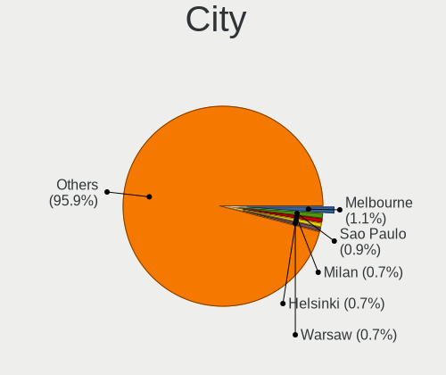
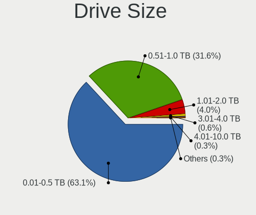
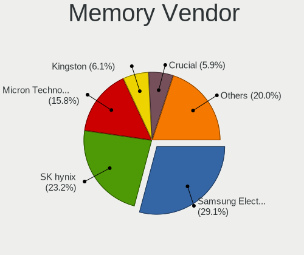

Pop!_OS 22.04 - Tested Hardware & Statistics (Notebooks)
--------------------------------------------------------

A project to collect tested hardware configurations for Pop!_OS 22.04.

Anyone can contribute to this report by the [hw-probe](https://github.com/linuxhw/hw-probe) tool:

    sudo -E hw-probe -all -upload

Please contribute! Especially if your hardware is rare.

Contents
--------

* [ Test Cases ](#test-cases)

* [ System ](#system)
  - [ Kernel                   ](#kernel)
  - [ Kernel Family            ](#kernel-family)
  - [ Kernel Major Ver.        ](#kernel-major-ver)
  - [ Arch                     ](#arch)
  - [ DE                       ](#de)
  - [ Display Server           ](#display-server)
  - [ Display Manager          ](#display-manager)
  - [ OS Lang                  ](#os-lang)
  - [ Boot Mode                ](#boot-mode)
  - [ Filesystem               ](#filesystem)
  - [ Part. scheme             ](#part-scheme)
  - [ Dual Boot with Linux/BSD ](#dual-boot-with-linuxbsd)
  - [ Dual Boot (Win)          ](#dual-boot-win)

* [ Board ](#board)
  - [ Vendor                   ](#vendor)
  - [ Model                    ](#model)
  - [ Model Family             ](#model-family)
  - [ MFG Year                 ](#mfg-year)
  - [ Form Factor              ](#form-factor)
  - [ Secure Boot              ](#secure-boot)
  - [ Coreboot                 ](#coreboot)
  - [ RAM Size                 ](#ram-size)
  - [ RAM Used                 ](#ram-used)
  - [ Total Drives             ](#total-drives)
  - [ Has CD-ROM               ](#has-cd-rom)
  - [ Has Ethernet             ](#has-ethernet)
  - [ Has WiFi                 ](#has-wifi)
  - [ Has Bluetooth            ](#has-bluetooth)

* [ Location ](#location)
  - [ Country                  ](#country)
  - [ City                     ](#city)

* [ Drives ](#drives)
  - [ Drive Vendor             ](#drive-vendor)
  - [ Drive Model              ](#drive-model)
  - [ HDD Vendor               ](#hdd-vendor)
  - [ SSD Vendor               ](#ssd-vendor)
  - [ Drive Kind               ](#drive-kind)
  - [ Drive Connector          ](#drive-connector)
  - [ Drive Size               ](#drive-size)
  - [ Space Total              ](#space-total)
  - [ Space Used               ](#space-used)
  - [ Malfunc. Drives          ](#malfunc-drives)
  - [ Malfunc. Drive Vendor    ](#malfunc-drive-vendor)
  - [ Malfunc. HDD Vendor      ](#malfunc-hdd-vendor)
  - [ Malfunc. Drive Kind      ](#malfunc-drive-kind)
  - [ Failed Drives            ](#failed-drives)
  - [ Failed Drive Vendor      ](#failed-drive-vendor)
  - [ Drive Status             ](#drive-status)

* [ Storage controller ](#storage-controller)
  - [ Storage Vendor           ](#storage-vendor)
  - [ Storage Model            ](#storage-model)
  - [ Storage Kind             ](#storage-kind)

* [ Processor ](#processor)
  - [ CPU Vendor               ](#cpu-vendor)
  - [ CPU Model                ](#cpu-model)
  - [ CPU Model Family         ](#cpu-model-family)
  - [ CPU Cores                ](#cpu-cores)
  - [ CPU Sockets              ](#cpu-sockets)
  - [ CPU Threads              ](#cpu-threads)
  - [ CPU Op-Modes             ](#cpu-op-modes)
  - [ CPU Microcode            ](#cpu-microcode)
  - [ CPU Microarch            ](#cpu-microarch)

* [ Graphics ](#graphics)
  - [ GPU Vendor               ](#gpu-vendor)
  - [ GPU Model                ](#gpu-model)
  - [ GPU Combo                ](#gpu-combo)
  - [ GPU Driver               ](#gpu-driver)
  - [ GPU Memory               ](#gpu-memory)

* [ Monitor ](#monitor)
  - [ Monitor Vendor           ](#monitor-vendor)
  - [ Monitor Model            ](#monitor-model)
  - [ Monitor Resolution       ](#monitor-resolution)
  - [ Monitor Diagonal         ](#monitor-diagonal)
  - [ Monitor Width            ](#monitor-width)
  - [ Aspect Ratio             ](#aspect-ratio)
  - [ Monitor Area             ](#monitor-area)
  - [ Pixel Density            ](#pixel-density)
  - [ Multiple Monitors        ](#multiple-monitors)

* [ Network ](#network)
  - [ Net Controller Vendor    ](#net-controller-vendor)
  - [ Net Controller Model     ](#net-controller-model)
  - [ Wireless Vendor          ](#wireless-vendor)
  - [ Wireless Model           ](#wireless-model)
  - [ Ethernet Vendor          ](#ethernet-vendor)
  - [ Ethernet Model           ](#ethernet-model)
  - [ Net Controller Kind      ](#net-controller-kind)
  - [ Used Controller          ](#used-controller)
  - [ NICs                     ](#nics)
  - [ IPv6                     ](#ipv6)

* [ Bluetooth ](#bluetooth)
  - [ Bluetooth Vendor         ](#bluetooth-vendor)
  - [ Bluetooth Model          ](#bluetooth-model)

* [ Sound ](#sound)
  - [ Sound Vendor             ](#sound-vendor)
  - [ Sound Model              ](#sound-model)

* [ Memory ](#memory)
  - [ Memory Vendor            ](#memory-vendor)
  - [ Memory Model             ](#memory-model)
  - [ Memory Kind              ](#memory-kind)
  - [ Memory Form Factor       ](#memory-form-factor)
  - [ Memory Size              ](#memory-size)
  - [ Memory Speed             ](#memory-speed)

* [ Printers & scanners ](#printers--scanners)
  - [ Printer Vendor           ](#printer-vendor)
  - [ Printer Model            ](#printer-model)
  - [ Scanner Vendor           ](#scanner-vendor)
  - [ Scanner Model            ](#scanner-model)

* [ Camera ](#camera)
  - [ Camera Vendor            ](#camera-vendor)
  - [ Camera Model             ](#camera-model)

* [ Security ](#security)
  - [ Fingerprint Vendor       ](#fingerprint-vendor)
  - [ Fingerprint Model        ](#fingerprint-model)
  - [ Chipcard Vendor          ](#chipcard-vendor)
  - [ Chipcard Model           ](#chipcard-model)

* [ Unsupported ](#unsupported)
  - [ Unsupported Devices      ](#unsupported-devices)
  - [ Unsupported Device Types ](#unsupported-device-types)

Test Cases
----------

Total: 393

| Vendor        | Model                       | Probe                                                      | Date         |
|---------------|-----------------------------|------------------------------------------------------------|--------------|
| Dell          | Precision M4600             | [ea07b9e45f](https://linux-hardware.org/?probe=ea07b9e45f) | Jul 01, 2022 |
| Dell          | Precision M4600             | [535d6029bc](https://linux-hardware.org/?probe=535d6029bc) | Jul 01, 2022 |
| Lenovo        | IdeaPad 700-15ISK 80RU      | [10ff366630](https://linux-hardware.org/?probe=10ff366630) | Jul 01, 2022 |
| Samsung       | 930XED                      | [56a04fa69d](https://linux-hardware.org/?probe=56a04fa69d) | Jul 01, 2022 |
| ASUSTek       | S550CA                      | [8ed63bbdfd](https://linux-hardware.org/?probe=8ed63bbdfd) | Jul 01, 2022 |
| Dell          | Precision 5530              | [d6dc0ecd91](https://linux-hardware.org/?probe=d6dc0ecd91) | Jul 01, 2022 |
| Dell          | Precision 5550              | [0ddb8905e5](https://linux-hardware.org/?probe=0ddb8905e5) | Jul 01, 2022 |
| MSI           | GF63 Thin 11UD              | [63508059d3](https://linux-hardware.org/?probe=63508059d3) | Jul 01, 2022 |
| MSI           | GF63 Thin 11UD              | [b7aef43e9e](https://linux-hardware.org/?probe=b7aef43e9e) | Jul 01, 2022 |
| MSI           | GF63 Thin 11UD              | [325fec2ac6](https://linux-hardware.org/?probe=325fec2ac6) | Jul 01, 2022 |
| HP            | Pavilion 15                 | [e35e3b2e52](https://linux-hardware.org/?probe=e35e3b2e52) | Jul 01, 2022 |
| Dell          | Precision 7510              | [c82cc3cb0f](https://linux-hardware.org/?probe=c82cc3cb0f) | Jul 01, 2022 |
| Dell          | Inspiron 5547               | [c2a91cc81e](https://linux-hardware.org/?probe=c2a91cc81e) | Jul 01, 2022 |
| Lenovo        | ThinkBook 15 G3 ACL 21A4    | [ccb50bd0f4](https://linux-hardware.org/?probe=ccb50bd0f4) | Jun 30, 2022 |
| Apple         | MacBookAir7,2               | [ab31abf1d5](https://linux-hardware.org/?probe=ab31abf1d5) | Jun 30, 2022 |
| HP            | Pavilion 15                 | [f76f8dff7a](https://linux-hardware.org/?probe=f76f8dff7a) | Jun 30, 2022 |
| HP            | Pavilion Gaming Laptop 1... | [6095915fb5](https://linux-hardware.org/?probe=6095915fb5) | Jun 30, 2022 |
| HP            | ProBook 445 G8 Notebook ... | [35ca7c4868](https://linux-hardware.org/?probe=35ca7c4868) | Jun 30, 2022 |
| HP            | Pavilion Gaming Laptop 1... | [1f66ba5535](https://linux-hardware.org/?probe=1f66ba5535) | Jun 30, 2022 |
| Notebook      | P7xxDM3(-G)                 | [6abdc9b40d](https://linux-hardware.org/?probe=6abdc9b40d) | Jun 29, 2022 |
| Dell          | Latitude E5470              | [2440e59a5a](https://linux-hardware.org/?probe=2440e59a5a) | Jun 29, 2022 |
| Dell          | Inspiron 7460               | [c5e8b7f098](https://linux-hardware.org/?probe=c5e8b7f098) | Jun 29, 2022 |
| Eluktronic... | MECH-15 G3                  | [d307b13800](https://linux-hardware.org/?probe=d307b13800) | Jun 28, 2022 |
| Lenovo        | Legion 5 15ACH6H 82JU       | [c14a32dd6b](https://linux-hardware.org/?probe=c14a32dd6b) | Jun 28, 2022 |
| ASUSTek       | S550CA                      | [93807824df](https://linux-hardware.org/?probe=93807824df) | Jun 28, 2022 |
| ASUSTek       | ROG Strix G512LW_G512LW     | [843cbccc63](https://linux-hardware.org/?probe=843cbccc63) | Jun 27, 2022 |
| HP            | Pavilion Notebook           | [8e17cfd388](https://linux-hardware.org/?probe=8e17cfd388) | Jun 26, 2022 |
| HP            | EliteBook 820 G2            | [e568c96372](https://linux-hardware.org/?probe=e568c96372) | Jun 25, 2022 |
| Lenovo        | ThinkPad X230 23331R5       | [c6589e02c4](https://linux-hardware.org/?probe=c6589e02c4) | Jun 25, 2022 |
| Dell          | Vostro 3460                 | [90c701411f](https://linux-hardware.org/?probe=90c701411f) | Jun 25, 2022 |
| Dell          | Vostro 3460                 | [fb02c13e80](https://linux-hardware.org/?probe=fb02c13e80) | Jun 25, 2022 |
| HUAWEI        | MACHC-WAX9                  | [00089c4dbe](https://linux-hardware.org/?probe=00089c4dbe) | Jun 25, 2022 |
| ASUSTek       | ROG Zephyrus G14 GA401IV... | [490c1074fe](https://linux-hardware.org/?probe=490c1074fe) | Jun 25, 2022 |
| ASUSTek       | ROG Zephyrus G14 GA401IV... | [51d3a22bf6](https://linux-hardware.org/?probe=51d3a22bf6) | Jun 25, 2022 |
| Lenovo        | IdeaPad S145-15API 81V7     | [289b09bf25](https://linux-hardware.org/?probe=289b09bf25) | Jun 24, 2022 |
| System76      | Darter Pro                  | [db7f217878](https://linux-hardware.org/?probe=db7f217878) | Jun 24, 2022 |
| HP            | EliteBook 745 G2            | [fe87d16f84](https://linux-hardware.org/?probe=fe87d16f84) | Jun 24, 2022 |
| Dell          | Latitude E7470              | [c2a22e5a3d](https://linux-hardware.org/?probe=c2a22e5a3d) | Jun 24, 2022 |
| Dell          | Latitude E7470              | [962571591a](https://linux-hardware.org/?probe=962571591a) | Jun 24, 2022 |
| Alienware     | 14                          | [8846f2e474](https://linux-hardware.org/?probe=8846f2e474) | Jun 24, 2022 |
| Toshiba       | Satellite S50-A             | [c2e7c1b26d](https://linux-hardware.org/?probe=c2e7c1b26d) | Jun 24, 2022 |
| ASUSTek       | S550CA                      | [c7c236e5a1](https://linux-hardware.org/?probe=c7c236e5a1) | Jun 23, 2022 |
| Acer          | Swift SF314-54              | [47420af7dc](https://linux-hardware.org/?probe=47420af7dc) | Jun 23, 2022 |
| Dell          | Vostro 5470                 | [592f0a2f63](https://linux-hardware.org/?probe=592f0a2f63) | Jun 23, 2022 |
| Dell          | Precision 5520              | [2216faa750](https://linux-hardware.org/?probe=2216faa750) | Jun 22, 2022 |
| Dell          | Inspiron 7560               | [a65b832b57](https://linux-hardware.org/?probe=a65b832b57) | Jun 22, 2022 |
| Lenovo        | V14-IIL 82C4                | [c288025720](https://linux-hardware.org/?probe=c288025720) | Jun 21, 2022 |
| HP            | Dev One Notebook PC         | [3086580cf5](https://linux-hardware.org/?probe=3086580cf5) | Jun 21, 2022 |
| HP            | Dev One Notebook PC         | [0bc7456f92](https://linux-hardware.org/?probe=0bc7456f92) | Jun 21, 2022 |
| Dell          | Latitude E7240              | [1c76f3cdf4](https://linux-hardware.org/?probe=1c76f3cdf4) | Jun 21, 2022 |
| Quanta        | TWC                         | [6a466d7eac](https://linux-hardware.org/?probe=6a466d7eac) | Jun 21, 2022 |
| Dell          | Latitude E7240              | [2974c5fa7c](https://linux-hardware.org/?probe=2974c5fa7c) | Jun 21, 2022 |
| Dell          | XPS 15 9570                 | [c6c4eda2cb](https://linux-hardware.org/?probe=c6c4eda2cb) | Jun 21, 2022 |
| System76      | Lemur Pro                   | [0350f8d8f7](https://linux-hardware.org/?probe=0350f8d8f7) | Jun 21, 2022 |
| HP            | ProBook 440 G7              | [3bbbcaea72](https://linux-hardware.org/?probe=3bbbcaea72) | Jun 20, 2022 |
| ASUSTek       | ZenBook UX391FA_UX391FA     | [faa0749731](https://linux-hardware.org/?probe=faa0749731) | Jun 20, 2022 |
| Acer          | Iconia                      | [2d1f1a2c32](https://linux-hardware.org/?probe=2d1f1a2c32) | Jun 20, 2022 |
| MSI           | Pulse GL66 12UEK            | [9bffffd652](https://linux-hardware.org/?probe=9bffffd652) | Jun 20, 2022 |
| MSI           | Pulse GL66 12UEK            | [a8d859700b](https://linux-hardware.org/?probe=a8d859700b) | Jun 20, 2022 |
| HP            | ZBook 15 G3                 | [8c6f371222](https://linux-hardware.org/?probe=8c6f371222) | Jun 19, 2022 |
| ASUSTek       | N550JV                      | [d1d647724c](https://linux-hardware.org/?probe=d1d647724c) | Jun 19, 2022 |
| Apple         | MacBookPro11,1              | [b88b88ba84](https://linux-hardware.org/?probe=b88b88ba84) | Jun 19, 2022 |
| Apple         | MacBookPro11,1              | [ec132b0ba5](https://linux-hardware.org/?probe=ec132b0ba5) | Jun 19, 2022 |
| Dell          | Inspiron 5537               | [2b31dedd45](https://linux-hardware.org/?probe=2b31dedd45) | Jun 19, 2022 |
| HP            | 15 Notebook PC              | [b3efe3d4b5](https://linux-hardware.org/?probe=b3efe3d4b5) | Jun 19, 2022 |
| Apple         | MacBookPro11,5              | [b04866cc36](https://linux-hardware.org/?probe=b04866cc36) | Jun 19, 2022 |
| Apple         | MacBook5,1                  | [e601e834f2](https://linux-hardware.org/?probe=e601e834f2) | Jun 18, 2022 |
| Lenovo        | ThinkPad X240 20AMS75900    | [47b7f42708](https://linux-hardware.org/?probe=47b7f42708) | Jun 18, 2022 |
| Lenovo        | ThinkPad X240 20AMS75900    | [e0eb6f7475](https://linux-hardware.org/?probe=e0eb6f7475) | Jun 18, 2022 |
| Dell          | XPS 13 7390                 | [6d1dcb879d](https://linux-hardware.org/?probe=6d1dcb879d) | Jun 18, 2022 |
| Apple         | MacBookPro7,1               | [41eb5a7de2](https://linux-hardware.org/?probe=41eb5a7de2) | Jun 18, 2022 |
| ASUSTek       | VivoBook_ASUSLaptop X512... | [cb268bf1ab](https://linux-hardware.org/?probe=cb268bf1ab) | Jun 18, 2022 |
| ASUSTek       | VivoBook_ASUSLaptop X415... | [ed83fdd673](https://linux-hardware.org/?probe=ed83fdd673) | Jun 18, 2022 |
| Lenovo        | ThinkPad T450 20BUS1110E    | [77dd393da8](https://linux-hardware.org/?probe=77dd393da8) | Jun 18, 2022 |
| Apple         | MacBookPro7,1               | [d542c2f694](https://linux-hardware.org/?probe=d542c2f694) | Jun 18, 2022 |
| Dell          | Latitude E7240              | [2ed64f08f3](https://linux-hardware.org/?probe=2ed64f08f3) | Jun 17, 2022 |
| Dell          | Latitude E7240              | [31340542c2](https://linux-hardware.org/?probe=31340542c2) | Jun 17, 2022 |
| HP            | Unknown                     | [4c4cdf6526](https://linux-hardware.org/?probe=4c4cdf6526) | Jun 17, 2022 |
| Apple         | MacBookAir7,2               | [13d72fd6f0](https://linux-hardware.org/?probe=13d72fd6f0) | Jun 17, 2022 |
| Dell          | Latitude E7240              | [08efb8dcc5](https://linux-hardware.org/?probe=08efb8dcc5) | Jun 17, 2022 |
| Schenker      | VIA 15 Pro                  | [1d1727713f](https://linux-hardware.org/?probe=1d1727713f) | Jun 17, 2022 |
| HP            | EliteBook 8560p             | [8f60c0fb25](https://linux-hardware.org/?probe=8f60c0fb25) | Jun 17, 2022 |
| Dell          | Precision 5540              | [6d3f2c188b](https://linux-hardware.org/?probe=6d3f2c188b) | Jun 17, 2022 |
| Acer          | Aspire E5-574G              | [23c2dd37fe](https://linux-hardware.org/?probe=23c2dd37fe) | Jun 17, 2022 |
| Dell          | Latitude E7240              | [b6978a823c](https://linux-hardware.org/?probe=b6978a823c) | Jun 17, 2022 |
| Acer          | Aspire 4741                 | [9f25816784](https://linux-hardware.org/?probe=9f25816784) | Jun 16, 2022 |
| Dell          | Inspiron 3442               | [10304caa6b](https://linux-hardware.org/?probe=10304caa6b) | Jun 16, 2022 |
| Lenovo        | ThinkBook 15 G2 ITL 20VE    | [b136496151](https://linux-hardware.org/?probe=b136496151) | Jun 16, 2022 |
| System76      | Oryx Pro                    | [4daa6c7d77](https://linux-hardware.org/?probe=4daa6c7d77) | Jun 16, 2022 |
| Dell          | Latitude E6540              | [93f049609f](https://linux-hardware.org/?probe=93f049609f) | Jun 16, 2022 |
| System76      | Galago Pro                  | [440ba53ef9](https://linux-hardware.org/?probe=440ba53ef9) | Jun 16, 2022 |
| Apple         | MacBookPro8,1               | [145a1e77fc](https://linux-hardware.org/?probe=145a1e77fc) | Jun 16, 2022 |
| Dell          | Inspiron 7520               | [d6e4d7642d](https://linux-hardware.org/?probe=d6e4d7642d) | Jun 16, 2022 |
| Lenovo        | Legion 7 15IMH05 81YT       | [cc1947a21b](https://linux-hardware.org/?probe=cc1947a21b) | Jun 15, 2022 |
| Acer          | Aspire E5-575G              | [aa390f3eaa](https://linux-hardware.org/?probe=aa390f3eaa) | Jun 15, 2022 |
| Sony          | SVF15A1M2ES                 | [bdcd4a90fc](https://linux-hardware.org/?probe=bdcd4a90fc) | Jun 15, 2022 |
| Dell          | Latitude E6540              | [03fb6fa23c](https://linux-hardware.org/?probe=03fb6fa23c) | Jun 15, 2022 |
| Dell          | Precision 5550              | [f5f815ceed](https://linux-hardware.org/?probe=f5f815ceed) | Jun 14, 2022 |
| Acer          | Swift SF314-54              | [06bccc3696](https://linux-hardware.org/?probe=06bccc3696) | Jun 14, 2022 |
| Dell          | Precision 7720              | [8b4da2326e](https://linux-hardware.org/?probe=8b4da2326e) | Jun 14, 2022 |
| Dell          | Precision 7720              | [bf25929cec](https://linux-hardware.org/?probe=bf25929cec) | Jun 14, 2022 |
| Dell          | Latitude E6540              | [44b876534d](https://linux-hardware.org/?probe=44b876534d) | Jun 14, 2022 |
| Lenovo        | ThinkPad L13 Yoga Gen 2a... | [f4ef35b902](https://linux-hardware.org/?probe=f4ef35b902) | Jun 14, 2022 |
| Dell          | Inspiron 7737               | [6fa74e19b1](https://linux-hardware.org/?probe=6fa74e19b1) | Jun 13, 2022 |
| Notebook      | P65_P67SE                   | [590b7204da](https://linux-hardware.org/?probe=590b7204da) | Jun 13, 2022 |
| HP            | EliteBook 820 G2            | [45ca271974](https://linux-hardware.org/?probe=45ca271974) | Jun 13, 2022 |
| Lenovo        | B40-80 80F6                 | [7449f0f8d2](https://linux-hardware.org/?probe=7449f0f8d2) | Jun 13, 2022 |
| ASUSTek       | K70IJ                       | [2eb24f0195](https://linux-hardware.org/?probe=2eb24f0195) | Jun 13, 2022 |
| ASUSTek       | K70IJ                       | [110ff08266](https://linux-hardware.org/?probe=110ff08266) | Jun 13, 2022 |
| Apple         | MacBookPro11,1              | [7222fb776a](https://linux-hardware.org/?probe=7222fb776a) | Jun 13, 2022 |
| Dell          | Latitude E6540              | [91e07b8f2d](https://linux-hardware.org/?probe=91e07b8f2d) | Jun 12, 2022 |
| ASUSTek       | UX430UQ                     | [9754c7394d](https://linux-hardware.org/?probe=9754c7394d) | Jun 12, 2022 |
| Dell          | System XPS L702X            | [b79115e065](https://linux-hardware.org/?probe=b79115e065) | Jun 12, 2022 |
| MSI           | Alpha 17 A4DEK              | [42171e02bb](https://linux-hardware.org/?probe=42171e02bb) | Jun 11, 2022 |
| HP            | EliteBook 820 G2            | [0a0828f262](https://linux-hardware.org/?probe=0a0828f262) | Jun 11, 2022 |
| ASUSTek       | GL552VW                     | [8ed24a5d98](https://linux-hardware.org/?probe=8ed24a5d98) | Jun 11, 2022 |
| Dell          | Inspiron 7520               | [4916232f15](https://linux-hardware.org/?probe=4916232f15) | Jun 11, 2022 |
| Acer          | Aspire 4349                 | [7c8c3427a9](https://linux-hardware.org/?probe=7c8c3427a9) | Jun 11, 2022 |
| HP            | ProBook 455 G3              | [bac60198a3](https://linux-hardware.org/?probe=bac60198a3) | Jun 10, 2022 |
| ASUSTek       | K50IJ                       | [c8bac63870](https://linux-hardware.org/?probe=c8bac63870) | Jun 10, 2022 |
| Dell          | Latitude E7270              | [8d8f0db52c](https://linux-hardware.org/?probe=8d8f0db52c) | Jun 10, 2022 |
| ASUSTek       | K50IJ                       | [addb86fcb0](https://linux-hardware.org/?probe=addb86fcb0) | Jun 10, 2022 |
| ASUSTek       | Unknown                     | [1cc4adfa36](https://linux-hardware.org/?probe=1cc4adfa36) | Jun 09, 2022 |
| HP            | Elite x2 1012 G1            | [ad03ec2516](https://linux-hardware.org/?probe=ad03ec2516) | Jun 09, 2022 |
| Dell          | Inspiron 7520               | [ebbea30b2b](https://linux-hardware.org/?probe=ebbea30b2b) | Jun 09, 2022 |
| Dell          | G7 7790                     | [58cfc35862](https://linux-hardware.org/?probe=58cfc35862) | Jun 09, 2022 |
| Dell          | G7 7790                     | [495cfbb6f3](https://linux-hardware.org/?probe=495cfbb6f3) | Jun 09, 2022 |
| ASUSTek       | S550CA                      | [c87c7a989a](https://linux-hardware.org/?probe=c87c7a989a) | Jun 09, 2022 |
| ASUSTek       | S550CA                      | [9ba4a449c6](https://linux-hardware.org/?probe=9ba4a449c6) | Jun 09, 2022 |
| System76      | Oryx Pro                    | [bf9c9467d3](https://linux-hardware.org/?probe=bf9c9467d3) | Jun 08, 2022 |
| System76      | Oryx Pro                    | [2f96b6b08d](https://linux-hardware.org/?probe=2f96b6b08d) | Jun 08, 2022 |
| Lenovo        | Legion 5 15ACH6 82JW        | [5c2fedfca8](https://linux-hardware.org/?probe=5c2fedfca8) | Jun 08, 2022 |
| Dell          | Vostro 5402                 | [ebf8dce138](https://linux-hardware.org/?probe=ebf8dce138) | Jun 07, 2022 |
| Dell          | Inspiron 5537               | [7bb51064db](https://linux-hardware.org/?probe=7bb51064db) | Jun 07, 2022 |
| Dell          | Precision M4800             | [2607169dfe](https://linux-hardware.org/?probe=2607169dfe) | Jun 06, 2022 |
| Lenovo        | ThinkPad Edge E531 6885C... | [d98f987b46](https://linux-hardware.org/?probe=d98f987b46) | Jun 06, 2022 |
| Framework     | Laptop                      | [ed8e682778](https://linux-hardware.org/?probe=ed8e682778) | Jun 06, 2022 |
| Samsung       | 760XDA                      | [46350b515c](https://linux-hardware.org/?probe=46350b515c) | Jun 06, 2022 |
| MSI           | GS75 Stealth 9SF            | [9d18e7094e](https://linux-hardware.org/?probe=9d18e7094e) | Jun 05, 2022 |
| ASUSTek       | X556URK                     | [d6da70c8bd](https://linux-hardware.org/?probe=d6da70c8bd) | Jun 05, 2022 |
| Lenovo        | ThinkPad T450 20BVA02TCD    | [1485986503](https://linux-hardware.org/?probe=1485986503) | Jun 05, 2022 |
| Lenovo        | ThinkPad T450 20BVA02TCD    | [2f60fd04bf](https://linux-hardware.org/?probe=2f60fd04bf) | Jun 05, 2022 |
| Acer          | Aspire A715-75G             | [d8a8c3c8b4](https://linux-hardware.org/?probe=d8a8c3c8b4) | Jun 05, 2022 |
| Lenovo        | ThinkPad Edge E531 6885C... | [1b09ad54c8](https://linux-hardware.org/?probe=1b09ad54c8) | Jun 05, 2022 |
| Dell          | Inspiron 3502               | [afa1c5cd74](https://linux-hardware.org/?probe=afa1c5cd74) | Jun 04, 2022 |
| Timi          | RedmiBook Pro 14S           | [f729442cad](https://linux-hardware.org/?probe=f729442cad) | Jun 04, 2022 |
| Dell          | Precision M4800             | [3bd843466c](https://linux-hardware.org/?probe=3bd843466c) | Jun 04, 2022 |
| ASUSTek       | ZenBook UX425QA_UM425QA     | [0b2aab3dc7](https://linux-hardware.org/?probe=0b2aab3dc7) | Jun 04, 2022 |
| Lenovo        | G470 20078                  | [44e0643923](https://linux-hardware.org/?probe=44e0643923) | Jun 03, 2022 |
| ASUSTek       | Zenbook UX5401ZAS_UX5401... | [27301ce2e8](https://linux-hardware.org/?probe=27301ce2e8) | Jun 03, 2022 |
| Samsung       | 900X3C/900X3D/900X3E/900... | [54fb76191c](https://linux-hardware.org/?probe=54fb76191c) | Jun 03, 2022 |
| Lenovo        | ThinkBook 16p Gen 2 20YM    | [605cbc489f](https://linux-hardware.org/?probe=605cbc489f) | Jun 03, 2022 |
| Acer          | Aspire A515-43              | [a8c04eea72](https://linux-hardware.org/?probe=a8c04eea72) | Jun 03, 2022 |
| Lenovo        | IdeaPad 3 14ALC6 82KT       | [562348dd07](https://linux-hardware.org/?probe=562348dd07) | Jun 03, 2022 |
| Toshiba       | Satellite L850-1D5          | [c8a260ef80](https://linux-hardware.org/?probe=c8a260ef80) | Jun 03, 2022 |
| Lenovo        | IdeaPad 3 14ALC6 82KT       | [f1f4aec562](https://linux-hardware.org/?probe=f1f4aec562) | Jun 02, 2022 |
| ASUSTek       | N53SV                       | [d793b451f6](https://linux-hardware.org/?probe=d793b451f6) | Jun 02, 2022 |
| Lenovo        | ThinkBook 14 G2 ITL 20VD    | [9299688b01](https://linux-hardware.org/?probe=9299688b01) | Jun 02, 2022 |
| Dell          | Latitude E7470              | [f9a9090c54](https://linux-hardware.org/?probe=f9a9090c54) | Jun 02, 2022 |
| Dell          | Latitude 7390               | [0c7c9778aa](https://linux-hardware.org/?probe=0c7c9778aa) | Jun 02, 2022 |
| Dell          | Latitude E6540              | [de2e1727bc](https://linux-hardware.org/?probe=de2e1727bc) | Jun 01, 2022 |
| Lenovo        | ThinkPad P17 Gen 1 20SQS... | [491a4105d8](https://linux-hardware.org/?probe=491a4105d8) | Jun 01, 2022 |
| Dell          | Latitude E7240              | [e3c9cca7e1](https://linux-hardware.org/?probe=e3c9cca7e1) | Jun 01, 2022 |
| Acer          | Aspire ES1-572              | [6f6e6c038a](https://linux-hardware.org/?probe=6f6e6c038a) | Jun 01, 2022 |
| Lenovo        | ThinkPad T410 2537HN3       | [e373330c8b](https://linux-hardware.org/?probe=e373330c8b) | Jun 01, 2022 |
| Lenovo        | Yoga Slim 7 Pro 14ACH5 D... | [57f540db26](https://linux-hardware.org/?probe=57f540db26) | Jun 01, 2022 |
| Dell          | Inspiron 13 5310            | [70eccb19d4](https://linux-hardware.org/?probe=70eccb19d4) | Jun 01, 2022 |
| Dell          | Inspiron 5537               | [506d3fb361](https://linux-hardware.org/?probe=506d3fb361) | Jun 01, 2022 |
| Lenovo        | IdeaPad Y700-17ISK 80Q0     | [d0dbd3d75e](https://linux-hardware.org/?probe=d0dbd3d75e) | Jun 01, 2022 |
| Dell          | G7 7700                     | [25e22bc243](https://linux-hardware.org/?probe=25e22bc243) | May 31, 2022 |
| Lenovo        | V14-IIL 82C4                | [871738fea2](https://linux-hardware.org/?probe=871738fea2) | May 31, 2022 |
| Lenovo        | ThinkPad T14s Gen 1 20UJ... | [ed28d49715](https://linux-hardware.org/?probe=ed28d49715) | May 30, 2022 |
| HP            | ProBook 455 G8 Notebook ... | [ce6b717155](https://linux-hardware.org/?probe=ce6b717155) | May 30, 2022 |
| HP            | Laptop 14-dq2xxx            | [14f581788f](https://linux-hardware.org/?probe=14f581788f) | May 30, 2022 |
| Acer          | Aspire A515-45              | [72b7fc79d4](https://linux-hardware.org/?probe=72b7fc79d4) | May 29, 2022 |
| Dell          | Vostro V130                 | [abefbba5b8](https://linux-hardware.org/?probe=abefbba5b8) | May 29, 2022 |
| Apple         | MacBookPro9,1               | [6fe2c4a416](https://linux-hardware.org/?probe=6fe2c4a416) | May 29, 2022 |
| MSI           | GF63 Thin 10SCXR            | [0d556408f3](https://linux-hardware.org/?probe=0d556408f3) | May 29, 2022 |
| HP            | OMEN by Laptop 15z-en100    | [35e3478a5d](https://linux-hardware.org/?probe=35e3478a5d) | May 28, 2022 |
| Medion        | X6816                       | [6d7996894c](https://linux-hardware.org/?probe=6d7996894c) | May 28, 2022 |
| HUAWEI        | NBLB-WAX9N                  | [7ae101b473](https://linux-hardware.org/?probe=7ae101b473) | May 28, 2022 |
| HUAWEI        | NBLB-WAX9N                  | [469ed3f68b](https://linux-hardware.org/?probe=469ed3f68b) | May 28, 2022 |
| Lenovo        | ThinkPad E14 Gen 3 20Y70... | [96bc0699c3](https://linux-hardware.org/?probe=96bc0699c3) | May 28, 2022 |
| Dell          | Inspiron 5566               | [88c420d481](https://linux-hardware.org/?probe=88c420d481) | May 28, 2022 |
| Toshiba       | IS 1413G                    | [c7a5f5eef3](https://linux-hardware.org/?probe=c7a5f5eef3) | May 28, 2022 |
| Acer          | Nitro AN515-42              | [a2f2dc2eee](https://linux-hardware.org/?probe=a2f2dc2eee) | May 27, 2022 |
| Lenovo        | ThinkPad T14 Gen 1 20S00... | [65bccd9c04](https://linux-hardware.org/?probe=65bccd9c04) | May 27, 2022 |
| Dell          | Vostro 5402                 | [323fc36eb6](https://linux-hardware.org/?probe=323fc36eb6) | May 27, 2022 |
| Toshiba       | QOSMIO X770                 | [8f7d0ba9f9](https://linux-hardware.org/?probe=8f7d0ba9f9) | May 27, 2022 |
| Dell          | Precision 5530              | [2ecf3390bf](https://linux-hardware.org/?probe=2ecf3390bf) | May 27, 2022 |
| Acer          | Aspire A315-57G             | [d0400f8d02](https://linux-hardware.org/?probe=d0400f8d02) | May 26, 2022 |
| Fujitsu       | CELSIUS H730                | [6f0b24d450](https://linux-hardware.org/?probe=6f0b24d450) | May 26, 2022 |
| Lenovo        | Legion 5 15IMH05H 81Y6      | [ab2cd65153](https://linux-hardware.org/?probe=ab2cd65153) | May 26, 2022 |
| Dell          | Inspiron 3721               | [d4af21adb8](https://linux-hardware.org/?probe=d4af21adb8) | May 25, 2022 |
| A-DATA Tec... | XENIA 15                    | [1d7941d921](https://linux-hardware.org/?probe=1d7941d921) | May 25, 2022 |
| Lenovo        | ThinkPad X220 4286CTO       | [4c0d37687e](https://linux-hardware.org/?probe=4c0d37687e) | May 25, 2022 |
| Toshiba       | Satellite P850              | [9ec49310ff](https://linux-hardware.org/?probe=9ec49310ff) | May 25, 2022 |
| Apple         | MacBookPro14,3              | [ca090207b8](https://linux-hardware.org/?probe=ca090207b8) | May 25, 2022 |
| Monster       | TULPAR T5 V14.1             | [647e502881](https://linux-hardware.org/?probe=647e502881) | May 25, 2022 |
| Monster       | TULPAR T5 V14.1             | [0db0bd7aa8](https://linux-hardware.org/?probe=0db0bd7aa8) | May 25, 2022 |
| ASUSTek       | G551JM                      | [3db2e28ef2](https://linux-hardware.org/?probe=3db2e28ef2) | May 24, 2022 |
| Toshiba       | IS 1413G                    | [a34eaa3e4a](https://linux-hardware.org/?probe=a34eaa3e4a) | May 24, 2022 |
| Dell          | Precision 5550              | [6b17026494](https://linux-hardware.org/?probe=6b17026494) | May 24, 2022 |
| Toshiba       | IS 1413G                    | [e6e080d6e0](https://linux-hardware.org/?probe=e6e080d6e0) | May 24, 2022 |
| Lenovo        | ThinkPad P14s Gen 1 20Y1... | [a59234d081](https://linux-hardware.org/?probe=a59234d081) | May 24, 2022 |
| Lenovo        | IdeaPad 3 15ADA05 81W1      | [bf692d5408](https://linux-hardware.org/?probe=bf692d5408) | May 23, 2022 |
| Acer          | Swift SF314-54              | [39f85b46d7](https://linux-hardware.org/?probe=39f85b46d7) | May 23, 2022 |
| Lenovo        | IdeaPad Gaming 3 15ARH05... | [f2e32c336d](https://linux-hardware.org/?probe=f2e32c336d) | May 23, 2022 |
| ASUSTek       | ASUS TUF Gaming A15 FA50... | [7fa4ca7312](https://linux-hardware.org/?probe=7fa4ca7312) | May 23, 2022 |
| Acer          | TravelMate 7750G            | [3ff0c1c7f2](https://linux-hardware.org/?probe=3ff0c1c7f2) | May 23, 2022 |
| Acer          | TravelMate 7750G            | [80bfe5a0c6](https://linux-hardware.org/?probe=80bfe5a0c6) | May 23, 2022 |
| Apple         | MacBookPro11,1              | [1d4f3a60c0](https://linux-hardware.org/?probe=1d4f3a60c0) | May 23, 2022 |
| ASUSTek       | X505BA                      | [685c1f7378](https://linux-hardware.org/?probe=685c1f7378) | May 22, 2022 |
| Lenovo        | ThinkPad T480 20L5S00F00    | [7a1f70c8aa](https://linux-hardware.org/?probe=7a1f70c8aa) | May 22, 2022 |
| Dell          | G3 3500                     | [49f86cc226](https://linux-hardware.org/?probe=49f86cc226) | May 22, 2022 |
| Google        | Lulu                        | [e7a0842114](https://linux-hardware.org/?probe=e7a0842114) | May 21, 2022 |
| MSI           | Modern 14 A10M              | [97a0996658](https://linux-hardware.org/?probe=97a0996658) | May 21, 2022 |
| HP            | Pavilion Notebook           | [1cd571d585](https://linux-hardware.org/?probe=1cd571d585) | May 21, 2022 |
| ASUSTek       | X510UR                      | [40b1695a67](https://linux-hardware.org/?probe=40b1695a67) | May 21, 2022 |
| ASUSTek       | X510UR                      | [e7cea85f09](https://linux-hardware.org/?probe=e7cea85f09) | May 21, 2022 |
| ASUSTek       | ROG Zephyrus G15 GA503QM... | [bc911a9c04](https://linux-hardware.org/?probe=bc911a9c04) | May 21, 2022 |
| PC Special... | NP5x_NP6x_NP7xPNK_PNH_PN... | [e002072665](https://linux-hardware.org/?probe=e002072665) | May 21, 2022 |
| HP            | EliteBook 8570w             | [3f21c66d5c](https://linux-hardware.org/?probe=3f21c66d5c) | May 20, 2022 |
| Lenovo        | G40-30 80FY                 | [4280810a31](https://linux-hardware.org/?probe=4280810a31) | May 20, 2022 |
| System76      | Oryx Pro                    | [d705be052a](https://linux-hardware.org/?probe=d705be052a) | May 20, 2022 |
| Dell          | Inspiron 5555               | [35c2610913](https://linux-hardware.org/?probe=35c2610913) | May 20, 2022 |
| HP            | EliteBook 855 G8 Noteboo... | [2320338e52](https://linux-hardware.org/?probe=2320338e52) | May 19, 2022 |
| Dell          | XPS 15 9570                 | [ba19473e18](https://linux-hardware.org/?probe=ba19473e18) | May 19, 2022 |
| Gigabyte      | AERO 15 KC                  | [5ebc19bd4c](https://linux-hardware.org/?probe=5ebc19bd4c) | May 18, 2022 |
| Lenovo        | ThinkPad X1 Carbon 7th 2... | [c9a82e1be0](https://linux-hardware.org/?probe=c9a82e1be0) | May 18, 2022 |
| ASUSTek       | ROG Zephyrus G14 GA402RJ... | [8ef2235464](https://linux-hardware.org/?probe=8ef2235464) | May 17, 2022 |
| System76      | Oryx Pro                    | [b68edfe15c](https://linux-hardware.org/?probe=b68edfe15c) | May 17, 2022 |
| Samsung       | 550XCJ/550XCR               | [5bc959890b](https://linux-hardware.org/?probe=5bc959890b) | May 17, 2022 |
| Samsung       | RV411/RV511/E3511/S3511/... | [e4bf8d23b8](https://linux-hardware.org/?probe=e4bf8d23b8) | May 17, 2022 |
| HUAWEI        | HN-WX9X                     | [f5ade437dc](https://linux-hardware.org/?probe=f5ade437dc) | May 17, 2022 |
| HP            | Laptop 14-dk1xxx            | [77a8cae8a0](https://linux-hardware.org/?probe=77a8cae8a0) | May 17, 2022 |
| ASUSTek       | G73Jh                       | [2d96e5ecba](https://linux-hardware.org/?probe=2d96e5ecba) | May 17, 2022 |
| Toshiba       | Satellite L50D-C            | [f06e254906](https://linux-hardware.org/?probe=f06e254906) | May 17, 2022 |
| Alienware     | 18                          | [7aa82b2786](https://linux-hardware.org/?probe=7aa82b2786) | May 17, 2022 |
| Acer          | Aspire 7560G                | [d3d9aa988f](https://linux-hardware.org/?probe=d3d9aa988f) | May 16, 2022 |
| Lenovo        | IdeaPad 110-15ACL 80TJ      | [eb5345a5c6](https://linux-hardware.org/?probe=eb5345a5c6) | May 16, 2022 |
| Google        | Lulu                        | [c402204a03](https://linux-hardware.org/?probe=c402204a03) | May 16, 2022 |
| Fujitsu       | LIFEBOOK T5010              | [e0aab70a85](https://linux-hardware.org/?probe=e0aab70a85) | May 16, 2022 |
| Lenovo        | ThinkPad L13 Yoga Gen 2a... | [3a369eed6d](https://linux-hardware.org/?probe=3a369eed6d) | May 16, 2022 |
| HP            | Victus by Laptop 16-e0xx... | [a8fffad424](https://linux-hardware.org/?probe=a8fffad424) | May 16, 2022 |
| Apple         | MacBookPro16,2              | [ceb6a7e5a3](https://linux-hardware.org/?probe=ceb6a7e5a3) | May 16, 2022 |
| Apple         | MacBookPro16,2              | [5c4ebc223f](https://linux-hardware.org/?probe=5c4ebc223f) | May 16, 2022 |
| Lenovo        | IdeaPad S340-15API 81NC     | [3ecda9477c](https://linux-hardware.org/?probe=3ecda9477c) | May 16, 2022 |
| Apple         | MacBookPro14,1              | [2d4d81086f](https://linux-hardware.org/?probe=2d4d81086f) | May 15, 2022 |
| Acer          | TravelMate P249-G2-MG       | [e6f35b116a](https://linux-hardware.org/?probe=e6f35b116a) | May 15, 2022 |
| Dell          | Vostro 5471                 | [62e934492d](https://linux-hardware.org/?probe=62e934492d) | May 15, 2022 |
| Dell          | XPS 15 9510                 | [653725bdde](https://linux-hardware.org/?probe=653725bdde) | May 15, 2022 |
| Dell          | XPS 15 9560                 | [04f0e074cb](https://linux-hardware.org/?probe=04f0e074cb) | May 14, 2022 |
| Lenovo        | ThinkPad L13 Yoga Gen 2a... | [7a2fd723d6](https://linux-hardware.org/?probe=7a2fd723d6) | May 14, 2022 |
| HP            | OMEN Laptop 15-en0xxx       | [98db0dde2a](https://linux-hardware.org/?probe=98db0dde2a) | May 13, 2022 |
| HP            | OMEN Laptop 15-en0xxx       | [66e43801f0](https://linux-hardware.org/?probe=66e43801f0) | May 13, 2022 |
| Google        | Lulu                        | [8d7f1657d0](https://linux-hardware.org/?probe=8d7f1657d0) | May 13, 2022 |
| Acer          | Swift SF314-54              | [a31c36956a](https://linux-hardware.org/?probe=a31c36956a) | May 13, 2022 |
| Lenovo        | ThinkPad L13 Yoga Gen 2a... | [30bb58501e](https://linux-hardware.org/?probe=30bb58501e) | May 13, 2022 |
| Apple         | MacBookPro5,2               | [0a3017f333](https://linux-hardware.org/?probe=0a3017f333) | May 13, 2022 |
| Acer          | Nitro AN515-44              | [fe8e3837f4](https://linux-hardware.org/?probe=fe8e3837f4) | May 12, 2022 |
| System76      | Pangolin                    | [0f05fa93a8](https://linux-hardware.org/?probe=0f05fa93a8) | May 12, 2022 |
| HP            | EliteBook 855 G8 Noteboo... | [ea75711bf8](https://linux-hardware.org/?probe=ea75711bf8) | May 12, 2022 |
| Apple         | MacBookAir7,2               | [114ef2756f](https://linux-hardware.org/?probe=114ef2756f) | May 12, 2022 |
| Dell          | Inspiron 15 7000 Gaming     | [915b95cae4](https://linux-hardware.org/?probe=915b95cae4) | May 11, 2022 |
| Google        | Cyan                        | [cec3bd0a88](https://linux-hardware.org/?probe=cec3bd0a88) | May 11, 2022 |
| HP            | ZBook Studio G7 Mobile W... | [4f25a82453](https://linux-hardware.org/?probe=4f25a82453) | May 11, 2022 |
| Apple         | MacBook5,2                  | [0913ac4c8e](https://linux-hardware.org/?probe=0913ac4c8e) | May 11, 2022 |
| System76      | Pangolin                    | [da80a33b86](https://linux-hardware.org/?probe=da80a33b86) | May 11, 2022 |
| Dell          | G15 5511                    | [17b75bcced](https://linux-hardware.org/?probe=17b75bcced) | May 10, 2022 |
| Dell          | XPS 13 9305                 | [0066686d1d](https://linux-hardware.org/?probe=0066686d1d) | May 10, 2022 |
| Dell          | XPS 13 9310                 | [cae0934838](https://linux-hardware.org/?probe=cae0934838) | May 10, 2022 |
| HP            | EliteBook 2730p             | [d4c5b7824d](https://linux-hardware.org/?probe=d4c5b7824d) | May 10, 2022 |
| HP            | 15 Notebook PC              | [d88f833b65](https://linux-hardware.org/?probe=d88f833b65) | May 10, 2022 |
| HP            | EliteBook 8570w             | [840087bbed](https://linux-hardware.org/?probe=840087bbed) | May 09, 2022 |
| HP            | EliteBook 8570w             | [d9779b1c50](https://linux-hardware.org/?probe=d9779b1c50) | May 09, 2022 |
| HP            | Laptop 15-dy1xxx            | [fd022c446e](https://linux-hardware.org/?probe=fd022c446e) | May 09, 2022 |
| TUXEDO        | Unknown                     | [20f46751c2](https://linux-hardware.org/?probe=20f46751c2) | May 08, 2022 |
| TUXEDO        | Unknown                     | [c1df33620d](https://linux-hardware.org/?probe=c1df33620d) | May 08, 2022 |
| MSI           | Modern 15 A10RAS            | [3e844bb07a](https://linux-hardware.org/?probe=3e844bb07a) | May 08, 2022 |
| Lenovo        | ThinkPad T480 20L6S8H100    | [5eefaba8d3](https://linux-hardware.org/?probe=5eefaba8d3) | May 08, 2022 |
| Lenovo        | ThinkPad X1 Carbon 3rd 2... | [dcdc07525d](https://linux-hardware.org/?probe=dcdc07525d) | May 08, 2022 |
| Apple         | MacBookAir6,2               | [1e1f4caa54](https://linux-hardware.org/?probe=1e1f4caa54) | May 08, 2022 |
| Samsung       | 800G5M/800G5W               | [057ea02fdb](https://linux-hardware.org/?probe=057ea02fdb) | May 08, 2022 |
| Lenovo        | ThinkPad T480 20L6S8H100    | [892d07e5cf](https://linux-hardware.org/?probe=892d07e5cf) | May 08, 2022 |
| Lenovo        | Legion 5 17ITH6H 82JM       | [451c9ea765](https://linux-hardware.org/?probe=451c9ea765) | May 08, 2022 |
| ASUSTek       | E200HA                      | [ba413ad853](https://linux-hardware.org/?probe=ba413ad853) | May 08, 2022 |
| MSI           | GS63 7RD                    | [eff12e3973](https://linux-hardware.org/?probe=eff12e3973) | May 08, 2022 |
| HP            | Pavilion 15                 | [a18593bb5b](https://linux-hardware.org/?probe=a18593bb5b) | May 07, 2022 |
| Google        | Lulu                        | [18ecc4a6e7](https://linux-hardware.org/?probe=18ecc4a6e7) | May 07, 2022 |
| Acer          | Aspire E1-570               | [53ddeaa413](https://linux-hardware.org/?probe=53ddeaa413) | May 07, 2022 |
| ASUSTek       | E200HA                      | [6fc7c6f086](https://linux-hardware.org/?probe=6fc7c6f086) | May 07, 2022 |
| Google        | Peppy                       | [03dc670128](https://linux-hardware.org/?probe=03dc670128) | May 06, 2022 |
| HP            | ProBook 450 G4              | [1332984f5d](https://linux-hardware.org/?probe=1332984f5d) | May 06, 2022 |
| Lenovo        | ThinkPad Twist 33472YU      | [710c086b29](https://linux-hardware.org/?probe=710c086b29) | May 06, 2022 |
| Lenovo        | ThinkPad Twist 33472YU      | [76fb8bb966](https://linux-hardware.org/?probe=76fb8bb966) | May 06, 2022 |
| Dell          | XPS 13 9300                 | [080b4f2667](https://linux-hardware.org/?probe=080b4f2667) | May 06, 2022 |
| Lenovo        | G50-80 80E5                 | [8ecadc1bad](https://linux-hardware.org/?probe=8ecadc1bad) | May 05, 2022 |
| HP            | Pavilion Notebook           | [af36cfb1a8](https://linux-hardware.org/?probe=af36cfb1a8) | May 05, 2022 |
| Acer          | Aspire V5-431               | [04db0db85f](https://linux-hardware.org/?probe=04db0db85f) | May 05, 2022 |
| Razer         | Blade 14 - RZ09-0370        | [fa323515aa](https://linux-hardware.org/?probe=fa323515aa) | May 05, 2022 |
| Dell          | Inspiron 1750               | [1c70ba9e33](https://linux-hardware.org/?probe=1c70ba9e33) | May 05, 2022 |
| Dell          | Latitude E5440              | [a505dc0b3c](https://linux-hardware.org/?probe=a505dc0b3c) | May 05, 2022 |
| ASUSTek       | GL552VX                     | [d153ef27fa](https://linux-hardware.org/?probe=d153ef27fa) | May 04, 2022 |
| Lenovo        | ThinkPad T14 Gen 1 20UD0... | [a9f5b77476](https://linux-hardware.org/?probe=a9f5b77476) | May 04, 2022 |
| Acer          | Aspire A515-45              | [e5f3e5b086](https://linux-hardware.org/?probe=e5f3e5b086) | May 04, 2022 |
| HP            | OMEN Laptop 15-en0xxx       | [8bfd6ecc71](https://linux-hardware.org/?probe=8bfd6ecc71) | May 04, 2022 |
| ASUSTek       | ROG Zephyrus G14 GA401IV... | [720d11c11f](https://linux-hardware.org/?probe=720d11c11f) | May 04, 2022 |
| ASUSTek       | VivoBook 15_ASUS Laptop ... | [5a8fc607c4](https://linux-hardware.org/?probe=5a8fc607c4) | May 04, 2022 |
| Dell          | Inspiron 3583               | [f5e954ea5e](https://linux-hardware.org/?probe=f5e954ea5e) | May 04, 2022 |
| HP            | Pavilion 13 x360 PC         | [5de9e1d61f](https://linux-hardware.org/?probe=5de9e1d61f) | May 04, 2022 |
| ASUSTek       | X540SAA                     | [9943699a6b](https://linux-hardware.org/?probe=9943699a6b) | May 04, 2022 |
| Acer          | Aspire F5-573G              | [2136362d58](https://linux-hardware.org/?probe=2136362d58) | May 03, 2022 |
| HP            | Laptop 17-ca3xxx            | [373f22a70f](https://linux-hardware.org/?probe=373f22a70f) | May 03, 2022 |
| HP            | Laptop 17-ca3xxx            | [91a367d874](https://linux-hardware.org/?probe=91a367d874) | May 03, 2022 |
| Apple         | MacBookAir6,2               | [0f8065fda6](https://linux-hardware.org/?probe=0f8065fda6) | May 03, 2022 |
| ASUSTek       | GL552JX                     | [c91f42212d](https://linux-hardware.org/?probe=c91f42212d) | May 03, 2022 |
| ASUSTek       | ROG Strix G713RC_G713RC     | [2ce25fb058](https://linux-hardware.org/?probe=2ce25fb058) | May 03, 2022 |
| Dell          | Inspiron 3583               | [c47758f125](https://linux-hardware.org/?probe=c47758f125) | May 03, 2022 |
| Lenovo        | IdeaPad Slim 7 14ITL05 8... | [4b44c67cde](https://linux-hardware.org/?probe=4b44c67cde) | May 02, 2022 |
| Toshiba       | PORTEGE R830                | [8daebf6110](https://linux-hardware.org/?probe=8daebf6110) | May 02, 2022 |
| Dell          | Latitude E6440              | [d2ab063048](https://linux-hardware.org/?probe=d2ab063048) | May 02, 2022 |
| ASUSTek       | VivoBook_ASUSLaptop X512... | [58ff4a1984](https://linux-hardware.org/?probe=58ff4a1984) | May 02, 2022 |
| Toshiba       | Satellite L755              | [6c38249bc4](https://linux-hardware.org/?probe=6c38249bc4) | May 02, 2022 |
| Framework     | Laptop                      | [0d35134041](https://linux-hardware.org/?probe=0d35134041) | May 02, 2022 |
| Acer          | Aspire A515-45              | [8cf5364699](https://linux-hardware.org/?probe=8cf5364699) | May 02, 2022 |
| ASUSTek       | ZenBook UX433FN_UX433FN     | [02872ac9a8](https://linux-hardware.org/?probe=02872ac9a8) | May 02, 2022 |
| MSI           | GS65 Stealth 8SG            | [05f80b3e70](https://linux-hardware.org/?probe=05f80b3e70) | May 02, 2022 |
| System76      | Oryx Pro                    | [96251b761b](https://linux-hardware.org/?probe=96251b761b) | May 02, 2022 |
| Acer          | Aspire V5-573P              | [b64d1453d5](https://linux-hardware.org/?probe=b64d1453d5) | May 02, 2022 |
| Lenovo        | ThinkPad E14 Gen 4 21ECS... | [332445f774](https://linux-hardware.org/?probe=332445f774) | May 02, 2022 |
| MSI           | GP76 Leopard 11UG           | [dcea7cd8c0](https://linux-hardware.org/?probe=dcea7cd8c0) | May 02, 2022 |
| Dell          | Latitude E5570              | [372feb146c](https://linux-hardware.org/?probe=372feb146c) | May 02, 2022 |
| Apple         | MacBookPro12,1              | [5f68858e66](https://linux-hardware.org/?probe=5f68858e66) | May 01, 2022 |
| Acer          | Aspire 7750G                | [abd7ed0c5c](https://linux-hardware.org/?probe=abd7ed0c5c) | May 01, 2022 |
| LG Electro... | P430-G.BC41P1               | [527905ca3b](https://linux-hardware.org/?probe=527905ca3b) | May 01, 2022 |
| Apple         | MacBookPro4,1               | [be68c0201a](https://linux-hardware.org/?probe=be68c0201a) | May 01, 2022 |
| Apple         | MacBookPro7,1               | [ac3f2c5c61](https://linux-hardware.org/?probe=ac3f2c5c61) | May 01, 2022 |
| Apple         | MacBookPro4,1               | [83a8bbb313](https://linux-hardware.org/?probe=83a8bbb313) | May 01, 2022 |
| Lenovo        | Legion 7 16ITHg6 82K6       | [48afcac3f0](https://linux-hardware.org/?probe=48afcac3f0) | May 01, 2022 |
| HP            | EliteBook 8440p             | [89a959efc4](https://linux-hardware.org/?probe=89a959efc4) | May 01, 2022 |
| HP            | ProBook 455 G7              | [88fcea9210](https://linux-hardware.org/?probe=88fcea9210) | Apr 30, 2022 |
| Lenovo        | ThinkPad L15 Gen 2 20X4S... | [48d3759522](https://linux-hardware.org/?probe=48d3759522) | Apr 30, 2022 |
| Toshiba       | Satellite L10W-B-101        | [8383d306f3](https://linux-hardware.org/?probe=8383d306f3) | Apr 30, 2022 |
| Dell          | XPS 13 9343                 | [b48ccc106e](https://linux-hardware.org/?probe=b48ccc106e) | Apr 30, 2022 |
| Toshiba       | IS 1413G                    | [8074a86bc7](https://linux-hardware.org/?probe=8074a86bc7) | Apr 30, 2022 |
| Dell          | XPS 15 9510                 | [b92517268e](https://linux-hardware.org/?probe=b92517268e) | Apr 30, 2022 |
| ASUSTek       | G55VW                       | [6bd8a1b04a](https://linux-hardware.org/?probe=6bd8a1b04a) | Apr 29, 2022 |
| Dell          | Inspiron 3542               | [19f5e16bce](https://linux-hardware.org/?probe=19f5e16bce) | Apr 29, 2022 |
| Lenovo        | ThinkPad E14 Gen 4 21ECS... | [61bb949815](https://linux-hardware.org/?probe=61bb949815) | Apr 29, 2022 |
| Dell          | G5 5500                     | [c6064853ad](https://linux-hardware.org/?probe=c6064853ad) | Apr 29, 2022 |
| Lenovo        | ThinkPad T480 20L50004UK    | [34015c4874](https://linux-hardware.org/?probe=34015c4874) | Apr 29, 2022 |
| ASUSTek       | X540SAA                     | [6c8e397ca3](https://linux-hardware.org/?probe=6c8e397ca3) | Apr 29, 2022 |
| System76      | Oryx Pro                    | [cf999d4581](https://linux-hardware.org/?probe=cf999d4581) | Apr 29, 2022 |
| Dell          | Inspiron 5547               | [a5d8e73a23](https://linux-hardware.org/?probe=a5d8e73a23) | Apr 28, 2022 |
| Dell          | Inspiron 5547               | [be4ab0fd27](https://linux-hardware.org/?probe=be4ab0fd27) | Apr 28, 2022 |
| Toshiba       | IS 1413G                    | [995f77010e](https://linux-hardware.org/?probe=995f77010e) | Apr 28, 2022 |
| Toshiba       | IS 1413G                    | [e2293170b3](https://linux-hardware.org/?probe=e2293170b3) | Apr 28, 2022 |
| Lenovo        | ThinkPad T431s 20ACS03P0... | [3c0878aee3](https://linux-hardware.org/?probe=3c0878aee3) | Apr 28, 2022 |
| System76      | Oryx Pro                    | [ae46ece731](https://linux-hardware.org/?probe=ae46ece731) | Apr 28, 2022 |
| HP            | Pavilion 15                 | [fee7e96d70](https://linux-hardware.org/?probe=fee7e96d70) | Apr 28, 2022 |
| Toshiba       | IS 1413G                    | [a63dc69025](https://linux-hardware.org/?probe=a63dc69025) | Apr 28, 2022 |
| Apple         | MacBookPro10,2              | [2d79aab0aa](https://linux-hardware.org/?probe=2d79aab0aa) | Apr 28, 2022 |
| ASUSTek       | K40IN                       | [ab6a95da52](https://linux-hardware.org/?probe=ab6a95da52) | Apr 28, 2022 |
| HP            | Pavilion 13 x360 PC         | [d48ed77abc](https://linux-hardware.org/?probe=d48ed77abc) | Apr 28, 2022 |
| Dell          | Inspiron 5566               | [695d362d8f](https://linux-hardware.org/?probe=695d362d8f) | Apr 27, 2022 |
| ASUSTek       | FX503VM                     | [c227966510](https://linux-hardware.org/?probe=c227966510) | Apr 27, 2022 |
| ASUSTek       | FX503VM                     | [1275aa643d](https://linux-hardware.org/?probe=1275aa643d) | Apr 27, 2022 |
| HP            | ENVY Laptop 14-eb0xxx       | [495a74c914](https://linux-hardware.org/?probe=495a74c914) | Apr 27, 2022 |
| Dell          | XPS 13 9310                 | [d394f4e0d9](https://linux-hardware.org/?probe=d394f4e0d9) | Apr 27, 2022 |
| HUAWEI        | HVY-WXX9                    | [824ccc1317](https://linux-hardware.org/?probe=824ccc1317) | Apr 27, 2022 |
| HP            | Pavilion 13 x360 PC         | [3e5933fe0d](https://linux-hardware.org/?probe=3e5933fe0d) | Apr 27, 2022 |
| Lenovo        | IdeaPad 110-15ISK 80UD      | [e51ff27a5a](https://linux-hardware.org/?probe=e51ff27a5a) | Apr 27, 2022 |
| Dell          | Vostro 15 3515              | [7c99d7d4c5](https://linux-hardware.org/?probe=7c99d7d4c5) | Apr 27, 2022 |
| ASUSTek       | ROG Zephyrus G14 GA401IH... | [863612cc05](https://linux-hardware.org/?probe=863612cc05) | Apr 27, 2022 |
| Purism        | Librem 15 v3                | [d2a13c9d0a](https://linux-hardware.org/?probe=d2a13c9d0a) | Apr 27, 2022 |
| Toshiba       | Satellite C55t-C            | [1fe2032839](https://linux-hardware.org/?probe=1fe2032839) | Apr 27, 2022 |
| Toshiba       | Satellite C55t-C            | [cabf0c7464](https://linux-hardware.org/?probe=cabf0c7464) | Apr 27, 2022 |
| Lenovo        | IdeaPad S145-15API 81V7     | [b7ac79ff8f](https://linux-hardware.org/?probe=b7ac79ff8f) | Apr 27, 2022 |
| MSI           | GS66 Stealth 10UG           | [77b699045a](https://linux-hardware.org/?probe=77b699045a) | Apr 27, 2022 |
| Acer          | Aspire E1-570               | [1621e22812](https://linux-hardware.org/?probe=1621e22812) | Apr 26, 2022 |
| Acer          | Swift SF316-51              | [fe42983639](https://linux-hardware.org/?probe=fe42983639) | Apr 26, 2022 |
| Acer          | TravelMate P249-G2-MG       | [2e0bd790c6](https://linux-hardware.org/?probe=2e0bd790c6) | Apr 26, 2022 |
| Dell          | Inspiron 3442               | [d4b7580074](https://linux-hardware.org/?probe=d4b7580074) | Apr 26, 2022 |
| Dell          | Inspiron 3442               | [d994ff2a13](https://linux-hardware.org/?probe=d994ff2a13) | Apr 26, 2022 |
| Unknown       | Unknown                     | [885f468161](https://linux-hardware.org/?probe=885f468161) | Apr 26, 2022 |
| ASUSTek       | X555LF                      | [0aa3a88c0c](https://linux-hardware.org/?probe=0aa3a88c0c) | Apr 25, 2022 |
| Dell          | XPS 13 9360                 | [ffb9cf10be](https://linux-hardware.org/?probe=ffb9cf10be) | Apr 20, 2022 |
| Dell          | XPS 13 9360                 | [f174d4ced7](https://linux-hardware.org/?probe=f174d4ced7) | Apr 20, 2022 |
| Toshiba       | IS 1413G                    | [1b3267b605](https://linux-hardware.org/?probe=1b3267b605) | Apr 18, 2022 |
| Dell          | Latitude 5590               | [ade3f33fb9](https://linux-hardware.org/?probe=ade3f33fb9) | Apr 16, 2022 |
| Dell          | Latitude 5590               | [1638db9ad7](https://linux-hardware.org/?probe=1638db9ad7) | Apr 13, 2022 |
| Dell          | Latitude E7270              | [79cc908dcc](https://linux-hardware.org/?probe=79cc908dcc) | Apr 08, 2022 |

System
------

Kernel
------

Version of the Linux kernel

| Version                  | Notebooks | Percent |
|--------------------------|-----------|---------|
| 5.17.5-76051705-generic  | 209       | 68.08%  |
| 5.16.19-76051619-generic | 70        | 22.8%   |
| 5.17.15-76051715-generic | 16        | 5.21%   |
| 5.17.5-051705-generic    | 2         | 0.65%   |
| 5.16.15-76051615-generic | 2         | 0.65%   |
| 5.18.6-xanmod1           | 1         | 0.33%   |
| 5.18.4-xanmod1           | 1         | 0.33%   |
| 5.18.0-051800rc1-generic | 1         | 0.33%   |
| 5.17.7-051707-generic    | 1         | 0.33%   |
| 5.17.6-051706-generic    | 1         | 0.33%   |
| 5.17.5-tkg-bmq           | 1         | 0.33%   |
| 5.17.2-xanmod1           | 1         | 0.33%   |
| 5.17.0-051700-generic    | 1         | 0.33%   |

Kernel Family
-------------

Linux kernel without a distro release

| Version | Notebooks | Percent |
|---------|-----------|---------|
| 5.17.5  | 212       | 69.06%  |
| 5.16.19 | 70        | 22.8%   |
| 5.17.15 | 16        | 5.21%   |
| 5.16.15 | 2         | 0.65%   |
| 5.18.6  | 1         | 0.33%   |
| 5.18.4  | 1         | 0.33%   |
| 5.18.0  | 1         | 0.33%   |
| 5.17.7  | 1         | 0.33%   |
| 5.17.6  | 1         | 0.33%   |
| 5.17.2  | 1         | 0.33%   |
| 5.17.0  | 1         | 0.33%   |

Kernel Major Ver.
-----------------

Linux kernel major version

| Version | Notebooks | Percent |
|---------|-----------|---------|
| 5.17    | 229       | 75.33%  |
| 5.16    | 72        | 23.68%  |
| 5.18    | 3         | 0.99%   |

Arch
----

OS architecture (x86_64, i586, etc.)

| Name   | Notebooks | Percent |
|--------|-----------|---------|
| x86_64 | 299       | 100%    |

DE
--

Desktop Environment

| Name            | Notebooks | Percent |
|-----------------|-----------|---------|
| GNOME           | 296       | 98.67%  |
| Unknown         | 2         | 0.67%   |
| KDE5            | 1         | 0.33%   |
| GNOME Flashback | 1         | 0.33%   |

Display Server
--------------

X11 or Wayland

| Name    | Notebooks | Percent |
|---------|-----------|---------|
| X11     | 288       | 96%     |
| Wayland | 11        | 3.67%   |
| Unknown | 1         | 0.33%   |

Display Manager
---------------

SDDM, LightDM, etc.

| Name    | Notebooks | Percent |
|---------|-----------|---------|
| Unknown | 233       | 77.93%  |
| GDM3    | 65        | 21.74%  |
| GDM     | 1         | 0.33%   |

OS Lang
-------

Language

| Lang    | Notebooks | Percent |
|---------|-----------|---------|
| en_US   | 183       | 61%     |
| pt_BR   | 19        | 6.33%   |
| en_GB   | 19        | 6.33%   |
| fr_FR   | 11        | 3.67%   |
| de_DE   | 9         | 3%      |
| en_AU   | 8         | 2.67%   |
| it_IT   | 6         | 2%      |
| pl_PL   | 5         | 1.67%   |
| es_ES   | 5         | 1.67%   |
| ru_RU   | 3         | 1%      |
| C       | 3         | 1%      |
| sv_SE   | 2         | 0.67%   |
| pt_PT   | 2         | 0.67%   |
| es_MX   | 2         | 0.67%   |
| en_ZA   | 2         | 0.67%   |
| en_NZ   | 2         | 0.67%   |
| en_IN   | 2         | 0.67%   |
| en_CA   | 2         | 0.67%   |
| de_CH   | 2         | 0.67%   |
| ro_RO   | 1         | 0.33%   |
| nb_NO   | 1         | 0.33%   |
| fr_CA   | 1         | 0.33%   |
| fr_BE   | 1         | 0.33%   |
| es_UY   | 1         | 0.33%   |
| es_GT   | 1         | 0.33%   |
| es_CO   | 1         | 0.33%   |
| es_CL   | 1         | 0.33%   |
| es_AR   | 1         | 0.33%   |
| en_SG   | 1         | 0.33%   |
| en_PH   | 1         | 0.33%   |
| en_DK   | 1         | 0.33%   |
| Unknown | 1         | 0.33%   |

Boot Mode
---------

EFI or BIOS

| Mode | Notebooks | Percent |
|------|-----------|---------|
| BIOS | 237       | 79.26%  |
| EFI  | 62        | 20.74%  |

Filesystem
----------

Type of filesystem

| Type    | Notebooks | Percent |
|---------|-----------|---------|
| Ext4    | 290       | 96.99%  |
| Btrfs   | 7         | 2.34%   |
| Xfs     | 1         | 0.33%   |
| Overlay | 1         | 0.33%   |

Part. scheme
------------

Scheme of partitioning

| Type    | Notebooks | Percent |
|---------|-----------|---------|
| Unknown | 232       | 77.33%  |
| GPT     | 62        | 20.67%  |
| MBR     | 6         | 2%      |

Dual Boot with Linux/BSD
------------------------

Hosting more than one Linux/BSD

| Dual boot | Notebooks | Percent |
|-----------|-----------|---------|
| No        | 290       | 96.99%  |
| Yes       | 9         | 3.01%   |

Dual Boot (Win)
---------------

Hosting Linux and Windows

| Dual boot | Notebooks | Percent |
|-----------|-----------|---------|
| No        | 280       | 93.33%  |
| Yes       | 20        | 6.67%   |

Board
-----

Vendor
------

Motherboard manufacturer

| Name                | Notebooks | Percent |
|---------------------|-----------|---------|
| Dell                | 68        | 22.74%  |
| Lenovo              | 48        | 16.05%  |
| ASUSTek Computer    | 37        | 12.37%  |
| Hewlett-Packard     | 35        | 11.71%  |
| Acer                | 23        | 7.69%   |
| Apple               | 21        | 7.02%   |
| MSI                 | 11        | 3.68%   |
| Toshiba             | 9         | 3.01%   |
| System76            | 9         | 3.01%   |
| Samsung Electronics | 6         | 2.01%   |
| HUAWEI              | 4         | 1.34%   |
| Google              | 4         | 1.34%   |
| Notebook            | 2         | 0.67%   |
| Fujitsu             | 2         | 0.67%   |
| Framework           | 2         | 0.67%   |
| Alienware           | 2         | 0.67%   |
| TUXEDO              | 1         | 0.33%   |
| Timi                | 1         | 0.33%   |
| Sony                | 1         | 0.33%   |
| Semp Toshiba        | 1         | 0.33%   |
| Schenker            | 1         | 0.33%   |
| Razer               | 1         | 0.33%   |
| Quanta              | 1         | 0.33%   |
| Purism              | 1         | 0.33%   |
| PC Specialist       | 1         | 0.33%   |
| Monster             | 1         | 0.33%   |
| Medion              | 1         | 0.33%   |
| LG Electronics      | 1         | 0.33%   |
| Gigabyte Technology | 1         | 0.33%   |
| Eluktronics         | 1         | 0.33%   |
| A-DATA Technology   | 1         | 0.33%   |
| Unknown             | 1         | 0.33%   |

Model
-----

Motherboard model

| Name                                        | Notebooks | Percent |
|---------------------------------------------|-----------|---------|
| System76 Oryx Pro                           | 5         | 1.67%   |
| Unknown                                     | 4         | 1.34%   |
| HP Pavilion Notebook                        | 3         | 1%      |
| Dell Latitude E7240                         | 3         | 1%      |
| Apple MacBookAir7,2                         | 3         | 1%      |
| Lenovo V14-IIL 82C4                         | 2         | 0.67%   |
| Lenovo IdeaPad S145-15API 81V7              | 2         | 0.67%   |
| HP OMEN Laptop 15-en0xxx                    | 2         | 0.67%   |
| HP 15 Notebook PC                           | 2         | 0.67%   |
| Google Lulu                                 | 2         | 0.67%   |
| Framework Laptop                            | 2         | 0.67%   |
| Dell XPS 15 9570                            | 2         | 0.67%   |
| Dell XPS 15 9510                            | 2         | 0.67%   |
| Dell XPS 13 9310                            | 2         | 0.67%   |
| Dell Vostro 5402                            | 2         | 0.67%   |
| Dell Precision M4800                        | 2         | 0.67%   |
| Dell Latitude E7470                         | 2         | 0.67%   |
| Dell Latitude E7270                         | 2         | 0.67%   |
| Dell Latitude E6540                         | 2         | 0.67%   |
| Dell Inspiron 5566                          | 2         | 0.67%   |
| Dell Inspiron 5547                          | 2         | 0.67%   |
| Dell Inspiron 3442                          | 2         | 0.67%   |
| ASUS ROG Zephyrus G14 GA401IV_GA401IV       | 2         | 0.67%   |
| Apple MacBookPro7,1                         | 2         | 0.67%   |
| Apple MacBookPro11,1                        | 2         | 0.67%   |
| Apple MacBookAir6,2                         | 2         | 0.67%   |
| Acer Aspire A515-45                         | 2         | 0.67%   |
| Toshiba Satellite S50-A                     | 1         | 0.33%   |
| Toshiba Satellite P850                      | 1         | 0.33%   |
| Toshiba Satellite L850-1D5                  | 1         | 0.33%   |
| Toshiba Satellite L755                      | 1         | 0.33%   |
| Toshiba Satellite L50D-C                    | 1         | 0.33%   |
| Toshiba Satellite L10W-B-101                | 1         | 0.33%   |
| Toshiba Satellite C55t-C                    | 1         | 0.33%   |
| Toshiba QOSMIO X770                         | 1         | 0.33%   |
| Toshiba PORTEGE R830                        | 1         | 0.33%   |
| Timi RedmiBook Pro 14S                      | 1         | 0.33%   |
| System76 Pangolin                           | 1         | 0.33%   |
| System76 Lemur Pro                          | 1         | 0.33%   |
| System76 Galago Pro                         | 1         | 0.33%   |
| System76 Darter Pro                         | 1         | 0.33%   |
| Sony SVF15A1M2ES                            | 1         | 0.33%   |
| Semp Toshiba IS 1413G                       | 1         | 0.33%   |
| Schenker VIA 15 Pro                         | 1         | 0.33%   |
| Samsung RV411/RV511/E3511/S3511/RV711/E3411 | 1         | 0.33%   |
| Samsung 930XED                              | 1         | 0.33%   |
| Samsung 900X3C/900X3D/900X3E/900X4C/900X4D  | 1         | 0.33%   |
| Samsung 800G5M/800G5W                       | 1         | 0.33%   |
| Samsung 760XDA                              | 1         | 0.33%   |
| Samsung 550XCJ/550XCR                       | 1         | 0.33%   |
| Razer Blade 14 - RZ09-0370                  | 1         | 0.33%   |
| Quanta TWC                                  | 1         | 0.33%   |
| Purism Librem 15 v3                         | 1         | 0.33%   |
| PC Specialist NP5x_NP6x_NP7xPNK_PNH_PNJ     | 1         | 0.33%   |
| Notebook P7xxDM3(-G)                        | 1         | 0.33%   |
| Notebook P65_P67SE                          | 1         | 0.33%   |
| MSI Pulse GL66 12UEK                        | 1         | 0.33%   |
| MSI Modern 15 A10RAS                        | 1         | 0.33%   |
| MSI Modern 14 A10M                          | 1         | 0.33%   |
| MSI GS75 Stealth 9SF                        | 1         | 0.33%   |

Model Family
------------

Motherboard model prefix

| Name                 | Notebooks | Percent |
|----------------------|-----------|---------|
| Lenovo ThinkPad      | 22        | 7.36%   |
| Dell Inspiron        | 19        | 6.35%   |
| Acer Aspire          | 16        | 5.35%   |
| Dell Latitude        | 15        | 5.02%   |
| Dell XPS             | 12        | 4.01%   |
| Lenovo IdeaPad       | 10        | 3.34%   |
| Dell Precision       | 9         | 3.01%   |
| Toshiba Satellite    | 7         | 2.34%   |
| HP EliteBook         | 7         | 2.34%   |
| Dell Vostro          | 7         | 2.34%   |
| ASUS ROG             | 7         | 2.34%   |
| Lenovo Legion        | 6         | 2.01%   |
| HP ProBook           | 6         | 2.01%   |
| HP Pavilion          | 6         | 2.01%   |
| System76 Oryx        | 5         | 1.67%   |
| HP Laptop            | 4         | 1.34%   |
| ASUS ZenBook         | 4         | 1.34%   |
| ASUS VivoBook        | 4         | 1.34%   |
| Unknown              | 4         | 1.34%   |
| Lenovo ThinkBook     | 3         | 1%      |
| HP OMEN              | 3         | 1%      |
| Apple MacBookPro11   | 3         | 1%      |
| Apple MacBookAir7    | 3         | 1%      |
| MSI Modern           | 2         | 0.67%   |
| MSI GF63             | 2         | 0.67%   |
| Lenovo V14-IIL       | 2         | 0.67%   |
| HP ZBook             | 2         | 0.67%   |
| HP 15                | 2         | 0.67%   |
| Google Lulu          | 2         | 0.67%   |
| Framework Laptop     | 2         | 0.67%   |
| Dell G7              | 2         | 0.67%   |
| Apple MacBookPro7    | 2         | 0.67%   |
| Apple MacBookPro14   | 2         | 0.67%   |
| Apple MacBookAir6    | 2         | 0.67%   |
| Apple MacBook5       | 2         | 0.67%   |
| Acer TravelMate      | 2         | 0.67%   |
| Acer Swift           | 2         | 0.67%   |
| Acer Nitro           | 2         | 0.67%   |
| Toshiba QOSMIO       | 1         | 0.33%   |
| Toshiba PORTEGE      | 1         | 0.33%   |
| Timi RedmiBook       | 1         | 0.33%   |
| System76 Pangolin    | 1         | 0.33%   |
| System76 Lemur       | 1         | 0.33%   |
| System76 Galago      | 1         | 0.33%   |
| System76 Darter      | 1         | 0.33%   |
| Sony SVF15A1M2ES     | 1         | 0.33%   |
| Semp Toshiba IS      | 1         | 0.33%   |
| Schenker VIA         | 1         | 0.33%   |
| Samsung RV411        | 1         | 0.33%   |
| Samsung 930XED       | 1         | 0.33%   |
| Samsung 900X3C       | 1         | 0.33%   |
| Samsung 800G5M       | 1         | 0.33%   |
| Samsung 760XDA       | 1         | 0.33%   |
| Samsung 550XCJ       | 1         | 0.33%   |
| Razer Blade          | 1         | 0.33%   |
| Quanta TWC           | 1         | 0.33%   |
| Purism Librem        | 1         | 0.33%   |
| PC Specialist NP5x   | 1         | 0.33%   |
| Notebook P7xxDM3(-G) | 1         | 0.33%   |
| Notebook P65         | 1         | 0.33%   |

MFG Year
--------

Motherboard manufacture year

| Year | Notebooks | Percent |
|------|-----------|---------|
| 2020 | 47        | 15.72%  |
| 2021 | 46        | 15.38%  |
| 2019 | 28        | 9.36%   |
| 2016 | 28        | 9.36%   |
| 2013 | 26        | 8.7%    |
| 2015 | 20        | 6.69%   |
| 2018 | 17        | 5.69%   |
| 2011 | 17        | 5.69%   |
| 2017 | 15        | 5.02%   |
| 2014 | 15        | 5.02%   |
| 2012 | 12        | 4.01%   |
| 2009 | 11        | 3.68%   |
| 2022 | 9         | 3.01%   |
| 2010 | 7         | 2.34%   |
| 2008 | 1         | 0.33%   |

Form Factor
-----------

Physical design of the computer

| Name     | Notebooks | Percent |
|----------|-----------|---------|
| Notebook | 299       | 100%    |

Secure Boot
-----------

Enabled or disabled

| State    | Notebooks | Percent |
|----------|-----------|---------|
| Disabled | 299       | 100%    |

Coreboot
--------

Have coreboot on board

| Used | Notebooks | Percent |
|------|-----------|---------|
| No   | 288       | 96.32%  |
| Yes  | 11        | 3.68%   |

RAM Size
--------

Total RAM memory

| Size in GB  | Notebooks | Percent |
|-------------|-----------|---------|
| 4.01-8.0    | 85        | 28.43%  |
| 16.01-24.0  | 80        | 26.76%  |
| 8.01-16.0   | 56        | 18.73%  |
| 3.01-4.0    | 44        | 14.72%  |
| 32.01-64.0  | 26        | 8.7%    |
| 64.01-256.0 | 7         | 2.34%   |
| 1.01-2.0    | 1         | 0.33%   |

RAM Used
--------

Used RAM memory

| Used GB    | Notebooks | Percent |
|------------|-----------|---------|
| 2.01-3.0   | 116       | 37.54%  |
| 4.01-8.0   | 64        | 20.71%  |
| 3.01-4.0   | 64        | 20.71%  |
| 1.01-2.0   | 50        | 16.18%  |
| 8.01-16.0  | 12        | 3.88%   |
| 16.01-24.0 | 3         | 0.97%   |

Total Drives
------------

Number of drives on board

| Drives | Notebooks | Percent |
|--------|-----------|---------|
| 1      | 212       | 70.9%   |
| 2      | 80        | 26.76%  |
| 3      | 6         | 2.01%   |
| 0      | 1         | 0.33%   |

Has CD-ROM
----------

Has CD-ROM on board

| Presented | Notebooks | Percent |
|-----------|-----------|---------|
| No        | 227       | 75.92%  |
| Yes       | 72        | 24.08%  |

Has Ethernet
------------

Has Ethernet on board

| Presented | Notebooks | Percent |
|-----------|-----------|---------|
| Yes       | 231       | 77%     |
| No        | 69        | 23%     |

Has WiFi
--------

Has WiFi module

| Presented | Notebooks | Percent |
|-----------|-----------|---------|
| Yes       | 298       | 99.67%  |
| No        | 1         | 0.33%   |

Has Bluetooth
-------------

Has Bluetooth module

| Presented | Notebooks | Percent |
|-----------|-----------|---------|
| Yes       | 258       | 86%     |
| No        | 42        | 14%     |

Location
--------

Country
-------

Geographic location (country)

| Country               | Notebooks | Percent |
|-----------------------|-----------|---------|
| USA                   | 81        | 27%     |
| Brazil                | 32        | 10.67%  |
| Germany               | 18        | 6%      |
| India                 | 15        | 5%      |
| France                | 12        | 4%      |
| Australia             | 12        | 4%      |
| UK                    | 10        | 3.33%   |
| Canada                | 10        | 3.33%   |
| Italy                 | 7         | 2.33%   |
| Russia                | 5         | 1.67%   |
| Poland                | 5         | 1.67%   |
| Norway                | 5         | 1.67%   |
| Mexico                | 5         | 1.67%   |
| Switzerland           | 4         | 1.33%   |
| Sweden                | 4         | 1.33%   |
| Spain                 | 4         | 1.33%   |
| Romania               | 3         | 1%      |
| New Zealand           | 3         | 1%      |
| Netherlands           | 3         | 1%      |
| Belgium               | 3         | 1%      |
| Argentina             | 3         | 1%      |
| Turkey                | 2         | 0.67%   |
| Thailand              | 2         | 0.67%   |
| South Africa          | 2         | 0.67%   |
| Singapore             | 2         | 0.67%   |
| Portugal              | 2         | 0.67%   |
| Philippines           | 2         | 0.67%   |
| Peru                  | 2         | 0.67%   |
| Panama                | 2         | 0.67%   |
| Morocco               | 2         | 0.67%   |
| Malaysia              | 2         | 0.67%   |
| Hungary               | 2         | 0.67%   |
| Hong Kong             | 2         | 0.67%   |
| Greece                | 2         | 0.67%   |
| Georgia               | 2         | 0.67%   |
| Egypt                 | 2         | 0.67%   |
| Colombia              | 2         | 0.67%   |
| Bulgaria              | 2         | 0.67%   |
| Vietnam               | 1         | 0.33%   |
| Venezuela             | 1         | 0.33%   |
| Uzbekistan            | 1         | 0.33%   |
| Uruguay               | 1         | 0.33%   |
| Tunisia               | 1         | 0.33%   |
| Slovenia              | 1         | 0.33%   |
| Saudi Arabia          | 1         | 0.33%   |
| Republic of the Congo | 1         | 0.33%   |
| Maldives              | 1         | 0.33%   |
| Latvia                | 1         | 0.33%   |
| Kosovo                | 1         | 0.33%   |
| Japan                 | 1         | 0.33%   |
| Ireland               | 1         | 0.33%   |
| Indonesia             | 1         | 0.33%   |
| Guatemala             | 1         | 0.33%   |
| Finland               | 1         | 0.33%   |
| Denmark               | 1         | 0.33%   |
| Czechia               | 1         | 0.33%   |
| Croatia               | 1         | 0.33%   |
| Chile                 | 1         | 0.33%   |
| Austria               | 1         | 0.33%   |
| Aland Islands         | 1         | 0.33%   |

City
----

Geographic location (city)

| City                 | Notebooks | Percent |
|----------------------|-----------|---------|
| Melbourne            | 5         | 1.64%   |
| Zurich               | 3         | 0.98%   |
| Warsaw               | 3         | 0.98%   |
| Sao Paulo            | 3         | 0.98%   |
| Oslo                 | 3         | 0.98%   |
| Mannheim             | 3         | 0.98%   |
| Toronto              | 2         | 0.66%   |
| Tallahassee          | 2         | 0.66%   |
| Sydney               | 2         | 0.66%   |
| Singapore            | 2         | 0.66%   |
| San Jose             | 2         | 0.66%   |
| Riverview            | 2         | 0.66%   |
| Rio de Janeiro       | 2         | 0.66%   |
| Quezon City          | 2         | 0.66%   |
| Panama City          | 2         | 0.66%   |
| Mumbai               | 2         | 0.66%   |
| Moscow               | 2         | 0.66%   |
| Mendoza              | 2         | 0.66%   |
| Itatiba              | 2         | 0.66%   |
| Istanbul             | 2         | 0.66%   |
| Heraklion            | 2         | 0.66%   |
| Durham               | 2         | 0.66%   |
| Denver               | 2         | 0.66%   |
| Catunda              | 2         | 0.66%   |
| Budapest             | 2         | 0.66%   |
| Bengaluru            | 2         | 0.66%   |
| Bamberg              | 2         | 0.66%   |
| Zagreb               | 1         | 0.33%   |
| Zagazig              | 1         | 0.33%   |
| Yogyakarta           | 1         | 0.33%   |
| Wuppertal            | 1         | 0.33%   |
| Winnipeg             | 1         | 0.33%   |
| Windsor              | 1         | 0.33%   |
| Vitria             | 1         | 0.33%   |
| Visakhapatnam        | 1         | 0.33%   |
| Via del Mar        | 1         | 0.33%   |
| Vila Velha           | 1         | 0.33%   |
| Vienna               | 1         | 0.33%   |
| Vanderbijlpark       | 1         | 0.33%   |
| Vaihingen an der Enz | 1         | 0.33%   |
| Utrecht              | 1         | 0.33%   |
| Uhldingen-Muhlhofen  | 1         | 0.33%   |
| Turin                | 1         | 0.33%   |
| Tunis                | 1         | 0.33%   |
| Tung Chung           | 1         | 0.33%   |
| Tucson               | 1         | 0.33%   |
| Trujillo             | 1         | 0.33%   |
| Truckee              | 1         | 0.33%   |
| Trondheim            | 1         | 0.33%   |
| Toulouse             | 1         | 0.33%   |
| Torrance             | 1         | 0.33%   |
| Todmorden            | 1         | 0.33%   |
| Timioara           | 1         | 0.33%   |
| The Hague            | 1         | 0.33%   |
| Tauranga             | 1         | 0.33%   |
| Tashkent             | 1         | 0.33%   |
| Tangier              | 1         | 0.33%   |
| Stuttgart            | 1         | 0.33%   |
| Sturgeon Bay         | 1         | 0.33%   |
| Stockport            | 1         | 0.33%   |

Drives
------

Drive Vendor
------------

Hard drive vendors

| Vendor                         | Notebooks | Drives | Percent |
|--------------------------------|-----------|--------|---------|
| Samsung Electronics            | 70        | 78     | 18.57%  |
| WDC                            | 34        | 38     | 9.02%   |
| SanDisk                        | 30        | 35     | 7.96%   |
| Seagate                        | 25        | 28     | 6.63%   |
| Kingston                       | 23        | 24     | 6.1%    |
| Toshiba                        | 22        | 28     | 5.84%   |
| SK hynix                       | 20        | 21     | 5.31%   |
| Micron Technology              | 12        | 12     | 3.18%   |
| HGST                           | 12        | 12     | 3.18%   |
| Crucial                        | 12        | 12     | 3.18%   |
| Unknown                        | 11        | 13     | 2.92%   |
| Apple                          | 11        | 13     | 2.92%   |
| Intel                          | 9         | 10     | 2.39%   |
| Phison                         | 8         | 9      | 2.12%   |
| PNY                            | 7         | 7      | 1.86%   |
| Hitachi                        | 6         | 7      | 1.59%   |
| A-DATA Technology              | 6         | 7      | 1.59%   |
| LITEONIT                       | 5         | 5      | 1.33%   |
| KIOXIA                         | 5         | 5      | 1.33%   |
| Silicon Motion                 | 4         | 4      | 1.06%   |
| ADATA Technology               | 4         | 4      | 1.06%   |
| Union Memory (Shenzhen)        | 3         | 4      | 0.8%    |
| MyDigitalSSD                   | 3         | 3      | 0.8%    |
| LITEON                         | 3         | 3      | 0.8%    |
| KingSpec                       | 3         | 3      | 0.8%    |
| Intenso                        | 3         | 3      | 0.8%    |
| Team                           | 2         | 2      | 0.53%   |
| Micron/Crucial Technology      | 2         | 2      | 0.53%   |
| MAXIO Technology (Hangzhou)    | 2         | 2      | 0.53%   |
| YMTC                           | 1         | 1      | 0.27%   |
| USB3.0                         | 1         | 1      | 0.27%   |
| TwinMOS                        | 1         | 1      | 0.27%   |
| SSSTC                          | 1         | 1      | 0.27%   |
| Solid State Storage Technology | 1         | 1      | 0.27%   |
| SATAFIRM                       | 1         | 1      | 0.27%   |
| Ramaxel Technology             | 1         | 1      | 0.27%   |
| PUSKILL                        | 1         | 1      | 0.27%   |
| PNY USB                        | 1         | 1      | 0.27%   |
| OWC                            | 1         | 1      | 0.27%   |
| OEM                            | 1         | 1      | 0.27%   |
| Lexar                          | 1         | 1      | 0.27%   |
| KingFast                       | 1         | 2      | 0.27%   |
| KingDian                       | 1         | 1      | 0.27%   |
| KINGBANK                       | 1         | 1      | 0.27%   |
| HGST HDN                       | 1         | 1      | 0.27%   |
| Fujitsu                        | 1         | 1      | 0.27%   |
| Apacer                         | 1         | 1      | 0.27%   |
| AFOX                           | 1         | 1      | 0.27%   |
| Aarvex                         | 1         | 1      | 0.27%   |

Drive Model
-----------

Hard drive models

| Model                                        | Notebooks | Percent |
|----------------------------------------------|-----------|---------|
| SK hynix NVMe SSD Drive 512GB                | 7         | 1.79%   |
| Samsung NVMe SSD Drive 512GB                 | 7         | 1.79%   |
| Kingston SA400S37240G 240GB SSD              | 7         | 1.79%   |
| SK hynix NVMe SSD Drive 1024GB               | 6         | 1.54%   |
| SanDisk NVMe SSD Drive 1TB                   | 6         | 1.54%   |
| Samsung NVMe SSD Drive 2TB                   | 5         | 1.28%   |
| Toshiba MQ04ABF100 1TB                       | 4         | 1.03%   |
| Seagate ST1000LM049-2GH172 1TB               | 4         | 1.03%   |
| Samsung NVMe SSD Drive 256GB                 | 4         | 1.03%   |
| Samsung NVMe SSD Drive 1024GB                | 4         | 1.03%   |
| HGST HTS721010A9E630 1TB                     | 4         | 1.03%   |
| ADATA NVMe SSD Drive 256GB                   | 4         | 1.03%   |
| Unknown MMC Card  32GB                       | 3         | 0.77%   |
| Toshiba MQ01ABD100 1TB                       | 3         | 0.77%   |
| Seagate ST9320325AS 320GB                    | 3         | 0.77%   |
| Seagate ST2000LM007-1R8174 2TB               | 3         | 0.77%   |
| SanDisk NVMe SSD Drive 512GB                 | 3         | 0.77%   |
| Samsung SSD 850 EVO 500GB                    | 3         | 0.77%   |
| Samsung SM963 2.5" NVMe PCIe SSD 500GB       | 3         | 0.77%   |
| Samsung NVMe SSD Drive 1TB                   | 3         | 0.77%   |
| PNY ELITE PSSD 240GB                         | 3         | 0.77%   |
| PNY CS900 240GB SSD                          | 3         | 0.77%   |
| Micron NVMe SSD Drive 512GB                  | 3         | 0.77%   |
| Kingston SA400S37120G 120GB SSD              | 3         | 0.77%   |
| Kingston NVMe SSD Drive 512GB                | 3         | 0.77%   |
| Intel NVMe SSD Drive 512GB                   | 3         | 0.77%   |
| HGST HTS725050A7E630 500GB                   | 3         | 0.77%   |
| Crucial CT240BX500SSD1 240GB                 | 3         | 0.77%   |
| Apple SSD SM0512G 500GB                      | 3         | 0.77%   |
| WDC WD5000LPCX-60VHAT0 500GB                 | 2         | 0.51%   |
| WDC WD10SPZX-24Z10 1TB                       | 2         | 0.51%   |
| Unknown MMC Card  128GB                      | 2         | 0.51%   |
| Union Memory (Shenzhen) NVMe SSD Drive 256GB | 2         | 0.51%   |
| Toshiba NVMe SSD Drive 512GB                 | 2         | 0.51%   |
| Toshiba MQ01ACF050 500GB                     | 2         | 0.51%   |
| Toshiba MQ01ABD075 752GB                     | 2         | 0.51%   |
| SK hynix NVMe SSD Drive 256GB                | 2         | 0.51%   |
| SK hynix NVMe SSD Drive 128GB                | 2         | 0.51%   |
| Seagate ST500LM030-2E717D 500GB              | 2         | 0.51%   |
| Seagate ST1000LM048-2E7172 1TB               | 2         | 0.51%   |
| SanDisk SSD U100 24GB                        | 2         | 0.51%   |
| SanDisk SSD PLUS 240GB                       | 2         | 0.51%   |
| SanDisk SSD PLUS 240 GB                      | 2         | 0.51%   |
| SanDisk NVMe SSD Drive 500GB                 | 2         | 0.51%   |
| SanDisk NVMe SSD Drive 256GB                 | 2         | 0.51%   |
| SanDisk NVMe SSD Drive 1024GB                | 2         | 0.51%   |
| Samsung SSD 970 EVO Plus 1TB                 | 2         | 0.51%   |
| Samsung SSD 860 EVO M.2 500GB                | 2         | 0.51%   |
| Samsung SSD 860 EVO 500GB                    | 2         | 0.51%   |
| Samsung SSD 850 EVO 250GB                    | 2         | 0.51%   |
| Samsung MZVLB512HAJQ-00000 512GB             | 2         | 0.51%   |
| Samsung MZVLB1T0HBLR-000L7 1TB               | 2         | 0.51%   |
| Samsung MZMPC032HBCD-000D1 32GB SSD          | 2         | 0.51%   |
| Phison NVMe SSD Drive 256GB                  | 2         | 0.51%   |
| Phison NVMe SSD Drive 1024GB                 | 2         | 0.51%   |
| MyDigitalSSD SB M2 SSD 240GB                 | 2         | 0.51%   |
| Micron/Crucial NVMe SSD Drive 250GB          | 2         | 0.51%   |
| KIOXIA NVMe SSD Drive 256GB                  | 2         | 0.51%   |
| Kingston SA400S37480G 480GB SSD              | 2         | 0.51%   |
| KingSpec NT-256 256GB                        | 2         | 0.51%   |

HDD Vendor
----------

Hard disk drive vendors

| Vendor              | Notebooks | Drives | Percent |
|---------------------|-----------|--------|---------|
| Seagate             | 25        | 28     | 29.76%  |
| WDC                 | 19        | 23     | 22.62%  |
| Toshiba             | 16        | 20     | 19.05%  |
| HGST                | 12        | 12     | 14.29%  |
| Hitachi             | 6         | 7      | 7.14%   |
| Samsung Electronics | 2         | 2      | 2.38%   |
| Intenso             | 1         | 1      | 1.19%   |
| HGST HDN            | 1         | 1      | 1.19%   |
| Fujitsu             | 1         | 1      | 1.19%   |
| Apple               | 1         | 1      | 1.19%   |

SSD Vendor
----------

Solid state drive vendors

| Vendor              | Notebooks | Drives | Percent |
|---------------------|-----------|--------|---------|
| Samsung Electronics | 26        | 26     | 20.47%  |
| Kingston            | 17        | 17     | 13.39%  |
| SanDisk             | 16        | 18     | 12.6%   |
| Crucial             | 10        | 10     | 7.87%   |
| Apple               | 8         | 9      | 6.3%    |
| PNY                 | 7         | 7      | 5.51%   |
| WDC                 | 6         | 6      | 4.72%   |
| LITEONIT            | 5         | 5      | 3.94%   |
| MyDigitalSSD        | 3         | 3      | 2.36%   |
| Micron Technology   | 3         | 3      | 2.36%   |
| LITEON              | 3         | 3      | 2.36%   |
| KingSpec            | 3         | 3      | 2.36%   |
| A-DATA Technology   | 3         | 4      | 2.36%   |
| USB3.0              | 1         | 1      | 0.79%   |
| TwinMOS             | 1         | 1      | 0.79%   |
| Toshiba             | 1         | 1      | 0.79%   |
| SATAFIRM            | 1         | 1      | 0.79%   |
| Ramaxel Technology  | 1         | 1      | 0.79%   |
| PUSKILL             | 1         | 1      | 0.79%   |
| PNY USB             | 1         | 1      | 0.79%   |
| OWC                 | 1         | 1      | 0.79%   |
| Lexar               | 1         | 1      | 0.79%   |
| KingFast            | 1         | 1      | 0.79%   |
| KingDian            | 1         | 1      | 0.79%   |
| KINGBANK            | 1         | 1      | 0.79%   |
| Intenso             | 1         | 1      | 0.79%   |
| Intel               | 1         | 1      | 0.79%   |
| Apacer              | 1         | 1      | 0.79%   |
| AFOX                | 1         | 1      | 0.79%   |
| Aarvex              | 1         | 1      | 0.79%   |

Drive Kind
----------

HDD or SSD

| Kind    | Notebooks | Drives | Percent |
|---------|-----------|--------|---------|
| NVMe    | 139       | 173    | 39.49%  |
| SSD     | 118       | 131    | 33.52%  |
| HDD     | 82        | 96     | 23.3%   |
| MMC     | 10        | 12     | 2.84%   |
| Unknown | 3         | 3      | 0.85%   |

Drive Connector
---------------

SATA, SAS, NVMe, etc.

| Type | Notebooks | Drives | Percent |
|------|-----------|--------|---------|
| SATA | 177       | 220    | 52.52%  |
| NVMe | 139       | 172    | 41.25%  |
| SAS  | 11        | 11     | 3.26%   |
| MMC  | 10        | 12     | 2.97%   |

Drive Size
----------

Size of hard drive

| Size in TB | Notebooks | Drives | Percent |
|------------|-----------|--------|---------|
| 0.01-0.5   | 131       | 159    | 68.23%  |
| 0.51-1.0   | 51        | 57     | 26.56%  |
| 1.01-2.0   | 9         | 10     | 4.69%   |
| 4.01-10.0  | 1         | 1      | 0.52%   |

Space Total
-----------

Amount of disk space available on the file system

| Size in GB     | Notebooks | Percent |
|----------------|-----------|---------|
| 101-250        | 110       | 36.54%  |
| 251-500        | 93        | 30.9%   |
| 501-1000       | 60        | 19.93%  |
| 1001-2000      | 14        | 4.65%   |
| 51-100         | 10        | 3.32%   |
| 21-50          | 5         | 1.66%   |
| More than 3000 | 3         | 1%      |
| 2001-3000      | 3         | 1%      |
| 1-20           | 2         | 0.66%   |
| Unknown        | 1         | 0.33%   |

Space Used
----------

Amount of used disk space

| Used GB   | Notebooks | Percent |
|-----------|-----------|---------|
| 1-20      | 105       | 34.31%  |
| 21-50     | 86        | 28.1%   |
| 101-250   | 49        | 16.01%  |
| 51-100    | 34        | 11.11%  |
| 251-500   | 20        | 6.54%   |
| 501-1000  | 7         | 2.29%   |
| 1001-2000 | 4         | 1.31%   |
| Unknown   | 1         | 0.33%   |

Malfunc. Drives
---------------

Drive models with a malfunction

| Model                              | Notebooks | Drives | Percent |
|------------------------------------|-----------|--------|---------|
| Toshiba MQ01ACF050 500GB           | 1         | 1      | 12.5%   |
| SK hynix PC711 HFS001TDE9X073N 1TB | 1         | 1      | 12.5%   |
| Seagate ST9320325AS 320GB          | 1         | 1      | 12.5%   |
| Seagate ST500LM030-2E717D 500GB    | 1         | 1      | 12.5%   |
| Seagate ST1000LX015-1U7172 1TB     | 1         | 1      | 12.5%   |
| Seagate ST1000LM024 HN-M101MBB 1TB | 1         | 1      | 12.5%   |
| Hitachi HTS545050A7E380 500GB      | 1         | 2      | 12.5%   |
| HGST HTS725050A7E630 500GB         | 1         | 1      | 12.5%   |

Malfunc. Drive Vendor
---------------------

Vendors of faulty drives

| Vendor   | Notebooks | Drives | Percent |
|----------|-----------|--------|---------|
| Seagate  | 4         | 4      | 50%     |
| Toshiba  | 1         | 1      | 12.5%   |
| SK hynix | 1         | 1      | 12.5%   |
| Hitachi  | 1         | 2      | 12.5%   |
| HGST     | 1         | 1      | 12.5%   |

Malfunc. HDD Vendor
-------------------

Vendors of faulty HDD drives

| Vendor  | Notebooks | Drives | Percent |
|---------|-----------|--------|---------|
| Seagate | 4         | 4      | 57.14%  |
| Toshiba | 1         | 1      | 14.29%  |
| Hitachi | 1         | 2      | 14.29%  |
| HGST    | 1         | 1      | 14.29%  |

Malfunc. Drive Kind
-------------------

Kinds of faulty drives

| Kind | Notebooks | Drives | Percent |
|------|-----------|--------|---------|
| HDD  | 7         | 8      | 87.5%   |
| NVMe | 1         | 1      | 12.5%   |

Failed Drives
-------------

Failed drive models

Zero info for selected period =(

Failed Drive Vendor
-------------------

Failed drive vendors

Zero info for selected period =(

Drive Status
------------

Number of failed and malfunc. drives

| Status   | Notebooks | Drives | Percent |
|----------|-----------|--------|---------|
| Detected | 236       | 320    | 75.4%   |
| Works    | 69        | 86     | 22.04%  |
| Malfunc  | 8         | 9      | 2.56%   |

Storage controller
------------------

Storage Vendor
--------------

Storage controller vendors

| Vendor                         | Notebooks | Percent |
|--------------------------------|-----------|---------|
| Intel                          | 192       | 49.74%  |
| Samsung Electronics            | 49        | 12.69%  |
| AMD                            | 36        | 9.33%   |
| SK hynix                       | 20        | 5.18%   |
| SanDisk                        | 20        | 5.18%   |
| Micron Technology              | 9         | 2.33%   |
| Phison Electronics             | 8         | 2.07%   |
| Toshiba America Info Systems   | 6         | 1.55%   |
| Nvidia                         | 6         | 1.55%   |
| ADATA Technology               | 6         | 1.55%   |
| Silicon Motion                 | 5         | 1.3%    |
| KIOXIA                         | 5         | 1.3%    |
| Kingston Technology Company    | 5         | 1.3%    |
| Micron/Crucial Technology      | 4         | 1.04%   |
| Union Memory (Shenzhen)        | 3         | 0.78%   |
| Solid State Storage Technology | 2         | 0.52%   |
| MAXIO Technology (Hangzhou)    | 2         | 0.52%   |
| Marvell Technology Group       | 2         | 0.52%   |
| Apple                          | 2         | 0.52%   |
| Yangtze Memory Technologies    | 1         | 0.26%   |
| Unknown                        | 1         | 0.26%   |
| Shenzhen Longsys Electronics   | 1         | 0.26%   |
| Realtek Semiconductor          | 1         | 0.26%   |

Storage Model
-------------

Storage controller models

| Model                                                                            | Notebooks | Percent |
|----------------------------------------------------------------------------------|-----------|---------|
| AMD FCH SATA Controller [AHCI mode]                                              | 36        | 9%      |
| Samsung NVMe SSD Controller SM981/PM981/PM983                                    | 30        | 7.5%    |
| Intel 82801 Mobile SATA Controller [RAID mode]                                   | 22        | 5.5%    |
| Intel Sunrise Point-LP SATA Controller [AHCI mode]                               | 20        | 5%      |
| Intel 7 Series Chipset Family 6-port SATA Controller [AHCI mode]                 | 17        | 4.25%   |
| Intel 8 Series SATA Controller 1 [AHCI mode]                                     | 15        | 3.75%   |
| Intel 6 Series/C200 Series Chipset Family 6 port Mobile SATA AHCI Controller     | 15        | 3.75%   |
| SK hynix Gold P31 SSD                                                            | 14        | 3.5%    |
| Intel Wildcat Point-LP SATA Controller [AHCI Mode]                               | 11        | 2.75%   |
| Intel Volume Management Device NVMe RAID Controller                              | 10        | 2.5%    |
| Micron Non-Volatile memory controller                                            | 9         | 2.25%   |
| Intel HM170/QM170 Chipset SATA Controller [AHCI Mode]                            | 9         | 2.25%   |
| Intel Cannon Lake Mobile PCH SATA AHCI Controller                                | 8         | 2%      |
| Intel 8 Series/C220 Series Chipset Family 6-port SATA Controller 1 [AHCI mode]   | 8         | 2%      |
| SanDisk WD Blue SN550 NVMe SSD                                                   | 7         | 1.75%   |
| Samsung NVMe SSD Controller 980                                                  | 6         | 1.5%    |
| Intel 400 Series Chipset Family SATA AHCI Controller                             | 6         | 1.5%    |
| Silicon Motion SM2263EN/SM2263XT SSD Controller                                  | 5         | 1.25%   |
| SanDisk WD Black SN750 / PC SN730 NVMe SSD                                       | 5         | 1.25%   |
| Samsung NVMe SSD Controller PM9A1/PM9A3/980PRO                                   | 5         | 1.25%   |
| Samsung Electronics SATA controller                                              | 5         | 1.25%   |
| KIOXIA Non-Volatile memory controller                                            | 5         | 1.25%   |
| Intel SSD 660P Series                                                            | 5         | 1.25%   |
| Intel Comet Lake SATA AHCI Controller                                            | 5         | 1.25%   |
| Intel 82801IBM/IEM (ICH9M/ICH9M-E) 4 port SATA Controller [AHCI mode]            | 5         | 1.25%   |
| Intel 500 Series Chipset Family SATA AHCI Controller                             | 5         | 1.25%   |
| ADATA Non-Volatile memory controller                                             | 5         | 1.25%   |
| Phison E12 NVMe Controller                                                       | 4         | 1%      |
| Nvidia MCP79 AHCI Controller                                                     | 4         | 1%      |
| Intel Q170/Q150/B150/H170/H110/Z170/CM236 Chipset SATA Controller [AHCI Mode]    | 4         | 1%      |
| Intel 5 Series/3400 Series Chipset 4 port SATA AHCI Controller                   | 4         | 1%      |
| SK hynix Non-Volatile memory controller                                          | 3         | 0.75%   |
| SanDisk Non-Volatile memory controller                                           | 3         | 0.75%   |
| Samsung NVMe SSD Controller SM961/PM961/SM963                                    | 3         | 0.75%   |
| Phison PS5013 E13 NVMe Controller                                                | 3         | 0.75%   |
| Micron/Crucial P2 NVMe PCIe SSD                                                  | 3         | 0.75%   |
| Intel SSD Pro 7600p/760p/E 6100p Series                                          | 3         | 0.75%   |
| Intel Ice Lake-LP SATA Controller [AHCI mode]                                    | 3         | 0.75%   |
| Intel Cannon Point-LP SATA Controller [AHCI Mode]                                | 3         | 0.75%   |
| Intel Atom Processor E3800 Series SATA AHCI Controller                           | 3         | 0.75%   |
| Union Memory (Shenzhen) Non-Volatile memory controller                           | 2         | 0.5%    |
| Toshiba America Info Systems XG6 NVMe SSD Controller                             | 2         | 0.5%    |
| Toshiba America Info Systems Toshiba America Info Non-Volatile memory controller | 2         | 0.5%    |
| Toshiba America Info Systems BG3 NVMe SSD Controller                             | 2         | 0.5%    |
| Solid State Storage Non-Volatile memory controller                               | 2         | 0.5%    |
| SK hynix BC511                                                                   | 2         | 0.5%    |
| SanDisk WD PC SN810 / Black SN850 NVMe SSD                                       | 2         | 0.5%    |
| Nvidia MCP89 SATA Controller (AHCI mode)                                         | 2         | 0.5%    |
| Kingston Company Company Non-Volatile memory controller                          | 2         | 0.5%    |
| Intel Tiger Lake-LP SATA Controller [AHCI mode]                                  | 2         | 0.5%    |
| Intel Mobile 4 Series Chipset PT IDER Controller                                 | 2         | 0.5%    |
| Intel Alder Lake-P SATA AHCI Controller                                          | 2         | 0.5%    |
| Intel 82801IBM/IEM (ICH9M/ICH9M-E) 2 port SATA Controller [IDE mode]             | 2         | 0.5%    |
| Intel 5 Series/3400 Series Chipset 6 port SATA AHCI Controller                   | 2         | 0.5%    |
| Yangtze Memory Non-Volatile memory controller                                    | 1         | 0.25%   |
| Unknown Non-Volatile memory controller                                           | 1         | 0.25%   |
| Union Memory (Shenzhen) AM630 PCIe 4.0 x4 NVMe SSD Controller                    | 1         | 0.25%   |
| SK hynix BC501 NVMe Solid State Drive                                            | 1         | 0.25%   |
| Shenzhen Longsys SM2263EN/SM2263XT-based OEM SSD                                 | 1         | 0.25%   |
| SanDisk WD Blue SN570 NVMe SSD                                                   | 1         | 0.25%   |

Storage Kind
------------

Kind of storage controller (IDE, SATA, NVMe, SAS, ...)

| Kind | Notebooks | Percent |
|------|-----------|---------|
| SATA | 201       | 52.48%  |
| NVMe | 139       | 36.29%  |
| RAID | 34        | 8.88%   |
| IDE  | 9         | 2.35%   |

Processor
---------

CPU Vendor
----------

Processor vendors

| Vendor | Notebooks | Percent |
|--------|-----------|---------|
| Intel  | 240       | 80.27%  |
| AMD    | 59        | 19.73%  |

CPU Model
---------

Processor models

| Model                                         | Notebooks | Percent |
|-----------------------------------------------|-----------|---------|
| Intel 11th Gen Core i7-11800H @ 2.30GHz       | 10        | 3.34%   |
| Intel Core i7-10750H CPU @ 2.60GHz            | 6         | 2.01%   |
| AMD Ryzen 7 5700U with Radeon Graphics        | 6         | 2.01%   |
| Intel Core i7-7500U CPU @ 2.70GHz             | 5         | 1.67%   |
| Intel Core i7-10510U CPU @ 1.80GHz            | 5         | 1.67%   |
| Intel Core i5-4200U CPU @ 1.60GHz             | 5         | 1.67%   |
| Intel 11th Gen Core i5-1135G7 @ 2.40GHz       | 5         | 1.67%   |
| AMD Ryzen 7 4800H with Radeon Graphics        | 5         | 1.67%   |
| Intel Core i7-9750H CPU @ 2.60GHz             | 4         | 1.34%   |
| Intel Core i7-8550U CPU @ 1.80GHz             | 4         | 1.34%   |
| Intel Core i7-7700HQ CPU @ 2.80GHz            | 4         | 1.34%   |
| Intel Core i7-10870H CPU @ 2.20GHz            | 4         | 1.34%   |
| Intel Core i5-8265U CPU @ 1.60GHz             | 4         | 1.34%   |
| Intel Core i5-7200U CPU @ 2.50GHz             | 4         | 1.34%   |
| Intel Core i5-5200U CPU @ 2.20GHz             | 4         | 1.34%   |
| Intel Core i3-6006U CPU @ 2.00GHz             | 4         | 1.34%   |
| AMD Ryzen 5 3500U with Radeon Vega Mobile Gfx | 4         | 1.34%   |
| AMD A8-7410 APU with AMD Radeon R5 Graphics   | 4         | 1.34%   |
| Intel Core i7-8750H CPU @ 2.20GHz             | 3         | 1%      |
| Intel Core i7-6820HQ CPU @ 2.70GHz            | 3         | 1%      |
| Intel Core i7-6700HQ CPU @ 2.60GHz            | 3         | 1%      |
| Intel Core i7-6600U CPU @ 2.60GHz             | 3         | 1%      |
| Intel Core i5-6300U CPU @ 2.40GHz             | 3         | 1%      |
| Intel Core i5-1035G1 CPU @ 1.00GHz            | 3         | 1%      |
| Intel Core i5-10300H CPU @ 2.50GHz            | 3         | 1%      |
| Intel Core i5-10210U CPU @ 1.60GHz            | 3         | 1%      |
| Intel Core 2 Duo CPU P8600 @ 2.40GHz          | 3         | 1%      |
| Intel 11th Gen Core i7-1165G7 @ 2.80GHz       | 3         | 1%      |
| AMD Ryzen 7 PRO 5850U with Radeon Graphics    | 3         | 1%      |
| AMD Ryzen 7 5800H with Radeon Graphics        | 3         | 1%      |
| AMD Ryzen 5 5600H with Radeon Graphics        | 3         | 1%      |
| Intel Core i7-8565U CPU @ 1.80GHz             | 2         | 0.67%   |
| Intel Core i7-6500U CPU @ 2.50GHz             | 2         | 0.67%   |
| Intel Core i7-4810MQ CPU @ 2.80GHz            | 2         | 0.67%   |
| Intel Core i7-4800MQ CPU @ 2.70GHz            | 2         | 0.67%   |
| Intel Core i7-4510U CPU @ 2.00GHz             | 2         | 0.67%   |
| Intel Core i7-3632QM CPU @ 2.20GHz            | 2         | 0.67%   |
| Intel Core i7-2670QM CPU @ 2.20GHz            | 2         | 0.67%   |
| Intel Core i7-2630QM CPU @ 2.00GHz            | 2         | 0.67%   |
| Intel Core i5-8250U CPU @ 1.60GHz             | 2         | 0.67%   |
| Intel Core i5-7300HQ CPU @ 2.50GHz            | 2         | 0.67%   |
| Intel Core i5-5250U CPU @ 1.60GHz             | 2         | 0.67%   |
| Intel Core i5-4310U CPU @ 2.00GHz             | 2         | 0.67%   |
| Intel Core i5-4300U CPU @ 1.90GHz             | 2         | 0.67%   |
| Intel Core i5-2520M CPU @ 2.50GHz             | 2         | 0.67%   |
| Intel Core i5 CPU M 560 @ 2.67GHz             | 2         | 0.67%   |
| Intel Core i3-5005U CPU @ 2.00GHz             | 2         | 0.67%   |
| Intel Core i3-4005U CPU @ 1.70GHz             | 2         | 0.67%   |
| Intel Core i3-3217U CPU @ 1.80GHz             | 2         | 0.67%   |
| Intel Core i3-1005G1 CPU @ 1.20GHz            | 2         | 0.67%   |
| Intel Core 2 Duo CPU P7350 @ 2.00GHz          | 2         | 0.67%   |
| Intel Celeron CPU N2840 @ 2.16GHz             | 2         | 0.67%   |
| Intel 12th Gen Core i7-12700H                 | 2         | 0.67%   |
| Intel 11th Gen Core i7-1185G7 @ 3.00GHz       | 2         | 0.67%   |
| AMD Ryzen 9 5900HX with Radeon Graphics       | 2         | 0.67%   |
| AMD Ryzen 9 4900HS with Radeon Graphics       | 2         | 0.67%   |
| AMD Ryzen 7 PRO 4750U with Radeon Graphics    | 2         | 0.67%   |
| AMD Ryzen 5 5500U with Radeon Graphics        | 2         | 0.67%   |
| AMD Ryzen 5 4600H with Radeon Graphics        | 2         | 0.67%   |
| AMD Ryzen 5 4500U with Radeon Graphics        | 2         | 0.67%   |

CPU Model Family
----------------

Processor model prefix

| Model                   | Notebooks | Percent |
|-------------------------|-----------|---------|
| Intel Core i7           | 92        | 30.77%  |
| Intel Core i5           | 64        | 21.4%   |
| Other                   | 31        | 10.37%  |
| Intel Core i3           | 21        | 7.02%   |
| AMD Ryzen 7             | 18        | 6.02%   |
| AMD Ryzen 5             | 16        | 5.35%   |
| Intel Core 2 Duo        | 12        | 4.01%   |
| Intel Celeron           | 8         | 2.68%   |
| Intel Pentium           | 6         | 2.01%   |
| AMD Ryzen 9             | 6         | 2.01%   |
| AMD Ryzen 7 PRO         | 5         | 1.67%   |
| AMD A8                  | 5         | 1.67%   |
| Intel Core i9           | 3         | 1%      |
| AMD Ryzen 3             | 3         | 1%      |
| AMD A6                  | 3         | 1%      |
| Intel Xeon              | 1         | 0.33%   |
| Intel Pentium Dual-Core | 1         | 0.33%   |
| Intel Core m3           | 1         | 0.33%   |
| Intel Atom              | 1         | 0.33%   |
| AMD Ryzen 5 PRO         | 1         | 0.33%   |
| AMD A10                 | 1         | 0.33%   |

CPU Cores
---------

Number of processor cores

| Number | Notebooks | Percent |
|--------|-----------|---------|
| 2      | 116       | 38.8%   |
| 4      | 103       | 34.45%  |
| 8      | 46        | 15.38%  |
| 6      | 29        | 9.7%    |
| 14     | 2         | 0.67%   |
| 12     | 2         | 0.67%   |
| 1      | 1         | 0.33%   |

CPU Sockets
-----------

Number of sockets

| Number | Notebooks | Percent |
|--------|-----------|---------|
| 1      | 299       | 100%    |

CPU Threads
-----------

Threads per core (Hyper-Threading)

| Number | Notebooks | Percent |
|--------|-----------|---------|
| 2      | 257       | 85.95%  |
| 1      | 42        | 14.05%  |

CPU Op-Modes
------------

CPU Operation Modes (32-bit, 64-bit)

| Op mode        | Notebooks | Percent |
|----------------|-----------|---------|
| 32-bit, 64-bit | 299       | 100%    |

CPU Microcode
-------------

Microcode number

| Number     | Notebooks | Percent |
|------------|-----------|---------|
| Unknown    | 223       | 74.58%  |
| 0x806ec    | 6         | 2.01%   |
| 0x806d1    | 5         | 1.67%   |
| 0x806c1    | 5         | 1.67%   |
| 0x0a50000c | 5         | 1.67%   |
| 0x406e3    | 4         | 1.34%   |
| 0x40651    | 4         | 1.34%   |
| 0x306c3    | 4         | 1.34%   |
| 0x306a9    | 4         | 1.34%   |
| 0xa0652    | 3         | 1%      |
| 0x906ea    | 3         | 1%      |
| 0x806ea    | 3         | 1%      |
| 0x806e9    | 3         | 1%      |
| 0x706e5    | 3         | 1%      |
| 0x08600106 | 3         | 1%      |
| 0x906e9    | 2         | 0.67%   |
| 0x906a3    | 2         | 0.67%   |
| 0x806eb    | 2         | 0.67%   |
| 0x806c2    | 2         | 0.67%   |
| 0x506e3    | 2         | 0.67%   |
| 0x08608103 | 2         | 0.67%   |
| 0x08600104 | 2         | 0.67%   |
| 0x08600103 | 2         | 0.67%   |
| 0x306d4    | 1         | 0.33%   |
| 0x1067a    | 1         | 0.33%   |
| 0x0a404101 | 1         | 0.33%   |
| 0x08108109 | 1         | 0.33%   |
| 0x0810100b | 1         | 0.33%   |

CPU Microarch
-------------

Microarchitecture

| Name             | Notebooks | Percent |
|------------------|-----------|---------|
| KabyLake         | 54        | 18.06%  |
| Haswell          | 35        | 11.71%  |
| Skylake          | 20        | 6.69%   |
| Unknown          | 20        | 6.69%   |
| SandyBridge      | 19        | 6.35%   |
| CometLake        | 17        | 5.69%   |
| Zen 3            | 16        | 5.35%   |
| IvyBridge        | 16        | 5.35%   |
| Broadwell        | 15        | 5.02%   |
| Zen 2            | 14        | 4.68%   |
| TigerLake        | 14        | 4.68%   |
| Penryn           | 13        | 4.35%   |
| Icelake          | 11        | 3.68%   |
| Zen+             | 8         | 2.68%   |
| Westmere         | 6         | 2.01%   |
| Silvermont       | 6         | 2.01%   |
| Puma             | 6         | 2.01%   |
| Excavator        | 2         | 0.67%   |
| Zen              | 1         | 0.33%   |
| Steamroller      | 1         | 0.33%   |
| Nehalem          | 1         | 0.33%   |
| K10 Llano        | 1         | 0.33%   |
| Goldmont plus    | 1         | 0.33%   |
| Goldmont         | 1         | 0.33%   |
| Alderlake Hybrid | 1         | 0.33%   |

Graphics
--------

GPU Vendor
----------

Vendors of graphics cards

| Vendor | Notebooks | Percent |
|--------|-----------|---------|
| Intel  | 216       | 53.87%  |
| Nvidia | 112       | 27.93%  |
| AMD    | 73        | 18.2%   |

GPU Model
---------

Graphics card models

| Model                                                                                    | Notebooks | Percent |
|------------------------------------------------------------------------------------------|-----------|---------|
| Intel Haswell-ULT Integrated Graphics Controller                                         | 22        | 5.39%   |
| Intel 2nd Generation Core Processor Family Integrated Graphics Controller                | 16        | 3.92%   |
| Intel TigerLake-LP GT2 [Iris Xe Graphics]                                                | 14        | 3.43%   |
| Intel 3rd Gen Core processor Graphics Controller                                         | 14        | 3.43%   |
| AMD Renoir                                                                               | 14        | 3.43%   |
| AMD Cezanne                                                                              | 14        | 3.43%   |
| Intel CometLake-H GT2 [UHD Graphics]                                                     | 13        | 3.19%   |
| Intel Skylake GT2 [HD Graphics 520]                                                      | 12        | 2.94%   |
| Intel HD Graphics 5500                                                                   | 11        | 2.7%    |
| Intel CoffeeLake-H GT2 [UHD Graphics 630]                                                | 11        | 2.7%    |
| Intel HD Graphics 620                                                                    | 10        | 2.45%   |
| Intel 4th Gen Core Processor Integrated Graphics Controller                              | 10        | 2.45%   |
| Nvidia GA106M [GeForce RTX 3060 Mobile / Max-Q]                                          | 9         | 2.21%   |
| Intel TigerLake-H GT1 [UHD Graphics]                                                     | 9         | 2.21%   |
| Nvidia GA104M [GeForce RTX 3070 Mobile / Max-Q]                                          | 8         | 1.96%   |
| Intel UHD Graphics 620                                                                   | 8         | 1.96%   |
| Intel CometLake-U GT2 [UHD Graphics]                                                     | 8         | 1.96%   |
| AMD Picasso/Raven 2 [Radeon Vega Series / Radeon Vega Mobile Series]                     | 8         | 1.96%   |
| AMD Lucienne                                                                             | 8         | 1.96%   |
| Intel WhiskeyLake-U GT2 [UHD Graphics 620]                                               | 7         | 1.72%   |
| Intel HD Graphics 530                                                                    | 7         | 1.72%   |
| Nvidia GA107M [GeForce RTX 3050 Ti Mobile]                                               | 6         | 1.47%   |
| Intel Mobile 4 Series Chipset Integrated Graphics Controller                             | 6         | 1.47%   |
| Intel HD Graphics 630                                                                    | 6         | 1.47%   |
| AMD Mullins [Radeon R4/R5 Graphics]                                                      | 6         | 1.47%   |
| Nvidia TU117M                                                                            | 5         | 1.23%   |
| Intel Iris Plus Graphics G1 (Ice Lake)                                                   | 5         | 1.23%   |
| Intel Core Processor Integrated Graphics Controller                                      | 5         | 1.23%   |
| AMD Topaz XT [Radeon R7 M260/M265 / M340/M360 / M440/M445 / 530/535 / 620/625 Mobile]    | 5         | 1.23%   |
| Nvidia GP107M [GeForce GTX 1050 Mobile]                                                  | 4         | 0.98%   |
| Nvidia GM108M [GeForce 940MX]                                                            | 4         | 0.98%   |
| Intel Alder Lake-P Integrated Graphics Controller                                        | 4         | 0.98%   |
| Nvidia TU117M [GeForce GTX 1650 Ti Mobile]                                               | 3         | 0.74%   |
| Nvidia TU116M [GeForce GTX 1660 Ti Mobile]                                               | 3         | 0.74%   |
| Nvidia GP108M [GeForce MX330]                                                            | 3         | 0.74%   |
| Nvidia GM107M [GeForce GTX 950M]                                                         | 3         | 0.74%   |
| Intel HD Graphics 6000                                                                   | 3         | 0.74%   |
| Intel Atom/Celeron/Pentium Processor x5-E8000/J3xxx/N3xxx Integrated Graphics Controller | 3         | 0.74%   |
| Intel Atom Processor Z36xxx/Z37xxx Series Graphics & Display                             | 3         | 0.74%   |
| AMD Sun XT [Radeon HD 8670A/8670M/8690M / R5 M330 / M430 / Radeon 520 Mobile]            | 3         | 0.74%   |
| Nvidia TU117GLM [Quadro T2000 Mobile / Max-Q]                                            | 2         | 0.49%   |
| Nvidia TU106M [GeForce RTX 2070 Mobile]                                                  | 2         | 0.49%   |
| Nvidia TU106M [GeForce RTX 2060 Mobile]                                                  | 2         | 0.49%   |
| Nvidia TU106M [GeForce RTX 2060 Max-Q]                                                   | 2         | 0.49%   |
| Nvidia MCP89 [GeForce 320M]                                                              | 2         | 0.49%   |
| Nvidia GP106M [GeForce GTX 1060 Mobile]                                                  | 2         | 0.49%   |
| Nvidia GM108M [GeForce 940M]                                                             | 2         | 0.49%   |
| Nvidia GM108M [GeForce 930MX]                                                            | 2         | 0.49%   |
| Nvidia GM107M [GeForce GTX 960M]                                                         | 2         | 0.49%   |
| Nvidia GM107 [GeForce 940MX]                                                             | 2         | 0.49%   |
| Nvidia GK208M [GeForce GT 740M]                                                          | 2         | 0.49%   |
| Nvidia GK106GLM [Quadro K2100M]                                                          | 2         | 0.49%   |
| Nvidia GF117M [GeForce 610M/710M/810M/820M / GT 620M/625M/630M/720M]                     | 2         | 0.49%   |
| Nvidia C79 [GeForce 9400M]                                                               | 2         | 0.49%   |
| AMD Whistler [Radeon HD 6630M/6650M/6750M/7670M/7690M]                                   | 2         | 0.49%   |
| AMD Rembrandt [Radeon 680M]                                                              | 2         | 0.49%   |
| AMD Baffin [Radeon RX 460/560D / Pro 450/455/460/555/555X/560/560X]                      | 2         | 0.49%   |
| Nvidia TU117M [GeForce MX450]                                                            | 1         | 0.25%   |
| Nvidia TU117GLM [Quadro T1000 Mobile]                                                    | 1         | 0.25%   |
| Nvidia TU106M [GeForce RTX 2070 Mobile / Max-Q Refresh]                                  | 1         | 0.25%   |

GPU Combo
---------

Combinations of graphics cards

| Name           | Notebooks | Percent |
|----------------|-----------|---------|
| 1 x Intel      | 130       | 43.48%  |
| Intel + Nvidia | 76        | 25.42%  |
| 1 x AMD        | 42        | 14.05%  |
| 1 x Nvidia     | 19        | 6.35%   |
| AMD + Nvidia   | 16        | 5.35%   |
| Intel + AMD    | 9         | 3.01%   |
| 2 x AMD        | 6         | 2.01%   |
| 2 x Nvidia     | 1         | 0.33%   |

GPU Driver
----------

Free vs proprietary

| Driver      | Notebooks | Percent |
|-------------|-----------|---------|
| Free        | 203       | 67.67%  |
| Proprietary | 91        | 30.33%  |
| Unknown     | 6         | 2%      |

GPU Memory
----------

Total video memory

| Size in GB | Notebooks | Percent |
|------------|-----------|---------|
| Unknown    | 252       | 83.72%  |
| 7.01-8.0   | 11        | 3.65%   |
| 3.01-4.0   | 11        | 3.65%   |
| 1.01-2.0   | 10        | 3.32%   |
| 5.01-6.0   | 7         | 2.33%   |
| 0.01-0.5   | 7         | 2.33%   |
| 0.51-1.0   | 2         | 0.66%   |
| 8.01-16.0  | 1         | 0.33%   |

Monitor
-------

Monitor Vendor
--------------

Monitor vendors

| Vendor              | Notebooks | Percent |
|---------------------|-----------|---------|
| BOE                 | 60        | 17.29%  |
| AU Optronics        | 58        | 16.71%  |
| LG Display          | 55        | 15.85%  |
| Chimei Innolux      | 45        | 12.97%  |
| Samsung Electronics | 31        | 8.93%   |
| Apple               | 17        | 4.9%    |
| Sharp               | 16        | 4.61%   |
| Dell                | 14        | 4.03%   |
| Goldstar            | 9         | 2.59%   |
| PANDA               | 8         | 2.31%   |
| AOC                 | 4         | 1.15%   |
| Lenovo              | 3         | 0.86%   |
| InfoVision          | 3         | 0.86%   |
| CSO                 | 3         | 0.86%   |
| Philips             | 2         | 0.58%   |
| Hewlett-Packard     | 2         | 0.58%   |
| ASUSTek Computer    | 2         | 0.58%   |
| Acer                | 2         | 0.58%   |
| Vizio               | 1         | 0.29%   |
| ViewSonic           | 1         | 0.29%   |
| TMX                 | 1         | 0.29%   |
| TCL                 | 1         | 0.29%   |
| SGT                 | 1         | 0.29%   |
| MSI                 | 1         | 0.29%   |
| LG Electronics      | 1         | 0.29%   |
| KDC                 | 1         | 0.29%   |
| JDI                 | 1         | 0.29%   |
| Iiyama              | 1         | 0.29%   |
| Hitachi             | 1         | 0.29%   |
| Eizo                | 1         | 0.29%   |
| Unknown             | 1         | 0.29%   |

Monitor Model
-------------

Monitor models

| Model                                                                 | Notebooks | Percent |
|-----------------------------------------------------------------------|-----------|---------|
| LG Display LCD Monitor LGD046F 1920x1080 344x194mm 15.5-inch          | 5         | 1.43%   |
| AU Optronics LCD Monitor AUO21ED 1920x1080 344x193mm 15.5-inch        | 5         | 1.43%   |
| BOE LCD Monitor BOE08DF 1920x1080 344x194mm 15.5-inch                 | 4         | 1.14%   |
| AU Optronics LCD Monitor AUO139E 1600x900 382x214mm 17.2-inch         | 4         | 1.14%   |
| Chimei Innolux LCD Monitor CMN14D5 1920x1080 309x173mm 13.9-inch      | 3         | 0.86%   |
| AU Optronics LCD Monitor AUO38ED 1920x1080 344x193mm 15.5-inch        | 3         | 0.86%   |
| Apple Color LCD APP9CF0 1440x900 290x180mm 13.4-inch                  | 3         | 0.86%   |
| Sharp LCD Monitor SHP14D1 1920x1200 336x210mm 15.6-inch               | 2         | 0.57%   |
| Sharp LCD Monitor SHP149A 1920x1080 344x194mm 15.5-inch               | 2         | 0.57%   |
| Sharp LCD Monitor SHP1476 3840x2160 346x194mm 15.6-inch               | 2         | 0.57%   |
| Samsung Electronics LCD Monitor SEC544B 1600x900 310x174mm 14.0-inch  | 2         | 0.57%   |
| Samsung Electronics LCD Monitor SEC3150 1366x768 340x190mm 15.3-inch  | 2         | 0.57%   |
| Samsung Electronics LCD Monitor SEC314C 1920x1080 344x194mm 15.5-inch | 2         | 0.57%   |
| Samsung Electronics LCD Monitor SDC834D 1920x1080 293x165mm 13.2-inch | 2         | 0.57%   |
| PANDA LCD Monitor NCP0050 1920x1080 309x174mm 14.0-inch               | 2         | 0.57%   |
| PANDA LCD Monitor NCP004D 1920x1080 344x194mm 15.5-inch               | 2         | 0.57%   |
| LG Display LCD Monitor LGD05E5 1920x1080 340x190mm 15.3-inch          | 2         | 0.57%   |
| LG Display LCD Monitor LGD045C 1366x768 345x194mm 15.6-inch           | 2         | 0.57%   |
| LG Display LCD Monitor LGD0456 1366x768 344x194mm 15.5-inch           | 2         | 0.57%   |
| LG Display LCD Monitor LGD0365 1600x900 382x215mm 17.3-inch           | 2         | 0.57%   |
| LG Display LCD Monitor LGD02DC 1366x768 344x194mm 15.5-inch           | 2         | 0.57%   |
| LG Display LCD Monitor LGD02D8 1366x768 277x156mm 12.5-inch           | 2         | 0.57%   |
| Dell P2419H DELD0DA 1920x1080 530x300mm 24.0-inch                     | 2         | 0.57%   |
| Dell P2317H DEL40F4 1920x1080 509x286mm 23.0-inch                     | 2         | 0.57%   |
| Chimei Innolux LCD Monitor CMN15E6 1366x768 344x193mm 15.5-inch       | 2         | 0.57%   |
| Chimei Innolux LCD Monitor CMN15C4 1920x1080 344x193mm 15.5-inch      | 2         | 0.57%   |
| Chimei Innolux LCD Monitor CMN15BF 1366x768 344x194mm 15.5-inch       | 2         | 0.57%   |
| Chimei Innolux LCD Monitor CMN14D4 1920x1080 309x173mm 13.9-inch      | 2         | 0.57%   |
| BOE LCD Monitor BOE0998 1920x1080 344x194mm 15.5-inch                 | 2         | 0.57%   |
| BOE LCD Monitor BOE095F 2256x1504 285x190mm 13.5-inch                 | 2         | 0.57%   |
| BOE LCD Monitor BOE0900 1920x1080 344x194mm 15.5-inch                 | 2         | 0.57%   |
| BOE LCD Monitor BOE08D7 1920x1080 309x174mm 14.0-inch                 | 2         | 0.57%   |
| BOE LCD Monitor BOE0812 1920x1080 344x194mm 15.5-inch                 | 2         | 0.57%   |
| BOE LCD Monitor BOE0757 1366x768 344x194mm 15.5-inch                  | 2         | 0.57%   |
| BOE LCD Monitor BOE06A5 1366x768 344x194mm 15.5-inch                  | 2         | 0.57%   |
| AU Optronics LCD Monitor AUO80ED 1920x1080 344x193mm 15.5-inch        | 2         | 0.57%   |
| AU Optronics LCD Monitor AUO4999 1920x1080 344x193mm 15.5-inch        | 2         | 0.57%   |
| AU Optronics LCD Monitor AUO333C 1366x768 309x173mm 13.9-inch         | 2         | 0.57%   |
| AU Optronics LCD Monitor AUO133D 1920x1080 309x173mm 13.9-inch        | 2         | 0.57%   |
| AU Optronics LCD Monitor AUO10ED 1920x1080 344x193mm 15.5-inch        | 2         | 0.57%   |
| Vizio E320-A1 VIZ0095 1360x768 697x392mm 31.5-inch                    | 1         | 0.29%   |
| ViewSonic VA2465 SERIES VSCB730 1920x1080 521x293mm 23.5-inch         | 1         | 0.29%   |
| TMX TL140BDXP01-0 TMX1400 2560x1440 310x174mm 14.0-inch               | 1         | 0.29%   |
| TCL LCD TV TCL0030 1920x1080 708x398mm 32.0-inch                      | 1         | 0.29%   |
| Sharp LQ173M1JW05 SHP14EC 1920x1080 380x210mm 17.1-inch               | 1         | 0.29%   |
| Sharp LQ133M1JW40 SHP10CD 1920x1080 294x165mm 13.3-inch               | 1         | 0.29%   |
| Sharp LCD Monitor SHP14FA 3840x2400 288x180mm 13.4-inch               | 1         | 0.29%   |
| Sharp LCD Monitor SHP14F9 1920x1200 288x180mm 13.4-inch               | 1         | 0.29%   |
| Sharp LCD Monitor SHP14CB 1920x1200 288x180mm 13.4-inch               | 1         | 0.29%   |
| Sharp LCD Monitor SHP14B9 3840x2160 344x194mm 15.5-inch               | 1         | 0.29%   |
| Sharp LCD Monitor SHP14AE 1920x1080 294x165mm 13.3-inch               | 1         | 0.29%   |
| Sharp LCD Monitor SHP148D 3840x2160 344x194mm 15.5-inch               | 1         | 0.29%   |
| Sharp LCD Monitor SHP144A 3200x1800 294x165mm 13.3-inch               | 1         | 0.29%   |
| Sharp LCD Monitor SHP1420 1920x1080 294x165mm 13.3-inch               | 1         | 0.29%   |
| SGT HS160PC SGTA450 1920x1080 354x199mm 16.0-inch                     | 1         | 0.29%   |
| Samsung Electronics U32R59x SAM0F94 3840x2160 697x392mm 31.5-inch     | 1         | 0.29%   |
| Samsung Electronics U28E590 SAM0C4E 3840x2160 608x345mm 27.5-inch     | 1         | 0.29%   |
| Samsung Electronics T24B350 SAM093E 1920x1080 531x299mm 24.0-inch     | 1         | 0.29%   |
| Samsung Electronics S34J55x SAM0F72 3440x1440 797x333mm 34.0-inch     | 1         | 0.29%   |
| Samsung Electronics LCD Monitor SEC4641 1280x800 261x163mm 12.1-inch  | 1         | 0.29%   |

Monitor Resolution
------------------

Monitor screen resolution

| Resolution         | Notebooks | Percent |
|--------------------|-----------|---------|
| 1920x1080 (FHD)    | 157       | 47.01%  |
| 1366x768 (WXGA)    | 82        | 24.55%  |
| 1600x900 (HD+)     | 17        | 5.09%   |
| 3840x2160 (4K)     | 12        | 3.59%   |
| 2560x1440 (QHD)    | 12        | 3.59%   |
| 2560x1600          | 9         | 2.69%   |
| 1920x1200 (WUXGA)  | 9         | 2.69%   |
| 1440x900 (WXGA+)   | 9         | 2.69%   |
| 2880x1800          | 5         | 1.5%    |
| 1280x800 (WXGA)    | 4         | 1.2%    |
| 3440x1440          | 3         | 0.9%    |
| 2560x1080          | 2         | 0.6%    |
| 2256x1504          | 2         | 0.6%    |
| 3840x2400          | 1         | 0.3%    |
| 3840x1200          | 1         | 0.3%    |
| 3840x1080          | 1         | 0.3%    |
| 3456x2160          | 1         | 0.3%    |
| 3200x1800 (QHD+)   | 1         | 0.3%    |
| 3000x2000          | 1         | 0.3%    |
| 2160x1440          | 1         | 0.3%    |
| 1920x1280          | 1         | 0.3%    |
| 1680x1050 (WSXGA+) | 1         | 0.3%    |
| 1280x1080          | 1         | 0.3%    |
| Unknown            | 1         | 0.3%    |

Monitor Diagonal
----------------

Diagonal size in inches

| Inches  | Notebooks | Percent |
|---------|-----------|---------|
| 15      | 140       | 40.7%   |
| 13      | 61        | 17.73%  |
| 14      | 42        | 12.21%  |
| 17      | 25        | 7.27%   |
| 12      | 12        | 3.49%   |
| 27      | 11        | 3.2%    |
| 24      | 11        | 3.2%    |
| 23      | 7         | 2.03%   |
| 31      | 6         | 1.74%   |
| 16      | 6         | 1.74%   |
| 34      | 4         | 1.16%   |
| 11      | 4         | 1.16%   |
| 21      | 3         | 0.87%   |
| 32      | 2         | 0.58%   |
| 22      | 2         | 0.58%   |
| 20      | 2         | 0.58%   |
| 84      | 1         | 0.29%   |
| 49      | 1         | 0.29%   |
| 43      | 1         | 0.29%   |
| 28      | 1         | 0.29%   |
| 18      | 1         | 0.29%   |
| Unknown | 1         | 0.29%   |

Monitor Width
-------------

Physical width

| Width in mm | Notebooks | Percent |
|-------------|-----------|---------|
| 301-350     | 210       | 60.87%  |
| 201-300     | 50        | 14.49%  |
| 351-400     | 31        | 8.99%   |
| 501-600     | 27        | 7.83%   |
| 601-700     | 9         | 2.61%   |
| 401-500     | 8         | 2.32%   |
| 701-800     | 6         | 1.74%   |
| 1001-1500   | 2         | 0.58%   |
| 1501-2000   | 1         | 0.29%   |
| Unknown     | 1         | 0.29%   |

Aspect Ratio
------------

Proportional relationship between the width and the height

| Ratio   | Notebooks | Percent |
|---------|-----------|---------|
| 16/9    | 260       | 82.54%  |
| 16/10   | 41        | 13.02%  |
| 3/2     | 6         | 1.9%    |
| 21/9    | 5         | 1.59%   |
| 32/9    | 1         | 0.32%   |
| 3.20    | 1         | 0.32%   |
| Unknown | 1         | 0.32%   |

Monitor Area
------------

Area in inch

| Area in inch | Notebooks | Percent |
|----------------|-----------|---------|
| 101-110        | 143       | 41.69%  |
| 81-90          | 77        | 22.45%  |
| 71-80          | 25        | 7.29%   |
| 121-130        | 25        | 7.29%   |
| 201-250        | 19        | 5.54%   |
| 61-70          | 12        | 3.5%    |
| 351-500        | 11        | 3.21%   |
| 301-350        | 11        | 3.21%   |
| 251-300        | 5         | 1.46%   |
| 51-60          | 4         | 1.17%   |
| 151-200        | 3         | 0.87%   |
| 111-120        | 3         | 0.87%   |
| 501-1000       | 2         | 0.58%   |
| More than 1000 | 1         | 0.29%   |
| 91-100         | 1         | 0.29%   |
| Unknown        | 1         | 0.29%   |

Pixel Density
-------------

Pixels per inch

| Density       | Notebooks | Percent |
|---------------|-----------|---------|
| 121-160       | 159       | 46.63%  |
| 101-120       | 91        | 26.69%  |
| 51-100        | 42        | 12.32%  |
| 161-240       | 34        | 9.97%   |
| More than 240 | 13        | 3.81%   |
| 1-50          | 1         | 0.29%   |
| Unknown       | 1         | 0.29%   |

Multiple Monitors
-----------------

Total monitors connected

| Total | Notebooks | Percent |
|-------|-----------|---------|
| 1     | 242       | 80.67%  |
| 2     | 46        | 15.33%  |
| 3     | 6         | 2%      |
| 0     | 6         | 2%      |

Network
-------

Net Controller Vendor
---------------------

Controller vendors

| Vendor                        | Notebooks | Percent |
|-------------------------------|-----------|---------|
| Realtek Semiconductor         | 165       | 34.09%  |
| Intel                         | 152       | 31.4%   |
| Qualcomm Atheros              | 75        | 15.5%   |
| Broadcom                      | 28        | 5.79%   |
| Broadcom Limited              | 13        | 2.69%   |
| MediaTek                      | 12        | 2.48%   |
| TP-Link                       | 6         | 1.24%   |
| ASIX Electronics              | 5         | 1.03%   |
| Samsung Electronics           | 4         | 0.83%   |
| Ralink                        | 4         | 0.83%   |
| Dell                          | 4         | 0.83%   |
| Nvidia                        | 3         | 0.62%   |
| Ralink Technology             | 2         | 0.41%   |
| NetGear                       | 2         | 0.41%   |
| Marvell Technology Group      | 2         | 0.41%   |
| Hewlett-Packard               | 2         | 0.41%   |
| DisplayLink                   | 2         | 0.41%   |
| OPPO Electronics              | 1         | 0.21%   |
| OnePlus Technology (Shenzhen) | 1         | 0.21%   |
| ASUSTek Computer              | 1         | 0.21%   |

Net Controller Model
--------------------

Controller models

| Model                                                             | Notebooks | Percent |
|-------------------------------------------------------------------|-----------|---------|
| Realtek RTL8111/8168/8411 PCI Express Gigabit Ethernet Controller | 107       | 19.04%  |
| Realtek RTL810xE PCI Express Fast Ethernet controller             | 22        | 3.91%   |
| Qualcomm Atheros QCA9565 / AR9565 Wireless Network Adapter        | 19        | 3.38%   |
| Intel Wi-Fi 6 AX200                                               | 18        | 3.2%    |
| Intel Comet Lake PCH CNVi WiFi                                    | 13        | 2.31%   |
| Realtek RTL8153 Gigabit Ethernet Adapter                          | 12        | 2.14%   |
| Qualcomm Atheros QCA6174 802.11ac Wireless Network Adapter        | 12        | 2.14%   |
| Intel Wireless 7260                                               | 12        | 2.14%   |
| Intel Wireless 7265                                               | 11        | 1.96%   |
| Intel Tiger Lake PCH CNVi WiFi                                    | 11        | 1.96%   |
| Qualcomm Atheros QCA9377 802.11ac Wireless Network Adapter        | 10        | 1.78%   |
| Intel Wireless 8265 / 8275                                        | 10        | 1.78%   |
| Intel Wireless 8260                                               | 10        | 1.78%   |
| Broadcom Limited BCM4360 802.11ac Wireless Network Adapter        | 10        | 1.78%   |
| Qualcomm Atheros AR9485 Wireless Network Adapter                  | 9         | 1.6%    |
| MediaTek MT7921 802.11ax PCI Express Wireless Network Adapter     | 9         | 1.6%    |
| Intel Wi-Fi 6 AX201                                               | 8         | 1.42%   |
| Intel Comet Lake PCH-LP CNVi WiFi                                 | 8         | 1.42%   |
| Intel Cannon Point-LP CNVi [Wireless-AC]                          | 7         | 1.25%   |
| Intel 82579LM Gigabit Network Connection (Lewisville)             | 7         | 1.25%   |
| Broadcom BCM43142 802.11b/g/n                                     | 7         | 1.25%   |
| Realtek RTL8822CE 802.11ac PCIe Wireless Network Adapter          | 6         | 1.07%   |
| Intel Ethernet Connection I219-LM                                 | 6         | 1.07%   |
| Intel Ethernet Connection I217-LM                                 | 6         | 1.07%   |
| Realtek RTL8852AE 802.11ax PCIe Wireless Network Adapter          | 5         | 0.89%   |
| Realtek RTL8821CE 802.11ac PCIe Wireless Network Adapter          | 5         | 0.89%   |
| Qualcomm Atheros AR9462 Wireless Network Adapter                  | 5         | 0.89%   |
| Qualcomm Atheros AR8151 v2.0 Gigabit Ethernet                     | 5         | 0.89%   |
| Intel Wireless-AC 9260                                            | 5         | 0.89%   |
| Intel Wi-Fi 6 AX210/AX211/AX411 160MHz                            | 5         | 0.89%   |
| Intel Ethernet Connection I218-LM                                 | 5         | 0.89%   |
| Broadcom BCM4322 802.11a/b/g/n Wireless LAN Controller            | 5         | 0.89%   |
| Qualcomm Atheros AR9285 Wireless Network Adapter (PCI-Express)    | 4         | 0.71%   |
| Intel Ice Lake-LP PCH CNVi WiFi                                   | 4         | 0.71%   |
| Intel Centrino Advanced-N 6235                                    | 4         | 0.71%   |
| ASIX AX88179 Gigabit Ethernet                                     | 4         | 0.71%   |
| Samsung GT-I9070 (network tethering, USB debugging enabled)       | 3         | 0.53%   |
| Realtek RTL8188EE Wireless Network Adapter                        | 3         | 0.53%   |
| Realtek RTL8125 2.5GbE Controller                                 | 3         | 0.53%   |
| Qualcomm Atheros AR928X Wireless Network Adapter (PCI-Express)    | 3         | 0.53%   |
| Qualcomm Atheros AR8152 v2.0 Fast Ethernet                        | 3         | 0.53%   |
| Nvidia MCP79 Ethernet                                             | 3         | 0.53%   |
| Intel Ethernet Connection (4) I219-LM                             | 3         | 0.53%   |
| Intel Ethernet Connection (3) I218-LM                             | 3         | 0.53%   |
| Intel Alder Lake-P PCH CNVi WiFi                                  | 3         | 0.53%   |
| Dell Hub of E-Port Replicator                                     | 3         | 0.53%   |
| Broadcom BCM43602 802.11ac Wireless LAN SoC                       | 3         | 0.53%   |
| Broadcom BCM4331 802.11a/b/g/n                                    | 3         | 0.53%   |
| TP-Link AC600 wireless Realtek RTL8811AU [Archer T2U Nano]        | 2         | 0.36%   |
| Realtek RTL8811AU 802.11a/b/g/n/ac WLAN Adapter                   | 2         | 0.36%   |
| Realtek RTL8723BE PCIe Wireless Network Adapter                   | 2         | 0.36%   |
| Realtek RTL8188EUS 802.11n Wireless Network Adapter               | 2         | 0.36%   |
| Realtek RTL8188CE 802.11b/g/n WiFi Adapter                        | 2         | 0.36%   |
| Realtek Realtek Network controller                                | 2         | 0.36%   |
| Realtek Killer E2600 Gigabit Ethernet Controller                  | 2         | 0.36%   |
| Realtek Killer E2500 Gigabit Ethernet Controller                  | 2         | 0.36%   |
| Qualcomm Atheros Killer E2500 Gigabit Ethernet Controller         | 2         | 0.36%   |
| Qualcomm Atheros Killer E220x Gigabit Ethernet Controller         | 2         | 0.36%   |
| Qualcomm Atheros AR9287 Wireless Network Adapter (PCI-Express)    | 2         | 0.36%   |
| Qualcomm Atheros AR8161 Gigabit Ethernet                          | 2         | 0.36%   |

Wireless Vendor
---------------

Wireless vendors

| Vendor                | Notebooks | Percent |
|-----------------------|-----------|---------|
| Intel                 | 147       | 46.67%  |
| Qualcomm Atheros      | 64        | 20.32%  |
| Realtek Semiconductor | 35        | 11.11%  |
| Broadcom              | 26        | 8.25%   |
| Broadcom Limited      | 13        | 4.13%   |
| MediaTek              | 12        | 3.81%   |
| TP-Link               | 5         | 1.59%   |
| Ralink                | 4         | 1.27%   |
| Dell                  | 4         | 1.27%   |
| Ralink Technology     | 2         | 0.63%   |
| NetGear               | 2         | 0.63%   |
| ASUSTek Computer      | 1         | 0.32%   |

Wireless Model
--------------

Wireless models

| Model                                                          | Notebooks | Percent |
|----------------------------------------------------------------|-----------|---------|
| Qualcomm Atheros QCA9565 / AR9565 Wireless Network Adapter     | 19        | 5.97%   |
| Intel Wi-Fi 6 AX200                                            | 18        | 5.66%   |
| Intel Comet Lake PCH CNVi WiFi                                 | 13        | 4.09%   |
| Qualcomm Atheros QCA6174 802.11ac Wireless Network Adapter     | 12        | 3.77%   |
| Intel Wireless 7260                                            | 12        | 3.77%   |
| Intel Wireless 7265                                            | 11        | 3.46%   |
| Intel Tiger Lake PCH CNVi WiFi                                 | 11        | 3.46%   |
| Qualcomm Atheros QCA9377 802.11ac Wireless Network Adapter     | 10        | 3.14%   |
| Intel Wireless 8265 / 8275                                     | 10        | 3.14%   |
| Intel Wireless 8260                                            | 10        | 3.14%   |
| Broadcom Limited BCM4360 802.11ac Wireless Network Adapter     | 10        | 3.14%   |
| Qualcomm Atheros AR9485 Wireless Network Adapter               | 9         | 2.83%   |
| MediaTek MT7921 802.11ax PCI Express Wireless Network Adapter  | 9         | 2.83%   |
| Intel Wi-Fi 6 AX201                                            | 8         | 2.52%   |
| Intel Comet Lake PCH-LP CNVi WiFi                              | 8         | 2.52%   |
| Intel Cannon Point-LP CNVi [Wireless-AC]                       | 7         | 2.2%    |
| Broadcom BCM43142 802.11b/g/n                                  | 7         | 2.2%    |
| Realtek RTL8822CE 802.11ac PCIe Wireless Network Adapter       | 6         | 1.89%   |
| Realtek RTL8852AE 802.11ax PCIe Wireless Network Adapter       | 5         | 1.57%   |
| Realtek RTL8821CE 802.11ac PCIe Wireless Network Adapter       | 5         | 1.57%   |
| Qualcomm Atheros AR9462 Wireless Network Adapter               | 5         | 1.57%   |
| Intel Wireless-AC 9260                                         | 5         | 1.57%   |
| Intel Wi-Fi 6 AX210/AX211/AX411 160MHz                         | 5         | 1.57%   |
| Broadcom BCM4322 802.11a/b/g/n Wireless LAN Controller         | 5         | 1.57%   |
| Qualcomm Atheros AR9285 Wireless Network Adapter (PCI-Express) | 4         | 1.26%   |
| Intel Ice Lake-LP PCH CNVi WiFi                                | 4         | 1.26%   |
| Intel Centrino Advanced-N 6235                                 | 4         | 1.26%   |
| Realtek RTL8188EE Wireless Network Adapter                     | 3         | 0.94%   |
| Qualcomm Atheros AR928X Wireless Network Adapter (PCI-Express) | 3         | 0.94%   |
| Intel Alder Lake-P PCH CNVi WiFi                               | 3         | 0.94%   |
| Dell Hub of E-Port Replicator                                  | 3         | 0.94%   |
| Broadcom BCM43602 802.11ac Wireless LAN SoC                    | 3         | 0.94%   |
| Broadcom BCM4331 802.11a/b/g/n                                 | 3         | 0.94%   |
| TP-Link AC600 wireless Realtek RTL8811AU [Archer T2U Nano]     | 2         | 0.63%   |
| Realtek RTL8811AU 802.11a/b/g/n/ac WLAN Adapter                | 2         | 0.63%   |
| Realtek RTL8723BE PCIe Wireless Network Adapter                | 2         | 0.63%   |
| Realtek RTL8188EUS 802.11n Wireless Network Adapter            | 2         | 0.63%   |
| Realtek RTL8188CE 802.11b/g/n WiFi Adapter                     | 2         | 0.63%   |
| Qualcomm Atheros AR9287 Wireless Network Adapter (PCI-Express) | 2         | 0.63%   |
| MediaTek WLAN controller                                       | 2         | 0.63%   |
| Intel Dual Band Wireless-AC 3165 Plus Bluetooth                | 2         | 0.63%   |
| Intel Centrino Ultimate-N 6300                                 | 2         | 0.63%   |
| Intel Centrino Advanced-N 6230 [Rainbow Peak]                  | 2         | 0.63%   |
| Intel Centrino Advanced-N 6205 [Taylor Peak]                   | 2         | 0.63%   |
| Intel Cannon Lake PCH CNVi WiFi                                | 2         | 0.63%   |
| Broadcom Limited BCM43228 802.11a/b/g/n                        | 2         | 0.63%   |
| TP-Link TL-WN722N v2/v3 [Realtek RTL8188EUS]                   | 1         | 0.31%   |
| TP-Link Archer T2U PLUS [RTL8821AU]                            | 1         | 0.31%   |
| TP-Link 802.11ac NIC                                           | 1         | 0.31%   |
| Realtek RTL88x2bu [AC1200 Techkey]                             | 1         | 0.31%   |
| Realtek RTL8822BE 802.11a/b/g/n/ac WiFi adapter                | 1         | 0.31%   |
| Realtek RTL8723AE PCIe Wireless Network Adapter                | 1         | 0.31%   |
| Realtek RTL8192EU 802.11b/g/n WLAN Adapter                     | 1         | 0.31%   |
| Realtek RTL8192EE PCIe Wireless Network Adapter                | 1         | 0.31%   |
| Realtek RTL8191SEvA Wireless LAN Controller                    | 1         | 0.31%   |
| Realtek RTL8188SU 802.11n WLAN Adapter                         | 1         | 0.31%   |
| Realtek Realtek Network controller                             | 1         | 0.31%   |
| Realtek 802.11n WLAN Adapter                                   | 1         | 0.31%   |
| Realtek 802.11ac NIC                                           | 1         | 0.31%   |
| Ralink RT5370 Wireless Adapter                                 | 1         | 0.31%   |

Ethernet Vendor
---------------

Ethernet vendors

| Vendor                        | Notebooks | Percent |
|-------------------------------|-----------|---------|
| Realtek Semiconductor         | 148       | 61.67%  |
| Intel                         | 47        | 19.58%  |
| Qualcomm Atheros              | 18        | 7.5%    |
| Broadcom                      | 7         | 2.92%   |
| ASIX Electronics              | 5         | 2.08%   |
| Samsung Electronics           | 4         | 1.67%   |
| Nvidia                        | 3         | 1.25%   |
| Marvell Technology Group      | 2         | 0.83%   |
| DisplayLink                   | 2         | 0.83%   |
| TP-Link                       | 1         | 0.42%   |
| OPPO Electronics              | 1         | 0.42%   |
| OnePlus Technology (Shenzhen) | 1         | 0.42%   |
| Hewlett-Packard               | 1         | 0.42%   |

Ethernet Model
--------------

Ethernet models

| Model                                                             | Notebooks | Percent |
|-------------------------------------------------------------------|-----------|---------|
| Realtek RTL8111/8168/8411 PCI Express Gigabit Ethernet Controller | 107       | 44.21%  |
| Realtek RTL810xE PCI Express Fast Ethernet controller             | 22        | 9.09%   |
| Realtek RTL8153 Gigabit Ethernet Adapter                          | 12        | 4.96%   |
| Intel 82579LM Gigabit Network Connection (Lewisville)             | 7         | 2.89%   |
| Intel Ethernet Connection I219-LM                                 | 6         | 2.48%   |
| Intel Ethernet Connection I217-LM                                 | 6         | 2.48%   |
| Qualcomm Atheros AR8151 v2.0 Gigabit Ethernet                     | 5         | 2.07%   |
| Intel Ethernet Connection I218-LM                                 | 5         | 2.07%   |
| ASIX AX88179 Gigabit Ethernet                                     | 4         | 1.65%   |
| Samsung GT-I9070 (network tethering, USB debugging enabled)       | 3         | 1.24%   |
| Realtek RTL8125 2.5GbE Controller                                 | 3         | 1.24%   |
| Qualcomm Atheros AR8152 v2.0 Fast Ethernet                        | 3         | 1.24%   |
| Nvidia MCP79 Ethernet                                             | 3         | 1.24%   |
| Intel Ethernet Connection (4) I219-LM                             | 3         | 1.24%   |
| Intel Ethernet Connection (3) I218-LM                             | 3         | 1.24%   |
| Realtek Killer E2600 Gigabit Ethernet Controller                  | 2         | 0.83%   |
| Realtek Killer E2500 Gigabit Ethernet Controller                  | 2         | 0.83%   |
| Qualcomm Atheros Killer E2500 Gigabit Ethernet Controller         | 2         | 0.83%   |
| Qualcomm Atheros Killer E220x Gigabit Ethernet Controller         | 2         | 0.83%   |
| Qualcomm Atheros AR8161 Gigabit Ethernet                          | 2         | 0.83%   |
| Intel Ethernet Connection (4) I219-V                              | 2         | 0.83%   |
| Intel Ethernet Connection (2) I219-LM                             | 2         | 0.83%   |
| Intel 82577LM Gigabit Network Connection                          | 2         | 0.83%   |
| Intel 82567LM Gigabit Network Connection                          | 2         | 0.83%   |
| DisplayLink Dell Universal Dock D6000                             | 2         | 0.83%   |
| Broadcom NetXtreme BCM57786 Gigabit Ethernet PCIe                 | 2         | 0.83%   |
| Broadcom NetXtreme BCM57765 Gigabit Ethernet PCIe                 | 2         | 0.83%   |
| Broadcom NetXtreme BCM5764M Gigabit Ethernet PCIe                 | 2         | 0.83%   |
| TP-Link USB 10/100 LAN                                            | 1         | 0.41%   |
| Samsung Galaxy series, misc. (tethering mode)                     | 1         | 0.41%   |
| Realtek Realtek Ethernet controller                               | 1         | 0.41%   |
| Qualcomm Atheros QCA8171 Gigabit Ethernet                         | 1         | 0.41%   |
| Qualcomm Atheros Killer E2400 Gigabit Ethernet Controller         | 1         | 0.41%   |
| Qualcomm Atheros AR8131 Gigabit Ethernet                          | 1         | 0.41%   |
| Qualcomm Atheros AR8121/AR8113/AR8114 Gigabit or Fast Ethernet    | 1         | 0.41%   |
| OPPO Find X2 Lite                                                 | 1         | 0.41%   |
| OnePlus (Shenzhen) SM8150-MTP _SN:63F1CF71                        | 1         | 0.41%   |
| Marvell Group 88E8058 PCI-E Gigabit Ethernet Controller           | 1         | 0.41%   |
| Marvell Group 88E8040 PCI-E Fast Ethernet Controller              | 1         | 0.41%   |
| Intel Ethernet Controller I225-V                                  | 1         | 0.41%   |
| Intel Ethernet controller                                         | 1         | 0.41%   |
| Intel Ethernet Connection (6) I219-LM                             | 1         | 0.41%   |
| Intel Ethernet Connection (5) I219-LM                             | 1         | 0.41%   |
| Intel Ethernet Connection (3) I218-V                              | 1         | 0.41%   |
| Intel Ethernet Connection (13) I219-V                             | 1         | 0.41%   |
| Intel Ethernet Connection (11) I219-V                             | 1         | 0.41%   |
| Intel Ethernet Connection (11) I219-LM                            | 1         | 0.41%   |
| Intel Ethernet Connection (10) I219-V                             | 1         | 0.41%   |
| Intel Centrino Advanced-N + WiMAX 6250                            | 1         | 0.41%   |
| HP lt4120 Snapdragon X5 LTE                                       | 1         | 0.41%   |
| Broadcom NetLink BCM57780 Gigabit Ethernet PCIe                   | 1         | 0.41%   |
| ASIX AX88772B Fast Ethernet Controller                            | 1         | 0.41%   |

Net Controller Kind
-------------------

Ethernet, WiFi or modem

| Kind     | Notebooks | Percent |
|----------|-----------|---------|
| WiFi     | 298       | 56.33%  |
| Ethernet | 229       | 43.29%  |
| Modem    | 1         | 0.19%   |
| Unknown  | 1         | 0.19%   |

Used Controller
---------------

Currently used network controller

| Kind     | Notebooks | Percent |
|----------|-----------|---------|
| WiFi     | 250       | 80.39%  |
| Ethernet | 61        | 19.61%  |

NICs
----

Total network controllers on board

| Total | Notebooks | Percent |
|-------|-----------|---------|
| 2     | 209       | 69.9%   |
| 1     | 87        | 29.1%   |
| 3     | 2         | 0.67%   |
| 0     | 1         | 0.33%   |

IPv6
----

IPv6 vs IPv4

| Used | Notebooks | Percent |
|------|-----------|---------|
| No   | 214       | 71.33%  |
| Yes  | 86        | 28.67%  |

Bluetooth
---------

Bluetooth Vendor
----------------

Controller vendors

| Vendor                          | Notebooks | Percent |
|---------------------------------|-----------|---------|
| Intel                           | 129       | 50.19%  |
| Qualcomm Atheros Communications | 31        | 12.06%  |
| Apple                           | 21        | 8.17%   |
| IMC Networks                    | 18        | 7%      |
| Realtek Semiconductor           | 15        | 5.84%   |
| Foxconn / Hon Hai               | 11        | 4.28%   |
| Broadcom                        | 10        | 3.89%   |
| Lite-On Technology              | 8         | 3.11%   |
| Toshiba                         | 4         | 1.56%   |
| Hewlett-Packard                 | 3         | 1.17%   |
| Realtek                         | 1         | 0.39%   |
| Ralink Technology               | 1         | 0.39%   |
| Ralink                          | 1         | 0.39%   |
| Opticis                         | 1         | 0.39%   |
| Foxconn International           | 1         | 0.39%   |
| Dell                            | 1         | 0.39%   |
| Cambridge Silicon Radio         | 1         | 0.39%   |

Bluetooth Model
---------------

Controller models

| Model                                               | Notebooks | Percent |
|-----------------------------------------------------|-----------|---------|
| Intel Bluetooth wireless interface                  | 41        | 15.95%  |
| Intel Bluetooth Device                              | 37        | 14.4%   |
| Intel Bluetooth 9460/9560 Jefferson Peak (JfP)      | 19        | 7.39%   |
| Intel AX200 Bluetooth                               | 17        | 6.61%   |
| Qualcomm Atheros  Bluetooth Device                  | 16        | 6.23%   |
| Realtek Bluetooth Radio                             | 12        | 4.67%   |
| Apple Bluetooth USB Host Controller                 | 10        | 3.89%   |
| IMC Networks Bluetooth Device                       | 9         | 3.5%    |
| Apple Bluetooth Host Controller                     | 9         | 3.5%    |
| IMC Networks Wireless_Device                        | 6         | 2.33%   |
| Qualcomm Atheros QCA61x4 Bluetooth 4.0              | 5         | 1.95%   |
| Intel AX210 Bluetooth                               | 5         | 1.95%   |
| Foxconn / Hon Hai Wireless_Device                   | 5         | 1.95%   |
| Qualcomm Atheros AR9462 Bluetooth                   | 4         | 1.56%   |
| Intel Wireless-AC 9260 Bluetooth Adapter            | 4         | 1.56%   |
| Foxconn / Hon Hai Bluetooth Device                  | 4         | 1.56%   |
| Realtek  Bluetooth 4.2 Adapter                      | 3         | 1.17%   |
| Intel Centrino Bluetooth Wireless Transceiver       | 3         | 1.17%   |
| Broadcom BCM43142A0 Bluetooth 4.0                   | 3         | 1.17%   |
| Qualcomm Atheros Bluetooth USB Host Controller      | 2         | 0.78%   |
| Qualcomm Atheros AR3012 Bluetooth 4.0               | 2         | 0.78%   |
| Qualcomm Atheros AR3011 Bluetooth                   | 2         | 0.78%   |
| Lite-On Qualcomm Atheros Bluetooth                  | 2         | 0.78%   |
| Lite-On Bluetooth Device                            | 2         | 0.78%   |
| Lite-On Atheros AR3012 Bluetooth                    | 2         | 0.78%   |
| Intel Centrino Advanced-N 6230 Bluetooth adapter    | 2         | 0.78%   |
| IMC Networks Atheros AR3012 Bluetooth 4.0 Adapter   | 2         | 0.78%   |
| HP Broadcom 2070 Bluetooth Combo                    | 2         | 0.78%   |
| Broadcom BCM20702A0                                 | 2         | 0.78%   |
| Toshiba RT Bluetooth Radio                          | 1         | 0.39%   |
| Toshiba Bluetooth USB Host Controller               | 1         | 0.39%   |
| Toshiba Bluetooth Radio                             | 1         | 0.39%   |
| Toshiba BCM43142A0                                  | 1         | 0.39%   |
| Realtek Bluetooth Radio                             | 1         | 0.39%   |
| Ralink CSR BS8510                                   | 1         | 0.39%   |
| Ralink RT3290 Bluetooth                             | 1         | 0.39%   |
| Opticis Bluetooth Radio                             | 1         | 0.39%   |
| Lite-On Wireless_Device                             | 1         | 0.39%   |
| Lite-On Qualcomm Atheros QCA9377 Bluetooth          | 1         | 0.39%   |
| Intel Wireless-AC 3168 Bluetooth                    | 1         | 0.39%   |
| IMC Networks Bluetooth USB Host Controller          | 1         | 0.39%   |
| HP Bluetooth 2.0 Interface [Broadcom BCM2045]       | 1         | 0.39%   |
| Foxconn International BCM43142A0 Bluetooth module   | 1         | 0.39%   |
| Foxconn / Hon Hai BCM43142A0                        | 1         | 0.39%   |
| Foxconn / Hon Hai Acer Module                       | 1         | 0.39%   |
| Dell DW375 Bluetooth Module                         | 1         | 0.39%   |
| Cambridge Silicon Radio Bluetooth Dongle (HCI mode) | 1         | 0.39%   |
| Broadcom HP Portable SoftSailing                    | 1         | 0.39%   |
| Broadcom HP Portable Bumble Bee                     | 1         | 0.39%   |
| Broadcom BCM43142 Bluetooth 4.0                     | 1         | 0.39%   |
| Broadcom BCM20702A0 Bluetooth                       | 1         | 0.39%   |
| Broadcom BCM2045B (BDC-2.1)                         | 1         | 0.39%   |
| Apple Built-in Bluetooth 2.0+EDR HCI                | 1         | 0.39%   |
| Apple Bluetooth HCI                                 | 1         | 0.39%   |

Sound
-----

Sound Vendor
------------

Sound card vendors

| Vendor                               | Notebooks | Percent |
|--------------------------------------|-----------|---------|
| Intel                                | 233       | 59.29%  |
| Nvidia                               | 69        | 17.56%  |
| AMD                                  | 65        | 16.54%  |
| GN Netcom                            | 3         | 0.76%   |
| C-Media Electronics                  | 3         | 0.76%   |
| Texas Instruments                    | 2         | 0.51%   |
| Sony                                 | 2         | 0.51%   |
| Lenovo                               | 2         | 0.51%   |
| Kingston Technology                  | 2         | 0.51%   |
| Hewlett-Packard                      | 2         | 0.51%   |
| Thesycon Systemsoftware & Consulting | 1         | 0.25%   |
| SteelSeries ApS                      | 1         | 0.25%   |
| Plantronics                          | 1         | 0.25%   |
| Logitech                             | 1         | 0.25%   |
| JMTek                                | 1         | 0.25%   |
| iConnectivity                        | 1         | 0.25%   |
| Generalplus Technology               | 1         | 0.25%   |
| Focusrite-Novation                   | 1         | 0.25%   |
| Apple                                | 1         | 0.25%   |
| Antlion Audio                        | 1         | 0.25%   |

Sound Model
-----------

Sound card models

| Model                                                                                             | Notebooks | Percent |
|---------------------------------------------------------------------------------------------------|-----------|---------|
| AMD Family 17h/19h HD Audio Controller                                                            | 48        | 9.84%   |
| Intel Sunrise Point-LP HD Audio                                                                   | 32        | 6.56%   |
| AMD Renoir Radeon High Definition Audio Controller                                                | 28        | 5.74%   |
| Intel Haswell-ULT HD Audio Controller                                                             | 22        | 4.51%   |
| Intel 8 Series HD Audio Controller                                                                | 21        | 4.3%    |
| Intel 7 Series/C216 Chipset Family High Definition Audio Controller                               | 19        | 3.89%   |
| Intel Comet Lake PCH cAVS                                                                         | 16        | 3.28%   |
| Intel 6 Series/C200 Series Chipset Family High Definition Audio Controller                        | 16        | 3.28%   |
| Intel Wildcat Point-LP High Definition Audio Controller                                           | 15        | 3.07%   |
| Intel Broadwell-U Audio Controller                                                                | 15        | 3.07%   |
| Intel Tiger Lake-LP Smart Sound Technology Audio Controller                                       | 14        | 2.87%   |
| Intel 8 Series/C220 Series Chipset High Definition Audio Controller                               | 13        | 2.66%   |
| Nvidia Audio device                                                                               | 12        | 2.46%   |
| Intel Tiger Lake-H HD Audio Controller                                                            | 12        | 2.46%   |
| Intel Cannon Lake PCH cAVS                                                                        | 11        | 2.25%   |
| Intel Xeon E3-1200 v3/4th Gen Core Processor HD Audio Controller                                  | 10        | 2.05%   |
| Nvidia GA104 High Definition Audio Controller                                                     | 9         | 1.84%   |
| Intel Comet Lake PCH-LP cAVS                                                                      | 9         | 1.84%   |
| AMD Raven/Raven2/Fenghuang HDMI/DP Audio Controller                                               | 9         | 1.84%   |
| Nvidia TU107 GeForce GTX 1650 High Definition Audio Controller                                    | 8         | 1.64%   |
| Nvidia TU106 High Definition Audio Controller                                                     | 8         | 1.64%   |
| Intel CM238 HD Audio Controller                                                                   | 8         | 1.64%   |
| Intel 100 Series/C230 Series Chipset Family HD Audio Controller                                   | 8         | 1.64%   |
| AMD FCH Azalia Controller                                                                         | 8         | 1.64%   |
| Intel Cannon Point-LP High Definition Audio Controller                                            | 7         | 1.43%   |
| Intel 5 Series/3400 Series Chipset High Definition Audio                                          | 7         | 1.43%   |
| AMD Kabini HDMI/DP Audio                                                                          | 7         | 1.43%   |
| Intel 82801I (ICH9 Family) HD Audio Controller                                                    | 6         | 1.23%   |
| Intel Ice Lake-LP Smart Sound Technology Audio Controller                                         | 5         | 1.02%   |
| Nvidia TU104 HD Audio Controller                                                                  | 4         | 0.82%   |
| Nvidia MCP79 High Definition Audio                                                                | 4         | 0.82%   |
| Nvidia GM107 High Definition Audio Controller [GeForce 940MX]                                     | 4         | 0.82%   |
| Intel Alder Lake PCH-P High Definition Audio Controller                                           | 4         | 0.82%   |
| Nvidia TU116 High Definition Audio Controller                                                     | 3         | 0.61%   |
| Nvidia GP106 High Definition Audio Controller                                                     | 3         | 0.61%   |
| Nvidia GK107 HDMI Audio Controller                                                                | 3         | 0.61%   |
| Intel Atom Processor Z36xxx/Z37xxx Series High Definition Audio Controller                        | 3         | 0.61%   |
| Nvidia MCP89 High Definition Audio                                                                | 2         | 0.41%   |
| Nvidia GP107GL High Definition Audio Controller                                                   | 2         | 0.41%   |
| Nvidia GF108 High Definition Audio Controller                                                     | 2         | 0.41%   |
| Intel Atom/Celeron/Pentium Processor x5-E8000/J3xxx/N3xxx Series High Definition Audio Controller | 2         | 0.41%   |
| Hewlett-Packard USB Audio                                                                         | 2         | 0.41%   |
| GN Netcom Jabra Link 380                                                                          | 2         | 0.41%   |
| C-Media Electronics Audio Adapter (Unitek Y-247A)                                                 | 2         | 0.41%   |
| AMD Juniper HDMI Audio [Radeon HD 5700 Series]                                                    | 2         | 0.41%   |
| AMD Family 15h (Models 60h-6fh) Audio Controller                                                  | 2         | 0.41%   |
| Thesycon Systemsoftware & Consulting E30                                                          | 1         | 0.2%    |
| Texas Instruments PCM2902 Audio Codec                                                             | 1         | 0.2%    |
| Texas Instruments PCM2900C Audio CODEC                                                            | 1         | 0.2%    |
| SteelSeries ApS Siberia V2 Illuminated                                                            | 1         | 0.2%    |
| Sony Wireless Controller                                                                          | 1         | 0.2%    |
| Sony DualShock 4 [CUH-ZCT2x]                                                                      | 1         | 0.2%    |
| Plantronics Blackwire 3210 Series                                                                 | 1         | 0.2%    |
| Nvidia High Definition Audio Controller                                                           | 1         | 0.2%    |
| Nvidia GK106 HDMI Audio Controller                                                                | 1         | 0.2%    |
| Nvidia GK104 HDMI Audio Controller                                                                | 1         | 0.2%    |
| Nvidia GF116 High Definition Audio Controller                                                     | 1         | 0.2%    |
| Nvidia GF106 High Definition Audio Controller                                                     | 1         | 0.2%    |
| Logitech Mono H650e                                                                               | 1         | 0.2%    |
| Lenovo ThinkPad USB-C Dock Audio                                                                  | 1         | 0.2%    |

Memory
------

Memory Vendor
-------------

Memory module vendors

| Vendor              | Notebooks | Percent |
|---------------------|-----------|---------|
| Samsung Electronics | 28        | 30.77%  |
| SK hynix            | 25        | 27.47%  |
| Micron Technology   | 10        | 10.99%  |
| Kingston            | 5         | 5.49%   |
| Crucial             | 4         | 4.4%    |
| Unknown             | 3         | 3.3%    |
| Smart               | 3         | 3.3%    |
| Neo Forza           | 2         | 2.2%    |
| Unknown (8A02)      | 1         | 1.1%    |
| Timetec             | 1         | 1.1%    |
| Teikon              | 1         | 1.1%    |
| PNY                 | 1         | 1.1%    |
| GSkill              | 1         | 1.1%    |
| Goldkey             | 1         | 1.1%    |
| Gold Key            | 1         | 1.1%    |
| Corsair             | 1         | 1.1%    |
| Avant               | 1         | 1.1%    |
| A-DATA Technology   | 1         | 1.1%    |
| Unknown             | 1         | 1.1%    |

Memory Model
------------

Memory module models

| Model                                                            | Notebooks | Percent |
|------------------------------------------------------------------|-----------|---------|
| SK hynix RAM HMT351S6CFR8C-PB 4GB SODIMM DDR3 1600MT/s           | 3         | 3.16%   |
| SK hynix RAM HMAA1GS6CJR6N-XN 8192MB SODIMM DDR4 3200MT/s        | 3         | 3.16%   |
| SK hynix RAM HMA81GS6AFR8N-UH 8GB SODIMM DDR4 2667MT/s           | 3         | 3.16%   |
| SK hynix RAM HMA41GS6AFR8N-TF 8GB SODIMM DDR4 2667MT/s           | 3         | 3.16%   |
| Samsung RAM M471A2K43CB1-CTD 16GB SODIMM DDR4 2667MT/s           | 3         | 3.16%   |
| Samsung RAM M471A1G44AB0-CWE 8192MB SODIMM DDR4 3200MT/s         | 3         | 3.16%   |
| Samsung RAM M471A1K43EB1-CWE 8GB SODIMM DDR4 3200MT/s            | 2         | 2.11%   |
| Samsung RAM M471A1K43CB1-CTD 8GB SODIMM DDR4 2667MT/s            | 2         | 2.11%   |
| Samsung RAM M471A1K43CB1-CRC 8192MB SODIMM DDR4 2667MT/s         | 2         | 2.11%   |
| Samsung RAM K4E6E304EC-EGCG 4GB Row Of Chips LPDDR3 2133MT/s     | 2         | 2.11%   |
| Unknown RAM Module 8GB Row Of Chips LPDDR4 4267MT/s              | 1         | 1.05%   |
| Unknown RAM Module 2GB Row Of Chips LPDDR4 4267MT/s              | 1         | 1.05%   |
| Unknown RAM Module 16GB Row Of Chips LPDDR4 4267MT/s             | 1         | 1.05%   |
| Unknown (8A02) RAM 8G2400MHz 8GB SODIMM DDR4 2667MT/s            | 1         | 1.05%   |
| Timetec RAM 32NUS2R8-32G 32GB SODIMM DDR4 3200MT/s               | 1         | 1.05%   |
| Teikon RAM TMT251S6CFR8C-PBHC 4GB SODIMM DDR3 1600MT/s           | 1         | 1.05%   |
| Smart RAM SMS4WEC8C1K0446FCG 8GB SODIMM DDR4 3200MT/s            | 1         | 1.05%   |
| Smart RAM SG564568FG8NWKFSQR 2GB SODIMM DDR2 800MT/s             | 1         | 1.05%   |
| Smart RAM SF4641G8CKHIWDFSEG 8GB SODIMM DDR4 2133MT/s            | 1         | 1.05%   |
| SK hynix RAM Module 4GB SODIMM DDR3 1600MT/s                     | 1         | 1.05%   |
| SK hynix RAM Module 2GB SODIMM DDR3 1600MT/s                     | 1         | 1.05%   |
| SK hynix RAM Module 16GB SODIMM DDR4 3200MT/s                    | 1         | 1.05%   |
| SK hynix RAM HMT451S6BFR8A-PB 4096MB SODIMM DDR3 1600MT/s        | 1         | 1.05%   |
| SK hynix RAM HMT41GS6BFR8A-PB 8GB SODIMM DDR3 1600MT/s           | 1         | 1.05%   |
| SK hynix RAM HMT41GS6AFR8A-PB 8192MB SODIMM DDR3 1600MT/s        | 1         | 1.05%   |
| SK hynix RAM HMT351S6CFR8C-H9 4GB SODIMM DDR3 1333MT/s           | 1         | 1.05%   |
| SK hynix RAM HMAA1GS6CJR6N-XN 8GB Row Of Chips DDR4 3200MT/s     | 1         | 1.05%   |
| SK hynix RAM HMAA1GS6CJR6N-XN 8192MB Row Of Chips DDR4 3200MT/s  | 1         | 1.05%   |
| SK hynix RAM HMA851S6CJR6N-VK 4GB SODIMM DDR4 2667MT/s           | 1         | 1.05%   |
| SK hynix RAM HMA81GS6DJR8N-XN 8192MB SODIMM DDR4 3200MT/s        | 1         | 1.05%   |
| SK hynix RAM HMA81GS6CJR8N-XN 8GB SODIMM DDR4 3200MT/s           | 1         | 1.05%   |
| SK hynix RAM HCNNNCPMBLHR-NEE 2GB Row Of Chips LPDDR4 4267MT/s   | 1         | 1.05%   |
| SK hynix RAM H9HCNNNCPMMLXR-NEE 8GB Row Of Chips LPDDR4 4266MT/s | 1         | 1.05%   |
| SK hynix RAM H9CCNNNCLGALAR-NVD 8GB Row Of Chips LPDDR3 2133MT/s | 1         | 1.05%   |
| Samsung RAM Module 8GB Row Of Chips LPDDR3 2133MT/s              | 1         | 1.05%   |
| Samsung RAM Module 4GB SODIMM LPDDR3 2133MT/s                    | 1         | 1.05%   |
| Samsung RAM Module 16GB SODIMM DDR4 3200MT/s                     | 1         | 1.05%   |
| Samsung RAM M471B1G73QH0-YK0 8GB SODIMM DDR3 1600MT/s            | 1         | 1.05%   |
| Samsung RAM M471A5244CB0-CTD 4GB SODIMM DDR4 3266MT/s            | 1         | 1.05%   |
| Samsung RAM M471A5244CB0-CTD 4GB Row Of Chips DDR4 2667MT/s      | 1         | 1.05%   |
| Samsung RAM M471A5244CB0-CRC 4GB SODIMM DDR4 2667MT/s            | 1         | 1.05%   |
| Samsung RAM M471A4G43MB1-CTD 32GB SODIMM DDR4 2667MT/s           | 1         | 1.05%   |
| Samsung RAM M471A2K43CB1-CRC 16GB SODIMM DDR4 2667MT/s           | 1         | 1.05%   |
| Samsung RAM M471A2G44AM0-CWE 16384MB SODIMM DDR4 3200MT/s        | 1         | 1.05%   |
| Samsung RAM M471A2G43AB2-CWE 16GB SODIMM DDR4 3200MT/s           | 1         | 1.05%   |
| Samsung RAM M471A1K43BB0-CPB 8192MB SODIMM DDR4 2133MT/s         | 1         | 1.05%   |
| Samsung RAM M471A1G43DB0-CPB 8GB SODIMM DDR4 2400MT/s            | 1         | 1.05%   |
| Samsung RAM M425R1GB4BB0-CQKOL 8GB SODIMM 4800MT/s               | 1         | 1.05%   |
| Samsung RAM M425R1GB4BB0-CQKOD 8192MB SODIMM 4800MT/s            | 1         | 1.05%   |
| Samsung RAM M4 70T5663QZ3-CF7 2GB SODIMM DDR2 2048MT/s           | 1         | 1.05%   |
| PNY RAM 8GBU1X08JGGG39-12-K 8GB SODIMM DDR4 2400MT/s             | 1         | 1.05%   |
| Neo Forza RAM NMSO480E82-3200E 8GB SODIMM DDR4 3200MT/s          | 1         | 1.05%   |
| Neo Forza RAM NMSO416E82-3200E 16GB SODIMM DDR4 3200MT/s         | 1         | 1.05%   |
| Micron RAM MT53E1G32D4NQ-053 8GB Row Of Chips LPDDR4 3733MT/s    | 1         | 1.05%   |
| Micron RAM 8ATF1G64HZ-3G2R1 8GB SODIMM DDR4 3200MT/s             | 1         | 1.05%   |
| Micron RAM 8ATF1G64HZ-3G2J1 8GB SODIMM DDR4 3200MT/s             | 1         | 1.05%   |
| Micron RAM 4ATF51264HZ-2G6E3 4GB SODIMM DDR4 2667MT/s            | 1         | 1.05%   |
| Micron RAM 4ATF51264HZ-2G6E1 4GB SODIMM DDR4 2667MT/s            | 1         | 1.05%   |
| Micron RAM 4ATF51264HZ-2G3E1 4096MB SODIMM DDR4 2667MT/s         | 1         | 1.05%   |
| Micron RAM 4ATF51264HZ-2G2AZ 4GB SODIMM DDR4 2133MT/s            | 1         | 1.05%   |

Memory Kind
-----------

Memory module kinds

| Kind    | Notebooks | Percent |
|---------|-----------|---------|
| DDR4    | 52        | 66.67%  |
| DDR3    | 12        | 15.38%  |
| LPDDR4  | 6         | 7.69%   |
| LPDDR3  | 5         | 6.41%   |
| SDRAM   | 1         | 1.28%   |
| DDR2    | 1         | 1.28%   |
| Unknown | 1         | 1.28%   |

Memory Form Factor
------------------

Physical design of the memory module

| Name         | Notebooks | Percent |
|--------------|-----------|---------|
| SODIMM       | 65        | 82.28%  |
| Row Of Chips | 14        | 17.72%  |

Memory Size
-----------

Memory module size

| Size  | Notebooks | Percent |
|-------|-----------|---------|
| 8192  | 46        | 55.42%  |
| 4096  | 15        | 18.07%  |
| 16384 | 14        | 16.87%  |
| 32768 | 5         | 6.02%   |
| 2048  | 3         | 3.61%   |

Memory Speed
------------

Memory module speed

| Speed | Notebooks | Percent |
|-------|-----------|---------|
| 3200  | 28        | 33.33%  |
| 2667  | 23        | 27.38%  |
| 1600  | 11        | 13.1%   |
| 2133  | 8         | 9.52%   |
| 4267  | 4         | 4.76%   |
| 2400  | 2         | 2.38%   |
| 1333  | 2         | 2.38%   |
| 4800  | 1         | 1.19%   |
| 4266  | 1         | 1.19%   |
| 3733  | 1         | 1.19%   |
| 3266  | 1         | 1.19%   |
| 2048  | 1         | 1.19%   |
| 800   | 1         | 1.19%   |

Printers & scanners
-------------------

Printer Vendor
--------------

Printer device vendors

| Vendor          | Notebooks | Percent |
|-----------------|-----------|---------|
| Hewlett-Packard | 1         | 100%    |

Printer Model
-------------

Printer device models

| Model                           | Notebooks | Percent |
|---------------------------------|-----------|---------|
| HP Ink Tank Wireless 410 series | 1         | 100%    |

Scanner Vendor
--------------

Scanner device vendors

Zero info for selected period =(

Scanner Model
-------------

Scanner device models

Zero info for selected period =(

Camera
------

Camera Vendor
-------------

Camera device vendors

| Vendor                                 | Notebooks | Percent |
|----------------------------------------|-----------|---------|
| Chicony Electronics                    | 60        | 22.06%  |
| Acer                                   | 35        | 12.87%  |
| Microdia                               | 32        | 11.76%  |
| Realtek Semiconductor                  | 29        | 10.66%  |
| IMC Networks                           | 26        | 9.56%   |
| Sunplus Innovation Technology          | 17        | 6.25%   |
| Quanta                                 | 14        | 5.15%   |
| Apple                                  | 12        | 4.41%   |
| Cheng Uei Precision Industry (Foxlink) | 9         | 3.31%   |
| Syntek                                 | 5         | 1.84%   |
| Suyin                                  | 5         | 1.84%   |
| Silicon Motion                         | 5         | 1.84%   |
| Lite-On Technology                     | 4         | 1.47%   |
| SunplusIT                              | 3         | 1.1%    |
| Alcor Micro                            | 3         | 1.1%    |
| Samsung Electronics                    | 2         | 0.74%   |
| Microsoft                              | 2         | 0.74%   |
| Luxvisions Innotech Limited            | 2         | 0.74%   |
| Generalplus Technology                 | 2         | 0.74%   |
| Z-Star Microelectronics                | 1         | 0.37%   |
| Sonix Technology                       | 1         | 0.37%   |
| Primax Electronics                     | 1         | 0.37%   |
| Logitech                               | 1         | 0.37%   |
| LG Electronics                         | 1         | 0.37%   |

Camera Model
------------

Camera device models

| Model                                                       | Notebooks | Percent |
|-------------------------------------------------------------|-----------|---------|
| Realtek Integrated_Webcam_HD                                | 17        | 6.23%   |
| Microdia Integrated_Webcam_HD                               | 14        | 5.13%   |
| Chicony Integrated Camera                                   | 11        | 4.03%   |
| Chicony HD Webcam                                           | 9         | 3.3%    |
| IMC Networks USB2.0 HD UVC WebCam                           | 8         | 2.93%   |
| Acer Integrated Camera                                      | 8         | 2.93%   |
| Acer BisonCam,NB Pro                                        | 8         | 2.93%   |
| Microdia Integrated Webcam                                  | 6         | 2.2%    |
| IMC Networks Integrated Camera                              | 6         | 2.2%    |
| Syntek Integrated Camera                                    | 5         | 1.83%   |
| Apple Built-in iSight                                       | 5         | 1.83%   |
| Acer HD Webcam                                              | 5         | 1.83%   |
| Sunplus Integrated_Webcam_HD                                | 4         | 1.47%   |
| Quanta HP HD Camera                                         | 4         | 1.47%   |
| Quanta HD User Facing                                       | 4         | 1.47%   |
| Microdia Integrated Webcam HD                               | 4         | 1.47%   |
| Chicony TOSHIBA Web Camera - HD                             | 4         | 1.47%   |
| Apple iPhone 5/5C/5S/6/SE                                   | 4         | 1.47%   |
| IMC Networks USB2.0 UVC HD Webcam                           | 3         | 1.1%    |
| Chicony USB2.0 VGA UVC WebCam                               | 3         | 1.1%    |
| Chicony 2.0M UVC Webcam / CNF7129                           | 3         | 1.1%    |
| Sunplus Laptop Integrated Webcam FHD                        | 2         | 0.73%   |
| Sunplus HD WebCam                                           | 2         | 0.73%   |
| Sunplus 1.3M HD WebCam                                      | 2         | 0.73%   |
| Silicon Motion Web Camera                                   | 2         | 0.73%   |
| Samsung Galaxy series, misc. (MTP mode)                     | 2         | 0.73%   |
| Realtek USB2.0 HD UVC WebCam                                | 2         | 0.73%   |
| Realtek Integrated Webcam HD                                | 2         | 0.73%   |
| Realtek Integrated Webcam                                   | 2         | 0.73%   |
| Lite-On Integrated Camera                                   | 2         | 0.73%   |
| IMC Networks USB2.0 VGA UVC WebCam                          | 2         | 0.73%   |
| Chicony USB2.0 HD UVC WebCam                                | 2         | 0.73%   |
| Chicony USB 2.0 Camera                                      | 2         | 0.73%   |
| Chicony HP Wide Vision HD Camera                            | 2         | 0.73%   |
| Chicony HP TrueVision HD Camera                             | 2         | 0.73%   |
| Chicony HP HD Webcam                                        | 2         | 0.73%   |
| Chicony HP HD Camera                                        | 2         | 0.73%   |
| Chicony HD User Facing                                      | 2         | 0.73%   |
| Cheng Uei Precision Industry (Foxlink) HP Webcam            | 2         | 0.73%   |
| Cheng Uei Precision Industry (Foxlink) HP HD Camera         | 2         | 0.73%   |
| Cheng Uei Precision Industry (Foxlink) HD Camera            | 2         | 0.73%   |
| Apple FaceTime HD Camera                                    | 2         | 0.73%   |
| Acer SunplusIT Integrated Camera                            | 2         | 0.73%   |
| Acer Lenovo EasyCamera                                      | 2         | 0.73%   |
| Acer EasyCamera                                             | 2         | 0.73%   |
| Z-Star Sirius USB2.0 Camera                                 | 1         | 0.37%   |
| Suyin Integrated_Webcam_HD                                  | 1         | 0.37%   |
| Suyin HP Truevision HD                                      | 1         | 0.37%   |
| Suyin HD WebCam                                             | 1         | 0.37%   |
| Suyin 1.3M WebCam (notebook emachines E730, Acer sub-brand) | 1         | 0.37%   |
| Suyin 1.3M HD WebCam                                        | 1         | 0.37%   |
| SunplusIT USB 2.0 Camera                                    | 1         | 0.37%   |
| SunplusIT 720p HD Camera                                    | 1         | 0.37%   |
| SunplusIT 1080p FHD Camera                                  | 1         | 0.37%   |
| Sunplus XiaoMi USB 2.0 Webcam                               | 1         | 0.37%   |
| Sunplus Laptop_Integrated_Webcam_FHD                        | 1         | 0.37%   |
| Sunplus Laptop Integrated Webcam HD                         | 1         | 0.37%   |
| Sunplus Integrated_Webcam_FHD                               | 1         | 0.37%   |
| Sunplus Integrated Webcam                                   | 1         | 0.37%   |
| Sunplus Dell E5570 integrated webcam                        | 1         | 0.37%   |

Security
--------

Fingerprint Vendor
------------------

Fingerprint sensor vendors

| Vendor                     | Notebooks | Percent |
|----------------------------|-----------|---------|
| Synaptics                  | 18        | 38.3%   |
| Validity Sensors           | 10        | 21.28%  |
| Shenzhen Goodix Technology | 10        | 21.28%  |
| Upek                       | 2         | 4.26%   |
| LighTuning Technology      | 2         | 4.26%   |
| Elan Microelectronics      | 2         | 4.26%   |
| AuthenTec                  | 2         | 4.26%   |
| HOLTEK                     | 1         | 2.13%   |

Fingerprint Model
-----------------

Fingerprint sensor models

| Model                                                     | Notebooks | Percent |
|-----------------------------------------------------------|-----------|---------|
| Synaptics Prometheus MIS Touch Fingerprint Reader         | 7         | 14.89%  |
| Unknown                                                   | 5         | 10.64%  |
| Shenzhen Goodix FingerPrint                               | 4         | 8.51%   |
| Shenzhen Goodix  FingerPrint Device                       | 3         | 6.38%   |
| Shenzhen Goodix Fingerprint Reader                        | 3         | 6.38%   |
| Validity Sensors VFS5011 Fingerprint Reader               | 2         | 4.26%   |
| Validity Sensors VFS495 Fingerprint Reader                | 2         | 4.26%   |
| Validity Sensors VFS 5011 fingerprint sensor              | 2         | 4.26%   |
| Upek Biometric Touchchip/Touchstrip Fingerprint Sensor    | 2         | 4.26%   |
| Synaptics WBDI Device                                     | 2         | 4.26%   |
| Synaptics  FS7604 Touch Fingerprint Sensor with PurePrint | 2         | 4.26%   |
| Synaptics Metallica MIS Touch Fingerprint Reader          | 2         | 4.26%   |
| Validity Sensors VFS7552 Touch Fingerprint Sensor         | 1         | 2.13%   |
| Validity Sensors VFS491                                   | 1         | 2.13%   |
| Validity Sensors VFS471 Fingerprint Reader                | 1         | 2.13%   |
| Validity Sensors Swipe Fingerprint Sensor                 | 1         | 2.13%   |
| LighTuning ES603 Swipe Fingerprint Sensor                 | 1         | 2.13%   |
| LighTuning EgisTec Touch Fingerprint Sensor               | 1         | 2.13%   |
| HOLTEK FocalTech Fingerprint Device                       | 1         | 2.13%   |
| Elan ELAN:Fingerprint                                     | 1         | 2.13%   |
| Elan ELAN:ARM-M4                                          | 1         | 2.13%   |
| AuthenTec AES2810                                         | 1         | 2.13%   |
| AuthenTec AES2550 Fingerprint Sensor                      | 1         | 2.13%   |

Chipcard Vendor
---------------

Chipcard module vendors

| Vendor      | Notebooks | Percent |
|-------------|-----------|---------|
| Broadcom    | 14        | 60.87%  |
| Alcor Micro | 5         | 21.74%  |
| O2 Micro    | 2         | 8.7%    |
| Upek        | 1         | 4.35%   |
| Lenovo      | 1         | 4.35%   |

Chipcard Model
--------------

Chipcard module models

| Model                                                                        | Notebooks | Percent |
|------------------------------------------------------------------------------|-----------|---------|
| Broadcom 5880                                                                | 7         | 30.43%  |
| Broadcom BCM5880 Secure Applications Processor                               | 5         | 21.74%  |
| Alcor Micro AU9540 Smartcard Reader                                          | 5         | 21.74%  |
| O2 Micro OZ776 CCID Smartcard Reader                                         | 2         | 8.7%    |
| Broadcom BCM5880 Secure Applications Processor with fingerprint swipe sensor | 2         | 8.7%    |
| Upek TouchChip Fingerprint Coprocessor (WBF advanced mode)                   | 1         | 4.35%   |
| Lenovo Integrated Smart Card Reader                                          | 1         | 4.35%   |

Unsupported
-----------

Unsupported Devices
-------------------

Total unsupported devices on board

| Total | Notebooks | Percent |
|-------|-----------|---------|
| 0     | 168       | 55.45%  |
| 1     | 107       | 35.31%  |
| 2     | 22        | 7.26%   |
| 3     | 5         | 1.65%   |
| 4     | 1         | 0.33%   |

Unsupported Device Types
------------------------

Types of unsupported devices

| Type                     | Notebooks | Percent |
|--------------------------|-----------|---------|
| Fingerprint reader       | 44        | 26.99%  |
| Multimedia controller    | 30        | 18.4%   |
| Bluetooth                | 24        | 14.72%  |
| Chipcard                 | 22        | 13.5%   |
| Net/wireless             | 20        | 12.27%  |
| Graphics card            | 12        | 7.36%   |
| Storage/ide              | 2         | 1.23%   |
| Modem                    | 2         | 1.23%   |
| Communication controller | 2         | 1.23%   |
| Storage                  | 1         | 0.61%   |
| Sound                    | 1         | 0.61%   |
| Network                  | 1         | 0.61%   |
| Net/ethernet             | 1         | 0.61%   |
| Card reader              | 1         | 0.61%   |

