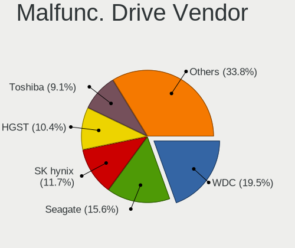
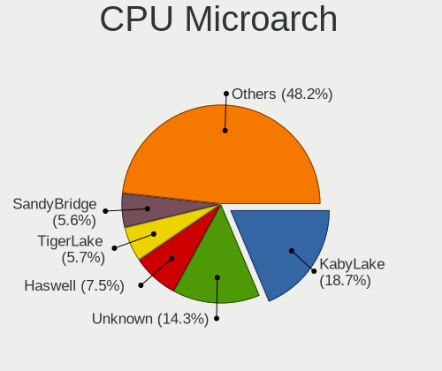
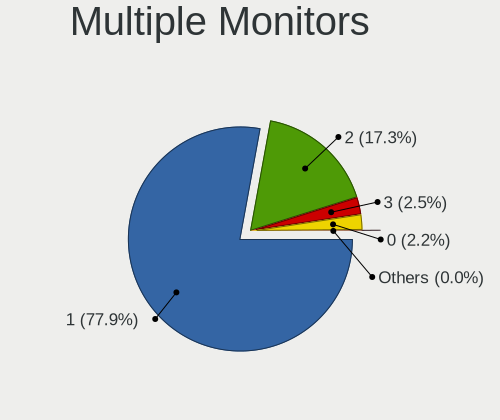

Pop!_OS 22.04 - Tested Hardware & Statistics (Notebooks)
--------------------------------------------------------

A project to collect tested hardware configurations for Pop!_OS 22.04.

Anyone can contribute to this report by the [hw-probe](https://github.com/linuxhw/hw-probe) tool:

    sudo -E hw-probe -all -upload

Please contribute! Especially if your hardware is rare.

Contents
--------

* [ Test Cases ](#test-cases)

* [ System ](#system)
  - [ Kernel                   ](#kernel)
  - [ Kernel Family            ](#kernel-family)
  - [ Kernel Major Ver.        ](#kernel-major-ver)
  - [ Arch                     ](#arch)
  - [ DE                       ](#de)
  - [ Display Server           ](#display-server)
  - [ Display Manager          ](#display-manager)
  - [ OS Lang                  ](#os-lang)
  - [ Boot Mode                ](#boot-mode)
  - [ Filesystem               ](#filesystem)
  - [ Part. scheme             ](#part-scheme)
  - [ Dual Boot with Linux/BSD ](#dual-boot-with-linuxbsd)
  - [ Dual Boot (Win)          ](#dual-boot-win)

* [ Board ](#board)
  - [ Vendor                   ](#vendor)
  - [ Model                    ](#model)
  - [ Model Family             ](#model-family)
  - [ MFG Year                 ](#mfg-year)
  - [ Form Factor              ](#form-factor)
  - [ Secure Boot              ](#secure-boot)
  - [ Coreboot                 ](#coreboot)
  - [ RAM Size                 ](#ram-size)
  - [ RAM Used                 ](#ram-used)
  - [ Total Drives             ](#total-drives)
  - [ Has CD-ROM               ](#has-cd-rom)
  - [ Has Ethernet             ](#has-ethernet)
  - [ Has WiFi                 ](#has-wifi)
  - [ Has Bluetooth            ](#has-bluetooth)

* [ Location ](#location)
  - [ Country                  ](#country)
  - [ City                     ](#city)

* [ Drives ](#drives)
  - [ Drive Vendor             ](#drive-vendor)
  - [ Drive Model              ](#drive-model)
  - [ HDD Vendor               ](#hdd-vendor)
  - [ SSD Vendor               ](#ssd-vendor)
  - [ Drive Kind               ](#drive-kind)
  - [ Drive Connector          ](#drive-connector)
  - [ Drive Size               ](#drive-size)
  - [ Space Total              ](#space-total)
  - [ Space Used               ](#space-used)
  - [ Malfunc. Drives          ](#malfunc-drives)
  - [ Malfunc. Drive Vendor    ](#malfunc-drive-vendor)
  - [ Malfunc. HDD Vendor      ](#malfunc-hdd-vendor)
  - [ Malfunc. Drive Kind      ](#malfunc-drive-kind)
  - [ Failed Drives            ](#failed-drives)
  - [ Failed Drive Vendor      ](#failed-drive-vendor)
  - [ Drive Status             ](#drive-status)

* [ Storage controller ](#storage-controller)
  - [ Storage Vendor           ](#storage-vendor)
  - [ Storage Model            ](#storage-model)
  - [ Storage Kind             ](#storage-kind)

* [ Processor ](#processor)
  - [ CPU Vendor               ](#cpu-vendor)
  - [ CPU Model                ](#cpu-model)
  - [ CPU Model Family         ](#cpu-model-family)
  - [ CPU Cores                ](#cpu-cores)
  - [ CPU Sockets              ](#cpu-sockets)
  - [ CPU Threads              ](#cpu-threads)
  - [ CPU Op-Modes             ](#cpu-op-modes)
  - [ CPU Microcode            ](#cpu-microcode)
  - [ CPU Microarch            ](#cpu-microarch)

* [ Graphics ](#graphics)
  - [ GPU Vendor               ](#gpu-vendor)
  - [ GPU Model                ](#gpu-model)
  - [ GPU Combo                ](#gpu-combo)
  - [ GPU Driver               ](#gpu-driver)
  - [ GPU Memory               ](#gpu-memory)

* [ Monitor ](#monitor)
  - [ Monitor Vendor           ](#monitor-vendor)
  - [ Monitor Model            ](#monitor-model)
  - [ Monitor Resolution       ](#monitor-resolution)
  - [ Monitor Diagonal         ](#monitor-diagonal)
  - [ Monitor Width            ](#monitor-width)
  - [ Aspect Ratio             ](#aspect-ratio)
  - [ Monitor Area             ](#monitor-area)
  - [ Pixel Density            ](#pixel-density)
  - [ Multiple Monitors        ](#multiple-monitors)

* [ Network ](#network)
  - [ Net Controller Vendor    ](#net-controller-vendor)
  - [ Net Controller Model     ](#net-controller-model)
  - [ Wireless Vendor          ](#wireless-vendor)
  - [ Wireless Model           ](#wireless-model)
  - [ Ethernet Vendor          ](#ethernet-vendor)
  - [ Ethernet Model           ](#ethernet-model)
  - [ Net Controller Kind      ](#net-controller-kind)
  - [ Used Controller          ](#used-controller)
  - [ NICs                     ](#nics)
  - [ IPv6                     ](#ipv6)

* [ Bluetooth ](#bluetooth)
  - [ Bluetooth Vendor         ](#bluetooth-vendor)
  - [ Bluetooth Model          ](#bluetooth-model)

* [ Sound ](#sound)
  - [ Sound Vendor             ](#sound-vendor)
  - [ Sound Model              ](#sound-model)

* [ Memory ](#memory)
  - [ Memory Vendor            ](#memory-vendor)
  - [ Memory Model             ](#memory-model)
  - [ Memory Kind              ](#memory-kind)
  - [ Memory Form Factor       ](#memory-form-factor)
  - [ Memory Size              ](#memory-size)
  - [ Memory Speed             ](#memory-speed)

* [ Printers & scanners ](#printers--scanners)
  - [ Printer Vendor           ](#printer-vendor)
  - [ Printer Model            ](#printer-model)
  - [ Scanner Vendor           ](#scanner-vendor)
  - [ Scanner Model            ](#scanner-model)

* [ Camera ](#camera)
  - [ Camera Vendor            ](#camera-vendor)
  - [ Camera Model             ](#camera-model)

* [ Security ](#security)
  - [ Fingerprint Vendor       ](#fingerprint-vendor)
  - [ Fingerprint Model        ](#fingerprint-model)
  - [ Chipcard Vendor          ](#chipcard-vendor)
  - [ Chipcard Model           ](#chipcard-model)

* [ Unsupported ](#unsupported)
  - [ Unsupported Devices      ](#unsupported-devices)
  - [ Unsupported Device Types ](#unsupported-device-types)

Test Cases
----------

Total: 2667

| Vendor        | Model                       | Probe                                                      | Date         |
|---------------|-----------------------------|------------------------------------------------------------|--------------|
| MSI           | Alpha 15 A3DDK              | [9a87dfb80b](https://linux-hardware.org/?probe=9a87dfb80b) | Sep 07, 2023 |
| HP            | EliteBook 8760w             | [d061b57b29](https://linux-hardware.org/?probe=d061b57b29) | Sep 07, 2023 |
| Alienware     | m15 R7                      | [9e6b80bbf2](https://linux-hardware.org/?probe=9e6b80bbf2) | Sep 07, 2023 |
| Apple         | MacBookPro11,3              | [bfdd099826](https://linux-hardware.org/?probe=bfdd099826) | Sep 06, 2023 |
| HP            | Victus by Laptop 16-e0xx... | [0692b6f878](https://linux-hardware.org/?probe=0692b6f878) | Sep 06, 2023 |
| Acer          | Swift SFX14-41G             | [611bb4fe1a](https://linux-hardware.org/?probe=611bb4fe1a) | Sep 06, 2023 |
| Acer          | Swift SFX14-41G             | [38f9d1abd9](https://linux-hardware.org/?probe=38f9d1abd9) | Sep 05, 2023 |
| Lenovo        | Legion Slim 5 16APH8 82Y... | [27575898fe](https://linux-hardware.org/?probe=27575898fe) | Sep 05, 2023 |
| HP            | Victus by Laptop 16-e0xx... | [dda5b7f9c9](https://linux-hardware.org/?probe=dda5b7f9c9) | Sep 05, 2023 |
| Dell          | Inspiron 14 5420            | [70d0d79f77](https://linux-hardware.org/?probe=70d0d79f77) | Sep 05, 2023 |
| Apple         | MacBookPro10,1              | [11c016fb1b](https://linux-hardware.org/?probe=11c016fb1b) | Sep 05, 2023 |
| Dell          | Latitude E5430 non-vPro     | [ee1a881e82](https://linux-hardware.org/?probe=ee1a881e82) | Sep 04, 2023 |
| System76      | Lemur Pro                   | [9ea11da090](https://linux-hardware.org/?probe=9ea11da090) | Sep 04, 2023 |
| Lenovo        | ThinkPad L14 Gen 1 20U10... | [68e90ee0cb](https://linux-hardware.org/?probe=68e90ee0cb) | Sep 04, 2023 |
| ASUSTek       | K53E                        | [5604fe515d](https://linux-hardware.org/?probe=5604fe515d) | Sep 04, 2023 |
| Dell          | XPS 17 9700                 | [e758c8955e](https://linux-hardware.org/?probe=e758c8955e) | Sep 03, 2023 |
| ASUSTek       | VivoBook_ASUSLaptop X412... | [2ddf0c5c61](https://linux-hardware.org/?probe=2ddf0c5c61) | Sep 03, 2023 |
| HP            | 240 G8 Notebook PC          | [092ae0b34d](https://linux-hardware.org/?probe=092ae0b34d) | Sep 03, 2023 |
| ASUSTek       | VivoBook_ASUSLaptop N760... | [f2f5e496f1](https://linux-hardware.org/?probe=f2f5e496f1) | Sep 02, 2023 |
| HP            | Stream Laptop 14-cb1xxx     | [515e1f4bce](https://linux-hardware.org/?probe=515e1f4bce) | Sep 02, 2023 |
| Apple         | MacBookAir3,2               | [5ee8cbf433](https://linux-hardware.org/?probe=5ee8cbf433) | Sep 02, 2023 |
| Schenker      | VIA 15 Pro                  | [4a31ab4d2b](https://linux-hardware.org/?probe=4a31ab4d2b) | Sep 02, 2023 |
| Apple         | MacBookAir6,2               | [da8d60051c](https://linux-hardware.org/?probe=da8d60051c) | Sep 02, 2023 |
| Dell          | Inspiron 15 7000 Gaming     | [87e1726495](https://linux-hardware.org/?probe=87e1726495) | Sep 01, 2023 |
| Dell          | Inspiron 15 7000 Gaming     | [e73e853358](https://linux-hardware.org/?probe=e73e853358) | Sep 01, 2023 |
| ASUSTek       | N550JV                      | [b2effdc956](https://linux-hardware.org/?probe=b2effdc956) | Sep 01, 2023 |
| Lenovo        | Legion 5 Pro 16IAH7H 82R... | [2433535726](https://linux-hardware.org/?probe=2433535726) | Sep 01, 2023 |
| Dell          | Inspiron 5558               | [77c6379594](https://linux-hardware.org/?probe=77c6379594) | Sep 01, 2023 |
| Acer          | Swift SFX14-41G             | [67f553625a](https://linux-hardware.org/?probe=67f553625a) | Sep 01, 2023 |
| Dell          | Latitude E7470              | [0580f1c293](https://linux-hardware.org/?probe=0580f1c293) | Sep 01, 2023 |
| Lenovo        | ThinkPad T450 20BUS0B000    | [1213d3bf46](https://linux-hardware.org/?probe=1213d3bf46) | Aug 31, 2023 |
| Acer          | Aspire E5-551G              | [628d865373](https://linux-hardware.org/?probe=628d865373) | Aug 31, 2023 |
| Framework     | Laptop (12th Gen Intel C... | [3b890e064f](https://linux-hardware.org/?probe=3b890e064f) | Aug 31, 2023 |
| Acer          | Nitro AN515-55              | [6c5da44516](https://linux-hardware.org/?probe=6c5da44516) | Aug 31, 2023 |
| Google        | Kefka                       | [284517c2b3](https://linux-hardware.org/?probe=284517c2b3) | Aug 31, 2023 |
| Lenovo        | ThinkPad W520 427637U       | [5f995c7c48](https://linux-hardware.org/?probe=5f995c7c48) | Aug 30, 2023 |
| Apple         | MacBookPro5,5               | [641243c308](https://linux-hardware.org/?probe=641243c308) | Aug 30, 2023 |
| Lenovo        | G50-80 80E5                 | [5ba6fd6ca3](https://linux-hardware.org/?probe=5ba6fd6ca3) | Aug 30, 2023 |
| Google        | Kefka                       | [a018ae3fb5](https://linux-hardware.org/?probe=a018ae3fb5) | Aug 30, 2023 |
| Acer          | Aspire E5-571               | [500ef94276](https://linux-hardware.org/?probe=500ef94276) | Aug 29, 2023 |
| HP            | Pavilion Laptop 15-cw0xx... | [90a72df8ef](https://linux-hardware.org/?probe=90a72df8ef) | Aug 29, 2023 |
| Lenovo        | IdeaPad S540-15IWL GTX 8... | [4904c007c7](https://linux-hardware.org/?probe=4904c007c7) | Aug 29, 2023 |
| Lenovo        | IdeaPad Gaming 3 15IAH7 ... | [ba9dd7a62d](https://linux-hardware.org/?probe=ba9dd7a62d) | Aug 29, 2023 |
| Lenovo        | ThinkPad T470p 20J7S0CF0... | [f1b8efb723](https://linux-hardware.org/?probe=f1b8efb723) | Aug 29, 2023 |
| ASUSTek       | ROG Strix G634JZ_G634JZ     | [481b37b0fc](https://linux-hardware.org/?probe=481b37b0fc) | Aug 29, 2023 |
| Dell          | Latitude 5330               | [7e63575d10](https://linux-hardware.org/?probe=7e63575d10) | Aug 29, 2023 |
| Lenovo        | ThinkPad T430s 2356CU8      | [2f669d797f](https://linux-hardware.org/?probe=2f669d797f) | Aug 29, 2023 |
| Lenovo        | ThinkPad T430s 2356CU8      | [39f2feeed5](https://linux-hardware.org/?probe=39f2feeed5) | Aug 29, 2023 |
| Lenovo        | ThinkPad E15 Gen 3 20YHC... | [de65d63e10](https://linux-hardware.org/?probe=de65d63e10) | Aug 28, 2023 |
| Lenovo        | Legion 5 15IMH 82CF         | [4d8ac47399](https://linux-hardware.org/?probe=4d8ac47399) | Aug 28, 2023 |
| Lenovo        | ThinkPad E15 Gen 3 20YHC... | [dc9a79314c](https://linux-hardware.org/?probe=dc9a79314c) | Aug 28, 2023 |
| Dell          | XPS 15 7590                 | [ef97f75590](https://linux-hardware.org/?probe=ef97f75590) | Aug 28, 2023 |
| Dell          | Precision 5510              | [c6d08d9c28](https://linux-hardware.org/?probe=c6d08d9c28) | Aug 27, 2023 |
| HP            | EliteBook 865 16 inch G9... | [b07775a194](https://linux-hardware.org/?probe=b07775a194) | Aug 27, 2023 |
| HP            | 250 G7 Notebook PC          | [c4be1d7e95](https://linux-hardware.org/?probe=c4be1d7e95) | Aug 27, 2023 |
| Lenovo        | ThinkPad T460 20FMS05K05    | [747e8d4f6a](https://linux-hardware.org/?probe=747e8d4f6a) | Aug 27, 2023 |
| Dell          | Precision M4600             | [b7fca4d2f9](https://linux-hardware.org/?probe=b7fca4d2f9) | Aug 27, 2023 |
| Apple         | MacBookPro8,2               | [9e0b5b0b7e](https://linux-hardware.org/?probe=9e0b5b0b7e) | Aug 26, 2023 |
| Dell          | Precision M6800             | [6aa5f8e441](https://linux-hardware.org/?probe=6aa5f8e441) | Aug 26, 2023 |
| HP            | ProBook 4730s               | [32f610b810](https://linux-hardware.org/?probe=32f610b810) | Aug 26, 2023 |
| Google        | Kasumi                      | [9af5f77257](https://linux-hardware.org/?probe=9af5f77257) | Aug 25, 2023 |
| System76      | Gazelle                     | [b3fb438915](https://linux-hardware.org/?probe=b3fb438915) | Aug 25, 2023 |
| MSI           | GE60 2OC\2OD\2OE            | [e2e304c9eb](https://linux-hardware.org/?probe=e2e304c9eb) | Aug 25, 2023 |
| HP            | EliteBook 865 16 inch G9... | [34fc2a5f83](https://linux-hardware.org/?probe=34fc2a5f83) | Aug 24, 2023 |
| Dell          | Latitude E7240              | [cb61859037](https://linux-hardware.org/?probe=cb61859037) | Aug 24, 2023 |
| HP            | Victus by Laptop 16-e0xx... | [6cf9db7da7](https://linux-hardware.org/?probe=6cf9db7da7) | Aug 24, 2023 |
| Dell          | Latitude 7430               | [7daf0301c5](https://linux-hardware.org/?probe=7daf0301c5) | Aug 24, 2023 |
| Toshiba       | Satellite L655              | [18df557333](https://linux-hardware.org/?probe=18df557333) | Aug 24, 2023 |
| HP            | Pavilion Notebook           | [b0ca2ee250](https://linux-hardware.org/?probe=b0ca2ee250) | Aug 23, 2023 |
| MSI           | GE60 2OC\2OD\2OE            | [50f079ae44](https://linux-hardware.org/?probe=50f079ae44) | Aug 23, 2023 |
| Dell          | XPS 13 9310                 | [6f0e38b5e8](https://linux-hardware.org/?probe=6f0e38b5e8) | Aug 23, 2023 |
| Samsung       | 750TDA                      | [7b1ec96afa](https://linux-hardware.org/?probe=7b1ec96afa) | Aug 23, 2023 |
| ASUSTek       | Zenbook UX3402ZA_Q409ZA     | [4cd19df49e](https://linux-hardware.org/?probe=4cd19df49e) | Aug 23, 2023 |
| Lenovo        | ThinkPad T460s 20FAS2RV0... | [e8d2c8e1d5](https://linux-hardware.org/?probe=e8d2c8e1d5) | Aug 22, 2023 |
| Lenovo        | IdeaPad Gaming 3 15ARH7 ... | [fdd24243bf](https://linux-hardware.org/?probe=fdd24243bf) | Aug 22, 2023 |
| Acer          | Aspire A715-75G             | [54794fb9e8](https://linux-hardware.org/?probe=54794fb9e8) | Aug 22, 2023 |
| HP            | ProBook 4730s               | [5b4d88bc67](https://linux-hardware.org/?probe=5b4d88bc67) | Aug 21, 2023 |
| Samsung       | 270E5G/270E5U               | [930d312c36](https://linux-hardware.org/?probe=930d312c36) | Aug 21, 2023 |
| Samsung       | 270E5G/270E5U               | [2bc8c24081](https://linux-hardware.org/?probe=2bc8c24081) | Aug 21, 2023 |
| ASUSTek       | ASUS TUF Dash F15 FX516P... | [b66d308d42](https://linux-hardware.org/?probe=b66d308d42) | Aug 21, 2023 |
| MSI           | Modern 15 A5M               | [f9742049fc](https://linux-hardware.org/?probe=f9742049fc) | Aug 20, 2023 |
| System76      | Oryx Pro                    | [b7e0bd11e5](https://linux-hardware.org/?probe=b7e0bd11e5) | Aug 20, 2023 |
| Dell          | Precision 5520              | [42587aac96](https://linux-hardware.org/?probe=42587aac96) | Aug 20, 2023 |
| Dell          | Precision 5520              | [bec735d800](https://linux-hardware.org/?probe=bec735d800) | Aug 20, 2023 |
| ASUSTek       | ROG Zephyrus G15 GA503QR    | [5d063a6e59](https://linux-hardware.org/?probe=5d063a6e59) | Aug 19, 2023 |
| Lenovo        | B490 377224P                | [0e516ea22b](https://linux-hardware.org/?probe=0e516ea22b) | Aug 19, 2023 |
| HP            | Pavilion Laptop 15-cw1xx... | [a1ab007f7f](https://linux-hardware.org/?probe=a1ab007f7f) | Aug 18, 2023 |
| ASUSTek       | U38N                        | [0e0f709353](https://linux-hardware.org/?probe=0e0f709353) | Aug 17, 2023 |
| HP            | EliteBook 850 G3            | [a6a7224d63](https://linux-hardware.org/?probe=a6a7224d63) | Aug 17, 2023 |
| Dell          | XPS 13 9310                 | [680fae2274](https://linux-hardware.org/?probe=680fae2274) | Aug 17, 2023 |
| ASUSTek       | Vivobook Go E1404FA_E140... | [43fd1aad67](https://linux-hardware.org/?probe=43fd1aad67) | Aug 17, 2023 |
| System76      | Lemur Pro                   | [af3b387574](https://linux-hardware.org/?probe=af3b387574) | Aug 16, 2023 |
| Acer          | Aspire 5750                 | [ec4afb1917](https://linux-hardware.org/?probe=ec4afb1917) | Aug 16, 2023 |
| A-DATA Tec... | XENIA 14                    | [59faf4a458](https://linux-hardware.org/?probe=59faf4a458) | Aug 15, 2023 |
| A-DATA Tec... | XENIA 14                    | [537cce8a8e](https://linux-hardware.org/?probe=537cce8a8e) | Aug 15, 2023 |
| HP            | Laptop 15s-eq2xxx           | [c2cfa9bd7a](https://linux-hardware.org/?probe=c2cfa9bd7a) | Aug 15, 2023 |
| Apple         | MacBookAir6,2               | [431ac1b880](https://linux-hardware.org/?probe=431ac1b880) | Aug 15, 2023 |
| Dell          | XPS 15 9570                 | [ce22773504](https://linux-hardware.org/?probe=ce22773504) | Aug 15, 2023 |
| System76      | Galago Pro                  | [54348f9c55](https://linux-hardware.org/?probe=54348f9c55) | Aug 14, 2023 |
| Apple         | MacBookPro9,2               | [61ff7ac5f1](https://linux-hardware.org/?probe=61ff7ac5f1) | Aug 14, 2023 |
| Apple         | MacBookPro16,1              | [18b513f5f0](https://linux-hardware.org/?probe=18b513f5f0) | Aug 14, 2023 |
| Lenovo        | ThinkPad T480s 20L7CTO1W... | [1f27d0f994](https://linux-hardware.org/?probe=1f27d0f994) | Aug 14, 2023 |
| HP            | ProBook 4540s               | [84dbf6b759](https://linux-hardware.org/?probe=84dbf6b759) | Aug 13, 2023 |
| Dell          | Inspiron 3542               | [ae586a02aa](https://linux-hardware.org/?probe=ae586a02aa) | Aug 13, 2023 |
| ASUSTek       | Vivobook Go E1504FA_E150... | [823e276406](https://linux-hardware.org/?probe=823e276406) | Aug 13, 2023 |
| GPU Compan... | GWNR71517                   | [a38cee5cc9](https://linux-hardware.org/?probe=a38cee5cc9) | Aug 12, 2023 |
| Acer          | Aspire ES1-520              | [a47415983e](https://linux-hardware.org/?probe=a47415983e) | Aug 12, 2023 |
| Lenovo        | ThinkPad L13 20R3CTO1WW     | [6ac135c81c](https://linux-hardware.org/?probe=6ac135c81c) | Aug 12, 2023 |
| ASUSTek       | K53TK                       | [db9f130ade](https://linux-hardware.org/?probe=db9f130ade) | Aug 12, 2023 |
| Dell          | G7 7588                     | [48faf46c2c](https://linux-hardware.org/?probe=48faf46c2c) | Aug 12, 2023 |
| Lenovo        | Yoga Pro 9 14IRP8 83BU      | [f46a14b981](https://linux-hardware.org/?probe=f46a14b981) | Aug 12, 2023 |
| HP            | EliteBook 820 G3            | [544810db31](https://linux-hardware.org/?probe=544810db31) | Aug 12, 2023 |
| ASUSTek       | ZenBook UX425EA_UX425EA     | [0d45e9e048](https://linux-hardware.org/?probe=0d45e9e048) | Aug 12, 2023 |
| Dell          | Precision M4600             | [f97367efac](https://linux-hardware.org/?probe=f97367efac) | Aug 11, 2023 |
| Lenovo        | IdeaPad 310-15IAP 80TT      | [361e073b5c](https://linux-hardware.org/?probe=361e073b5c) | Aug 11, 2023 |
| Acer          | Nitro AN715-51              | [ea972c8686](https://linux-hardware.org/?probe=ea972c8686) | Aug 11, 2023 |
| ASUSTek       | ROG Zephyrus G14 GA401QM... | [e22f71b79d](https://linux-hardware.org/?probe=e22f71b79d) | Aug 11, 2023 |
| ASUSTek       | X751LD                      | [e98d8d116d](https://linux-hardware.org/?probe=e98d8d116d) | Aug 10, 2023 |
| Apple         | MacBookAir5,2               | [7f91d6f9d8](https://linux-hardware.org/?probe=7f91d6f9d8) | Aug 10, 2023 |
| Acer          | Nitro AN517-55              | [b77ff095f8](https://linux-hardware.org/?probe=b77ff095f8) | Aug 09, 2023 |
| Lenovo        | IdeaPad 5 14ABA7 82SE       | [6415840d5b](https://linux-hardware.org/?probe=6415840d5b) | Aug 09, 2023 |
| HP            | ProBook 4330s               | [5c854bed9f](https://linux-hardware.org/?probe=5c854bed9f) | Aug 09, 2023 |
| HP            | ProBook 4330s               | [d23ce497d2](https://linux-hardware.org/?probe=d23ce497d2) | Aug 09, 2023 |
| System76      | Darter Pro                  | [5162d61c01](https://linux-hardware.org/?probe=5162d61c01) | Aug 09, 2023 |
| MSI           | Cyborg 15 A12VF             | [b041192310](https://linux-hardware.org/?probe=b041192310) | Aug 09, 2023 |
| Alienware     | 14                          | [192b13997d](https://linux-hardware.org/?probe=192b13997d) | Aug 09, 2023 |
| HP            | Victus by 15.6 inch Gami... | [67f88ab571](https://linux-hardware.org/?probe=67f88ab571) | Aug 08, 2023 |
| ASUSTek       | Zenbook Pro Duo UX582ZW_... | [afa081b440](https://linux-hardware.org/?probe=afa081b440) | Aug 08, 2023 |
| Acer          | Ferrari One 200             | [be688aa584](https://linux-hardware.org/?probe=be688aa584) | Aug 08, 2023 |
| Apple         | MacBookPro10,1              | [00b169d241](https://linux-hardware.org/?probe=00b169d241) | Aug 08, 2023 |
| Apple         | MacBookPro11,3              | [c415fd317b](https://linux-hardware.org/?probe=c415fd317b) | Aug 08, 2023 |
| Apple         | MacBookPro10,1              | [5e0c7f7bfc](https://linux-hardware.org/?probe=5e0c7f7bfc) | Aug 08, 2023 |
| Acer          | Aspire A715-75G             | [57f1225daf](https://linux-hardware.org/?probe=57f1225daf) | Aug 08, 2023 |
| Lenovo        | Legion 5 17ACH6H 82JY       | [088a8fad47](https://linux-hardware.org/?probe=088a8fad47) | Aug 08, 2023 |
| System76      | Oryx Pro                    | [c5b97761d3](https://linux-hardware.org/?probe=c5b97761d3) | Aug 07, 2023 |
| MSI           | Cyborg 15 A12VF             | [5fe9a17769](https://linux-hardware.org/?probe=5fe9a17769) | Aug 07, 2023 |
| MSI           | GP72 7RDX                   | [43eb53850c](https://linux-hardware.org/?probe=43eb53850c) | Aug 06, 2023 |
| Clevo         | W150HRM                     | [1ddcfcbecc](https://linux-hardware.org/?probe=1ddcfcbecc) | Aug 06, 2023 |
| Apple         | MacBookPro9,2               | [16936ef482](https://linux-hardware.org/?probe=16936ef482) | Aug 06, 2023 |
| MSI           | GP72 7RDX                   | [6d2bc8aa9e](https://linux-hardware.org/?probe=6d2bc8aa9e) | Aug 06, 2023 |
| Timi          | RedmiBook Pro 15S           | [576241bbd4](https://linux-hardware.org/?probe=576241bbd4) | Aug 06, 2023 |
| Notebook      | 1745                        | [3561a5dbbe](https://linux-hardware.org/?probe=3561a5dbbe) | Aug 06, 2023 |
| HP            | Pavilion dm4                | [521b8518ed](https://linux-hardware.org/?probe=521b8518ed) | Aug 06, 2023 |
| Dell          | Latitude 5430               | [f63444b0be](https://linux-hardware.org/?probe=f63444b0be) | Aug 05, 2023 |
| Apple         | MacBookPro11,2              | [32f8bbeff7](https://linux-hardware.org/?probe=32f8bbeff7) | Aug 05, 2023 |
| MSI           | Modern 15 A5M               | [a4a6f81455](https://linux-hardware.org/?probe=a4a6f81455) | Aug 05, 2023 |
| MSI           | Modern 15 A5M               | [ef010c9d51](https://linux-hardware.org/?probe=ef010c9d51) | Aug 05, 2023 |
| Lenovo        | ThinkPad X13 Gen 2a 20XH... | [7d17fc9ff6](https://linux-hardware.org/?probe=7d17fc9ff6) | Aug 05, 2023 |
| Lenovo        | V15 G3 ABA 82TV             | [0147060507](https://linux-hardware.org/?probe=0147060507) | Aug 04, 2023 |
| HP            | ProBook 650 G1              | [286cc8b0dd](https://linux-hardware.org/?probe=286cc8b0dd) | Aug 04, 2023 |
| Lenovo        | ThinkPad W541 20EGS0GY0R    | [4d618e08b3](https://linux-hardware.org/?probe=4d618e08b3) | Aug 03, 2023 |
| Lenovo        | ThinkPad P16 Gen 1 21D6C... | [a97312771e](https://linux-hardware.org/?probe=a97312771e) | Aug 03, 2023 |
| Dell          | XPS 13 9370                 | [cf49ff3004](https://linux-hardware.org/?probe=cf49ff3004) | Aug 03, 2023 |
| Dell          | Latitude E7240              | [ec5ec88e59](https://linux-hardware.org/?probe=ec5ec88e59) | Aug 02, 2023 |
| Lenovo        | ThinkPad X270 W10DG 20K5... | [99ccd043cb](https://linux-hardware.org/?probe=99ccd043cb) | Aug 02, 2023 |
| Lenovo        | ThinkPad X270 W10DG 20K5... | [d4e267a214](https://linux-hardware.org/?probe=d4e267a214) | Aug 02, 2023 |
| HP            | ProBook 650 G4              | [d041df173b](https://linux-hardware.org/?probe=d041df173b) | Aug 02, 2023 |
| Apple         | MacBookPro11,3              | [1eb6fd9620](https://linux-hardware.org/?probe=1eb6fd9620) | Aug 02, 2023 |
| Apple         | MacBookPro7,1               | [0a3c5e5c4d](https://linux-hardware.org/?probe=0a3c5e5c4d) | Aug 02, 2023 |
| Apple         | MacBookPro7,1               | [9f852ea211](https://linux-hardware.org/?probe=9f852ea211) | Aug 02, 2023 |
| ASUSTek       | GL502VSK                    | [0ed7feaa05](https://linux-hardware.org/?probe=0ed7feaa05) | Aug 01, 2023 |
| Lenovo        | Legion 5 15ARH7 82RE        | [e1a79e094e](https://linux-hardware.org/?probe=e1a79e094e) | Aug 01, 2023 |
| Dell          | Inspiron 5567               | [d252fa93be](https://linux-hardware.org/?probe=d252fa93be) | Aug 01, 2023 |
| ASUSTek       | ASUS TUF Gaming F15 FX50... | [9fbfc590ad](https://linux-hardware.org/?probe=9fbfc590ad) | Aug 01, 2023 |
| Dell          | Latitude 3500               | [df5211a816](https://linux-hardware.org/?probe=df5211a816) | Aug 01, 2023 |
| Dell          | Latitude 5490               | [e24a9f877c](https://linux-hardware.org/?probe=e24a9f877c) | Aug 01, 2023 |
| System76      | Lemur Pro                   | [1ba844bc69](https://linux-hardware.org/?probe=1ba844bc69) | Aug 01, 2023 |
| System76      | Lemur Pro                   | [e019d33faf](https://linux-hardware.org/?probe=e019d33faf) | Aug 01, 2023 |
| MSI           | Katana GF66 12UC            | [d590bcd619](https://linux-hardware.org/?probe=d590bcd619) | Jul 31, 2023 |
| ASUSTek       | K95VM                       | [1ec08c4cf9](https://linux-hardware.org/?probe=1ec08c4cf9) | Jul 30, 2023 |
| Lenovo        | IdeaPad 5 14ARE05 81YM      | [60cfcb00e9](https://linux-hardware.org/?probe=60cfcb00e9) | Jul 30, 2023 |
| Dell          | Latitude E7440              | [7509a5f756](https://linux-hardware.org/?probe=7509a5f756) | Jul 30, 2023 |
| System76      | Darter Pro                  | [0220d19f38](https://linux-hardware.org/?probe=0220d19f38) | Jul 30, 2023 |
| Dell          | Latitude E7240              | [b794bcdde6](https://linux-hardware.org/?probe=b794bcdde6) | Jul 29, 2023 |
| HP            | Pavilion 11 x360 PC         | [d693783e7a](https://linux-hardware.org/?probe=d693783e7a) | Jul 29, 2023 |
| Unknown       | Unknown                     | [73836c0a75](https://linux-hardware.org/?probe=73836c0a75) | Jul 29, 2023 |
| HP            | EliteBook 850 G8 Noteboo... | [59f0eb6b57](https://linux-hardware.org/?probe=59f0eb6b57) | Jul 28, 2023 |
| ASUSTek       | ROG Strix G713PI_G713PI     | [cb2f78abf0](https://linux-hardware.org/?probe=cb2f78abf0) | Jul 28, 2023 |
| Dell          | Precision 3550              | [0ecac77f90](https://linux-hardware.org/?probe=0ecac77f90) | Jul 28, 2023 |
| Dell          | Precision 3550              | [95ae018833](https://linux-hardware.org/?probe=95ae018833) | Jul 28, 2023 |
| System76      | Oryx Pro                    | [0ad8c1d8a7](https://linux-hardware.org/?probe=0ad8c1d8a7) | Jul 28, 2023 |
| Acer          | Aspire A315-42G             | [0e3aa83494](https://linux-hardware.org/?probe=0e3aa83494) | Jul 28, 2023 |
| HP            | EliteBook 840 G3            | [5a1f6f3395](https://linux-hardware.org/?probe=5a1f6f3395) | Jul 27, 2023 |
| Dell          | G15 5520                    | [7a5b503737](https://linux-hardware.org/?probe=7a5b503737) | Jul 27, 2023 |
| ASUSTek       | VivoBook_ASUSLaptop X509... | [4152e1f98e](https://linux-hardware.org/?probe=4152e1f98e) | Jul 27, 2023 |
| Dell          | Latitude E7440              | [619c6e4b99](https://linux-hardware.org/?probe=619c6e4b99) | Jul 27, 2023 |
| Samsung       | 300E5M/300E5L               | [23b23d59aa](https://linux-hardware.org/?probe=23b23d59aa) | Jul 27, 2023 |
| HP            | Dev One Notebook PC         | [b54bb52258](https://linux-hardware.org/?probe=b54bb52258) | Jul 27, 2023 |
| ASUSTek       | ROG Zephyrus G15 GA503RW... | [9920824f1f](https://linux-hardware.org/?probe=9920824f1f) | Jul 27, 2023 |
| Acer          | Nitro AN515-55              | [00e9bb8973](https://linux-hardware.org/?probe=00e9bb8973) | Jul 26, 2023 |
| Dell          | Inspiron 5548               | [22b2519a90](https://linux-hardware.org/?probe=22b2519a90) | Jul 26, 2023 |
| Acer          | Aspire A515-56              | [7e0e30c1cf](https://linux-hardware.org/?probe=7e0e30c1cf) | Jul 26, 2023 |
| Dell          | Inspiron 5548               | [b583a1fbee](https://linux-hardware.org/?probe=b583a1fbee) | Jul 26, 2023 |
| Dell          | Inspiron 5548               | [3d3696e8fa](https://linux-hardware.org/?probe=3d3696e8fa) | Jul 25, 2023 |
| HP            | Laptop 14-bs0xx             | [e074ee90be](https://linux-hardware.org/?probe=e074ee90be) | Jul 25, 2023 |
| MSI           | GF63 Thin 10SCXR            | [b34b7fa5fb](https://linux-hardware.org/?probe=b34b7fa5fb) | Jul 25, 2023 |
| Dell          | Inspiron 5490               | [25f155c61a](https://linux-hardware.org/?probe=25f155c61a) | Jul 24, 2023 |
| Dell          | Inspiron 5490               | [6b80b41fee](https://linux-hardware.org/?probe=6b80b41fee) | Jul 24, 2023 |
| Dell          | XPS 15 7590                 | [fa64a82283](https://linux-hardware.org/?probe=fa64a82283) | Jul 24, 2023 |
| ASUSTek       | ASUS TUF Gaming A16 FA61... | [88cfdb061d](https://linux-hardware.org/?probe=88cfdb061d) | Jul 24, 2023 |
| ASUSTek       | ROG Strix G713PV_G713PV     | [61c84247e6](https://linux-hardware.org/?probe=61c84247e6) | Jul 24, 2023 |
| Apple         | MacBookAir4,2               | [e220379405](https://linux-hardware.org/?probe=e220379405) | Jul 24, 2023 |
| ASUSTek       | ROG Strix G533ZW_G533ZW     | [53bab7ac5e](https://linux-hardware.org/?probe=53bab7ac5e) | Jul 24, 2023 |
| Apple         | MacBookPro5,5               | [b2b0895194](https://linux-hardware.org/?probe=b2b0895194) | Jul 24, 2023 |
| Lenovo        | Y520-15IKBN 80WK            | [3d8ec4447b](https://linux-hardware.org/?probe=3d8ec4447b) | Jul 24, 2023 |
| Lenovo        | Yoga Slim 7 ProX 14ARH7 ... | [fe2ff0c21f](https://linux-hardware.org/?probe=fe2ff0c21f) | Jul 23, 2023 |
| Apple         | MacBookPro8,1               | [2cd0946aba](https://linux-hardware.org/?probe=2cd0946aba) | Jul 23, 2023 |
| Sony          | SVF1521A6EW                 | [3c39100c6f](https://linux-hardware.org/?probe=3c39100c6f) | Jul 23, 2023 |
| PC Special... | Standard                    | [992aec5bb8](https://linux-hardware.org/?probe=992aec5bb8) | Jul 23, 2023 |
| HP            | ZBook Studio G3             | [bcfc5b64f4](https://linux-hardware.org/?probe=bcfc5b64f4) | Jul 23, 2023 |
| Google        | Snappy                      | [a3e6774e43](https://linux-hardware.org/?probe=a3e6774e43) | Jul 23, 2023 |
| Dell          | Latitude 3500               | [0755576e96](https://linux-hardware.org/?probe=0755576e96) | Jul 22, 2023 |
| Dell          | Latitude E6430s             | [8e74e2a524](https://linux-hardware.org/?probe=8e74e2a524) | Jul 22, 2023 |
| Dell          | Vostro 3560                 | [05acc63d53](https://linux-hardware.org/?probe=05acc63d53) | Jul 22, 2023 |
| Dell          | Latitude 5410               | [82217114b4](https://linux-hardware.org/?probe=82217114b4) | Jul 21, 2023 |
| Dell          | Latitude 5520               | [070380568b](https://linux-hardware.org/?probe=070380568b) | Jul 21, 2023 |
| Dell          | Precision 7530              | [0d2e753768](https://linux-hardware.org/?probe=0d2e753768) | Jul 20, 2023 |
| Acer          | Aspire A515-52              | [243f0a8cab](https://linux-hardware.org/?probe=243f0a8cab) | Jul 20, 2023 |
| Acer          | Aspire A515-52              | [f310abe0bb](https://linux-hardware.org/?probe=f310abe0bb) | Jul 20, 2023 |
| HP            | Pavilion Plus Laptop 14-... | [937715a75f](https://linux-hardware.org/?probe=937715a75f) | Jul 20, 2023 |
| Dell          | Latitude E5270              | [9ea13fdc27](https://linux-hardware.org/?probe=9ea13fdc27) | Jul 20, 2023 |
| HP            | Laptop 15-da0xxx            | [6e17b916ee](https://linux-hardware.org/?probe=6e17b916ee) | Jul 20, 2023 |
| Acer          | Extensa 5635ZG              | [337f0cec05](https://linux-hardware.org/?probe=337f0cec05) | Jul 20, 2023 |
| Toshiba       | Satellite L750              | [662f89dcc3](https://linux-hardware.org/?probe=662f89dcc3) | Jul 20, 2023 |
| Dell          | XPS 13 9360                 | [ac1a8eea0e](https://linux-hardware.org/?probe=ac1a8eea0e) | Jul 19, 2023 |
| Lenovo        | ThinkBook 16p Gen 2 20YM    | [35944db669](https://linux-hardware.org/?probe=35944db669) | Jul 19, 2023 |
| Schenker      | XMG NEO (CML/E20)           | [9f99e57705](https://linux-hardware.org/?probe=9f99e57705) | Jul 19, 2023 |
| ASUSTek       | K53E                        | [7fddec038e](https://linux-hardware.org/?probe=7fddec038e) | Jul 19, 2023 |
| ASUSTek       | VivoBook_ASUS Laptop X50... | [8cb16d19aa](https://linux-hardware.org/?probe=8cb16d19aa) | Jul 19, 2023 |
| Notebook      | NH5x_7xDPx                  | [098f2f58c7](https://linux-hardware.org/?probe=098f2f58c7) | Jul 18, 2023 |
| Apple         | MacBookPro16,1              | [dd5d384a71](https://linux-hardware.org/?probe=dd5d384a71) | Jul 18, 2023 |
| HP            | ENVY Laptop 17-cr0xxx       | [f5dc246f7c](https://linux-hardware.org/?probe=f5dc246f7c) | Jul 18, 2023 |
| HP            | ENVY Laptop 17-cr0xxx       | [abec03689c](https://linux-hardware.org/?probe=abec03689c) | Jul 18, 2023 |
| ASRock        | Z77 Performance             | [585aaad9ad](https://linux-hardware.org/?probe=585aaad9ad) | Jul 18, 2023 |
| Lenovo        | IdeaPad 330-15IKB 81DE      | [1cffa4bad9](https://linux-hardware.org/?probe=1cffa4bad9) | Jul 18, 2023 |
| Lenovo        | ThinkBook 16p Gen 2 20YM    | [cdaad6fa25](https://linux-hardware.org/?probe=cdaad6fa25) | Jul 18, 2023 |
| HP            | 635                         | [500e11147e](https://linux-hardware.org/?probe=500e11147e) | Jul 18, 2023 |
| ASUSTek       | ASUS TUF Dash F15 FX516P... | [1426cda0a7](https://linux-hardware.org/?probe=1426cda0a7) | Jul 17, 2023 |
| Lenovo        | IdeaPad 3 15ITL6 82H8       | [c7a062709f](https://linux-hardware.org/?probe=c7a062709f) | Jul 17, 2023 |
| HUAWEI        | KLVC-WXX9                   | [0427f16143](https://linux-hardware.org/?probe=0427f16143) | Jul 17, 2023 |
| Lenovo        | ThinkPad L13 Yoga Gen 2a... | [0bbd5c68bb](https://linux-hardware.org/?probe=0bbd5c68bb) | Jul 17, 2023 |
| Dell          | Precision M6800             | [8ddd80db6c](https://linux-hardware.org/?probe=8ddd80db6c) | Jul 17, 2023 |
| Lenovo        | ThinkPad X390 20Q1S67S00    | [be43004463](https://linux-hardware.org/?probe=be43004463) | Jul 17, 2023 |
| System76      | Serval WS                   | [a916a92726](https://linux-hardware.org/?probe=a916a92726) | Jul 17, 2023 |
| ASUSTek       | ROG Strix G713PV_G713PV     | [55a5100039](https://linux-hardware.org/?probe=55a5100039) | Jul 16, 2023 |
| ASUSTek       | ROG Strix G713PV_G713PV     | [ad8f031cb2](https://linux-hardware.org/?probe=ad8f031cb2) | Jul 16, 2023 |
| Lenovo        | IdeaPad 3 15ITL6 82H8       | [51128412d5](https://linux-hardware.org/?probe=51128412d5) | Jul 16, 2023 |
| Lenovo        | Legion Slim 7 16IRH8 82Y... | [437209972c](https://linux-hardware.org/?probe=437209972c) | Jul 15, 2023 |
| Lenovo        | ThinkPad T480 20L5S1S000    | [91dbb2c969](https://linux-hardware.org/?probe=91dbb2c969) | Jul 15, 2023 |
| Dell          | G15 5510                    | [28b7a732f2](https://linux-hardware.org/?probe=28b7a732f2) | Jul 15, 2023 |
| System76      | Pangolin                    | [486df7ead2](https://linux-hardware.org/?probe=486df7ead2) | Jul 14, 2023 |
| Samsung       | 350V5C/351V5C/3540VC/344... | [0498e27f41](https://linux-hardware.org/?probe=0498e27f41) | Jul 14, 2023 |
| HP            | ENVY 15                     | [5cfb9d33bd](https://linux-hardware.org/?probe=5cfb9d33bd) | Jul 14, 2023 |
| HP            | Pavilion Gaming Laptop 1... | [21fc63e4dd](https://linux-hardware.org/?probe=21fc63e4dd) | Jul 14, 2023 |
| MSI           | GF63 Thin 10SC              | [d017610254](https://linux-hardware.org/?probe=d017610254) | Jul 14, 2023 |
| Lenovo        | Legion 7 16ITHg6 82K6       | [e53c63af42](https://linux-hardware.org/?probe=e53c63af42) | Jul 14, 2023 |
| Lenovo        | ThinkPad T530 23943J8       | [fb022ada73](https://linux-hardware.org/?probe=fb022ada73) | Jul 14, 2023 |
| HP            | Pavilion Gaming Laptop 1... | [e84bf83ac1](https://linux-hardware.org/?probe=e84bf83ac1) | Jul 13, 2023 |
| HP            | Compaq CQ58                 | [78977dd4de](https://linux-hardware.org/?probe=78977dd4de) | Jul 13, 2023 |
| Lenovo        | ThinkPad T470p 20J7S0CF0... | [7ef2028b06](https://linux-hardware.org/?probe=7ef2028b06) | Jul 13, 2023 |
| Acer          | Aspire E5-576G              | [0856b48ae7](https://linux-hardware.org/?probe=0856b48ae7) | Jul 13, 2023 |
| Acer          | Swift SF314-42              | [c82bb58705](https://linux-hardware.org/?probe=c82bb58705) | Jul 13, 2023 |
| Lenovo        | ThinkPad P53s 20N6001UUS    | [5a675551df](https://linux-hardware.org/?probe=5a675551df) | Jul 13, 2023 |
| Dell          | G3 3590                     | [089bfa3da7](https://linux-hardware.org/?probe=089bfa3da7) | Jul 13, 2023 |
| Apple         | MacBookPro8,1               | [d4910e3f43](https://linux-hardware.org/?probe=d4910e3f43) | Jul 13, 2023 |
| Acer          | Swift SF314-42              | [7a9624e7cc](https://linux-hardware.org/?probe=7a9624e7cc) | Jul 12, 2023 |
| Acer          | Swift SF314-58G             | [795625662c](https://linux-hardware.org/?probe=795625662c) | Jul 12, 2023 |
| Acer          | Swift SF314-58G             | [c01b74af46](https://linux-hardware.org/?probe=c01b74af46) | Jul 12, 2023 |
| Timi          | Xiaomi NoteBook Pro         | [618c0c975b](https://linux-hardware.org/?probe=618c0c975b) | Jul 12, 2023 |
| HP            | Laptop 17-cp0xxx            | [801537f1d4](https://linux-hardware.org/?probe=801537f1d4) | Jul 12, 2023 |
| Apple         | MacBookPro6,2               | [20e2180dc1](https://linux-hardware.org/?probe=20e2180dc1) | Jul 12, 2023 |
| MSI           | Cyborg 15 A12VF             | [2c4a8d9d63](https://linux-hardware.org/?probe=2c4a8d9d63) | Jul 12, 2023 |
| Lenovo        | ThinkPad T470s 20HGS01A0... | [54e51170a1](https://linux-hardware.org/?probe=54e51170a1) | Jul 11, 2023 |
| Apple         | MacBookAir3,2               | [cbfc272e87](https://linux-hardware.org/?probe=cbfc272e87) | Jul 11, 2023 |
| HP            | EliteBook 850 G6            | [556ef4473f](https://linux-hardware.org/?probe=556ef4473f) | Jul 11, 2023 |
| HP            | EliteBook 840 G6            | [a61e80c022](https://linux-hardware.org/?probe=a61e80c022) | Jul 11, 2023 |
| Apple         | MacBookAir7,2               | [1453f984c9](https://linux-hardware.org/?probe=1453f984c9) | Jul 11, 2023 |
| ASUSTek       | ASUS TUF Dash F15 FX516P... | [5a7dbc5d7c](https://linux-hardware.org/?probe=5a7dbc5d7c) | Jul 10, 2023 |
| Apple         | MacBookPro6,2               | [293ddc3253](https://linux-hardware.org/?probe=293ddc3253) | Jul 10, 2023 |
| Notebook      | NP5x_NP6x_NP7xRNJ_RNH       | [7663e77bff](https://linux-hardware.org/?probe=7663e77bff) | Jul 09, 2023 |
| Notebook      | P7xxTM1                     | [81c163ed4a](https://linux-hardware.org/?probe=81c163ed4a) | Jul 09, 2023 |
| HP            | Laptop 14s-fq0xxx           | [92feea0533](https://linux-hardware.org/?probe=92feea0533) | Jul 08, 2023 |
| HP            | Laptop 14s-fq0xxx           | [2287c62944](https://linux-hardware.org/?probe=2287c62944) | Jul 08, 2023 |
| Toshiba       | IS 1413G                    | [cf96aafbc0](https://linux-hardware.org/?probe=cf96aafbc0) | Jul 08, 2023 |
| Apple         | MacBookPro11,1              | [1f88a40c05](https://linux-hardware.org/?probe=1f88a40c05) | Jul 08, 2023 |
| Apple         | MacBookPro11,1              | [e1f22afb69](https://linux-hardware.org/?probe=e1f22afb69) | Jul 08, 2023 |
| MSI           | Cyborg 15 A12VF             | [a34d0d8290](https://linux-hardware.org/?probe=a34d0d8290) | Jul 08, 2023 |
| Dell          | Inspiron 5565               | [d1df053096](https://linux-hardware.org/?probe=d1df053096) | Jul 08, 2023 |
| Acer          | Nitro AN515-57              | [12e3f9ecc7](https://linux-hardware.org/?probe=12e3f9ecc7) | Jul 07, 2023 |
| ASUSTek       | N55SL                       | [1223d8b536](https://linux-hardware.org/?probe=1223d8b536) | Jul 07, 2023 |
| MSI           | GS66 Stealth 10SE           | [e689bf355c](https://linux-hardware.org/?probe=e689bf355c) | Jul 07, 2023 |
| Panasonic     | FZ55-1                      | [4d12f02737](https://linux-hardware.org/?probe=4d12f02737) | Jul 07, 2023 |
| Dell          | Inspiron 3501               | [e657049abf](https://linux-hardware.org/?probe=e657049abf) | Jul 06, 2023 |
| Toshiba       | IS 1413G                    | [f2a99b72dc](https://linux-hardware.org/?probe=f2a99b72dc) | Jul 06, 2023 |
| Acer          | Predator PT515-51           | [9971e8a3da](https://linux-hardware.org/?probe=9971e8a3da) | Jul 05, 2023 |
| HP            | Laptop 15-da0xxx            | [f634e3942a](https://linux-hardware.org/?probe=f634e3942a) | Jul 05, 2023 |
| Lenovo        | ThinkPad T480s 20L70028U... | [46e6f4b081](https://linux-hardware.org/?probe=46e6f4b081) | Jul 05, 2023 |
| Lenovo        | ThinkPad T480s 20L70028U... | [6bf093ef61](https://linux-hardware.org/?probe=6bf093ef61) | Jul 05, 2023 |
| Dell          | XPS 17 9720                 | [a99946b8f0](https://linux-hardware.org/?probe=a99946b8f0) | Jul 04, 2023 |
| HP            | OMEN by Laptop 17-cb1xxx    | [dbf87e0eec](https://linux-hardware.org/?probe=dbf87e0eec) | Jul 04, 2023 |
| ASUSTek       | VivoBook_ASUSLaptop X712... | [09dffdde54](https://linux-hardware.org/?probe=09dffdde54) | Jul 04, 2023 |
| MSI           | Cyborg 15 A12VF             | [156f923a72](https://linux-hardware.org/?probe=156f923a72) | Jul 04, 2023 |
| Acer          | Aspire E1-470G              | [db4125a1c5](https://linux-hardware.org/?probe=db4125a1c5) | Jul 04, 2023 |
| ASUSTek       | ROG Zephyrus G15 GA503QR... | [dda9b242fd](https://linux-hardware.org/?probe=dda9b242fd) | Jul 03, 2023 |
| Lenovo        | ThinkPad X13 Gen 2a 20XH... | [e8ff92b585](https://linux-hardware.org/?probe=e8ff92b585) | Jul 03, 2023 |
| Acer          | Aspire A515-52              | [3861c91dd4](https://linux-hardware.org/?probe=3861c91dd4) | Jul 02, 2023 |
| Acer          | Aspire A515-52              | [ab8898b9f3](https://linux-hardware.org/?probe=ab8898b9f3) | Jul 02, 2023 |
| Apple         | MacBookPro12,1              | [f89bdd4374](https://linux-hardware.org/?probe=f89bdd4374) | Jul 02, 2023 |
| Dell          | Precision 7510              | [46b90e25b0](https://linux-hardware.org/?probe=46b90e25b0) | Jul 02, 2023 |
| MSI           | GT72VR 6RD                  | [ea6887d031](https://linux-hardware.org/?probe=ea6887d031) | Jul 01, 2023 |
| HP            | ZBook Fury 16 G9 Mobile ... | [6ee8b4e949](https://linux-hardware.org/?probe=6ee8b4e949) | Jul 01, 2023 |
| Dell          | Latitude 3500               | [8293ebc591](https://linux-hardware.org/?probe=8293ebc591) | Jul 01, 2023 |
| Toshiba       | IS 1413G                    | [b95a7c049a](https://linux-hardware.org/?probe=b95a7c049a) | Jun 30, 2023 |
| Teclast       | F7 Plus                     | [cebd3b027c](https://linux-hardware.org/?probe=cebd3b027c) | Jun 30, 2023 |
| Dell          | XPS 13 9370                 | [ec4bf131f5](https://linux-hardware.org/?probe=ec4bf131f5) | Jun 30, 2023 |
| Positivo      | Mobile                      | [fdaaf6915b](https://linux-hardware.org/?probe=fdaaf6915b) | Jun 30, 2023 |
| MSI           | GS65 Stealth 9SD            | [568380fd59](https://linux-hardware.org/?probe=568380fd59) | Jun 30, 2023 |
| MSI           | GS65 Stealth 9SD            | [54013b2dfd](https://linux-hardware.org/?probe=54013b2dfd) | Jun 30, 2023 |
| Positivo      | H14CU02                     | [d50e6fbbdc](https://linux-hardware.org/?probe=d50e6fbbdc) | Jun 29, 2023 |
| ASRock        | Z77 Performance             | [a678dc9605](https://linux-hardware.org/?probe=a678dc9605) | Jun 29, 2023 |
| MSI           | Vector GP76 12UH            | [b7035d78a6](https://linux-hardware.org/?probe=b7035d78a6) | Jun 29, 2023 |
| MSI           | GE70 2PL                    | [e5354b6cb4](https://linux-hardware.org/?probe=e5354b6cb4) | Jun 28, 2023 |
| Acer          | Aspire A315-21              | [4bf524cd80](https://linux-hardware.org/?probe=4bf524cd80) | Jun 27, 2023 |
| Acer          | Aspire E1-571               | [894f8583ea](https://linux-hardware.org/?probe=894f8583ea) | Jun 27, 2023 |
| Dell          | Vostro 15 3510              | [adb3a3de68](https://linux-hardware.org/?probe=adb3a3de68) | Jun 27, 2023 |
| Dell          | Precision M6800             | [b0fe737883](https://linux-hardware.org/?probe=b0fe737883) | Jun 27, 2023 |
| Toshiba       | IS 1413G                    | [882bd512a2](https://linux-hardware.org/?probe=882bd512a2) | Jun 27, 2023 |
| ASUSTek       | X550JX                      | [80770014b8](https://linux-hardware.org/?probe=80770014b8) | Jun 27, 2023 |
| Dell          | Inspiron 3583               | [e1e76b3d77](https://linux-hardware.org/?probe=e1e76b3d77) | Jun 27, 2023 |
| HUAWEI        | KLVL-WXXW                   | [5454a08ba6](https://linux-hardware.org/?probe=5454a08ba6) | Jun 26, 2023 |
| Lenovo        | ThinkPad P53 20QQS34C04     | [3019d7a733](https://linux-hardware.org/?probe=3019d7a733) | Jun 26, 2023 |
| Apple         | MacBookAir6,1               | [6b44c8513d](https://linux-hardware.org/?probe=6b44c8513d) | Jun 26, 2023 |
| Dell          | Precision M6800             | [4e6c5423b1](https://linux-hardware.org/?probe=4e6c5423b1) | Jun 25, 2023 |
| Dell          | Precision M6800             | [feb0adfd99](https://linux-hardware.org/?probe=feb0adfd99) | Jun 25, 2023 |
| HP            | Notebook                    | [ea00ce6c5b](https://linux-hardware.org/?probe=ea00ce6c5b) | Jun 25, 2023 |
| Sony          | VPCEA23FB                   | [b9a835920f](https://linux-hardware.org/?probe=b9a835920f) | Jun 25, 2023 |
| Sony          | VPCEA23FB                   | [c462c4c75e](https://linux-hardware.org/?probe=c462c4c75e) | Jun 25, 2023 |
| HP            | ENVY NOTEBOOK PC            | [8bd62ffdf1](https://linux-hardware.org/?probe=8bd62ffdf1) | Jun 25, 2023 |
| Acer          | Swift SF314-512             | [12f361cd8c](https://linux-hardware.org/?probe=12f361cd8c) | Jun 24, 2023 |
| System76      | Oryx Pro                    | [eaa4d8e105](https://linux-hardware.org/?probe=eaa4d8e105) | Jun 24, 2023 |
| Lenovo        | ThinkPad T14 Gen 1 20UDC... | [737204f453](https://linux-hardware.org/?probe=737204f453) | Jun 24, 2023 |
| MSI           | Cyborg 15 A12VF             | [703e12843e](https://linux-hardware.org/?probe=703e12843e) | Jun 23, 2023 |
| HP            | Laptop 15-dw2xxx            | [7f41e23d3a](https://linux-hardware.org/?probe=7f41e23d3a) | Jun 23, 2023 |
| HP            | Laptop 15-dw2xxx            | [79ec1a7b3f](https://linux-hardware.org/?probe=79ec1a7b3f) | Jun 23, 2023 |
| Dell          | XPS 15 9500                 | [36dc72c683](https://linux-hardware.org/?probe=36dc72c683) | Jun 23, 2023 |
| ASUSTek       | X751LD                      | [c7be73b6ca](https://linux-hardware.org/?probe=c7be73b6ca) | Jun 23, 2023 |
| ASUSTek       | X751LD                      | [346bbb0b47](https://linux-hardware.org/?probe=346bbb0b47) | Jun 23, 2023 |
| MSI           | Alpha 15 A3DDK              | [410b20161b](https://linux-hardware.org/?probe=410b20161b) | Jun 23, 2023 |
| Dell          | Inspiron 3501               | [e8db86e014](https://linux-hardware.org/?probe=e8db86e014) | Jun 22, 2023 |
| ASUSTek       | X551MA                      | [5b2b7d4a7f](https://linux-hardware.org/?probe=5b2b7d4a7f) | Jun 22, 2023 |
| Dell          | Inspiron 3583               | [170d1f4f0b](https://linux-hardware.org/?probe=170d1f4f0b) | Jun 22, 2023 |
| HP            | Notebook                    | [35b8a2a187](https://linux-hardware.org/?probe=35b8a2a187) | Jun 22, 2023 |
| Lenovo        | B5400 80B6QB0               | [6885fc56aa](https://linux-hardware.org/?probe=6885fc56aa) | Jun 22, 2023 |
| Dell          | Inspiron 5567               | [8634954b1c](https://linux-hardware.org/?probe=8634954b1c) | Jun 22, 2023 |
| Acer          | Aspire A515-52              | [43ee82258d](https://linux-hardware.org/?probe=43ee82258d) | Jun 21, 2023 |
| Dell          | System Inspiron N4110       | [ebaceedccf](https://linux-hardware.org/?probe=ebaceedccf) | Jun 21, 2023 |
| Lenovo        | ThinkPad T480 20L6S3H102    | [4a8bd602ff](https://linux-hardware.org/?probe=4a8bd602ff) | Jun 21, 2023 |
| Dell          | System Inspiron N4110       | [a168f45822](https://linux-hardware.org/?probe=a168f45822) | Jun 21, 2023 |
| Lenovo        | ThinkPad T14 Gen 2i 20W1... | [b255195205](https://linux-hardware.org/?probe=b255195205) | Jun 21, 2023 |
| Acer          | Aspire A515-52              | [b2d464d2bc](https://linux-hardware.org/?probe=b2d464d2bc) | Jun 21, 2023 |
| Toshiba       | IS 1413G                    | [14296e98e7](https://linux-hardware.org/?probe=14296e98e7) | Jun 21, 2023 |
| Dell          | Latitude E7240              | [f8b3fce80b](https://linux-hardware.org/?probe=f8b3fce80b) | Jun 21, 2023 |
| HP            | Pavilion Laptop 15t-eg00... | [383aed9129](https://linux-hardware.org/?probe=383aed9129) | Jun 20, 2023 |
| HP            | Pavilion Laptop 15t-eg00... | [3996492e80](https://linux-hardware.org/?probe=3996492e80) | Jun 20, 2023 |
| ASUSTek       | ROG Strix G733PZ_G733PZ     | [1c9456fd1d](https://linux-hardware.org/?probe=1c9456fd1d) | Jun 20, 2023 |
| System76      | Lemur Pro                   | [5074769fee](https://linux-hardware.org/?probe=5074769fee) | Jun 19, 2023 |
| Dell          | Latitude 7430               | [84f66041f9](https://linux-hardware.org/?probe=84f66041f9) | Jun 19, 2023 |
| MSI           | Bravo 15 B5DD               | [5a89024be5](https://linux-hardware.org/?probe=5a89024be5) | Jun 19, 2023 |
| Dell          | XPS 15 9510                 | [347c5ce944](https://linux-hardware.org/?probe=347c5ce944) | Jun 19, 2023 |
| HP            | Laptop 15-dy2xxx            | [0699537327](https://linux-hardware.org/?probe=0699537327) | Jun 19, 2023 |
| MSI           | Raider GE66 12UGS           | [73b20b76a3](https://linux-hardware.org/?probe=73b20b76a3) | Jun 19, 2023 |
| Lenovo        | IdeaPad Gaming 3 15IAH7 ... | [f93c91b6d9](https://linux-hardware.org/?probe=f93c91b6d9) | Jun 18, 2023 |
| Acer          | Aspire 5750G                | [4f35e25c20](https://linux-hardware.org/?probe=4f35e25c20) | Jun 18, 2023 |
| Lenovo        | Flex 2-15 20405             | [ae0a1a134a](https://linux-hardware.org/?probe=ae0a1a134a) | Jun 18, 2023 |
| HONOR         | BRN-FXX                     | [d3671dca6a](https://linux-hardware.org/?probe=d3671dca6a) | Jun 18, 2023 |
| Avell High... | A70 HYB                     | [10eb079da8](https://linux-hardware.org/?probe=10eb079da8) | Jun 17, 2023 |
| ASUSTek       | ASUSPRO P5440UF             | [cf08c655b9](https://linux-hardware.org/?probe=cf08c655b9) | Jun 17, 2023 |
| Acer          | Aspire 4752                 | [441eb3fe51](https://linux-hardware.org/?probe=441eb3fe51) | Jun 17, 2023 |
| ASUSTek       | ASUSPRO P5440UF             | [272d8de237](https://linux-hardware.org/?probe=272d8de237) | Jun 16, 2023 |
| HP            | Laptop 14-bp0xx             | [fd6b492010](https://linux-hardware.org/?probe=fd6b492010) | Jun 16, 2023 |
| HP            | Pavilion dv6                | [55c83ec890](https://linux-hardware.org/?probe=55c83ec890) | Jun 15, 2023 |
| Dell          | Vostro 3420                 | [c1b8b07db0](https://linux-hardware.org/?probe=c1b8b07db0) | Jun 15, 2023 |
| System76      | Gazelle                     | [79c4236cdd](https://linux-hardware.org/?probe=79c4236cdd) | Jun 15, 2023 |
| HP            | Laptop 14-dk0xxx            | [1e6fdd560b](https://linux-hardware.org/?probe=1e6fdd560b) | Jun 14, 2023 |
| Lenovo        | ThinkPad P53s 20N6001UUS    | [667f0a20c1](https://linux-hardware.org/?probe=667f0a20c1) | Jun 14, 2023 |
| HP            | ZBook Fury 16 G9 Mobile ... | [17c4d68066](https://linux-hardware.org/?probe=17c4d68066) | Jun 14, 2023 |
| System76      | Gazelle                     | [117f199b15](https://linux-hardware.org/?probe=117f199b15) | Jun 14, 2023 |
| Samsung       | 340XAA/350XAA/550XAA        | [d7c90a9c25](https://linux-hardware.org/?probe=d7c90a9c25) | Jun 13, 2023 |
| Acer          | Swift SFX14-51G             | [c17f7d87b3](https://linux-hardware.org/?probe=c17f7d87b3) | Jun 13, 2023 |
| Dell          | Vostro 5470                 | [b5294ee338](https://linux-hardware.org/?probe=b5294ee338) | Jun 13, 2023 |
| ASUSTek       | ROG Zephyrus Duo 15 SE G... | [fff5e11f1c](https://linux-hardware.org/?probe=fff5e11f1c) | Jun 13, 2023 |
| TUXEDO        | Unknown                     | [d730799661](https://linux-hardware.org/?probe=d730799661) | Jun 12, 2023 |
| Dell          | Latitude E7470              | [1253de4554](https://linux-hardware.org/?probe=1253de4554) | Jun 12, 2023 |
| Lenovo        | IdeaPad 320-15IKB 81G3      | [c09c4a0f69](https://linux-hardware.org/?probe=c09c4a0f69) | Jun 12, 2023 |
| Toshiba       | Satellite P55t-B            | [efc0f87778](https://linux-hardware.org/?probe=efc0f87778) | Jun 11, 2023 |
| HP            | Stream Laptop 11-ah0XX      | [a3e566ad38](https://linux-hardware.org/?probe=a3e566ad38) | Jun 11, 2023 |
| Lenovo        | ThinkPad 13 2nd Gen 20J2... | [fd388e00c3](https://linux-hardware.org/?probe=fd388e00c3) | Jun 10, 2023 |
| Samsung       | 550XCJ/550XCR               | [d8dac01c79](https://linux-hardware.org/?probe=d8dac01c79) | Jun 10, 2023 |
| Lenovo        | ThinkPad T540p 20BFS4P80... | [4160d59c4f](https://linux-hardware.org/?probe=4160d59c4f) | Jun 10, 2023 |
| Acer          | Aspire 7750                 | [b0daafa057](https://linux-hardware.org/?probe=b0daafa057) | Jun 09, 2023 |
| Dell          | Latitude E7240              | [e21cc2151b](https://linux-hardware.org/?probe=e21cc2151b) | Jun 08, 2023 |
| Dell          | Latitude E6420              | [d408418ddd](https://linux-hardware.org/?probe=d408418ddd) | Jun 08, 2023 |
| Acer          | Aspire A515-45              | [975246674d](https://linux-hardware.org/?probe=975246674d) | Jun 08, 2023 |
| Acer          | Aspire A515-45              | [348173e172](https://linux-hardware.org/?probe=348173e172) | Jun 08, 2023 |
| ASUSTek       | VivoBook_ASUSLaptop M160... | [e355aa21b5](https://linux-hardware.org/?probe=e355aa21b5) | Jun 08, 2023 |
| ASUSTek       | VivoBook_ASUSLaptop M160... | [c5a1a47343](https://linux-hardware.org/?probe=c5a1a47343) | Jun 08, 2023 |
| HP            | Pavilion dv7                | [896e71aaaf](https://linux-hardware.org/?probe=896e71aaaf) | Jun 08, 2023 |
| Machcreato... | 14                          | [d889b02b13](https://linux-hardware.org/?probe=d889b02b13) | Jun 07, 2023 |
| Toshiba       | IS 1413G                    | [cc023db7a9](https://linux-hardware.org/?probe=cc023db7a9) | Jun 07, 2023 |
| ASUSTek       | ROG Zephyrus G14 GA401IU... | [ee9c6252ae](https://linux-hardware.org/?probe=ee9c6252ae) | Jun 07, 2023 |
| Fujitsu       | LIFEBOOK E5512A             | [7381bd00f3](https://linux-hardware.org/?probe=7381bd00f3) | Jun 07, 2023 |
| Dell          | Latitude E6420              | [620ca905d2](https://linux-hardware.org/?probe=620ca905d2) | Jun 07, 2023 |
| Machcreato... | 14                          | [f0a27a9f97](https://linux-hardware.org/?probe=f0a27a9f97) | Jun 06, 2023 |
| Lenovo        | ThinkPad T480s 20L8S3JE0... | [2834fee64f](https://linux-hardware.org/?probe=2834fee64f) | Jun 06, 2023 |
| HP            | Laptop 14-cf2xxx            | [e6bf4ead0a](https://linux-hardware.org/?probe=e6bf4ead0a) | Jun 06, 2023 |
| Lenovo        | ThinkPad W520 427637U       | [1bec07891b](https://linux-hardware.org/?probe=1bec07891b) | Jun 05, 2023 |
| ASUSTek       | ASUS TUF Gaming A15 FA50... | [841eeea3f9](https://linux-hardware.org/?probe=841eeea3f9) | Jun 05, 2023 |
| Apple         | MacBookAir4,2               | [afc9f50009](https://linux-hardware.org/?probe=afc9f50009) | Jun 05, 2023 |
| Apple         | MacBook5,1                  | [804abce033](https://linux-hardware.org/?probe=804abce033) | Jun 05, 2023 |
| Lenovo        | ThinkPad X1 Extreme 2nd ... | [f53388e7df](https://linux-hardware.org/?probe=f53388e7df) | Jun 05, 2023 |
| Lenovo        | ThinkPad X1 Extreme 2nd ... | [6c151a9750](https://linux-hardware.org/?probe=6c151a9750) | Jun 05, 2023 |
| HP            | 15 Notebook PC              | [7c76016c9d](https://linux-hardware.org/?probe=7c76016c9d) | Jun 05, 2023 |
| Lenovo        | ThinkPad T540p 20BFS4P80... | [5dd18339de](https://linux-hardware.org/?probe=5dd18339de) | Jun 05, 2023 |
| Dell          | Inspiron 5437               | [d805b4ec1f](https://linux-hardware.org/?probe=d805b4ec1f) | Jun 03, 2023 |
| Dell          | Inspiron 7472               | [53b9d0dfa6](https://linux-hardware.org/?probe=53b9d0dfa6) | Jun 03, 2023 |
| Dell          | XPS 17 9720                 | [71c4a65aae](https://linux-hardware.org/?probe=71c4a65aae) | Jun 03, 2023 |
| System76      | Oryx Pro                    | [b3b398ba61](https://linux-hardware.org/?probe=b3b398ba61) | Jun 03, 2023 |
| MSI           | Prestige 16 A12UD           | [b13e4f0242](https://linux-hardware.org/?probe=b13e4f0242) | Jun 02, 2023 |
| Acer          | Predator PH517-51           | [1de529b11c](https://linux-hardware.org/?probe=1de529b11c) | Jun 01, 2023 |
| HUAWEI        | CREM-WXX9                   | [c33f531350](https://linux-hardware.org/?probe=c33f531350) | Jun 01, 2023 |
| System76      | Adder WS                    | [5cfa553a01](https://linux-hardware.org/?probe=5cfa553a01) | May 31, 2023 |
| Toshiba       | IS 1413G                    | [d950f8b732](https://linux-hardware.org/?probe=d950f8b732) | May 31, 2023 |
| Acer          | Predator PH517-51           | [cc24e32ab1](https://linux-hardware.org/?probe=cc24e32ab1) | May 30, 2023 |
| HP            | Pavilion Aero Laptop 13-... | [907448944d](https://linux-hardware.org/?probe=907448944d) | May 30, 2023 |
| Lenovo        | ThinkPad T440p 20ANCTO1W... | [83f869ee2a](https://linux-hardware.org/?probe=83f869ee2a) | May 30, 2023 |
| Lenovo        | ThinkPad T440p 20ANCTO1W... | [23af21bb34](https://linux-hardware.org/?probe=23af21bb34) | May 30, 2023 |
| Toshiba       | Satellite P755              | [5dc8f46db5](https://linux-hardware.org/?probe=5dc8f46db5) | May 29, 2023 |
| Avell High... | A70 MOB                     | [70e4c12911](https://linux-hardware.org/?probe=70e4c12911) | May 29, 2023 |
| Dell          | XPS 15 9510                 | [bcad978a06](https://linux-hardware.org/?probe=bcad978a06) | May 29, 2023 |
| Dell          | XPS 15 9510                 | [331bbabc0e](https://linux-hardware.org/?probe=331bbabc0e) | May 29, 2023 |
| Apple         | MacBookAir5,1               | [4fc496bcc4](https://linux-hardware.org/?probe=4fc496bcc4) | May 29, 2023 |
| Lenovo        | ThinkPad T500 2056Y4R       | [dbd22d38bd](https://linux-hardware.org/?probe=dbd22d38bd) | May 28, 2023 |
| System76      | Adder WS                    | [d6de84e0c6](https://linux-hardware.org/?probe=d6de84e0c6) | May 28, 2023 |
| System76      | Adder WS                    | [5624c5b0e8](https://linux-hardware.org/?probe=5624c5b0e8) | May 28, 2023 |
| System76      | Adder WS                    | [2522fb534f](https://linux-hardware.org/?probe=2522fb534f) | May 28, 2023 |
| ASUSTek       | VivoBook_ASUSLaptop X513... | [1fde8a9c8c](https://linux-hardware.org/?probe=1fde8a9c8c) | May 28, 2023 |
| Lenovo        | ThinkPad T440p 20AWS1420... | [7faaacfcaf](https://linux-hardware.org/?probe=7faaacfcaf) | May 28, 2023 |
| ASUSTek       | VivoBook_ASUSLaptop M540... | [6b71e36a41](https://linux-hardware.org/?probe=6b71e36a41) | May 28, 2023 |
| Lenovo        | Yoga 700-11ISK 80QE         | [149dfccfe7](https://linux-hardware.org/?probe=149dfccfe7) | May 27, 2023 |
| Google        | Kohaku                      | [2b46417afd](https://linux-hardware.org/?probe=2b46417afd) | May 27, 2023 |
| Dell          | Inspiron 7520               | [07b70ac9e5](https://linux-hardware.org/?probe=07b70ac9e5) | May 27, 2023 |
| System76      | Galago Pro                  | [51cc594a01](https://linux-hardware.org/?probe=51cc594a01) | May 27, 2023 |
| Apple         | MacBookPro15,1              | [8d5c73bd4d](https://linux-hardware.org/?probe=8d5c73bd4d) | May 27, 2023 |
| Dell          | XPS 15 9570                 | [e74ee1390f](https://linux-hardware.org/?probe=e74ee1390f) | May 26, 2023 |
| ASUSTek       | X555LN                      | [8f16767017](https://linux-hardware.org/?probe=8f16767017) | May 26, 2023 |
| Dell          | XPS 15 9570                 | [ac75726738](https://linux-hardware.org/?probe=ac75726738) | May 26, 2023 |
| HP            | ZBook 17 G6                 | [177d184559](https://linux-hardware.org/?probe=177d184559) | May 26, 2023 |
| HP            | ZBook 17 G6                 | [56a8a0e368](https://linux-hardware.org/?probe=56a8a0e368) | May 26, 2023 |
| ASUSTek       | ROG Zephyrus G14 GA402RJ... | [a12e26f683](https://linux-hardware.org/?probe=a12e26f683) | May 26, 2023 |
| Dell          | Inspiron 7520               | [6d237fdf95](https://linux-hardware.org/?probe=6d237fdf95) | May 26, 2023 |
| Lenovo        | ThinkPad X1 Carbon 6th 2... | [72f5c85f7f](https://linux-hardware.org/?probe=72f5c85f7f) | May 26, 2023 |
| ASUSTek       | ROG Zephyrus G14 GA402RK... | [925f0e5016](https://linux-hardware.org/?probe=925f0e5016) | May 26, 2023 |
| ASUSTek       | X502CA                      | [7b19816353](https://linux-hardware.org/?probe=7b19816353) | May 25, 2023 |
| MSI           | Alpha 15 A3DDK              | [722e709153](https://linux-hardware.org/?probe=722e709153) | May 25, 2023 |
| Lenovo        | IdeaPad 330-15IKB 81FE      | [fcecd714d6](https://linux-hardware.org/?probe=fcecd714d6) | May 25, 2023 |
| Apple         | MacBookPro6,1               | [c8eb2c32b3](https://linux-hardware.org/?probe=c8eb2c32b3) | May 25, 2023 |
| Lenovo        | ThinkPad W540 20BHS0BD02    | [b6318da458](https://linux-hardware.org/?probe=b6318da458) | May 25, 2023 |
| Lenovo        | IdeaPad Y560                | [a8b595f03c](https://linux-hardware.org/?probe=a8b595f03c) | May 24, 2023 |
| HP            | Laptop PC 15-e3000          | [b3f6af4f8c](https://linux-hardware.org/?probe=b3f6af4f8c) | May 24, 2023 |
| Dell          | Precision 5470              | [e0a145106b](https://linux-hardware.org/?probe=e0a145106b) | May 24, 2023 |
| HP            | Laptop PC 15-e3000          | [29c9a90dc9](https://linux-hardware.org/?probe=29c9a90dc9) | May 24, 2023 |
| Lenovo        | ThinkPad T14s Gen 1 20UH... | [a38171543f](https://linux-hardware.org/?probe=a38171543f) | May 24, 2023 |
| ASUSTek       | TUF Gaming FX505DT_FX505... | [8e5402cb16](https://linux-hardware.org/?probe=8e5402cb16) | May 24, 2023 |
| Dell          | G15 5511                    | [3876065a3e](https://linux-hardware.org/?probe=3876065a3e) | May 24, 2023 |
| HP            | 250 G8 Notebook PC          | [b7d26b3293](https://linux-hardware.org/?probe=b7d26b3293) | May 24, 2023 |
| HP            | 250 G8 Notebook PC          | [e3a554c09d](https://linux-hardware.org/?probe=e3a554c09d) | May 24, 2023 |
| Apple         | MacBookPro6,1               | [a8da820b95](https://linux-hardware.org/?probe=a8da820b95) | May 24, 2023 |
| HP            | Spectre Pro x360 G1         | [90df3b7bfa](https://linux-hardware.org/?probe=90df3b7bfa) | May 23, 2023 |
| HP            | Spectre Pro x360 G1         | [0f0ad128aa](https://linux-hardware.org/?probe=0f0ad128aa) | May 23, 2023 |
| Lenovo        | ThinkPad E595 20NFS0TH00    | [c843de4a39](https://linux-hardware.org/?probe=c843de4a39) | May 23, 2023 |
| HUAWEI        | BOHB-WAX9                   | [da701ce37f](https://linux-hardware.org/?probe=da701ce37f) | May 23, 2023 |
| HP            | Laptop 14-dq0xxx            | [77ccb1431b](https://linux-hardware.org/?probe=77ccb1431b) | May 23, 2023 |
| Lenovo        | Unknown                     | [144302ab2c](https://linux-hardware.org/?probe=144302ab2c) | May 23, 2023 |
| Lenovo        | ThinkPad T470s W10DG 20J... | [b0fac119c2](https://linux-hardware.org/?probe=b0fac119c2) | May 22, 2023 |
| ASUSTek       | X550CC                      | [8226c82b49](https://linux-hardware.org/?probe=8226c82b49) | May 21, 2023 |
| ASUSTek       | X550CC                      | [6a8e6201be](https://linux-hardware.org/?probe=6a8e6201be) | May 21, 2023 |
| Lenovo        | Unknown                     | [1288108e10](https://linux-hardware.org/?probe=1288108e10) | May 21, 2023 |
| Lenovo        | ThinkPad T440p              | [b6c59c331b](https://linux-hardware.org/?probe=b6c59c331b) | May 21, 2023 |
| Apple         | MacBookPro5,3               | [0df526f042](https://linux-hardware.org/?probe=0df526f042) | May 21, 2023 |
| Dell          | G15 5511                    | [ad4c2a0521](https://linux-hardware.org/?probe=ad4c2a0521) | May 21, 2023 |
| HP            | EliteBook 840 G5            | [399ea93745](https://linux-hardware.org/?probe=399ea93745) | May 21, 2023 |
| Toshiba       | Satellite L855D             | [5be0280c53](https://linux-hardware.org/?probe=5be0280c53) | May 21, 2023 |
| HP            | EliteBook 820 G2            | [23fb35880e](https://linux-hardware.org/?probe=23fb35880e) | May 21, 2023 |
| HP            | EliteBook 820 G2            | [d52da23326](https://linux-hardware.org/?probe=d52da23326) | May 21, 2023 |
| Acer          | Aspire E5-575               | [fb1832d859](https://linux-hardware.org/?probe=fb1832d859) | May 20, 2023 |
| Toshiba       | IS 1413G                    | [4c5dce3a01](https://linux-hardware.org/?probe=4c5dce3a01) | May 20, 2023 |
| ASUSTek       | VivoBook_ASUSLaptop M650... | [51f87ac309](https://linux-hardware.org/?probe=51f87ac309) | May 20, 2023 |
| HP            | Pavilion dv6                | [51e808c93a](https://linux-hardware.org/?probe=51e808c93a) | May 20, 2023 |
| Lenovo        | ThinkPad E14 Gen 3 20Y7C... | [42e009b3c5](https://linux-hardware.org/?probe=42e009b3c5) | May 19, 2023 |
| Lenovo        | IdeaPad 320-15IKB 80YH      | [2cde0cc93d](https://linux-hardware.org/?probe=2cde0cc93d) | May 19, 2023 |
| Lenovo        | IdeaPad 5 15ITL05 82FG      | [4a9869b7a6](https://linux-hardware.org/?probe=4a9869b7a6) | May 19, 2023 |
| Apple         | MacBookAir7,2               | [337509e694](https://linux-hardware.org/?probe=337509e694) | May 19, 2023 |
| Lenovo        | Legion 5 15ARH05H 82B1      | [d51c5680e8](https://linux-hardware.org/?probe=d51c5680e8) | May 19, 2023 |
| Samsung       | 355V4C/356V4C/3445VC/354... | [08df098150](https://linux-hardware.org/?probe=08df098150) | May 18, 2023 |
| HP            | ZBook Fury 16 G9 Mobile ... | [a74f787d52](https://linux-hardware.org/?probe=a74f787d52) | May 18, 2023 |
| Acer          | Swift SFX14-51G             | [644878287e](https://linux-hardware.org/?probe=644878287e) | May 18, 2023 |
| Reliance C... | R141TL5                     | [a21525c003](https://linux-hardware.org/?probe=a21525c003) | May 18, 2023 |
| Dell          | Inspiron 5559               | [620177b4fa](https://linux-hardware.org/?probe=620177b4fa) | May 17, 2023 |
| Lenovo        | ThinkPad X260 20F6CTO1WW    | [a35e6c0b2d](https://linux-hardware.org/?probe=a35e6c0b2d) | May 17, 2023 |
| Dell          | Inspiron 14 5408            | [c1853f7df2](https://linux-hardware.org/?probe=c1853f7df2) | May 17, 2023 |
| HP            | Pavilion Laptop 15-eg0xx... | [dd1e6376c2](https://linux-hardware.org/?probe=dd1e6376c2) | May 17, 2023 |
| Google        | Blorb                       | [7537bc5890](https://linux-hardware.org/?probe=7537bc5890) | May 17, 2023 |
| Apple         | MacBookAir7,2               | [add6bcd4f7](https://linux-hardware.org/?probe=add6bcd4f7) | May 16, 2023 |
| Apple         | MacBookAir7,2               | [2616bd6b98](https://linux-hardware.org/?probe=2616bd6b98) | May 16, 2023 |
| HP            | Pavilion dv6                | [fd5291d10e](https://linux-hardware.org/?probe=fd5291d10e) | May 15, 2023 |
| HP            | OMEN by Laptop 17-cb0xxx    | [2192ceeebd](https://linux-hardware.org/?probe=2192ceeebd) | May 15, 2023 |
| Lenovo        | IdeaPad 330-15IKB 81DE      | [a7c2953571](https://linux-hardware.org/?probe=a7c2953571) | May 15, 2023 |
| Lenovo        | ThinkPad X230 23301E0       | [681e1f8c61](https://linux-hardware.org/?probe=681e1f8c61) | May 15, 2023 |
| ASUSTek       | X541UJ                      | [9be042ca8a](https://linux-hardware.org/?probe=9be042ca8a) | May 14, 2023 |
| Dell          | Inspiron 3583               | [3d3bfc28a6](https://linux-hardware.org/?probe=3d3bfc28a6) | May 14, 2023 |
| HP            | Victus by Gaming Laptop ... | [c74505560b](https://linux-hardware.org/?probe=c74505560b) | May 14, 2023 |
| Lenovo        | V15 G2 ALC 82KD             | [f67b1d428b](https://linux-hardware.org/?probe=f67b1d428b) | May 14, 2023 |
| Toshiba       | TECRA R850                  | [e48ff4432d](https://linux-hardware.org/?probe=e48ff4432d) | May 14, 2023 |
| ASUSTek       | TUF Gaming FX504GD_FX80G... | [effc7c876e](https://linux-hardware.org/?probe=effc7c876e) | May 14, 2023 |
| HP            | OMEN by Laptop 16-b0xxx     | [d26275a2de](https://linux-hardware.org/?probe=d26275a2de) | May 14, 2023 |
| HP            | Pavilion dv6                | [e20ba378ac](https://linux-hardware.org/?probe=e20ba378ac) | May 13, 2023 |
| Dell          | G7 7700                     | [6568ba5b4d](https://linux-hardware.org/?probe=6568ba5b4d) | May 13, 2023 |
| Gigabyte      | P34V7                       | [90e6e5d5d9](https://linux-hardware.org/?probe=90e6e5d5d9) | May 13, 2023 |
| System76      | Galago Pro                  | [a30efb5622](https://linux-hardware.org/?probe=a30efb5622) | May 13, 2023 |
| Lenovo        | ThinkPad X230 23301E0       | [9a5e07f865](https://linux-hardware.org/?probe=9a5e07f865) | May 13, 2023 |
| Dell          | Precision 3571              | [9a20dccb42](https://linux-hardware.org/?probe=9a20dccb42) | May 13, 2023 |
| HUAWEI        | BOHK-WAX9X                  | [69a20b9c03](https://linux-hardware.org/?probe=69a20b9c03) | May 13, 2023 |
| System76      | Gazelle                     | [bd4e912b20](https://linux-hardware.org/?probe=bd4e912b20) | May 12, 2023 |
| Lenovo        | ThinkPad X13 Gen 2a 20XH... | [7dd8e30770](https://linux-hardware.org/?probe=7dd8e30770) | May 12, 2023 |
| Lenovo        | ThinkPad T590 20N4002WGE    | [6caedd8a7b](https://linux-hardware.org/?probe=6caedd8a7b) | May 12, 2023 |
| ASUSTek       | ZenBook UX431FN             | [ee40bf2168](https://linux-hardware.org/?probe=ee40bf2168) | May 12, 2023 |
| System76      | Gazelle                     | [83ef9e6d2d](https://linux-hardware.org/?probe=83ef9e6d2d) | May 12, 2023 |
| HP            | Pavilion Gaming Laptop 1... | [729a4181de](https://linux-hardware.org/?probe=729a4181de) | May 12, 2023 |
| HP            | Pavilion Gaming Laptop 1... | [3010c8760e](https://linux-hardware.org/?probe=3010c8760e) | May 12, 2023 |
| ASUSTek       | ROG Zephyrus M16 GU603HM... | [f54531cd16](https://linux-hardware.org/?probe=f54531cd16) | May 11, 2023 |
| MSI           | Stealth 16Studio A13VG      | [7c232216fd](https://linux-hardware.org/?probe=7c232216fd) | May 11, 2023 |
| ASUSTek       | VivoBook_ASUSLaptop X513... | [a7155be531](https://linux-hardware.org/?probe=a7155be531) | May 11, 2023 |
| Lenovo        | IdeaPad 3 15IAU7 82RK       | [f46fe8b9ee](https://linux-hardware.org/?probe=f46fe8b9ee) | May 11, 2023 |
| Dell          | Inspiron 5566               | [e1e22ae448](https://linux-hardware.org/?probe=e1e22ae448) | May 10, 2023 |
| Acer          | Aspire VN7-591G             | [1fe1a8fcd2](https://linux-hardware.org/?probe=1fe1a8fcd2) | May 09, 2023 |
| MSI           | GL65 Leopard 10SCSR         | [4d9a7df494](https://linux-hardware.org/?probe=4d9a7df494) | May 09, 2023 |
| Lenovo        | ThinkPad X13 Gen 2a 20XH... | [28e1a5c2e9](https://linux-hardware.org/?probe=28e1a5c2e9) | May 09, 2023 |
| Lenovo        | ThinkPad X13 Gen 2a 20XH... | [fed7278850](https://linux-hardware.org/?probe=fed7278850) | May 09, 2023 |
| Lenovo        | ThinkPad T410 2522AA6       | [82755e3688](https://linux-hardware.org/?probe=82755e3688) | May 08, 2023 |
| Acer          | Aspire A715-72G             | [da1c6920b6](https://linux-hardware.org/?probe=da1c6920b6) | May 08, 2023 |
| Alienware     | Area-51m R2 A00             | [3cc417c9d9](https://linux-hardware.org/?probe=3cc417c9d9) | May 08, 2023 |
| Lenovo        | ThinkPad X1 Carbon 3rd 2... | [6bc581f37c](https://linux-hardware.org/?probe=6bc581f37c) | May 08, 2023 |
| HP            | Pavilion dv6                | [978d2165ac](https://linux-hardware.org/?probe=978d2165ac) | May 07, 2023 |
| Lenovo        | ThinkPad X260 20F6CTO1WW    | [e81eb02947](https://linux-hardware.org/?probe=e81eb02947) | May 07, 2023 |
| Notebook      | N141CU                      | [535b4ca746](https://linux-hardware.org/?probe=535b4ca746) | May 07, 2023 |
| ASUSTek       | VivoBook_ASUSLaptop X515... | [619dc53d25](https://linux-hardware.org/?probe=619dc53d25) | May 06, 2023 |
| ASUSTek       | VivoBook_ASUSLaptop X512... | [078d3ae45f](https://linux-hardware.org/?probe=078d3ae45f) | May 06, 2023 |
| Notebook      | P15SM                       | [dcea4ec037](https://linux-hardware.org/?probe=dcea4ec037) | May 06, 2023 |
| Packard Be... | EasyNote LM85               | [d37b9e6687](https://linux-hardware.org/?probe=d37b9e6687) | May 06, 2023 |
| Lenovo        | ThinkPad T580 20L9001HUS    | [4bad3ee37e](https://linux-hardware.org/?probe=4bad3ee37e) | May 06, 2023 |
| Lenovo        | ThinkBook 15 G4 IAP 21DJ    | [fbe46d0c6e](https://linux-hardware.org/?probe=fbe46d0c6e) | May 05, 2023 |
| Dell          | XPS 15 9510                 | [fbd91068d3](https://linux-hardware.org/?probe=fbd91068d3) | May 05, 2023 |
| Positivo      | N4350                       | [ec0df546f9](https://linux-hardware.org/?probe=ec0df546f9) | May 05, 2023 |
| ASUSTek       | ZenBook UX431FN             | [3194ab7fa2](https://linux-hardware.org/?probe=3194ab7fa2) | May 05, 2023 |
| Lenovo        | ThinkPad T14 Gen 2i 20W1... | [eaf28f6af4](https://linux-hardware.org/?probe=eaf28f6af4) | May 05, 2023 |
| Toshiba       | TECRA R850                  | [bb41171733](https://linux-hardware.org/?probe=bb41171733) | May 05, 2023 |
| Lenovo        | IdeaPad 5 Pro 14ARH7 82S... | [139c809251](https://linux-hardware.org/?probe=139c809251) | May 04, 2023 |
| HP            | Pavilion Aero Laptop 13-... | [5022c3993a](https://linux-hardware.org/?probe=5022c3993a) | May 04, 2023 |
| Dell          | Latitude 7370               | [6beab237df](https://linux-hardware.org/?probe=6beab237df) | May 04, 2023 |
| Dell          | XPS 15 9510                 | [2ab4f57ff6](https://linux-hardware.org/?probe=2ab4f57ff6) | May 04, 2023 |
| ASUSTek       | ROG Zephyrus G14 GA401IV... | [0767486bb6](https://linux-hardware.org/?probe=0767486bb6) | May 04, 2023 |
| ASUSTek       | ROG Zephyrus G14 GA401IV... | [3c6e20e260](https://linux-hardware.org/?probe=3c6e20e260) | May 04, 2023 |
| HP            | Unknown                     | [311e275897](https://linux-hardware.org/?probe=311e275897) | May 04, 2023 |
| MSI           | GV62 7RE                    | [1b048994c9](https://linux-hardware.org/?probe=1b048994c9) | May 04, 2023 |
| System76      | Oryx Pro                    | [cae9fadc38](https://linux-hardware.org/?probe=cae9fadc38) | May 04, 2023 |
| Lenovo        | Yoga 300-11IBY 80M0         | [a4a894bb7a](https://linux-hardware.org/?probe=a4a894bb7a) | May 03, 2023 |
| HP            | Unknown                     | [122c1783c0](https://linux-hardware.org/?probe=122c1783c0) | May 03, 2023 |
| American M... | XA133PR110                  | [4c02a6f8da](https://linux-hardware.org/?probe=4c02a6f8da) | May 03, 2023 |
| Lenovo        | IdeaPad Y510P 20217         | [6cb7429ec6](https://linux-hardware.org/?probe=6cb7429ec6) | May 02, 2023 |
| Lenovo        | ThinkPad T420 4180AP3       | [9322206a7d](https://linux-hardware.org/?probe=9322206a7d) | May 02, 2023 |
| Toshiba       | PORTEGE Z30-A               | [ccc620956f](https://linux-hardware.org/?probe=ccc620956f) | May 02, 2023 |
| System76      | Oryx Pro                    | [8bd4f39eaa](https://linux-hardware.org/?probe=8bd4f39eaa) | May 02, 2023 |
| Lenovo        | ThinkPad W541 20EGS0B010    | [3f87bce0eb](https://linux-hardware.org/?probe=3f87bce0eb) | May 01, 2023 |
| System76      | Gazelle                     | [8a8de3e027](https://linux-hardware.org/?probe=8a8de3e027) | May 01, 2023 |
| HP            | EliteBook 830 G5            | [1979bde291](https://linux-hardware.org/?probe=1979bde291) | May 01, 2023 |
| HUAWEI        | HVY-WXX9                    | [3c82fea068](https://linux-hardware.org/?probe=3c82fea068) | May 01, 2023 |
| Dell          | Precision 5530              | [c8878b0f0f](https://linux-hardware.org/?probe=c8878b0f0f) | May 01, 2023 |
| Lenovo        | ThinkPad P52s 20LCS1H100    | [34b877bcb5](https://linux-hardware.org/?probe=34b877bcb5) | May 01, 2023 |
| ASUSTek       | X455LJ                      | [4e252eab9f](https://linux-hardware.org/?probe=4e252eab9f) | May 01, 2023 |
| Lenovo        | Legion 5 15ARH05H 82B1      | [9df1b688c0](https://linux-hardware.org/?probe=9df1b688c0) | Apr 30, 2023 |
| Lenovo        | IdeaPad 330-15IKB 81DE      | [875ae124a1](https://linux-hardware.org/?probe=875ae124a1) | Apr 30, 2023 |
| Dell          | Latitude E6430              | [4c20239367](https://linux-hardware.org/?probe=4c20239367) | Apr 30, 2023 |
| Apple         | MacBookPro11,3              | [3feeeb3341](https://linux-hardware.org/?probe=3feeeb3341) | Apr 29, 2023 |
| Apple         | MacBookPro11,3              | [8e0692ebe3](https://linux-hardware.org/?probe=8e0692ebe3) | Apr 29, 2023 |
| Lenovo        | IdeaPad 320-15IKB 80YH      | [af0c1ea83c](https://linux-hardware.org/?probe=af0c1ea83c) | Apr 29, 2023 |
| Lenovo        | IdeaPad 320-15IKB 80YH      | [7c8c5a4668](https://linux-hardware.org/?probe=7c8c5a4668) | Apr 29, 2023 |
| HUAWEI        | BOHK-WAX9X                  | [9b560392f5](https://linux-hardware.org/?probe=9b560392f5) | Apr 29, 2023 |
| Lenovo        | Yoga Slim 7 Pro 14ARH7 8... | [39644ab1d4](https://linux-hardware.org/?probe=39644ab1d4) | Apr 28, 2023 |
| Lenovo        | ThinkPad T450 20BUS0B000    | [a2cbf65767](https://linux-hardware.org/?probe=a2cbf65767) | Apr 28, 2023 |
| HP            | ENVY 15                     | [d870c486c7](https://linux-hardware.org/?probe=d870c486c7) | Apr 27, 2023 |
| Toshiba       | IS 1413G                    | [f96c9382bd](https://linux-hardware.org/?probe=f96c9382bd) | Apr 27, 2023 |
| Dell          | Latitude D520               | [a643e2e424](https://linux-hardware.org/?probe=a643e2e424) | Apr 27, 2023 |
| Toshiba       | IS 1413G                    | [a24f74af8e](https://linux-hardware.org/?probe=a24f74af8e) | Apr 26, 2023 |
| Lenovo        | ThinkPad L570 20J80021MD    | [26e9a466cd](https://linux-hardware.org/?probe=26e9a466cd) | Apr 26, 2023 |
| System76      | Gazelle                     | [ca2e23db8d](https://linux-hardware.org/?probe=ca2e23db8d) | Apr 25, 2023 |
| HUAWEI        | BOHK-WAX9X                  | [f797b7112c](https://linux-hardware.org/?probe=f797b7112c) | Apr 25, 2023 |
| HP            | ENVY 15                     | [3539894e49](https://linux-hardware.org/?probe=3539894e49) | Apr 25, 2023 |
| Acer          | E5-551G-871W                | [2730a30d89](https://linux-hardware.org/?probe=2730a30d89) | Apr 25, 2023 |
| Lenovo        | V14-IIL 82C4                | [42a0a6d5e4](https://linux-hardware.org/?probe=42a0a6d5e4) | Apr 25, 2023 |
| Lenovo        | V14-IIL 82C4                | [7ab59d4ba9](https://linux-hardware.org/?probe=7ab59d4ba9) | Apr 25, 2023 |
| HP            | Laptop 15-ef1xxx            | [05d2b26ee6](https://linux-hardware.org/?probe=05d2b26ee6) | Apr 25, 2023 |
| HP            | Laptop 15-ef1xxx            | [0ef0676073](https://linux-hardware.org/?probe=0ef0676073) | Apr 25, 2023 |
| HP            | ENVY 15                     | [39d32b035a](https://linux-hardware.org/?probe=39d32b035a) | Apr 25, 2023 |
| Apple         | MacBookPro8,1               | [2f1eb3e6ee](https://linux-hardware.org/?probe=2f1eb3e6ee) | Apr 24, 2023 |
| Alienware     | 13 R2                       | [ee7a023f6d](https://linux-hardware.org/?probe=ee7a023f6d) | Apr 24, 2023 |
| Lenovo        | ThinkPad T480 20L50003GE    | [1259bb0006](https://linux-hardware.org/?probe=1259bb0006) | Apr 24, 2023 |
| Alienware     | 13 R3                       | [f04b34f41d](https://linux-hardware.org/?probe=f04b34f41d) | Apr 23, 2023 |
| ASUSTek       | X551MA                      | [44ca7e29c0](https://linux-hardware.org/?probe=44ca7e29c0) | Apr 23, 2023 |
| Dell          | Inspiron 7737               | [50b75a71d3](https://linux-hardware.org/?probe=50b75a71d3) | Apr 23, 2023 |
| HP            | ZBook 15                    | [c7ae51efcd](https://linux-hardware.org/?probe=c7ae51efcd) | Apr 22, 2023 |
| Dell          | Inspiron 5567               | [f639b8e21a](https://linux-hardware.org/?probe=f639b8e21a) | Apr 22, 2023 |
| Lenovo        | IdeaPad 5 Pro 14ACN6 82L... | [1c76d0f5a4](https://linux-hardware.org/?probe=1c76d0f5a4) | Apr 22, 2023 |
| Lenovo        | Legion S7 15IMH5 82BC       | [332fdb5298](https://linux-hardware.org/?probe=332fdb5298) | Apr 22, 2023 |
| Dell          | XPS 13 9350                 | [1ed1930799](https://linux-hardware.org/?probe=1ed1930799) | Apr 21, 2023 |
| GPU Compan... | GWTC116-2                   | [8f7df56d73](https://linux-hardware.org/?probe=8f7df56d73) | Apr 21, 2023 |
| HP            | ProBook 640 G1              | [b5022d8a2f](https://linux-hardware.org/?probe=b5022d8a2f) | Apr 21, 2023 |
| Dell          | Precision M6600             | [e71bf9e7bb](https://linux-hardware.org/?probe=e71bf9e7bb) | Apr 20, 2023 |
| Lenovo        | ThinkPad X220 4291WF5       | [4c78af0e05](https://linux-hardware.org/?probe=4c78af0e05) | Apr 20, 2023 |
| Dell          | XPS 13 9343                 | [573d482e45](https://linux-hardware.org/?probe=573d482e45) | Apr 20, 2023 |
| HP            | Compaq 6510b (KE131ET#AK... | [f9415c65e9](https://linux-hardware.org/?probe=f9415c65e9) | Apr 20, 2023 |
| Dell          | Inspiron 17 7000 Series ... | [6222d9b2b0](https://linux-hardware.org/?probe=6222d9b2b0) | Apr 19, 2023 |
| HP            | Compaq 6510b (KE131ET#AK... | [fc27cf4b3e](https://linux-hardware.org/?probe=fc27cf4b3e) | Apr 19, 2023 |
| HP            | Pavilion Gaming Laptop 1... | [0187ac7a0c](https://linux-hardware.org/?probe=0187ac7a0c) | Apr 19, 2023 |
| Lenovo        | ThinkPad T480s 20L8S6S30... | [9241adf5fb](https://linux-hardware.org/?probe=9241adf5fb) | Apr 19, 2023 |
| American M... | XA133PR110                  | [5c634b7029](https://linux-hardware.org/?probe=5c634b7029) | Apr 19, 2023 |
| Lenovo        | IdeaPad 1 15ADA7 82R1       | [0f058078c9](https://linux-hardware.org/?probe=0f058078c9) | Apr 19, 2023 |
| HP            | EliteBook 8460p             | [33b92210c7](https://linux-hardware.org/?probe=33b92210c7) | Apr 19, 2023 |
| HP            | EliteBook 8460p             | [fe26aeffdd](https://linux-hardware.org/?probe=fe26aeffdd) | Apr 19, 2023 |
| ASUSTek       | X541UJ                      | [1aa63436a5](https://linux-hardware.org/?probe=1aa63436a5) | Apr 19, 2023 |
| Acer          | Aspire AV15-52              | [e1044f40e2](https://linux-hardware.org/?probe=e1044f40e2) | Apr 18, 2023 |
| Acer          | Aspire E5-575               | [58b159ef8f](https://linux-hardware.org/?probe=58b159ef8f) | Apr 18, 2023 |
| Lenovo        | ThinkPad A275 20KDS01T00    | [c35c104c5e](https://linux-hardware.org/?probe=c35c104c5e) | Apr 18, 2023 |
| Lenovo        | ThinkPad A275 20KDS01T00    | [14df620b0a](https://linux-hardware.org/?probe=14df620b0a) | Apr 18, 2023 |
| Lenovo        | Y50-70 20378                | [af6c719754](https://linux-hardware.org/?probe=af6c719754) | Apr 18, 2023 |
| Dell          | Inspiron 7559               | [9c66c608f3](https://linux-hardware.org/?probe=9c66c608f3) | Apr 18, 2023 |
| Lenovo        | ThinkPad T480 20L50003GE    | [e779a9606f](https://linux-hardware.org/?probe=e779a9606f) | Apr 18, 2023 |
| Apple         | MacBookPro12,1              | [f045e3f800](https://linux-hardware.org/?probe=f045e3f800) | Apr 18, 2023 |
| Gigabyte      | G5 GE                       | [f1baab4be4](https://linux-hardware.org/?probe=f1baab4be4) | Apr 17, 2023 |
| MSI           | PS42 Modern 8RC             | [459a84f65e](https://linux-hardware.org/?probe=459a84f65e) | Apr 17, 2023 |
| American M... | XA133PR110                  | [08b47e43a7](https://linux-hardware.org/?probe=08b47e43a7) | Apr 17, 2023 |
| Toshiba       | Satellite E45-B             | [ec0bb6bfc6](https://linux-hardware.org/?probe=ec0bb6bfc6) | Apr 17, 2023 |
| Lenovo        | Legion 7 16IAX7 82TD        | [8f0188b2a1](https://linux-hardware.org/?probe=8f0188b2a1) | Apr 17, 2023 |
| Dell          | Inspiron 3541               | [dd409790ad](https://linux-hardware.org/?probe=dd409790ad) | Apr 17, 2023 |
| HP            | Pavilion Gaming Laptop 1... | [55325c372c](https://linux-hardware.org/?probe=55325c372c) | Apr 17, 2023 |
| HP            | ENVY 17                     | [ba2c1aae76](https://linux-hardware.org/?probe=ba2c1aae76) | Apr 17, 2023 |
| HP            | Dev One Notebook PC         | [5e3f0907fa](https://linux-hardware.org/?probe=5e3f0907fa) | Apr 16, 2023 |
| Lenovo        | IdeaPad 3 15ALC6 82MF       | [beac478abb](https://linux-hardware.org/?probe=beac478abb) | Apr 16, 2023 |
| Dell          | XPS 13 9310                 | [3a7d52ef90](https://linux-hardware.org/?probe=3a7d52ef90) | Apr 16, 2023 |
| Lenovo        | ThinkBook 15 G4 IAP 21DJ    | [6b126883e9](https://linux-hardware.org/?probe=6b126883e9) | Apr 16, 2023 |
| Lenovo        | ThinkPad X1 Carbon 7th 2... | [9ac7ca1a63](https://linux-hardware.org/?probe=9ac7ca1a63) | Apr 16, 2023 |
| Lenovo        | Legion 5 17ACH6H 82JY       | [762ad80f82](https://linux-hardware.org/?probe=762ad80f82) | Apr 16, 2023 |
| Dell          | Inspiron 1525               | [3b20856ccc](https://linux-hardware.org/?probe=3b20856ccc) | Apr 16, 2023 |
| Acer          | Swift SFX14-41G             | [a0f08c4442](https://linux-hardware.org/?probe=a0f08c4442) | Apr 16, 2023 |
| Lenovo        | ThinkPad T14 Gen 1 20S1S... | [f7ce1b2ab5](https://linux-hardware.org/?probe=f7ce1b2ab5) | Apr 15, 2023 |
| Medion        | E15415                      | [fb905ef988](https://linux-hardware.org/?probe=fb905ef988) | Apr 15, 2023 |
| Lenovo        | ThinkPad T14 Gen 1 20S1S... | [1d253a4901](https://linux-hardware.org/?probe=1d253a4901) | Apr 15, 2023 |
| HP            | ZBook Firefly 15.6 inch ... | [f45051411c](https://linux-hardware.org/?probe=f45051411c) | Apr 15, 2023 |
| Lenovo        | IdeaPad 5 Pro 16ARH7 82S... | [aedbc43074](https://linux-hardware.org/?probe=aedbc43074) | Apr 15, 2023 |
| HP            | Pavilion g6                 | [a918284993](https://linux-hardware.org/?probe=a918284993) | Apr 15, 2023 |
| Dell          | XPS 15 9560                 | [5ab7cc057f](https://linux-hardware.org/?probe=5ab7cc057f) | Apr 14, 2023 |
| Dell          | Precision 5550              | [1546772c9f](https://linux-hardware.org/?probe=1546772c9f) | Apr 14, 2023 |
| Dell          | Latitude E5440              | [a827218c2e](https://linux-hardware.org/?probe=a827218c2e) | Apr 14, 2023 |
| ASUSTek       | X551MA                      | [871fd53afd](https://linux-hardware.org/?probe=871fd53afd) | Apr 14, 2023 |
| HP            | Laptop 15z-fc000            | [df47336192](https://linux-hardware.org/?probe=df47336192) | Apr 14, 2023 |
| HP            | Notebook                    | [79541411b2](https://linux-hardware.org/?probe=79541411b2) | Apr 14, 2023 |
| Toshiba       | IS 1413G                    | [f57cf8ddf4](https://linux-hardware.org/?probe=f57cf8ddf4) | Apr 13, 2023 |
| Lenovo        | Legion 5 15ARH05H 82B1      | [5a86b52121](https://linux-hardware.org/?probe=5a86b52121) | Apr 13, 2023 |
| System76      | Pangolin                    | [1750f20c8d](https://linux-hardware.org/?probe=1750f20c8d) | Apr 12, 2023 |
| Lenovo        | Legion S7 15ACH6 82K8       | [1f12146974](https://linux-hardware.org/?probe=1f12146974) | Apr 12, 2023 |
| Lenovo        | Legion S7 15ACH6 82K8       | [9aadb88a2d](https://linux-hardware.org/?probe=9aadb88a2d) | Apr 12, 2023 |
| Apple         | MacBookPro8,1               | [94372e3520](https://linux-hardware.org/?probe=94372e3520) | Apr 12, 2023 |
| ASUSTek       | VivoBook_ASUSLaptop X515... | [0120f0db62](https://linux-hardware.org/?probe=0120f0db62) | Apr 12, 2023 |
| Dell          | G3 3579                     | [24d10a8497](https://linux-hardware.org/?probe=24d10a8497) | Apr 12, 2023 |
| Timi          | TM1707                      | [0e015e68ec](https://linux-hardware.org/?probe=0e015e68ec) | Apr 12, 2023 |
| Timi          | TM1707                      | [b611ba24ed](https://linux-hardware.org/?probe=b611ba24ed) | Apr 12, 2023 |
| ASUSTek       | ZenBook UX325UA_UM325UA     | [87059322b0](https://linux-hardware.org/?probe=87059322b0) | Apr 11, 2023 |
| Samsung       | 760XDA                      | [bdc1648c05](https://linux-hardware.org/?probe=bdc1648c05) | Apr 11, 2023 |
| Dell          | Latitude 5590               | [f8f0f0125f](https://linux-hardware.org/?probe=f8f0f0125f) | Apr 11, 2023 |
| MSI           | GF63 Thin 9RCX              | [c48286f8a2](https://linux-hardware.org/?probe=c48286f8a2) | Apr 10, 2023 |
| Apple         | MacBookPro11,4              | [85a39124f3](https://linux-hardware.org/?probe=85a39124f3) | Apr 09, 2023 |
| Apple         | MacBookPro12,1              | [0844c71fd0](https://linux-hardware.org/?probe=0844c71fd0) | Apr 07, 2023 |
| System76      | Oryx Pro                    | [a221f4f9d4](https://linux-hardware.org/?probe=a221f4f9d4) | Apr 06, 2023 |
| HP            | ProBook 640 G1              | [769d886cc9](https://linux-hardware.org/?probe=769d886cc9) | Apr 05, 2023 |
| HP            | ProBook 640 G1              | [de7d3ba0c0](https://linux-hardware.org/?probe=de7d3ba0c0) | Apr 05, 2023 |
| Razer         | Blade                       | [351fe907cb](https://linux-hardware.org/?probe=351fe907cb) | Apr 05, 2023 |
| Apple         | MacBookPro12,1              | [c77ef60bcc](https://linux-hardware.org/?probe=c77ef60bcc) | Apr 05, 2023 |
| HP            | Laptop 14-dq0xxx            | [ba87782532](https://linux-hardware.org/?probe=ba87782532) | Apr 05, 2023 |
| Lenovo        | Edge 15 80K9                | [911d261c1b](https://linux-hardware.org/?probe=911d261c1b) | Apr 05, 2023 |
| ASUSTek       | N76VZ                       | [d87006e429](https://linux-hardware.org/?probe=d87006e429) | Apr 05, 2023 |
| Samsung       | RC530/RC730                 | [3f886e678f](https://linux-hardware.org/?probe=3f886e678f) | Apr 05, 2023 |
| Samsung       | RC530/RC730                 | [43e4869357](https://linux-hardware.org/?probe=43e4869357) | Apr 05, 2023 |
| Lenovo        | ThinkBook 15-IML 20RW       | [58f5904dec](https://linux-hardware.org/?probe=58f5904dec) | Apr 04, 2023 |
| Dell          | Inspiron 7375               | [0d8465f75c](https://linux-hardware.org/?probe=0d8465f75c) | Apr 04, 2023 |
| Samsung       | 300E4Z/300E5Z/300E7Z        | [d56565f374](https://linux-hardware.org/?probe=d56565f374) | Apr 04, 2023 |
| Dell          | XPS 15 9500                 | [84f877fde3](https://linux-hardware.org/?probe=84f877fde3) | Apr 04, 2023 |
| ASUSTek       | E201NA                      | [098fb721f8](https://linux-hardware.org/?probe=098fb721f8) | Apr 04, 2023 |
| Acer          | Swift SF314-43              | [a964b0aa55](https://linux-hardware.org/?probe=a964b0aa55) | Apr 04, 2023 |
| Razer         | Blade Stealth               | [2cf4a53eb5](https://linux-hardware.org/?probe=2cf4a53eb5) | Apr 04, 2023 |
| Dell          | Latitude E7240              | [fce3da8380](https://linux-hardware.org/?probe=fce3da8380) | Apr 04, 2023 |
| Unknown       | Unknown                     | [190b5364e1](https://linux-hardware.org/?probe=190b5364e1) | Apr 03, 2023 |
| Unknown       | Unknown                     | [a6a766a40a](https://linux-hardware.org/?probe=a6a766a40a) | Apr 03, 2023 |
| ASUSTek       | ASUS TUF Gaming A15 FA50... | [9880810adc](https://linux-hardware.org/?probe=9880810adc) | Apr 03, 2023 |
| MSI           | GV62 7RE                    | [5d441311f4](https://linux-hardware.org/?probe=5d441311f4) | Apr 03, 2023 |
| Lenovo        | IdeaPad 330-15IKB 81FE      | [777f7d0fc4](https://linux-hardware.org/?probe=777f7d0fc4) | Apr 03, 2023 |
| MSI           | GL63 8RC                    | [8c90ec7da1](https://linux-hardware.org/?probe=8c90ec7da1) | Apr 03, 2023 |
| ASUSTek       | Zenbook UX3402ZA_UX3402Z... | [f013c5ca48](https://linux-hardware.org/?probe=f013c5ca48) | Apr 03, 2023 |
| Apple         | MacBookPro12,1              | [edb2f4188e](https://linux-hardware.org/?probe=edb2f4188e) | Apr 03, 2023 |
| HP            | 650                         | [bcb4e8d60a](https://linux-hardware.org/?probe=bcb4e8d60a) | Apr 03, 2023 |
| Lenovo        | ThinkPad T470 20HES0FA03    | [7274c8222b](https://linux-hardware.org/?probe=7274c8222b) | Apr 02, 2023 |
| Lenovo        | ThinkPad T460p 20FXS08N0... | [ffcf174547](https://linux-hardware.org/?probe=ffcf174547) | Apr 02, 2023 |
| Apple         | MacBook3,1                  | [44f31f3094](https://linux-hardware.org/?probe=44f31f3094) | Apr 02, 2023 |
| System76      | Kudu                        | [2baafe374c](https://linux-hardware.org/?probe=2baafe374c) | Apr 02, 2023 |
| Toshiba       | IS 1413G                    | [76a94d8c87](https://linux-hardware.org/?probe=76a94d8c87) | Apr 02, 2023 |
| Sony          | VPCSC1AFM                   | [854b8bfa02](https://linux-hardware.org/?probe=854b8bfa02) | Apr 01, 2023 |
| Lenovo        | ThinkPad T570 W10DG 20JX... | [51c7ed9156](https://linux-hardware.org/?probe=51c7ed9156) | Apr 01, 2023 |
| Lenovo        | Slim 7 16ARH7 82UX          | [cca7093e15](https://linux-hardware.org/?probe=cca7093e15) | Apr 01, 2023 |
| Lenovo        | IdeaPad U310                | [6add75e18c](https://linux-hardware.org/?probe=6add75e18c) | Apr 01, 2023 |
| Toshiba       | Satellite L45-B             | [6d4878cdbf](https://linux-hardware.org/?probe=6d4878cdbf) | Apr 01, 2023 |
| HP            | 240 G6 Notebook PC          | [44e093df31](https://linux-hardware.org/?probe=44e093df31) | Apr 01, 2023 |
| System76      | Lemur Pro                   | [5d57a3397e](https://linux-hardware.org/?probe=5d57a3397e) | Mar 31, 2023 |
| ASUSTek       | X751LD                      | [2ef82331de](https://linux-hardware.org/?probe=2ef82331de) | Mar 31, 2023 |
| Acer          | Aspire A515-56              | [bf846cebb9](https://linux-hardware.org/?probe=bf846cebb9) | Mar 30, 2023 |
| Acer          | Nitro AN515-58              | [27befad01f](https://linux-hardware.org/?probe=27befad01f) | Mar 30, 2023 |
| Apple         | MacBookPro12,1              | [21515b7373](https://linux-hardware.org/?probe=21515b7373) | Mar 30, 2023 |
| Apple         | MacBookPro12,1              | [080e22fdb2](https://linux-hardware.org/?probe=080e22fdb2) | Mar 30, 2023 |
| Toshiba       | IS 1413G                    | [13f35137bd](https://linux-hardware.org/?probe=13f35137bd) | Mar 30, 2023 |
| Multilaser    | MLSH1H LINUX                | [7ee1845d96](https://linux-hardware.org/?probe=7ee1845d96) | Mar 30, 2023 |
| Multilaser    | MLSH1H LINUX                | [bb80f561a2](https://linux-hardware.org/?probe=bb80f561a2) | Mar 30, 2023 |
| Lenovo        | IdeaPad 3 15ALC6 82MF       | [854490056d](https://linux-hardware.org/?probe=854490056d) | Mar 29, 2023 |
| HP            | ZBook 15 G5                 | [059358e49b](https://linux-hardware.org/?probe=059358e49b) | Mar 29, 2023 |
| Lenovo        | ThinkPad P14s Gen 2a 21A... | [af48722867](https://linux-hardware.org/?probe=af48722867) | Mar 28, 2023 |
| ASUSTek       | ASUS TUF Gaming A15 FA50... | [0667374075](https://linux-hardware.org/?probe=0667374075) | Mar 28, 2023 |
| Acer          | Nitro AN515-45              | [0aabfe954d](https://linux-hardware.org/?probe=0aabfe954d) | Mar 28, 2023 |
| Lenovo        | Legion 5 Pro 16ARH7H 82R... | [7939320fa4](https://linux-hardware.org/?probe=7939320fa4) | Mar 28, 2023 |
| Positivo      | Mobile                      | [60fd382fbf](https://linux-hardware.org/?probe=60fd382fbf) | Mar 28, 2023 |
| Positivo      | Mobile                      | [b08c430903](https://linux-hardware.org/?probe=b08c430903) | Mar 28, 2023 |
| Razer         | Blade                       | [ffa791eb4a](https://linux-hardware.org/?probe=ffa791eb4a) | Mar 28, 2023 |
| ASUSTek       | X751LD                      | [61382d0bd8](https://linux-hardware.org/?probe=61382d0bd8) | Mar 28, 2023 |
| Dell          | Inspiron 15-3567            | [d2b4780094](https://linux-hardware.org/?probe=d2b4780094) | Mar 28, 2023 |
| Toshiba       | IS 1413G                    | [635309aff4](https://linux-hardware.org/?probe=635309aff4) | Mar 28, 2023 |
| Lenovo        | ThinkPad P50 20EQS0T400     | [5b4466c085](https://linux-hardware.org/?probe=5b4466c085) | Mar 28, 2023 |
| Lenovo        | ThinkPad T420 4180AP3       | [8ddee342c9](https://linux-hardware.org/?probe=8ddee342c9) | Mar 28, 2023 |
| Dell          | XPS 15 9570                 | [5be538736f](https://linux-hardware.org/?probe=5be538736f) | Mar 27, 2023 |
| Toshiba       | Satellite C55-C             | [d7ec0eb4b1](https://linux-hardware.org/?probe=d7ec0eb4b1) | Mar 27, 2023 |
| Apple         | MacBook5,1                  | [a5c200217f](https://linux-hardware.org/?probe=a5c200217f) | Mar 26, 2023 |
| MSI           | GL63 8RC                    | [935b78c3da](https://linux-hardware.org/?probe=935b78c3da) | Mar 26, 2023 |
| ASUSTek       | ASUS TUF Gaming A15 FA50... | [537fc6af0e](https://linux-hardware.org/?probe=537fc6af0e) | Mar 26, 2023 |
| HP            | 250 15.6 inch G9 Noteboo... | [55c29cec29](https://linux-hardware.org/?probe=55c29cec29) | Mar 26, 2023 |
| Lenovo        | IdeaPad 3 15ITL6 82H8       | [905078c7b9](https://linux-hardware.org/?probe=905078c7b9) | Mar 26, 2023 |
| Dell          | Latitude E7240              | [3d91b46fda](https://linux-hardware.org/?probe=3d91b46fda) | Mar 26, 2023 |
| Dell          | XPS 13 9370                 | [3f3967267f](https://linux-hardware.org/?probe=3f3967267f) | Mar 26, 2023 |
| Lenovo        | Y50-70 20378                | [61897b32de](https://linux-hardware.org/?probe=61897b32de) | Mar 25, 2023 |
| HP            | Spectre Laptop 13-af0xx     | [6fdc683220](https://linux-hardware.org/?probe=6fdc683220) | Mar 25, 2023 |
| MSI           | Katana GF66 12UG            | [9e03ac14c0](https://linux-hardware.org/?probe=9e03ac14c0) | Mar 25, 2023 |
| Apple         | MacBookPro11,3              | [21c3ce9508](https://linux-hardware.org/?probe=21c3ce9508) | Mar 24, 2023 |
| ASUSTek       | VivoBook_ASUSLaptop X512... | [ac415822b8](https://linux-hardware.org/?probe=ac415822b8) | Mar 24, 2023 |
| HP            | Laptop 15-db0xxx            | [ad0e5c0483](https://linux-hardware.org/?probe=ad0e5c0483) | Mar 24, 2023 |
| Dell          | Latitude 5420               | [e6afbbee47](https://linux-hardware.org/?probe=e6afbbee47) | Mar 24, 2023 |
| HP            | EliteBook 8460p             | [f78f58795c](https://linux-hardware.org/?probe=f78f58795c) | Mar 24, 2023 |
| Alienware     | 17 R4                       | [3c456dc309](https://linux-hardware.org/?probe=3c456dc309) | Mar 24, 2023 |
| GPU Compan... | GWTN141-10                  | [9007c1d23f](https://linux-hardware.org/?probe=9007c1d23f) | Mar 24, 2023 |
| ASUSTek       | ROG STRIX B450-F GAMING ... | [f8f47e3220](https://linux-hardware.org/?probe=f8f47e3220) | Mar 23, 2023 |
| Dell          | Precision 7710              | [25a4797475](https://linux-hardware.org/?probe=25a4797475) | Mar 23, 2023 |
| Toshiba       | IS 1413G                    | [3a75d7fb8d](https://linux-hardware.org/?probe=3a75d7fb8d) | Mar 23, 2023 |
| HP            | ProBook 440 G8 Notebook ... | [aba9609828](https://linux-hardware.org/?probe=aba9609828) | Mar 23, 2023 |
| Lenovo        | IdeaPad Gaming 3 15IMH05... | [f6580b20d3](https://linux-hardware.org/?probe=f6580b20d3) | Mar 22, 2023 |
| Apple         | MacBook5,1                  | [bc6e3fa274](https://linux-hardware.org/?probe=bc6e3fa274) | Mar 22, 2023 |
| Apple         | MacBookAir7,2               | [627590f38c](https://linux-hardware.org/?probe=627590f38c) | Mar 22, 2023 |
| Lenovo        | ThinkPad Twist 33472HU      | [a49ece0e6c](https://linux-hardware.org/?probe=a49ece0e6c) | Mar 22, 2023 |
| Lenovo        | ThinkPad Twist 33472HU      | [315f2256c6](https://linux-hardware.org/?probe=315f2256c6) | Mar 22, 2023 |
| Apple         | MacBookPro8,1               | [b616377b13](https://linux-hardware.org/?probe=b616377b13) | Mar 22, 2023 |
| Apple         | MacBookPro12,1              | [aff8d829e0](https://linux-hardware.org/?probe=aff8d829e0) | Mar 22, 2023 |
| Samsung       | 350V5C/350V5X/350V4C/350... | [99fe9f96c6](https://linux-hardware.org/?probe=99fe9f96c6) | Mar 22, 2023 |
| Apple         | MacBookPro12,1              | [af60ed4cde](https://linux-hardware.org/?probe=af60ed4cde) | Mar 22, 2023 |
| Apple         | MacBookAir7,2               | [3b3376e72c](https://linux-hardware.org/?probe=3b3376e72c) | Mar 21, 2023 |
| HUAWEI        | KPL-W0X                     | [afc1ff125b](https://linux-hardware.org/?probe=afc1ff125b) | Mar 21, 2023 |
| Lenovo        | ThinkPad T420 4180AP3       | [3c100c55be](https://linux-hardware.org/?probe=3c100c55be) | Mar 21, 2023 |
| Lenovo        | ThinkPad T420 4180AP3       | [039724e2c2](https://linux-hardware.org/?probe=039724e2c2) | Mar 21, 2023 |
| Dell          | G15 5511                    | [6d71997e08](https://linux-hardware.org/?probe=6d71997e08) | Mar 21, 2023 |
| Dell          | XPS L421X                   | [fd54af9534](https://linux-hardware.org/?probe=fd54af9534) | Mar 21, 2023 |
| HP            | Pavilion Gaming Laptop 1... | [afe8ca841c](https://linux-hardware.org/?probe=afe8ca841c) | Mar 21, 2023 |
| Acer          | Aspire 5349                 | [c0f5810e5c](https://linux-hardware.org/?probe=c0f5810e5c) | Mar 21, 2023 |
| MSI           | Prestige 14Evo A11M         | [cac8d6b991](https://linux-hardware.org/?probe=cac8d6b991) | Mar 21, 2023 |
| HP            | Dev One Notebook PC         | [d6ff521952](https://linux-hardware.org/?probe=d6ff521952) | Mar 21, 2023 |
| Acer          | Nitro AN517-55              | [d6393f5710](https://linux-hardware.org/?probe=d6393f5710) | Mar 21, 2023 |
| HP            | Dev One Notebook PC         | [404c84b0ea](https://linux-hardware.org/?probe=404c84b0ea) | Mar 21, 2023 |
| Acer          | Nitro AN517-55              | [edf722e245](https://linux-hardware.org/?probe=edf722e245) | Mar 21, 2023 |
| Gigabyte      | A320M-S2H-CF                | [2ff2eab844](https://linux-hardware.org/?probe=2ff2eab844) | Mar 21, 2023 |
| ASUSTek       | G74Sx                       | [d2b90b7d2f](https://linux-hardware.org/?probe=d2b90b7d2f) | Mar 21, 2023 |
| HP            | ZBook Power 15.6 inch G9... | [2ef051fd19](https://linux-hardware.org/?probe=2ef051fd19) | Mar 20, 2023 |
| Lenovo        | IdeaPad 330-15ARR 81D2      | [48de9eb9e3](https://linux-hardware.org/?probe=48de9eb9e3) | Mar 20, 2023 |
| HP            | Pavilion Gaming Laptop 1... | [afcac034a9](https://linux-hardware.org/?probe=afcac034a9) | Mar 20, 2023 |
| HP            | Pavilion Laptop 15-cw1xx... | [d08f174747](https://linux-hardware.org/?probe=d08f174747) | Mar 20, 2023 |
| ASRock        | X570 Phantom Gaming 4       | [c9b4e3cf00](https://linux-hardware.org/?probe=c9b4e3cf00) | Mar 20, 2023 |
| Dell          | Latitude 5590               | [49922a3223](https://linux-hardware.org/?probe=49922a3223) | Mar 19, 2023 |
| Lenovo        | IdeaPad 5 Pro 16ARH7 82S... | [55dc5e3ef4](https://linux-hardware.org/?probe=55dc5e3ef4) | Mar 19, 2023 |
| MSI           | PS42 8M                     | [aad18852f4](https://linux-hardware.org/?probe=aad18852f4) | Mar 19, 2023 |
| ASUSTek       | G74Sx                       | [f7f92408dc](https://linux-hardware.org/?probe=f7f92408dc) | Mar 19, 2023 |
| Lenovo        | IdeaPad Gaming 3 15IHU6 ... | [6b6ceb1a1a](https://linux-hardware.org/?probe=6b6ceb1a1a) | Mar 19, 2023 |
| Lenovo        | ThinkPad X1 Carbon 6th 2... | [e3410282c5](https://linux-hardware.org/?probe=e3410282c5) | Mar 19, 2023 |
| ASUSTek       | S551LB                      | [7d4485326f](https://linux-hardware.org/?probe=7d4485326f) | Mar 18, 2023 |
| GPU Compan... | GWTN141-10                  | [ff8db61ccf](https://linux-hardware.org/?probe=ff8db61ccf) | Mar 18, 2023 |
| ASUSTek       | X540LJ                      | [4eab8887fa](https://linux-hardware.org/?probe=4eab8887fa) | Mar 18, 2023 |
| ASUSTek       | X540LJ                      | [b3bf824f3a](https://linux-hardware.org/?probe=b3bf824f3a) | Mar 18, 2023 |
| ASRock        | X570 Phantom Gaming 4       | [dd296a8801](https://linux-hardware.org/?probe=dd296a8801) | Mar 18, 2023 |
| Lenovo        | ThinkPad T480 20L6S11N00    | [60d80937ea](https://linux-hardware.org/?probe=60d80937ea) | Mar 18, 2023 |
| ASUSTek       | ZenBook UX325UA_UM325UA     | [91ae5652cc](https://linux-hardware.org/?probe=91ae5652cc) | Mar 18, 2023 |
| Lenovo        | IdeaPad L340-17IRH Gamin... | [274f959cfc](https://linux-hardware.org/?probe=274f959cfc) | Mar 17, 2023 |
| Dell          | Latitude E7240              | [cbcae7df75](https://linux-hardware.org/?probe=cbcae7df75) | Mar 17, 2023 |
| Positivo      | N1250                       | [e5ee22876a](https://linux-hardware.org/?probe=e5ee22876a) | Mar 17, 2023 |
| HP            | ProBook 4530s               | [f0abd32fe4](https://linux-hardware.org/?probe=f0abd32fe4) | Mar 17, 2023 |
| Lenovo        | G40-80 80JE                 | [a7a6cc1ab5](https://linux-hardware.org/?probe=a7a6cc1ab5) | Mar 17, 2023 |
| Lenovo        | G40-80 80JE                 | [204994be7f](https://linux-hardware.org/?probe=204994be7f) | Mar 17, 2023 |
| TUXEDO        | Pulse 14 Gen1               | [525b267c31](https://linux-hardware.org/?probe=525b267c31) | Mar 17, 2023 |
| Toshiba       | Satellite Pro C50-A-1E2     | [a1adc8641d](https://linux-hardware.org/?probe=a1adc8641d) | Mar 17, 2023 |
| Toshiba       | Satellite Pro C50-A-1E2     | [a0eea87e02](https://linux-hardware.org/?probe=a0eea87e02) | Mar 17, 2023 |
| Unknown       | Unknown                     | [3eb0bf05b4](https://linux-hardware.org/?probe=3eb0bf05b4) | Mar 17, 2023 |
| Lenovo        | ThinkPad T460s 20FAS0RP0... | [f901058202](https://linux-hardware.org/?probe=f901058202) | Mar 16, 2023 |
| ASUSTek       | ASUS TUF Gaming A15 FA50... | [d6f5cd9505](https://linux-hardware.org/?probe=d6f5cd9505) | Mar 16, 2023 |
| Lenovo        | IdeaPad 330-15IGM 81FN      | [5f48c46d68](https://linux-hardware.org/?probe=5f48c46d68) | Mar 16, 2023 |
| HP            | Laptop 15s-eq1xxx           | [59a304e790](https://linux-hardware.org/?probe=59a304e790) | Mar 15, 2023 |
| Acer          | Aspire A715-42G             | [8bdae79f7a](https://linux-hardware.org/?probe=8bdae79f7a) | Mar 15, 2023 |
| Lenovo        | ThinkPad T440p 20AWS19P0... | [6a2d338526](https://linux-hardware.org/?probe=6a2d338526) | Mar 15, 2023 |
| Razer         | Blade Stealth 13 (Early ... | [eb1d71edb4](https://linux-hardware.org/?probe=eb1d71edb4) | Mar 15, 2023 |
| HCL Infosy... | HCL ME LAPTOP               | [af254fca4d](https://linux-hardware.org/?probe=af254fca4d) | Mar 15, 2023 |
| SAGER         | X8100                       | [90aaefeb9e](https://linux-hardware.org/?probe=90aaefeb9e) | Mar 15, 2023 |
| System76      | Pangolin                    | [4f39796131](https://linux-hardware.org/?probe=4f39796131) | Mar 15, 2023 |
| Dell          | Latitude E7240              | [d4ed345a47](https://linux-hardware.org/?probe=d4ed345a47) | Mar 14, 2023 |
| Lenovo        | ThinkPad T450s 20BWS14G0... | [1161c07721](https://linux-hardware.org/?probe=1161c07721) | Mar 14, 2023 |
| Sony          | VPCZ12V9R                   | [28be5f7f2b](https://linux-hardware.org/?probe=28be5f7f2b) | Mar 14, 2023 |
| Dell          | Latitude E7240              | [4a7d442938](https://linux-hardware.org/?probe=4a7d442938) | Mar 14, 2023 |
| HP            | EliteBook 8560w             | [44d9ce8acb](https://linux-hardware.org/?probe=44d9ce8acb) | Mar 14, 2023 |
| HP            | EliteBook 8560w             | [986fe8c418](https://linux-hardware.org/?probe=986fe8c418) | Mar 14, 2023 |
| Fujitsu       | LIFEBOOK E5512A             | [ae9f2da5a4](https://linux-hardware.org/?probe=ae9f2da5a4) | Mar 14, 2023 |
| HP            | EliteBook 840 G6            | [874706952d](https://linux-hardware.org/?probe=874706952d) | Mar 14, 2023 |
| Lenovo        | ThinkPad X220 Tablet 429... | [de22b8a7e6](https://linux-hardware.org/?probe=de22b8a7e6) | Mar 14, 2023 |
| Dell          | Inspiron 7348               | [7459d24035](https://linux-hardware.org/?probe=7459d24035) | Mar 13, 2023 |
| Toshiba       | IS 1413G                    | [b93a4bdcbb](https://linux-hardware.org/?probe=b93a4bdcbb) | Mar 13, 2023 |
| Acer          | Aspire 4530                 | [84f4733a96](https://linux-hardware.org/?probe=84f4733a96) | Mar 13, 2023 |
| Acer          | Nitro AN515-58              | [7f2ecd927d](https://linux-hardware.org/?probe=7f2ecd927d) | Mar 13, 2023 |
| Apple         | MacBookPro15,1              | [663f73a08e](https://linux-hardware.org/?probe=663f73a08e) | Mar 13, 2023 |
| Apple         | MacBookPro15,1              | [5d1a30091e](https://linux-hardware.org/?probe=5d1a30091e) | Mar 13, 2023 |
| Lenovo        | ThinkPad X1 Extreme 2nd ... | [a826b1cd32](https://linux-hardware.org/?probe=a826b1cd32) | Mar 13, 2023 |
| Lenovo        | ThinkPad T480s 20L8S7AS0... | [87ef2f6efb](https://linux-hardware.org/?probe=87ef2f6efb) | Mar 12, 2023 |
| HUAWEI        | NBM-WXX9                    | [27b710cd68](https://linux-hardware.org/?probe=27b710cd68) | Mar 12, 2023 |
| Google        | Kefka                       | [4a54e34e44](https://linux-hardware.org/?probe=4a54e34e44) | Mar 12, 2023 |
| ASUSTek       | ZenBook UX434IQ_Q407IQ      | [7090114437](https://linux-hardware.org/?probe=7090114437) | Mar 12, 2023 |
| Dell          | Inspiron 5452               | [2c8ca0e296](https://linux-hardware.org/?probe=2c8ca0e296) | Mar 12, 2023 |
| Positivo B... | VJFE41F11X-XXXXXX           | [99f410d801](https://linux-hardware.org/?probe=99f410d801) | Mar 11, 2023 |
| ASUSTek       | VivoBook S14 X411UF         | [e101a1c94c](https://linux-hardware.org/?probe=e101a1c94c) | Mar 11, 2023 |
| HONOR         | NMH-WCX9                    | [d8cf10f11d](https://linux-hardware.org/?probe=d8cf10f11d) | Mar 11, 2023 |
| HP            | ZBook 17                    | [a775bc33c5](https://linux-hardware.org/?probe=a775bc33c5) | Mar 11, 2023 |
| Maibenben     | P748                        | [a44d1bb8e4](https://linux-hardware.org/?probe=a44d1bb8e4) | Mar 11, 2023 |
| Toshiba       | IS 1413G                    | [39cc207ce7](https://linux-hardware.org/?probe=39cc207ce7) | Mar 11, 2023 |
| Lenovo        | ThinkPad L440 20ASS0ET00    | [2ac6dfff4f](https://linux-hardware.org/?probe=2ac6dfff4f) | Mar 11, 2023 |
| GPD           | G1619-04                    | [302ff30130](https://linux-hardware.org/?probe=302ff30130) | Mar 11, 2023 |
| GPD           | G1619-04                    | [d8f5b9eec9](https://linux-hardware.org/?probe=d8f5b9eec9) | Mar 11, 2023 |
| Gigabyte      | X570S AORUS ELITE AX        | [96f4bd0a52](https://linux-hardware.org/?probe=96f4bd0a52) | Mar 10, 2023 |
| Gigabyte      | X570S AORUS ELITE AX        | [969ab4279f](https://linux-hardware.org/?probe=969ab4279f) | Mar 10, 2023 |
| Lenovo        | ThinkPad X1 Carbon 3rd 2... | [c44f0eab3e](https://linux-hardware.org/?probe=c44f0eab3e) | Mar 10, 2023 |
| Lenovo        | ThinkPad T440p 20AWS19P0... | [44867c946f](https://linux-hardware.org/?probe=44867c946f) | Mar 10, 2023 |
| Lenovo        | IdeaPad Gaming 3 15IMH05... | [50dd87563b](https://linux-hardware.org/?probe=50dd87563b) | Mar 10, 2023 |
| Samsung       | R430/R480/R440              | [cdb2525b51](https://linux-hardware.org/?probe=cdb2525b51) | Mar 10, 2023 |
| ASUSTek       | Zenbook UM3402YA_UM3402Y... | [410a5a70f3](https://linux-hardware.org/?probe=410a5a70f3) | Mar 10, 2023 |
| Lenovo        | ThinkPad L13 Yoga Gen 2a... | [eac4ae85a4](https://linux-hardware.org/?probe=eac4ae85a4) | Mar 10, 2023 |
| Lenovo        | ThinkPad X220 Tablet 429... | [baffc24bef](https://linux-hardware.org/?probe=baffc24bef) | Mar 10, 2023 |
| Lenovo        | IdeaPad 330-15IKB 81DE      | [187761b57d](https://linux-hardware.org/?probe=187761b57d) | Mar 09, 2023 |
| Lenovo        | IdeaPad 330-15IKB 81DE      | [4e1196658a](https://linux-hardware.org/?probe=4e1196658a) | Mar 09, 2023 |
| HP            | ENVY Notebook               | [8a063efa19](https://linux-hardware.org/?probe=8a063efa19) | Mar 09, 2023 |
| Lenovo        | ThinkPad L13 Yoga Gen 2a... | [a8d1bd3e81](https://linux-hardware.org/?probe=a8d1bd3e81) | Mar 09, 2023 |
| ASUSTek       | Zenbook Pro Duo UX582ZW_... | [7805fe229d](https://linux-hardware.org/?probe=7805fe229d) | Mar 08, 2023 |
| Razer         | Blade 15 Advanced Model ... | [46fa9eab7d](https://linux-hardware.org/?probe=46fa9eab7d) | Mar 08, 2023 |
| Google        | Bobba                       | [01d8f57c7e](https://linux-hardware.org/?probe=01d8f57c7e) | Mar 08, 2023 |
| Lenovo        | IdeaPad U310                | [f666446ecb](https://linux-hardware.org/?probe=f666446ecb) | Mar 07, 2023 |
| ASUSTek       | VivoBook_ASUSLaptop X512... | [3ff5ff8f2d](https://linux-hardware.org/?probe=3ff5ff8f2d) | Mar 07, 2023 |
| Lenovo        | ThinkPad P1 Gen 2 20QT00... | [3b02985778](https://linux-hardware.org/?probe=3b02985778) | Mar 07, 2023 |
| Lenovo        | ThinkPad P1 Gen 2 20QT00... | [e6e0d7226d](https://linux-hardware.org/?probe=e6e0d7226d) | Mar 07, 2023 |
| HP            | Dev One Notebook PC         | [4a698cb3eb](https://linux-hardware.org/?probe=4a698cb3eb) | Mar 07, 2023 |
| Lenovo        | ThinkPad X1 Extreme Gen ... | [8a6c736217](https://linux-hardware.org/?probe=8a6c736217) | Mar 07, 2023 |
| Toshiba       | IS 1413G                    | [12954ccbdb](https://linux-hardware.org/?probe=12954ccbdb) | Mar 07, 2023 |
| Google        | Lillipup                    | [b924f92de8](https://linux-hardware.org/?probe=b924f92de8) | Mar 07, 2023 |
| HP            | Dev One Notebook PC         | [5a03b7e11e](https://linux-hardware.org/?probe=5a03b7e11e) | Mar 07, 2023 |
| Apple         | MacBookPro8,1               | [bef545e821](https://linux-hardware.org/?probe=bef545e821) | Mar 07, 2023 |
| Dell          | Inspiron 16 7610            | [625691c490](https://linux-hardware.org/?probe=625691c490) | Mar 06, 2023 |
| Dell          | Inspiron 16 7610            | [66b4f88fb7](https://linux-hardware.org/?probe=66b4f88fb7) | Mar 06, 2023 |
| HP            | 3115m                       | [87abd0ac9d](https://linux-hardware.org/?probe=87abd0ac9d) | Mar 06, 2023 |
| Dell          | G7 7588                     | [a50e6bef64](https://linux-hardware.org/?probe=a50e6bef64) | Mar 06, 2023 |
| HUAWEI        | KPL-W0X                     | [76ebbe553f](https://linux-hardware.org/?probe=76ebbe553f) | Mar 06, 2023 |
| Apple         | MacBookAir7,2               | [ae4d8e9128](https://linux-hardware.org/?probe=ae4d8e9128) | Mar 06, 2023 |
| MSI           | Vector GP76 12UHSO          | [e82fbd8c0a](https://linux-hardware.org/?probe=e82fbd8c0a) | Mar 06, 2023 |
| Acer          | Swift SFX14-41G             | [baff849073](https://linux-hardware.org/?probe=baff849073) | Mar 05, 2023 |
| HP            | ProBook 450 G1              | [a6c8ba1040](https://linux-hardware.org/?probe=a6c8ba1040) | Mar 05, 2023 |
| Apple         | MacBookAir7,2               | [fef18d1795](https://linux-hardware.org/?probe=fef18d1795) | Mar 05, 2023 |
| Lenovo        | Legion 5 15ACH6H 82JU       | [779113ef3c](https://linux-hardware.org/?probe=779113ef3c) | Mar 05, 2023 |
| HP            | Pavilion 15                 | [0c4050d1ef](https://linux-hardware.org/?probe=0c4050d1ef) | Mar 05, 2023 |
| ASUSTek       | VivoBook S14 X411UF         | [ff4621a345](https://linux-hardware.org/?probe=ff4621a345) | Mar 05, 2023 |
| Dell          | Latitude 5420               | [ea5ac72a44](https://linux-hardware.org/?probe=ea5ac72a44) | Mar 05, 2023 |
| Toshiba       | IS 1413G                    | [a655c49d8b](https://linux-hardware.org/?probe=a655c49d8b) | Mar 05, 2023 |
| Lenovo        | IdeaPad Gaming 3 15IAH7 ... | [b73251069c](https://linux-hardware.org/?probe=b73251069c) | Mar 05, 2023 |
| HP            | ProBook 450 G1              | [ca5a019457](https://linux-hardware.org/?probe=ca5a019457) | Mar 04, 2023 |
| Apple         | MacBookPro9,2               | [ba908d3339](https://linux-hardware.org/?probe=ba908d3339) | Mar 04, 2023 |
| Lenovo        | ThinkPad E490 20N8005JMH    | [26ca476e1a](https://linux-hardware.org/?probe=26ca476e1a) | Mar 04, 2023 |
| Dell          | System XPS L321X            | [24d0d12eca](https://linux-hardware.org/?probe=24d0d12eca) | Mar 04, 2023 |
| Lenovo        | ThinkPad X270 20HN001RUS    | [ccda7b2155](https://linux-hardware.org/?probe=ccda7b2155) | Mar 04, 2023 |
| Gigabyte      | AORUS 17 XE4                | [6f6750ee73](https://linux-hardware.org/?probe=6f6750ee73) | Mar 03, 2023 |
| Lenovo        | ThinkPad T14 Gen 3 21AHC... | [db92a5f137](https://linux-hardware.org/?probe=db92a5f137) | Mar 03, 2023 |
| HP            | EliteBook 8440p             | [9ce5a599cd](https://linux-hardware.org/?probe=9ce5a599cd) | Mar 03, 2023 |
| Lenovo        | ThinkPad P1 Gen 3 20TJS0... | [e73235d592](https://linux-hardware.org/?probe=e73235d592) | Mar 03, 2023 |
| Lenovo        | IdeaPad L340-15IRH Gamin... | [2c6ad91981](https://linux-hardware.org/?probe=2c6ad91981) | Mar 02, 2023 |
| Acer          | Swift SF314-54              | [62defb89e3](https://linux-hardware.org/?probe=62defb89e3) | Mar 02, 2023 |
| System76      | Lemur Pro                   | [e7ed83aaf7](https://linux-hardware.org/?probe=e7ed83aaf7) | Mar 01, 2023 |
| HP            | 15                          | [97985ac192](https://linux-hardware.org/?probe=97985ac192) | Mar 01, 2023 |
| HP            | EliteBook 830 G5            | [9abfe7631c](https://linux-hardware.org/?probe=9abfe7631c) | Mar 01, 2023 |
| ASUSTek       | X751LD                      | [46eecb2678](https://linux-hardware.org/?probe=46eecb2678) | Mar 01, 2023 |
| Dell          | Precision 3571              | [40348190de](https://linux-hardware.org/?probe=40348190de) | Mar 01, 2023 |
| Lenovo        | IdeaPad Slim 7 14ITL05 8... | [571d426262](https://linux-hardware.org/?probe=571d426262) | Mar 01, 2023 |
| Lenovo        | Slim 7 ProX 14ARH7 82V2     | [78ee2e145b](https://linux-hardware.org/?probe=78ee2e145b) | Mar 01, 2023 |
| ASUSTek       | VivoBook S14 X411UF         | [bd4fd4080d](https://linux-hardware.org/?probe=bd4fd4080d) | Mar 01, 2023 |
| ASUSTek       | VivoBook S14 X411UF         | [90d8927f0a](https://linux-hardware.org/?probe=90d8927f0a) | Mar 01, 2023 |
| ASUSTek       | Zenbook UX5401ZA_UX5401Z... | [5aad25779a](https://linux-hardware.org/?probe=5aad25779a) | Feb 28, 2023 |
| Acer          | Aspire A515-57              | [6c511739eb](https://linux-hardware.org/?probe=6c511739eb) | Feb 28, 2023 |
| Lenovo        | ThinkPad X270 20HN001RUS    | [ff84200b75](https://linux-hardware.org/?probe=ff84200b75) | Feb 28, 2023 |
| ASUSTek       | VivoBook S14 X411UF         | [88745e1f03](https://linux-hardware.org/?probe=88745e1f03) | Feb 28, 2023 |
| Lenovo        | ThinkPad X1 Carbon 7th 2... | [357c1abb1d](https://linux-hardware.org/?probe=357c1abb1d) | Feb 27, 2023 |
| Razer         | Blade 15 Base Model (Ear... | [425567e8f3](https://linux-hardware.org/?probe=425567e8f3) | Feb 27, 2023 |
| Lenovo        | ThinkPad T480s 20L8S7AS0... | [bd62e34a09](https://linux-hardware.org/?probe=bd62e34a09) | Feb 27, 2023 |
| HCL Infosy... | HCL ME LAPTOP               | [82a40f1881](https://linux-hardware.org/?probe=82a40f1881) | Feb 27, 2023 |
| Acer          | Aspire A515-56              | [97e3001416](https://linux-hardware.org/?probe=97e3001416) | Feb 26, 2023 |
| Dell          | XPS 13 7390                 | [2a8830034a](https://linux-hardware.org/?probe=2a8830034a) | Feb 26, 2023 |
| Acer          | Nitro AN515-58              | [1c93095718](https://linux-hardware.org/?probe=1c93095718) | Feb 26, 2023 |
| Sony          | VPCZ12V9R                   | [3014067c24](https://linux-hardware.org/?probe=3014067c24) | Feb 26, 2023 |
| GPU Compan... | GWTN141-10                  | [1550bec17e](https://linux-hardware.org/?probe=1550bec17e) | Feb 25, 2023 |
| GPU Compan... | GWTN141-10                  | [aa535b0731](https://linux-hardware.org/?probe=aa535b0731) | Feb 25, 2023 |
| Dell          | G7 7588                     | [82f1398a69](https://linux-hardware.org/?probe=82f1398a69) | Feb 25, 2023 |
| Alienware     | 15 R3                       | [72543030d5](https://linux-hardware.org/?probe=72543030d5) | Feb 25, 2023 |
| Lenovo        | IdeaPad 305-15IBD 80NJ      | [42b9d60137](https://linux-hardware.org/?probe=42b9d60137) | Feb 25, 2023 |
| HP            | Pavilion Gaming Laptop 1... | [b5f840e593](https://linux-hardware.org/?probe=b5f840e593) | Feb 25, 2023 |
| System76      | Galago Pro                  | [3e4391562b](https://linux-hardware.org/?probe=3e4391562b) | Feb 25, 2023 |
| Packard Be... | EasyNote TS11HR             | [0a63352761](https://linux-hardware.org/?probe=0a63352761) | Feb 25, 2023 |
| Dell          | XPS 15 9500                 | [96e6c2c201](https://linux-hardware.org/?probe=96e6c2c201) | Feb 25, 2023 |
| Dell          | Latitude 3310               | [d989647d9d](https://linux-hardware.org/?probe=d989647d9d) | Feb 25, 2023 |
| Acer          | Aspire A515-56              | [517a6211c9](https://linux-hardware.org/?probe=517a6211c9) | Feb 24, 2023 |
| HP            | ProBook 450 G1              | [f7c4b009f1](https://linux-hardware.org/?probe=f7c4b009f1) | Feb 24, 2023 |
| ASUSTek       | VivoBook_ASUSLaptop X509... | [297c37ec04](https://linux-hardware.org/?probe=297c37ec04) | Feb 24, 2023 |
| Lenovo        | ThinkPad X220 Tablet 429... | [2f561a23c3](https://linux-hardware.org/?probe=2f561a23c3) | Feb 24, 2023 |
| ASUSTek       | ROG Strix G513RC_G513RC     | [041c57ebe6](https://linux-hardware.org/?probe=041c57ebe6) | Feb 24, 2023 |
| Apple         | MacBookPro9,2               | [c591acd5d6](https://linux-hardware.org/?probe=c591acd5d6) | Feb 24, 2023 |
| Dell          | Inspiron 5423               | [7cf47f3118](https://linux-hardware.org/?probe=7cf47f3118) | Feb 23, 2023 |
| Lenovo        | Legion 5 15ARH05H 82B1      | [00591dc764](https://linux-hardware.org/?probe=00591dc764) | Feb 23, 2023 |
| Lenovo        | ThinkPad T430s 2356CU8      | [bb0d8e868d](https://linux-hardware.org/?probe=bb0d8e868d) | Feb 23, 2023 |
| Toshiba       | Satellite C855-1T5          | [8a96579c89](https://linux-hardware.org/?probe=8a96579c89) | Feb 23, 2023 |
| System76      | Gazelle                     | [609f452af9](https://linux-hardware.org/?probe=609f452af9) | Feb 23, 2023 |
| ONE-NETBOO... | ONE XPLAYER 1002-C          | [33a4731a5e](https://linux-hardware.org/?probe=33a4731a5e) | Feb 23, 2023 |
| Dell          | Latitude E7240              | [7f8278ff44](https://linux-hardware.org/?probe=7f8278ff44) | Feb 23, 2023 |
| ASUSTek       | Zenbook Pro Duo UX582ZW_... | [34016a67d9](https://linux-hardware.org/?probe=34016a67d9) | Feb 22, 2023 |
| Lenovo        | IdeaPad 5 14ITL05 82FE      | [312937f0d0](https://linux-hardware.org/?probe=312937f0d0) | Feb 22, 2023 |
| Lenovo        | ThinkPad T450 20BUS0B000    | [6ab727e8c0](https://linux-hardware.org/?probe=6ab727e8c0) | Feb 22, 2023 |
| Apple         | MacBookPro11,4              | [c4eab564b3](https://linux-hardware.org/?probe=c4eab564b3) | Feb 22, 2023 |
| HP            | EliteBook 845 G8 Noteboo... | [af2d2bd596](https://linux-hardware.org/?probe=af2d2bd596) | Feb 21, 2023 |
| HP            | EliteBook 845 G8 Noteboo... | [41b4e0957f](https://linux-hardware.org/?probe=41b4e0957f) | Feb 21, 2023 |
| HP            | EliteBook Folio 1040 G2     | [265018acd3](https://linux-hardware.org/?probe=265018acd3) | Feb 21, 2023 |
| Apple         | MacBookPro16,1              | [a5cff07fd8](https://linux-hardware.org/?probe=a5cff07fd8) | Feb 21, 2023 |
| ASUSTek       | VivoBook_ASUSLaptop X580... | [022527aa4c](https://linux-hardware.org/?probe=022527aa4c) | Feb 21, 2023 |
| ASUSTek       | VivoBook_ASUSLaptop X580... | [3b1afb00a2](https://linux-hardware.org/?probe=3b1afb00a2) | Feb 21, 2023 |
| Dell          | G15 5525                    | [63bd2ac7b9](https://linux-hardware.org/?probe=63bd2ac7b9) | Feb 21, 2023 |
| Acer          | Swift SF114-34              | [e9f5a9d293](https://linux-hardware.org/?probe=e9f5a9d293) | Feb 21, 2023 |
| Dell          | Precision M4800             | [b8e31b63ce](https://linux-hardware.org/?probe=b8e31b63ce) | Feb 20, 2023 |
| HP            | Laptop 14s-fq0xxx           | [0bc03f3b39](https://linux-hardware.org/?probe=0bc03f3b39) | Feb 20, 2023 |
| HP            | ProBook 450 G1              | [b5e8826f8c](https://linux-hardware.org/?probe=b5e8826f8c) | Feb 20, 2023 |
| Dell          | XPS 15 7590                 | [297b06716d](https://linux-hardware.org/?probe=297b06716d) | Feb 19, 2023 |
| Lenovo        | Legion 5 Pro 16ARH7H 82R... | [d4fdbbf1ba](https://linux-hardware.org/?probe=d4fdbbf1ba) | Feb 19, 2023 |
| Lenovo        | Legion 5 Pro 16ARH7H 82R... | [a11d164d69](https://linux-hardware.org/?probe=a11d164d69) | Feb 19, 2023 |
| Apple         | MacBook4,1                  | [2011c2060b](https://linux-hardware.org/?probe=2011c2060b) | Feb 19, 2023 |
| HP            | Pavilion Laptop 15-cw0xx... | [cc0e711862](https://linux-hardware.org/?probe=cc0e711862) | Feb 18, 2023 |
| HP            | 240 G6 Notebook PC          | [fc39dde214](https://linux-hardware.org/?probe=fc39dde214) | Feb 18, 2023 |
| Dell          | Latitude E7240              | [461873da2d](https://linux-hardware.org/?probe=461873da2d) | Feb 18, 2023 |
| Lenovo        | ThinkPad P14s Gen 2a 21A... | [5cc4ff8271](https://linux-hardware.org/?probe=5cc4ff8271) | Feb 18, 2023 |
| Lenovo        | ThinkPad P14s Gen 2a 21A... | [75f9e575b3](https://linux-hardware.org/?probe=75f9e575b3) | Feb 18, 2023 |
| Lenovo        | ThinkPad P14s Gen 2a 21A... | [f120e182a1](https://linux-hardware.org/?probe=f120e182a1) | Feb 17, 2023 |
| HUAWEI        | BOD-WXX9                    | [a56a788adf](https://linux-hardware.org/?probe=a56a788adf) | Feb 17, 2023 |
| HP            | EliteBook 830 G5            | [7ef47e7131](https://linux-hardware.org/?probe=7ef47e7131) | Feb 17, 2023 |
| HONOR         | NBR-WAX9                    | [b16ea0055d](https://linux-hardware.org/?probe=b16ea0055d) | Feb 17, 2023 |
| Dell          | Latitude E4200              | [18868db8a1](https://linux-hardware.org/?probe=18868db8a1) | Feb 17, 2023 |
| Lenovo        | ThinkPad P14s Gen 2a 21A... | [91c566ccc9](https://linux-hardware.org/?probe=91c566ccc9) | Feb 16, 2023 |
| Apple         | MacBookPro9,2               | [e67f600749](https://linux-hardware.org/?probe=e67f600749) | Feb 16, 2023 |
| Lenovo        | ThinkPad L15 Gen 3 21C7C... | [2b0904349a](https://linux-hardware.org/?probe=2b0904349a) | Feb 16, 2023 |
| Lenovo        | G50-80 80E5                 | [64c385ee36](https://linux-hardware.org/?probe=64c385ee36) | Feb 16, 2023 |
| OriginPC      | Voyager a1600               | [9608c5afd5](https://linux-hardware.org/?probe=9608c5afd5) | Feb 16, 2023 |
| Google        | Blorb                       | [286353731c](https://linux-hardware.org/?probe=286353731c) | Feb 16, 2023 |
| Lenovo        | ThinkPad T530 2392AQU       | [1b89c43b58](https://linux-hardware.org/?probe=1b89c43b58) | Feb 16, 2023 |
| HP            | EliteBook 850 G2            | [ed0641ce38](https://linux-hardware.org/?probe=ed0641ce38) | Feb 15, 2023 |

...

See full list of test cases in the file [Test_Cases.md](</Dist/Pop!_OS_22.04/Notebook/Test_Cases.md>).

System
------

Kernel
------

Version of the Linux kernel

| Version                  | Notebooks | Percent |
|--------------------------|-----------|---------|
| 6.2.6-76060206-generic   | 456       | 22.05%  |
| 5.19.0-76051900-generic  | 273       | 13.2%   |
| 6.0.12-76060006-generic  | 264       | 12.77%  |
| 5.17.5-76051705-generic  | 231       | 11.17%  |
| 6.0.6-76060006-generic   | 162       | 7.83%   |
| 5.18.10-76051810-generic | 118       | 5.71%   |
| 5.17.15-76051715-generic | 104       | 5.03%   |
| 6.4.6-76060406-generic   | 95        | 4.59%   |
| 6.2.0-76060200-generic   | 76        | 3.68%   |
| 5.16.19-76051619-generic | 72        | 3.48%   |
| 6.0.2-76060002-generic   | 59        | 2.85%   |
| 6.1.11-76060111-generic  | 54        | 2.61%   |
| 6.0.3-76060003-generic   | 23        | 1.11%   |
| 5.19.16-76051916-generic | 21        | 1.02%   |
| 6.4.0-060400-generic     | 2         | 0.1%    |
| 6.3.7-060307-generic     | 2         | 0.1%    |
| 6.2.11-060211-generic    | 2         | 0.1%    |
| 6.1.0-1006-oem           | 2         | 0.1%    |
| 5.17.5-051705-generic    | 2         | 0.1%    |
| 5.16.15-76051615-generic | 2         | 0.1%    |
| 6.5.0-rc2                | 1         | 0.05%   |
| 6.4.5-x64v2-xanmod1      | 1         | 0.05%   |
| 6.4.3-060403-generic     | 1         | 0.05%   |
| 6.4.12-2-liquorix-amd64  | 1         | 0.05%   |
| 6.3.9-x64v3-xanmod1      | 1         | 0.05%   |
| 6.3.9-060309-generic     | 1         | 0.05%   |
| 6.3.4-060304-generic     | 1         | 0.05%   |
| 6.3.2-060302-generic     | 1         | 0.05%   |
| 6.3.0-060300-generic     | 1         | 0.05%   |
| 6.2.9-1-liquorix-amd64   | 1         | 0.05%   |
| 6.2.6-060206-generic     | 1         | 0.05%   |
| 6.2.16-060216-generic    | 1         | 0.05%   |
| 6.2.10-060210-generic    | 1         | 0.05%   |
| 6.2.1-060201-generic     | 1         | 0.05%   |
| 6.1.9-x64v1-xanmod1      | 1         | 0.05%   |
| 6.1.9-060109-generic     | 1         | 0.05%   |
| 6.1.8-060108-generic     | 1         | 0.05%   |
| 6.1.7-060107-generic     | 1         | 0.05%   |
| 6.1.18-x64v2-xanmod1     | 1         | 0.05%   |
| 6.1.14-x64v2-xanmod1     | 1         | 0.05%   |

Kernel Family
-------------

Linux kernel without a distro release

| Version | Notebooks | Percent |
|---------|-----------|---------|
| 6.2.6   | 457       | 22.11%  |
| 5.19.0  | 276       | 13.35%  |
| 6.0.12  | 264       | 12.77%  |
| 5.17.5  | 234       | 11.32%  |
| 6.0.6   | 162       | 7.84%   |
| 5.18.10 | 118       | 5.71%   |
| 5.17.15 | 104       | 5.03%   |
| 6.4.6   | 95        | 4.6%    |
| 6.2.0   | 76        | 3.68%   |
| 5.16.19 | 72        | 3.48%   |
| 6.0.2   | 60        | 2.9%    |
| 6.1.11  | 54        | 2.61%   |
| 6.0.3   | 23        | 1.11%   |
| 5.19.16 | 21        | 1.02%   |
| 6.4.0   | 2         | 0.1%    |
| 6.3.9   | 2         | 0.1%    |
| 6.3.7   | 2         | 0.1%    |
| 6.2.11  | 2         | 0.1%    |
| 6.1.9   | 2         | 0.1%    |
| 6.1.0   | 2         | 0.1%    |
| 6.0.9   | 2         | 0.1%    |
| 6.0.0   | 2         | 0.1%    |
| 5.17.0  | 2         | 0.1%    |
| 5.16.15 | 2         | 0.1%    |
| 5.15.0  | 2         | 0.1%    |
| 6.5.0   | 1         | 0.05%   |
| 6.4.5   | 1         | 0.05%   |
| 6.4.3   | 1         | 0.05%   |
| 6.4.12  | 1         | 0.05%   |
| 6.3.4   | 1         | 0.05%   |
| 6.3.2   | 1         | 0.05%   |
| 6.3.0   | 1         | 0.05%   |
| 6.2.9   | 1         | 0.05%   |
| 6.2.16  | 1         | 0.05%   |
| 6.2.10  | 1         | 0.05%   |
| 6.2.1   | 1         | 0.05%   |
| 6.1.8   | 1         | 0.05%   |
| 6.1.7   | 1         | 0.05%   |
| 6.1.18  | 1         | 0.05%   |
| 6.1.14  | 1         | 0.05%   |

Kernel Major Ver.
-----------------

Linux kernel major version

| Version | Notebooks | Percent |
|---------|-----------|---------|
| 6.2     | 534       | 26.25%  |
| 6.0     | 495       | 24.34%  |
| 5.17    | 337       | 16.57%  |
| 5.19    | 299       | 14.7%   |
| 5.18    | 122       | 6%      |
| 6.4     | 99        | 4.87%   |
| 5.16    | 75        | 3.69%   |
| 6.1     | 61        | 3%      |
| 6.3     | 7         | 0.34%   |
| 5.15    | 4         | 0.2%    |
| 6.5     | 1         | 0.05%   |

Arch
----

OS architecture (x86_64, i586, etc.)

| Name   | Notebooks | Percent |
|--------|-----------|---------|
| x86_64 | 1879      | 100%    |

DE
--

Desktop Environment

| Name            | Notebooks | Percent |
|-----------------|-----------|---------|
| GNOME           | 1830      | 97.24%  |
| KDE5            | 16        | 0.85%   |
| Unknown         | 15        | 0.8%    |
| X-Cinnamon      | 6         | 0.32%   |
| Unity           | 4         | 0.21%   |
| GNOME Flashback | 4         | 0.21%   |
| MATE            | 2         | 0.11%   |
| LXQt            | 2         | 0.11%   |
| XFCE            | 1         | 0.05%   |
| i3              | 1         | 0.05%   |
| Cinnamon        | 1         | 0.05%   |

Display Server
--------------

X11 or Wayland

| Name    | Notebooks | Percent |
|---------|-----------|---------|
| X11     | 1785      | 94.49%  |
| Wayland | 91        | 4.82%   |
| Unknown | 10        | 0.53%   |
| Tty     | 3         | 0.16%   |

Display Manager
---------------

SDDM, LightDM, etc.

| Name    | Notebooks | Percent |
|---------|-----------|---------|
| Unknown | 1347      | 71.08%  |
| GDM3    | 540       | 28.5%   |
| GDM     | 4         | 0.21%   |
| SDDM    | 3         | 0.16%   |
| LightDM | 1         | 0.05%   |

OS Lang
-------

Language

| Lang    | Notebooks | Percent |
|---------|-----------|---------|
| en_US   | 1135      | 60.12%  |
| en_GB   | 119       | 6.3%    |
| pt_BR   | 110       | 5.83%   |
| de_DE   | 74        | 3.92%   |
| C       | 48        | 2.54%   |
| it_IT   | 44        | 2.33%   |
| en_AU   | 37        | 1.96%   |
| fr_FR   | 33        | 1.75%   |
| es_ES   | 31        | 1.64%   |
| ru_RU   | 25        | 1.32%   |
| en_CA   | 24        | 1.27%   |
| pl_PL   | 19        | 1.01%   |
| nb_NO   | 15        | 0.79%   |
| Unknown | 14        | 0.74%   |
| pt_PT   | 12        | 0.64%   |
| sv_SE   | 11        | 0.58%   |
| en_NZ   | 10        | 0.53%   |
| en_IE   | 10        | 0.53%   |
| es_MX   | 9         | 0.48%   |
| en_IN   | 9         | 0.48%   |
| fi_FI   | 8         | 0.42%   |
| tr_TR   | 7         | 0.37%   |
| nl_NL   | 7         | 0.37%   |
| de_CH   | 7         | 0.37%   |
| en_ZA   | 6         | 0.32%   |
| fr_CA   | 5         | 0.26%   |
| es_CL   | 5         | 0.26%   |
| es_AR   | 5         | 0.26%   |
| cs_CZ   | 5         | 0.26%   |
| es_CO   | 4         | 0.21%   |
| da_DK   | 4         | 0.21%   |
| en_DK   | 3         | 0.16%   |
| de_AT   | 3         | 0.16%   |
| fr_CH   | 2         | 0.11%   |
| fr_BE   | 2         | 0.11%   |
| en_SG   | 2         | 0.11%   |
| en_PH   | 2         | 0.11%   |
| en_AG   | 2         | 0.11%   |
| zh_CN   | 1         | 0.05%   |
| uk_UA   | 1         | 0.05%   |

Boot Mode
---------

EFI or BIOS

| Mode | Notebooks | Percent |
|------|-----------|---------|
| BIOS | 1367      | 72.18%  |
| EFI  | 527       | 27.82%  |

Filesystem
----------

Type of filesystem

| Type    | Notebooks | Percent |
|---------|-----------|---------|
| Ext4    | 1784      | 94.64%  |
| Btrfs   | 64        | 3.4%    |
| Overlay | 31        | 1.64%   |
| Xfs     | 5         | 0.27%   |
| Zfs     | 1         | 0.05%   |

Part. scheme
------------

Scheme of partitioning

| Type    | Notebooks | Percent |
|---------|-----------|---------|
| Unknown | 1333      | 70.34%  |
| GPT     | 528       | 27.86%  |
| MBR     | 34        | 1.79%   |

Dual Boot with Linux/BSD
------------------------

Hosting more than one Linux/BSD

| Dual boot | Notebooks | Percent |
|-----------|-----------|---------|
| No        | 1833      | 97.34%  |
| Yes       | 50        | 2.66%   |

Dual Boot (Win)
---------------

Hosting Linux and Windows

| Dual boot | Notebooks | Percent |
|-----------|-----------|---------|
| No        | 1703      | 90.3%   |
| Yes       | 183       | 9.7%    |

Board
-----

Vendor
------

Motherboard manufacturer

| Name                   | Notebooks | Percent |
|------------------------|-----------|---------|
| Lenovo                 | 384       | 20.44%  |
| Dell                   | 308       | 16.39%  |
| Hewlett-Packard        | 260       | 13.84%  |
| ASUSTek Computer       | 230       | 12.24%  |
| Acer                   | 137       | 7.29%   |
| Apple                  | 135       | 7.18%   |
| MSI                    | 67        | 3.57%   |
| System76               | 62        | 3.3%    |
| Toshiba                | 35        | 1.86%   |
| Samsung Electronics    | 31        | 1.65%   |
| HUAWEI                 | 26        | 1.38%   |
| Google                 | 17        | 0.9%    |
| Alienware              | 15        | 0.8%    |
| Notebook               | 13        | 0.69%   |
| Sony                   | 10        | 0.53%   |
| GPU Company            | 10        | 0.53%   |
| Fujitsu                | 10        | 0.53%   |
| Razer                  | 9         | 0.48%   |
| Gigabyte Technology    | 9         | 0.48%   |
| Timi                   | 8         | 0.43%   |
| Positivo               | 7         | 0.37%   |
| Framework              | 7         | 0.37%   |
| HONOR                  | 6         | 0.32%   |
| Avell High Performance | 6         | 0.32%   |
| Unknown                | 6         | 0.32%   |
| TUXEDO                 | 4         | 0.21%   |
| PC Specialist          | 4         | 0.21%   |
| Clevo                  | 4         | 0.21%   |
| Schenker               | 3         | 0.16%   |
| Medion                 | 3         | 0.16%   |
| LG Electronics         | 3         | 0.16%   |
| GPD                    | 3         | 0.16%   |
| Valve                  | 2         | 0.11%   |
| Panasonic              | 2         | 0.11%   |
| Packard Bell           | 2         | 0.11%   |
| OriginPC               | 2         | 0.11%   |
| ASRock                 | 2         | 0.11%   |
| A-DATA Technology      | 2         | 0.11%   |
| Wortmann AG            | 1         | 0.05%   |
| VANT                   | 1         | 0.05%   |

Model
-----

Motherboard model

| Name                                | Notebooks | Percent |
|-------------------------------------|-----------|---------|
| System76 Oryx Pro                   | 17        | 0.9%    |
| System76 Lemur Pro                  | 14        | 0.75%   |
| Unknown                             | 13        | 0.69%   |
| Apple MacBookPro12,1                | 12        | 0.64%   |
| Apple MacBookAir7,2                 | 12        | 0.64%   |
| System76 Gazelle                    | 11        | 0.59%   |
| HP Dev One Notebook PC              | 9         | 0.48%   |
| Apple MacBookPro9,2                 | 9         | 0.48%   |
| Apple MacBookPro11,3                | 9         | 0.48%   |
| Apple MacBookAir6,2                 | 9         | 0.48%   |
| System76 Galago Pro                 | 7         | 0.37%   |
| Apple MacBookPro8,1                 | 7         | 0.37%   |
| Lenovo IdeaPad S145-15API 81V7      | 6         | 0.32%   |
| HP Notebook                         | 6         | 0.32%   |
| Dell XPS 15 9570                    | 6         | 0.32%   |
| Dell XPS 15 9520                    | 6         | 0.32%   |
| Dell XPS 13 9310                    | 6         | 0.32%   |
| Dell Latitude E7240                 | 6         | 0.32%   |
| Apple MacBookPro7,1                 | 6         | 0.32%   |
| Acer Aspire A515-45                 | 6         | 0.32%   |
| Lenovo Legion 5 15ACH6H 82JU        | 5         | 0.27%   |
| Lenovo IdeaPad 5 Pro 16ARH7 82SN    | 5         | 0.27%   |
| Lenovo IdeaPad 330-15IKB 81DE       | 5         | 0.27%   |
| Lenovo IdeaPad 3 15ALC6 82MF        | 5         | 0.27%   |
| HP Pavilion 15                      | 5         | 0.27%   |
| Dell XPS 15 7590                    | 5         | 0.27%   |
| Dell XPS 13 9360                    | 5         | 0.27%   |
| Apple MacBookPro10,1                | 5         | 0.27%   |
| Apple MacBook5,1                    | 5         | 0.27%   |
| System76 Pangolin                   | 4         | 0.21%   |
| System76 Darter Pro                 | 4         | 0.21%   |
| Lenovo Legion 5 15ARH05H 82B1       | 4         | 0.21%   |
| Lenovo IdeaPad Gaming 3 15IAH7 82S9 | 4         | 0.21%   |
| Lenovo IdeaPad 330-15IKB 81FE       | 4         | 0.21%   |
| HP Victus by Laptop 16-e0xxx        | 4         | 0.21%   |
| HP Pavilion Notebook                | 4         | 0.21%   |
| HP Pavilion Gaming Laptop 15-ec0xxx | 4         | 0.21%   |
| HP Pavilion dv6                     | 4         | 0.21%   |
| HP Pavilion Aero Laptop 13-be0xxx   | 4         | 0.21%   |
| HP Laptop 15s-eq2xxx                | 4         | 0.21%   |

Model Family
------------

Motherboard model prefix

| Name               | Notebooks | Percent |
|--------------------|-----------|---------|
| Lenovo ThinkPad    | 178       | 9.47%   |
| Lenovo IdeaPad     | 96        | 5.11%   |
| Dell Inspiron      | 84        | 4.47%   |
| Acer Aspire        | 84        | 4.47%   |
| Dell Latitude      | 74        | 3.94%   |
| Dell XPS           | 65        | 3.46%   |
| HP Pavilion        | 52        | 2.77%   |
| ASUS ROG           | 46        | 2.45%   |
| Lenovo Legion      | 44        | 2.34%   |
| HP EliteBook       | 44        | 2.34%   |
| ASUS VivoBook      | 43        | 2.29%   |
| HP Laptop          | 42        | 2.24%   |
| Dell Precision     | 35        | 1.86%   |
| Toshiba Satellite  | 30        | 1.6%    |
| HP ProBook         | 30        | 1.6%    |
| ASUS ASUS          | 27        | 1.44%   |
| Acer Swift         | 22        | 1.17%   |
| HP ZBook           | 19        | 1.01%   |
| ASUS Zenbook       | 19        | 1.01%   |
| Apple MacBookPro11 | 19        | 1.01%   |
| Acer Nitro         | 18        | 0.96%   |
| System76 Oryx      | 17        | 0.9%    |
| Dell Vostro        | 17        | 0.9%    |
| System76 Lemur     | 14        | 0.75%   |
| Lenovo ThinkBook   | 13        | 0.69%   |
| HP ENVY            | 13        | 0.69%   |
| Unknown            | 13        | 0.69%   |
| HP OMEN            | 12        | 0.64%   |
| Apple MacBookPro12 | 12        | 0.64%   |
| Apple MacBookAir7  | 12        | 0.64%   |
| System76 Gazelle   | 11        | 0.59%   |
| Dell G15           | 11        | 0.59%   |
| Lenovo Yoga        | 10        | 0.53%   |
| Apple MacBookPro9  | 10        | 0.53%   |
| Apple MacBookPro8  | 10        | 0.53%   |
| Apple MacBookPro5  | 10        | 0.53%   |
| Apple MacBookAir6  | 10        | 0.53%   |
| Razer Blade        | 9         | 0.48%   |
| HP Dev             | 9         | 0.48%   |
| System76 Galago    | 8         | 0.43%   |

MFG Year
--------

Motherboard manufacture year

| Year    | Notebooks | Percent |
|---------|-----------|---------|
| 2021    | 299       | 15.91%  |
| 2022    | 221       | 11.76%  |
| 2020    | 213       | 11.34%  |
| 2019    | 162       | 8.62%   |
| 2018    | 157       | 8.36%   |
| 2013    | 120       | 6.39%   |
| 2015    | 102       | 5.43%   |
| 2012    | 100       | 5.32%   |
| 2016    | 99        | 5.27%   |
| 2011    | 91        | 4.84%   |
| 2017    | 87        | 4.63%   |
| 2014    | 74        | 3.94%   |
| 2010    | 51        | 2.71%   |
| 2009    | 45        | 2.39%   |
| 2023    | 31        | 1.65%   |
| 2008    | 20        | 1.06%   |
| 2007    | 5         | 0.27%   |
| 2006    | 1         | 0.05%   |
| Unknown | 1         | 0.05%   |

Form Factor
-----------

Physical design of the computer

| Name     | Notebooks | Percent |
|----------|-----------|---------|
| Notebook | 1879      | 100%    |

Secure Boot
-----------

Enabled or disabled

| State    | Notebooks | Percent |
|----------|-----------|---------|
| Disabled | 1879      | 100%    |

Coreboot
--------

Have coreboot on board

| Used | Notebooks | Percent |
|------|-----------|---------|
| No   | 1814      | 96.54%  |
| Yes  | 65        | 3.46%   |

RAM Size
--------

Total RAM memory

| Size in GB  | Notebooks | Percent |
|-------------|-----------|---------|
| 4.01-8.0    | 531       | 28.07%  |
| 16.01-24.0  | 456       | 24.1%   |
| 8.01-16.0   | 362       | 19.13%  |
| 3.01-4.0    | 221       | 11.68%  |
| 32.01-64.0  | 220       | 11.63%  |
| 64.01-256.0 | 49        | 2.59%   |
| 24.01-32.0  | 39        | 2.06%   |
| 1.01-2.0    | 8         | 0.42%   |
| 2.01-3.0    | 6         | 0.32%   |

RAM Used
--------

Used RAM memory

| Used GB    | Notebooks | Percent |
|------------|-----------|---------|
| 4.01-8.0   | 625       | 30.83%  |
| 2.01-3.0   | 576       | 28.42%  |
| 3.01-4.0   | 436       | 21.51%  |
| 1.01-2.0   | 184       | 9.08%   |
| 8.01-16.0  | 170       | 8.39%   |
| 16.01-24.0 | 27        | 1.33%   |
| 24.01-32.0 | 7         | 0.35%   |
| 0.51-1.0   | 2         | 0.1%    |

Total Drives
------------

Number of drives on board

| Drives | Notebooks | Percent |
|--------|-----------|---------|
| 1      | 1379      | 72.58%  |
| 2      | 443       | 23.32%  |
| 3      | 64        | 3.37%   |
| 0      | 7         | 0.37%   |
| 4      | 5         | 0.26%   |
| 7      | 1         | 0.05%   |
| 5      | 1         | 0.05%   |

Has CD-ROM
----------

Has CD-ROM on board

| Presented | Notebooks | Percent |
|-----------|-----------|---------|
| No        | 1473      | 78.27%  |
| Yes       | 409       | 21.73%  |

Has Ethernet
------------

Has Ethernet on board

| Presented | Notebooks | Percent |
|-----------|-----------|---------|
| Yes       | 1425      | 75.36%  |
| No        | 466       | 24.64%  |

Has WiFi
--------

Has WiFi module

| Presented | Notebooks | Percent |
|-----------|-----------|---------|
| Yes       | 1860      | 98.99%  |
| No        | 19        | 1.01%   |

Has Bluetooth
-------------

Has Bluetooth module

| Presented | Notebooks | Percent |
|-----------|-----------|---------|
| Yes       | 1609      | 85.22%  |
| No        | 279       | 14.78%  |

Location
--------

Country
-------

Geographic location (country)

| Country      | Notebooks | Percent |
|--------------|-----------|---------|
| USA          | 520       | 27.53%  |
| Brazil       | 162       | 8.58%   |
| Germany      | 111       | 5.88%   |
| UK           | 82        | 4.34%   |
| Italy        | 76        | 4.02%   |
| India        | 73        | 3.86%   |
| Canada       | 67        | 3.55%   |
| France       | 50        | 2.65%   |
| Australia    | 50        | 2.65%   |
| Russia       | 42        | 2.22%   |
| Spain        | 39        | 2.06%   |
| Netherlands  | 34        | 1.8%    |
| Poland       | 30        | 1.59%   |
| Norway       | 29        | 1.54%   |
| Sweden       | 27        | 1.43%   |
| Portugal     | 26        | 1.38%   |
| Mexico       | 26        | 1.38%   |
| Turkey       | 22        | 1.16%   |
| Philippines  | 18        | 0.95%   |
| New Zealand  | 18        | 0.95%   |
| Czechia      | 18        | 0.95%   |
| Switzerland  | 16        | 0.85%   |
| Romania      | 16        | 0.85%   |
| Argentina    | 16        | 0.85%   |
| Indonesia    | 15        | 0.79%   |
| Finland      | 14        | 0.74%   |
| Denmark      | 14        | 0.74%   |
| Greece       | 13        | 0.69%   |
| Chile        | 13        | 0.69%   |
| Thailand     | 11        | 0.58%   |
| Serbia       | 11        | 0.58%   |
| Belgium      | 11        | 0.58%   |
| Austria      | 11        | 0.58%   |
| South Africa | 10        | 0.53%   |
| Bulgaria     | 10        | 0.53%   |
| Ireland      | 9         | 0.48%   |
| Hungary      | 9         | 0.48%   |
| Malaysia     | 8         | 0.42%   |
| Colombia     | 8         | 0.42%   |
| Vietnam      | 7         | 0.37%   |

City
----

Geographic location (city)

| City           | Notebooks | Percent |
|----------------|-----------|---------|
| Sao Paulo      | 17        | 0.87%   |
| Oslo           | 17        | 0.87%   |
| Brisbane       | 16        | 0.82%   |
| Milan          | 15        | 0.77%   |
| Melbourne      | 15        | 0.77%   |
| Istanbul       | 14        | 0.72%   |
| Bengaluru      | 13        | 0.67%   |
| Warsaw         | 12        | 0.61%   |
| Moscow         | 12        | 0.61%   |
| Berlin         | 12        | 0.61%   |
| Helsinki       | 11        | 0.56%   |
| Rio de Janeiro | 10        | 0.51%   |
| Madrid         | 10        | 0.51%   |
| Sydney         | 9         | 0.46%   |
| New York       | 9         | 0.46%   |
| Munich         | 9         | 0.46%   |
| Lisbon         | 9         | 0.46%   |
| Denver         | 9         | 0.46%   |
| Chicago        | 9         | 0.46%   |
| Auckland       | 9         | 0.46%   |
| Vienna         | 8         | 0.41%   |
| Seattle        | 8         | 0.41%   |
| Rome           | 8         | 0.41%   |
| Prague         | 8         | 0.41%   |
| Paris          | 8         | 0.41%   |
| Mumbai         | 8         | 0.41%   |
| London         | 8         | 0.41%   |
| Belgrade       | 8         | 0.41%   |
| St Petersburg  | 7         | 0.36%   |
| Sofia          | 7         | 0.36%   |
| Los Angeles    | 7         | 0.36%   |
| Dallas         | 7         | 0.36%   |
| Calgary        | 7         | 0.36%   |
| Bucharest      | 7         | 0.36%   |
| Zurich         | 6         | 0.31%   |
| Stockholm      | 6         | 0.31%   |
| Singapore      | 6         | 0.31%   |
| San Jos      | 6         | 0.31%   |
| San Antonio    | 6         | 0.31%   |
| Salt Lake City | 6         | 0.31%   |

Drives
------

Drive Vendor
------------

Hard drive vendors

| Vendor                         | Notebooks | Drives | Percent |
|--------------------------------|-----------|--------|---------|
| Samsung Electronics            | 449       | 590    | 18.85%  |
| WDC                            | 208       | 236    | 8.73%   |
| SanDisk                        | 201       | 252    | 8.44%   |
| Seagate                        | 161       | 186    | 6.76%   |
| SK hynix                       | 147       | 166    | 6.17%   |
| Toshiba                        | 126       | 146    | 5.29%   |
| Kingston                       | 121       | 137    | 5.08%   |
| Micron Technology              | 96        | 111    | 4.03%   |
| Intel                          | 88        | 102    | 3.69%   |
| Unknown                        | 85        | 102    | 3.57%   |
| Crucial                        | 78        | 88     | 3.27%   |
| Apple                          | 76        | 82     | 3.19%   |
| HGST                           | 52        | 58     | 2.18%   |
| KIOXIA                         | 37        | 40     | 1.55%   |
| Micron/Crucial Technology      | 28        | 35     | 1.18%   |
| Hitachi                        | 27        | 31     | 1.13%   |
| A-DATA Technology              | 27        | 32     | 1.13%   |
| Phison                         | 25        | 27     | 1.05%   |
| China                          | 24        | 30     | 1.01%   |
| PNY                            | 22        | 29     | 0.92%   |
| Phison Electronics             | 18        | 20     | 0.76%   |
| Kingston Technology Company    | 18        | 19     | 0.76%   |
| Silicon Motion                 | 15        | 18     | 0.63%   |
| Unknown                        | 12        | 16     | 0.5%    |
| LITEONIT                       | 11        | 18     | 0.46%   |
| Intenso                        | 11        | 15     | 0.46%   |
| LITEON                         | 10        | 11     | 0.42%   |
| KingSpec                       | 10        | 11     | 0.42%   |
| Union Memory (Shenzhen)        | 9         | 11     | 0.38%   |
| Netac                          | 9         | 9      | 0.38%   |
| SPCC                           | 8         | 8      | 0.34%   |
| Solid State Storage Technology | 8         | 8      | 0.34%   |
| Solid State Storage            | 8         | 9      | 0.34%   |
| ADATA Technology               | 8         | 8      | 0.34%   |
| Transcend                      | 7         | 8      | 0.29%   |
| Team                           | 7         | 7      | 0.29%   |
| SSSTC                          | 5         | 5      | 0.21%   |
| Patriot                        | 5         | 6      | 0.21%   |
| JMicron Technology             | 5         | 6      | 0.21%   |
| Fujitsu                        | 4         | 4      | 0.17%   |

Drive Model
-----------

Hard drive models

| Model                                                 | Notebooks | Percent |
|-------------------------------------------------------|-----------|---------|
| Samsung NVMe SSD Controller SM981/PM981/PM983 500GB   | 50        | 2.01%   |
| Kingston SA400S37240G 240GB SSD                       | 33        | 1.33%   |
| Seagate ST1000LM035-1RK172 1TB                        | 30        | 1.21%   |
| Samsung NVMe SSD Controller PM9A1/PM9A3/980PRO 1024GB | 30        | 1.21%   |
| Samsung NVMe SSD Controller SM961/PM961/SM963 1024GB  | 20        | 0.8%    |
| SanDisk NVMe SSD Drive 1TB                            | 19        | 0.76%   |
| HGST HTS721010A9E630 1TB                              | 18        | 0.72%   |
| Samsung NVMe SSD Drive 512GB                          | 17        | 0.68%   |
| Micron/Crucial P2 NVMe PCIe SSD 1TB                   | 17        | 0.68%   |
| Apple SSD SM0128G 121GB                               | 17        | 0.68%   |
| Unknown MMC Card  64GB                                | 16        | 0.64%   |
| Toshiba MQ04ABF100 1TB                                | 16        | 0.64%   |
| Intel SSD 660P Series 512GB                           | 16        | 0.64%   |
| Crucial CT240BX500SSD1 240GB                          | 16        | 0.64%   |
| Unknown MMC Card  32GB                                | 15        | 0.6%    |
| Toshiba MQ01ABD100 1TB                                | 15        | 0.6%    |
| SK hynix NVMe SSD Drive 512GB                         | 14        | 0.56%   |
| Sandisk WD Blue SN550 NVMe SSD 250GB                  | 14        | 0.56%   |
| Kingston SA400S37480G 480GB SSD                       | 14        | 0.56%   |
| Unknown MMC Card  128GB                               | 12        | 0.48%   |
| Seagate ST1000LM024 HN-M101MBB 1TB                    | 12        | 0.48%   |
| Sandisk WD Black SN750 / PC SN730 NVMe SSD 1024GB     | 12        | 0.48%   |
| Unknown                                               | 12        | 0.48%   |
| WDC WD10SPZX-24Z10 1TB                                | 11        | 0.44%   |
| Kingston SA400S37120G 120GB SSD                       | 11        | 0.44%   |
| Intel SSDPEKNU512GZ 512GB                             | 11        | 0.44%   |
| Seagate ST1000LM049-2GH172 1TB                        | 10        | 0.4%    |
| SanDisk NVMe SSD Drive 512GB                          | 10        | 0.4%    |
| SanDisk NVMe SSD Drive 256GB                          | 10        | 0.4%    |
| Samsung SSD 850 EVO 500GB                             | 10        | 0.4%    |
| Samsung NVMe SSD Drive 1TB                            | 10        | 0.4%    |
| Unknown MMC Card  16GB                                | 9         | 0.36%   |
| SK hynix NVMe SSD Drive 1024GB                        | 9         | 0.36%   |
| Samsung SSD 970 EVO Plus 1TB                          | 9         | 0.36%   |
| Samsung SSD 870 EVO 500GB                             | 9         | 0.36%   |
| Samsung SSD 860 EVO 500GB                             | 9         | 0.36%   |
| Samsung PM963 2.5" NVMe PCIe SSD 256GB                | 9         | 0.36%   |
| Samsung NVMe SSD Drive 500GB                          | 9         | 0.36%   |
| PNY ELITE PSSD 480GB                                  | 9         | 0.36%   |
| Intel SSDPEKNW010T8 1TB                               | 9         | 0.36%   |

HDD Vendor
----------

Hard disk drive vendors

| Vendor              | Notebooks | Drives | Percent |
|---------------------|-----------|--------|---------|
| Seagate             | 156       | 181    | 34.82%  |
| WDC                 | 109       | 126    | 24.33%  |
| Toshiba             | 74        | 84     | 16.52%  |
| HGST                | 52        | 58     | 11.61%  |
| Hitachi             | 27        | 31     | 6.03%   |
| Unknown             | 7         | 7      | 1.56%   |
| Samsung Electronics | 6         | 6      | 1.34%   |
| Fujitsu             | 4         | 4      | 0.89%   |
| Apple               | 3         | 4      | 0.67%   |
| PHD 3.0             | 2         | 2      | 0.45%   |
| Intenso             | 2         | 5      | 0.45%   |
| USB3.0              | 1         | 1      | 0.22%   |
| StoreJet            | 1         | 1      | 0.22%   |
| SABRENT             | 1         | 2      | 0.22%   |
| HGST HDN            | 1         | 1      | 0.22%   |
| External            | 1         | 1      | 0.22%   |
| Asm                 | 1         | 1      | 0.22%   |

SSD Vendor
----------

Solid state drive vendors

| Vendor              | Notebooks | Drives | Percent |
|---------------------|-----------|--------|---------|
| Samsung Electronics | 139       | 179    | 19.39%  |
| Kingston            | 89        | 98     | 12.41%  |
| SanDisk             | 71        | 89     | 9.9%    |
| Crucial             | 69        | 79     | 9.62%   |
| Apple               | 61        | 65     | 8.51%   |
| WDC                 | 39        | 45     | 5.44%   |
| China               | 24        | 30     | 3.35%   |
| SK hynix            | 20        | 21     | 2.79%   |
| PNY                 | 20        | 27     | 2.79%   |
| Micron Technology   | 19        | 21     | 2.65%   |
| Toshiba             | 16        | 16     | 2.23%   |
| LITEONIT            | 11        | 18     | 1.53%   |
| Intel               | 11        | 12     | 1.53%   |
| A-DATA Technology   | 11        | 13     | 1.53%   |
| KingSpec            | 10        | 11     | 1.39%   |
| LITEON              | 9         | 10     | 1.26%   |
| Intenso             | 7         | 7      | 0.98%   |
| Transcend           | 6         | 7      | 0.84%   |
| SPCC                | 6         | 6      | 0.84%   |
| Netac               | 6         | 6      | 0.84%   |
| Patriot             | 4         | 5      | 0.56%   |
| JMicron Technology  | 4         | 5      | 0.56%   |
| Apacer              | 4         | 8      | 0.56%   |
| MyDigitalSSD        | 3         | 3      | 0.42%   |
| Dogfish             | 3         | 3      | 0.42%   |
| Teclast             | 2         | 2      | 0.28%   |
| Team                | 2         | 2      | 0.28%   |
| KingDian            | 2         | 2      | 0.28%   |
| Inland              | 2         | 2      | 0.28%   |
| Hewlett-Packard     | 2         | 2      | 0.28%   |
| Fanxiang            | 2         | 2      | 0.28%   |
| Unknown             | 2         | 2      | 0.28%   |
| Wibtek              | 1         | 1      | 0.14%   |
| W800S               | 1         | 1      | 0.14%   |
| TwinMOS             | 1         | 1      | 0.14%   |
| TrekStor            | 1         | 1      | 0.14%   |
| Teutons             | 1         | 1      | 0.14%   |
| TEAM TM8            | 1         | 1      | 0.14%   |
| Smartbuy            | 1         | 1      | 0.14%   |
| SATAFIRM            | 1         | 1      | 0.14%   |

Drive Kind
----------

HDD or SSD

| Kind    | Notebooks | Drives | Percent |
|---------|-----------|--------|---------|
| NVMe    | 996       | 1329   | 45.15%  |
| SSD     | 664       | 841    | 30.1%   |
| HDD     | 431       | 515    | 19.54%  |
| MMC     | 81        | 94     | 3.67%   |
| Unknown | 34        | 50     | 1.54%   |

Drive Connector
---------------

SATA, SAS, NVMe, etc.

| Type | Notebooks | Drives | Percent |
|------|-----------|--------|---------|
| NVMe | 993       | 1325   | 46.51%  |
| SATA | 973       | 1292   | 45.57%  |
| SAS  | 88        | 118    | 4.12%   |
| MMC  | 81        | 94     | 3.79%   |

Drive Size
----------

Size of hard drive

| Size in TB | Notebooks | Drives | Percent |
|------------|-----------|--------|---------|
| 0.01-0.5   | 688       | 887    | 63.29%  |
| 0.51-1.0   | 351       | 406    | 32.29%  |
| 1.01-2.0   | 43        | 57     | 3.96%   |
| 3.01-4.0   | 3         | 3      | 0.28%   |
| 4.01-10.0  | 2         | 3      | 0.18%   |

Space Total
-----------

Amount of disk space available on the file system

| Size in GB     | Notebooks | Percent |
|----------------|-----------|---------|
| 101-250        | 602       | 31.22%  |
| 251-500        | 570       | 29.56%  |
| 501-1000       | 408       | 21.16%  |
| 1001-2000      | 128       | 6.64%   |
| 51-100         | 64        | 3.32%   |
| 1-20           | 42        | 2.18%   |
| 2001-3000      | 38        | 1.97%   |
| More than 3000 | 34        | 1.76%   |
| 21-50          | 28        | 1.45%   |
| Unknown        | 14        | 0.73%   |

Space Used
----------

Amount of used disk space

| Used GB        | Notebooks | Percent |
|----------------|-----------|---------|
| 1-20           | 623       | 31.15%  |
| 21-50          | 484       | 24.2%   |
| 101-250        | 308       | 15.4%   |
| 51-100         | 272       | 13.6%   |
| 251-500        | 179       | 8.95%   |
| 501-1000       | 84        | 4.2%    |
| 1001-2000      | 20        | 1%      |
| Unknown        | 14        | 0.7%    |
| More than 3000 | 10        | 0.5%    |
| 2001-3000      | 6         | 0.3%    |

Malfunc. Drives
---------------

Drive models with a malfunction

| Model                                               | Notebooks | Drives | Percent |
|-----------------------------------------------------|-----------|--------|---------|
| SK hynix PC711 HFS001TDE9X073N 1TB                  | 3         | 3      | 6.52%   |
| Seagate ST1000LX015-1U7172 1TB                      | 2         | 2      | 4.35%   |
| Seagate ST1000LM024 HN-M101MBB 1TB                  | 2         | 2      | 4.35%   |
| HGST HTS725050A7E630 500GB                          | 2         | 3      | 4.35%   |
| WDC WDS480G2G0B-00EPW0 480GB SSD                    | 1         | 1      | 2.17%   |
| WDC WDS240G2G0A-00JH30 240GB SSD                    | 1         | 1      | 2.17%   |
| WDC WDS100T2B0B-00YS70 1TB SSD                      | 1         | 1      | 2.17%   |
| WDC WD5000LPVX-22V0TT0 500GB                        | 1         | 1      | 2.17%   |
| WDC WD3200BEKX-75B7WT0 320GB                        | 1         | 1      | 2.17%   |
| WDC WD3200BEKT-60PVMT0 320GB                        | 1         | 1      | 2.17%   |
| WDC WD10SPZX-22Z10T0 1TB                            | 1         | 1      | 2.17%   |
| WDC WD10JPVX-60JC3T1 1TB                            | 1         | 1      | 2.17%   |
| WDC WD10JPVX-60JC3T0 1TB                            | 1         | 1      | 2.17%   |
| WDC PC SN520 SDAPMUW-128G-1001 128GB                | 1         | 1      | 2.17%   |
| Toshiba THNSNK256GVN8 M.2 2280 256GB SSD            | 1         | 1      | 2.17%   |
| Toshiba THNSNK128GVN8 M.2 2280 128GB SSD            | 1         | 1      | 2.17%   |
| Toshiba MQ04ABF100 1TB                              | 1         | 1      | 2.17%   |
| Toshiba MQ01ACF050 500GB                            | 1         | 1      | 2.17%   |
| Toshiba MK7559GSXP 752GB                            | 1         | 1      | 2.17%   |
| Toshiba MK3252GSX 320GB                             | 1         | 1      | 2.17%   |
| Team TM8FP4004T 4TB                                 | 1         | 1      | 2.17%   |
| SK hynix PC711 HFS512GDE9X073N 512GB                | 1         | 1      | 2.17%   |
| SK hynix HFS512G39TND-N210A 512GB SSD               | 1         | 1      | 2.17%   |
| SK hynix HFS128G39TND-N210A 128GB SSD               | 1         | 1      | 2.17%   |
| SK hynix BC501 NVMe Solid State Drive 512GB         | 1         | 1      | 2.17%   |
| Seagate ST9320325AS 320GB                           | 1         | 1      | 2.17%   |
| Seagate ST500LT012-9WS142 500GB                     | 1         | 1      | 2.17%   |
| Seagate ST500LM030-2E717D 500GB                     | 1         | 1      | 2.17%   |
| Seagate ST1000LM035-1RK172 1TB                      | 1         | 1      | 2.17%   |
| Samsung Electronics SSD 870 EVO 500GB               | 1         | 1      | 2.17%   |
| Samsung Electronics SSD 850 EVO 500GB               | 1         | 1      | 2.17%   |
| Micron Technology MTFDDAK256MAY-1AH1ZABHA 256GB SSD | 1         | 1      | 2.17%   |
| Lexar 1TB SSD                                       | 1         | 1      | 2.17%   |
| Leven JAJS600M256C 256GB                            | 1         | 1      | 2.17%   |
| Kingston SUV400S37240G 240GB SSD                    | 1         | 1      | 2.17%   |
| Intel SSDPEKKF512G7L 512GB                          | 1         | 1      | 2.17%   |
| Hitachi HTS545050A7E380 500GB                       | 1         | 3      | 2.17%   |
| HGST HTS721010A9E630 1TB                            | 1         | 1      | 2.17%   |
| HGST HTS545050A7E680 500GB                          | 1         | 1      | 2.17%   |
| HGST HTS541075A9E680 752GB                          | 1         | 1      | 2.17%   |

Malfunc. Drive Vendor
---------------------

Vendors of faulty drives

| Vendor              | Notebooks | Drives | Percent |
|---------------------|-----------|--------|---------|
| WDC                 | 10        | 10     | 21.74%  |
| Seagate             | 8         | 8      | 17.39%  |
| SK hynix            | 7         | 7      | 15.22%  |
| Toshiba             | 6         | 6      | 13.04%  |
| HGST                | 5         | 6      | 10.87%  |
| Samsung Electronics | 2         | 2      | 4.35%   |
| Team                | 1         | 1      | 2.17%   |
| Micron Technology   | 1         | 1      | 2.17%   |
| Lexar               | 1         | 1      | 2.17%   |
| Leven               | 1         | 1      | 2.17%   |
| Kingston            | 1         | 1      | 2.17%   |
| Intel               | 1         | 1      | 2.17%   |
| Hitachi             | 1         | 3      | 2.17%   |
| A-DATA Technology   | 1         | 1      | 2.17%   |

Malfunc. HDD Vendor
-------------------

Vendors of faulty HDD drives

| Vendor  | Notebooks | Drives | Percent |
|---------|-----------|--------|---------|
| Seagate | 8         | 8      | 33.33%  |
| WDC     | 6         | 6      | 25%     |
| HGST    | 5         | 6      | 20.83%  |
| Toshiba | 4         | 4      | 16.67%  |
| Hitachi | 1         | 3      | 4.17%   |

Malfunc. Drive Kind
-------------------

Kinds of faulty drives

| Kind | Notebooks | Drives | Percent |
|------|-----------|--------|---------|
| HDD  | 24        | 27     | 52.17%  |
| SSD  | 12        | 12     | 26.09%  |
| NVMe | 10        | 10     | 21.74%  |

Failed Drives
-------------

Failed drive models

| Model                             | Notebooks | Drives | Percent |
|-----------------------------------|-----------|--------|---------|
| Samsung Electronics HM321HI 320GB | 1         | 1      | 100%    |

Failed Drive Vendor
-------------------

Failed drive vendors

| Vendor              | Notebooks | Drives | Percent |
|---------------------|-----------|--------|---------|
| Samsung Electronics | 1         | 1      | 100%    |

Drive Status
------------

Number of failed and malfunc. drives

| Status   | Notebooks | Drives | Percent |
|----------|-----------|--------|---------|
| Detected | 1390      | 2074   | 70.27%  |
| Works    | 541       | 705    | 27.35%  |
| Malfunc  | 46        | 49     | 2.33%   |
| Failed   | 1         | 1      | 0.05%   |

Storage controller
------------------

Storage Vendor
--------------

Storage controller vendors

| Vendor                         | Notebooks | Percent |
|--------------------------------|-----------|---------|
| Intel                          | 1112      | 45.69%  |
| Samsung Electronics            | 354       | 14.54%  |
| AMD                            | 226       | 9.29%   |
| SanDisk                        | 182       | 7.48%   |
| SK hynix                       | 127       | 5.22%   |
| Micron Technology              | 76        | 3.12%   |
| Kingston Technology Company    | 49        | 2.01%   |
| Phison Electronics             | 47        | 1.93%   |
| Toshiba America Info Systems   | 40        | 1.64%   |
| Micron/Crucial Technology      | 35        | 1.44%   |
| KIOXIA                         | 35        | 1.44%   |
| Nvidia                         | 31        | 1.27%   |
| ADATA Technology               | 24        | 0.99%   |
| Solid State Storage Technology | 21        | 0.86%   |
| Silicon Motion                 | 20        | 0.82%   |
| Apple                          | 12        | 0.49%   |
| Union Memory (Shenzhen)        | 11        | 0.45%   |
| Marvell Technology Group       | 9         | 0.37%   |
| Shenzhen Longsys Electronics   | 7         | 0.29%   |
| Realtek Semiconductor          | 4         | 0.16%   |
| MAXIO Technology (Hangzhou)    | 3         | 0.12%   |
| Seagate Technology             | 2         | 0.08%   |
| INNOGRIT                       | 2         | 0.08%   |
| Yangtze Memory Technologies    | 1         | 0.04%   |
| Transcend                      | 1         | 0.04%   |
| O2 Micro                       | 1         | 0.04%   |
| Netac Technology               | 1         | 0.04%   |
| Lite-On Technology             | 1         | 0.04%   |

Storage Model
-------------

Storage controller models

| Model                                                                          | Notebooks | Percent |
|--------------------------------------------------------------------------------|-----------|---------|
| AMD FCH SATA Controller [AHCI mode]                                            | 217       | 8.51%   |
| Samsung NVMe SSD Controller SM981/PM981/PM983                                  | 137       | 5.37%   |
| Intel Sunrise Point-LP SATA Controller [AHCI mode]                             | 124       | 4.86%   |
| Intel Volume Management Device NVMe RAID Controller                            | 106       | 4.16%   |
| Intel 82801 Mobile SATA Controller [RAID mode]                                 | 97        | 3.81%   |
| Intel 7 Series Chipset Family 6-port SATA Controller [AHCI mode]               | 91        | 3.57%   |
| Intel 6 Series/C200 Series Chipset Family 6 port Mobile SATA AHCI Controller   | 89        | 3.49%   |
| Samsung NVMe SSD Controller PM9A1/PM9A3/980PRO                                 | 71        | 2.79%   |
| Samsung NVMe SSD Controller 980                                                | 69        | 2.71%   |
| SK hynix Gold P31/BC711/PC711 NVMe Solid State Drive                           | 68        | 2.67%   |
| Intel Cannon Lake Mobile PCH SATA AHCI Controller                              | 64        | 2.51%   |
| Intel 8 Series/C220 Series Chipset Family 6-port SATA Controller 1 [AHCI mode] | 58        | 2.28%   |
| Intel 8 Series SATA Controller 1 [AHCI mode]                                   | 52        | 2.04%   |
| Intel Wildcat Point-LP SATA Controller [AHCI Mode]                             | 49        | 1.92%   |
| SanDisk WD Blue SN550 NVMe SSD                                                 | 42        | 1.65%   |
| Intel SSD 660P Series                                                          | 35        | 1.37%   |
| Samsung NVMe SSD Controller SM961/PM961/SM963                                  | 34        | 1.33%   |
| SanDisk WD Black SN750 / PC SN730 NVMe SSD                                     | 32        | 1.26%   |
| Intel HM170/QM170 Chipset SATA Controller [AHCI Mode]                          | 32        | 1.26%   |
| Intel 400 Series Chipset Family SATA AHCI Controller                           | 32        | 1.26%   |
| Intel Comet Lake SATA AHCI Controller                                          | 29        | 1.14%   |
| Intel Tiger Lake-LP SATA Controller                                            | 28        | 1.1%    |
| Intel Alder Lake-P SATA AHCI Controller                                        | 28        | 1.1%    |
| Samsung S4LN058A01[SSUBX] AHCI SSD Controller (Apple slot)                     | 27        | 1.06%   |
| Intel Tiger Lake SATA AHCI Controller                                          | 27        | 1.06%   |
| Intel 5 Series/3400 Series Chipset 4 port SATA AHCI Controller                 | 27        | 1.06%   |
| KIOXIA NVMe SSD Controller BG4 (DRAM-less)                                     | 25        | 0.98%   |
| Intel Celeron/Pentium Silver Processor SATA Controller                         | 24        | 0.94%   |
| Phison E12 NVMe Controller                                                     | 23        | 0.9%    |
| Intel SSD 670p Series [Keystone Harbor]                                        | 23        | 0.9%    |
| Micron/Crucial P2 [Nick P2] / P3 / P3 Plus NVMe PCIe SSD (DRAM-less)           | 22        | 0.86%   |
| Micron 2450 NVMe SSD [HendrixV] (DRAM-less)                                    | 20        | 0.78%   |
| Intel 82801IBM/IEM (ICH9M/ICH9M-E) 4 port SATA Controller [AHCI mode]          | 20        | 0.78%   |
| SanDisk WD PC SN810 / Black SN850 NVMe SSD                                     | 19        | 0.75%   |
| Silicon Motion SM2263EN/SM2263XT (DRAM-less) NVMe SSD Controllers              | 18        | 0.71%   |
| Nvidia MCP79 AHCI Controller                                                   | 18        | 0.71%   |
| SK hynix Platinum P41/PC801 NVMe Solid State Drive                             | 16        | 0.63%   |
| Micron 3400 NVMe SSD [Hendrix]                                                 | 16        | 0.63%   |
| Intel Cannon Point-LP SATA Controller [AHCI Mode]                              | 16        | 0.63%   |
| Toshiba America Info Systems XG6 NVMe SSD Controller                           | 15        | 0.59%   |

Storage Kind
------------

Kind of storage controller (IDE, SATA, NVMe, SAS, ...)

| Kind | Notebooks | Percent |
|------|-----------|---------|
| SATA | 1166      | 48.42%  |
| NVMe | 988       | 41.03%  |
| RAID | 213       | 8.85%   |
| IDE  | 41        | 1.7%    |

Processor
---------

CPU Vendor
----------

Processor vendors

| Vendor | Notebooks | Percent |
|--------|-----------|---------|
| Intel  | 1451      | 77.22%  |
| AMD    | 428       | 22.78%  |

CPU Model
---------

Processor models

| Model                                         | Notebooks | Percent |
|-----------------------------------------------|-----------|---------|
| Intel 11th Gen Core i5-1135G7 @ 2.40GHz       | 39        | 2.07%   |
| Intel 11th Gen Core i7-11800H @ 2.30GHz       | 37        | 1.97%   |
| Intel 11th Gen Core i7-1165G7 @ 2.80GHz       | 37        | 1.97%   |
| Intel Core i7-9750H CPU @ 2.60GHz             | 35        | 1.86%   |
| Intel Core i5-8250U CPU @ 1.60GHz             | 32        | 1.7%    |
| Intel Core i7-8750H CPU @ 2.20GHz             | 30        | 1.6%    |
| Intel Core i7-10750H CPU @ 2.60GHz            | 30        | 1.6%    |
| Intel 12th Gen Core i7-12700H                 | 30        | 1.6%    |
| Intel Core i7-8550U CPU @ 1.80GHz             | 25        | 1.33%   |
| AMD Ryzen 5 5500U with Radeon Graphics        | 25        | 1.33%   |
| Intel Core i7-7700HQ CPU @ 2.80GHz            | 24        | 1.28%   |
| Intel Core i5-7200U CPU @ 2.50GHz             | 23        | 1.22%   |
| AMD Ryzen 7 5800H with Radeon Graphics        | 23        | 1.22%   |
| AMD Ryzen 7 5700U with Radeon Graphics        | 23        | 1.22%   |
| AMD Ryzen 5 3500U with Radeon Vega Mobile Gfx | 22        | 1.17%   |
| AMD Ryzen 7 4800H with Radeon Graphics        | 20        | 1.06%   |
| AMD Ryzen 5 5600H with Radeon Graphics        | 20        | 1.06%   |
| Intel Core i5-10210U CPU @ 1.60GHz            | 19        | 1.01%   |
| Intel Core i7-10510U CPU @ 1.80GHz            | 17        | 0.9%    |
| Intel Core i5-8265U CPU @ 1.60GHz             | 17        | 0.9%    |
| Intel Core i7-8565U CPU @ 1.80GHz             | 16        | 0.85%   |
| Intel Core i5-6300U CPU @ 2.40GHz             | 16        | 0.85%   |
| Intel Core i5-1035G1 CPU @ 1.00GHz            | 16        | 0.85%   |
| Intel Core 2 Duo CPU P8600 @ 2.40GHz          | 16        | 0.85%   |
| AMD Ryzen 7 PRO 5850U with Radeon Graphics    | 16        | 0.85%   |
| Intel Celeron N4020 CPU @ 1.10GHz             | 15        | 0.8%    |
| Intel Core i7-8650U CPU @ 1.90GHz             | 14        | 0.74%   |
| Intel Core i7-7500U CPU @ 2.70GHz             | 14        | 0.74%   |
| Intel Core i7-6700HQ CPU @ 2.60GHz            | 14        | 0.74%   |
| Intel Core i5-6200U CPU @ 2.30GHz             | 14        | 0.74%   |
| Intel Core i5-5200U CPU @ 2.20GHz             | 14        | 0.74%   |
| AMD Ryzen 7 6800H with Radeon Graphics        | 14        | 0.74%   |
| Intel Core i7-4510U CPU @ 2.00GHz             | 12        | 0.64%   |
| Intel Core i5-2430M CPU @ 2.40GHz             | 12        | 0.64%   |
| Intel 12th Gen Core i7-1260P                  | 12        | 0.64%   |
| Intel 11th Gen Core i7-1185G7 @ 3.00GHz       | 12        | 0.64%   |
| Intel Core i5-8350U CPU @ 1.70GHz             | 11        | 0.59%   |
| Intel Core i5-5300U CPU @ 2.30GHz             | 11        | 0.59%   |
| Intel Core i5-2520M CPU @ 2.50GHz             | 11        | 0.59%   |
| Intel 12th Gen Core i7-1255U                  | 11        | 0.59%   |

CPU Model Family
----------------

Processor model prefix

| Model                   | Notebooks | Percent |
|-------------------------|-----------|---------|
| Intel Core i7           | 474       | 25.23%  |
| Intel Core i5           | 413       | 21.98%  |
| Other                   | 303       | 16.13%  |
| AMD Ryzen 7             | 145       | 7.72%   |
| AMD Ryzen 5             | 122       | 6.49%   |
| Intel Core i3           | 98        | 5.22%   |
| Intel Celeron           | 59        | 3.14%   |
| Intel Core 2 Duo        | 55        | 2.93%   |
| AMD Ryzen 9             | 34        | 1.81%   |
| AMD Ryzen 7 PRO         | 25        | 1.33%   |
| Intel Pentium           | 18        | 0.96%   |
| AMD Ryzen 3             | 16        | 0.85%   |
| AMD A8                  | 16        | 0.85%   |
| AMD A10                 | 13        | 0.69%   |
| Intel Core i9           | 12        | 0.64%   |
| AMD A6                  | 12        | 0.64%   |
| Intel Pentium Dual-Core | 7         | 0.37%   |
| AMD Ryzen 5 PRO         | 7         | 0.37%   |
| Intel Xeon              | 5         | 0.27%   |
| Intel Pentium Silver    | 5         | 0.27%   |
| AMD A4                  | 5         | 0.27%   |
| AMD E1                  | 4         | 0.21%   |
| AMD Athlon              | 4         | 0.21%   |
| AMD E                   | 3         | 0.16%   |
| AMD Athlon X2           | 3         | 0.16%   |
| Intel Genuine           | 2         | 0.11%   |
| Intel Core m5           | 2         | 0.11%   |
| Intel Core M            | 2         | 0.11%   |
| Intel Core 2            | 2         | 0.11%   |
| AMD Ryzen 3 PRO         | 2         | 0.11%   |
| AMD Phenom II           | 2         | 0.11%   |
| Intel Pentium Gold      | 1         | 0.05%   |
| Intel Core m3           | 1         | 0.05%   |
| Intel Core 2 Quad       | 1         | 0.05%   |
| Intel Atom              | 1         | 0.05%   |
| AMD Turion II           | 1         | 0.05%   |
| AMD Turion 64 X2 Mobile | 1         | 0.05%   |
| AMD FX                  | 1         | 0.05%   |
| AMD E2                  | 1         | 0.05%   |
| AMD A12                 | 1         | 0.05%   |

CPU Cores
---------

Number of processor cores

| Number | Notebooks | Percent |
|--------|-----------|---------|
| 2      | 658       | 35.02%  |
| 4      | 627       | 33.37%  |
| 8      | 256       | 13.62%  |
| 6      | 210       | 11.18%  |
| 14     | 56        | 2.98%   |
| 12     | 30        | 1.6%    |
| 10     | 23        | 1.22%   |
| 16     | 9         | 0.48%   |
| 1      | 6         | 0.32%   |
| 24     | 3         | 0.16%   |
| 3      | 1         | 0.05%   |

CPU Sockets
-----------

Number of sockets

| Number | Notebooks | Percent |
|--------|-----------|---------|
| 1      | 1879      | 100%    |

CPU Threads
-----------

Threads per core (Hyper-Threading)

| Number | Notebooks | Percent |
|--------|-----------|---------|
| 2      | 1638      | 87.08%  |
| 1      | 243       | 12.92%  |

CPU Op-Modes
------------

CPU Operation Modes (32-bit, 64-bit)

| Op mode        | Notebooks | Percent |
|----------------|-----------|---------|
| 32-bit, 64-bit | 1879      | 100%    |

CPU Microcode
-------------

Microcode number

| Number     | Notebooks | Percent |
|------------|-----------|---------|
| Unknown    | 1459      | 76.55%  |
| 0x0a50000c | 38        | 1.99%   |
| 0x806c1    | 35        | 1.84%   |
| 0x906a3    | 23        | 1.21%   |
| 0x806d1    | 23        | 1.21%   |
| 0xa0652    | 20        | 1.05%   |
| 0x806ea    | 20        | 1.05%   |
| 0x806ec    | 19        | 1%      |
| 0x906ea    | 17        | 0.89%   |
| 0x08600106 | 17        | 0.89%   |
| 0x306a9    | 16        | 0.84%   |
| 0x08608103 | 16        | 0.84%   |
| 0x406e3    | 13        | 0.68%   |
| 0x0a404102 | 13        | 0.68%   |
| 0x0a404101 | 13        | 0.68%   |
| 0x806e9    | 11        | 0.58%   |
| 0x40651    | 11        | 0.58%   |
| 0x0a50000d | 10        | 0.52%   |
| 0x08600104 | 10        | 0.52%   |
| 0x08108109 | 10        | 0.52%   |
| 0x906a4    | 8         | 0.42%   |
| 0x306d4    | 8         | 0.42%   |
| 0x206a7    | 8         | 0.42%   |
| 0x1067a    | 8         | 0.42%   |
| 0x906e9    | 7         | 0.37%   |
| 0x706e5    | 7         | 0.37%   |
| 0x506e3    | 7         | 0.37%   |
| 0x306c3    | 7         | 0.37%   |
| 0x806eb    | 5         | 0.26%   |
| 0x08600103 | 5         | 0.26%   |
| 0x08108102 | 5         | 0.26%   |
| 0x706a8    | 4         | 0.21%   |
| 0x906c0    | 3         | 0.16%   |
| 0x806c2    | 3         | 0.16%   |
| 0x08608102 | 3         | 0.16%   |
| 0xa0660    | 2         | 0.1%    |
| 0x906ed    | 2         | 0.1%    |
| 0x0a601203 | 2         | 0.1%    |
| 0x0810100b | 2         | 0.1%    |
| 0x07030106 | 2         | 0.1%    |

CPU Microarch
-------------

Microarchitecture

| Name             | Notebooks | Percent |
|------------------|-----------|---------|
| KabyLake         | 361       | 19.17%  |
| Unknown          | 203       | 10.78%  |
| Haswell          | 154       | 8.18%   |
| TigerLake        | 118       | 6.27%   |
| SandyBridge      | 111       | 5.89%   |
| Zen 3            | 110       | 5.84%   |
| IvyBridge        | 95        | 5.05%   |
| Skylake          | 89        | 4.73%   |
| Broadwell        | 79        | 4.2%    |
| CometLake        | 71        | 3.77%   |
| Zen 2            | 66        | 3.51%   |
| Zen+             | 65        | 3.45%   |
| Penryn           | 59        | 3.13%   |
| Alderlake Hybrid | 55        | 2.92%   |
| Icelake          | 52        | 2.76%   |
| Westmere         | 40        | 2.12%   |
| Goldmont plus    | 31        | 1.65%   |
| Silvermont       | 22        | 1.17%   |
| Excavator        | 18        | 0.96%   |
| Puma             | 15        | 0.8%    |
| Zen              | 14        | 0.74%   |
| Piledriver       | 13        | 0.69%   |
| Core             | 8         | 0.42%   |
| K10 Llano        | 6         | 0.32%   |
| Steamroller      | 4         | 0.21%   |
| Goldmont         | 4         | 0.21%   |
| Bobcat           | 4         | 0.21%   |
| Tremont          | 3         | 0.16%   |
| Nehalem          | 3         | 0.16%   |
| K8 Hammer        | 3         | 0.16%   |
| K10              | 3         | 0.16%   |
| Jaguar           | 3         | 0.16%   |
| K8 & K10 hybrid  | 1         | 0.05%   |

Graphics
--------

GPU Vendor
----------

Vendors of graphics cards

| Vendor | Notebooks | Percent |
|--------|-----------|---------|
| Intel  | 1329      | 52.88%  |
| Nvidia | 676       | 26.9%   |
| AMD    | 508       | 20.21%  |

GPU Model
---------

Graphics card models

| Model                                                                                 | Notebooks | Percent |
|---------------------------------------------------------------------------------------|-----------|---------|
| Intel TigerLake-LP GT2 [Iris Xe Graphics]                                             | 110       | 4.28%   |
| Intel 2nd Generation Core Processor Family Integrated Graphics Controller             | 100       | 3.89%   |
| AMD Cezanne [Radeon Vega Series / Radeon Vega Mobile Series]                          | 91        | 3.54%   |
| Intel 3rd Gen Core processor Graphics Controller                                      | 89        | 3.47%   |
| Intel UHD Graphics 620                                                                | 84        | 3.27%   |
| Intel CoffeeLake-H GT2 [UHD Graphics 630]                                             | 80        | 3.12%   |
| Intel Alder Lake-P Integrated Graphics Controller                                     | 79        | 3.08%   |
| Intel Haswell-ULT Integrated Graphics Controller                                      | 71        | 2.76%   |
| AMD Renoir                                                                            | 65        | 2.53%   |
| AMD Picasso/Raven 2 [Radeon Vega Series / Radeon Vega Mobile Series]                  | 64        | 2.49%   |
| Intel Skylake GT2 [HD Graphics 520]                                                   | 59        | 2.3%    |
| Intel 4th Gen Core Processor Integrated Graphics Controller                           | 58        | 2.26%   |
| Intel CometLake-H GT2 [UHD Graphics]                                                  | 54        | 2.1%    |
| Intel HD Graphics 5500                                                                | 53        | 2.06%   |
| Intel HD Graphics 620                                                                 | 52        | 2.02%   |
| Nvidia GA106M [GeForce RTX 3060 Mobile / Max-Q]                                       | 51        | 1.99%   |
| AMD Lucienne                                                                          | 50        | 1.95%   |
| Intel TigerLake-H GT1 [UHD Graphics]                                                  | 48        | 1.87%   |
| AMD Rembrandt [Radeon 680M]                                                           | 44        | 1.71%   |
| Intel WhiskeyLake-U GT2 [UHD Graphics 620]                                            | 42        | 1.64%   |
| Intel CometLake-U GT2 [UHD Graphics]                                                  | 41        | 1.6%    |
| Nvidia GA107M [GeForce RTX 3050 Ti Mobile]                                            | 39        | 1.52%   |
| Nvidia TU117M [GeForce GTX 1650 Mobile / Max-Q]                                       | 36        | 1.4%    |
| Nvidia GA107M [GeForce RTX 3050 Mobile]                                               | 35        | 1.36%   |
| Intel Core Processor Integrated Graphics Controller                                   | 33        | 1.29%   |
| Intel HD Graphics 630                                                                 | 29        | 1.13%   |
| Intel GeminiLake [UHD Graphics 600]                                                   | 28        | 1.09%   |
| Nvidia TU116M [GeForce GTX 1660 Ti Mobile]                                            | 24        | 0.93%   |
| Nvidia GA104M [GeForce RTX 3070 Mobile / Max-Q]                                       | 22        | 0.86%   |
| Intel HD Graphics 530                                                                 | 22        | 0.86%   |
| Nvidia GP107M [GeForce GTX 1050 Mobile]                                               | 21        | 0.82%   |
| Nvidia TU117M [GeForce GTX 1650 Ti Mobile]                                            | 20        | 0.78%   |
| Intel Alder Lake-UP3 GT2 [Iris Xe Graphics]                                           | 19        | 0.74%   |
| AMD Topaz XT [Radeon R7 M260/M265 / M340/M360 / M440/M445 / 530/535 / 620/625 Mobile] | 19        | 0.74%   |
| Nvidia TU106M [GeForce RTX 2060 Mobile]                                               | 18        | 0.7%    |
| Intel Mobile 4 Series Chipset Integrated Graphics Controller                          | 18        | 0.7%    |
| Intel Iris Plus Graphics G1 (Ice Lake)                                                | 18        | 0.7%    |
| Nvidia TU117M                                                                         | 17        | 0.66%   |
| Nvidia GP107M [GeForce GTX 1050 Ti Mobile]                                            | 16        | 0.62%   |
| Nvidia C79 [GeForce 9400M]                                                            | 15        | 0.58%   |

GPU Combo
---------

Combinations of graphics cards

| Name               | Notebooks | Percent |
|--------------------|-----------|---------|
| 1 x Intel          | 824       | 43.64%  |
| Intel + Nvidia     | 436       | 23.09%  |
| 1 x AMD            | 284       | 15.04%  |
| AMD + Nvidia       | 124       | 6.57%   |
| 1 x Nvidia         | 109       | 5.77%   |
| Intel + AMD        | 63        | 3.34%   |
| 2 x AMD            | 38        | 2.01%   |
| 2 x Nvidia         | 4         | 0.21%   |
| Other              | 3         | 0.16%   |
| Intel + 2 x Nvidia | 2         | 0.11%   |
| 2 x Intel          | 1         | 0.05%   |

GPU Driver
----------

Free vs proprietary

| Driver      | Notebooks | Percent |
|-------------|-----------|---------|
| Free        | 1341      | 70.84%  |
| Proprietary | 527       | 27.84%  |
| Unknown     | 25        | 1.32%   |

GPU Memory
----------

Total video memory

| Size in GB | Notebooks | Percent |
|------------|-----------|---------|
| Unknown    | 1642      | 86.56%  |
| 0.01-0.5   | 88        | 4.64%   |
| 1.01-2.0   | 49        | 2.58%   |
| 3.01-4.0   | 38        | 2%      |
| 5.01-6.0   | 29        | 1.53%   |
| 7.01-8.0   | 28        | 1.48%   |
| 0.51-1.0   | 15        | 0.79%   |
| 8.01-16.0  | 5         | 0.26%   |
| 2.01-3.0   | 3         | 0.16%   |

Monitor
-------

Monitor Vendor
--------------

Monitor vendors

| Vendor                  | Notebooks | Percent |
|-------------------------|-----------|---------|
| AU Optronics            | 405       | 18.25%  |
| BOE                     | 343       | 15.46%  |
| Chimei Innolux          | 324       | 14.6%   |
| LG Display              | 262       | 11.81%  |
| Samsung Electronics     | 167       | 7.53%   |
| Apple                   | 112       | 5.05%   |
| Dell                    | 78        | 3.52%   |
| Sharp                   | 73        | 3.29%   |
| Goldstar                | 66        | 2.97%   |
| PANDA                   | 55        | 2.48%   |
| Lenovo                  | 31        | 1.4%    |
| InfoVision              | 25        | 1.13%   |
| Chi Mei Optoelectronics | 25        | 1.13%   |
| Acer                    | 25        | 1.13%   |
| CSO                     | 24        | 1.08%   |
| Hewlett-Packard         | 20        | 0.9%    |
| ASUSTek Computer        | 18        | 0.81%   |
| AOC                     | 18        | 0.81%   |
| Philips                 | 16        | 0.72%   |
| Ancor Communications    | 13        | 0.59%   |
| BenQ                    | 11        | 0.5%    |
| TMX                     | 9         | 0.41%   |
| ViewSonic               | 7         | 0.32%   |
| Iiyama                  | 7         | 0.32%   |
| MSI                     | 6         | 0.27%   |
| Panasonic               | 5         | 0.23%   |
| NEC Computers           | 5         | 0.23%   |
| Sony                    | 4         | 0.18%   |
| HKC                     | 4         | 0.18%   |
| Vizio                   | 3         | 0.14%   |
| Vestel Elektronik       | 3         | 0.14%   |
| TCL                     | 3         | 0.14%   |
| JDI                     | 3         | 0.14%   |
| Hitachi                 | 3         | 0.14%   |
| Unknown                 | 2         | 0.09%   |
| Toshiba                 | 2         | 0.09%   |
| Sceptre Tech            | 2         | 0.09%   |
| RTK                     | 2         | 0.09%   |
| IBM                     | 2         | 0.09%   |
| Gigabyte Technology     | 2         | 0.09%   |

Monitor Model
-------------

Monitor models

| Model                                                            | Notebooks | Percent |
|------------------------------------------------------------------|-----------|---------|
| Chimei Innolux LCD Monitor CMN1521 1920x1080 344x193mm 15.5-inch | 22        | 0.98%   |
| Chimei Innolux LCD Monitor CMN14D5 1920x1080 309x173mm 13.9-inch | 21        | 0.94%   |
| PANDA LCD Monitor NCP004D 1920x1080 344x194mm 15.5-inch          | 19        | 0.85%   |
| Chimei Innolux LCD Monitor CMN14D4 1920x1080 309x173mm 13.9-inch | 19        | 0.85%   |
| AU Optronics LCD Monitor AUO21ED 1920x1080 344x193mm 15.5-inch   | 19        | 0.85%   |
| Chimei Innolux LCD Monitor CMN15F5 1920x1080 344x193mm 15.5-inch | 16        | 0.71%   |
| Chimei Innolux LCD Monitor CMN15E6 1366x768 344x193mm 15.5-inch  | 13        | 0.58%   |
| Apple Color LCD APP9CF0 1440x900 290x180mm 13.4-inch             | 12        | 0.53%   |
| AU Optronics LCD Monitor AUO38ED 1920x1080 344x193mm 15.5-inch   | 11        | 0.49%   |
| LG Display LCD Monitor LGD05E5 1920x1080 344x194mm 15.5-inch     | 10        | 0.45%   |
| LG Display LCD Monitor LGD046F 1920x1080 345x194mm 15.6-inch     | 10        | 0.45%   |
| Chimei Innolux LCD Monitor CMN1408 1920x1080 309x173mm 13.9-inch | 10        | 0.45%   |
| AU Optronics LCD Monitor AUO22EC 1366x768 344x193mm 15.5-inch    | 10        | 0.45%   |
| InfoVision LCD Monitor IVO8C78 1920x1080 309x174mm 14.0-inch     | 9         | 0.4%    |
| BOE LCD Monitor BOE0812 1920x1080 344x194mm 15.5-inch            | 9         | 0.4%    |
| LG Display LCD Monitor LGD02DC 1366x768 344x194mm 15.5-inch      | 8         | 0.36%   |
| Chimei Innolux LCD Monitor CMN15E7 1920x1080 344x193mm 15.5-inch | 8         | 0.36%   |
| Chimei Innolux LCD Monitor CMN15DB 1366x768 344x193mm 15.5-inch  | 8         | 0.36%   |
| AU Optronics LCD Monitor AUO46EC 1366x768 344x193mm 15.5-inch    | 8         | 0.36%   |
| LG Display LCD Monitor LGD02D8 1366x768 277x156mm 12.5-inch      | 7         | 0.31%   |
| BOE LCD Monitor BOE095F 2256x1504 285x190mm 13.5-inch            | 7         | 0.31%   |
| BOE LCD Monitor BOE08DF 1920x1080 344x194mm 15.5-inch            | 7         | 0.31%   |
| AU Optronics LCD Monitor AUOD1ED 1920x1080 344x193mm 15.5-inch   | 7         | 0.31%   |
| AU Optronics LCD Monitor AUO80ED 1920x1080 344x193mm 15.5-inch   | 7         | 0.31%   |
| AU Optronics LCD Monitor AUO243D 1920x1080 310x170mm 13.9-inch   | 7         | 0.31%   |
| AU Optronics LCD Monitor AUO133D 1920x1080 309x173mm 13.9-inch   | 7         | 0.31%   |
| Apple Color LCD APPA01B 1440x900 286x179mm 13.3-inch             | 7         | 0.31%   |
| Apple Color LCD APP9CDF 1440x900 286x179mm 13.3-inch             | 7         | 0.31%   |
| Sharp LCD Monitor SHP149A 1920x1080 344x194mm 15.5-inch          | 6         | 0.27%   |
| LG Display LCD Monitor LGD053F 1920x1080 344x194mm 15.5-inch     | 6         | 0.27%   |
| Chimei Innolux LCD Monitor CMN15E8 1920x1080 344x193mm 15.5-inch | 6         | 0.27%   |
| BOE LCD Monitor BOE0974 2560x1440 344x194mm 15.5-inch            | 6         | 0.27%   |
| BOE LCD Monitor BOE08D7 1920x1080 309x174mm 14.0-inch            | 6         | 0.27%   |
| AU Optronics LCD Monitor AUO70EC 1366x768 344x193mm 15.5-inch    | 6         | 0.27%   |
| AU Optronics LCD Monitor AUO5B2D 1920x1080 293x162mm 13.2-inch   | 6         | 0.27%   |
| AU Optronics LCD Monitor AUO403D 1920x1080 309x173mm 13.9-inch   | 6         | 0.27%   |
| AU Optronics LCD Monitor AUO2E3C 1366x768 309x173mm 13.9-inch    | 6         | 0.27%   |
| AU Optronics LCD Monitor AUO26EC 1366x768 344x193mm 15.5-inch    | 6         | 0.27%   |
| Apple Color LCD APP9CC7 1280x800 286x179mm 13.3-inch             | 6         | 0.27%   |
| Sharp LCD Monitor SHP14F9 1920x1200 288x180mm 13.4-inch          | 5         | 0.22%   |

Monitor Resolution
------------------

Monitor screen resolution

| Resolution         | Notebooks | Percent |
|--------------------|-----------|---------|
| 1920x1080 (FHD)    | 1009      | 48.46%  |
| 1366x768 (WXGA)    | 432       | 20.75%  |
| 3840x2160 (4K)     | 99        | 4.76%   |
| 2560x1440 (QHD)    | 92        | 4.42%   |
| 1600x900 (HD+)     | 67        | 3.22%   |
| 1920x1200 (WUXGA)  | 61        | 2.93%   |
| 2560x1600          | 56        | 2.69%   |
| 2880x1800          | 41        | 1.97%   |
| 1440x900 (WXGA+)   | 40        | 1.92%   |
| 1280x800 (WXGA)    | 40        | 1.92%   |
| 2560x1080          | 18        | 0.86%   |
| 3440x1440          | 17        | 0.82%   |
| 3840x2400          | 16        | 0.77%   |
| 1680x1050 (WSXGA+) | 10        | 0.48%   |
| 1280x1024 (SXGA)   | 9         | 0.43%   |
| 3072x1920          | 8         | 0.38%   |
| 3200x1800 (QHD+)   | 7         | 0.34%   |
| 2256x1504          | 7         | 0.34%   |
| 2160x1440          | 7         | 0.34%   |
| 1360x768           | 6         | 0.29%   |
| 3456x2160          | 4         | 0.19%   |
| 3200x2000          | 4         | 0.19%   |
| 3840x1100          | 3         | 0.14%   |
| 3840x1080          | 3         | 0.14%   |
| 1920x540           | 3         | 0.14%   |
| 800x1280           | 2         | 0.1%    |
| 3000x2000          | 2         | 0.1%    |
| 2304x1440          | 2         | 0.1%    |
| 2240x1400          | 2         | 0.1%    |
| 1920x1280          | 2         | 0.1%    |
| 1280x720 (HD)      | 2         | 0.1%    |
| 3840x1200          | 1         | 0.05%   |
| 3120x2080          | 1         | 0.05%   |
| 2880x1620          | 1         | 0.05%   |
| 2560x1700          | 1         | 0.05%   |
| 2520x1680          | 1         | 0.05%   |
| 1920x515           | 1         | 0.05%   |
| 1600x2560          | 1         | 0.05%   |
| 1600x1200          | 1         | 0.05%   |
| 1400x1050          | 1         | 0.05%   |

Monitor Diagonal
----------------

Diagonal size in inches

| Inches  | Notebooks | Percent |
|---------|-----------|---------|
| 15      | 891       | 40.21%  |
| 13      | 364       | 16.43%  |
| 14      | 254       | 11.46%  |
| 17      | 146       | 6.59%   |
| 27      | 86        | 3.88%   |
| 24      | 69        | 3.11%   |
| 16      | 63        | 2.84%   |
| 23      | 54        | 2.44%   |
| 12      | 43        | 1.94%   |
| 21      | 36        | 1.62%   |
| 31      | 32        | 1.44%   |
| 34      | 31        | 1.4%    |
| 11      | 28        | 1.26%   |
| 19      | 15        | 0.68%   |
| 32      | 11        | 0.5%    |
| 18      | 11        | 0.5%    |
| Unknown | 11        | 0.5%    |
| 84      | 9         | 0.41%   |
| 40      | 9         | 0.41%   |
| 22      | 8         | 0.36%   |
| 72      | 5         | 0.23%   |
| 35      | 5         | 0.23%   |
| 20      | 5         | 0.23%   |
| 48      | 4         | 0.18%   |
| 54      | 3         | 0.14%   |
| 28      | 3         | 0.14%   |
| 49      | 2         | 0.09%   |
| 33      | 2         | 0.09%   |
| 29      | 2         | 0.09%   |
| 26      | 2         | 0.09%   |
| 25      | 2         | 0.09%   |
| 74      | 1         | 0.05%   |
| 60      | 1         | 0.05%   |
| 57      | 1         | 0.05%   |
| 47      | 1         | 0.05%   |
| 46      | 1         | 0.05%   |
| 43      | 1         | 0.05%   |
| 37      | 1         | 0.05%   |
| 8       | 1         | 0.05%   |
| 7       | 1         | 0.05%   |

Monitor Width
-------------

Physical width

| Width in mm | Notebooks | Percent |
|-------------|-----------|---------|
| 301-350     | 1365      | 62.22%  |
| 201-300     | 259       | 11.8%   |
| 501-600     | 188       | 8.57%   |
| 351-400     | 167       | 7.61%   |
| 401-500     | 67        | 3.05%   |
| 601-700     | 47        | 2.14%   |
| 701-800     | 44        | 2.01%   |
| 801-900     | 15        | 0.68%   |
| 1501-2000   | 15        | 0.68%   |
| 1001-1500   | 13        | 0.59%   |
| Unknown     | 11        | 0.5%    |
| 1-100       | 2         | 0.09%   |
| 101-200     | 1         | 0.05%   |

Aspect Ratio
------------

Proportional relationship between the width and the height

| Ratio   | Notebooks | Percent |
|---------|-----------|---------|
| 16/9    | 1575      | 80.77%  |
| 16/10   | 286       | 14.67%  |
| 21/9    | 38        | 1.95%   |
| 3/2     | 23        | 1.18%   |
| 5/4     | 10        | 0.51%   |
| 32/9    | 4         | 0.21%   |
| 3.40    | 3         | 0.15%   |
| Unknown | 3         | 0.15%   |
| 4/3     | 2         | 0.1%    |
| 6/5     | 1         | 0.05%   |
| 3.73    | 1         | 0.05%   |
| 3.20    | 1         | 0.05%   |
| 0.67    | 1         | 0.05%   |
| 0.63    | 1         | 0.05%   |
| 0.56    | 1         | 0.05%   |

Monitor Area
------------

Area in inch

| Area in inch | Notebooks | Percent |
|----------------|-----------|---------|
| 101-110        | 891       | 40.26%  |
| 81-90          | 483       | 21.83%  |
| 201-250        | 140       | 6.33%   |
| 121-130        | 132       | 5.96%   |
| 71-80          | 126       | 5.69%   |
| 301-350        | 88        | 3.98%   |
| 351-500        | 82        | 3.71%   |
| 111-120        | 61        | 2.76%   |
| 61-70          | 41        | 1.85%   |
| 51-60          | 31        | 1.4%    |
| 151-200        | 30        | 1.36%   |
| More than 1000 | 23        | 1.04%   |
| 251-300        | 20        | 0.9%    |
| 501-1000       | 16        | 0.72%   |
| 141-150        | 14        | 0.63%   |
| 131-140        | 12        | 0.54%   |
| Unknown        | 11        | 0.5%    |
| 91-100         | 9         | 0.41%   |
| 1-40           | 3         | 0.14%   |

Pixel Density
-------------

Pixels per inch

| Density       | Notebooks | Percent |
|---------------|-----------|---------|
| 121-160       | 1000      | 46.08%  |
| 101-120       | 521       | 24.01%  |
| 51-100        | 284       | 13.09%  |
| 161-240       | 231       | 10.65%  |
| More than 240 | 102       | 4.7%    |
| 1-50          | 21        | 0.97%   |
| Unknown       | 11        | 0.51%   |

Multiple Monitors
-----------------

Total monitors connected

| Total | Notebooks | Percent |
|-------|-----------|---------|
| 1     | 1483      | 77.68%  |
| 2     | 328       | 17.18%  |
| 3     | 53        | 2.78%   |
| 0     | 42        | 2.2%    |
| 4     | 3         | 0.16%   |

Network
-------

Net Controller Vendor
---------------------

Controller vendors

| Vendor                            | Notebooks | Percent |
|-----------------------------------|-----------|---------|
| Realtek Semiconductor             | 1023      | 34.55%  |
| Intel                             | 998       | 33.7%   |
| Qualcomm Atheros                  | 331       | 11.18%  |
| Broadcom                          | 179       | 6.05%   |
| MediaTek                          | 100       | 3.38%   |
| Broadcom Limited                  | 67        | 2.26%   |
| ASIX Electronics                  | 31        | 1.05%   |
| Samsung Electronics               | 19        | 0.64%   |
| Nvidia                            | 19        | 0.64%   |
| TP-Link                           | 17        | 0.57%   |
| Marvell Technology Group          | 17        | 0.57%   |
| Ralink                            | 15        | 0.51%   |
| DisplayLink                       | 14        | 0.47%   |
| Dell                              | 14        | 0.47%   |
| Xiaomi                            | 13        | 0.44%   |
| Qualcomm                          | 12        | 0.41%   |
| Lenovo                            | 9         | 0.3%    |
| Ralink Technology                 | 8         | 0.27%   |
| Sierra Wireless                   | 7         | 0.24%   |
| JMicron Technology                | 7         | 0.24%   |
| OPPO Electronics                  | 6         | 0.2%    |
| Hewlett-Packard                   | 6         | 0.2%    |
| OnePlus Technology (Shenzhen)     | 5         | 0.17%   |
| NetGear                           | 4         | 0.14%   |
| Motorola PCS                      | 4         | 0.14%   |
| Ericsson Business Mobile Networks | 4         | 0.14%   |
| ASUSTek Computer                  | 4         | 0.14%   |
| Huawei Technologies               | 3         | 0.1%    |
| Google                            | 3         | 0.1%    |
| Fibocom                           | 3         | 0.1%    |
| Edimax Technology                 | 3         | 0.1%    |
| Qualcomm Atheros Communications   | 2         | 0.07%   |
| Linksys                           | 2         | 0.07%   |
| D-Link                            | 2         | 0.07%   |
| Arduino SA                        | 2         | 0.07%   |
| Apple                             | 2         | 0.07%   |
| ZyDAS                             | 1         | 0.03%   |
| ZTE WCDMA Technologies MSM        | 1         | 0.03%   |
| U-Blox                            | 1         | 0.03%   |
| Shenzhen Goodix Technology        | 1         | 0.03%   |

Net Controller Model
--------------------

Controller models

| Model                                                             | Notebooks | Percent |
|-------------------------------------------------------------------|-----------|---------|
| Realtek RTL8111/8168/8411 PCI Express Gigabit Ethernet Controller | 629       | 17.91%  |
| Intel Wi-Fi 6 AX200                                               | 120       | 3.42%   |
| Realtek RTL810xE PCI Express Fast Ethernet controller             | 108       | 3.08%   |
| Realtek RTL8153 Gigabit Ethernet Adapter                          | 104       | 2.96%   |
| Intel Wi-Fi 6 AX201                                               | 91        | 2.59%   |
| Intel Alder Lake-P PCH CNVi WiFi                                  | 91        | 2.59%   |
| Intel Wireless 8265 / 8275                                        | 86        | 2.45%   |
| Realtek RTL8822CE 802.11ac PCIe Wireless Network Adapter          | 61        | 1.74%   |
| MediaTek MT7921 802.11ax PCI Express Wireless Network Adapter     | 61        | 1.74%   |
| Qualcomm Atheros QCA9377 802.11ac Wireless Network Adapter        | 60        | 1.71%   |
| Realtek RTL8821CE 802.11ac PCIe Wireless Network Adapter          | 57        | 1.62%   |
| Qualcomm Atheros QCA6174 802.11ac Wireless Network Adapter        | 57        | 1.62%   |
| Qualcomm Atheros QCA9565 / AR9565 Wireless Network Adapter        | 56        | 1.59%   |
| Intel Comet Lake PCH CNVi WiFi                                    | 55        | 1.57%   |
| Intel Wireless 8260                                               | 48        | 1.37%   |
| Intel Wireless 7260                                               | 47        | 1.34%   |
| Intel Wireless 7265                                               | 46        | 1.31%   |
| Intel 82579LM Gigabit Network Connection (Lewisville)             | 46        | 1.31%   |
| Intel Tiger Lake PCH CNVi WiFi                                    | 42        | 1.2%    |
| Qualcomm Atheros AR9485 Wireless Network Adapter                  | 40        | 1.14%   |
| Intel Comet Lake PCH-LP CNVi WiFi                                 | 38        | 1.08%   |
| Intel Cannon Lake PCH CNVi WiFi                                   | 35        | 1%      |
| Intel Ethernet Connection (4) I219-LM                             | 33        | 0.94%   |
| Qualcomm Atheros AR9285 Wireless Network Adapter (PCI-Express)    | 31        | 0.88%   |
| Intel Wi-Fi 6 AX210/AX211/AX411 160MHz                            | 31        | 0.88%   |
| MediaTek MT7922 802.11ax PCI Express Wireless Network Adapter     | 30        | 0.85%   |
| Broadcom Limited BCM4360 802.11ac Wireless Network Adapter        | 29        | 0.83%   |
| Realtek RTL8852AE 802.11ax PCIe Wireless Network Adapter          | 28        | 0.8%    |
| Realtek RTL8125 2.5GbE Controller                                 | 28        | 0.8%    |
| Intel Cannon Point-LP CNVi [Wireless-AC]                          | 28        | 0.8%    |
| Realtek RTL8852BE PCIe 802.11ax Wireless Network Controller       | 27        | 0.77%   |
| ASIX AX88179 Gigabit Ethernet                                     | 27        | 0.77%   |
| Intel Ethernet Connection I217-LM                                 | 25        | 0.71%   |
| Broadcom BCM4322 802.11a/b/g/n Wireless LAN Controller            | 25        | 0.71%   |
| Intel Ethernet Connection I219-LM                                 | 23        | 0.65%   |
| Intel Centrino Advanced-N 6205 [Taylor Peak]                      | 23        | 0.65%   |
| Broadcom BCM4331 802.11a/b/g/n                                    | 22        | 0.63%   |
| Broadcom BCM43142 802.11b/g/n                                     | 22        | 0.63%   |
| Intel Wireless-AC 9260                                            | 20        | 0.57%   |
| Broadcom NetXtreme BCM57765 Gigabit Ethernet PCIe                 | 20        | 0.57%   |

Wireless Vendor
---------------

Wireless vendors

| Vendor                                | Notebooks | Percent |
|---------------------------------------|-----------|---------|
| Intel                                 | 970       | 49.39%  |
| Realtek Semiconductor                 | 305       | 15.53%  |
| Qualcomm Atheros                      | 283       | 14.41%  |
| Broadcom                              | 155       | 7.89%   |
| MediaTek                              | 99        | 5.04%   |
| Broadcom Limited                      | 58        | 2.95%   |
| Ralink                                | 15        | 0.76%   |
| TP-Link                               | 14        | 0.71%   |
| Dell                                  | 12        | 0.61%   |
| Qualcomm                              | 11        | 0.56%   |
| Ralink Technology                     | 8         | 0.41%   |
| Sierra Wireless                       | 7         | 0.36%   |
| NetGear                               | 4         | 0.2%    |
| Hewlett-Packard                       | 3         | 0.15%   |
| Fibocom                               | 3         | 0.15%   |
| Edimax Technology                     | 3         | 0.15%   |
| ASUSTek Computer                      | 3         | 0.15%   |
| Qualcomm Atheros Communications       | 2         | 0.1%    |
| Linksys                               | 2         | 0.1%    |
| D-Link                                | 2         | 0.1%    |
| ZyDAS                                 | 1         | 0.05%   |
| Ericsson Business Mobile Networks     | 1         | 0.05%   |
| Arduino SA                            | 1         | 0.05%   |
| Accton Technology                     | 1         | 0.05%   |
| 802.11g Adapter [Linksys WUSB54GC v3] | 1         | 0.05%   |

Wireless Model
--------------

Wireless models

| Model                                                          | Notebooks | Percent |
|----------------------------------------------------------------|-----------|---------|
| Intel Wi-Fi 6 AX200                                            | 120       | 6.08%   |
| Intel Wi-Fi 6 AX201                                            | 91        | 4.61%   |
| Intel Alder Lake-P PCH CNVi WiFi                               | 91        | 4.61%   |
| Intel Wireless 8265 / 8275                                     | 86        | 4.36%   |
| Realtek RTL8822CE 802.11ac PCIe Wireless Network Adapter       | 61        | 3.09%   |
| MediaTek MT7921 802.11ax PCI Express Wireless Network Adapter  | 61        | 3.09%   |
| Qualcomm Atheros QCA9377 802.11ac Wireless Network Adapter     | 60        | 3.04%   |
| Realtek RTL8821CE 802.11ac PCIe Wireless Network Adapter       | 57        | 2.89%   |
| Qualcomm Atheros QCA6174 802.11ac Wireless Network Adapter     | 57        | 2.89%   |
| Qualcomm Atheros QCA9565 / AR9565 Wireless Network Adapter     | 56        | 2.84%   |
| Intel Comet Lake PCH CNVi WiFi                                 | 55        | 2.79%   |
| Intel Wireless 8260                                            | 48        | 2.43%   |
| Intel Wireless 7260                                            | 47        | 2.38%   |
| Intel Wireless 7265                                            | 46        | 2.33%   |
| Intel Tiger Lake PCH CNVi WiFi                                 | 42        | 2.13%   |
| Qualcomm Atheros AR9485 Wireless Network Adapter               | 40        | 2.03%   |
| Intel Comet Lake PCH-LP CNVi WiFi                              | 38        | 1.93%   |
| Intel Cannon Lake PCH CNVi WiFi                                | 35        | 1.77%   |
| Qualcomm Atheros AR9285 Wireless Network Adapter (PCI-Express) | 31        | 1.57%   |
| Intel Wi-Fi 6 AX210/AX211/AX411 160MHz                         | 31        | 1.57%   |
| MediaTek MT7922 802.11ax PCI Express Wireless Network Adapter  | 30        | 1.52%   |
| Broadcom Limited BCM4360 802.11ac Wireless Network Adapter     | 29        | 1.47%   |
| Realtek RTL8852AE 802.11ax PCIe Wireless Network Adapter       | 28        | 1.42%   |
| Intel Cannon Point-LP CNVi [Wireless-AC]                       | 28        | 1.42%   |
| Realtek RTL8852BE PCIe 802.11ax Wireless Network Controller    | 27        | 1.37%   |
| Broadcom BCM4322 802.11a/b/g/n Wireless LAN Controller         | 25        | 1.27%   |
| Intel Centrino Advanced-N 6205 [Taylor Peak]                   | 23        | 1.17%   |
| Broadcom BCM4331 802.11a/b/g/n                                 | 22        | 1.11%   |
| Broadcom BCM43142 802.11b/g/n                                  | 22        | 1.11%   |
| Intel Wireless-AC 9260                                         | 20        | 1.01%   |
| Realtek RTL8188CE 802.11b/g/n WiFi Adapter                     | 16        | 0.81%   |
| Qualcomm Atheros AR9462 Wireless Network Adapter               | 16        | 0.81%   |
| Intel Centrino Ultimate-N 6300                                 | 16        | 0.81%   |
| Intel Centrino Advanced-N 6235                                 | 16        | 0.81%   |
| Intel Dual Band Wireless-AC 3165 Plus Bluetooth                | 15        | 0.76%   |
| Realtek RTL8822BE 802.11a/b/g/n/ac WiFi adapter                | 14        | 0.71%   |
| Realtek 802.11ac NIC                                           | 14        | 0.71%   |
| Intel Dual Band Wireless-AC 3168NGW [Stone Peak]               | 14        | 0.71%   |
| Broadcom BCM43224 802.11a/b/g/n                                | 14        | 0.71%   |
| Intel Wireless 3165                                            | 13        | 0.66%   |

Ethernet Vendor
---------------

Ethernet vendors

| Vendor                        | Notebooks | Percent |
|-------------------------------|-----------|---------|
| Realtek Semiconductor         | 888       | 59.2%   |
| Intel                         | 302       | 20.13%  |
| Qualcomm Atheros              | 82        | 5.47%   |
| Broadcom                      | 61        | 4.07%   |
| ASIX Electronics              | 31        | 2.07%   |
| Samsung Electronics           | 19        | 1.27%   |
| Nvidia                        | 19        | 1.27%   |
| Marvell Technology Group      | 17        | 1.13%   |
| DisplayLink                   | 14        | 0.93%   |
| Xiaomi                        | 13        | 0.87%   |
| Lenovo                        | 9         | 0.6%    |
| Broadcom Limited              | 9         | 0.6%    |
| JMicron Technology            | 7         | 0.47%   |
| OPPO Electronics              | 6         | 0.4%    |
| OnePlus Technology (Shenzhen) | 5         | 0.33%   |
| TP-Link                       | 3         | 0.2%    |
| Motorola PCS                  | 3         | 0.2%    |
| Google                        | 3         | 0.2%    |
| Huawei Technologies           | 2         | 0.13%   |
| Hewlett-Packard               | 2         | 0.13%   |
| Apple                         | 2         | 0.13%   |
| ZTE WCDMA Technologies MSM    | 1         | 0.07%   |
| Qualcomm                      | 1         | 0.07%   |
| ASUSTek Computer              | 1         | 0.07%   |

Ethernet Model
--------------

Ethernet models

| Model                                                             | Notebooks | Percent |
|-------------------------------------------------------------------|-----------|---------|
| Realtek RTL8111/8168/8411 PCI Express Gigabit Ethernet Controller | 629       | 41.27%  |
| Realtek RTL810xE PCI Express Fast Ethernet controller             | 108       | 7.09%   |
| Realtek RTL8153 Gigabit Ethernet Adapter                          | 104       | 6.82%   |
| Intel 82579LM Gigabit Network Connection (Lewisville)             | 46        | 3.02%   |
| Intel Ethernet Connection (4) I219-LM                             | 33        | 2.17%   |
| Realtek RTL8125 2.5GbE Controller                                 | 28        | 1.84%   |
| ASIX AX88179 Gigabit Ethernet                                     | 27        | 1.77%   |
| Intel Ethernet Connection I217-LM                                 | 25        | 1.64%   |
| Intel Ethernet Connection I219-LM                                 | 23        | 1.51%   |
| Broadcom NetXtreme BCM57765 Gigabit Ethernet PCIe                 | 20        | 1.31%   |
| Nvidia MCP79 Ethernet                                             | 17        | 1.12%   |
| Intel Ethernet Connection (3) I218-LM                             | 17        | 1.12%   |
| Realtek Killer E2600 Gigabit Ethernet Controller                  | 16        | 1.05%   |
| Qualcomm Atheros Killer E2500 Gigabit Ethernet Controller         | 14        | 0.92%   |
| Qualcomm Atheros AR8151 v2.0 Gigabit Ethernet                     | 14        | 0.92%   |
| Intel Ethernet Connection I218-LM                                 | 14        | 0.92%   |
| Intel Ethernet Connection (4) I219-V                              | 14        | 0.92%   |
| Xiaomi Mi/Redmi series (RNDIS)                                    | 13        | 0.85%   |
| Samsung Galaxy series, misc. (tethering mode)                     | 11        | 0.72%   |
| Broadcom NetXtreme BCM5764M Gigabit Ethernet PCIe                 | 11        | 0.72%   |
| Qualcomm Atheros Killer E2400 Gigabit Ethernet Controller         | 10        | 0.66%   |
| Intel Ethernet Connection (13) I219-V                             | 10        | 0.66%   |
| Qualcomm Atheros AR8152 v2.0 Fast Ethernet                        | 9         | 0.59%   |
| Intel Ethernet Connection (2) I219-LM                             | 9         | 0.59%   |
| Samsung GT-I9070 (network tethering, USB debugging enabled)       | 8         | 0.52%   |
| Qualcomm Atheros Killer E220x Gigabit Ethernet Controller         | 8         | 0.52%   |
| Intel Ethernet Connection (7) I219-LM                             | 8         | 0.52%   |
| Intel Ethernet Connection (16) I219-V                             | 8         | 0.52%   |
| Intel 82567LM Gigabit Network Connection                          | 8         | 0.52%   |
| Broadcom NetXtreme BCM57786 Gigabit Ethernet PCIe                 | 8         | 0.52%   |
| Realtek Killer E3000 2.5GbE Controller                            | 7         | 0.46%   |
| Qualcomm Atheros QCA8171 Gigabit Ethernet                         | 7         | 0.46%   |
| Intel Ethernet Connection (6) I219-V                              | 7         | 0.46%   |
| Intel Ethernet Connection (6) I219-LM                             | 7         | 0.46%   |
| Intel Ethernet Connection (16) I219-LM                            | 7         | 0.46%   |
| Intel 82577LM Gigabit Network Connection                          | 7         | 0.46%   |
| DisplayLink Dell Universal Dock D6000                             | 7         | 0.46%   |
| Broadcom NetLink BCM57785 Gigabit Ethernet PCIe                   | 7         | 0.46%   |
| Realtek RTL8152 Fast Ethernet Adapter                             | 6         | 0.39%   |
| Qualcomm Atheros AR8131 Gigabit Ethernet                          | 6         | 0.39%   |

Net Controller Kind
-------------------

Ethernet, WiFi or modem

| Kind     | Notebooks | Percent |
|----------|-----------|---------|
| WiFi     | 1861      | 56.53%  |
| Ethernet | 1417      | 43.04%  |
| Modem    | 10        | 0.3%    |
| Unknown  | 4         | 0.12%   |

Used Controller
---------------

Currently used network controller

| Kind     | Notebooks | Percent |
|----------|-----------|---------|
| WiFi     | 1585      | 79.81%  |
| Ethernet | 401       | 20.19%  |

NICs
----

Total network controllers on board

| Total | Notebooks | Percent |
|-------|-----------|---------|
| 2     | 1267      | 67.43%  |
| 1     | 584       | 31.08%  |
| 0     | 18        | 0.96%   |
| 3     | 10        | 0.53%   |

IPv6
----

IPv6 vs IPv4

| Used | Notebooks | Percent |
|------|-----------|---------|
| No   | 1332      | 70.14%  |
| Yes  | 567       | 29.86%  |

Bluetooth
---------

Bluetooth Vendor
----------------

Controller vendors

| Vendor                          | Notebooks | Percent |
|---------------------------------|-----------|---------|
| Intel                           | 854       | 52.81%  |
| Realtek Semiconductor           | 163       | 10.08%  |
| Qualcomm Atheros Communications | 136       | 8.41%   |
| Apple                           | 116       | 7.17%   |
| IMC Networks                    | 89        | 5.5%    |
| Foxconn / Hon Hai               | 72        | 4.45%   |
| Lite-On Technology              | 60        | 3.71%   |
| Broadcom                        | 40        | 2.47%   |
| Dell                            | 15        | 0.93%   |
| Realtek                         | 13        | 0.8%    |
| Toshiba                         | 10        | 0.62%   |
| Cambridge Silicon Radio         | 10        | 0.62%   |
| Hewlett-Packard                 | 8         | 0.49%   |
| MediaTek                        | 5         | 0.31%   |
| Ralink                          | 4         | 0.25%   |
| Opticis                         | 3         | 0.19%   |
| Foxconn International           | 3         | 0.19%   |
| TP-Link                         | 2         | 0.12%   |
| Taiyo Yuden                     | 2         | 0.12%   |
| Smart Modular Technologies      | 2         | 0.12%   |
| Ralink Technology               | 2         | 0.12%   |
| Fujitsu                         | 2         | 0.12%   |
| ASUSTek Computer                | 2         | 0.12%   |
| USI                             | 1         | 0.06%   |
| Micro Star International        | 1         | 0.06%   |
| Integrated System Solution      | 1         | 0.06%   |
| Actions                         | 1         | 0.06%   |

Bluetooth Model
---------------

Controller models

| Model                                               | Notebooks | Percent |
|-----------------------------------------------------|-----------|---------|
| Intel Bluetooth wireless interface                  | 247       | 15.27%  |
| Intel AX201 Bluetooth                               | 215       | 13.29%  |
| Realtek Bluetooth Radio                             | 119       | 7.35%   |
| Intel AX200 Bluetooth                               | 117       | 7.23%   |
| Intel Bluetooth 9460/9560 Jefferson Peak (JfP)      | 108       | 6.67%   |
| Intel Bluetooth Device                              | 88        | 5.44%   |
| Qualcomm Atheros  Bluetooth Device                  | 75        | 4.64%   |
| Apple Bluetooth Host Controller                     | 66        | 4.08%   |
| Apple Bluetooth USB Host Controller                 | 39        | 2.41%   |
| IMC Networks Wireless_Device                        | 36        | 2.22%   |
| Realtek  Bluetooth 4.2 Adapter                      | 35        | 2.16%   |
| Intel AX210 Bluetooth                               | 29        | 1.79%   |
| Intel Centrino Bluetooth Wireless Transceiver       | 21        | 1.3%    |
| IMC Networks Bluetooth Radio                        | 21        | 1.3%    |
| Foxconn / Hon Hai Bluetooth Device                  | 21        | 1.3%    |
| Qualcomm Atheros QCA61x4 Bluetooth 4.0              | 20        | 1.24%   |
| Foxconn / Hon Hai Wireless_Device                   | 19        | 1.17%   |
| Intel Wireless-AC 9260 Bluetooth Adapter            | 17        | 1.05%   |
| Qualcomm Atheros AR3012 Bluetooth 4.0               | 15        | 0.93%   |
| Lite-On Wireless_Device                             | 15        | 0.93%   |
| IMC Networks Bluetooth Device                       | 15        | 0.93%   |
| Intel Centrino Advanced-N 6230 Bluetooth adapter    | 13        | 0.8%    |
| Foxconn / Hon Hai MediaTek Bluetooth Adapter        | 13        | 0.8%    |
| Qualcomm Atheros AR3011 Bluetooth                   | 12        | 0.74%   |
| Realtek 802.11ac WLAN Adapter                       | 11        | 0.68%   |
| Lite-On Bluetooth Device                            | 11        | 0.68%   |
| Qualcomm Atheros AR9462 Bluetooth                   | 10        | 0.62%   |
| Cambridge Silicon Radio Bluetooth Dongle (HCI mode) | 10        | 0.62%   |
| Lite-On Atheros AR3012 Bluetooth                    | 9         | 0.56%   |
| Lite-On Qualcomm Atheros QCA9377 Bluetooth          | 8         | 0.49%   |
| Broadcom BCM2045B (BDC-2.1)                         | 8         | 0.49%   |
| Realtek RTL8822BE Bluetooth 4.2 Adapter             | 7         | 0.43%   |
| Lite-On Bluetooth Radio                             | 7         | 0.43%   |
| IMC Networks Atheros AR3012 Bluetooth 4.0 Adapter   | 6         | 0.37%   |
| Apple Built-in Bluetooth 2.0+EDR HCI                | 6         | 0.37%   |
| MediaTek Wireless_Device                            | 5         | 0.31%   |
| Lite-On Broadcom BCM43142A0 Bluetooth Device        | 5         | 0.31%   |
| IMC Networks Bluetooth USB Host Controller          | 5         | 0.31%   |
| HP Broadcom 2070 Bluetooth Combo                    | 5         | 0.31%   |
| Broadcom BCM20702A0                                 | 5         | 0.31%   |

Sound
-----

Sound Vendor
------------

Sound card vendors

| Vendor                                          | Notebooks | Percent |
|-------------------------------------------------|-----------|---------|
| Intel                                           | 1416      | 56.5%   |
| AMD                                             | 459       | 18.32%  |
| Nvidia                                          | 439       | 17.52%  |
| C-Media Electronics                             | 19        | 0.76%   |
| Logitech                                        | 18        | 0.72%   |
| Lenovo                                          | 13        | 0.52%   |
| GN Netcom                                       | 12        | 0.48%   |
| Kingston Technology                             | 11        | 0.44%   |
| Generalplus Technology                          | 11        | 0.44%   |
| Realtek Semiconductor                           | 10        | 0.4%    |
| JMTek                                           | 9         | 0.36%   |
| Apple                                           | 9         | 0.36%   |
| Sony                                            | 8         | 0.32%   |
| Hewlett-Packard                                 | 8         | 0.32%   |
| Texas Instruments                               | 6         | 0.24%   |
| SteelSeries ApS                                 | 5         | 0.2%    |
| Plantronics                                     | 5         | 0.2%    |
| Focusrite-Novation                              | 5         | 0.2%    |
| Razer USA                                       | 4         | 0.16%   |
| Corsair                                         | 4         | 0.16%   |
| ASUSTek Computer                                | 4         | 0.16%   |
| Turtle Beach                                    | 2         | 0.08%   |
| Sennheiser Communications                       | 2         | 0.08%   |
| FiiO Electronics Technology                     | 2         | 0.08%   |
| DSEA A/S                                        | 2         | 0.08%   |
| Yamaha                                          | 1         | 0.04%   |
| Thesycon Systemsoftware & Consulting            | 1         | 0.04%   |
| TerraTec Electronic                             | 1         | 0.04%   |
| Samsung Electronics                             | 1         | 0.04%   |
| Samson Technologies                             | 1         | 0.04%   |
| Reloop                                          | 1         | 0.04%   |
| Pioneer DJ                                      | 1         | 0.04%   |
| Nordic Semiconductor ASA                        | 1         | 0.04%   |
| No brand                                        | 1         | 0.04%   |
| Midiplus                                        | 1         | 0.04%   |
| Licensed by Sony Computer Entertainment America | 1         | 0.04%   |
| iConnectivity                                   | 1         | 0.04%   |
| GYROCOM C&C                                     | 1         | 0.04%   |
| Goldvish                                        | 1         | 0.04%   |
| Evolution Electronics                           | 1         | 0.04%   |

Sound Model
-----------

Sound card models

| Model                                                                      | Notebooks | Percent |
|----------------------------------------------------------------------------|-----------|---------|
| AMD Family 17h/19h HD Audio Controller                                     | 343       | 11.12%  |
| Intel Sunrise Point-LP HD Audio                                            | 203       | 6.58%   |
| AMD Renoir Radeon High Definition Audio Controller                         | 182       | 5.9%    |
| Intel Tiger Lake-LP Smart Sound Technology Audio Controller                | 118       | 3.82%   |
| Intel Alder Lake PCH-P High Definition Audio Controller                    | 108       | 3.5%    |
| Intel 7 Series/C216 Chipset Family High Definition Audio Controller        | 108       | 3.5%    |
| Intel 6 Series/C200 Series Chipset Family High Definition Audio Controller | 98        | 3.18%   |
| Intel Cannon Lake PCH cAVS                                                 | 91        | 2.95%   |
| Intel 8 Series/C220 Series Chipset High Definition Audio Controller        | 82        | 2.66%   |
| Intel Broadwell-U Audio Controller                                         | 79        | 2.56%   |
| Intel Wildcat Point-LP High Definition Audio Controller                    | 78        | 2.53%   |
| Intel Haswell-ULT HD Audio Controller                                      | 72        | 2.33%   |
| Intel 8 Series HD Audio Controller                                         | 71        | 2.3%    |
| AMD Raven/Raven2/Fenghuang HDMI/DP Audio Controller                        | 67        | 2.17%   |
| Nvidia Audio device                                                        | 64        | 2.07%   |
| Intel Comet Lake PCH cAVS                                                  | 64        | 2.07%   |
| Intel Xeon E3-1200 v3/4th Gen Core Processor HD Audio Controller           | 56        | 1.82%   |
| Nvidia TU107 GeForce GTX 1650 High Definition Audio Controller             | 55        | 1.78%   |
| Intel Tiger Lake-H HD Audio Controller                                     | 54        | 1.75%   |
| Nvidia GA106 High Definition Audio Controller                              | 52        | 1.69%   |
| Intel Comet Lake PCH-LP cAVS                                               | 48        | 1.56%   |
| Nvidia GA104 High Definition Audio Controller                              | 45        | 1.46%   |
| Intel Cannon Point-LP High Definition Audio Controller                     | 45        | 1.46%   |
| Intel 5 Series/3400 Series Chipset High Definition Audio                   | 43        | 1.39%   |
| AMD FCH Azalia Controller                                                  | 42        | 1.36%   |
| AMD Rembrandt Radeon High Definition Audio Controller                      | 41        | 1.33%   |
| Nvidia TU106 High Definition Audio Controller                              | 37        | 1.2%    |
| Intel CM238 HD Audio Controller                                            | 36        | 1.17%   |
| Intel Celeron/Pentium Silver Processor High Definition Audio               | 31        | 1%      |
| Intel 100 Series/C230 Series Chipset Family HD Audio Controller            | 28        | 0.91%   |
| Nvidia TU116 High Definition Audio Controller                              | 25        | 0.81%   |
| Intel 82801I (ICH9 Family) HD Audio Controller                             | 25        | 0.81%   |
| AMD Kabini HDMI/DP Audio                                                   | 25        | 0.81%   |
| Intel Ice Lake-LP Smart Sound Technology Audio Controller                  | 22        | 0.71%   |
| Nvidia GP107GL High Definition Audio Controller                            | 20        | 0.65%   |
| Nvidia GP106 High Definition Audio Controller                              | 20        | 0.65%   |
| Nvidia GK107 HDMI Audio Controller                                         | 20        | 0.65%   |
| Nvidia MCP79 High Definition Audio                                         | 19        | 0.62%   |
| AMD Family 15h (Models 60h-6fh) Audio Controller                           | 17        | 0.55%   |
| Nvidia GP104 High Definition Audio Controller                              | 14        | 0.45%   |

Memory
------

Memory Vendor
-------------

Memory module vendors

| Vendor              | Notebooks | Percent |
|---------------------|-----------|---------|
| Samsung Electronics | 218       | 30.45%  |
| SK hynix            | 168       | 23.46%  |
| Micron Technology   | 111       | 15.5%   |
| Kingston            | 45        | 6.28%   |
| Crucial             | 40        | 5.59%   |
| Unknown             | 16        | 2.23%   |
| A-DATA Technology   | 13        | 1.82%   |
| Smart               | 12        | 1.68%   |
| Unknown             | 10        | 1.4%    |
| Corsair             | 9         | 1.26%   |
| Ramaxel Technology  | 8         | 1.12%   |
| Neo Forza           | 8         | 1.12%   |
| Goldkey             | 8         | 1.12%   |
| G.Skill             | 7         | 0.98%   |
| Team                | 6         | 0.84%   |
| Elpida              | 6         | 0.84%   |
| Unknown (ABCD)      | 4         | 0.56%   |
| PNY                 | 4         | 0.56%   |
| Nanya Technology    | 3         | 0.42%   |
| GSkill              | 3         | 0.42%   |
| Transcend           | 2         | 0.28%   |
| Smart Brazil        | 2         | 0.28%   |
| Gold Key            | 2         | 0.28%   |
| Avant               | 2         | 0.28%   |
| Unknown (8A02)      | 1         | 0.14%   |
| Unknown (09B6)      | 1         | 0.14%   |
| Unknown (09A4)      | 1         | 0.14%   |
| Timetec             | 1         | 0.14%   |
| Teikon              | 1         | 0.14%   |
| Kllisre             | 1         | 0.14%   |
| CSX                 | 1         | 0.14%   |
| ChangXin Memory     | 1         | 0.14%   |
| Apacer              | 1         | 0.14%   |

Memory Model
------------

Memory module models

| Model                                                            | Notebooks | Percent |
|------------------------------------------------------------------|-----------|---------|
| Samsung RAM M471A1G44AB0-CWE 8GB SODIMM DDR4 3200MT/s            | 21        | 2.81%   |
| Samsung RAM M471A1K43EB1-CWE 8GB SODIMM DDR4 3200MT/s            | 15        | 2.01%   |
| SK hynix RAM HMAA1GS6CJR6N-XN 8GB SODIMM DDR4 3200MT/s           | 14        | 1.87%   |
| SK hynix RAM HMA81GS6DJR8N-XN 8GB SODIMM DDR4 3200MT/s           | 13        | 1.74%   |
| Micron RAM 8ATF1G64HZ-3G2R1 8GB SODIMM DDR4 3200MT/s             | 11        | 1.47%   |
| Unknown                                                          | 10        | 1.34%   |
| Samsung RAM M471A1K43CB1-CTD 8GB SODIMM DDR4 2667MT/s            | 9         | 1.2%    |
| SK hynix RAM HMA81GS6AFR8N-UH 8GB SODIMM DDR4 2667MT/s           | 8         | 1.07%   |
| Samsung RAM M471A2K43CB1-CTD 16GB SODIMM DDR4 8400MT/s           | 8         | 1.07%   |
| SK hynix RAM HMT41GS6BFR8A-PB 8192MB SODIMM DDR3 1600MT/s        | 7         | 0.94%   |
| SK hynix RAM HMAA1GS6CJR6N-XN 8GB Row Of Chips DDR4 3200MT/s     | 7         | 0.94%   |
| Samsung RAM M471B1G73QH0-YK0 8GB SODIMM DDR3 1867MT/s            | 7         | 0.94%   |
| Samsung RAM M471A5244CB0-CTD 4GB SODIMM DDR4 3266MT/s            | 7         | 0.94%   |
| Samsung RAM M471A2G43AB2-CWE 16GB SODIMM DDR4 3200MT/s           | 7         | 0.94%   |
| Samsung RAM M471A1K43CB1-CRC 8GB SODIMM DDR4 2667MT/s            | 7         | 0.94%   |
| Samsung RAM M425R1GB4BB0-CQKOL 8GB SODIMM DDR5 4800MT/s          | 7         | 0.94%   |
| SK hynix RAM HMCG78MEBSA092N 16GB SODIMM DDR5 4800MT/s           | 6         | 0.8%    |
| Samsung RAM M471B1G73EB0-YK0 8GB SODIMM DDR3 1600MT/s            | 6         | 0.8%    |
| Samsung RAM M471A1K43DB1-CWE 8GB SODIMM DDR4 3200MT/s            | 6         | 0.8%    |
| Micron RAM MT62F1G32D4DR-031 WT 4GB Row Of Chips LPDDR5 6400MT/s | 6         | 0.8%    |
| Micron RAM 8ATF1G64HZ-3G2J1 8GB SODIMM DDR4 3200MT/s             | 6         | 0.8%    |
| Micron RAM 4ATF51264HZ-2G6E1 4GB SODIMM DDR4 2667MT/s            | 6         | 0.8%    |
| SK hynix RAM HMT451S6BFR8A-PB 4GB SODIMM DDR3 1600MT/s           | 5         | 0.67%   |
| SK hynix RAM HMT351S6CFR8C-PB 4GB SODIMM DDR3 1600MT/s           | 5         | 0.67%   |
| Samsung RAM M471A5244CB0-CWE 4GB Row Of Chips DDR4 3200MT/s      | 5         | 0.67%   |
| Samsung RAM M471A5244CB0-CRC 4GB SODIMM DDR4 2667MT/s            | 5         | 0.67%   |
| Samsung RAM M471A1G44BB0-CWE 8GB SODIMM DDR4 3200MT/s            | 5         | 0.67%   |
| Micron RAM 4ATF1G64HZ-3G2E2 8GB SODIMM DDR4 3200MT/s             | 5         | 0.67%   |
| Micron RAM 4ATF1G64HZ-3G2E1 8GB SODIMM DDR4 3200MT/s             | 5         | 0.67%   |
| Unknown (ABCD) RAM 123456789012345678 4GB SODIMM LPDDR4 2400MT/s | 4         | 0.53%   |
| Team RAM TEAMGROUP-SD4-3200 8192MB SODIMM DDR4 3200MT/s          | 4         | 0.53%   |
| SK hynix RAM HMCG78MEBSA095N 16GB SODIMM DDR5 4800MT/s           | 4         | 0.53%   |
| SK hynix RAM HMA851S6CJR6N-VK 4GB SODIMM DDR4 2667MT/s           | 4         | 0.53%   |
| SK hynix RAM HMA81GS6CJR8N-VK 8GB SODIMM DDR4 2667MT/s           | 4         | 0.53%   |
| SK hynix RAM HMA41GS6AFR8N-TF 8GB SODIMM DDR4 2667MT/s           | 4         | 0.53%   |
| Samsung RAM Module 4GB SODIMM DDR3 1867MT/s                      | 4         | 0.53%   |
| Samsung RAM Module 16GB SODIMM DDR4 3200MT/s                     | 4         | 0.53%   |
| Samsung RAM M471B5173DB0-YK0 4GB SODIMM DDR3 1600MT/s            | 4         | 0.53%   |
| Samsung RAM M471A5244CB0-CWE 4GB SODIMM DDR4 3200MT/s            | 4         | 0.53%   |
| Samsung RAM M471A4G43MB1-CTD 32GB SODIMM DDR4 2667MT/s           | 4         | 0.53%   |

Memory Kind
-----------

Memory module kinds

| Kind   | Notebooks | Percent |
|--------|-----------|---------|
| DDR4   | 381       | 62.77%  |
| DDR3   | 98        | 16.14%  |
| DDR5   | 40        | 6.59%   |
| LPDDR4 | 36        | 5.93%   |
| LPDDR5 | 25        | 4.12%   |
| LPDDR3 | 20        | 3.29%   |
| SDRAM  | 4         | 0.66%   |
| DDR2   | 3         | 0.49%   |

Memory Form Factor
------------------

Physical design of the memory module

| Name         | Notebooks | Percent |
|--------------|-----------|---------|
| SODIMM       | 522       | 84.06%  |
| Row Of Chips | 93        | 14.98%  |
| Chip         | 3         | 0.48%   |
| Unknown      | 2         | 0.32%   |
| DIMM         | 1         | 0.16%   |

Memory Size
-----------

Memory module size

| Size  | Notebooks | Percent |
|-------|-----------|---------|
| 8192  | 303       | 46.26%  |
| 16384 | 142       | 21.68%  |
| 4096  | 140       | 21.37%  |
| 32768 | 36        | 5.5%    |
| 2048  | 30        | 4.58%   |
| 1024  | 4         | 0.61%   |

Memory Speed
------------

Memory module speed

| Speed | Notebooks | Percent |
|-------|-----------|---------|
| 3200  | 215       | 32.98%  |
| 2667  | 139       | 21.32%  |
| 1600  | 72        | 11.04%  |
| 2400  | 39        | 5.98%   |
| 4800  | 37        | 5.67%   |
| 2133  | 31        | 4.75%   |
| 6400  | 25        | 3.83%   |
| 4267  | 20        | 3.07%   |
| 1867  | 11        | 1.69%   |
| 1334  | 10        | 1.53%   |
| 8400  | 8         | 1.23%   |
| 3266  | 7         | 1.07%   |
| 1333  | 7         | 1.07%   |
| 4266  | 6         | 0.92%   |
| 1067  | 6         | 0.92%   |
| 3733  | 3         | 0.46%   |
| 800   | 3         | 0.46%   |
| 5600  | 2         | 0.31%   |
| 4199  | 2         | 0.31%   |
| 2933  | 2         | 0.31%   |
| 2048  | 2         | 0.31%   |
| 5200  | 1         | 0.15%   |
| 3000  | 1         | 0.15%   |
| 1200  | 1         | 0.15%   |
| 1066  | 1         | 0.15%   |
| 666   | 1         | 0.15%   |

Printers & scanners
-------------------

Printer Vendor
--------------

Printer device vendors

| Vendor              | Notebooks | Percent |
|---------------------|-----------|---------|
| Hewlett-Packard     | 3         | 30%     |
| Canon               | 3         | 30%     |
| Xerox               | 1         | 10%     |
| Samsung Electronics | 1         | 10%     |
| ICS Advent          | 1         | 10%     |
| Brother Industries  | 1         | 10%     |

Printer Model
-------------

Printer device models

| Model                           | Notebooks | Percent |
|---------------------------------|-----------|---------|
| Canon PIXMA MX920 Series        | 2         | 20%     |
| Xerox B215                      | 1         | 10%     |
| Samsung M2020 Series            | 1         | 10%     |
| ICS Advent Parallel Adapter     | 1         | 10%     |
| HP OfficeJet 3830 series        | 1         | 10%     |
| HP Ink Tank Wireless 410 series | 1         | 10%     |
| HP Color LaserJet CP2025dn      | 1         | 10%     |
| Canon E400 series               | 1         | 10%     |
| Brother HL-L2370DW series       | 1         | 10%     |

Scanner Vendor
--------------

Scanner device vendors

Zero info for selected period =(

Scanner Model
-------------

Scanner device models

Zero info for selected period =(

Camera
------

Camera Vendor
-------------

Camera device vendors

| Vendor                                 | Notebooks | Percent |
|----------------------------------------|-----------|---------|
| Chicony Electronics                    | 372       | 21.67%  |
| IMC Networks                           | 184       | 10.72%  |
| Microdia                               | 171       | 9.96%   |
| Bison Electronics                      | 164       | 9.55%   |
| Realtek Semiconductor                  | 137       | 7.98%   |
| Quanta                                 | 108       | 6.29%   |
| Sunplus Innovation Technology          | 85        | 4.95%   |
| Apple                                  | 83        | 4.83%   |
| Luxvisions Innotech Limited            | 50        | 2.91%   |
| Cheng Uei Precision Industry (Foxlink) | 50        | 2.91%   |
| Syntek                                 | 39        | 2.27%   |
| Lite-On Technology                     | 37        | 2.15%   |
| Acer                                   | 35        | 2.04%   |
| Suyin                                  | 28        | 1.63%   |
| Logitech                               | 24        | 1.4%    |
| Sonix Technology                       | 20        | 1.16%   |
| Silicon Motion                         | 19        | 1.11%   |
| SunplusIT                              | 13        | 0.76%   |
| Samsung Electronics                    | 11        | 0.64%   |
| Alcor Micro                            | 9         | 0.52%   |
| Z-Star Microelectronics                | 7         | 0.41%   |
| Ricoh                                  | 6         | 0.35%   |
| Primax Electronics                     | 6         | 0.35%   |
| Razer USA                              | 5         | 0.29%   |
| Microsoft                              | 5         | 0.29%   |
| Lenovo                                 | 4         | 0.23%   |
| Generalplus Technology                 | 4         | 0.23%   |
| Tobii Technology AB                    | 3         | 0.17%   |
| Importek                               | 3         | 0.17%   |
| icSpring                               | 3         | 0.17%   |
| HRY                                    | 3         | 0.17%   |
| ALi                                    | 3         | 0.17%   |
| Intel                                  | 2         | 0.12%   |
| AVerMedia Technologies                 | 2         | 0.12%   |
| Y Media                                | 1         | 0.06%   |
| Trust                                  | 1         | 0.06%   |
| Tripath Technology                     | 1         | 0.06%   |
| ShineTech                              | 1         | 0.06%   |
| ShineOptics                            | 1         | 0.06%   |
| Shenzhen Kingcome Optoelectronic       | 1         | 0.06%   |

Camera Model
------------

Camera device models

| Model                                               | Notebooks | Percent |
|-----------------------------------------------------|-----------|---------|
| Microdia Integrated_Webcam_HD                       | 90        | 5.22%   |
| Chicony Integrated Camera                           | 84        | 4.87%   |
| IMC Networks USB2.0 HD UVC WebCam                   | 70        | 4.06%   |
| Realtek Integrated_Webcam_HD                        | 58        | 3.36%   |
| IMC Networks Integrated Camera                      | 45        | 2.61%   |
| Chicony HD Webcam                                   | 36        | 2.09%   |
| Bison Integrated Camera                             | 35        | 2.03%   |
| Bison BisonCam,NB Pro                               | 33        | 1.91%   |
| Syntek Integrated Camera                            | 31        | 1.8%    |
| Chicony USB2.0 Camera                               | 30        | 1.74%   |
| Bison HD Webcam                                     | 29        | 1.68%   |
| Sunplus Integrated_Webcam_HD                        | 27        | 1.57%   |
| Quanta HD User Facing                               | 27        | 1.57%   |
| Apple Built-in iSight                               | 26        | 1.51%   |
| Apple FaceTime HD Camera                            | 21        | 1.22%   |
| Apple iPhone 5/5C/5S/6/SE/7/8/X                     | 20        | 1.16%   |
| Chicony HD User Facing                              | 18        | 1.04%   |
| Chicony HP HD Camera                                | 17        | 0.99%   |
| Quanta HP HD Camera                                 | 16        | 0.93%   |
| Bison SunplusIT Integrated Camera                   | 16        | 0.93%   |
| Sonix USB2.0 HD UVC WebCam                          | 15        | 0.87%   |
| Quanta HP TrueVision HD Camera                      | 15        | 0.87%   |
| Microdia Integrated Webcam                          | 15        | 0.87%   |
| Lite-On Integrated Camera                           | 14        | 0.81%   |
| Chicony USB2.0 VGA UVC WebCam                       | 14        | 0.81%   |
| Realtek Integrated Webcam                           | 13        | 0.75%   |
| Luxvisions Innotech Limited HP TrueVision HD Camera | 12        | 0.7%    |
| Luxvisions Innotech Limited HP HD Camera            | 12        | 0.7%    |
| IMC Networks USB2.0 VGA UVC WebCam                  | 12        | 0.7%    |
| Chicony Integrated Camera (1280x720@30)             | 12        | 0.7%    |
| Chicony HP Truevision HD camera                     | 12        | 0.7%    |
| Samsung Galaxy series, misc. (MTP mode)             | 11        | 0.64%   |
| Chicony USB 2.0 Camera                              | 11        | 0.64%   |
| Microdia Integrated Webcam HD                       | 10        | 0.58%   |
| Chicony Integrated IR Camera                        | 10        | 0.58%   |
| Apple FaceTime HD Camera (Built-in)                 | 10        | 0.58%   |
| Realtek USB Camera                                  | 9         | 0.52%   |
| Quanta HP Wide Vision HD Camera                     | 9         | 0.52%   |
| Microdia Integrated_Webcam_FHD                      | 9         | 0.52%   |
| IMC Networks HD Camera                              | 9         | 0.52%   |

Security
--------

Fingerprint Vendor
------------------

Fingerprint sensor vendors

| Vendor                             | Notebooks | Percent |
|------------------------------------|-----------|---------|
| Synaptics                          | 116       | 34.83%  |
| Validity Sensors                   | 93        | 27.93%  |
| Shenzhen Goodix Technology         | 60        | 18.02%  |
| Elan Microelectronics              | 18        | 5.41%   |
| Upek                               | 14        | 4.2%    |
| LighTuning Technology              | 12        | 3.6%    |
| AuthenTec                          | 8         | 2.4%    |
| Focal-systems.Corp                 | 5         | 1.5%    |
| Realtek USB2.0 Finger Print Bridge | 4         | 1.2%    |
| HOLTEK                             | 3         | 0.9%    |

Fingerprint Model
-----------------

Fingerprint sensor models

| Model                                                                      | Notebooks | Percent |
|----------------------------------------------------------------------------|-----------|---------|
| Synaptics Prometheus MIS Touch Fingerprint Reader                          | 33        | 9.91%   |
| Shenzhen Goodix  Fingerprint Device                                        | 32        | 9.61%   |
| Validity Sensors VFS495 Fingerprint Reader                                 | 22        | 6.61%   |
| Synaptics Metallica MIS Touch Fingerprint Reader                           | 22        | 6.61%   |
| Validity Sensors VFS 5011 fingerprint sensor                               | 17        | 5.11%   |
| Shenzhen Goodix FingerPrint                                                | 16        | 4.8%    |
| Shenzhen Goodix Fingerprint Reader                                         | 12        | 3.6%    |
| Upek Biometric Touchchip/Touchstrip Fingerprint Sensor                     | 11        | 3.3%    |
| Synaptics FS7604 Touch Fingerprint Sensor with PurePrint                   | 10        | 3%      |
| Elan ELAN:ARM-M4                                                           | 10        | 3%      |
| Synaptics WBDI Fingerprint Reader USB 086                                  | 9         | 2.7%    |
| Synaptics WBDI Device                                                      | 9         | 2.7%    |
| LighTuning ES603 Swipe Fingerprint Sensor                                  | 8         | 2.4%    |
| Validity Sensors VFS471 Fingerprint Reader                                 | 7         | 2.1%    |
| Validity Sensors Synaptics WBDI                                            | 7         | 2.1%    |
| Validity Sensors Fingerprint scanner                                       | 7         | 2.1%    |
| Elan ELAN:Fingerprint                                                      | 7         | 2.1%    |
| Validity Sensors Synaptics VFS7552 Touch Fingerprint Sensor with PurePrint | 6         | 1.8%    |
| Validity Sensors Swipe Fingerprint Sensor                                  | 6         | 1.8%    |
| Synaptics Fingerprint reader [HP G6]                                       | 6         | 1.8%    |
| Validity Sensors VFS5011 Fingerprint Reader                                | 5         | 1.5%    |
| Validity Sensors VFS451 Fingerprint Reader                                 | 5         | 1.5%    |
| Synaptics UWP WBDI Device                                                  | 5         | 1.5%    |
| Synaptics Metallica MOH Touch Fingerprint Reader                           | 5         | 1.5%    |
| Focal-systems.Corp FT9201Fingerprint.                                      | 5         | 1.5%    |
| Unknown                                                                    | 5         | 1.5%    |
| Validity Sensors VFS7500 Touch Fingerprint Sensor                          | 4         | 1.2%    |
| Synaptics UWP WBDI                                                         | 4         | 1.2%    |
| Synaptics  FS7604 Touch Fingerprint Sensor with PurePrint                  | 4         | 1.2%    |
| Realtek USB2.0 Finger Print Bridge FocalTech Fingerprint Device            | 4         | 1.2%    |
| LighTuning EgisTec Touch Fingerprint Sensor                                | 4         | 1.2%    |
| Validity Sensors VFS491                                                    | 3         | 0.9%    |
| Validity Sensors VFS Fingerprint sensor                                    | 3         | 0.9%    |
| Upek TCS5B Fingerprint sensor                                              | 3         | 0.9%    |
| Synaptics  WBDI                                                            | 3         | 0.9%    |
| HOLTEK FocalTech Fingerprint Device                                        | 3         | 0.9%    |
| AuthenTec Fingerprint Sensor                                               | 3         | 0.9%    |
| AuthenTec AES2550 Fingerprint Sensor                                       | 2         | 0.6%    |
| AuthenTec AES2501 Fingerprint Sensor                                       | 2         | 0.6%    |
| Validity Sensors VFS7552 Touch Fingerprint Sensor                          | 1         | 0.3%    |

Chipcard Vendor
---------------

Chipcard module vendors

| Vendor                | Notebooks | Percent |
|-----------------------|-----------|---------|
| Broadcom              | 62        | 53.91%  |
| Alcor Micro           | 35        | 30.43%  |
| O2 Micro              | 6         | 5.22%   |
| Lenovo                | 5         | 4.35%   |
| Upek                  | 4         | 3.48%   |
| OmniKey               | 1         | 0.87%   |
| Gemalto (was Gemplus) | 1         | 0.87%   |
| Clay Logic            | 1         | 0.87%   |

Chipcard Model
--------------

Chipcard module models

| Model                                                                        | Notebooks | Percent |
|------------------------------------------------------------------------------|-----------|---------|
| Alcor Micro AU9540 Smartcard Reader                                          | 35        | 30.43%  |
| Broadcom 58200                                                               | 20        | 17.39%  |
| Broadcom 5880                                                                | 17        | 14.78%  |
| Broadcom BCM5880 Secure Applications Processor                               | 16        | 13.91%  |
| Broadcom BCM5880 Secure Applications Processor with fingerprint swipe sensor | 9         | 7.83%   |
| O2 Micro OZ776 CCID Smartcard Reader                                         | 5         | 4.35%   |
| Lenovo Integrated Smart Card Reader                                          | 5         | 4.35%   |
| Upek TouchChip Fingerprint Coprocessor (WBF advanced mode)                   | 4         | 3.48%   |
| OmniKey CardMan 4321                                                         | 1         | 0.87%   |
| O2 Micro Oz776 SmartCard Reader                                              | 1         | 0.87%   |
| Gemalto (was Gemplus) GemPC Twin SmartCard Reader                            | 1         | 0.87%   |
| Clay Logic Nitrokey Pro                                                      | 1         | 0.87%   |

Unsupported
-----------

Unsupported Devices
-------------------

Total unsupported devices on board

| Total | Notebooks | Percent |
|-------|-----------|---------|
| 0     | 1127      | 59.04%  |
| 1     | 619       | 32.43%  |
| 2     | 138       | 7.23%   |
| 3     | 22        | 1.15%   |
| 4     | 2         | 0.1%    |
| 6     | 1         | 0.05%   |

Unsupported Device Types
------------------------

Types of unsupported devices

| Type                     | Notebooks | Percent |
|--------------------------|-----------|---------|
| Fingerprint reader       | 321       | 34.11%  |
| Multimedia controller    | 149       | 15.83%  |
| Graphics card            | 111       | 11.8%   |
| Chipcard                 | 108       | 11.48%  |
| Net/wireless             | 97        | 10.31%  |
| Bluetooth                | 47        | 4.99%   |
| Camera                   | 40        | 4.25%   |
| Sound                    | 16        | 1.7%    |
| Storage                  | 9         | 0.96%   |
| Network                  | 9         | 0.96%   |
| Net/ethernet             | 9         | 0.96%   |
| Communication controller | 8         | 0.85%   |
| Modem                    | 7         | 0.74%   |
| Card reader              | 7         | 0.74%   |
| Storage/ide              | 2         | 0.21%   |
| Storage/nvme             | 1         | 0.11%   |

