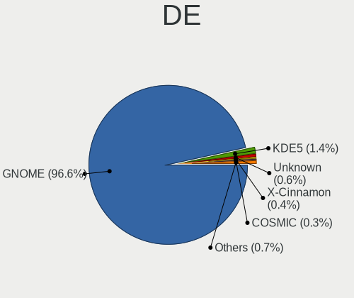
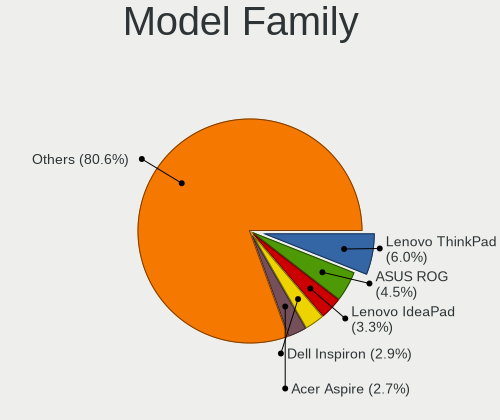
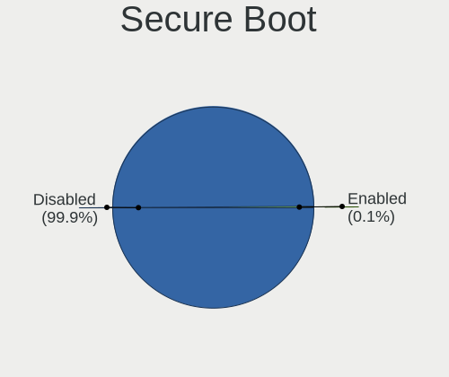
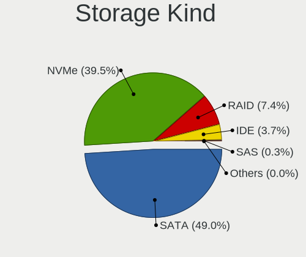
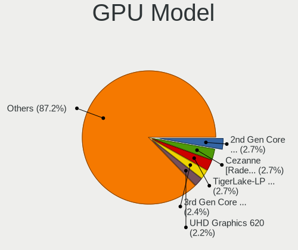
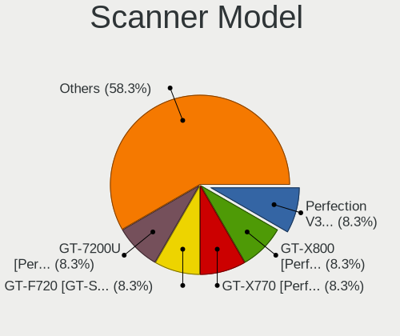

Pop!_OS 22.04 - Tested Hardware & Statistics
--------------------------------------------

A project to collect tested hardware configurations for Pop!_OS 22.04.

Anyone can contribute to this report by the [hw-probe](https://github.com/linuxhw/hw-probe) tool:

    sudo -E hw-probe -all -upload

Please contribute! Especially if your hardware is rare.

This is a report for all computer types. See also reports for [desktops](/Dist/Pop!_OS_22.04/Desktop/README.md) and [notebooks](/Dist/Pop!_OS_22.04/Notebook/README.md).

Contents
--------

* [ Test Cases ](#test-cases)

* [ System ](#system)
  - [ Kernel                   ](#kernel)
  - [ Kernel Family            ](#kernel-family)
  - [ Kernel Major Ver.        ](#kernel-major-ver)
  - [ Arch                     ](#arch)
  - [ DE                       ](#de)
  - [ Display Server           ](#display-server)
  - [ Display Manager          ](#display-manager)
  - [ OS Lang                  ](#os-lang)
  - [ Boot Mode                ](#boot-mode)
  - [ Filesystem               ](#filesystem)
  - [ Part. scheme             ](#part-scheme)
  - [ Dual Boot with Linux/BSD ](#dual-boot-with-linuxbsd)
  - [ Dual Boot (Win)          ](#dual-boot-win)

* [ Board ](#board)
  - [ Vendor                   ](#vendor)
  - [ Model                    ](#model)
  - [ Model Family             ](#model-family)
  - [ MFG Year                 ](#mfg-year)
  - [ Form Factor              ](#form-factor)
  - [ Secure Boot              ](#secure-boot)
  - [ Coreboot                 ](#coreboot)
  - [ RAM Size                 ](#ram-size)
  - [ RAM Used                 ](#ram-used)
  - [ Total Drives             ](#total-drives)
  - [ Has CD-ROM               ](#has-cd-rom)
  - [ Has Ethernet             ](#has-ethernet)
  - [ Has WiFi                 ](#has-wifi)
  - [ Has Bluetooth            ](#has-bluetooth)

* [ Location ](#location)
  - [ Country                  ](#country)
  - [ City                     ](#city)

* [ Drives ](#drives)
  - [ Drive Vendor             ](#drive-vendor)
  - [ Drive Model              ](#drive-model)
  - [ HDD Vendor               ](#hdd-vendor)
  - [ SSD Vendor               ](#ssd-vendor)
  - [ Drive Kind               ](#drive-kind)
  - [ Drive Connector          ](#drive-connector)
  - [ Drive Size               ](#drive-size)
  - [ Space Total              ](#space-total)
  - [ Space Used               ](#space-used)
  - [ Malfunc. Drives          ](#malfunc-drives)
  - [ Malfunc. Drive Vendor    ](#malfunc-drive-vendor)
  - [ Malfunc. HDD Vendor      ](#malfunc-hdd-vendor)
  - [ Malfunc. Drive Kind      ](#malfunc-drive-kind)
  - [ Failed Drives            ](#failed-drives)
  - [ Failed Drive Vendor      ](#failed-drive-vendor)
  - [ Drive Status             ](#drive-status)

* [ Storage controller ](#storage-controller)
  - [ Storage Vendor           ](#storage-vendor)
  - [ Storage Model            ](#storage-model)
  - [ Storage Kind             ](#storage-kind)

* [ Processor ](#processor)
  - [ CPU Vendor               ](#cpu-vendor)
  - [ CPU Model                ](#cpu-model)
  - [ CPU Model Family         ](#cpu-model-family)
  - [ CPU Cores                ](#cpu-cores)
  - [ CPU Sockets              ](#cpu-sockets)
  - [ CPU Threads              ](#cpu-threads)
  - [ CPU Op-Modes             ](#cpu-op-modes)
  - [ CPU Microcode            ](#cpu-microcode)
  - [ CPU Microarch            ](#cpu-microarch)

* [ Graphics ](#graphics)
  - [ GPU Vendor               ](#gpu-vendor)
  - [ GPU Model                ](#gpu-model)
  - [ GPU Combo                ](#gpu-combo)
  - [ GPU Driver               ](#gpu-driver)
  - [ GPU Memory               ](#gpu-memory)

* [ Monitor ](#monitor)
  - [ Monitor Vendor           ](#monitor-vendor)
  - [ Monitor Model            ](#monitor-model)
  - [ Monitor Resolution       ](#monitor-resolution)
  - [ Monitor Diagonal         ](#monitor-diagonal)
  - [ Monitor Width            ](#monitor-width)
  - [ Aspect Ratio             ](#aspect-ratio)
  - [ Monitor Area             ](#monitor-area)
  - [ Pixel Density            ](#pixel-density)
  - [ Multiple Monitors        ](#multiple-monitors)

* [ Network ](#network)
  - [ Net Controller Vendor    ](#net-controller-vendor)
  - [ Net Controller Model     ](#net-controller-model)
  - [ Wireless Vendor          ](#wireless-vendor)
  - [ Wireless Model           ](#wireless-model)
  - [ Ethernet Vendor          ](#ethernet-vendor)
  - [ Ethernet Model           ](#ethernet-model)
  - [ Net Controller Kind      ](#net-controller-kind)
  - [ Used Controller          ](#used-controller)
  - [ NICs                     ](#nics)
  - [ IPv6                     ](#ipv6)

* [ Bluetooth ](#bluetooth)
  - [ Bluetooth Vendor         ](#bluetooth-vendor)
  - [ Bluetooth Model          ](#bluetooth-model)

* [ Sound ](#sound)
  - [ Sound Vendor             ](#sound-vendor)
  - [ Sound Model              ](#sound-model)

* [ Memory ](#memory)
  - [ Memory Vendor            ](#memory-vendor)
  - [ Memory Model             ](#memory-model)
  - [ Memory Kind              ](#memory-kind)
  - [ Memory Form Factor       ](#memory-form-factor)
  - [ Memory Size              ](#memory-size)
  - [ Memory Speed             ](#memory-speed)

* [ Printers & scanners ](#printers--scanners)
  - [ Printer Vendor           ](#printer-vendor)
  - [ Printer Model            ](#printer-model)
  - [ Scanner Vendor           ](#scanner-vendor)
  - [ Scanner Model            ](#scanner-model)

* [ Camera ](#camera)
  - [ Camera Vendor            ](#camera-vendor)
  - [ Camera Model             ](#camera-model)

* [ Security ](#security)
  - [ Fingerprint Vendor       ](#fingerprint-vendor)
  - [ Fingerprint Model        ](#fingerprint-model)
  - [ Chipcard Vendor          ](#chipcard-vendor)
  - [ Chipcard Model           ](#chipcard-model)

* [ Unsupported ](#unsupported)
  - [ Unsupported Devices      ](#unsupported-devices)
  - [ Unsupported Device Types ](#unsupported-device-types)

Test Cases
----------

Total: 413

| Vendor        | Model                       | Form-Factor | Probe                                                      | Date         |
|---------------|-----------------------------|-------------|------------------------------------------------------------|--------------|
| Lenovo        | ThinkPad T410 2537HN3       | Notebook    | [e373330c8b](https://linux-hardware.org/?probe=e373330c8b) | Jun 01, 2022 |
| ASUSTek       | PRIME Z590-A                | Desktop     | [fa29e357fa](https://linux-hardware.org/?probe=fa29e357fa) | Jun 01, 2022 |
| Lenovo        | Yoga Slim 7 Pro 14ACH5 D... | Notebook    | [57f540db26](https://linux-hardware.org/?probe=57f540db26) | Jun 01, 2022 |
| Dell          | Inspiron 13 5310            | Notebook    | [70eccb19d4](https://linux-hardware.org/?probe=70eccb19d4) | Jun 01, 2022 |
| Dell          | Inspiron 5537               | Notebook    | [506d3fb361](https://linux-hardware.org/?probe=506d3fb361) | Jun 01, 2022 |
| ASUSTek       | F2A85-M                     | Desktop     | [82b4935292](https://linux-hardware.org/?probe=82b4935292) | Jun 01, 2022 |
| Lenovo        | IdeaPad Y700-17ISK 80Q0     | Notebook    | [d0dbd3d75e](https://linux-hardware.org/?probe=d0dbd3d75e) | Jun 01, 2022 |
| Dell          | G7 7700                     | Notebook    | [25e22bc243](https://linux-hardware.org/?probe=25e22bc243) | May 31, 2022 |
| MSI           | Z170A MPOWER GAMING TITA... | Desktop     | [538feade4f](https://linux-hardware.org/?probe=538feade4f) | May 31, 2022 |
| Intel         | NUC7i3BNB J22859-313        | Mini pc     | [4863034bc5](https://linux-hardware.org/?probe=4863034bc5) | May 31, 2022 |
| Dell          | Inspiron 7590 2n1           | Convertible | [30a0d0ec81](https://linux-hardware.org/?probe=30a0d0ec81) | May 31, 2022 |
| ASUSTek       | PRIME A320M-K               | Desktop     | [bee74ec003](https://linux-hardware.org/?probe=bee74ec003) | May 31, 2022 |
| ASRock        | B450 Steel Legend           | Desktop     | [136730f4ac](https://linux-hardware.org/?probe=136730f4ac) | May 31, 2022 |
| ASRock        | B450 Steel Legend           | Desktop     | [62b7e9aacd](https://linux-hardware.org/?probe=62b7e9aacd) | May 31, 2022 |
| Lenovo        | V14-IIL 82C4                | Notebook    | [871738fea2](https://linux-hardware.org/?probe=871738fea2) | May 31, 2022 |
| System76      | Thelio Major thelio-majo... | Desktop     | [291730a3bb](https://linux-hardware.org/?probe=291730a3bb) | May 31, 2022 |
| Lenovo        | ThinkPad T14s Gen 1 20UJ... | Notebook    | [ed28d49715](https://linux-hardware.org/?probe=ed28d49715) | May 30, 2022 |
| HP            | Spectre x360 Convertible... | Convertible | [923158d12f](https://linux-hardware.org/?probe=923158d12f) | May 30, 2022 |
| HP            | ProBook 455 G8 Notebook ... | Notebook    | [ce6b717155](https://linux-hardware.org/?probe=ce6b717155) | May 30, 2022 |
| ASUSTek       | PN41                        | Mini pc     | [6dd26d47b1](https://linux-hardware.org/?probe=6dd26d47b1) | May 30, 2022 |
| HP            | Laptop 14-dq2xxx            | Notebook    | [14f581788f](https://linux-hardware.org/?probe=14f581788f) | May 30, 2022 |
| Dell          | 0Y2MRG A00                  | Desktop     | [013e0da975](https://linux-hardware.org/?probe=013e0da975) | May 30, 2022 |
| Dell          | 0D02VH A01                  | Desktop     | [fc97b0a5bf](https://linux-hardware.org/?probe=fc97b0a5bf) | May 30, 2022 |
| ASUSTek       | PRIME Z590-A                | Desktop     | [1058cdf867](https://linux-hardware.org/?probe=1058cdf867) | May 30, 2022 |
| HP            | 8266                        | Desktop     | [d0e35451ab](https://linux-hardware.org/?probe=d0e35451ab) | May 29, 2022 |
| Gigabyte      | H270-Gaming 3               | Desktop     | [c28c21c4d8](https://linux-hardware.org/?probe=c28c21c4d8) | May 29, 2022 |
| ASUSTek       | ROG CROSSHAIR VIII DARK ... | Desktop     | [5d899f8fc5](https://linux-hardware.org/?probe=5d899f8fc5) | May 29, 2022 |
| Acer          | Aspire A515-45              | Notebook    | [72b7fc79d4](https://linux-hardware.org/?probe=72b7fc79d4) | May 29, 2022 |
| ASUSTek       | ROG STRIX X570-E GAMING     | Desktop     | [d1923db949](https://linux-hardware.org/?probe=d1923db949) | May 29, 2022 |
| Dell          | Vostro V130                 | Notebook    | [abefbba5b8](https://linux-hardware.org/?probe=abefbba5b8) | May 29, 2022 |
| Apple         | MacBookPro9,1               | Notebook    | [6fe2c4a416](https://linux-hardware.org/?probe=6fe2c4a416) | May 29, 2022 |
| MSI           | GF63 Thin 10SCXR            | Notebook    | [0d556408f3](https://linux-hardware.org/?probe=0d556408f3) | May 29, 2022 |
| Dell          | 0J3C2F A00                  | Desktop     | [c192680ab5](https://linux-hardware.org/?probe=c192680ab5) | May 29, 2022 |
| HP            | OMEN by Laptop 15z-en100    | Notebook    | [35e3478a5d](https://linux-hardware.org/?probe=35e3478a5d) | May 28, 2022 |
| Medion        | X6816                       | Notebook    | [6d7996894c](https://linux-hardware.org/?probe=6d7996894c) | May 28, 2022 |
| HUAWEI        | NBLB-WAX9N                  | Notebook    | [7ae101b473](https://linux-hardware.org/?probe=7ae101b473) | May 28, 2022 |
| HUAWEI        | NBLB-WAX9N                  | Notebook    | [469ed3f68b](https://linux-hardware.org/?probe=469ed3f68b) | May 28, 2022 |
| Lenovo        | ThinkPad E14 Gen 3 20Y70... | Notebook    | [96bc0699c3](https://linux-hardware.org/?probe=96bc0699c3) | May 28, 2022 |
| Lenovo        | CRESCENTBAY 31900059 STD... | All in one  | [d222b1e86e](https://linux-hardware.org/?probe=d222b1e86e) | May 28, 2022 |
| MSI           | MAG B550 TOMAHAWK           | Desktop     | [b78390767c](https://linux-hardware.org/?probe=b78390767c) | May 28, 2022 |
| MSI           | MS-7717                     | Desktop     | [101b488b80](https://linux-hardware.org/?probe=101b488b80) | May 28, 2022 |
| Dell          | Inspiron 5566               | Notebook    | [88c420d481](https://linux-hardware.org/?probe=88c420d481) | May 28, 2022 |
| Toshiba       | IS 1413G                    | Notebook    | [c7a5f5eef3](https://linux-hardware.org/?probe=c7a5f5eef3) | May 28, 2022 |
| MSI           | MS-7717                     | Desktop     | [9b0c2d0d8c](https://linux-hardware.org/?probe=9b0c2d0d8c) | May 28, 2022 |
| ASRock        | B450 Steel Legend           | Desktop     | [5d47d967ba](https://linux-hardware.org/?probe=5d47d967ba) | May 28, 2022 |
| Dell          | 040DDP A01                  | Desktop     | [925d3dce8d](https://linux-hardware.org/?probe=925d3dce8d) | May 28, 2022 |
| HP            | 158B                        | Desktop     | [a74e9da8aa](https://linux-hardware.org/?probe=a74e9da8aa) | May 28, 2022 |
| Acer          | Nitro AN515-42              | Notebook    | [a2f2dc2eee](https://linux-hardware.org/?probe=a2f2dc2eee) | May 27, 2022 |
| Lenovo        | IdeaPadFlex 5 14ARE05 81... | Convertible | [3980ea8269](https://linux-hardware.org/?probe=3980ea8269) | May 27, 2022 |
| ASUSTek       | SABERTOOTH Z170 MARK 1      | Desktop     | [bdf54228e5](https://linux-hardware.org/?probe=bdf54228e5) | May 27, 2022 |
| Lenovo        | ThinkPad T14 Gen 1 20S00... | Notebook    | [65bccd9c04](https://linux-hardware.org/?probe=65bccd9c04) | May 27, 2022 |
| Dell          | Vostro 5402                 | Notebook    | [323fc36eb6](https://linux-hardware.org/?probe=323fc36eb6) | May 27, 2022 |
| Toshiba       | QOSMIO X770                 | Notebook    | [8f7d0ba9f9](https://linux-hardware.org/?probe=8f7d0ba9f9) | May 27, 2022 |
| HP            | Pavilion x360 Convertibl... | Convertible | [6e7b6eddea](https://linux-hardware.org/?probe=6e7b6eddea) | May 27, 2022 |
| Dell          | Precision 5530              | Notebook    | [2ecf3390bf](https://linux-hardware.org/?probe=2ecf3390bf) | May 27, 2022 |
| Lenovo        | SHARKBAY 0B98401 WIN        | Desktop     | [f5195788f8](https://linux-hardware.org/?probe=f5195788f8) | May 27, 2022 |
| ASUSTek       | PRIME Z270-A                | Desktop     | [5d1ee4048a](https://linux-hardware.org/?probe=5d1ee4048a) | May 27, 2022 |
| Acer          | Aspire A315-57G             | Notebook    | [d0400f8d02](https://linux-hardware.org/?probe=d0400f8d02) | May 26, 2022 |
| ASUSTek       | P5KPL-SE                    | Desktop     | [c4b27d79ef](https://linux-hardware.org/?probe=c4b27d79ef) | May 26, 2022 |
| Fujitsu       | CELSIUS H730                | Notebook    | [6f0b24d450](https://linux-hardware.org/?probe=6f0b24d450) | May 26, 2022 |
| ASUSTek       | P5QPL-AM                    | Desktop     | [938ab3ec5c](https://linux-hardware.org/?probe=938ab3ec5c) | May 26, 2022 |
| ASUSTek       | TUF B450M-PLUS GAMING       | Desktop     | [ae0ada290a](https://linux-hardware.org/?probe=ae0ada290a) | May 26, 2022 |
| Lenovo        | Legion 5 15IMH05H 81Y6      | Notebook    | [ab2cd65153](https://linux-hardware.org/?probe=ab2cd65153) | May 26, 2022 |
| Dell          | Inspiron 3721               | Notebook    | [d4af21adb8](https://linux-hardware.org/?probe=d4af21adb8) | May 25, 2022 |
| A-DATA Tec... | XENIA 15                    | Notebook    | [1d7941d921](https://linux-hardware.org/?probe=1d7941d921) | May 25, 2022 |
| Lenovo        | ThinkPad X220 4286CTO       | Notebook    | [4c0d37687e](https://linux-hardware.org/?probe=4c0d37687e) | May 25, 2022 |
| ASRock        | H670M-ITX/ax                | Desktop     | [b3f7ff3d98](https://linux-hardware.org/?probe=b3f7ff3d98) | May 25, 2022 |
| Toshiba       | Satellite P850              | Notebook    | [9ec49310ff](https://linux-hardware.org/?probe=9ec49310ff) | May 25, 2022 |
| ASUSTek       | M5A78L/USB3                 | Desktop     | [852a292ba3](https://linux-hardware.org/?probe=852a292ba3) | May 25, 2022 |
| Gigabyte      | AB350-Gaming 3-CF           | Desktop     | [4738560555](https://linux-hardware.org/?probe=4738560555) | May 25, 2022 |
| Apple         | MacBookPro14,3              | Notebook    | [ca090207b8](https://linux-hardware.org/?probe=ca090207b8) | May 25, 2022 |
| Monster       | TULPAR T5 V14.1             | Notebook    | [647e502881](https://linux-hardware.org/?probe=647e502881) | May 25, 2022 |
| Monster       | TULPAR T5 V14.1             | Notebook    | [0db0bd7aa8](https://linux-hardware.org/?probe=0db0bd7aa8) | May 25, 2022 |
| ASUSTek       | G551JM                      | Notebook    | [3db2e28ef2](https://linux-hardware.org/?probe=3db2e28ef2) | May 24, 2022 |
| Toshiba       | IS 1413G                    | Notebook    | [a34eaa3e4a](https://linux-hardware.org/?probe=a34eaa3e4a) | May 24, 2022 |
| Dell          | Precision 5550              | Notebook    | [6b17026494](https://linux-hardware.org/?probe=6b17026494) | May 24, 2022 |
| Toshiba       | IS 1413G                    | Notebook    | [e6e080d6e0](https://linux-hardware.org/?probe=e6e080d6e0) | May 24, 2022 |
| HP            | 8703                        | Desktop     | [14af29c571](https://linux-hardware.org/?probe=14af29c571) | May 24, 2022 |
| ASRock        | H470M-ITX/ac                | Desktop     | [181f7decc6](https://linux-hardware.org/?probe=181f7decc6) | May 24, 2022 |
| Dell          | 0Y2MRG A00                  | Desktop     | [08527b166e](https://linux-hardware.org/?probe=08527b166e) | May 24, 2022 |
| Gigabyte      | B550M AORUS PRO-P           | Desktop     | [1122022ae1](https://linux-hardware.org/?probe=1122022ae1) | May 24, 2022 |
| SIEMENS       | A5E02122237 ES010           | Desktop     | [3d7173e7a3](https://linux-hardware.org/?probe=3d7173e7a3) | May 24, 2022 |
| Lenovo        | ThinkPad P14s Gen 1 20Y1... | Notebook    | [a59234d081](https://linux-hardware.org/?probe=a59234d081) | May 24, 2022 |
| Lenovo        | IdeaPad 3 15ADA05 81W1      | Notebook    | [bf692d5408](https://linux-hardware.org/?probe=bf692d5408) | May 23, 2022 |
| Lenovo        | MAHOBAY                     | Desktop     | [dbfb736222](https://linux-hardware.org/?probe=dbfb736222) | May 23, 2022 |
| Acer          | Swift SF314-54              | Notebook    | [39f85b46d7](https://linux-hardware.org/?probe=39f85b46d7) | May 23, 2022 |
| Lenovo        | IdeaPad Gaming 3 15ARH05... | Notebook    | [f2e32c336d](https://linux-hardware.org/?probe=f2e32c336d) | May 23, 2022 |
| ASUSTek       | ASUS TUF Gaming A15 FA50... | Notebook    | [7fa4ca7312](https://linux-hardware.org/?probe=7fa4ca7312) | May 23, 2022 |
| Acer          | TravelMate 7750G            | Notebook    | [3ff0c1c7f2](https://linux-hardware.org/?probe=3ff0c1c7f2) | May 23, 2022 |
| Acer          | TravelMate 7750G            | Notebook    | [80bfe5a0c6](https://linux-hardware.org/?probe=80bfe5a0c6) | May 23, 2022 |
| ASUSTek       | ROG CROSSHAIR VIII DARK ... | Desktop     | [78bb2ba75c](https://linux-hardware.org/?probe=78bb2ba75c) | May 23, 2022 |
| Apple         | MacBookPro11,1              | Notebook    | [1d4f3a60c0](https://linux-hardware.org/?probe=1d4f3a60c0) | May 23, 2022 |
| Apple         | Mac-F2268CC8                | All in one  | [5ec2b88c83](https://linux-hardware.org/?probe=5ec2b88c83) | May 22, 2022 |
| Apple         | Mac-F2268CC8                | All in one  | [5a2f6291b5](https://linux-hardware.org/?probe=5a2f6291b5) | May 22, 2022 |
| Foxconn       | 2ABF                        | Desktop     | [39f9e9e717](https://linux-hardware.org/?probe=39f9e9e717) | May 22, 2022 |
| ASUSTek       | X505BA                      | Notebook    | [685c1f7378](https://linux-hardware.org/?probe=685c1f7378) | May 22, 2022 |
| ASUSTek       | ROG STRIX Z390-E GAMING     | Desktop     | [21818b99b4](https://linux-hardware.org/?probe=21818b99b4) | May 22, 2022 |
| ASRock        | B450 Gaming K4              | Desktop     | [152469abdd](https://linux-hardware.org/?probe=152469abdd) | May 22, 2022 |
| ASUSTek       | ROG STRIX Z390-E GAMING     | Desktop     | [f1db82519f](https://linux-hardware.org/?probe=f1db82519f) | May 22, 2022 |
| Lenovo        | ThinkPad T480 20L5S00F00    | Notebook    | [7a1f70c8aa](https://linux-hardware.org/?probe=7a1f70c8aa) | May 22, 2022 |
| Dell          | G3 3500                     | Notebook    | [49f86cc226](https://linux-hardware.org/?probe=49f86cc226) | May 22, 2022 |
| ASUSTek       | PN41                        | Mini pc     | [1993c161fd](https://linux-hardware.org/?probe=1993c161fd) | May 22, 2022 |
| MSI           | MEG Z390 ACE                | Desktop     | [0065576586](https://linux-hardware.org/?probe=0065576586) | May 22, 2022 |
| Google        | Lulu                        | Notebook    | [e7a0842114](https://linux-hardware.org/?probe=e7a0842114) | May 21, 2022 |
| Gigabyte      | H67N-USB3-B3                | Desktop     | [382f206597](https://linux-hardware.org/?probe=382f206597) | May 21, 2022 |
| MSI           | Modern 14 A10M              | Notebook    | [97a0996658](https://linux-hardware.org/?probe=97a0996658) | May 21, 2022 |
| HP            | Pavilion Notebook           | Notebook    | [1cd571d585](https://linux-hardware.org/?probe=1cd571d585) | May 21, 2022 |
| ASUSTek       | X510UR                      | Notebook    | [40b1695a67](https://linux-hardware.org/?probe=40b1695a67) | May 21, 2022 |
| ASUSTek       | X510UR                      | Notebook    | [e7cea85f09](https://linux-hardware.org/?probe=e7cea85f09) | May 21, 2022 |
| ASUSTek       | ROG Zephyrus G15 GA503QM... | Notebook    | [bc911a9c04](https://linux-hardware.org/?probe=bc911a9c04) | May 21, 2022 |
| ASRock        | B450 Steel Legend           | Desktop     | [3c436952c7](https://linux-hardware.org/?probe=3c436952c7) | May 21, 2022 |
| PC Special... | NP5x_NP6x_NP7xPNK_PNH_PN... | Notebook    | [e002072665](https://linux-hardware.org/?probe=e002072665) | May 21, 2022 |
| ASUSTek       | P7P55D-E LX                 | Desktop     | [358e85c524](https://linux-hardware.org/?probe=358e85c524) | May 21, 2022 |
| MSI           | B250M PRO-VD                | Desktop     | [540e0831b1](https://linux-hardware.org/?probe=540e0831b1) | May 20, 2022 |
| Apple         | Mac-F227BEC8 PVT            | All in one  | [77d5276ecc](https://linux-hardware.org/?probe=77d5276ecc) | May 20, 2022 |
| ASRock        | TRX40 Creator               | Desktop     | [a810336f3f](https://linux-hardware.org/?probe=a810336f3f) | May 20, 2022 |
| ASRock        | TRX40 Creator               | Desktop     | [6993400976](https://linux-hardware.org/?probe=6993400976) | May 20, 2022 |
| Gigabyte      | GA-78LMT-S2P                | Desktop     | [2211d5c2a2](https://linux-hardware.org/?probe=2211d5c2a2) | May 20, 2022 |
| HP            | EliteBook 8570w             | Notebook    | [3f21c66d5c](https://linux-hardware.org/?probe=3f21c66d5c) | May 20, 2022 |
| Lenovo        | G40-30 80FY                 | Notebook    | [4280810a31](https://linux-hardware.org/?probe=4280810a31) | May 20, 2022 |
| ASUSTek       | H110M-R                     | Desktop     | [7cae58580a](https://linux-hardware.org/?probe=7cae58580a) | May 20, 2022 |
| ASRock        | Z390 Phantom Gaming 4-IB    | Desktop     | [543ab770e8](https://linux-hardware.org/?probe=543ab770e8) | May 20, 2022 |
| System76      | Oryx Pro                    | Notebook    | [d705be052a](https://linux-hardware.org/?probe=d705be052a) | May 20, 2022 |
| Dell          | Inspiron 5555               | Notebook    | [35c2610913](https://linux-hardware.org/?probe=35c2610913) | May 20, 2022 |
| Positivo      | POS-MI945AA                 | Desktop     | [0f9875e8fc](https://linux-hardware.org/?probe=0f9875e8fc) | May 19, 2022 |
| Lenovo        | MAHOBAY                     | Desktop     | [fa1f318919](https://linux-hardware.org/?probe=fa1f318919) | May 19, 2022 |
| HP            | EliteBook 855 G8 Noteboo... | Notebook    | [2320338e52](https://linux-hardware.org/?probe=2320338e52) | May 19, 2022 |
| ASUSTek       | ROG CROSSHAIR VIII IMPAC... | Desktop     | [d94f4b0a43](https://linux-hardware.org/?probe=d94f4b0a43) | May 19, 2022 |
| Gigabyte      | B450 AORUS M                | Desktop     | [5ddfbf547b](https://linux-hardware.org/?probe=5ddfbf547b) | May 19, 2022 |
| Dell          | XPS 15 9570                 | Notebook    | [ba19473e18](https://linux-hardware.org/?probe=ba19473e18) | May 19, 2022 |
| Apple         | Mac-F227BEC8 PVT            | All in one  | [fba154be66](https://linux-hardware.org/?probe=fba154be66) | May 18, 2022 |
| Gigabyte      | AERO 15 KC                  | Notebook    | [5ebc19bd4c](https://linux-hardware.org/?probe=5ebc19bd4c) | May 18, 2022 |
| Supermicro    | X8SIL                       | Desktop     | [66e8a4001f](https://linux-hardware.org/?probe=66e8a4001f) | May 18, 2022 |
| MSI           | B350M MORTAR                | Desktop     | [fd66fd9a5a](https://linux-hardware.org/?probe=fd66fd9a5a) | May 18, 2022 |
| Supermicro    | X8SIL                       | Desktop     | [5cb6f1067b](https://linux-hardware.org/?probe=5cb6f1067b) | May 18, 2022 |
| Lenovo        | ThinkPad X1 Carbon 7th 2... | Notebook    | [c9a82e1be0](https://linux-hardware.org/?probe=c9a82e1be0) | May 18, 2022 |
| HP            | 8054                        | Desktop     | [725f204fd0](https://linux-hardware.org/?probe=725f204fd0) | May 18, 2022 |
| ASUSTek       | ROG Zephyrus G14 GA402RJ... | Notebook    | [8ef2235464](https://linux-hardware.org/?probe=8ef2235464) | May 17, 2022 |
| System76      | Oryx Pro                    | Notebook    | [b68edfe15c](https://linux-hardware.org/?probe=b68edfe15c) | May 17, 2022 |
| ASUSTek       | GA15DH                      | Desktop     | [ca68812bf2](https://linux-hardware.org/?probe=ca68812bf2) | May 17, 2022 |
| MSI           | Z270-A PRO                  | Desktop     | [f005623f03](https://linux-hardware.org/?probe=f005623f03) | May 17, 2022 |
| Samsung       | 550XCJ/550XCR               | Notebook    | [5bc959890b](https://linux-hardware.org/?probe=5bc959890b) | May 17, 2022 |
| Samsung       | RV411/RV511/E3511/S3511/... | Notebook    | [e4bf8d23b8](https://linux-hardware.org/?probe=e4bf8d23b8) | May 17, 2022 |
| ASUSTek       | AM1M-A/BR                   | Desktop     | [e23e8291e0](https://linux-hardware.org/?probe=e23e8291e0) | May 17, 2022 |
| Gigabyte      | AX370M-DS3H-CF              | Desktop     | [2f7a99c28b](https://linux-hardware.org/?probe=2f7a99c28b) | May 17, 2022 |
| HUAWEI        | HN-WX9X                     | Notebook    | [f5ade437dc](https://linux-hardware.org/?probe=f5ade437dc) | May 17, 2022 |
| HP            | Laptop 14-dk1xxx            | Notebook    | [77a8cae8a0](https://linux-hardware.org/?probe=77a8cae8a0) | May 17, 2022 |
| ASUSTek       | G73Jh                       | Notebook    | [2d96e5ecba](https://linux-hardware.org/?probe=2d96e5ecba) | May 17, 2022 |
| ASUSTek       | M4A785TD-V EVO              | Desktop     | [ee4e4a7bc7](https://linux-hardware.org/?probe=ee4e4a7bc7) | May 17, 2022 |
| Dell          | 040DDP A00                  | Desktop     | [4806ca2a7e](https://linux-hardware.org/?probe=4806ca2a7e) | May 17, 2022 |
| Toshiba       | Satellite L50D-C            | Notebook    | [f06e254906](https://linux-hardware.org/?probe=f06e254906) | May 17, 2022 |
| Alienware     | 18                          | Notebook    | [7aa82b2786](https://linux-hardware.org/?probe=7aa82b2786) | May 17, 2022 |
| Gigabyte      | H310M S2H x.x               | Desktop     | [4d76b03e66](https://linux-hardware.org/?probe=4d76b03e66) | May 17, 2022 |
| Acer          | Aspire 7560G                | Notebook    | [d3d9aa988f](https://linux-hardware.org/?probe=d3d9aa988f) | May 16, 2022 |
| Lenovo        | IdeaPad 110-15ACL 80TJ      | Notebook    | [eb5345a5c6](https://linux-hardware.org/?probe=eb5345a5c6) | May 16, 2022 |
| Google        | Lulu                        | Notebook    | [c402204a03](https://linux-hardware.org/?probe=c402204a03) | May 16, 2022 |
| Fujitsu       | LIFEBOOK T5010              | Notebook    | [e0aab70a85](https://linux-hardware.org/?probe=e0aab70a85) | May 16, 2022 |
| Lenovo        | ThinkPad L13 Yoga Gen 2a... | Notebook    | [3a369eed6d](https://linux-hardware.org/?probe=3a369eed6d) | May 16, 2022 |
| HP            | Victus by Laptop 16-e0xx... | Notebook    | [a8fffad424](https://linux-hardware.org/?probe=a8fffad424) | May 16, 2022 |
| Apple         | MacBookPro16,2              | Notebook    | [ceb6a7e5a3](https://linux-hardware.org/?probe=ceb6a7e5a3) | May 16, 2022 |
| Apple         | MacBookPro16,2              | Notebook    | [5c4ebc223f](https://linux-hardware.org/?probe=5c4ebc223f) | May 16, 2022 |
| ASUSTek       | Z87-K                       | Desktop     | [2daea316b2](https://linux-hardware.org/?probe=2daea316b2) | May 16, 2022 |
| Lenovo        | IdeaPad S340-15API 81NC     | Notebook    | [3ecda9477c](https://linux-hardware.org/?probe=3ecda9477c) | May 16, 2022 |
| Microsoft     | Surface Pro 6               | Tablet      | [aa531d1bf8](https://linux-hardware.org/?probe=aa531d1bf8) | May 15, 2022 |
| Apple         | MacBookPro14,1              | Notebook    | [2d4d81086f](https://linux-hardware.org/?probe=2d4d81086f) | May 15, 2022 |
| Acer          | TravelMate P249-G2-MG       | Notebook    | [e6f35b116a](https://linux-hardware.org/?probe=e6f35b116a) | May 15, 2022 |
| MSI           | MPG X570 GAMING PLUS        | Desktop     | [91d8b47a30](https://linux-hardware.org/?probe=91d8b47a30) | May 15, 2022 |
| Dell          | Vostro 5471                 | Notebook    | [62e934492d](https://linux-hardware.org/?probe=62e934492d) | May 15, 2022 |
| ASRock        | B550 Phantom Gaming-ITX/... | Desktop     | [608664ce7a](https://linux-hardware.org/?probe=608664ce7a) | May 15, 2022 |
| Dell          | XPS 15 9510                 | Notebook    | [653725bdde](https://linux-hardware.org/?probe=653725bdde) | May 15, 2022 |
| Dell          | 0CRH6C A02                  | Desktop     | [655afd62e6](https://linux-hardware.org/?probe=655afd62e6) | May 14, 2022 |
| Dell          | XPS 15 9560                 | Notebook    | [04f0e074cb](https://linux-hardware.org/?probe=04f0e074cb) | May 14, 2022 |
| Intel         | NUC8BEB J72692-306          | Mini pc     | [7f06d07456](https://linux-hardware.org/?probe=7f06d07456) | May 14, 2022 |
| ASUSTek       | M4A89GTD-PRO/USB3           | Desktop     | [a049c51989](https://linux-hardware.org/?probe=a049c51989) | May 14, 2022 |
| Lenovo        | ThinkPad L13 Yoga Gen 2a... | Notebook    | [7a2fd723d6](https://linux-hardware.org/?probe=7a2fd723d6) | May 14, 2022 |
| ASUSTek       | P8H61-M LX3 R2.0            | Desktop     | [cb7b6b9cde](https://linux-hardware.org/?probe=cb7b6b9cde) | May 14, 2022 |
| HP            | OMEN Laptop 15-en0xxx       | Notebook    | [98db0dde2a](https://linux-hardware.org/?probe=98db0dde2a) | May 13, 2022 |
| HP            | OMEN Laptop 15-en0xxx       | Notebook    | [66e43801f0](https://linux-hardware.org/?probe=66e43801f0) | May 13, 2022 |
| Google        | Lulu                        | Notebook    | [8d7f1657d0](https://linux-hardware.org/?probe=8d7f1657d0) | May 13, 2022 |
| ASUSTek       | ROG STRIX X299-E GAMING ... | Desktop     | [0cc824e2a5](https://linux-hardware.org/?probe=0cc824e2a5) | May 13, 2022 |
| Acer          | Swift SF314-54              | Notebook    | [a31c36956a](https://linux-hardware.org/?probe=a31c36956a) | May 13, 2022 |
| Lenovo        | ThinkPad L13 Yoga Gen 2a... | Notebook    | [30bb58501e](https://linux-hardware.org/?probe=30bb58501e) | May 13, 2022 |
| Apple         | MacBookPro5,2               | Notebook    | [0a3017f333](https://linux-hardware.org/?probe=0a3017f333) | May 13, 2022 |
| Intel         | NUC12EDBi9 M27907-302       | Mini pc     | [95339de38e](https://linux-hardware.org/?probe=95339de38e) | May 13, 2022 |
| NZXT          | N7 B550                     | Desktop     | [73441bbfc4](https://linux-hardware.org/?probe=73441bbfc4) | May 12, 2022 |
| Unknown       | BTC79X5                     | Desktop     | [42b222eb65](https://linux-hardware.org/?probe=42b222eb65) | May 12, 2022 |
| Gigabyte      | Z170-Gaming K3              | Desktop     | [768acb5df2](https://linux-hardware.org/?probe=768acb5df2) | May 12, 2022 |
| Acer          | Nitro AN515-44              | Notebook    | [fe8e3837f4](https://linux-hardware.org/?probe=fe8e3837f4) | May 12, 2022 |
| System76      | Pangolin                    | Notebook    | [0f05fa93a8](https://linux-hardware.org/?probe=0f05fa93a8) | May 12, 2022 |
| AZW           | BT3 X                       | Desktop     | [a17cb64acb](https://linux-hardware.org/?probe=a17cb64acb) | May 12, 2022 |
| HP            | EliteBook 855 G8 Noteboo... | Notebook    | [ea75711bf8](https://linux-hardware.org/?probe=ea75711bf8) | May 12, 2022 |
| Lenovo        | 0B98401 PRO                 | Desktop     | [ee225906fc](https://linux-hardware.org/?probe=ee225906fc) | May 12, 2022 |
| Microsoft     | Surface Pro 3               | Tablet      | [0b95d0a5d8](https://linux-hardware.org/?probe=0b95d0a5d8) | May 12, 2022 |
| Apple         | MacBookAir7,2               | Notebook    | [114ef2756f](https://linux-hardware.org/?probe=114ef2756f) | May 12, 2022 |
| Dell          | Inspiron 15 7000 Gaming     | Notebook    | [915b95cae4](https://linux-hardware.org/?probe=915b95cae4) | May 11, 2022 |
| Google        | Cyan                        | Notebook    | [cec3bd0a88](https://linux-hardware.org/?probe=cec3bd0a88) | May 11, 2022 |
| Lenovo        | 0B98401 PRO                 | Desktop     | [16911d5e64](https://linux-hardware.org/?probe=16911d5e64) | May 11, 2022 |
| Microsoft     | Surface Pro                 | Tablet      | [78ee3350a8](https://linux-hardware.org/?probe=78ee3350a8) | May 11, 2022 |
| HP            | ZBook Studio G7 Mobile W... | Notebook    | [4f25a82453](https://linux-hardware.org/?probe=4f25a82453) | May 11, 2022 |
| Gigabyte      | B660 AORUS MASTER DDR4      | Desktop     | [e5981a9f20](https://linux-hardware.org/?probe=e5981a9f20) | May 11, 2022 |
| Apple         | MacBook5,2                  | Notebook    | [0913ac4c8e](https://linux-hardware.org/?probe=0913ac4c8e) | May 11, 2022 |
| System76      | Pangolin                    | Notebook    | [da80a33b86](https://linux-hardware.org/?probe=da80a33b86) | May 11, 2022 |
| Dell          | G15 5511                    | Notebook    | [17b75bcced](https://linux-hardware.org/?probe=17b75bcced) | May 10, 2022 |
| Gigabyte      | Z390 AORUS PRO-CF           | Desktop     | [1d4364ac51](https://linux-hardware.org/?probe=1d4364ac51) | May 10, 2022 |
| Dell          | XPS 13 9305                 | Notebook    | [0066686d1d](https://linux-hardware.org/?probe=0066686d1d) | May 10, 2022 |
| NZXT          | N7 B550                     | Desktop     | [147247dfb6](https://linux-hardware.org/?probe=147247dfb6) | May 10, 2022 |
| Gigabyte      | Z170-HD3P-CF                | Desktop     | [396a39e5a6](https://linux-hardware.org/?probe=396a39e5a6) | May 10, 2022 |
| Dell          | XPS 13 9310                 | Notebook    | [cae0934838](https://linux-hardware.org/?probe=cae0934838) | May 10, 2022 |
| ASRock        | X370 Professional Gaming    | Desktop     | [1e22ba0468](https://linux-hardware.org/?probe=1e22ba0468) | May 10, 2022 |
| HP            | EliteBook 2730p             | Notebook    | [d4c5b7824d](https://linux-hardware.org/?probe=d4c5b7824d) | May 10, 2022 |
| HP            | 15 Notebook PC              | Notebook    | [d88f833b65](https://linux-hardware.org/?probe=d88f833b65) | May 10, 2022 |
| ASUSTek       | PRIME B450M-A               | Desktop     | [0b3cda16db](https://linux-hardware.org/?probe=0b3cda16db) | May 10, 2022 |
| HP            | EliteBook 8570w             | Notebook    | [840087bbed](https://linux-hardware.org/?probe=840087bbed) | May 09, 2022 |
| ASUSTek       | PRIME B450M-A               | Desktop     | [90190717eb](https://linux-hardware.org/?probe=90190717eb) | May 09, 2022 |
| HP            | EliteBook 8570w             | Notebook    | [d9779b1c50](https://linux-hardware.org/?probe=d9779b1c50) | May 09, 2022 |
| Gigabyte      | X570 AORUS ELITE            | Desktop     | [9f6a18226f](https://linux-hardware.org/?probe=9f6a18226f) | May 09, 2022 |
| ASUSTek       | Z97-AR                      | Desktop     | [29c93ea162](https://linux-hardware.org/?probe=29c93ea162) | May 09, 2022 |
| HP            | Laptop 15-dy1xxx            | Notebook    | [fd022c446e](https://linux-hardware.org/?probe=fd022c446e) | May 09, 2022 |
| Gigabyte      | B450 AORUS M                | Desktop     | [cd1aff125e](https://linux-hardware.org/?probe=cd1aff125e) | May 09, 2022 |
| SIEMENS       | A5E02122237 ES010           | Desktop     | [cc728f6c38](https://linux-hardware.org/?probe=cc728f6c38) | May 09, 2022 |
| TUXEDO        | Unknown                     | Notebook    | [20f46751c2](https://linux-hardware.org/?probe=20f46751c2) | May 08, 2022 |
| TUXEDO        | Unknown                     | Notebook    | [c1df33620d](https://linux-hardware.org/?probe=c1df33620d) | May 08, 2022 |
| MSI           | Modern 15 A10RAS            | Notebook    | [3e844bb07a](https://linux-hardware.org/?probe=3e844bb07a) | May 08, 2022 |
| Lenovo        | ThinkPad T480 20L6S8H100    | Notebook    | [5eefaba8d3](https://linux-hardware.org/?probe=5eefaba8d3) | May 08, 2022 |
| ASRock        | X299 Taichi CLX             | Desktop     | [47a45fca48](https://linux-hardware.org/?probe=47a45fca48) | May 08, 2022 |
| Gigabyte      | X470 AORUS GAMING 7 WIFI... | Desktop     | [8964a4c5ec](https://linux-hardware.org/?probe=8964a4c5ec) | May 08, 2022 |
| ECS           | Nettle3                     | Desktop     | [36f8cde007](https://linux-hardware.org/?probe=36f8cde007) | May 08, 2022 |
| Lenovo        | ThinkPad X1 Carbon 3rd 2... | Notebook    | [dcdc07525d](https://linux-hardware.org/?probe=dcdc07525d) | May 08, 2022 |
| Apple         | MacBookAir6,2               | Notebook    | [1e1f4caa54](https://linux-hardware.org/?probe=1e1f4caa54) | May 08, 2022 |
| ASUSTek       | PRIME X570-P                | Desktop     | [65d94c8458](https://linux-hardware.org/?probe=65d94c8458) | May 08, 2022 |
| Samsung       | 800G5M/800G5W               | Notebook    | [057ea02fdb](https://linux-hardware.org/?probe=057ea02fdb) | May 08, 2022 |
| Lenovo        | ThinkPad T480 20L6S8H100    | Notebook    | [892d07e5cf](https://linux-hardware.org/?probe=892d07e5cf) | May 08, 2022 |
| Lenovo        | Legion 5 17ITH6H 82JM       | Notebook    | [451c9ea765](https://linux-hardware.org/?probe=451c9ea765) | May 08, 2022 |
| ASUSTek       | E200HA                      | Notebook    | [ba413ad853](https://linux-hardware.org/?probe=ba413ad853) | May 08, 2022 |
| MSI           | GS63 7RD                    | Notebook    | [eff12e3973](https://linux-hardware.org/?probe=eff12e3973) | May 08, 2022 |
| ECS           | Nettle3                     | Desktop     | [646fb53a2c](https://linux-hardware.org/?probe=646fb53a2c) | May 07, 2022 |
| HP            | Pavilion 15                 | Notebook    | [a18593bb5b](https://linux-hardware.org/?probe=a18593bb5b) | May 07, 2022 |
| Google        | Lulu                        | Notebook    | [18ecc4a6e7](https://linux-hardware.org/?probe=18ecc4a6e7) | May 07, 2022 |
| Gigabyte      | X570 AORUS PRO WIFI         | Desktop     | [61a4daec98](https://linux-hardware.org/?probe=61a4daec98) | May 07, 2022 |
| Acer          | Aspire E1-570               | Notebook    | [53ddeaa413](https://linux-hardware.org/?probe=53ddeaa413) | May 07, 2022 |
| Apple         | Mac-35C5E08120C7EEAF Mac... | Mini pc     | [5790e8a0cb](https://linux-hardware.org/?probe=5790e8a0cb) | May 07, 2022 |
| ASUSTek       | ROG CROSSHAIR VIII HERO     | Desktop     | [180dd73bd6](https://linux-hardware.org/?probe=180dd73bd6) | May 07, 2022 |
| Apple         | Mac-35C5E08120C7EEAF Mac... | Mini pc     | [632a2af548](https://linux-hardware.org/?probe=632a2af548) | May 07, 2022 |
| ASUSTek       | E200HA                      | Notebook    | [6fc7c6f086](https://linux-hardware.org/?probe=6fc7c6f086) | May 07, 2022 |
| Lenovo        | 3746 No DPK                 | All in one  | [910612b856](https://linux-hardware.org/?probe=910612b856) | May 07, 2022 |
| ASUSTek       | TUF Gaming Z690-PLUS WIF... | Desktop     | [f71ca35596](https://linux-hardware.org/?probe=f71ca35596) | May 06, 2022 |
| MSI           | B450-A PRO                  | Desktop     | [5b5ceb0f53](https://linux-hardware.org/?probe=5b5ceb0f53) | May 06, 2022 |
| Gigabyte      | 990FXA-UD3                  | Desktop     | [4fe934e84d](https://linux-hardware.org/?probe=4fe934e84d) | May 06, 2022 |
| Intel         | NUC8BEB J72693-305          | Mini pc     | [4071a1a35e](https://linux-hardware.org/?probe=4071a1a35e) | May 06, 2022 |
| Google        | Peppy                       | Notebook    | [03dc670128](https://linux-hardware.org/?probe=03dc670128) | May 06, 2022 |
| Lenovo        | Yoga 720-15IKB 80X7         | Convertible | [f99b5cee66](https://linux-hardware.org/?probe=f99b5cee66) | May 06, 2022 |
| HP            | ProBook 450 G4              | Notebook    | [1332984f5d](https://linux-hardware.org/?probe=1332984f5d) | May 06, 2022 |
| Lenovo        | ThinkPad Twist 33472YU      | Notebook    | [710c086b29](https://linux-hardware.org/?probe=710c086b29) | May 06, 2022 |
| Lenovo        | ThinkPad Twist 33472YU      | Notebook    | [76fb8bb966](https://linux-hardware.org/?probe=76fb8bb966) | May 06, 2022 |
| Dell          | XPS 13 9300                 | Notebook    | [080b4f2667](https://linux-hardware.org/?probe=080b4f2667) | May 06, 2022 |
| Intel         | NUC8i7HVB J68196-504        | Mini pc     | [66a01dfd2d](https://linux-hardware.org/?probe=66a01dfd2d) | May 05, 2022 |
| Lenovo        | G50-80 80E5                 | Notebook    | [8ecadc1bad](https://linux-hardware.org/?probe=8ecadc1bad) | May 05, 2022 |
| ASRock        | 970M Pro3                   | Desktop     | [2853128cd0](https://linux-hardware.org/?probe=2853128cd0) | May 05, 2022 |
| HP            | Pavilion Notebook           | Notebook    | [af36cfb1a8](https://linux-hardware.org/?probe=af36cfb1a8) | May 05, 2022 |
| ASRock        | 970M Pro3                   | Desktop     | [5f51fd4cf8](https://linux-hardware.org/?probe=5f51fd4cf8) | May 05, 2022 |
| Gigabyte      | Z170-HD3P-CF                | Desktop     | [7b7f29e504](https://linux-hardware.org/?probe=7b7f29e504) | May 05, 2022 |
| Acer          | Aspire V5-431               | Notebook    | [04db0db85f](https://linux-hardware.org/?probe=04db0db85f) | May 05, 2022 |
| Razer         | Blade 14 - RZ09-0370        | Notebook    | [fa323515aa](https://linux-hardware.org/?probe=fa323515aa) | May 05, 2022 |
| ASRock        | X470 Taichi                 | Desktop     | [e133868179](https://linux-hardware.org/?probe=e133868179) | May 05, 2022 |
| Dell          | Inspiron 1750               | Notebook    | [1c70ba9e33](https://linux-hardware.org/?probe=1c70ba9e33) | May 05, 2022 |
| Dell          | Latitude E5440              | Notebook    | [a505dc0b3c](https://linux-hardware.org/?probe=a505dc0b3c) | May 05, 2022 |
| ASRock        | X470 Taichi                 | Desktop     | [93d6fb1610](https://linux-hardware.org/?probe=93d6fb1610) | May 05, 2022 |
| ASRock        | A320M-HDV R4.0              | Desktop     | [36cabd86ba](https://linux-hardware.org/?probe=36cabd86ba) | May 04, 2022 |
| ASUSTek       | GL552VX                     | Notebook    | [d153ef27fa](https://linux-hardware.org/?probe=d153ef27fa) | May 04, 2022 |
| Acer          | Spin SP315-51               | Convertible | [b96494c3bc](https://linux-hardware.org/?probe=b96494c3bc) | May 04, 2022 |
| Lenovo        | ThinkPad T14 Gen 1 20UD0... | Notebook    | [a9f5b77476](https://linux-hardware.org/?probe=a9f5b77476) | May 04, 2022 |
| Acer          | Aspire A515-45              | Notebook    | [e5f3e5b086](https://linux-hardware.org/?probe=e5f3e5b086) | May 04, 2022 |
| HP            | OMEN Laptop 15-en0xxx       | Notebook    | [8bfd6ecc71](https://linux-hardware.org/?probe=8bfd6ecc71) | May 04, 2022 |
| ASUSTek       | ROG Zephyrus G14 GA401IV... | Notebook    | [720d11c11f](https://linux-hardware.org/?probe=720d11c11f) | May 04, 2022 |
| ASUSTek       | VivoBook 15_ASUS Laptop ... | Notebook    | [5a8fc607c4](https://linux-hardware.org/?probe=5a8fc607c4) | May 04, 2022 |
| ASUSTek       | B85M-E                      | Desktop     | [2b6338d755](https://linux-hardware.org/?probe=2b6338d755) | May 04, 2022 |
| Dell          | Inspiron 3583               | Notebook    | [f5e954ea5e](https://linux-hardware.org/?probe=f5e954ea5e) | May 04, 2022 |
| HP            | Pavilion 13 x360 PC         | Notebook    | [5de9e1d61f](https://linux-hardware.org/?probe=5de9e1d61f) | May 04, 2022 |
| ASUSTek       | X540SAA                     | Notebook    | [9943699a6b](https://linux-hardware.org/?probe=9943699a6b) | May 04, 2022 |
| Gigabyte      | Z170-HD3P-CF                | Desktop     | [7196bf2ec6](https://linux-hardware.org/?probe=7196bf2ec6) | May 03, 2022 |
| Acer          | Aspire F5-573G              | Notebook    | [2136362d58](https://linux-hardware.org/?probe=2136362d58) | May 03, 2022 |
| HP            | Laptop 17-ca3xxx            | Notebook    | [373f22a70f](https://linux-hardware.org/?probe=373f22a70f) | May 03, 2022 |
| HP            | Laptop 17-ca3xxx            | Notebook    | [91a367d874](https://linux-hardware.org/?probe=91a367d874) | May 03, 2022 |
| ASRock        | 970M Pro3                   | Desktop     | [f20f31b107](https://linux-hardware.org/?probe=f20f31b107) | May 03, 2022 |
| ASRock        | 970M Pro3                   | Desktop     | [73a563257a](https://linux-hardware.org/?probe=73a563257a) | May 03, 2022 |
| ASUSTek       | ROG STRIX B450-I GAMING     | Desktop     | [65a2309744](https://linux-hardware.org/?probe=65a2309744) | May 03, 2022 |
| Apple         | MacBookAir6,2               | Notebook    | [0f8065fda6](https://linux-hardware.org/?probe=0f8065fda6) | May 03, 2022 |
| ASUSTek       | GL552JX                     | Notebook    | [c91f42212d](https://linux-hardware.org/?probe=c91f42212d) | May 03, 2022 |
| ASUSTek       | ROG Strix G713RC_G713RC     | Notebook    | [2ce25fb058](https://linux-hardware.org/?probe=2ce25fb058) | May 03, 2022 |
| Alienware     | 0CPDXD A00                  | Desktop     | [17da14a17d](https://linux-hardware.org/?probe=17da14a17d) | May 03, 2022 |
| ASUSTek       | B85M-E                      | Desktop     | [9645231d87](https://linux-hardware.org/?probe=9645231d87) | May 03, 2022 |
| Acer          | Spin SP315-51               | Convertible | [227f2d9f45](https://linux-hardware.org/?probe=227f2d9f45) | May 03, 2022 |
| Dell          | Inspiron 3583               | Notebook    | [c47758f125](https://linux-hardware.org/?probe=c47758f125) | May 03, 2022 |
| Lenovo        | IdeaPad Slim 7 14ITL05 8... | Notebook    | [4b44c67cde](https://linux-hardware.org/?probe=4b44c67cde) | May 02, 2022 |
| Toshiba       | PORTEGE R830                | Notebook    | [8daebf6110](https://linux-hardware.org/?probe=8daebf6110) | May 02, 2022 |
| Dell          | Latitude E6440              | Notebook    | [d2ab063048](https://linux-hardware.org/?probe=d2ab063048) | May 02, 2022 |
| ASUSTek       | VivoBook_ASUSLaptop X512... | Notebook    | [58ff4a1984](https://linux-hardware.org/?probe=58ff4a1984) | May 02, 2022 |
| Toshiba       | Satellite L755              | Notebook    | [6c38249bc4](https://linux-hardware.org/?probe=6c38249bc4) | May 02, 2022 |
| MSI           | B450I GAMING PLUS AC        | Desktop     | [c0ef0738b5](https://linux-hardware.org/?probe=c0ef0738b5) | May 02, 2022 |
| MSI           | X370 GAMING PRO CARBON      | Desktop     | [4a09f5d3f3](https://linux-hardware.org/?probe=4a09f5d3f3) | May 02, 2022 |
| MSI           | X370 GAMING PRO CARBON      | Desktop     | [ab716981c3](https://linux-hardware.org/?probe=ab716981c3) | May 02, 2022 |
| Framework     | Laptop                      | Notebook    | [0d35134041](https://linux-hardware.org/?probe=0d35134041) | May 02, 2022 |
| Acer          | Aspire A515-45              | Notebook    | [8cf5364699](https://linux-hardware.org/?probe=8cf5364699) | May 02, 2022 |
| ASUSTek       | ZenBook UX433FN_UX433FN     | Notebook    | [02872ac9a8](https://linux-hardware.org/?probe=02872ac9a8) | May 02, 2022 |
| Alienware     | 0P0JWX A00                  | Desktop     | [e6e1548aa1](https://linux-hardware.org/?probe=e6e1548aa1) | May 02, 2022 |
| MSI           | GS65 Stealth 8SG            | Notebook    | [05f80b3e70](https://linux-hardware.org/?probe=05f80b3e70) | May 02, 2022 |
| System76      | Oryx Pro                    | Notebook    | [96251b761b](https://linux-hardware.org/?probe=96251b761b) | May 02, 2022 |
| ASUSTek       | ROG CROSSHAIR VIII FORMU... | Desktop     | [a456619489](https://linux-hardware.org/?probe=a456619489) | May 02, 2022 |
| Acer          | Aspire V5-573P              | Notebook    | [b64d1453d5](https://linux-hardware.org/?probe=b64d1453d5) | May 02, 2022 |
| Lenovo        | ThinkPad E14 Gen 4 21ECS... | Notebook    | [332445f774](https://linux-hardware.org/?probe=332445f774) | May 02, 2022 |
| MSI           | GP76 Leopard 11UG           | Notebook    | [dcea7cd8c0](https://linux-hardware.org/?probe=dcea7cd8c0) | May 02, 2022 |
| Dell          | Latitude E5570              | Notebook    | [372feb146c](https://linux-hardware.org/?probe=372feb146c) | May 02, 2022 |
| Apple         | MacBookPro12,1              | Notebook    | [5f68858e66](https://linux-hardware.org/?probe=5f68858e66) | May 01, 2022 |
| ASUSTek       | ROG STRIX B350-F GAMING     | Desktop     | [925447d7e9](https://linux-hardware.org/?probe=925447d7e9) | May 01, 2022 |
| ASUSTek       | ROG STRIX B350-F GAMING     | Desktop     | [b1e331055f](https://linux-hardware.org/?probe=b1e331055f) | May 01, 2022 |
| Acer          | Aspire 7750G                | Notebook    | [abd7ed0c5c](https://linux-hardware.org/?probe=abd7ed0c5c) | May 01, 2022 |
| ASUSTek       | ROG CROSSHAIR VII HERO      | Desktop     | [dec71580c4](https://linux-hardware.org/?probe=dec71580c4) | May 01, 2022 |
| LG Electro... | P430-G.BC41P1               | Notebook    | [527905ca3b](https://linux-hardware.org/?probe=527905ca3b) | May 01, 2022 |
| Gigabyte      | X570S AERO G                | Desktop     | [ab6b8eaa71](https://linux-hardware.org/?probe=ab6b8eaa71) | May 01, 2022 |
| Apple         | MacBookPro4,1               | Notebook    | [be68c0201a](https://linux-hardware.org/?probe=be68c0201a) | May 01, 2022 |
| MSI           | 970 GAMING                  | Desktop     | [32052450db](https://linux-hardware.org/?probe=32052450db) | May 01, 2022 |
| Gigabyte      | X570 AORUS ELITE            | Desktop     | [8db041a1e4](https://linux-hardware.org/?probe=8db041a1e4) | May 01, 2022 |
| Apple         | MacBookPro7,1               | Notebook    | [ac3f2c5c61](https://linux-hardware.org/?probe=ac3f2c5c61) | May 01, 2022 |
| Apple         | MacBookPro4,1               | Notebook    | [83a8bbb313](https://linux-hardware.org/?probe=83a8bbb313) | May 01, 2022 |
| Lenovo        | Legion 7 16ITHg6 82K6       | Notebook    | [48afcac3f0](https://linux-hardware.org/?probe=48afcac3f0) | May 01, 2022 |
| HP            | EliteBook 8440p             | Notebook    | [89a959efc4](https://linux-hardware.org/?probe=89a959efc4) | May 01, 2022 |
| ASRock        | B450 Steel Legend           | Desktop     | [ecc527cb4b](https://linux-hardware.org/?probe=ecc527cb4b) | May 01, 2022 |
| ASRock        | B450 Steel Legend           | Desktop     | [ca217fe968](https://linux-hardware.org/?probe=ca217fe968) | May 01, 2022 |
| Samsung       | 950QCG                      | Convertible | [3010ee5185](https://linux-hardware.org/?probe=3010ee5185) | May 01, 2022 |
| Samsung       | 950QCG                      | Convertible | [257ee40584](https://linux-hardware.org/?probe=257ee40584) | May 01, 2022 |
| HP            | ProBook 455 G7              | Notebook    | [88fcea9210](https://linux-hardware.org/?probe=88fcea9210) | Apr 30, 2022 |
| MSI           | B450M GAMING PLUS           | Desktop     | [0929d58de7](https://linux-hardware.org/?probe=0929d58de7) | Apr 30, 2022 |
| Apple         | Mac-F42C88C8 Proto1         | Desktop     | [3edd5f05f7](https://linux-hardware.org/?probe=3edd5f05f7) | Apr 30, 2022 |
| ASRock        | X99 Extreme4                | Desktop     | [d45e1e88db](https://linux-hardware.org/?probe=d45e1e88db) | Apr 30, 2022 |
| ASRock        | X99 Extreme4                | Desktop     | [41cec63ac6](https://linux-hardware.org/?probe=41cec63ac6) | Apr 30, 2022 |
| Lenovo        | ThinkPad L15 Gen 2 20X4S... | Notebook    | [48d3759522](https://linux-hardware.org/?probe=48d3759522) | Apr 30, 2022 |
| Toshiba       | Satellite L10W-B-101        | Notebook    | [8383d306f3](https://linux-hardware.org/?probe=8383d306f3) | Apr 30, 2022 |
| Dell          | XPS 13 9343                 | Notebook    | [b48ccc106e](https://linux-hardware.org/?probe=b48ccc106e) | Apr 30, 2022 |
| Toshiba       | IS 1413G                    | Notebook    | [8074a86bc7](https://linux-hardware.org/?probe=8074a86bc7) | Apr 30, 2022 |
| Dell          | XPS 15 9510                 | Notebook    | [b92517268e](https://linux-hardware.org/?probe=b92517268e) | Apr 30, 2022 |
| EVGA          | X58 SLI Classified Tyler... | Desktop     | [07254f2dbb](https://linux-hardware.org/?probe=07254f2dbb) | Apr 30, 2022 |
| ASUSTek       | PRIME H510M-E               | Desktop     | [5c9e5fc14c](https://linux-hardware.org/?probe=5c9e5fc14c) | Apr 29, 2022 |
| ASUSTek       | G55VW                       | Notebook    | [6bd8a1b04a](https://linux-hardware.org/?probe=6bd8a1b04a) | Apr 29, 2022 |
| Dell          | Inspiron 3542               | Notebook    | [19f5e16bce](https://linux-hardware.org/?probe=19f5e16bce) | Apr 29, 2022 |
| ASUSTek       | ROG STRIX X299-E GAMING ... | Desktop     | [bce425f138](https://linux-hardware.org/?probe=bce425f138) | Apr 29, 2022 |
| Lenovo        | ThinkPad E14 Gen 4 21ECS... | Notebook    | [61bb949815](https://linux-hardware.org/?probe=61bb949815) | Apr 29, 2022 |
| Gigabyte      | AB350-Gaming 3-CF           | Desktop     | [7b292b972d](https://linux-hardware.org/?probe=7b292b972d) | Apr 29, 2022 |
| Intel         | NUC8BEB J72693-305          | Mini pc     | [ea3b16fcfd](https://linux-hardware.org/?probe=ea3b16fcfd) | Apr 29, 2022 |
| Dell          | G5 5500                     | Notebook    | [c6064853ad](https://linux-hardware.org/?probe=c6064853ad) | Apr 29, 2022 |
| MSI           | MAG Z690 TOMAHAWK WIFI D... | Desktop     | [e37bc471b1](https://linux-hardware.org/?probe=e37bc471b1) | Apr 29, 2022 |
| ASUSTek       | PRIME H310M-E R2.0          | Desktop     | [2b7167b16e](https://linux-hardware.org/?probe=2b7167b16e) | Apr 29, 2022 |
| Lenovo        | ThinkPad T480 20L50004UK    | Notebook    | [34015c4874](https://linux-hardware.org/?probe=34015c4874) | Apr 29, 2022 |
| ASUSTek       | X540SAA                     | Notebook    | [6c8e397ca3](https://linux-hardware.org/?probe=6c8e397ca3) | Apr 29, 2022 |
| System76      | Oryx Pro                    | Notebook    | [cf999d4581](https://linux-hardware.org/?probe=cf999d4581) | Apr 29, 2022 |
| Dell          | Inspiron 5547               | Notebook    | [a5d8e73a23](https://linux-hardware.org/?probe=a5d8e73a23) | Apr 28, 2022 |
| ASUSTek       | ROG STRIX B450-F GAMING     | Desktop     | [aed5ee3ded](https://linux-hardware.org/?probe=aed5ee3ded) | Apr 28, 2022 |
| Dell          | Inspiron 5547               | Notebook    | [be4ab0fd27](https://linux-hardware.org/?probe=be4ab0fd27) | Apr 28, 2022 |
| Toshiba       | IS 1413G                    | Notebook    | [995f77010e](https://linux-hardware.org/?probe=995f77010e) | Apr 28, 2022 |
| Toshiba       | IS 1413G                    | Notebook    | [e2293170b3](https://linux-hardware.org/?probe=e2293170b3) | Apr 28, 2022 |
| Gigabyte      | B550 AORUS ELITE AX V2      | Desktop     | [ab83eedd1f](https://linux-hardware.org/?probe=ab83eedd1f) | Apr 28, 2022 |
| Lenovo        | ThinkPad T431s 20ACS03P0... | Notebook    | [3c0878aee3](https://linux-hardware.org/?probe=3c0878aee3) | Apr 28, 2022 |
| System76      | Oryx Pro                    | Notebook    | [ae46ece731](https://linux-hardware.org/?probe=ae46ece731) | Apr 28, 2022 |
| MSI           | H55M-E23                    | Desktop     | [4ab5f58470](https://linux-hardware.org/?probe=4ab5f58470) | Apr 28, 2022 |
| HP            | Pavilion 15                 | Notebook    | [fee7e96d70](https://linux-hardware.org/?probe=fee7e96d70) | Apr 28, 2022 |
| Toshiba       | IS 1413G                    | Notebook    | [a63dc69025](https://linux-hardware.org/?probe=a63dc69025) | Apr 28, 2022 |
| Apple         | Mac-81E3E92DD6088272 iMa... | All in one  | [1f26415f58](https://linux-hardware.org/?probe=1f26415f58) | Apr 28, 2022 |
| MSI           | MAG Z690 TOMAHAWK WIFI D... | Desktop     | [46430e1117](https://linux-hardware.org/?probe=46430e1117) | Apr 28, 2022 |
| Dell          | 09KPNV A00                  | Desktop     | [5046e0575b](https://linux-hardware.org/?probe=5046e0575b) | Apr 28, 2022 |
| Dell          | 0NW73C A00                  | Desktop     | [344e2b816e](https://linux-hardware.org/?probe=344e2b816e) | Apr 28, 2022 |
| Apple         | MacBookPro10,2              | Notebook    | [2d79aab0aa](https://linux-hardware.org/?probe=2d79aab0aa) | Apr 28, 2022 |
| ASUSTek       | K40IN                       | Notebook    | [ab6a95da52](https://linux-hardware.org/?probe=ab6a95da52) | Apr 28, 2022 |
| Dell          | Latitude 7275               | Tablet      | [b7443972f3](https://linux-hardware.org/?probe=b7443972f3) | Apr 28, 2022 |
| Dell          | 088DT1 A01                  | Desktop     | [b664b8720e](https://linux-hardware.org/?probe=b664b8720e) | Apr 28, 2022 |
| HP            | Pavilion 13 x360 PC         | Notebook    | [d48ed77abc](https://linux-hardware.org/?probe=d48ed77abc) | Apr 28, 2022 |
| Fujitsu       | D3162-A1 S26361-D3162-A1    | Desktop     | [19e0445e6f](https://linux-hardware.org/?probe=19e0445e6f) | Apr 27, 2022 |
| Dell          | Inspiron 5566               | Notebook    | [695d362d8f](https://linux-hardware.org/?probe=695d362d8f) | Apr 27, 2022 |
| ASUSTek       | FX503VM                     | Notebook    | [c227966510](https://linux-hardware.org/?probe=c227966510) | Apr 27, 2022 |
| ASUSTek       | FX503VM                     | Notebook    | [1275aa643d](https://linux-hardware.org/?probe=1275aa643d) | Apr 27, 2022 |
| HP            | ENVY Laptop 14-eb0xxx       | Notebook    | [495a74c914](https://linux-hardware.org/?probe=495a74c914) | Apr 27, 2022 |
| Dell          | XPS 13 9310                 | Notebook    | [d394f4e0d9](https://linux-hardware.org/?probe=d394f4e0d9) | Apr 27, 2022 |
| HUAWEI        | HVY-WXX9                    | Notebook    | [824ccc1317](https://linux-hardware.org/?probe=824ccc1317) | Apr 27, 2022 |
| HP            | Pavilion 13 x360 PC         | Notebook    | [3e5933fe0d](https://linux-hardware.org/?probe=3e5933fe0d) | Apr 27, 2022 |
| Lenovo        | IdeaPad 110-15ISK 80UD      | Notebook    | [e51ff27a5a](https://linux-hardware.org/?probe=e51ff27a5a) | Apr 27, 2022 |
| Dell          | 0R1PCR A00                  | Desktop     | [feec38a0f5](https://linux-hardware.org/?probe=feec38a0f5) | Apr 27, 2022 |
| HP            | Spectre x360 Convertible... | Convertible | [c9fb277b57](https://linux-hardware.org/?probe=c9fb277b57) | Apr 27, 2022 |
| Dell          | Vostro 15 3515              | Notebook    | [7c99d7d4c5](https://linux-hardware.org/?probe=7c99d7d4c5) | Apr 27, 2022 |
| Unknown       | Unknown                     | Desktop     | [82ad7e86b5](https://linux-hardware.org/?probe=82ad7e86b5) | Apr 27, 2022 |
| Lenovo        | Yoga C740-14IML 81TC        | Convertible | [25041b35de](https://linux-hardware.org/?probe=25041b35de) | Apr 27, 2022 |
| ASUSTek       | ROG Zephyrus G14 GA401IH... | Notebook    | [863612cc05](https://linux-hardware.org/?probe=863612cc05) | Apr 27, 2022 |
| Purism        | Librem 15 v3                | Notebook    | [d2a13c9d0a](https://linux-hardware.org/?probe=d2a13c9d0a) | Apr 27, 2022 |
| HP            | Spectre x360 Convertible... | Convertible | [bbb524450f](https://linux-hardware.org/?probe=bbb524450f) | Apr 27, 2022 |
| Toshiba       | Satellite C55t-C            | Notebook    | [1fe2032839](https://linux-hardware.org/?probe=1fe2032839) | Apr 27, 2022 |
| Toshiba       | Satellite C55t-C            | Notebook    | [cabf0c7464](https://linux-hardware.org/?probe=cabf0c7464) | Apr 27, 2022 |
| Lenovo        | IdeaPad S145-15API 81V7     | Notebook    | [b7ac79ff8f](https://linux-hardware.org/?probe=b7ac79ff8f) | Apr 27, 2022 |
| MSI           | GS66 Stealth 10UG           | Notebook    | [77b699045a](https://linux-hardware.org/?probe=77b699045a) | Apr 27, 2022 |
| ASUSTek       | GA15DH                      | Desktop     | [30a22d7be3](https://linux-hardware.org/?probe=30a22d7be3) | Apr 27, 2022 |
| Acer          | Aspire E1-570               | Notebook    | [1621e22812](https://linux-hardware.org/?probe=1621e22812) | Apr 26, 2022 |
| Acer          | Swift SF316-51              | Notebook    | [fe42983639](https://linux-hardware.org/?probe=fe42983639) | Apr 26, 2022 |
| Acer          | TravelMate P249-G2-MG       | Notebook    | [2e0bd790c6](https://linux-hardware.org/?probe=2e0bd790c6) | Apr 26, 2022 |
| ASUSTek       | ROG STRIX B450-I GAMING     | Desktop     | [4b9faf4848](https://linux-hardware.org/?probe=4b9faf4848) | Apr 26, 2022 |
| Dell          | Inspiron 3442               | Notebook    | [d4b7580074](https://linux-hardware.org/?probe=d4b7580074) | Apr 26, 2022 |
| Dell          | Inspiron 3442               | Notebook    | [d994ff2a13](https://linux-hardware.org/?probe=d994ff2a13) | Apr 26, 2022 |
| Unknown       | Unknown                     | Notebook    | [885f468161](https://linux-hardware.org/?probe=885f468161) | Apr 26, 2022 |
| System76      | Thelio thelio-r2            | Desktop     | [aae937be8b](https://linux-hardware.org/?probe=aae937be8b) | Apr 25, 2022 |
| ASUSTek       | X555LF                      | Notebook    | [0aa3a88c0c](https://linux-hardware.org/?probe=0aa3a88c0c) | Apr 25, 2022 |
| Gigabyte      | B360 AORUS GAMING 3 WIFI... | Desktop     | [fabaa5b3ab](https://linux-hardware.org/?probe=fabaa5b3ab) | Apr 24, 2022 |
| Dell          | XPS 13 9360                 | Notebook    | [ffb9cf10be](https://linux-hardware.org/?probe=ffb9cf10be) | Apr 20, 2022 |
| Dell          | XPS 13 9360                 | Notebook    | [f174d4ced7](https://linux-hardware.org/?probe=f174d4ced7) | Apr 20, 2022 |
| Toshiba       | IS 1413G                    | Notebook    | [1b3267b605](https://linux-hardware.org/?probe=1b3267b605) | Apr 18, 2022 |
| Dell          | Latitude 5590               | Notebook    | [ade3f33fb9](https://linux-hardware.org/?probe=ade3f33fb9) | Apr 16, 2022 |
| Dell          | Latitude 5590               | Notebook    | [1638db9ad7](https://linux-hardware.org/?probe=1638db9ad7) | Apr 13, 2022 |
| MSI           | B250M BAZOOKA               | Desktop     | [91392a601e](https://linux-hardware.org/?probe=91392a601e) | Apr 08, 2022 |
| Dell          | Latitude E7270              | Notebook    | [79cc908dcc](https://linux-hardware.org/?probe=79cc908dcc) | Apr 08, 2022 |

System
------

Kernel
------

Version of the Linux kernel

| Version                  | Computers | Percent |
|--------------------------|-----------|---------|
| 5.17.5-76051705-generic  | 207       | 61.61%  |
| 5.16.19-76051619-generic | 116       | 34.52%  |
| 5.16.15-76051615-generic | 3         | 0.89%   |
| 5.17.7-051707-generic    | 2         | 0.6%    |
| 5.17.5-051705-generic    | 2         | 0.6%    |
| 5.18.0-051800rc1-generic | 1         | 0.3%    |
| 5.17.9-051709-generic    | 1         | 0.3%    |
| 5.17.6-051706-generic    | 1         | 0.3%    |
| 5.17.4-051704-generic    | 1         | 0.3%    |
| 5.17.2-xanmod1           | 1         | 0.3%    |
| 5.17.0-051700-generic    | 1         | 0.3%    |

Kernel Family
-------------

Linux kernel without a distro release

| Version | Computers | Percent |
|---------|-----------|---------|
| 5.17.5  | 209       | 62.2%   |
| 5.16.19 | 116       | 34.52%  |
| 5.16.15 | 3         | 0.89%   |
| 5.17.7  | 2         | 0.6%    |
| 5.18.0  | 1         | 0.3%    |
| 5.17.9  | 1         | 0.3%    |
| 5.17.6  | 1         | 0.3%    |
| 5.17.4  | 1         | 0.3%    |
| 5.17.2  | 1         | 0.3%    |
| 5.17.0  | 1         | 0.3%    |

Kernel Major Ver.
-----------------

Linux kernel major version

| Version | Computers | Percent |
|---------|-----------|---------|
| 5.17    | 216       | 64.29%  |
| 5.16    | 119       | 35.42%  |
| 5.18    | 1         | 0.3%    |

Arch
----

OS architecture (x86_64, i586, etc.)

| Name   | Computers | Percent |
|--------|-----------|---------|
| x86_64 | 329       | 100%    |

DE
--

Desktop Environment

| Name            | Computers | Percent |
|-----------------|-----------|---------|
| GNOME           | 325       | 98.48%  |
| X-Cinnamon      | 1         | 0.3%    |
| LXQt            | 1         | 0.3%    |
| KDE5            | 1         | 0.3%    |
| GNOME Flashback | 1         | 0.3%    |
| Unknown         | 1         | 0.3%    |

Display Server
--------------

X11 or Wayland

| Name    | Computers | Percent |
|---------|-----------|---------|
| X11     | 316       | 95.76%  |
| Wayland | 13        | 3.94%   |
| Unknown | 1         | 0.3%    |

Display Manager
---------------

SDDM, LightDM, etc.

| Name    | Computers | Percent |
|---------|-----------|---------|
| Unknown | 261       | 79.33%  |
| GDM3    | 67        | 20.36%  |
| GDM     | 1         | 0.3%    |

OS Lang
-------

Language

| Lang    | Computers | Percent |
|---------|-----------|---------|
| en_US   | 206       | 62.42%  |
| en_GB   | 22        | 6.67%   |
| pt_BR   | 17        | 5.15%   |
| de_DE   | 15        | 4.55%   |
| fr_FR   | 12        | 3.64%   |
| en_AU   | 10        | 3.03%   |
| pl_PL   | 6         | 1.82%   |
| en_CA   | 6         | 1.82%   |
| C       | 5         | 1.52%   |
| it_IT   | 3         | 0.91%   |
| es_ES   | 3         | 0.91%   |
| sv_SE   | 2         | 0.61%   |
| ru_RU   | 2         | 0.61%   |
| pt_PT   | 2         | 0.61%   |
| en_NZ   | 2         | 0.61%   |
| de_CH   | 2         | 0.61%   |
| nl_NL   | 1         | 0.3%    |
| nb_NO   | 1         | 0.3%    |
| ja_JP   | 1         | 0.3%    |
| fr_CA   | 1         | 0.3%    |
| fr_BE   | 1         | 0.3%    |
| es_GT   | 1         | 0.3%    |
| es_AR   | 1         | 0.3%    |
| en_ZA   | 1         | 0.3%    |
| en_SG   | 1         | 0.3%    |
| en_PH   | 1         | 0.3%    |
| en_IN   | 1         | 0.3%    |
| en_IL   | 1         | 0.3%    |
| en_IE   | 1         | 0.3%    |
| cs_CZ   | 1         | 0.3%    |
| Unknown | 1         | 0.3%    |

Boot Mode
---------

EFI or BIOS

| Mode | Computers | Percent |
|------|-----------|---------|
| BIOS | 264       | 80.24%  |
| EFI  | 65        | 19.76%  |

Filesystem
----------

Type of filesystem

| Type    | Computers | Percent |
|---------|-----------|---------|
| Ext4    | 316       | 96.05%  |
| Btrfs   | 10        | 3.04%   |
| Overlay | 2         | 0.61%   |
| Xfs     | 1         | 0.3%    |

Part. scheme
------------

Scheme of partitioning

| Type    | Computers | Percent |
|---------|-----------|---------|
| Unknown | 261       | 79.09%  |
| GPT     | 66        | 20%     |
| MBR     | 3         | 0.91%   |

Dual Boot with Linux/BSD
------------------------

Hosting more than one Linux/BSD

| Dual boot | Computers | Percent |
|-----------|-----------|---------|
| No        | 321       | 97.57%  |
| Yes       | 8         | 2.43%   |

Dual Boot (Win)
---------------

Hosting Linux and Windows

| Dual boot | Computers | Percent |
|-----------|-----------|---------|
| No        | 300       | 90.91%  |
| Yes       | 30        | 9.09%   |

Board
-----

Vendor
------

Motherboard manufacturer

| Name                | Computers | Percent |
|---------------------|-----------|---------|
| ASUSTek Computer    | 60        | 18.24%  |
| Dell                | 49        | 14.89%  |
| Lenovo              | 38        | 11.55%  |
| Hewlett-Packard     | 29        | 8.81%   |
| Gigabyte Technology | 24        | 7.29%   |
| MSI                 | 23        | 6.99%   |
| Apple               | 19        | 5.78%   |
| Acer                | 15        | 4.56%   |
| ASRock              | 12        | 3.65%   |
| Toshiba             | 7         | 2.13%   |
| System76            | 7         | 2.13%   |
| Intel               | 5         | 1.52%   |
| Samsung Electronics | 4         | 1.22%   |
| Google              | 4         | 1.22%   |
| Microsoft           | 3         | 0.91%   |
| HUAWEI              | 3         | 0.91%   |
| Fujitsu             | 3         | 0.91%   |
| Alienware           | 3         | 0.91%   |
| Unknown             | 3         | 0.91%   |
| TUXEDO              | 1         | 0.3%    |
| Supermicro          | 1         | 0.3%    |
| SIEMENS             | 1         | 0.3%    |
| Semp Toshiba        | 1         | 0.3%    |
| Razer               | 1         | 0.3%    |
| Purism              | 1         | 0.3%    |
| Positivo            | 1         | 0.3%    |
| PC Specialist       | 1         | 0.3%    |
| NZXT                | 1         | 0.3%    |
| Monster             | 1         | 0.3%    |
| Medion              | 1         | 0.3%    |
| LG Electronics      | 1         | 0.3%    |
| Framework           | 1         | 0.3%    |
| Foxconn             | 1         | 0.3%    |
| EVGA                | 1         | 0.3%    |
| ECS                 | 1         | 0.3%    |
| AZW                 | 1         | 0.3%    |
| A-DATA Technology   | 1         | 0.3%    |

Model
-----

Motherboard model

| Name                                               | Computers | Percent |
|----------------------------------------------------|-----------|---------|
| System76 Oryx Pro                                  | 4         | 1.22%   |
| ASUS All Series                                    | 4         | 1.22%   |
| Unknown                                            | 4         | 1.22%   |
| HP Pavilion Notebook                               | 2         | 0.61%   |
| HP OMEN Laptop 15-en0xxx                           | 2         | 0.61%   |
| Google Lulu                                        | 2         | 0.61%   |
| Gigabyte Z170-HD3P                                 | 2         | 0.61%   |
| Gigabyte X570 AORUS ELITE                          | 2         | 0.61%   |
| Gigabyte B450 AORUS M                              | 2         | 0.61%   |
| Dell XPS 15 9510                                   | 2         | 0.61%   |
| Dell XPS 13 9310                                   | 2         | 0.61%   |
| Dell OptiPlex 3020                                 | 2         | 0.61%   |
| Dell Inspiron 5566                                 | 2         | 0.61%   |
| ASUS ROG STRIX B450-I GAMING                       | 2         | 0.61%   |
| ASUS ROG CROSSHAIR VIII DARK HERO                  | 2         | 0.61%   |
| ASUS PRIME B450M-A                                 | 2         | 0.61%   |
| Apple MacBookAir6,2                                | 2         | 0.61%   |
| Acer Aspire A515-45                                | 2         | 0.61%   |
| Toshiba Satellite P850                             | 1         | 0.3%    |
| Toshiba Satellite L755                             | 1         | 0.3%    |
| Toshiba Satellite L50D-C                           | 1         | 0.3%    |
| Toshiba Satellite L10W-B-101                       | 1         | 0.3%    |
| Toshiba Satellite C55t-C                           | 1         | 0.3%    |
| Toshiba QOSMIO X770                                | 1         | 0.3%    |
| Toshiba PORTEGE R830                               | 1         | 0.3%    |
| System76 Thelio Major                              | 1         | 0.3%    |
| System76 Thelio                                    | 1         | 0.3%    |
| System76 Pangolin                                  | 1         | 0.3%    |
| Supermicro X8SIL                                   | 1         | 0.3%    |
| SIEMENS SIMATIC BOX PC 627B/PANEL PC 677B Profibus | 1         | 0.3%    |
| Semp Toshiba IS 1413G                              | 1         | 0.3%    |
| Samsung RV411/RV511/E3511/S3511/RV711/E3411        | 1         | 0.3%    |
| Samsung 950QCG                                     | 1         | 0.3%    |
| Samsung 800G5M/800G5W                              | 1         | 0.3%    |
| Samsung 550XCJ/550XCR                              | 1         | 0.3%    |
| Razer Blade 14 - RZ09-0370                         | 1         | 0.3%    |
| Purism Librem 15 v3                                | 1         | 0.3%    |
| Positivo POS-MI945AA                               | 1         | 0.3%    |
| PC Specialist NP5x_NP6x_NP7xPNK_PNH_PNJ            | 1         | 0.3%    |
| NZXT N7 B550                                       | 1         | 0.3%    |
| MSI MS-7D32                                        | 1         | 0.3%    |
| MSI MS-7C91                                        | 1         | 0.3%    |
| MSI MS-7C37                                        | 1         | 0.3%    |
| MSI MS-7B87                                        | 1         | 0.3%    |
| MSI MS-7B86                                        | 1         | 0.3%    |
| MSI MS-7B12                                        | 1         | 0.3%    |
| MSI MS-7A74                                        | 1         | 0.3%    |
| MSI MS-7A71                                        | 1         | 0.3%    |
| MSI MS-7A70                                        | 1         | 0.3%    |
| MSI MS-7A40                                        | 1         | 0.3%    |
| MSI MS-7A37                                        | 1         | 0.3%    |
| MSI MS-7A32                                        | 1         | 0.3%    |
| MSI MS-7A16                                        | 1         | 0.3%    |
| MSI MS-7693                                        | 1         | 0.3%    |
| MSI MS-7636                                        | 1         | 0.3%    |
| MSI Modern 15 A10RAS                               | 1         | 0.3%    |
| MSI Modern 14 A10M                                 | 1         | 0.3%    |
| MSI GS66 Stealth 10UG                              | 1         | 0.3%    |
| MSI GS65 Stealth 8SG                               | 1         | 0.3%    |
| MSI GS63 7RD                                       | 1         | 0.3%    |

Model Family
------------

Motherboard model prefix

| Name                  | Computers | Percent |
|-----------------------|-----------|---------|
| ASUS ROG              | 19        | 5.78%   |
| Lenovo ThinkPad       | 16        | 4.86%   |
| Dell Inspiron         | 16        | 4.86%   |
| Dell XPS              | 12        | 3.65%   |
| Acer Aspire           | 9         | 2.74%   |
| ASUS PRIME            | 8         | 2.43%   |
| Lenovo IdeaPad        | 7         | 2.13%   |
| Dell Latitude         | 6         | 1.82%   |
| Toshiba Satellite     | 5         | 1.52%   |
| HP Pavilion           | 5         | 1.52%   |
| System76 Oryx         | 4         | 1.22%   |
| HP OMEN               | 4         | 1.22%   |
| HP Laptop             | 4         | 1.22%   |
| HP EliteBook          | 4         | 1.22%   |
| Dell Vostro           | 4         | 1.22%   |
| Dell Precision        | 4         | 1.22%   |
| ASUS All              | 4         | 1.22%   |
| Unknown               | 4         | 1.22%   |
| Microsoft Surface     | 3         | 0.91%   |
| Lenovo Yoga           | 3         | 0.91%   |
| Lenovo Legion         | 3         | 0.91%   |
| HP ProBook            | 3         | 0.91%   |
| Gigabyte X570         | 3         | 0.91%   |
| Dell OptiPlex         | 3         | 0.91%   |
| System76 Thelio       | 2         | 0.61%   |
| MSI Modern            | 2         | 0.61%   |
| Lenovo ThinkCentre    | 2         | 0.61%   |
| HP Spectre            | 2         | 0.61%   |
| HP EliteDesk          | 2         | 0.61%   |
| Google Lulu           | 2         | 0.61%   |
| Gigabyte Z170-HD3P    | 2         | 0.61%   |
| Gigabyte B450         | 2         | 0.61%   |
| Gigabyte AB350-Gaming | 2         | 0.61%   |
| ASUS VivoBook         | 2         | 0.61%   |
| ASUS TUF              | 2         | 0.61%   |
| ASRock B450           | 2         | 0.61%   |
| Apple MacBookPro14    | 2         | 0.61%   |
| Apple MacBookAir6     | 2         | 0.61%   |
| Alienware Aurora      | 2         | 0.61%   |
| Acer TravelMate       | 2         | 0.61%   |
| Acer Nitro            | 2         | 0.61%   |
| Toshiba QOSMIO        | 1         | 0.3%    |
| Toshiba PORTEGE       | 1         | 0.3%    |
| System76 Pangolin     | 1         | 0.3%    |
| Supermicro X8SIL      | 1         | 0.3%    |
| SIEMENS SIMATIC       | 1         | 0.3%    |
| Semp Toshiba IS       | 1         | 0.3%    |
| Samsung RV411         | 1         | 0.3%    |
| Samsung 950QCG        | 1         | 0.3%    |
| Samsung 800G5M        | 1         | 0.3%    |
| Samsung 550XCJ        | 1         | 0.3%    |
| Razer Blade           | 1         | 0.3%    |
| Purism Librem         | 1         | 0.3%    |
| Positivo POS-MI945AA  | 1         | 0.3%    |
| PC Specialist NP5x    | 1         | 0.3%    |
| NZXT N7               | 1         | 0.3%    |
| MSI MS-7D32           | 1         | 0.3%    |
| MSI MS-7C91           | 1         | 0.3%    |
| MSI MS-7C37           | 1         | 0.3%    |
| MSI MS-7B87           | 1         | 0.3%    |

MFG Year
--------

Motherboard manufacture year

| Year | Computers | Percent |
|------|-----------|---------|
| 2021 | 49        | 14.89%  |
| 2020 | 47        | 14.29%  |
| 2018 | 40        | 12.16%  |
| 2019 | 34        | 10.33%  |
| 2017 | 23        | 6.99%   |
| 2016 | 23        | 6.99%   |
| 2011 | 20        | 6.08%   |
| 2014 | 19        | 5.78%   |
| 2015 | 16        | 4.86%   |
| 2013 | 15        | 4.56%   |
| 2009 | 12        | 3.65%   |
| 2012 | 11        | 3.34%   |
| 2022 | 7         | 2.13%   |
| 2010 | 7         | 2.13%   |
| 2008 | 5         | 1.52%   |
| 2007 | 1         | 0.3%    |

Form Factor
-----------

Physical design of the computer

| Name        | Computers | Percent |
|-------------|-----------|---------|
| Notebook    | 182       | 55.32%  |
| Desktop     | 122       | 37.08%  |
| Convertible | 9         | 2.74%   |
| Mini pc     | 7         | 2.13%   |
| All in one  | 5         | 1.52%   |
| Tablet      | 4         | 1.22%   |

Secure Boot
-----------

Enabled or disabled

| State    | Computers | Percent |
|----------|-----------|---------|
| Disabled | 329       | 100%    |

Coreboot
--------

Have coreboot on board

| Used | Computers | Percent |
|------|-----------|---------|
| No   | 321       | 97.57%  |
| Yes  | 8         | 2.43%   |

RAM Size
--------

Total RAM memory

| Size in GB      | Computers | Percent |
|-----------------|-----------|---------|
| 16.01-24.0      | 83        | 25.23%  |
| 4.01-8.0        | 72        | 21.88%  |
| 8.01-16.0       | 61        | 18.54%  |
| 32.01-64.0      | 58        | 17.63%  |
| 3.01-4.0        | 37        | 11.25%  |
| 64.01-256.0     | 13        | 3.95%   |
| More than 256.0 | 2         | 0.61%   |
| 24.01-32.0      | 2         | 0.61%   |
| 1.01-2.0        | 1         | 0.3%    |

RAM Used
--------

Used RAM memory

| Used GB    | Computers | Percent |
|------------|-----------|---------|
| 2.01-3.0   | 111       | 33.04%  |
| 4.01-8.0   | 81        | 24.11%  |
| 3.01-4.0   | 71        | 21.13%  |
| 1.01-2.0   | 55        | 16.37%  |
| 8.01-16.0  | 13        | 3.87%   |
| 16.01-24.0 | 4         | 1.19%   |
| 24.01-32.0 | 1         | 0.3%    |

Total Drives
------------

Number of drives on board

| Drives | Computers | Percent |
|--------|-----------|---------|
| 1      | 170       | 51.67%  |
| 2      | 109       | 33.13%  |
| 3      | 28        | 8.51%   |
| 4      | 9         | 2.74%   |
| 5      | 6         | 1.82%   |
| 6      | 3         | 0.91%   |
| 11     | 1         | 0.3%    |
| 10     | 1         | 0.3%    |
| 9      | 1         | 0.3%    |
| 0      | 1         | 0.3%    |

Has CD-ROM
----------

Has CD-ROM on board

| Presented | Computers | Percent |
|-----------|-----------|---------|
| No        | 251       | 76.29%  |
| Yes       | 78        | 23.71%  |

Has Ethernet
------------

Has Ethernet on board

| Presented | Computers | Percent |
|-----------|-----------|---------|
| Yes       | 274       | 83.28%  |
| No        | 55        | 16.72%  |

Has WiFi
--------

Has WiFi module

| Presented | Computers | Percent |
|-----------|-----------|---------|
| Yes       | 283       | 86.02%  |
| No        | 46        | 13.98%  |

Has Bluetooth
-------------

Has Bluetooth module

| Presented | Computers | Percent |
|-----------|-----------|---------|
| Yes       | 236       | 71.52%  |
| No        | 94        | 28.48%  |

Location
--------

Country
-------

Geographic location (country)

| Country               | Computers | Percent |
|-----------------------|-----------|---------|
| USA                   | 110       | 33.43%  |
| Brazil                | 25        | 7.6%    |
| Germany               | 20        | 6.08%   |
| Australia             | 16        | 4.86%   |
| UK                    | 14        | 4.26%   |
| France                | 12        | 3.65%   |
| India                 | 11        | 3.34%   |
| Canada                | 11        | 3.34%   |
| Switzerland           | 6         | 1.82%   |
| Sweden                | 6         | 1.82%   |
| Russia                | 5         | 1.52%   |
| Poland                | 5         | 1.52%   |
| Norway                | 5         | 1.52%   |
| Netherlands           | 5         | 1.52%   |
| Turkey                | 4         | 1.22%   |
| Japan                 | 4         | 1.22%   |
| Spain                 | 3         | 0.91%   |
| South Africa          | 3         | 0.91%   |
| Saudi Arabia          | 3         | 0.91%   |
| Philippines           | 3         | 0.91%   |
| New Zealand           | 3         | 0.91%   |
| Mexico                | 3         | 0.91%   |
| Italy                 | 3         | 0.91%   |
| Ireland               | 3         | 0.91%   |
| Argentina             | 3         | 0.91%   |
| Thailand              | 2         | 0.61%   |
| Romania               | 2         | 0.61%   |
| Portugal              | 2         | 0.61%   |
| Panama                | 2         | 0.61%   |
| Malaysia              | 2         | 0.61%   |
| Hungary               | 2         | 0.61%   |
| Greece                | 2         | 0.61%   |
| Finland               | 2         | 0.61%   |
| Czechia               | 2         | 0.61%   |
| Croatia               | 2         | 0.61%   |
| Austria               | 2         | 0.61%   |
| Vietnam               | 1         | 0.3%    |
| Venezuela             | 1         | 0.3%    |
| South Korea           | 1         | 0.3%    |
| Slovenia              | 1         | 0.3%    |
| Slovakia              | 1         | 0.3%    |
| Singapore             | 1         | 0.3%    |
| Republic of the Congo | 1         | 0.3%    |
| Peru                  | 1         | 0.3%    |
| Nicaragua             | 1         | 0.3%    |
| Morocco               | 1         | 0.3%    |
| Lithuania             | 1         | 0.3%    |
| Latvia                | 1         | 0.3%    |
| Jordan                | 1         | 0.3%    |
| Israel                | 1         | 0.3%    |
| Indonesia             | 1         | 0.3%    |
| Hong Kong             | 1         | 0.3%    |
| Guatemala             | 1         | 0.3%    |
| Egypt                 | 1         | 0.3%    |
| Bulgaria              | 1         | 0.3%    |
| Belgium               | 1         | 0.3%    |
| Azerbaijan            | 1         | 0.3%    |

City
----

Geographic location (city)

| City                 | Computers | Percent |
|----------------------|-----------|---------|
| Zurich               | 4         | 1.2%    |
| Sydney               | 4         | 1.2%    |
| Sao Paulo            | 4         | 1.2%    |
| Melbourne            | 4         | 1.2%    |
| Istanbul             | 4         | 1.2%    |
| Mannheim             | 3         | 0.9%    |
| Berlin               | 3         | 0.9%    |
| Warsaw               | 2         | 0.6%    |
| Vienna               | 2         | 0.6%    |
| Tallahassee          | 2         | 0.6%    |
| Stuttgart            | 2         | 0.6%    |
| Seattle              | 2         | 0.6%    |
| San Jose             | 2         | 0.6%    |
| San Francisco        | 2         | 0.6%    |
| San Antonio          | 2         | 0.6%    |
| Riyadh               | 2         | 0.6%    |
| Rio de Janeiro       | 2         | 0.6%    |
| Recife               | 2         | 0.6%    |
| Quezon City          | 2         | 0.6%    |
| Paris                | 2         | 0.6%    |
| Panama City          | 2         | 0.6%    |
| Oslo                 | 2         | 0.6%    |
| Mumbai               | 2         | 0.6%    |
| Moscow               | 2         | 0.6%    |
| Mendoza              | 2         | 0.6%    |
| London               | 2         | 0.6%    |
| Itatiba              | 2         | 0.6%    |
| Elk Grove            | 2         | 0.6%    |
| Durham               | 2         | 0.6%    |
| Danville             | 2         | 0.6%    |
| Chicago              | 2         | 0.6%    |
| Catunda              | 2         | 0.6%    |
| Budapest             | 2         | 0.6%    |
| Brisbane             | 2         | 0.6%    |
| Boise                | 2         | 0.6%    |
| Bengaluru            | 2         | 0.6%    |
| Bamberg              | 2         | 0.6%    |
| Aparecida de Goiania | 2         | 0.6%    |
| Angleton             | 2         | 0.6%    |
| yrardw           | 1         | 0.3%    |
| Zaragoza             | 1         | 0.3%    |
| Zapopan              | 1         | 0.3%    |
| Zagreb               | 1         | 0.3%    |
| Yogyakarta           | 1         | 0.3%    |
| Woodstock            | 1         | 0.3%    |
| Winnipeg             | 1         | 0.3%    |
| Wichita              | 1         | 0.3%    |
| Weston-super-Mare    | 1         | 0.3%    |
| Weimar               | 1         | 0.3%    |
| Wausau               | 1         | 0.3%    |
| Walker               | 1         | 0.3%    |
| Visakhapatnam        | 1         | 0.3%    |
| Vilnius              | 1         | 0.3%    |
| Vila Velha           | 1         | 0.3%    |
| Victoriaville        | 1         | 0.3%    |
| Ventura              | 1         | 0.3%    |
| Valparaiso           | 1         | 0.3%    |
| Vaihingen an der Enz | 1         | 0.3%    |
| Union                | 1         | 0.3%    |
| Uhldingen-Muhlhofen  | 1         | 0.3%    |

Drives
------

Drive Vendor
------------

Hard drive vendors

| Vendor                      | Computers | Drives | Percent |
|-----------------------------|-----------|--------|---------|
| Samsung Electronics         | 96        | 125    | 18.82%  |
| Seagate                     | 64        | 84     | 12.55%  |
| WDC                         | 61        | 76     | 11.96%  |
| Sandisk                     | 35        | 42     | 6.86%   |
| Toshiba                     | 29        | 31     | 5.69%   |
| Kingston                    | 24        | 27     | 4.71%   |
| Crucial                     | 19        | 24     | 3.73%   |
| Hitachi                     | 15        | 17     | 2.94%   |
| SK Hynix                    | 14        | 14     | 2.75%   |
| Phison                      | 14        | 14     | 2.75%   |
| Intel                       | 14        | 17     | 2.75%   |
| Unknown                     | 13        | 15     | 2.55%   |
| Micron Technology           | 12        | 12     | 2.35%   |
| A-DATA Technology           | 12        | 13     | 2.35%   |
| Apple                       | 11        | 13     | 2.16%   |
| Silicon Motion              | 8         | 10     | 1.57%   |
| HGST                        | 8         | 8      | 1.57%   |
| PNY                         | 6         | 6      | 1.18%   |
| KIOXIA                      | 4         | 4      | 0.78%   |
| ADATA Technology            | 4         | 4      | 0.78%   |
| SPCC                        | 3         | 4      | 0.59%   |
| MyDigitalSSD                | 3         | 3      | 0.59%   |
| Union Memory (Shenzhen)     | 2         | 3      | 0.39%   |
| PNY USB                     | 2         | 2      | 0.39%   |
| Patriot                     | 2         | 2      | 0.39%   |
| Micron/Crucial Technology   | 2         | 2      | 0.39%   |
| KingSpec                    | 2         | 2      | 0.39%   |
| Intenso                     | 2         | 2      | 0.39%   |
| Fujitsu                     | 2         | 2      | 0.39%   |
| China                       | 2         | 3      | 0.39%   |
| ASMT                        | 2         | 2      | 0.39%   |
| YMTC                        | 1         | 1      | 0.2%    |
| USB3.0                      | 1         | 1      | 0.2%    |
| TurXun                      | 1         | 1      | 0.2%    |
| Transcend                   | 1         | 2      | 0.2%    |
| TO Exter                    | 1         | 1      | 0.2%    |
| Team                        | 1         | 1      | 0.2%    |
| SABRENT                     | 1         | 1      | 0.2%    |
| Ramaxel Technology          | 1         | 1      | 0.2%    |
| OCZ                         | 1         | 1      | 0.2%    |
| MAXTOR                      | 1         | 1      | 0.2%    |
| MAXIO Technology (Hangzhou) | 1         | 1      | 0.2%    |
| Mass                        | 1         | 1      | 0.2%    |
| LITEONIT                    | 1         | 1      | 0.2%    |
| LITEON                      | 1         | 1      | 0.2%    |
| Lexar                       | 1         | 1      | 0.2%    |
| KINGBANK                    | 1         | 1      | 0.2%    |
| INTEL SS                    | 1         | 1      | 0.2%    |
| HS-SSD-C100                 | 1         | 1      | 0.2%    |
| Hewlett-Packard             | 1         | 1      | 0.2%    |
| Gigabyte Technology         | 1         | 1      | 0.2%    |
| FORESEE                     | 1         | 1      | 0.2%    |
| Apacer                      | 1         | 1      | 0.2%    |
| Aarvex                      | 1         | 1      | 0.2%    |

Drive Model
-----------

Hard drive models

| Model                               | Computers | Percent |
|-------------------------------------|-----------|---------|
| Samsung NVMe SSD Drive 1TB          | 13        | 2.28%   |
| Samsung NVMe SSD Drive 500GB        | 11        | 1.93%   |
| Sandisk NVMe SSD Drive 1TB          | 8         | 1.4%    |
| SK Hynix NVMe SSD Drive 512GB       | 7         | 1.23%   |
| Seagate ST2000DM008-2FR102 2TB      | 7         | 1.23%   |
| Samsung NVMe SSD Drive 2TB          | 7         | 1.23%   |
| Kingston SA400S37240G 240GB SSD     | 6         | 1.05%   |
| Seagate ST4000DM004-2CV104 4TB      | 5         | 0.88%   |
| Sandisk NVMe SSD Drive 512GB        | 5         | 0.88%   |
| Samsung SSD 970 EVO Plus 1TB        | 5         | 0.88%   |
| Samsung SSD 860 EVO 1TB             | 5         | 0.88%   |
| Samsung NVMe SSD Drive 512GB        | 5         | 0.88%   |
| Samsung NVMe SSD Drive 256GB        | 5         | 0.88%   |
| Crucial CT1000MX500SSD1 1TB         | 5         | 0.88%   |
| Seagate ST1000DM010-2EP102 1TB      | 4         | 0.7%    |
| Samsung SSD 850 EVO 500GB           | 4         | 0.7%    |
| Samsung SSD 850 EVO 250GB           | 4         | 0.7%    |
| Samsung NVMe SSD Drive 1024GB       | 4         | 0.7%    |
| PNY CS900 240GB SSD                 | 4         | 0.7%    |
| Phison NVMe SSD Drive 1TB           | 4         | 0.7%    |
| ADATA NVMe SSD Drive 256GB          | 4         | 0.7%    |
| WDC WDS500G2B0A-00SM50 500GB SSD    | 3         | 0.53%   |
| Unknown MMC Card  32GB              | 3         | 0.53%   |
| Unknown MMC Card  128GB             | 3         | 0.53%   |
| Toshiba HDWD120 2TB                 | 3         | 0.53%   |
| SK Hynix NVMe SSD Drive 1024GB      | 3         | 0.53%   |
| Seagate ST500LM012 HN-M500MBB 500GB | 3         | 0.53%   |
| Seagate ST500DM002-1BD142 500GB     | 3         | 0.53%   |
| Seagate ST1000LM049-2GH172 1TB      | 3         | 0.53%   |
| SanDisk SSD PLUS 240 GB             | 3         | 0.53%   |
| Sandisk NVMe SSD Drive 500GB        | 3         | 0.53%   |
| Samsung SSD 980 PRO 1TB             | 3         | 0.53%   |
| Samsung SSD 860 EVO 500GB           | 3         | 0.53%   |
| Phison NVMe SSD Drive 2TB           | 3         | 0.53%   |
| Intel NVMe SSD Drive 1024GB         | 3         | 0.53%   |
| Crucial CT1000BX500SSD1 1TB         | 3         | 0.53%   |
| WDC WDS240G2G0B-00EPW0 240GB SSD    | 2         | 0.35%   |
| WDC WD10EZEX-08WN4A0 1TB            | 2         | 0.35%   |
| WDC WD10EZEX-08M2NA0 1TB            | 2         | 0.35%   |
| Unknown MMC Card  64GB              | 2         | 0.35%   |
| Toshiba NVMe SSD Drive 512GB        | 2         | 0.35%   |
| Toshiba MQ04ABF100 1TB              | 2         | 0.35%   |
| Toshiba MQ01ABD100 1TB              | 2         | 0.35%   |
| Toshiba MK5075GSX 500GB             | 2         | 0.35%   |
| Toshiba DT01ACA200 2TB              | 2         | 0.35%   |
| SPCC Solid State Disk 512GB         | 2         | 0.35%   |
| Silicon Motion NVMe SSD Drive 512GB | 2         | 0.35%   |
| Silicon Motion NVMe SSD Drive 256GB | 2         | 0.35%   |
| Silicon Motion NVMe SSD Drive 128GB | 2         | 0.35%   |
| Seagate ST9320325AS 320GB           | 2         | 0.35%   |
| Seagate ST4000DM000-1F2168 4TB      | 2         | 0.35%   |
| Seagate ST2000LX001-1RG174 2TB      | 2         | 0.35%   |
| Seagate ST2000LM007-1R8174 2TB      | 2         | 0.35%   |
| Seagate ST2000DM006-2DM164 2TB      | 2         | 0.35%   |
| Seagate ST2000DM001-1ER164 2TB      | 2         | 0.35%   |
| Seagate ST1000LM048-2E7172 1TB      | 2         | 0.35%   |
| Seagate ST1000LM035-1RK172 1TB      | 2         | 0.35%   |
| Seagate ST1000LM024 HN-M101MBB 1TB  | 2         | 0.35%   |
| Seagate ST1000DM003-1ER162 1TB      | 2         | 0.35%   |
| Seagate ST1000DM003-1CH162 1TB      | 2         | 0.35%   |

HDD Vendor
----------

Hard disk drive vendors

| Vendor              | Computers | Drives | Percent |
|---------------------|-----------|--------|---------|
| Seagate             | 61        | 79     | 39.1%   |
| WDC                 | 41        | 53     | 26.28%  |
| Toshiba             | 21        | 23     | 13.46%  |
| Hitachi             | 15        | 17     | 9.62%   |
| HGST                | 8         | 8      | 5.13%   |
| Apple               | 3         | 3      | 1.92%   |
| Samsung Electronics | 2         | 2      | 1.28%   |
| ASMT                | 2         | 2      | 1.28%   |
| SABRENT             | 1         | 1      | 0.64%   |
| MAXTOR              | 1         | 1      | 0.64%   |
| Fujitsu             | 1         | 1      | 0.64%   |

SSD Vendor
----------

Solid state drive vendors

| Vendor              | Computers | Drives | Percent |
|---------------------|-----------|--------|---------|
| Samsung Electronics | 38        | 48     | 23.75%  |
| Kingston            | 18        | 19     | 11.25%  |
| SanDisk             | 17        | 19     | 10.63%  |
| Crucial             | 15        | 20     | 9.38%   |
| WDC                 | 12        | 13     | 7.5%    |
| A-DATA Technology   | 8         | 9      | 5%      |
| Apple               | 7         | 7      | 4.38%   |
| PNY                 | 6         | 6      | 3.75%   |
| Intel               | 5         | 5      | 3.13%   |
| MyDigitalSSD        | 3         | 3      | 1.88%   |
| Micron Technology   | 3         | 3      | 1.88%   |
| Toshiba             | 2         | 2      | 1.25%   |
| SPCC                | 2         | 2      | 1.25%   |
| PNY USB             | 2         | 2      | 1.25%   |
| Patriot             | 2         | 2      | 1.25%   |
| KingSpec            | 2         | 2      | 1.25%   |
| China               | 2         | 3      | 1.25%   |
| USB3.0              | 1         | 1      | 0.63%   |
| Transcend           | 1         | 2      | 0.63%   |
| TO Exter            | 1         | 1      | 0.63%   |
| SK Hynix            | 1         | 1      | 0.63%   |
| Ramaxel Technology  | 1         | 1      | 0.63%   |
| OCZ                 | 1         | 1      | 0.63%   |
| LITEONIT            | 1         | 1      | 0.63%   |
| Lexar               | 1         | 1      | 0.63%   |
| KINGBANK            | 1         | 1      | 0.63%   |
| INTEL SS            | 1         | 1      | 0.63%   |
| Hewlett-Packard     | 1         | 1      | 0.63%   |
| Gigabyte Technology | 1         | 1      | 0.63%   |
| Fujitsu             | 1         | 1      | 0.63%   |
| FORESEE             | 1         | 1      | 0.63%   |
| Apacer              | 1         | 1      | 0.63%   |
| Aarvex              | 1         | 1      | 0.63%   |

Drive Kind
----------

HDD or SSD

| Kind    | Computers | Drives | Percent |
|---------|-----------|--------|---------|
| NVMe    | 156       | 214    | 34.67%  |
| SSD     | 146       | 182    | 32.44%  |
| HDD     | 129       | 190    | 28.67%  |
| MMC     | 12        | 14     | 2.67%   |
| Unknown | 7         | 7      | 1.56%   |

Drive Connector
---------------

SATA, SAS, NVMe, etc.

| Type | Computers | Drives | Percent |
|------|-----------|--------|---------|
| SATA | 221       | 354    | 53.9%   |
| NVMe | 156       | 212    | 38.05%  |
| SAS  | 21        | 27     | 5.12%   |
| MMC  | 12        | 14     | 2.93%   |

Drive Size
----------

Size of hard drive

| Size in TB | Computers | Drives | Percent |
|------------|-----------|--------|---------|
| 0.01-0.5   | 153       | 190    | 50.66%  |
| 0.51-1.0   | 81        | 100    | 26.82%  |
| 1.01-2.0   | 41        | 47     | 13.58%  |
| 3.01-4.0   | 17        | 21     | 5.63%   |
| 2.01-3.0   | 5         | 7      | 1.66%   |
| 4.01-10.0  | 5         | 7      | 1.66%   |

Space Total
-----------

Amount of disk space available on the file system

| Size in GB     | Computers | Percent |
|----------------|-----------|---------|
| 251-500        | 87        | 26.28%  |
| 101-250        | 86        | 25.98%  |
| 501-1000       | 70        | 21.15%  |
| 1001-2000      | 35        | 10.57%  |
| More than 3000 | 18        | 5.44%   |
| 2001-3000      | 12        | 3.63%   |
| 51-100         | 10        | 3.02%   |
| 21-50          | 7         | 2.11%   |
| 1-20           | 4         | 1.21%   |
| Unknown        | 2         | 0.6%    |

Space Used
----------

Amount of used disk space

| Used GB        | Computers | Percent |
|----------------|-----------|---------|
| 1-20           | 98        | 29.43%  |
| 21-50          | 76        | 22.82%  |
| 101-250        | 48        | 14.41%  |
| 51-100         | 45        | 13.51%  |
| 251-500        | 29        | 8.71%   |
| 1001-2000      | 15        | 4.5%    |
| 501-1000       | 13        | 3.9%    |
| More than 3000 | 4         | 1.2%    |
| 2001-3000      | 3         | 0.9%    |
| Unknown        | 2         | 0.6%    |

Malfunc. Drives
---------------

Drive models with a malfunction

| Model                                 | Computers | Drives | Percent |
|---------------------------------------|-----------|--------|---------|
| WDC WD10JPVX-60JC3T0 1TB              | 1         | 1      | 11.11%  |
| Toshiba MQ01ACF050 500GB              | 1         | 1      | 11.11%  |
| Seagate ST9320325AS 320GB             | 1         | 1      | 11.11%  |
| Seagate ST500LM030-2E717D 500GB       | 1         | 1      | 11.11%  |
| Seagate ST1000LM024 HN-M101MBB 1TB    | 1         | 1      | 11.11%  |
| Samsung Electronics SSD 850 PRO 256GB | 1         | 1      | 11.11%  |
| Kingston SV300S37A240G 240GB SSD      | 1         | 1      | 11.11%  |
| Intel SSDPEKNW010T8 1TB               | 1         | 1      | 11.11%  |
| Hitachi HDP725050GLA360 500GB         | 1         | 1      | 11.11%  |

Malfunc. Drive Vendor
---------------------

Vendors of faulty drives

| Vendor              | Computers | Drives | Percent |
|---------------------|-----------|--------|---------|
| Seagate             | 3         | 3      | 33.33%  |
| WDC                 | 1         | 1      | 11.11%  |
| Toshiba             | 1         | 1      | 11.11%  |
| Samsung Electronics | 1         | 1      | 11.11%  |
| Kingston            | 1         | 1      | 11.11%  |
| Intel               | 1         | 1      | 11.11%  |
| Hitachi             | 1         | 1      | 11.11%  |

Malfunc. HDD Vendor
-------------------

Vendors of faulty HDD drives

| Vendor  | Computers | Drives | Percent |
|---------|-----------|--------|---------|
| Seagate | 3         | 3      | 50%     |
| WDC     | 1         | 1      | 16.67%  |
| Toshiba | 1         | 1      | 16.67%  |
| Hitachi | 1         | 1      | 16.67%  |

Malfunc. Drive Kind
-------------------

Kinds of faulty drives

| Kind | Computers | Drives | Percent |
|------|-----------|--------|---------|
| HDD  | 6         | 6      | 66.67%  |
| SSD  | 2         | 2      | 22.22%  |
| NVMe | 1         | 1      | 11.11%  |

Failed Drives
-------------

Failed drive models

Zero info for selected period =(

Failed Drive Vendor
-------------------

Failed drive vendors

Zero info for selected period =(

Drive Status
------------

Number of failed and malfunc. drives

| Status   | Computers | Drives | Percent |
|----------|-----------|--------|---------|
| Detected | 268       | 493    | 76.79%  |
| Works    | 72        | 105    | 20.63%  |
| Malfunc  | 9         | 9      | 2.58%   |

Storage controller
------------------

Storage Vendor
--------------

Storage controller vendors

| Vendor                       | Computers | Percent |
|------------------------------|-----------|---------|
| Intel                        | 191       | 40.38%  |
| AMD                          | 80        | 16.91%  |
| Samsung Electronics          | 67        | 14.16%  |
| Sandisk                      | 24        | 5.07%   |
| Phison Electronics           | 16        | 3.38%   |
| SK Hynix                     | 13        | 2.75%   |
| Silicon Motion               | 10        | 2.11%   |
| ASMedia Technology           | 10        | 2.11%   |
| Micron Technology            | 9         | 1.9%    |
| Toshiba America Info Systems | 7         | 1.48%   |
| ADATA Technology             | 7         | 1.48%   |
| Nvidia                       | 6         | 1.27%   |
| Micron/Crucial Technology    | 5         | 1.06%   |
| Kingston Technology Company  | 4         | 0.85%   |
| Seagate Technology           | 3         | 0.63%   |
| Marvell Technology Group     | 3         | 0.63%   |
| KIOXIA                       | 3         | 0.63%   |
| JMicron Technology           | 3         | 0.63%   |
| Union Memory (Shenzhen)      | 2         | 0.42%   |
| Apple                        | 2         | 0.42%   |
| Yangtze Memory Technologies  | 1         | 0.21%   |
| Unknown                      | 1         | 0.21%   |
| Silicon Image                | 1         | 0.21%   |
| Realtek Semiconductor        | 1         | 0.21%   |
| MAXIO Technology (Hangzhou)  | 1         | 0.21%   |
| LSI Logic / Symbios Logic    | 1         | 0.21%   |
| Lite-On Technology           | 1         | 0.21%   |
| Broadcom / LSI               | 1         | 0.21%   |

Storage Model
-------------

Storage controller models

| Model                                                                          | Computers | Percent |
|--------------------------------------------------------------------------------|-----------|---------|
| AMD FCH SATA Controller [AHCI mode]                                            | 63        | 11.8%   |
| Samsung NVMe SSD Controller SM981/PM981/PM983                                  | 44        | 8.24%   |
| AMD 400 Series Chipset SATA Controller                                         | 17        | 3.18%   |
| Intel Sunrise Point-LP SATA Controller [AHCI mode]                             | 13        | 2.43%   |
| Intel 82801 Mobile SATA Controller [RAID mode]                                 | 12        | 2.25%   |
| Intel 8 Series SATA Controller 1 [AHCI mode]                                   | 12        | 2.25%   |
| Samsung NVMe SSD Controller PM9A1/PM9A3/980PRO                                 | 11        | 2.06%   |
| SK Hynix Gold P31 SSD                                                          | 10        | 1.87%   |
| Silicon Motion SM2263EN/SM2263XT SSD Controller                                | 10        | 1.87%   |
| Intel Volume Management Device NVMe RAID Controller                            | 10        | 1.87%   |
| Intel 7 Series Chipset Family 6-port SATA Controller [AHCI mode]               | 10        | 1.87%   |
| Phison E12 NVMe Controller                                                     | 9         | 1.69%   |
| Micron Non-Volatile memory controller                                          | 9         | 1.69%   |
| Intel 8 Series/C220 Series Chipset Family 6-port SATA Controller 1 [AHCI mode] | 9         | 1.69%   |
| Intel 200 Series PCH SATA controller [AHCI mode]                               | 9         | 1.69%   |
| ASMedia ASM1062 Serial ATA Controller                                          | 9         | 1.69%   |
| Intel 6 Series/C200 Series Chipset Family 6 port Mobile SATA AHCI Controller   | 8         | 1.5%    |
| Intel Wildcat Point-LP SATA Controller [AHCI Mode]                             | 7         | 1.31%   |
| Intel HM170/QM170 Chipset SATA Controller [AHCI Mode]                          | 7         | 1.31%   |
| Sandisk WD Blue SN550 NVMe SSD                                                 | 6         | 1.12%   |
| Sandisk WD Black SN750 / PC SN730 NVMe SSD                                     | 6         | 1.12%   |
| Intel SSD 660P Series                                                          | 6         | 1.12%   |
| Intel Q170/Q150/B150/H170/H110/Z170/CM236 Chipset SATA Controller [AHCI Mode]  | 6         | 1.12%   |
| AMD 500 Series Chipset SATA Controller                                         | 6         | 1.12%   |
| Intel Alder Lake-S PCH SATA Controller [AHCI Mode]                             | 5         | 0.94%   |
| Intel 400 Series Chipset Family SATA AHCI Controller                           | 5         | 0.94%   |
| ADATA Non-Volatile memory controller                                           | 5         | 0.94%   |
| Sandisk WD PC SN810 / Black SN850 NVMe SSD                                     | 4         | 0.75%   |
| Sandisk WD Black 2018/SN750 / PC SN720 NVMe SSD                                | 4         | 0.75%   |
| Samsung NVMe SSD Controller SM961/PM961/SM963                                  | 4         | 0.75%   |
| Samsung NVMe SSD Controller 980                                                | 4         | 0.75%   |
| Samsung Electronics SATA controller                                            | 4         | 0.75%   |
| Nvidia MCP79 AHCI Controller                                                   | 4         | 0.75%   |
| Intel SATA Controller [RAID mode]                                              | 4         | 0.75%   |
| Intel NM10/ICH7 Family SATA Controller [IDE mode]                              | 4         | 0.75%   |
| Intel Comet Lake SATA AHCI Controller                                          | 4         | 0.75%   |
| Intel Cannon Point-LP SATA Controller [AHCI Mode]                              | 4         | 0.75%   |
| Intel Cannon Lake PCH SATA AHCI Controller                                     | 4         | 0.75%   |
| Intel Cannon Lake Mobile PCH SATA AHCI Controller                              | 4         | 0.75%   |
| Intel 82801IBM/IEM (ICH9M/ICH9M-E) 4 port SATA Controller [AHCI mode]          | 4         | 0.75%   |
| Intel 82801G (ICH7 Family) IDE Controller                                      | 4         | 0.75%   |
| Intel 6 Series/C200 Series Chipset Family 6 port Desktop SATA AHCI Controller  | 4         | 0.75%   |
| Intel 500 Series Chipset Family SATA AHCI Controller                           | 4         | 0.75%   |
| AMD SB7x0/SB8x0/SB9x0 IDE Controller                                           | 4         | 0.75%   |
| AMD 300 Series Chipset SATA Controller                                         | 4         | 0.75%   |
| Toshiba America Info Systems XG6 NVMe SSD Controller                           | 3         | 0.56%   |
| Toshiba America Info Systems BG3 NVMe SSD Controller                           | 3         | 0.56%   |
| Samsung NVMe SSD Controller SM951/PM951                                        | 3         | 0.56%   |
| Phison E16 PCIe4 NVMe Controller                                               | 3         | 0.56%   |
| Micron/Crucial P1 NVMe PCIe SSD                                                | 3         | 0.56%   |
| KIOXIA Non-Volatile memory controller                                          | 3         | 0.56%   |
| Intel 82801JI (ICH10 Family) SATA AHCI Controller                              | 3         | 0.56%   |
| Intel 7 Series/C210 Series Chipset Family 6-port SATA Controller [AHCI mode]   | 3         | 0.56%   |
| Intel 5 Series/3400 Series Chipset 6 port SATA AHCI Controller                 | 3         | 0.56%   |
| Intel 5 Series/3400 Series Chipset 2 port SATA IDE Controller                  | 3         | 0.56%   |
| AMD X370 Series Chipset SATA Controller                                        | 3         | 0.56%   |
| AMD SB7x0/SB8x0/SB9x0 SATA Controller [IDE mode]                               | 3         | 0.56%   |
| AMD SB7x0/SB8x0/SB9x0 SATA Controller [AHCI mode]                              | 3         | 0.56%   |
| SK Hynix BC511                                                                 | 2         | 0.37%   |
| Seagate FireCuda 530 SSD                                                       | 2         | 0.37%   |

Storage Kind
------------

Kind of storage controller (IDE, SATA, NVMe, SAS, ...)

| Kind | Computers | Percent |
|------|-----------|---------|
| SATA | 236       | 52.1%   |
| NVMe | 157       | 34.66%  |
| RAID | 33        | 7.28%   |
| IDE  | 25        | 5.52%   |
| SAS  | 2         | 0.44%   |

Processor
---------

CPU Vendor
----------

Processor vendors

| Vendor | Computers | Percent |
|--------|-----------|---------|
| Intel  | 228       | 69.3%   |
| AMD    | 101       | 30.7%   |

CPU Model
---------

Processor models

| Model                                         | Computers | Percent |
|-----------------------------------------------|-----------|---------|
| Intel 11th Gen Core i7-11800H @ 2.30GHz       | 9         | 2.74%   |
| Intel Core i7-7700HQ CPU @ 2.80GHz            | 5         | 1.52%   |
| AMD Ryzen 7 5800X 8-Core Processor            | 5         | 1.52%   |
| AMD Ryzen 7 5700U with Radeon Graphics        | 5         | 1.52%   |
| Intel Core i7-8550U CPU @ 1.80GHz             | 4         | 1.22%   |
| Intel Core i7-7700K CPU @ 4.20GHz             | 4         | 1.22%   |
| Intel Core i7-6700K CPU @ 4.00GHz             | 4         | 1.22%   |
| Intel Core i7-10750H CPU @ 2.60GHz            | 4         | 1.22%   |
| Intel 11th Gen Core i7-1165G7 @ 2.80GHz       | 4         | 1.22%   |
| AMD Ryzen 5 3600 6-Core Processor             | 4         | 1.22%   |
| Intel Core i7-8750H CPU @ 2.20GHz             | 3         | 0.91%   |
| Intel Core i7-8565U CPU @ 1.80GHz             | 3         | 0.91%   |
| Intel Core i7-7500U CPU @ 2.70GHz             | 3         | 0.91%   |
| Intel Core i7-2600 CPU @ 3.40GHz              | 3         | 0.91%   |
| Intel Core i7-10870H CPU @ 2.20GHz            | 3         | 0.91%   |
| Intel Core i7-10510U CPU @ 1.80GHz            | 3         | 0.91%   |
| Intel Core i5-1035G1 CPU @ 1.00GHz            | 3         | 0.91%   |
| Intel Core i3-6006U CPU @ 2.00GHz             | 3         | 0.91%   |
| AMD Ryzen 9 5950X 16-Core Processor           | 3         | 0.91%   |
| AMD Ryzen 9 5900X 12-Core Processor           | 3         | 0.91%   |
| AMD Ryzen 7 5700G with Radeon Graphics        | 3         | 0.91%   |
| AMD Ryzen 7 4800H with Radeon Graphics        | 3         | 0.91%   |
| AMD Ryzen 7 3700X 8-Core Processor            | 3         | 0.91%   |
| AMD Ryzen 5 3500U with Radeon Vega Mobile Gfx | 3         | 0.91%   |
| AMD Ryzen 5 2600X Six-Core Processor          | 3         | 0.91%   |
| AMD Ryzen 5 1600X Six-Core Processor          | 3         | 0.91%   |
| AMD A8-7410 APU with AMD Radeon R5 Graphics   | 3         | 0.91%   |
| Intel Core i9-10900X CPU @ 3.70GHz            | 2         | 0.61%   |
| Intel Core i7-8700K CPU @ 3.70GHz             | 2         | 0.61%   |
| Intel Core i7-6700HQ CPU @ 2.60GHz            | 2         | 0.61%   |
| Intel Core i7-6600U CPU @ 2.60GHz             | 2         | 0.61%   |
| Intel Core i7-6500U CPU @ 2.50GHz             | 2         | 0.61%   |
| Intel Core i7-4790K CPU @ 4.00GHz             | 2         | 0.61%   |
| Intel Core i7-4650U CPU @ 1.70GHz             | 2         | 0.61%   |
| Intel Core i7-3770 CPU @ 3.40GHz              | 2         | 0.61%   |
| Intel Core i7-1065G7 CPU @ 1.30GHz            | 2         | 0.61%   |
| Intel Core i5-7300U CPU @ 2.60GHz             | 2         | 0.61%   |
| Intel Core i5-7300HQ CPU @ 2.50GHz            | 2         | 0.61%   |
| Intel Core i5-7200U CPU @ 2.50GHz             | 2         | 0.61%   |
| Intel Core i5-5200U CPU @ 2.20GHz             | 2         | 0.61%   |
| Intel Core i5-4200U CPU @ 1.60GHz             | 2         | 0.61%   |
| Intel Core i5-10300H CPU @ 2.50GHz            | 2         | 0.61%   |
| Intel Core i5-10210U CPU @ 1.60GHz            | 2         | 0.61%   |
| Intel Core i5 CPU M 560 @ 2.67GHz             | 2         | 0.61%   |
| Intel Core i3-8100 CPU @ 3.60GHz              | 2         | 0.61%   |
| Intel Core i3-5005U CPU @ 2.00GHz             | 2         | 0.61%   |
| Intel Core i3-4005U CPU @ 1.70GHz             | 2         | 0.61%   |
| Intel Core i3-3217U CPU @ 1.80GHz             | 2         | 0.61%   |
| Intel Core 2 Duo CPU P8600 @ 2.40GHz          | 2         | 0.61%   |
| Intel Celeron CPU N3160 @ 1.60GHz             | 2         | 0.61%   |
| Intel Celeron CPU N2840 @ 2.16GHz             | 2         | 0.61%   |
| Intel 12th Gen Core i5-12600K                 | 2         | 0.61%   |
| Intel 11th Gen Core i7-1185G7 @ 3.00GHz       | 2         | 0.61%   |
| AMD Ryzen 9 5900HX with Radeon Graphics       | 2         | 0.61%   |
| AMD Ryzen 9 3900X 12-Core Processor           | 2         | 0.61%   |
| AMD Ryzen 7 PRO 4750U with Radeon Graphics    | 2         | 0.61%   |
| AMD Ryzen 7 2700X Eight-Core Processor        | 2         | 0.61%   |
| AMD Ryzen 7 1700 Eight-Core Processor         | 2         | 0.61%   |
| AMD Ryzen 5 4600H with Radeon Graphics        | 2         | 0.61%   |
| AMD Ryzen 5 4500U with Radeon Graphics        | 2         | 0.61%   |

CPU Model Family
----------------

Processor model prefix

| Model                  | Computers | Percent |
|------------------------|-----------|---------|
| Intel Core i7          | 85        | 25.84%  |
| Intel Core i5          | 48        | 14.59%  |
| AMD Ryzen 7            | 30        | 9.12%   |
| Other                  | 29        | 8.81%   |
| AMD Ryzen 5            | 29        | 8.81%   |
| Intel Core i3          | 23        | 6.99%   |
| AMD Ryzen 9            | 14        | 4.26%   |
| Intel Core 2 Duo       | 11        | 3.34%   |
| Intel Celeron          | 8         | 2.43%   |
| Intel Xeon             | 7         | 2.13%   |
| Intel Pentium          | 5         | 1.52%   |
| Intel Core i9          | 5         | 1.52%   |
| AMD A8                 | 5         | 1.52%   |
| AMD Ryzen 3            | 4         | 1.22%   |
| AMD Ryzen 7 PRO        | 3         | 0.91%   |
| AMD FX                 | 3         | 0.91%   |
| Intel Core 2 Quad      | 2         | 0.61%   |
| AMD Ryzen Threadripper | 2         | 0.61%   |
| AMD A6                 | 2         | 0.61%   |
| Intel Pentium Silver   | 1         | 0.3%    |
| Intel Pentium Gold     | 1         | 0.3%    |
| Intel Pentium Dual     | 1         | 0.3%    |
| Intel Core m5          | 1         | 0.3%    |
| Intel Core 2           | 1         | 0.3%    |
| Intel Atom             | 1         | 0.3%    |
| AMD Sempron            | 1         | 0.3%    |
| AMD Ryzen 5 PRO        | 1         | 0.3%    |
| AMD PRO A10            | 1         | 0.3%    |
| AMD Phenom II X6       | 1         | 0.3%    |
| AMD Phenom II X3       | 1         | 0.3%    |
| AMD Phenom             | 1         | 0.3%    |
| AMD Athlon II X2       | 1         | 0.3%    |
| AMD A10                | 1         | 0.3%    |

CPU Cores
---------

Number of processor cores

| Number | Computers | Percent |
|--------|-----------|---------|
| 4      | 117       | 35.56%  |
| 2      | 92        | 27.96%  |
| 8      | 57        | 17.33%  |
| 6      | 41        | 12.46%  |
| 12     | 7         | 2.13%   |
| 16     | 6         | 1.82%   |
| 10     | 4         | 1.22%   |
| 3      | 2         | 0.61%   |
| 32     | 1         | 0.3%    |
| 24     | 1         | 0.3%    |
| 14     | 1         | 0.3%    |

CPU Sockets
-----------

Number of sockets

| Number | Computers | Percent |
|--------|-----------|---------|
| 1      | 326       | 99.09%  |
| 2      | 3         | 0.91%   |

CPU Threads
-----------

Threads per core (Hyper-Threading)

| Number | Computers | Percent |
|--------|-----------|---------|
| 2      | 262       | 79.64%  |
| 1      | 67        | 20.36%  |

CPU Op-Modes
------------

CPU Operation Modes (32-bit, 64-bit)

| Op mode        | Computers | Percent |
|----------------|-----------|---------|
| 32-bit, 64-bit | 329       | 100%    |

CPU Microcode
-------------

Microcode number

| Number     | Computers | Percent |
|------------|-----------|---------|
| Unknown    | 252       | 76.6%   |
| 0x806ec    | 6         | 1.82%   |
| 0x806d1    | 5         | 1.52%   |
| 0x906e9    | 4         | 1.22%   |
| 0x706e5    | 4         | 1.22%   |
| 0x40651    | 4         | 1.22%   |
| 0x08600106 | 4         | 1.22%   |
| 0x0800820d | 4         | 1.22%   |
| 0x806ea    | 3         | 0.91%   |
| 0x806e9    | 3         | 0.91%   |
| 0x506e3    | 3         | 0.91%   |
| 0x0a50000c | 3         | 0.91%   |
| 0xa0652    | 2         | 0.61%   |
| 0x906ea    | 2         | 0.61%   |
| 0x90672    | 2         | 0.61%   |
| 0x806c2    | 2         | 0.61%   |
| 0x806c1    | 2         | 0.61%   |
| 0x406e3    | 2         | 0.61%   |
| 0x906ec    | 1         | 0.3%    |
| 0x906a3    | 1         | 0.3%    |
| 0x806eb    | 1         | 0.3%    |
| 0x50657    | 1         | 0.3%    |
| 0x306c3    | 1         | 0.3%    |
| 0x306a9    | 1         | 0.3%    |
| 0x206a7    | 1         | 0.3%    |
| 0x1067a    | 1         | 0.3%    |
| 0x10676    | 1         | 0.3%    |
| 0x0a404101 | 1         | 0.3%    |
| 0x0a201016 | 1         | 0.3%    |
| 0x08701021 | 1         | 0.3%    |
| 0x08608103 | 1         | 0.3%    |
| 0x08600104 | 1         | 0.3%    |
| 0x08600103 | 1         | 0.3%    |
| 0x08301039 | 1         | 0.3%    |
| 0x08108109 | 1         | 0.3%    |
| 0x08101016 | 1         | 0.3%    |
| 0x0810100b | 1         | 0.3%    |
| 0x08001138 | 1         | 0.3%    |
| 0x08001137 | 1         | 0.3%    |
| 0x0600611a | 1         | 0.3%    |

CPU Microarch
-------------

Microarchitecture

| Name             | Computers | Percent |
|------------------|-----------|---------|
| KabyLake         | 57        | 17.33%  |
| Haswell          | 29        | 8.81%   |
| Zen 2            | 27        | 8.21%   |
| Zen 3            | 26        | 7.9%    |
| Skylake          | 18        | 5.47%   |
| Unknown          | 17        | 5.17%   |
| SandyBridge      | 16        | 4.86%   |
| Zen+             | 15        | 4.56%   |
| Penryn           | 14        | 4.26%   |
| IvyBridge        | 14        | 4.26%   |
| CometLake        | 14        | 4.26%   |
| Icelake          | 12        | 3.65%   |
| TigerLake        | 11        | 3.34%   |
| Broadwell        | 9         | 2.74%   |
| Zen              | 8         | 2.43%   |
| Westmere         | 6         | 1.82%   |
| Silvermont       | 6         | 1.82%   |
| Puma             | 5         | 1.52%   |
| Nehalem          | 5         | 1.52%   |
| Piledriver       | 4         | 1.22%   |
| K10              | 4         | 1.22%   |
| Excavator        | 3         | 0.91%   |
| Alderlake Hybrid | 3         | 0.91%   |
| Goldmont         | 2         | 0.61%   |
| Core             | 2         | 0.61%   |
| K10 Llano        | 1         | 0.3%    |
| Jaguar           | 1         | 0.3%    |

Graphics
--------

GPU Vendor
----------

Vendors of graphics cards

| Vendor                     | Computers | Percent |
|----------------------------|-----------|---------|
| Intel                      | 159       | 40.05%  |
| Nvidia                     | 136       | 34.26%  |
| AMD                        | 101       | 25.44%  |
| Matrox Electronics Systems | 1         | 0.25%   |

GPU Model
---------

Graphics card models

| Model                                                                                    | Computers | Percent |
|------------------------------------------------------------------------------------------|-----------|---------|
| Intel Haswell-ULT Integrated Graphics Controller                                         | 16        | 3.93%   |
| AMD Renoir                                                                               | 12        | 2.95%   |
| Intel TigerLake-LP GT2 [Iris Xe Graphics]                                                | 11        | 2.7%    |
| AMD Cezanne                                                                              | 11        | 2.7%    |
| Intel CometLake-H GT2 [UHD Graphics]                                                     | 10        | 2.46%   |
| Intel HD Graphics 620                                                                    | 8         | 1.97%   |
| Intel 2nd Generation Core Processor Family Integrated Graphics Controller                | 8         | 1.97%   |
| AMD Picasso/Raven 2 [Radeon Vega Series / Radeon Vega Mobile Series]                     | 8         | 1.97%   |
| Nvidia GA104M [GeForce RTX 3070 Mobile / Max-Q]                                          | 7         | 1.72%   |
| Intel UHD Graphics 620                                                                   | 7         | 1.72%   |
| Intel Skylake GT2 [HD Graphics 520]                                                      | 7         | 1.72%   |
| Intel HD Graphics 630                                                                    | 7         | 1.72%   |
| Intel HD Graphics 5500                                                                   | 7         | 1.72%   |
| Intel 3rd Gen Core processor Graphics Controller                                         | 7         | 1.72%   |
| Nvidia GP106 [GeForce GTX 1060 6GB]                                                      | 6         | 1.47%   |
| Nvidia GA106M [GeForce RTX 3060 Mobile / Max-Q]                                          | 6         | 1.47%   |
| Intel TigerLake-H GT1 [UHD Graphics]                                                     | 6         | 1.47%   |
| Intel CoffeeLake-H GT2 [UHD Graphics 630]                                                | 6         | 1.47%   |
| AMD Navi 10 [Radeon RX 5600 OEM/5600 XT / 5700/5700 XT]                                  | 6         | 1.47%   |
| Nvidia GP107M [GeForce GTX 1050 Mobile]                                                  | 5         | 1.23%   |
| Intel WhiskeyLake-U GT2 [UHD Graphics 620]                                               | 5         | 1.23%   |
| Intel CometLake-U GT2 [UHD Graphics]                                                     | 5         | 1.23%   |
| AMD Navi 21 [Radeon RX 6800/6800 XT / 6900 XT]                                           | 5         | 1.23%   |
| AMD Mullins [Radeon R4/R5 Graphics]                                                      | 5         | 1.23%   |
| AMD Lucienne                                                                             | 5         | 1.23%   |
| AMD Ellesmere [Radeon RX 470/480/570/570X/580/580X/590]                                  | 5         | 1.23%   |
| Nvidia TU117M                                                                            | 4         | 0.98%   |
| Nvidia GP107 [GeForce GTX 1050 Ti]                                                       | 4         | 0.98%   |
| Nvidia GP106 [GeForce GTX 1060 3GB]                                                      | 4         | 0.98%   |
| Nvidia GP104 [GeForce GTX 1080]                                                          | 4         | 0.98%   |
| Nvidia GA107M [GeForce RTX 3050 Ti Mobile]                                               | 4         | 0.98%   |
| Intel Mobile 4 Series Chipset Integrated Graphics Controller                             | 4         | 0.98%   |
| Intel Iris Plus Graphics G1 (Ice Lake)                                                   | 4         | 0.98%   |
| Intel HD Graphics 530                                                                    | 4         | 0.98%   |
| Intel Atom/Celeron/Pentium Processor x5-E8000/J3xxx/N3xxx Integrated Graphics Controller | 4         | 0.98%   |
| Nvidia TU117M [GeForce GTX 1650 Ti Mobile]                                               | 3         | 0.74%   |
| Nvidia GP108M [GeForce MX330]                                                            | 3         | 0.74%   |
| Nvidia GP108M [GeForce MX250]                                                            | 3         | 0.74%   |
| Nvidia GK208B [GeForce GT 710]                                                           | 3         | 0.74%   |
| Intel Iris Plus Graphics G7                                                              | 3         | 0.74%   |
| Intel Core Processor Integrated Graphics Controller                                      | 3         | 0.74%   |
| Intel AlderLake-S GT1                                                                    | 3         | 0.74%   |
| Intel 4th Gen Core Processor Integrated Graphics Controller                              | 3         | 0.74%   |
| AMD Topaz XT [Radeon R7 M260/M265 / M340/M360 / M440/M445 / 530/535 / 620/625 Mobile]    | 3         | 0.74%   |
| AMD Sun XT [Radeon HD 8670A/8670M/8690M / R5 M330 / M430 / Radeon 520 Mobile]            | 3         | 0.74%   |
| AMD Baffin [Radeon RX 550 640SP / RX 560/560X]                                           | 3         | 0.74%   |
| Nvidia TU116M [GeForce GTX 1660 Ti Mobile]                                               | 2         | 0.49%   |
| Nvidia TU116 [GeForce GTX 1660]                                                          | 2         | 0.49%   |
| Nvidia TU106 [GeForce RTX 2060 Rev. A]                                                   | 2         | 0.49%   |
| Nvidia TU104 [GeForce RTX 2080 SUPER]                                                    | 2         | 0.49%   |
| Nvidia TU102 [GeForce RTX 2080 Ti Rev. A]                                                | 2         | 0.49%   |
| Nvidia GP108 [GeForce GT 1030]                                                           | 2         | 0.49%   |
| Nvidia GP107 [GeForce GTX 1050]                                                          | 2         | 0.49%   |
| Nvidia GP106M [GeForce GTX 1060 Mobile]                                                  | 2         | 0.49%   |
| Nvidia GP104 [GeForce GTX 1070]                                                          | 2         | 0.49%   |
| Nvidia GM107M [GeForce GTX 950M]                                                         | 2         | 0.49%   |
| Nvidia GK104 [GeForce GTX 760]                                                           | 2         | 0.49%   |
| Nvidia GF117M [GeForce 610M/710M/810M/820M / GT 620M/625M/630M/720M]                     | 2         | 0.49%   |
| Nvidia GA106 [GeForce RTX 3060]                                                          | 2         | 0.49%   |
| Nvidia GA106 [GeForce RTX 3060 Lite Hash Rate]                                           | 2         | 0.49%   |

GPU Combo
---------

Combinations of graphics cards

| Name             | Computers | Percent |
|------------------|-----------|---------|
| 1 x Intel        | 105       | 31.91%  |
| 1 x AMD          | 76        | 23.1%   |
| 1 x Nvidia       | 72        | 21.88%  |
| Intel + Nvidia   | 46        | 13.98%  |
| AMD + Nvidia     | 13        | 3.95%   |
| Intel + AMD      | 6         | 1.82%   |
| 2 x AMD          | 5         | 1.52%   |
| 2 x Nvidia       | 4         | 1.22%   |
| 1 x Matrox       | 1         | 0.3%    |
| AMD + 2 x Nvidia | 1         | 0.3%    |

GPU Driver
----------

Free vs proprietary

| Driver      | Computers | Percent |
|-------------|-----------|---------|
| Free        | 207       | 62.73%  |
| Proprietary | 116       | 35.15%  |
| Unknown     | 7         | 2.12%   |

GPU Memory
----------

Total video memory

| Size in GB | Computers | Percent |
|------------|-----------|---------|
| Unknown    | 230       | 69.7%   |
| 7.01-8.0   | 24        | 7.27%   |
| 3.01-4.0   | 20        | 6.06%   |
| 5.01-6.0   | 15        | 4.55%   |
| 1.01-2.0   | 15        | 4.55%   |
| 8.01-16.0  | 12        | 3.64%   |
| 0.01-0.5   | 7         | 2.12%   |
| 2.01-3.0   | 4         | 1.21%   |
| 0.51-1.0   | 2         | 0.61%   |
| 32.01-64.0 | 1         | 0.3%    |

Monitor
-------

Monitor Vendor
--------------

Monitor vendors

| Vendor               | Computers | Percent |
|----------------------|-----------|---------|
| Samsung Electronics  | 38        | 9.97%   |
| BOE                  | 38        | 9.97%   |
| AU Optronics         | 36        | 9.45%   |
| LG Display           | 35        | 9.19%   |
| Chimei Innolux       | 34        | 8.92%   |
| Dell                 | 30        | 7.87%   |
| Goldstar             | 26        | 6.82%   |
| Apple                | 14        | 3.67%   |
| Sharp                | 13        | 3.41%   |
| AOC                  | 11        | 2.89%   |
| Ancor Communications | 11        | 2.89%   |
| Hewlett-Packard      | 10        | 2.62%   |
| ASUSTek Computer     | 10        | 2.62%   |
| Acer                 | 10        | 2.62%   |
| Lenovo               | 7         | 1.84%   |
| BenQ                 | 7         | 1.84%   |
| Iiyama               | 6         | 1.57%   |
| PANDA                | 5         | 1.31%   |
| ViewSonic            | 3         | 0.79%   |
| NEC Computers        | 3         | 0.79%   |
| Gigabyte Technology  | 3         | 0.79%   |
| Vizio                | 2         | 0.52%   |
| Philips              | 2         | 0.52%   |
| MSI                  | 2         | 0.52%   |
| InfoVision           | 2         | 0.52%   |
| CSO                  | 2         | 0.52%   |
| ___                  | 1         | 0.26%   |
| VOXICON              | 1         | 0.26%   |
| Viotek               | 1         | 0.26%   |
| Vestel Elektronik    | 1         | 0.26%   |
| Unknown (XXX)        | 1         | 0.26%   |
| Unknown              | 1         | 0.26%   |
| TMX                  | 1         | 0.26%   |
| TCL                  | 1         | 0.26%   |
| SGT                  | 1         | 0.26%   |
| Sceptre Tech         | 1         | 0.26%   |
| Positivo             | 1         | 0.26%   |
| Pioneer              | 1         | 0.26%   |
| Orion                | 1         | 0.26%   |
| Onkyo                | 1         | 0.26%   |
| LG Electronics       | 1         | 0.26%   |
| KDC                  | 1         | 0.26%   |
| IOD                  | 1         | 0.26%   |
| Huion                | 1         | 0.26%   |
| Eizo                 | 1         | 0.26%   |
| CVT                  | 1         | 0.26%   |
| Unknown              | 1         | 0.26%   |

Monitor Model
-------------

Monitor models

| Model                                                                 | Computers | Percent |
|-----------------------------------------------------------------------|-----------|---------|
| Dell P2419H DELD0DA 1920x1080 527x296mm 23.8-inch                     | 4         | 1.03%   |
| AU Optronics LCD Monitor AUO21ED 1920x1080 344x194mm 15.5-inch        | 4         | 1.03%   |
| Goldstar FULL HD GSM5B55 1920x1080 480x270mm 21.7-inch                | 3         | 0.78%   |
| Dell S2716DG DELA0D1 2560x1440 598x336mm 27.0-inch                    | 3         | 0.78%   |
| AU Optronics LCD Monitor AUO38ED 1920x1080 344x193mm 15.5-inch        | 3         | 0.78%   |
| AU Optronics LCD Monitor AUO139E 1600x900 382x214mm 17.2-inch         | 3         | 0.78%   |
| ASUSTek Computer VG249 AUS2421 1920x1080 527x296mm 23.8-inch          | 3         | 0.78%   |
| Sharp LCD Monitor SHP14D1 1920x1200 336x210mm 15.6-inch               | 2         | 0.52%   |
| Sharp LCD Monitor SHP149A 1920x1080 344x194mm 15.5-inch               | 2         | 0.52%   |
| Samsung Electronics LCD Monitor SDC834D 1920x1080 293x165mm 13.2-inch | 2         | 0.52%   |
| LG Display LCD Monitor LGD0627 1920x1080 294x165mm 13.3-inch          | 2         | 0.52%   |
| LG Display LCD Monitor LGD0555 1536x1024 263x175mm 12.4-inch          | 2         | 0.52%   |
| LG Display LCD Monitor LGD046F 1920x1080 344x194mm 15.5-inch          | 2         | 0.52%   |
| LG Display LCD Monitor LGD045C 1366x768 345x194mm 15.6-inch           | 2         | 0.52%   |
| LG Display LCD Monitor LGD02DC 1366x768 344x194mm 15.5-inch           | 2         | 0.52%   |
| Goldstar LG HDR 4K GSM7750 3840x2160 700x400mm 31.7-inch              | 2         | 0.52%   |
| Goldstar HDR WFHD GSM7714 2560x1080 798x334mm 34.1-inch               | 2         | 0.52%   |
| Dell U2212HM DELD048 1920x1080 475x267mm 21.5-inch                    | 2         | 0.52%   |
| Dell P2317H DEL40F4 1920x1080 509x286mm 23.0-inch                     | 2         | 0.52%   |
| Dell AW3821DW DELA17F 3840x1600 880x367mm 37.5-inch                   | 2         | 0.52%   |
| Chimei Innolux LCD Monitor CMN15C4 1920x1080 344x193mm 15.5-inch      | 2         | 0.52%   |
| Chimei Innolux LCD Monitor CMN15BF 1366x768 340x190mm 15.3-inch       | 2         | 0.52%   |
| Chimei Innolux LCD Monitor CMN14D5 1920x1080 309x173mm 13.9-inch      | 2         | 0.52%   |
| BOE LCD Monitor BOE08DF 1920x1080 344x194mm 15.5-inch                 | 2         | 0.52%   |
| BOE LCD Monitor BOE08D7 1920x1080 309x174mm 14.0-inch                 | 2         | 0.52%   |
| BOE LCD Monitor BOE0812 1920x1080 344x194mm 15.5-inch                 | 2         | 0.52%   |
| AU Optronics LCD Monitor AUO4999 1920x1080 344x193mm 15.5-inch        | 2         | 0.52%   |
| AOC 24G1WG4 AOC2401 1920x1080 521x293mm 23.5-inch                     | 2         | 0.52%   |
| Ancor Communications ASUS VP228 ACI22C3 1920x1080 476x268mm 21.5-inch | 2         | 0.52%   |
| ___ LCDTV16 ___9000 1360x768                                          | 1         | 0.26%   |
| VOXICON D27Q0 DUS2700 2560x1440 597x336mm 27.0-inch                   | 1         | 0.26%   |
| Vizio V435-H1 VIZ1039 3840x2160 941x529mm 42.5-inch                   | 1         | 0.26%   |
| Vizio D320-B1 VIZ0095 1360x768 697x392mm 31.5-inch                    | 1         | 0.26%   |
| Viotek VIOTEKGN27C2 VTK0027 1920x1080 598x336mm 27.0-inch             | 1         | 0.26%   |
| ViewSonic VX3276-FHD VSCE735 1920x1080 698x393mm 31.5-inch            | 1         | 0.26%   |
| ViewSonic VX2450 SERIES VSCE226 1920x1080 525x297mm 23.7-inch         | 1         | 0.26%   |
| ViewSonic VA2261 Series VSC0F30 1920x1080 477x268mm 21.5-inch         | 1         | 0.26%   |
| Vestel Elektronik 22W_LCD_TV VES3700 1920x540                         | 1         | 0.26%   |
| Unknown LCDTV16 9000 1360x768 1600x900mm 72.3-inch                    | 1         | 0.26%   |
| Unknown (XXX) SMART TV XXX2851 3840x2160                              | 1         | 0.26%   |
| TMX TL140BDXP01-0 TMX1400 2560x1440 310x174mm 14.0-inch               | 1         | 0.26%   |
| TCL LCD TV TCL0030 1920x1080 708x398mm 32.0-inch                      | 1         | 0.26%   |
| Sharp LQ173M1JW05 SHP14EC 1920x1080 380x210mm 17.1-inch               | 1         | 0.26%   |
| Sharp LCD Monitor SHP14FA 3840x2400 288x180mm 13.4-inch               | 1         | 0.26%   |
| Sharp LCD Monitor SHP14F9 1920x1200 288x180mm 13.4-inch               | 1         | 0.26%   |
| Sharp LCD Monitor SHP14CB 1920x1200 288x180mm 13.4-inch               | 1         | 0.26%   |
| Sharp LCD Monitor SHP14AE 1920x1080 294x165mm 13.3-inch               | 1         | 0.26%   |
| Sharp LCD Monitor SHP1476 3840x2160 346x194mm 15.6-inch               | 1         | 0.26%   |
| Sharp LCD Monitor SHP144F 1920x1080 276x156mm 12.5-inch               | 1         | 0.26%   |
| Sharp LCD Monitor SHP144A 3200x1800 294x165mm 13.3-inch               | 1         | 0.26%   |
| Sharp LCD Monitor SHP1420 1920x1080 294x165mm 13.3-inch               | 1         | 0.26%   |
| SGT HS160PC SGTA450 1920x1080 354x199mm 16.0-inch                     | 1         | 0.26%   |
| Sceptre Tech Sceptre M25 SPT09FB 1920x1080 544x303mm 24.5-inch        | 1         | 0.26%   |
| Samsung Electronics T24B350 SAM093E 1920x1080 531x299mm 24.0-inch     | 1         | 0.26%   |
| Samsung Electronics SyncMaster SAM0613 1920x1080                      | 1         | 0.26%   |
| Samsung Electronics SyncMaster SAM0604 1920x1080                      | 1         | 0.26%   |
| Samsung Electronics SyncMaster SAM0598 1360x768 410x230mm 18.5-inch   | 1         | 0.26%   |
| Samsung Electronics SyncMaster SAM031F 1680x1050 474x296mm 22.0-inch  | 1         | 0.26%   |
| Samsung Electronics SMBX2440 SAM068A 1920x1080 531x299mm 24.0-inch    | 1         | 0.26%   |
| Samsung Electronics SA300/SA350 SAM0788 1366x768 410x230mm 18.5-inch  | 1         | 0.26%   |

Monitor Resolution
------------------

Monitor screen resolution

| Resolution         | Computers | Percent |
|--------------------|-----------|---------|
| 1920x1080 (FHD)    | 179       | 49.45%  |
| 1366x768 (WXGA)    | 50        | 13.81%  |
| 2560x1440 (QHD)    | 25        | 6.91%   |
| 3840x2160 (4K)     | 22        | 6.08%   |
| 1600x900 (HD+)     | 11        | 3.04%   |
| 1920x1200 (WUXGA)  | 10        | 2.76%   |
| 2560x1080          | 8         | 2.21%   |
| 2560x1600          | 7         | 1.93%   |
| 1680x1050 (WSXGA+) | 7         | 1.93%   |
| 1440x900 (WXGA+)   | 7         | 1.93%   |
| 3440x1440          | 6         | 1.66%   |
| 1280x1024 (SXGA)   | 4         | 1.1%    |
| 3840x1600          | 3         | 0.83%   |
| 3840x1080          | 3         | 0.83%   |
| 2880x1800          | 3         | 0.83%   |
| 2736x1824          | 2         | 0.55%   |
| 2160x1440          | 2         | 0.55%   |
| 1360x768           | 2         | 0.55%   |
| 1280x800 (WXGA)    | 2         | 0.55%   |
| 3840x2400          | 1         | 0.28%   |
| 3840x1200          | 1         | 0.28%   |
| 3456x2160          | 1         | 0.28%   |
| 3200x1800 (QHD+)   | 1         | 0.28%   |
| 2256x1504          | 1         | 0.28%   |
| 1920x540           | 1         | 0.28%   |
| 1280x1080          | 1         | 0.28%   |
| 1024x768 (XGA)     | 1         | 0.28%   |
| Unknown            | 1         | 0.28%   |

Monitor Diagonal
----------------

Diagonal size in inches

| Inches  | Computers | Percent |
|---------|-----------|---------|
| 15      | 98        | 25.99%  |
| 13      | 40        | 10.61%  |
| 27      | 31        | 8.22%   |
| 24      | 31        | 8.22%   |
| 14      | 25        | 6.63%   |
| 23      | 24        | 6.37%   |
| 21      | 18        | 4.77%   |
| 17      | 17        | 4.51%   |
| 31      | 14        | 3.71%   |
| 34      | 13        | 3.45%   |
| 12      | 7         | 1.86%   |
| 22      | 6         | 1.59%   |
| Unknown | 6         | 1.59%   |
| 16      | 5         | 1.33%   |
| 20      | 4         | 1.06%   |
| 11      | 4         | 1.06%   |
| 72      | 3         | 0.8%    |
| 37      | 3         | 0.8%    |
| 26      | 3         | 0.8%    |
| 25      | 3         | 0.8%    |
| 19      | 3         | 0.8%    |
| 18      | 3         | 0.8%    |
| 54      | 2         | 0.53%   |
| 49      | 2         | 0.53%   |
| 32      | 2         | 0.53%   |
| 84      | 1         | 0.27%   |
| 65      | 1         | 0.27%   |
| 48      | 1         | 0.27%   |
| 47      | 1         | 0.27%   |
| 43      | 1         | 0.27%   |
| 42      | 1         | 0.27%   |
| 35      | 1         | 0.27%   |
| 33      | 1         | 0.27%   |
| 30      | 1         | 0.27%   |
| 28      | 1         | 0.27%   |

Monitor Width
-------------

Physical width

| Width in mm | Computers | Percent |
|-------------|-----------|---------|
| 301-350     | 142       | 38.17%  |
| 501-600     | 85        | 22.85%  |
| 201-300     | 36        | 9.68%   |
| 401-500     | 31        | 8.33%   |
| 351-400     | 21        | 5.65%   |
| 601-700     | 18        | 4.84%   |
| 701-800     | 16        | 4.3%    |
| 1001-1500   | 8         | 2.15%   |
| Unknown     | 6         | 1.61%   |
| 801-900     | 4         | 1.08%   |
| 1501-2000   | 4         | 1.08%   |
| 901-1000    | 1         | 0.27%   |

Aspect Ratio
------------

Proportional relationship between the width and the height

| Ratio   | Computers | Percent |
|---------|-----------|---------|
| 16/9    | 271       | 78.1%   |
| 16/10   | 41        | 11.82%  |
| 21/9    | 18        | 5.19%   |
| 3/2     | 5         | 1.44%   |
| 5/4     | 4         | 1.15%   |
| 32/9    | 3         | 0.86%   |
| 4/3     | 2         | 0.58%   |
| Unknown | 2         | 0.58%   |
| 3.20    | 1         | 0.29%   |

Monitor Area
------------

Area in inch

| Area in inch | Computers | Percent |
|----------------|-----------|---------|
| 101-110        | 100       | 26.88%  |
| 201-250        | 65        | 17.47%  |
| 81-90          | 45        | 12.1%   |
| 301-350        | 33        | 8.87%   |
| 351-500        | 32        | 8.6%    |
| 71-80          | 22        | 5.91%   |
| 121-130        | 14        | 3.76%   |
| 251-300        | 13        | 3.49%   |
| 151-200        | 9         | 2.42%   |
| 501-1000       | 8         | 2.15%   |
| More than 1000 | 7         | 1.88%   |
| 141-150        | 6         | 1.61%   |
| Unknown        | 6         | 1.61%   |
| 61-70          | 5         | 1.34%   |
| 51-60          | 4         | 1.08%   |
| 111-120        | 2         | 0.54%   |
| 91-100         | 1         | 0.27%   |

Pixel Density
-------------

Pixels per inch

| Density       | Computers | Percent |
|---------------|-----------|---------|
| 121-160       | 111       | 31.01%  |
| 51-100        | 109       | 30.45%  |
| 101-120       | 90        | 25.14%  |
| 161-240       | 28        | 7.82%   |
| More than 240 | 9         | 2.51%   |
| Unknown       | 6         | 1.68%   |
| 1-50          | 5         | 1.4%    |

Multiple Monitors
-----------------

Total monitors connected

| Total | Computers | Percent |
|-------|-----------|---------|
| 1     | 256       | 77.58%  |
| 2     | 62        | 18.79%  |
| 0     | 7         | 2.12%   |
| 3     | 5         | 1.52%   |

Network
-------

Net Controller Vendor
---------------------

Controller vendors

| Vendor                        | Computers | Percent |
|-------------------------------|-----------|---------|
| Realtek Semiconductor         | 182       | 34.93%  |
| Intel                         | 165       | 31.67%  |
| Qualcomm Atheros              | 61        | 11.71%  |
| Broadcom                      | 29        | 5.57%   |
| MEDIATEK                      | 12        | 2.3%    |
| Broadcom Limited              | 10        | 1.92%   |
| TP-Link                       | 9         | 1.73%   |
| Marvell Technology Group      | 6         | 1.15%   |
| Aquantia                      | 5         | 0.96%   |
| Ralink                        | 4         | 0.77%   |
| Nvidia                        | 4         | 0.77%   |
| NetGear                       | 4         | 0.77%   |
| ASIX Electronics              | 4         | 0.77%   |
| Ralink Technology             | 3         | 0.58%   |
| ASUSTek Computer              | 3         | 0.58%   |
| Samsung Electronics           | 2         | 0.38%   |
| DisplayLink                   | 2         | 0.38%   |
| Xiaomi                        | 1         | 0.19%   |
| Sitecom Europe                | 1         | 0.19%   |
| Siemens                       | 1         | 0.19%   |
| Qualcomm                      | 1         | 0.19%   |
| Prolific Technology           | 1         | 0.19%   |
| OnePlus Technology (Shenzhen) | 1         | 0.19%   |
| Microsoft                     | 1         | 0.19%   |
| Mellanox Technologies         | 1         | 0.19%   |
| Lenovo                        | 1         | 0.19%   |
| InterBiometrics               | 1         | 0.19%   |
| Hewlett-Packard               | 1         | 0.19%   |
| Google                        | 1         | 0.19%   |
| Gemtek                        | 1         | 0.19%   |
| Dell                          | 1         | 0.19%   |
| D-Link                        | 1         | 0.19%   |
| Accton Technology             | 1         | 0.19%   |

Net Controller Model
--------------------

Controller models

| Model                                                             | Computers | Percent |
|-------------------------------------------------------------------|-----------|---------|
| Realtek RTL8111/8168/8411 PCI Express Gigabit Ethernet Controller | 115       | 18.88%  |
| Intel Wi-Fi 6 AX200                                               | 32        | 5.25%   |
| Realtek RTL810xE PCI Express Fast Ethernet controller             | 20        | 3.28%   |
| Intel I211 Gigabit Network Connection                             | 20        | 3.28%   |
| Realtek RTL8125 2.5GbE Controller                                 | 18        | 2.96%   |
| Qualcomm Atheros QCA9565 / AR9565 Wireless Network Adapter        | 18        | 2.96%   |
| Intel Wireless 8265 / 8275                                        | 11        | 1.81%   |
| Realtek RTL8153 Gigabit Ethernet Adapter                          | 9         | 1.48%   |
| Intel Comet Lake PCH CNVi WiFi                                    | 9         | 1.48%   |
| Intel 82579LM Gigabit Network Connection (Lewisville)             | 9         | 1.48%   |
| MEDIATEK MT7921 802.11ax PCI Express Wireless Network Adapter     | 8         | 1.31%   |
| Intel Wi-Fi 6 AX210/AX211/AX411 160MHz                            | 8         | 1.31%   |
| Intel Tiger Lake PCH CNVi WiFi                                    | 8         | 1.31%   |
| Broadcom Limited BCM4360 802.11ac Wireless Network Adapter        | 8         | 1.31%   |
| Qualcomm Atheros QCA9377 802.11ac Wireless Network Adapter        | 7         | 1.15%   |
| Intel Wi-Fi 6 AX201                                               | 7         | 1.15%   |
| Intel Ethernet Controller I225-V                                  | 7         | 1.15%   |
| Intel Dual Band Wireless-AC 3168NGW [Stone Peak]                  | 7         | 1.15%   |
| Intel Cannon Point-LP CNVi [Wireless-AC]                          | 7         | 1.15%   |
| Realtek RTL8822CE 802.11ac PCIe Wireless Network Adapter          | 6         | 0.99%   |
| Qualcomm Atheros QCA6174 802.11ac Wireless Network Adapter        | 6         | 0.99%   |
| Intel Comet Lake PCH-LP CNVi WiFi                                 | 6         | 0.99%   |
| Broadcom BCM4360 802.11ac Wireless Network Adapter                | 6         | 0.99%   |
| Realtek RTL8821CE 802.11ac PCIe Wireless Network Adapter          | 5         | 0.82%   |
| Qualcomm Atheros AR9462 Wireless Network Adapter                  | 5         | 0.82%   |
| Intel Wireless 7265                                               | 5         | 0.82%   |
| Intel Ice Lake-LP PCH CNVi WiFi                                   | 5         | 0.82%   |
| Intel Ethernet Connection (2) I219-V                              | 5         | 0.82%   |
| Intel Alder Lake-S PCH CNVi WiFi                                  | 5         | 0.82%   |
| Realtek RTL8852AE 802.11ax PCIe Wireless Network Adapter          | 4         | 0.66%   |
| Qualcomm Atheros AR9485 Wireless Network Adapter                  | 4         | 0.66%   |
| Qualcomm Atheros AR928X Wireless Network Adapter (PCI-Express)    | 4         | 0.66%   |
| Qualcomm Atheros AR8151 v2.0 Gigabit Ethernet                     | 4         | 0.66%   |
| Intel Wireless 8260                                               | 4         | 0.66%   |
| Intel Wireless 7260                                               | 4         | 0.66%   |
| Intel Ethernet Connection (7) I219-V                              | 4         | 0.66%   |
| Intel Cannon Lake PCH CNVi WiFi                                   | 4         | 0.66%   |
| Broadcom BCM43142 802.11b/g/n                                     | 4         | 0.66%   |
| Realtek RTL8188EUS 802.11n Wireless Network Adapter               | 3         | 0.49%   |
| Realtek 802.11ac NIC                                              | 3         | 0.49%   |
| Qualcomm Atheros Killer E2500 Gigabit Ethernet Controller         | 3         | 0.49%   |
| Qualcomm Atheros Killer E220x Gigabit Ethernet Controller         | 3         | 0.49%   |
| Qualcomm Atheros AR9285 Wireless Network Adapter (PCI-Express)    | 3         | 0.49%   |
| Nvidia MCP79 Ethernet                                             | 3         | 0.49%   |
| Marvell Group 88W8897 [AVASTAR] 802.11ac Wireless                 | 3         | 0.49%   |
| Intel Wireless-AC 9260                                            | 3         | 0.49%   |
| Intel Ethernet Connection I217-LM                                 | 3         | 0.49%   |
| Intel Ethernet Connection (4) I219-V                              | 3         | 0.49%   |
| Broadcom BCM4322 802.11a/b/g/n Wireless LAN Controller            | 3         | 0.49%   |
| ASIX AX88179 Gigabit Ethernet                                     | 3         | 0.49%   |
| TP-Link TL-WN722N v2/v3 [Realtek RTL8188EUS]                      | 2         | 0.33%   |
| TP-Link 802.11ac WLAN Adapter                                     | 2         | 0.33%   |
| TP-Link 802.11ac NIC                                              | 2         | 0.33%   |
| Realtek RTL88x2bu [AC1200 Techkey]                                | 2         | 0.33%   |
| Realtek RTL8822BE 802.11a/b/g/n/ac WiFi adapter                   | 2         | 0.33%   |
| Realtek RTL8723BE PCIe Wireless Network Adapter                   | 2         | 0.33%   |
| Realtek Killer E2600 Gigabit Ethernet Controller                  | 2         | 0.33%   |
| Qualcomm Atheros AR9287 Wireless Network Adapter (PCI-Express)    | 2         | 0.33%   |
| NetGear A6210                                                     | 2         | 0.33%   |
| Marvell Group 88E8058 PCI-E Gigabit Ethernet Controller           | 2         | 0.33%   |

Wireless Vendor
---------------

Wireless vendors

| Vendor                   | Computers | Percent |
|--------------------------|-----------|---------|
| Intel                    | 138       | 46%     |
| Qualcomm Atheros         | 51        | 17%     |
| Realtek Semiconductor    | 34        | 11.33%  |
| Broadcom                 | 24        | 8%      |
| MEDIATEK                 | 12        | 4%      |
| Broadcom Limited         | 10        | 3.33%   |
| TP-Link                  | 8         | 2.67%   |
| Ralink                   | 4         | 1.33%   |
| NetGear                  | 4         | 1.33%   |
| Ralink Technology        | 3         | 1%      |
| Marvell Technology Group | 3         | 1%      |
| ASUSTek Computer         | 3         | 1%      |
| Sitecom Europe           | 1         | 0.33%   |
| Microsoft                | 1         | 0.33%   |
| Gemtek                   | 1         | 0.33%   |
| Dell                     | 1         | 0.33%   |
| D-Link                   | 1         | 0.33%   |
| Accton Technology        | 1         | 0.33%   |

Wireless Model
--------------

Wireless models

| Model                                                                                         | Computers | Percent |
|-----------------------------------------------------------------------------------------------|-----------|---------|
| Intel Wi-Fi 6 AX200                                                                           | 32        | 10.53%  |
| Qualcomm Atheros QCA9565 / AR9565 Wireless Network Adapter                                    | 18        | 5.92%   |
| Intel Wireless 8265 / 8275                                                                    | 11        | 3.62%   |
| Intel Comet Lake PCH CNVi WiFi                                                                | 9         | 2.96%   |
| MEDIATEK MT7921 802.11ax PCI Express Wireless Network Adapter                                 | 8         | 2.63%   |
| Intel Wi-Fi 6 AX210/AX211/AX411 160MHz                                                        | 8         | 2.63%   |
| Intel Tiger Lake PCH CNVi WiFi                                                                | 8         | 2.63%   |
| Broadcom Limited BCM4360 802.11ac Wireless Network Adapter                                    | 8         | 2.63%   |
| Qualcomm Atheros QCA9377 802.11ac Wireless Network Adapter                                    | 7         | 2.3%    |
| Intel Wi-Fi 6 AX201                                                                           | 7         | 2.3%    |
| Intel Dual Band Wireless-AC 3168NGW [Stone Peak]                                              | 7         | 2.3%    |
| Intel Cannon Point-LP CNVi [Wireless-AC]                                                      | 7         | 2.3%    |
| Realtek RTL8822CE 802.11ac PCIe Wireless Network Adapter                                      | 6         | 1.97%   |
| Qualcomm Atheros QCA6174 802.11ac Wireless Network Adapter                                    | 6         | 1.97%   |
| Intel Comet Lake PCH-LP CNVi WiFi                                                             | 6         | 1.97%   |
| Broadcom BCM4360 802.11ac Wireless Network Adapter                                            | 6         | 1.97%   |
| Realtek RTL8821CE 802.11ac PCIe Wireless Network Adapter                                      | 5         | 1.64%   |
| Qualcomm Atheros AR9462 Wireless Network Adapter                                              | 5         | 1.64%   |
| Intel Wireless 7265                                                                           | 5         | 1.64%   |
| Intel Ice Lake-LP PCH CNVi WiFi                                                               | 5         | 1.64%   |
| Intel Alder Lake-S PCH CNVi WiFi                                                              | 5         | 1.64%   |
| Realtek RTL8852AE 802.11ax PCIe Wireless Network Adapter                                      | 4         | 1.32%   |
| Qualcomm Atheros AR9485 Wireless Network Adapter                                              | 4         | 1.32%   |
| Qualcomm Atheros AR928X Wireless Network Adapter (PCI-Express)                                | 4         | 1.32%   |
| Intel Wireless 8260                                                                           | 4         | 1.32%   |
| Intel Wireless 7260                                                                           | 4         | 1.32%   |
| Intel Cannon Lake PCH CNVi WiFi                                                               | 4         | 1.32%   |
| Broadcom BCM43142 802.11b/g/n                                                                 | 4         | 1.32%   |
| Realtek RTL8188EUS 802.11n Wireless Network Adapter                                           | 3         | 0.99%   |
| Realtek 802.11ac NIC                                                                          | 3         | 0.99%   |
| Qualcomm Atheros AR9285 Wireless Network Adapter (PCI-Express)                                | 3         | 0.99%   |
| Marvell Group 88W8897 [AVASTAR] 802.11ac Wireless                                             | 3         | 0.99%   |
| Intel Wireless-AC 9260                                                                        | 3         | 0.99%   |
| Broadcom BCM4322 802.11a/b/g/n Wireless LAN Controller                                        | 3         | 0.99%   |
| TP-Link TL-WN722N v2/v3 [Realtek RTL8188EUS]                                                  | 2         | 0.66%   |
| TP-Link 802.11ac WLAN Adapter                                                                 | 2         | 0.66%   |
| TP-Link 802.11ac NIC                                                                          | 2         | 0.66%   |
| Realtek RTL88x2bu [AC1200 Techkey]                                                            | 2         | 0.66%   |
| Realtek RTL8822BE 802.11a/b/g/n/ac WiFi adapter                                               | 2         | 0.66%   |
| Realtek RTL8723BE PCIe Wireless Network Adapter                                               | 2         | 0.66%   |
| Qualcomm Atheros AR9287 Wireless Network Adapter (PCI-Express)                                | 2         | 0.66%   |
| NetGear A6210                                                                                 | 2         | 0.66%   |
| Intel Wireless Gigabit 17265                                                                  | 2         | 0.66%   |
| Intel Wireless 3165                                                                           | 2         | 0.66%   |
| Broadcom BCM43602 802.11ac Wireless LAN SoC                                                   | 2         | 0.66%   |
| Broadcom BCM4331 802.11a/b/g/n                                                                | 2         | 0.66%   |
| Broadcom BCM4321 802.11a/b/g/n                                                                | 2         | 0.66%   |
| TP-Link Archer T2U PLUS [RTL8821AU]                                                           | 1         | 0.33%   |
| TP-Link Archer T1U 802.11a/n/ac Wireless Adapter [MediaTek MT7610U]                           | 1         | 0.33%   |
| Sitecom Europe WL-344 Wireless Adapter 300N X2 [Ralink RT3071]                                | 1         | 0.33%   |
| Realtek RTL8811AU 802.11a/b/g/n/ac WLAN Adapter                                               | 1         | 0.33%   |
| Realtek RTL8723AE PCIe Wireless Network Adapter                                               | 1         | 0.33%   |
| Realtek RTL8192EU 802.11b/g/n WLAN Adapter                                                    | 1         | 0.33%   |
| Realtek RTL8191SEvA Wireless LAN Controller                                                   | 1         | 0.33%   |
| Realtek RTL8188SU 802.11n WLAN Adapter                                                        | 1         | 0.33%   |
| Realtek RTL8188EE Wireless Network Adapter                                                    | 1         | 0.33%   |
| Realtek RTL8188CE 802.11b/g/n WiFi Adapter                                                    | 1         | 0.33%   |
| Realtek Realtek 8812AU/8821AU 802.11ac WLAN Adapter [USB Wireless Dual-Band Adapter 2.4/5Ghz] | 1         | 0.33%   |
| Realtek 802.11n WLAN Adapter                                                                  | 1         | 0.33%   |
| Ralink RT5372 Wireless Adapter                                                                | 1         | 0.33%   |

Ethernet Vendor
---------------

Ethernet vendors

| Vendor                        | Computers | Percent |
|-------------------------------|-----------|---------|
| Realtek Semiconductor         | 166       | 56.27%  |
| Intel                         | 79        | 26.78%  |
| Qualcomm Atheros              | 14        | 4.75%   |
| Broadcom                      | 10        | 3.39%   |
| Aquantia                      | 5         | 1.69%   |
| Nvidia                        | 4         | 1.36%   |
| ASIX Electronics              | 4         | 1.36%   |
| Marvell Technology Group      | 3         | 1.02%   |
| Samsung Electronics           | 2         | 0.68%   |
| DisplayLink                   | 2         | 0.68%   |
| Xiaomi                        | 1         | 0.34%   |
| TP-Link                       | 1         | 0.34%   |
| Qualcomm                      | 1         | 0.34%   |
| OnePlus Technology (Shenzhen) | 1         | 0.34%   |
| Mellanox Technologies         | 1         | 0.34%   |
| Lenovo                        | 1         | 0.34%   |

Ethernet Model
--------------

Ethernet models

| Model                                                             | Computers | Percent |
|-------------------------------------------------------------------|-----------|---------|
| Realtek RTL8111/8168/8411 PCI Express Gigabit Ethernet Controller | 115       | 38.46%  |
| Realtek RTL810xE PCI Express Fast Ethernet controller             | 20        | 6.69%   |
| Intel I211 Gigabit Network Connection                             | 20        | 6.69%   |
| Realtek RTL8125 2.5GbE Controller                                 | 18        | 6.02%   |
| Realtek RTL8153 Gigabit Ethernet Adapter                          | 9         | 3.01%   |
| Intel 82579LM Gigabit Network Connection (Lewisville)             | 9         | 3.01%   |
| Intel Ethernet Controller I225-V                                  | 7         | 2.34%   |
| Intel Ethernet Connection (2) I219-V                              | 5         | 1.67%   |
| Qualcomm Atheros AR8151 v2.0 Gigabit Ethernet                     | 4         | 1.34%   |
| Intel Ethernet Connection (7) I219-V                              | 4         | 1.34%   |
| Qualcomm Atheros Killer E2500 Gigabit Ethernet Controller         | 3         | 1%      |
| Qualcomm Atheros Killer E220x Gigabit Ethernet Controller         | 3         | 1%      |
| Nvidia MCP79 Ethernet                                             | 3         | 1%      |
| Intel Ethernet Connection I217-LM                                 | 3         | 1%      |
| Intel Ethernet Connection (4) I219-V                              | 3         | 1%      |
| ASIX AX88179 Gigabit Ethernet                                     | 3         | 1%      |
| Realtek Killer E2600 Gigabit Ethernet Controller                  | 2         | 0.67%   |
| Marvell Group 88E8058 PCI-E Gigabit Ethernet Controller           | 2         | 0.67%   |
| Intel Ethernet Connection I219-LM                                 | 2         | 0.67%   |
| Intel Ethernet Connection (6) I219-V                              | 2         | 0.67%   |
| Intel Ethernet Connection (4) I219-LM                             | 2         | 0.67%   |
| Intel Ethernet Connection (2) I219-LM                             | 2         | 0.67%   |
| Intel Ethernet Connection (2) I218-V                              | 2         | 0.67%   |
| Intel 82577LM Gigabit Network Connection                          | 2         | 0.67%   |
| Intel 82574L Gigabit Network Connection                           | 2         | 0.67%   |
| Intel 82567LM Gigabit Network Connection                          | 2         | 0.67%   |
| Broadcom NetXtreme BCM57786 Gigabit Ethernet PCIe                 | 2         | 0.67%   |
| Broadcom NetXtreme BCM57766 Gigabit Ethernet PCIe                 | 2         | 0.67%   |
| Broadcom NetXtreme BCM5761 Gigabit Ethernet PCIe                  | 2         | 0.67%   |
| Aquantia AQC107 NBase-T/IEEE 802.3bz Ethernet Controller [AQtion] | 2         | 0.67%   |
| Xiaomi Mi/Redmi series (RNDIS + ADB)                              | 1         | 0.33%   |
| TP-Link USB 10/100 LAN                                            | 1         | 0.33%   |
| Samsung GT-I9070 (network tethering, USB debugging enabled)       | 1         | 0.33%   |
| Samsung Galaxy series, misc. (tethering mode)                     | 1         | 0.33%   |
| Realtek Realtek Ethernet controller                               | 1         | 0.33%   |
| Realtek Killer E3000 2.5GbE Controller                            | 1         | 0.33%   |
| Realtek Killer E2500 Gigabit Ethernet Controller                  | 1         | 0.33%   |
| Qualcomm Redmi Note 9S                                            | 1         | 0.33%   |
| Qualcomm Atheros AR8161 Gigabit Ethernet                          | 1         | 0.33%   |
| Qualcomm Atheros AR8152 v2.0 Fast Ethernet                        | 1         | 0.33%   |
| Qualcomm Atheros AR8131 Gigabit Ethernet                          | 1         | 0.33%   |
| Qualcomm Atheros AR8121/AR8113/AR8114 Gigabit or Fast Ethernet    | 1         | 0.33%   |
| OnePlus (Shenzhen) OnePlus                                        | 1         | 0.33%   |
| Nvidia MCP61 Ethernet                                             | 1         | 0.33%   |
| Mellanox MT27500 Family [ConnectX-3]                              | 1         | 0.33%   |
| Marvell Group 88E8040 PCI-E Fast Ethernet Controller              | 1         | 0.33%   |
| Lenovo ThinkPad TBT3 LAN                                          | 1         | 0.33%   |
| Intel I210 Gigabit Network Connection                             | 1         | 0.33%   |
| Intel Ethernet Controller I225-LM                                 | 1         | 0.33%   |
| Intel Ethernet controller                                         | 1         | 0.33%   |
| Intel Ethernet Connection I218-LM                                 | 1         | 0.33%   |
| Intel Ethernet Connection (6) I219-LM                             | 1         | 0.33%   |
| Intel Ethernet Connection (3) I218-LM                             | 1         | 0.33%   |
| Intel Ethernet Connection (17) I219-V                             | 1         | 0.33%   |
| Intel Ethernet Connection (14) I219-V                             | 1         | 0.33%   |
| Intel Ethernet Connection (13) I219-V                             | 1         | 0.33%   |
| Intel Ethernet Connection (11) I219-V                             | 1         | 0.33%   |
| Intel Ethernet Connection (10) I219-V                             | 1         | 0.33%   |
| Intel Centrino Advanced-N + WiMAX 6250                            | 1         | 0.33%   |
| Intel 82579V Gigabit Network Connection                           | 1         | 0.33%   |

Net Controller Kind
-------------------

Ethernet, WiFi or modem

| Kind     | Computers | Percent |
|----------|-----------|---------|
| WiFi     | 284       | 50.53%  |
| Ethernet | 272       | 48.4%   |
| Modem    | 4         | 0.71%   |
| Unknown  | 2         | 0.36%   |

Used Controller
---------------

Currently used network controller

| Kind     | Computers | Percent |
|----------|-----------|---------|
| WiFi     | 207       | 61.24%  |
| Ethernet | 131       | 38.76%  |

NICs
----

Total network controllers on board

| Total | Computers | Percent |
|-------|-----------|---------|
| 2     | 183       | 55.62%  |
| 1     | 127       | 38.6%   |
| 3     | 16        | 4.86%   |
| 4     | 2         | 0.61%   |
| 0     | 1         | 0.3%    |

IPv6
----

IPv6 vs IPv4

| Used | Computers | Percent |
|------|-----------|---------|
| No   | 246       | 74.55%  |
| Yes  | 84        | 25.45%  |

Bluetooth
---------

Bluetooth Vendor
----------------

Controller vendors

| Vendor                          | Computers | Percent |
|---------------------------------|-----------|---------|
| Intel                           | 126       | 53.62%  |
| Qualcomm Atheros Communications | 23        | 9.79%   |
| Apple                           | 19        | 8.09%   |
| Realtek Semiconductor           | 12        | 5.11%   |
| IMC Networks                    | 12        | 5.11%   |
| Foxconn / Hon Hai               | 11        | 4.68%   |
| Broadcom                        | 7         | 2.98%   |
| Lite-On Technology              | 6         | 2.55%   |
| Cambridge Silicon Radio         | 6         | 2.55%   |
| Toshiba                         | 3         | 1.28%   |
| ASUSTek Computer                | 3         | 1.28%   |
| Marvell Semiconductor           | 2         | 0.85%   |
| Hewlett-Packard                 | 2         | 0.85%   |
| Realtek                         | 1         | 0.43%   |
| Ralink                          | 1         | 0.43%   |
| Foxconn International           | 1         | 0.43%   |

Bluetooth Model
---------------

Controller models

| Model                                               | Computers | Percent |
|-----------------------------------------------------|-----------|---------|
| Intel AX201 Bluetooth                               | 31        | 13.19%  |
| Intel AX200 Bluetooth                               | 30        | 12.77%  |
| Intel Bluetooth wireless interface                  | 25        | 10.64%  |
| Intel Bluetooth 9460/9560 Jefferson Peak (JfP)      | 19        | 8.09%   |
| Qualcomm Atheros  Bluetooth Device                  | 16        | 6.81%   |
| Apple Bluetooth USB Host Controller                 | 9         | 3.83%   |
| Realtek Bluetooth Radio                             | 8         | 3.4%    |
| Intel AX210 Bluetooth                               | 8         | 3.4%    |
| Intel Wireless-AC 3168 Bluetooth                    | 7         | 2.98%   |
| IMC Networks Bluetooth Device                       | 6         | 2.55%   |
| Cambridge Silicon Radio Bluetooth Dongle (HCI mode) | 6         | 2.55%   |
| Foxconn / Hon Hai Wireless_Device                   | 5         | 2.13%   |
| Foxconn / Hon Hai Bluetooth Device                  | 5         | 2.13%   |
| Apple Bluetooth Host Controller                     | 5         | 2.13%   |
| Qualcomm Atheros QCA61x4 Bluetooth 4.0              | 4         | 1.7%    |
| IMC Networks Wireless_Device                        | 4         | 1.7%    |
| Apple Bluetooth HCI                                 | 3         | 1.28%   |
| Realtek  Bluetooth 4.2 Adapter                      | 2         | 0.85%   |
| Realtek 802.11ac WLAN Adapter                       | 2         | 0.85%   |
| Marvell Bluetooth and Wireless LAN Composite        | 2         | 0.85%   |
| Lite-On Bluetooth Device                            | 2         | 0.85%   |
| Lite-On Atheros AR3012 Bluetooth                    | 2         | 0.85%   |
| Intel Wireless-AC 9260 Bluetooth Adapter            | 2         | 0.85%   |
| Intel Bluetooth Device                              | 2         | 0.85%   |
| ASUS Bluetooth Radio                                | 2         | 0.85%   |
| Apple Built-in Bluetooth 2.0+EDR HCI                | 2         | 0.85%   |
| Toshiba RT Bluetooth Radio                          | 1         | 0.43%   |
| Toshiba Bluetooth Radio                             | 1         | 0.43%   |
| Toshiba BCM43142A0                                  | 1         | 0.43%   |
| Realtek Bluetooth Radio                             | 1         | 0.43%   |
| Ralink RT3290 Bluetooth                             | 1         | 0.43%   |
| Qualcomm Atheros Bluetooth USB Host Controller      | 1         | 0.43%   |
| Qualcomm Atheros AR3012 Bluetooth 4.0               | 1         | 0.43%   |
| Qualcomm Atheros AR3011 Bluetooth                   | 1         | 0.43%   |
| Lite-On Wireless_Device                             | 1         | 0.43%   |
| Lite-On Qualcomm Atheros Bluetooth                  | 1         | 0.43%   |
| Intel Centrino Bluetooth Wireless Transceiver       | 1         | 0.43%   |
| Intel Centrino Advanced-N 6230 Bluetooth adapter    | 1         | 0.43%   |
| IMC Networks Bluetooth Radio                        | 1         | 0.43%   |
| IMC Networks Atheros AR3012 Bluetooth 4.0 Adapter   | 1         | 0.43%   |
| HP Broadcom 2070 Bluetooth Combo                    | 1         | 0.43%   |
| HP Bluetooth 2.0 Interface [Broadcom BCM2045]       | 1         | 0.43%   |
| Foxconn International BCM43142A0 Bluetooth module   | 1         | 0.43%   |
| Foxconn / Hon Hai Acer Module                       | 1         | 0.43%   |
| Broadcom HP Portable SoftSailing                    | 1         | 0.43%   |
| Broadcom BCM43142A0 Bluetooth 4.0                   | 1         | 0.43%   |
| Broadcom BCM43142 Bluetooth 4.0                     | 1         | 0.43%   |
| Broadcom BCM20702A0 Bluetooth 4.0                   | 1         | 0.43%   |
| Broadcom BCM20702A0 Bluetooth                       | 1         | 0.43%   |
| Broadcom BCM20702A0                                 | 1         | 0.43%   |
| Broadcom BCM2045B (BDC-2.1)                         | 1         | 0.43%   |
| ASUS ASUS USB-BT500                                 | 1         | 0.43%   |

Sound
-----

Sound Vendor
------------

Sound card vendors

| Vendor                               | Computers | Percent |
|--------------------------------------|-----------|---------|
| Intel                                | 217       | 42.55%  |
| AMD                                  | 117       | 22.94%  |
| Nvidia                               | 107       | 20.98%  |
| C-Media Electronics                  | 8         | 1.57%   |
| Kingston Technology                  | 5         | 0.98%   |
| Logitech                             | 4         | 0.78%   |
| Focusrite-Novation                   | 4         | 0.78%   |
| Corsair                              | 4         | 0.78%   |
| SteelSeries ApS                      | 3         | 0.59%   |
| JMTek                                | 3         | 0.59%   |
| GN Netcom                            | 3         | 0.59%   |
| Sony                                 | 2         | 0.39%   |
| Sennheiser Communications            | 2         | 0.39%   |
| Razer USA                            | 2         | 0.39%   |
| Lenovo                               | 2         | 0.39%   |
| Hewlett-Packard                      | 2         | 0.39%   |
| Antlion Audio                        | 2         | 0.39%   |
| Yamaha                               | 1         | 0.2%    |
| USB MIDI                             | 1         | 0.2%    |
| Unknown                              | 1         | 0.2%    |
| Turtle Beach                         | 1         | 0.2%    |
| Thesycon Systemsoftware & Consulting | 1         | 0.2%    |
| Texas Instruments                    | 1         | 0.2%    |
| Shenzhen Rapoo Technology            | 1         | 0.2%    |
| SAVITECH                             | 1         | 0.2%    |
| Samsung Electronics                  | 1         | 0.2%    |
| Native Instruments                   | 1         | 0.2%    |
| Microsoft                            | 1         | 0.2%    |
| Micro Star International             | 1         | 0.2%    |
| Medeli Electronics                   | 1         | 0.2%    |
| JOUNIVO JV601                        | 1         | 0.2%    |
| Giga-Byte Technology                 | 1         | 0.2%    |
| DEXP BK-20                           | 1         | 0.2%    |
| Creative Technology                  | 1         | 0.2%    |
| Creative Labs                        | 1         | 0.2%    |
| CMX Systems                          | 1         | 0.2%    |
| Cambridge Silicon Radio              | 1         | 0.2%    |
| BEHRINGER International              | 1         | 0.2%    |
| ASUSTek Computer                     | 1         | 0.2%    |
| Apple                                | 1         | 0.2%    |

Sound Model
-----------

Sound card models

| Model                                                                                             | Computers | Percent |
|---------------------------------------------------------------------------------------------------|-----------|---------|
| AMD Family 17h/19h HD Audio Controller                                                            | 42        | 6.87%   |
| AMD Starship/Matisse HD Audio Controller                                                          | 26        | 4.26%   |
| AMD Renoir Radeon High Definition Audio Controller                                                | 25        | 4.09%   |
| Intel Sunrise Point-LP HD Audio                                                                   | 24        | 3.93%   |
| Intel Haswell-ULT HD Audio Controller                                                             | 16        | 2.62%   |
| Intel 8 Series HD Audio Controller                                                                | 16        | 2.62%   |
| Intel 6 Series/C200 Series Chipset Family High Definition Audio Controller                        | 15        | 2.45%   |
| Nvidia GA104 High Definition Audio Controller                                                     | 14        | 2.29%   |
| Intel 7 Series/C216 Chipset Family High Definition Audio Controller                               | 13        | 2.13%   |
| AMD Family 17h (Models 00h-0fh) HD Audio Controller                                               | 13        | 2.13%   |
| Nvidia GP106 High Definition Audio Controller                                                     | 12        | 1.96%   |
| Nvidia Audio device                                                                               | 12        | 1.96%   |
| Intel Comet Lake PCH cAVS                                                                         | 12        | 1.96%   |
| Intel Cannon Lake PCH cAVS                                                                        | 12        | 1.96%   |
| Intel Tiger Lake-LP Smart Sound Technology Audio Controller                                       | 11        | 1.8%    |
| AMD Navi 21/23 HDMI/DP Audio Controller                                                           | 11        | 1.8%    |
| Intel Tiger Lake-H HD Audio Controller                                                            | 10        | 1.64%   |
| Intel 8 Series/C220 Series Chipset High Definition Audio Controller                               | 10        | 1.64%   |
| AMD Raven/Raven2/Fenghuang HDMI/DP Audio Controller                                               | 10        | 1.64%   |
| Nvidia GP107GL High Definition Audio Controller                                                   | 9         | 1.47%   |
| Intel Wildcat Point-LP High Definition Audio Controller                                           | 9         | 1.47%   |
| Intel Broadwell-U Audio Controller                                                                | 9         | 1.47%   |
| Intel 200 Series PCH HD Audio                                                                     | 9         | 1.47%   |
| Intel 100 Series/C230 Series Chipset Family HD Audio Controller                                   | 9         | 1.47%   |
| Nvidia TU107 GeForce GTX 1650 High Definition Audio Controller                                    | 8         | 1.31%   |
| Intel CM238 HD Audio Controller                                                                   | 8         | 1.31%   |
| AMD Kabini HDMI/DP Audio                                                                          | 8         | 1.31%   |
| AMD FCH Azalia Controller                                                                         | 8         | 1.31%   |
| Nvidia GP104 High Definition Audio Controller                                                     | 7         | 1.15%   |
| Intel Cannon Point-LP High Definition Audio Controller                                            | 7         | 1.15%   |
| Intel 5 Series/3400 Series Chipset High Definition Audio                                          | 7         | 1.15%   |
| Intel Ice Lake-LP Smart Sound Technology Audio Controller                                         | 6         | 0.98%   |
| Intel Comet Lake PCH-LP cAVS                                                                      | 6         | 0.98%   |
| AMD Navi 10 HDMI Audio                                                                            | 6         | 0.98%   |
| Nvidia TU106 High Definition Audio Controller                                                     | 5         | 0.82%   |
| Nvidia TU104 HD Audio Controller                                                                  | 5         | 0.82%   |
| Intel Alder Lake-S HD Audio Controller                                                            | 5         | 0.82%   |
| AMD SBx00 Azalia (Intel HDA)                                                                      | 5         | 0.82%   |
| AMD Ellesmere HDMI Audio [Radeon RX 470/480 / 570/580/590]                                        | 5         | 0.82%   |
| AMD Baffin HDMI/DP Audio [Radeon RX 550 640SP / RX 560/560X]                                      | 5         | 0.82%   |
| Nvidia TU116 High Definition Audio Controller                                                     | 4         | 0.65%   |
| Nvidia MCP79 High Definition Audio                                                                | 4         | 0.65%   |
| Nvidia GK208 HDMI/DP Audio Controller                                                             | 4         | 0.65%   |
| Nvidia GK107 HDMI Audio Controller                                                                | 4         | 0.65%   |
| Nvidia GK104 HDMI Audio Controller                                                                | 4         | 0.65%   |
| Nvidia GA102 High Definition Audio Controller                                                     | 4         | 0.65%   |
| Kingston Technology HyperX 7.1 Audio                                                              | 4         | 0.65%   |
| Intel Xeon E3-1200 v3/4th Gen Core Processor HD Audio Controller                                  | 4         | 0.65%   |
| Intel 82801I (ICH9 Family) HD Audio Controller                                                    | 4         | 0.65%   |
| AMD Juniper HDMI Audio [Radeon HD 5700 Series]                                                    | 4         | 0.65%   |
| Intel NM10/ICH7 Family High Definition Audio Controller                                           | 3         | 0.49%   |
| Intel Audio device                                                                                | 3         | 0.49%   |
| Intel Atom/Celeron/Pentium Processor x5-E8000/J3xxx/N3xxx Series High Definition Audio Controller | 3         | 0.49%   |
| Intel 82801JI (ICH10 Family) HD Audio Controller                                                  | 3         | 0.49%   |
| Focusrite-Novation Scarlett 2i2 Camera                                                            | 3         | 0.49%   |
| C-Media Electronics Blue Snowball                                                                 | 3         | 0.49%   |
| AMD Family 15h (Models 60h-6fh) Audio Controller                                                  | 3         | 0.49%   |
| Nvidia TU102 High Definition Audio Controller                                                     | 2         | 0.33%   |
| Nvidia GP108 High Definition Audio Controller                                                     | 2         | 0.33%   |
| Nvidia GM107 High Definition Audio Controller [GeForce 940MX]                                     | 2         | 0.33%   |

Memory
------

Memory Vendor
-------------

Memory module vendors

| Vendor              | Computers | Percent |
|---------------------|-----------|---------|
| Samsung Electronics | 21        | 24.42%  |
| SK Hynix            | 13        | 15.12%  |
| Corsair             | 13        | 15.12%  |
| Micron Technology   | 8         | 9.3%    |
| Crucial             | 5         | 5.81%   |
| Unknown             | 4         | 4.65%   |
| Kingston            | 4         | 4.65%   |
| Smart               | 3         | 3.49%   |
| G.Skill             | 3         | 3.49%   |
| Team                | 2         | 2.33%   |
| Neo Forza           | 2         | 2.33%   |
| Avant               | 2         | 2.33%   |
| Unknown             | 2         | 2.33%   |
| Unknown (8A02)      | 1         | 1.16%   |
| Timetec             | 1         | 1.16%   |
| Patriot Memory      | 1         | 1.16%   |
| A-DATA Technology   | 1         | 1.16%   |

Memory Model
------------

Memory module models

| Model                                                            | Computers | Percent |
|------------------------------------------------------------------|-----------|---------|
| Samsung RAM M471A2K43CB1-CTD 16GB SODIMM DDR4 2667MT/s           | 3         | 3.37%   |
| SK Hynix RAM HMAA1GS6CJR6N-XN 8GB SODIMM DDR4 3200MT/s           | 2         | 2.25%   |
| Unknown                                                          | 2         | 2.25%   |
| Unknown RAM Module 8GB Row Of Chips LPDDR4 4267MT/s              | 1         | 1.12%   |
| Unknown RAM Module 2GB Row Of Chips LPDDR4 4267MT/s              | 1         | 1.12%   |
| Unknown RAM Module 16GB Row Of Chips LPDDR4 4267MT/s             | 1         | 1.12%   |
| Unknown RAM Module 16GB DIMM DDR4 3600MT/s                       | 1         | 1.12%   |
| Unknown (8A02) RAM 8G2400MHz 8GB SODIMM DDR4 2667MT/s            | 1         | 1.12%   |
| Timetec RAM 32NUS2R8-32G 32GB SODIMM DDR4 3200MT/s               | 1         | 1.12%   |
| Team RAM TEAMGROUP-UD4-3200 8GB DIMM DDR4 3200MT/s               | 1         | 1.12%   |
| Team RAM TEAMGROUP-UD4-3000 8GB DIMM DDR4 3000MT/s               | 1         | 1.12%   |
| Smart RAM SMS4WEC8C1K0446FCG 8GB SODIMM DDR4 3200MT/s            | 1         | 1.12%   |
| Smart RAM SG564568FG8NWKFSQR 2GB SODIMM DDR2 800MT/s             | 1         | 1.12%   |
| Smart RAM SF4641G8CKHIWDFSEG 8GB SODIMM DDR4 2133MT/s            | 1         | 1.12%   |
| SK Hynix RAM Module 4GB SODIMM DDR3 1600MT/s                     | 1         | 1.12%   |
| SK Hynix RAM Module 2GB SODIMM DDR3 1600MT/s                     | 1         | 1.12%   |
| SK Hynix RAM Module 16GB SODIMM DDR4 3200MT/s                    | 1         | 1.12%   |
| SK Hynix RAM HMT451S6BFR8A-PB 4GB SODIMM DDR3 1600MT/s           | 1         | 1.12%   |
| SK Hynix RAM HMT351S6CFR8C-PB 4GB SODIMM DDR3 1600MT/s           | 1         | 1.12%   |
| SK Hynix RAM HMT351S6CFR8C-H9 4096MB SODIMM DDR3 1333MT/s        | 1         | 1.12%   |
| SK Hynix RAM HMA81GS6CJR8N-XN 8GB SODIMM DDR4 3200MT/s           | 1         | 1.12%   |
| SK Hynix RAM HMA81GS6AFR8N-UH 8GB SODIMM DDR4 2667MT/s           | 1         | 1.12%   |
| SK Hynix RAM HMA41GS6AFR8N-TF 8GB SODIMM DDR4 2667MT/s           | 1         | 1.12%   |
| SK Hynix RAM HCNNNCPMBLHR-NEE 8GB Row Of Chips LPDDR4 4267MT/s   | 1         | 1.12%   |
| SK Hynix RAM H9HCNNNCPMMLXR-NEE 8GB Row Of Chips LPDDR4 4266MT/s | 1         | 1.12%   |
| SK Hynix RAM H9CCNNNCLGALAR-NVD 8GB Row Of Chips LPDDR3 2133MT/s | 1         | 1.12%   |
| Samsung RAM Module 8GB Row Of Chips LPDDR3 2133MT/s              | 1         | 1.12%   |
| Samsung RAM Module 4GB SODIMM LPDDR3 2133MT/s                    | 1         | 1.12%   |
| Samsung RAM M471A5244CB0-CWE 4GB Row Of Chips DDR4 3200MT/s      | 1         | 1.12%   |
| Samsung RAM M471A5244CB0-CTD 4GB SODIMM DDR4 3266MT/s            | 1         | 1.12%   |
| Samsung RAM M471A5244CB0-CTD 4GB Row Of Chips DDR4 2667MT/s      | 1         | 1.12%   |
| Samsung RAM M471A5244CB0-CRC 4GB SODIMM DDR4 2667MT/s            | 1         | 1.12%   |
| Samsung RAM M471A2K43CB1-CRC 16384MB SODIMM DDR4 2667MT/s        | 1         | 1.12%   |
| Samsung RAM M471A2G44AM0-CWE 16GB SODIMM DDR4 3200MT/s           | 1         | 1.12%   |
| Samsung RAM M471A2G43AB2-CWE 16GB SODIMM DDR4 3200MT/s           | 1         | 1.12%   |
| Samsung RAM M471A1K43CB1-CTD 8GB SODIMM DDR4 2667MT/s            | 1         | 1.12%   |
| Samsung RAM M471A1K43CB1-CRC 8GB SODIMM DDR4 2667MT/s            | 1         | 1.12%   |
| Samsung RAM M471A1K43BB1-CTD 8GB Row Of Chips DDR4 2667MT/s      | 1         | 1.12%   |
| Samsung RAM M471A1K43BB0-CPB 8GB SODIMM DDR4 2133MT/s            | 1         | 1.12%   |
| Samsung RAM M471A1G44AB0-CWE 8GB SODIMM DDR4 3200MT/s            | 1         | 1.12%   |
| Samsung RAM M471A1G43DB0-CPB 8GB SODIMM DDR4 2400MT/s            | 1         | 1.12%   |
| Samsung RAM M425R1GB4BB0-CQKOL 8GB SODIMM 4800MT/s               | 1         | 1.12%   |
| Samsung RAM M425R1GB4BB0-CQKOD 8192MB SODIMM 4800MT/s            | 1         | 1.12%   |
| Samsung RAM M4 70T5663QZ3-CF7 2GB SODIMM DDR2 2048MT/s           | 1         | 1.12%   |
| Samsung RAM K4UBE3D4AA-MGCL 8GB Row Of Chips LPDDR4 4267MT/s     | 1         | 1.12%   |
| Samsung RAM K4E6E304EC-EGCG 4GB Row Of Chips LPDDR3 2133MT/s     | 1         | 1.12%   |
| Patriot Memory RAM 4400 C19 Series 8GB DIMM DDR4 3000MT/s        | 1         | 1.12%   |
| Neo Forza RAM NMSO480E82-3200E 8GB SODIMM DDR4 3200MT/s          | 1         | 1.12%   |
| Neo Forza RAM NMSO416E82-3200E 16GB SODIMM DDR4 3200MT/s         | 1         | 1.12%   |
| Micron RAM MT53E1G32D4NQ-053 8GB Row Of Chips LPDDR4 3733MT/s    | 1         | 1.12%   |
| Micron RAM MT53E1G32D4NQ-046 8GB Row Of Chips LPDDR4 4267MT/s    | 1         | 1.12%   |
| Micron RAM M378A1K43BB2G3A141 8GB DIMM DDR4 2400MT/s             | 1         | 1.12%   |
| Micron RAM 8ATF1G64HZ-3G2R1 8192MB SODIMM DDR4 3200MT/s          | 1         | 1.12%   |
| Micron RAM 4ATF51264HZ-2G6E3 4GB SODIMM DDR4 2667MT/s            | 1         | 1.12%   |
| Micron RAM 4ATF51264HZ-2G3E1 4GB SODIMM DDR4 2667MT/s            | 1         | 1.12%   |
| Micron RAM 4ATF51264HZ-2G2AZ 4GB SODIMM DDR4 2133MT/s            | 1         | 1.12%   |
| Micron RAM 4ATF1G64HZ-3G2E1 8192MB Row Of Chips DDR4 3200MT/s    | 1         | 1.12%   |
| Kingston RAM LV32D4S2S8HD-8 8GB SODIMM DDR4 3200MT/s             | 1         | 1.12%   |
| Kingston RAM KHX3200C20S4/16G 16GB SODIMM DDR4 3200MT/s          | 1         | 1.12%   |
| Kingston RAM KF3200C20S4/16G 16GB SODIMM DDR4 3200MT/s           | 1         | 1.12%   |

Memory Kind
-----------

Memory module kinds

| Kind    | Computers | Percent |
|---------|-----------|---------|
| DDR4    | 56        | 70.89%  |
| LPDDR4  | 8         | 10.13%  |
| DDR3    | 7         | 8.86%   |
| LPDDR3  | 4         | 5.06%   |
| DDR2    | 2         | 2.53%   |
| SDRAM   | 1         | 1.27%   |
| Unknown | 1         | 1.27%   |

Memory Form Factor
------------------

Physical design of the memory module

| Name         | Computers | Percent |
|--------------|-----------|---------|
| SODIMM       | 44        | 55.7%   |
| DIMM         | 20        | 25.32%  |
| Row Of Chips | 15        | 18.99%  |

Memory Size
-----------

Memory module size

| Size  | Computers | Percent |
|-------|-----------|---------|
| 8192  | 41        | 50.62%  |
| 16384 | 18        | 22.22%  |
| 4096  | 13        | 16.05%  |
| 32768 | 5         | 6.17%   |
| 2048  | 4         | 4.94%   |

Memory Speed
------------

Memory module speed

| Speed | Computers | Percent |
|-------|-----------|---------|
| 3200  | 23        | 27.71%  |
| 2667  | 16        | 19.28%  |
| 2133  | 10        | 12.05%  |
| 4267  | 6         | 7.23%   |
| 3600  | 4         | 4.82%   |
| 1600  | 4         | 4.82%   |
| 2400  | 3         | 3.61%   |
| 1333  | 3         | 3.61%   |
| 3266  | 2         | 2.41%   |
| 3000  | 2         | 2.41%   |
| 800   | 2         | 2.41%   |
| 4800  | 1         | 1.2%    |
| 4266  | 1         | 1.2%    |
| 3733  | 1         | 1.2%    |
| 3466  | 1         | 1.2%    |
| 3100  | 1         | 1.2%    |
| 2800  | 1         | 1.2%    |
| 2666  | 1         | 1.2%    |
| 2048  | 1         | 1.2%    |

Printers & scanners
-------------------

Printer Vendor
--------------

Printer device vendors

| Vendor              | Computers | Percent |
|---------------------|-----------|---------|
| Hewlett-Packard     | 4         | 50%     |
| Samsung Electronics | 2         | 25%     |
| Brother Industries  | 2         | 25%     |

Printer Model
-------------

Printer device models

| Model                           | Computers | Percent |
|---------------------------------|-----------|---------|
| Samsung SCX-3400 Series         | 1         | 12.5%   |
| Samsung M2070 Series            | 1         | 12.5%   |
| HP PSC-1315/PSC-1317            | 1         | 12.5%   |
| HP LaserJet P2035               | 1         | 12.5%   |
| HP Ink Tank Wireless 410 series | 1         | 12.5%   |
| HP ENVY Pro 6400 series         | 1         | 12.5%   |
| Brother MFC-5440CN              | 1         | 12.5%   |
| Brother HL-2130 series          | 1         | 12.5%   |

Scanner Vendor
--------------

Scanner device vendors

| Vendor | Computers | Percent |
|--------|-----------|---------|
| Canon  | 1         | 100%    |

Scanner Model
-------------

Scanner device models

| Model                  | Computers | Percent |
|------------------------|-----------|---------|
| Canon CanoScan LiDE 60 | 1         | 100%    |

Camera
------

Camera Vendor
-------------

Camera device vendors

| Vendor                                 | Computers | Percent |
|----------------------------------------|-----------|---------|
| Chicony Electronics                    | 44        | 21.26%  |
| Realtek Semiconductor                  | 23        | 11.11%  |
| Microdia                               | 20        | 9.66%   |
| IMC Networks                           | 17        | 8.21%   |
| Acer                                   | 16        | 7.73%   |
| Logitech                               | 12        | 5.8%    |
| Sunplus Innovation Technology          | 11        | 5.31%   |
| Apple                                  | 11        | 5.31%   |
| Quanta                                 | 10        | 4.83%   |
| Syntek                                 | 5         | 2.42%   |
| Cheng Uei Precision Industry (Foxlink) | 5         | 2.42%   |
| Silicon Motion                         | 4         | 1.93%   |
| Samsung Electronics                    | 4         | 1.93%   |
| Suyin                                  | 3         | 1.45%   |
| Alcor Micro                            | 3         | 1.45%   |
| Sunplus IT                             | 2         | 0.97%   |
| Razer USA                              | 2         | 0.97%   |
| Microsoft                              | 2         | 0.97%   |
| Luxvisions Innotech Limited            | 2         | 0.97%   |
| Z-Star Microelectronics                | 1         | 0.48%   |
| Unknown                                | 1         | 0.48%   |
| SunplusIT                              | 1         | 0.48%   |
| Sonix Technology                       | 1         | 0.48%   |
| MacroSilicon                           | 1         | 0.48%   |
| Jieli Technology                       | 1         | 0.48%   |
| HD WEBCAM                              | 1         | 0.48%   |
| GenesysLogic Technology                | 1         | 0.48%   |
| Generalplus Technology                 | 1         | 0.48%   |
| Creative Technology                    | 1         | 0.48%   |
| ARC International                      | 1         | 0.48%   |

Camera Model
------------

Camera device models

| Model                                            | Computers | Percent |
|--------------------------------------------------|-----------|---------|
| Realtek Integrated_Webcam_HD                     | 14        | 6.7%    |
| Microdia Integrated_Webcam_HD                    | 10        | 4.78%   |
| Chicony Integrated Camera                        | 8         | 3.83%   |
| Chicony HD Webcam                                | 7         | 3.35%   |
| IMC Networks Integrated Camera                   | 6         | 2.87%   |
| Acer BisonCam,NB Pro                             | 6         | 2.87%   |
| Syntek Integrated Camera                         | 5         | 2.39%   |
| Apple Built-in iSight                            | 5         | 2.39%   |
| Samsung Galaxy A5 (MTP)                          | 4         | 1.91%   |
| IMC Networks USB2.0 HD UVC WebCam                | 4         | 1.91%   |
| Quanta HD User Facing                            | 3         | 1.44%   |
| Logitech Webcam C270                             | 3         | 1.44%   |
| Logitech HD Pro Webcam C920                      | 3         | 1.44%   |
| Chicony USB2.0 VGA UVC WebCam                    | 3         | 1.44%   |
| Chicony TOSHIBA Web Camera - HD                  | 3         | 1.44%   |
| Apple iPhone 5/5C/5S/6/SE                        | 3         | 1.44%   |
| Sunplus IT AUKEY PC-LM1 USB Camera               | 2         | 0.96%   |
| Sunplus SPCA2281 Web Camera                      | 2         | 0.96%   |
| Sunplus Integrated_Webcam_HD                     | 2         | 0.96%   |
| Sunplus 1.3M HD WebCam                           | 2         | 0.96%   |
| Silicon Motion Web Camera                        | 2         | 0.96%   |
| Realtek Integrated Webcam HD                     | 2         | 0.96%   |
| Razer USA Gaming Webcam [Kiyo]                   | 2         | 0.96%   |
| Quanta HP HD Camera                              | 2         | 0.96%   |
| Microdia Integrated Webcam HD                    | 2         | 0.96%   |
| Logitech C922 Pro Stream Webcam                  | 2         | 0.96%   |
| Chicony Integrated 5M Camera                     | 2         | 0.96%   |
| Chicony HP Wide Vision HD Camera                 | 2         | 0.96%   |
| Chicony HP Wide Vision HD                        | 2         | 0.96%   |
| Chicony HP TrueVision HD Camera                  | 2         | 0.96%   |
| Chicony HP HD Camera                             | 2         | 0.96%   |
| Cheng Uei Precision Industry (Foxlink) HP Webcam | 2         | 0.96%   |
| Apple FaceTime HD Camera (Built-in)              | 2         | 0.96%   |
| Acer SunplusIT Integrated Camera                 | 2         | 0.96%   |
| Acer Integrated Camera                           | 2         | 0.96%   |
| Acer EasyCamera                                  | 2         | 0.96%   |
| Z-Star Sirius USB2.0 Camera                      | 1         | 0.48%   |
| Unknown 720p HD Camera                           | 1         | 0.48%   |
| Suyin HP Truevision HD                           | 1         | 0.48%   |
| Suyin HD WebCam                                  | 1         | 0.48%   |
| Suyin 1.3M HD WebCam                             | 1         | 0.48%   |
| SunplusIT USB 2.0 Camera                         | 1         | 0.48%   |
| Sunplus Laptop Integrated Webcam FHD             | 1         | 0.48%   |
| Sunplus Integrated Webcam                        | 1         | 0.48%   |
| Sunplus HD WebCam                                | 1         | 0.48%   |
| Sunplus Canyon CNS-CWC5 Webcam                   | 1         | 0.48%   |
| Sunplus ASUS Webcam                              | 1         | 0.48%   |
| Sonix USB2.0 HD UVC WebCam                       | 1         | 0.48%   |
| Silicon Motion WebCam SCB-0385N                  | 1         | 0.48%   |
| Silicon Motion 300k Pixel Camera                 | 1         | 0.48%   |
| Realtek USB2.0 HD UVC WebCam                     | 1         | 0.48%   |
| Realtek USB Camera                               | 1         | 0.48%   |
| Realtek LENOVO LBG 720P CAM                      | 1         | 0.48%   |
| Realtek Lenovo EasyCamera                        | 1         | 0.48%   |
| Realtek Laptop Camera                            | 1         | 0.48%   |
| Realtek HP "Truevision HD" laptop camera         | 1         | 0.48%   |
| Realtek EasyCamera                               | 1         | 0.48%   |
| Quanta VGA WebCam                                | 1         | 0.48%   |
| Quanta HP Wide Vision HD Camera                  | 1         | 0.48%   |
| Quanta HP True Vision HD Camera                  | 1         | 0.48%   |

Security
--------

Fingerprint Vendor
------------------

Fingerprint sensor vendors

| Vendor                     | Computers | Percent |
|----------------------------|-----------|---------|
| Synaptics                  | 18        | 47.37%  |
| Shenzhen Goodix Technology | 10        | 26.32%  |
| Validity Sensors           | 4         | 10.53%  |
| Upek                       | 2         | 5.26%   |
| AuthenTec                  | 2         | 5.26%   |
| Samsung Electronics        | 1         | 2.63%   |
| Elan Microelectronics      | 1         | 2.63%   |

Fingerprint Model
-----------------

Fingerprint sensor models

| Model                                                     | Computers | Percent |
|-----------------------------------------------------------|-----------|---------|
| Synaptics Prometheus MIS Touch Fingerprint Reader         | 6         | 15.79%  |
| Unknown                                                   | 6         | 15.79%  |
| Shenzhen Goodix Fingerprint Reader                        | 4         | 10.53%  |
| Shenzhen Goodix FingerPrint                               | 4         | 10.53%  |
| Upek Biometric Touchchip/Touchstrip Fingerprint Sensor    | 2         | 5.26%   |
| Synaptics  FS7604 Touch Fingerprint Sensor with PurePrint | 2         | 5.26%   |
| Synaptics Metallica MIS Touch Fingerprint Reader          | 2         | 5.26%   |
| Shenzhen Goodix  Fingerprint Device                       | 2         | 5.26%   |
| Validity Sensors VFS7552 Touch Fingerprint Sensor         | 1         | 2.63%   |
| Validity Sensors VFS491                                   | 1         | 2.63%   |
| Validity Sensors VFS 5011 fingerprint sensor              | 1         | 2.63%   |
| Validity Sensors Swipe Fingerprint Sensor                 | 1         | 2.63%   |
| Synaptics WBDI Device                                     | 1         | 2.63%   |
| Synaptics  WBDI                                           | 1         | 2.63%   |
| Samsung Fingerprint Sensor Device - 730B                  | 1         | 2.63%   |
| Elan ELAN:ARM-M4                                          | 1         | 2.63%   |
| AuthenTec AES2810                                         | 1         | 2.63%   |
| AuthenTec AES2550 Fingerprint Sensor                      | 1         | 2.63%   |

Chipcard Vendor
---------------

Chipcard module vendors

| Vendor           | Computers | Percent |
|------------------|-----------|---------|
| Alcor Micro      | 4         | 36.36%  |
| O2 Micro         | 2         | 18.18%  |
| Broadcom         | 2         | 18.18%  |
| Upek             | 1         | 9.09%   |
| SCM Microsystems | 1         | 9.09%   |
| Lenovo           | 1         | 9.09%   |

Chipcard Model
--------------

Chipcard module models

| Model                                                      | Computers | Percent |
|------------------------------------------------------------|-----------|---------|
| Alcor Micro AU9540 Smartcard Reader                        | 4         | 36.36%  |
| O2 Micro OZ776 CCID Smartcard Reader                       | 2         | 18.18%  |
| Upek TouchChip Fingerprint Coprocessor (WBF advanced mode) | 1         | 9.09%   |
| SCM Microsystems SCR331-LC1 / SCR3310 SmartCard Reader     | 1         | 9.09%   |
| Lenovo Integrated Smart Card Reader                        | 1         | 9.09%   |
| Broadcom BCM5880 Secure Applications Processor             | 1         | 9.09%   |
| Broadcom 5880                                              | 1         | 9.09%   |

Unsupported
-----------

Unsupported Devices
-------------------

Total unsupported devices on board

| Total | Computers | Percent |
|-------|-----------|---------|
| 0     | 216       | 65.45%  |
| 1     | 91        | 27.58%  |
| 2     | 17        | 5.15%   |
| 3     | 5         | 1.52%   |
| 4     | 1         | 0.3%    |

Unsupported Device Types
------------------------

Types of unsupported devices

| Type                     | Computers | Percent |
|--------------------------|-----------|---------|
| Fingerprint reader       | 36        | 26.28%  |
| Net/wireless             | 23        | 16.79%  |
| Bluetooth                | 23        | 16.79%  |
| Multimedia controller    | 19        | 13.87%  |
| Graphics card            | 12        | 8.76%   |
| Chipcard                 | 10        | 7.3%    |
| Storage/ide              | 3         | 2.19%   |
| Communication controller | 3         | 2.19%   |
| Sound                    | 2         | 1.46%   |
| Network                  | 2         | 1.46%   |
| Unassigned class         | 1         | 0.73%   |
| Net/ethernet             | 1         | 0.73%   |
| Modem                    | 1         | 0.73%   |
| Card reader              | 1         | 0.73%   |

