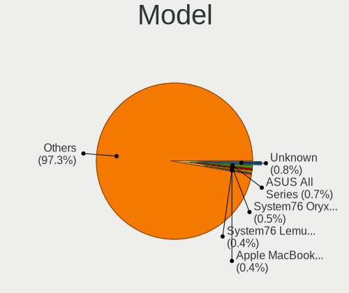
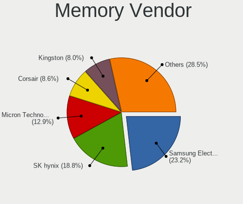
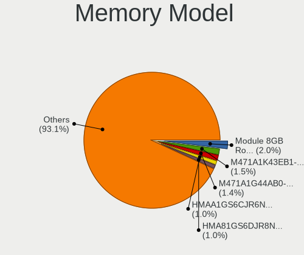

Pop!_OS 22.04 - Tested Hardware & Statistics
--------------------------------------------

A project to collect tested hardware configurations for Pop!_OS 22.04.

Anyone can contribute to this report by the [hw-probe](https://github.com/linuxhw/hw-probe) tool:

    sudo -E hw-probe -all -upload

Please contribute! Especially if your hardware is rare.

This is a report for all computer types. See also reports for [desktops](/Dist/Pop!_OS_22.04/Desktop/README.md) and [notebooks](/Dist/Pop!_OS_22.04/Notebook/README.md).

Contents
--------

* [ Test Cases ](#test-cases)

* [ System ](#system)
  - [ Kernel                   ](#kernel)
  - [ Kernel Family            ](#kernel-family)
  - [ Kernel Major Ver.        ](#kernel-major-ver)
  - [ Arch                     ](#arch)
  - [ DE                       ](#de)
  - [ Display Server           ](#display-server)
  - [ Display Manager          ](#display-manager)
  - [ OS Lang                  ](#os-lang)
  - [ Boot Mode                ](#boot-mode)
  - [ Filesystem               ](#filesystem)
  - [ Part. scheme             ](#part-scheme)
  - [ Dual Boot with Linux/BSD ](#dual-boot-with-linuxbsd)
  - [ Dual Boot (Win)          ](#dual-boot-win)

* [ Board ](#board)
  - [ Vendor                   ](#vendor)
  - [ Model                    ](#model)
  - [ Model Family             ](#model-family)
  - [ MFG Year                 ](#mfg-year)
  - [ Form Factor              ](#form-factor)
  - [ Secure Boot              ](#secure-boot)
  - [ Coreboot                 ](#coreboot)
  - [ RAM Size                 ](#ram-size)
  - [ RAM Used                 ](#ram-used)
  - [ Total Drives             ](#total-drives)
  - [ Has CD-ROM               ](#has-cd-rom)
  - [ Has Ethernet             ](#has-ethernet)
  - [ Has WiFi                 ](#has-wifi)
  - [ Has Bluetooth            ](#has-bluetooth)

* [ Location ](#location)
  - [ Country                  ](#country)
  - [ City                     ](#city)

* [ Drives ](#drives)
  - [ Drive Vendor             ](#drive-vendor)
  - [ Drive Model              ](#drive-model)
  - [ HDD Vendor               ](#hdd-vendor)
  - [ SSD Vendor               ](#ssd-vendor)
  - [ Drive Kind               ](#drive-kind)
  - [ Drive Connector          ](#drive-connector)
  - [ Drive Size               ](#drive-size)
  - [ Space Total              ](#space-total)
  - [ Space Used               ](#space-used)
  - [ Malfunc. Drives          ](#malfunc-drives)
  - [ Malfunc. Drive Vendor    ](#malfunc-drive-vendor)
  - [ Malfunc. HDD Vendor      ](#malfunc-hdd-vendor)
  - [ Malfunc. Drive Kind      ](#malfunc-drive-kind)
  - [ Failed Drives            ](#failed-drives)
  - [ Failed Drive Vendor      ](#failed-drive-vendor)
  - [ Drive Status             ](#drive-status)

* [ Storage controller ](#storage-controller)
  - [ Storage Vendor           ](#storage-vendor)
  - [ Storage Model            ](#storage-model)
  - [ Storage Kind             ](#storage-kind)

* [ Processor ](#processor)
  - [ CPU Vendor               ](#cpu-vendor)
  - [ CPU Model                ](#cpu-model)
  - [ CPU Model Family         ](#cpu-model-family)
  - [ CPU Cores                ](#cpu-cores)
  - [ CPU Sockets              ](#cpu-sockets)
  - [ CPU Threads              ](#cpu-threads)
  - [ CPU Op-Modes             ](#cpu-op-modes)
  - [ CPU Microcode            ](#cpu-microcode)
  - [ CPU Microarch            ](#cpu-microarch)

* [ Graphics ](#graphics)
  - [ GPU Vendor               ](#gpu-vendor)
  - [ GPU Model                ](#gpu-model)
  - [ GPU Combo                ](#gpu-combo)
  - [ GPU Driver               ](#gpu-driver)
  - [ GPU Memory               ](#gpu-memory)

* [ Monitor ](#monitor)
  - [ Monitor Vendor           ](#monitor-vendor)
  - [ Monitor Model            ](#monitor-model)
  - [ Monitor Resolution       ](#monitor-resolution)
  - [ Monitor Diagonal         ](#monitor-diagonal)
  - [ Monitor Width            ](#monitor-width)
  - [ Aspect Ratio             ](#aspect-ratio)
  - [ Monitor Area             ](#monitor-area)
  - [ Pixel Density            ](#pixel-density)
  - [ Multiple Monitors        ](#multiple-monitors)

* [ Network ](#network)
  - [ Net Controller Vendor    ](#net-controller-vendor)
  - [ Net Controller Model     ](#net-controller-model)
  - [ Wireless Vendor          ](#wireless-vendor)
  - [ Wireless Model           ](#wireless-model)
  - [ Ethernet Vendor          ](#ethernet-vendor)
  - [ Ethernet Model           ](#ethernet-model)
  - [ Net Controller Kind      ](#net-controller-kind)
  - [ Used Controller          ](#used-controller)
  - [ NICs                     ](#nics)
  - [ IPv6                     ](#ipv6)

* [ Bluetooth ](#bluetooth)
  - [ Bluetooth Vendor         ](#bluetooth-vendor)
  - [ Bluetooth Model          ](#bluetooth-model)

* [ Sound ](#sound)
  - [ Sound Vendor             ](#sound-vendor)
  - [ Sound Model              ](#sound-model)

* [ Memory ](#memory)
  - [ Memory Vendor            ](#memory-vendor)
  - [ Memory Model             ](#memory-model)
  - [ Memory Kind              ](#memory-kind)
  - [ Memory Form Factor       ](#memory-form-factor)
  - [ Memory Size              ](#memory-size)
  - [ Memory Speed             ](#memory-speed)

* [ Printers & scanners ](#printers--scanners)
  - [ Printer Vendor           ](#printer-vendor)
  - [ Printer Model            ](#printer-model)
  - [ Scanner Vendor           ](#scanner-vendor)
  - [ Scanner Model            ](#scanner-model)

* [ Camera ](#camera)
  - [ Camera Vendor            ](#camera-vendor)
  - [ Camera Model             ](#camera-model)

* [ Security ](#security)
  - [ Fingerprint Vendor       ](#fingerprint-vendor)
  - [ Fingerprint Model        ](#fingerprint-model)
  - [ Chipcard Vendor          ](#chipcard-vendor)
  - [ Chipcard Model           ](#chipcard-model)

* [ Unsupported ](#unsupported)
  - [ Unsupported Devices      ](#unsupported-devices)
  - [ Unsupported Device Types ](#unsupported-device-types)

Test Cases
----------

Total: 3025

| Vendor        | Model                       | Form-Factor | Probe                                                      | Date         |
|---------------|-----------------------------|-------------|------------------------------------------------------------|--------------|
| Gigabyte      | Z77X-UP4 TH                 | Desktop     | [b80cb49656](https://linux-hardware.org/?probe=b80cb49656) | Mar 01, 2023 |
| Gigabyte      | B450 AORUS ELITE V2         | Desktop     | [0e0b3360ba](https://linux-hardware.org/?probe=0e0b3360ba) | Feb 28, 2023 |
| ASUSTek       | Zenbook UX5401ZA_UX5401Z... | Notebook    | [5aad25779a](https://linux-hardware.org/?probe=5aad25779a) | Feb 28, 2023 |
| Lenovo        | 30D9 SDK0J40705 WIN 3425... | Desktop     | [7f53a53eba](https://linux-hardware.org/?probe=7f53a53eba) | Feb 28, 2023 |
| Acer          | Aspire A515-57              | Notebook    | [6c511739eb](https://linux-hardware.org/?probe=6c511739eb) | Feb 28, 2023 |
| Lenovo        | ThinkPad X270 20HN001RUS    | Notebook    | [ff84200b75](https://linux-hardware.org/?probe=ff84200b75) | Feb 28, 2023 |
| ASUSTek       | VivoBook S14 X411UF         | Notebook    | [88745e1f03](https://linux-hardware.org/?probe=88745e1f03) | Feb 28, 2023 |
| Lenovo        | ThinkPad X1 Carbon 7th 2... | Notebook    | [357c1abb1d](https://linux-hardware.org/?probe=357c1abb1d) | Feb 27, 2023 |
| MSI           | MAG Z690 TOMAHAWK WIFI D... | Desktop     | [13edc00539](https://linux-hardware.org/?probe=13edc00539) | Feb 27, 2023 |
| AZW           | SER                         | Mini pc     | [f5b64e8716](https://linux-hardware.org/?probe=f5b64e8716) | Feb 27, 2023 |
| Razer         | Blade 15 Base Model (Ear... | Notebook    | [425567e8f3](https://linux-hardware.org/?probe=425567e8f3) | Feb 27, 2023 |
| Lenovo        | ThinkPad T480s 20L8S7AS0... | Notebook    | [bd62e34a09](https://linux-hardware.org/?probe=bd62e34a09) | Feb 27, 2023 |
| HCL Infosy... | HCL ME LAPTOP               | Notebook    | [82a40f1881](https://linux-hardware.org/?probe=82a40f1881) | Feb 27, 2023 |
| Acer          | Aspire A515-56              | Notebook    | [97e3001416](https://linux-hardware.org/?probe=97e3001416) | Feb 26, 2023 |
| Dell          | 03KWTV A02                  | Desktop     | [8b6eae9fd5](https://linux-hardware.org/?probe=8b6eae9fd5) | Feb 26, 2023 |
| MSI           | MPG Z390 GAMING EDGE AC     | Desktop     | [a3b8430bad](https://linux-hardware.org/?probe=a3b8430bad) | Feb 26, 2023 |
| MSI           | MAG Z690 TOMAHAWK WIFI D... | Desktop     | [fe1c90a3aa](https://linux-hardware.org/?probe=fe1c90a3aa) | Feb 26, 2023 |
| MSI           | B450-A PRO MAX              | Desktop     | [f081452f55](https://linux-hardware.org/?probe=f081452f55) | Feb 26, 2023 |
| Dell          | XPS 13 7390                 | Notebook    | [2a8830034a](https://linux-hardware.org/?probe=2a8830034a) | Feb 26, 2023 |
| Acer          | Nitro AN515-58              | Notebook    | [1c93095718](https://linux-hardware.org/?probe=1c93095718) | Feb 26, 2023 |
| Sony          | VPCZ12V9R                   | Notebook    | [3014067c24](https://linux-hardware.org/?probe=3014067c24) | Feb 26, 2023 |
| MACHINIST     | X99-RS9 V2.0                | Desktop     | [f991f0e9df](https://linux-hardware.org/?probe=f991f0e9df) | Feb 26, 2023 |
| Gigabyte      | 970A-DS3P                   | Desktop     | [87647b8c76](https://linux-hardware.org/?probe=87647b8c76) | Feb 26, 2023 |
| ASUSTek       | SABERTOOTH 990FX R2.0       | Desktop     | [42fe607d11](https://linux-hardware.org/?probe=42fe607d11) | Feb 25, 2023 |
| GPU Compan... | GWTN141-10                  | Notebook    | [1550bec17e](https://linux-hardware.org/?probe=1550bec17e) | Feb 25, 2023 |
| GPU Compan... | GWTN141-10                  | Notebook    | [aa535b0731](https://linux-hardware.org/?probe=aa535b0731) | Feb 25, 2023 |
| Dell          | G7 7588                     | Notebook    | [82f1398a69](https://linux-hardware.org/?probe=82f1398a69) | Feb 25, 2023 |
| Alienware     | 15 R3                       | Notebook    | [72543030d5](https://linux-hardware.org/?probe=72543030d5) | Feb 25, 2023 |
| Lenovo        | IdeaPad 305-15IBD 80NJ      | Notebook    | [42b9d60137](https://linux-hardware.org/?probe=42b9d60137) | Feb 25, 2023 |
| HP            | Pavilion Gaming Laptop 1... | Notebook    | [b5f840e593](https://linux-hardware.org/?probe=b5f840e593) | Feb 25, 2023 |
| System76      | Galago Pro                  | Notebook    | [3e4391562b](https://linux-hardware.org/?probe=3e4391562b) | Feb 25, 2023 |
| Packard Be... | EasyNote TS11HR             | Notebook    | [0a63352761](https://linux-hardware.org/?probe=0a63352761) | Feb 25, 2023 |
| MSI           | PRO Z790-P WIFI DDR4        | Desktop     | [59b7e1da6d](https://linux-hardware.org/?probe=59b7e1da6d) | Feb 25, 2023 |
| Dell          | XPS 15 9500                 | Notebook    | [96e6c2c201](https://linux-hardware.org/?probe=96e6c2c201) | Feb 25, 2023 |
| Dell          | Latitude 3310               | Notebook    | [d989647d9d](https://linux-hardware.org/?probe=d989647d9d) | Feb 25, 2023 |
| Acer          | Aspire A515-56              | Notebook    | [517a6211c9](https://linux-hardware.org/?probe=517a6211c9) | Feb 24, 2023 |
| ZOTAC         | MEK1                        | Desktop     | [a61a52d794](https://linux-hardware.org/?probe=a61a52d794) | Feb 24, 2023 |
| HP            | ProBook 450 G1              | Notebook    | [f7c4b009f1](https://linux-hardware.org/?probe=f7c4b009f1) | Feb 24, 2023 |
| ASUSTek       | VivoBook_ASUSLaptop X509... | Notebook    | [297c37ec04](https://linux-hardware.org/?probe=297c37ec04) | Feb 24, 2023 |
| Lenovo        | ThinkPad X220 Tablet 429... | Notebook    | [2f561a23c3](https://linux-hardware.org/?probe=2f561a23c3) | Feb 24, 2023 |
| HP            | 8433 11                     | Desktop     | [881b062090](https://linux-hardware.org/?probe=881b062090) | Feb 24, 2023 |
| ASUSTek       | SABERTOOTH 990FX R2.0       | Desktop     | [59d0e692ef](https://linux-hardware.org/?probe=59d0e692ef) | Feb 24, 2023 |
| ASUSTek       | ROG Strix G513RC_G513RC     | Notebook    | [041c57ebe6](https://linux-hardware.org/?probe=041c57ebe6) | Feb 24, 2023 |
| HP            | Pavilion x360 Convertibl... | Convertible | [f2a29f6d2e](https://linux-hardware.org/?probe=f2a29f6d2e) | Feb 24, 2023 |
| HP            | Pavilion x360 Convertibl... | Convertible | [2913081292](https://linux-hardware.org/?probe=2913081292) | Feb 24, 2023 |
| Apple         | MacBookPro9,2               | Notebook    | [c591acd5d6](https://linux-hardware.org/?probe=c591acd5d6) | Feb 24, 2023 |
| Lenovo        | Yoga 6 13ARE05 82FN         | Convertible | [10ffde0986](https://linux-hardware.org/?probe=10ffde0986) | Feb 24, 2023 |
| ASUSTek       | TUF Gaming X570-PLUS        | Desktop     | [27a3c3c4c1](https://linux-hardware.org/?probe=27a3c3c4c1) | Feb 24, 2023 |
| Lenovo        | Yoga 6 13ARE05 82FN         | Convertible | [7ad94e1be6](https://linux-hardware.org/?probe=7ad94e1be6) | Feb 24, 2023 |
| Dell          | Inspiron 5423               | Notebook    | [7cf47f3118](https://linux-hardware.org/?probe=7cf47f3118) | Feb 23, 2023 |
| Lenovo        | Legion 5 15ARH05H 82B1      | Notebook    | [00591dc764](https://linux-hardware.org/?probe=00591dc764) | Feb 23, 2023 |
| Lenovo        | ThinkPad T430s 2356CU8      | Notebook    | [bb0d8e868d](https://linux-hardware.org/?probe=bb0d8e868d) | Feb 23, 2023 |
| Toshiba       | Satellite C855-1T5          | Notebook    | [8a96579c89](https://linux-hardware.org/?probe=8a96579c89) | Feb 23, 2023 |
| System76      | Gazelle                     | Notebook    | [609f452af9](https://linux-hardware.org/?probe=609f452af9) | Feb 23, 2023 |
| ONE-NETBOO... | ONE XPLAYER 1002-C          | Notebook    | [33a4731a5e](https://linux-hardware.org/?probe=33a4731a5e) | Feb 23, 2023 |
| Dell          | 0M6C7G A00                  | Desktop     | [8d8af65e26](https://linux-hardware.org/?probe=8d8af65e26) | Feb 23, 2023 |
| Dell          | 0M6C7G A00                  | Desktop     | [f8f5ea8885](https://linux-hardware.org/?probe=f8f5ea8885) | Feb 23, 2023 |
| Huanan        | X99-QD4 V1.0                | Desktop     | [205f7c6f50](https://linux-hardware.org/?probe=205f7c6f50) | Feb 23, 2023 |
| Dell          | Latitude E7240              | Notebook    | [7f8278ff44](https://linux-hardware.org/?probe=7f8278ff44) | Feb 23, 2023 |
| ASUSTek       | Zenbook Pro Duo UX582ZW_... | Notebook    | [34016a67d9](https://linux-hardware.org/?probe=34016a67d9) | Feb 22, 2023 |
| Lenovo        | IdeaPad 5 14ITL05 82FE      | Notebook    | [312937f0d0](https://linux-hardware.org/?probe=312937f0d0) | Feb 22, 2023 |
| Apple         | Mac-F226BEC8 PVT            | All in one  | [d032f0a547](https://linux-hardware.org/?probe=d032f0a547) | Feb 22, 2023 |
| ASUSTek       | M5A78L-M/USB3               | Desktop     | [ec6ab709e5](https://linux-hardware.org/?probe=ec6ab709e5) | Feb 22, 2023 |
| Lenovo        | 102F SBB0J05441 WIN 3305... | Desktop     | [ea890b85f3](https://linux-hardware.org/?probe=ea890b85f3) | Feb 22, 2023 |
| Gigabyte      | H81M-HD3                    | Desktop     | [d19e079879](https://linux-hardware.org/?probe=d19e079879) | Feb 22, 2023 |
| Lenovo        | ThinkPad T450 20BUS0B000    | Notebook    | [6ab727e8c0](https://linux-hardware.org/?probe=6ab727e8c0) | Feb 22, 2023 |
| Apple         | MacBookPro11,4              | Notebook    | [c4eab564b3](https://linux-hardware.org/?probe=c4eab564b3) | Feb 22, 2023 |
| HP            | EliteBook 845 G8 Noteboo... | Notebook    | [af2d2bd596](https://linux-hardware.org/?probe=af2d2bd596) | Feb 21, 2023 |
| HP            | EliteBook 845 G8 Noteboo... | Notebook    | [41b4e0957f](https://linux-hardware.org/?probe=41b4e0957f) | Feb 21, 2023 |
| ASRock        | B550 Extreme4               | Desktop     | [db2686086b](https://linux-hardware.org/?probe=db2686086b) | Feb 21, 2023 |
| HP            | EliteBook Folio 1040 G2     | Notebook    | [265018acd3](https://linux-hardware.org/?probe=265018acd3) | Feb 21, 2023 |
| Apple         | MacBookPro16,1              | Notebook    | [a5cff07fd8](https://linux-hardware.org/?probe=a5cff07fd8) | Feb 21, 2023 |
| ASUSTek       | PRIME B450M-A               | Desktop     | [8c97a04c10](https://linux-hardware.org/?probe=8c97a04c10) | Feb 21, 2023 |
| ASUSTek       | VivoBook_ASUSLaptop X580... | Notebook    | [022527aa4c](https://linux-hardware.org/?probe=022527aa4c) | Feb 21, 2023 |
| ASUSTek       | VivoBook_ASUSLaptop X580... | Notebook    | [3b1afb00a2](https://linux-hardware.org/?probe=3b1afb00a2) | Feb 21, 2023 |
| Dell          | G15 5525                    | Notebook    | [63bd2ac7b9](https://linux-hardware.org/?probe=63bd2ac7b9) | Feb 21, 2023 |
| ASUSTek       | PRIME B550M-A               | Desktop     | [7dd9134373](https://linux-hardware.org/?probe=7dd9134373) | Feb 21, 2023 |
| ASUSTek       | PRIME B550M-A               | Desktop     | [fafea002be](https://linux-hardware.org/?probe=fafea002be) | Feb 21, 2023 |
| ASUSTek       | B75M-A                      | Desktop     | [c0c41ca089](https://linux-hardware.org/?probe=c0c41ca089) | Feb 21, 2023 |
| Alienware     | 0NWN7M A00                  | Desktop     | [eef5c2f68f](https://linux-hardware.org/?probe=eef5c2f68f) | Feb 21, 2023 |
| ASUSTek       | B75M-A                      | Desktop     | [2ea45a0d80](https://linux-hardware.org/?probe=2ea45a0d80) | Feb 21, 2023 |
| Acer          | Swift SF114-34              | Notebook    | [e9f5a9d293](https://linux-hardware.org/?probe=e9f5a9d293) | Feb 21, 2023 |
| Microsoft     | Surface Pro 7               | Tablet      | [5fd759f0ba](https://linux-hardware.org/?probe=5fd759f0ba) | Feb 21, 2023 |
| ASUSTek       | PRIME B550M-A               | Desktop     | [edbf6ce468](https://linux-hardware.org/?probe=edbf6ce468) | Feb 20, 2023 |
| Dell          | Precision M4800             | Notebook    | [b8e31b63ce](https://linux-hardware.org/?probe=b8e31b63ce) | Feb 20, 2023 |
| Microsoft     | Surface Pro 7               | Tablet      | [1862dee971](https://linux-hardware.org/?probe=1862dee971) | Feb 20, 2023 |
| ASRock        | A520M-HVS                   | Desktop     | [cc8628ae2c](https://linux-hardware.org/?probe=cc8628ae2c) | Feb 20, 2023 |
| HP            | Laptop 14s-fq0xxx           | Notebook    | [0bc03f3b39](https://linux-hardware.org/?probe=0bc03f3b39) | Feb 20, 2023 |
| Dell          | 09KPNV A01                  | Desktop     | [b335ec1cc3](https://linux-hardware.org/?probe=b335ec1cc3) | Feb 20, 2023 |
| HP            | ProBook 450 G1              | Notebook    | [b5e8826f8c](https://linux-hardware.org/?probe=b5e8826f8c) | Feb 20, 2023 |
| Lenovo        | Yoga 6 13ALC7 82UD          | Convertible | [1d62ae4e43](https://linux-hardware.org/?probe=1d62ae4e43) | Feb 20, 2023 |
| Intel         | NUC8i7HNB J68197-502        | Mini pc     | [2f702c3f2f](https://linux-hardware.org/?probe=2f702c3f2f) | Feb 19, 2023 |
| Dell          | XPS 15 7590                 | Notebook    | [297b06716d](https://linux-hardware.org/?probe=297b06716d) | Feb 19, 2023 |
| Lenovo        | Legion 5 Pro 16ARH7H 82R... | Notebook    | [d4fdbbf1ba](https://linux-hardware.org/?probe=d4fdbbf1ba) | Feb 19, 2023 |
| Lenovo        | Legion 5 Pro 16ARH7H 82R... | Notebook    | [a11d164d69](https://linux-hardware.org/?probe=a11d164d69) | Feb 19, 2023 |
| Apple         | MacBook4,1                  | Notebook    | [2011c2060b](https://linux-hardware.org/?probe=2011c2060b) | Feb 19, 2023 |
| ASRock        | H87 Performance             | Desktop     | [a28df01cad](https://linux-hardware.org/?probe=a28df01cad) | Feb 19, 2023 |
| Gigabyte      | Z590I AORUS ULTRA           | Desktop     | [9805ab5764](https://linux-hardware.org/?probe=9805ab5764) | Feb 19, 2023 |
| Gigabyte      | GA-78LMT-S2P                | Desktop     | [8df8fe9ae8](https://linux-hardware.org/?probe=8df8fe9ae8) | Feb 19, 2023 |
| Apple         | Mac-F226BEC8 PVT            | All in one  | [813066eda5](https://linux-hardware.org/?probe=813066eda5) | Feb 19, 2023 |
| Lenovo        | 1036 NO DPK                 | Desktop     | [b99541f6ad](https://linux-hardware.org/?probe=b99541f6ad) | Feb 19, 2023 |
| ASUSTek       | ROG Flow X13 GV301RC_GV3... | Convertible | [e87ff10942](https://linux-hardware.org/?probe=e87ff10942) | Feb 18, 2023 |
| HP            | 8437                        | Desktop     | [f8f0f71bf5](https://linux-hardware.org/?probe=f8f0f71bf5) | Feb 18, 2023 |
| HP            | Pavilion Laptop 15-cw0xx... | Notebook    | [cc0e711862](https://linux-hardware.org/?probe=cc0e711862) | Feb 18, 2023 |
| HP            | 240 G6 Notebook PC          | Notebook    | [fc39dde214](https://linux-hardware.org/?probe=fc39dde214) | Feb 18, 2023 |
| Dell          | Latitude E7240              | Notebook    | [461873da2d](https://linux-hardware.org/?probe=461873da2d) | Feb 18, 2023 |
| Lenovo        | ThinkPad P14s Gen 2a 21A... | Notebook    | [5cc4ff8271](https://linux-hardware.org/?probe=5cc4ff8271) | Feb 18, 2023 |
| Lenovo        | ThinkPad P14s Gen 2a 21A... | Notebook    | [75f9e575b3](https://linux-hardware.org/?probe=75f9e575b3) | Feb 18, 2023 |
| Lenovo        | ThinkPad P14s Gen 2a 21A... | Notebook    | [f120e182a1](https://linux-hardware.org/?probe=f120e182a1) | Feb 17, 2023 |
| HUAWEI        | BOD-WXX9                    | Notebook    | [a56a788adf](https://linux-hardware.org/?probe=a56a788adf) | Feb 17, 2023 |
| HP            | EliteBook 830 G5            | Notebook    | [7ef47e7131](https://linux-hardware.org/?probe=7ef47e7131) | Feb 17, 2023 |
| HONOR         | NBR-WAX9                    | Notebook    | [b16ea0055d](https://linux-hardware.org/?probe=b16ea0055d) | Feb 17, 2023 |
| Dell          | Latitude E4200              | Notebook    | [18868db8a1](https://linux-hardware.org/?probe=18868db8a1) | Feb 17, 2023 |
| Gigabyte      | X570 AORUS ELITE            | Desktop     | [4101f152f5](https://linux-hardware.org/?probe=4101f152f5) | Feb 17, 2023 |
| ASRock        | B550M-HDV                   | Desktop     | [755006e226](https://linux-hardware.org/?probe=755006e226) | Feb 17, 2023 |
| Lenovo        | ThinkPad P14s Gen 2a 21A... | Notebook    | [91c566ccc9](https://linux-hardware.org/?probe=91c566ccc9) | Feb 16, 2023 |
| Apple         | MacBookPro9,2               | Notebook    | [e67f600749](https://linux-hardware.org/?probe=e67f600749) | Feb 16, 2023 |
| Lenovo        | ThinkPad L15 Gen 3 21C7C... | Notebook    | [2b0904349a](https://linux-hardware.org/?probe=2b0904349a) | Feb 16, 2023 |
| Lenovo        | G50-80 80E5                 | Notebook    | [64c385ee36](https://linux-hardware.org/?probe=64c385ee36) | Feb 16, 2023 |
| Apple         | Mac-F226BEC8 PVT            | All in one  | [3206e7be82](https://linux-hardware.org/?probe=3206e7be82) | Feb 16, 2023 |
| OriginPC      | Voyager a1600               | Notebook    | [9608c5afd5](https://linux-hardware.org/?probe=9608c5afd5) | Feb 16, 2023 |
| Google        | Blorb                       | Notebook    | [286353731c](https://linux-hardware.org/?probe=286353731c) | Feb 16, 2023 |
| Lenovo        | 3136 SDK0K17763 WIN 1801... | Mini pc     | [01d39bc0ca](https://linux-hardware.org/?probe=01d39bc0ca) | Feb 16, 2023 |
| Lenovo        | ThinkPad T530 2392AQU       | Notebook    | [1b89c43b58](https://linux-hardware.org/?probe=1b89c43b58) | Feb 16, 2023 |
| Gigabyte      | B450M DS3H-CF               | Desktop     | [684445aeab](https://linux-hardware.org/?probe=684445aeab) | Feb 16, 2023 |
| MSI           | G41M-P33 Combo              | Desktop     | [5a6d751e4b](https://linux-hardware.org/?probe=5a6d751e4b) | Feb 15, 2023 |
| Gigabyte      | X570 I AORUS PRO WIFI       | Desktop     | [c82882e708](https://linux-hardware.org/?probe=c82882e708) | Feb 15, 2023 |
| HP            | EliteBook 850 G2            | Notebook    | [ed0641ce38](https://linux-hardware.org/?probe=ed0641ce38) | Feb 15, 2023 |
| Lenovo        | ThinkBook 15 G3 ACL 21A4    | Notebook    | [74a61dff13](https://linux-hardware.org/?probe=74a61dff13) | Feb 15, 2023 |
| Intel         | X99 V1.x                    | Desktop     | [31da77bea8](https://linux-hardware.org/?probe=31da77bea8) | Feb 15, 2023 |
| ASUSTek       | B85M-G                      | Desktop     | [c803a7f9e8](https://linux-hardware.org/?probe=c803a7f9e8) | Feb 15, 2023 |
| ASUSTek       | B85M-G                      | Desktop     | [3a660768c0](https://linux-hardware.org/?probe=3a660768c0) | Feb 15, 2023 |
| Apple         | MacBookPro12,1              | Notebook    | [bdb6e585b0](https://linux-hardware.org/?probe=bdb6e585b0) | Feb 15, 2023 |
| Apple         | Mac-F226BEC8 PVT            | All in one  | [011e8929fa](https://linux-hardware.org/?probe=011e8929fa) | Feb 15, 2023 |
| Gigabyte      | G41MT-S2                    | Desktop     | [9dfc369401](https://linux-hardware.org/?probe=9dfc369401) | Feb 15, 2023 |
| MSI           | G41M-P33 Combo              | Desktop     | [1161e39e43](https://linux-hardware.org/?probe=1161e39e43) | Feb 15, 2023 |
| Lenovo        | ThinkPad T450s 20BWS14G0... | Notebook    | [5c4a26ada0](https://linux-hardware.org/?probe=5c4a26ada0) | Feb 14, 2023 |
| Dell          | 07JJ74 A01                  | Server      | [c008b1943f](https://linux-hardware.org/?probe=c008b1943f) | Feb 14, 2023 |
| Gigabyte      | GA-MA770T-UD3P              | Desktop     | [2ca590a85e](https://linux-hardware.org/?probe=2ca590a85e) | Feb 14, 2023 |
| Dell          | Precision M3800             | Notebook    | [98b54858cb](https://linux-hardware.org/?probe=98b54858cb) | Feb 14, 2023 |
| Dell          | Inspiron 15 3511            | Notebook    | [1028ef9686](https://linux-hardware.org/?probe=1028ef9686) | Feb 14, 2023 |
| Gigabyte      | X570 I AORUS PRO WIFI       | Desktop     | [27c2ee6ee0](https://linux-hardware.org/?probe=27c2ee6ee0) | Feb 14, 2023 |
| Apple         | Mac-F2268CC8                | All in one  | [826959e69e](https://linux-hardware.org/?probe=826959e69e) | Feb 13, 2023 |
| MSI           | Prestige 14Evo A11M         | Notebook    | [abeebd4312](https://linux-hardware.org/?probe=abeebd4312) | Feb 13, 2023 |
| Sony          | VPCEG27FM                   | Notebook    | [748a67669f](https://linux-hardware.org/?probe=748a67669f) | Feb 13, 2023 |
| Lenovo        | IdeaPad Slim 7 Pro 14IHU... | Notebook    | [a6af7624cd](https://linux-hardware.org/?probe=a6af7624cd) | Feb 13, 2023 |
| Samsung       | 730U3E/740U3E               | Notebook    | [91ac69dfa1](https://linux-hardware.org/?probe=91ac69dfa1) | Feb 13, 2023 |
| Lenovo        | ThinkPad T410 2522G76       | Notebook    | [b15d4051cd](https://linux-hardware.org/?probe=b15d4051cd) | Feb 13, 2023 |
| Lenovo        | ThinkPad X1 Extreme 20MF... | Notebook    | [d38212ee96](https://linux-hardware.org/?probe=d38212ee96) | Feb 13, 2023 |
| Apple         | MacBookPro11,2              | Notebook    | [2314b98760](https://linux-hardware.org/?probe=2314b98760) | Feb 12, 2023 |
| Apple         | MacBookPro12,1              | Notebook    | [139b92595a](https://linux-hardware.org/?probe=139b92595a) | Feb 12, 2023 |
| Dell          | 0Y7WYT A00                  | Desktop     | [d94084bbee](https://linux-hardware.org/?probe=d94084bbee) | Feb 12, 2023 |
| ASRock        | B550M Steel Legend          | Desktop     | [2a6f501cb1](https://linux-hardware.org/?probe=2a6f501cb1) | Feb 12, 2023 |
| Haier         | GG1500A                     | Notebook    | [4c4598157f](https://linux-hardware.org/?probe=4c4598157f) | Feb 12, 2023 |
| Dell          | 08WKV3 A00                  | Desktop     | [89ba42b53e](https://linux-hardware.org/?probe=89ba42b53e) | Feb 12, 2023 |
| ASUSTek       | CROSSHAIR VI HERO           | Desktop     | [687ecdce15](https://linux-hardware.org/?probe=687ecdce15) | Feb 12, 2023 |
| Dell          | Latitude XT2                | Notebook    | [9b98bf4722](https://linux-hardware.org/?probe=9b98bf4722) | Feb 12, 2023 |
| Dell          | Precision M4700             | Notebook    | [1a44cb5ef9](https://linux-hardware.org/?probe=1a44cb5ef9) | Feb 11, 2023 |
| Apple         | MacBookPro11,1              | Notebook    | [fb407bfc13](https://linux-hardware.org/?probe=fb407bfc13) | Feb 11, 2023 |
| ASUSTek       | CROSSHAIR VI HERO           | Desktop     | [2c1562b21f](https://linux-hardware.org/?probe=2c1562b21f) | Feb 11, 2023 |
| Lenovo        | ThinkPad T470s 20HFCT01W... | Notebook    | [322a9d340e](https://linux-hardware.org/?probe=322a9d340e) | Feb 11, 2023 |
| Acer          | Aspire 5742G                | Notebook    | [1315dbeb6c](https://linux-hardware.org/?probe=1315dbeb6c) | Feb 11, 2023 |
| Gigabyte      | X570 AORUS ELITE            | Desktop     | [2d776f8810](https://linux-hardware.org/?probe=2d776f8810) | Feb 11, 2023 |
| Gigabyte      | X399 AORUS Gaming 7         | Desktop     | [b82ab8816d](https://linux-hardware.org/?probe=b82ab8816d) | Feb 11, 2023 |
| HP            | 18E4                        | Desktop     | [55972b87dd](https://linux-hardware.org/?probe=55972b87dd) | Feb 11, 2023 |
| Lenovo        | G50-45 80E3                 | Notebook    | [ab07f075d8](https://linux-hardware.org/?probe=ab07f075d8) | Feb 11, 2023 |
| Apple         | MacBook8,1                  | Notebook    | [2f1c5b90a8](https://linux-hardware.org/?probe=2f1c5b90a8) | Feb 11, 2023 |
| Lenovo        | G50-45 80E3                 | Notebook    | [24cb179c5a](https://linux-hardware.org/?probe=24cb179c5a) | Feb 11, 2023 |
| ASUSTek       | CROSSHAIR VI HERO           | Desktop     | [0b14ee6551](https://linux-hardware.org/?probe=0b14ee6551) | Feb 11, 2023 |
| ASUSTek       | ASUS EXPERTBOOK B2502FBA... | Convertible | [dd34aed5d9](https://linux-hardware.org/?probe=dd34aed5d9) | Feb 11, 2023 |
| Lenovo        | Yoga 6 13ALC7 82UD          | Convertible | [c17ac89917](https://linux-hardware.org/?probe=c17ac89917) | Feb 11, 2023 |
| Gigabyte      | B85M-DS3H-A                 | Desktop     | [181c0e03e2](https://linux-hardware.org/?probe=181c0e03e2) | Feb 10, 2023 |
| MSI           | GF63 Thin 9RCX              | Notebook    | [9cbcfdd748](https://linux-hardware.org/?probe=9cbcfdd748) | Feb 10, 2023 |
| Dell          | Latitude 5290 2-in-1        | Notebook    | [cb03f9e72e](https://linux-hardware.org/?probe=cb03f9e72e) | Feb 10, 2023 |
| Dell          | 0Y7WYT A00                  | Desktop     | [e4369afe1e](https://linux-hardware.org/?probe=e4369afe1e) | Feb 10, 2023 |
| ASUSTek       | A55BM-PLUS                  | Desktop     | [7c9763c23f](https://linux-hardware.org/?probe=7c9763c23f) | Feb 10, 2023 |
| Dell          | G15 5520                    | Notebook    | [121b06f3cc](https://linux-hardware.org/?probe=121b06f3cc) | Feb 10, 2023 |
| Samsung       | DeskTop System              | Desktop     | [2437c4afda](https://linux-hardware.org/?probe=2437c4afda) | Feb 10, 2023 |
| Dell          | 0CR1TT A00                  | All in one  | [be588e52b7](https://linux-hardware.org/?probe=be588e52b7) | Feb 09, 2023 |
| Dell          | Venue 11 Pro 7130 MS        | Notebook    | [d0cc5f80fc](https://linux-hardware.org/?probe=d0cc5f80fc) | Feb 09, 2023 |
| HP            | EliteBook 840 G5            | Notebook    | [39dbdb0fa9](https://linux-hardware.org/?probe=39dbdb0fa9) | Feb 09, 2023 |
| Lenovo        | ThinkPad T450 20BUA0PNUK    | Notebook    | [8837c33007](https://linux-hardware.org/?probe=8837c33007) | Feb 09, 2023 |
| Biostar       | H81MHV3 5.0                 | Desktop     | [390c8dd03a](https://linux-hardware.org/?probe=390c8dd03a) | Feb 09, 2023 |
| Dell          | Venue 11 Pro 7130 MS        | Notebook    | [74dd2176ff](https://linux-hardware.org/?probe=74dd2176ff) | Feb 09, 2023 |
| ASUSTek       | ROG STRIX X570-E GAMING     | Desktop     | [17bf959fd0](https://linux-hardware.org/?probe=17bf959fd0) | Feb 09, 2023 |
| Acer          | Aspire M3970                | Desktop     | [718cc13462](https://linux-hardware.org/?probe=718cc13462) | Feb 09, 2023 |
| TUXEDO        | Polaris AMD Gen3 (CZN)      | Notebook    | [93afe9ddeb](https://linux-hardware.org/?probe=93afe9ddeb) | Feb 09, 2023 |
| Dell          | Inspiron 3576               | Notebook    | [a025641dfc](https://linux-hardware.org/?probe=a025641dfc) | Feb 09, 2023 |
| Acer          | Aspire A315-59              | Notebook    | [edc6b0a3af](https://linux-hardware.org/?probe=edc6b0a3af) | Feb 09, 2023 |
| Dell          | XPS 13 9360                 | Notebook    | [db7e89340f](https://linux-hardware.org/?probe=db7e89340f) | Feb 09, 2023 |
| ASUSTek       | ROG STRIX B550-F GAMING     | Desktop     | [16af8175a4](https://linux-hardware.org/?probe=16af8175a4) | Feb 08, 2023 |
| ASUSTek       | ZenBook UX463FA_UX463FA     | Convertible | [e43aebc69d](https://linux-hardware.org/?probe=e43aebc69d) | Feb 08, 2023 |
| System76      | Lemur Pro                   | Notebook    | [94cf78a9d9](https://linux-hardware.org/?probe=94cf78a9d9) | Feb 08, 2023 |
| Apple         | Mac-F226BEC8 PVT            | All in one  | [43b52ad56f](https://linux-hardware.org/?probe=43b52ad56f) | Feb 08, 2023 |
| Gigabyte      | B650I AORUS ULTRA           | Desktop     | [1c07b901bb](https://linux-hardware.org/?probe=1c07b901bb) | Feb 08, 2023 |
| HP            | 2129                        | Desktop     | [80920d0d75](https://linux-hardware.org/?probe=80920d0d75) | Feb 08, 2023 |
| Dell          | G15 5520                    | Notebook    | [7f4d36cea1](https://linux-hardware.org/?probe=7f4d36cea1) | Feb 08, 2023 |
| ASUSTek       | TUF Gaming B550-PLUS        | Desktop     | [d8dcaddb54](https://linux-hardware.org/?probe=d8dcaddb54) | Feb 08, 2023 |
| Apple         | Mac-F226BEC8 PVT            | All in one  | [275ce1a7fc](https://linux-hardware.org/?probe=275ce1a7fc) | Feb 08, 2023 |
| ASRock        | B660 Pro-C/ax               | Desktop     | [31e10f0e68](https://linux-hardware.org/?probe=31e10f0e68) | Feb 07, 2023 |
| HP            | EliteBook 830 G5            | Notebook    | [5554154df2](https://linux-hardware.org/?probe=5554154df2) | Feb 07, 2023 |
| Dell          | System XPS L702X            | Notebook    | [cdbc3578d0](https://linux-hardware.org/?probe=cdbc3578d0) | Feb 07, 2023 |
| Alienware     | m15 R7                      | Notebook    | [254ab40fcf](https://linux-hardware.org/?probe=254ab40fcf) | Feb 07, 2023 |
| ASRock        | FM2A68M-HD+                 | Desktop     | [8588a36683](https://linux-hardware.org/?probe=8588a36683) | Feb 07, 2023 |
| Lenovo        | 3743 SDK0T76463 WIN 3422... | Desktop     | [81ece9483e](https://linux-hardware.org/?probe=81ece9483e) | Feb 07, 2023 |
| Gigabyte      | F2A55M-HD2                  | Desktop     | [fe95bfe3d3](https://linux-hardware.org/?probe=fe95bfe3d3) | Feb 07, 2023 |
| Dell          | 0HHV7N A00                  | Desktop     | [e67a1c86b7](https://linux-hardware.org/?probe=e67a1c86b7) | Feb 07, 2023 |
| Gigabyte      | Z170X-UD5-CF                | Desktop     | [03a392d41f](https://linux-hardware.org/?probe=03a392d41f) | Feb 07, 2023 |
| Apple         | Mac-F226BEC8 PVT            | All in one  | [aef988ae85](https://linux-hardware.org/?probe=aef988ae85) | Feb 07, 2023 |
| Dell          | 02GDWG A00                  | Desktop     | [c0660c15fb](https://linux-hardware.org/?probe=c0660c15fb) | Feb 07, 2023 |
| Lenovo        | IdeaPad 330-15IKB 81FE      | Notebook    | [f6c24b1ea8](https://linux-hardware.org/?probe=f6c24b1ea8) | Feb 07, 2023 |
| HP            | Pavilion x360 Convertibl... | Convertible | [209a38d937](https://linux-hardware.org/?probe=209a38d937) | Feb 07, 2023 |
| MSI           | MAG Z690 TOMAHAWK WIFI      | Desktop     | [25fbfe1d66](https://linux-hardware.org/?probe=25fbfe1d66) | Feb 07, 2023 |
| System76      | Thelio thelio-r2            | Desktop     | [4cdf7d2895](https://linux-hardware.org/?probe=4cdf7d2895) | Feb 06, 2023 |
| Lenovo        | IdeaPad 5 Pro 16ARH7 82S... | Notebook    | [50af8c9fe6](https://linux-hardware.org/?probe=50af8c9fe6) | Feb 06, 2023 |
| ASUSTek       | UX430UNR                    | Notebook    | [96d7a1938a](https://linux-hardware.org/?probe=96d7a1938a) | Feb 06, 2023 |
| Gigabyte      | B550I AORUS PRO AX          | Desktop     | [42dba6bdb3](https://linux-hardware.org/?probe=42dba6bdb3) | Feb 06, 2023 |
| ASUSTek       | TUF B450M-PLUS GAMING       | Desktop     | [a9bfc9669d](https://linux-hardware.org/?probe=a9bfc9669d) | Feb 06, 2023 |
| Acer          | Swift SF114-34              | Notebook    | [28aad1fae5](https://linux-hardware.org/?probe=28aad1fae5) | Feb 06, 2023 |
| ASUSTek       | X751LD                      | Notebook    | [12d5592082](https://linux-hardware.org/?probe=12d5592082) | Feb 06, 2023 |
| Notebook      | NJ50_70CU                   | Notebook    | [c0c9951f8d](https://linux-hardware.org/?probe=c0c9951f8d) | Feb 05, 2023 |
| ASUSTek       | ROG Flow X13 GV301RC_GV3... | Convertible | [2e5b18f7c5](https://linux-hardware.org/?probe=2e5b18f7c5) | Feb 05, 2023 |
| Dell          | Latitude 7380               | Notebook    | [7b9d4ef8b4](https://linux-hardware.org/?probe=7b9d4ef8b4) | Feb 05, 2023 |
| Acer          | Swift SF114-34              | Notebook    | [ea8a0e0617](https://linux-hardware.org/?probe=ea8a0e0617) | Feb 05, 2023 |
| VANT          | MOOVE3-14                   | Notebook    | [5c2bd1284d](https://linux-hardware.org/?probe=5c2bd1284d) | Feb 05, 2023 |
| Alienware     | 17 R5                       | Notebook    | [7f5f8bdb1f](https://linux-hardware.org/?probe=7f5f8bdb1f) | Feb 05, 2023 |
| ASUSTek       | H81M-K                      | Desktop     | [6f09d6cd6c](https://linux-hardware.org/?probe=6f09d6cd6c) | Feb 05, 2023 |
| Fujitsu       | LIFEBOOK T902               | Notebook    | [9c92a1772d](https://linux-hardware.org/?probe=9c92a1772d) | Feb 05, 2023 |
| HP            | 8054                        | Desktop     | [c709653825](https://linux-hardware.org/?probe=c709653825) | Feb 05, 2023 |
| ASUSTek       | ASUS TUF Gaming F15 FX50... | Notebook    | [d95f28d447](https://linux-hardware.org/?probe=d95f28d447) | Feb 05, 2023 |
| Apple         | MacBookPro5,4               | Notebook    | [a705eb3101](https://linux-hardware.org/?probe=a705eb3101) | Feb 05, 2023 |
| Apple         | MacBookPro5,4               | Notebook    | [7a80b2d6d7](https://linux-hardware.org/?probe=7a80b2d6d7) | Feb 05, 2023 |
| Lenovo        | ThinkPad E580 20KSCTO1WW    | Notebook    | [e5e8537cef](https://linux-hardware.org/?probe=e5e8537cef) | Feb 05, 2023 |
| HP            | Laptop 15-bw0xx             | Notebook    | [0cb9ba3cf9](https://linux-hardware.org/?probe=0cb9ba3cf9) | Feb 05, 2023 |
| ASUSTek       | X751LD                      | Notebook    | [13948b75ae](https://linux-hardware.org/?probe=13948b75ae) | Feb 05, 2023 |
| VANT          | MOOVE3-14                   | Notebook    | [b5ac9ebd7c](https://linux-hardware.org/?probe=b5ac9ebd7c) | Feb 05, 2023 |
| MSI           | PRO Z690-A DDR4             | Desktop     | [403785d1ec](https://linux-hardware.org/?probe=403785d1ec) | Feb 05, 2023 |
| HP            | Notebook                    | Notebook    | [0ad701667d](https://linux-hardware.org/?probe=0ad701667d) | Feb 05, 2023 |
| HP            | Notebook                    | Notebook    | [37f601798c](https://linux-hardware.org/?probe=37f601798c) | Feb 05, 2023 |
| Dell          | G15 5515                    | Notebook    | [7418ca82c1](https://linux-hardware.org/?probe=7418ca82c1) | Feb 04, 2023 |
| HP            | EliteBook 850 G8 Noteboo... | Notebook    | [fd2b67e6ab](https://linux-hardware.org/?probe=fd2b67e6ab) | Feb 04, 2023 |
| Dell          | Latitude 3520               | Notebook    | [ce594f431c](https://linux-hardware.org/?probe=ce594f431c) | Feb 04, 2023 |
| Dell          | 07JJ74 A01                  | Server      | [db5c0dd7b2](https://linux-hardware.org/?probe=db5c0dd7b2) | Feb 04, 2023 |
| Dell          | 07JJ74 A01                  | Server      | [85ce5298e5](https://linux-hardware.org/?probe=85ce5298e5) | Feb 04, 2023 |
| Acer          | Aspire A515-51G             | Notebook    | [149465f225](https://linux-hardware.org/?probe=149465f225) | Feb 04, 2023 |
| ASUSTek       | PRIME X299-DELUXE II        | Desktop     | [c66fb39891](https://linux-hardware.org/?probe=c66fb39891) | Feb 04, 2023 |
| Gigabyte      | Z170X-UD5-CF                | Desktop     | [cd9d867630](https://linux-hardware.org/?probe=cd9d867630) | Feb 04, 2023 |
| ASUSTek       | VivoBook_ASUSLaptop X515... | Notebook    | [448d3800ac](https://linux-hardware.org/?probe=448d3800ac) | Feb 04, 2023 |
| Apple         | Mac-F226BEC8 PVT            | All in one  | [0f24e9c32c](https://linux-hardware.org/?probe=0f24e9c32c) | Feb 04, 2023 |
| Toshiba       | Satellite C855-233          | Notebook    | [8fc7835588](https://linux-hardware.org/?probe=8fc7835588) | Feb 04, 2023 |
| Lenovo        | ThinkPad P50 20EN0017US     | Notebook    | [43c5ab14ec](https://linux-hardware.org/?probe=43c5ab14ec) | Feb 03, 2023 |
| Dell          | Latitude E7240              | Notebook    | [da54499919](https://linux-hardware.org/?probe=da54499919) | Feb 03, 2023 |
| Haier         | GG1500A                     | Notebook    | [b54ce000d3](https://linux-hardware.org/?probe=b54ce000d3) | Feb 03, 2023 |
| Biostar       | H81MHV3 5.0                 | Desktop     | [084eee2317](https://linux-hardware.org/?probe=084eee2317) | Feb 03, 2023 |
| Star Labs     | StarBook                    | Notebook    | [98ad1bcab4](https://linux-hardware.org/?probe=98ad1bcab4) | Feb 03, 2023 |
| Star Labs     | StarBook                    | Notebook    | [5fe174bdd1](https://linux-hardware.org/?probe=5fe174bdd1) | Feb 03, 2023 |
| Acer          | Aspire A315-59              | Notebook    | [704c6e370c](https://linux-hardware.org/?probe=704c6e370c) | Feb 03, 2023 |
| AZW           | SER                         | Mini pc     | [198a217d13](https://linux-hardware.org/?probe=198a217d13) | Feb 03, 2023 |
| Timi          | RedmiBook Pro 15S           | Notebook    | [8a1c423c67](https://linux-hardware.org/?probe=8a1c423c67) | Feb 03, 2023 |
| Apple         | MacBookPro8,1               | Notebook    | [c441c159c1](https://linux-hardware.org/?probe=c441c159c1) | Feb 03, 2023 |
| HP            | 834F                        | Desktop     | [9a4a1839d3](https://linux-hardware.org/?probe=9a4a1839d3) | Feb 02, 2023 |
| HP            | Laptop 15-db1xxx            | Notebook    | [8944f22b68](https://linux-hardware.org/?probe=8944f22b68) | Feb 02, 2023 |
| Apple         | Mac-F226BEC8 PVT            | All in one  | [0b0eaa5c48](https://linux-hardware.org/?probe=0b0eaa5c48) | Feb 02, 2023 |
| Acer          | Swift SF114-32              | Notebook    | [96b48bebd2](https://linux-hardware.org/?probe=96b48bebd2) | Feb 02, 2023 |
| Dell          | Inspiron 3584               | Notebook    | [4bfcbe7c13](https://linux-hardware.org/?probe=4bfcbe7c13) | Feb 02, 2023 |
| HP            | 872E                        | Mini pc     | [c73d160043](https://linux-hardware.org/?probe=c73d160043) | Feb 02, 2023 |
| Dell          | Precision 3571              | Notebook    | [8ee8f6f768](https://linux-hardware.org/?probe=8ee8f6f768) | Feb 02, 2023 |
| Dell          | Precision 3571              | Notebook    | [9453f26568](https://linux-hardware.org/?probe=9453f26568) | Feb 02, 2023 |
| Apple         | Mac-F226BEC8 PVT            | All in one  | [2fe2d2d279](https://linux-hardware.org/?probe=2fe2d2d279) | Feb 02, 2023 |
| Dell          | Latitude 7320 Detachable    | Tablet      | [7560429d05](https://linux-hardware.org/?probe=7560429d05) | Feb 02, 2023 |
| MSI           | MPG B560I GAMING EDGE WI... | Desktop     | [6d4ee8a3c6](https://linux-hardware.org/?probe=6d4ee8a3c6) | Feb 02, 2023 |
| ASUSTek       | TUF Gaming X570-PLUS        | Desktop     | [ffabf45521](https://linux-hardware.org/?probe=ffabf45521) | Feb 02, 2023 |
| Apple         | Mac-F2268DC8                | All in one  | [0811d3d2f0](https://linux-hardware.org/?probe=0811d3d2f0) | Feb 02, 2023 |
| MSI           | B450 TOMAHAWK MAX           | Desktop     | [a899b18189](https://linux-hardware.org/?probe=a899b18189) | Feb 02, 2023 |
| Lenovo        | ThinkPad L13 Yoga Gen 2a... | Notebook    | [8db619716a](https://linux-hardware.org/?probe=8db619716a) | Feb 02, 2023 |
| Lenovo        | ThinkPad L13 Yoga Gen 2a... | Notebook    | [7019bd88e0](https://linux-hardware.org/?probe=7019bd88e0) | Feb 01, 2023 |
| HP            | Pavilion 15                 | Notebook    | [946fec8f7d](https://linux-hardware.org/?probe=946fec8f7d) | Feb 01, 2023 |
| Lenovo        | IdeaPad C340-14API 81N6     | Notebook    | [6294616fc6](https://linux-hardware.org/?probe=6294616fc6) | Feb 01, 2023 |
| Apple         | Mac-F2268DC8                | All in one  | [b13dd2d455](https://linux-hardware.org/?probe=b13dd2d455) | Feb 01, 2023 |
| Lenovo        | IdeaPad S530-13IWL 81J7     | Notebook    | [6ed194a014](https://linux-hardware.org/?probe=6ed194a014) | Feb 01, 2023 |
| Timi          | Mi NoteBook Ultra           | Notebook    | [d897ec0114](https://linux-hardware.org/?probe=d897ec0114) | Feb 01, 2023 |
| Lenovo        | ThinkPad X220 Tablet 429... | Notebook    | [c4869ecf2c](https://linux-hardware.org/?probe=c4869ecf2c) | Feb 01, 2023 |
| Acer          | Predator PH517-61           | Notebook    | [b16ddc31d8](https://linux-hardware.org/?probe=b16ddc31d8) | Feb 01, 2023 |
| Dell          | Latitude E7240              | Notebook    | [fe655eca77](https://linux-hardware.org/?probe=fe655eca77) | Jan 31, 2023 |
| Lenovo        | IdeaPad S145-15IIL 82DJ     | Notebook    | [3803fd2405](https://linux-hardware.org/?probe=3803fd2405) | Jan 31, 2023 |
| Lenovo        | ThinkPad T14 Gen 2a 20XK... | Notebook    | [db8bdbd72b](https://linux-hardware.org/?probe=db8bdbd72b) | Jan 31, 2023 |
| Dell          | Inspiron 7400               | Notebook    | [a6b124fd34](https://linux-hardware.org/?probe=a6b124fd34) | Jan 31, 2023 |
| Apple         | MacBookPro12,1              | Notebook    | [228ab40738](https://linux-hardware.org/?probe=228ab40738) | Jan 31, 2023 |
| HP            | Notebook                    | Notebook    | [82d58b21c4](https://linux-hardware.org/?probe=82d58b21c4) | Jan 31, 2023 |
| HP            | ZBook Studio G3             | Notebook    | [506988f4ba](https://linux-hardware.org/?probe=506988f4ba) | Jan 31, 2023 |
| HP            | ENVY Laptop 13-ah0xxx       | Notebook    | [7636aeaacc](https://linux-hardware.org/?probe=7636aeaacc) | Jan 31, 2023 |
| ASUSTek       | VivoBook_ASUSLaptop TP42... | Convertible | [84278c514e](https://linux-hardware.org/?probe=84278c514e) | Jan 31, 2023 |
| ASUSTek       | VivoBook_ASUSLaptop TP42... | Convertible | [e91278bf3b](https://linux-hardware.org/?probe=e91278bf3b) | Jan 31, 2023 |
| Lenovo        | ThinkPad X220 Tablet 429... | Notebook    | [230b38f8e6](https://linux-hardware.org/?probe=230b38f8e6) | Jan 31, 2023 |
| Acer          | Swift SF114-32              | Notebook    | [82d317899e](https://linux-hardware.org/?probe=82d317899e) | Jan 31, 2023 |
| Dell          | XPS 15 9500                 | Notebook    | [6a0af9dbcb](https://linux-hardware.org/?probe=6a0af9dbcb) | Jan 31, 2023 |
| ASUSTek       | ROG STRIX B550-I GAMING     | Desktop     | [33ae030343](https://linux-hardware.org/?probe=33ae030343) | Jan 31, 2023 |
| Intel         | NUC6i5SYB H81131-504        | Mini pc     | [d079e3930d](https://linux-hardware.org/?probe=d079e3930d) | Jan 31, 2023 |
| MSI           | PRO Z690-P DDR4             | Desktop     | [a434328de5](https://linux-hardware.org/?probe=a434328de5) | Jan 30, 2023 |
| Lenovo        | IdeaPad S145-15API 81V7     | Notebook    | [2474b4641c](https://linux-hardware.org/?probe=2474b4641c) | Jan 30, 2023 |
| GPU Compan... | GWTN141-10                  | Notebook    | [f012d6d71c](https://linux-hardware.org/?probe=f012d6d71c) | Jan 30, 2023 |
| ASUSTek       | UX310UQK                    | Notebook    | [d4aec33c44](https://linux-hardware.org/?probe=d4aec33c44) | Jan 30, 2023 |
| ASUSTek       | UX310UQK                    | Notebook    | [58e7588538](https://linux-hardware.org/?probe=58e7588538) | Jan 30, 2023 |
| Acer          | Swift SF114-32              | Notebook    | [1228d6d0f7](https://linux-hardware.org/?probe=1228d6d0f7) | Jan 30, 2023 |
| Dell          | G15 5511                    | Notebook    | [36214ba4de](https://linux-hardware.org/?probe=36214ba4de) | Jan 30, 2023 |
| MSI           | H310M PRO-M2 PLUS           | Desktop     | [a96d93846a](https://linux-hardware.org/?probe=a96d93846a) | Jan 30, 2023 |
| Dell          | Latitude E7240              | Notebook    | [a1f713f6e3](https://linux-hardware.org/?probe=a1f713f6e3) | Jan 30, 2023 |
| Avell High... | B11 MOB                     | Notebook    | [dd9d29ddc7](https://linux-hardware.org/?probe=dd9d29ddc7) | Jan 30, 2023 |
| ASUSTek       | ROG STRIX B550-I GAMING     | Desktop     | [3d555e69f7](https://linux-hardware.org/?probe=3d555e69f7) | Jan 30, 2023 |
| Acer          | Aspire A515-45              | Notebook    | [42405a6a0c](https://linux-hardware.org/?probe=42405a6a0c) | Jan 30, 2023 |
| HP            | Pavilion dv6                | Notebook    | [0966ae419c](https://linux-hardware.org/?probe=0966ae419c) | Jan 30, 2023 |
| Intel         | H61                         | Desktop     | [87a72c61f2](https://linux-hardware.org/?probe=87a72c61f2) | Jan 29, 2023 |
| ASUSTek       | X555LD                      | Notebook    | [b70d834fe5](https://linux-hardware.org/?probe=b70d834fe5) | Jan 29, 2023 |
| Gigabyte      | Z690 AORUS PRO              | Desktop     | [b07e189d3c](https://linux-hardware.org/?probe=b07e189d3c) | Jan 29, 2023 |
| Dell          | G15 5515                    | Notebook    | [1be125c3cd](https://linux-hardware.org/?probe=1be125c3cd) | Jan 29, 2023 |
| Gigabyte      | X570 AORUS MASTER           | Desktop     | [6b71ec1a01](https://linux-hardware.org/?probe=6b71ec1a01) | Jan 28, 2023 |
| Gigabyte      | H77M-D3H                    | Desktop     | [a9367f87d4](https://linux-hardware.org/?probe=a9367f87d4) | Jan 28, 2023 |
| ASUSTek       | GA35DX                      | Desktop     | [697b0d8654](https://linux-hardware.org/?probe=697b0d8654) | Jan 28, 2023 |
| Lenovo        | ThinkPad Edge E540 20C60... | Notebook    | [ff3381fe1a](https://linux-hardware.org/?probe=ff3381fe1a) | Jan 28, 2023 |
| ASUSTek       | PRIME B560M-K               | Desktop     | [c74b6b90f0](https://linux-hardware.org/?probe=c74b6b90f0) | Jan 28, 2023 |
| Lenovo        | IdeaPad C340-14API 81N6     | Notebook    | [c6770f3828](https://linux-hardware.org/?probe=c6770f3828) | Jan 28, 2023 |
| HP            | Pavilion dv6500             | Notebook    | [ec9bed5b5d](https://linux-hardware.org/?probe=ec9bed5b5d) | Jan 28, 2023 |
| ASUSTek       | ET2321I                     | Notebook    | [dbb162975e](https://linux-hardware.org/?probe=dbb162975e) | Jan 28, 2023 |
| MSI           | Vector GP76 12UHSO          | Notebook    | [549b690251](https://linux-hardware.org/?probe=549b690251) | Jan 28, 2023 |
| HP            | Pavilion dv6500             | Notebook    | [e225ce26a1](https://linux-hardware.org/?probe=e225ce26a1) | Jan 28, 2023 |
| MSI           | Vector GP76 12UHSO          | Notebook    | [cbbd1d3e3e](https://linux-hardware.org/?probe=cbbd1d3e3e) | Jan 28, 2023 |
| Dell          | XPS 13 9305                 | Notebook    | [684b829dbb](https://linux-hardware.org/?probe=684b829dbb) | Jan 28, 2023 |
| Apple         | Mac-F226BEC8 PVT            | All in one  | [995da6b474](https://linux-hardware.org/?probe=995da6b474) | Jan 27, 2023 |
| HP            | Pavilion Gaming Laptop 1... | Notebook    | [ce2955973a](https://linux-hardware.org/?probe=ce2955973a) | Jan 27, 2023 |
| Gigabyte      | GA-78LMT-USB3               | Desktop     | [55d50f6d18](https://linux-hardware.org/?probe=55d50f6d18) | Jan 27, 2023 |
| System76      | Lemur Pro                   | Notebook    | [40c5731c48](https://linux-hardware.org/?probe=40c5731c48) | Jan 27, 2023 |
| HP            | 1495                        | Desktop     | [8c1f7b5fbd](https://linux-hardware.org/?probe=8c1f7b5fbd) | Jan 27, 2023 |
| ASRock        | B450 Steel Legend           | Desktop     | [c2a36422b4](https://linux-hardware.org/?probe=c2a36422b4) | Jan 27, 2023 |
| ASUSTek       | ROG STRIX X570-E GAMING     | Desktop     | [df315d8050](https://linux-hardware.org/?probe=df315d8050) | Jan 27, 2023 |
| ASUSTek       | ROG STRIX X570-E GAMING     | Desktop     | [14a0252d88](https://linux-hardware.org/?probe=14a0252d88) | Jan 27, 2023 |
| Clevo         | W150HNM/W170HN              | Notebook    | [63709a14ca](https://linux-hardware.org/?probe=63709a14ca) | Jan 27, 2023 |
| ASUSTek       | G10DK                       | Desktop     | [0b70a364b7](https://linux-hardware.org/?probe=0b70a364b7) | Jan 27, 2023 |
| ASUSTek       | G10DK                       | Desktop     | [a42ba7ef9e](https://linux-hardware.org/?probe=a42ba7ef9e) | Jan 26, 2023 |
| ASUSTek       | P8B75-V                     | Desktop     | [1f8bd6b38e](https://linux-hardware.org/?probe=1f8bd6b38e) | Jan 26, 2023 |
| Dell          | Latitude E7240              | Notebook    | [d88cdedff3](https://linux-hardware.org/?probe=d88cdedff3) | Jan 26, 2023 |
| Lenovo        | ThinkPad L14 Gen 1 20U6S... | Notebook    | [df04ffbd50](https://linux-hardware.org/?probe=df04ffbd50) | Jan 26, 2023 |
| Lenovo        | ThinkPad L14 Gen 1 20U6S... | Notebook    | [b2ffc58bb1](https://linux-hardware.org/?probe=b2ffc58bb1) | Jan 26, 2023 |
| Dell          | G3 3590                     | Notebook    | [8a7e4e4db0](https://linux-hardware.org/?probe=8a7e4e4db0) | Jan 26, 2023 |
| System76      | Lemur Pro                   | Notebook    | [097cd4c9f8](https://linux-hardware.org/?probe=097cd4c9f8) | Jan 26, 2023 |
| Apple         | Mac-F226BEC8 PVT            | All in one  | [2fe7cc7865](https://linux-hardware.org/?probe=2fe7cc7865) | Jan 25, 2023 |
| Gigabyte      | A5 K1                       | Notebook    | [e0771eb5f6](https://linux-hardware.org/?probe=e0771eb5f6) | Jan 25, 2023 |
| MSI           | B460M PRO-VDH WIFI          | Desktop     | [e32b0f2c79](https://linux-hardware.org/?probe=e32b0f2c79) | Jan 25, 2023 |
| Apple         | Mac-F226BEC8 PVT            | All in one  | [c7c957ccb3](https://linux-hardware.org/?probe=c7c957ccb3) | Jan 25, 2023 |
| HP            | ProBook 6550b               | Notebook    | [c7983e417c](https://linux-hardware.org/?probe=c7983e417c) | Jan 25, 2023 |
| Timi          | RedmiBook Pro 15S           | Notebook    | [4629dc82aa](https://linux-hardware.org/?probe=4629dc82aa) | Jan 25, 2023 |
| ASUSTek       | VivoBook_ASUSLaptop X340... | Notebook    | [bc56140257](https://linux-hardware.org/?probe=bc56140257) | Jan 25, 2023 |
| Gigabyte      | A5 K1                       | Notebook    | [d5e00555ca](https://linux-hardware.org/?probe=d5e00555ca) | Jan 25, 2023 |
| Dell          | Inspiron 13-7353            | Notebook    | [5ebcba8c52](https://linux-hardware.org/?probe=5ebcba8c52) | Jan 25, 2023 |
| Dell          | Latitude E7240              | Notebook    | [2d488752b6](https://linux-hardware.org/?probe=2d488752b6) | Jan 25, 2023 |
| Dell          | System Inspiron N7110       | Notebook    | [935a295b28](https://linux-hardware.org/?probe=935a295b28) | Jan 25, 2023 |
| ASUSTek       | N551JW                      | Notebook    | [9694a30eff](https://linux-hardware.org/?probe=9694a30eff) | Jan 25, 2023 |
| ASUSTek       | TUF Gaming B550-PRO         | Desktop     | [10f149abb7](https://linux-hardware.org/?probe=10f149abb7) | Jan 24, 2023 |
| MeLE          | Rev GMLR1                   | Mini pc     | [1f294d6a67](https://linux-hardware.org/?probe=1f294d6a67) | Jan 24, 2023 |
| Dell          | 02P9X9 A00                  | Server      | [be7339e967](https://linux-hardware.org/?probe=be7339e967) | Jan 24, 2023 |
| Acer          | Aspire M3970                | Desktop     | [c822a510e5](https://linux-hardware.org/?probe=c822a510e5) | Jan 24, 2023 |
| Dell          | Latitude E7240              | Notebook    | [9d44efa2f9](https://linux-hardware.org/?probe=9d44efa2f9) | Jan 24, 2023 |
| Acer          | Swift SFA16-41              | Notebook    | [1c05334105](https://linux-hardware.org/?probe=1c05334105) | Jan 24, 2023 |
| LG Electro... | 17Z90Q-K.AAC7U1             | Notebook    | [73a0023203](https://linux-hardware.org/?probe=73a0023203) | Jan 24, 2023 |
| Google        | Link                        | Notebook    | [5c44e38153](https://linux-hardware.org/?probe=5c44e38153) | Jan 23, 2023 |
| MSI           | B450M MORTAR MAX            | Desktop     | [4f5be0720a](https://linux-hardware.org/?probe=4f5be0720a) | Jan 23, 2023 |
| ASRock        | B450M Steel Legend          | Desktop     | [c87ce45f84](https://linux-hardware.org/?probe=c87ce45f84) | Jan 23, 2023 |
| Lenovo        | ThinkPad L13 Yoga Gen 2a... | Notebook    | [f6e09cc9fb](https://linux-hardware.org/?probe=f6e09cc9fb) | Jan 23, 2023 |
| Lenovo        | ThinkPad L13 Yoga Gen 2a... | Notebook    | [306e6ae925](https://linux-hardware.org/?probe=306e6ae925) | Jan 23, 2023 |
| ASUSTek       | Rampage II GENE             | Desktop     | [112b5304d9](https://linux-hardware.org/?probe=112b5304d9) | Jan 23, 2023 |
| MACHINIST     | X79 Z9-D7 V2.0              | Desktop     | [9d5d06d342](https://linux-hardware.org/?probe=9d5d06d342) | Jan 23, 2023 |
| ASUSTek       | PRIME A320M-K               | Desktop     | [bfb889f5d5](https://linux-hardware.org/?probe=bfb889f5d5) | Jan 23, 2023 |
| MSI           | MAG B550 TOMAHAWK           | Desktop     | [6597dd71bc](https://linux-hardware.org/?probe=6597dd71bc) | Jan 23, 2023 |
| Gigabyte      | G41MT-S2                    | Desktop     | [8f19cbfb31](https://linux-hardware.org/?probe=8f19cbfb31) | Jan 22, 2023 |
| HP            | Pavilion Laptop 14-dv0xx... | Notebook    | [821e7b4330](https://linux-hardware.org/?probe=821e7b4330) | Jan 22, 2023 |
| Purism        | Librem 15 v3                | Notebook    | [fcb1d44df6](https://linux-hardware.org/?probe=fcb1d44df6) | Jan 22, 2023 |
| MSI           | H81M-E34                    | Desktop     | [c11041ba13](https://linux-hardware.org/?probe=c11041ba13) | Jan 22, 2023 |
| ASUSTek       | H61M-E                      | Desktop     | [eec3fddef5](https://linux-hardware.org/?probe=eec3fddef5) | Jan 22, 2023 |
| ASRock        | B450 Pro4                   | Desktop     | [758ea69493](https://linux-hardware.org/?probe=758ea69493) | Jan 22, 2023 |
| Apple         | Mac-F226BEC8 PVT            | All in one  | [4f65820da4](https://linux-hardware.org/?probe=4f65820da4) | Jan 22, 2023 |
| Dell          | Latitude E5470              | Notebook    | [1a2810f035](https://linux-hardware.org/?probe=1a2810f035) | Jan 22, 2023 |
| ASUSTek       | ROG STRIX B550-A GAMING     | Desktop     | [d1b63bbd2d](https://linux-hardware.org/?probe=d1b63bbd2d) | Jan 22, 2023 |
| HP            | Notebook                    | Notebook    | [57bf6826ef](https://linux-hardware.org/?probe=57bf6826ef) | Jan 22, 2023 |
| Apple         | Mac-F226BEC8 PVT            | All in one  | [01e83b7640](https://linux-hardware.org/?probe=01e83b7640) | Jan 22, 2023 |
| Lenovo        | ThinkPad L380 20M50013UK    | Notebook    | [0729d0a10f](https://linux-hardware.org/?probe=0729d0a10f) | Jan 22, 2023 |
| ASUSTek       | TUF Gaming B550-PRO         | Desktop     | [ebab459512](https://linux-hardware.org/?probe=ebab459512) | Jan 22, 2023 |
| Dell          | XPS 13 9350                 | Notebook    | [223ab1f016](https://linux-hardware.org/?probe=223ab1f016) | Jan 22, 2023 |
| Apple         | Mac-F226BEC8 PVT            | All in one  | [70b4ca8de7](https://linux-hardware.org/?probe=70b4ca8de7) | Jan 22, 2023 |
| ASUSTek       | ASUS TUF Dash F15 FX516P... | Notebook    | [9b3b21f5b7](https://linux-hardware.org/?probe=9b3b21f5b7) | Jan 21, 2023 |
| HP            | Pavilion Laptop 14-dv0xx... | Notebook    | [22d9f43ef5](https://linux-hardware.org/?probe=22d9f43ef5) | Jan 21, 2023 |
| ASUSTek       | G10DK                       | Desktop     | [1a27b660c2](https://linux-hardware.org/?probe=1a27b660c2) | Jan 21, 2023 |
| ASUSTek       | P8H77-V LE                  | Desktop     | [6dd531590e](https://linux-hardware.org/?probe=6dd531590e) | Jan 21, 2023 |
| Razer x La... | TensorBook (late 2021)      | Notebook    | [9062d4274f](https://linux-hardware.org/?probe=9062d4274f) | Jan 21, 2023 |
| Dell          | Latitude 5300               | Notebook    | [e8c4218110](https://linux-hardware.org/?probe=e8c4218110) | Jan 21, 2023 |
| MSI           | B550M PRO-VDH WIFI          | Desktop     | [bd601f83d3](https://linux-hardware.org/?probe=bd601f83d3) | Jan 21, 2023 |
| ASRock        | X99 Professional Gaming ... | Desktop     | [d203633f83](https://linux-hardware.org/?probe=d203633f83) | Jan 21, 2023 |
| Dell          | 0KC9NP A01                  | Desktop     | [ce0ba337df](https://linux-hardware.org/?probe=ce0ba337df) | Jan 21, 2023 |
| ASRock        | X99 Professional Gaming ... | Desktop     | [e47d5b2419](https://linux-hardware.org/?probe=e47d5b2419) | Jan 21, 2023 |
| Lenovo        | ThinkPad T530 23943J8       | Notebook    | [1da6722b35](https://linux-hardware.org/?probe=1da6722b35) | Jan 21, 2023 |
| ASUSTek       | P6T SE                      | Desktop     | [011553878f](https://linux-hardware.org/?probe=011553878f) | Jan 21, 2023 |
| Intel         | DQ67SW AAG12527-310         | Desktop     | [b7b8f92df1](https://linux-hardware.org/?probe=b7b8f92df1) | Jan 21, 2023 |
| Dell          | Inspiron 5505               | Notebook    | [9a17165647](https://linux-hardware.org/?probe=9a17165647) | Jan 20, 2023 |
| Dell          | Inspiron 5505               | Notebook    | [e1003a85c9](https://linux-hardware.org/?probe=e1003a85c9) | Jan 20, 2023 |
| Apple         | Mac-F226BEC8 PVT            | All in one  | [2ad3ad8258](https://linux-hardware.org/?probe=2ad3ad8258) | Jan 20, 2023 |
| ASUSTek       | X442URR                     | Notebook    | [6104ee1f65](https://linux-hardware.org/?probe=6104ee1f65) | Jan 20, 2023 |
| ASUSTek       | P8Z77-V LK                  | Desktop     | [a10fc5f5a9](https://linux-hardware.org/?probe=a10fc5f5a9) | Jan 20, 2023 |
| Dell          | Latitude E7240              | Notebook    | [a4e01b187f](https://linux-hardware.org/?probe=a4e01b187f) | Jan 20, 2023 |
| ASRock        | X99 Professional Gaming ... | Desktop     | [266b8bc492](https://linux-hardware.org/?probe=266b8bc492) | Jan 20, 2023 |
| Alienware     | 0N43JM A00                  | Desktop     | [06a6ec74c0](https://linux-hardware.org/?probe=06a6ec74c0) | Jan 20, 2023 |
| HP            | Laptop 15-bw0xx             | Notebook    | [0bf7ea6726](https://linux-hardware.org/?probe=0bf7ea6726) | Jan 20, 2023 |
| Lenovo        | Legion 5 15ARH05H 82B1      | Notebook    | [c1169d55de](https://linux-hardware.org/?probe=c1169d55de) | Jan 19, 2023 |
| Lenovo        | 3767 WIN SDK0T76461 3422... | All in one  | [f9f38488a8](https://linux-hardware.org/?probe=f9f38488a8) | Jan 19, 2023 |
| Dell          | Latitude E7240              | Notebook    | [475187029d](https://linux-hardware.org/?probe=475187029d) | Jan 19, 2023 |
| ASUSTek       | ROG Strix G512LU_G512LU     | Notebook    | [edc36777f0](https://linux-hardware.org/?probe=edc36777f0) | Jan 19, 2023 |
| ASRock        | X99 Professional Gaming ... | Desktop     | [0fbcb3df67](https://linux-hardware.org/?probe=0fbcb3df67) | Jan 19, 2023 |
| ASUSTek       | PRIME B450M-K               | Desktop     | [cbad1c4df4](https://linux-hardware.org/?probe=cbad1c4df4) | Jan 19, 2023 |
| HP            | ZBook Power 15.6 inch G9... | Notebook    | [b318baed4f](https://linux-hardware.org/?probe=b318baed4f) | Jan 19, 2023 |
| ASUSTek       | VivoBook_ASUSLaptop X515... | Notebook    | [eddf4927eb](https://linux-hardware.org/?probe=eddf4927eb) | Jan 19, 2023 |
| ASUSTek       | PRIME B450M-K               | Desktop     | [3ff2eaf5ed](https://linux-hardware.org/?probe=3ff2eaf5ed) | Jan 19, 2023 |
| Dell          | Inspiron 5491 2n1           | Convertible | [061608feaa](https://linux-hardware.org/?probe=061608feaa) | Jan 19, 2023 |
| Razer         | Blade                       | Notebook    | [b3f154ac11](https://linux-hardware.org/?probe=b3f154ac11) | Jan 19, 2023 |
| Dell          | G5 5590                     | Notebook    | [01888c3049](https://linux-hardware.org/?probe=01888c3049) | Jan 19, 2023 |
| ASUSTek       | P6T SE                      | Desktop     | [d13ca33fcf](https://linux-hardware.org/?probe=d13ca33fcf) | Jan 18, 2023 |
| Dell          | Latitude E6540              | Notebook    | [440b0eec1c](https://linux-hardware.org/?probe=440b0eec1c) | Jan 18, 2023 |
| MSI           | Alpha 15 A3DDK              | Notebook    | [832ee11e43](https://linux-hardware.org/?probe=832ee11e43) | Jan 18, 2023 |
| HP            | OMEN Laptop 15-en1xxx       | Notebook    | [81d4385a14](https://linux-hardware.org/?probe=81d4385a14) | Jan 18, 2023 |
| Lenovo        | ThinkPad T560 20FH001QUS    | Notebook    | [933f67b6b5](https://linux-hardware.org/?probe=933f67b6b5) | Jan 18, 2023 |
| Dell          | Precision 7670              | Notebook    | [5c70243651](https://linux-hardware.org/?probe=5c70243651) | Jan 18, 2023 |
| Intel         | NUC12EDBi9 M27907-302       | Mini pc     | [b43c8a95b7](https://linux-hardware.org/?probe=b43c8a95b7) | Jan 18, 2023 |
| Lenovo        | ThinkPad T560 20FH001QUS    | Notebook    | [48a56bd8c2](https://linux-hardware.org/?probe=48a56bd8c2) | Jan 18, 2023 |
| HP            | ZBook Firefly 15.6 inch ... | Notebook    | [ac28c1fba4](https://linux-hardware.org/?probe=ac28c1fba4) | Jan 18, 2023 |
| HP            | ZBook Firefly 15.6 inch ... | Notebook    | [45e2d0fb2d](https://linux-hardware.org/?probe=45e2d0fb2d) | Jan 18, 2023 |
| Apple         | Mac-F226BEC8 PVT            | All in one  | [b5b4cde08e](https://linux-hardware.org/?probe=b5b4cde08e) | Jan 18, 2023 |
| ASRock        | H510M-HVS R2.0              | Desktop     | [3ee772766c](https://linux-hardware.org/?probe=3ee772766c) | Jan 18, 2023 |
| Dell          | Latitude E5440              | Notebook    | [eb945eac4e](https://linux-hardware.org/?probe=eb945eac4e) | Jan 18, 2023 |
| ASUSTek       | G10DK                       | Desktop     | [ebc45fdfd5](https://linux-hardware.org/?probe=ebc45fdfd5) | Jan 18, 2023 |
| ASUSTek       | G10DK                       | Desktop     | [0eae2f92fa](https://linux-hardware.org/?probe=0eae2f92fa) | Jan 17, 2023 |
| ASRock        | B450 Pro4                   | Desktop     | [f908807ed9](https://linux-hardware.org/?probe=f908807ed9) | Jan 17, 2023 |
| Lenovo        | IdeaPad 110-15ISK 80UD      | Notebook    | [8bf0f8c8fe](https://linux-hardware.org/?probe=8bf0f8c8fe) | Jan 17, 2023 |
| Lenovo        | IdeaPad 3 15IML05 82BS      | Notebook    | [18d3c84771](https://linux-hardware.org/?probe=18d3c84771) | Jan 17, 2023 |
| Lenovo        | IdeaPad 3 15IML05 82BS      | Notebook    | [bd0bc47120](https://linux-hardware.org/?probe=bd0bc47120) | Jan 17, 2023 |
| Apple         | Mac-F226BEC8 PVT            | All in one  | [24d62d6974](https://linux-hardware.org/?probe=24d62d6974) | Jan 17, 2023 |
| Gigabyte      | B550I AORUS PRO AX          | Desktop     | [564482477e](https://linux-hardware.org/?probe=564482477e) | Jan 17, 2023 |
| Framework     | Laptop                      | Notebook    | [e94774a411](https://linux-hardware.org/?probe=e94774a411) | Jan 17, 2023 |
| ASUSTek       | ROG STRIX B450-F GAMING     | Desktop     | [6e8f360d6e](https://linux-hardware.org/?probe=6e8f360d6e) | Jan 17, 2023 |
| ASRock        | H87 Performance             | Desktop     | [a71c911bcf](https://linux-hardware.org/?probe=a71c911bcf) | Jan 17, 2023 |
| Gigabyte      | B550M DS3H AC               | Desktop     | [22fca13d2b](https://linux-hardware.org/?probe=22fca13d2b) | Jan 17, 2023 |
| Gigabyte      | B450M S2H                   | Desktop     | [2ba8d32a71](https://linux-hardware.org/?probe=2ba8d32a71) | Jan 17, 2023 |
| Gateway       | WG43M                       | Desktop     | [af3a009366](https://linux-hardware.org/?probe=af3a009366) | Jan 17, 2023 |
| ASRock        | B450 Pro4                   | Desktop     | [48cc2e0e69](https://linux-hardware.org/?probe=48cc2e0e69) | Jan 17, 2023 |
| Gateway       | WG43M                       | Desktop     | [b0aa3af22f](https://linux-hardware.org/?probe=b0aa3af22f) | Jan 17, 2023 |
| ASRock        | H87 Performance             | Desktop     | [9e2cd66ef5](https://linux-hardware.org/?probe=9e2cd66ef5) | Jan 16, 2023 |
| ASRock        | B450 Pro4                   | Desktop     | [2e65fc8357](https://linux-hardware.org/?probe=2e65fc8357) | Jan 16, 2023 |
| Gigabyte      | B450 AORUS PRO WIFI-CF      | Desktop     | [ba736834cd](https://linux-hardware.org/?probe=ba736834cd) | Jan 16, 2023 |
| HC            | HCAR357-MI V1.0             | Desktop     | [ef934af180](https://linux-hardware.org/?probe=ef934af180) | Jan 16, 2023 |
| Acer          | Aspire 5625G                | Notebook    | [244d8473fc](https://linux-hardware.org/?probe=244d8473fc) | Jan 16, 2023 |
| Dell          | Latitude E7240              | Notebook    | [dc47f005d6](https://linux-hardware.org/?probe=dc47f005d6) | Jan 16, 2023 |
| Dell          | Inspiron 14 7420 2-in-1     | Convertible | [7eabefdc79](https://linux-hardware.org/?probe=7eabefdc79) | Jan 16, 2023 |
| Lenovo        | IdeaPad Y570 0862           | Notebook    | [8c43e56714](https://linux-hardware.org/?probe=8c43e56714) | Jan 16, 2023 |
| Chuwi         | GemiBook Pro                | Notebook    | [b51cc41cb3](https://linux-hardware.org/?probe=b51cc41cb3) | Jan 16, 2023 |
| System76      | Lemur Pro                   | Notebook    | [fde9d32359](https://linux-hardware.org/?probe=fde9d32359) | Jan 16, 2023 |
| ASRock        | B550 Extreme4               | Desktop     | [01f850d2fb](https://linux-hardware.org/?probe=01f850d2fb) | Jan 15, 2023 |
| Dell          | 0PXWHK A00                  | Desktop     | [82f04ecd77](https://linux-hardware.org/?probe=82f04ecd77) | Jan 15, 2023 |
| Apple         | MacBook8,1                  | Notebook    | [64b089dfb7](https://linux-hardware.org/?probe=64b089dfb7) | Jan 15, 2023 |
| ASUSTek       | VivoBook_ASUSLaptop X421... | Notebook    | [db57593b81](https://linux-hardware.org/?probe=db57593b81) | Jan 14, 2023 |
| Dell          | 0PXWHK A00                  | Desktop     | [25db796fd6](https://linux-hardware.org/?probe=25db796fd6) | Jan 14, 2023 |
| MAXSUN        | MS-TZZ B460M                | Desktop     | [14758fc3e7](https://linux-hardware.org/?probe=14758fc3e7) | Jan 14, 2023 |
| ASUSTek       | TUF Gaming Z590-PLUS        | Desktop     | [f5499bf32a](https://linux-hardware.org/?probe=f5499bf32a) | Jan 14, 2023 |
| ASUSTek       | ROG STRIX X570-I GAMING     | Desktop     | [d3896698c8](https://linux-hardware.org/?probe=d3896698c8) | Jan 14, 2023 |
| MSI           | Bravo 15 B5DD               | Notebook    | [ffb8653d34](https://linux-hardware.org/?probe=ffb8653d34) | Jan 14, 2023 |
| ASUSTek       | G10DK                       | Desktop     | [a92296f2e7](https://linux-hardware.org/?probe=a92296f2e7) | Jan 14, 2023 |
| Dell          | Latitude E7240              | Notebook    | [76f54ae84c](https://linux-hardware.org/?probe=76f54ae84c) | Jan 14, 2023 |
| Dell          | Precision 3571              | Notebook    | [c71e32c6ea](https://linux-hardware.org/?probe=c71e32c6ea) | Jan 14, 2023 |
| Acer          | Predator PT315-52           | Notebook    | [149941b52c](https://linux-hardware.org/?probe=149941b52c) | Jan 14, 2023 |
| Dell          | Latitude E7240              | Notebook    | [9eed89d744](https://linux-hardware.org/?probe=9eed89d744) | Jan 14, 2023 |
| Acer          | Aspire XC-603G              | Desktop     | [21e24944ad](https://linux-hardware.org/?probe=21e24944ad) | Jan 14, 2023 |
| HP            | Pavilion Laptop 15-eh1xx... | Notebook    | [d10834c7df](https://linux-hardware.org/?probe=d10834c7df) | Jan 14, 2023 |
| System76      | Oryx Pro                    | Notebook    | [da1374fa1c](https://linux-hardware.org/?probe=da1374fa1c) | Jan 14, 2023 |
| ASUSTek       | M4A78                       | Desktop     | [4ce5e1fd02](https://linux-hardware.org/?probe=4ce5e1fd02) | Jan 14, 2023 |
| Apple         | Mac-F226BEC8 PVT            | All in one  | [4c3d300ccc](https://linux-hardware.org/?probe=4c3d300ccc) | Jan 14, 2023 |
| ASUSTek       | M4A78                       | Desktop     | [09560460b9](https://linux-hardware.org/?probe=09560460b9) | Jan 14, 2023 |
| Dell          | Latitude E7240              | Notebook    | [ed7ff7569c](https://linux-hardware.org/?probe=ed7ff7569c) | Jan 14, 2023 |
| ASUSTek       | P9X79-E WS                  | Desktop     | [e868d6909e](https://linux-hardware.org/?probe=e868d6909e) | Jan 14, 2023 |
| Lenovo        | ThinkPad Edge E540 20C60... | Notebook    | [2860788f11](https://linux-hardware.org/?probe=2860788f11) | Jan 14, 2023 |
| MSI           | B450 GAMING PRO CARBON M... | Desktop     | [c01da2fcf9](https://linux-hardware.org/?probe=c01da2fcf9) | Jan 14, 2023 |
| MSI           | B450 GAMING PRO CARBON M... | Desktop     | [d4a8ff871f](https://linux-hardware.org/?probe=d4a8ff871f) | Jan 14, 2023 |
| HONOR         | NMH-WCX9                    | Notebook    | [10a9c33aed](https://linux-hardware.org/?probe=10a9c33aed) | Jan 13, 2023 |
| HP            | EliteBook 855 G8 Noteboo... | Notebook    | [362d8c4594](https://linux-hardware.org/?probe=362d8c4594) | Jan 13, 2023 |
| Dell          | Latitude 5300               | Notebook    | [148745c883](https://linux-hardware.org/?probe=148745c883) | Jan 13, 2023 |
| HP            | EliteBook 8570w             | Notebook    | [84035db95c](https://linux-hardware.org/?probe=84035db95c) | Jan 13, 2023 |
| Gigabyte      | B450 AORUS PRO WIFI-CF      | Desktop     | [1921b19009](https://linux-hardware.org/?probe=1921b19009) | Jan 13, 2023 |
| Apple         | Mac-F226BEC8 PVT            | All in one  | [1ad37ae4cc](https://linux-hardware.org/?probe=1ad37ae4cc) | Jan 13, 2023 |
| Lenovo        | ThinkPad T500 2081CTO       | Notebook    | [96a079dbf8](https://linux-hardware.org/?probe=96a079dbf8) | Jan 13, 2023 |
| Lenovo        | ThinkPad T500 2081CTO       | Notebook    | [53b39e47e9](https://linux-hardware.org/?probe=53b39e47e9) | Jan 13, 2023 |
| HP            | 8299                        | Desktop     | [e4e0920f71](https://linux-hardware.org/?probe=e4e0920f71) | Jan 12, 2023 |
| Lenovo        | ThinkPad T460 20FMS2BM00    | Notebook    | [afefa18c04](https://linux-hardware.org/?probe=afefa18c04) | Jan 12, 2023 |
| HP            | Dev One Notebook PC         | Notebook    | [f7304c0af2](https://linux-hardware.org/?probe=f7304c0af2) | Jan 12, 2023 |
| Samsung       | 270E5J/2570EJ               | Notebook    | [22f9a03d68](https://linux-hardware.org/?probe=22f9a03d68) | Jan 12, 2023 |
| HP            | EliteBook 840 G5            | Notebook    | [a62af2c5a8](https://linux-hardware.org/?probe=a62af2c5a8) | Jan 11, 2023 |
| Dell          | Latitude E7240              | Notebook    | [93d832d08f](https://linux-hardware.org/?probe=93d832d08f) | Jan 11, 2023 |
| ASUSTek       | H61M-E                      | Desktop     | [38691cf2cc](https://linux-hardware.org/?probe=38691cf2cc) | Jan 11, 2023 |
| Lenovo        | IdeaPad Y570 20091          | Notebook    | [3538dd1b8a](https://linux-hardware.org/?probe=3538dd1b8a) | Jan 11, 2023 |
| Acer          | TravelMate P245-M           | Notebook    | [1722e41c8d](https://linux-hardware.org/?probe=1722e41c8d) | Jan 11, 2023 |
| ASUSTek       | ASUS TUF Dash F15 FX517Z... | Notebook    | [0f1f6b2662](https://linux-hardware.org/?probe=0f1f6b2662) | Jan 11, 2023 |
| Lenovo        | ThinkCentre M71e 3157W8B    | Desktop     | [70078ceabd](https://linux-hardware.org/?probe=70078ceabd) | Jan 11, 2023 |
| Dell          | Inspiron 14 7420 2-in-1     | Convertible | [aa36c50a9f](https://linux-hardware.org/?probe=aa36c50a9f) | Jan 11, 2023 |
| ASUSTek       | ROG STRIX B560-I GAMING ... | Desktop     | [ae12526ceb](https://linux-hardware.org/?probe=ae12526ceb) | Jan 11, 2023 |
| Dell          | 07JJ74 A01                  | Server      | [6694d6e805](https://linux-hardware.org/?probe=6694d6e805) | Jan 11, 2023 |
| Dell          | 07JJ74 A01                  | Server      | [8d12a9a7ea](https://linux-hardware.org/?probe=8d12a9a7ea) | Jan 11, 2023 |
| Lenovo        | Legion 5 15ACH6H 82JU       | Notebook    | [a2363c6939](https://linux-hardware.org/?probe=a2363c6939) | Jan 11, 2023 |
| Acer          | Swift SF314-56              | Notebook    | [456445a93c](https://linux-hardware.org/?probe=456445a93c) | Jan 10, 2023 |
| Dell          | Latitude E7240              | Notebook    | [83a785903b](https://linux-hardware.org/?probe=83a785903b) | Jan 10, 2023 |
| ReachingTe... | DreamQuest Pro 2022         | Mini pc     | [06eee6367f](https://linux-hardware.org/?probe=06eee6367f) | Jan 10, 2023 |
| ASUSTek       | P9X79-E WS                  | Desktop     | [f3b4e5135f](https://linux-hardware.org/?probe=f3b4e5135f) | Jan 10, 2023 |
| HP            | ENVY x360 2-in-1 Laptop ... | Convertible | [547fc87531](https://linux-hardware.org/?probe=547fc87531) | Jan 10, 2023 |
| Intel         | NUC10i7FNB K61360-306       | Mini pc     | [f03ae5d905](https://linux-hardware.org/?probe=f03ae5d905) | Jan 10, 2023 |
| Intel         | NUC10i7FNB K61360-306       | Mini pc     | [9645ad91cc](https://linux-hardware.org/?probe=9645ad91cc) | Jan 10, 2023 |
| HP            | EliteBook 840 G5            | Notebook    | [0eb6418a53](https://linux-hardware.org/?probe=0eb6418a53) | Jan 10, 2023 |
| HP            | 8433 11                     | Desktop     | [5e26cba33b](https://linux-hardware.org/?probe=5e26cba33b) | Jan 10, 2023 |
| Lenovo        | ThinkPad 10 2nd 20E30013... | Tablet      | [4bcaff2f2b](https://linux-hardware.org/?probe=4bcaff2f2b) | Jan 09, 2023 |
| HP            | OMEN by Laptop              | Notebook    | [a365222a35](https://linux-hardware.org/?probe=a365222a35) | Jan 09, 2023 |
| Razer x La... | TensorBook (late 2021)      | Notebook    | [d798473e75](https://linux-hardware.org/?probe=d798473e75) | Jan 09, 2023 |
| Microsoft     | Surface Pro 6               | Tablet      | [a9ee630b0b](https://linux-hardware.org/?probe=a9ee630b0b) | Jan 09, 2023 |
| ASUSTek       | M5A97 EVO R2.0              | Desktop     | [b39213e4d0](https://linux-hardware.org/?probe=b39213e4d0) | Jan 09, 2023 |
| Apple         | Mac-F226BEC8 PVT            | All in one  | [aef797585c](https://linux-hardware.org/?probe=aef797585c) | Jan 09, 2023 |
| Lenovo        | Legion 5 15ACH6H 82JU       | Notebook    | [e384aea51e](https://linux-hardware.org/?probe=e384aea51e) | Jan 09, 2023 |
| ASUSTek       | ROG STRIX B450-F GAMING     | Desktop     | [3982bc570e](https://linux-hardware.org/?probe=3982bc570e) | Jan 09, 2023 |
| Lenovo        | ThinkPad X1 Extreme Gen ... | Notebook    | [1829eed17a](https://linux-hardware.org/?probe=1829eed17a) | Jan 09, 2023 |
| Gigabyte      | B550 GAMING X V2            | Desktop     | [e64cca399f](https://linux-hardware.org/?probe=e64cca399f) | Jan 09, 2023 |
| MSI           | B350M BAZOOKA               | Desktop     | [e7d2bcfcfb](https://linux-hardware.org/?probe=e7d2bcfcfb) | Jan 09, 2023 |
| Dell          | Latitude E7240              | Notebook    | [c191d76ac2](https://linux-hardware.org/?probe=c191d76ac2) | Jan 09, 2023 |
| ASRock        | X370 Gaming K4              | Desktop     | [0ed2f96ba8](https://linux-hardware.org/?probe=0ed2f96ba8) | Jan 09, 2023 |
| ASUSTek       | ROG CROSSHAIR VIII DARK ... | Desktop     | [36ed66f057](https://linux-hardware.org/?probe=36ed66f057) | Jan 08, 2023 |
| ASRock        | B550 Phantom Gaming 4       | Desktop     | [1b055dc79d](https://linux-hardware.org/?probe=1b055dc79d) | Jan 08, 2023 |
| Wortmann      | NA92                        | All in one  | [7e4e12aab4](https://linux-hardware.org/?probe=7e4e12aab4) | Jan 08, 2023 |
| Lenovo        | IdeaPadFlex 5 14ALC7 82R... | Convertible | [22b35f0197](https://linux-hardware.org/?probe=22b35f0197) | Jan 08, 2023 |
| HP            | Pavilion Gaming Laptop 1... | Notebook    | [07cc23f1cd](https://linux-hardware.org/?probe=07cc23f1cd) | Jan 08, 2023 |
| HP            | Pavilion Gaming Laptop 1... | Notebook    | [d784655474](https://linux-hardware.org/?probe=d784655474) | Jan 08, 2023 |
| ASRock        | B550 Phantom Gaming-ITX/... | Desktop     | [0b85968e35](https://linux-hardware.org/?probe=0b85968e35) | Jan 08, 2023 |
| Notebook      | PCX0DX                      | Notebook    | [7e17526b20](https://linux-hardware.org/?probe=7e17526b20) | Jan 08, 2023 |
| Notebook      | PCX0DX                      | Notebook    | [698649c9ae](https://linux-hardware.org/?probe=698649c9ae) | Jan 08, 2023 |
| MSI           | MPG X570S EDGE MAX WIFI     | Desktop     | [15f31fc9a5](https://linux-hardware.org/?probe=15f31fc9a5) | Jan 07, 2023 |
| Dell          | Latitude E7240              | Notebook    | [c7cf2afdd9](https://linux-hardware.org/?probe=c7cf2afdd9) | Jan 07, 2023 |
| HP            | ENVY dv6                    | Notebook    | [2a01900cb1](https://linux-hardware.org/?probe=2a01900cb1) | Jan 07, 2023 |
| ASUSTek       | VivoBook_ASUSLaptop X430... | Notebook    | [f191d63ace](https://linux-hardware.org/?probe=f191d63ace) | Jan 07, 2023 |
| Lenovo        | 314D SDK0J40697 WIN 3305... | Mini pc     | [4673ec60ea](https://linux-hardware.org/?probe=4673ec60ea) | Jan 07, 2023 |
| HP            | 2B4B                        | Desktop     | [57273c7b72](https://linux-hardware.org/?probe=57273c7b72) | Jan 07, 2023 |
| Dell          | Latitude E7240              | Notebook    | [7018e90a09](https://linux-hardware.org/?probe=7018e90a09) | Jan 07, 2023 |
| Dell          | 04GJJT A00                  | Desktop     | [85142569a6](https://linux-hardware.org/?probe=85142569a6) | Jan 07, 2023 |
| HUAWEI        | DRC-WXX                     | Tablet      | [b598f4182c](https://linux-hardware.org/?probe=b598f4182c) | Jan 07, 2023 |
| System76      | Bonobo WS                   | Notebook    | [afb9abd3c6](https://linux-hardware.org/?probe=afb9abd3c6) | Jan 07, 2023 |
| Dell          | Latitude E7240              | Notebook    | [d4dc080444](https://linux-hardware.org/?probe=d4dc080444) | Jan 07, 2023 |
| Lenovo        | Y720-15IKB 80VR             | Notebook    | [ab9f1d1812](https://linux-hardware.org/?probe=ab9f1d1812) | Jan 07, 2023 |
| Lenovo        | Y720-15IKB 80VR             | Notebook    | [bf425a41f8](https://linux-hardware.org/?probe=bf425a41f8) | Jan 07, 2023 |
| Lenovo        | G580 20157                  | Notebook    | [63bc1e725c](https://linux-hardware.org/?probe=63bc1e725c) | Jan 07, 2023 |
| Lenovo        | 314D SDK0J40697 WIN 3305... | Mini pc     | [89eccb038f](https://linux-hardware.org/?probe=89eccb038f) | Jan 06, 2023 |
| Lenovo        | IdeaPad 330S-14IKB 81F4     | Notebook    | [43f6676d9d](https://linux-hardware.org/?probe=43f6676d9d) | Jan 06, 2023 |
| Dell          | Latitude 7520               | Notebook    | [f4f253a52b](https://linux-hardware.org/?probe=f4f253a52b) | Jan 06, 2023 |
| Apple         | MacBookPro12,1              | Notebook    | [67f40c78ec](https://linux-hardware.org/?probe=67f40c78ec) | Jan 06, 2023 |
| Apple         | MacBookPro12,1              | Notebook    | [58f2e834d8](https://linux-hardware.org/?probe=58f2e834d8) | Jan 06, 2023 |
| Dell          | Precision M4700             | Notebook    | [414d8c4701](https://linux-hardware.org/?probe=414d8c4701) | Jan 06, 2023 |
| Dell          | Latitude E7240              | Notebook    | [b00208bba7](https://linux-hardware.org/?probe=b00208bba7) | Jan 06, 2023 |
| ASUSTek       | ROG CROSSHAIR VIII HERO     | Desktop     | [f2024a8808](https://linux-hardware.org/?probe=f2024a8808) | Jan 06, 2023 |
| Acer          | Aspire M3970                | Desktop     | [2ef35b6d4b](https://linux-hardware.org/?probe=2ef35b6d4b) | Jan 05, 2023 |
| MSI           | B250M PRO-VD                | Desktop     | [0abf746107](https://linux-hardware.org/?probe=0abf746107) | Jan 05, 2023 |
| Dell          | Latitude E7240              | Notebook    | [6eae9dc932](https://linux-hardware.org/?probe=6eae9dc932) | Jan 05, 2023 |
| Lenovo        | ThinkPad X13 Yoga Gen 1 ... | Convertible | [1396e4d561](https://linux-hardware.org/?probe=1396e4d561) | Jan 05, 2023 |
| ASUSTek       | Zephyrus G GU502DU_GA502... | Notebook    | [7acb37a2f5](https://linux-hardware.org/?probe=7acb37a2f5) | Jan 05, 2023 |
| Intel         | HM570                       | Desktop     | [8728d2372a](https://linux-hardware.org/?probe=8728d2372a) | Jan 05, 2023 |
| AZW           | GTR V02                     | Desktop     | [2cf7a814cb](https://linux-hardware.org/?probe=2cf7a814cb) | Jan 05, 2023 |
| HP            | ZBook Power 15.6 inch G8... | Notebook    | [28eb8d09fa](https://linux-hardware.org/?probe=28eb8d09fa) | Jan 05, 2023 |
| Acer          | Aspire 7745G                | Notebook    | [4f54cd1f61](https://linux-hardware.org/?probe=4f54cd1f61) | Jan 05, 2023 |
| Acer          | Aspire 7745G                | Notebook    | [0393900e99](https://linux-hardware.org/?probe=0393900e99) | Jan 05, 2023 |
| Gigabyte      | X570S AERO G                | Desktop     | [04ca884448](https://linux-hardware.org/?probe=04ca884448) | Jan 05, 2023 |
| ASRock        | B550 Phantom Gaming 4       | Desktop     | [98fafd877d](https://linux-hardware.org/?probe=98fafd877d) | Jan 04, 2023 |
| HP            | 3047h                       | Desktop     | [2c75b0b4ee](https://linux-hardware.org/?probe=2c75b0b4ee) | Jan 04, 2023 |
| System76      | Gazelle                     | Notebook    | [b603d1ecc7](https://linux-hardware.org/?probe=b603d1ecc7) | Jan 04, 2023 |
| Apple         | Mac-F226BEC8 PVT            | All in one  | [81269f2363](https://linux-hardware.org/?probe=81269f2363) | Jan 04, 2023 |
| HP            | EliteBook 840 G3            | Notebook    | [8f42c7bc8c](https://linux-hardware.org/?probe=8f42c7bc8c) | Jan 04, 2023 |
| Datto         | Unknown                     | Notebook    | [e8c9c2e91f](https://linux-hardware.org/?probe=e8c9c2e91f) | Jan 04, 2023 |
| Lenovo        | IdeaPadFlex 4-1470 80SA     | Convertible | [afb6056f1d](https://linux-hardware.org/?probe=afb6056f1d) | Jan 04, 2023 |
| ASRock        | 760GM-HDV                   | Desktop     | [f994e91031](https://linux-hardware.org/?probe=f994e91031) | Jan 04, 2023 |
| HP            | ENVY x360 Convertible 13... | Convertible | [d50cf83414](https://linux-hardware.org/?probe=d50cf83414) | Jan 04, 2023 |
| ASUSTek       | M5A97 R2.0                  | Desktop     | [6da268e22f](https://linux-hardware.org/?probe=6da268e22f) | Jan 03, 2023 |
| System76      | Thelio Mira thelio-mira-... | Desktop     | [78367dd37f](https://linux-hardware.org/?probe=78367dd37f) | Jan 03, 2023 |
| HP            | Pavilion x360 Convertibl... | Convertible | [bd01380cb3](https://linux-hardware.org/?probe=bd01380cb3) | Jan 03, 2023 |
| Dell          | XPS 13 9300                 | Notebook    | [7b1ce41c16](https://linux-hardware.org/?probe=7b1ce41c16) | Jan 03, 2023 |
| ASRock        | FM2A55M-VG3+                | Desktop     | [741f0d79a1](https://linux-hardware.org/?probe=741f0d79a1) | Jan 03, 2023 |
| Lenovo        | Y720-15IKB 80VR             | Notebook    | [f6d1d35842](https://linux-hardware.org/?probe=f6d1d35842) | Jan 02, 2023 |
| Dell          | Inspiron 7706 2n1           | Convertible | [71ebcdc5ff](https://linux-hardware.org/?probe=71ebcdc5ff) | Jan 02, 2023 |
| ASRock        | B550M Steel Legend          | Desktop     | [e8ad216a59](https://linux-hardware.org/?probe=e8ad216a59) | Jan 02, 2023 |
| HP            | Pro x360 435 13.3 inch G... | Convertible | [097761efca](https://linux-hardware.org/?probe=097761efca) | Jan 02, 2023 |
| Panasonic     | FZ55-1                      | Notebook    | [b09d64c936](https://linux-hardware.org/?probe=b09d64c936) | Jan 02, 2023 |
| ASUSTek       | P6T                         | Desktop     | [e648b2523e](https://linux-hardware.org/?probe=e648b2523e) | Jan 02, 2023 |
| Acer          | Aspire XC-603G              | Desktop     | [b2e25a20de](https://linux-hardware.org/?probe=b2e25a20de) | Jan 02, 2023 |
| Fujitsu       | FMVNS6C3                    | Notebook    | [49d8591166](https://linux-hardware.org/?probe=49d8591166) | Jan 02, 2023 |
| ASUSTek       | ROG STRIX B550-I GAMING     | Desktop     | [0e4b6aa6c2](https://linux-hardware.org/?probe=0e4b6aa6c2) | Jan 02, 2023 |
| ASUSTek       | Zephyrus G GU502DU_GA502... | Notebook    | [1490ccc480](https://linux-hardware.org/?probe=1490ccc480) | Jan 02, 2023 |
| Gigabyte      | A320M-S2H-CF                | Desktop     | [e26cc7285f](https://linux-hardware.org/?probe=e26cc7285f) | Jan 02, 2023 |
| Win elemen... | M600                        | Desktop     | [5d4320db68](https://linux-hardware.org/?probe=5d4320db68) | Jan 02, 2023 |
| Dell          | Latitude E7240              | Notebook    | [ccf48432e0](https://linux-hardware.org/?probe=ccf48432e0) | Jan 02, 2023 |
| Lenovo        | Yoga 7 14ITL5 82BH          | Convertible | [9be0f7265e](https://linux-hardware.org/?probe=9be0f7265e) | Jan 02, 2023 |
| Lenovo        | Legion Y540-15IRH 81SX      | Notebook    | [5e52308407](https://linux-hardware.org/?probe=5e52308407) | Jan 02, 2023 |
| Lenovo        | ThinkPad X1 Carbon 6th 2... | Notebook    | [d841c27fe1](https://linux-hardware.org/?probe=d841c27fe1) | Jan 02, 2023 |
| ASUSTek       | UX310UQK                    | Notebook    | [79baf6f82a](https://linux-hardware.org/?probe=79baf6f82a) | Jan 01, 2023 |
| MSI           | PRO B550-VC                 | Desktop     | [f5574e6e00](https://linux-hardware.org/?probe=f5574e6e00) | Jan 01, 2023 |
| Dell          | Latitude E7270              | Notebook    | [09f72d101d](https://linux-hardware.org/?probe=09f72d101d) | Jan 01, 2023 |
| Dell          | XPS 9320                    | Notebook    | [28342f1b5c](https://linux-hardware.org/?probe=28342f1b5c) | Jan 01, 2023 |
| HP            | ZBook 15 G3                 | Notebook    | [a53517f382](https://linux-hardware.org/?probe=a53517f382) | Jan 01, 2023 |
| Dell          | XPS 9320                    | Notebook    | [4ef3eb6975](https://linux-hardware.org/?probe=4ef3eb6975) | Jan 01, 2023 |
| ASUSTek       | TUF Gaming B550M-PLUS       | Desktop     | [28f9b91b32](https://linux-hardware.org/?probe=28f9b91b32) | Jan 01, 2023 |
| ASUSTek       | TUF Gaming B550M-PLUS       | Desktop     | [6b98637c82](https://linux-hardware.org/?probe=6b98637c82) | Jan 01, 2023 |
| Acer          | Aspire XC-603G              | Desktop     | [660548d31c](https://linux-hardware.org/?probe=660548d31c) | Jan 01, 2023 |
| ASUSTek       | TUF Gaming B550-PLUS        | Desktop     | [34528f04fe](https://linux-hardware.org/?probe=34528f04fe) | Jan 01, 2023 |
| Apple         | Mac-F226BEC8 PVT            | All in one  | [a51048ad0a](https://linux-hardware.org/?probe=a51048ad0a) | Jan 01, 2023 |
| Acer          | Predator PO3-600 V:1.1      | Desktop     | [e5f5073bcd](https://linux-hardware.org/?probe=e5f5073bcd) | Dec 31, 2022 |
| Acidanther... | Mac-7BA5B2D9E42DDD94 iMa... | All in one  | [a470da90e8](https://linux-hardware.org/?probe=a470da90e8) | Dec 31, 2022 |
| Lenovo        | Y520-15IKBN 80WK            | Notebook    | [9f2441851f](https://linux-hardware.org/?probe=9f2441851f) | Dec 31, 2022 |
| MSI           | B250M BAZOOKA               | Desktop     | [5b204eade4](https://linux-hardware.org/?probe=5b204eade4) | Dec 31, 2022 |
| Dell          | 0KWVT8 A03                  | Desktop     | [ad32666c8c](https://linux-hardware.org/?probe=ad32666c8c) | Dec 31, 2022 |
| ASUSTek       | Z97-A                       | Desktop     | [6f61aac097](https://linux-hardware.org/?probe=6f61aac097) | Dec 31, 2022 |
| HP            | EliteBook 8740w (WH274UT... | Notebook    | [e42d4e66a0](https://linux-hardware.org/?probe=e42d4e66a0) | Dec 31, 2022 |
| MSI           | GE60 2OC\2OE                | Notebook    | [c307379c36](https://linux-hardware.org/?probe=c307379c36) | Dec 30, 2022 |
| Dell          | G3 3500                     | Notebook    | [6be65a4ee5](https://linux-hardware.org/?probe=6be65a4ee5) | Dec 30, 2022 |
| Lenovo        | Z50-70 20354                | Notebook    | [29984f68c6](https://linux-hardware.org/?probe=29984f68c6) | Dec 30, 2022 |
| Dell          | 0KWVT8 A03                  | Desktop     | [17fc3a4abc](https://linux-hardware.org/?probe=17fc3a4abc) | Dec 30, 2022 |
| ASUSTek       | TUF Gaming B550-PLUS        | Desktop     | [76e9829e66](https://linux-hardware.org/?probe=76e9829e66) | Dec 30, 2022 |
| Apple         | MacBookPro7,1               | Notebook    | [db4379ed1e](https://linux-hardware.org/?probe=db4379ed1e) | Dec 30, 2022 |
| ASUSTek       | ASUS TUF Gaming A15 FA50... | Notebook    | [3f1ca6740d](https://linux-hardware.org/?probe=3f1ca6740d) | Dec 30, 2022 |
| Dell          | Latitude E7240              | Notebook    | [5f83c8f4ad](https://linux-hardware.org/?probe=5f83c8f4ad) | Dec 30, 2022 |
| ASUSTek       | Z87-PLUS                    | Desktop     | [85bfa942e6](https://linux-hardware.org/?probe=85bfa942e6) | Dec 30, 2022 |
| Lenovo        | IdeaPad 330-15IKB 81FE      | Notebook    | [d048930c78](https://linux-hardware.org/?probe=d048930c78) | Dec 30, 2022 |
| Gigabyte      | B450 AORUS ELITE V2         | Desktop     | [4b3cfd1d9c](https://linux-hardware.org/?probe=4b3cfd1d9c) | Dec 30, 2022 |
| Dell          | G5 5590                     | Notebook    | [dada63bf04](https://linux-hardware.org/?probe=dada63bf04) | Dec 30, 2022 |
| MSI           | B550M PRO-VDH WIFI          | Desktop     | [17f72460f6](https://linux-hardware.org/?probe=17f72460f6) | Dec 29, 2022 |
| HP            | Pavilion 15                 | Notebook    | [956866bbdd](https://linux-hardware.org/?probe=956866bbdd) | Dec 29, 2022 |
| ASUSTek       | Zephyrus G GU502DU_GA502... | Notebook    | [aa2aad674b](https://linux-hardware.org/?probe=aa2aad674b) | Dec 29, 2022 |
| Lenovo        | ThinkPad W510 4389W14       | Notebook    | [c83a9ac8a9](https://linux-hardware.org/?probe=c83a9ac8a9) | Dec 29, 2022 |
| Lenovo        | Legion 5 Pro 16ITH6H 82J... | Notebook    | [467a749806](https://linux-hardware.org/?probe=467a749806) | Dec 29, 2022 |
| Acer          | Aspire XC-603G              | Desktop     | [08dc8ac6b7](https://linux-hardware.org/?probe=08dc8ac6b7) | Dec 29, 2022 |
| System76      | Lemur Pro                   | Notebook    | [0a61e4fe8d](https://linux-hardware.org/?probe=0a61e4fe8d) | Dec 29, 2022 |
| HP            | ENVY dv7                    | Notebook    | [97e029af78](https://linux-hardware.org/?probe=97e029af78) | Dec 29, 2022 |
| Apple         | MacBookPro14,1              | Notebook    | [2bd4899c8a](https://linux-hardware.org/?probe=2bd4899c8a) | Dec 29, 2022 |
| ASRock        | Z790 PG Riptide             | Desktop     | [19c8814aba](https://linux-hardware.org/?probe=19c8814aba) | Dec 29, 2022 |
| Apple         | MacBookPro14,1              | Notebook    | [919cfc2c9c](https://linux-hardware.org/?probe=919cfc2c9c) | Dec 29, 2022 |
| Dell          | 0NNGP2 A00                  | Desktop     | [12638171d9](https://linux-hardware.org/?probe=12638171d9) | Dec 28, 2022 |
| HP            | Pavilion Notebook 15-bc5... | Notebook    | [f2ea0a18c8](https://linux-hardware.org/?probe=f2ea0a18c8) | Dec 28, 2022 |
| HP            | Pavilion Notebook 15-bc5... | Notebook    | [2e62e57e1c](https://linux-hardware.org/?probe=2e62e57e1c) | Dec 28, 2022 |
| ASUSTek       | P453UA                      | Notebook    | [0bf89f0f8f](https://linux-hardware.org/?probe=0bf89f0f8f) | Dec 28, 2022 |
| Lenovo        | No DPK                      | Desktop     | [944f84567a](https://linux-hardware.org/?probe=944f84567a) | Dec 28, 2022 |
| Lenovo        | Y50-70 20378                | Notebook    | [fe7926d39a](https://linux-hardware.org/?probe=fe7926d39a) | Dec 28, 2022 |
| Lenovo        | ThinkPad P14s Gen 2a 21A... | Notebook    | [c844147ffd](https://linux-hardware.org/?probe=c844147ffd) | Dec 28, 2022 |
| Alienware     | M11x R2                     | Notebook    | [a0da72bec0](https://linux-hardware.org/?probe=a0da72bec0) | Dec 28, 2022 |
| Dell          | Inspiron 5505               | Notebook    | [ba2d75cfa7](https://linux-hardware.org/?probe=ba2d75cfa7) | Dec 28, 2022 |
| ASRock        | Z790M-ITX WiFi              | Desktop     | [c1c0ab5824](https://linux-hardware.org/?probe=c1c0ab5824) | Dec 28, 2022 |
| HP            | Pavilion Notebook 15-bc5... | Notebook    | [9cc79e51c0](https://linux-hardware.org/?probe=9cc79e51c0) | Dec 28, 2022 |
| HUAWEI        | HVY-WXX9                    | Notebook    | [069f0917d6](https://linux-hardware.org/?probe=069f0917d6) | Dec 28, 2022 |
| Dell          | 00CV7F A00                  | Desktop     | [49a36278c4](https://linux-hardware.org/?probe=49a36278c4) | Dec 28, 2022 |
| Apple         | MacBookPro8,2               | Notebook    | [e4255e8ed7](https://linux-hardware.org/?probe=e4255e8ed7) | Dec 28, 2022 |
| Gigabyte      | AB350M-DS3H V2-CF           | Desktop     | [2522f716da](https://linux-hardware.org/?probe=2522f716da) | Dec 28, 2022 |
| HP            | 2B4B                        | Desktop     | [b07e2ecc23](https://linux-hardware.org/?probe=b07e2ecc23) | Dec 28, 2022 |
| MSI           | MAG X570S TOMAHAWK MAX W... | Desktop     | [1522e4a536](https://linux-hardware.org/?probe=1522e4a536) | Dec 28, 2022 |
| Acer          | Aspire XC-603G              | Desktop     | [e8adbb63a4](https://linux-hardware.org/?probe=e8adbb63a4) | Dec 28, 2022 |
| HP            | Laptop 15s-eq2xxx           | Notebook    | [6a2f859c67](https://linux-hardware.org/?probe=6a2f859c67) | Dec 27, 2022 |
| ASUSTek       | ROG STRIX B550-F GAMING     | Desktop     | [20ca7dd779](https://linux-hardware.org/?probe=20ca7dd779) | Dec 27, 2022 |
| Gigabyte      | B450 I AORUS PRO WIFI-CF    | Desktop     | [dab993d989](https://linux-hardware.org/?probe=dab993d989) | Dec 27, 2022 |
| ASUSTek       | PRIME B450-PLUS             | Desktop     | [ee1658b320](https://linux-hardware.org/?probe=ee1658b320) | Dec 27, 2022 |
| HP            | 876C SMVB                   | Desktop     | [7926807626](https://linux-hardware.org/?probe=7926807626) | Dec 27, 2022 |
| Microsoft     | Surface Book                | Tablet      | [c374cd1b63](https://linux-hardware.org/?probe=c374cd1b63) | Dec 27, 2022 |
| ASUSTek       | Z87-K                       | Desktop     | [9c65749eb1](https://linux-hardware.org/?probe=9c65749eb1) | Dec 27, 2022 |
| Acer          | Aspire A515-57              | Notebook    | [470c8d54ba](https://linux-hardware.org/?probe=470c8d54ba) | Dec 27, 2022 |
| Apple         | MacBookPro8,2               | Notebook    | [c62b37d15c](https://linux-hardware.org/?probe=c62b37d15c) | Dec 27, 2022 |
| MSI           | B450M PRO-M2                | Desktop     | [89d9265559](https://linux-hardware.org/?probe=89d9265559) | Dec 27, 2022 |
| Acer          | Aspire A515-57              | Notebook    | [c0a659dbb1](https://linux-hardware.org/?probe=c0a659dbb1) | Dec 27, 2022 |
| Dell          | XPS 15 9500                 | Notebook    | [d1d8257c05](https://linux-hardware.org/?probe=d1d8257c05) | Dec 27, 2022 |
| ASRock        | Z390M-ITX/ac                | Desktop     | [23d6589918](https://linux-hardware.org/?probe=23d6589918) | Dec 27, 2022 |
| Gigabyte      | H61M-S2PV                   | Desktop     | [4403153e04](https://linux-hardware.org/?probe=4403153e04) | Dec 27, 2022 |
| Lenovo        | ThinkBook 15-IML 20RW       | Notebook    | [2195143f19](https://linux-hardware.org/?probe=2195143f19) | Dec 27, 2022 |
| Lenovo        | ThinkBook 15-IML 20RW       | Notebook    | [73e9da47ae](https://linux-hardware.org/?probe=73e9da47ae) | Dec 27, 2022 |
| HP            | Pavilion dv6                | Notebook    | [d759125511](https://linux-hardware.org/?probe=d759125511) | Dec 26, 2022 |
| Acer          | Swift SF314-511             | Notebook    | [b8ad48c33c](https://linux-hardware.org/?probe=b8ad48c33c) | Dec 26, 2022 |
| Apple         | MacBookPro14,1              | Notebook    | [eb6c6ee49e](https://linux-hardware.org/?probe=eb6c6ee49e) | Dec 26, 2022 |
| ASUSTek       | N550JV                      | Notebook    | [748284a21e](https://linux-hardware.org/?probe=748284a21e) | Dec 26, 2022 |
| Dell          | XPS 13 9360                 | Notebook    | [bddcc1503f](https://linux-hardware.org/?probe=bddcc1503f) | Dec 26, 2022 |
| Microsoft     | Surface Book                | Tablet      | [e9380c21e6](https://linux-hardware.org/?probe=e9380c21e6) | Dec 26, 2022 |
| Acer          | Aspire A114-32              | Notebook    | [593969da1f](https://linux-hardware.org/?probe=593969da1f) | Dec 26, 2022 |
| Avell High... | C62 MOB                     | Notebook    | [658f34e70d](https://linux-hardware.org/?probe=658f34e70d) | Dec 26, 2022 |
| Lenovo        | IdeaPad S145-15API 81V7     | Notebook    | [46687a6be3](https://linux-hardware.org/?probe=46687a6be3) | Dec 26, 2022 |
| Sony          | VGN-FW21E                   | Notebook    | [e5eb6c865f](https://linux-hardware.org/?probe=e5eb6c865f) | Dec 25, 2022 |
| GPD           | G1621-02                    | Notebook    | [10a7e912f8](https://linux-hardware.org/?probe=10a7e912f8) | Dec 25, 2022 |
| Lenovo        | Y520-15IKBN 80WK            | Notebook    | [576fb3852f](https://linux-hardware.org/?probe=576fb3852f) | Dec 25, 2022 |
| ASUSTek       | ASUS TUF Gaming F15 FX50... | Notebook    | [9ea4a13b0f](https://linux-hardware.org/?probe=9ea4a13b0f) | Dec 25, 2022 |
| Lenovo        | Yoga 7 14ARB7 82QF          | Convertible | [5ca8ddb512](https://linux-hardware.org/?probe=5ca8ddb512) | Dec 24, 2022 |
| HP            | 255 G8 Notebook PC          | Notebook    | [3f72d88324](https://linux-hardware.org/?probe=3f72d88324) | Dec 24, 2022 |
| Gigabyte      | 970-GAMING                  | Desktop     | [c49123106a](https://linux-hardware.org/?probe=c49123106a) | Dec 24, 2022 |
| ASUSTek       | VivoBook_ASUSLaptop M160... | Notebook    | [de111c3be5](https://linux-hardware.org/?probe=de111c3be5) | Dec 24, 2022 |
| HP            | EliteBook 865 16 inch G9... | Notebook    | [857cb922f9](https://linux-hardware.org/?probe=857cb922f9) | Dec 24, 2022 |
| Dell          | Latitude E7470              | Notebook    | [8e6bdc1809](https://linux-hardware.org/?probe=8e6bdc1809) | Dec 24, 2022 |
| System76      | Pangolin                    | Notebook    | [2ee273cbcf](https://linux-hardware.org/?probe=2ee273cbcf) | Dec 24, 2022 |
| Lenovo        | 3111 SDK0J40697 WIN 3305... | Mini pc     | [b88840bfdf](https://linux-hardware.org/?probe=b88840bfdf) | Dec 24, 2022 |
| Lenovo        | ThinkPad T14 Gen 1 20UD0... | Notebook    | [214b2a3235](https://linux-hardware.org/?probe=214b2a3235) | Dec 23, 2022 |
| HP            | Laptop 14s-dk0xxx           | Notebook    | [53aa474cf5](https://linux-hardware.org/?probe=53aa474cf5) | Dec 23, 2022 |
| Lenovo        | IdeaPad Duet 5 12IAU7 82... | Tablet      | [44d3b06704](https://linux-hardware.org/?probe=44d3b06704) | Dec 23, 2022 |
| Timi          | TM1703                      | Notebook    | [5e25655f36](https://linux-hardware.org/?probe=5e25655f36) | Dec 23, 2022 |
| Toshiba       | Satellite Pro C50-A-1MX     | Notebook    | [78487975ce](https://linux-hardware.org/?probe=78487975ce) | Dec 23, 2022 |
| Dell          | Latitude E7240              | Notebook    | [918223cece](https://linux-hardware.org/?probe=918223cece) | Dec 23, 2022 |
| Medion        | X6816                       | Notebook    | [bafbf1ea90](https://linux-hardware.org/?probe=bafbf1ea90) | Dec 23, 2022 |
| Medion        | X6816                       | Notebook    | [ac9627e5d4](https://linux-hardware.org/?probe=ac9627e5d4) | Dec 23, 2022 |
| Dell          | Latitude E7240              | Notebook    | [7bd2309063](https://linux-hardware.org/?probe=7bd2309063) | Dec 23, 2022 |
| Lenovo        | IdeaPad 5 15ARE05 81YQ      | Notebook    | [d7b8ef01e2](https://linux-hardware.org/?probe=d7b8ef01e2) | Dec 23, 2022 |
| HP            | ENVY x360 Convertible 15... | Convertible | [313bf04928](https://linux-hardware.org/?probe=313bf04928) | Dec 22, 2022 |
| Lenovo        | Legion 5 15ARH05H 82B1      | Notebook    | [db7dc4fa25](https://linux-hardware.org/?probe=db7dc4fa25) | Dec 22, 2022 |
| Lenovo        | Legion 5 15ARH05H 82B1      | Notebook    | [e8ac233c29](https://linux-hardware.org/?probe=e8ac233c29) | Dec 22, 2022 |
| ASUSTek       | K53SJ                       | Notebook    | [341becfd8a](https://linux-hardware.org/?probe=341becfd8a) | Dec 22, 2022 |
| Gigabyte      | MJPLNBB-00                  | Desktop     | [17c300ac96](https://linux-hardware.org/?probe=17c300ac96) | Dec 22, 2022 |
| Intel         | NUC10i3FNB M38070-306       | Mini pc     | [24e1fb5674](https://linux-hardware.org/?probe=24e1fb5674) | Dec 22, 2022 |
| Lenovo        | SDK0H15299 WIN              | All in one  | [837c6c4be9](https://linux-hardware.org/?probe=837c6c4be9) | Dec 22, 2022 |
| ASUSTek       | ROG Zephyrus G14 GA401QM... | Notebook    | [ad4be7f0fa](https://linux-hardware.org/?probe=ad4be7f0fa) | Dec 22, 2022 |
| ASUSTek       | ROG Zephyrus G14 GA401QM... | Notebook    | [a70ba97a7a](https://linux-hardware.org/?probe=a70ba97a7a) | Dec 22, 2022 |
| ASUSTek       | K53SJ                       | Notebook    | [e60df2d8ba](https://linux-hardware.org/?probe=e60df2d8ba) | Dec 22, 2022 |
| Acer          | Swift SF314-512             | Notebook    | [505ab3f60a](https://linux-hardware.org/?probe=505ab3f60a) | Dec 22, 2022 |
| ASUSTek       | P7P55D PRO                  | Desktop     | [7402ac8671](https://linux-hardware.org/?probe=7402ac8671) | Dec 22, 2022 |
| Dell          | Latitude E7240              | Notebook    | [d81efafde1](https://linux-hardware.org/?probe=d81efafde1) | Dec 22, 2022 |
| Lenovo        | Yoga 6 13ARE05 82FN         | Convertible | [1ef05442e9](https://linux-hardware.org/?probe=1ef05442e9) | Dec 22, 2022 |
| System76      | Lemur Pro                   | Notebook    | [ed549bfe74](https://linux-hardware.org/?probe=ed549bfe74) | Dec 21, 2022 |
| System76      | Lemur Pro                   | Notebook    | [30be17e71c](https://linux-hardware.org/?probe=30be17e71c) | Dec 21, 2022 |
| Dell          | Precision 3520              | Notebook    | [1763494294](https://linux-hardware.org/?probe=1763494294) | Dec 21, 2022 |
| MSI           | B85M-E45                    | Desktop     | [b60edb092f](https://linux-hardware.org/?probe=b60edb092f) | Dec 21, 2022 |
| ASUSTek       | Strix 15 GL503GE            | Notebook    | [0377cc3170](https://linux-hardware.org/?probe=0377cc3170) | Dec 21, 2022 |
| Dell          | Latitude E7240              | Notebook    | [545294a23a](https://linux-hardware.org/?probe=545294a23a) | Dec 21, 2022 |
| Apple         | MacBookPro12,1              | Notebook    | [debd2eb829](https://linux-hardware.org/?probe=debd2eb829) | Dec 21, 2022 |
| Dell          | Inspiron 5515               | Notebook    | [b0df20f3d1](https://linux-hardware.org/?probe=b0df20f3d1) | Dec 21, 2022 |
| ASUSTek       | ASUS TUF Gaming F15 FX50... | Notebook    | [7d5914dcb2](https://linux-hardware.org/?probe=7d5914dcb2) | Dec 21, 2022 |
| MSI           | MPG B550 GAMING PLUS        | Desktop     | [07dc9b96c1](https://linux-hardware.org/?probe=07dc9b96c1) | Dec 21, 2022 |
| Dell          | 02GDWG A00                  | Desktop     | [d20f5b0751](https://linux-hardware.org/?probe=d20f5b0751) | Dec 21, 2022 |
| Dell          | Latitude E7240              | Notebook    | [a368a7be00](https://linux-hardware.org/?probe=a368a7be00) | Dec 21, 2022 |
| ASUSTek       | VivoBook S14 X411UF         | Notebook    | [894f0ab5df](https://linux-hardware.org/?probe=894f0ab5df) | Dec 21, 2022 |
| ASUSTek       | N53SM                       | Notebook    | [9c9b1d3f5b](https://linux-hardware.org/?probe=9c9b1d3f5b) | Dec 21, 2022 |
| Intel         | X99 V1.x                    | Desktop     | [5e961d12dc](https://linux-hardware.org/?probe=5e961d12dc) | Dec 21, 2022 |
| Lenovo        | 3190 SDK0J40697 WIN 3305... | Mini pc     | [5ab7ccb4cc](https://linux-hardware.org/?probe=5ab7ccb4cc) | Dec 20, 2022 |
| Lenovo        | Y70-70 Touch 80DU           | Notebook    | [d5a877b2c6](https://linux-hardware.org/?probe=d5a877b2c6) | Dec 20, 2022 |
| Supermicro    | X9DR3-F                     | Desktop     | [0a1557ab4a](https://linux-hardware.org/?probe=0a1557ab4a) | Dec 20, 2022 |
| HP            | 18E7                        | Desktop     | [c3b91e80df](https://linux-hardware.org/?probe=c3b91e80df) | Dec 20, 2022 |
| Acer          | Aspire A315-23G             | Notebook    | [b7999f8a61](https://linux-hardware.org/?probe=b7999f8a61) | Dec 20, 2022 |
| Acer          | Aspire A315-23G             | Notebook    | [04b9163920](https://linux-hardware.org/?probe=04b9163920) | Dec 19, 2022 |
| Lenovo        | IdeaPad Z410 20292          | Notebook    | [e46710b0cf](https://linux-hardware.org/?probe=e46710b0cf) | Dec 19, 2022 |
| ASUSTek       | ROG STRIX B550-I GAMING     | Desktop     | [03dfcb8079](https://linux-hardware.org/?probe=03dfcb8079) | Dec 19, 2022 |
| ASUSTek       | ROG STRIX B550-I GAMING     | Desktop     | [1f6885ef2f](https://linux-hardware.org/?probe=1f6885ef2f) | Dec 19, 2022 |
| Gigabyte      | H110M-S2H-CF                | Desktop     | [cdbf94efce](https://linux-hardware.org/?probe=cdbf94efce) | Dec 19, 2022 |
| ASUSTek       | ROG CROSSHAIR VIII HERO     | Desktop     | [c7b01f9875](https://linux-hardware.org/?probe=c7b01f9875) | Dec 19, 2022 |
| MSI           | MAG X570 TOMAHAWK WIFI      | Desktop     | [c168fe495f](https://linux-hardware.org/?probe=c168fe495f) | Dec 19, 2022 |
| Dell          | Inspiron 7572               | Notebook    | [418178c3ca](https://linux-hardware.org/?probe=418178c3ca) | Dec 19, 2022 |
| Lenovo        | ThinkPad T480s 20L8S1QX0... | Notebook    | [76771fa0aa](https://linux-hardware.org/?probe=76771fa0aa) | Dec 19, 2022 |
| Chuwi         | GemiBook Pro                | Notebook    | [b34ce3474d](https://linux-hardware.org/?probe=b34ce3474d) | Dec 19, 2022 |
| System76      | Gazelle                     | Notebook    | [da46fb926a](https://linux-hardware.org/?probe=da46fb926a) | Dec 19, 2022 |
| Dell          | Inspiron 15-3567            | Notebook    | [f58039213b](https://linux-hardware.org/?probe=f58039213b) | Dec 18, 2022 |
| ASUSTek       | ROG STRIX B550-F GAMING     | Desktop     | [d179359230](https://linux-hardware.org/?probe=d179359230) | Dec 18, 2022 |
| HP            | 8433 11                     | Desktop     | [4368b19d60](https://linux-hardware.org/?probe=4368b19d60) | Dec 18, 2022 |
| GPU Compan... | GWNR71517                   | Notebook    | [e680612eb4](https://linux-hardware.org/?probe=e680612eb4) | Dec 18, 2022 |
| Lenovo        | ThinkPad Edge E430 62718... | Notebook    | [92fede3d5a](https://linux-hardware.org/?probe=92fede3d5a) | Dec 18, 2022 |
| Gigabyte      | B550 VISION D-P             | Desktop     | [163b883ce2](https://linux-hardware.org/?probe=163b883ce2) | Dec 17, 2022 |
| Samsung       | 730QED                      | Convertible | [8ac065bd83](https://linux-hardware.org/?probe=8ac065bd83) | Dec 17, 2022 |
| Avell High... | B.ON                        | Notebook    | [9661ece374](https://linux-hardware.org/?probe=9661ece374) | Dec 17, 2022 |
| Dell          | XPS 15 9510                 | Notebook    | [1641d91910](https://linux-hardware.org/?probe=1641d91910) | Dec 17, 2022 |
| ASUSTek       | ROG CROSSHAIR VIII HERO     | Desktop     | [2a0f5be3bf](https://linux-hardware.org/?probe=2a0f5be3bf) | Dec 17, 2022 |
| Dell          | 02GDWG A00                  | Desktop     | [d7e869aded](https://linux-hardware.org/?probe=d7e869aded) | Dec 17, 2022 |
| Unknown       | Unknown                     | Desktop     | [988a2e80c0](https://linux-hardware.org/?probe=988a2e80c0) | Dec 17, 2022 |
| Dell          | 02GDWG A00                  | Desktop     | [f12e6b75b5](https://linux-hardware.org/?probe=f12e6b75b5) | Dec 16, 2022 |
| ASUSTek       | SABERTOOTH X58              | Desktop     | [b31e9dfa64](https://linux-hardware.org/?probe=b31e9dfa64) | Dec 16, 2022 |
| MSI           | X370 GAMING PLUS            | Desktop     | [893af38c43](https://linux-hardware.org/?probe=893af38c43) | Dec 16, 2022 |
| Fujitsu       | D3230-A1 S26361-D3230-A1    | Desktop     | [90912f0bba](https://linux-hardware.org/?probe=90912f0bba) | Dec 16, 2022 |
| HP            | Pavilion x360 2-in-1 Lap... | Convertible | [00437ce174](https://linux-hardware.org/?probe=00437ce174) | Dec 16, 2022 |
| Dell          | Inspiron 5458               | Notebook    | [8ed4687f2f](https://linux-hardware.org/?probe=8ed4687f2f) | Dec 16, 2022 |
| System76      | Gazelle                     | Notebook    | [b5ef8cec53](https://linux-hardware.org/?probe=b5ef8cec53) | Dec 16, 2022 |
| Acer          | Aspire V5-571G              | Notebook    | [575a61802b](https://linux-hardware.org/?probe=575a61802b) | Dec 16, 2022 |
| Dell          | Latitude 3310               | Notebook    | [4066d1434e](https://linux-hardware.org/?probe=4066d1434e) | Dec 16, 2022 |
| ASUSTek       | SABERTOOTH X58              | Desktop     | [9cff930a2e](https://linux-hardware.org/?probe=9cff930a2e) | Dec 16, 2022 |
| ASUSTek       | PRIME H310M-E R2.0          | Desktop     | [0b1367de2f](https://linux-hardware.org/?probe=0b1367de2f) | Dec 16, 2022 |
| ASUSTek       | M51BC                       | Desktop     | [3b744c3d0c](https://linux-hardware.org/?probe=3b744c3d0c) | Dec 16, 2022 |
| Lenovo        | Yoga 7 15ITL5 82BJ          | Convertible | [3986f30292](https://linux-hardware.org/?probe=3986f30292) | Dec 16, 2022 |
| ASUSTek       | PRIME A320M-K/BR            | Desktop     | [60848aa48e](https://linux-hardware.org/?probe=60848aa48e) | Dec 16, 2022 |
| ASUSTek       | PRIME X570-PRO              | Desktop     | [af4e397bbe](https://linux-hardware.org/?probe=af4e397bbe) | Dec 16, 2022 |
| Lenovo        | IdeaPad 5 15ARE05 81YQ      | Notebook    | [544e464dab](https://linux-hardware.org/?probe=544e464dab) | Dec 15, 2022 |
| System76      | Thelio thelio-r2            | Desktop     | [d2065497b9](https://linux-hardware.org/?probe=d2065497b9) | Dec 15, 2022 |
| Samsung       | 350V5C/351V5C/3540VC/344... | Notebook    | [18d67ba2ab](https://linux-hardware.org/?probe=18d67ba2ab) | Dec 15, 2022 |
| ASUSTek       | ROG STRIX Z390-H GAMING     | Desktop     | [1d1a225cde](https://linux-hardware.org/?probe=1d1a225cde) | Dec 15, 2022 |
| MSI           | Z170A PC MATE               | Desktop     | [e6f5c32627](https://linux-hardware.org/?probe=e6f5c32627) | Dec 15, 2022 |
| ALLDOCUBE     | i1405C                      | Notebook    | [10d8101488](https://linux-hardware.org/?probe=10d8101488) | Dec 15, 2022 |
| Fujitsu       | FMVNS6C3                    | Notebook    | [d7a6961431](https://linux-hardware.org/?probe=d7a6961431) | Dec 15, 2022 |
| Gigabyte      | B550 AORUS ELITE AX V2      | Desktop     | [35ef32b165](https://linux-hardware.org/?probe=35ef32b165) | Dec 14, 2022 |
| Supermicro    | X8DT3                       | Server      | [c2bd925732](https://linux-hardware.org/?probe=c2bd925732) | Dec 14, 2022 |
| Apple         | MacBookPro10,1              | Notebook    | [a22dd35e04](https://linux-hardware.org/?probe=a22dd35e04) | Dec 14, 2022 |
| ASRock        | B450M-HDV R4.0              | Desktop     | [b4d843d4c2](https://linux-hardware.org/?probe=b4d843d4c2) | Dec 14, 2022 |
| Apple         | MacBookPro11,3              | Notebook    | [d0c2bf600a](https://linux-hardware.org/?probe=d0c2bf600a) | Dec 14, 2022 |
| Apple         | Mac-77EB7D7DAF985301 iMa... | All in one  | [d1eaff3d4b](https://linux-hardware.org/?probe=d1eaff3d4b) | Dec 14, 2022 |
| ASRock        | X670E PG Lightning          | Desktop     | [08e4e03d36](https://linux-hardware.org/?probe=08e4e03d36) | Dec 13, 2022 |
| ASRock        | X670E PG Lightning          | Desktop     | [3a6a347ff9](https://linux-hardware.org/?probe=3a6a347ff9) | Dec 13, 2022 |
| Lenovo        | IdeaPad 330-15ARR 81D2      | Notebook    | [d623f983cd](https://linux-hardware.org/?probe=d623f983cd) | Dec 13, 2022 |
| Lenovo        | G505 20240                  | Notebook    | [e6777c2fbc](https://linux-hardware.org/?probe=e6777c2fbc) | Dec 13, 2022 |
| HP            | Pavilion Aero Laptop 13-... | Notebook    | [b08795ce45](https://linux-hardware.org/?probe=b08795ce45) | Dec 13, 2022 |
| Lenovo        | ThinkPad T530 23943J8       | Notebook    | [e5d69d9f81](https://linux-hardware.org/?probe=e5d69d9f81) | Dec 13, 2022 |
| Acer          | Aspire T3-100               | Desktop     | [918ad73eb1](https://linux-hardware.org/?probe=918ad73eb1) | Dec 13, 2022 |
| ASUSTek       | TUF Gaming X570-PLUS        | Desktop     | [e583774bc6](https://linux-hardware.org/?probe=e583774bc6) | Dec 13, 2022 |
| Apple         | MacBookPro9,2               | Notebook    | [2981da7231](https://linux-hardware.org/?probe=2981da7231) | Dec 12, 2022 |
| MSI           | Summit E16Flip A12UCT       | Notebook    | [1db3976bb5](https://linux-hardware.org/?probe=1db3976bb5) | Dec 12, 2022 |
| Toshiba       | Satellite C55-C             | Notebook    | [777b365c04](https://linux-hardware.org/?probe=777b365c04) | Dec 12, 2022 |
| System76      | Gazelle                     | Notebook    | [8498636db6](https://linux-hardware.org/?probe=8498636db6) | Dec 12, 2022 |
| HP            | Spectre x360 Convertible... | Convertible | [7d1cc147b9](https://linux-hardware.org/?probe=7d1cc147b9) | Dec 12, 2022 |
| Lenovo        | Legion S7 16ARHA7 82UG      | Notebook    | [d438f3f50a](https://linux-hardware.org/?probe=d438f3f50a) | Dec 12, 2022 |
| Apple         | MacBookPro13,3              | Notebook    | [10b29f88c5](https://linux-hardware.org/?probe=10b29f88c5) | Dec 12, 2022 |
| Lenovo        | ThinkPad P17 Gen 2i 20YU... | Notebook    | [75a9a0c076](https://linux-hardware.org/?probe=75a9a0c076) | Dec 12, 2022 |
| ASUSTek       | K56CB                       | Notebook    | [94b056f1f4](https://linux-hardware.org/?probe=94b056f1f4) | Dec 12, 2022 |
| Lenovo        | ThinkPad E14 Gen 4 21E4C... | Notebook    | [7ffd00681b](https://linux-hardware.org/?probe=7ffd00681b) | Dec 12, 2022 |
| Lenovo        | Legion 5 15ACH6H 82JU       | Notebook    | [6de2a0ad33](https://linux-hardware.org/?probe=6de2a0ad33) | Dec 11, 2022 |
| ASUSTek       | ROG Flow X13 GV301QH_GV3... | Notebook    | [4b0492b053](https://linux-hardware.org/?probe=4b0492b053) | Dec 11, 2022 |
| Dell          | Latitude E7240              | Notebook    | [d6dddd9632](https://linux-hardware.org/?probe=d6dddd9632) | Dec 11, 2022 |
| Acer          | Aspire A515-44G             | Notebook    | [b85a211b25](https://linux-hardware.org/?probe=b85a211b25) | Dec 11, 2022 |
| Raspberry ... | Raspberry Pi 4 Model B R... | Soc         | [8b4b187193](https://linux-hardware.org/?probe=8b4b187193) | Dec 11, 2022 |
| Gigabyte      | F2A88XM-D3H                 | Desktop     | [cdc6f36d8c](https://linux-hardware.org/?probe=cdc6f36d8c) | Dec 11, 2022 |
| ASUSTek       | ROG Flow X13 GV301QH_GV3... | Notebook    | [ca7d835a38](https://linux-hardware.org/?probe=ca7d835a38) | Dec 11, 2022 |
| System76      | Gazelle                     | Notebook    | [8b0297b19e](https://linux-hardware.org/?probe=8b0297b19e) | Dec 11, 2022 |
| Lenovo        | G470 20078                  | Notebook    | [65264ef208](https://linux-hardware.org/?probe=65264ef208) | Dec 11, 2022 |
| Fujitsu       | FMVNS6C3                    | Notebook    | [2cdacbc923](https://linux-hardware.org/?probe=2cdacbc923) | Dec 11, 2022 |
| ASRock        | X570 Extreme4 WiFi ax       | Desktop     | [8f45bcde64](https://linux-hardware.org/?probe=8f45bcde64) | Dec 11, 2022 |
| Dell          | 02GDWG A00                  | Desktop     | [229065f67f](https://linux-hardware.org/?probe=229065f67f) | Dec 11, 2022 |
| Lenovo        | ThinkPad P17 Gen 2i 20YU... | Notebook    | [15695e4deb](https://linux-hardware.org/?probe=15695e4deb) | Dec 11, 2022 |
| MSI           | A55M-E33                    | Desktop     | [327967e6a4](https://linux-hardware.org/?probe=327967e6a4) | Dec 11, 2022 |
| Dell          | 02GDWG A00                  | Desktop     | [5cea05fe88](https://linux-hardware.org/?probe=5cea05fe88) | Dec 11, 2022 |
| Apple         | Mac-F221BEC8                | Desktop     | [55a5f34bf0](https://linux-hardware.org/?probe=55a5f34bf0) | Dec 10, 2022 |
| ASUSTek       | ROG CROSSHAIR VIII DARK ... | Desktop     | [d83227cce9](https://linux-hardware.org/?probe=d83227cce9) | Dec 10, 2022 |
| ASUSTek       | PRIME B550M-A               | Desktop     | [05f65af47e](https://linux-hardware.org/?probe=05f65af47e) | Dec 10, 2022 |
| Supermicro    | C7Q67 V1.01                 | Desktop     | [8f571548fd](https://linux-hardware.org/?probe=8f571548fd) | Dec 10, 2022 |
| Gigabyte      | B450 AORUS ELITE            | Desktop     | [8f38dcc9d4](https://linux-hardware.org/?probe=8f38dcc9d4) | Dec 10, 2022 |
| ASUSTek       | VivoBook_ASUSLaptop X513... | Notebook    | [1a7d599cd5](https://linux-hardware.org/?probe=1a7d599cd5) | Dec 10, 2022 |
| ASUSTek       | TUF Gaming A520M-PLUS WI... | Desktop     | [e8d8a922a2](https://linux-hardware.org/?probe=e8d8a922a2) | Dec 10, 2022 |
| MSI           | MAG X570S TORPEDO MAX       | Desktop     | [560e61c57f](https://linux-hardware.org/?probe=560e61c57f) | Dec 10, 2022 |
| ASUSTek       | ASUS TUF Gaming A17 FA70... | Notebook    | [040652df3d](https://linux-hardware.org/?probe=040652df3d) | Dec 10, 2022 |
| Dell          | 0HY9JP A02                  | Desktop     | [94a6153aeb](https://linux-hardware.org/?probe=94a6153aeb) | Dec 09, 2022 |
| Samsung       | 730QED                      | Convertible | [1c1a65cd12](https://linux-hardware.org/?probe=1c1a65cd12) | Dec 09, 2022 |
| Apple         | Mac-F2268DC8                | All in one  | [9c4d6a19fe](https://linux-hardware.org/?probe=9c4d6a19fe) | Dec 09, 2022 |
| Lenovo        | G470 20078                  | Notebook    | [ea75ebf831](https://linux-hardware.org/?probe=ea75ebf831) | Dec 09, 2022 |
| Lenovo        | IdeaPad Gaming 3 15IAH7 ... | Notebook    | [2dc32e31b3](https://linux-hardware.org/?probe=2dc32e31b3) | Dec 09, 2022 |
| ASUSTek       | PRIME B550M-A               | Desktop     | [1b848d1587](https://linux-hardware.org/?probe=1b848d1587) | Dec 09, 2022 |
| Lenovo        | ThinkPad L560 20F2S0DA00    | Notebook    | [e8fe4392be](https://linux-hardware.org/?probe=e8fe4392be) | Dec 09, 2022 |
| Lenovo        | ThinkPad L560 20F2S0DA00    | Notebook    | [cf32d7158c](https://linux-hardware.org/?probe=cf32d7158c) | Dec 09, 2022 |
| GPU Compan... | GWNR71517                   | Notebook    | [ef20df1d4f](https://linux-hardware.org/?probe=ef20df1d4f) | Dec 09, 2022 |
| ASUSTek       | TUF Gaming B550-PLUS        | Desktop     | [e61897fa56](https://linux-hardware.org/?probe=e61897fa56) | Dec 09, 2022 |
| ASUSTek       | ROG STRIX B550-F GAMING     | Desktop     | [1280df2c5d](https://linux-hardware.org/?probe=1280df2c5d) | Dec 08, 2022 |
| Lenovo        | ThinkPad T440p 20AWS1200... | Notebook    | [8ce314db56](https://linux-hardware.org/?probe=8ce314db56) | Dec 08, 2022 |
| Lenovo        | ThinkPad T440p 20AWS1200... | Notebook    | [858f06f0e5](https://linux-hardware.org/?probe=858f06f0e5) | Dec 08, 2022 |
| Acer          | TravelMate P214-41-G2       | Notebook    | [cb52e49fa2](https://linux-hardware.org/?probe=cb52e49fa2) | Dec 08, 2022 |
| Apple         | Mac-F4238CC8 PVT            | All in one  | [f9629ee2d7](https://linux-hardware.org/?probe=f9629ee2d7) | Dec 08, 2022 |
| Apple         | Mac-4BC72D62AD45599E Mac... | Mini pc     | [300d062122](https://linux-hardware.org/?probe=300d062122) | Dec 08, 2022 |
| Dell          | G15 5515                    | Notebook    | [861bd0cabf](https://linux-hardware.org/?probe=861bd0cabf) | Dec 08, 2022 |
| Lenovo        | V15 G2 ITL 82KB             | Notebook    | [ca25d43c56](https://linux-hardware.org/?probe=ca25d43c56) | Dec 08, 2022 |
| Lenovo        | V15 G2 ITL 82KB             | Notebook    | [104e0e02d1](https://linux-hardware.org/?probe=104e0e02d1) | Dec 08, 2022 |
| MSI           | PRO Z790-A WIFI             | Desktop     | [9dfb20d74f](https://linux-hardware.org/?probe=9dfb20d74f) | Dec 08, 2022 |
| ASRock        | Z97 Extreme6                | Desktop     | [f000ea7b78](https://linux-hardware.org/?probe=f000ea7b78) | Dec 08, 2022 |
| ASUSTek       | PRIME Z390-A                | Desktop     | [d2c01d70df](https://linux-hardware.org/?probe=d2c01d70df) | Dec 08, 2022 |
| LG Electro... | 16Z90P-K.AA78A1             | Notebook    | [1646f1763d](https://linux-hardware.org/?probe=1646f1763d) | Dec 08, 2022 |
| Avell High... | A62 LIV                     | Notebook    | [a4f96694c4](https://linux-hardware.org/?probe=a4f96694c4) | Dec 07, 2022 |
| Intel         | NUC8i7HVB J68196-504        | Mini pc     | [1a4bdc4874](https://linux-hardware.org/?probe=1a4bdc4874) | Dec 07, 2022 |
| HP            | ENVY x360 Convertible 15... | Convertible | [0789961766](https://linux-hardware.org/?probe=0789961766) | Dec 07, 2022 |
| BESSTAR Te... | B550                        | Desktop     | [5471ce4bdc](https://linux-hardware.org/?probe=5471ce4bdc) | Dec 07, 2022 |
| ASUSTek       | ROG STRIX B550-E GAMING     | Desktop     | [c376825cca](https://linux-hardware.org/?probe=c376825cca) | Dec 07, 2022 |
| Acer          | Aspire A515-45              | Notebook    | [7eebb7f601](https://linux-hardware.org/?probe=7eebb7f601) | Dec 07, 2022 |
| Dell          | Latitude E7240              | Notebook    | [632cda6ecd](https://linux-hardware.org/?probe=632cda6ecd) | Dec 07, 2022 |
| HP            | ENVY 17                     | Notebook    | [a19d90a89f](https://linux-hardware.org/?probe=a19d90a89f) | Dec 07, 2022 |
| ASUSTek       | VivoBook_ASUSLaptop X421... | Notebook    | [b5f311cc8f](https://linux-hardware.org/?probe=b5f311cc8f) | Dec 07, 2022 |
| ASUSTek       | PRIME Z690M-PLUS D4         | Desktop     | [7abcfecd34](https://linux-hardware.org/?probe=7abcfecd34) | Dec 07, 2022 |
| Dell          | Inspiron 1750               | Notebook    | [e369c14198](https://linux-hardware.org/?probe=e369c14198) | Dec 07, 2022 |
| ASUSTek       | ROG STRIX B550-E GAMING     | Desktop     | [6abdbbb7e7](https://linux-hardware.org/?probe=6abdbbb7e7) | Dec 07, 2022 |
| Lenovo        | IdeaPad Y560                | Notebook    | [64abd8c6fe](https://linux-hardware.org/?probe=64abd8c6fe) | Dec 06, 2022 |
| Fujitsu       | FMVNS6C3                    | Notebook    | [5b60c9dfd0](https://linux-hardware.org/?probe=5b60c9dfd0) | Dec 06, 2022 |
| Gigabyte      | A320M-S2H-CF                | Desktop     | [3c65af8425](https://linux-hardware.org/?probe=3c65af8425) | Dec 06, 2022 |
| Gigabyte      | 990FXA-UD3                  | Desktop     | [6ff5feb92c](https://linux-hardware.org/?probe=6ff5feb92c) | Dec 06, 2022 |
| Gigabyte      | A320M-S2H-CF                | Desktop     | [d66311f833](https://linux-hardware.org/?probe=d66311f833) | Dec 06, 2022 |
| Lenovo        | ThinkPad T440p 20AWS1200... | Notebook    | [05f4b7d7cf](https://linux-hardware.org/?probe=05f4b7d7cf) | Dec 06, 2022 |
| MSI           | B150M MORTAR                | Desktop     | [9a87b35e1c](https://linux-hardware.org/?probe=9a87b35e1c) | Dec 06, 2022 |
| Gigabyte      | B450 AORUS PRO-CF           | Desktop     | [310ff494e7](https://linux-hardware.org/?probe=310ff494e7) | Dec 06, 2022 |
| Gigabyte      | 990FXA-UD3                  | Desktop     | [c0f26cbe79](https://linux-hardware.org/?probe=c0f26cbe79) | Dec 06, 2022 |
| MSI           | 760GM-P23                   | Desktop     | [df9ebcbba6](https://linux-hardware.org/?probe=df9ebcbba6) | Dec 06, 2022 |
| Lenovo        | ThinkPad L13 Yoga Gen 2a... | Notebook    | [86cd634760](https://linux-hardware.org/?probe=86cd634760) | Dec 06, 2022 |
| Lenovo        | ThinkPad T440p 20AWS1200... | Notebook    | [6f0ceb7a46](https://linux-hardware.org/?probe=6f0ceb7a46) | Dec 05, 2022 |
| Dell          | G5 5505                     | Notebook    | [f19a76c344](https://linux-hardware.org/?probe=f19a76c344) | Dec 05, 2022 |
| ASUSTek       | ROG STRIX B550-E GAMING     | Desktop     | [69cc6b3ad3](https://linux-hardware.org/?probe=69cc6b3ad3) | Dec 05, 2022 |
| Samsung       | 300E4A/300E5A/300E7A/343... | Notebook    | [1798adf382](https://linux-hardware.org/?probe=1798adf382) | Dec 05, 2022 |
| ASUSTek       | UL50VT                      | Notebook    | [ff4edb7010](https://linux-hardware.org/?probe=ff4edb7010) | Dec 05, 2022 |
| ASUSTek       | ROG STRIX X670E-I GAMING... | Desktop     | [b9d333782f](https://linux-hardware.org/?probe=b9d333782f) | Dec 05, 2022 |
| Apple         | Mac-942B5BF58194151B        | All in one  | [86e9e1e21e](https://linux-hardware.org/?probe=86e9e1e21e) | Dec 05, 2022 |
| HP            | ProBook 6450b               | Notebook    | [f602f6c0bc](https://linux-hardware.org/?probe=f602f6c0bc) | Dec 05, 2022 |
| HP            | ProBook 6450b               | Notebook    | [de39c86a4c](https://linux-hardware.org/?probe=de39c86a4c) | Dec 05, 2022 |
| System76      | Gazelle                     | Notebook    | [deb2c9b6c9](https://linux-hardware.org/?probe=deb2c9b6c9) | Dec 04, 2022 |
| HUAWEI        | KLVL-WXX9                   | Notebook    | [7687bdc111](https://linux-hardware.org/?probe=7687bdc111) | Dec 04, 2022 |
| Acer          | Nitro AN515-54              | Notebook    | [33f26cca4f](https://linux-hardware.org/?probe=33f26cca4f) | Dec 04, 2022 |
| HP            | Notebook                    | Notebook    | [610cea9ebc](https://linux-hardware.org/?probe=610cea9ebc) | Dec 04, 2022 |
| ASUSTek       | ROG Maximus Z690 HERO       | Desktop     | [c74d870263](https://linux-hardware.org/?probe=c74d870263) | Dec 04, 2022 |
| Dell          | Latitude E7240              | Notebook    | [6f34110d45](https://linux-hardware.org/?probe=6f34110d45) | Dec 04, 2022 |
| MSI           | B350 TOMAHAWK               | Desktop     | [2607a15d58](https://linux-hardware.org/?probe=2607a15d58) | Dec 03, 2022 |
| ASRock        | Z370 Pro4                   | Desktop     | [76cd787c24](https://linux-hardware.org/?probe=76cd787c24) | Dec 03, 2022 |
| Unknown       | Unknown                     | Notebook    | [54c6593c53](https://linux-hardware.org/?probe=54c6593c53) | Dec 03, 2022 |
| Unknown       | Unknown                     | Notebook    | [7668b4d9a2](https://linux-hardware.org/?probe=7668b4d9a2) | Dec 03, 2022 |
| HP            | EliteBook 820 G3            | Notebook    | [6913ec89c8](https://linux-hardware.org/?probe=6913ec89c8) | Dec 03, 2022 |
| ASUSTek       | ROG STRIX X470-F GAMING     | Desktop     | [dd1874248c](https://linux-hardware.org/?probe=dd1874248c) | Dec 02, 2022 |
| ASUSTek       | ROG STRIX X470-F GAMING     | Desktop     | [eaf129dcfe](https://linux-hardware.org/?probe=eaf129dcfe) | Dec 02, 2022 |
| Dell          | 07JJ74 A01                  | Server      | [8e1a0482b0](https://linux-hardware.org/?probe=8e1a0482b0) | Dec 02, 2022 |
| Dell          | 07JJ74 A01                  | Server      | [1f96acf40f](https://linux-hardware.org/?probe=1f96acf40f) | Dec 02, 2022 |
| ASUSTek       | VivoBook_ASUS Laptop X50... | Notebook    | [4f36906529](https://linux-hardware.org/?probe=4f36906529) | Dec 02, 2022 |
| MSI           | MAG B650M MORTAR WIFI       | Desktop     | [8e317647dc](https://linux-hardware.org/?probe=8e317647dc) | Dec 02, 2022 |
| HP            | ProBook 450 G7 HP NOTEBO... | Notebook    | [2fe5c76c3c](https://linux-hardware.org/?probe=2fe5c76c3c) | Dec 02, 2022 |
| HP            | Notebook                    | Notebook    | [4184c8fa06](https://linux-hardware.org/?probe=4184c8fa06) | Dec 02, 2022 |
| Framework     | Laptop (12th Gen Intel C... | Notebook    | [9c5bc7ca10](https://linux-hardware.org/?probe=9c5bc7ca10) | Dec 02, 2022 |
| ASUSTek       | ROG STRIX B550-A GAMING     | Desktop     | [953943c231](https://linux-hardware.org/?probe=953943c231) | Dec 02, 2022 |
| Lenovo        | ThinkPad X1 Extreme Gen ... | Notebook    | [0ade3eaab1](https://linux-hardware.org/?probe=0ade3eaab1) | Dec 02, 2022 |
| ASRock        | H97 Pro4                    | Desktop     | [0e0ed0822c](https://linux-hardware.org/?probe=0e0ed0822c) | Dec 02, 2022 |
| ASRock        | H97 Pro4                    | Desktop     | [adeb151478](https://linux-hardware.org/?probe=adeb151478) | Dec 02, 2022 |
| Lenovo        | ThinkPad X1 Extreme Gen ... | Notebook    | [a3746e8985](https://linux-hardware.org/?probe=a3746e8985) | Dec 01, 2022 |
| Dell          | 0W7H8C A09                  | Server      | [6d411b5c44](https://linux-hardware.org/?probe=6d411b5c44) | Dec 01, 2022 |
| Lenovo        | IdeaPad Gaming 3 15IAH7 ... | Notebook    | [562e1f4b92](https://linux-hardware.org/?probe=562e1f4b92) | Dec 01, 2022 |
| Lenovo        | IdeaPad 3 15ALC6 82MF       | Notebook    | [c8ef49d294](https://linux-hardware.org/?probe=c8ef49d294) | Dec 01, 2022 |
| ASUSTek       | Maximus VIII RANGER         | Desktop     | [c8d4cd1faf](https://linux-hardware.org/?probe=c8d4cd1faf) | Dec 01, 2022 |
| ASUSTek       | Maximus VIII RANGER         | Desktop     | [866e8151d7](https://linux-hardware.org/?probe=866e8151d7) | Dec 01, 2022 |
| HP            | Pavilion dv7                | Notebook    | [aa6cdce8f8](https://linux-hardware.org/?probe=aa6cdce8f8) | Dec 01, 2022 |
| Dell          | 07JJ74 A01                  | Server      | [7096492ea2](https://linux-hardware.org/?probe=7096492ea2) | Dec 01, 2022 |
| Dell          | 07JJ74 A01                  | Server      | [cb373247ed](https://linux-hardware.org/?probe=cb373247ed) | Dec 01, 2022 |
| ASUSTek       | VivoBook_ASUSLaptop E410... | Notebook    | [62ae8cb7dc](https://linux-hardware.org/?probe=62ae8cb7dc) | Dec 01, 2022 |
| System76      | Thelio thelio-r2            | Desktop     | [a7ae37f43e](https://linux-hardware.org/?probe=a7ae37f43e) | Dec 01, 2022 |
| Apple         | Mac-942B59F58194171B iMa... | All in one  | [ce6f6fcaad](https://linux-hardware.org/?probe=ce6f6fcaad) | Dec 01, 2022 |
| Unknown       | 1.0                         | Desktop     | [c8cfeaf2be](https://linux-hardware.org/?probe=c8cfeaf2be) | Dec 01, 2022 |
| Dell          | Inspiron 13-5378            | Notebook    | [9d25b2f6e0](https://linux-hardware.org/?probe=9d25b2f6e0) | Dec 01, 2022 |
| MSI           | MPG Z390 GAMING PRO CARB... | Desktop     | [f8a7663037](https://linux-hardware.org/?probe=f8a7663037) | Dec 01, 2022 |
| Dell          | XPS 13 9310                 | Notebook    | [aadf1c39a0](https://linux-hardware.org/?probe=aadf1c39a0) | Dec 01, 2022 |
| MSI           | B350 GAMING PLUS            | Desktop     | [b840a0d02e](https://linux-hardware.org/?probe=b840a0d02e) | Dec 01, 2022 |
| Google        | Cyan                        | Notebook    | [4aa7125981](https://linux-hardware.org/?probe=4aa7125981) | Nov 30, 2022 |
| HP            | ZBook 14 G2                 | Notebook    | [b2bba919b2](https://linux-hardware.org/?probe=b2bba919b2) | Nov 30, 2022 |
| ASUSTek       | ASUS TUF Gaming A15 FA50... | Notebook    | [66b6e49eb5](https://linux-hardware.org/?probe=66b6e49eb5) | Nov 30, 2022 |
| Acer          | Nitro AN515-43              | Notebook    | [b315e85bda](https://linux-hardware.org/?probe=b315e85bda) | Nov 30, 2022 |
| MSI           | Modern 14 B5M               | Notebook    | [8277ece293](https://linux-hardware.org/?probe=8277ece293) | Nov 30, 2022 |
| HP            | ENVY x360 Convertible 15... | Convertible | [9ad34fe6e2](https://linux-hardware.org/?probe=9ad34fe6e2) | Nov 30, 2022 |
| HP            | ENVY x360 Convertible 15... | Convertible | [99e23cf04d](https://linux-hardware.org/?probe=99e23cf04d) | Nov 30, 2022 |
| Lenovo        | IdeaPad S145-15API 81V7     | Notebook    | [53ee9a8fb9](https://linux-hardware.org/?probe=53ee9a8fb9) | Nov 30, 2022 |
| HP            | Laptop 14-dq1xxx            | Notebook    | [b12534f13d](https://linux-hardware.org/?probe=b12534f13d) | Nov 30, 2022 |
| ASRock        | H77M                        | Desktop     | [ffa3496b0d](https://linux-hardware.org/?probe=ffa3496b0d) | Nov 30, 2022 |
| ASUSTek       | M5A97 EVO R2.0              | Desktop     | [a42a4d6080](https://linux-hardware.org/?probe=a42a4d6080) | Nov 29, 2022 |
| Lenovo        | Yoga 6 13ALC6 82ND          | Convertible | [48319e6f46](https://linux-hardware.org/?probe=48319e6f46) | Nov 29, 2022 |
| Dell          | Latitude E7240              | Notebook    | [8b0b984870](https://linux-hardware.org/?probe=8b0b984870) | Nov 29, 2022 |
| HP            | ProBook 450 G8              | Notebook    | [eec30c7857](https://linux-hardware.org/?probe=eec30c7857) | Nov 29, 2022 |
| MSI           | B560M PRO-VDH               | Desktop     | [cee0622b1f](https://linux-hardware.org/?probe=cee0622b1f) | Nov 29, 2022 |
| HUAWEI        | NBD-WXX9                    | Notebook    | [e9932df850](https://linux-hardware.org/?probe=e9932df850) | Nov 29, 2022 |
| HUAWEI        | NBD-WXX9                    | Notebook    | [179ff76e75](https://linux-hardware.org/?probe=179ff76e75) | Nov 29, 2022 |
| HP            | Pavilion dv7                | Notebook    | [1ba2fdd19b](https://linux-hardware.org/?probe=1ba2fdd19b) | Nov 29, 2022 |
| HP            | Compaq nc6320 (GB940ES#A... | Notebook    | [bb417133ee](https://linux-hardware.org/?probe=bb417133ee) | Nov 29, 2022 |
| HP            | Compaq nc6320 (GB940ES#A... | Notebook    | [ddb2f42bcc](https://linux-hardware.org/?probe=ddb2f42bcc) | Nov 29, 2022 |
| Dell          | Latitude 5411               | Notebook    | [122facad78](https://linux-hardware.org/?probe=122facad78) | Nov 28, 2022 |
| HP            | Pavilion dv7                | Notebook    | [db7897d2fc](https://linux-hardware.org/?probe=db7897d2fc) | Nov 28, 2022 |
| ASUSTek       | Pro WS WRX80E-SAGE SE WI... | Desktop     | [40c84f5af9](https://linux-hardware.org/?probe=40c84f5af9) | Nov 28, 2022 |
| Gigabyte      | A520M S2H                   | Desktop     | [151f18b424](https://linux-hardware.org/?probe=151f18b424) | Nov 28, 2022 |
| Apple         | MacBookPro10,1              | Notebook    | [c0c2f77cdb](https://linux-hardware.org/?probe=c0c2f77cdb) | Nov 28, 2022 |
| Lenovo        | IdeaPad Y560                | Notebook    | [4918810cd1](https://linux-hardware.org/?probe=4918810cd1) | Nov 28, 2022 |
| MSI           | B450M PRO-VDH MAX           | Desktop     | [dee60b9f35](https://linux-hardware.org/?probe=dee60b9f35) | Nov 28, 2022 |
| MSI           | B450M PRO-VDH MAX           | Desktop     | [1651962e5a](https://linux-hardware.org/?probe=1651962e5a) | Nov 28, 2022 |
| Lenovo        | ThinkPad E15 Gen 4 21E60... | Notebook    | [16705fe86c](https://linux-hardware.org/?probe=16705fe86c) | Nov 28, 2022 |
| Dell          | Inspiron 15 5510            | Notebook    | [5ec5306c0f](https://linux-hardware.org/?probe=5ec5306c0f) | Nov 28, 2022 |
| Clevo         | W55xEU                      | Notebook    | [5ed799ba64](https://linux-hardware.org/?probe=5ed799ba64) | Nov 28, 2022 |
| MSI           | GP72 7RDX                   | Notebook    | [648eb6d88a](https://linux-hardware.org/?probe=648eb6d88a) | Nov 28, 2022 |
| Acer          | Aspire A515-57              | Notebook    | [984e01118e](https://linux-hardware.org/?probe=984e01118e) | Nov 28, 2022 |
| HP            | Laptop 14-fq1xxx            | Notebook    | [7837242848](https://linux-hardware.org/?probe=7837242848) | Nov 27, 2022 |
| Toshiba       | Satellite L775D             | Notebook    | [bf6fc6fd49](https://linux-hardware.org/?probe=bf6fc6fd49) | Nov 27, 2022 |
| Dell          | Latitude E6230              | Notebook    | [f3536b80de](https://linux-hardware.org/?probe=f3536b80de) | Nov 27, 2022 |
| Dell          | Latitude E6230              | Notebook    | [dbaae2beb7](https://linux-hardware.org/?probe=dbaae2beb7) | Nov 27, 2022 |
| Acer          | Nitro N50-610               | Desktop     | [1a50d26810](https://linux-hardware.org/?probe=1a50d26810) | Nov 27, 2022 |
| Acer          | Nitro N50-610               | Desktop     | [b924b1fdd6](https://linux-hardware.org/?probe=b924b1fdd6) | Nov 27, 2022 |
| Apple         | MacBookPro6,2               | Notebook    | [409c3edc19](https://linux-hardware.org/?probe=409c3edc19) | Nov 27, 2022 |
| HP            | 872E                        | Mini pc     | [9d8a2595d7](https://linux-hardware.org/?probe=9d8a2595d7) | Nov 27, 2022 |
| Alienware     | 17                          | Notebook    | [08ebf1e9a2](https://linux-hardware.org/?probe=08ebf1e9a2) | Nov 27, 2022 |
| HP            | Laptop 14-fq1xxx            | Notebook    | [49dc64dc76](https://linux-hardware.org/?probe=49dc64dc76) | Nov 27, 2022 |
| MSI           | Z97A GAMING 7               | Desktop     | [74341c948b](https://linux-hardware.org/?probe=74341c948b) | Nov 27, 2022 |
| MSI           | B350 GAMING PLUS            | Desktop     | [1e016dcb9b](https://linux-hardware.org/?probe=1e016dcb9b) | Nov 26, 2022 |
| Lenovo        | IdeaPad Gaming 3 15IAH7 ... | Notebook    | [935c9528be](https://linux-hardware.org/?probe=935c9528be) | Nov 26, 2022 |
| Dell          | Inspiron 3521               | Notebook    | [015854e59a](https://linux-hardware.org/?probe=015854e59a) | Nov 26, 2022 |
| Dell          | 04MFRM A02                  | Desktop     | [43239e45b1](https://linux-hardware.org/?probe=43239e45b1) | Nov 26, 2022 |
| Gigabyte      | B650M AORUS ELITE AX        | Desktop     | [a8a722921c](https://linux-hardware.org/?probe=a8a722921c) | Nov 26, 2022 |
| HP            | ZBook 15                    | Notebook    | [2ff5969ae6](https://linux-hardware.org/?probe=2ff5969ae6) | Nov 26, 2022 |
| HP            | ZBook 15                    | Notebook    | [55e4fb5ba0](https://linux-hardware.org/?probe=55e4fb5ba0) | Nov 26, 2022 |
| ASUSTek       | ROG Flow X13 GV301QE_GV3... | Notebook    | [e784cdc15d](https://linux-hardware.org/?probe=e784cdc15d) | Nov 26, 2022 |
| Gigabyte      | AORUS 5 SE                  | Notebook    | [d9e1ceb3c1](https://linux-hardware.org/?probe=d9e1ceb3c1) | Nov 26, 2022 |
| HP            | 872E                        | Mini pc     | [c7ff015966](https://linux-hardware.org/?probe=c7ff015966) | Nov 26, 2022 |
| Dell          | 06NWYK A01                  | Desktop     | [3afe7122f3](https://linux-hardware.org/?probe=3afe7122f3) | Nov 26, 2022 |
| HUAWEI        | MRGF-XX                     | Notebook    | [f60090b407](https://linux-hardware.org/?probe=f60090b407) | Nov 26, 2022 |
| Apple         | MacBookPro7,1               | Notebook    | [8268fc2c12](https://linux-hardware.org/?probe=8268fc2c12) | Nov 26, 2022 |
| HP            | ProBook 450 G5              | Notebook    | [9a8373739a](https://linux-hardware.org/?probe=9a8373739a) | Nov 26, 2022 |
| Gigabyte      | Z77-HD3                     | Desktop     | [e3b7bbc736](https://linux-hardware.org/?probe=e3b7bbc736) | Nov 25, 2022 |
| HP            | Spectre x360 Convertible... | Convertible | [ecfe0cfab0](https://linux-hardware.org/?probe=ecfe0cfab0) | Nov 25, 2022 |
| HP            | Victus by Laptop 16-e0xx... | Notebook    | [32ab0a36a4](https://linux-hardware.org/?probe=32ab0a36a4) | Nov 25, 2022 |
| Pegatron      | 2A9A                        | Desktop     | [ee74398a78](https://linux-hardware.org/?probe=ee74398a78) | Nov 25, 2022 |
| ASRock        | Z170 Gaming K6              | Desktop     | [de7addf17b](https://linux-hardware.org/?probe=de7addf17b) | Nov 25, 2022 |
| Acer          | Aspire A315-54              | Notebook    | [b7269b7617](https://linux-hardware.org/?probe=b7269b7617) | Nov 24, 2022 |
| ASUSTek       | ZenBook Q406DA              | Convertible | [bb91371617](https://linux-hardware.org/?probe=bb91371617) | Nov 24, 2022 |
| ASUSTek       | ASUS TUF Gaming A15 FA50... | Notebook    | [770e9d413e](https://linux-hardware.org/?probe=770e9d413e) | Nov 24, 2022 |
| ASRock        | B550M-ITX/ac                | Desktop     | [c72c157583](https://linux-hardware.org/?probe=c72c157583) | Nov 24, 2022 |
| ASRock        | B550M-ITX/ac                | Desktop     | [bd50429870](https://linux-hardware.org/?probe=bd50429870) | Nov 24, 2022 |
| ASUSTek       | ASUS TUF Dash F15 FX516P... | Notebook    | [f0bebe7a20](https://linux-hardware.org/?probe=f0bebe7a20) | Nov 24, 2022 |

...

See full list of test cases in the file [Test_Cases.md](</Dist/Pop!_OS_22.04/All/Test_Cases.md>).

System
------

Kernel
------

Version of the Linux kernel

| Version                              | Computers | Percent |
|--------------------------------------|-----------|---------|
| 5.19.0-76051900-generic              | 442       | 18.74%  |
| 6.0.12-76060006-generic              | 427       | 18.11%  |
| 5.17.5-76051705-generic              | 411       | 17.43%  |
| 6.0.6-76060006-generic               | 296       | 12.55%  |
| 5.18.10-76051810-generic             | 205       | 8.69%   |
| 5.17.15-76051715-generic             | 184       | 7.8%    |
| 5.16.19-76051619-generic             | 119       | 5.05%   |
| 6.0.2-76060002-generic               | 86        | 3.65%   |
| 5.19.16-76051916-generic             | 43        | 1.82%   |
| 6.0.3-76060003-generic               | 39        | 1.65%   |
| 6.1.11-76060111-generic              | 36        | 1.53%   |
| 6.1.0-1006-oem                       | 3         | 0.13%   |
| 5.16.15-76051615-generic             | 3         | 0.13%   |
| 6.1.8-060108-generic                 | 2         | 0.08%   |
| 6.1.0-x64v1-xanmod1                  | 2         | 0.08%   |
| 6.0.9-060009-generic                 | 2         | 0.08%   |
| 6.0.2-x64v1-xanmod1                  | 2         | 0.08%   |
| 5.19.12-xanmod1                      | 2         | 0.08%   |
| 5.17.7-051707-generic                | 2         | 0.08%   |
| 5.17.5-051705-generic                | 2         | 0.08%   |
| 6.1.9-060109-generic                 | 1         | 0.04%   |
| 6.1.8-surface                        | 1         | 0.04%   |
| 6.1.7-060107-generic                 | 1         | 0.04%   |
| 6.1.2-surface                        | 1         | 0.04%   |
| 6.1.14-x64v2-xanmod1                 | 1         | 0.04%   |
| 6.1.13-x64v3-xanmod1                 | 1         | 0.04%   |
| 6.1.12-x64v3-xanmod1                 | 1         | 0.04%   |
| 6.1.12-surface                       | 1         | 0.04%   |
| 6.1.11-060111-generic                | 1         | 0.04%   |
| 6.1.0-2.1-liquorix-amd64             | 1         | 0.04%   |
| 6.1.0-060100rc5-generic              | 1         | 0.04%   |
| 6.0.9-x64v1-xanmod1                  | 1         | 0.04%   |
| 6.0.8-x64v1-xanmod1                  | 1         | 0.04%   |
| 6.0.7-x64v1-xanmod1                  | 1         | 0.04%   |
| 6.0.6-060006-generic                 | 1         | 0.04%   |
| 6.0.2-x64v2-xanmod1                  | 1         | 0.04%   |
| 6.0.12-x64v1-xanmod1                 | 1         | 0.04%   |
| 6.0.10-x64v1-xanmod1                 | 1         | 0.04%   |
| 6.0.0-060000rc1daily20220820-generic | 1         | 0.04%   |
| 6.0.0-060000-generic                 | 1         | 0.04%   |

Kernel Family
-------------

Linux kernel without a distro release

| Version | Computers | Percent |
|---------|-----------|---------|
| 5.19.0  | 445       | 18.88%  |
| 6.0.12  | 428       | 18.16%  |
| 5.17.5  | 414       | 17.56%  |
| 6.0.6   | 297       | 12.6%   |
| 5.18.10 | 205       | 8.7%    |
| 5.17.15 | 184       | 7.81%   |
| 5.16.19 | 119       | 5.05%   |
| 6.0.2   | 89        | 3.78%   |
| 5.19.16 | 43        | 1.82%   |
| 6.0.3   | 39        | 1.65%   |
| 6.1.11  | 37        | 1.57%   |
| 6.1.0   | 6         | 0.25%   |
| 5.15.0  | 4         | 0.17%   |
| 6.1.8   | 3         | 0.13%   |
| 6.0.9   | 3         | 0.13%   |
| 5.16.15 | 3         | 0.13%   |
| 6.1.12  | 2         | 0.08%   |
| 6.0.0   | 2         | 0.08%   |
| 5.19.12 | 2         | 0.08%   |
| 5.18.0  | 2         | 0.08%   |
| 5.17.7  | 2         | 0.08%   |
| 5.17.0  | 2         | 0.08%   |
| 6.1.9   | 1         | 0.04%   |
| 6.1.7   | 1         | 0.04%   |
| 6.1.2   | 1         | 0.04%   |
| 6.1.14  | 1         | 0.04%   |
| 6.1.13  | 1         | 0.04%   |
| 6.0.8   | 1         | 0.04%   |
| 6.0.7   | 1         | 0.04%   |
| 6.0.10  | 1         | 0.04%   |
| 5.4.210 | 1         | 0.04%   |
| 5.19.6  | 1         | 0.04%   |
| 5.19.4  | 1         | 0.04%   |
| 5.19.3  | 1         | 0.04%   |
| 5.19.14 | 1         | 0.04%   |
| 5.18.6  | 1         | 0.04%   |
| 5.18.4  | 1         | 0.04%   |
| 5.18.16 | 1         | 0.04%   |
| 5.18.11 | 1         | 0.04%   |
| 5.17.9  | 1         | 0.04%   |

Kernel Major Ver.
-----------------

Linux kernel major version

| Version | Computers | Percent |
|---------|-----------|---------|
| 6.0     | 836       | 36.11%  |
| 5.17    | 594       | 25.66%  |
| 5.19    | 490       | 21.17%  |
| 5.18    | 211       | 9.11%   |
| 5.16    | 123       | 5.31%   |
| 6.1     | 53        | 2.29%   |
| 5.15    | 7         | 0.3%    |
| 5.4     | 1         | 0.04%   |

Arch
----

OS architecture (x86_64, i586, etc.)

| Name    | Computers | Percent |
|---------|-----------|---------|
| x86_64  | 2170      | 99.91%  |
| aarch64 | 2         | 0.09%   |

DE
--

Desktop Environment

| Name            | Computers | Percent |
|-----------------|-----------|---------|
| GNOME           | 2120      | 97.38%  |
| KDE5            | 29        | 1.33%   |
| Unknown         | 10        | 0.46%   |
| X-Cinnamon      | 8         | 0.37%   |
| LXQt            | 3         | 0.14%   |
| GNOME Flashback | 3         | 0.14%   |
| Cinnamon        | 2         | 0.09%   |
| XFCE            | 1         | 0.05%   |
| Unity           | 1         | 0.05%   |

Display Server
--------------

X11 or Wayland

| Name    | Computers | Percent |
|---------|-----------|---------|
| X11     | 2081      | 95.24%  |
| Wayland | 92        | 4.21%   |
| Unknown | 9         | 0.41%   |
| Tty     | 3         | 0.14%   |

Display Manager
---------------

SDDM, LightDM, etc.

| Name    | Computers | Percent |
|---------|-----------|---------|
| Unknown | 1658      | 75.88%  |
| GDM3    | 515       | 23.57%  |
| GDM     | 6         | 0.27%   |
| SDDM    | 5         | 0.23%   |
| LightDM | 1         | 0.05%   |

OS Lang
-------

Language

| Lang    | Computers | Percent |
|---------|-----------|---------|
| en_US   | 1318      | 60.35%  |
| en_GB   | 150       | 6.87%   |
| pt_BR   | 120       | 5.49%   |
| de_DE   | 89        | 4.08%   |
| C       | 62        | 2.84%   |
| it_IT   | 51        | 2.34%   |
| en_AU   | 51        | 2.34%   |
| en_CA   | 44        | 2.01%   |
| fr_FR   | 38        | 1.74%   |
| es_ES   | 27        | 1.24%   |
| pl_PL   | 22        | 1.01%   |
| ru_RU   | 21        | 0.96%   |
| sv_SE   | 14        | 0.64%   |
| nb_NO   | 12        | 0.55%   |
| nl_NL   | 11        | 0.5%    |
| fi_FI   | 11        | 0.5%    |
| en_IE   | 10        | 0.46%   |
| Unknown | 10        | 0.46%   |
| en_IN   | 9         | 0.41%   |
| en_NZ   | 8         | 0.37%   |
| pt_PT   | 7         | 0.32%   |
| fr_CA   | 7         | 0.32%   |
| es_CL   | 7         | 0.32%   |
| es_AR   | 7         | 0.32%   |
| de_CH   | 7         | 0.32%   |
| ja_JP   | 6         | 0.27%   |
| es_MX   | 6         | 0.27%   |
| de_AT   | 5         | 0.23%   |
| en_ZA   | 4         | 0.18%   |
| en_DK   | 4         | 0.18%   |
| da_DK   | 4         | 0.18%   |
| cs_CZ   | 4         | 0.18%   |
| tr_TR   | 3         | 0.14%   |
| ro_RO   | 3         | 0.14%   |
| fr_CH   | 3         | 0.14%   |
| es_CO   | 3         | 0.14%   |
| zh_TW   | 2         | 0.09%   |
| nl_BE   | 2         | 0.09%   |
| fr_BE   | 2         | 0.09%   |
| es_UY   | 2         | 0.09%   |

Boot Mode
---------

EFI or BIOS

| Mode | Computers | Percent |
|------|-----------|---------|
| BIOS | 1684      | 77.14%  |
| EFI  | 499       | 22.86%  |

Filesystem
----------

Type of filesystem

| Type    | Computers | Percent |
|---------|-----------|---------|
| Ext4    | 2055      | 94.48%  |
| Btrfs   | 70        | 3.22%   |
| Overlay | 40        | 1.84%   |
| Xfs     | 7         | 0.32%   |
| Zfs     | 2         | 0.09%   |
| Unknown | 1         | 0.05%   |

Part. scheme
------------

Scheme of partitioning

| Type    | Computers | Percent |
|---------|-----------|---------|
| Unknown | 1647      | 75.38%  |
| GPT     | 506       | 23.16%  |
| MBR     | 32        | 1.46%   |

Dual Boot with Linux/BSD
------------------------

Hosting more than one Linux/BSD

| Dual boot | Computers | Percent |
|-----------|-----------|---------|
| No        | 2110      | 96.88%  |
| Yes       | 68        | 3.12%   |

Dual Boot (Win)
---------------

Hosting Linux and Windows

| Dual boot | Computers | Percent |
|-----------|-----------|---------|
| No        | 1969      | 90.4%   |
| Yes       | 209       | 9.6%    |

Board
-----

Vendor
------

Motherboard manufacturer

| Name                   | Computers | Percent |
|------------------------|-----------|---------|
| ASUSTek Computer       | 400       | 18.42%  |
| Lenovo                 | 309       | 14.23%  |
| Dell                   | 283       | 13.03%  |
| Hewlett-Packard        | 235       | 10.82%  |
| MSI                    | 156       | 7.18%   |
| Gigabyte Technology    | 138       | 6.35%   |
| Apple                  | 106       | 4.88%   |
| Acer                   | 104       | 4.79%   |
| ASRock                 | 75        | 3.45%   |
| System76               | 51        | 2.35%   |
| Intel                  | 31        | 1.43%   |
| Toshiba                | 24        | 1.1%    |
| Samsung Electronics    | 23        | 1.06%   |
| HUAWEI                 | 19        | 0.87%   |
| Alienware              | 16        | 0.74%   |
| Microsoft              | 12        | 0.55%   |
| Fujitsu                | 12        | 0.55%   |
| Google                 | 10        | 0.46%   |
| Unknown                | 9         | 0.41%   |
| Sony                   | 8         | 0.37%   |
| GPU Company            | 8         | 0.37%   |
| Notebook               | 7         | 0.32%   |
| Timi                   | 6         | 0.28%   |
| Framework              | 6         | 0.28%   |
| AZW                    | 6         | 0.28%   |
| Razer                  | 5         | 0.23%   |
| MACHINIST              | 5         | 0.23%   |
| Avell High Performance | 5         | 0.23%   |
| Supermicro             | 4         | 0.18%   |
| Pegatron               | 4         | 0.18%   |
| HONOR                  | 4         | 0.18%   |
| BESSTAR Tech           | 4         | 0.18%   |
| TUXEDO                 | 3         | 0.14%   |
| Positivo               | 3         | 0.14%   |
| PC Specialist          | 3         | 0.14%   |
| Medion                 | 3         | 0.14%   |
| LG Electronics         | 3         | 0.14%   |
| Foxconn                | 3         | 0.14%   |
| Clevo                  | 3         | 0.14%   |
| Wortmann AG            | 2         | 0.09%   |

Model
-----

Motherboard model

| Name                              | Computers | Percent |
|-----------------------------------|-----------|---------|
| ASUS All Series                   | 15        | 0.69%   |
| System76 Oryx Pro                 | 13        | 0.6%    |
| Unknown                           | 13        | 0.6%    |
| System76 Lemur Pro                | 12        | 0.55%   |
| ASUS ROG STRIX B550-F GAMING      | 9         | 0.41%   |
| ASUS TUF Gaming B550-PLUS         | 8         | 0.37%   |
| ASUS ROG STRIX B550-I GAMING      | 8         | 0.37%   |
| System76 Gazelle                  | 7         | 0.32%   |
| Gigabyte X570 AORUS ELITE         | 7         | 0.32%   |
| ASUS ROG STRIX B450-F GAMING      | 7         | 0.32%   |
| Apple MacBookPro9,2               | 7         | 0.32%   |
| Apple MacBookPro12,1              | 7         | 0.32%   |
| Apple MacBookAir7,2               | 7         | 0.32%   |
| Apple MacBookAir6,2               | 7         | 0.32%   |
| Lenovo IdeaPad S145-15API 81V7    | 6         | 0.28%   |
| Gigabyte B450 AORUS M             | 6         | 0.28%   |
| Dell XPS 15 9520                  | 6         | 0.28%   |
| ASUS PRIME B550M-A                | 6         | 0.28%   |
| System76 Thelio                   | 5         | 0.23%   |
| MSI MS-7D54                       | 5         | 0.23%   |
| MSI MS-7B86                       | 5         | 0.23%   |
| Gigabyte B450M DS3H               | 5         | 0.23%   |
| Dell XPS 13 9360                  | 5         | 0.23%   |
| Dell Latitude E7240               | 5         | 0.23%   |
| ASUS TUF Gaming X570-PLUS         | 5         | 0.23%   |
| ASUS ROG CROSSHAIR VIII DARK HERO | 5         | 0.23%   |
| ASUS PRIME B450M-A                | 5         | 0.23%   |
| Apple MacBookPro7,1               | 5         | 0.23%   |
| Acer Aspire A515-45               | 5         | 0.23%   |
| System76 Galago Pro               | 4         | 0.18%   |
| MSI MS-7D32                       | 4         | 0.18%   |
| MSI MS-7C56                       | 4         | 0.18%   |
| MSI MS-7C02                       | 4         | 0.18%   |
| MSI MS-7A34                       | 4         | 0.18%   |
| Lenovo Legion 5 15ACH6H 82JU      | 4         | 0.18%   |
| HP Pavilion 15                    | 4         | 0.18%   |
| HP Notebook                       | 4         | 0.18%   |
| HP Dev One Notebook PC            | 4         | 0.18%   |
| Framework Laptop                  | 4         | 0.18%   |
| Dell XPS 13 9310                  | 4         | 0.18%   |

Model Family
------------

Motherboard model prefix

| Name               | Computers | Percent |
|--------------------|-----------|---------|
| Lenovo ThinkPad    | 118       | 5.43%   |
| ASUS ROG           | 106       | 4.88%   |
| Dell Inspiron      | 75        | 3.45%   |
| Lenovo IdeaPad     | 66        | 3.04%   |
| Acer Aspire        | 65        | 2.99%   |
| Dell Latitude      | 58        | 2.67%   |
| Dell XPS           | 51        | 2.35%   |
| HP Pavilion        | 40        | 1.84%   |
| ASUS PRIME         | 40        | 1.84%   |
| Dell Precision     | 37        | 1.7%    |
| ASUS TUF           | 37        | 1.7%    |
| ASUS VivoBook      | 34        | 1.57%   |
| HP EliteBook       | 32        | 1.47%   |
| Lenovo Legion      | 31        | 1.43%   |
| HP Laptop          | 27        | 1.24%   |
| HP ENVY            | 24        | 1.1%    |
| HP ProBook         | 22        | 1.01%   |
| Toshiba Satellite  | 21        | 0.97%   |
| Lenovo ThinkCentre | 19        | 0.87%   |
| Dell OptiPlex      | 19        | 0.87%   |
| ASUS ASUS          | 19        | 0.87%   |
| Lenovo Yoga        | 18        | 0.83%   |
| ASUS ZenBook       | 16        | 0.74%   |
| Gigabyte X570      | 15        | 0.69%   |
| Gigabyte B450      | 15        | 0.69%   |
| ASUS All           | 15        | 0.69%   |
| Acer Swift         | 15        | 0.69%   |
| Dell Vostro        | 14        | 0.64%   |
| System76 Oryx      | 13        | 0.6%    |
| HP Compaq          | 13        | 0.6%    |
| Unknown            | 13        | 0.6%    |
| System76 Lemur     | 12        | 0.55%   |
| Microsoft Surface  | 12        | 0.55%   |
| HP ZBook           | 12        | 0.55%   |
| HP OMEN            | 12        | 0.55%   |
| Apple MacBookPro11 | 12        | 0.55%   |
| Acer Nitro         | 12        | 0.55%   |
| Lenovo ThinkBook   | 10        | 0.46%   |
| HP EliteDesk       | 10        | 0.46%   |
| System76 Thelio    | 8         | 0.37%   |

MFG Year
--------

Motherboard manufacture year

| Year    | Computers | Percent |
|---------|-----------|---------|
| 2021    | 335       | 15.42%  |
| 2020    | 298       | 13.72%  |
| 2019    | 220       | 10.13%  |
| 2018    | 205       | 9.44%   |
| 2022    | 197       | 9.07%   |
| 2013    | 125       | 5.76%   |
| 2012    | 121       | 5.57%   |
| 2017    | 116       | 5.34%   |
| 2016    | 112       | 5.16%   |
| 2015    | 98        | 4.51%   |
| 2014    | 94        | 4.33%   |
| 2011    | 91        | 4.19%   |
| 2010    | 63        | 2.9%    |
| 2009    | 57        | 2.62%   |
| 2008    | 22        | 1.01%   |
| 2007    | 12        | 0.55%   |
| Unknown | 3         | 0.14%   |
| 2023    | 2         | 0.09%   |
| 2006    | 1         | 0.05%   |

Form Factor
-----------

Physical design of the computer

| Name           | Computers | Percent |
|----------------|-----------|---------|
| Notebook       | 1249      | 57.5%   |
| Desktop        | 747       | 34.39%  |
| Convertible    | 84        | 3.87%   |
| Mini pc        | 36        | 1.66%   |
| All in one     | 26        | 1.2%    |
| Tablet         | 21        | 0.97%   |
| Server         | 6         | 0.28%   |
| System on chip | 3         | 0.14%   |

Secure Boot
-----------

Enabled or disabled

| State    | Computers | Percent |
|----------|-----------|---------|
| Disabled | 2171      | 99.91%  |
| Enabled  | 2         | 0.09%   |

Coreboot
--------

Have coreboot on board

| Used | Computers | Percent |
|------|-----------|---------|
| No   | 2129      | 98.02%  |
| Yes  | 43        | 1.98%   |

RAM Size
--------

Total RAM memory

| Size in GB      | Computers | Percent |
|-----------------|-----------|---------|
| 16.01-24.0      | 607       | 27.73%  |
| 4.01-8.0        | 484       | 22.11%  |
| 8.01-16.0       | 392       | 17.91%  |
| 32.01-64.0      | 356       | 16.26%  |
| 3.01-4.0        | 190       | 8.68%   |
| 64.01-256.0     | 102       | 4.66%   |
| 24.01-32.0      | 45        | 2.06%   |
| 2.01-3.0        | 6         | 0.27%   |
| 1.01-2.0        | 4         | 0.18%   |
| More than 256.0 | 3         | 0.14%   |

RAM Used
--------

Used RAM memory

| Used GB     | Computers | Percent |
|-------------|-----------|---------|
| 2.01-3.0    | 712       | 30.65%  |
| 4.01-8.0    | 635       | 27.34%  |
| 3.01-4.0    | 540       | 23.25%  |
| 1.01-2.0    | 240       | 10.33%  |
| 8.01-16.0   | 156       | 6.72%   |
| 16.01-24.0  | 27        | 1.16%   |
| 24.01-32.0  | 6         | 0.26%   |
| 32.01-64.0  | 4         | 0.17%   |
| 64.01-256.0 | 2         | 0.09%   |
| 0.51-1.0    | 1         | 0.04%   |

Total Drives
------------

Number of drives on board

| Drives | Computers | Percent |
|--------|-----------|---------|
| 1      | 1271      | 58.01%  |
| 2      | 577       | 26.34%  |
| 3      | 181       | 8.26%   |
| 4      | 78        | 3.56%   |
| 5      | 42        | 1.92%   |
| 6      | 18        | 0.82%   |
| 7      | 9         | 0.41%   |
| 0      | 8         | 0.37%   |
| 9      | 3         | 0.14%   |
| 10     | 2         | 0.09%   |
| 19     | 1         | 0.05%   |
| 11     | 1         | 0.05%   |

Has CD-ROM
----------

Has CD-ROM on board

| Presented | Computers | Percent |
|-----------|-----------|---------|
| No        | 1679      | 77.12%  |
| Yes       | 498       | 22.88%  |

Has Ethernet
------------

Has Ethernet on board

| Presented | Computers | Percent |
|-----------|-----------|---------|
| Yes       | 1768      | 81.14%  |
| No        | 411       | 18.86%  |

Has WiFi
--------

Has WiFi module

| Presented | Computers | Percent |
|-----------|-----------|---------|
| Yes       | 1824      | 83.75%  |
| No        | 354       | 16.25%  |

Has Bluetooth
-------------

Has Bluetooth module

| Presented | Computers | Percent |
|-----------|-----------|---------|
| Yes       | 1578      | 72.25%  |
| No        | 606       | 27.75%  |

Location
--------

Country
-------

Geographic location (country)

| Country      | Computers | Percent |
|--------------|-----------|---------|
| USA          | 676       | 30.98%  |
| Brazil       | 161       | 7.38%   |
| Germany      | 136       | 6.23%   |
| Canada       | 102       | 4.67%   |
| UK           | 100       | 4.58%   |
| Italy        | 95        | 4.35%   |
| Australia    | 70        | 3.21%   |
| India        | 63        | 2.89%   |
| France       | 58        | 2.66%   |
| Netherlands  | 41        | 1.88%   |
| Russia       | 39        | 1.79%   |
| Norway       | 34        | 1.56%   |
| Poland       | 33        | 1.51%   |
| Sweden       | 31        | 1.42%   |
| Spain        | 31        | 1.42%   |
| Finland      | 26        | 1.19%   |
| Switzerland  | 24        | 1.1%    |
| Greece       | 23        | 1.05%   |
| Portugal     | 21        | 0.96%   |
| Mexico       | 21        | 0.96%   |
| Austria      | 19        | 0.87%   |
| Romania      | 18        | 0.82%   |
| Belgium      | 18        | 0.82%   |
| New Zealand  | 17        | 0.78%   |
| Argentina    | 17        | 0.78%   |
| Turkey       | 15        | 0.69%   |
| Thailand     | 14        | 0.64%   |
| Philippines  | 14        | 0.64%   |
| Ireland      | 14        | 0.64%   |
| Indonesia    | 14        | 0.64%   |
| Hungary      | 14        | 0.64%   |
| Chile        | 14        | 0.64%   |
| Japan        | 13        | 0.6%    |
| Denmark      | 11        | 0.5%    |
| Serbia       | 10        | 0.46%   |
| South Africa | 9         | 0.41%   |
| Czechia      | 9         | 0.41%   |
| Malaysia     | 8         | 0.37%   |
| Colombia     | 8         | 0.37%   |
| Bulgaria     | 8         | 0.37%   |

City
----

Geographic location (city)

| City           | Computers | Percent |
|----------------|-----------|---------|
| Milan          | 19        | 0.85%   |
| Berlin         | 18        | 0.8%    |
| Melbourne      | 17        | 0.76%   |
| Brisbane       | 16        | 0.71%   |
| Helsinki       | 15        | 0.67%   |
| Rio de Janeiro | 14        | 0.62%   |
| Vienna         | 12        | 0.54%   |
| Sydney         | 12        | 0.54%   |
| Seattle        | 12        | 0.54%   |
| Sao Paulo      | 12        | 0.54%   |
| Rome           | 12        | 0.54%   |
| Oslo           | 12        | 0.54%   |
| Moscow         | 12        | 0.54%   |
| London         | 12        | 0.54%   |
| Istanbul       | 12        | 0.54%   |
| Zurich         | 10        | 0.45%   |
| Dallas         | 9         | 0.4%    |
| Chicago        | 9         | 0.4%    |
| Bengaluru      | 9         | 0.4%    |
| Mannheim       | 8         | 0.36%   |
| Lisbon         | 8         | 0.36%   |
| Edmonton       | 8         | 0.36%   |
| Belgrade       | 8         | 0.36%   |
| Auckland       | 8         | 0.36%   |
| Toronto        | 7         | 0.31%   |
| St Petersburg  | 7         | 0.31%   |
| San Jose       | 7         | 0.31%   |
| San Antonio    | 7         | 0.31%   |
| Paris          | 7         | 0.31%   |
| Minneapolis    | 7         | 0.31%   |
| Madrid         | 7         | 0.31%   |
| Hamburg        | 7         | 0.31%   |
| Dublin         | 7         | 0.31%   |
| Denver         | 7         | 0.31%   |
| Calgary        | 7         | 0.31%   |
| Athens         | 7         | 0.31%   |
| Singapore      | 6         | 0.27%   |
| San Francisco  | 6         | 0.27%   |
| Portland       | 6         | 0.27%   |
| Mumbai         | 6         | 0.27%   |

Drives
------

Drive Vendor
------------

Hard drive vendors

| Vendor                      | Computers | Drives | Percent |
|-----------------------------|-----------|--------|---------|
| Samsung Electronics         | 644       | 889    | 19.5%   |
| WDC                         | 378       | 502    | 11.45%  |
| Seagate                     | 358       | 489    | 10.84%  |
| SanDisk                     | 258       | 314    | 7.81%   |
| Kingston                    | 159       | 188    | 4.82%   |
| Toshiba                     | 157       | 179    | 4.75%   |
| Crucial                     | 152       | 201    | 4.6%    |
| SK hynix                    | 118       | 139    | 3.57%   |
| Intel                       | 91        | 114    | 2.76%   |
| Unknown                     | 86        | 113    | 2.6%    |
| Micron Technology           | 75        | 88     | 2.27%   |
| Apple                       | 59        | 67     | 1.79%   |
| Hitachi                     | 47        | 63     | 1.42%   |
| HGST                        | 47        | 52     | 1.42%   |
| A-DATA Technology           | 46        | 50     | 1.39%   |
| Phison                      | 44        | 55     | 1.33%   |
| Micron/Crucial Technology   | 37        | 45     | 1.12%   |
| Phison Electronics          | 36        | 49     | 1.09%   |
| PNY                         | 35        | 47     | 1.06%   |
| Silicon Motion              | 32        | 40     | 0.97%   |
| KIOXIA                      | 31        | 34     | 0.94%   |
| China                       | 26        | 31     | 0.79%   |
| SPCC                        | 19        | 24     | 0.58%   |
| Netac                       | 18        | 18     | 0.55%   |
| Intenso                     | 15        | 15     | 0.45%   |
| LITEON                      | 14        | 17     | 0.42%   |
| ADATA Technology            | 13        | 13     | 0.39%   |
| Unknown                     | 12        | 13     | 0.36%   |
| Team                        | 11        | 14     | 0.33%   |
| Realtek Semiconductor       | 11        | 11     | 0.33%   |
| Patriot                     | 11        | 13     | 0.33%   |
| XPG                         | 10        | 12     | 0.3%    |
| OCZ                         | 10        | 13     | 0.3%    |
| LITEONIT                    | 10        | 13     | 0.3%    |
| Kingston Technology Company | 10        | 11     | 0.3%    |
| KingSpec                    | 10        | 11     | 0.3%    |
| Lexar                       | 9         | 10     | 0.27%   |
| JMicron Technology          | 9         | 18     | 0.27%   |
| Union Memory (Shenzhen)     | 8         | 10     | 0.24%   |
| Hewlett-Packard             | 7         | 7      | 0.21%   |

Drive Model
-----------

Hard drive models

| Model                                                | Computers | Percent |
|------------------------------------------------------|-----------|---------|
| Samsung NVMe SSD Controller SM981/PM981/PM983 250GB  | 65        | 1.77%   |
| Kingston SA400S37240G 240GB SSD                      | 41        | 1.12%   |
| Samsung NVMe SSD Drive 1TB                           | 36        | 0.98%   |
| Samsung NVMe SSD Controller PM9A1/PM9A3/980PRO 960GB | 35        | 0.96%   |
| SanDisk NVMe SSD Drive 1TB                           | 31        | 0.85%   |
| Samsung NVMe SSD Drive 500GB                         | 29        | 0.79%   |
| Seagate ST2000DM008-2FR102 2TB                       | 28        | 0.76%   |
| Samsung SSD 850 EVO 500GB                            | 27        | 0.74%   |
| Seagate ST1000LM035-1RK172 1TB                       | 26        | 0.71%   |
| Samsung SSD 860 EVO 1TB                              | 25        | 0.68%   |
| Samsung SSD 850 EVO 250GB                            | 24        | 0.66%   |
| Crucial CT1000MX500SSD1 1TB                          | 24        | 0.66%   |
| Samsung NVMe SSD Controller SM961/PM961/SM963 512GB  | 23        | 0.63%   |
| Kingston SA400S37480G 480GB SSD                      | 23        | 0.63%   |
| Sandisk WD Blue SN550 NVMe SSD 1TB                   | 22        | 0.6%    |
| Samsung NVMe SSD Drive 512GB                         | 22        | 0.6%    |
| Crucial CT240BX500SSD1 240GB                         | 22        | 0.6%    |
| Seagate ST1000DM010-2EP102 1TB                       | 20        | 0.55%   |
| Samsung SSD 860 EVO 500GB                            | 20        | 0.55%   |
| Samsung NVMe SSD Drive 2TB                           | 20        | 0.55%   |
| Seagate ST1000LM024 HN-M101MBB 1TB                   | 17        | 0.46%   |
| SanDisk NVMe SSD Drive 512GB                         | 17        | 0.46%   |
| Kingston SA400S37120G 120GB SSD                      | 17        | 0.46%   |
| Crucial CT500MX500SSD1 500GB                         | 17        | 0.46%   |
| Unknown MMC Card  64GB                               | 16        | 0.44%   |
| Sandisk WD Black SN750 / PC SN730 NVMe SSD 512GB     | 16        | 0.44%   |
| Phison E12 NVMe Controller 1024GB                    | 16        | 0.44%   |
| Toshiba MQ01ABD100 1TB                               | 15        | 0.41%   |
| SK hynix NVMe SSD Drive 512GB                        | 15        | 0.41%   |
| Seagate Expansion 1TB                                | 15        | 0.41%   |
| Samsung SSD 980 1TB                                  | 15        | 0.41%   |
| Crucial CT1000BX500SSD1 1TB                          | 15        | 0.41%   |
| Seagate ST1000DM003-1ER162 1TB                       | 14        | 0.38%   |
| SanDisk NVMe SSD Drive 500GB                         | 14        | 0.38%   |
| Intel SSD 660P Series 1024GB                         | 14        | 0.38%   |
| HGST HTS721010A9E630 1TB                             | 14        | 0.38%   |
| WDC WD10EZEX-08WN4A0 1TB                             | 13        | 0.35%   |
| Unknown SD/MMC/MS PRO 16GB                           | 13        | 0.35%   |
| Unknown MMC Card  128GB                              | 13        | 0.35%   |
| Seagate ST4000DM004-2CV104 4TB                       | 13        | 0.35%   |

HDD Vendor
----------

Hard disk drive vendors

| Vendor              | Computers | Drives | Percent |
|---------------------|-----------|--------|---------|
| Seagate             | 345       | 468    | 38.59%  |
| WDC                 | 272       | 359    | 30.43%  |
| Toshiba             | 104       | 121    | 11.63%  |
| Hitachi             | 47        | 63     | 5.26%   |
| HGST                | 47        | 52     | 5.26%   |
| Samsung Electronics | 25        | 31     | 2.8%    |
| Apple               | 15        | 18     | 1.68%   |
| Unknown             | 14        | 18     | 1.57%   |
| JMicron Technology  | 7         | 12     | 0.78%   |
| Fujitsu             | 4         | 5      | 0.45%   |
| SABRENT             | 3         | 5      | 0.34%   |
| Maxtor              | 3         | 3      | 0.34%   |
| Intenso             | 2         | 2      | 0.22%   |
| USB3.0              | 1         | 1      | 0.11%   |
| RSH-339             | 1         | 1      | 0.11%   |
| HGST HDN            | 1         | 1      | 0.11%   |
| ASMT                | 1         | 1      | 0.11%   |
| ASMedia             | 1         | 1      | 0.11%   |
| Asm                 | 1         | 1      | 0.11%   |

SSD Vendor
----------

Solid state drive vendors

| Vendor              | Computers | Drives | Percent |
|---------------------|-----------|--------|---------|
| Samsung Electronics | 251       | 337    | 23.37%  |
| Crucial             | 136       | 177    | 12.66%  |
| Kingston            | 124       | 143    | 11.55%  |
| SanDisk             | 96        | 111    | 8.94%   |
| WDC                 | 69        | 83     | 6.42%   |
| Apple               | 37        | 39     | 3.45%   |
| PNY                 | 34        | 46     | 3.17%   |
| A-DATA Technology   | 30        | 33     | 2.79%   |
| China               | 25        | 30     | 2.33%   |
| Intel               | 23        | 25     | 2.14%   |
| SK hynix            | 18        | 23     | 1.68%   |
| Netac               | 16        | 16     | 1.49%   |
| SPCC                | 15        | 16     | 1.4%    |
| Toshiba             | 14        | 14     | 1.3%    |
| Micron Technology   | 14        | 14     | 1.3%    |
| LITEON              | 12        | 15     | 1.12%   |
| Patriot             | 11        | 13     | 1.02%   |
| OCZ                 | 10        | 13     | 0.93%   |
| LITEONIT            | 10        | 13     | 0.93%   |
| KingSpec            | 10        | 11     | 0.93%   |
| Intenso             | 9         | 9      | 0.84%   |
| Team                | 7         | 10     | 0.65%   |
| Lexar               | 6         | 6      | 0.56%   |
| Hewlett-Packard     | 5         | 5      | 0.47%   |
| GOODRAM             | 5         | 5      | 0.47%   |
| Transcend           | 4         | 6      | 0.37%   |
| Seagate             | 4         | 4      | 0.37%   |
| KingDian            | 4         | 6      | 0.37%   |
| MyDigitalSSD        | 3         | 3      | 0.28%   |
| Apacer              | 3         | 7      | 0.28%   |
| Unknown             | 3         | 3      | 0.28%   |
| TrekStor            | 2         | 2      | 0.19%   |
| TO Exter            | 2         | 2      | 0.19%   |
| PNY USB             | 2         | 2      | 0.19%   |
| OWC                 | 2         | 2      | 0.19%   |
| Mushkin             | 2         | 3      | 0.19%   |
| INTEL SS            | 2         | 4      | 0.19%   |
| FORESEE             | 2         | 3      | 0.19%   |
| Fanxiang            | 2         | 2      | 0.19%   |
| Dogfish             | 2         | 2      | 0.19%   |

Drive Kind
----------

HDD or SSD

| Kind    | Computers | Drives | Percent |
|---------|-----------|--------|---------|
| NVMe    | 1121      | 1559   | 37.95%  |
| SSD     | 935       | 1312   | 31.65%  |
| HDD     | 761       | 1163   | 25.76%  |
| MMC     | 71        | 81     | 2.4%    |
| Unknown | 66        | 98     | 2.23%   |

Drive Connector
---------------

SATA, SAS, NVMe, etc.

| Type | Computers | Drives | Percent |
|------|-----------|--------|---------|
| SATA | 1361      | 2363   | 50.44%  |
| NVMe | 1120      | 1555   | 41.51%  |
| SAS  | 146       | 214    | 5.41%   |
| MMC  | 71        | 81     | 2.63%   |

Drive Size
----------

Size of hard drive

| Size in TB | Computers | Drives | Percent |
|------------|-----------|--------|---------|
| 0.01-0.5   | 935       | 1297   | 52.15%  |
| 0.51-1.0   | 565       | 749    | 31.51%  |
| 1.01-2.0   | 176       | 234    | 9.82%   |
| 3.01-4.0   | 50        | 78     | 2.79%   |
| 4.01-10.0  | 38        | 63     | 2.12%   |
| 2.01-3.0   | 27        | 46     | 1.51%   |
| 10.01-20.0 | 2         | 8      | 0.11%   |

Space Total
-----------

Amount of disk space available on the file system

| Size in GB     | Computers | Percent |
|----------------|-----------|---------|
| 101-250        | 611       | 27.53%  |
| 251-500        | 561       | 25.28%  |
| 501-1000       | 474       | 21.36%  |
| 1001-2000      | 215       | 9.69%   |
| More than 3000 | 109       | 4.91%   |
| 2001-3000      | 84        | 3.79%   |
| 51-100         | 64        | 2.88%   |
| 1-20           | 53        | 2.39%   |
| 21-50          | 37        | 1.67%   |
| Unknown        | 11        | 0.5%    |

Space Used
----------

Amount of used disk space

| Used GB        | Computers | Percent |
|----------------|-----------|---------|
| 1-20           | 671       | 29.26%  |
| 21-50          | 498       | 21.72%  |
| 101-250        | 349       | 15.22%  |
| 51-100         | 292       | 12.73%  |
| 251-500        | 216       | 9.42%   |
| 501-1000       | 124       | 5.41%   |
| 1001-2000      | 70        | 3.05%   |
| More than 3000 | 38        | 1.66%   |
| 2001-3000      | 24        | 1.05%   |
| Unknown        | 11        | 0.48%   |

Malfunc. Drives
---------------

Drive models with a malfunction

| Model                                        | Computers | Drives | Percent |
|----------------------------------------------|-----------|--------|---------|
| HGST HTS725050A7E630 500GB                   | 3         | 4      | 4.62%   |
| Seagate ST1000LM024 HN-M101MBB 1TB           | 2         | 2      | 3.08%   |
| WDC WDS240G2G0A-00JH30 240GB SSD             | 1         | 1      | 1.54%   |
| WDC WD60EFRX-68L0BN1 6TB                     | 1         | 1      | 1.54%   |
| WDC WD5001AALS-00J7B1 500GB                  | 1         | 1      | 1.54%   |
| WDC WD5000AADS-00S9B0 500GB                  | 1         | 1      | 1.54%   |
| WDC WD3200BEKT-60PVMT0 320GB                 | 1         | 1      | 1.54%   |
| WDC WD20EFRX-68AX9N0 2TB                     | 1         | 4      | 1.54%   |
| WDC WD10SPZX-22Z10T0 1TB                     | 1         | 1      | 1.54%   |
| WDC WD10JPVX-60JC3T1 1TB                     | 1         | 1      | 1.54%   |
| WDC WD10JPVX-60JC3T0 1TB                     | 1         | 1      | 1.54%   |
| WDC WD10EZEX-60WN4A0 1TB                     | 1         | 1      | 1.54%   |
| WDC WD1002FAEX-00Z3A0 1TB                    | 1         | 1      | 1.54%   |
| WDC WD1001FALS-00E8B0 1TB                    | 1         | 1      | 1.54%   |
| WDC PC SN520 SDAPMUW-128G-1001 128GB         | 1         | 1      | 1.54%   |
| Toshiba THNSNK256GVN8 M.2 2280 256GB SSD     | 1         | 1      | 1.54%   |
| Toshiba THNSNK128GVN8 M.2 2280 128GB SSD     | 1         | 1      | 1.54%   |
| Toshiba MQ04ABF100 1TB                       | 1         | 1      | 1.54%   |
| Toshiba MQ01ACF050 500GB                     | 1         | 1      | 1.54%   |
| Toshiba MK1655GSX 160GB                      | 1         | 1      | 1.54%   |
| Team TM8FP4004T 4TB                          | 1         | 1      | 1.54%   |
| SK hynix PC711 HFS001TDE9X073N 1TB           | 1         | 1      | 1.54%   |
| SK hynix HFS512G39TND-N210A 512GB SSD        | 1         | 1      | 1.54%   |
| SK hynix BC501 NVMe Solid State Drive 512GB  | 1         | 1      | 1.54%   |
| Seagate ST9320325AS 320GB                    | 1         | 1      | 1.54%   |
| Seagate ST500LM030-2E717D 500GB              | 1         | 1      | 1.54%   |
| Seagate ST5000LM000-2AN170 5TB               | 1         | 1      | 1.54%   |
| Seagate ST320LM001 HN-M320MBB 320GB          | 1         | 1      | 1.54%   |
| Seagate ST2000DM008-2FR102 2TB               | 1         | 1      | 1.54%   |
| Seagate ST2000DM006-2DM164 2TB               | 1         | 1      | 1.54%   |
| Seagate ST2000DM001-1CH164 2TB               | 1         | 1      | 1.54%   |
| Seagate ST1500DL003-9VT16L 1TB               | 1         | 1      | 1.54%   |
| Seagate ST1000LX015-1U7172 1TB               | 1         | 1      | 1.54%   |
| Seagate Expansion Desk 5TB                   | 1         | 1      | 1.54%   |
| Samsung Electronics SSD 870 EVO 500GB        | 1         | 1      | 1.54%   |
| Samsung Electronics SSD 850 PRO 256GB        | 1         | 1      | 1.54%   |
| Samsung Electronics SSD 850 EVO 500GB        | 1         | 1      | 1.54%   |
| Samsung Electronics SSD 850 EVO 250GB        | 1         | 1      | 1.54%   |
| Samsung Electronics SSD 840 PRO Series 512GB | 1         | 1      | 1.54%   |
| Samsung Electronics MZVKW512HMJP-00000 512GB | 1         | 1      | 1.54%   |

Malfunc. Drive Vendor
---------------------

Vendors of faulty drives

| Vendor              | Computers | Drives | Percent |
|---------------------|-----------|--------|---------|
| WDC                 | 13        | 16     | 20.63%  |
| Seagate             | 10        | 12     | 15.87%  |
| Samsung Electronics | 8         | 8      | 12.7%   |
| Toshiba             | 5         | 5      | 7.94%   |
| HGST                | 5         | 6      | 7.94%   |
| SK hynix            | 3         | 3      | 4.76%   |
| Hitachi             | 3         | 5      | 4.76%   |
| Micron Technology   | 2         | 4      | 3.17%   |
| Kingston            | 2         | 2      | 3.17%   |
| Intel               | 2         | 2      | 3.17%   |
| Crucial             | 2         | 2      | 3.17%   |
| A-DATA Technology   | 2         | 2      | 3.17%   |
| Team                | 1         | 1      | 1.59%   |
| SABRENT             | 1         | 1      | 1.59%   |
| Plextor             | 1         | 1      | 1.59%   |
| Lexar               | 1         | 1      | 1.59%   |
| Leven               | 1         | 1      | 1.59%   |
| BAITITON            | 1         | 1      | 1.59%   |

Malfunc. HDD Vendor
-------------------

Vendors of faulty HDD drives

| Vendor              | Computers | Drives | Percent |
|---------------------|-----------|--------|---------|
| WDC                 | 11        | 14     | 31.43%  |
| Seagate             | 10        | 12     | 28.57%  |
| HGST                | 5         | 6      | 14.29%  |
| Toshiba             | 3         | 3      | 8.57%   |
| Hitachi             | 3         | 5      | 8.57%   |
| Samsung Electronics | 2         | 2      | 5.71%   |
| SABRENT             | 1         | 1      | 2.86%   |

Malfunc. Drive Kind
-------------------

Kinds of faulty drives

| Kind | Computers | Drives | Percent |
|------|-----------|--------|---------|
| HDD  | 33        | 43     | 54.1%   |
| SSD  | 19        | 19     | 31.15%  |
| NVMe | 9         | 11     | 14.75%  |

Failed Drives
-------------

Failed drive models

| Model                             | Computers | Drives | Percent |
|-----------------------------------|-----------|--------|---------|
| Samsung Electronics HM321HI 320GB | 1         | 1      | 50%     |
| KingDian S400 120GB SSD           | 1         | 2      | 50%     |

Failed Drive Vendor
-------------------

Failed drive vendors

| Vendor              | Computers | Drives | Percent |
|---------------------|-----------|--------|---------|
| Samsung Electronics | 1         | 1      | 50%     |
| KingDian            | 1         | 2      | 50%     |

Drive Status
------------

Number of failed and malfunc. drives

| Status   | Computers | Drives | Percent |
|----------|-----------|--------|---------|
| Detected | 1709      | 3309   | 74.18%  |
| Works    | 534       | 828    | 23.18%  |
| Malfunc  | 59        | 73     | 2.56%   |
| Failed   | 2         | 3      | 0.09%   |

Storage controller
------------------

Storage Vendor
--------------

Storage controller vendors

| Vendor                         | Computers | Percent |
|--------------------------------|-----------|---------|
| Intel                          | 1219      | 39.3%   |
| AMD                            | 549       | 17.7%   |
| Samsung Electronics            | 446       | 14.38%  |
| SanDisk                        | 209       | 6.74%   |
| SK hynix                       | 100       | 3.22%   |
| Phison Electronics             | 87        | 2.8%    |
| Micron Technology              | 61        | 1.97%   |
| Micron/Crucial Technology      | 53        | 1.71%   |
| ASMedia Technology             | 45        | 1.45%   |
| Kingston Technology Company    | 44        | 1.42%   |
| Toshiba America Info Systems   | 40        | 1.29%   |
| Silicon Motion                 | 36        | 1.16%   |
| KIOXIA                         | 32        | 1.03%   |
| ADATA Technology               | 32        | 1.03%   |
| Nvidia                         | 31        | 1%      |
| Marvell Technology Group       | 24        | 0.77%   |
| Realtek Semiconductor          | 16        | 0.52%   |
| Solid State Storage Technology | 11        | 0.35%   |
| Union Memory (Shenzhen)        | 10        | 0.32%   |
| JMicron Technology             | 9         | 0.29%   |
| Apple                          | 8         | 0.26%   |
| Seagate Technology             | 7         | 0.23%   |
| Shenzhen Longsys Electronics   | 6         | 0.19%   |
| Broadcom / LSI                 | 6         | 0.19%   |
| LSI Logic / Symbios Logic      | 4         | 0.13%   |
| INNOGRIT                       | 4         | 0.13%   |
| MAXIO Technology (Hangzhou)    | 3         | 0.1%    |
| Lite-On Technology             | 3         | 0.1%    |
| Silicon Image                  | 2         | 0.06%   |
| Yangtze Memory Technologies    | 1         | 0.03%   |
| VIA Technologies               | 1         | 0.03%   |
| O2 Micro                       | 1         | 0.03%   |
| Netac Technology               | 1         | 0.03%   |
| Hewlett-Packard                | 1         | 0.03%   |

Storage Model
-------------

Storage controller models

| Model                                                                          | Computers | Percent |
|--------------------------------------------------------------------------------|-----------|---------|
| AMD FCH SATA Controller [AHCI mode]                                            | 389       | 11.32%  |
| Samsung NVMe SSD Controller SM981/PM981/PM983                                  | 197       | 5.74%   |
| Intel Sunrise Point-LP SATA Controller [AHCI mode]                             | 99        | 2.88%   |
| Intel Volume Management Device NVMe RAID Controller                            | 94        | 2.74%   |
| Samsung NVMe SSD Controller 980                                                | 93        | 2.71%   |
| AMD 500 Series Chipset SATA Controller                                         | 93        | 2.71%   |
| Samsung NVMe SSD Controller PM9A1/PM9A3/980PRO                                 | 90        | 2.62%   |
| AMD 400 Series Chipset SATA Controller                                         | 89        | 2.59%   |
| Intel 8 Series/C220 Series Chipset Family 6-port SATA Controller 1 [AHCI mode] | 77        | 2.24%   |
| Intel 82801 Mobile SATA Controller [RAID mode]                                 | 74        | 2.15%   |
| Intel 7 Series Chipset Family 6-port SATA Controller [AHCI mode]               | 70        | 2.04%   |
| Micron Non-Volatile memory controller                                          | 60        | 1.75%   |
| SanDisk WD Blue SN550 NVMe SSD                                                 | 54        | 1.57%   |
| SanDisk Non-Volatile memory controller                                         | 53        | 1.54%   |
| SK hynix Gold P31/PC711 NVMe Solid State Drive                                 | 52        | 1.51%   |
| Intel 6 Series/C200 Series Chipset Family 6 port Mobile SATA AHCI Controller   | 49        | 1.43%   |
| Intel 8 Series SATA Controller 1 [AHCI mode]                                   | 47        | 1.37%   |
| Samsung NVMe SSD Controller SM961/PM961/SM963                                  | 44        | 1.28%   |
| Intel Cannon Lake Mobile PCH SATA AHCI Controller                              | 44        | 1.28%   |
| ASMedia ASM1062 Serial ATA Controller                                          | 42        | 1.22%   |
| Phison E12 NVMe Controller                                                     | 41        | 1.19%   |
| Intel Q170/Q150/B150/H170/H110/Z170/CM236 Chipset SATA Controller [AHCI Mode]  | 41        | 1.19%   |
| SanDisk WD Black SN750 / PC SN730 NVMe SSD                                     | 39        | 1.14%   |
| Intel 500 Series Chipset Family SATA AHCI Controller                           | 39        | 1.14%   |
| Intel SSD 660P Series                                                          | 37        | 1.08%   |
| Intel Wildcat Point-LP SATA Controller [AHCI Mode]                             | 35        | 1.02%   |
| Intel 200 Series PCH SATA controller [AHCI mode]                               | 33        | 0.96%   |
| Intel 6 Series/C200 Series Chipset Family 6 port Desktop SATA AHCI Controller  | 31        | 0.9%    |
| Intel Comet Lake SATA AHCI Controller                                          | 30        | 0.87%   |
| AMD SB7x0/SB8x0/SB9x0 SATA Controller [AHCI mode]                              | 30        | 0.87%   |
| Silicon Motion SM2263EN/SM2263XT SSD Controller                                | 29        | 0.84%   |
| Intel 400 Series Chipset Family SATA AHCI Controller                           | 28        | 0.82%   |
| Kingston Company Company Non-Volatile memory controller                        | 26        | 0.76%   |
| Intel SATA Controller [RAID mode]                                              | 26        | 0.76%   |
| Intel HM170/QM170 Chipset SATA Controller [AHCI Mode]                          | 25        | 0.73%   |
| Micron/Crucial P2 NVMe PCIe SSD                                                | 24        | 0.7%    |
| KIOXIA NVMe SSD Controller BG4                                                 | 24        | 0.7%    |
| Intel Alder Lake-S PCH SATA Controller [AHCI Mode]                             | 24        | 0.7%    |
| Intel Tiger Lake-LP SATA Controller                                            | 23        | 0.67%   |
| Intel Cannon Lake PCH SATA AHCI Controller                                     | 23        | 0.67%   |

Storage Kind
------------

Kind of storage controller (IDE, SATA, NVMe, SAS, ...)

| Kind | Computers | Percent |
|------|-----------|---------|
| SATA | 1556      | 51.42%  |
| NVMe | 1117      | 36.91%  |
| RAID | 213       | 7.04%   |
| IDE  | 130       | 4.3%    |
| SAS  | 10        | 0.33%   |

Processor
---------

CPU Vendor
----------

Processor vendors

| Vendor | Computers | Percent |
|--------|-----------|---------|
| Intel  | 1469      | 67.63%  |
| AMD    | 701       | 32.27%  |
| ARM    | 2         | 0.09%   |

CPU Model
---------

Processor models

| Model                                         | Computers | Percent |
|-----------------------------------------------|-----------|---------|
| Intel 11th Gen Core i5-1135G7 @ 2.40GHz       | 40        | 1.84%   |
| Intel 11th Gen Core i7-1165G7 @ 2.80GHz       | 35        | 1.61%   |
| AMD Ryzen 5 3600 6-Core Processor             | 32        | 1.47%   |
| Intel 11th Gen Core i7-11800H @ 2.30GHz       | 30        | 1.38%   |
| AMD Ryzen 5 5600X 6-Core Processor            | 27        | 1.24%   |
| Intel Core i5-8250U CPU @ 1.60GHz             | 26        | 1.2%    |
| Intel Core i7-10750H CPU @ 2.60GHz            | 22        | 1.01%   |
| Intel 12th Gen Core i7-12700H                 | 22        | 1.01%   |
| AMD Ryzen 7 5700U with Radeon Graphics        | 22        | 1.01%   |
| AMD Ryzen 5 5500U with Radeon Graphics        | 22        | 1.01%   |
| AMD Ryzen 7 3700X 8-Core Processor            | 21        | 0.97%   |
| Intel Core i7-9750H CPU @ 2.60GHz             | 20        | 0.92%   |
| AMD Ryzen 7 5800X 8-Core Processor            | 20        | 0.92%   |
| AMD Ryzen 7 5800H with Radeon Graphics        | 20        | 0.92%   |
| Intel Core i7-7700HQ CPU @ 2.80GHz            | 19        | 0.87%   |
| Intel Core i5-7200U CPU @ 2.50GHz             | 19        | 0.87%   |
| AMD Ryzen 5 5600G with Radeon Graphics        | 19        | 0.87%   |
| AMD Ryzen 5 3500U with Radeon Vega Mobile Gfx | 18        | 0.83%   |
| Intel Core i7-8750H CPU @ 2.20GHz             | 17        | 0.78%   |
| Intel Core i7-10510U CPU @ 1.80GHz            | 17        | 0.78%   |
| Intel Core i5-8265U CPU @ 1.60GHz             | 17        | 0.78%   |
| AMD Ryzen 9 5900X 12-Core Processor           | 17        | 0.78%   |
| Intel Core i7-8550U CPU @ 1.80GHz             | 16        | 0.74%   |
| AMD Ryzen 9 5950X 16-Core Processor           | 16        | 0.74%   |
| AMD Ryzen 7 5700G with Radeon Graphics        | 16        | 0.74%   |
| Intel Core i7-8565U CPU @ 1.80GHz             | 15        | 0.69%   |
| Intel Core i5-6200U CPU @ 2.30GHz             | 14        | 0.64%   |
| Intel Core i5-10210U CPU @ 1.60GHz            | 14        | 0.64%   |
| AMD Ryzen 7 4800H with Radeon Graphics        | 14        | 0.64%   |
| Intel Core i5-6300U CPU @ 2.40GHz             | 12        | 0.55%   |
| AMD Ryzen 9 3900X 12-Core Processor           | 12        | 0.55%   |
| AMD Ryzen 7 2700X Eight-Core Processor        | 12        | 0.55%   |
| Intel Core i7-4790 CPU @ 3.60GHz              | 11        | 0.51%   |
| Intel Core i5-1035G1 CPU @ 1.00GHz            | 11        | 0.51%   |
| Intel Core 2 Duo CPU P8600 @ 2.40GHz          | 11        | 0.51%   |
| Intel 12th Gen Core i7-1260P                  | 11        | 0.51%   |
| AMD Ryzen 7 4700U with Radeon Graphics        | 11        | 0.51%   |
| AMD Ryzen 5 5600H with Radeon Graphics        | 11        | 0.51%   |
| Intel Core i7-8650U CPU @ 1.90GHz             | 10        | 0.46%   |
| Intel Core i7-6700K CPU @ 4.00GHz             | 10        | 0.46%   |

CPU Model Family
----------------

Processor model prefix

| Model                   | Computers | Percent |
|-------------------------|-----------|---------|
| Intel Core i7           | 460       | 21.16%  |
| Intel Core i5           | 417       | 19.18%  |
| Other                   | 274       | 12.6%   |
| AMD Ryzen 5             | 226       | 10.4%   |
| AMD Ryzen 7             | 214       | 9.84%   |
| Intel Core i3           | 99        | 4.55%   |
| AMD Ryzen 9             | 82        | 3.77%   |
| Intel Core 2 Duo        | 53        | 2.44%   |
| Intel Celeron           | 49        | 2.25%   |
| Intel Xeon              | 44        | 2.02%   |
| AMD Ryzen 3             | 25        | 1.15%   |
| AMD FX                  | 25        | 1.15%   |
| Intel Pentium           | 20        | 0.92%   |
| Intel Core i9           | 19        | 0.87%   |
| AMD A8                  | 15        | 0.69%   |
| AMD A10                 | 15        | 0.69%   |
| AMD Ryzen 7 PRO         | 14        | 0.64%   |
| AMD A6                  | 10        | 0.46%   |
| Intel Core 2 Quad       | 9         | 0.41%   |
| AMD Ryzen 5 PRO         | 9         | 0.41%   |
| AMD Ryzen Threadripper  | 8         | 0.37%   |
| AMD A4                  | 7         | 0.32%   |
| Intel Pentium Silver    | 6         | 0.28%   |
| Intel Pentium Gold      | 6         | 0.28%   |
| Intel Pentium Dual-Core | 6         | 0.28%   |
| AMD Athlon              | 5         | 0.23%   |
| Intel Atom              | 4         | 0.18%   |
| AMD Ryzen 3 PRO         | 4         | 0.18%   |
| AMD Athlon II X4        | 4         | 0.18%   |
| AMD Athlon II X2        | 4         | 0.18%   |
| Intel Core 2            | 3         | 0.14%   |
| AMD Phenom              | 3         | 0.14%   |
| Intel Pentium Dual      | 2         | 0.09%   |
| Intel Pentium D         | 2         | 0.09%   |
| Intel Genuine           | 2         | 0.09%   |
| Intel Core m5           | 2         | 0.09%   |
| Intel Core M            | 2         | 0.09%   |
| AMD Phenom II X6        | 2         | 0.09%   |
| AMD Phenom II X4        | 2         | 0.09%   |
| AMD Phenom II           | 2         | 0.09%   |

CPU Cores
---------

Number of processor cores

| Number  | Computers | Percent |
|---------|-----------|---------|
| 4       | 762       | 35.05%  |
| 2       | 561       | 25.8%   |
| 6       | 323       | 14.86%  |
| 8       | 322       | 14.81%  |
| 12      | 64        | 2.94%   |
| 16      | 39        | 1.79%   |
| 14      | 38        | 1.75%   |
| 10      | 31        | 1.43%   |
| 3       | 12        | 0.55%   |
| 1       | 9         | 0.41%   |
| 24      | 5         | 0.23%   |
| 32      | 2         | 0.09%   |
| Unknown | 2         | 0.09%   |
| 64      | 1         | 0.05%   |
| 40      | 1         | 0.05%   |
| 36      | 1         | 0.05%   |
| 18      | 1         | 0.05%   |

CPU Sockets
-----------

Number of sockets

| Number  | Computers | Percent |
|---------|-----------|---------|
| 1       | 2160      | 99.45%  |
| 2       | 10        | 0.46%   |
| Unknown | 2         | 0.09%   |

CPU Threads
-----------

Threads per core (Hyper-Threading)

| Number  | Computers | Percent |
|---------|-----------|---------|
| 2       | 1789      | 82.33%  |
| 1       | 382       | 17.58%  |
| Unknown | 2         | 0.09%   |

CPU Op-Modes
------------

CPU Operation Modes (32-bit, 64-bit)

| Op mode        | Computers | Percent |
|----------------|-----------|---------|
| 32-bit, 64-bit | 2171      | 99.95%  |
| 64-bit         | 1         | 0.05%   |

CPU Microcode
-------------

Microcode number

| Number     | Computers | Percent |
|------------|-----------|---------|
| Unknown    | 1636      | 74.33%  |
| 0x806c1    | 47        | 2.14%   |
| 0x0a50000c | 32        | 1.45%   |
| 0x806ec    | 26        | 1.18%   |
| 0x806ea    | 23        | 1.04%   |
| 0x806d1    | 23        | 1.04%   |
| 0x906a3    | 22        | 1%      |
| 0x306a9    | 21        | 0.95%   |
| 0x906ea    | 20        | 0.91%   |
| 0x08701021 | 20        | 0.91%   |
| 0xa0652    | 18        | 0.82%   |
| 0x08600106 | 16        | 0.73%   |
| 0x08608103 | 15        | 0.68%   |
| 0x506e3    | 13        | 0.59%   |
| 0x206a7    | 13        | 0.59%   |
| 0x0a201016 | 13        | 0.59%   |
| 0x906a4    | 12        | 0.55%   |
| 0x806e9    | 12        | 0.55%   |
| 0x406e3    | 12        | 0.55%   |
| 0x906e9    | 11        | 0.5%    |
| 0x40651    | 11        | 0.5%    |
| 0x306c3    | 11        | 0.5%    |
| 0x08108109 | 11        | 0.5%    |
| 0x0800820d | 11        | 0.5%    |
| 0x0a404101 | 10        | 0.45%   |
| 0x306d4    | 9         | 0.41%   |
| 0x706e5    | 8         | 0.36%   |
| 0x1067a    | 8         | 0.36%   |
| 0x08600104 | 8         | 0.36%   |
| 0x706a8    | 7         | 0.32%   |
| 0x906ec    | 5         | 0.23%   |
| 0x90672    | 5         | 0.23%   |
| 0x806eb    | 5         | 0.23%   |
| 0x0a50000d | 5         | 0.23%   |
| 0x0a404102 | 5         | 0.23%   |
| 0x906c0    | 4         | 0.18%   |
| 0x08701013 | 4         | 0.18%   |
| 0xa0660    | 3         | 0.14%   |
| 0x906ed    | 3         | 0.14%   |
| 0x806c2    | 3         | 0.14%   |

CPU Microarch
-------------

Microarchitecture

| Name             | Computers | Percent |
|------------------|-----------|---------|
| KabyLake         | 341       | 15.67%  |
| Zen 3            | 207       | 9.51%   |
| Unknown          | 194       | 8.92%   |
| Haswell          | 187       | 8.59%   |
| Zen 2            | 150       | 6.89%   |
| IvyBridge        | 114       | 5.24%   |
| TigerLake        | 110       | 5.06%   |
| Skylake          | 108       | 4.96%   |
| SandyBridge      | 108       | 4.96%   |
| Zen+             | 100       | 4.6%    |
| CometLake        | 69        | 3.17%   |
| Penryn           | 63        | 2.9%    |
| Broadwell        | 60        | 2.76%   |
| Zen              | 47        | 2.16%   |
| Icelake          | 45        | 2.07%   |
| Westmere         | 41        | 1.88%   |
| Piledriver       | 39        | 1.79%   |
| Alderlake Hybrid | 37        | 1.7%    |
| Silvermont       | 21        | 0.97%   |
| Nehalem          | 21        | 0.97%   |
| Goldmont plus    | 21        | 0.97%   |
| K10              | 20        | 0.92%   |
| Excavator        | 18        | 0.83%   |
| Puma             | 12        | 0.55%   |
| Core             | 12        | 0.55%   |
| Steamroller      | 10        | 0.46%   |
| K10 Llano        | 6         | 0.28%   |
| Goldmont         | 4         | 0.18%   |
| Tremont          | 3         | 0.14%   |
| K8 Hammer        | 3         | 0.14%   |
| NetBurst         | 2         | 0.09%   |
| Jaguar           | 2         | 0.09%   |
| Bobcat           | 1         | 0.05%   |

Graphics
--------

GPU Vendor
----------

Vendors of graphics cards

| Vendor                     | Computers | Percent |
|----------------------------|-----------|---------|
| Intel                      | 1124      | 42.27%  |
| Nvidia                     | 847       | 31.85%  |
| AMD                        | 684       | 25.72%  |
| Matrox Electronics Systems | 4         | 0.15%   |

GPU Model
---------

Graphics card models

| Model                                                                       | Computers | Percent |
|-----------------------------------------------------------------------------|-----------|---------|
| Intel TigerLake-LP GT2 [Iris Xe Graphics]                                   | 99        | 3.64%   |
| AMD Cezanne [Radeon Vega Series / Radeon Vega Mobile Series]                | 88        | 3.24%   |
| Intel 2nd Generation Core Processor Family Integrated Graphics Controller   | 76        | 2.79%   |
| Intel 3rd Gen Core processor Graphics Controller                            | 67        | 2.46%   |
| AMD Picasso/Raven 2 [Radeon Vega Series / Radeon Vega Mobile Series]        | 63        | 2.32%   |
| Intel Haswell-ULT Integrated Graphics Controller                            | 60        | 2.21%   |
| Intel UHD Graphics 620                                                      | 58        | 2.13%   |
| AMD Renoir                                                                  | 57        | 2.1%    |
| Intel Alder Lake-P Integrated Graphics Controller                           | 55        | 2.02%   |
| Intel CoffeeLake-H GT2 [UHD Graphics 630]                                   | 51        | 1.88%   |
| AMD Lucienne                                                                | 45        | 1.65%   |
| Intel Skylake GT2 [HD Graphics 520]                                         | 44        | 1.62%   |
| Intel HD Graphics 620                                                       | 43        | 1.58%   |
| Intel WhiskeyLake-U GT2 [UHD Graphics 620]                                  | 40        | 1.47%   |
| Intel CometLake-H GT2 [UHD Graphics]                                        | 39        | 1.43%   |
| Nvidia GA106M [GeForce RTX 3060 Mobile / Max-Q]                             | 37        | 1.36%   |
| AMD Ellesmere [Radeon RX 470/480/570/570X/580/580X/590]                     | 37        | 1.36%   |
| Intel HD Graphics 5500                                                      | 36        | 1.32%   |
| Intel CometLake-U GT2 [UHD Graphics]                                        | 35        | 1.29%   |
| Intel 4th Gen Core Processor Integrated Graphics Controller                 | 35        | 1.29%   |
| Intel TigerLake-H GT1 [UHD Graphics]                                        | 34        | 1.25%   |
| AMD Rembrandt [Radeon 680M]                                                 | 30        | 1.1%    |
| Nvidia GA107M [GeForce RTX 3050 Ti Mobile]                                  | 28        | 1.03%   |
| Intel HD Graphics 630                                                       | 27        | 0.99%   |
| Intel Core Processor Integrated Graphics Controller                         | 27        | 0.99%   |
| AMD Navi 23 [Radeon RX 6600/6600 XT/6600M]                                  | 27        | 0.99%   |
| Intel HD Graphics 530                                                       | 26        | 0.96%   |
| Nvidia GP107 [GeForce GTX 1050 Ti]                                          | 23        | 0.85%   |
| Nvidia GA107M [GeForce RTX 3050 Mobile]                                     | 23        | 0.85%   |
| Intel Xeon E3-1200 v3/4th Gen Core Processor Integrated Graphics Controller | 23        | 0.85%   |
| AMD Navi 10 [Radeon RX 5600 OEM/5600 XT / 5700/5700 XT]                     | 22        | 0.81%   |
| AMD Navi 21 [Radeon RX 6800/6800 XT / 6900 XT]                              | 21        | 0.77%   |
| Nvidia TU117M [GeForce GTX 1650 Mobile / Max-Q]                             | 19        | 0.7%    |
| Intel GeminiLake [UHD Graphics 600]                                         | 19        | 0.7%    |
| AMD Raven Ridge [Radeon Vega Series / Radeon Vega Mobile Series]            | 18        | 0.66%   |
| AMD Navi 22 [Radeon RX 6700/6700 XT/6750 XT / 6800M/6850M XT]               | 18        | 0.66%   |
| Nvidia TU116M [GeForce GTX 1660 Ti Mobile]                                  | 17        | 0.63%   |
| Nvidia GP107M [GeForce GTX 1050 Mobile]                                     | 17        | 0.63%   |
| Intel Mobile 4 Series Chipset Integrated Graphics Controller                | 17        | 0.63%   |
| Nvidia GA104M [GeForce RTX 3070 Mobile / Max-Q]                             | 16        | 0.59%   |

GPU Combo
---------

Combinations of graphics cards

| Name                 | Computers | Percent |
|----------------------|-----------|---------|
| 1 x Intel            | 743       | 34%     |
| 1 x AMD              | 508       | 23.25%  |
| 1 x Nvidia           | 426       | 19.5%   |
| Intel + Nvidia       | 310       | 14.19%  |
| AMD + Nvidia         | 94        | 4.3%    |
| Intel + AMD          | 43        | 1.97%   |
| 2 x AMD              | 39        | 1.78%   |
| 2 x Nvidia           | 9         | 0.41%   |
| Other                | 4         | 0.18%   |
| 1 x Matrox           | 4         | 0.18%   |
| Intel + 2 x Nvidia   | 3         | 0.14%   |
| 2 x AMD + 1 x Nvidia | 1         | 0.05%   |
| AMD + 2 x Nvidia     | 1         | 0.05%   |

GPU Driver
----------

Free vs proprietary

| Driver      | Computers | Percent |
|-------------|-----------|---------|
| Free        | 1445      | 66.04%  |
| Proprietary | 691       | 31.58%  |
| Unknown     | 52        | 2.38%   |

GPU Memory
----------

Total video memory

| Size in GB | Computers | Percent |
|------------|-----------|---------|
| Unknown    | 1753      | 79.5%   |
| 7.01-8.0   | 92        | 4.17%   |
| 1.01-2.0   | 79        | 3.58%   |
| 0.01-0.5   | 70        | 3.17%   |
| 3.01-4.0   | 67        | 3.04%   |
| 5.01-6.0   | 60        | 2.72%   |
| 8.01-16.0  | 48        | 2.18%   |
| 0.51-1.0   | 20        | 0.91%   |
| 2.01-3.0   | 12        | 0.54%   |
| 16.01-24.0 | 3         | 0.14%   |
| 32.01-64.0 | 1         | 0.05%   |

Monitor
-------

Monitor Vendor
--------------

Monitor vendors

| Vendor                  | Computers | Percent |
|-------------------------|-----------|---------|
| AU Optronics            | 308       | 12.21%  |
| Samsung Electronics     | 279       | 11.06%  |
| BOE                     | 239       | 9.47%   |
| Chimei Innolux          | 223       | 8.84%   |
| LG Display              | 207       | 8.2%    |
| Goldstar                | 169       | 6.7%    |
| Dell                    | 159       | 6.3%    |
| Apple                   | 84        | 3.33%   |
| Acer                    | 82        | 3.25%   |
| Hewlett-Packard         | 70        | 2.77%   |
| AOC                     | 61        | 2.42%   |
| Sharp                   | 58        | 2.3%    |
| ASUSTek Computer        | 55        | 2.18%   |
| Ancor Communications    | 52        | 2.06%   |
| BenQ                    | 48        | 1.9%    |
| Lenovo                  | 44        | 1.74%   |
| PANDA                   | 43        | 1.7%    |
| Philips                 | 31        | 1.23%   |
| InfoVision              | 19        | 0.75%   |
| MSI                     | 18        | 0.71%   |
| Iiyama                  | 17        | 0.67%   |
| ViewSonic               | 16        | 0.63%   |
| CSO                     | 16        | 0.63%   |
| Sony                    | 13        | 0.52%   |
| Sceptre Tech            | 12        | 0.48%   |
| Chi Mei Optoelectronics | 12        | 0.48%   |
| Panasonic               | 9         | 0.36%   |
| Vizio                   | 8         | 0.32%   |
| NEC Computers           | 8         | 0.32%   |
| Gigabyte Technology     | 8         | 0.32%   |
| TMX                     | 7         | 0.28%   |
| Vestel Elektronik       | 6         | 0.24%   |
| Unknown                 | 6         | 0.24%   |
| Eizo                    | 5         | 0.2%    |
| Viotek                  | 4         | 0.16%   |
| Valve                   | 4         | 0.16%   |
| Toshiba                 | 4         | 0.16%   |
| Pioneer                 | 4         | 0.16%   |
| Hitachi                 | 4         | 0.16%   |
| ONN                     | 3         | 0.12%   |

Monitor Model
-------------

Monitor models

| Model                                                               | Computers | Percent |
|---------------------------------------------------------------------|-----------|---------|
| Chimei Innolux LCD Monitor CMN14D4 1920x1080 309x173mm 13.9-inch    | 17        | 0.65%   |
| Chimei Innolux LCD Monitor CMN14D5 1920x1080 309x173mm 13.9-inch    | 15        | 0.58%   |
| PANDA LCD Monitor NCP004D 1920x1080 344x194mm 15.5-inch             | 14        | 0.54%   |
| AU Optronics LCD Monitor AUO21ED 1920x1080 344x193mm 15.5-inch      | 14        | 0.54%   |
| Goldstar ULTRAWIDE GSM59F1 2560x1080 798x334mm 34.1-inch            | 13        | 0.5%    |
| Chimei Innolux LCD Monitor CMN15E6 1366x768 344x193mm 15.5-inch     | 10        | 0.38%   |
| AU Optronics LCD Monitor AUO38ED 1920x1080 344x193mm 15.5-inch      | 10        | 0.38%   |
| AU Optronics LCD Monitor AUO22EC 1366x768 344x193mm 15.5-inch       | 10        | 0.38%   |
| LG Display LCD Monitor LGD05E5 1920x1080 344x194mm 15.5-inch        | 9         | 0.35%   |
| Goldstar FULL HD GSM5B55 1920x1080 480x270mm 21.7-inch              | 9         | 0.35%   |
| AU Optronics LCD Monitor AUO61ED 1920x1080 344x193mm 15.5-inch      | 9         | 0.35%   |
| LG Display LCD Monitor LGD046F 1920x1080 344x194mm 15.5-inch        | 8         | 0.31%   |
| Chimei Innolux LCD Monitor CMN1408 1920x1080 309x173mm 13.9-inch    | 8         | 0.31%   |
| Apple Color LCD APP9CF0 1440x900 290x180mm 13.4-inch                | 8         | 0.31%   |
| Dell U2412M DELA07A 1920x1200 518x324mm 24.1-inch                   | 7         | 0.27%   |
| Chimei Innolux LCD Monitor CMN15F5 1920x1080 344x193mm 15.5-inch    | 7         | 0.27%   |
| Chimei Innolux LCD Monitor CMN1521 1920x1080 344x193mm 15.5-inch    | 7         | 0.27%   |
| BOE LCD Monitor BOE0812 1920x1080 344x194mm 15.5-inch               | 7         | 0.27%   |
| Vestel Elektronik 42 FHD_LCD-TV VES3700 1920x540                    | 6         | 0.23%   |
| Samsung Electronics LC49G95T SAM7053 2560x1440 1193x336mm 48.8-inch | 6         | 0.23%   |
| Samsung Electronics C24F390 SAM0D2C 1920x1080 521x293mm 23.5-inch   | 6         | 0.23%   |
| LG Display LCD Monitor LGD02D8 1366x768 277x156mm 12.5-inch         | 6         | 0.23%   |
| Goldstar IPS FULLHD GSM5AB8 1920x1080 480x270mm 21.7-inch           | 6         | 0.23%   |
| Goldstar HDR 4K GSM7707 3840x2160 600x340mm 27.2-inch               | 6         | 0.23%   |
| Dell P2419H DELD0DA 1920x1080 527x296mm 23.8-inch                   | 6         | 0.23%   |
| Dell P2317H DEL40F4 1920x1080 509x286mm 23.0-inch                   | 6         | 0.23%   |
| Chimei Innolux LCD Monitor CMN15E7 1920x1080 344x193mm 15.5-inch    | 6         | 0.23%   |
| Chimei Innolux LCD Monitor CMN14D6 1366x768 309x173mm 13.9-inch     | 6         | 0.23%   |
| BOE LCD Monitor BOE095F 2256x1504 285x190mm 13.5-inch               | 6         | 0.23%   |
| BOE LCD Monitor BOE08D7 1920x1080 309x174mm 14.0-inch               | 6         | 0.23%   |
| BOE LCD Monitor BOE08A8 1920x1080 344x194mm 15.5-inch               | 6         | 0.23%   |
| AU Optronics LCD Monitor AUO80ED 1920x1080 344x194mm 15.5-inch      | 6         | 0.23%   |
| AU Optronics LCD Monitor AUO5B2D 1920x1080 293x162mm 13.2-inch      | 6         | 0.23%   |
| AU Optronics LCD Monitor AUO46EC 1366x768 344x193mm 15.5-inch       | 6         | 0.23%   |
| Ancor Communications VE247 ACI2493 1920x1080 531x299mm 24.0-inch    | 6         | 0.23%   |
| Samsung Electronics U28E590 SAM0C4D 3840x2160 607x345mm 27.5-inch   | 5         | 0.19%   |
| Samsung Electronics C27F390 SAM0D32 1920x1080 598x336mm 27.0-inch   | 5         | 0.19%   |
| PANDA LCD Monitor NCP005F 1920x1080 344x194mm 15.5-inch             | 5         | 0.19%   |
| Panasonic VVX14P048M00 MEI96A2 3000x2000 285x190mm 13.5-inch        | 5         | 0.19%   |
| LG Display LCD Monitor LGD02DC 1366x768 344x194mm 15.5-inch         | 5         | 0.19%   |

Monitor Resolution
------------------

Monitor screen resolution

| Resolution         | Computers | Percent |
|--------------------|-----------|---------|
| 1920x1080 (FHD)    | 1149      | 48.18%  |
| 1366x768 (WXGA)    | 313       | 13.12%  |
| 3840x2160 (4K)     | 198       | 8.3%    |
| 2560x1440 (QHD)    | 168       | 7.04%   |
| 1920x1200 (WUXGA)  | 74        | 3.1%    |
| 1600x900 (HD+)     | 68        | 2.85%   |
| 3440x1440          | 53        | 2.22%   |
| 2560x1600          | 43        | 1.8%    |
| 2560x1080          | 42        | 1.76%   |
| 1440x900 (WXGA+)   | 37        | 1.55%   |
| 1280x1024 (SXGA)   | 31        | 1.3%    |
| 2880x1800          | 29        | 1.22%   |
| 1680x1050 (WSXGA+) | 28        | 1.17%   |
| 1280x800 (WXGA)    | 25        | 1.05%   |
| 3840x1080          | 17        | 0.71%   |
| 3840x2400          | 10        | 0.42%   |
| 1920x540           | 10        | 0.42%   |
| 1360x768           | 10        | 0.42%   |
| 2160x1440          | 8         | 0.34%   |
| 2256x1504          | 7         | 0.29%   |
| Unknown            | 6         | 0.25%   |
| 3840x1600          | 5         | 0.21%   |
| 3200x1800 (QHD+)   | 5         | 0.21%   |
| 3456x2160          | 4         | 0.17%   |
| 3200x2000          | 4         | 0.17%   |
| 2736x1824          | 4         | 0.17%   |
| 1920x1280          | 4         | 0.17%   |
| 1600x1200          | 4         | 0.17%   |
| 1024x768 (XGA)     | 4         | 0.17%   |
| 3000x2000          | 3         | 0.13%   |
| 1280x720 (HD)      | 3         | 0.13%   |
| 800x1280           | 2         | 0.08%   |
| 3840x1100          | 2         | 0.08%   |
| 3072x1920          | 2         | 0.08%   |
| 2304x1440          | 2         | 0.08%   |
| 4480x1440          | 1         | 0.04%   |
| 3840x1200          | 1         | 0.04%   |
| 3280x1080          | 1         | 0.04%   |
| 3120x2080          | 1         | 0.04%   |
| 3040x900           | 1         | 0.04%   |

Monitor Diagonal
----------------

Diagonal size in inches

| Inches  | Computers | Percent |
|---------|-----------|---------|
| 15      | 640       | 25.32%  |
| 13      | 292       | 11.55%  |
| 27      | 233       | 9.22%   |
| 24      | 185       | 7.32%   |
| 14      | 185       | 7.32%   |
| 23      | 157       | 6.21%   |
| 17      | 116       | 4.59%   |
| 21      | 106       | 4.19%   |
| 31      | 97        | 3.84%   |
| 34      | 88        | 3.48%   |
| 12      | 44        | 1.74%   |
| Unknown | 40        | 1.58%   |
| 19      | 37        | 1.46%   |
| 16      | 36        | 1.42%   |
| 32      | 29        | 1.15%   |
| 84      | 24        | 0.95%   |
| 18      | 24        | 0.95%   |
| 22      | 22        | 0.87%   |
| 20      | 19        | 0.75%   |
| 72      | 17        | 0.67%   |
| 48      | 16        | 0.63%   |
| 11      | 13        | 0.51%   |
| 28      | 10        | 0.4%    |
| 40      | 9         | 0.36%   |
| 25      | 9         | 0.36%   |
| 54      | 8         | 0.32%   |
| 26      | 8         | 0.32%   |
| 37      | 7         | 0.28%   |
| 35      | 7         | 0.28%   |
| 49      | 6         | 0.24%   |
| 65      | 4         | 0.16%   |
| 47      | 4         | 0.16%   |
| 33      | 4         | 0.16%   |
| 29      | 4         | 0.16%   |
| 46      | 3         | 0.12%   |
| 42      | 3         | 0.12%   |
| 36      | 3         | 0.12%   |
| 75      | 2         | 0.08%   |
| 60      | 2         | 0.08%   |
| 57      | 2         | 0.08%   |

Monitor Width
-------------

Physical width

| Width in mm | Computers | Percent |
|-------------|-----------|---------|
| 301-350     | 999       | 40.46%  |
| 501-600     | 516       | 20.9%   |
| 201-300     | 212       | 8.59%   |
| 401-500     | 186       | 7.53%   |
| 601-700     | 139       | 5.63%   |
| 351-400     | 130       | 5.27%   |
| 701-800     | 121       | 4.9%    |
| 1001-1500   | 49        | 1.98%   |
| 1501-2000   | 45        | 1.82%   |
| Unknown     | 40        | 1.62%   |
| 801-900     | 25        | 1.01%   |
| 901-1000    | 5         | 0.2%    |
| 101-200     | 1         | 0.04%   |
| 1-100       | 1         | 0.04%   |

Aspect Ratio
------------

Proportional relationship between the width and the height

| Ratio   | Computers | Percent |
|---------|-----------|---------|
| 16/9    | 1738      | 77.9%   |
| 16/10   | 269       | 12.06%  |
| 21/9    | 103       | 4.62%   |
| 5/4     | 33        | 1.48%   |
| 3/2     | 28        | 1.26%   |
| 32/9    | 21        | 0.94%   |
| Unknown | 17        | 0.76%   |
| 4/3     | 13        | 0.58%   |
| 3.40    | 2         | 0.09%   |
| 6/5     | 1         | 0.04%   |
| 3.73    | 1         | 0.04%   |
| 3.20    | 1         | 0.04%   |
| 0.67    | 1         | 0.04%   |
| 0.63    | 1         | 0.04%   |
| 0.62    | 1         | 0.04%   |
| 0.56    | 1         | 0.04%   |

Monitor Area
------------

Area in inch

| Area in inch | Computers | Percent |
|----------------|-----------|---------|
| 101-110        | 640       | 25.65%  |
| 201-250        | 364       | 14.59%  |
| 81-90          | 362       | 14.51%  |
| 301-350        | 240       | 9.62%   |
| 351-500        | 226       | 9.06%   |
| 71-80          | 118       | 4.73%   |
| 121-130        | 92        | 3.69%   |
| 151-200        | 84        | 3.37%   |
| 251-300        | 74        | 2.97%   |
| More than 1000 | 68        | 2.73%   |
| 501-1000       | 49        | 1.96%   |
| Unknown        | 40        | 1.6%    |
| 141-150        | 39        | 1.56%   |
| 61-70          | 35        | 1.4%    |
| 111-120        | 33        | 1.32%   |
| 51-60          | 15        | 0.6%    |
| 131-140        | 8         | 0.32%   |
| 91-100         | 6         | 0.24%   |
| 1-40           | 2         | 0.08%   |

Pixel Density
-------------

Pixels per inch

| Density       | Computers | Percent |
|---------------|-----------|---------|
| 121-160       | 773       | 32.03%  |
| 51-100        | 703       | 29.13%  |
| 101-120       | 549       | 22.75%  |
| 161-240       | 213       | 8.83%   |
| More than 240 | 78        | 3.23%   |
| 1-50          | 57        | 2.36%   |
| Unknown       | 40        | 1.66%   |

Multiple Monitors
-----------------

Total monitors connected

| Total | Computers | Percent |
|-------|-----------|---------|
| 1     | 1662      | 75.51%  |
| 2     | 402       | 18.26%  |
| 0     | 69        | 3.13%   |
| 3     | 62        | 2.82%   |
| 4     | 5         | 0.23%   |
| 6     | 1         | 0.05%   |

Network
-------

Net Controller Vendor
---------------------

Controller vendors

| Vendor                            | Computers | Percent |
|-----------------------------------|-----------|---------|
| Realtek Semiconductor             | 1162      | 35.27%  |
| Intel                             | 1162      | 35.27%  |
| Qualcomm Atheros                  | 315       | 9.56%   |
| Broadcom                          | 169       | 5.13%   |
| MediaTek                          | 88        | 2.67%   |
| Broadcom Limited                  | 57        | 1.73%   |
| TP-Link                           | 39        | 1.18%   |
| ASIX Electronics                  | 26        | 0.79%   |
| Marvell Technology Group          | 25        | 0.76%   |
| Nvidia                            | 22        | 0.67%   |
| Ralink Technology                 | 20        | 0.61%   |
| Samsung Electronics               | 18        | 0.55%   |
| NetGear                           | 14        | 0.42%   |
| DisplayLink                       | 14        | 0.42%   |
| Xiaomi                            | 12        | 0.36%   |
| Ralink                            | 12        | 0.36%   |
| Qualcomm                          | 10        | 0.3%    |
| Dell                              | 10        | 0.3%    |
| Aquantia                          | 10        | 0.3%    |
| Microsoft                         | 8         | 0.24%   |
| InterBiometrics                   | 8         | 0.24%   |
| D-Link                            | 8         | 0.24%   |
| Lenovo                            | 7         | 0.21%   |
| Sierra Wireless                   | 6         | 0.18%   |
| D-Link System                     | 6         | 0.18%   |
| Huawei Technologies               | 5         | 0.15%   |
| ASUSTek Computer                  | 5         | 0.15%   |
| Qualcomm Atheros Communications   | 4         | 0.12%   |
| OnePlus Technology (Shenzhen)     | 4         | 0.12%   |
| JMicron Technology                | 4         | 0.12%   |
| Hewlett-Packard                   | 4         | 0.12%   |
| Google                            | 4         | 0.12%   |
| OPPO                              | 3         | 0.09%   |
| U-Blox                            | 2         | 0.06%   |
| Motorola PCS                      | 2         | 0.06%   |
| Mellanox Technologies             | 2         | 0.06%   |
| Linksys                           | 2         | 0.06%   |
| Ericsson Business Mobile Networks | 2         | 0.06%   |
| Apple                             | 2         | 0.06%   |
| Accton Technology                 | 2         | 0.06%   |

Net Controller Model
--------------------

Controller models

| Model                                                             | Computers | Percent |
|-------------------------------------------------------------------|-----------|---------|
| Realtek RTL8111/8168/8411 PCI Express Gigabit Ethernet Controller | 762       | 19.58%  |
| Intel Wi-Fi 6 AX200                                               | 193       | 4.96%   |
| Realtek RTL8125 2.5GbE Controller                                 | 102       | 2.62%   |
| Intel I211 Gigabit Network Connection                             | 93        | 2.39%   |
| Realtek RTL8153 Gigabit Ethernet Adapter                          | 84        | 2.16%   |
| Intel Wi-Fi 6 AX201                                               | 84        | 2.16%   |
| Realtek RTL810xE PCI Express Fast Ethernet controller             | 81        | 2.08%   |
| Intel Ethernet Controller I225-V                                  | 72        | 1.85%   |
| Intel Wireless 8265 / 8275                                        | 71        | 1.82%   |
| Intel Alder Lake-P PCH CNVi WiFi                                  | 62        | 1.59%   |
| Intel 82579LM Gigabit Network Connection (Lewisville)             | 59        | 1.52%   |
| Qualcomm Atheros QCA9377 802.11ac Wireless Network Adapter        | 55        | 1.41%   |
| Realtek RTL8822CE 802.11ac PCIe Wireless Network Adapter          | 47        | 1.21%   |
| Realtek RTL8821CE 802.11ac PCIe Wireless Network Adapter          | 47        | 1.21%   |
| Qualcomm Atheros QCA9565 / AR9565 Wireless Network Adapter        | 46        | 1.18%   |
| MediaTek MT7921 802.11ax PCI Express Wireless Network Adapter     | 45        | 1.16%   |
| Intel Wireless 7265                                               | 45        | 1.16%   |
| Intel Comet Lake PCH CNVi WiFi                                    | 44        | 1.13%   |
| Intel Wi-Fi 6 AX210/AX211/AX411 160MHz                            | 42        | 1.08%   |
| Intel Wireless 8260                                               | 39        | 1%      |
| Intel Cannon Lake PCH CNVi WiFi                                   | 39        | 1%      |
| Qualcomm Atheros QCA6174 802.11ac Wireless Network Adapter        | 38        | 0.98%   |
| Intel Dual Band Wireless-AC 3168NGW [Stone Peak]                  | 38        | 0.98%   |
| Qualcomm Atheros AR9485 Wireless Network Adapter                  | 34        | 0.87%   |
| Intel Tiger Lake PCH CNVi WiFi                                    | 34        | 0.87%   |
| Intel Wireless 7260                                               | 33        | 0.85%   |
| Intel Comet Lake PCH-LP CNVi WiFi                                 | 33        | 0.85%   |
| Intel Ethernet Connection I217-LM                                 | 32        | 0.82%   |
| Intel Wireless-AC 9260                                            | 31        | 0.8%    |
| Intel Cannon Point-LP CNVi [Wireless-AC]                          | 30        | 0.77%   |
| Intel Ethernet Connection (2) I219-V                              | 27        | 0.69%   |
| Realtek RTL8852AE 802.11ax PCIe Wireless Network Adapter          | 26        | 0.67%   |
| Broadcom BCM4360 802.11ac Wireless Network Adapter                | 25        | 0.64%   |
| Qualcomm Atheros AR9285 Wireless Network Adapter (PCI-Express)    | 24        | 0.62%   |
| Broadcom Limited BCM4360 802.11ac Wireless Network Adapter        | 23        | 0.59%   |
| Realtek 802.11ac NIC                                              | 20        | 0.51%   |
| ASIX AX88179 Gigabit Ethernet                                     | 20        | 0.51%   |
| Realtek RTL8822BE 802.11a/b/g/n/ac WiFi adapter                   | 19        | 0.49%   |
| Broadcom BCM4322 802.11a/b/g/n Wireless LAN Controller            | 19        | 0.49%   |
| Intel Ethernet Connection (4) I219-LM                             | 18        | 0.46%   |

Wireless Vendor
---------------

Wireless vendors

| Vendor                                | Computers | Percent |
|---------------------------------------|-----------|---------|
| Intel                                 | 961       | 50.16%  |
| Realtek Semiconductor                 | 286       | 14.93%  |
| Qualcomm Atheros                      | 253       | 13.2%   |
| Broadcom                              | 133       | 6.94%   |
| MediaTek                              | 79        | 4.12%   |
| Broadcom Limited                      | 47        | 2.45%   |
| TP-Link                               | 33        | 1.72%   |
| Ralink Technology                     | 20        | 1.04%   |
| NetGear                               | 14        | 0.73%   |
| Ralink                                | 12        | 0.63%   |
| Dell                                  | 10        | 0.52%   |
| Qualcomm                              | 9         | 0.47%   |
| Microsoft                             | 8         | 0.42%   |
| Marvell Technology Group              | 8         | 0.42%   |
| D-Link                                | 7         | 0.37%   |
| Sierra Wireless                       | 6         | 0.31%   |
| D-Link System                         | 6         | 0.31%   |
| Qualcomm Atheros Communications       | 4         | 0.21%   |
| ASUSTek Computer                      | 4         | 0.21%   |
| Linksys                               | 2         | 0.1%    |
| Hewlett-Packard                       | 2         | 0.1%    |
| Accton Technology                     | 2         | 0.1%    |
| Sitecom Europe                        | 1         | 0.05%   |
| Micro Star International              | 1         | 0.05%   |
| IMC Networks                          | 1         | 0.05%   |
| Gemtek                                | 1         | 0.05%   |
| Fibocom                               | 1         | 0.05%   |
| Edimax Technology                     | 1         | 0.05%   |
| Belkin Components                     | 1         | 0.05%   |
| AVM                                   | 1         | 0.05%   |
| Arduino SA                            | 1         | 0.05%   |
| 802.11g Adapter [Linksys WUSB54GC v3] | 1         | 0.05%   |

Wireless Model
--------------

Wireless models

| Model                                                          | Computers | Percent |
|----------------------------------------------------------------|-----------|---------|
| Intel Wi-Fi 6 AX200                                            | 193       | 10%     |
| Intel Wi-Fi 6 AX201                                            | 84        | 4.35%   |
| Intel Wireless 8265 / 8275                                     | 71        | 3.68%   |
| Intel Alder Lake-P PCH CNVi WiFi                               | 62        | 3.21%   |
| Qualcomm Atheros QCA9377 802.11ac Wireless Network Adapter     | 55        | 2.85%   |
| Realtek RTL8822CE 802.11ac PCIe Wireless Network Adapter       | 47        | 2.44%   |
| Realtek RTL8821CE 802.11ac PCIe Wireless Network Adapter       | 47        | 2.44%   |
| Qualcomm Atheros QCA9565 / AR9565 Wireless Network Adapter     | 46        | 2.38%   |
| Intel Wireless 7265                                            | 45        | 2.33%   |
| Intel Comet Lake PCH CNVi WiFi                                 | 44        | 2.28%   |
| Intel Wi-Fi 6 AX210/AX211/AX411 160MHz                         | 42        | 2.18%   |
| Intel Wireless 8260                                            | 39        | 2.02%   |
| Intel Cannon Lake PCH CNVi WiFi                                | 39        | 2.02%   |
| Qualcomm Atheros QCA6174 802.11ac Wireless Network Adapter     | 38        | 1.97%   |
| Intel Dual Band Wireless-AC 3168NGW [Stone Peak]               | 38        | 1.97%   |
| MediaTek MT7921 802.11ax PCI Express Wireless Network Adapter  | 37        | 1.92%   |
| Qualcomm Atheros AR9485 Wireless Network Adapter               | 34        | 1.76%   |
| Intel Tiger Lake PCH CNVi WiFi                                 | 34        | 1.76%   |
| Intel Wireless 7260                                            | 33        | 1.71%   |
| Intel Comet Lake PCH-LP CNVi WiFi                              | 33        | 1.71%   |
| Intel Wireless-AC 9260                                         | 31        | 1.61%   |
| Intel Cannon Point-LP CNVi [Wireless-AC]                       | 30        | 1.55%   |
| Realtek RTL8852AE 802.11ax PCIe Wireless Network Adapter       | 26        | 1.35%   |
| Broadcom BCM4360 802.11ac Wireless Network Adapter             | 25        | 1.3%    |
| Qualcomm Atheros AR9285 Wireless Network Adapter (PCI-Express) | 24        | 1.24%   |
| Broadcom Limited BCM4360 802.11ac Wireless Network Adapter     | 23        | 1.19%   |
| Realtek 802.11ac NIC                                           | 20        | 1.04%   |
| Realtek RTL8822BE 802.11a/b/g/n/ac WiFi adapter                | 19        | 0.98%   |
| Broadcom BCM4322 802.11a/b/g/n Wireless LAN Controller         | 19        | 0.98%   |
| Broadcom BCM43142 802.11b/g/n                                  | 18        | 0.93%   |
| MediaTek MT7922 802.11ax PCI Express Wireless Network Adapter  | 17        | 0.88%   |
| Realtek RTL88x2bu [AC1200 Techkey]                             | 16        | 0.83%   |
| Realtek Realtek Network controller                             | 16        | 0.83%   |
| Qualcomm Atheros AR9462 Wireless Network Adapter               | 16        | 0.83%   |
| Intel Centrino Advanced-N 6205 [Taylor Peak]                   | 16        | 0.83%   |
| Broadcom BCM4331 802.11a/b/g/n                                 | 15        | 0.78%   |
| Intel Wireless 3165                                            | 14        | 0.73%   |
| Intel Alder Lake-S PCH CNVi WiFi                               | 14        | 0.73%   |
| Qualcomm Atheros AR928X Wireless Network Adapter (PCI-Express) | 13        | 0.67%   |
| Intel Centrino Advanced-N 6235                                 | 13        | 0.67%   |

Ethernet Vendor
---------------

Ethernet vendors

| Vendor                        | Computers | Percent |
|-------------------------------|-----------|---------|
| Realtek Semiconductor         | 1035      | 54.65%  |
| Intel                         | 524       | 27.67%  |
| Qualcomm Atheros              | 86        | 4.54%   |
| Broadcom                      | 68        | 3.59%   |
| ASIX Electronics              | 26        | 1.37%   |
| Nvidia                        | 22        | 1.16%   |
| Samsung Electronics           | 18        | 0.95%   |
| Marvell Technology Group      | 17        | 0.9%    |
| DisplayLink                   | 14        | 0.74%   |
| Xiaomi                        | 12        | 0.63%   |
| Broadcom Limited              | 10        | 0.53%   |
| Aquantia                      | 10        | 0.53%   |
| MediaTek                      | 8         | 0.42%   |
| Lenovo                        | 7         | 0.37%   |
| TP-Link                       | 6         | 0.32%   |
| OnePlus Technology (Shenzhen) | 4         | 0.21%   |
| JMicron Technology            | 4         | 0.21%   |
| Huawei Technologies           | 4         | 0.21%   |
| Google                        | 4         | 0.21%   |
| OPPO                          | 3         | 0.16%   |
| Motorola PCS                  | 2         | 0.11%   |
| Mellanox Technologies         | 2         | 0.11%   |
| Apple                         | 2         | 0.11%   |
| VIA Technologies              | 1         | 0.05%   |
| T & A Mobile Phones           | 1         | 0.05%   |
| Qualcomm                      | 1         | 0.05%   |
| Hewlett-Packard               | 1         | 0.05%   |
| D-Link                        | 1         | 0.05%   |
| ASUSTek Computer              | 1         | 0.05%   |

Ethernet Model
--------------

Ethernet models

| Model                                                             | Computers | Percent |
|-------------------------------------------------------------------|-----------|---------|
| Realtek RTL8111/8168/8411 PCI Express Gigabit Ethernet Controller | 762       | 39.38%  |
| Realtek RTL8125 2.5GbE Controller                                 | 102       | 5.27%   |
| Intel I211 Gigabit Network Connection                             | 93        | 4.81%   |
| Realtek RTL8153 Gigabit Ethernet Adapter                          | 84        | 4.34%   |
| Realtek RTL810xE PCI Express Fast Ethernet controller             | 81        | 4.19%   |
| Intel Ethernet Controller I225-V                                  | 72        | 3.72%   |
| Intel 82579LM Gigabit Network Connection (Lewisville)             | 59        | 3.05%   |
| Intel Ethernet Connection I217-LM                                 | 32        | 1.65%   |
| Intel Ethernet Connection (2) I219-V                              | 27        | 1.4%    |
| ASIX AX88179 Gigabit Ethernet                                     | 20        | 1.03%   |
| Intel Ethernet Connection (4) I219-LM                             | 18        | 0.93%   |
| Qualcomm Atheros Killer E2500 Gigabit Ethernet Controller         | 17        | 0.88%   |
| Intel Ethernet Connection (7) I219-V                              | 16        | 0.83%   |
| Broadcom NetXtreme BCM57765 Gigabit Ethernet PCIe                 | 16        | 0.83%   |
| Nvidia MCP79 Ethernet                                             | 14        | 0.72%   |
| Intel Ethernet Connection (3) I218-LM                             | 14        | 0.72%   |
| Qualcomm Atheros Killer E220x Gigabit Ethernet Controller         | 13        | 0.67%   |
| Intel Ethernet Connection I219-LM                                 | 13        | 0.67%   |
| Intel Ethernet Connection (2) I219-LM                             | 13        | 0.67%   |
| Qualcomm Atheros AR8151 v2.0 Gigabit Ethernet                     | 12        | 0.62%   |
| Intel Ethernet Connection (2) I218-V                              | 12        | 0.62%   |
| Realtek Killer E2600 Gigabit Ethernet Controller                  | 11        | 0.57%   |
| Samsung Galaxy series, misc. (tethering mode)                     | 10        | 0.52%   |
| Qualcomm Atheros Killer E2400 Gigabit Ethernet Controller         | 10        | 0.52%   |
| Intel Ethernet Connection I218-LM                                 | 10        | 0.52%   |
| Intel Ethernet Connection I217-V                                  | 9         | 0.47%   |
| Intel Ethernet Connection (7) I219-LM                             | 9         | 0.47%   |
| Intel Ethernet Connection (4) I219-V                              | 9         | 0.47%   |
| Broadcom NetXtreme BCM57766 Gigabit Ethernet PCIe                 | 9         | 0.47%   |
| Xiaomi Mi/Redmi series (RNDIS)                                    | 8         | 0.41%   |
| Samsung GT-I9070 (network tethering, USB debugging enabled)       | 8         | 0.41%   |
| Qualcomm Atheros AR8161 Gigabit Ethernet                          | 8         | 0.41%   |
| Qualcomm Atheros AR8152 v2.0 Fast Ethernet                        | 8         | 0.41%   |
| MediaTek MT7921 802.11ax PCI Express Wireless Network Adapter     | 8         | 0.41%   |
| Intel I210 Gigabit Network Connection                             | 8         | 0.41%   |
| Intel Ethernet Connection (6) I219-V                              | 8         | 0.41%   |
| Marvell Group 88E8058 PCI-E Gigabit Ethernet Controller           | 7         | 0.36%   |
| Intel Ethernet Connection I219-V                                  | 7         | 0.36%   |
| Intel Ethernet Connection (13) I219-V                             | 7         | 0.36%   |
| Intel 82567LM Gigabit Network Connection                          | 7         | 0.36%   |

Net Controller Kind
-------------------

Ethernet, WiFi or modem

| Kind     | Computers | Percent |
|----------|-----------|---------|
| WiFi     | 1825      | 50.5%   |
| Ethernet | 1763      | 48.78%  |
| Modem    | 19        | 0.53%   |
| Unknown  | 7         | 0.19%   |

Used Controller
---------------

Currently used network controller

| Kind     | Computers | Percent |
|----------|-----------|---------|
| WiFi     | 1416      | 61.81%  |
| Ethernet | 875       | 38.19%  |

NICs
----

Total network controllers on board

| Total | Computers | Percent |
|-------|-----------|---------|
| 2     | 1205      | 55.4%   |
| 1     | 881       | 40.51%  |
| 3     | 62        | 2.85%   |
| 0     | 23        | 1.06%   |
| 4     | 4         | 0.18%   |

IPv6
----

IPv6 vs IPv4

| Used | Computers | Percent |
|------|-----------|---------|
| No   | 1529      | 69.82%  |
| Yes  | 661       | 30.18%  |

Bluetooth
---------

Bluetooth Vendor
----------------

Controller vendors

| Vendor                          | Computers | Percent |
|---------------------------------|-----------|---------|
| Intel                           | 861       | 54.12%  |
| Realtek Semiconductor           | 135       | 8.49%   |
| Qualcomm Atheros Communications | 112       | 7.04%   |
| Apple                           | 99        | 6.22%   |
| IMC Networks                    | 75        | 4.71%   |
| Cambridge Silicon Radio         | 69        | 4.34%   |
| Foxconn / Hon Hai               | 57        | 3.58%   |
| Lite-On Technology              | 42        | 2.64%   |
| Broadcom                        | 38        | 2.39%   |
| ASUSTek Computer                | 19        | 1.19%   |
| MediaTek                        | 12        | 0.75%   |
| Dell                            | 10        | 0.63%   |
| Toshiba                         | 8         | 0.5%    |
| Marvell Semiconductor           | 8         | 0.5%    |
| Realtek                         | 7         | 0.44%   |
| TP-Link                         | 6         | 0.38%   |
| Hewlett-Packard                 | 6         | 0.38%   |
| Dynex                           | 4         | 0.25%   |
| Opticis                         | 3         | 0.19%   |
| Foxconn International           | 3         | 0.19%   |
| Unknown                         | 2         | 0.13%   |
| Taiyo Yuden                     | 2         | 0.13%   |
| Ralink                          | 2         | 0.13%   |
| Micro Star International        | 2         | 0.13%   |
| USI                             | 1         | 0.06%   |
| SINO WEALTH                     | 1         | 0.06%   |
| Ralink Technology               | 1         | 0.06%   |
| Integrated System Solution      | 1         | 0.06%   |
| HTC (High Tech Computer)        | 1         | 0.06%   |
| Fujitsu                         | 1         | 0.06%   |
| Edimax Technology               | 1         | 0.06%   |
| Belkin Components               | 1         | 0.06%   |
| Actions                         | 1         | 0.06%   |

Bluetooth Model
---------------

Controller models

| Model                                               | Computers | Percent |
|-----------------------------------------------------|-----------|---------|
| Intel Bluetooth wireless interface                  | 197       | 12.37%  |
| Intel AX201 Bluetooth                               | 197       | 12.37%  |
| Intel AX200 Bluetooth                               | 183       | 11.49%  |
| Intel Bluetooth 9460/9560 Jefferson Peak (JfP)      | 106       | 6.66%   |
| Realtek Bluetooth Radio                             | 94        | 5.9%    |
| Cambridge Silicon Radio Bluetooth Dongle (HCI mode) | 69        | 4.33%   |
| Qualcomm Atheros  Bluetooth Device                  | 63        | 3.96%   |
| Intel Bluetooth Device                              | 51        | 3.2%    |
| Apple Bluetooth Host Controller                     | 42        | 2.64%   |
| Apple Bluetooth USB Host Controller                 | 40        | 2.51%   |
| Intel AX210 Bluetooth                               | 37        | 2.32%   |
| Intel Wireless-AC 3168 Bluetooth                    | 36        | 2.26%   |
| Realtek  Bluetooth 4.2 Adapter                      | 32        | 2.01%   |
| IMC Networks Wireless_Device                        | 31        | 1.95%   |
| Intel Wireless-AC 9260 Bluetooth Adapter            | 30        | 1.88%   |
| Foxconn / Hon Hai Wireless_Device                   | 27        | 1.7%    |
| Foxconn / Hon Hai Bluetooth Device                  | 19        | 1.19%   |
| Intel Centrino Bluetooth Wireless Transceiver       | 17        | 1.07%   |
| IMC Networks Bluetooth Radio                        | 16        | 1.01%   |
| IMC Networks Bluetooth Device                       | 15        | 0.94%   |
| Qualcomm Atheros QCA61x4 Bluetooth 4.0              | 14        | 0.88%   |
| Qualcomm Atheros AR3012 Bluetooth 4.0               | 12        | 0.75%   |
| MediaTek Wireless_Device                            | 12        | 0.75%   |
| Qualcomm Atheros AR9462 Bluetooth                   | 10        | 0.63%   |
| Lite-On Wireless_Device                             | 10        | 0.63%   |
| Apple Built-in Bluetooth 2.0+EDR HCI                | 9         | 0.57%   |
| Lite-On Bluetooth Device                            | 8         | 0.5%    |
| Intel Centrino Advanced-N 6230 Bluetooth adapter    | 8         | 0.5%    |
| Broadcom BCM20702A0 Bluetooth 4.0                   | 8         | 0.5%    |
| Apple Bluetooth HCI                                 | 8         | 0.5%    |
| Qualcomm Atheros AR3011 Bluetooth                   | 7         | 0.44%   |
| Marvell Bluetooth and Wireless LAN Composite        | 7         | 0.44%   |
| ASUS ASUS USB-BT500                                 | 7         | 0.44%   |
| TP-Link TPuLink UB500 Adapter                       | 6         | 0.38%   |
| Realtek RTL8822BE Bluetooth 4.2 Adapter             | 6         | 0.38%   |
| Realtek 802.11ac WLAN Adapter                       | 6         | 0.38%   |
| Lite-On Bluetooth Radio                             | 6         | 0.38%   |
| Lite-On Atheros AR3012 Bluetooth                    | 6         | 0.38%   |
| Lite-On Qualcomm Atheros QCA9377 Bluetooth          | 5         | 0.31%   |
| IMC Networks Bluetooth USB Host Controller          | 5         | 0.31%   |

Sound
-----

Sound Vendor
------------

Sound card vendors

| Vendor                               | Computers | Percent |
|--------------------------------------|-----------|---------|
| Intel                                | 1418      | 42.37%  |
| AMD                                  | 805       | 24.05%  |
| Nvidia                               | 665       | 19.87%  |
| C-Media Electronics                  | 56        | 1.67%   |
| Logitech                             | 38        | 1.14%   |
| Kingston Technology                  | 23        | 0.69%   |
| Razer USA                            | 21        | 0.63%   |
| JMTek                                | 19        | 0.57%   |
| Focusrite-Novation                   | 17        | 0.51%   |
| ASUSTek Computer                     | 17        | 0.51%   |
| Creative Labs                        | 15        | 0.45%   |
| Generalplus Technology               | 14        | 0.42%   |
| Micro Star International             | 13        | 0.39%   |
| Texas Instruments                    | 12        | 0.36%   |
| GN Netcom                            | 12        | 0.36%   |
| Realtek Semiconductor                | 11        | 0.33%   |
| Corsair                              | 11        | 0.33%   |
| SteelSeries ApS                      | 10        | 0.3%    |
| Lenovo                               | 10        | 0.3%    |
| Sony                                 | 8         | 0.24%   |
| Hewlett-Packard                      | 8         | 0.24%   |
| Blue Microphones                     | 7         | 0.21%   |
| Creative Technology                  | 6         | 0.18%   |
| Apple                                | 6         | 0.18%   |
| DSEA A/S                             | 5         | 0.15%   |
| Tenx Technology                      | 4         | 0.12%   |
| Plantronics                          | 4         | 0.12%   |
| FiiO Electronics Technology          | 4         | 0.12%   |
| BEHRINGER International              | 4         | 0.12%   |
| Astro Gaming                         | 4         | 0.12%   |
| Antlion Audio                        | 4         | 0.12%   |
| Valve Software                       | 3         | 0.09%   |
| Thesycon Systemsoftware & Consulting | 3         | 0.09%   |
| Samson Technologies                  | 3         | 0.09%   |
| Mackie Designs                       | 3         | 0.09%   |
| M-Audio                              | 3         | 0.09%   |
| Jieli Technology                     | 3         | 0.09%   |
| Giga-Byte Technology                 | 3         | 0.09%   |
| Yamaha                               | 2         | 0.06%   |
| Turtle Beach                         | 2         | 0.06%   |

Sound Model
-----------

Sound card models

| Model                                                                      | Computers | Percent |
|----------------------------------------------------------------------------|-----------|---------|
| AMD Family 17h/19h HD Audio Controller                                     | 329       | 8.12%   |
| AMD Renoir Radeon High Definition Audio Controller                         | 186       | 4.59%   |
| AMD Starship/Matisse HD Audio Controller                                   | 181       | 4.47%   |
| Intel Sunrise Point-LP HD Audio                                            | 155       | 3.83%   |
| Intel 7 Series/C216 Chipset Family High Definition Audio Controller        | 113       | 2.79%   |
| Intel Tiger Lake-LP Smart Sound Technology Audio Controller                | 110       | 2.72%   |
| Intel 8 Series/C220 Series Chipset High Definition Audio Controller        | 100       | 2.47%   |
| Intel 6 Series/C200 Series Chipset Family High Definition Audio Controller | 95        | 2.35%   |
| Intel Cannon Lake PCH cAVS                                                 | 87        | 2.15%   |
| AMD Navi 21/23 HDMI/DP Audio Controller                                    | 83        | 2.05%   |
| AMD Raven/Raven2/Fenghuang HDMI/DP Audio Controller                        | 76        | 1.88%   |
| Intel Alder Lake PCH-P High Definition Audio Controller                    | 72        | 1.78%   |
| Nvidia GA104 High Definition Audio Controller                              | 63        | 1.56%   |
| AMD Family 17h (Models 00h-0fh) HD Audio Controller                        | 63        | 1.56%   |
| Intel Xeon E3-1200 v3/4th Gen Core Processor HD Audio Controller           | 62        | 1.53%   |
| Intel Haswell-ULT HD Audio Controller                                      | 61        | 1.51%   |
| Intel 8 Series HD Audio Controller                                         | 60        | 1.48%   |
| Nvidia GA106 High Definition Audio Controller                              | 57        | 1.41%   |
| Intel Broadwell-U Audio Controller                                         | 55        | 1.36%   |
| Intel Wildcat Point-LP High Definition Audio Controller                    | 54        | 1.33%   |
| Nvidia TU116 High Definition Audio Controller                              | 53        | 1.31%   |
| Intel Tiger Lake-H HD Audio Controller                                     | 53        | 1.31%   |
| Intel Comet Lake PCH cAVS                                                  | 53        | 1.31%   |
| Intel 100 Series/C230 Series Chipset Family HD Audio Controller            | 51        | 1.26%   |
| Nvidia TU106 High Definition Audio Controller                              | 48        | 1.19%   |
| Nvidia GP107GL High Definition Audio Controller                            | 48        | 1.19%   |
| Intel Cannon Point-LP High Definition Audio Controller                     | 47        | 1.16%   |
| AMD FCH Azalia Controller                                                  | 45        | 1.11%   |
| Nvidia GP104 High Definition Audio Controller                              | 44        | 1.09%   |
| Intel 5 Series/3400 Series Chipset High Definition Audio                   | 43        | 1.06%   |
| Nvidia TU107 GeForce GTX 1650 High Definition Audio Controller             | 41        | 1.01%   |
| Intel Comet Lake PCH-LP cAVS                                               | 41        | 1.01%   |
| Nvidia GP106 High Definition Audio Controller                              | 40        | 0.99%   |
| AMD SBx00 Azalia (Intel HDA)                                               | 38        | 0.94%   |
| AMD Ellesmere HDMI Audio [Radeon RX 470/480 / 570/580/590]                 | 38        | 0.94%   |
| Intel 200 Series PCH HD Audio                                              | 37        | 0.91%   |
| Nvidia Audio device                                                        | 33        | 0.81%   |
| AMD Rembrandt Radeon High Definition Audio Controller                      | 32        | 0.79%   |
| Intel CM238 HD Audio Controller                                            | 31        | 0.77%   |
| AMD Navi 10 HDMI Audio                                                     | 30        | 0.74%   |

Memory
------

Memory Vendor
-------------

Memory module vendors

| Vendor                       | Computers | Percent |
|------------------------------|-----------|---------|
| Samsung Electronics          | 175       | 26.04%  |
| SK hynix                     | 128       | 19.05%  |
| Micron Technology            | 87        | 12.95%  |
| Kingston                     | 53        | 7.89%   |
| Corsair                      | 47        | 6.99%   |
| Crucial                      | 35        | 5.21%   |
| G.Skill                      | 26        | 3.87%   |
| Unknown                      | 20        | 2.98%   |
| Team                         | 16        | 2.38%   |
| Unknown                      | 13        | 1.93%   |
| A-DATA Technology            | 10        | 1.49%   |
| Smart                        | 7         | 1.04%   |
| Neo Forza                    | 7         | 1.04%   |
| Goldkey                      | 6         | 0.89%   |
| Unknown (ABCD)               | 4         | 0.6%    |
| Elpida                       | 4         | 0.6%    |
| Ramaxel Technology           | 3         | 0.45%   |
| PNY                          | 3         | 0.45%   |
| Nanya Technology             | 3         | 0.45%   |
| GSkill                       | 3         | 0.45%   |
| Avant                        | 3         | 0.45%   |
| Teikon                       | 2         | 0.3%    |
| Smart Brazil                 | 2         | 0.3%    |
| Gold Key                     | 2         | 0.3%    |
| Unknown (8A02)               | 1         | 0.15%   |
| Unknown (09B6)               | 1         | 0.15%   |
| Unknown (09A4)               | 1         | 0.15%   |
| Transcend                    | 1         | 0.15%   |
| Timetec                      | 1         | 0.15%   |
| Patriot Memory (PDP Systems) | 1         | 0.15%   |
| Patriot Memory               | 1         | 0.15%   |
| Patriot                      | 1         | 0.15%   |
| Kllisre                      | 1         | 0.15%   |
| GeIL                         | 1         | 0.15%   |
| CSX                          | 1         | 0.15%   |
| ChangXin Memory              | 1         | 0.15%   |
| Apacer                       | 1         | 0.15%   |

Memory Model
------------

Memory module models

| Model                                                        | Computers | Percent |
|--------------------------------------------------------------|-----------|---------|
| Unknown                                                      | 13        | 1.85%   |
| Samsung RAM M471A1G44AB0-CWE 8GB SODIMM DDR4 3200MT/s        | 12        | 1.71%   |
| Samsung RAM M471A1K43EB1-CWE 8GB SODIMM DDR4 3200MT/s        | 9         | 1.28%   |
| SK hynix RAM HMAA1GS6CJR6N-XN 8192MB SODIMM DDR4 3200MT/s    | 8         | 1.14%   |
| SK hynix RAM HMA81GS6DJR8N-XN 8GB SODIMM DDR4 3200MT/s       | 8         | 1.14%   |
| Samsung RAM M471A1K43CB1-CTD 8GB SODIMM DDR4 2667MT/s        | 8         | 1.14%   |
| Corsair RAM CMK16GX4M2B3200C16 8GB DIMM DDR4 3600MT/s        | 8         | 1.14%   |
| Corsair RAM CMK16GX4M2B3000C15 8GB DIMM DDR4 3200MT/s        | 7         | 1%      |
| SK hynix RAM HMAA1GS6CJR6N-XN 8GB SODIMM DDR4 3200MT/s       | 6         | 0.85%   |
| SK hynix RAM HMA81GS6AFR8N-UH 8GB SODIMM DDR4 2667MT/s       | 6         | 0.85%   |
| Samsung RAM M471B1G73QH0-YK0 8GB SODIMM DDR3 1867MT/s        | 6         | 0.85%   |
| Samsung RAM M471A5244CB0-CWE 4GB SODIMM DDR4 3200MT/s        | 6         | 0.85%   |
| Samsung RAM M471A5244CB0-CWE 4GB Row Of Chips DDR4 3200MT/s  | 6         | 0.85%   |
| Samsung RAM M471A5244CB0-CTD 4GB SODIMM DDR4 3266MT/s        | 6         | 0.85%   |
| Samsung RAM M471A2K43CB1-CTD 16GB SODIMM DDR4 8400MT/s       | 6         | 0.85%   |
| Micron RAM 8ATF1G64HZ-3G2R1 8GB SODIMM DDR4 3200MT/s         | 6         | 0.85%   |
| Team RAM TEAMGROUP-UD4-3200 8GB DIMM DDR4 3800MT/s           | 5         | 0.71%   |
| Team RAM TEAMGROUP-SD4-3200 16GB SODIMM DDR4 3200MT/s        | 5         | 0.71%   |
| SK hynix RAM HMT451S6BFR8A-PB 4GB SODIMM DDR3 1600MT/s       | 5         | 0.71%   |
| SK hynix RAM HMT351S6CFR8C-PB 4GB SODIMM DDR3 1600MT/s       | 5         | 0.71%   |
| Samsung RAM M471A5244CB0-CRC 4GB SODIMM DDR4 2667MT/s        | 5         | 0.71%   |
| Samsung RAM M471A1K43DB1-CWE 8GB SODIMM DDR4 3200MT/s        | 5         | 0.71%   |
| Samsung RAM M471A1G44BB0-CWE 8GB SODIMM DDR4 3200MT/s        | 5         | 0.71%   |
| Samsung RAM M425R1GB4BB0-CQKOL 8GB SODIMM DDR5 4800MT/s      | 5         | 0.71%   |
| Micron RAM 8ATF1G64HZ-3G2J1 8GB SODIMM DDR4 3200MT/s         | 5         | 0.71%   |
| Micron RAM 4ATF1G64HZ-3G2E1 8GB SODIMM DDR4 3200MT/s         | 5         | 0.71%   |
| SK hynix RAM HMAA1GS6CJR6N-XN 8GB Row Of Chips DDR4 3200MT/s | 4         | 0.57%   |
| SK hynix RAM HMA81GS6CJR8N-XN 8GB SODIMM DDR4 3200MT/s       | 4         | 0.57%   |
| SK hynix RAM HMA41GS6AFR8N-TF 8GB SODIMM DDR4 2667MT/s       | 4         | 0.57%   |
| Samsung RAM M471B5173DB0-YK0 4GB SODIMM DDR3 1600MT/s        | 4         | 0.57%   |
| Samsung RAM M471B1G73EB0-YK0 8192MB SODIMM DDR3 1600MT/s     | 4         | 0.57%   |
| Samsung RAM M471A4G43MB1-CTD 32GB SODIMM DDR4 2667MT/s       | 4         | 0.57%   |
| Samsung RAM M471A2G43AB2-CWE 16GB SODIMM DDR4 3200MT/s       | 4         | 0.57%   |
| Samsung RAM M471A1K43CB1-CRC 8GB SODIMM DDR4 2667MT/s        | 4         | 0.57%   |
| Samsung RAM M471A1G44AB0-CWE 8GB Row Of Chips DDR4 3200MT/s  | 4         | 0.57%   |
| Micron RAM 4ATF51264HZ-3G2J1 4GB SODIMM DDR4 3200MT/s        | 4         | 0.57%   |
| Micron RAM 4ATF51264HZ-2G6E1 4GB SODIMM DDR4 2667MT/s        | 4         | 0.57%   |
| Micron RAM 4ATF1G64HZ-3G2E2 8GB SODIMM DDR4 3200MT/s         | 4         | 0.57%   |
| Unknown RAM Module 2GB Row Of Chips LPDDR4 4267MT/s          | 3         | 0.43%   |
| SK hynix RAM Module 4GB SODIMM DDR3 1600MT/s                 | 3         | 0.43%   |

Memory Kind
-----------

Memory module kinds

| Kind    | Computers | Percent |
|---------|-----------|---------|
| DDR4    | 398       | 67.92%  |
| DDR3    | 85        | 14.51%  |
| LPDDR4  | 40        | 6.83%   |
| DDR5    | 20        | 3.41%   |
| LPDDR3  | 18        | 3.07%   |
| LPDDR5  | 15        | 2.56%   |
| DDR2    | 5         | 0.85%   |
| SDRAM   | 3         | 0.51%   |
| Unknown | 2         | 0.34%   |

Memory Form Factor
------------------

Physical design of the memory module

| Name         | Computers | Percent |
|--------------|-----------|---------|
| SODIMM       | 374       | 62.65%  |
| DIMM         | 128       | 21.44%  |
| Row Of Chips | 92        | 15.41%  |
| Chip         | 3         | 0.5%    |

Memory Size
-----------

Memory module size

| Size  | Computers | Percent |
|-------|-----------|---------|
| 8192  | 289       | 45.87%  |
| 4096  | 134       | 21.27%  |
| 16384 | 128       | 20.32%  |
| 32768 | 41        | 6.51%   |
| 2048  | 34        | 5.4%    |
| 1024  | 4         | 0.63%   |

Memory Speed
------------

Memory module speed

| Speed | Computers | Percent |
|-------|-----------|---------|
| 3200  | 190       | 30.45%  |
| 2667  | 101       | 16.19%  |
| 1600  | 60        | 9.62%   |
| 2400  | 40        | 6.41%   |
| 3600  | 31        | 4.97%   |
| 4267  | 26        | 4.17%   |
| 2133  | 26        | 4.17%   |
| 4800  | 19        | 3.04%   |
| 6400  | 16        | 2.56%   |
| 1333  | 13        | 2.08%   |
| 3800  | 8         | 1.28%   |
| 3466  | 8         | 1.28%   |
| 3733  | 7         | 1.12%   |
| 3266  | 7         | 1.12%   |
| 1867  | 7         | 1.12%   |
| 1334  | 7         | 1.12%   |
| 8400  | 6         | 0.96%   |
| 1067  | 6         | 0.96%   |
| 3000  | 5         | 0.8%    |
| 2933  | 5         | 0.8%    |
| 800   | 5         | 0.8%    |
| 4266  | 4         | 0.64%   |
| 3400  | 3         | 0.48%   |
| 3866  | 2         | 0.32%   |
| 3666  | 2         | 0.32%   |
| 3534  | 2         | 0.32%   |
| 3333  | 2         | 0.32%   |
| 3100  | 2         | 0.32%   |
| 2800  | 2         | 0.32%   |
| 2666  | 2         | 0.32%   |
| 2048  | 2         | 0.32%   |
| 1866  | 2         | 0.32%   |
| 4199  | 1         | 0.16%   |
| 4000  | 1         | 0.16%   |
| 3066  | 1         | 0.16%   |
| 2733  | 1         | 0.16%   |
| 1200  | 1         | 0.16%   |
| 1066  | 1         | 0.16%   |

Printers & scanners
-------------------

Printer Vendor
--------------

Printer device vendors

| Vendor              | Computers | Percent |
|---------------------|-----------|---------|
| Hewlett-Packard     | 13        | 33.33%  |
| Brother Industries  | 8         | 20.51%  |
| Canon               | 7         | 17.95%  |
| Samsung Electronics | 3         | 7.69%   |
| Seiko Epson         | 2         | 5.13%   |
| Xerox               | 1         | 2.56%   |
| STMicroelectronics  | 1         | 2.56%   |
| QinHeng Electronics | 1         | 2.56%   |
| Prolific Technology | 1         | 2.56%   |
| ICS Advent          | 1         | 2.56%   |
| Dymo-CoStar         | 1         | 2.56%   |

Printer Model
-------------

Printer device models

| Model                                                     | Computers | Percent |
|-----------------------------------------------------------|-----------|---------|
| Brother HL-2130 series                                    | 3         | 7.5%    |
| Xerox B215                                                | 1         | 2.5%    |
| STMicroelectronics LED badge -- mini LED display -- 11x44 | 1         | 2.5%    |
| Seiko Epson WF-4830 Series                                | 1         | 2.5%    |
| Seiko Epson ET-2800 Series                                | 1         | 2.5%    |
| Samsung SCX-3400 Series                                   | 1         | 2.5%    |
| Samsung ML-191x/ML-252x Laser Printer                     | 1         | 2.5%    |
| Samsung M2070 Series                                      | 1         | 2.5%    |
| QinHeng CH340S                                            | 1         | 2.5%    |
| Prolific PL2305 Parallel Port                             | 1         | 2.5%    |
| ICS Advent Parallel Adapter                               | 1         | 2.5%    |
| HP PSC-1315/PSC-1317                                      | 1         | 2.5%    |
| HP OfficeJet Pro 9010 series                              | 1         | 2.5%    |
| HP OfficeJet 3830 series                                  | 1         | 2.5%    |
| HP LaserJet Professional P1102w                           | 1         | 2.5%    |
| HP LaserJet P2035                                         | 1         | 2.5%    |
| HP LaserJet 3050                                          | 1         | 2.5%    |
| HP LaserJet 1010                                          | 1         | 2.5%    |
| HP Ink Tank Wireless 410 series                           | 1         | 2.5%    |
| HP Ink Tank 110 series                                    | 1         | 2.5%    |
| HP ENVY Pro 6400 series                                   | 1         | 2.5%    |
| HP ENVY 5000 series                                       | 1         | 2.5%    |
| HP DeskJet 2620 All-in-One Printer                        | 1         | 2.5%    |
| HP Color LaserJet CP2025dn                                | 1         | 2.5%    |
| Dymo-CoStar DYMO LabelWriter 4XL                          | 1         | 2.5%    |
| Dymo-CoStar DYMO LabelWriter 450 Turbo                    | 1         | 2.5%    |
| Canon TS9100 series                                       | 1         | 2.5%    |
| Canon TR8500 series                                       | 1         | 2.5%    |
| Canon Pro9000II series                                    | 1         | 2.5%    |
| Canon PIXMA MX920 Series                                  | 1         | 2.5%    |
| Canon PIXMA MP240                                         | 1         | 2.5%    |
| Canon PIXMA MG2500 Series                                 | 1         | 2.5%    |
| Canon E400 series                                         | 1         | 2.5%    |
| Brother MFC-L2700DW                                       | 1         | 2.5%    |
| Brother MFC-5440CN                                        | 1         | 2.5%    |
| Brother HL-L2370DW series                                 | 1         | 2.5%    |
| Brother HL-3140CW series                                  | 1         | 2.5%    |
| Brother HL-2270DW Laser Printer                           | 1         | 2.5%    |

Scanner Vendor
--------------

Scanner device vendors

| Vendor         | Computers | Percent |
|----------------|-----------|---------|
| Canon          | 3         | 75%     |
| Mustek Systems | 1         | 25%     |

Scanner Model
-------------

Scanner device models

| Model                              | Computers | Percent |
|------------------------------------|-----------|---------|
| Mustek Systems ScanExpress 1200 UB | 1         | 25%     |
| Canon CanoScan N650U/N656U         | 1         | 25%     |
| Canon CanoScan LiDE 60             | 1         | 25%     |
| Canon CanoScan LiDE 200            | 1         | 25%     |

Camera
------

Camera Vendor
-------------

Camera device vendors

| Vendor                                 | Computers | Percent |
|----------------------------------------|-----------|---------|
| Chicony Electronics                    | 271       | 18.98%  |
| Acer                                   | 139       | 9.73%   |
| Microdia                               | 136       | 9.52%   |
| IMC Networks                           | 136       | 9.52%   |
| Realtek Semiconductor                  | 104       | 7.28%   |
| Logitech                               | 88        | 6.16%   |
| Quanta                                 | 80        | 5.6%    |
| Apple                                  | 75        | 5.25%   |
| Sunplus Innovation Technology          | 67        | 4.69%   |
| Cheng Uei Precision Industry (Foxlink) | 39        | 2.73%   |
| Syntek                                 | 33        | 2.31%   |
| Luxvisions Innotech Limited            | 30        | 2.1%    |
| Lite-On Technology                     | 26        | 1.82%   |
| Suyin                                  | 22        | 1.54%   |
| Microsoft                              | 20        | 1.4%    |
| Sonix Technology                       | 15        | 1.05%   |
| Samsung Electronics                    | 13        | 0.91%   |
| Silicon Motion                         | 12        | 0.84%   |
| SunplusIT                              | 10        | 0.7%    |
| Razer USA                              | 8         | 0.56%   |
| Z-Star Microelectronics                | 6         | 0.42%   |
| MacroSilicon                           | 5         | 0.35%   |
| Jieli Technology                       | 5         | 0.35%   |
| Generalplus Technology                 | 5         | 0.35%   |
| Creative Technology                    | 5         | 0.35%   |
| ARC International                      | 5         | 0.35%   |
| Ricoh                                  | 4         | 0.28%   |
| LG Electronics                         | 4         | 0.28%   |
| Alcor Micro                            | 4         | 0.28%   |
| Primax Electronics                     | 3         | 0.21%   |
| Lenovo                                 | 3         | 0.21%   |
| DLEQNA19IFK6G2                         | 3         | 0.21%   |
| Cubeternet                             | 3         | 0.21%   |
| AVerMedia Technologies                 | 3         | 0.21%   |
| Valve Software                         | 2         | 0.14%   |
| Unknown                                | 2         | 0.14%   |
| Trust                                  | 2         | 0.14%   |
| Sunplus IT                             | 2         | 0.14%   |
| SJ-180517-N                            | 2         | 0.14%   |
| KYE Systems (Mouse Systems)            | 2         | 0.14%   |

Camera Model
------------

Camera device models

| Model                                    | Computers | Percent |
|------------------------------------------|-----------|---------|
| Microdia Integrated_Webcam_HD            | 62        | 4.3%    |
| Chicony Integrated Camera                | 56        | 3.88%   |
| IMC Networks USB2.0 HD UVC WebCam        | 52        | 3.6%    |
| Realtek Integrated_Webcam_HD             | 44        | 3.05%   |
| IMC Networks Integrated Camera           | 34        | 2.36%   |
| Chicony HD Webcam                        | 29        | 2.01%   |
| Acer Integrated Camera                   | 29        | 2.01%   |
| Acer BisonCam,NB Pro                     | 27        | 1.87%   |
| Syntek Integrated Camera                 | 26        | 1.8%    |
| Logitech Webcam C270                     | 23        | 1.59%   |
| Chicony USB2.0 Camera                    | 23        | 1.59%   |
| Apple Built-in iSight                    | 23        | 1.59%   |
| Apple iPhone 5/5C/5S/6/SE                | 22        | 1.52%   |
| Acer HD Webcam                           | 21        | 1.46%   |
| Quanta HD User Facing                    | 18        | 1.25%   |
| Sunplus Integrated_Webcam_HD             | 17        | 1.18%   |
| Apple FaceTime HD Camera (Built-in)      | 16        | 1.11%   |
| Logitech HD Pro Webcam C920              | 14        | 0.97%   |
| Samsung Galaxy A5 (MTP)                  | 13        | 0.9%    |
| Quanta HP HD Camera                      | 13        | 0.9%    |
| Chicony HD User Facing                   | 13        | 0.9%    |
| Apple FaceTime HD Camera                 | 13        | 0.9%    |
| Sonix USB2.0 HD UVC WebCam               | 12        | 0.83%   |
| Microdia Integrated Webcam               | 12        | 0.83%   |
| Chicony HP HD Camera                     | 12        | 0.83%   |
| Luxvisions Innotech Limited HP HD Camera | 11        | 0.76%   |
| Chicony USB2.0 VGA UVC WebCam            | 11        | 0.76%   |
| Logitech C922 Pro Stream Webcam          | 10        | 0.69%   |
| Lite-On Integrated Camera                | 10        | 0.69%   |
| Chicony Integrated Camera (1280x720@30)  | 10        | 0.69%   |
| Microdia Webcam Vitade AF                | 9         | 0.62%   |
| Chicony TOSHIBA Web Camera - HD          | 9         | 0.62%   |
| Acer SunplusIT Integrated Camera         | 9         | 0.62%   |
| Acer Lenovo EasyCamera                   | 9         | 0.62%   |
| Realtek Integrated Webcam                | 8         | 0.55%   |
| Microdia Integrated_Webcam_FHD           | 8         | 0.55%   |
| Microdia Integrated Webcam HD            | 8         | 0.55%   |
| IMC Networks USB2.0 VGA UVC WebCam       | 8         | 0.55%   |
| Chicony HP Wide Vision HD Camera         | 8         | 0.55%   |
| Chicony HP TrueVision HD Camera          | 8         | 0.55%   |

Security
--------

Fingerprint Vendor
------------------

Fingerprint sensor vendors

| Vendor                             | Computers | Percent |
|------------------------------------|-----------|---------|
| Synaptics                          | 93        | 36.47%  |
| Validity Sensors                   | 62        | 24.31%  |
| Shenzhen Goodix Technology         | 50        | 19.61%  |
| Elan Microelectronics              | 14        | 5.49%   |
| LighTuning Technology              | 12        | 4.71%   |
| Upek                               | 8         | 3.14%   |
| AuthenTec                          | 6         | 2.35%   |
| Realtek USB2.0 Finger Print Bridge | 3         | 1.18%   |
| Focal-systems.Corp                 | 3         | 1.18%   |
| HOLTEK                             | 2         | 0.78%   |
| Samsung Electronics                | 1         | 0.39%   |
| DigitalPersona                     | 1         | 0.39%   |

Fingerprint Model
-----------------

Fingerprint sensor models

| Model                                                                      | Computers | Percent |
|----------------------------------------------------------------------------|-----------|---------|
| Unknown                                                                    | 38        | 14.9%   |
| Shenzhen Goodix  Fingerprint Device                                        | 23        | 9.02%   |
| Synaptics Prometheus MIS Touch Fingerprint Reader                          | 22        | 8.63%   |
| Shenzhen Goodix Fingerprint Reader                                         | 16        | 6.27%   |
| Validity Sensors VFS495 Fingerprint Reader                                 | 14        | 5.49%   |
| Synaptics Metallica MIS Touch Fingerprint Reader                           | 11        | 4.31%   |
| Shenzhen Goodix FingerPrint                                                | 11        | 4.31%   |
| Validity Sensors VFS 5011 fingerprint sensor                               | 10        | 3.92%   |
| Elan ELAN:ARM-M4                                                           | 10        | 3.92%   |
| LighTuning ES603 Swipe Fingerprint Sensor                                  | 7         | 2.75%   |
| Validity Sensors Synaptics VFS7552 Touch Fingerprint Sensor with PurePrint | 6         | 2.35%   |
| Validity Sensors Fingerprint scanner                                       | 6         | 2.35%   |
| Upek Biometric Touchchip/Touchstrip Fingerprint Sensor                     | 6         | 2.35%   |
| Synaptics Metallica MOH Touch Fingerprint Reader                           | 6         | 2.35%   |
| Synaptics WBDI Device                                                      | 5         | 1.96%   |
| Synaptics  FS7604 Touch Fingerprint Sensor with PurePrint                  | 5         | 1.96%   |
| Validity Sensors VFS5011 Fingerprint Reader                                | 4         | 1.57%   |
| Validity Sensors VFS451 Fingerprint Reader                                 | 4         | 1.57%   |
| Validity Sensors Synaptics WBDI                                            | 4         | 1.57%   |
| Synaptics  WBDI                                                            | 4         | 1.57%   |
| Elan ELAN:Fingerprint                                                      | 4         | 1.57%   |
| Validity Sensors VFS7500 Touch Fingerprint Sensor                          | 3         | 1.18%   |
| Validity Sensors Swipe Fingerprint Sensor                                  | 3         | 1.18%   |
| Realtek USB2.0 Finger Print Bridge FocalTech Fingerprint Device            | 3         | 1.18%   |
| LighTuning EgisTec Touch Fingerprint Sensor                                | 3         | 1.18%   |
| Focal-systems.Corp FT9201Fingerprint.                                      | 3         | 1.18%   |
| Validity Sensors VFS491                                                    | 2         | 0.78%   |
| Validity Sensors VFS Fingerprint sensor                                    | 2         | 0.78%   |
| Validity Sensors Synaptics VFS7552 Touch Fingerprint Sensor                | 2         | 0.78%   |
| Upek TCS5B Fingerprint sensor                                              | 2         | 0.78%   |
| Synaptics  VFS7552 Touch Fingerprint Sensor with PurePrint                 | 2         | 0.78%   |
| LighTuning Fingerprint Sensor                                              | 2         | 0.78%   |
| HOLTEK FocalTech Fingerprint Device                                        | 2         | 0.78%   |
| AuthenTec Fingerprint Sensor                                               | 2         | 0.78%   |
| AuthenTec AES2550 Fingerprint Sensor                                       | 2         | 0.78%   |
| Validity Sensors VFS7552 Touch Fingerprint Sensor                          | 1         | 0.39%   |
| Validity Sensors VFS471 Fingerprint Reader                                 | 1         | 0.39%   |
| Samsung Fingerprint Sensor Device - 730B                                   | 1         | 0.39%   |
| DigitalPersona Fingerprint Reader                                          | 1         | 0.39%   |
| AuthenTec AES2810                                                          | 1         | 0.39%   |

Chipcard Vendor
---------------

Chipcard module vendors

| Vendor                | Computers | Percent |
|-----------------------|-----------|---------|
| Broadcom              | 44        | 50.57%  |
| Alcor Micro           | 24        | 27.59%  |
| O2 Micro              | 6         | 6.9%    |
| Upek                  | 4         | 4.6%    |
| Lenovo                | 4         | 4.6%    |
| OmniKey               | 2         | 2.3%    |
| SCM Microsystems      | 1         | 1.15%   |
| Clay Logic            | 1         | 1.15%   |
| Advanced Card Systems | 1         | 1.15%   |

Chipcard Model
--------------

Chipcard module models

| Model                                                                        | Computers | Percent |
|------------------------------------------------------------------------------|-----------|---------|
| Alcor Micro AU9540 Smartcard Reader                                          | 24        | 27.59%  |
| Broadcom 5880                                                                | 13        | 14.94%  |
| Broadcom 58200                                                               | 12        | 13.79%  |
| Broadcom BCM5880 Secure Applications Processor                               | 10        | 11.49%  |
| Broadcom BCM5880 Secure Applications Processor with fingerprint swipe sensor | 9         | 10.34%  |
| O2 Micro OZ776 CCID Smartcard Reader                                         | 5         | 5.75%   |
| Upek TouchChip Fingerprint Coprocessor (WBF advanced mode)                   | 4         | 4.6%    |
| Lenovo Integrated Smart Card Reader                                          | 4         | 4.6%    |
| SCM Microsystems SCR331-LC1 / SCR3310 SmartCard Reader                       | 1         | 1.15%   |
| OmniKey CardMan 4321                                                         | 1         | 1.15%   |
| OmniKey 3x21 Smart Card Reader                                               | 1         | 1.15%   |
| O2 Micro Oz776 SmartCard Reader                                              | 1         | 1.15%   |
| Clay Logic Nitrokey Pro                                                      | 1         | 1.15%   |
| Advanced Card Systems ACR1252 Dual Reader                                    | 1         | 1.15%   |

Unsupported
-----------

Unsupported Devices
-------------------

Total unsupported devices on board

| Total | Computers | Percent |
|-------|-----------|---------|
| 0     | 1487      | 67.71%  |
| 1     | 579       | 26.37%  |
| 2     | 110       | 5.01%   |
| 3     | 18        | 0.82%   |
| 4     | 2         | 0.09%   |

Unsupported Device Types
------------------------

Types of unsupported devices

| Type                     | Computers | Percent |
|--------------------------|-----------|---------|
| Fingerprint reader       | 245       | 29.41%  |
| Multimedia controller    | 124       | 14.89%  |
| Net/wireless             | 120       | 14.41%  |
| Graphics card            | 106       | 12.73%  |
| Chipcard                 | 82        | 9.84%   |
| Bluetooth                | 41        | 4.92%   |
| Camera                   | 27        | 3.24%   |
| Sound                    | 16        | 1.92%   |
| Unassigned class         | 13        | 1.56%   |
| Communication controller | 13        | 1.56%   |
| Net/ethernet             | 12        | 1.44%   |
| Network                  | 9         | 1.08%   |
| Storage                  | 6         | 0.72%   |
| Card reader              | 6         | 0.72%   |
| Storage/ide              | 4         | 0.48%   |
| Modem                    | 4         | 0.48%   |
| Storage/raid             | 2         | 0.24%   |
| Storage/nvme             | 2         | 0.24%   |
| Wireless                 | 1         | 0.12%   |

