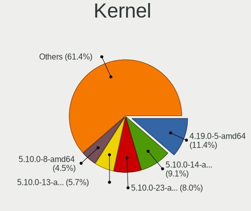
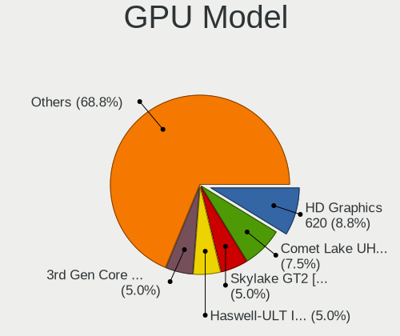
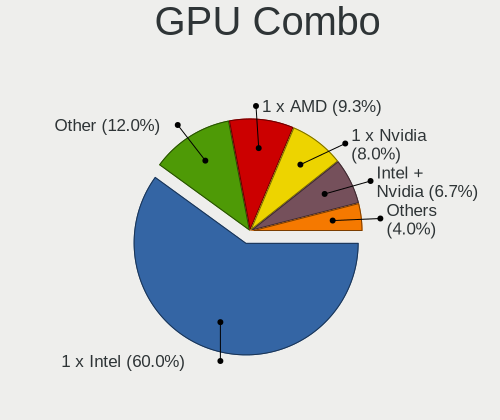
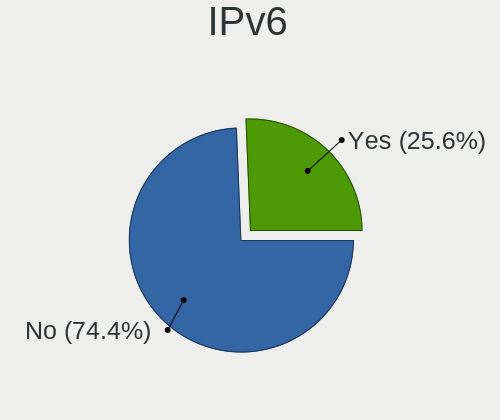

PureOS - Tested Hardware & Statistics
-------------------------------------

A project to collect tested hardware configurations for PureOS.

Anyone can contribute to this report by the [hw-probe](https://github.com/linuxhw/hw-probe) tool:

    sudo -E hw-probe -all -upload

Please contribute! Especially if your hardware is rare.

This is a report for all computer types. See also reports for [desktops](/Dist/PureOS/Desktop/README.md) and [notebooks](/Dist/PureOS/Notebook/README.md).

Contents
--------

* [ Test Cases ](#test-cases)

* [ System ](#system)
  - [ OS                       ](#os)
  - [ OS Family                ](#os-family)
  - [ Kernel                   ](#kernel)
  - [ Kernel Family            ](#kernel-family)
  - [ Kernel Major Ver.        ](#kernel-major-ver)
  - [ Arch                     ](#arch)
  - [ DE                       ](#de)
  - [ Display Server           ](#display-server)
  - [ Display Manager          ](#display-manager)
  - [ OS Lang                  ](#os-lang)
  - [ Boot Mode                ](#boot-mode)
  - [ Filesystem               ](#filesystem)
  - [ Part. scheme             ](#part-scheme)
  - [ Dual Boot with Linux/BSD ](#dual-boot-with-linuxbsd)
  - [ Dual Boot (Win)          ](#dual-boot-win)

* [ Board ](#board)
  - [ Vendor                   ](#vendor)
  - [ Model                    ](#model)
  - [ Model Family             ](#model-family)
  - [ MFG Year                 ](#mfg-year)
  - [ Form Factor              ](#form-factor)
  - [ Secure Boot              ](#secure-boot)
  - [ Coreboot                 ](#coreboot)
  - [ RAM Size                 ](#ram-size)
  - [ RAM Used                 ](#ram-used)
  - [ Total Drives             ](#total-drives)
  - [ Has CD-ROM               ](#has-cd-rom)
  - [ Has Ethernet             ](#has-ethernet)
  - [ Has WiFi                 ](#has-wifi)
  - [ Has Bluetooth            ](#has-bluetooth)

* [ Location ](#location)
  - [ Country                  ](#country)
  - [ City                     ](#city)

* [ Drives ](#drives)
  - [ Drive Vendor             ](#drive-vendor)
  - [ Drive Model              ](#drive-model)
  - [ HDD Vendor               ](#hdd-vendor)
  - [ SSD Vendor               ](#ssd-vendor)
  - [ Drive Kind               ](#drive-kind)
  - [ Drive Connector          ](#drive-connector)
  - [ Drive Size               ](#drive-size)
  - [ Space Total              ](#space-total)
  - [ Space Used               ](#space-used)
  - [ Malfunc. Drives          ](#malfunc-drives)
  - [ Malfunc. Drive Vendor    ](#malfunc-drive-vendor)
  - [ Malfunc. HDD Vendor      ](#malfunc-hdd-vendor)
  - [ Malfunc. Drive Kind      ](#malfunc-drive-kind)
  - [ Failed Drives            ](#failed-drives)
  - [ Failed Drive Vendor      ](#failed-drive-vendor)
  - [ Drive Status             ](#drive-status)

* [ Storage controller ](#storage-controller)
  - [ Storage Vendor           ](#storage-vendor)
  - [ Storage Model            ](#storage-model)
  - [ Storage Kind             ](#storage-kind)

* [ Processor ](#processor)
  - [ CPU Vendor               ](#cpu-vendor)
  - [ CPU Model                ](#cpu-model)
  - [ CPU Model Family         ](#cpu-model-family)
  - [ CPU Cores                ](#cpu-cores)
  - [ CPU Sockets              ](#cpu-sockets)
  - [ CPU Threads              ](#cpu-threads)
  - [ CPU Op-Modes             ](#cpu-op-modes)
  - [ CPU Microcode            ](#cpu-microcode)
  - [ CPU Microarch            ](#cpu-microarch)

* [ Graphics ](#graphics)
  - [ GPU Vendor               ](#gpu-vendor)
  - [ GPU Model                ](#gpu-model)
  - [ GPU Combo                ](#gpu-combo)
  - [ GPU Driver               ](#gpu-driver)
  - [ GPU Memory               ](#gpu-memory)

* [ Monitor ](#monitor)
  - [ Monitor Vendor           ](#monitor-vendor)
  - [ Monitor Model            ](#monitor-model)
  - [ Monitor Resolution       ](#monitor-resolution)
  - [ Monitor Diagonal         ](#monitor-diagonal)
  - [ Monitor Width            ](#monitor-width)
  - [ Aspect Ratio             ](#aspect-ratio)
  - [ Monitor Area             ](#monitor-area)
  - [ Pixel Density            ](#pixel-density)
  - [ Multiple Monitors        ](#multiple-monitors)

* [ Network ](#network)
  - [ Net Controller Vendor    ](#net-controller-vendor)
  - [ Net Controller Model     ](#net-controller-model)
  - [ Wireless Vendor          ](#wireless-vendor)
  - [ Wireless Model           ](#wireless-model)
  - [ Ethernet Vendor          ](#ethernet-vendor)
  - [ Ethernet Model           ](#ethernet-model)
  - [ Net Controller Kind      ](#net-controller-kind)
  - [ Used Controller          ](#used-controller)
  - [ NICs                     ](#nics)
  - [ IPv6                     ](#ipv6)

* [ Bluetooth ](#bluetooth)
  - [ Bluetooth Vendor         ](#bluetooth-vendor)
  - [ Bluetooth Model          ](#bluetooth-model)

* [ Sound ](#sound)
  - [ Sound Vendor             ](#sound-vendor)
  - [ Sound Model              ](#sound-model)

* [ Memory ](#memory)
  - [ Memory Vendor            ](#memory-vendor)
  - [ Memory Model             ](#memory-model)
  - [ Memory Kind              ](#memory-kind)
  - [ Memory Form Factor       ](#memory-form-factor)
  - [ Memory Size              ](#memory-size)
  - [ Memory Speed             ](#memory-speed)

* [ Printers & scanners ](#printers--scanners)
  - [ Printer Vendor           ](#printer-vendor)
  - [ Printer Model            ](#printer-model)
  - [ Scanner Vendor           ](#scanner-vendor)
  - [ Scanner Model            ](#scanner-model)

* [ Camera ](#camera)
  - [ Camera Vendor            ](#camera-vendor)
  - [ Camera Model             ](#camera-model)

* [ Security ](#security)
  - [ Fingerprint Vendor       ](#fingerprint-vendor)
  - [ Fingerprint Model        ](#fingerprint-model)
  - [ Chipcard Vendor          ](#chipcard-vendor)
  - [ Chipcard Model           ](#chipcard-model)

* [ Unsupported ](#unsupported)
  - [ Unsupported Devices      ](#unsupported-devices)
  - [ Unsupported Device Types ](#unsupported-device-types)

Test Cases
----------

Total: 57

| Vendor        | Model                       | Form-Factor | Probe                                                      | Date         |
|---------------|-----------------------------|-------------|------------------------------------------------------------|--------------|
| Purism        | Librem 14                   | Notebook    | [9d078217f1](https://linux-hardware.org/?probe=9d078217f1) | Apr 23, 2022 |
| HP            | Pavilion g6                 | Notebook    | [796bf7f467](https://linux-hardware.org/?probe=796bf7f467) | Apr 23, 2022 |
| Dell          | Inspiron 15-3567            | Notebook    | [8cbc7d1caf](https://linux-hardware.org/?probe=8cbc7d1caf) | Apr 20, 2022 |
| Purism        | Librem 15 v4                | Notebook    | [061aeeecf7](https://linux-hardware.org/?probe=061aeeecf7) | Apr 13, 2022 |
| Lenovo        | ThinkPad T440p              | Notebook    | [45a1ee6fbf](https://linux-hardware.org/?probe=45a1ee6fbf) | Apr 12, 2022 |
| HP            | Pavilion Notebook           | Notebook    | [c0dd92f23c](https://linux-hardware.org/?probe=c0dd92f23c) | Apr 03, 2022 |
| Acer          | Nitro AN515-43              | Notebook    | [e1386a38c7](https://linux-hardware.org/?probe=e1386a38c7) | Mar 20, 2022 |
| Dell          | Inspiron 15-3567            | Notebook    | [c8723d2dd9](https://linux-hardware.org/?probe=c8723d2dd9) | Feb 21, 2022 |
| Dell          | Inspiron 15-3567            | Notebook    | [45529bb469](https://linux-hardware.org/?probe=45529bb469) | Feb 21, 2022 |
| Lenovo        | ThinkPad T540p 20BFS23T0... | Notebook    | [c49acb0edf](https://linux-hardware.org/?probe=c49acb0edf) | Feb 21, 2022 |
| Lenovo        | ThinkPad T540p 20BFS23T0... | Notebook    | [6f13abc9eb](https://linux-hardware.org/?probe=6f13abc9eb) | Feb 21, 2022 |
| Acer          | Aspire E5-553G              | Notebook    | [1f5badca6e](https://linux-hardware.org/?probe=1f5badca6e) | Feb 06, 2022 |
| Apple         | Mac-00BE6ED71E35EB86 iMa... | All in one  | [5b34840f92](https://linux-hardware.org/?probe=5b34840f92) | Feb 04, 2022 |
| HP            | Spectre x360 Convertible    | Convertible | [8812b5d4fd](https://linux-hardware.org/?probe=8812b5d4fd) | Dec 03, 2021 |
| Dell          | 088DT1 A01                  | Desktop     | [6800234271](https://linux-hardware.org/?probe=6800234271) | Dec 02, 2021 |
| Dell          | 088DT1 A01                  | Desktop     | [9190925dba](https://linux-hardware.org/?probe=9190925dba) | Nov 26, 2021 |
| Lenovo        | ThinkPad E480 20KN003SUS    | Notebook    | [ad043b077a](https://linux-hardware.org/?probe=ad043b077a) | Nov 25, 2021 |
| Apple         | MacBookPro14,2              | Notebook    | [5f4d435f0d](https://linux-hardware.org/?probe=5f4d435f0d) | Nov 24, 2021 |
| Dell          | 088DT1 A01                  | Desktop     | [93a177ddce](https://linux-hardware.org/?probe=93a177ddce) | Nov 02, 2021 |
| Dell          | 088DT1 A01                  | Desktop     | [4917dcd8b3](https://linux-hardware.org/?probe=4917dcd8b3) | Nov 02, 2021 |
| ASUSTek       | A88X-PLUS/USB               | Desktop     | [ad21355553](https://linux-hardware.org/?probe=ad21355553) | Sep 27, 2021 |
| Purism        | Librem 14                   | Notebook    | [68e8f5b427](https://linux-hardware.org/?probe=68e8f5b427) | Sep 27, 2021 |
| HP            | Spectre x360 Convertible    | Convertible | [e1dfe46f2f](https://linux-hardware.org/?probe=e1dfe46f2f) | Aug 31, 2021 |
| Lenovo        | ThinkPad 13 2nd Gen 20J2... | Notebook    | [077ff209de](https://linux-hardware.org/?probe=077ff209de) | Aug 18, 2021 |
| HP            | Spectre x360 Convertible    | Convertible | [a746c422c5](https://linux-hardware.org/?probe=a746c422c5) | Aug 14, 2021 |
| HP            | Spectre x360 Convertible    | Convertible | [cd8b8b47eb](https://linux-hardware.org/?probe=cd8b8b47eb) | Aug 14, 2021 |
| Gigabyte      | B85M-DS3H                   | Desktop     | [840cb54d82](https://linux-hardware.org/?probe=840cb54d82) | Jul 25, 2021 |
| Purism        | Librem 14                   | Notebook    | [295a2a1392](https://linux-hardware.org/?probe=295a2a1392) | Jul 15, 2021 |
| Purism        | Librem 14                   | Notebook    | [49d9b561c6](https://linux-hardware.org/?probe=49d9b561c6) | Jul 15, 2021 |
| Toshiba       | Satellite L500D             | Notebook    | [b830927060](https://linux-hardware.org/?probe=b830927060) | Jul 04, 2021 |
| Dell          | XPS 13 9370                 | Notebook    | [c8937f439d](https://linux-hardware.org/?probe=c8937f439d) | Jun 09, 2021 |
| Purism        | Librem 14                   | Notebook    | [0c18b37b73](https://linux-hardware.org/?probe=0c18b37b73) | Jun 01, 2021 |
| ASUSTek       | A88X-PLUS/USB               | Desktop     | [2688c43fa5](https://linux-hardware.org/?probe=2688c43fa5) | Apr 08, 2021 |
| ASUSTek       | A88X-PLUS/USB               | Desktop     | [99e83e8dcf](https://linux-hardware.org/?probe=99e83e8dcf) | Mar 08, 2021 |
| Pine Micro... | Pine64 PinePhone (1.2)      | Phone       | [34fda13b24](https://linux-hardware.org/?probe=34fda13b24) | Nov 22, 2020 |
| Pine Micro... | Pine64 PinePhone (1.2)      | Phone       | [e3748aaa84](https://linux-hardware.org/?probe=e3748aaa84) | Nov 22, 2020 |
| Unknown       | Unknown                     | Soc         | [02f65d4d20](https://linux-hardware.org/?probe=02f65d4d20) | Oct 28, 2020 |
| Pine Micro... | Pine64 PinePhone (1.2)      | Phone       | [e063bd8f6e](https://linux-hardware.org/?probe=e063bd8f6e) | Oct 28, 2020 |
| Pine Micro... | Pine64 PinePhone (1.2)      | Phone       | [3bc62d47a9](https://linux-hardware.org/?probe=3bc62d47a9) | Oct 28, 2020 |
| Pine Micro... | Pine64 Pinebook Pro         | Notebook    | [79c01fbf3a](https://linux-hardware.org/?probe=79c01fbf3a) | Oct 28, 2020 |
| Unknown       | Unknown                     | Notebook    | [c24817ee80](https://linux-hardware.org/?probe=c24817ee80) | Sep 15, 2020 |
| Unknown       | Purism Librem 5             | Notebook    | [2c6b84a04f](https://linux-hardware.org/?probe=2c6b84a04f) | Jul 23, 2020 |
| HP            | Pavilion g6                 | Notebook    | [eb23d17143](https://linux-hardware.org/?probe=eb23d17143) | Jul 15, 2020 |
| Lenovo        | ThinkPad T440 20B60044RT    | Notebook    | [db8ba33d45](https://linux-hardware.org/?probe=db8ba33d45) | Jun 02, 2020 |
| Purism        | Librem 15 v4                | Notebook    | [d9f38d66c3](https://linux-hardware.org/?probe=d9f38d66c3) | Apr 29, 2020 |
| Notebook      | P17SM                       | Notebook    | [730c65e65d](https://linux-hardware.org/?probe=730c65e65d) | Apr 22, 2020 |
| Apple         | Mac-F4238CC8 PVT            | All in one  | [542ee658b9](https://linux-hardware.org/?probe=542ee658b9) | Apr 17, 2020 |
| Purism        | Librem 15 v4                | Notebook    | [6e5f1119b7](https://linux-hardware.org/?probe=6e5f1119b7) | Apr 10, 2020 |
| Purism        | Librem 15 v3                | Notebook    | [a43311f999](https://linux-hardware.org/?probe=a43311f999) | Dec 18, 2019 |
| Purism        | Librem 13 v4                | Notebook    | [6d7a537e86](https://linux-hardware.org/?probe=6d7a537e86) | Nov 15, 2019 |
| Dell          | Inspiron 5547               | Notebook    | [689dfea547](https://linux-hardware.org/?probe=689dfea547) | Oct 25, 2019 |
| Purism        | Librem 13 v4                | Notebook    | [6d7c18d329](https://linux-hardware.org/?probe=6d7c18d329) | Oct 18, 2019 |
| Lenovo        | G505s 20255                 | Notebook    | [bce345b263](https://linux-hardware.org/?probe=bce345b263) | Aug 30, 2019 |
| ASUSTek       | Z97-A                       | Desktop     | [e6b1f9af05](https://linux-hardware.org/?probe=e6b1f9af05) | Aug 15, 2019 |
| ASUSTek       | Z97-A                       | Desktop     | [c8a97966c9](https://linux-hardware.org/?probe=c8a97966c9) | Aug 14, 2019 |
| Purism        | Librem 13 v2                | Notebook    | [3e70a8dff1](https://linux-hardware.org/?probe=3e70a8dff1) | Jul 13, 2019 |
| Purism        | Librem 15 v3                | Notebook    | [02e23b6024](https://linux-hardware.org/?probe=02e23b6024) | May 21, 2018 |

System
------

OS
--

Installed operating systems

| Name        | Computers | Percent |
|-------------|-----------|---------|
| PureOS 9.0  | 12        | 33.33%  |
| PureOS 10.0 | 10        | 27.78%  |
| PureOS 10   | 9         | 25%     |
| PureOS 9    | 3         | 8.33%   |
| PureOS 8    | 2         | 5.56%   |

OS Family
---------

OS without a version

| Name   | Computers | Percent |
|--------|-----------|---------|
| PureOS | 35        | 100%    |

Kernel
------

Version of the Linux kernel

| Version                          | Computers | Percent |
|----------------------------------|-----------|---------|
| 4.19.0-5-amd64                   | 9         | 23.08%  |
| 5.10.0-13-amd64                  | 5         | 12.82%  |
| 5.10.0-8-amd64                   | 4         | 10.26%  |
| 4.19.0-14-amd64                  | 4         | 10.26%  |
| 5.10.0-11-amd64                  | 3         | 7.69%   |
| 5.7.0-1-librem5                  | 2         | 5.13%   |
| 5.10.0-9-amd64                   | 2         | 5.13%   |
| 5.10.0-7-amd64                   | 2         | 5.13%   |
| 5.9-sunxi64                      | 1         | 2.56%   |
| 5.8-sunxi64                      | 1         | 2.56%   |
| 5.7.0-0.38-1-pinebookpro-hwaccel | 1         | 2.56%   |
| 5.15.0-2-amd64                   | 1         | 2.56%   |
| 5.10.0-6-amd64                   | 1         | 2.56%   |
| 5.10.0-12-amd64                  | 1         | 2.56%   |
| 4.19.72-imx8-sr                  | 1         | 2.56%   |
| 4.16.0-1-amd64                   | 1         | 2.56%   |

Kernel Family
-------------

Linux kernel without a distro release

| Version | Computers | Percent |
|---------|-----------|---------|
| 5.10.0  | 16        | 43.24%  |
| 4.19.0  | 13        | 35.14%  |
| 5.7.0   | 3         | 8.11%   |
| 5.9     | 1         | 2.7%    |
| 5.8     | 1         | 2.7%    |
| 5.15.0  | 1         | 2.7%    |
| 4.19.72 | 1         | 2.7%    |
| 4.16.0  | 1         | 2.7%    |

Kernel Major Ver.
-----------------

Linux kernel major version

| Version | Computers | Percent |
|---------|-----------|---------|
| 5.10    | 16        | 44.44%  |
| 4.19    | 14        | 38.89%  |
| 5.7     | 3         | 8.33%   |
| 5.15    | 1         | 2.78%   |
| 5       | 1         | 2.78%   |
| 4.16    | 1         | 2.78%   |

Arch
----

OS architecture (x86_64, i586, etc.)

| Name    | Computers | Percent |
|---------|-----------|---------|
| x86_64  | 30        | 85.71%  |
| aarch64 | 5         | 14.29%  |

DE
--

Desktop Environment

| Name            | Computers | Percent |
|-----------------|-----------|---------|
| GNOME           | 29        | 76.32%  |
| Unknown         | 6         | 15.79%  |
| MATE            | 1         | 2.63%   |
| KDE5            | 1         | 2.63%   |
| GNOME Flashback | 1         | 2.63%   |

Display Server
--------------

X11 or Wayland

| Name    | Computers | Percent |
|---------|-----------|---------|
| Wayland | 24        | 61.54%  |
| Unknown | 6         | 15.38%  |
| X11     | 5         | 12.82%  |
| Tty     | 4         | 10.26%  |

Display Manager
---------------

SDDM, LightDM, etc.

| Name    | Computers | Percent |
|---------|-----------|---------|
| Unknown | 23        | 65.71%  |
| GDM     | 9         | 25.71%  |
| GDM3    | 3         | 8.57%   |

OS Lang
-------

Language

| Lang    | Computers | Percent |
|---------|-----------|---------|
| en_US   | 18        | 47.37%  |
| de_DE   | 5         | 13.16%  |
| Unknown | 4         | 10.53%  |
| en_GB   | 3         | 7.89%   |
| ru_RU   | 2         | 5.26%   |
| zh_CN   | 1         | 2.63%   |
| pt_PT   | 1         | 2.63%   |
| pl_PL   | 1         | 2.63%   |
| it_IT   | 1         | 2.63%   |
| es_CR   | 1         | 2.63%   |
| C       | 1         | 2.63%   |

Boot Mode
---------

EFI or BIOS

| Mode | Computers | Percent |
|------|-----------|---------|
| BIOS | 31        | 86.11%  |
| EFI  | 5         | 13.89%  |

Filesystem
----------

Type of filesystem

| Type    | Computers | Percent |
|---------|-----------|---------|
| Ext4    | 32        | 91.43%  |
| Unknown | 2         | 5.71%   |
| Ext2    | 1         | 2.86%   |

Part. scheme
------------

Scheme of partitioning

| Type    | Computers | Percent |
|---------|-----------|---------|
| Unknown | 21        | 56.76%  |
| MBR     | 10        | 27.03%  |
| GPT     | 6         | 16.22%  |

Dual Boot with Linux/BSD
------------------------

Hosting more than one Linux/BSD

| Dual boot | Computers | Percent |
|-----------|-----------|---------|
| No        | 29        | 82.86%  |
| Yes       | 6         | 17.14%  |

Dual Boot (Win)
---------------

Hosting Linux and Windows

| Dual boot | Computers | Percent |
|-----------|-----------|---------|
| No        | 32        | 91.43%  |
| Yes       | 3         | 8.57%   |

Board
-----

Vendor
------

Motherboard manufacturer

| Name                | Computers | Percent |
|---------------------|-----------|---------|
| Purism              | 9         | 25.71%  |
| Lenovo              | 5         | 14.29%  |
| Hewlett-Packard     | 4         | 11.43%  |
| Dell                | 4         | 11.43%  |
| Apple               | 3         | 8.57%   |
| Unknown             | 3         | 8.57%   |
| Pine Microsystems   | 2         | 5.71%   |
| Toshiba             | 1         | 2.86%   |
| Notebook            | 1         | 2.86%   |
| Gigabyte Technology | 1         | 2.86%   |
| ASUSTek Computer    | 1         | 2.86%   |
| Acer                | 1         | 2.86%   |

Model
-----

Motherboard model

| Name                                     | Computers | Percent |
|------------------------------------------|-----------|---------|
| Purism Librem 14                         | 4         | 11.43%  |
| Unknown                                  | 3         | 8.57%   |
| Purism Librem 15 v4                      | 2         | 5.71%   |
| HP Pavilion g6                           | 2         | 5.71%   |
| Toshiba Satellite L500D                  | 1         | 2.86%   |
| Purism Librem 15 v3                      | 1         | 2.86%   |
| Purism Librem 13 v4                      | 1         | 2.86%   |
| Purism Librem 13 v2                      | 1         | 2.86%   |
| Pine Microsystems Pine64 PinePhone (1.2) | 1         | 2.86%   |
| Pine Microsystems Pine64 Pinebook Pro    | 1         | 2.86%   |
| Notebook P17SM                           | 1         | 2.86%   |
| Lenovo ThinkPad T540p 20BFS23T00         | 1         | 2.86%   |
| Lenovo ThinkPad T440p                    | 1         | 2.86%   |
| Lenovo ThinkPad T440 20B60044RT          | 1         | 2.86%   |
| Lenovo ThinkPad E480 20KN003SUS          | 1         | 2.86%   |
| Lenovo ThinkPad 13 2nd Gen 20J2S00G00    | 1         | 2.86%   |
| HP Spectre x360 Convertible              | 1         | 2.86%   |
| HP Pavilion Notebook                     | 1         | 2.86%   |
| Gigabyte B85M-DS3H                       | 1         | 2.86%   |
| Dell XPS 13 9370                         | 1         | 2.86%   |
| Dell Inspiron 5547                       | 1         | 2.86%   |
| Dell Inspiron 3847                       | 1         | 2.86%   |
| Dell Inspiron 15-3567                    | 1         | 2.86%   |
| ASUS A88X-PLUS/USB                       | 1         | 2.86%   |
| Apple MacBookPro14,2                     | 1         | 2.86%   |
| Apple iMac7,1                            | 1         | 2.86%   |
| Apple iMac13,1                           | 1         | 2.86%   |
| Acer Nitro AN515-43                      | 1         | 2.86%   |

Model Family
------------

Motherboard model prefix

| Name                     | Computers | Percent |
|--------------------------|-----------|---------|
| Purism Librem            | 9         | 25.71%  |
| Lenovo ThinkPad          | 5         | 14.29%  |
| HP Pavilion              | 3         | 8.57%   |
| Dell Inspiron            | 3         | 8.57%   |
| Unknown                  | 3         | 8.57%   |
| Pine Microsystems Pine64 | 2         | 5.71%   |
| Toshiba Satellite        | 1         | 2.86%   |
| Notebook P17SM           | 1         | 2.86%   |
| HP Spectre               | 1         | 2.86%   |
| Gigabyte B85M-DS3H       | 1         | 2.86%   |
| Dell XPS                 | 1         | 2.86%   |
| ASUS A88X-PLUS           | 1         | 2.86%   |
| Apple MacBookPro14       | 1         | 2.86%   |
| Apple iMac7              | 1         | 2.86%   |
| Apple iMac13             | 1         | 2.86%   |
| Acer Nitro               | 1         | 2.86%   |

MFG Year
--------

Motherboard manufacture year

| Year    | Computers | Percent |
|---------|-----------|---------|
| Unknown | 7         | 20%     |
| 2013    | 5         | 14.29%  |
| 2019    | 4         | 11.43%  |
| 2017    | 4         | 11.43%  |
| 2021    | 3         | 8.57%   |
| 2018    | 2         | 5.71%   |
| 2016    | 2         | 5.71%   |
| 2015    | 2         | 5.71%   |
| 2011    | 2         | 5.71%   |
| 2020    | 1         | 2.86%   |
| 2014    | 1         | 2.86%   |
| 2009    | 1         | 2.86%   |
| 2007    | 1         | 2.86%   |

Form Factor
-----------

Physical design of the computer

| Name           | Computers | Percent |
|----------------|-----------|---------|
| Notebook       | 27        | 77.14%  |
| Desktop        | 3         | 8.57%   |
| All in one     | 2         | 5.71%   |
| Phone          | 1         | 2.86%   |
| System on chip | 1         | 2.86%   |
| Convertible    | 1         | 2.86%   |

Secure Boot
-----------

Enabled or disabled

| State    | Computers | Percent |
|----------|-----------|---------|
| Disabled | 35        | 100%    |

Coreboot
--------

Have coreboot on board

| Used | Computers | Percent |
|------|-----------|---------|
| No   | 25        | 71.43%  |
| Yes  | 10        | 28.57%  |

RAM Size
--------

Total RAM memory

| Size in GB | Computers | Percent |
|------------|-----------|---------|
| 16.01-24.0 | 9         | 25.71%  |
| 8.01-16.0  | 8         | 22.86%  |
| 32.01-64.0 | 5         | 14.29%  |
| 3.01-4.0   | 5         | 14.29%  |
| 4.01-8.0   | 4         | 11.43%  |
| 2.01-3.0   | 2         | 5.71%   |
| 24.01-32.0 | 1         | 2.86%   |
| 1.01-2.0   | 1         | 2.86%   |

RAM Used
--------

Used RAM memory

| Used GB   | Computers | Percent |
|-----------|-----------|---------|
| 2.01-3.0  | 10        | 25%     |
| 1.01-2.0  | 10        | 25%     |
| 3.01-4.0  | 9         | 22.5%   |
| 4.01-8.0  | 8         | 20%     |
| 8.01-16.0 | 1         | 2.5%    |
| 0.51-1.0  | 1         | 2.5%    |
| 0.01-0.5  | 1         | 2.5%    |

Total Drives
------------

Number of drives on board

| Drives | Computers | Percent |
|--------|-----------|---------|
| 1      | 23        | 65.71%  |
| 2      | 11        | 31.43%  |
| 5      | 1         | 2.86%   |

Has CD-ROM
----------

Has CD-ROM on board

| Presented | Computers | Percent |
|-----------|-----------|---------|
| No        | 27        | 77.14%  |
| Yes       | 8         | 22.86%  |

Has Ethernet
------------

Has Ethernet on board

| Presented | Computers | Percent |
|-----------|-----------|---------|
| Yes       | 24        | 68.57%  |
| No        | 11        | 31.43%  |

Has WiFi
--------

Has WiFi module

| Presented | Computers | Percent |
|-----------|-----------|---------|
| Yes       | 30        | 85.71%  |
| No        | 5         | 14.29%  |

Has Bluetooth
-------------

Has Bluetooth module

| Presented | Computers | Percent |
|-----------|-----------|---------|
| Yes       | 24        | 68.57%  |
| No        | 11        | 31.43%  |

Location
--------

Country
-------

Geographic location (country)

| Country                | Computers | Percent |
|------------------------|-----------|---------|
| USA                    | 9         | 24.32%  |
| Germany                | 6         | 16.22%  |
| UK                     | 5         | 13.51%  |
| Canada                 | 3         | 8.11%   |
| Russia                 | 2         | 5.41%   |
| Turkey                 | 1         | 2.7%    |
| South Africa           | 1         | 2.7%    |
| Portugal               | 1         | 2.7%    |
| Poland                 | 1         | 2.7%    |
| Italy                  | 1         | 2.7%    |
| Iran                   | 1         | 2.7%    |
| France                 | 1         | 2.7%    |
| Costa Rica             | 1         | 2.7%    |
| China                  | 1         | 2.7%    |
| Brazil                 | 1         | 2.7%    |
| Bosnia and Herzegovina | 1         | 2.7%    |
| Australia              | 1         | 2.7%    |

City
----

Geographic location (city)

| City               | Computers | Percent |
|--------------------|-----------|---------|
| Stuttgart          | 3         | 7.69%   |
| New York           | 2         | 5.13%   |
| London             | 2         | 5.13%   |
| Xi'an              | 1         | 2.56%   |
| Wixom              | 1         | 2.56%   |
| Windsor            | 1         | 2.56%   |
| Warsaw             | 1         | 2.56%   |
| Warrenton          | 1         | 2.56%   |
| Viadanica          | 1         | 2.56%   |
| Vancouver          | 1         | 2.56%   |
| Tupa               | 1         | 2.56%   |
| Thorpe Hamlet      | 1         | 2.56%   |
| Seattle            | 1         | 2.56%   |
| San Jose           | 1         | 2.56%   |
| Paris              | 1         | 2.56%   |
| Nashville          | 1         | 2.56%   |
| Montreal           | 1         | 2.56%   |
| Milwaukee          | 1         | 2.56%   |
| Lottstetten        | 1         | 2.56%   |
| Liverpool          | 1         | 2.56%   |
| Leeds              | 1         | 2.56%   |
| Krasnogorsk        | 1         | 2.56%   |
| Istanbul           | 1         | 2.56%   |
| Guimarães       | 1         | 2.56%   |
| East Malvern       | 1         | 2.56%   |
| Chicago            | 1         | 2.56%   |
| Chelyabinsk        | 1         | 2.56%   |
| Cape Town          | 1         | 2.56%   |
| Camden             | 1         | 2.56%   |
| Big Sky            | 1         | 2.56%   |
| Berlin             | 1         | 2.56%   |
| Banja Luka         | 1         | 2.56%   |
| Bandar-e Asalūyeh | 1         | 2.56%   |
| Balow              | 1         | 2.56%   |
| Avon               | 1         | 2.56%   |

Drives
------

Drive Vendor
------------

Hard drive vendors

| Vendor              | Computers | Drives | Percent |
|---------------------|-----------|--------|---------|
| Samsung Electronics | 10        | 14     | 22.22%  |
| Seagate             | 6         | 11     | 13.33%  |
| Unknown             | 5         | 9      | 11.11%  |
| WDC                 | 3         | 4      | 6.67%   |
| A-DATA Technology   | 3         | 4      | 6.67%   |
| HGST                | 2         | 2      | 4.44%   |
| Crucial             | 2         | 4      | 4.44%   |
| Apple               | 2         | 3      | 4.44%   |
| Transcend           | 1         | 1      | 2.22%   |
| Toshiba             | 1         | 1      | 2.22%   |
| SanDisk             | 1         | 1      | 2.22%   |
| PLEXTOR             | 1         | 1      | 2.22%   |
| Phison              | 1         | 1      | 2.22%   |
| Mushkin             | 1         | 1      | 2.22%   |
| JMicron             | 1         | 1      | 2.22%   |
| Intel               | 1         | 1      | 2.22%   |
| Hitachi             | 1         | 1      | 2.22%   |
| BIWIN               | 1         | 1      | 2.22%   |
| ASMT                | 1         | 2      | 2.22%   |
| ADATA Technology    | 1         | 1      | 2.22%   |

Drive Model
-----------

Hard drive models

| Model                               | Computers | Percent |
|-------------------------------------|-----------|---------|
| Seagate ST1000LM048-2E7172 1TB      | 2         | 4%      |
| Samsung SSD 970 PRO 1TB             | 2         | 4%      |
| WDC WDS100T2B0C-00PXH0 1TB          | 1         | 2%      |
| WDC WDBNCE2500PNC 250GB SSD         | 1         | 2%      |
| WDC WD3200AAJS-40RYA0 320GB         | 1         | 2%      |
| Unknown SH64G  64GB                 | 1         | 2%      |
| Unknown MMC Card  32GB              | 1         | 2%      |
| Unknown MMC Card  16GB              | 1         | 2%      |
| Unknown DA4128  128GB               | 1         | 2%      |
| Unknown AFGCF  128GB                | 1         | 2%      |
| Unknown 8GTF4R  8GB                 | 1         | 2%      |
| Unknown 032G32  32GB                | 1         | 2%      |
| Transcend TS240GMTS420S 240GB SSD   | 1         | 2%      |
| Toshiba NVMe SSD Drive 512GB        | 1         | 2%      |
| Seagate ST480HM000-1G5162 480GB     | 1         | 2%      |
| Seagate ST3320418AS 320GB           | 1         | 2%      |
| Seagate ST31000524AS 1TB            | 1         | 2%      |
| Seagate ST1000DM003-1ER162 1TB      | 1         | 2%      |
| Seagate NVMe SSD Drive 2TB          | 1         | 2%      |
| SanDisk SDSSDH3500G 500GB           | 1         | 2%      |
| Samsung SSD 970 EVO 250GB           | 1         | 2%      |
| Samsung SSD 960 EVO 500GB           | 1         | 2%      |
| Samsung SSD 960 EVO 250GB           | 1         | 2%      |
| Samsung SSD 860 EVO 500GB           | 1         | 2%      |
| Samsung SSD 860 EVO 250GB           | 1         | 2%      |
| Samsung SSD 860 EVO 1TB             | 1         | 2%      |
| Samsung SSD 850 EVO 500GB           | 1         | 2%      |
| Samsung SSD 850 EVO 250GB           | 1         | 2%      |
| Samsung NVMe SSD Drive 1TB          | 1         | 2%      |
| PLEXTOR PX-1TM6Pro 1024GB SSD       | 1         | 2%      |
| Phison PM8512GPTCB4B8TF-E13T4 512GB | 1         | 2%      |
| Mushkin MKNSSDRE250GB-LT            | 1         | 2%      |
| JMicron Generic 240GB               | 1         | 2%      |
| Intel SSDSC2BF180A4H 180GB          | 1         | 2%      |
| Hitachi HTS545050A7E380 500GB       | 1         | 2%      |
| HGST HTS721010A9E630 1TB            | 1         | 2%      |
| HGST HTS545050B7E660 500GB          | 1         | 2%      |
| Crucial CT250MX500SSD4 250GB        | 1         | 2%      |
| Crucial CT2000MX500SSD1 2TB         | 1         | 2%      |
| BIWIN SSD 120GB                     | 1         | 2%      |
| ASMT 2235 240GB                     | 1         | 2%      |
| Apple NVMe SSD Drive 8KB            | 1         | 2%      |
| Apple NVMe SSD Drive 256GB          | 1         | 2%      |
| Apple HDD ST1000LM024 1TB           | 1         | 2%      |
| ADATA NVMe SSD Drive 512GB          | 1         | 2%      |
| A-DATA SU630 240GB SSD              | 1         | 2%      |
| A-DATA IM2S3138E-128GM-B 128GB SSD  | 1         | 2%      |
| A-DATA AXNS381E-256GM-B 256GB SSD   | 1         | 2%      |

HDD Vendor
----------

Hard disk drive vendors

| Vendor  | Computers | Drives | Percent |
|---------|-----------|--------|---------|
| Seagate | 5         | 10     | 50%     |
| HGST    | 2         | 2      | 20%     |
| WDC     | 1         | 1      | 10%     |
| Hitachi | 1         | 1      | 10%     |
| Apple   | 1         | 1      | 10%     |

SSD Vendor
----------

Solid state drive vendors

| Vendor              | Computers | Drives | Percent |
|---------------------|-----------|--------|---------|
| Samsung Electronics | 6         | 8      | 31.58%  |
| A-DATA Technology   | 3         | 4      | 15.79%  |
| Crucial             | 2         | 4      | 10.53%  |
| WDC                 | 1         | 2      | 5.26%   |
| Transcend           | 1         | 1      | 5.26%   |
| SanDisk             | 1         | 1      | 5.26%   |
| PLEXTOR             | 1         | 1      | 5.26%   |
| Mushkin             | 1         | 1      | 5.26%   |
| JMicron             | 1         | 1      | 5.26%   |
| Intel               | 1         | 1      | 5.26%   |
| BIWIN               | 1         | 1      | 5.26%   |

Drive Kind
----------

HDD or SSD

| Kind    | Computers | Drives | Percent |
|---------|-----------|--------|---------|
| SSD     | 16        | 25     | 37.21%  |
| NVMe    | 11        | 13     | 25.58%  |
| HDD     | 10        | 15     | 23.26%  |
| MMC     | 5         | 9      | 11.63%  |
| Unknown | 1         | 2      | 2.33%   |

Drive Connector
---------------

SATA, SAS, NVMe, etc.

| Type | Computers | Drives | Percent |
|------|-----------|--------|---------|
| SATA | 22        | 38     | 53.66%  |
| NVMe | 11        | 13     | 26.83%  |
| MMC  | 5         | 9      | 12.2%   |
| SAS  | 3         | 4      | 7.32%   |

Drive Size
----------

Size of hard drive

| Size in TB | Computers | Drives | Percent |
|------------|-----------|--------|---------|
| 0.01-0.5   | 16        | 27     | 64%     |
| 0.51-1.0   | 7         | 10     | 28%     |
| 1.01-2.0   | 2         | 3      | 8%      |

Space Total
-----------

Amount of disk space available on the file system

| Size in GB | Computers | Percent |
|------------|-----------|---------|
| 1-20       | 14        | 37.84%  |
| 251-500    | 5         | 13.51%  |
| 101-250    | 5         | 13.51%  |
| 21-50      | 3         | 8.11%   |
| 501-1000   | 3         | 8.11%   |
| 1001-2000  | 2         | 5.41%   |
| 51-100     | 2         | 5.41%   |
| Unknown    | 2         | 5.41%   |
| 2001-3000  | 1         | 2.7%    |

Space Used
----------

Amount of used disk space

| Used GB  | Computers | Percent |
|----------|-----------|---------|
| 1-20     | 21        | 55.26%  |
| 21-50    | 7         | 18.42%  |
| 101-250  | 3         | 7.89%   |
| 501-1000 | 3         | 7.89%   |
| Unknown  | 2         | 5.26%   |
| 251-500  | 1         | 2.63%   |
| 51-100   | 1         | 2.63%   |

Malfunc. Drives
---------------

Drive models with a malfunction

| Model                      | Computers | Drives | Percent |
|----------------------------|-----------|--------|---------|
| Seagate ST31000524AS 1TB   | 1         | 1      | 33.33%  |
| Intel SSDSC2BF180A4H 180GB | 1         | 1      | 33.33%  |
| Apple HDD ST1000LM024 1TB  | 1         | 1      | 33.33%  |

Malfunc. Drive Vendor
---------------------

Vendors of faulty drives

| Vendor  | Computers | Drives | Percent |
|---------|-----------|--------|---------|
| Seagate | 1         | 1      | 33.33%  |
| Intel   | 1         | 1      | 33.33%  |
| Apple   | 1         | 1      | 33.33%  |

Malfunc. HDD Vendor
-------------------

Vendors of faulty HDD drives

| Vendor  | Computers | Drives | Percent |
|---------|-----------|--------|---------|
| Seagate | 1         | 1      | 50%     |
| Apple   | 1         | 1      | 50%     |

Malfunc. Drive Kind
-------------------

Kinds of faulty drives

| Kind | Computers | Drives | Percent |
|------|-----------|--------|---------|
| HDD  | 2         | 2      | 66.67%  |
| SSD  | 1         | 1      | 33.33%  |

Failed Drives
-------------

Failed drive models

Zero info for selected period =(

Failed Drive Vendor
-------------------

Failed drive vendors

Zero info for selected period =(

Drive Status
------------

Number of failed and malfunc. drives

| Status   | Computers | Drives | Percent |
|----------|-----------|--------|---------|
| Detected | 26        | 48     | 68.42%  |
| Works    | 9         | 13     | 23.68%  |
| Malfunc  | 3         | 3      | 7.89%   |

Storage controller
------------------

Storage Vendor
--------------

Storage controller vendors

| Vendor                       | Computers | Percent |
|------------------------------|-----------|---------|
| Intel                        | 20        | 58.82%  |
| Samsung Electronics          | 5         | 14.71%  |
| AMD                          | 3         | 8.82%   |
| Toshiba America Info Systems | 1         | 2.94%   |
| Seagate Technology           | 1         | 2.94%   |
| Sandisk                      | 1         | 2.94%   |
| Phison Electronics           | 1         | 2.94%   |
| Apple                        | 1         | 2.94%   |
| ADATA Technology             | 1         | 2.94%   |

Storage Model
-------------

Storage controller models

| Model                                                                          | Computers | Percent |
|--------------------------------------------------------------------------------|-----------|---------|
| Intel Sunrise Point-LP SATA Controller [AHCI mode]                             | 7         | 20%     |
| Intel 8 Series/C220 Series Chipset Family 6-port SATA Controller 1 [AHCI mode] | 5         | 14.29%  |
| Samsung NVMe SSD Controller SM981/PM981/PM983                                  | 3         | 8.57%   |
| Samsung NVMe SSD Controller SM961/PM961/SM963                                  | 2         | 5.71%   |
| Intel 8 Series SATA Controller 1 [AHCI mode]                                   | 2         | 5.71%   |
| AMD FCH SATA Controller [AHCI mode]                                            | 2         | 5.71%   |
| Toshiba America Info Systems XG4 NVMe SSD Controller                           | 1         | 2.86%   |
| Seagate FireCuda 510 SSD                                                       | 1         | 2.86%   |
| Sandisk Non-Volatile memory controller                                         | 1         | 2.86%   |
| Phison PS5013 E13 NVMe Controller                                              | 1         | 2.86%   |
| Intel Wildcat Point-LP SATA Controller [AHCI Mode]                             | 1         | 2.86%   |
| Intel HM170/QM170 Chipset SATA Controller [AHCI Mode]                          | 1         | 2.86%   |
| Intel 82801HM/HEM (ICH8M/ICH8M-E) SATA Controller [IDE mode]                   | 1         | 2.86%   |
| Intel 82801HM/HEM (ICH8M/ICH8M-E) IDE Controller                               | 1         | 2.86%   |
| Intel 7 Series/C210 Series Chipset Family 6-port SATA Controller [AHCI mode]   | 1         | 2.86%   |
| Intel 7 Series Chipset Family 6-port SATA Controller [AHCI mode]               | 1         | 2.86%   |
| Intel 6 Series/C200 Series Chipset Family 6 port Mobile SATA AHCI Controller   | 1         | 2.86%   |
| Apple S3X NVMe Controller                                                      | 1         | 2.86%   |
| AMD SB7x0/SB8x0/SB9x0 SATA Controller [AHCI mode]                              | 1         | 2.86%   |
| ADATA Non-Volatile memory controller                                           | 1         | 2.86%   |

Storage Kind
------------

Kind of storage controller (IDE, SATA, NVMe, SAS, ...)

| Kind | Computers | Percent |
|------|-----------|---------|
| SATA | 22        | 64.71%  |
| NVMe | 11        | 32.35%  |
| IDE  | 1         | 2.94%   |

Processor
---------

CPU Vendor
----------

Processor vendors

| Vendor | Computers | Percent |
|--------|-----------|---------|
| Intel  | 27        | 77.14%  |
| ARM    | 5         | 14.29%  |
| AMD    | 3         | 8.57%   |

CPU Model
---------

Processor models

| Model                                           | Computers | Percent |
|-------------------------------------------------|-----------|---------|
| ARM Processor                                   | 5         | 14.29%  |
| Intel Core i7-7500U CPU @ 2.70GHz               | 4         | 11.43%  |
| Intel Core i7-10710U CPU @ 1.10GHz              | 4         | 11.43%  |
| Intel Core i7-6500U CPU @ 2.50GHz               | 2         | 5.71%   |
| Intel Core i5-7200U CPU @ 2.50GHz               | 2         | 5.71%   |
| Intel Core i7-8550U CPU @ 1.80GHz               | 1         | 2.86%   |
| Intel Core i7-7700HQ CPU @ 2.80GHz              | 1         | 2.86%   |
| Intel Core i7-7567U CPU @ 3.50GHz               | 1         | 2.86%   |
| Intel Core i7-4710MQ CPU @ 2.50GHz              | 1         | 2.86%   |
| Intel Core i7-4702MQ CPU @ 2.20GHz              | 1         | 2.86%   |
| Intel Core i7-4700MQ CPU @ 2.40GHz              | 1         | 2.86%   |
| Intel Core i7-4510U CPU @ 2.00GHz               | 1         | 2.86%   |
| Intel Core i5-5200U CPU @ 2.20GHz               | 1         | 2.86%   |
| Intel Core i5-4460 CPU @ 3.20GHz                | 1         | 2.86%   |
| Intel Core i5-3330S CPU @ 2.70GHz               | 1         | 2.86%   |
| Intel Core i3-4130T CPU @ 2.90GHz               | 1         | 2.86%   |
| Intel Core i3-4010U CPU @ 1.70GHz               | 1         | 2.86%   |
| Intel Core i3-3120M CPU @ 2.50GHz               | 1         | 2.86%   |
| Intel Core i3-2330M CPU @ 2.20GHz               | 1         | 2.86%   |
| Intel Core 2 Duo CPU T7700 @ 2.40GHz            | 1         | 2.86%   |
| AMD Turion II Dual-Core Mobile M520             | 1         | 2.86%   |
| AMD Ryzen 5 3550H with Radeon Vega Mobile Gfx   | 1         | 2.86%   |
| AMD A10-7860K Radeon R7, 12 Compute Cores 4C+8G | 1         | 2.86%   |

CPU Model Family
----------------

Processor model prefix

| Model                   | Computers | Percent |
|-------------------------|-----------|---------|
| Intel Core i7           | 17        | 48.57%  |
| Other                   | 5         | 14.29%  |
| Intel Core i5           | 5         | 14.29%  |
| Intel Core i3           | 4         | 11.43%  |
| Intel Core 2 Duo        | 1         | 2.86%   |
| AMD Turion II Dual-Core | 1         | 2.86%   |
| AMD Ryzen 5             | 1         | 2.86%   |
| AMD A10                 | 1         | 2.86%   |

CPU Cores
---------

Number of processor cores

| Number | Computers | Percent |
|--------|-----------|---------|
| 2      | 18        | 51.43%  |
| 4      | 13        | 37.14%  |
| 6      | 4         | 11.43%  |

CPU Sockets
-----------

Number of sockets

| Number | Computers | Percent |
|--------|-----------|---------|
| 1      | 35        | 100%    |

CPU Threads
-----------

Threads per core (Hyper-Threading)

| Number | Computers | Percent |
|--------|-----------|---------|
| 2      | 26        | 74.29%  |
| 1      | 9         | 25.71%  |

CPU Op-Modes
------------

CPU Operation Modes (32-bit, 64-bit)

| Op mode        | Computers | Percent |
|----------------|-----------|---------|
| 32-bit, 64-bit | 32        | 88.89%  |
| Unknown        | 4         | 11.11%  |

CPU Microcode
-------------

Microcode number

| Number     | Computers | Percent |
|------------|-----------|---------|
| Unknown    | 28        | 75.68%  |
| 0xa0660    | 2         | 5.41%   |
| 0x406e3    | 2         | 5.41%   |
| 0x806e9    | 1         | 2.7%    |
| 0x40651    | 1         | 2.7%    |
| 0x306d4    | 1         | 2.7%    |
| 0x08108109 | 1         | 2.7%    |
| 0x06003106 | 1         | 2.7%    |

CPU Microarch
-------------

Microarchitecture

| Name        | Computers | Percent |
|-------------|-----------|---------|
| KabyLake    | 9         | 25.71%  |
| Haswell     | 7         | 20%     |
| Unknown     | 5         | 14.29%  |
| CometLake   | 4         | 11.43%  |
| Skylake     | 2         | 5.71%   |
| IvyBridge   | 2         | 5.71%   |
| Zen+        | 1         | 2.86%   |
| Steamroller | 1         | 2.86%   |
| SandyBridge | 1         | 2.86%   |
| K10         | 1         | 2.86%   |
| Core        | 1         | 2.86%   |
| Broadwell   | 1         | 2.86%   |

Graphics
--------

GPU Vendor
----------

Vendors of graphics cards

| Vendor | Computers | Percent |
|--------|-----------|---------|
| Intel  | 24        | 66.67%  |
| Nvidia | 6         | 16.67%  |
| AMD    | 6         | 16.67%  |

GPU Model
---------

Graphics card models

| Model                                                                                 | Computers | Percent |
|---------------------------------------------------------------------------------------|-----------|---------|
| Intel HD Graphics 620                                                                 | 6         | 15.79%  |
| Intel Comet Lake UHD Graphics                                                         | 4         | 10.53%  |
| Intel 4th Gen Core Processor Integrated Graphics Controller                           | 3         | 7.89%   |
| Intel Skylake GT2 [HD Graphics 520]                                                   | 2         | 5.26%   |
| Intel Haswell-ULT Integrated Graphics Controller                                      | 2         | 5.26%   |
| Nvidia GP107M [GeForce GTX 1050 Mobile]                                               | 1         | 2.63%   |
| Nvidia GK208M [GeForce GT 730M]                                                       | 1         | 2.63%   |
| Nvidia GK208B [GeForce GT 710]                                                        | 1         | 2.63%   |
| Nvidia GK107M [GeForce GT 640M Mac Edition]                                           | 1         | 2.63%   |
| Nvidia GK104M [GeForce GTX 870M]                                                      | 1         | 2.63%   |
| Nvidia GF116 [GeForce GTS 450 Rev. 2]                                                 | 1         | 2.63%   |
| Nvidia GF108 [GeForce GT 630]                                                         | 1         | 2.63%   |
| Intel Xeon E3-1200 v3/4th Gen Core Processor Integrated Graphics Controller           | 1         | 2.63%   |
| Intel UHD Graphics 620                                                                | 1         | 2.63%   |
| Intel Iris Plus Graphics 650                                                          | 1         | 2.63%   |
| Intel HD Graphics 630                                                                 | 1         | 2.63%   |
| Intel HD Graphics 5500                                                                | 1         | 2.63%   |
| Intel 3rd Gen Core processor Graphics Controller                                      | 1         | 2.63%   |
| Intel 2nd Generation Core Processor Family Integrated Graphics Controller             | 1         | 2.63%   |
| AMD Topaz XT [Radeon R7 M260/M265 / M340/M360 / M440/M445 / 530/535 / 620/625 Mobile] | 1         | 2.63%   |
| AMD Thames [Radeon HD 7500M/7600M Series]                                             | 1         | 2.63%   |
| AMD RV630/M76 [Mobility Radeon HD 2600 XT/2700]                                       | 1         | 2.63%   |
| AMD RS880M [Mobility Radeon HD 4225/4250]                                             | 1         | 2.63%   |
| AMD Picasso/Raven 2 [Radeon Vega Series / Radeon Vega Mobile Series]                  | 1         | 2.63%   |
| AMD Cape Verde PRO [Radeon HD 7750/8740 / R7 250E]                                    | 1         | 2.63%   |
| AMD Baffin [Radeon RX 460/560D / Pro 450/455/460/555/555X/560/560X]                   | 1         | 2.63%   |

GPU Combo
---------

Combinations of graphics cards

| Name           | Computers | Percent |
|----------------|-----------|---------|
| 1 x Intel      | 18        | 51.43%  |
| Other          | 5         | 14.29%  |
| 1 x Nvidia     | 3         | 8.57%   |
| Intel + Nvidia | 3         | 8.57%   |
| 1 x AMD        | 3         | 8.57%   |
| Intel + AMD    | 2         | 5.71%   |
| 2 x AMD        | 1         | 2.86%   |

GPU Driver
----------

Free vs proprietary

| Driver  | Computers | Percent |
|---------|-----------|---------|
| Free    | 29        | 82.86%  |
| Unknown | 6         | 17.14%  |

GPU Memory
----------

Total video memory

| Size in GB | Computers | Percent |
|------------|-----------|---------|
| Unknown    | 34        | 94.44%  |
| 3.01-4.0   | 1         | 2.78%   |
| 0.51-1.0   | 1         | 2.78%   |

Monitor
-------

Monitor Vendor
--------------

Monitor vendors

| Vendor                  | Computers | Percent |
|-------------------------|-----------|---------|
| Samsung Electronics     | 6         | 15.38%  |
| LG Display              | 6         | 15.38%  |
| Chimei Innolux          | 5         | 12.82%  |
| BOE                     | 5         | 12.82%  |
| Apple                   | 3         | 7.69%   |
| AU Optronics            | 2         | 5.13%   |
| Unknown                 | 1         | 2.56%   |
| Sharp                   | 1         | 2.56%   |
| Lenovo                  | 1         | 2.56%   |
| Iiyama                  | 1         | 2.56%   |
| Grundig                 | 1         | 2.56%   |
| Goldstar                | 1         | 2.56%   |
| Dell                    | 1         | 2.56%   |
| Chi Mei Optoelectronics | 1         | 2.56%   |
| BenQ                    | 1         | 2.56%   |
| ASUSTek Computer        | 1         | 2.56%   |
| AOC                     | 1         | 2.56%   |
| Acer                    | 1         | 2.56%   |

Monitor Model
-------------

Monitor models

| Model                                                                     | Computers | Percent |
|---------------------------------------------------------------------------|-----------|---------|
| Samsung Electronics LCD Monitor SDC434B 3840x2160 344x194mm 15.5-inch     | 3         | 7.69%   |
| Chimei Innolux LCD Monitor CMN14D5 1920x1080 309x173mm 13.9-inch          | 2         | 5.13%   |
| Unknown LCD Monitor FFFF 2288x1287 2550x2550mm 142.0-inch                 | 1         | 2.56%   |
| Sharp LCD Monitor SHP148B 3840x2160 294x165mm 13.3-inch                   | 1         | 2.56%   |
| Samsung Electronics SyncMaster SAM01D3 1440x900 408x225mm 18.3-inch       | 1         | 2.56%   |
| Samsung Electronics LCD Monitor SEC3041 1366x768 353x198mm 15.9-inch      | 1         | 2.56%   |
| Samsung Electronics C27F390 SAM0D32 1920x1080 598x336mm 27.0-inch         | 1         | 2.56%   |
| LG Display LCD Monitor LGD0563 1920x1080 344x194mm 15.5-inch              | 1         | 2.56%   |
| LG Display LCD Monitor LGD053B 1920x1080 294x165mm 13.3-inch              | 1         | 2.56%   |
| LG Display LCD Monitor LGD04D4 3840x2160 344x194mm 15.5-inch              | 1         | 2.56%   |
| LG Display LCD Monitor LGD03F0 1366x768 310x174mm 14.0-inch               | 1         | 2.56%   |
| LG Display LCD Monitor LGD034D 1366x768 344x194mm 15.5-inch               | 1         | 2.56%   |
| LG Display LCD Monitor LGD02F2 1366x768 344x194mm 15.5-inch               | 1         | 2.56%   |
| Lenovo LEN Y44w-10 LEN65EA 3840x1200 1052x329mm 43.4-inch                 | 1         | 2.56%   |
| Iiyama PL2792H IVM664F 1920x1080 598x336mm 27.0-inch                      | 1         | 2.56%   |
| Grundig UHD GRU4448 3840x2160 1210x680mm 54.6-inch                        | 1         | 2.56%   |
| Goldstar IPS231 GSM5817 1920x1080 510x290mm 23.1-inch                     | 1         | 2.56%   |
| Dell P2213 DELF042 1680x1050 473x296mm 22.0-inch                          | 1         | 2.56%   |
| Chimei Innolux LCD Monitor CMN15C3 1920x1080 344x193mm 15.5-inch          | 1         | 2.56%   |
| Chimei Innolux LCD Monitor CMN1415 1920x1080 309x173mm 13.9-inch          | 1         | 2.56%   |
| Chimei Innolux LCD Monitor CMN1365 1920x1080 293x165mm 13.2-inch          | 1         | 2.56%   |
| Chi Mei Optoelectronics LCD Monitor CMO1720 1920x1080 382x215mm 17.3-inch | 1         | 2.56%   |
| BOE LCD Monitor BOE07DB 1920x1080 309x174mm 14.0-inch                     | 1         | 2.56%   |
| BOE LCD Monitor BOE079A 1920x1080 309x173mm 13.9-inch                     | 1         | 2.56%   |
| BOE LCD Monitor BOE06C2 1366x768 344x194mm 15.5-inch                      | 1         | 2.56%   |
| BOE LCD Monitor BOE06BE 1920x1080 294x165mm 13.3-inch                     | 1         | 2.56%   |
| BOE LCD Monitor BOE0641 1920x1080 344x193mm 15.5-inch                     | 1         | 2.56%   |
| BenQ GW2480 BNQ78E7 1920x1080 527x296mm 23.8-inch                         | 1         | 2.56%   |
| AU Optronics LCD Monitor AUO713C 1366x768 309x173mm 13.9-inch             | 1         | 2.56%   |
| AU Optronics LCD Monitor AUO10ED 1920x1080 344x193mm 15.5-inch            | 1         | 2.56%   |
| ASUSTek Computer VP249 AUS24AF 1920x1080 530x300mm 24.0-inch              | 1         | 2.56%   |
| Apple iMac APPA012 1920x1080 475x267mm 21.5-inch                          | 1         | 2.56%   |
| Apple Color LCD APPA034 2880x1800 286x179mm 13.3-inch                     | 1         | 2.56%   |
| Apple Color LCD APP9C6B 1680x1050 433x270mm 20.1-inch                     | 1         | 2.56%   |
| AOC 2050W AOC2050 1600x900 432x240mm 19.5-inch                            | 1         | 2.56%   |
| Acer H236HL ACR0318 1920x1080 510x290mm 23.1-inch                         | 1         | 2.56%   |

Monitor Resolution
------------------

Monitor screen resolution

| Resolution         | Computers | Percent |
|--------------------|-----------|---------|
| 1920x1080 (FHD)    | 16        | 45.71%  |
| 3840x2160 (4K)     | 6         | 17.14%  |
| 1366x768 (WXGA)    | 6         | 17.14%  |
| 1680x1050 (WSXGA+) | 2         | 5.71%   |
| 3840x1200          | 1         | 2.86%   |
| 2880x1800          | 1         | 2.86%   |
| 2288x1287          | 1         | 2.86%   |
| 1600x900 (HD+)     | 1         | 2.86%   |
| 1440x900 (WXGA+)   | 1         | 2.86%   |

Monitor Diagonal
----------------

Diagonal size in inches

| Inches | Computers | Percent |
|--------|-----------|---------|
| 15     | 12        | 30.77%  |
| 13     | 10        | 25.64%  |
| 27     | 2         | 5.13%   |
| 24     | 2         | 5.13%   |
| 23     | 2         | 5.13%   |
| 20     | 2         | 5.13%   |
| 14     | 2         | 5.13%   |
| 142    | 1         | 2.56%   |
| 54     | 1         | 2.56%   |
| 43     | 1         | 2.56%   |
| 22     | 1         | 2.56%   |
| 21     | 1         | 2.56%   |
| 19     | 1         | 2.56%   |
| 17     | 1         | 2.56%   |

Monitor Width
-------------

Physical width

| Width in mm    | Computers | Percent |
|----------------|-----------|---------|
| 301-350        | 17        | 44.74%  |
| 501-600        | 6         | 15.79%  |
| 401-500        | 5         | 13.16%  |
| 201-300        | 5         | 13.16%  |
| 351-400        | 2         | 5.26%   |
| 1001-1500      | 2         | 5.26%   |
| More than 2000 | 1         | 2.63%   |

Aspect Ratio
------------

Proportional relationship between the width and the height

| Ratio | Computers | Percent |
|-------|-----------|---------|
| 16/9  | 25        | 80.65%  |
| 16/10 | 4         | 12.9%   |
| 3.20  | 1         | 3.23%   |
| 1.00  | 1         | 3.23%   |

Monitor Area
------------

Area in inch²

| Area in inch² | Computers | Percent |
|----------------|-----------|---------|
| 101-110        | 12        | 30.77%  |
| 81-90          | 7         | 17.95%  |
| 201-250        | 6         | 15.38%  |
| 71-80          | 5         | 12.82%  |
| 151-200        | 3         | 7.69%   |
| More than 1000 | 2         | 5.13%   |
| 301-350        | 2         | 5.13%   |
| 121-130        | 1         | 2.56%   |
| 501-1000       | 1         | 2.56%   |

Pixel Density
-------------

Pixels per inch

| Density       | Computers | Percent |
|---------------|-----------|---------|
| 51-100        | 13        | 33.33%  |
| 121-160       | 10        | 25.64%  |
| More than 240 | 6         | 15.38%  |
| 101-120       | 6         | 15.38%  |
| 161-240       | 3         | 7.69%   |
| 1-50          | 1         | 2.56%   |

Multiple Monitors
-----------------

Total monitors connected

| Total | Computers | Percent |
|-------|-----------|---------|
| 1     | 22        | 62.86%  |
| 2     | 8         | 22.86%  |
| 0     | 4         | 11.43%  |
| 3     | 1         | 2.86%   |

Network
-------

Net Controller Vendor
---------------------

Controller vendors

| Vendor                          | Computers | Percent |
|---------------------------------|-----------|---------|
| Realtek Semiconductor           | 18        | 34.62%  |
| Qualcomm Atheros                | 13        | 25%     |
| Intel                           | 7         | 13.46%  |
| Broadcom                        | 4         | 7.69%   |
| Broadcom Limited                | 2         | 3.85%   |
| ASIX Electronics                | 2         | 3.85%   |
| Ralink                          | 1         | 1.92%   |
| Qualcomm Atheros Communications | 1         | 1.92%   |
| MediaTek                        | 1         | 1.92%   |
| Marvell Technology Group        | 1         | 1.92%   |
| Edimax Technology               | 1         | 1.92%   |
| ASUSTek Computer                | 1         | 1.92%   |

Net Controller Model
--------------------

Controller models

| Model                                                             | Computers | Percent |
|-------------------------------------------------------------------|-----------|---------|
| Realtek RTL8111/8168/8411 PCI Express Gigabit Ethernet Controller | 11        | 18.97%  |
| Qualcomm Atheros AR9462 Wireless Network Adapter                  | 10        | 17.24%  |
| Realtek RTL810xE PCI Express Fast Ethernet controller             | 5         | 8.62%   |
| Qualcomm Atheros QCA9565 / AR9565 Wireless Network Adapter        | 3         | 5.17%   |
| Intel Wireless 7265                                               | 3         | 5.17%   |
| Intel Wireless 7260                                               | 2         | 3.45%   |
| Intel Ethernet Connection I217-LM                                 | 2         | 3.45%   |
| ASIX AX88179 Gigabit Ethernet                                     | 2         | 3.45%   |
| Realtek RTL88x2bu [AC1200 Techkey]                                | 1         | 1.72%   |
| Realtek RTL8822BE 802.11a/b/g/n/ac WiFi adapter                   | 1         | 1.72%   |
| Realtek RTL8812AU 802.11a/b/g/n/ac 2T2R DB WLAN Adapter           | 1         | 1.72%   |
| Realtek RTL8191SEvB Wireless LAN Controller                       | 1         | 1.72%   |
| Realtek RTL8153 Gigabit Ethernet Adapter                          | 1         | 1.72%   |
| Ralink RT5390R 802.11bgn PCIe Wireless Network Adapter            | 1         | 1.72%   |
| Qualcomm Atheros AR9271 802.11n                                   | 1         | 1.72%   |
| MediaTek WiFi                                                     | 1         | 1.72%   |
| Marvell Group 88E8058 PCI-E Gigabit Ethernet Controller           | 1         | 1.72%   |
| Intel Wireless 8265 / 8275                                        | 1         | 1.72%   |
| Intel Ethernet Connection I218-V                                  | 1         | 1.72%   |
| Intel Ethernet Connection (4) I219-V                              | 1         | 1.72%   |
| Edimax EW-7711MAC 802.11ac Wireless Adapter                       | 1         | 1.72%   |
| Broadcom NetXtreme BCM57766 Gigabit Ethernet PCIe                 | 1         | 1.72%   |
| Broadcom Limited BCM4360 802.11ac Wireless Network Adapter        | 1         | 1.72%   |
| Broadcom Limited BCM4331 802.11a/b/g/n                            | 1         | 1.72%   |
| Broadcom BCM43602 802.11ac Wireless LAN SoC                       | 1         | 1.72%   |
| Broadcom BCM4321 802.11a/b/g/n                                    | 1         | 1.72%   |
| Broadcom BCM4313 802.11bgn Wireless Network Adapter               | 1         | 1.72%   |
| ASUS N10 Nano 802.11n Network Adapter [Realtek RTL8192CU]         | 1         | 1.72%   |

Wireless Vendor
---------------

Wireless vendors

| Vendor                          | Computers | Percent |
|---------------------------------|-----------|---------|
| Qualcomm Atheros                | 13        | 39.39%  |
| Intel                           | 6         | 18.18%  |
| Realtek Semiconductor           | 4         | 12.12%  |
| Broadcom                        | 3         | 9.09%   |
| Broadcom Limited                | 2         | 6.06%   |
| Ralink                          | 1         | 3.03%   |
| Qualcomm Atheros Communications | 1         | 3.03%   |
| MediaTek                        | 1         | 3.03%   |
| Edimax Technology               | 1         | 3.03%   |
| ASUSTek Computer                | 1         | 3.03%   |

Wireless Model
--------------

Wireless models

| Model                                                      | Computers | Percent |
|------------------------------------------------------------|-----------|---------|
| Qualcomm Atheros AR9462 Wireless Network Adapter           | 10        | 30.3%   |
| Qualcomm Atheros QCA9565 / AR9565 Wireless Network Adapter | 3         | 9.09%   |
| Intel Wireless 7265                                        | 3         | 9.09%   |
| Intel Wireless 7260                                        | 2         | 6.06%   |
| Realtek RTL88x2bu [AC1200 Techkey]                         | 1         | 3.03%   |
| Realtek RTL8822BE 802.11a/b/g/n/ac WiFi adapter            | 1         | 3.03%   |
| Realtek RTL8812AU 802.11a/b/g/n/ac 2T2R DB WLAN Adapter    | 1         | 3.03%   |
| Realtek RTL8191SEvB Wireless LAN Controller                | 1         | 3.03%   |
| Ralink RT5390R 802.11bgn PCIe Wireless Network Adapter     | 1         | 3.03%   |
| Qualcomm Atheros AR9271 802.11n                            | 1         | 3.03%   |
| MediaTek WiFi                                              | 1         | 3.03%   |
| Intel Wireless 8265 / 8275                                 | 1         | 3.03%   |
| Edimax EW-7711MAC 802.11ac Wireless Adapter                | 1         | 3.03%   |
| Broadcom Limited BCM4360 802.11ac Wireless Network Adapter | 1         | 3.03%   |
| Broadcom Limited BCM4331 802.11a/b/g/n                     | 1         | 3.03%   |
| Broadcom BCM43602 802.11ac Wireless LAN SoC                | 1         | 3.03%   |
| Broadcom BCM4321 802.11a/b/g/n                             | 1         | 3.03%   |
| Broadcom BCM4313 802.11bgn Wireless Network Adapter        | 1         | 3.03%   |
| ASUS N10 Nano 802.11n Network Adapter [Realtek RTL8192CU]  | 1         | 3.03%   |

Ethernet Vendor
---------------

Ethernet vendors

| Vendor                   | Computers | Percent |
|--------------------------|-----------|---------|
| Realtek Semiconductor    | 16        | 66.67%  |
| Intel                    | 4         | 16.67%  |
| ASIX Electronics         | 2         | 8.33%   |
| Marvell Technology Group | 1         | 4.17%   |
| Broadcom                 | 1         | 4.17%   |

Ethernet Model
--------------

Ethernet models

| Model                                                             | Computers | Percent |
|-------------------------------------------------------------------|-----------|---------|
| Realtek RTL8111/8168/8411 PCI Express Gigabit Ethernet Controller | 11        | 44%     |
| Realtek RTL810xE PCI Express Fast Ethernet controller             | 5         | 20%     |
| Intel Ethernet Connection I217-LM                                 | 2         | 8%      |
| ASIX AX88179 Gigabit Ethernet                                     | 2         | 8%      |
| Realtek RTL8153 Gigabit Ethernet Adapter                          | 1         | 4%      |
| Marvell Group 88E8058 PCI-E Gigabit Ethernet Controller           | 1         | 4%      |
| Intel Ethernet Connection I218-V                                  | 1         | 4%      |
| Intel Ethernet Connection (4) I219-V                              | 1         | 4%      |
| Broadcom NetXtreme BCM57766 Gigabit Ethernet PCIe                 | 1         | 4%      |

Net Controller Kind
-------------------

Ethernet, WiFi or modem

| Kind     | Computers | Percent |
|----------|-----------|---------|
| WiFi     | 29        | 55.77%  |
| Ethernet | 23        | 44.23%  |

Used Controller
---------------

Currently used network controller

| Kind     | Computers | Percent |
|----------|-----------|---------|
| Ethernet | 22        | 55%     |
| WiFi     | 18        | 45%     |

NICs
----

Total network controllers on board

| Total | Computers | Percent |
|-------|-----------|---------|
| 2     | 20        | 57.14%  |
| 1     | 9         | 25.71%  |
| 0     | 6         | 17.14%  |

IPv6
----

IPv6 vs IPv4

| Used | Computers | Percent |
|------|-----------|---------|
| No   | 30        | 85.71%  |
| Yes  | 5         | 14.29%  |

Bluetooth
---------

Bluetooth Vendor
----------------

Controller vendors

| Vendor                          | Computers | Percent |
|---------------------------------|-----------|---------|
| Qualcomm Atheros Communications | 5         | 20%     |
| Intel                           | 5         | 20%     |
| Lite-On Technology              | 4         | 16%     |
| Foxconn / Hon Hai               | 4         | 16%     |
| Apple                           | 3         | 12%     |
| Realtek Semiconductor           | 1         | 4%      |
| Cambridge Silicon Radio         | 1         | 4%      |
| Broadcom                        | 1         | 4%      |
| ASUSTek Computer                | 1         | 4%      |

Bluetooth Model
---------------

Controller models

| Model                                               | Computers | Percent |
|-----------------------------------------------------|-----------|---------|
| Intel Bluetooth wireless interface                  | 5         | 20%     |
| Lite-On Atheros AR3012 Bluetooth                    | 4         | 16%     |
| Foxconn / Hon Hai Bluetooth Device                  | 4         | 16%     |
| Qualcomm Atheros  Bluetooth Device                  | 2         | 8%      |
| Qualcomm Atheros AR3012 Bluetooth 4.0               | 2         | 8%      |
| Apple Bluetooth USB Host Controller                 | 2         | 8%      |
| Realtek RTL8822BE Bluetooth 4.2 Adapter             | 1         | 4%      |
| Qualcomm Atheros AR9462 Bluetooth                   | 1         | 4%      |
| Cambridge Silicon Radio Bluetooth Dongle (HCI mode) | 1         | 4%      |
| Broadcom HP Portable Valentine                      | 1         | 4%      |
| ASUS Broadcom BCM20702A0 Bluetooth                  | 1         | 4%      |
| Apple Bluetooth HCI                                 | 1         | 4%      |

Sound
-----

Sound Vendor
------------

Sound card vendors

| Vendor   | Computers | Percent |
|----------|-----------|---------|
| Intel    | 26        | 66.67%  |
| Nvidia   | 4         | 10.26%  |
| AMD      | 4         | 10.26%  |
| XMOS     | 1         | 2.56%   |
| Shure    | 1         | 2.56%   |
| Micronas | 1         | 2.56%   |
| M-Audio  | 1         | 2.56%   |
| Logitech | 1         | 2.56%   |

Sound Model
-----------

Sound card models

| Model                                                                      | Computers | Percent |
|----------------------------------------------------------------------------|-----------|---------|
| Intel Sunrise Point-LP HD Audio                                            | 10        | 20.83%  |
| Intel Xeon E3-1200 v3/4th Gen Core Processor HD Audio Controller           | 4         | 8.33%   |
| Intel Comet Lake PCH-LP cAVS                                               | 4         | 8.33%   |
| Intel 8 Series/C220 Series Chipset High Definition Audio Controller        | 4         | 8.33%   |
| Intel Haswell-ULT HD Audio Controller                                      | 2         | 4.17%   |
| Intel 8 Series HD Audio Controller                                         | 2         | 4.17%   |
| Intel 7 Series/C216 Chipset Family High Definition Audio Controller        | 2         | 4.17%   |
| XMOS xCORE USB Audio 2.0                                                   | 1         | 2.08%   |
| Shure MV5                                                                  | 1         | 2.08%   |
| Nvidia GP107GL High Definition Audio Controller                            | 1         | 2.08%   |
| Nvidia GK208 HDMI/DP Audio Controller                                      | 1         | 2.08%   |
| Nvidia GK107 HDMI Audio Controller                                         | 1         | 2.08%   |
| Nvidia GF116 High Definition Audio Controller                              | 1         | 2.08%   |
| Nvidia GF108 High Definition Audio Controller                              | 1         | 2.08%   |
| Micronas QSB                                                               | 1         | 2.08%   |
| M-Audio M-Audio Fast Track MKII                                            | 1         | 2.08%   |
| Logitech Headset H340                                                      | 1         | 2.08%   |
| Intel Wildcat Point-LP High Definition Audio Controller                    | 1         | 2.08%   |
| Intel CM238 HD Audio Controller                                            | 1         | 2.08%   |
| Intel Broadwell-U Audio Controller                                         | 1         | 2.08%   |
| Intel 82801H (ICH8 Family) HD Audio Controller                             | 1         | 2.08%   |
| Intel 6 Series/C200 Series Chipset Family High Definition Audio Controller | 1         | 2.08%   |
| AMD SBx00 Azalia (Intel HDA)                                               | 1         | 2.08%   |
| AMD Raven/Raven2/Fenghuang HDMI/DP Audio Controller                        | 1         | 2.08%   |
| AMD Oland/Hainan/Cape Verde/Pitcairn HDMI Audio [Radeon HD 7000 Series]    | 1         | 2.08%   |
| AMD FCH Azalia Controller                                                  | 1         | 2.08%   |
| AMD Family 17h/19h HD Audio Controller                                     | 1         | 2.08%   |

Memory
------

Memory Vendor
-------------

Memory module vendors

| Vendor              | Computers | Percent |
|---------------------|-----------|---------|
| SK Hynix            | 6         | 42.86%  |
| Crucial             | 3         | 21.43%  |
| Unknown             | 2         | 14.29%  |
| Samsung Electronics | 2         | 14.29%  |
| Toshiba             | 1         | 7.14%   |

Memory Model
------------

Memory module models

| Model                                                            | Computers | Percent |
|------------------------------------------------------------------|-----------|---------|
| Samsung RAM M471A4G43MB1-CTD 32GB SODIMM DDR4 2667MT/s           | 2         | 12.5%   |
| Unknown RAM Module 4GB DIMM DDR3 1333MT/s                        | 1         | 6.25%   |
| Unknown RAM Module 16384MB 2133MT/s                              | 1         | 6.25%   |
| Toshiba RAM 8HTF12864HDY-800G1 4GB SODIMM 1066MT/s               | 1         | 6.25%   |
| Toshiba RAM 64T128020EDL2.5C2 2048MB SODIMM 1066MT/s             | 1         | 6.25%   |
| SK Hynix RAM Module 4GB SODIMM DDR3 1600MT/s                     | 1         | 6.25%   |
| SK Hynix RAM HMT41GS6AFR8A-PB 8GB SODIMM DDR3 1600MT/s           | 1         | 6.25%   |
| SK Hynix RAM HMT351U6CFR8C-PB 4GB DIMM DDR3 1600MT/s             | 1         | 6.25%   |
| SK Hynix RAM HMA851S6JJR6N-VK 4GB SODIMM DDR4 2667MT/s           | 1         | 6.25%   |
| SK Hynix RAM HMA81GS6JJR8N-VK 8GB SODIMM DDR4 2667MT/s           | 1         | 6.25%   |
| SK Hynix RAM HMA81GS6AFR8N-UH 8GB SODIMM DDR4 2667MT/s           | 1         | 6.25%   |
| SK Hynix RAM H9CCNNNBLTALAR-NTD 4GB Row Of Chips LPDDR3 1600MT/s | 1         | 6.25%   |
| Crucial RAM CT4G4SFS8213.C8FBD1 4GB SODIMM DDR4 2133MT/s         | 1         | 6.25%   |
| Crucial RAM CT16G4SFD824A.M16FRS 16GB SODIMM DDR4 2400MT/s       | 1         | 6.25%   |
| Crucial RAM CT16G4S24AM.M16FE 16GB SODIMM DDR4 2400MT/s          | 1         | 6.25%   |

Memory Kind
-----------

Memory module kinds

| Kind    | Computers | Percent |
|---------|-----------|---------|
| DDR4    | 6         | 50%     |
| DDR3    | 3         | 25%     |
| LPDDR3  | 1         | 8.33%   |
| DDR2    | 1         | 8.33%   |
| Unknown | 1         | 8.33%   |

Memory Form Factor
------------------

Physical design of the memory module

| Name         | Computers | Percent |
|--------------|-----------|---------|
| SODIMM       | 9         | 75%     |
| Row Of Chips | 1         | 8.33%   |
| DIMM         | 1         | 8.33%   |
| Unknown      | 1         | 8.33%   |

Memory Size
-----------

Memory module size

| Size  | Computers | Percent |
|-------|-----------|---------|
| 4096  | 6         | 42.86%  |
| 16384 | 3         | 21.43%  |
| 8192  | 3         | 21.43%  |
| 32768 | 2         | 14.29%  |

Memory Speed
------------

Memory module speed

| Speed | Computers | Percent |
|-------|-----------|---------|
| 2667  | 4         | 28.57%  |
| 1600  | 4         | 28.57%  |
| 2400  | 2         | 14.29%  |
| 2133  | 2         | 14.29%  |
| 1333  | 1         | 7.14%   |
| 1066  | 1         | 7.14%   |

Printers & scanners
-------------------

Printer Vendor
--------------

Printer device vendors

Zero info for selected period =(

Printer Model
-------------

Printer device models

Zero info for selected period =(

Scanner Vendor
--------------

Scanner device vendors

Zero info for selected period =(

Scanner Model
-------------

Scanner device models

Zero info for selected period =(

Camera
------

Camera Vendor
-------------

Camera device vendors

| Vendor                                 | Computers | Percent |
|----------------------------------------|-----------|---------|
| Alcor Micro                            | 4         | 17.39%  |
| Acer                                   | 4         | 17.39%  |
| Realtek Semiconductor                  | 3         | 13.04%  |
| Apple                                  | 3         | 13.04%  |
| Sunplus Innovation Technology          | 2         | 8.7%    |
| Chicony Electronics                    | 2         | 8.7%    |
| Suyin                                  | 1         | 4.35%   |
| Microdia                               | 1         | 4.35%   |
| Lite-On Technology                     | 1         | 4.35%   |
| Google                                 | 1         | 4.35%   |
| Cheng Uei Precision Industry (Foxlink) | 1         | 4.35%   |

Camera Model
------------

Camera device models

| Model                                                                      | Computers | Percent |
|----------------------------------------------------------------------------|-----------|---------|
| Alcor Micro HD WebCam                                                      | 3         | 12.5%   |
| Acer SunplusIT INC. Integrated Camera                                      | 2         | 8.33%   |
| Suyin HP Wide Vision FHD Camera                                            | 1         | 4.17%   |
| Sunplus Integrated_Webcam_HD                                               | 1         | 4.17%   |
| Sunplus Integrated Camera                                                  | 1         | 4.17%   |
| Realtek Integrated_Webcam_HD                                               | 1         | 4.17%   |
| Realtek Integrated Webcam                                                  | 1         | 4.17%   |
| Realtek HP Truevision HD                                                   | 1         | 4.17%   |
| Microdia HP Integrated Webcam                                              | 1         | 4.17%   |
| Lite-On Integrated Camera                                                  | 1         | 4.17%   |
| Chicony USB2.0 UVC WebCam                                                  | 1         | 4.17%   |
| Chicony HD User Facing                                                     | 1         | 4.17%   |
| Cheng Uei Precision Industry (Foxlink) HP Wide Vision HD integrated webcam | 1         | 4.17%   |
| Apple iPhone 5/5C/5S/6/SE                                                  | 1         | 4.17%   |
| Apple iBridge                                                              | 1         | 4.17%   |
| Apple FaceTime HD Camera (Built-in)                                        | 1         | 4.17%   |
| Apple Built-in iSight                                                      | 1         | 4.17%   |
| Alcor Micro HP Webcam-101                                                  | 1         | 4.17%   |
| Acer SunplusIT Integrated Camera                                           | 1         | 4.17%   |
| Acer BisonCam, NB Pro                                                      | 1         | 4.17%   |
| Unknown                                                                    | 1         | 4.17%   |

Security
--------

Fingerprint Vendor
------------------

Fingerprint sensor vendors

| Vendor                | Computers | Percent |
|-----------------------|-----------|---------|
| Validity Sensors      | 3         | 60%     |
| Synaptics             | 1         | 20%     |
| LighTuning Technology | 1         | 20%     |

Fingerprint Model
-----------------

Fingerprint sensor models

| Model                                            | Computers | Percent |
|--------------------------------------------------|-----------|---------|
| Validity Sensors VFS 5011 fingerprint sensor     | 3         | 60%     |
| Synaptics Metallica MOH Touch Fingerprint Reader | 1         | 20%     |
| LighTuning ES603 Swipe Fingerprint Sensor        | 1         | 20%     |

Chipcard Vendor
---------------

Chipcard module vendors

| Vendor      | Computers | Percent |
|-------------|-----------|---------|
| Purism, SPC | 2         | 50%     |
| Clay Logic  | 1         | 25%     |
| Alcor Micro | 1         | 25%     |

Chipcard Model
--------------

Chipcard module models

| Model                               | Computers | Percent |
|-------------------------------------|-----------|---------|
| Purism, SPC Librem Key              | 2         | 50%     |
| Clay Logic Nitrokey Pro             | 1         | 25%     |
| Alcor Micro AU9540 Smartcard Reader | 1         | 25%     |

Unsupported
-----------

Unsupported Devices
-------------------

Total unsupported devices on board

| Total | Computers | Percent |
|-------|-----------|---------|
| 0     | 17        | 47.22%  |
| 1     | 14        | 38.89%  |
| 2     | 3         | 8.33%   |
| 4     | 1         | 2.78%   |
| 3     | 1         | 2.78%   |

Unsupported Device Types
------------------------

Types of unsupported devices

| Type                  | Computers | Percent |
|-----------------------|-----------|---------|
| Net/wireless          | 8         | 29.63%  |
| Bluetooth             | 7         | 25.93%  |
| Fingerprint reader    | 5         | 18.52%  |
| Graphics card         | 4         | 14.81%  |
| Multimedia controller | 1         | 3.7%    |
| Chipcard              | 1         | 3.7%    |
| Camera                | 1         | 3.7%    |

