PureOS - Tested Hardware & Statistics (Desktops)
------------------------------------------------

A project to collect tested hardware configurations for PureOS.

Anyone can contribute to this report by the [hw-probe](https://github.com/linuxhw/hw-probe) tool:

    sudo -E hw-probe -all -upload

Please contribute! Especially if your hardware is rare.

Contents
--------

* [ Test Cases ](#test-cases)

* [ System ](#system)
  - [ OS                       ](#os)
  - [ OS Family                ](#os-family)
  - [ Kernel                   ](#kernel)
  - [ Kernel Family            ](#kernel-family)
  - [ Kernel Major Ver.        ](#kernel-major-ver)
  - [ Arch                     ](#arch)
  - [ DE                       ](#de)
  - [ Display Server           ](#display-server)
  - [ Display Manager          ](#display-manager)
  - [ OS Lang                  ](#os-lang)
  - [ Boot Mode                ](#boot-mode)
  - [ Filesystem               ](#filesystem)
  - [ Part. scheme             ](#part-scheme)
  - [ Dual Boot with Linux/BSD ](#dual-boot-with-linuxbsd)
  - [ Dual Boot (Win)          ](#dual-boot-win)

* [ Board ](#board)
  - [ Vendor                   ](#vendor)
  - [ Model                    ](#model)
  - [ Model Family             ](#model-family)
  - [ MFG Year                 ](#mfg-year)
  - [ Form Factor              ](#form-factor)
  - [ Secure Boot              ](#secure-boot)
  - [ Coreboot                 ](#coreboot)
  - [ RAM Size                 ](#ram-size)
  - [ RAM Used                 ](#ram-used)
  - [ Total Drives             ](#total-drives)
  - [ Has CD-ROM               ](#has-cd-rom)
  - [ Has Ethernet             ](#has-ethernet)
  - [ Has WiFi                 ](#has-wifi)
  - [ Has Bluetooth            ](#has-bluetooth)

* [ Location ](#location)
  - [ Country                  ](#country)
  - [ City                     ](#city)

* [ Drives ](#drives)
  - [ Drive Vendor             ](#drive-vendor)
  - [ Drive Model              ](#drive-model)
  - [ HDD Vendor               ](#hdd-vendor)
  - [ SSD Vendor               ](#ssd-vendor)
  - [ Drive Kind               ](#drive-kind)
  - [ Drive Connector          ](#drive-connector)
  - [ Drive Size               ](#drive-size)
  - [ Space Total              ](#space-total)
  - [ Space Used               ](#space-used)
  - [ Malfunc. Drives          ](#malfunc-drives)
  - [ Malfunc. Drive Vendor    ](#malfunc-drive-vendor)
  - [ Malfunc. HDD Vendor      ](#malfunc-hdd-vendor)
  - [ Malfunc. Drive Kind      ](#malfunc-drive-kind)
  - [ Failed Drives            ](#failed-drives)
  - [ Failed Drive Vendor      ](#failed-drive-vendor)
  - [ Drive Status             ](#drive-status)

* [ Storage controller ](#storage-controller)
  - [ Storage Vendor           ](#storage-vendor)
  - [ Storage Model            ](#storage-model)
  - [ Storage Kind             ](#storage-kind)

* [ Processor ](#processor)
  - [ CPU Vendor               ](#cpu-vendor)
  - [ CPU Model                ](#cpu-model)
  - [ CPU Model Family         ](#cpu-model-family)
  - [ CPU Cores                ](#cpu-cores)
  - [ CPU Sockets              ](#cpu-sockets)
  - [ CPU Threads              ](#cpu-threads)
  - [ CPU Op-Modes             ](#cpu-op-modes)
  - [ CPU Microcode            ](#cpu-microcode)
  - [ CPU Microarch            ](#cpu-microarch)

* [ Graphics ](#graphics)
  - [ GPU Vendor               ](#gpu-vendor)
  - [ GPU Model                ](#gpu-model)
  - [ GPU Combo                ](#gpu-combo)
  - [ GPU Driver               ](#gpu-driver)
  - [ GPU Memory               ](#gpu-memory)

* [ Monitor ](#monitor)
  - [ Monitor Vendor           ](#monitor-vendor)
  - [ Monitor Model            ](#monitor-model)
  - [ Monitor Resolution       ](#monitor-resolution)
  - [ Monitor Diagonal         ](#monitor-diagonal)
  - [ Monitor Width            ](#monitor-width)
  - [ Aspect Ratio             ](#aspect-ratio)
  - [ Monitor Area             ](#monitor-area)
  - [ Pixel Density            ](#pixel-density)
  - [ Multiple Monitors        ](#multiple-monitors)

* [ Network ](#network)
  - [ Net Controller Vendor    ](#net-controller-vendor)
  - [ Net Controller Model     ](#net-controller-model)
  - [ Wireless Vendor          ](#wireless-vendor)
  - [ Wireless Model           ](#wireless-model)
  - [ Ethernet Vendor          ](#ethernet-vendor)
  - [ Ethernet Model           ](#ethernet-model)
  - [ Net Controller Kind      ](#net-controller-kind)
  - [ Used Controller          ](#used-controller)
  - [ NICs                     ](#nics)
  - [ IPv6                     ](#ipv6)

* [ Bluetooth ](#bluetooth)
  - [ Bluetooth Vendor         ](#bluetooth-vendor)
  - [ Bluetooth Model          ](#bluetooth-model)

* [ Sound ](#sound)
  - [ Sound Vendor             ](#sound-vendor)
  - [ Sound Model              ](#sound-model)

* [ Memory ](#memory)
  - [ Memory Vendor            ](#memory-vendor)
  - [ Memory Model             ](#memory-model)
  - [ Memory Kind              ](#memory-kind)
  - [ Memory Form Factor       ](#memory-form-factor)
  - [ Memory Size              ](#memory-size)
  - [ Memory Speed             ](#memory-speed)

* [ Printers & scanners ](#printers--scanners)
  - [ Printer Vendor           ](#printer-vendor)
  - [ Printer Model            ](#printer-model)
  - [ Scanner Vendor           ](#scanner-vendor)
  - [ Scanner Model            ](#scanner-model)

* [ Camera ](#camera)
  - [ Camera Vendor            ](#camera-vendor)
  - [ Camera Model             ](#camera-model)

* [ Security ](#security)
  - [ Fingerprint Vendor       ](#fingerprint-vendor)
  - [ Fingerprint Model        ](#fingerprint-model)
  - [ Chipcard Vendor          ](#chipcard-vendor)
  - [ Chipcard Model           ](#chipcard-model)

* [ Unsupported ](#unsupported)
  - [ Unsupported Devices      ](#unsupported-devices)
  - [ Unsupported Device Types ](#unsupported-device-types)

Test Cases
----------

Total: 30

| Vendor   | Model           | Probe                                                      | Date         |
|----------|-----------------|------------------------------------------------------------|--------------|
| Gigabyte | B560M DS3H V2   | [2d4e106b46](https://linux-hardware.org/?probe=2d4e106b46) | Jan 31, 2025 |
| Wortmann | TERRA_PC        | [671f5d50a6](https://linux-hardware.org/?probe=671f5d50a6) | Dec 15, 2024 |
| ASUSTek  | F2A85-M PRO     | [1a0e93d25f](https://linux-hardware.org/?probe=1a0e93d25f) | Apr 23, 2024 |
| Wortmann | TERRA_PC        | [670f98f66b](https://linux-hardware.org/?probe=670f98f66b) | Jan 27, 2024 |
| Wortmann | TERRA_PC        | [ef0c89a597](https://linux-hardware.org/?probe=ef0c89a597) | Jan 27, 2024 |
| ASUSTek  | A88X-PLUS/USB   | [819679691a](https://linux-hardware.org/?probe=819679691a) | Jan 14, 2024 |
| Shuttle  | DS10U           | [333bcd6641](https://linux-hardware.org/?probe=333bcd6641) | Dec 26, 2023 |
| Shuttle  | DS10U           | [2b28414f3d](https://linux-hardware.org/?probe=2b28414f3d) | Dec 14, 2023 |
| Shuttle  | DS10U           | [0a9d211454](https://linux-hardware.org/?probe=0a9d211454) | Dec 14, 2023 |
| ASUSTek  | A88X-PLUS/USB   | [0856a3d881](https://linux-hardware.org/?probe=0856a3d881) | Dec 11, 2023 |
| ASUSTek  | A88X-PLUS/USB   | [8603cdd73e](https://linux-hardware.org/?probe=8603cdd73e) | Nov 28, 2023 |
| ASUSTek  | M4N68T V2       | [4be2f626a3](https://linux-hardware.org/?probe=4be2f626a3) | Jun 11, 2023 |
| Shuttle  | DS10U           | [ffcce61d82](https://linux-hardware.org/?probe=ffcce61d82) | Apr 22, 2023 |
| Shuttle  | DS10U           | [b25013d04f](https://linux-hardware.org/?probe=b25013d04f) | Apr 18, 2023 |
| Shuttle  | DS10U           | [a35fd102f2](https://linux-hardware.org/?probe=a35fd102f2) | Apr 04, 2023 |
| Purism   | librem_mini_v2  | [ded1ed1a93](https://linux-hardware.org/?probe=ded1ed1a93) | Jan 23, 2023 |
| Gigabyte | GA-MA78GM-UD2H  | [415844c745](https://linux-hardware.org/?probe=415844c745) | Dec 08, 2022 |
| Dell     | 0M859N A00      | [95cf7fe257](https://linux-hardware.org/?probe=95cf7fe257) | Nov 29, 2022 |
| MSI      | H61M-P31        | [56a8b0b2a7](https://linux-hardware.org/?probe=56a8b0b2a7) | Sep 08, 2022 |
| ASUSTek  | EX-A320M-GAMING | [a6f87d56db](https://linux-hardware.org/?probe=a6f87d56db) | Jul 20, 2022 |
| PCWare   | IPX4005G        | [2e447eb751](https://linux-hardware.org/?probe=2e447eb751) | Jul 09, 2022 |
| Dell     | 088DT1 A01      | [6800234271](https://linux-hardware.org/?probe=6800234271) | Dec 02, 2021 |
| Dell     | 088DT1 A01      | [9190925dba](https://linux-hardware.org/?probe=9190925dba) | Nov 26, 2021 |
| Dell     | 088DT1 A01      | [93a177ddce](https://linux-hardware.org/?probe=93a177ddce) | Nov 02, 2021 |
| Dell     | 088DT1 A01      | [4917dcd8b3](https://linux-hardware.org/?probe=4917dcd8b3) | Nov 02, 2021 |
| ASUSTek  | A88X-PLUS/USB   | [ad21355553](https://linux-hardware.org/?probe=ad21355553) | Sep 27, 2021 |
| Gigabyte | B85M-DS3H       | [840cb54d82](https://linux-hardware.org/?probe=840cb54d82) | Jul 25, 2021 |
| ASUSTek  | A88X-PLUS/USB   | [99e83e8dcf](https://linux-hardware.org/?probe=99e83e8dcf) | Mar 08, 2021 |
| ASUSTek  | Z97-A           | [e6b1f9af05](https://linux-hardware.org/?probe=e6b1f9af05) | Aug 15, 2019 |
| ASUSTek  | Z97-A           | [c8a97966c9](https://linux-hardware.org/?probe=c8a97966c9) | Aug 14, 2019 |

System
------

OS
--

Installed operating systems

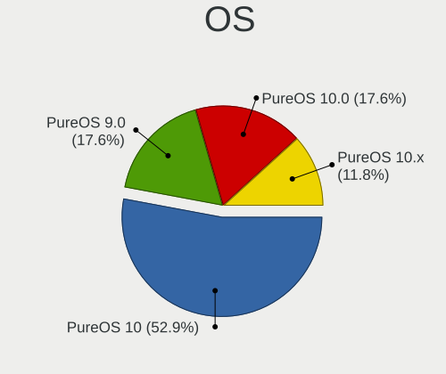

| Name        | Desktops | Percent |
|-------------|----------|---------|
| PureOS 10   | 9        | 52.94%  |
| PureOS 9.0  | 3        | 17.65%  |
| PureOS 10.0 | 3        | 17.65%  |
| PureOS 10.x | 2        | 11.76%  |

OS Family
---------

OS without a version

| Name   | Desktops | Percent |
|--------|----------|---------|
| PureOS | 14       | 100%    |

Kernel
------

Version of the Linux kernel

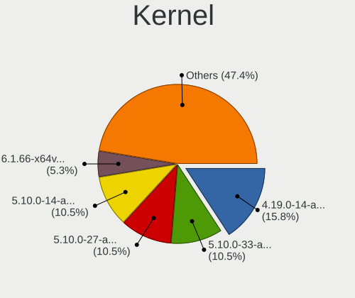

| Version              | Desktops | Percent |
|----------------------|----------|---------|
| 4.19.0-14-amd64      | 3        | 15.79%  |
| 5.10.0-33-amd64      | 2        | 10.53%  |
| 5.10.0-27-amd64      | 2        | 10.53%  |
| 5.10.0-14-amd64      | 2        | 10.53%  |
| 6.1.66-x64v2-xanmod1 | 1        | 5.26%   |
| 5.10.0-28-amd64      | 1        | 5.26%   |
| 5.10.0-26-amd64      | 1        | 5.26%   |
| 5.10.0-23-amd64      | 1        | 5.26%   |
| 5.10.0-21-amd64      | 1        | 5.26%   |
| 5.10.0-20-amd64      | 1        | 5.26%   |
| 5.10.0-19-amd64      | 1        | 5.26%   |
| 5.10.0-16-amd64      | 1        | 5.26%   |
| 5.10.0-15-amd64      | 1        | 5.26%   |
| 5.10.0-11-amd64      | 1        | 5.26%   |

Kernel Family
-------------

Linux kernel without a distro release

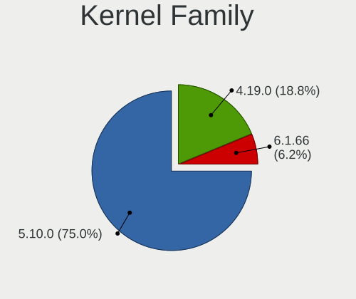

| Version | Desktops | Percent |
|---------|----------|---------|
| 5.10.0  | 12       | 75%     |
| 4.19.0  | 3        | 18.75%  |
| 6.1.66  | 1        | 6.25%   |

Kernel Major Ver.
-----------------

Linux kernel major version

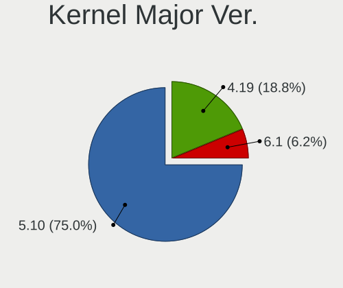

| Version | Desktops | Percent |
|---------|----------|---------|
| 5.10    | 12       | 75%     |
| 4.19    | 3        | 18.75%  |
| 6.1     | 1        | 6.25%   |

Arch
----

OS architecture (x86_64, i586, etc.)

| Name   | Desktops | Percent |
|--------|----------|---------|
| x86_64 | 14       | 100%    |

DE
--

Desktop Environment

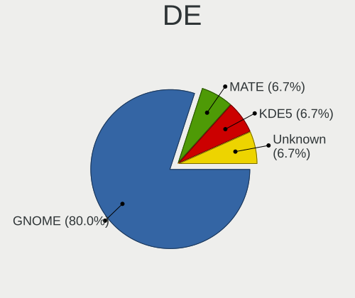

| Name    | Desktops | Percent |
|---------|----------|---------|
| GNOME   | 12       | 80%     |
| MATE    | 1        | 6.67%   |
| KDE5    | 1        | 6.67%   |
| Unknown | 1        | 6.67%   |

Display Server
--------------

X11 or Wayland

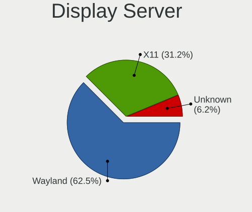

| Name    | Desktops | Percent |
|---------|----------|---------|
| Wayland | 10       | 62.5%   |
| X11     | 5        | 31.25%  |
| Unknown | 1        | 6.25%   |

Display Manager
---------------

SDDM, LightDM, etc.

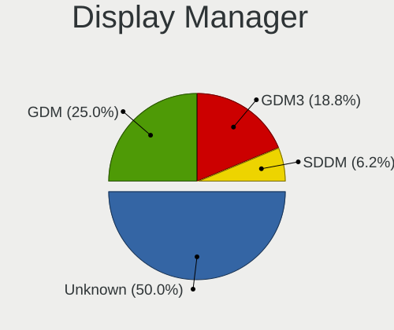

| Name    | Desktops | Percent |
|---------|----------|---------|
| Unknown | 8        | 50%     |
| GDM     | 4        | 25%     |
| GDM3    | 3        | 18.75%  |
| SDDM    | 1        | 6.25%   |

OS Lang
-------

Language

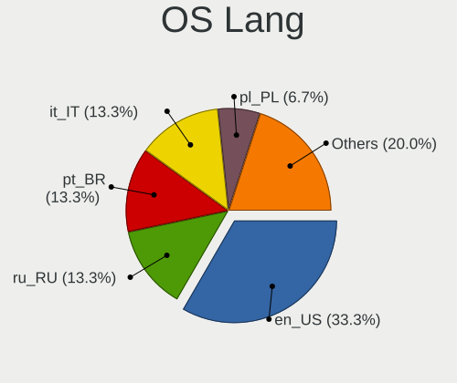

| Lang  | Desktops | Percent |
|-------|----------|---------|
| en_US | 5        | 33.33%  |
| ru_RU | 2        | 13.33%  |
| pt_BR | 2        | 13.33%  |
| it_IT | 2        | 13.33%  |
| pl_PL | 1        | 6.67%   |
| hu_HU | 1        | 6.67%   |
| en_AU | 1        | 6.67%   |
| de_DE | 1        | 6.67%   |

Boot Mode
---------

EFI or BIOS

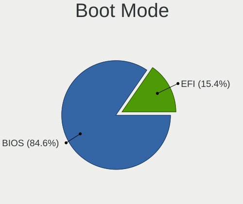

| Mode | Desktops | Percent |
|------|----------|---------|
| BIOS | 12       | 85.71%  |
| EFI  | 2        | 14.29%  |

Filesystem
----------

Type of filesystem

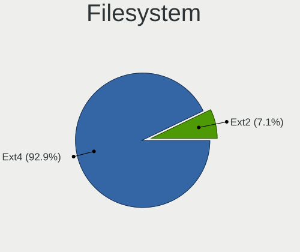

| Type | Desktops | Percent |
|------|----------|---------|
| Ext4 | 13       | 92.86%  |
| Ext2 | 1        | 7.14%   |

Part. scheme
------------

Scheme of partitioning

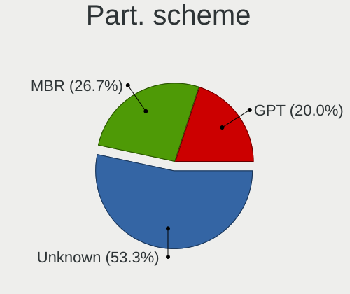

| Type    | Desktops | Percent |
|---------|----------|---------|
| Unknown | 8        | 53.33%  |
| MBR     | 4        | 26.67%  |
| GPT     | 3        | 20%     |

Dual Boot with Linux/BSD
------------------------

Hosting more than one Linux/BSD

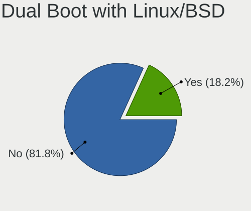

| Dual boot | Desktops | Percent |
|-----------|----------|---------|
| No        | 11       | 73.33%  |
| Yes       | 4        | 26.67%  |

Dual Boot (Win)
---------------

Hosting Linux and Windows

| Dual boot | Desktops | Percent |
|-----------|----------|---------|
| No        | 12       | 85.71%  |
| Yes       | 2        | 14.29%  |

Board
-----

Vendor
------

Motherboard manufacturer

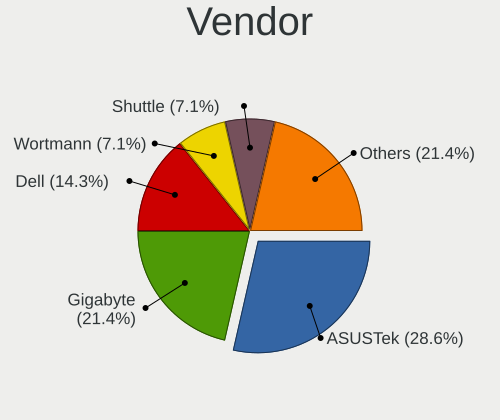

| Name                | Desktops | Percent |
|---------------------|----------|---------|
| ASUSTek Computer    | 4        | 28.57%  |
| Gigabyte Technology | 3        | 21.43%  |
| Dell                | 2        | 14.29%  |
| Wortmann AG         | 1        | 7.14%   |
| Shuttle             | 1        | 7.14%   |
| Purism              | 1        | 7.14%   |
| PCWare              | 1        | 7.14%   |
| MSI                 | 1        | 7.14%   |

Model
-----

Motherboard model

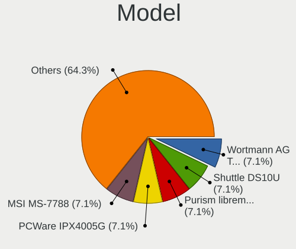

| Name                    | Desktops | Percent |
|-------------------------|----------|---------|
| Wortmann AG TERRA_PC    | 1        | 7.14%   |
| Shuttle DS10U           | 1        | 7.14%   |
| Purism librem_mini_v2   | 1        | 7.14%   |
| PCWare IPX4005G         | 1        | 7.14%   |
| MSI MS-7788             | 1        | 7.14%   |
| Gigabyte GA-MA78GM-UD2H | 1        | 7.14%   |
| Gigabyte B85M-DS3H      | 1        | 7.14%   |
| Gigabyte B560M DS3H V2  | 1        | 7.14%   |
| Dell OptiPlex 760       | 1        | 7.14%   |
| Dell Inspiron 3847      | 1        | 7.14%   |
| ASUS M4N68T V2          | 1        | 7.14%   |
| ASUS F2A85-M PRO        | 1        | 7.14%   |
| ASUS EX-A320M-GAMING    | 1        | 7.14%   |
| ASUS A88X-PLUS/USB      | 1        | 7.14%   |

Model Family
------------

Motherboard model prefix

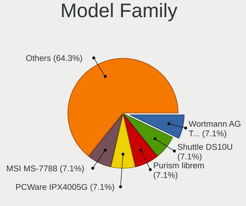

| Name                    | Desktops | Percent |
|-------------------------|----------|---------|
| Wortmann AG TERRA       | 1        | 7.14%   |
| Shuttle DS10U           | 1        | 7.14%   |
| Purism librem           | 1        | 7.14%   |
| PCWare IPX4005G         | 1        | 7.14%   |
| MSI MS-7788             | 1        | 7.14%   |
| Gigabyte GA-MA78GM-UD2H | 1        | 7.14%   |
| Gigabyte B85M-DS3H      | 1        | 7.14%   |
| Gigabyte B560M          | 1        | 7.14%   |
| Dell OptiPlex           | 1        | 7.14%   |
| Dell Inspiron           | 1        | 7.14%   |
| ASUS M4N68T             | 1        | 7.14%   |
| ASUS F2A85-M            | 1        | 7.14%   |
| ASUS EX-A320M-GAMING    | 1        | 7.14%   |
| ASUS A88X-PLUS          | 1        | 7.14%   |

MFG Year
--------

Motherboard manufacture year

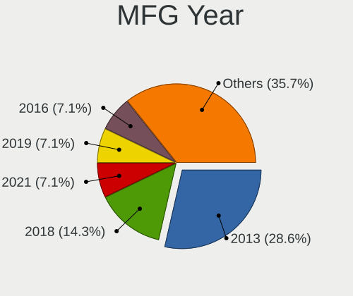

| Year    | Desktops | Percent |
|---------|----------|---------|
| 2013    | 4        | 28.57%  |
| 2018    | 2        | 14.29%  |
| 2021    | 1        | 7.14%   |
| 2019    | 1        | 7.14%   |
| 2016    | 1        | 7.14%   |
| 2012    | 1        | 7.14%   |
| 2011    | 1        | 7.14%   |
| 2010    | 1        | 7.14%   |
| 2009    | 1        | 7.14%   |
| Unknown | 1        | 7.14%   |

Form Factor
-----------

Physical design of the computer

| Name    | Desktops | Percent |
|---------|----------|---------|
| Desktop | 14       | 100%    |

Secure Boot
-----------

Enabled or disabled

| State    | Desktops | Percent |
|----------|----------|---------|
| Disabled | 14       | 100%    |

Coreboot
--------

Have coreboot on board

| Used | Desktops | Percent |
|------|----------|---------|
| No   | 13       | 92.86%  |
| Yes  | 1        | 7.14%   |

RAM Size
--------

Total RAM memory

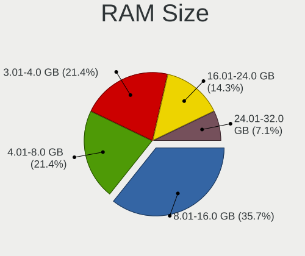

| Size in GB | Desktops | Percent |
|------------|----------|---------|
| 8.01-16.0  | 5        | 35.71%  |
| 4.01-8.0   | 3        | 21.43%  |
| 3.01-4.0   | 3        | 21.43%  |
| 16.01-24.0 | 2        | 14.29%  |
| 24.01-32.0 | 1        | 7.14%   |

RAM Used
--------

Used RAM memory

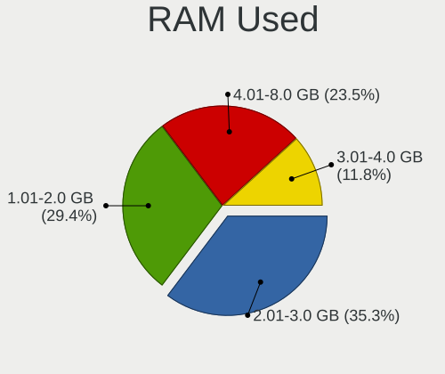

| Used GB  | Desktops | Percent |
|----------|----------|---------|
| 2.01-3.0 | 6        | 35.29%  |
| 1.01-2.0 | 5        | 29.41%  |
| 4.01-8.0 | 4        | 23.53%  |
| 3.01-4.0 | 2        | 11.76%  |

Total Drives
------------

Number of drives on board

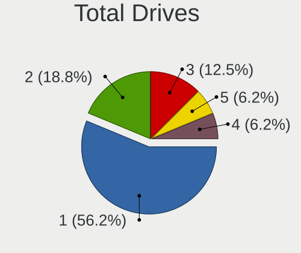

| Drives | Desktops | Percent |
|--------|----------|---------|
| 1      | 9        | 56.25%  |
| 2      | 3        | 18.75%  |
| 3      | 2        | 12.5%   |
| 5      | 1        | 6.25%   |
| 4      | 1        | 6.25%   |

Has CD-ROM
----------

Has CD-ROM on board

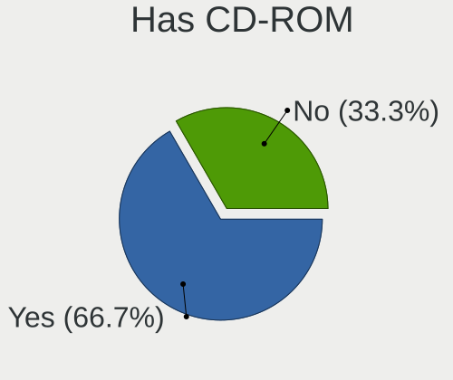

| Presented | Desktops | Percent |
|-----------|----------|---------|
| No        | 12       | 80%     |
| Yes       | 3        | 20%     |

Has Ethernet
------------

Has Ethernet on board

| Presented | Desktops | Percent |
|-----------|----------|---------|
| Yes       | 14       | 100%    |

Has WiFi
--------

Has WiFi module

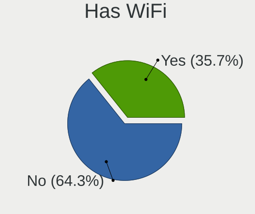

| Presented | Desktops | Percent |
|-----------|----------|---------|
| No        | 9        | 64.29%  |
| Yes       | 5        | 35.71%  |

Has Bluetooth
-------------

Has Bluetooth module

| Presented | Desktops | Percent |
|-----------|----------|---------|
| No        | 12       | 85.71%  |
| Yes       | 2        | 14.29%  |

Location
--------

Country
-------

Geographic location (country)

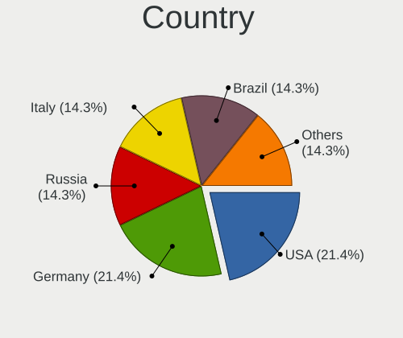

| Country   | Desktops | Percent |
|-----------|----------|---------|
| USA       | 3        | 21.43%  |
| Germany   | 3        | 21.43%  |
| Russia    | 2        | 14.29%  |
| Italy     | 2        | 14.29%  |
| Brazil    | 2        | 14.29%  |
| Greece    | 1        | 7.14%   |
| Australia | 1        | 7.14%   |

City
----

Geographic location (city)

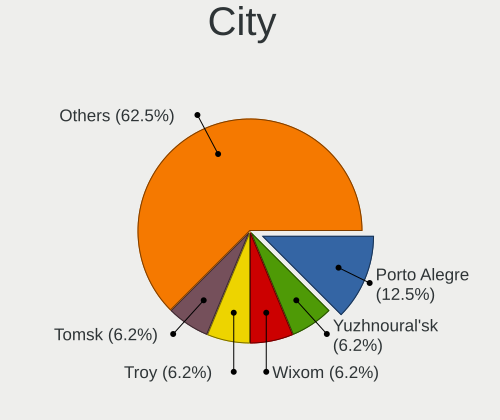

| City          | Desktops | Percent |
|---------------|----------|---------|
| Porto Alegre  | 2        | 12.5%   |
| Yuzhnoural'sk | 1        | 6.25%   |
| Wixom         | 1        | 6.25%   |
| Troy          | 1        | 6.25%   |
| Tomsk         | 1        | 6.25%   |
| Stolberg      | 1        | 6.25%   |
| Roetgen       | 1        | 6.25%   |
| Perth         | 1        | 6.25%   |
| New York      | 1        | 6.25%   |
| Milan         | 1        | 6.25%   |
| Lenningen     | 1        | 6.25%   |
| Gladbeck      | 1        | 6.25%   |
| Forlì        | 1        | 6.25%   |
| Charleston    | 1        | 6.25%   |
| Athens        | 1        | 6.25%   |

Drives
------

Drive Vendor
------------

Hard drive vendors

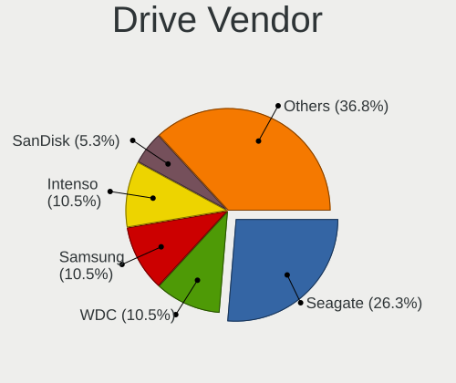

| Vendor              | Desktops | Drives | Percent |
|---------------------|----------|--------|---------|
| Seagate             | 5        | 14     | 26.32%  |
| WDC                 | 2        | 3      | 10.53%  |
| Samsung Electronics | 2        | 3      | 10.53%  |
| Intenso             | 2        | 3      | 10.53%  |
| SanDisk             | 1        | 1      | 5.26%   |
| PNY                 | 1        | 2      | 5.26%   |
| Patriot             | 1        | 1      | 5.26%   |
| Maxtor              | 1        | 1      | 5.26%   |
| Kingston            | 1        | 1      | 5.26%   |
| China               | 1        | 3      | 5.26%   |
| ASMT                | 1        | 2      | 5.26%   |
| Unknown             | 1        | 2      | 5.26%   |

Drive Model
-----------

Hard drive models

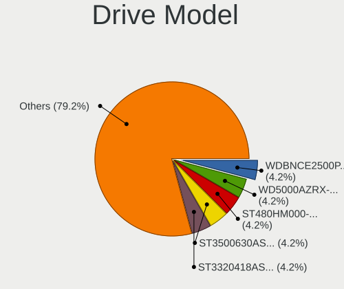

| Model                           | Desktops | Percent |
|---------------------------------|----------|---------|
| WDC WDBNCE2500PNC 250GB SSD     | 1        | 4.17%   |
| WDC WD5000AZRX-00A8LB0 500GB    | 1        | 4.17%   |
| Seagate ST480HM000-1G5162 506GB | 1        | 4.17%   |
| Seagate ST3500630AS 500GB       | 1        | 4.17%   |
| Seagate ST3320418AS 320GB       | 1        | 4.17%   |
| Seagate ST3250410AS 250GB       | 1        | 4.17%   |
| Seagate ST3250312CS 250GB       | 1        | 4.17%   |
| Seagate ST31000524AS 1TB        | 1        | 4.17%   |
| Seagate ST1000DM003-1ER162 1TB  | 1        | 4.17%   |
| Seagate ST1000DM003-1CH162 1TB  | 1        | 4.17%   |
| SanDisk NVMe SSD Drive 500GB    | 1        | 4.17%   |
| Samsung SSD 860 EVO M.2 250GB   | 1        | 4.17%   |
| Samsung SSD 860 EVO 250GB       | 1        | 4.17%   |
| Samsung SSD 830 Series 128GB    | 1        | 4.17%   |
| PNY CS900 240GB SSD             | 1        | 4.17%   |
| Patriot Burst Elite 120GB SSD   | 1        | 4.17%   |
| Maxtor 7V250F0 256GB            | 1        | 4.17%   |
| Kingston SKC600256G 256GB SSD   | 1        | 4.17%   |
| Intenso SSD 128GB               | 1        | 4.17%   |
| Intenso SSD 120GB               | 1        | 4.17%   |
| Intenso SCSI 2TB                | 1        | 4.17%   |
| China SATA SSD 128GB            | 1        | 4.17%   |
| ASMT 2235 250GB                 | 1        | 4.17%   |
| Unknown                         | 1        | 4.17%   |

HDD Vendor
----------

Hard disk drive vendors

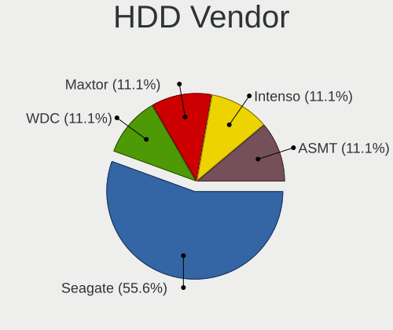

| Vendor  | Desktops | Drives | Percent |
|---------|----------|--------|---------|
| Seagate | 5        | 14     | 55.56%  |
| WDC     | 1        | 1      | 11.11%  |
| Maxtor  | 1        | 1      | 11.11%  |
| Intenso | 1        | 1      | 11.11%  |
| ASMT    | 1        | 2      | 11.11%  |

SSD Vendor
----------

Solid state drive vendors

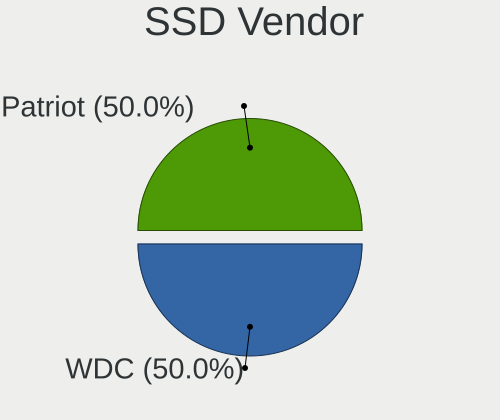

| Vendor              | Desktops | Drives | Percent |
|---------------------|----------|--------|---------|
| Samsung Electronics | 2        | 3      | 25%     |
| WDC                 | 1        | 2      | 12.5%   |
| PNY                 | 1        | 2      | 12.5%   |
| Patriot             | 1        | 1      | 12.5%   |
| Kingston            | 1        | 1      | 12.5%   |
| Intenso             | 1        | 2      | 12.5%   |
| China               | 1        | 3      | 12.5%   |

Drive Kind
----------

HDD or SSD

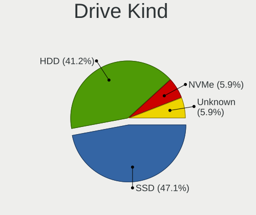

| Kind    | Desktops | Drives | Percent |
|---------|----------|--------|---------|
| SSD     | 8        | 14     | 47.06%  |
| HDD     | 7        | 19     | 41.18%  |
| NVMe    | 1        | 1      | 5.88%   |
| Unknown | 1        | 2      | 5.88%   |

Drive Connector
---------------

SATA, SAS, NVMe, etc.

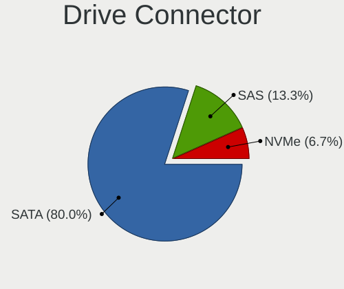

| Type | Desktops | Drives | Percent |
|------|----------|--------|---------|
| SATA | 12       | 32     | 80%     |
| SAS  | 2        | 3      | 13.33%  |
| NVMe | 1        | 1      | 6.67%   |

Drive Size
----------

Size of hard drive

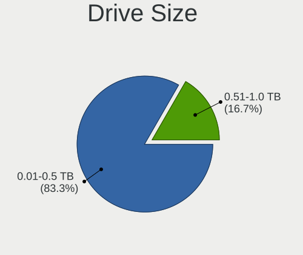

| Size in TB | Desktops | Drives | Percent |
|------------|----------|--------|---------|
| 0.01-0.5   | 10       | 23     | 66.67%  |
| 0.51-1.0   | 4        | 9      | 26.67%  |
| 1.01-2.0   | 1        | 1      | 6.67%   |

Space Total
-----------

Amount of disk space available on the file system

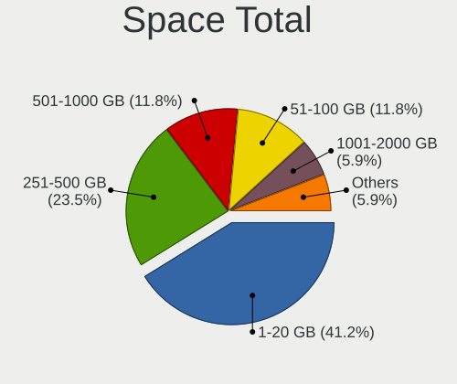

| Size in GB | Desktops | Percent |
|------------|----------|---------|
| 1-20       | 7        | 41.18%  |
| 251-500    | 4        | 23.53%  |
| 501-1000   | 2        | 11.76%  |
| 51-100     | 2        | 11.76%  |
| 101-250    | 1        | 5.88%   |
| 1001-2000  | 1        | 5.88%   |

Space Used
----------

Amount of used disk space

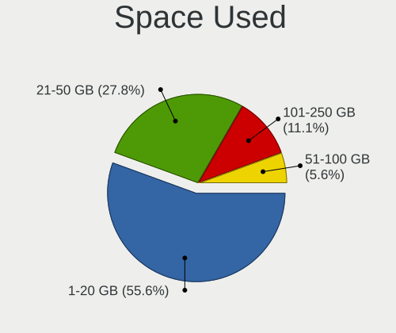

| Used GB | Desktops | Percent |
|---------|----------|---------|
| 1-20    | 10       | 55.56%  |
| 21-50   | 5        | 27.78%  |
| 101-250 | 2        | 11.11%  |
| 51-100  | 1        | 5.56%   |

Malfunc. Drives
---------------

Drive models with a malfunction

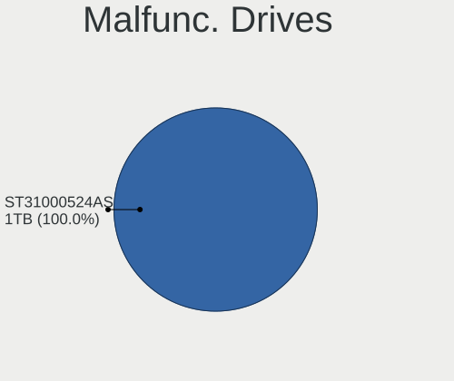

| Model                     | Desktops | Drives | Percent |
|---------------------------|----------|--------|---------|
| Seagate ST3250410AS 250GB | 1        | 1      | 25%     |
| Seagate ST3250312CS 250GB | 1        | 1      | 25%     |
| Seagate ST31000524AS 1TB  | 1        | 2      | 25%     |
| Maxtor 7V250F0 256GB      | 1        | 1      | 25%     |

Malfunc. Drive Vendor
---------------------

Vendors of faulty drives

| Vendor  | Desktops | Drives | Percent |
|---------|----------|--------|---------|
| Seagate | 2        | 4      | 66.67%  |
| Maxtor  | 1        | 1      | 33.33%  |

Malfunc. HDD Vendor
-------------------

Vendors of faulty HDD drives

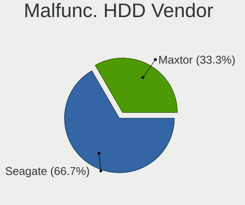

| Vendor  | Desktops | Drives | Percent |
|---------|----------|--------|---------|
| Seagate | 2        | 4      | 66.67%  |
| Maxtor  | 1        | 1      | 33.33%  |

Malfunc. Drive Kind
-------------------

Kinds of faulty drives

| Kind | Desktops | Drives | Percent |
|------|----------|--------|---------|
| HDD  | 3        | 5      | 100%    |

Failed Drives
-------------

Failed drive models

Zero info for selected period =(

Failed Drive Vendor
-------------------

Failed drive vendors

Zero info for selected period =(

Drive Status
------------

Number of failed and malfunc. drives

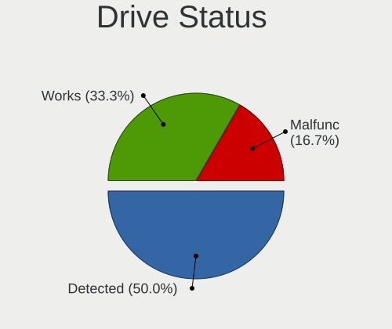

| Status   | Desktops | Drives | Percent |
|----------|----------|--------|---------|
| Detected | 9        | 23     | 50%     |
| Works    | 6        | 8      | 33.33%  |
| Malfunc  | 3        | 5      | 16.67%  |

Storage controller
------------------

Storage Vendor
--------------

Storage controller vendors

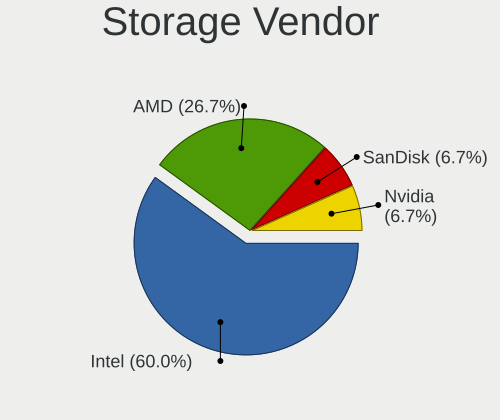

| Vendor  | Desktops | Percent |
|---------|----------|---------|
| Intel   | 9        | 60%     |
| AMD     | 4        | 26.67%  |
| SanDisk | 1        | 6.67%   |
| Nvidia  | 1        | 6.67%   |

Storage Model
-------------

Storage controller models

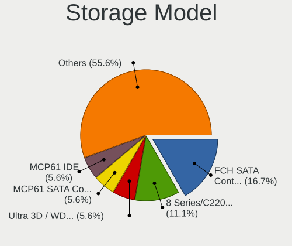

| Model                                                                          | Desktops | Percent |
|--------------------------------------------------------------------------------|----------|---------|
| AMD FCH SATA Controller [AHCI mode]                                            | 3        | 16.67%  |
| Intel 8 Series/C220 Series Chipset Family 6-port SATA Controller 1 [AHCI mode] | 2        | 11.11%  |
| SanDisk Ultra 3D / WD Blue SN570 NVMe SSD (DRAM-less)                          | 1        | 5.56%   |
| Nvidia MCP61 SATA Controller                                                   | 1        | 5.56%   |
| Nvidia MCP61 IDE                                                               | 1        | 5.56%   |
| Intel Comet Lake SATA AHCI Controller                                          | 1        | 5.56%   |
| Intel Celeron/Pentium Silver Processor SATA Controller                         | 1        | 5.56%   |
| Intel Cannon Point-LP SATA Controller [AHCI Mode]                              | 1        | 5.56%   |
| Intel 82801JD/DO (ICH10 Family) SATA AHCI Controller                           | 1        | 5.56%   |
| Intel 7 Series Chipset Family 6-port SATA Controller [AHCI mode]               | 1        | 5.56%   |
| Intel 6 Series/C200 Series Chipset Family 6 port Desktop SATA AHCI Controller  | 1        | 5.56%   |
| Intel 500 Series Chipset Family SATA AHCI Controller                           | 1        | 5.56%   |
| AMD SB7x0/SB8x0/SB9x0 SATA Controller [IDE mode]                               | 1        | 5.56%   |
| AMD SB7x0/SB8x0/SB9x0 IDE Controller                                           | 1        | 5.56%   |
| AMD A320 Chipset SATA Controller [AHCI mode]                                   | 1        | 5.56%   |

Storage Kind
------------

Kind of storage controller (IDE, SATA, NVMe, SAS, ...)

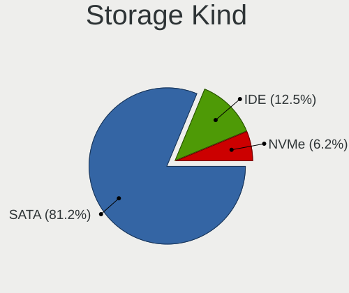

| Kind | Desktops | Percent |
|------|----------|---------|
| SATA | 13       | 81.25%  |
| IDE  | 2        | 12.5%   |
| NVMe | 1        | 6.25%   |

Processor
---------

CPU Vendor
----------

Processor vendors

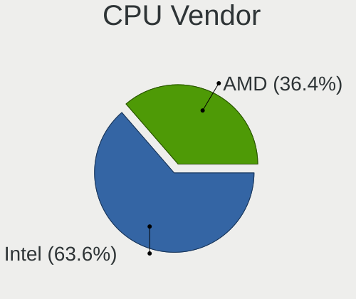

| Vendor | Desktops | Percent |
|--------|----------|---------|
| Intel  | 9        | 64.29%  |
| AMD    | 5        | 35.71%  |

CPU Model
---------

Processor models

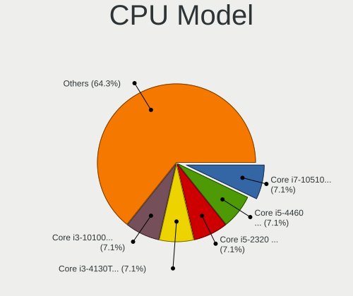

| Model                                           | Desktops | Percent |
|-------------------------------------------------|----------|---------|
| Intel Core i7-10510U CPU @ 1.80GHz              | 1        | 7.14%   |
| Intel Core i5-4460 CPU @ 3.20GHz                | 1        | 7.14%   |
| Intel Core i5-2320 CPU @ 3.00GHz                | 1        | 7.14%   |
| Intel Core i3-4130T CPU @ 2.90GHz               | 1        | 7.14%   |
| Intel Core i3-10100F CPU @ 3.60GHz              | 1        | 7.14%   |
| Intel Core 2 Duo CPU E8400 @ 3.00GHz            | 1        | 7.14%   |
| Intel Celeron J4005 CPU @ 2.00GHz               | 1        | 7.14%   |
| Intel Celeron CPU 4205U @ 1.80GHz               | 1        | 7.14%   |
| Intel Celeron CPU 1007U @ 1.50GHz               | 1        | 7.14%   |
| AMD Ryzen 3 3200G with Radeon Vega Graphics     | 1        | 7.14%   |
| AMD Athlon II X4 620 Processor                  | 1        | 7.14%   |
| AMD Athlon II X3 445 Processor                  | 1        | 7.14%   |
| AMD A10-7860K Radeon R7, 12 Compute Cores 4C+8G | 1        | 7.14%   |
| AMD A10-5800K APU with Radeon HD Graphics       | 1        | 7.14%   |

CPU Model Family
----------------

Processor model prefix

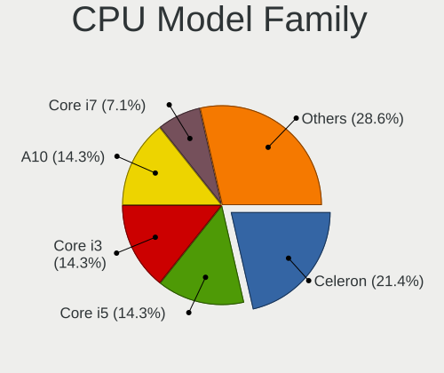

| Model            | Desktops | Percent |
|------------------|----------|---------|
| Intel Celeron    | 3        | 21.43%  |
| Intel Core i5    | 2        | 14.29%  |
| Intel Core i3    | 2        | 14.29%  |
| AMD A10          | 2        | 14.29%  |
| Intel Core i7    | 1        | 7.14%   |
| Intel Core 2 Duo | 1        | 7.14%   |
| AMD Ryzen 3      | 1        | 7.14%   |
| AMD Athlon II X4 | 1        | 7.14%   |
| AMD Athlon II X3 | 1        | 7.14%   |

CPU Cores
---------

Number of processor cores

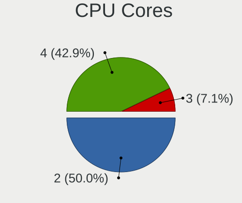

| Number | Desktops | Percent |
|--------|----------|---------|
| 2      | 7        | 50%     |
| 4      | 6        | 42.86%  |
| 3      | 1        | 7.14%   |

CPU Sockets
-----------

Number of sockets

| Number | Desktops | Percent |
|--------|----------|---------|
| 1      | 14       | 100%    |

CPU Threads
-----------

Threads per core (Hyper-Threading)

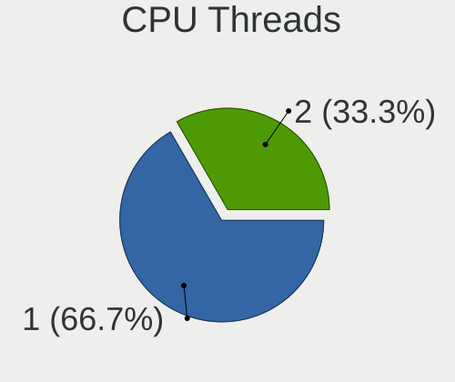

| Number | Desktops | Percent |
|--------|----------|---------|
| 1      | 9        | 64.29%  |
| 2      | 5        | 35.71%  |

CPU Op-Modes
------------

CPU Operation Modes (32-bit, 64-bit)

| Op mode        | Desktops | Percent |
|----------------|----------|---------|
| 32-bit, 64-bit | 14       | 100%    |

CPU Microcode
-------------

Microcode number

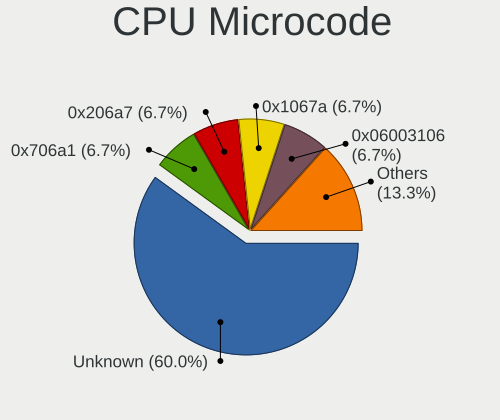

| Number     | Desktops | Percent |
|------------|----------|---------|
| Unknown    | 9        | 60%     |
| 0x706a1    | 1        | 6.67%   |
| 0x206a7    | 1        | 6.67%   |
| 0x1067a    | 1        | 6.67%   |
| 0x06003106 | 1        | 6.67%   |
| 0x06001119 | 1        | 6.67%   |
| 0x010000b6 | 1        | 6.67%   |

CPU Microarch
-------------

Microarchitecture

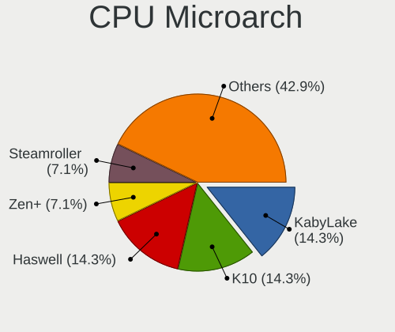

| Name          | Desktops | Percent |
|---------------|----------|---------|
| KabyLake      | 2        | 14.29%  |
| K10           | 2        | 14.29%  |
| Haswell       | 2        | 14.29%  |
| Zen+          | 1        | 7.14%   |
| Steamroller   | 1        | 7.14%   |
| SandyBridge   | 1        | 7.14%   |
| Piledriver    | 1        | 7.14%   |
| Penryn        | 1        | 7.14%   |
| IvyBridge     | 1        | 7.14%   |
| Goldmont plus | 1        | 7.14%   |
| CometLake     | 1        | 7.14%   |

Graphics
--------

GPU Vendor
----------

Vendors of graphics cards

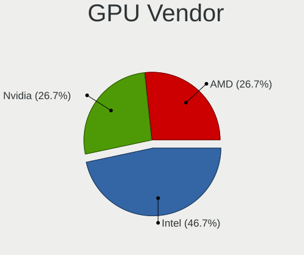

| Vendor | Desktops | Percent |
|--------|----------|---------|
| Intel  | 7        | 46.67%  |
| Nvidia | 4        | 26.67%  |
| AMD    | 4        | 26.67%  |

GPU Model
---------

Graphics card models

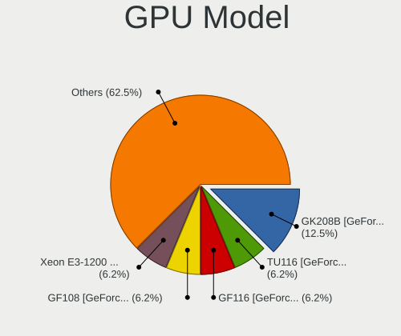

| Model                                                                       | Desktops | Percent |
|-----------------------------------------------------------------------------|----------|---------|
| Nvidia GK208B [GeForce GT 710]                                              | 2        | 12.5%   |
| Nvidia TU116 [GeForce GTX 1660]                                             | 1        | 6.25%   |
| Nvidia GF116 [GeForce GTS 450 Rev. 2]                                       | 1        | 6.25%   |
| Nvidia GF108 [GeForce GT 630]                                               | 1        | 6.25%   |
| Intel Xeon E3-1200 v3/4th Gen Core Processor Integrated Graphics Controller | 1        | 6.25%   |
| Intel Whiskey Lake-U GT1 [UHD Graphics 610]                                 | 1        | 6.25%   |
| Intel GeminiLake [UHD Graphics 600]                                         | 1        | 6.25%   |
| Intel CometLake-U GT2 [UHD Graphics]                                        | 1        | 6.25%   |
| Intel 4 Series Chipset Integrated Graphics Controller                       | 1        | 6.25%   |
| Intel 3rd Gen Core processor Graphics Controller                            | 1        | 6.25%   |
| Intel 2nd Generation Core Processor Family Integrated Graphics Controller   | 1        | 6.25%   |
| AMD Trinity [Radeon HD 7660D]                                               | 1        | 6.25%   |
| AMD RV710 [Radeon HD 4350/4550]                                             | 1        | 6.25%   |
| AMD Picasso/Raven 2 [Radeon Vega Series / Radeon Vega Mobile Series]        | 1        | 6.25%   |
| AMD Cape Verde PRO [Radeon HD 7750/8740 / R7 250E]                          | 1        | 6.25%   |

GPU Combo
---------

Combinations of graphics cards

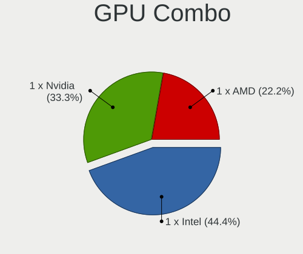

| Name       | Desktops | Percent |
|------------|----------|---------|
| 1 x Intel  | 6        | 42.86%  |
| 1 x Nvidia | 4        | 28.57%  |
| 1 x AMD    | 4        | 28.57%  |

GPU Driver
----------

Free vs proprietary

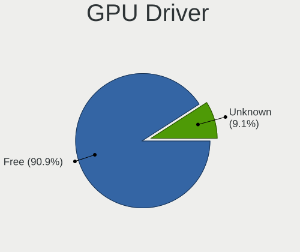

| Driver  | Desktops | Percent |
|---------|----------|---------|
| Free    | 13       | 92.86%  |
| Unknown | 1        | 7.14%   |

GPU Memory
----------

Total video memory

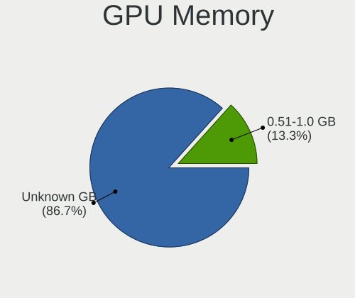

| Size in GB | Desktops | Percent |
|------------|----------|---------|
| Unknown    | 13       | 86.67%  |
| 0.51-1.0   | 2        | 13.33%  |

Monitor
-------

Monitor Vendor
--------------

Monitor vendors

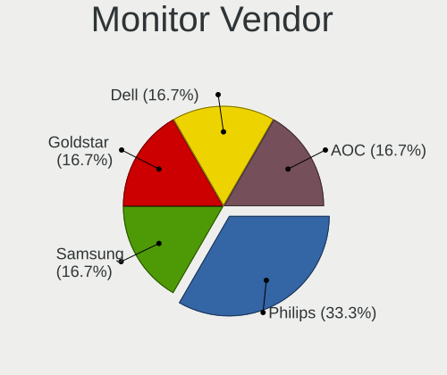

| Vendor              | Desktops | Percent |
|---------------------|----------|---------|
| Samsung Electronics | 3        | 23.08%  |
| Philips             | 3        | 23.08%  |
| Goldstar            | 2        | 15.38%  |
| ViewSonic           | 1        | 7.69%   |
| Sony                | 1        | 7.69%   |
| PRI                 | 1        | 7.69%   |
| Dell                | 1        | 7.69%   |
| AOC                 | 1        | 7.69%   |

Monitor Model
-------------

Monitor models

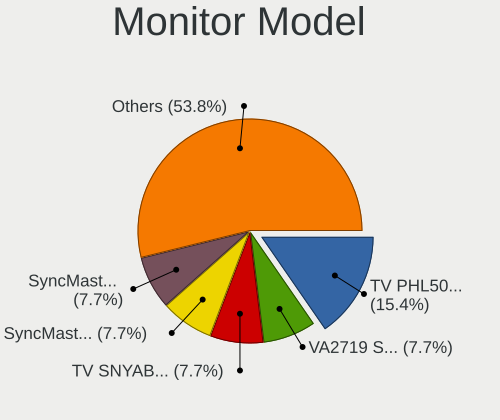

| Model                                                                | Desktops | Percent |
|----------------------------------------------------------------------|----------|---------|
| Philips TV PHL5035 1920x1080 640x360mm 28.9-inch                     | 2        | 15.38%  |
| ViewSonic VA2719 Series VSCC132 1920x1080 598x336mm 27.0-inch        | 1        | 7.69%   |
| Sony TV SNYAB03 1920x1080                                            | 1        | 7.69%   |
| Samsung Electronics SyncMaster SAM03E4 1680x1050 474x296mm 22.0-inch | 1        | 7.69%   |
| Samsung Electronics SyncMaster SAM01D3 1440x900 410x260mm 19.1-inch  | 1        | 7.69%   |
| Samsung Electronics LCD Monitor SAM0900 1366x768 580x320mm 26.1-inch | 1        | 7.69%   |
| PRI Prima TV PRI1600 1920x1080                                       | 1        | 7.69%   |
| Philips PHL 243V7 PHLC155 1920x1080 527x296mm 23.8-inch              | 1        | 7.69%   |
| Goldstar IPS FULLHD GSM5AB6 1920x1080 480x270mm 21.7-inch            | 1        | 7.69%   |
| Goldstar FULL HD GSM5B54 1920x1080 480x270mm 21.7-inch               | 1        | 7.69%   |
| Dell P2213 DELF042 1680x1050 473x296mm 22.0-inch                     | 1        | 7.69%   |
| AOC 2050W AOC2050 1600x900 432x240mm 19.5-inch                       | 1        | 7.69%   |

Monitor Resolution
------------------

Monitor screen resolution

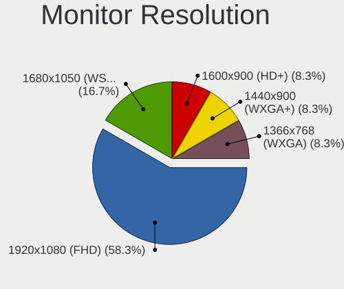

| Resolution         | Desktops | Percent |
|--------------------|----------|---------|
| 1920x1080 (FHD)    | 8        | 61.54%  |
| 1680x1050 (WSXGA+) | 2        | 15.38%  |
| 1600x900 (HD+)     | 1        | 7.69%   |
| 1440x900 (WXGA+)   | 1        | 7.69%   |
| 1366x768 (WXGA)    | 1        | 7.69%   |

Monitor Diagonal
----------------

Diagonal size in inches

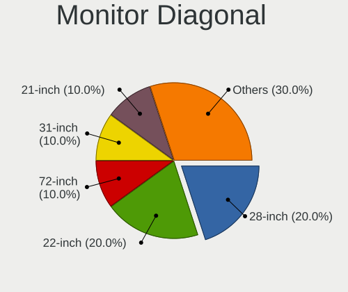

| Inches  | Desktops | Percent |
|---------|----------|---------|
| 28      | 2        | 15.38%  |
| 22      | 2        | 15.38%  |
| 72      | 1        | 7.69%   |
| 31      | 1        | 7.69%   |
| 27      | 1        | 7.69%   |
| 24      | 1        | 7.69%   |
| 23      | 1        | 7.69%   |
| 21      | 1        | 7.69%   |
| 20      | 1        | 7.69%   |
| 19      | 1        | 7.69%   |
| Unknown | 1        | 7.69%   |

Monitor Width
-------------

Physical width

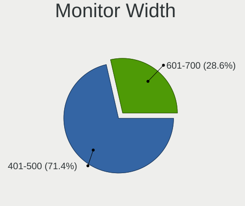

| Width in mm | Desktops | Percent |
|-------------|----------|---------|
| 401-500     | 5        | 38.46%  |
| 601-700     | 3        | 23.08%  |
| 501-600     | 3        | 23.08%  |
| 1501-2000   | 1        | 7.69%   |
| Unknown     | 1        | 7.69%   |

Aspect Ratio
------------

Proportional relationship between the width and the height

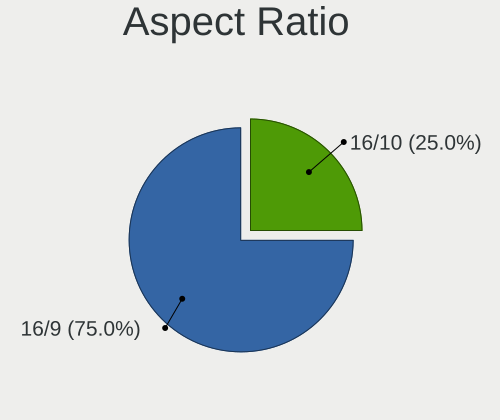

| Ratio | Desktops | Percent |
|-------|----------|---------|
| 16/9  | 10       | 76.92%  |
| 16/10 | 3        | 23.08%  |

Monitor Area
------------

Area in inch²

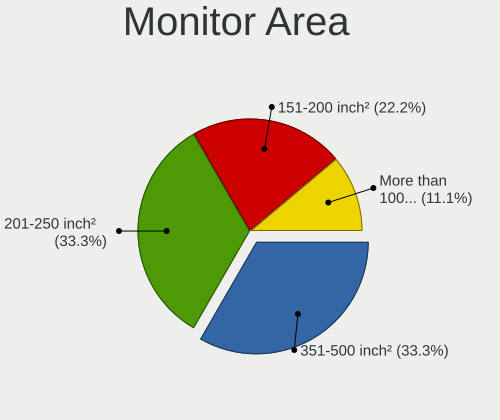

| Area in inch² | Desktops | Percent |
|----------------|----------|---------|
| 201-250        | 5        | 38.46%  |
| 351-500        | 3        | 23.08%  |
| 151-200        | 2        | 15.38%  |
| More than 1000 | 1        | 7.69%   |
| 301-350        | 1        | 7.69%   |
| Unknown        | 1        | 7.69%   |

Pixel Density
-------------

Pixels per inch

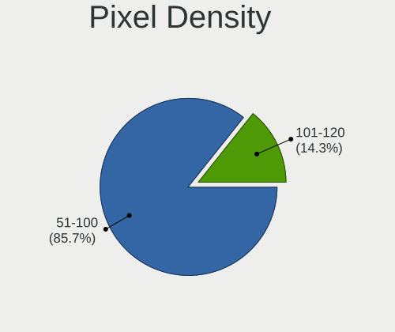

| Density | Desktops | Percent |
|---------|----------|---------|
| 51-100  | 9        | 69.23%  |
| 1-50    | 2        | 15.38%  |
| 101-120 | 1        | 7.69%   |
| Unknown | 1        | 7.69%   |

Multiple Monitors
-----------------

Total monitors connected

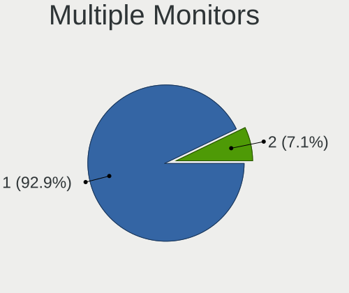

| Total | Desktops | Percent |
|-------|----------|---------|
| 1     | 13       | 92.86%  |
| 2     | 1        | 7.14%   |

Network
-------

Net Controller Vendor
---------------------

Controller vendors

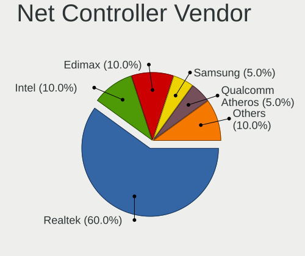

| Vendor                          | Desktops | Percent |
|---------------------------------|----------|---------|
| Realtek Semiconductor           | 12       | 60%     |
| Intel                           | 2        | 10%     |
| Edimax Technology               | 2        | 10%     |
| Samsung Electronics             | 1        | 5%      |
| Qualcomm Atheros Communications | 1        | 5%      |
| Qualcomm Atheros                | 1        | 5%      |
| Nvidia                          | 1        | 5%      |

Net Controller Model
--------------------

Controller models

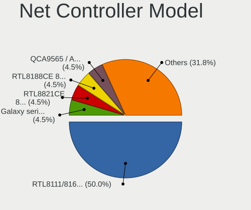

| Model                                                                  | Desktops | Percent |
|------------------------------------------------------------------------|----------|---------|
| Realtek RTL8111/8168/8211/8411 PCI Express Gigabit Ethernet Controller | 11       | 50%     |
| Samsung Galaxy series, misc. (tethering mode)                          | 1        | 4.55%   |
| Realtek RTL8821CE 802.11ac PCIe Wireless Network Adapter               | 1        | 4.55%   |
| Realtek RTL8188CE 802.11b/g/n WiFi Adapter                             | 1        | 4.55%   |
| Qualcomm Atheros QCA9565 / AR9565 Wireless Network Adapter             | 1        | 4.55%   |
| Qualcomm Atheros AR9271 802.11n                                        | 1        | 4.55%   |
| Nvidia MCP61 Ethernet                                                  | 1        | 4.55%   |
| Intel I211 Gigabit Network Connection                                  | 1        | 4.55%   |
| Intel Ethernet Connection (6) I219-LM                                  | 1        | 4.55%   |
| Intel 82567LM-3 Gigabit Network Connection                             | 1        | 4.55%   |
| Edimax EW-7811Un 802.11n Wireless Adapter [Realtek RTL8188CUS]         | 1        | 4.55%   |
| Edimax EW-7711MAC 802.11ac Wireless Adapter                            | 1        | 4.55%   |

Wireless Vendor
---------------

Wireless vendors

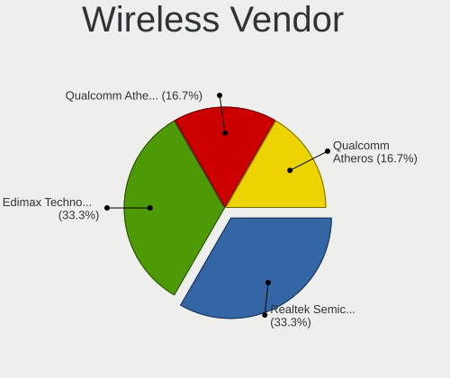

| Vendor                          | Desktops | Percent |
|---------------------------------|----------|---------|
| Realtek Semiconductor           | 2        | 33.33%  |
| Edimax Technology               | 2        | 33.33%  |
| Qualcomm Atheros Communications | 1        | 16.67%  |
| Qualcomm Atheros                | 1        | 16.67%  |

Wireless Model
--------------

Wireless models

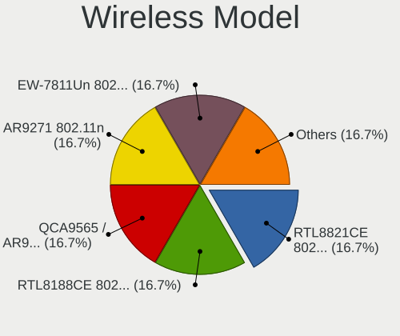

| Model                                                          | Desktops | Percent |
|----------------------------------------------------------------|----------|---------|
| Realtek RTL8821CE 802.11ac PCIe Wireless Network Adapter       | 1        | 16.67%  |
| Realtek RTL8188CE 802.11b/g/n WiFi Adapter                     | 1        | 16.67%  |
| Qualcomm Atheros QCA9565 / AR9565 Wireless Network Adapter     | 1        | 16.67%  |
| Qualcomm Atheros AR9271 802.11n                                | 1        | 16.67%  |
| Edimax EW-7811Un 802.11n Wireless Adapter [Realtek RTL8188CUS] | 1        | 16.67%  |
| Edimax EW-7711MAC 802.11ac Wireless Adapter                    | 1        | 16.67%  |

Ethernet Vendor
---------------

Ethernet vendors

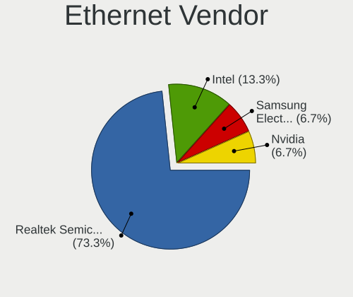

| Vendor                | Desktops | Percent |
|-----------------------|----------|---------|
| Realtek Semiconductor | 11       | 73.33%  |
| Intel                 | 2        | 13.33%  |
| Samsung Electronics   | 1        | 6.67%   |
| Nvidia                | 1        | 6.67%   |

Ethernet Model
--------------

Ethernet models

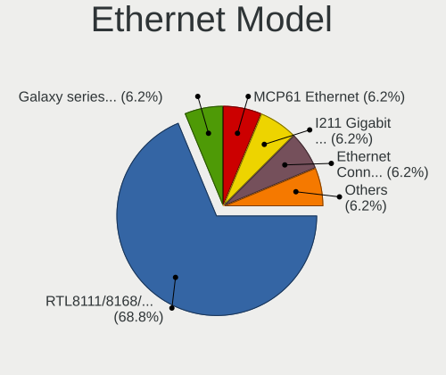

| Model                                                                  | Desktops | Percent |
|------------------------------------------------------------------------|----------|---------|
| Realtek RTL8111/8168/8211/8411 PCI Express Gigabit Ethernet Controller | 11       | 68.75%  |
| Samsung Galaxy series, misc. (tethering mode)                          | 1        | 6.25%   |
| Nvidia MCP61 Ethernet                                                  | 1        | 6.25%   |
| Intel I211 Gigabit Network Connection                                  | 1        | 6.25%   |
| Intel Ethernet Connection (6) I219-LM                                  | 1        | 6.25%   |
| Intel 82567LM-3 Gigabit Network Connection                             | 1        | 6.25%   |

Net Controller Kind
-------------------

Ethernet, WiFi or modem

| Kind     | Desktops | Percent |
|----------|----------|---------|
| Ethernet | 14       | 73.68%  |
| WiFi     | 5        | 26.32%  |

Used Controller
---------------

Currently used network controller

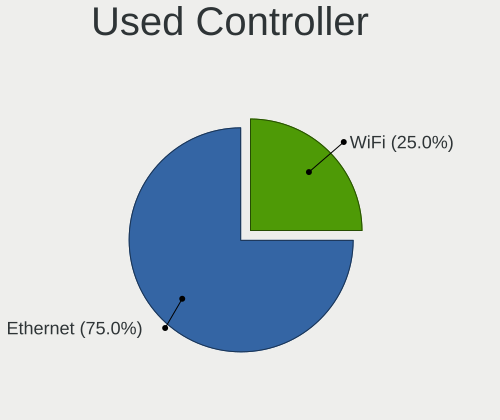

| Kind     | Desktops | Percent |
|----------|----------|---------|
| Ethernet | 13       | 86.67%  |
| WiFi     | 2        | 13.33%  |

NICs
----

Total network controllers on board

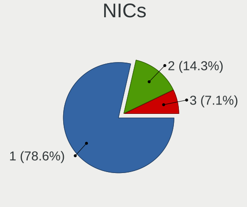

| Total | Desktops | Percent |
|-------|----------|---------|
| 1     | 11       | 78.57%  |
| 2     | 2        | 14.29%  |
| 3     | 1        | 7.14%   |

IPv6
----

IPv6 vs IPv4

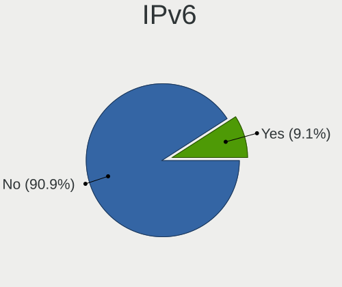

| Used | Desktops | Percent |
|------|----------|---------|
| No   | 12       | 80%     |
| Yes  | 3        | 20%     |

Bluetooth
---------

Bluetooth Vendor
----------------

Controller vendors

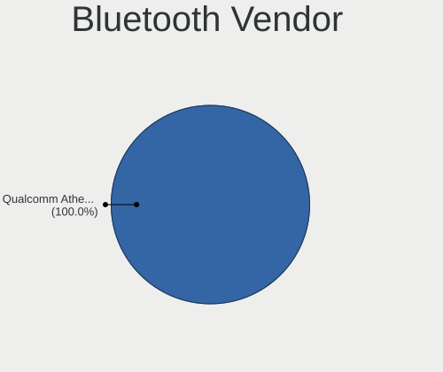

| Vendor                          | Desktops | Percent |
|---------------------------------|----------|---------|
| Qualcomm Atheros Communications | 1        | 50%     |
| IMC Networks                    | 1        | 50%     |

Bluetooth Model
---------------

Controller models

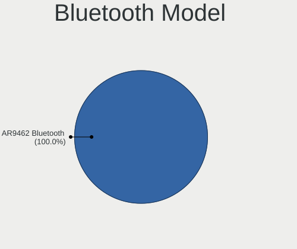

| Model                             | Desktops | Percent |
|-----------------------------------|----------|---------|
| Qualcomm Atheros AR9462 Bluetooth | 1        | 50%     |
| IMC Networks Bluetooth Radio      | 1        | 50%     |

Sound
-----

Sound Vendor
------------

Sound card vendors

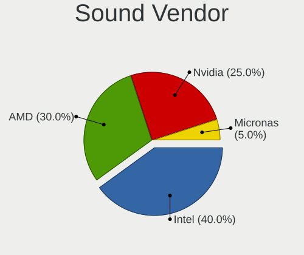

| Vendor   | Desktops | Percent |
|----------|----------|---------|
| Intel    | 8        | 40%     |
| AMD      | 6        | 30%     |
| Nvidia   | 5        | 25%     |
| Micronas | 1        | 5%      |

Sound Model
-----------

Sound card models

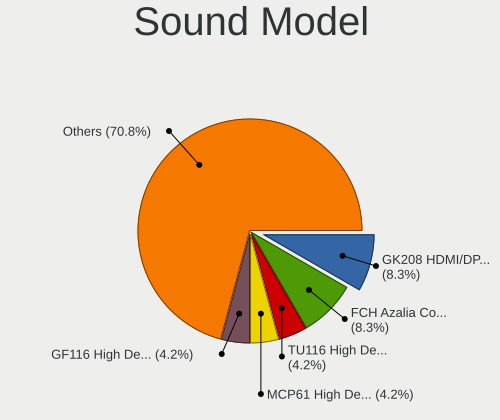

| Model                                                                      | Desktops | Percent |
|----------------------------------------------------------------------------|----------|---------|
| Nvidia GK208 HDMI/DP Audio Controller                                      | 2        | 8.33%   |
| AMD FCH Azalia Controller                                                  | 2        | 8.33%   |
| Nvidia TU116 High Definition Audio Controller                              | 1        | 4.17%   |
| Nvidia MCP61 High Definition Audio                                         | 1        | 4.17%   |
| Nvidia GF116 High Definition Audio Controller                              | 1        | 4.17%   |
| Nvidia GF108 High Definition Audio Controller                              | 1        | 4.17%   |
| Micronas QSB                                                               | 1        | 4.17%   |
| Intel Xeon E3-1200 v3/4th Gen Core Processor HD Audio Controller           | 1        | 4.17%   |
| Intel Smart Sound Technology (SST) Audio Controller                        | 1        | 4.17%   |
| Intel Comet Lake PCH-LP cAVS                                               | 1        | 4.17%   |
| Intel Celeron/Pentium Silver Processor High Definition Audio               | 1        | 4.17%   |
| Intel Cannon Point-LP High Definition Audio Controller                     | 1        | 4.17%   |
| Intel 82801JD/DO (ICH10 Family) HD Audio Controller                        | 1        | 4.17%   |
| Intel 8 Series/C220 Series Chipset High Definition Audio Controller        | 1        | 4.17%   |
| Intel 7 Series/C216 Chipset Family High Definition Audio Controller        | 1        | 4.17%   |
| Intel 6 Series/C200 Series Chipset Family High Definition Audio Controller | 1        | 4.17%   |
| AMD Trinity HDMI Audio Controller                                          | 1        | 4.17%   |
| AMD SBx00 Azalia (Intel HDA)                                               | 1        | 4.17%   |
| AMD Ryzen HD Audio Controller                                              | 1        | 4.17%   |
| AMD RV710/730 HDMI Audio [Radeon HD 4000 series]                           | 1        | 4.17%   |
| AMD Raven/Raven2/Fenghuang HDMI/DP Audio Controller                        | 1        | 4.17%   |
| AMD Oland/Hainan/Cape Verde/Pitcairn HDMI Audio [Radeon HD 7000 Series]    | 1        | 4.17%   |

Memory
------

Memory Vendor
-------------

Memory module vendors

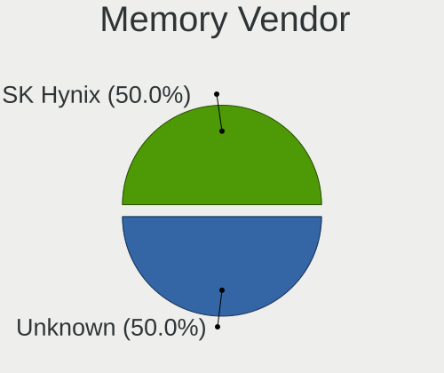

| Vendor            | Desktops | Percent |
|-------------------|----------|---------|
| Unknown           | 3        | 33.33%  |
| SK hynix          | 2        | 22.22%  |
| Toshiba           | 1        | 11.11%  |
| Micron Technology | 1        | 11.11%  |
| Kingston          | 1        | 11.11%  |
| G.Skill           | 1        | 11.11%  |

Memory Model
------------

Memory module models

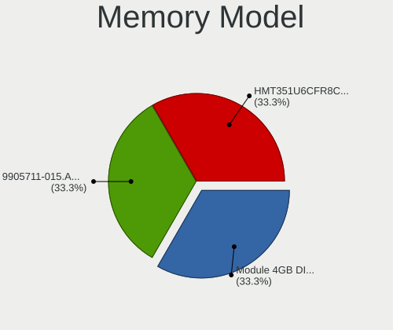

| Model                                                  | Desktops | Percent |
|--------------------------------------------------------|----------|---------|
| Unknown RAM Module 4GB DIMM DDR3 1600MT/s              | 1        | 11.11%  |
| Unknown RAM Module 4GB DIMM DDR3 1333MT/s              | 1        | 11.11%  |
| Unknown RAM Module 4GB DIMM 1600MT/s                   | 1        | 11.11%  |
| Toshiba RAM 9905711-015.A00G 4GB SODIMM DDR4 2400MT/s  | 1        | 11.11%  |
| SK hynix RAM HMT351U6CFR8C-PB 4GB DIMM DDR3 1600MT/s   | 1        | 11.11%  |
| SK hynix RAM HMP125U6EFR8C-S6 2048MB DIMM DDR2 800MT/s | 1        | 11.11%  |
| Micron RAM 16HTF25664AZ-800H1 2GB DIMM DDR2 800MT/s    | 1        | 11.11%  |
| Kingston RAM 9905471-011.A00LF 4GB DIMM DDR3 1600MT/s  | 1        | 11.11%  |
| G.Skill RAM F3-14900CL8-4GBXM 4GB DIMM DDR3 1600MT/s   | 1        | 11.11%  |

Memory Kind
-----------

Memory module kinds

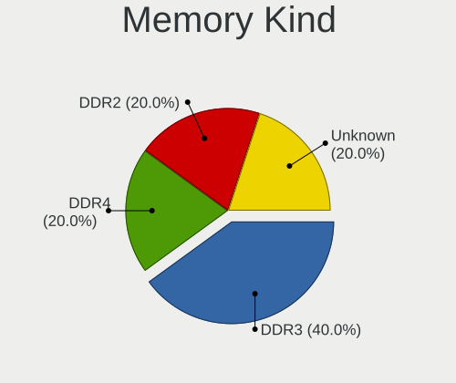

| Kind    | Desktops | Percent |
|---------|----------|---------|
| DDR3    | 3        | 50%     |
| DDR4    | 1        | 16.67%  |
| DDR2    | 1        | 16.67%  |
| Unknown | 1        | 16.67%  |

Memory Form Factor
------------------

Physical design of the memory module

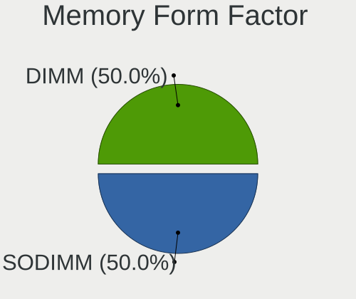

| Name   | Desktops | Percent |
|--------|----------|---------|
| DIMM   | 5        | 83.33%  |
| SODIMM | 1        | 16.67%  |

Memory Size
-----------

Memory module size

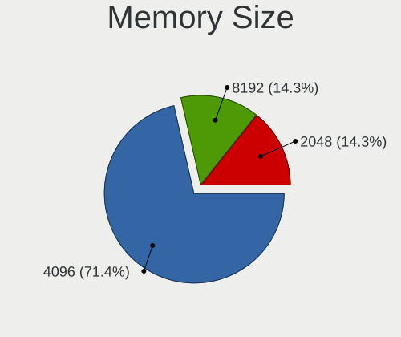

| Size | Desktops | Percent |
|------|----------|---------|
| 4096 | 5        | 71.43%  |
| 8192 | 1        | 14.29%  |
| 2048 | 1        | 14.29%  |

Memory Speed
------------

Memory module speed

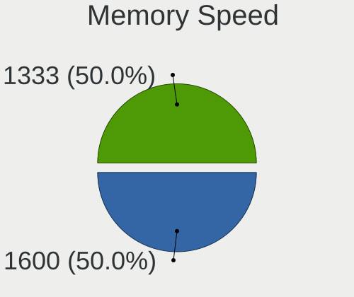

| Speed | Desktops | Percent |
|-------|----------|---------|
| 1600  | 4        | 57.14%  |
| 2400  | 1        | 14.29%  |
| 1333  | 1        | 14.29%  |
| 800   | 1        | 14.29%  |

Printers & scanners
-------------------

Printer Vendor
--------------

Printer device vendors

| Vendor             | Desktops | Percent |
|--------------------|----------|---------|
| Brother Industries | 2        | 100%    |

Printer Model
-------------

Printer device models

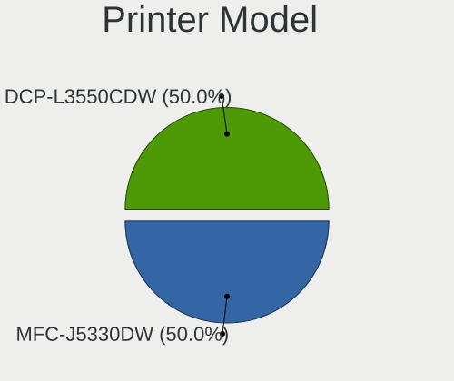

| Model                | Desktops | Percent |
|----------------------|----------|---------|
| Brother MFC-J5330DW  | 1        | 50%     |
| Brother DCP-L3550CDW | 1        | 50%     |

Scanner Vendor
--------------

Scanner device vendors

Zero info for selected period =(

Scanner Model
-------------

Scanner device models

Zero info for selected period =(

Camera
------

Camera Vendor
-------------

Camera device vendors

Zero info for selected period =(

Camera Model
------------

Camera device models

Zero info for selected period =(

Security
--------

Fingerprint Vendor
------------------

Fingerprint sensor vendors

Zero info for selected period =(

Fingerprint Model
-----------------

Fingerprint sensor models

Zero info for selected period =(

Chipcard Vendor
---------------

Chipcard module vendors

| Vendor      | Desktops | Percent |
|-------------|----------|---------|
| Purism, SPC | 1        | 100%    |

Chipcard Model
--------------

Chipcard module models

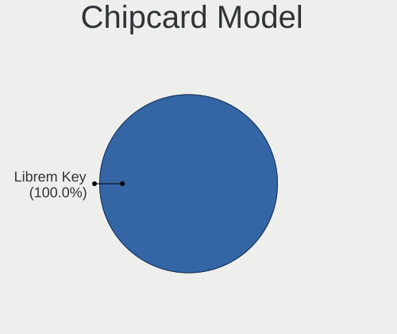

| Model                  | Desktops | Percent |
|------------------------|----------|---------|
| Purism, SPC Librem Key | 1        | 100%    |

Unsupported
-----------

Unsupported Devices
-------------------

Total unsupported devices on board

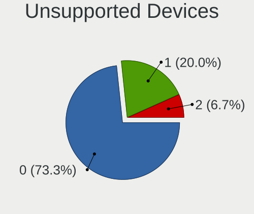

| Total | Desktops | Percent |
|-------|----------|---------|
| 0     | 11       | 73.33%  |
| 1     | 3        | 20%     |
| 2     | 1        | 6.67%   |

Unsupported Device Types
------------------------

Types of unsupported devices

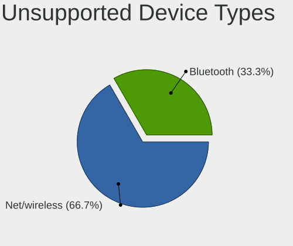

| Type          | Desktops | Percent |
|---------------|----------|---------|
| Net/wireless  | 2        | 50%     |
| Graphics card | 1        | 25%     |
| Bluetooth     | 1        | 25%     |

