PureOS - Tested Hardware & Statistics (Desktops)
------------------------------------------------

A project to collect tested hardware configurations for PureOS.

Anyone can contribute to this report by the [hw-probe](https://github.com/linuxhw/hw-probe) tool:

    sudo -E hw-probe -all -upload

Please contribute! Especially if your hardware is rare.

Contents
--------

* [ Test Cases ](#test-cases)

* [ System ](#system)
  - [ OS                       ](#os)
  - [ OS Family                ](#os-family)
  - [ Kernel                   ](#kernel)
  - [ Kernel Family            ](#kernel-family)
  - [ Kernel Major Ver.        ](#kernel-major-ver)
  - [ Arch                     ](#arch)
  - [ DE                       ](#de)
  - [ Display Server           ](#display-server)
  - [ Display Manager          ](#display-manager)
  - [ OS Lang                  ](#os-lang)
  - [ Boot Mode                ](#boot-mode)
  - [ Filesystem               ](#filesystem)
  - [ Part. scheme             ](#part-scheme)
  - [ Dual Boot with Linux/BSD ](#dual-boot-with-linuxbsd)
  - [ Dual Boot (Win)          ](#dual-boot-win)

* [ Board ](#board)
  - [ Vendor                   ](#vendor)
  - [ Model                    ](#model)
  - [ Model Family             ](#model-family)
  - [ MFG Year                 ](#mfg-year)
  - [ Form Factor              ](#form-factor)
  - [ Secure Boot              ](#secure-boot)
  - [ Coreboot                 ](#coreboot)
  - [ RAM Size                 ](#ram-size)
  - [ RAM Used                 ](#ram-used)
  - [ Total Drives             ](#total-drives)
  - [ Has CD-ROM               ](#has-cd-rom)
  - [ Has Ethernet             ](#has-ethernet)
  - [ Has WiFi                 ](#has-wifi)
  - [ Has Bluetooth            ](#has-bluetooth)

* [ Location ](#location)
  - [ Country                  ](#country)
  - [ City                     ](#city)

* [ Drives ](#drives)
  - [ Drive Vendor             ](#drive-vendor)
  - [ Drive Model              ](#drive-model)
  - [ HDD Vendor               ](#hdd-vendor)
  - [ SSD Vendor               ](#ssd-vendor)
  - [ Drive Kind               ](#drive-kind)
  - [ Drive Connector          ](#drive-connector)
  - [ Drive Size               ](#drive-size)
  - [ Space Total              ](#space-total)
  - [ Space Used               ](#space-used)
  - [ Malfunc. Drives          ](#malfunc-drives)
  - [ Malfunc. Drive Vendor    ](#malfunc-drive-vendor)
  - [ Malfunc. HDD Vendor      ](#malfunc-hdd-vendor)
  - [ Malfunc. Drive Kind      ](#malfunc-drive-kind)
  - [ Failed Drives            ](#failed-drives)
  - [ Failed Drive Vendor      ](#failed-drive-vendor)
  - [ Drive Status             ](#drive-status)

* [ Storage controller ](#storage-controller)
  - [ Storage Vendor           ](#storage-vendor)
  - [ Storage Model            ](#storage-model)
  - [ Storage Kind             ](#storage-kind)

* [ Processor ](#processor)
  - [ CPU Vendor               ](#cpu-vendor)
  - [ CPU Model                ](#cpu-model)
  - [ CPU Model Family         ](#cpu-model-family)
  - [ CPU Cores                ](#cpu-cores)
  - [ CPU Sockets              ](#cpu-sockets)
  - [ CPU Threads              ](#cpu-threads)
  - [ CPU Op-Modes             ](#cpu-op-modes)
  - [ CPU Microcode            ](#cpu-microcode)
  - [ CPU Microarch            ](#cpu-microarch)

* [ Graphics ](#graphics)
  - [ GPU Vendor               ](#gpu-vendor)
  - [ GPU Model                ](#gpu-model)
  - [ GPU Combo                ](#gpu-combo)
  - [ GPU Driver               ](#gpu-driver)
  - [ GPU Memory               ](#gpu-memory)

* [ Monitor ](#monitor)
  - [ Monitor Vendor           ](#monitor-vendor)
  - [ Monitor Model            ](#monitor-model)
  - [ Monitor Resolution       ](#monitor-resolution)
  - [ Monitor Diagonal         ](#monitor-diagonal)
  - [ Monitor Width            ](#monitor-width)
  - [ Aspect Ratio             ](#aspect-ratio)
  - [ Monitor Area             ](#monitor-area)
  - [ Pixel Density            ](#pixel-density)
  - [ Multiple Monitors        ](#multiple-monitors)

* [ Network ](#network)
  - [ Net Controller Vendor    ](#net-controller-vendor)
  - [ Net Controller Model     ](#net-controller-model)
  - [ Wireless Vendor          ](#wireless-vendor)
  - [ Wireless Model           ](#wireless-model)
  - [ Ethernet Vendor          ](#ethernet-vendor)
  - [ Ethernet Model           ](#ethernet-model)
  - [ Net Controller Kind      ](#net-controller-kind)
  - [ Used Controller          ](#used-controller)
  - [ NICs                     ](#nics)
  - [ IPv6                     ](#ipv6)

* [ Bluetooth ](#bluetooth)
  - [ Bluetooth Vendor         ](#bluetooth-vendor)
  - [ Bluetooth Model          ](#bluetooth-model)

* [ Sound ](#sound)
  - [ Sound Vendor             ](#sound-vendor)
  - [ Sound Model              ](#sound-model)

* [ Memory ](#memory)
  - [ Memory Vendor            ](#memory-vendor)
  - [ Memory Model             ](#memory-model)
  - [ Memory Kind              ](#memory-kind)
  - [ Memory Form Factor       ](#memory-form-factor)
  - [ Memory Size              ](#memory-size)
  - [ Memory Speed             ](#memory-speed)

* [ Printers & scanners ](#printers--scanners)
  - [ Printer Vendor           ](#printer-vendor)
  - [ Printer Model            ](#printer-model)
  - [ Scanner Vendor           ](#scanner-vendor)
  - [ Scanner Model            ](#scanner-model)

* [ Camera ](#camera)
  - [ Camera Vendor            ](#camera-vendor)
  - [ Camera Model             ](#camera-model)

* [ Security ](#security)
  - [ Fingerprint Vendor       ](#fingerprint-vendor)
  - [ Fingerprint Model        ](#fingerprint-model)
  - [ Chipcard Vendor          ](#chipcard-vendor)
  - [ Chipcard Model           ](#chipcard-model)

* [ Unsupported ](#unsupported)
  - [ Unsupported Devices      ](#unsupported-devices)
  - [ Unsupported Device Types ](#unsupported-device-types)

Test Cases
----------

Total: 15

| Vendor   | Model           | Probe                                                      | Date         |
|----------|-----------------|------------------------------------------------------------|--------------|
| Purism   | librem_mini_v2  | [ded1ed1a93](https://linux-hardware.org/?probe=ded1ed1a93) | Jan 23, 2023 |
| Gigabyte | GA-MA78GM-UD2H  | [415844c745](https://linux-hardware.org/?probe=415844c745) | Dec 08, 2022 |
| Dell     | 0M859N A00      | [95cf7fe257](https://linux-hardware.org/?probe=95cf7fe257) | Nov 29, 2022 |
| MSI      | H61M-P31        | [56a8b0b2a7](https://linux-hardware.org/?probe=56a8b0b2a7) | Sep 08, 2022 |
| ASUSTek  | EX-A320M-GAMING | [a6f87d56db](https://linux-hardware.org/?probe=a6f87d56db) | Jul 20, 2022 |
| PCWare   | IPX4005G        | [2e447eb751](https://linux-hardware.org/?probe=2e447eb751) | Jul 09, 2022 |
| Dell     | 088DT1 A01      | [6800234271](https://linux-hardware.org/?probe=6800234271) | Dec 02, 2021 |
| Dell     | 088DT1 A01      | [9190925dba](https://linux-hardware.org/?probe=9190925dba) | Nov 26, 2021 |
| Dell     | 088DT1 A01      | [93a177ddce](https://linux-hardware.org/?probe=93a177ddce) | Nov 02, 2021 |
| Dell     | 088DT1 A01      | [4917dcd8b3](https://linux-hardware.org/?probe=4917dcd8b3) | Nov 02, 2021 |
| ASUSTek  | A88X-PLUS/USB   | [ad21355553](https://linux-hardware.org/?probe=ad21355553) | Sep 27, 2021 |
| Gigabyte | B85M-DS3H       | [840cb54d82](https://linux-hardware.org/?probe=840cb54d82) | Jul 25, 2021 |
| ASUSTek  | A88X-PLUS/USB   | [99e83e8dcf](https://linux-hardware.org/?probe=99e83e8dcf) | Mar 08, 2021 |
| ASUSTek  | Z97-A           | [e6b1f9af05](https://linux-hardware.org/?probe=e6b1f9af05) | Aug 15, 2019 |
| ASUSTek  | Z97-A           | [c8a97966c9](https://linux-hardware.org/?probe=c8a97966c9) | Aug 14, 2019 |

System
------

OS
--

Installed operating systems

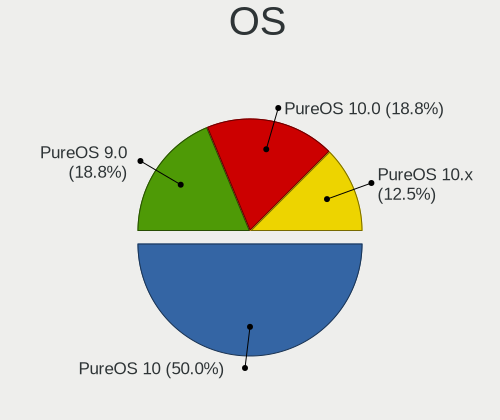

| Name        | Desktops | Percent |
|-------------|----------|---------|
| PureOS 10   | 4        | 44.44%  |
| PureOS 9.0  | 3        | 33.33%  |
| PureOS 10.0 | 2        | 22.22%  |

OS Family
---------

OS without a version

| Name   | Desktops | Percent |
|--------|----------|---------|
| PureOS | 9        | 100%    |

Kernel
------

Version of the Linux kernel

| Version         | Desktops | Percent |
|-----------------|----------|---------|
| 4.19.0-14-amd64 | 3        | 33.33%  |
| 5.10.0-14-amd64 | 2        | 22.22%  |
| 5.10.0-20-amd64 | 1        | 11.11%  |
| 5.10.0-19-amd64 | 1        | 11.11%  |
| 5.10.0-16-amd64 | 1        | 11.11%  |
| 5.10.0-15-amd64 | 1        | 11.11%  |

Kernel Family
-------------

Linux kernel without a distro release

| Version | Desktops | Percent |
|---------|----------|---------|
| 5.10.0  | 6        | 66.67%  |
| 4.19.0  | 3        | 33.33%  |

Kernel Major Ver.
-----------------

Linux kernel major version

| Version | Desktops | Percent |
|---------|----------|---------|
| 5.10    | 6        | 66.67%  |
| 4.19    | 3        | 33.33%  |

Arch
----

OS architecture (x86_64, i586, etc.)

| Name   | Desktops | Percent |
|--------|----------|---------|
| x86_64 | 9        | 100%    |

DE
--

Desktop Environment

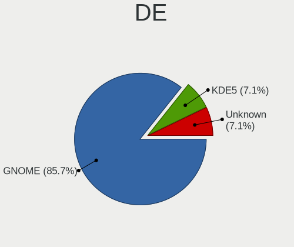

| Name    | Desktops | Percent |
|---------|----------|---------|
| GNOME   | 8        | 80%     |
| KDE5    | 1        | 10%     |
| Unknown | 1        | 10%     |

Display Server
--------------

X11 or Wayland

| Name    | Desktops | Percent |
|---------|----------|---------|
| Wayland | 7        | 70%     |
| X11     | 2        | 20%     |
| Unknown | 1        | 10%     |

Display Manager
---------------

SDDM, LightDM, etc.

| Name    | Desktops | Percent |
|---------|----------|---------|
| Unknown | 5        | 55.56%  |
| GDM3    | 2        | 22.22%  |
| SDDM    | 1        | 11.11%  |
| GDM     | 1        | 11.11%  |

OS Lang
-------

Language

| Lang  | Desktops | Percent |
|-------|----------|---------|
| en_US | 5        | 50%     |
| pt_BR | 2        | 20%     |
| ru_RU | 1        | 10%     |
| it_IT | 1        | 10%     |
| hu_HU | 1        | 10%     |

Boot Mode
---------

EFI or BIOS

| Mode | Desktops | Percent |
|------|----------|---------|
| BIOS | 8        | 88.89%  |
| EFI  | 1        | 11.11%  |

Filesystem
----------

Type of filesystem

| Type | Desktops | Percent |
|------|----------|---------|
| Ext4 | 9        | 100%    |

Part. scheme
------------

Scheme of partitioning

| Type    | Desktops | Percent |
|---------|----------|---------|
| Unknown | 5        | 50%     |
| MBR     | 3        | 30%     |
| GPT     | 2        | 20%     |

Dual Boot with Linux/BSD
------------------------

Hosting more than one Linux/BSD

| Dual boot | Desktops | Percent |
|-----------|----------|---------|
| No        | 8        | 88.89%  |
| Yes       | 1        | 11.11%  |

Dual Boot (Win)
---------------

Hosting Linux and Windows

| Dual boot | Desktops | Percent |
|-----------|----------|---------|
| No        | 9        | 100%    |

Board
-----

Vendor
------

Motherboard manufacturer

| Name                | Desktops | Percent |
|---------------------|----------|---------|
| Gigabyte Technology | 2        | 22.22%  |
| Dell                | 2        | 22.22%  |
| ASUSTek Computer    | 2        | 22.22%  |
| Purism              | 1        | 11.11%  |
| PCWare              | 1        | 11.11%  |
| MSI                 | 1        | 11.11%  |

Model
-----

Motherboard model

| Name                    | Desktops | Percent |
|-------------------------|----------|---------|
| Purism librem_mini_v2   | 1        | 11.11%  |
| PCWare IPX4005G         | 1        | 11.11%  |
| MSI MS-7788             | 1        | 11.11%  |
| Gigabyte GA-MA78GM-UD2H | 1        | 11.11%  |
| Gigabyte B85M-DS3H      | 1        | 11.11%  |
| Dell OptiPlex 760       | 1        | 11.11%  |
| Dell Inspiron 3847      | 1        | 11.11%  |
| ASUS EX-A320M-GAMING    | 1        | 11.11%  |
| ASUS A88X-PLUS/USB      | 1        | 11.11%  |

Model Family
------------

Motherboard model prefix

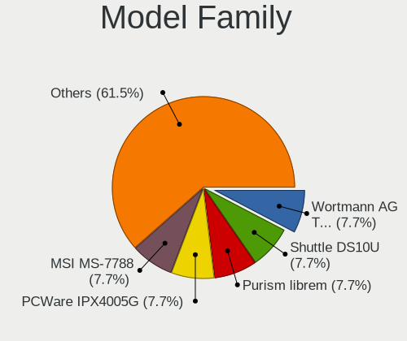

| Name                    | Desktops | Percent |
|-------------------------|----------|---------|
| Purism librem           | 1        | 11.11%  |
| PCWare IPX4005G         | 1        | 11.11%  |
| MSI MS-7788             | 1        | 11.11%  |
| Gigabyte GA-MA78GM-UD2H | 1        | 11.11%  |
| Gigabyte B85M-DS3H      | 1        | 11.11%  |
| Dell OptiPlex           | 1        | 11.11%  |
| Dell Inspiron           | 1        | 11.11%  |
| ASUS EX-A320M-GAMING    | 1        | 11.11%  |
| ASUS A88X-PLUS          | 1        | 11.11%  |

MFG Year
--------

Motherboard manufacture year

| Year    | Desktops | Percent |
|---------|----------|---------|
| 2013    | 3        | 33.33%  |
| 2018    | 2        | 22.22%  |
| 2016    | 1        | 11.11%  |
| 2011    | 1        | 11.11%  |
| 2009    | 1        | 11.11%  |
| Unknown | 1        | 11.11%  |

Form Factor
-----------

Physical design of the computer

| Name    | Desktops | Percent |
|---------|----------|---------|
| Desktop | 9        | 100%    |

Secure Boot
-----------

Enabled or disabled

| State    | Desktops | Percent |
|----------|----------|---------|
| Disabled | 9        | 100%    |

Coreboot
--------

Have coreboot on board

| Used | Desktops | Percent |
|------|----------|---------|
| No   | 8        | 88.89%  |
| Yes  | 1        | 11.11%  |

RAM Size
--------

Total RAM memory

| Size in GB | Desktops | Percent |
|------------|----------|---------|
| 8.01-16.0  | 5        | 55.56%  |
| 4.01-8.0   | 2        | 22.22%  |
| 3.01-4.0   | 1        | 11.11%  |
| 16.01-24.0 | 1        | 11.11%  |

RAM Used
--------

Used RAM memory

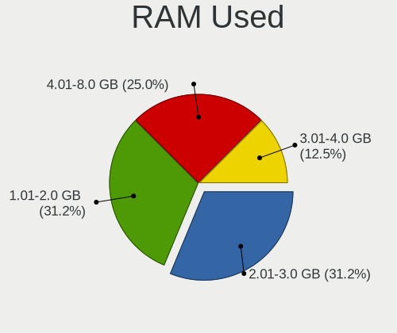

| Used GB  | Desktops | Percent |
|----------|----------|---------|
| 2.01-3.0 | 4        | 36.36%  |
| 1.01-2.0 | 4        | 36.36%  |
| 4.01-8.0 | 2        | 18.18%  |
| 3.01-4.0 | 1        | 9.09%   |

Total Drives
------------

Number of drives on board

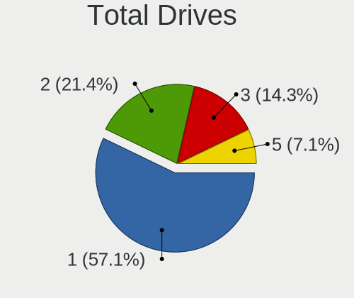

| Drives | Desktops | Percent |
|--------|----------|---------|
| 1      | 6        | 66.67%  |
| 2      | 2        | 22.22%  |
| 5      | 1        | 11.11%  |

Has CD-ROM
----------

Has CD-ROM on board

| Presented | Desktops | Percent |
|-----------|----------|---------|
| No        | 7        | 77.78%  |
| Yes       | 2        | 22.22%  |

Has Ethernet
------------

Has Ethernet on board

| Presented | Desktops | Percent |
|-----------|----------|---------|
| Yes       | 9        | 100%    |

Has WiFi
--------

Has WiFi module

| Presented | Desktops | Percent |
|-----------|----------|---------|
| No        | 7        | 77.78%  |
| Yes       | 2        | 22.22%  |

Has Bluetooth
-------------

Has Bluetooth module

| Presented | Desktops | Percent |
|-----------|----------|---------|
| No        | 8        | 88.89%  |
| Yes       | 1        | 11.11%  |

Location
--------

Country
-------

Geographic location (country)

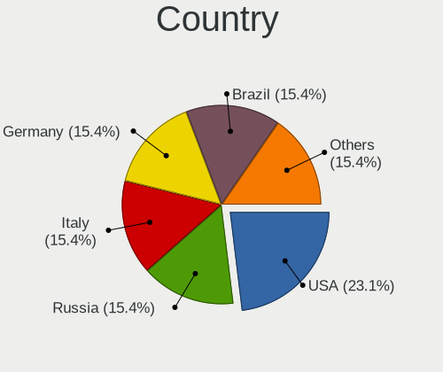

| Country | Desktops | Percent |
|---------|----------|---------|
| USA     | 3        | 33.33%  |
| Brazil  | 2        | 22.22%  |
| Russia  | 1        | 11.11%  |
| Italy   | 1        | 11.11%  |
| Greece  | 1        | 11.11%  |
| Germany | 1        | 11.11%  |

City
----

Geographic location (city)

| City          | Desktops | Percent |
|---------------|----------|---------|
| Porto Alegre  | 2        | 20%     |
| Yuzhnoural'sk | 1        | 10%     |
| Wixom         | 1        | 10%     |
| Troy          | 1        | 10%     |
| New York      | 1        | 10%     |
| Milan         | 1        | 10%     |
| Lenningen     | 1        | 10%     |
| Charleston    | 1        | 10%     |
| Athens        | 1        | 10%     |

Drives
------

Drive Vendor
------------

Hard drive vendors

| Vendor              | Desktops | Drives | Percent |
|---------------------|----------|--------|---------|
| Seagate             | 3        | 7      | 27.27%  |
| WDC                 | 2        | 3      | 18.18%  |
| Samsung Electronics | 2        | 3      | 18.18%  |
| SanDisk             | 1        | 1      | 9.09%   |
| Patriot             | 1        | 1      | 9.09%   |
| Intenso             | 1        | 2      | 9.09%   |
| ASMT                | 1        | 2      | 9.09%   |

Drive Model
-----------

Hard drive models

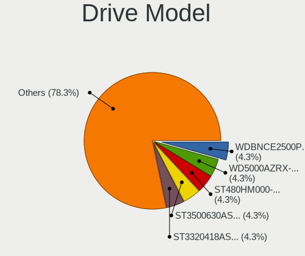

| Model                           | Desktops | Percent |
|---------------------------------|----------|---------|
| WDC WDBNCE2500PNC 250GB SSD     | 1        | 7.14%   |
| WDC WD5000AZRX-00A8LB0 500GB    | 1        | 7.14%   |
| Seagate ST480HM000-1G5162 480GB | 1        | 7.14%   |
| Seagate ST3320418AS 320GB       | 1        | 7.14%   |
| Seagate ST31000524AS 1TB        | 1        | 7.14%   |
| Seagate ST1000DM003-1ER162 1TB  | 1        | 7.14%   |
| SanDisk NVMe SSD Drive 500GB    | 1        | 7.14%   |
| Samsung SSD 860 EVO M.2 250GB   | 1        | 7.14%   |
| Samsung SSD 860 EVO 250GB       | 1        | 7.14%   |
| Samsung SSD 830 Series 128GB    | 1        | 7.14%   |
| Patriot Burst Elite 120GB SSD   | 1        | 7.14%   |
| Intenso SSD 128GB               | 1        | 7.14%   |
| Intenso SSD 120GB               | 1        | 7.14%   |
| ASMT 2235 1TB                   | 1        | 7.14%   |

HDD Vendor
----------

Hard disk drive vendors

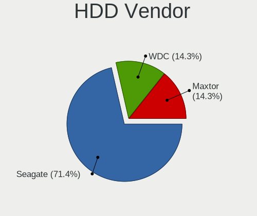

| Vendor  | Desktops | Drives | Percent |
|---------|----------|--------|---------|
| Seagate | 3        | 7      | 75%     |
| WDC     | 1        | 1      | 25%     |

SSD Vendor
----------

Solid state drive vendors

| Vendor              | Desktops | Drives | Percent |
|---------------------|----------|--------|---------|
| Samsung Electronics | 2        | 3      | 33.33%  |
| WDC                 | 1        | 2      | 16.67%  |
| Patriot             | 1        | 1      | 16.67%  |
| Intenso             | 1        | 2      | 16.67%  |
| ASMT                | 1        | 2      | 16.67%  |

Drive Kind
----------

HDD or SSD

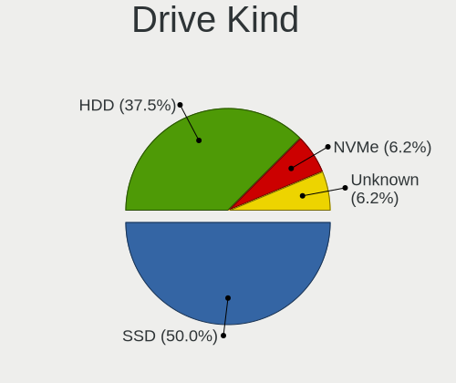

| Kind | Desktops | Drives | Percent |
|------|----------|--------|---------|
| SSD  | 5        | 10     | 50%     |
| HDD  | 4        | 8      | 40%     |
| NVMe | 1        | 1      | 10%     |

Drive Connector
---------------

SATA, SAS, NVMe, etc.

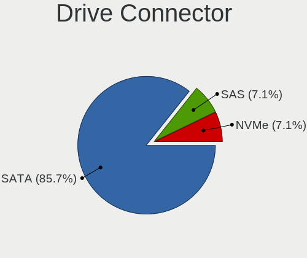

| Type | Desktops | Drives | Percent |
|------|----------|--------|---------|
| SATA | 8        | 16     | 80%     |
| SAS  | 1        | 2      | 10%     |
| NVMe | 1        | 1      | 10%     |

Drive Size
----------

Size of hard drive

| Size in TB | Desktops | Drives | Percent |
|------------|----------|--------|---------|
| 0.01-0.5   | 7        | 12     | 77.78%  |
| 0.51-1.0   | 2        | 6      | 22.22%  |

Space Total
-----------

Amount of disk space available on the file system

| Size in GB | Desktops | Percent |
|------------|----------|---------|
| 1-20       | 5        | 45.45%  |
| 251-500    | 4        | 36.36%  |
| 1001-2000  | 1        | 9.09%   |
| 501-1000   | 1        | 9.09%   |

Space Used
----------

Amount of used disk space

| Used GB | Desktops | Percent |
|---------|----------|---------|
| 1-20    | 6        | 54.55%  |
| 21-50   | 3        | 27.27%  |
| 101-250 | 2        | 18.18%  |

Malfunc. Drives
---------------

Drive models with a malfunction

| Model                    | Desktops | Drives | Percent |
|--------------------------|----------|--------|---------|
| Seagate ST31000524AS 1TB | 1        | 1      | 100%    |

Malfunc. Drive Vendor
---------------------

Vendors of faulty drives

| Vendor  | Desktops | Drives | Percent |
|---------|----------|--------|---------|
| Seagate | 1        | 1      | 100%    |

Malfunc. HDD Vendor
-------------------

Vendors of faulty HDD drives

| Vendor  | Desktops | Drives | Percent |
|---------|----------|--------|---------|
| Seagate | 1        | 1      | 100%    |

Malfunc. Drive Kind
-------------------

Kinds of faulty drives

| Kind | Desktops | Drives | Percent |
|------|----------|--------|---------|
| HDD  | 1        | 1      | 100%    |

Failed Drives
-------------

Failed drive models

Zero info for selected period =(

Failed Drive Vendor
-------------------

Failed drive vendors

Zero info for selected period =(

Drive Status
------------

Number of failed and malfunc. drives

| Status   | Desktops | Drives | Percent |
|----------|----------|--------|---------|
| Detected | 6        | 14     | 60%     |
| Works    | 3        | 4      | 30%     |
| Malfunc  | 1        | 1      | 10%     |

Storage controller
------------------

Storage Vendor
--------------

Storage controller vendors

| Vendor  | Desktops | Percent |
|---------|----------|---------|
| Intel   | 6        | 60%     |
| AMD     | 3        | 30%     |
| SanDisk | 1        | 10%     |

Storage Model
-------------

Storage controller models

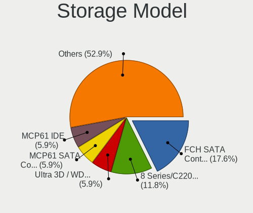

| Model                                                                          | Desktops | Percent |
|--------------------------------------------------------------------------------|----------|---------|
| Intel 8 Series/C220 Series Chipset Family 6-port SATA Controller 1 [AHCI mode] | 2        | 16.67%  |
| AMD FCH SATA Controller [AHCI mode]                                            | 2        | 16.67%  |
| SanDisk WD Blue SN570 NVMe SSD                                                 | 1        | 8.33%   |
| Intel Comet Lake SATA AHCI Controller                                          | 1        | 8.33%   |
| Intel Celeron/Pentium Silver Processor SATA Controller                         | 1        | 8.33%   |
| Intel 82801JD/DO (ICH10 Family) SATA AHCI Controller                           | 1        | 8.33%   |
| Intel 6 Series/C200 Series Chipset Family 6 port Desktop SATA AHCI Controller  | 1        | 8.33%   |
| AMD SB7x0/SB8x0/SB9x0 SATA Controller [IDE mode]                               | 1        | 8.33%   |
| AMD SB7x0/SB8x0/SB9x0 IDE Controller                                           | 1        | 8.33%   |
| AMD FCH SATA Controller D                                                      | 1        | 8.33%   |

Storage Kind
------------

Kind of storage controller (IDE, SATA, NVMe, SAS, ...)

| Kind | Desktops | Percent |
|------|----------|---------|
| SATA | 9        | 81.82%  |
| NVMe | 1        | 9.09%   |
| IDE  | 1        | 9.09%   |

Processor
---------

CPU Vendor
----------

Processor vendors

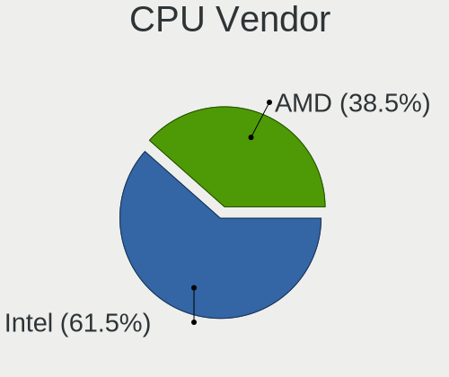

| Vendor | Desktops | Percent |
|--------|----------|---------|
| Intel  | 6        | 66.67%  |
| AMD    | 3        | 33.33%  |

CPU Model
---------

Processor models

| Model                                           | Desktops | Percent |
|-------------------------------------------------|----------|---------|
| Intel Core i7-10510U CPU @ 1.80GHz              | 1        | 11.11%  |
| Intel Core i5-4460 CPU @ 3.20GHz                | 1        | 11.11%  |
| Intel Core i5-2320 CPU @ 3.00GHz                | 1        | 11.11%  |
| Intel Core i3-4130T CPU @ 2.90GHz               | 1        | 11.11%  |
| Intel Core 2 Duo CPU E8400 @ 3.00GHz            | 1        | 11.11%  |
| Intel Celeron J4005 CPU @ 2.00GHz               | 1        | 11.11%  |
| AMD Ryzen 3 3200G with Radeon Vega Graphics     | 1        | 11.11%  |
| AMD Athlon II X4 620 Processor                  | 1        | 11.11%  |
| AMD A10-7860K Radeon R7, 12 Compute Cores 4C+8G | 1        | 11.11%  |

CPU Model Family
----------------

Processor model prefix

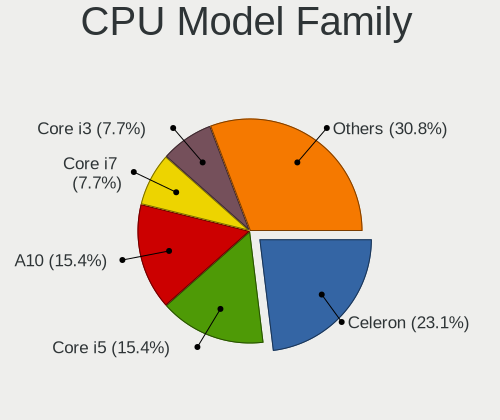

| Model            | Desktops | Percent |
|------------------|----------|---------|
| Intel Core i5    | 2        | 22.22%  |
| Intel Core i7    | 1        | 11.11%  |
| Intel Core i3    | 1        | 11.11%  |
| Intel Core 2 Duo | 1        | 11.11%  |
| Intel Celeron    | 1        | 11.11%  |
| AMD Ryzen 3      | 1        | 11.11%  |
| AMD Athlon II X4 | 1        | 11.11%  |
| AMD A10          | 1        | 11.11%  |

CPU Cores
---------

Number of processor cores

| Number | Desktops | Percent |
|--------|----------|---------|
| 4      | 5        | 55.56%  |
| 2      | 4        | 44.44%  |

CPU Sockets
-----------

Number of sockets

| Number | Desktops | Percent |
|--------|----------|---------|
| 1      | 9        | 100%    |

CPU Threads
-----------

Threads per core (Hyper-Threading)

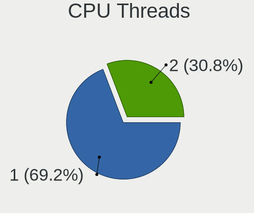

| Number | Desktops | Percent |
|--------|----------|---------|
| 1      | 6        | 66.67%  |
| 2      | 3        | 33.33%  |

CPU Op-Modes
------------

CPU Operation Modes (32-bit, 64-bit)

| Op mode        | Desktops | Percent |
|----------------|----------|---------|
| 32-bit, 64-bit | 9        | 100%    |

CPU Microcode
-------------

Microcode number

| Number     | Desktops | Percent |
|------------|----------|---------|
| Unknown    | 6        | 60%     |
| 0x706a1    | 1        | 10%     |
| 0x206a7    | 1        | 10%     |
| 0x1067a    | 1        | 10%     |
| 0x06003106 | 1        | 10%     |

CPU Microarch
-------------

Microarchitecture

| Name          | Desktops | Percent |
|---------------|----------|---------|
| Haswell       | 2        | 22.22%  |
| Zen+          | 1        | 11.11%  |
| Steamroller   | 1        | 11.11%  |
| SandyBridge   | 1        | 11.11%  |
| Penryn        | 1        | 11.11%  |
| KabyLake      | 1        | 11.11%  |
| K10           | 1        | 11.11%  |
| Goldmont plus | 1        | 11.11%  |

Graphics
--------

GPU Vendor
----------

Vendors of graphics cards

| Vendor | Desktops | Percent |
|--------|----------|---------|
| Intel  | 5        | 50%     |
| Nvidia | 3        | 30%     |
| AMD    | 2        | 20%     |

GPU Model
---------

Graphics card models

| Model                                                                       | Desktops | Percent |
|-----------------------------------------------------------------------------|----------|---------|
| Nvidia TU116 [GeForce GTX 1660]                                             | 1        | 9.09%   |
| Nvidia GK208B [GeForce GT 710]                                              | 1        | 9.09%   |
| Nvidia GF116 [GeForce GTS 450 Rev. 2]                                       | 1        | 9.09%   |
| Nvidia GF108 [GeForce GT 630]                                               | 1        | 9.09%   |
| Intel Xeon E3-1200 v3/4th Gen Core Processor Integrated Graphics Controller | 1        | 9.09%   |
| Intel GeminiLake [UHD Graphics 600]                                         | 1        | 9.09%   |
| Intel CometLake-U GT2 [UHD Graphics]                                        | 1        | 9.09%   |
| Intel 4 Series Chipset Integrated Graphics Controller                       | 1        | 9.09%   |
| Intel 2nd Generation Core Processor Family Integrated Graphics Controller   | 1        | 9.09%   |
| AMD Picasso/Raven 2 [Radeon Vega Series / Radeon Vega Mobile Series]        | 1        | 9.09%   |
| AMD Cape Verde PRO [Radeon HD 7750/8740 / R7 250E]                          | 1        | 9.09%   |

GPU Combo
---------

Combinations of graphics cards

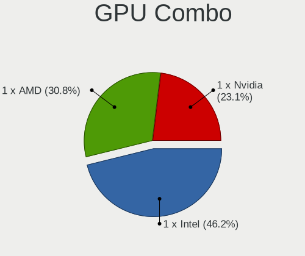

| Name       | Desktops | Percent |
|------------|----------|---------|
| 1 x Intel  | 4        | 44.44%  |
| 1 x Nvidia | 3        | 33.33%  |
| 1 x AMD    | 2        | 22.22%  |

GPU Driver
----------

Free vs proprietary

| Driver | Desktops | Percent |
|--------|----------|---------|
| Free   | 9        | 100%    |

GPU Memory
----------

Total video memory

| Size in GB | Desktops | Percent |
|------------|----------|---------|
| Unknown    | 9        | 90%     |
| 0.51-1.0   | 1        | 10%     |

Monitor
-------

Monitor Vendor
--------------

Monitor vendors

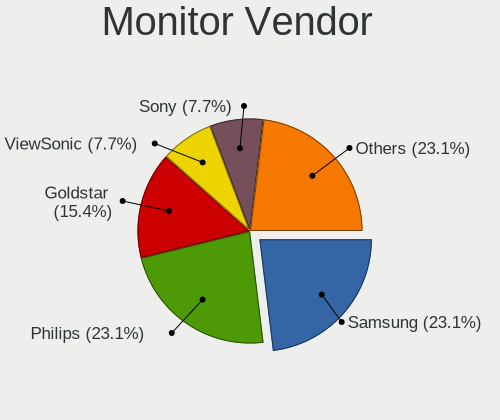

| Vendor              | Desktops | Percent |
|---------------------|----------|---------|
| Samsung Electronics | 3        | 33.33%  |
| Philips             | 2        | 22.22%  |
| Sony                | 1        | 11.11%  |
| Goldstar            | 1        | 11.11%  |
| Dell                | 1        | 11.11%  |
| AOC                 | 1        | 11.11%  |

Monitor Model
-------------

Monitor models

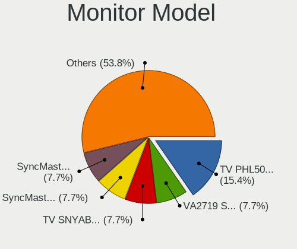

| Model                                                                | Desktops | Percent |
|----------------------------------------------------------------------|----------|---------|
| Philips TV PHL5035 1920x1080 640x360mm 28.9-inch                     | 2        | 22.22%  |
| Sony TV SNYAB03 1920x1080                                            | 1        | 11.11%  |
| Samsung Electronics SyncMaster SAM03E4 1680x1050 474x296mm 22.0-inch | 1        | 11.11%  |
| Samsung Electronics SyncMaster SAM01D3 1440x900 408x225mm 18.3-inch  | 1        | 11.11%  |
| Samsung Electronics LCD Monitor SAM0900 1366x768 410x230mm 18.5-inch | 1        | 11.11%  |
| Goldstar FULL HD GSM5B54 1920x1080 480x270mm 21.7-inch               | 1        | 11.11%  |
| Dell P2213 DELF042 1680x1050 473x296mm 22.0-inch                     | 1        | 11.11%  |
| AOC 2050W AOC2050 1600x900 432x240mm 19.5-inch                       | 1        | 11.11%  |

Monitor Resolution
------------------

Monitor screen resolution

| Resolution         | Desktops | Percent |
|--------------------|----------|---------|
| 1920x1080 (FHD)    | 4        | 44.44%  |
| 1680x1050 (WSXGA+) | 2        | 22.22%  |
| 1600x900 (HD+)     | 1        | 11.11%  |
| 1440x900 (WXGA+)   | 1        | 11.11%  |
| 1366x768 (WXGA)    | 1        | 11.11%  |

Monitor Diagonal
----------------

Diagonal size in inches

| Inches | Desktops | Percent |
|--------|----------|---------|
| 28     | 2        | 22.22%  |
| 22     | 2        | 22.22%  |
| 72     | 1        | 11.11%  |
| 31     | 1        | 11.11%  |
| 21     | 1        | 11.11%  |
| 20     | 1        | 11.11%  |
| 19     | 1        | 11.11%  |

Monitor Width
-------------

Physical width

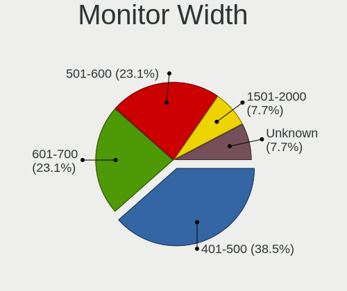

| Width in mm | Desktops | Percent |
|-------------|----------|---------|
| 401-500     | 5        | 55.56%  |
| 601-700     | 3        | 33.33%  |
| 1501-2000   | 1        | 11.11%  |

Aspect Ratio
------------

Proportional relationship between the width and the height

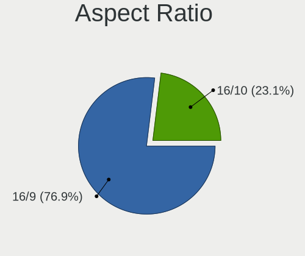

| Ratio | Desktops | Percent |
|-------|----------|---------|
| 16/9  | 6        | 66.67%  |
| 16/10 | 3        | 33.33%  |

Monitor Area
------------

Area in inch²

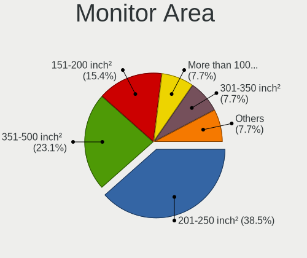

| Area in inch² | Desktops | Percent |
|----------------|----------|---------|
| 351-500        | 3        | 33.33%  |
| 201-250        | 3        | 33.33%  |
| 151-200        | 2        | 22.22%  |
| More than 1000 | 1        | 11.11%  |

Pixel Density
-------------

Pixels per inch

| Density | Desktops | Percent |
|---------|----------|---------|
| 51-100  | 6        | 66.67%  |
| 1-50    | 2        | 22.22%  |
| 101-120 | 1        | 11.11%  |

Multiple Monitors
-----------------

Total monitors connected

| Total | Desktops | Percent |
|-------|----------|---------|
| 1     | 8        | 88.89%  |
| 2     | 1        | 11.11%  |

Network
-------

Net Controller Vendor
---------------------

Controller vendors

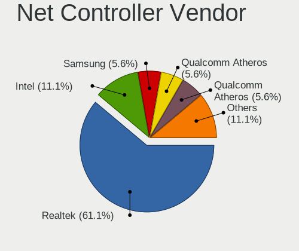

| Vendor                | Desktops | Percent |
|-----------------------|----------|---------|
| Realtek Semiconductor | 8        | 72.73%  |
| Qualcomm Atheros      | 1        | 9.09%   |
| Intel                 | 1        | 9.09%   |
| Edimax Technology     | 1        | 9.09%   |

Net Controller Model
--------------------

Controller models

| Model                                                             | Desktops | Percent |
|-------------------------------------------------------------------|----------|---------|
| Realtek RTL8111/8168/8411 PCI Express Gigabit Ethernet Controller | 8        | 72.73%  |
| Qualcomm Atheros QCA9565 / AR9565 Wireless Network Adapter        | 1        | 9.09%   |
| Intel 82567LM-3 Gigabit Network Connection                        | 1        | 9.09%   |
| Edimax EW-7711MAC 802.11ac Wireless Adapter                       | 1        | 9.09%   |

Wireless Vendor
---------------

Wireless vendors

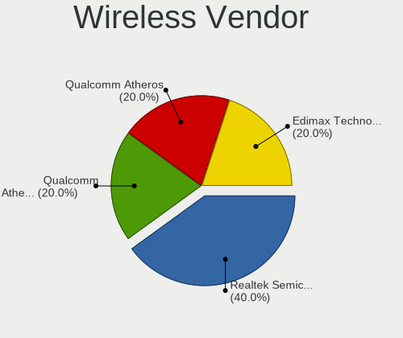

| Vendor            | Desktops | Percent |
|-------------------|----------|---------|
| Qualcomm Atheros  | 1        | 50%     |
| Edimax Technology | 1        | 50%     |

Wireless Model
--------------

Wireless models

| Model                                                      | Desktops | Percent |
|------------------------------------------------------------|----------|---------|
| Qualcomm Atheros QCA9565 / AR9565 Wireless Network Adapter | 1        | 50%     |
| Edimax EW-7711MAC 802.11ac Wireless Adapter                | 1        | 50%     |

Ethernet Vendor
---------------

Ethernet vendors

| Vendor                | Desktops | Percent |
|-----------------------|----------|---------|
| Realtek Semiconductor | 8        | 88.89%  |
| Intel                 | 1        | 11.11%  |

Ethernet Model
--------------

Ethernet models

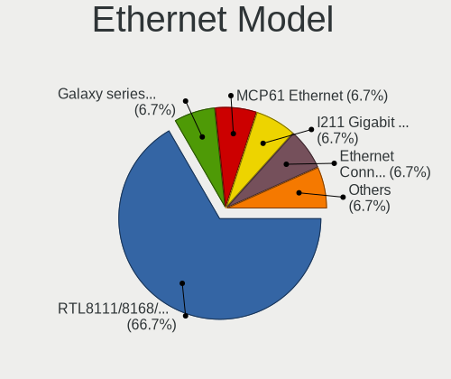

| Model                                                             | Desktops | Percent |
|-------------------------------------------------------------------|----------|---------|
| Realtek RTL8111/8168/8411 PCI Express Gigabit Ethernet Controller | 8        | 88.89%  |
| Intel 82567LM-3 Gigabit Network Connection                        | 1        | 11.11%  |

Net Controller Kind
-------------------

Ethernet, WiFi or modem

| Kind     | Desktops | Percent |
|----------|----------|---------|
| Ethernet | 9        | 81.82%  |
| WiFi     | 2        | 18.18%  |

Used Controller
---------------

Currently used network controller

| Kind     | Desktops | Percent |
|----------|----------|---------|
| Ethernet | 9        | 100%    |

NICs
----

Total network controllers on board

| Total | Desktops | Percent |
|-------|----------|---------|
| 1     | 8        | 88.89%  |
| 2     | 1        | 11.11%  |

IPv6
----

IPv6 vs IPv4

| Used | Desktops | Percent |
|------|----------|---------|
| No   | 8        | 88.89%  |
| Yes  | 1        | 11.11%  |

Bluetooth
---------

Bluetooth Vendor
----------------

Controller vendors

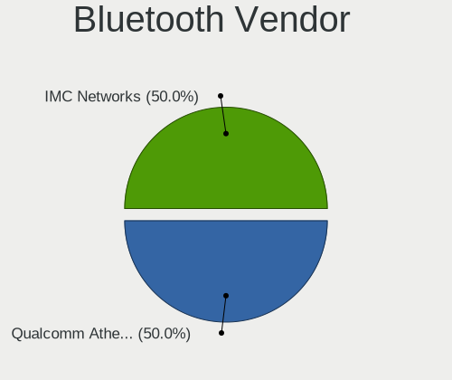

| Vendor                          | Desktops | Percent |
|---------------------------------|----------|---------|
| Qualcomm Atheros Communications | 1        | 100%    |

Bluetooth Model
---------------

Controller models

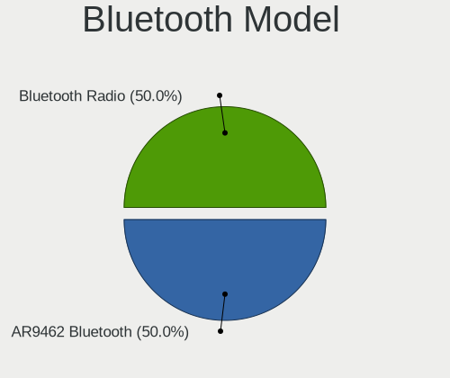

| Model                             | Desktops | Percent |
|-----------------------------------|----------|---------|
| Qualcomm Atheros AR9462 Bluetooth | 1        | 100%    |

Sound
-----

Sound Vendor
------------

Sound card vendors

| Vendor   | Desktops | Percent |
|----------|----------|---------|
| Intel    | 5        | 38.46%  |
| AMD      | 4        | 30.77%  |
| Nvidia   | 3        | 23.08%  |
| Micronas | 1        | 7.69%   |

Sound Model
-----------

Sound card models

| Model                                                                      | Desktops | Percent |
|----------------------------------------------------------------------------|----------|---------|
| Nvidia TU116 High Definition Audio Controller                              | 1        | 6.25%   |
| Nvidia GK208 HDMI/DP Audio Controller                                      | 1        | 6.25%   |
| Nvidia GF116 High Definition Audio Controller                              | 1        | 6.25%   |
| Nvidia GF108 High Definition Audio Controller                              | 1        | 6.25%   |
| Micronas QSB                                                               | 1        | 6.25%   |
| Intel Xeon E3-1200 v3/4th Gen Core Processor HD Audio Controller           | 1        | 6.25%   |
| Intel Comet Lake PCH-LP cAVS                                               | 1        | 6.25%   |
| Intel Celeron/Pentium Silver Processor High Definition Audio               | 1        | 6.25%   |
| Intel 82801JD/DO (ICH10 Family) HD Audio Controller                        | 1        | 6.25%   |
| Intel 8 Series/C220 Series Chipset High Definition Audio Controller        | 1        | 6.25%   |
| Intel 6 Series/C200 Series Chipset Family High Definition Audio Controller | 1        | 6.25%   |
| AMD SBx00 Azalia (Intel HDA)                                               | 1        | 6.25%   |
| AMD Raven/Raven2/Fenghuang HDMI/DP Audio Controller                        | 1        | 6.25%   |
| AMD Oland/Hainan/Cape Verde/Pitcairn HDMI Audio [Radeon HD 7000 Series]    | 1        | 6.25%   |
| AMD FCH Azalia Controller                                                  | 1        | 6.25%   |
| AMD Family 17h/19h HD Audio Controller                                     | 1        | 6.25%   |

Memory
------

Memory Vendor
-------------

Memory module vendors

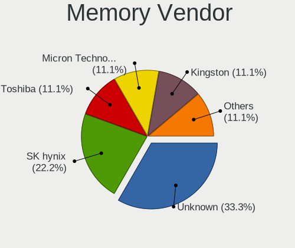

| Vendor            | Desktops | Percent |
|-------------------|----------|---------|
| SK hynix          | 2        | 33.33%  |
| Unknown           | 1        | 16.67%  |
| Toshiba           | 1        | 16.67%  |
| Micron Technology | 1        | 16.67%  |
| Kingston          | 1        | 16.67%  |

Memory Model
------------

Memory module models

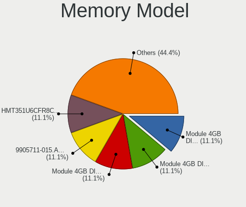

| Model                                                 | Desktops | Percent |
|-------------------------------------------------------|----------|---------|
| Unknown RAM Module 4GB DIMM DDR3 1333MT/s             | 1        | 16.67%  |
| Toshiba RAM 9905711-015.A00G 4GB SODIMM DDR4 2400MT/s | 1        | 16.67%  |
| SK hynix RAM HMT351U6CFR8C-PB 4GB DIMM DDR3 1600MT/s  | 1        | 16.67%  |
| SK hynix RAM HMP125U6EFR8C-S6 2GB DIMM DDR2 800MT/s   | 1        | 16.67%  |
| Micron RAM 16HTF25664AZ-800H1 2GB DIMM DDR2 800MT/s   | 1        | 16.67%  |
| Kingston RAM 9905471-011.A00LF 4GB DIMM DDR3 1600MT/s | 1        | 16.67%  |

Memory Kind
-----------

Memory module kinds

| Kind | Desktops | Percent |
|------|----------|---------|
| DDR3 | 2        | 50%     |
| DDR4 | 1        | 25%     |
| DDR2 | 1        | 25%     |

Memory Form Factor
------------------

Physical design of the memory module

| Name   | Desktops | Percent |
|--------|----------|---------|
| DIMM   | 3        | 75%     |
| SODIMM | 1        | 25%     |

Memory Size
-----------

Memory module size

| Size | Desktops | Percent |
|------|----------|---------|
| 4096 | 3        | 75%     |
| 2048 | 1        | 25%     |

Memory Speed
------------

Memory module speed

| Speed | Desktops | Percent |
|-------|----------|---------|
| 1600  | 2        | 40%     |
| 2400  | 1        | 20%     |
| 1333  | 1        | 20%     |
| 800   | 1        | 20%     |

Printers & scanners
-------------------

Printer Vendor
--------------

Printer device vendors

| Vendor             | Desktops | Percent |
|--------------------|----------|---------|
| Brother Industries | 1        | 100%    |

Printer Model
-------------

Printer device models

| Model                       | Desktops | Percent |
|-----------------------------|----------|---------|
| Brother DCP-L3550CDW series | 1        | 100%    |

Scanner Vendor
--------------

Scanner device vendors

Zero info for selected period =(

Scanner Model
-------------

Scanner device models

Zero info for selected period =(

Camera
------

Camera Vendor
-------------

Camera device vendors

Zero info for selected period =(

Camera Model
------------

Camera device models

Zero info for selected period =(

Security
--------

Fingerprint Vendor
------------------

Fingerprint sensor vendors

Zero info for selected period =(

Fingerprint Model
-----------------

Fingerprint sensor models

Zero info for selected period =(

Chipcard Vendor
---------------

Chipcard module vendors

| Vendor      | Desktops | Percent |
|-------------|----------|---------|
| Purism, SPC | 1        | 100%    |

Chipcard Model
--------------

Chipcard module models

| Model                  | Desktops | Percent |
|------------------------|----------|---------|
| Purism, SPC Librem Key | 1        | 100%    |

Unsupported
-----------

Unsupported Devices
-------------------

Total unsupported devices on board

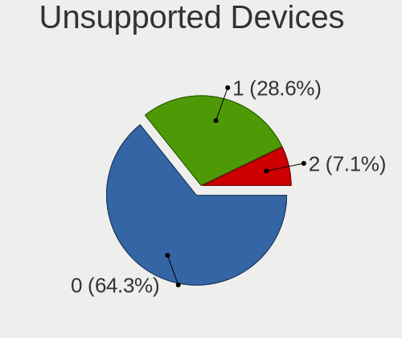

| Total | Desktops | Percent |
|-------|----------|---------|
| 0     | 7        | 77.78%  |
| 1     | 2        | 22.22%  |

Unsupported Device Types
------------------------

Types of unsupported devices

| Type         | Desktops | Percent |
|--------------|----------|---------|
| Net/wireless | 1        | 50%     |
| Bluetooth    | 1        | 50%     |

