PureOS - Tested Hardware & Statistics (Notebooks)
-------------------------------------------------

A project to collect tested hardware configurations for PureOS.

Anyone can contribute to this report by the [hw-probe](https://github.com/linuxhw/hw-probe) tool:

    sudo -E hw-probe -all -upload

Please contribute! Especially if your hardware is rare.

Contents
--------

* [ Test Cases ](#test-cases)

* [ System ](#system)
  - [ OS                       ](#os)
  - [ OS Family                ](#os-family)
  - [ Kernel                   ](#kernel)
  - [ Kernel Family            ](#kernel-family)
  - [ Kernel Major Ver.        ](#kernel-major-ver)
  - [ Arch                     ](#arch)
  - [ DE                       ](#de)
  - [ Display Server           ](#display-server)
  - [ Display Manager          ](#display-manager)
  - [ OS Lang                  ](#os-lang)
  - [ Boot Mode                ](#boot-mode)
  - [ Filesystem               ](#filesystem)
  - [ Part. scheme             ](#part-scheme)
  - [ Dual Boot with Linux/BSD ](#dual-boot-with-linuxbsd)
  - [ Dual Boot (Win)          ](#dual-boot-win)

* [ Board ](#board)
  - [ Vendor                   ](#vendor)
  - [ Model                    ](#model)
  - [ Model Family             ](#model-family)
  - [ MFG Year                 ](#mfg-year)
  - [ Form Factor              ](#form-factor)
  - [ Secure Boot              ](#secure-boot)
  - [ Coreboot                 ](#coreboot)
  - [ RAM Size                 ](#ram-size)
  - [ RAM Used                 ](#ram-used)
  - [ Total Drives             ](#total-drives)
  - [ Has CD-ROM               ](#has-cd-rom)
  - [ Has Ethernet             ](#has-ethernet)
  - [ Has WiFi                 ](#has-wifi)
  - [ Has Bluetooth            ](#has-bluetooth)

* [ Location ](#location)
  - [ Country                  ](#country)
  - [ City                     ](#city)

* [ Drives ](#drives)
  - [ Drive Vendor             ](#drive-vendor)
  - [ Drive Model              ](#drive-model)
  - [ HDD Vendor               ](#hdd-vendor)
  - [ SSD Vendor               ](#ssd-vendor)
  - [ Drive Kind               ](#drive-kind)
  - [ Drive Connector          ](#drive-connector)
  - [ Drive Size               ](#drive-size)
  - [ Space Total              ](#space-total)
  - [ Space Used               ](#space-used)
  - [ Malfunc. Drives          ](#malfunc-drives)
  - [ Malfunc. Drive Vendor    ](#malfunc-drive-vendor)
  - [ Malfunc. HDD Vendor      ](#malfunc-hdd-vendor)
  - [ Malfunc. Drive Kind      ](#malfunc-drive-kind)
  - [ Failed Drives            ](#failed-drives)
  - [ Failed Drive Vendor      ](#failed-drive-vendor)
  - [ Drive Status             ](#drive-status)

* [ Storage controller ](#storage-controller)
  - [ Storage Vendor           ](#storage-vendor)
  - [ Storage Model            ](#storage-model)
  - [ Storage Kind             ](#storage-kind)

* [ Processor ](#processor)
  - [ CPU Vendor               ](#cpu-vendor)
  - [ CPU Model                ](#cpu-model)
  - [ CPU Model Family         ](#cpu-model-family)
  - [ CPU Cores                ](#cpu-cores)
  - [ CPU Sockets              ](#cpu-sockets)
  - [ CPU Threads              ](#cpu-threads)
  - [ CPU Op-Modes             ](#cpu-op-modes)
  - [ CPU Microcode            ](#cpu-microcode)
  - [ CPU Microarch            ](#cpu-microarch)

* [ Graphics ](#graphics)
  - [ GPU Vendor               ](#gpu-vendor)
  - [ GPU Model                ](#gpu-model)
  - [ GPU Combo                ](#gpu-combo)
  - [ GPU Driver               ](#gpu-driver)
  - [ GPU Memory               ](#gpu-memory)

* [ Monitor ](#monitor)
  - [ Monitor Vendor           ](#monitor-vendor)
  - [ Monitor Model            ](#monitor-model)
  - [ Monitor Resolution       ](#monitor-resolution)
  - [ Monitor Diagonal         ](#monitor-diagonal)
  - [ Monitor Width            ](#monitor-width)
  - [ Aspect Ratio             ](#aspect-ratio)
  - [ Monitor Area             ](#monitor-area)
  - [ Pixel Density            ](#pixel-density)
  - [ Multiple Monitors        ](#multiple-monitors)

* [ Network ](#network)
  - [ Net Controller Vendor    ](#net-controller-vendor)
  - [ Net Controller Model     ](#net-controller-model)
  - [ Wireless Vendor          ](#wireless-vendor)
  - [ Wireless Model           ](#wireless-model)
  - [ Ethernet Vendor          ](#ethernet-vendor)
  - [ Ethernet Model           ](#ethernet-model)
  - [ Net Controller Kind      ](#net-controller-kind)
  - [ Used Controller          ](#used-controller)
  - [ NICs                     ](#nics)
  - [ IPv6                     ](#ipv6)

* [ Bluetooth ](#bluetooth)
  - [ Bluetooth Vendor         ](#bluetooth-vendor)
  - [ Bluetooth Model          ](#bluetooth-model)

* [ Sound ](#sound)
  - [ Sound Vendor             ](#sound-vendor)
  - [ Sound Model              ](#sound-model)

* [ Memory ](#memory)
  - [ Memory Vendor            ](#memory-vendor)
  - [ Memory Model             ](#memory-model)
  - [ Memory Kind              ](#memory-kind)
  - [ Memory Form Factor       ](#memory-form-factor)
  - [ Memory Size              ](#memory-size)
  - [ Memory Speed             ](#memory-speed)

* [ Printers & scanners ](#printers--scanners)
  - [ Printer Vendor           ](#printer-vendor)
  - [ Printer Model            ](#printer-model)
  - [ Scanner Vendor           ](#scanner-vendor)
  - [ Scanner Model            ](#scanner-model)

* [ Camera ](#camera)
  - [ Camera Vendor            ](#camera-vendor)
  - [ Camera Model             ](#camera-model)

* [ Security ](#security)
  - [ Fingerprint Vendor       ](#fingerprint-vendor)
  - [ Fingerprint Model        ](#fingerprint-model)
  - [ Chipcard Vendor          ](#chipcard-vendor)
  - [ Chipcard Model           ](#chipcard-model)

* [ Unsupported ](#unsupported)
  - [ Unsupported Devices      ](#unsupported-devices)
  - [ Unsupported Device Types ](#unsupported-device-types)

Test Cases
----------

Total: 70

| Vendor        | Model                       | Probe                                                      | Date         |
|---------------|-----------------------------|------------------------------------------------------------|--------------|
| Purism        | Librem 15 v3                | [185a31ed85](https://linux-hardware.org/?probe=185a31ed85) | Oct 19, 2025 |
| Acer          | Swift SF316-51              | [52afb3677e](https://linux-hardware.org/?probe=52afb3677e) | Oct 12, 2025 |
| Lenovo        | ThinkPad T440p              | [512d56828e](https://linux-hardware.org/?probe=512d56828e) | Jul 10, 2025 |
| Lenovo        | ThinkPad X1 Carbon Gen 9... | [033c66b184](https://linux-hardware.org/?probe=033c66b184) | May 29, 2025 |
| HP            | Laptop 15s-du3xxx           | [2c206de4b3](https://linux-hardware.org/?probe=2c206de4b3) | Dec 10, 2024 |
| HP            | Laptop 15s-du3xxx           | [f20f71ea7f](https://linux-hardware.org/?probe=f20f71ea7f) | Dec 10, 2024 |
| Intel         | powered classmate PC        | [f3e434817c](https://linux-hardware.org/?probe=f3e434817c) | Nov 01, 2024 |
| Purism        | Librem 5r4                  | [e1a4890c78](https://linux-hardware.org/?probe=e1a4890c78) | May 28, 2024 |
| Purism        | Librem 15 v3                | [e43654a7ca](https://linux-hardware.org/?probe=e43654a7ca) | Mar 20, 2024 |
| Purism        | librem_13v2                 | [e338abd505](https://linux-hardware.org/?probe=e338abd505) | Mar 15, 2024 |
| Apple         | MacBook5,1                  | [258dc80f87](https://linux-hardware.org/?probe=258dc80f87) | Feb 11, 2024 |
| Apple         | MacBook5,1                  | [3fb985c33d](https://linux-hardware.org/?probe=3fb985c33d) | Jan 21, 2024 |
| Purism        | Librem 14                   | [215d922345](https://linux-hardware.org/?probe=215d922345) | Dec 28, 2023 |
| Purism        | Librem 13 v4                | [0fdc9f6ef8](https://linux-hardware.org/?probe=0fdc9f6ef8) | Nov 23, 2023 |
| Purism        | Librem 13 v4                | [83c0da5aab](https://linux-hardware.org/?probe=83c0da5aab) | Nov 23, 2023 |
| Lenovo        | ThinkPad P50 20ENCTO1WW     | [80851b7836](https://linux-hardware.org/?probe=80851b7836) | Aug 27, 2023 |
| Lenovo        | G450 2949                   | [a8ec62d51f](https://linux-hardware.org/?probe=a8ec62d51f) | Aug 21, 2023 |
| Lenovo        | G450 2949                   | [64d2950d7a](https://linux-hardware.org/?probe=64d2950d7a) | Aug 21, 2023 |
| Lenovo        | G505s 20255                 | [107c99d5ee](https://linux-hardware.org/?probe=107c99d5ee) | Jul 03, 2023 |
| Lenovo        | B50-70 20384                | [5e3a2796a9](https://linux-hardware.org/?probe=5e3a2796a9) | Jun 01, 2023 |
| Purism        | Librem 14                   | [8462dbaccb](https://linux-hardware.org/?probe=8462dbaccb) | Apr 25, 2023 |
| Purism        | Librem 5r4                  | [6c71601fdd](https://linux-hardware.org/?probe=6c71601fdd) | Mar 11, 2023 |
| Google        | Droid                       | [e576f650b7](https://linux-hardware.org/?probe=e576f650b7) | Feb 22, 2023 |
| HUAWEI        | NBLB-WAX9N                  | [519a211655](https://linux-hardware.org/?probe=519a211655) | Jan 30, 2023 |
| HUAWEI        | NBLB-WAX9N                  | [edd571ba94](https://linux-hardware.org/?probe=edd571ba94) | Jan 28, 2023 |
| Dell          | Latitude D430               | [e171875163](https://linux-hardware.org/?probe=e171875163) | Jan 27, 2023 |
| Dell          | Latitude D430               | [6245710c10](https://linux-hardware.org/?probe=6245710c10) | Jan 26, 2023 |
| Samsung       | 530U3C/530U4C/532U3C        | [c41d8da6ac](https://linux-hardware.org/?probe=c41d8da6ac) | Nov 26, 2022 |
| Apple         | MacBookAir7,2               | [6901439af7](https://linux-hardware.org/?probe=6901439af7) | Nov 17, 2022 |
| Lenovo        | IdeaPad U430 Touch 20270    | [707d2f74c7](https://linux-hardware.org/?probe=707d2f74c7) | Oct 24, 2022 |
| Apple         | MacBook9,1                  | [e6898c8aa0](https://linux-hardware.org/?probe=e6898c8aa0) | Sep 19, 2022 |
| Acer          | Swift SF113-31              | [3c29601232](https://linux-hardware.org/?probe=3c29601232) | Sep 05, 2022 |
| Acer          | Swift SF113-31              | [f3753d28fb](https://linux-hardware.org/?probe=f3753d28fb) | Sep 05, 2022 |
| Purism        | Librem 14                   | [89d920a7d2](https://linux-hardware.org/?probe=89d920a7d2) | Jun 11, 2022 |
| Apple         | MacBookPro6,1               | [40d33cea3f](https://linux-hardware.org/?probe=40d33cea3f) | May 23, 2022 |
| Purism        | Librem 14                   | [9d078217f1](https://linux-hardware.org/?probe=9d078217f1) | Apr 23, 2022 |
| HP            | Pavilion g6                 | [796bf7f467](https://linux-hardware.org/?probe=796bf7f467) | Apr 23, 2022 |
| Dell          | Inspiron 15-3567            | [8cbc7d1caf](https://linux-hardware.org/?probe=8cbc7d1caf) | Apr 20, 2022 |
| Purism        | Librem 15 v4                | [061aeeecf7](https://linux-hardware.org/?probe=061aeeecf7) | Apr 13, 2022 |
| Lenovo        | ThinkPad T440p              | [45a1ee6fbf](https://linux-hardware.org/?probe=45a1ee6fbf) | Apr 12, 2022 |
| HP            | Pavilion Notebook           | [c0dd92f23c](https://linux-hardware.org/?probe=c0dd92f23c) | Apr 03, 2022 |
| Acer          | Nitro AN515-43              | [e1386a38c7](https://linux-hardware.org/?probe=e1386a38c7) | Mar 20, 2022 |
| Dell          | Inspiron 15-3567            | [c8723d2dd9](https://linux-hardware.org/?probe=c8723d2dd9) | Feb 21, 2022 |
| Dell          | Inspiron 15-3567            | [45529bb469](https://linux-hardware.org/?probe=45529bb469) | Feb 21, 2022 |
| Lenovo        | ThinkPad T540p 20BFS23T0... | [c49acb0edf](https://linux-hardware.org/?probe=c49acb0edf) | Feb 21, 2022 |
| Lenovo        | ThinkPad T540p 20BFS23T0... | [6f13abc9eb](https://linux-hardware.org/?probe=6f13abc9eb) | Feb 21, 2022 |
| Acer          | Aspire E5-553G              | [1f5badca6e](https://linux-hardware.org/?probe=1f5badca6e) | Feb 06, 2022 |
| Lenovo        | ThinkPad E480 20KN003SUS    | [ad043b077a](https://linux-hardware.org/?probe=ad043b077a) | Nov 25, 2021 |
| Apple         | MacBookPro14,2              | [5f4d435f0d](https://linux-hardware.org/?probe=5f4d435f0d) | Nov 24, 2021 |
| Purism        | Librem 14                   | [68e8f5b427](https://linux-hardware.org/?probe=68e8f5b427) | Sep 27, 2021 |
| Lenovo        | ThinkPad 13 2nd Gen 20J2... | [077ff209de](https://linux-hardware.org/?probe=077ff209de) | Aug 18, 2021 |
| Purism        | Librem 14                   | [295a2a1392](https://linux-hardware.org/?probe=295a2a1392) | Jul 15, 2021 |
| Purism        | Librem 14                   | [49d9b561c6](https://linux-hardware.org/?probe=49d9b561c6) | Jul 15, 2021 |
| Toshiba       | Satellite L500D             | [b830927060](https://linux-hardware.org/?probe=b830927060) | Jul 04, 2021 |
| Dell          | XPS 13 9370                 | [c8937f439d](https://linux-hardware.org/?probe=c8937f439d) | Jun 09, 2021 |
| Purism        | Librem 14                   | [0c18b37b73](https://linux-hardware.org/?probe=0c18b37b73) | Jun 01, 2021 |
| Pine Micro... | Pine64 Pinebook Pro         | [79c01fbf3a](https://linux-hardware.org/?probe=79c01fbf3a) | Oct 28, 2020 |
| Unknown       | Unknown                     | [c24817ee80](https://linux-hardware.org/?probe=c24817ee80) | Sep 15, 2020 |
| HP            | Pavilion g6                 | [eb23d17143](https://linux-hardware.org/?probe=eb23d17143) | Jul 15, 2020 |
| Lenovo        | ThinkPad T440 20B60044RT    | [db8ba33d45](https://linux-hardware.org/?probe=db8ba33d45) | Jun 02, 2020 |
| Purism        | Librem 15 v4                | [d9f38d66c3](https://linux-hardware.org/?probe=d9f38d66c3) | Apr 29, 2020 |
| Notebook      | P17SM                       | [730c65e65d](https://linux-hardware.org/?probe=730c65e65d) | Apr 22, 2020 |
| Purism        | Librem 15 v4                | [6e5f1119b7](https://linux-hardware.org/?probe=6e5f1119b7) | Apr 10, 2020 |
| Purism        | Librem 15 v3                | [a43311f999](https://linux-hardware.org/?probe=a43311f999) | Dec 18, 2019 |
| Purism        | Librem 13 v4                | [6d7a537e86](https://linux-hardware.org/?probe=6d7a537e86) | Nov 15, 2019 |
| Dell          | Inspiron 5547               | [689dfea547](https://linux-hardware.org/?probe=689dfea547) | Oct 25, 2019 |
| Purism        | Librem 13 v4                | [6d7c18d329](https://linux-hardware.org/?probe=6d7c18d329) | Oct 18, 2019 |
| Lenovo        | G505s 20255                 | [bce345b263](https://linux-hardware.org/?probe=bce345b263) | Aug 30, 2019 |
| Purism        | Librem 13 v2                | [3e70a8dff1](https://linux-hardware.org/?probe=3e70a8dff1) | Jul 13, 2019 |
| Purism        | Librem 15 v3                | [02e23b6024](https://linux-hardware.org/?probe=02e23b6024) | May 21, 2018 |

System
------

OS
--

Installed operating systems

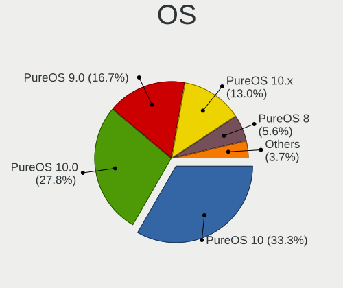

| Name        | Notebooks | Percent |
|-------------|-----------|---------|
| PureOS 10   | 18        | 33.33%  |
| PureOS 10.0 | 15        | 27.78%  |
| PureOS 9.0  | 9         | 16.67%  |
| PureOS 10.x | 7         | 12.96%  |
| PureOS 8    | 3         | 5.56%   |
| PureOS 9    | 2         | 3.7%    |

OS Family
---------

OS without a version

| Name   | Notebooks | Percent |
|--------|-----------|---------|
| PureOS | 52        | 100%    |

Kernel
------

Version of the Linux kernel

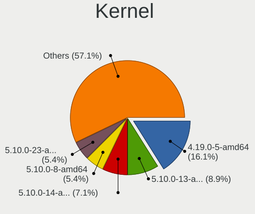

| Version                          | Notebooks | Percent |
|----------------------------------|-----------|---------|
| 4.19.0-5-amd64                   | 9         | 16.07%  |
| 5.10.0-13-amd64                  | 5         | 8.93%   |
| 5.10.0-14-amd64                  | 4         | 7.14%   |
| 5.10.0-8-amd64                   | 3         | 5.36%   |
| 5.10.0-23-amd64                  | 3         | 5.36%   |
| 5.10.0-21-amd64                  | 3         | 5.36%   |
| 5.10.0-7-amd64                   | 2         | 3.57%   |
| 5.10.0-35-amd64                  | 2         | 3.57%   |
| 5.10.0-33-amd64                  | 2         | 3.57%   |
| 5.10.0-28-amd64                  | 2         | 3.57%   |
| 5.10.0-26-amd64                  | 2         | 3.57%   |
| 5.10.0-11-amd64                  | 2         | 3.57%   |
| 6.6.0-1-librem5                  | 1         | 1.79%   |
| 6.1.0-1-librem5                  | 1         | 1.79%   |
| 5.7.0-1-librem5                  | 1         | 1.79%   |
| 5.7.0-0.38-1-pinebookpro-hwaccel | 1         | 1.79%   |
| 5.15.0-2-amd64                   | 1         | 1.79%   |
| 5.10.0-9-amd64                   | 1         | 1.79%   |
| 5.10.0-6-amd64                   | 1         | 1.79%   |
| 5.10.0-36-amd64                  | 1         | 1.79%   |
| 5.10.0-32-amd64                  | 1         | 1.79%   |
| 5.10.0-27-amd64                  | 1         | 1.79%   |
| 5.10.0-25-amd64                  | 1         | 1.79%   |
| 5.10.0-19-amd64                  | 1         | 1.79%   |
| 5.10.0-18-amd64                  | 1         | 1.79%   |
| 5.10.0-17-amd64                  | 1         | 1.79%   |
| 5.10.0-12-amd64                  | 1         | 1.79%   |
| 4.19.0-14-amd64                  | 1         | 1.79%   |
| 4.16.0-1-amd64                   | 1         | 1.79%   |

Kernel Family
-------------

Linux kernel without a distro release

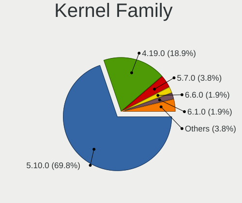

| Version | Notebooks | Percent |
|---------|-----------|---------|
| 5.10.0  | 37        | 69.81%  |
| 4.19.0  | 10        | 18.87%  |
| 5.7.0   | 2         | 3.77%   |
| 6.6.0   | 1         | 1.89%   |
| 6.1.0   | 1         | 1.89%   |
| 5.15.0  | 1         | 1.89%   |
| 4.16.0  | 1         | 1.89%   |

Kernel Major Ver.
-----------------

Linux kernel major version

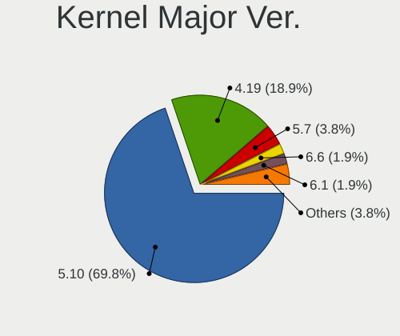

| Version | Notebooks | Percent |
|---------|-----------|---------|
| 5.10    | 37        | 69.81%  |
| 4.19    | 10        | 18.87%  |
| 5.7     | 2         | 3.77%   |
| 6.6     | 1         | 1.89%   |
| 6.1     | 1         | 1.89%   |
| 5.15    | 1         | 1.89%   |
| 4.16    | 1         | 1.89%   |

Arch
----

OS architecture (x86_64, i586, etc.)

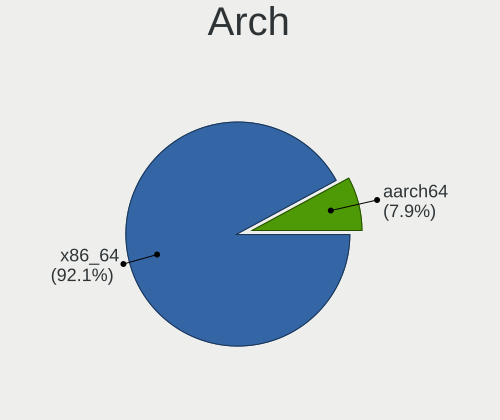

| Name    | Notebooks | Percent |
|---------|-----------|---------|
| x86_64  | 48        | 92.31%  |
| aarch64 | 4         | 7.69%   |

DE
--

Desktop Environment

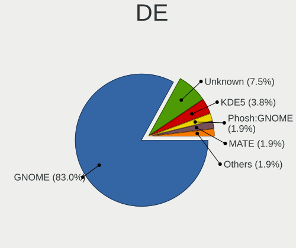

| Name            | Notebooks | Percent |
|-----------------|-----------|---------|
| GNOME           | 44        | 83.02%  |
| Unknown         | 4         | 7.55%   |
| KDE5            | 2         | 3.77%   |
| Phosh:GNOME     | 1         | 1.89%   |
| MATE            | 1         | 1.89%   |
| GNOME Flashback | 1         | 1.89%   |

Display Server
--------------

X11 or Wayland

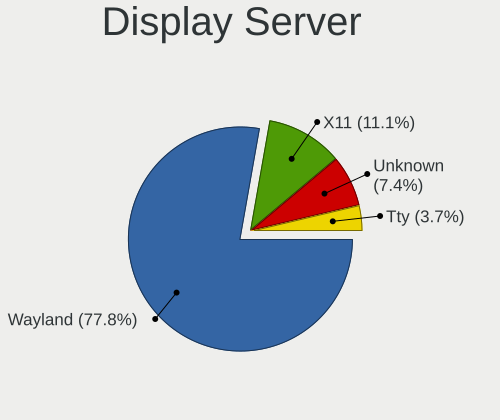

| Name    | Notebooks | Percent |
|---------|-----------|---------|
| Wayland | 42        | 77.78%  |
| X11     | 6         | 11.11%  |
| Unknown | 4         | 7.41%   |
| Tty     | 2         | 3.7%    |

Display Manager
---------------

SDDM, LightDM, etc.

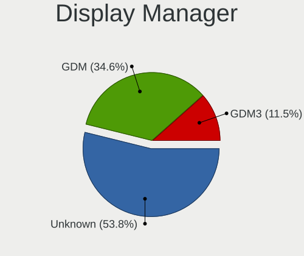

| Name    | Notebooks | Percent |
|---------|-----------|---------|
| Unknown | 28        | 53.85%  |
| GDM     | 18        | 34.62%  |
| GDM3    | 6         | 11.54%  |

OS Lang
-------

Language

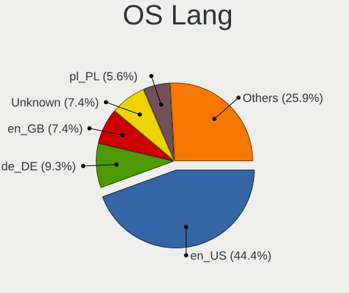

| Lang    | Notebooks | Percent |
|---------|-----------|---------|
| en_US   | 24        | 44.44%  |
| de_DE   | 5         | 9.26%   |
| en_GB   | 4         | 7.41%   |
| Unknown | 4         | 7.41%   |
| pl_PL   | 3         | 5.56%   |
| es_AR   | 2         | 3.7%    |
| C       | 2         | 3.7%    |
| zh_CN   | 1         | 1.85%   |
| ru_RU   | 1         | 1.85%   |
| pt_PT   | 1         | 1.85%   |
| nl_NL   | 1         | 1.85%   |
| it_IT   | 1         | 1.85%   |
| fr_FR   | 1         | 1.85%   |
| es_ES   | 1         | 1.85%   |
| es_CR   | 1         | 1.85%   |
| en_IL   | 1         | 1.85%   |
| en_AU   | 1         | 1.85%   |

Boot Mode
---------

EFI or BIOS

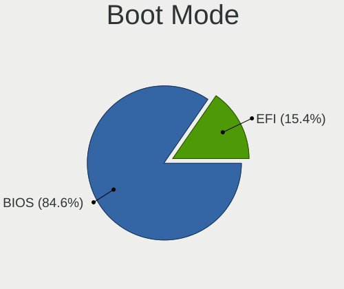

| Mode | Notebooks | Percent |
|------|-----------|---------|
| BIOS | 44        | 84.62%  |
| EFI  | 8         | 15.38%  |

Filesystem
----------

Type of filesystem

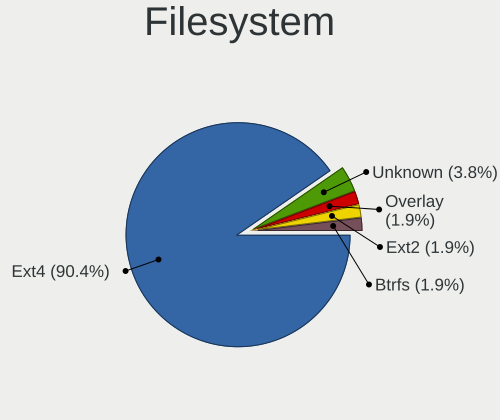

| Type    | Notebooks | Percent |
|---------|-----------|---------|
| Ext4    | 47        | 90.38%  |
| Unknown | 2         | 3.85%   |
| Overlay | 1         | 1.92%   |
| Ext2    | 1         | 1.92%   |
| Btrfs   | 1         | 1.92%   |

Part. scheme
------------

Scheme of partitioning

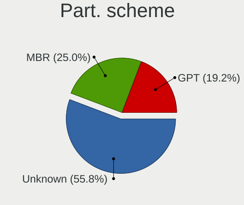

| Type    | Notebooks | Percent |
|---------|-----------|---------|
| Unknown | 29        | 55.77%  |
| MBR     | 13        | 25%     |
| GPT     | 10        | 19.23%  |

Dual Boot with Linux/BSD
------------------------

Hosting more than one Linux/BSD

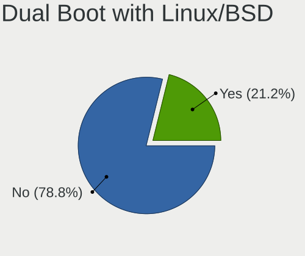

| Dual boot | Notebooks | Percent |
|-----------|-----------|---------|
| No        | 41        | 78.85%  |
| Yes       | 11        | 21.15%  |

Dual Boot (Win)
---------------

Hosting Linux and Windows

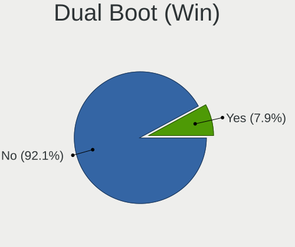

| Dual boot | Notebooks | Percent |
|-----------|-----------|---------|
| No        | 48        | 92.31%  |
| Yes       | 4         | 7.69%   |

Board
-----

Vendor
------

Motherboard manufacturer

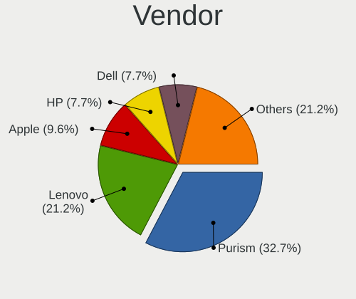

| Name                | Notebooks | Percent |
|---------------------|-----------|---------|
| Purism              | 17        | 32.69%  |
| Lenovo              | 11        | 21.15%  |
| Apple               | 5         | 9.62%   |
| Hewlett-Packard     | 4         | 7.69%   |
| Dell                | 4         | 7.69%   |
| Acer                | 3         | 5.77%   |
| Toshiba             | 1         | 1.92%   |
| Samsung Electronics | 1         | 1.92%   |
| Pine Microsystems   | 1         | 1.92%   |
| Notebook            | 1         | 1.92%   |
| Intel               | 1         | 1.92%   |
| HUAWEI              | 1         | 1.92%   |
| Google              | 1         | 1.92%   |
| Unknown             | 1         | 1.92%   |

Model
-----

Motherboard model

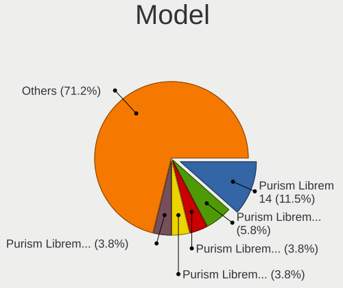

| Name                                       | Notebooks | Percent |
|--------------------------------------------|-----------|---------|
| Purism Librem 14                           | 6         | 11.54%  |
| Purism Librem 15 v3                        | 3         | 5.77%   |
| Purism Librem 5r4                          | 2         | 3.85%   |
| Purism Librem 15 v4                        | 2         | 3.85%   |
| Purism Librem 13 v4                        | 2         | 3.85%   |
| Lenovo ThinkPad T440p                      | 2         | 3.85%   |
| HP Pavilion g6                             | 2         | 3.85%   |
| Toshiba Satellite L500D                    | 1         | 1.92%   |
| Samsung 530U3C/530U4C/532U3C               | 1         | 1.92%   |
| Purism librem_13v2                         | 1         | 1.92%   |
| Purism Librem 13 v2                        | 1         | 1.92%   |
| Pine Microsystems Pine64 Pinebook Pro      | 1         | 1.92%   |
| Notebook P17SM                             | 1         | 1.92%   |
| Lenovo ThinkPad X1 Carbon Gen 9 20XXS3JC01 | 1         | 1.92%   |
| Lenovo ThinkPad T540p 20BFS23T00           | 1         | 1.92%   |
| Lenovo ThinkPad T440 20B60044RT            | 1         | 1.92%   |
| Lenovo ThinkPad P50 20ENCTO1WW             | 1         | 1.92%   |
| Lenovo ThinkPad E480 20KN003SUS            | 1         | 1.92%   |
| Lenovo ThinkPad 13 2nd Gen 20J2S00G00      | 1         | 1.92%   |
| Lenovo IdeaPad U430 Touch 20270            | 1         | 1.92%   |
| Lenovo G450 2949                           | 1         | 1.92%   |
| Lenovo B50-70 20384                        | 1         | 1.92%   |
| Intel powered classmate PC                 | 1         | 1.92%   |
| HUAWEI NBLB-WAX9N                          | 1         | 1.92%   |
| HP Pavilion Notebook                       | 1         | 1.92%   |
| HP Laptop 15s-du3xxx                       | 1         | 1.92%   |
| Google Droid                               | 1         | 1.92%   |
| Dell XPS 13 9370                           | 1         | 1.92%   |
| Dell Latitude D430                         | 1         | 1.92%   |
| Dell Inspiron 5547                         | 1         | 1.92%   |
| Dell Inspiron 15-3567                      | 1         | 1.92%   |
| Apple MacBookPro6,1                        | 1         | 1.92%   |
| Apple MacBookPro14,2                       | 1         | 1.92%   |
| Apple MacBookAir7,2                        | 1         | 1.92%   |
| Apple MacBook9,1                           | 1         | 1.92%   |
| Apple MacBook5,1                           | 1         | 1.92%   |
| Acer Swift SF316-51                        | 1         | 1.92%   |
| Acer Swift SF113-31                        | 1         | 1.92%   |
| Acer Nitro AN515-43                        | 1         | 1.92%   |
| Unknown                                    | 1         | 1.92%   |

Model Family
------------

Motherboard model prefix

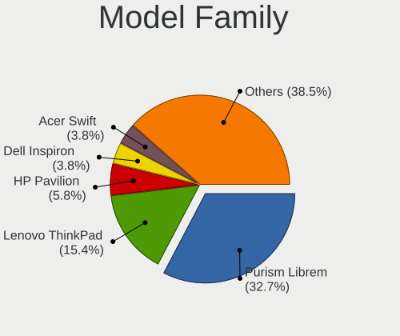

| Name                     | Notebooks | Percent |
|--------------------------|-----------|---------|
| Purism Librem            | 17        | 32.69%  |
| Lenovo ThinkPad          | 8         | 15.38%  |
| HP Pavilion              | 3         | 5.77%   |
| Dell Inspiron            | 2         | 3.85%   |
| Acer Swift               | 2         | 3.85%   |
| Toshiba Satellite        | 1         | 1.92%   |
| Samsung 530U3C           | 1         | 1.92%   |
| Pine Microsystems Pine64 | 1         | 1.92%   |
| Notebook P17SM           | 1         | 1.92%   |
| Lenovo IdeaPad           | 1         | 1.92%   |
| Lenovo G450              | 1         | 1.92%   |
| Lenovo B50-70            | 1         | 1.92%   |
| Intel powered            | 1         | 1.92%   |
| HUAWEI NBLB-WAX9N        | 1         | 1.92%   |
| HP Laptop                | 1         | 1.92%   |
| Google Droid             | 1         | 1.92%   |
| Dell XPS                 | 1         | 1.92%   |
| Dell Latitude            | 1         | 1.92%   |
| Apple MacBookPro6        | 1         | 1.92%   |
| Apple MacBookPro14       | 1         | 1.92%   |
| Apple MacBookAir7        | 1         | 1.92%   |
| Apple MacBook9           | 1         | 1.92%   |
| Apple MacBook5           | 1         | 1.92%   |
| Acer Nitro               | 1         | 1.92%   |
| Unknown                  | 1         | 1.92%   |

MFG Year
--------

Motherboard manufacture year

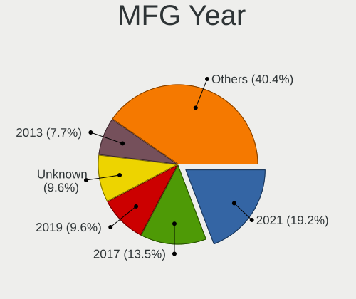

| Year    | Notebooks | Percent |
|---------|-----------|---------|
| 2021    | 10        | 19.23%  |
| 2017    | 7         | 13.46%  |
| 2019    | 5         | 9.62%   |
| Unknown | 5         | 9.62%   |
| 2013    | 4         | 7.69%   |
| 2020    | 3         | 5.77%   |
| 2009    | 3         | 5.77%   |
| 2018    | 2         | 3.85%   |
| 2016    | 2         | 3.85%   |
| 2015    | 2         | 3.85%   |
| 2014    | 2         | 3.85%   |
| 2011    | 2         | 3.85%   |
| 2023    | 1         | 1.92%   |
| 2022    | 1         | 1.92%   |
| 2012    | 1         | 1.92%   |
| 2007    | 1         | 1.92%   |
| 2006    | 1         | 1.92%   |

Form Factor
-----------

Physical design of the computer

| Name     | Notebooks | Percent |
|----------|-----------|---------|
| Notebook | 52        | 100%    |

Secure Boot
-----------

Enabled or disabled

| State    | Notebooks | Percent |
|----------|-----------|---------|
| Disabled | 52        | 100%    |

Coreboot
--------

Have coreboot on board

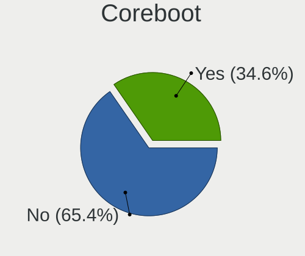

| Used | Notebooks | Percent |
|------|-----------|---------|
| No   | 34        | 65.38%  |
| Yes  | 18        | 34.62%  |

RAM Size
--------

Total RAM memory

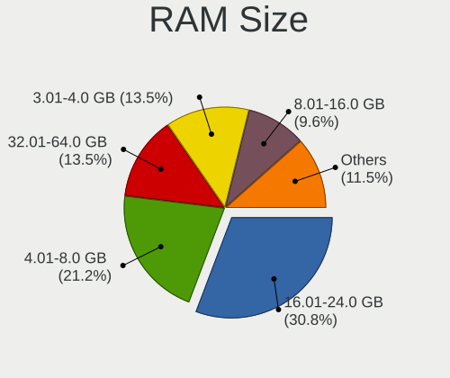

| Size in GB  | Notebooks | Percent |
|-------------|-----------|---------|
| 16.01-24.0  | 16        | 30.77%  |
| 4.01-8.0    | 11        | 21.15%  |
| 32.01-64.0  | 7         | 13.46%  |
| 3.01-4.0    | 7         | 13.46%  |
| 8.01-16.0   | 5         | 9.62%   |
| 2.01-3.0    | 2         | 3.85%   |
| 1.01-2.0    | 2         | 3.85%   |
| 24.01-32.0  | 1         | 1.92%   |
| 64.01-256.0 | 1         | 1.92%   |

RAM Used
--------

Used RAM memory

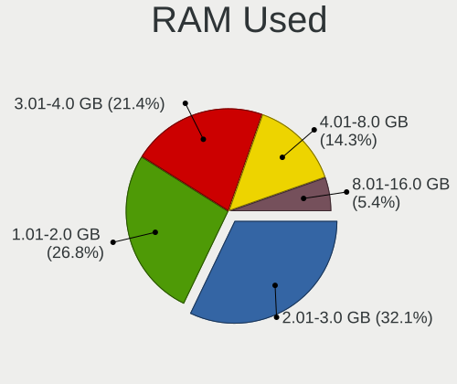

| Used GB   | Notebooks | Percent |
|-----------|-----------|---------|
| 2.01-3.0  | 18        | 32.14%  |
| 1.01-2.0  | 15        | 26.79%  |
| 3.01-4.0  | 12        | 21.43%  |
| 4.01-8.0  | 8         | 14.29%  |
| 8.01-16.0 | 3         | 5.36%   |

Total Drives
------------

Number of drives on board

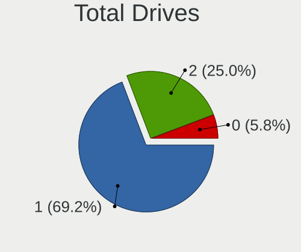

| Drives | Notebooks | Percent |
|--------|-----------|---------|
| 1      | 36        | 69.23%  |
| 2      | 13        | 25%     |
| 0      | 3         | 5.77%   |

Has CD-ROM
----------

Has CD-ROM on board

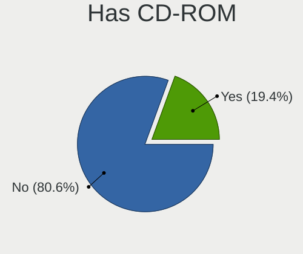

| Presented | Notebooks | Percent |
|-----------|-----------|---------|
| No        | 42        | 80.77%  |
| Yes       | 10        | 19.23%  |

Has Ethernet
------------

Has Ethernet on board

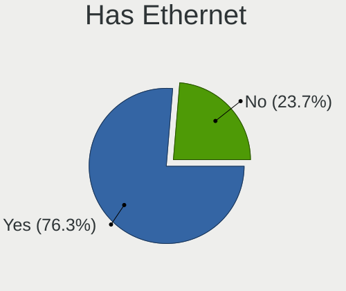

| Presented | Notebooks | Percent |
|-----------|-----------|---------|
| Yes       | 39        | 75%     |
| No        | 13        | 25%     |

Has WiFi
--------

Has WiFi module

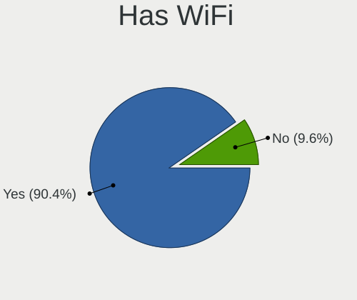

| Presented | Notebooks | Percent |
|-----------|-----------|---------|
| Yes       | 47        | 90.38%  |
| No        | 5         | 9.62%   |

Has Bluetooth
-------------

Has Bluetooth module

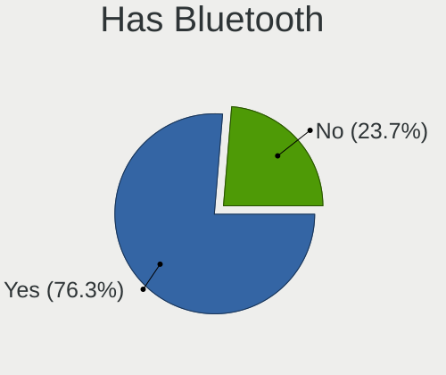

| Presented | Notebooks | Percent |
|-----------|-----------|---------|
| Yes       | 40        | 76.92%  |
| No        | 12        | 23.08%  |

Location
--------

Country
-------

Geographic location (country)

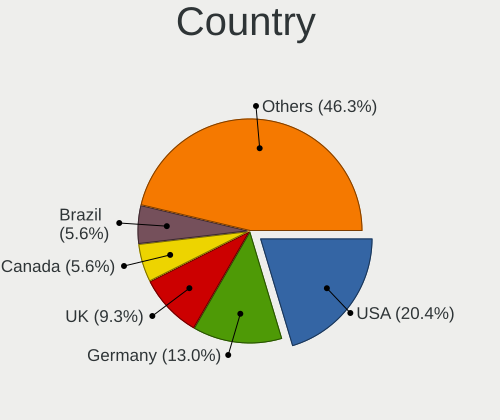

| Country                | Notebooks | Percent |
|------------------------|-----------|---------|
| USA                    | 11        | 20.37%  |
| Germany                | 7         | 12.96%  |
| UK                     | 5         | 9.26%   |
| Canada                 | 3         | 5.56%   |
| Brazil                 | 3         | 5.56%   |
| Poland                 | 2         | 3.7%    |
| Italy                  | 2         | 3.7%    |
| France                 | 2         | 3.7%    |
| Australia              | 2         | 3.7%    |
| Argentina              | 2         | 3.7%    |
| Turkey                 | 1         | 1.85%   |
| Sri Lanka              | 1         | 1.85%   |
| Spain                  | 1         | 1.85%   |
| South Africa           | 1         | 1.85%   |
| Serbia                 | 1         | 1.85%   |
| Russia                 | 1         | 1.85%   |
| Portugal               | 1         | 1.85%   |
| Paraguay               | 1         | 1.85%   |
| Pakistan               | 1         | 1.85%   |
| Netherlands            | 1         | 1.85%   |
| Israel                 | 1         | 1.85%   |
| Iran                   | 1         | 1.85%   |
| Costa Rica             | 1         | 1.85%   |
| China                  | 1         | 1.85%   |
| Bosnia and Herzegovina | 1         | 1.85%   |

City
----

Geographic location (city)

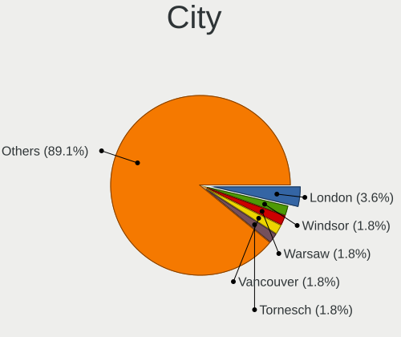

| City                    | Notebooks | Percent |
|-------------------------|-----------|---------|
| London                  | 2         | 3.64%   |
| Windsor                 | 1         | 1.82%   |
| Warsaw                  | 1         | 1.82%   |
| Vancouver               | 1         | 1.82%   |
| Tornesch                | 1         | 1.82%   |
| Thorpe Hamlet           | 1         | 1.82%   |
| Tel Aviv                | 1         | 1.82%   |
| Stuttgart               | 1         | 1.82%   |
| Stargard                | 1         | 1.82%   |
| Spencer                 | 1         | 1.82%   |
| Seattle                 | 1         | 1.82%   |
| Sao Paulo               | 1         | 1.82%   |
| San Jose                | 1         | 1.82%   |
| Plano                   | 1         | 1.82%   |
| Paris                   | 1         | 1.82%   |
| Ouderkerk aan de Amstel | 1         | 1.82%   |
| New York                | 1         | 1.82%   |
| Montreal                | 1         | 1.82%   |
| Milwaukee               | 1         | 1.82%   |
| Milpitas                | 1         | 1.82%   |
| Melbourne               | 1         | 1.82%   |
| Mankato                 | 1         | 1.82%   |
| Magstadt                | 1         | 1.82%   |
| Madrid                  | 1         | 1.82%   |
| Lenexa                  | 1         | 1.82%   |
| Lambeth                 | 1         | 1.82%   |
| Krasnogorsk             | 1         | 1.82%   |
| Karachi                 | 1         | 1.82%   |
| Ituzaingo               | 1         | 1.82%   |
| Istanbul                | 1         | 1.82%   |
| Hernandarias            | 1         | 1.82%   |
| Guimaraes               | 1         | 1.82%   |
| Grasse                  | 1         | 1.82%   |
| Genoa                   | 1         | 1.82%   |
| Eberswalde              | 1         | 1.82%   |
| Colombo                 | 1         | 1.82%   |
| Cape Town               | 1         | 1.82%   |
| Camden                  | 1         | 1.82%   |
| Brandenburg             | 1         | 1.82%   |
| Braganca Paulista       | 1         | 1.82%   |

Drives
------

Drive Vendor
------------

Hard drive vendors

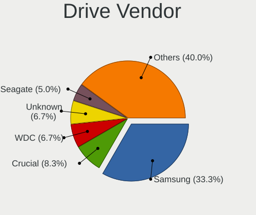

| Vendor              | Notebooks | Drives | Percent |
|---------------------|-----------|--------|---------|
| Samsung Electronics | 20        | 26     | 33.33%  |
| Crucial             | 5         | 7      | 8.33%   |
| WDC                 | 4         | 4      | 6.67%   |
| Unknown             | 4         | 4      | 6.67%   |
| Seagate             | 3         | 3      | 5%      |
| SanDisk             | 3         | 3      | 5%      |
| HGST                | 3         | 3      | 5%      |
| Apple               | 3         | 5      | 5%      |
| A-DATA Technology   | 2         | 2      | 3.33%   |
| Transcend           | 1         | 1      | 1.67%   |
| Toshiba             | 1         | 1      | 1.67%   |
| Team                | 1         | 1      | 1.67%   |
| Qumo                | 1         | 1      | 1.67%   |
| Plextor             | 1         | 1      | 1.67%   |
| Phison              | 1         | 1      | 1.67%   |
| Mushkin             | 1         | 1      | 1.67%   |
| Kingston            | 1         | 2      | 1.67%   |
| JMicron Technology  | 1         | 1      | 1.67%   |
| Intel               | 1         | 1      | 1.67%   |
| Hitachi             | 1         | 1      | 1.67%   |
| BIWIN               | 1         | 1      | 1.67%   |
| ADATA Technology    | 1         | 1      | 1.67%   |

Drive Model
-----------

Hard drive models

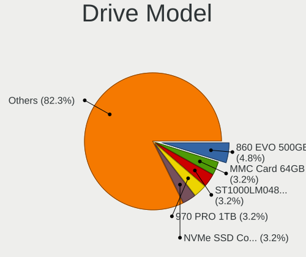

| Model                                              | Notebooks | Percent |
|----------------------------------------------------|-----------|---------|
| Samsung SSD 860 EVO 500GB                          | 3         | 4.84%   |
| Unknown MMC Card  64GB                             | 2         | 3.23%   |
| Seagate ST1000LM048-2E7172 1TB                     | 2         | 3.23%   |
| Samsung SSD 970 PRO 1TB                            | 2         | 3.23%   |
| Samsung NVMe SSD Controller SM981/PM981/PM983 1TB  | 2         | 3.23%   |
| Crucial CT250MX500SSD4 250GB                       | 2         | 3.23%   |
| WDC WDS500G2B0A-00SM50 500GB                       | 1         | 1.61%   |
| WDC WDS100T2B0C-00PXH0 1TB                         | 1         | 1.61%   |
| WDC WDBNCE0010PNC 1TB SSD                          | 1         | 1.61%   |
| WDC WD5000LPCX-22VHAT0 500GB                       | 1         | 1.61%   |
| Unknown MMC Card  32GB                             | 1         | 1.61%   |
| Unknown DA4128  128GB                              | 1         | 1.61%   |
| Transcend TS240GMTS420S 240GB SSD                  | 1         | 1.61%   |
| Toshiba NVMe SSD Drive 512GB                       | 1         | 1.61%   |
| Team TM8FP6256G 256GB                              | 1         | 1.61%   |
| Seagate NVMe SSD Drive 2TB                         | 1         | 1.61%   |
| SanDisk SSD i100 24GB                              | 1         | 1.61%   |
| SanDisk SDSSDP128G 128GB                           | 1         | 1.61%   |
| SanDisk SDSSDH3500G 500GB                          | 1         | 1.61%   |
| Samsung SSD 970 EVO Plus 500GB                     | 1         | 1.61%   |
| Samsung SSD 970 EVO Plus 2TB                       | 1         | 1.61%   |
| Samsung SSD 970 EVO 250GB                          | 1         | 1.61%   |
| Samsung SSD 960 EVO 500GB                          | 1         | 1.61%   |
| Samsung SSD 960 EVO 250GB                          | 1         | 1.61%   |
| Samsung SSD 860 EVO 250GB                          | 1         | 1.61%   |
| Samsung SSD 860 EVO 1TB                            | 1         | 1.61%   |
| Samsung SSD 850 EVO 500GB                          | 1         | 1.61%   |
| Samsung SSD 850 EVO 250GB                          | 1         | 1.61%   |
| Samsung NVMe SSD Drive 1TB                         | 1         | 1.61%   |
| Samsung NVMe SSD Controller PM9A1/PM9A3/980PRO 1TB | 1         | 1.61%   |
| Samsung MZVL2512HCJQ-00BL7 512GB                   | 1         | 1.61%   |
| Samsung HS08XJC 80GB                               | 1         | 1.61%   |
| Samsung HM321HI 320GB                              | 1         | 1.61%   |
| Qumo SSD 120GB                                     | 1         | 1.61%   |
| Plextor PX-1TM6Pro 1024GB SSD                      | 1         | 1.61%   |
| Phison PM8512GPTCB4B8TF-E13T4 512GB                | 1         | 1.61%   |
| Mushkin MKNSSDRE250GB-LT                           | 1         | 1.61%   |
| Kingston SVP200S360G 64GB SSD                      | 1         | 1.61%   |
| JMicron Generic 320GB                              | 1         | 1.61%   |
| Intel SSDSC2BF180A4H 180GB                         | 1         | 1.61%   |

HDD Vendor
----------

Hard disk drive vendors

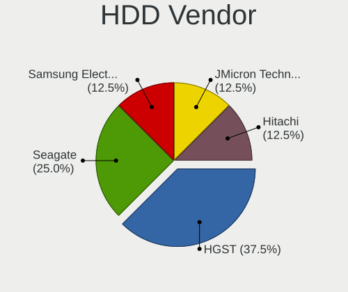

| Vendor              | Notebooks | Drives | Percent |
|---------------------|-----------|--------|---------|
| HGST                | 3         | 3      | 30%     |
| Seagate             | 2         | 2      | 20%     |
| Samsung Electronics | 2         | 2      | 20%     |
| WDC                 | 1         | 1      | 10%     |
| JMicron Technology  | 1         | 1      | 10%     |
| Hitachi             | 1         | 1      | 10%     |

SSD Vendor
----------

Solid state drive vendors

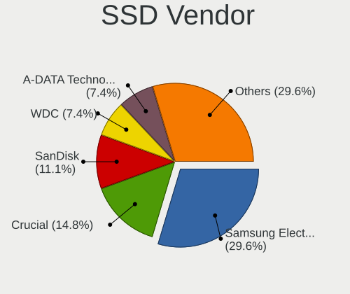

| Vendor              | Notebooks | Drives | Percent |
|---------------------|-----------|--------|---------|
| Samsung Electronics | 8         | 10     | 29.63%  |
| Crucial             | 4         | 6      | 14.81%  |
| SanDisk             | 3         | 3      | 11.11%  |
| WDC                 | 2         | 2      | 7.41%   |
| A-DATA Technology   | 2         | 2      | 7.41%   |
| Transcend           | 1         | 1      | 3.7%    |
| Qumo                | 1         | 1      | 3.7%    |
| Plextor             | 1         | 1      | 3.7%    |
| Mushkin             | 1         | 1      | 3.7%    |
| Kingston            | 1         | 2      | 3.7%    |
| Intel               | 1         | 1      | 3.7%    |
| BIWIN               | 1         | 1      | 3.7%    |
| Apple               | 1         | 1      | 3.7%    |

Drive Kind
----------

HDD or SSD

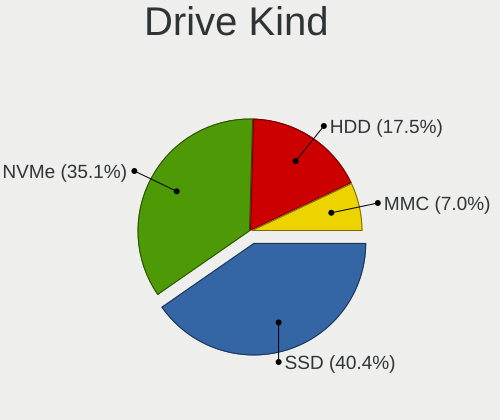

| Kind | Notebooks | Drives | Percent |
|------|-----------|--------|---------|
| SSD  | 23        | 32     | 40.35%  |
| NVMe | 20        | 25     | 35.09%  |
| HDD  | 10        | 10     | 17.54%  |
| MMC  | 4         | 4      | 7.02%   |

Drive Connector
---------------

SATA, SAS, NVMe, etc.

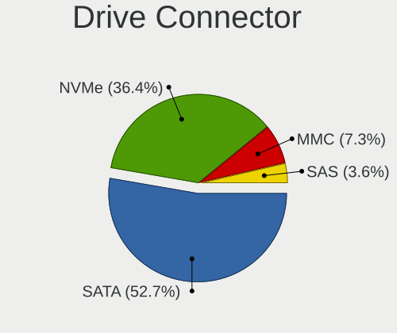

| Type | Notebooks | Drives | Percent |
|------|-----------|--------|---------|
| SATA | 29        | 40     | 52.73%  |
| NVMe | 20        | 25     | 36.36%  |
| MMC  | 4         | 4      | 7.27%   |
| SAS  | 2         | 2      | 3.64%   |

Drive Size
----------

Size of hard drive

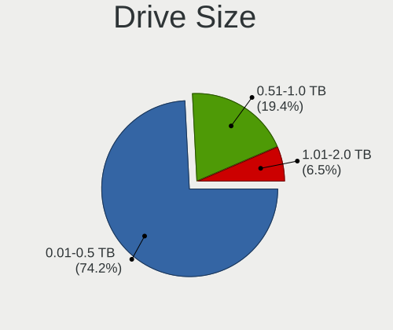

| Size in TB | Notebooks | Drives | Percent |
|------------|-----------|--------|---------|
| 0.01-0.5   | 23        | 32     | 74.19%  |
| 0.51-1.0   | 6         | 7      | 19.35%  |
| 1.01-2.0   | 2         | 3      | 6.45%   |

Space Total
-----------

Amount of disk space available on the file system

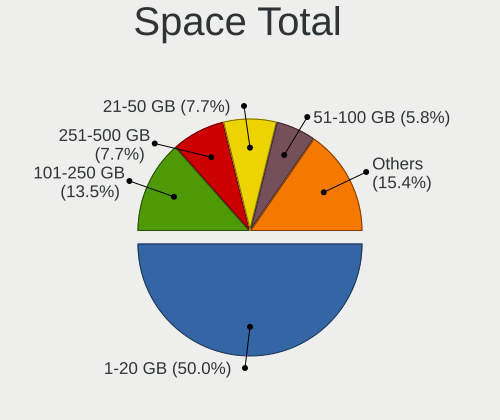

| Size in GB | Notebooks | Percent |
|------------|-----------|---------|
| 1-20       | 26        | 50%     |
| 101-250    | 7         | 13.46%  |
| 251-500    | 4         | 7.69%   |
| 21-50      | 4         | 7.69%   |
| 51-100     | 3         | 5.77%   |
| Unknown    | 3         | 5.77%   |
| 1001-2000  | 2         | 3.85%   |
| 501-1000   | 2         | 3.85%   |
| 2001-3000  | 1         | 1.92%   |

Space Used
----------

Amount of used disk space

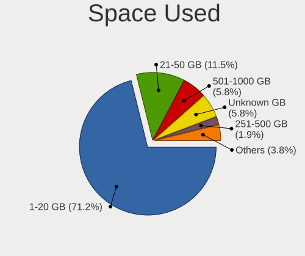

| Used GB  | Notebooks | Percent |
|----------|-----------|---------|
| 1-20     | 37        | 71.15%  |
| 21-50    | 6         | 11.54%  |
| 501-1000 | 3         | 5.77%   |
| Unknown  | 3         | 5.77%   |
| 251-500  | 1         | 1.92%   |
| 101-250  | 1         | 1.92%   |
| 51-100   | 1         | 1.92%   |

Malfunc. Drives
---------------

Drive models with a malfunction

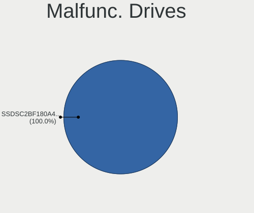

| Model                      | Notebooks | Drives | Percent |
|----------------------------|-----------|--------|---------|
| Intel SSDSC2BF180A4H 180GB | 1         | 1      | 100%    |

Malfunc. Drive Vendor
---------------------

Vendors of faulty drives

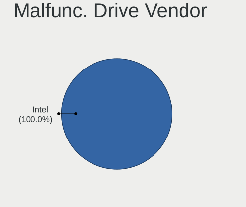

| Vendor | Notebooks | Drives | Percent |
|--------|-----------|--------|---------|
| Intel  | 1         | 1      | 100%    |

Malfunc. HDD Vendor
-------------------

Vendors of faulty HDD drives

Zero info for selected period =(

Malfunc. Drive Kind
-------------------

Kinds of faulty drives

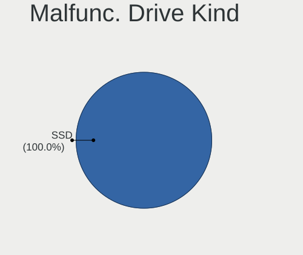

| Kind | Notebooks | Drives | Percent |
|------|-----------|--------|---------|
| SSD  | 1         | 1      | 100%    |

Failed Drives
-------------

Failed drive models

Zero info for selected period =(

Failed Drive Vendor
-------------------

Failed drive vendors

Zero info for selected period =(

Drive Status
------------

Number of failed and malfunc. drives

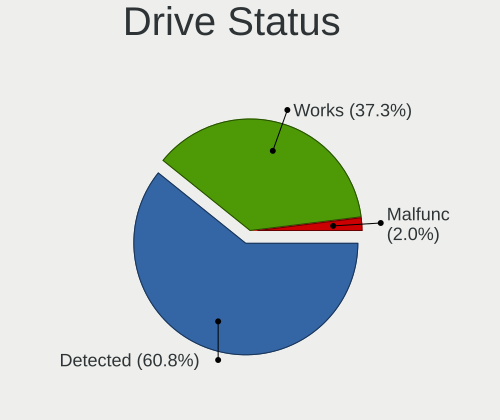

| Status   | Notebooks | Drives | Percent |
|----------|-----------|--------|---------|
| Detected | 31        | 46     | 60.78%  |
| Works    | 19        | 24     | 37.25%  |
| Malfunc  | 1         | 1      | 1.96%   |

Storage controller
------------------

Storage Vendor
--------------

Storage controller vendors

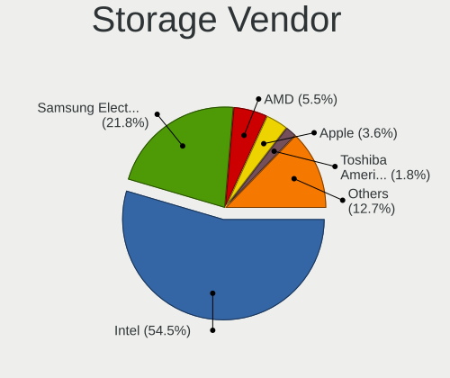

| Vendor                       | Notebooks | Percent |
|------------------------------|-----------|---------|
| Intel                        | 30        | 54.55%  |
| Samsung Electronics          | 12        | 21.82%  |
| AMD                          | 3         | 5.45%   |
| Apple                        | 2         | 3.64%   |
| Toshiba America Info Systems | 1         | 1.82%   |
| Seagate Technology           | 1         | 1.82%   |
| SanDisk                      | 1         | 1.82%   |
| Phison Electronics           | 1         | 1.82%   |
| Nvidia                       | 1         | 1.82%   |
| Micron/Crucial Technology    | 1         | 1.82%   |
| MAXIO Technology (Hangzhou)  | 1         | 1.82%   |
| ADATA Technology             | 1         | 1.82%   |

Storage Model
-------------

Storage controller models

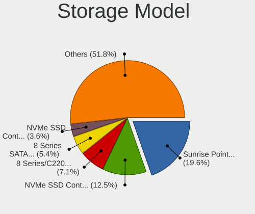

| Model                                                                          | Notebooks | Percent |
|--------------------------------------------------------------------------------|-----------|---------|
| Intel Sunrise Point-LP SATA Controller [AHCI mode]                             | 11        | 19.64%  |
| Samsung NVMe SSD Controller SM981/PM981/PM983                                  | 7         | 12.5%   |
| Intel 8 Series/C220 Series Chipset Family 6-port SATA Controller 1 [AHCI mode] | 4         | 7.14%   |
| Intel 8 Series SATA Controller 1 [AHCI mode]                                   | 3         | 5.36%   |
| Samsung NVMe SSD Controller SM961/PM961/SM963                                  | 2         | 3.57%   |
| Samsung NVMe SSD Controller PM9A1/PM9A3/980PRO                                 | 2         | 3.57%   |
| Intel 7 Series Chipset Family 6-port SATA Controller [AHCI mode]               | 2         | 3.57%   |
| Apple S3X NVMe Controller                                                      | 2         | 3.57%   |
| AMD FCH SATA Controller [AHCI mode]                                            | 2         | 3.57%   |
| Toshiba America Info Systems XG4 NVMe SSD Controller                           | 1         | 1.79%   |
| Seagate FireCuda/IronWolf 510 SSD                                              | 1         | 1.79%   |
| SanDisk WD Green SN350 240GB (DRAM-less) / SN560E NVMe SSD                     | 1         | 1.79%   |
| Samsung S4LN058A01[SSUBX] AHCI SSD Controller (Apple slot)                     | 1         | 1.79%   |
| Phison PS5013-E13 PCIe3 NVMe Controller (DRAM-less)                            | 1         | 1.79%   |
| Nvidia MCP79 AHCI Controller                                                   | 1         | 1.79%   |
| Micron/Crucial P5 NVMe PCIe SSD[SlashP5]                                       | 1         | 1.79%   |
| MAXIO (Hangzhou) NVMe SSD Controller MAP1202 (DRAM-less)                       | 1         | 1.79%   |
| Intel Volume Management Device NVMe RAID Controller                            | 1         | 1.79%   |
| Intel Tiger Lake-LP SATA Controller                                            | 1         | 1.79%   |
| Intel Q170/Q150/B150/H170/H110/Z170/CM236 Chipset SATA Controller [AHCI Mode]  | 1         | 1.79%   |
| Intel HM170/QM170 Chipset SATA Controller [AHCI Mode]                          | 1         | 1.79%   |
| Intel Comet Lake SATA AHCI Controller                                          | 1         | 1.79%   |
| Intel Celeron N3350/Pentium N4200/Atom E3900 Series SATA AHCI Controller       | 1         | 1.79%   |
| Intel Atom Processor E3800 Series SATA AHCI Controller                         | 1         | 1.79%   |
| Intel 82801IBM/IEM (ICH9M/ICH9M-E) 4 port SATA Controller [AHCI mode]          | 1         | 1.79%   |
| Intel 82801G (ICH7 Family) IDE Controller                                      | 1         | 1.79%   |
| Intel 6 Series/C200 Series Chipset Family 6 port Mobile SATA AHCI Controller   | 1         | 1.79%   |
| Intel 5 Series/3400 Series Chipset 4 port SATA AHCI Controller                 | 1         | 1.79%   |
| AMD SB7x0/SB8x0/SB9x0 SATA Controller [AHCI mode]                              | 1         | 1.79%   |
| ADATA IM2P33F3 NVMe SSD (DRAM-less)                                            | 1         | 1.79%   |

Storage Kind
------------

Kind of storage controller (IDE, SATA, NVMe, SAS, ...)

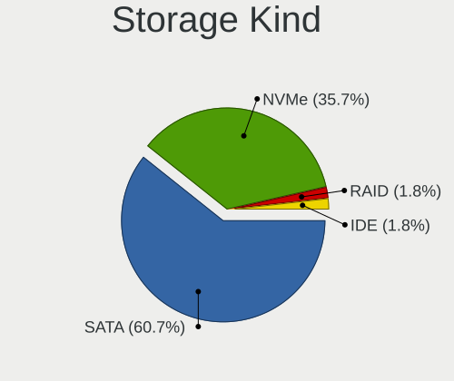

| Kind | Notebooks | Percent |
|------|-----------|---------|
| SATA | 34        | 60.71%  |
| NVMe | 20        | 35.71%  |
| RAID | 1         | 1.79%   |
| IDE  | 1         | 1.79%   |

Processor
---------

CPU Vendor
----------

Processor vendors

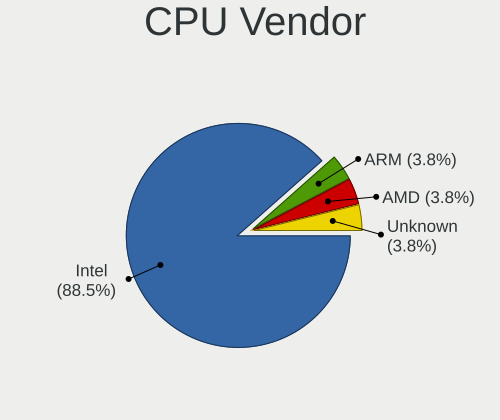

| Vendor  | Notebooks | Percent |
|---------|-----------|---------|
| Intel   | 46        | 88.46%  |
| ARM     | 2         | 3.85%   |
| AMD     | 2         | 3.85%   |
| Unknown | 2         | 3.85%   |

CPU Model
---------

Processor models

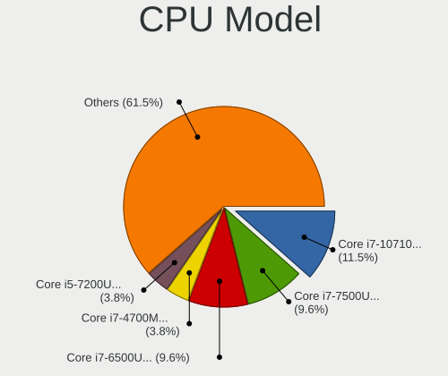

| Model                                         | Notebooks | Percent |
|-----------------------------------------------|-----------|---------|
| Intel Core i7-10710U CPU @ 1.10GHz            | 6         | 11.54%  |
| Intel Core i7-7500U CPU @ 2.70GHz             | 5         | 9.62%   |
| Intel Core i7-6500U CPU @ 2.50GHz             | 5         | 9.62%   |
| Intel Core i7-4700MQ CPU @ 2.40GHz            | 2         | 3.85%   |
| Intel Core i5-7200U CPU @ 2.50GHz             | 2         | 3.85%   |
| ARM Processor                                 | 2         | 3.85%   |
|                                               | 2         | 3.85%   |
| Intel Pentium Silver N5030 CPU @ 1.10GHz      | 1         | 1.92%   |
| Intel Pentium Dual-Core CPU T4400 @ 2.20GHz   | 1         | 1.92%   |
| Intel Pentium CPU N4200 @ 1.10GHz             | 1         | 1.92%   |
| Intel Core m5-6Y54 CPU @ 1.10GHz              | 1         | 1.92%   |
| Intel Core i7-8550U CPU @ 1.80GHz             | 1         | 1.92%   |
| Intel Core i7-7700HQ CPU @ 2.80GHz            | 1         | 1.92%   |
| Intel Core i7-7567U CPU @ 3.50GHz             | 1         | 1.92%   |
| Intel Core i7-6820HQ CPU @ 2.70GHz            | 1         | 1.92%   |
| Intel Core i7-4710MQ CPU @ 2.50GHz            | 1         | 1.92%   |
| Intel Core i7-4702MQ CPU @ 2.20GHz            | 1         | 1.92%   |
| Intel Core i7-4510U CPU @ 2.00GHz             | 1         | 1.92%   |
| Intel Core i5-5250U CPU @ 1.60GHz             | 1         | 1.92%   |
| Intel Core i5-4210U CPU @ 1.70GHz             | 1         | 1.92%   |
| Intel Core i5-4200U CPU @ 1.60GHz             | 1         | 1.92%   |
| Intel Core i5-10210U CPU @ 1.60GHz            | 1         | 1.92%   |
| Intel Core i5 CPU M 540 @ 2.53GHz             | 1         | 1.92%   |
| Intel Core i3-4010U CPU @ 1.70GHz             | 1         | 1.92%   |
| Intel Core i3-3217U CPU @ 1.80GHz             | 1         | 1.92%   |
| Intel Core i3-3120M CPU @ 2.50GHz             | 1         | 1.92%   |
| Intel Core i3-2330M CPU @ 2.20GHz             | 1         | 1.92%   |
| Intel Core 2 Duo CPU U7700 @ 1.33GHz          | 1         | 1.92%   |
| Intel Core 2 Duo CPU P7350 @ 2.00GHz          | 1         | 1.92%   |
| Intel Celeron CPU N2808 @ 1.58GHz             | 1         | 1.92%   |
| Intel 11th Gen Core i7-1185G7 @ 3.00GHz       | 1         | 1.92%   |
| Intel 11th Gen Core i5-11300H @ 3.10GHz       | 1         | 1.92%   |
| Intel 11th Gen Core i3-1115G4 @ 3.00GHz       | 1         | 1.92%   |
| AMD Turion II Dual-Core Mobile M520           | 1         | 1.92%   |
| AMD Ryzen 5 3550H with Radeon Vega Mobile Gfx | 1         | 1.92%   |

CPU Model Family
----------------

Processor model prefix

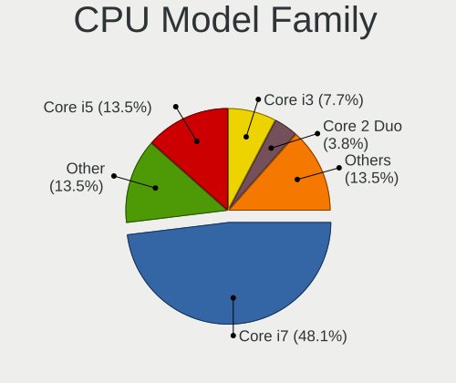

| Model                   | Notebooks | Percent |
|-------------------------|-----------|---------|
| Intel Core i7           | 25        | 48.08%  |
| Other                   | 7         | 13.46%  |
| Intel Core i5           | 7         | 13.46%  |
| Intel Core i3           | 4         | 7.69%   |
| Intel Core 2 Duo        | 2         | 3.85%   |
| Intel Pentium Silver    | 1         | 1.92%   |
| Intel Pentium Dual-Core | 1         | 1.92%   |
| Intel Pentium           | 1         | 1.92%   |
| Intel Core m5           | 1         | 1.92%   |
| Intel Celeron           | 1         | 1.92%   |
| AMD Turion II Dual-Core | 1         | 1.92%   |
| AMD Ryzen 5             | 1         | 1.92%   |

CPU Cores
---------

Number of processor cores

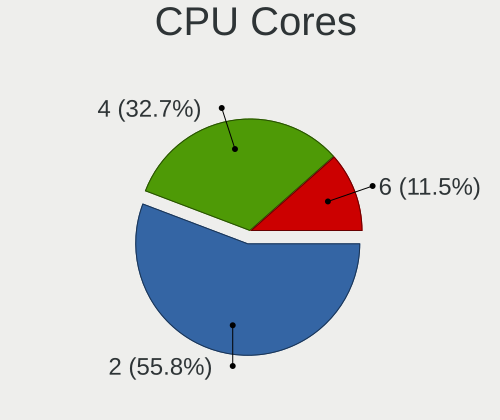

| Number | Notebooks | Percent |
|--------|-----------|---------|
| 2      | 29        | 55.77%  |
| 4      | 17        | 32.69%  |
| 6      | 6         | 11.54%  |

CPU Sockets
-----------

Number of sockets

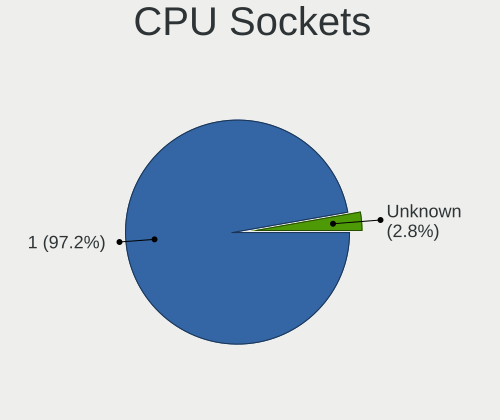

| Number | Notebooks | Percent |
|--------|-----------|---------|
| 1      | 52        | 100%    |

CPU Threads
-----------

Threads per core (Hyper-Threading)

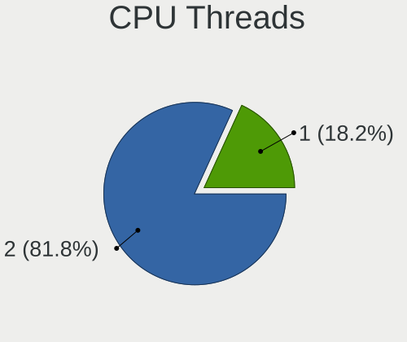

| Number | Notebooks | Percent |
|--------|-----------|---------|
| 2      | 41        | 78.85%  |
| 1      | 11        | 21.15%  |

CPU Op-Modes
------------

CPU Operation Modes (32-bit, 64-bit)

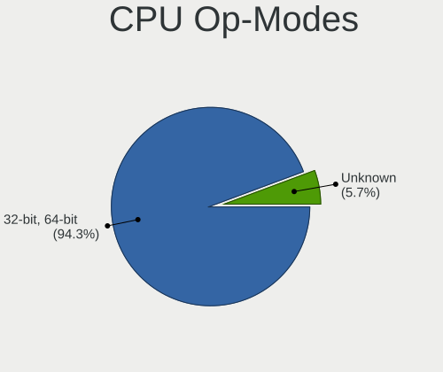

| Op mode        | Notebooks | Percent |
|----------------|-----------|---------|
| 32-bit, 64-bit | 50        | 94.34%  |
| Unknown        | 3         | 5.66%   |

CPU Microcode
-------------

Microcode number

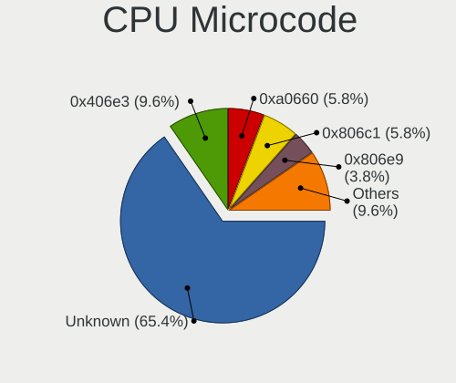

| Number     | Notebooks | Percent |
|------------|-----------|---------|
| Unknown    | 34        | 65.38%  |
| 0x406e3    | 5         | 9.62%   |
| 0xa0660    | 3         | 5.77%   |
| 0x806c1    | 3         | 5.77%   |
| 0x806e9    | 2         | 3.85%   |
| 0x40651    | 2         | 3.85%   |
| 0x806ec    | 1         | 1.92%   |
| 0x1067a    | 1         | 1.92%   |
| 0x08108109 | 1         | 1.92%   |

CPU Microarch
-------------

Microarchitecture

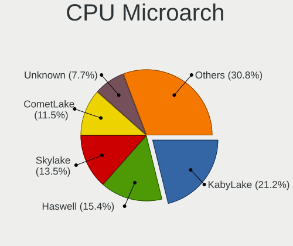

| Name          | Notebooks | Percent |
|---------------|-----------|---------|
| KabyLake      | 11        | 21.15%  |
| Haswell       | 8         | 15.38%  |
| Skylake       | 7         | 13.46%  |
| CometLake     | 6         | 11.54%  |
| Unknown       | 4         | 7.69%   |
| TigerLake     | 3         | 5.77%   |
| Penryn        | 2         | 3.85%   |
| IvyBridge     | 2         | 3.85%   |
| Zen+          | 1         | 1.92%   |
| Westmere      | 1         | 1.92%   |
| Silvermont    | 1         | 1.92%   |
| SandyBridge   | 1         | 1.92%   |
| K10           | 1         | 1.92%   |
| Goldmont plus | 1         | 1.92%   |
| Goldmont      | 1         | 1.92%   |
| Core          | 1         | 1.92%   |
| Broadwell     | 1         | 1.92%   |

Graphics
--------

GPU Vendor
----------

Vendors of graphics cards

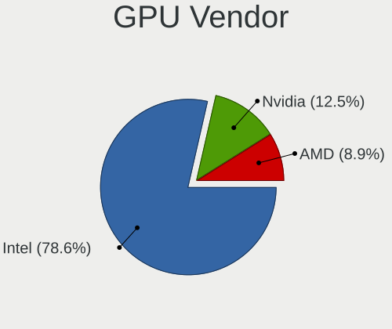

| Vendor | Notebooks | Percent |
|--------|-----------|---------|
| Intel  | 44        | 78.57%  |
| Nvidia | 7         | 12.5%   |
| AMD    | 5         | 8.93%   |

GPU Model
---------

Graphics card models

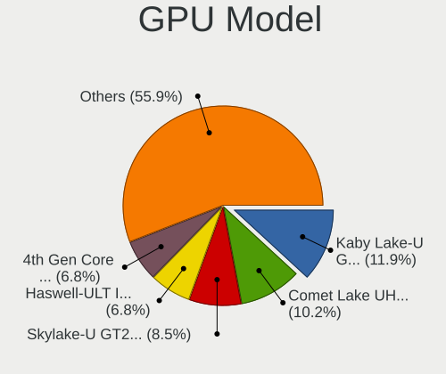

| Model                                                                                 | Notebooks | Percent |
|---------------------------------------------------------------------------------------|-----------|---------|
| Intel Kaby Lake-U GT2 [HD Graphics 620]                                               | 7         | 11.86%  |
| Intel Comet Lake UHD Graphics                                                         | 6         | 10.17%  |
| Intel Skylake-U GT2 [HD Graphics 520]                                                 | 5         | 8.47%   |
| Intel Haswell-ULT Integrated Graphics Controller                                      | 4         | 6.78%   |
| Intel 4th Gen Core Processor Integrated Graphics Controller                           | 4         | 6.78%   |
| Nvidia GK208M [GeForce GT 730M]                                                       | 2         | 3.39%   |
| Intel TigerLake-LP GT2 [Iris Xe Graphics]                                             | 2         | 3.39%   |
| Intel 3rd Gen Core processor Graphics Controller                                      | 2         | 3.39%   |
| Nvidia GT216M [GeForce GT 330M]                                                       | 1         | 1.69%   |
| Nvidia GP107M [GeForce GTX 1050 Mobile]                                               | 1         | 1.69%   |
| Nvidia GM107GLM [Quadro M2000M]                                                       | 1         | 1.69%   |
| Nvidia GK104M [GeForce GTX 870M]                                                      | 1         | 1.69%   |
| Nvidia C79 [GeForce 9400M]                                                            | 1         | 1.69%   |
| Intel Tiger Lake-LP GT2 [UHD Graphics G4]                                             | 1         | 1.69%   |
| Intel Skylake-Y GT2 [HD Graphics 515]                                                 | 1         | 1.69%   |
| Intel Mobile 945GM/GMS/GME, 943/940GML Express Integrated Graphics Controller         | 1         | 1.69%   |
| Intel Mobile 945GM/GMS, 943/940GML Express Integrated Graphics Controller             | 1         | 1.69%   |
| Intel Mobile 4 Series Chipset Integrated Graphics Controller                          | 1         | 1.69%   |
| Intel Kaby Lake-U GT3 [Iris Plus Graphics 650]                                        | 1         | 1.69%   |
| Intel Kaby Lake-R GT2 [UHD Graphics 620]                                              | 1         | 1.69%   |
| Intel Kaby Lake-H GT2 [HD Graphics 630]                                               | 1         | 1.69%   |
| Intel GeminiLake [UHD Graphics 605]                                                   | 1         | 1.69%   |
| Intel Core Processor Integrated Graphics Controller                                   | 1         | 1.69%   |
| Intel CometLake-U GT2 [UHD Graphics]                                                  | 1         | 1.69%   |
| Intel Broadwell-U GT3 [HD Graphics 6000]                                              | 1         | 1.69%   |
| Intel Atom Processor Z36xxx/Z37xxx Series Graphics & Display                          | 1         | 1.69%   |
| Intel Apollo Lake [HD Graphics 505]                                                   | 1         | 1.69%   |
| Intel 2nd Generation Core Processor Family Integrated Graphics Controller             | 1         | 1.69%   |
| AMD Topaz XT [Radeon R7 M260/M265 / M340/M360 / M440/M445 / 530/535 / 620/625 Mobile] | 1         | 1.69%   |
| AMD Thames [Radeon HD 7500M/7600M Series]                                             | 1         | 1.69%   |
| AMD RS880M [Mobility Radeon HD 4225/4250]                                             | 1         | 1.69%   |
| AMD Richland [Radeon HD 8550G]                                                        | 1         | 1.69%   |
| AMD Picasso/Raven 2 [Radeon Vega Series / Radeon Vega Mobile Series]                  | 1         | 1.69%   |
| AMD Jet PRO [Radeon R5 M230 / R7 M260DX / Radeon 520/610 Mobile]                      | 1         | 1.69%   |
| AMD Baffin [Radeon RX 460/560D / Pro 450/455/460/555/555X/560/560X]                   | 1         | 1.69%   |

GPU Combo
---------

Combinations of graphics cards

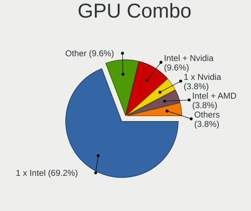

| Name           | Notebooks | Percent |
|----------------|-----------|---------|
| 1 x Intel      | 36        | 69.23%  |
| Other          | 5         | 9.62%   |
| Intel + Nvidia | 5         | 9.62%   |
| 1 x Nvidia     | 2         | 3.85%   |
| Intel + AMD    | 2         | 3.85%   |
| 2 x AMD        | 1         | 1.92%   |
| 1 x AMD        | 1         | 1.92%   |

GPU Driver
----------

Free vs proprietary

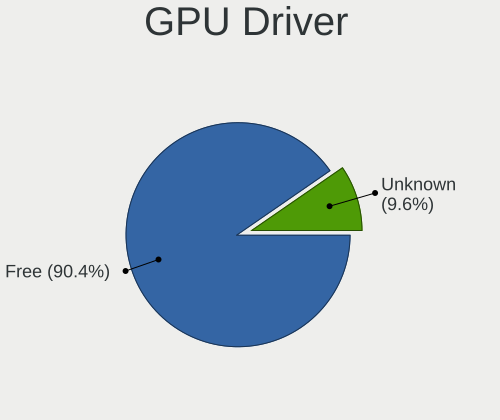

| Driver  | Notebooks | Percent |
|---------|-----------|---------|
| Free    | 47        | 90.38%  |
| Unknown | 5         | 9.62%   |

GPU Memory
----------

Total video memory

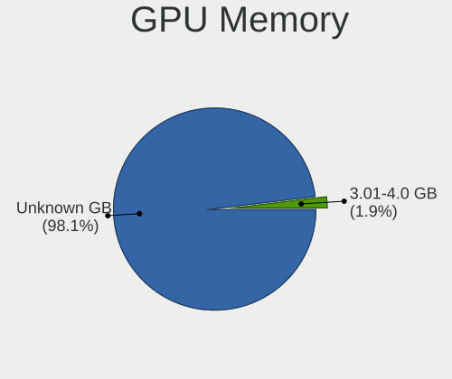

| Size in GB | Notebooks | Percent |
|------------|-----------|---------|
| Unknown    | 51        | 98.08%  |
| 3.01-4.0   | 1         | 1.92%   |

Monitor
-------

Monitor Vendor
--------------

Monitor vendors

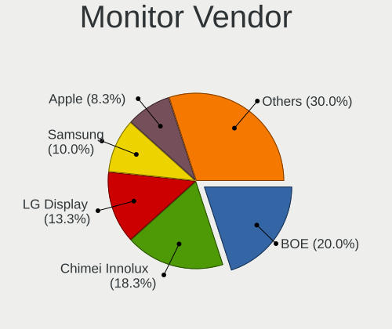

| Vendor                  | Notebooks | Percent |
|-------------------------|-----------|---------|
| BOE                     | 12        | 20%     |
| Chimei Innolux          | 11        | 18.33%  |
| LG Display              | 8         | 13.33%  |
| Samsung Electronics     | 6         | 10%     |
| Apple                   | 5         | 8.33%   |
| Unknown                 | 2         | 3.33%   |
| AU Optronics            | 2         | 3.33%   |
| Toshiba                 | 1         | 1.67%   |
| Sharp                   | 1         | 1.67%   |
| PANDA                   | 1         | 1.67%   |
| MSI                     | 1         | 1.67%   |
| Lenovo                  | 1         | 1.67%   |
| InfoVision              | 1         | 1.67%   |
| Iiyama                  | 1         | 1.67%   |
| Grundig                 | 1         | 1.67%   |
| Goldstar                | 1         | 1.67%   |
| CSOT                    | 1         | 1.67%   |
| Chi Mei Optoelectronics | 1         | 1.67%   |
| BenQ                    | 1         | 1.67%   |
| ASUSTek Computer        | 1         | 1.67%   |
| Acer                    | 1         | 1.67%   |

Monitor Model
-------------

Monitor models

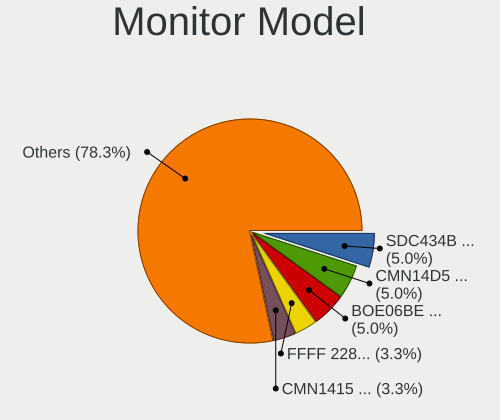

| Model                                                                     | Notebooks | Percent |
|---------------------------------------------------------------------------|-----------|---------|
| Samsung Electronics LCD Monitor SDC434B 3840x2160 344x194mm 15.5-inch     | 3         | 5%      |
| Chimei Innolux LCD Monitor CMN14D5 1920x1080 309x173mm 13.9-inch          | 3         | 5%      |
| BOE LCD Monitor BOE06BE 1920x1080 294x165mm 13.3-inch                     | 3         | 5%      |
| Unknown LCD Monitor FFFF 2288x1287 2550x2550mm 142.0-inch                 | 2         | 3.33%   |
| Chimei Innolux LCD Monitor CMN1415 1920x1080 309x173mm 13.9-inch          | 2         | 3.33%   |
| BOE LCD Monitor BOE0630 1920x1080 344x194mm 15.5-inch                     | 2         | 3.33%   |
| Toshiba LCD Monitor LCD3706 1280x800 261x163mm 12.1-inch                  | 1         | 1.67%   |
| Sharp LCD Monitor SHP148B 3840x2160 294x165mm 13.3-inch                   | 1         | 1.67%   |
| Samsung Electronics LS27A800U SAM71A3 3840x2160 597x336mm 27.0-inch       | 1         | 1.67%   |
| Samsung Electronics LCD Monitor SEC3041 1366x768 353x198mm 15.9-inch      | 1         | 1.67%   |
| Samsung Electronics C27F390 SAM0D32 1920x1080 598x336mm 27.0-inch         | 1         | 1.67%   |
| PANDA LM133LF5L01 NCP0020 1920x1080 294x165mm 13.3-inch                   | 1         | 1.67%   |
| MSI MPG 491C OLED MSI3FA8 3840x1080 1197x339mm 49.0-inch                  | 1         | 1.67%   |
| LG Display LCD Monitor LGD0563 1920x1080 344x194mm 15.5-inch              | 1         | 1.67%   |
| LG Display LCD Monitor LGD053B 1920x1080 294x165mm 13.3-inch              | 1         | 1.67%   |
| LG Display LCD Monitor LGD04D4 3840x2160 344x194mm 15.5-inch              | 1         | 1.67%   |
| LG Display LCD Monitor LGD04A7 1920x1080 344x194mm 15.5-inch              | 1         | 1.67%   |
| LG Display LCD Monitor LGD03F0 1366x768 310x174mm 14.0-inch               | 1         | 1.67%   |
| LG Display LCD Monitor LGD039F 1366x768 345x194mm 15.6-inch               | 1         | 1.67%   |
| LG Display LCD Monitor LGD034D 1366x768 344x194mm 15.5-inch               | 1         | 1.67%   |
| LG Display LCD Monitor LGD02F2 1366x768 344x194mm 15.5-inch               | 1         | 1.67%   |
| Lenovo LEN Y44w-10 LEN65EA 3840x1200 1052x329mm 43.4-inch                 | 1         | 1.67%   |
| InfoVision LCD Monitor IVO03FA 1366x768 223x125mm 10.1-inch               | 1         | 1.67%   |
| Iiyama PL2792H IVM664F 1920x1080 598x336mm 27.0-inch                      | 1         | 1.67%   |
| Grundig WUXGA GRU4448 1360x768                                            | 1         | 1.67%   |
| Goldstar IPS231 GSM5817 1920x1080 510x290mm 23.1-inch                     | 1         | 1.67%   |
| CSOT LCD Monitor CSO1404 1920x1200 302x189mm 14.0-inch                    | 1         | 1.67%   |
| Chimei Innolux LCD Monitor CMN160B 1920x1080 355x199mm 16.0-inch          | 1         | 1.67%   |
| Chimei Innolux LCD Monitor CMN15C3 1920x1080 344x193mm 15.5-inch          | 1         | 1.67%   |
| Chimei Innolux LCD Monitor CMN15BD 1366x768 344x193mm 15.5-inch           | 1         | 1.67%   |
| Chimei Innolux LCD Monitor CMN1526 1920x1080 344x193mm 15.5-inch          | 1         | 1.67%   |
| Chimei Innolux LCD Monitor CMN14F2 1920x1080 309x173mm 13.9-inch          | 1         | 1.67%   |
| Chimei Innolux LCD Monitor CMN1482 1600x900 309x174mm 14.0-inch           | 1         | 1.67%   |
| Chi Mei Optoelectronics LCD Monitor CMO1720 1920x1080 382x215mm 17.3-inch | 1         | 1.67%   |
| BOE LCD Monitor BOE0877 1920x1080 309x173mm 13.9-inch                     | 1         | 1.67%   |
| BOE LCD Monitor BOE07DB 1920x1080 309x174mm 14.0-inch                     | 1         | 1.67%   |
| BOE LCD Monitor BOE079A 1920x1080 309x173mm 13.9-inch                     | 1         | 1.67%   |
| BOE LCD Monitor BOE075A 1366x768 309x173mm 13.9-inch                      | 1         | 1.67%   |
| BOE LCD Monitor BOE06C2 1366x768 344x194mm 15.5-inch                      | 1         | 1.67%   |
| BOE LCD Monitor BOE0641 1920x1080 344x193mm 15.5-inch                     | 1         | 1.67%   |

Monitor Resolution
------------------

Monitor screen resolution

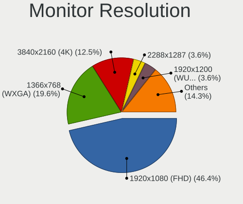

| Resolution        | Notebooks | Percent |
|-------------------|-----------|---------|
| 1920x1080 (FHD)   | 26        | 46.43%  |
| 1366x768 (WXGA)   | 11        | 19.64%  |
| 3840x2160 (4K)    | 7         | 12.5%   |
| 2288x1287         | 2         | 3.57%   |
| 1920x1200 (WUXGA) | 2         | 3.57%   |
| 1280x800 (WXGA)   | 2         | 3.57%   |
| 3840x1200         | 1         | 1.79%   |
| 3840x1080         | 1         | 1.79%   |
| 2880x1800         | 1         | 1.79%   |
| 2304x1440         | 1         | 1.79%   |
| 1600x900 (HD+)    | 1         | 1.79%   |
| 1440x900 (WXGA+)  | 1         | 1.79%   |

Monitor Diagonal
----------------

Diagonal size in inches

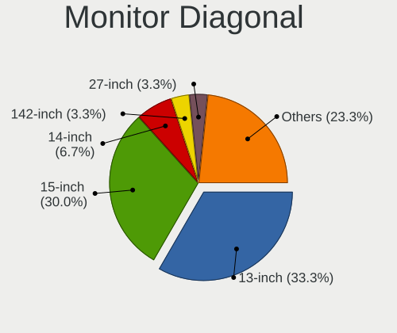

| Inches | Notebooks | Percent |
|--------|-----------|---------|
| 13     | 20        | 33.33%  |
| 15     | 18        | 30%     |
| 14     | 4         | 6.67%   |
| 142    | 2         | 3.33%   |
| 27     | 2         | 3.33%   |
| 24     | 2         | 3.33%   |
| 23     | 2         | 3.33%   |
| 17     | 2         | 3.33%   |
| 12     | 2         | 3.33%   |
| 54     | 1         | 1.67%   |
| 49     | 1         | 1.67%   |
| 43     | 1         | 1.67%   |
| 40     | 1         | 1.67%   |
| 16     | 1         | 1.67%   |
| 10     | 1         | 1.67%   |

Monitor Width
-------------

Physical width

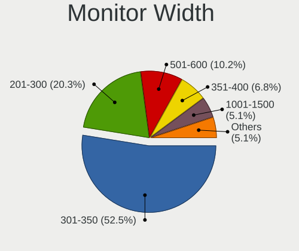

| Width in mm    | Notebooks | Percent |
|----------------|-----------|---------|
| 301-350        | 31        | 52.54%  |
| 201-300        | 12        | 20.34%  |
| 501-600        | 6         | 10.17%  |
| 351-400        | 4         | 6.78%   |
| 1001-1500      | 3         | 5.08%   |
| More than 2000 | 2         | 3.39%   |
| 801-900        | 1         | 1.69%   |

Aspect Ratio
------------

Proportional relationship between the width and the height

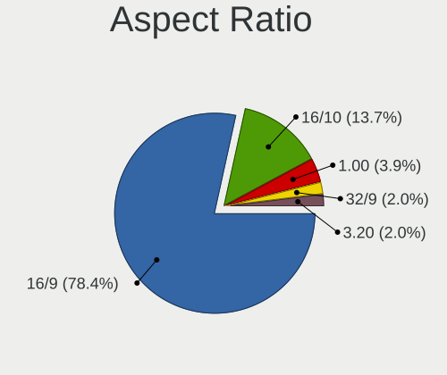

| Ratio | Notebooks | Percent |
|-------|-----------|---------|
| 16/9  | 40        | 78.43%  |
| 16/10 | 7         | 13.73%  |
| 1.00  | 2         | 3.92%   |
| 32/9  | 1         | 1.96%   |
| 3.20  | 1         | 1.96%   |

Monitor Area
------------

Area in inch²

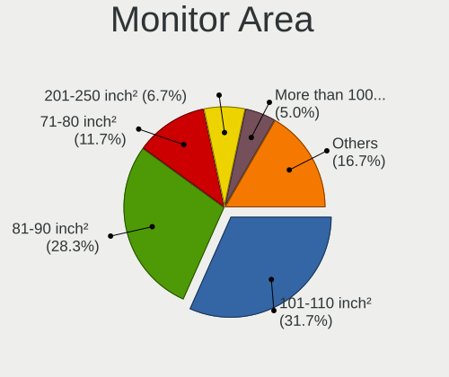

| Area in inch² | Notebooks | Percent |
|----------------|-----------|---------|
| 101-110        | 19        | 31.67%  |
| 81-90          | 17        | 28.33%  |
| 71-80          | 7         | 11.67%  |
| 201-250        | 4         | 6.67%   |
| More than 1000 | 3         | 5%      |
| 501-1000       | 3         | 5%      |
| 61-70          | 2         | 3.33%   |
| 301-350        | 2         | 3.33%   |
| 41-50          | 1         | 1.67%   |
| 131-140        | 1         | 1.67%   |
| 121-130        | 1         | 1.67%   |

Pixel Density
-------------

Pixels per inch

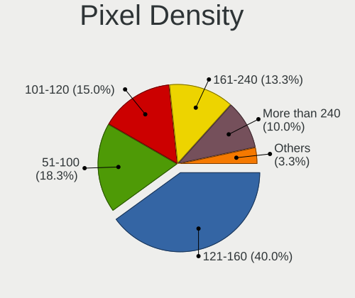

| Density       | Notebooks | Percent |
|---------------|-----------|---------|
| 121-160       | 24        | 40%     |
| 51-100        | 11        | 18.33%  |
| 101-120       | 9         | 15%     |
| 161-240       | 8         | 13.33%  |
| More than 240 | 6         | 10%     |
| 1-50          | 2         | 3.33%   |

Multiple Monitors
-----------------

Total monitors connected

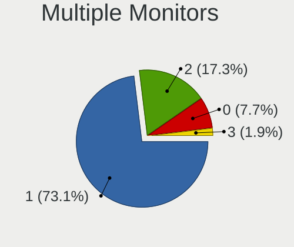

| Total | Notebooks | Percent |
|-------|-----------|---------|
| 1     | 38        | 73.08%  |
| 2     | 9         | 17.31%  |
| 0     | 4         | 7.69%   |
| 3     | 1         | 1.92%   |

Network
-------

Net Controller Vendor
---------------------

Controller vendors

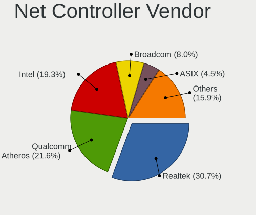

| Vendor                          | Notebooks | Percent |
|---------------------------------|-----------|---------|
| Realtek Semiconductor           | 27        | 30.68%  |
| Qualcomm Atheros                | 19        | 21.59%  |
| Intel                           | 17        | 19.32%  |
| Broadcom                        | 7         | 7.95%   |
| ASIX Electronics                | 4         | 4.55%   |
| Broadcom Limited                | 3         | 3.41%   |
| Xiaomi                          | 1         | 1.14%   |
| TP-Link                         | 1         | 1.14%   |
| Ralink Technology               | 1         | 1.14%   |
| Ralink                          | 1         | 1.14%   |
| Qualcomm Atheros Communications | 1         | 1.14%   |
| OPPO Electronics                | 1         | 1.14%   |
| Nvidia                          | 1         | 1.14%   |
| MediaTek                        | 1         | 1.14%   |
| Google                          | 1         | 1.14%   |
| DisplayLink                     | 1         | 1.14%   |
| D-Link                          | 1         | 1.14%   |

Net Controller Model
--------------------

Controller models

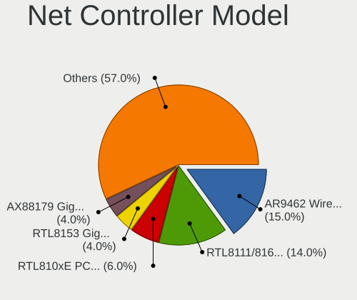

| Model                                                                         | Notebooks | Percent |
|-------------------------------------------------------------------------------|-----------|---------|
| Qualcomm Atheros AR9462 Wireless Network Adapter                              | 15        | 15%     |
| Realtek RTL8111/8168/8211/8411 PCI Express Gigabit Ethernet Controller        | 14        | 14%     |
| Realtek RTL810xE PCI Express Fast Ethernet controller                         | 6         | 6%      |
| Realtek RTL8153 Gigabit Ethernet Adapter                                      | 4         | 4%      |
| ASIX AX88179 Gigabit Ethernet                                                 | 4         | 4%      |
| Qualcomm Atheros QCA9565 / AR9565 Wireless Network Adapter                    | 3         | 3%      |
| Intel Wireless 7265                                                           | 3         | 3%      |
| Intel Wireless 7260                                                           | 3         | 3%      |
| Intel Ethernet Connection I217-LM                                             | 3         | 3%      |
| Intel Wi-Fi 6 AX201                                                           | 2         | 2%      |
| Intel Wi-Fi 5(802.11ac) Wireless-AC 9x6x [Thunder Peak]                       | 2         | 2%      |
| Broadcom Limited BCM4360 802.11ac Dual Band Wireless Network Adapter          | 2         | 2%      |
| Xiaomi Mi/Redmi series (RNDIS)                                                | 1         | 1%      |
| TP-Link 802.11ac NIC                                                          | 1         | 1%      |
| Realtek USB 10/100/1G/2.5 LAN                                                 | 1         | 1%      |
| Realtek RTL88x2bu [AC1200 Techkey]                                            | 1         | 1%      |
| Realtek RTL8822CE 802.11ac PCIe Wireless Network Adapter                      | 1         | 1%      |
| Realtek RTL8822BE 802.11a/b/g/n/ac WiFi adapter                               | 1         | 1%      |
| Realtek RTL8812AU 802.11a/b/g/n/ac 2T2R DB WLAN Adapter                       | 1         | 1%      |
| Realtek RTL8723BE PCIe Wireless Network Adapter                               | 1         | 1%      |
| Realtek RTL8191SEvB Wireless LAN Controller                                   | 1         | 1%      |
| Realtek RTL8188FTV 802.11b/g/n 1T1R 2.4G WLAN Adapter                         | 1         | 1%      |
| Ralink MT7601U Wireless Adapter                                               | 1         | 1%      |
| Ralink RT5390R 802.11bgn PCIe Wireless Network Adapter                        | 1         | 1%      |
| Qualcomm Atheros QCA8172 Fast Ethernet                                        | 1         | 1%      |
| Qualcomm Atheros AR9271 802.11n                                               | 1         | 1%      |
| Qualcomm Atheros AR2413/AR2414 Wireless Network Adapter [AR5005G(S) 802.11bg] | 1         | 1%      |
| OPPO Ace 3V                                                                   | 1         | 1%      |
| Nvidia MCP79 Ethernet                                                         | 1         | 1%      |
| MediaTek WiFi                                                                 | 1         | 1%      |
| Intel Wireless 8265 / 8275                                                    | 1         | 1%      |
| Intel Wireless 8260                                                           | 1         | 1%      |
| Intel Gemini Lake PCH CNVi WiFi                                               | 1         | 1%      |
| Intel Ethernet Connection I218-V                                              | 1         | 1%      |
| Intel Ethernet Connection (4) I219-V                                          | 1         | 1%      |
| Intel Ethernet Connection (2) I219-LM                                         | 1         | 1%      |
| Intel Comet Lake PCH-LP CNVi WiFi                                             | 1         | 1%      |
| Intel Centrino Advanced-N 6235                                                | 1         | 1%      |
| Google Nexus/Pixel Device (tether)                                            | 1         | 1%      |
| DisplayLink USB-C Triple-4K Dock                                              | 1         | 1%      |

Wireless Vendor
---------------

Wireless vendors

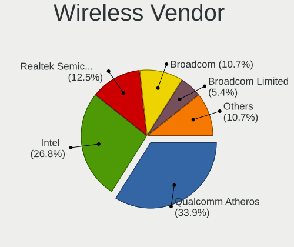

| Vendor                          | Notebooks | Percent |
|---------------------------------|-----------|---------|
| Qualcomm Atheros                | 19        | 33.93%  |
| Intel                           | 15        | 26.79%  |
| Realtek Semiconductor           | 7         | 12.5%   |
| Broadcom                        | 6         | 10.71%  |
| Broadcom Limited                | 3         | 5.36%   |
| TP-Link                         | 1         | 1.79%   |
| Ralink Technology               | 1         | 1.79%   |
| Ralink                          | 1         | 1.79%   |
| Qualcomm Atheros Communications | 1         | 1.79%   |
| MediaTek                        | 1         | 1.79%   |
| D-Link                          | 1         | 1.79%   |

Wireless Model
--------------

Wireless models

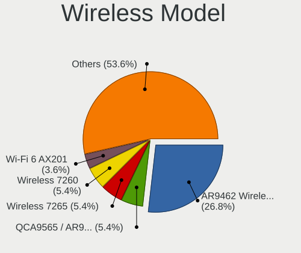

| Model                                                                         | Notebooks | Percent |
|-------------------------------------------------------------------------------|-----------|---------|
| Qualcomm Atheros AR9462 Wireless Network Adapter                              | 15        | 26.79%  |
| Qualcomm Atheros QCA9565 / AR9565 Wireless Network Adapter                    | 3         | 5.36%   |
| Intel Wireless 7265                                                           | 3         | 5.36%   |
| Intel Wireless 7260                                                           | 3         | 5.36%   |
| Intel Wi-Fi 6 AX201                                                           | 2         | 3.57%   |
| Intel Wi-Fi 5(802.11ac) Wireless-AC 9x6x [Thunder Peak]                       | 2         | 3.57%   |
| Broadcom Limited BCM4360 802.11ac Dual Band Wireless Network Adapter          | 2         | 3.57%   |
| TP-Link 802.11ac NIC                                                          | 1         | 1.79%   |
| Realtek RTL88x2bu [AC1200 Techkey]                                            | 1         | 1.79%   |
| Realtek RTL8822CE 802.11ac PCIe Wireless Network Adapter                      | 1         | 1.79%   |
| Realtek RTL8822BE 802.11a/b/g/n/ac WiFi adapter                               | 1         | 1.79%   |
| Realtek RTL8812AU 802.11a/b/g/n/ac 2T2R DB WLAN Adapter                       | 1         | 1.79%   |
| Realtek RTL8723BE PCIe Wireless Network Adapter                               | 1         | 1.79%   |
| Realtek RTL8191SEvB Wireless LAN Controller                                   | 1         | 1.79%   |
| Realtek RTL8188FTV 802.11b/g/n 1T1R 2.4G WLAN Adapter                         | 1         | 1.79%   |
| Ralink MT7601U Wireless Adapter                                               | 1         | 1.79%   |
| Ralink RT5390R 802.11bgn PCIe Wireless Network Adapter                        | 1         | 1.79%   |
| Qualcomm Atheros AR9271 802.11n                                               | 1         | 1.79%   |
| Qualcomm Atheros AR2413/AR2414 Wireless Network Adapter [AR5005G(S) 802.11bg] | 1         | 1.79%   |
| MediaTek WiFi                                                                 | 1         | 1.79%   |
| Intel Wireless 8265 / 8275                                                    | 1         | 1.79%   |
| Intel Wireless 8260                                                           | 1         | 1.79%   |
| Intel Gemini Lake PCH CNVi WiFi                                               | 1         | 1.79%   |
| Intel Comet Lake PCH-LP CNVi WiFi                                             | 1         | 1.79%   |
| Intel Centrino Advanced-N 6235                                                | 1         | 1.79%   |
| D-Link 802.11ac NIC                                                           | 1         | 1.79%   |
| Broadcom Limited BCM4321 802.11a/b/g/n                                        | 1         | 1.79%   |
| Broadcom BCM43602 802.11ac Wireless LAN SoC                                   | 1         | 1.79%   |
| Broadcom BCM4350 802.11ac Wireless Network Adapter                            | 1         | 1.79%   |
| Broadcom BCM43224 802.11a/b/g/n                                               | 1         | 1.79%   |
| Broadcom BCM4322 802.11a/b/g/n Wireless LAN Controller                        | 1         | 1.79%   |
| Broadcom BCM4313 802.11bgn Wireless Network Adapter                           | 1         | 1.79%   |
| Broadcom BCM4312 802.11b/g LP-PHY                                             | 1         | 1.79%   |

Ethernet Vendor
---------------

Ethernet vendors

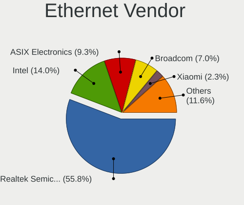

| Vendor                | Notebooks | Percent |
|-----------------------|-----------|---------|
| Realtek Semiconductor | 24        | 55.81%  |
| Intel                 | 6         | 13.95%  |
| ASIX Electronics      | 4         | 9.3%    |
| Broadcom              | 3         | 6.98%   |
| Xiaomi                | 1         | 2.33%   |
| Qualcomm Atheros      | 1         | 2.33%   |
| OPPO Electronics      | 1         | 2.33%   |
| Nvidia                | 1         | 2.33%   |
| Google                | 1         | 2.33%   |
| DisplayLink           | 1         | 2.33%   |

Ethernet Model
--------------

Ethernet models

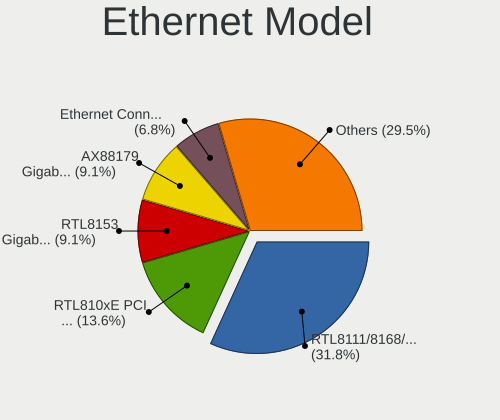

| Model                                                                  | Notebooks | Percent |
|------------------------------------------------------------------------|-----------|---------|
| Realtek RTL8111/8168/8211/8411 PCI Express Gigabit Ethernet Controller | 14        | 31.82%  |
| Realtek RTL810xE PCI Express Fast Ethernet controller                  | 6         | 13.64%  |
| Realtek RTL8153 Gigabit Ethernet Adapter                               | 4         | 9.09%   |
| ASIX AX88179 Gigabit Ethernet                                          | 4         | 9.09%   |
| Intel Ethernet Connection I217-LM                                      | 3         | 6.82%   |
| Xiaomi Mi/Redmi series (RNDIS)                                         | 1         | 2.27%   |
| Realtek USB 10/100/1G/2.5 LAN                                          | 1         | 2.27%   |
| Qualcomm Atheros QCA8172 Fast Ethernet                                 | 1         | 2.27%   |
| OPPO Ace 3V                                                            | 1         | 2.27%   |
| Nvidia MCP79 Ethernet                                                  | 1         | 2.27%   |
| Intel Ethernet Connection I218-V                                       | 1         | 2.27%   |
| Intel Ethernet Connection (4) I219-V                                   | 1         | 2.27%   |
| Intel Ethernet Connection (2) I219-LM                                  | 1         | 2.27%   |
| Google Nexus/Pixel Device (tether)                                     | 1         | 2.27%   |
| DisplayLink USB-C Triple-4K Dock                                       | 1         | 2.27%   |
| Broadcom NetXtreme BCM5764M Gigabit Ethernet PCIe                      | 1         | 2.27%   |
| Broadcom NetXtreme BCM5752 Gigabit Ethernet PCI Express                | 1         | 2.27%   |
| Broadcom NetLink BCM5906M Fast Ethernet PCI Express                    | 1         | 2.27%   |

Net Controller Kind
-------------------

Ethernet, WiFi or modem

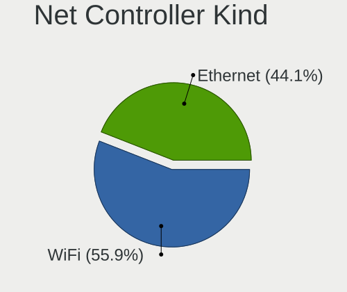

| Kind     | Notebooks | Percent |
|----------|-----------|---------|
| WiFi     | 48        | 55.81%  |
| Ethernet | 38        | 44.19%  |

Used Controller
---------------

Currently used network controller

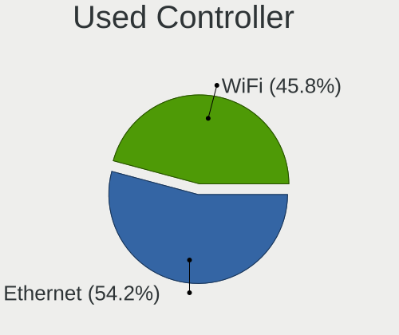

| Kind     | Notebooks | Percent |
|----------|-----------|---------|
| Ethernet | 26        | 52%     |
| WiFi     | 24        | 48%     |

NICs
----

Total network controllers on board

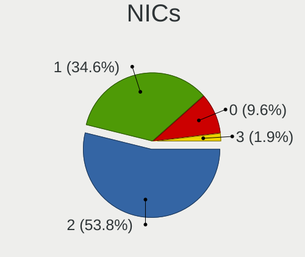

| Total | Notebooks | Percent |
|-------|-----------|---------|
| 2     | 28        | 53.85%  |
| 1     | 18        | 34.62%  |
| 0     | 5         | 9.62%   |
| 3     | 1         | 1.92%   |

IPv6
----

IPv6 vs IPv4

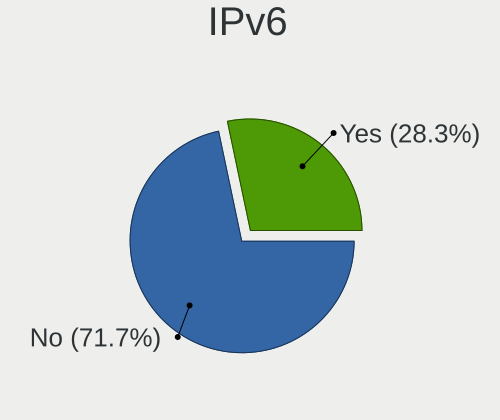

| Used | Notebooks | Percent |
|------|-----------|---------|
| No   | 38        | 71.7%   |
| Yes  | 15        | 28.3%   |

Bluetooth
---------

Bluetooth Vendor
----------------

Controller vendors

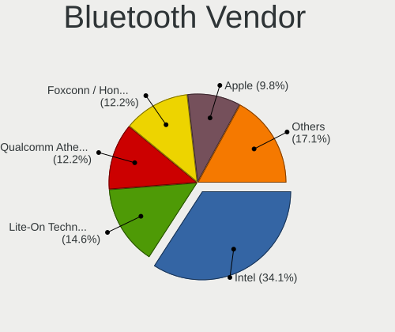

| Vendor                          | Notebooks | Percent |
|---------------------------------|-----------|---------|
| Intel                           | 14        | 34.15%  |
| Lite-On Technology              | 6         | 14.63%  |
| Qualcomm Atheros Communications | 5         | 12.2%   |
| Foxconn / Hon Hai               | 5         | 12.2%   |
| Apple                           | 4         | 9.76%   |
| Realtek Semiconductor           | 3         | 7.32%   |
| IMC Networks                    | 1         | 2.44%   |
| Cambridge Silicon Radio         | 1         | 2.44%   |
| Broadcom                        | 1         | 2.44%   |
| ASUSTek Computer                | 1         | 2.44%   |

Bluetooth Model
---------------

Controller models

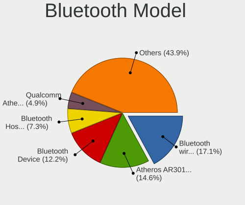

| Model                                                | Notebooks | Percent |
|------------------------------------------------------|-----------|---------|
| Intel Bluetooth wireless interface                   | 7         | 17.07%  |
| Lite-On Atheros AR3012 Bluetooth                     | 6         | 14.63%  |
| Foxconn / Hon Hai Bluetooth Device                   | 5         | 12.2%   |
| Apple Bluetooth Host Controller                      | 3         | 7.32%   |
| Qualcomm Atheros  Bluetooth Device                   | 2         | 4.88%   |
| Qualcomm Atheros AR3012 Bluetooth 4.0                | 2         | 4.88%   |
| Intel Wireless-AC 9260 Bluetooth Adapter             | 2         | 4.88%   |
| Intel Bluetooth 9460/9560 Jefferson Peak (JfP)       | 2         | 4.88%   |
| Intel AX201 Bluetooth                                | 2         | 4.88%   |
| Realtek RTL8822BE Bluetooth 4.2 Adapter              | 1         | 2.44%   |
| Realtek RTL8723B Bluetooth                           | 1         | 2.44%   |
| Realtek Bluetooth Radio                              | 1         | 2.44%   |
| Qualcomm Atheros Dell Wireless 1802 Bluetooth 4.0 LE | 1         | 2.44%   |
| Intel Centrino Bluetooth Wireless Transceiver        | 1         | 2.44%   |
| IMC Networks Bluetooth Device                        | 1         | 2.44%   |
| Cambridge Silicon Radio Bluetooth Dongle (HCI mode)  | 1         | 2.44%   |
| Broadcom HP Portable Valentine                       | 1         | 2.44%   |
| ASUS Broadcom BCM20702A0 Bluetooth                   | 1         | 2.44%   |
| Apple Bluetooth USB Host Controller                  | 1         | 2.44%   |

Sound
-----

Sound Vendor
------------

Sound card vendors

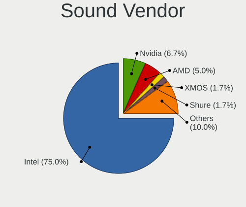

| Vendor              | Notebooks | Percent |
|---------------------|-----------|---------|
| Intel               | 45        | 75%     |
| Nvidia              | 4         | 6.67%   |
| AMD                 | 3         | 5%      |
| XMOS                | 1         | 1.67%   |
| Shure               | 1         | 1.67%   |
| M-Audio             | 1         | 1.67%   |
| Logitech            | 1         | 1.67%   |
| GN Netcom           | 1         | 1.67%   |
| Elgato Systems      | 1         | 1.67%   |
| C-Media Electronics | 1         | 1.67%   |
| Astro Gaming        | 1         | 1.67%   |

Sound Model
-----------

Sound card models

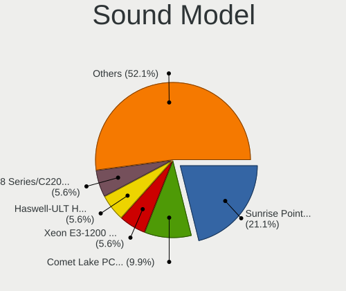

| Model                                                                      | Notebooks | Percent |
|----------------------------------------------------------------------------|-----------|---------|
| Intel Sunrise Point-LP HD Audio                                            | 15        | 21.13%  |
| Intel Comet Lake PCH-LP cAVS                                               | 7         | 9.86%   |
| Intel Xeon E3-1200 v3/4th Gen Core Processor HD Audio Controller           | 4         | 5.63%   |
| Intel Haswell-ULT HD Audio Controller                                      | 4         | 5.63%   |
| Intel 8 Series/C220 Series Chipset High Definition Audio Controller        | 4         | 5.63%   |
| Intel 8 Series HD Audio Controller                                         | 4         | 5.63%   |
| Intel Tiger Lake-LP Smart Sound Technology Audio Controller                | 3         | 4.23%   |
| Intel 7 Series/C216 Chipset Family High Definition Audio Controller        | 2         | 2.82%   |
| XMOS Khadas Tone Control                                                   | 1         | 1.41%   |
| Shure MV5                                                                  | 1         | 1.41%   |
| Nvidia MCP79 High Definition Audio                                         | 1         | 1.41%   |
| Nvidia GT216 HDMI Audio Controller                                         | 1         | 1.41%   |
| Nvidia GP107GL High Definition Audio Controller                            | 1         | 1.41%   |
| Nvidia GM107 High Definition Audio Controller [GeForce 940MX]              | 1         | 1.41%   |
| M-Audio M-Audio Fast Track MKII                                            | 1         | 1.41%   |
| Logitech Headset H340                                                      | 1         | 1.41%   |
| Intel Wildcat Point-LP High Definition Audio Controller                    | 1         | 1.41%   |
| Intel NM10/ICH7 Family High Definition Audio Controller                    | 1         | 1.41%   |
| Intel CM238 HD Audio Controller                                            | 1         | 1.41%   |
| Intel Celeron/Pentium Silver Processor High Definition Audio               | 1         | 1.41%   |
| Intel Celeron N3350/Pentium N4200/Atom E3900 Series Audio Cluster          | 1         | 1.41%   |
| Intel Broadwell-U Audio Controller                                         | 1         | 1.41%   |
| Intel Atom Processor Z36xxx/Z37xxx Series High Definition Audio Controller | 1         | 1.41%   |
| Intel 82801I (ICH9 Family) HD Audio Controller                             | 1         | 1.41%   |
| Intel 6 Series/C200 Series Chipset Family High Definition Audio Controller | 1         | 1.41%   |
| Intel 5 Series/3400 Series Chipset High Definition Audio                   | 1         | 1.41%   |
| Intel 100 Series/C230 Series Chipset Family HD Audio Controller            | 1         | 1.41%   |
| GN Netcom Jabra Link 380                                                   | 1         | 1.41%   |
| Elgato Systems Elgato Wave:3                                               | 1         | 1.41%   |
| C-Media Electronics CM6631A Audio Processor                                | 1         | 1.41%   |
| Astro Gaming Astro A50                                                     | 1         | 1.41%   |
| AMD Trinity HDMI Audio Controller                                          | 1         | 1.41%   |
| AMD SBx00 Azalia (Intel HDA)                                               | 1         | 1.41%   |
| AMD Ryzen HD Audio Controller                                              | 1         | 1.41%   |
| AMD Raven/Raven2/Fenghuang HDMI/DP Audio Controller                        | 1         | 1.41%   |
| AMD FCH Azalia Controller                                                  | 1         | 1.41%   |

Memory
------

Memory Vendor
-------------

Memory module vendors

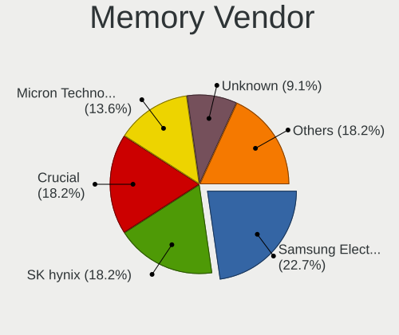

| Vendor              | Notebooks | Percent |
|---------------------|-----------|---------|
| Samsung Electronics | 5         | 22.73%  |
| SK hynix            | 4         | 18.18%  |
| Crucial             | 4         | 18.18%  |
| Micron Technology   | 3         | 13.64%  |
| Unknown             | 2         | 9.09%   |
| Toshiba             | 1         | 4.55%   |
| Ramaxel Technology  | 1         | 4.55%   |
| Kingston            | 1         | 4.55%   |
| Elpida              | 1         | 4.55%   |

Memory Model
------------

Memory module models

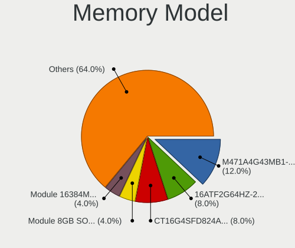

| Model                                                          | Notebooks | Percent |
|----------------------------------------------------------------|-----------|---------|
| Samsung RAM M471A4G43MB1-CTD 32GB SODIMM DDR4 2667MT/s         | 3         | 12%     |
| Micron RAM 16ATF2G64HZ-2G3B1 16GB SODIMM DDR4 2400MT/s         | 2         | 8%      |
| Crucial RAM CT16G4SFD824A.M16FRS 16GB SODIMM DDR4 2400MT/s     | 2         | 8%      |
| Unknown RAM Module 8GB SODIMM DDR3 1600MT/s                    | 1         | 4%      |
| Unknown RAM Module 16384MB 2133MT/s                            | 1         | 4%      |
| Toshiba RAM 8HTF12864HDY-800G1 2GB SODIMM 1066MT/s             | 1         | 4%      |
| Toshiba RAM 64T128020EDL2.5C2 2GB SODIMM 1066MT/s              | 1         | 4%      |
| SK hynix RAM HMT41GS6AFR8A-PB 8GiB SODIMM DDR3 2667MT/s        | 1         | 4%      |
| SK hynix RAM HMA851S6JJR6N-VK 4GB SODIMM DDR4 2667MT/s         | 1         | 4%      |
| SK hynix RAM HMA81GS6JJR8N-VK 8GB SODIMM DDR4 2667MT/s         | 1         | 4%      |
| SK hynix RAM HMA81GS6AFR8N-UH 8GB SODIMM DDR4 2667MT/s         | 1         | 4%      |
| SK hynix RAM HCNNNCPMBLHR-NEE 2GB Row Of Chips LPDDR4 4267MT/s | 1         | 4%      |
| Samsung RAM Module 4GB SODIMM LPDDR3 1867MT/s                  | 1         | 4%      |
| Samsung RAM K4A8G165WC-BCTD 4GB SODIMM DDR4 2667MT/s           | 1         | 4%      |
| Ramaxel RAM RMT3170ME68F9F1600 4GB SODIMM DDR3 1600MT/s        | 1         | 4%      |
| Micron RAM 53E1G32D2NP-046 2GB Row Of Chips LPDDR4 4267MT/s    | 1         | 4%      |
| Kingston RAM HX432S20IB/8 8GB SODIMM DDR4 3200MT/s             | 1         | 4%      |
| Kingston RAM 9905625-004.A03LF 16GB SODIMM DDR4 3200MT/s       | 1         | 4%      |
| Elpida RAM EBJ21UE8BDS0-AE-F 2GB SODIMM DDR3 1067MT/s          | 1         | 4%      |
| Crucial RAM CT4G4SFS8213.C8FBD1 4GB SODIMM DDR4 2133MT/s       | 1         | 4%      |
| Crucial RAM CT16G4S24AM.M16FE 16GB SODIMM DDR4 2400MT/s        | 1         | 4%      |

Memory Kind
-----------

Memory module kinds

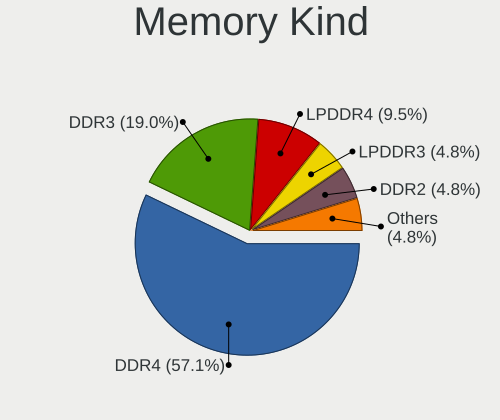

| Kind    | Notebooks | Percent |
|---------|-----------|---------|
| DDR4    | 12        | 57.14%  |
| DDR3    | 4         | 19.05%  |
| LPDDR4  | 2         | 9.52%   |
| LPDDR3  | 1         | 4.76%   |
| DDR2    | 1         | 4.76%   |
| Unknown | 1         | 4.76%   |

Memory Form Factor
------------------

Physical design of the memory module

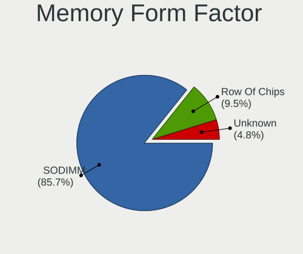

| Name         | Notebooks | Percent |
|--------------|-----------|---------|
| SODIMM       | 18        | 85.71%  |
| Row Of Chips | 2         | 9.52%   |
| Unknown      | 1         | 4.76%   |

Memory Size
-----------

Memory module size

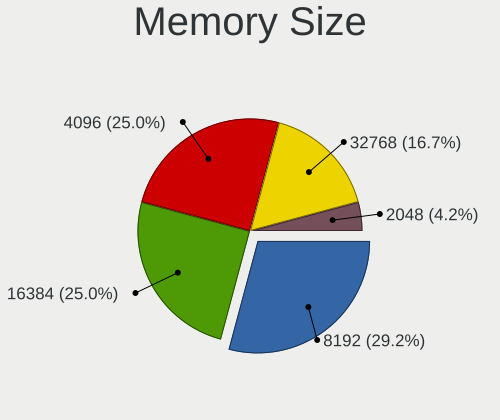

| Size  | Notebooks | Percent |
|-------|-----------|---------|
| 8192  | 7         | 29.17%  |
| 16384 | 6         | 25%     |
| 4096  | 6         | 25%     |
| 32768 | 4         | 16.67%  |
| 2048  | 1         | 4.17%   |

Memory Speed
------------

Memory module speed

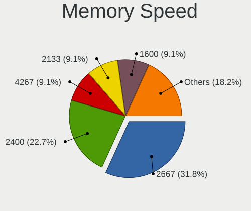

| Speed | Notebooks | Percent |
|-------|-----------|---------|
| 2667  | 7         | 31.82%  |
| 2400  | 5         | 22.73%  |
| 4267  | 2         | 9.09%   |
| 2133  | 2         | 9.09%   |
| 1600  | 2         | 9.09%   |
| 3200  | 1         | 4.55%   |
| 1867  | 1         | 4.55%   |
| 1067  | 1         | 4.55%   |
| 1066  | 1         | 4.55%   |

Printers & scanners
-------------------

Printer Vendor
--------------

Printer device vendors

Zero info for selected period =(

Printer Model
-------------

Printer device models

Zero info for selected period =(

Scanner Vendor
--------------

Scanner device vendors

Zero info for selected period =(

Scanner Model
-------------

Scanner device models

Zero info for selected period =(

Camera
------

Camera Vendor
-------------

Camera device vendors

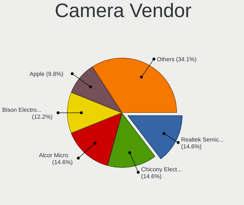

| Vendor                                 | Notebooks | Percent |
|----------------------------------------|-----------|---------|
| Realtek Semiconductor                  | 6         | 14.63%  |
| Chicony Electronics                    | 6         | 14.63%  |
| Alcor Micro                            | 6         | 14.63%  |
| Bison Electronics                      | 5         | 12.2%   |
| Apple                                  | 4         | 9.76%   |
| Sunplus Innovation Technology          | 3         | 7.32%   |
| Quanta                                 | 2         | 4.88%   |
| Suyin                                  | 1         | 2.44%   |
| Silicon Motion                         | 1         | 2.44%   |
| Microdia                               | 1         | 2.44%   |
| Logitech                               | 1         | 2.44%   |
| Lite-On Technology                     | 1         | 2.44%   |
| IMC Networks                           | 1         | 2.44%   |
| Google                                 | 1         | 2.44%   |
| Genesys Logic                          | 1         | 2.44%   |
| Cheng Uei Precision Industry (Foxlink) | 1         | 2.44%   |

Camera Model
------------

Camera device models

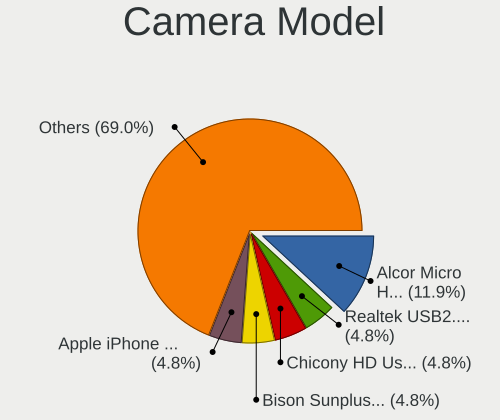

| Model                                                                      | Notebooks | Percent |
|----------------------------------------------------------------------------|-----------|---------|
| Alcor Micro HD WebCam                                                      | 5         | 11.9%   |
| Realtek USB2.0 camera                                                      | 2         | 4.76%   |
| Chicony HD User Facing                                                     | 2         | 4.76%   |
| Bison SunplusIT INC. Integrated Camera                                     | 2         | 4.76%   |
| Apple iPhone 5/5C/5S/6/SE/7/8/X                                            | 2         | 4.76%   |
| Apple Built-in iSight                                                      | 2         | 4.76%   |
| Suyin HP Integrated Webcam                                                 | 1         | 2.38%   |
| Sunplus Integrated_Webcam_HD                                               | 1         | 2.38%   |
| Sunplus Integrated Camera                                                  | 1         | 2.38%   |
| Sunplus HD WebCam                                                          | 1         | 2.38%   |
| Silicon Motion WebCam SC-13HDL12131N                                       | 1         | 2.38%   |
| Realtek Lenovo EasyCamera                                                  | 1         | 2.38%   |
| Realtek Integrated_Webcam_HD                                               | 1         | 2.38%   |
| Realtek Integrated Webcam                                                  | 1         | 2.38%   |
| Realtek HP Truevision HD                                                   | 1         | 2.38%   |
| Quanta HD User Facing                                                      | 1         | 2.38%   |
| Quanta HD Camera                                                           | 1         | 2.38%   |
| Microdia HP Integrated Webcam                                              | 1         | 2.38%   |
| Logitech C922 Pro Stream Webcam                                            | 1         | 2.38%   |
| Lite-On Integrated Camera                                                  | 1         | 2.38%   |
| IMC Networks Lenovo EasyCamera                                             | 1         | 2.38%   |
| Genesys Logic Camera                                                       | 1         | 2.38%   |
| Chicony USB2.0 UVC WebCam                                                  | 1         | 2.38%   |
| Chicony USB 2.0 Camera                                                     | 1         | 2.38%   |
| Chicony Integrated Camera                                                  | 1         | 2.38%   |
| Chicony HP TrueVision HD Camera                                            | 1         | 2.38%   |
| Cheng Uei Precision Industry (Foxlink) HP Wide Vision HD integrated webcam | 1         | 2.38%   |
| Bison SunplusIT Integrated Camera                                          | 1         | 2.38%   |
| Bison Lenovo EasyCamera                                                    | 1         | 2.38%   |
| Bison BisonCam, NB Pro                                                     | 1         | 2.38%   |
| Apple iBridge                                                              | 1         | 2.38%   |
| Alcor Micro HP Webcam-101                                                  | 1         | 2.38%   |
| Unknown                                                                    | 1         | 2.38%   |

Security
--------

Fingerprint Vendor
------------------

Fingerprint sensor vendors

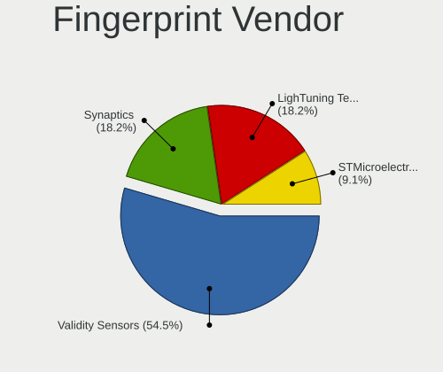

| Vendor                | Notebooks | Percent |
|-----------------------|-----------|---------|
| Validity Sensors      | 6         | 54.55%  |
| Synaptics             | 2         | 18.18%  |
| LighTuning Technology | 2         | 18.18%  |
| STMicroelectronics    | 1         | 9.09%   |

Fingerprint Model
-----------------

Fingerprint sensor models

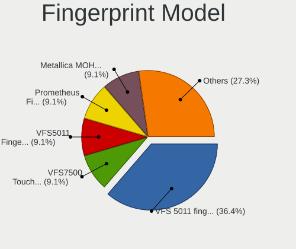

| Model                                             | Notebooks | Percent |
|---------------------------------------------------|-----------|---------|
| Validity Sensors VFS 5011 fingerprint sensor      | 4         | 36.36%  |
| Validity Sensors VFS7500 Touch Fingerprint Sensor | 1         | 9.09%   |
| Validity Sensors VFS5011 Fingerprint Reader       | 1         | 9.09%   |
| Synaptics Prometheus Fingerprint Reader           | 1         | 9.09%   |
| Synaptics Metallica MOH Touch Fingerprint Reader  | 1         | 9.09%   |
| STMicroelectronics Fingerprint Reader             | 1         | 9.09%   |
| LighTuning ES603 Swipe Fingerprint Sensor         | 1         | 9.09%   |
| LighTuning EgisTec Touch Fingerprint Sensor       | 1         | 9.09%   |

Chipcard Vendor
---------------

Chipcard module vendors

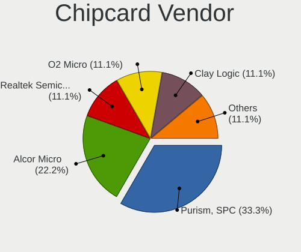

| Vendor                    | Notebooks | Percent |
|---------------------------|-----------|---------|
| Purism, SPC               | 3         | 33.33%  |
| Alcor Micro               | 2         | 22.22%  |
| Realtek Semiconductor     | 1         | 11.11%  |
| O2 Micro                  | 1         | 11.11%  |
| Clay Logic                | 1         | 11.11%  |
| Aladdin Knowledge Systems | 1         | 11.11%  |

Chipcard Model
--------------

Chipcard module models

| Model                                             | Notebooks | Percent |
|---------------------------------------------------|-----------|---------|
| Purism, SPC Librem Key                            | 3         | 33.33%  |
| Alcor Micro AU9540 Smartcard Reader               | 2         | 22.22%  |
| Realtek Semiconductor Smart Card Reader Interface | 1         | 11.11%  |
| O2 Micro Oz776 SmartCard Reader                   | 1         | 11.11%  |
| Clay Logic Nitrokey Pro                           | 1         | 11.11%  |
| Aladdin Knowledge Systems Token JC                | 1         | 11.11%  |

Unsupported
-----------

Unsupported Devices
-------------------

Total unsupported devices on board

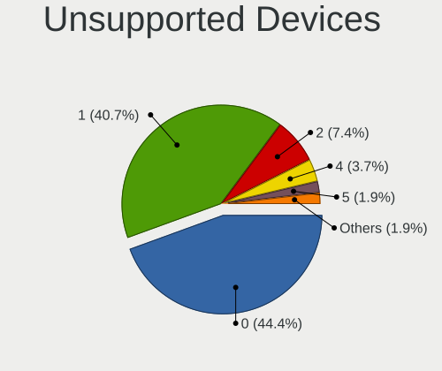

| Total | Notebooks | Percent |
|-------|-----------|---------|
| 0     | 24        | 44.44%  |
| 1     | 22        | 40.74%  |
| 2     | 4         | 7.41%   |
| 4     | 2         | 3.7%    |
| 5     | 1         | 1.85%   |
| 3     | 1         | 1.85%   |

Unsupported Device Types
------------------------

Types of unsupported devices

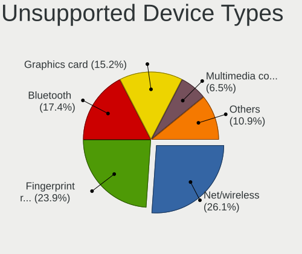

| Type                     | Notebooks | Percent |
|--------------------------|-----------|---------|
| Net/wireless             | 12        | 26.09%  |
| Fingerprint reader       | 11        | 23.91%  |
| Bluetooth                | 8         | 17.39%  |
| Graphics card            | 7         | 15.22%  |
| Multimedia controller    | 3         | 6.52%   |
| Chipcard                 | 3         | 6.52%   |
| Communication controller | 1         | 2.17%   |
| Camera                   | 1         | 2.17%   |

