PureOS - Tested Hardware & Statistics (Notebooks)
-------------------------------------------------

A project to collect tested hardware configurations for PureOS.

Anyone can contribute to this report by the [hw-probe](https://github.com/linuxhw/hw-probe) tool:

    sudo -E hw-probe -all -upload

Please contribute! Especially if your hardware is rare.

Contents
--------

* [ Test Cases ](#test-cases)

* [ System ](#system)
  - [ OS                       ](#os)
  - [ OS Family                ](#os-family)
  - [ Kernel                   ](#kernel)
  - [ Kernel Family            ](#kernel-family)
  - [ Kernel Major Ver.        ](#kernel-major-ver)
  - [ Arch                     ](#arch)
  - [ DE                       ](#de)
  - [ Display Server           ](#display-server)
  - [ Display Manager          ](#display-manager)
  - [ OS Lang                  ](#os-lang)
  - [ Boot Mode                ](#boot-mode)
  - [ Filesystem               ](#filesystem)
  - [ Part. scheme             ](#part-scheme)
  - [ Dual Boot with Linux/BSD ](#dual-boot-with-linuxbsd)
  - [ Dual Boot (Win)          ](#dual-boot-win)

* [ Board ](#board)
  - [ Vendor                   ](#vendor)
  - [ Model                    ](#model)
  - [ Model Family             ](#model-family)
  - [ MFG Year                 ](#mfg-year)
  - [ Form Factor              ](#form-factor)
  - [ Secure Boot              ](#secure-boot)
  - [ Coreboot                 ](#coreboot)
  - [ RAM Size                 ](#ram-size)
  - [ RAM Used                 ](#ram-used)
  - [ Total Drives             ](#total-drives)
  - [ Has CD-ROM               ](#has-cd-rom)
  - [ Has Ethernet             ](#has-ethernet)
  - [ Has WiFi                 ](#has-wifi)
  - [ Has Bluetooth            ](#has-bluetooth)

* [ Location ](#location)
  - [ Country                  ](#country)
  - [ City                     ](#city)

* [ Drives ](#drives)
  - [ Drive Vendor             ](#drive-vendor)
  - [ Drive Model              ](#drive-model)
  - [ HDD Vendor               ](#hdd-vendor)
  - [ SSD Vendor               ](#ssd-vendor)
  - [ Drive Kind               ](#drive-kind)
  - [ Drive Connector          ](#drive-connector)
  - [ Drive Size               ](#drive-size)
  - [ Space Total              ](#space-total)
  - [ Space Used               ](#space-used)
  - [ Malfunc. Drives          ](#malfunc-drives)
  - [ Malfunc. Drive Vendor    ](#malfunc-drive-vendor)
  - [ Malfunc. HDD Vendor      ](#malfunc-hdd-vendor)
  - [ Malfunc. Drive Kind      ](#malfunc-drive-kind)
  - [ Failed Drives            ](#failed-drives)
  - [ Failed Drive Vendor      ](#failed-drive-vendor)
  - [ Drive Status             ](#drive-status)

* [ Storage controller ](#storage-controller)
  - [ Storage Vendor           ](#storage-vendor)
  - [ Storage Model            ](#storage-model)
  - [ Storage Kind             ](#storage-kind)

* [ Processor ](#processor)
  - [ CPU Vendor               ](#cpu-vendor)
  - [ CPU Model                ](#cpu-model)
  - [ CPU Model Family         ](#cpu-model-family)
  - [ CPU Cores                ](#cpu-cores)
  - [ CPU Sockets              ](#cpu-sockets)
  - [ CPU Threads              ](#cpu-threads)
  - [ CPU Op-Modes             ](#cpu-op-modes)
  - [ CPU Microcode            ](#cpu-microcode)
  - [ CPU Microarch            ](#cpu-microarch)

* [ Graphics ](#graphics)
  - [ GPU Vendor               ](#gpu-vendor)
  - [ GPU Model                ](#gpu-model)
  - [ GPU Combo                ](#gpu-combo)
  - [ GPU Driver               ](#gpu-driver)
  - [ GPU Memory               ](#gpu-memory)

* [ Monitor ](#monitor)
  - [ Monitor Vendor           ](#monitor-vendor)
  - [ Monitor Model            ](#monitor-model)
  - [ Monitor Resolution       ](#monitor-resolution)
  - [ Monitor Diagonal         ](#monitor-diagonal)
  - [ Monitor Width            ](#monitor-width)
  - [ Aspect Ratio             ](#aspect-ratio)
  - [ Monitor Area             ](#monitor-area)
  - [ Pixel Density            ](#pixel-density)
  - [ Multiple Monitors        ](#multiple-monitors)

* [ Network ](#network)
  - [ Net Controller Vendor    ](#net-controller-vendor)
  - [ Net Controller Model     ](#net-controller-model)
  - [ Wireless Vendor          ](#wireless-vendor)
  - [ Wireless Model           ](#wireless-model)
  - [ Ethernet Vendor          ](#ethernet-vendor)
  - [ Ethernet Model           ](#ethernet-model)
  - [ Net Controller Kind      ](#net-controller-kind)
  - [ Used Controller          ](#used-controller)
  - [ NICs                     ](#nics)
  - [ IPv6                     ](#ipv6)

* [ Bluetooth ](#bluetooth)
  - [ Bluetooth Vendor         ](#bluetooth-vendor)
  - [ Bluetooth Model          ](#bluetooth-model)

* [ Sound ](#sound)
  - [ Sound Vendor             ](#sound-vendor)
  - [ Sound Model              ](#sound-model)

* [ Memory ](#memory)
  - [ Memory Vendor            ](#memory-vendor)
  - [ Memory Model             ](#memory-model)
  - [ Memory Kind              ](#memory-kind)
  - [ Memory Form Factor       ](#memory-form-factor)
  - [ Memory Size              ](#memory-size)
  - [ Memory Speed             ](#memory-speed)

* [ Printers & scanners ](#printers--scanners)
  - [ Printer Vendor           ](#printer-vendor)
  - [ Printer Model            ](#printer-model)
  - [ Scanner Vendor           ](#scanner-vendor)
  - [ Scanner Model            ](#scanner-model)

* [ Camera ](#camera)
  - [ Camera Vendor            ](#camera-vendor)
  - [ Camera Model             ](#camera-model)

* [ Security ](#security)
  - [ Fingerprint Vendor       ](#fingerprint-vendor)
  - [ Fingerprint Model        ](#fingerprint-model)
  - [ Chipcard Vendor          ](#chipcard-vendor)
  - [ Chipcard Model           ](#chipcard-model)

* [ Unsupported ](#unsupported)
  - [ Unsupported Devices      ](#unsupported-devices)
  - [ Unsupported Device Types ](#unsupported-device-types)

Test Cases
----------

Total: 36

| Vendor        | Model                       | Probe                                                      | Date         |
|---------------|-----------------------------|------------------------------------------------------------|--------------|
| Purism        | Librem 14                   | [9d078217f1](https://linux-hardware.org/?probe=9d078217f1) | Apr 23, 2022 |
| HP            | Pavilion g6                 | [796bf7f467](https://linux-hardware.org/?probe=796bf7f467) | Apr 23, 2022 |
| Dell          | Inspiron 15-3567            | [8cbc7d1caf](https://linux-hardware.org/?probe=8cbc7d1caf) | Apr 20, 2022 |
| Purism        | Librem 15 v4                | [061aeeecf7](https://linux-hardware.org/?probe=061aeeecf7) | Apr 13, 2022 |
| Lenovo        | ThinkPad T440p              | [45a1ee6fbf](https://linux-hardware.org/?probe=45a1ee6fbf) | Apr 12, 2022 |
| HP            | Pavilion Notebook           | [c0dd92f23c](https://linux-hardware.org/?probe=c0dd92f23c) | Apr 03, 2022 |
| Acer          | Nitro AN515-43              | [e1386a38c7](https://linux-hardware.org/?probe=e1386a38c7) | Mar 20, 2022 |
| Dell          | Inspiron 15-3567            | [c8723d2dd9](https://linux-hardware.org/?probe=c8723d2dd9) | Feb 21, 2022 |
| Dell          | Inspiron 15-3567            | [45529bb469](https://linux-hardware.org/?probe=45529bb469) | Feb 21, 2022 |
| Lenovo        | ThinkPad T540p 20BFS23T0... | [c49acb0edf](https://linux-hardware.org/?probe=c49acb0edf) | Feb 21, 2022 |
| Lenovo        | ThinkPad T540p 20BFS23T0... | [6f13abc9eb](https://linux-hardware.org/?probe=6f13abc9eb) | Feb 21, 2022 |
| Acer          | Aspire E5-553G              | [1f5badca6e](https://linux-hardware.org/?probe=1f5badca6e) | Feb 06, 2022 |
| Lenovo        | ThinkPad E480 20KN003SUS    | [ad043b077a](https://linux-hardware.org/?probe=ad043b077a) | Nov 25, 2021 |
| Apple         | MacBookPro14,2              | [5f4d435f0d](https://linux-hardware.org/?probe=5f4d435f0d) | Nov 24, 2021 |
| Purism        | Librem 14                   | [68e8f5b427](https://linux-hardware.org/?probe=68e8f5b427) | Sep 27, 2021 |
| Lenovo        | ThinkPad 13 2nd Gen 20J2... | [077ff209de](https://linux-hardware.org/?probe=077ff209de) | Aug 18, 2021 |
| Purism        | Librem 14                   | [295a2a1392](https://linux-hardware.org/?probe=295a2a1392) | Jul 15, 2021 |
| Purism        | Librem 14                   | [49d9b561c6](https://linux-hardware.org/?probe=49d9b561c6) | Jul 15, 2021 |
| Toshiba       | Satellite L500D             | [b830927060](https://linux-hardware.org/?probe=b830927060) | Jul 04, 2021 |
| Dell          | XPS 13 9370                 | [c8937f439d](https://linux-hardware.org/?probe=c8937f439d) | Jun 09, 2021 |
| Purism        | Librem 14                   | [0c18b37b73](https://linux-hardware.org/?probe=0c18b37b73) | Jun 01, 2021 |
| Pine Micro... | Pine64 Pinebook Pro         | [79c01fbf3a](https://linux-hardware.org/?probe=79c01fbf3a) | Oct 28, 2020 |
| Unknown       | Unknown                     | [c24817ee80](https://linux-hardware.org/?probe=c24817ee80) | Sep 15, 2020 |
| Unknown       | Purism Librem 5             | [2c6b84a04f](https://linux-hardware.org/?probe=2c6b84a04f) | Jul 23, 2020 |
| HP            | Pavilion g6                 | [eb23d17143](https://linux-hardware.org/?probe=eb23d17143) | Jul 15, 2020 |
| Lenovo        | ThinkPad T440 20B60044RT    | [db8ba33d45](https://linux-hardware.org/?probe=db8ba33d45) | Jun 02, 2020 |
| Purism        | Librem 15 v4                | [d9f38d66c3](https://linux-hardware.org/?probe=d9f38d66c3) | Apr 29, 2020 |
| Notebook      | P17SM                       | [730c65e65d](https://linux-hardware.org/?probe=730c65e65d) | Apr 22, 2020 |
| Purism        | Librem 15 v4                | [6e5f1119b7](https://linux-hardware.org/?probe=6e5f1119b7) | Apr 10, 2020 |
| Purism        | Librem 15 v3                | [a43311f999](https://linux-hardware.org/?probe=a43311f999) | Dec 18, 2019 |
| Purism        | Librem 13 v4                | [6d7a537e86](https://linux-hardware.org/?probe=6d7a537e86) | Nov 15, 2019 |
| Dell          | Inspiron 5547               | [689dfea547](https://linux-hardware.org/?probe=689dfea547) | Oct 25, 2019 |
| Purism        | Librem 13 v4                | [6d7c18d329](https://linux-hardware.org/?probe=6d7c18d329) | Oct 18, 2019 |
| Lenovo        | G505s 20255                 | [bce345b263](https://linux-hardware.org/?probe=bce345b263) | Aug 30, 2019 |
| Purism        | Librem 13 v2                | [3e70a8dff1](https://linux-hardware.org/?probe=3e70a8dff1) | Jul 13, 2019 |
| Purism        | Librem 15 v3                | [02e23b6024](https://linux-hardware.org/?probe=02e23b6024) | May 21, 2018 |

System
------

OS
--

Installed operating systems

| Name        | Notebooks | Percent |
|-------------|-----------|---------|
| PureOS 10.0 | 9         | 32.14%  |
| PureOS 9.0  | 8         | 28.57%  |
| PureOS 10   | 6         | 21.43%  |
| PureOS 9    | 3         | 10.71%  |
| PureOS 8    | 2         | 7.14%   |

OS Family
---------

OS without a version

| Name   | Notebooks | Percent |
|--------|-----------|---------|
| PureOS | 27        | 100%    |

Kernel
------

Version of the Linux kernel

| Version                          | Notebooks | Percent |
|----------------------------------|-----------|---------|
| 4.19.0-5-amd64                   | 8         | 27.59%  |
| 5.10.0-13-amd64                  | 5         | 17.24%  |
| 5.10.0-8-amd64                   | 3         | 10.34%  |
| 5.7.0-1-librem5                  | 2         | 6.9%    |
| 5.10.0-7-amd64                   | 2         | 6.9%    |
| 5.10.0-11-amd64                  | 2         | 6.9%    |
| 5.7.0-0.38-1-pinebookpro-hwaccel | 1         | 3.45%   |
| 5.15.0-2-amd64                   | 1         | 3.45%   |
| 5.10.0-9-amd64                   | 1         | 3.45%   |
| 5.10.0-6-amd64                   | 1         | 3.45%   |
| 5.10.0-12-amd64                  | 1         | 3.45%   |
| 4.19.0-14-amd64                  | 1         | 3.45%   |
| 4.16.0-1-amd64                   | 1         | 3.45%   |

Kernel Family
-------------

Linux kernel without a distro release

| Version | Notebooks | Percent |
|---------|-----------|---------|
| 5.10.0  | 14        | 50%     |
| 4.19.0  | 9         | 32.14%  |
| 5.7.0   | 3         | 10.71%  |
| 5.15.0  | 1         | 3.57%   |
| 4.16.0  | 1         | 3.57%   |

Kernel Major Ver.
-----------------

Linux kernel major version

| Version | Notebooks | Percent |
|---------|-----------|---------|
| 5.10    | 14        | 50%     |
| 4.19    | 9         | 32.14%  |
| 5.7     | 3         | 10.71%  |
| 5.15    | 1         | 3.57%   |
| 4.16    | 1         | 3.57%   |

Arch
----

OS architecture (x86_64, i586, etc.)

| Name    | Notebooks | Percent |
|---------|-----------|---------|
| x86_64  | 24        | 88.89%  |
| aarch64 | 3         | 11.11%  |

DE
--

Desktop Environment

| Name            | Notebooks | Percent |
|-----------------|-----------|---------|
| GNOME           | 21        | 75%     |
| Unknown         | 4         | 14.29%  |
| MATE            | 1         | 3.57%   |
| KDE5            | 1         | 3.57%   |
| GNOME Flashback | 1         | 3.57%   |

Display Server
--------------

X11 or Wayland

| Name    | Notebooks | Percent |
|---------|-----------|---------|
| Wayland | 19        | 65.52%  |
| X11     | 4         | 13.79%  |
| Unknown | 4         | 13.79%  |
| Tty     | 2         | 6.9%    |

Display Manager
---------------

SDDM, LightDM, etc.

| Name    | Notebooks | Percent |
|---------|-----------|---------|
| Unknown | 17        | 62.96%  |
| GDM     | 8         | 29.63%  |
| GDM3    | 2         | 7.41%   |

OS Lang
-------

Language

| Lang    | Notebooks | Percent |
|---------|-----------|---------|
| en_US   | 14        | 48.28%  |
| Unknown | 4         | 13.79%  |
| en_GB   | 2         | 6.9%    |
| de_DE   | 2         | 6.9%    |
| zh_CN   | 1         | 3.45%   |
| ru_RU   | 1         | 3.45%   |
| pt_PT   | 1         | 3.45%   |
| pl_PL   | 1         | 3.45%   |
| it_IT   | 1         | 3.45%   |
| es_CR   | 1         | 3.45%   |
| C       | 1         | 3.45%   |

Boot Mode
---------

EFI or BIOS

| Mode | Notebooks | Percent |
|------|-----------|---------|
| BIOS | 24        | 88.89%  |
| EFI  | 3         | 11.11%  |

Filesystem
----------

Type of filesystem

| Type    | Notebooks | Percent |
|---------|-----------|---------|
| Ext4    | 24        | 88.89%  |
| Unknown | 2         | 7.41%   |
| Ext2    | 1         | 3.7%    |

Part. scheme
------------

Scheme of partitioning

| Type    | Notebooks | Percent |
|---------|-----------|---------|
| Unknown | 16        | 59.26%  |
| MBR     | 8         | 29.63%  |
| GPT     | 3         | 11.11%  |

Dual Boot with Linux/BSD
------------------------

Hosting more than one Linux/BSD

| Dual boot | Notebooks | Percent |
|-----------|-----------|---------|
| No        | 22        | 81.48%  |
| Yes       | 5         | 18.52%  |

Dual Boot (Win)
---------------

Hosting Linux and Windows

| Dual boot | Notebooks | Percent |
|-----------|-----------|---------|
| No        | 24        | 88.89%  |
| Yes       | 3         | 11.11%  |

Board
-----

Vendor
------

Motherboard manufacturer

| Name              | Notebooks | Percent |
|-------------------|-----------|---------|
| Purism            | 9         | 33.33%  |
| Lenovo            | 5         | 18.52%  |
| Hewlett-Packard   | 3         | 11.11%  |
| Dell              | 3         | 11.11%  |
| Unknown           | 2         | 7.41%   |
| Toshiba           | 1         | 3.7%    |
| Pine Microsystems | 1         | 3.7%    |
| Notebook          | 1         | 3.7%    |
| Apple             | 1         | 3.7%    |
| Acer              | 1         | 3.7%    |

Model
-----

Motherboard model

| Name                                  | Notebooks | Percent |
|---------------------------------------|-----------|---------|
| Purism Librem 14                      | 4         | 14.81%  |
| Purism Librem 15 v4                   | 2         | 7.41%   |
| HP Pavilion g6                        | 2         | 7.41%   |
| Unknown                               | 2         | 7.41%   |
| Toshiba Satellite L500D               | 1         | 3.7%    |
| Purism Librem 15 v3                   | 1         | 3.7%    |
| Purism Librem 13 v4                   | 1         | 3.7%    |
| Purism Librem 13 v2                   | 1         | 3.7%    |
| Pine Microsystems Pine64 Pinebook Pro | 1         | 3.7%    |
| Notebook P17SM                        | 1         | 3.7%    |
| Lenovo ThinkPad T540p 20BFS23T00      | 1         | 3.7%    |
| Lenovo ThinkPad T440p                 | 1         | 3.7%    |
| Lenovo ThinkPad T440 20B60044RT       | 1         | 3.7%    |
| Lenovo ThinkPad E480 20KN003SUS       | 1         | 3.7%    |
| Lenovo ThinkPad 13 2nd Gen 20J2S00G00 | 1         | 3.7%    |
| HP Pavilion Notebook                  | 1         | 3.7%    |
| Dell XPS 13 9370                      | 1         | 3.7%    |
| Dell Inspiron 5547                    | 1         | 3.7%    |
| Dell Inspiron 15-3567                 | 1         | 3.7%    |
| Apple MacBookPro14,2                  | 1         | 3.7%    |
| Acer Nitro AN515-43                   | 1         | 3.7%    |

Model Family
------------

Motherboard model prefix

| Name                     | Notebooks | Percent |
|--------------------------|-----------|---------|
| Purism Librem            | 9         | 33.33%  |
| Lenovo ThinkPad          | 5         | 18.52%  |
| HP Pavilion              | 3         | 11.11%  |
| Dell Inspiron            | 2         | 7.41%   |
| Unknown                  | 2         | 7.41%   |
| Toshiba Satellite        | 1         | 3.7%    |
| Pine Microsystems Pine64 | 1         | 3.7%    |
| Notebook P17SM           | 1         | 3.7%    |
| Dell XPS                 | 1         | 3.7%    |
| Apple MacBookPro14       | 1         | 3.7%    |
| Acer Nitro               | 1         | 3.7%    |

MFG Year
--------

Motherboard manufacture year

| Year    | Notebooks | Percent |
|---------|-----------|---------|
| Unknown | 5         | 18.52%  |
| 2019    | 4         | 14.81%  |
| 2017    | 4         | 14.81%  |
| 2021    | 3         | 11.11%  |
| 2013    | 3         | 11.11%  |
| 2018    | 2         | 7.41%   |
| 2011    | 2         | 7.41%   |
| 2020    | 1         | 3.7%    |
| 2016    | 1         | 3.7%    |
| 2014    | 1         | 3.7%    |
| 2009    | 1         | 3.7%    |

Form Factor
-----------

Physical design of the computer

| Name     | Notebooks | Percent |
|----------|-----------|---------|
| Notebook | 27        | 100%    |

Secure Boot
-----------

Enabled or disabled

| State    | Notebooks | Percent |
|----------|-----------|---------|
| Disabled | 27        | 100%    |

Coreboot
--------

Have coreboot on board

| Used | Notebooks | Percent |
|------|-----------|---------|
| No   | 17        | 62.96%  |
| Yes  | 10        | 37.04%  |

RAM Size
--------

Total RAM memory

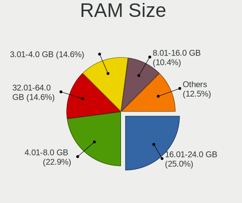

| Size in GB | Notebooks | Percent |
|------------|-----------|---------|
| 16.01-24.0 | 9         | 33.33%  |
| 32.01-64.0 | 5         | 18.52%  |
| 4.01-8.0   | 4         | 14.81%  |
| 3.01-4.0   | 3         | 11.11%  |
| 8.01-16.0  | 3         | 11.11%  |
| 2.01-3.0   | 2         | 7.41%   |
| 24.01-32.0 | 1         | 3.7%    |

RAM Used
--------

Used RAM memory

| Used GB   | Notebooks | Percent |
|-----------|-----------|---------|
| 3.01-4.0  | 9         | 31.03%  |
| 2.01-3.0  | 8         | 27.59%  |
| 4.01-8.0  | 5         | 17.24%  |
| 1.01-2.0  | 5         | 17.24%  |
| 8.01-16.0 | 1         | 3.45%   |
| 0.51-1.0  | 1         | 3.45%   |

Total Drives
------------

Number of drives on board

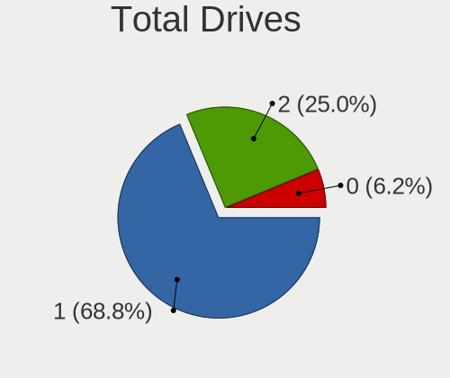

| Drives | Notebooks | Percent |
|--------|-----------|---------|
| 1      | 18        | 66.67%  |
| 2      | 9         | 33.33%  |

Has CD-ROM
----------

Has CD-ROM on board

| Presented | Notebooks | Percent |
|-----------|-----------|---------|
| No        | 21        | 77.78%  |
| Yes       | 6         | 22.22%  |

Has Ethernet
------------

Has Ethernet on board

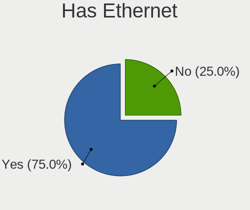

| Presented | Notebooks | Percent |
|-----------|-----------|---------|
| Yes       | 19        | 70.37%  |
| No        | 8         | 29.63%  |

Has WiFi
--------

Has WiFi module

| Presented | Notebooks | Percent |
|-----------|-----------|---------|
| Yes       | 23        | 85.19%  |
| No        | 4         | 14.81%  |

Has Bluetooth
-------------

Has Bluetooth module

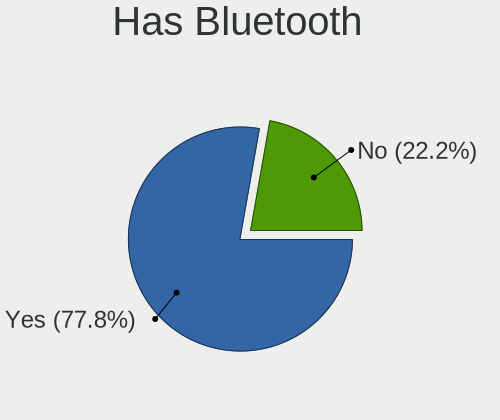

| Presented | Notebooks | Percent |
|-----------|-----------|---------|
| Yes       | 20        | 74.07%  |
| No        | 7         | 25.93%  |

Location
--------

Country
-------

Geographic location (country)

| Country                | Notebooks | Percent |
|------------------------|-----------|---------|
| USA                    | 6         | 20.69%  |
| UK                     | 4         | 13.79%  |
| Germany                | 3         | 10.34%  |
| Canada                 | 3         | 10.34%  |
| Turkey                 | 1         | 3.45%   |
| South Africa           | 1         | 3.45%   |
| Russia                 | 1         | 3.45%   |
| Portugal               | 1         | 3.45%   |
| Poland                 | 1         | 3.45%   |
| Italy                  | 1         | 3.45%   |
| Iran                   | 1         | 3.45%   |
| France                 | 1         | 3.45%   |
| Costa Rica             | 1         | 3.45%   |
| China                  | 1         | 3.45%   |
| Brazil                 | 1         | 3.45%   |
| Bosnia and Herzegovina | 1         | 3.45%   |
| Australia              | 1         | 3.45%   |

City
----

Geographic location (city)

| City               | Notebooks | Percent |
|--------------------|-----------|---------|
| London             | 2         | 6.9%    |
| Xi'an              | 1         | 3.45%   |
| Windsor            | 1         | 3.45%   |
| Warsaw             | 1         | 3.45%   |
| Viadanica          | 1         | 3.45%   |
| Vancouver          | 1         | 3.45%   |
| Tupa               | 1         | 3.45%   |
| Thorpe Hamlet      | 1         | 3.45%   |
| Stuttgart          | 1         | 3.45%   |
| Seattle            | 1         | 3.45%   |
| San Jose           | 1         | 3.45%   |
| Paris              | 1         | 3.45%   |
| New York           | 1         | 3.45%   |
| Nashville          | 1         | 3.45%   |
| Montreal           | 1         | 3.45%   |
| Milwaukee          | 1         | 3.45%   |
| Lottstetten        | 1         | 3.45%   |
| Krasnogorsk        | 1         | 3.45%   |
| Istanbul           | 1         | 3.45%   |
| Guimarães       | 1         | 3.45%   |
| East Malvern       | 1         | 3.45%   |
| Cape Town          | 1         | 3.45%   |
| Camden             | 1         | 3.45%   |
| Big Sky            | 1         | 3.45%   |
| Berlin             | 1         | 3.45%   |
| Banja Luka         | 1         | 3.45%   |
| Bandar-e Asalūyeh | 1         | 3.45%   |
| Avon               | 1         | 3.45%   |

Drives
------

Drive Vendor
------------

Hard drive vendors

| Vendor              | Notebooks | Drives | Percent |
|---------------------|-----------|--------|---------|
| Samsung Electronics | 10        | 14     | 28.57%  |
| Unknown             | 3         | 3      | 8.57%   |
| Seagate             | 3         | 3      | 8.57%   |
| HGST                | 2         | 2      | 5.71%   |
| Crucial             | 2         | 4      | 5.71%   |
| A-DATA Technology   | 2         | 2      | 5.71%   |
| WDC                 | 1         | 1      | 2.86%   |
| Transcend           | 1         | 1      | 2.86%   |
| Toshiba             | 1         | 1      | 2.86%   |
| SanDisk             | 1         | 1      | 2.86%   |
| PLEXTOR             | 1         | 1      | 2.86%   |
| Phison              | 1         | 1      | 2.86%   |
| Mushkin             | 1         | 1      | 2.86%   |
| JMicron             | 1         | 1      | 2.86%   |
| Intel               | 1         | 1      | 2.86%   |
| Hitachi             | 1         | 1      | 2.86%   |
| BIWIN               | 1         | 1      | 2.86%   |
| Apple               | 1         | 2      | 2.86%   |
| ADATA Technology    | 1         | 1      | 2.86%   |

Drive Model
-----------

Hard drive models

| Model                               | Notebooks | Percent |
|-------------------------------------|-----------|---------|
| Seagate ST1000LM048-2E7172 1TB      | 2         | 5.41%   |
| Samsung SSD 970 PRO 1TB             | 2         | 5.41%   |
| WDC WDS100T2B0C-00PXH0 1TB          | 1         | 2.7%    |
| Unknown MMC Card  32GB              | 1         | 2.7%    |
| Unknown DA4128  128GB               | 1         | 2.7%    |
| Unknown 032G32  32GB                | 1         | 2.7%    |
| Transcend TS240GMTS420S 240GB SSD   | 1         | 2.7%    |
| Toshiba NVMe SSD Drive 512GB        | 1         | 2.7%    |
| Seagate NVMe SSD Drive 2TB          | 1         | 2.7%    |
| SanDisk SDSSDH3500G 500GB           | 1         | 2.7%    |
| Samsung SSD 970 EVO 250GB           | 1         | 2.7%    |
| Samsung SSD 960 EVO 500GB           | 1         | 2.7%    |
| Samsung SSD 960 EVO 250GB           | 1         | 2.7%    |
| Samsung SSD 860 EVO 500GB           | 1         | 2.7%    |
| Samsung SSD 860 EVO 250GB           | 1         | 2.7%    |
| Samsung SSD 860 EVO 1TB             | 1         | 2.7%    |
| Samsung SSD 850 EVO 500GB           | 1         | 2.7%    |
| Samsung SSD 850 EVO 250GB           | 1         | 2.7%    |
| Samsung NVMe SSD Drive 1TB          | 1         | 2.7%    |
| PLEXTOR PX-1TM6Pro 1024GB SSD       | 1         | 2.7%    |
| Phison PM8512GPTCB4B8TF-E13T4 512GB | 1         | 2.7%    |
| Mushkin MKNSSDRE250GB-LT            | 1         | 2.7%    |
| JMicron Generic 240GB               | 1         | 2.7%    |
| Intel SSDSC2BF180A4H 180GB          | 1         | 2.7%    |
| Hitachi HTS545050A7E380 500GB       | 1         | 2.7%    |
| HGST HTS721010A9E630 1TB            | 1         | 2.7%    |
| HGST HTS545050B7E660 500GB          | 1         | 2.7%    |
| Crucial CT250MX500SSD4 250GB        | 1         | 2.7%    |
| Crucial CT2000MX500SSD1 2TB         | 1         | 2.7%    |
| BIWIN SSD 120GB                     | 1         | 2.7%    |
| Apple NVMe SSD Drive 8KB            | 1         | 2.7%    |
| Apple NVMe SSD Drive 256GB          | 1         | 2.7%    |
| ADATA NVMe SSD Drive 512GB          | 1         | 2.7%    |
| A-DATA SU630 240GB SSD              | 1         | 2.7%    |
| A-DATA IM2S3138E-128GM-B 128GB SSD  | 1         | 2.7%    |

HDD Vendor
----------

Hard disk drive vendors

| Vendor  | Notebooks | Drives | Percent |
|---------|-----------|--------|---------|
| Seagate | 2         | 2      | 40%     |
| HGST    | 2         | 2      | 40%     |
| Hitachi | 1         | 1      | 20%     |

SSD Vendor
----------

Solid state drive vendors

| Vendor              | Notebooks | Drives | Percent |
|---------------------|-----------|--------|---------|
| Samsung Electronics | 6         | 8      | 35.29%  |
| Crucial             | 2         | 4      | 11.76%  |
| A-DATA Technology   | 2         | 2      | 11.76%  |
| Transcend           | 1         | 1      | 5.88%   |
| SanDisk             | 1         | 1      | 5.88%   |
| PLEXTOR             | 1         | 1      | 5.88%   |
| Mushkin             | 1         | 1      | 5.88%   |
| JMicron             | 1         | 1      | 5.88%   |
| Intel               | 1         | 1      | 5.88%   |
| BIWIN               | 1         | 1      | 5.88%   |

Drive Kind
----------

HDD or SSD

| Kind | Notebooks | Drives | Percent |
|------|-----------|--------|---------|
| SSD  | 14        | 21     | 42.42%  |
| NVMe | 11        | 13     | 33.33%  |
| HDD  | 5         | 5      | 15.15%  |
| MMC  | 3         | 3      | 9.09%   |

Drive Connector
---------------

SATA, SAS, NVMe, etc.

| Type | Notebooks | Drives | Percent |
|------|-----------|--------|---------|
| SATA | 16        | 24     | 50%     |
| NVMe | 11        | 13     | 34.38%  |
| MMC  | 3         | 3      | 9.38%   |
| SAS  | 2         | 2      | 6.25%   |

Drive Size
----------

Size of hard drive

| Size in TB | Notebooks | Drives | Percent |
|------------|-----------|--------|---------|
| 0.01-0.5   | 12        | 19     | 66.67%  |
| 0.51-1.0   | 4         | 4      | 22.22%  |
| 1.01-2.0   | 2         | 3      | 11.11%  |

Space Total
-----------

Amount of disk space available on the file system

| Size in GB | Notebooks | Percent |
|------------|-----------|---------|
| 1-20       | 11        | 40.74%  |
| 101-250    | 4         | 14.81%  |
| 21-50      | 3         | 11.11%  |
| 251-500    | 2         | 7.41%   |
| 501-1000   | 2         | 7.41%   |
| Unknown    | 2         | 7.41%   |
| 2001-3000  | 1         | 3.7%    |
| 1001-2000  | 1         | 3.7%    |
| 51-100     | 1         | 3.7%    |

Space Used
----------

Amount of used disk space

| Used GB  | Notebooks | Percent |
|----------|-----------|---------|
| 1-20     | 16        | 59.26%  |
| 21-50    | 4         | 14.81%  |
| 501-1000 | 3         | 11.11%  |
| Unknown  | 2         | 7.41%   |
| 251-500  | 1         | 3.7%    |
| 51-100   | 1         | 3.7%    |

Malfunc. Drives
---------------

Drive models with a malfunction

| Model                      | Notebooks | Drives | Percent |
|----------------------------|-----------|--------|---------|
| Intel SSDSC2BF180A4H 180GB | 1         | 1      | 100%    |

Malfunc. Drive Vendor
---------------------

Vendors of faulty drives

| Vendor | Notebooks | Drives | Percent |
|--------|-----------|--------|---------|
| Intel  | 1         | 1      | 100%    |

Malfunc. HDD Vendor
-------------------

Vendors of faulty HDD drives

Zero info for selected period =(

Malfunc. Drive Kind
-------------------

Kinds of faulty drives

| Kind | Notebooks | Drives | Percent |
|------|-----------|--------|---------|
| SSD  | 1         | 1      | 100%    |

Failed Drives
-------------

Failed drive models

Zero info for selected period =(

Failed Drive Vendor
-------------------

Failed drive vendors

Zero info for selected period =(

Drive Status
------------

Number of failed and malfunc. drives

| Status   | Notebooks | Drives | Percent |
|----------|-----------|--------|---------|
| Detected | 19        | 29     | 67.86%  |
| Works    | 8         | 12     | 28.57%  |
| Malfunc  | 1         | 1      | 3.57%   |

Storage controller
------------------

Storage Vendor
--------------

Storage controller vendors

| Vendor                       | Notebooks | Percent |
|------------------------------|-----------|---------|
| Intel                        | 15        | 53.57%  |
| Samsung Electronics          | 5         | 17.86%  |
| AMD                          | 2         | 7.14%   |
| Toshiba America Info Systems | 1         | 3.57%   |
| Seagate Technology           | 1         | 3.57%   |
| Sandisk                      | 1         | 3.57%   |
| Phison Electronics           | 1         | 3.57%   |
| Apple                        | 1         | 3.57%   |
| ADATA Technology             | 1         | 3.57%   |

Storage Model
-------------

Storage controller models

| Model                                                                          | Notebooks | Percent |
|--------------------------------------------------------------------------------|-----------|---------|
| Intel Sunrise Point-LP SATA Controller [AHCI mode]                             | 7         | 25%     |
| Samsung NVMe SSD Controller SM981/PM981/PM983                                  | 3         | 10.71%  |
| Intel 8 Series/C220 Series Chipset Family 6-port SATA Controller 1 [AHCI mode] | 3         | 10.71%  |
| Samsung NVMe SSD Controller SM961/PM961/SM963                                  | 2         | 7.14%   |
| Intel 8 Series SATA Controller 1 [AHCI mode]                                   | 2         | 7.14%   |
| Toshiba America Info Systems XG4 NVMe SSD Controller                           | 1         | 3.57%   |
| Seagate FireCuda 510 SSD                                                       | 1         | 3.57%   |
| Sandisk Non-Volatile memory controller                                         | 1         | 3.57%   |
| Phison PS5013 E13 NVMe Controller                                              | 1         | 3.57%   |
| Intel HM170/QM170 Chipset SATA Controller [AHCI Mode]                          | 1         | 3.57%   |
| Intel 7 Series Chipset Family 6-port SATA Controller [AHCI mode]               | 1         | 3.57%   |
| Intel 6 Series/C200 Series Chipset Family 6 port Mobile SATA AHCI Controller   | 1         | 3.57%   |
| Apple S3X NVMe Controller                                                      | 1         | 3.57%   |
| AMD SB7x0/SB8x0/SB9x0 SATA Controller [AHCI mode]                              | 1         | 3.57%   |
| AMD FCH SATA Controller [AHCI mode]                                            | 1         | 3.57%   |
| ADATA Non-Volatile memory controller                                           | 1         | 3.57%   |

Storage Kind
------------

Kind of storage controller (IDE, SATA, NVMe, SAS, ...)

| Kind | Notebooks | Percent |
|------|-----------|---------|
| SATA | 17        | 60.71%  |
| NVMe | 11        | 39.29%  |

Processor
---------

CPU Vendor
----------

Processor vendors

| Vendor | Notebooks | Percent |
|--------|-----------|---------|
| Intel  | 22        | 81.48%  |
| ARM    | 3         | 11.11%  |
| AMD    | 2         | 7.41%   |

CPU Model
---------

Processor models

| Model                                         | Notebooks | Percent |
|-----------------------------------------------|-----------|---------|
| Intel Core i7-7500U CPU @ 2.70GHz             | 4         | 14.81%  |
| Intel Core i7-10710U CPU @ 1.10GHz            | 4         | 14.81%  |
| ARM Processor                                 | 3         | 11.11%  |
| Intel Core i7-6500U CPU @ 2.50GHz             | 2         | 7.41%   |
| Intel Core i5-7200U CPU @ 2.50GHz             | 2         | 7.41%   |
| Intel Core i7-8550U CPU @ 1.80GHz             | 1         | 3.7%    |
| Intel Core i7-7700HQ CPU @ 2.80GHz            | 1         | 3.7%    |
| Intel Core i7-7567U CPU @ 3.50GHz             | 1         | 3.7%    |
| Intel Core i7-4710MQ CPU @ 2.50GHz            | 1         | 3.7%    |
| Intel Core i7-4702MQ CPU @ 2.20GHz            | 1         | 3.7%    |
| Intel Core i7-4700MQ CPU @ 2.40GHz            | 1         | 3.7%    |
| Intel Core i7-4510U CPU @ 2.00GHz             | 1         | 3.7%    |
| Intel Core i3-4010U CPU @ 1.70GHz             | 1         | 3.7%    |
| Intel Core i3-3120M CPU @ 2.50GHz             | 1         | 3.7%    |
| Intel Core i3-2330M CPU @ 2.20GHz             | 1         | 3.7%    |
| AMD Turion II Dual-Core Mobile M520           | 1         | 3.7%    |
| AMD Ryzen 5 3550H with Radeon Vega Mobile Gfx | 1         | 3.7%    |

CPU Model Family
----------------

Processor model prefix

| Model                   | Notebooks | Percent |
|-------------------------|-----------|---------|
| Intel Core i7           | 17        | 62.96%  |
| Other                   | 3         | 11.11%  |
| Intel Core i3           | 3         | 11.11%  |
| Intel Core i5           | 2         | 7.41%   |
| AMD Turion II Dual-Core | 1         | 3.7%    |
| AMD Ryzen 5             | 1         | 3.7%    |

CPU Cores
---------

Number of processor cores

| Number | Notebooks | Percent |
|--------|-----------|---------|
| 2      | 14        | 51.85%  |
| 4      | 9         | 33.33%  |
| 6      | 4         | 14.81%  |

CPU Sockets
-----------

Number of sockets

| Number | Notebooks | Percent |
|--------|-----------|---------|
| 1      | 27        | 100%    |

CPU Threads
-----------

Threads per core (Hyper-Threading)

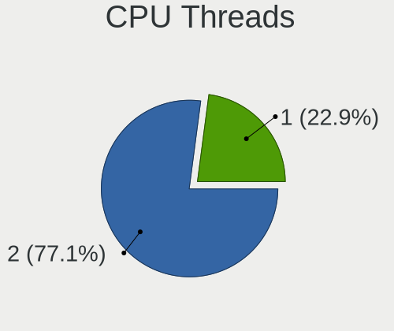

| Number | Notebooks | Percent |
|--------|-----------|---------|
| 2      | 23        | 85.19%  |
| 1      | 4         | 14.81%  |

CPU Op-Modes
------------

CPU Operation Modes (32-bit, 64-bit)

| Op mode        | Notebooks | Percent |
|----------------|-----------|---------|
| 32-bit, 64-bit | 24        | 85.71%  |
| Unknown        | 4         | 14.29%  |

CPU Microcode
-------------

Microcode number

| Number     | Notebooks | Percent |
|------------|-----------|---------|
| Unknown    | 20        | 74.07%  |
| 0xa0660    | 2         | 7.41%   |
| 0x406e3    | 2         | 7.41%   |
| 0x806e9    | 1         | 3.7%    |
| 0x40651    | 1         | 3.7%    |
| 0x08108109 | 1         | 3.7%    |

CPU Microarch
-------------

Microarchitecture

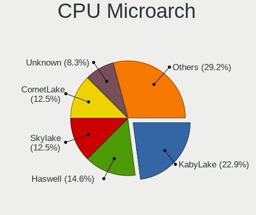

| Name        | Notebooks | Percent |
|-------------|-----------|---------|
| KabyLake    | 9         | 33.33%  |
| Haswell     | 5         | 18.52%  |
| CometLake   | 4         | 14.81%  |
| Unknown     | 3         | 11.11%  |
| Skylake     | 2         | 7.41%   |
| Zen+        | 1         | 3.7%    |
| SandyBridge | 1         | 3.7%    |
| K10         | 1         | 3.7%    |
| IvyBridge   | 1         | 3.7%    |

Graphics
--------

GPU Vendor
----------

Vendors of graphics cards

| Vendor | Notebooks | Percent |
|--------|-----------|---------|
| Intel  | 22        | 75.86%  |
| AMD    | 4         | 13.79%  |
| Nvidia | 3         | 10.34%  |

GPU Model
---------

Graphics card models

| Model                                                                                 | Notebooks | Percent |
|---------------------------------------------------------------------------------------|-----------|---------|
| Intel HD Graphics 620                                                                 | 6         | 20%     |
| Intel Comet Lake UHD Graphics                                                         | 4         | 13.33%  |
| Intel 4th Gen Core Processor Integrated Graphics Controller                           | 3         | 10%     |
| Intel Skylake GT2 [HD Graphics 520]                                                   | 2         | 6.67%   |
| Intel Haswell-ULT Integrated Graphics Controller                                      | 2         | 6.67%   |
| Nvidia GP107M [GeForce GTX 1050 Mobile]                                               | 1         | 3.33%   |
| Nvidia GK208M [GeForce GT 730M]                                                       | 1         | 3.33%   |
| Nvidia GK104M [GeForce GTX 870M]                                                      | 1         | 3.33%   |
| Intel UHD Graphics 620                                                                | 1         | 3.33%   |
| Intel Iris Plus Graphics 650                                                          | 1         | 3.33%   |
| Intel HD Graphics 630                                                                 | 1         | 3.33%   |
| Intel 3rd Gen Core processor Graphics Controller                                      | 1         | 3.33%   |
| Intel 2nd Generation Core Processor Family Integrated Graphics Controller             | 1         | 3.33%   |
| AMD Topaz XT [Radeon R7 M260/M265 / M340/M360 / M440/M445 / 530/535 / 620/625 Mobile] | 1         | 3.33%   |
| AMD Thames [Radeon HD 7500M/7600M Series]                                             | 1         | 3.33%   |
| AMD RS880M [Mobility Radeon HD 4225/4250]                                             | 1         | 3.33%   |
| AMD Picasso/Raven 2 [Radeon Vega Series / Radeon Vega Mobile Series]                  | 1         | 3.33%   |
| AMD Baffin [Radeon RX 460/560D / Pro 450/455/460/555/555X/560/560X]                   | 1         | 3.33%   |

GPU Combo
---------

Combinations of graphics cards

| Name           | Notebooks | Percent |
|----------------|-----------|---------|
| 1 x Intel      | 17        | 62.96%  |
| Other          | 3         | 11.11%  |
| Intel + Nvidia | 3         | 11.11%  |
| Intel + AMD    | 2         | 7.41%   |
| 2 x AMD        | 1         | 3.7%    |
| 1 x AMD        | 1         | 3.7%    |

GPU Driver
----------

Free vs proprietary

| Driver  | Notebooks | Percent |
|---------|-----------|---------|
| Free    | 23        | 85.19%  |
| Unknown | 4         | 14.81%  |

GPU Memory
----------

Total video memory

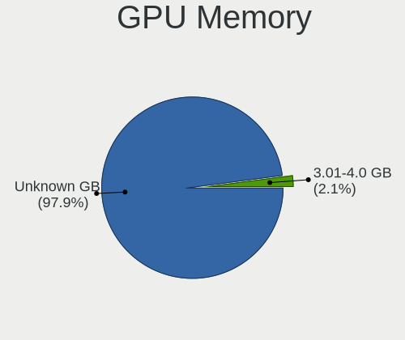

| Size in GB | Notebooks | Percent |
|------------|-----------|---------|
| Unknown    | 26        | 96.3%   |
| 3.01-4.0   | 1         | 3.7%    |

Monitor
-------

Monitor Vendor
--------------

Monitor vendors

| Vendor                  | Notebooks | Percent |
|-------------------------|-----------|---------|
| LG Display              | 6         | 18.18%  |
| Samsung Electronics     | 5         | 15.15%  |
| BOE                     | 5         | 15.15%  |
| Chimei Innolux          | 4         | 12.12%  |
| AU Optronics            | 2         | 6.06%   |
| Unknown                 | 1         | 3.03%   |
| Sharp                   | 1         | 3.03%   |
| Lenovo                  | 1         | 3.03%   |
| Iiyama                  | 1         | 3.03%   |
| Grundig                 | 1         | 3.03%   |
| Goldstar                | 1         | 3.03%   |
| Chi Mei Optoelectronics | 1         | 3.03%   |
| BenQ                    | 1         | 3.03%   |
| ASUSTek Computer        | 1         | 3.03%   |
| Apple                   | 1         | 3.03%   |
| Acer                    | 1         | 3.03%   |

Monitor Model
-------------

Monitor models

| Model                                                                     | Notebooks | Percent |
|---------------------------------------------------------------------------|-----------|---------|
| Samsung Electronics LCD Monitor SDC434B 3840x2160 344x194mm 15.5-inch     | 3         | 9.09%   |
| Chimei Innolux LCD Monitor CMN14D5 1920x1080 309x173mm 13.9-inch          | 2         | 6.06%   |
| Unknown LCD Monitor FFFF 2288x1287 2550x2550mm 142.0-inch                 | 1         | 3.03%   |
| Sharp LCD Monitor SHP148B 3840x2160 294x165mm 13.3-inch                   | 1         | 3.03%   |
| Samsung Electronics LCD Monitor SEC3041 1366x768 353x198mm 15.9-inch      | 1         | 3.03%   |
| Samsung Electronics C27F390 SAM0D32 1920x1080 598x336mm 27.0-inch         | 1         | 3.03%   |
| LG Display LCD Monitor LGD0563 1920x1080 344x194mm 15.5-inch              | 1         | 3.03%   |
| LG Display LCD Monitor LGD053B 1920x1080 294x165mm 13.3-inch              | 1         | 3.03%   |
| LG Display LCD Monitor LGD04D4 3840x2160 344x194mm 15.5-inch              | 1         | 3.03%   |
| LG Display LCD Monitor LGD03F0 1366x768 310x174mm 14.0-inch               | 1         | 3.03%   |
| LG Display LCD Monitor LGD034D 1366x768 344x194mm 15.5-inch               | 1         | 3.03%   |
| LG Display LCD Monitor LGD02F2 1366x768 344x194mm 15.5-inch               | 1         | 3.03%   |
| Lenovo LEN Y44w-10 LEN65EA 3840x1200 1052x329mm 43.4-inch                 | 1         | 3.03%   |
| Iiyama PL2792H IVM664F 1920x1080 598x336mm 27.0-inch                      | 1         | 3.03%   |
| Grundig UHD GRU4448 3840x2160 1210x680mm 54.6-inch                        | 1         | 3.03%   |
| Goldstar IPS231 GSM5817 1920x1080 510x290mm 23.1-inch                     | 1         | 3.03%   |
| Chimei Innolux LCD Monitor CMN15C3 1920x1080 344x193mm 15.5-inch          | 1         | 3.03%   |
| Chimei Innolux LCD Monitor CMN1415 1920x1080 309x173mm 13.9-inch          | 1         | 3.03%   |
| Chi Mei Optoelectronics LCD Monitor CMO1720 1920x1080 382x215mm 17.3-inch | 1         | 3.03%   |
| BOE LCD Monitor BOE07DB 1920x1080 309x174mm 14.0-inch                     | 1         | 3.03%   |
| BOE LCD Monitor BOE079A 1920x1080 309x173mm 13.9-inch                     | 1         | 3.03%   |
| BOE LCD Monitor BOE06C2 1366x768 344x194mm 15.5-inch                      | 1         | 3.03%   |
| BOE LCD Monitor BOE06BE 1920x1080 294x165mm 13.3-inch                     | 1         | 3.03%   |
| BOE LCD Monitor BOE0641 1920x1080 344x193mm 15.5-inch                     | 1         | 3.03%   |
| BenQ GW2480 BNQ78E7 1920x1080 527x296mm 23.8-inch                         | 1         | 3.03%   |
| AU Optronics LCD Monitor AUO713C 1366x768 309x173mm 13.9-inch             | 1         | 3.03%   |
| AU Optronics LCD Monitor AUO10ED 1920x1080 344x193mm 15.5-inch            | 1         | 3.03%   |
| ASUSTek Computer VP249 AUS24AF 1920x1080 530x300mm 24.0-inch              | 1         | 3.03%   |
| Apple Color LCD APPA034 2880x1800 286x179mm 13.3-inch                     | 1         | 3.03%   |
| Acer H236HL ACR0318 1920x1080 510x290mm 23.1-inch                         | 1         | 3.03%   |

Monitor Resolution
------------------

Monitor screen resolution

| Resolution      | Notebooks | Percent |
|-----------------|-----------|---------|
| 1920x1080 (FHD) | 14        | 48.28%  |
| 3840x2160 (4K)  | 6         | 20.69%  |
| 1366x768 (WXGA) | 6         | 20.69%  |
| 3840x1200       | 1         | 3.45%   |
| 2880x1800       | 1         | 3.45%   |
| 2288x1287       | 1         | 3.45%   |

Monitor Diagonal
----------------

Diagonal size in inches

| Inches | Notebooks | Percent |
|--------|-----------|---------|
| 15     | 12        | 36.36%  |
| 13     | 9         | 27.27%  |
| 27     | 2         | 6.06%   |
| 24     | 2         | 6.06%   |
| 23     | 2         | 6.06%   |
| 14     | 2         | 6.06%   |
| 142    | 1         | 3.03%   |
| 54     | 1         | 3.03%   |
| 43     | 1         | 3.03%   |
| 17     | 1         | 3.03%   |

Monitor Width
-------------

Physical width

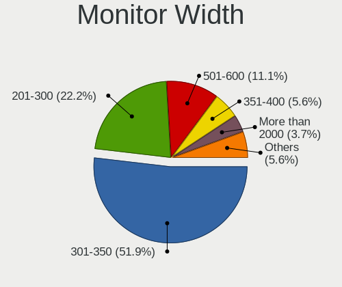

| Width in mm    | Notebooks | Percent |
|----------------|-----------|---------|
| 301-350        | 17        | 53.13%  |
| 501-600        | 6         | 18.75%  |
| 201-300        | 4         | 12.5%   |
| 351-400        | 2         | 6.25%   |
| 1001-1500      | 2         | 6.25%   |
| More than 2000 | 1         | 3.13%   |

Aspect Ratio
------------

Proportional relationship between the width and the height

| Ratio | Notebooks | Percent |
|-------|-----------|---------|
| 16/9  | 22        | 88%     |
| 3.20  | 1         | 4%      |
| 16/10 | 1         | 4%      |
| 1.00  | 1         | 4%      |

Monitor Area
------------

Area in inch²

| Area in inch² | Notebooks | Percent |
|----------------|-----------|---------|
| 101-110        | 12        | 36.36%  |
| 81-90          | 7         | 21.21%  |
| 71-80          | 4         | 12.12%  |
| 201-250        | 4         | 12.12%  |
| More than 1000 | 2         | 6.06%   |
| 301-350        | 2         | 6.06%   |
| 121-130        | 1         | 3.03%   |
| 501-1000       | 1         | 3.03%   |

Pixel Density
-------------

Pixels per inch

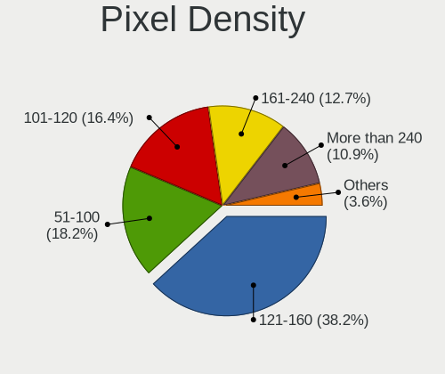

| Density       | Notebooks | Percent |
|---------------|-----------|---------|
| 121-160       | 10        | 30.3%   |
| 51-100        | 9         | 27.27%  |
| More than 240 | 6         | 18.18%  |
| 101-120       | 5         | 15.15%  |
| 161-240       | 2         | 6.06%   |
| 1-50          | 1         | 3.03%   |

Multiple Monitors
-----------------

Total monitors connected

| Total | Notebooks | Percent |
|-------|-----------|---------|
| 1     | 17        | 62.96%  |
| 2     | 7         | 25.93%  |
| 0     | 2         | 7.41%   |
| 3     | 1         | 3.7%    |

Network
-------

Net Controller Vendor
---------------------

Controller vendors

| Vendor                          | Notebooks | Percent |
|---------------------------------|-----------|---------|
| Realtek Semiconductor           | 15        | 36.59%  |
| Qualcomm Atheros                | 12        | 29.27%  |
| Intel                           | 6         | 14.63%  |
| Broadcom                        | 2         | 4.88%   |
| ASIX Electronics                | 2         | 4.88%   |
| Ralink                          | 1         | 2.44%   |
| Qualcomm Atheros Communications | 1         | 2.44%   |
| MediaTek                        | 1         | 2.44%   |
| Broadcom Limited                | 1         | 2.44%   |

Net Controller Model
--------------------

Controller models

| Model                                                             | Notebooks | Percent |
|-------------------------------------------------------------------|-----------|---------|
| Qualcomm Atheros AR9462 Wireless Network Adapter                  | 10        | 21.28%  |
| Realtek RTL8111/8168/8411 PCI Express Gigabit Ethernet Controller | 8         | 17.02%  |
| Realtek RTL810xE PCI Express Fast Ethernet controller             | 5         | 10.64%  |
| Qualcomm Atheros QCA9565 / AR9565 Wireless Network Adapter        | 2         | 4.26%   |
| Intel Wireless 7265                                               | 2         | 4.26%   |
| Intel Wireless 7260                                               | 2         | 4.26%   |
| Intel Ethernet Connection I217-LM                                 | 2         | 4.26%   |
| ASIX AX88179 Gigabit Ethernet                                     | 2         | 4.26%   |
| Realtek RTL88x2bu [AC1200 Techkey]                                | 1         | 2.13%   |
| Realtek RTL8822BE 802.11a/b/g/n/ac WiFi adapter                   | 1         | 2.13%   |
| Realtek RTL8812AU 802.11a/b/g/n/ac 2T2R DB WLAN Adapter           | 1         | 2.13%   |
| Realtek RTL8191SEvB Wireless LAN Controller                       | 1         | 2.13%   |
| Realtek RTL8153 Gigabit Ethernet Adapter                          | 1         | 2.13%   |
| Ralink RT5390R 802.11bgn PCIe Wireless Network Adapter            | 1         | 2.13%   |
| Qualcomm Atheros AR9271 802.11n                                   | 1         | 2.13%   |
| MediaTek WiFi                                                     | 1         | 2.13%   |
| Intel Wireless 8265 / 8275                                        | 1         | 2.13%   |
| Intel Ethernet Connection I218-V                                  | 1         | 2.13%   |
| Intel Ethernet Connection (4) I219-V                              | 1         | 2.13%   |
| Broadcom Limited BCM4360 802.11ac Wireless Network Adapter        | 1         | 2.13%   |
| Broadcom BCM43602 802.11ac Wireless LAN SoC                       | 1         | 2.13%   |
| Broadcom BCM4313 802.11bgn Wireless Network Adapter               | 1         | 2.13%   |

Wireless Vendor
---------------

Wireless vendors

| Vendor                          | Notebooks | Percent |
|---------------------------------|-----------|---------|
| Qualcomm Atheros                | 12        | 44.44%  |
| Intel                           | 5         | 18.52%  |
| Realtek Semiconductor           | 4         | 14.81%  |
| Broadcom                        | 2         | 7.41%   |
| Ralink                          | 1         | 3.7%    |
| Qualcomm Atheros Communications | 1         | 3.7%    |
| MediaTek                        | 1         | 3.7%    |
| Broadcom Limited                | 1         | 3.7%    |

Wireless Model
--------------

Wireless models

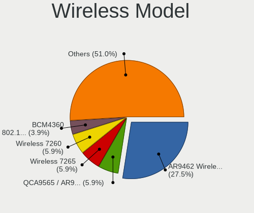

| Model                                                      | Notebooks | Percent |
|------------------------------------------------------------|-----------|---------|
| Qualcomm Atheros AR9462 Wireless Network Adapter           | 10        | 37.04%  |
| Qualcomm Atheros QCA9565 / AR9565 Wireless Network Adapter | 2         | 7.41%   |
| Intel Wireless 7265                                        | 2         | 7.41%   |
| Intel Wireless 7260                                        | 2         | 7.41%   |
| Realtek RTL88x2bu [AC1200 Techkey]                         | 1         | 3.7%    |
| Realtek RTL8822BE 802.11a/b/g/n/ac WiFi adapter            | 1         | 3.7%    |
| Realtek RTL8812AU 802.11a/b/g/n/ac 2T2R DB WLAN Adapter    | 1         | 3.7%    |
| Realtek RTL8191SEvB Wireless LAN Controller                | 1         | 3.7%    |
| Ralink RT5390R 802.11bgn PCIe Wireless Network Adapter     | 1         | 3.7%    |
| Qualcomm Atheros AR9271 802.11n                            | 1         | 3.7%    |
| MediaTek WiFi                                              | 1         | 3.7%    |
| Intel Wireless 8265 / 8275                                 | 1         | 3.7%    |
| Broadcom Limited BCM4360 802.11ac Wireless Network Adapter | 1         | 3.7%    |
| Broadcom BCM43602 802.11ac Wireless LAN SoC                | 1         | 3.7%    |
| Broadcom BCM4313 802.11bgn Wireless Network Adapter        | 1         | 3.7%    |

Ethernet Vendor
---------------

Ethernet vendors

| Vendor                | Notebooks | Percent |
|-----------------------|-----------|---------|
| Realtek Semiconductor | 13        | 68.42%  |
| Intel                 | 4         | 21.05%  |
| ASIX Electronics      | 2         | 10.53%  |

Ethernet Model
--------------

Ethernet models

| Model                                                             | Notebooks | Percent |
|-------------------------------------------------------------------|-----------|---------|
| Realtek RTL8111/8168/8411 PCI Express Gigabit Ethernet Controller | 8         | 40%     |
| Realtek RTL810xE PCI Express Fast Ethernet controller             | 5         | 25%     |
| Intel Ethernet Connection I217-LM                                 | 2         | 10%     |
| ASIX AX88179 Gigabit Ethernet                                     | 2         | 10%     |
| Realtek RTL8153 Gigabit Ethernet Adapter                          | 1         | 5%      |
| Intel Ethernet Connection I218-V                                  | 1         | 5%      |
| Intel Ethernet Connection (4) I219-V                              | 1         | 5%      |

Net Controller Kind
-------------------

Ethernet, WiFi or modem

| Kind     | Notebooks | Percent |
|----------|-----------|---------|
| WiFi     | 23        | 56.1%   |
| Ethernet | 18        | 43.9%   |

Used Controller
---------------

Currently used network controller

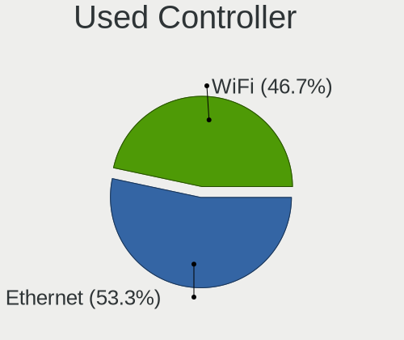

| Kind     | Notebooks | Percent |
|----------|-----------|---------|
| Ethernet | 17        | 54.84%  |
| WiFi     | 14        | 45.16%  |

NICs
----

Total network controllers on board

| Total | Notebooks | Percent |
|-------|-----------|---------|
| 2     | 17        | 62.96%  |
| 1     | 6         | 22.22%  |
| 0     | 4         | 14.81%  |

IPv6
----

IPv6 vs IPv4

| Used | Notebooks | Percent |
|------|-----------|---------|
| No   | 22        | 81.48%  |
| Yes  | 5         | 18.52%  |

Bluetooth
---------

Bluetooth Vendor
----------------

Controller vendors

| Vendor                          | Notebooks | Percent |
|---------------------------------|-----------|---------|
| Qualcomm Atheros Communications | 4         | 19.05%  |
| Lite-On Technology              | 4         | 19.05%  |
| Intel                           | 4         | 19.05%  |
| Foxconn / Hon Hai               | 4         | 19.05%  |
| Realtek Semiconductor           | 1         | 4.76%   |
| Cambridge Silicon Radio         | 1         | 4.76%   |
| Broadcom                        | 1         | 4.76%   |
| ASUSTek Computer                | 1         | 4.76%   |
| Apple                           | 1         | 4.76%   |

Bluetooth Model
---------------

Controller models

| Model                                               | Notebooks | Percent |
|-----------------------------------------------------|-----------|---------|
| Lite-On Atheros AR3012 Bluetooth                    | 4         | 19.05%  |
| Intel Bluetooth wireless interface                  | 4         | 19.05%  |
| Foxconn / Hon Hai Bluetooth Device                  | 4         | 19.05%  |
| Qualcomm Atheros  Bluetooth Device                  | 2         | 9.52%   |
| Qualcomm Atheros AR3012 Bluetooth 4.0               | 2         | 9.52%   |
| Realtek RTL8822BE Bluetooth 4.2 Adapter             | 1         | 4.76%   |
| Cambridge Silicon Radio Bluetooth Dongle (HCI mode) | 1         | 4.76%   |
| Broadcom HP Portable Valentine                      | 1         | 4.76%   |
| ASUS Broadcom BCM20702A0 Bluetooth                  | 1         | 4.76%   |
| Apple Bluetooth USB Host Controller                 | 1         | 4.76%   |

Sound
-----

Sound Vendor
------------

Sound card vendors

| Vendor   | Notebooks | Percent |
|----------|-----------|---------|
| Intel    | 22        | 75.86%  |
| AMD      | 2         | 6.9%    |
| XMOS     | 1         | 3.45%   |
| Shure    | 1         | 3.45%   |
| Nvidia   | 1         | 3.45%   |
| M-Audio  | 1         | 3.45%   |
| Logitech | 1         | 3.45%   |

Sound Model
-----------

Sound card models

| Model                                                                      | Notebooks | Percent |
|----------------------------------------------------------------------------|-----------|---------|
| Intel Sunrise Point-LP HD Audio                                            | 10        | 28.57%  |
| Intel Comet Lake PCH-LP cAVS                                               | 4         | 11.43%  |
| Intel Xeon E3-1200 v3/4th Gen Core Processor HD Audio Controller           | 3         | 8.57%   |
| Intel 8 Series/C220 Series Chipset High Definition Audio Controller        | 3         | 8.57%   |
| Intel Haswell-ULT HD Audio Controller                                      | 2         | 5.71%   |
| Intel 8 Series HD Audio Controller                                         | 2         | 5.71%   |
| XMOS xCORE USB Audio 2.0                                                   | 1         | 2.86%   |
| Shure MV5                                                                  | 1         | 2.86%   |
| Nvidia GP107GL High Definition Audio Controller                            | 1         | 2.86%   |
| M-Audio M-Audio Fast Track MKII                                            | 1         | 2.86%   |
| Logitech Headset H340                                                      | 1         | 2.86%   |
| Intel CM238 HD Audio Controller                                            | 1         | 2.86%   |
| Intel 7 Series/C216 Chipset Family High Definition Audio Controller        | 1         | 2.86%   |
| Intel 6 Series/C200 Series Chipset Family High Definition Audio Controller | 1         | 2.86%   |
| AMD SBx00 Azalia (Intel HDA)                                               | 1         | 2.86%   |
| AMD Raven/Raven2/Fenghuang HDMI/DP Audio Controller                        | 1         | 2.86%   |
| AMD Family 17h/19h HD Audio Controller                                     | 1         | 2.86%   |

Memory
------

Memory Vendor
-------------

Memory module vendors

| Vendor              | Notebooks | Percent |
|---------------------|-----------|---------|
| SK Hynix            | 3         | 30%     |
| Crucial             | 3         | 30%     |
| Samsung Electronics | 2         | 20%     |
| Unknown             | 1         | 10%     |
| Toshiba             | 1         | 10%     |

Memory Model
------------

Memory module models

| Model                                                      | Notebooks | Percent |
|------------------------------------------------------------|-----------|---------|
| Samsung RAM M471A4G43MB1-CTD 32GB SODIMM DDR4 2667MT/s     | 2         | 16.67%  |
| Unknown RAM Module 16384MB 2133MT/s                        | 1         | 8.33%   |
| Toshiba RAM 8HTF12864HDY-800G1 4GB SODIMM 1066MT/s         | 1         | 8.33%   |
| Toshiba RAM 64T128020EDL2.5C2 2048MB SODIMM 1066MT/s       | 1         | 8.33%   |
| SK Hynix RAM HMT41GS6AFR8A-PB 8GB SODIMM DDR3 1600MT/s     | 1         | 8.33%   |
| SK Hynix RAM HMA851S6JJR6N-VK 4GB SODIMM DDR4 2667MT/s     | 1         | 8.33%   |
| SK Hynix RAM HMA81GS6JJR8N-VK 8GB SODIMM DDR4 2667MT/s     | 1         | 8.33%   |
| SK Hynix RAM HMA81GS6AFR8N-UH 8GB SODIMM DDR4 2667MT/s     | 1         | 8.33%   |
| Crucial RAM CT4G4SFS8213.C8FBD1 4GB SODIMM DDR4 2133MT/s   | 1         | 8.33%   |
| Crucial RAM CT16G4SFD824A.M16FRS 16GB SODIMM DDR4 2400MT/s | 1         | 8.33%   |
| Crucial RAM CT16G4S24AM.M16FE 16GB SODIMM DDR4 2400MT/s    | 1         | 8.33%   |

Memory Kind
-----------

Memory module kinds

| Kind    | Notebooks | Percent |
|---------|-----------|---------|
| DDR4    | 6         | 66.67%  |
| DDR3    | 1         | 11.11%  |
| DDR2    | 1         | 11.11%  |
| Unknown | 1         | 11.11%  |

Memory Form Factor
------------------

Physical design of the memory module

| Name    | Notebooks | Percent |
|---------|-----------|---------|
| SODIMM  | 8         | 88.89%  |
| Unknown | 1         | 11.11%  |

Memory Size
-----------

Memory module size

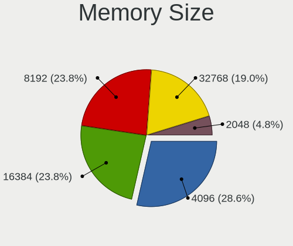

| Size  | Notebooks | Percent |
|-------|-----------|---------|
| 16384 | 3         | 27.27%  |
| 8192  | 3         | 27.27%  |
| 4096  | 3         | 27.27%  |
| 32768 | 2         | 18.18%  |

Memory Speed
------------

Memory module speed

| Speed | Notebooks | Percent |
|-------|-----------|---------|
| 2667  | 4         | 40%     |
| 2400  | 2         | 20%     |
| 2133  | 2         | 20%     |
| 1600  | 1         | 10%     |
| 1066  | 1         | 10%     |

Printers & scanners
-------------------

Printer Vendor
--------------

Printer device vendors

Zero info for selected period =(

Printer Model
-------------

Printer device models

Zero info for selected period =(

Scanner Vendor
--------------

Scanner device vendors

Zero info for selected period =(

Scanner Model
-------------

Scanner device models

Zero info for selected period =(

Camera
------

Camera Vendor
-------------

Camera device vendors

| Vendor                                 | Notebooks | Percent |
|----------------------------------------|-----------|---------|
| Alcor Micro                            | 4         | 20%     |
| Acer                                   | 4         | 20%     |
| Realtek Semiconductor                  | 3         | 15%     |
| Sunplus Innovation Technology          | 2         | 10%     |
| Chicony Electronics                    | 2         | 10%     |
| Microdia                               | 1         | 5%      |
| Lite-On Technology                     | 1         | 5%      |
| Google                                 | 1         | 5%      |
| Cheng Uei Precision Industry (Foxlink) | 1         | 5%      |
| Apple                                  | 1         | 5%      |

Camera Model
------------

Camera device models

| Model                                                                      | Notebooks | Percent |
|----------------------------------------------------------------------------|-----------|---------|
| Alcor Micro HD WebCam                                                      | 3         | 14.29%  |
| Acer SunplusIT INC. Integrated Camera                                      | 2         | 9.52%   |
| Sunplus Integrated_Webcam_HD                                               | 1         | 4.76%   |
| Sunplus Integrated Camera                                                  | 1         | 4.76%   |
| Realtek Integrated_Webcam_HD                                               | 1         | 4.76%   |
| Realtek Integrated Webcam                                                  | 1         | 4.76%   |
| Realtek HP Truevision HD                                                   | 1         | 4.76%   |
| Microdia HP Integrated Webcam                                              | 1         | 4.76%   |
| Lite-On Integrated Camera                                                  | 1         | 4.76%   |
| Chicony USB2.0 UVC WebCam                                                  | 1         | 4.76%   |
| Chicony HD User Facing                                                     | 1         | 4.76%   |
| Cheng Uei Precision Industry (Foxlink) HP Wide Vision HD integrated webcam | 1         | 4.76%   |
| Apple iPhone 5/5C/5S/6/SE                                                  | 1         | 4.76%   |
| Apple iBridge                                                              | 1         | 4.76%   |
| Alcor Micro HP Webcam-101                                                  | 1         | 4.76%   |
| Acer SunplusIT Integrated Camera                                           | 1         | 4.76%   |
| Acer BisonCam, NB Pro                                                      | 1         | 4.76%   |
| Unknown                                                                    | 1         | 4.76%   |

Security
--------

Fingerprint Vendor
------------------

Fingerprint sensor vendors

| Vendor                | Notebooks | Percent |
|-----------------------|-----------|---------|
| Validity Sensors      | 3         | 60%     |
| Synaptics             | 1         | 20%     |
| LighTuning Technology | 1         | 20%     |

Fingerprint Model
-----------------

Fingerprint sensor models

| Model                                            | Notebooks | Percent |
|--------------------------------------------------|-----------|---------|
| Validity Sensors VFS 5011 fingerprint sensor     | 3         | 60%     |
| Synaptics Metallica MOH Touch Fingerprint Reader | 1         | 20%     |
| LighTuning ES603 Swipe Fingerprint Sensor        | 1         | 20%     |

Chipcard Vendor
---------------

Chipcard module vendors

| Vendor      | Notebooks | Percent |
|-------------|-----------|---------|
| Purism, SPC | 2         | 50%     |
| Clay Logic  | 1         | 25%     |
| Alcor Micro | 1         | 25%     |

Chipcard Model
--------------

Chipcard module models

| Model                               | Notebooks | Percent |
|-------------------------------------|-----------|---------|
| Purism, SPC Librem Key              | 2         | 50%     |
| Clay Logic Nitrokey Pro             | 1         | 25%     |
| Alcor Micro AU9540 Smartcard Reader | 1         | 25%     |

Unsupported
-----------

Unsupported Devices
-------------------

Total unsupported devices on board

| Total | Notebooks | Percent |
|-------|-----------|---------|
| 0     | 12        | 42.86%  |
| 1     | 11        | 39.29%  |
| 2     | 3         | 10.71%  |
| 4     | 1         | 3.57%   |
| 3     | 1         | 3.57%   |

Unsupported Device Types
------------------------

Types of unsupported devices

| Type                  | Notebooks | Percent |
|-----------------------|-----------|---------|
| Net/wireless          | 6         | 25%     |
| Bluetooth             | 6         | 25%     |
| Fingerprint reader    | 5         | 20.83%  |
| Graphics card         | 4         | 16.67%  |
| Multimedia controller | 1         | 4.17%   |
| Chipcard              | 1         | 4.17%   |
| Camera                | 1         | 4.17%   |

