PureOS - Tested Hardware & Statistics (Notebooks)
-------------------------------------------------

A project to collect tested hardware configurations for PureOS.

Anyone can contribute to this report by the [hw-probe](https://github.com/linuxhw/hw-probe) tool:

    sudo -E hw-probe -all -upload

Please contribute! Especially if your hardware is rare.

Contents
--------

* [ Test Cases ](#test-cases)

* [ System ](#system)
  - [ OS                       ](#os)
  - [ OS Family                ](#os-family)
  - [ Kernel                   ](#kernel)
  - [ Kernel Family            ](#kernel-family)
  - [ Kernel Major Ver.        ](#kernel-major-ver)
  - [ Arch                     ](#arch)
  - [ DE                       ](#de)
  - [ Display Server           ](#display-server)
  - [ Display Manager          ](#display-manager)
  - [ OS Lang                  ](#os-lang)
  - [ Boot Mode                ](#boot-mode)
  - [ Filesystem               ](#filesystem)
  - [ Part. scheme             ](#part-scheme)
  - [ Dual Boot with Linux/BSD ](#dual-boot-with-linuxbsd)
  - [ Dual Boot (Win)          ](#dual-boot-win)

* [ Board ](#board)
  - [ Vendor                   ](#vendor)
  - [ Model                    ](#model)
  - [ Model Family             ](#model-family)
  - [ MFG Year                 ](#mfg-year)
  - [ Form Factor              ](#form-factor)
  - [ Secure Boot              ](#secure-boot)
  - [ Coreboot                 ](#coreboot)
  - [ RAM Size                 ](#ram-size)
  - [ RAM Used                 ](#ram-used)
  - [ Total Drives             ](#total-drives)
  - [ Has CD-ROM               ](#has-cd-rom)
  - [ Has Ethernet             ](#has-ethernet)
  - [ Has WiFi                 ](#has-wifi)
  - [ Has Bluetooth            ](#has-bluetooth)

* [ Location ](#location)
  - [ Country                  ](#country)
  - [ City                     ](#city)

* [ Drives ](#drives)
  - [ Drive Vendor             ](#drive-vendor)
  - [ Drive Model              ](#drive-model)
  - [ HDD Vendor               ](#hdd-vendor)
  - [ SSD Vendor               ](#ssd-vendor)
  - [ Drive Kind               ](#drive-kind)
  - [ Drive Connector          ](#drive-connector)
  - [ Drive Size               ](#drive-size)
  - [ Space Total              ](#space-total)
  - [ Space Used               ](#space-used)
  - [ Malfunc. Drives          ](#malfunc-drives)
  - [ Malfunc. Drive Vendor    ](#malfunc-drive-vendor)
  - [ Malfunc. HDD Vendor      ](#malfunc-hdd-vendor)
  - [ Malfunc. Drive Kind      ](#malfunc-drive-kind)
  - [ Failed Drives            ](#failed-drives)
  - [ Failed Drive Vendor      ](#failed-drive-vendor)
  - [ Drive Status             ](#drive-status)

* [ Storage controller ](#storage-controller)
  - [ Storage Vendor           ](#storage-vendor)
  - [ Storage Model            ](#storage-model)
  - [ Storage Kind             ](#storage-kind)

* [ Processor ](#processor)
  - [ CPU Vendor               ](#cpu-vendor)
  - [ CPU Model                ](#cpu-model)
  - [ CPU Model Family         ](#cpu-model-family)
  - [ CPU Cores                ](#cpu-cores)
  - [ CPU Sockets              ](#cpu-sockets)
  - [ CPU Threads              ](#cpu-threads)
  - [ CPU Op-Modes             ](#cpu-op-modes)
  - [ CPU Microcode            ](#cpu-microcode)
  - [ CPU Microarch            ](#cpu-microarch)

* [ Graphics ](#graphics)
  - [ GPU Vendor               ](#gpu-vendor)
  - [ GPU Model                ](#gpu-model)
  - [ GPU Combo                ](#gpu-combo)
  - [ GPU Driver               ](#gpu-driver)
  - [ GPU Memory               ](#gpu-memory)

* [ Monitor ](#monitor)
  - [ Monitor Vendor           ](#monitor-vendor)
  - [ Monitor Model            ](#monitor-model)
  - [ Monitor Resolution       ](#monitor-resolution)
  - [ Monitor Diagonal         ](#monitor-diagonal)
  - [ Monitor Width            ](#monitor-width)
  - [ Aspect Ratio             ](#aspect-ratio)
  - [ Monitor Area             ](#monitor-area)
  - [ Pixel Density            ](#pixel-density)
  - [ Multiple Monitors        ](#multiple-monitors)

* [ Network ](#network)
  - [ Net Controller Vendor    ](#net-controller-vendor)
  - [ Net Controller Model     ](#net-controller-model)
  - [ Wireless Vendor          ](#wireless-vendor)
  - [ Wireless Model           ](#wireless-model)
  - [ Ethernet Vendor          ](#ethernet-vendor)
  - [ Ethernet Model           ](#ethernet-model)
  - [ Net Controller Kind      ](#net-controller-kind)
  - [ Used Controller          ](#used-controller)
  - [ NICs                     ](#nics)
  - [ IPv6                     ](#ipv6)

* [ Bluetooth ](#bluetooth)
  - [ Bluetooth Vendor         ](#bluetooth-vendor)
  - [ Bluetooth Model          ](#bluetooth-model)

* [ Sound ](#sound)
  - [ Sound Vendor             ](#sound-vendor)
  - [ Sound Model              ](#sound-model)

* [ Memory ](#memory)
  - [ Memory Vendor            ](#memory-vendor)
  - [ Memory Model             ](#memory-model)
  - [ Memory Kind              ](#memory-kind)
  - [ Memory Form Factor       ](#memory-form-factor)
  - [ Memory Size              ](#memory-size)
  - [ Memory Speed             ](#memory-speed)

* [ Printers & scanners ](#printers--scanners)
  - [ Printer Vendor           ](#printer-vendor)
  - [ Printer Model            ](#printer-model)
  - [ Scanner Vendor           ](#scanner-vendor)
  - [ Scanner Model            ](#scanner-model)

* [ Camera ](#camera)
  - [ Camera Vendor            ](#camera-vendor)
  - [ Camera Model             ](#camera-model)

* [ Security ](#security)
  - [ Fingerprint Vendor       ](#fingerprint-vendor)
  - [ Fingerprint Model        ](#fingerprint-model)
  - [ Chipcard Vendor          ](#chipcard-vendor)
  - [ Chipcard Model           ](#chipcard-model)

* [ Unsupported ](#unsupported)
  - [ Unsupported Devices      ](#unsupported-devices)
  - [ Unsupported Device Types ](#unsupported-device-types)

Test Cases
----------

Total: 48

| Vendor        | Model                       | Probe                                                      | Date         |
|---------------|-----------------------------|------------------------------------------------------------|--------------|
| Google        | Droid                       | [e576f650b7](https://linux-hardware.org/?probe=e576f650b7) | Feb 22, 2023 |
| HUAWEI        | NBLB-WAX9N                  | [519a211655](https://linux-hardware.org/?probe=519a211655) | Jan 30, 2023 |
| HUAWEI        | NBLB-WAX9N                  | [edd571ba94](https://linux-hardware.org/?probe=edd571ba94) | Jan 28, 2023 |
| Dell          | Latitude D430               | [e171875163](https://linux-hardware.org/?probe=e171875163) | Jan 27, 2023 |
| Dell          | Latitude D430               | [6245710c10](https://linux-hardware.org/?probe=6245710c10) | Jan 26, 2023 |
| Samsung       | 530U3C/530U4C/532U3C        | [c41d8da6ac](https://linux-hardware.org/?probe=c41d8da6ac) | Nov 26, 2022 |
| Apple         | MacBookAir7,2               | [6901439af7](https://linux-hardware.org/?probe=6901439af7) | Nov 17, 2022 |
| Lenovo        | IdeaPad U430 Touch 20270    | [707d2f74c7](https://linux-hardware.org/?probe=707d2f74c7) | Oct 24, 2022 |
| Apple         | MacBook9,1                  | [e6898c8aa0](https://linux-hardware.org/?probe=e6898c8aa0) | Sep 19, 2022 |
| Acer          | Swift SF113-31              | [3c29601232](https://linux-hardware.org/?probe=3c29601232) | Sep 05, 2022 |
| Acer          | Swift SF113-31              | [f3753d28fb](https://linux-hardware.org/?probe=f3753d28fb) | Sep 05, 2022 |
| Purism        | Librem 14                   | [89d920a7d2](https://linux-hardware.org/?probe=89d920a7d2) | Jun 11, 2022 |
| Apple         | MacBookPro6,1               | [40d33cea3f](https://linux-hardware.org/?probe=40d33cea3f) | May 23, 2022 |
| Purism        | Librem 14                   | [9d078217f1](https://linux-hardware.org/?probe=9d078217f1) | Apr 23, 2022 |
| HP            | Pavilion g6                 | [796bf7f467](https://linux-hardware.org/?probe=796bf7f467) | Apr 23, 2022 |
| Dell          | Inspiron 15-3567            | [8cbc7d1caf](https://linux-hardware.org/?probe=8cbc7d1caf) | Apr 20, 2022 |
| Purism        | Librem 15 v4                | [061aeeecf7](https://linux-hardware.org/?probe=061aeeecf7) | Apr 13, 2022 |
| Lenovo        | ThinkPad T440p              | [45a1ee6fbf](https://linux-hardware.org/?probe=45a1ee6fbf) | Apr 12, 2022 |
| HP            | Pavilion Notebook           | [c0dd92f23c](https://linux-hardware.org/?probe=c0dd92f23c) | Apr 03, 2022 |
| Acer          | Nitro AN515-43              | [e1386a38c7](https://linux-hardware.org/?probe=e1386a38c7) | Mar 20, 2022 |
| Dell          | Inspiron 15-3567            | [c8723d2dd9](https://linux-hardware.org/?probe=c8723d2dd9) | Feb 21, 2022 |
| Dell          | Inspiron 15-3567            | [45529bb469](https://linux-hardware.org/?probe=45529bb469) | Feb 21, 2022 |
| Lenovo        | ThinkPad T540p 20BFS23T0... | [c49acb0edf](https://linux-hardware.org/?probe=c49acb0edf) | Feb 21, 2022 |
| Lenovo        | ThinkPad T540p 20BFS23T0... | [6f13abc9eb](https://linux-hardware.org/?probe=6f13abc9eb) | Feb 21, 2022 |
| Acer          | Aspire E5-553G              | [1f5badca6e](https://linux-hardware.org/?probe=1f5badca6e) | Feb 06, 2022 |
| Lenovo        | ThinkPad E480 20KN003SUS    | [ad043b077a](https://linux-hardware.org/?probe=ad043b077a) | Nov 25, 2021 |
| Apple         | MacBookPro14,2              | [5f4d435f0d](https://linux-hardware.org/?probe=5f4d435f0d) | Nov 24, 2021 |
| Purism        | Librem 14                   | [68e8f5b427](https://linux-hardware.org/?probe=68e8f5b427) | Sep 27, 2021 |
| Lenovo        | ThinkPad 13 2nd Gen 20J2... | [077ff209de](https://linux-hardware.org/?probe=077ff209de) | Aug 18, 2021 |
| Purism        | Librem 14                   | [295a2a1392](https://linux-hardware.org/?probe=295a2a1392) | Jul 15, 2021 |
| Purism        | Librem 14                   | [49d9b561c6](https://linux-hardware.org/?probe=49d9b561c6) | Jul 15, 2021 |
| Toshiba       | Satellite L500D             | [b830927060](https://linux-hardware.org/?probe=b830927060) | Jul 04, 2021 |
| Dell          | XPS 13 9370                 | [c8937f439d](https://linux-hardware.org/?probe=c8937f439d) | Jun 09, 2021 |
| Purism        | Librem 14                   | [0c18b37b73](https://linux-hardware.org/?probe=0c18b37b73) | Jun 01, 2021 |
| Pine Micro... | Pine64 Pinebook Pro         | [79c01fbf3a](https://linux-hardware.org/?probe=79c01fbf3a) | Oct 28, 2020 |
| Unknown       | Unknown                     | [c24817ee80](https://linux-hardware.org/?probe=c24817ee80) | Sep 15, 2020 |
| HP            | Pavilion g6                 | [eb23d17143](https://linux-hardware.org/?probe=eb23d17143) | Jul 15, 2020 |
| Lenovo        | ThinkPad T440 20B60044RT    | [db8ba33d45](https://linux-hardware.org/?probe=db8ba33d45) | Jun 02, 2020 |
| Purism        | Librem 15 v4                | [d9f38d66c3](https://linux-hardware.org/?probe=d9f38d66c3) | Apr 29, 2020 |
| Notebook      | P17SM                       | [730c65e65d](https://linux-hardware.org/?probe=730c65e65d) | Apr 22, 2020 |
| Purism        | Librem 15 v4                | [6e5f1119b7](https://linux-hardware.org/?probe=6e5f1119b7) | Apr 10, 2020 |
| Purism        | Librem 15 v3                | [a43311f999](https://linux-hardware.org/?probe=a43311f999) | Dec 18, 2019 |
| Purism        | Librem 13 v4                | [6d7a537e86](https://linux-hardware.org/?probe=6d7a537e86) | Nov 15, 2019 |
| Dell          | Inspiron 5547               | [689dfea547](https://linux-hardware.org/?probe=689dfea547) | Oct 25, 2019 |
| Purism        | Librem 13 v4                | [6d7c18d329](https://linux-hardware.org/?probe=6d7c18d329) | Oct 18, 2019 |
| Lenovo        | G505s 20255                 | [bce345b263](https://linux-hardware.org/?probe=bce345b263) | Aug 30, 2019 |
| Purism        | Librem 13 v2                | [3e70a8dff1](https://linux-hardware.org/?probe=3e70a8dff1) | Jul 13, 2019 |
| Purism        | Librem 15 v3                | [02e23b6024](https://linux-hardware.org/?probe=02e23b6024) | May 21, 2018 |

System
------

OS
--

Installed operating systems

| Name        | Notebooks | Percent |
|-------------|-----------|---------|
| PureOS 10.0 | 13        | 35.14%  |
| PureOS 10   | 11        | 29.73%  |
| PureOS 9.0  | 9         | 24.32%  |
| PureOS 9    | 2         | 5.41%   |
| PureOS 8    | 2         | 5.41%   |

OS Family
---------

OS without a version

| Name   | Notebooks | Percent |
|--------|-----------|---------|
| PureOS | 36        | 100%    |

Kernel
------

Version of the Linux kernel

| Version                          | Notebooks | Percent |
|----------------------------------|-----------|---------|
| 4.19.0-5-amd64                   | 9         | 23.68%  |
| 5.10.0-13-amd64                  | 5         | 13.16%  |
| 5.10.0-14-amd64                  | 4         | 10.53%  |
| 5.10.0-8-amd64                   | 3         | 7.89%   |
| 5.10.0-7-amd64                   | 2         | 5.26%   |
| 5.10.0-21-amd64                  | 2         | 5.26%   |
| 5.10.0-11-amd64                  | 2         | 5.26%   |
| 5.7.0-1-librem5                  | 1         | 2.63%   |
| 5.7.0-0.38-1-pinebookpro-hwaccel | 1         | 2.63%   |
| 5.15.0-2-amd64                   | 1         | 2.63%   |
| 5.10.0-9-amd64                   | 1         | 2.63%   |
| 5.10.0-6-amd64                   | 1         | 2.63%   |
| 5.10.0-19-amd64                  | 1         | 2.63%   |
| 5.10.0-18-amd64                  | 1         | 2.63%   |
| 5.10.0-17-amd64                  | 1         | 2.63%   |
| 5.10.0-12-amd64                  | 1         | 2.63%   |
| 4.19.0-14-amd64                  | 1         | 2.63%   |
| 4.16.0-1-amd64                   | 1         | 2.63%   |

Kernel Family
-------------

Linux kernel without a distro release

| Version | Notebooks | Percent |
|---------|-----------|---------|
| 5.10.0  | 23        | 62.16%  |
| 4.19.0  | 10        | 27.03%  |
| 5.7.0   | 2         | 5.41%   |
| 5.15.0  | 1         | 2.7%    |
| 4.16.0  | 1         | 2.7%    |

Kernel Major Ver.
-----------------

Linux kernel major version

| Version | Notebooks | Percent |
|---------|-----------|---------|
| 5.10    | 23        | 62.16%  |
| 4.19    | 10        | 27.03%  |
| 5.7     | 2         | 5.41%   |
| 5.15    | 1         | 2.7%    |
| 4.16    | 1         | 2.7%    |

Arch
----

OS architecture (x86_64, i586, etc.)

| Name    | Notebooks | Percent |
|---------|-----------|---------|
| x86_64  | 34        | 94.44%  |
| aarch64 | 2         | 5.56%   |

DE
--

Desktop Environment

| Name            | Notebooks | Percent |
|-----------------|-----------|---------|
| GNOME           | 30        | 81.08%  |
| Unknown         | 4         | 10.81%  |
| MATE            | 1         | 2.7%    |
| KDE5            | 1         | 2.7%    |
| GNOME Flashback | 1         | 2.7%    |

Display Server
--------------

X11 or Wayland

| Name    | Notebooks | Percent |
|---------|-----------|---------|
| Wayland | 28        | 73.68%  |
| X11     | 5         | 13.16%  |
| Unknown | 4         | 10.53%  |
| Tty     | 1         | 2.63%   |

Display Manager
---------------

SDDM, LightDM, etc.

| Name    | Notebooks | Percent |
|---------|-----------|---------|
| Unknown | 21        | 58.33%  |
| GDM     | 11        | 30.56%  |
| GDM3    | 4         | 11.11%  |

OS Lang
-------

Language

| Lang    | Notebooks | Percent |
|---------|-----------|---------|
| en_US   | 16        | 42.11%  |
| en_GB   | 4         | 10.53%  |
| Unknown | 4         | 10.53%  |
| pl_PL   | 2         | 5.26%   |
| de_DE   | 2         | 5.26%   |
| C       | 2         | 5.26%   |
| zh_CN   | 1         | 2.63%   |
| ru_RU   | 1         | 2.63%   |
| pt_PT   | 1         | 2.63%   |
| it_IT   | 1         | 2.63%   |
| fr_FR   | 1         | 2.63%   |
| es_CR   | 1         | 2.63%   |
| en_IL   | 1         | 2.63%   |
| en_AU   | 1         | 2.63%   |

Boot Mode
---------

EFI or BIOS

| Mode | Notebooks | Percent |
|------|-----------|---------|
| BIOS | 31        | 86.11%  |
| EFI  | 5         | 13.89%  |

Filesystem
----------

Type of filesystem

| Type    | Notebooks | Percent |
|---------|-----------|---------|
| Ext4    | 31        | 86.11%  |
| Unknown | 2         | 5.56%   |
| Overlay | 1         | 2.78%   |
| Ext2    | 1         | 2.78%   |
| Btrfs   | 1         | 2.78%   |

Part. scheme
------------

Scheme of partitioning

| Type    | Notebooks | Percent |
|---------|-----------|---------|
| Unknown | 22        | 61.11%  |
| MBR     | 9         | 25%     |
| GPT     | 5         | 13.89%  |

Dual Boot with Linux/BSD
------------------------

Hosting more than one Linux/BSD

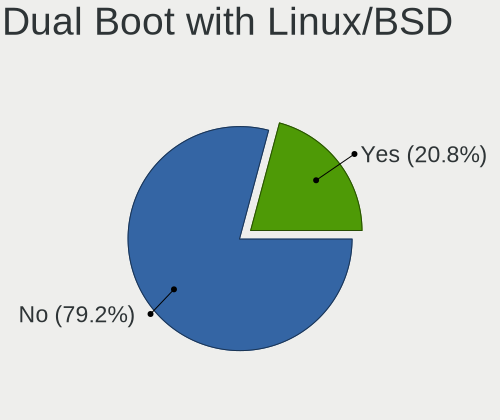

| Dual boot | Notebooks | Percent |
|-----------|-----------|---------|
| No        | 30        | 83.33%  |
| Yes       | 6         | 16.67%  |

Dual Boot (Win)
---------------

Hosting Linux and Windows

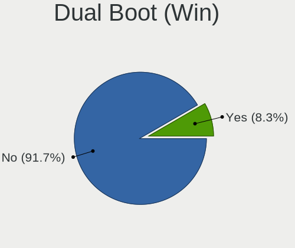

| Dual boot | Notebooks | Percent |
|-----------|-----------|---------|
| No        | 33        | 91.67%  |
| Yes       | 3         | 8.33%   |

Board
-----

Vendor
------

Motherboard manufacturer

| Name                | Notebooks | Percent |
|---------------------|-----------|---------|
| Purism              | 10        | 27.78%  |
| Lenovo              | 6         | 16.67%  |
| Dell                | 4         | 11.11%  |
| Apple               | 4         | 11.11%  |
| Hewlett-Packard     | 3         | 8.33%   |
| Acer                | 2         | 5.56%   |
| Toshiba             | 1         | 2.78%   |
| Samsung Electronics | 1         | 2.78%   |
| Pine Microsystems   | 1         | 2.78%   |
| Notebook            | 1         | 2.78%   |
| HUAWEI              | 1         | 2.78%   |
| Google              | 1         | 2.78%   |
| Unknown             | 1         | 2.78%   |

Model
-----

Motherboard model

| Name                                  | Notebooks | Percent |
|---------------------------------------|-----------|---------|
| Purism Librem 14                      | 5         | 13.89%  |
| Purism Librem 15 v4                   | 2         | 5.56%   |
| HP Pavilion g6                        | 2         | 5.56%   |
| Toshiba Satellite L500D               | 1         | 2.78%   |
| Samsung 530U3C/530U4C/532U3C          | 1         | 2.78%   |
| Purism Librem 15 v3                   | 1         | 2.78%   |
| Purism Librem 13 v4                   | 1         | 2.78%   |
| Purism Librem 13 v2                   | 1         | 2.78%   |
| Pine Microsystems Pine64 Pinebook Pro | 1         | 2.78%   |
| Notebook P17SM                        | 1         | 2.78%   |
| Lenovo ThinkPad T540p 20BFS23T00      | 1         | 2.78%   |
| Lenovo ThinkPad T440p                 | 1         | 2.78%   |
| Lenovo ThinkPad T440 20B60044RT       | 1         | 2.78%   |
| Lenovo ThinkPad E480 20KN003SUS       | 1         | 2.78%   |
| Lenovo ThinkPad 13 2nd Gen 20J2S00G00 | 1         | 2.78%   |
| Lenovo IdeaPad U430 Touch 20270       | 1         | 2.78%   |
| HUAWEI NBLB-WAX9N                     | 1         | 2.78%   |
| HP Pavilion Notebook                  | 1         | 2.78%   |
| Google Droid                          | 1         | 2.78%   |
| Dell XPS 13 9370                      | 1         | 2.78%   |
| Dell Latitude D430                    | 1         | 2.78%   |
| Dell Inspiron 5547                    | 1         | 2.78%   |
| Dell Inspiron 15-3567                 | 1         | 2.78%   |
| Apple MacBookPro6,1                   | 1         | 2.78%   |
| Apple MacBookPro14,2                  | 1         | 2.78%   |
| Apple MacBookAir7,2                   | 1         | 2.78%   |
| Apple MacBook9,1                      | 1         | 2.78%   |
| Acer Swift SF113-31                   | 1         | 2.78%   |
| Acer Nitro AN515-43                   | 1         | 2.78%   |
| Unknown                               | 1         | 2.78%   |

Model Family
------------

Motherboard model prefix

| Name                     | Notebooks | Percent |
|--------------------------|-----------|---------|
| Purism Librem            | 10        | 27.78%  |
| Lenovo ThinkPad          | 5         | 13.89%  |
| HP Pavilion              | 3         | 8.33%   |
| Dell Inspiron            | 2         | 5.56%   |
| Toshiba Satellite        | 1         | 2.78%   |
| Samsung 530U3C           | 1         | 2.78%   |
| Pine Microsystems Pine64 | 1         | 2.78%   |
| Notebook P17SM           | 1         | 2.78%   |
| Lenovo IdeaPad           | 1         | 2.78%   |
| HUAWEI NBLB-WAX9N        | 1         | 2.78%   |
| Google Droid             | 1         | 2.78%   |
| Dell XPS                 | 1         | 2.78%   |
| Dell Latitude            | 1         | 2.78%   |
| Apple MacBookPro6        | 1         | 2.78%   |
| Apple MacBookPro14       | 1         | 2.78%   |
| Apple MacBookAir7        | 1         | 2.78%   |
| Apple MacBook9           | 1         | 2.78%   |
| Acer Swift               | 1         | 2.78%   |
| Acer Nitro               | 1         | 2.78%   |
| Unknown                  | 1         | 2.78%   |

MFG Year
--------

Motherboard manufacture year

| Year    | Notebooks | Percent |
|---------|-----------|---------|
| 2021    | 6         | 16.67%  |
| 2017    | 5         | 13.89%  |
| 2019    | 4         | 11.11%  |
| 2013    | 4         | 11.11%  |
| 2020    | 3         | 8.33%   |
| 2018    | 2         | 5.56%   |
| 2015    | 2         | 5.56%   |
| 2011    | 2         | 5.56%   |
| Unknown | 2         | 5.56%   |
| 2023    | 1         | 2.78%   |
| 2016    | 1         | 2.78%   |
| 2014    | 1         | 2.78%   |
| 2012    | 1         | 2.78%   |
| 2009    | 1         | 2.78%   |
| 2007    | 1         | 2.78%   |

Form Factor
-----------

Physical design of the computer

| Name     | Notebooks | Percent |
|----------|-----------|---------|
| Notebook | 36        | 100%    |

Secure Boot
-----------

Enabled or disabled

| State    | Notebooks | Percent |
|----------|-----------|---------|
| Disabled | 36        | 100%    |

Coreboot
--------

Have coreboot on board

| Used | Notebooks | Percent |
|------|-----------|---------|
| No   | 24        | 66.67%  |
| Yes  | 12        | 33.33%  |

RAM Size
--------

Total RAM memory

| Size in GB | Notebooks | Percent |
|------------|-----------|---------|
| 4.01-8.0   | 9         | 25%     |
| 16.01-24.0 | 9         | 25%     |
| 32.01-64.0 | 6         | 16.67%  |
| 3.01-4.0   | 5         | 13.89%  |
| 8.01-16.0  | 4         | 11.11%  |
| 24.01-32.0 | 1         | 2.78%   |
| 2.01-3.0   | 1         | 2.78%   |
| 1.01-2.0   | 1         | 2.78%   |

RAM Used
--------

Used RAM memory

| Used GB   | Notebooks | Percent |
|-----------|-----------|---------|
| 2.01-3.0  | 12        | 31.58%  |
| 3.01-4.0  | 10        | 26.32%  |
| 1.01-2.0  | 8         | 21.05%  |
| 4.01-8.0  | 6         | 15.79%  |
| 8.01-16.0 | 2         | 5.26%   |

Total Drives
------------

Number of drives on board

| Drives | Notebooks | Percent |
|--------|-----------|---------|
| 1      | 24        | 66.67%  |
| 2      | 11        | 30.56%  |
| 0      | 1         | 2.78%   |

Has CD-ROM
----------

Has CD-ROM on board

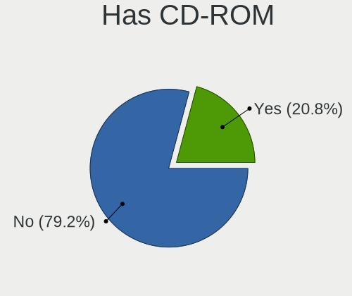

| Presented | Notebooks | Percent |
|-----------|-----------|---------|
| No        | 29        | 80.56%  |
| Yes       | 7         | 19.44%  |

Has Ethernet
------------

Has Ethernet on board

| Presented | Notebooks | Percent |
|-----------|-----------|---------|
| Yes       | 28        | 77.78%  |
| No        | 8         | 22.22%  |

Has WiFi
--------

Has WiFi module

| Presented | Notebooks | Percent |
|-----------|-----------|---------|
| Yes       | 33        | 91.67%  |
| No        | 3         | 8.33%   |

Has Bluetooth
-------------

Has Bluetooth module

| Presented | Notebooks | Percent |
|-----------|-----------|---------|
| Yes       | 28        | 77.78%  |
| No        | 8         | 22.22%  |

Location
--------

Country
-------

Geographic location (country)

| Country                | Notebooks | Percent |
|------------------------|-----------|---------|
| USA                    | 8         | 21.05%  |
| UK                     | 5         | 13.16%  |
| Germany                | 3         | 7.89%   |
| Canada                 | 3         | 7.89%   |
| Italy                  | 2         | 5.26%   |
| France                 | 2         | 5.26%   |
| Brazil                 | 2         | 5.26%   |
| Australia              | 2         | 5.26%   |
| Turkey                 | 1         | 2.63%   |
| South Africa           | 1         | 2.63%   |
| Russia                 | 1         | 2.63%   |
| Portugal               | 1         | 2.63%   |
| Poland                 | 1         | 2.63%   |
| Paraguay               | 1         | 2.63%   |
| Israel                 | 1         | 2.63%   |
| Iran                   | 1         | 2.63%   |
| Costa Rica             | 1         | 2.63%   |
| China                  | 1         | 2.63%   |
| Bosnia and Herzegovina | 1         | 2.63%   |

City
----

Geographic location (city)

| City               | Notebooks | Percent |
|--------------------|-----------|---------|
| London             | 3         | 7.89%   |
| Windsor            | 1         | 2.63%   |
| Warsaw             | 1         | 2.63%   |
| Vancouver          | 1         | 2.63%   |
| Thorpe Hamlet      | 1         | 2.63%   |
| Tel Aviv           | 1         | 2.63%   |
| Stuttgart          | 1         | 2.63%   |
| Spencer            | 1         | 2.63%   |
| Seattle            | 1         | 2.63%   |
| San Jose           | 1         | 2.63%   |
| Paris              | 1         | 2.63%   |
| New York           | 1         | 2.63%   |
| Montreal           | 1         | 2.63%   |
| Milwaukee          | 1         | 2.63%   |
| Milpitas           | 1         | 2.63%   |
| Melbourne          | 1         | 2.63%   |
| Mankato            | 1         | 2.63%   |
| Krasnogorsk        | 1         | 2.63%   |
| Istanbul           | 1         | 2.63%   |
| Hernandarias       | 1         | 2.63%   |
| Guimaraes          | 1         | 2.63%   |
| Grasse             | 1         | 2.63%   |
| Genoa              | 1         | 2.63%   |
| Eberswalde         | 1         | 2.63%   |
| Cape Town          | 1         | 2.63%   |
| Camden             | 1         | 2.63%   |
| Blumenau           | 1         | 2.63%   |
| Big Sky            | 1         | 2.63%   |
| Berlin             | 1         | 2.63%   |
| Banja Luka         | 1         | 2.63%   |
| Bandar-e Asalūyeh | 1         | 2.63%   |
| Araçatuba         | 1         | 2.63%   |
| Antioch            | 1         | 2.63%   |
| Ankang             | 1         | 2.63%   |
| Almese             | 1         | 2.63%   |
| Adelaide           | 1         | 2.63%   |

Drives
------

Drive Vendor
------------

Hard drive vendors

| Vendor              | Notebooks | Drives | Percent |
|---------------------|-----------|--------|---------|
| Samsung Electronics | 13        | 17     | 29.55%  |
| Unknown             | 4         | 4      | 9.09%   |
| Seagate             | 3         | 3      | 6.82%   |
| HGST                | 3         | 3      | 6.82%   |
| Apple               | 3         | 5      | 6.82%   |
| WDC                 | 2         | 2      | 4.55%   |
| SanDisk             | 2         | 2      | 4.55%   |
| Crucial             | 2         | 4      | 4.55%   |
| A-DATA Technology   | 2         | 2      | 4.55%   |
| Transcend           | 1         | 1      | 2.27%   |
| Toshiba             | 1         | 1      | 2.27%   |
| Plextor             | 1         | 1      | 2.27%   |
| Phison              | 1         | 1      | 2.27%   |
| Mushkin             | 1         | 1      | 2.27%   |
| JMicron Technology  | 1         | 1      | 2.27%   |
| Intel               | 1         | 1      | 2.27%   |
| Hitachi             | 1         | 1      | 2.27%   |
| BIWIN               | 1         | 1      | 2.27%   |
| ADATA Technology    | 1         | 1      | 2.27%   |

Drive Model
-----------

Hard drive models

| Model                               | Notebooks | Percent |
|-------------------------------------|-----------|---------|
| Unknown MMC Card  64GB              | 2         | 4.35%   |
| Seagate ST1000LM048-2E7172 1TB      | 2         | 4.35%   |
| Samsung SSD 970 PRO 1TB             | 2         | 4.35%   |
| WDC WDS500G2B0A-00SM50 500GB SSD    | 1         | 2.17%   |
| WDC WDS100T2B0C-00PXH0 1TB          | 1         | 2.17%   |
| Unknown MMC Card  32GB              | 1         | 2.17%   |
| Unknown DA4128  128GB               | 1         | 2.17%   |
| Transcend TS240GMTS420S 240GB SSD   | 1         | 2.17%   |
| Toshiba NVMe SSD Drive 512GB        | 1         | 2.17%   |
| Seagate NVMe SSD Drive 2TB          | 1         | 2.17%   |
| SanDisk SSD i100 24GB               | 1         | 2.17%   |
| SanDisk SDSSDH3500G 500GB           | 1         | 2.17%   |
| Samsung SSD 970 EVO Plus 500GB      | 1         | 2.17%   |
| Samsung SSD 970 EVO Plus 2TB        | 1         | 2.17%   |
| Samsung SSD 970 EVO 250GB           | 1         | 2.17%   |
| Samsung SSD 960 EVO 500GB           | 1         | 2.17%   |
| Samsung SSD 960 EVO 250GB           | 1         | 2.17%   |
| Samsung SSD 860 EVO 500GB           | 1         | 2.17%   |
| Samsung SSD 860 EVO 250GB           | 1         | 2.17%   |
| Samsung SSD 860 EVO 1TB             | 1         | 2.17%   |
| Samsung SSD 850 EVO 500GB           | 1         | 2.17%   |
| Samsung SSD 850 EVO 250GB           | 1         | 2.17%   |
| Samsung NVMe SSD Drive 1TB          | 1         | 2.17%   |
| Samsung HS08XJC 80GB                | 1         | 2.17%   |
| Plextor PX-1TM6Pro 1024GB SSD       | 1         | 2.17%   |
| Phison PM8512GPTCB4B8TF-E13T4 512GB | 1         | 2.17%   |
| Mushkin MKNSSDRE250GB-LT            | 1         | 2.17%   |
| JMicron Generic 200GB               | 1         | 2.17%   |
| Intel SSDSC2BF180A4H 180GB          | 1         | 2.17%   |
| Hitachi HTS545050A7E380 500GB       | 1         | 2.17%   |
| HGST HTS721010A9E630 1TB            | 1         | 2.17%   |
| HGST HTS545050B7E660 500GB          | 1         | 2.17%   |
| HGST HTS541010A9E680 1TB            | 1         | 2.17%   |
| Crucial CT250MX500SSD4 250GB        | 1         | 2.17%   |
| Crucial CT2000MX500SSD1 2TB         | 1         | 2.17%   |
| BIWIN SSD 120GB                     | 1         | 2.17%   |
| Apple SSD SM0128G 121GB             | 1         | 2.17%   |
| Apple SSD AP0512J 500GB             | 1         | 2.17%   |
| Apple NVMe SSD Drive 8KB            | 1         | 2.17%   |
| Apple NVMe SSD Drive 256GB          | 1         | 2.17%   |

HDD Vendor
----------

Hard disk drive vendors

| Vendor              | Notebooks | Drives | Percent |
|---------------------|-----------|--------|---------|
| HGST                | 3         | 3      | 37.5%   |
| Seagate             | 2         | 2      | 25%     |
| Samsung Electronics | 1         | 1      | 12.5%   |
| JMicron Technology  | 1         | 1      | 12.5%   |
| Hitachi             | 1         | 1      | 12.5%   |

SSD Vendor
----------

Solid state drive vendors

| Vendor              | Notebooks | Drives | Percent |
|---------------------|-----------|--------|---------|
| Samsung Electronics | 6         | 8      | 31.58%  |
| SanDisk             | 2         | 2      | 10.53%  |
| Crucial             | 2         | 4      | 10.53%  |
| A-DATA Technology   | 2         | 2      | 10.53%  |
| WDC                 | 1         | 1      | 5.26%   |
| Transcend           | 1         | 1      | 5.26%   |
| Plextor             | 1         | 1      | 5.26%   |
| Mushkin             | 1         | 1      | 5.26%   |
| Intel               | 1         | 1      | 5.26%   |
| BIWIN               | 1         | 1      | 5.26%   |
| Apple               | 1         | 1      | 5.26%   |

Drive Kind
----------

HDD or SSD

| Kind | Notebooks | Drives | Percent |
|------|-----------|--------|---------|
| SSD  | 16        | 23     | 38.1%   |
| NVMe | 14        | 17     | 33.33%  |
| HDD  | 8         | 8      | 19.05%  |
| MMC  | 4         | 4      | 9.52%   |

Drive Connector
---------------

SATA, SAS, NVMe, etc.

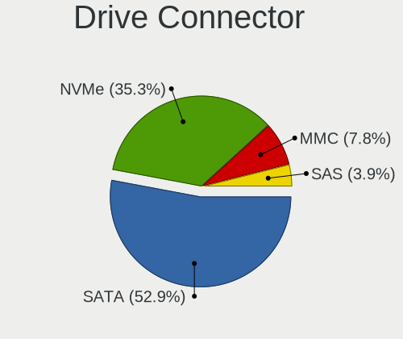

| Type | Notebooks | Drives | Percent |
|------|-----------|--------|---------|
| SATA | 20        | 29     | 50%     |
| NVMe | 14        | 17     | 35%     |
| MMC  | 4         | 4      | 10%     |
| SAS  | 2         | 2      | 5%      |

Drive Size
----------

Size of hard drive

| Size in TB | Notebooks | Drives | Percent |
|------------|-----------|--------|---------|
| 0.01-0.5   | 15        | 23     | 68.18%  |
| 0.51-1.0   | 5         | 5      | 22.73%  |
| 1.01-2.0   | 2         | 3      | 9.09%   |

Space Total
-----------

Amount of disk space available on the file system

| Size in GB | Notebooks | Percent |
|------------|-----------|---------|
| 1-20       | 16        | 44.44%  |
| 101-250    | 5         | 13.89%  |
| 51-100     | 3         | 8.33%   |
| Unknown    | 3         | 8.33%   |
| 251-500    | 2         | 5.56%   |
| 21-50      | 2         | 5.56%   |
| 1001-2000  | 2         | 5.56%   |
| 501-1000   | 2         | 5.56%   |
| 2001-3000  | 1         | 2.78%   |

Space Used
----------

Amount of used disk space

| Used GB  | Notebooks | Percent |
|----------|-----------|---------|
| 1-20     | 24        | 66.67%  |
| 21-50    | 4         | 11.11%  |
| 501-1000 | 3         | 8.33%   |
| Unknown  | 3         | 8.33%   |
| 251-500  | 1         | 2.78%   |
| 51-100   | 1         | 2.78%   |

Malfunc. Drives
---------------

Drive models with a malfunction

| Model                      | Notebooks | Drives | Percent |
|----------------------------|-----------|--------|---------|
| Intel SSDSC2BF180A4H 180GB | 1         | 1      | 100%    |

Malfunc. Drive Vendor
---------------------

Vendors of faulty drives

| Vendor | Notebooks | Drives | Percent |
|--------|-----------|--------|---------|
| Intel  | 1         | 1      | 100%    |

Malfunc. HDD Vendor
-------------------

Vendors of faulty HDD drives

Zero info for selected period =(

Malfunc. Drive Kind
-------------------

Kinds of faulty drives

| Kind | Notebooks | Drives | Percent |
|------|-----------|--------|---------|
| SSD  | 1         | 1      | 100%    |

Failed Drives
-------------

Failed drive models

Zero info for selected period =(

Failed Drive Vendor
-------------------

Failed drive vendors

Zero info for selected period =(

Drive Status
------------

Number of failed and malfunc. drives

| Status   | Notebooks | Drives | Percent |
|----------|-----------|--------|---------|
| Detected | 24        | 35     | 66.67%  |
| Works    | 11        | 16     | 30.56%  |
| Malfunc  | 1         | 1      | 2.78%   |

Storage controller
------------------

Storage Vendor
--------------

Storage controller vendors

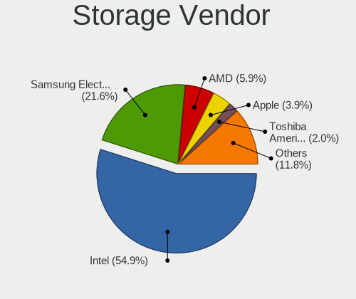

| Vendor                       | Notebooks | Percent |
|------------------------------|-----------|---------|
| Intel                        | 20        | 54.05%  |
| Samsung Electronics          | 8         | 21.62%  |
| Apple                        | 2         | 5.41%   |
| AMD                          | 2         | 5.41%   |
| Toshiba America Info Systems | 1         | 2.7%    |
| Seagate Technology           | 1         | 2.7%    |
| SanDisk                      | 1         | 2.7%    |
| Phison Electronics           | 1         | 2.7%    |
| ADATA Technology             | 1         | 2.7%    |

Storage Model
-------------

Storage controller models

| Model                                                                          | Notebooks | Percent |
|--------------------------------------------------------------------------------|-----------|---------|
| Intel Sunrise Point-LP SATA Controller [AHCI mode]                             | 7         | 18.92%  |
| Samsung NVMe SSD Controller SM981/PM981/PM983                                  | 5         | 13.51%  |
| Intel 8 Series/C220 Series Chipset Family 6-port SATA Controller 1 [AHCI mode] | 3         | 8.11%   |
| Samsung NVMe SSD Controller SM961/PM961/SM963                                  | 2         | 5.41%   |
| Intel 8 Series SATA Controller 1 [AHCI mode]                                   | 2         | 5.41%   |
| Intel 7 Series Chipset Family 6-port SATA Controller [AHCI mode]               | 2         | 5.41%   |
| Apple S3X NVMe Controller                                                      | 2         | 5.41%   |
| Toshiba America Info Systems XG4 NVMe SSD Controller                           | 1         | 2.7%    |
| Seagate FireCuda 510 SSD                                                       | 1         | 2.7%    |
| SanDisk Non-Volatile memory controller                                         | 1         | 2.7%    |
| Samsung Electronics SATA controller                                            | 1         | 2.7%    |
| Phison PS5013 E13 NVMe Controller                                              | 1         | 2.7%    |
| Intel HM170/QM170 Chipset SATA Controller [AHCI Mode]                          | 1         | 2.7%    |
| Intel Comet Lake SATA AHCI Controller                                          | 1         | 2.7%    |
| Intel Celeron N3350/Pentium N4200/Atom E3900 Series SATA AHCI Controller       | 1         | 2.7%    |
| Intel 82801G (ICH7 Family) IDE Controller                                      | 1         | 2.7%    |
| Intel 6 Series/C200 Series Chipset Family 6 port Mobile SATA AHCI Controller   | 1         | 2.7%    |
| Intel 5 Series/3400 Series Chipset 4 port SATA AHCI Controller                 | 1         | 2.7%    |
| AMD SB7x0/SB8x0/SB9x0 SATA Controller [AHCI mode]                              | 1         | 2.7%    |
| AMD FCH SATA Controller [AHCI mode]                                            | 1         | 2.7%    |
| ADATA Non-Volatile memory controller                                           | 1         | 2.7%    |

Storage Kind
------------

Kind of storage controller (IDE, SATA, NVMe, SAS, ...)

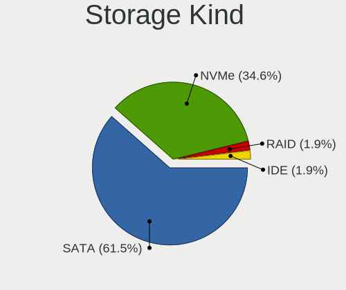

| Kind | Notebooks | Percent |
|------|-----------|---------|
| SATA | 22        | 59.46%  |
| NVMe | 14        | 37.84%  |
| IDE  | 1         | 2.7%    |

Processor
---------

CPU Vendor
----------

Processor vendors

| Vendor | Notebooks | Percent |
|--------|-----------|---------|
| Intel  | 32        | 88.89%  |
| ARM    | 2         | 5.56%   |
| AMD    | 2         | 5.56%   |

CPU Model
---------

Processor models

| Model                                         | Notebooks | Percent |
|-----------------------------------------------|-----------|---------|
| Intel Core i7-10710U CPU @ 1.10GHz            | 5         | 13.89%  |
| Intel Core i7-7500U CPU @ 2.70GHz             | 4         | 11.11%  |
| Intel Core i7-6500U CPU @ 2.50GHz             | 2         | 5.56%   |
| Intel Core i5-7200U CPU @ 2.50GHz             | 2         | 5.56%   |
| ARM Processor                                 | 2         | 5.56%   |
| Intel Pentium Silver N5030 CPU @ 1.10GHz      | 1         | 2.78%   |
| Intel Pentium CPU N4200 @ 1.10GHz             | 1         | 2.78%   |
| Intel Core m5-6Y54 CPU @ 1.10GHz              | 1         | 2.78%   |
| Intel Core i7-8550U CPU @ 1.80GHz             | 1         | 2.78%   |
| Intel Core i7-7700HQ CPU @ 2.80GHz            | 1         | 2.78%   |
| Intel Core i7-7567U CPU @ 3.50GHz             | 1         | 2.78%   |
| Intel Core i7-4710MQ CPU @ 2.50GHz            | 1         | 2.78%   |
| Intel Core i7-4702MQ CPU @ 2.20GHz            | 1         | 2.78%   |
| Intel Core i7-4700MQ CPU @ 2.40GHz            | 1         | 2.78%   |
| Intel Core i7-4510U CPU @ 2.00GHz             | 1         | 2.78%   |
| Intel Core i5-5250U CPU @ 1.60GHz             | 1         | 2.78%   |
| Intel Core i5-4200U CPU @ 1.60GHz             | 1         | 2.78%   |
| Intel Core i5-10210U CPU @ 1.60GHz            | 1         | 2.78%   |
| Intel Core i5 CPU M 540 @ 2.53GHz             | 1         | 2.78%   |
| Intel Core i3-4010U CPU @ 1.70GHz             | 1         | 2.78%   |
| Intel Core i3-3217U CPU @ 1.80GHz             | 1         | 2.78%   |
| Intel Core i3-3120M CPU @ 2.50GHz             | 1         | 2.78%   |
| Intel Core i3-2330M CPU @ 2.20GHz             | 1         | 2.78%   |
| Intel Core 2 Duo CPU U7700 @ 1.33GHz          | 1         | 2.78%   |
| AMD Turion II Dual-Core Mobile M520           | 1         | 2.78%   |
| AMD Ryzen 5 3550H with Radeon Vega Mobile Gfx | 1         | 2.78%   |

CPU Model Family
----------------

Processor model prefix

| Model                   | Notebooks | Percent |
|-------------------------|-----------|---------|
| Intel Core i7           | 18        | 50%     |
| Intel Core i5           | 6         | 16.67%  |
| Intel Core i3           | 4         | 11.11%  |
| Other                   | 2         | 5.56%   |
| Intel Pentium Silver    | 1         | 2.78%   |
| Intel Pentium           | 1         | 2.78%   |
| Intel Core m5           | 1         | 2.78%   |
| Intel Core 2 Duo        | 1         | 2.78%   |
| AMD Turion II Dual-Core | 1         | 2.78%   |
| AMD Ryzen 5             | 1         | 2.78%   |

CPU Cores
---------

Number of processor cores

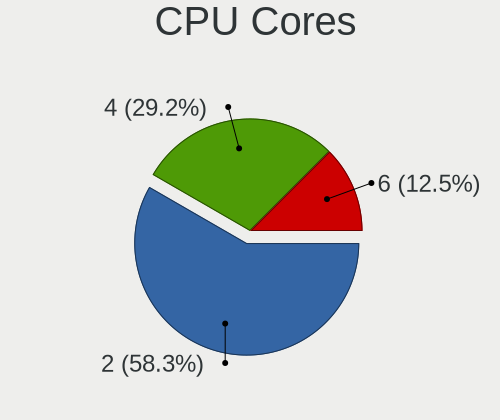

| Number | Notebooks | Percent |
|--------|-----------|---------|
| 2      | 20        | 55.56%  |
| 4      | 11        | 30.56%  |
| 6      | 5         | 13.89%  |

CPU Sockets
-----------

Number of sockets

| Number | Notebooks | Percent |
|--------|-----------|---------|
| 1      | 36        | 100%    |

CPU Threads
-----------

Threads per core (Hyper-Threading)

| Number | Notebooks | Percent |
|--------|-----------|---------|
| 2      | 30        | 83.33%  |
| 1      | 6         | 16.67%  |

CPU Op-Modes
------------

CPU Operation Modes (32-bit, 64-bit)

| Op mode        | Notebooks | Percent |
|----------------|-----------|---------|
| 32-bit, 64-bit | 34        | 91.89%  |
| Unknown        | 3         | 8.11%   |

CPU Microcode
-------------

Microcode number

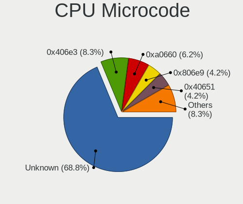

| Number     | Notebooks | Percent |
|------------|-----------|---------|
| Unknown    | 25        | 69.44%  |
| 0xa0660    | 3         | 8.33%   |
| 0x406e3    | 3         | 8.33%   |
| 0x40651    | 2         | 5.56%   |
| 0x806ec    | 1         | 2.78%   |
| 0x806e9    | 1         | 2.78%   |
| 0x08108109 | 1         | 2.78%   |

CPU Microarch
-------------

Microarchitecture

| Name          | Notebooks | Percent |
|---------------|-----------|---------|
| KabyLake      | 10        | 27.78%  |
| Haswell       | 6         | 16.67%  |
| CometLake     | 5         | 13.89%  |
| Skylake       | 3         | 8.33%   |
| IvyBridge     | 2         | 5.56%   |
| Unknown       | 2         | 5.56%   |
| Zen+          | 1         | 2.78%   |
| Westmere      | 1         | 2.78%   |
| SandyBridge   | 1         | 2.78%   |
| K10           | 1         | 2.78%   |
| Goldmont plus | 1         | 2.78%   |
| Goldmont      | 1         | 2.78%   |
| Core          | 1         | 2.78%   |
| Broadwell     | 1         | 2.78%   |

Graphics
--------

GPU Vendor
----------

Vendors of graphics cards

| Vendor | Notebooks | Percent |
|--------|-----------|---------|
| Intel  | 32        | 80%     |
| Nvidia | 4         | 10%     |
| AMD    | 4         | 10%     |

GPU Model
---------

Graphics card models

| Model                                                                                 | Notebooks | Percent |
|---------------------------------------------------------------------------------------|-----------|---------|
| Intel HD Graphics 620                                                                 | 6         | 14.29%  |
| Intel Comet Lake UHD Graphics                                                         | 5         | 11.9%   |
| Intel Haswell-ULT Integrated Graphics Controller                                      | 3         | 7.14%   |
| Intel 4th Gen Core Processor Integrated Graphics Controller                           | 3         | 7.14%   |
| Intel Skylake GT2 [HD Graphics 520]                                                   | 2         | 4.76%   |
| Intel 3rd Gen Core processor Graphics Controller                                      | 2         | 4.76%   |
| Nvidia GT216M [GeForce GT 330M]                                                       | 1         | 2.38%   |
| Nvidia GP107M [GeForce GTX 1050 Mobile]                                               | 1         | 2.38%   |
| Nvidia GK208M [GeForce GT 730M]                                                       | 1         | 2.38%   |
| Nvidia GK104M [GeForce GTX 870M]                                                      | 1         | 2.38%   |
| Intel UHD Graphics 620                                                                | 1         | 2.38%   |
| Intel Mobile 945GM/GMS/GME, 943/940GML Express Integrated Graphics Controller         | 1         | 2.38%   |
| Intel Mobile 945GM/GMS, 943/940GML Express Integrated Graphics Controller             | 1         | 2.38%   |
| Intel Iris Plus Graphics 650                                                          | 1         | 2.38%   |
| Intel HD Graphics 630                                                                 | 1         | 2.38%   |
| Intel HD Graphics 6000                                                                | 1         | 2.38%   |
| Intel HD Graphics 515                                                                 | 1         | 2.38%   |
| Intel GeminiLake [UHD Graphics 605]                                                   | 1         | 2.38%   |
| Intel Core Processor Integrated Graphics Controller                                   | 1         | 2.38%   |
| Intel CometLake-U GT2 [UHD Graphics]                                                  | 1         | 2.38%   |
| Intel Apollo Lake [HD Graphics 505]                                                   | 1         | 2.38%   |
| Intel 2nd Generation Core Processor Family Integrated Graphics Controller             | 1         | 2.38%   |
| AMD Topaz XT [Radeon R7 M260/M265 / M340/M360 / M440/M445 / 530/535 / 620/625 Mobile] | 1         | 2.38%   |
| AMD Thames [Radeon HD 7500M/7600M Series]                                             | 1         | 2.38%   |
| AMD RS880M [Mobility Radeon HD 4225/4250]                                             | 1         | 2.38%   |
| AMD Picasso/Raven 2 [Radeon Vega Series / Radeon Vega Mobile Series]                  | 1         | 2.38%   |
| AMD Baffin [Radeon RX 460/560D / Pro 450/455/460/555/555X/560/560X]                   | 1         | 2.38%   |

GPU Combo
---------

Combinations of graphics cards

| Name           | Notebooks | Percent |
|----------------|-----------|---------|
| 1 x Intel      | 25        | 69.44%  |
| Intel + Nvidia | 4         | 11.11%  |
| Other          | 3         | 8.33%   |
| Intel + AMD    | 2         | 5.56%   |
| 2 x AMD        | 1         | 2.78%   |
| 1 x AMD        | 1         | 2.78%   |

GPU Driver
----------

Free vs proprietary

| Driver  | Notebooks | Percent |
|---------|-----------|---------|
| Free    | 33        | 91.67%  |
| Unknown | 3         | 8.33%   |

GPU Memory
----------

Total video memory

| Size in GB | Notebooks | Percent |
|------------|-----------|---------|
| Unknown    | 35        | 97.22%  |
| 3.01-4.0   | 1         | 2.78%   |

Monitor
-------

Monitor Vendor
--------------

Monitor vendors

| Vendor                  | Notebooks | Percent |
|-------------------------|-----------|---------|
| BOE                     | 7         | 16.67%  |
| LG Display              | 6         | 14.29%  |
| Chimei Innolux          | 6         | 14.29%  |
| Samsung Electronics     | 5         | 11.9%   |
| Apple                   | 4         | 9.52%   |
| AU Optronics            | 2         | 4.76%   |
| Unknown                 | 1         | 2.38%   |
| Toshiba                 | 1         | 2.38%   |
| Sharp                   | 1         | 2.38%   |
| PANDA                   | 1         | 2.38%   |
| Lenovo                  | 1         | 2.38%   |
| Iiyama                  | 1         | 2.38%   |
| Grundig                 | 1         | 2.38%   |
| Goldstar                | 1         | 2.38%   |
| Chi Mei Optoelectronics | 1         | 2.38%   |
| BenQ                    | 1         | 2.38%   |
| ASUSTek Computer        | 1         | 2.38%   |
| Acer                    | 1         | 2.38%   |

Monitor Model
-------------

Monitor models

| Model                                                                     | Notebooks | Percent |
|---------------------------------------------------------------------------|-----------|---------|
| Samsung Electronics LCD Monitor SDC434B 3840x2160 344x194mm 15.5-inch     | 3         | 7.14%   |
| Chimei Innolux LCD Monitor CMN14D5 1920x1080 309x173mm 13.9-inch          | 3         | 7.14%   |
| Unknown LCD Monitor FFFF 2288x1287 2550x2550mm 142.0-inch                 | 1         | 2.38%   |
| Toshiba LCD Monitor LCD3706 1280x800 261x163mm 12.1-inch                  | 1         | 2.38%   |
| Sharp LCD Monitor SHP148B 3840x2160 294x165mm 13.3-inch                   | 1         | 2.38%   |
| Samsung Electronics LCD Monitor SEC3041 1366x768 353x198mm 15.9-inch      | 1         | 2.38%   |
| Samsung Electronics C27F390 SAM0D32 1920x1080 598x336mm 27.0-inch         | 1         | 2.38%   |
| PANDA LM133LF5L01 NCP0020 1920x1080 294x165mm 13.3-inch                   | 1         | 2.38%   |
| LG Display LCD Monitor LGD0563 1920x1080 344x194mm 15.5-inch              | 1         | 2.38%   |
| LG Display LCD Monitor LGD053B 1920x1080 294x165mm 13.3-inch              | 1         | 2.38%   |
| LG Display LCD Monitor LGD04D4 3840x2160 344x194mm 15.5-inch              | 1         | 2.38%   |
| LG Display LCD Monitor LGD03F0 1366x768 310x174mm 14.0-inch               | 1         | 2.38%   |
| LG Display LCD Monitor LGD034D 1366x768 344x194mm 15.5-inch               | 1         | 2.38%   |
| LG Display LCD Monitor LGD02F2 1366x768 344x194mm 15.5-inch               | 1         | 2.38%   |
| Lenovo LEN Y44w-10 LEN65EA 3840x1200 1052x329mm 43.4-inch                 | 1         | 2.38%   |
| Iiyama PL2792H IVM664F 1920x1080 598x336mm 27.0-inch                      | 1         | 2.38%   |
| Grundig TV GRU4448 1920x1080                                              | 1         | 2.38%   |
| Goldstar IPS231 GSM5817 1920x1080 510x290mm 23.1-inch                     | 1         | 2.38%   |
| Chimei Innolux LCD Monitor CMN15C3 1920x1080 344x193mm 15.5-inch          | 1         | 2.38%   |
| Chimei Innolux LCD Monitor CMN1482 1600x900 309x174mm 14.0-inch           | 1         | 2.38%   |
| Chimei Innolux LCD Monitor CMN1415 1920x1080 309x173mm 13.9-inch          | 1         | 2.38%   |
| Chi Mei Optoelectronics LCD Monitor CMO1720 1920x1080 382x215mm 17.3-inch | 1         | 2.38%   |
| BOE LCD Monitor BOE0877 1920x1080 309x173mm 13.9-inch                     | 1         | 2.38%   |
| BOE LCD Monitor BOE07DB 1920x1080 309x174mm 14.0-inch                     | 1         | 2.38%   |
| BOE LCD Monitor BOE079A 1920x1080 309x173mm 13.9-inch                     | 1         | 2.38%   |
| BOE LCD Monitor BOE075A 1366x768 309x173mm 13.9-inch                      | 1         | 2.38%   |
| BOE LCD Monitor BOE06C2 1366x768 344x194mm 15.5-inch                      | 1         | 2.38%   |
| BOE LCD Monitor BOE06BE 1920x1080 294x165mm 13.3-inch                     | 1         | 2.38%   |
| BOE LCD Monitor BOE0641 1920x1080 344x193mm 15.5-inch                     | 1         | 2.38%   |
| BenQ GW2480 BNQ78E7 1920x1080 527x296mm 23.8-inch                         | 1         | 2.38%   |
| AU Optronics LCD Monitor AUO713C 1366x768 309x173mm 13.9-inch             | 1         | 2.38%   |
| AU Optronics LCD Monitor AUO10ED 1920x1080 344x193mm 15.5-inch            | 1         | 2.38%   |
| ASUSTek Computer VP249 AUS24AF 1920x1080 527x296mm 23.8-inch              | 1         | 2.38%   |
| Apple Color LCD APPA034 2880x1800 286x179mm 13.3-inch                     | 1         | 2.38%   |
| Apple Color LCD APPA027 2304x1440 259x162mm 12.0-inch                     | 1         | 2.38%   |
| Apple Color LCD APP9CDF 1440x900 286x179mm 13.3-inch                      | 1         | 2.38%   |
| Apple Color LCD APP9CCF 1920x1200 367x230mm 17.1-inch                     | 1         | 2.38%   |
| Acer H236HL ACR0318 1920x1080 509x286mm 23.0-inch                         | 1         | 2.38%   |

Monitor Resolution
------------------

Monitor screen resolution

| Resolution        | Notebooks | Percent |
|-------------------|-----------|---------|
| 1920x1080 (FHD)   | 17        | 44.74%  |
| 1366x768 (WXGA)   | 7         | 18.42%  |
| 3840x2160 (4K)    | 6         | 15.79%  |
| 3840x1200         | 1         | 2.63%   |
| 2880x1800         | 1         | 2.63%   |
| 2304x1440         | 1         | 2.63%   |
| 2288x1287         | 1         | 2.63%   |
| 1920x1200 (WUXGA) | 1         | 2.63%   |
| 1600x900 (HD+)    | 1         | 2.63%   |
| 1440x900 (WXGA+)  | 1         | 2.63%   |
| 1280x800 (WXGA)   | 1         | 2.63%   |

Monitor Diagonal
----------------

Diagonal size in inches

| Inches | Notebooks | Percent |
|--------|-----------|---------|
| 13     | 14        | 33.33%  |
| 15     | 12        | 28.57%  |
| 14     | 3         | 7.14%   |
| 24     | 2         | 4.76%   |
| 23     | 2         | 4.76%   |
| 17     | 2         | 4.76%   |
| 12     | 2         | 4.76%   |
| 142    | 1         | 2.38%   |
| 54     | 1         | 2.38%   |
| 43     | 1         | 2.38%   |
| 40     | 1         | 2.38%   |
| 27     | 1         | 2.38%   |

Monitor Width
-------------

Physical width

| Width in mm    | Notebooks | Percent |
|----------------|-----------|---------|
| 301-350        | 21        | 51.22%  |
| 201-300        | 8         | 19.51%  |
| 501-600        | 5         | 12.2%   |
| 351-400        | 3         | 7.32%   |
| 1001-1500      | 2         | 4.88%   |
| More than 2000 | 1         | 2.44%   |
| 801-900        | 1         | 2.44%   |

Aspect Ratio
------------

Proportional relationship between the width and the height

| Ratio | Notebooks | Percent |
|-------|-----------|---------|
| 16/9  | 27        | 79.41%  |
| 16/10 | 5         | 14.71%  |
| 3.20  | 1         | 2.94%   |
| 1.00  | 1         | 2.94%   |

Monitor Area
------------

Area in inch²

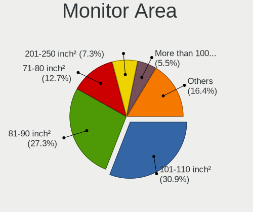

| Area in inch² | Notebooks | Percent |
|----------------|-----------|---------|
| 101-110        | 12        | 28.57%  |
| 81-90          | 11        | 26.19%  |
| 71-80          | 6         | 14.29%  |
| 201-250        | 4         | 9.52%   |
| More than 1000 | 2         | 4.76%   |
| 61-70          | 2         | 4.76%   |
| 501-1000       | 2         | 4.76%   |
| 301-350        | 1         | 2.38%   |
| 131-140        | 1         | 2.38%   |
| 121-130        | 1         | 2.38%   |

Pixel Density
-------------

Pixels per inch

| Density       | Notebooks | Percent |
|---------------|-----------|---------|
| 121-160       | 16        | 38.1%   |
| 51-100        | 9         | 21.43%  |
| More than 240 | 6         | 14.29%  |
| 101-120       | 6         | 14.29%  |
| 161-240       | 4         | 9.52%   |
| 1-50          | 1         | 2.38%   |

Multiple Monitors
-----------------

Total monitors connected

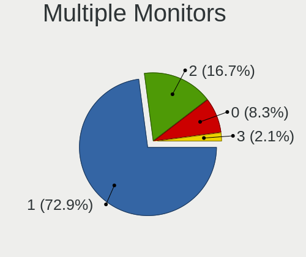

| Total | Notebooks | Percent |
|-------|-----------|---------|
| 1     | 26        | 72.22%  |
| 2     | 7         | 19.44%  |
| 0     | 2         | 5.56%   |
| 3     | 1         | 2.78%   |

Network
-------

Net Controller Vendor
---------------------

Controller vendors

| Vendor                          | Notebooks | Percent |
|---------------------------------|-----------|---------|
| Realtek Semiconductor           | 21        | 35%     |
| Qualcomm Atheros                | 14        | 23.33%  |
| Intel                           | 11        | 18.33%  |
| Broadcom                        | 5         | 8.33%   |
| Broadcom Limited                | 3         | 5%      |
| ASIX Electronics                | 2         | 3.33%   |
| Ralink                          | 1         | 1.67%   |
| Qualcomm Atheros Communications | 1         | 1.67%   |
| OPPO                            | 1         | 1.67%   |
| MediaTek                        | 1         | 1.67%   |

Net Controller Model
--------------------

Controller models

| Model                                                                         | Notebooks | Percent |
|-------------------------------------------------------------------------------|-----------|---------|
| Realtek RTL8111/8168/8411 PCI Express Gigabit Ethernet Controller             | 11        | 16.42%  |
| Qualcomm Atheros AR9462 Wireless Network Adapter                              | 11        | 16.42%  |
| Realtek RTL810xE PCI Express Fast Ethernet controller                         | 5         | 7.46%   |
| Realtek RTL8153 Gigabit Ethernet Adapter                                      | 3         | 4.48%   |
| Intel Wireless 7265                                                           | 3         | 4.48%   |
| Intel Wireless 7260                                                           | 3         | 4.48%   |
| Qualcomm Atheros QCA9565 / AR9565 Wireless Network Adapter                    | 2         | 2.99%   |
| Intel Ethernet Connection I217-LM                                             | 2         | 2.99%   |
| Broadcom Limited BCM4360 802.11ac Wireless Network Adapter                    | 2         | 2.99%   |
| ASIX AX88179 Gigabit Ethernet                                                 | 2         | 2.99%   |
| Realtek RTL88x2bu [AC1200 Techkey]                                            | 1         | 1.49%   |
| Realtek RTL8822BE 802.11a/b/g/n/ac WiFi adapter                               | 1         | 1.49%   |
| Realtek RTL8812AU 802.11a/b/g/n/ac 2T2R DB WLAN Adapter                       | 1         | 1.49%   |
| Realtek RTL8191SEvB Wireless LAN Controller                                   | 1         | 1.49%   |
| Realtek RTL8188FTV 802.11b/g/n 1T1R 2.4G WLAN Adapter                         | 1         | 1.49%   |
| Ralink RT5390R 802.11bgn PCIe Wireless Network Adapter                        | 1         | 1.49%   |
| Qualcomm Atheros AR9271 802.11n                                               | 1         | 1.49%   |
| Qualcomm Atheros AR2413/AR2414 Wireless Network Adapter [AR5005G(S) 802.11bg] | 1         | 1.49%   |
| OPPO CPH1923                                                                  | 1         | 1.49%   |
| MediaTek WiFi                                                                 | 1         | 1.49%   |
| Intel Wireless 8265 / 8275                                                    | 1         | 1.49%   |
| Intel Gemini Lake PCH CNVi WiFi                                               | 1         | 1.49%   |
| Intel Ethernet Connection I218-V                                              | 1         | 1.49%   |
| Intel Ethernet Connection (4) I219-V                                          | 1         | 1.49%   |
| Intel Comet Lake PCH-LP CNVi WiFi                                             | 1         | 1.49%   |
| Intel Centrino Advanced-N 6235                                                | 1         | 1.49%   |
| Broadcom NetXtreme BCM5764M Gigabit Ethernet PCIe                             | 1         | 1.49%   |
| Broadcom NetXtreme BCM5752 Gigabit Ethernet PCI Express                       | 1         | 1.49%   |
| Broadcom Limited BCM4321 802.11a/b/g/n                                        | 1         | 1.49%   |
| Broadcom BCM43602 802.11ac Wireless LAN SoC                                   | 1         | 1.49%   |
| Broadcom BCM4350 802.11ac Wireless Network Adapter                            | 1         | 1.49%   |
| Broadcom BCM43224 802.11a/b/g/n                                               | 1         | 1.49%   |
| Broadcom BCM4313 802.11bgn Wireless Network Adapter                           | 1         | 1.49%   |

Wireless Vendor
---------------

Wireless vendors

| Vendor                          | Notebooks | Percent |
|---------------------------------|-----------|---------|
| Qualcomm Atheros                | 14        | 35.9%   |
| Intel                           | 10        | 25.64%  |
| Realtek Semiconductor           | 5         | 12.82%  |
| Broadcom                        | 4         | 10.26%  |
| Broadcom Limited                | 3         | 7.69%   |
| Ralink                          | 1         | 2.56%   |
| Qualcomm Atheros Communications | 1         | 2.56%   |
| MediaTek                        | 1         | 2.56%   |

Wireless Model
--------------

Wireless models

| Model                                                                         | Notebooks | Percent |
|-------------------------------------------------------------------------------|-----------|---------|
| Qualcomm Atheros AR9462 Wireless Network Adapter                              | 11        | 28.21%  |
| Intel Wireless 7265                                                           | 3         | 7.69%   |
| Intel Wireless 7260                                                           | 3         | 7.69%   |
| Qualcomm Atheros QCA9565 / AR9565 Wireless Network Adapter                    | 2         | 5.13%   |
| Broadcom Limited BCM4360 802.11ac Wireless Network Adapter                    | 2         | 5.13%   |
| Realtek RTL88x2bu [AC1200 Techkey]                                            | 1         | 2.56%   |
| Realtek RTL8822BE 802.11a/b/g/n/ac WiFi adapter                               | 1         | 2.56%   |
| Realtek RTL8812AU 802.11a/b/g/n/ac 2T2R DB WLAN Adapter                       | 1         | 2.56%   |
| Realtek RTL8191SEvB Wireless LAN Controller                                   | 1         | 2.56%   |
| Realtek RTL8188FTV 802.11b/g/n 1T1R 2.4G WLAN Adapter                         | 1         | 2.56%   |
| Ralink RT5390R 802.11bgn PCIe Wireless Network Adapter                        | 1         | 2.56%   |
| Qualcomm Atheros AR9271 802.11n                                               | 1         | 2.56%   |
| Qualcomm Atheros AR2413/AR2414 Wireless Network Adapter [AR5005G(S) 802.11bg] | 1         | 2.56%   |
| MediaTek WiFi                                                                 | 1         | 2.56%   |
| Intel Wireless 8265 / 8275                                                    | 1         | 2.56%   |
| Intel Gemini Lake PCH CNVi WiFi                                               | 1         | 2.56%   |
| Intel Comet Lake PCH-LP CNVi WiFi                                             | 1         | 2.56%   |
| Intel Centrino Advanced-N 6235                                                | 1         | 2.56%   |
| Broadcom Limited BCM4321 802.11a/b/g/n                                        | 1         | 2.56%   |
| Broadcom BCM43602 802.11ac Wireless LAN SoC                                   | 1         | 2.56%   |
| Broadcom BCM4350 802.11ac Wireless Network Adapter                            | 1         | 2.56%   |
| Broadcom BCM43224 802.11a/b/g/n                                               | 1         | 2.56%   |
| Broadcom BCM4313 802.11bgn Wireless Network Adapter                           | 1         | 2.56%   |

Ethernet Vendor
---------------

Ethernet vendors

| Vendor                | Notebooks | Percent |
|-----------------------|-----------|---------|
| Realtek Semiconductor | 18        | 66.67%  |
| Intel                 | 4         | 14.81%  |
| Broadcom              | 2         | 7.41%   |
| ASIX Electronics      | 2         | 7.41%   |
| OPPO                  | 1         | 3.7%    |

Ethernet Model
--------------

Ethernet models

| Model                                                             | Notebooks | Percent |
|-------------------------------------------------------------------|-----------|---------|
| Realtek RTL8111/8168/8411 PCI Express Gigabit Ethernet Controller | 11        | 39.29%  |
| Realtek RTL810xE PCI Express Fast Ethernet controller             | 5         | 17.86%  |
| Realtek RTL8153 Gigabit Ethernet Adapter                          | 3         | 10.71%  |
| Intel Ethernet Connection I217-LM                                 | 2         | 7.14%   |
| ASIX AX88179 Gigabit Ethernet                                     | 2         | 7.14%   |
| OPPO CPH1923                                                      | 1         | 3.57%   |
| Intel Ethernet Connection I218-V                                  | 1         | 3.57%   |
| Intel Ethernet Connection (4) I219-V                              | 1         | 3.57%   |
| Broadcom NetXtreme BCM5764M Gigabit Ethernet PCIe                 | 1         | 3.57%   |
| Broadcom NetXtreme BCM5752 Gigabit Ethernet PCI Express           | 1         | 3.57%   |

Net Controller Kind
-------------------

Ethernet, WiFi or modem

| Kind     | Notebooks | Percent |
|----------|-----------|---------|
| WiFi     | 33        | 55.93%  |
| Ethernet | 26        | 44.07%  |

Used Controller
---------------

Currently used network controller

| Kind     | Notebooks | Percent |
|----------|-----------|---------|
| Ethernet | 18        | 54.55%  |
| WiFi     | 15        | 45.45%  |

NICs
----

Total network controllers on board

| Total | Notebooks | Percent |
|-------|-----------|---------|
| 2     | 21        | 58.33%  |
| 1     | 11        | 30.56%  |
| 0     | 3         | 8.33%   |
| 3     | 1         | 2.78%   |

IPv6
----

IPv6 vs IPv4

| Used | Notebooks | Percent |
|------|-----------|---------|
| No   | 28        | 77.78%  |
| Yes  | 8         | 22.22%  |

Bluetooth
---------

Bluetooth Vendor
----------------

Controller vendors

| Vendor                          | Notebooks | Percent |
|---------------------------------|-----------|---------|
| Intel                           | 9         | 31.03%  |
| Foxconn / Hon Hai               | 5         | 17.24%  |
| Qualcomm Atheros Communications | 4         | 13.79%  |
| Lite-On Technology              | 4         | 13.79%  |
| Apple                           | 3         | 10.34%  |
| Realtek Semiconductor           | 1         | 3.45%   |
| Cambridge Silicon Radio         | 1         | 3.45%   |
| Broadcom                        | 1         | 3.45%   |
| ASUSTek Computer                | 1         | 3.45%   |

Bluetooth Model
---------------

Controller models

| Model                                               | Notebooks | Percent |
|-----------------------------------------------------|-----------|---------|
| Intel Bluetooth wireless interface                  | 6         | 20.69%  |
| Foxconn / Hon Hai Bluetooth Device                  | 5         | 17.24%  |
| Lite-On Atheros AR3012 Bluetooth                    | 4         | 13.79%  |
| Qualcomm Atheros  Bluetooth Device                  | 2         | 6.9%    |
| Qualcomm Atheros AR3012 Bluetooth 4.0               | 2         | 6.9%    |
| Intel Bluetooth 9460/9560 Jefferson Peak (JfP)      | 2         | 6.9%    |
| Apple Bluetooth USB Host Controller                 | 2         | 6.9%    |
| Realtek RTL8822BE Bluetooth 4.2 Adapter             | 1         | 3.45%   |
| Intel Centrino Bluetooth Wireless Transceiver       | 1         | 3.45%   |
| Cambridge Silicon Radio Bluetooth Dongle (HCI mode) | 1         | 3.45%   |
| Broadcom HP Portable Valentine                      | 1         | 3.45%   |
| ASUS Broadcom BCM20702A0 Bluetooth                  | 1         | 3.45%   |
| Apple Bluetooth Host Controller                     | 1         | 3.45%   |

Sound
-----

Sound Vendor
------------

Sound card vendors

| Vendor   | Notebooks | Percent |
|----------|-----------|---------|
| Intel    | 32        | 80%     |
| Nvidia   | 2         | 5%      |
| AMD      | 2         | 5%      |
| XMOS     | 1         | 2.5%    |
| Shure    | 1         | 2.5%    |
| M-Audio  | 1         | 2.5%    |
| Logitech | 1         | 2.5%    |

Sound Model
-----------

Sound card models

| Model                                                                      | Notebooks | Percent |
|----------------------------------------------------------------------------|-----------|---------|
| Intel Sunrise Point-LP HD Audio                                            | 11        | 22.92%  |
| Intel Comet Lake PCH-LP cAVS                                               | 6         | 12.5%   |
| Intel Xeon E3-1200 v3/4th Gen Core Processor HD Audio Controller           | 3         | 6.25%   |
| Intel Haswell-ULT HD Audio Controller                                      | 3         | 6.25%   |
| Intel 8 Series/C220 Series Chipset High Definition Audio Controller        | 3         | 6.25%   |
| Intel 8 Series HD Audio Controller                                         | 3         | 6.25%   |
| Intel 7 Series/C216 Chipset Family High Definition Audio Controller        | 2         | 4.17%   |
| XMOS xCORE USB Audio 2.0                                                   | 1         | 2.08%   |
| Shure MV5                                                                  | 1         | 2.08%   |
| Nvidia GT216 HDMI Audio Controller                                         | 1         | 2.08%   |
| Nvidia GP107GL High Definition Audio Controller                            | 1         | 2.08%   |
| M-Audio M-Audio Fast Track MKII                                            | 1         | 2.08%   |
| Logitech Headset H340                                                      | 1         | 2.08%   |
| Intel Wildcat Point-LP High Definition Audio Controller                    | 1         | 2.08%   |
| Intel NM10/ICH7 Family High Definition Audio Controller                    | 1         | 2.08%   |
| Intel CM238 HD Audio Controller                                            | 1         | 2.08%   |
| Intel Celeron/Pentium Silver Processor High Definition Audio               | 1         | 2.08%   |
| Intel Celeron N3350/Pentium N4200/Atom E3900 Series Audio Cluster          | 1         | 2.08%   |
| Intel Broadwell-U Audio Controller                                         | 1         | 2.08%   |
| Intel 6 Series/C200 Series Chipset Family High Definition Audio Controller | 1         | 2.08%   |
| Intel 5 Series/3400 Series Chipset High Definition Audio                   | 1         | 2.08%   |
| AMD SBx00 Azalia (Intel HDA)                                               | 1         | 2.08%   |
| AMD Raven/Raven2/Fenghuang HDMI/DP Audio Controller                        | 1         | 2.08%   |
| AMD Family 17h/19h HD Audio Controller                                     | 1         | 2.08%   |

Memory
------

Memory Vendor
-------------

Memory module vendors

| Vendor              | Notebooks | Percent |
|---------------------|-----------|---------|
| Samsung Electronics | 4         | 28.57%  |
| Crucial             | 4         | 28.57%  |
| SK hynix            | 3         | 21.43%  |
| Unknown             | 2         | 14.29%  |
| Toshiba             | 1         | 7.14%   |

Memory Model
------------

Memory module models

| Model                                                      | Notebooks | Percent |
|------------------------------------------------------------|-----------|---------|
| Samsung RAM M471A4G43MB1-CTD 32GB SODIMM DDR4 2667MT/s     | 2         | 12.5%   |
| Crucial RAM CT16G4SFD824A.M16FRS 16GB SODIMM DDR4 2400MT/s | 2         | 12.5%   |
| Unknown RAM Module 8GB SODIMM DDR3 1600MT/s                | 1         | 6.25%   |
| Unknown RAM Module 16384MB 2133MT/s                        | 1         | 6.25%   |
| Toshiba RAM 8HTF12864HDY-800G1 2GB SODIMM 1066MT/s         | 1         | 6.25%   |
| Toshiba RAM 64T128020EDL2.5C2 2GB SODIMM 1066MT/s          | 1         | 6.25%   |
| SK hynix RAM HMT41GS6AFR8A-PB 8GB SODIMM DDR3 1600MT/s     | 1         | 6.25%   |
| SK hynix RAM HMA851S6JJR6N-VK 4GB SODIMM DDR4 2667MT/s     | 1         | 6.25%   |
| SK hynix RAM HMA81GS6JJR8N-VK 8GB SODIMM DDR4 2667MT/s     | 1         | 6.25%   |
| SK hynix RAM HMA81GS6AFR8N-UH 8GB SODIMM DDR4 2667MT/s     | 1         | 6.25%   |
| Samsung RAM Module 4GB SODIMM LPDDR3 1867MT/s              | 1         | 6.25%   |
| Samsung RAM K4A8G165WC-BCTD 4GB SODIMM DDR4 2667MT/s       | 1         | 6.25%   |
| Crucial RAM CT4G4SFS8213.C8FBD1 4GB SODIMM DDR4 2133MT/s   | 1         | 6.25%   |
| Crucial RAM CT16G4S24AM.M16FE 16GB SODIMM DDR4 2400MT/s    | 1         | 6.25%   |

Memory Kind
-----------

Memory module kinds

| Kind    | Notebooks | Percent |
|---------|-----------|---------|
| DDR4    | 8         | 61.54%  |
| DDR3    | 2         | 15.38%  |
| LPDDR3  | 1         | 7.69%   |
| DDR2    | 1         | 7.69%   |
| Unknown | 1         | 7.69%   |

Memory Form Factor
------------------

Physical design of the memory module

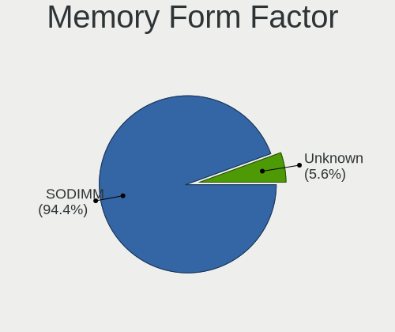

| Name    | Notebooks | Percent |
|---------|-----------|---------|
| SODIMM  | 12        | 92.31%  |
| Unknown | 1         | 7.69%   |

Memory Size
-----------

Memory module size

| Size  | Notebooks | Percent |
|-------|-----------|---------|
| 4096  | 5         | 33.33%  |
| 16384 | 4         | 26.67%  |
| 8192  | 4         | 26.67%  |
| 32768 | 2         | 13.33%  |

Memory Speed
------------

Memory module speed

| Speed | Notebooks | Percent |
|-------|-----------|---------|
| 2667  | 5         | 35.71%  |
| 2400  | 3         | 21.43%  |
| 2133  | 2         | 14.29%  |
| 1600  | 2         | 14.29%  |
| 1867  | 1         | 7.14%   |
| 1066  | 1         | 7.14%   |

Printers & scanners
-------------------

Printer Vendor
--------------

Printer device vendors

Zero info for selected period =(

Printer Model
-------------

Printer device models

Zero info for selected period =(

Scanner Vendor
--------------

Scanner device vendors

Zero info for selected period =(

Scanner Model
-------------

Scanner device models

Zero info for selected period =(

Camera
------

Camera Vendor
-------------

Camera device vendors

| Vendor                                 | Notebooks | Percent |
|----------------------------------------|-----------|---------|
| Realtek Semiconductor                  | 4         | 14.29%  |
| Alcor Micro                            | 4         | 14.29%  |
| Acer                                   | 4         | 14.29%  |
| Sunplus Innovation Technology          | 3         | 10.71%  |
| Chicony Electronics                    | 3         | 10.71%  |
| Apple                                  | 3         | 10.71%  |
| Silicon Motion                         | 1         | 3.57%   |
| Quanta                                 | 1         | 3.57%   |
| Microdia                               | 1         | 3.57%   |
| Lite-On Technology                     | 1         | 3.57%   |
| IMC Networks                           | 1         | 3.57%   |
| Google                                 | 1         | 3.57%   |
| Cheng Uei Precision Industry (Foxlink) | 1         | 3.57%   |

Camera Model
------------

Camera device models

| Model                                                                      | Notebooks | Percent |
|----------------------------------------------------------------------------|-----------|---------|
| Alcor Micro HD WebCam                                                      | 3         | 10.34%  |
| Chicony HD User Facing                                                     | 2         | 6.9%    |
| Apple iPhone 5/5C/5S/6/SE                                                  | 2         | 6.9%    |
| Acer SunplusIT INC. Integrated Camera                                      | 2         | 6.9%    |
| Sunplus Integrated_Webcam_HD                                               | 1         | 3.45%   |
| Sunplus Integrated Camera                                                  | 1         | 3.45%   |
| Sunplus HD WebCam                                                          | 1         | 3.45%   |
| Silicon Motion WebCam SC-13HDL12131N                                       | 1         | 3.45%   |
| Realtek MTD camera                                                         | 1         | 3.45%   |
| Realtek Integrated_Webcam_HD                                               | 1         | 3.45%   |
| Realtek Integrated Webcam                                                  | 1         | 3.45%   |
| Realtek HP Truevision HD                                                   | 1         | 3.45%   |
| Quanta HD Camera                                                           | 1         | 3.45%   |
| Microdia HP Integrated Webcam                                              | 1         | 3.45%   |
| Lite-On Integrated Camera                                                  | 1         | 3.45%   |
| IMC Networks Lenovo EasyCamera                                             | 1         | 3.45%   |
| Chicony USB2.0 UVC WebCam                                                  | 1         | 3.45%   |
| Cheng Uei Precision Industry (Foxlink) HP Wide Vision HD integrated webcam | 1         | 3.45%   |
| Apple iBridge                                                              | 1         | 3.45%   |
| Apple Built-in iSight                                                      | 1         | 3.45%   |
| Alcor Micro HP Webcam-101                                                  | 1         | 3.45%   |
| Acer SunplusIT Integrated Camera                                           | 1         | 3.45%   |
| Acer BisonCam, NB Pro                                                      | 1         | 3.45%   |
| Unknown                                                                    | 1         | 3.45%   |

Security
--------

Fingerprint Vendor
------------------

Fingerprint sensor vendors

| Vendor                | Notebooks | Percent |
|-----------------------|-----------|---------|
| Validity Sensors      | 3         | 42.86%  |
| LighTuning Technology | 2         | 28.57%  |
| Synaptics             | 1         | 14.29%  |
| STMicroelectronics    | 1         | 14.29%  |

Fingerprint Model
-----------------

Fingerprint sensor models

| Model                                            | Notebooks | Percent |
|--------------------------------------------------|-----------|---------|
| Validity Sensors VFS 5011 fingerprint sensor     | 3         | 42.86%  |
| Synaptics Metallica MOH Touch Fingerprint Reader | 1         | 14.29%  |
| STMicroelectronics Fingerprint Reader            | 1         | 14.29%  |
| LighTuning ES603 Swipe Fingerprint Sensor        | 1         | 14.29%  |
| LighTuning EgisTec Touch Fingerprint Sensor      | 1         | 14.29%  |

Chipcard Vendor
---------------

Chipcard module vendors

| Vendor      | Notebooks | Percent |
|-------------|-----------|---------|
| Purism, SPC | 2         | 40%     |
| O2 Micro    | 1         | 20%     |
| Clay Logic  | 1         | 20%     |
| Alcor Micro | 1         | 20%     |

Chipcard Model
--------------

Chipcard module models

| Model                               | Notebooks | Percent |
|-------------------------------------|-----------|---------|
| Purism, SPC Librem Key              | 2         | 40%     |
| O2 Micro Oz776 SmartCard Reader     | 1         | 20%     |
| Clay Logic Nitrokey Pro             | 1         | 20%     |
| Alcor Micro AU9540 Smartcard Reader | 1         | 20%     |

Unsupported
-----------

Unsupported Devices
-------------------

Total unsupported devices on board

| Total | Notebooks | Percent |
|-------|-----------|---------|
| 0     | 16        | 43.24%  |
| 1     | 15        | 40.54%  |
| 2     | 3         | 8.11%   |
| 3     | 2         | 5.41%   |
| 4     | 1         | 2.7%    |

Unsupported Device Types
------------------------

Types of unsupported devices

| Type                  | Notebooks | Percent |
|-----------------------|-----------|---------|
| Net/wireless          | 8         | 25.81%  |
| Fingerprint reader    | 7         | 22.58%  |
| Bluetooth             | 6         | 19.35%  |
| Graphics card         | 4         | 12.9%   |
| Multimedia controller | 3         | 9.68%   |
| Chipcard              | 2         | 6.45%   |
| Camera                | 1         | 3.23%   |

