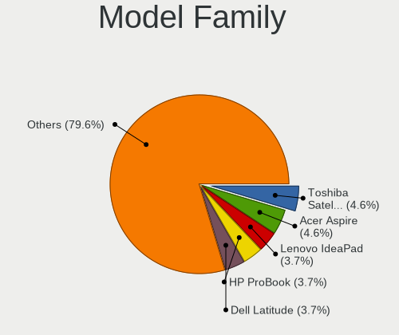
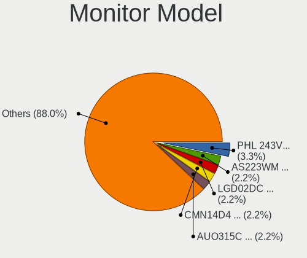
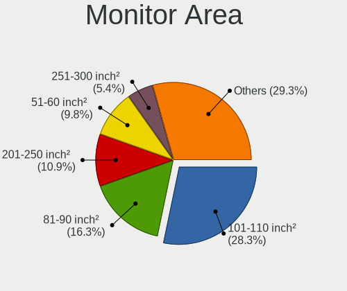

Q4OS - Tested Hardware & Statistics
-----------------------------------

A project to collect tested hardware configurations for Q4OS.

Anyone can contribute to this report by the [hw-probe](https://github.com/linuxhw/hw-probe) tool:

    sudo -E hw-probe -all -upload

Please contribute! Especially if your hardware is rare.

This is a report for all computer types. See also reports for [desktops](/Dist/Q4OS/Desktop/README.md) and [notebooks](/Dist/Q4OS/Notebook/README.md).

Contents
--------

* [ Test Cases ](#test-cases)

* [ System ](#system)
  - [ OS                       ](#os)
  - [ OS Family                ](#os-family)
  - [ Kernel                   ](#kernel)
  - [ Kernel Family            ](#kernel-family)
  - [ Kernel Major Ver.        ](#kernel-major-ver)
  - [ Arch                     ](#arch)
  - [ DE                       ](#de)
  - [ Display Server           ](#display-server)
  - [ Display Manager          ](#display-manager)
  - [ OS Lang                  ](#os-lang)
  - [ Boot Mode                ](#boot-mode)
  - [ Filesystem               ](#filesystem)
  - [ Part. scheme             ](#part-scheme)
  - [ Dual Boot with Linux/BSD ](#dual-boot-with-linuxbsd)
  - [ Dual Boot (Win)          ](#dual-boot-win)

* [ Board ](#board)
  - [ Vendor                   ](#vendor)
  - [ Model                    ](#model)
  - [ Model Family             ](#model-family)
  - [ MFG Year                 ](#mfg-year)
  - [ Form Factor              ](#form-factor)
  - [ Secure Boot              ](#secure-boot)
  - [ Coreboot                 ](#coreboot)
  - [ RAM Size                 ](#ram-size)
  - [ RAM Used                 ](#ram-used)
  - [ Total Drives             ](#total-drives)
  - [ Has CD-ROM               ](#has-cd-rom)
  - [ Has Ethernet             ](#has-ethernet)
  - [ Has WiFi                 ](#has-wifi)
  - [ Has Bluetooth            ](#has-bluetooth)

* [ Location ](#location)
  - [ Country                  ](#country)
  - [ City                     ](#city)

* [ Drives ](#drives)
  - [ Drive Vendor             ](#drive-vendor)
  - [ Drive Model              ](#drive-model)
  - [ HDD Vendor               ](#hdd-vendor)
  - [ SSD Vendor               ](#ssd-vendor)
  - [ Drive Kind               ](#drive-kind)
  - [ Drive Connector          ](#drive-connector)
  - [ Drive Size               ](#drive-size)
  - [ Space Total              ](#space-total)
  - [ Space Used               ](#space-used)
  - [ Malfunc. Drives          ](#malfunc-drives)
  - [ Malfunc. Drive Vendor    ](#malfunc-drive-vendor)
  - [ Malfunc. HDD Vendor      ](#malfunc-hdd-vendor)
  - [ Malfunc. Drive Kind      ](#malfunc-drive-kind)
  - [ Failed Drives            ](#failed-drives)
  - [ Failed Drive Vendor      ](#failed-drive-vendor)
  - [ Drive Status             ](#drive-status)

* [ Storage controller ](#storage-controller)
  - [ Storage Vendor           ](#storage-vendor)
  - [ Storage Model            ](#storage-model)
  - [ Storage Kind             ](#storage-kind)

* [ Processor ](#processor)
  - [ CPU Vendor               ](#cpu-vendor)
  - [ CPU Model                ](#cpu-model)
  - [ CPU Model Family         ](#cpu-model-family)
  - [ CPU Cores                ](#cpu-cores)
  - [ CPU Sockets              ](#cpu-sockets)
  - [ CPU Threads              ](#cpu-threads)
  - [ CPU Op-Modes             ](#cpu-op-modes)
  - [ CPU Microcode            ](#cpu-microcode)
  - [ CPU Microarch            ](#cpu-microarch)

* [ Graphics ](#graphics)
  - [ GPU Vendor               ](#gpu-vendor)
  - [ GPU Model                ](#gpu-model)
  - [ GPU Combo                ](#gpu-combo)
  - [ GPU Driver               ](#gpu-driver)
  - [ GPU Memory               ](#gpu-memory)

* [ Monitor ](#monitor)
  - [ Monitor Vendor           ](#monitor-vendor)
  - [ Monitor Model            ](#monitor-model)
  - [ Monitor Resolution       ](#monitor-resolution)
  - [ Monitor Diagonal         ](#monitor-diagonal)
  - [ Monitor Width            ](#monitor-width)
  - [ Aspect Ratio             ](#aspect-ratio)
  - [ Monitor Area             ](#monitor-area)
  - [ Pixel Density            ](#pixel-density)
  - [ Multiple Monitors        ](#multiple-monitors)

* [ Network ](#network)
  - [ Net Controller Vendor    ](#net-controller-vendor)
  - [ Net Controller Model     ](#net-controller-model)
  - [ Wireless Vendor          ](#wireless-vendor)
  - [ Wireless Model           ](#wireless-model)
  - [ Ethernet Vendor          ](#ethernet-vendor)
  - [ Ethernet Model           ](#ethernet-model)
  - [ Net Controller Kind      ](#net-controller-kind)
  - [ Used Controller          ](#used-controller)
  - [ NICs                     ](#nics)
  - [ IPv6                     ](#ipv6)

* [ Bluetooth ](#bluetooth)
  - [ Bluetooth Vendor         ](#bluetooth-vendor)
  - [ Bluetooth Model          ](#bluetooth-model)

* [ Sound ](#sound)
  - [ Sound Vendor             ](#sound-vendor)
  - [ Sound Model              ](#sound-model)

* [ Memory ](#memory)
  - [ Memory Vendor            ](#memory-vendor)
  - [ Memory Model             ](#memory-model)
  - [ Memory Kind              ](#memory-kind)
  - [ Memory Form Factor       ](#memory-form-factor)
  - [ Memory Size              ](#memory-size)
  - [ Memory Speed             ](#memory-speed)

* [ Printers & scanners ](#printers--scanners)
  - [ Printer Vendor           ](#printer-vendor)
  - [ Printer Model            ](#printer-model)
  - [ Scanner Vendor           ](#scanner-vendor)
  - [ Scanner Model            ](#scanner-model)

* [ Camera ](#camera)
  - [ Camera Vendor            ](#camera-vendor)
  - [ Camera Model             ](#camera-model)

* [ Security ](#security)
  - [ Fingerprint Vendor       ](#fingerprint-vendor)
  - [ Fingerprint Model        ](#fingerprint-model)
  - [ Chipcard Vendor          ](#chipcard-vendor)
  - [ Chipcard Model           ](#chipcard-model)

* [ Unsupported ](#unsupported)
  - [ Unsupported Devices      ](#unsupported-devices)
  - [ Unsupported Device Types ](#unsupported-device-types)

Test Cases
----------

Total: 82

| Vendor        | Model                       | Form-Factor | Probe                                                      | Date         |
|---------------|-----------------------------|-------------|------------------------------------------------------------|--------------|
| Gigabyte      | H55M-USB3                   | Desktop     | [9ebfdab7fa](https://linux-hardware.org/?probe=9ebfdab7fa) | Aug 31, 2023 |
| Acer          | Aspire 1700                 | Notebook    | [a76fb24570](https://linux-hardware.org/?probe=a76fb24570) | Aug 31, 2023 |
| MSI           | U90/U100                    | Notebook    | [015b95ba2a](https://linux-hardware.org/?probe=015b95ba2a) | Jul 31, 2023 |
| Gigabyte      | Z690 GAMING X DDR4          | Desktop     | [5a968533da](https://linux-hardware.org/?probe=5a968533da) | Jul 28, 2023 |
| Lenovo        | IdeaPad 330S-14IKB 81F4     | Notebook    | [8424587178](https://linux-hardware.org/?probe=8424587178) | Jul 27, 2023 |
| Intel         | D845GRG AAA84341-206        | Desktop     | [1863434dc7](https://linux-hardware.org/?probe=1863434dc7) | Jul 01, 2023 |
| Intel         | D845GRG AAA84341-206        | Desktop     | [7734dda00e](https://linux-hardware.org/?probe=7734dda00e) | Jun 30, 2023 |
| ASUSTek       | K53SJ                       | Notebook    | [922c017262](https://linux-hardware.org/?probe=922c017262) | Jun 26, 2023 |
| Dell          | Latitude D630               | Notebook    | [ead768adbd](https://linux-hardware.org/?probe=ead768adbd) | May 27, 2023 |
| Sony          | VGN-FW21Z                   | Notebook    | [aac218a1e0](https://linux-hardware.org/?probe=aac218a1e0) | May 20, 2023 |
| ASUSTek       | ET1602                      | Desktop     | [637fb8c9ce](https://linux-hardware.org/?probe=637fb8c9ce) | Apr 22, 2023 |
| Intel         | NUC5CPYB H61145-407         | Mini pc     | [43fc15779a](https://linux-hardware.org/?probe=43fc15779a) | Apr 19, 2023 |
| HP            | 1850                        | Desktop     | [162ec03859](https://linux-hardware.org/?probe=162ec03859) | Apr 02, 2023 |
| Acer          | One S1003                   | Tablet      | [89fa2c4ac3](https://linux-hardware.org/?probe=89fa2c4ac3) | Mar 28, 2023 |
| Fujitsu Si... | AMILO Pro Edition V3505     | Notebook    | [2b0f3e8867](https://linux-hardware.org/?probe=2b0f3e8867) | Mar 25, 2023 |
| Fujitsu Si... | AMILO Pro Edition V3505     | Notebook    | [8bb2484825](https://linux-hardware.org/?probe=8bb2484825) | Mar 25, 2023 |
| Google        | Reks                        | Notebook    | [be1a98408d](https://linux-hardware.org/?probe=be1a98408d) | Feb 28, 2023 |
| HP            | ProBook 650 G1              | Notebook    | [4e6687829e](https://linux-hardware.org/?probe=4e6687829e) | Feb 19, 2023 |
| Lenovo        | IdeaPad 5 14IAL7 82SD       | Notebook    | [cd5e470881](https://linux-hardware.org/?probe=cd5e470881) | Feb 17, 2023 |
| HP            | Pavilion x360 Convertibl... | Convertible | [6a033988f5](https://linux-hardware.org/?probe=6a033988f5) | Feb 07, 2023 |
| HP            | 1850                        | Desktop     | [ccad003ff4](https://linux-hardware.org/?probe=ccad003ff4) | Jan 20, 2023 |
| VXL           | M6V90AI-VL                  | Desktop     | [1ad8dbaae1](https://linux-hardware.org/?probe=1ad8dbaae1) | Jan 08, 2023 |
| MSI           | G41M4                       | Desktop     | [b651925b13](https://linux-hardware.org/?probe=b651925b13) | Dec 21, 2022 |
| IBM           | ThinkPad T42 2378FVU        | Notebook    | [ce2f3fb897](https://linux-hardware.org/?probe=ce2f3fb897) | Dec 21, 2022 |
| IBM           | ThinkPad T42 2378FVU        | Notebook    | [50f1d0a765](https://linux-hardware.org/?probe=50f1d0a765) | Dec 19, 2022 |
| IBM           | ThinkPad T42 2378FVU        | Notebook    | [fe6bdea3fd](https://linux-hardware.org/?probe=fe6bdea3fd) | Dec 19, 2022 |
| Unknown       | V00                         | Mini pc     | [15a2312211](https://linux-hardware.org/?probe=15a2312211) | Nov 26, 2022 |
| ASRock        | J3455B-ITX                  | Desktop     | [2a85d4fa3a](https://linux-hardware.org/?probe=2a85d4fa3a) | Nov 15, 2022 |
| Google        | Cave                        | Notebook    | [ce7f60e0ee](https://linux-hardware.org/?probe=ce7f60e0ee) | Nov 06, 2022 |
| Google        | Cave                        | Notebook    | [63e06049da](https://linux-hardware.org/?probe=63e06049da) | Nov 06, 2022 |
| ASRock        | B450M Pro4                  | Desktop     | [97e52df467](https://linux-hardware.org/?probe=97e52df467) | Nov 05, 2022 |
| BESSTAR Te... | UM250 V1.0                  | Desktop     | [67369107e1](https://linux-hardware.org/?probe=67369107e1) | Nov 05, 2022 |
| ASRock        | J3455B-ITX                  | Desktop     | [deda12dd1f](https://linux-hardware.org/?probe=deda12dd1f) | Nov 05, 2022 |
| Gigabyte      | AB350-Gaming-CF             | Desktop     | [54d2ded2b2](https://linux-hardware.org/?probe=54d2ded2b2) | Oct 17, 2022 |
| Foxconn       | 2ABF                        | Desktop     | [153aed4d7c](https://linux-hardware.org/?probe=153aed4d7c) | Sep 19, 2022 |
| Medion        | P6620                       | Notebook    | [e5db2a930b](https://linux-hardware.org/?probe=e5db2a930b) | Aug 22, 2022 |
| Lenovo        | ThinkPad T495 20NKS0PG00    | Notebook    | [ee35a21db4](https://linux-hardware.org/?probe=ee35a21db4) | Jun 30, 2022 |
| Sony          | VGN-P11Z_Q                  | Notebook    | [e51be2b6a4](https://linux-hardware.org/?probe=e51be2b6a4) | Jun 16, 2022 |
| Toshiba       | Satellite M70               | Notebook    | [61617a3561](https://linux-hardware.org/?probe=61617a3561) | Jun 05, 2022 |
| HP            | 250 G5 Notebook PC          | Notebook    | [0e5792fc9f](https://linux-hardware.org/?probe=0e5792fc9f) | May 15, 2022 |
| ASRock        | H61M-HVS                    | Desktop     | [a9ee15a4d2](https://linux-hardware.org/?probe=a9ee15a4d2) | May 13, 2022 |
| ASUSTek       | A6U                         | Notebook    | [4a8ad00e5e](https://linux-hardware.org/?probe=4a8ad00e5e) | May 12, 2022 |
| Toshiba       | Satellite Pro L500          | Notebook    | [5b72ea9a47](https://linux-hardware.org/?probe=5b72ea9a47) | May 02, 2022 |
| Lenovo        | IdeaPad 330-15IGM 81D1      | Notebook    | [8cdcd8d130](https://linux-hardware.org/?probe=8cdcd8d130) | Apr 08, 2022 |
| Acer          | AO751h                      | Notebook    | [23737182d1](https://linux-hardware.org/?probe=23737182d1) | Mar 21, 2022 |
| AMI           | Intel                       | Notebook    | [6d581b03a6](https://linux-hardware.org/?probe=6d581b03a6) | Mar 19, 2022 |
| ASUSTek       | X540YA                      | Notebook    | [0cd3840828](https://linux-hardware.org/?probe=0cd3840828) | Mar 14, 2022 |
| Visual Lan... | Premier 10                  | Notebook    | [64450e11a3](https://linux-hardware.org/?probe=64450e11a3) | Feb 04, 2022 |
| HP            | Presario CQ56               | Notebook    | [8d03d80424](https://linux-hardware.org/?probe=8d03d80424) | Jan 14, 2022 |
| HP            | Presario CQ56               | Notebook    | [a0bc0364a8](https://linux-hardware.org/?probe=a0bc0364a8) | Jan 08, 2022 |
| Compaq        | 07E4h                       | Desktop     | [535804dbc6](https://linux-hardware.org/?probe=535804dbc6) | Jan 05, 2022 |
| MSI           | U210                        | Notebook    | [24eb05a4d9](https://linux-hardware.org/?probe=24eb05a4d9) | Dec 29, 2021 |
| Toshiba       | Satellite C660              | Notebook    | [b159811d48](https://linux-hardware.org/?probe=b159811d48) | Dec 12, 2021 |
| Toshiba       | Satellite C660              | Notebook    | [2197770fd0](https://linux-hardware.org/?probe=2197770fd0) | Dec 12, 2021 |
| ASUSTek       | T12Eg                       | Notebook    | [115e8b584f](https://linux-hardware.org/?probe=115e8b584f) | Dec 11, 2021 |
| Toshiba       | Satellite C660              | Notebook    | [64521297e2](https://linux-hardware.org/?probe=64521297e2) | Dec 07, 2021 |
| Toshiba       | Satellite C660              | Notebook    | [b6a5bb8982](https://linux-hardware.org/?probe=b6a5bb8982) | Dec 06, 2021 |
| Gigabyte      | XP-M5S661GX                 | Desktop     | [c452e6bdf7](https://linux-hardware.org/?probe=c452e6bdf7) | Nov 27, 2021 |
| Phoenix/Si... | M720SR                      | Notebook    | [f92c7e8c3e](https://linux-hardware.org/?probe=f92c7e8c3e) | Oct 09, 2021 |
| HP            | Laptop 15s-fq2xxx           | Notebook    | [cfa6202518](https://linux-hardware.org/?probe=cfa6202518) | Sep 14, 2021 |
| HP            | Laptop 15s-fq2xxx           | Notebook    | [726c3230ef](https://linux-hardware.org/?probe=726c3230ef) | Sep 14, 2021 |
| Chuwi         | GemiBook Pro                | Notebook    | [ebe8d67a10](https://linux-hardware.org/?probe=ebe8d67a10) | Sep 04, 2021 |
| TECO Elect... | TR53A0                      | Desktop     | [4ab721c7f7](https://linux-hardware.org/?probe=4ab721c7f7) | Aug 19, 2021 |
| HP            | ProBook 450 G2              | Notebook    | [dbba9b9771](https://linux-hardware.org/?probe=dbba9b9771) | Jul 30, 2021 |
| JVC           | J3N                         | Notebook    | [f8da57e850](https://linux-hardware.org/?probe=f8da57e850) | Jul 09, 2021 |
| MSI           | B550-A PRO                  | Desktop     | [546cf15192](https://linux-hardware.org/?probe=546cf15192) | Jun 16, 2021 |
| MSI           | GF615M-P33 V2               | Desktop     | [6f22f99f9f](https://linux-hardware.org/?probe=6f22f99f9f) | May 14, 2021 |
| HP            | ProBook 6550b               | Notebook    | [b192718656](https://linux-hardware.org/?probe=b192718656) | Mar 13, 2021 |
| HP            | 2000                        | Notebook    | [736561e497](https://linux-hardware.org/?probe=736561e497) | Mar 07, 2021 |
| ASRock        | G41M-VS3                    | Desktop     | [75cb33cf5e](https://linux-hardware.org/?probe=75cb33cf5e) | Feb 25, 2021 |
| ASRock        | G41M-VS3                    | Desktop     | [6a77858cd4](https://linux-hardware.org/?probe=6a77858cd4) | Feb 25, 2021 |
| ASUSTek       | A6JC                        | Notebook    | [b04f51dd1c](https://linux-hardware.org/?probe=b04f51dd1c) | Jan 29, 2021 |
| ASUSTek       | A6JC                        | Notebook    | [097dd7f151](https://linux-hardware.org/?probe=097dd7f151) | Jan 29, 2021 |
| Lenovo        | ThinkPad 11e 20DAS0PS00     | Notebook    | [2d618b7420](https://linux-hardware.org/?probe=2d618b7420) | Dec 14, 2020 |
| Packard Be... | EasyNote LM81               | Notebook    | [d6b0c23c18](https://linux-hardware.org/?probe=d6b0c23c18) | Nov 23, 2020 |
| Qilive        | QW19141AMSP                 | Notebook    | [b8f3486ae1](https://linux-hardware.org/?probe=b8f3486ae1) | Aug 27, 2020 |
| HP            | OmniBook PC                 | Notebook    | [5e33febbc1](https://linux-hardware.org/?probe=5e33febbc1) | Jul 10, 2020 |
| Medion        | Unknown                     | Notebook    | [6a06a14f6a](https://linux-hardware.org/?probe=6a06a14f6a) | May 07, 2020 |
| TrekStor      | SurfTab wintron 7.0         | Tablet      | [464706154e](https://linux-hardware.org/?probe=464706154e) | Jun 26, 2019 |
| TrekStor      | SurfTab wintron 7.0         | Tablet      | [db63ea2d00](https://linux-hardware.org/?probe=db63ea2d00) | Jun 19, 2019 |
| TrekStor      | SurfTab wintron 7.0         | Tablet      | [9e530b2e21](https://linux-hardware.org/?probe=9e530b2e21) | Jun 18, 2019 |
| Philco        | 14I                         | Notebook    | [bf4c449b31](https://linux-hardware.org/?probe=bf4c449b31) | Apr 14, 2019 |

System
------

OS
--

Installed operating systems

| Name      | Computers | Percent |
|-----------|-----------|---------|
| Q4OS 4    | 42        | 62.69%  |
| Q4OS 3    | 16        | 23.88%  |
| Q4OS 2    | 5         | 7.46%   |
| Q4OS 5    | 3         | 4.48%   |
| Q4OS 4.11 | 1         | 1.49%   |

OS Family
---------

OS without a version

| Name | Computers | Percent |
|------|-----------|---------|
| Q4OS | 67        | 100%    |

Kernel
------

Version of the Linux kernel

| Version              | Computers | Percent |
|----------------------|-----------|---------|
| 5.10.0-21-amd64      | 6         | 8.82%   |
| 5.10.0-23-amd64      | 4         | 5.88%   |
| 5.10.0-19-amd64      | 4         | 5.88%   |
| 4.19.0-17-amd64      | 4         | 5.88%   |
| 5.10.0-21-686-pae    | 3         | 4.41%   |
| 5.10.0-12-amd64      | 3         | 4.41%   |
| 5.10.0-8-amd64       | 2         | 2.94%   |
| 5.10.0-14-686-pae    | 2         | 2.94%   |
| 5.10.0-10-686-pae    | 2         | 2.94%   |
| 6.1.0-11-686-pae     | 1         | 1.47%   |
| 6.1.0-10-amd64       | 1         | 1.47%   |
| 6.1.0-10-686-pae     | 1         | 1.47%   |
| 6.0.0-1-amd64        | 1         | 1.47%   |
| 5.9.0-5-amd64        | 1         | 1.47%   |
| 5.6.0-1-amd64        | 1         | 1.47%   |
| 5.18.0-0.bpo.1-amd64 | 1         | 1.47%   |
| 5.10.0-9-amd64       | 1         | 1.47%   |
| 5.10.0-9-686-pae     | 1         | 1.47%   |
| 5.10.0-8-686-pae     | 1         | 1.47%   |
| 5.10.0-25-amd64      | 1         | 1.47%   |
| 5.10.0-23-686-pae    | 1         | 1.47%   |
| 5.10.0-20-amd64      | 1         | 1.47%   |
| 5.10.0-20-686-pae    | 1         | 1.47%   |
| 5.10.0-20-686        | 1         | 1.47%   |
| 5.10.0-17-amd64      | 1         | 1.47%   |
| 5.10.0-15-686-pae    | 1         | 1.47%   |
| 5.10.0-14-amd64      | 1         | 1.47%   |
| 5.10.0-13-amd64      | 1         | 1.47%   |
| 5.10.0-12-686-pae    | 1         | 1.47%   |
| 5.10.0-11-686-pae    | 1         | 1.47%   |
| 4.9.0-9-686-pae      | 1         | 1.47%   |
| 4.9.0-8-amd64        | 1         | 1.47%   |
| 4.9.0-14-686-pae     | 1         | 1.47%   |
| 4.9.0-12-686-pae     | 1         | 1.47%   |
| 4.19.0-6-amd64       | 1         | 1.47%   |
| 4.19.0-22-amd64      | 1         | 1.47%   |
| 4.19.0-21-amd64      | 1         | 1.47%   |
| 4.19.0-20-amd64      | 1         | 1.47%   |
| 4.19.0-17-686-pae    | 1         | 1.47%   |
| 4.19.0-17-686        | 1         | 1.47%   |

Kernel Family
-------------

Linux kernel without a distro release

| Version | Computers | Percent |
|---------|-----------|---------|
| 5.10.0  | 39        | 58.21%  |
| 4.19.0  | 17        | 25.37%  |
| 4.9.0   | 4         | 5.97%   |
| 6.1.0   | 3         | 4.48%   |
| 6.0.0   | 1         | 1.49%   |
| 5.9.0   | 1         | 1.49%   |
| 5.6.0   | 1         | 1.49%   |
| 5.18.0  | 1         | 1.49%   |

Kernel Major Ver.
-----------------

Linux kernel major version

| Version | Computers | Percent |
|---------|-----------|---------|
| 5.10    | 39        | 58.21%  |
| 4.19    | 17        | 25.37%  |
| 4.9     | 4         | 5.97%   |
| 6.1     | 3         | 4.48%   |
| 6.0     | 1         | 1.49%   |
| 5.9     | 1         | 1.49%   |
| 5.6     | 1         | 1.49%   |
| 5.18    | 1         | 1.49%   |

Arch
----

OS architecture (x86_64, i586, etc.)

| Name   | Computers | Percent |
|--------|-----------|---------|
| x86_64 | 43        | 64.18%  |
| i686   | 24        | 35.82%  |

DE
--

Desktop Environment

| Name     | Computers | Percent |
|----------|-----------|---------|
| Trinity  | 35        | 51.47%  |
| KDE5     | 28        | 41.18%  |
| KDE      | 2         | 2.94%   |
| LXDE     | 1         | 1.47%   |
| Cinnamon | 1         | 1.47%   |
| Budgie   | 1         | 1.47%   |

Display Server
--------------

X11 or Wayland

| Name | Computers | Percent |
|------|-----------|---------|
| X11  | 66        | 98.51%  |
| Tty  | 1         | 1.49%   |

Display Manager
---------------

SDDM, LightDM, etc.

| Name    | Computers | Percent |
|---------|-----------|---------|
| TDM     | 35        | 52.24%  |
| SDDM    | 31        | 46.27%  |
| LightDM | 1         | 1.49%   |

OS Lang
-------

Language

| Lang    | Computers | Percent |
|---------|-----------|---------|
| en_US   | 21        | 31.34%  |
| it_IT   | 8         | 11.94%  |
| de_DE   | 7         | 10.45%  |
| en_GB   | 5         | 7.46%   |
| es_ES   | 4         | 5.97%   |
| hu_HU   | 3         | 4.48%   |
| Unknown | 3         | 4.48%   |
| fr_FR   | 2         | 2.99%   |
| sv_SE   | 1         | 1.49%   |
| sl_SI   | 1         | 1.49%   |
| sk_SK   | 1         | 1.49%   |
| ru_RU   | 1         | 1.49%   |
| pt_BR   | 1         | 1.49%   |
| pl_PL   | 1         | 1.49%   |
| es_VE   | 1         | 1.49%   |
| es_PE   | 1         | 1.49%   |
| es_AR   | 1         | 1.49%   |
| en_ZA   | 1         | 1.49%   |
| en_SG   | 1         | 1.49%   |
| en_IE   | 1         | 1.49%   |
| C       | 1         | 1.49%   |
| bg_BG   | 1         | 1.49%   |

Boot Mode
---------

EFI or BIOS

| Mode | Computers | Percent |
|------|-----------|---------|
| BIOS | 43        | 64.18%  |
| EFI  | 24        | 35.82%  |

Filesystem
----------

Type of filesystem

| Type    | Computers | Percent |
|---------|-----------|---------|
| Ext4    | 64        | 95.52%  |
| Overlay | 3         | 4.48%   |

Part. scheme
------------

Scheme of partitioning

| Type    | Computers | Percent |
|---------|-----------|---------|
| MBR     | 37        | 55.22%  |
| GPT     | 29        | 43.28%  |
| Unknown | 1         | 1.49%   |

Dual Boot with Linux/BSD
------------------------

Hosting more than one Linux/BSD

| Dual boot | Computers | Percent |
|-----------|-----------|---------|
| No        | 59        | 88.06%  |
| Yes       | 8         | 11.94%  |

Dual Boot (Win)
---------------

Hosting Linux and Windows

| Dual boot | Computers | Percent |
|-----------|-----------|---------|
| No        | 43        | 64.18%  |
| Yes       | 24        | 35.82%  |

Board
-----

Vendor
------

Motherboard manufacturer

| Name                        | Computers | Percent |
|-----------------------------|-----------|---------|
| Hewlett-Packard             | 10        | 14.93%  |
| ASUSTek Computer            | 6         | 8.96%   |
| MSI                         | 5         | 7.46%   |
| Lenovo                      | 5         | 7.46%   |
| Toshiba                     | 4         | 5.97%   |
| Gigabyte Technology         | 4         | 5.97%   |
| ASRock                      | 4         | 5.97%   |
| Acer                        | 3         | 4.48%   |
| TrekStor                    | 2         | 2.99%   |
| Sony                        | 2         | 2.99%   |
| Medion                      | 2         | 2.99%   |
| Intel                       | 2         | 2.99%   |
| Google                      | 2         | 2.99%   |
| VXL                         | 1         | 1.49%   |
| Visual Land                 | 1         | 1.49%   |
| TECO Electric and Machinery | 1         | 1.49%   |
| Qilive                      | 1         | 1.49%   |
| Phoenix/SiS                 | 1         | 1.49%   |
| Philco                      | 1         | 1.49%   |
| Packard Bell                | 1         | 1.49%   |
| JVC                         | 1         | 1.49%   |
| IBM                         | 1         | 1.49%   |
| Fujitsu Siemens             | 1         | 1.49%   |
| Foxconn                     | 1         | 1.49%   |
| Dell                        | 1         | 1.49%   |
| Compaq                      | 1         | 1.49%   |
| Chuwi                       | 1         | 1.49%   |
| BESSTAR Tech                | 1         | 1.49%   |
| AMI                         | 1         | 1.49%   |

Model
-----

Motherboard model

| Name                                   | Computers | Percent |
|----------------------------------------|-----------|---------|
| TrekStor SurfTab wintron 7.0           | 2         | 2.99%   |
| Toshiba Satellite C660                 | 2         | 2.99%   |
| VXL TC7500D Series                     | 1         | 1.49%   |
| Visual Land Premier 10                 | 1         | 1.49%   |
| Toshiba Satellite Pro L500             | 1         | 1.49%   |
| Toshiba Satellite M70                  | 1         | 1.49%   |
| TECO Electric and Machinery FUTRO S400 | 1         | 1.49%   |
| Sony VGN-P11Z_Q                        | 1         | 1.49%   |
| Sony VGN-FW21Z                         | 1         | 1.49%   |
| Qilive QW19141AMSP                     | 1         | 1.49%   |
| Phoenix/SiS M720SR                     | 1         | 1.49%   |
| Philco 14I                             | 1         | 1.49%   |
| Packard Bell EasyNote LM81             | 1         | 1.49%   |
| MSI U90/U100                           | 1         | 1.49%   |
| MSI U210                               | 1         | 1.49%   |
| MSI MS-7C56                            | 1         | 1.49%   |
| MSI MS-7597                            | 1         | 1.49%   |
| MSI MS-7592                            | 1         | 1.49%   |
| Medion P6620                           | 1         | 1.49%   |
| Lenovo ThinkPad T495 20NKS0PG00        | 1         | 1.49%   |
| Lenovo ThinkPad 11e 20DAS0PS00         | 1         | 1.49%   |
| Lenovo IdeaPad 5 14IAL7 82SD           | 1         | 1.49%   |
| Lenovo IdeaPad 330S-14IKB 81F4         | 1         | 1.49%   |
| Lenovo IdeaPad 330-15IGM 81D1          | 1         | 1.49%   |
| JVC J3N                                | 1         | 1.49%   |
| Intel NUC5CPYB H61145-407              | 1         | 1.49%   |
| Intel D845GRG AAA84341-206             | 1         | 1.49%   |
| IBM ThinkPad T42 2378FVU               | 1         | 1.49%   |
| HP ProBook 6550b                       | 1         | 1.49%   |
| HP ProBook 650 G1                      | 1         | 1.49%   |
| HP ProBook 450 G2                      | 1         | 1.49%   |
| HP Presario CQ56                       | 1         | 1.49%   |
| HP Pavilion x360 Convertible 11m-ad1xx | 1         | 1.49%   |
| HP OmniBook PC                         | 1         | 1.49%   |
| HP Laptop 15s-fq2xxx                   | 1         | 1.49%   |
| HP Compaq Pro 6305 SFF                 | 1         | 1.49%   |
| HP 250 G5 Notebook PC                  | 1         | 1.49%   |
| HP 2000                                | 1         | 1.49%   |
| Google Reks                            | 1         | 1.49%   |
| Google Cave                            | 1         | 1.49%   |

Model Family
------------

Motherboard model prefix

| Name                              | Computers | Percent |
|-----------------------------------|-----------|---------|
| Toshiba Satellite                 | 4         | 5.97%   |
| Lenovo IdeaPad                    | 3         | 4.48%   |
| HP ProBook                        | 3         | 4.48%   |
| TrekStor SurfTab                  | 2         | 2.99%   |
| Lenovo ThinkPad                   | 2         | 2.99%   |
| VXL TC7500D                       | 1         | 1.49%   |
| Visual Land Premier               | 1         | 1.49%   |
| TECO Electric and Machinery FUTRO | 1         | 1.49%   |
| Sony VGN-P11Z                     | 1         | 1.49%   |
| Sony VGN-FW21Z                    | 1         | 1.49%   |
| Qilive QW19141AMSP                | 1         | 1.49%   |
| Phoenix/SiS M720SR                | 1         | 1.49%   |
| Philco 14I                        | 1         | 1.49%   |
| Packard Bell EasyNote             | 1         | 1.49%   |
| MSI U90                           | 1         | 1.49%   |
| MSI U210                          | 1         | 1.49%   |
| MSI MS-7C56                       | 1         | 1.49%   |
| MSI MS-7597                       | 1         | 1.49%   |
| MSI MS-7592                       | 1         | 1.49%   |
| Medion P6620                      | 1         | 1.49%   |
| JVC J3N                           | 1         | 1.49%   |
| Intel NUC5CPYB                    | 1         | 1.49%   |
| Intel D845GRG                     | 1         | 1.49%   |
| IBM ThinkPad                      | 1         | 1.49%   |
| HP Presario                       | 1         | 1.49%   |
| HP Pavilion                       | 1         | 1.49%   |
| HP OmniBook                       | 1         | 1.49%   |
| HP Laptop                         | 1         | 1.49%   |
| HP Compaq                         | 1         | 1.49%   |
| HP 250                            | 1         | 1.49%   |
| HP 2000                           | 1         | 1.49%   |
| Google Reks                       | 1         | 1.49%   |
| Google Cave                       | 1         | 1.49%   |
| Gigabyte Z690                     | 1         | 1.49%   |
| Gigabyte XP-M5S661GX              | 1         | 1.49%   |
| Gigabyte H55M-USB3                | 1         | 1.49%   |
| Gigabyte AB350-Gaming             | 1         | 1.49%   |
| Fujitsu Siemens AMILO             | 1         | 1.49%   |
| Foxconn Pro                       | 1         | 1.49%   |
| Dell Latitude                     | 1         | 1.49%   |

MFG Year
--------

Motherboard manufacture year

| Year    | Computers | Percent |
|---------|-----------|---------|
| 2010    | 7         | 10.45%  |
| 2009    | 7         | 10.45%  |
| 2016    | 5         | 7.46%   |
| 2011    | 5         | 7.46%   |
| 2020    | 4         | 5.97%   |
| 2018    | 4         | 5.97%   |
| 2015    | 3         | 4.48%   |
| 2012    | 3         | 4.48%   |
| 2008    | 3         | 4.48%   |
| 2005    | 3         | 4.48%   |
| 2022    | 2         | 2.99%   |
| 2019    | 2         | 2.99%   |
| 2017    | 2         | 2.99%   |
| 2014    | 2         | 2.99%   |
| 2013    | 2         | 2.99%   |
| 2007    | 2         | 2.99%   |
| 2006    | 2         | 2.99%   |
| 2004    | 2         | 2.99%   |
| 2002    | 2         | 2.99%   |
| Unknown | 2         | 2.99%   |
| 2023    | 1         | 1.49%   |
| 2021    | 1         | 1.49%   |
| 2003    | 1         | 1.49%   |

Form Factor
-----------

Physical design of the computer

| Name        | Computers | Percent |
|-------------|-----------|---------|
| Notebook    | 43        | 64.18%  |
| Desktop     | 19        | 28.36%  |
| Tablet      | 3         | 4.48%   |
| Convertible | 1         | 1.49%   |
| Mini pc     | 1         | 1.49%   |

Secure Boot
-----------

Enabled or disabled

| State    | Computers | Percent |
|----------|-----------|---------|
| Disabled | 64        | 95.52%  |
| Enabled  | 3         | 4.48%   |

Coreboot
--------

Have coreboot on board

| Used | Computers | Percent |
|------|-----------|---------|
| No   | 65        | 97.01%  |
| Yes  | 2         | 2.99%   |

RAM Size
--------

Total RAM memory

| Size in GB  | Computers | Percent |
|-------------|-----------|---------|
| 3.01-4.0    | 19        | 28.36%  |
| 2.01-3.0    | 11        | 16.42%  |
| 4.01-8.0    | 9         | 13.43%  |
| 1.01-2.0    | 8         | 11.94%  |
| 0.51-1.0    | 6         | 8.96%   |
| 16.01-24.0  | 4         | 5.97%   |
| 8.01-16.0   | 3         | 4.48%   |
| 0.01-0.5    | 3         | 4.48%   |
| 64.01-256.0 | 2         | 2.99%   |
| 32.01-64.0  | 1         | 1.49%   |
| 24.01-32.0  | 1         | 1.49%   |

RAM Used
--------

Used RAM memory

| Used GB   | Computers | Percent |
|-----------|-----------|---------|
| 1.01-2.0  | 23        | 33.33%  |
| 0.51-1.0  | 16        | 23.19%  |
| 2.01-3.0  | 14        | 20.29%  |
| 0.01-0.5  | 8         | 11.59%  |
| 4.01-8.0  | 4         | 5.8%    |
| 3.01-4.0  | 3         | 4.35%   |
| 8.01-16.0 | 1         | 1.45%   |

Total Drives
------------

Number of drives on board

| Drives | Computers | Percent |
|--------|-----------|---------|
| 1      | 48        | 70.59%  |
| 2      | 14        | 20.59%  |
| 3      | 6         | 8.82%   |

Has CD-ROM
----------

Has CD-ROM on board

| Presented | Computers | Percent |
|-----------|-----------|---------|
| No        | 35        | 51.47%  |
| Yes       | 33        | 48.53%  |

Has Ethernet
------------

Has Ethernet on board

| Presented | Computers | Percent |
|-----------|-----------|---------|
| Yes       | 58        | 86.57%  |
| No        | 9         | 13.43%  |

Has WiFi
--------

Has WiFi module

| Presented | Computers | Percent |
|-----------|-----------|---------|
| Yes       | 49        | 73.13%  |
| No        | 18        | 26.87%  |

Has Bluetooth
-------------

Has Bluetooth module

| Presented | Computers | Percent |
|-----------|-----------|---------|
| No        | 42        | 62.69%  |
| Yes       | 25        | 37.31%  |

Location
--------

Country
-------

Geographic location (country)

| Country      | Computers | Percent |
|--------------|-----------|---------|
| USA          | 9         | 13.43%  |
| Italy        | 9         | 13.43%  |
| Germany      | 6         | 8.96%   |
| UK           | 5         | 7.46%   |
| Spain        | 3         | 4.48%   |
| Kenya        | 3         | 4.48%   |
| Hungary      | 3         | 4.48%   |
| Venezuela    | 2         | 2.99%   |
| Turkey       | 2         | 2.99%   |
| Switzerland  | 2         | 2.99%   |
| Romania      | 2         | 2.99%   |
| Poland       | 2         | 2.99%   |
| France       | 2         | 2.99%   |
| Brazil       | 2         | 2.99%   |
| Sweden       | 1         | 1.49%   |
| South Africa | 1         | 1.49%   |
| Slovenia     | 1         | 1.49%   |
| Slovakia     | 1         | 1.49%   |
| Singapore    | 1         | 1.49%   |
| Saudi Arabia | 1         | 1.49%   |
| Russia       | 1         | 1.49%   |
| Qatar        | 1         | 1.49%   |
| Peru         | 1         | 1.49%   |
| Netherlands  | 1         | 1.49%   |
| Croatia      | 1         | 1.49%   |
| Bulgaria     | 1         | 1.49%   |
| Belgium      | 1         | 1.49%   |
| Belarus      | 1         | 1.49%   |
| Argentina    | 1         | 1.49%   |

City
----

Geographic location (city)

| City                  | Computers | Percent |
|-----------------------|-----------|---------|
| Nairobi               | 3         | 4.48%   |
| Zurich                | 2         | 2.99%   |
| Swindon               | 2         | 2.99%   |
| Rostock               | 2         | 2.99%   |
| Mesa                  | 2         | 2.99%   |
| Drobeta-Turnu Severin | 2         | 2.99%   |
| Budapest              | 2         | 2.99%   |
| Bologna               | 2         | 2.99%   |
| West Corinth          | 1         | 1.49%   |
| Toalmas               | 1         | 1.49%   |
| The Hague             | 1         | 1.49%   |
| Tenbury Wells         | 1         | 1.49%   |
| Tellico Plains        | 1         | 1.49%   |
| Sosnowiec             | 1         | 1.49%   |
| Solingen              | 1         | 1.49%   |
| Sofia                 | 1         | 1.49%   |
| Singapore             | 1         | 1.49%   |
| Schermbeck            | 1         | 1.49%   |
| Savona                | 1         | 1.49%   |
| San Carlos del Zulia  | 1         | 1.49%   |
| Salsomaggiore Terme   | 1         | 1.49%   |
| Rome                  | 1         | 1.49%   |
| Rijeka                | 1         | 1.49%   |
| Puerto Cumarebo       | 1         | 1.49%   |
| Posadas               | 1         | 1.49%   |
| Osnabrück            | 1         | 1.49%   |
| Moscow                | 1         | 1.49%   |
| Mooresville           | 1         | 1.49%   |
| Moirans               | 1         | 1.49%   |
| Mogilev               | 1         | 1.49%   |
| Milano                | 1         | 1.49%   |
| Mannheim              | 1         | 1.49%   |
| Londrina              | 1         | 1.49%   |
| Ljubljana             | 1         | 1.49%   |
| Lima                  | 1         | 1.49%   |
| Las Vegas             | 1         | 1.49%   |
| Klaudyn               | 1         | 1.49%   |
| Jönköping           | 1         | 1.49%   |
| Johannesburg          | 1         | 1.49%   |
| Indianapolis          | 1         | 1.49%   |

Drives
------

Drive Vendor
------------

Hard drive vendors

| Vendor              | Computers | Drives | Percent |
|---------------------|-----------|--------|---------|
| Seagate             | 12        | 14     | 14.81%  |
| WDC                 | 11        | 11     | 13.58%  |
| Samsung Electronics | 9         | 10     | 11.11%  |
| Unknown             | 8         | 8      | 9.88%   |
| SanDisk             | 7         | 9      | 8.64%   |
| Kingston            | 6         | 6      | 7.41%   |
| Toshiba             | 3         | 3      | 3.7%    |
| Hitachi             | 3         | 3      | 3.7%    |
| China               | 3         | 4      | 3.7%    |
| KESU                | 2         | 2      | 2.47%   |
| HGST                | 2         | 2      | 2.47%   |
| A-DATA Technology   | 2         | 2      | 2.47%   |
| Unknown             | 2         | 2      | 2.47%   |
| Unknown (CF)        | 1         | 1      | 1.23%   |
| Transcend           | 1         | 1      | 1.23%   |
| SPCC                | 1         | 1      | 1.23%   |
| Silicon Motion      | 1         | 1      | 1.23%   |
| Phison              | 1         | 1      | 1.23%   |
| Maxtor              | 1         | 1      | 1.23%   |
| KingSpec            | 1         | 1      | 1.23%   |
| KBG40ZNV            | 1         | 1      | 1.23%   |
| IBM/Hitachi         | 1         | 2      | 1.23%   |
| Fujitsu             | 1         | 1      | 1.23%   |
| Crucial             | 1         | 2      | 1.23%   |

Drive Model
-----------

Hard drive models

| Model                                | Computers | Percent |
|--------------------------------------|-----------|---------|
| Unknown NCard  16GB                  | 2         | 2.33%   |
| SanDisk SDSSDA120G 120GB             | 2         | 2.33%   |
| Samsung SSD 850 EVO 250GB            | 2         | 2.33%   |
| Kingston SA400S37240G 240GB SSD      | 2         | 2.33%   |
| KESU USB 3.1 256GB                   | 2         | 2.33%   |
| Unknown                              | 2         | 2.33%   |
| WDC WDS500G2B0B-00YS70 500GB SSD     | 1         | 1.16%   |
| WDC WDS240G2G0A-00JH30 240GB SSD     | 1         | 1.16%   |
| WDC WD5000LPCX-60VHAT0 500GB         | 1         | 1.16%   |
| WDC WD400BD-23JMC0 40GB              | 1         | 1.16%   |
| WDC WD3200BEVT-22ZCT0 320GB          | 1         | 1.16%   |
| WDC WD3200BEVT-22A23T0 320GB         | 1         | 1.16%   |
| WDC WD2500BEVT-60A23T0 250GB         | 1         | 1.16%   |
| WDC WD1600AAJS-75M0A0 160GB          | 1         | 1.16%   |
| WDC WD1600AAJS-00L7A0 160GB          | 1         | 1.16%   |
| WDC WD10EFRX-68JCSN0 1TB             | 1         | 1.16%   |
| WDC PC SN530 SDBPNPZ-512G-1006 512GB | 1         | 1.16%   |
| Unknown USDU1  32GB                  | 1         | 1.16%   |
| Unknown SLD64G  64GB                 | 1         | 1.16%   |
| Unknown SD/MMC/MS PRO 1GB            | 1         | 1.16%   |
| Unknown MMC Card  64GB               | 1         | 1.16%   |
| Unknown HAG2e  16GB                  | 1         | 1.16%   |
| Unknown 064G38  64GB                 | 1         | 1.16%   |
| Unknown (CF) Card 16GB SSD           | 1         | 1.16%   |
| Transcend TS32GHSD370 32GB SSD       | 1         | 1.16%   |
| Toshiba MK8025GAS 80GB               | 1         | 1.16%   |
| Toshiba MK6028GAL 64GB               | 1         | 1.16%   |
| Toshiba MK3252GSX 320GB              | 1         | 1.16%   |
| SPCC M.2 PCIe SSD 256GB              | 1         | 1.16%   |
| Silicon Motion NVME SSD 512GB        | 1         | 1.16%   |
| Seagate ST96812AS 64GB               | 1         | 1.16%   |
| Seagate ST9500325AS 500GB            | 1         | 1.16%   |
| Seagate ST9120822AS 120GB            | 1         | 1.16%   |
| Seagate ST8000DM004-2CX188 8TB       | 1         | 1.16%   |
| Seagate ST380012A 80GB               | 1         | 1.16%   |
| Seagate ST3500413AS 500GB            | 1         | 1.16%   |
| Seagate ST3320820SCE 320GB           | 1         | 1.16%   |
| Seagate ST3160815AS 160GB            | 1         | 1.16%   |
| Seagate ST3160812AS 160GB            | 1         | 1.16%   |
| Seagate ST310211A 10GB               | 1         | 1.16%   |

HDD Vendor
----------

Hard disk drive vendors

| Vendor              | Computers | Drives | Percent |
|---------------------|-----------|--------|---------|
| Seagate             | 10        | 12     | 32.26%  |
| WDC                 | 8         | 8      | 25.81%  |
| Toshiba             | 3         | 3      | 9.68%   |
| Hitachi             | 3         | 3      | 9.68%   |
| HGST                | 2         | 2      | 6.45%   |
| Unknown             | 1         | 1      | 3.23%   |
| Samsung Electronics | 1         | 1      | 3.23%   |
| Maxtor              | 1         | 1      | 3.23%   |
| IBM/Hitachi         | 1         | 2      | 3.23%   |
| Fujitsu             | 1         | 1      | 3.23%   |

SSD Vendor
----------

Solid state drive vendors

| Vendor              | Computers | Drives | Percent |
|---------------------|-----------|--------|---------|
| Kingston            | 6         | 6      | 22.22%  |
| SanDisk             | 5         | 7      | 18.52%  |
| Samsung Electronics | 5         | 5      | 18.52%  |
| China               | 3         | 4      | 11.11%  |
| WDC                 | 2         | 2      | 7.41%   |
| Unknown (CF)        | 1         | 1      | 3.7%    |
| Transcend           | 1         | 1      | 3.7%    |
| KingSpec            | 1         | 1      | 3.7%    |
| Crucial             | 1         | 1      | 3.7%    |
| A-DATA Technology   | 1         | 1      | 3.7%    |
| Unknown             | 1         | 1      | 3.7%    |

Drive Kind
----------

HDD or SSD

| Kind    | Computers | Drives | Percent |
|---------|-----------|--------|---------|
| HDD     | 27        | 34     | 36%     |
| SSD     | 26        | 30     | 34.67%  |
| MMC     | 10        | 10     | 13.33%  |
| NVMe    | 8         | 11     | 10.67%  |
| Unknown | 4         | 4      | 5.33%   |

Drive Connector
---------------

SATA, SAS, NVMe, etc.

| Type | Computers | Drives | Percent |
|------|-----------|--------|---------|
| SATA | 51        | 63     | 68%     |
| MMC  | 10        | 10     | 13.33%  |
| NVMe | 8         | 10     | 10.67%  |
| SAS  | 6         | 6      | 8%      |

Drive Size
----------

Size of hard drive

| Size in TB | Computers | Drives | Percent |
|------------|-----------|--------|---------|
| 0.01-0.5   | 46        | 57     | 86.79%  |
| 0.51-1.0   | 5         | 5      | 9.43%   |
| 1.01-2.0   | 1         | 1      | 1.89%   |
| 4.01-10.0  | 1         | 1      | 1.89%   |

Space Total
-----------

Amount of disk space available on the file system

| Size in GB     | Computers | Percent |
|----------------|-----------|---------|
| 101-250        | 15        | 22.06%  |
| 51-100         | 12        | 17.65%  |
| 251-500        | 11        | 16.18%  |
| 1-20           | 11        | 16.18%  |
| 21-50          | 7         | 10.29%  |
| 501-1000       | 5         | 7.35%   |
| 1001-2000      | 4         | 5.88%   |
| More than 3000 | 2         | 2.94%   |
| Unknown        | 1         | 1.47%   |

Space Used
----------

Amount of used disk space

| Used GB        | Computers | Percent |
|----------------|-----------|---------|
| 1-20           | 44        | 64.71%  |
| 21-50          | 10        | 14.71%  |
| 51-100         | 4         | 5.88%   |
| 251-500        | 3         | 4.41%   |
| 101-250        | 3         | 4.41%   |
| 501-1000       | 2         | 2.94%   |
| More than 3000 | 1         | 1.47%   |
| Unknown        | 1         | 1.47%   |

Malfunc. Drives
---------------

Drive models with a malfunction

| Model                             | Computers | Drives | Percent |
|-----------------------------------|-----------|--------|---------|
| WDC WDS240G2G0A-00JH30 240GB SSD  | 1         | 1      | 6.25%   |
| WDC WD400BD-23JMC0 40GB           | 1         | 1      | 6.25%   |
| WDC WD2500BEVT-60A23T0 250GB      | 1         | 1      | 6.25%   |
| WDC WD1600AAJS-75M0A0 160GB       | 1         | 1      | 6.25%   |
| Toshiba MK3252GSX 320GB           | 1         | 1      | 6.25%   |
| Seagate ST9500325AS 500GB         | 1         | 1      | 6.25%   |
| Seagate ST9120822AS 120GB         | 1         | 1      | 6.25%   |
| Seagate ST3320820SCE 320GB        | 1         | 2      | 6.25%   |
| Maxtor 6Y080L0 82GB               | 1         | 1      | 6.25%   |
| IBM/Hitachi IC35L090AVV207-0 80GB | 1         | 2      | 6.25%   |
| Hitachi HTS545032B9A300 320GB     | 1         | 1      | 6.25%   |
| Hitachi HTS543225L9SA00 250GB     | 1         | 1      | 6.25%   |
| Hitachi DK23CA-20 20GB            | 1         | 1      | 6.25%   |
| HGST HTS725050A7E630 500GB        | 1         | 1      | 6.25%   |
| HGST HTS541075A9E680 752GB        | 1         | 1      | 6.25%   |
| Fujitsu MHY2080BH 80GB            | 1         | 1      | 6.25%   |

Malfunc. Drive Vendor
---------------------

Vendors of faulty drives

| Vendor      | Computers | Drives | Percent |
|-------------|-----------|--------|---------|
| WDC         | 4         | 4      | 25%     |
| Seagate     | 3         | 4      | 18.75%  |
| Hitachi     | 3         | 3      | 18.75%  |
| HGST        | 2         | 2      | 12.5%   |
| Toshiba     | 1         | 1      | 6.25%   |
| Maxtor      | 1         | 1      | 6.25%   |
| IBM/Hitachi | 1         | 2      | 6.25%   |
| Fujitsu     | 1         | 1      | 6.25%   |

Malfunc. HDD Vendor
-------------------

Vendors of faulty HDD drives

| Vendor      | Computers | Drives | Percent |
|-------------|-----------|--------|---------|
| WDC         | 3         | 3      | 20%     |
| Seagate     | 3         | 4      | 20%     |
| Hitachi     | 3         | 3      | 20%     |
| HGST        | 2         | 2      | 13.33%  |
| Toshiba     | 1         | 1      | 6.67%   |
| Maxtor      | 1         | 1      | 6.67%   |
| IBM/Hitachi | 1         | 2      | 6.67%   |
| Fujitsu     | 1         | 1      | 6.67%   |

Malfunc. Drive Kind
-------------------

Kinds of faulty drives

| Kind | Computers | Drives | Percent |
|------|-----------|--------|---------|
| HDD  | 14        | 17     | 93.33%  |
| SSD  | 1         | 1      | 6.67%   |

Failed Drives
-------------

Failed drive models

Zero info for selected period =(

Failed Drive Vendor
-------------------

Failed drive vendors

Zero info for selected period =(

Drive Status
------------

Number of failed and malfunc. drives

| Status   | Computers | Drives | Percent |
|----------|-----------|--------|---------|
| Works    | 42        | 55     | 58.33%  |
| Detected | 15        | 16     | 20.83%  |
| Malfunc  | 15        | 18     | 20.83%  |

Storage controller
------------------

Storage Vendor
--------------

Storage controller vendors

| Vendor                           | Computers | Percent |
|----------------------------------|-----------|---------|
| Intel                            | 40        | 57.97%  |
| AMD                              | 11        | 15.94%  |
| Silicon Integrated Systems [SiS] | 5         | 7.25%   |
| Samsung Electronics              | 3         | 4.35%   |
| SanDisk                          | 2         | 2.9%    |
| VIA Technologies                 | 1         | 1.45%   |
| Silicon Motion                   | 1         | 1.45%   |
| Phison Electronics               | 1         | 1.45%   |
| Nvidia                           | 1         | 1.45%   |
| Micron/Crucial Technology        | 1         | 1.45%   |
| JMicron Technology               | 1         | 1.45%   |
| ASMedia Technology               | 1         | 1.45%   |
| ADATA Technology                 | 1         | 1.45%   |

Storage Model
-------------

Storage controller models

| Model                                                                            | Computers | Percent |
|----------------------------------------------------------------------------------|-----------|---------|
| AMD FCH SATA Controller [AHCI mode]                                              | 8         | 9.76%   |
| Silicon Integrated Systems [SiS] 5513 IDE Controller                             | 5         | 6.1%    |
| Intel Celeron/Pentium Silver Processor SATA Controller                           | 4         | 4.88%   |
| Intel 82801IBM/IEM (ICH9M/ICH9M-E) 4 port SATA Controller [AHCI mode]            | 4         | 4.88%   |
| Intel 82801G (ICH7 Family) IDE Controller                                        | 4         | 4.88%   |
| Intel 6 Series/C200 Series Chipset Family 6 port Mobile SATA AHCI Controller     | 3         | 3.66%   |
| Intel US15W/US15X/US15L/UL11L SCH [Poulsbo] IDE Controller                       | 2         | 2.44%   |
| Intel NM10/ICH7 Family SATA Controller [IDE mode]                                | 2         | 2.44%   |
| Intel Atom/Celeron/Pentium Processor x5-E8000/J3xxx/N3xxx Series SATA Controller | 2         | 2.44%   |
| Intel 82801HM/HEM (ICH8M/ICH8M-E) IDE Controller                                 | 2         | 2.44%   |
| Intel 82801GBM/GHM (ICH7-M Family) SATA Controller [AHCI mode]                   | 2         | 2.44%   |
| Intel 82801DBM (ICH4-M) IDE Controller                                           | 2         | 2.44%   |
| Intel 82801DB (ICH4) IDE Controller                                              | 2         | 2.44%   |
| Intel 6 Series/C200 Series Chipset Family 6 port Desktop SATA AHCI Controller    | 2         | 2.44%   |
| Intel 5 Series/3400 Series Chipset 6 port SATA AHCI Controller                   | 2         | 2.44%   |
| VIA VX900 Series Serial-ATA Controller                                           | 1         | 1.22%   |
| Silicon Motion SM2263EN/SM2263XT (DRAM-less) NVMe SSD Controllers                | 1         | 1.22%   |
| Silicon Integrated Systems [SiS] SATA Controller / IDE mode                      | 1         | 1.22%   |
| Silicon Integrated Systems [SiS] RAID bus controller 180 SATA/PATA  [SiS]        | 1         | 1.22%   |
| SanDisk WD Blue SN550 NVMe SSD                                                   | 1         | 1.22%   |
| SanDisk WD Black 2018/SN750 / PC SN720 NVMe SSD                                  | 1         | 1.22%   |
| Samsung NVMe SSD Controller PM9B1                                                | 1         | 1.22%   |
| Samsung NVMe SSD Controller PM9A1/PM9A3/980PRO                                   | 1         | 1.22%   |
| Samsung NVMe SSD Controller 980                                                  | 1         | 1.22%   |
| Phison E12 NVMe Controller                                                       | 1         | 1.22%   |
| Nvidia MCP61 SATA Controller                                                     | 1         | 1.22%   |
| Nvidia MCP61 IDE                                                                 | 1         | 1.22%   |
| Micron/Crucial P2 [Nick P2] / P3 / P3 Plus NVMe PCIe SSD (DRAM-less)             | 1         | 1.22%   |
| JMicron JMB363 SATA/IDE Controller                                               | 1         | 1.22%   |
| Intel Volume Management Device NVMe RAID Controller                              | 1         | 1.22%   |
| Intel Sunrise Point-LP SATA Controller [AHCI mode]                               | 1         | 1.22%   |
| Intel Celeron N3350/Pentium N4200/Atom E3900 Series SATA AHCI Controller         | 1         | 1.22%   |
| Intel Atom Processor E3800 Series SATA AHCI Controller                           | 1         | 1.22%   |
| Intel Alder Lake-S PCH SATA Controller [AHCI Mode]                               | 1         | 1.22%   |
| Intel 82801HM/HEM (ICH8M/ICH8M-E) SATA Controller [IDE mode]                     | 1         | 1.22%   |
| Intel 82801HM/HEM (ICH8M/ICH8M-E) SATA Controller [AHCI mode]                    | 1         | 1.22%   |
| Intel 82801GBM/GHM (ICH7-M Family) SATA Controller [IDE mode]                    | 1         | 1.22%   |
| Intel 82801FBM (ICH6M) SATA Controller                                           | 1         | 1.22%   |
| Intel 82801FB/FBM/FR/FW/FRW (ICH6 Family) IDE Controller                         | 1         | 1.22%   |
| Intel 82371AB/EB/MB PIIX4 IDE                                                    | 1         | 1.22%   |

Storage Kind
------------

Kind of storage controller (IDE, SATA, NVMe, SAS, ...)

| Kind | Computers | Percent |
|------|-----------|---------|
| SATA | 38        | 53.52%  |
| IDE  | 24        | 33.8%   |
| NVMe | 7         | 9.86%   |
| RAID | 2         | 2.82%   |

Processor
---------

CPU Vendor
----------

Processor vendors

| Vendor       | Computers | Percent |
|--------------|-----------|---------|
| Intel        | 51        | 76.12%  |
| AMD          | 15        | 22.39%  |
| CentaurHauls | 1         | 1.49%   |

CPU Model
---------

Processor models

| Model                                       | Computers | Percent |
|---------------------------------------------|-----------|---------|
| Intel Atom CPU Z3735G @ 1.33GHz             | 3         | 4.48%   |
| Intel Pentium M processor 1.70GHz           | 2         | 2.99%   |
| Intel Core i3-2350M CPU @ 2.30GHz           | 2         | 2.99%   |
| Intel Celeron CPU N3060 @ 1.60GHz           | 2         | 2.99%   |
| Intel Atom x5-Z8300 CPU @ 1.44GHz           | 2         | 2.99%   |
| Intel Atom CPU Z520 @ 1.33GHz               | 2         | 2.99%   |
| Intel Atom CPU N270 @ 1.60GHz               | 2         | 2.99%   |
| Intel Pentium Silver N5000 CPU @ 1.10GHz    | 1         | 1.49%   |
| Intel Pentium M processor 1000MHz           | 1         | 1.49%   |
| Intel Pentium III (Coppermine)              | 1         | 1.49%   |
| Intel Pentium Dual-Core CPU T4500 @ 2.30GHz | 1         | 1.49%   |
| Intel Pentium Dual-Core CPU E6500 @ 2.93GHz | 1         | 1.49%   |
| Intel Pentium Dual-Core CPU E5700 @ 3.00GHz | 1         | 1.49%   |
| Intel Pentium CPU 4415U @ 2.30GHz           | 1         | 1.49%   |
| Intel Pentium 4 CPU 3.00GHz                 | 1         | 1.49%   |
| Intel Pentium 4 CPU 2.66GHz                 | 1         | 1.49%   |
| Intel Pentium 4 CPU 2.00GHz                 | 1         | 1.49%   |
| Intel Pentium 4 CPU 1.80GHz                 | 1         | 1.49%   |
| Intel Genuine CPU T2050 @ 1.60GHz           | 1         | 1.49%   |
| Intel Core m3-6Y30 CPU @ 0.90GHz            | 1         | 1.49%   |
| Intel Core i7-2600 CPU @ 3.40GHz            | 1         | 1.49%   |
| Intel Core i7 CPU 860 @ 2.80GHz             | 1         | 1.49%   |
| Intel Core i5-4210U CPU @ 1.70GHz           | 1         | 1.49%   |
| Intel Core i5-4210M CPU @ 2.60GHz           | 1         | 1.49%   |
| Intel Core i5-2400 CPU @ 3.10GHz            | 1         | 1.49%   |
| Intel Core i5 CPU M 450 @ 2.40GHz           | 1         | 1.49%   |
| Intel Core i3-2310M CPU @ 2.10GHz           | 1         | 1.49%   |
| Intel Core 2 Duo CPU T9400 @ 2.53GHz        | 1         | 1.49%   |
| Intel Core 2 Duo CPU T7500 @ 2.20GHz        | 1         | 1.49%   |
| Intel Core 2 Duo CPU T7250 @ 2.00GHz        | 1         | 1.49%   |
| Intel Core 2 Duo CPU T6670 @ 2.20GHz        | 1         | 1.49%   |
| Intel Core 2 Duo CPU T6500 @ 2.10GHz        | 1         | 1.49%   |
| Intel Core 2 Duo CPU T5550 @ 1.83GHz        | 1         | 1.49%   |
| Intel Core 2 CPU T5500 @ 1.66GHz            | 1         | 1.49%   |
| Intel Celeron N4000 CPU @ 1.10GHz           | 1         | 1.49%   |
| Intel Celeron J4125 CPU @ 2.00GHz           | 1         | 1.49%   |
| Intel Celeron J4115 CPU @ 1.80GHz           | 1         | 1.49%   |
| Intel Celeron CPU N3050 @ 1.60GHz           | 1         | 1.49%   |
| Intel Celeron CPU N2940 @ 1.83GHz           | 1         | 1.49%   |
| Intel Celeron CPU J3455 @ 1.50GHz           | 1         | 1.49%   |

CPU Model Family
----------------

Processor model prefix

| Model                   | Computers | Percent |
|-------------------------|-----------|---------|
| Intel Atom              | 9         | 13.43%  |
| Intel Celeron           | 8         | 11.94%  |
| Intel Core 2 Duo        | 6         | 8.96%   |
| Intel Pentium 4         | 4         | 5.97%   |
| Intel Core i5           | 4         | 5.97%   |
| Other                   | 3         | 4.48%   |
| Intel Pentium M         | 3         | 4.48%   |
| Intel Pentium Dual-Core | 3         | 4.48%   |
| Intel Core i3           | 3         | 4.48%   |
| Intel Core i7           | 2         | 2.99%   |
| AMD Ryzen 7             | 2         | 2.99%   |
| AMD Athlon              | 2         | 2.99%   |
| AMD A4                  | 2         | 2.99%   |
| Intel Pentium Silver    | 1         | 1.49%   |
| Intel Pentium III       | 1         | 1.49%   |
| Intel Pentium           | 1         | 1.49%   |
| Intel Genuine           | 1         | 1.49%   |
| Intel Core m3           | 1         | 1.49%   |
| Intel Core 2            | 1         | 1.49%   |
| CentaurHauls VIA Eden   | 1         | 1.49%   |
| AMD V120                | 1         | 1.49%   |
| AMD Ryzen 7 PRO         | 1         | 1.49%   |
| AMD Ryzen 5 PRO         | 1         | 1.49%   |
| AMD Mobile Sempron      | 1         | 1.49%   |
| AMD E                   | 1         | 1.49%   |
| AMD C-70                | 1         | 1.49%   |
| AMD Athlon Neo          | 1         | 1.49%   |
| AMD Athlon II X2        | 1         | 1.49%   |
| AMD A8                  | 1         | 1.49%   |

CPU Cores
---------

Number of processor cores

| Number | Computers | Percent |
|--------|-----------|---------|
| 2      | 29        | 43.28%  |
| 4      | 17        | 25.37%  |
| 1      | 17        | 25.37%  |
| 8      | 2         | 2.99%   |
| 16     | 1         | 1.49%   |
| 12     | 1         | 1.49%   |

CPU Sockets
-----------

Number of sockets

| Number | Computers | Percent |
|--------|-----------|---------|
| 1      | 67        | 100%    |

CPU Threads
-----------

Threads per core (Hyper-Threading)

| Number | Computers | Percent |
|--------|-----------|---------|
| 1      | 44        | 65.67%  |
| 2      | 23        | 34.33%  |

CPU Op-Modes
------------

CPU Operation Modes (32-bit, 64-bit)

| Op mode        | Computers | Percent |
|----------------|-----------|---------|
| 32-bit, 64-bit | 53        | 79.1%   |
| 32-bit         | 14        | 20.9%   |

CPU Microcode
-------------

Microcode number

| Number     | Computers | Percent |
|------------|-----------|---------|
| Unknown    | 8         | 11.94%  |
| 0x206a7    | 5         | 7.46%   |
| 0x1067a    | 5         | 7.46%   |
| 0x30678    | 4         | 5.97%   |
| 0x706a1    | 3         | 4.48%   |
| 0x106c2    | 3         | 4.48%   |
| 0xf27      | 2         | 2.99%   |
| 0x6fd      | 2         | 2.99%   |
| 0x406c4    | 2         | 2.99%   |
| 0x406c3    | 2         | 2.99%   |
| 0x0810100b | 2         | 2.99%   |
| 0x010000c8 | 2         | 2.99%   |
| 0xf49      | 1         | 1.49%   |
| 0xf12      | 1         | 1.49%   |
| 0xb0671    | 1         | 1.49%   |
| 0x906a3    | 1         | 1.49%   |
| 0x806e9    | 1         | 1.49%   |
| 0x806c1    | 1         | 1.49%   |
| 0x706a8    | 1         | 1.49%   |
| 0x6fb      | 1         | 1.49%   |
| 0x6f6      | 1         | 1.49%   |
| 0x6e8      | 1         | 1.49%   |
| 0x6d8      | 1         | 1.49%   |
| 0x6d6      | 1         | 1.49%   |
| 0x695      | 1         | 1.49%   |
| 0x68a      | 1         | 1.49%   |
| 0x406e3    | 1         | 1.49%   |
| 0x40651    | 1         | 1.49%   |
| 0x306c3    | 1         | 1.49%   |
| 0x20655    | 1         | 1.49%   |
| 0x10676    | 1         | 1.49%   |
| 0x08701013 | 1         | 1.49%   |
| 0x08108102 | 1         | 1.49%   |
| 0x0800820d | 1         | 1.49%   |
| 0x07030106 | 1         | 1.49%   |
| 0x06006705 | 1         | 1.49%   |
| 0x0600111f | 1         | 1.49%   |
| 0x05000119 | 1         | 1.49%   |
| 0x0500010d | 1         | 1.49%   |

CPU Microarch
-------------

Microarchitecture

| Name             | Computers | Percent |
|------------------|-----------|---------|
| Silvermont       | 9         | 13.43%  |
| Penryn           | 6         | 8.96%   |
| SandyBridge      | 5         | 7.46%   |
| P6               | 5         | 7.46%   |
| NetBurst         | 4         | 5.97%   |
| Goldmont plus    | 4         | 5.97%   |
| Core             | 4         | 5.97%   |
| Bonnell          | 4         | 5.97%   |
| Zen+             | 2         | 2.99%   |
| Zen              | 2         | 2.99%   |
| K8 Hammer        | 2         | 2.99%   |
| K10              | 2         | 2.99%   |
| Haswell          | 2         | 2.99%   |
| Bobcat           | 2         | 2.99%   |
| Unknown          | 2         | 2.99%   |
| Zen 2            | 1         | 1.49%   |
| Westmere         | 1         | 1.49%   |
| TigerLake        | 1         | 1.49%   |
| Skylake          | 1         | 1.49%   |
| Puma             | 1         | 1.49%   |
| Piledriver       | 1         | 1.49%   |
| Nehalem          | 1         | 1.49%   |
| KabyLake         | 1         | 1.49%   |
| K6               | 1         | 1.49%   |
| Goldmont         | 1         | 1.49%   |
| Excavator        | 1         | 1.49%   |
| Alderlake Hybrid | 1         | 1.49%   |

Graphics
--------

GPU Vendor
----------

Vendors of graphics cards

| Vendor                           | Computers | Percent |
|----------------------------------|-----------|---------|
| Intel                            | 39        | 55.71%  |
| AMD                              | 15        | 21.43%  |
| Nvidia                           | 9         | 12.86%  |
| Silicon Integrated Systems [SiS] | 5         | 7.14%   |
| VIA Technologies                 | 1         | 1.43%   |
| S3 Graphics                      | 1         | 1.43%   |

GPU Model
---------

Graphics card models

| Model                                                                                      | Computers | Percent |
|--------------------------------------------------------------------------------------------|-----------|---------|
| Intel Atom/Celeron/Pentium Processor x5-E8000/J3xxx/N3xxx Integrated Graphics Controller   | 5         | 6.67%   |
| Intel Atom Processor Z36xxx/Z37xxx Series Graphics & Display                               | 4         | 5.33%   |
| Intel 2nd Generation Core Processor Family Integrated Graphics Controller                  | 4         | 5.33%   |
| Silicon Integrated Systems [SiS] 661/741/760 PCI/AGP or 662/761Gx PCIE VGA Display Adapter | 3         | 4%      |
| Intel Mobile 945GM/GMS/GME, 943/940GML Express Integrated Graphics Controller              | 3         | 4%      |
| Intel GeminiLake [UHD Graphics 600]                                                        | 3         | 4%      |
| Intel US15W/US15X SCH [Poulsbo] Graphics Controller                                        | 2         | 2.67%   |
| Intel Mobile GM965/GL960 Integrated Graphics Controller (secondary)                        | 2         | 2.67%   |
| Intel Mobile GM965/GL960 Integrated Graphics Controller (primary)                          | 2         | 2.67%   |
| Intel Mobile 945GSE Express Integrated Graphics Controller                                 | 2         | 2.67%   |
| Intel 82845G/GL[Brookdale-G]/GE Chipset Integrated Graphics Device                         | 2         | 2.67%   |
| Intel 4 Series Chipset Integrated Graphics Controller                                      | 2         | 2.67%   |
| AMD Raven Ridge [Radeon Vega Series / Radeon Vega Mobile Series]                           | 2         | 2.67%   |
| VIA Technologies VX900 Graphics [Chrome9 HD]                                               | 1         | 1.33%   |
| Silicon Integrated Systems [SiS] 771/671 PCIE VGA Display Adapter                          | 1         | 1.33%   |
| Silicon Integrated Systems [SiS] 65x/M650/740 PCI/AGP VGA Display Adapter                  | 1         | 1.33%   |
| S3 Graphics 86C270-294 [SavageIX-MV]                                                       | 1         | 1.33%   |
| Nvidia GP107 [GeForce GTX 1050 Ti]                                                         | 1         | 1.33%   |
| Nvidia GM206 [GeForce GTX 960]                                                             | 1         | 1.33%   |
| Nvidia GK208B [GeForce GT 710]                                                             | 1         | 1.33%   |
| Nvidia GK107 [GeForce GT 640]                                                              | 1         | 1.33%   |
| Nvidia GF119M [GeForce GT 520M]                                                            | 1         | 1.33%   |
| Nvidia G96CM [GeForce GT 220M]                                                             | 1         | 1.33%   |
| Nvidia G72M [Quadro NVS 110M/GeForce Go 7300]                                              | 1         | 1.33%   |
| Nvidia C61 [GeForce 7025 / nForce 630a]                                                    | 1         | 1.33%   |
| Nvidia AD103 [GeForce RTX 4080]                                                            | 1         | 1.33%   |
| Intel TigerLake-LP GT2 [Iris Xe Graphics]                                                  | 1         | 1.33%   |
| Intel Raptor Lake-S GT1 [UHD Graphics 770]                                                 | 1         | 1.33%   |
| Intel Mobile 945GM/GMS, 943/940GML Express Integrated Graphics Controller                  | 1         | 1.33%   |
| Intel Mobile 915GM/GMS/910GML Express Graphics Controller                                  | 1         | 1.33%   |
| Intel Mobile 4 Series Chipset Integrated Graphics Controller                               | 1         | 1.33%   |
| Intel HD Graphics 610                                                                      | 1         | 1.33%   |
| Intel HD Graphics 515                                                                      | 1         | 1.33%   |
| Intel HD Graphics 500                                                                      | 1         | 1.33%   |
| Intel Haswell-ULT Integrated Graphics Controller                                           | 1         | 1.33%   |
| Intel GeminiLake [UHD Graphics 605]                                                        | 1         | 1.33%   |
| Intel Alder Lake-P Integrated Graphics Controller                                          | 1         | 1.33%   |
| Intel 82852/855GM Integrated Graphics Device                                               | 1         | 1.33%   |
| Intel 4th Gen Core Processor Integrated Graphics Controller                                | 1         | 1.33%   |
| AMD Wrestler [Radeon HD 7290]                                                              | 1         | 1.33%   |

GPU Combo
---------

Combinations of graphics cards

| Name            | Computers | Percent |
|-----------------|-----------|---------|
| 1 x Intel       | 34        | 50.75%  |
| 1 x AMD         | 14        | 20.9%   |
| 1 x Nvidia      | 7         | 10.45%  |
| 1 x SiS         | 5         | 7.46%   |
| Intel + Nvidia  | 2         | 2.99%   |
| Other           | 1         | 1.49%   |
| 2 x Intel       | 1         | 1.49%   |
| 1 x VIA         | 1         | 1.49%   |
| 1 x S3 Graphics | 1         | 1.49%   |
| Intel + AMD     | 1         | 1.49%   |

GPU Driver
----------

Free vs proprietary

| Driver      | Computers | Percent |
|-------------|-----------|---------|
| Free        | 53        | 79.1%   |
| Unknown     | 8         | 11.94%  |
| Proprietary | 6         | 8.96%   |

GPU Memory
----------

Total video memory

| Size in GB | Computers | Percent |
|------------|-----------|---------|
| Unknown    | 44        | 65.67%  |
| 0.01-0.5   | 14        | 20.9%   |
| 1.01-2.0   | 5         | 7.46%   |
| 0.51-1.0   | 3         | 4.48%   |
| 3.01-4.0   | 1         | 1.49%   |

Monitor
-------

Monitor Vendor
--------------

Monitor vendors

| Vendor              | Computers | Percent |
|---------------------|-----------|---------|
| Samsung Electronics | 10        | 18.52%  |
| AU Optronics        | 8         | 14.81%  |
| Chimei Innolux      | 7         | 12.96%  |
| LG Display          | 5         | 9.26%   |
| Philips             | 4         | 7.41%   |
| Dell                | 3         | 5.56%   |
| Hewlett-Packard     | 2         | 3.7%    |
| HannStar            | 2         | 3.7%    |
| CPT                 | 2         | 3.7%    |
| BOE                 | 2         | 3.7%    |
| ViewSonic           | 1         | 1.85%   |
| VIE                 | 1         | 1.85%   |
| Orion               | 1         | 1.85%   |
| MQP                 | 1         | 1.85%   |
| LG Philips          | 1         | 1.85%   |
| Iiyama              | 1         | 1.85%   |
| Goldstar            | 1         | 1.85%   |
| AOC                 | 1         | 1.85%   |
| Acer                | 1         | 1.85%   |

Monitor Model
-------------

Monitor models

| Model                                                                   | Computers | Percent |
|-------------------------------------------------------------------------|-----------|---------|
| Philips PHL 243V7 PHLC155 1920x1080 527x296mm 23.8-inch                 | 3         | 5.56%   |
| LG Display LCD Monitor LGD02DC 1366x768 344x194mm 15.5-inch             | 2         | 3.7%    |
| Chimei Innolux LCD Monitor CMN14D4 1920x1080 309x173mm 13.9-inch        | 2         | 3.7%    |
| ViewSonic VX3211-4K VSCC336 3840x2160 698x393mm 31.5-inch               | 1         | 1.85%   |
| VIE S20W VIE2080 1600x900 440x250mm 19.9-inch                           | 1         | 1.85%   |
| Samsung Electronics U28E590 SAM0C4D 3840x2160 607x345mm 27.5-inch       | 1         | 1.85%   |
| Samsung Electronics SMB1630N SAM0630 1366x768 344x194mm 15.5-inch       | 1         | 1.85%   |
| Samsung Electronics S24B20/S24B30 SAM09ED 1920x1080 521x293mm 23.5-inch | 1         | 1.85%   |
| Samsung Electronics LF24T450F SAM7095 1920x1080 527x296mm 23.8-inch     | 1         | 1.85%   |
| Samsung Electronics LCD Monitor SEC3633 1280x800 331x207mm 15.4-inch    | 1         | 1.85%   |
| Samsung Electronics LCD Monitor SEC315A 1366x768 344x194mm 15.5-inch    | 1         | 1.85%   |
| Samsung Electronics LCD Monitor SEC3051 1366x768 344x194mm 15.5-inch    | 1         | 1.85%   |
| Samsung Electronics LCD Monitor SEC304C 1366x768 309x174mm 14.0-inch    | 1         | 1.85%   |
| Samsung Electronics LCD Monitor SDC4851 1366x768 344x194mm 15.5-inch    | 1         | 1.85%   |
| Samsung Electronics LCD Monitor SAM069B 1920x1080 890x500mm 40.2-inch   | 1         | 1.85%   |
| Philips 170B4 PHL0817 1280x1024 338x270mm 17.0-inch                     | 1         | 1.85%   |
| Orion ORION ORN120A 1920x540                                            | 1         | 1.85%   |
| MQP MultiQ MQ212 MQP0212 800x600 246x185mm 12.1-inch                    | 1         | 1.85%   |
| LG Philips LCD Monitor LPL0C01 1280x800 304x190mm 14.1-inch             | 1         | 1.85%   |
| LG Display LCD Monitor LGD05EC 1920x1080 309x174mm 14.0-inch            | 1         | 1.85%   |
| LG Display LCD Monitor LGD0500 1366x768 256x144mm 11.6-inch             | 1         | 1.85%   |
| LG Display LCD Monitor LGD0258 1600x900 345x194mm 15.6-inch             | 1         | 1.85%   |
| Iiyama PLB2403WS IVM5601 1920x1200 519x324mm 24.1-inch                  | 1         | 1.85%   |
| Hewlett-Packard Z24i HWP3100 1920x1200 518x324mm 24.1-inch              | 1         | 1.85%   |
| Hewlett-Packard 2009 HWP2827 1600x900 443x250mm 20.0-inch               | 1         | 1.85%   |
| HannStar LCD Monitor HSD03E9 1024x600 220x129mm 10.0-inch               | 1         | 1.85%   |
| HannStar HSD121PHW1 HSD04B6 1366x768 270x150mm 12.2-inch                | 1         | 1.85%   |
| Goldstar W2234 GSM56B8 1680x1050 474x296mm 22.0-inch                    | 1         | 1.85%   |
| Dell U2415 DELA0BC 1920x1200 518x324mm 24.1-inch                        | 1         | 1.85%   |
| Dell DELL2407WFPHC DELA025 1920x1200 520x330mm 24.2-inch                | 1         | 1.85%   |
| Dell 1704FPV DEL3015 1280x1024 338x270mm 17.0-inch                      | 1         | 1.85%   |
| CPT LCD Monitor CPT13B1 1280x800 330x210mm 15.4-inch                    | 1         | 1.85%   |
| CPT LCD Monitor CPT13B0 1280x800 331x207mm 15.4-inch                    | 1         | 1.85%   |
| Chimei Innolux P140ZKA-BZ1 CMN8C02 2160x1440 296x197mm 14.0-inch        | 1         | 1.85%   |
| Chimei Innolux LCD Monitor CMN15DB 1366x768 344x193mm 15.5-inch         | 1         | 1.85%   |
| Chimei Innolux LCD Monitor CMN15CA 1366x768 344x193mm 15.5-inch         | 1         | 1.85%   |
| Chimei Innolux LCD Monitor CMN15C6 1366x768 344x193mm 15.5-inch         | 1         | 1.85%   |
| Chimei Innolux LCD Monitor CMN15BE 1366x768 344x194mm 15.5-inch         | 1         | 1.85%   |
| BOE LCD Monitor BOE069F 1366x768 256x144mm 11.6-inch                    | 1         | 1.85%   |
| BOE LCD Monitor BOE05B1 1366x768 309x173mm 13.9-inch                    | 1         | 1.85%   |

Monitor Resolution
------------------

Monitor screen resolution

| Resolution         | Computers | Percent |
|--------------------|-----------|---------|
| 1920x1080 (FHD)    | 16        | 29.63%  |
| 1366x768 (WXGA)    | 16        | 29.63%  |
| 1600x900 (HD+)     | 5         | 9.26%   |
| 1280x800 (WXGA)    | 5         | 9.26%   |
| 1920x1200 (WUXGA)  | 3         | 5.56%   |
| 3840x2160 (4K)     | 2         | 3.7%    |
| 1280x1024 (SXGA)   | 2         | 3.7%    |
| 800x600            | 1         | 1.85%   |
| 2160x1440          | 1         | 1.85%   |
| 1920x540           | 1         | 1.85%   |
| 1680x1050 (WSXGA+) | 1         | 1.85%   |
| 1024x600           | 1         | 1.85%   |

Monitor Diagonal
----------------

Diagonal size in inches

| Inches  | Computers | Percent |
|---------|-----------|---------|
| 15      | 18        | 33.33%  |
| 24      | 7         | 12.96%  |
| 11      | 4         | 7.41%   |
| 17      | 3         | 5.56%   |
| 14      | 3         | 5.56%   |
| 13      | 3         | 5.56%   |
| 12      | 3         | 5.56%   |
| 23      | 2         | 3.7%    |
| 46      | 1         | 1.85%   |
| 40      | 1         | 1.85%   |
| 31      | 1         | 1.85%   |
| 27      | 1         | 1.85%   |
| 22      | 1         | 1.85%   |
| 21      | 1         | 1.85%   |
| 20      | 1         | 1.85%   |
| 19      | 1         | 1.85%   |
| 18      | 1         | 1.85%   |
| 10      | 1         | 1.85%   |
| Unknown | 1         | 1.85%   |

Monitor Width
-------------

Physical width

| Width in mm | Computers | Percent |
|-------------|-----------|---------|
| 301-350     | 24        | 45.28%  |
| 501-600     | 9         | 16.98%  |
| 201-300     | 8         | 15.09%  |
| 401-500     | 4         | 7.55%   |
| 351-400     | 3         | 5.66%   |
| 601-700     | 2         | 3.77%   |
| 801-900     | 1         | 1.89%   |
| 1001-1500   | 1         | 1.89%   |
| Unknown     | 1         | 1.89%   |

Aspect Ratio
------------

Proportional relationship between the width and the height

| Ratio | Computers | Percent |
|-------|-----------|---------|
| 16/9  | 36        | 70.59%  |
| 16/10 | 10        | 19.61%  |
| 5/4   | 2         | 3.92%   |
| 4/3   | 1         | 1.96%   |
| 32/9  | 1         | 1.96%   |
| 3/2   | 1         | 1.96%   |

Monitor Area
------------

Area in inch²

| Area in inch² | Computers | Percent |
|----------------|-----------|---------|
| 101-110        | 18        | 33.33%  |
| 201-250        | 7         | 12.96%  |
| 81-90          | 6         | 11.11%  |
| 51-60          | 4         | 7.41%   |
| 251-300        | 4         | 7.41%   |
| 141-150        | 3         | 5.56%   |
| 61-70          | 2         | 3.7%    |
| 151-200        | 2         | 3.7%    |
| 501-1000       | 2         | 3.7%    |
| 71-80          | 1         | 1.85%   |
| 351-500        | 1         | 1.85%   |
| 41-50          | 1         | 1.85%   |
| 301-350        | 1         | 1.85%   |
| 121-130        | 1         | 1.85%   |
| Unknown        | 1         | 1.85%   |

Pixel Density
-------------

Pixels per inch

| Density | Computers | Percent |
|---------|-----------|---------|
| 51-100  | 21        | 38.89%  |
| 101-120 | 18        | 33.33%  |
| 121-160 | 10        | 18.52%  |
| 161-240 | 3         | 5.56%   |
| 1-50    | 1         | 1.85%   |
| Unknown | 1         | 1.85%   |

Multiple Monitors
-----------------

Total monitors connected

| Total | Computers | Percent |
|-------|-----------|---------|
| 1     | 58        | 86.57%  |
| 0     | 5         | 7.46%   |
| 2     | 3         | 4.48%   |
| 3     | 1         | 1.49%   |

Network
-------

Net Controller Vendor
---------------------

Controller vendors

| Vendor                           | Computers | Percent |
|----------------------------------|-----------|---------|
| Realtek Semiconductor            | 44        | 41.51%  |
| Intel                            | 21        | 19.81%  |
| Qualcomm Atheros                 | 15        | 14.15%  |
| Silicon Integrated Systems [SiS] | 4         | 3.77%   |
| Broadcom                         | 4         | 3.77%   |
| Marvell Technology Group         | 3         | 2.83%   |
| Samsung Electronics              | 2         | 1.89%   |
| Ralink Technology                | 2         | 1.89%   |
| Broadcom Limited                 | 2         | 1.89%   |
| Xiaomi                           | 1         | 0.94%   |
| Ralink                           | 1         | 0.94%   |
| Motorola PCS                     | 1         | 0.94%   |
| LG Electronics                   | 1         | 0.94%   |
| JMicron Technology               | 1         | 0.94%   |
| IBM                              | 1         | 0.94%   |
| Guillemot                        | 1         | 0.94%   |
| D-Link System                    | 1         | 0.94%   |
| Accton Technology                | 1         | 0.94%   |

Net Controller Model
--------------------

Controller models

| Model                                                                   | Computers | Percent |
|-------------------------------------------------------------------------|-----------|---------|
| Realtek RTL8111/8168/8411 PCI Express Gigabit Ethernet Controller       | 19        | 16.24%  |
| Realtek RTL810xE PCI Express Fast Ethernet controller                   | 11        | 9.4%    |
| Qualcomm Atheros AR9285 Wireless Network Adapter (PCI-Express)          | 4         | 3.42%   |
| Qualcomm Atheros AR242x / AR542x Wireless Network Adapter (PCI-Express) | 4         | 3.42%   |
| Realtek RTL-8100/8101L/8139 PCI Fast Ethernet Adapter                   | 3         | 2.56%   |
| Intel Wi-Fi 6 AX200                                                     | 3         | 2.56%   |
| Intel PRO/Wireless 3945ABG [Golan] Network Connection                   | 3         | 2.56%   |
| Intel PRO/Wireless 2200BG [Calexico2] Network Connection                | 3         | 2.56%   |
| Silicon Integrated Systems [SiS] SiS900 PCI Fast Ethernet               | 2         | 1.71%   |
| Silicon Integrated Systems [SiS] AC'97 Modem Controller                 | 2         | 1.71%   |
| Samsung GT-I9070 (network tethering, USB debugging enabled)             | 2         | 1.71%   |
| Realtek RTL8821CE 802.11ac PCIe Wireless Network Adapter                | 2         | 1.71%   |
| Realtek RTL8723BE PCIe Wireless Network Adapter                         | 2         | 1.71%   |
| Realtek RTL-8110SC/8169SC Gigabit Ethernet                              | 2         | 1.71%   |
| Qualcomm Atheros QCA9377 802.11ac Wireless Network Adapter              | 2         | 1.71%   |
| Qualcomm Atheros AR928X Wireless Network Adapter (PCI-Express)          | 2         | 1.71%   |
| Marvell Group 88E8055 PCI-E Gigabit Ethernet Controller                 | 2         | 1.71%   |
| Intel Wireless 7265                                                     | 2         | 1.71%   |
| Intel Wireless 3165                                                     | 2         | 1.71%   |
| Intel 82801DB/DBL/DBM (ICH4/ICH4-L/ICH4-M) AC'97 Modem Controller       | 2         | 1.71%   |
| Xiaomi Mi/Redmi series (RNDIS)                                          | 1         | 0.85%   |
| Silicon Integrated Systems [SiS] 191 Gigabit Ethernet Adapter           | 1         | 0.85%   |
| Realtek RTL8723BU 802.11b/g/n WLAN Adapter                              | 1         | 0.85%   |
| Realtek RTL8192CU 802.11n WLAN Adapter                                  | 1         | 0.85%   |
| Realtek RTL8191SEvB Wireless LAN Controller                             | 1         | 0.85%   |
| Realtek RTL8188EUS 802.11n Wireless Network Adapter                     | 1         | 0.85%   |
| Realtek RTL8188EE Wireless Network Adapter                              | 1         | 0.85%   |
| Realtek RTL8188CE 802.11b/g/n WiFi Adapter                              | 1         | 0.85%   |
| Realtek RTL8187SE Wireless LAN Controller                               | 1         | 0.85%   |
| Realtek RTL8153 Gigabit Ethernet Adapter                                | 1         | 0.85%   |
| Realtek RTL8152 Fast Ethernet Adapter                                   | 1         | 0.85%   |
| Realtek RTL8125 2.5GbE Controller                                       | 1         | 0.85%   |
| Ralink RT5370 Wireless Adapter                                          | 1         | 0.85%   |
| Ralink RT2870/RT3070 Wireless Adapter                                   | 1         | 0.85%   |
| Ralink RT2790 Wireless 802.11n 1T/2R PCIe                               | 1         | 0.85%   |
| Qualcomm Atheros QCA9565 / AR9565 Wireless Network Adapter              | 1         | 0.85%   |
| Qualcomm Atheros AR9485 Wireless Network Adapter                        | 1         | 0.85%   |
| Qualcomm Atheros AR8152 v2.0 Fast Ethernet                              | 1         | 0.85%   |
| Qualcomm Atheros AR2417 Wireless Network Adapter [AR5007G 802.11bg]     | 1         | 0.85%   |
| Motorola PCS motorola edge 20 lite                                      | 1         | 0.85%   |

Wireless Vendor
---------------

Wireless vendors

| Vendor                | Computers | Percent |
|-----------------------|-----------|---------|
| Intel                 | 17        | 33.33%  |
| Qualcomm Atheros      | 15        | 29.41%  |
| Realtek Semiconductor | 11        | 21.57%  |
| Ralink Technology     | 2         | 3.92%   |
| Broadcom              | 2         | 3.92%   |
| Ralink                | 1         | 1.96%   |
| Guillemot             | 1         | 1.96%   |
| D-Link System         | 1         | 1.96%   |
| Broadcom Limited      | 1         | 1.96%   |

Wireless Model
--------------

Wireless models

| Model                                                                       | Computers | Percent |
|-----------------------------------------------------------------------------|-----------|---------|
| Qualcomm Atheros AR9285 Wireless Network Adapter (PCI-Express)              | 4         | 7.84%   |
| Qualcomm Atheros AR242x / AR542x Wireless Network Adapter (PCI-Express)     | 4         | 7.84%   |
| Intel Wi-Fi 6 AX200                                                         | 3         | 5.88%   |
| Intel PRO/Wireless 3945ABG [Golan] Network Connection                       | 3         | 5.88%   |
| Intel PRO/Wireless 2200BG [Calexico2] Network Connection                    | 3         | 5.88%   |
| Realtek RTL8821CE 802.11ac PCIe Wireless Network Adapter                    | 2         | 3.92%   |
| Realtek RTL8723BE PCIe Wireless Network Adapter                             | 2         | 3.92%   |
| Qualcomm Atheros QCA9377 802.11ac Wireless Network Adapter                  | 2         | 3.92%   |
| Qualcomm Atheros AR928X Wireless Network Adapter (PCI-Express)              | 2         | 3.92%   |
| Intel Wireless 7265                                                         | 2         | 3.92%   |
| Intel Wireless 3165                                                         | 2         | 3.92%   |
| Realtek RTL8723BU 802.11b/g/n WLAN Adapter                                  | 1         | 1.96%   |
| Realtek RTL8192CU 802.11n WLAN Adapter                                      | 1         | 1.96%   |
| Realtek RTL8191SEvB Wireless LAN Controller                                 | 1         | 1.96%   |
| Realtek RTL8188EUS 802.11n Wireless Network Adapter                         | 1         | 1.96%   |
| Realtek RTL8188EE Wireless Network Adapter                                  | 1         | 1.96%   |
| Realtek RTL8188CE 802.11b/g/n WiFi Adapter                                  | 1         | 1.96%   |
| Realtek RTL8187SE Wireless LAN Controller                                   | 1         | 1.96%   |
| Ralink RT5370 Wireless Adapter                                              | 1         | 1.96%   |
| Ralink RT2870/RT3070 Wireless Adapter                                       | 1         | 1.96%   |
| Ralink RT2790 Wireless 802.11n 1T/2R PCIe                                   | 1         | 1.96%   |
| Qualcomm Atheros QCA9565 / AR9565 Wireless Network Adapter                  | 1         | 1.96%   |
| Qualcomm Atheros AR9485 Wireless Network Adapter                            | 1         | 1.96%   |
| Qualcomm Atheros AR2417 Wireless Network Adapter [AR5007G 802.11bg]         | 1         | 1.96%   |
| Intel WiFi Link 5100                                                        | 1         | 1.96%   |
| Intel Wi-Fi 6 AX210/AX211/AX411 160MHz                                      | 1         | 1.96%   |
| Intel Gemini Lake PCH CNVi WiFi                                             | 1         | 1.96%   |
| Intel Alder Lake-P PCH CNVi WiFi                                            | 1         | 1.96%   |
| Guillemot Hercules HWNUp-150 802.11n Wireless N Pico [Realtek RTL8188CUS]   | 1         | 1.96%   |
| D-Link System AirPlus G DWL-G122 Wireless Adapter(rev.C1) [Ralink RT2571W]  | 1         | 1.96%   |
| Broadcom Limited BCM4318 [AirForce One 54g] 802.11g Wireless LAN Controller | 1         | 1.96%   |
| Broadcom BCM43228 802.11a/b/g/n                                             | 1         | 1.96%   |
| Broadcom BCM4313 802.11bgn Wireless Network Adapter                         | 1         | 1.96%   |

Ethernet Vendor
---------------

Ethernet vendors

| Vendor                           | Computers | Percent |
|----------------------------------|-----------|---------|
| Realtek Semiconductor            | 38        | 63.33%  |
| Intel                            | 5         | 8.33%   |
| Silicon Integrated Systems [SiS] | 3         | 5%      |
| Marvell Technology Group         | 3         | 5%      |
| Samsung Electronics              | 2         | 3.33%   |
| Broadcom                         | 2         | 3.33%   |
| Xiaomi                           | 1         | 1.67%   |
| Qualcomm Atheros                 | 1         | 1.67%   |
| Motorola PCS                     | 1         | 1.67%   |
| LG Electronics                   | 1         | 1.67%   |
| JMicron Technology               | 1         | 1.67%   |
| Broadcom Limited                 | 1         | 1.67%   |
| Accton Technology                | 1         | 1.67%   |

Ethernet Model
--------------

Ethernet models

| Model                                                             | Computers | Percent |
|-------------------------------------------------------------------|-----------|---------|
| Realtek RTL8111/8168/8411 PCI Express Gigabit Ethernet Controller | 19        | 31.67%  |
| Realtek RTL810xE PCI Express Fast Ethernet controller             | 11        | 18.33%  |
| Realtek RTL-8100/8101L/8139 PCI Fast Ethernet Adapter             | 3         | 5%      |
| Silicon Integrated Systems [SiS] SiS900 PCI Fast Ethernet         | 2         | 3.33%   |
| Samsung GT-I9070 (network tethering, USB debugging enabled)       | 2         | 3.33%   |
| Realtek RTL-8110SC/8169SC Gigabit Ethernet                        | 2         | 3.33%   |
| Marvell Group 88E8055 PCI-E Gigabit Ethernet Controller           | 2         | 3.33%   |
| Xiaomi Mi/Redmi series (RNDIS)                                    | 1         | 1.67%   |
| Silicon Integrated Systems [SiS] 191 Gigabit Ethernet Adapter     | 1         | 1.67%   |
| Realtek RTL8153 Gigabit Ethernet Adapter                          | 1         | 1.67%   |
| Realtek RTL8152 Fast Ethernet Adapter                             | 1         | 1.67%   |
| Realtek RTL8125 2.5GbE Controller                                 | 1         | 1.67%   |
| Qualcomm Atheros AR8152 v2.0 Fast Ethernet                        | 1         | 1.67%   |
| Motorola PCS motorola edge 20 lite                                | 1         | 1.67%   |
| Marvell Group 88E8057 PCI-E Gigabit Ethernet Controller           | 1         | 1.67%   |
| LG LM-X420xxx/G2 Android Phone (USB tethering mode)               | 1         | 1.67%   |
| JMicron JMC250 PCI Express Gigabit Ethernet Controller            | 1         | 1.67%   |
| Intel Ethernet Connection I217-V                                  | 1         | 1.67%   |
| Intel 82801DB PRO/100 VM (LOM) Ethernet Controller                | 1         | 1.67%   |
| Intel 82801DB PRO/100 VE (LOM) Ethernet Controller                | 1         | 1.67%   |
| Intel 82577LC Gigabit Network Connection                          | 1         | 1.67%   |
| Intel 82540EP Gigabit Ethernet Controller (Mobile)                | 1         | 1.67%   |
| Broadcom NetXtreme BCM5755M Gigabit Ethernet PCI Express          | 1         | 1.67%   |
| Broadcom NetLink BCM57780 Gigabit Ethernet PCIe                   | 1         | 1.67%   |
| Broadcom Limited NetXtreme BCM5761 Gigabit Ethernet PCIe          | 1         | 1.67%   |
| Accton EN-1216 Ethernet Adapter                                   | 1         | 1.67%   |

Net Controller Kind
-------------------

Ethernet, WiFi or modem

| Kind     | Computers | Percent |
|----------|-----------|---------|
| Ethernet | 58        | 51.33%  |
| WiFi     | 49        | 43.36%  |
| Modem    | 5         | 4.42%   |
| Unknown  | 1         | 0.88%   |

Used Controller
---------------

Currently used network controller

| Kind     | Computers | Percent |
|----------|-----------|---------|
| WiFi     | 33        | 51.56%  |
| Ethernet | 31        | 48.44%  |

NICs
----

Total network controllers on board

| Total | Computers | Percent |
|-------|-----------|---------|
| 2     | 34        | 50.75%  |
| 1     | 26        | 38.81%  |
| 0     | 5         | 7.46%   |
| 3     | 2         | 2.99%   |

IPv6
----

IPv6 vs IPv4

| Used | Computers | Percent |
|------|-----------|---------|
| No   | 59        | 88.06%  |
| Yes  | 8         | 11.94%  |

Bluetooth
---------

Bluetooth Vendor
----------------

Controller vendors

| Vendor                          | Computers | Percent |
|---------------------------------|-----------|---------|
| Intel                           | 9         | 36%     |
| Qualcomm Atheros Communications | 6         | 24%     |
| Realtek Semiconductor           | 4         | 16%     |
| Alps Electric                   | 2         | 8%      |
| Toshiba                         | 1         | 4%      |
| Hewlett-Packard                 | 1         | 4%      |
| Cambridge Silicon Radio         | 1         | 4%      |
| ASUSTek Computer                | 1         | 4%      |

Bluetooth Model
---------------

Controller models

| Model                                               | Computers | Percent |
|-----------------------------------------------------|-----------|---------|
| Qualcomm Atheros AR3011 Bluetooth                   | 4         | 16%     |
| Intel Bluetooth wireless interface                  | 4         | 16%     |
| Realtek Bluetooth Radio                             | 3         | 12%     |
| Intel AX200 Bluetooth                               | 3         | 12%     |
| Qualcomm Atheros  Bluetooth Device                  | 2         | 8%      |
| Alps Electric BCM2046 Bluetooth Device              | 2         | 8%      |
| Toshiba Askey for                                   | 1         | 4%      |
| Realtek  Bluetooth 4.2 Adapter                      | 1         | 4%      |
| Intel Bluetooth 9460/9560 Jefferson Peak (JfP)      | 1         | 4%      |
| Intel AX210 Bluetooth                               | 1         | 4%      |
| HP Broadcom 2070 Bluetooth Combo                    | 1         | 4%      |
| Cambridge Silicon Radio Bluetooth Dongle (HCI mode) | 1         | 4%      |
| ASUS BT-183 Bluetooth 2.0+EDR adapter               | 1         | 4%      |

Sound
-----

Sound Vendor
------------

Sound card vendors

| Vendor                           | Computers | Percent |
|----------------------------------|-----------|---------|
| Intel                            | 41        | 58.57%  |
| AMD                              | 15        | 21.43%  |
| Nvidia                           | 6         | 8.57%   |
| Silicon Integrated Systems [SiS] | 4         | 5.71%   |
| VIA Technologies                 | 1         | 1.43%   |
| Shenzhen Rapoo Technology        | 1         | 1.43%   |
| Logitech                         | 1         | 1.43%   |
| ESS Technology                   | 1         | 1.43%   |

Sound Model
-----------

Sound card models

| Model                                                                                             | Computers | Percent |
|---------------------------------------------------------------------------------------------------|-----------|---------|
| Intel NM10/ICH7 Family High Definition Audio Controller                                           | 6         | 7.23%   |
| Intel 6 Series/C200 Series Chipset Family High Definition Audio Controller                        | 5         | 6.02%   |
| Intel Celeron/Pentium Silver Processor High Definition Audio                                      | 4         | 4.82%   |
| Intel 82801I (ICH9 Family) HD Audio Controller                                                    | 4         | 4.82%   |
| Silicon Integrated Systems [SiS] SiS7012 AC'97 Sound Controller                                   | 3         | 3.61%   |
| Intel Atom/Celeron/Pentium Processor x5-E8000/J3xxx/N3xxx Series High Definition Audio Controller | 3         | 3.61%   |
| Intel 82801DB/DBL/DBM (ICH4/ICH4-L/ICH4-M) AC'97 Audio Controller                                 | 3         | 3.61%   |
| AMD SBx00 Azalia (Intel HDA)                                                                      | 3         | 3.61%   |
| AMD Raven/Raven2/Fenghuang HDMI/DP Audio Controller                                               | 3         | 3.61%   |
| AMD FCH Azalia Controller                                                                         | 3         | 3.61%   |
| AMD Family 17h/19h HD Audio Controller                                                            | 3         | 3.61%   |
| Intel US15W/US15X/US15L/UL11L SCH [Poulsbo] HD Audio Controller                                   | 2         | 2.41%   |
| Intel Sunrise Point-LP HD Audio                                                                   | 2         | 2.41%   |
| Intel 82801H (ICH8 Family) HD Audio Controller                                                    | 2         | 2.41%   |
| Intel 5 Series/3400 Series Chipset High Definition Audio                                          | 2         | 2.41%   |
| AMD Wrestler HDMI Audio                                                                           | 2         | 2.41%   |
| AMD RV710/730 HDMI Audio [Radeon HD 4000 series]                                                  | 2         | 2.41%   |
| VIA Technologies VX900/VT8xxx High Definition Audio Controller                                    | 1         | 1.2%    |
| VIA Technologies High Definition Audio Controller                                                 | 1         | 1.2%    |
| Silicon Integrated Systems [SiS] Azalia Audio Controller                                          | 1         | 1.2%    |
| Shenzhen Rapoo Technology Wireless Audio                                                          | 1         | 1.2%    |
| Nvidia MCP61 High Definition Audio                                                                | 1         | 1.2%    |
| Nvidia GP107GL High Definition Audio Controller                                                   | 1         | 1.2%    |
| Nvidia GM206 High Definition Audio Controller                                                     | 1         | 1.2%    |
| Nvidia GK208 HDMI/DP Audio Controller                                                             | 1         | 1.2%    |
| Nvidia GK107 HDMI Audio Controller                                                                | 1         | 1.2%    |
| Nvidia Audio device                                                                               | 1         | 1.2%    |
| Logitech Logitech G PRO X Gaming Headset                                                          | 1         | 1.2%    |
| Intel Xeon E3-1200 v3/4th Gen Core Processor HD Audio Controller                                  | 1         | 1.2%    |
| Intel Tiger Lake-LP Smart Sound Technology Audio Controller                                       | 1         | 1.2%    |
| Intel Haswell-ULT HD Audio Controller                                                             | 1         | 1.2%    |
| Intel Celeron N3350/Pentium N4200/Atom E3900 Series Audio Cluster                                 | 1         | 1.2%    |
| Intel Atom Processor Z36xxx/Z37xxx Series High Definition Audio Controller                        | 1         | 1.2%    |
| Intel Alder Lake-S HD Audio Controller                                                            | 1         | 1.2%    |
| Intel Alder Lake PCH-P High Definition Audio Controller                                           | 1         | 1.2%    |
| Intel 82801FB/FBM/FR/FW/FRW (ICH6 Family) AC'97 Audio Controller                                  | 1         | 1.2%    |
| Intel 8 Series/C220 Series Chipset High Definition Audio Controller                               | 1         | 1.2%    |
| Intel 8 Series HD Audio Controller                                                                | 1         | 1.2%    |
| ESS Technology ES1988 Allegro-1                                                                   | 1         | 1.2%    |
| AMD Trinity HDMI Audio Controller                                                                 | 1         | 1.2%    |

Memory
------

Memory Vendor
-------------

Memory module vendors

| Vendor              | Computers | Percent |
|---------------------|-----------|---------|
| Unknown             | 27        | 36.99%  |
| Samsung Electronics | 12        | 16.44%  |
| SK hynix            | 8         | 10.96%  |
| Kingston            | 6         | 8.22%   |
| Unknown (ABCD)      | 2         | 2.74%   |
| Team                | 2         | 2.74%   |
| Micron Technology   | 2         | 2.74%   |
| Elpida              | 2         | 2.74%   |
| A-DATA Technology   | 2         | 2.74%   |
| Unknown             | 2         | 2.74%   |
| Transcend           | 1         | 1.37%   |
| Toshiba             | 1         | 1.37%   |
| Teikon              | 1         | 1.37%   |
| S                   | 1         | 1.37%   |
| Ramaxel Technology  | 1         | 1.37%   |
| M                   | 1         | 1.37%   |
| G.Skill             | 1         | 1.37%   |
| Crucial             | 1         | 1.37%   |

Memory Model
------------

Memory module models

| Model                                                            | Computers | Percent |
|------------------------------------------------------------------|-----------|---------|
| Unknown RAM Module 2GB SODIMM DDR2                               | 6         | 7.79%   |
| Samsung RAM M471B5273DH0-CH9 4GB SODIMM DDR3 1334MT/s            | 3         | 3.9%    |
| Unknown RAM Module 1024MB DIMM DDR3 1333MT/s                     | 2         | 2.6%    |
| Unknown (ABCD) RAM 123456789012345678 4GB SODIMM LPDDR4 2400MT/s | 2         | 2.6%    |
| Samsung RAM M471B5173EB0-YK0 4GB SODIMM DDR3 1600MT/s            | 2         | 2.6%    |
| Unknown                                                          | 2         | 2.6%    |
| Unknown RAM Module 512MB SODIMM SDRAM                            | 1         | 1.3%    |
| Unknown RAM Module 512MB SODIMM DRAM                             | 1         | 1.3%    |
| Unknown RAM Module 512MB SODIMM DDR2                             | 1         | 1.3%    |
| Unknown RAM Module 512MB DIMM 400MT/s                            | 1         | 1.3%    |
| Unknown RAM Module 512MB DIMM                                    | 1         | 1.3%    |
| Unknown RAM Module 4GB SODIMM DDR3 1600MT/s                      | 1         | 1.3%    |
| Unknown RAM Module 4GB DIMM 1333MT/s                             | 1         | 1.3%    |
| Unknown RAM Module 4096MB SODIMM DDR3 1333MT/s                   | 1         | 1.3%    |
| Unknown RAM Module 2GB SODIMM DDR                                | 1         | 1.3%    |
| Unknown RAM Module 2GB DIMM SDRAM 800MT/s                        | 1         | 1.3%    |
| Unknown RAM Module 256MB SODIMM SDRAM                            | 1         | 1.3%    |
| Unknown RAM Module 2048MB SODIMM SDRAM                           | 1         | 1.3%    |
| Unknown RAM Module 2048MB DIMM SDRAM 1066MT/s                    | 1         | 1.3%    |
| Unknown RAM Module 2048MB DIMM SDRAM                             | 1         | 1.3%    |
| Unknown RAM Module 1GB SODIMM DRAM                               | 1         | 1.3%    |
| Unknown RAM Module 1GB SODIMM DDR2                               | 1         | 1.3%    |
| Unknown RAM Module 1GB SODIMM DDR 266MT/s                        | 1         | 1.3%    |
| Unknown RAM Module 1GB SODIMM DDR                                | 1         | 1.3%    |
| Unknown RAM Module 1GB DIMM DDR3 1333MT/s                        | 1         | 1.3%    |
| Unknown RAM Module 1GB DIMM DDR2 533MT/s                         | 1         | 1.3%    |
| Unknown RAM CL19-19-19 D4-2666 8GB SODIMM DDR4 2133MT/s          | 1         | 1.3%    |
| Transcend RAM Module 1GB DIMM SDRAM 266MT/s                      | 1         | 1.3%    |
| Toshiba RAM 8HTF12864HDY-800G1 2048MB SODIMM 1066MT/s            | 1         | 1.3%    |
| Toshiba RAM 64T128020EDL2.5C2 2048MB SODIMM 1066MT/s             | 1         | 1.3%    |
| Teikon RAM TMT41GU6AFR8C-PBHJ 8GB DIMM DDR3 1333MT/s             | 1         | 1.3%    |
| Team RAM TEAMGROUP-UD4-3600 8GB DIMM DDR4 3600MT/s               | 1         | 1.3%    |
| Team RAM Elite-800 2GB SODIMM DDR 667MT/s                        | 1         | 1.3%    |
| SK hynix RAM Module 2048MB SODIMM DDR3 1600MT/s                  | 1         | 1.3%    |
| SK hynix RAM HYMP125S64CP8-S6 2GB SODIMM DDR2 800MT/s            | 1         | 1.3%    |
| SK hynix RAM HMT451S6CFR6A-PB 4096MB SODIMM DDR3 1600MT/s        | 1         | 1.3%    |
| SK hynix RAM HMT41GS6BFR8A-PB 8GB SODIMM DDR3 1600MT/s           | 1         | 1.3%    |
| SK hynix RAM HMT351U6CFR8C-H9 4GB DIMM DDR3 1600MT/s             | 1         | 1.3%    |
| SK hynix RAM HMT325S6CFR8C-H9 2GB SODIMM DDR3 1334MT/s           | 1         | 1.3%    |
| SK hynix RAM HMA851S6DJR6N-XN 4GB Row Of Chips DDR4 3200MT/s     | 1         | 1.3%    |

Memory Kind
-----------

Memory module kinds

| Kind    | Computers | Percent |
|---------|-----------|---------|
| DDR3    | 21        | 31.34%  |
| DDR4    | 13        | 19.4%   |
| DDR2    | 11        | 16.42%  |
| SDRAM   | 8         | 11.94%  |
| DDR     | 5         | 7.46%   |
| Unknown | 3         | 4.48%   |
| LPDDR4  | 2         | 2.99%   |
| LPDDR3  | 2         | 2.99%   |
| DRAM    | 2         | 2.99%   |

Memory Form Factor
------------------

Physical design of the memory module

| Name         | Computers | Percent |
|--------------|-----------|---------|
| SODIMM       | 44        | 66.67%  |
| DIMM         | 19        | 28.79%  |
| Unknown      | 2         | 3.03%   |
| Row Of Chips | 1         | 1.52%   |

Memory Size
-----------

Memory module size

| Size  | Computers | Percent |
|-------|-----------|---------|
| 2048  | 21        | 29.17%  |
| 4096  | 17        | 23.61%  |
| 1024  | 12        | 16.67%  |
| 8192  | 11        | 15.28%  |
| 512   | 5         | 6.94%   |
| 16384 | 3         | 4.17%   |
| 32768 | 2         | 2.78%   |
| 256   | 1         | 1.39%   |

Memory Speed
------------

Memory module speed

| Speed   | Computers | Percent |
|---------|-----------|---------|
| Unknown | 15        | 21.74%  |
| 1600    | 9         | 13.04%  |
| 1333    | 7         | 10.14%  |
| 2667    | 6         | 8.7%    |
| 1334    | 5         | 7.25%   |
| 2400    | 4         | 5.8%    |
| 3200    | 3         | 4.35%   |
| 266     | 3         | 4.35%   |
| 3600    | 2         | 2.9%    |
| 1867    | 2         | 2.9%    |
| 1067    | 2         | 2.9%    |
| 1066    | 2         | 2.9%    |
| 800     | 2         | 2.9%    |
| 4199    | 1         | 1.45%   |
| 3266    | 1         | 1.45%   |
| 2666    | 1         | 1.45%   |
| 2048    | 1         | 1.45%   |
| 667     | 1         | 1.45%   |
| 533     | 1         | 1.45%   |
| 400     | 1         | 1.45%   |

Printers & scanners
-------------------

Printer Vendor
--------------

Printer device vendors

| Vendor             | Computers | Percent |
|--------------------|-----------|---------|
| Canon              | 1         | 50%     |
| Brother Industries | 1         | 50%     |

Printer Model
-------------

Printer device models

| Model                  | Computers | Percent |
|------------------------|-----------|---------|
| Canon MF4100 series    | 1         | 50%     |
| Brother HL-1110 series | 1         | 50%     |

Scanner Vendor
--------------

Scanner device vendors

Zero info for selected period =(

Scanner Model
-------------

Scanner device models

Zero info for selected period =(

Camera
------

Camera Vendor
-------------

Camera device vendors

| Vendor                                 | Computers | Percent |
|----------------------------------------|-----------|---------|
| IMC Networks                           | 4         | 14.29%  |
| Chicony Electronics                    | 4         | 14.29%  |
| Cheng Uei Precision Industry (Foxlink) | 3         | 10.71%  |
| Ricoh                                  | 2         | 7.14%   |
| Realtek Semiconductor                  | 2         | 7.14%   |
| Microdia                               | 2         | 7.14%   |
| Bison Electronics                      | 2         | 7.14%   |
| Suyin                                  | 1         | 3.57%   |
| Silicon Motion                         | 1         | 3.57%   |
| Quanta                                 | 1         | 3.57%   |
| Luxvisions Innotech Limited            | 1         | 3.57%   |
| Logitech                               | 1         | 3.57%   |
| KYE Systems (Mouse Systems)            | 1         | 3.57%   |
| ALi                                    | 1         | 3.57%   |
| Alcor Micro                            | 1         | 3.57%   |
| Acer                                   | 1         | 3.57%   |

Camera Model
------------

Camera device models

| Model                                                       | Computers | Percent |
|-------------------------------------------------------------|-----------|---------|
| Suyin 1.3M WebCam (notebook emachines E730, Acer sub-brand) | 1         | 3.57%   |
| Silicon Motion 300k Pixel Camera                            | 1         | 3.57%   |
| Ricoh Sony Visual Communication Camera                      | 1         | 3.57%   |
| Ricoh Sony Vaio Integrated Webcam                           | 1         | 3.57%   |
| Realtek USB2.0 VGA UVC WebCam                               | 1         | 3.57%   |
| Realtek HP Wide Vision HD Camera                            | 1         | 3.57%   |
| Quanta Chromebook HD Camera                                 | 1         | 3.57%   |
| Microdia Webcam Vitade AF                                   | 1         | 3.57%   |
| Microdia Sonix USB 2.0 Camera                               | 1         | 3.57%   |
| Luxvisions Innotech Limited Integrated Camera               | 1         | 3.57%   |
| Logitech HD Webcam C525                                     | 1         | 3.57%   |
| KYE Systems (Mouse Systems) ASUS USB2.0 Webcam              | 1         | 3.57%   |
| IMC Networks USB2.0 HD UVC WebCam                           | 1         | 3.57%   |
| IMC Networks USB 2.0 Camera                                 | 1         | 3.57%   |
| IMC Networks Integrated Camera                              | 1         | 3.57%   |
| IMC Networks HP TrueVision HD Camera                        | 1         | 3.57%   |
| Chicony USB2.0 UVC WebCam                                   | 1         | 3.57%   |
| Chicony Integrated Camera                                   | 1         | 3.57%   |
| Chicony HP Webcam                                           | 1         | 3.57%   |
| Chicony HP HD Webcam                                        | 1         | 3.57%   |
| Cheng Uei Precision Industry (Foxlink) Webcam (UVC)         | 1         | 3.57%   |
| Cheng Uei Precision Industry (Foxlink) HP Truevision HD     | 1         | 3.57%   |
| Cheng Uei Precision Industry (Foxlink) HP HD Webcam         | 1         | 3.57%   |
| Bison Integrated Camera                                     | 1         | 3.57%   |
| Bison EasyCamera                                            | 1         | 3.57%   |
| ALi M5603 Video Camera Controller                           | 1         | 3.57%   |
| Alcor Micro USB 2.0 PC cam                                  | 1         | 3.57%   |
| Acer HP Webcam-101                                          | 1         | 3.57%   |

Security
--------

Fingerprint Vendor
------------------

Fingerprint sensor vendors

| Vendor                     | Computers | Percent |
|----------------------------|-----------|---------|
| Validity Sensors           | 2         | 50%     |
| Synaptics                  | 1         | 25%     |
| Shenzhen Goodix Technology | 1         | 25%     |

Fingerprint Model
-----------------

Fingerprint sensor models

| Model                                             | Computers | Percent |
|---------------------------------------------------|-----------|---------|
| Validity Sensors VFS495 Fingerprint Reader        | 1         | 25%     |
| Validity Sensors VFS451 Fingerprint Reader        | 1         | 25%     |
| Synaptics Prometheus MIS Touch Fingerprint Reader | 1         | 25%     |
| Shenzhen Goodix  FingerPrint Device               | 1         | 25%     |

Chipcard Vendor
---------------

Chipcard module vendors

| Vendor      | Computers | Percent |
|-------------|-----------|---------|
| O2 Micro    | 1         | 50%     |
| Alcor Micro | 1         | 50%     |

Chipcard Model
--------------

Chipcard module models

| Model                                | Computers | Percent |
|--------------------------------------|-----------|---------|
| O2 Micro OZ776 CCID Smartcard Reader | 1         | 50%     |
| Alcor Micro AU9540 Smartcard Reader  | 1         | 50%     |

Unsupported
-----------

Unsupported Devices
-------------------

Total unsupported devices on board

| Total | Computers | Percent |
|-------|-----------|---------|
| 0     | 52        | 77.61%  |
| 1     | 8         | 11.94%  |
| 2     | 6         | 8.96%   |
| 4     | 1         | 1.49%   |

Unsupported Device Types
------------------------

Types of unsupported devices

| Type                     | Computers | Percent |
|--------------------------|-----------|---------|
| Graphics card            | 11        | 45.83%  |
| Fingerprint reader       | 4         | 16.67%  |
| Flash memory             | 2         | 8.33%   |
| Communication controller | 2         | 8.33%   |
| Chipcard                 | 2         | 8.33%   |
| Network                  | 1         | 4.17%   |
| Net/wireless             | 1         | 4.17%   |
| Camera                   | 1         | 4.17%   |

