Q4OS - Tested Hardware & Statistics (Desktops)
----------------------------------------------

A project to collect tested hardware configurations for Q4OS.

Anyone can contribute to this report by the [hw-probe](https://github.com/linuxhw/hw-probe) tool:

    sudo -E hw-probe -all -upload

Please contribute! Especially if your hardware is rare.

Contents
--------

* [ Test Cases ](#test-cases)

* [ System ](#system)
  - [ OS                       ](#os)
  - [ OS Family                ](#os-family)
  - [ Kernel                   ](#kernel)
  - [ Kernel Family            ](#kernel-family)
  - [ Kernel Major Ver.        ](#kernel-major-ver)
  - [ Arch                     ](#arch)
  - [ DE                       ](#de)
  - [ Display Server           ](#display-server)
  - [ Display Manager          ](#display-manager)
  - [ OS Lang                  ](#os-lang)
  - [ Boot Mode                ](#boot-mode)
  - [ Filesystem               ](#filesystem)
  - [ Part. scheme             ](#part-scheme)
  - [ Dual Boot with Linux/BSD ](#dual-boot-with-linuxbsd)
  - [ Dual Boot (Win)          ](#dual-boot-win)

* [ Board ](#board)
  - [ Vendor                   ](#vendor)
  - [ Model                    ](#model)
  - [ Model Family             ](#model-family)
  - [ MFG Year                 ](#mfg-year)
  - [ Form Factor              ](#form-factor)
  - [ Secure Boot              ](#secure-boot)
  - [ Coreboot                 ](#coreboot)
  - [ RAM Size                 ](#ram-size)
  - [ RAM Used                 ](#ram-used)
  - [ Total Drives             ](#total-drives)
  - [ Has CD-ROM               ](#has-cd-rom)
  - [ Has Ethernet             ](#has-ethernet)
  - [ Has WiFi                 ](#has-wifi)
  - [ Has Bluetooth            ](#has-bluetooth)

* [ Location ](#location)
  - [ Country                  ](#country)
  - [ City                     ](#city)

* [ Drives ](#drives)
  - [ Drive Vendor             ](#drive-vendor)
  - [ Drive Model              ](#drive-model)
  - [ HDD Vendor               ](#hdd-vendor)
  - [ SSD Vendor               ](#ssd-vendor)
  - [ Drive Kind               ](#drive-kind)
  - [ Drive Connector          ](#drive-connector)
  - [ Drive Size               ](#drive-size)
  - [ Space Total              ](#space-total)
  - [ Space Used               ](#space-used)
  - [ Malfunc. Drives          ](#malfunc-drives)
  - [ Malfunc. Drive Vendor    ](#malfunc-drive-vendor)
  - [ Malfunc. HDD Vendor      ](#malfunc-hdd-vendor)
  - [ Malfunc. Drive Kind      ](#malfunc-drive-kind)
  - [ Failed Drives            ](#failed-drives)
  - [ Failed Drive Vendor      ](#failed-drive-vendor)
  - [ Drive Status             ](#drive-status)

* [ Storage controller ](#storage-controller)
  - [ Storage Vendor           ](#storage-vendor)
  - [ Storage Model            ](#storage-model)
  - [ Storage Kind             ](#storage-kind)

* [ Processor ](#processor)
  - [ CPU Vendor               ](#cpu-vendor)
  - [ CPU Model                ](#cpu-model)
  - [ CPU Model Family         ](#cpu-model-family)
  - [ CPU Cores                ](#cpu-cores)
  - [ CPU Sockets              ](#cpu-sockets)
  - [ CPU Threads              ](#cpu-threads)
  - [ CPU Op-Modes             ](#cpu-op-modes)
  - [ CPU Microcode            ](#cpu-microcode)
  - [ CPU Microarch            ](#cpu-microarch)

* [ Graphics ](#graphics)
  - [ GPU Vendor               ](#gpu-vendor)
  - [ GPU Model                ](#gpu-model)
  - [ GPU Combo                ](#gpu-combo)
  - [ GPU Driver               ](#gpu-driver)
  - [ GPU Memory               ](#gpu-memory)

* [ Monitor ](#monitor)
  - [ Monitor Vendor           ](#monitor-vendor)
  - [ Monitor Model            ](#monitor-model)
  - [ Monitor Resolution       ](#monitor-resolution)
  - [ Monitor Diagonal         ](#monitor-diagonal)
  - [ Monitor Width            ](#monitor-width)
  - [ Aspect Ratio             ](#aspect-ratio)
  - [ Monitor Area             ](#monitor-area)
  - [ Pixel Density            ](#pixel-density)
  - [ Multiple Monitors        ](#multiple-monitors)

* [ Network ](#network)
  - [ Net Controller Vendor    ](#net-controller-vendor)
  - [ Net Controller Model     ](#net-controller-model)
  - [ Wireless Vendor          ](#wireless-vendor)
  - [ Wireless Model           ](#wireless-model)
  - [ Ethernet Vendor          ](#ethernet-vendor)
  - [ Ethernet Model           ](#ethernet-model)
  - [ Net Controller Kind      ](#net-controller-kind)
  - [ Used Controller          ](#used-controller)
  - [ NICs                     ](#nics)
  - [ IPv6                     ](#ipv6)

* [ Bluetooth ](#bluetooth)
  - [ Bluetooth Vendor         ](#bluetooth-vendor)
  - [ Bluetooth Model          ](#bluetooth-model)

* [ Sound ](#sound)
  - [ Sound Vendor             ](#sound-vendor)
  - [ Sound Model              ](#sound-model)

* [ Memory ](#memory)
  - [ Memory Vendor            ](#memory-vendor)
  - [ Memory Model             ](#memory-model)
  - [ Memory Kind              ](#memory-kind)
  - [ Memory Form Factor       ](#memory-form-factor)
  - [ Memory Size              ](#memory-size)
  - [ Memory Speed             ](#memory-speed)

* [ Printers & scanners ](#printers--scanners)
  - [ Printer Vendor           ](#printer-vendor)
  - [ Printer Model            ](#printer-model)
  - [ Scanner Vendor           ](#scanner-vendor)
  - [ Scanner Model            ](#scanner-model)

* [ Camera ](#camera)
  - [ Camera Vendor            ](#camera-vendor)
  - [ Camera Model             ](#camera-model)

* [ Security ](#security)
  - [ Fingerprint Vendor       ](#fingerprint-vendor)
  - [ Fingerprint Model        ](#fingerprint-model)
  - [ Chipcard Vendor          ](#chipcard-vendor)
  - [ Chipcard Model           ](#chipcard-model)

* [ Unsupported ](#unsupported)
  - [ Unsupported Devices      ](#unsupported-devices)
  - [ Unsupported Device Types ](#unsupported-device-types)

Test Cases
----------

Total: 45

| Vendor        | Model                       | Probe                                                      | Date         |
|---------------|-----------------------------|------------------------------------------------------------|--------------|
| Fujitsu       | D3313-S2 S26361-D3313-S2    | [b183c19296](https://linux-hardware.org/?probe=b183c19296) | Nov 28, 2025 |
| Fujitsu       | D3313-S2 S26361-D3313-S2    | [1f777fae1f](https://linux-hardware.org/?probe=1f777fae1f) | Nov 28, 2025 |
| AMI           | Cherry Trail CR             | [398c5de462](https://linux-hardware.org/?probe=398c5de462) | Nov 27, 2025 |
| Gigabyte      | F2A78M-HD2                  | [ba146dac29](https://linux-hardware.org/?probe=ba146dac29) | Oct 31, 2025 |
| HP            | 8767 A                      | [ec5c66ddca](https://linux-hardware.org/?probe=ec5c66ddca) | Oct 13, 2025 |
| AZW           | SER V1.0                    | [3893193434](https://linux-hardware.org/?probe=3893193434) | Oct 11, 2025 |
| Lenovo        | ThinkCentre M90p 5864AG3    | [c97989ba6c](https://linux-hardware.org/?probe=c97989ba6c) | Sep 07, 2025 |
| MSI           | MPG B550I GAMING EDGE MA... | [7b4b9774e4](https://linux-hardware.org/?probe=7b4b9774e4) | Aug 01, 2025 |
| Packard Be... | Veriton M275                | [e3d18ebf1e](https://linux-hardware.org/?probe=e3d18ebf1e) | Jul 28, 2025 |
| ASUSTek       | LEUCITE3                    | [bdade9aea9](https://linux-hardware.org/?probe=bdade9aea9) | Jul 06, 2025 |
| Gigabyte      | G31M-S2L                    | [bd25685343](https://linux-hardware.org/?probe=bd25685343) | Apr 16, 2025 |
| ASUSTek       | TUF Gaming B650M-E WIFI     | [9fefee2056](https://linux-hardware.org/?probe=9fefee2056) | Mar 10, 2025 |
| ABIT          | AT8 32X                     | [fbdd562db3](https://linux-hardware.org/?probe=fbdd562db3) | Jan 23, 2025 |
| Biostar       | H81MHV3                     | [4018e1961c](https://linux-hardware.org/?probe=4018e1961c) | Jan 05, 2025 |
| ASRock        | 990FX Extreme4              | [597783d573](https://linux-hardware.org/?probe=597783d573) | Dec 25, 2024 |
| MSI           | B75IA-E33                   | [8f135723bc](https://linux-hardware.org/?probe=8f135723bc) | Nov 16, 2024 |
| ASRock        | 990FX Extreme4              | [06e781c23c](https://linux-hardware.org/?probe=06e781c23c) | Nov 02, 2024 |
| ASRock        | 990FX Extreme4              | [b6ac399c00](https://linux-hardware.org/?probe=b6ac399c00) | Oct 13, 2024 |
| ASUSTek       | M3A79-T DELUXE              | [1777d7b016](https://linux-hardware.org/?probe=1777d7b016) | Sep 23, 2024 |
| Medion        | Cattle24 -1M                | [aa19188799](https://linux-hardware.org/?probe=aa19188799) | May 08, 2024 |
| Unknown       | HOTTAB                      | [aadecb497e](https://linux-hardware.org/?probe=aadecb497e) | May 07, 2024 |
| Unknown       | Unknown                     | [708780fb6c](https://linux-hardware.org/?probe=708780fb6c) | May 05, 2024 |
| Gigabyte      | H55M-USB3                   | [9ebfdab7fa](https://linux-hardware.org/?probe=9ebfdab7fa) | Aug 31, 2023 |
| Gigabyte      | Z690 GAMING X DDR4          | [5a968533da](https://linux-hardware.org/?probe=5a968533da) | Jul 28, 2023 |
| Intel         | D845GRG AAA84341-206        | [1863434dc7](https://linux-hardware.org/?probe=1863434dc7) | Jul 01, 2023 |
| Intel         | D845GRG AAA84341-206        | [7734dda00e](https://linux-hardware.org/?probe=7734dda00e) | Jun 30, 2023 |
| ASUSTek       | ET1602                      | [637fb8c9ce](https://linux-hardware.org/?probe=637fb8c9ce) | Apr 22, 2023 |
| HP            | 1850                        | [162ec03859](https://linux-hardware.org/?probe=162ec03859) | Apr 02, 2023 |
| HP            | 1850                        | [ccad003ff4](https://linux-hardware.org/?probe=ccad003ff4) | Jan 20, 2023 |
| VXL           | M6V90AI-VL                  | [1ad8dbaae1](https://linux-hardware.org/?probe=1ad8dbaae1) | Jan 08, 2023 |
| MSI           | G41M4                       | [b651925b13](https://linux-hardware.org/?probe=b651925b13) | Dec 21, 2022 |
| ASRock        | J3455B-ITX                  | [2a85d4fa3a](https://linux-hardware.org/?probe=2a85d4fa3a) | Nov 15, 2022 |
| ASRock        | B450M Pro4                  | [97e52df467](https://linux-hardware.org/?probe=97e52df467) | Nov 05, 2022 |
| BESSTAR Te... | UM250 V1.0                  | [67369107e1](https://linux-hardware.org/?probe=67369107e1) | Nov 05, 2022 |
| ASRock        | J3455B-ITX                  | [deda12dd1f](https://linux-hardware.org/?probe=deda12dd1f) | Nov 05, 2022 |
| Gigabyte      | AB350-Gaming-CF             | [54d2ded2b2](https://linux-hardware.org/?probe=54d2ded2b2) | Oct 17, 2022 |
| Foxconn       | 2ABF                        | [153aed4d7c](https://linux-hardware.org/?probe=153aed4d7c) | Sep 19, 2022 |
| ASRock        | H61M-HVS                    | [a9ee15a4d2](https://linux-hardware.org/?probe=a9ee15a4d2) | May 13, 2022 |
| Compaq        | 07E4h                       | [535804dbc6](https://linux-hardware.org/?probe=535804dbc6) | Jan 05, 2022 |
| Gigabyte      | XP-M5S661GX                 | [c452e6bdf7](https://linux-hardware.org/?probe=c452e6bdf7) | Nov 27, 2021 |
| TECO Elect... | TR53A0                      | [4ab721c7f7](https://linux-hardware.org/?probe=4ab721c7f7) | Aug 19, 2021 |
| MSI           | B550-A PRO                  | [546cf15192](https://linux-hardware.org/?probe=546cf15192) | Jun 16, 2021 |
| MSI           | GF615M-P33 V2               | [6f22f99f9f](https://linux-hardware.org/?probe=6f22f99f9f) | May 14, 2021 |
| ASRock        | G41M-VS3                    | [75cb33cf5e](https://linux-hardware.org/?probe=75cb33cf5e) | Feb 25, 2021 |
| ASRock        | G41M-VS3                    | [6a77858cd4](https://linux-hardware.org/?probe=6a77858cd4) | Feb 25, 2021 |

System
------

OS
--

Installed operating systems

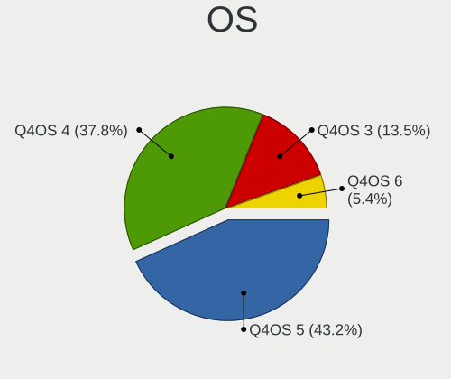

| Name   | Desktops | Percent |
|--------|----------|---------|
| Q4OS 5 | 16       | 43.24%  |
| Q4OS 4 | 14       | 37.84%  |
| Q4OS 3 | 5        | 13.51%  |
| Q4OS 6 | 2        | 5.41%   |

OS Family
---------

OS without a version

| Name | Desktops | Percent |
|------|----------|---------|
| Q4OS | 37       | 100%    |

Kernel
------

Version of the Linux kernel

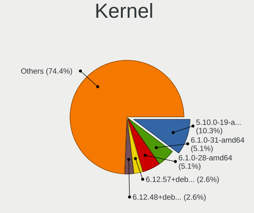

| Version             | Desktops | Percent |
|---------------------|----------|---------|
| 5.10.0-19-amd64     | 4        | 10.26%  |
| 6.1.0-31-amd64      | 2        | 5.13%   |
| 6.1.0-28-amd64      | 2        | 5.13%   |
| 6.12.57+deb13-amd64 | 1        | 2.56%   |
| 6.12.48+deb13-amd64 | 1        | 2.56%   |
| 6.1.0-41-amd64      | 1        | 2.56%   |
| 6.1.0-39-amd64      | 1        | 2.56%   |
| 6.1.0-37-amd64      | 1        | 2.56%   |
| 6.1.0-35-amd64      | 1        | 2.56%   |
| 6.1.0-34-amd64      | 1        | 2.56%   |
| 6.1.0-33-amd64      | 1        | 2.56%   |
| 6.1.0-30-amd64      | 1        | 2.56%   |
| 6.1.0-27-amd64      | 1        | 2.56%   |
| 6.1.0-26-amd64      | 1        | 2.56%   |
| 6.1.0-25-amd64      | 1        | 2.56%   |
| 6.1.0-21-amd64      | 1        | 2.56%   |
| 6.1.0-21-686-pae    | 1        | 2.56%   |
| 6.1.0-10-amd64      | 1        | 2.56%   |
| 6.0.0-1-amd64       | 1        | 2.56%   |
| 5.10.0-9-686-pae    | 1        | 2.56%   |
| 5.10.0-28-amd64     | 1        | 2.56%   |
| 5.10.0-25-amd64     | 1        | 2.56%   |
| 5.10.0-23-686-pae   | 1        | 2.56%   |
| 5.10.0-21-amd64     | 1        | 2.56%   |
| 5.10.0-21-686-pae   | 1        | 2.56%   |
| 5.10.0-20-amd64     | 1        | 2.56%   |
| 5.10.0-20-686-pae   | 1        | 2.56%   |
| 5.10.0-14-amd64     | 1        | 2.56%   |
| 5.10.0-10-686-pae   | 1        | 2.56%   |
| 4.19.0-6-amd64      | 1        | 2.56%   |
| 4.19.0-21-amd64     | 1        | 2.56%   |
| 4.19.0-17-686-pae   | 1        | 2.56%   |
| 4.19.0-16-amd64     | 1        | 2.56%   |
| 4.19.0-16-686       | 1        | 2.56%   |

Kernel Family
-------------

Linux kernel without a distro release

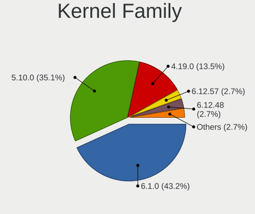

| Version | Desktops | Percent |
|---------|----------|---------|
| 6.1.0   | 16       | 43.24%  |
| 5.10.0  | 13       | 35.14%  |
| 4.19.0  | 5        | 13.51%  |
| 6.12.57 | 1        | 2.7%    |
| 6.12.48 | 1        | 2.7%    |
| 6.0.0   | 1        | 2.7%    |

Kernel Major Ver.
-----------------

Linux kernel major version

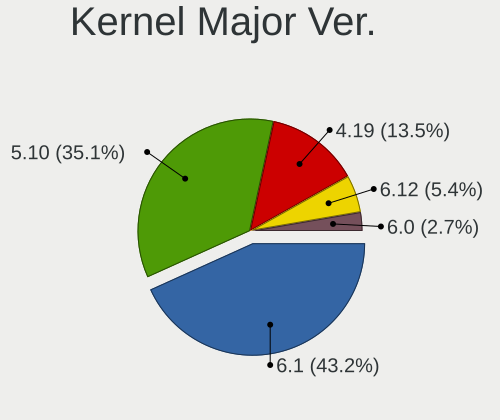

| Version | Desktops | Percent |
|---------|----------|---------|
| 6.1     | 16       | 43.24%  |
| 5.10    | 13       | 35.14%  |
| 4.19    | 5        | 13.51%  |
| 6.12    | 2        | 5.41%   |
| 6.0     | 1        | 2.7%    |

Arch
----

OS architecture (x86_64, i586, etc.)

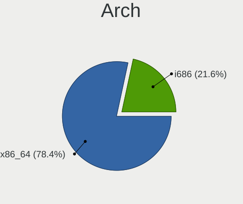

| Name   | Desktops | Percent |
|--------|----------|---------|
| x86_64 | 29       | 78.38%  |
| i686   | 8        | 21.62%  |

DE
--

Desktop Environment

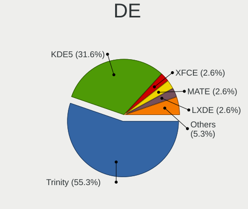

| Name    | Desktops | Percent |
|---------|----------|---------|
| Trinity | 21       | 55.26%  |
| KDE5    | 12       | 31.58%  |
| XFCE    | 1        | 2.63%   |
| MATE    | 1        | 2.63%   |
| LXDE    | 1        | 2.63%   |
| KDE6    | 1        | 2.63%   |
| Budgie  | 1        | 2.63%   |

Display Server
--------------

X11 or Wayland

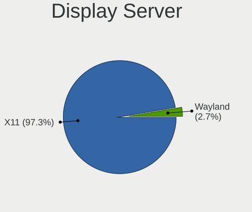

| Name    | Desktops | Percent |
|---------|----------|---------|
| X11     | 36       | 97.3%   |
| Wayland | 1        | 2.7%    |

Display Manager
---------------

SDDM, LightDM, etc.

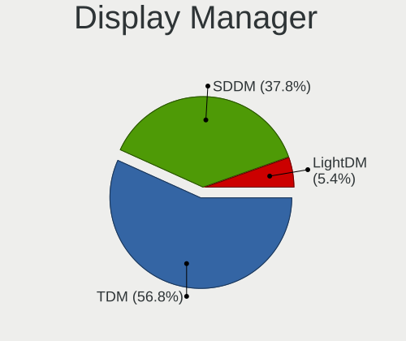

| Name    | Desktops | Percent |
|---------|----------|---------|
| TDM     | 21       | 56.76%  |
| SDDM    | 14       | 37.84%  |
| LightDM | 2        | 5.41%   |

OS Lang
-------

Language

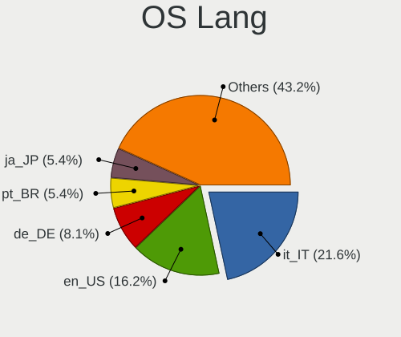

| Lang  | Desktops | Percent |
|-------|----------|---------|
| it_IT | 8        | 21.62%  |
| en_US | 6        | 16.22%  |
| de_DE | 3        | 8.11%   |
| pt_BR | 2        | 5.41%   |
| ja_JP | 2        | 5.41%   |
| es_ES | 2        | 5.41%   |
| en_CA | 2        | 5.41%   |
| sk_SK | 1        | 2.7%    |
| ru_RU | 1        | 2.7%    |
| pl_PL | 1        | 2.7%    |
| hu_HU | 1        | 2.7%    |
| fr_FR | 1        | 2.7%    |
| fr_CA | 1        | 2.7%    |
| es_PE | 1        | 2.7%    |
| es_AR | 1        | 2.7%    |
| en_ZA | 1        | 2.7%    |
| en_IE | 1        | 2.7%    |
| de_AT | 1        | 2.7%    |
| bg_BG | 1        | 2.7%    |

Boot Mode
---------

EFI or BIOS

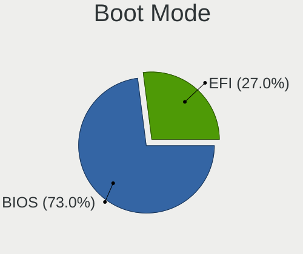

| Mode | Desktops | Percent |
|------|----------|---------|
| BIOS | 27       | 72.97%  |
| EFI  | 10       | 27.03%  |

Filesystem
----------

Type of filesystem

| Type  | Desktops | Percent |
|-------|----------|---------|
| Ext4  | 36       | 97.3%   |
| Btrfs | 1        | 2.7%    |

Part. scheme
------------

Scheme of partitioning

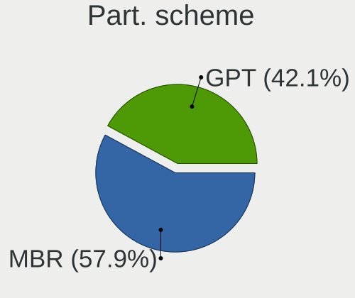

| Type | Desktops | Percent |
|------|----------|---------|
| MBR  | 22       | 57.89%  |
| GPT  | 16       | 42.11%  |

Dual Boot with Linux/BSD
------------------------

Hosting more than one Linux/BSD

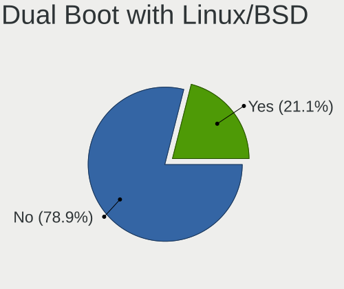

| Dual boot | Desktops | Percent |
|-----------|----------|---------|
| No        | 30       | 78.95%  |
| Yes       | 8        | 21.05%  |

Dual Boot (Win)
---------------

Hosting Linux and Windows

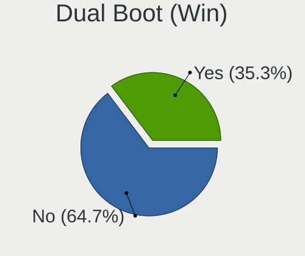

| Dual boot | Desktops | Percent |
|-----------|----------|---------|
| No        | 25       | 67.57%  |
| Yes       | 12       | 32.43%  |

Board
-----

Vendor
------

Motherboard manufacturer

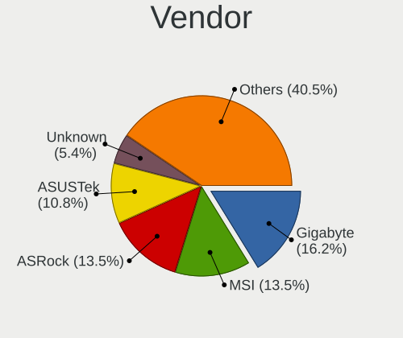

| Name                        | Desktops | Percent |
|-----------------------------|----------|---------|
| Gigabyte Technology         | 6        | 16.22%  |
| MSI                         | 5        | 13.51%  |
| ASRock                      | 5        | 13.51%  |
| ASUSTek Computer            | 4        | 10.81%  |
| Unknown                     | 2        | 5.41%   |
| VXL                         | 1        | 2.7%    |
| TECO Electric and Machinery | 1        | 2.7%    |
| Packard Bell                | 1        | 2.7%    |
| Medion                      | 1        | 2.7%    |
| Lenovo                      | 1        | 2.7%    |
| Intel                       | 1        | 2.7%    |
| Hewlett-Packard             | 1        | 2.7%    |
| Fujitsu                     | 1        | 2.7%    |
| Foxconn                     | 1        | 2.7%    |
| Compaq                      | 1        | 2.7%    |
| Biostar                     | 1        | 2.7%    |
| BESSTAR Tech                | 1        | 2.7%    |
| AZW                         | 1        | 2.7%    |
| AMI                         | 1        | 2.7%    |
| ABIT                        | 1        | 2.7%    |

Model
-----

Motherboard model

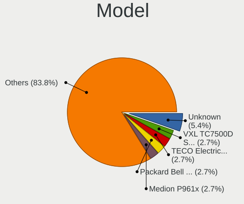

| Name                                   | Desktops | Percent |
|----------------------------------------|----------|---------|
| Unknown                                | 2        | 5.41%   |
| VXL TC7500D Series                     | 1        | 2.7%    |
| TECO Electric and Machinery FUTRO S400 | 1        | 2.7%    |
| Packard Bell IMEDIA S1800              | 1        | 2.7%    |
| MSI MS-7C92                            | 1        | 2.7%    |
| MSI MS-7C56                            | 1        | 2.7%    |
| MSI MS-7733                            | 1        | 2.7%    |
| MSI MS-7597                            | 1        | 2.7%    |
| MSI MS-7592                            | 1        | 2.7%    |
| Medion P961x                           | 1        | 2.7%    |
| Lenovo ThinkCentre M90p 5864AG3        | 1        | 2.7%    |
| Intel D845GRG AAA84341-206             | 1        | 2.7%    |
| HP Compaq Pro 6305 SFF                 | 1        | 2.7%    |
| Gigabyte Z690 GAMING X DDR4            | 1        | 2.7%    |
| Gigabyte XP-M5S661GX                   | 1        | 2.7%    |
| Gigabyte H55M-USB3                     | 1        | 2.7%    |
| Gigabyte G31M-S2L                      | 1        | 2.7%    |
| Gigabyte F2A78M-HD2                    | 1        | 2.7%    |
| Gigabyte AB350-Gaming                  | 1        | 2.7%    |
| Fujitsu D3313-S2                       | 1        | 2.7%    |
| Foxconn Pro 3400 Series MT             | 1        | 2.7%    |
| Compaq Evo D510 SFF                    | 1        | 2.7%    |
| Biostar H81MHV3                        | 1        | 2.7%    |
| BESSTAR Tech UM250                     | 1        | 2.7%    |
| AZW SER                                | 1        | 2.7%    |
| ASUS TUF Gaming B650M-E WIFI           | 1        | 2.7%    |
| ASUS RJ083AA-ABZ t3630.it              | 1        | 2.7%    |
| ASUS M3A79-T DELUXE                    | 1        | 2.7%    |
| ASUS ET1602                            | 1        | 2.7%    |
| ASRock J3455B-ITX                      | 1        | 2.7%    |
| ASRock H61M-HVS                        | 1        | 2.7%    |
| ASRock G41M-VS3                        | 1        | 2.7%    |
| ASRock B450M Pro4                      | 1        | 2.7%    |
| ASRock 990FX Extreme4                  | 1        | 2.7%    |
| AMI Z83-V                              | 1        | 2.7%    |
| ABIT AT8 32X                           | 1        | 2.7%    |

Model Family
------------

Motherboard model prefix

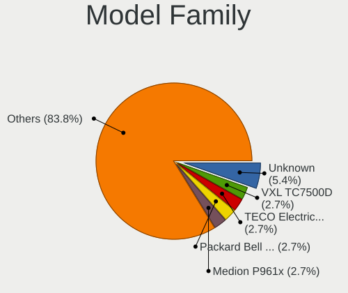

| Name                              | Desktops | Percent |
|-----------------------------------|----------|---------|
| Unknown                           | 2        | 5.41%   |
| VXL TC7500D                       | 1        | 2.7%    |
| TECO Electric and Machinery FUTRO | 1        | 2.7%    |
| Packard Bell IMEDIA               | 1        | 2.7%    |
| MSI MS-7C92                       | 1        | 2.7%    |
| MSI MS-7C56                       | 1        | 2.7%    |
| MSI MS-7733                       | 1        | 2.7%    |
| MSI MS-7597                       | 1        | 2.7%    |
| MSI MS-7592                       | 1        | 2.7%    |
| Medion P961x                      | 1        | 2.7%    |
| Lenovo ThinkCentre                | 1        | 2.7%    |
| Intel D845GRG                     | 1        | 2.7%    |
| HP Compaq                         | 1        | 2.7%    |
| Gigabyte Z690                     | 1        | 2.7%    |
| Gigabyte XP-M5S661GX              | 1        | 2.7%    |
| Gigabyte H55M-USB3                | 1        | 2.7%    |
| Gigabyte G31M-S2L                 | 1        | 2.7%    |
| Gigabyte F2A78M-HD2               | 1        | 2.7%    |
| Gigabyte AB350-Gaming             | 1        | 2.7%    |
| Fujitsu D3313-S2                  | 1        | 2.7%    |
| Foxconn Pro                       | 1        | 2.7%    |
| Compaq Evo                        | 1        | 2.7%    |
| Biostar H81MHV3                   | 1        | 2.7%    |
| BESSTAR Tech UM250                | 1        | 2.7%    |
| AZW SER                           | 1        | 2.7%    |
| ASUS TUF                          | 1        | 2.7%    |
| ASUS RJ083AA-ABZ                  | 1        | 2.7%    |
| ASUS M3A79-T                      | 1        | 2.7%    |
| ASUS ET1602                       | 1        | 2.7%    |
| ASRock J3455B-ITX                 | 1        | 2.7%    |
| ASRock H61M-HVS                   | 1        | 2.7%    |
| ASRock G41M-VS3                   | 1        | 2.7%    |
| ASRock B450M                      | 1        | 2.7%    |
| ASRock 990FX                      | 1        | 2.7%    |
| AMI Z83-V                         | 1        | 2.7%    |
| ABIT AT8                          | 1        | 2.7%    |

MFG Year
--------

Motherboard manufacture year

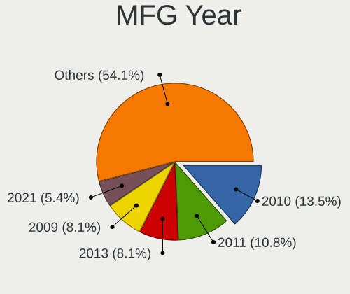

| Year | Desktops | Percent |
|------|----------|---------|
| 2010 | 5        | 13.51%  |
| 2011 | 4        | 10.81%  |
| 2013 | 3        | 8.11%   |
| 2009 | 3        | 8.11%   |
| 2021 | 2        | 5.41%   |
| 2017 | 2        | 5.41%   |
| 2014 | 2        | 5.41%   |
| 2012 | 2        | 5.41%   |
| 2008 | 2        | 5.41%   |
| 2006 | 2        | 5.41%   |
| 2002 | 2        | 5.41%   |
| 2025 | 1        | 2.7%    |
| 2023 | 1        | 2.7%    |
| 2020 | 1        | 2.7%    |
| 2018 | 1        | 2.7%    |
| 2016 | 1        | 2.7%    |
| 2015 | 1        | 2.7%    |
| 2007 | 1        | 2.7%    |
| 2005 | 1        | 2.7%    |

Form Factor
-----------

Physical design of the computer

| Name    | Desktops | Percent |
|---------|----------|---------|
| Desktop | 37       | 100%    |

Secure Boot
-----------

Enabled or disabled

| State    | Desktops | Percent |
|----------|----------|---------|
| Disabled | 36       | 97.3%   |
| Enabled  | 1        | 2.7%    |

Coreboot
--------

Have coreboot on board

| Used | Desktops | Percent |
|------|----------|---------|
| No   | 37       | 100%    |

RAM Size
--------

Total RAM memory

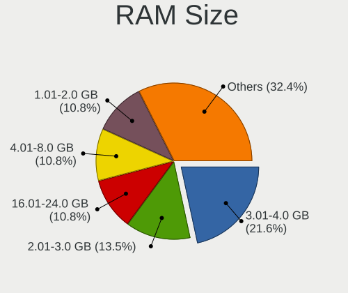

| Size in GB  | Desktops | Percent |
|-------------|----------|---------|
| 3.01-4.0    | 8        | 21.62%  |
| 2.01-3.0    | 5        | 13.51%  |
| 4.01-8.0    | 4        | 10.81%  |
| 16.01-24.0  | 4        | 10.81%  |
| 1.01-2.0    | 4        | 10.81%  |
| 32.01-64.0  | 3        | 8.11%   |
| 8.01-16.0   | 3        | 8.11%   |
| 24.01-32.0  | 2        | 5.41%   |
| 64.01-256.0 | 2        | 5.41%   |
| 0.51-1.0    | 1        | 2.7%    |
| 0.01-0.5    | 1        | 2.7%    |

RAM Used
--------

Used RAM memory

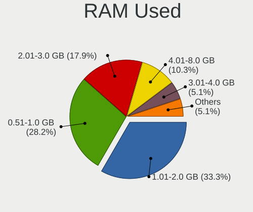

| Used GB   | Desktops | Percent |
|-----------|----------|---------|
| 1.01-2.0  | 13       | 33.33%  |
| 0.51-1.0  | 11       | 28.21%  |
| 2.01-3.0  | 7        | 17.95%  |
| 4.01-8.0  | 4        | 10.26%  |
| 3.01-4.0  | 2        | 5.13%   |
| 8.01-16.0 | 1        | 2.56%   |
| 0.01-0.5  | 1        | 2.56%   |

Total Drives
------------

Number of drives on board

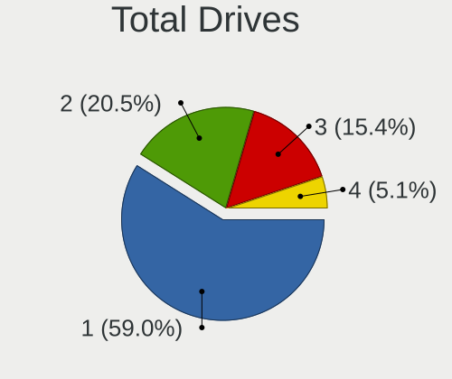

| Drives | Desktops | Percent |
|--------|----------|---------|
| 1      | 23       | 58.97%  |
| 2      | 8        | 20.51%  |
| 3      | 6        | 15.38%  |
| 4      | 2        | 5.13%   |

Has CD-ROM
----------

Has CD-ROM on board

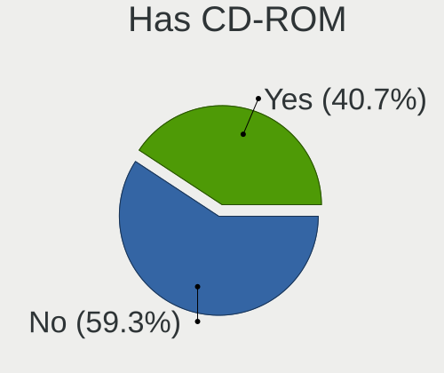

| Presented | Desktops | Percent |
|-----------|----------|---------|
| No        | 20       | 52.63%  |
| Yes       | 18       | 47.37%  |

Has Ethernet
------------

Has Ethernet on board

| Presented | Desktops | Percent |
|-----------|----------|---------|
| Yes       | 37       | 100%    |

Has WiFi
--------

Has WiFi module

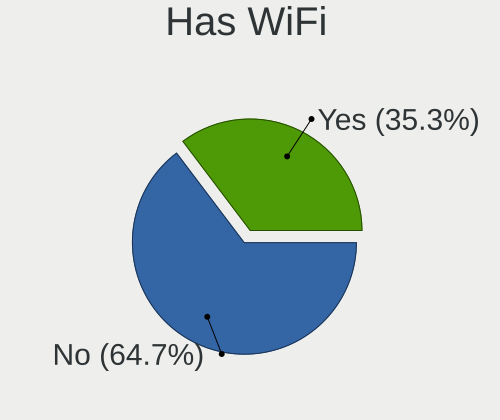

| Presented | Desktops | Percent |
|-----------|----------|---------|
| No        | 20       | 54.05%  |
| Yes       | 17       | 45.95%  |

Has Bluetooth
-------------

Has Bluetooth module

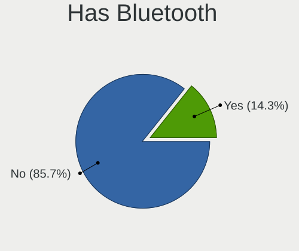

| Presented | Desktops | Percent |
|-----------|----------|---------|
| No        | 28       | 73.68%  |
| Yes       | 10       | 26.32%  |

Location
--------

Country
-------

Geographic location (country)

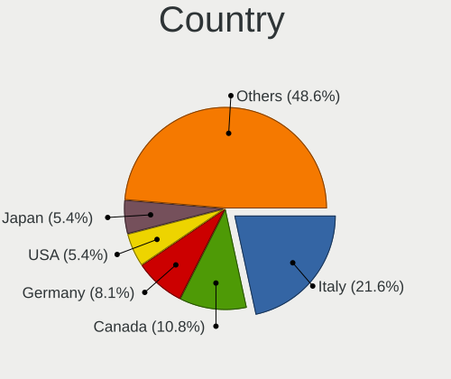

| Country      | Desktops | Percent |
|--------------|----------|---------|
| Italy        | 8        | 21.62%  |
| Canada       | 4        | 10.81%  |
| Germany      | 3        | 8.11%   |
| USA          | 2        | 5.41%   |
| Japan        | 2        | 5.41%   |
| Brazil       | 2        | 5.41%   |
| Venezuela    | 1        | 2.7%    |
| Spain        | 1        | 2.7%    |
| South Africa | 1        | 2.7%    |
| Slovakia     | 1        | 2.7%    |
| Russia       | 1        | 2.7%    |
| Poland       | 1        | 2.7%    |
| Peru         | 1        | 2.7%    |
| Netherlands  | 1        | 2.7%    |
| Hungary      | 1        | 2.7%    |
| Greece       | 1        | 2.7%    |
| France       | 1        | 2.7%    |
| Bulgaria     | 1        | 2.7%    |
| Belgium      | 1        | 2.7%    |
| Bangladesh   | 1        | 2.7%    |
| Austria      | 1        | 2.7%    |
| Argentina    | 1        | 2.7%    |

City
----

Geographic location (city)

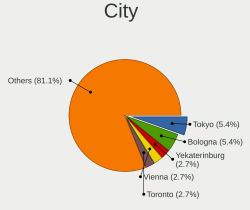

| City                 | Desktops | Percent |
|----------------------|----------|---------|
| Tokyo                | 2        | 5.41%   |
| Bologna              | 2        | 5.41%   |
| Yekaterinburg        | 1        | 2.7%    |
| Vienna               | 1        | 2.7%    |
| Toronto              | 1        | 2.7%    |
| Toalmas              | 1        | 2.7%    |
| The Hague            | 1        | 2.7%    |
| Steinbach            | 1        | 2.7%    |
| Solingen             | 1        | 2.7%    |
| Sofia                | 1        | 2.7%    |
| Seregno              | 1        | 2.7%    |
| Scarborough          | 1        | 2.7%    |
| Savona               | 1        | 2.7%    |
| Sao Pedro da Aldeia  | 1        | 2.7%    |
| San Carlos del Zulia | 1        | 2.7%    |
| Samair               | 1        | 2.7%    |
| Rostock              | 1        | 2.7%    |
| Rome                 | 1        | 2.7%    |
| Presezzo             | 1        | 2.7%    |
| Posadas              | 1        | 2.7%    |
| Palermo              | 1        | 2.7%    |
| Osnabrück           | 1        | 2.7%    |
| Montreal             | 1        | 2.7%    |
| Melendugno           | 1        | 2.7%    |
| Lima                 | 1        | 2.7%    |
| Katowice             | 1        | 2.7%    |
| Johannesburg         | 1        | 2.7%    |
| Hot Springs Village  | 1        | 2.7%    |
| Guarulhos            | 1        | 2.7%    |
| Grand Junction       | 1        | 2.7%    |
| Canet d'En Berenguer | 1        | 2.7%    |
| Brussels             | 1        | 2.7%    |
| Bratislava           | 1        | 2.7%    |
| Boulogne-sur-Mer     | 1        | 2.7%    |
| Athens               | 1        | 2.7%    |

Drives
------

Drive Vendor
------------

Hard drive vendors

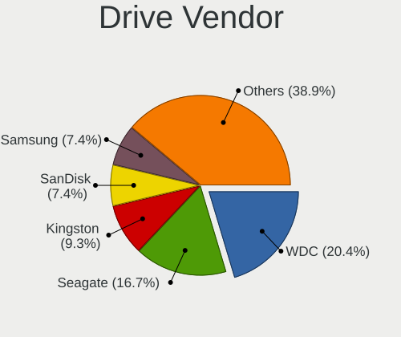

| Vendor                       | Desktops | Drives | Percent |
|------------------------------|----------|--------|---------|
| WDC                          | 11       | 12     | 20.37%  |
| Seagate                      | 9        | 11     | 16.67%  |
| Kingston                     | 5        | 6      | 9.26%   |
| SanDisk                      | 4        | 7      | 7.41%   |
| Samsung Electronics          | 4        | 5      | 7.41%   |
| Crucial                      | 3        | 4      | 5.56%   |
| China                        | 3        | 4      | 5.56%   |
| SUNEAST                      | 2        | 4      | 3.7%    |
| WDC WDS5                     | 1        | 1      | 1.85%   |
| USB                          | 1        | 1      | 1.85%   |
| Unknown (CF)                 | 1        | 1      | 1.85%   |
| Unknown                      | 1        | 1      | 1.85%   |
| Transcend                    | 1        | 1      | 1.85%   |
| Shenzhen Longsys Electronics | 1        | 1      | 1.85%   |
| Maxtor                       | 1        | 1      | 1.85%   |
| M500                         | 1        | 1      | 1.85%   |
| Intenso                      | 1        | 1      | 1.85%   |
| IBM/Hitachi                  | 1        | 2      | 1.85%   |
| Hitachi                      | 1        | 1      | 1.85%   |
| Azerty                       | 1        | 1      | 1.85%   |
| A-DATA Technology            | 1        | 1      | 1.85%   |

Drive Model
-----------

Hard drive models

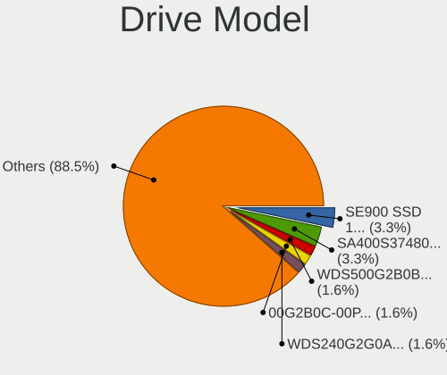

| Model                                  | Desktops | Percent |
|----------------------------------------|----------|---------|
| SUNEAST SE900 SSD 128GB                | 2        | 3.28%   |
| Kingston SA400S37480G 480GB SSD        | 2        | 3.28%   |
| WDC WDS500G2B0B-00YS70 500GB SSD       | 1        | 1.64%   |
| WDC WDS5 00G2B0C-00PX 500GB            | 1        | 1.64%   |
| WDC WDS240G2G0A-00JH30 240GB SSD       | 1        | 1.64%   |
| WDC WDBNCE5000PNC 500GB SSD            | 1        | 1.64%   |
| WDC WD800BD-22MRA1 80GB                | 1        | 1.64%   |
| WDC WD400BD-23JMC0 40GB                | 1        | 1.64%   |
| WDC WD2500AAJS-08L7A0 250GB            | 1        | 1.64%   |
| WDC WD1600AAJS-75M0A0 160GB            | 1        | 1.64%   |
| WDC WD1600AAJS-00L7A0 160GB            | 1        | 1.64%   |
| WDC WD10EFRX-68JCSN0 1TB               | 1        | 1.64%   |
| WDC WD10EARS-00Y5B1 1TB                | 1        | 1.64%   |
| WDC WD10EADS-00L5B1 1TB                | 1        | 1.64%   |
| USB 3.1 120GB                          | 1        | 1.64%   |
| Unknown NCard  32GB                    | 1        | 1.64%   |
| Unknown (CF) Card 8GB SSD              | 1        | 1.64%   |
| Transcend TS32GHSD370 32GB SSD         | 1        | 1.64%   |
| Shenzhen Longsys 512GB SSD             | 1        | 1.64%   |
| Seagate ST8000DM004-2CX188 8TB         | 1        | 1.64%   |
| Seagate ST3500418AS 500GB              | 1        | 1.64%   |
| Seagate ST3500413AS 500GB              | 1        | 1.64%   |
| Seagate ST3320820SCE 320GB             | 1        | 1.64%   |
| Seagate ST3320620AS 320GB              | 1        | 1.64%   |
| Seagate ST3160815AS 160GB              | 1        | 1.64%   |
| Seagate ST3160812AS 160GB              | 1        | 1.64%   |
| Seagate ST310211A 10GB                 | 1        | 1.64%   |
| Seagate ST1000DM003-1ER162 1TB         | 1        | 1.64%   |
| Seagate BarraCuda Q5 ZP1000CV30001 1TB | 1        | 1.64%   |
| SanDisk SSD PLUS 480GB                 | 1        | 1.64%   |
| SanDisk SSD PLUS 240GB                 | 1        | 1.64%   |
| SanDisk SDSSDH3 1T02 1TB               | 1        | 1.64%   |
| SanDisk SDSSDA120G 120GB               | 1        | 1.64%   |
| SanDisk NVMe SSD Drive 1TB             | 1        | 1.64%   |
| SanDisk Extreme Pro 1TB                | 1        | 1.64%   |
| Samsung SSD 980 PRO 2TB                | 1        | 1.64%   |
| Samsung SSD 860 EVO 250GB              | 1        | 1.64%   |
| Samsung SSD 850 PRO 2TB                | 1        | 1.64%   |
| Samsung HD753LJ 752GB                  | 1        | 1.64%   |
| Samsung HD081GJ 80GB                   | 1        | 1.64%   |

HDD Vendor
----------

Hard disk drive vendors

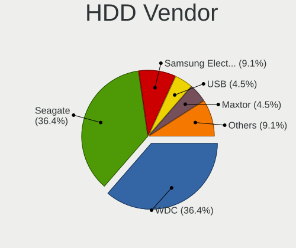

| Vendor              | Desktops | Drives | Percent |
|---------------------|----------|--------|---------|
| WDC                 | 8        | 9      | 36.36%  |
| Seagate             | 8        | 10     | 36.36%  |
| Samsung Electronics | 2        | 2      | 9.09%   |
| USB                 | 1        | 1      | 4.55%   |
| Maxtor              | 1        | 1      | 4.55%   |
| IBM/Hitachi         | 1        | 2      | 4.55%   |
| Hitachi             | 1        | 1      | 4.55%   |

SSD Vendor
----------

Solid state drive vendors

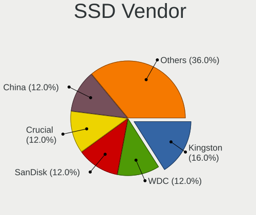

| Vendor              | Desktops | Drives | Percent |
|---------------------|----------|--------|---------|
| Kingston            | 4        | 5      | 16%     |
| WDC                 | 3        | 3      | 12%     |
| SanDisk             | 3        | 5      | 12%     |
| Crucial             | 3        | 3      | 12%     |
| China               | 3        | 4      | 12%     |
| SUNEAST             | 2        | 4      | 8%      |
| Samsung Electronics | 2        | 2      | 8%      |
| Unknown (CF)        | 1        | 1      | 4%      |
| Transcend           | 1        | 1      | 4%      |
| M500                | 1        | 1      | 4%      |
| Intenso             | 1        | 1      | 4%      |
| Azerty              | 1        | 1      | 4%      |

Drive Kind
----------

HDD or SSD

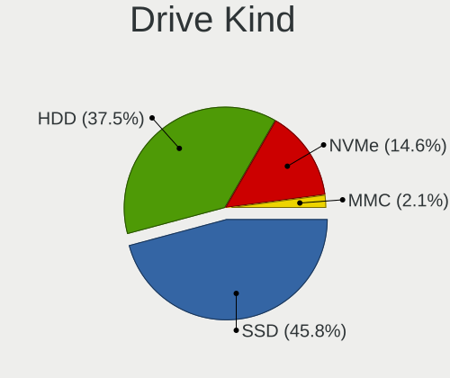

| Kind | Desktops | Drives | Percent |
|------|----------|--------|---------|
| SSD  | 22       | 31     | 45.83%  |
| HDD  | 18       | 26     | 37.5%   |
| NVMe | 7        | 9      | 14.58%  |
| MMC  | 1        | 1      | 2.08%   |

Drive Connector
---------------

SATA, SAS, NVMe, etc.

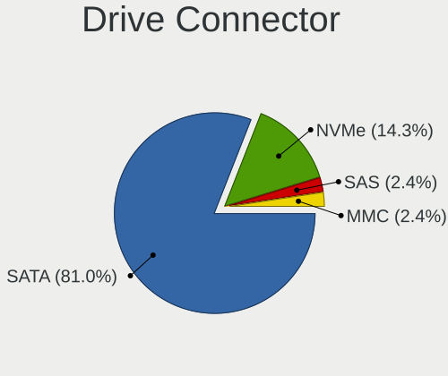

| Type | Desktops | Drives | Percent |
|------|----------|--------|---------|
| SATA | 34       | 56     | 80.95%  |
| NVMe | 6        | 8      | 14.29%  |
| SAS  | 1        | 2      | 2.38%   |
| MMC  | 1        | 1      | 2.38%   |

Drive Size
----------

Size of hard drive

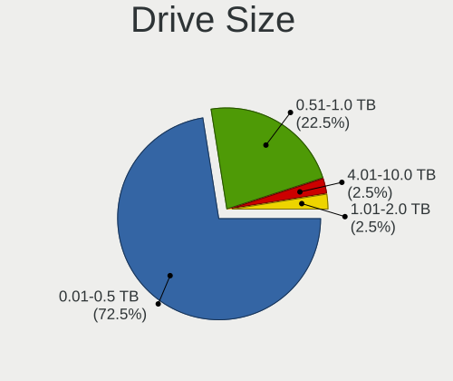

| Size in TB | Desktops | Drives | Percent |
|------------|----------|--------|---------|
| 0.01-0.5   | 29       | 45     | 72.5%   |
| 0.51-1.0   | 9        | 10     | 22.5%   |
| 1.01-2.0   | 1        | 1      | 2.5%    |
| 4.01-10.0  | 1        | 1      | 2.5%    |

Space Total
-----------

Amount of disk space available on the file system

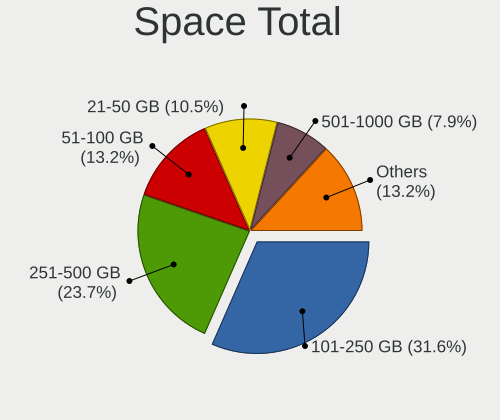

| Size in GB     | Desktops | Percent |
|----------------|----------|---------|
| 101-250        | 12       | 31.58%  |
| 251-500        | 9        | 23.68%  |
| 51-100         | 5        | 13.16%  |
| 21-50          | 4        | 10.53%  |
| 501-1000       | 3        | 7.89%   |
| 1001-2000      | 2        | 5.26%   |
| 1-20           | 2        | 5.26%   |
| More than 3000 | 1        | 2.63%   |

Space Used
----------

Amount of used disk space

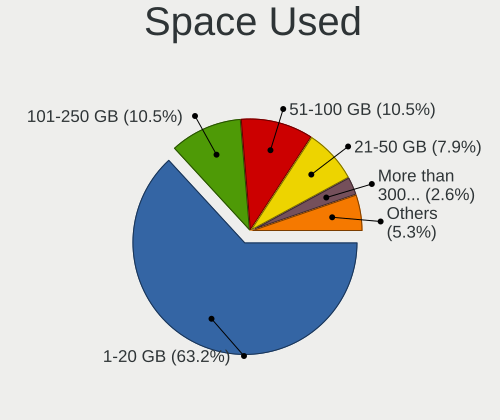

| Used GB        | Desktops | Percent |
|----------------|----------|---------|
| 1-20           | 24       | 63.16%  |
| 101-250        | 4        | 10.53%  |
| 51-100         | 4        | 10.53%  |
| 21-50          | 3        | 7.89%   |
| More than 3000 | 1        | 2.63%   |
| 251-500        | 1        | 2.63%   |
| 501-1000       | 1        | 2.63%   |

Malfunc. Drives
---------------

Drive models with a malfunction

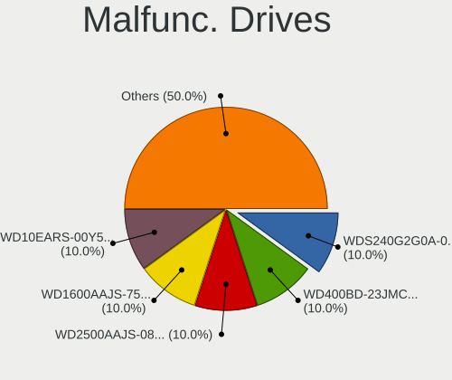

| Model                             | Desktops | Drives | Percent |
|-----------------------------------|----------|--------|---------|
| WDC WDS240G2G0A-00JH30 240GB SSD  | 1        | 1      | 10%     |
| WDC WD400BD-23JMC0 40GB           | 1        | 1      | 10%     |
| WDC WD2500AAJS-08L7A0 250GB       | 1        | 1      | 10%     |
| WDC WD1600AAJS-75M0A0 160GB       | 1        | 1      | 10%     |
| WDC WD10EARS-00Y5B1 1TB           | 1        | 1      | 10%     |
| Seagate ST3320820SCE 320GB        | 1        | 2      | 10%     |
| Maxtor 6Y080L0 81GB               | 1        | 1      | 10%     |
| Kingston SA400S37240G 240GB SSD   | 1        | 1      | 10%     |
| IBM/Hitachi IC35L090AVV207-0 80GB | 1        | 2      | 10%     |
| Hitachi HDS721616PLA380 160GB     | 1        | 1      | 10%     |

Malfunc. Drive Vendor
---------------------

Vendors of faulty drives

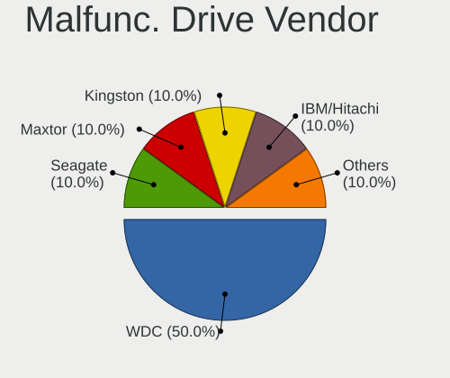

| Vendor      | Desktops | Drives | Percent |
|-------------|----------|--------|---------|
| WDC         | 5        | 5      | 50%     |
| Seagate     | 1        | 2      | 10%     |
| Maxtor      | 1        | 1      | 10%     |
| Kingston    | 1        | 1      | 10%     |
| IBM/Hitachi | 1        | 2      | 10%     |
| Hitachi     | 1        | 1      | 10%     |

Malfunc. HDD Vendor
-------------------

Vendors of faulty HDD drives

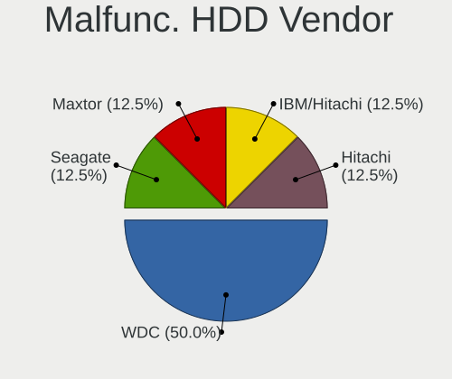

| Vendor      | Desktops | Drives | Percent |
|-------------|----------|--------|---------|
| WDC         | 4        | 4      | 50%     |
| Seagate     | 1        | 2      | 12.5%   |
| Maxtor      | 1        | 1      | 12.5%   |
| IBM/Hitachi | 1        | 2      | 12.5%   |
| Hitachi     | 1        | 1      | 12.5%   |

Malfunc. Drive Kind
-------------------

Kinds of faulty drives

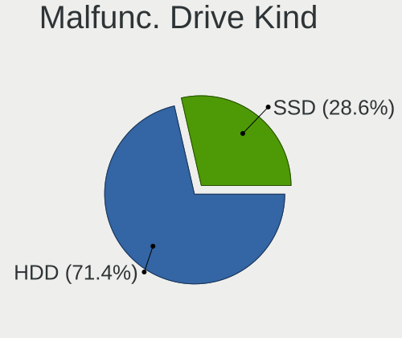

| Kind | Desktops | Drives | Percent |
|------|----------|--------|---------|
| HDD  | 7        | 10     | 77.78%  |
| SSD  | 2        | 2      | 22.22%  |

Failed Drives
-------------

Failed drive models

Zero info for selected period =(

Failed Drive Vendor
-------------------

Failed drive vendors

Zero info for selected period =(

Drive Status
------------

Number of failed and malfunc. drives

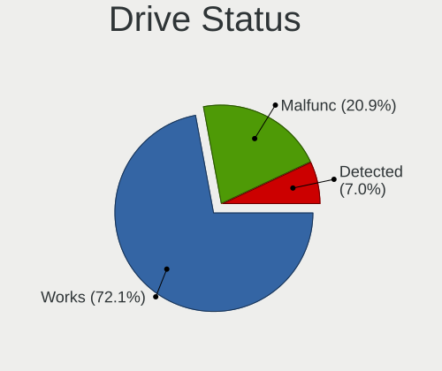

| Status   | Desktops | Drives | Percent |
|----------|----------|--------|---------|
| Works    | 31       | 51     | 72.09%  |
| Malfunc  | 9        | 12     | 20.93%  |
| Detected | 3        | 4      | 6.98%   |

Storage controller
------------------

Storage Vendor
--------------

Storage controller vendors

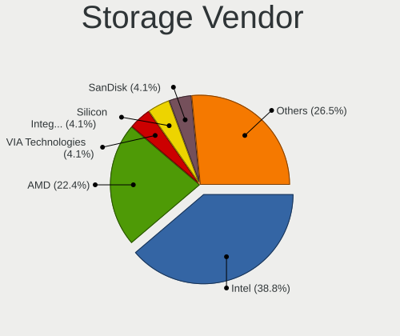

| Vendor                           | Desktops | Percent |
|----------------------------------|----------|---------|
| Intel                            | 19       | 38.78%  |
| AMD                              | 11       | 22.45%  |
| VIA Technologies                 | 2        | 4.08%   |
| Silicon Integrated Systems [SiS] | 2        | 4.08%   |
| SanDisk                          | 2        | 4.08%   |
| Marvell Technology Group         | 2        | 4.08%   |
| ULi Electronics                  | 1        | 2.04%   |
| Silicon Image                    | 1        | 2.04%   |
| Shenzhen Longsys Electronics     | 1        | 2.04%   |
| Seagate Technology               | 1        | 2.04%   |
| Samsung Electronics              | 1        | 2.04%   |
| Nvidia                           | 1        | 2.04%   |
| Micron/Crucial Technology        | 1        | 2.04%   |
| Kingston Technology Company      | 1        | 2.04%   |
| JMicron Technology               | 1        | 2.04%   |
| ASMedia Technology               | 1        | 2.04%   |
| ADATA Technology                 | 1        | 2.04%   |

Storage Model
-------------

Storage controller models

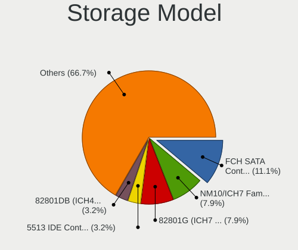

| Model                                                                          | Desktops | Percent |
|--------------------------------------------------------------------------------|----------|---------|
| AMD FCH SATA Controller [AHCI mode]                                            | 7        | 11.11%  |
| Intel NM10/ICH7 Family SATA Controller [IDE mode]                              | 5        | 7.94%   |
| Intel 82801G (ICH7 Family) IDE Controller                                      | 5        | 7.94%   |
| Silicon Integrated Systems [SiS] 5513 IDE Controller                           | 2        | 3.17%   |
| Intel 82801DB (ICH4) IDE Controller                                            | 2        | 3.17%   |
| Intel 6 Series/C200 Series Chipset Family 6 port Desktop SATA AHCI Controller  | 2        | 3.17%   |
| Intel 5 Series/3400 Series Chipset 6 port SATA AHCI Controller                 | 2        | 3.17%   |
| AMD SB7x0/SB8x0/SB9x0 SATA Controller [AHCI mode]                              | 2        | 3.17%   |
| AMD SB7x0/SB8x0/SB9x0 IDE Controller                                           | 2        | 3.17%   |
| AMD 500 Series Chipset SATA Controller                                         | 2        | 3.17%   |
| VIA VX900 Series Serial-ATA Controller                                         | 1        | 1.59%   |
| VIA VT6415 PATA IDE Host Controller                                            | 1        | 1.59%   |
| ULi ULi M5288 SATA                                                             | 1        | 1.59%   |
| ULi M5229 IDE                                                                  | 1        | 1.59%   |
| Silicon Integrated Systems [SiS] RAID bus controller 180 SATA/PATA  [SiS]      | 1        | 1.59%   |
| Silicon Image SiI 3132 Serial ATA Raid II Controller                           | 1        | 1.59%   |
| Shenzhen Longsys Lexar NM610 PRO NVME SSD (DRAM-less)                          | 1        | 1.59%   |
| Seagate BarraCuda Q5 NVMe SSD (DRAM-less)                                      | 1        | 1.59%   |
| SanDisk Ultra 3D / WD Blue SN570 NVMe SSD (DRAM-less)                          | 1        | 1.59%   |
| SanDisk Extreme Pro / WD Black 2018/SN750/PC SN720 NVMe SSD                    | 1        | 1.59%   |
| Samsung NVMe SSD Controller PM9A1/PM9A3/980PRO                                 | 1        | 1.59%   |
| Nvidia MCP61 SATA Controller                                                   | 1        | 1.59%   |
| Nvidia MCP61 IDE                                                               | 1        | 1.59%   |
| Micron/Crucial P2 [Nick P2] / P3 / P3 Plus NVMe PCIe SSD (DRAM-less)           | 1        | 1.59%   |
| Marvell Group 88SE9120 SATA 6Gb/s Controller                                   | 1        | 1.59%   |
| Marvell Group 88SE6111/6121 SATA II / PATA Controller                          | 1        | 1.59%   |
| Kingston Company A2000 NVMe SSD [SM2263EN]                                     | 1        | 1.59%   |
| JMicron JMB363 SATA/IDE Controller                                             | 1        | 1.59%   |
| Intel US15W/US15X/US15L/UL11L SCH [Poulsbo] IDE Controller                     | 1        | 1.59%   |
| Intel NM10/ICH7 Family SATA Controller [AHCI mode]                             | 1        | 1.59%   |
| Intel Celeron N3350/Pentium N4200/Atom E3900 Series SATA AHCI Controller       | 1        | 1.59%   |
| Intel Alder Lake-S PCH SATA Controller [AHCI Mode]                             | 1        | 1.59%   |
| Intel 82801IBM/IEM (ICH9M/ICH9M-E) 4 port SATA Controller [AHCI mode]          | 1        | 1.59%   |
| Intel 82801GBM/GHM (ICH7-M Family) SATA Controller [IDE mode]                  | 1        | 1.59%   |
| Intel 8 Series/C220 Series Chipset Family 6-port SATA Controller 1 [AHCI mode] | 1        | 1.59%   |
| Intel 7 Series/C210 Series Chipset Family 6-port SATA Controller [AHCI mode]   | 1        | 1.59%   |
| ASMedia ASM1061/ASM1062 Serial ATA Controller                                  | 1        | 1.59%   |
| AMD FCH IDE Controller                                                         | 1        | 1.59%   |
| AMD 600 Series Chipset SATA Controller                                         | 1        | 1.59%   |
| AMD 400 Series Chipset SATA Controller                                         | 1        | 1.59%   |

Storage Kind
------------

Kind of storage controller (IDE, SATA, NVMe, SAS, ...)

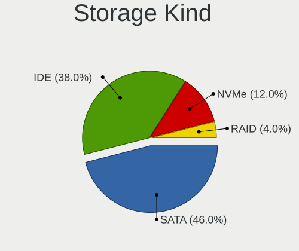

| Kind | Desktops | Percent |
|------|----------|---------|
| SATA | 23       | 46%     |
| IDE  | 19       | 38%     |
| NVMe | 6        | 12%     |
| RAID | 2        | 4%      |

Processor
---------

CPU Vendor
----------

Processor vendors

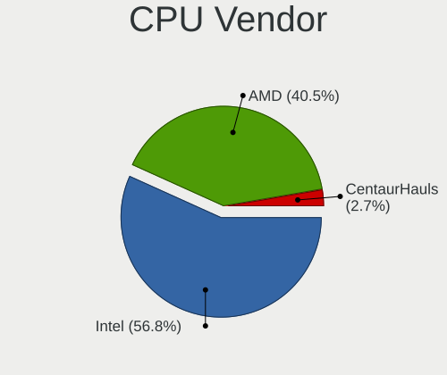

| Vendor       | Desktops | Percent |
|--------------|----------|---------|
| Intel        | 21       | 56.76%  |
| AMD          | 15       | 40.54%  |
| CentaurHauls | 1        | 2.7%    |

CPU Model
---------

Processor models

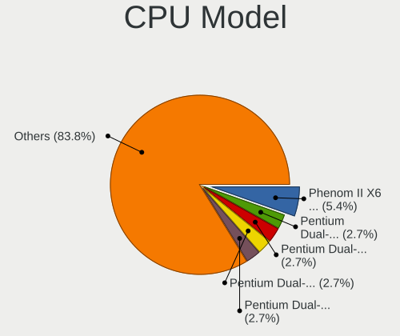

| Model                                           | Desktops | Percent |
|-------------------------------------------------|----------|---------|
| AMD Phenom II X6 1055T Processor                | 2        | 5.41%   |
| Intel Pentium Dual-Core CPU E6500 @ 2.93GHz     | 1        | 2.7%    |
| Intel Pentium Dual-Core CPU E5700 @ 3.00GHz     | 1        | 2.7%    |
| Intel Pentium Dual-Core CPU E5400 @ 2.70GHz     | 1        | 2.7%    |
| Intel Pentium Dual-Core CPU E5200 @ 2.50GHz     | 1        | 2.7%    |
| Intel Pentium D CPU 2.80GHz                     | 1        | 2.7%    |
| Intel Pentium 4 CPU 3.00GHz                     | 1        | 2.7%    |
| Intel Pentium 4 CPU 2.00GHz                     | 1        | 2.7%    |
| Intel Pentium 4 CPU 1.80GHz                     | 1        | 2.7%    |
| Intel Core i7-2600 CPU @ 3.40GHz                | 1        | 2.7%    |
| Intel Core i7 CPU 860 @ 2.80GHz                 | 1        | 2.7%    |
| Intel Core i5-4570 CPU @ 3.20GHz                | 1        | 2.7%    |
| Intel Core i5-3470 CPU @ 3.20GHz                | 1        | 2.7%    |
| Intel Core i5-2400 CPU @ 3.10GHz                | 1        | 2.7%    |
| Intel Core i5 CPU 650 @ 3.20GHz                 | 1        | 2.7%    |
| Intel Core 2 Duo CPU T9300 @ 2.50GHz            | 1        | 2.7%    |
| Intel Celeron CPU J3455 @ 1.50GHz               | 1        | 2.7%    |
| Intel Atom x5-Z8350 CPU @ 1.44GHz               | 1        | 2.7%    |
| Intel Atom CPU Z530 @ 1.60GHz                   | 1        | 2.7%    |
| Intel Atom CPU N270 @ 1.60GHz                   | 1        | 2.7%    |
| Intel Atom CPU 330 @ 1.60GHz                    | 1        | 2.7%    |
| Intel 13th Gen Core i7-13700K                   | 1        | 2.7%    |
| CentaurHauls VIA Eden X2 U4200 @ 1.0+ GHz       | 1        | 2.7%    |
| AMD Ryzen 7 9700X 8-Core Processor              | 1        | 2.7%    |
| AMD Ryzen 7 6800H with Radeon Graphics          | 1        | 2.7%    |
| AMD Ryzen 7 5700G with Radeon Graphics          | 1        | 2.7%    |
| AMD Ryzen 7 3700X 8-Core Processor              | 1        | 2.7%    |
| AMD Ryzen 7 2700 Eight-Core Processor           | 1        | 2.7%    |
| AMD Ryzen 5 PRO 2500U w/ Radeon Vega Mobile Gfx | 1        | 2.7%    |
| AMD GX-217GA SOC with Radeon HD Graphics        | 1        | 2.7%    |
| AMD Dual Core Opteron Processor 170             | 1        | 2.7%    |
| AMD Athlon Processor                            | 1        | 2.7%    |
| AMD Athlon II X2 250 Processor                  | 1        | 2.7%    |
| AMD Athlon 200GE with Radeon Vega Graphics      | 1        | 2.7%    |
| AMD A8-5500B APU with Radeon HD Graphics        | 1        | 2.7%    |
| AMD A4-5300B APU with Radeon HD Graphics        | 1        | 2.7%    |

CPU Model Family
----------------

Processor model prefix

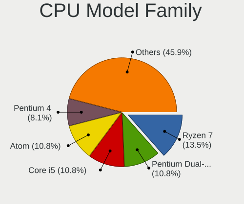

| Model                   | Desktops | Percent |
|-------------------------|----------|---------|
| AMD Ryzen 7             | 5        | 13.51%  |
| Intel Pentium Dual-Core | 4        | 10.81%  |
| Intel Core i5           | 4        | 10.81%  |
| Intel Atom              | 4        | 10.81%  |
| Intel Pentium 4         | 3        | 8.11%   |
| Intel Core i7           | 2        | 5.41%   |
| AMD Phenom II X6        | 2        | 5.41%   |
| AMD Athlon              | 2        | 5.41%   |
| Other                   | 1        | 2.7%    |
| Intel Pentium D         | 1        | 2.7%    |
| Intel Core 2 Duo        | 1        | 2.7%    |
| Intel Celeron           | 1        | 2.7%    |
| CentaurHauls VIA Eden   | 1        | 2.7%    |
| AMD Ryzen 5 PRO         | 1        | 2.7%    |
| AMD GX                  | 1        | 2.7%    |
| AMD Dual Core Opteron   | 1        | 2.7%    |
| AMD Athlon II X2        | 1        | 2.7%    |
| AMD A8                  | 1        | 2.7%    |
| AMD A4                  | 1        | 2.7%    |

CPU Cores
---------

Number of processor cores

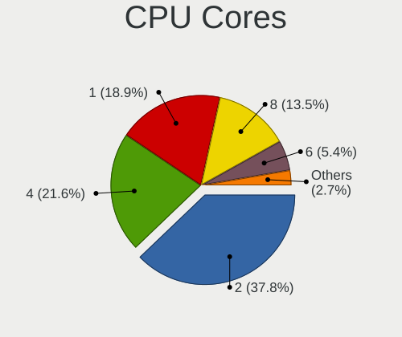

| Number | Desktops | Percent |
|--------|----------|---------|
| 2      | 14       | 37.84%  |
| 4      | 8        | 21.62%  |
| 1      | 7        | 18.92%  |
| 8      | 5        | 13.51%  |
| 6      | 2        | 5.41%   |
| 16     | 1        | 2.7%    |

CPU Sockets
-----------

Number of sockets

| Number | Desktops | Percent |
|--------|----------|---------|
| 1      | 37       | 100%    |

CPU Threads
-----------

Threads per core (Hyper-Threading)

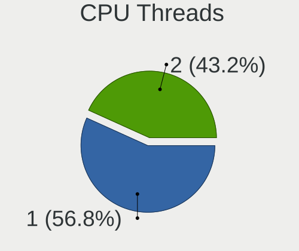

| Number | Desktops | Percent |
|--------|----------|---------|
| 1      | 21       | 56.76%  |
| 2      | 16       | 43.24%  |

CPU Op-Modes
------------

CPU Operation Modes (32-bit, 64-bit)

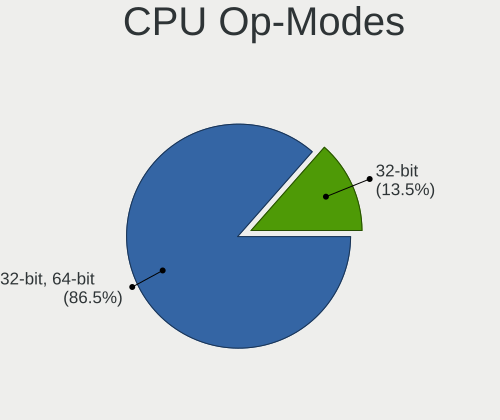

| Op mode        | Desktops | Percent |
|----------------|----------|---------|
| 32-bit, 64-bit | 32       | 86.49%  |
| 32-bit         | 5        | 13.51%  |

CPU Microcode
-------------

Microcode number

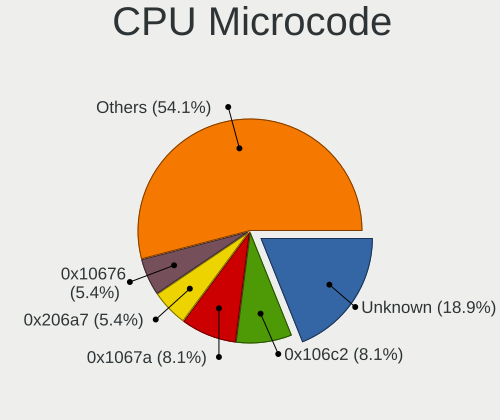

| Number     | Desktops | Percent |
|------------|----------|---------|
| Unknown    | 7        | 18.92%  |
| 0x106c2    | 3        | 8.11%   |
| 0x1067a    | 3        | 8.11%   |
| 0x206a7    | 2        | 5.41%   |
| 0x10676    | 2        | 5.41%   |
| 0x0810100b | 2        | 5.41%   |
| 0x010000dc | 2        | 5.41%   |
| 0xf49      | 1        | 2.7%    |
| 0xf47      | 1        | 2.7%    |
| 0xf27      | 1        | 2.7%    |
| 0xf12      | 1        | 2.7%    |
| 0xb0671    | 1        | 2.7%    |
| 0x306c3    | 1        | 2.7%    |
| 0x306a9    | 1        | 2.7%    |
| 0x20655    | 1        | 2.7%    |
| 0x0b404023 | 1        | 2.7%    |
| 0x0a500014 | 1        | 2.7%    |
| 0x08701013 | 1        | 2.7%    |
| 0x0800820d | 1        | 2.7%    |
| 0x0700010f | 1        | 2.7%    |
| 0x0600111f | 1        | 2.7%    |
| 0x06001119 | 1        | 2.7%    |
| 0x010000c8 | 1        | 2.7%    |

CPU Microarch
-------------

Microarchitecture

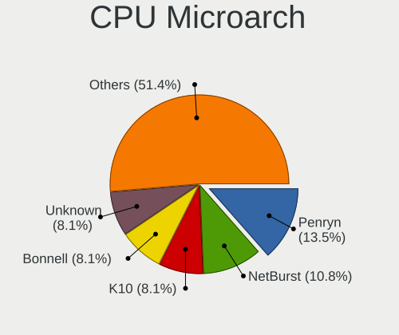

| Name             | Desktops | Percent |
|------------------|----------|---------|
| Penryn           | 5        | 13.51%  |
| NetBurst         | 4        | 10.81%  |
| K10              | 3        | 8.11%   |
| Bonnell          | 3        | 8.11%   |
| Unknown          | 3        | 8.11%   |
| Zen              | 2        | 5.41%   |
| SandyBridge      | 2        | 5.41%   |
| Piledriver       | 2        | 5.41%   |
| Zen+             | 1        | 2.7%    |
| Zen 3            | 1        | 2.7%    |
| Zen 2            | 1        | 2.7%    |
| Westmere         | 1        | 2.7%    |
| Silvermont       | 1        | 2.7%    |
| Nehalem          | 1        | 2.7%    |
| K8 Hammer        | 1        | 2.7%    |
| K6               | 1        | 2.7%    |
| Jaguar           | 1        | 2.7%    |
| IvyBridge        | 1        | 2.7%    |
| Haswell          | 1        | 2.7%    |
| Goldmont         | 1        | 2.7%    |
| Alderlake Hybrid | 1        | 2.7%    |

Graphics
--------

GPU Vendor
----------

Vendors of graphics cards

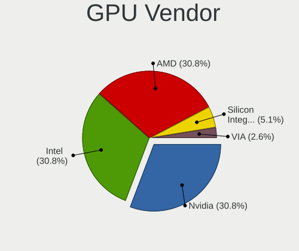

| Vendor                           | Desktops | Percent |
|----------------------------------|----------|---------|
| Nvidia                           | 12       | 30.77%  |
| Intel                            | 12       | 30.77%  |
| AMD                              | 12       | 30.77%  |
| Silicon Integrated Systems [SiS] | 2        | 5.13%   |
| VIA Technologies                 | 1        | 2.56%   |

GPU Model
---------

Graphics card models

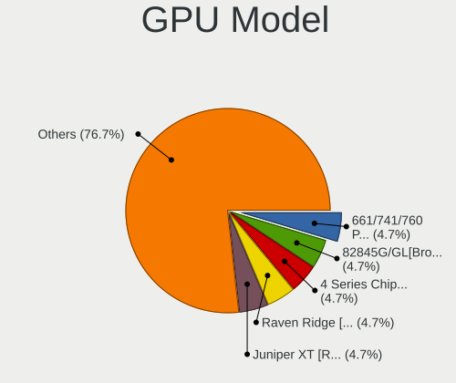

| Model                                                                                      | Desktops | Percent |
|--------------------------------------------------------------------------------------------|----------|---------|
| Silicon Integrated Systems [SiS] 661/741/760 PCI/AGP or 662/761Gx PCIE VGA Display Adapter | 2        | 4.65%   |
| Intel 82845G/GL[Brookdale-G]/GE Chipset Integrated Graphics Device                         | 2        | 4.65%   |
| Intel 4 Series Chipset Integrated Graphics Controller                                      | 2        | 4.65%   |
| AMD Raven Ridge [Radeon Vega Series / Radeon Vega Mobile Series]                           | 2        | 4.65%   |
| AMD Juniper XT [Radeon HD 5770]                                                            | 2        | 4.65%   |
| VIA Technologies VX900 Graphics [Chrome9 HD]                                               | 1        | 2.33%   |
| Nvidia GT218 [GeForce 210]                                                                 | 1        | 2.33%   |
| Nvidia GT216M [GeForce GT 330M]                                                            | 1        | 2.33%   |
| Nvidia GT216 [GeForce 315]                                                                 | 1        | 2.33%   |
| Nvidia GP107 [GeForce GTX 1050 Ti]                                                         | 1        | 2.33%   |
| Nvidia GP104 [GeForce GTX 1070]                                                            | 1        | 2.33%   |
| Nvidia GM206 [GeForce GTX 960]                                                             | 1        | 2.33%   |
| Nvidia GK208B [GeForce GT 710]                                                             | 1        | 2.33%   |
| Nvidia GK107 [GeForce GT 640]                                                              | 1        | 2.33%   |
| Nvidia GK106 [GeForce GTX 660]                                                             | 1        | 2.33%   |
| Nvidia G72 [GeForce 7500 LE]                                                               | 1        | 2.33%   |
| Nvidia C61 [GeForce 7025 / nForce 630a]                                                    | 1        | 2.33%   |
| Nvidia AD103 [GeForce RTX 4080]                                                            | 1        | 2.33%   |
| Intel Xeon E3-1200 v3/4th Gen Core Processor Integrated Graphics Controller                | 1        | 2.33%   |
| Intel US15W/US15X SCH [Poulsbo] Graphics Controller                                        | 1        | 2.33%   |
| Intel Raptor Lake-S GT1 [UHD Graphics 770]                                                 | 1        | 2.33%   |
| Intel Mobile 945GSE Express Integrated Graphics Controller                                 | 1        | 2.33%   |
| Intel Mobile 945GM/GMS/GME, 943/940GML Express Integrated Graphics Controller              | 1        | 2.33%   |
| Intel Atom/Celeron/Pentium Processor x5-E8000/J3xxx/N3xxx Integrated Graphics Controller   | 1        | 2.33%   |
| Intel Apollo Lake GT1 [HD Graphics 500]                                                    | 1        | 2.33%   |
| Intel 82945G/GZ Integrated Graphics Controller                                             | 1        | 2.33%   |
| Intel 2nd Generation Core Processor Family Integrated Graphics Controller                  | 1        | 2.33%   |
| AMD Trinity [Radeon HD 7560D]                                                              | 1        | 2.33%   |
| AMD Trinity 2 [Radeon HD 7480D]                                                            | 1        | 2.33%   |
| AMD RV570 [Radeon X1950 PRO] (Secondary)                                                   | 1        | 2.33%   |
| AMD RV570 [Radeon X1950 PRO]                                                               | 1        | 2.33%   |
| AMD Rembrandt [Radeon 680M]                                                                | 1        | 2.33%   |
| AMD Pitcairn PRO [Radeon HD 7850 / R7 265 / R9 270 1024SP]                                 | 1        | 2.33%   |
| AMD Park [Mobility Radeon HD 5430/5450/5470]                                               | 1        | 2.33%   |
| AMD Navi 24 [Radeon RX 6400/6500 XT/6500M]                                                 | 1        | 2.33%   |
| AMD Navi 22 [Radeon RX 6700/6700 XT/6750 XT / 6800M/6850M XT]                              | 1        | 2.33%   |
| AMD Kabini [Radeon HD 8280E]                                                               | 1        | 2.33%   |
| AMD Cezanne [Radeon Vega Series / Radeon Vega Mobile Series]                               | 1        | 2.33%   |

GPU Combo
---------

Combinations of graphics cards

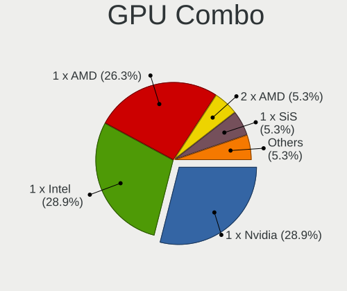

| Name           | Desktops | Percent |
|----------------|----------|---------|
| 1 x Nvidia     | 11       | 28.95%  |
| 1 x Intel      | 11       | 28.95%  |
| 1 x AMD        | 10       | 26.32%  |
| 2 x AMD        | 2        | 5.26%   |
| 1 x SiS        | 2        | 5.26%   |
| 1 x VIA        | 1        | 2.63%   |
| Intel + Nvidia | 1        | 2.63%   |

GPU Driver
----------

Free vs proprietary

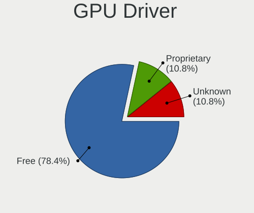

| Driver      | Desktops | Percent |
|-------------|----------|---------|
| Free        | 29       | 78.38%  |
| Proprietary | 4        | 10.81%  |
| Unknown     | 4        | 10.81%  |

GPU Memory
----------

Total video memory

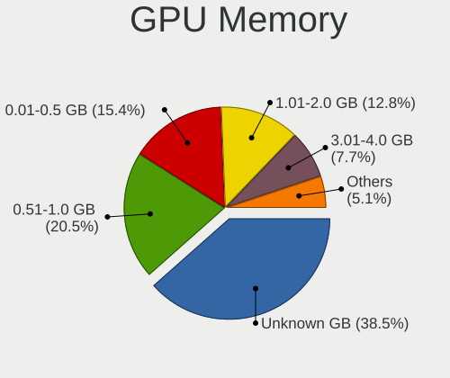

| Size in GB | Desktops | Percent |
|------------|----------|---------|
| Unknown    | 15       | 38.46%  |
| 0.51-1.0   | 8        | 20.51%  |
| 0.01-0.5   | 6        | 15.38%  |
| 1.01-2.0   | 5        | 12.82%  |
| 3.01-4.0   | 3        | 7.69%   |
| 7.01-8.0   | 1        | 2.56%   |
| 8.01-16.0  | 1        | 2.56%   |

Monitor
-------

Monitor Vendor
--------------

Monitor vendors

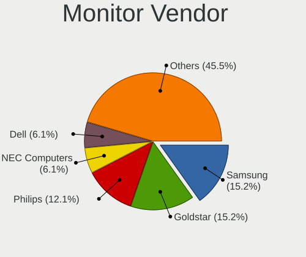

| Vendor               | Desktops | Percent |
|----------------------|----------|---------|
| Samsung Electronics  | 5        | 15.15%  |
| Goldstar             | 5        | 15.15%  |
| Philips              | 4        | 12.12%  |
| NEC Computers        | 2        | 6.06%   |
| Dell                 | 2        | 6.06%   |
| AOC                  | 2        | 6.06%   |
| Acer                 | 2        | 6.06%   |
| ViewSonic            | 1        | 3.03%   |
| VIE                  | 1        | 3.03%   |
| Toshiba              | 1        | 3.03%   |
| STD                  | 1        | 3.03%   |
| Plain Tree Systems   | 1        | 3.03%   |
| Orion                | 1        | 3.03%   |
| Medion               | 1        | 3.03%   |
| Iiyama               | 1        | 3.03%   |
| Hewlett-Packard      | 1        | 3.03%   |
| Fujitsu Siemens      | 1        | 3.03%   |
| Ancor Communications | 1        | 3.03%   |

Monitor Model
-------------

Monitor models

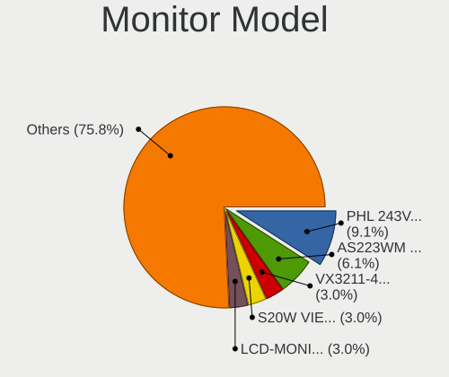

| Model                                                                   | Desktops | Percent |
|-------------------------------------------------------------------------|----------|---------|
| Philips PHL 243V7 PHLC155 1920x1080 527x296mm 23.8-inch                 | 3        | 9.09%   |
| NEC Computers AS223WM NEC690A 1920x1080 476x267mm 21.5-inch             | 2        | 6.06%   |
| ViewSonic VX3211-4K VSCC336 3840x2160 698x393mm 31.5-inch               | 1        | 3.03%   |
| VIE S20W VIE2080 1600x900 440x250mm 19.9-inch                           | 1        | 3.03%   |
| Toshiba LCD-MONITOR LCDEC80 1680x1050 470x300mm 22.0-inch               | 1        | 3.03%   |
| STD LCD TV STD0101 1920x1080                                            | 1        | 3.03%   |
| Samsung Electronics U28E590 SAM0C4D 3840x2160 607x345mm 27.5-inch       | 1        | 3.03%   |
| Samsung Electronics SMB1630N SAM0630 1366x768 344x194mm 15.5-inch       | 1        | 3.03%   |
| Samsung Electronics S24B20/S24B30 SAM09ED 1920x1080 521x293mm 23.5-inch | 1        | 3.03%   |
| Samsung Electronics LF24T35 SAM707D 1920x1080 528x297mm 23.9-inch       | 1        | 3.03%   |
| Samsung Electronics LCD Monitor SAM090B 1920x1080 1020x570mm 46.0-inch  | 1        | 3.03%   |
| Plain Tree Systems LCD Monitor PTS06A5 1280x1024 340x270mm 17.1-inch    | 1        | 3.03%   |
| Philips 200WS PHL0850 1680x1050 434x270mm 20.1-inch                     | 1        | 3.03%   |
| Orion LCD Monitor ORN120A 1920x1080                                     | 1        | 3.03%   |
| Medion Medion23.6 PC MEDB603 1920x1080 477x268mm 21.5-inch              | 1        | 3.03%   |
| Iiyama PLB2403WS IVM5601 1920x1200 519x324mm 24.1-inch                  | 1        | 3.03%   |
| Hewlett-Packard 2009 HWP2827 1600x900 443x250mm 20.0-inch               | 1        | 3.03%   |
| Goldstar W2453 GSM56F5 1920x1080 531x299mm 24.0-inch                    | 1        | 3.03%   |
| Goldstar W2234 GSM56B8 1680x1050 474x296mm 22.0-inch                    | 1        | 3.03%   |
| Goldstar Ultra HD GSM5B08 3840x2160 600x340mm 27.2-inch                 | 1        | 3.03%   |
| Goldstar LG TV SSCR2 GSMC0C8 3840x2160                                  | 1        | 3.03%   |
| Goldstar FULL HD GSM5B54 1920x1080 480x270mm 21.7-inch                  | 1        | 3.03%   |
| Fujitsu Siemens B22T-7 LED PG FUS082A 1920x1080 477x268mm 21.5-inch     | 1        | 3.03%   |
| Dell DELL2407WFPHC DELA025 1920x1200 519x324mm 24.1-inch                | 1        | 3.03%   |
| Dell 1704FPV DEL3015 1280x1024 338x270mm 17.0-inch                      | 1        | 3.03%   |
| AOC 2460G5 AOC246A 1920x1080 531x299mm 24.0-inch                        | 1        | 3.03%   |
| AOC 1670W AOC1670 1366x768 344x194mm 15.5-inch                          | 1        | 3.03%   |
| Ancor Communications ASUS VW193D ACI19D5 1440x900 408x255mm 18.9-inch   | 1        | 3.03%   |
| Acer K222HQL ACR03E1 1920x1080 477x268mm 21.5-inch                      | 1        | 3.03%   |
| Acer ED270R M ACR0A91 1920x1080 597x336mm 27.0-inch                     | 1        | 3.03%   |

Monitor Resolution
------------------

Monitor screen resolution

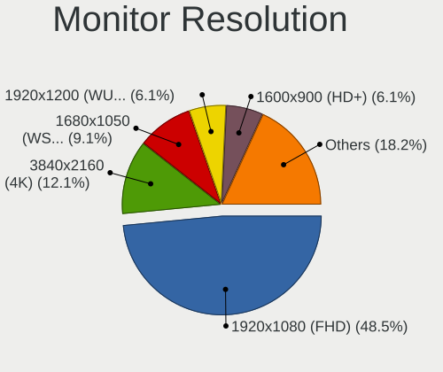

| Resolution         | Desktops | Percent |
|--------------------|----------|---------|
| 1920x1080 (FHD)    | 16       | 48.48%  |
| 3840x2160 (4K)     | 4        | 12.12%  |
| 1680x1050 (WSXGA+) | 3        | 9.09%   |
| 1920x1200 (WUXGA)  | 2        | 6.06%   |
| 1600x900 (HD+)     | 2        | 6.06%   |
| 1366x768 (WXGA)    | 2        | 6.06%   |
| 1280x1024 (SXGA)   | 2        | 6.06%   |
| 1920x540           | 1        | 3.03%   |
| 1440x900 (WXGA+)   | 1        | 3.03%   |

Monitor Diagonal
----------------

Diagonal size in inches

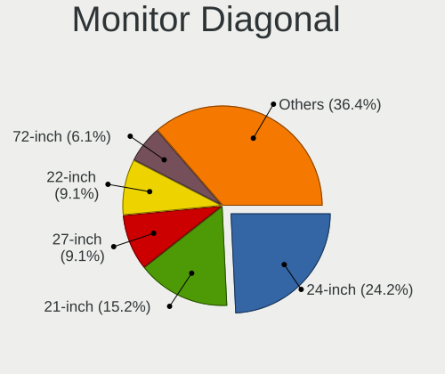

| Inches  | Desktops | Percent |
|---------|----------|---------|
| 24      | 8        | 24.24%  |
| 21      | 5        | 15.15%  |
| 27      | 3        | 9.09%   |
| 22      | 3        | 9.09%   |
| 72      | 2        | 6.06%   |
| 23      | 2        | 6.06%   |
| 19      | 2        | 6.06%   |
| 17      | 2        | 6.06%   |
| 15      | 2        | 6.06%   |
| 54      | 1        | 3.03%   |
| 31      | 1        | 3.03%   |
| 20      | 1        | 3.03%   |
| Unknown | 1        | 3.03%   |

Monitor Width
-------------

Physical width

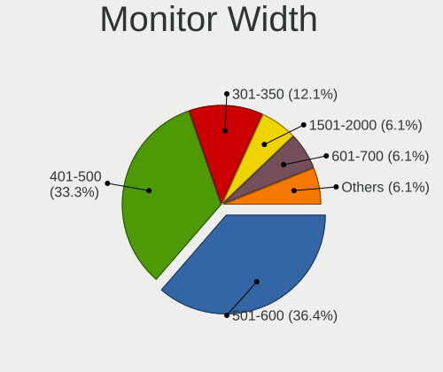

| Width in mm | Desktops | Percent |
|-------------|----------|---------|
| 501-600     | 12       | 36.36%  |
| 401-500     | 11       | 33.33%  |
| 301-350     | 4        | 12.12%  |
| 601-700     | 2        | 6.06%   |
| 1501-2000   | 2        | 6.06%   |
| 1001-1500   | 1        | 3.03%   |
| Unknown     | 1        | 3.03%   |

Aspect Ratio
------------

Proportional relationship between the width and the height

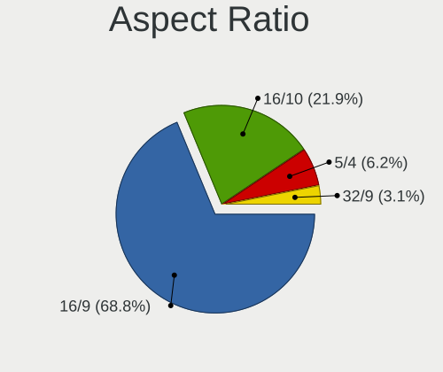

| Ratio | Desktops | Percent |
|-------|----------|---------|
| 16/9  | 22       | 68.75%  |
| 16/10 | 7        | 21.88%  |
| 5/4   | 2        | 6.25%   |
| 32/9  | 1        | 3.13%   |

Monitor Area
------------

Area in inch²

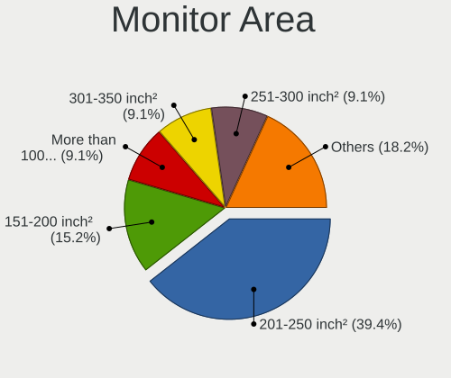

| Area in inch² | Desktops | Percent |
|----------------|----------|---------|
| 201-250        | 13       | 39.39%  |
| 151-200        | 5        | 15.15%  |
| More than 1000 | 3        | 9.09%   |
| 301-350        | 3        | 9.09%   |
| 251-300        | 3        | 9.09%   |
| 141-150        | 2        | 6.06%   |
| 101-110        | 2        | 6.06%   |
| 351-500        | 1        | 3.03%   |
| Unknown        | 1        | 3.03%   |

Pixel Density
-------------

Pixels per inch

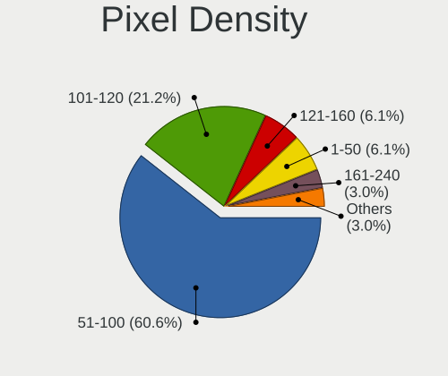

| Density | Desktops | Percent |
|---------|----------|---------|
| 51-100  | 20       | 60.61%  |
| 101-120 | 7        | 21.21%  |
| 1-50    | 2        | 6.06%   |
| 121-160 | 2        | 6.06%   |
| 161-240 | 1        | 3.03%   |
| Unknown | 1        | 3.03%   |

Multiple Monitors
-----------------

Total monitors connected

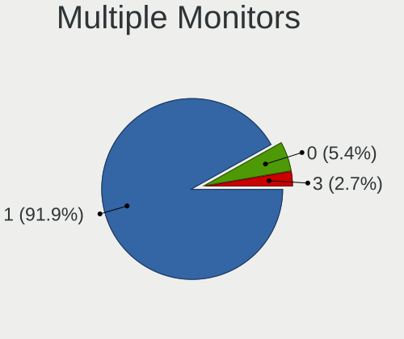

| Total | Desktops | Percent |
|-------|----------|---------|
| 1     | 34       | 91.89%  |
| 0     | 2        | 5.41%   |
| 3     | 1        | 2.7%    |

Network
-------

Net Controller Vendor
---------------------

Controller vendors

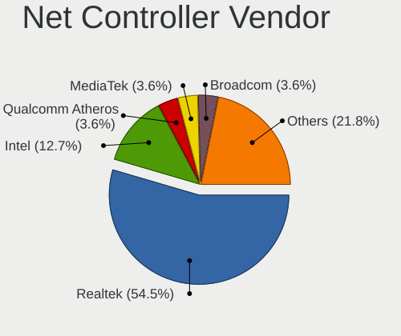

| Vendor                           | Desktops | Percent |
|----------------------------------|----------|---------|
| Realtek Semiconductor            | 30       | 54.55%  |
| Intel                            | 7        | 12.73%  |
| Qualcomm Atheros                 | 2        | 3.64%   |
| MediaTek                         | 2        | 3.64%   |
| Broadcom                         | 2        | 3.64%   |
| Xiaomi                           | 1        | 1.82%   |
| TP-Link                          | 1        | 1.82%   |
| Silicon Integrated Systems [SiS] | 1        | 1.82%   |
| Ralink Technology                | 1        | 1.82%   |
| Ralink                           | 1        | 1.82%   |
| Motorola PCS                     | 1        | 1.82%   |
| Marvell Technology Group         | 1        | 1.82%   |
| IBM                              | 1        | 1.82%   |
| Guillemot                        | 1        | 1.82%   |
| Google                           | 1        | 1.82%   |
| D-Link System                    | 1        | 1.82%   |
| Broadcom Limited                 | 1        | 1.82%   |

Net Controller Model
--------------------

Controller models

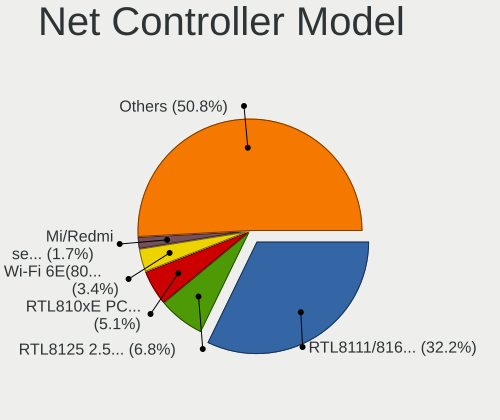

| Model                                                                                       | Desktops | Percent |
|---------------------------------------------------------------------------------------------|----------|---------|
| Realtek RTL8111/8168/8211/8411 PCI Express Gigabit Ethernet Controller                      | 19       | 32.2%   |
| Realtek RTL8125 2.5GbE Controller                                                           | 4        | 6.78%   |
| Realtek RTL810xE PCI Express Fast Ethernet controller                                       | 3        | 5.08%   |
| Intel Wi-Fi 6E(802.11ax) AX210/AX1675* 2x2 [Typhoon Peak]                                   | 2        | 3.39%   |
| Xiaomi Mi/Redmi series (RNDIS)                                                              | 1        | 1.69%   |
| TP-Link TL-WN823N v2/v3 [Realtek RTL8192EU]                                                 | 1        | 1.69%   |
| Silicon Integrated Systems [SiS] SiS900 PCI Fast Ethernet                                   | 1        | 1.69%   |
| Realtek RTL88x2bu [AC1200 Techkey]                                                          | 1        | 1.69%   |
| Realtek RTL8192CU 802.11n WLAN Adapter                                                      | 1        | 1.69%   |
| Realtek RTL8191SEvB Wireless LAN Controller                                                 | 1        | 1.69%   |
| Realtek RTL8188EE Wireless Network Adapter                                                  | 1        | 1.69%   |
| Realtek RTL8188CUS 802.11n WLAN Adapter                                                     | 1        | 1.69%   |
| Realtek RTL8153 Gigabit Ethernet Adapter                                                    | 1        | 1.69%   |
| Realtek RTL-8110SC/8169SC Gigabit Ethernet                                                  | 1        | 1.69%   |
| Ralink RT5572 Wireless Adapter                                                              | 1        | 1.69%   |
| Ralink RT2790 Wireless 802.11n 1T/2R PCIe                                                   | 1        | 1.69%   |
| Qualcomm Atheros AR8152 v2.0 Fast Ethernet                                                  | 1        | 1.69%   |
| Qualcomm Atheros AR5413/AR5414 Wireless Network Adapter [AR5006X(S) 802.11abg]              | 1        | 1.69%   |
| Qualcomm Atheros AR2417 Wireless Network Adapter [AR5007G 802.11bg]                         | 1        | 1.69%   |
| Motorola PCS moto g100 pro                                                                  | 1        | 1.69%   |
| MediaTek Wi-Fi 6 MT7920 Wireless Network Adapter                                            | 1        | 1.69%   |
| MediaTek MT7902 802.11ax PCIe Wireless Network Adapter [Filogic 310]                        | 1        | 1.69%   |
| Marvell Group 88E8056 PCI-E Gigabit Ethernet Controller                                     | 1        | 1.69%   |
| Intel Wi-Fi 6 AX200                                                                         | 1        | 1.69%   |
| Intel NM10/ICH7 Family LAN Controller                                                       | 1        | 1.69%   |
| Intel 82801DB PRO/100 VM (LOM) Ethernet Controller                                          | 1        | 1.69%   |
| Intel 82801DB PRO/100 VE (LOM) Ethernet Controller                                          | 1        | 1.69%   |
| Intel 82578DM Gigabit Network Connection                                                    | 1        | 1.69%   |
| IBM Winnipeg PCI-X Host Bridge                                                              | 1        | 1.69%   |
| Guillemot Hercules HWNUp-150 802.11n Wireless N Pico [Realtek RTL8188CUS]                   | 1        | 1.69%   |
| Google Pixel 9a                                                                             | 1        | 1.69%   |
| D-Link System DWA-160 802.11abgn Xtreme N Dual Band Adapter(rev.A2) [Atheros AR9170+AR9104] | 1        | 1.69%   |
| Broadcom NetXtreme BCM57760 Gigabit Ethernet PCIe                                           | 1        | 1.69%   |
| Broadcom NetLink BCM57781 Gigabit Ethernet PCIe                                             | 1        | 1.69%   |
| Broadcom Limited NetXtreme BCM5761 Gigabit Ethernet PCIe                                    | 1        | 1.69%   |

Wireless Vendor
---------------

Wireless vendors

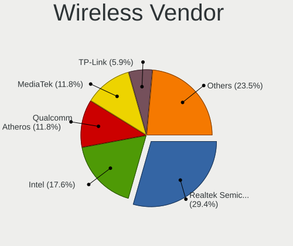

| Vendor                | Desktops | Percent |
|-----------------------|----------|---------|
| Realtek Semiconductor | 5        | 29.41%  |
| Intel                 | 3        | 17.65%  |
| Qualcomm Atheros      | 2        | 11.76%  |
| MediaTek              | 2        | 11.76%  |
| TP-Link               | 1        | 5.88%   |
| Ralink Technology     | 1        | 5.88%   |
| Ralink                | 1        | 5.88%   |
| Guillemot             | 1        | 5.88%   |
| D-Link System         | 1        | 5.88%   |

Wireless Model
--------------

Wireless models

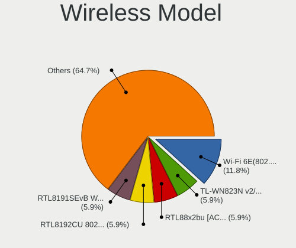

| Model                                                                                       | Desktops | Percent |
|---------------------------------------------------------------------------------------------|----------|---------|
| Intel Wi-Fi 6E(802.11ax) AX210/AX1675* 2x2 [Typhoon Peak]                                   | 2        | 11.76%  |
| TP-Link TL-WN823N v2/v3 [Realtek RTL8192EU]                                                 | 1        | 5.88%   |
| Realtek RTL88x2bu [AC1200 Techkey]                                                          | 1        | 5.88%   |
| Realtek RTL8192CU 802.11n WLAN Adapter                                                      | 1        | 5.88%   |
| Realtek RTL8191SEvB Wireless LAN Controller                                                 | 1        | 5.88%   |
| Realtek RTL8188EE Wireless Network Adapter                                                  | 1        | 5.88%   |
| Realtek RTL8188CUS 802.11n WLAN Adapter                                                     | 1        | 5.88%   |
| Ralink RT5572 Wireless Adapter                                                              | 1        | 5.88%   |
| Ralink RT2790 Wireless 802.11n 1T/2R PCIe                                                   | 1        | 5.88%   |
| Qualcomm Atheros AR5413/AR5414 Wireless Network Adapter [AR5006X(S) 802.11abg]              | 1        | 5.88%   |
| Qualcomm Atheros AR2417 Wireless Network Adapter [AR5007G 802.11bg]                         | 1        | 5.88%   |
| MediaTek Wi-Fi 6 MT7920 Wireless Network Adapter                                            | 1        | 5.88%   |
| MediaTek MT7902 802.11ax PCIe Wireless Network Adapter [Filogic 310]                        | 1        | 5.88%   |
| Intel Wi-Fi 6 AX200                                                                         | 1        | 5.88%   |
| Guillemot Hercules HWNUp-150 802.11n Wireless N Pico [Realtek RTL8188CUS]                   | 1        | 5.88%   |
| D-Link System DWA-160 802.11abgn Xtreme N Dual Band Adapter(rev.A2) [Atheros AR9170+AR9104] | 1        | 5.88%   |

Ethernet Vendor
---------------

Ethernet vendors

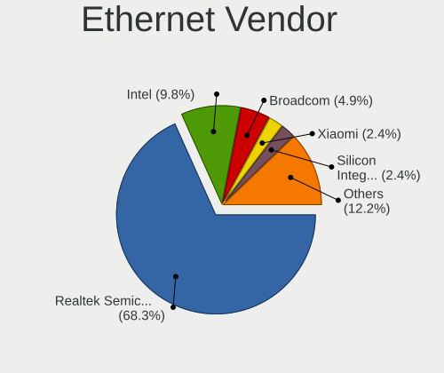

| Vendor                           | Desktops | Percent |
|----------------------------------|----------|---------|
| Realtek Semiconductor            | 28       | 68.29%  |
| Intel                            | 4        | 9.76%   |
| Broadcom                         | 2        | 4.88%   |
| Xiaomi                           | 1        | 2.44%   |
| Silicon Integrated Systems [SiS] | 1        | 2.44%   |
| Qualcomm Atheros                 | 1        | 2.44%   |
| Motorola PCS                     | 1        | 2.44%   |
| Marvell Technology Group         | 1        | 2.44%   |
| Google                           | 1        | 2.44%   |
| Broadcom Limited                 | 1        | 2.44%   |

Ethernet Model
--------------

Ethernet models

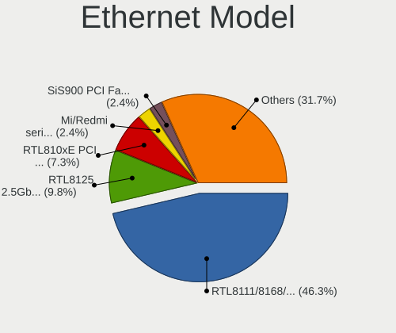

| Model                                                                  | Desktops | Percent |
|------------------------------------------------------------------------|----------|---------|
| Realtek RTL8111/8168/8211/8411 PCI Express Gigabit Ethernet Controller | 19       | 46.34%  |
| Realtek RTL8125 2.5GbE Controller                                      | 4        | 9.76%   |
| Realtek RTL810xE PCI Express Fast Ethernet controller                  | 3        | 7.32%   |
| Xiaomi Mi/Redmi series (RNDIS)                                         | 1        | 2.44%   |
| Silicon Integrated Systems [SiS] SiS900 PCI Fast Ethernet              | 1        | 2.44%   |
| Realtek RTL8153 Gigabit Ethernet Adapter                               | 1        | 2.44%   |
| Realtek RTL-8110SC/8169SC Gigabit Ethernet                             | 1        | 2.44%   |
| Qualcomm Atheros AR8152 v2.0 Fast Ethernet                             | 1        | 2.44%   |
| Motorola PCS moto g100 pro                                             | 1        | 2.44%   |
| Marvell Group 88E8056 PCI-E Gigabit Ethernet Controller                | 1        | 2.44%   |
| Intel NM10/ICH7 Family LAN Controller                                  | 1        | 2.44%   |
| Intel 82801DB PRO/100 VM (LOM) Ethernet Controller                     | 1        | 2.44%   |
| Intel 82801DB PRO/100 VE (LOM) Ethernet Controller                     | 1        | 2.44%   |
| Intel 82578DM Gigabit Network Connection                               | 1        | 2.44%   |
| Google Pixel 9a                                                        | 1        | 2.44%   |
| Broadcom NetXtreme BCM57760 Gigabit Ethernet PCIe                      | 1        | 2.44%   |
| Broadcom NetLink BCM57781 Gigabit Ethernet PCIe                        | 1        | 2.44%   |
| Broadcom Limited NetXtreme BCM5761 Gigabit Ethernet PCIe               | 1        | 2.44%   |

Net Controller Kind
-------------------

Ethernet, WiFi or modem

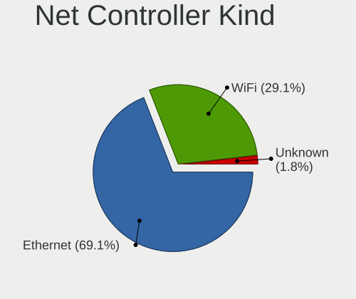

| Kind     | Desktops | Percent |
|----------|----------|---------|
| Ethernet | 38       | 69.09%  |
| WiFi     | 16       | 29.09%  |
| Unknown  | 1        | 1.82%   |

Used Controller
---------------

Currently used network controller

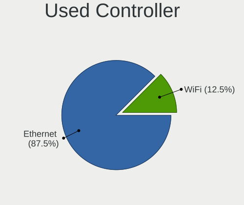

| Kind     | Desktops | Percent |
|----------|----------|---------|
| Ethernet | 28       | 80%     |
| WiFi     | 7        | 20%     |

NICs
----

Total network controllers on board

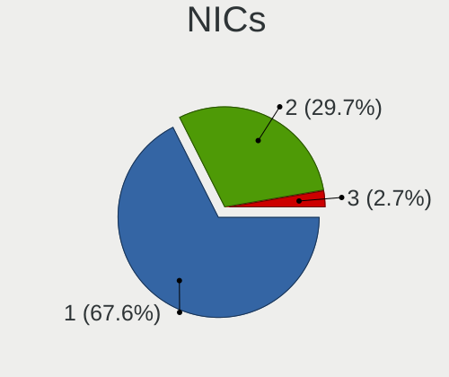

| Total | Desktops | Percent |
|-------|----------|---------|
| 1     | 25       | 67.57%  |
| 2     | 11       | 29.73%  |
| 3     | 1        | 2.7%    |

IPv6
----

IPv6 vs IPv4

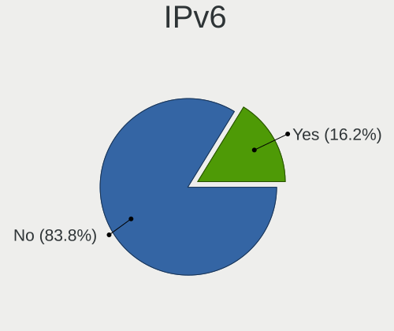

| Used | Desktops | Percent |
|------|----------|---------|
| No   | 31       | 83.78%  |
| Yes  | 6        | 16.22%  |

Bluetooth
---------

Bluetooth Vendor
----------------

Controller vendors

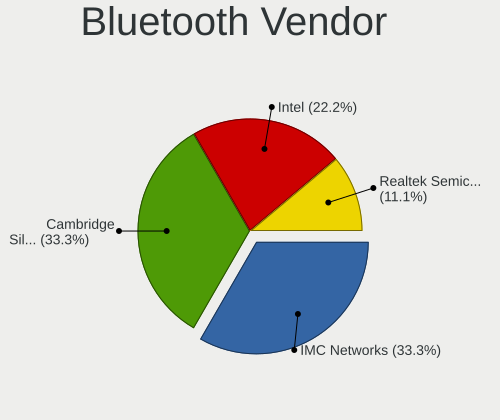

| Vendor                  | Desktops | Percent |
|-------------------------|----------|---------|
| IMC Networks            | 3        | 33.33%  |
| Cambridge Silicon Radio | 3        | 33.33%  |
| Intel                   | 2        | 22.22%  |
| Realtek Semiconductor   | 1        | 11.11%  |

Bluetooth Model
---------------

Controller models

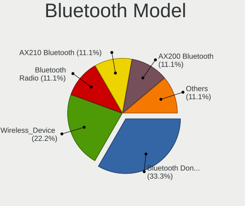

| Model                                               | Desktops | Percent |
|-----------------------------------------------------|----------|---------|
| Cambridge Silicon Radio Bluetooth Dongle (HCI mode) | 3        | 33.33%  |
| IMC Networks Wireless_Device                        | 2        | 22.22%  |
| Realtek Bluetooth Radio                             | 1        | 11.11%  |
| Intel AX210 Bluetooth                               | 1        | 11.11%  |
| Intel AX200 Bluetooth                               | 1        | 11.11%  |
| IMC Networks Bluetooth Module                       | 1        | 11.11%  |

Sound
-----

Sound Vendor
------------

Sound card vendors

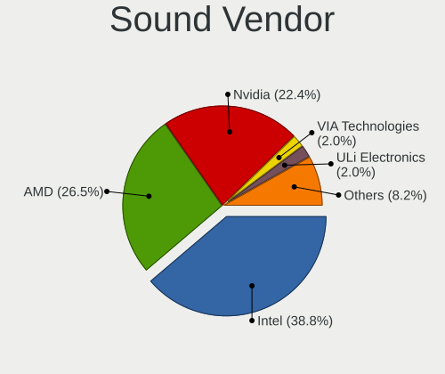

| Vendor                           | Desktops | Percent |
|----------------------------------|----------|---------|
| Intel                            | 19       | 38.78%  |
| AMD                              | 13       | 26.53%  |
| Nvidia                           | 11       | 22.45%  |
| VIA Technologies                 | 1        | 2.04%   |
| ULi Electronics                  | 1        | 2.04%   |
| Silicon Integrated Systems [SiS] | 1        | 2.04%   |
| Shenzhen Rapoo Technology        | 1        | 2.04%   |
| Logitech                         | 1        | 2.04%   |
| C-Media Electronics              | 1        | 2.04%   |

Sound Model
-----------

Sound card models

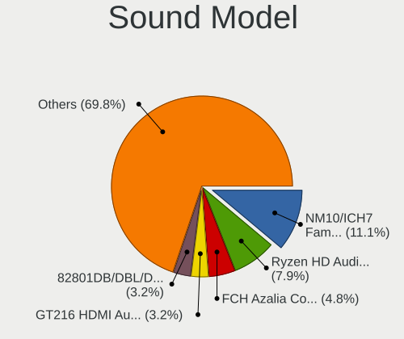

| Model                                                                      | Desktops | Percent |
|----------------------------------------------------------------------------|----------|---------|
| Intel NM10/ICH7 Family High Definition Audio Controller                    | 7        | 11.11%  |
| AMD Ryzen HD Audio Controller                                              | 5        | 7.94%   |
| AMD FCH Azalia Controller                                                  | 3        | 4.76%   |
| Nvidia GT216 HDMI Audio Controller                                         | 2        | 3.17%   |
| Intel 82801DB/DBL/DBM (ICH4/ICH4-L/ICH4-M) AC'97 Audio Controller          | 2        | 3.17%   |
| Intel 6 Series/C200 Series Chipset Family High Definition Audio Controller | 2        | 3.17%   |
| Intel 5 Series/3400 Series Chipset High Definition Audio                   | 2        | 3.17%   |
| AMD Trinity HDMI Audio Controller                                          | 2        | 3.17%   |
| AMD SBx00 Azalia (Intel HDA)                                               | 2        | 3.17%   |
| AMD Raven/Raven2/Fenghuang HDMI/DP Audio Controller                        | 2        | 3.17%   |
| AMD Navi 21/23 HDMI/DP Audio Controller                                    | 2        | 3.17%   |
| AMD Juniper HDMI Audio [Radeon HD 5700 Series]                             | 2        | 3.17%   |
| VIA Technologies VX900/VT8xxx High Definition Audio Controller             | 1        | 1.59%   |
| VIA Technologies VX900 Graphics [Chrome9 HD] HDMI Audio Device             | 1        | 1.59%   |
| ULi Electronics HD Audio Controller                                        | 1        | 1.59%   |
| Silicon Integrated Systems [SiS] SiS7012 AC'97 Sound Controller            | 1        | 1.59%   |
| Shenzhen Rapoo Technology Wireless Audio                                   | 1        | 1.59%   |
| Nvidia MCP61 High Definition Audio                                         | 1        | 1.59%   |
| Nvidia High Definition Audio Controller                                    | 1        | 1.59%   |
| Nvidia GP107GL High Definition Audio Controller                            | 1        | 1.59%   |
| Nvidia GP104 High Definition Audio Controller                              | 1        | 1.59%   |
| Nvidia GM206 High Definition Audio Controller                              | 1        | 1.59%   |
| Nvidia GK208 HDMI/DP Audio Controller                                      | 1        | 1.59%   |
| Nvidia GK107 HDMI Audio Controller                                         | 1        | 1.59%   |
| Nvidia GK106 HDMI Audio Controller                                         | 1        | 1.59%   |
| Nvidia AD103 High Definition Audio Controller                              | 1        | 1.59%   |
| Logitech Logitech G PRO X Gaming Headset                                   | 1        | 1.59%   |
| Intel Xeon E3-1200 v3/4th Gen Core Processor HD Audio Controller           | 1        | 1.59%   |
| Intel US15W/US15X/US15L/UL11L SCH [Poulsbo] HD Audio Controller            | 1        | 1.59%   |
| Intel Celeron N3350/Pentium N4200/Atom E3900 Series Audio Cluster          | 1        | 1.59%   |
| Intel Alder Lake-S HD Audio Controller                                     | 1        | 1.59%   |
| Intel 82801I (ICH9 Family) HD Audio Controller                             | 1        | 1.59%   |
| Intel 8 Series/C220 Series Chipset High Definition Audio Controller        | 1        | 1.59%   |
| Intel 7 Series/C216 Chipset Family High Definition Audio Controller        | 1        | 1.59%   |
| C-Media Electronics CMI8738/CMI8768 PCI Audio                              | 1        | 1.59%   |
| AMD Starship/Matisse HD Audio Controller                                   | 1        | 1.59%   |
| AMD Renoir/Cezanne HDMI/DP Audio Controller                                | 1        | 1.59%   |
| AMD Radeon High Definition Audio Controller                                | 1        | 1.59%   |
| AMD Oland/Hainan/Cape Verde/Pitcairn HDMI Audio [Radeon HD 7000 Series]    | 1        | 1.59%   |
| AMD Kabini HDMI/DP Audio                                                   | 1        | 1.59%   |

Memory
------

Memory Vendor
-------------

Memory module vendors

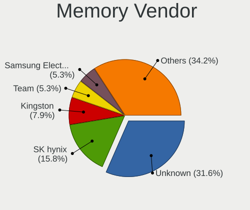

| Vendor              | Desktops | Percent |
|---------------------|----------|---------|
| Unknown             | 12       | 31.58%  |
| SK hynix            | 6        | 15.79%  |
| Kingston            | 3        | 7.89%   |
| Team                | 2        | 5.26%   |
| Samsung Electronics | 2        | 5.26%   |
| Crucial             | 2        | 5.26%   |
| Unknown             | 2        | 5.26%   |
| Transcend           | 1        | 2.63%   |
| Teikon              | 1        | 2.63%   |
| S                   | 1        | 2.63%   |
| Ramaxel Technology  | 1        | 2.63%   |
| Micron Technology   | 1        | 2.63%   |
| M                   | 1        | 2.63%   |
| G.Skill             | 1        | 2.63%   |
| Corsair             | 1        | 2.63%   |
| A-DATA Technology   | 1        | 2.63%   |

Memory Model
------------

Memory module models

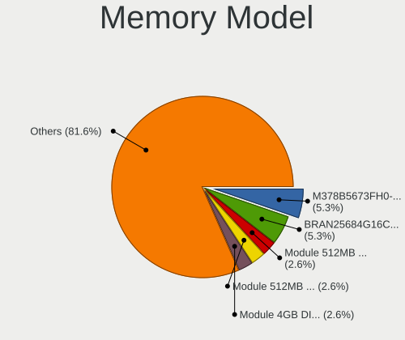

| Model                                                    | Desktops | Percent |
|----------------------------------------------------------|----------|---------|
| Samsung RAM M378B5673FH0-CH9 2GB DIMM DDR3 1600MT/s      | 2        | 5.26%   |
| Unknown                                                  | 2        | 5.26%   |
| Unknown RAM Module 512MB DIMM 400MT/s                    | 1        | 2.63%   |
| Unknown RAM Module 512MB DIMM                            | 1        | 2.63%   |
| Unknown RAM Module 4GB DIMM 1333MT/s                     | 1        | 2.63%   |
| Unknown RAM Module 2GB SODIMM DDR2                       | 1        | 2.63%   |
| Unknown RAM Module 2GB DIMM SDRAM 800MT/s                | 1        | 2.63%   |
| Unknown RAM Module 2GB DIMM SDRAM                        | 1        | 2.63%   |
| Unknown RAM Module 2GB DIMM 800MT/s                      | 1        | 2.63%   |
| Unknown RAM Module 2048MB DIMM SDRAM 1066MT/s            | 1        | 2.63%   |
| Unknown RAM Module 2048MB DIMM SDRAM                     | 1        | 2.63%   |
| Unknown RAM Module 1GB DIMM DDR2 667MT/s                 | 1        | 2.63%   |
| Unknown RAM Module 1GB DIMM DDR2 533MT/s                 | 1        | 2.63%   |
| Unknown RAM Module 1GB DIMM                              | 1        | 2.63%   |
| Transcend RAM Module 1GB DIMM SDRAM 266MT/s              | 1        | 2.63%   |
| Teikon RAM TMT41GU6AFR8C-PBHJ 8GB DIMM DDR3 1333MT/s     | 1        | 2.63%   |
| Team RAM UD5-6000 16GB DIMM DDR5 6000MT/s                | 1        | 2.63%   |
| Team RAM TEAMGROUP-UD4-3600 16GB DIMM DDR4 3600MT/s      | 1        | 2.63%   |
| SK hynix RAM Module 2GB DIMM DDR3 1066MT/s               | 1        | 2.63%   |
| SK hynix RAM HMT451U6BFR8A 4GB DIMM DDR3 1600MT/s        | 1        | 2.63%   |
| SK hynix RAM HMT41GU6MFR8C-PB 8GB DIMM DDR3 1600MT/s     | 1        | 2.63%   |
| SK hynix RAM HMT351U6CFR8C-H9 4GB DIMM 1600MT/s          | 1        | 2.63%   |
| SK hynix RAM HMT325S6CFR8C-H9 2GB SODIMM DDR3 1334MT/s   | 1        | 2.63%   |
| SK hynix RAM HMT125S6BFR8C-G7 2GB SODIMM 1067MT/s        | 1        | 2.63%   |
| S RAM Module 2GB DIMM DDR3 1333MT/s                      | 1        | 2.63%   |
| Ramaxel RAM RMR1810EC58E8F1333 2GB DIMM DDR3 1333MT/s    | 1        | 2.63%   |
| Micron RAM MT62F1536M64D8CL-026 6GB DIMM LPDDR5 6000MT/s | 1        | 2.63%   |
| M RAM Module 1GB DIMM DDR3 1333MT/s                      | 1        | 2.63%   |
| Kingston RAM KHX1600C10D3/8G 8GB DIMM DDR3 2133MT/s      | 1        | 2.63%   |
| Kingston RAM CBD26D4S9S8K1C-8 8GB SODIMM DDR4 2667MT/s   | 1        | 2.63%   |
| Kingston RAM 99U5428-018.A00LF 8GB SODIMM DDR3 1600MT/s  | 1        | 2.63%   |
| G.Skill RAM F4-3200C16-16GVK 16GB DIMM DDR4 3600MT/s     | 1        | 2.63%   |
| Crucial RAM CT16G4DFD8266.C16FD1 16GB DIMM DDR4 2667MT/s | 1        | 2.63%   |
| Crucial RAM BLS8G3D1609DS1S00. 8GB DIMM DDR3 1800MT/s    | 1        | 2.63%   |
| Corsair RAM CMW32GX4M2E3200C16 16GB DIMM DDR4 3200MT/s   | 1        | 2.63%   |
| A-DATA RAM Module 4GB DIMM DDR4 2666MT/s                 | 1        | 2.63%   |

Memory Kind
-----------

Memory module kinds

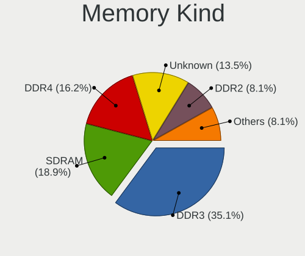

| Kind    | Desktops | Percent |
|---------|----------|---------|
| DDR3    | 13       | 35.14%  |
| SDRAM   | 7        | 18.92%  |
| DDR4    | 6        | 16.22%  |
| Unknown | 5        | 13.51%  |
| DDR2    | 3        | 8.11%   |
| LPDDR5  | 1        | 2.7%    |
| DDR5    | 1        | 2.7%    |
| DDR     | 1        | 2.7%    |

Memory Form Factor
------------------

Physical design of the memory module

| Name   | Desktops | Percent |
|--------|----------|---------|
| DIMM   | 30       | 83.33%  |
| SODIMM | 6        | 16.67%  |

Memory Size
-----------

Memory module size

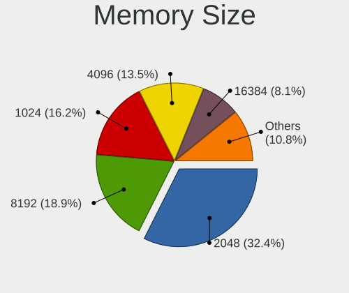

| Size  | Desktops | Percent |
|-------|----------|---------|
| 2048  | 12       | 32.43%  |
| 8192  | 7        | 18.92%  |
| 1024  | 6        | 16.22%  |
| 4096  | 5        | 13.51%  |
| 16384 | 3        | 8.11%   |
| 32768 | 2        | 5.41%   |
| 512   | 2        | 5.41%   |

Memory Speed
------------

Memory module speed

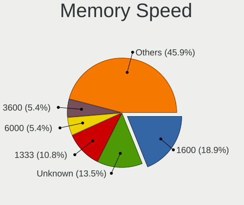

| Speed   | Desktops | Percent |
|---------|----------|---------|
| 1600    | 7        | 18.92%  |
| Unknown | 5        | 13.51%  |
| 1333    | 4        | 10.81%  |
| 6000    | 2        | 5.41%   |
| 3600    | 2        | 5.41%   |
| 2667    | 2        | 5.41%   |
| 1066    | 2        | 5.41%   |
| 800     | 2        | 5.41%   |
| 266     | 2        | 5.41%   |
| 3200    | 1        | 2.7%    |
| 2666    | 1        | 2.7%    |
| 2133    | 1        | 2.7%    |
| 1800    | 1        | 2.7%    |
| 1334    | 1        | 2.7%    |
| 1067    | 1        | 2.7%    |
| 667     | 1        | 2.7%    |
| 533     | 1        | 2.7%    |
| 400     | 1        | 2.7%    |

Printers & scanners
-------------------

Printer Vendor
--------------

Printer device vendors

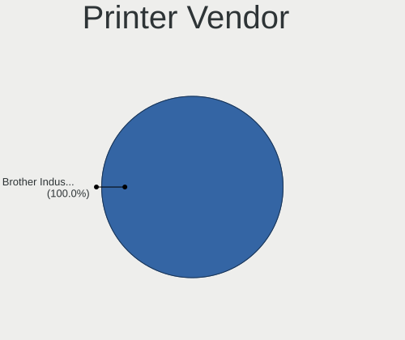

| Vendor             | Desktops | Percent |
|--------------------|----------|---------|
| Canon              | 1        | 50%     |
| Brother Industries | 1        | 50%     |

Printer Model
-------------

Printer device models

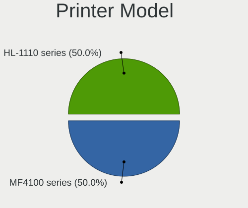

| Model                  | Desktops | Percent |
|------------------------|----------|---------|
| Canon MF4100 series    | 1        | 50%     |
| Brother HL-1110 series | 1        | 50%     |

Scanner Vendor
--------------

Scanner device vendors

Zero info for selected period =(

Scanner Model
-------------

Scanner device models

Zero info for selected period =(

Camera
------

Camera Vendor
-------------

Camera device vendors

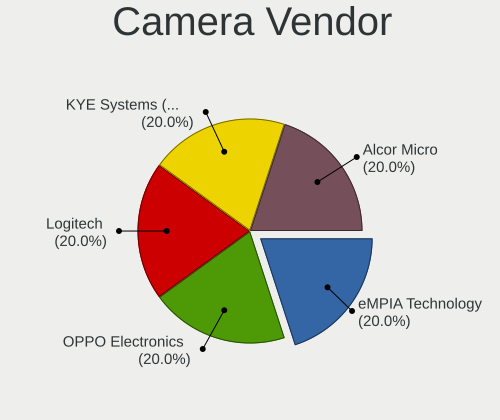

| Vendor                      | Desktops | Percent |
|-----------------------------|----------|---------|
| OPPO Electronics            | 1        | 20%     |
| Logitech                    | 1        | 20%     |
| KYE Systems (Mouse Systems) | 1        | 20%     |
| eMPIA Technology            | 1        | 20%     |
| Alcor Micro                 | 1        | 20%     |

Camera Model
------------

Camera device models

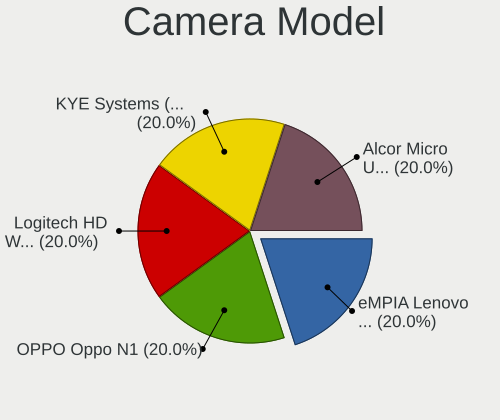

| Model                                          | Desktops | Percent |
|------------------------------------------------|----------|---------|
| OPPO Oppo N1                                   | 1        | 20%     |
| Logitech HD Webcam C525                        | 1        | 20%     |
| KYE Systems (Mouse Systems) ASUS USB2.0 Webcam | 1        | 20%     |
| eMPIA Lenovo EasyCamera                        | 1        | 20%     |
| Alcor Micro USB 2.0 PC Camera                  | 1        | 20%     |

Security
--------

Fingerprint Vendor
------------------

Fingerprint sensor vendors

Zero info for selected period =(

Fingerprint Model
-----------------

Fingerprint sensor models

Zero info for selected period =(

Chipcard Vendor
---------------

Chipcard module vendors

Zero info for selected period =(

Chipcard Model
--------------

Chipcard module models

Zero info for selected period =(

Unsupported
-----------

Unsupported Devices
-------------------

Total unsupported devices on board

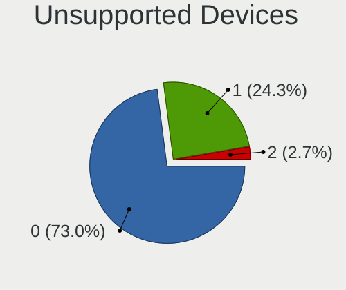

| Total | Desktops | Percent |
|-------|----------|---------|
| 0     | 27       | 72.97%  |
| 1     | 9        | 24.32%  |
| 2     | 1        | 2.7%    |

Unsupported Device Types
------------------------

Types of unsupported devices

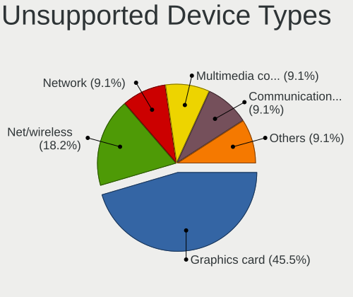

| Type                     | Desktops | Percent |
|--------------------------|----------|---------|
| Graphics card            | 5        | 45.45%  |
| Net/wireless             | 2        | 18.18%  |
| Network                  | 1        | 9.09%   |
| Multimedia controller    | 1        | 9.09%   |
| Communication controller | 1        | 9.09%   |
| Camera                   | 1        | 9.09%   |

