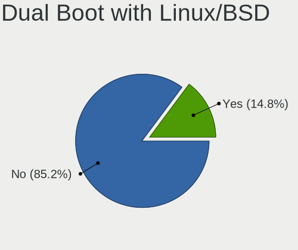
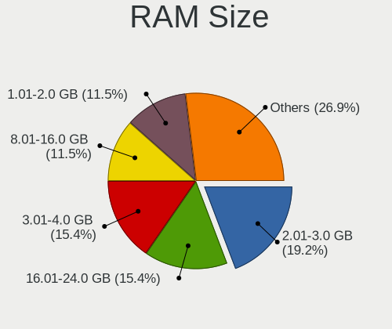
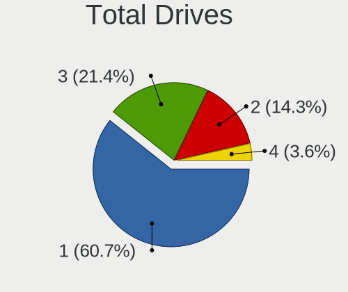
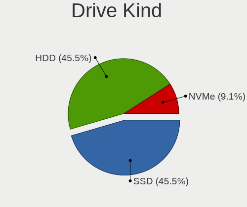
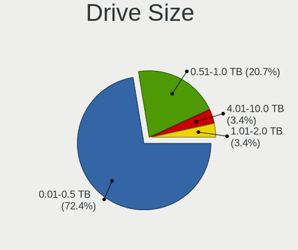
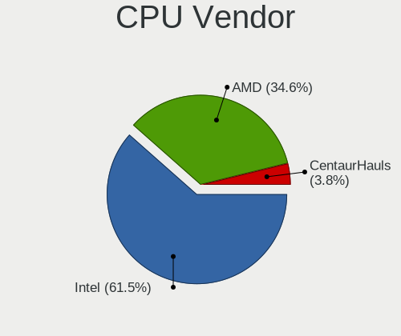
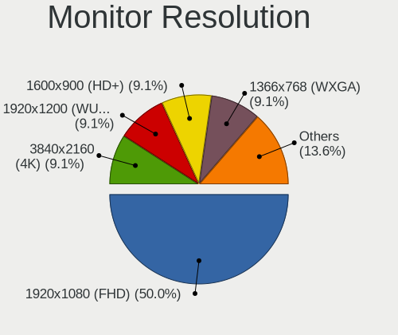
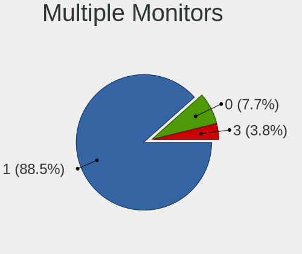
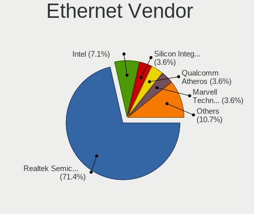
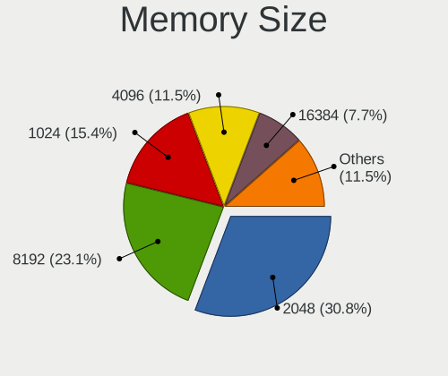

Q4OS - Tested Hardware & Statistics (Desktops)
----------------------------------------------

A project to collect tested hardware configurations for Q4OS.

Anyone can contribute to this report by the [hw-probe](https://github.com/linuxhw/hw-probe) tool:

    sudo -E hw-probe -all -upload

Please contribute! Especially if your hardware is rare.

Contents
--------

* [ Test Cases ](#test-cases)

* [ System ](#system)
  - [ OS                       ](#os)
  - [ OS Family                ](#os-family)
  - [ Kernel                   ](#kernel)
  - [ Kernel Family            ](#kernel-family)
  - [ Kernel Major Ver.        ](#kernel-major-ver)
  - [ Arch                     ](#arch)
  - [ DE                       ](#de)
  - [ Display Server           ](#display-server)
  - [ Display Manager          ](#display-manager)
  - [ OS Lang                  ](#os-lang)
  - [ Boot Mode                ](#boot-mode)
  - [ Filesystem               ](#filesystem)
  - [ Part. scheme             ](#part-scheme)
  - [ Dual Boot with Linux/BSD ](#dual-boot-with-linuxbsd)
  - [ Dual Boot (Win)          ](#dual-boot-win)

* [ Board ](#board)
  - [ Vendor                   ](#vendor)
  - [ Model                    ](#model)
  - [ Model Family             ](#model-family)
  - [ MFG Year                 ](#mfg-year)
  - [ Form Factor              ](#form-factor)
  - [ Secure Boot              ](#secure-boot)
  - [ Coreboot                 ](#coreboot)
  - [ RAM Size                 ](#ram-size)
  - [ RAM Used                 ](#ram-used)
  - [ Total Drives             ](#total-drives)
  - [ Has CD-ROM               ](#has-cd-rom)
  - [ Has Ethernet             ](#has-ethernet)
  - [ Has WiFi                 ](#has-wifi)
  - [ Has Bluetooth            ](#has-bluetooth)

* [ Location ](#location)
  - [ Country                  ](#country)
  - [ City                     ](#city)

* [ Drives ](#drives)
  - [ Drive Vendor             ](#drive-vendor)
  - [ Drive Model              ](#drive-model)
  - [ HDD Vendor               ](#hdd-vendor)
  - [ SSD Vendor               ](#ssd-vendor)
  - [ Drive Kind               ](#drive-kind)
  - [ Drive Connector          ](#drive-connector)
  - [ Drive Size               ](#drive-size)
  - [ Space Total              ](#space-total)
  - [ Space Used               ](#space-used)
  - [ Malfunc. Drives          ](#malfunc-drives)
  - [ Malfunc. Drive Vendor    ](#malfunc-drive-vendor)
  - [ Malfunc. HDD Vendor      ](#malfunc-hdd-vendor)
  - [ Malfunc. Drive Kind      ](#malfunc-drive-kind)
  - [ Failed Drives            ](#failed-drives)
  - [ Failed Drive Vendor      ](#failed-drive-vendor)
  - [ Drive Status             ](#drive-status)

* [ Storage controller ](#storage-controller)
  - [ Storage Vendor           ](#storage-vendor)
  - [ Storage Model            ](#storage-model)
  - [ Storage Kind             ](#storage-kind)

* [ Processor ](#processor)
  - [ CPU Vendor               ](#cpu-vendor)
  - [ CPU Model                ](#cpu-model)
  - [ CPU Model Family         ](#cpu-model-family)
  - [ CPU Cores                ](#cpu-cores)
  - [ CPU Sockets              ](#cpu-sockets)
  - [ CPU Threads              ](#cpu-threads)
  - [ CPU Op-Modes             ](#cpu-op-modes)
  - [ CPU Microcode            ](#cpu-microcode)
  - [ CPU Microarch            ](#cpu-microarch)

* [ Graphics ](#graphics)
  - [ GPU Vendor               ](#gpu-vendor)
  - [ GPU Model                ](#gpu-model)
  - [ GPU Combo                ](#gpu-combo)
  - [ GPU Driver               ](#gpu-driver)
  - [ GPU Memory               ](#gpu-memory)

* [ Monitor ](#monitor)
  - [ Monitor Vendor           ](#monitor-vendor)
  - [ Monitor Model            ](#monitor-model)
  - [ Monitor Resolution       ](#monitor-resolution)
  - [ Monitor Diagonal         ](#monitor-diagonal)
  - [ Monitor Width            ](#monitor-width)
  - [ Aspect Ratio             ](#aspect-ratio)
  - [ Monitor Area             ](#monitor-area)
  - [ Pixel Density            ](#pixel-density)
  - [ Multiple Monitors        ](#multiple-monitors)

* [ Network ](#network)
  - [ Net Controller Vendor    ](#net-controller-vendor)
  - [ Net Controller Model     ](#net-controller-model)
  - [ Wireless Vendor          ](#wireless-vendor)
  - [ Wireless Model           ](#wireless-model)
  - [ Ethernet Vendor          ](#ethernet-vendor)
  - [ Ethernet Model           ](#ethernet-model)
  - [ Net Controller Kind      ](#net-controller-kind)
  - [ Used Controller          ](#used-controller)
  - [ NICs                     ](#nics)
  - [ IPv6                     ](#ipv6)

* [ Bluetooth ](#bluetooth)
  - [ Bluetooth Vendor         ](#bluetooth-vendor)
  - [ Bluetooth Model          ](#bluetooth-model)

* [ Sound ](#sound)
  - [ Sound Vendor             ](#sound-vendor)
  - [ Sound Model              ](#sound-model)

* [ Memory ](#memory)
  - [ Memory Vendor            ](#memory-vendor)
  - [ Memory Model             ](#memory-model)
  - [ Memory Kind              ](#memory-kind)
  - [ Memory Form Factor       ](#memory-form-factor)
  - [ Memory Size              ](#memory-size)
  - [ Memory Speed             ](#memory-speed)

* [ Printers & scanners ](#printers--scanners)
  - [ Printer Vendor           ](#printer-vendor)
  - [ Printer Model            ](#printer-model)
  - [ Scanner Vendor           ](#scanner-vendor)
  - [ Scanner Model            ](#scanner-model)

* [ Camera ](#camera)
  - [ Camera Vendor            ](#camera-vendor)
  - [ Camera Model             ](#camera-model)

* [ Security ](#security)
  - [ Fingerprint Vendor       ](#fingerprint-vendor)
  - [ Fingerprint Model        ](#fingerprint-model)
  - [ Chipcard Vendor          ](#chipcard-vendor)
  - [ Chipcard Model           ](#chipcard-model)

* [ Unsupported ](#unsupported)
  - [ Unsupported Devices      ](#unsupported-devices)
  - [ Unsupported Device Types ](#unsupported-device-types)

Test Cases
----------

Total: 22

| Vendor        | Model                | Probe                                                      | Date         |
|---------------|----------------------|------------------------------------------------------------|--------------|
| Gigabyte      | Z690 GAMING X DDR4   | [5a968533da](https://linux-hardware.org/?probe=5a968533da) | Jul 28, 2023 |
| Intel         | D845GRG AAA84341-206 | [1863434dc7](https://linux-hardware.org/?probe=1863434dc7) | Jul 01, 2023 |
| Intel         | D845GRG AAA84341-206 | [7734dda00e](https://linux-hardware.org/?probe=7734dda00e) | Jun 30, 2023 |
| ASUSTek       | ET1602               | [637fb8c9ce](https://linux-hardware.org/?probe=637fb8c9ce) | Apr 22, 2023 |
| HP            | 1850                 | [162ec03859](https://linux-hardware.org/?probe=162ec03859) | Apr 02, 2023 |
| HP            | 1850                 | [ccad003ff4](https://linux-hardware.org/?probe=ccad003ff4) | Jan 20, 2023 |
| VXL           | M6V90AI-VL           | [1ad8dbaae1](https://linux-hardware.org/?probe=1ad8dbaae1) | Jan 08, 2023 |
| MSI           | G41M4                | [b651925b13](https://linux-hardware.org/?probe=b651925b13) | Dec 21, 2022 |
| ASRock        | J3455B-ITX           | [2a85d4fa3a](https://linux-hardware.org/?probe=2a85d4fa3a) | Nov 15, 2022 |
| ASRock        | B450M Pro4           | [97e52df467](https://linux-hardware.org/?probe=97e52df467) | Nov 05, 2022 |
| BESSTAR Te... | UM250 V1.0           | [67369107e1](https://linux-hardware.org/?probe=67369107e1) | Nov 05, 2022 |
| ASRock        | J3455B-ITX           | [deda12dd1f](https://linux-hardware.org/?probe=deda12dd1f) | Nov 05, 2022 |
| Gigabyte      | AB350-Gaming-CF      | [54d2ded2b2](https://linux-hardware.org/?probe=54d2ded2b2) | Oct 17, 2022 |
| Foxconn       | 2ABF                 | [153aed4d7c](https://linux-hardware.org/?probe=153aed4d7c) | Sep 19, 2022 |
| ASRock        | H61M-HVS             | [a9ee15a4d2](https://linux-hardware.org/?probe=a9ee15a4d2) | May 13, 2022 |
| Compaq        | 07E4h                | [535804dbc6](https://linux-hardware.org/?probe=535804dbc6) | Jan 05, 2022 |
| Gigabyte      | XP-M5S661GX          | [c452e6bdf7](https://linux-hardware.org/?probe=c452e6bdf7) | Nov 27, 2021 |
| TECO Elect... | TR53A0               | [4ab721c7f7](https://linux-hardware.org/?probe=4ab721c7f7) | Aug 19, 2021 |
| MSI           | B550-A PRO           | [546cf15192](https://linux-hardware.org/?probe=546cf15192) | Jun 16, 2021 |
| MSI           | GF615M-P33 V2        | [6f22f99f9f](https://linux-hardware.org/?probe=6f22f99f9f) | May 14, 2021 |
| ASRock        | G41M-VS3             | [75cb33cf5e](https://linux-hardware.org/?probe=75cb33cf5e) | Feb 25, 2021 |
| ASRock        | G41M-VS3             | [6a77858cd4](https://linux-hardware.org/?probe=6a77858cd4) | Feb 25, 2021 |

System
------

OS
--

Installed operating systems

| Name   | Desktops | Percent |
|--------|----------|---------|
| Q4OS 4 | 12       | 66.67%  |
| Q4OS 3 | 5        | 27.78%  |
| Q4OS 5 | 1        | 5.56%   |

OS Family
---------

OS without a version

| Name | Desktops | Percent |
|------|----------|---------|
| Q4OS | 18       | 100%    |

Kernel
------

Version of the Linux kernel

| Version           | Desktops | Percent |
|-------------------|----------|---------|
| 5.10.0-19-amd64   | 4        | 21.05%  |
| 6.1.0-10-amd64    | 1        | 5.26%   |
| 6.0.0-1-amd64     | 1        | 5.26%   |
| 5.10.0-9-686-pae  | 1        | 5.26%   |
| 5.10.0-23-686-pae | 1        | 5.26%   |
| 5.10.0-21-amd64   | 1        | 5.26%   |
| 5.10.0-21-686-pae | 1        | 5.26%   |
| 5.10.0-20-amd64   | 1        | 5.26%   |
| 5.10.0-20-686-pae | 1        | 5.26%   |
| 5.10.0-14-amd64   | 1        | 5.26%   |
| 5.10.0-10-686-pae | 1        | 5.26%   |
| 4.19.0-6-amd64    | 1        | 5.26%   |
| 4.19.0-21-amd64   | 1        | 5.26%   |
| 4.19.0-17-686-pae | 1        | 5.26%   |
| 4.19.0-16-amd64   | 1        | 5.26%   |
| 4.19.0-16-686     | 1        | 5.26%   |

Kernel Family
-------------

Linux kernel without a distro release

| Version | Desktops | Percent |
|---------|----------|---------|
| 5.10.0  | 11       | 61.11%  |
| 4.19.0  | 5        | 27.78%  |
| 6.1.0   | 1        | 5.56%   |
| 6.0.0   | 1        | 5.56%   |

Kernel Major Ver.
-----------------

Linux kernel major version

| Version | Desktops | Percent |
|---------|----------|---------|
| 5.10    | 11       | 61.11%  |
| 4.19    | 5        | 27.78%  |
| 6.1     | 1        | 5.56%   |
| 6.0     | 1        | 5.56%   |

Arch
----

OS architecture (x86_64, i586, etc.)

| Name   | Desktops | Percent |
|--------|----------|---------|
| x86_64 | 11       | 61.11%  |
| i686   | 7        | 38.89%  |

DE
--

Desktop Environment

| Name    | Desktops | Percent |
|---------|----------|---------|
| Trinity | 13       | 68.42%  |
| KDE5    | 4        | 21.05%  |
| LXDE    | 1        | 5.26%   |
| Budgie  | 1        | 5.26%   |

Display Server
--------------

X11 or Wayland

| Name | Desktops | Percent |
|------|----------|---------|
| X11  | 18       | 100%    |

Display Manager
---------------

SDDM, LightDM, etc.

| Name    | Desktops | Percent |
|---------|----------|---------|
| TDM     | 13       | 72.22%  |
| SDDM    | 4        | 22.22%  |
| LightDM | 1        | 5.56%   |

OS Lang
-------

Language

| Lang  | Desktops | Percent |
|-------|----------|---------|
| it_IT | 4        | 22.22%  |
| en_US | 2        | 11.11%  |
| de_DE | 2        | 11.11%  |
| sk_SK | 1        | 5.56%   |
| pt_BR | 1        | 5.56%   |
| hu_HU | 1        | 5.56%   |
| fr_FR | 1        | 5.56%   |
| es_PE | 1        | 5.56%   |
| es_ES | 1        | 5.56%   |
| es_AR | 1        | 5.56%   |
| en_ZA | 1        | 5.56%   |
| en_IE | 1        | 5.56%   |
| bg_BG | 1        | 5.56%   |

Boot Mode
---------

EFI or BIOS

| Mode | Desktops | Percent |
|------|----------|---------|
| BIOS | 13       | 72.22%  |
| EFI  | 5        | 27.78%  |

Filesystem
----------

Type of filesystem

| Type | Desktops | Percent |
|------|----------|---------|
| Ext4 | 18       | 100%    |

Part. scheme
------------

Scheme of partitioning

| Type | Desktops | Percent |
|------|----------|---------|
| MBR  | 9        | 50%     |
| GPT  | 9        | 50%     |

Dual Boot with Linux/BSD
------------------------

Hosting more than one Linux/BSD

| Dual boot | Desktops | Percent |
|-----------|----------|---------|
| No        | 17       | 94.44%  |
| Yes       | 1        | 5.56%   |

Dual Boot (Win)
---------------

Hosting Linux and Windows

| Dual boot | Desktops | Percent |
|-----------|----------|---------|
| No        | 11       | 61.11%  |
| Yes       | 7        | 38.89%  |

Board
-----

Vendor
------

Motherboard manufacturer

| Name                        | Desktops | Percent |
|-----------------------------|----------|---------|
| ASRock                      | 4        | 22.22%  |
| MSI                         | 3        | 16.67%  |
| Gigabyte Technology         | 3        | 16.67%  |
| VXL                         | 1        | 5.56%   |
| TECO Electric and Machinery | 1        | 5.56%   |
| Intel                       | 1        | 5.56%   |
| Hewlett-Packard             | 1        | 5.56%   |
| Foxconn                     | 1        | 5.56%   |
| Compaq                      | 1        | 5.56%   |
| BESSTAR Tech                | 1        | 5.56%   |
| ASUSTek Computer            | 1        | 5.56%   |

Model
-----

Motherboard model

| Name                                   | Desktops | Percent |
|----------------------------------------|----------|---------|
| VXL TC7500D Series                     | 1        | 5.56%   |
| TECO Electric and Machinery FUTRO S400 | 1        | 5.56%   |
| MSI MS-7C56                            | 1        | 5.56%   |
| MSI MS-7597                            | 1        | 5.56%   |
| MSI MS-7592                            | 1        | 5.56%   |
| Intel D845GRG AAA84341-206             | 1        | 5.56%   |
| HP Compaq Pro 6305 SFF                 | 1        | 5.56%   |
| Gigabyte Z690 GAMING X DDR4            | 1        | 5.56%   |
| Gigabyte XP-M5S661GX                   | 1        | 5.56%   |
| Gigabyte AB350-Gaming                  | 1        | 5.56%   |
| Foxconn Pro 3400 Series MT             | 1        | 5.56%   |
| Compaq Evo D510 SFF                    | 1        | 5.56%   |
| BESSTAR Tech UM250                     | 1        | 5.56%   |
| ASUS ET1602                            | 1        | 5.56%   |
| ASRock J3455B-ITX                      | 1        | 5.56%   |
| ASRock H61M-HVS                        | 1        | 5.56%   |
| ASRock G41M-VS3                        | 1        | 5.56%   |
| ASRock B450M Pro4                      | 1        | 5.56%   |

Model Family
------------

Motherboard model prefix

| Name                              | Desktops | Percent |
|-----------------------------------|----------|---------|
| VXL TC7500D                       | 1        | 5.56%   |
| TECO Electric and Machinery FUTRO | 1        | 5.56%   |
| MSI MS-7C56                       | 1        | 5.56%   |
| MSI MS-7597                       | 1        | 5.56%   |
| MSI MS-7592                       | 1        | 5.56%   |
| Intel D845GRG                     | 1        | 5.56%   |
| HP Compaq                         | 1        | 5.56%   |
| Gigabyte Z690                     | 1        | 5.56%   |
| Gigabyte XP-M5S661GX              | 1        | 5.56%   |
| Gigabyte AB350-Gaming             | 1        | 5.56%   |
| Foxconn Pro                       | 1        | 5.56%   |
| Compaq Evo                        | 1        | 5.56%   |
| BESSTAR Tech UM250                | 1        | 5.56%   |
| ASUS ET1602                       | 1        | 5.56%   |
| ASRock J3455B-ITX                 | 1        | 5.56%   |
| ASRock H61M-HVS                   | 1        | 5.56%   |
| ASRock G41M-VS3                   | 1        | 5.56%   |
| ASRock B450M                      | 1        | 5.56%   |

MFG Year
--------

Motherboard manufacture year

| Year | Desktops | Percent |
|------|----------|---------|
| 2011 | 3        | 16.67%  |
| 2012 | 2        | 11.11%  |
| 2009 | 2        | 11.11%  |
| 2002 | 2        | 11.11%  |
| 2021 | 1        | 5.56%   |
| 2020 | 1        | 5.56%   |
| 2018 | 1        | 5.56%   |
| 2017 | 1        | 5.56%   |
| 2016 | 1        | 5.56%   |
| 2013 | 1        | 5.56%   |
| 2010 | 1        | 5.56%   |
| 2008 | 1        | 5.56%   |
| 2005 | 1        | 5.56%   |

Form Factor
-----------

Physical design of the computer

| Name    | Desktops | Percent |
|---------|----------|---------|
| Desktop | 18       | 100%    |

Secure Boot
-----------

Enabled or disabled

| State    | Desktops | Percent |
|----------|----------|---------|
| Disabled | 18       | 100%    |

Coreboot
--------

Have coreboot on board

| Used | Desktops | Percent |
|------|----------|---------|
| No   | 18       | 100%    |

RAM Size
--------

Total RAM memory

| Size in GB  | Desktops | Percent |
|-------------|----------|---------|
| 2.01-3.0    | 4        | 22.22%  |
| 3.01-4.0    | 3        | 16.67%  |
| 64.01-256.0 | 2        | 11.11%  |
| 16.01-24.0  | 2        | 11.11%  |
| 1.01-2.0    | 2        | 11.11%  |
| 4.01-8.0    | 1        | 5.56%   |
| 32.01-64.0  | 1        | 5.56%   |
| 8.01-16.0   | 1        | 5.56%   |
| 0.51-1.0    | 1        | 5.56%   |
| 0.01-0.5    | 1        | 5.56%   |

RAM Used
--------

Used RAM memory

| Used GB   | Desktops | Percent |
|-----------|----------|---------|
| 0.51-1.0  | 7        | 35%     |
| 2.01-3.0  | 5        | 25%     |
| 1.01-2.0  | 3        | 15%     |
| 4.01-8.0  | 2        | 10%     |
| 3.01-4.0  | 1        | 5%      |
| 8.01-16.0 | 1        | 5%      |
| 0.01-0.5  | 1        | 5%      |

Total Drives
------------

Number of drives on board

| Drives | Desktops | Percent |
|--------|----------|---------|
| 1      | 12       | 63.16%  |
| 3      | 4        | 21.05%  |
| 2      | 3        | 15.79%  |

Has CD-ROM
----------

Has CD-ROM on board

| Presented | Desktops | Percent |
|-----------|----------|---------|
| No        | 11       | 57.89%  |
| Yes       | 8        | 42.11%  |

Has Ethernet
------------

Has Ethernet on board

| Presented | Desktops | Percent |
|-----------|----------|---------|
| Yes       | 18       | 100%    |

Has WiFi
--------

Has WiFi module

| Presented | Desktops | Percent |
|-----------|----------|---------|
| No        | 11       | 61.11%  |
| Yes       | 7        | 38.89%  |

Has Bluetooth
-------------

Has Bluetooth module

| Presented | Desktops | Percent |
|-----------|----------|---------|
| No        | 15       | 83.33%  |
| Yes       | 3        | 16.67%  |

Location
--------

Country
-------

Geographic location (country)

| Country      | Desktops | Percent |
|--------------|----------|---------|
| Italy        | 4        | 22.22%  |
| Germany      | 2        | 11.11%  |
| Venezuela    | 1        | 5.56%   |
| USA          | 1        | 5.56%   |
| South Africa | 1        | 5.56%   |
| Slovakia     | 1        | 5.56%   |
| Peru         | 1        | 5.56%   |
| Netherlands  | 1        | 5.56%   |
| Hungary      | 1        | 5.56%   |
| France       | 1        | 5.56%   |
| Bulgaria     | 1        | 5.56%   |
| Brazil       | 1        | 5.56%   |
| Belgium      | 1        | 5.56%   |
| Argentina    | 1        | 5.56%   |

City
----

Geographic location (city)

| City                 | Desktops | Percent |
|----------------------|----------|---------|
| Bologna              | 2        | 11.11%  |
| Toalmas              | 1        | 5.56%   |
| The Hague            | 1        | 5.56%   |
| Solingen             | 1        | 5.56%   |
| Sofia                | 1        | 5.56%   |
| Savona               | 1        | 5.56%   |
| San Carlos del Zulia | 1        | 5.56%   |
| Rostock              | 1        | 5.56%   |
| Rome                 | 1        | 5.56%   |
| Posadas              | 1        | 5.56%   |
| Lima                 | 1        | 5.56%   |
| Johannesburg         | 1        | 5.56%   |
| Guarulhos            | 1        | 5.56%   |
| Grand Junction       | 1        | 5.56%   |
| Brussels             | 1        | 5.56%   |
| Bratislava           | 1        | 5.56%   |
| Boulogne-sur-Mer     | 1        | 5.56%   |

Drives
------

Drive Vendor
------------

Hard drive vendors

| Vendor              | Desktops | Drives | Percent |
|---------------------|----------|--------|---------|
| WDC                 | 6        | 6      | 24%     |
| Seagate             | 6        | 8      | 24%     |
| Samsung Electronics | 3        | 4      | 12%     |
| SanDisk             | 2        | 2      | 8%      |
| Unknown (CF)        | 1        | 1      | 4%      |
| Transcend           | 1        | 1      | 4%      |
| Maxtor              | 1        | 1      | 4%      |
| Kingston            | 1        | 1      | 4%      |
| IBM/Hitachi         | 1        | 2      | 4%      |
| Crucial             | 1        | 2      | 4%      |
| China               | 1        | 2      | 4%      |
| A-DATA Technology   | 1        | 1      | 4%      |

Drive Model
-----------

Hard drive models

| Model                             | Desktops | Percent |
|-----------------------------------|----------|---------|
| WDC WDS500G2B0B-00YS70 500GB SSD  | 1        | 3.45%   |
| WDC WDS240G2G0A-00JH30 240GB SSD  | 1        | 3.45%   |
| WDC WD400BD-23JMC0 40GB           | 1        | 3.45%   |
| WDC WD1600AAJS-75M0A0 160GB       | 1        | 3.45%   |
| WDC WD1600AAJS-00L7A0 160GB       | 1        | 3.45%   |
| WDC WD10EFRX-68JCSN0 1TB          | 1        | 3.45%   |
| Unknown (CF) Card 16GB SSD        | 1        | 3.45%   |
| Transcend TS32GHSD370 32GB SSD    | 1        | 3.45%   |
| Seagate ST8000DM004-2CX188 8TB    | 1        | 3.45%   |
| Seagate ST3500413AS 500GB         | 1        | 3.45%   |
| Seagate ST3320820SCE 320GB        | 1        | 3.45%   |
| Seagate ST3160815AS 160GB         | 1        | 3.45%   |
| Seagate ST3160812AS 160GB         | 1        | 3.45%   |
| Seagate ST310211A 10GB            | 1        | 3.45%   |
| Seagate ST1000DM003-1ER162 1TB    | 1        | 3.45%   |
| SanDisk SDSSDA120G 120GB          | 1        | 3.45%   |
| SanDisk Extreme Pro 1TB           | 1        | 3.45%   |
| Samsung SSD 980 PRO 2TB           | 1        | 3.45%   |
| Samsung SSD 860 EVO 250GB         | 1        | 3.45%   |
| Samsung SSD 850 PRO 2TB           | 1        | 3.45%   |
| Samsung HD081GJ 80GB              | 1        | 3.45%   |
| Maxtor 6Y080L0 82GB               | 1        | 3.45%   |
| Kingston OM8P0S3512F-00 512GB SSD | 1        | 3.45%   |
| IBM/Hitachi IC35L090AVV207-0 80GB | 1        | 3.45%   |
| Crucial CT500P2SSD8 500GB         | 1        | 3.45%   |
| Crucial CT120BX500SSD1 120GB      | 1        | 3.45%   |
| China SSD 256GB                   | 1        | 3.45%   |
| China SSD 120GB                   | 1        | 3.45%   |
| A-DATA SX8200PNP 512GB            | 1        | 3.45%   |

HDD Vendor
----------

Hard disk drive vendors

| Vendor              | Desktops | Drives | Percent |
|---------------------|----------|--------|---------|
| Seagate             | 6        | 8      | 46.15%  |
| WDC                 | 4        | 4      | 30.77%  |
| Samsung Electronics | 1        | 1      | 7.69%   |
| Maxtor              | 1        | 1      | 7.69%   |
| IBM/Hitachi         | 1        | 2      | 7.69%   |

SSD Vendor
----------

Solid state drive vendors

| Vendor              | Desktops | Drives | Percent |
|---------------------|----------|--------|---------|
| WDC                 | 2        | 2      | 20%     |
| Samsung Electronics | 2        | 2      | 20%     |
| Unknown (CF)        | 1        | 1      | 10%     |
| Transcend           | 1        | 1      | 10%     |
| SanDisk             | 1        | 1      | 10%     |
| Kingston            | 1        | 1      | 10%     |
| Crucial             | 1        | 1      | 10%     |
| China               | 1        | 2      | 10%     |

Drive Kind
----------

HDD or SSD

| Kind | Desktops | Drives | Percent |
|------|----------|--------|---------|
| HDD  | 10       | 16     | 45.45%  |
| SSD  | 9        | 11     | 40.91%  |
| NVMe | 3        | 4      | 13.64%  |

Drive Connector
---------------

SATA, SAS, NVMe, etc.

| Type | Desktops | Drives | Percent |
|------|----------|--------|---------|
| SATA | 17       | 27     | 85%     |
| NVMe | 3        | 4      | 15%     |

Drive Size
----------

Size of hard drive

| Size in TB | Desktops | Drives | Percent |
|------------|----------|--------|---------|
| 0.01-0.5   | 14       | 22     | 73.68%  |
| 0.51-1.0   | 3        | 3      | 15.79%  |
| 1.01-2.0   | 1        | 1      | 5.26%   |
| 4.01-10.0  | 1        | 1      | 5.26%   |

Space Total
-----------

Amount of disk space available on the file system

| Size in GB     | Desktops | Percent |
|----------------|----------|---------|
| 251-500        | 4        | 21.05%  |
| 101-250        | 3        | 15.79%  |
| 51-100         | 3        | 15.79%  |
| 21-50          | 2        | 10.53%  |
| 1001-2000      | 2        | 10.53%  |
| 1-20           | 2        | 10.53%  |
| 501-1000       | 2        | 10.53%  |
| More than 3000 | 1        | 5.26%   |

Space Used
----------

Amount of used disk space

| Used GB        | Desktops | Percent |
|----------------|----------|---------|
| 1-20           | 11       | 57.89%  |
| 21-50          | 2        | 10.53%  |
| 101-250        | 2        | 10.53%  |
| 51-100         | 2        | 10.53%  |
| More than 3000 | 1        | 5.26%   |
| 501-1000       | 1        | 5.26%   |

Malfunc. Drives
---------------

Drive models with a malfunction

| Model                             | Desktops | Drives | Percent |
|-----------------------------------|----------|--------|---------|
| WDC WDS240G2G0A-00JH30 240GB SSD  | 1        | 1      | 16.67%  |
| WDC WD400BD-23JMC0 40GB           | 1        | 1      | 16.67%  |
| WDC WD1600AAJS-75M0A0 160GB       | 1        | 1      | 16.67%  |
| Seagate ST3320820SCE 320GB        | 1        | 2      | 16.67%  |
| Maxtor 6Y080L0 82GB               | 1        | 1      | 16.67%  |
| IBM/Hitachi IC35L090AVV207-0 80GB | 1        | 2      | 16.67%  |

Malfunc. Drive Vendor
---------------------

Vendors of faulty drives

| Vendor      | Desktops | Drives | Percent |
|-------------|----------|--------|---------|
| WDC         | 3        | 3      | 50%     |
| Seagate     | 1        | 2      | 16.67%  |
| Maxtor      | 1        | 1      | 16.67%  |
| IBM/Hitachi | 1        | 2      | 16.67%  |

Malfunc. HDD Vendor
-------------------

Vendors of faulty HDD drives

| Vendor      | Desktops | Drives | Percent |
|-------------|----------|--------|---------|
| WDC         | 2        | 2      | 40%     |
| Seagate     | 1        | 2      | 20%     |
| Maxtor      | 1        | 1      | 20%     |
| IBM/Hitachi | 1        | 2      | 20%     |

Malfunc. Drive Kind
-------------------

Kinds of faulty drives

| Kind | Desktops | Drives | Percent |
|------|----------|--------|---------|
| HDD  | 4        | 7      | 80%     |
| SSD  | 1        | 1      | 20%     |

Failed Drives
-------------

Failed drive models

Zero info for selected period =(

Failed Drive Vendor
-------------------

Failed drive vendors

Zero info for selected period =(

Drive Status
------------

Number of failed and malfunc. drives

| Status  | Desktops | Drives | Percent |
|---------|----------|--------|---------|
| Works   | 14       | 23     | 73.68%  |
| Malfunc | 5        | 8      | 26.32%  |

Storage controller
------------------

Storage Vendor
--------------

Storage controller vendors

| Vendor                           | Desktops | Percent |
|----------------------------------|----------|---------|
| Intel                            | 9        | 39.13%  |
| AMD                              | 5        | 21.74%  |
| Silicon Integrated Systems [SiS] | 2        | 8.7%    |
| VIA Technologies                 | 1        | 4.35%   |
| SanDisk                          | 1        | 4.35%   |
| Samsung Electronics              | 1        | 4.35%   |
| Nvidia                           | 1        | 4.35%   |
| Micron/Crucial Technology        | 1        | 4.35%   |
| ASMedia Technology               | 1        | 4.35%   |
| ADATA Technology                 | 1        | 4.35%   |

Storage Model
-------------

Storage controller models

| Model                                                                         | Desktops | Percent |
|-------------------------------------------------------------------------------|----------|---------|
| AMD FCH SATA Controller [AHCI mode]                                           | 5        | 16.67%  |
| Silicon Integrated Systems [SiS] 5513 IDE Controller                          | 2        | 6.67%   |
| Intel NM10/ICH7 Family SATA Controller [IDE mode]                             | 2        | 6.67%   |
| Intel 82801G (ICH7 Family) IDE Controller                                     | 2        | 6.67%   |
| Intel 82801DB (ICH4) IDE Controller                                           | 2        | 6.67%   |
| Intel 6 Series/C200 Series Chipset Family 6 port Desktop SATA AHCI Controller | 2        | 6.67%   |
| VIA VX900 Series Serial-ATA Controller                                        | 1        | 3.33%   |
| Silicon Integrated Systems [SiS] RAID bus controller 180 SATA/PATA  [SiS]     | 1        | 3.33%   |
| SanDisk WD Black 2018/SN750 / PC SN720 NVMe SSD                               | 1        | 3.33%   |
| Samsung NVMe SSD Controller PM9A1/PM9A3/980PRO                                | 1        | 3.33%   |
| Nvidia MCP61 SATA Controller                                                  | 1        | 3.33%   |
| Nvidia MCP61 IDE                                                              | 1        | 3.33%   |
| Micron/Crucial P2 [Nick P2] / P3 / P3 Plus NVMe PCIe SSD (DRAM-less)          | 1        | 3.33%   |
| Intel Celeron N3350/Pentium N4200/Atom E3900 Series SATA AHCI Controller      | 1        | 3.33%   |
| Intel Alder Lake-S PCH SATA Controller [AHCI Mode]                            | 1        | 3.33%   |
| Intel 82801GBM/GHM (ICH7-M Family) SATA Controller [IDE mode]                 | 1        | 3.33%   |
| ASMedia ASM1062 Serial ATA Controller                                         | 1        | 3.33%   |
| AMD 500 Series Chipset SATA Controller                                        | 1        | 3.33%   |
| AMD 400 Series Chipset SATA Controller                                        | 1        | 3.33%   |
| AMD 300 Series Chipset SATA Controller                                        | 1        | 3.33%   |
| ADATA XPG SX8200 Pro PCIe Gen3x4 M.2 2280 Solid State Drive                   | 1        | 3.33%   |

Storage Kind
------------

Kind of storage controller (IDE, SATA, NVMe, SAS, ...)

| Kind | Desktops | Percent |
|------|----------|---------|
| SATA | 10       | 43.48%  |
| IDE  | 9        | 39.13%  |
| NVMe | 3        | 13.04%  |
| RAID | 1        | 4.35%   |

Processor
---------

CPU Vendor
----------

Processor vendors

| Vendor       | Desktops | Percent |
|--------------|----------|---------|
| Intel        | 10       | 55.56%  |
| AMD          | 7        | 38.89%  |
| CentaurHauls | 1        | 5.56%   |

CPU Model
---------

Processor models

| Model                                           | Desktops | Percent |
|-------------------------------------------------|----------|---------|
| Intel Pentium Dual-Core CPU E6500 @ 2.93GHz     | 1        | 5.56%   |
| Intel Pentium Dual-Core CPU E5700 @ 3.00GHz     | 1        | 5.56%   |
| Intel Pentium 4 CPU 3.00GHz                     | 1        | 5.56%   |
| Intel Pentium 4 CPU 2.00GHz                     | 1        | 5.56%   |
| Intel Pentium 4 CPU 1.80GHz                     | 1        | 5.56%   |
| Intel Core i7-2600 CPU @ 3.40GHz                | 1        | 5.56%   |
| Intel Core i5-2400 CPU @ 3.10GHz                | 1        | 5.56%   |
| Intel Celeron CPU J3455 @ 1.50GHz               | 1        | 5.56%   |
| Intel Atom CPU N270 @ 1.60GHz                   | 1        | 5.56%   |
| Intel 13th Gen Core i7-13700K                   | 1        | 5.56%   |
| CentaurHauls VIA Eden X2 U4200 @ 1.0+ GHz       | 1        | 5.56%   |
| AMD Ryzen 7 3700X 8-Core Processor              | 1        | 5.56%   |
| AMD Ryzen 7 2700 Eight-Core Processor           | 1        | 5.56%   |
| AMD Ryzen 5 PRO 2500U w/ Radeon Vega Mobile Gfx | 1        | 5.56%   |
| AMD Athlon Processor                            | 1        | 5.56%   |
| AMD Athlon II X2 250 Processor                  | 1        | 5.56%   |
| AMD Athlon 200GE with Radeon Vega Graphics      | 1        | 5.56%   |
| AMD A4-5300B APU with Radeon HD Graphics        | 1        | 5.56%   |

CPU Model Family
----------------

Processor model prefix

| Model                   | Desktops | Percent |
|-------------------------|----------|---------|
| Intel Pentium 4         | 3        | 16.67%  |
| Intel Pentium Dual-Core | 2        | 11.11%  |
| AMD Ryzen 7             | 2        | 11.11%  |
| AMD Athlon              | 2        | 11.11%  |
| Other                   | 1        | 5.56%   |
| Intel Core i7           | 1        | 5.56%   |
| Intel Core i5           | 1        | 5.56%   |
| Intel Celeron           | 1        | 5.56%   |
| Intel Atom              | 1        | 5.56%   |
| CentaurHauls VIA Eden   | 1        | 5.56%   |
| AMD Ryzen 5 PRO         | 1        | 5.56%   |
| AMD Athlon II X2        | 1        | 5.56%   |
| AMD A4                  | 1        | 5.56%   |

CPU Cores
---------

Number of processor cores

| Number | Desktops | Percent |
|--------|----------|---------|
| 1      | 6        | 33.33%  |
| 2      | 5        | 27.78%  |
| 4      | 4        | 22.22%  |
| 8      | 2        | 11.11%  |
| 16     | 1        | 5.56%   |

CPU Sockets
-----------

Number of sockets

| Number | Desktops | Percent |
|--------|----------|---------|
| 1      | 18       | 100%    |

CPU Threads
-----------

Threads per core (Hyper-Threading)

| Number | Desktops | Percent |
|--------|----------|---------|
| 2      | 9        | 50%     |
| 1      | 9        | 50%     |

CPU Op-Modes
------------

CPU Operation Modes (32-bit, 64-bit)

| Op mode        | Desktops | Percent |
|----------------|----------|---------|
| 32-bit, 64-bit | 14       | 77.78%  |
| 32-bit         | 4        | 22.22%  |

CPU Microcode
-------------

Microcode number

| Number     | Desktops | Percent |
|------------|----------|---------|
| Unknown    | 3        | 16.67%  |
| 0x206a7    | 2        | 11.11%  |
| 0x1067a    | 2        | 11.11%  |
| 0x0810100b | 2        | 11.11%  |
| 0xf49      | 1        | 5.56%   |
| 0xf27      | 1        | 5.56%   |
| 0xf12      | 1        | 5.56%   |
| 0xb0671    | 1        | 5.56%   |
| 0x106c2    | 1        | 5.56%   |
| 0x08701013 | 1        | 5.56%   |
| 0x0800820d | 1        | 5.56%   |
| 0x0600111f | 1        | 5.56%   |
| 0x010000c8 | 1        | 5.56%   |

CPU Microarch
-------------

Microarchitecture

| Name             | Desktops | Percent |
|------------------|----------|---------|
| NetBurst         | 3        | 16.67%  |
| Zen              | 2        | 11.11%  |
| SandyBridge      | 2        | 11.11%  |
| Penryn           | 2        | 11.11%  |
| Zen+             | 1        | 5.56%   |
| Zen 2            | 1        | 5.56%   |
| Piledriver       | 1        | 5.56%   |
| K6               | 1        | 5.56%   |
| K10              | 1        | 5.56%   |
| Goldmont         | 1        | 5.56%   |
| Bonnell          | 1        | 5.56%   |
| Alderlake Hybrid | 1        | 5.56%   |
| Unknown          | 1        | 5.56%   |

Graphics
--------

GPU Vendor
----------

Vendors of graphics cards

| Vendor                           | Desktops | Percent |
|----------------------------------|----------|---------|
| Intel                            | 8        | 42.11%  |
| Nvidia                           | 5        | 26.32%  |
| AMD                              | 3        | 15.79%  |
| Silicon Integrated Systems [SiS] | 2        | 10.53%  |
| VIA Technologies                 | 1        | 5.26%   |

GPU Model
---------

Graphics card models

| Model                                                                                      | Desktops | Percent |
|--------------------------------------------------------------------------------------------|----------|---------|
| Silicon Integrated Systems [SiS] 661/741/760 PCI/AGP or 662/761Gx PCIE VGA Display Adapter | 2        | 10%     |
| Intel 82845G/GL[Brookdale-G]/GE Chipset Integrated Graphics Device                         | 2        | 10%     |
| Intel 4 Series Chipset Integrated Graphics Controller                                      | 2        | 10%     |
| AMD Raven Ridge [Radeon Vega Series / Radeon Vega Mobile Series]                           | 2        | 10%     |
| VIA Technologies VX900 Graphics [Chrome9 HD]                                               | 1        | 5%      |
| Nvidia GP107 [GeForce GTX 1050 Ti]                                                         | 1        | 5%      |
| Nvidia GM206 [GeForce GTX 960]                                                             | 1        | 5%      |
| Nvidia GK208B [GeForce GT 710]                                                             | 1        | 5%      |
| Nvidia C61 [GeForce 7025 / nForce 630a]                                                    | 1        | 5%      |
| Nvidia AD103 [GeForce RTX 4080]                                                            | 1        | 5%      |
| Intel Raptor Lake-S GT1 [UHD Graphics 770]                                                 | 1        | 5%      |
| Intel Mobile 945GSE Express Integrated Graphics Controller                                 | 1        | 5%      |
| Intel Mobile 945GM/GMS/GME, 943/940GML Express Integrated Graphics Controller              | 1        | 5%      |
| Intel HD Graphics 500                                                                      | 1        | 5%      |
| Intel 2nd Generation Core Processor Family Integrated Graphics Controller                  | 1        | 5%      |
| AMD Trinity 2 [Radeon HD 7480D]                                                            | 1        | 5%      |

GPU Combo
---------

Combinations of graphics cards

| Name           | Desktops | Percent |
|----------------|----------|---------|
| 1 x Intel      | 7        | 38.89%  |
| 1 x Nvidia     | 4        | 22.22%  |
| 1 x AMD        | 3        | 16.67%  |
| 1 x SiS        | 2        | 11.11%  |
| 1 x VIA        | 1        | 5.56%   |
| Intel + Nvidia | 1        | 5.56%   |

GPU Driver
----------

Free vs proprietary

| Driver      | Desktops | Percent |
|-------------|----------|---------|
| Free        | 12       | 66.67%  |
| Proprietary | 3        | 16.67%  |
| Unknown     | 3        | 16.67%  |

GPU Memory
----------

Total video memory

| Size in GB | Desktops | Percent |
|------------|----------|---------|
| Unknown    | 11       | 61.11%  |
| 1.01-2.0   | 2        | 11.11%  |
| 0.51-1.0   | 2        | 11.11%  |
| 0.01-0.5   | 2        | 11.11%  |
| 3.01-4.0   | 1        | 5.56%   |

Monitor
-------

Monitor Vendor
--------------

Monitor vendors

| Vendor              | Desktops | Percent |
|---------------------|----------|---------|
| Samsung Electronics | 3        | 20%     |
| Philips             | 3        | 20%     |
| ViewSonic           | 1        | 6.67%   |
| VIE                 | 1        | 6.67%   |
| Orion               | 1        | 6.67%   |
| Iiyama              | 1        | 6.67%   |
| Hewlett-Packard     | 1        | 6.67%   |
| Goldstar            | 1        | 6.67%   |
| Dell                | 1        | 6.67%   |
| AOC                 | 1        | 6.67%   |
| Acer                | 1        | 6.67%   |

Monitor Model
-------------

Monitor models

| Model                                                                   | Desktops | Percent |
|-------------------------------------------------------------------------|----------|---------|
| Philips PHL 243V7 PHLC155 1920x1080 530x300mm 24.0-inch                 | 3        | 20%     |
| ViewSonic VX3211-4K VSCC336 3840x2160 698x393mm 31.5-inch               | 1        | 6.67%   |
| VIE S20W VIE2080 1600x900 440x250mm 19.9-inch                           | 1        | 6.67%   |
| Samsung Electronics U28E590 SAM0C4D 3840x2160 607x345mm 27.5-inch       | 1        | 6.67%   |
| Samsung Electronics SMB1630N SAM0630 1360x768 344x194mm 15.5-inch       | 1        | 6.67%   |
| Samsung Electronics S24B20/S24B30 SAM09ED 1920x1080 521x293mm 23.5-inch | 1        | 6.67%   |
| Orion ORION ORN120A 1920x540                                            | 1        | 6.67%   |
| Iiyama PLB2403WS IVM5601 1920x1200 519x324mm 24.1-inch                  | 1        | 6.67%   |
| Hewlett-Packard 2009 HWP2827 1600x900 443x250mm 20.0-inch               | 1        | 6.67%   |
| Goldstar W2234 GSM56B8 1680x1050 474x296mm 22.0-inch                    | 1        | 6.67%   |
| Dell 1704FPV DEL3015 1280x1024 338x270mm 17.0-inch                      | 1        | 6.67%   |
| AOC 2460G5 AOC246A 1920x1080 531x299mm 24.0-inch                        | 1        | 6.67%   |
| Acer K222HQL ACR03E1 1920x1080 477x268mm 21.5-inch                      | 1        | 6.67%   |

Monitor Resolution
------------------

Monitor screen resolution

| Resolution         | Desktops | Percent |
|--------------------|----------|---------|
| 1920x1080 (FHD)    | 6        | 40%     |
| 3840x2160 (4K)     | 2        | 13.33%  |
| 1600x900 (HD+)     | 2        | 13.33%  |
| 1920x540           | 1        | 6.67%   |
| 1920x1200 (WUXGA)  | 1        | 6.67%   |
| 1680x1050 (WSXGA+) | 1        | 6.67%   |
| 1366x768 (WXGA)    | 1        | 6.67%   |
| 1280x1024 (SXGA)   | 1        | 6.67%   |

Monitor Diagonal
----------------

Diagonal size in inches

| Inches  | Desktops | Percent |
|---------|----------|---------|
| 24      | 5        | 33.33%  |
| 31      | 1        | 6.67%   |
| 27      | 1        | 6.67%   |
| 23      | 1        | 6.67%   |
| 22      | 1        | 6.67%   |
| 21      | 1        | 6.67%   |
| 20      | 1        | 6.67%   |
| 19      | 1        | 6.67%   |
| 17      | 1        | 6.67%   |
| 15      | 1        | 6.67%   |
| Unknown | 1        | 6.67%   |

Monitor Width
-------------

Physical width

| Width in mm | Desktops | Percent |
|-------------|----------|---------|
| 501-600     | 6        | 40%     |
| 401-500     | 4        | 26.67%  |
| 601-700     | 2        | 13.33%  |
| 301-350     | 2        | 13.33%  |
| Unknown     | 1        | 6.67%   |

Aspect Ratio
------------

Proportional relationship between the width and the height

| Ratio | Desktops | Percent |
|-------|----------|---------|
| 16/9  | 9        | 64.29%  |
| 16/10 | 3        | 21.43%  |
| 5/4   | 1        | 7.14%   |
| 32/9  | 1        | 7.14%   |

Monitor Area
------------

Area in inch²

| Area in inch² | Desktops | Percent |
|----------------|----------|---------|
| 201-250        | 6        | 40%     |
| 251-300        | 2        | 13.33%  |
| 151-200        | 2        | 13.33%  |
| 351-500        | 1        | 6.67%   |
| 301-350        | 1        | 6.67%   |
| 141-150        | 1        | 6.67%   |
| 101-110        | 1        | 6.67%   |
| Unknown        | 1        | 6.67%   |

Pixel Density
-------------

Pixels per inch

| Density | Desktops | Percent |
|---------|----------|---------|
| 51-100  | 10       | 66.67%  |
| 121-160 | 2        | 13.33%  |
| 101-120 | 2        | 13.33%  |
| Unknown | 1        | 6.67%   |

Multiple Monitors
-----------------

Total monitors connected

| Total | Desktops | Percent |
|-------|----------|---------|
| 1     | 16       | 88.89%  |
| 3     | 1        | 5.56%   |
| 0     | 1        | 5.56%   |

Network
-------

Net Controller Vendor
---------------------

Controller vendors

| Vendor                           | Desktops | Percent |
|----------------------------------|----------|---------|
| Realtek Semiconductor            | 15       | 60%     |
| Intel                            | 4        | 16%     |
| Silicon Integrated Systems [SiS] | 1        | 4%      |
| Ralink                           | 1        | 4%      |
| Qualcomm Atheros                 | 1        | 4%      |
| IBM                              | 1        | 4%      |
| Guillemot                        | 1        | 4%      |
| Broadcom Limited                 | 1        | 4%      |

Net Controller Model
--------------------

Controller models

| Model                                                                     | Desktops | Percent |
|---------------------------------------------------------------------------|----------|---------|
| Realtek RTL8111/8168/8411 PCI Express Gigabit Ethernet Controller         | 9        | 33.33%  |
| Realtek RTL810xE PCI Express Fast Ethernet controller                     | 2        | 7.41%   |
| Silicon Integrated Systems [SiS] SiS900 PCI Fast Ethernet                 | 1        | 3.7%    |
| Realtek RTL8192CU 802.11n WLAN Adapter                                    | 1        | 3.7%    |
| Realtek RTL8188EE Wireless Network Adapter                                | 1        | 3.7%    |
| Realtek RTL8153 Gigabit Ethernet Adapter                                  | 1        | 3.7%    |
| Realtek RTL8125 2.5GbE Controller                                         | 1        | 3.7%    |
| Realtek RTL-8110SC/8169SC Gigabit Ethernet                                | 1        | 3.7%    |
| Ralink RT2790 Wireless 802.11n 1T/2R PCIe                                 | 1        | 3.7%    |
| Qualcomm Atheros AR8152 v2.0 Fast Ethernet                                | 1        | 3.7%    |
| Qualcomm Atheros AR2417 Wireless Network Adapter [AR5007G 802.11bg]       | 1        | 3.7%    |
| Intel Wi-Fi 6 AX210/AX211/AX411 160MHz                                    | 1        | 3.7%    |
| Intel Wi-Fi 6 AX200                                                       | 1        | 3.7%    |
| Intel 82801DB PRO/100 VM (LOM) Ethernet Controller                        | 1        | 3.7%    |
| Intel 82801DB PRO/100 VE (LOM) Ethernet Controller                        | 1        | 3.7%    |
| IBM Winnipeg PCI-X Host Bridge                                            | 1        | 3.7%    |
| Guillemot Hercules HWNUp-150 802.11n Wireless N Pico [Realtek RTL8188CUS] | 1        | 3.7%    |
| Broadcom Limited NetXtreme BCM5761 Gigabit Ethernet PCIe                  | 1        | 3.7%    |

Wireless Vendor
---------------

Wireless vendors

| Vendor                | Desktops | Percent |
|-----------------------|----------|---------|
| Realtek Semiconductor | 2        | 28.57%  |
| Intel                 | 2        | 28.57%  |
| Ralink                | 1        | 14.29%  |
| Qualcomm Atheros      | 1        | 14.29%  |
| Guillemot             | 1        | 14.29%  |

Wireless Model
--------------

Wireless models

| Model                                                                     | Desktops | Percent |
|---------------------------------------------------------------------------|----------|---------|
| Realtek RTL8192CU 802.11n WLAN Adapter                                    | 1        | 14.29%  |
| Realtek RTL8188EE Wireless Network Adapter                                | 1        | 14.29%  |
| Ralink RT2790 Wireless 802.11n 1T/2R PCIe                                 | 1        | 14.29%  |
| Qualcomm Atheros AR2417 Wireless Network Adapter [AR5007G 802.11bg]       | 1        | 14.29%  |
| Intel Wi-Fi 6 AX210/AX211/AX411 160MHz                                    | 1        | 14.29%  |
| Intel Wi-Fi 6 AX200                                                       | 1        | 14.29%  |
| Guillemot Hercules HWNUp-150 802.11n Wireless N Pico [Realtek RTL8188CUS] | 1        | 14.29%  |

Ethernet Vendor
---------------

Ethernet vendors

| Vendor                           | Desktops | Percent |
|----------------------------------|----------|---------|
| Realtek Semiconductor            | 14       | 73.68%  |
| Intel                            | 2        | 10.53%  |
| Silicon Integrated Systems [SiS] | 1        | 5.26%   |
| Qualcomm Atheros                 | 1        | 5.26%   |
| Broadcom Limited                 | 1        | 5.26%   |

Ethernet Model
--------------

Ethernet models

| Model                                                             | Desktops | Percent |
|-------------------------------------------------------------------|----------|---------|
| Realtek RTL8111/8168/8411 PCI Express Gigabit Ethernet Controller | 9        | 47.37%  |
| Realtek RTL810xE PCI Express Fast Ethernet controller             | 2        | 10.53%  |
| Silicon Integrated Systems [SiS] SiS900 PCI Fast Ethernet         | 1        | 5.26%   |
| Realtek RTL8153 Gigabit Ethernet Adapter                          | 1        | 5.26%   |
| Realtek RTL8125 2.5GbE Controller                                 | 1        | 5.26%   |
| Realtek RTL-8110SC/8169SC Gigabit Ethernet                        | 1        | 5.26%   |
| Qualcomm Atheros AR8152 v2.0 Fast Ethernet                        | 1        | 5.26%   |
| Intel 82801DB PRO/100 VM (LOM) Ethernet Controller                | 1        | 5.26%   |
| Intel 82801DB PRO/100 VE (LOM) Ethernet Controller                | 1        | 5.26%   |
| Broadcom Limited NetXtreme BCM5761 Gigabit Ethernet PCIe          | 1        | 5.26%   |

Net Controller Kind
-------------------

Ethernet, WiFi or modem

| Kind     | Desktops | Percent |
|----------|----------|---------|
| Ethernet | 18       | 69.23%  |
| WiFi     | 7        | 26.92%  |
| Unknown  | 1        | 3.85%   |

Used Controller
---------------

Currently used network controller

| Kind     | Desktops | Percent |
|----------|----------|---------|
| Ethernet | 14       | 82.35%  |
| WiFi     | 3        | 17.65%  |

NICs
----

Total network controllers on board

| Total | Desktops | Percent |
|-------|----------|---------|
| 1     | 12       | 66.67%  |
| 2     | 5        | 27.78%  |
| 3     | 1        | 5.56%   |

IPv6
----

IPv6 vs IPv4

| Used | Desktops | Percent |
|------|----------|---------|
| No   | 16       | 88.89%  |
| Yes  | 2        | 11.11%  |

Bluetooth
---------

Bluetooth Vendor
----------------

Controller vendors

| Vendor                  | Desktops | Percent |
|-------------------------|----------|---------|
| Intel                   | 2        | 66.67%  |
| Cambridge Silicon Radio | 1        | 33.33%  |

Bluetooth Model
---------------

Controller models

| Model                                               | Desktops | Percent |
|-----------------------------------------------------|----------|---------|
| Intel AX210 Bluetooth                               | 1        | 33.33%  |
| Intel AX200 Bluetooth                               | 1        | 33.33%  |
| Cambridge Silicon Radio Bluetooth Dongle (HCI mode) | 1        | 33.33%  |

Sound
-----

Sound Vendor
------------

Sound card vendors

| Vendor                           | Desktops | Percent |
|----------------------------------|----------|---------|
| Intel                            | 9        | 40.91%  |
| Nvidia                           | 5        | 22.73%  |
| AMD                              | 5        | 22.73%  |
| VIA Technologies                 | 1        | 4.55%   |
| Silicon Integrated Systems [SiS] | 1        | 4.55%   |
| Logitech                         | 1        | 4.55%   |

Sound Model
-----------

Sound card models

| Model                                                                      | Desktops | Percent |
|----------------------------------------------------------------------------|----------|---------|
| Intel NM10/ICH7 Family High Definition Audio Controller                    | 3        | 11.54%  |
| Intel 82801DB/DBL/DBM (ICH4/ICH4-L/ICH4-M) AC'97 Audio Controller          | 2        | 7.69%   |
| Intel 6 Series/C200 Series Chipset Family High Definition Audio Controller | 2        | 7.69%   |
| AMD Raven/Raven2/Fenghuang HDMI/DP Audio Controller                        | 2        | 7.69%   |
| AMD Family 17h/19h HD Audio Controller                                     | 2        | 7.69%   |
| VIA Technologies VX900/VT8xxx High Definition Audio Controller             | 1        | 3.85%   |
| VIA Technologies High Definition Audio Controller                          | 1        | 3.85%   |
| Silicon Integrated Systems [SiS] SiS7012 AC'97 Sound Controller            | 1        | 3.85%   |
| Nvidia MCP61 High Definition Audio                                         | 1        | 3.85%   |
| Nvidia GP107GL High Definition Audio Controller                            | 1        | 3.85%   |
| Nvidia GM206 High Definition Audio Controller                              | 1        | 3.85%   |
| Nvidia GK208 HDMI/DP Audio Controller                                      | 1        | 3.85%   |
| Nvidia Audio device                                                        | 1        | 3.85%   |
| Logitech Logitech G PRO X Gaming Headset                                   | 1        | 3.85%   |
| Intel Celeron N3350/Pentium N4200/Atom E3900 Series Audio Cluster          | 1        | 3.85%   |
| Intel Alder Lake-S HD Audio Controller                                     | 1        | 3.85%   |
| AMD Trinity HDMI Audio Controller                                          | 1        | 3.85%   |
| AMD Starship/Matisse HD Audio Controller                                   | 1        | 3.85%   |
| AMD FCH Azalia Controller                                                  | 1        | 3.85%   |
| AMD Family 17h (Models 00h-0fh) HD Audio Controller                        | 1        | 3.85%   |

Memory
------

Memory Vendor
-------------

Memory module vendors

| Vendor            | Desktops | Percent |
|-------------------|----------|---------|
| Unknown           | 6        | 31.58%  |
| SK hynix          | 2        | 10.53%  |
| Kingston          | 2        | 10.53%  |
| Transcend         | 1        | 5.26%   |
| Teikon            | 1        | 5.26%   |
| Team              | 1        | 5.26%   |
| S                 | 1        | 5.26%   |
| M                 | 1        | 5.26%   |
| G.Skill           | 1        | 5.26%   |
| Crucial           | 1        | 5.26%   |
| A-DATA Technology | 1        | 5.26%   |
| Unknown           | 1        | 5.26%   |

Memory Model
------------

Memory module models

| Model                                                    | Desktops | Percent |
|----------------------------------------------------------|----------|---------|
| Unknown RAM Module 512MB DIMM 400MT/s                    | 1        | 5.26%   |
| Unknown RAM Module 512MB DIMM                            | 1        | 5.26%   |
| Unknown RAM Module 2GB DIMM SDRAM 800MT/s                | 1        | 5.26%   |
| Unknown RAM Module 2048MB DIMM SDRAM 1066MT/s            | 1        | 5.26%   |
| Unknown RAM Module 2048MB DIMM SDRAM                     | 1        | 5.26%   |
| Unknown RAM Module 1GB DIMM DDR2 533MT/s                 | 1        | 5.26%   |
| Transcend RAM Module 1GB DIMM SDRAM 266MT/s              | 1        | 5.26%   |
| Teikon RAM TMT41GU6AFR8C-PBHJ 8GB DIMM DDR3 1333MT/s     | 1        | 5.26%   |
| Team RAM TEAMGROUP-UD4-3600 8GB DIMM DDR4 3600MT/s       | 1        | 5.26%   |
| SK hynix RAM HMT351U6CFR8C-H9 4GB DIMM 1600MT/s          | 1        | 5.26%   |
| SK hynix RAM HMT325S6CFR8C-H9 2048MB SODIMM 1334MT/s     | 1        | 5.26%   |
| S RAM Module 2GB DIMM DDR3 1333MT/s                      | 1        | 5.26%   |
| M RAM Module 1GB DIMM DDR3 1333MT/s                      | 1        | 5.26%   |
| Kingston RAM CBD26D4S9S8K1C-8 8GB SODIMM DDR4 2667MT/s   | 1        | 5.26%   |
| Kingston RAM 99U5428-018.A00LF 8GB SODIMM DDR3 1600MT/s  | 1        | 5.26%   |
| G.Skill RAM F4-3200C16-16GVK 16GB DIMM DDR4 3600MT/s     | 1        | 5.26%   |
| Crucial RAM CT16G4DFD8266.C16FD1 16GB DIMM DDR4 2667MT/s | 1        | 5.26%   |
| A-DATA RAM Module 4GB DIMM DDR4 2666MT/s                 | 1        | 5.26%   |
| Unknown                                                  | 1        | 5.26%   |

Memory Kind
-----------

Memory module kinds

| Kind    | Desktops | Percent |
|---------|----------|---------|
| DDR4    | 5        | 27.78%  |
| DDR3    | 5        | 27.78%  |
| SDRAM   | 4        | 22.22%  |
| Unknown | 2        | 11.11%  |
| DDR2    | 1        | 5.56%   |
| DDR     | 1        | 5.56%   |

Memory Form Factor
------------------

Physical design of the memory module

| Name   | Desktops | Percent |
|--------|----------|---------|
| DIMM   | 15       | 83.33%  |
| SODIMM | 3        | 16.67%  |

Memory Size
-----------

Memory module size

| Size  | Desktops | Percent |
|-------|----------|---------|
| 2048  | 5        | 26.32%  |
| 1024  | 4        | 21.05%  |
| 8192  | 3        | 15.79%  |
| 16384 | 2        | 10.53%  |
| 4096  | 2        | 10.53%  |
| 512   | 2        | 10.53%  |
| 32768 | 1        | 5.26%   |

Memory Speed
------------

Memory module speed

| Speed   | Desktops | Percent |
|---------|----------|---------|
| 3600    | 2        | 11.11%  |
| 2667    | 2        | 11.11%  |
| 1600    | 2        | 11.11%  |
| 1333    | 2        | 11.11%  |
| 266     | 2        | 11.11%  |
| Unknown | 2        | 11.11%  |
| 2666    | 1        | 5.56%   |
| 1334    | 1        | 5.56%   |
| 1066    | 1        | 5.56%   |
| 800     | 1        | 5.56%   |
| 533     | 1        | 5.56%   |
| 400     | 1        | 5.56%   |

Printers & scanners
-------------------

Printer Vendor
--------------

Printer device vendors

| Vendor             | Desktops | Percent |
|--------------------|----------|---------|
| Brother Industries | 1        | 100%    |

Printer Model
-------------

Printer device models

| Model                  | Desktops | Percent |
|------------------------|----------|---------|
| Brother HL-1110 series | 1        | 100%    |

Scanner Vendor
--------------

Scanner device vendors

Zero info for selected period =(

Scanner Model
-------------

Scanner device models

Zero info for selected period =(

Camera
------

Camera Vendor
-------------

Camera device vendors

| Vendor                      | Desktops | Percent |
|-----------------------------|----------|---------|
| Logitech                    | 1        | 50%     |
| KYE Systems (Mouse Systems) | 1        | 50%     |

Camera Model
------------

Camera device models

| Model                                          | Desktops | Percent |
|------------------------------------------------|----------|---------|
| Logitech HD Webcam C525                        | 1        | 50%     |
| KYE Systems (Mouse Systems) ASUS USB2.0 Webcam | 1        | 50%     |

Security
--------

Fingerprint Vendor
------------------

Fingerprint sensor vendors

Zero info for selected period =(

Fingerprint Model
-----------------

Fingerprint sensor models

Zero info for selected period =(

Chipcard Vendor
---------------

Chipcard module vendors

Zero info for selected period =(

Chipcard Model
--------------

Chipcard module models

Zero info for selected period =(

Unsupported
-----------

Unsupported Devices
-------------------

Total unsupported devices on board

| Total | Desktops | Percent |
|-------|----------|---------|
| 0     | 15       | 83.33%  |
| 1     | 2        | 11.11%  |
| 2     | 1        | 5.56%   |

Unsupported Device Types
------------------------

Types of unsupported devices

| Type          | Desktops | Percent |
|---------------|----------|---------|
| Graphics card | 3        | 75%     |
| Network       | 1        | 25%     |

