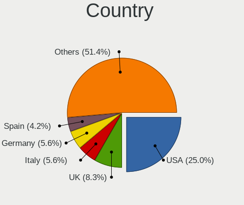
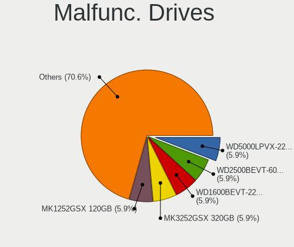
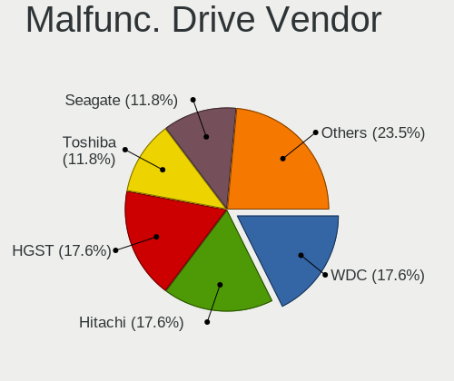
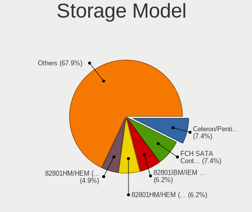
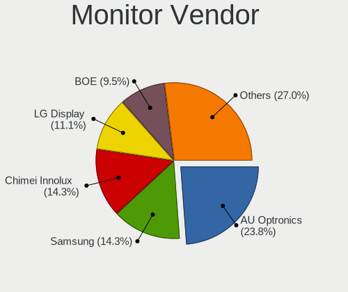
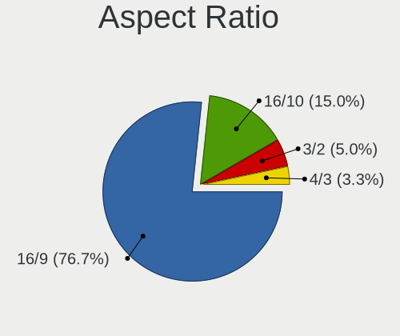
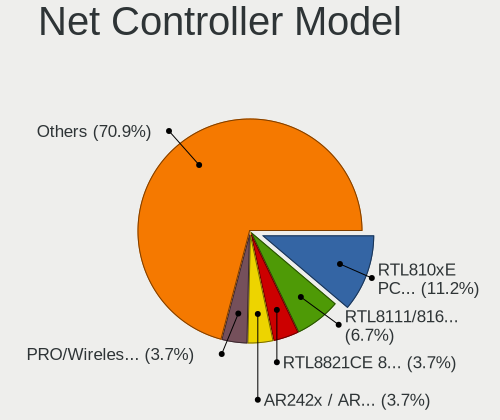

Q4OS - Tested Hardware & Statistics (Notebooks)
-----------------------------------------------

A project to collect tested hardware configurations for Q4OS.

Anyone can contribute to this report by the [hw-probe](https://github.com/linuxhw/hw-probe) tool:

    sudo -E hw-probe -all -upload

Please contribute! Especially if your hardware is rare.

Contents
--------

* [ Test Cases ](#test-cases)

* [ System ](#system)
  - [ OS                       ](#os)
  - [ OS Family                ](#os-family)
  - [ Kernel                   ](#kernel)
  - [ Kernel Family            ](#kernel-family)
  - [ Kernel Major Ver.        ](#kernel-major-ver)
  - [ Arch                     ](#arch)
  - [ DE                       ](#de)
  - [ Display Server           ](#display-server)
  - [ Display Manager          ](#display-manager)
  - [ OS Lang                  ](#os-lang)
  - [ Boot Mode                ](#boot-mode)
  - [ Filesystem               ](#filesystem)
  - [ Part. scheme             ](#part-scheme)
  - [ Dual Boot with Linux/BSD ](#dual-boot-with-linuxbsd)
  - [ Dual Boot (Win)          ](#dual-boot-win)

* [ Board ](#board)
  - [ Vendor                   ](#vendor)
  - [ Model                    ](#model)
  - [ Model Family             ](#model-family)
  - [ MFG Year                 ](#mfg-year)
  - [ Form Factor              ](#form-factor)
  - [ Secure Boot              ](#secure-boot)
  - [ Coreboot                 ](#coreboot)
  - [ RAM Size                 ](#ram-size)
  - [ RAM Used                 ](#ram-used)
  - [ Total Drives             ](#total-drives)
  - [ Has CD-ROM               ](#has-cd-rom)
  - [ Has Ethernet             ](#has-ethernet)
  - [ Has WiFi                 ](#has-wifi)
  - [ Has Bluetooth            ](#has-bluetooth)

* [ Location ](#location)
  - [ Country                  ](#country)
  - [ City                     ](#city)

* [ Drives ](#drives)
  - [ Drive Vendor             ](#drive-vendor)
  - [ Drive Model              ](#drive-model)
  - [ HDD Vendor               ](#hdd-vendor)
  - [ SSD Vendor               ](#ssd-vendor)
  - [ Drive Kind               ](#drive-kind)
  - [ Drive Connector          ](#drive-connector)
  - [ Drive Size               ](#drive-size)
  - [ Space Total              ](#space-total)
  - [ Space Used               ](#space-used)
  - [ Malfunc. Drives          ](#malfunc-drives)
  - [ Malfunc. Drive Vendor    ](#malfunc-drive-vendor)
  - [ Malfunc. HDD Vendor      ](#malfunc-hdd-vendor)
  - [ Malfunc. Drive Kind      ](#malfunc-drive-kind)
  - [ Failed Drives            ](#failed-drives)
  - [ Failed Drive Vendor      ](#failed-drive-vendor)
  - [ Drive Status             ](#drive-status)

* [ Storage controller ](#storage-controller)
  - [ Storage Vendor           ](#storage-vendor)
  - [ Storage Model            ](#storage-model)
  - [ Storage Kind             ](#storage-kind)

* [ Processor ](#processor)
  - [ CPU Vendor               ](#cpu-vendor)
  - [ CPU Model                ](#cpu-model)
  - [ CPU Model Family         ](#cpu-model-family)
  - [ CPU Cores                ](#cpu-cores)
  - [ CPU Sockets              ](#cpu-sockets)
  - [ CPU Threads              ](#cpu-threads)
  - [ CPU Op-Modes             ](#cpu-op-modes)
  - [ CPU Microcode            ](#cpu-microcode)
  - [ CPU Microarch            ](#cpu-microarch)

* [ Graphics ](#graphics)
  - [ GPU Vendor               ](#gpu-vendor)
  - [ GPU Model                ](#gpu-model)
  - [ GPU Combo                ](#gpu-combo)
  - [ GPU Driver               ](#gpu-driver)
  - [ GPU Memory               ](#gpu-memory)

* [ Monitor ](#monitor)
  - [ Monitor Vendor           ](#monitor-vendor)
  - [ Monitor Model            ](#monitor-model)
  - [ Monitor Resolution       ](#monitor-resolution)
  - [ Monitor Diagonal         ](#monitor-diagonal)
  - [ Monitor Width            ](#monitor-width)
  - [ Aspect Ratio             ](#aspect-ratio)
  - [ Monitor Area             ](#monitor-area)
  - [ Pixel Density            ](#pixel-density)
  - [ Multiple Monitors        ](#multiple-monitors)

* [ Network ](#network)
  - [ Net Controller Vendor    ](#net-controller-vendor)
  - [ Net Controller Model     ](#net-controller-model)
  - [ Wireless Vendor          ](#wireless-vendor)
  - [ Wireless Model           ](#wireless-model)
  - [ Ethernet Vendor          ](#ethernet-vendor)
  - [ Ethernet Model           ](#ethernet-model)
  - [ Net Controller Kind      ](#net-controller-kind)
  - [ Used Controller          ](#used-controller)
  - [ NICs                     ](#nics)
  - [ IPv6                     ](#ipv6)

* [ Bluetooth ](#bluetooth)
  - [ Bluetooth Vendor         ](#bluetooth-vendor)
  - [ Bluetooth Model          ](#bluetooth-model)

* [ Sound ](#sound)
  - [ Sound Vendor             ](#sound-vendor)
  - [ Sound Model              ](#sound-model)

* [ Memory ](#memory)
  - [ Memory Vendor            ](#memory-vendor)
  - [ Memory Model             ](#memory-model)
  - [ Memory Kind              ](#memory-kind)
  - [ Memory Form Factor       ](#memory-form-factor)
  - [ Memory Size              ](#memory-size)
  - [ Memory Speed             ](#memory-speed)

* [ Printers & scanners ](#printers--scanners)
  - [ Printer Vendor           ](#printer-vendor)
  - [ Printer Model            ](#printer-model)
  - [ Scanner Vendor           ](#scanner-vendor)
  - [ Scanner Model            ](#scanner-model)

* [ Camera ](#camera)
  - [ Camera Vendor            ](#camera-vendor)
  - [ Camera Model             ](#camera-model)

* [ Security ](#security)
  - [ Fingerprint Vendor       ](#fingerprint-vendor)
  - [ Fingerprint Model        ](#fingerprint-model)
  - [ Chipcard Vendor          ](#chipcard-vendor)
  - [ Chipcard Model           ](#chipcard-model)

* [ Unsupported ](#unsupported)
  - [ Unsupported Devices      ](#unsupported-devices)
  - [ Unsupported Device Types ](#unsupported-device-types)

Test Cases
----------

Total: 36

| Vendor        | Model                    | Probe                                                      | Date         |
|---------------|--------------------------|------------------------------------------------------------|--------------|
| Medion        | P6620                    | [e5db2a930b](https://linux-hardware.org/?probe=e5db2a930b) | Aug 22, 2022 |
| Lenovo        | ThinkPad T495 20NKS0PG00 | [ee35a21db4](https://linux-hardware.org/?probe=ee35a21db4) | Jun 30, 2022 |
| Sony          | VGN-P11Z_Q               | [e51be2b6a4](https://linux-hardware.org/?probe=e51be2b6a4) | Jun 16, 2022 |
| Toshiba       | Satellite M70            | [61617a3561](https://linux-hardware.org/?probe=61617a3561) | Jun 05, 2022 |
| HP            | 250 G5 Notebook PC       | [0e5792fc9f](https://linux-hardware.org/?probe=0e5792fc9f) | May 15, 2022 |
| ASUSTek       | A6U                      | [4a8ad00e5e](https://linux-hardware.org/?probe=4a8ad00e5e) | May 12, 2022 |
| Toshiba       | Satellite Pro L500       | [5b72ea9a47](https://linux-hardware.org/?probe=5b72ea9a47) | May 02, 2022 |
| Lenovo        | IdeaPad 330-15IGM 81D1   | [8cdcd8d130](https://linux-hardware.org/?probe=8cdcd8d130) | Apr 08, 2022 |
| Acer          | AO751h                   | [23737182d1](https://linux-hardware.org/?probe=23737182d1) | Mar 21, 2022 |
| AMI           | Intel                    | [6d581b03a6](https://linux-hardware.org/?probe=6d581b03a6) | Mar 19, 2022 |
| ASUSTek       | X540YA                   | [0cd3840828](https://linux-hardware.org/?probe=0cd3840828) | Mar 14, 2022 |
| Visual Lan... | Premier 10               | [64450e11a3](https://linux-hardware.org/?probe=64450e11a3) | Feb 04, 2022 |
| HP            | Presario CQ56            | [8d03d80424](https://linux-hardware.org/?probe=8d03d80424) | Jan 14, 2022 |
| HP            | Presario CQ56            | [a0bc0364a8](https://linux-hardware.org/?probe=a0bc0364a8) | Jan 08, 2022 |
| MSI           | U210                     | [24eb05a4d9](https://linux-hardware.org/?probe=24eb05a4d9) | Dec 29, 2021 |
| Toshiba       | Satellite C660           | [b159811d48](https://linux-hardware.org/?probe=b159811d48) | Dec 12, 2021 |
| Toshiba       | Satellite C660           | [2197770fd0](https://linux-hardware.org/?probe=2197770fd0) | Dec 12, 2021 |
| ASUSTek       | T12Eg                    | [115e8b584f](https://linux-hardware.org/?probe=115e8b584f) | Dec 11, 2021 |
| Toshiba       | Satellite C660           | [64521297e2](https://linux-hardware.org/?probe=64521297e2) | Dec 07, 2021 |
| Toshiba       | Satellite C660           | [b6a5bb8982](https://linux-hardware.org/?probe=b6a5bb8982) | Dec 06, 2021 |
| Phoenix/Si... | M720SR                   | [f92c7e8c3e](https://linux-hardware.org/?probe=f92c7e8c3e) | Oct 09, 2021 |
| HP            | Laptop 15s-fq2xxx        | [cfa6202518](https://linux-hardware.org/?probe=cfa6202518) | Sep 14, 2021 |
| HP            | Laptop 15s-fq2xxx        | [726c3230ef](https://linux-hardware.org/?probe=726c3230ef) | Sep 14, 2021 |
| Chuwi         | GemiBook Pro             | [ebe8d67a10](https://linux-hardware.org/?probe=ebe8d67a10) | Sep 04, 2021 |
| HP            | ProBook 450 G2           | [dbba9b9771](https://linux-hardware.org/?probe=dbba9b9771) | Jul 30, 2021 |
| JVC           | J3N                      | [f8da57e850](https://linux-hardware.org/?probe=f8da57e850) | Jul 09, 2021 |
| HP            | ProBook 6550b            | [b192718656](https://linux-hardware.org/?probe=b192718656) | Mar 13, 2021 |
| HP            | 2000                     | [736561e497](https://linux-hardware.org/?probe=736561e497) | Mar 07, 2021 |
| ASUSTek       | A6JC                     | [b04f51dd1c](https://linux-hardware.org/?probe=b04f51dd1c) | Jan 29, 2021 |
| ASUSTek       | A6JC                     | [097dd7f151](https://linux-hardware.org/?probe=097dd7f151) | Jan 29, 2021 |
| Lenovo        | ThinkPad 11e 20DAS0PS00  | [2d618b7420](https://linux-hardware.org/?probe=2d618b7420) | Dec 14, 2020 |
| Packard Be... | EasyNote LM81            | [d6b0c23c18](https://linux-hardware.org/?probe=d6b0c23c18) | Nov 23, 2020 |
| Qilive        | QW19141AMSP              | [b8f3486ae1](https://linux-hardware.org/?probe=b8f3486ae1) | Aug 27, 2020 |
| HP            | OmniBook PC              | [5e33febbc1](https://linux-hardware.org/?probe=5e33febbc1) | Jul 10, 2020 |
| Medion        | Unknown                  | [6a06a14f6a](https://linux-hardware.org/?probe=6a06a14f6a) | May 07, 2020 |
| Philco        | 14I                      | [bf4c449b31](https://linux-hardware.org/?probe=bf4c449b31) | Apr 14, 2019 |

System
------

OS
--

Installed operating systems

| Name   | Notebooks | Percent |
|--------|-----------|---------|
| Q4OS 4 | 18        | 58.06%  |
| Q4OS 3 | 10        | 32.26%  |
| Q4OS 2 | 3         | 9.68%   |

OS Family
---------

OS without a version

| Name | Notebooks | Percent |
|------|-----------|---------|
| Q4OS | 31        | 100%    |

Kernel
------

Version of the Linux kernel

| Version              | Notebooks | Percent |
|----------------------|-----------|---------|
| 4.19.0-17-amd64      | 4         | 12.9%   |
| 5.10.0-12-amd64      | 3         | 9.68%   |
| 5.10.0-8-amd64       | 2         | 6.45%   |
| 5.10.0-14-686-pae    | 2         | 6.45%   |
| 5.9.0-5-amd64        | 1         | 3.23%   |
| 5.6.0-1-amd64        | 1         | 3.23%   |
| 5.18.0-0.bpo.1-amd64 | 1         | 3.23%   |
| 5.10.0-9-amd64       | 1         | 3.23%   |
| 5.10.0-8-686-pae     | 1         | 3.23%   |
| 5.10.0-17-amd64      | 1         | 3.23%   |
| 5.10.0-15-686-pae    | 1         | 3.23%   |
| 5.10.0-13-amd64      | 1         | 3.23%   |
| 5.10.0-12-686-pae    | 1         | 3.23%   |
| 5.10.0-11-686-pae    | 1         | 3.23%   |
| 5.10.0-10-686-pae    | 1         | 3.23%   |
| 4.9.0-8-amd64        | 1         | 3.23%   |
| 4.9.0-14-686-pae     | 1         | 3.23%   |
| 4.9.0-12-686-pae     | 1         | 3.23%   |
| 4.19.0-20-amd64      | 1         | 3.23%   |
| 4.19.0-17-686        | 1         | 3.23%   |
| 4.19.0-14-amd64      | 1         | 3.23%   |
| 4.19.0-13-amd64      | 1         | 3.23%   |
| 4.19.0-12-amd64      | 1         | 3.23%   |
| 4.19.0-10-amd64      | 1         | 3.23%   |

Kernel Family
-------------

Linux kernel without a distro release

| Version | Notebooks | Percent |
|---------|-----------|---------|
| 5.10.0  | 15        | 48.39%  |
| 4.19.0  | 10        | 32.26%  |
| 4.9.0   | 3         | 9.68%   |
| 5.9.0   | 1         | 3.23%   |
| 5.6.0   | 1         | 3.23%   |
| 5.18.0  | 1         | 3.23%   |

Kernel Major Ver.
-----------------

Linux kernel major version

| Version | Notebooks | Percent |
|---------|-----------|---------|
| 5.10    | 15        | 48.39%  |
| 4.19    | 10        | 32.26%  |
| 4.9     | 3         | 9.68%   |
| 5.9     | 1         | 3.23%   |
| 5.6     | 1         | 3.23%   |
| 5.18    | 1         | 3.23%   |

Arch
----

OS architecture (x86_64, i586, etc.)

| Name   | Notebooks | Percent |
|--------|-----------|---------|
| x86_64 | 21        | 67.74%  |
| i686   | 10        | 32.26%  |

DE
--

Desktop Environment

| Name    | Notebooks | Percent |
|---------|-----------|---------|
| KDE5    | 16        | 51.61%  |
| trinity | 14        | 45.16%  |
| KDE     | 1         | 3.23%   |

Display Server
--------------

X11 or Wayland

| Name | Notebooks | Percent |
|------|-----------|---------|
| X11  | 30        | 96.77%  |
| Tty  | 1         | 3.23%   |

Display Manager
---------------

SDDM, LightDM, etc.

| Name | Notebooks | Percent |
|------|-----------|---------|
| SDDM | 17        | 54.84%  |
| TDM  | 14        | 45.16%  |

OS Lang
-------

Language

| Lang    | Notebooks | Percent |
|---------|-----------|---------|
| en_US   | 13        | 41.94%  |
| es_ES   | 3         | 9.68%   |
| en_GB   | 3         | 9.68%   |
| de_DE   | 2         | 6.45%   |
| sv_SE   | 1         | 3.23%   |
| sl_SI   | 1         | 3.23%   |
| ru_RU   | 1         | 3.23%   |
| pl_PL   | 1         | 3.23%   |
| it_IT   | 1         | 3.23%   |
| fr_FR   | 1         | 3.23%   |
| es_VE   | 1         | 3.23%   |
| en_SG   | 1         | 3.23%   |
| C       | 1         | 3.23%   |
| Unknown | 1         | 3.23%   |

Boot Mode
---------

EFI or BIOS

| Mode | Notebooks | Percent |
|------|-----------|---------|
| BIOS | 19        | 61.29%  |
| EFI  | 12        | 38.71%  |

Filesystem
----------

Type of filesystem

| Type    | Notebooks | Percent |
|---------|-----------|---------|
| Ext4    | 28        | 90.32%  |
| Overlay | 3         | 9.68%   |

Part. scheme
------------

Scheme of partitioning

| Type    | Notebooks | Percent |
|---------|-----------|---------|
| MBR     | 18        | 58.06%  |
| GPT     | 12        | 38.71%  |
| Unknown | 1         | 3.23%   |

Dual Boot with Linux/BSD
------------------------

Hosting more than one Linux/BSD

| Dual boot | Notebooks | Percent |
|-----------|-----------|---------|
| No        | 26        | 83.87%  |
| Yes       | 5         | 16.13%  |

Dual Boot (Win)
---------------

Hosting Linux and Windows

| Dual boot | Notebooks | Percent |
|-----------|-----------|---------|
| No        | 22        | 70.97%  |
| Yes       | 9         | 29.03%  |

Board
-----

Vendor
------

Motherboard manufacturer

| Name             | Notebooks | Percent |
|------------------|-----------|---------|
| Hewlett-Packard  | 7         | 22.58%  |
| Toshiba          | 4         | 12.9%   |
| ASUSTek Computer | 4         | 12.9%   |
| Lenovo           | 3         | 9.68%   |
| Medion           | 2         | 6.45%   |
| Visual Land      | 1         | 3.23%   |
| Sony             | 1         | 3.23%   |
| Qilive           | 1         | 3.23%   |
| Phoenix/SiS      | 1         | 3.23%   |
| Philco           | 1         | 3.23%   |
| Packard Bell     | 1         | 3.23%   |
| MSI              | 1         | 3.23%   |
| JVC              | 1         | 3.23%   |
| Chuwi            | 1         | 3.23%   |
| AMI              | 1         | 3.23%   |
| Acer             | 1         | 3.23%   |

Model
-----

Motherboard model

| Name                            | Notebooks | Percent |
|---------------------------------|-----------|---------|
| Toshiba Satellite C660          | 2         | 6.45%   |
| Visual Land Premier 10          | 1         | 3.23%   |
| Toshiba Satellite Pro L500      | 1         | 3.23%   |
| Toshiba Satellite M70           | 1         | 3.23%   |
| Sony VGN-P11Z_Q                 | 1         | 3.23%   |
| Qilive QW19141AMSP              | 1         | 3.23%   |
| Phoenix/SiS M720SR              | 1         | 3.23%   |
| Philco 14I                      | 1         | 3.23%   |
| Packard Bell EasyNote LM81      | 1         | 3.23%   |
| MSI U210                        | 1         | 3.23%   |
| Medion P6620                    | 1         | 3.23%   |
| Lenovo ThinkPad T495 20NKS0PG00 | 1         | 3.23%   |
| Lenovo ThinkPad 11e 20DAS0PS00  | 1         | 3.23%   |
| Lenovo IdeaPad 330-15IGM 81D1   | 1         | 3.23%   |
| JVC J3N                         | 1         | 3.23%   |
| HP ProBook 6550b                | 1         | 3.23%   |
| HP ProBook 450 G2               | 1         | 3.23%   |
| HP Presario CQ56                | 1         | 3.23%   |
| HP OmniBook PC                  | 1         | 3.23%   |
| HP Laptop 15s-fq2xxx            | 1         | 3.23%   |
| HP 250 G5 Notebook PC           | 1         | 3.23%   |
| HP 2000                         | 1         | 3.23%   |
| Chuwi GemiBook Pro              | 1         | 3.23%   |
| ASUS X540YA                     | 1         | 3.23%   |
| ASUS T12Eg                      | 1         | 3.23%   |
| ASUS A6U                        | 1         | 3.23%   |
| ASUS A6JC                       | 1         | 3.23%   |
| AMI Intel                       | 1         | 3.23%   |
| Acer AO751h                     | 1         | 3.23%   |
| Unknown                         | 1         | 3.23%   |

Model Family
------------

Motherboard model prefix

| Name                  | Notebooks | Percent |
|-----------------------|-----------|---------|
| Toshiba Satellite     | 4         | 12.9%   |
| Lenovo ThinkPad       | 2         | 6.45%   |
| HP ProBook            | 2         | 6.45%   |
| Visual Land Premier   | 1         | 3.23%   |
| Sony VGN-P11Z         | 1         | 3.23%   |
| Qilive QW19141AMSP    | 1         | 3.23%   |
| Phoenix/SiS M720SR    | 1         | 3.23%   |
| Philco 14I            | 1         | 3.23%   |
| Packard Bell EasyNote | 1         | 3.23%   |
| MSI U210              | 1         | 3.23%   |
| Medion P6620          | 1         | 3.23%   |
| Lenovo IdeaPad        | 1         | 3.23%   |
| JVC J3N               | 1         | 3.23%   |
| HP Presario           | 1         | 3.23%   |
| HP OmniBook           | 1         | 3.23%   |
| HP Laptop             | 1         | 3.23%   |
| HP 250                | 1         | 3.23%   |
| HP 2000               | 1         | 3.23%   |
| Chuwi GemiBook        | 1         | 3.23%   |
| ASUS X540YA           | 1         | 3.23%   |
| ASUS T12Eg            | 1         | 3.23%   |
| ASUS A6U              | 1         | 3.23%   |
| ASUS A6JC             | 1         | 3.23%   |
| AMI Intel             | 1         | 3.23%   |
| Acer AO751h           | 1         | 3.23%   |
| Unknown               | 1         | 3.23%   |

MFG Year
--------

Motherboard manufacture year

| Year    | Notebooks | Percent |
|---------|-----------|---------|
| 2010    | 5         | 16.13%  |
| 2009    | 4         | 12.9%   |
| 2020    | 3         | 9.68%   |
| 2019    | 2         | 6.45%   |
| 2016    | 2         | 6.45%   |
| 2014    | 2         | 6.45%   |
| 2005    | 2         | 6.45%   |
| Unknown | 2         | 6.45%   |
| 2018    | 1         | 3.23%   |
| 2017    | 1         | 3.23%   |
| 2015    | 1         | 3.23%   |
| 2012    | 1         | 3.23%   |
| 2011    | 1         | 3.23%   |
| 2008    | 1         | 3.23%   |
| 2007    | 1         | 3.23%   |
| 2006    | 1         | 3.23%   |
| 2004    | 1         | 3.23%   |

Form Factor
-----------

Physical design of the computer

| Name     | Notebooks | Percent |
|----------|-----------|---------|
| Notebook | 31        | 100%    |

Secure Boot
-----------

Enabled or disabled

| State    | Notebooks | Percent |
|----------|-----------|---------|
| Disabled | 29        | 93.55%  |
| Enabled  | 2         | 6.45%   |

Coreboot
--------

Have coreboot on board

| Used | Notebooks | Percent |
|------|-----------|---------|
| No   | 31        | 100%    |

RAM Size
--------

Total RAM memory

| Size in GB | Notebooks | Percent |
|------------|-----------|---------|
| 3.01-4.0   | 10        | 32.26%  |
| 4.01-8.0   | 5         | 16.13%  |
| 2.01-3.0   | 5         | 16.13%  |
| 1.01-2.0   | 5         | 16.13%  |
| 0.51-1.0   | 3         | 9.68%   |
| 24.01-32.0 | 1         | 3.23%   |
| 16.01-24.0 | 1         | 3.23%   |
| 0.01-0.5   | 1         | 3.23%   |

RAM Used
--------

Used RAM memory

| Used GB  | Notebooks | Percent |
|----------|-----------|---------|
| 1.01-2.0 | 14        | 45.16%  |
| 0.51-1.0 | 7         | 22.58%  |
| 2.01-3.0 | 4         | 12.9%   |
| 0.01-0.5 | 4         | 12.9%   |
| 3.01-4.0 | 2         | 6.45%   |

Total Drives
------------

Number of drives on board

| Drives | Notebooks | Percent |
|--------|-----------|---------|
| 1      | 23        | 74.19%  |
| 2      | 7         | 22.58%  |
| 3      | 1         | 3.23%   |

Has CD-ROM
----------

Has CD-ROM on board

| Presented | Notebooks | Percent |
|-----------|-----------|---------|
| Yes       | 17        | 54.84%  |
| No        | 14        | 45.16%  |

Has Ethernet
------------

Has Ethernet on board

| Presented | Notebooks | Percent |
|-----------|-----------|---------|
| Yes       | 27        | 87.1%   |
| No        | 4         | 12.9%   |

Has WiFi
--------

Has WiFi module

| Presented | Notebooks | Percent |
|-----------|-----------|---------|
| Yes       | 28        | 90.32%  |
| No        | 3         | 9.68%   |

Has Bluetooth
-------------

Has Bluetooth module

| Presented | Notebooks | Percent |
|-----------|-----------|---------|
| No        | 16        | 51.61%  |
| Yes       | 15        | 48.39%  |

Location
--------

Country
-------

Geographic location (country)

| Country      | Notebooks | Percent |
|--------------|-----------|---------|
| USA          | 4         | 12.9%   |
| UK           | 3         | 9.68%   |
| Spain        | 3         | 9.68%   |
| Kenya        | 3         | 9.68%   |
| Romania      | 2         | 6.45%   |
| Poland       | 2         | 6.45%   |
| Italy        | 2         | 6.45%   |
| Germany      | 2         | 6.45%   |
| Venezuela    | 1         | 3.23%   |
| Sweden       | 1         | 3.23%   |
| Slovenia     | 1         | 3.23%   |
| Singapore    | 1         | 3.23%   |
| Saudi Arabia | 1         | 3.23%   |
| Russia       | 1         | 3.23%   |
| Qatar        | 1         | 3.23%   |
| France       | 1         | 3.23%   |
| Brazil       | 1         | 3.23%   |
| Belarus      | 1         | 3.23%   |

City
----

Geographic location (city)

| City                  | Notebooks | Percent |
|-----------------------|-----------|---------|
| Nairobi               | 3         | 9.68%   |
| Swindon               | 2         | 6.45%   |
| Mesa                  | 2         | 6.45%   |
| Drobeta-Turnu Severin | 2         | 6.45%   |
| Tranas                | 1         | 3.23%   |
| Tellico Plains        | 1         | 3.23%   |
| Sosnowiec             | 1         | 3.23%   |
| Singapore             | 1         | 3.23%   |
| Schermbeck            | 1         | 3.23%   |
| Salsomaggiore Terme   | 1         | 3.23%   |
| Rostock               | 1         | 3.23%   |
| Puerto Cumarebo       | 1         | 3.23%   |
| Moscow                | 1         | 3.23%   |
| Moirans               | 1         | 3.23%   |
| Mogilev               | 1         | 3.23%   |
| Londrina              | 1         | 3.23%   |
| Ljubljana             | 1         | 3.23%   |
| Las Vegas             | 1         | 3.23%   |
| Klaudyn               | 1         | 3.23%   |
| Gijón                | 1         | 3.23%   |
| Fulham                | 1         | 3.23%   |
| Doha                  | 1         | 3.23%   |
| Dammam                | 1         | 3.23%   |
| Calvecchia            | 1         | 3.23%   |
| Barcelona             | 1         | 3.23%   |
| Alicante              | 1         | 3.23%   |

Drives
------

Drive Vendor
------------

Hard drive vendors

| Vendor              | Notebooks | Drives | Percent |
|---------------------|-----------|--------|---------|
| WDC                 | 5         | 5      | 14.71%  |
| Unknown             | 4         | 4      | 11.76%  |
| Samsung Electronics | 3         | 3      | 8.82%   |
| Hitachi             | 3         | 3      | 8.82%   |
| Toshiba             | 2         | 2      | 5.88%   |
| Seagate             | 2         | 2      | 5.88%   |
| SanDisk             | 2         | 2      | 5.88%   |
| Kingston            | 2         | 2      | 5.88%   |
| KESU                | 2         | 2      | 5.88%   |
| HGST                | 2         | 2      | 5.88%   |
| China               | 2         | 2      | 5.88%   |
| Silicon Motion      | 1         | 1      | 2.94%   |
| Phison              | 1         | 1      | 2.94%   |
| Fujitsu             | 1         | 1      | 2.94%   |
| A-DATA Technology   | 1         | 1      | 2.94%   |
| Unknown             | 1         | 1      | 2.94%   |

Drive Model
-----------

Hard drive models

| Model                                | Notebooks | Percent |
|--------------------------------------|-----------|---------|
| Samsung SSD 850 EVO 250GB            | 2         | 5.88%   |
| KESU USB 3.1 256GB                   | 2         | 5.88%   |
| WDC WD5000LPCX-60VHAT0 500GB         | 1         | 2.94%   |
| WDC WD3200BEVT-22ZCT0 320GB          | 1         | 2.94%   |
| WDC WD3200BEVT-22A23T0 320GB         | 1         | 2.94%   |
| WDC WD2500BEVT-60A23T0 250GB         | 1         | 2.94%   |
| WDC PC SN530 SDBPNPZ-512G-1006 512GB | 1         | 2.94%   |
| Unknown USDU1  32GB                  | 1         | 2.94%   |
| Unknown SLD64G  64GB                 | 1         | 2.94%   |
| Unknown SD/MMC/MS PRO 1TB            | 1         | 2.94%   |
| Unknown 064G38  64GB                 | 1         | 2.94%   |
| Toshiba MK8025GAS 80GB               | 1         | 2.94%   |
| Toshiba MK6028GAL 64GB               | 1         | 2.94%   |
| Silicon Motion NVME SSD 512GB        | 1         | 2.94%   |
| Seagate ST9120822AS 120GB            | 1         | 2.94%   |
| Seagate Backup+ SL 1TB               | 1         | 2.94%   |
| SanDisk SDCFX-032G SSD               | 1         | 2.94%   |
| SanDisk SD8SN8U1T001122 1TB SSD      | 1         | 2.94%   |
| Samsung AWMB3R  16GB                 | 1         | 2.94%   |
| Phison APS-SE20G-1T                  | 1         | 2.94%   |
| Kingston SV300S37A60G 64GB SSD       | 1         | 2.94%   |
| Kingston SA400S37240G 240GB SSD      | 1         | 2.94%   |
| Hitachi HTS545032B9A300 320GB        | 1         | 2.94%   |
| Hitachi HTS543225L9SA00 250GB        | 1         | 2.94%   |
| Hitachi DK23CA-20 20GB               | 1         | 2.94%   |
| HGST HTS725050A7E630 500GB           | 1         | 2.94%   |
| HGST HTS541075A9E680 752GB           | 1         | 2.94%   |
| Fujitsu MHY2080BH 80GB               | 1         | 2.94%   |
| China SSD128GBS800                   | 1         | 2.94%   |
| China SATA SSD 240GB                 | 1         | 2.94%   |
| A-DATA SU630 240GB SSD               | 1         | 2.94%   |
| Unknown                              | 1         | 2.94%   |

HDD Vendor
----------

Hard disk drive vendors

| Vendor  | Notebooks | Drives | Percent |
|---------|-----------|--------|---------|
| WDC     | 4         | 4      | 28.57%  |
| Hitachi | 3         | 3      | 21.43%  |
| Toshiba | 2         | 2      | 14.29%  |
| HGST    | 2         | 2      | 14.29%  |
| Unknown | 1         | 1      | 7.14%   |
| Seagate | 1         | 1      | 7.14%   |
| Fujitsu | 1         | 1      | 7.14%   |

SSD Vendor
----------

Solid state drive vendors

| Vendor              | Notebooks | Drives | Percent |
|---------------------|-----------|--------|---------|
| SanDisk             | 2         | 2      | 20%     |
| Samsung Electronics | 2         | 2      | 20%     |
| Kingston            | 2         | 2      | 20%     |
| China               | 2         | 2      | 20%     |
| A-DATA Technology   | 1         | 1      | 10%     |
| Unknown             | 1         | 1      | 10%     |

Drive Kind
----------

HDD or SSD

| Kind    | Notebooks | Drives | Percent |
|---------|-----------|--------|---------|
| HDD     | 13        | 14     | 40.63%  |
| SSD     | 10        | 10     | 31.25%  |
| MMC     | 4         | 4      | 12.5%   |
| Unknown | 3         | 3      | 9.38%   |
| NVMe    | 2         | 3      | 6.25%   |

Drive Connector
---------------

SATA, SAS, NVMe, etc.

| Type | Notebooks | Drives | Percent |
|------|-----------|--------|---------|
| SATA | 23        | 23     | 69.7%   |
| SAS  | 4         | 4      | 12.12%  |
| MMC  | 4         | 4      | 12.12%  |
| NVMe | 2         | 3      | 6.06%   |

Drive Size
----------

Size of hard drive

| Size in TB | Notebooks | Drives | Percent |
|------------|-----------|--------|---------|
| 0.01-0.5   | 21        | 21     | 87.5%   |
| 0.51-1.0   | 3         | 3      | 12.5%   |

Space Total
-----------

Amount of disk space available on the file system

| Size in GB | Notebooks | Percent |
|------------|-----------|---------|
| 51-100     | 7         | 22.58%  |
| 101-250    | 6         | 19.35%  |
| 1-20       | 5         | 16.13%  |
| 251-500    | 4         | 12.9%   |
| 21-50      | 4         | 12.9%   |
| 1001-2000  | 2         | 6.45%   |
| 501-1000   | 2         | 6.45%   |
| Unknown    | 1         | 3.23%   |

Space Used
----------

Amount of used disk space

| Used GB  | Notebooks | Percent |
|----------|-----------|---------|
| 1-20     | 21        | 67.74%  |
| 21-50    | 5         | 16.13%  |
| 251-500  | 2         | 6.45%   |
| 501-1000 | 1         | 3.23%   |
| 51-100   | 1         | 3.23%   |
| Unknown  | 1         | 3.23%   |

Malfunc. Drives
---------------

Drive models with a malfunction

| Model                         | Notebooks | Drives | Percent |
|-------------------------------|-----------|--------|---------|
| WDC WD2500BEVT-60A23T0 250GB  | 1         | 1      | 12.5%   |
| Seagate ST9120822AS 120GB     | 1         | 1      | 12.5%   |
| Hitachi HTS545032B9A300 320GB | 1         | 1      | 12.5%   |
| Hitachi HTS543225L9SA00 250GB | 1         | 1      | 12.5%   |
| Hitachi DK23CA-20 20GB        | 1         | 1      | 12.5%   |
| HGST HTS725050A7E630 500GB    | 1         | 1      | 12.5%   |
| HGST HTS541075A9E680 752GB    | 1         | 1      | 12.5%   |
| Fujitsu MHY2080BH 80GB        | 1         | 1      | 12.5%   |

Malfunc. Drive Vendor
---------------------

Vendors of faulty drives

| Vendor  | Notebooks | Drives | Percent |
|---------|-----------|--------|---------|
| Hitachi | 3         | 3      | 37.5%   |
| HGST    | 2         | 2      | 25%     |
| WDC     | 1         | 1      | 12.5%   |
| Seagate | 1         | 1      | 12.5%   |
| Fujitsu | 1         | 1      | 12.5%   |

Malfunc. HDD Vendor
-------------------

Vendors of faulty HDD drives

| Vendor  | Notebooks | Drives | Percent |
|---------|-----------|--------|---------|
| Hitachi | 3         | 3      | 37.5%   |
| HGST    | 2         | 2      | 25%     |
| WDC     | 1         | 1      | 12.5%   |
| Seagate | 1         | 1      | 12.5%   |
| Fujitsu | 1         | 1      | 12.5%   |

Malfunc. Drive Kind
-------------------

Kinds of faulty drives

| Kind | Notebooks | Drives | Percent |
|------|-----------|--------|---------|
| HDD  | 8         | 8      | 100%    |

Failed Drives
-------------

Failed drive models

Zero info for selected period =(

Failed Drive Vendor
-------------------

Failed drive vendors

Zero info for selected period =(

Drive Status
------------

Number of failed and malfunc. drives

| Status   | Notebooks | Drives | Percent |
|----------|-----------|--------|---------|
| Works    | 16        | 17     | 50%     |
| Detected | 8         | 9      | 25%     |
| Malfunc  | 8         | 8      | 25%     |

Storage controller
------------------

Storage Vendor
--------------

Storage controller vendors

| Vendor                           | Notebooks | Percent |
|----------------------------------|-----------|---------|
| Intel                            | 20        | 64.52%  |
| AMD                              | 6         | 19.35%  |
| Silicon Integrated Systems [SiS] | 2         | 6.45%   |
| Silicon Motion                   | 1         | 3.23%   |
| SanDisk                          | 1         | 3.23%   |
| Phison Electronics               | 1         | 3.23%   |

Storage Model
-------------

Storage controller models

| Model                                                                            | Notebooks | Percent |
|----------------------------------------------------------------------------------|-----------|---------|
| Intel Celeron/Pentium Silver Processor SATA Controller                           | 3         | 8.57%   |
| Intel 82801IBM/IEM (ICH9M/ICH9M-E) 4 port SATA Controller [AHCI mode]            | 3         | 8.57%   |
| AMD FCH SATA Controller [AHCI mode]                                              | 3         | 8.57%   |
| Silicon Integrated Systems [SiS] 5513 IDE Controller                             | 2         | 5.71%   |
| Intel US15W/US15X/US15L/UL11L SCH [Poulsbo] IDE Controller                       | 2         | 5.71%   |
| Intel 6 Series/C200 Series Chipset Family 6 port Mobile SATA AHCI Controller     | 2         | 5.71%   |
| Silicon Motion SM2263EN/SM2263XT SSD Controller                                  | 1         | 2.86%   |
| Silicon Integrated Systems [SiS] SATA Controller / IDE mode                      | 1         | 2.86%   |
| SanDisk WD Blue SN550 NVMe SSD                                                   | 1         | 2.86%   |
| Phison E12 NVMe Controller                                                       | 1         | 2.86%   |
| Intel Volume Management Device NVMe RAID Controller                              | 1         | 2.86%   |
| Intel Atom/Celeron/Pentium Processor x5-E8000/J3xxx/N3xxx Series SATA Controller | 1         | 2.86%   |
| Intel Atom Processor E3800 Series SATA AHCI Controller                           | 1         | 2.86%   |
| Intel 82801HM/HEM (ICH8M/ICH8M-E) SATA Controller [IDE mode]                     | 1         | 2.86%   |
| Intel 82801HM/HEM (ICH8M/ICH8M-E) IDE Controller                                 | 1         | 2.86%   |
| Intel 82801G (ICH7 Family) IDE Controller                                        | 1         | 2.86%   |
| Intel 82801FBM (ICH6M) SATA Controller                                           | 1         | 2.86%   |
| Intel 82801FB/FBM/FR/FW/FRW (ICH6 Family) IDE Controller                         | 1         | 2.86%   |
| Intel 82801DBM (ICH4-M) IDE Controller                                           | 1         | 2.86%   |
| Intel 82371AB/EB/MB PIIX4 IDE                                                    | 1         | 2.86%   |
| Intel 8 Series SATA Controller 1 [AHCI mode]                                     | 1         | 2.86%   |
| Intel 5 Series/3400 Series Chipset 6 port SATA AHCI Controller                   | 1         | 2.86%   |
| AMD SB7x0/SB8x0/SB9x0 SATA Controller [IDE mode]                                 | 1         | 2.86%   |
| AMD SB7x0/SB8x0/SB9x0 SATA Controller [AHCI mode]                                | 1         | 2.86%   |
| AMD SB7x0/SB8x0/SB9x0 IDE Controller                                             | 1         | 2.86%   |
| AMD SB600 Non-Raid-5 SATA                                                        | 1         | 2.86%   |

Storage Kind
------------

Kind of storage controller (IDE, SATA, NVMe, SAS, ...)

| Kind | Notebooks | Percent |
|------|-----------|---------|
| SATA | 18        | 58.06%  |
| IDE  | 10        | 32.26%  |
| NVMe | 2         | 6.45%   |
| RAID | 1         | 3.23%   |

Processor
---------

CPU Vendor
----------

Processor vendors

| Vendor | Notebooks | Percent |
|--------|-----------|---------|
| Intel  | 23        | 74.19%  |
| AMD    | 8         | 25.81%  |

CPU Model
---------

Processor models

| Model                                           | Notebooks | Percent |
|-------------------------------------------------|-----------|---------|
| Intel Core i3-2350M CPU @ 2.30GHz               | 2         | 6.45%   |
| Intel Atom CPU Z520 @ 1.33GHz                   | 2         | 6.45%   |
| Intel Pentium M processor 1000MHz               | 1         | 3.23%   |
| Intel Pentium M processor 1.70GHz               | 1         | 3.23%   |
| Intel Pentium III (Coppermine)                  | 1         | 3.23%   |
| Intel Pentium Dual-Core CPU T4500 @ 2.30GHz     | 1         | 3.23%   |
| Intel Core i5-4210U CPU @ 1.70GHz               | 1         | 3.23%   |
| Intel Core i5 CPU M 450 @ 2.40GHz               | 1         | 3.23%   |
| Intel Core 2 Duo CPU T7250 @ 2.00GHz            | 1         | 3.23%   |
| Intel Core 2 Duo CPU T6670 @ 2.20GHz            | 1         | 3.23%   |
| Intel Core 2 Duo CPU T6500 @ 2.10GHz            | 1         | 3.23%   |
| Intel Core 2 Duo CPU T5550 @ 1.83GHz            | 1         | 3.23%   |
| Intel Core 2 CPU T5500 @ 1.66GHz                | 1         | 3.23%   |
| Intel Celeron N4000 CPU @ 1.10GHz               | 1         | 3.23%   |
| Intel Celeron J4125 CPU @ 2.00GHz               | 1         | 3.23%   |
| Intel Celeron J4115 CPU @ 1.80GHz               | 1         | 3.23%   |
| Intel Celeron CPU N3060 @ 1.60GHz               | 1         | 3.23%   |
| Intel Celeron CPU N2940 @ 1.83GHz               | 1         | 3.23%   |
| Intel Atom x5-Z8300 CPU @ 1.44GHz               | 1         | 3.23%   |
| Intel Atom CPU Z3735G @ 1.33GHz                 | 1         | 3.23%   |
| Intel 11th Gen Core i5-1135G7 @ 2.40GHz         | 1         | 3.23%   |
| AMD V120 Processor                              | 1         | 3.23%   |
| AMD Ryzen 7 PRO 3700U w/ Radeon Vega Mobile Gfx | 1         | 3.23%   |
| AMD Mobile Sempron Processor 3000+              | 1         | 3.23%   |
| AMD E-300 APU with Radeon HD Graphics           | 1         | 3.23%   |
| AMD C-70 APU with Radeon HD Graphics            | 1         | 3.23%   |
| AMD Athlon Neo Processor MV-40                  | 1         | 3.23%   |
| AMD A8-7410 APU with AMD Radeon R5 Graphics     | 1         | 3.23%   |
| AMD A4-9120e RADEON R3, 4 COMPUTE CORES 2C+2G   | 1         | 3.23%   |

CPU Model Family
----------------

Processor model prefix

| Model                   | Notebooks | Percent |
|-------------------------|-----------|---------|
| Intel Celeron           | 5         | 16.13%  |
| Intel Core 2 Duo        | 4         | 12.9%   |
| Intel Atom              | 4         | 12.9%   |
| Intel Pentium M         | 2         | 6.45%   |
| Intel Core i5           | 2         | 6.45%   |
| Intel Core i3           | 2         | 6.45%   |
| Other                   | 1         | 3.23%   |
| Intel Pentium III       | 1         | 3.23%   |
| Intel Pentium Dual-Core | 1         | 3.23%   |
| Intel Core 2            | 1         | 3.23%   |
| AMD V120                | 1         | 3.23%   |
| AMD Ryzen 7 PRO         | 1         | 3.23%   |
| AMD Mobile Sempron      | 1         | 3.23%   |
| AMD E                   | 1         | 3.23%   |
| AMD C-70                | 1         | 3.23%   |
| AMD Athlon Neo          | 1         | 3.23%   |
| AMD A8                  | 1         | 3.23%   |
| AMD A4                  | 1         | 3.23%   |

CPU Cores
---------

Number of processor cores

| Number | Notebooks | Percent |
|--------|-----------|---------|
| 2      | 15        | 48.39%  |
| 4      | 8         | 25.81%  |
| 1      | 8         | 25.81%  |

CPU Sockets
-----------

Number of sockets

| Number | Notebooks | Percent |
|--------|-----------|---------|
| 1      | 31        | 100%    |

CPU Threads
-----------

Threads per core (Hyper-Threading)

| Number | Notebooks | Percent |
|--------|-----------|---------|
| 1      | 23        | 74.19%  |
| 2      | 8         | 25.81%  |

CPU Op-Modes
------------

CPU Operation Modes (32-bit, 64-bit)

| Op mode        | Notebooks | Percent |
|----------------|-----------|---------|
| 32-bit, 64-bit | 25        | 80.65%  |
| 32-bit         | 6         | 19.35%  |

CPU Microcode
-------------

Microcode number

| Number     | Notebooks | Percent |
|------------|-----------|---------|
| Unknown    | 4         | 12.9%   |
| 0x1067a    | 3         | 9.68%   |
| 0x706a1    | 2         | 6.45%   |
| 0x6fd      | 2         | 6.45%   |
| 0x30678    | 2         | 6.45%   |
| 0x206a7    | 2         | 6.45%   |
| 0x806c1    | 1         | 3.23%   |
| 0x706a8    | 1         | 3.23%   |
| 0x6f6      | 1         | 3.23%   |
| 0x6d8      | 1         | 3.23%   |
| 0x695      | 1         | 3.23%   |
| 0x68a      | 1         | 3.23%   |
| 0x406c4    | 1         | 3.23%   |
| 0x40651    | 1         | 3.23%   |
| 0x20655    | 1         | 3.23%   |
| 0x106c2    | 1         | 3.23%   |
| 0x08108102 | 1         | 3.23%   |
| 0x07030106 | 1         | 3.23%   |
| 0x06006705 | 1         | 3.23%   |
| 0x05000119 | 1         | 3.23%   |
| 0x0500010d | 1         | 3.23%   |
| 0x010000c8 | 1         | 3.23%   |

CPU Microarch
-------------

Microarchitecture

| Name          | Notebooks | Percent |
|---------------|-----------|---------|
| Silvermont    | 4         | 12.9%   |
| Penryn        | 3         | 9.68%   |
| P6            | 3         | 9.68%   |
| Goldmont plus | 3         | 9.68%   |
| Core          | 3         | 9.68%   |
| SandyBridge   | 2         | 6.45%   |
| K8 Hammer     | 2         | 6.45%   |
| Bonnell       | 2         | 6.45%   |
| Bobcat        | 2         | 6.45%   |
| Zen+          | 1         | 3.23%   |
| Westmere      | 1         | 3.23%   |
| TigerLake     | 1         | 3.23%   |
| Puma          | 1         | 3.23%   |
| K10           | 1         | 3.23%   |
| Haswell       | 1         | 3.23%   |
| Excavator     | 1         | 3.23%   |

Graphics
--------

GPU Vendor
----------

Vendors of graphics cards

| Vendor                           | Notebooks | Percent |
|----------------------------------|-----------|---------|
| Intel                            | 17        | 53.13%  |
| AMD                              | 10        | 31.25%  |
| Silicon Integrated Systems [SiS] | 2         | 6.25%   |
| Nvidia                           | 2         | 6.25%   |
| S3 Graphics                      | 1         | 3.13%   |

GPU Model
---------

Graphics card models

| Model                                                                                      | Notebooks | Percent |
|--------------------------------------------------------------------------------------------|-----------|---------|
| Intel GeminiLake [UHD Graphics 600]                                                        | 3         | 9.09%   |
| Intel US15W/US15X SCH [Poulsbo] Graphics Controller                                        | 2         | 6.06%   |
| Intel Atom/Celeron/Pentium Processor x5-E8000/J3xxx/N3xxx Integrated Graphics Controller   | 2         | 6.06%   |
| Intel Atom Processor Z36xxx/Z37xxx Series Graphics & Display                               | 2         | 6.06%   |
| Intel 2nd Generation Core Processor Family Integrated Graphics Controller                  | 2         | 6.06%   |
| Silicon Integrated Systems [SiS] 771/671 PCIE VGA Display Adapter                          | 1         | 3.03%   |
| Silicon Integrated Systems [SiS] 661/741/760 PCI/AGP or 662/761Gx PCIE VGA Display Adapter | 1         | 3.03%   |
| S3 Graphics 86C270-294 [SavageIX-MV]                                                       | 1         | 3.03%   |
| Nvidia G96CM [GeForce GT 220M]                                                             | 1         | 3.03%   |
| Nvidia G72M [Quadro NVS 110M/GeForce Go 7300]                                              | 1         | 3.03%   |
| Intel TigerLake-LP GT2 [Iris Xe Graphics]                                                  | 1         | 3.03%   |
| Intel Mobile GM965/GL960 Integrated Graphics Controller (secondary)                        | 1         | 3.03%   |
| Intel Mobile GM965/GL960 Integrated Graphics Controller (primary)                          | 1         | 3.03%   |
| Intel Mobile 915GM/GMS/910GML Express Graphics Controller                                  | 1         | 3.03%   |
| Intel Mobile 4 Series Chipset Integrated Graphics Controller                               | 1         | 3.03%   |
| Intel Haswell-ULT Integrated Graphics Controller                                           | 1         | 3.03%   |
| Intel 82852/855GM Integrated Graphics Device                                               | 1         | 3.03%   |
| AMD Wrestler [Radeon HD 7290]                                                              | 1         | 3.03%   |
| AMD Wrestler [Radeon HD 6310]                                                              | 1         | 3.03%   |
| AMD Topaz PRO [Radeon R5 M255]                                                             | 1         | 3.03%   |
| AMD Stoney [Radeon R2/R3/R4/R5 Graphics]                                                   | 1         | 3.03%   |
| AMD RV710/M92 [Mobility Radeon HD 4530/4570/545v]                                          | 1         | 3.03%   |
| AMD RV710/M92 [Mobility Radeon HD 4350/4550]                                               | 1         | 3.03%   |
| AMD RS880M [Mobility Radeon HD 4225/4250]                                                  | 1         | 3.03%   |
| AMD RS690M [Radeon Xpress 1200/1250/1270]                                                  | 1         | 3.03%   |
| AMD Picasso/Raven 2 [Radeon Vega Series / Radeon Vega Mobile Series]                       | 1         | 3.03%   |
| AMD Mullins [Radeon R4/R5 Graphics]                                                        | 1         | 3.03%   |

GPU Combo
---------

Combinations of graphics cards

| Name            | Notebooks | Percent |
|-----------------|-----------|---------|
| 1 x Intel       | 15        | 48.39%  |
| 1 x AMD         | 9         | 29.03%  |
| 1 x SiS         | 2         | 6.45%   |
| 1 x Nvidia      | 2         | 6.45%   |
| Other           | 1         | 3.23%   |
| 1 x S3 Graphics | 1         | 3.23%   |
| Intel + AMD     | 1         | 3.23%   |

GPU Driver
----------

Free vs proprietary

| Driver      | Notebooks | Percent |
|-------------|-----------|---------|
| Free        | 27        | 87.1%   |
| Unknown     | 3         | 9.68%   |
| Proprietary | 1         | 3.23%   |

GPU Memory
----------

Total video memory

| Size in GB | Notebooks | Percent |
|------------|-----------|---------|
| Unknown    | 19        | 61.29%  |
| 0.01-0.5   | 10        | 32.26%  |
| 1.01-2.0   | 2         | 6.45%   |

Monitor
-------

Monitor Vendor
--------------

Monitor vendors

| Vendor              | Notebooks | Percent |
|---------------------|-----------|---------|
| Chimei Innolux      | 7         | 25.93%  |
| Samsung Electronics | 6         | 22.22%  |
| AU Optronics        | 6         | 22.22%  |
| LG Display          | 3         | 11.11%  |
| Hewlett-Packard     | 1         | 3.7%    |
| HannStar            | 1         | 3.7%    |
| Dell                | 1         | 3.7%    |
| CPT                 | 1         | 3.7%    |
| BOE                 | 1         | 3.7%    |

Monitor Model
-------------

Monitor models

| Model                                                                  | Notebooks | Percent |
|------------------------------------------------------------------------|-----------|---------|
| LG Display LCD Monitor LGD02DC 1366x768 344x194mm 15.5-inch            | 2         | 7.41%   |
| Chimei Innolux LCD Monitor CMN14D4 1920x1080 309x173mm 13.9-inch       | 2         | 7.41%   |
| Samsung Electronics LF24T450F SAM7095 1920x1080 527x296mm 23.8-inch    | 1         | 3.7%    |
| Samsung Electronics LCD Monitor SEC3633 1280x800 331x207mm 15.4-inch   | 1         | 3.7%    |
| Samsung Electronics LCD Monitor SEC315A 1366x768 344x194mm 15.5-inch   | 1         | 3.7%    |
| Samsung Electronics LCD Monitor SEC3051 1366x768 344x194mm 15.5-inch   | 1         | 3.7%    |
| Samsung Electronics LCD Monitor SEC304C 1366x768 353x198mm 15.9-inch   | 1         | 3.7%    |
| Samsung Electronics LCD Monitor SAM069B 1920x1080 1020x570mm 46.0-inch | 1         | 3.7%    |
| LG Display LCD Monitor LGD0258 1600x900 345x194mm 15.6-inch            | 1         | 3.7%    |
| Hewlett-Packard Z24i HWP3100 1920x1200 518x324mm 24.1-inch             | 1         | 3.7%    |
| HannStar HSD121PHW1 HSD04B6 1366x768 270x150mm 12.2-inch               | 1         | 3.7%    |
| Dell U2415 DELA0BC 1920x1200 518x324mm 24.1-inch                       | 1         | 3.7%    |
| CPT LCD Monitor CPT13B1 1280x800 330x210mm 15.4-inch                   | 1         | 3.7%    |
| Chimei Innolux P140ZKA-BZ1 CMN8C02 2160x1440 296x197mm 14.0-inch       | 1         | 3.7%    |
| Chimei Innolux LCD Monitor CMN15DB 1366x768 344x193mm 15.5-inch        | 1         | 3.7%    |
| Chimei Innolux LCD Monitor CMN15CA 1366x768 344x193mm 15.5-inch        | 1         | 3.7%    |
| Chimei Innolux LCD Monitor CMN15C6 1366x768 344x193mm 15.5-inch        | 1         | 3.7%    |
| Chimei Innolux LCD Monitor CMN15BE 1366x768 344x193mm 15.5-inch        | 1         | 3.7%    |
| BOE LCD Monitor BOE05B1 1366x768 309x173mm 13.9-inch                   | 1         | 3.7%    |
| AU Optronics LCD Monitor AUO3791 1920x1080 344x194mm 15.5-inch         | 1         | 3.7%    |
| AU Optronics LCD Monitor AUO315D 1920x1080 256x144mm 11.6-inch         | 1         | 3.7%    |
| AU Optronics LCD Monitor AUO315C 1366x768 256x144mm 11.6-inch          | 1         | 3.7%    |
| AU Optronics LCD Monitor AUO2174 1280x800 331x207mm 15.4-inch          | 1         | 3.7%    |
| AU Optronics LCD Monitor AUO139E 1600x900 382x214mm 17.2-inch          | 1         | 3.7%    |
| AU Optronics LCD Monitor AUO12EC 1366x768 344x193mm 15.5-inch          | 1         | 3.7%    |

Monitor Resolution
------------------

Monitor screen resolution

| Resolution        | Notebooks | Percent |
|-------------------|-----------|---------|
| 1366x768 (WXGA)   | 11        | 40.74%  |
| 1920x1080 (FHD)   | 8         | 29.63%  |
| 1600x900 (HD+)    | 3         | 11.11%  |
| 1280x800 (WXGA)   | 3         | 11.11%  |
| 2160x1440         | 1         | 3.7%    |
| 1920x1200 (WUXGA) | 1         | 3.7%    |

Monitor Diagonal
----------------

Diagonal size in inches

| Inches | Notebooks | Percent |
|--------|-----------|---------|
| 15     | 14        | 51.85%  |
| 13     | 3         | 11.11%  |
| 11     | 2         | 7.41%   |
| 46     | 1         | 3.7%    |
| 40     | 1         | 3.7%    |
| 24     | 1         | 3.7%    |
| 23     | 1         | 3.7%    |
| 18     | 1         | 3.7%    |
| 17     | 1         | 3.7%    |
| 14     | 1         | 3.7%    |
| 12     | 1         | 3.7%    |

Monitor Width
-------------

Physical width

| Width in mm | Notebooks | Percent |
|-------------|-----------|---------|
| 301-350     | 16        | 59.26%  |
| 201-300     | 4         | 14.81%  |
| 351-400     | 3         | 11.11%  |
| 501-600     | 2         | 7.41%   |
| 801-900     | 1         | 3.7%    |
| 1001-1500   | 1         | 3.7%    |

Aspect Ratio
------------

Proportional relationship between the width and the height

| Ratio | Notebooks | Percent |
|-------|-----------|---------|
| 16/9  | 20        | 80%     |
| 16/10 | 4         | 16%     |
| 3/2   | 1         | 4%      |

Monitor Area
------------

Area in inch²

| Area in inch² | Notebooks | Percent |
|----------------|-----------|---------|
| 101-110        | 14        | 51.85%  |
| 81-90          | 4         | 14.81%  |
| 51-60          | 2         | 7.41%   |
| 501-1000       | 2         | 7.41%   |
| 61-70          | 1         | 3.7%    |
| 251-300        | 1         | 3.7%    |
| 201-250        | 1         | 3.7%    |
| 141-150        | 1         | 3.7%    |
| 121-130        | 1         | 3.7%    |

Pixel Density
-------------

Pixels per inch

| Density | Notebooks | Percent |
|---------|-----------|---------|
| 101-120 | 12        | 44.44%  |
| 51-100  | 7         | 25.93%  |
| 121-160 | 5         | 18.52%  |
| 161-240 | 2         | 7.41%   |
| 1-50    | 1         | 3.7%    |

Multiple Monitors
-----------------

Total monitors connected

| Total | Notebooks | Percent |
|-------|-----------|---------|
| 1     | 27        | 87.1%   |
| 2     | 2         | 6.45%   |
| 0     | 2         | 6.45%   |

Network
-------

Net Controller Vendor
---------------------

Controller vendors

| Vendor                           | Notebooks | Percent |
|----------------------------------|-----------|---------|
| Realtek Semiconductor            | 23        | 42.59%  |
| Qualcomm Atheros                 | 11        | 20.37%  |
| Intel                            | 9         | 16.67%  |
| Silicon Integrated Systems [SiS] | 2         | 3.7%    |
| Broadcom                         | 2         | 3.7%    |
| Xiaomi                           | 1         | 1.85%   |
| Motorola PCS                     | 1         | 1.85%   |
| Marvell Technology Group         | 1         | 1.85%   |
| LG Electronics                   | 1         | 1.85%   |
| JMicron Technology               | 1         | 1.85%   |
| Broadcom Limited                 | 1         | 1.85%   |
| Accton Technology                | 1         | 1.85%   |

Net Controller Model
--------------------

Controller models

| Model                                                                       | Notebooks | Percent |
|-----------------------------------------------------------------------------|-----------|---------|
| Realtek RTL810xE PCI Express Fast Ethernet controller                       | 8         | 13.56%  |
| Realtek RTL8111/8168/8411 PCI Express Gigabit Ethernet Controller           | 7         | 11.86%  |
| Realtek RTL-8100/8101L/8139 PCI Fast Ethernet Adapter                       | 3         | 5.08%   |
| Qualcomm Atheros AR9285 Wireless Network Adapter (PCI-Express)              | 3         | 5.08%   |
| Qualcomm Atheros AR242x / AR542x Wireless Network Adapter (PCI-Express)     | 3         | 5.08%   |
| Realtek RTL8723BE PCIe Wireless Network Adapter                             | 2         | 3.39%   |
| Qualcomm Atheros AR928X Wireless Network Adapter (PCI-Express)              | 2         | 3.39%   |
| Intel Wi-Fi 6 AX200                                                         | 2         | 3.39%   |
| Intel PRO/Wireless 3945ABG [Golan] Network Connection                       | 2         | 3.39%   |
| Intel PRO/Wireless 2200BG [Calexico2] Network Connection                    | 2         | 3.39%   |
| Xiaomi Mi/Redmi series (RNDIS)                                              | 1         | 1.69%   |
| Silicon Integrated Systems [SiS] AC'97 Modem Controller                     | 1         | 1.69%   |
| Silicon Integrated Systems [SiS] 191 Gigabit Ethernet Adapter               | 1         | 1.69%   |
| Realtek RTL8821CE 802.11ac PCIe Wireless Network Adapter                    | 1         | 1.69%   |
| Realtek RTL8723BU 802.11b/g/n WLAN Adapter                                  | 1         | 1.69%   |
| Realtek RTL8191SEvB Wireless LAN Controller                                 | 1         | 1.69%   |
| Realtek RTL8188EUS 802.11n Wireless Network Adapter                         | 1         | 1.69%   |
| Realtek RTL8188CE 802.11b/g/n WiFi Adapter                                  | 1         | 1.69%   |
| Realtek RTL-8110SC/8169SC Gigabit Ethernet                                  | 1         | 1.69%   |
| Qualcomm Atheros QCA9565 / AR9565 Wireless Network Adapter                  | 1         | 1.69%   |
| Qualcomm Atheros QCA9377 802.11ac Wireless Network Adapter                  | 1         | 1.69%   |
| Qualcomm Atheros AR9485 Wireless Network Adapter                            | 1         | 1.69%   |
| Motorola PCS moto g(6) plus                                                 | 1         | 1.69%   |
| Marvell Group 88E8057 PCI-E Gigabit Ethernet Controller                     | 1         | 1.69%   |
| LG LM-X420xxx/G2 Android Phone (USB tethering mode)                         | 1         | 1.69%   |
| JMicron JMC250 PCI Express Gigabit Ethernet Controller                      | 1         | 1.69%   |
| Intel Wireless 3165                                                         | 1         | 1.69%   |
| Intel Gemini Lake PCH CNVi WiFi                                             | 1         | 1.69%   |
| Intel 82801FB/FBM/FR/FW/FRW (ICH6 Family) AC'97 Modem Controller            | 1         | 1.69%   |
| Intel 82801DB/DBL/DBM (ICH4/ICH4-L/ICH4-M) AC'97 Modem Controller           | 1         | 1.69%   |
| Intel 82577LC Gigabit Network Connection                                    | 1         | 1.69%   |
| Broadcom NetLink BCM57780 Gigabit Ethernet PCIe                             | 1         | 1.69%   |
| Broadcom Limited BCM4318 [AirForce One 54g] 802.11g Wireless LAN Controller | 1         | 1.69%   |
| Broadcom BCM4313 802.11bgn Wireless Network Adapter                         | 1         | 1.69%   |
| Accton EN-1216 Ethernet Adapter                                             | 1         | 1.69%   |

Wireless Vendor
---------------

Wireless vendors

| Vendor                | Notebooks | Percent |
|-----------------------|-----------|---------|
| Qualcomm Atheros      | 11        | 39.29%  |
| Intel                 | 8         | 28.57%  |
| Realtek Semiconductor | 7         | 25%     |
| Broadcom Limited      | 1         | 3.57%   |
| Broadcom              | 1         | 3.57%   |

Wireless Model
--------------

Wireless models

| Model                                                                       | Notebooks | Percent |
|-----------------------------------------------------------------------------|-----------|---------|
| Qualcomm Atheros AR9285 Wireless Network Adapter (PCI-Express)              | 3         | 10.71%  |
| Qualcomm Atheros AR242x / AR542x Wireless Network Adapter (PCI-Express)     | 3         | 10.71%  |
| Realtek RTL8723BE PCIe Wireless Network Adapter                             | 2         | 7.14%   |
| Qualcomm Atheros AR928X Wireless Network Adapter (PCI-Express)              | 2         | 7.14%   |
| Intel Wi-Fi 6 AX200                                                         | 2         | 7.14%   |
| Intel PRO/Wireless 3945ABG [Golan] Network Connection                       | 2         | 7.14%   |
| Intel PRO/Wireless 2200BG [Calexico2] Network Connection                    | 2         | 7.14%   |
| Realtek RTL8821CE 802.11ac PCIe Wireless Network Adapter                    | 1         | 3.57%   |
| Realtek RTL8723BU 802.11b/g/n WLAN Adapter                                  | 1         | 3.57%   |
| Realtek RTL8191SEvB Wireless LAN Controller                                 | 1         | 3.57%   |
| Realtek RTL8188EUS 802.11n Wireless Network Adapter                         | 1         | 3.57%   |
| Realtek RTL8188CE 802.11b/g/n WiFi Adapter                                  | 1         | 3.57%   |
| Qualcomm Atheros QCA9565 / AR9565 Wireless Network Adapter                  | 1         | 3.57%   |
| Qualcomm Atheros QCA9377 802.11ac Wireless Network Adapter                  | 1         | 3.57%   |
| Qualcomm Atheros AR9485 Wireless Network Adapter                            | 1         | 3.57%   |
| Intel Wireless 3165                                                         | 1         | 3.57%   |
| Intel Gemini Lake PCH CNVi WiFi                                             | 1         | 3.57%   |
| Broadcom Limited BCM4318 [AirForce One 54g] 802.11g Wireless LAN Controller | 1         | 3.57%   |
| Broadcom BCM4313 802.11bgn Wireless Network Adapter                         | 1         | 3.57%   |

Ethernet Vendor
---------------

Ethernet vendors

| Vendor                           | Notebooks | Percent |
|----------------------------------|-----------|---------|
| Realtek Semiconductor            | 19        | 67.86%  |
| Xiaomi                           | 1         | 3.57%   |
| Silicon Integrated Systems [SiS] | 1         | 3.57%   |
| Motorola PCS                     | 1         | 3.57%   |
| Marvell Technology Group         | 1         | 3.57%   |
| LG Electronics                   | 1         | 3.57%   |
| JMicron Technology               | 1         | 3.57%   |
| Intel                            | 1         | 3.57%   |
| Broadcom                         | 1         | 3.57%   |
| Accton Technology                | 1         | 3.57%   |

Ethernet Model
--------------

Ethernet models

| Model                                                             | Notebooks | Percent |
|-------------------------------------------------------------------|-----------|---------|
| Realtek RTL810xE PCI Express Fast Ethernet controller             | 8         | 28.57%  |
| Realtek RTL8111/8168/8411 PCI Express Gigabit Ethernet Controller | 7         | 25%     |
| Realtek RTL-8100/8101L/8139 PCI Fast Ethernet Adapter             | 3         | 10.71%  |
| Xiaomi Mi/Redmi series (RNDIS)                                    | 1         | 3.57%   |
| Silicon Integrated Systems [SiS] 191 Gigabit Ethernet Adapter     | 1         | 3.57%   |
| Realtek RTL-8110SC/8169SC Gigabit Ethernet                        | 1         | 3.57%   |
| Motorola PCS moto g(6) plus                                       | 1         | 3.57%   |
| Marvell Group 88E8057 PCI-E Gigabit Ethernet Controller           | 1         | 3.57%   |
| LG LM-X420xxx/G2 Android Phone (USB tethering mode)               | 1         | 3.57%   |
| JMicron JMC250 PCI Express Gigabit Ethernet Controller            | 1         | 3.57%   |
| Intel 82577LC Gigabit Network Connection                          | 1         | 3.57%   |
| Broadcom NetLink BCM57780 Gigabit Ethernet PCIe                   | 1         | 3.57%   |
| Accton EN-1216 Ethernet Adapter                                   | 1         | 3.57%   |

Net Controller Kind
-------------------

Ethernet, WiFi or modem

| Kind     | Notebooks | Percent |
|----------|-----------|---------|
| WiFi     | 28        | 48.28%  |
| Ethernet | 27        | 46.55%  |
| Modem    | 3         | 5.17%   |

Used Controller
---------------

Currently used network controller

| Kind     | Notebooks | Percent |
|----------|-----------|---------|
| WiFi     | 20        | 64.52%  |
| Ethernet | 11        | 35.48%  |

NICs
----

Total network controllers on board

| Total | Notebooks | Percent |
|-------|-----------|---------|
| 2     | 21        | 67.74%  |
| 1     | 7         | 22.58%  |
| 0     | 2         | 6.45%   |
| 3     | 1         | 3.23%   |

IPv6
----

IPv6 vs IPv4

| Used | Notebooks | Percent |
|------|-----------|---------|
| No   | 29        | 93.55%  |
| Yes  | 2         | 6.45%   |

Bluetooth
---------

Bluetooth Vendor
----------------

Controller vendors

| Vendor                          | Notebooks | Percent |
|---------------------------------|-----------|---------|
| Qualcomm Atheros Communications | 4         | 26.67%  |
| Intel                           | 4         | 26.67%  |
| Realtek Semiconductor           | 3         | 20%     |
| Toshiba                         | 1         | 6.67%   |
| Hewlett-Packard                 | 1         | 6.67%   |
| ASUSTek Computer                | 1         | 6.67%   |
| Alps Electric                   | 1         | 6.67%   |

Bluetooth Model
---------------

Controller models

| Model                                          | Notebooks | Percent |
|------------------------------------------------|-----------|---------|
| Realtek Bluetooth Radio                        | 3         | 20%     |
| Qualcomm Atheros AR3011 Bluetooth              | 3         | 20%     |
| Intel AX200 Bluetooth                          | 2         | 13.33%  |
| Toshiba Askey for                              | 1         | 6.67%   |
| Qualcomm Atheros  Bluetooth Device             | 1         | 6.67%   |
| Intel Bluetooth wireless interface             | 1         | 6.67%   |
| Intel Bluetooth 9460/9560 Jefferson Peak (JfP) | 1         | 6.67%   |
| HP Broadcom 2070 Bluetooth Combo               | 1         | 6.67%   |
| ASUS BT-183 Bluetooth 2.0+EDR adapter          | 1         | 6.67%   |
| Alps Electric BCM2046 Bluetooth Device         | 1         | 6.67%   |

Sound
-----

Sound Vendor
------------

Sound card vendors

| Vendor                           | Notebooks | Percent |
|----------------------------------|-----------|---------|
| Intel                            | 19        | 61.29%  |
| AMD                              | 9         | 29.03%  |
| Silicon Integrated Systems [SiS] | 2         | 6.45%   |
| ESS Technology                   | 1         | 3.23%   |

Sound Model
-----------

Sound card models

| Model                                                                                             | Notebooks | Percent |
|---------------------------------------------------------------------------------------------------|-----------|---------|
| Intel Celeron/Pentium Silver Processor High Definition Audio                                      | 3         | 7.69%   |
| Intel 82801I (ICH9 Family) HD Audio Controller                                                    | 3         | 7.69%   |
| AMD SBx00 Azalia (Intel HDA)                                                                      | 3         | 7.69%   |
| Intel US15W/US15X/US15L/UL11L SCH [Poulsbo] HD Audio Controller                                   | 2         | 5.13%   |
| Intel 6 Series/C200 Series Chipset Family High Definition Audio Controller                        | 2         | 5.13%   |
| AMD Wrestler HDMI Audio                                                                           | 2         | 5.13%   |
| AMD RV710/730 HDMI Audio [Radeon HD 4000 series]                                                  | 2         | 5.13%   |
| AMD FCH Azalia Controller                                                                         | 2         | 5.13%   |
| Silicon Integrated Systems [SiS] SiS7012 AC'97 Sound Controller                                   | 1         | 2.56%   |
| Silicon Integrated Systems [SiS] Azalia Audio Controller                                          | 1         | 2.56%   |
| Intel Tiger Lake-LP Smart Sound Technology Audio Controller                                       | 1         | 2.56%   |
| Intel NM10/ICH7 Family High Definition Audio Controller                                           | 1         | 2.56%   |
| Intel Haswell-ULT HD Audio Controller                                                             | 1         | 2.56%   |
| Intel Atom/Celeron/Pentium Processor x5-E8000/J3xxx/N3xxx Series High Definition Audio Controller | 1         | 2.56%   |
| Intel Atom Processor Z36xxx/Z37xxx Series High Definition Audio Controller                        | 1         | 2.56%   |
| Intel 82801H (ICH8 Family) HD Audio Controller                                                    | 1         | 2.56%   |
| Intel 82801FB/FBM/FR/FW/FRW (ICH6 Family) AC'97 Audio Controller                                  | 1         | 2.56%   |
| Intel 82801DB/DBL/DBM (ICH4/ICH4-L/ICH4-M) AC'97 Audio Controller                                 | 1         | 2.56%   |
| Intel 8 Series HD Audio Controller                                                                | 1         | 2.56%   |
| Intel 5 Series/3400 Series Chipset High Definition Audio                                          | 1         | 2.56%   |
| ESS Technology ES1988 Allegro-1                                                                   | 1         | 2.56%   |
| AMD RS880 HDMI Audio [Radeon HD 4200 Series]                                                      | 1         | 2.56%   |
| AMD RS690 HDMI Audio [Radeon Xpress 1200 Series]                                                  | 1         | 2.56%   |
| AMD Raven/Raven2/Fenghuang HDMI/DP Audio Controller                                               | 1         | 2.56%   |
| AMD Kabini HDMI/DP Audio                                                                          | 1         | 2.56%   |
| AMD High Definition Audio Controller                                                              | 1         | 2.56%   |
| AMD Family 17h/19h HD Audio Controller                                                            | 1         | 2.56%   |
| AMD Family 15h (Models 60h-6fh) Audio Controller                                                  | 1         | 2.56%   |

Memory
------

Memory Vendor
-------------

Memory module vendors

| Vendor              | Notebooks | Percent |
|---------------------|-----------|---------|
| Unknown             | 12        | 38.71%  |
| Samsung Electronics | 8         | 25.81%  |
| SK hynix            | 4         | 12.9%   |
| Unknown (ABCD)      | 2         | 6.45%   |
| Kingston            | 2         | 6.45%   |
| Toshiba             | 1         | 3.23%   |
| Elpida              | 1         | 3.23%   |
| A-DATA Technology   | 1         | 3.23%   |

Memory Model
------------

Memory module models

| Model                                                            | Notebooks | Percent |
|------------------------------------------------------------------|-----------|---------|
| Unknown RAM Module 2GB SODIMM DDR2                               | 4         | 11.76%  |
| Unknown (ABCD) RAM 123456789012345678 2GB SODIMM LPDDR4 2400MT/s | 2         | 5.88%   |
| Samsung RAM M471B5273DH0-CH9 4GB SODIMM DDR3 1334MT/s            | 2         | 5.88%   |
| Samsung RAM M471B5173EB0-YK0 4GB SODIMM DDR3 1600MT/s            | 2         | 5.88%   |
| Unknown RAM Module 512MB SODIMM SDRAM                            | 1         | 2.94%   |
| Unknown RAM Module 4096MB SODIMM DDR3 1333MT/s                   | 1         | 2.94%   |
| Unknown RAM Module 2GB SODIMM DDR                                | 1         | 2.94%   |
| Unknown RAM Module 256MB SODIMM SDRAM                            | 1         | 2.94%   |
| Unknown RAM Module 2048MB SODIMM SDRAM                           | 1         | 2.94%   |
| Unknown RAM Module 1GB SODIMM DRAM                               | 1         | 2.94%   |
| Unknown RAM Module 1GB SODIMM DDR 266MT/s                        | 1         | 2.94%   |
| Unknown RAM Module 1GB DIMM DDR3 1333MT/s                        | 1         | 2.94%   |
| Unknown RAM CL19-19-19 D4-2666 8GB SODIMM DDR4 2133MT/s          | 1         | 2.94%   |
| Toshiba RAM 8HTF12864HDY-800G1 2GB SODIMM 1066MT/s               | 1         | 2.94%   |
| Toshiba RAM 64T128020EDL2.5C2 2GB SODIMM 1066MT/s                | 1         | 2.94%   |
| SK hynix RAM Module 2048MB SODIMM DDR3 1600MT/s                  | 1         | 2.94%   |
| SK hynix RAM HYMP125S64CP8-S6 2048MB SODIMM DDR2 800MT/s         | 1         | 2.94%   |
| SK hynix RAM HMT451S6CFR6A-PB 4GB SODIMM DDR3 1600MT/s           | 1         | 2.94%   |
| SK hynix RAM HMA851S6CJR6N-VK 4GB SODIMM DDR4 2400MT/s           | 1         | 2.94%   |
| Samsung RAM M471B5673FH0-CH9 2GB SODIMM DDR3 1334MT/s            | 1         | 2.94%   |
| Samsung RAM M471B5173DB0-YK0 4GB SODIMM DDR3 1600MT/s            | 1         | 2.94%   |
| Samsung RAM M471A5244CB0-CTD 4GB SODIMM DDR4 3266MT/s            | 1         | 2.94%   |
| Samsung RAM M471A2G44AM0-CTD 16GB SODIMM DDR4 2667MT/s           | 1         | 2.94%   |
| Samsung RAM M4 70T5663EH3-CF7 2048MB SODIMM DDR2 975MT/s         | 1         | 2.94%   |
| Kingston RAM HP32D4S2S1ME-4 4096MB SODIMM DDR4 3200MT/s          | 1         | 2.94%   |
| Kingston RAM 99U5428-041.A01G 4GB SODIMM DDR3 1067MT/s           | 1         | 2.94%   |
| Elpida RAM EBJ10UE8BDS0-AE-F 1GB SODIMM DDR3 1067MT/s            | 1         | 2.94%   |
| A-DATA RAM AM1U16BC2P1-B1AH 2GB SODIMM DDR3 4199MT/s             | 1         | 2.94%   |

Memory Kind
-----------

Memory module kinds

| Kind   | Notebooks | Percent |
|--------|-----------|---------|
| DDR3   | 10        | 34.48%  |
| DDR2   | 6         | 20.69%  |
| SDRAM  | 4         | 13.79%  |
| DDR4   | 4         | 13.79%  |
| LPDDR4 | 2         | 6.9%    |
| DDR    | 2         | 6.9%    |
| DRAM   | 1         | 3.45%   |

Memory Form Factor
------------------

Physical design of the memory module

| Name   | Notebooks | Percent |
|--------|-----------|---------|
| SODIMM | 28        | 96.55%  |
| DIMM   | 1         | 3.45%   |

Memory Size
-----------

Memory module size

| Size  | Notebooks | Percent |
|-------|-----------|---------|
| 4096  | 13        | 41.94%  |
| 2048  | 11        | 35.48%  |
| 1024  | 4         | 12.9%   |
| 16384 | 1         | 3.23%   |
| 512   | 1         | 3.23%   |
| 256   | 1         | 3.23%   |

Memory Speed
------------

Memory module speed

| Speed   | Notebooks | Percent |
|---------|-----------|---------|
| Unknown | 8         | 25.81%  |
| 2400    | 4         | 12.9%   |
| 1600    | 4         | 12.9%   |
| 1334    | 3         | 9.68%   |
| 1333    | 2         | 6.45%   |
| 1067    | 2         | 6.45%   |
| 4199    | 1         | 3.23%   |
| 3266    | 1         | 3.23%   |
| 3200    | 1         | 3.23%   |
| 2667    | 1         | 3.23%   |
| 2048    | 1         | 3.23%   |
| 1066    | 1         | 3.23%   |
| 800     | 1         | 3.23%   |
| 266     | 1         | 3.23%   |

Printers & scanners
-------------------

Printer Vendor
--------------

Printer device vendors

Zero info for selected period =(

Printer Model
-------------

Printer device models

Zero info for selected period =(

Scanner Vendor
--------------

Scanner device vendors

Zero info for selected period =(

Scanner Model
-------------

Scanner device models

Zero info for selected period =(

Camera
------

Camera Vendor
-------------

Camera device vendors

| Vendor                                 | Notebooks | Percent |
|----------------------------------------|-----------|---------|
| Chicony Electronics                    | 4         | 22.22%  |
| Microdia                               | 2         | 11.11%  |
| IMC Networks                           | 2         | 11.11%  |
| Cheng Uei Precision Industry (Foxlink) | 2         | 11.11%  |
| Acer                                   | 2         | 11.11%  |
| Suyin                                  | 1         | 5.56%   |
| Silicon Motion                         | 1         | 5.56%   |
| Ricoh                                  | 1         | 5.56%   |
| Realtek Semiconductor                  | 1         | 5.56%   |
| ALi                                    | 1         | 5.56%   |
| Alcor Micro                            | 1         | 5.56%   |

Camera Model
------------

Camera device models

| Model                                                       | Notebooks | Percent |
|-------------------------------------------------------------|-----------|---------|
| Suyin 1.3M WebCam (notebook emachines E730, Acer sub-brand) | 1         | 5.56%   |
| Silicon Motion 300k Pixel Camera                            | 1         | 5.56%   |
| Ricoh Sony Visual Communication Camera                      | 1         | 5.56%   |
| Realtek USB2.0 VGA UVC WebCam                               | 1         | 5.56%   |
| Microdia Webcam Vitade AF                                   | 1         | 5.56%   |
| Microdia Sonix USB 2.0 Camera                               | 1         | 5.56%   |
| IMC Networks Integrated Camera                              | 1         | 5.56%   |
| IMC Networks HP TrueVision HD Camera                        | 1         | 5.56%   |
| Chicony USB2.0 UVC WebCam                                   | 1         | 5.56%   |
| Chicony Integrated Camera                                   | 1         | 5.56%   |
| Chicony HP Webcam                                           | 1         | 5.56%   |
| Chicony HP HD Webcam                                        | 1         | 5.56%   |
| Cheng Uei Precision Industry (Foxlink) Webcam (UVC)         | 1         | 5.56%   |
| Cheng Uei Precision Industry (Foxlink) HP Truevision HD     | 1         | 5.56%   |
| ALi M5603 Video Camera Controller                           | 1         | 5.56%   |
| Alcor Micro USB 2.0 WebCamera                               | 1         | 5.56%   |
| Acer HP Webcam-101                                          | 1         | 5.56%   |
| Acer EasyCamera                                             | 1         | 5.56%   |

Security
--------

Fingerprint Vendor
------------------

Fingerprint sensor vendors

| Vendor           | Notebooks | Percent |
|------------------|-----------|---------|
| Validity Sensors | 2         | 66.67%  |
| Synaptics        | 1         | 33.33%  |

Fingerprint Model
-----------------

Fingerprint sensor models

| Model                                             | Notebooks | Percent |
|---------------------------------------------------|-----------|---------|
| Validity Sensors VFS495 Fingerprint Reader        | 1         | 33.33%  |
| Validity Sensors VFS451 Fingerprint Reader        | 1         | 33.33%  |
| Synaptics Prometheus MIS Touch Fingerprint Reader | 1         | 33.33%  |

Chipcard Vendor
---------------

Chipcard module vendors

Zero info for selected period =(

Chipcard Model
--------------

Chipcard module models

Zero info for selected period =(

Unsupported
-----------

Unsupported Devices
-------------------

Total unsupported devices on board

| Total | Notebooks | Percent |
|-------|-----------|---------|
| 0     | 24        | 77.42%  |
| 1     | 4         | 12.9%   |
| 2     | 3         | 9.68%   |

Unsupported Device Types
------------------------

Types of unsupported devices

| Type                     | Notebooks | Percent |
|--------------------------|-----------|---------|
| Graphics card            | 4         | 40%     |
| Fingerprint reader       | 3         | 30%     |
| Flash memory             | 1         | 10%     |
| Communication controller | 1         | 10%     |
| Camera                   | 1         | 10%     |

