Q4OS - Tested Hardware & Statistics
-----------------------------------

A project to collect tested hardware configurations for Q4OS.

Anyone can contribute to this report by the [hw-probe](https://github.com/linuxhw/hw-probe) tool:

    sudo -E hw-probe -all -upload

Please contribute! Especially if your hardware is rare.

This is a report for all computer types. See also reports for [desktops](/Dist/Q4OS/Desktop/README.md) and [notebooks](/Dist/Q4OS/Notebook/README.md).

Contents
--------

* [ Test Cases ](#test-cases)

* [ System ](#system)
  - [ OS                       ](#os)
  - [ OS Family                ](#os-family)
  - [ Kernel                   ](#kernel)
  - [ Kernel Family            ](#kernel-family)
  - [ Kernel Major Ver.        ](#kernel-major-ver)
  - [ Arch                     ](#arch)
  - [ DE                       ](#de)
  - [ Display Server           ](#display-server)
  - [ Display Manager          ](#display-manager)
  - [ OS Lang                  ](#os-lang)
  - [ Boot Mode                ](#boot-mode)
  - [ Filesystem               ](#filesystem)
  - [ Part. scheme             ](#part-scheme)
  - [ Dual Boot with Linux/BSD ](#dual-boot-with-linuxbsd)
  - [ Dual Boot (Win)          ](#dual-boot-win)

* [ Board ](#board)
  - [ Vendor                   ](#vendor)
  - [ Model                    ](#model)
  - [ Model Family             ](#model-family)
  - [ MFG Year                 ](#mfg-year)
  - [ Form Factor              ](#form-factor)
  - [ Secure Boot              ](#secure-boot)
  - [ Coreboot                 ](#coreboot)
  - [ RAM Size                 ](#ram-size)
  - [ RAM Used                 ](#ram-used)
  - [ Total Drives             ](#total-drives)
  - [ Has CD-ROM               ](#has-cd-rom)
  - [ Has Ethernet             ](#has-ethernet)
  - [ Has WiFi                 ](#has-wifi)
  - [ Has Bluetooth            ](#has-bluetooth)

* [ Location ](#location)
  - [ Country                  ](#country)
  - [ City                     ](#city)

* [ Drives ](#drives)
  - [ Drive Vendor             ](#drive-vendor)
  - [ Drive Model              ](#drive-model)
  - [ HDD Vendor               ](#hdd-vendor)
  - [ SSD Vendor               ](#ssd-vendor)
  - [ Drive Kind               ](#drive-kind)
  - [ Drive Connector          ](#drive-connector)
  - [ Drive Size               ](#drive-size)
  - [ Space Total              ](#space-total)
  - [ Space Used               ](#space-used)
  - [ Malfunc. Drives          ](#malfunc-drives)
  - [ Malfunc. Drive Vendor    ](#malfunc-drive-vendor)
  - [ Malfunc. HDD Vendor      ](#malfunc-hdd-vendor)
  - [ Malfunc. Drive Kind      ](#malfunc-drive-kind)
  - [ Failed Drives            ](#failed-drives)
  - [ Failed Drive Vendor      ](#failed-drive-vendor)
  - [ Drive Status             ](#drive-status)

* [ Storage controller ](#storage-controller)
  - [ Storage Vendor           ](#storage-vendor)
  - [ Storage Model            ](#storage-model)
  - [ Storage Kind             ](#storage-kind)

* [ Processor ](#processor)
  - [ CPU Vendor               ](#cpu-vendor)
  - [ CPU Model                ](#cpu-model)
  - [ CPU Model Family         ](#cpu-model-family)
  - [ CPU Cores                ](#cpu-cores)
  - [ CPU Sockets              ](#cpu-sockets)
  - [ CPU Threads              ](#cpu-threads)
  - [ CPU Op-Modes             ](#cpu-op-modes)
  - [ CPU Microcode            ](#cpu-microcode)
  - [ CPU Microarch            ](#cpu-microarch)

* [ Graphics ](#graphics)
  - [ GPU Vendor               ](#gpu-vendor)
  - [ GPU Model                ](#gpu-model)
  - [ GPU Combo                ](#gpu-combo)
  - [ GPU Driver               ](#gpu-driver)
  - [ GPU Memory               ](#gpu-memory)

* [ Monitor ](#monitor)
  - [ Monitor Vendor           ](#monitor-vendor)
  - [ Monitor Model            ](#monitor-model)
  - [ Monitor Resolution       ](#monitor-resolution)
  - [ Monitor Diagonal         ](#monitor-diagonal)
  - [ Monitor Width            ](#monitor-width)
  - [ Aspect Ratio             ](#aspect-ratio)
  - [ Monitor Area             ](#monitor-area)
  - [ Pixel Density            ](#pixel-density)
  - [ Multiple Monitors        ](#multiple-monitors)

* [ Network ](#network)
  - [ Net Controller Vendor    ](#net-controller-vendor)
  - [ Net Controller Model     ](#net-controller-model)
  - [ Wireless Vendor          ](#wireless-vendor)
  - [ Wireless Model           ](#wireless-model)
  - [ Ethernet Vendor          ](#ethernet-vendor)
  - [ Ethernet Model           ](#ethernet-model)
  - [ Net Controller Kind      ](#net-controller-kind)
  - [ Used Controller          ](#used-controller)
  - [ NICs                     ](#nics)
  - [ IPv6                     ](#ipv6)

* [ Bluetooth ](#bluetooth)
  - [ Bluetooth Vendor         ](#bluetooth-vendor)
  - [ Bluetooth Model          ](#bluetooth-model)

* [ Sound ](#sound)
  - [ Sound Vendor             ](#sound-vendor)
  - [ Sound Model              ](#sound-model)

* [ Memory ](#memory)
  - [ Memory Vendor            ](#memory-vendor)
  - [ Memory Model             ](#memory-model)
  - [ Memory Kind              ](#memory-kind)
  - [ Memory Form Factor       ](#memory-form-factor)
  - [ Memory Size              ](#memory-size)
  - [ Memory Speed             ](#memory-speed)

* [ Printers & scanners ](#printers--scanners)
  - [ Printer Vendor           ](#printer-vendor)
  - [ Printer Model            ](#printer-model)
  - [ Scanner Vendor           ](#scanner-vendor)
  - [ Scanner Model            ](#scanner-model)

* [ Camera ](#camera)
  - [ Camera Vendor            ](#camera-vendor)
  - [ Camera Model             ](#camera-model)

* [ Security ](#security)
  - [ Fingerprint Vendor       ](#fingerprint-vendor)
  - [ Fingerprint Model        ](#fingerprint-model)
  - [ Chipcard Vendor          ](#chipcard-vendor)
  - [ Chipcard Model           ](#chipcard-model)

* [ Unsupported ](#unsupported)
  - [ Unsupported Devices      ](#unsupported-devices)
  - [ Unsupported Device Types ](#unsupported-device-types)

Test Cases
----------

Total: 195

| Vendor        | Model                       | Form-Factor | Probe                                                      | Date         |
|---------------|-----------------------------|-------------|------------------------------------------------------------|--------------|
| HP            | ProBook 6550b               | Notebook    | [9d53f3e9e1](https://linux-hardware.org/?probe=9d53f3e9e1) | Dec 28, 2025 |
| Google        | Edgar                       | Notebook    | [791ca1750a](https://linux-hardware.org/?probe=791ca1750a) | Dec 27, 2025 |
| MeLE          | Rev APL2                    | Mini pc     | [61ffe3e839](https://linux-hardware.org/?probe=61ffe3e839) | Dec 26, 2025 |
| Acer          | AO722                       | Notebook    | [833a100a47](https://linux-hardware.org/?probe=833a100a47) | Dec 26, 2025 |
| MSI           | U90/U100                    | Notebook    | [8579ded174](https://linux-hardware.org/?probe=8579ded174) | Dec 12, 2025 |
| Dynabook      | S73/HU                      | Notebook    | [338c6b8206](https://linux-hardware.org/?probe=338c6b8206) | Dec 03, 2025 |
| ASUSTek       | T101HA                      | Tablet      | [d4da27c78d](https://linux-hardware.org/?probe=d4da27c78d) | Nov 29, 2025 |
| Fujitsu       | D3313-S2 S26361-D3313-S2    | Desktop     | [b183c19296](https://linux-hardware.org/?probe=b183c19296) | Nov 28, 2025 |
| Fujitsu       | D3313-S2 S26361-D3313-S2    | Desktop     | [1f777fae1f](https://linux-hardware.org/?probe=1f777fae1f) | Nov 28, 2025 |
| AMI           | Cherry Trail CR             | Desktop     | [398c5de462](https://linux-hardware.org/?probe=398c5de462) | Nov 27, 2025 |
| HP            | ProBook 6550b               | Notebook    | [815a18b290](https://linux-hardware.org/?probe=815a18b290) | Nov 22, 2025 |
| HP            | 2000                        | Notebook    | [ad45c8b4ee](https://linux-hardware.org/?probe=ad45c8b4ee) | Nov 21, 2025 |
| Toshiba       | Satellite L515              | Notebook    | [af00e3616b](https://linux-hardware.org/?probe=af00e3616b) | Nov 21, 2025 |
| Lenovo        | IdeaPad S145-15AST 81N3     | Notebook    | [c3a05f441c](https://linux-hardware.org/?probe=c3a05f441c) | Nov 21, 2025 |
| Acer          | Aspire E1-470G              | Notebook    | [d2b2ca9361](https://linux-hardware.org/?probe=d2b2ca9361) | Nov 21, 2025 |
| AMI           | PC1068                      | Notebook    | [9ea8b0768e](https://linux-hardware.org/?probe=9ea8b0768e) | Nov 20, 2025 |
| ASUSTek       | VivoBook_ASUS Laptop E41... | Notebook    | [da0250c1d6](https://linux-hardware.org/?probe=da0250c1d6) | Nov 20, 2025 |
| HP            | Stream Notebook PC 11       | Notebook    | [92e9f02594](https://linux-hardware.org/?probe=92e9f02594) | Nov 20, 2025 |
| Apple         | MacBookAir5,1               | Notebook    | [1d0e8a1c20](https://linux-hardware.org/?probe=1d0e8a1c20) | Nov 20, 2025 |
| Acer          | Aspire A515-56              | Notebook    | [0bc26a94b0](https://linux-hardware.org/?probe=0bc26a94b0) | Nov 06, 2025 |
| HP            | Laptop 15-dy2xxx            | Notebook    | [d10dca729a](https://linux-hardware.org/?probe=d10dca729a) | Nov 01, 2025 |
| Gigabyte      | F2A78M-HD2                  | Desktop     | [ba146dac29](https://linux-hardware.org/?probe=ba146dac29) | Oct 31, 2025 |
| HP            | x2 Detachable 10-p0XX       | Tablet      | [a8da872e27](https://linux-hardware.org/?probe=a8da872e27) | Oct 25, 2025 |
| HP            | 8767 A                      | Desktop     | [ec5c66ddca](https://linux-hardware.org/?probe=ec5c66ddca) | Oct 13, 2025 |
| AZW           | SER V1.0                    | Desktop     | [3893193434](https://linux-hardware.org/?probe=3893193434) | Oct 11, 2025 |
| Toshiba       | Satellite L455D             | Notebook    | [039f0cf97b](https://linux-hardware.org/?probe=039f0cf97b) | Sep 27, 2025 |
| Dynabook      | S73/HU                      | Notebook    | [6f49ad2a15](https://linux-hardware.org/?probe=6f49ad2a15) | Sep 23, 2025 |
| Lenovo        | ThinkCentre M90p 5864AG3    | Desktop     | [c97989ba6c](https://linux-hardware.org/?probe=c97989ba6c) | Sep 07, 2025 |
| Acer          | Aspire E1-470G              | Notebook    | [0e7549043f](https://linux-hardware.org/?probe=0e7549043f) | Aug 31, 2025 |
| ASUSTek       | VivoBook_ASUS Laptop E41... | Notebook    | [56727ecaab](https://linux-hardware.org/?probe=56727ecaab) | Aug 28, 2025 |
| AMI           | PC1068                      | Notebook    | [5d640d67e3](https://linux-hardware.org/?probe=5d640d67e3) | Aug 17, 2025 |
| HP            | Laptop 15-da0xxx            | Notebook    | [c06c83ddab](https://linux-hardware.org/?probe=c06c83ddab) | Aug 15, 2025 |
| Google        | Bluebird                    | Notebook    | [88a8d60efa](https://linux-hardware.org/?probe=88a8d60efa) | Aug 14, 2025 |
| MSI           | MPG B550I GAMING EDGE MA... | Desktop     | [7b4b9774e4](https://linux-hardware.org/?probe=7b4b9774e4) | Aug 01, 2025 |
| Acer          | Aspire 1700                 | Notebook    | [111cc0786f](https://linux-hardware.org/?probe=111cc0786f) | Jul 28, 2025 |
| Acer          | Aspire 1700                 | Notebook    | [8f5b28722d](https://linux-hardware.org/?probe=8f5b28722d) | Jul 28, 2025 |
| Packard Be... | Veriton M275                | Desktop     | [e3d18ebf1e](https://linux-hardware.org/?probe=e3d18ebf1e) | Jul 28, 2025 |
| HP            | Pavilion dv6                | Notebook    | [f1651a6a0f](https://linux-hardware.org/?probe=f1651a6a0f) | Jul 27, 2025 |
| Intel         | AB2L .A001                  | Mini pc     | [b5a9f96182](https://linux-hardware.org/?probe=b5a9f96182) | Jul 08, 2025 |
| ASUSTek       | LEUCITE3                    | Desktop     | [bdade9aea9](https://linux-hardware.org/?probe=bdade9aea9) | Jul 06, 2025 |
| Clevo         | W150HRM                     | Notebook    | [c6dc45a36d](https://linux-hardware.org/?probe=c6dc45a36d) | Jun 19, 2025 |
| Dynabook      | S73/HU                      | Notebook    | [2a3342d9e6](https://linux-hardware.org/?probe=2a3342d9e6) | Jun 01, 2025 |
| HP            | Laptop 17-by0xxx            | Notebook    | [39c1b73a27](https://linux-hardware.org/?probe=39c1b73a27) | May 17, 2025 |
| HP            | 2000                        | Notebook    | [3e1efd2019](https://linux-hardware.org/?probe=3e1efd2019) | May 10, 2025 |
| ASUSTek       | N56VB                       | Notebook    | [02299c26c8](https://linux-hardware.org/?probe=02299c26c8) | May 06, 2025 |
| Clevo         | W760SUN                     | Notebook    | [21e2a5923e](https://linux-hardware.org/?probe=21e2a5923e) | May 05, 2025 |
| HP            | 15                          | Notebook    | [9b77b395e9](https://linux-hardware.org/?probe=9b77b395e9) | Apr 29, 2025 |
| Acer          | Aspire 5715Z                | Notebook    | [2c4e3dab04](https://linux-hardware.org/?probe=2c4e3dab04) | Apr 29, 2025 |
| Gigabyte      | G31M-S2L                    | Desktop     | [bd25685343](https://linux-hardware.org/?probe=bd25685343) | Apr 16, 2025 |
| ASUSTek       | VivoBook_ASUSLaptop X515... | Notebook    | [77141cdee8](https://linux-hardware.org/?probe=77141cdee8) | Apr 11, 2025 |
| ASUSTek       | VivoBook_ASUSLaptop X515... | Notebook    | [1955f7f7ce](https://linux-hardware.org/?probe=1955f7f7ce) | Apr 11, 2025 |
| HP            | ProBook x360 11 G1 EE       | Notebook    | [625da3def6](https://linux-hardware.org/?probe=625da3def6) | Mar 25, 2025 |
| ASUSTek       | TUF Gaming B650M-E WIFI     | Desktop     | [9fefee2056](https://linux-hardware.org/?probe=9fefee2056) | Mar 10, 2025 |
| Google        | Bluebird                    | Notebook    | [27ce586cc7](https://linux-hardware.org/?probe=27ce586cc7) | Mar 08, 2025 |
| Google        | Lars                        | Notebook    | [45becad3e6](https://linux-hardware.org/?probe=45becad3e6) | Mar 05, 2025 |
| Acer          | Extensa 215-55              | Notebook    | [6528290358](https://linux-hardware.org/?probe=6528290358) | Feb 19, 2025 |
| HP            | ProBook 6550b               | Notebook    | [ef2a7af613](https://linux-hardware.org/?probe=ef2a7af613) | Feb 14, 2025 |
| HP            | Compaq nx6125 (PY421ET#A... | Notebook    | [ac379df62b](https://linux-hardware.org/?probe=ac379df62b) | Jan 30, 2025 |
| ABIT          | AT8 32X                     | Desktop     | [fbdd562db3](https://linux-hardware.org/?probe=fbdd562db3) | Jan 23, 2025 |
| Biostar       | H81MHV3                     | Desktop     | [4018e1961c](https://linux-hardware.org/?probe=4018e1961c) | Jan 05, 2025 |
| Acer          | AOD257                      | Notebook    | [cd57ba84bc](https://linux-hardware.org/?probe=cd57ba84bc) | Jan 03, 2025 |
| Apple         | MacBookAir5,1               | Notebook    | [3e859a02ef](https://linux-hardware.org/?probe=3e859a02ef) | Dec 26, 2024 |
| HP            | Stream Notebook PC 11       | Notebook    | [104ee26be6](https://linux-hardware.org/?probe=104ee26be6) | Dec 25, 2024 |
| ASUSTek       | VivoBook_ASUS Laptop E41... | Notebook    | [341dc448fb](https://linux-hardware.org/?probe=341dc448fb) | Dec 25, 2024 |
| ASRock        | 990FX Extreme4              | Desktop     | [597783d573](https://linux-hardware.org/?probe=597783d573) | Dec 25, 2024 |
| ASUSTek       | VivoBook_ASUS Laptop E21... | Notebook    | [bbc531ab55](https://linux-hardware.org/?probe=bbc531ab55) | Nov 29, 2024 |
| MSI           | B75IA-E33                   | Desktop     | [8f135723bc](https://linux-hardware.org/?probe=8f135723bc) | Nov 16, 2024 |
| Toshiba       | Satellite M100              | Notebook    | [5e91fe5751](https://linux-hardware.org/?probe=5e91fe5751) | Nov 11, 2024 |
| Acer          | AOD270                      | Notebook    | [59b2793787](https://linux-hardware.org/?probe=59b2793787) | Nov 10, 2024 |
| ASRock        | 990FX Extreme4              | Desktop     | [06e781c23c](https://linux-hardware.org/?probe=06e781c23c) | Nov 02, 2024 |
| Unknown       | E142                        | Notebook    | [e652a7e6d8](https://linux-hardware.org/?probe=e652a7e6d8) | Oct 31, 2024 |
| ASRock        | 990FX Extreme4              | Desktop     | [b6ac399c00](https://linux-hardware.org/?probe=b6ac399c00) | Oct 13, 2024 |
| Dell          | Latitude E5540              | Notebook    | [a59dfdcd62](https://linux-hardware.org/?probe=a59dfdcd62) | Oct 03, 2024 |
| Dell          | Latitude E5540              | Notebook    | [44955d2b3b](https://linux-hardware.org/?probe=44955d2b3b) | Oct 03, 2024 |
| MicroByte     | ezbook                      | Notebook    | [79104622de](https://linux-hardware.org/?probe=79104622de) | Sep 24, 2024 |
| Lenovo        | ThinkPad X201 3249MJJ       | Notebook    | [04987f2d0e](https://linux-hardware.org/?probe=04987f2d0e) | Sep 23, 2024 |
| ASUSTek       | M3A79-T DELUXE              | Desktop     | [1777d7b016](https://linux-hardware.org/?probe=1777d7b016) | Sep 23, 2024 |
| Toshiba       | Satellite L515              | Notebook    | [aa75424421](https://linux-hardware.org/?probe=aa75424421) | Sep 19, 2024 |
| Lenovo        | IdeaPad S145-15AST 81N3     | Notebook    | [8c7a3cb9ec](https://linux-hardware.org/?probe=8c7a3cb9ec) | Sep 16, 2024 |
| Acer          | Aspire 5920G                | Notebook    | [611ba26507](https://linux-hardware.org/?probe=611ba26507) | Sep 04, 2024 |
| Acer          | Aspire E1-470G              | Notebook    | [fd457f673c](https://linux-hardware.org/?probe=fd457f673c) | Aug 25, 2024 |
| HP            | 2000                        | Notebook    | [28e8a84a4a](https://linux-hardware.org/?probe=28e8a84a4a) | Aug 18, 2024 |
| HP            | Notebook                    | Notebook    | [a1f1e83afe](https://linux-hardware.org/?probe=a1f1e83afe) | Jul 23, 2024 |
| HP            | Notebook                    | Notebook    | [1df59c0265](https://linux-hardware.org/?probe=1df59c0265) | Jul 23, 2024 |
| Toshiba       | NB100                       | Notebook    | [3ca4d2b945](https://linux-hardware.org/?probe=3ca4d2b945) | Jun 16, 2024 |
| Apple         | MacBookAir6,2               | Notebook    | [396846baeb](https://linux-hardware.org/?probe=396846baeb) | May 31, 2024 |
| GFAST         | N-140                       | Notebook    | [43195fd09f](https://linux-hardware.org/?probe=43195fd09f) | May 16, 2024 |
| Acer          | Aspire V5-121               | Notebook    | [ee7af6bc3d](https://linux-hardware.org/?probe=ee7af6bc3d) | May 09, 2024 |
| Medion        | Cattle24 -1M                | Desktop     | [aa19188799](https://linux-hardware.org/?probe=aa19188799) | May 08, 2024 |
| Unknown       | HOTTAB                      | Desktop     | [aadecb497e](https://linux-hardware.org/?probe=aadecb497e) | May 07, 2024 |
| Unknown       | Unknown                     | Desktop     | [708780fb6c](https://linux-hardware.org/?probe=708780fb6c) | May 05, 2024 |
| Samsung       | N150P/N210P/N220P           | Notebook    | [d6fca9f7f5](https://linux-hardware.org/?probe=d6fca9f7f5) | Apr 13, 2024 |
| HP            | ProBook 650 G1              | Notebook    | [d81b4ee2e3](https://linux-hardware.org/?probe=d81b4ee2e3) | Apr 03, 2024 |
| Panasonic     | CF-S10CWHDS                 | Notebook    | [a4c273ab7b](https://linux-hardware.org/?probe=a4c273ab7b) | Mar 19, 2024 |
| MSI           | Alpha 17 C7VF               | Notebook    | [d22dedc33d](https://linux-hardware.org/?probe=d22dedc33d) | Mar 12, 2024 |
| Intel         | NUC12WSBi7 M46422-303       | Mini pc     | [ba11489894](https://linux-hardware.org/?probe=ba11489894) | Feb 23, 2024 |
| HP            | EliteBook x360 1030 G2      | Convertible | [08c95dbf39](https://linux-hardware.org/?probe=08c95dbf39) | Feb 20, 2024 |
| Dell          | Latitude D530               | Notebook    | [0885268edd](https://linux-hardware.org/?probe=0885268edd) | Feb 20, 2024 |
| Dell          | Latitude D530               | Notebook    | [e4d1a73b6e](https://linux-hardware.org/?probe=e4d1a73b6e) | Feb 20, 2024 |
| Lenovo        | IdeaPad S145-15AST 81N3     | Notebook    | [c246a6b564](https://linux-hardware.org/?probe=c246a6b564) | Jan 30, 2024 |
| HP            | Pavilion dv1000 (EW489EA... | Notebook    | [ea4b49f529](https://linux-hardware.org/?probe=ea4b49f529) | Jan 17, 2024 |
| Matsushita... | CF-29LAQGZBM                | Notebook    | [433fd9b78e](https://linux-hardware.org/?probe=433fd9b78e) | Jan 11, 2024 |
| Toshiba       | Satellite L515              | Notebook    | [a7ec902190](https://linux-hardware.org/?probe=a7ec902190) | Jan 10, 2024 |
| Irbis         | NB264                       | Notebook    | [b7da9b39c3](https://linux-hardware.org/?probe=b7da9b39c3) | Dec 31, 2023 |
| IBM           | ThinkPad T43 1875DMU        | Notebook    | [a33e9f7b0d](https://linux-hardware.org/?probe=a33e9f7b0d) | Dec 31, 2023 |
| Apple         | Mac-35C5E08120C7EEAF Mac... | Mini pc     | [db6f924b29](https://linux-hardware.org/?probe=db6f924b29) | Dec 04, 2023 |
| Framework     | Laptop 13 (AMD Ryzen 704... | Notebook    | [f526bc07cf](https://linux-hardware.org/?probe=f526bc07cf) | Nov 25, 2023 |
| Framework     | Laptop 13 (AMD Ryzen 704... | Notebook    | [7b53c24f1e](https://linux-hardware.org/?probe=7b53c24f1e) | Nov 25, 2023 |
| HP            | ENVY x360 Convertible 13... | Convertible | [6df3bded78](https://linux-hardware.org/?probe=6df3bded78) | Nov 20, 2023 |
| Dell          | Latitude E6430              | Notebook    | [ac45698de6](https://linux-hardware.org/?probe=ac45698de6) | Nov 13, 2023 |
| Apple         | Mac-942B5BF58194151B        | All in one  | [4fa536be5c](https://linux-hardware.org/?probe=4fa536be5c) | Oct 01, 2023 |
| Apple         | MacBook4,1                  | Notebook    | [efc04e4b27](https://linux-hardware.org/?probe=efc04e4b27) | Oct 01, 2023 |
| Acer          | Aspire one                  | Notebook    | [d040844540](https://linux-hardware.org/?probe=d040844540) | Sep 27, 2023 |
| Gigabyte      | H55M-USB3                   | Desktop     | [9ebfdab7fa](https://linux-hardware.org/?probe=9ebfdab7fa) | Aug 31, 2023 |
| Acer          | Aspire 1700                 | Notebook    | [a76fb24570](https://linux-hardware.org/?probe=a76fb24570) | Aug 31, 2023 |
| MSI           | U90/U100                    | Notebook    | [015b95ba2a](https://linux-hardware.org/?probe=015b95ba2a) | Jul 31, 2023 |
| Gigabyte      | Z690 GAMING X DDR4          | Desktop     | [5a968533da](https://linux-hardware.org/?probe=5a968533da) | Jul 28, 2023 |
| Lenovo        | IdeaPad 330S-14IKB 81F4     | Notebook    | [8424587178](https://linux-hardware.org/?probe=8424587178) | Jul 27, 2023 |
| Intel         | D845GRG AAA84341-206        | Desktop     | [1863434dc7](https://linux-hardware.org/?probe=1863434dc7) | Jul 01, 2023 |
| Intel         | D845GRG AAA84341-206        | Desktop     | [7734dda00e](https://linux-hardware.org/?probe=7734dda00e) | Jun 30, 2023 |
| ASUSTek       | K53SJ                       | Notebook    | [922c017262](https://linux-hardware.org/?probe=922c017262) | Jun 26, 2023 |
| Dell          | Latitude D630               | Notebook    | [ead768adbd](https://linux-hardware.org/?probe=ead768adbd) | May 27, 2023 |
| Sony          | VGN-FW21Z                   | Notebook    | [aac218a1e0](https://linux-hardware.org/?probe=aac218a1e0) | May 20, 2023 |
| ASUSTek       | ET1602                      | Desktop     | [637fb8c9ce](https://linux-hardware.org/?probe=637fb8c9ce) | Apr 22, 2023 |
| Intel         | NUC5CPYB H61145-407         | Mini pc     | [43fc15779a](https://linux-hardware.org/?probe=43fc15779a) | Apr 19, 2023 |
| HP            | 1850                        | Desktop     | [162ec03859](https://linux-hardware.org/?probe=162ec03859) | Apr 02, 2023 |
| Acer          | One S1003                   | Tablet      | [89fa2c4ac3](https://linux-hardware.org/?probe=89fa2c4ac3) | Mar 28, 2023 |
| Fujitsu Si... | AMILO Pro Edition V3505     | Notebook    | [2b0f3e8867](https://linux-hardware.org/?probe=2b0f3e8867) | Mar 25, 2023 |
| Fujitsu Si... | AMILO Pro Edition V3505     | Notebook    | [8bb2484825](https://linux-hardware.org/?probe=8bb2484825) | Mar 25, 2023 |
| Google        | Reks                        | Notebook    | [be1a98408d](https://linux-hardware.org/?probe=be1a98408d) | Feb 28, 2023 |
| HP            | ProBook 650 G1              | Notebook    | [4e6687829e](https://linux-hardware.org/?probe=4e6687829e) | Feb 19, 2023 |
| Lenovo        | IdeaPad 5 14IAL7 82SD       | Notebook    | [cd5e470881](https://linux-hardware.org/?probe=cd5e470881) | Feb 17, 2023 |
| HP            | Pavilion x360 Convertibl... | Convertible | [6a033988f5](https://linux-hardware.org/?probe=6a033988f5) | Feb 07, 2023 |
| HP            | 1850                        | Desktop     | [ccad003ff4](https://linux-hardware.org/?probe=ccad003ff4) | Jan 20, 2023 |
| VXL           | M6V90AI-VL                  | Desktop     | [1ad8dbaae1](https://linux-hardware.org/?probe=1ad8dbaae1) | Jan 08, 2023 |
| MSI           | G41M4                       | Desktop     | [b651925b13](https://linux-hardware.org/?probe=b651925b13) | Dec 21, 2022 |
| IBM           | ThinkPad T42 2378FVU        | Notebook    | [ce2f3fb897](https://linux-hardware.org/?probe=ce2f3fb897) | Dec 21, 2022 |
| IBM           | ThinkPad T42 2378FVU        | Notebook    | [50f1d0a765](https://linux-hardware.org/?probe=50f1d0a765) | Dec 19, 2022 |
| IBM           | ThinkPad T42 2378FVU        | Notebook    | [fe6bdea3fd](https://linux-hardware.org/?probe=fe6bdea3fd) | Dec 19, 2022 |
| Unknown       | V00                         | Mini pc     | [15a2312211](https://linux-hardware.org/?probe=15a2312211) | Nov 26, 2022 |
| ASRock        | J3455B-ITX                  | Desktop     | [2a85d4fa3a](https://linux-hardware.org/?probe=2a85d4fa3a) | Nov 15, 2022 |
| Google        | Cave                        | Notebook    | [ce7f60e0ee](https://linux-hardware.org/?probe=ce7f60e0ee) | Nov 06, 2022 |
| Google        | Cave                        | Notebook    | [63e06049da](https://linux-hardware.org/?probe=63e06049da) | Nov 06, 2022 |
| ASRock        | B450M Pro4                  | Desktop     | [97e52df467](https://linux-hardware.org/?probe=97e52df467) | Nov 05, 2022 |
| BESSTAR Te... | UM250 V1.0                  | Desktop     | [67369107e1](https://linux-hardware.org/?probe=67369107e1) | Nov 05, 2022 |
| ASRock        | J3455B-ITX                  | Desktop     | [deda12dd1f](https://linux-hardware.org/?probe=deda12dd1f) | Nov 05, 2022 |
| Gigabyte      | AB350-Gaming-CF             | Desktop     | [54d2ded2b2](https://linux-hardware.org/?probe=54d2ded2b2) | Oct 17, 2022 |
| Foxconn       | 2ABF                        | Desktop     | [153aed4d7c](https://linux-hardware.org/?probe=153aed4d7c) | Sep 19, 2022 |
| Medion        | P6620                       | Notebook    | [e5db2a930b](https://linux-hardware.org/?probe=e5db2a930b) | Aug 22, 2022 |
| Lenovo        | ThinkPad T495 20NKS0PG00    | Notebook    | [ee35a21db4](https://linux-hardware.org/?probe=ee35a21db4) | Jun 30, 2022 |
| Sony          | VGN-P11Z_Q                  | Notebook    | [e51be2b6a4](https://linux-hardware.org/?probe=e51be2b6a4) | Jun 16, 2022 |
| Toshiba       | Satellite M70               | Notebook    | [61617a3561](https://linux-hardware.org/?probe=61617a3561) | Jun 05, 2022 |
| HP            | 250 G5 Notebook PC          | Notebook    | [0e5792fc9f](https://linux-hardware.org/?probe=0e5792fc9f) | May 15, 2022 |
| ASRock        | H61M-HVS                    | Desktop     | [a9ee15a4d2](https://linux-hardware.org/?probe=a9ee15a4d2) | May 13, 2022 |
| ASUSTek       | A6U                         | Notebook    | [4a8ad00e5e](https://linux-hardware.org/?probe=4a8ad00e5e) | May 12, 2022 |
| Toshiba       | Satellite Pro L500          | Notebook    | [5b72ea9a47](https://linux-hardware.org/?probe=5b72ea9a47) | May 02, 2022 |
| Lenovo        | IdeaPad 330-15IGM 81D1      | Notebook    | [8cdcd8d130](https://linux-hardware.org/?probe=8cdcd8d130) | Apr 08, 2022 |
| Acer          | AO751h                      | Notebook    | [23737182d1](https://linux-hardware.org/?probe=23737182d1) | Mar 21, 2022 |
| AMI           | Intel                       | Notebook    | [6d581b03a6](https://linux-hardware.org/?probe=6d581b03a6) | Mar 19, 2022 |
| ASUSTek       | X540YA                      | Notebook    | [0cd3840828](https://linux-hardware.org/?probe=0cd3840828) | Mar 14, 2022 |
| Visual Lan... | Premier 10                  | Notebook    | [64450e11a3](https://linux-hardware.org/?probe=64450e11a3) | Feb 04, 2022 |
| HP            | Presario CQ56               | Notebook    | [8d03d80424](https://linux-hardware.org/?probe=8d03d80424) | Jan 14, 2022 |
| HP            | Presario CQ56               | Notebook    | [a0bc0364a8](https://linux-hardware.org/?probe=a0bc0364a8) | Jan 08, 2022 |
| Compaq        | 07E4h                       | Desktop     | [535804dbc6](https://linux-hardware.org/?probe=535804dbc6) | Jan 05, 2022 |
| MSI           | U210                        | Notebook    | [24eb05a4d9](https://linux-hardware.org/?probe=24eb05a4d9) | Dec 29, 2021 |
| Toshiba       | Satellite C660              | Notebook    | [b159811d48](https://linux-hardware.org/?probe=b159811d48) | Dec 12, 2021 |
| Toshiba       | Satellite C660              | Notebook    | [2197770fd0](https://linux-hardware.org/?probe=2197770fd0) | Dec 12, 2021 |
| ASUSTek       | T12Eg                       | Notebook    | [115e8b584f](https://linux-hardware.org/?probe=115e8b584f) | Dec 11, 2021 |
| Toshiba       | Satellite C660              | Notebook    | [64521297e2](https://linux-hardware.org/?probe=64521297e2) | Dec 07, 2021 |
| Toshiba       | Satellite C660              | Notebook    | [b6a5bb8982](https://linux-hardware.org/?probe=b6a5bb8982) | Dec 06, 2021 |
| Gigabyte      | XP-M5S661GX                 | Desktop     | [c452e6bdf7](https://linux-hardware.org/?probe=c452e6bdf7) | Nov 27, 2021 |
| Phoenix/Si... | M720SR                      | Notebook    | [f92c7e8c3e](https://linux-hardware.org/?probe=f92c7e8c3e) | Oct 09, 2021 |
| HP            | Laptop 15s-fq2xxx           | Notebook    | [cfa6202518](https://linux-hardware.org/?probe=cfa6202518) | Sep 14, 2021 |
| HP            | Laptop 15s-fq2xxx           | Notebook    | [726c3230ef](https://linux-hardware.org/?probe=726c3230ef) | Sep 14, 2021 |
| Chuwi         | GemiBook Pro                | Notebook    | [ebe8d67a10](https://linux-hardware.org/?probe=ebe8d67a10) | Sep 04, 2021 |
| TECO Elect... | TR53A0                      | Desktop     | [4ab721c7f7](https://linux-hardware.org/?probe=4ab721c7f7) | Aug 19, 2021 |
| HP            | ProBook 450 G2              | Notebook    | [dbba9b9771](https://linux-hardware.org/?probe=dbba9b9771) | Jul 30, 2021 |
| JVC           | J3N                         | Notebook    | [f8da57e850](https://linux-hardware.org/?probe=f8da57e850) | Jul 09, 2021 |
| MSI           | B550-A PRO                  | Desktop     | [546cf15192](https://linux-hardware.org/?probe=546cf15192) | Jun 16, 2021 |
| MSI           | GF615M-P33 V2               | Desktop     | [6f22f99f9f](https://linux-hardware.org/?probe=6f22f99f9f) | May 14, 2021 |
| HP            | ProBook 6550b               | Notebook    | [b192718656](https://linux-hardware.org/?probe=b192718656) | Mar 13, 2021 |
| HP            | 2000                        | Notebook    | [736561e497](https://linux-hardware.org/?probe=736561e497) | Mar 07, 2021 |
| ASRock        | G41M-VS3                    | Desktop     | [75cb33cf5e](https://linux-hardware.org/?probe=75cb33cf5e) | Feb 25, 2021 |
| ASRock        | G41M-VS3                    | Desktop     | [6a77858cd4](https://linux-hardware.org/?probe=6a77858cd4) | Feb 25, 2021 |
| ASUSTek       | A6JC                        | Notebook    | [b04f51dd1c](https://linux-hardware.org/?probe=b04f51dd1c) | Jan 29, 2021 |
| ASUSTek       | A6JC                        | Notebook    | [097dd7f151](https://linux-hardware.org/?probe=097dd7f151) | Jan 29, 2021 |
| Lenovo        | ThinkPad 11e 20DAS0PS00     | Notebook    | [2d618b7420](https://linux-hardware.org/?probe=2d618b7420) | Dec 14, 2020 |
| Packard Be... | EasyNote LM81               | Notebook    | [d6b0c23c18](https://linux-hardware.org/?probe=d6b0c23c18) | Nov 23, 2020 |
| Qilive        | QW19141AMSP                 | Notebook    | [b8f3486ae1](https://linux-hardware.org/?probe=b8f3486ae1) | Aug 27, 2020 |
| HP            | OmniBook PC                 | Notebook    | [5e33febbc1](https://linux-hardware.org/?probe=5e33febbc1) | Jul 10, 2020 |
| Medion        | Unknown                     | Notebook    | [6a06a14f6a](https://linux-hardware.org/?probe=6a06a14f6a) | May 07, 2020 |
| TrekStor      | SurfTab wintron 7.0         | Tablet      | [464706154e](https://linux-hardware.org/?probe=464706154e) | Jun 26, 2019 |
| TrekStor      | SurfTab wintron 7.0         | Tablet      | [db63ea2d00](https://linux-hardware.org/?probe=db63ea2d00) | Jun 19, 2019 |
| TrekStor      | SurfTab wintron 7.0         | Tablet      | [9e530b2e21](https://linux-hardware.org/?probe=9e530b2e21) | Jun 18, 2019 |
| Philco        | 14I                         | Notebook    | [bf4c449b31](https://linux-hardware.org/?probe=bf4c449b31) | Apr 14, 2019 |

System
------

OS
--

Installed operating systems

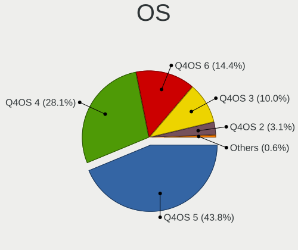

| Name      | Computers | Percent |
|-----------|-----------|---------|
| Q4OS 5    | 70        | 43.75%  |
| Q4OS 4    | 45        | 28.13%  |
| Q4OS 6    | 23        | 14.38%  |
| Q4OS 3    | 16        | 10%     |
| Q4OS 2    | 5         | 3.13%   |
| Q4OS 4.11 | 1         | 0.63%   |

OS Family
---------

OS without a version

| Name | Computers | Percent |
|------|-----------|---------|
| Q4OS | 149       | 100%    |

Kernel
------

Version of the Linux kernel

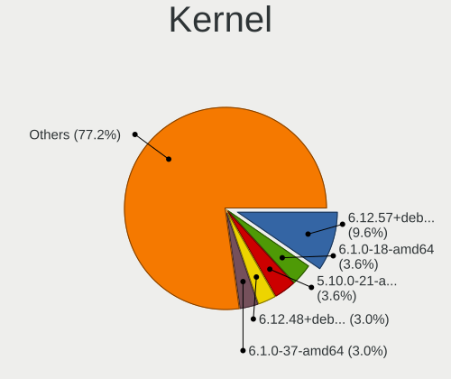

| Version               | Computers | Percent |
|-----------------------|-----------|---------|
| 6.12.57+deb13-amd64   | 16        | 9.58%   |
| 6.1.0-18-amd64        | 6         | 3.59%   |
| 5.10.0-21-amd64       | 6         | 3.59%   |
| 6.12.48+deb13-amd64   | 5         | 2.99%   |
| 6.1.0-37-amd64        | 5         | 2.99%   |
| 6.1.0-34-amd64        | 5         | 2.99%   |
| 6.1.0-31-amd64        | 5         | 2.99%   |
| 6.1.0-27-amd64        | 5         | 2.99%   |
| 6.1.0-23-amd64        | 5         | 2.99%   |
| 6.1.0-32-amd64        | 4         | 2.4%    |
| 6.1.0-25-amd64        | 4         | 2.4%    |
| 6.1.0-13-amd64        | 4         | 2.4%    |
| 5.10.0-23-amd64       | 4         | 2.4%    |
| 5.10.0-19-amd64       | 4         | 2.4%    |
| 6.1.0-38-amd64        | 3         | 1.8%    |
| 6.1.0-21-amd64        | 3         | 1.8%    |
| 5.10.0-21-686-pae     | 3         | 1.8%    |
| 5.10.0-12-amd64       | 3         | 1.8%    |
| 4.19.0-17-amd64       | 3         | 1.8%    |
| 6.1.0-28-amd64        | 2         | 1.2%    |
| 6.1.0-26-amd64        | 2         | 1.2%    |
| 6.1.0-17-686-pae      | 2         | 1.2%    |
| 5.10.0-8-amd64        | 2         | 1.2%    |
| 5.10.0-14-686-pae     | 2         | 1.2%    |
| 5.10.0-10-686-pae     | 2         | 1.2%    |
| 6.6.8-x64v1-xanmod1   | 1         | 0.6%    |
| 6.5.1-060501-generic  | 1         | 0.6%    |
| 6.5.0-4-amd64         | 1         | 0.6%    |
| 6.12.43+deb13-amd64   | 1         | 0.6%    |
| 6.12.41+deb13-amd64   | 1         | 0.6%    |
| 6.12.17-x64v2-xanmod1 | 1         | 0.6%    |
| 6.1.0-41-amd64        | 1         | 0.6%    |
| 6.1.0-41-686-pae      | 1         | 0.6%    |
| 6.1.0-39-amd64        | 1         | 0.6%    |
| 6.1.0-37-686-pae      | 1         | 0.6%    |
| 6.1.0-35-amd64        | 1         | 0.6%    |
| 6.1.0-33-amd64        | 1         | 0.6%    |
| 6.1.0-30-amd64        | 1         | 0.6%    |
| 6.1.0-30-686-pae      | 1         | 0.6%    |
| 6.1.0-26-686-pae      | 1         | 0.6%    |

Kernel Family
-------------

Linux kernel without a distro release

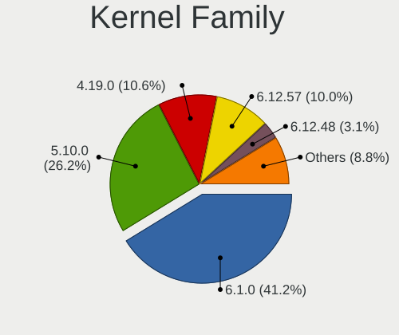

| Version | Computers | Percent |
|---------|-----------|---------|
| 6.1.0   | 66        | 41.25%  |
| 5.10.0  | 42        | 26.25%  |
| 4.19.0  | 17        | 10.63%  |
| 6.12.57 | 16        | 10%     |
| 6.12.48 | 5         | 3.13%   |
| 4.9.0   | 4         | 2.5%    |
| 6.6.8   | 1         | 0.63%   |
| 6.5.1   | 1         | 0.63%   |
| 6.5.0   | 1         | 0.63%   |
| 6.12.43 | 1         | 0.63%   |
| 6.12.41 | 1         | 0.63%   |
| 6.12.17 | 1         | 0.63%   |
| 6.0.0   | 1         | 0.63%   |
| 5.9.0   | 1         | 0.63%   |
| 5.6.0   | 1         | 0.63%   |
| 5.18.0  | 1         | 0.63%   |

Kernel Major Ver.
-----------------

Linux kernel major version

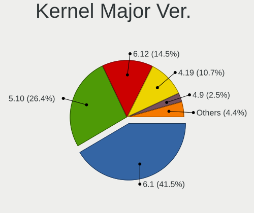

| Version | Computers | Percent |
|---------|-----------|---------|
| 6.1     | 66        | 41.51%  |
| 5.10    | 42        | 26.42%  |
| 6.12    | 23        | 14.47%  |
| 4.19    | 17        | 10.69%  |
| 4.9     | 4         | 2.52%   |
| 6.5     | 2         | 1.26%   |
| 6.6     | 1         | 0.63%   |
| 6.0     | 1         | 0.63%   |
| 5.9     | 1         | 0.63%   |
| 5.6     | 1         | 0.63%   |
| 5.18    | 1         | 0.63%   |

Arch
----

OS architecture (x86_64, i586, etc.)

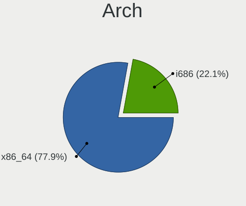

| Name   | Computers | Percent |
|--------|-----------|---------|
| x86_64 | 116       | 77.85%  |
| i686   | 33        | 22.15%  |

DE
--

Desktop Environment

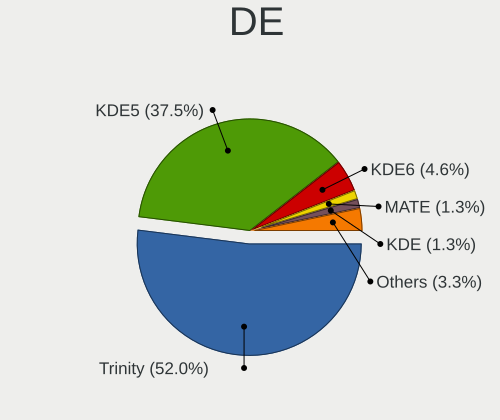

| Name       | Computers | Percent |
|------------|-----------|---------|
| Trinity    | 79        | 51.97%  |
| KDE5       | 57        | 37.5%   |
| KDE6       | 7         | 4.61%   |
| MATE       | 2         | 1.32%   |
| KDE        | 2         | 1.32%   |
| XFCE       | 1         | 0.66%   |
| X-Cinnamon | 1         | 0.66%   |
| LXDE       | 1         | 0.66%   |
| Cinnamon   | 1         | 0.66%   |
| Budgie     | 1         | 0.66%   |

Display Server
--------------

X11 or Wayland

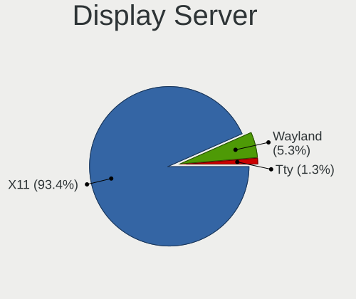

| Name    | Computers | Percent |
|---------|-----------|---------|
| X11     | 141       | 93.38%  |
| Wayland | 8         | 5.3%    |
| Tty     | 2         | 1.32%   |

Display Manager
---------------

SDDM, LightDM, etc.

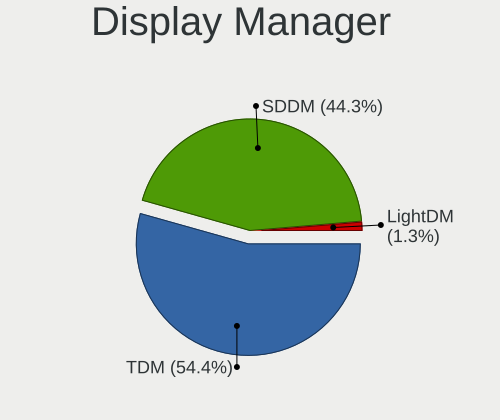

| Name    | Computers | Percent |
|---------|-----------|---------|
| TDM     | 81        | 54.36%  |
| SDDM    | 66        | 44.3%   |
| LightDM | 2         | 1.34%   |

OS Lang
-------

Language

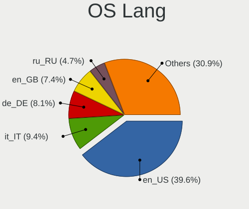

| Lang    | Computers | Percent |
|---------|-----------|---------|
| en_US   | 59        | 39.6%   |
| it_IT   | 14        | 9.4%    |
| de_DE   | 12        | 8.05%   |
| en_GB   | 11        | 7.38%   |
| ru_RU   | 7         | 4.7%    |
| fr_FR   | 6         | 4.03%   |
| ja_JP   | 5         | 3.36%   |
| es_ES   | 5         | 3.36%   |
| hu_HU   | 4         | 2.68%   |
| Unknown | 3         | 2.01%   |
| pt_BR   | 2         | 1.34%   |
| pl_PL   | 2         | 1.34%   |
| en_ZA   | 2         | 1.34%   |
| en_CA   | 2         | 1.34%   |
| sv_SE   | 1         | 0.67%   |
| sl_SI   | 1         | 0.67%   |
| sk_SK   | 1         | 0.67%   |
| hr_HR   | 1         | 0.67%   |
| fr_CA   | 1         | 0.67%   |
| es_VE   | 1         | 0.67%   |
| es_PE   | 1         | 0.67%   |
| es_MX   | 1         | 0.67%   |
| es_AR   | 1         | 0.67%   |
| en_SG   | 1         | 0.67%   |
| en_IE   | 1         | 0.67%   |
| de_CH   | 1         | 0.67%   |
| de_AT   | 1         | 0.67%   |
| C       | 1         | 0.67%   |
| bg_BG   | 1         | 0.67%   |

Boot Mode
---------

EFI or BIOS

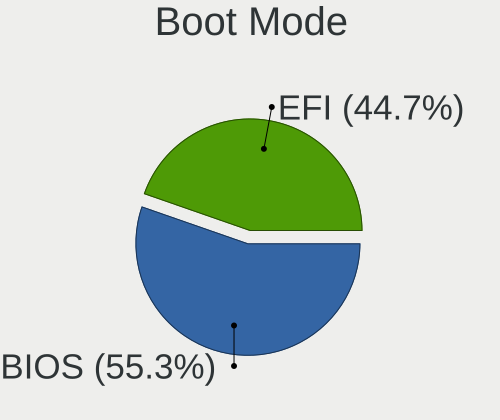

| Mode | Computers | Percent |
|------|-----------|---------|
| BIOS | 83        | 55.33%  |
| EFI  | 67        | 44.67%  |

Filesystem
----------

Type of filesystem

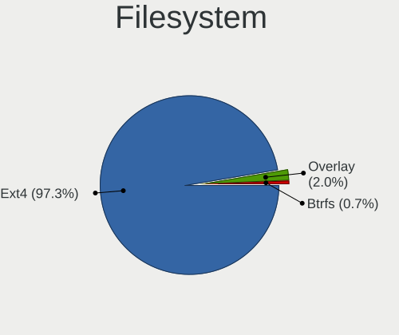

| Type    | Computers | Percent |
|---------|-----------|---------|
| Ext4    | 145       | 97.32%  |
| Overlay | 3         | 2.01%   |
| Btrfs   | 1         | 0.67%   |

Part. scheme
------------

Scheme of partitioning

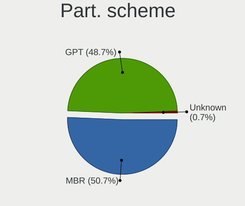

| Type    | Computers | Percent |
|---------|-----------|---------|
| MBR     | 76        | 50.67%  |
| GPT     | 73        | 48.67%  |
| Unknown | 1         | 0.67%   |

Dual Boot with Linux/BSD
------------------------

Hosting more than one Linux/BSD

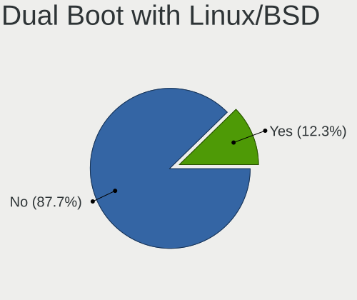

| Dual boot | Computers | Percent |
|-----------|-----------|---------|
| No        | 130       | 86.67%  |
| Yes       | 20        | 13.33%  |

Dual Boot (Win)
---------------

Hosting Linux and Windows

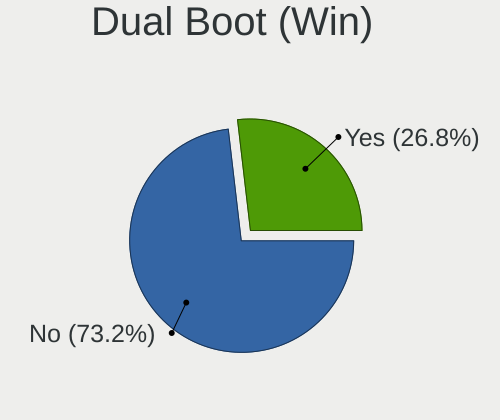

| Dual boot | Computers | Percent |
|-----------|-----------|---------|
| No        | 109       | 73.15%  |
| Yes       | 40        | 26.85%  |

Board
-----

Vendor
------

Motherboard manufacturer

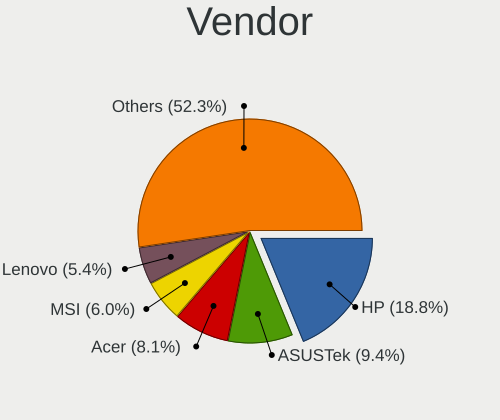

| Name                           | Computers | Percent |
|--------------------------------|-----------|---------|
| Hewlett-Packard                | 28        | 18.79%  |
| ASUSTek Computer               | 14        | 9.4%    |
| Acer                           | 12        | 8.05%   |
| MSI                            | 9         | 6.04%   |
| Lenovo                         | 8         | 5.37%   |
| Toshiba                        | 7         | 4.7%    |
| Gigabyte Technology            | 6         | 4.03%   |
| Google                         | 5         | 3.36%   |
| ASRock                         | 5         | 3.36%   |
| Apple                          | 5         | 3.36%   |
| Intel                          | 4         | 2.68%   |
| Dell                           | 4         | 2.68%   |
| Medion                         | 3         | 2.01%   |
| AMI                            | 3         | 2.01%   |
| Unknown                        | 3         | 2.01%   |
| TrekStor                       | 2         | 1.34%   |
| Sony                           | 2         | 1.34%   |
| Packard Bell                   | 2         | 1.34%   |
| IBM                            | 2         | 1.34%   |
| Dynabook                       | 2         | 1.34%   |
| Clevo                          | 2         | 1.34%   |
| VXL                            | 1         | 0.67%   |
| Visual Land                    | 1         | 0.67%   |
| TECO Electric and Machinery    | 1         | 0.67%   |
| Qilive                         | 1         | 0.67%   |
| Phoenix/SiS                    | 1         | 0.67%   |
| Philco                         | 1         | 0.67%   |
| Panasonic                      | 1         | 0.67%   |
| MeLE                           | 1         | 0.67%   |
| Matsushita Electric Industrial | 1         | 0.67%   |
| JVC                            | 1         | 0.67%   |
| Irbis                          | 1         | 0.67%   |
| Fujitsu Siemens                | 1         | 0.67%   |
| Fujitsu                        | 1         | 0.67%   |
| Framework                      | 1         | 0.67%   |
| Foxconn                        | 1         | 0.67%   |
| Compaq                         | 1         | 0.67%   |
| Chuwi                          | 1         | 0.67%   |
| Biostar                        | 1         | 0.67%   |
| BESSTAR Tech                   | 1         | 0.67%   |

Model
-----

Motherboard model

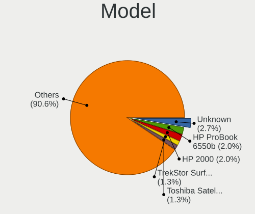

| Name                                        | Computers | Percent |
|---------------------------------------------|-----------|---------|
| Unknown                                     | 4         | 2.68%   |
| HP ProBook 6550b                            | 3         | 2.01%   |
| HP 2000                                     | 3         | 2.01%   |
| TrekStor SurfTab wintron 7.0                | 2         | 1.34%   |
| Toshiba Satellite C660                      | 2         | 1.34%   |
| MSI U90/U100                                | 2         | 1.34%   |
| HP ProBook 650 G1                           | 2         | 1.34%   |
| Dynabook S73/HU                             | 2         | 1.34%   |
| VXL TC7500D Series                          | 1         | 0.67%   |
| Visual Land Premier 10                      | 1         | 0.67%   |
| Toshiba Satellite Pro L500                  | 1         | 0.67%   |
| Toshiba Satellite M70                       | 1         | 0.67%   |
| Toshiba Satellite L515                      | 1         | 0.67%   |
| Toshiba Satellite L455D                     | 1         | 0.67%   |
| Toshiba NB100                               | 1         | 0.67%   |
| TECO Electric and Machinery FUTRO S400      | 1         | 0.67%   |
| Sony VGN-P11Z_Q                             | 1         | 0.67%   |
| Sony VGN-FW21Z                              | 1         | 0.67%   |
| Qilive QW19141AMSP                          | 1         | 0.67%   |
| Phoenix/SiS M720SR                          | 1         | 0.67%   |
| Philco 14I                                  | 1         | 0.67%   |
| Panasonic CF-S10CWHDS                       | 1         | 0.67%   |
| Packard Bell IMEDIA S1800                   | 1         | 0.67%   |
| Packard Bell EasyNote LM81                  | 1         | 0.67%   |
| MSI U210                                    | 1         | 0.67%   |
| MSI MS-7C92                                 | 1         | 0.67%   |
| MSI MS-7C56                                 | 1         | 0.67%   |
| MSI MS-7733                                 | 1         | 0.67%   |
| MSI MS-7597                                 | 1         | 0.67%   |
| MSI MS-7592                                 | 1         | 0.67%   |
| MSI Alpha 17 C7VF                           | 1         | 0.67%   |
| MeLE AW-09                                  | 1         | 0.67%   |
| Medion P961x                                | 1         | 0.67%   |
| Medion P6620                                | 1         | 0.67%   |
| Matsushita Electric Industrial CF-29LAQGZBM | 1         | 0.67%   |
| Lenovo ThinkPad X201 3249MJJ                | 1         | 0.67%   |
| Lenovo ThinkPad T495 20NKS0PG00             | 1         | 0.67%   |
| Lenovo ThinkPad 11e 20DAS0PS00              | 1         | 0.67%   |
| Lenovo ThinkCentre M90p 5864AG3             | 1         | 0.67%   |
| Lenovo IdeaPad S145-15AST 81N3              | 1         | 0.67%   |

Model Family
------------

Motherboard model prefix

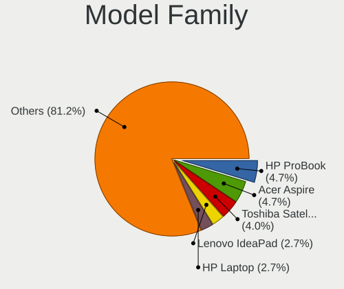

| Name                                        | Computers | Percent |
|---------------------------------------------|-----------|---------|
| HP ProBook                                  | 7         | 4.7%    |
| Acer Aspire                                 | 7         | 4.7%    |
| Toshiba Satellite                           | 6         | 4.03%   |
| Lenovo IdeaPad                              | 4         | 2.68%   |
| HP Laptop                                   | 4         | 2.68%   |
| Dell Latitude                               | 4         | 2.68%   |
| Unknown                                     | 4         | 2.68%   |
| Lenovo ThinkPad                             | 3         | 2.01%   |
| HP Pavilion                                 | 3         | 2.01%   |
| HP 2000                                     | 3         | 2.01%   |
| ASUS VivoBook                               | 3         | 2.01%   |
| TrekStor SurfTab                            | 2         | 1.34%   |
| MSI U90                                     | 2         | 1.34%   |
| IBM ThinkPad                                | 2         | 1.34%   |
| HP Compaq                                   | 2         | 1.34%   |
| Dynabook S73                                | 2         | 1.34%   |
| VXL TC7500D                                 | 1         | 0.67%   |
| Visual Land Premier                         | 1         | 0.67%   |
| Toshiba NB100                               | 1         | 0.67%   |
| TECO Electric and Machinery FUTRO           | 1         | 0.67%   |
| Sony VGN-P11Z                               | 1         | 0.67%   |
| Sony VGN-FW21Z                              | 1         | 0.67%   |
| Qilive QW19141AMSP                          | 1         | 0.67%   |
| Phoenix/SiS M720SR                          | 1         | 0.67%   |
| Philco 14I                                  | 1         | 0.67%   |
| Panasonic CF-S10CWHDS                       | 1         | 0.67%   |
| Packard Bell IMEDIA                         | 1         | 0.67%   |
| Packard Bell EasyNote                       | 1         | 0.67%   |
| MSI U210                                    | 1         | 0.67%   |
| MSI MS-7C92                                 | 1         | 0.67%   |
| MSI MS-7C56                                 | 1         | 0.67%   |
| MSI MS-7733                                 | 1         | 0.67%   |
| MSI MS-7597                                 | 1         | 0.67%   |
| MSI MS-7592                                 | 1         | 0.67%   |
| MSI Alpha                                   | 1         | 0.67%   |
| MeLE AW-09                                  | 1         | 0.67%   |
| Medion P961x                                | 1         | 0.67%   |
| Medion P6620                                | 1         | 0.67%   |
| Matsushita Electric Industrial CF-29LAQGZBM | 1         | 0.67%   |
| Lenovo ThinkCentre                          | 1         | 0.67%   |

MFG Year
--------

Motherboard manufacture year

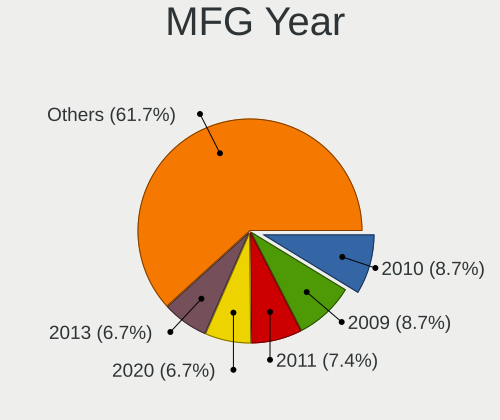

| Year    | Computers | Percent |
|---------|-----------|---------|
| 2010    | 13        | 8.72%   |
| 2009    | 13        | 8.72%   |
| 2011    | 11        | 7.38%   |
| 2020    | 10        | 6.71%   |
| 2013    | 10        | 6.71%   |
| 2018    | 8         | 5.37%   |
| 2008    | 8         | 5.37%   |
| 2023    | 7         | 4.7%    |
| 2017    | 7         | 4.7%    |
| 2012    | 7         | 4.7%    |
| 2016    | 6         | 4.03%   |
| 2007    | 6         | 4.03%   |
| 2005    | 6         | 4.03%   |
| 2015    | 5         | 3.36%   |
| 2014    | 5         | 3.36%   |
| 2022    | 4         | 2.68%   |
| 2021    | 4         | 2.68%   |
| 2006    | 4         | 2.68%   |
| 2024    | 3         | 2.01%   |
| 2019    | 3         | 2.01%   |
| 2025    | 2         | 1.34%   |
| 2004    | 2         | 1.34%   |
| 2002    | 2         | 1.34%   |
| Unknown | 2         | 1.34%   |
| 2003    | 1         | 0.67%   |

Form Factor
-----------

Physical design of the computer

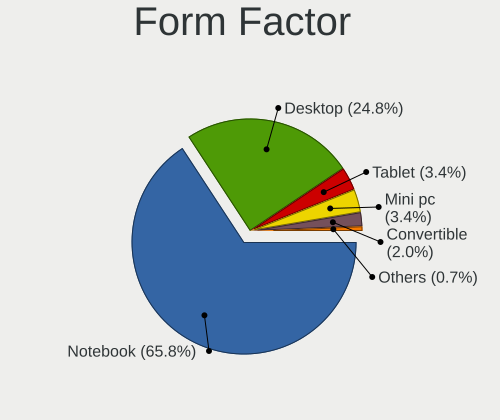

| Name        | Computers | Percent |
|-------------|-----------|---------|
| Notebook    | 98        | 65.77%  |
| Desktop     | 37        | 24.83%  |
| Tablet      | 5         | 3.36%   |
| Mini pc     | 5         | 3.36%   |
| Convertible | 3         | 2.01%   |
| All in one  | 1         | 0.67%   |

Secure Boot
-----------

Enabled or disabled

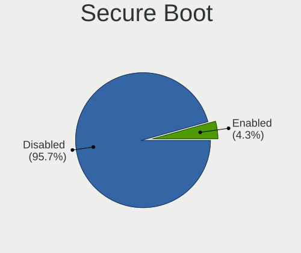

| State    | Computers | Percent |
|----------|-----------|---------|
| Disabled | 141       | 94%     |
| Enabled  | 9         | 6%      |

Coreboot
--------

Have coreboot on board

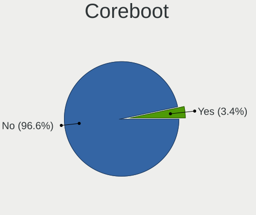

| Used | Computers | Percent |
|------|-----------|---------|
| No   | 144       | 96.64%  |
| Yes  | 5         | 3.36%   |

RAM Size
--------

Total RAM memory

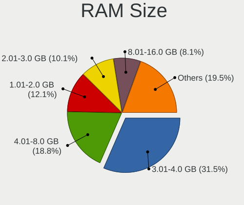

| Size in GB  | Computers | Percent |
|-------------|-----------|---------|
| 3.01-4.0    | 47        | 31.54%  |
| 4.01-8.0    | 28        | 18.79%  |
| 1.01-2.0    | 18        | 12.08%  |
| 2.01-3.0    | 15        | 10.07%  |
| 8.01-16.0   | 12        | 8.05%   |
| 0.51-1.0    | 8         | 5.37%   |
| 16.01-24.0  | 7         | 4.7%    |
| 0.01-0.5    | 5         | 3.36%   |
| 32.01-64.0  | 3         | 2.01%   |
| 24.01-32.0  | 3         | 2.01%   |
| 64.01-256.0 | 3         | 2.01%   |

RAM Used
--------

Used RAM memory

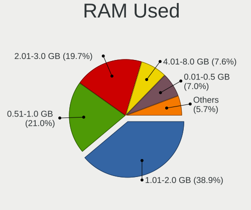

| Used GB   | Computers | Percent |
|-----------|-----------|---------|
| 1.01-2.0  | 61        | 38.85%  |
| 0.51-1.0  | 33        | 21.02%  |
| 2.01-3.0  | 31        | 19.75%  |
| 4.01-8.0  | 12        | 7.64%   |
| 0.01-0.5  | 11        | 7.01%   |
| 3.01-4.0  | 8         | 5.1%    |
| 8.01-16.0 | 1         | 0.64%   |

Total Drives
------------

Number of drives on board

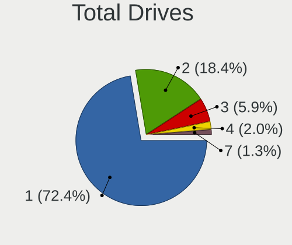

| Drives | Computers | Percent |
|--------|-----------|---------|
| 1      | 110       | 72.37%  |
| 2      | 28        | 18.42%  |
| 3      | 9         | 5.92%   |
| 4      | 3         | 1.97%   |
| 7      | 2         | 1.32%   |

Has CD-ROM
----------

Has CD-ROM on board

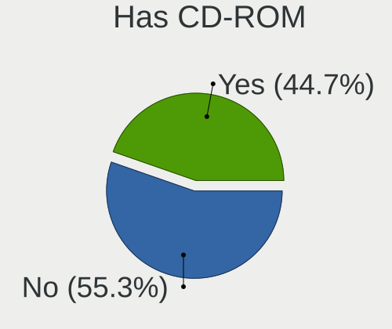

| Presented | Computers | Percent |
|-----------|-----------|---------|
| No        | 83        | 55.33%  |
| Yes       | 67        | 44.67%  |

Has Ethernet
------------

Has Ethernet on board

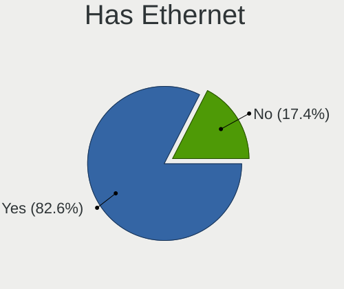

| Presented | Computers | Percent |
|-----------|-----------|---------|
| Yes       | 123       | 82.55%  |
| No        | 26        | 17.45%  |

Has WiFi
--------

Has WiFi module

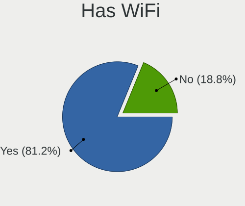

| Presented | Computers | Percent |
|-----------|-----------|---------|
| Yes       | 121       | 81.21%  |
| No        | 28        | 18.79%  |

Has Bluetooth
-------------

Has Bluetooth module

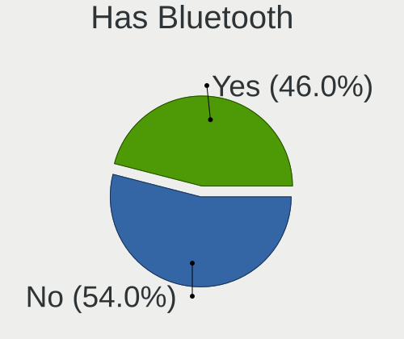

| Presented | Computers | Percent |
|-----------|-----------|---------|
| No        | 81        | 54%     |
| Yes       | 69        | 46%     |

Location
--------

Country
-------

Geographic location (country)

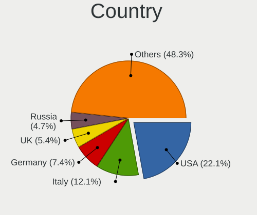

| Country      | Computers | Percent |
|--------------|-----------|---------|
| USA          | 33        | 22.15%  |
| Italy        | 18        | 12.08%  |
| Germany      | 11        | 7.38%   |
| UK           | 8         | 5.37%   |
| Russia       | 7         | 4.7%    |
| Japan        | 5         | 3.36%   |
| France       | 5         | 3.36%   |
| Canada       | 5         | 3.36%   |
| Switzerland  | 4         | 2.68%   |
| Spain        | 4         | 2.68%   |
| Hungary      | 4         | 2.68%   |
| Poland       | 3         | 2.01%   |
| Mexico       | 3         | 2.01%   |
| Kenya        | 3         | 2.01%   |
| Brazil       | 3         | 2.01%   |
| Venezuela    | 2         | 1.34%   |
| Turkey       | 2         | 1.34%   |
| South Africa | 2         | 1.34%   |
| Slovenia     | 2         | 1.34%   |
| Romania      | 2         | 1.34%   |
| Netherlands  | 2         | 1.34%   |
| Croatia      | 2         | 1.34%   |
| Belgium      | 2         | 1.34%   |
| Argentina    | 2         | 1.34%   |
| Algeria      | 2         | 1.34%   |
| Sweden       | 1         | 0.67%   |
| Slovakia     | 1         | 0.67%   |
| Singapore    | 1         | 0.67%   |
| Saudi Arabia | 1         | 0.67%   |
| Qatar        | 1         | 0.67%   |
| Peru         | 1         | 0.67%   |
| Greece       | 1         | 0.67%   |
| Egypt        | 1         | 0.67%   |
| Bulgaria     | 1         | 0.67%   |
| Belarus      | 1         | 0.67%   |
| Bangladesh   | 1         | 0.67%   |
| Austria      | 1         | 0.67%   |
| Australia    | 1         | 0.67%   |

City
----

Geographic location (city)

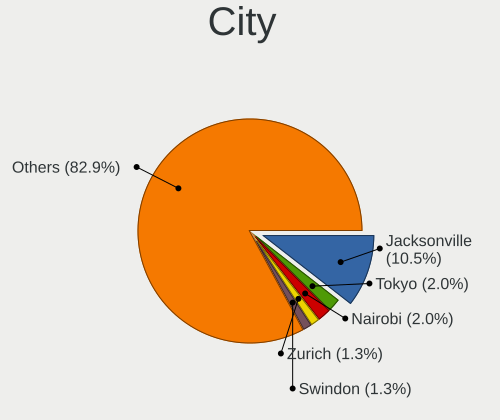

| City                  | Computers | Percent |
|-----------------------|-----------|---------|
| Jacksonville          | 16        | 10.53%  |
| Tokyo                 | 3         | 1.97%   |
| Nairobi               | 3         | 1.97%   |
| Zurich                | 2         | 1.32%   |
| Swindon               | 2         | 1.32%   |
| Rostock               | 2         | 1.32%   |
| Presezzo              | 2         | 1.32%   |
| Pittsburgh            | 2         | 1.32%   |
| Palermo               | 2         | 1.32%   |
| Morelia               | 2         | 1.32%   |
| Mesa                  | 2         | 1.32%   |
| Ljubljana             | 2         | 1.32%   |
| Lake City             | 2         | 1.32%   |
| Drobeta-Turnu Severin | 2         | 1.32%   |
| Budapest              | 2         | 1.32%   |
| Bologna               | 2         | 1.32%   |
| Zweidlen-Dorf         | 1         | 0.66%   |
| Zagreb                | 1         | 0.66%   |
| Yekaterinburg         | 1         | 0.66%   |
| Wrexham               | 1         | 0.66%   |
| West Corinth          | 1         | 0.66%   |
| Volgograd             | 1         | 0.66%   |
| Vienna                | 1         | 0.66%   |
| Turin                 | 1         | 0.66%   |
| Toronto               | 1         | 0.66%   |
| Toledo                | 1         | 0.66%   |
| Toalmas               | 1         | 0.66%   |
| The Hague             | 1         | 0.66%   |
| Tenbury Wells         | 1         | 0.66%   |
| Tellico Plains        | 1         | 0.66%   |
| Stolberg              | 1         | 0.66%   |
| Steinbach             | 1         | 0.66%   |
| Sosnowiec             | 1         | 0.66%   |
| Solingen              | 1         | 0.66%   |
| Sofia                 | 1         | 0.66%   |
| Siziano               | 1         | 0.66%   |
| Sint-Pieters-Leeuw    | 1         | 0.66%   |
| Singapore             | 1         | 0.66%   |
| Shizuoka              | 1         | 0.66%   |
| Shadrinsk             | 1         | 0.66%   |

Drives
------

Drive Vendor
------------

Hard drive vendors

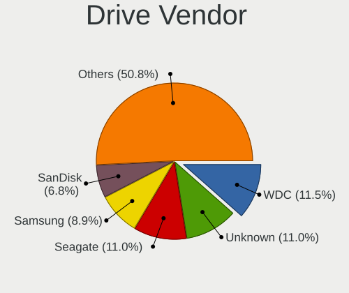

| Vendor                       | Computers | Drives | Percent |
|------------------------------|-----------|--------|---------|
| WDC                          | 22        | 25     | 11.52%  |
| Unknown                      | 21        | 30     | 10.99%  |
| Seagate                      | 21        | 27     | 10.99%  |
| Samsung Electronics          | 17        | 19     | 8.9%    |
| SanDisk                      | 13        | 16     | 6.81%   |
| Toshiba                      | 11        | 13     | 5.76%   |
| Kingston                     | 11        | 12     | 5.76%   |
| Hitachi                      | 9         | 12     | 4.71%   |
| Crucial                      | 5         | 6      | 2.62%   |
| China                        | 5         | 6      | 2.62%   |
| HGST                         | 4         | 4      | 2.09%   |
| Fujitsu                      | 4         | 4      | 2.09%   |
| Unknown                      | 4         | 4      | 2.09%   |
| SUNEAST                      | 3         | 5      | 1.57%   |
| Apple                        | 3         | 4      | 1.57%   |
| A-DATA Technology            | 3         | 3      | 1.57%   |
| PASOUL 2                     | 2         | 2      | 1.05%   |
| Micron Technology            | 2         | 2      | 1.05%   |
| KESU                         | 2         | 2      | 1.05%   |
| JMicron Technology           | 2         | 2      | 1.05%   |
| CUSU                         | 2         | 3      | 1.05%   |
| Zsuit                        | 1         | 1      | 0.52%   |
| WDC WDS5                     | 1         | 1      | 0.52%   |
| USB3.0                       | 1         | 1      | 0.52%   |
| USB                          | 1         | 1      | 0.52%   |
| Unknown (CF)                 | 1         | 1      | 0.52%   |
| Transcend                    | 1         | 1      | 0.52%   |
| SPCC                         | 1         | 1      | 0.52%   |
| SK hynix                     | 1         | 1      | 0.52%   |
| Silicon Motion               | 1         | 1      | 0.52%   |
| Shenzhen Longsys Electronics | 1         | 1      | 0.52%   |
| PNY                          | 1         | 1      | 0.52%   |
| Plextor                      | 1         | 1      | 0.52%   |
| Phison                       | 1         | 1      | 0.52%   |
| Maxtor                       | 1         | 1      | 0.52%   |
| M500                         | 1         | 1      | 0.52%   |
| Lexar                        | 1         | 1      | 0.52%   |
| KIOXIA                       | 1         | 1      | 0.52%   |
| KingSpec                     | 1         | 1      | 0.52%   |
| KBG40ZNV                     | 1         | 1      | 0.52%   |

Drive Model
-----------

Hard drive models

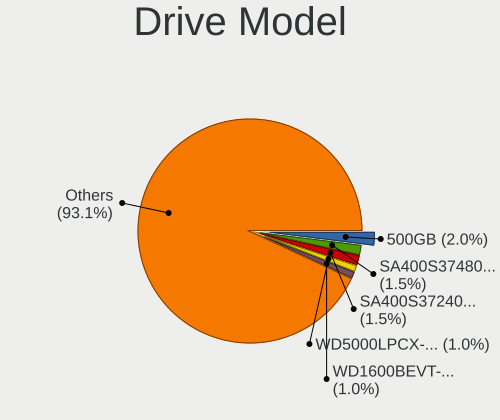

| Model                            | Computers | Percent |
|----------------------------------|-----------|---------|
| Unknown                          | 4         | 1.98%   |
| Kingston SA400S37480G 480GB SSD  | 3         | 1.49%   |
| Kingston SA400S37240G 240GB SSD  | 3         | 1.49%   |
| WDC WD5000LPCX-60VHAT0 500GB     | 2         | 0.99%   |
| WDC WD1600BEVT-22ZCT0 160GB      | 2         | 0.99%   |
| Unknown S0J59X  128GB            | 2         | 0.99%   |
| Unknown NCard  16GB              | 2         | 0.99%   |
| Unknown MMC Card  64GB           | 2         | 0.99%   |
| Unknown G1J38E  64GB             | 2         | 0.99%   |
| Unknown Externa 1TB              | 2         | 0.99%   |
| Unknown 1 250GB                  | 2         | 0.99%   |
| Toshiba MQ01ABF032 320GB         | 2         | 0.99%   |
| SUNEAST SE900 SSD 128GB          | 2         | 0.99%   |
| Seagate ST9500325AS 500GB        | 2         | 0.99%   |
| Seagate ST1000LM035-1RK172 1TB   | 2         | 0.99%   |
| SanDisk SDSSDA120G 120GB         | 2         | 0.99%   |
| Samsung SSD 850 EVO 250GB        | 2         | 0.99%   |
| PASOUL 2 56GB                    | 2         | 0.99%   |
| KESU USB 3.1 256GB               | 2         | 0.99%   |
| Hitachi HTS541080G9SA00 80GB     | 2         | 0.99%   |
| Fujitsu MHY2080BH 80GB           | 2         | 0.99%   |
| CUSU CV3500Q 512GB               | 2         | 0.99%   |
| A-DATA SU630 240GB SSD           | 2         | 0.99%   |
| Zsuit SATA SSD 128GB             | 1         | 0.5%    |
| WDC WDS500G2B0B-00YS70 500GB SSD | 1         | 0.5%    |
| WDC WDS5 00G2B0C-00PX 500GB      | 1         | 0.5%    |
| WDC WDS240G2G0A-00JH30 240GB SSD | 1         | 0.5%    |
| WDC WDBNCE5000PNC 500GB SSD      | 1         | 0.5%    |
| WDC WD800BD-22MRA1 80GB          | 1         | 0.5%    |
| WDC WD5000LPVX-22V0TT0 500GB     | 1         | 0.5%    |
| WDC WD400BD-23JMC0 40GB          | 1         | 0.5%    |
| WDC WD3200BPVT-00ZEST0 320GB     | 1         | 0.5%    |
| WDC WD3200BEVT-22ZCT0 320GB      | 1         | 0.5%    |
| WDC WD3200BEVT-22A23T0 320GB     | 1         | 0.5%    |
| WDC WD3200BEKT-75PVMT1 320GB     | 1         | 0.5%    |
| WDC WD2500BEVT-60A23T0 250GB     | 1         | 0.5%    |
| WDC WD2500AAJS-08L7A0 250GB      | 1         | 0.5%    |
| WDC WD1600AAJS-75M0A0 160GB      | 1         | 0.5%    |
| WDC WD1600AAJS-00L7A0 160GB      | 1         | 0.5%    |
| WDC WD10EFRX-68JCSN0 1TB         | 1         | 0.5%    |

HDD Vendor
----------

Hard disk drive vendors

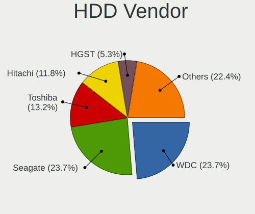

| Vendor              | Computers | Drives | Percent |
|---------------------|-----------|--------|---------|
| WDC                 | 18        | 21     | 23.68%  |
| Seagate             | 18        | 24     | 23.68%  |
| Toshiba             | 10        | 12     | 13.16%  |
| Hitachi             | 9         | 12     | 11.84%  |
| HGST                | 4         | 4      | 5.26%   |
| Fujitsu             | 4         | 4      | 5.26%   |
| Samsung Electronics | 3         | 3      | 3.95%   |
| PASOUL 2            | 2         | 2      | 2.63%   |
| USB3.0              | 1         | 1      | 1.32%   |
| USB                 | 1         | 1      | 1.32%   |
| Unknown             | 1         | 1      | 1.32%   |
| Maxtor              | 1         | 1      | 1.32%   |
| JMicron Technology  | 1         | 1      | 1.32%   |
| IBM/Hitachi         | 1         | 2      | 1.32%   |
| Apple               | 1         | 1      | 1.32%   |
| Unknown             | 1         | 1      | 1.32%   |

SSD Vendor
----------

Solid state drive vendors

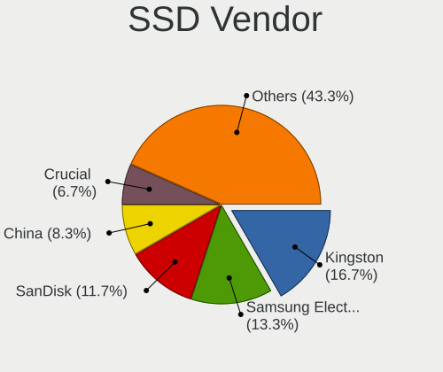

| Vendor              | Computers | Drives | Percent |
|---------------------|-----------|--------|---------|
| Kingston            | 10        | 11     | 16.67%  |
| Samsung Electronics | 8         | 8      | 13.33%  |
| SanDisk             | 7         | 9      | 11.67%  |
| China               | 5         | 6      | 8.33%   |
| Crucial             | 4         | 4      | 6.67%   |
| WDC                 | 3         | 3      | 5%      |
| SUNEAST             | 3         | 5      | 5%      |
| Apple               | 2         | 3      | 3.33%   |
| A-DATA Technology   | 2         | 2      | 3.33%   |
| Zsuit               | 1         | 1      | 1.67%   |
| Unknown (CF)        | 1         | 1      | 1.67%   |
| Transcend           | 1         | 1      | 1.67%   |
| Toshiba             | 1         | 1      | 1.67%   |
| PNY                 | 1         | 1      | 1.67%   |
| Plextor             | 1         | 1      | 1.67%   |
| Micron Technology   | 1         | 1      | 1.67%   |
| M500                | 1         | 1      | 1.67%   |
| Lexar               | 1         | 1      | 1.67%   |
| KingSpec            | 1         | 1      | 1.67%   |
| Intenso             | 1         | 1      | 1.67%   |
| Intel               | 1         | 1      | 1.67%   |
| HEYGATE             | 1         | 1      | 1.67%   |
| Gigabyte Technology | 1         | 1      | 1.67%   |
| Azerty              | 1         | 1      | 1.67%   |
| Unknown             | 1         | 1      | 1.67%   |

Drive Kind
----------

HDD or SSD

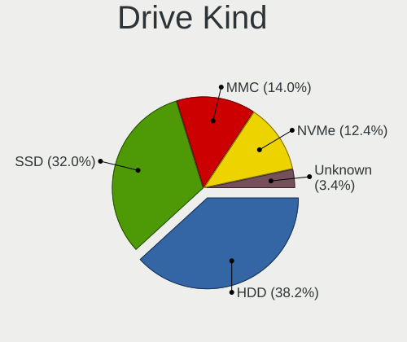

| Kind    | Computers | Drives | Percent |
|---------|-----------|--------|---------|
| HDD     | 68        | 91     | 38.2%   |
| SSD     | 57        | 67     | 32.02%  |
| MMC     | 25        | 30     | 14.04%  |
| NVMe    | 22        | 28     | 12.36%  |
| Unknown | 6         | 11     | 3.37%   |

Drive Connector
---------------

SATA, SAS, NVMe, etc.

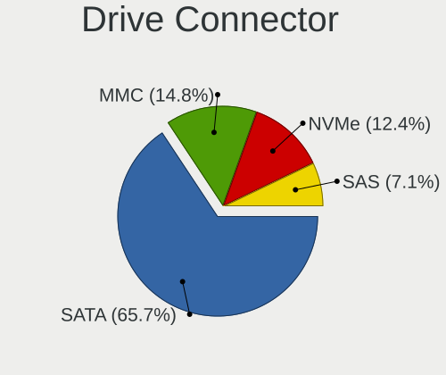

| Type | Computers | Drives | Percent |
|------|-----------|--------|---------|
| SATA | 111       | 146    | 65.68%  |
| MMC  | 25        | 30     | 14.79%  |
| NVMe | 21        | 26     | 12.43%  |
| SAS  | 12        | 25     | 7.1%    |

Drive Size
----------

Size of hard drive

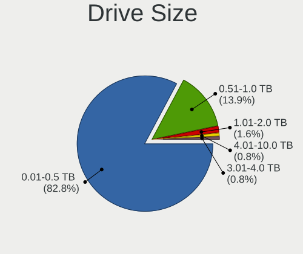

| Size in TB | Computers | Drives | Percent |
|------------|-----------|--------|---------|
| 0.01-0.5   | 101       | 134    | 82.79%  |
| 0.51-1.0   | 17        | 20     | 13.93%  |
| 1.01-2.0   | 2         | 2      | 1.64%   |
| 3.01-4.0   | 1         | 1      | 0.82%   |
| 4.01-10.0  | 1         | 1      | 0.82%   |

Space Total
-----------

Amount of disk space available on the file system

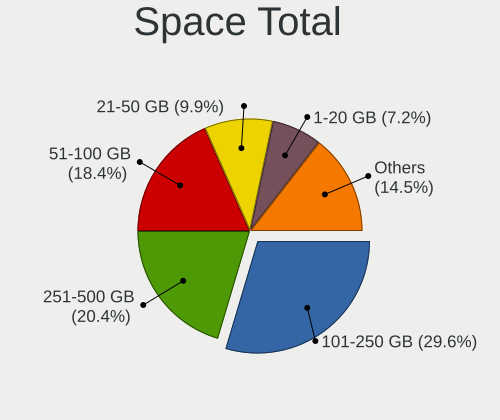

| Size in GB     | Computers | Percent |
|----------------|-----------|---------|
| 101-250        | 45        | 29.61%  |
| 251-500        | 31        | 20.39%  |
| 51-100         | 28        | 18.42%  |
| 21-50          | 15        | 9.87%   |
| 1-20           | 11        | 7.24%   |
| 501-1000       | 10        | 6.58%   |
| 1001-2000      | 6         | 3.95%   |
| More than 3000 | 2         | 1.32%   |
| 2001-3000      | 2         | 1.32%   |
| Unknown        | 2         | 1.32%   |

Space Used
----------

Amount of used disk space

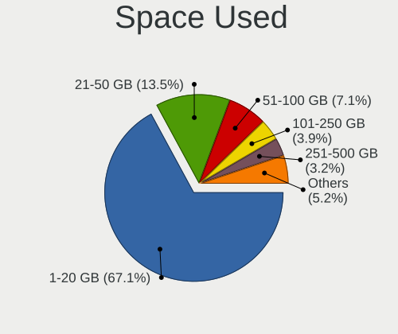

| Used GB        | Computers | Percent |
|----------------|-----------|---------|
| 1-20           | 104       | 67.1%   |
| 21-50          | 21        | 13.55%  |
| 51-100         | 11        | 7.1%    |
| 101-250        | 6         | 3.87%   |
| 251-500        | 5         | 3.23%   |
| 501-1000       | 3         | 1.94%   |
| 1001-2000      | 2         | 1.29%   |
| Unknown        | 2         | 1.29%   |
| More than 3000 | 1         | 0.65%   |

Malfunc. Drives
---------------

Drive models with a malfunction

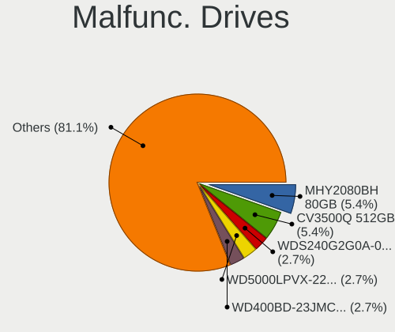

| Model                                | Computers | Drives | Percent |
|--------------------------------------|-----------|--------|---------|
| Fujitsu MHY2080BH 80GB               | 2         | 2      | 5.41%   |
| CUSU CV3500Q 512GB                   | 2         | 3      | 5.41%   |
| WDC WDS240G2G0A-00JH30 240GB SSD     | 1         | 1      | 2.7%    |
| WDC WD5000LPVX-22V0TT0 500GB         | 1         | 3      | 2.7%    |
| WDC WD400BD-23JMC0 40GB              | 1         | 1      | 2.7%    |
| WDC WD2500BEVT-60A23T0 250GB         | 1         | 1      | 2.7%    |
| WDC WD2500AAJS-08L7A0 250GB          | 1         | 1      | 2.7%    |
| WDC WD1600BEVT-22ZCT0 160GB          | 1         | 1      | 2.7%    |
| WDC WD1600AAJS-75M0A0 160GB          | 1         | 1      | 2.7%    |
| WDC WD10EARS-00Y5B1 1TB              | 1         | 1      | 2.7%    |
| Toshiba MK3252GSX 320GB              | 1         | 1      | 2.7%    |
| Toshiba MK1252GSX 120GB              | 1         | 1      | 2.7%    |
| SK hynix BC711 HFM256GD3JX013N 256GB | 1         | 1      | 2.7%    |
| Seagate ST95005620AS 500GB           | 1         | 1      | 2.7%    |
| Seagate ST9500325AS 500GB            | 1         | 1      | 2.7%    |
| Seagate ST9120822AS 120GB            | 1         | 1      | 2.7%    |
| Seagate ST3320820SCE 320GB           | 1         | 2      | 2.7%    |
| Samsung Electronics HM080GC 80GB     | 1         | 1      | 2.7%    |
| PNY 1TB SATA SSD                     | 1         | 1      | 2.7%    |
| Maxtor 6Y080L0 81GB                  | 1         | 1      | 2.7%    |
| Kingston SA400S37240G 240GB SSD      | 1         | 1      | 2.7%    |
| Intel SSDSC2CW120A3 120GB            | 1         | 1      | 2.7%    |
| IBM/Hitachi IC35L090AVV207-0 80GB    | 1         | 2      | 2.7%    |
| Hitachi HTS725025A9A364 250GB        | 1         | 1      | 2.7%    |
| Hitachi HTS723232L9A360 320GB        | 1         | 1      | 2.7%    |
| Hitachi HTS545032B9A300 320GB        | 1         | 1      | 2.7%    |
| Hitachi HTS543225L9SA00 250GB        | 1         | 1      | 2.7%    |
| Hitachi HTS541080G9SA00 80GB         | 1         | 1      | 2.7%    |
| Hitachi HDS721616PLA380 160GB        | 1         | 1      | 2.7%    |
| Hitachi DK23CA-20 20GB               | 1         | 1      | 2.7%    |
| HGST HTS725050A7E630 500GB           | 1         | 1      | 2.7%    |
| HGST HTS545050A7E680 500GB           | 1         | 1      | 2.7%    |
| HGST HTS545032A7E380 320GB           | 1         | 1      | 2.7%    |
| HGST HTS541075A9E680 752GB           | 1         | 1      | 2.7%    |
| Fujitsu MHZ2160BH G2 160GB           | 1         | 1      | 2.7%    |

Malfunc. Drive Vendor
---------------------

Vendors of faulty drives

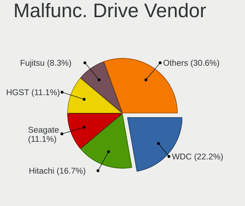

| Vendor              | Computers | Drives | Percent |
|---------------------|-----------|--------|---------|
| WDC                 | 8         | 10     | 22.22%  |
| Hitachi             | 6         | 7      | 16.67%  |
| Seagate             | 4         | 5      | 11.11%  |
| HGST                | 4         | 4      | 11.11%  |
| Fujitsu             | 3         | 3      | 8.33%   |
| Toshiba             | 2         | 2      | 5.56%   |
| CUSU                | 2         | 3      | 5.56%   |
| SK hynix            | 1         | 1      | 2.78%   |
| Samsung Electronics | 1         | 1      | 2.78%   |
| PNY                 | 1         | 1      | 2.78%   |
| Maxtor              | 1         | 1      | 2.78%   |
| Kingston            | 1         | 1      | 2.78%   |
| Intel               | 1         | 1      | 2.78%   |
| IBM/Hitachi         | 1         | 2      | 2.78%   |

Malfunc. HDD Vendor
-------------------

Vendors of faulty HDD drives

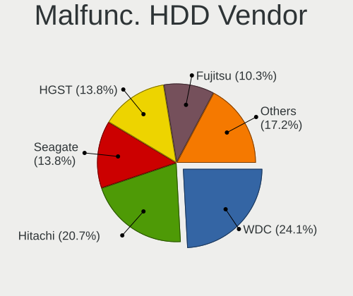

| Vendor              | Computers | Drives | Percent |
|---------------------|-----------|--------|---------|
| WDC                 | 7         | 9      | 24.14%  |
| Hitachi             | 6         | 7      | 20.69%  |
| Seagate             | 4         | 5      | 13.79%  |
| HGST                | 4         | 4      | 13.79%  |
| Fujitsu             | 3         | 3      | 10.34%  |
| Toshiba             | 2         | 2      | 6.9%    |
| Samsung Electronics | 1         | 1      | 3.45%   |
| Maxtor              | 1         | 1      | 3.45%   |
| IBM/Hitachi         | 1         | 2      | 3.45%   |

Malfunc. Drive Kind
-------------------

Kinds of faulty drives

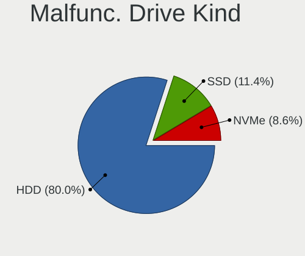

| Kind | Computers | Drives | Percent |
|------|-----------|--------|---------|
| HDD  | 28        | 34     | 80%     |
| SSD  | 4         | 4      | 11.43%  |
| NVMe | 3         | 4      | 8.57%   |

Failed Drives
-------------

Failed drive models

Zero info for selected period =(

Failed Drive Vendor
-------------------

Failed drive vendors

Zero info for selected period =(

Drive Status
------------

Number of failed and malfunc. drives

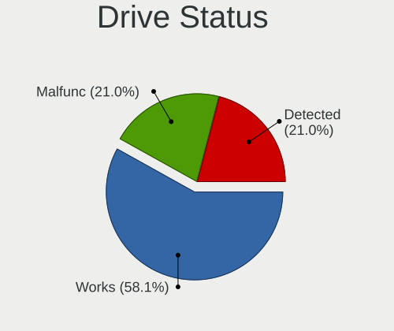

| Status   | Computers | Drives | Percent |
|----------|-----------|--------|---------|
| Works    | 97        | 133    | 58.08%  |
| Detected | 35        | 52     | 20.96%  |
| Malfunc  | 35        | 42     | 20.96%  |

Storage controller
------------------

Storage Vendor
--------------

Storage controller vendors

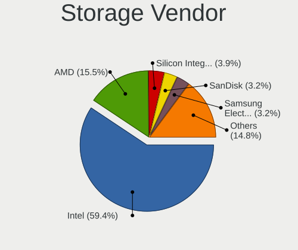

| Vendor                           | Computers | Percent |
|----------------------------------|-----------|---------|
| Intel                            | 92        | 59.35%  |
| AMD                              | 24        | 15.48%  |
| Silicon Integrated Systems [SiS] | 6         | 3.87%   |
| SanDisk                          | 5         | 3.23%   |
| Samsung Electronics              | 5         | 3.23%   |
| Marvell Technology Group         | 3         | 1.94%   |
| VIA Technologies                 | 2         | 1.29%   |
| Micron/Crucial Technology        | 2         | 1.29%   |
| MAXIO Technology (Hangzhou)      | 2         | 1.29%   |
| ULi Electronics                  | 1         | 0.65%   |
| SK hynix                         | 1         | 0.65%   |
| Silicon Motion                   | 1         | 0.65%   |
| Silicon Image                    | 1         | 0.65%   |
| Shenzhen Longsys Electronics     | 1         | 0.65%   |
| Seagate Technology               | 1         | 0.65%   |
| Phison Electronics               | 1         | 0.65%   |
| Nvidia                           | 1         | 0.65%   |
| Micron Technology                | 1         | 0.65%   |
| KIOXIA                           | 1         | 0.65%   |
| Kingston Technology Company      | 1         | 0.65%   |
| JMicron Technology               | 1         | 0.65%   |
| ASMedia Technology               | 1         | 0.65%   |
| ADATA Technology                 | 1         | 0.65%   |

Storage Model
-------------

Storage controller models

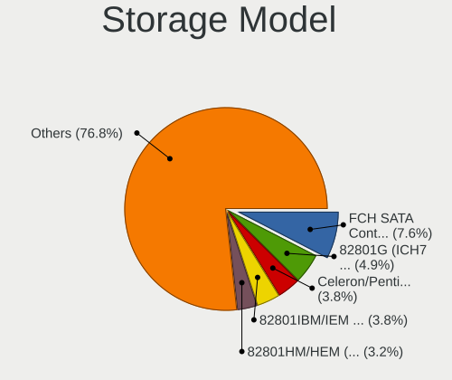

| Model                                                                            | Computers | Percent |
|----------------------------------------------------------------------------------|-----------|---------|
| AMD FCH SATA Controller [AHCI mode]                                              | 14        | 7.57%   |
| Intel 82801G (ICH7 Family) IDE Controller                                        | 9         | 4.86%   |
| Intel Celeron/Pentium Silver Processor SATA Controller                           | 7         | 3.78%   |
| Intel 82801IBM/IEM (ICH9M/ICH9M-E) 4 port SATA Controller [AHCI mode]            | 7         | 3.78%   |
| Intel 82801HM/HEM (ICH8M/ICH8M-E) IDE Controller                                 | 6         | 3.24%   |
| Intel 5 Series/3400 Series Chipset 6 port SATA AHCI Controller                   | 6         | 3.24%   |
| Silicon Integrated Systems [SiS] 5513 IDE Controller                             | 5         | 2.7%    |
| Intel Volume Management Device NVMe RAID Controller                              | 5         | 2.7%    |
| Intel NM10/ICH7 Family SATA Controller [IDE mode]                                | 5         | 2.7%    |
| Intel Celeron N3350/Pentium N4200/Atom E3900 Series SATA AHCI Controller         | 5         | 2.7%    |
| Intel 82801HM/HEM (ICH8M/ICH8M-E) SATA Controller [AHCI mode]                    | 5         | 2.7%    |
| Intel 82801GBM/GHM (ICH7-M Family) SATA Controller [AHCI mode]                   | 5         | 2.7%    |
| Intel 6 Series/C200 Series Chipset Family 6 port Mobile SATA AHCI Controller     | 5         | 2.7%    |
| AMD SB7x0/SB8x0/SB9x0 SATA Controller [AHCI mode]                                | 5         | 2.7%    |
| Intel 82801 Mobile SATA Controller [RAID mode]                                   | 4         | 2.16%   |
| AMD SB7x0/SB8x0/SB9x0 IDE Controller                                             | 4         | 2.16%   |
| Intel US15W/US15X/US15L/UL11L SCH [Poulsbo] IDE Controller                       | 3         | 1.62%   |
| Intel Atom/Celeron/Pentium Processor x5-E8000/J3xxx/N3xxx Series SATA Controller | 3         | 1.62%   |
| Intel 82801FBM (ICH6M) SATA Controller                                           | 3         | 1.62%   |
| Intel 8 Series/C220 Series Chipset Family 6-port SATA Controller 1 [AHCI mode]   | 3         | 1.62%   |
| Intel 7 Series Chipset Family 6-port SATA Controller [AHCI mode]                 | 3         | 1.62%   |
| Intel 6 Series/C200 Series Chipset Family 6 port Desktop SATA AHCI Controller    | 3         | 1.62%   |
| Silicon Integrated Systems [SiS] SATA Controller / IDE mode                      | 2         | 1.08%   |
| SanDisk Ultra 3D / WD PC SN530, IX SN530, Blue SN550 NVMe SSD (DRAM-less)        | 2         | 1.08%   |
| Samsung NVMe SSD Controller PM9B1 (DRAM-less)                                    | 2         | 1.08%   |
| Samsung NVMe SSD Controller PM9A1/PM9A3/980PRO                                   | 2         | 1.08%   |
| MAXIO (Hangzhou) NVMe SSD Controller MAP1202 (DRAM-less)                         | 2         | 1.08%   |
| Intel Tiger Lake-LP SATA Controller                                              | 2         | 1.08%   |
| Intel Sunrise Point-LP SATA Controller [AHCI mode]                               | 2         | 1.08%   |
| Intel NM10/ICH7 Family SATA Controller [AHCI mode]                               | 2         | 1.08%   |
| Intel Alder Lake-P SATA AHCI Controller                                          | 2         | 1.08%   |
| Intel 82801GBM/GHM (ICH7-M Family) SATA Controller [IDE mode]                    | 2         | 1.08%   |
| Intel 82801DBM (ICH4-M) IDE Controller                                           | 2         | 1.08%   |
| Intel 82801DB (ICH4) IDE Controller                                              | 2         | 1.08%   |
| Intel 8 Series SATA Controller 1 [AHCI mode]                                     | 2         | 1.08%   |
| AMD 500 Series Chipset SATA Controller                                           | 2         | 1.08%   |
| VIA VX900 Series Serial-ATA Controller                                           | 1         | 0.54%   |
| VIA VT6415 PATA IDE Host Controller                                              | 1         | 0.54%   |
| ULi ULi M5288 SATA                                                               | 1         | 0.54%   |
| ULi M5229 IDE                                                                    | 1         | 0.54%   |

Storage Kind
------------

Kind of storage controller (IDE, SATA, NVMe, SAS, ...)

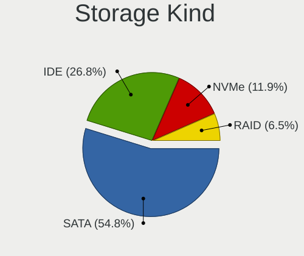

| Kind | Computers | Percent |
|------|-----------|---------|
| SATA | 92        | 54.76%  |
| IDE  | 45        | 26.79%  |
| NVMe | 20        | 11.9%   |
| RAID | 11        | 6.55%   |

Processor
---------

CPU Vendor
----------

Processor vendors

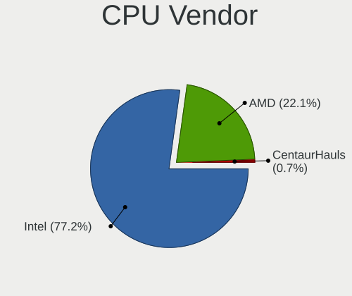

| Vendor       | Computers | Percent |
|--------------|-----------|---------|
| Intel        | 115       | 77.18%  |
| AMD          | 33        | 22.15%  |
| CentaurHauls | 1         | 0.67%   |

CPU Model
---------

Processor models

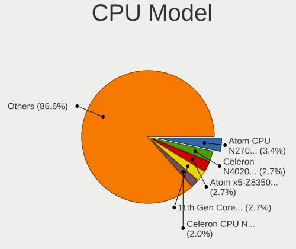

| Model                                       | Computers | Percent |
|---------------------------------------------|-----------|---------|
| Intel Atom CPU N270 @ 1.60GHz               | 5         | 3.36%   |
| Intel Celeron N4020 CPU @ 1.10GHz           | 4         | 2.68%   |
| Intel Atom x5-Z8350 CPU @ 1.44GHz           | 4         | 2.68%   |
| Intel 11th Gen Core i5-1135G7 @ 2.40GHz     | 4         | 2.68%   |
| Intel Celeron CPU N3060 @ 1.60GHz           | 3         | 2.01%   |
| Intel Atom CPU Z3735G @ 1.33GHz             | 3         | 2.01%   |
| Intel Pentium M processor 1.70GHz           | 2         | 1.34%   |
| Intel Core i5-4210U CPU @ 1.70GHz           | 2         | 1.34%   |
| Intel Core i5-4210M CPU @ 2.60GHz           | 2         | 1.34%   |
| Intel Core i5 CPU M 520 @ 2.40GHz           | 2         | 1.34%   |
| Intel Core i3-7020U CPU @ 2.30GHz           | 2         | 1.34%   |
| Intel Core i3-2350M CPU @ 2.30GHz           | 2         | 1.34%   |
| Intel Core i3 CPU M 370 @ 2.40GHz           | 2         | 1.34%   |
| Intel Core 2 Duo CPU T7250 @ 2.00GHz        | 2         | 1.34%   |
| Intel Celeron CPU N3350 @ 1.10GHz           | 2         | 1.34%   |
| Intel Celeron CPU J3455 @ 1.50GHz           | 2         | 1.34%   |
| Intel Atom x5-Z8300 CPU @ 1.44GHz           | 2         | 1.34%   |
| Intel Atom CPU Z520 @ 1.33GHz               | 2         | 1.34%   |
| Intel 11th Gen Core i3-1115G4 @ 3.00GHz     | 2         | 1.34%   |
| AMD Phenom II X6 1055T Processor            | 2         | 1.34%   |
| AMD E-300 APU with Radeon HD Graphics       | 2         | 1.34%   |
| AMD C-70 APU with Radeon HD Graphics        | 2         | 1.34%   |
| Intel Pentium Silver N5000 CPU @ 1.10GHz    | 1         | 0.67%   |
| Intel Pentium M processor 1000MHz           | 1         | 0.67%   |
| Intel Pentium M processor 1.73GHz           | 1         | 0.67%   |
| Intel Pentium M processor 1.60GHz           | 1         | 0.67%   |
| Intel Pentium III (Coppermine)              | 1         | 0.67%   |
| Intel Pentium Dual-Core CPU T4500 @ 2.30GHz | 1         | 0.67%   |
| Intel Pentium Dual-Core CPU T4400 @ 2.20GHz | 1         | 0.67%   |
| Intel Pentium Dual-Core CPU T4300 @ 2.10GHz | 1         | 0.67%   |
| Intel Pentium Dual-Core CPU E6500 @ 2.93GHz | 1         | 0.67%   |
| Intel Pentium Dual-Core CPU E5700 @ 3.00GHz | 1         | 0.67%   |
| Intel Pentium Dual-Core CPU E5400 @ 2.70GHz | 1         | 0.67%   |
| Intel Pentium Dual-Core CPU E5200 @ 2.50GHz | 1         | 0.67%   |
| Intel Pentium Dual CPU T2330 @ 1.60GHz      | 1         | 0.67%   |
| Intel Pentium D CPU 2.80GHz                 | 1         | 0.67%   |
| Intel Pentium CPU N4200 @ 1.10GHz           | 1         | 0.67%   |
| Intel Pentium CPU 4415U @ 2.30GHz           | 1         | 0.67%   |
| Intel Pentium 4 CPU 3.00GHz                 | 1         | 0.67%   |
| Intel Pentium 4 CPU 2.66GHz                 | 1         | 0.67%   |

CPU Model Family
----------------

Processor model prefix

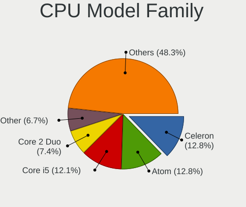

| Model                   | Computers | Percent |
|-------------------------|-----------|---------|
| Intel Celeron           | 19        | 12.75%  |
| Intel Atom              | 19        | 12.75%  |
| Intel Core i5           | 18        | 12.08%  |
| Intel Core 2 Duo        | 11        | 7.38%   |
| Other                   | 10        | 6.71%   |
| Intel Core i3           | 9         | 6.04%   |
| Intel Pentium Dual-Core | 7         | 4.7%    |
| AMD Ryzen 7             | 6         | 4.03%   |
| Intel Pentium M         | 5         | 3.36%   |
| Intel Pentium 4         | 4         | 2.68%   |
| Intel Core i7           | 3         | 2.01%   |
| Intel Pentium           | 2         | 1.34%   |
| Intel Genuine           | 2         | 1.34%   |
| AMD Phenom II X6        | 2         | 1.34%   |
| AMD Mobile Sempron      | 2         | 1.34%   |
| AMD E                   | 2         | 1.34%   |
| AMD C-70                | 2         | 1.34%   |
| AMD Athlon              | 2         | 1.34%   |
| AMD A8                  | 2         | 1.34%   |
| AMD A4                  | 2         | 1.34%   |
| Intel Pentium Silver    | 1         | 0.67%   |
| Intel Pentium III       | 1         | 0.67%   |
| Intel Pentium Dual      | 1         | 0.67%   |
| Intel Pentium D         | 1         | 0.67%   |
| Intel Core m3           | 1         | 0.67%   |
| Intel Core 2            | 1         | 0.67%   |
| CentaurHauls VIA Eden   | 1         | 0.67%   |
| AMD V120                | 1         | 0.67%   |
| AMD Sempron             | 1         | 0.67%   |
| AMD Ryzen 9             | 1         | 0.67%   |
| AMD Ryzen 7 PRO         | 1         | 0.67%   |
| AMD Ryzen 5 PRO         | 1         | 0.67%   |
| AMD Ryzen 5             | 1         | 0.67%   |
| AMD GX                  | 1         | 0.67%   |
| AMD E1                  | 1         | 0.67%   |
| AMD Dual Core Opteron   | 1         | 0.67%   |
| AMD C-60                | 1         | 0.67%   |
| AMD Athlon Neo          | 1         | 0.67%   |
| AMD Athlon II X2        | 1         | 0.67%   |
| AMD A6                  | 1         | 0.67%   |

CPU Cores
---------

Number of processor cores

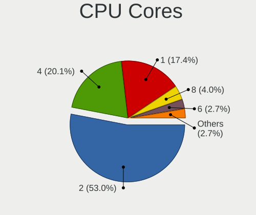

| Number | Computers | Percent |
|--------|-----------|---------|
| 2      | 79        | 53.02%  |
| 4      | 30        | 20.13%  |
| 1      | 26        | 17.45%  |
| 8      | 6         | 4.03%   |
| 6      | 4         | 2.68%   |
| 16     | 2         | 1.34%   |
| 12     | 2         | 1.34%   |

CPU Sockets
-----------

Number of sockets

| Number | Computers | Percent |
|--------|-----------|---------|
| 1      | 149       | 100%    |

CPU Threads
-----------

Threads per core (Hyper-Threading)

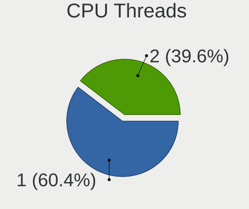

| Number | Computers | Percent |
|--------|-----------|---------|
| 1      | 90        | 60.4%   |
| 2      | 59        | 39.6%   |

CPU Op-Modes
------------

CPU Operation Modes (32-bit, 64-bit)

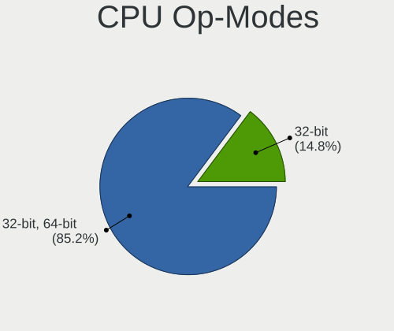

| Op mode        | Computers | Percent |
|----------------|-----------|---------|
| 32-bit, 64-bit | 127       | 85.23%  |
| 32-bit         | 22        | 14.77%  |

CPU Microcode
-------------

Microcode number

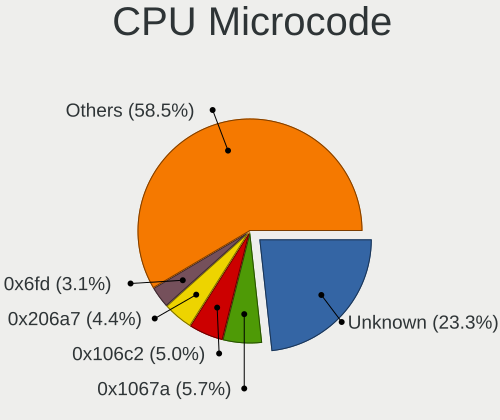

| Number     | Computers | Percent |
|------------|-----------|---------|
| Unknown    | 37        | 23.27%  |
| 0x1067a    | 9         | 5.66%   |
| 0x106c2    | 8         | 5.03%   |
| 0x206a7    | 7         | 4.4%    |
| 0x6fd      | 5         | 3.14%   |
| 0x306a9    | 5         | 3.14%   |
| 0x30678    | 5         | 3.14%   |
| 0x20655    | 5         | 3.14%   |
| 0x806e9    | 4         | 2.52%   |
| 0x406c4    | 4         | 2.52%   |
| 0x40651    | 4         | 2.52%   |
| 0x10676    | 4         | 2.52%   |
| 0x806c1    | 3         | 1.89%   |
| 0x706a8    | 3         | 1.89%   |
| 0x706a1    | 3         | 1.89%   |
| 0x506c9    | 3         | 1.89%   |
| 0x306c3    | 3         | 1.89%   |
| 0x05000119 | 3         | 1.89%   |
| 0xf27      | 2         | 1.26%   |
| 0x906a3    | 2         | 1.26%   |
| 0x6e8      | 2         | 1.26%   |
| 0x406e3    | 2         | 1.26%   |
| 0x406c3    | 2         | 1.26%   |
| 0x0810100b | 2         | 1.26%   |
| 0x0700010f | 2         | 1.26%   |
| 0x06006705 | 2         | 1.26%   |
| 0x010000dc | 2         | 1.26%   |
| 0x010000c8 | 2         | 1.26%   |
| 0xf49      | 1         | 0.63%   |
| 0xf47      | 1         | 0.63%   |
| 0xf12      | 1         | 0.63%   |
| 0xb0671    | 1         | 0.63%   |
| 0x906a4    | 1         | 0.63%   |
| 0x6fb      | 1         | 0.63%   |
| 0x6f6      | 1         | 0.63%   |
| 0x6d8      | 1         | 0.63%   |
| 0x6d6      | 1         | 0.63%   |
| 0x695      | 1         | 0.63%   |
| 0x68a      | 1         | 0.63%   |
| 0x30661    | 1         | 0.63%   |

CPU Microarch
-------------

Microarchitecture

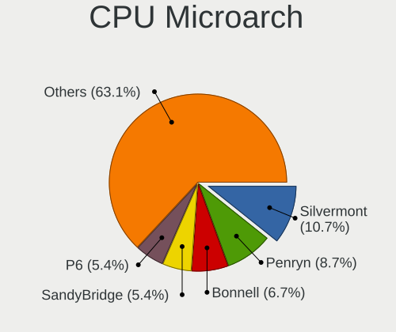

| Name             | Computers | Percent |
|------------------|-----------|---------|
| Silvermont       | 16        | 10.74%  |
| Penryn           | 13        | 8.72%   |
| Bonnell          | 10        | 6.71%   |
| SandyBridge      | 8         | 5.37%   |
| P6               | 8         | 5.37%   |
| Goldmont plus    | 8         | 5.37%   |
| Haswell          | 7         | 4.7%    |
| Core             | 7         | 4.7%    |
| Westmere         | 6         | 4.03%   |
| TigerLake        | 6         | 4.03%   |
| Unknown          | 6         | 4.03%   |
| NetBurst         | 5         | 3.36%   |
| IvyBridge        | 5         | 3.36%   |
| Goldmont         | 5         | 3.36%   |
| Bobcat           | 5         | 3.36%   |
| KabyLake         | 4         | 2.68%   |
| K8 Hammer        | 4         | 2.68%   |
| K10              | 4         | 2.68%   |
| Alderlake Hybrid | 3         | 2.01%   |
| Zen+             | 2         | 1.34%   |
| Zen 2            | 2         | 1.34%   |
| Zen              | 2         | 1.34%   |
| Skylake          | 2         | 1.34%   |
| Piledriver       | 2         | 1.34%   |
| Jaguar           | 2         | 1.34%   |
| Excavator        | 2         | 1.34%   |
| Zen 3            | 1         | 0.67%   |
| Puma             | 1         | 0.67%   |
| Nehalem          | 1         | 0.67%   |
| K8 & K10 hybrid  | 1         | 0.67%   |
| K6               | 1         | 0.67%   |

Graphics
--------

GPU Vendor
----------

Vendors of graphics cards

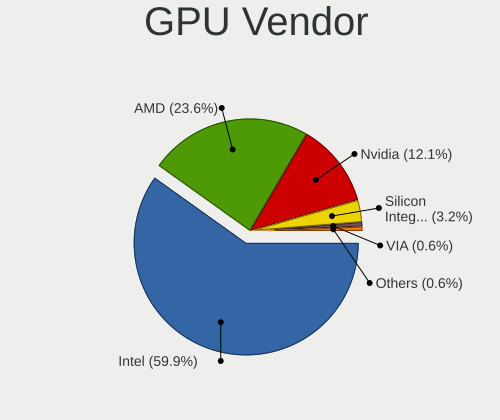

| Vendor                           | Computers | Percent |
|----------------------------------|-----------|---------|
| Intel                            | 94        | 59.87%  |
| AMD                              | 37        | 23.57%  |
| Nvidia                           | 19        | 12.1%   |
| Silicon Integrated Systems [SiS] | 5         | 3.18%   |
| VIA Technologies                 | 1         | 0.64%   |
| S3 Graphics                      | 1         | 0.64%   |

GPU Model
---------

Graphics card models

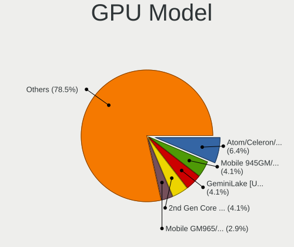

| Model                                                                                      | Computers | Percent |
|--------------------------------------------------------------------------------------------|-----------|---------|
| Intel Atom/Celeron/Pentium Processor x5-E8000/J3xxx/N3xxx Integrated Graphics Controller   | 11        | 6.4%    |
| Intel Mobile 945GM/GMS/GME, 943/940GML Express Integrated Graphics Controller              | 7         | 4.07%   |
| Intel GeminiLake [UHD Graphics 600]                                                        | 7         | 4.07%   |
| Intel 2nd Generation Core Processor Family Integrated Graphics Controller                  | 7         | 4.07%   |
| Intel Mobile GM965/GL960 Integrated Graphics Controller (secondary)                        | 5         | 2.91%   |
| Intel Mobile GM965/GL960 Integrated Graphics Controller (primary)                          | 5         | 2.91%   |
| Intel Mobile 945GSE Express Integrated Graphics Controller                                 | 5         | 2.91%   |
| Intel Atom Processor Z36xxx/Z37xxx Series Graphics & Display                               | 5         | 2.91%   |
| Intel TigerLake-LP GT2 [Iris Xe Graphics]                                                  | 4         | 2.33%   |
| Intel Haswell-ULT Integrated Graphics Controller                                           | 4         | 2.33%   |
| Intel Core Processor Integrated Graphics Controller                                        | 4         | 2.33%   |
| Intel Apollo Lake GT1 [HD Graphics 500]                                                    | 4         | 2.33%   |
| Intel 3rd Gen Core processor Graphics Controller                                           | 4         | 2.33%   |
| Silicon Integrated Systems [SiS] 661/741/760 PCI/AGP or 662/761Gx PCIE VGA Display Adapter | 3         | 1.74%   |
| Intel US15W/US15X SCH [Poulsbo] Graphics Controller                                        | 3         | 1.74%   |
| Intel Mobile 915GM/GMS/910GML Express Graphics Controller                                  | 3         | 1.74%   |
| Intel Kaby Lake-U GT2 [HD Graphics 620]                                                    | 3         | 1.74%   |
| Intel Tiger Lake-LP GT2 [UHD Graphics G4]                                                  | 2         | 1.16%   |
| Intel Mobile 945GM/GMS, 943/940GML Express Integrated Graphics Controller                  | 2         | 1.16%   |
| Intel Mobile 4 Series Chipset Integrated Graphics Controller                               | 2         | 1.16%   |
| Intel Alder Lake-P GT2 [Iris Xe Graphics]                                                  | 2         | 1.16%   |
| Intel 82845G/GL[Brookdale-G]/GE Chipset Integrated Graphics Device                         | 2         | 1.16%   |
| Intel 4th Gen Core Processor Integrated Graphics Controller                                | 2         | 1.16%   |
| Intel 4 Series Chipset Integrated Graphics Controller                                      | 2         | 1.16%   |
| AMD Wrestler [Radeon HD 7290]                                                              | 2         | 1.16%   |
| AMD Wrestler [Radeon HD 6310]                                                              | 2         | 1.16%   |
| AMD Stoney [Radeon R2/R3/R4/R5 Graphics]                                                   | 2         | 1.16%   |
| AMD RV710/M92 [Mobility Radeon HD 4530/4570/5145/530v/540v/545v]                           | 2         | 1.16%   |
| AMD Raven Ridge [Radeon Vega Series / Radeon Vega Mobile Series]                           | 2         | 1.16%   |
| AMD Juniper XT [Radeon HD 5770]                                                            | 2         | 1.16%   |
| VIA Technologies VX900 Graphics [Chrome9 HD]                                               | 1         | 0.58%   |
| Silicon Integrated Systems [SiS] 771/671 PCIE VGA Display Adapter                          | 1         | 0.58%   |
| Silicon Integrated Systems [SiS] 65x/M650/740 PCI/AGP VGA Display Adapter                  | 1         | 0.58%   |
| S3 Graphics 86C270-294 [SavageIX-MV]                                                       | 1         | 0.58%   |
| Nvidia GT218 [GeForce 210]                                                                 | 1         | 0.58%   |
| Nvidia GT216M [GeForce GT 330M]                                                            | 1         | 0.58%   |
| Nvidia GT216 [GeForce 315]                                                                 | 1         | 0.58%   |
| Nvidia GP107 [GeForce GTX 1050 Ti]                                                         | 1         | 0.58%   |
| Nvidia GP104 [GeForce GTX 1070]                                                            | 1         | 0.58%   |
| Nvidia GM206 [GeForce GTX 960]                                                             | 1         | 0.58%   |

GPU Combo
---------

Combinations of graphics cards

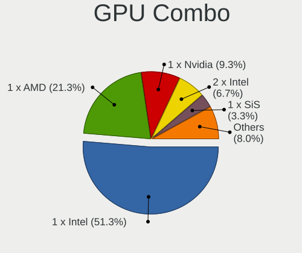

| Name            | Computers | Percent |
|-----------------|-----------|---------|
| 1 x Intel       | 77        | 51.33%  |
| 1 x AMD         | 32        | 21.33%  |
| 1 x Nvidia      | 14        | 9.33%   |
| 2 x Intel       | 10        | 6.67%   |
| 1 x SiS         | 5         | 3.33%   |
| Intel + Nvidia  | 4         | 2.67%   |
| 2 x AMD         | 2         | 1.33%   |
| Intel + AMD     | 2         | 1.33%   |
| Other           | 1         | 0.67%   |
| 1 x VIA         | 1         | 0.67%   |
| 1 x S3 Graphics | 1         | 0.67%   |
| AMD + Nvidia    | 1         | 0.67%   |

GPU Driver
----------

Free vs proprietary

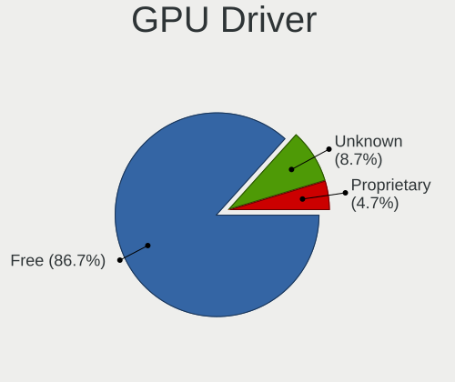

| Driver      | Computers | Percent |
|-------------|-----------|---------|
| Free        | 130       | 86.67%  |
| Unknown     | 13        | 8.67%   |
| Proprietary | 7         | 4.67%   |

GPU Memory
----------

Total video memory

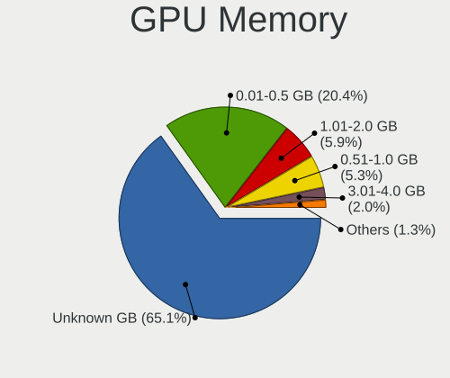

| Size in GB | Computers | Percent |
|------------|-----------|---------|
| Unknown    | 99        | 65.13%  |
| 0.01-0.5   | 31        | 20.39%  |
| 1.01-2.0   | 9         | 5.92%   |
| 0.51-1.0   | 8         | 5.26%   |
| 3.01-4.0   | 3         | 1.97%   |
| 7.01-8.0   | 1         | 0.66%   |
| 8.01-16.0  | 1         | 0.66%   |

Monitor
-------

Monitor Vendor
--------------

Monitor vendors

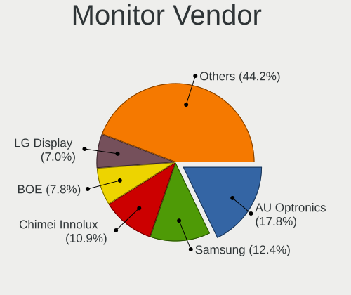

| Vendor                  | Computers | Percent |
|-------------------------|-----------|---------|
| AU Optronics            | 23        | 17.83%  |
| Samsung Electronics     | 16        | 12.4%   |
| Chimei Innolux          | 14        | 10.85%  |
| BOE                     | 10        | 7.75%   |
| LG Display              | 9         | 6.98%   |
| Philips                 | 5         | 3.88%   |
| Goldstar                | 5         | 3.88%   |
| Dell                    | 5         | 3.88%   |
| Chi Mei Optoelectronics | 4         | 3.1%    |
| Apple                   | 4         | 3.1%    |
| Hewlett-Packard         | 3         | 2.33%   |
| HannStar                | 3         | 2.33%   |
| Sharp                   | 2         | 1.55%   |
| NEC Computers           | 2         | 1.55%   |
| Lenovo                  | 2         | 1.55%   |
| CPT                     | 2         | 1.55%   |
| AOC                     | 2         | 1.55%   |
| Ancor Communications    | 2         | 1.55%   |
| Acer                    | 2         | 1.55%   |
| ViewSonic               | 1         | 0.78%   |
| VIE                     | 1         | 0.78%   |
| Toshiba                 | 1         | 0.78%   |
| STD                     | 1         | 0.78%   |
| Plain Tree Systems      | 1         | 0.78%   |
| Orion                   | 1         | 0.78%   |
| MQP                     | 1         | 0.78%   |
| Medion                  | 1         | 0.78%   |
| LG Philips              | 1         | 0.78%   |
| InnoLux Display         | 1         | 0.78%   |
| InfoVision              | 1         | 0.78%   |
| Iiyama                  | 1         | 0.78%   |
| Fujitsu Siemens         | 1         | 0.78%   |
| CSO                     | 1         | 0.78%   |

Monitor Model
-------------

Monitor models

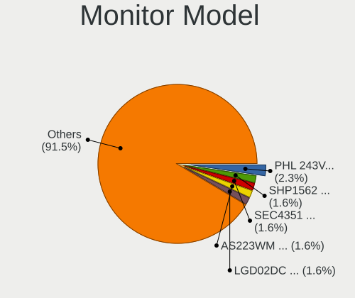

| Model                                                                    | Computers | Percent |
|--------------------------------------------------------------------------|-----------|---------|
| Philips PHL 243V7 PHLC155 1920x1080 527x296mm 23.8-inch                  | 3         | 2.33%   |
| Sharp LCD Monitor SHP1562 1920x1080 294x165mm 13.3-inch                  | 2         | 1.55%   |
| Samsung Electronics LCD Monitor SEC4351 1366x768 344x194mm 15.5-inch     | 2         | 1.55%   |
| NEC Computers AS223WM NEC690A 1920x1080 476x267mm 21.5-inch              | 2         | 1.55%   |
| LG Display LCD Monitor LGD02DC 1366x768 344x194mm 15.5-inch              | 2         | 1.55%   |
| HannStar LCD Monitor HSD03E9 1024x600 220x129mm 10.0-inch                | 2         | 1.55%   |
| Chimei Innolux LCD Monitor CMN14D4 1920x1080 309x173mm 13.9-inch         | 2         | 1.55%   |
| Chi Mei Optoelectronics LCD Monitor CMO15A2 1366x768 344x193mm 15.5-inch | 2         | 1.55%   |
| AU Optronics LCD Monitor AUO315C 1366x768 256x144mm 11.6-inch            | 2         | 1.55%   |
| AU Optronics LCD Monitor AUO12EC 1366x768 344x193mm 15.5-inch            | 2         | 1.55%   |
| ViewSonic VX3211-4K VSCC336 3840x2160 698x393mm 31.5-inch                | 1         | 0.78%   |
| VIE S20W VIE2080 1600x900 440x250mm 19.9-inch                            | 1         | 0.78%   |
| Toshiba LCD-MONITOR LCDEC80 1680x1050 470x300mm 22.0-inch                | 1         | 0.78%   |
| STD LCD TV STD0101 1920x1080                                             | 1         | 0.78%   |
| Samsung Electronics U28E590 SAM0C4D 3840x2160 607x345mm 27.5-inch        | 1         | 0.78%   |
| Samsung Electronics SMB1630N SAM0630 1366x768 344x194mm 15.5-inch        | 1         | 0.78%   |
| Samsung Electronics S24B20/S24B30 SAM09ED 1920x1080 521x293mm 23.5-inch  | 1         | 0.78%   |
| Samsung Electronics LF24T450F SAM7095 1920x1080 527x296mm 23.8-inch      | 1         | 0.78%   |
| Samsung Electronics LF24T35 SAM707D 1920x1080 528x297mm 23.9-inch        | 1         | 0.78%   |
| Samsung Electronics LCD Monitor SEC3945 1280x800 331x207mm 15.4-inch     | 1         | 0.78%   |
| Samsung Electronics LCD Monitor SEC3633 1280x800 331x207mm 15.4-inch     | 1         | 0.78%   |
| Samsung Electronics LCD Monitor SEC3242 1920x1080 235x132mm 10.6-inch    | 1         | 0.78%   |
| Samsung Electronics LCD Monitor SEC315A 1366x768 344x194mm 15.5-inch     | 1         | 0.78%   |
| Samsung Electronics LCD Monitor SEC3051 1366x768 344x194mm 15.5-inch     | 1         | 0.78%   |
| Samsung Electronics LCD Monitor SEC304C 1366x768 353x198mm 15.9-inch     | 1         | 0.78%   |
| Samsung Electronics LCD Monitor SDC4851 1366x768 344x194mm 15.5-inch     | 1         | 0.78%   |
| Samsung Electronics LCD Monitor SAM090B 1920x1080 1020x570mm 46.0-inch   | 1         | 0.78%   |
| Samsung Electronics LCD Monitor SAM069B 1920x1080 890x500mm 40.2-inch    | 1         | 0.78%   |
| Plain Tree Systems LCD Monitor PTS06A5 1280x1024 340x270mm 17.1-inch     | 1         | 0.78%   |
| Philips 200WS PHL0850 1680x1050 434x270mm 20.1-inch                      | 1         | 0.78%   |
| Philips 170B4 PHL0817 1280x1024 338x270mm 17.0-inch                      | 1         | 0.78%   |
| Orion LCD Monitor ORN120A 1920x1080                                      | 1         | 0.78%   |
| MQP MultiQ MQ212 MQP0212 800x600 246x185mm 12.1-inch                     | 1         | 0.78%   |
| Medion Medion23.6 PC MEDB603 1920x1080 477x268mm 21.5-inch               | 1         | 0.78%   |
| LG Philips LCD Monitor LPL0C01 1280x800 304x190mm 14.1-inch              | 1         | 0.78%   |
| LG Display LCD Monitor LGD05EC 1920x1080 309x174mm 14.0-inch             | 1         | 0.78%   |
| LG Display LCD Monitor LGD0500 1366x768 256x144mm 11.6-inch              | 1         | 0.78%   |
| LG Display LCD Monitor LGD03DD 1366x768 344x194mm 15.5-inch              | 1         | 0.78%   |
| LG Display LCD Monitor LGD02D9 1920x1080 344x194mm 15.5-inch             | 1         | 0.78%   |
| LG Display LCD Monitor LGD027B 1600x900 382x215mm 17.3-inch              | 1         | 0.78%   |

Monitor Resolution
------------------

Monitor screen resolution

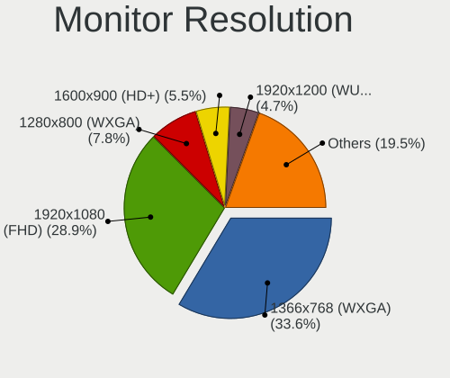

| Resolution         | Computers | Percent |
|--------------------|-----------|---------|
| 1366x768 (WXGA)    | 43        | 33.59%  |
| 1920x1080 (FHD)    | 37        | 28.91%  |
| 1280x800 (WXGA)    | 10        | 7.81%   |
| 1600x900 (HD+)     | 7         | 5.47%   |
| 1920x1200 (WUXGA)  | 6         | 4.69%   |
| 1024x600           | 5         | 3.91%   |
| 3840x2160 (4K)     | 4         | 3.13%   |
| 1680x1050 (WSXGA+) | 4         | 3.13%   |
| 1280x1024 (SXGA)   | 3         | 2.34%   |
| 1440x900 (WXGA+)   | 2         | 1.56%   |
| 800x600            | 1         | 0.78%   |
| 3440x1440          | 1         | 0.78%   |
| 2560x1440 (QHD)    | 1         | 0.78%   |
| 2256x1504          | 1         | 0.78%   |
| 2160x1440          | 1         | 0.78%   |
| 1920x540           | 1         | 0.78%   |
| 1024x768 (XGA)     | 1         | 0.78%   |

Monitor Diagonal
----------------

Diagonal size in inches

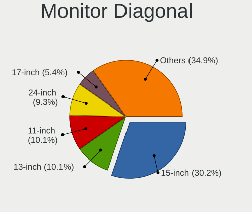

| Inches  | Computers | Percent |
|---------|-----------|---------|
| 15      | 39        | 30.23%  |
| 13      | 13        | 10.08%  |
| 11      | 13        | 10.08%  |
| 24      | 12        | 9.3%    |
| 17      | 7         | 5.43%   |
| 14      | 7         | 5.43%   |
| 21      | 6         | 4.65%   |
| 10      | 5         | 3.88%   |
| 27      | 4         | 3.1%    |
| 22      | 4         | 3.1%    |
| 12      | 4         | 3.1%    |
| 72      | 2         | 1.55%   |
| 23      | 2         | 1.55%   |
| 19      | 2         | 1.55%   |
| 54      | 1         | 0.78%   |
| 46      | 1         | 0.78%   |
| 40      | 1         | 0.78%   |
| 34      | 1         | 0.78%   |
| 31      | 1         | 0.78%   |
| 20      | 1         | 0.78%   |
| 18      | 1         | 0.78%   |
| 8       | 1         | 0.78%   |
| Unknown | 1         | 0.78%   |

Monitor Width
-------------

Physical width

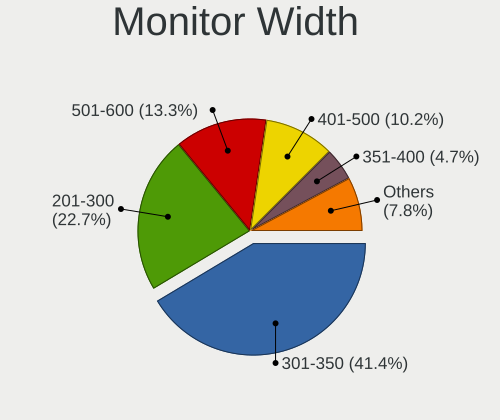

| Width in mm | Computers | Percent |
|-------------|-----------|---------|
| 301-350     | 53        | 41.41%  |
| 201-300     | 29        | 22.66%  |
| 501-600     | 17        | 13.28%  |
| 401-500     | 13        | 10.16%  |
| 351-400     | 6         | 4.69%   |
| 601-700     | 2         | 1.56%   |
| 1501-2000   | 2         | 1.56%   |
| 1001-1500   | 2         | 1.56%   |
| 801-900     | 1         | 0.78%   |
| 701-800     | 1         | 0.78%   |
| 101-200     | 1         | 0.78%   |
| Unknown     | 1         | 0.78%   |

Aspect Ratio
------------

Proportional relationship between the width and the height

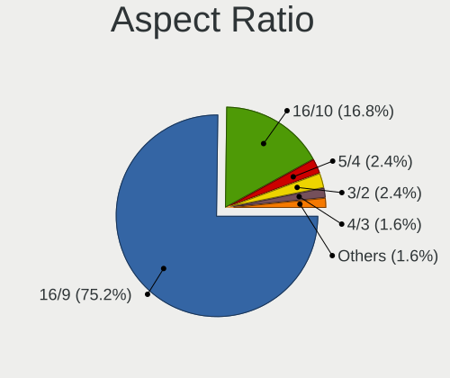

| Ratio | Computers | Percent |
|-------|-----------|---------|
| 16/9  | 94        | 75.2%   |
| 16/10 | 21        | 16.8%   |
| 5/4   | 3         | 2.4%    |
| 3/2   | 3         | 2.4%    |
| 4/3   | 2         | 1.6%    |
| 32/9  | 1         | 0.8%    |
| 21/9  | 1         | 0.8%    |

Monitor Area
------------

Area in inch²

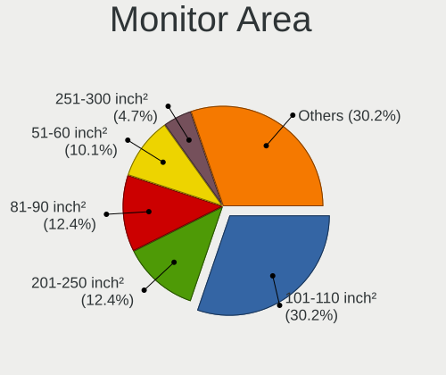

| Area in inch² | Computers | Percent |
|----------------|-----------|---------|
| 101-110        | 39        | 30.23%  |
| 81-90          | 16        | 12.4%   |
| 201-250        | 16        | 12.4%   |
| 51-60          | 13        | 10.08%  |
| 251-300        | 6         | 4.65%   |
| 71-80          | 5         | 3.88%   |
| 41-50          | 5         | 3.88%   |
| 151-200        | 5         | 3.88%   |
| 301-350        | 4         | 3.1%    |
| 141-150        | 4         | 3.1%    |
| 121-130        | 4         | 3.1%    |
| More than 1000 | 3         | 2.33%   |
| 61-70          | 3         | 2.33%   |
| 351-500        | 2         | 1.55%   |
| 501-1000       | 2         | 1.55%   |
| 1-40           | 1         | 0.78%   |
| Unknown        | 1         | 0.78%   |

Pixel Density
-------------

Pixels per inch

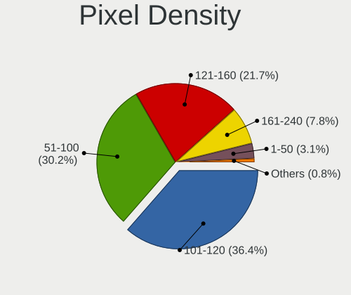

| Density | Computers | Percent |
|---------|-----------|---------|
| 101-120 | 47        | 36.43%  |
| 51-100  | 39        | 30.23%  |
| 121-160 | 28        | 21.71%  |
| 161-240 | 10        | 7.75%   |
| 1-50    | 4         | 3.1%    |
| Unknown | 1         | 0.78%   |

Multiple Monitors
-----------------

Total monitors connected

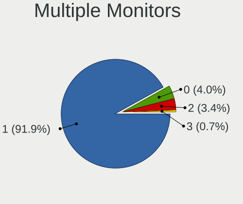

| Total | Computers | Percent |
|-------|-----------|---------|
| 1     | 137       | 91.95%  |
| 0     | 6         | 4.03%   |
| 2     | 5         | 3.36%   |
| 3     | 1         | 0.67%   |

Network
-------

Net Controller Vendor
---------------------

Controller vendors

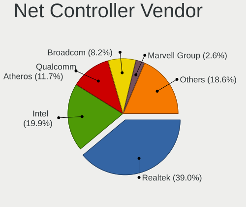

| Vendor                           | Computers | Percent |
|----------------------------------|-----------|---------|
| Realtek Semiconductor            | 90        | 38.96%  |
| Intel                            | 46        | 19.91%  |
| Qualcomm Atheros                 | 27        | 11.69%  |
| Broadcom                         | 19        | 8.23%   |
| Marvell Technology Group         | 6         | 2.6%    |
| Broadcom Limited                 | 6         | 2.6%    |
| Silicon Integrated Systems [SiS] | 5         | 2.16%   |
| MediaTek                         | 5         | 2.16%   |
| Ralink Technology                | 4         | 1.73%   |
| Xiaomi                           | 3         | 1.3%    |
| TP-Link                          | 2         | 0.87%   |
| Samsung Electronics              | 2         | 0.87%   |
| Motorola PCS                     | 2         | 0.87%   |
| JMicron Technology               | 2         | 0.87%   |
| D-Link System                    | 2         | 0.87%   |
| Ralink                           | 1         | 0.43%   |
| Qualcomm Technologies            | 1         | 0.43%   |
| LG Electronics                   | 1         | 0.43%   |
| IBM                              | 1         | 0.43%   |
| Guillemot                        | 1         | 0.43%   |
| Google                           | 1         | 0.43%   |
| AVM                              | 1         | 0.43%   |
| ASIX Electronics                 | 1         | 0.43%   |
| AMD                              | 1         | 0.43%   |
| Accton Technology                | 1         | 0.43%   |

Net Controller Model
--------------------

Controller models

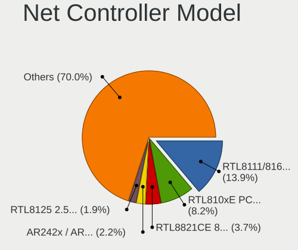

| Model                                                                   | Computers | Percent |
|-------------------------------------------------------------------------|-----------|---------|
| Realtek RTL8111/8168/8211/8411 PCI Express Gigabit Ethernet Controller  | 37        | 13.86%  |
| Realtek RTL810xE PCI Express Fast Ethernet controller                   | 22        | 8.24%   |
| Realtek RTL8821CE 802.11ac PCIe Wireless Network Adapter                | 10        | 3.75%   |
| Qualcomm Atheros AR242x / AR542x Wireless Network Adapter (PCI-Express) | 6         | 2.25%   |
| Realtek RTL8125 2.5GbE Controller                                       | 5         | 1.87%   |
| Qualcomm Atheros AR9485 Wireless Network Adapter                        | 5         | 1.87%   |
| Intel Wireless 7265                                                     | 5         | 1.87%   |
| Intel PRO/Wireless 3945ABG [Golan] Network Connection                   | 5         | 1.87%   |
| Realtek RTL8723BE PCIe Wireless Network Adapter                         | 4         | 1.5%    |
| Qualcomm Atheros AR9285 Wireless Network Adapter (PCI-Express)          | 4         | 1.5%    |
| Intel Wireless 3165                                                     | 4         | 1.5%    |
| Intel PRO/Wireless 2200BG [Calexico2] Network Connection                | 4         | 1.5%    |
| Xiaomi Mi/Redmi series (RNDIS)                                          | 3         | 1.12%   |
| Realtek RTL8187SE Wireless LAN Controller                               | 3         | 1.12%   |
| Realtek RTL-8100/8101L/8139 PCI Fast Ethernet Adapter                   | 3         | 1.12%   |
| Qualcomm Atheros QCA9377 802.11ac Wireless Network Adapter              | 3         | 1.12%   |
| Qualcomm Atheros AR928X Wireless Network Adapter (PCI-Express)          | 3         | 1.12%   |
| Intel Wi-Fi 6 AX200                                                     | 3         | 1.12%   |
| Intel 82801FB/FBM/FR/FW/FRW (ICH6 Family) AC'97 Modem Controller        | 3         | 1.12%   |
| Broadcom BCM4313 802.11bgn Wireless Network Adapter                     | 3         | 1.12%   |
| Silicon Integrated Systems [SiS] SiS900 PCI Fast Ethernet               | 2         | 0.75%   |
| Silicon Integrated Systems [SiS] AC'97 Modem Controller                 | 2         | 0.75%   |
| Silicon Integrated Systems [SiS] 191 Gigabit Ethernet Adapter           | 2         | 0.75%   |
| Samsung GT-I9070 (network tethering, USB debugging enabled)             | 2         | 0.75%   |
| Realtek RTL88x2bu [AC1200 Techkey]                                      | 2         | 0.75%   |
| Realtek RTL8723BU 802.11b/g/n WLAN Adapter                              | 2         | 0.75%   |
| Realtek RTL8191SEvB Wireless LAN Controller                             | 2         | 0.75%   |
| Realtek RTL8188CE 802.11b/g/n WiFi Adapter                              | 2         | 0.75%   |
| Realtek RTL8153 Gigabit Ethernet Adapter                                | 2         | 0.75%   |
| Realtek RTL-8110SC/8169SC Gigabit Ethernet                              | 2         | 0.75%   |
| Qualcomm Atheros QCA9565 / AR9565 Wireless Network Adapter              | 2         | 0.75%   |
| Qualcomm Atheros AR8152 v2.0 Fast Ethernet                              | 2         | 0.75%   |
| MediaTek MT7902 802.11ax PCIe Wireless Network Adapter [Filogic 310]    | 2         | 0.75%   |
| Marvell Group 88E8055 PCI-E Gigabit Ethernet Controller                 | 2         | 0.75%   |
| JMicron JMC250 PCI Express Gigabit Ethernet Controller                  | 2         | 0.75%   |
| Intel Wi-Fi 6E(802.11ax) AX210/AX1675* 2x2 [Typhoon Peak]               | 2         | 0.75%   |
| Intel Wi-Fi 6 AX201                                                     | 2         | 0.75%   |
| Intel Gemini Lake PCH CNVi WiFi                                         | 2         | 0.75%   |
| Intel Ethernet Connection I217-V                                        | 2         | 0.75%   |
| Intel Ethernet Connection (13) I219-V                                   | 2         | 0.75%   |

Wireless Vendor
---------------

Wireless vendors

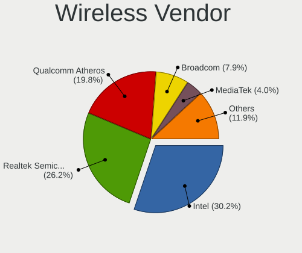

| Vendor                | Computers | Percent |
|-----------------------|-----------|---------|
| Intel                 | 38        | 30.16%  |
| Realtek Semiconductor | 33        | 26.19%  |
| Qualcomm Atheros      | 25        | 19.84%  |
| Broadcom              | 10        | 7.94%   |
| MediaTek              | 5         | 3.97%   |
| Ralink Technology     | 4         | 3.17%   |
| Broadcom Limited      | 4         | 3.17%   |
| TP-Link               | 2         | 1.59%   |
| D-Link System         | 2         | 1.59%   |
| Ralink                | 1         | 0.79%   |
| Guillemot             | 1         | 0.79%   |
| AVM                   | 1         | 0.79%   |

Wireless Model
--------------

Wireless models

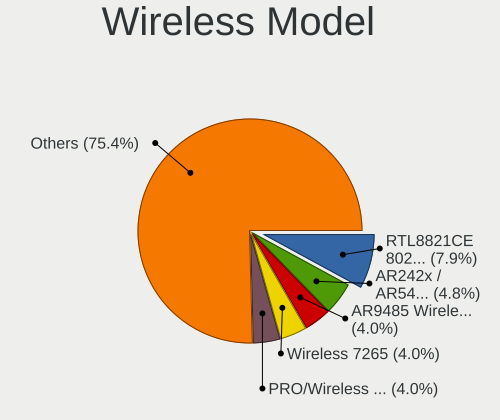

| Model                                                                   | Computers | Percent |
|-------------------------------------------------------------------------|-----------|---------|
| Realtek RTL8821CE 802.11ac PCIe Wireless Network Adapter                | 10        | 7.94%   |
| Qualcomm Atheros AR242x / AR542x Wireless Network Adapter (PCI-Express) | 6         | 4.76%   |
| Qualcomm Atheros AR9485 Wireless Network Adapter                        | 5         | 3.97%   |
| Intel Wireless 7265                                                     | 5         | 3.97%   |
| Intel PRO/Wireless 3945ABG [Golan] Network Connection                   | 5         | 3.97%   |
| Realtek RTL8723BE PCIe Wireless Network Adapter                         | 4         | 3.17%   |
| Qualcomm Atheros AR9285 Wireless Network Adapter (PCI-Express)          | 4         | 3.17%   |
| Intel Wireless 3165                                                     | 4         | 3.17%   |
| Intel PRO/Wireless 2200BG [Calexico2] Network Connection                | 4         | 3.17%   |
| Realtek RTL8187SE Wireless LAN Controller                               | 3         | 2.38%   |
| Qualcomm Atheros QCA9377 802.11ac Wireless Network Adapter              | 3         | 2.38%   |
| Qualcomm Atheros AR928X Wireless Network Adapter (PCI-Express)          | 3         | 2.38%   |
| Intel Wi-Fi 6 AX200                                                     | 3         | 2.38%   |
| Broadcom BCM4313 802.11bgn Wireless Network Adapter                     | 3         | 2.38%   |
| Realtek RTL88x2bu [AC1200 Techkey]                                      | 2         | 1.59%   |
| Realtek RTL8723BU 802.11b/g/n WLAN Adapter                              | 2         | 1.59%   |
| Realtek RTL8191SEvB Wireless LAN Controller                             | 2         | 1.59%   |
| Realtek RTL8188CE 802.11b/g/n WiFi Adapter                              | 2         | 1.59%   |
| Qualcomm Atheros QCA9565 / AR9565 Wireless Network Adapter              | 2         | 1.59%   |
| MediaTek MT7902 802.11ax PCIe Wireless Network Adapter [Filogic 310]    | 2         | 1.59%   |
| Intel Wi-Fi 6E(802.11ax) AX210/AX1675* 2x2 [Typhoon Peak]               | 2         | 1.59%   |
| Intel Wi-Fi 6 AX201                                                     | 2         | 1.59%   |
| Intel Gemini Lake PCH CNVi WiFi                                         | 2         | 1.59%   |
| Intel Centrino Advanced-N 6200                                          | 2         | 1.59%   |
| Broadcom Limited BCM4360 802.11ac Dual Band Wireless Network Adapter    | 2         | 1.59%   |
| Broadcom BCM43228 802.11a/b/g/n                                         | 2         | 1.59%   |
| TP-Link TL-WN823N v2/v3 [Realtek RTL8192EU]                             | 1         | 0.79%   |
| TP-Link AC600 wireless Realtek RTL8811AU [Archer T2U Nano]              | 1         | 0.79%   |
| Realtek RTL8822CE 802.11ac PCIe Wireless Network Adapter                | 1         | 0.79%   |
| Realtek RTL8723DE Wireless Network Adapter                              | 1         | 0.79%   |
| Realtek RTL8192CU 802.11n WLAN Adapter                                  | 1         | 0.79%   |
| Realtek RTL8188EUS 802.11n Wireless Network Adapter                     | 1         | 0.79%   |
| Realtek RTL8188EE Wireless Network Adapter                              | 1         | 0.79%   |
| Realtek RTL8188CUS 802.11n WLAN Adapter                                 | 1         | 0.79%   |
| Realtek RTL8187B Wireless Adapter                                       | 1         | 0.79%   |
| Realtek RTL8187B Wireless 802.11g 54Mbps Network Adapter                | 1         | 0.79%   |
| Ralink RT5572 Wireless Adapter                                          | 1         | 0.79%   |
| Ralink RT5370 Wireless Adapter                                          | 1         | 0.79%   |
| Ralink RT2870/RT3070 Wireless Adapter                                   | 1         | 0.79%   |
| Ralink MT7610U ("Archer T2U" 2.4G+5G WLAN Adapter                       | 1         | 0.79%   |

Ethernet Vendor
---------------

Ethernet vendors

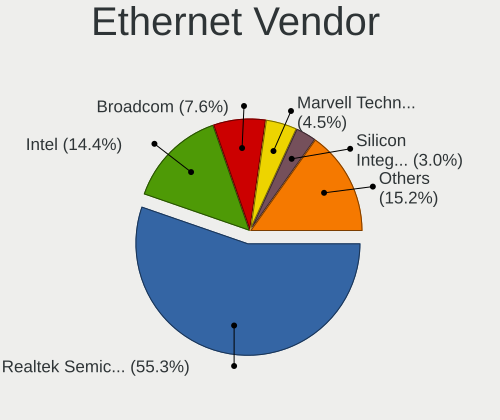

| Vendor                           | Computers | Percent |
|----------------------------------|-----------|---------|
| Realtek Semiconductor            | 73        | 55.3%   |
| Intel                            | 19        | 14.39%  |
| Broadcom                         | 10        | 7.58%   |
| Marvell Technology Group         | 6         | 4.55%   |
| Silicon Integrated Systems [SiS] | 4         | 3.03%   |
| Qualcomm Atheros                 | 4         | 3.03%   |
| Xiaomi                           | 3         | 2.27%   |
| Samsung Electronics              | 2         | 1.52%   |
| Motorola PCS                     | 2         | 1.52%   |
| JMicron Technology               | 2         | 1.52%   |
| Broadcom Limited                 | 2         | 1.52%   |
| Qualcomm Technologies            | 1         | 0.76%   |
| LG Electronics                   | 1         | 0.76%   |
| Google                           | 1         | 0.76%   |
| ASIX Electronics                 | 1         | 0.76%   |
| Accton Technology                | 1         | 0.76%   |

Ethernet Model
--------------

Ethernet models

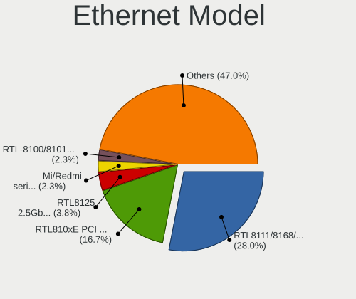

| Model                                                                  | Computers | Percent |
|------------------------------------------------------------------------|-----------|---------|
| Realtek RTL8111/8168/8211/8411 PCI Express Gigabit Ethernet Controller | 37        | 28.03%  |
| Realtek RTL810xE PCI Express Fast Ethernet controller                  | 22        | 16.67%  |
| Realtek RTL8125 2.5GbE Controller                                      | 5         | 3.79%   |
| Xiaomi Mi/Redmi series (RNDIS)                                         | 3         | 2.27%   |
| Realtek RTL-8100/8101L/8139 PCI Fast Ethernet Adapter                  | 3         | 2.27%   |
| Silicon Integrated Systems [SiS] SiS900 PCI Fast Ethernet              | 2         | 1.52%   |
| Silicon Integrated Systems [SiS] 191 Gigabit Ethernet Adapter          | 2         | 1.52%   |
| Samsung GT-I9070 (network tethering, USB debugging enabled)            | 2         | 1.52%   |
| Realtek RTL8153 Gigabit Ethernet Adapter                               | 2         | 1.52%   |
| Realtek RTL-8110SC/8169SC Gigabit Ethernet                             | 2         | 1.52%   |
| Qualcomm Atheros AR8152 v2.0 Fast Ethernet                             | 2         | 1.52%   |
| Marvell Group 88E8055 PCI-E Gigabit Ethernet Controller                | 2         | 1.52%   |
| JMicron JMC250 PCI Express Gigabit Ethernet Controller                 | 2         | 1.52%   |
| Intel Ethernet Connection I217-V                                       | 2         | 1.52%   |
| Intel Ethernet Connection (13) I219-V                                  | 2         | 1.52%   |
| Intel 82579LM Gigabit Network Connection (Lewisville)                  | 2         | 1.52%   |
| Intel 82577LM Gigabit Network Connection                               | 2         | 1.52%   |
| Intel 82577LC Gigabit Network Connection                               | 2         | 1.52%   |
| Realtek USB 10/100/1G/2.5 LAN                                          | 1         | 0.76%   |
| Realtek RTL8152 Fast Ethernet Adapter                                  | 1         | 0.76%   |
| Qualcomm WCN785x Wi-Fi 7(802.11be) 320MHz 2x2 [FastConnect 7800]       | 1         | 0.76%   |
| Qualcomm Atheros AR8161 Gigabit Ethernet                               | 1         | 0.76%   |
| Qualcomm Atheros AR8132 Fast Ethernet                                  | 1         | 0.76%   |
| Motorola PCS motorola one 5G ace                                       | 1         | 0.76%   |
| Motorola PCS moto g100 pro                                             | 1         | 0.76%   |
| Marvell Group 88E8058 PCI-E Gigabit Ethernet Controller                | 1         | 0.76%   |
| Marvell Group 88E8057 PCI-E Gigabit Ethernet Controller                | 1         | 0.76%   |
| Marvell Group 88E8056 PCI-E Gigabit Ethernet Controller                | 1         | 0.76%   |
| Marvell Group 88E8053 PCI-E Gigabit Ethernet Controller                | 1         | 0.76%   |
| LG LM-X420xxx/G2 Android Phone (USB tethering mode)                    | 1         | 0.76%   |
| Intel PRO/100 VE Network Connection                                    | 1         | 0.76%   |
| Intel NM10/ICH7 Family LAN Controller                                  | 1         | 0.76%   |
| Intel Ethernet Controller I225-V                                       | 1         | 0.76%   |
| Intel Ethernet Connection I218-LM                                      | 1         | 0.76%   |
| Intel Alder Lake-P PCH CNVi WiFi                                       | 1         | 0.76%   |
| Intel 82801DB PRO/100 VM (LOM) Ethernet Controller                     | 1         | 0.76%   |
| Intel 82801DB PRO/100 VE (LOM) Ethernet Controller                     | 1         | 0.76%   |
| Intel 82578DM Gigabit Network Connection                               | 1         | 0.76%   |
| Intel 82540EP Gigabit Ethernet Controller (Mobile)                     | 1         | 0.76%   |
| Google Pixel 9a                                                        | 1         | 0.76%   |

Net Controller Kind
-------------------

Ethernet, WiFi or modem

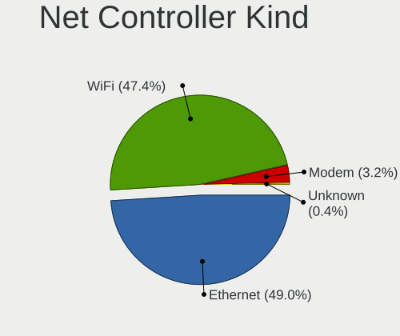

| Kind     | Computers | Percent |
|----------|-----------|---------|
| Ethernet | 124       | 49.01%  |
| WiFi     | 120       | 47.43%  |
| Modem    | 8         | 3.16%   |
| Unknown  | 1         | 0.4%    |

Used Controller
---------------

Currently used network controller

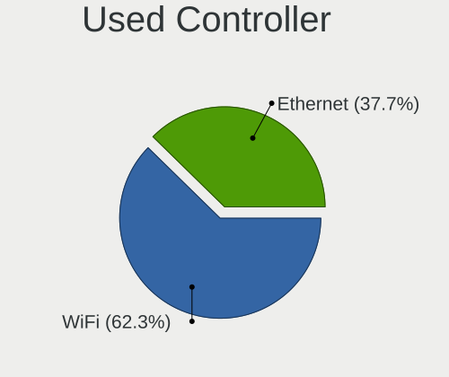

| Kind     | Computers | Percent |
|----------|-----------|---------|
| WiFi     | 91        | 62.33%  |
| Ethernet | 55        | 37.67%  |

NICs
----

Total network controllers on board

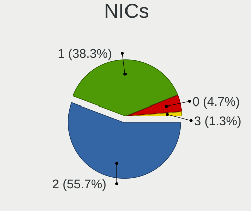

| Total | Computers | Percent |
|-------|-----------|---------|
| 2     | 83        | 55.7%   |
| 1     | 57        | 38.26%  |
| 0     | 7         | 4.7%    |
| 3     | 2         | 1.34%   |

IPv6
----

IPv6 vs IPv4

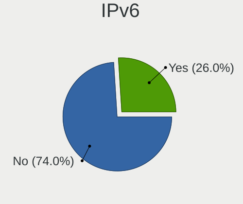

| Used | Computers | Percent |
|------|-----------|---------|
| No   | 111       | 74%     |
| Yes  | 39        | 26%     |

Bluetooth
---------

Bluetooth Vendor
----------------

Controller vendors

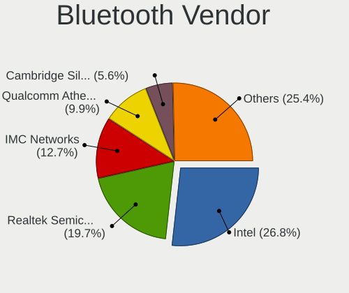

| Vendor                          | Computers | Percent |
|---------------------------------|-----------|---------|
| Intel                           | 19        | 26.76%  |
| Realtek Semiconductor           | 14        | 19.72%  |
| IMC Networks                    | 9         | 12.68%  |
| Qualcomm Atheros Communications | 7         | 9.86%   |
| Cambridge Silicon Radio         | 4         | 5.63%   |
| Apple                           | 4         | 5.63%   |
| MediaTek                        | 3         | 4.23%   |
| Lite-On Technology              | 2         | 2.82%   |
| Hewlett-Packard                 | 2         | 2.82%   |
| Alps Electric                   | 2         | 2.82%   |
| Toshiba                         | 1         | 1.41%   |
| Foxconn / Hon Hai               | 1         | 1.41%   |
| Dell                            | 1         | 1.41%   |
| Broadcom                        | 1         | 1.41%   |
| ASUSTek Computer                | 1         | 1.41%   |

Bluetooth Model
---------------

Controller models

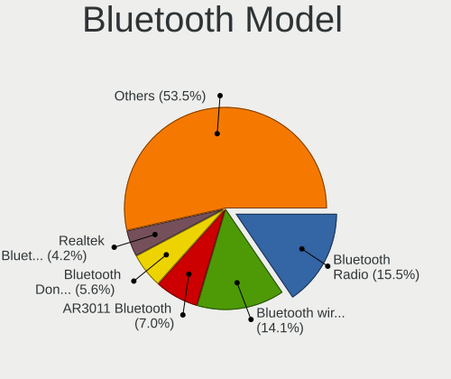

| Model                                               | Computers | Percent |
|-----------------------------------------------------|-----------|---------|
| Realtek Bluetooth Radio                             | 11        | 15.49%  |
| Intel Bluetooth wireless interface                  | 10        | 14.08%  |
| Qualcomm Atheros AR3011 Bluetooth                   | 5         | 7.04%   |
| Cambridge Silicon Radio Bluetooth Dongle (HCI mode) | 4         | 5.63%   |
| Realtek  Bluetooth 4.2 Adapter                      | 3         | 4.23%   |
| MediaTek Wireless_Device                            | 3         | 4.23%   |
| Intel AX200 Bluetooth                               | 3         | 4.23%   |
| IMC Networks Wireless_Device                        | 3         | 4.23%   |
| IMC Networks Bluetooth Radio                        | 3         | 4.23%   |
| Qualcomm Atheros  Bluetooth Device                  | 2         | 2.82%   |
| Intel Bluetooth 9460/9560 Jefferson Peak (JfP)      | 2         | 2.82%   |
| Intel AX201 Bluetooth                               | 2         | 2.82%   |
| HP Broadcom 2070 Bluetooth Combo                    | 2         | 2.82%   |
| Alps Electric BCM2046 Bluetooth Device              | 2         | 2.82%   |
| Toshiba Askey for Toshiba                           | 1         | 1.41%   |
| Lite-On Wireless_Device                             | 1         | 1.41%   |
| Lite-On Atheros AR3012 Bluetooth                    | 1         | 1.41%   |
| Intel Bluetooth Device                              | 1         | 1.41%   |
| Intel AX210 Bluetooth                               | 1         | 1.41%   |
| IMC Networks Bluetooth Module                       | 1         | 1.41%   |
| IMC Networks Bluetooth Device                       | 1         | 1.41%   |
| IMC Networks Atheros AR3012 Bluetooth 4.0 Adapter   | 1         | 1.41%   |
| Foxconn / Hon Hai Bluetooth Device                  | 1         | 1.41%   |
| Dell Wireless 360 Bluetooth                         | 1         | 1.41%   |
| Broadcom HP Portable Bumble Bee                     | 1         | 1.41%   |
| ASUS BT-183 Bluetooth 2.0+EDR adapter               | 1         | 1.41%   |
| Apple Built-in Bluetooth 2.0+EDR HCI                | 1         | 1.41%   |
| Apple Bluetooth USB Host Controller                 | 1         | 1.41%   |
| Apple Bluetooth Host Controller                     | 1         | 1.41%   |
| Apple Bluetooth HCI                                 | 1         | 1.41%   |

Sound
-----

Sound Vendor
------------

Sound card vendors

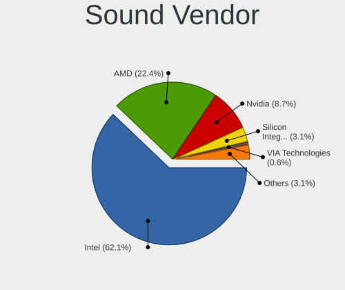

| Vendor                           | Computers | Percent |
|----------------------------------|-----------|---------|
| Intel                            | 100       | 62.11%  |
| AMD                              | 36        | 22.36%  |
| Nvidia                           | 14        | 8.7%    |
| Silicon Integrated Systems [SiS] | 5         | 3.11%   |
| VIA Technologies                 | 1         | 0.62%   |
| ULi Electronics                  | 1         | 0.62%   |
| Shenzhen Rapoo Technology        | 1         | 0.62%   |
| Logitech                         | 1         | 0.62%   |
| ESS Technology                   | 1         | 0.62%   |
| C-Media Electronics              | 1         | 0.62%   |

Sound Model
-----------

Sound card models

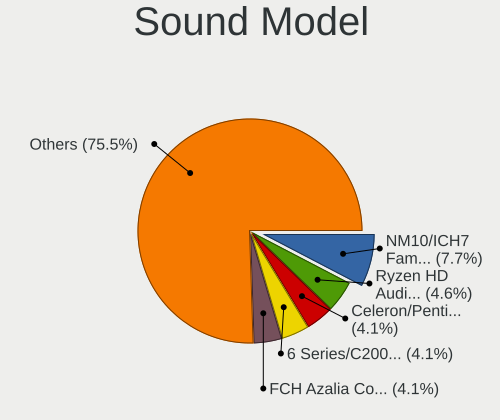

| Model                                                                                             | Computers | Percent |
|---------------------------------------------------------------------------------------------------|-----------|---------|
| Intel NM10/ICH7 Family High Definition Audio Controller                                           | 15        | 7.65%   |
| AMD Ryzen HD Audio Controller                                                                     | 9         | 4.59%   |
| Intel Celeron/Pentium Silver Processor High Definition Audio                                      | 8         | 4.08%   |
| Intel 6 Series/C200 Series Chipset Family High Definition Audio Controller                        | 8         | 4.08%   |
| AMD FCH Azalia Controller                                                                         | 8         | 4.08%   |
| Intel 82801I (ICH9 Family) HD Audio Controller                                                    | 7         | 3.57%   |
| Intel 5 Series/3400 Series Chipset High Definition Audio                                          | 7         | 3.57%   |
| AMD SBx00 Azalia (Intel HDA)                                                                      | 7         | 3.57%   |
| Intel Tiger Lake-LP Smart Sound Technology Audio Controller                                       | 6         | 3.06%   |
| Intel Sunrise Point-LP HD Audio                                                                   | 6         | 3.06%   |
| Intel 82801H (ICH8 Family) HD Audio Controller                                                    | 6         | 3.06%   |
| Intel Celeron N3350/Pentium N4200/Atom E3900 Series Audio Cluster                                 | 5         | 2.55%   |
| Intel Atom/Celeron/Pentium Processor x5-E8000/J3xxx/N3xxx Series High Definition Audio Controller | 5         | 2.55%   |
| Intel 7 Series/C216 Chipset Family High Definition Audio Controller                               | 5         | 2.55%   |
| AMD Wrestler HDMI Audio                                                                           | 5         | 2.55%   |
| Intel Haswell-ULT HD Audio Controller                                                             | 4         | 2.04%   |
| Intel 8 Series HD Audio Controller                                                                | 4         | 2.04%   |
| Silicon Integrated Systems [SiS] SiS7012 AC'97 Sound Controller                                   | 3         | 1.53%   |
| Intel Xeon E3-1200 v3/4th Gen Core Processor HD Audio Controller                                  | 3         | 1.53%   |
| Intel US15W/US15X/US15L/UL11L SCH [Poulsbo] HD Audio Controller                                   | 3         | 1.53%   |
| Intel Alder Lake PCH-P High Definition Audio Controller                                           | 3         | 1.53%   |
| Intel 82801FB/FBM/FR/FW/FRW (ICH6 Family) AC'97 Audio Controller                                  | 3         | 1.53%   |
| Intel 82801DB/DBL/DBM (ICH4/ICH4-L/ICH4-M) AC'97 Audio Controller                                 | 3         | 1.53%   |
| Intel 8 Series/C220 Series Chipset High Definition Audio Controller                               | 3         | 1.53%   |
| AMD RV710/730 HDMI Audio [Radeon HD 4000 series]                                                  | 3         | 1.53%   |
| AMD Raven/Raven2/Fenghuang HDMI/DP Audio Controller                                               | 3         | 1.53%   |
| AMD Radeon High Definition Audio Controller                                                       | 3         | 1.53%   |
| AMD Kabini HDMI/DP Audio                                                                          | 3         | 1.53%   |
| Silicon Integrated Systems [SiS] Azalia Audio Controller                                          | 2         | 1.02%   |
| Nvidia GT216 HDMI Audio Controller                                                                | 2         | 1.02%   |
| Nvidia GK107 HDMI Audio Controller                                                                | 2         | 1.02%   |
| Intel Atom Processor Z36xxx/Z37xxx Series High Definition Audio Controller                        | 2         | 1.02%   |
| AMD Trinity HDMI Audio Controller                                                                 | 2         | 1.02%   |
| AMD Renoir/Cezanne HDMI/DP Audio Controller                                                       | 2         | 1.02%   |
| AMD Navi 21/23 HDMI/DP Audio Controller                                                           | 2         | 1.02%   |
| AMD Juniper HDMI Audio [Radeon HD 5700 Series]                                                    | 2         | 1.02%   |
| AMD High Definition Audio Controller                                                              | 2         | 1.02%   |
| AMD Family 15h (Models 60h-6fh) Audio Controller                                                  | 2         | 1.02%   |
| VIA Technologies VX900/VT8xxx High Definition Audio Controller                                    | 1         | 0.51%   |
| VIA Technologies VX900 Graphics [Chrome9 HD] HDMI Audio Device                                    | 1         | 0.51%   |

Memory
------

Memory Vendor
-------------

Memory module vendors

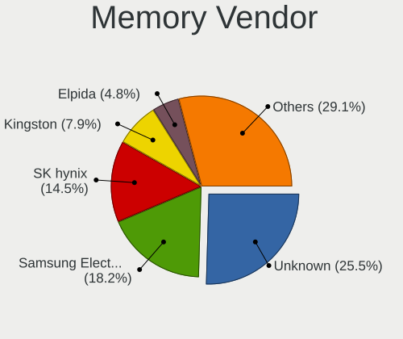

| Vendor              | Computers | Percent |
|---------------------|-----------|---------|
| Unknown             | 42        | 25.45%  |
| Samsung Electronics | 30        | 18.18%  |
| SK hynix            | 24        | 14.55%  |
| Kingston            | 13        | 7.88%   |
| Elpida              | 8         | 4.85%   |
| Micron Technology   | 7         | 4.24%   |
| Unknown (ABCD)      | 6         | 3.64%   |
| Team                | 4         | 2.42%   |
| Corsair             | 4         | 2.42%   |
| Unknown             | 4         | 2.42%   |
| Ramaxel Technology  | 3         | 1.82%   |
| Crucial             | 3         | 1.82%   |
| A-DATA Technology   | 3         | 1.82%   |
| Unknown (0x0DEC)    | 2         | 1.21%   |
| Veineda             | 1         | 0.61%   |
| Transcend           | 1         | 0.61%   |
| Toshiba             | 1         | 0.61%   |
| Teikon              | 1         | 0.61%   |
| S                   | 1         | 0.61%   |
| PNY                 | 1         | 0.61%   |
| Nanya Technology    | 1         | 0.61%   |
| M                   | 1         | 0.61%   |
| Infineon            | 1         | 0.61%   |
| G.Skill             | 1         | 0.61%   |
| A-DA                | 1         | 0.61%   |
| 4ea5                | 1         | 0.61%   |

Memory Model
------------

Memory module models

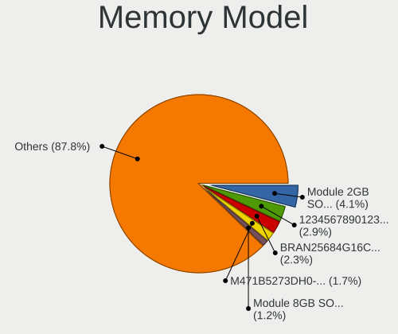

| Model                                                            | Computers | Percent |
|------------------------------------------------------------------|-----------|---------|
| Unknown RAM Module 2GB SODIMM DDR2                               | 7         | 4.07%   |
| Unknown (ABCD) RAM 123456789012345678 2GB SODIMM LPDDR4 2400MT/s | 5         | 2.91%   |
| Unknown                                                          | 4         | 2.33%   |
| Samsung RAM M471B5273DH0-CH9 4GB SODIMM DDR3 1600MT/s            | 3         | 1.74%   |
| Unknown RAM Module 8GB SODIMM DDR4 3200MT/s                      | 2         | 1.16%   |
| Unknown RAM Module 512MB SODIMM DDR2                             | 2         | 1.16%   |
| Unknown RAM Module 4GB SODIMM DDR3 1600MT/s                      | 2         | 1.16%   |
| Unknown RAM Module 1GB SODIMM DRAM                               | 2         | 1.16%   |
| Unknown RAM Module 1GB SODIMM DDR2 667MT/s                       | 2         | 1.16%   |
| Unknown RAM Module 1GB SODIMM DDR2                               | 2         | 1.16%   |
| Unknown RAM Module 1GB SODIMM DDR                                | 2         | 1.16%   |
| Unknown RAM Module 1024MB DIMM DDR3 1333MT/s                     | 2         | 1.16%   |
| Unknown (0x0DEC) RAM D4N3200CS-8G 8GB SODIMM DDR4 3200MT/s       | 2         | 1.16%   |
| SK hynix RAM Module 2GB DIMM DDR3 1066MT/s                       | 2         | 1.16%   |
| SK hynix RAM HMT451S6AFR8A-PB 4GB SODIMM DDR3 1600MT/s           | 2         | 1.16%   |
| Samsung RAM M471B5173QH0-YK0 4GB SODIMM DDR3 1600MT/s            | 2         | 1.16%   |
| Samsung RAM M471B5173EB0-YK0 4GB SODIMM DDR3 1600MT/s            | 2         | 1.16%   |
| Samsung RAM M471A5244CB0-CTD 4GB SODIMM DDR4 3266MT/s            | 2         | 1.16%   |
| Samsung RAM M378B5673FH0-CH9 2GB DIMM DDR3 1600MT/s              | 2         | 1.16%   |
| Samsung RAM K4E8E324EB-EGCF 2GB LPDDR3 1867MT/s                  | 2         | 1.16%   |
| Veineda RAM Module 4GB SODIMM DDR3 1600MT/s                      | 1         | 0.58%   |
| Unknown RAM Module 512MB SODIMM SDRAM                            | 1         | 0.58%   |
| Unknown RAM Module 512MB SODIMM DRAM                             | 1         | 0.58%   |
| Unknown RAM Module 512MB SODIMM DDR                              | 1         | 0.58%   |
| Unknown RAM Module 512MB DIMM 400MT/s                            | 1         | 0.58%   |
| Unknown RAM Module 512MB DIMM                                    | 1         | 0.58%   |
| Unknown RAM Module 4GB SODIMM DDR3 1067MT/s                      | 1         | 0.58%   |
| Unknown RAM Module 4GB DIMM 1333MT/s                             | 1         | 0.58%   |
| Unknown RAM Module 4096MB SODIMM DDR3 1333MT/s                   | 1         | 0.58%   |
| Unknown RAM Module 2GB SODIMM DRAM                               | 1         | 0.58%   |
| Unknown RAM Module 2GB SODIMM DDR2 667MT/s                       | 1         | 0.58%   |
| Unknown RAM Module 2GB SODIMM DDR                                | 1         | 0.58%   |
| Unknown RAM Module 2GB DIMM SDRAM 800MT/s                        | 1         | 0.58%   |
| Unknown RAM Module 2GB DIMM SDRAM                                | 1         | 0.58%   |
| Unknown RAM Module 2GB DIMM 800MT/s                              | 1         | 0.58%   |
| Unknown RAM Module 256MB SODIMM SDRAM                            | 1         | 0.58%   |
| Unknown RAM Module 2048MB SODIMM SDRAM                           | 1         | 0.58%   |
| Unknown RAM Module 2048MB DIMM SDRAM 1066MT/s                    | 1         | 0.58%   |
| Unknown RAM Module 2048MB DIMM SDRAM                             | 1         | 0.58%   |
| Unknown RAM Module 1GB SODIMM DDR 266MT/s                        | 1         | 0.58%   |

Memory Kind
-----------

Memory module kinds

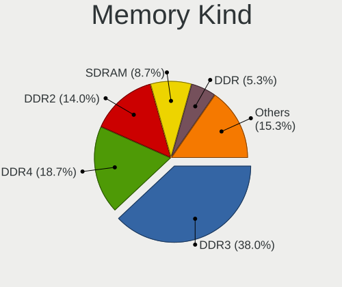

| Kind    | Computers | Percent |
|---------|-----------|---------|
| DDR3    | 57        | 38%     |
| DDR4    | 28        | 18.67%  |
| DDR2    | 21        | 14%     |
| SDRAM   | 13        | 8.67%   |
| DDR     | 8         | 5.33%   |
| LPDDR4  | 7         | 4.67%   |
| Unknown | 5         | 3.33%   |
| LPDDR3  | 4         | 2.67%   |
| DRAM    | 3         | 2%      |
| DDR5    | 3         | 2%      |
| LPDDR5  | 1         | 0.67%   |

Memory Form Factor
------------------

Physical design of the memory module

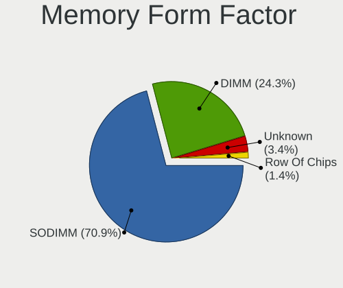

| Name         | Computers | Percent |
|--------------|-----------|---------|
| SODIMM       | 105       | 70.95%  |
| DIMM         | 36        | 24.32%  |
| Unknown      | 5         | 3.38%   |
| Row Of Chips | 2         | 1.35%   |

Memory Size
-----------

Memory module size

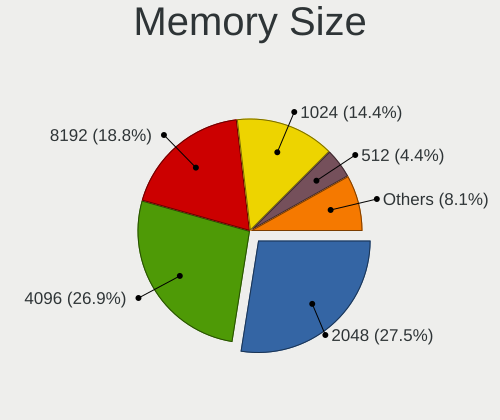

| Size  | Computers | Percent |
|-------|-----------|---------|
| 2048  | 44        | 27.5%   |
| 4096  | 43        | 26.88%  |
| 8192  | 30        | 18.75%  |
| 1024  | 23        | 14.38%  |
| 512   | 7         | 4.38%   |
| 16384 | 6         | 3.75%   |
| 32768 | 5         | 3.13%   |
| 256   | 2         | 1.25%   |

Memory Speed
------------

Memory module speed

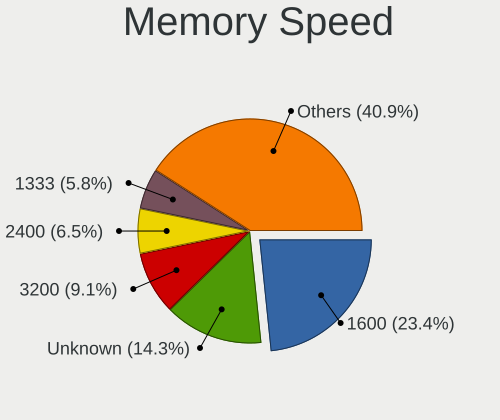

| Speed   | Computers | Percent |
|---------|-----------|---------|
| 1600    | 36        | 23.38%  |
| Unknown | 22        | 14.29%  |
| 3200    | 14        | 9.09%   |
| 2400    | 10        | 6.49%   |
| 1333    | 9         | 5.84%   |
| 667     | 8         | 5.19%   |
| 2667    | 7         | 4.55%   |
| 1334    | 6         | 3.9%    |
| 1067    | 6         | 3.9%    |
| 1867    | 4         | 2.6%    |
| 1066    | 4         | 2.6%    |
| 533     | 4         | 2.6%    |
| 800     | 3         | 1.95%   |
| 266     | 3         | 1.95%   |
| 6000    | 2         | 1.3%    |
| 5600    | 2         | 1.3%    |
| 4199    | 2         | 1.3%    |
| 3600    | 2         | 1.3%    |
| 3266    | 2         | 1.3%    |
| 2133    | 2         | 1.3%    |
| 400     | 2         | 1.3%    |
| 2666    | 1         | 0.65%   |
| 2048    | 1         | 0.65%   |
| 1800    | 1         | 0.65%   |
| 333     | 1         | 0.65%   |

Printers & scanners
-------------------

Printer Vendor
--------------

Printer device vendors

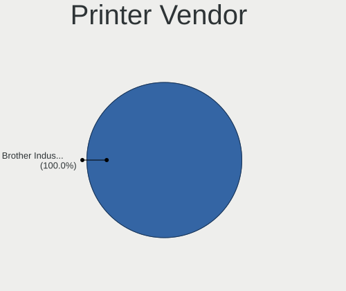

| Vendor             | Computers | Percent |
|--------------------|-----------|---------|
| Canon              | 1         | 50%     |
| Brother Industries | 1         | 50%     |

Printer Model
-------------

Printer device models

| Model                  | Computers | Percent |
|------------------------|-----------|---------|
| Canon MF4100 series    | 1         | 50%     |
| Brother HL-1110 series | 1         | 50%     |

Scanner Vendor
--------------

Scanner device vendors

Zero info for selected period =(

Scanner Model
-------------

Scanner device models

Zero info for selected period =(

Camera
------

Camera Vendor
-------------

Camera device vendors

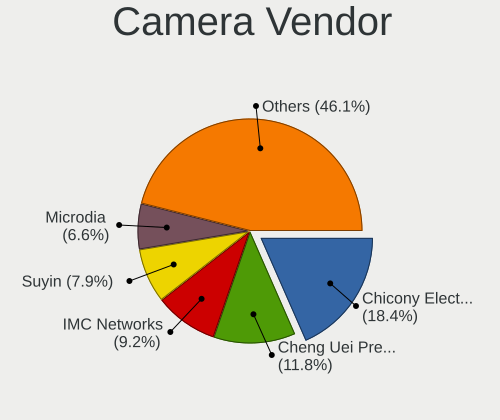

| Vendor                                 | Computers | Percent |
|----------------------------------------|-----------|---------|
| Chicony Electronics                    | 14        | 18.42%  |
| Cheng Uei Precision Industry (Foxlink) | 9         | 11.84%  |
| IMC Networks                           | 7         | 9.21%   |
| Suyin                                  | 6         | 7.89%   |
| Microdia                               | 5         | 6.58%   |
| Quanta                                 | 4         | 5.26%   |
| Bison Electronics                      | 4         | 5.26%   |
| Ricoh                                  | 3         | 3.95%   |
| Realtek Semiconductor                  | 3         | 3.95%   |
| Apple                                  | 3         | 3.95%   |
| Sunplus Innovation Technology          | 2         | 2.63%   |
| Luxvisions Innotech Limited            | 2         | 2.63%   |
| Logitech                               | 2         | 2.63%   |
| Alcor Micro                            | 2         | 2.63%   |
| Acer                                   | 2         | 2.63%   |
| USB Camera CS                          | 1         | 1.32%   |
| Silicon Motion                         | 1         | 1.32%   |
| OPPO Electronics                       | 1         | 1.32%   |
| KYE Systems (Mouse Systems)            | 1         | 1.32%   |
| GEMBIRD                                | 1         | 1.32%   |
| eMPIA Technology                       | 1         | 1.32%   |
| Cubeternet                             | 1         | 1.32%   |
| ALi                                    | 1         | 1.32%   |

Camera Model
------------

Camera device models

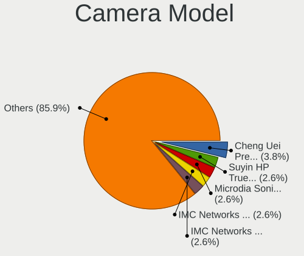

| Model                                                       | Computers | Percent |
|-------------------------------------------------------------|-----------|---------|
| Cheng Uei Precision Industry (Foxlink) HP TrueVision HD     | 3         | 3.85%   |
| Suyin HP Truevision HD                                      | 2         | 2.56%   |
| Microdia Sonix USB 2.0 Camera                               | 2         | 2.56%   |
| IMC Networks USB2.0 VGA UVC WebCam                          | 2         | 2.56%   |
| IMC Networks USB2.0 HD UVC WebCam                           | 2         | 2.56%   |
| Chicony TOSHIBA Web Camera - HD                             | 2         | 2.56%   |
| Cheng Uei Precision Industry (Foxlink) HP HD Webcam         | 2         | 2.56%   |
| Apple FaceTime HD Camera (Built-in)                         | 2         | 2.56%   |
| USB Camera CS USB Camera CS                                 | 1         | 1.28%   |
| Suyin WebCam                                                | 1         | 1.28%   |
| Suyin HD WebCam                                             | 1         | 1.28%   |
| Suyin Acer/HP Integrated Webcam [CN0314]                    | 1         | 1.28%   |
| Suyin 1.3M WebCam (notebook emachines E730, Acer sub-brand) | 1         | 1.28%   |
| Sunplus HD WebCam                                           | 1         | 1.28%   |
| Sunplus Asus Webcam                                         | 1         | 1.28%   |
| Silicon Motion 300k Pixel Camera                            | 1         | 1.28%   |
| Ricoh Webcam 1000                                           | 1         | 1.28%   |
| Ricoh Sony Visual Communication Camera                      | 1         | 1.28%   |
| Ricoh Sony Vaio Integrated Webcam                           | 1         | 1.28%   |
| Realtek USB2.0 VGA UVC WebCam                               | 1         | 1.28%   |
| Realtek HP Wide Vision HD Camera                            | 1         | 1.28%   |
| Realtek HD WebCam                                           | 1         | 1.28%   |
| Quanta HP Webcam                                            | 1         | 1.28%   |
| Quanta HP TrueVision HD Camera                              | 1         | 1.28%   |
| Quanta HD Webcam                                            | 1         | 1.28%   |
| Quanta Chromebook HD Camera                                 | 1         | 1.28%   |
| OPPO Oppo N1                                                | 1         | 1.28%   |
| Microdia Webcam Vitade AF                                   | 1         | 1.28%   |
| Microdia Laptop_Integrated_Webcam_E4HD                      | 1         | 1.28%   |
| Microdia Integrated Webcam                                  | 1         | 1.28%   |
| Luxvisions Innotech Limited Integrated Camera               | 1         | 1.28%   |
| Luxvisions Innotech Limited HP TrueVision HD Camera         | 1         | 1.28%   |
| Logitech HD Webcam C615                                     | 1         | 1.28%   |
| Logitech HD Webcam C525                                     | 1         | 1.28%   |
| KYE Systems (Mouse Systems) ASUS USB2.0 Webcam              | 1         | 1.28%   |
| IMC Networks USB 2.0 Camera                                 | 1         | 1.28%   |
| IMC Networks Integrated Camera                              | 1         | 1.28%   |
| IMC Networks HP TrueVision HD Camera                        | 1         | 1.28%   |
| GEMBIRD Generic UVC 1.00 camera [AppoTech AX2311]           | 1         | 1.28%   |
| eMPIA Lenovo EasyCamera                                     | 1         | 1.28%   |

Security
--------

Fingerprint Vendor
------------------

Fingerprint sensor vendors

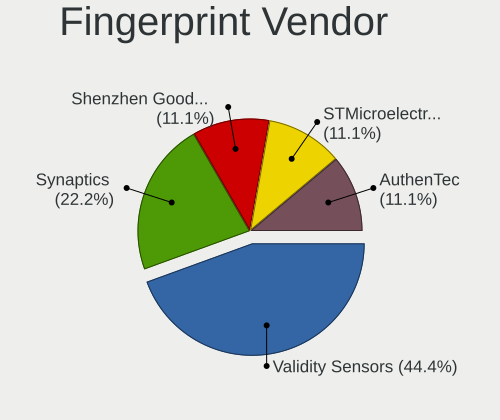

| Vendor                     | Computers | Percent |
|----------------------------|-----------|---------|
| Validity Sensors           | 4         | 44.44%  |
| Synaptics                  | 2         | 22.22%  |
| STMicroelectronics         | 1         | 11.11%  |
| Shenzhen Goodix Technology | 1         | 11.11%  |
| AuthenTec                  | 1         | 11.11%  |

Fingerprint Model
-----------------

Fingerprint sensor models

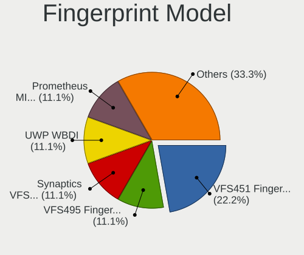

| Model                                                       | Computers | Percent |
|-------------------------------------------------------------|-----------|---------|
| Validity Sensors VFS451 Fingerprint Reader                  | 2         | 22.22%  |
| Validity Sensors VFS495 Fingerprint Reader                  | 1         | 11.11%  |
| Validity Sensors Synaptics VFS7552 Touch Fingerprint Sensor | 1         | 11.11%  |
| Synaptics UWP WBDI                                          | 1         | 11.11%  |
| Synaptics Prometheus MIS Touch Fingerprint Reader           | 1         | 11.11%  |
| STMicroelectronics Fingerprint Reader                       | 1         | 11.11%  |
| Shenzhen Goodix  FingerPrint Device                         | 1         | 11.11%  |
| AuthenTec AES2501 Fingerprint Sensor                        | 1         | 11.11%  |

Chipcard Vendor
---------------

Chipcard module vendors

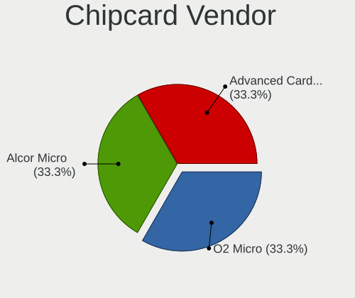

| Vendor                | Computers | Percent |
|-----------------------|-----------|---------|
| O2 Micro              | 1         | 33.33%  |
| Alcor Micro           | 1         | 33.33%  |
| Advanced Card Systems | 1         | 33.33%  |

Chipcard Model
--------------

Chipcard module models

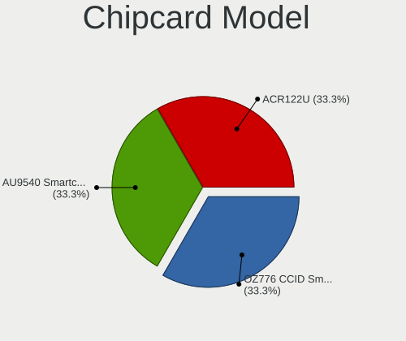

| Model                                | Computers | Percent |
|--------------------------------------|-----------|---------|
| O2 Micro OZ776 CCID Smartcard Reader | 1         | 33.33%  |
| Alcor Micro AU9540 Smartcard Reader  | 1         | 33.33%  |
| Advanced Card Systems ACR122U        | 1         | 33.33%  |

Unsupported
-----------

Unsupported Devices
-------------------

Total unsupported devices on board

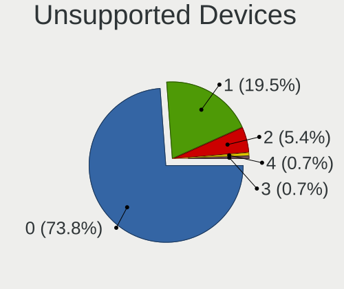

| Total | Computers | Percent |
|-------|-----------|---------|
| 0     | 110       | 73.83%  |
| 1     | 29        | 19.46%  |
| 2     | 8         | 5.37%   |
| 4     | 1         | 0.67%   |
| 3     | 1         | 0.67%   |

Unsupported Device Types
------------------------

Types of unsupported devices

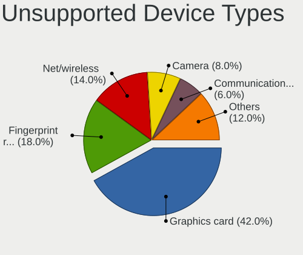

| Type                     | Computers | Percent |
|--------------------------|-----------|---------|
| Graphics card            | 21        | 42%     |
| Fingerprint reader       | 9         | 18%     |
| Net/wireless             | 7         | 14%     |
| Camera                   | 4         | 8%      |
| Communication controller | 3         | 6%      |
| Flash memory             | 2         | 4%      |
| Chipcard                 | 2         | 4%      |
| Network                  | 1         | 2%      |
| Multimedia controller    | 1         | 2%      |

