RHEL - Tested Hardware & Statistics
-----------------------------------

A project to collect tested hardware configurations for RHEL.

Anyone can contribute to this report by the [hw-probe](https://github.com/linuxhw/hw-probe) tool:

    sudo -E hw-probe -all -upload

Please contribute! Especially if your hardware is rare.

This is a report for all computer types. See also reports for [desktops](/Dist/RHEL/Desktop/README.md) and [notebooks](/Dist/RHEL/Notebook/README.md).

Contents
--------

* [ Test Cases ](#test-cases)

* [ System ](#system)
  - [ OS                       ](#os)
  - [ OS Family                ](#os-family)
  - [ Kernel                   ](#kernel)
  - [ Kernel Family            ](#kernel-family)
  - [ Kernel Major Ver.        ](#kernel-major-ver)
  - [ Arch                     ](#arch)
  - [ DE                       ](#de)
  - [ Display Server           ](#display-server)
  - [ Display Manager          ](#display-manager)
  - [ OS Lang                  ](#os-lang)
  - [ Boot Mode                ](#boot-mode)
  - [ Filesystem               ](#filesystem)
  - [ Part. scheme             ](#part-scheme)
  - [ Dual Boot with Linux/BSD ](#dual-boot-with-linuxbsd)
  - [ Dual Boot (Win)          ](#dual-boot-win)

* [ Board ](#board)
  - [ Vendor                   ](#vendor)
  - [ Model                    ](#model)
  - [ Model Family             ](#model-family)
  - [ MFG Year                 ](#mfg-year)
  - [ Form Factor              ](#form-factor)
  - [ Secure Boot              ](#secure-boot)
  - [ Coreboot                 ](#coreboot)
  - [ RAM Size                 ](#ram-size)
  - [ RAM Used                 ](#ram-used)
  - [ Total Drives             ](#total-drives)
  - [ Has CD-ROM               ](#has-cd-rom)
  - [ Has Ethernet             ](#has-ethernet)
  - [ Has WiFi                 ](#has-wifi)
  - [ Has Bluetooth            ](#has-bluetooth)

* [ Location ](#location)
  - [ Country                  ](#country)
  - [ City                     ](#city)

* [ Drives ](#drives)
  - [ Drive Vendor             ](#drive-vendor)
  - [ Drive Model              ](#drive-model)
  - [ HDD Vendor               ](#hdd-vendor)
  - [ SSD Vendor               ](#ssd-vendor)
  - [ Drive Kind               ](#drive-kind)
  - [ Drive Connector          ](#drive-connector)
  - [ Drive Size               ](#drive-size)
  - [ Space Total              ](#space-total)
  - [ Space Used               ](#space-used)
  - [ Malfunc. Drives          ](#malfunc-drives)
  - [ Malfunc. Drive Vendor    ](#malfunc-drive-vendor)
  - [ Malfunc. HDD Vendor      ](#malfunc-hdd-vendor)
  - [ Malfunc. Drive Kind      ](#malfunc-drive-kind)
  - [ Failed Drives            ](#failed-drives)
  - [ Failed Drive Vendor      ](#failed-drive-vendor)
  - [ Drive Status             ](#drive-status)

* [ Storage controller ](#storage-controller)
  - [ Storage Vendor           ](#storage-vendor)
  - [ Storage Model            ](#storage-model)
  - [ Storage Kind             ](#storage-kind)

* [ Processor ](#processor)
  - [ CPU Vendor               ](#cpu-vendor)
  - [ CPU Model                ](#cpu-model)
  - [ CPU Model Family         ](#cpu-model-family)
  - [ CPU Cores                ](#cpu-cores)
  - [ CPU Sockets              ](#cpu-sockets)
  - [ CPU Threads              ](#cpu-threads)
  - [ CPU Op-Modes             ](#cpu-op-modes)
  - [ CPU Microcode            ](#cpu-microcode)
  - [ CPU Microarch            ](#cpu-microarch)

* [ Graphics ](#graphics)
  - [ GPU Vendor               ](#gpu-vendor)
  - [ GPU Model                ](#gpu-model)
  - [ GPU Combo                ](#gpu-combo)
  - [ GPU Driver               ](#gpu-driver)
  - [ GPU Memory               ](#gpu-memory)

* [ Monitor ](#monitor)
  - [ Monitor Vendor           ](#monitor-vendor)
  - [ Monitor Model            ](#monitor-model)
  - [ Monitor Resolution       ](#monitor-resolution)
  - [ Monitor Diagonal         ](#monitor-diagonal)
  - [ Monitor Width            ](#monitor-width)
  - [ Aspect Ratio             ](#aspect-ratio)
  - [ Monitor Area             ](#monitor-area)
  - [ Pixel Density            ](#pixel-density)
  - [ Multiple Monitors        ](#multiple-monitors)

* [ Network ](#network)
  - [ Net Controller Vendor    ](#net-controller-vendor)
  - [ Net Controller Model     ](#net-controller-model)
  - [ Wireless Vendor          ](#wireless-vendor)
  - [ Wireless Model           ](#wireless-model)
  - [ Ethernet Vendor          ](#ethernet-vendor)
  - [ Ethernet Model           ](#ethernet-model)
  - [ Net Controller Kind      ](#net-controller-kind)
  - [ Used Controller          ](#used-controller)
  - [ NICs                     ](#nics)
  - [ IPv6                     ](#ipv6)

* [ Bluetooth ](#bluetooth)
  - [ Bluetooth Vendor         ](#bluetooth-vendor)
  - [ Bluetooth Model          ](#bluetooth-model)

* [ Sound ](#sound)
  - [ Sound Vendor             ](#sound-vendor)
  - [ Sound Model              ](#sound-model)

* [ Memory ](#memory)
  - [ Memory Vendor            ](#memory-vendor)
  - [ Memory Model             ](#memory-model)
  - [ Memory Kind              ](#memory-kind)
  - [ Memory Form Factor       ](#memory-form-factor)
  - [ Memory Size              ](#memory-size)
  - [ Memory Speed             ](#memory-speed)

* [ Printers & scanners ](#printers--scanners)
  - [ Printer Vendor           ](#printer-vendor)
  - [ Printer Model            ](#printer-model)
  - [ Scanner Vendor           ](#scanner-vendor)
  - [ Scanner Model            ](#scanner-model)

* [ Camera ](#camera)
  - [ Camera Vendor            ](#camera-vendor)
  - [ Camera Model             ](#camera-model)

* [ Security ](#security)
  - [ Fingerprint Vendor       ](#fingerprint-vendor)
  - [ Fingerprint Model        ](#fingerprint-model)
  - [ Chipcard Vendor          ](#chipcard-vendor)
  - [ Chipcard Model           ](#chipcard-model)

* [ Unsupported ](#unsupported)
  - [ Unsupported Devices      ](#unsupported-devices)
  - [ Unsupported Device Types ](#unsupported-device-types)

Test Cases
----------

Total: 370

| Vendor        | Model                       | Form-Factor | Probe                                                      | Date         |
|---------------|-----------------------------|-------------|------------------------------------------------------------|--------------|
| ASUSTek       | PRIME Z590-A                | Desktop     | [f328fab9f1](https://linux-hardware.org/?probe=f328fab9f1) | Jan 27, 2023 |
| Hardkernel    | ODROID-H3                   | Desktop     | [98f5768c61](https://linux-hardware.org/?probe=98f5768c61) | Jan 22, 2023 |
| Dell          | Latitude 9420               | Notebook    | [3fd325486b](https://linux-hardware.org/?probe=3fd325486b) | Jan 18, 2023 |
| Dell          | Latitude 3410               | Notebook    | [0a4720ef85](https://linux-hardware.org/?probe=0a4720ef85) | Jan 02, 2023 |
| Lenovo        | ThinkPad P17 Gen 2i 20YU... | Notebook    | [34169c74c5](https://linux-hardware.org/?probe=34169c74c5) | Dec 31, 2022 |
| Unknown       | Unknown                     | Desktop     | [9d66e8f05d](https://linux-hardware.org/?probe=9d66e8f05d) | Dec 25, 2022 |
| HP            | EliteBook 2570p             | Notebook    | [199df541f2](https://linux-hardware.org/?probe=199df541f2) | Dec 21, 2022 |
| MSI           | GE72VR 7RF                  | Notebook    | [f5384e68dd](https://linux-hardware.org/?probe=f5384e68dd) | Dec 16, 2022 |
| Gigabyte      | Z590I VISION D              | Desktop     | [9787630f1c](https://linux-hardware.org/?probe=9787630f1c) | Dec 12, 2022 |
| Lenovo        | ThinkPad X390 Yoga 20NQS... | Convertible | [f1ac9526c5](https://linux-hardware.org/?probe=f1ac9526c5) | Dec 08, 2022 |
| Lenovo        | ThinkPad X1 Nano Gen 2 2... | Notebook    | [7c17c479b7](https://linux-hardware.org/?probe=7c17c479b7) | Dec 03, 2022 |
| HP            | Laptop 14s-dk0xxx           | Notebook    | [c1d2a02024](https://linux-hardware.org/?probe=c1d2a02024) | Nov 30, 2022 |
| Lenovo        | ThinkPad X390 Yoga 20NQS... | Convertible | [ae85dba67e](https://linux-hardware.org/?probe=ae85dba67e) | Nov 28, 2022 |
| MSI           | B550M PRO-VDH WIFI          | Desktop     | [af5361313b](https://linux-hardware.org/?probe=af5361313b) | Nov 17, 2022 |
| Lenovo        | ThinkPad P1 Gen 3 20TJS2... | Notebook    | [64fb254a64](https://linux-hardware.org/?probe=64fb254a64) | Nov 17, 2022 |
| Dell          | Latitude E7450              | Notebook    | [1fba71c904](https://linux-hardware.org/?probe=1fba71c904) | Nov 15, 2022 |
| Lenovo        | ThinkPad P1 Gen 3 20TJS2... | Notebook    | [de9e18e6ca](https://linux-hardware.org/?probe=de9e18e6ca) | Nov 14, 2022 |
| Lenovo        | Unknown                     | Convertible | [b4fb099c2f](https://linux-hardware.org/?probe=b4fb099c2f) | Nov 11, 2022 |
| MSI           | B550M PRO-VDH WIFI          | Desktop     | [2d830dc96d](https://linux-hardware.org/?probe=2d830dc96d) | Nov 11, 2022 |
| Dell          | 0RN4PJ A02                  | Server      | [84012f61ff](https://linux-hardware.org/?probe=84012f61ff) | Nov 03, 2022 |
| HP            | 8591                        | Desktop     | [98bde1bd5a](https://linux-hardware.org/?probe=98bde1bd5a) | Nov 01, 2022 |
| Lenovo        | ThinkPad T14 Gen 1 20S1S... | Notebook    | [24d91cf27b](https://linux-hardware.org/?probe=24d91cf27b) | Oct 30, 2022 |
| Lenovo        | ThinkPad X220 4291WSH       | Notebook    | [00e77b8815](https://linux-hardware.org/?probe=00e77b8815) | Oct 26, 2022 |
| Lenovo        | ThinkPad X220 4291WSH       | Notebook    | [94d1c333ac](https://linux-hardware.org/?probe=94d1c333ac) | Oct 26, 2022 |
| ASUSTek       | Z450LA                      | Notebook    | [ba00eb6516](https://linux-hardware.org/?probe=ba00eb6516) | Oct 18, 2022 |
| AZW           | SER V01                     | Mini pc     | [7bb271252d](https://linux-hardware.org/?probe=7bb271252d) | Oct 17, 2022 |
| ASUSTek       | Z450LA                      | Notebook    | [6042d84470](https://linux-hardware.org/?probe=6042d84470) | Oct 17, 2022 |
| HP            | 340S G7                     | Notebook    | [7baf4edd11](https://linux-hardware.org/?probe=7baf4edd11) | Oct 09, 2022 |
| Razer         | Blade 15 Mid 2019-Base      | Notebook    | [c1457e4e02](https://linux-hardware.org/?probe=c1457e4e02) | Sep 21, 2022 |
| Lenovo        | ThinkPad P17 Gen 2i 20YU... | Notebook    | [8656acec04](https://linux-hardware.org/?probe=8656acec04) | Sep 14, 2022 |
| Lenovo        | ThinkPad P17 Gen 2i 20YU... | Notebook    | [23649c49e3](https://linux-hardware.org/?probe=23649c49e3) | Sep 14, 2022 |
| Gigabyte      | Z590I VISION D              | Desktop     | [22131a6ec5](https://linux-hardware.org/?probe=22131a6ec5) | Sep 03, 2022 |
| Acer          | Aspire XC-330               | Desktop     | [2012033d09](https://linux-hardware.org/?probe=2012033d09) | Aug 14, 2022 |
| Dell          | Precision 7510              | Notebook    | [cd8482ea72](https://linux-hardware.org/?probe=cd8482ea72) | Aug 08, 2022 |
| Lenovo        | ThinkPad P17 Gen 2i 20YU... | Notebook    | [3df0bebc37](https://linux-hardware.org/?probe=3df0bebc37) | Aug 03, 2022 |
| Unknown       | Unknown                     | Desktop     | [fad6d4558f](https://linux-hardware.org/?probe=fad6d4558f) | Jul 26, 2022 |
| Raspberry ... | Raspberry Pi 4 Model B      | Soc         | [4776ecdc2a](https://linux-hardware.org/?probe=4776ecdc2a) | Jul 15, 2022 |
| Lenovo        | ThinkPad E15 Gen 2 20T80... | Notebook    | [2566bb66dd](https://linux-hardware.org/?probe=2566bb66dd) | Jul 12, 2022 |
| Lenovo        | ThinkPad P17 Gen 2i 20YU... | Notebook    | [71c31086e6](https://linux-hardware.org/?probe=71c31086e6) | Jul 11, 2022 |
| Intel         | H81                         | Desktop     | [e1a730a6e6](https://linux-hardware.org/?probe=e1a730a6e6) | Jul 08, 2022 |
| Lenovo        | ThinkPad P17 Gen 2i 20YU... | Notebook    | [714c212f51](https://linux-hardware.org/?probe=714c212f51) | Jul 08, 2022 |
| Unknown       | Unknown                     | Desktop     | [16c6df7b29](https://linux-hardware.org/?probe=16c6df7b29) | Jul 07, 2022 |
| Unknown       | Unknown                     | Desktop     | [6b25430dc1](https://linux-hardware.org/?probe=6b25430dc1) | Jul 07, 2022 |
| Gigabyte      | MU72-SU0-00 01000100        | Server      | [ab729dc8a5](https://linux-hardware.org/?probe=ab729dc8a5) | Jul 04, 2022 |
| Gigabyte      | MU72-SU0-00 01000100        | Server      | [1cb6aead26](https://linux-hardware.org/?probe=1cb6aead26) | Jul 03, 2022 |
| Dell          | Inspiron 5559               | Notebook    | [aaaaef108a](https://linux-hardware.org/?probe=aaaaef108a) | Jul 03, 2022 |
| Lenovo        | ThinkPad E14 20RA001MMZ     | Notebook    | [4bf795762d](https://linux-hardware.org/?probe=4bf795762d) | Jul 02, 2022 |
| Lenovo        | ThinkPad T14s Gen 1 20T1... | Notebook    | [7e2ddf75e5](https://linux-hardware.org/?probe=7e2ddf75e5) | Jun 30, 2022 |
| Lenovo        | ThinkPad T480 20L60034MX    | Notebook    | [179d10e315](https://linux-hardware.org/?probe=179d10e315) | Jun 21, 2022 |
| Unknown       | A06                         | Server      | [aca491bb91](https://linux-hardware.org/?probe=aca491bb91) | Jun 21, 2022 |
| Unknown       | A06                         | Server      | [3bf8edf992](https://linux-hardware.org/?probe=3bf8edf992) | Jun 18, 2022 |
| Supermicro    | X10DRi                      | Server      | [0cf218f7bf](https://linux-hardware.org/?probe=0cf218f7bf) | Jun 16, 2022 |
| Lenovo        | ThinkPad T14s Gen 1 20T1... | Notebook    | [d77ce7a3f7](https://linux-hardware.org/?probe=d77ce7a3f7) | Jun 13, 2022 |
| Lenovo        | ThinkPad Edge E431 62771... | Notebook    | [ef8cc06070](https://linux-hardware.org/?probe=ef8cc06070) | Jun 09, 2022 |
| Lenovo        | ThinkPad T15 Gen 2i 20W5... | Notebook    | [8ee33363ef](https://linux-hardware.org/?probe=8ee33363ef) | May 30, 2022 |
| AMI           | Aptio CRB                   | Mini pc     | [372a1d69d7](https://linux-hardware.org/?probe=372a1d69d7) | May 27, 2022 |
| Dell          | 02K9CR A03                  | Desktop     | [5656d7a0d5](https://linux-hardware.org/?probe=5656d7a0d5) | May 27, 2022 |
| Dell          | 0N4YC8 A00                  | Desktop     | [74525891a0](https://linux-hardware.org/?probe=74525891a0) | May 26, 2022 |
| HP            | ENVY x360 Convertible 15... | Convertible | [f08ef13508](https://linux-hardware.org/?probe=f08ef13508) | May 26, 2022 |
| Lenovo        | Legion 5 15ACH6 82JW        | Notebook    | [9a3948a7e8](https://linux-hardware.org/?probe=9a3948a7e8) | May 23, 2022 |
| Lenovo        | Legion 5 15ACH6 82JW        | Notebook    | [2e520c1e13](https://linux-hardware.org/?probe=2e520c1e13) | May 23, 2022 |
| Lenovo        | Legion 5 15ACH6 82JW        | Notebook    | [9be915450d](https://linux-hardware.org/?probe=9be915450d) | May 23, 2022 |
| ASUSTek       | TUF Gaming Z690-PLUS WIF... | Notebook    | [48c983a184](https://linux-hardware.org/?probe=48c983a184) | May 15, 2022 |
| Lenovo        | ThinkPad T14s Gen 1 20T1... | Notebook    | [0b0ffcbfee](https://linux-hardware.org/?probe=0b0ffcbfee) | May 13, 2022 |
| Dell          | XPS 17 9710                 | Notebook    | [919abd9078](https://linux-hardware.org/?probe=919abd9078) | May 13, 2022 |
| Dell          | XPS 17 9710                 | Notebook    | [15bc7f6757](https://linux-hardware.org/?probe=15bc7f6757) | May 13, 2022 |
| ASRock        | Z370 Professional Gaming... | Desktop     | [658347ec76](https://linux-hardware.org/?probe=658347ec76) | May 12, 2022 |
| ASUSTek       | VivoBook_ASUSLaptop X409... | Notebook    | [61e54407f3](https://linux-hardware.org/?probe=61e54407f3) | May 04, 2022 |
| ASUSTek       | VivoBook_ASUSLaptop X409... | Notebook    | [7d0cabeccf](https://linux-hardware.org/?probe=7d0cabeccf) | May 04, 2022 |
| Lenovo        | ThinkPad T480 20L6S29D02    | Notebook    | [1eb07120eb](https://linux-hardware.org/?probe=1eb07120eb) | Apr 29, 2022 |
| Lenovo        | ThinkPad T14 Gen 1 20S1S... | Notebook    | [a3ddc714b0](https://linux-hardware.org/?probe=a3ddc714b0) | Apr 28, 2022 |
| Lenovo        | ThinkBook 13s-IWL 20R9      | Notebook    | [604488642b](https://linux-hardware.org/?probe=604488642b) | Apr 25, 2022 |
| Lenovo        | ThinkPad T590 20N5S2NC0V    | Notebook    | [d6bf3c27ef](https://linux-hardware.org/?probe=d6bf3c27ef) | Apr 20, 2022 |
| Dell          | Precision 5550              | Notebook    | [949f4a7658](https://linux-hardware.org/?probe=949f4a7658) | Apr 19, 2022 |
| Lenovo        | 3132 SDK0K17763 WIN 1801... | Desktop     | [a6e43346ba](https://linux-hardware.org/?probe=a6e43346ba) | Apr 16, 2022 |
| ASUSTek       | X99-DELUXE II               | Desktop     | [82939dc69f](https://linux-hardware.org/?probe=82939dc69f) | Apr 05, 2022 |
| CX / Air C... | CX-H87-M1                   | Desktop     | [ddfbf2df5e](https://linux-hardware.org/?probe=ddfbf2df5e) | Apr 01, 2022 |
| CX / Air C... | CX-H87-M1                   | Desktop     | [5a8ee938ce](https://linux-hardware.org/?probe=5a8ee938ce) | Apr 01, 2022 |
| Lenovo        | ThinkPad P17 Gen 2i 20YU... | Notebook    | [7763003308](https://linux-hardware.org/?probe=7763003308) | Mar 31, 2022 |
| Dell          | Precision 7560              | Notebook    | [2abd72978c](https://linux-hardware.org/?probe=2abd72978c) | Mar 29, 2022 |
| Intel         | NUC11DBBi7 M17027-302       | Mini pc     | [e1e4cbbe30](https://linux-hardware.org/?probe=e1e4cbbe30) | Mar 17, 2022 |
| ASRock        | X99E-ITX/ac                 | Desktop     | [0cf67f0201](https://linux-hardware.org/?probe=0cf67f0201) | Mar 06, 2022 |
| ASRock        | X570 Steel Legend           | Desktop     | [e7843ce1cf](https://linux-hardware.org/?probe=e7843ce1cf) | Mar 05, 2022 |
| ASUSTek       | Maximus VII FORMULA         | Desktop     | [7fd2e4885c](https://linux-hardware.org/?probe=7fd2e4885c) | Mar 05, 2022 |
| Lenovo        | ThinkPad P17 Gen 2i 20YU... | Notebook    | [14ea45c4d7](https://linux-hardware.org/?probe=14ea45c4d7) | Mar 03, 2022 |
| Lenovo        | ThinkPad P1 Gen 3 20TJS2... | Notebook    | [eed6e0f012](https://linux-hardware.org/?probe=eed6e0f012) | Mar 01, 2022 |
| Lenovo        | Z40-70 20366                | Notebook    | [5210de65b3](https://linux-hardware.org/?probe=5210de65b3) | Feb 27, 2022 |
| Gigabyte      | B150-HD3-CF                 | Desktop     | [cab21caab7](https://linux-hardware.org/?probe=cab21caab7) | Feb 10, 2022 |
| Lenovo        | ThinkPad T14s Gen 1 20T1... | Notebook    | [081fe975ce](https://linux-hardware.org/?probe=081fe975ce) | Feb 07, 2022 |
| ASUSTek       | Maximus VII FORMULA         | Desktop     | [36c52eaf3d](https://linux-hardware.org/?probe=36c52eaf3d) | Feb 05, 2022 |
| Lenovo        | ThinkPad X1 Yoga 1st 20F... | Notebook    | [7b31f4ca0b](https://linux-hardware.org/?probe=7b31f4ca0b) | Feb 05, 2022 |
| Lenovo        | ThinkPad P17 Gen 2i 20YU... | Notebook    | [b3ef38d0ef](https://linux-hardware.org/?probe=b3ef38d0ef) | Jan 31, 2022 |
| Dell          | Latitude E5570              | Notebook    | [87ec93dcdc](https://linux-hardware.org/?probe=87ec93dcdc) | Jan 31, 2022 |
| Lenovo        | ThinkPad T490 20N3S5DV0S    | Notebook    | [e619ec0303](https://linux-hardware.org/?probe=e619ec0303) | Jan 31, 2022 |
| ASUSTek       | Maximus VII FORMULA         | Desktop     | [07de603a4a](https://linux-hardware.org/?probe=07de603a4a) | Jan 31, 2022 |
| Lenovo        | ThinkPad P17 Gen 2i 20YU... | Notebook    | [a60504e123](https://linux-hardware.org/?probe=a60504e123) | Jan 29, 2022 |
| HP            | EliteBook 8460p             | Notebook    | [335a0c0490](https://linux-hardware.org/?probe=335a0c0490) | Jan 28, 2022 |
| Samsung       | 730QCJ/730QCR               | Notebook    | [24b05b96d7](https://linux-hardware.org/?probe=24b05b96d7) | Jan 19, 2022 |
| Gigabyte      | Z97N-WIFI                   | Desktop     | [5808f89618](https://linux-hardware.org/?probe=5808f89618) | Jan 07, 2022 |
| ASUSTek       | X550VX                      | Notebook    | [d7ef034908](https://linux-hardware.org/?probe=d7ef034908) | Jan 03, 2022 |
| ASUSTek       | PRIME B360M-D               | Desktop     | [e3b3ac9f8b](https://linux-hardware.org/?probe=e3b3ac9f8b) | Jan 01, 2022 |
| Toshiba       | Satellite Pro R50-C         | Notebook    | [012f2de3d5](https://linux-hardware.org/?probe=012f2de3d5) | Dec 28, 2021 |
| HP            | ProLiant DL380e Gen8        | Server      | [a28b637049](https://linux-hardware.org/?probe=a28b637049) | Dec 28, 2021 |
| Toshiba       | Satellite Pro R50-C         | Notebook    | [2e716df6c6](https://linux-hardware.org/?probe=2e716df6c6) | Dec 26, 2021 |
| HP            | Pavilion Gaming Laptop 1... | Notebook    | [b6b4df52d0](https://linux-hardware.org/?probe=b6b4df52d0) | Dec 25, 2021 |
| Dell          | Precision 3551              | Notebook    | [cbddfb522a](https://linux-hardware.org/?probe=cbddfb522a) | Dec 21, 2021 |
| Lenovo        | ThinkPad P52 20MAS17205     | Notebook    | [86d1d49f33](https://linux-hardware.org/?probe=86d1d49f33) | Dec 09, 2021 |
| Lenovo        | ThinkPad P17 Gen 2i 20YU... | Notebook    | [ba46713703](https://linux-hardware.org/?probe=ba46713703) | Dec 07, 2021 |
| Acer          | Nitro AN515-54              | Notebook    | [cda3dbe636](https://linux-hardware.org/?probe=cda3dbe636) | Dec 04, 2021 |
| Lenovo        | ThinkPad P1 Gen 3 20TJS2... | Notebook    | [a4e5f602c4](https://linux-hardware.org/?probe=a4e5f602c4) | Dec 01, 2021 |
| Lenovo        | ThinkPad P17 Gen 2i 20YU... | Notebook    | [7cb04612a2](https://linux-hardware.org/?probe=7cb04612a2) | Nov 30, 2021 |
| Lenovo        | ThinkPad P17 Gen 2i 20YU... | Notebook    | [90eea91b30](https://linux-hardware.org/?probe=90eea91b30) | Nov 27, 2021 |
| HP            | EliteBook 840 G8 Noteboo... | Notebook    | [19fc23d020](https://linux-hardware.org/?probe=19fc23d020) | Nov 27, 2021 |
| Gigabyte      | AERO 15 KD                  | Notebook    | [cfa38b921a](https://linux-hardware.org/?probe=cfa38b921a) | Nov 22, 2021 |
| Lenovo        | ThinkPad P17 Gen 2i 20YU... | Notebook    | [6827caed15](https://linux-hardware.org/?probe=6827caed15) | Nov 19, 2021 |
| Lenovo        | MAHOBAY                     | Desktop     | [ea1413bf9e](https://linux-hardware.org/?probe=ea1413bf9e) | Nov 19, 2021 |
| Lenovo        | ThinkPad T480 20L6S29E1T    | Notebook    | [df288ab5f0](https://linux-hardware.org/?probe=df288ab5f0) | Nov 18, 2021 |
| HP            | ProLiant DL360p Gen8        | Server      | [7052b7628f](https://linux-hardware.org/?probe=7052b7628f) | Nov 18, 2021 |
| HP            | ProLiant MicroServer Gen... | Desktop     | [0178a25382](https://linux-hardware.org/?probe=0178a25382) | Nov 18, 2021 |
| Lenovo        | ThinkPad P17 Gen 2i 20YU... | Notebook    | [f766090339](https://linux-hardware.org/?probe=f766090339) | Nov 16, 2021 |
| Lenovo        | ThinkPad P17 Gen 2i 20YU... | Notebook    | [ece232f046](https://linux-hardware.org/?probe=ece232f046) | Nov 11, 2021 |
| Lenovo        | ThinkPad P50 20ENS1L000     | Notebook    | [318b5aea2b](https://linux-hardware.org/?probe=318b5aea2b) | Nov 08, 2021 |
| Lenovo        | ThinkPad E490 20N8000JAD    | Notebook    | [997e24e5c9](https://linux-hardware.org/?probe=997e24e5c9) | Nov 06, 2021 |
| Lenovo        | ThinkPad E490 20N8000JAD    | Notebook    | [9d70a71c88](https://linux-hardware.org/?probe=9d70a71c88) | Nov 06, 2021 |
| ASUSTek       | PRIME B350M-A               | Desktop     | [d3d69e7587](https://linux-hardware.org/?probe=d3d69e7587) | Oct 24, 2021 |
| Lenovo        | ThinkPad T14s Gen 1 20T1... | Notebook    | [59dfcd3b23](https://linux-hardware.org/?probe=59dfcd3b23) | Oct 22, 2021 |
| ASUSTek       | Pro WS X570-ACE             | Desktop     | [07a5b3c465](https://linux-hardware.org/?probe=07a5b3c465) | Oct 16, 2021 |
| HP            | ZBook Firefly 15 inch G8... | Notebook    | [49d20bd238](https://linux-hardware.org/?probe=49d20bd238) | Oct 12, 2021 |
| ASUSTek       | PRIME B350M-A               | Desktop     | [66cd9bb2c9](https://linux-hardware.org/?probe=66cd9bb2c9) | Oct 09, 2021 |
| Lenovo        | ThinkPad P50 20ENS1L000     | Notebook    | [f8443770b9](https://linux-hardware.org/?probe=f8443770b9) | Oct 08, 2021 |
| ASUSTek       | Z87-DELUXE                  | Desktop     | [63b48dfa23](https://linux-hardware.org/?probe=63b48dfa23) | Oct 07, 2021 |
| Lenovo        | ThinkPad T490s 20NYS7K90... | Notebook    | [042f9bec29](https://linux-hardware.org/?probe=042f9bec29) | Oct 06, 2021 |
| HP            | 212B                        | Desktop     | [322371cc6a](https://linux-hardware.org/?probe=322371cc6a) | Oct 04, 2021 |
| ASUSTek       | Z87-DELUXE                  | Desktop     | [2792a3ef1c](https://linux-hardware.org/?probe=2792a3ef1c) | Oct 03, 2021 |
| Gigabyte      | Z97N-WIFI                   | Desktop     | [539316ac91](https://linux-hardware.org/?probe=539316ac91) | Sep 30, 2021 |
| Lenovo        | ThinkPad T470 20HES57W00    | Notebook    | [482453f90b](https://linux-hardware.org/?probe=482453f90b) | Sep 30, 2021 |
| Gigabyte      | Z97N-WIFI                   | Desktop     | [95ae5d0e04](https://linux-hardware.org/?probe=95ae5d0e04) | Sep 29, 2021 |
| Lenovo        | ThinkPad P1 Gen 3 20TJS2... | Notebook    | [a667466f62](https://linux-hardware.org/?probe=a667466f62) | Sep 17, 2021 |
| Lenovo        | ThinkPad P1 Gen 3 20TJS2... | Notebook    | [502a6b96a3](https://linux-hardware.org/?probe=502a6b96a3) | Sep 13, 2021 |
| Lenovo        | MAHOBAY                     | Desktop     | [fc498b8cb0](https://linux-hardware.org/?probe=fc498b8cb0) | Sep 10, 2021 |
| ASUSTek       | PRIME B350M-A               | Desktop     | [35fa4b96f4](https://linux-hardware.org/?probe=35fa4b96f4) | Sep 09, 2021 |
| Lenovo        | HR630X                      | Server      | [0627db12df](https://linux-hardware.org/?probe=0627db12df) | Sep 08, 2021 |
| Lenovo        | ThinkPad X230 Tablet 343... | Notebook    | [daadb8ccc0](https://linux-hardware.org/?probe=daadb8ccc0) | Sep 06, 2021 |
| Dell          | XPS 15 9560                 | Notebook    | [952dd9f6f5](https://linux-hardware.org/?probe=952dd9f6f5) | Sep 01, 2021 |
| Lenovo        | ThinkPad P1 Gen 3 20TJS2... | Notebook    | [7bf4b860a8](https://linux-hardware.org/?probe=7bf4b860a8) | Aug 26, 2021 |
| Gigabyte      | Z390 AORUS ULTRA-CF         | Desktop     | [f7bcc3d753](https://linux-hardware.org/?probe=f7bcc3d753) | Aug 25, 2021 |
| Gigabyte      | 970A-D3                     | Desktop     | [d62c66d9bd](https://linux-hardware.org/?probe=d62c66d9bd) | Aug 12, 2021 |
| Lenovo        | ThinkPad T14s Gen 1 20T1... | Notebook    | [01e55d6021](https://linux-hardware.org/?probe=01e55d6021) | Aug 09, 2021 |
| ASUSTek       | TUF Gaming FX505DU_FX505... | Notebook    | [586add668c](https://linux-hardware.org/?probe=586add668c) | Aug 03, 2021 |
| ASUSTek       | TUF Gaming FX505DU_FX505... | Notebook    | [5096c7cbb6](https://linux-hardware.org/?probe=5096c7cbb6) | Aug 03, 2021 |
| Dell          | XPS 15 9560                 | Notebook    | [1bb9bd9d46](https://linux-hardware.org/?probe=1bb9bd9d46) | Jul 27, 2021 |
| Supermicro    | X10DRi                      | Server      | [6be87ab445](https://linux-hardware.org/?probe=6be87ab445) | Jul 26, 2021 |
| Lenovo        | ThinkPad T14s Gen 1 20T1... | Notebook    | [cea7891e5a](https://linux-hardware.org/?probe=cea7891e5a) | Jul 26, 2021 |
| ASUSTek       | PN50                        | Mini pc     | [54f44d70c5](https://linux-hardware.org/?probe=54f44d70c5) | Jul 24, 2021 |
| HP            | ZBook 15 G5                 | Notebook    | [9f9cc51cda](https://linux-hardware.org/?probe=9f9cc51cda) | Jul 20, 2021 |
| Gigabyte      | Z490 GAMING X               | Desktop     | [a540fa2f59](https://linux-hardware.org/?probe=a540fa2f59) | Jul 19, 2021 |
| Dell          | Latitude E5510              | Notebook    | [2ab8a16c55](https://linux-hardware.org/?probe=2ab8a16c55) | Jul 12, 2021 |
| HP            | EliteBook 850 G7 Noteboo... | Notebook    | [7e7fbaff11](https://linux-hardware.org/?probe=7e7fbaff11) | Jul 11, 2021 |
| Lenovo        | ThinkPad T14 Gen 1 20S1S... | Notebook    | [c4091b8c8c](https://linux-hardware.org/?probe=c4091b8c8c) | Jul 09, 2021 |
| Lenovo        | ThinkPad T490s 20NYS7K91... | Notebook    | [a03b6b86cc](https://linux-hardware.org/?probe=a03b6b86cc) | Jul 03, 2021 |
| Lenovo        | ThinkPad T490s 20NYS7K91... | Notebook    | [500c95d16b](https://linux-hardware.org/?probe=500c95d16b) | Jul 03, 2021 |
| Dell          | 0MWYPT A02                  | Desktop     | [ab6e7450c3](https://linux-hardware.org/?probe=ab6e7450c3) | Jul 01, 2021 |
| Dell          | Latitude E6430              | Notebook    | [ce6bc6552c](https://linux-hardware.org/?probe=ce6bc6552c) | Jun 29, 2021 |
| Dell          | Latitude E6430              | Notebook    | [ed72da5de8](https://linux-hardware.org/?probe=ed72da5de8) | Jun 25, 2021 |
| Dell          | Latitude E6430              | Notebook    | [899e8720e1](https://linux-hardware.org/?probe=899e8720e1) | Jun 25, 2021 |
| Lenovo        | ThinkPad T14s Gen 1 20T1... | Notebook    | [b1f8b4df82](https://linux-hardware.org/?probe=b1f8b4df82) | Jun 25, 2021 |
| Lenovo        | ThinkPad T490s 20NYS7K91... | Notebook    | [eccdf8e8c1](https://linux-hardware.org/?probe=eccdf8e8c1) | Jun 20, 2021 |
| Lenovo        | ThinkPad P15 Gen 1 20SUS... | Notebook    | [a703424a8c](https://linux-hardware.org/?probe=a703424a8c) | Jun 13, 2021 |
| Intel         | DX79SR AAG57199-200         | Desktop     | [380f10f479](https://linux-hardware.org/?probe=380f10f479) | Jun 10, 2021 |
| Dell          | Precision 3541              | Notebook    | [984db774ed](https://linux-hardware.org/?probe=984db774ed) | Jun 08, 2021 |
| HP            | ZBook Studio G5             | Notebook    | [c3162a0346](https://linux-hardware.org/?probe=c3162a0346) | Jun 04, 2021 |
| HP            | ZBook Studio G5             | Notebook    | [1a9225e48c](https://linux-hardware.org/?probe=1a9225e48c) | Jun 04, 2021 |
| ZTSYSTEMS     | A9DRPF TBD                  | Server      | [1b5977b024](https://linux-hardware.org/?probe=1b5977b024) | Jun 03, 2021 |
| HP            | 1906                        | Desktop     | [bf20783dee](https://linux-hardware.org/?probe=bf20783dee) | Jun 02, 2021 |
| Dell          | 074H08 A00                  | Server      | [b7ac531bf5](https://linux-hardware.org/?probe=b7ac531bf5) | Jun 02, 2021 |
| Gigabyte      | B85M-D3V-A                  | Desktop     | [4405336208](https://linux-hardware.org/?probe=4405336208) | Jun 01, 2021 |
| ZTSYSTEMS     | A9DRPF TBD                  | Server      | [57e5191283](https://linux-hardware.org/?probe=57e5191283) | Jun 01, 2021 |
| Dell          | 0CNCJW A08                  | Server      | [f90168c69d](https://linux-hardware.org/?probe=f90168c69d) | Jun 01, 2021 |
| Dell          | Latitude E6530              | Notebook    | [2e9b8200a9](https://linux-hardware.org/?probe=2e9b8200a9) | May 29, 2021 |
| MSI           | MPG Z390 GAMING PLUS        | Desktop     | [2eebd180f8](https://linux-hardware.org/?probe=2eebd180f8) | May 28, 2021 |
| Lenovo        | ThinkPad T14 Gen 1 20S1S... | Notebook    | [c51ae8a5ff](https://linux-hardware.org/?probe=c51ae8a5ff) | May 28, 2021 |
| MiTAC         | HS-9215 R0A                 | Server      | [2f38c3fd0e](https://linux-hardware.org/?probe=2f38c3fd0e) | May 27, 2021 |
| HP            | ProLiant DL180 G6           | Server      | [28b04c3004](https://linux-hardware.org/?probe=28b04c3004) | May 26, 2021 |
| Dell          | 0971VF A01                  | Server      | [9d511d1a0b](https://linux-hardware.org/?probe=9d511d1a0b) | May 26, 2021 |
| Lenovo        | HR630X                      | Server      | [fd087082c0](https://linux-hardware.org/?probe=fd087082c0) | May 26, 2021 |
| HP            | 2129                        | Desktop     | [3991895525](https://linux-hardware.org/?probe=3991895525) | May 23, 2021 |
| MSI           | Z77A-G45                    | Desktop     | [9b11ff6d26](https://linux-hardware.org/?probe=9b11ff6d26) | May 22, 2021 |
| MSI           | Z77A-G45                    | Desktop     | [bd980d04be](https://linux-hardware.org/?probe=bd980d04be) | May 22, 2021 |
| ASUSTek       | ROG Maximus X HERO          | Desktop     | [4a38b848dd](https://linux-hardware.org/?probe=4a38b848dd) | May 19, 2021 |
| Lenovo        | ThinkPad P1 Gen 3 20TJS2... | Notebook    | [65666a7bec](https://linux-hardware.org/?probe=65666a7bec) | May 17, 2021 |
| HP            | 8054                        | Desktop     | [cf6b804c19](https://linux-hardware.org/?probe=cf6b804c19) | May 13, 2021 |
| ASRock        | X99E-ITX/ac                 | Desktop     | [9cacd1608e](https://linux-hardware.org/?probe=9cacd1608e) | May 08, 2021 |
| Lenovo        | 7D2XCTO1WW                  | Server      | [2175466ea1](https://linux-hardware.org/?probe=2175466ea1) | Apr 25, 2021 |
| HP            | ProLiant DL380 Gen9         | Server      | [23f12250e5](https://linux-hardware.org/?probe=23f12250e5) | Apr 22, 2021 |
| Lenovo        | ThinkPad T470p 20J7S0FA0... | Notebook    | [bf95cd0ce7](https://linux-hardware.org/?probe=bf95cd0ce7) | Apr 20, 2021 |
| Lenovo        | ThinkPad P1 Gen 3 20TJS2... | Notebook    | [349f951788](https://linux-hardware.org/?probe=349f951788) | Apr 18, 2021 |
| Dell          | Inspiron 3559               | Notebook    | [854655e305](https://linux-hardware.org/?probe=854655e305) | Apr 14, 2021 |
| Lenovo        | ThinkPad P1 Gen 3 20TJS2... | Notebook    | [46bb05613f](https://linux-hardware.org/?probe=46bb05613f) | Apr 13, 2021 |
| Lenovo        | ThinkPad T14s Gen 1 20T1... | Notebook    | [3ee0cc7c18](https://linux-hardware.org/?probe=3ee0cc7c18) | Apr 13, 2021 |
| Lenovo        | ThinkPad P1 Gen 3 20TJS2... | Notebook    | [ecc3dfa09a](https://linux-hardware.org/?probe=ecc3dfa09a) | Apr 13, 2021 |
| HP            | OMEN by Laptop 15-dc1xxx    | Notebook    | [a40c80d584](https://linux-hardware.org/?probe=a40c80d584) | Apr 11, 2021 |
| Lenovo        | ThinkPad P1 Gen 3 20TJS2... | Notebook    | [f98af88440](https://linux-hardware.org/?probe=f98af88440) | Apr 06, 2021 |
| Lenovo        | HASWELLREFRESHDT NO DPK     | All in one  | [4c3dd6a28b](https://linux-hardware.org/?probe=4c3dd6a28b) | Mar 25, 2021 |
| Lenovo        | HASWELLREFRESHDT NO DPK     | All in one  | [344f718da0](https://linux-hardware.org/?probe=344f718da0) | Mar 25, 2021 |
| Lenovo        | HASWELLREFRESHDT NO DPK     | All in one  | [feedaccb5b](https://linux-hardware.org/?probe=feedaccb5b) | Mar 24, 2021 |
| ASUSTek       | PRIME B360M-D               | Desktop     | [3dce7dc37d](https://linux-hardware.org/?probe=3dce7dc37d) | Mar 20, 2021 |
| Lenovo        | ThinkPad T14 Gen 1 20S1S... | Notebook    | [ee5d8875e3](https://linux-hardware.org/?probe=ee5d8875e3) | Mar 11, 2021 |
| Lenovo        | ThinkPad T460 20FMS1VA09    | Notebook    | [5bc6b53ecf](https://linux-hardware.org/?probe=5bc6b53ecf) | Mar 03, 2021 |
| Lenovo        | ThinkPad T460 20FMS1VA09    | Notebook    | [55314e09ff](https://linux-hardware.org/?probe=55314e09ff) | Mar 03, 2021 |
| Lenovo        | ThinkPad W530 2441B32       | Notebook    | [fb9b49c1d9](https://linux-hardware.org/?probe=fb9b49c1d9) | Mar 02, 2021 |
| ASUSTek       | Zephyrus G GU502DU_GA502... | Notebook    | [c6fd48fe3f](https://linux-hardware.org/?probe=c6fd48fe3f) | Feb 28, 2021 |
| ASRock        | A300M-STX                   | Desktop     | [22c97ac8b2](https://linux-hardware.org/?probe=22c97ac8b2) | Feb 27, 2021 |
| Dell          | 0NNNCT A01                  | Desktop     | [3f081f03fe](https://linux-hardware.org/?probe=3f081f03fe) | Feb 22, 2021 |
| Dell          | Precision 5510              | Notebook    | [2d4aed7f6c](https://linux-hardware.org/?probe=2d4aed7f6c) | Feb 22, 2021 |
| Sony          | VPCEB4L1R                   | Notebook    | [1744d5db17](https://linux-hardware.org/?probe=1744d5db17) | Feb 16, 2021 |
| HP            | EliteBook 8460p             | Notebook    | [3aed966657](https://linux-hardware.org/?probe=3aed966657) | Feb 10, 2021 |
| Lenovo        | ThinkPad T14 Gen 1 20S1S... | Notebook    | [071f1be343](https://linux-hardware.org/?probe=071f1be343) | Feb 09, 2021 |
| Intel         | NUC10i7FNB K61360-302       | Mini pc     | [29d0e20ba4](https://linux-hardware.org/?probe=29d0e20ba4) | Feb 08, 2021 |
| Lenovo        | ThinkPad X201 3680PKS       | Notebook    | [14a1f8c536](https://linux-hardware.org/?probe=14a1f8c536) | Feb 07, 2021 |
| Lenovo        | ThinkPad X201 3680PKS       | Notebook    | [f935adf770](https://linux-hardware.org/?probe=f935adf770) | Feb 07, 2021 |
| Lenovo        | ThinkPad E15 Gen 2 20T80... | Notebook    | [832d7f19ae](https://linux-hardware.org/?probe=832d7f19ae) | Feb 02, 2021 |
| Lenovo        | ThinkPad L480 20LSCTO1WW    | Notebook    | [bdff7fe555](https://linux-hardware.org/?probe=bdff7fe555) | Jan 28, 2021 |
| Dell          | PowerEdge FC630             | Desktop     | [98ea3e97e6](https://linux-hardware.org/?probe=98ea3e97e6) | Jan 25, 2021 |
| Dell          | PowerEdge FC630             | Desktop     | [2da05b98bf](https://linux-hardware.org/?probe=2da05b98bf) | Jan 25, 2021 |
| Lenovo        | ThinkPad P52 20MAS17205     | Notebook    | [0a2ca85ddc](https://linux-hardware.org/?probe=0a2ca85ddc) | Jan 22, 2021 |
| Lenovo        | ThinkPad P1 Gen 2 20QUS1... | Notebook    | [3e0d4ac7c7](https://linux-hardware.org/?probe=3e0d4ac7c7) | Jan 19, 2021 |
| Lenovo        | ThinkPad T14 Gen 1 20S1S... | Notebook    | [1a1bbc078f](https://linux-hardware.org/?probe=1a1bbc078f) | Jan 18, 2021 |
| ASUSTek       | ROG Maximus X HERO          | Desktop     | [d0ac809f8a](https://linux-hardware.org/?probe=d0ac809f8a) | Jan 15, 2021 |
| Dell          | PowerEdge FC630             | Desktop     | [038ccd7256](https://linux-hardware.org/?probe=038ccd7256) | Jan 15, 2021 |
| Dell          | PowerEdge FC630             | Desktop     | [f0441f0a07](https://linux-hardware.org/?probe=f0441f0a07) | Jan 15, 2021 |
| Dell          | PowerEdge FC630             | Desktop     | [3c396f0b59](https://linux-hardware.org/?probe=3c396f0b59) | Jan 15, 2021 |
| Dell          | PowerEdge FC630             | Desktop     | [ab4ea06f29](https://linux-hardware.org/?probe=ab4ea06f29) | Jan 15, 2021 |
| ASUSTek       | ROG STRIX B350-F GAMING     | Desktop     | [e10979867d](https://linux-hardware.org/?probe=e10979867d) | Jan 13, 2021 |
| ASUSTek       | H87M-PLUS                   | Desktop     | [95389bff49](https://linux-hardware.org/?probe=95389bff49) | Jan 13, 2021 |
| Lenovo        | ThinkPad T480s 20L8S2N80... | Notebook    | [d606944d2b](https://linux-hardware.org/?probe=d606944d2b) | Jan 10, 2021 |
| ASRock        | H270 Pro4                   | Desktop     | [3a3b83a6ed](https://linux-hardware.org/?probe=3a3b83a6ed) | Jan 07, 2021 |
| Lenovo        | ThinkPad T14s Gen 1 20T1... | Notebook    | [e24d02bc67](https://linux-hardware.org/?probe=e24d02bc67) | Jan 05, 2021 |
| Lenovo        | ThinkPad E15 Gen 2 20T80... | Notebook    | [e1e788633e](https://linux-hardware.org/?probe=e1e788633e) | Dec 22, 2020 |
| Lenovo        | ThinkPad T490s 20NYS7K91... | Notebook    | [f95e7c46f7](https://linux-hardware.org/?probe=f95e7c46f7) | Dec 14, 2020 |
| Unknown       | SKYBAY                      | Desktop     | [d99f937c68](https://linux-hardware.org/?probe=d99f937c68) | Dec 12, 2020 |
| Dell          | Latitude 5290               | Notebook    | [f69f594914](https://linux-hardware.org/?probe=f69f594914) | Dec 09, 2020 |
| Dell          | Latitude 5290               | Notebook    | [538342789e](https://linux-hardware.org/?probe=538342789e) | Dec 09, 2020 |
| HP            | 1905                        | Desktop     | [6690d08a07](https://linux-hardware.org/?probe=6690d08a07) | Dec 04, 2020 |
| HP            | Pavilion 14                 | Notebook    | [bed5ca82b9](https://linux-hardware.org/?probe=bed5ca82b9) | Dec 03, 2020 |
| Lenovo        | ThinkPad X250 20CLS0H807    | Notebook    | [a70d23cd77](https://linux-hardware.org/?probe=a70d23cd77) | Dec 02, 2020 |
| Lenovo        | ThinkPad X250 20CLS0H807    | Notebook    | [b446c7d5a5](https://linux-hardware.org/?probe=b446c7d5a5) | Dec 02, 2020 |
| Lenovo        | ThinkPad X250 20CLS0H807    | Notebook    | [81c97fb756](https://linux-hardware.org/?probe=81c97fb756) | Dec 02, 2020 |
| Lenovo        | ThinkPad T460 20BUS0QT0A    | Notebook    | [c0487ec734](https://linux-hardware.org/?probe=c0487ec734) | Dec 02, 2020 |
| HP            | ZBook 14u G6                | Notebook    | [84782d875f](https://linux-hardware.org/?probe=84782d875f) | Nov 27, 2020 |
| Dell          | Precision 7510              | Notebook    | [0725f10b71](https://linux-hardware.org/?probe=0725f10b71) | Nov 23, 2020 |
| Dell          | 082WXT A01                  | Desktop     | [8d9240a29c](https://linux-hardware.org/?probe=8d9240a29c) | Nov 19, 2020 |
| TUXEDO        | N13xWU                      | Notebook    | [b72558f93c](https://linux-hardware.org/?probe=b72558f93c) | Nov 19, 2020 |
| Dell          | Inspiron 5567               | Notebook    | [f563b4b50d](https://linux-hardware.org/?probe=f563b4b50d) | Nov 18, 2020 |
| Lenovo        | ThinkPad X1 Yoga 1st 20F... | Convertible | [ded8f80f0a](https://linux-hardware.org/?probe=ded8f80f0a) | Nov 18, 2020 |
| Dell          | 082WXT A01                  | Desktop     | [0a2176308f](https://linux-hardware.org/?probe=0a2176308f) | Nov 17, 2020 |
| HP            | 81B4                        | Desktop     | [12ac27dcb5](https://linux-hardware.org/?probe=12ac27dcb5) | Nov 14, 2020 |
| HP            | 81B4                        | Desktop     | [faf7b737fe](https://linux-hardware.org/?probe=faf7b737fe) | Nov 14, 2020 |
| Dell          | Latitude E6420              | Notebook    | [363320d61e](https://linux-hardware.org/?probe=363320d61e) | Nov 11, 2020 |
| Dell          | Latitude E6420              | Notebook    | [8a37aaac86](https://linux-hardware.org/?probe=8a37aaac86) | Nov 11, 2020 |
| MSI           | H310M PRO-VD                | Desktop     | [18c316813f](https://linux-hardware.org/?probe=18c316813f) | Nov 11, 2020 |
| TUXEDO        | N13xWU                      | Notebook    | [e6a667e32c](https://linux-hardware.org/?probe=e6a667e32c) | Nov 08, 2020 |
| TUXEDO        | N13xWU                      | Notebook    | [b4cd820410](https://linux-hardware.org/?probe=b4cd820410) | Nov 08, 2020 |
| Dell          | Precision 7510              | Notebook    | [432ebce0a4](https://linux-hardware.org/?probe=432ebce0a4) | Nov 03, 2020 |
| HP            | Pavilion 14                 | Notebook    | [d8220245e5](https://linux-hardware.org/?probe=d8220245e5) | Nov 01, 2020 |
| Dell          | Precision 7510              | Notebook    | [a564df5de7](https://linux-hardware.org/?probe=a564df5de7) | Nov 01, 2020 |
| Lenovo        | Yoga C640-13IML 81UE        | Convertible | [2dc26a5fbe](https://linux-hardware.org/?probe=2dc26a5fbe) | Oct 29, 2020 |
| Lenovo        | Yoga C640-13IML 81UE        | Convertible | [cf0c44ffb8](https://linux-hardware.org/?probe=cf0c44ffb8) | Oct 29, 2020 |
| Lenovo        | ThinkPad T520 42404CG       | Notebook    | [1ca04091de](https://linux-hardware.org/?probe=1ca04091de) | Oct 24, 2020 |
| Lenovo        | ThinkPad T520 42404CG       | Notebook    | [2e3d64e7c5](https://linux-hardware.org/?probe=2e3d64e7c5) | Oct 24, 2020 |
| Lenovo        | ThinkPad T14s Gen 1 20UJ... | Notebook    | [f2907d324d](https://linux-hardware.org/?probe=f2907d324d) | Oct 21, 2020 |
| Dell          | Latitude 5300               | Notebook    | [4169f50442](https://linux-hardware.org/?probe=4169f50442) | Oct 18, 2020 |
| Dell          | Latitude 5300               | Notebook    | [4bd822b6e3](https://linux-hardware.org/?probe=4bd822b6e3) | Oct 15, 2020 |
| HP            | 1905                        | Desktop     | [0e53545ff8](https://linux-hardware.org/?probe=0e53545ff8) | Oct 14, 2020 |
| ASUSTek       | Z10PE-D16 WS                | Desktop     | [7bf945cd18](https://linux-hardware.org/?probe=7bf945cd18) | Oct 13, 2020 |
| HP            | Pavilion 14                 | Notebook    | [b29b04ed35](https://linux-hardware.org/?probe=b29b04ed35) | Oct 08, 2020 |
| Lenovo        | ThinkPad W520 4284GN2       | Notebook    | [8677a1b95c](https://linux-hardware.org/?probe=8677a1b95c) | Oct 07, 2020 |
| Lenovo        | ThinkPad W520 4284GN2       | Notebook    | [352bbb87fe](https://linux-hardware.org/?probe=352bbb87fe) | Oct 07, 2020 |
| Lenovo        | ThinkPad T590 20N5S2NC0V    | Notebook    | [2bc1a5b44a](https://linux-hardware.org/?probe=2bc1a5b44a) | Oct 01, 2020 |
| HP            | 1905                        | Desktop     | [48fd57f60f](https://linux-hardware.org/?probe=48fd57f60f) | Sep 24, 2020 |
| HP            | 1905                        | Desktop     | [0e2d6062d9](https://linux-hardware.org/?probe=0e2d6062d9) | Sep 24, 2020 |
| HP            | 843F                        | Desktop     | [6f9898a049](https://linux-hardware.org/?probe=6f9898a049) | Sep 24, 2020 |
| Lenovo        | ThinkPad P50 20EN0005UK     | Notebook    | [94c1b32081](https://linux-hardware.org/?probe=94c1b32081) | Sep 21, 2020 |
| HP            | 843F                        | Desktop     | [91498f153e](https://linux-hardware.org/?probe=91498f153e) | Sep 18, 2020 |
| Lenovo        | ThinkPad T470p 20J7S0FA0... | Notebook    | [e3dab03999](https://linux-hardware.org/?probe=e3dab03999) | Sep 01, 2020 |
| HP            | ProBook 430 G5              | Notebook    | [08f2b63110](https://linux-hardware.org/?probe=08f2b63110) | Aug 31, 2020 |
| Dell          | Inspiron N5110              | Notebook    | [8b995a24c1](https://linux-hardware.org/?probe=8b995a24c1) | Aug 04, 2020 |
| Dell          | Inspiron N5110              | Notebook    | [97293b7aa0](https://linux-hardware.org/?probe=97293b7aa0) | Aug 04, 2020 |
| Lenovo        | ThinkPad T470p 20J7S0FA0... | Notebook    | [93b236ab24](https://linux-hardware.org/?probe=93b236ab24) | Aug 01, 2020 |
| ASUSTek       | GL502VMK                    | Notebook    | [7556ef6b87](https://linux-hardware.org/?probe=7556ef6b87) | Jul 22, 2020 |
| HP            | 843F                        | Desktop     | [e0bdf38c8a](https://linux-hardware.org/?probe=e0bdf38c8a) | Jul 16, 2020 |
| Lenovo        | ThinkPad T490 20N3S5DU27    | Notebook    | [d4bb886295](https://linux-hardware.org/?probe=d4bb886295) | Jul 08, 2020 |
| Dell          | Latitude 5300               | Notebook    | [65284e0295](https://linux-hardware.org/?probe=65284e0295) | Jul 04, 2020 |
| Timi          | TM1707                      | Notebook    | [84538e3769](https://linux-hardware.org/?probe=84538e3769) | Jun 30, 2020 |
| Timi          | TM1707                      | Notebook    | [1267830169](https://linux-hardware.org/?probe=1267830169) | Jun 30, 2020 |
| ASUSTek       | GL502VMK                    | Notebook    | [45e4ef6c32](https://linux-hardware.org/?probe=45e4ef6c32) | Jun 25, 2020 |
| Lenovo        | ThinkPad P1 Gen 2 20QUS1... | Notebook    | [ce5bce7893](https://linux-hardware.org/?probe=ce5bce7893) | Jun 19, 2020 |
| Dell          | Latitude 5300               | Notebook    | [8ebae81f7c](https://linux-hardware.org/?probe=8ebae81f7c) | Jun 18, 2020 |
| Lenovo        | 3132 SDK0J40697 WIN 3305... | Desktop     | [b9a88cd7cf](https://linux-hardware.org/?probe=b9a88cd7cf) | Jun 13, 2020 |
| Lenovo        | ThinkPad T590 20N5S2NC0N    | Notebook    | [b74e2f66bd](https://linux-hardware.org/?probe=b74e2f66bd) | May 29, 2020 |
| Lenovo        | ThinkPad T590 20N5S2NC0N    | Notebook    | [de063b9994](https://linux-hardware.org/?probe=de063b9994) | May 28, 2020 |
| Lenovo        | ThinkPad P1 Gen 2 20QUS1... | Notebook    | [9b51817b92](https://linux-hardware.org/?probe=9b51817b92) | May 26, 2020 |
| Lenovo        | ThinkPad P52 20MAS17205     | Notebook    | [4547e0d6fe](https://linux-hardware.org/?probe=4547e0d6fe) | May 25, 2020 |
| HP            | ProBook 430 G5              | Notebook    | [416ff2ebbb](https://linux-hardware.org/?probe=416ff2ebbb) | May 23, 2020 |
| HP            | ProBook 430 G5              | Notebook    | [06bf1966d5](https://linux-hardware.org/?probe=06bf1966d5) | May 23, 2020 |
| ASUSTek       | P8Z77-V PRO                 | Desktop     | [b97f2eb31f](https://linux-hardware.org/?probe=b97f2eb31f) | May 20, 2020 |
| HP            | 158A                        | Desktop     | [344194646f](https://linux-hardware.org/?probe=344194646f) | May 14, 2020 |
| Dell          | 00V62H A01                  | Desktop     | [220c6fdf1c](https://linux-hardware.org/?probe=220c6fdf1c) | May 13, 2020 |
| Lenovo        | 3132 SDK0J40697 WIN 3305... | Desktop     | [6237c4cae4](https://linux-hardware.org/?probe=6237c4cae4) | May 10, 2020 |
| Lenovo        | ThinkPad T590 20N5S2NC0V    | Notebook    | [0108b32128](https://linux-hardware.org/?probe=0108b32128) | May 07, 2020 |
| Dell          | G3 3779                     | Notebook    | [5416d30b40](https://linux-hardware.org/?probe=5416d30b40) | May 05, 2020 |
| Dell          | Precision 5540              | Notebook    | [3c0f6bcf28](https://linux-hardware.org/?probe=3c0f6bcf28) | Apr 29, 2020 |
| ASRockRack    | EP2C612 WS                  | Desktop     | [9657b92263](https://linux-hardware.org/?probe=9657b92263) | Apr 14, 2020 |
| Lenovo        | ThinkPad T450s 20BWS0B50... | Notebook    | [ea2a99e61e](https://linux-hardware.org/?probe=ea2a99e61e) | Apr 12, 2020 |
| Gigabyte      | B75-D3V                     | Desktop     | [73b3145cb4](https://linux-hardware.org/?probe=73b3145cb4) | Apr 10, 2020 |
| ASRockRack    | EP2C612 WS                  | Desktop     | [8dad315eb5](https://linux-hardware.org/?probe=8dad315eb5) | Apr 07, 2020 |
| Lenovo        | 3132 SDK0J40697 WIN 3305... | Desktop     | [848a63637f](https://linux-hardware.org/?probe=848a63637f) | Apr 01, 2020 |
| Lenovo        | ThinkPad T590 20N5S2NC0N    | Notebook    | [d955389819](https://linux-hardware.org/?probe=d955389819) | Mar 27, 2020 |
| Lenovo        | ThinkPad T590 20N5S2NC00    | Notebook    | [c86bb46fad](https://linux-hardware.org/?probe=c86bb46fad) | Mar 26, 2020 |
| Lenovo        | ThinkPad T590 20N5S2NC00    | Notebook    | [79d1c623b5](https://linux-hardware.org/?probe=79d1c623b5) | Mar 24, 2020 |
| Lenovo        | ThinkPad X1 Carbon 7th 2... | Notebook    | [07d54a6a50](https://linux-hardware.org/?probe=07d54a6a50) | Mar 24, 2020 |
| Alienware     | 0VDT73 A00                  | Desktop     | [00cc8f89dc](https://linux-hardware.org/?probe=00cc8f89dc) | Mar 17, 2020 |
| Lenovo        | ThinkPad T450s 20BWS0B50... | Notebook    | [e2eabf79b0](https://linux-hardware.org/?probe=e2eabf79b0) | Mar 03, 2020 |
| Lenovo        | 3132 SDK0J40697 WIN 3305... | Desktop     | [a018f0a4d4](https://linux-hardware.org/?probe=a018f0a4d4) | Feb 27, 2020 |
| Sony          | VPCEB23FM                   | Notebook    | [908bc46e69](https://linux-hardware.org/?probe=908bc46e69) | Feb 27, 2020 |
| Sony          | VPCEB23FM                   | Notebook    | [654cbddfc9](https://linux-hardware.org/?probe=654cbddfc9) | Feb 26, 2020 |
| Dell          | 0FRVY0 A05                  | Server      | [e2a3815dd2](https://linux-hardware.org/?probe=e2a3815dd2) | Feb 21, 2020 |
| Dell          | 0FRVY0 A05                  | Server      | [da0c7d43d0](https://linux-hardware.org/?probe=da0c7d43d0) | Feb 21, 2020 |
| Dell          | 0FRVY0 A05                  | Server      | [07bde7dae0](https://linux-hardware.org/?probe=07bde7dae0) | Feb 21, 2020 |
| Dell          | 0FRVY0 A05                  | Server      | [6e7911571a](https://linux-hardware.org/?probe=6e7911571a) | Feb 21, 2020 |
| Dell          | 08D89F A02                  | Server      | [502ac45263](https://linux-hardware.org/?probe=502ac45263) | Feb 21, 2020 |
| Dell          | 08D89F A02                  | Server      | [412539e106](https://linux-hardware.org/?probe=412539e106) | Feb 21, 2020 |
| Lenovo        | ThinkCentre M91p 0266RZ1    | Desktop     | [ce36caf100](https://linux-hardware.org/?probe=ce36caf100) | Feb 18, 2020 |
| Lenovo        | ThinkCentre M91p 0266RZ1    | Desktop     | [13d8453be0](https://linux-hardware.org/?probe=13d8453be0) | Feb 18, 2020 |
| Lenovo        | ThinkPad P52 20M9CTO1WW     | Notebook    | [48c65f99c6](https://linux-hardware.org/?probe=48c65f99c6) | Feb 17, 2020 |
| Lenovo        | ThinkPad P52 20M9CTO1WW     | Notebook    | [4e770d86e3](https://linux-hardware.org/?probe=4e770d86e3) | Feb 15, 2020 |
| Lenovo        | ThinkPad X270 20HN001EMC    | Notebook    | [78dbc955e7](https://linux-hardware.org/?probe=78dbc955e7) | Feb 12, 2020 |
| MSI           | B350M MORTAR                | Desktop     | [9496a3ac2c](https://linux-hardware.org/?probe=9496a3ac2c) | Feb 10, 2020 |
| ASUSTek       | P8Z77-V PRO                 | Desktop     | [0a9570ceaf](https://linux-hardware.org/?probe=0a9570ceaf) | Jan 29, 2020 |
| Lenovo        | ThinkPad P1 Gen 2 20QUS1... | Notebook    | [2b0d41a249](https://linux-hardware.org/?probe=2b0d41a249) | Jan 29, 2020 |
| Dell          | 0XR1GT A00                  | Desktop     | [319aa86f81](https://linux-hardware.org/?probe=319aa86f81) | Jan 25, 2020 |
| Dell          | 0XR1GT A00                  | Desktop     | [189883a0aa](https://linux-hardware.org/?probe=189883a0aa) | Jan 25, 2020 |
| Lenovo        | ThinkPad T490s 20NX002HU... | Notebook    | [622df7e336](https://linux-hardware.org/?probe=622df7e336) | Jan 24, 2020 |
| ASUSTek       | PRIME X470-PRO              | Desktop     | [bfacbe4d23](https://linux-hardware.org/?probe=bfacbe4d23) | Jan 18, 2020 |
| Lenovo        | ThinkPad P1 Gen 2 20QUS1... | Notebook    | [ff60ab76a9](https://linux-hardware.org/?probe=ff60ab76a9) | Jan 15, 2020 |
| MSI           | B350M MORTAR                | Desktop     | [f53a75b96e](https://linux-hardware.org/?probe=f53a75b96e) | Jan 10, 2020 |
| ASUSTek       | P8Z77-V PRO                 | Desktop     | [6bffc36e6a](https://linux-hardware.org/?probe=6bffc36e6a) | Jan 06, 2020 |
| ASRock        | H91M-PLUS                   | Desktop     | [c90d6b4c4d](https://linux-hardware.org/?probe=c90d6b4c4d) | Dec 30, 2019 |
| Lenovo        | 3132 SDK0J40697 WIN 3305... | Desktop     | [fff26d5712](https://linux-hardware.org/?probe=fff26d5712) | Dec 21, 2019 |
| Lenovo        | ThinkPad X1 Carbon 6th 2... | Notebook    | [21aeb33209](https://linux-hardware.org/?probe=21aeb33209) | Dec 18, 2019 |
| Lenovo        | 3132 SDK0J40697 WIN 3305... | Desktop     | [199fad181e](https://linux-hardware.org/?probe=199fad181e) | Nov 29, 2019 |
| Lenovo        | ThinkPad X1 Carbon 7th 2... | Notebook    | [7b90aa9c1b](https://linux-hardware.org/?probe=7b90aa9c1b) | Nov 21, 2019 |
| Lenovo        | ThinkPad X1 Carbon 7th 2... | Notebook    | [1858b15d73](https://linux-hardware.org/?probe=1858b15d73) | Nov 20, 2019 |
| Dell          | 0G919G A00                  | Desktop     | [bdf53b02dc](https://linux-hardware.org/?probe=bdf53b02dc) | Nov 18, 2019 |
| Lenovo        | ThinkPad X270 20HN001EMC    | Notebook    | [e052f322df](https://linux-hardware.org/?probe=e052f322df) | Nov 15, 2019 |
| Lenovo        | 3132 SDK0J40697 WIN 3305... | Desktop     | [6a11247e37](https://linux-hardware.org/?probe=6a11247e37) | Nov 11, 2019 |
| Dell          | Inspiron 5567               | Notebook    | [aba56c558d](https://linux-hardware.org/?probe=aba56c558d) | Nov 10, 2019 |
| HP            | 250 G4 Notebook PC          | Notebook    | [8dbaf2e95e](https://linux-hardware.org/?probe=8dbaf2e95e) | Nov 07, 2019 |
| HP            | 250 G4 Notebook PC          | Notebook    | [0347166558](https://linux-hardware.org/?probe=0347166558) | Nov 07, 2019 |
| Lenovo        | ThinkPad X1 Carbon 6th 2... | Notebook    | [f5adffebe4](https://linux-hardware.org/?probe=f5adffebe4) | Oct 30, 2019 |
| Supermicro    | X7DWN+                      | Desktop     | [505e506351](https://linux-hardware.org/?probe=505e506351) | Oct 26, 2019 |
| Supermicro    | X7DWN+                      | Desktop     | [5ad617d6ad](https://linux-hardware.org/?probe=5ad617d6ad) | Oct 25, 2019 |
| Lenovo        | ThinkPad T590 20N5S2NC0V    | Notebook    | [2204d80ff6](https://linux-hardware.org/?probe=2204d80ff6) | Oct 22, 2019 |
| Lenovo        | ThinkPad T480s 20L8S2N80... | Notebook    | [d1d0246ce6](https://linux-hardware.org/?probe=d1d0246ce6) | Aug 09, 2019 |
| Dell          | Latitude 7390               | Notebook    | [9b0861a491](https://linux-hardware.org/?probe=9b0861a491) | Jul 04, 2019 |
| Dell          | Latitude 7390               | Notebook    | [5090404699](https://linux-hardware.org/?probe=5090404699) | Jul 04, 2019 |
| Lenovo        | ThinkPad L480 20LSS0M100    | Notebook    | [b1b6812c4f](https://linux-hardware.org/?probe=b1b6812c4f) | May 19, 2019 |
| Dell          | 0HHV7N A00                  | Desktop     | [9e55c4bdee](https://linux-hardware.org/?probe=9e55c4bdee) | Apr 05, 2019 |
| HP            | 158A                        | Desktop     | [6924d366ab](https://linux-hardware.org/?probe=6924d366ab) | Jan 09, 2019 |
| Dell          | 05DN3X A00                  | Desktop     | [4be9ce0f72](https://linux-hardware.org/?probe=4be9ce0f72) | Dec 20, 2018 |
| Lenovo        | ThinkPad X131e 3368CTO      | Notebook    | [c3f67b75e2](https://linux-hardware.org/?probe=c3f67b75e2) | Oct 31, 2018 |

System
------

OS
--

Installed operating systems

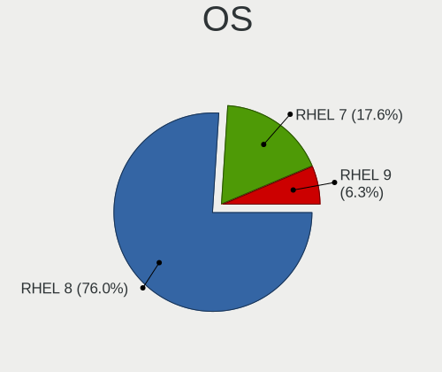

| Name   | Computers | Percent |
|--------|-----------|---------|
| RHEL 8 | 175       | 72.02%  |
| RHEL 7 | 39        | 16.05%  |
| RHEL 9 | 29        | 11.93%  |

OS Family
---------

OS without a version

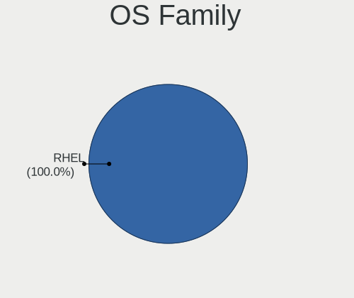

| Name | Computers | Percent |
|------|-----------|---------|
| RHEL | 242       | 100%    |

Kernel
------

Version of the Linux kernel

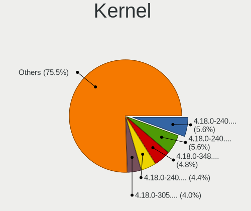

| Version                                      | Computers | Percent |
|----------------------------------------------|-----------|---------|
| 4.18.0-240.10.1.el8_3.x86_64                 | 14        | 4.93%   |
| 4.18.0-240.1.1.el8_3.x86_64                  | 14        | 4.93%   |
| 4.18.0-348.20.1.el8_5.x86_64                 | 12        | 4.23%   |
| 4.18.0-240.15.1.el8_3.x86_64                 | 11        | 3.87%   |
| 4.18.0-305.el8.x86_64                        | 10        | 3.52%   |
| 4.18.0-80.11.2.el8_0.x86_64                  | 9         | 3.17%   |
| 4.18.0-348.12.2.el8_5.x86_64                 | 9         | 3.17%   |
| 4.18.0-240.22.1.el8_3.x86_64                 | 9         | 3.17%   |
| 4.18.0-305.3.1.el8_4.x86_64                  | 8         | 2.82%   |
| 4.18.0-305.19.1.el8_4.x86_64                 | 8         | 2.82%   |
| 4.18.0-305.10.2.el8_4.x86_64                 | 7         | 2.46%   |
| 5.14.0-70.17.1.el9_0.x86_64                  | 6         | 2.11%   |
| 5.14.0-162.6.1.el9_1.x86_64                  | 6         | 2.11%   |
| 4.18.0-348.2.1.el8_5.x86_64                  | 6         | 2.11%   |
| 4.18.0-193.el8.x86_64                        | 6         | 2.11%   |
| 4.18.0-193.19.1.el8_2.x86_64                 | 6         | 2.11%   |
| 4.18.0-147.5.1.el8_1.x86_64                  | 6         | 2.11%   |
| 4.18.0-147.3.1.el8_1.x86_64                  | 6         | 2.11%   |
| 3.10.0-1062.12.1.el7.x86_64                  | 6         | 2.11%   |
| 4.18.0-425.3.1.el8.x86_64                    | 5         | 1.76%   |
| 4.18.0-305.7.1.el8_4.x86_64                  | 5         | 1.76%   |
| 4.18.0-193.6.3.el8_2.x86_64                  | 5         | 1.76%   |
| 5.14.0-70.5.1.el9_0.x86_64                   | 4         | 1.41%   |
| 5.14.0-70.26.1.el9_0.x86_64                  | 4         | 1.41%   |
| 4.18.0-372.9.1.el8.x86_64                    | 4         | 1.41%   |
| 4.18.0-348.7.1.el8_5.x86_64                  | 4         | 1.41%   |
| 4.18.0-305.25.1.el8_4.x86_64                 | 4         | 1.41%   |
| 4.18.0-305.12.1.el8_4.x86_64                 | 4         | 1.41%   |
| 4.18.0-193.28.1.el8_2.x86_64                 | 4         | 1.41%   |
| 4.18.0-147.el8.x86_64                        | 4         | 1.41%   |
| 4.18.0-147.8.1.el8_1.x86_64                  | 3         | 1.06%   |
| 3.10.0-862.3.2.el7.x86_64                    | 3         | 1.06%   |
| 3.10.0-1062.4.3.el7.YAHOO.20191113.49.x86_64 | 3         | 1.06%   |
| 3.10.0-1062.18.1.el7.x86_64                  | 3         | 1.06%   |
| 5.14.0-70.22.1.el9_0.x86_64                  | 2         | 0.7%    |
| 5.14.0-70.13.1.el9_0.x86_64                  | 2         | 0.7%    |
| 4.18.0-372.32.1.el8_6.x86_64                 | 2         | 0.7%    |
| 4.18.0-372.26.1.el8_6.x86_64                 | 2         | 0.7%    |
| 4.18.0-372.19.1.el8_6.x86_64                 | 2         | 0.7%    |
| 4.18.0-348.el8.x86_64                        | 2         | 0.7%    |

Kernel Family
-------------

Linux kernel without a distro release

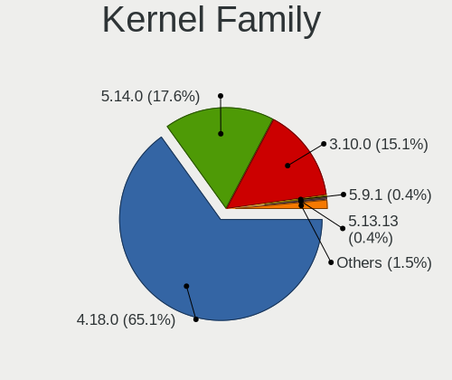

| Version  | Computers | Percent |
|----------|-----------|---------|
| 4.18.0   | 169       | 69.55%  |
| 3.10.0   | 39        | 16.05%  |
| 5.14.0   | 29        | 11.93%  |
| 5.9.1    | 1         | 0.41%   |
| 5.13.13  | 1         | 0.41%   |
| 5.13.0   | 1         | 0.41%   |
| 5.10.6   | 1         | 0.41%   |
| 4.19.150 | 1         | 0.41%   |
| Unknown  | 1         | 0.41%   |

Kernel Major Ver.
-----------------

Linux kernel major version

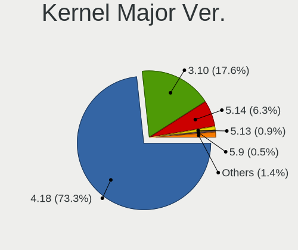

| Version | Computers | Percent |
|---------|-----------|---------|
| 4.18    | 169       | 69.55%  |
| 3.10    | 39        | 16.05%  |
| 5.14    | 29        | 11.93%  |
| 5.13    | 2         | 0.82%   |
| 5.9     | 1         | 0.41%   |
| 5.10    | 1         | 0.41%   |
| 4.19    | 1         | 0.41%   |
| Unknown | 1         | 0.41%   |

Arch
----

OS architecture (x86_64, i586, etc.)

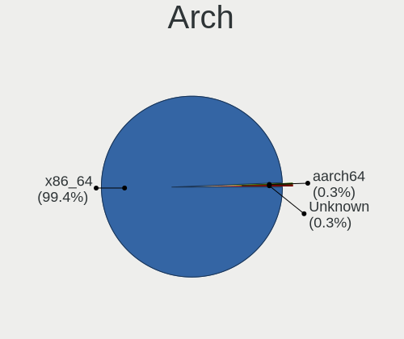

| Name    | Computers | Percent |
|---------|-----------|---------|
| x86_64  | 240       | 99.17%  |
| aarch64 | 1         | 0.41%   |
| Unknown | 1         | 0.41%   |

DE
--

Desktop Environment

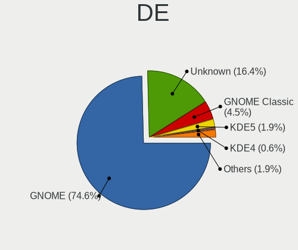

| Name          | Computers | Percent |
|---------------|-----------|---------|
| GNOME         | 183       | 72.91%  |
| Unknown       | 46        | 18.33%  |
| GNOME Classic | 13        | 5.18%   |
| KDE5          | 5         | 1.99%   |
| KDE           | 2         | 0.8%    |
| MATE          | 1         | 0.4%    |
| Cinnamon      | 1         | 0.4%    |

Display Server
--------------

X11 or Wayland

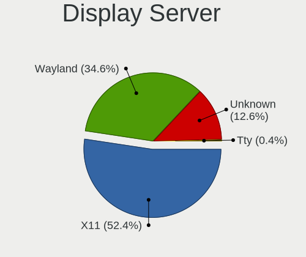

| Name    | Computers | Percent |
|---------|-----------|---------|
| X11     | 125       | 50.2%   |
| Wayland | 93        | 37.35%  |
| Unknown | 29        | 11.65%  |
| Tty     | 2         | 0.8%    |

Display Manager
---------------

SDDM, LightDM, etc.

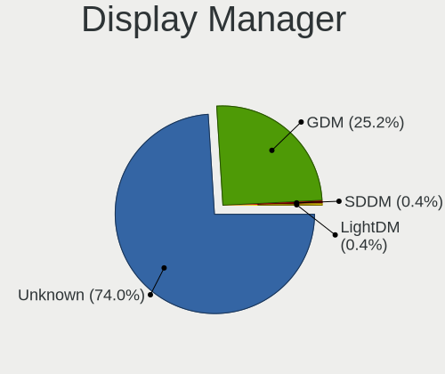

| Name    | Computers | Percent |
|---------|-----------|---------|
| Unknown | 185       | 74%     |
| GDM     | 63        | 25.2%   |
| SDDM    | 1         | 0.4%    |
| LightDM | 1         | 0.4%    |

OS Lang
-------

Language

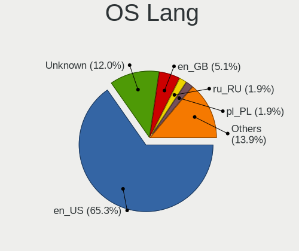

| Lang    | Computers | Percent |
|---------|-----------|---------|
| en_US   | 162       | 65.85%  |
| Unknown | 26        | 10.57%  |
| en_GB   | 15        | 6.1%    |
| en_IN   | 6         | 2.44%   |
| ru_RU   | 4         | 1.63%   |
| pt_BR   | 4         | 1.63%   |
| pl_PL   | 4         | 1.63%   |
| fr_FR   | 4         | 1.63%   |
| de_DE   | 4         | 1.63%   |
| nl_NL   | 2         | 0.81%   |
| es_ES   | 2         | 0.81%   |
| es_AR   | 2         | 0.81%   |
| en_IE   | 2         | 0.81%   |
| sl_SI   | 1         | 0.41%   |
| ko_KR   | 1         | 0.41%   |
| ja_JP   | 1         | 0.41%   |
| it_IT   | 1         | 0.41%   |
| es_MX   | 1         | 0.41%   |
| es_EC   | 1         | 0.41%   |
| en_NZ   | 1         | 0.41%   |
| de_CH   | 1         | 0.41%   |
| cs_CZ   | 1         | 0.41%   |

Boot Mode
---------

EFI or BIOS

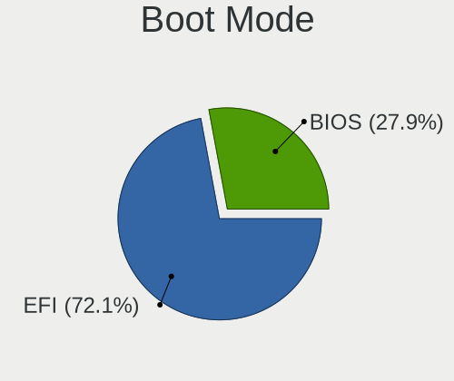

| Mode | Computers | Percent |
|------|-----------|---------|
| EFI  | 179       | 72.47%  |
| BIOS | 68        | 27.53%  |

Filesystem
----------

Type of filesystem

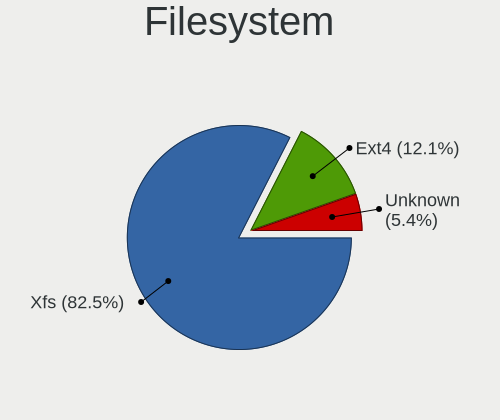

| Type    | Computers | Percent |
|---------|-----------|---------|
| Xfs     | 206       | 84.08%  |
| Ext4    | 27        | 11.02%  |
| Unknown | 12        | 4.9%    |

Part. scheme
------------

Scheme of partitioning

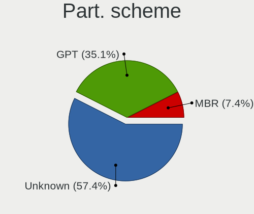

| Type    | Computers | Percent |
|---------|-----------|---------|
| Unknown | 151       | 60.4%   |
| GPT     | 80        | 32%     |
| MBR     | 19        | 7.6%    |

Dual Boot with Linux/BSD
------------------------

Hosting more than one Linux/BSD

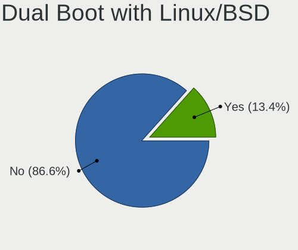

| Dual boot | Computers | Percent |
|-----------|-----------|---------|
| No        | 213       | 86.59%  |
| Yes       | 33        | 13.41%  |

Dual Boot (Win)
---------------

Hosting Linux and Windows

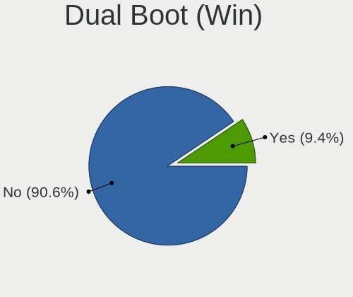

| Dual boot | Computers | Percent |
|-----------|-----------|---------|
| No        | 223       | 91.02%  |
| Yes       | 22        | 8.98%   |

Board
-----

Vendor
------

Motherboard manufacturer

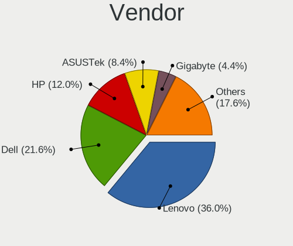

| Name                    | Computers | Percent |
|-------------------------|-----------|---------|
| Lenovo                  | 86        | 35.54%  |
| Dell                    | 53        | 21.9%   |
| Hewlett-Packard         | 30        | 12.4%   |
| ASUSTek Computer        | 21        | 8.68%   |
| Gigabyte Technology     | 10        | 4.13%   |
| MSI                     | 6         | 2.48%   |
| ASRock                  | 6         | 2.48%   |
| Unknown                 | 5         | 2.07%   |
| Intel                   | 4         | 1.65%   |
| Supermicro              | 3         | 1.24%   |
| ZTSYSTEMS               | 2         | 0.83%   |
| Sony                    | 2         | 0.83%   |
| Acer                    | 2         | 0.83%   |
| TUXEDO                  | 1         | 0.41%   |
| Toshiba                 | 1         | 0.41%   |
| Timi                    | 1         | 0.41%   |
| Samsung Electronics     | 1         | 0.41%   |
| Razer                   | 1         | 0.41%   |
| Raspberry Pi Foundation | 1         | 0.41%   |
| MiTAC                   | 1         | 0.41%   |
| Hardkernel              | 1         | 0.41%   |
| CX / Air Computers.     | 1         | 0.41%   |
| AZW                     | 1         | 0.41%   |
| AMI                     | 1         | 0.41%   |
| Alienware               | 1         | 0.41%   |

Model
-----

Motherboard model

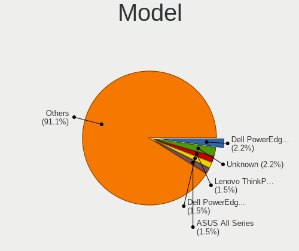

| Name                                     | Computers | Percent |
|------------------------------------------|-----------|---------|
| Dell PowerEdge FC630                     | 6         | 2.48%   |
| Unknown                                  | 6         | 2.48%   |
| Lenovo ThinkPad P1 Gen 3 20TJS2F40X      | 4         | 1.65%   |
| Dell PowerEdge R230                      | 4         | 1.65%   |
| ASUS All Series                          | 4         | 1.65%   |
| Supermicro X10DRi                        | 2         | 0.83%   |
| Lenovo ThinkPad X1 Carbon 7th 20QES2P401 | 2         | 0.83%   |
| Lenovo ThinkPad X1 Carbon 6th 20KGS23S00 | 2         | 0.83%   |
| Lenovo ThinkPad T590 20N5S2NC0N          | 2         | 0.83%   |
| Lenovo ThinkPad T490s 20NYS7K91R         | 2         | 0.83%   |
| Lenovo ThinkPad T14s Gen 1 20T1S39D08    | 2         | 0.83%   |
| Lenovo ThinkPad P1 Gen 3 20TJS2F42Q      | 2         | 0.83%   |
| Lenovo 7X56CTO1WW HR630X                 | 2         | 0.83%   |
| HP Z620 Workstation                      | 2         | 0.83%   |
| HP EliteBook 8460p                       | 2         | 0.83%   |
| Dell Precision 7510                      | 2         | 0.83%   |
| Dell PowerEdge R740                      | 2         | 0.83%   |
| Dell OptiPlex 9020                       | 2         | 0.83%   |
| Dell Latitude E6430                      | 2         | 0.83%   |
| Dell Latitude 5300                       | 2         | 0.83%   |
| ZTSYSTEMS Z802                           | 1         | 0.41%   |
| ZTSYSTEMS Z801                           | 1         | 0.41%   |
| TUXEDO N13xWU                            | 1         | 0.41%   |
| Toshiba Satellite Pro R50-C              | 1         | 0.41%   |
| Timi TM1707                              | 1         | 0.41%   |
| Supermicro X7DW3                         | 1         | 0.41%   |
| Sony VPCEB4L1R                           | 1         | 0.41%   |
| Sony VPCEB23FM                           | 1         | 0.41%   |
| Samsung 730QCJ/730QCR                    | 1         | 0.41%   |
| Razer Blade 15 Mid 2019-Base             | 1         | 0.41%   |
| RPi Raspberry Pi 4 Model B               | 1         | 0.41%   |
| MSI MS-7C95                              | 1         | 0.41%   |
| MSI MS-7B51                              | 1         | 0.41%   |
| MSI MS-7B33                              | 1         | 0.41%   |
| MSI MS-7A37                              | 1         | 0.41%   |
| MSI MS-7752                              | 1         | 0.41%   |
| MSI GE72VR 7RF                           | 1         | 0.41%   |
| MiTAC C4I                                | 1         | 0.41%   |
| Lenovo Z40-70 20366                      | 1         | 0.41%   |
| Lenovo Yoga C640-13IML 81UE              | 1         | 0.41%   |

Model Family
------------

Motherboard model prefix

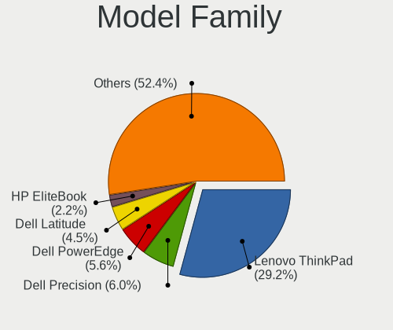

| Name               | Computers | Percent |
|--------------------|-----------|---------|
| Lenovo ThinkPad    | 73        | 30.17%  |
| Dell Precision     | 14        | 5.79%   |
| Dell PowerEdge     | 14        | 5.79%   |
| Dell Latitude      | 12        | 4.96%   |
| Unknown            | 6         | 2.48%   |
| HP ProLiant        | 5         | 2.07%   |
| HP EliteBook       | 5         | 2.07%   |
| Dell Inspiron      | 4         | 1.65%   |
| ASUS PRIME         | 4         | 1.65%   |
| ASUS All           | 4         | 1.65%   |
| Lenovo ThinkCentre | 3         | 1.24%   |
| HP ZBook           | 3         | 1.24%   |
| Dell OptiPlex      | 3         | 1.24%   |
| Supermicro X10DRi  | 2         | 0.83%   |
| Lenovo 7X56CTO1WW  | 2         | 0.83%   |
| HP Z620            | 2         | 0.83%   |
| HP Z230            | 2         | 0.83%   |
| Dell XPS           | 2         | 0.83%   |
| ASUS TUF           | 2         | 0.83%   |
| ASUS ROG           | 2         | 0.83%   |
| ZTSYSTEMS Z802     | 1         | 0.41%   |
| ZTSYSTEMS Z801     | 1         | 0.41%   |
| TUXEDO N13xWU      | 1         | 0.41%   |
| Toshiba Satellite  | 1         | 0.41%   |
| Timi TM1707        | 1         | 0.41%   |
| Supermicro X7DW3   | 1         | 0.41%   |
| Sony VPCEB4L1R     | 1         | 0.41%   |
| Sony VPCEB23FM     | 1         | 0.41%   |
| Samsung 730QCJ     | 1         | 0.41%   |
| Razer Blade        | 1         | 0.41%   |
| RPi Raspberry      | 1         | 0.41%   |
| MSI MS-7C95        | 1         | 0.41%   |
| MSI MS-7B51        | 1         | 0.41%   |
| MSI MS-7B33        | 1         | 0.41%   |
| MSI MS-7A37        | 1         | 0.41%   |
| MSI MS-7752        | 1         | 0.41%   |
| MSI GE72VR         | 1         | 0.41%   |
| MiTAC C4I          | 1         | 0.41%   |
| Lenovo Z40-70      | 1         | 0.41%   |
| Lenovo Yoga        | 1         | 0.41%   |

MFG Year
--------

Motherboard manufacture year

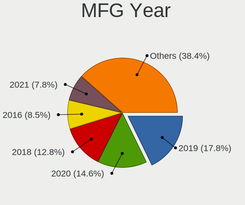

| Year | Computers | Percent |
|------|-----------|---------|
| 2019 | 43        | 17.77%  |
| 2020 | 40        | 16.53%  |
| 2018 | 32        | 13.22%  |
| 2016 | 20        | 8.26%   |
| 2017 | 19        | 7.85%   |
| 2015 | 18        | 7.44%   |
| 2012 | 17        | 7.02%   |
| 2021 | 13        | 5.37%   |
| 2013 | 12        | 4.96%   |
| 2011 | 8         | 3.31%   |
| 2022 | 6         | 2.48%   |
| 2014 | 6         | 2.48%   |
| 2010 | 6         | 2.48%   |
| 2009 | 2         | 0.83%   |

Form Factor
-----------

Physical design of the computer

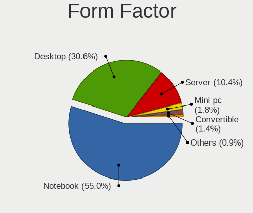

| Name           | Computers | Percent |
|----------------|-----------|---------|
| Notebook       | 132       | 54.55%  |
| Desktop        | 74        | 30.58%  |
| Server         | 24        | 9.92%   |
| Convertible    | 5         | 2.07%   |
| Mini pc        | 5         | 2.07%   |
| System on chip | 1         | 0.41%   |
| All in one     | 1         | 0.41%   |

Secure Boot
-----------

Enabled or disabled

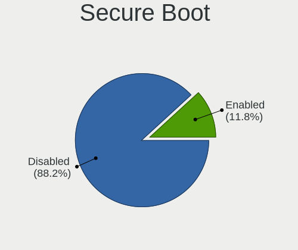

| State    | Computers | Percent |
|----------|-----------|---------|
| Disabled | 216       | 88.52%  |
| Enabled  | 28        | 11.48%  |

Coreboot
--------

Have coreboot on board

| Used | Computers | Percent |
|------|-----------|---------|
| No   | 242       | 100%    |

RAM Size
--------

Total RAM memory

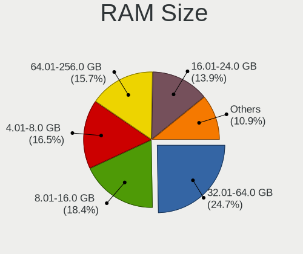

| Size in GB      | Computers | Percent |
|-----------------|-----------|---------|
| 32.01-64.0      | 61        | 24.5%   |
| 8.01-16.0       | 45        | 18.07%  |
| 4.01-8.0        | 43        | 17.27%  |
| 64.01-256.0     | 37        | 14.86%  |
| 16.01-24.0      | 35        | 14.06%  |
| 24.01-32.0      | 11        | 4.42%   |
| 3.01-4.0        | 9         | 3.61%   |
| More than 256.0 | 6         | 2.41%   |
| 2.01-3.0        | 1         | 0.4%    |
| Unknown         | 1         | 0.4%    |

RAM Used
--------

Used RAM memory

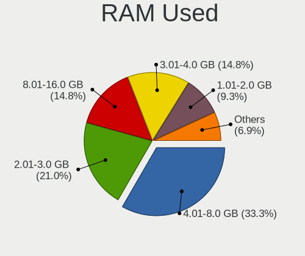

| Used GB         | Computers | Percent |
|-----------------|-----------|---------|
| 4.01-8.0        | 92        | 34.33%  |
| 2.01-3.0        | 55        | 20.52%  |
| 8.01-16.0       | 40        | 14.93%  |
| 3.01-4.0        | 39        | 14.55%  |
| 1.01-2.0        | 24        | 8.96%   |
| 24.01-32.0      | 6         | 2.24%   |
| 16.01-24.0      | 4         | 1.49%   |
| 0.51-1.0        | 3         | 1.12%   |
| 32.01-64.0      | 2         | 0.75%   |
| More than 256.0 | 1         | 0.37%   |
| 64.01-256.0     | 1         | 0.37%   |
| Unknown         | 1         | 0.37%   |

Total Drives
------------

Number of drives on board

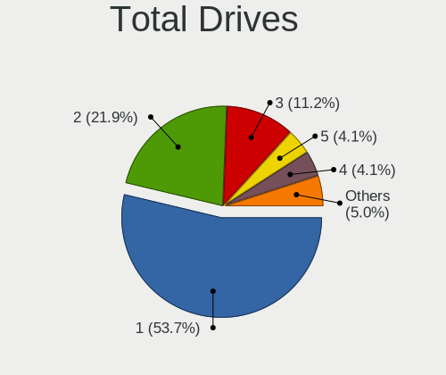

| Drives | Computers | Percent |
|--------|-----------|---------|
| 1      | 132       | 52.8%   |
| 2      | 57        | 22.8%   |
| 3      | 29        | 11.6%   |
| 5      | 10        | 4%      |
| 4      | 10        | 4%      |
| 12     | 3         | 1.2%    |
| 6      | 3         | 1.2%    |
| 8      | 2         | 0.8%    |
| 14     | 1         | 0.4%    |
| 11     | 1         | 0.4%    |
| 7      | 1         | 0.4%    |
| 0      | 1         | 0.4%    |

Has CD-ROM
----------

Has CD-ROM on board

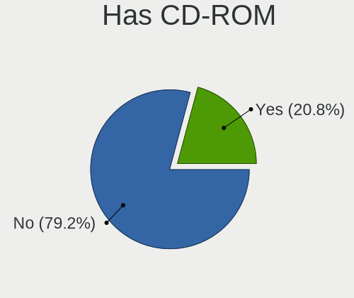

| Presented | Computers | Percent |
|-----------|-----------|---------|
| No        | 190       | 77.87%  |
| Yes       | 54        | 22.13%  |

Has Ethernet
------------

Has Ethernet on board

| Presented | Computers | Percent |
|-----------|-----------|---------|
| Yes       | 221       | 90.95%  |
| No        | 22        | 9.05%   |

Has WiFi
--------

Has WiFi module

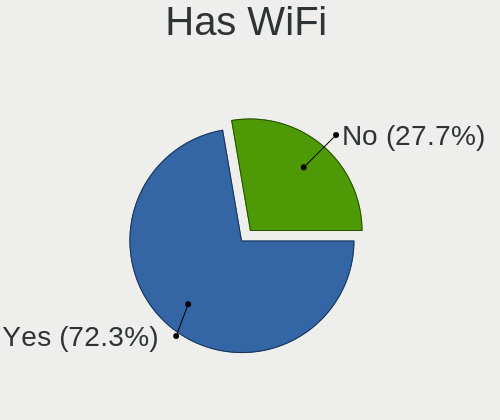

| Presented | Computers | Percent |
|-----------|-----------|---------|
| Yes       | 175       | 72.31%  |
| No        | 67        | 27.69%  |

Has Bluetooth
-------------

Has Bluetooth module

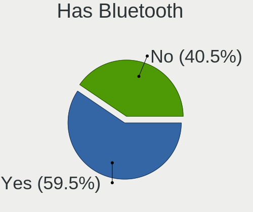

| Presented | Computers | Percent |
|-----------|-----------|---------|
| Yes       | 146       | 58.87%  |
| No        | 102       | 41.13%  |

Location
--------

Country
-------

Geographic location (country)

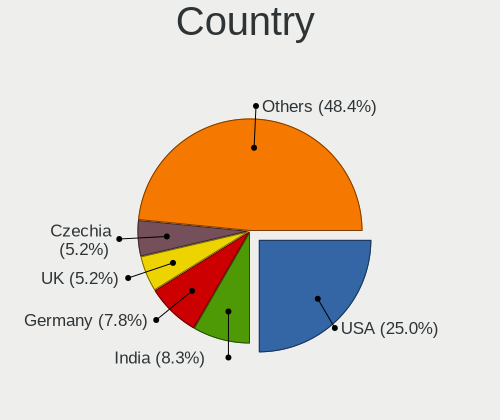

| Country      | Computers | Percent |
|--------------|-----------|---------|
| USA          | 63        | 26.03%  |
| India        | 21        | 8.68%   |
| Germany      | 17        | 7.02%   |
| UK           | 15        | 6.2%    |
| Czechia      | 13        | 5.37%   |
| Canada       | 8         | 3.31%   |
| Norway       | 7         | 2.89%   |
| France       | 6         | 2.48%   |
| Spain        | 5         | 2.07%   |
| Poland       | 5         | 2.07%   |
| Brazil       | 5         | 2.07%   |
| Switzerland  | 4         | 1.65%   |
| Russia       | 4         | 1.65%   |
| Netherlands  | 4         | 1.65%   |
| Mexico       | 4         | 1.65%   |
| Italy        | 4         | 1.65%   |
| Lithuania    | 3         | 1.24%   |
| Finland      | 3         | 1.24%   |
| Argentina    | 3         | 1.24%   |
| Ukraine      | 2         | 0.83%   |
| Turkey       | 2         | 0.83%   |
| South Korea  | 2         | 0.83%   |
| South Africa | 2         | 0.83%   |
| Singapore    | 2         | 0.83%   |
| Romania      | 2         | 0.83%   |
| Japan        | 2         | 0.83%   |
| Egypt        | 2         | 0.83%   |
| China        | 2         | 0.83%   |
| Austria      | 2         | 0.83%   |
| Australia    | 2         | 0.83%   |
| Turkmenistan | 1         | 0.41%   |
| Sweden       | 1         | 0.41%   |
| Sri Lanka    | 1         | 0.41%   |
| Slovenia     | 1         | 0.41%   |
| Saudi Arabia | 1         | 0.41%   |
| Portugal     | 1         | 0.41%   |
| Pakistan     | 1         | 0.41%   |
| New Zealand  | 1         | 0.41%   |
| Nepal        | 1         | 0.41%   |
| Myanmar      | 1         | 0.41%   |

City
----

Geographic location (city)

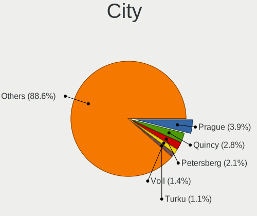

| City             | Computers | Percent |
|------------------|-----------|---------|
| Prague           | 11        | 4.31%   |
| Quincy           | 8         | 3.14%   |
| Langgons         | 6         | 2.35%   |
| Tromsø          | 4         | 1.57%   |
| Turku            | 3         | 1.18%   |
| San Jose         | 3         | 1.18%   |
| Munich           | 3         | 1.18%   |
| Milan            | 3         | 1.18%   |
| Mexico City      | 3         | 1.18%   |
| Chicago          | 3         | 1.18%   |
| Toronto          | 2         | 0.78%   |
| Singapore        | 2         | 0.78%   |
| Oslo             | 2         | 0.78%   |
| Montreal         | 2         | 0.78%   |
| Madrid           | 2         | 0.78%   |
| Kyiv             | 2         | 0.78%   |
| Houston          | 2         | 0.78%   |
| Didcot           | 2         | 0.78%   |
| Des Moines       | 2         | 0.78%   |
| Chennai          | 2         | 0.78%   |
| Berlin           | 2         | 0.78%   |
| Bengaluru        | 2         | 0.78%   |
| Zaragoza         | 1         | 0.39%   |
| Yorktown Heights | 1         | 0.39%   |
| Yongin-si        | 1         | 0.39%   |
| Wroclaw          | 1         | 0.39%   |
| Wiesbaden        | 1         | 0.39%   |
| Webster          | 1         | 0.39%   |
| Vienna           | 1         | 0.39%   |
| Vardenis         | 1         | 0.39%   |
| Vaglio           | 1         | 0.39%   |
| Udaipur          | 1         | 0.39%   |
| Tiruchi          | 1         | 0.39%   |
| Temuco           | 1         | 0.39%   |
| Temara           | 1         | 0.39%   |
| Tauranga         | 1         | 0.39%   |
| Taringa          | 1         | 0.39%   |
| Talkha           | 1         | 0.39%   |
| Syracuse         | 1         | 0.39%   |
| Sutton           | 1         | 0.39%   |

Drives
------

Drive Vendor
------------

Hard drive vendors

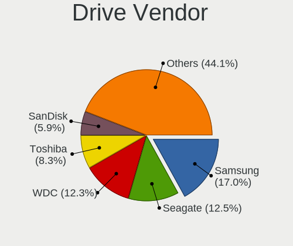

| Vendor              | Computers | Drives | Percent |
|---------------------|-----------|--------|---------|
| Samsung Electronics | 63        | 104    | 16.84%  |
| Seagate             | 48        | 95     | 12.83%  |
| WDC                 | 47        | 77     | 12.57%  |
| Toshiba             | 34        | 47     | 9.09%   |
| SK hynix            | 20        | 24     | 5.35%   |
| SanDisk             | 20        | 30     | 5.35%   |
| Kingston            | 16        | 20     | 4.28%   |
| Intel               | 16        | 23     | 4.28%   |
| Micron Technology   | 12        | 20     | 3.21%   |
| Unknown             | 10        | 12     | 2.67%   |
| Crucial             | 10        | 13     | 2.67%   |
| HGST                | 7         | 10     | 1.87%   |
| A-DATA Technology   | 7         | 7      | 1.87%   |
| Phison              | 6         | 10     | 1.6%    |
| Dell                | 5         | 9      | 1.34%   |
| Hitachi             | 4         | 4      | 1.07%   |
| Hewlett-Packard     | 4         | 13     | 1.07%   |
| China               | 4         | 4      | 1.07%   |
| Silicon Motion      | 3         | 4      | 0.8%    |
| PNY                 | 3         | 4      | 0.8%    |
| KIOXIA              | 3         | 3      | 0.8%    |
| Gigabyte Technology | 3         | 4      | 0.8%    |
| Corsair             | 3         | 6      | 0.8%    |
| Western Digital     | 2         | 2      | 0.53%   |
| Lenovo              | 2         | 2      | 0.53%   |
| XUM                 | 1         | 1      | 0.27%   |
| XPG                 | 1         | 1      | 0.27%   |
| Transcend           | 1         | 1      | 0.27%   |
| Team                | 1         | 2      | 0.27%   |
| T-FORCE             | 1         | 2      | 0.27%   |
| SSSTC               | 1         | 1      | 0.27%   |
| SMI                 | 1         | 2      | 0.27%   |
| SCST_FIO            | 1         | 9      | 0.27%   |
| SABRENT             | 1         | 1      | 0.27%   |
| Plextor             | 1         | 1      | 0.27%   |
| OCZ                 | 1         | 2      | 0.27%   |
| NVMe                | 1         | 1      | 0.27%   |
| Lite-On             | 1         | 1      | 0.27%   |
| KingSpec            | 1         | 1      | 0.27%   |
| KingFast            | 1         | 1      | 0.27%   |

Drive Model
-----------

Hard drive models

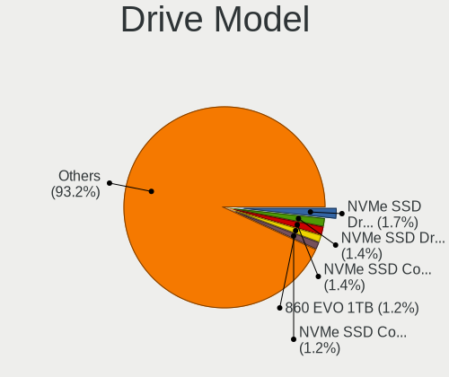

| Model                                  | Computers | Percent |
|----------------------------------------|-----------|---------|
| SK hynix NVMe SSD Drive 512GB          | 10        | 2.37%   |
| Samsung NVMe SSD Drive 512GB           | 8         | 1.9%    |
| Toshiba NVMe SSD Drive 256GB           | 6         | 1.42%   |
| SanDisk NVMe SSD Drive 256GB           | 6         | 1.42%   |
| Samsung SM963 2.5" NVMe PCIe SSD 256GB | 6         | 1.42%   |
| Samsung SSD 860 EVO 1TB                | 5         | 1.18%   |
| Samsung NVMe SSD Drive 1024GB          | 5         | 1.18%   |
| HGST HTS721010A9E630 1TB               | 5         | 1.18%   |
| Toshiba MG04ACA100NY 1TB               | 4         | 0.95%   |
| Samsung NVMe SSD Drive 500GB           | 4         | 0.95%   |
| Intel NVMe SSD Drive 512GB             | 4         | 0.95%   |
| Dell MD34xx 26TB                       | 4         | 0.95%   |
| WDC WD5003ABYZ-011FA0 500GB            | 3         | 0.71%   |
| Toshiba NVMe SSD Drive 512GB           | 3         | 0.71%   |
| Samsung SSD 860 EVO 500GB              | 3         | 0.71%   |
| Samsung NVMe SSD Drive 2TB             | 3         | 0.71%   |
| Samsung NVMe SSD Drive 1TB             | 3         | 0.71%   |
| Micron NVMe SSD Drive 256GB            | 3         | 0.71%   |
| WDC WDS500G2B0A-00SM50 500GB SSD       | 2         | 0.47%   |
| WDC WD1003FZEX-00MK2A0 1TB             | 2         | 0.47%   |
| WDC WD1002FAEX-00Z3A0 1TB              | 2         | 0.47%   |
| Unknown SD/MMC/MS PRO 2GB              | 2         | 0.47%   |
| Unknown NVMe SSD Drive 256GB           | 2         | 0.47%   |
| Toshiba NVMe SSD Drive 1024GB          | 2         | 0.47%   |
| Toshiba MQ01ABF050 500GB               | 2         | 0.47%   |
| Toshiba KXG6AZNV256G 256GB             | 2         | 0.47%   |
| Toshiba DT01ACA200 2TB                 | 2         | 0.47%   |
| Toshiba AL14SEB18EQ 1.8TB              | 2         | 0.47%   |
| SK hynix NVMe SSD Drive 1024GB         | 2         | 0.47%   |
| Seagate ST91000640NS 1TB               | 2         | 0.47%   |
| Seagate ST500DM002-1BD142 500GB        | 2         | 0.47%   |
| Seagate ST4000NM0033-9ZM170 4TB        | 2         | 0.47%   |
| Seagate ST300MP0026 304GB              | 2         | 0.47%   |
| Seagate ST2000NX0433 2TB               | 2         | 0.47%   |
| Seagate ST2000NX0273 2TB               | 2         | 0.47%   |
| Seagate ST2000DM001-1ER164 2TB         | 2         | 0.47%   |
| Seagate ST1000LM049-2GH172 1TB         | 2         | 0.47%   |
| Seagate ST1000DM010-2EP102 1TB         | 2         | 0.47%   |
| Seagate ST1000DM003-9YN162 1TB         | 2         | 0.47%   |
| Seagate Expansion 240GB                | 2         | 0.47%   |

HDD Vendor
----------

Hard disk drive vendors

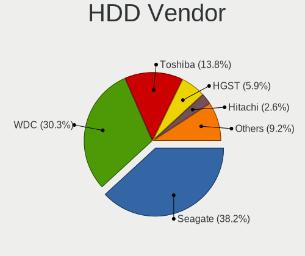

| Vendor              | Computers | Drives | Percent |
|---------------------|-----------|--------|---------|
| Seagate             | 48        | 94     | 37.5%   |
| WDC                 | 38        | 63     | 29.69%  |
| Toshiba             | 19        | 29     | 14.84%  |
| HGST                | 7         | 10     | 5.47%   |
| Hitachi             | 4         | 4      | 3.13%   |
| Dell                | 4         | 8      | 3.13%   |
| Unknown             | 2         | 2      | 1.56%   |
| Hewlett-Packard     | 2         | 9      | 1.56%   |
| SCST_FIO            | 1         | 9      | 0.78%   |
| Samsung Electronics | 1         | 2      | 0.78%   |
| SABRENT             | 1         | 1      | 0.78%   |
| DELLBOSS            | 1         | 1      | 0.78%   |

SSD Vendor
----------

Solid state drive vendors

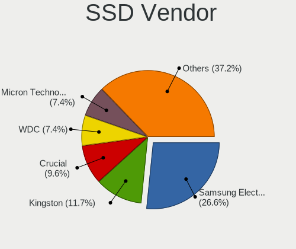

| Vendor              | Computers | Drives | Percent |
|---------------------|-----------|--------|---------|
| Samsung Electronics | 29        | 36     | 27.88%  |
| Kingston            | 11        | 15     | 10.58%  |
| Crucial             | 10        | 13     | 9.62%   |
| WDC                 | 7         | 9      | 6.73%   |
| Micron Technology   | 7         | 13     | 6.73%   |
| SanDisk             | 6         | 12     | 5.77%   |
| A-DATA Technology   | 5         | 5      | 4.81%   |
| SK hynix            | 4         | 8      | 3.85%   |
| Intel               | 4         | 5      | 3.85%   |
| China               | 4         | 4      | 3.85%   |
| PNY                 | 3         | 4      | 2.88%   |
| Corsair             | 3         | 6      | 2.88%   |
| XUM                 | 1         | 1      | 0.96%   |
| Transcend           | 1         | 1      | 0.96%   |
| Toshiba             | 1         | 1      | 0.96%   |
| Team                | 1         | 2      | 0.96%   |
| Seagate             | 1         | 1      | 0.96%   |
| Plextor             | 1         | 1      | 0.96%   |
| OCZ                 | 1         | 2      | 0.96%   |
| KingSpec            | 1         | 1      | 0.96%   |
| KINGBANK            | 1         | 1      | 0.96%   |
| Hoodisk             | 1         | 1      | 0.96%   |
| Anobit              | 1         | 1      | 0.96%   |

Drive Kind
----------

HDD or SSD

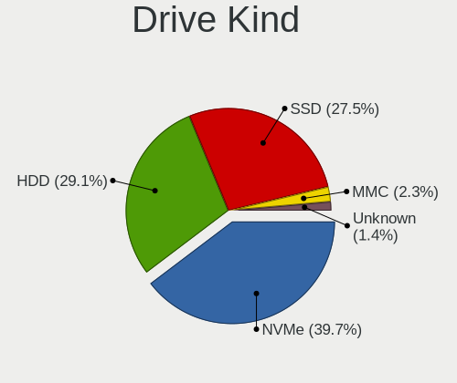

| Kind    | Computers | Drives | Percent |
|---------|-----------|--------|---------|
| NVMe    | 126       | 192    | 37.39%  |
| HDD     | 105       | 232    | 31.16%  |
| SSD     | 95        | 143    | 28.19%  |
| MMC     | 6         | 7      | 1.78%   |
| Unknown | 5         | 7      | 1.48%   |

Drive Connector
---------------

SATA, SAS, NVMe, etc.

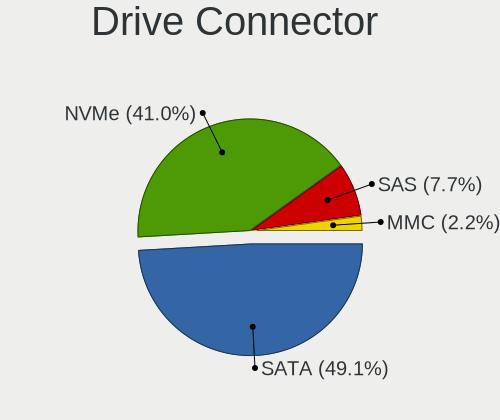

| Type | Computers | Drives | Percent |
|------|-----------|--------|---------|
| SATA | 146       | 348    | 48.83%  |
| NVMe | 126       | 192    | 42.14%  |
| SAS  | 21        | 34     | 7.02%   |
| MMC  | 6         | 7      | 2.01%   |

Drive Size
----------

Size of hard drive

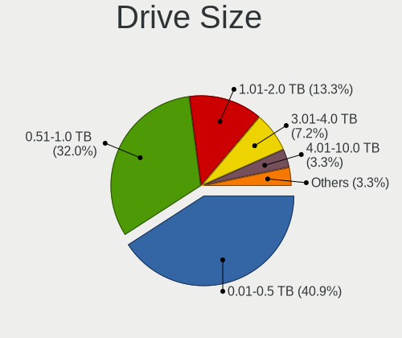

| Size in TB | Computers | Drives | Percent |
|------------|-----------|--------|---------|
| 0.01-0.5   | 91        | 154    | 43.54%  |
| 0.51-1.0   | 67        | 105    | 32.06%  |
| 1.01-2.0   | 24        | 51     | 11.48%  |
| 3.01-4.0   | 13        | 33     | 6.22%   |
| 4.01-10.0  | 7         | 20     | 3.35%   |
| 20.01-50.0 | 4         | 8      | 1.91%   |
| 10.01-20.0 | 2         | 3      | 0.96%   |
| 2.01-3.0   | 1         | 1      | 0.48%   |

Space Total
-----------

Amount of disk space available on the file system

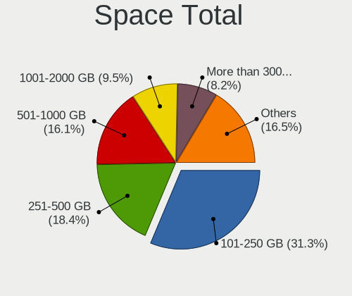

| Size in GB     | Computers | Percent |
|----------------|-----------|---------|
| 101-250        | 81        | 32.02%  |
| 251-500        | 44        | 17.39%  |
| 501-1000       | 41        | 16.21%  |
| More than 3000 | 21        | 8.3%    |
| 1001-2000      | 20        | 7.91%   |
| Unknown        | 17        | 6.72%   |
| 51-100         | 11        | 4.35%   |
| 2001-3000      | 9         | 3.56%   |
| 1-20           | 6         | 2.37%   |
| 21-50          | 3         | 1.19%   |

Space Used
----------

Amount of used disk space

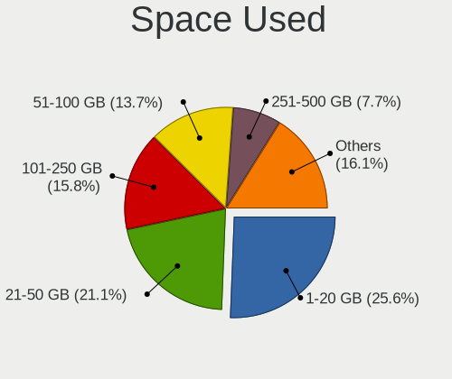

| Used GB        | Computers | Percent |
|----------------|-----------|---------|
| 1-20           | 67        | 25.19%  |
| 21-50          | 55        | 20.68%  |
| 101-250        | 45        | 16.92%  |
| 51-100         | 36        | 13.53%  |
| 251-500        | 18        | 6.77%   |
| Unknown        | 17        | 6.39%   |
| 501-1000       | 11        | 4.14%   |
| 1001-2000      | 9         | 3.38%   |
| More than 3000 | 5         | 1.88%   |
| 2001-3000      | 3         | 1.13%   |

Malfunc. Drives
---------------

Drive models with a malfunction

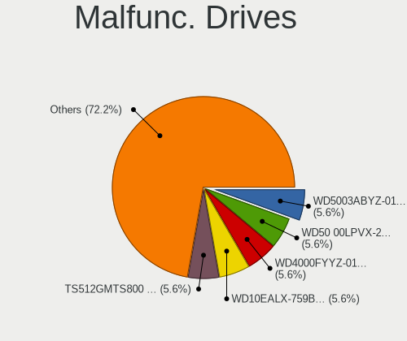

| Model                                    | Computers | Drives | Percent |
|------------------------------------------|-----------|--------|---------|
| WDC WD5003ABYZ-011FA0 500GB              | 1         | 1      | 8.33%   |
| WDC WD4000FYYZ-01UL1B1 4TB               | 1         | 3      | 8.33%   |
| WDC WD10EALX-759BA1 1TB                  | 1         | 2      | 8.33%   |
| Transcend TS512GMTS800 512GB SSD         | 1         | 1      | 8.33%   |
| Seagate ST91000640NS 1TB                 | 1         | 2      | 8.33%   |
| Seagate ST6000NM0024-1HT17Z 6TB          | 1         | 2      | 8.33%   |
| Seagate ST500LT012-1DG142 500GB          | 1         | 1      | 8.33%   |
| Seagate ST1000DM003-9YN162 1TB           | 1         | 1      | 8.33%   |
| Micron Technology M510_2.5 7MM 256GB SSD | 1         | 1      | 8.33%   |
| Intel SSDSC2BA800G4R 800GB               | 1         | 1      | 8.33%   |
| Hitachi HDS722020ALA330 2TB              | 1         | 1      | 8.33%   |
| A-DATA Technology SU800NS38 256GB SSD    | 1         | 1      | 8.33%   |

Malfunc. Drive Vendor
---------------------

Vendors of faulty drives

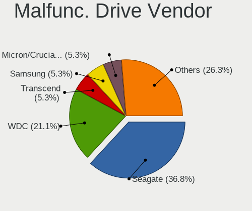

| Vendor            | Computers | Drives | Percent |
|-------------------|-----------|--------|---------|
| Seagate           | 4         | 6      | 33.33%  |
| WDC               | 3         | 6      | 25%     |
| Transcend         | 1         | 1      | 8.33%   |
| Micron Technology | 1         | 1      | 8.33%   |
| Intel             | 1         | 1      | 8.33%   |
| Hitachi           | 1         | 1      | 8.33%   |
| A-DATA Technology | 1         | 1      | 8.33%   |

Malfunc. HDD Vendor
-------------------

Vendors of faulty HDD drives

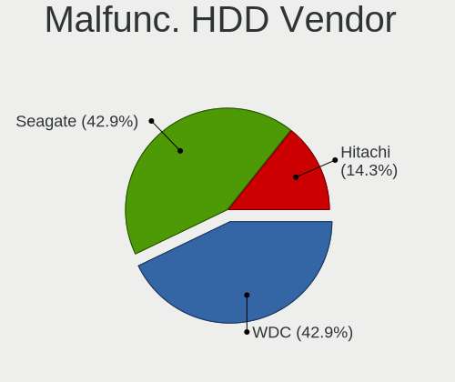

| Vendor  | Computers | Drives | Percent |
|---------|-----------|--------|---------|
| Seagate | 4         | 6      | 50%     |
| WDC     | 3         | 6      | 37.5%   |
| Hitachi | 1         | 1      | 12.5%   |

Malfunc. Drive Kind
-------------------

Kinds of faulty drives

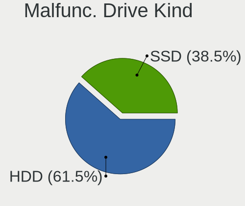

| Kind | Computers | Drives | Percent |
|------|-----------|--------|---------|
| HDD  | 7         | 13     | 63.64%  |
| SSD  | 4         | 4      | 36.36%  |

Failed Drives
-------------

Failed drive models

Zero info for selected period =(

Failed Drive Vendor
-------------------

Failed drive vendors

Zero info for selected period =(

Drive Status
------------

Number of failed and malfunc. drives

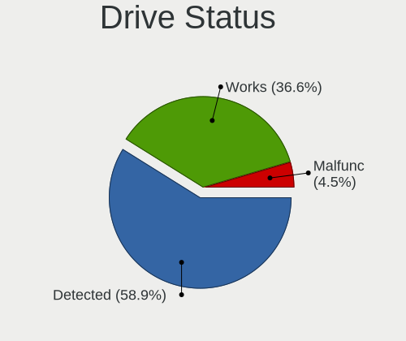

| Status   | Computers | Drives | Percent |
|----------|-----------|--------|---------|
| Detected | 155       | 344    | 60.08%  |
| Works    | 92        | 220    | 35.66%  |
| Malfunc  | 11        | 17     | 4.26%   |

Storage controller
------------------

Storage Vendor
--------------

Storage controller vendors

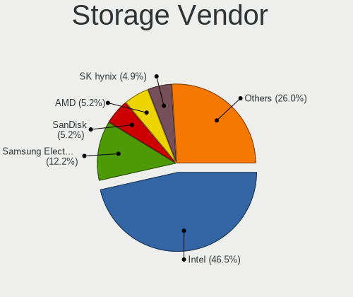

| Vendor                       | Computers | Percent |
|------------------------------|-----------|---------|
| Intel                        | 158       | 46.75%  |
| Samsung Electronics          | 42        | 12.43%  |
| SanDisk                      | 17        | 5.03%   |
| AMD                          | 17        | 5.03%   |
| SK hynix                     | 16        | 4.73%   |
| Toshiba America Info Systems | 14        | 4.14%   |
| Broadcom / LSI               | 14        | 4.14%   |
| Phison Electronics           | 9         | 2.66%   |
| LSI Logic / Symbios Logic    | 7         | 2.07%   |
| Silicon Motion               | 5         | 1.48%   |
| Micron Technology            | 5         | 1.48%   |
| KIOXIA                       | 5         | 1.48%   |
| Kingston Technology Company  | 5         | 1.48%   |
| Marvell Technology Group     | 4         | 1.18%   |
| Hewlett-Packard              | 4         | 1.18%   |
| ASMedia Technology           | 4         | 1.18%   |
| ADATA Technology             | 4         | 1.18%   |
| Western Digital              | 2         | 0.59%   |
| Lenovo                       | 2         | 0.59%   |
| Biwin Storage Technology     | 2         | 0.59%   |
| Lite-On Technology           | 1         | 0.3%    |
| HighPoint Technologies       | 1         | 0.3%    |

Storage Model
-------------

Storage controller models

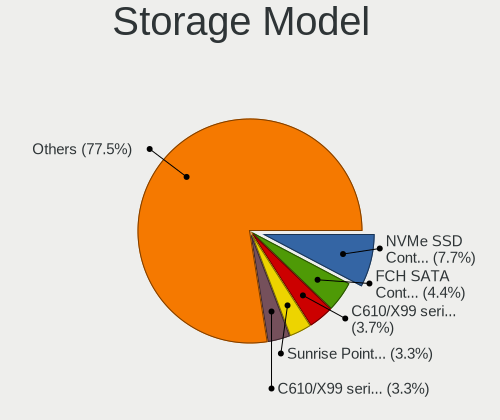

| Model                                                                          | Computers | Percent |
|--------------------------------------------------------------------------------|-----------|---------|
| Samsung NVMe SSD Controller SM981/PM981/PM983                                  | 32        | 8.31%   |
| Intel C610/X99 series chipset 6-Port SATA Controller [AHCI mode]               | 15        | 3.9%    |
| AMD FCH SATA Controller [AHCI mode]                                            | 15        | 3.9%    |
| SK hynix Non-Volatile memory controller                                        | 13        | 3.38%   |
| Intel Sunrise Point-LP SATA Controller [AHCI mode]                             | 13        | 3.38%   |
| Intel C610/X99 series chipset sSATA Controller [AHCI mode]                     | 13        | 3.38%   |
| Toshiba America Info Systems XG6 NVMe SSD Controller                           | 11        | 2.86%   |
| Intel Q170/Q150/B150/H170/H110/Z170/CM236 Chipset SATA Controller [AHCI Mode]  | 11        | 2.86%   |
| SanDisk WD Black SN750 / PC SN730 NVMe SSD                                     | 10        | 2.6%    |
| Intel Cannon Lake PCH SATA AHCI Controller                                     | 9         | 2.34%   |
| Intel 8 Series/C220 Series Chipset Family 6-port SATA Controller 1 [AHCI mode] | 8         | 2.08%   |
| Broadcom / LSI MegaRAID SAS-3 3108 [Invader]                                   | 8         | 2.08%   |
| Intel SATA Controller [RAID mode]                                              | 7         | 1.82%   |
| Intel 82801 Mobile SATA Controller [RAID mode]                                 | 7         | 1.82%   |
| Intel Cannon Lake Mobile PCH SATA AHCI Controller                              | 6         | 1.56%   |
| Intel C620 Series Chipset Family SSATA Controller [AHCI mode]                  | 6         | 1.56%   |
| Intel 7 Series Chipset Family 6-port SATA Controller [AHCI mode]               | 6         | 1.56%   |
| Intel 6 Series/C200 Series Chipset Family 6 port Mobile SATA AHCI Controller   | 6         | 1.56%   |
| Micron Non-Volatile memory controller                                          | 5         | 1.3%    |
| Intel SSD 660P Series                                                          | 5         | 1.3%    |
| Intel C600/X79 series chipset 6-Port SATA AHCI Controller                      | 5         | 1.3%    |
| Intel 7 Series/C210 Series Chipset Family 6-port SATA Controller [AHCI mode]   | 5         | 1.3%    |
| Phison PS5013 E13 NVMe Controller                                              | 4         | 1.04%   |
| Phison E12 NVMe Controller                                                     | 4         | 1.04%   |
| LSI Logic / Symbios Logic MegaRAID SAS-3 3008 [Fury]                           | 4         | 1.04%   |
| KIOXIA NVMe SSD Controller BG4                                                 | 4         | 1.04%   |
| Intel Volume Management Device NVMe RAID Controller                            | 4         | 1.04%   |
| Intel SSD Pro 7600p/760p/E 6100p Series                                        | 4         | 1.04%   |
| Intel HM170/QM170 Chipset SATA Controller [AHCI Mode]                          | 4         | 1.04%   |
| Intel Comet Lake SATA AHCI Controller                                          | 4         | 1.04%   |
| Intel C620 Series Chipset Family SATA Controller [AHCI mode]                   | 4         | 1.04%   |
| Intel C602 chipset 4-Port SATA Storage Control Unit                            | 4         | 1.04%   |
| Intel C600/X79 series chipset SATA RAID Controller                             | 4         | 1.04%   |
| Intel 200 Series PCH SATA controller [AHCI mode]                               | 4         | 1.04%   |
| Broadcom / LSI SAS3008 PCI-Express Fusion-MPT SAS-3                            | 4         | 1.04%   |
| ASMedia ASM1062 Serial ATA Controller                                          | 4         | 1.04%   |
| SK hynix Gold P31/PC711 NVMe Solid State Drive                                 | 3         | 0.78%   |
| Silicon Motion SM2263EN/SM2263XT SSD Controller                                | 3         | 0.78%   |
| Samsung NVMe SSD Controller SM961/PM961/SM963                                  | 3         | 0.78%   |
| Samsung NVMe SSD Controller PM9A1/PM9A3/980PRO                                 | 3         | 0.78%   |

Storage Kind
------------

Kind of storage controller (IDE, SATA, NVMe, SAS, ...)

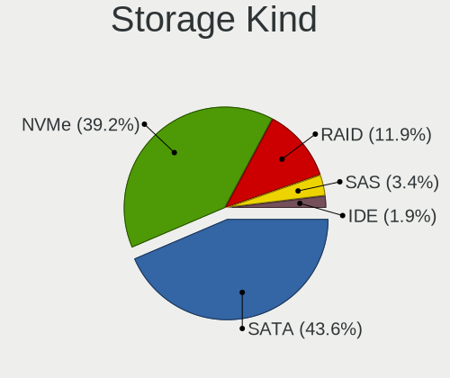

| Kind | Computers | Percent |
|------|-----------|---------|
| SATA | 147       | 44.01%  |
| NVMe | 126       | 37.72%  |
| RAID | 42        | 12.57%  |
| SAS  | 11        | 3.29%   |
| IDE  | 8         | 2.4%    |

Processor
---------

CPU Vendor
----------

Processor vendors

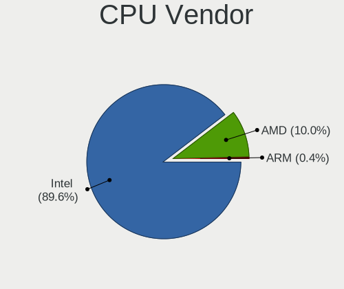

| Vendor | Computers | Percent |
|--------|-----------|---------|
| Intel  | 219       | 90.5%   |
| AMD    | 22        | 9.09%   |
| ARM    | 1         | 0.41%   |

CPU Model
---------

Processor models

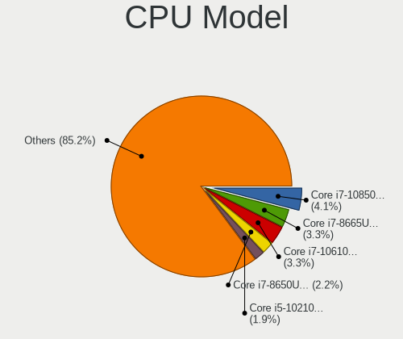

| Model                                  | Computers | Percent |
|----------------------------------------|-----------|---------|
| Intel Core i7-10850H CPU @ 2.70GHz     | 11        | 4.55%   |
| Intel Core i7-8665U CPU @ 1.90GHz      | 9         | 3.72%   |
| Intel Core i7-10610U CPU @ 1.80GHz     | 9         | 3.72%   |
| Intel Core i7-8650U CPU @ 1.90GHz      | 5         | 2.07%   |
| Intel Core i5-10210U CPU @ 1.60GHz     | 5         | 2.07%   |
| Intel Xeon CPU E3-1220 v5 @ 3.00GHz    | 4         | 1.65%   |
| Intel Core i7-8700 CPU @ 3.20GHz       | 4         | 1.65%   |
| Intel Core i7-8565U CPU @ 1.80GHz      | 4         | 1.65%   |
| Intel Core i7-8550U CPU @ 1.80GHz      | 4         | 1.65%   |
| Intel Xeon CPU E5-2680 v3 @ 2.50GHz    | 3         | 1.24%   |
| Intel Core i7-9750H CPU @ 2.60GHz      | 3         | 1.24%   |
| Intel Core i7-8750H CPU @ 2.20GHz      | 3         | 1.24%   |
| Intel Core i7-7700HQ CPU @ 2.80GHz     | 3         | 1.24%   |
| Intel Core i7-7600U CPU @ 2.80GHz      | 3         | 1.24%   |
| Intel Core i5-8265U CPU @ 1.60GHz      | 3         | 1.24%   |
| Intel Core i5-8250U CPU @ 1.60GHz      | 3         | 1.24%   |
| Intel Core i5-6200U CPU @ 2.30GHz      | 3         | 1.24%   |
| Intel Core i5-5300U CPU @ 2.30GHz      | 3         | 1.24%   |
| AMD Ryzen 9 3900X 12-Core Processor    | 3         | 1.24%   |
| Intel Xeon Silver 4114 CPU @ 2.20GHz   | 2         | 0.83%   |
| Intel Xeon CPU E5620 @ 2.40GHz         | 2         | 0.83%   |
| Intel Xeon CPU E5-2667 v3 @ 3.20GHz    | 2         | 0.83%   |
| Intel Xeon CPU E5-2630 v3 @ 2.40GHz    | 2         | 0.83%   |
| Intel Xeon CPU E5-2620 v4 @ 2.10GHz    | 2         | 0.83%   |
| Intel Xeon CPU E5-2620 v3 @ 2.40GHz    | 2         | 0.83%   |
| Intel Xeon CPU E5-2620 v2 @ 2.10GHz    | 2         | 0.83%   |
| Intel Pentium Gold G5400 CPU @ 3.70GHz | 2         | 0.83%   |
| Intel Core i7-9850H CPU @ 2.60GHz      | 2         | 0.83%   |
| Intel Core i7-8700K CPU @ 3.70GHz      | 2         | 0.83%   |
| Intel Core i7-7700 CPU @ 3.60GHz       | 2         | 0.83%   |
| Intel Core i7-6820HQ CPU @ 2.70GHz     | 2         | 0.83%   |
| Intel Core i7-6700HQ CPU @ 2.60GHz     | 2         | 0.83%   |
| Intel Core i7-6600U CPU @ 2.60GHz      | 2         | 0.83%   |
| Intel Core i7-3520M CPU @ 2.90GHz      | 2         | 0.83%   |
| Intel Core i7-10510U CPU @ 1.80GHz     | 2         | 0.83%   |
| Intel Core i5-8365U CPU @ 1.60GHz      | 2         | 0.83%   |
| Intel Core i5-8350U CPU @ 1.70GHz      | 2         | 0.83%   |
| Intel Core i5-3320M CPU @ 2.60GHz      | 2         | 0.83%   |
| Intel Core i5-2520M CPU @ 2.50GHz      | 2         | 0.83%   |
| Intel Core i3-4130 CPU @ 3.40GHz       | 2         | 0.83%   |

CPU Model Family
----------------

Processor model prefix

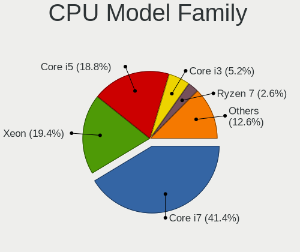

| Model                | Computers | Percent |
|----------------------|-----------|---------|
| Intel Core i7        | 92        | 38.02%  |
| Intel Core i5        | 48        | 19.83%  |
| Intel Xeon           | 41        | 16.94%  |
| Intel Core i3        | 12        | 4.96%   |
| Other                | 11        | 4.55%   |
| AMD Ryzen 7          | 7         | 2.89%   |
| AMD Ryzen 5          | 5         | 2.07%   |
| Intel Xeon Silver    | 3         | 1.24%   |
| Intel Core i9        | 3         | 1.24%   |
| AMD Ryzen 9          | 3         | 1.24%   |
| Intel Xeon Gold      | 2         | 0.83%   |
| Intel Pentium Gold   | 2         | 0.83%   |
| Intel Pentium        | 2         | 0.83%   |
| AMD Ryzen 3          | 2         | 0.83%   |
| AMD EPYC             | 2         | 0.83%   |
| Intel Xeon Platinum  | 1         | 0.41%   |
| Intel Pentium Silver | 1         | 0.41%   |
| Intel Core 2 Duo     | 1         | 0.41%   |
| Intel Celeron        | 1         | 0.41%   |
| AMD Ryzen 7 PRO      | 1         | 0.41%   |
| AMD FX               | 1         | 0.41%   |
| AMD A4               | 1         | 0.41%   |

CPU Cores
---------

Number of processor cores

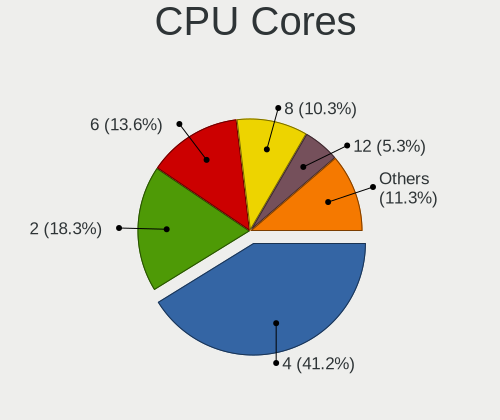

| Number | Computers | Percent |
|--------|-----------|---------|
| 4      | 103       | 42.56%  |
| 2      | 48        | 19.83%  |
| 6      | 36        | 14.88%  |
| 8      | 24        | 9.92%   |
| 12     | 11        | 4.55%   |
| 16     | 7         | 2.89%   |
| 20     | 4         | 1.65%   |
| 48     | 2         | 0.83%   |
| 36     | 2         | 0.83%   |
| 24     | 2         | 0.83%   |
| 96     | 1         | 0.41%   |
| 64     | 1         | 0.41%   |
| 32     | 1         | 0.41%   |

CPU Sockets
-----------

Number of sockets

| Number | Computers | Percent |
|--------|-----------|---------|
| 1      | 214       | 88.43%  |
| 2      | 28        | 11.57%  |

CPU Threads
-----------

Threads per core (Hyper-Threading)

| Number | Computers | Percent |
|--------|-----------|---------|
| 2      | 204       | 83.95%  |
| 1      | 39        | 16.05%  |

CPU Op-Modes
------------

CPU Operation Modes (32-bit, 64-bit)

| Op mode        | Computers | Percent |
|----------------|-----------|---------|
| 32-bit, 64-bit | 234       | 95.9%   |
| Unknown        | 10        | 4.1%    |

CPU Microcode
-------------

Microcode number

| Number     | Computers | Percent |
|------------|-----------|---------|
| 0x806ec    | 34        | 13.93%  |
| 0x906ea    | 16        | 6.56%   |
| 0x806ea    | 14        | 5.74%   |
| 0x306c3    | 14        | 5.74%   |
| 0x306a9    | 14        | 5.74%   |
| Unknown    | 13        | 5.33%   |
| 0xa0652    | 12        | 4.92%   |
| 0x506e3    | 10        | 4.1%    |
| 0x306f2    | 10        | 4.1%    |
| 0x206a7    | 9         | 3.69%   |
| 0x906ed    | 7         | 2.87%   |
| 0x906e9    | 7         | 2.87%   |
| 0x406e3    | 7         | 2.87%   |
| 0x806e9    | 5         | 2.05%   |
| 0x806d1    | 5         | 2.05%   |
| 0x406f1    | 5         | 2.05%   |
| 0x306e4    | 4         | 1.64%   |
| 0x306d4    | 4         | 1.64%   |
| 0x206d7    | 4         | 1.64%   |
| 0x40651    | 3         | 1.23%   |
| 0x206c2    | 3         | 1.23%   |
| 0x20655    | 3         | 1.23%   |
| 0x0a50000c | 3         | 1.23%   |
| 0x08600103 | 3         | 1.23%   |
| 0x08108102 | 3         | 1.23%   |
| 0xa0671    | 2         | 0.82%   |
| 0x906c0    | 2         | 0.82%   |
| 0x806c1    | 2         | 0.82%   |
| 0x50654    | 2         | 0.82%   |
| 0x08701021 | 2         | 0.82%   |
| 0xa0660    | 1         | 0.41%   |
| 0xa0655    | 1         | 0.41%   |
| 0x906eb    | 1         | 0.41%   |
| 0x906a3    | 1         | 0.41%   |
| 0x90672    | 1         | 0.41%   |
| 0x706e5    | 1         | 0.41%   |
| 0x606a6    | 1         | 0.41%   |
| 0x50657    | 1         | 0.41%   |
| 0x20652    | 1         | 0.41%   |
| 0x1067a    | 1         | 0.41%   |

CPU Microarch
-------------

Microarchitecture

| Name             | Computers | Percent |
|------------------|-----------|---------|
| KabyLake         | 85        | 34.98%  |
| Haswell          | 29        | 11.93%  |
| Skylake          | 26        | 10.7%   |
| IvyBridge        | 19        | 7.82%   |
| CometLake        | 14        | 5.76%   |
| SandyBridge      | 13        | 5.35%   |
| Zen 2            | 9         | 3.7%    |
| Broadwell        | 9         | 3.7%    |
| Icelake          | 8         | 3.29%   |
| Westmere         | 7         | 2.88%   |
| Zen+             | 4         | 1.65%   |
| Unknown          | 4         | 1.65%   |
| Zen 3            | 3         | 1.23%   |
| Zen              | 3         | 1.23%   |
| Tremont          | 2         | 0.82%   |
| TigerLake        | 2         | 0.82%   |
| Penryn           | 2         | 0.82%   |
| Alderlake Hybrid | 2         | 0.82%   |
| Piledriver       | 1         | 0.41%   |
| Excavator        | 1         | 0.41%   |

Graphics
--------

GPU Vendor
----------

Vendors of graphics cards

| Vendor                     | Computers | Percent |
|----------------------------|-----------|---------|
| Intel                      | 150       | 51.02%  |
| Nvidia                     | 82        | 27.89%  |
| AMD                        | 33        | 11.22%  |
| Matrox Electronics Systems | 20        | 6.8%    |
| ASPEED Technology          | 9         | 3.06%   |

GPU Model
---------

Graphics card models

| Model                                                                       | Computers | Percent |
|-----------------------------------------------------------------------------|-----------|---------|
| Intel WhiskeyLake-U GT2 [UHD Graphics 620]                                  | 18        | 6.06%   |
| Intel CometLake-U GT2 [UHD Graphics]                                        | 16        | 5.39%   |
| Intel UHD Graphics 620                                                      | 14        | 4.71%   |
| Matrox Electronics Systems G200eR2                                          | 12        | 4.04%   |
| Intel CometLake-H GT2 [UHD Graphics]                                        | 11        | 3.7%    |
| ASPEED Technology ASPEED Graphics Family                                    | 9         | 3.03%   |
| Intel CoffeeLake-H GT2 [UHD Graphics 630]                                   | 8         | 2.69%   |
| Intel Skylake GT2 [HD Graphics 520]                                         | 7         | 2.36%   |
| Intel 3rd Gen Core processor Graphics Controller                            | 7         | 2.36%   |
| Intel CoffeeLake-S GT2 [UHD Graphics 630]                                   | 6         | 2.02%   |
| Intel 2nd Generation Core Processor Family Integrated Graphics Controller   | 6         | 2.02%   |
| Intel Xeon E3-1200 v3/4th Gen Core Processor Integrated Graphics Controller | 5         | 1.68%   |
| Intel HD Graphics 630                                                       | 5         | 1.68%   |
| Intel HD Graphics 530                                                       | 5         | 1.68%   |
| AMD Renoir                                                                  | 5         | 1.68%   |
| Intel TigerLake-H GT1 [UHD Graphics]                                        | 4         | 1.35%   |
| Intel HD Graphics 620                                                       | 4         | 1.35%   |
| Intel HD Graphics 5500                                                      | 4         | 1.35%   |
| AMD Picasso/Raven 2 [Radeon Vega Series / Radeon Vega Mobile Series]        | 4         | 1.35%   |
| Nvidia TU116M [GeForce GTX 1660 Ti Mobile]                                  | 3         | 1.01%   |
| Nvidia GP107GLM [Quadro P2000 Mobile]                                       | 3         | 1.01%   |
| Nvidia GP107 [GeForce GTX 1050 Ti]                                          | 3         | 1.01%   |
| Nvidia GP104 [GeForce GTX 1070]                                             | 3         | 1.01%   |
| Matrox Electronics Systems MGA G200EH                                       | 3         | 1.01%   |
| Matrox Electronics Systems Integrated Matrox G200eW3 Graphics Controller    | 3         | 1.01%   |
| Intel Xeon E3-1200 v2/3rd Gen Core processor Graphics Controller            | 3         | 1.01%   |
| Intel Haswell-ULT Integrated Graphics Controller                            | 3         | 1.01%   |
| Intel Core Processor Integrated Graphics Controller                         | 3         | 1.01%   |
| Intel 4th Generation Core Processor Family Integrated Graphics Controller   | 3         | 1.01%   |
| AMD Cezanne [Radeon Vega Series / Radeon Vega Mobile Series]                | 3         | 1.01%   |
| Nvidia TU106 [GeForce RTX 2060 SUPER]                                       | 2         | 0.67%   |
| Nvidia TU104 [GeForce RTX 2070 SUPER]                                       | 2         | 0.67%   |
| Nvidia GP107M [GeForce GTX 1050 Mobile]                                     | 2         | 0.67%   |
| Nvidia GP107GLM [Quadro P620]                                               | 2         | 0.67%   |
| Nvidia GP106GL [Quadro P2200]                                               | 2         | 0.67%   |
| Nvidia GP106 [GeForce GTX 1060 6GB]                                         | 2         | 0.67%   |
| Nvidia GM107GLM [Quadro M2000M]                                             | 2         | 0.67%   |
| Nvidia GM107GLM [Quadro M1000M]                                             | 2         | 0.67%   |
| Nvidia GK208B [GeForce GT 730]                                              | 2         | 0.67%   |
| Nvidia GF108GLM [NVS 5200M]                                                 | 2         | 0.67%   |

GPU Combo
---------

Combinations of graphics cards

| Name                    | Computers | Percent |
|-------------------------|-----------|---------|
| 1 x Intel               | 105       | 42.86%  |
| 1 x Nvidia              | 43        | 17.55%  |
| Intel + Nvidia          | 32        | 13.06%  |
| 1 x Matrox              | 19        | 7.76%   |
| 1 x AMD                 | 19        | 7.76%   |
| Intel + AMD             | 9         | 3.67%   |
| 1 x ASPEED              | 6         | 2.45%   |
| AMD + Nvidia            | 3         | 1.22%   |
| Other                   | 2         | 0.82%   |
| 2 x Nvidia              | 2         | 0.82%   |
| 2 x Nvidia + 1 x ASPEED | 1         | 0.41%   |
| 2 x AMD                 | 1         | 0.41%   |
| Nvidia + Matrox         | 1         | 0.41%   |
| Nvidia + ASPEED         | 1         | 0.41%   |
| AMD + ASPEED            | 1         | 0.41%   |

GPU Driver
----------

Free vs proprietary

| Driver      | Computers | Percent |
|-------------|-----------|---------|
| Free        | 191       | 77.64%  |
| Proprietary | 34        | 13.82%  |
| Unknown     | 21        | 8.54%   |

GPU Memory
----------

Total video memory

| Size in GB | Computers | Percent |
|------------|-----------|---------|
| Unknown    | 156       | 62.65%  |
| 1.01-2.0   | 26        | 10.44%  |
| 3.01-4.0   | 16        | 6.43%   |
| 0.51-1.0   | 12        | 4.82%   |
| 7.01-8.0   | 11        | 4.42%   |
| 5.01-6.0   | 9         | 3.61%   |
| 0.01-0.5   | 9         | 3.61%   |
| 2.01-3.0   | 5         | 2.01%   |
| 4.01-5.0   | 2         | 0.8%    |
| 8.01-16.0  | 2         | 0.8%    |
| 16.01-24.0 | 1         | 0.4%    |

Monitor
-------

Monitor Vendor
--------------

Monitor vendors

| Vendor                  | Computers | Percent |
|-------------------------|-----------|---------|
| Dell                    | 33        | 11.83%  |
| AU Optronics            | 30        | 10.75%  |
| Samsung Electronics     | 29        | 10.39%  |
| BOE                     | 25        | 8.96%   |
| Lenovo                  | 24        | 8.6%    |
| LG Display              | 22        | 7.89%   |
| Chimei Innolux          | 21        | 7.53%   |
| Goldstar                | 17        | 6.09%   |
| Hewlett-Packard         | 14        | 5.02%   |
| Sharp                   | 8         | 2.87%   |
| Acer                    | 6         | 2.15%   |
| InfoVision              | 5         | 1.79%   |
| Philips                 | 4         | 1.43%   |
| Eizo                    | 4         | 1.43%   |
| BenQ                    | 4         | 1.43%   |
| Ancor Communications    | 3         | 1.08%   |
| ViewSonic               | 2         | 0.72%   |
| PANDA                   | 2         | 0.72%   |
| LGD                     | 2         | 0.72%   |
| Lenovo Group Limited    | 2         | 0.72%   |
| Iiyama                  | 2         | 0.72%   |
| Gigabyte Technology     | 2         | 0.72%   |
| BOE Technology Group    | 2         | 0.72%   |
| AOC                     | 2         | 0.72%   |
| Unknown                 | 1         | 0.36%   |
| Sun                     | 1         | 0.36%   |
| STD                     | 1         | 0.36%   |
| Sceptre Tech            | 1         | 0.36%   |
| Planar                  | 1         | 0.36%   |
| OUT                     | 1         | 0.36%   |
| LG Electronics          | 1         | 0.36%   |
| ITE                     | 1         | 0.36%   |
| Insignia                | 1         | 0.36%   |
| EVE                     | 1         | 0.36%   |
| CSO                     | 1         | 0.36%   |
| Chi Mei Optoelectronics | 1         | 0.36%   |
| ASUSTek Computer        | 1         | 0.36%   |
| Unknown                 | 1         | 0.36%   |

Monitor Model
-------------

Monitor models

| Model                                                             | Computers | Percent |
|-------------------------------------------------------------------|-----------|---------|
| Chimei Innolux LCD Monitor CMN15E8 1920x1080 344x193mm 15.5-inch  | 7         | 2.32%   |
| Dell IDRAC DEL0001 1280x1024                                      | 6         | 1.99%   |
| Lenovo LEN P27u-10 LEN61B0 3840x2160 597x336mm 27.0-inch          | 5         | 1.66%   |
| Lenovo LCD Monitor LEN40BA 1920x1080 344x194mm 15.5-inch          | 5         | 1.66%   |
| AU Optronics LCD Monitor AUO403D 1920x1080 309x173mm 13.9-inch    | 5         | 1.66%   |
| InfoVision LCD Monitor IVO057D 1920x1080 309x174mm 14.0-inch      | 4         | 1.32%   |
| Samsung Electronics C24F390 SAM0D2C 1920x1080 521x293mm 23.5-inch | 3         | 0.99%   |
| LG Display LCD Monitor LGD0676 1920x1080 309x174mm 14.0-inch      | 3         | 0.99%   |
| Lenovo TIO24Gen3 LEN10B4 1920x1080 527x296mm 23.8-inch            | 3         | 0.99%   |
| Goldstar LG ULTRAWIDE GSM59F1 2560x1080 670x280mm 28.6-inch       | 3         | 0.99%   |
| Dell P2419H DELD0DA 1920x1080 527x296mm 23.8-inch                 | 3         | 0.99%   |
| Dell P2419H DELD0D9 1920x1080 527x296mm 23.8-inch                 | 3         | 0.99%   |
| Chimei Innolux LCD Monitor CMN14C9 1920x1080 309x173mm 13.9-inch  | 3         | 0.99%   |
| BOE LCD Monitor BOE086E 1920x1080 344x194mm 15.5-inch             | 3         | 0.99%   |
| BOE LCD Monitor BOE07C9 1920x1080 309x173mm 13.9-inch             | 3         | 0.99%   |
| AU Optronics LCD Monitor AUO323D 1920x1080 309x174mm 14.0-inch    | 3         | 0.99%   |
| Sharp LCD Monitor SHP1453 1920x1080 346x194mm 15.6-inch           | 2         | 0.66%   |
| Sharp LCD Monitor SHP1430 3840x2160 350x190mm 15.7-inch           | 2         | 0.66%   |
| Philips PHL 272E1 PHLC210 1920x1080 598x336mm 27.0-inch           | 2         | 0.66%   |
| PANDA LCD Monitor NCP0036 1920x1080 344x194mm 15.5-inch           | 2         | 0.66%   |
| LGD LCD Monitor 1920x1080                                         | 2         | 0.66%   |
| LG Display LCD Monitor LGD0306 1600x900 310x174mm 14.0-inch       | 2         | 0.66%   |
| Lenovo P27h-20 LEN61E9 2560x1440 609x349mm 27.6-inch              | 2         | 0.66%   |
| Lenovo LEN T2324pA LEN60C7 1920x1080 509x286mm 23.0-inch          | 2         | 0.66%   |
| Lenovo LEN LT2452pwC LEN1144 1920x1200 518x324mm 24.1-inch        | 2         | 0.66%   |
| Lenovo LCD Monitor LEN40B2 1920x1080 344x193mm 15.5-inch          | 2         | 0.66%   |
| Iiyama PL4840 IVM1065 1920x1080 1054x593mm 47.6-inch              | 2         | 0.66%   |
| Hewlett-Packard 27yh HPN351C 1920x1080 598x336mm 27.0-inch        | 2         | 0.66%   |
| Goldstar FULL HD GSM5B55 1920x1080 480x270mm 21.7-inch            | 2         | 0.66%   |
| Chimei Innolux LCD Monitor CMN14F5 1920x1080 309x173mm 13.9-inch  | 2         | 0.66%   |
| Chimei Innolux LCD Monitor CMN1482 1600x900 309x174mm 14.0-inch   | 2         | 0.66%   |
| AU Optronics LCD Monitor AUO562D 1920x1080 293x165mm 13.2-inch    | 2         | 0.66%   |
| AU Optronics LCD Monitor AUO313E 1600x900 309x174mm 14.0-inch     | 2         | 0.66%   |
| AU Optronics LCD Monitor AUO21ED 1920x1080 344x194mm 15.5-inch    | 2         | 0.66%   |
| ViewSonic VX2776 Series VSC3E32 1920x1080 598x336mm 27.0-inch     | 1         | 0.33%   |
| ViewSonic VA2259 Series VSC5E32 1920x1080 476x268mm 21.5-inch     | 1         | 0.33%   |
| Unknown LCD Monitor SAMSUNG                                       | 1         | 0.33%   |
| Sun Monitor SUN059A 1920x1200 518x324mm 24.1-inch                 | 1         | 0.33%   |
| STD LED STD0110 1920x1080 480x260mm 21.5-inch                     | 1         | 0.33%   |
| Sharp LCD Monitor SHP1518 1920x1200 366x229mm 17.0-inch           | 1         | 0.33%   |

Monitor Resolution
------------------

Monitor screen resolution

| Resolution         | Computers | Percent |
|--------------------|-----------|---------|
| 1920x1080 (FHD)    | 131       | 52.19%  |
| 1366x768 (WXGA)    | 21        | 8.37%   |
| 3840x2160 (4K)     | 20        | 7.97%   |
| 2560x1440 (QHD)    | 17        | 6.77%   |
| 1600x900 (HD+)     | 12        | 4.78%   |
| 1920x1200 (WUXGA)  | 7         | 2.79%   |
| 1280x1024 (SXGA)   | 7         | 2.79%   |
| 2560x1080          | 6         | 2.39%   |
| Unknown            | 6         | 2.39%   |
| 3840x1080          | 4         | 1.59%   |
| 3440x1440          | 4         | 1.59%   |
| 1680x1050 (WSXGA+) | 3         | 1.2%    |
| 1440x900 (WXGA+)   | 2         | 0.8%    |
| 9600x2160          | 1         | 0.4%    |
| 7680x2160          | 1         | 0.4%    |
| 7280x2160          | 1         | 0.4%    |
| 6400x2160          | 1         | 0.4%    |
| 3840x1600          | 1         | 0.4%    |
| 3840x1200          | 1         | 0.4%    |
| 2160x1350          | 1         | 0.4%    |
| 2048x1152          | 1         | 0.4%    |
| 1280x800 (WXGA)    | 1         | 0.4%    |
| 1280x768           | 1         | 0.4%    |
| 1280x720 (HD)      | 1         | 0.4%    |

Monitor Diagonal
----------------

Diagonal size in inches

| Inches  | Computers | Percent |
|---------|-----------|---------|
| 15      | 50        | 17.92%  |
| 14      | 36        | 12.9%   |
| 13      | 30        | 10.75%  |
| 24      | 28        | 10.04%  |
| 27      | 27        | 9.68%   |
| 23      | 21        | 7.53%   |
| Unknown | 21        | 7.53%   |
| 21      | 13        | 4.66%   |
| 34      | 7         | 2.51%   |
| 31      | 7         | 2.51%   |
| 20      | 5         | 1.79%   |
| 17      | 5         | 1.79%   |
| 12      | 5         | 1.79%   |
| 54      | 3         | 1.08%   |
| 32      | 3         | 1.08%   |
| 47      | 2         | 0.72%   |
| 22      | 2         | 0.72%   |
| 19      | 2         | 0.72%   |
| 18      | 2         | 0.72%   |
| 72      | 1         | 0.36%   |
| 64      | 1         | 0.36%   |
| 49      | 1         | 0.36%   |
| 40      | 1         | 0.36%   |
| 39      | 1         | 0.36%   |
| 37      | 1         | 0.36%   |
| 28      | 1         | 0.36%   |
| 25      | 1         | 0.36%   |
| 16      | 1         | 0.36%   |
| 11      | 1         | 0.36%   |

Monitor Width
-------------

Physical width

| Width in mm | Computers | Percent |
|-------------|-----------|---------|
| 301-350     | 107       | 39.48%  |
| 501-600     | 65        | 23.99%  |
| 401-500     | 22        | 8.12%   |
| Unknown     | 21        | 7.75%   |
| 201-300     | 16        | 5.9%    |
| 601-700     | 13        | 4.8%    |
| 701-800     | 10        | 3.69%   |
| 1001-1500   | 7         | 2.58%   |
| 351-400     | 6         | 2.21%   |
| 801-900     | 3         | 1.11%   |
| 1501-2000   | 1         | 0.37%   |

Aspect Ratio
------------

Proportional relationship between the width and the height

| Ratio   | Computers | Percent |
|---------|-----------|---------|
| 16/9    | 177       | 77.97%  |
| 16/10   | 18        | 7.93%   |
| Unknown | 13        | 5.73%   |
| 21/9    | 9         | 3.96%   |
| 5/4     | 7         | 3.08%   |
| 4/3     | 1         | 0.44%   |
| 32/9    | 1         | 0.44%   |
| 3/2     | 1         | 0.44%   |

Monitor Area
------------

Area in inch²

| Area in inch² | Computers | Percent |
|----------------|-----------|---------|
| 81-90          | 56        | 20.36%  |
| 101-110        | 50        | 18.18%  |
| 201-250        | 49        | 17.82%  |
| 301-350        | 27        | 9.82%   |
| Unknown        | 21        | 7.64%   |
| 351-500        | 16        | 5.82%   |
| 251-300        | 13        | 4.73%   |
| 71-80          | 10        | 3.64%   |
| 151-200        | 9         | 3.27%   |
| 501-1000       | 6         | 2.18%   |
| More than 1000 | 5         | 1.82%   |
| 61-70          | 5         | 1.82%   |
| 121-130        | 5         | 1.82%   |
| 51-60          | 1         | 0.36%   |
| 141-150        | 1         | 0.36%   |
| 131-140        | 1         | 0.36%   |

Pixel Density
-------------

Pixels per inch

| Density       | Computers | Percent |
|---------------|-----------|---------|
| 121-160       | 98        | 36.7%   |
| 51-100        | 79        | 29.59%  |
| 101-120       | 42        | 15.73%  |
| Unknown       | 21        | 7.87%   |
| 161-240       | 16        | 5.99%   |
| More than 240 | 6         | 2.25%   |
| 1-50          | 5         | 1.87%   |

Multiple Monitors
-----------------

Total monitors connected

| Total | Computers | Percent |
|-------|-----------|---------|
| 1     | 158       | 62.2%   |
| 2     | 53        | 20.87%  |
| 0     | 28        | 11.02%  |
| 3     | 14        | 5.51%   |
| 4     | 1         | 0.39%   |

Network
-------

Net Controller Vendor
---------------------

Controller vendors

| Vendor                            | Computers | Percent |
|-----------------------------------|-----------|---------|
| Intel                             | 187       | 51.66%  |
| Realtek Semiconductor             | 77        | 21.27%  |
| Broadcom                          | 19        | 5.25%   |
| Lenovo                            | 18        | 4.97%   |
| Qualcomm Atheros                  | 15        | 4.14%   |
| Dell                              | 5         | 1.38%   |
| Broadcom Limited                  | 5         | 1.38%   |
| MediaTek                          | 3         | 0.83%   |
| ASIX Electronics                  | 3         | 0.83%   |
| Sierra Wireless                   | 2         | 0.55%   |
| Ralink Technology                 | 2         | 0.55%   |
| Ralink                            | 2         | 0.55%   |
| Marvell Technology Group          | 2         | 0.55%   |
| Huawei Technologies               | 2         | 0.55%   |
| Ericsson Business Mobile Networks | 2         | 0.55%   |
| Xiaomi                            | 1         | 0.28%   |
| Tehuti Networks                   | 1         | 0.28%   |
| Samsung Electronics               | 1         | 0.28%   |
| Qualcomm Atheros Communications   | 1         | 0.28%   |
| QLogic                            | 1         | 0.28%   |
| Prolific Technology               | 1         | 0.28%   |
| Microchip Technology              | 1         | 0.28%   |
| Micro Star International          | 1         | 0.28%   |
| Mellanox Technologies             | 1         | 0.28%   |
| Luminary Micro                    | 1         | 0.28%   |
| ICS Advent                        | 1         | 0.28%   |
| IBM                               | 1         | 0.28%   |
| Emulex                            | 1         | 0.28%   |
| DisplayLink                       | 1         | 0.28%   |
| D-Link                            | 1         | 0.28%   |
| ASUSTek Computer                  | 1         | 0.28%   |
| Arduino SA                        | 1         | 0.28%   |
| Aquantia                          | 1         | 0.28%   |

Net Controller Model
--------------------

Controller models

| Model                                                             | Computers | Percent |
|-------------------------------------------------------------------|-----------|---------|
| Realtek RTL8111/8168/8411 PCI Express Gigabit Ethernet Controller | 47        | 9.69%   |
| Intel Wireless 8265 / 8275                                        | 17        | 3.51%   |
| Intel Comet Lake PCH-LP CNVi WiFi                                 | 17        | 3.51%   |
| Intel 82579LM Gigabit Network Connection (Lewisville)             | 17        | 3.51%   |
| Intel Cannon Point-LP CNVi [Wireless-AC]                          | 16        | 3.3%    |
| Realtek RTL8153 Gigabit Ethernet Adapter                          | 12        | 2.47%   |
| Intel Comet Lake PCH CNVi WiFi                                    | 12        | 2.47%   |
| Intel Wi-Fi 6 AX200                                               | 11        | 2.27%   |
| Intel Cannon Lake PCH CNVi WiFi                                   | 11        | 2.27%   |
| Intel Wireless 8260                                               | 10        | 2.06%   |
| Intel Ethernet Connection (7) I219-LM                             | 10        | 2.06%   |
| Intel Ethernet Connection (6) I219-LM                             | 10        | 2.06%   |
| Intel Ethernet Connection (4) I219-LM                             | 10        | 2.06%   |
| Realtek RTL810xE PCI Express Fast Ethernet controller             | 9         | 1.86%   |
| Intel I350 Gigabit Network Connection                             | 9         | 1.86%   |
| Lenovo ThinkPad TBT 3 Dock                                        | 8         | 1.65%   |
| Intel Ethernet Connection (10) I219-LM                            | 8         | 1.65%   |
| Intel I211 Gigabit Network Connection                             | 7         | 1.44%   |
| Intel Ethernet Connection (2) I219-LM                             | 7         | 1.44%   |
| Broadcom NetXtreme BCM5720 Gigabit Ethernet PCIe                  | 7         | 1.44%   |
| Intel Centrino Advanced-N 6205 [Taylor Peak]                      | 6         | 1.24%   |
| Intel 82574L Gigabit Network Connection                           | 6         | 1.24%   |
| Broadcom NetXtreme BCM5719 Gigabit Ethernet PCIe                  | 6         | 1.24%   |
| Intel Ethernet Connection I217-LM                                 | 5         | 1.03%   |
| Intel Ethernet Connection (6) I219-V                              | 5         | 1.03%   |
| Intel Ethernet Connection (2) I219-V                              | 5         | 1.03%   |
| Broadcom NetXtreme II BCM57810 10 Gigabit Ethernet                | 5         | 1.03%   |
| Qualcomm Atheros AR9485 Wireless Network Adapter                  | 4         | 0.82%   |
| Intel Wireless-AC 9260                                            | 4         | 0.82%   |
| Intel Wireless 7265                                               | 4         | 0.82%   |
| Intel I210 Gigabit Network Connection                             | 4         | 0.82%   |
| Intel Ethernet Controller I225-V                                  | 4         | 0.82%   |
| Intel Ethernet Connection (3) I218-LM                             | 4         | 0.82%   |
| Intel Ethernet Connection (10) I219-V                             | 4         | 0.82%   |
| Intel Dual Band Wireless-AC 3168NGW [Stone Peak]                  | 4         | 0.82%   |
| Intel Centrino Ultimate-N 6300                                    | 4         | 0.82%   |
| Realtek RTL8125 2.5GbE Controller                                 | 3         | 0.62%   |
| Lenovo USB-C to LAN                                               | 3         | 0.62%   |
| Lenovo ThinkPad Lan                                               | 3         | 0.62%   |
| Intel Ethernet Connection I219-LM                                 | 3         | 0.62%   |

Wireless Vendor
---------------

Wireless vendors

| Vendor                            | Computers | Percent |
|-----------------------------------|-----------|---------|
| Intel                             | 132       | 72.13%  |
| Realtek Semiconductor             | 16        | 8.74%   |
| Qualcomm Atheros                  | 13        | 7.1%    |
| Broadcom                          | 5         | 2.73%   |
| MediaTek                          | 3         | 1.64%   |
| Sierra Wireless                   | 2         | 1.09%   |
| Ralink Technology                 | 2         | 1.09%   |
| Ralink                            | 2         | 1.09%   |
| Dell                              | 2         | 1.09%   |
| Qualcomm Atheros Communications   | 1         | 0.55%   |
| Micro Star International          | 1         | 0.55%   |
| Ericsson Business Mobile Networks | 1         | 0.55%   |
| D-Link                            | 1         | 0.55%   |
| Broadcom Limited                  | 1         | 0.55%   |
| ASUSTek Computer                  | 1         | 0.55%   |

Wireless Model
--------------

Wireless models

| Model                                                      | Computers | Percent |
|------------------------------------------------------------|-----------|---------|
| Intel Wireless 8265 / 8275                                 | 17        | 9.29%   |
| Intel Comet Lake PCH-LP CNVi WiFi                          | 17        | 9.29%   |
| Intel Cannon Point-LP CNVi [Wireless-AC]                   | 16        | 8.74%   |
| Intel Comet Lake PCH CNVi WiFi                             | 12        | 6.56%   |
| Intel Wi-Fi 6 AX200                                        | 11        | 6.01%   |
| Intel Cannon Lake PCH CNVi WiFi                            | 11        | 6.01%   |
| Intel Wireless 8260                                        | 10        | 5.46%   |
| Intel Centrino Advanced-N 6205 [Taylor Peak]               | 6         | 3.28%   |
| Qualcomm Atheros AR9485 Wireless Network Adapter           | 4         | 2.19%   |
| Intel Wireless-AC 9260                                     | 4         | 2.19%   |
| Intel Wireless 7265                                        | 4         | 2.19%   |
| Intel Dual Band Wireless-AC 3168NGW [Stone Peak]           | 4         | 2.19%   |
| Intel Centrino Ultimate-N 6300                             | 4         | 2.19%   |
| Broadcom BCM4352 802.11ac Wireless Network Adapter         | 3         | 1.64%   |
| Realtek RTL8822BE 802.11a/b/g/n/ac WiFi adapter            | 2         | 1.09%   |
| Realtek RTL8821CE 802.11ac PCIe Wireless Network Adapter   | 2         | 1.09%   |
| Realtek RTL8723BE PCIe Wireless Network Adapter            | 2         | 1.09%   |
| Realtek RTL8188EUS 802.11n Wireless Network Adapter        | 2         | 1.09%   |
| Realtek RTL8188CE 802.11b/g/n WiFi Adapter                 | 2         | 1.09%   |
| Qualcomm Atheros QCA9565 / AR9565 Wireless Network Adapter | 2         | 1.09%   |
| Qualcomm Atheros QCA6174 802.11ac Wireless Network Adapter | 2         | 1.09%   |
| Intel Wireless 7260                                        | 2         | 1.09%   |
| Intel Wireless 3165                                        | 2         | 1.09%   |
| Intel Wi-Fi 6 AX210/AX211/AX411 160MHz                     | 2         | 1.09%   |
| Intel Wi-Fi 6 AX201                                        | 2         | 1.09%   |
| Dell DW5811e Snapdragon™ X7 LTE                       | 2         | 1.09%   |
| Sierra Wireless EM7455                                     | 1         | 0.55%   |
| Sierra Wireless AirPrime MC7455 3G/4G LTE Modem            | 1         | 0.55%   |
| Realtek RTL8852AE 802.11ax PCIe Wireless Network Adapter   | 1         | 0.55%   |
| Realtek RTL8723DE Wireless Network Adapter                 | 1         | 0.55%   |
| Realtek RTL8192EU 802.11b/g/n WLAN Adapter                 | 1         | 0.55%   |
| Realtek RTL8192EE PCIe Wireless Network Adapter            | 1         | 0.55%   |
| Realtek RTL8192CE PCIe Wireless Network Adapter            | 1         | 0.55%   |
| Realtek RTL8188CUS 802.11n WLAN Adapter                    | 1         | 0.55%   |
| Ralink RT5572 Wireless Adapter                             | 1         | 0.55%   |
| Ralink RT5372 Wireless Adapter                             | 1         | 0.55%   |
| Ralink RT3290 Wireless 802.11n 1T/1R PCIe                  | 1         | 0.55%   |
| Ralink RT3090 Wireless 802.11n 1T/1R PCIe                  | 1         | 0.55%   |
| Qualcomm Atheros QCA9377 802.11ac Wireless Network Adapter | 1         | 0.55%   |
| Qualcomm Atheros AR9271 802.11n                            | 1         | 0.55%   |

Ethernet Vendor
---------------

Ethernet vendors

| Vendor                   | Computers | Percent |
|--------------------------|-----------|---------|
| Intel                    | 141       | 52.61%  |
| Realtek Semiconductor    | 69        | 25.75%  |
| Lenovo                   | 18        | 6.72%   |
| Broadcom                 | 14        | 5.22%   |
| Broadcom Limited         | 4         | 1.49%   |
| Qualcomm Atheros         | 3         | 1.12%   |
| Dell                     | 3         | 1.12%   |
| ASIX Electronics         | 3         | 1.12%   |
| Marvell Technology Group | 2         | 0.75%   |
| Xiaomi                   | 1         | 0.37%   |
| Tehuti Networks          | 1         | 0.37%   |
| Samsung Electronics      | 1         | 0.37%   |
| QLogic                   | 1         | 0.37%   |
| Mellanox Technologies    | 1         | 0.37%   |
| ICS Advent               | 1         | 0.37%   |
| IBM                      | 1         | 0.37%   |
| Huawei Technologies      | 1         | 0.37%   |
| Emulex                   | 1         | 0.37%   |
| DisplayLink              | 1         | 0.37%   |
| Aquantia                 | 1         | 0.37%   |

Ethernet Model
--------------

Ethernet models

| Model                                                                          | Computers | Percent |
|--------------------------------------------------------------------------------|-----------|---------|
| Realtek RTL8111/8168/8411 PCI Express Gigabit Ethernet Controller              | 47        | 15.88%  |
| Intel 82579LM Gigabit Network Connection (Lewisville)                          | 17        | 5.74%   |
| Realtek RTL8153 Gigabit Ethernet Adapter                                       | 12        | 4.05%   |
| Intel Ethernet Connection (7) I219-LM                                          | 10        | 3.38%   |
| Intel Ethernet Connection (6) I219-LM                                          | 10        | 3.38%   |
| Intel Ethernet Connection (4) I219-LM                                          | 10        | 3.38%   |
| Realtek RTL810xE PCI Express Fast Ethernet controller                          | 9         | 3.04%   |
| Intel I350 Gigabit Network Connection                                          | 9         | 3.04%   |
| Lenovo ThinkPad TBT 3 Dock                                                     | 8         | 2.7%    |
| Intel Ethernet Connection (10) I219-LM                                         | 8         | 2.7%    |
| Intel I211 Gigabit Network Connection                                          | 7         | 2.36%   |
| Intel Ethernet Connection (2) I219-LM                                          | 7         | 2.36%   |
| Broadcom NetXtreme BCM5720 Gigabit Ethernet PCIe                               | 7         | 2.36%   |
| Intel 82574L Gigabit Network Connection                                        | 6         | 2.03%   |
| Broadcom NetXtreme BCM5719 Gigabit Ethernet PCIe                               | 6         | 2.03%   |
| Intel Ethernet Connection I217-LM                                              | 5         | 1.69%   |
| Intel Ethernet Connection (6) I219-V                                           | 5         | 1.69%   |
| Intel Ethernet Connection (2) I219-V                                           | 5         | 1.69%   |
| Broadcom NetXtreme II BCM57810 10 Gigabit Ethernet                             | 5         | 1.69%   |
| Intel I210 Gigabit Network Connection                                          | 4         | 1.35%   |
| Intel Ethernet Controller I225-V                                               | 4         | 1.35%   |
| Intel Ethernet Connection (3) I218-LM                                          | 4         | 1.35%   |
| Intel Ethernet Connection (10) I219-V                                          | 4         | 1.35%   |
| Realtek RTL8125 2.5GbE Controller                                              | 3         | 1.01%   |
| Lenovo USB-C to LAN                                                            | 3         | 1.01%   |
| Lenovo ThinkPad Lan                                                            | 3         | 1.01%   |
| Intel Ethernet Connection I219-LM                                              | 3         | 1.01%   |
| Intel Ethernet Connection (4) I219-V                                           | 3         | 1.01%   |
| Intel Ethernet Connection (2) I218-V                                           | 3         | 1.01%   |
| Dell iDRAC Virtual NIC                                                         | 3         | 1.01%   |
| Qualcomm Atheros Killer E2500 Gigabit Ethernet Controller                      | 2         | 0.68%   |
| Marvell Group Yukon Optima 88E8059 [PCIe Gigabit Ethernet Controller with AVB] | 2         | 0.68%   |
| Lenovo ThinkPad TBT3 LAN                                                       | 2         | 0.68%   |
| Intel Ethernet Virtual Function 700 Series                                     | 2         | 0.68%   |
| Intel Ethernet Controller X710 for 10GbE SFP+                                  | 2         | 0.68%   |
| Intel Ethernet Controller X550                                                 | 2         | 0.68%   |
| Intel Ethernet Controller I225-LM                                              | 2         | 0.68%   |
| Intel Ethernet Connection I217-V                                               | 2         | 0.68%   |
| Intel Ethernet Connection (7) I219-V                                           | 2         | 0.68%   |
| Intel Ethernet Connection (2) I218-LM                                          | 2         | 0.68%   |

Net Controller Kind
-------------------

Ethernet, WiFi or modem

| Kind     | Computers | Percent |
|----------|-----------|---------|
| Ethernet | 221       | 54.98%  |
| WiFi     | 175       | 43.53%  |
| Modem    | 6         | 1.49%   |

Used Controller
---------------

Currently used network controller

| Kind     | Computers | Percent |
|----------|-----------|---------|
| Ethernet | 137       | 53.31%  |
| WiFi     | 120       | 46.69%  |

NICs
----

Total network controllers on board

| Total | Computers | Percent |
|-------|-----------|---------|
| 2     | 140       | 57.61%  |
| 1     | 65        | 26.75%  |
| 3     | 13        | 5.35%   |
| 4     | 12        | 4.94%   |
| 6     | 7         | 2.88%   |
| 132   | 1         | 0.41%   |
| 22    | 1         | 0.41%   |
| 12    | 1         | 0.41%   |
| 8     | 1         | 0.41%   |
| 5     | 1         | 0.41%   |
| 0     | 1         | 0.41%   |

IPv6
----

IPv6 vs IPv4

| Used | Computers | Percent |
|------|-----------|---------|
| No   | 220       | 90.16%  |
| Yes  | 24        | 9.84%   |

Bluetooth
---------

Bluetooth Vendor
----------------

Controller vendors

| Vendor                          | Computers | Percent |
|---------------------------------|-----------|---------|
| Intel                           | 105       | 71.43%  |
| Cambridge Silicon Radio         | 9         | 6.12%   |
| Broadcom                        | 8         | 5.44%   |
| Realtek Semiconductor           | 6         | 4.08%   |
| Qualcomm Atheros Communications | 5         | 3.4%    |
| IMC Networks                    | 4         | 2.72%   |
| ASUSTek Computer                | 3         | 2.04%   |
| Foxconn / Hon Hai               | 2         | 1.36%   |
| Ralink                          | 1         | 0.68%   |
| Micro Star International        | 1         | 0.68%   |
| MediaTek                        | 1         | 0.68%   |
| Integrated System Solution      | 1         | 0.68%   |
| Dell                            | 1         | 0.68%   |

Bluetooth Model
---------------

Controller models

| Model                                                                               | Computers | Percent |
|-------------------------------------------------------------------------------------|-----------|---------|
| Intel Bluetooth Device                                                              | 33        | 22.45%  |
| Intel Bluetooth wireless interface                                                  | 29        | 19.73%  |
| Intel Bluetooth 9460/9560 Jefferson Peak (JfP)                                      | 24        | 16.33%  |
| Intel AX200 Bluetooth                                                               | 10        | 6.8%    |
| Cambridge Silicon Radio Bluetooth Dongle (HCI mode)                                 | 9         | 6.12%   |
| Realtek Bluetooth Radio                                                             | 4         | 2.72%   |
| Qualcomm Atheros  Bluetooth Device                                                  | 4         | 2.72%   |
| Intel Wireless-AC 3168 Bluetooth                                                    | 4         | 2.72%   |
| IMC Networks Bluetooth Radio                                                        | 3         | 2.04%   |
| Realtek  Bluetooth 4.2 Adapter                                                      | 2         | 1.36%   |
| Intel Wireless-AC 9260 Bluetooth Adapter                                            | 2         | 1.36%   |
| Broadcom BCM20702 Bluetooth 4.0 [ThinkPad]                                          | 2         | 1.36%   |
| Broadcom BCM2045B (BDC-2.1)                                                         | 2         | 1.36%   |
| ASUS BCM20702A0                                                                     | 2         | 1.36%   |
| Ralink RT3290 Bluetooth                                                             | 1         | 0.68%   |
| Qualcomm Atheros AR3012 Bluetooth 4.0                                               | 1         | 0.68%   |
| Micro Star International Bluetooth Device                                           | 1         | 0.68%   |
| MediaTek Wireless_Device                                                            | 1         | 0.68%   |
| Intel Centrino Bluetooth Wireless Transceiver                                       | 1         | 0.68%   |
| Intel Centrino Advanced-N 6230 Bluetooth adapter                                    | 1         | 0.68%   |
| Intel AX210 Bluetooth                                                               | 1         | 0.68%   |
| Integrated System Solution KY-BT100 Bluetooth Adapter                               | 1         | 0.68%   |
| IMC Networks BCM20702A0                                                             | 1         | 0.68%   |
| Foxconn / Hon Hai Wireless_Device                                                   | 1         | 0.68%   |
| Foxconn / Hon Hai Foxconn T77H114 BCM2070 [Single-Chip Bluetooth 2.1 + EDR Adapter] | 1         | 0.68%   |
| Dell DW375 Bluetooth Module                                                         | 1         | 0.68%   |
| Broadcom HP Portable SoftSailing                                                    | 1         | 0.68%   |
| Broadcom BCM43142A0 Bluetooth 4.0                                                   | 1         | 0.68%   |
| Broadcom BCM20702A0 Bluetooth 4.0                                                   | 1         | 0.68%   |
| Broadcom BCM20702A0 Bluetooth                                                       | 1         | 0.68%   |
| ASUS Broadcom BCM20702 Single-Chip Bluetooth 4.0 + LE                               | 1         | 0.68%   |

Sound
-----

Sound Vendor
------------

Sound card vendors

| Vendor                                       | Computers | Percent |
|----------------------------------------------|-----------|---------|
| Intel                                        | 187       | 53.74%  |
| Nvidia                                       | 62        | 17.82%  |
| AMD                                          | 30        | 8.62%   |
| Lenovo                                       | 16        | 4.6%    |
| Plantronics                                  | 6         | 1.72%   |
| Texas Instruments                            | 5         | 1.44%   |
| Realtek Semiconductor                        | 5         | 1.44%   |
| JMTek                                        | 4         | 1.15%   |
| Creative Labs                                | 4         | 1.15%   |
| Logitech                                     | 3         | 0.86%   |
| GN Netcom                                    | 3         | 0.86%   |
| Generalplus Technology                       | 3         | 0.86%   |
| Creative Technology                          | 3         | 0.86%   |
| Sennheiser Communications                    | 2         | 0.57%   |
| C-Media Electronics                          | 2         | 0.57%   |
| Zoran Co. Personal Media Division (Nogatech) | 1         | 0.29%   |
| Tenx Technology                              | 1         | 0.29%   |
| Sony                                         | 1         | 0.29%   |
| RODE Microphones                             | 1         | 0.29%   |
| LG Electronics                               | 1         | 0.29%   |
| Google                                       | 1         | 0.29%   |
| Giga-Byte Technology                         | 1         | 0.29%   |
| Focusrite-Novation                           | 1         | 0.29%   |
| Dynex                                        | 1         | 0.29%   |
| Dell                                         | 1         | 0.29%   |
| Corsair                                      | 1         | 0.29%   |
| Blue Microphones                             | 1         | 0.29%   |
| ASUSTek Computer                             | 1         | 0.29%   |

Sound Model
-----------

Sound card models

| Model                                                                             | Computers | Percent |
|-----------------------------------------------------------------------------------|-----------|---------|
| Intel Sunrise Point-LP HD Audio                                                   | 26        | 6.88%   |
| Intel Cannon Lake PCH cAVS                                                        | 21        | 5.56%   |
| Intel Cannon Point-LP High Definition Audio Controller                            | 19        | 5.03%   |
| Intel Comet Lake PCH-LP cAVS                                                      | 17        | 4.5%    |
| Intel Comet Lake PCH cAVS                                                         | 13        | 3.44%   |
| AMD Family 17h/19h HD Audio Controller                                            | 13        | 3.44%   |
| Intel 7 Series/C216 Chipset Family High Definition Audio Controller               | 12        | 3.17%   |
| Intel 100 Series/C230 Series Chipset Family HD Audio Controller                   | 12        | 3.17%   |
| Intel 8 Series/C220 Series Chipset High Definition Audio Controller               | 11        | 2.91%   |
| Nvidia GP107GL High Definition Audio Controller                                   | 9         | 2.38%   |
| Intel 6 Series/C200 Series Chipset Family High Definition Audio Controller        | 9         | 2.38%   |
| Lenovo ThinkPad Thunderbolt 3 Dock USB Audio                                      | 8         | 2.12%   |
| Intel Xeon E3-1200 v3/4th Gen Core Processor HD Audio Controller                  | 7         | 1.85%   |
| Intel Tiger Lake-H HD Audio Controller                                            | 7         | 1.85%   |
| AMD Renoir Radeon High Definition Audio Controller                                | 7         | 1.85%   |
| Nvidia GP106 High Definition Audio Controller                                     | 6         | 1.59%   |
| Nvidia GF108 High Definition Audio Controller                                     | 6         | 1.59%   |
| Intel C610/X99 series chipset HD Audio Controller                                 | 6         | 1.59%   |
| Realtek Semiconductor USB Audio                                                   | 5         | 1.32%   |
| Nvidia TU116 High Definition Audio Controller                                     | 5         | 1.32%   |
| Nvidia GP104 High Definition Audio Controller                                     | 5         | 1.32%   |
| Nvidia GM107 High Definition Audio Controller [GeForce 940MX]                     | 5         | 1.32%   |
| Texas Instruments PCM2902 Audio Codec                                             | 4         | 1.06%   |
| Plantronics BT600                                                                 | 4         | 1.06%   |
| Nvidia TU106 High Definition Audio Controller                                     | 4         | 1.06%   |
| Lenovo Thinkcentre TIO24Gen3 for USB-audio                                        | 4         | 1.06%   |
| Intel Wildcat Point-LP High Definition Audio Controller                           | 4         | 1.06%   |
| Intel CM238 HD Audio Controller                                                   | 4         | 1.06%   |
| Intel C600/X79 series chipset High Definition Audio Controller                    | 4         | 1.06%   |
| Intel Broadwell-U Audio Controller                                                | 4         | 1.06%   |
| Intel 5 Series/3400 Series Chipset High Definition Audio                          | 4         | 1.06%   |
| AMD Raven/Raven2/Fenghuang HDMI/DP Audio Controller                               | 4         | 1.06%   |
| Nvidia GK208 HDMI/DP Audio Controller                                             | 3         | 0.79%   |
| Intel Haswell-ULT HD Audio Controller                                             | 3         | 0.79%   |
| Intel 8 Series HD Audio Controller                                                | 3         | 0.79%   |
| Intel 200 Series PCH HD Audio                                                     | 3         | 0.79%   |
| AMD Starship/Matisse HD Audio Controller                                          | 3         | 0.79%   |
| AMD Oland/Hainan/Cape Verde/Pitcairn HDMI Audio [Radeon HD 7000 Series]           | 3         | 0.79%   |
| AMD Caicos HDMI Audio [Radeon HD 6450 / 7450/8450/8490 OEM / R5 230/235/235X OEM] | 3         | 0.79%   |
| Plantronics Poly BT700                                                            | 2         | 0.53%   |

Memory
------

Memory Vendor
-------------

Memory module vendors

| Vendor              | Computers | Percent |
|---------------------|-----------|---------|
| Samsung Electronics | 38        | 29.92%  |
| SK hynix            | 35        | 27.56%  |
| Micron Technology   | 13        | 10.24%  |
| Crucial             | 11        | 8.66%   |
| Kingston            | 9         | 7.09%   |
| Unknown             | 5         | 3.94%   |
| Corsair             | 4         | 3.15%   |
| Smart               | 2         | 1.57%   |
| Hewlett-Packard     | 2         | 1.57%   |
| GOODRAM             | 2         | 1.57%   |
| Elpida              | 2         | 1.57%   |
| Unknown (0x0205)    | 1         | 0.79%   |
| Transcend           | 1         | 0.79%   |
| Patriot             | 1         | 0.79%   |
| Unknown             | 1         | 0.79%   |

Memory Model
------------

Memory module models

| Model                                                      | Computers | Percent |
|------------------------------------------------------------|-----------|---------|
| SK hynix RAM HMA81GU7AFR8N-UH 8192MB DIMM DDR4 2400MT/s    | 4         | 2.94%   |
| SK hynix RAM HMA81GR7AFR8N-VK 8192MB DIMM DDR4 2666MT/s    | 3         | 2.21%   |
| SK hynix RAM HMA42GR7MFR4N-TF 16GB DIMM DDR4 2133MT/s      | 3         | 2.21%   |
| Samsung RAM M471A2K43CB1-CRC 16GB SODIMM DDR4 2667MT/s     | 3         | 2.21%   |
| Unknown RAM Module 8192MB DIMM DDR3 1600MT/s               | 2         | 1.47%   |
| SK hynix RAM HMT451S6BFR8A-PB 4GB SODIMM DDR3 1600MT/s     | 2         | 1.47%   |
| SK hynix RAM HMT41GS6BFR8A-PB 8GB SODIMM DDR3 1600MT/s     | 2         | 1.47%   |
| SK hynix RAM HMA82GR7MFR8N-UH 16384MB DIMM DDR4 2400MT/s   | 2         | 1.47%   |
| Samsung RAM M471A4G43AB1-CWE 32GB SODIMM DDR4 3200MT/s     | 2         | 1.47%   |
| Samsung RAM M471A2G44AM0-CWE 16GB SODIMM DDR4 3200MT/s     | 2         | 1.47%   |
| Samsung RAM M471A1K43DB1-CTD 8GB SODIMM DDR4 2667MT/s      | 2         | 1.47%   |
| Samsung RAM M471A1K43CB1-CRC 8GB SODIMM DDR4 2667MT/s      | 2         | 1.47%   |
| Samsung RAM M393B2G70QH0-YK0 16GB DIMM DDR3 1600MT/s       | 2         | 1.47%   |
| Samsung RAM M393A4K40DB3-CWE 32GB DIMM DDR4 3200MT/s       | 2         | 1.47%   |
| Samsung RAM M386A4G40DM0-CPB 32GB DIMM DDR4 2133MT/s       | 2         | 1.47%   |
| Samsung RAM M378A2K43CB1-CTD 16GB DIMM DDR4 2667MT/s       | 2         | 1.47%   |
| Micron RAM 36ASF2G72PZ-2G1A2 16GB DIMM DDR4 2133MT/s       | 2         | 1.47%   |
| Corsair RAM CMK64GX4M2D3600C18 32GB DIMM DDR4 3600MT/s     | 2         | 1.47%   |
| Unknown RAM V3D4SF16GB1G81G82400 16GB SODIMM DDR4 2400MT/s | 1         | 0.74%   |
| Unknown RAM Module 8GB SODIMM DDR3 1600MT/s                | 1         | 0.74%   |
| Unknown RAM Module 8GB DIMM DDR3 1333MT/s                  | 1         | 0.74%   |
| Unknown (0x0205) RAM Module 8GB DIMM DDR3 1600MT/s         | 1         | 0.74%   |
| Transcend RAM TS1GLK72V3H 8GB DIMM DDR3 1333MT/s           | 1         | 0.74%   |
| Smart RAM SF564128CJ8NWMNSEG 4GB SODIMM DDR3 1600MT/s      | 1         | 0.74%   |
| Smart RAM SF4642G8CK8IEHLSBG 16384MB SODIMM DDR4 2667MT/s  | 1         | 0.74%   |
| SK hynix RAM Module 16GB Row Of Chips LPDDR4 2933MT/s      | 1         | 0.74%   |
| SK hynix RAM HMT451S6BFR8A-PB 4096MB SODIMM DDR3 1600MT/s  | 1         | 0.74%   |
| SK hynix RAM HMT41GU7BFR8A-PB 8GB DIMM DDR3 1600MT/s       | 1         | 0.74%   |
| SK hynix RAM HMT41GS6AFR8A-PB 8GB SODIMM DDR3 1600MT/s     | 1         | 0.74%   |
| SK hynix RAM HMT351S6EFR8C-PB 4096MB DIMM DDR3 1333MT/s    | 1         | 0.74%   |
| SK hynix RAM HMT351S6EFR8A-PB 4GB SODIMM DDR3 1600MT/s     | 1         | 0.74%   |
| SK hynix RAM HMT351S6CFR8C-H9 4GB SODIMM DDR3 1333MT/s     | 1         | 0.74%   |
| SK hynix RAM HMT351S6CFR8C-H9 4096MB DIMM DDR3 1333MT/s    | 1         | 0.74%   |
| SK hynix RAM HMAB2GS6AMR6N-XN 16384MB SODIMM DDR4 3200MT/s | 1         | 0.74%   |
| SK hynix RAM HMAA8GR7CJR4N-XN 64GB DIMM DDR4 3200MT/s      | 1         | 0.74%   |
| SK hynix RAM HMAA8GL7CPR4N-VK 64GB DIMM DDR4 2666MT/s      | 1         | 0.74%   |
| SK hynix RAM HMAA51S6AMR6N-UH 8GB SODIMM DDR4 2400MT/s     | 1         | 0.74%   |
| SK hynix RAM HMAA1GS6CJR6N-XN 8GB SODIMM DDR4 3200MT/s     | 1         | 0.74%   |
| SK hynix RAM HMA851U6CJR6N-VK 4GB DIMM DDR4 2667MT/s       | 1         | 0.74%   |
| SK hynix RAM HMA851S6AFR6N-UH 4GB SODIMM DDR4 2667MT/s     | 1         | 0.74%   |

Memory Kind
-----------

Memory module kinds

| Kind    | Computers | Percent |
|---------|-----------|---------|
| DDR4    | 67        | 61.47%  |
| DDR3    | 29        | 26.61%  |
| SDRAM   | 3         | 2.75%   |
| LPDDR4  | 3         | 2.75%   |
| LPDDR3  | 2         | 1.83%   |
| DRAM    | 2         | 1.83%   |
| LPDDR5  | 1         | 0.92%   |
| DDR2    | 1         | 0.92%   |
| Unknown | 1         | 0.92%   |

Memory Form Factor
------------------

Physical design of the memory module

| Name         | Computers | Percent |
|--------------|-----------|---------|
| DIMM         | 56        | 51.85%  |
| SODIMM       | 45        | 41.67%  |
| Row Of Chips | 3         | 2.78%   |
| RIMM         | 2         | 1.85%   |
| Chip         | 2         | 1.85%   |

Memory Size
-----------

Memory module size

| Size  | Computers | Percent |
|-------|-----------|---------|
| 8192  | 43        | 37.39%  |
| 16384 | 33        | 28.7%   |
| 4096  | 23        | 20%     |
| 32768 | 10        | 8.7%    |
| 2048  | 3         | 2.61%   |
| 65536 | 2         | 1.74%   |
| 1024  | 1         | 0.87%   |

Memory Speed
------------

Memory module speed

| Speed   | Computers | Percent |
|---------|-----------|---------|
| 1600    | 21        | 18.1%   |
| 2400    | 19        | 16.38%  |
| 2667    | 17        | 14.66%  |
| 3200    | 16        | 13.79%  |
| 2133    | 13        | 11.21%  |
| 1333    | 8         | 6.9%    |
| 2666    | 5         | 4.31%   |
| 3600    | 3         | 2.59%   |
| 2933    | 3         | 2.59%   |
| 1867    | 2         | 1.72%   |
| 6400    | 1         | 0.86%   |
| 3266    | 1         | 0.86%   |
| 2472    | 1         | 0.86%   |
| 2048    | 1         | 0.86%   |
| 1866    | 1         | 0.86%   |
| 1334    | 1         | 0.86%   |
| 1066    | 1         | 0.86%   |
| 800     | 1         | 0.86%   |
| Unknown | 1         | 0.86%   |

Printers & scanners
-------------------

Printer Vendor
--------------

Printer device vendors

| Vendor             | Computers | Percent |
|--------------------|-----------|---------|
| Hewlett-Packard    | 3         | 50%     |
| Canon              | 2         | 33.33%  |
| Brother Industries | 1         | 16.67%  |

Printer Model
-------------

Printer device models

| Model                            | Computers | Percent |
|----------------------------------|-----------|---------|
| HP LaserJet Professional P 1102w | 1         | 16.67%  |
| HP ENVY 4500 series              | 1         | 16.67%  |
| HP DeskJet 2600 series           | 1         | 16.67%  |
| Canon E560 series                | 1         | 16.67%  |
| Canon CanoScan LiDE 300          | 1         | 16.67%  |
| Brother DCP-1610W                | 1         | 16.67%  |

Scanner Vendor
--------------

Scanner device vendors

Zero info for selected period =(

Scanner Model
-------------

Scanner device models

Zero info for selected period =(

Camera
------

Camera Vendor
-------------

Camera device vendors

| Vendor                                 | Computers | Percent |
|----------------------------------------|-----------|---------|
| Chicony Electronics                    | 46        | 29.11%  |
| IMC Networks                           | 24        | 15.19%  |
| Acer                                   | 15        | 9.49%   |
| Realtek Semiconductor                  | 10        | 6.33%   |
| Microdia                               | 10        | 6.33%   |
| Logitech                               | 10        | 6.33%   |
| Sunplus Innovation Technology          | 8         | 5.06%   |
| Unknown                                | 5         | 3.16%   |
| Suyin                                  | 4         | 2.53%   |
| Samsung Electronics                    | 3         | 1.9%    |
| Microsoft                              | 3         | 1.9%    |
| Lite-On Technology                     | 3         | 1.9%    |
| Generalplus Technology                 | 3         | 1.9%    |
| Cheng Uei Precision Industry (Foxlink) | 3         | 1.9%    |
| Syntek                                 | 2         | 1.27%   |
| Quanta                                 | 2         | 1.27%   |
| Ruision                                | 1         | 0.63%   |
| Remo Tech                              | 1         | 0.63%   |
| LG Electronics                         | 1         | 0.63%   |
| Lenovo                                 | 1         | 0.63%   |
| KYE Systems (Mouse Systems)            | 1         | 0.63%   |
| Jieli Technology                       | 1         | 0.63%   |
| ARC International                      | 1         | 0.63%   |

Camera Model
------------

Camera device models

| Model                                   | Computers | Percent |
|-----------------------------------------|-----------|---------|
| Chicony Integrated Camera               | 24        | 14.91%  |
| IMC Networks Integrated Camera          | 19        | 11.8%   |
| Realtek Integrated_Webcam_HD            | 8         | 4.97%   |
| Acer Integrated Camera                  | 7         | 4.35%   |
| Sunplus Integrated_Webcam_HD            | 5         | 3.11%   |
| Chicony Integrated Camera (1280x720@30) | 5         | 3.11%   |
| Unknown FULL HD 1080P Webcam            | 4         | 2.48%   |
| Microdia Integrated_Webcam_HD           | 4         | 2.48%   |
| Logitech HD Pro Webcam C920             | 4         | 2.48%   |
| Chicony HP HD Camera                    | 4         | 2.48%   |
| Acer SunplusIT Integrated Camera        | 4         | 2.48%   |
| Samsung Galaxy A5 (MTP)                 | 3         | 1.86%   |
| Lite-On Integrated Camera               | 3         | 1.86%   |
| IMC Networks USB2.0 HD UVC WebCam       | 3         | 1.86%   |
| Chicony ThinkPad T490 Webcam            | 3         | 1.86%   |
| Suyin Integrated_Webcam_HD              | 2         | 1.24%   |
| Microdia Webcam                         | 2         | 1.24%   |
| Microdia Integrated Webcam              | 2         | 1.24%   |
| Generalplus GENERAL WEBCAM              | 2         | 1.24%   |
| Chicony Integrated Camera [ThinkPad]    | 2         | 1.24%   |
| Acer Integrated IR Camera               | 2         | 1.24%   |
| Unknown 720p HD Camera                  | 1         | 0.62%   |
| Syntek Lenovo EasyCamera                | 1         | 0.62%   |
| Syntek Integrated Camera                | 1         | 0.62%   |
| Suyin RGBIR Camera                      | 1         | 0.62%   |
| Suyin HP Truevision HD                  | 1         | 0.62%   |
| Sunplus Laptop_Integrated_Webcam_FHD    | 1         | 0.62%   |
| Sunplus Integrated Webcam               | 1         | 0.62%   |
| Sunplus HP HD Webcam [Fixed]            | 1         | 0.62%   |
| Ruision UVC Camera                      | 1         | 0.62%   |
| Remo Tech OBSBOT Tiny 4K                | 1         | 0.62%   |
| Realtek USB2.0 VGA UVC WebCam           | 1         | 0.62%   |
| Realtek NexiGo N660P FHD Webcam         | 1         | 0.62%   |
| Quanta HP TrueVision HD Camera          | 1         | 0.62%   |
| Quanta HP HD Camera                     | 1         | 0.62%   |
| Microsoft LifeCam VX-2000               | 1         | 0.62%   |
| Microsoft LifeCam HD-3000               | 1         | 0.62%   |
| Microsoft LifeCam Cinema                | 1         | 0.62%   |
| Microdia Laptop_Integrated_Webcam_HD    | 1         | 0.62%   |
| Microdia Laptop_Integrated_Webcam_E4HD  | 1         | 0.62%   |

Security
--------

Fingerprint Vendor
------------------

Fingerprint sensor vendors

| Vendor                     | Computers | Percent |
|----------------------------|-----------|---------|
| Synaptics                  | 35        | 57.38%  |
| Validity Sensors           | 17        | 27.87%  |
| Shenzhen Goodix Technology | 5         | 8.2%    |
| Upek                       | 2         | 3.28%   |
| Samsung Electronics        | 1         | 1.64%   |
| Elan Microelectronics      | 1         | 1.64%   |

Fingerprint Model
-----------------

Fingerprint sensor models

| Model                                                                      | Computers | Percent |
|----------------------------------------------------------------------------|-----------|---------|
| Synaptics Prometheus MIS Touch Fingerprint Reader                          | 25        | 40.98%  |
| Synaptics Metallica MIS Touch Fingerprint Reader                           | 7         | 11.48%  |
| Validity Sensors VFS7500 Touch Fingerprint Sensor                          | 4         | 6.56%   |
| Validity Sensors VFS 5011 fingerprint sensor                               | 3         | 4.92%   |
| Shenzhen Goodix  FingerPrint Device                                        | 3         | 4.92%   |
| Validity Sensors VFS471 Fingerprint Reader                                 | 2         | 3.28%   |
| Validity Sensors Synaptics WBDI                                            | 2         | 3.28%   |
| Validity Sensors Synaptics VFS7552 Touch Fingerprint Sensor with PurePrint | 2         | 3.28%   |
| Upek Biometric Touchchip/Touchstrip Fingerprint Sensor                     | 2         | 3.28%   |
| Validity Sensors VFS7552 Touch Fingerprint Sensor                          | 1         | 1.64%   |
| Validity Sensors VFS5011 Fingerprint Reader                                | 1         | 1.64%   |
| Validity Sensors VFS495 Fingerprint Reader                                 | 1         | 1.64%   |
| Validity Sensors VFS491                                                    | 1         | 1.64%   |
| Synaptics  VFS7552 Touch Fingerprint Sensor with PurePrint                 | 1         | 1.64%   |
| Synaptics  FS7604 Touch Fingerprint Sensor with PurePrint                  | 1         | 1.64%   |
| Synaptics Metallica MOH Touch Fingerprint Reader                           | 1         | 1.64%   |
| Shenzhen Goodix Fingerprint Reader                                         | 1         | 1.64%   |
| Shenzhen Goodix FingerPrint                                                | 1         | 1.64%   |
| Samsung Fingerprint Sensor Device - 730B                                   | 1         | 1.64%   |
| Elan ELAN:Fingerprint                                                      | 1         | 1.64%   |

Chipcard Vendor
---------------

Chipcard module vendors

| Vendor                | Computers | Percent |
|-----------------------|-----------|---------|
| Broadcom              | 10        | 45.45%  |
| Alcor Micro           | 5         | 22.73%  |
| Lenovo                | 2         | 9.09%   |
| Yubico.com            | 1         | 4.55%   |
| Upek                  | 1         | 4.55%   |
| SCM Microsystems      | 1         | 4.55%   |
| OmniKey               | 1         | 4.55%   |
| Gemalto (was Gemplus) | 1         | 4.55%   |

Chipcard Model
--------------

Chipcard module models

| Model                                                      | Computers | Percent |
|------------------------------------------------------------|-----------|---------|
| Alcor Micro AU9540 Smartcard Reader                        | 5         | 22.73%  |
| Broadcom 5880                                              | 4         | 18.18%  |
| Broadcom BCM5880 Secure Applications Processor             | 3         | 13.64%  |
| Broadcom 58200                                             | 3         | 13.64%  |
| Lenovo Integrated Smart Card Reader                        | 2         | 9.09%   |
| Yubico.com Yubikey NEO(-N) OTP+CCID                        | 1         | 4.55%   |
| Upek TouchChip Fingerprint Coprocessor (WBF advanced mode) | 1         | 4.55%   |
| SCM Microsystems SCR331-LC1 / SCR3310 SmartCard Reader     | 1         | 4.55%   |
| OmniKey CardMan 3121 (HID Technologies)                    | 1         | 4.55%   |
| Gemalto (was Gemplus) GemPC Twin SmartCard Reader          | 1         | 4.55%   |

Unsupported
-----------

Unsupported Devices
-------------------

Total unsupported devices on board

| Total | Computers | Percent |
|-------|-----------|---------|
| 0     | 118       | 47.77%  |
| 1     | 87        | 35.22%  |
| 2     | 26        | 10.53%  |
| 3     | 11        | 4.45%   |
| 5     | 3         | 1.21%   |
| 4     | 2         | 0.81%   |

Unsupported Device Types
------------------------

Types of unsupported devices

| Type                     | Computers | Percent |
|--------------------------|-----------|---------|
| Fingerprint reader       | 61        | 33.33%  |
| Graphics card            | 32        | 17.49%  |
| Unassigned class         | 24        | 13.11%  |
| Communication controller | 20        | 10.93%  |
| Chipcard                 | 11        | 6.01%   |
| Net/wireless             | 9         | 4.92%   |
| Card reader              | 6         | 3.28%   |
| Multimedia controller    | 5         | 2.73%   |
| Net/ethernet             | 3         | 1.64%   |
| Bluetooth                | 3         | 1.64%   |
| Storage/ide              | 2         | 1.09%   |
| Storage                  | 2         | 1.09%   |
| Camera                   | 2         | 1.09%   |
| Storage/raid             | 1         | 0.55%   |
| Sound                    | 1         | 0.55%   |
| Network                  | 1         | 0.55%   |

