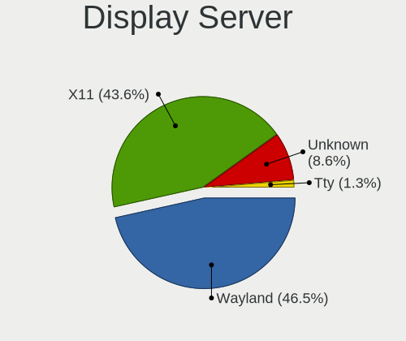
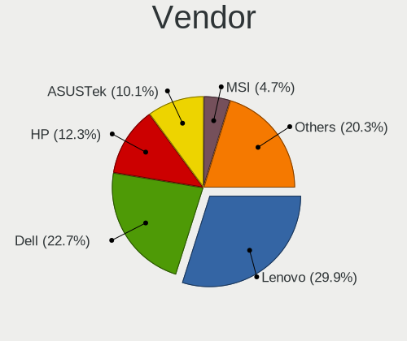
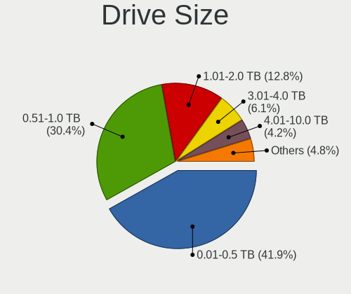
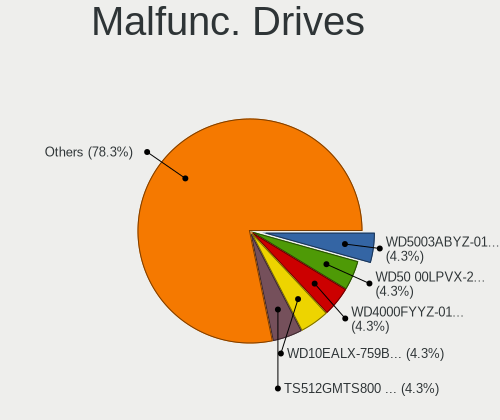
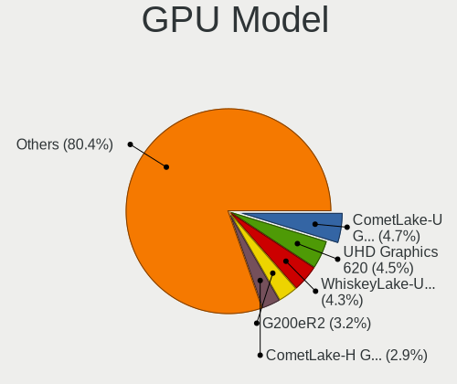
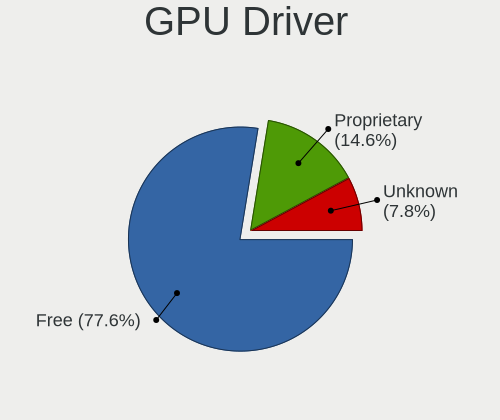
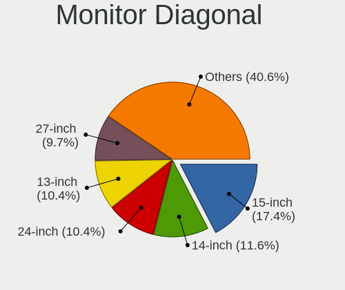
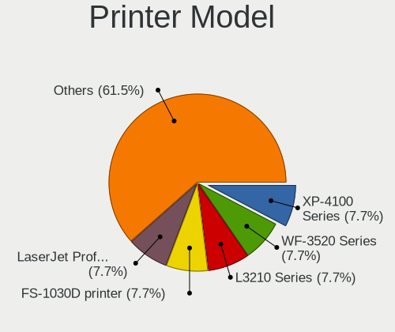
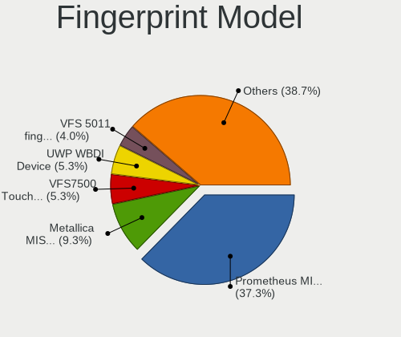
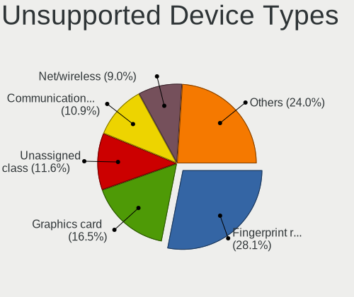

RHEL - Tested Hardware & Statistics
-----------------------------------

A project to collect tested hardware configurations for RHEL.

Anyone can contribute to this report by the [hw-probe](https://github.com/linuxhw/hw-probe) tool:

    sudo -E hw-probe -all -upload

Please contribute! Especially if your hardware is rare.

This is a report for all computer types. See also reports for [desktops](/Dist/RHEL/Desktop/README.md) and [notebooks](/Dist/RHEL/Notebook/README.md).

Contents
--------

* [ Test Cases ](#test-cases)

* [ System ](#system)
  - [ OS                       ](#os)
  - [ OS Family                ](#os-family)
  - [ Kernel                   ](#kernel)
  - [ Kernel Family            ](#kernel-family)
  - [ Kernel Major Ver.        ](#kernel-major-ver)
  - [ Arch                     ](#arch)
  - [ DE                       ](#de)
  - [ Display Server           ](#display-server)
  - [ Display Manager          ](#display-manager)
  - [ OS Lang                  ](#os-lang)
  - [ Boot Mode                ](#boot-mode)
  - [ Filesystem               ](#filesystem)
  - [ Part. scheme             ](#part-scheme)
  - [ Dual Boot with Linux/BSD ](#dual-boot-with-linuxbsd)
  - [ Dual Boot (Win)          ](#dual-boot-win)

* [ Board ](#board)
  - [ Vendor                   ](#vendor)
  - [ Model                    ](#model)
  - [ Model Family             ](#model-family)
  - [ MFG Year                 ](#mfg-year)
  - [ Form Factor              ](#form-factor)
  - [ Secure Boot              ](#secure-boot)
  - [ Coreboot                 ](#coreboot)
  - [ RAM Size                 ](#ram-size)
  - [ RAM Used                 ](#ram-used)
  - [ Total Drives             ](#total-drives)
  - [ Has CD-ROM               ](#has-cd-rom)
  - [ Has Ethernet             ](#has-ethernet)
  - [ Has WiFi                 ](#has-wifi)
  - [ Has Bluetooth            ](#has-bluetooth)

* [ Location ](#location)
  - [ Country                  ](#country)
  - [ City                     ](#city)

* [ Drives ](#drives)
  - [ Drive Vendor             ](#drive-vendor)
  - [ Drive Model              ](#drive-model)
  - [ HDD Vendor               ](#hdd-vendor)
  - [ SSD Vendor               ](#ssd-vendor)
  - [ Drive Kind               ](#drive-kind)
  - [ Drive Connector          ](#drive-connector)
  - [ Drive Size               ](#drive-size)
  - [ Space Total              ](#space-total)
  - [ Space Used               ](#space-used)
  - [ Malfunc. Drives          ](#malfunc-drives)
  - [ Malfunc. Drive Vendor    ](#malfunc-drive-vendor)
  - [ Malfunc. HDD Vendor      ](#malfunc-hdd-vendor)
  - [ Malfunc. Drive Kind      ](#malfunc-drive-kind)
  - [ Failed Drives            ](#failed-drives)
  - [ Failed Drive Vendor      ](#failed-drive-vendor)
  - [ Drive Status             ](#drive-status)

* [ Storage controller ](#storage-controller)
  - [ Storage Vendor           ](#storage-vendor)
  - [ Storage Model            ](#storage-model)
  - [ Storage Kind             ](#storage-kind)

* [ Processor ](#processor)
  - [ CPU Vendor               ](#cpu-vendor)
  - [ CPU Model                ](#cpu-model)
  - [ CPU Model Family         ](#cpu-model-family)
  - [ CPU Cores                ](#cpu-cores)
  - [ CPU Sockets              ](#cpu-sockets)
  - [ CPU Threads              ](#cpu-threads)
  - [ CPU Op-Modes             ](#cpu-op-modes)
  - [ CPU Microcode            ](#cpu-microcode)
  - [ CPU Microarch            ](#cpu-microarch)

* [ Graphics ](#graphics)
  - [ GPU Vendor               ](#gpu-vendor)
  - [ GPU Model                ](#gpu-model)
  - [ GPU Combo                ](#gpu-combo)
  - [ GPU Driver               ](#gpu-driver)
  - [ GPU Memory               ](#gpu-memory)

* [ Monitor ](#monitor)
  - [ Monitor Vendor           ](#monitor-vendor)
  - [ Monitor Model            ](#monitor-model)
  - [ Monitor Resolution       ](#monitor-resolution)
  - [ Monitor Diagonal         ](#monitor-diagonal)
  - [ Monitor Width            ](#monitor-width)
  - [ Aspect Ratio             ](#aspect-ratio)
  - [ Monitor Area             ](#monitor-area)
  - [ Pixel Density            ](#pixel-density)
  - [ Multiple Monitors        ](#multiple-monitors)

* [ Network ](#network)
  - [ Net Controller Vendor    ](#net-controller-vendor)
  - [ Net Controller Model     ](#net-controller-model)
  - [ Wireless Vendor          ](#wireless-vendor)
  - [ Wireless Model           ](#wireless-model)
  - [ Ethernet Vendor          ](#ethernet-vendor)
  - [ Ethernet Model           ](#ethernet-model)
  - [ Net Controller Kind      ](#net-controller-kind)
  - [ Used Controller          ](#used-controller)
  - [ NICs                     ](#nics)
  - [ IPv6                     ](#ipv6)

* [ Bluetooth ](#bluetooth)
  - [ Bluetooth Vendor         ](#bluetooth-vendor)
  - [ Bluetooth Model          ](#bluetooth-model)

* [ Sound ](#sound)
  - [ Sound Vendor             ](#sound-vendor)
  - [ Sound Model              ](#sound-model)

* [ Memory ](#memory)
  - [ Memory Vendor            ](#memory-vendor)
  - [ Memory Model             ](#memory-model)
  - [ Memory Kind              ](#memory-kind)
  - [ Memory Form Factor       ](#memory-form-factor)
  - [ Memory Size              ](#memory-size)
  - [ Memory Speed             ](#memory-speed)

* [ Printers & scanners ](#printers--scanners)
  - [ Printer Vendor           ](#printer-vendor)
  - [ Printer Model            ](#printer-model)
  - [ Scanner Vendor           ](#scanner-vendor)
  - [ Scanner Model            ](#scanner-model)

* [ Camera ](#camera)
  - [ Camera Vendor            ](#camera-vendor)
  - [ Camera Model             ](#camera-model)

* [ Security ](#security)
  - [ Fingerprint Vendor       ](#fingerprint-vendor)
  - [ Fingerprint Model        ](#fingerprint-model)
  - [ Chipcard Vendor          ](#chipcard-vendor)
  - [ Chipcard Model           ](#chipcard-model)

* [ Unsupported ](#unsupported)
  - [ Unsupported Devices      ](#unsupported-devices)
  - [ Unsupported Device Types ](#unsupported-device-types)

Test Cases
----------

Total: 542

| Vendor        | Model                       | Form-Factor | Probe                                                      | Date         |
|---------------|-----------------------------|-------------|------------------------------------------------------------|--------------|
| Dell          | 01G0M6 A02                  | Desktop     | [9018a2ac09](https://linux-hardware.org/?probe=9018a2ac09) | Jan 06, 2025 |
| ASRock        | X570 Steel Legend           | Desktop     | [2b29fc224e](https://linux-hardware.org/?probe=2b29fc224e) | Jan 04, 2025 |
| Gigabyte      | B550M DS3H                  | Desktop     | [675c306b51](https://linux-hardware.org/?probe=675c306b51) | Jan 03, 2025 |
| Dell          | Latitude 7490               | Notebook    | [5781936456](https://linux-hardware.org/?probe=5781936456) | Dec 31, 2024 |
| MSI           | MPG B550 GAMING PLUS        | Desktop     | [8c9e4bdd75](https://linux-hardware.org/?probe=8c9e4bdd75) | Dec 26, 2024 |
| ASRock        | X570 Steel Legend           | Desktop     | [eab49b95cc](https://linux-hardware.org/?probe=eab49b95cc) | Dec 24, 2024 |
| Lenovo        | Legion Y540-15IRH-PG0 81... | Notebook    | [ea8d4bb295](https://linux-hardware.org/?probe=ea8d4bb295) | Nov 24, 2024 |
| Dell          | 0HHV7N A00                  | Desktop     | [36a5d324c6](https://linux-hardware.org/?probe=36a5d324c6) | Nov 20, 2024 |
| Dell          | 0HHV7N A00                  | Desktop     | [2724eb028f](https://linux-hardware.org/?probe=2724eb028f) | Nov 20, 2024 |
| Acer          | Aspire A515-45              | Notebook    | [a10f9b0aa6](https://linux-hardware.org/?probe=a10f9b0aa6) | Nov 17, 2024 |
| ASRock        | X570 Steel Legend           | Desktop     | [5b8dc636f4](https://linux-hardware.org/?probe=5b8dc636f4) | Nov 16, 2024 |
| ASUSTek       | ROG STRIX B550-E GAMING     | Desktop     | [087f372f3b](https://linux-hardware.org/?probe=087f372f3b) | Nov 16, 2024 |
| ASUSTek       | ROG STRIX B550-E GAMING     | Desktop     | [28e20675ef](https://linux-hardware.org/?probe=28e20675ef) | Nov 16, 2024 |
| ASRock        | H310CM-HG4                  | Desktop     | [947520025d](https://linux-hardware.org/?probe=947520025d) | Nov 12, 2024 |
| ASRock        | H310CM-HG4                  | Desktop     | [11021e8d32](https://linux-hardware.org/?probe=11021e8d32) | Nov 12, 2024 |
| ASRock        | H310CM-HG4                  | Desktop     | [63b0d341db](https://linux-hardware.org/?probe=63b0d341db) | Nov 12, 2024 |
| HP            | EliteBook 840 G5            | Notebook    | [3d9365dd8e](https://linux-hardware.org/?probe=3d9365dd8e) | Nov 08, 2024 |
| Lenovo        | ThinkPad T16 Gen 1 21CH0... | Notebook    | [9f24fcf5f6](https://linux-hardware.org/?probe=9f24fcf5f6) | Nov 07, 2024 |
| Lenovo        | ThinkPad X1 Extreme Gen ... | Notebook    | [1a592a4c8c](https://linux-hardware.org/?probe=1a592a4c8c) | Oct 30, 2024 |
| Lenovo        | ThinkPad X1 Extreme Gen ... | Notebook    | [88c68a9636](https://linux-hardware.org/?probe=88c68a9636) | Oct 19, 2024 |
| Dell          | Latitude E6520              | Notebook    | [1fccf13e1b](https://linux-hardware.org/?probe=1fccf13e1b) | Oct 14, 2024 |
| Unknown       | 01W23F A00                  | Server      | [8e73509007](https://linux-hardware.org/?probe=8e73509007) | Oct 10, 2024 |
| Dell          | 0HHV7N A00                  | Desktop     | [dac9fa757b](https://linux-hardware.org/?probe=dac9fa757b) | Oct 09, 2024 |
| HP            | ENVY x360 Convertible 15... | Convertible | [2739aa253d](https://linux-hardware.org/?probe=2739aa253d) | Oct 09, 2024 |
| HP            | 8949 11                     | Desktop     | [e10c4e5057](https://linux-hardware.org/?probe=e10c4e5057) | Oct 02, 2024 |
| UNOWHY        | Y13G010S4EI                 | Notebook    | [8b9768888f](https://linux-hardware.org/?probe=8b9768888f) | Sep 29, 2024 |
| UNOWHY        | Y13G010S4EI                 | Notebook    | [8bc1a2e515](https://linux-hardware.org/?probe=8bc1a2e515) | Sep 25, 2024 |
| Unknown       | 01W23F A00                  | Server      | [a905969722](https://linux-hardware.org/?probe=a905969722) | Sep 24, 2024 |
| Dell          | Inspiron 14 5410 2-in-1     | Convertible | [1984c24a25](https://linux-hardware.org/?probe=1984c24a25) | Sep 24, 2024 |
| Dell          | Precision 7730              | Notebook    | [7f0ef4c558](https://linux-hardware.org/?probe=7f0ef4c558) | Sep 19, 2024 |
| ASUSTek       | ASUS EXPERTBOOK B1500CEA... | Notebook    | [325da6b558](https://linux-hardware.org/?probe=325da6b558) | Sep 16, 2024 |
| Lenovo        | ThinkPad X1 Extreme Gen ... | Notebook    | [7a11752435](https://linux-hardware.org/?probe=7a11752435) | Sep 11, 2024 |
| Supermicro    | X10SRA                      | Server      | [7b12ea87ed](https://linux-hardware.org/?probe=7b12ea87ed) | Sep 10, 2024 |
| MSI           | H310M PRO-VD                | Desktop     | [7a1624219e](https://linux-hardware.org/?probe=7a1624219e) | Sep 07, 2024 |
| Supermicro    | X9DAi                       | Desktop     | [f84f7e7927](https://linux-hardware.org/?probe=f84f7e7927) | Sep 01, 2024 |
| Dell          | Precision 7530              | Notebook    | [f24cdeec73](https://linux-hardware.org/?probe=f24cdeec73) | Aug 18, 2024 |
| ASRock        | B450 Pro4                   | Desktop     | [fe4942ef99](https://linux-hardware.org/?probe=fe4942ef99) | Aug 16, 2024 |
| Dell          | 060K5C A06                  | Server      | [075693e3a5](https://linux-hardware.org/?probe=075693e3a5) | Aug 02, 2024 |
| Dell          | 060K5C A06                  | Server      | [5c5692ba57](https://linux-hardware.org/?probe=5c5692ba57) | Jul 24, 2024 |
| HP            | 859C                        | Desktop     | [4797f69707](https://linux-hardware.org/?probe=4797f69707) | Jul 23, 2024 |
| Lenovo        | IdeaPad S145-15API 81UT     | Notebook    | [4d550f9d4c](https://linux-hardware.org/?probe=4d550f9d4c) | Jul 22, 2024 |
| Microsoft     | Surface Go 2                | Tablet      | [d8feb4c87f](https://linux-hardware.org/?probe=d8feb4c87f) | Jul 18, 2024 |
| Lenovo        | ThinkPad X1 Carbon Gen 8... | Notebook    | [37e0d80500](https://linux-hardware.org/?probe=37e0d80500) | Jul 12, 2024 |
| Unknown       | G13                         | Notebook    | [ac710043ec](https://linux-hardware.org/?probe=ac710043ec) | Jul 09, 2024 |
| Lenovo        | ThinkPad T16 Gen 2 21K7C... | Notebook    | [07807f87ab](https://linux-hardware.org/?probe=07807f87ab) | Jul 04, 2024 |
| HP            | EliteBook 855 G7 Noteboo... | Notebook    | [70d021b045](https://linux-hardware.org/?probe=70d021b045) | Jul 02, 2024 |
| Supermicro    | X10DRH-CT                   | Desktop     | [dd4b138c6e](https://linux-hardware.org/?probe=dd4b138c6e) | Jun 27, 2024 |
| Lenovo        | ThinkBook 13x G2 IAP 21A... | Notebook    | [cd307f9782](https://linux-hardware.org/?probe=cd307f9782) | Jun 27, 2024 |
| Lenovo        | ThinkPad P17 Gen 2i 20YU... | Notebook    | [5f79f30b85](https://linux-hardware.org/?probe=5f79f30b85) | Jun 19, 2024 |
| Dell          | Latitude 5340               | Notebook    | [f8bada88dd](https://linux-hardware.org/?probe=f8bada88dd) | Jun 15, 2024 |
| Dell          | Latitude 5520               | Notebook    | [c1a7e532c9](https://linux-hardware.org/?probe=c1a7e532c9) | Jun 10, 2024 |
| Dell          | Latitude 3340               | Notebook    | [0179e77195](https://linux-hardware.org/?probe=0179e77195) | Jun 10, 2024 |
| Dell          | Latitude 3340               | Notebook    | [3719b02ec1](https://linux-hardware.org/?probe=3719b02ec1) | Jun 10, 2024 |
| HP            | EliteBook 860 16 inch G1... | Notebook    | [a2f0057f55](https://linux-hardware.org/?probe=a2f0057f55) | Jun 05, 2024 |
| HP            | EliteBook 860 16 inch G1... | Notebook    | [75728b162c](https://linux-hardware.org/?probe=75728b162c) | Jun 04, 2024 |
| Dell          | Inspiron 5491 2n1           | Convertible | [5e9a78a9f5](https://linux-hardware.org/?probe=5e9a78a9f5) | Jun 04, 2024 |
| HP            | Stream Laptop 11-ak0xxx     | Notebook    | [564a4d2df9](https://linux-hardware.org/?probe=564a4d2df9) | May 27, 2024 |
| Dell          | 0RN4PJ A01                  | Server      | [d946f59098](https://linux-hardware.org/?probe=d946f59098) | May 27, 2024 |
| Dell          | 0MWYPT A01                  | Desktop     | [4e18ec8df0](https://linux-hardware.org/?probe=4e18ec8df0) | May 15, 2024 |
| MSI           | MPG X570S CARBON MAX WIF... | Desktop     | [c5ad34b5f5](https://linux-hardware.org/?probe=c5ad34b5f5) | May 14, 2024 |
| Dell          | Precision 7540              | Notebook    | [4703617413](https://linux-hardware.org/?probe=4703617413) | May 07, 2024 |
| Dell          | Precision 7540              | Notebook    | [37638500df](https://linux-hardware.org/?probe=37638500df) | May 07, 2024 |
| ASUSTek       | ROG STRIX Z590-A GAMING ... | Desktop     | [fba3144c06](https://linux-hardware.org/?probe=fba3144c06) | May 06, 2024 |
| MSI           | MEG Z790 ACE MAX            | Desktop     | [b10bbe2874](https://linux-hardware.org/?probe=b10bbe2874) | Apr 22, 2024 |
| Dell          | 07WP95 A02                  | Desktop     | [46e0a9d4d4](https://linux-hardware.org/?probe=46e0a9d4d4) | Apr 15, 2024 |
| CX / Air C... | CX-H87-M1                   | Desktop     | [6ca85693a6](https://linux-hardware.org/?probe=6ca85693a6) | Apr 12, 2024 |
| ASUSTek       | G16CH                       | Desktop     | [04a245fffe](https://linux-hardware.org/?probe=04a245fffe) | Apr 11, 2024 |
| ASRock        | X570 Creator                | Desktop     | [53aae5d4cb](https://linux-hardware.org/?probe=53aae5d4cb) | Apr 07, 2024 |
| ASRock        | X399 Taichi                 | Desktop     | [c57b1d4302](https://linux-hardware.org/?probe=c57b1d4302) | Apr 04, 2024 |
| HP            | ZBook Fury 16 G9 Mobile ... | Notebook    | [10ff3b22cf](https://linux-hardware.org/?probe=10ff3b22cf) | Apr 03, 2024 |
| HP            | ZBook Fury 16 G9 Mobile ... | Notebook    | [896bd3d75a](https://linux-hardware.org/?probe=896bd3d75a) | Apr 03, 2024 |
| ASRock        | X399 Taichi                 | Desktop     | [0f04c10bfa](https://linux-hardware.org/?probe=0f04c10bfa) | Apr 02, 2024 |
| HP            | ZBook Fury 15 G7 Mobile ... | Notebook    | [59749a8b22](https://linux-hardware.org/?probe=59749a8b22) | Mar 17, 2024 |
| HP            | 212A                        | Desktop     | [4a6e30808e](https://linux-hardware.org/?probe=4a6e30808e) | Mar 12, 2024 |
| ASUSTek       | VivoBook_ASUSLaptop M340... | Notebook    | [24f8aa7cd0](https://linux-hardware.org/?probe=24f8aa7cd0) | Mar 07, 2024 |
| Dell          | 06JWJY A00                  | Desktop     | [f1c6a0f9dd](https://linux-hardware.org/?probe=f1c6a0f9dd) | Mar 06, 2024 |
| MSI           | Modern 15 A5M               | Notebook    | [e591b9e544](https://linux-hardware.org/?probe=e591b9e544) | Feb 04, 2024 |
| ASUSTek       | TUF Gaming X670E-PLUS WI... | Desktop     | [23c12f49f6](https://linux-hardware.org/?probe=23c12f49f6) | Jan 27, 2024 |
| Dell          | Inspiron N5040              | Notebook    | [7cd09c7dde](https://linux-hardware.org/?probe=7cd09c7dde) | Jan 25, 2024 |
| Intel         | DQ77MK AAG39642-400         | Desktop     | [6d4d5ee6c7](https://linux-hardware.org/?probe=6d4d5ee6c7) | Jan 25, 2024 |
| LG Electro... | 15Z95P-GRLGL                | Notebook    | [ce6c983048](https://linux-hardware.org/?probe=ce6c983048) | Jan 24, 2024 |
| LG Electro... | 15Z95P-GRLGL                | Notebook    | [9dcc8bbc45](https://linux-hardware.org/?probe=9dcc8bbc45) | Jan 24, 2024 |
| Dell          | Precision M4800             | Notebook    | [dccdba8512](https://linux-hardware.org/?probe=dccdba8512) | Jan 21, 2024 |
| Gigabyte      | B550M AORUS PRO-P           | Desktop     | [cb116dae9c](https://linux-hardware.org/?probe=cb116dae9c) | Jan 20, 2024 |
| Lenovo        | ThinkPad X1 Carbon Gen 1... | Notebook    | [d4e6e0ae3e](https://linux-hardware.org/?probe=d4e6e0ae3e) | Jan 19, 2024 |
| MSI           | Katana GF76 12UC            | Notebook    | [73c3208c03](https://linux-hardware.org/?probe=73c3208c03) | Jan 10, 2024 |
| MSI           | Katana GF76 12UC            | Notebook    | [15db2ea112](https://linux-hardware.org/?probe=15db2ea112) | Jan 10, 2024 |
| Lenovo        | ThinkPad S1 Yoga 12 20DK... | Notebook    | [2bb251ffbb](https://linux-hardware.org/?probe=2bb251ffbb) | Jan 09, 2024 |
| Lenovo        | IdeaPad 320-15IKB 80XL      | Notebook    | [1abf742848](https://linux-hardware.org/?probe=1abf742848) | Jan 09, 2024 |
| Dell          | Precision 3480              | Notebook    | [e81f3e856b](https://linux-hardware.org/?probe=e81f3e856b) | Jan 03, 2024 |
| MSI           | PRO Z690-A DDR4             | Desktop     | [55f164e414](https://linux-hardware.org/?probe=55f164e414) | Dec 20, 2023 |
| MSI           | PRO Z690-A DDR4             | Desktop     | [b758a439b8](https://linux-hardware.org/?probe=b758a439b8) | Dec 20, 2023 |
| Dell          | Latitude 5340               | Notebook    | [c9d3b3d7a7](https://linux-hardware.org/?probe=c9d3b3d7a7) | Dec 19, 2023 |
| ASUSTek       | ROG Maximus Z790 HERO       | Desktop     | [c492be4899](https://linux-hardware.org/?probe=c492be4899) | Dec 04, 2023 |
| Dell          | Precision 7530              | Notebook    | [e75b16ca5e](https://linux-hardware.org/?probe=e75b16ca5e) | Dec 03, 2023 |
| Lenovo        | ThinkPad T14s Gen 1 20T1... | Notebook    | [5c4714ecce](https://linux-hardware.org/?probe=5c4714ecce) | Dec 01, 2023 |
| Lenovo        | ThinkPad L480 20LS0015UK    | Notebook    | [5f786955fc](https://linux-hardware.org/?probe=5f786955fc) | Nov 26, 2023 |
| Dell          | 02C2CP A08                  | Server      | [f7cd1a9252](https://linux-hardware.org/?probe=f7cd1a9252) | Nov 22, 2023 |
| Dell          | 0X8DXD A00                  | Desktop     | [bc58f50ac6](https://linux-hardware.org/?probe=bc58f50ac6) | Nov 22, 2023 |
| Lenovo        | IdeaPad 330S-14IKB U 81F... | Notebook    | [0b06f82d9d](https://linux-hardware.org/?probe=0b06f82d9d) | Nov 19, 2023 |
| ASUSTek       | ROG CROSSHAIR VIII DARK ... | Desktop     | [367bde5a11](https://linux-hardware.org/?probe=367bde5a11) | Nov 03, 2023 |
| ASUSTek       | PRIME Z690-A                | Desktop     | [e356c02979](https://linux-hardware.org/?probe=e356c02979) | Oct 30, 2023 |
| ASUSTek       | ROG Maximus XII APEX        | Desktop     | [2ed4b6b711](https://linux-hardware.org/?probe=2ed4b6b711) | Oct 24, 2023 |
| Intel         | NUC12SNKi72 M78939-500      | Mini pc     | [1b04f5768f](https://linux-hardware.org/?probe=1b04f5768f) | Oct 24, 2023 |
| Intel         | NUC12SNKi72 M78939-500      | Mini pc     | [eb48924942](https://linux-hardware.org/?probe=eb48924942) | Oct 24, 2023 |
| HP            | ProLiant ML310e Gen8        | Desktop     | [79f6aee2c7](https://linux-hardware.org/?probe=79f6aee2c7) | Oct 24, 2023 |
| Lenovo        | ThinkPad P17 Gen 2i 20YU... | Notebook    | [1c3bf8f6ef](https://linux-hardware.org/?probe=1c3bf8f6ef) | Oct 19, 2023 |
| System76      | Galago Pro                  | Notebook    | [fbdb665814](https://linux-hardware.org/?probe=fbdb665814) | Oct 03, 2023 |
| Dell          | 03X6X0 A01                  | Server      | [eb082ebcfc](https://linux-hardware.org/?probe=eb082ebcfc) | Oct 03, 2023 |
| Dell          | Inspiron N5010              | Notebook    | [fe6b9d4c65](https://linux-hardware.org/?probe=fe6b9d4c65) | Oct 01, 2023 |
| Intel         | NUC12WSBi7 M63355-302       | Mini pc     | [043bac31d2](https://linux-hardware.org/?probe=043bac31d2) | Sep 28, 2023 |
| Dell          | G16 7620                    | Notebook    | [cd30e51d53](https://linux-hardware.org/?probe=cd30e51d53) | Sep 27, 2023 |
| Dell          | Precision 7720              | Notebook    | [8cae4c9a31](https://linux-hardware.org/?probe=8cae4c9a31) | Sep 25, 2023 |
| Dell          | Latitude 5420               | Notebook    | [f2bb4ee9f0](https://linux-hardware.org/?probe=f2bb4ee9f0) | Sep 23, 2023 |
| ASUSTek       | ROG CROSSHAIR VIII DARK ... | Desktop     | [ff1efba80e](https://linux-hardware.org/?probe=ff1efba80e) | Sep 13, 2023 |
| Acer          | Aspire C24-865              | All in one  | [de824a4f4e](https://linux-hardware.org/?probe=de824a4f4e) | Sep 03, 2023 |
| HP            | ProBook 640 G2              | Notebook    | [c0af84c629](https://linux-hardware.org/?probe=c0af84c629) | Sep 02, 2023 |
| Lenovo        | ThinkPad T490 20N3S77601    | Notebook    | [b659e310c9](https://linux-hardware.org/?probe=b659e310c9) | Sep 02, 2023 |
| ASUSTek       | ROG CROSSHAIR VIII DARK ... | Desktop     | [c190907cc8](https://linux-hardware.org/?probe=c190907cc8) | Aug 29, 2023 |
| HP            | 8955                        | Mini pc     | [b80c4d0245](https://linux-hardware.org/?probe=b80c4d0245) | Aug 28, 2023 |
| MSI           | Katana GF66 12UC            | Notebook    | [6651fbd434](https://linux-hardware.org/?probe=6651fbd434) | Aug 22, 2023 |
| HP            | Laptop 15-bs0xx             | Notebook    | [5f2a27253a](https://linux-hardware.org/?probe=5f2a27253a) | Aug 21, 2023 |
| HP            | Laptop 15-bs0xx             | Notebook    | [5e76f9bfc3](https://linux-hardware.org/?probe=5e76f9bfc3) | Aug 21, 2023 |
| ASUSTek       | STRIX Z270E GAMING          | Desktop     | [e5b049be3a](https://linux-hardware.org/?probe=e5b049be3a) | Aug 18, 2023 |
| ASRock        | A320M-HDV R4.0              | Desktop     | [f88687d2f0](https://linux-hardware.org/?probe=f88687d2f0) | Aug 15, 2023 |
| ASUSTek       | ROG STRIX Z590-E GAMING ... | Desktop     | [f6892c6532](https://linux-hardware.org/?probe=f6892c6532) | Aug 15, 2023 |
| ASUSTek       | ROG Maximus X HERO          | Desktop     | [d5d888506b](https://linux-hardware.org/?probe=d5d888506b) | Aug 10, 2023 |
| ASRock        | A320M-HDV R4.0              | Desktop     | [eb99d95702](https://linux-hardware.org/?probe=eb99d95702) | Aug 08, 2023 |
| HP            | EliteBook 2570p             | Notebook    | [68734d9dfa](https://linux-hardware.org/?probe=68734d9dfa) | Aug 04, 2023 |
| ASRock        | A320M-HDV R4.0              | Desktop     | [de07e937bb](https://linux-hardware.org/?probe=de07e937bb) | Aug 04, 2023 |
| HP            | 0AECh D                     | Desktop     | [b9ea790e39](https://linux-hardware.org/?probe=b9ea790e39) | Jul 24, 2023 |
| HP            | 0AECh D                     | Desktop     | [078f0cd045](https://linux-hardware.org/?probe=078f0cd045) | Jul 24, 2023 |
| MSI           | Z270-A PRO                  | Desktop     | [0d8b3d7c32](https://linux-hardware.org/?probe=0d8b3d7c32) | Jun 20, 2023 |
| IBM           | FAB2 Controller Producti... | Server      | [daa3df0f31](https://linux-hardware.org/?probe=daa3df0f31) | Jun 19, 2023 |
| Lenovo        | STA7B38870 02               | Server      | [80a2f3d367](https://linux-hardware.org/?probe=80a2f3d367) | Jun 18, 2023 |
| Dell          | 07T4MC A02                  | Desktop     | [ad310dd147](https://linux-hardware.org/?probe=ad310dd147) | Jun 09, 2023 |
| Dell          | 0HHV7N A00                  | Desktop     | [a3a157f327](https://linux-hardware.org/?probe=a3a157f327) | May 21, 2023 |
| MSI           | MAG X570S TOMAHAWK MAX W... | Desktop     | [2afc4ee693](https://linux-hardware.org/?probe=2afc4ee693) | May 18, 2023 |
| Lenovo        | ThinkPad P17 Gen 2i 20YU... | Notebook    | [49ecdacd71](https://linux-hardware.org/?probe=49ecdacd71) | May 14, 2023 |
| ASUSTek       | TUF Gaming X570-PLUS        | Desktop     | [b1ea93c5fa](https://linux-hardware.org/?probe=b1ea93c5fa) | May 09, 2023 |
| HP            | EliteBook 855 G7 Noteboo... | Notebook    | [6e086ec096](https://linux-hardware.org/?probe=6e086ec096) | May 07, 2023 |
| Lenovo        | ThinkBook 14-IIL 20SL       | Notebook    | [5938e62d47](https://linux-hardware.org/?probe=5938e62d47) | Apr 17, 2023 |
| Dell          | Precision 7510              | Notebook    | [f68123c20a](https://linux-hardware.org/?probe=f68123c20a) | Apr 13, 2023 |
| Gigabyte      | B550M AORUS PRO-P           | Desktop     | [18c5e3c7c3](https://linux-hardware.org/?probe=18c5e3c7c3) | Apr 10, 2023 |
| Lenovo        | ThinkPad X1 Nano Gen 2 2... | Notebook    | [de656b2182](https://linux-hardware.org/?probe=de656b2182) | Apr 06, 2023 |
| MSI           | B450M MORTAR MAX            | Desktop     | [0077b88576](https://linux-hardware.org/?probe=0077b88576) | Apr 06, 2023 |
| Gigabyte      | X670E AORUS MASTER          | Desktop     | [68731ac4ec](https://linux-hardware.org/?probe=68731ac4ec) | Mar 31, 2023 |
| ASUSTek       | PRIME Z690-P WIFI           | Desktop     | [898059efa5](https://linux-hardware.org/?probe=898059efa5) | Mar 28, 2023 |
| MSI           | B450M MORTAR MAX            | Desktop     | [29c85678af](https://linux-hardware.org/?probe=29c85678af) | Mar 28, 2023 |
| ASUSTek       | PRIME Z690-P WIFI           | Desktop     | [1821e3657a](https://linux-hardware.org/?probe=1821e3657a) | Mar 26, 2023 |
| ASUSTek       | X550ZA                      | Notebook    | [cc243873e2](https://linux-hardware.org/?probe=cc243873e2) | Mar 26, 2023 |
| ASUSTek       | X550ZA                      | Notebook    | [2e55d2163a](https://linux-hardware.org/?probe=2e55d2163a) | Mar 26, 2023 |
| MSI           | B450M MORTAR MAX            | Desktop     | [641481dd1d](https://linux-hardware.org/?probe=641481dd1d) | Mar 21, 2023 |
| MSI           | B450M MORTAR MAX            | Desktop     | [9d859cb8bd](https://linux-hardware.org/?probe=9d859cb8bd) | Mar 20, 2023 |
| Lenovo        | [3633AC1] STC               | Server      | [aef7266e33](https://linux-hardware.org/?probe=aef7266e33) | Mar 20, 2023 |
| HP            | ProBook 640 G2              | Notebook    | [9439371137](https://linux-hardware.org/?probe=9439371137) | Mar 18, 2023 |
| HP            | ProBook 640 G2              | Notebook    | [c968526666](https://linux-hardware.org/?probe=c968526666) | Mar 18, 2023 |
| ASUSTek       | VivoBook_ASUSLaptop X515... | Notebook    | [bc39bd2ce5](https://linux-hardware.org/?probe=bc39bd2ce5) | Mar 17, 2023 |
| Gigabyte      | X570 UD                     | Desktop     | [12d8200114](https://linux-hardware.org/?probe=12d8200114) | Mar 13, 2023 |
| Lenovo        | ThinkPad P1 Gen 4i 20Y4S... | Notebook    | [52e2d79bad](https://linux-hardware.org/?probe=52e2d79bad) | Mar 01, 2023 |
| Getac         | B360                        | Notebook    | [c4bd09adf1](https://linux-hardware.org/?probe=c4bd09adf1) | Mar 01, 2023 |
| Lenovo        | ThinkPad E15 Gen 2 20T80... | Notebook    | [1ce9430009](https://linux-hardware.org/?probe=1ce9430009) | Feb 27, 2023 |
| Lenovo        | ThinkPad L14 Gen 3 21C2S... | Notebook    | [6772403b62](https://linux-hardware.org/?probe=6772403b62) | Feb 20, 2023 |
| Lenovo        | ThinkPad E15 Gen 2 20T80... | Notebook    | [0d1a7d0dbe](https://linux-hardware.org/?probe=0d1a7d0dbe) | Feb 20, 2023 |
| Lenovo        | ThinkPad X1 Carbon Gen 9... | Notebook    | [affa3bb9f1](https://linux-hardware.org/?probe=affa3bb9f1) | Feb 19, 2023 |
| Dell          | Precision 7560              | Notebook    | [7ed10eebe9](https://linux-hardware.org/?probe=7ed10eebe9) | Feb 16, 2023 |
| MSI           | GP75 Leopard 9SD            | Notebook    | [1f2a5b1def](https://linux-hardware.org/?probe=1f2a5b1def) | Feb 11, 2023 |
| Lenovo        | ThinkPad T480s 20L8S2N80... | Notebook    | [2a4e6ab2d4](https://linux-hardware.org/?probe=2a4e6ab2d4) | Feb 07, 2023 |
| Getac         | S410G4                      | Notebook    | [81b80297ab](https://linux-hardware.org/?probe=81b80297ab) | Feb 06, 2023 |
| Getac         | S410G4                      | Notebook    | [1d8e6ad383](https://linux-hardware.org/?probe=1d8e6ad383) | Feb 06, 2023 |
| Lenovo        | ThinkPad T14 Gen 2i 20W1... | Notebook    | [701a355d37](https://linux-hardware.org/?probe=701a355d37) | Feb 04, 2023 |
| Gigabyte      | H510M H                     | Desktop     | [861b7c5aa7](https://linux-hardware.org/?probe=861b7c5aa7) | Feb 02, 2023 |
| ASUSTek       | PRIME Z590-A                | Desktop     | [f328fab9f1](https://linux-hardware.org/?probe=f328fab9f1) | Jan 27, 2023 |
| Hardkernel    | ODROID-H3                   | Desktop     | [98f5768c61](https://linux-hardware.org/?probe=98f5768c61) | Jan 22, 2023 |
| Dell          | Latitude 9420               | Notebook    | [3fd325486b](https://linux-hardware.org/?probe=3fd325486b) | Jan 18, 2023 |
| Dell          | Latitude 3410               | Notebook    | [0a4720ef85](https://linux-hardware.org/?probe=0a4720ef85) | Jan 02, 2023 |
| Lenovo        | ThinkPad P17 Gen 2i 20YU... | Notebook    | [34169c74c5](https://linux-hardware.org/?probe=34169c74c5) | Dec 31, 2022 |
| Unknown       | Unknown                     | Desktop     | [9d66e8f05d](https://linux-hardware.org/?probe=9d66e8f05d) | Dec 25, 2022 |
| HP            | EliteBook 2570p             | Notebook    | [199df541f2](https://linux-hardware.org/?probe=199df541f2) | Dec 21, 2022 |
| MSI           | GE72VR 7RF                  | Notebook    | [f5384e68dd](https://linux-hardware.org/?probe=f5384e68dd) | Dec 16, 2022 |
| Gigabyte      | Z590I VISION D              | Desktop     | [9787630f1c](https://linux-hardware.org/?probe=9787630f1c) | Dec 12, 2022 |
| Lenovo        | ThinkPad X390 Yoga 20NQS... | Convertible | [f1ac9526c5](https://linux-hardware.org/?probe=f1ac9526c5) | Dec 08, 2022 |
| Lenovo        | ThinkPad X1 Nano Gen 2 2... | Notebook    | [7c17c479b7](https://linux-hardware.org/?probe=7c17c479b7) | Dec 03, 2022 |
| HP            | Laptop 14s-dk0xxx           | Notebook    | [c1d2a02024](https://linux-hardware.org/?probe=c1d2a02024) | Nov 30, 2022 |
| Lenovo        | ThinkPad X390 Yoga 20NQS... | Convertible | [ae85dba67e](https://linux-hardware.org/?probe=ae85dba67e) | Nov 28, 2022 |
| MSI           | B550M PRO-VDH WIFI          | Desktop     | [af5361313b](https://linux-hardware.org/?probe=af5361313b) | Nov 17, 2022 |
| Lenovo        | ThinkPad P1 Gen 3 20TJS2... | Notebook    | [64fb254a64](https://linux-hardware.org/?probe=64fb254a64) | Nov 17, 2022 |
| Dell          | Latitude E7450              | Notebook    | [1fba71c904](https://linux-hardware.org/?probe=1fba71c904) | Nov 15, 2022 |
| Lenovo        | ThinkPad P1 Gen 3 20TJS2... | Notebook    | [de9e18e6ca](https://linux-hardware.org/?probe=de9e18e6ca) | Nov 14, 2022 |
| Lenovo        | Unknown                     | Convertible | [b4fb099c2f](https://linux-hardware.org/?probe=b4fb099c2f) | Nov 11, 2022 |
| MSI           | B550M PRO-VDH WIFI          | Desktop     | [2d830dc96d](https://linux-hardware.org/?probe=2d830dc96d) | Nov 11, 2022 |
| Dell          | 0RN4PJ A02                  | Server      | [84012f61ff](https://linux-hardware.org/?probe=84012f61ff) | Nov 03, 2022 |
| HP            | 8591                        | Desktop     | [98bde1bd5a](https://linux-hardware.org/?probe=98bde1bd5a) | Nov 01, 2022 |
| Lenovo        | ThinkPad T14 Gen 1 20S1S... | Notebook    | [24d91cf27b](https://linux-hardware.org/?probe=24d91cf27b) | Oct 30, 2022 |
| Lenovo        | ThinkPad X220 4291WSH       | Notebook    | [00e77b8815](https://linux-hardware.org/?probe=00e77b8815) | Oct 26, 2022 |
| Lenovo        | ThinkPad X220 4291WSH       | Notebook    | [94d1c333ac](https://linux-hardware.org/?probe=94d1c333ac) | Oct 26, 2022 |
| ASUSTek       | Z450LA                      | Notebook    | [ba00eb6516](https://linux-hardware.org/?probe=ba00eb6516) | Oct 18, 2022 |
| AZW           | SER V01                     | Mini pc     | [7bb271252d](https://linux-hardware.org/?probe=7bb271252d) | Oct 17, 2022 |
| ASUSTek       | Z450LA                      | Notebook    | [6042d84470](https://linux-hardware.org/?probe=6042d84470) | Oct 17, 2022 |
| HP            | 340S G7                     | Notebook    | [7baf4edd11](https://linux-hardware.org/?probe=7baf4edd11) | Oct 09, 2022 |
| Razer         | Blade 15 Mid 2019-Base      | Notebook    | [c1457e4e02](https://linux-hardware.org/?probe=c1457e4e02) | Sep 21, 2022 |
| Lenovo        | ThinkPad P17 Gen 2i 20YU... | Notebook    | [8656acec04](https://linux-hardware.org/?probe=8656acec04) | Sep 14, 2022 |
| Lenovo        | ThinkPad P17 Gen 2i 20YU... | Notebook    | [23649c49e3](https://linux-hardware.org/?probe=23649c49e3) | Sep 14, 2022 |
| Gigabyte      | Z590I VISION D              | Desktop     | [22131a6ec5](https://linux-hardware.org/?probe=22131a6ec5) | Sep 03, 2022 |
| Acer          | Aspire XC-330               | Desktop     | [2012033d09](https://linux-hardware.org/?probe=2012033d09) | Aug 14, 2022 |
| Dell          | Precision 7510              | Notebook    | [cd8482ea72](https://linux-hardware.org/?probe=cd8482ea72) | Aug 08, 2022 |
| Lenovo        | ThinkPad P17 Gen 2i 20YU... | Notebook    | [3df0bebc37](https://linux-hardware.org/?probe=3df0bebc37) | Aug 03, 2022 |
| Unknown       | Unknown                     | Desktop     | [fad6d4558f](https://linux-hardware.org/?probe=fad6d4558f) | Jul 26, 2022 |
| Raspberry ... | Raspberry Pi 4 Model B      | Soc         | [4776ecdc2a](https://linux-hardware.org/?probe=4776ecdc2a) | Jul 15, 2022 |
| Lenovo        | ThinkPad E15 Gen 2 20T80... | Notebook    | [2566bb66dd](https://linux-hardware.org/?probe=2566bb66dd) | Jul 12, 2022 |
| Lenovo        | ThinkPad P17 Gen 2i 20YU... | Notebook    | [71c31086e6](https://linux-hardware.org/?probe=71c31086e6) | Jul 11, 2022 |
| Intel         | H81                         | Desktop     | [e1a730a6e6](https://linux-hardware.org/?probe=e1a730a6e6) | Jul 08, 2022 |
| Lenovo        | ThinkPad P17 Gen 2i 20YU... | Notebook    | [714c212f51](https://linux-hardware.org/?probe=714c212f51) | Jul 08, 2022 |
| Unknown       | Unknown                     | Desktop     | [16c6df7b29](https://linux-hardware.org/?probe=16c6df7b29) | Jul 07, 2022 |
| Unknown       | Unknown                     | Desktop     | [6b25430dc1](https://linux-hardware.org/?probe=6b25430dc1) | Jul 07, 2022 |
| Gigabyte      | MU72-SU0-00 01000100        | Server      | [ab729dc8a5](https://linux-hardware.org/?probe=ab729dc8a5) | Jul 04, 2022 |
| Gigabyte      | MU72-SU0-00 01000100        | Server      | [1cb6aead26](https://linux-hardware.org/?probe=1cb6aead26) | Jul 03, 2022 |
| Dell          | Inspiron 5559               | Notebook    | [aaaaef108a](https://linux-hardware.org/?probe=aaaaef108a) | Jul 03, 2022 |
| Lenovo        | ThinkPad E14 20RA001MMZ     | Notebook    | [4bf795762d](https://linux-hardware.org/?probe=4bf795762d) | Jul 02, 2022 |
| Lenovo        | ThinkPad T14s Gen 1 20T1... | Notebook    | [7e2ddf75e5](https://linux-hardware.org/?probe=7e2ddf75e5) | Jun 30, 2022 |
| Lenovo        | ThinkPad T480 20L60034MX    | Notebook    | [179d10e315](https://linux-hardware.org/?probe=179d10e315) | Jun 21, 2022 |
| Unknown       | A06                         | Server      | [aca491bb91](https://linux-hardware.org/?probe=aca491bb91) | Jun 21, 2022 |
| Unknown       | A06                         | Server      | [3bf8edf992](https://linux-hardware.org/?probe=3bf8edf992) | Jun 18, 2022 |
| Supermicro    | X10DRi                      | Server      | [0cf218f7bf](https://linux-hardware.org/?probe=0cf218f7bf) | Jun 16, 2022 |
| Lenovo        | ThinkPad T14s Gen 1 20T1... | Notebook    | [d77ce7a3f7](https://linux-hardware.org/?probe=d77ce7a3f7) | Jun 13, 2022 |
| Lenovo        | ThinkPad Edge E431 62771... | Notebook    | [ef8cc06070](https://linux-hardware.org/?probe=ef8cc06070) | Jun 09, 2022 |
| Lenovo        | ThinkPad T15 Gen 2i 20W5... | Notebook    | [8ee33363ef](https://linux-hardware.org/?probe=8ee33363ef) | May 30, 2022 |
| AMI           | Aptio CRB                   | Mini pc     | [372a1d69d7](https://linux-hardware.org/?probe=372a1d69d7) | May 27, 2022 |
| Dell          | 02K9CR A03                  | Desktop     | [5656d7a0d5](https://linux-hardware.org/?probe=5656d7a0d5) | May 27, 2022 |
| Dell          | 0N4YC8 A00                  | Desktop     | [74525891a0](https://linux-hardware.org/?probe=74525891a0) | May 26, 2022 |
| HP            | ENVY x360 Convertible 15... | Convertible | [f08ef13508](https://linux-hardware.org/?probe=f08ef13508) | May 26, 2022 |
| Lenovo        | Legion 5 15ACH6 82JW        | Notebook    | [9a3948a7e8](https://linux-hardware.org/?probe=9a3948a7e8) | May 23, 2022 |
| Lenovo        | Legion 5 15ACH6 82JW        | Notebook    | [2e520c1e13](https://linux-hardware.org/?probe=2e520c1e13) | May 23, 2022 |
| Lenovo        | Legion 5 15ACH6 82JW        | Notebook    | [9be915450d](https://linux-hardware.org/?probe=9be915450d) | May 23, 2022 |
| ASUSTek       | TUF Gaming Z690-PLUS WIF... | Notebook    | [48c983a184](https://linux-hardware.org/?probe=48c983a184) | May 15, 2022 |
| Lenovo        | ThinkPad T14s Gen 1 20T1... | Notebook    | [0b0ffcbfee](https://linux-hardware.org/?probe=0b0ffcbfee) | May 13, 2022 |
| Dell          | XPS 17 9710                 | Notebook    | [919abd9078](https://linux-hardware.org/?probe=919abd9078) | May 13, 2022 |
| Dell          | XPS 17 9710                 | Notebook    | [15bc7f6757](https://linux-hardware.org/?probe=15bc7f6757) | May 13, 2022 |
| ASRock        | Z370 Professional Gaming... | Desktop     | [658347ec76](https://linux-hardware.org/?probe=658347ec76) | May 12, 2022 |
| ASUSTek       | VivoBook_ASUSLaptop X409... | Notebook    | [61e54407f3](https://linux-hardware.org/?probe=61e54407f3) | May 04, 2022 |
| ASUSTek       | VivoBook_ASUSLaptop X409... | Notebook    | [7d0cabeccf](https://linux-hardware.org/?probe=7d0cabeccf) | May 04, 2022 |
| Lenovo        | ThinkPad T480 20L6S29D02    | Notebook    | [1eb07120eb](https://linux-hardware.org/?probe=1eb07120eb) | Apr 29, 2022 |
| Lenovo        | ThinkPad T14 Gen 1 20S1S... | Notebook    | [a3ddc714b0](https://linux-hardware.org/?probe=a3ddc714b0) | Apr 28, 2022 |
| Lenovo        | ThinkBook 13s-IWL 20R9      | Notebook    | [604488642b](https://linux-hardware.org/?probe=604488642b) | Apr 25, 2022 |
| Lenovo        | ThinkPad T590 20N5S2NC0V    | Notebook    | [d6bf3c27ef](https://linux-hardware.org/?probe=d6bf3c27ef) | Apr 20, 2022 |
| Dell          | Precision 5550              | Notebook    | [949f4a7658](https://linux-hardware.org/?probe=949f4a7658) | Apr 19, 2022 |
| Lenovo        | 3132 SDK0K17763 WIN 1801... | Desktop     | [a6e43346ba](https://linux-hardware.org/?probe=a6e43346ba) | Apr 16, 2022 |
| ASUSTek       | X99-DELUXE II               | Desktop     | [82939dc69f](https://linux-hardware.org/?probe=82939dc69f) | Apr 05, 2022 |
| CX / Air C... | CX-H87-M1                   | Desktop     | [ddfbf2df5e](https://linux-hardware.org/?probe=ddfbf2df5e) | Apr 01, 2022 |
| CX / Air C... | CX-H87-M1                   | Desktop     | [5a8ee938ce](https://linux-hardware.org/?probe=5a8ee938ce) | Apr 01, 2022 |
| Lenovo        | ThinkPad P17 Gen 2i 20YU... | Notebook    | [7763003308](https://linux-hardware.org/?probe=7763003308) | Mar 31, 2022 |
| Dell          | Precision 7560              | Notebook    | [2abd72978c](https://linux-hardware.org/?probe=2abd72978c) | Mar 29, 2022 |
| Intel         | NUC11DBBi7 M17027-302       | Mini pc     | [e1e4cbbe30](https://linux-hardware.org/?probe=e1e4cbbe30) | Mar 17, 2022 |
| ASRock        | X99E-ITX/ac                 | Desktop     | [0cf67f0201](https://linux-hardware.org/?probe=0cf67f0201) | Mar 06, 2022 |
| ASRock        | X570 Steel Legend           | Desktop     | [e7843ce1cf](https://linux-hardware.org/?probe=e7843ce1cf) | Mar 05, 2022 |
| ASUSTek       | Maximus VII FORMULA         | Desktop     | [7fd2e4885c](https://linux-hardware.org/?probe=7fd2e4885c) | Mar 05, 2022 |
| Lenovo        | ThinkPad P17 Gen 2i 20YU... | Notebook    | [14ea45c4d7](https://linux-hardware.org/?probe=14ea45c4d7) | Mar 03, 2022 |
| Lenovo        | ThinkPad P1 Gen 3 20TJS2... | Notebook    | [eed6e0f012](https://linux-hardware.org/?probe=eed6e0f012) | Mar 01, 2022 |
| Lenovo        | Z40-70 20366                | Notebook    | [5210de65b3](https://linux-hardware.org/?probe=5210de65b3) | Feb 27, 2022 |
| Gigabyte      | B150-HD3-CF                 | Desktop     | [cab21caab7](https://linux-hardware.org/?probe=cab21caab7) | Feb 10, 2022 |
| Lenovo        | ThinkPad T14s Gen 1 20T1... | Notebook    | [081fe975ce](https://linux-hardware.org/?probe=081fe975ce) | Feb 07, 2022 |
| ASUSTek       | Maximus VII FORMULA         | Desktop     | [36c52eaf3d](https://linux-hardware.org/?probe=36c52eaf3d) | Feb 05, 2022 |
| Lenovo        | ThinkPad X1 Yoga 1st 20F... | Notebook    | [7b31f4ca0b](https://linux-hardware.org/?probe=7b31f4ca0b) | Feb 05, 2022 |
| Lenovo        | ThinkPad P17 Gen 2i 20YU... | Notebook    | [b3ef38d0ef](https://linux-hardware.org/?probe=b3ef38d0ef) | Jan 31, 2022 |
| Dell          | Latitude E5570              | Notebook    | [87ec93dcdc](https://linux-hardware.org/?probe=87ec93dcdc) | Jan 31, 2022 |
| Lenovo        | ThinkPad T490 20N3S5DV0S    | Notebook    | [e619ec0303](https://linux-hardware.org/?probe=e619ec0303) | Jan 31, 2022 |
| ASUSTek       | Maximus VII FORMULA         | Desktop     | [07de603a4a](https://linux-hardware.org/?probe=07de603a4a) | Jan 31, 2022 |
| Lenovo        | ThinkPad P17 Gen 2i 20YU... | Notebook    | [a60504e123](https://linux-hardware.org/?probe=a60504e123) | Jan 29, 2022 |
| HP            | EliteBook 8460p             | Notebook    | [335a0c0490](https://linux-hardware.org/?probe=335a0c0490) | Jan 28, 2022 |
| Samsung       | 730QCJ/730QCR               | Notebook    | [24b05b96d7](https://linux-hardware.org/?probe=24b05b96d7) | Jan 19, 2022 |
| Gigabyte      | Z97N-WIFI                   | Desktop     | [5808f89618](https://linux-hardware.org/?probe=5808f89618) | Jan 07, 2022 |
| ASUSTek       | X550VX                      | Notebook    | [d7ef034908](https://linux-hardware.org/?probe=d7ef034908) | Jan 03, 2022 |
| ASUSTek       | PRIME B360M-D               | Desktop     | [e3b3ac9f8b](https://linux-hardware.org/?probe=e3b3ac9f8b) | Jan 01, 2022 |
| Toshiba       | Satellite Pro R50-C         | Notebook    | [012f2de3d5](https://linux-hardware.org/?probe=012f2de3d5) | Dec 28, 2021 |
| HP            | ProLiant DL380e Gen8        | Server      | [a28b637049](https://linux-hardware.org/?probe=a28b637049) | Dec 28, 2021 |
| Toshiba       | Satellite Pro R50-C         | Notebook    | [2e716df6c6](https://linux-hardware.org/?probe=2e716df6c6) | Dec 26, 2021 |
| HP            | Pavilion Gaming Laptop 1... | Notebook    | [b6b4df52d0](https://linux-hardware.org/?probe=b6b4df52d0) | Dec 25, 2021 |
| Dell          | Precision 3551              | Notebook    | [cbddfb522a](https://linux-hardware.org/?probe=cbddfb522a) | Dec 21, 2021 |
| Lenovo        | ThinkPad P52 20MAS17205     | Notebook    | [86d1d49f33](https://linux-hardware.org/?probe=86d1d49f33) | Dec 09, 2021 |
| Lenovo        | ThinkPad P17 Gen 2i 20YU... | Notebook    | [ba46713703](https://linux-hardware.org/?probe=ba46713703) | Dec 07, 2021 |
| Acer          | Nitro AN515-54              | Notebook    | [cda3dbe636](https://linux-hardware.org/?probe=cda3dbe636) | Dec 04, 2021 |
| Lenovo        | ThinkPad P1 Gen 3 20TJS2... | Notebook    | [a4e5f602c4](https://linux-hardware.org/?probe=a4e5f602c4) | Dec 01, 2021 |
| Lenovo        | ThinkPad P17 Gen 2i 20YU... | Notebook    | [7cb04612a2](https://linux-hardware.org/?probe=7cb04612a2) | Nov 30, 2021 |
| Lenovo        | ThinkPad P17 Gen 2i 20YU... | Notebook    | [90eea91b30](https://linux-hardware.org/?probe=90eea91b30) | Nov 27, 2021 |
| HP            | EliteBook 840 G8 Noteboo... | Notebook    | [19fc23d020](https://linux-hardware.org/?probe=19fc23d020) | Nov 27, 2021 |
| Gigabyte      | AERO 15 KD                  | Notebook    | [cfa38b921a](https://linux-hardware.org/?probe=cfa38b921a) | Nov 22, 2021 |
| Lenovo        | ThinkPad P17 Gen 2i 20YU... | Notebook    | [6827caed15](https://linux-hardware.org/?probe=6827caed15) | Nov 19, 2021 |
| Lenovo        | MAHOBAY                     | Desktop     | [ea1413bf9e](https://linux-hardware.org/?probe=ea1413bf9e) | Nov 19, 2021 |
| Lenovo        | ThinkPad T480 20L6S29E1T    | Notebook    | [df288ab5f0](https://linux-hardware.org/?probe=df288ab5f0) | Nov 18, 2021 |
| HP            | ProLiant DL360p Gen8        | Server      | [7052b7628f](https://linux-hardware.org/?probe=7052b7628f) | Nov 18, 2021 |
| HP            | ProLiant MicroServer Gen... | Desktop     | [0178a25382](https://linux-hardware.org/?probe=0178a25382) | Nov 18, 2021 |
| Lenovo        | ThinkPad P17 Gen 2i 20YU... | Notebook    | [f766090339](https://linux-hardware.org/?probe=f766090339) | Nov 16, 2021 |
| Lenovo        | ThinkPad P17 Gen 2i 20YU... | Notebook    | [ece232f046](https://linux-hardware.org/?probe=ece232f046) | Nov 11, 2021 |
| Lenovo        | ThinkPad P50 20ENS1L000     | Notebook    | [318b5aea2b](https://linux-hardware.org/?probe=318b5aea2b) | Nov 08, 2021 |
| Lenovo        | ThinkPad E490 20N8000JAD    | Notebook    | [997e24e5c9](https://linux-hardware.org/?probe=997e24e5c9) | Nov 06, 2021 |
| Lenovo        | ThinkPad E490 20N8000JAD    | Notebook    | [9d70a71c88](https://linux-hardware.org/?probe=9d70a71c88) | Nov 06, 2021 |
| ASUSTek       | PRIME B350M-A               | Desktop     | [d3d69e7587](https://linux-hardware.org/?probe=d3d69e7587) | Oct 24, 2021 |
| Lenovo        | ThinkPad T14s Gen 1 20T1... | Notebook    | [59dfcd3b23](https://linux-hardware.org/?probe=59dfcd3b23) | Oct 22, 2021 |
| ASUSTek       | Pro WS X570-ACE             | Desktop     | [07a5b3c465](https://linux-hardware.org/?probe=07a5b3c465) | Oct 16, 2021 |
| HP            | ZBook Firefly 15 inch G8... | Notebook    | [49d20bd238](https://linux-hardware.org/?probe=49d20bd238) | Oct 12, 2021 |
| ASUSTek       | PRIME B350M-A               | Desktop     | [66cd9bb2c9](https://linux-hardware.org/?probe=66cd9bb2c9) | Oct 09, 2021 |
| Lenovo        | ThinkPad P50 20ENS1L000     | Notebook    | [f8443770b9](https://linux-hardware.org/?probe=f8443770b9) | Oct 08, 2021 |
| ASUSTek       | Z87-DELUXE                  | Desktop     | [63b48dfa23](https://linux-hardware.org/?probe=63b48dfa23) | Oct 07, 2021 |
| Lenovo        | ThinkPad T490s 20NYS7K90... | Notebook    | [042f9bec29](https://linux-hardware.org/?probe=042f9bec29) | Oct 06, 2021 |
| HP            | 212B                        | Desktop     | [322371cc6a](https://linux-hardware.org/?probe=322371cc6a) | Oct 04, 2021 |
| ASUSTek       | Z87-DELUXE                  | Desktop     | [2792a3ef1c](https://linux-hardware.org/?probe=2792a3ef1c) | Oct 03, 2021 |
| Gigabyte      | Z97N-WIFI                   | Desktop     | [539316ac91](https://linux-hardware.org/?probe=539316ac91) | Sep 30, 2021 |
| Lenovo        | ThinkPad T470 20HES57W00    | Notebook    | [482453f90b](https://linux-hardware.org/?probe=482453f90b) | Sep 30, 2021 |
| Gigabyte      | Z97N-WIFI                   | Desktop     | [95ae5d0e04](https://linux-hardware.org/?probe=95ae5d0e04) | Sep 29, 2021 |
| Lenovo        | ThinkPad P1 Gen 3 20TJS2... | Notebook    | [a667466f62](https://linux-hardware.org/?probe=a667466f62) | Sep 17, 2021 |
| Lenovo        | ThinkPad P1 Gen 3 20TJS2... | Notebook    | [502a6b96a3](https://linux-hardware.org/?probe=502a6b96a3) | Sep 13, 2021 |
| Lenovo        | MAHOBAY                     | Desktop     | [fc498b8cb0](https://linux-hardware.org/?probe=fc498b8cb0) | Sep 10, 2021 |
| ASUSTek       | PRIME B350M-A               | Desktop     | [35fa4b96f4](https://linux-hardware.org/?probe=35fa4b96f4) | Sep 09, 2021 |
| Lenovo        | HR630X                      | Server      | [0627db12df](https://linux-hardware.org/?probe=0627db12df) | Sep 08, 2021 |
| Lenovo        | ThinkPad X230 Tablet 343... | Notebook    | [daadb8ccc0](https://linux-hardware.org/?probe=daadb8ccc0) | Sep 06, 2021 |
| Dell          | XPS 15 9560                 | Notebook    | [952dd9f6f5](https://linux-hardware.org/?probe=952dd9f6f5) | Sep 01, 2021 |
| Lenovo        | ThinkPad P1 Gen 3 20TJS2... | Notebook    | [7bf4b860a8](https://linux-hardware.org/?probe=7bf4b860a8) | Aug 26, 2021 |
| Gigabyte      | Z390 AORUS ULTRA-CF         | Desktop     | [f7bcc3d753](https://linux-hardware.org/?probe=f7bcc3d753) | Aug 25, 2021 |
| Gigabyte      | 970A-D3                     | Desktop     | [d62c66d9bd](https://linux-hardware.org/?probe=d62c66d9bd) | Aug 12, 2021 |
| Lenovo        | ThinkPad T14s Gen 1 20T1... | Notebook    | [01e55d6021](https://linux-hardware.org/?probe=01e55d6021) | Aug 09, 2021 |
| ASUSTek       | TUF Gaming FX505DU_FX505... | Notebook    | [586add668c](https://linux-hardware.org/?probe=586add668c) | Aug 03, 2021 |
| ASUSTek       | TUF Gaming FX505DU_FX505... | Notebook    | [5096c7cbb6](https://linux-hardware.org/?probe=5096c7cbb6) | Aug 03, 2021 |
| Dell          | XPS 15 9560                 | Notebook    | [1bb9bd9d46](https://linux-hardware.org/?probe=1bb9bd9d46) | Jul 27, 2021 |
| Supermicro    | X10DRi                      | Server      | [6be87ab445](https://linux-hardware.org/?probe=6be87ab445) | Jul 26, 2021 |
| Lenovo        | ThinkPad T14s Gen 1 20T1... | Notebook    | [cea7891e5a](https://linux-hardware.org/?probe=cea7891e5a) | Jul 26, 2021 |
| ASUSTek       | PN50                        | Mini pc     | [54f44d70c5](https://linux-hardware.org/?probe=54f44d70c5) | Jul 24, 2021 |
| HP            | ZBook 15 G5                 | Notebook    | [9f9cc51cda](https://linux-hardware.org/?probe=9f9cc51cda) | Jul 20, 2021 |
| Gigabyte      | Z490 GAMING X               | Desktop     | [a540fa2f59](https://linux-hardware.org/?probe=a540fa2f59) | Jul 19, 2021 |
| Dell          | Latitude E5510              | Notebook    | [2ab8a16c55](https://linux-hardware.org/?probe=2ab8a16c55) | Jul 12, 2021 |
| HP            | EliteBook 850 G7 Noteboo... | Notebook    | [7e7fbaff11](https://linux-hardware.org/?probe=7e7fbaff11) | Jul 11, 2021 |
| Lenovo        | ThinkPad T14 Gen 1 20S1S... | Notebook    | [c4091b8c8c](https://linux-hardware.org/?probe=c4091b8c8c) | Jul 09, 2021 |
| Lenovo        | ThinkPad T490s 20NYS7K91... | Notebook    | [a03b6b86cc](https://linux-hardware.org/?probe=a03b6b86cc) | Jul 03, 2021 |
| Lenovo        | ThinkPad T490s 20NYS7K91... | Notebook    | [500c95d16b](https://linux-hardware.org/?probe=500c95d16b) | Jul 03, 2021 |
| Dell          | 0MWYPT A02                  | Desktop     | [ab6e7450c3](https://linux-hardware.org/?probe=ab6e7450c3) | Jul 01, 2021 |
| Dell          | Latitude E6430              | Notebook    | [ce6bc6552c](https://linux-hardware.org/?probe=ce6bc6552c) | Jun 29, 2021 |
| Dell          | Latitude E6430              | Notebook    | [ed72da5de8](https://linux-hardware.org/?probe=ed72da5de8) | Jun 25, 2021 |
| Dell          | Latitude E6430              | Notebook    | [899e8720e1](https://linux-hardware.org/?probe=899e8720e1) | Jun 25, 2021 |
| Lenovo        | ThinkPad T14s Gen 1 20T1... | Notebook    | [b1f8b4df82](https://linux-hardware.org/?probe=b1f8b4df82) | Jun 25, 2021 |
| Lenovo        | ThinkPad T490s 20NYS7K91... | Notebook    | [eccdf8e8c1](https://linux-hardware.org/?probe=eccdf8e8c1) | Jun 20, 2021 |
| Lenovo        | ThinkPad P15 Gen 1 20SUS... | Notebook    | [a703424a8c](https://linux-hardware.org/?probe=a703424a8c) | Jun 13, 2021 |
| Intel         | DX79SR AAG57199-200         | Desktop     | [380f10f479](https://linux-hardware.org/?probe=380f10f479) | Jun 10, 2021 |
| Dell          | Precision 3541              | Notebook    | [984db774ed](https://linux-hardware.org/?probe=984db774ed) | Jun 08, 2021 |
| HP            | ZBook Studio G5             | Notebook    | [c3162a0346](https://linux-hardware.org/?probe=c3162a0346) | Jun 04, 2021 |
| HP            | ZBook Studio G5             | Notebook    | [1a9225e48c](https://linux-hardware.org/?probe=1a9225e48c) | Jun 04, 2021 |
| ZTSYSTEMS     | A9DRPF TBD                  | Server      | [1b5977b024](https://linux-hardware.org/?probe=1b5977b024) | Jun 03, 2021 |
| HP            | 1906                        | Desktop     | [bf20783dee](https://linux-hardware.org/?probe=bf20783dee) | Jun 02, 2021 |
| Dell          | 074H08 A00                  | Server      | [b7ac531bf5](https://linux-hardware.org/?probe=b7ac531bf5) | Jun 02, 2021 |
| Gigabyte      | B85M-D3V-A                  | Desktop     | [4405336208](https://linux-hardware.org/?probe=4405336208) | Jun 01, 2021 |
| ZTSYSTEMS     | A9DRPF TBD                  | Server      | [57e5191283](https://linux-hardware.org/?probe=57e5191283) | Jun 01, 2021 |
| Dell          | 0CNCJW A08                  | Server      | [f90168c69d](https://linux-hardware.org/?probe=f90168c69d) | Jun 01, 2021 |
| Dell          | Latitude E6530              | Notebook    | [2e9b8200a9](https://linux-hardware.org/?probe=2e9b8200a9) | May 29, 2021 |
| MSI           | MPG Z390 GAMING PLUS        | Desktop     | [2eebd180f8](https://linux-hardware.org/?probe=2eebd180f8) | May 28, 2021 |
| Lenovo        | ThinkPad T14 Gen 1 20S1S... | Notebook    | [c51ae8a5ff](https://linux-hardware.org/?probe=c51ae8a5ff) | May 28, 2021 |
| MiTAC         | HS-9215 R0A                 | Server      | [2f38c3fd0e](https://linux-hardware.org/?probe=2f38c3fd0e) | May 27, 2021 |
| HP            | ProLiant DL180 G6           | Server      | [28b04c3004](https://linux-hardware.org/?probe=28b04c3004) | May 26, 2021 |
| Dell          | 0971VF A01                  | Server      | [9d511d1a0b](https://linux-hardware.org/?probe=9d511d1a0b) | May 26, 2021 |
| Lenovo        | HR630X                      | Server      | [fd087082c0](https://linux-hardware.org/?probe=fd087082c0) | May 26, 2021 |
| HP            | 2129                        | Desktop     | [3991895525](https://linux-hardware.org/?probe=3991895525) | May 23, 2021 |
| MSI           | Z77A-G45                    | Desktop     | [9b11ff6d26](https://linux-hardware.org/?probe=9b11ff6d26) | May 22, 2021 |
| MSI           | Z77A-G45                    | Desktop     | [bd980d04be](https://linux-hardware.org/?probe=bd980d04be) | May 22, 2021 |
| ASUSTek       | ROG Maximus X HERO          | Desktop     | [4a38b848dd](https://linux-hardware.org/?probe=4a38b848dd) | May 19, 2021 |
| Lenovo        | ThinkPad P1 Gen 3 20TJS2... | Notebook    | [65666a7bec](https://linux-hardware.org/?probe=65666a7bec) | May 17, 2021 |
| HP            | 8054                        | Desktop     | [cf6b804c19](https://linux-hardware.org/?probe=cf6b804c19) | May 13, 2021 |
| ASRock        | X99E-ITX/ac                 | Desktop     | [9cacd1608e](https://linux-hardware.org/?probe=9cacd1608e) | May 08, 2021 |
| Lenovo        | 7D2XCTO1WW                  | Server      | [2175466ea1](https://linux-hardware.org/?probe=2175466ea1) | Apr 25, 2021 |
| HP            | ProLiant DL380 Gen9         | Server      | [23f12250e5](https://linux-hardware.org/?probe=23f12250e5) | Apr 22, 2021 |
| Lenovo        | ThinkPad T470p 20J7S0FA0... | Notebook    | [bf95cd0ce7](https://linux-hardware.org/?probe=bf95cd0ce7) | Apr 20, 2021 |
| Lenovo        | ThinkPad P1 Gen 3 20TJS2... | Notebook    | [349f951788](https://linux-hardware.org/?probe=349f951788) | Apr 18, 2021 |
| Dell          | Inspiron 3559               | Notebook    | [854655e305](https://linux-hardware.org/?probe=854655e305) | Apr 14, 2021 |
| Lenovo        | ThinkPad P1 Gen 3 20TJS2... | Notebook    | [46bb05613f](https://linux-hardware.org/?probe=46bb05613f) | Apr 13, 2021 |
| Lenovo        | ThinkPad T14s Gen 1 20T1... | Notebook    | [3ee0cc7c18](https://linux-hardware.org/?probe=3ee0cc7c18) | Apr 13, 2021 |
| Lenovo        | ThinkPad P1 Gen 3 20TJS2... | Notebook    | [ecc3dfa09a](https://linux-hardware.org/?probe=ecc3dfa09a) | Apr 13, 2021 |
| HP            | OMEN by Laptop 15-dc1xxx    | Notebook    | [a40c80d584](https://linux-hardware.org/?probe=a40c80d584) | Apr 11, 2021 |
| Lenovo        | ThinkPad P1 Gen 3 20TJS2... | Notebook    | [f98af88440](https://linux-hardware.org/?probe=f98af88440) | Apr 06, 2021 |
| Lenovo        | HASWELLREFRESHDT NO DPK     | All in one  | [4c3dd6a28b](https://linux-hardware.org/?probe=4c3dd6a28b) | Mar 25, 2021 |
| Lenovo        | HASWELLREFRESHDT NO DPK     | All in one  | [344f718da0](https://linux-hardware.org/?probe=344f718da0) | Mar 25, 2021 |
| Lenovo        | HASWELLREFRESHDT NO DPK     | All in one  | [feedaccb5b](https://linux-hardware.org/?probe=feedaccb5b) | Mar 24, 2021 |
| ASUSTek       | PRIME B360M-D               | Desktop     | [3dce7dc37d](https://linux-hardware.org/?probe=3dce7dc37d) | Mar 20, 2021 |
| Lenovo        | ThinkPad T14 Gen 1 20S1S... | Notebook    | [ee5d8875e3](https://linux-hardware.org/?probe=ee5d8875e3) | Mar 11, 2021 |
| Lenovo        | ThinkPad T460 20FMS1VA09    | Notebook    | [5bc6b53ecf](https://linux-hardware.org/?probe=5bc6b53ecf) | Mar 03, 2021 |
| Lenovo        | ThinkPad T460 20FMS1VA09    | Notebook    | [55314e09ff](https://linux-hardware.org/?probe=55314e09ff) | Mar 03, 2021 |
| Lenovo        | ThinkPad W530 2441B32       | Notebook    | [fb9b49c1d9](https://linux-hardware.org/?probe=fb9b49c1d9) | Mar 02, 2021 |
| ASUSTek       | Zephyrus G GU502DU_GA502... | Notebook    | [c6fd48fe3f](https://linux-hardware.org/?probe=c6fd48fe3f) | Feb 28, 2021 |
| ASRock        | A300M-STX                   | Desktop     | [22c97ac8b2](https://linux-hardware.org/?probe=22c97ac8b2) | Feb 27, 2021 |
| Dell          | 0NNNCT A01                  | Desktop     | [3f081f03fe](https://linux-hardware.org/?probe=3f081f03fe) | Feb 22, 2021 |
| Dell          | Precision 5510              | Notebook    | [2d4aed7f6c](https://linux-hardware.org/?probe=2d4aed7f6c) | Feb 22, 2021 |
| Sony          | VPCEB4L1R                   | Notebook    | [1744d5db17](https://linux-hardware.org/?probe=1744d5db17) | Feb 16, 2021 |
| HP            | EliteBook 8460p             | Notebook    | [3aed966657](https://linux-hardware.org/?probe=3aed966657) | Feb 10, 2021 |
| Lenovo        | ThinkPad T14 Gen 1 20S1S... | Notebook    | [071f1be343](https://linux-hardware.org/?probe=071f1be343) | Feb 09, 2021 |
| Intel         | NUC10i7FNB K61360-302       | Mini pc     | [29d0e20ba4](https://linux-hardware.org/?probe=29d0e20ba4) | Feb 08, 2021 |
| Lenovo        | ThinkPad X201 3680PKS       | Notebook    | [14a1f8c536](https://linux-hardware.org/?probe=14a1f8c536) | Feb 07, 2021 |
| Lenovo        | ThinkPad X201 3680PKS       | Notebook    | [f935adf770](https://linux-hardware.org/?probe=f935adf770) | Feb 07, 2021 |
| Lenovo        | ThinkPad E15 Gen 2 20T80... | Notebook    | [832d7f19ae](https://linux-hardware.org/?probe=832d7f19ae) | Feb 02, 2021 |
| Lenovo        | ThinkPad L480 20LSCTO1WW    | Notebook    | [bdff7fe555](https://linux-hardware.org/?probe=bdff7fe555) | Jan 28, 2021 |
| Dell          | PowerEdge FC630             | Desktop     | [98ea3e97e6](https://linux-hardware.org/?probe=98ea3e97e6) | Jan 25, 2021 |
| Dell          | PowerEdge FC630             | Desktop     | [2da05b98bf](https://linux-hardware.org/?probe=2da05b98bf) | Jan 25, 2021 |
| Lenovo        | ThinkPad P52 20MAS17205     | Notebook    | [0a2ca85ddc](https://linux-hardware.org/?probe=0a2ca85ddc) | Jan 22, 2021 |
| Lenovo        | ThinkPad P1 Gen 2 20QUS1... | Notebook    | [3e0d4ac7c7](https://linux-hardware.org/?probe=3e0d4ac7c7) | Jan 19, 2021 |
| Lenovo        | ThinkPad T14 Gen 1 20S1S... | Notebook    | [1a1bbc078f](https://linux-hardware.org/?probe=1a1bbc078f) | Jan 18, 2021 |
| ASUSTek       | ROG Maximus X HERO          | Desktop     | [d0ac809f8a](https://linux-hardware.org/?probe=d0ac809f8a) | Jan 15, 2021 |
| Dell          | PowerEdge FC630             | Desktop     | [038ccd7256](https://linux-hardware.org/?probe=038ccd7256) | Jan 15, 2021 |
| Dell          | PowerEdge FC630             | Desktop     | [f0441f0a07](https://linux-hardware.org/?probe=f0441f0a07) | Jan 15, 2021 |
| Dell          | PowerEdge FC630             | Desktop     | [3c396f0b59](https://linux-hardware.org/?probe=3c396f0b59) | Jan 15, 2021 |
| Dell          | PowerEdge FC630             | Desktop     | [ab4ea06f29](https://linux-hardware.org/?probe=ab4ea06f29) | Jan 15, 2021 |
| ASUSTek       | ROG STRIX B350-F GAMING     | Desktop     | [e10979867d](https://linux-hardware.org/?probe=e10979867d) | Jan 13, 2021 |
| ASUSTek       | H87M-PLUS                   | Desktop     | [95389bff49](https://linux-hardware.org/?probe=95389bff49) | Jan 13, 2021 |
| Lenovo        | ThinkPad T480s 20L8S2N80... | Notebook    | [d606944d2b](https://linux-hardware.org/?probe=d606944d2b) | Jan 10, 2021 |
| ASRock        | H270 Pro4                   | Desktop     | [3a3b83a6ed](https://linux-hardware.org/?probe=3a3b83a6ed) | Jan 07, 2021 |
| Lenovo        | ThinkPad T14s Gen 1 20T1... | Notebook    | [e24d02bc67](https://linux-hardware.org/?probe=e24d02bc67) | Jan 05, 2021 |
| Lenovo        | ThinkPad E15 Gen 2 20T80... | Notebook    | [e1e788633e](https://linux-hardware.org/?probe=e1e788633e) | Dec 22, 2020 |
| Lenovo        | ThinkPad T490s 20NYS7K91... | Notebook    | [f95e7c46f7](https://linux-hardware.org/?probe=f95e7c46f7) | Dec 14, 2020 |
| Unknown       | SKYBAY                      | Desktop     | [d99f937c68](https://linux-hardware.org/?probe=d99f937c68) | Dec 12, 2020 |
| Dell          | Latitude 5290               | Notebook    | [f69f594914](https://linux-hardware.org/?probe=f69f594914) | Dec 09, 2020 |
| Dell          | Latitude 5290               | Notebook    | [538342789e](https://linux-hardware.org/?probe=538342789e) | Dec 09, 2020 |
| HP            | 1905                        | Desktop     | [6690d08a07](https://linux-hardware.org/?probe=6690d08a07) | Dec 04, 2020 |
| HP            | Pavilion 14                 | Notebook    | [bed5ca82b9](https://linux-hardware.org/?probe=bed5ca82b9) | Dec 03, 2020 |
| Lenovo        | ThinkPad X250 20CLS0H807    | Notebook    | [a70d23cd77](https://linux-hardware.org/?probe=a70d23cd77) | Dec 02, 2020 |
| Lenovo        | ThinkPad X250 20CLS0H807    | Notebook    | [b446c7d5a5](https://linux-hardware.org/?probe=b446c7d5a5) | Dec 02, 2020 |
| Lenovo        | ThinkPad X250 20CLS0H807    | Notebook    | [81c97fb756](https://linux-hardware.org/?probe=81c97fb756) | Dec 02, 2020 |
| Lenovo        | ThinkPad T460 20BUS0QT0A    | Notebook    | [c0487ec734](https://linux-hardware.org/?probe=c0487ec734) | Dec 02, 2020 |
| HP            | ZBook 14u G6                | Notebook    | [84782d875f](https://linux-hardware.org/?probe=84782d875f) | Nov 27, 2020 |
| Dell          | Precision 7510              | Notebook    | [0725f10b71](https://linux-hardware.org/?probe=0725f10b71) | Nov 23, 2020 |
| Dell          | 082WXT A01                  | Desktop     | [8d9240a29c](https://linux-hardware.org/?probe=8d9240a29c) | Nov 19, 2020 |
| TUXEDO        | N13xWU                      | Notebook    | [b72558f93c](https://linux-hardware.org/?probe=b72558f93c) | Nov 19, 2020 |
| Dell          | Inspiron 5567               | Notebook    | [f563b4b50d](https://linux-hardware.org/?probe=f563b4b50d) | Nov 18, 2020 |
| Lenovo        | ThinkPad X1 Yoga 1st 20F... | Convertible | [ded8f80f0a](https://linux-hardware.org/?probe=ded8f80f0a) | Nov 18, 2020 |
| Dell          | 082WXT A01                  | Desktop     | [0a2176308f](https://linux-hardware.org/?probe=0a2176308f) | Nov 17, 2020 |
| HP            | 81B4                        | Desktop     | [12ac27dcb5](https://linux-hardware.org/?probe=12ac27dcb5) | Nov 14, 2020 |
| HP            | 81B4                        | Desktop     | [faf7b737fe](https://linux-hardware.org/?probe=faf7b737fe) | Nov 14, 2020 |
| Dell          | Latitude E6420              | Notebook    | [363320d61e](https://linux-hardware.org/?probe=363320d61e) | Nov 11, 2020 |
| Dell          | Latitude E6420              | Notebook    | [8a37aaac86](https://linux-hardware.org/?probe=8a37aaac86) | Nov 11, 2020 |
| MSI           | H310M PRO-VD                | Desktop     | [18c316813f](https://linux-hardware.org/?probe=18c316813f) | Nov 11, 2020 |
| TUXEDO        | N13xWU                      | Notebook    | [e6a667e32c](https://linux-hardware.org/?probe=e6a667e32c) | Nov 08, 2020 |
| TUXEDO        | N13xWU                      | Notebook    | [b4cd820410](https://linux-hardware.org/?probe=b4cd820410) | Nov 08, 2020 |
| Dell          | Precision 7510              | Notebook    | [432ebce0a4](https://linux-hardware.org/?probe=432ebce0a4) | Nov 03, 2020 |
| HP            | Pavilion 14                 | Notebook    | [d8220245e5](https://linux-hardware.org/?probe=d8220245e5) | Nov 01, 2020 |
| Dell          | Precision 7510              | Notebook    | [a564df5de7](https://linux-hardware.org/?probe=a564df5de7) | Nov 01, 2020 |
| Lenovo        | Yoga C640-13IML 81UE        | Convertible | [2dc26a5fbe](https://linux-hardware.org/?probe=2dc26a5fbe) | Oct 29, 2020 |
| Lenovo        | Yoga C640-13IML 81UE        | Convertible | [cf0c44ffb8](https://linux-hardware.org/?probe=cf0c44ffb8) | Oct 29, 2020 |
| Lenovo        | ThinkPad T520 42404CG       | Notebook    | [1ca04091de](https://linux-hardware.org/?probe=1ca04091de) | Oct 24, 2020 |
| Lenovo        | ThinkPad T520 42404CG       | Notebook    | [2e3d64e7c5](https://linux-hardware.org/?probe=2e3d64e7c5) | Oct 24, 2020 |
| Lenovo        | ThinkPad T14s Gen 1 20UJ... | Notebook    | [f2907d324d](https://linux-hardware.org/?probe=f2907d324d) | Oct 21, 2020 |
| Dell          | Latitude 5300               | Notebook    | [4169f50442](https://linux-hardware.org/?probe=4169f50442) | Oct 18, 2020 |
| Dell          | Latitude 5300               | Notebook    | [4bd822b6e3](https://linux-hardware.org/?probe=4bd822b6e3) | Oct 15, 2020 |
| HP            | 1905                        | Desktop     | [0e53545ff8](https://linux-hardware.org/?probe=0e53545ff8) | Oct 14, 2020 |
| ASUSTek       | Z10PE-D16 WS                | Desktop     | [7bf945cd18](https://linux-hardware.org/?probe=7bf945cd18) | Oct 13, 2020 |
| HP            | Pavilion 14                 | Notebook    | [b29b04ed35](https://linux-hardware.org/?probe=b29b04ed35) | Oct 08, 2020 |
| Lenovo        | ThinkPad W520 4284GN2       | Notebook    | [8677a1b95c](https://linux-hardware.org/?probe=8677a1b95c) | Oct 07, 2020 |
| Lenovo        | ThinkPad W520 4284GN2       | Notebook    | [352bbb87fe](https://linux-hardware.org/?probe=352bbb87fe) | Oct 07, 2020 |
| Lenovo        | ThinkPad T590 20N5S2NC0V    | Notebook    | [2bc1a5b44a](https://linux-hardware.org/?probe=2bc1a5b44a) | Oct 01, 2020 |
| HP            | 1905                        | Desktop     | [48fd57f60f](https://linux-hardware.org/?probe=48fd57f60f) | Sep 24, 2020 |
| HP            | 1905                        | Desktop     | [0e2d6062d9](https://linux-hardware.org/?probe=0e2d6062d9) | Sep 24, 2020 |
| HP            | 843F                        | Desktop     | [6f9898a049](https://linux-hardware.org/?probe=6f9898a049) | Sep 24, 2020 |
| Lenovo        | ThinkPad P50 20EN0005UK     | Notebook    | [94c1b32081](https://linux-hardware.org/?probe=94c1b32081) | Sep 21, 2020 |
| HP            | 843F                        | Desktop     | [91498f153e](https://linux-hardware.org/?probe=91498f153e) | Sep 18, 2020 |
| Lenovo        | ThinkPad T470p 20J7S0FA0... | Notebook    | [e3dab03999](https://linux-hardware.org/?probe=e3dab03999) | Sep 01, 2020 |
| HP            | ProBook 430 G5              | Notebook    | [08f2b63110](https://linux-hardware.org/?probe=08f2b63110) | Aug 31, 2020 |
| Dell          | Inspiron N5110              | Notebook    | [8b995a24c1](https://linux-hardware.org/?probe=8b995a24c1) | Aug 04, 2020 |
| Dell          | Inspiron N5110              | Notebook    | [97293b7aa0](https://linux-hardware.org/?probe=97293b7aa0) | Aug 04, 2020 |
| Lenovo        | ThinkPad T470p 20J7S0FA0... | Notebook    | [93b236ab24](https://linux-hardware.org/?probe=93b236ab24) | Aug 01, 2020 |
| ASUSTek       | GL502VMK                    | Notebook    | [7556ef6b87](https://linux-hardware.org/?probe=7556ef6b87) | Jul 22, 2020 |
| HP            | 843F                        | Desktop     | [e0bdf38c8a](https://linux-hardware.org/?probe=e0bdf38c8a) | Jul 16, 2020 |
| Lenovo        | ThinkPad T490 20N3S5DU27    | Notebook    | [d4bb886295](https://linux-hardware.org/?probe=d4bb886295) | Jul 08, 2020 |
| Dell          | Latitude 5300               | Notebook    | [65284e0295](https://linux-hardware.org/?probe=65284e0295) | Jul 04, 2020 |
| Timi          | TM1707                      | Notebook    | [84538e3769](https://linux-hardware.org/?probe=84538e3769) | Jun 30, 2020 |
| Timi          | TM1707                      | Notebook    | [1267830169](https://linux-hardware.org/?probe=1267830169) | Jun 30, 2020 |
| ASUSTek       | GL502VMK                    | Notebook    | [45e4ef6c32](https://linux-hardware.org/?probe=45e4ef6c32) | Jun 25, 2020 |
| Lenovo        | ThinkPad P1 Gen 2 20QUS1... | Notebook    | [ce5bce7893](https://linux-hardware.org/?probe=ce5bce7893) | Jun 19, 2020 |
| Dell          | Latitude 5300               | Notebook    | [8ebae81f7c](https://linux-hardware.org/?probe=8ebae81f7c) | Jun 18, 2020 |
| Lenovo        | 3132 SDK0J40697 WIN 3305... | Desktop     | [b9a88cd7cf](https://linux-hardware.org/?probe=b9a88cd7cf) | Jun 13, 2020 |
| Lenovo        | ThinkPad T590 20N5S2NC0N    | Notebook    | [b74e2f66bd](https://linux-hardware.org/?probe=b74e2f66bd) | May 29, 2020 |
| Lenovo        | ThinkPad T590 20N5S2NC0N    | Notebook    | [de063b9994](https://linux-hardware.org/?probe=de063b9994) | May 28, 2020 |
| Lenovo        | ThinkPad P1 Gen 2 20QUS1... | Notebook    | [9b51817b92](https://linux-hardware.org/?probe=9b51817b92) | May 26, 2020 |
| Lenovo        | ThinkPad P52 20MAS17205     | Notebook    | [4547e0d6fe](https://linux-hardware.org/?probe=4547e0d6fe) | May 25, 2020 |
| HP            | ProBook 430 G5              | Notebook    | [416ff2ebbb](https://linux-hardware.org/?probe=416ff2ebbb) | May 23, 2020 |
| HP            | ProBook 430 G5              | Notebook    | [06bf1966d5](https://linux-hardware.org/?probe=06bf1966d5) | May 23, 2020 |
| ASUSTek       | P8Z77-V PRO                 | Desktop     | [b97f2eb31f](https://linux-hardware.org/?probe=b97f2eb31f) | May 20, 2020 |
| HP            | 158A                        | Desktop     | [344194646f](https://linux-hardware.org/?probe=344194646f) | May 14, 2020 |
| Dell          | 00V62H A01                  | Desktop     | [220c6fdf1c](https://linux-hardware.org/?probe=220c6fdf1c) | May 13, 2020 |
| Lenovo        | 3132 SDK0J40697 WIN 3305... | Desktop     | [6237c4cae4](https://linux-hardware.org/?probe=6237c4cae4) | May 10, 2020 |
| Lenovo        | ThinkPad T590 20N5S2NC0V    | Notebook    | [0108b32128](https://linux-hardware.org/?probe=0108b32128) | May 07, 2020 |
| Dell          | G3 3779                     | Notebook    | [5416d30b40](https://linux-hardware.org/?probe=5416d30b40) | May 05, 2020 |
| Dell          | Precision 5540              | Notebook    | [3c0f6bcf28](https://linux-hardware.org/?probe=3c0f6bcf28) | Apr 29, 2020 |
| ASRockRack    | EP2C612 WS                  | Desktop     | [9657b92263](https://linux-hardware.org/?probe=9657b92263) | Apr 14, 2020 |
| Lenovo        | ThinkPad T450s 20BWS0B50... | Notebook    | [ea2a99e61e](https://linux-hardware.org/?probe=ea2a99e61e) | Apr 12, 2020 |
| Gigabyte      | B75-D3V                     | Desktop     | [73b3145cb4](https://linux-hardware.org/?probe=73b3145cb4) | Apr 10, 2020 |
| ASRockRack    | EP2C612 WS                  | Desktop     | [8dad315eb5](https://linux-hardware.org/?probe=8dad315eb5) | Apr 07, 2020 |
| Lenovo        | 3132 SDK0J40697 WIN 3305... | Desktop     | [848a63637f](https://linux-hardware.org/?probe=848a63637f) | Apr 01, 2020 |
| Lenovo        | ThinkPad T590 20N5S2NC0N    | Notebook    | [d955389819](https://linux-hardware.org/?probe=d955389819) | Mar 27, 2020 |
| Lenovo        | ThinkPad T590 20N5S2NC00    | Notebook    | [c86bb46fad](https://linux-hardware.org/?probe=c86bb46fad) | Mar 26, 2020 |
| Lenovo        | ThinkPad T590 20N5S2NC00    | Notebook    | [79d1c623b5](https://linux-hardware.org/?probe=79d1c623b5) | Mar 24, 2020 |
| Lenovo        | ThinkPad X1 Carbon 7th 2... | Notebook    | [07d54a6a50](https://linux-hardware.org/?probe=07d54a6a50) | Mar 24, 2020 |
| Alienware     | 0VDT73 A00                  | Desktop     | [00cc8f89dc](https://linux-hardware.org/?probe=00cc8f89dc) | Mar 17, 2020 |
| Lenovo        | ThinkPad T450s 20BWS0B50... | Notebook    | [e2eabf79b0](https://linux-hardware.org/?probe=e2eabf79b0) | Mar 03, 2020 |
| Lenovo        | 3132 SDK0J40697 WIN 3305... | Desktop     | [a018f0a4d4](https://linux-hardware.org/?probe=a018f0a4d4) | Feb 27, 2020 |
| Sony          | VPCEB23FM                   | Notebook    | [908bc46e69](https://linux-hardware.org/?probe=908bc46e69) | Feb 27, 2020 |
| Sony          | VPCEB23FM                   | Notebook    | [654cbddfc9](https://linux-hardware.org/?probe=654cbddfc9) | Feb 26, 2020 |
| Dell          | 0FRVY0 A05                  | Server      | [e2a3815dd2](https://linux-hardware.org/?probe=e2a3815dd2) | Feb 21, 2020 |
| Dell          | 0FRVY0 A05                  | Server      | [da0c7d43d0](https://linux-hardware.org/?probe=da0c7d43d0) | Feb 21, 2020 |
| Dell          | 0FRVY0 A05                  | Server      | [07bde7dae0](https://linux-hardware.org/?probe=07bde7dae0) | Feb 21, 2020 |
| Dell          | 0FRVY0 A05                  | Server      | [6e7911571a](https://linux-hardware.org/?probe=6e7911571a) | Feb 21, 2020 |
| Dell          | 08D89F A02                  | Server      | [502ac45263](https://linux-hardware.org/?probe=502ac45263) | Feb 21, 2020 |
| Dell          | 08D89F A02                  | Server      | [412539e106](https://linux-hardware.org/?probe=412539e106) | Feb 21, 2020 |
| Lenovo        | ThinkCentre M91p 0266RZ1    | Desktop     | [ce36caf100](https://linux-hardware.org/?probe=ce36caf100) | Feb 18, 2020 |
| Lenovo        | ThinkCentre M91p 0266RZ1    | Desktop     | [13d8453be0](https://linux-hardware.org/?probe=13d8453be0) | Feb 18, 2020 |
| Lenovo        | ThinkPad P52 20M9CTO1WW     | Notebook    | [48c65f99c6](https://linux-hardware.org/?probe=48c65f99c6) | Feb 17, 2020 |
| Lenovo        | ThinkPad P52 20M9CTO1WW     | Notebook    | [4e770d86e3](https://linux-hardware.org/?probe=4e770d86e3) | Feb 15, 2020 |
| Lenovo        | ThinkPad X270 20HN001EMC    | Notebook    | [78dbc955e7](https://linux-hardware.org/?probe=78dbc955e7) | Feb 12, 2020 |
| MSI           | B350M MORTAR                | Desktop     | [9496a3ac2c](https://linux-hardware.org/?probe=9496a3ac2c) | Feb 10, 2020 |
| ASUSTek       | P8Z77-V PRO                 | Desktop     | [0a9570ceaf](https://linux-hardware.org/?probe=0a9570ceaf) | Jan 29, 2020 |
| Lenovo        | ThinkPad P1 Gen 2 20QUS1... | Notebook    | [2b0d41a249](https://linux-hardware.org/?probe=2b0d41a249) | Jan 29, 2020 |
| Dell          | 0XR1GT A00                  | Desktop     | [319aa86f81](https://linux-hardware.org/?probe=319aa86f81) | Jan 25, 2020 |
| Dell          | 0XR1GT A00                  | Desktop     | [189883a0aa](https://linux-hardware.org/?probe=189883a0aa) | Jan 25, 2020 |
| Lenovo        | ThinkPad T490s 20NX002HU... | Notebook    | [622df7e336](https://linux-hardware.org/?probe=622df7e336) | Jan 24, 2020 |
| ASUSTek       | PRIME X470-PRO              | Desktop     | [bfacbe4d23](https://linux-hardware.org/?probe=bfacbe4d23) | Jan 18, 2020 |
| Lenovo        | ThinkPad P1 Gen 2 20QUS1... | Notebook    | [ff60ab76a9](https://linux-hardware.org/?probe=ff60ab76a9) | Jan 15, 2020 |
| MSI           | B350M MORTAR                | Desktop     | [f53a75b96e](https://linux-hardware.org/?probe=f53a75b96e) | Jan 10, 2020 |
| ASUSTek       | P8Z77-V PRO                 | Desktop     | [6bffc36e6a](https://linux-hardware.org/?probe=6bffc36e6a) | Jan 06, 2020 |
| ASRock        | H91M-PLUS                   | Desktop     | [c90d6b4c4d](https://linux-hardware.org/?probe=c90d6b4c4d) | Dec 30, 2019 |
| Lenovo        | 3132 SDK0J40697 WIN 3305... | Desktop     | [fff26d5712](https://linux-hardware.org/?probe=fff26d5712) | Dec 21, 2019 |
| Lenovo        | ThinkPad X1 Carbon 6th 2... | Notebook    | [21aeb33209](https://linux-hardware.org/?probe=21aeb33209) | Dec 18, 2019 |
| Lenovo        | 3132 SDK0J40697 WIN 3305... | Desktop     | [199fad181e](https://linux-hardware.org/?probe=199fad181e) | Nov 29, 2019 |
| Lenovo        | ThinkPad X1 Carbon 7th 2... | Notebook    | [7b90aa9c1b](https://linux-hardware.org/?probe=7b90aa9c1b) | Nov 21, 2019 |
| Lenovo        | ThinkPad X1 Carbon 7th 2... | Notebook    | [1858b15d73](https://linux-hardware.org/?probe=1858b15d73) | Nov 20, 2019 |
| Dell          | 0G919G A00                  | Desktop     | [bdf53b02dc](https://linux-hardware.org/?probe=bdf53b02dc) | Nov 18, 2019 |
| Lenovo        | ThinkPad X270 20HN001EMC    | Notebook    | [e052f322df](https://linux-hardware.org/?probe=e052f322df) | Nov 15, 2019 |
| Lenovo        | 3132 SDK0J40697 WIN 3305... | Desktop     | [6a11247e37](https://linux-hardware.org/?probe=6a11247e37) | Nov 11, 2019 |
| Dell          | Inspiron 5567               | Notebook    | [aba56c558d](https://linux-hardware.org/?probe=aba56c558d) | Nov 10, 2019 |
| HP            | 250 G4 Notebook PC          | Notebook    | [8dbaf2e95e](https://linux-hardware.org/?probe=8dbaf2e95e) | Nov 07, 2019 |
| HP            | 250 G4 Notebook PC          | Notebook    | [0347166558](https://linux-hardware.org/?probe=0347166558) | Nov 07, 2019 |
| Lenovo        | ThinkPad X1 Carbon 6th 2... | Notebook    | [f5adffebe4](https://linux-hardware.org/?probe=f5adffebe4) | Oct 30, 2019 |
| Supermicro    | X7DWN+                      | Desktop     | [505e506351](https://linux-hardware.org/?probe=505e506351) | Oct 26, 2019 |
| Supermicro    | X7DWN+                      | Desktop     | [5ad617d6ad](https://linux-hardware.org/?probe=5ad617d6ad) | Oct 25, 2019 |
| Lenovo        | ThinkPad T590 20N5S2NC0V    | Notebook    | [2204d80ff6](https://linux-hardware.org/?probe=2204d80ff6) | Oct 22, 2019 |
| Lenovo        | ThinkPad T480s 20L8S2N80... | Notebook    | [d1d0246ce6](https://linux-hardware.org/?probe=d1d0246ce6) | Aug 09, 2019 |
| Dell          | Latitude 7390               | Notebook    | [9b0861a491](https://linux-hardware.org/?probe=9b0861a491) | Jul 04, 2019 |
| Dell          | Latitude 7390               | Notebook    | [5090404699](https://linux-hardware.org/?probe=5090404699) | Jul 04, 2019 |
| Lenovo        | ThinkPad L480 20LSS0M100    | Notebook    | [b1b6812c4f](https://linux-hardware.org/?probe=b1b6812c4f) | May 19, 2019 |
| Dell          | 0HHV7N A00                  | Desktop     | [9e55c4bdee](https://linux-hardware.org/?probe=9e55c4bdee) | Apr 05, 2019 |
| HP            | 158A                        | Desktop     | [6924d366ab](https://linux-hardware.org/?probe=6924d366ab) | Jan 09, 2019 |
| Dell          | 05DN3X A00                  | Desktop     | [4be9ce0f72](https://linux-hardware.org/?probe=4be9ce0f72) | Dec 20, 2018 |
| Lenovo        | ThinkPad X131e 3368CTO      | Notebook    | [c3f67b75e2](https://linux-hardware.org/?probe=c3f67b75e2) | Oct 31, 2018 |

...

See full list of test cases in the file [Test_Cases.md](</Dist/RHEL/All/Test_Cases.md>).

System
------

OS
--

Installed operating systems

| Name    | Computers | Percent |
|---------|-----------|---------|
| RHEL 8  | 201       | 54.32%  |
| RHEL 9  | 122       | 32.97%  |
| RHEL 7  | 44        | 11.89%  |
| RHEL 10 | 2         | 0.54%   |
| RHEL 6  | 1         | 0.27%   |

OS Family
---------

OS without a version

| Name | Computers | Percent |
|------|-----------|---------|
| RHEL | 365       | 100%    |

Kernel
------

Version of the Linux kernel

| Version                      | Computers | Percent |
|------------------------------|-----------|---------|
| 4.18.0-240.10.1.el8_3.x86_64 | 14        | 3.33%   |
| 4.18.0-240.1.1.el8_3.x86_64  | 14        | 3.33%   |
| 4.18.0-348.20.1.el8_5.x86_64 | 12        | 2.86%   |
| 4.18.0-240.15.1.el8_3.x86_64 | 11        | 2.62%   |
| 4.18.0-305.el8.x86_64        | 10        | 2.38%   |
| 4.18.0-240.22.1.el8_3.x86_64 | 10        | 2.38%   |
| 5.14.0-284.30.1.el9_2.x86_64 | 9         | 2.14%   |
| 5.14.0-162.6.1.el9_1.x86_64  | 9         | 2.14%   |
| 4.18.0-80.11.2.el8_0.x86_64  | 9         | 2.14%   |
| 4.18.0-348.12.2.el8_5.x86_64 | 9         | 2.14%   |
| 4.18.0-425.10.1.el8_7.x86_64 | 8         | 1.9%    |
| 4.18.0-305.3.1.el8_4.x86_64  | 8         | 1.9%    |
| 4.18.0-305.19.1.el8_4.x86_64 | 8         | 1.9%    |
| 5.14.0-362.24.1.el9_3.x86_64 | 7         | 1.67%   |
| 5.14.0-362.13.1.el9_3.x86_64 | 7         | 1.67%   |
| 5.14.0-284.25.1.el9_2.x86_64 | 7         | 1.67%   |
| 4.18.0-305.10.2.el8_4.x86_64 | 7         | 1.67%   |
| 4.18.0-193.el8.x86_64        | 7         | 1.67%   |
| 5.14.0-70.17.1.el9_0.x86_64  | 6         | 1.43%   |
| 5.14.0-284.11.1.el9_2.x86_64 | 6         | 1.43%   |
| 5.14.0-162.12.1.el9_1.x86_64 | 6         | 1.43%   |
| 4.18.0-425.3.1.el8.x86_64    | 6         | 1.43%   |
| 4.18.0-348.2.1.el8_5.x86_64  | 6         | 1.43%   |
| 4.18.0-193.19.1.el8_2.x86_64 | 6         | 1.43%   |
| 4.18.0-147.5.1.el8_1.x86_64  | 6         | 1.43%   |
| 4.18.0-147.3.1.el8_1.x86_64  | 6         | 1.43%   |
| 3.10.0-1062.12.1.el7.x86_64  | 6         | 1.43%   |
| 4.18.0-305.7.1.el8_4.x86_64  | 5         | 1.19%   |
| 4.18.0-193.6.3.el8_2.x86_64  | 5         | 1.19%   |
| 5.14.0-70.5.1.el9_0.x86_64   | 4         | 0.95%   |
| 5.14.0-70.26.1.el9_0.x86_64  | 4         | 0.95%   |
| 5.14.0-427.42.1.el9_4.x86_64 | 4         | 0.95%   |
| 5.14.0-427.22.1.el9_4.x86_64 | 4         | 0.95%   |
| 5.14.0-427.18.1.el9_4.x86_64 | 4         | 0.95%   |
| 5.14.0-362.8.1.el9_3.x86_64  | 4         | 0.95%   |
| 5.14.0-162.23.1.el9_1.x86_64 | 4         | 0.95%   |
| 4.18.0-372.9.1.el8.x86_64    | 4         | 0.95%   |
| 4.18.0-348.7.1.el8_5.x86_64  | 4         | 0.95%   |
| 4.18.0-305.25.1.el8_4.x86_64 | 4         | 0.95%   |
| 4.18.0-305.12.1.el8_4.x86_64 | 4         | 0.95%   |

Kernel Family
-------------

Linux kernel without a distro release

| Version  | Computers | Percent |
|----------|-----------|---------|
| 4.18.0   | 195       | 52.7%   |
| 5.14.0   | 120       | 32.43%  |
| 3.10.0   | 44        | 11.89%  |
| 6.11.0   | 2         | 0.54%   |
| 6.7.1    | 1         | 0.27%   |
| 6.5.2    | 1         | 0.27%   |
| 5.9.1    | 1         | 0.27%   |
| 5.13.13  | 1         | 0.27%   |
| 5.13.0   | 1         | 0.27%   |
| 5.10.6   | 1         | 0.27%   |
| 4.19.150 | 1         | 0.27%   |
| 2.6.32   | 1         | 0.27%   |
| Unknown  | 1         | 0.27%   |

Kernel Major Ver.
-----------------

Linux kernel major version

| Version | Computers | Percent |
|---------|-----------|---------|
| 4.18    | 195       | 52.7%   |
| 5.14    | 120       | 32.43%  |
| 3.10    | 44        | 11.89%  |
| 6.11    | 2         | 0.54%   |
| 5.13    | 2         | 0.54%   |
| 6.7     | 1         | 0.27%   |
| 6.5     | 1         | 0.27%   |
| 5.9     | 1         | 0.27%   |
| 5.10    | 1         | 0.27%   |
| 4.19    | 1         | 0.27%   |
| 2.6     | 1         | 0.27%   |
| Unknown | 1         | 0.27%   |

Arch
----

OS architecture (x86_64, i586, etc.)

| Name    | Computers | Percent |
|---------|-----------|---------|
| x86_64  | 363       | 99.45%  |
| aarch64 | 1         | 0.27%   |
| Unknown | 1         | 0.27%   |

DE
--

Desktop Environment

| Name            | Computers | Percent |
|-----------------|-----------|---------|
| GNOME           | 289       | 76.66%  |
| Unknown         | 52        | 13.79%  |
| GNOME Classic   | 15        | 3.98%   |
| KDE5            | 10        | 2.65%   |
| MATE            | 2         | 0.53%   |
| KDE4            | 2         | 0.53%   |
| KDE             | 2         | 0.53%   |
| Cinnamon        | 2         | 0.53%   |
| XFCE            | 1         | 0.27%   |
| X-Cinnamon      | 1         | 0.27%   |
| GNOME Flashback | 1         | 0.27%   |

Display Server
--------------

X11 or Wayland

| Name    | Computers | Percent |
|---------|-----------|---------|
| Wayland | 174       | 46.52%  |
| X11     | 163       | 43.58%  |
| Unknown | 32        | 8.56%   |
| Tty     | 5         | 1.34%   |

Display Manager
---------------

SDDM, LightDM, etc.

| Name    | Computers | Percent |
|---------|-----------|---------|
| Unknown | 260       | 69.15%  |
| GDM     | 110       | 29.26%  |
| SDDM    | 4         | 1.06%   |
| LightDM | 2         | 0.53%   |

OS Lang
-------

Language

| Lang    | Computers | Percent |
|---------|-----------|---------|
| en_US   | 245       | 66.22%  |
| Unknown | 28        | 7.57%   |
| en_GB   | 23        | 6.22%   |
| en_IN   | 9         | 2.43%   |
| pt_BR   | 7         | 1.89%   |
| de_DE   | 6         | 1.62%   |
| pl_PL   | 5         | 1.35%   |
| fr_FR   | 5         | 1.35%   |
| ru_RU   | 4         | 1.08%   |
| es_ES   | 3         | 0.81%   |
| en_NZ   | 3         | 0.81%   |
| en_IE   | 3         | 0.81%   |
| cs_CZ   | 3         | 0.81%   |
| C       | 3         | 0.81%   |
| nl_NL   | 2         | 0.54%   |
| ko_KR   | 2         | 0.54%   |
| ja_JP   | 2         | 0.54%   |
| fr_CA   | 2         | 0.54%   |
| es_AR   | 2         | 0.54%   |
| en_CA   | 2         | 0.54%   |
| sl_SI   | 1         | 0.27%   |
| ro_RO   | 1         | 0.27%   |
| nl_BE   | 1         | 0.27%   |
| it_IT   | 1         | 0.27%   |
| es_MX   | 1         | 0.27%   |
| es_EC   | 1         | 0.27%   |
| es_CO   | 1         | 0.27%   |
| en_ZA   | 1         | 0.27%   |
| en_DK   | 1         | 0.27%   |
| en_AU   | 1         | 0.27%   |
| de_CH   | 1         | 0.27%   |

Boot Mode
---------

EFI or BIOS

| Mode | Computers | Percent |
|------|-----------|---------|
| EFI  | 280       | 75.68%  |
| BIOS | 90        | 24.32%  |

Filesystem
----------

Type of filesystem

| Type    | Computers | Percent |
|---------|-----------|---------|
| Xfs     | 319       | 86.68%  |
| Ext4    | 37        | 10.05%  |
| Unknown | 12        | 3.26%   |

Part. scheme
------------

Scheme of partitioning

| Type    | Computers | Percent |
|---------|-----------|---------|
| Unknown | 220       | 58.51%  |
| GPT     | 134       | 35.64%  |
| MBR     | 22        | 5.85%   |

Dual Boot with Linux/BSD
------------------------

Hosting more than one Linux/BSD

| Dual boot | Computers | Percent |
|-----------|-----------|---------|
| No        | 324       | 87.8%   |
| Yes       | 45        | 12.2%   |

Dual Boot (Win)
---------------

Hosting Linux and Windows

| Dual boot | Computers | Percent |
|-----------|-----------|---------|
| No        | 334       | 90.27%  |
| Yes       | 36        | 9.73%   |

Board
-----

Vendor
------

Motherboard manufacturer

| Name                    | Computers | Percent |
|-------------------------|-----------|---------|
| Lenovo                  | 109       | 29.86%  |
| Dell                    | 83        | 22.74%  |
| Hewlett-Packard         | 45        | 12.33%  |
| ASUSTek Computer        | 37        | 10.14%  |
| MSI                     | 17        | 4.66%   |
| Gigabyte Technology     | 16        | 4.38%   |
| ASRock                  | 11        | 3.01%   |
| Intel                   | 7         | 1.92%   |
| Unknown                 | 7         | 1.92%   |
| Supermicro              | 6         | 1.64%   |
| Acer                    | 4         | 1.1%    |
| ZTSYSTEMS               | 2         | 0.55%   |
| Sony                    | 2         | 0.55%   |
| Getac                   | 2         | 0.55%   |
| UNOWHY                  | 1         | 0.27%   |
| TUXEDO                  | 1         | 0.27%   |
| Toshiba                 | 1         | 0.27%   |
| Timi                    | 1         | 0.27%   |
| System76                | 1         | 0.27%   |
| Samsung Electronics     | 1         | 0.27%   |
| Razer                   | 1         | 0.27%   |
| Raspberry Pi Foundation | 1         | 0.27%   |
| MiTAC                   | 1         | 0.27%   |
| Microsoft               | 1         | 0.27%   |
| LG Electronics          | 1         | 0.27%   |
| IBM                     | 1         | 0.27%   |
| Hardkernel              | 1         | 0.27%   |
| CX / Air Computers.     | 1         | 0.27%   |
| AZW                     | 1         | 0.27%   |
| AMI                     | 1         | 0.27%   |
| Alienware               | 1         | 0.27%   |

Model
-----

Motherboard model

| Name                                     | Computers | Percent |
|------------------------------------------|-----------|---------|
| Unknown                                  | 8         | 2.19%   |
| Dell PowerEdge FC630                     | 6         | 1.64%   |
| Lenovo ThinkPad P1 Gen 3 20TJS2F40X      | 4         | 1.1%    |
| Dell PowerEdge R230                      | 4         | 1.1%    |
| ASUS All Series                          | 4         | 1.1%    |
| Dell Precision Tower 5810                | 3         | 0.82%   |
| Dell Precision 7920 Tower                | 3         | 0.82%   |
| Supermicro X10DRi                        | 2         | 0.55%   |
| Lenovo ThinkPad X1 Carbon 7th 20QES2P401 | 2         | 0.55%   |
| Lenovo ThinkPad X1 Carbon 6th 20KGS23S00 | 2         | 0.55%   |
| Lenovo ThinkPad T590 20N5S2NC0N          | 2         | 0.55%   |
| Lenovo ThinkPad T490s 20NYS7K91R         | 2         | 0.55%   |
| Lenovo ThinkPad T480s 20L8S2N800         | 2         | 0.55%   |
| Lenovo ThinkPad T14s Gen 1 20T1S39D08    | 2         | 0.55%   |
| Lenovo ThinkPad P1 Gen 3 20TJS2F42Q      | 2         | 0.55%   |
| Lenovo 7X56CTO1WW HR630X                 | 2         | 0.55%   |
| HP Z620 Workstation                      | 2         | 0.55%   |
| HP EliteBook 8460p                       | 2         | 0.55%   |
| HP EliteBook 2570p                       | 2         | 0.55%   |
| Gigabyte B550M AORUS PRO-P               | 2         | 0.55%   |
| Dell Precision Tower 3620                | 2         | 0.55%   |
| Dell Precision 7560                      | 2         | 0.55%   |
| Dell Precision 7510                      | 2         | 0.55%   |
| Dell Precision 5820 Tower                | 2         | 0.55%   |
| Dell PowerEdge R740                      | 2         | 0.55%   |
| Dell PowerEdge R630                      | 2         | 0.55%   |
| Dell OptiPlex 9020                       | 2         | 0.55%   |
| Dell Latitude E6430                      | 2         | 0.55%   |
| Dell Latitude 5300                       | 2         | 0.55%   |
| ZTSYSTEMS Z802                           | 1         | 0.27%   |
| ZTSYSTEMS Z801                           | 1         | 0.27%   |
| UNOWHY Y13G010S4EI                       | 1         | 0.27%   |
| TUXEDO N13xWU                            | 1         | 0.27%   |
| Toshiba Satellite Pro R50-C              | 1         | 0.27%   |
| Timi TM1707                              | 1         | 0.27%   |
| System76 Galago Pro                      | 1         | 0.27%   |
| Supermicro X9DAi                         | 1         | 0.27%   |
| Supermicro X7DW3                         | 1         | 0.27%   |
| Supermicro X10SRA                        | 1         | 0.27%   |
| Supermicro SSG-6028R-E1CR12T             | 1         | 0.27%   |

Model Family
------------

Motherboard model prefix

| Name               | Computers | Percent |
|--------------------|-----------|---------|
| Lenovo ThinkPad    | 88        | 24.11%  |
| Dell Precision     | 29        | 7.95%   |
| Dell Latitude      | 18        | 4.93%   |
| Dell PowerEdge     | 17        | 4.66%   |
| HP EliteBook       | 9         | 2.47%   |
| ASUS ROG           | 9         | 2.47%   |
| Dell Inspiron      | 8         | 2.19%   |
| Unknown            | 8         | 2.19%   |
| HP ProLiant        | 6         | 1.64%   |
| ASUS PRIME         | 6         | 1.64%   |
| HP ZBook           | 5         | 1.37%   |
| Dell OptiPlex      | 4         | 1.1%    |
| ASUS TUF           | 4         | 1.1%    |
| ASUS All           | 4         | 1.1%    |
| Lenovo ThinkCentre | 3         | 0.82%   |
| Lenovo ThinkBook   | 3         | 0.82%   |
| Lenovo IdeaPad     | 3         | 0.82%   |
| Gigabyte B550M     | 3         | 0.82%   |
| ASUS VivoBook      | 3         | 0.82%   |
| Acer Aspire        | 3         | 0.82%   |
| Supermicro X10DRi  | 2         | 0.55%   |
| MSI Katana         | 2         | 0.55%   |
| Lenovo ThinkSystem | 2         | 0.55%   |
| Lenovo Legion      | 2         | 0.55%   |
| Lenovo 7X56CTO1WW  | 2         | 0.55%   |
| HP Z620            | 2         | 0.55%   |
| HP Z230            | 2         | 0.55%   |
| HP ProBook         | 2         | 0.55%   |
| HP OMEN            | 2         | 0.55%   |
| HP Laptop          | 2         | 0.55%   |
| HP ENVY            | 2         | 0.55%   |
| Dell XPS           | 2         | 0.55%   |
| ASRock X570        | 2         | 0.55%   |
| ZTSYSTEMS Z802     | 1         | 0.27%   |
| ZTSYSTEMS Z801     | 1         | 0.27%   |
| UNOWHY Y13G010S4EI | 1         | 0.27%   |
| TUXEDO N13xWU      | 1         | 0.27%   |
| Toshiba Satellite  | 1         | 0.27%   |
| Timi TM1707        | 1         | 0.27%   |
| System76 Galago    | 1         | 0.27%   |

MFG Year
--------

Motherboard manufacture year

| Year | Computers | Percent |
|------|-----------|---------|
| 2019 | 61        | 16.71%  |
| 2020 | 53        | 14.52%  |
| 2018 | 44        | 12.05%  |
| 2021 | 35        | 9.59%   |
| 2016 | 27        | 7.4%    |
| 2017 | 24        | 6.58%   |
| 2022 | 22        | 6.03%   |
| 2012 | 21        | 5.75%   |
| 2015 | 19        | 5.21%   |
| 2014 | 13        | 3.56%   |
| 2023 | 12        | 3.29%   |
| 2013 | 12        | 3.29%   |
| 2011 | 11        | 3.01%   |
| 2010 | 8         | 2.19%   |
| 2009 | 2         | 0.55%   |
| 2024 | 1         | 0.27%   |

Form Factor
-----------

Physical design of the computer

| Name           | Computers | Percent |
|----------------|-----------|---------|
| Notebook       | 193       | 52.88%  |
| Desktop        | 119       | 32.6%   |
| Server         | 33        | 9.04%   |
| Convertible    | 8         | 2.19%   |
| Mini pc        | 8         | 2.19%   |
| All in one     | 2         | 0.55%   |
| System on chip | 1         | 0.27%   |
| Tablet         | 1         | 0.27%   |

Secure Boot
-----------

Enabled or disabled

| State    | Computers | Percent |
|----------|-----------|---------|
| Disabled | 319       | 86.68%  |
| Enabled  | 49        | 13.32%  |

Coreboot
--------

Have coreboot on board

| Used | Computers | Percent |
|------|-----------|---------|
| No   | 364       | 99.73%  |
| Yes  | 1         | 0.27%   |

RAM Size
--------

Total RAM memory

| Size in GB      | Computers | Percent |
|-----------------|-----------|---------|
| 32.01-64.0      | 93        | 24.93%  |
| 8.01-16.0       | 75        | 20.11%  |
| 4.01-8.0        | 59        | 15.82%  |
| 64.01-256.0     | 59        | 15.82%  |
| 16.01-24.0      | 45        | 12.06%  |
| 24.01-32.0      | 15        | 4.02%   |
| 3.01-4.0        | 14        | 3.75%   |
| More than 256.0 | 11        | 2.95%   |
| 2.01-3.0        | 1         | 0.27%   |
| Unknown         | 1         | 0.27%   |

RAM Used
--------

Used RAM memory

| Used GB         | Computers | Percent |
|-----------------|-----------|---------|
| 4.01-8.0        | 141       | 34.81%  |
| 2.01-3.0        | 87        | 21.48%  |
| 3.01-4.0        | 62        | 15.31%  |
| 8.01-16.0       | 60        | 14.81%  |
| 1.01-2.0        | 32        | 7.9%    |
| 16.01-24.0      | 7         | 1.73%   |
| 24.01-32.0      | 6         | 1.48%   |
| 0.51-1.0        | 4         | 0.99%   |
| 32.01-64.0      | 2         | 0.49%   |
| Unknown         | 2         | 0.49%   |
| More than 256.0 | 1         | 0.25%   |
| 64.01-256.0     | 1         | 0.25%   |

Total Drives
------------

Number of drives on board

| Drives | Computers | Percent |
|--------|-----------|---------|
| 1      | 193       | 51.06%  |
| 2      | 89        | 23.54%  |
| 3      | 43        | 11.38%  |
| 4      | 16        | 4.23%   |
| 5      | 15        | 3.97%   |
| 6      | 5         | 1.32%   |
| 12     | 3         | 0.79%   |
| 7      | 3         | 0.79%   |
| 0      | 3         | 0.79%   |
| 14     | 2         | 0.53%   |
| 10     | 2         | 0.53%   |
| 8      | 2         | 0.53%   |
| 15     | 1         | 0.26%   |
| 11     | 1         | 0.26%   |

Has CD-ROM
----------

Has CD-ROM on board

| Presented | Computers | Percent |
|-----------|-----------|---------|
| No        | 291       | 79.29%  |
| Yes       | 76        | 20.71%  |

Has Ethernet
------------

Has Ethernet on board

| Presented | Computers | Percent |
|-----------|-----------|---------|
| Yes       | 326       | 89.07%  |
| No        | 40        | 10.93%  |

Has WiFi
--------

Has WiFi module

| Presented | Computers | Percent |
|-----------|-----------|---------|
| Yes       | 269       | 72.9%   |
| No        | 100       | 27.1%   |

Has Bluetooth
-------------

Has Bluetooth module

| Presented | Computers | Percent |
|-----------|-----------|---------|
| Yes       | 227       | 60.7%   |
| No        | 147       | 39.3%   |

Location
--------

Country
-------

Geographic location (country)

| Country      | Computers | Percent |
|--------------|-----------|---------|
| USA          | 101       | 27.67%  |
| India        | 30        | 8.22%   |
| UK           | 22        | 6.03%   |
| Germany      | 21        | 5.75%   |
| Czechia      | 15        | 4.11%   |
| Canada       | 15        | 4.11%   |
| Brazil       | 12        | 3.29%   |
| Spain        | 9         | 2.47%   |
| France       | 8         | 2.19%   |
| Norway       | 7         | 1.92%   |
| Netherlands  | 7         | 1.92%   |
| Italy        | 7         | 1.92%   |
| Switzerland  | 6         | 1.64%   |
| Poland       | 6         | 1.64%   |
| Russia       | 5         | 1.37%   |
| Mexico       | 5         | 1.37%   |
| South Korea  | 4         | 1.1%    |
| South Africa | 4         | 1.1%    |
| Romania      | 4         | 1.1%    |
| Finland      | 4         | 1.1%    |
| Australia    | 4         | 1.1%    |
| New Zealand  | 3         | 0.82%   |
| Lithuania    | 3         | 0.82%   |
| Japan        | 3         | 0.82%   |
| Ireland      | 3         | 0.82%   |
| Guatemala    | 3         | 0.82%   |
| Egypt        | 3         | 0.82%   |
| Chile        | 3         | 0.82%   |
| Austria      | 3         | 0.82%   |
| Argentina    | 3         | 0.82%   |
| Ukraine      | 2         | 0.55%   |
| Turkey       | 2         | 0.55%   |
| Sweden       | 2         | 0.55%   |
| Singapore    | 2         | 0.55%   |
| Saudi Arabia | 2         | 0.55%   |
| Kenya        | 2         | 0.55%   |
| Indonesia    | 2         | 0.55%   |
| Colombia     | 2         | 0.55%   |
| China        | 2         | 0.55%   |
| Belgium      | 2         | 0.55%   |

City
----

Geographic location (city)

| City           | Computers | Percent |
|----------------|-----------|---------|
| Prague         | 11        | 2.87%   |
| Quincy         | 8         | 2.09%   |
| Petersberg     | 6         | 1.57%   |
| Voll           | 4         | 1.04%   |
| Chicago        | 4         | 1.04%   |
| Bengaluru      | 4         | 1.04%   |
| Turku          | 3         | 0.78%   |
| San Jose       | 3         | 0.78%   |
| Munich         | 3         | 0.78%   |
| Milan          | 3         | 0.78%   |
| Mexico City    | 3         | 0.78%   |
| Madrid         | 3         | 0.78%   |
| Houston        | 3         | 0.78%   |
| Guatemala City | 3         | 0.78%   |
| Chennai        | 3         | 0.78%   |
| Berlin         | 3         | 0.78%   |
| Wellington     | 2         | 0.52%   |
| Vienna         | 2         | 0.52%   |
| Sorel-Tracy    | 2         | 0.52%   |
| Singapore      | 2         | 0.52%   |
| Santiago       | 2         | 0.52%   |
| Ottawa         | 2         | 0.52%   |
| Nairobi        | 2         | 0.52%   |
| Montreal       | 2         | 0.52%   |
| Los Angeles    | 2         | 0.52%   |
| Leeds          | 2         | 0.52%   |
| Kyiv           | 2         | 0.52%   |
| Kongsberg      | 2         | 0.52%   |
| Jaipur         | 2         | 0.52%   |
| Helsinki       | 2         | 0.52%   |
| Dublin         | 2         | 0.52%   |
| Didcot         | 2         | 0.52%   |
| Des Moines     | 2         | 0.52%   |
| Delhi          | 2         | 0.52%   |
| Corpus Christi | 2         | 0.52%   |
| Cairo          | 2         | 0.52%   |
| Brampton       | 2         | 0.52%   |
| Barcelona      | 2         | 0.52%   |
| Bandung        | 2         | 0.52%   |
| Zln          | 1         | 0.26%   |

Drives
------

Drive Vendor
------------

Hard drive vendors

| Vendor                      | Computers | Drives | Percent |
|-----------------------------|-----------|--------|---------|
| Samsung Electronics         | 105       | 173    | 18.07%  |
| Seagate                     | 68        | 152    | 11.7%   |
| WDC                         | 64        | 109    | 11.02%  |
| Toshiba                     | 43        | 59     | 7.4%    |
| SanDisk                     | 38        | 58     | 6.54%   |
| SK hynix                    | 25        | 30     | 4.3%    |
| Kingston                    | 24        | 30     | 4.13%   |
| Intel                       | 23        | 38     | 3.96%   |
| Unknown                     | 20        | 25     | 3.44%   |
| Micron Technology           | 19        | 27     | 3.27%   |
| Crucial                     | 14        | 19     | 2.41%   |
| KIOXIA                      | 10        | 12     | 1.72%   |
| HGST                        | 10        | 13     | 1.72%   |
| Micron/Crucial Technology   | 8         | 11     | 1.38%   |
| A-DATA Technology           | 8         | 8      | 1.38%   |
| PNY                         | 6         | 7      | 1.03%   |
| Phison                      | 6         | 10     | 1.03%   |
| Hewlett-Packard             | 6         | 16     | 1.03%   |
| Dell                        | 5         | 9      | 0.86%   |
| Silicon Motion              | 4         | 5      | 0.69%   |
| Phison Electronics          | 4         | 5      | 0.69%   |
| Hitachi                     | 4         | 4      | 0.69%   |
| Gigabyte Technology         | 4         | 5      | 0.69%   |
| China                       | 4         | 4      | 0.69%   |
| Lenovo                      | 3         | 3      | 0.52%   |
| Kingston Technology Company | 3         | 3      | 0.52%   |
| Corsair                     | 3         | 6      | 0.52%   |
| Western Digital             | 2         | 2      | 0.34%   |
| SSSTC                       | 2         | 2      | 0.34%   |
| SABRENT                     | 2         | 2      | 0.34%   |
| Realtek                     | 2         | 2      | 0.34%   |
| Plextor                     | 2         | 2      | 0.34%   |
| NVMe                        | 2         | 2      | 0.34%   |
| KingSpec                    | 2         | 2      | 0.34%   |
| ADATA Technology            | 2         | 2      | 0.34%   |
| Unknown                     | 2         | 2      | 0.34%   |
| XUM                         | 1         | 1      | 0.17%   |
| XPG                         | 1         | 1      | 0.17%   |
| WDC WDS                     | 1         | 1      | 0.17%   |
| Union Memory                | 1         | 1      | 0.17%   |

Drive Model
-----------

Hard drive models

| Model                                                | Computers | Percent |
|------------------------------------------------------|-----------|---------|
| SK hynix NVMe SSD Drive 512GB                        | 10        | 1.5%    |
| Samsung NVMe SSD Controller PM9A1/PM9A3/980PRO 512GB | 10        | 1.5%    |
| Samsung NVMe SSD Controller SM981/PM981/PM983 512GB  | 9         | 1.35%   |
| Samsung NVMe SSD Drive 512GB                         | 8         | 1.2%    |
| Samsung SSD 860 EVO 1TB                              | 7         | 1.05%   |
| HGST HTS721010A9E630 1TB                             | 7         | 1.05%   |
| Toshiba NVMe SSD Drive 256GB                         | 6         | 0.9%    |
| SanDisk NVMe SSD Drive 256GB                         | 6         | 0.9%    |
| Samsung SSD 980 1TB                                  | 6         | 0.9%    |
| Samsung NVMe SSD Drive 256GB                         | 6         | 0.9%    |
| Sandisk WD Black SN750 / PC SN730 NVMe SSD 512GB     | 5         | 0.75%   |
| Samsung NVMe SSD Drive 1024GB                        | 5         | 0.75%   |
| Toshiba MG04ACA100NY 1TB                             | 4         | 0.6%    |
| Seagate ST1000LM049-2GH172 1TB                       | 4         | 0.6%    |
| Samsung SSD 860 EVO 500GB                            | 4         | 0.6%    |
| Samsung NVMe SSD Drive 500GB                         | 4         | 0.6%    |
| Micron/Crucial P2 NVMe PCIe SSD 500GB                | 4         | 0.6%    |
| Kingston SA400S37480G 480GB SSD                      | 4         | 0.6%    |
| Intel NVMe SSD Drive 512GB                           | 4         | 0.6%    |
| Dell MD34xx 26TB                                     | 4         | 0.6%    |
| WDC WD5003ABYZ-011FA0 500GB                          | 3         | 0.45%   |
| Unknown MMC Card  64GB                               | 3         | 0.45%   |
| Toshiba XG6 NVMe SSD Controller 1024GB               | 3         | 0.45%   |
| Toshiba NVMe SSD Drive 512GB                         | 3         | 0.45%   |
| Toshiba MQ01ABF050 500GB                             | 3         | 0.45%   |
| Toshiba DT01ACA200 2TB                               | 3         | 0.45%   |
| Seagate ST2000DM001-1ER164 2TB                       | 3         | 0.45%   |
| Seagate ST1000DM010-2EP102 1TB                       | 3         | 0.45%   |
| Seagate BUP Slim BK 2TB                              | 3         | 0.45%   |
| Sandisk WD Black SN850 2TB                           | 3         | 0.45%   |
| Samsung SSD 870 EVO 1TB                              | 3         | 0.45%   |
| Samsung SSD 850 EVO 500GB                            | 3         | 0.45%   |
| Samsung NVMe SSD Drive 2TB                           | 3         | 0.45%   |
| Samsung NVMe SSD Drive 1TB                           | 3         | 0.45%   |
| Phison E16 PCIe4 NVMe Controller 1TB                 | 3         | 0.45%   |
| Micron NVMe SSD Drive 256GB                          | 3         | 0.45%   |
| Micron 2400_MTFDKBA512QFM 512GB                      | 3         | 0.45%   |
| Kingston SA400S37240G 240GB SSD                      | 3         | 0.45%   |
| HP LOGICAL VOLUME 160GB                              | 3         | 0.45%   |
| Crucial CT480BX500SSD1 480GB                         | 3         | 0.45%   |

HDD Vendor
----------

Hard disk drive vendors

| Vendor              | Computers | Drives | Percent |
|---------------------|-----------|--------|---------|
| Seagate             | 68        | 151    | 38.42%  |
| WDC                 | 52        | 91     | 29.38%  |
| Toshiba             | 26        | 38     | 14.69%  |
| HGST                | 10        | 13     | 5.65%   |
| Hitachi             | 4         | 4      | 2.26%   |
| Hewlett-Packard     | 4         | 12     | 2.26%   |
| Dell                | 4         | 8      | 2.26%   |
| Unknown             | 2         | 2      | 1.13%   |
| Samsung Electronics | 2         | 3      | 1.13%   |
| SABRENT             | 2         | 2      | 1.13%   |
| SCST_FIO            | 1         | 9      | 0.56%   |
| Fantom              | 1         | 1      | 0.56%   |
| DELLBOSS            | 1         | 1      | 0.56%   |

SSD Vendor
----------

Solid state drive vendors

| Vendor              | Computers | Drives | Percent |
|---------------------|-----------|--------|---------|
| Samsung Electronics | 44        | 66     | 28.21%  |
| Kingston            | 16        | 21     | 10.26%  |
| Crucial             | 14        | 18     | 8.97%   |
| WDC                 | 10        | 12     | 6.41%   |
| SanDisk             | 9         | 15     | 5.77%   |
| Micron Technology   | 7         | 13     | 4.49%   |
| Intel               | 7         | 12     | 4.49%   |
| PNY                 | 6         | 7      | 3.85%   |
| SK hynix            | 5         | 9      | 3.21%   |
| A-DATA Technology   | 5         | 5      | 3.21%   |
| China               | 4         | 4      | 2.56%   |
| Corsair             | 3         | 6      | 1.92%   |
| Plextor             | 2         | 2      | 1.28%   |
| KingSpec            | 2         | 2      | 1.28%   |
| XUM                 | 1         | 1      | 0.64%   |
| WDC WDS             | 1         | 1      | 0.64%   |
| Transcend           | 1         | 1      | 0.64%   |
| Toshiba             | 1         | 1      | 0.64%   |
| Team                | 1         | 2      | 0.64%   |
| SSK Port            | 1         | 1      | 0.64%   |
| SPCC                | 1         | 1      | 0.64%   |
| Seagate             | 1         | 1      | 0.64%   |
| OCZ                 | 1         | 2      | 0.64%   |
| NVMe                | 1         | 1      | 0.64%   |
| NEXDRIVE            | 1         | 1      | 0.64%   |
| Lexar               | 1         | 1      | 0.64%   |
| Kingmax             | 1         | 1      | 0.64%   |
| KINGBANK            | 1         | 1      | 0.64%   |
| Kimtigo             | 1         | 1      | 0.64%   |
| Intenso             | 1         | 1      | 0.64%   |
| Inland              | 1         | 1      | 0.64%   |
| HUSKY               | 1         | 1      | 0.64%   |
| Hoodisk             | 1         | 1      | 0.64%   |
| Gigabyte Technology | 1         | 1      | 0.64%   |
| DERLAR              | 1         | 1      | 0.64%   |
| Anobit              | 1         | 1      | 0.64%   |

Drive Kind
----------

HDD or SSD

| Kind    | Computers | Drives | Percent |
|---------|-----------|--------|---------|
| NVMe    | 218       | 325    | 41.68%  |
| HDD     | 145       | 335    | 27.72%  |
| SSD     | 140       | 216    | 26.77%  |
| MMC     | 14        | 17     | 2.68%   |
| Unknown | 6         | 12     | 1.15%   |

Drive Connector
---------------

SATA, SAS, NVMe, etc.

| Type | Computers | Drives | Percent |
|------|-----------|--------|---------|
| NVMe | 217       | 323    | 45.88%  |
| SATA | 205       | 507    | 43.34%  |
| SAS  | 37        | 58     | 7.82%   |
| MMC  | 14        | 17     | 2.96%   |

Drive Size
----------

Size of hard drive

| Size in TB | Computers | Drives | Percent |
|------------|-----------|--------|---------|
| 0.01-0.5   | 131       | 213    | 41.85%  |
| 0.51-1.0   | 95        | 144    | 30.35%  |
| 1.01-2.0   | 40        | 77     | 12.78%  |
| 3.01-4.0   | 19        | 55     | 6.07%   |
| 4.01-10.0  | 13        | 38     | 4.15%   |
| 10.01-20.0 | 6         | 10     | 1.92%   |
| 2.01-3.0   | 5         | 6      | 1.6%    |
| 20.01-50.0 | 4         | 8      | 1.28%   |

Space Total
-----------

Amount of disk space available on the file system

| Size in GB     | Computers | Percent |
|----------------|-----------|---------|
| 101-250        | 114       | 29.92%  |
| 251-500        | 70        | 18.37%  |
| 501-1000       | 66        | 17.32%  |
| 1001-2000      | 36        | 9.45%   |
| More than 3000 | 33        | 8.66%   |
| Unknown        | 19        | 4.99%   |
| 2001-3000      | 15        | 3.94%   |
| 51-100         | 13        | 3.41%   |
| 1-20           | 8         | 2.1%    |
| 21-50          | 7         | 1.84%   |

Space Used
----------

Amount of used disk space

| Used GB        | Computers | Percent |
|----------------|-----------|---------|
| 1-20           | 102       | 25.56%  |
| 21-50          | 88        | 22.06%  |
| 101-250        | 58        | 14.54%  |
| 51-100         | 55        | 13.78%  |
| 251-500        | 36        | 9.02%   |
| Unknown        | 19        | 4.76%   |
| 1001-2000      | 14        | 3.51%   |
| 501-1000       | 14        | 3.51%   |
| More than 3000 | 8         | 2.01%   |
| 2001-3000      | 5         | 1.25%   |

Malfunc. Drives
---------------

Drive models with a malfunction

| Model                                             | Computers | Drives | Percent |
|---------------------------------------------------|-----------|--------|---------|
| WDC WD5003ABYZ-011FA0 500GB                       | 1         | 1      | 4.35%   |
| WDC WD50 00LPVX-22V0TT0 500GB                     | 1         | 1      | 4.35%   |
| WDC WD4000FYYZ-01UL1B1 4TB                        | 1         | 3      | 4.35%   |
| WDC WD10EALX-759BA1 1TB                           | 1         | 2      | 4.35%   |
| Transcend TS512GMTS800 512GB SSD                  | 1         | 1      | 4.35%   |
| Silicon Motion SM2262/SM2262EN SSD Controller 2TB | 1         | 1      | 4.35%   |
| Seagate ST91000640NS 1TB                          | 1         | 2      | 4.35%   |
| Seagate ST6000NM0024-1HT17Z 6TB                   | 1         | 2      | 4.35%   |
| Seagate ST500LT012-9WS142 500GB                   | 1         | 1      | 4.35%   |
| Seagate ST500LT012-1DG142 500GB                   | 1         | 1      | 4.35%   |
| Seagate ST14000NM0018-2H4101 14TB                 | 1         | 1      | 4.35%   |
| Seagate ST12000VN0007-2GS116 12TB                 | 1         | 1      | 4.35%   |
| Seagate ST1000LM035-1RK172 1TB                    | 1         | 1      | 4.35%   |
| Seagate ST1000DM010-2EP102 1TB                    | 1         | 1      | 4.35%   |
| Seagate ST1000DM003-9YN162 1TB                    | 1         | 1      | 4.35%   |
| Samsung Electronics SSD 830 Series 128GB          | 1         | 2      | 4.35%   |
| Micron/Crucial Technology P1 NVMe PCIe SSD 1TB    | 1         | 1      | 4.35%   |
| Micron Technology M510_2.5 7MM 256GB SSD          | 1         | 1      | 4.35%   |
| Intel SSDSC2BB480G7 480GB                         | 1         | 2      | 4.35%   |
| Intel SSDSC2BA800G4R 800GB                        | 1         | 2      | 4.35%   |
| Hitachi HDS722020ALA330 2TB                       | 1         | 1      | 4.35%   |
| Crucial CT1000BX500SSD1 1TB                       | 1         | 1      | 4.35%   |
| A-DATA Technology SU800NS38 256GB SSD             | 1         | 1      | 4.35%   |

Malfunc. Drive Vendor
---------------------

Vendors of faulty drives

| Vendor                    | Computers | Drives | Percent |
|---------------------------|-----------|--------|---------|
| Seagate                   | 9         | 11     | 39.13%  |
| WDC                       | 4         | 7      | 17.39%  |
| Intel                     | 2         | 4      | 8.7%    |
| Transcend                 | 1         | 1      | 4.35%   |
| Silicon Motion            | 1         | 1      | 4.35%   |
| Samsung Electronics       | 1         | 2      | 4.35%   |
| Micron/Crucial Technology | 1         | 1      | 4.35%   |
| Micron Technology         | 1         | 1      | 4.35%   |
| Hitachi                   | 1         | 1      | 4.35%   |
| Crucial                   | 1         | 1      | 4.35%   |
| A-DATA Technology         | 1         | 1      | 4.35%   |

Malfunc. HDD Vendor
-------------------

Vendors of faulty HDD drives

| Vendor  | Computers | Drives | Percent |
|---------|-----------|--------|---------|
| Seagate | 9         | 11     | 64.29%  |
| WDC     | 4         | 7      | 28.57%  |
| Hitachi | 1         | 1      | 7.14%   |

Malfunc. Drive Kind
-------------------

Kinds of faulty drives

| Kind | Computers | Drives | Percent |
|------|-----------|--------|---------|
| HDD  | 12        | 19     | 57.14%  |
| SSD  | 7         | 10     | 33.33%  |
| NVMe | 2         | 2      | 9.52%   |

Failed Drives
-------------

Failed drive models

| Model                           | Computers | Drives | Percent |
|---------------------------------|-----------|--------|---------|
| Samsung Electronics SSD 980 1TB | 1         | 1      | 100%    |

Failed Drive Vendor
-------------------

Failed drive vendors

| Vendor              | Computers | Drives | Percent |
|---------------------|-----------|--------|---------|
| Samsung Electronics | 1         | 1      | 100%    |

Drive Status
------------

Number of failed and malfunc. drives

| Status   | Computers | Drives | Percent |
|----------|-----------|--------|---------|
| Detected | 241       | 536    | 60.1%   |
| Works    | 138       | 337    | 34.41%  |
| Malfunc  | 21        | 31     | 5.24%   |
| Failed   | 1         | 1      | 0.25%   |

Storage controller
------------------

Storage Vendor
--------------

Storage controller vendors

| Vendor                         | Computers | Percent |
|--------------------------------|-----------|---------|
| Intel                          | 228       | 42.7%   |
| Samsung Electronics            | 70        | 13.11%  |
| AMD                            | 38        | 7.12%   |
| SanDisk                        | 33        | 6.18%   |
| SK hynix                       | 20        | 3.75%   |
| Broadcom / LSI                 | 18        | 3.37%   |
| Toshiba America Info Systems   | 17        | 3.18%   |
| Phison Electronics             | 13        | 2.43%   |
| Micron Technology              | 12        | 2.25%   |
| KIOXIA                         | 12        | 2.25%   |
| Kingston Technology Company    | 10        | 1.87%   |
| ASMedia Technology             | 10        | 1.87%   |
| LSI Logic / Symbios Logic      | 9         | 1.69%   |
| Micron/Crucial Technology      | 8         | 1.5%    |
| ADATA Technology               | 7         | 1.31%   |
| Silicon Motion                 | 6         | 1.12%   |
| Marvell Technology Group       | 4         | 0.75%   |
| Hewlett-Packard                | 4         | 0.75%   |
| Lenovo                         | 3         | 0.56%   |
| Western Digital                | 2         | 0.37%   |
| Union Memory (Shenzhen)        | 2         | 0.37%   |
| Biwin Storage Technology       | 2         | 0.37%   |
| Solid State Storage Technology | 1         | 0.19%   |
| PMC-Sierra                     | 1         | 0.19%   |
| MAXIO Technology (Hangzhou)    | 1         | 0.19%   |
| Lite-On Technology             | 1         | 0.19%   |
| JMicron Technology             | 1         | 0.19%   |
| HighPoint Technologies         | 1         | 0.19%   |

Storage Model
-------------

Storage controller models

| Model                                                                          | Computers | Percent |
|--------------------------------------------------------------------------------|-----------|---------|
| Samsung NVMe SSD Controller SM981/PM981/PM983                                  | 40        | 6.57%   |
| AMD FCH SATA Controller [AHCI mode]                                            | 26        | 4.27%   |
| Intel Sunrise Point-LP SATA Controller [AHCI mode]                             | 19        | 3.12%   |
| Intel C610/X99 series chipset 6-Port SATA Controller [AHCI mode]               | 19        | 3.12%   |
| Intel SATA Controller [RAID Mode]                                              | 17        | 2.79%   |
| Intel C610/X99 series chipset sSATA Controller [AHCI mode]                     | 17        | 2.79%   |
| SanDisk Extreme Pro / WD Black SN750 / PC SN730 / Red SN700 NVMe SSD           | 14        | 2.3%    |
| Intel Q170/Q150/B150/H170/H110/Z170/CM236 Chipset SATA Controller [AHCI Mode]  | 14        | 2.3%    |
| Toshiba America Info Systems XG6 NVMe SSD Controller                           | 13        | 2.13%   |
| Samsung NVMe SSD Controller PM9A1/PM9A3/980PRO                                 | 13        | 2.13%   |
| Intel Volume Management Device NVMe RAID Controller                            | 11        | 1.81%   |
| Intel Cannon Lake PCH SATA AHCI Controller                                     | 11        | 1.81%   |
| Intel Cannon Lake Mobile PCH SATA AHCI Controller                              | 10        | 1.64%   |
| ASMedia ASM1061/ASM1062 Serial ATA Controller                                  | 10        | 1.64%   |
| Samsung NVMe SSD Controller 980 (DRAM-less)                                    | 9         | 1.48%   |
| Intel 82801 Mobile SATA Controller [RAID mode]                                 | 9         | 1.48%   |
| Intel 8 Series/C220 Series Chipset Family 6-port SATA Controller 1 [AHCI mode] | 9         | 1.48%   |
| Broadcom / LSI MegaRAID SAS-3 3108 [Invader]                                   | 9         | 1.48%   |
| Intel C620 Series Chipset Family SSATA Controller [AHCI mode]                  | 8         | 1.31%   |
| SK hynix PC611 NVMe Solid State Drive                                          | 7         | 1.15%   |
| Intel SSD 660P Series                                                          | 7         | 1.15%   |
| Intel Comet Lake SATA AHCI Controller                                          | 7         | 1.15%   |
| Intel C600/X79 series chipset 6-Port SATA AHCI Controller                      | 7         | 1.15%   |
| Intel 7 Series Chipset Family 6-port SATA Controller [AHCI mode]               | 7         | 1.15%   |
| Intel 200 Series PCH SATA controller [AHCI mode]                               | 7         | 1.15%   |
| AMD 500 Series Chipset SATA Controller                                         | 7         | 1.15%   |
| SK hynix PC601 NVMe Solid State Drive                                          | 6         | 0.99%   |
| SK hynix Gold P31/BC711/PC711 NVMe Solid State Drive                           | 6         | 0.99%   |
| KIOXIA NVMe SSD Controller BG5 (DRAM-less)                                     | 6         | 0.99%   |
| KIOXIA NVMe SSD Controller BG4 (DRAM-less)                                     | 6         | 0.99%   |
| Intel C620 Series Chipset Family SATA Controller [AHCI mode]                   | 6         | 0.99%   |
| Intel 7 Series/C210 Series Chipset Family 6-port SATA Controller [AHCI mode]   | 6         | 0.99%   |
| Intel 6 Series/C200 Series Chipset Family 6 port Mobile SATA AHCI Controller   | 6         | 0.99%   |
| SanDisk Ultra 3D / WD PC SN530, IX SN530, Blue SN550 NVMe SSD (DRAM-less)      | 5         | 0.82%   |
| Phison E16 PCIe4 NVMe Controller                                               | 5         | 0.82%   |
| Phison E12 NVMe Controller                                                     | 5         | 0.82%   |
| Intel C602 chipset 4-Port SATA Storage Control Unit                            | 5         | 0.82%   |
| Broadcom / LSI SAS3008 PCI-Express Fusion-MPT SAS-3                            | 5         | 0.82%   |
| Toshiba America Info Systems XG5 NVMe SSD Controller                           | 4         | 0.66%   |
| SanDisk WD PC SN810 / Black SN850 NVMe SSD                                     | 4         | 0.66%   |

Storage Kind
------------

Kind of storage controller (IDE, SATA, NVMe, SAS, ...)

| Kind | Computers | Percent |
|------|-----------|---------|
| SATA | 224       | 42.11%  |
| NVMe | 216       | 40.6%   |
| RAID | 66        | 12.41%  |
| SAS  | 15        | 2.82%   |
| IDE  | 10        | 1.88%   |
| SCSI | 1         | 0.19%   |

Processor
---------

CPU Vendor
----------

Processor vendors

| Vendor | Computers | Percent |
|--------|-----------|---------|
| Intel  | 317       | 86.85%  |
| AMD    | 47        | 12.88%  |
| ARM    | 1         | 0.27%   |

CPU Model
---------

Processor models

| Model                                   | Computers | Percent |
|-----------------------------------------|-----------|---------|
| Intel Core i7-10850H CPU @ 2.70GHz      | 12        | 3.29%   |
| Intel Core i7-8665U CPU @ 1.90GHz       | 10        | 2.74%   |
| Intel Core i7-10610U CPU @ 1.80GHz      | 10        | 2.74%   |
| Intel Core i5-10210U CPU @ 1.60GHz      | 8         | 2.19%   |
| Intel Core i5-8250U CPU @ 1.60GHz       | 7         | 1.92%   |
| Intel Core i7-8650U CPU @ 1.90GHz       | 6         | 1.64%   |
| Intel Core i7-9750H CPU @ 2.60GHz       | 5         | 1.37%   |
| AMD Ryzen 9 3900X 12-Core Processor     | 5         | 1.37%   |
| Intel Xeon CPU E5-2620 v4 @ 2.10GHz     | 4         | 1.1%    |
| Intel Xeon CPU E3-1220 v5 @ 3.00GHz     | 4         | 1.1%    |
| Intel Core i7-8750H CPU @ 2.20GHz       | 4         | 1.1%    |
| Intel Core i7-8700 CPU @ 3.20GHz        | 4         | 1.1%    |
| Intel Core i7-8565U CPU @ 1.80GHz       | 4         | 1.1%    |
| Intel Core i7-8550U CPU @ 1.80GHz       | 4         | 1.1%    |
| Intel Core i5-5300U CPU @ 2.30GHz       | 4         | 1.1%    |
| Intel 12th Gen Core i7-12700H           | 4         | 1.1%    |
| AMD Ryzen 9 5900X 12-Core Processor     | 4         | 1.1%    |
| Intel Xeon CPU E5-2680 v3 @ 2.50GHz     | 3         | 0.82%   |
| Intel Xeon CPU E5-2630 v3 @ 2.40GHz     | 3         | 0.82%   |
| Intel Core i7-7700HQ CPU @ 2.80GHz      | 3         | 0.82%   |
| Intel Core i7-7600U CPU @ 2.80GHz       | 3         | 0.82%   |
| Intel Core i7-6820HQ CPU @ 2.70GHz      | 3         | 0.82%   |
| Intel Core i7-6600U CPU @ 2.60GHz       | 3         | 0.82%   |
| Intel Core i7-10510U CPU @ 1.80GHz      | 3         | 0.82%   |
| Intel Core i5-8350U CPU @ 1.70GHz       | 3         | 0.82%   |
| Intel Core i5-8265U CPU @ 1.60GHz       | 3         | 0.82%   |
| Intel Core i5-6200U CPU @ 2.30GHz       | 3         | 0.82%   |
| Intel Core i5-2520M CPU @ 2.50GHz       | 3         | 0.82%   |
| Intel Core i3 CPU M 380 @ 2.53GHz       | 3         | 0.82%   |
| Intel 11th Gen Core i7-11700K @ 3.60GHz | 3         | 0.82%   |
| AMD Ryzen 5 5600G with Radeon Graphics  | 3         | 0.82%   |
| Intel Xeon Silver 4114 CPU @ 2.20GHz    | 2         | 0.55%   |
| Intel Xeon CPU E5620 @ 2.40GHz          | 2         | 0.55%   |
| Intel Xeon CPU E5-2667 v3 @ 3.20GHz     | 2         | 0.55%   |
| Intel Xeon CPU E5-2620 v3 @ 2.40GHz     | 2         | 0.55%   |
| Intel Xeon CPU E5-2620 v2 @ 2.10GHz     | 2         | 0.55%   |
| Intel Pentium Gold G5400 CPU @ 3.70GHz  | 2         | 0.55%   |
| Intel Core i7-9850H CPU @ 2.60GHz       | 2         | 0.55%   |
| Intel Core i7-8700K CPU @ 3.70GHz       | 2         | 0.55%   |
| Intel Core i7-7700K CPU @ 4.20GHz       | 2         | 0.55%   |

CPU Model Family
----------------

Processor model prefix

| Model                  | Computers | Percent |
|------------------------|-----------|---------|
| Intel Core i7          | 108       | 29.59%  |
| Intel Core i5          | 64        | 17.53%  |
| Intel Xeon             | 58        | 15.89%  |
| Other                  | 43        | 11.78%  |
| Intel Core i3          | 17        | 4.66%   |
| AMD Ryzen 7            | 12        | 3.29%   |
| AMD Ryzen 9            | 11        | 3.01%   |
| AMD Ryzen 5            | 11        | 3.01%   |
| Intel Core i9          | 7         | 1.92%   |
| Intel Celeron          | 5         | 1.37%   |
| Intel Xeon Gold        | 4         | 1.1%    |
| Intel Xeon Silver      | 3         | 0.82%   |
| Intel Pentium          | 3         | 0.82%   |
| AMD Ryzen 7 PRO        | 3         | 0.82%   |
| AMD Ryzen 3            | 3         | 0.82%   |
| Intel Xeon Platinum    | 2         | 0.55%   |
| Intel Pentium Gold     | 2         | 0.55%   |
| AMD EPYC               | 2         | 0.55%   |
| Intel Pentium Silver   | 1         | 0.27%   |
| Intel Core 2 Duo       | 1         | 0.27%   |
| AMD Ryzen Threadripper | 1         | 0.27%   |
| AMD FX                 | 1         | 0.27%   |
| AMD Athlon X4          | 1         | 0.27%   |
| AMD A4                 | 1         | 0.27%   |
| AMD A10                | 1         | 0.27%   |

CPU Cores
---------

Number of processor cores

| Number | Computers | Percent |
|--------|-----------|---------|
| 4      | 142       | 38.9%   |
| 2      | 62        | 16.99%  |
| 6      | 49        | 13.42%  |
| 8      | 44        | 12.05%  |
| 12     | 21        | 5.75%   |
| 16     | 14        | 3.84%   |
| 10     | 8         | 2.19%   |
| 14     | 5         | 1.37%   |
| 24     | 4         | 1.1%    |
| 20     | 4         | 1.1%    |
| 48     | 2         | 0.55%   |
| 36     | 2         | 0.55%   |
| 1      | 2         | 0.55%   |
| 384    | 1         | 0.27%   |
| 96     | 1         | 0.27%   |
| 64     | 1         | 0.27%   |
| 56     | 1         | 0.27%   |
| 40     | 1         | 0.27%   |
| 32     | 1         | 0.27%   |

CPU Sockets
-----------

Number of sockets

| Number | Computers | Percent |
|--------|-----------|---------|
| 1      | 330       | 90.41%  |
| 2      | 34        | 9.32%   |
| 8      | 1         | 0.27%   |

CPU Threads
-----------

Threads per core (Hyper-Threading)

| Number | Computers | Percent |
|--------|-----------|---------|
| 2      | 310       | 84.47%  |
| 1      | 57        | 15.53%  |

CPU Op-Modes
------------

CPU Operation Modes (32-bit, 64-bit)

| Op mode        | Computers | Percent |
|----------------|-----------|---------|
| 32-bit, 64-bit | 357       | 97.28%  |
| Unknown        | 10        | 2.72%   |

CPU Microcode
-------------

Microcode number

| Number     | Computers | Percent |
|------------|-----------|---------|
| Unknown    | 73        | 19.73%  |
| 0x806ec    | 38        | 10.27%  |
| 0x806ea    | 17        | 4.59%   |
| 0x306a9    | 17        | 4.59%   |
| 0x906ea    | 16        | 4.32%   |
| 0x306c3    | 15        | 4.05%   |
| 0xa0652    | 12        | 3.24%   |
| 0x506e3    | 12        | 3.24%   |
| 0x306f2    | 11        | 2.97%   |
| 0x906e9    | 9         | 2.43%   |
| 0x406e3    | 9         | 2.43%   |
| 0x206a7    | 9         | 2.43%   |
| 0x906ed    | 8         | 2.16%   |
| 0x806d1    | 7         | 1.89%   |
| 0x406f1    | 7         | 1.89%   |
| 0x806c1    | 6         | 1.62%   |
| 0x906a3    | 5         | 1.35%   |
| 0x806e9    | 5         | 1.35%   |
| 0x08701021 | 5         | 1.35%   |
| 0xa0671    | 4         | 1.08%   |
| 0x306e4    | 4         | 1.08%   |
| 0x306d4    | 4         | 1.08%   |
| 0x206d7    | 4         | 1.08%   |
| 0x20655    | 4         | 1.08%   |
| 0x0a50000c | 4         | 1.08%   |
| 0x08108102 | 4         | 1.08%   |
| 0x40651    | 3         | 0.81%   |
| 0x206c2    | 3         | 0.81%   |
| 0x08600103 | 3         | 0.81%   |
| 0x906eb    | 2         | 0.54%   |
| 0x906c0    | 2         | 0.54%   |
| 0x90672    | 2         | 0.54%   |
| 0x706e5    | 2         | 0.54%   |
| 0x50654    | 2         | 0.54%   |
| 0x0a50000f | 2         | 0.54%   |
| 0x0a20120a | 2         | 0.54%   |
| 0x08701013 | 2         | 0.54%   |
| 0x08600106 | 2         | 0.54%   |
| 0x08001138 | 2         | 0.54%   |
| 0xb0671    | 1         | 0.27%   |

CPU Microarch
-------------

Microarchitecture

| Name             | Computers | Percent |
|------------------|-----------|---------|
| KabyLake         | 110       | 30.05%  |
| Skylake          | 35        | 9.56%   |
| Haswell          | 32        | 8.74%   |
| IvyBridge        | 23        | 6.28%   |
| Alderlake Hybrid | 20        | 5.46%   |
| CometLake        | 17        | 4.64%   |
| SandyBridge      | 16        | 4.37%   |
| Icelake          | 16        | 4.37%   |
| Zen 2            | 15        | 4.1%    |
| Broadwell        | 15        | 4.1%    |
| Zen 3            | 12        | 3.28%   |
| Unknown          | 12        | 3.28%   |
| TigerLake        | 10        | 2.73%   |
| Westmere         | 9         | 2.46%   |
| Zen+             | 6         | 1.64%   |
| Zen              | 4         | 1.09%   |
| Tremont          | 3         | 0.82%   |
| Goldmont plus    | 3         | 0.82%   |
| Penryn           | 2         | 0.55%   |
| Excavator        | 2         | 0.55%   |
| Steamroller      | 1         | 0.27%   |
| Sapphire Rapids  | 1         | 0.27%   |
| Piledriver       | 1         | 0.27%   |
| Nehalem          | 1         | 0.27%   |

Graphics
--------

GPU Vendor
----------

Vendors of graphics cards

| Vendor                     | Computers | Percent |
|----------------------------|-----------|---------|
| Intel                      | 216       | 49.54%  |
| Nvidia                     | 128       | 29.36%  |
| AMD                        | 57        | 13.07%  |
| Matrox Electronics Systems | 24        | 5.5%    |
| ASPEED Technology          | 11        | 2.52%   |

GPU Model
---------

Graphics card models

| Model                                                                       | Computers | Percent |
|-----------------------------------------------------------------------------|-----------|---------|
| Intel CometLake-U GT2 [UHD Graphics]                                        | 21        | 4.74%   |
| Intel UHD Graphics 620                                                      | 20        | 4.51%   |
| Intel WhiskeyLake-U GT2 [UHD Graphics 620]                                  | 19        | 4.29%   |
| Matrox Electronics Systems G200eR2                                          | 14        | 3.16%   |
| Intel CometLake-H GT2 [UHD Graphics]                                        | 13        | 2.93%   |
| Intel CoffeeLake-H GT2 [UHD Graphics 630]                                   | 11        | 2.48%   |
| ASPEED Technology ASPEED Graphics Family                                    | 11        | 2.48%   |
| Intel TigerLake-LP GT2 [Iris Xe Graphics]                                   | 10        | 2.26%   |
| Intel Skylake GT2 [HD Graphics 520]                                         | 9         | 2.03%   |
| Intel CoffeeLake-S GT2 [UHD Graphics 630]                                   | 8         | 1.81%   |
| Intel 3rd Gen Core processor Graphics Controller                            | 8         | 1.81%   |
| Intel 2nd Generation Core Processor Family Integrated Graphics Controller   | 7         | 1.58%   |
| Intel TigerLake-H GT1 [UHD Graphics]                                        | 6         | 1.35%   |
| Intel HD Graphics 630                                                       | 6         | 1.35%   |
| Intel Alder Lake-P GT2 [Iris Xe Graphics]                                   | 6         | 1.35%   |
| AMD Renoir [Radeon Vega Series / Radeon Vega Mobile Series]                 | 6         | 1.35%   |
| Intel Xeon E3-1200 v3/4th Gen Core Processor Integrated Graphics Controller | 5         | 1.13%   |
| Intel HD Graphics 620                                                       | 5         | 1.13%   |
| Intel HD Graphics 5500                                                      | 5         | 1.13%   |
| Intel HD Graphics 530                                                       | 5         | 1.13%   |
| Intel Core Processor Integrated Graphics Controller                         | 5         | 1.13%   |
| AMD Picasso/Raven 2 [Radeon Vega Series / Radeon Vega Mobile Series]        | 5         | 1.13%   |
| AMD Ellesmere [Radeon RX 470/480/570/570X/580/580X/590]                     | 5         | 1.13%   |
| AMD Cezanne [Radeon Vega Series / Radeon Vega Mobile Series]                | 5         | 1.13%   |
| Nvidia TU116M [GeForce GTX 1660 Ti Mobile]                                  | 4         | 0.9%    |
| Nvidia GA106M [GeForce RTX 3060 Mobile / Max-Q]                             | 4         | 0.9%    |
| Matrox Electronics Systems MGA G200EH                                       | 4         | 0.9%    |
| Intel RocketLake-S GT1 [UHD Graphics 750]                                   | 4         | 0.9%    |
| Intel Raptor Lake-P [Iris Xe Graphics]                                      | 4         | 0.9%    |
| Intel Haswell-ULT Integrated Graphics Controller                            | 4         | 0.9%    |
| Nvidia TU117M [GeForce GTX 1650 Mobile / Max-Q]                             | 3         | 0.68%   |
| Nvidia GP107M [GeForce GTX 1050 Mobile]                                     | 3         | 0.68%   |
| Nvidia GP107GLM [Quadro P2000 Mobile]                                       | 3         | 0.68%   |
| Nvidia GP107 [GeForce GTX 1050 Ti]                                          | 3         | 0.68%   |
| Nvidia GP104 [GeForce GTX 1070]                                             | 3         | 0.68%   |
| Nvidia GK208B [GeForce GT 730]                                              | 3         | 0.68%   |
| Nvidia GA107M [GeForce RTX 3050 Mobile]                                     | 3         | 0.68%   |
| Matrox Electronics Systems Integrated Matrox G200eW3 Graphics Controller    | 3         | 0.68%   |
| Intel Xeon E3-1200 v2/3rd Gen Core processor Graphics Controller            | 3         | 0.68%   |
| Intel JasperLake [UHD Graphics]                                             | 3         | 0.68%   |

GPU Combo
---------

Combinations of graphics cards

| Name                    | Computers | Percent |
|-------------------------|-----------|---------|
| 1 x Intel               | 154       | 41.73%  |
| 1 x Nvidia              | 74        | 20.05%  |
| Intel + Nvidia          | 43        | 11.65%  |
| 1 x AMD                 | 37        | 10.03%  |
| 1 x Matrox              | 23        | 6.23%   |
| Intel + AMD             | 11        | 2.98%   |
| 1 x ASPEED              | 7         | 1.9%    |
| AMD + Nvidia            | 5         | 1.36%   |
| Other                   | 3         | 0.81%   |
| 2 x Nvidia              | 3         | 0.81%   |
| 2 x AMD                 | 3         | 0.81%   |
| Nvidia + ASPEED         | 2         | 0.54%   |
| 2 x Nvidia + 1 x ASPEED | 1         | 0.27%   |
| 2 x Intel               | 1         | 0.27%   |
| Nvidia + Matrox         | 1         | 0.27%   |
| AMD + ASPEED            | 1         | 0.27%   |

GPU Driver
----------

Free vs proprietary

| Driver      | Computers | Percent |
|-------------|-----------|---------|
| Free        | 287       | 77.57%  |
| Proprietary | 54        | 14.59%  |
| Unknown     | 29        | 7.84%   |

GPU Memory
----------

Total video memory

| Size in GB | Computers | Percent |
|------------|-----------|---------|
| Unknown    | 225       | 60.16%  |
| 1.01-2.0   | 34        | 9.09%   |
| 3.01-4.0   | 28        | 7.49%   |
| 7.01-8.0   | 22        | 5.88%   |
| 0.51-1.0   | 17        | 4.55%   |
| 5.01-6.0   | 14        | 3.74%   |
| 0.01-0.5   | 14        | 3.74%   |
| 8.01-16.0  | 8         | 2.14%   |
| 2.01-3.0   | 5         | 1.34%   |
| 16.01-24.0 | 4         | 1.07%   |
| 4.01-5.0   | 2         | 0.53%   |
| 32.01-64.0 | 1         | 0.27%   |

Monitor
-------

Monitor Vendor
--------------

Monitor vendors

| Vendor               | Computers | Percent |
|----------------------|-----------|---------|
| Dell                 | 49        | 11.72%  |
| Samsung Electronics  | 46        | 11%     |
| AU Optronics         | 45        | 10.77%  |
| BOE                  | 41        | 9.81%   |
| LG Display           | 34        | 8.13%   |
| Chimei Innolux       | 29        | 6.94%   |
| Lenovo               | 27        | 6.46%   |
| Goldstar             | 22        | 5.26%   |
| Hewlett-Packard      | 19        | 4.55%   |
| Acer                 | 14        | 3.35%   |
| Sharp                | 8         | 1.91%   |
| Philips              | 6         | 1.44%   |
| InfoVision           | 6         | 1.44%   |
| CSO                  | 6         | 1.44%   |
| BenQ                 | 5         | 1.2%    |
| AOC                  | 5         | 1.2%    |
| ViewSonic            | 4         | 0.96%   |
| PANDA                | 4         | 0.96%   |
| Gigabyte Technology  | 4         | 0.96%   |
| Eizo                 | 4         | 0.96%   |
| Unknown              | 4         | 0.96%   |
| Vizio                | 3         | 0.72%   |
| Iiyama               | 3         | 0.72%   |
| Ancor Communications | 3         | 0.72%   |
| Panasonic            | 2         | 0.48%   |
| LGD                  | 2         | 0.48%   |
| Lenovo Group Limited | 2         | 0.48%   |
| BOE Technology Group | 2         | 0.48%   |
| Unknown (XXX)        | 1         | 0.24%   |
| Unknown              | 1         | 0.24%   |
| Sun                  | 1         | 0.24%   |
| STD                  | 1         | 0.24%   |
| Sony                 | 1         | 0.24%   |
| Sceptre Tech         | 1         | 0.24%   |
| Planar               | 1         | 0.24%   |
| OUT                  | 1         | 0.24%   |
| Microstep            | 1         | 0.24%   |
| LG Electronics       | 1         | 0.24%   |
| ITE                  | 1         | 0.24%   |
| Insignia             | 1         | 0.24%   |

Monitor Model
-------------

Monitor models

| Model                                                                | Computers | Percent |
|----------------------------------------------------------------------|-----------|---------|
| Chimei Innolux LCD Monitor CMN15E8 1920x1080 344x193mm 15.5-inch     | 7         | 1.57%   |
| Dell LCD Monitor DEL0001 1280x1024                                   | 6         | 1.34%   |
| Lenovo LEN P27u-10 LEN61B0 3840x2160 597x336mm 27.0-inch             | 5         | 1.12%   |
| Lenovo LCD Monitor LEN40BA 1920x1080 344x194mm 15.5-inch             | 5         | 1.12%   |
| InfoVision LCD Monitor IVO057D 1920x1080 309x174mm 14.0-inch         | 5         | 1.12%   |
| Goldstar ULTRAWIDE GSM59F1 2560x1080 677x290mm 29.0-inch             | 5         | 1.12%   |
| Chimei Innolux LCD Monitor CMN14C9 1920x1080 309x173mm 13.9-inch     | 5         | 1.12%   |
| AU Optronics LCD Monitor AUO403D 1920x1080 309x174mm 14.0-inch       | 5         | 1.12%   |
| Dell P2419H DELD0D9 1920x1080 527x296mm 23.8-inch                    | 4         | 0.89%   |
| BOE LCD Monitor BOE07C9 1920x1080 309x173mm 13.9-inch                | 4         | 0.89%   |
| Unknown                                                              | 4         | 0.89%   |
| Vizio D48-D0 VIZ1004 1920x1080 1070x610mm 48.5-inch                  | 3         | 0.67%   |
| Samsung Electronics C24F390 SAM0D2C 1920x1080 521x293mm 23.5-inch    | 3         | 0.67%   |
| LG Display LCD Monitor LGD0676 1920x1080 309x174mm 14.0-inch         | 3         | 0.67%   |
| Lenovo TIO24Gen3 LEN10B4 1920x1080 527x296mm 23.8-inch               | 3         | 0.67%   |
| Dell P2419H DELD0DA 1920x1080 527x296mm 23.8-inch                    | 3         | 0.67%   |
| BOE LCD Monitor BOE086E 1920x1080 344x194mm 15.5-inch                | 3         | 0.67%   |
| AU Optronics LCD Monitor AUO323D 1920x1080 309x174mm 14.0-inch       | 3         | 0.67%   |
| AU Optronics LCD Monitor AUO21ED 1920x1080 344x193mm 15.5-inch       | 3         | 0.67%   |
| Sharp LCD Monitor SHP1453 1920x1080 346x194mm 15.6-inch              | 2         | 0.45%   |
| Sharp LCD Monitor SHP1430 3840x2160 350x190mm 15.7-inch              | 2         | 0.45%   |
| Samsung Electronics LCD Monitor SEC4149 1366x768 292x174mm 13.4-inch | 2         | 0.45%   |
| Philips PHL 272E1 PHLC210 1920x1080 598x336mm 27.0-inch              | 2         | 0.45%   |
| PANDA LCD Monitor NCP0036 1920x1080 344x194mm 15.5-inch              | 2         | 0.45%   |
| LGD LCD Monitor 1920x1080                                            | 2         | 0.45%   |
| LG Display LCD Monitor LGD0306 1600x900 310x174mm 14.0-inch          | 2         | 0.45%   |
| Lenovo P27h-20 LEN61E9 2560x1440 609x349mm 27.6-inch                 | 2         | 0.45%   |
| Lenovo LEN T2324pA LEN60C7 1920x1080 509x286mm 23.0-inch             | 2         | 0.45%   |
| Lenovo LEN LT2452pwC LEN1144 1920x1080 518x324mm 24.1-inch           | 2         | 0.45%   |
| Lenovo LCD Monitor LEN40B2 1920x1080 344x193mm 15.5-inch             | 2         | 0.45%   |
| Iiyama PL4840 IVM1065 1920x1080 1054x593mm 47.6-inch                 | 2         | 0.45%   |
| Hewlett-Packard 27yh HPN351C 1920x1080 598x336mm 27.0-inch           | 2         | 0.45%   |
| Goldstar FULL HD GSM5B55 1920x1080 480x270mm 21.7-inch               | 2         | 0.45%   |
| Chimei Innolux LCD Monitor CMN14F5 1920x1080 309x173mm 13.9-inch     | 2         | 0.45%   |
| Chimei Innolux LCD Monitor CMN1482 1600x900 309x174mm 14.0-inch      | 2         | 0.45%   |
| BOE LCD Monitor BOE08A8 1920x1080 344x194mm 15.5-inch                | 2         | 0.45%   |
| AU Optronics LCD Monitor AUO6A9F 2560x1600 344x215mm 16.0-inch       | 2         | 0.45%   |
| AU Optronics LCD Monitor AUO562D 1920x1080 293x165mm 13.2-inch       | 2         | 0.45%   |
| AU Optronics LCD Monitor AUO313E 1600x900 309x174mm 14.0-inch        | 2         | 0.45%   |
| Acer ED322QR ACR06DD 1920x1080 700x390mm 31.5-inch                   | 2         | 0.45%   |

Monitor Resolution
------------------

Monitor screen resolution

| Resolution         | Computers | Percent |
|--------------------|-----------|---------|
| 1920x1080 (FHD)    | 193       | 51.33%  |
| 3840x2160 (4K)     | 33        | 8.78%   |
| 1366x768 (WXGA)    | 31        | 8.24%   |
| 2560x1440 (QHD)    | 27        | 7.18%   |
| 1920x1200 (WUXGA)  | 13        | 3.46%   |
| 1600x900 (HD+)     | 12        | 3.19%   |
| 1280x1024 (SXGA)   | 9         | 2.39%   |
| 2560x1080          | 8         | 2.13%   |
| Unknown            | 8         | 2.13%   |
| 3440x1440          | 7         | 1.86%   |
| 2560x1600          | 5         | 1.33%   |
| 1680x1050 (WSXGA+) | 5         | 1.33%   |
| 3840x1080          | 4         | 1.06%   |
| 7680x2160          | 2         | 0.53%   |
| 3840x1200          | 2         | 0.53%   |
| 1440x900 (WXGA+)   | 2         | 0.53%   |
| 9600x2160          | 1         | 0.27%   |
| 7280x2160          | 1         | 0.27%   |
| 6400x2160          | 1         | 0.27%   |
| 5120x1440          | 1         | 0.27%   |
| 3840x2400          | 1         | 0.27%   |
| 3840x1600          | 1         | 0.27%   |
| 2880x1800          | 1         | 0.27%   |
| 2160x1350          | 1         | 0.27%   |
| 2048x1152          | 1         | 0.27%   |
| 1920x540           | 1         | 0.27%   |
| 1920x1280          | 1         | 0.27%   |
| 1360x768           | 1         | 0.27%   |
| 1280x800 (WXGA)    | 1         | 0.27%   |
| 1280x768           | 1         | 0.27%   |
| 1280x720 (HD)      | 1         | 0.27%   |

Monitor Diagonal
----------------

Diagonal size in inches

| Inches  | Computers | Percent |
|---------|-----------|---------|
| 15      | 72        | 17.39%  |
| 14      | 48        | 11.59%  |
| 24      | 43        | 10.39%  |
| 13      | 43        | 10.39%  |
| 27      | 40        | 9.66%   |
| Unknown | 29        | 7%      |
| 23      | 28        | 6.76%   |
| 21      | 16        | 3.86%   |
| 31      | 13        | 3.14%   |
| 34      | 11        | 2.66%   |
| 17      | 9         | 2.17%   |
| 16      | 8         | 1.93%   |
| 54      | 7         | 1.69%   |
| 12      | 6         | 1.45%   |
| 20      | 5         | 1.21%   |
| 84      | 3         | 0.72%   |
| 32      | 3         | 0.72%   |
| 28      | 3         | 0.72%   |
| 18      | 3         | 0.72%   |
| 72      | 2         | 0.48%   |
| 47      | 2         | 0.48%   |
| 43      | 2         | 0.48%   |
| 22      | 2         | 0.48%   |
| 19      | 2         | 0.48%   |
| 11      | 2         | 0.48%   |
| 64      | 1         | 0.24%   |
| 52      | 1         | 0.24%   |
| 49      | 1         | 0.24%   |
| 40      | 1         | 0.24%   |
| 39      | 1         | 0.24%   |
| 37      | 1         | 0.24%   |
| 35      | 1         | 0.24%   |
| 33      | 1         | 0.24%   |
| 29      | 1         | 0.24%   |
| 26      | 1         | 0.24%   |
| 25      | 1         | 0.24%   |
| 10      | 1         | 0.24%   |

Monitor Width
-------------

Physical width

| Width in mm | Computers | Percent |
|-------------|-----------|---------|
| 301-350     | 158       | 39.11%  |
| 501-600     | 99        | 24.5%   |
| Unknown     | 29        | 7.18%   |
| 401-500     | 26        | 6.44%   |
| 201-300     | 24        | 5.94%   |
| 601-700     | 22        | 5.45%   |
| 701-800     | 15        | 3.71%   |
| 1001-1500   | 12        | 2.97%   |
| 351-400     | 8         | 1.98%   |
| 1501-2000   | 5         | 1.24%   |
| 801-900     | 4         | 0.99%   |
| 901-1000    | 2         | 0.5%    |

Aspect Ratio
------------

Proportional relationship between the width and the height

| Ratio   | Computers | Percent |
|---------|-----------|---------|
| 16/9    | 261       | 76.54%  |
| 16/10   | 33        | 9.68%   |
| Unknown | 20        | 5.87%   |
| 21/9    | 14        | 4.11%   |
| 5/4     | 9         | 2.64%   |
| 3/2     | 2         | 0.59%   |
| 4/3     | 1         | 0.29%   |
| 32/9    | 1         | 0.29%   |

Monitor Area
------------

Area in inch

| Area in inch | Computers | Percent |
|----------------|-----------|---------|
| 81-90          | 76        | 18.54%  |
| 101-110        | 71        | 17.32%  |
| 201-250        | 70        | 17.07%  |
| 301-350        | 41        | 10%     |
| 351-500        | 31        | 7.56%   |
| Unknown        | 29        | 7.07%   |
| 251-300        | 16        | 3.9%    |
| 71-80          | 15        | 3.66%   |
| More than 1000 | 14        | 3.41%   |
| 151-200        | 10        | 2.44%   |
| 111-120        | 8         | 1.95%   |
| 501-1000       | 8         | 1.95%   |
| 121-130        | 7         | 1.71%   |
| 61-70          | 6         | 1.46%   |
| 141-150        | 4         | 0.98%   |
| 51-60          | 3         | 0.73%   |
| 131-140        | 1         | 0.24%   |

Pixel Density
-------------

Pixels per inch

| Density       | Computers | Percent |
|---------------|-----------|---------|
| 121-160       | 135       | 33.83%  |
| 51-100        | 120       | 30.08%  |
| 101-120       | 65        | 16.29%  |
| Unknown       | 29        | 7.27%   |
| 161-240       | 28        | 7.02%   |
| More than 240 | 11        | 2.76%   |
| 1-50          | 11        | 2.76%   |

Multiple Monitors
-----------------

Total monitors connected

| Total | Computers | Percent |
|-------|-----------|---------|
| 1     | 243       | 63.95%  |
| 2     | 79        | 20.79%  |
| 0     | 37        | 9.74%   |
| 3     | 19        | 5%      |
| 5     | 1         | 0.26%   |
| 4     | 1         | 0.26%   |

Network
-------

Net Controller Vendor
---------------------

Controller vendors

| Vendor                            | Computers | Percent |
|-----------------------------------|-----------|---------|
| Intel                             | 277       | 50.55%  |
| Realtek Semiconductor             | 127       | 23.18%  |
| Broadcom                          | 27        | 4.93%   |
| Qualcomm Atheros                  | 23        | 4.2%    |
| Lenovo                            | 19        | 3.47%   |
| MediaTek                          | 7         | 1.28%   |
| Dell                              | 6         | 1.09%   |
| Broadcom Limited                  | 6         | 1.09%   |
| ASIX Electronics                  | 5         | 0.91%   |
| Aquantia                          | 5         | 0.91%   |
| Ralink Technology                 | 4         | 0.73%   |
| Sierra Wireless                   | 3         | 0.55%   |
| DisplayLink                       | 3         | 0.55%   |
| TP-Link                           | 2         | 0.36%   |
| Ralink                            | 2         | 0.36%   |
| Qualcomm                          | 2         | 0.36%   |
| OPPO Electronics                  | 2         | 0.36%   |
| Mellanox Technologies             | 2         | 0.36%   |
| Marvell Technology Group          | 2         | 0.36%   |
| IBM                               | 2         | 0.36%   |
| Huawei Technologies               | 2         | 0.36%   |
| Ericsson Business Mobile Networks | 2         | 0.36%   |
| Edimax Technology                 | 2         | 0.36%   |
| Xiaomi                            | 1         | 0.18%   |
| Tehuti Networks                   | 1         | 0.18%   |
| Samsung Electronics               | 1         | 0.18%   |
| Qualcomm Atheros Communications   | 1         | 0.18%   |
| QLogic                            | 1         | 0.18%   |
| Prolific Technology               | 1         | 0.18%   |
| Microchip Technology              | 1         | 0.18%   |
| Micro Star International          | 1         | 0.18%   |
| Luminary Micro                    | 1         | 0.18%   |
| ICS Advent                        | 1         | 0.18%   |
| Google                            | 1         | 0.18%   |
| Emulex                            | 1         | 0.18%   |
| D-Link                            | 1         | 0.18%   |
| ASUSTek Computer                  | 1         | 0.18%   |
| Arduino SA                        | 1         | 0.18%   |
| AMD                               | 1         | 0.18%   |

Net Controller Model
--------------------

Controller models

| Model                                                                  | Computers | Percent |
|------------------------------------------------------------------------|-----------|---------|
| Realtek RTL8111/8168/8211/8411 PCI Express Gigabit Ethernet Controller | 71        | 9.82%   |
| Realtek RTL8153 Gigabit Ethernet Adapter                               | 24        | 3.32%   |
| Intel Wireless 8265 / 8275                                             | 23        | 3.18%   |
| Intel Comet Lake PCH-LP CNVi WiFi                                      | 21        | 2.9%    |
| Intel Wi-Fi 6 AX200                                                    | 20        | 2.77%   |
| Intel 82579LM Gigabit Network Connection (Lewisville)                  | 20        | 2.77%   |
| Intel Cannon Point-LP CNVi [Wireless-AC]                               | 17        | 2.35%   |
| Intel Comet Lake PCH CNVi WiFi                                         | 15        | 2.07%   |
| Intel Ethernet Connection (7) I219-LM                                  | 13        | 1.8%    |
| Intel I350 Gigabit Network Connection                                  | 12        | 1.66%   |
| Intel Ethernet Controller I225-V                                       | 12        | 1.66%   |
| Intel Ethernet Connection (6) I219-LM                                  | 12        | 1.66%   |
| Intel Ethernet Connection (4) I219-LM                                  | 12        | 1.66%   |
| Intel Cannon Lake PCH CNVi WiFi                                        | 12        | 1.66%   |
| Realtek RTL8125 2.5GbE Controller                                      | 11        | 1.52%   |
| Realtek RTL810xE PCI Express Fast Ethernet controller                  | 11        | 1.52%   |
| Intel Wireless 8260                                                    | 11        | 1.52%   |
| Intel Wi-Fi 6E(802.11ax) AX210/AX1675* 2x2 [Typhoon Peak]              | 10        | 1.38%   |
| Intel Wi-Fi 6 AX201                                                    | 10        | 1.38%   |
| Intel I211 Gigabit Network Connection                                  | 10        | 1.38%   |
| Intel Ethernet Connection (10) I219-LM                                 | 10        | 1.38%   |
| Lenovo ThinkPad TBT 3 Dock                                             | 9         | 1.24%   |
| Intel Ethernet Connection (2) I219-LM                                  | 9         | 1.24%   |
| Intel Alder Lake-P PCH CNVi WiFi                                       | 9         | 1.24%   |
| Intel I210 Gigabit Network Connection                                  | 8         | 1.11%   |
| Broadcom NetXtreme BCM5720 Gigabit Ethernet PCIe                       | 8         | 1.11%   |
| Intel Ethernet Connection I217-LM                                      | 7         | 0.97%   |
| Intel Dual Band Wireless-AC 3168NGW [Stone Peak]                       | 7         | 0.97%   |
| Intel 82574L Gigabit Network Connection                                | 7         | 0.97%   |
| Broadcom NetXtreme BCM5719 Gigabit Ethernet PCIe                       | 7         | 0.97%   |
| Intel Wi-Fi 5(802.11ac) Wireless-AC 9x6x [Thunder Peak]                | 6         | 0.83%   |
| Intel Ethernet Connection (2) I219-V                                   | 6         | 0.83%   |
| Intel Centrino Advanced-N 6205 [Taylor Peak]                           | 6         | 0.83%   |
| Qualcomm Atheros QCA9377 802.11ac Wireless Network Adapter             | 5         | 0.69%   |
| Intel Wireless 7265                                                    | 5         | 0.69%   |
| Intel Ethernet Connection (6) I219-V                                   | 5         | 0.69%   |
| Intel Ethernet Connection (4) I219-V                                   | 5         | 0.69%   |
| Intel Ethernet Connection (10) I219-V                                  | 5         | 0.69%   |
| Broadcom NetXtreme II BCM57810 10 Gigabit Ethernet                     | 5         | 0.69%   |
| Realtek RTL8821CE 802.11ac PCIe Wireless Network Adapter               | 4         | 0.55%   |

Wireless Vendor
---------------

Wireless vendors

| Vendor                          | Computers | Percent |
|---------------------------------|-----------|---------|
| Intel                           | 199       | 70.57%  |
| Realtek Semiconductor           | 25        | 8.87%   |
| Qualcomm Atheros                | 20        | 7.09%   |
| Broadcom                        | 9         | 3.19%   |
| MediaTek                        | 7         | 2.48%   |
| Ralink Technology               | 4         | 1.42%   |
| Sierra Wireless                 | 3         | 1.06%   |
| TP-Link                         | 2         | 0.71%   |
| Ralink                          | 2         | 0.71%   |
| Edimax Technology               | 2         | 0.71%   |
| Dell                            | 2         | 0.71%   |
| Broadcom Limited                | 2         | 0.71%   |
| Qualcomm Atheros Communications | 1         | 0.35%   |
| Qualcomm                        | 1         | 0.35%   |
| Micro Star International        | 1         | 0.35%   |
| D-Link                          | 1         | 0.35%   |
| ASUSTek Computer                | 1         | 0.35%   |

Wireless Model
--------------

Wireless models

| Model                                                         | Computers | Percent |
|---------------------------------------------------------------|-----------|---------|
| Intel Wireless 8265 / 8275                                    | 23        | 8.16%   |
| Intel Comet Lake PCH-LP CNVi WiFi                             | 21        | 7.45%   |
| Intel Wi-Fi 6 AX200                                           | 20        | 7.09%   |
| Intel Cannon Point-LP CNVi [Wireless-AC]                      | 17        | 6.03%   |
| Intel Comet Lake PCH CNVi WiFi                                | 15        | 5.32%   |
| Intel Cannon Lake PCH CNVi WiFi                               | 12        | 4.26%   |
| Intel Wireless 8260                                           | 11        | 3.9%    |
| Intel Wi-Fi 6E(802.11ax) AX210/AX1675* 2x2 [Typhoon Peak]     | 10        | 3.55%   |
| Intel Wi-Fi 6 AX201                                           | 10        | 3.55%   |
| Intel Alder Lake-P PCH CNVi WiFi                              | 8         | 2.84%   |
| Intel Dual Band Wireless-AC 3168NGW [Stone Peak]              | 7         | 2.48%   |
| Intel Wi-Fi 5(802.11ac) Wireless-AC 9x6x [Thunder Peak]       | 6         | 2.13%   |
| Intel Centrino Advanced-N 6205 [Taylor Peak]                  | 6         | 2.13%   |
| Qualcomm Atheros QCA9377 802.11ac Wireless Network Adapter    | 5         | 1.77%   |
| Intel Wireless 7265                                           | 5         | 1.77%   |
| Realtek RTL8821CE 802.11ac PCIe Wireless Network Adapter      | 4         | 1.42%   |
| Qualcomm Atheros QCA6174 802.11ac Wireless Network Adapter    | 4         | 1.42%   |
| Qualcomm Atheros AR9485 Wireless Network Adapter              | 4         | 1.42%   |
| Intel Wireless 7260                                           | 4         | 1.42%   |
| Intel Raptor Lake PCH CNVi WiFi                               | 4         | 1.42%   |
| Intel Centrino Ultimate-N 6300                                | 4         | 1.42%   |
| Realtek RTL8188EUS 802.11n Wireless Network Adapter           | 3         | 1.06%   |
| Qualcomm Atheros QCA9565 / AR9565 Wireless Network Adapter    | 3         | 1.06%   |
| MediaTek MT7921K (RZ608) Wi-Fi 6E 80MHz                       | 3         | 1.06%   |
| Intel Wireless 3165                                           | 3         | 1.06%   |
| Intel Ice Lake-LP PCH CNVi WiFi                               | 3         | 1.06%   |
| Intel Alder Lake-S PCH CNVi WiFi                              | 3         | 1.06%   |
| Broadcom BCM4352 802.11ac Dual Band Wireless Network Adapter  | 3         | 1.06%   |
| Realtek RTL8822BE 802.11a/b/g/n/ac WiFi adapter               | 2         | 0.71%   |
| Realtek RTL8723DE Wireless Network Adapter                    | 2         | 0.71%   |
| Realtek RTL8723BE PCIe Wireless Network Adapter               | 2         | 0.71%   |
| Realtek RTL8188CE 802.11b/g/n WiFi Adapter                    | 2         | 0.71%   |
| Ralink RT5372 Wireless Adapter                                | 2         | 0.71%   |
| MediaTek MT7921 802.11ax PCI Express Wireless Network Adapter | 2         | 0.71%   |
| Intel Raptor Lake-S PCH CNVi WiFi                             | 2         | 0.71%   |
| Dell DW5811e Snapdragon X7 LTE                          | 2         | 0.71%   |
| Broadcom BCM4360 802.11ac Dual Band Wireless Network Adapter  | 2         | 0.71%   |
| TP-Link Archer T3U [Realtek RTL8812BU]                        | 1         | 0.35%   |
| TP-Link Archer T2U PLUS [RTL8821AU]                           | 1         | 0.35%   |
| Sierra Wireless EM7565 Qualcomm Snapdragon X16 LTE-A  | 1         | 0.35%   |

Ethernet Vendor
---------------

Ethernet vendors

| Vendor                   | Computers | Percent |
|--------------------------|-----------|---------|
| Intel                    | 200       | 50.63%  |
| Realtek Semiconductor    | 116       | 29.37%  |
| Lenovo                   | 19        | 4.81%   |
| Broadcom                 | 19        | 4.81%   |
| ASIX Electronics         | 5         | 1.27%   |
| Aquantia                 | 5         | 1.27%   |
| Qualcomm Atheros         | 4         | 1.01%   |
| Dell                     | 4         | 1.01%   |
| Broadcom Limited         | 4         | 1.01%   |
| DisplayLink              | 3         | 0.76%   |
| OPPO Electronics         | 2         | 0.51%   |
| Mellanox Technologies    | 2         | 0.51%   |
| Marvell Technology Group | 2         | 0.51%   |
| IBM                      | 2         | 0.51%   |
| Xiaomi                   | 1         | 0.25%   |
| Tehuti Networks          | 1         | 0.25%   |
| Qualcomm                 | 1         | 0.25%   |
| QLogic                   | 1         | 0.25%   |
| ICS Advent               | 1         | 0.25%   |
| Huawei Technologies      | 1         | 0.25%   |
| Google                   | 1         | 0.25%   |
| Emulex                   | 1         | 0.25%   |

Ethernet Model
--------------

Ethernet models

| Model                                                                  | Computers | Percent |
|------------------------------------------------------------------------|-----------|---------|
| Realtek RTL8111/8168/8211/8411 PCI Express Gigabit Ethernet Controller | 71        | 16.44%  |
| Realtek RTL8153 Gigabit Ethernet Adapter                               | 24        | 5.56%   |
| Intel 82579LM Gigabit Network Connection (Lewisville)                  | 20        | 4.63%   |
| Intel Ethernet Connection (7) I219-LM                                  | 13        | 3.01%   |
| Intel I350 Gigabit Network Connection                                  | 12        | 2.78%   |
| Intel Ethernet Controller I225-V                                       | 12        | 2.78%   |
| Intel Ethernet Connection (6) I219-LM                                  | 12        | 2.78%   |
| Intel Ethernet Connection (4) I219-LM                                  | 12        | 2.78%   |
| Realtek RTL8125 2.5GbE Controller                                      | 11        | 2.55%   |
| Realtek RTL810xE PCI Express Fast Ethernet controller                  | 11        | 2.55%   |
| Intel I211 Gigabit Network Connection                                  | 10        | 2.31%   |
| Intel Ethernet Connection (10) I219-LM                                 | 10        | 2.31%   |
| Lenovo ThinkPad TBT 3 Dock                                             | 9         | 2.08%   |
| Intel Ethernet Connection (2) I219-LM                                  | 9         | 2.08%   |
| Intel I210 Gigabit Network Connection                                  | 8         | 1.85%   |
| Broadcom NetXtreme BCM5720 Gigabit Ethernet PCIe                       | 8         | 1.85%   |
| Intel Ethernet Connection I217-LM                                      | 7         | 1.62%   |
| Intel 82574L Gigabit Network Connection                                | 7         | 1.62%   |
| Broadcom NetXtreme BCM5719 Gigabit Ethernet PCIe                       | 7         | 1.62%   |
| Intel Ethernet Connection (2) I219-V                                   | 6         | 1.39%   |
| Intel Ethernet Connection (6) I219-V                                   | 5         | 1.16%   |
| Intel Ethernet Connection (4) I219-V                                   | 5         | 1.16%   |
| Intel Ethernet Connection (10) I219-V                                  | 5         | 1.16%   |
| Broadcom NetXtreme II BCM57810 10 Gigabit Ethernet                     | 5         | 1.16%   |
| Intel Ethernet Connection I219-LM                                      | 4         | 0.93%   |
| Intel Ethernet Connection (5) I219-LM                                  | 4         | 0.93%   |
| Intel Ethernet Connection (3) I218-LM                                  | 4         | 0.93%   |
| Intel Ethernet Connection (13) I219-LM                                 | 4         | 0.93%   |
| Dell iDRAC Virtual NIC                                                 | 4         | 0.93%   |
| ASIX AX88179 Gigabit Ethernet                                          | 4         | 0.93%   |
| Lenovo ThinkPad Lan                                                    | 3         | 0.69%   |
| Lenovo Lenovo USB-C to LAN                                             | 3         | 0.69%   |
| Intel Ethernet Controller X710 for 10GbE SFP+                          | 3         | 0.69%   |
| Intel Ethernet Controller X550                                         | 3         | 0.69%   |
| Intel Ethernet Controller I225-LM                                      | 3         | 0.69%   |
| Intel Ethernet Connection (3) I219-LM                                  | 3         | 0.69%   |
| Intel Ethernet Connection (2) I218-V                                   | 3         | 0.69%   |
| Intel Ethernet Connection (17) I219-LM                                 | 3         | 0.69%   |
| Realtek RTL8152 Fast Ethernet Adapter                                  | 2         | 0.46%   |
| Qualcomm Atheros Killer E2500 Gigabit Ethernet Controller              | 2         | 0.46%   |

Net Controller Kind
-------------------

Ethernet, WiFi or modem

| Kind     | Computers | Percent |
|----------|-----------|---------|
| Ethernet | 327       | 54.05%  |
| WiFi     | 269       | 44.46%  |
| Modem    | 8         | 1.32%   |
| Unknown  | 1         | 0.17%   |

Used Controller
---------------

Currently used network controller

| Kind     | Computers | Percent |
|----------|-----------|---------|
| Ethernet | 204       | 53.26%  |
| WiFi     | 178       | 46.48%  |
| Modem    | 1         | 0.26%   |

NICs
----

Total network controllers on board

| Total | Computers | Percent |
|-------|-----------|---------|
| 2     | 210       | 57.07%  |
| 1     | 106       | 28.8%   |
| 4     | 19        | 5.16%   |
| 3     | 18        | 4.89%   |
| 6     | 7         | 1.9%    |
| 5     | 2         | 0.54%   |
| 0     | 2         | 0.54%   |
| 132   | 1         | 0.27%   |
| 22    | 1         | 0.27%   |
| 12    | 1         | 0.27%   |
| 8     | 1         | 0.27%   |

IPv6
----

IPv6 vs IPv4

| Used | Computers | Percent |
|------|-----------|---------|
| No   | 304       | 82.16%  |
| Yes  | 66        | 17.84%  |

Bluetooth
---------

Bluetooth Vendor
----------------

Controller vendors

| Vendor                          | Computers | Percent |
|---------------------------------|-----------|---------|
| Intel                           | 165       | 72.05%  |
| Realtek Semiconductor           | 11        | 4.8%    |
| Qualcomm Atheros Communications | 10        | 4.37%   |
| Cambridge Silicon Radio         | 10        | 4.37%   |
| Broadcom                        | 10        | 4.37%   |
| IMC Networks                    | 5         | 2.18%   |
| ASUSTek Computer                | 5         | 2.18%   |
| Foxconn / Hon Hai               | 4         | 1.75%   |
| MediaTek                        | 3         | 1.31%   |
| USI                             | 1         | 0.44%   |
| Ralink                          | 1         | 0.44%   |
| Micro Star International        | 1         | 0.44%   |
| Lite-On Technology              | 1         | 0.44%   |
| Integrated System Solution      | 1         | 0.44%   |
| Dell                            | 1         | 0.44%   |

Bluetooth Model
---------------

Controller models

| Model                                                                               | Computers | Percent |
|-------------------------------------------------------------------------------------|-----------|---------|
| Intel AX201 Bluetooth                                                               | 51        | 22.27%  |
| Intel Bluetooth wireless interface                                                  | 35        | 15.28%  |
| Intel Bluetooth 9460/9560 Jefferson Peak (JfP)                                      | 28        | 12.23%  |
| Intel AX200 Bluetooth                                                               | 19        | 8.3%    |
| Intel AX211 Bluetooth                                                               | 11        | 4.8%    |
| Cambridge Silicon Radio Bluetooth Dongle (HCI mode)                                 | 10        | 4.37%   |
| Qualcomm Atheros  Bluetooth Device                                                  | 9         | 3.93%   |
| Intel AX210 Bluetooth                                                               | 9         | 3.93%   |
| Realtek Bluetooth Radio                                                             | 8         | 3.49%   |
| Intel Wireless-AC 3168 Bluetooth                                                    | 7         | 3.06%   |
| IMC Networks Bluetooth Radio                                                        | 4         | 1.75%   |
| Realtek  Bluetooth 4.2 Adapter                                                      | 3         | 1.31%   |
| MediaTek Wireless_Device                                                            | 3         | 1.31%   |
| Intel Wireless-AC 9260 Bluetooth Adapter                                            | 2         | 0.87%   |
| Broadcom HP Portable SoftSailing                                                    | 2         | 0.87%   |
| Broadcom BCM20702 Bluetooth 4.0 [ThinkPad]                                          | 2         | 0.87%   |
| Broadcom BCM2045B (BDC-2.1)                                                         | 2         | 0.87%   |
| ASUS BCM20702A0                                                                     | 2         | 0.87%   |
| USI Bluetooth Device                                                                | 1         | 0.44%   |
| Ralink RT3290 Bluetooth                                                             | 1         | 0.44%   |
| Qualcomm Atheros AR3012 Bluetooth 4.0                                               | 1         | 0.44%   |
| Micro Star International Bluetooth Device                                           | 1         | 0.44%   |
| Lite-On Wireless_Device                                                             | 1         | 0.44%   |
| Intel Centrino Bluetooth Wireless Transceiver                                       | 1         | 0.44%   |
| Intel Centrino Advanced-N 6230 Bluetooth adapter                                    | 1         | 0.44%   |
| Intel Bluetooth Device                                                              | 1         | 0.44%   |
| Integrated System Solution KY-BT100 Bluetooth Adapter                               | 1         | 0.44%   |
| IMC Networks BCM20702A0                                                             | 1         | 0.44%   |
| Foxconn / Hon Hai MediaTek Bluetooth Adapter                                        | 1         | 0.44%   |
| Foxconn / Hon Hai Foxconn T77H114 BCM2070 [Single-Chip Bluetooth 2.1 + EDR Adapter] | 1         | 0.44%   |
| Foxconn / Hon Hai BT                                                                | 1         | 0.44%   |
| Foxconn / Hon Hai Bluetooth Device                                                  | 1         | 0.44%   |
| Dell DW375 Bluetooth Module                                                         | 1         | 0.44%   |
| Broadcom BCM43142A0 Bluetooth 4.0                                                   | 1         | 0.44%   |
| Broadcom BCM20702A0 Bluetooth 4.0                                                   | 1         | 0.44%   |
| Broadcom BCM20702A0 Bluetooth                                                       | 1         | 0.44%   |
| Broadcom BCM2070 Bluetooth 2.1 + EDR                                                | 1         | 0.44%   |
| ASUS Qualcomm Bluetooth 4.1                                                         | 1         | 0.44%   |
| ASUS Broadcom BCM20702 Single-Chip Bluetooth 4.0 + LE                               | 1         | 0.44%   |
| ASUS ASUS USB-BT500                                                                 | 1         | 0.44%   |

Sound
-----

Sound Vendor
------------

Sound card vendors

| Vendor                                       | Computers | Percent |
|----------------------------------------------|-----------|---------|
| Intel                                        | 277       | 50.83%  |
| Nvidia                                       | 102       | 18.72%  |
| AMD                                          | 60        | 11.01%  |
| Lenovo                                       | 18        | 3.3%    |
| Realtek Semiconductor                        | 9         | 1.65%   |
| Texas Instruments                            | 7         | 1.28%   |
| Plantronics                                  | 7         | 1.28%   |
| GN Netcom                                    | 7         | 1.28%   |
| JMTek                                        | 5         | 0.92%   |
| Creative Labs                                | 5         | 0.92%   |
| C-Media Electronics                          | 5         | 0.92%   |
| Logitech                                     | 4         | 0.73%   |
| Creative Technology                          | 4         | 0.73%   |
| ASUSTek Computer                             | 4         | 0.73%   |
| Generalplus Technology                       | 3         | 0.55%   |
| SteelSeries ApS                              | 2         | 0.37%   |
| Micro Star International                     | 2         | 0.37%   |
| Hewlett-Packard                              | 2         | 0.37%   |
| Corsair                                      | 2         | 0.37%   |
| Blue Microphones                             | 2         | 0.37%   |
| Zoran Co. Personal Media Division (Nogatech) | 1         | 0.18%   |
| Valve Software                               | 1         | 0.18%   |
| Unknown                                      | 1         | 0.18%   |
| Tenx Technology                              | 1         | 0.18%   |
| Sony                                         | 1         | 0.18%   |
| Sennheiser Communications                    | 1         | 0.18%   |
| RODE Microphones                             | 1         | 0.18%   |
| Nordic Semiconductor ASA                     | 1         | 0.18%   |
| LG Electronics                               | 1         | 0.18%   |
| Google                                       | 1         | 0.18%   |
| Giga-Byte Technology                         | 1         | 0.18%   |
| Focusrite-Novation                           | 1         | 0.18%   |
| Elgato Systems                               | 1         | 0.18%   |
| Dynex                                        | 1         | 0.18%   |
| DSEA A/S                                     | 1         | 0.18%   |
| Dell                                         | 1         | 0.18%   |
| BEHRINGER International                      | 1         | 0.18%   |
| Astro Gaming                                 | 1         | 0.18%   |

Sound Model
-----------

Sound card models

| Model                                                                      | Computers | Percent |
|----------------------------------------------------------------------------|-----------|---------|
| Intel Sunrise Point-LP HD Audio                                            | 36        | 6%      |
| Intel Cannon Lake PCH cAVS                                                 | 28        | 4.67%   |
| AMD Family 17h/19h/1ah HD Audio Controller                                 | 24        | 4%      |
| Intel Comet Lake PCH-LP cAVS                                               | 22        | 3.67%   |
| Intel Cannon Point-LP High Definition Audio Controller                     | 20        | 3.33%   |
| Intel Comet Lake PCH cAVS                                                  | 16        | 2.67%   |
| Intel 7 Series/C216 Chipset Family High Definition Audio Controller        | 14        | 2.33%   |
| Intel 100 Series/C230 Series Chipset Family HD Audio Controller            | 14        | 2.33%   |
| Intel Tiger Lake-H HD Audio Controller                                     | 13        | 2.17%   |
| AMD Renoir Radeon High Definition Audio Controller                         | 13        | 2.17%   |
| Nvidia GP107GL High Definition Audio Controller                            | 12        | 2%      |
| Intel 8 Series/C220 Series Chipset High Definition Audio Controller        | 12        | 2%      |
| AMD Starship/Matisse HD Audio Controller                                   | 12        | 2%      |
| Intel Tiger Lake-LP Smart Sound Technology Audio Controller                | 10        | 1.67%   |
| Intel 6 Series/C200 Series Chipset Family High Definition Audio Controller | 10        | 1.67%   |
| Realtek Semiconductor USB Audio                                            | 9         | 1.5%    |
| Nvidia GP104 High Definition Audio Controller                              | 9         | 1.5%    |
| Lenovo ThinkPad Thunderbolt 3 Dock USB Audio                               | 9         | 1.5%    |
| Intel C610/X99 series chipset HD Audio Controller                          | 9         | 1.5%    |
| Intel Alder Lake PCH-P High Definition Audio Controller                    | 9         | 1.5%    |
| Intel 200 Series PCH HD Audio                                              | 8         | 1.33%   |
| Nvidia TU116 High Definition Audio Controller                              | 7         | 1.17%   |
| Nvidia TU107 GeForce GTX 1650 High Definition Audio Controller             | 7         | 1.17%   |
| Intel Xeon E3-1200 v3/4th Gen Core Processor HD Audio Controller           | 7         | 1.17%   |
| Intel Alder Lake-S HD Audio Controller                                     | 7         | 1.17%   |
| Texas Instruments PCM2902 Audio Codec                                      | 6         | 1%      |
| Nvidia GP106 High Definition Audio Controller                              | 6         | 1%      |
| Nvidia GM107 High Definition Audio Controller [GeForce 940MX]              | 6         | 1%      |
| Nvidia GF108 High Definition Audio Controller                              | 6         | 1%      |
| Nvidia GA106 High Definition Audio Controller                              | 6         | 1%      |
| Intel 5 Series/3400 Series Chipset High Definition Audio                   | 6         | 1%      |
| Nvidia TU106 High Definition Audio Controller                              | 5         | 0.83%   |
| Intel Wildcat Point-LP High Definition Audio Controller                    | 5         | 0.83%   |
| Intel CM238 HD Audio Controller                                            | 5         | 0.83%   |
| Intel C600/X79 series chipset High Definition Audio Controller             | 5         | 0.83%   |
| Intel Broadwell-U Audio Controller                                         | 5         | 0.83%   |
| AMD Raven/Raven2/Fenghuang HDMI/DP Audio Controller                        | 5         | 0.83%   |
| AMD Oland/Hainan/Cape Verde/Pitcairn HDMI Audio [Radeon HD 7000 Series]    | 5         | 0.83%   |
| AMD Ellesmere HDMI Audio [Radeon RX 470/480 / 570/580/590]                 | 5         | 0.83%   |
| Plantronics BT600                                                          | 4         | 0.67%   |

Memory
------

Memory Vendor
-------------

Memory module vendors

| Vendor              | Computers | Percent |
|---------------------|-----------|---------|
| Samsung Electronics | 51        | 26.84%  |
| SK hynix            | 50        | 26.32%  |
| Micron Technology   | 19        | 10%     |
| Crucial             | 14        | 7.37%   |
| Kingston            | 13        | 6.84%   |
| Corsair             | 11        | 5.79%   |
| G.Skill             | 7         | 3.68%   |
| Unknown             | 6         | 3.16%   |
| Hewlett-Packard     | 3         | 1.58%   |
| Elpida              | 3         | 1.58%   |
| Transcend           | 2         | 1.05%   |
| Team                | 2         | 1.05%   |
| Smart               | 2         | 1.05%   |
| GOODRAM             | 2         | 1.05%   |
| Unknown (0x0B5E)    | 1         | 0.53%   |
| Unknown (0x0205)    | 1         | 0.53%   |
| Patriot             | 1         | 0.53%   |
| Innodisk            | 1         | 0.53%   |
| Unknown             | 1         | 0.53%   |

Memory Model
------------

Memory module models

| Model                                                           | Computers | Percent |
|-----------------------------------------------------------------|-----------|---------|
| SK hynix RAM HMA81GU7AFR8N-UH 8GB DIMM DDR4 2400MT/s            | 5         | 2.48%   |
| SK hynix RAM HMT451S6BFR8A-PB 4096MB SODIMM DDR3 1600MT/s       | 3         | 1.49%   |
| SK hynix RAM HMA81GR7AFR8N-VK 8192MB DIMM DDR4 2666MT/s         | 3         | 1.49%   |
| SK hynix RAM HMA42GR7MFR4N-TF 16GB DIMM DDR4 2133MT/s           | 3         | 1.49%   |
| Samsung RAM M471A4G43AB1-CWE 32GB SODIMM DDR4 3200MT/s          | 3         | 1.49%   |
| Samsung RAM M471A2K43CB1-CRC 16GB SODIMM DDR4 2667MT/s          | 3         | 1.49%   |
| Unknown RAM Module 8192MB DIMM DDR3 1600MT/s                    | 2         | 0.99%   |
| SK hynix RAM HMT451S6BFR8A-PB 4GB SODIMM DDR3 1600MT/s          | 2         | 0.99%   |
| SK hynix RAM HMT41GS6BFR8A-PB 8GB SODIMM DDR3 1600MT/s          | 2         | 0.99%   |
| SK hynix RAM HMA82GR7MFR8N-UH 16GB DIMM DDR4 2400MT/s           | 2         | 0.99%   |
| Samsung RAM M471A5244CB0-CRC 4GB SODIMM DDR4 2667MT/s           | 2         | 0.99%   |
| Samsung RAM M471A2G44AM0-CWE 16GB SODIMM DDR4 3200MT/s          | 2         | 0.99%   |
| Samsung RAM M471A1K43DB1-CTD 8GB SODIMM DDR4 2667MT/s           | 2         | 0.99%   |
| Samsung RAM M471A1K43CB1-CRC 8GB SODIMM DDR4 2667MT/s           | 2         | 0.99%   |
| Samsung RAM M471A1G44AB0-CWE 8GB SODIMM DDR4 3200MT/s           | 2         | 0.99%   |
| Samsung RAM M393B2G70QH0-YK0 16GB DIMM DDR3 1600MT/s            | 2         | 0.99%   |
| Samsung RAM M393A4K40DB3-CWE 32GB DIMM DDR4 3200MT/s            | 2         | 0.99%   |
| Samsung RAM M386A4G40DM0-CPB 32GB DIMM DDR4 2400MT/s            | 2         | 0.99%   |
| Samsung RAM M378A2K43CB1-CTD 16GB DIMM DDR4 3200MT/s            | 2         | 0.99%   |
| Micron RAM 36ASF2G72PZ-2G1A2 16GB DIMM DDR4 2400MT/s            | 2         | 0.99%   |
| G.Skill RAM F4-3600C16-16GTZNC 16GB DIMM DDR4 3866MT/s          | 2         | 0.99%   |
| Elpida RAM EBJ40UG8BBU0-GN-F 4GB SODIMM DDR3 1600MT/s           | 2         | 0.99%   |
| Corsair RAM CMK64GX4M2D3600C18 32GB DIMM DDR4 3600MT/s          | 2         | 0.99%   |
| Corsair RAM CMK16GX4M2B3200C16 8GB DIMM DDR4 3600MT/s           | 2         | 0.99%   |
| Unknown RAM V3D4SF16GB1G81G82400 16GB SODIMM DDR4 2400MT/s      | 1         | 0.5%    |
| Unknown RAM Module 8GB SODIMM DDR3 1600MT/s                     | 1         | 0.5%    |
| Unknown RAM Module 8GB DIMM DDR3 1333MT/s                       | 1         | 0.5%    |
| Unknown RAM Module 2GB DIMM DDR3 1600MT/s                       | 1         | 0.5%    |
| Unknown (0x0B5E) RAM HEMA81GS6DJR8N-XN 8GB SODIMM DDR4 3200MT/s | 1         | 0.5%    |
| Unknown (0x0205) RAM Module 8GB DIMM DDR3 1600MT/s              | 1         | 0.5%    |
| Transcend RAM TS1GLK72V3H 8GB DIMM DDR3 1333MT/s                | 1         | 0.5%    |
| Transcend RAM JM3200HSE-32G 32GB SODIMM DDR4 3200MT/s           | 1         | 0.5%    |
| Team RAM TEAMGROUP-SD4-3200 16GB SODIMM DDR4 3200MT/s           | 1         | 0.5%    |
| Team RAM TEAMGROUP-ED4-2400 16GB DIMM DDR4 2400MT/s             | 1         | 0.5%    |
| Smart RAM SF564128CJ8NWMNSEG 4GB SODIMM DDR3 1600MT/s           | 1         | 0.5%    |
| Smart RAM SF4642G8CK8IEHLSBG 16GB SODIMM DDR4 2667MT/s          | 1         | 0.5%    |
| SK hynix RAM Module 16GB Row Of Chips LPDDR4 2933MT/s           | 1         | 0.5%    |
| SK hynix RAM HMT451S6AFR8A-PB 4GB SODIMM DDR3 1600MT/s          | 1         | 0.5%    |
| SK hynix RAM HMT41GU7BFR8A-PB 8GB DIMM DDR3 1600MT/s            | 1         | 0.5%    |
| SK hynix RAM HMT41GS6AFR8A-PB 8GB SODIMM DDR3 1600MT/s          | 1         | 0.5%    |

Memory Kind
-----------

Memory module kinds

| Kind    | Computers | Percent |
|---------|-----------|---------|
| DDR4    | 109       | 66.06%  |
| DDR3    | 35        | 21.21%  |
| DRAM    | 4         | 2.42%   |
| DDR5    | 4         | 2.42%   |
| SDRAM   | 3         | 1.82%   |
| LPDDR4  | 3         | 1.82%   |
| LPDDR3  | 3         | 1.82%   |
| LPDDR5  | 2         | 1.21%   |
| DDR2    | 1         | 0.61%   |
| Unknown | 1         | 0.61%   |

Memory Form Factor
------------------

Physical design of the memory module

| Name         | Computers | Percent |
|--------------|-----------|---------|
| DIMM         | 85        | 52.15%  |
| SODIMM       | 67        | 41.1%   |
| Row Of Chips | 6         | 3.68%   |
| RIMM         | 3         | 1.84%   |
| Chip         | 2         | 1.23%   |

Memory Size
-----------

Memory module size

| Size  | Computers | Percent |
|-------|-----------|---------|
| 8192  | 63        | 36.21%  |
| 16384 | 52        | 29.89%  |
| 4096  | 29        | 16.67%  |
| 32768 | 20        | 11.49%  |
| 65536 | 4         | 2.3%    |
| 2048  | 4         | 2.3%    |
| 49152 | 1         | 0.57%   |
| 1024  | 1         | 0.57%   |

Memory Speed
------------

Memory module speed

| Speed   | Computers | Percent |
|---------|-----------|---------|
| 2400    | 33        | 18.97%  |
| 3200    | 29        | 16.67%  |
| 1600    | 26        | 14.94%  |
| 2667    | 25        | 14.37%  |
| 2133    | 11        | 6.32%   |
| 3600    | 8         | 4.6%    |
| 1333    | 8         | 4.6%    |
| 2666    | 7         | 4.02%   |
| 6400    | 4         | 2.3%    |
| 2933    | 4         | 2.3%    |
| 1867    | 3         | 1.72%   |
| 4800    | 2         | 1.15%   |
| 3866    | 2         | 1.15%   |
| 3266    | 2         | 1.15%   |
| 1866    | 2         | 1.15%   |
| 4000    | 1         | 0.57%   |
| 3933    | 1         | 0.57%   |
| 3534    | 1         | 0.57%   |
| 2048    | 1         | 0.57%   |
| 1334    | 1         | 0.57%   |
| 1066    | 1         | 0.57%   |
| 800     | 1         | 0.57%   |
| Unknown | 1         | 0.57%   |

Printers & scanners
-------------------

Printer Vendor
--------------

Printer device vendors

| Vendor             | Computers | Percent |
|--------------------|-----------|---------|
| Hewlett-Packard    | 5         | 38.46%  |
| Seiko Epson        | 3         | 23.08%  |
| Canon              | 3         | 23.08%  |
| Kyocera            | 1         | 7.69%   |
| Brother Industries | 1         | 7.69%   |

Printer Model
-------------

Printer device models

| Model                              | Computers | Percent |
|------------------------------------|-----------|---------|
| Seiko Epson XP-4100 Series         | 1         | 7.69%   |
| Seiko Epson WF-3520 Series         | 1         | 7.69%   |
| Seiko Epson L3210 Series           | 1         | 7.69%   |
| Kyocera FS-1030D printer           | 1         | 7.69%   |
| HP LaserJet Professional P 1102w   | 1         | 7.69%   |
| HP LaserJet Pro M118-M119          | 1         | 7.69%   |
| HP ENVY 4500 series                | 1         | 7.69%   |
| HP DeskJet 3700 series             | 1         | 7.69%   |
| HP DeskJet 2620 All-in-One Printer | 1         | 7.69%   |
| Canon PIXMA MG2500 Series          | 1         | 7.69%   |
| Canon E560 series                  | 1         | 7.69%   |
| Canon CanoScan LiDE 300            | 1         | 7.69%   |
| Brother DCP-1610W                  | 1         | 7.69%   |

Scanner Vendor
--------------

Scanner device vendors

Zero info for selected period =(

Scanner Model
-------------

Scanner device models

Zero info for selected period =(

Camera
------

Camera Vendor
-------------

Camera device vendors

| Vendor                                 | Computers | Percent |
|----------------------------------------|-----------|---------|
| Chicony Electronics                    | 59        | 25%     |
| IMC Networks                           | 31        | 13.14%  |
| Microdia                               | 19        | 8.05%   |
| Bison Electronics                      | 19        | 8.05%   |
| Realtek Semiconductor                  | 16        | 6.78%   |
| Sunplus Innovation Technology          | 15        | 6.36%   |
| Logitech                               | 12        | 5.08%   |
| Samsung Electronics                    | 6         | 2.54%   |
| Lite-On Technology                     | 6         | 2.54%   |
| Luxvisions Innotech Limited            | 5         | 2.12%   |
| Acer                                   | 5         | 2.12%   |
| Suyin                                  | 4         | 1.69%   |
| Hopewin Electronic Material            | 4         | 1.69%   |
| Generalplus Technology                 | 4         | 1.69%   |
| Cheng Uei Precision Industry (Foxlink) | 4         | 1.69%   |
| Quanta                                 | 3         | 1.27%   |
| Microsoft                              | 3         | 1.27%   |
| Syntek                                 | 2         | 0.85%   |
| Ruision                                | 2         | 0.85%   |
| Apple                                  | 2         | 0.85%   |
| vivo                                   | 1         | 0.42%   |
| Valve Software                         | 1         | 0.42%   |
| Sonix Technology                       | 1         | 0.42%   |
| Shenzhen Kingcome Optoelectronic       | 1         | 0.42%   |
| Remo Tech                              | 1         | 0.42%   |
| Owon                                   | 1         | 0.42%   |
| LG Electronics                         | 1         | 0.42%   |
| Lenovo                                 | 1         | 0.42%   |
| KYE Systems (Mouse Systems)            | 1         | 0.42%   |
| Jieli Technology                       | 1         | 0.42%   |
| icSpring                               | 1         | 0.42%   |
| Hewlett-Packard                        | 1         | 0.42%   |
| Creative Technology                    | 1         | 0.42%   |
| ARC International                      | 1         | 0.42%   |
| Alcor Micro                            | 1         | 0.42%   |

Camera Model
------------

Camera device models

| Model                                             | Computers | Percent |
|---------------------------------------------------|-----------|---------|
| Chicony Integrated Camera                         | 27        | 11.39%  |
| IMC Networks Integrated Camera                    | 24        | 10.13%  |
| Realtek Integrated_Webcam_HD                      | 10        | 4.22%   |
| Sunplus Integrated_Webcam_HD                      | 8         | 3.38%   |
| Microdia Integrated_Webcam_HD                     | 8         | 3.38%   |
| Bison Integrated Camera                           | 8         | 3.38%   |
| Samsung Galaxy series, misc. (MTP mode)           | 6         | 2.53%   |
| Chicony HP HD Camera                              | 6         | 2.53%   |
| Lite-On Integrated Camera                         | 5         | 2.11%   |
| IMC Networks USB2.0 HD UVC WebCam                 | 5         | 2.11%   |
| Chicony Integrated Camera (1280x720@30)           | 5         | 2.11%   |
| Bison SunplusIT Integrated Camera                 | 5         | 2.11%   |
| Logitech HD Pro Webcam C920                       | 4         | 1.69%   |
| Hopewin Electronic Material FULL HD 1080P Webcam  | 4         | 1.69%   |
| Generalplus GENERAL WEBCAM                        | 4         | 1.69%   |
| Chicony ThinkPad T490 Webcam                      | 4         | 1.69%   |
| Microdia Integrated Webcam                        | 3         | 1.27%   |
| Suyin Integrated_Webcam_HD                        | 2         | 0.84%   |
| Sunplus Laptop_Integrated_Webcam_FHD              | 2         | 0.84%   |
| Sunplus DICOTA 4K                                 | 2         | 0.84%   |
| Ruision UVC Camera                                | 2         | 0.84%   |
| Microdia Webcam                                   | 2         | 0.84%   |
| Luxvisions Innotech Limited Integrated RGB Camera | 2         | 0.84%   |
| Logitech Webcam C310                              | 2         | 0.84%   |
| Chicony Integrated Camera [ThinkPad]              | 2         | 0.84%   |
| Chicony HP Wide Vision HD Camera                  | 2         | 0.84%   |
| Chicony HP HD Webcam [Fixed]                      | 2         | 0.84%   |
| Bison HD Webcam                                   | 2         | 0.84%   |
| Apple iPhone 5/5C/5S/6/SE/7/8/X/XR                | 2         | 0.84%   |
| Acer Integrated IR Camera                         | 2         | 0.84%   |
| vivo 1906                                         | 1         | 0.42%   |
| Valve Software 3D Camera                          | 1         | 0.42%   |
| Syntek Lenovo EasyCamera                          | 1         | 0.42%   |
| Syntek Integrated Camera                          | 1         | 0.42%   |
| Suyin RGBIR Camera                                | 1         | 0.42%   |
| Suyin HP Truevision HD                            | 1         | 0.42%   |
| Sunplus Integrated Webcam                         | 1         | 0.42%   |
| Sunplus Integrated Camera                         | 1         | 0.42%   |
| Sunplus HP HD Webcam [Fixed]                      | 1         | 0.42%   |
| Sonix USB2.0 HD UVC WebCam                        | 1         | 0.42%   |

Security
--------

Fingerprint Vendor
------------------

Fingerprint sensor vendors

| Vendor                     | Computers | Percent |
|----------------------------|-----------|---------|
| Synaptics                  | 47        | 62.67%  |
| Validity Sensors           | 18        | 24%     |
| Shenzhen Goodix Technology | 6         | 8%      |
| Upek                       | 2         | 2.67%   |
| Samsung Electronics        | 1         | 1.33%   |
| Elan Microelectronics      | 1         | 1.33%   |

Fingerprint Model
-----------------

Fingerprint sensor models

| Model                                                                      | Computers | Percent |
|----------------------------------------------------------------------------|-----------|---------|
| Synaptics Prometheus MIS Touch Fingerprint Reader                          | 28        | 37.33%  |
| Synaptics Metallica MIS Touch Fingerprint Reader                           | 7         | 9.33%   |
| Validity Sensors VFS7500 Touch Fingerprint Sensor                          | 4         | 5.33%   |
| Synaptics UWP WBDI Device                                                  | 4         | 5.33%   |
| Validity Sensors VFS 5011 fingerprint sensor                               | 3         | 4%      |
| Synaptics  FS7604 Touch Fingerprint Sensor with PurePrint                  | 3         | 4%      |
| Shenzhen Goodix  FingerPrint Device                                        | 3         | 4%      |
| Validity Sensors VFS491                                                    | 2         | 2.67%   |
| Validity Sensors VFS471 Fingerprint Reader                                 | 2         | 2.67%   |
| Validity Sensors Synaptics WBDI                                            | 2         | 2.67%   |
| Validity Sensors Synaptics VFS7552 Touch Fingerprint Sensor with PurePrint | 2         | 2.67%   |
| Upek Biometric Touchchip/Touchstrip Fingerprint Sensor                     | 2         | 2.67%   |
| Synaptics Prometheus Fingerprint Reader                                    | 2         | 2.67%   |
| Shenzhen Goodix Fingerprint Reader                                         | 2         | 2.67%   |
| Validity Sensors VFS7552 Touch Fingerprint Sensor                          | 1         | 1.33%   |
| Validity Sensors VFS5011 Fingerprint Reader                                | 1         | 1.33%   |
| Validity Sensors VFS495 Fingerprint Reader                                 | 1         | 1.33%   |
| Synaptics Metallica MOH Touch Fingerprint Reader                           | 1         | 1.33%   |
| Synaptics FS7604 Touch Fingerprint Sensor with PurePrint                   | 1         | 1.33%   |
| Synaptics Fingerprint reader [HP G6]                                       | 1         | 1.33%   |
| Shenzhen Goodix FingerPrint                                                | 1         | 1.33%   |
| Samsung Fingerprint Sensor Device - 730B                                   | 1         | 1.33%   |
| Elan ELAN:Fingerprint                                                      | 1         | 1.33%   |

Chipcard Vendor
---------------

Chipcard module vendors

| Vendor                | Computers | Percent |
|-----------------------|-----------|---------|
| Broadcom              | 21        | 58.33%  |
| Alcor Micro           | 6         | 16.67%  |
| SCM Microsystems      | 2         | 5.56%   |
| Lenovo                | 2         | 5.56%   |
| Yubico.com            | 1         | 2.78%   |
| Upek                  | 1         | 2.78%   |
| OmniKey               | 1         | 2.78%   |
| Giesecke & Devrient   | 1         | 2.78%   |
| Gemalto (was Gemplus) | 1         | 2.78%   |

Chipcard Model
--------------

Chipcard module models

| Model                                                                        | Computers | Percent |
|------------------------------------------------------------------------------|-----------|---------|
| Broadcom 5880                                                                | 8         | 22.22%  |
| Broadcom 58200                                                               | 8         | 22.22%  |
| Alcor Micro AU9540 Smartcard Reader                                          | 6         | 16.67%  |
| Broadcom BCM5880 Secure Applications Processor                               | 4         | 11.11%  |
| SCM Microsystems SCR331-LC1 / SCR3310 SmartCard Reader                       | 2         | 5.56%   |
| Lenovo Integrated Smart Card Reader                                          | 2         | 5.56%   |
| Yubico.com Yubikey NEO(-N) OTP+CCID                                          | 1         | 2.78%   |
| Upek TouchChip Fingerprint Coprocessor (WBF advanced mode)                   | 1         | 2.78%   |
| OmniKey CardMan 3121 (HID Technologies)                                      | 1         | 2.78%   |
| Giesecke & Devrient StarSign CUT S                                           | 1         | 2.78%   |
| Gemalto (was Gemplus) GemPC Twin SmartCard Reader                            | 1         | 2.78%   |
| Broadcom BCM5880 Secure Applications Processor with fingerprint swipe sensor | 1         | 2.78%   |

Unsupported
-----------

Unsupported Devices
-------------------

Total unsupported devices on board

| Total | Computers | Percent |
|-------|-----------|---------|
| 0     | 188       | 50.4%   |
| 1     | 118       | 31.64%  |
| 2     | 43        | 11.53%  |
| 3     | 16        | 4.29%   |
| 5     | 6         | 1.61%   |
| 4     | 2         | 0.54%   |

Unsupported Device Types
------------------------

Types of unsupported devices

| Type                     | Computers | Percent |
|--------------------------|-----------|---------|
| Fingerprint reader       | 75        | 28.09%  |
| Graphics card            | 44        | 16.48%  |
| Unassigned class         | 31        | 11.61%  |
| Communication controller | 29        | 10.86%  |
| Net/wireless             | 24        | 8.99%   |
| Chipcard                 | 19        | 7.12%   |
| Multimedia controller    | 10        | 3.75%   |
| Card reader              | 8         | 3%      |
| Net/ethernet             | 7         | 2.62%   |
| Bluetooth                | 5         | 1.87%   |
| Storage/ide              | 3         | 1.12%   |
| Storage                  | 3         | 1.12%   |
| Camera                   | 3         | 1.12%   |
| Sound                    | 2         | 0.75%   |
| Firewire controller      | 2         | 0.75%   |
| Storage/raid             | 1         | 0.37%   |
| Network                  | 1         | 0.37%   |

