RHEL - Tested Hardware & Statistics (Desktops)
----------------------------------------------

A project to collect tested hardware configurations for RHEL.

Anyone can contribute to this report by the [hw-probe](https://github.com/linuxhw/hw-probe) tool:

    sudo -E hw-probe -all -upload

Please contribute! Especially if your hardware is rare.

Contents
--------

* [ Test Cases ](#test-cases)

* [ System ](#system)
  - [ OS                       ](#os)
  - [ OS Family                ](#os-family)
  - [ Kernel                   ](#kernel)
  - [ Kernel Family            ](#kernel-family)
  - [ Kernel Major Ver.        ](#kernel-major-ver)
  - [ Arch                     ](#arch)
  - [ DE                       ](#de)
  - [ Display Server           ](#display-server)
  - [ Display Manager          ](#display-manager)
  - [ OS Lang                  ](#os-lang)
  - [ Boot Mode                ](#boot-mode)
  - [ Filesystem               ](#filesystem)
  - [ Part. scheme             ](#part-scheme)
  - [ Dual Boot with Linux/BSD ](#dual-boot-with-linuxbsd)
  - [ Dual Boot (Win)          ](#dual-boot-win)

* [ Board ](#board)
  - [ Vendor                   ](#vendor)
  - [ Model                    ](#model)
  - [ Model Family             ](#model-family)
  - [ MFG Year                 ](#mfg-year)
  - [ Form Factor              ](#form-factor)
  - [ Secure Boot              ](#secure-boot)
  - [ Coreboot                 ](#coreboot)
  - [ RAM Size                 ](#ram-size)
  - [ RAM Used                 ](#ram-used)
  - [ Total Drives             ](#total-drives)
  - [ Has CD-ROM               ](#has-cd-rom)
  - [ Has Ethernet             ](#has-ethernet)
  - [ Has WiFi                 ](#has-wifi)
  - [ Has Bluetooth            ](#has-bluetooth)

* [ Location ](#location)
  - [ Country                  ](#country)
  - [ City                     ](#city)

* [ Drives ](#drives)
  - [ Drive Vendor             ](#drive-vendor)
  - [ Drive Model              ](#drive-model)
  - [ HDD Vendor               ](#hdd-vendor)
  - [ SSD Vendor               ](#ssd-vendor)
  - [ Drive Kind               ](#drive-kind)
  - [ Drive Connector          ](#drive-connector)
  - [ Drive Size               ](#drive-size)
  - [ Space Total              ](#space-total)
  - [ Space Used               ](#space-used)
  - [ Malfunc. Drives          ](#malfunc-drives)
  - [ Malfunc. Drive Vendor    ](#malfunc-drive-vendor)
  - [ Malfunc. HDD Vendor      ](#malfunc-hdd-vendor)
  - [ Malfunc. Drive Kind      ](#malfunc-drive-kind)
  - [ Failed Drives            ](#failed-drives)
  - [ Failed Drive Vendor      ](#failed-drive-vendor)
  - [ Drive Status             ](#drive-status)

* [ Storage controller ](#storage-controller)
  - [ Storage Vendor           ](#storage-vendor)
  - [ Storage Model            ](#storage-model)
  - [ Storage Kind             ](#storage-kind)

* [ Processor ](#processor)
  - [ CPU Vendor               ](#cpu-vendor)
  - [ CPU Model                ](#cpu-model)
  - [ CPU Model Family         ](#cpu-model-family)
  - [ CPU Cores                ](#cpu-cores)
  - [ CPU Sockets              ](#cpu-sockets)
  - [ CPU Threads              ](#cpu-threads)
  - [ CPU Op-Modes             ](#cpu-op-modes)
  - [ CPU Microcode            ](#cpu-microcode)
  - [ CPU Microarch            ](#cpu-microarch)

* [ Graphics ](#graphics)
  - [ GPU Vendor               ](#gpu-vendor)
  - [ GPU Model                ](#gpu-model)
  - [ GPU Combo                ](#gpu-combo)
  - [ GPU Driver               ](#gpu-driver)
  - [ GPU Memory               ](#gpu-memory)

* [ Monitor ](#monitor)
  - [ Monitor Vendor           ](#monitor-vendor)
  - [ Monitor Model            ](#monitor-model)
  - [ Monitor Resolution       ](#monitor-resolution)
  - [ Monitor Diagonal         ](#monitor-diagonal)
  - [ Monitor Width            ](#monitor-width)
  - [ Aspect Ratio             ](#aspect-ratio)
  - [ Monitor Area             ](#monitor-area)
  - [ Pixel Density            ](#pixel-density)
  - [ Multiple Monitors        ](#multiple-monitors)

* [ Network ](#network)
  - [ Net Controller Vendor    ](#net-controller-vendor)
  - [ Net Controller Model     ](#net-controller-model)
  - [ Wireless Vendor          ](#wireless-vendor)
  - [ Wireless Model           ](#wireless-model)
  - [ Ethernet Vendor          ](#ethernet-vendor)
  - [ Ethernet Model           ](#ethernet-model)
  - [ Net Controller Kind      ](#net-controller-kind)
  - [ Used Controller          ](#used-controller)
  - [ NICs                     ](#nics)
  - [ IPv6                     ](#ipv6)

* [ Bluetooth ](#bluetooth)
  - [ Bluetooth Vendor         ](#bluetooth-vendor)
  - [ Bluetooth Model          ](#bluetooth-model)

* [ Sound ](#sound)
  - [ Sound Vendor             ](#sound-vendor)
  - [ Sound Model              ](#sound-model)

* [ Memory ](#memory)
  - [ Memory Vendor            ](#memory-vendor)
  - [ Memory Model             ](#memory-model)
  - [ Memory Kind              ](#memory-kind)
  - [ Memory Form Factor       ](#memory-form-factor)
  - [ Memory Size              ](#memory-size)
  - [ Memory Speed             ](#memory-speed)

* [ Printers & scanners ](#printers--scanners)
  - [ Printer Vendor           ](#printer-vendor)
  - [ Printer Model            ](#printer-model)
  - [ Scanner Vendor           ](#scanner-vendor)
  - [ Scanner Model            ](#scanner-model)

* [ Camera ](#camera)
  - [ Camera Vendor            ](#camera-vendor)
  - [ Camera Model             ](#camera-model)

* [ Security ](#security)
  - [ Fingerprint Vendor       ](#fingerprint-vendor)
  - [ Fingerprint Model        ](#fingerprint-model)
  - [ Chipcard Vendor          ](#chipcard-vendor)
  - [ Chipcard Model           ](#chipcard-model)

* [ Unsupported ](#unsupported)
  - [ Unsupported Devices      ](#unsupported-devices)
  - [ Unsupported Device Types ](#unsupported-device-types)

Test Cases
----------

Total: 203

| Vendor        | Model                       | Probe                                                      | Date         |
|---------------|-----------------------------|------------------------------------------------------------|--------------|
| Dell          | 033C7N A00                  | [e7451420d5](https://linux-hardware.org/?probe=e7451420d5) | Jan 02, 2026 |
| Gigabyte      | H81M-DS2                    | [88dbc90302](https://linux-hardware.org/?probe=88dbc90302) | Nov 28, 2025 |
| Gigabyte      | H81M-DS2                    | [5907c7d44b](https://linux-hardware.org/?probe=5907c7d44b) | Nov 28, 2025 |
| ASRock        | X570 Taichi                 | [3aa8f2fc4e](https://linux-hardware.org/?probe=3aa8f2fc4e) | Nov 19, 2025 |
| ASUSTek       | ROG STRIX B365-G GAMING     | [87bbf0ba91](https://linux-hardware.org/?probe=87bbf0ba91) | Nov 15, 2025 |
| ASRock        | X570 Taichi                 | [54f987ce1b](https://linux-hardware.org/?probe=54f987ce1b) | Oct 26, 2025 |
| HP            | 802F                        | [156abab067](https://linux-hardware.org/?probe=156abab067) | Aug 03, 2025 |
| Dell          | 05225G A03                  | [242afaa57e](https://linux-hardware.org/?probe=242afaa57e) | Jul 23, 2025 |
| Yanling       | YL-CLU6L-V1                 | [4a0869e4e1](https://linux-hardware.org/?probe=4a0869e4e1) | Jul 21, 2025 |
| CX / Air C... | CX-H87-M1                   | [7bd3dfa8e1](https://linux-hardware.org/?probe=7bd3dfa8e1) | Jul 17, 2025 |
| HP            | 8062                        | [4d1ab6c7d8](https://linux-hardware.org/?probe=4d1ab6c7d8) | Jul 15, 2025 |
| Dell          | 02YYK5 A01                  | [0614e49217](https://linux-hardware.org/?probe=0614e49217) | Jul 04, 2025 |
| ASRock        | A320M-HDV R4.0              | [63ac6f7dda](https://linux-hardware.org/?probe=63ac6f7dda) | Jul 01, 2025 |
| ASUSTek       | Maximus VIII HERO           | [1193cfd567](https://linux-hardware.org/?probe=1193cfd567) | Jun 16, 2025 |
| Lenovo        | 102F SDK0E50510 WIN 2625... | [8f1b8a29c4](https://linux-hardware.org/?probe=8f1b8a29c4) | May 06, 2025 |
| Dell          | 006CX9 A02                  | [b0e8c75b5b](https://linux-hardware.org/?probe=b0e8c75b5b) | Apr 09, 2025 |
| Dell          | 006CX9 A02                  | [9dfe2b7429](https://linux-hardware.org/?probe=9dfe2b7429) | Apr 04, 2025 |
| Dell          | 006CX9 A02                  | [6660d03216](https://linux-hardware.org/?probe=6660d03216) | Mar 28, 2025 |
| Dell          | 006CX9 A02                  | [4f2533ac03](https://linux-hardware.org/?probe=4f2533ac03) | Mar 28, 2025 |
| ASUSTek       | ROG CROSSHAIR VIII DARK ... | [eb8126d017](https://linux-hardware.org/?probe=eb8126d017) | Mar 21, 2025 |
| ASUSTek       | ROG CROSSHAIR VIII DARK ... | [35923a2701](https://linux-hardware.org/?probe=35923a2701) | Mar 21, 2025 |
| Dell          | 0HHV7N A00                  | [3a50df2774](https://linux-hardware.org/?probe=3a50df2774) | Mar 14, 2025 |
| MACHINIST     | X99 PR9                     | [802d479447](https://linux-hardware.org/?probe=802d479447) | Feb 23, 2025 |
| GEEKOM        | A5                          | [3193148efc](https://linux-hardware.org/?probe=3193148efc) | Jan 07, 2025 |
| Dell          | 01G0M6 A02                  | [9018a2ac09](https://linux-hardware.org/?probe=9018a2ac09) | Jan 06, 2025 |
| ASRock        | X570 Steel Legend           | [2b29fc224e](https://linux-hardware.org/?probe=2b29fc224e) | Jan 04, 2025 |
| Gigabyte      | B550M DS3H                  | [675c306b51](https://linux-hardware.org/?probe=675c306b51) | Jan 03, 2025 |
| MSI           | MPG B550 GAMING PLUS        | [8c9e4bdd75](https://linux-hardware.org/?probe=8c9e4bdd75) | Dec 26, 2024 |
| ASRock        | X570 Steel Legend           | [eab49b95cc](https://linux-hardware.org/?probe=eab49b95cc) | Dec 24, 2024 |
| Dell          | 0HHV7N A00                  | [36a5d324c6](https://linux-hardware.org/?probe=36a5d324c6) | Nov 20, 2024 |
| Dell          | 0HHV7N A00                  | [2724eb028f](https://linux-hardware.org/?probe=2724eb028f) | Nov 20, 2024 |
| ASRock        | X570 Steel Legend           | [5b8dc636f4](https://linux-hardware.org/?probe=5b8dc636f4) | Nov 16, 2024 |
| ASUSTek       | ROG STRIX B550-E GAMING     | [087f372f3b](https://linux-hardware.org/?probe=087f372f3b) | Nov 16, 2024 |
| ASUSTek       | ROG STRIX B550-E GAMING     | [28e20675ef](https://linux-hardware.org/?probe=28e20675ef) | Nov 16, 2024 |
| ASRock        | H310CM-HG4                  | [947520025d](https://linux-hardware.org/?probe=947520025d) | Nov 12, 2024 |
| ASRock        | H310CM-HG4                  | [11021e8d32](https://linux-hardware.org/?probe=11021e8d32) | Nov 12, 2024 |
| ASRock        | H310CM-HG4                  | [63b0d341db](https://linux-hardware.org/?probe=63b0d341db) | Nov 12, 2024 |
| Dell          | 0HHV7N A00                  | [dac9fa757b](https://linux-hardware.org/?probe=dac9fa757b) | Oct 09, 2024 |
| HP            | 8949 11                     | [e10c4e5057](https://linux-hardware.org/?probe=e10c4e5057) | Oct 02, 2024 |
| MSI           | H310M PRO-VD                | [7a1624219e](https://linux-hardware.org/?probe=7a1624219e) | Sep 07, 2024 |
| Supermicro    | X9DAi                       | [f84f7e7927](https://linux-hardware.org/?probe=f84f7e7927) | Sep 01, 2024 |
| ASRock        | B450 Pro4                   | [fe4942ef99](https://linux-hardware.org/?probe=fe4942ef99) | Aug 16, 2024 |
| HP            | 859C                        | [4797f69707](https://linux-hardware.org/?probe=4797f69707) | Jul 23, 2024 |
| Supermicro    | X10DRH-CT                   | [dd4b138c6e](https://linux-hardware.org/?probe=dd4b138c6e) | Jun 27, 2024 |
| Dell          | 0MWYPT A01                  | [4e18ec8df0](https://linux-hardware.org/?probe=4e18ec8df0) | May 15, 2024 |
| MSI           | MPG X570S CARBON MAX WIF... | [c5ad34b5f5](https://linux-hardware.org/?probe=c5ad34b5f5) | May 14, 2024 |
| ASUSTek       | ROG STRIX Z590-A GAMING ... | [fba3144c06](https://linux-hardware.org/?probe=fba3144c06) | May 06, 2024 |
| MSI           | MEG Z790 ACE MAX            | [b10bbe2874](https://linux-hardware.org/?probe=b10bbe2874) | Apr 22, 2024 |
| Dell          | 07WP95 A02                  | [46e0a9d4d4](https://linux-hardware.org/?probe=46e0a9d4d4) | Apr 15, 2024 |
| CX / Air C... | CX-H87-M1                   | [6ca85693a6](https://linux-hardware.org/?probe=6ca85693a6) | Apr 12, 2024 |
| ASUSTek       | G16CH                       | [04a245fffe](https://linux-hardware.org/?probe=04a245fffe) | Apr 11, 2024 |
| ASRock        | X570 Creator                | [53aae5d4cb](https://linux-hardware.org/?probe=53aae5d4cb) | Apr 07, 2024 |
| ASRock        | X399 Taichi                 | [c57b1d4302](https://linux-hardware.org/?probe=c57b1d4302) | Apr 04, 2024 |
| ASRock        | X399 Taichi                 | [0f04c10bfa](https://linux-hardware.org/?probe=0f04c10bfa) | Apr 02, 2024 |
| HP            | 212A                        | [4a6e30808e](https://linux-hardware.org/?probe=4a6e30808e) | Mar 12, 2024 |
| Dell          | 06JWJY A00                  | [f1c6a0f9dd](https://linux-hardware.org/?probe=f1c6a0f9dd) | Mar 06, 2024 |
| ASUSTek       | TUF Gaming X670E-PLUS WI... | [23c12f49f6](https://linux-hardware.org/?probe=23c12f49f6) | Jan 27, 2024 |
| Intel         | DQ77MK AAG39642-400         | [6d4d5ee6c7](https://linux-hardware.org/?probe=6d4d5ee6c7) | Jan 25, 2024 |
| Gigabyte      | B550M AORUS PRO-P           | [cb116dae9c](https://linux-hardware.org/?probe=cb116dae9c) | Jan 20, 2024 |
| MSI           | PRO Z690-A DDR4             | [55f164e414](https://linux-hardware.org/?probe=55f164e414) | Dec 20, 2023 |
| MSI           | PRO Z690-A DDR4             | [b758a439b8](https://linux-hardware.org/?probe=b758a439b8) | Dec 20, 2023 |
| ASUSTek       | ROG Maximus Z790 HERO       | [c492be4899](https://linux-hardware.org/?probe=c492be4899) | Dec 04, 2023 |
| Dell          | 0X8DXD A00                  | [bc58f50ac6](https://linux-hardware.org/?probe=bc58f50ac6) | Nov 22, 2023 |
| ASUSTek       | ROG CROSSHAIR VIII DARK ... | [367bde5a11](https://linux-hardware.org/?probe=367bde5a11) | Nov 03, 2023 |
| ASUSTek       | PRIME Z690-A                | [e356c02979](https://linux-hardware.org/?probe=e356c02979) | Oct 30, 2023 |
| ASUSTek       | ROG Maximus XII APEX        | [2ed4b6b711](https://linux-hardware.org/?probe=2ed4b6b711) | Oct 24, 2023 |
| HP            | ProLiant ML310e Gen8        | [79f6aee2c7](https://linux-hardware.org/?probe=79f6aee2c7) | Oct 24, 2023 |
| ASUSTek       | ROG CROSSHAIR VIII DARK ... | [ff1efba80e](https://linux-hardware.org/?probe=ff1efba80e) | Sep 13, 2023 |
| ASUSTek       | ROG CROSSHAIR VIII DARK ... | [c190907cc8](https://linux-hardware.org/?probe=c190907cc8) | Aug 29, 2023 |
| ASUSTek       | STRIX Z270E GAMING          | [e5b049be3a](https://linux-hardware.org/?probe=e5b049be3a) | Aug 18, 2023 |
| ASRock        | A320M-HDV R4.0              | [f88687d2f0](https://linux-hardware.org/?probe=f88687d2f0) | Aug 15, 2023 |
| ASUSTek       | ROG STRIX Z590-E GAMING ... | [f6892c6532](https://linux-hardware.org/?probe=f6892c6532) | Aug 15, 2023 |
| ASUSTek       | ROG Maximus X HERO          | [d5d888506b](https://linux-hardware.org/?probe=d5d888506b) | Aug 10, 2023 |
| ASRock        | A320M-HDV R4.0              | [eb99d95702](https://linux-hardware.org/?probe=eb99d95702) | Aug 08, 2023 |
| ASRock        | A320M-HDV R4.0              | [de07e937bb](https://linux-hardware.org/?probe=de07e937bb) | Aug 04, 2023 |
| HP            | 0AECh D                     | [b9ea790e39](https://linux-hardware.org/?probe=b9ea790e39) | Jul 24, 2023 |
| HP            | 0AECh D                     | [078f0cd045](https://linux-hardware.org/?probe=078f0cd045) | Jul 24, 2023 |
| MSI           | Z270-A PRO                  | [0d8b3d7c32](https://linux-hardware.org/?probe=0d8b3d7c32) | Jun 20, 2023 |
| Dell          | 07T4MC A02                  | [ad310dd147](https://linux-hardware.org/?probe=ad310dd147) | Jun 09, 2023 |
| Dell          | 0HHV7N A00                  | [a3a157f327](https://linux-hardware.org/?probe=a3a157f327) | May 21, 2023 |
| MSI           | MAG X570S TOMAHAWK MAX W... | [2afc4ee693](https://linux-hardware.org/?probe=2afc4ee693) | May 18, 2023 |
| ASUSTek       | TUF Gaming X570-PLUS        | [b1ea93c5fa](https://linux-hardware.org/?probe=b1ea93c5fa) | May 09, 2023 |
| Gigabyte      | B550M AORUS PRO-P           | [18c5e3c7c3](https://linux-hardware.org/?probe=18c5e3c7c3) | Apr 10, 2023 |
| MSI           | B450M MORTAR MAX            | [0077b88576](https://linux-hardware.org/?probe=0077b88576) | Apr 06, 2023 |
| Gigabyte      | X670E AORUS MASTER          | [68731ac4ec](https://linux-hardware.org/?probe=68731ac4ec) | Mar 31, 2023 |
| ASUSTek       | PRIME Z690-P WIFI           | [898059efa5](https://linux-hardware.org/?probe=898059efa5) | Mar 28, 2023 |
| MSI           | B450M MORTAR MAX            | [29c85678af](https://linux-hardware.org/?probe=29c85678af) | Mar 28, 2023 |
| ASUSTek       | PRIME Z690-P WIFI           | [1821e3657a](https://linux-hardware.org/?probe=1821e3657a) | Mar 26, 2023 |
| MSI           | B450M MORTAR MAX            | [641481dd1d](https://linux-hardware.org/?probe=641481dd1d) | Mar 21, 2023 |
| MSI           | B450M MORTAR MAX            | [9d859cb8bd](https://linux-hardware.org/?probe=9d859cb8bd) | Mar 20, 2023 |
| Gigabyte      | X570 UD                     | [12d8200114](https://linux-hardware.org/?probe=12d8200114) | Mar 13, 2023 |
| Gigabyte      | H510M H                     | [861b7c5aa7](https://linux-hardware.org/?probe=861b7c5aa7) | Feb 02, 2023 |
| ASUSTek       | PRIME Z590-A                | [f328fab9f1](https://linux-hardware.org/?probe=f328fab9f1) | Jan 27, 2023 |
| Hardkernel    | ODROID-H3                   | [98f5768c61](https://linux-hardware.org/?probe=98f5768c61) | Jan 22, 2023 |
| Unknown       | Unknown                     | [9d66e8f05d](https://linux-hardware.org/?probe=9d66e8f05d) | Dec 25, 2022 |
| Gigabyte      | Z590I VISION D              | [9787630f1c](https://linux-hardware.org/?probe=9787630f1c) | Dec 12, 2022 |
| MSI           | B550M PRO-VDH WIFI          | [af5361313b](https://linux-hardware.org/?probe=af5361313b) | Nov 17, 2022 |
| MSI           | B550M PRO-VDH WIFI          | [2d830dc96d](https://linux-hardware.org/?probe=2d830dc96d) | Nov 11, 2022 |
| HP            | 8591                        | [98bde1bd5a](https://linux-hardware.org/?probe=98bde1bd5a) | Nov 01, 2022 |
| Gigabyte      | Z590I VISION D              | [22131a6ec5](https://linux-hardware.org/?probe=22131a6ec5) | Sep 03, 2022 |
| Acer          | Aspire XC-330               | [2012033d09](https://linux-hardware.org/?probe=2012033d09) | Aug 14, 2022 |
| Unknown       | Unknown                     | [fad6d4558f](https://linux-hardware.org/?probe=fad6d4558f) | Jul 26, 2022 |
| Intel         | H81                         | [e1a730a6e6](https://linux-hardware.org/?probe=e1a730a6e6) | Jul 08, 2022 |
| Unknown       | Unknown                     | [16c6df7b29](https://linux-hardware.org/?probe=16c6df7b29) | Jul 07, 2022 |
| Unknown       | Unknown                     | [6b25430dc1](https://linux-hardware.org/?probe=6b25430dc1) | Jul 07, 2022 |
| Dell          | 02K9CR A03                  | [5656d7a0d5](https://linux-hardware.org/?probe=5656d7a0d5) | May 27, 2022 |
| Dell          | 0N4YC8 A00                  | [74525891a0](https://linux-hardware.org/?probe=74525891a0) | May 26, 2022 |
| ASRock        | Z370 Professional Gaming... | [658347ec76](https://linux-hardware.org/?probe=658347ec76) | May 12, 2022 |
| Lenovo        | 3132 SDK0K17763 WIN 1801... | [a6e43346ba](https://linux-hardware.org/?probe=a6e43346ba) | Apr 16, 2022 |
| ASUSTek       | X99-DELUXE II               | [82939dc69f](https://linux-hardware.org/?probe=82939dc69f) | Apr 05, 2022 |
| CX / Air C... | CX-H87-M1                   | [ddfbf2df5e](https://linux-hardware.org/?probe=ddfbf2df5e) | Apr 01, 2022 |
| CX / Air C... | CX-H87-M1                   | [5a8ee938ce](https://linux-hardware.org/?probe=5a8ee938ce) | Apr 01, 2022 |
| ASRock        | X99E-ITX/ac                 | [0cf67f0201](https://linux-hardware.org/?probe=0cf67f0201) | Mar 06, 2022 |
| ASRock        | X570 Steel Legend           | [e7843ce1cf](https://linux-hardware.org/?probe=e7843ce1cf) | Mar 05, 2022 |
| ASUSTek       | Maximus VII FORMULA         | [7fd2e4885c](https://linux-hardware.org/?probe=7fd2e4885c) | Mar 05, 2022 |
| Gigabyte      | B150-HD3-CF                 | [cab21caab7](https://linux-hardware.org/?probe=cab21caab7) | Feb 10, 2022 |
| ASUSTek       | Maximus VII FORMULA         | [36c52eaf3d](https://linux-hardware.org/?probe=36c52eaf3d) | Feb 05, 2022 |
| ASUSTek       | Maximus VII FORMULA         | [07de603a4a](https://linux-hardware.org/?probe=07de603a4a) | Jan 31, 2022 |
| Gigabyte      | Z97N-WIFI                   | [5808f89618](https://linux-hardware.org/?probe=5808f89618) | Jan 07, 2022 |
| ASUSTek       | PRIME B360M-D               | [e3b3ac9f8b](https://linux-hardware.org/?probe=e3b3ac9f8b) | Jan 01, 2022 |
| Lenovo        | MAHOBAY                     | [ea1413bf9e](https://linux-hardware.org/?probe=ea1413bf9e) | Nov 19, 2021 |
| HP            | ProLiant MicroServer Gen... | [0178a25382](https://linux-hardware.org/?probe=0178a25382) | Nov 18, 2021 |
| ASUSTek       | PRIME B350M-A               | [d3d69e7587](https://linux-hardware.org/?probe=d3d69e7587) | Oct 24, 2021 |
| ASUSTek       | Pro WS X570-ACE             | [07a5b3c465](https://linux-hardware.org/?probe=07a5b3c465) | Oct 16, 2021 |
| ASUSTek       | PRIME B350M-A               | [66cd9bb2c9](https://linux-hardware.org/?probe=66cd9bb2c9) | Oct 09, 2021 |
| ASUSTek       | Z87-DELUXE                  | [63b48dfa23](https://linux-hardware.org/?probe=63b48dfa23) | Oct 07, 2021 |
| HP            | 212B                        | [322371cc6a](https://linux-hardware.org/?probe=322371cc6a) | Oct 04, 2021 |
| ASUSTek       | Z87-DELUXE                  | [2792a3ef1c](https://linux-hardware.org/?probe=2792a3ef1c) | Oct 03, 2021 |
| Gigabyte      | Z97N-WIFI                   | [539316ac91](https://linux-hardware.org/?probe=539316ac91) | Sep 30, 2021 |
| Gigabyte      | Z97N-WIFI                   | [95ae5d0e04](https://linux-hardware.org/?probe=95ae5d0e04) | Sep 29, 2021 |
| Lenovo        | MAHOBAY                     | [fc498b8cb0](https://linux-hardware.org/?probe=fc498b8cb0) | Sep 10, 2021 |
| ASUSTek       | PRIME B350M-A               | [35fa4b96f4](https://linux-hardware.org/?probe=35fa4b96f4) | Sep 09, 2021 |
| Gigabyte      | Z390 AORUS ULTRA-CF         | [f7bcc3d753](https://linux-hardware.org/?probe=f7bcc3d753) | Aug 25, 2021 |
| Gigabyte      | 970A-D3                     | [d62c66d9bd](https://linux-hardware.org/?probe=d62c66d9bd) | Aug 12, 2021 |
| Gigabyte      | Z490 GAMING X               | [a540fa2f59](https://linux-hardware.org/?probe=a540fa2f59) | Jul 19, 2021 |
| Dell          | 0MWYPT A02                  | [ab6e7450c3](https://linux-hardware.org/?probe=ab6e7450c3) | Jul 01, 2021 |
| Intel         | DX79SR AAG57199-200         | [380f10f479](https://linux-hardware.org/?probe=380f10f479) | Jun 10, 2021 |
| HP            | 1906                        | [bf20783dee](https://linux-hardware.org/?probe=bf20783dee) | Jun 02, 2021 |
| Gigabyte      | B85M-D3V-A                  | [4405336208](https://linux-hardware.org/?probe=4405336208) | Jun 01, 2021 |
| MSI           | MPG Z390 GAMING PLUS        | [2eebd180f8](https://linux-hardware.org/?probe=2eebd180f8) | May 28, 2021 |
| HP            | 2129                        | [3991895525](https://linux-hardware.org/?probe=3991895525) | May 23, 2021 |
| MSI           | Z77A-G45                    | [9b11ff6d26](https://linux-hardware.org/?probe=9b11ff6d26) | May 22, 2021 |
| MSI           | Z77A-G45                    | [bd980d04be](https://linux-hardware.org/?probe=bd980d04be) | May 22, 2021 |
| ASUSTek       | ROG Maximus X HERO          | [4a38b848dd](https://linux-hardware.org/?probe=4a38b848dd) | May 19, 2021 |
| HP            | 8054                        | [cf6b804c19](https://linux-hardware.org/?probe=cf6b804c19) | May 13, 2021 |
| ASRock        | X99E-ITX/ac                 | [9cacd1608e](https://linux-hardware.org/?probe=9cacd1608e) | May 08, 2021 |
| ASUSTek       | PRIME B360M-D               | [3dce7dc37d](https://linux-hardware.org/?probe=3dce7dc37d) | Mar 20, 2021 |
| ASRock        | A300M-STX                   | [22c97ac8b2](https://linux-hardware.org/?probe=22c97ac8b2) | Feb 27, 2021 |
| Dell          | 0NNNCT A01                  | [3f081f03fe](https://linux-hardware.org/?probe=3f081f03fe) | Feb 22, 2021 |
| Dell          | PowerEdge FC630             | [98ea3e97e6](https://linux-hardware.org/?probe=98ea3e97e6) | Jan 25, 2021 |
| Dell          | PowerEdge FC630             | [2da05b98bf](https://linux-hardware.org/?probe=2da05b98bf) | Jan 25, 2021 |
| ASUSTek       | ROG Maximus X HERO          | [d0ac809f8a](https://linux-hardware.org/?probe=d0ac809f8a) | Jan 15, 2021 |
| Dell          | PowerEdge FC630             | [038ccd7256](https://linux-hardware.org/?probe=038ccd7256) | Jan 15, 2021 |
| Dell          | PowerEdge FC630             | [f0441f0a07](https://linux-hardware.org/?probe=f0441f0a07) | Jan 15, 2021 |
| Dell          | PowerEdge FC630             | [3c396f0b59](https://linux-hardware.org/?probe=3c396f0b59) | Jan 15, 2021 |
| Dell          | PowerEdge FC630             | [ab4ea06f29](https://linux-hardware.org/?probe=ab4ea06f29) | Jan 15, 2021 |
| ASUSTek       | ROG STRIX B350-F GAMING     | [e10979867d](https://linux-hardware.org/?probe=e10979867d) | Jan 13, 2021 |
| ASUSTek       | H87M-PLUS                   | [95389bff49](https://linux-hardware.org/?probe=95389bff49) | Jan 13, 2021 |
| ASRock        | H270 Pro4                   | [3a3b83a6ed](https://linux-hardware.org/?probe=3a3b83a6ed) | Jan 07, 2021 |
| Unknown       | SKYBAY                      | [d99f937c68](https://linux-hardware.org/?probe=d99f937c68) | Dec 12, 2020 |
| HP            | 1905                        | [6690d08a07](https://linux-hardware.org/?probe=6690d08a07) | Dec 04, 2020 |
| Dell          | 082WXT A01                  | [8d9240a29c](https://linux-hardware.org/?probe=8d9240a29c) | Nov 19, 2020 |
| Dell          | 082WXT A01                  | [0a2176308f](https://linux-hardware.org/?probe=0a2176308f) | Nov 17, 2020 |
| HP            | 81B4                        | [12ac27dcb5](https://linux-hardware.org/?probe=12ac27dcb5) | Nov 14, 2020 |
| HP            | 81B4                        | [faf7b737fe](https://linux-hardware.org/?probe=faf7b737fe) | Nov 14, 2020 |
| MSI           | H310M PRO-VD                | [18c316813f](https://linux-hardware.org/?probe=18c316813f) | Nov 11, 2020 |
| HP            | 1905                        | [0e53545ff8](https://linux-hardware.org/?probe=0e53545ff8) | Oct 14, 2020 |
| ASUSTek       | Z10PE-D16 WS                | [7bf945cd18](https://linux-hardware.org/?probe=7bf945cd18) | Oct 13, 2020 |
| HP            | 1905                        | [48fd57f60f](https://linux-hardware.org/?probe=48fd57f60f) | Sep 24, 2020 |
| HP            | 1905                        | [0e2d6062d9](https://linux-hardware.org/?probe=0e2d6062d9) | Sep 24, 2020 |
| HP            | 843F                        | [6f9898a049](https://linux-hardware.org/?probe=6f9898a049) | Sep 24, 2020 |
| HP            | 843F                        | [91498f153e](https://linux-hardware.org/?probe=91498f153e) | Sep 18, 2020 |
| HP            | 843F                        | [e0bdf38c8a](https://linux-hardware.org/?probe=e0bdf38c8a) | Jul 16, 2020 |
| Lenovo        | 3132 SDK0J40697 WIN 3305... | [b9a88cd7cf](https://linux-hardware.org/?probe=b9a88cd7cf) | Jun 13, 2020 |
| ASUSTek       | P8Z77-V PRO                 | [b97f2eb31f](https://linux-hardware.org/?probe=b97f2eb31f) | May 20, 2020 |
| HP            | 158A                        | [344194646f](https://linux-hardware.org/?probe=344194646f) | May 14, 2020 |
| Dell          | 00V62H A01                  | [220c6fdf1c](https://linux-hardware.org/?probe=220c6fdf1c) | May 13, 2020 |
| Lenovo        | 3132 SDK0J40697 WIN 3305... | [6237c4cae4](https://linux-hardware.org/?probe=6237c4cae4) | May 10, 2020 |
| ASRockRack    | EP2C612 WS                  | [9657b92263](https://linux-hardware.org/?probe=9657b92263) | Apr 14, 2020 |
| Gigabyte      | B75-D3V                     | [73b3145cb4](https://linux-hardware.org/?probe=73b3145cb4) | Apr 10, 2020 |
| ASRockRack    | EP2C612 WS                  | [8dad315eb5](https://linux-hardware.org/?probe=8dad315eb5) | Apr 07, 2020 |
| Lenovo        | 3132 SDK0J40697 WIN 3305... | [848a63637f](https://linux-hardware.org/?probe=848a63637f) | Apr 01, 2020 |
| Alienware     | 0VDT73 A00                  | [00cc8f89dc](https://linux-hardware.org/?probe=00cc8f89dc) | Mar 17, 2020 |
| Lenovo        | 3132 SDK0J40697 WIN 3305... | [a018f0a4d4](https://linux-hardware.org/?probe=a018f0a4d4) | Feb 27, 2020 |
| Lenovo        | ThinkCentre M91p 0266RZ1    | [ce36caf100](https://linux-hardware.org/?probe=ce36caf100) | Feb 18, 2020 |
| Lenovo        | ThinkCentre M91p 0266RZ1    | [13d8453be0](https://linux-hardware.org/?probe=13d8453be0) | Feb 18, 2020 |
| MSI           | B350M MORTAR                | [9496a3ac2c](https://linux-hardware.org/?probe=9496a3ac2c) | Feb 10, 2020 |
| ASUSTek       | P8Z77-V PRO                 | [0a9570ceaf](https://linux-hardware.org/?probe=0a9570ceaf) | Jan 29, 2020 |
| Dell          | 0XR1GT A00                  | [319aa86f81](https://linux-hardware.org/?probe=319aa86f81) | Jan 25, 2020 |
| Dell          | 0XR1GT A00                  | [189883a0aa](https://linux-hardware.org/?probe=189883a0aa) | Jan 25, 2020 |
| ASUSTek       | PRIME X470-PRO              | [bfacbe4d23](https://linux-hardware.org/?probe=bfacbe4d23) | Jan 18, 2020 |
| MSI           | B350M MORTAR                | [f53a75b96e](https://linux-hardware.org/?probe=f53a75b96e) | Jan 10, 2020 |
| ASUSTek       | P8Z77-V PRO                 | [6bffc36e6a](https://linux-hardware.org/?probe=6bffc36e6a) | Jan 06, 2020 |
| ASRock        | H91M-PLUS                   | [c90d6b4c4d](https://linux-hardware.org/?probe=c90d6b4c4d) | Dec 30, 2019 |
| Lenovo        | 3132 SDK0J40697 WIN 3305... | [fff26d5712](https://linux-hardware.org/?probe=fff26d5712) | Dec 21, 2019 |
| Lenovo        | 3132 SDK0J40697 WIN 3305... | [199fad181e](https://linux-hardware.org/?probe=199fad181e) | Nov 29, 2019 |
| Dell          | 0G919G A00                  | [bdf53b02dc](https://linux-hardware.org/?probe=bdf53b02dc) | Nov 18, 2019 |
| Lenovo        | 3132 SDK0J40697 WIN 3305... | [6a11247e37](https://linux-hardware.org/?probe=6a11247e37) | Nov 11, 2019 |
| Supermicro    | X7DWN+                      | [505e506351](https://linux-hardware.org/?probe=505e506351) | Oct 26, 2019 |
| Supermicro    | X7DWN+                      | [5ad617d6ad](https://linux-hardware.org/?probe=5ad617d6ad) | Oct 25, 2019 |
| Dell          | 0HHV7N A00                  | [9e55c4bdee](https://linux-hardware.org/?probe=9e55c4bdee) | Apr 05, 2019 |
| HP            | 158A                        | [6924d366ab](https://linux-hardware.org/?probe=6924d366ab) | Jan 09, 2019 |
| Dell          | 05DN3X A00                  | [4be9ce0f72](https://linux-hardware.org/?probe=4be9ce0f72) | Dec 20, 2018 |

System
------

OS
--

Installed operating systems

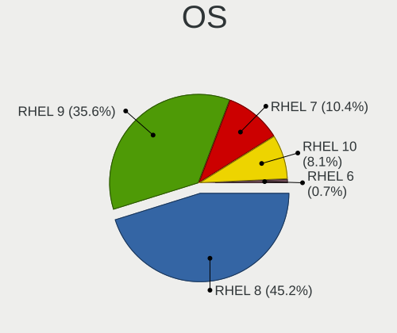

| Name    | Desktops | Percent |
|---------|----------|---------|
| RHEL 8  | 61       | 45.19%  |
| RHEL 9  | 48       | 35.56%  |
| RHEL 7  | 14       | 10.37%  |
| RHEL 10 | 11       | 8.15%   |
| RHEL 6  | 1        | 0.74%   |

OS Family
---------

OS without a version

| Name | Desktops | Percent |
|------|----------|---------|
| RHEL | 133      | 100%    |

Kernel
------

Version of the Linux kernel

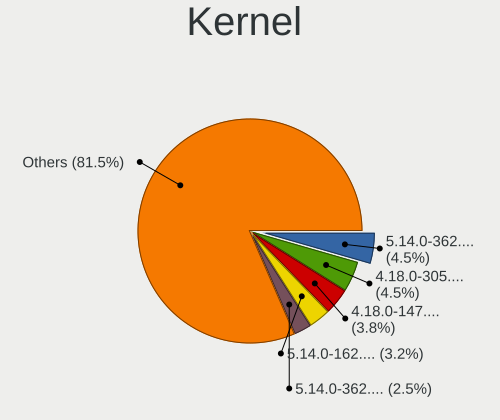

| Version                       | Desktops | Percent |
|-------------------------------|----------|---------|
| 5.14.0-362.24.1.el9_3.x86_64  | 7        | 4.46%   |
| 4.18.0-305.el8.x86_64         | 7        | 4.46%   |
| 4.18.0-147.3.1.el8_1.x86_64   | 6        | 3.82%   |
| 5.14.0-162.6.1.el9_1.x86_64   | 5        | 3.18%   |
| 5.14.0-362.13.1.el9_3.x86_64  | 4        | 2.55%   |
| 5.14.0-284.11.1.el9_2.x86_64  | 4        | 2.55%   |
| 4.18.0-348.20.1.el8_5.x86_64  | 4        | 2.55%   |
| 4.18.0-305.19.1.el8_4.x86_64  | 4        | 2.55%   |
| 4.18.0-240.1.1.el8_3.x86_64   | 4        | 2.55%   |
| 5.14.0-70.17.1.el9_0.x86_64   | 3        | 1.91%   |
| 5.14.0-284.25.1.el9_2.x86_64  | 3        | 1.91%   |
| 5.14.0-162.22.2.el9_1.x86_64  | 3        | 1.91%   |
| 4.18.0-348.12.2.el8_5.x86_64  | 3        | 1.91%   |
| 4.18.0-240.22.1.el8_3.x86_64  | 3        | 1.91%   |
| 4.18.0-240.10.1.el8_3.x86_64  | 3        | 1.91%   |
| 4.18.0-147.5.1.el8_1.x86_64   | 3        | 1.91%   |
| 3.10.0-862.3.2.el7.x86_64     | 3        | 1.91%   |
| 5.14.0-70.22.1.el9_0.x86_64   | 2        | 1.27%   |
| 5.14.0-503.14.1.el9_5.x86_64  | 2        | 1.27%   |
| 5.14.0-284.30.1.el9_2.x86_64  | 2        | 1.27%   |
| 5.14.0-162.12.1.el9_1.x86_64  | 2        | 1.27%   |
| 4.18.0-553.16.1.el8_10.x86_64 | 2        | 1.27%   |
| 4.18.0-348.2.1.el8_5.x86_64   | 2        | 1.27%   |
| 4.18.0-305.17.1.el8_4.x86_64  | 2        | 1.27%   |
| 4.18.0-305.10.2.el8_4.x86_64  | 2        | 1.27%   |
| 4.18.0-240.15.1.el8_3.x86_64  | 2        | 1.27%   |
| 4.18.0-193.el8.x86_64         | 2        | 1.27%   |
| 4.18.0-193.6.3.el8_2.x86_64   | 2        | 1.27%   |
| 4.18.0-193.19.1.el8_2.x86_64  | 2        | 1.27%   |
| 4.18.0-147.el8.x86_64         | 2        | 1.27%   |
| 6.12.0-55.9.1.el10_0.x86_64   | 1        | 0.64%   |
| 6.12.0-55.40.1.el10_0.x86_64  | 1        | 0.64%   |
| 6.12.0-55.24.1.el10_0.x86_64  | 1        | 0.64%   |
| 6.12.0-55.22.1.el10_0.x86_64  | 1        | 0.64%   |
| 6.12.0-55.20.1.el10_0.x86_64  | 1        | 0.64%   |
| 6.12.0-55.19.1.el10_0.x86_64  | 1        | 0.64%   |
| 6.12.0-55.18.1.el10_0.x86_64  | 1        | 0.64%   |
| 6.12.0-55.17.1.el10_0.x86_64  | 1        | 0.64%   |
| 6.12.0-124.21.1.el10_1.x86_64 | 1        | 0.64%   |
| 6.12.0-124.13.1.el10_1.x86_64 | 1        | 0.64%   |

Kernel Family
-------------

Linux kernel without a distro release

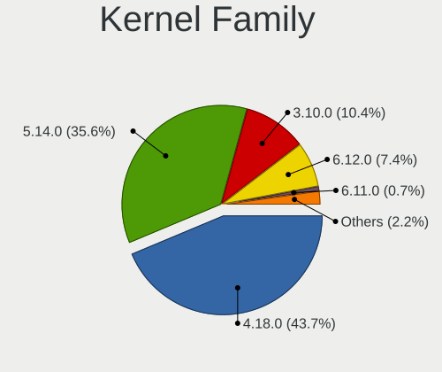

| Version  | Desktops | Percent |
|----------|----------|---------|
| 4.18.0   | 59       | 43.7%   |
| 5.14.0   | 48       | 35.56%  |
| 3.10.0   | 14       | 10.37%  |
| 6.12.0   | 10       | 7.41%   |
| 6.11.0   | 1        | 0.74%   |
| 5.10.6   | 1        | 0.74%   |
| 4.19.150 | 1        | 0.74%   |
| 2.6.32   | 1        | 0.74%   |

Kernel Major Ver.
-----------------

Linux kernel major version

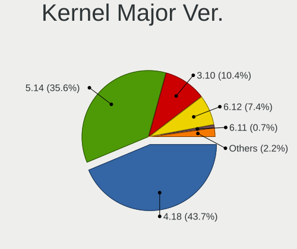

| Version | Desktops | Percent |
|---------|----------|---------|
| 4.18    | 59       | 43.7%   |
| 5.14    | 48       | 35.56%  |
| 3.10    | 14       | 10.37%  |
| 6.12    | 10       | 7.41%   |
| 6.11    | 1        | 0.74%   |
| 5.10    | 1        | 0.74%   |
| 4.19    | 1        | 0.74%   |
| 2.6     | 1        | 0.74%   |

Arch
----

OS architecture (x86_64, i586, etc.)

| Name   | Desktops | Percent |
|--------|----------|---------|
| x86_64 | 133      | 100%    |

DE
--

Desktop Environment

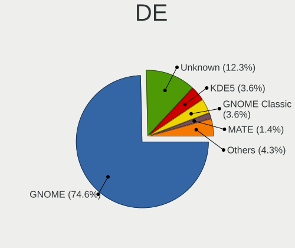

| Name          | Desktops | Percent |
|---------------|----------|---------|
| GNOME         | 103      | 74.64%  |
| Unknown       | 17       | 12.32%  |
| KDE5          | 5        | 3.62%   |
| GNOME Classic | 5        | 3.62%   |
| MATE          | 2        | 1.45%   |
| KDE           | 2        | 1.45%   |
| X-Cinnamon    | 1        | 0.72%   |
| KDE6          | 1        | 0.72%   |
| KDE4          | 1        | 0.72%   |
| Cinnamon      | 1        | 0.72%   |

Display Server
--------------

X11 or Wayland

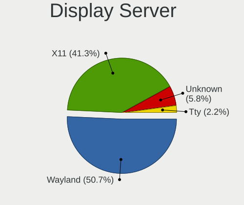

| Name    | Desktops | Percent |
|---------|----------|---------|
| Wayland | 70       | 50.72%  |
| X11     | 57       | 41.3%   |
| Unknown | 8        | 5.8%    |
| Tty     | 3        | 2.17%   |

Display Manager
---------------

SDDM, LightDM, etc.

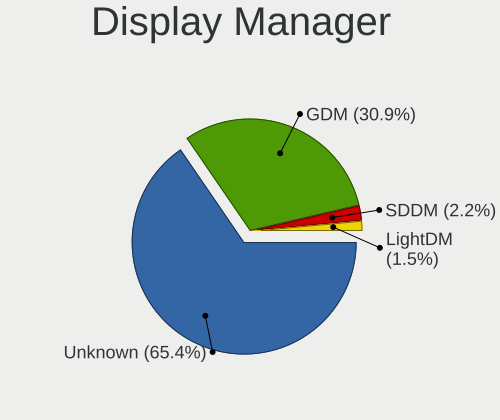

| Name    | Desktops | Percent |
|---------|----------|---------|
| Unknown | 89       | 65.44%  |
| GDM     | 42       | 30.88%  |
| SDDM    | 3        | 2.21%   |
| LightDM | 2        | 1.47%   |

OS Lang
-------

Language

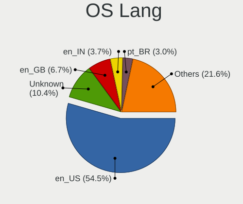

| Lang    | Desktops | Percent |
|---------|----------|---------|
| en_US   | 73       | 54.48%  |
| Unknown | 14       | 10.45%  |
| en_GB   | 9        | 6.72%   |
| en_IN   | 5        | 3.73%   |
| pt_BR   | 4        | 2.99%   |
| ru_RU   | 3        | 2.24%   |
| pl_PL   | 3        | 2.24%   |
| en_NZ   | 3        | 2.24%   |
| de_DE   | 3        | 2.24%   |
| es_ES   | 2        | 1.49%   |
| es_AR   | 2        | 1.49%   |
| en_AU   | 2        | 1.49%   |
| C       | 2        | 1.49%   |
| sl_SI   | 1        | 0.75%   |
| ko_KR   | 1        | 0.75%   |
| ja_JP   | 1        | 0.75%   |
| fr_CA   | 1        | 0.75%   |
| fi_FI   | 1        | 0.75%   |
| es_MX   | 1        | 0.75%   |
| en_ZA   | 1        | 0.75%   |
| en_CA   | 1        | 0.75%   |
| cs_CZ   | 1        | 0.75%   |

Boot Mode
---------

EFI or BIOS

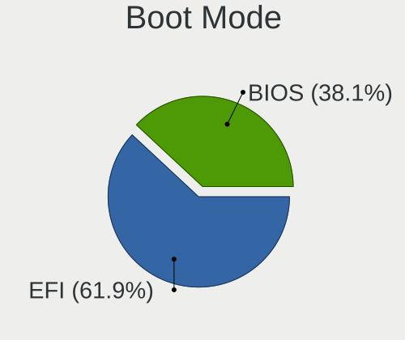

| Mode | Desktops | Percent |
|------|----------|---------|
| EFI  | 83       | 61.94%  |
| BIOS | 51       | 38.06%  |

Filesystem
----------

Type of filesystem

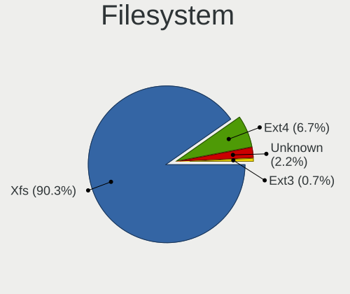

| Type    | Desktops | Percent |
|---------|----------|---------|
| Xfs     | 121      | 90.3%   |
| Ext4    | 9        | 6.72%   |
| Unknown | 3        | 2.24%   |
| Ext3    | 1        | 0.75%   |

Part. scheme
------------

Scheme of partitioning

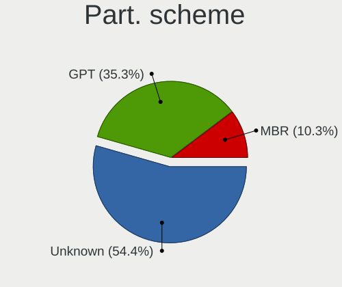

| Type    | Desktops | Percent |
|---------|----------|---------|
| Unknown | 74       | 54.41%  |
| GPT     | 48       | 35.29%  |
| MBR     | 14       | 10.29%  |

Dual Boot with Linux/BSD
------------------------

Hosting more than one Linux/BSD

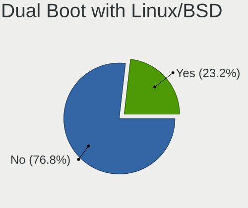

| Dual boot | Desktops | Percent |
|-----------|----------|---------|
| No        | 111      | 82.22%  |
| Yes       | 24       | 17.78%  |

Dual Boot (Win)
---------------

Hosting Linux and Windows

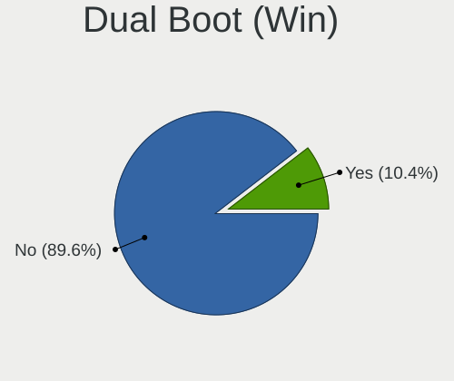

| Dual boot | Desktops | Percent |
|-----------|----------|---------|
| No        | 120      | 89.55%  |
| Yes       | 14       | 10.45%  |

Board
-----

Vendor
------

Motherboard manufacturer

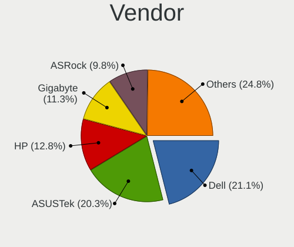

| Name                | Desktops | Percent |
|---------------------|----------|---------|
| Dell                | 28       | 21.05%  |
| ASUSTek Computer    | 27       | 20.3%   |
| Hewlett-Packard     | 17       | 12.78%  |
| Gigabyte Technology | 15       | 11.28%  |
| ASRock              | 13       | 9.77%   |
| MSI                 | 12       | 9.02%   |
| Lenovo              | 5        | 3.76%   |
| Unknown             | 4        | 3.01%   |
| Supermicro          | 3        | 2.26%   |
| Intel               | 3        | 2.26%   |
| Yanling             | 1        | 0.75%   |
| MACHINIST           | 1        | 0.75%   |
| Hardkernel          | 1        | 0.75%   |
| CX / Air Computers. | 1        | 0.75%   |
| Alienware           | 1        | 0.75%   |
| Acer                | 1        | 0.75%   |

Model
-----

Motherboard model

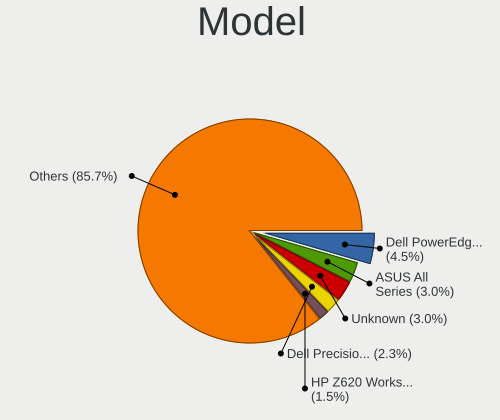

| Name                                | Desktops | Percent |
|-------------------------------------|----------|---------|
| Dell PowerEdge FC630                | 6        | 4.51%   |
| ASUS All Series                     | 4        | 3.01%   |
| Unknown                             | 4        | 3.01%   |
| Dell Precision Tower 5810           | 3        | 2.26%   |
| HP Z620 Workstation                 | 2        | 1.5%    |
| Gigabyte B550M AORUS PRO-P          | 2        | 1.5%    |
| Dell Precision Tower 3620           | 2        | 1.5%    |
| Dell Precision 7960 Tower           | 2        | 1.5%    |
| Dell Precision 5820 Tower           | 2        | 1.5%    |
| Dell OptiPlex 9020                  | 2        | 1.5%    |
| ASRock A320M-HDV R4.0               | 2        | 1.5%    |
| Yanling YL-CLU6L-V1                 | 1        | 0.75%   |
| Supermicro X9DAi                    | 1        | 0.75%   |
| Supermicro X7DW3                    | 1        | 0.75%   |
| Supermicro SSG-6028R-E1CR12T        | 1        | 0.75%   |
| MSI MS-7D86                         | 1        | 0.75%   |
| MSI MS-7D54                         | 1        | 0.75%   |
| MSI MS-7D52                         | 1        | 0.75%   |
| MSI MS-7D25                         | 1        | 0.75%   |
| MSI MS-7C95                         | 1        | 0.75%   |
| MSI MS-7C56                         | 1        | 0.75%   |
| MSI MS-7B89                         | 1        | 0.75%   |
| MSI MS-7B51                         | 1        | 0.75%   |
| MSI MS-7B33                         | 1        | 0.75%   |
| MSI MS-7A71                         | 1        | 0.75%   |
| MSI MS-7A37                         | 1        | 0.75%   |
| MSI MS-7752                         | 1        | 0.75%   |
| MACHINIST X99 PR9                   | 1        | 0.75%   |
| Lenovo ThinkStation P500 30A7000WUS | 1        | 0.75%   |
| Lenovo ThinkCentre M92p 3238AZ8     | 1        | 0.75%   |
| Lenovo ThinkCentre M920t 10SFS03200 | 1        | 0.75%   |
| Lenovo ThinkCentre M91p 0266RZ1     | 1        | 0.75%   |
| Lenovo 10SFS03200                   | 1        | 0.75%   |
| Intel H81                           | 1        | 0.75%   |
| Intel DX79SR AAG57199-200           | 1        | 0.75%   |
| Intel DQ77MK AAG39642-400           | 1        | 0.75%   |
| HP Z840 Workstation                 | 1        | 0.75%   |
| HP Z800 Workstation                 | 1        | 0.75%   |
| HP Z440 Workstation                 | 1        | 0.75%   |
| HP Z240 Tower Workstation           | 1        | 0.75%   |

Model Family
------------

Motherboard model prefix

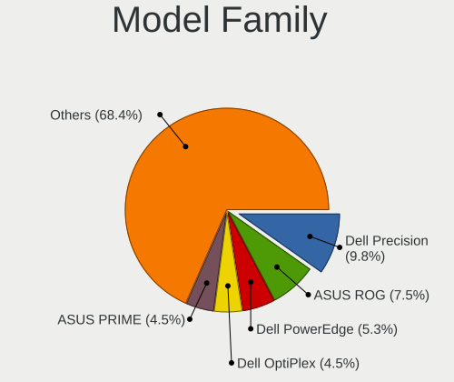

| Name                         | Desktops | Percent |
|------------------------------|----------|---------|
| Dell Precision               | 13       | 9.77%   |
| ASUS ROG                     | 10       | 7.52%   |
| Dell PowerEdge               | 7        | 5.26%   |
| Dell OptiPlex                | 6        | 4.51%   |
| ASUS PRIME                   | 6        | 4.51%   |
| ASUS All                     | 4        | 3.01%   |
| Unknown                      | 4        | 3.01%   |
| Lenovo ThinkCentre           | 3        | 2.26%   |
| Gigabyte B550M               | 3        | 2.26%   |
| ASRock X570                  | 3        | 2.26%   |
| HP Z620                      | 2        | 1.5%    |
| HP Z230                      | 2        | 1.5%    |
| HP ProLiant                  | 2        | 1.5%    |
| HP ProDesk                   | 2        | 1.5%    |
| ASUS TUF                     | 2        | 1.5%    |
| ASRock A320M-HDV             | 2        | 1.5%    |
| Yanling YL-CLU6L-V1          | 1        | 0.75%   |
| Supermicro X9DAi             | 1        | 0.75%   |
| Supermicro X7DW3             | 1        | 0.75%   |
| Supermicro SSG-6028R-E1CR12T | 1        | 0.75%   |
| MSI MS-7D86                  | 1        | 0.75%   |
| MSI MS-7D54                  | 1        | 0.75%   |
| MSI MS-7D52                  | 1        | 0.75%   |
| MSI MS-7D25                  | 1        | 0.75%   |
| MSI MS-7C95                  | 1        | 0.75%   |
| MSI MS-7C56                  | 1        | 0.75%   |
| MSI MS-7B89                  | 1        | 0.75%   |
| MSI MS-7B51                  | 1        | 0.75%   |
| MSI MS-7B33                  | 1        | 0.75%   |
| MSI MS-7A71                  | 1        | 0.75%   |
| MSI MS-7A37                  | 1        | 0.75%   |
| MSI MS-7752                  | 1        | 0.75%   |
| MACHINIST X99                | 1        | 0.75%   |
| Lenovo ThinkStation          | 1        | 0.75%   |
| Lenovo 10SFS03200            | 1        | 0.75%   |
| Intel H81                    | 1        | 0.75%   |
| Intel DX79SR                 | 1        | 0.75%   |
| Intel DQ77MK                 | 1        | 0.75%   |
| HP Z840                      | 1        | 0.75%   |
| HP Z800                      | 1        | 0.75%   |

MFG Year
--------

Motherboard manufacture year

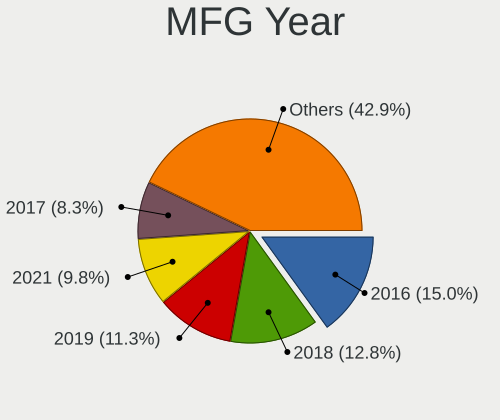

| Year | Desktops | Percent |
|------|----------|---------|
| 2016 | 20       | 15.04%  |
| 2018 | 17       | 12.78%  |
| 2019 | 15       | 11.28%  |
| 2021 | 13       | 9.77%   |
| 2017 | 11       | 8.27%   |
| 2012 | 10       | 7.52%   |
| 2022 | 7        | 5.26%   |
| 2020 | 7        | 5.26%   |
| 2015 | 7        | 5.26%   |
| 2013 | 7        | 5.26%   |
| 2023 | 6        | 4.51%   |
| 2014 | 4        | 3.01%   |
| 2024 | 3        | 2.26%   |
| 2010 | 2        | 1.5%    |
| 2025 | 1        | 0.75%   |
| 2011 | 1        | 0.75%   |
| 2009 | 1        | 0.75%   |
| 2007 | 1        | 0.75%   |

Form Factor
-----------

Physical design of the computer

| Name    | Desktops | Percent |
|---------|----------|---------|
| Desktop | 133      | 100%    |

Secure Boot
-----------

Enabled or disabled

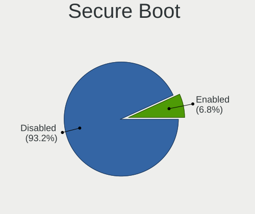

| State    | Desktops | Percent |
|----------|----------|---------|
| Disabled | 126      | 93.33%  |
| Enabled  | 9        | 6.67%   |

Coreboot
--------

Have coreboot on board

| Used | Desktops | Percent |
|------|----------|---------|
| No   | 133      | 100%    |

RAM Size
--------

Total RAM memory

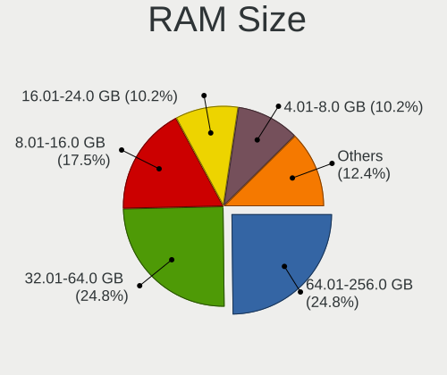

| Size in GB      | Desktops | Percent |
|-----------------|----------|---------|
| 32.01-64.0      | 34       | 24.82%  |
| 64.01-256.0     | 34       | 24.82%  |
| 8.01-16.0       | 24       | 17.52%  |
| 4.01-8.0        | 14       | 10.22%  |
| 16.01-24.0      | 14       | 10.22%  |
| 24.01-32.0      | 9        | 6.57%   |
| More than 256.0 | 5        | 3.65%   |
| 3.01-4.0        | 2        | 1.46%   |
| 2.01-3.0        | 1        | 0.73%   |

RAM Used
--------

Used RAM memory

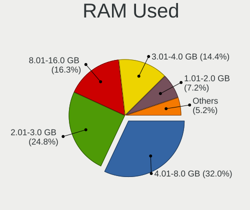

| Used GB    | Desktops | Percent |
|------------|----------|---------|
| 4.01-8.0   | 49       | 32.03%  |
| 2.01-3.0   | 38       | 24.84%  |
| 8.01-16.0  | 25       | 16.34%  |
| 3.01-4.0   | 22       | 14.38%  |
| 1.01-2.0   | 11       | 7.19%   |
| 16.01-24.0 | 5        | 3.27%   |
| 24.01-32.0 | 1        | 0.65%   |
| 0.51-1.0   | 1        | 0.65%   |
| Unknown    | 1        | 0.65%   |

Total Drives
------------

Number of drives on board

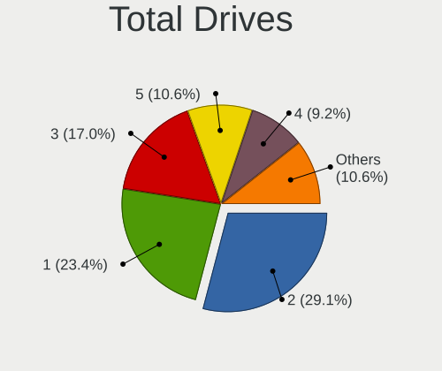

| Drives | Desktops | Percent |
|--------|----------|---------|
| 2      | 41       | 29.08%  |
| 1      | 33       | 23.4%   |
| 3      | 24       | 17.02%  |
| 5      | 15       | 10.64%  |
| 4      | 13       | 9.22%   |
| 6      | 5        | 3.55%   |
| 12     | 3        | 2.13%   |
| 8      | 2        | 1.42%   |
| 15     | 1        | 0.71%   |
| 14     | 1        | 0.71%   |
| 10     | 1        | 0.71%   |
| 7      | 1        | 0.71%   |
| 0      | 1        | 0.71%   |

Has CD-ROM
----------

Has CD-ROM on board

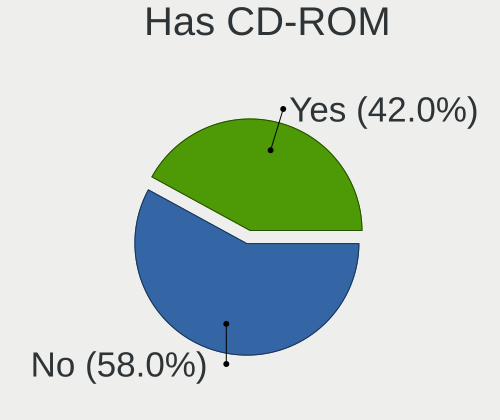

| Presented | Desktops | Percent |
|-----------|----------|---------|
| No        | 88       | 65.67%  |
| Yes       | 46       | 34.33%  |

Has Ethernet
------------

Has Ethernet on board

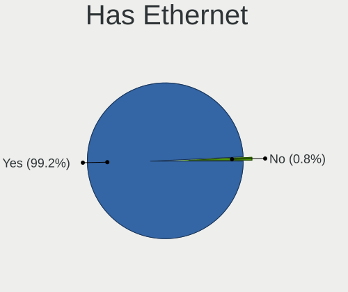

| Presented | Desktops | Percent |
|-----------|----------|---------|
| Yes       | 132      | 99.25%  |
| No        | 1        | 0.75%   |

Has WiFi
--------

Has WiFi module

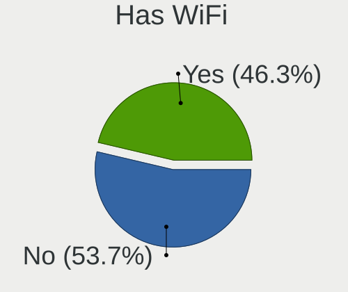

| Presented | Desktops | Percent |
|-----------|----------|---------|
| No        | 73       | 53.68%  |
| Yes       | 63       | 46.32%  |

Has Bluetooth
-------------

Has Bluetooth module

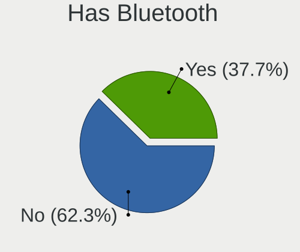

| Presented | Desktops | Percent |
|-----------|----------|---------|
| No        | 80       | 59.26%  |
| Yes       | 55       | 40.74%  |

Location
--------

Country
-------

Geographic location (country)

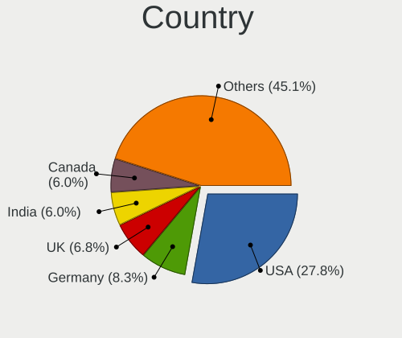

| Country      | Desktops | Percent |
|--------------|----------|---------|
| USA          | 37       | 27.82%  |
| Germany      | 11       | 8.27%   |
| UK           | 9        | 6.77%   |
| India        | 8        | 6.02%   |
| Canada       | 8        | 6.02%   |
| Brazil       | 7        | 5.26%   |
| Czechia      | 5        | 3.76%   |
| Spain        | 3        | 2.26%   |
| South Korea  | 3        | 2.26%   |
| Russia       | 3        | 2.26%   |
| Poland       | 3        | 2.26%   |
| New Zealand  | 3        | 2.26%   |
| Netherlands  | 3        | 2.26%   |
| Italy        | 3        | 2.26%   |
| Ukraine      | 2        | 1.5%    |
| Switzerland  | 2        | 1.5%    |
| Sweden       | 2        | 1.5%    |
| South Africa | 2        | 1.5%    |
| Finland      | 2        | 1.5%    |
| Australia    | 2        | 1.5%    |
| Argentina    | 2        | 1.5%    |
| Turkmenistan | 1        | 0.75%   |
| Slovenia     | 1        | 0.75%   |
| Mexico       | 1        | 0.75%   |
| Lithuania    | 1        | 0.75%   |
| Japan        | 1        | 0.75%   |
| Ireland      | 1        | 0.75%   |
| Indonesia    | 1        | 0.75%   |
| France       | 1        | 0.75%   |
| Egypt        | 1        | 0.75%   |
| China        | 1        | 0.75%   |
| Belgium      | 1        | 0.75%   |
| Belarus      | 1        | 0.75%   |
| Austria      | 1        | 0.75%   |

City
----

Geographic location (city)

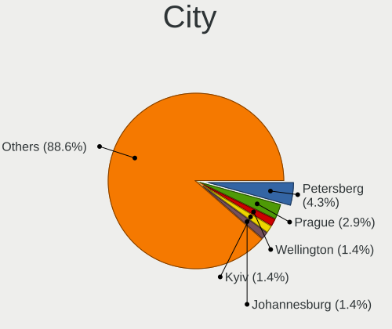

| City                  | Desktops | Percent |
|-----------------------|----------|---------|
| Petersberg            | 6        | 4.29%   |
| Prague                | 4        | 2.86%   |
| Wellington            | 2        | 1.43%   |
| Kyiv                  | 2        | 1.43%   |
| Johannesburg          | 2        | 1.43%   |
| Chicago               | 2        | 1.43%   |
| Bengaluru             | 2        | 1.43%   |
| Yorktown Heights      | 1        | 0.71%   |
| Yongin-si             | 1        | 0.71%   |
| Wildomar              | 1        | 0.71%   |
| Wiesbaden             | 1        | 0.71%   |
| Waldkirch             | 1        | 0.71%   |
| Villa María          | 1        | 0.71%   |
| Vienna                | 1        | 0.71%   |
| Valencia              | 1        | 0.71%   |
| Vaglio                | 1        | 0.71%   |
| Turku                 | 1        | 0.71%   |
| Toronto               | 1        | 0.71%   |
| Tokyo                 | 1        | 0.71%   |
| Tiruchi               | 1        | 0.71%   |
| Tauranga              | 1        | 0.71%   |
| Sutton                | 1        | 0.71%   |
| Sterling Heights      | 1        | 0.71%   |
| Stavropol             | 1        | 0.71%   |
| Spokane               | 1        | 0.71%   |
| Spalding              | 1        | 0.71%   |
| Sorel-Tracy           | 1        | 0.71%   |
| Sierra Vista          | 1        | 0.71%   |
| Šiauliai             | 1        | 0.71%   |
| Saratov               | 1        | 0.71%   |
| Sao Jose do Rio Preto | 1        | 0.71%   |
| Sao Bernardo do Campo | 1        | 0.71%   |
| San Jose              | 1        | 0.71%   |
| San Fernando          | 1        | 0.71%   |
| Salvador              | 1        | 0.71%   |
| Saltillo              | 1        | 0.71%   |
| Sainte-Marie          | 1        | 0.71%   |
| Roseville             | 1        | 0.71%   |
| Rosario               | 1        | 0.71%   |
| Rio de Janeiro        | 1        | 0.71%   |

Drives
------

Drive Vendor
------------

Hard drive vendors

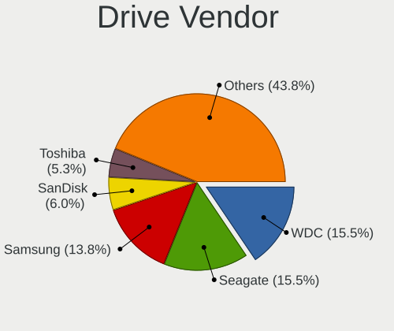

| Vendor                       | Desktops | Drives | Percent |
|------------------------------|----------|--------|---------|
| WDC                          | 44       | 86     | 15.55%  |
| Seagate                      | 44       | 103    | 15.55%  |
| Samsung Electronics          | 39       | 79     | 13.78%  |
| SanDisk                      | 17       | 32     | 6.01%   |
| Toshiba                      | 15       | 22     | 5.3%    |
| Kingston                     | 14       | 25     | 4.95%   |
| Crucial                      | 11       | 17     | 3.89%   |
| Micron/Crucial Technology    | 8        | 10     | 2.83%   |
| Intel                        | 8        | 15     | 2.83%   |
| SK hynix                     | 5        | 7      | 1.77%   |
| Phison                       | 5        | 9      | 1.77%   |
| Micron Technology            | 5        | 5      | 1.77%   |
| PNY                          | 4        | 4      | 1.41%   |
| Phison Electronics           | 4        | 5      | 1.41%   |
| Hitachi                      | 4        | 4      | 1.41%   |
| HGST                         | 4        | 4      | 1.41%   |
| Dell                         | 4        | 8      | 1.41%   |
| A-DATA Technology            | 4        | 4      | 1.41%   |
| Unknown                      | 3        | 6      | 1.06%   |
| Silicon Motion               | 3        | 6      | 1.06%   |
| Gigabyte Technology          | 3        | 4      | 1.06%   |
| China                        | 3        | 3      | 1.06%   |
| MAXIO Technology (Hangzhou)  | 2        | 2      | 0.71%   |
| Corsair                      | 2        | 5      | 0.71%   |
| XUM                          | 1        | 1      | 0.35%   |
| XPG                          | 1        | 1      | 0.35%   |
| Western Digital              | 1        | 1      | 0.35%   |
| Toshiba America Info Systems | 1        | 1      | 0.35%   |
| T-FORCE                      | 1        | 2      | 0.35%   |
| SSK Port                     | 1        | 1      | 0.35%   |
| SPCC                         | 1        | 1      | 0.35%   |
| SCST_FIO                     | 1        | 9      | 0.35%   |
| SABRENT                      | 1        | 1      | 0.35%   |
| Realtek Semiconductor        | 1        | 1      | 0.35%   |
| Realtek                      | 1        | 1      | 0.35%   |
| OCZ                          | 1        | 2      | 0.35%   |
| Netac                        | 1        | 1      | 0.35%   |
| Lexar                        | 1        | 1      | 0.35%   |
| KIOXIA                       | 1        | 8      | 0.35%   |
| Kingston Technology Company  | 1        | 1      | 0.35%   |

Drive Model
-----------

Hard drive models

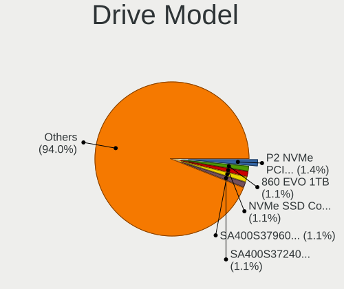

| Model                                              | Desktops | Percent |
|----------------------------------------------------|----------|---------|
| Micron/Crucial P2 NVMe PCIe SSD 2TB                | 5        | 1.43%   |
| Samsung SSD 860 EVO 1TB                            | 4        | 1.15%   |
| Samsung NVMe SSD Controller PM9A1/PM9A3/980PRO 1TB | 4        | 1.15%   |
| Kingston SA400S37960G 960GB SSD                    | 4        | 1.15%   |
| Kingston SA400S37240G 240GB SSD                    | 4        | 1.15%   |
| Dell MD34xx 26TB                                   | 4        | 1.15%   |
| Toshiba DT01ACA200 2TB                             | 3        | 0.86%   |
| Seagate ST500DM002-1BD142 500GB                    | 3        | 0.86%   |
| Seagate ST2000DM001-1ER164 2TB                     | 3        | 0.86%   |
| Samsung SSD 980 1TB                                | 3        | 0.86%   |
| Samsung SSD 860 EVO 500GB                          | 3        | 0.86%   |
| Samsung SSD 850 EVO 250GB                          | 3        | 0.86%   |
| Phison E16 PCIe4 NVMe Controller 1TB               | 3        | 0.86%   |
| Kingston SA400S37480G 480GB SSD                    | 3        | 0.86%   |
| HGST HTS721010A9E630 1TB                           | 3        | 0.86%   |
| WDC WD5000AAKX-75U6AA0 500GB                       | 2        | 0.57%   |
| WDC WD40EFRX-68N32N0 4TB                           | 2        | 0.57%   |
| WDC WD4005FZBX-00K5WB0 4TB                         | 2        | 0.57%   |
| WDC WD2003FZEX-00SRLA0 2TB                         | 2        | 0.57%   |
| WDC WD141KFGX-68FH9N0 14TB                         | 2        | 0.57%   |
| WDC WD10EZEX-08WN4A0 1TB                           | 2        | 0.57%   |
| WDC WD1003FZEX-00MK2A0 1TB                         | 2        | 0.57%   |
| WDC WD1002FAEX-00Z3A0 1TB                          | 2        | 0.57%   |
| Unknown SD/MMC/MS PRO 2GB                          | 2        | 0.57%   |
| Toshiba NVMe SSD Drive 256GB                       | 2        | 0.57%   |
| Toshiba DT01ACA100 1TB                             | 2        | 0.57%   |
| Toshiba AL14SEB18EQ 1.8TB                          | 2        | 0.57%   |
| Seagate ST91000640NS 1TB                           | 2        | 0.57%   |
| Seagate ST2000NX0433 2TB                           | 2        | 0.57%   |
| Seagate ST2000NX0273 2TB                           | 2        | 0.57%   |
| Seagate ST1000DM010-2EP102 1TB                     | 2        | 0.57%   |
| Seagate ST1000DM003-9YN162 1TB                     | 2        | 0.57%   |
| Sandisk WD Black SN850 1TB                         | 2        | 0.57%   |
| SanDisk SSD PLUS 480GB                             | 2        | 0.57%   |
| Samsung SSD 990 PRO 2TB                            | 2        | 0.57%   |
| Samsung SSD 870 QVO 1TB                            | 2        | 0.57%   |
| Samsung SSD 870 EVO 1TB                            | 2        | 0.57%   |
| Samsung NVMe SSD Drive 512GB                       | 2        | 0.57%   |
| Samsung NVMe SSD Drive 500GB                       | 2        | 0.57%   |
| Samsung NVMe SSD Controller SM981/PM981/PM983 1TB  | 2        | 0.57%   |

HDD Vendor
----------

Hard disk drive vendors

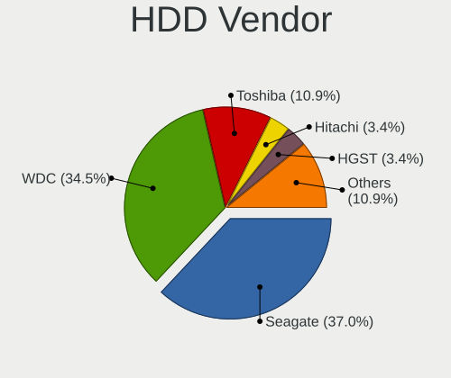

| Vendor              | Desktops | Drives | Percent |
|---------------------|----------|--------|---------|
| Seagate             | 44       | 103    | 36.97%  |
| WDC                 | 41       | 79     | 34.45%  |
| Toshiba             | 13       | 19     | 10.92%  |
| Hitachi             | 4        | 4      | 3.36%   |
| HGST                | 4        | 4      | 3.36%   |
| Dell                | 4        | 8      | 3.36%   |
| Samsung Electronics | 3        | 4      | 2.52%   |
| Unknown             | 2        | 2      | 1.68%   |
| T-FORCE             | 1        | 2      | 0.84%   |
| SCST_FIO            | 1        | 9      | 0.84%   |
| Hewlett-Packard     | 1        | 1      | 0.84%   |
| Fantom              | 1        | 1      | 0.84%   |

SSD Vendor
----------

Solid state drive vendors

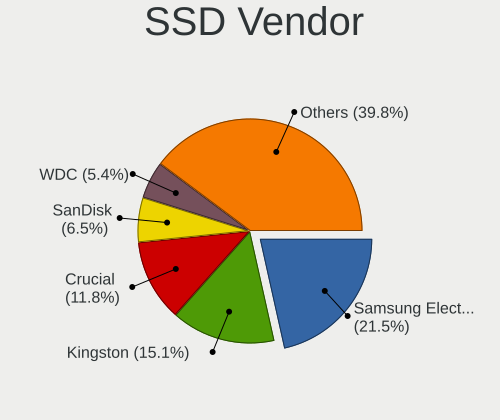

| Vendor              | Desktops | Drives | Percent |
|---------------------|----------|--------|---------|
| Samsung Electronics | 20       | 42     | 21.51%  |
| Kingston            | 14       | 25     | 15.05%  |
| Crucial             | 11       | 16     | 11.83%  |
| SanDisk             | 6        | 11     | 6.45%   |
| WDC                 | 5        | 6      | 5.38%   |
| PNY                 | 4        | 4      | 4.3%    |
| Intel               | 4        | 7      | 4.3%    |
| SK hynix            | 3        | 5      | 3.23%   |
| Micron Technology   | 3        | 3      | 3.23%   |
| China               | 3        | 3      | 3.23%   |
| A-DATA Technology   | 3        | 3      | 3.23%   |
| Corsair             | 2        | 5      | 2.15%   |
| XUM                 | 1        | 1      | 1.08%   |
| SSK Port            | 1        | 1      | 1.08%   |
| SPCC                | 1        | 1      | 1.08%   |
| SABRENT             | 1        | 1      | 1.08%   |
| OCZ                 | 1        | 2      | 1.08%   |
| Netac               | 1        | 1      | 1.08%   |
| Lexar               | 1        | 1      | 1.08%   |
| KingSpec            | 1        | 1      | 1.08%   |
| KINGBANK            | 1        | 1      | 1.08%   |
| Kimtigo             | 1        | 1      | 1.08%   |
| Inland              | 1        | 1      | 1.08%   |
| HUSKY               | 1        | 1      | 1.08%   |
| Hoodisk             | 1        | 1      | 1.08%   |
| Gigabyte Technology | 1        | 1      | 1.08%   |
| Anobit              | 1        | 1      | 1.08%   |

Drive Kind
----------

HDD or SSD

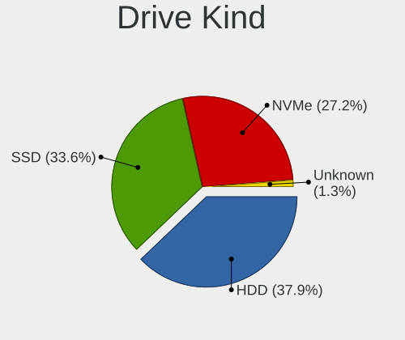

| Kind    | Desktops | Drives | Percent |
|---------|----------|--------|---------|
| HDD     | 89       | 236    | 37.87%  |
| SSD     | 79       | 146    | 33.62%  |
| NVMe    | 64       | 122    | 27.23%  |
| Unknown | 3        | 8      | 1.28%   |

Drive Connector
---------------

SATA, SAS, NVMe, etc.

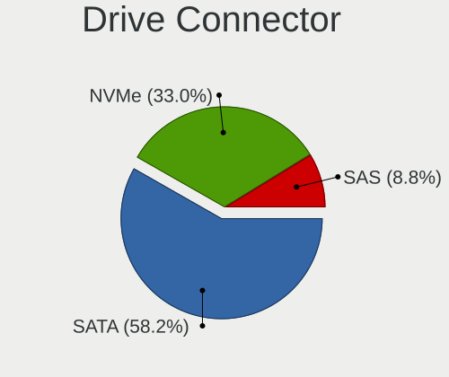

| Type | Desktops | Drives | Percent |
|------|----------|--------|---------|
| SATA | 113      | 359    | 58.25%  |
| NVMe | 64       | 121    | 32.99%  |
| SAS  | 17       | 32     | 8.76%   |

Drive Size
----------

Size of hard drive

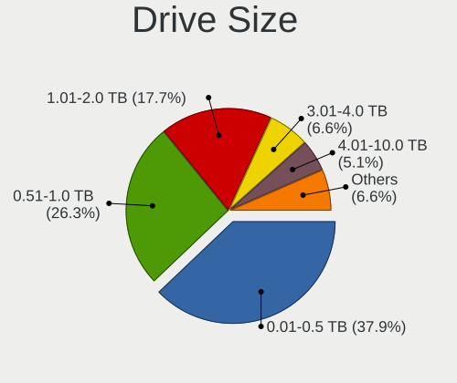

| Size in TB | Desktops | Drives | Percent |
|------------|----------|--------|---------|
| 0.01-0.5   | 75       | 144    | 37.88%  |
| 0.51-1.0   | 52       | 87     | 26.26%  |
| 1.01-2.0   | 35       | 69     | 17.68%  |
| 3.01-4.0   | 13       | 30     | 6.57%   |
| 4.01-10.0  | 10       | 31     | 5.05%   |
| 10.01-20.0 | 5        | 8      | 2.53%   |
| 20.01-50.0 | 4        | 8      | 2.02%   |
| 2.01-3.0   | 4        | 5      | 2.02%   |

Space Total
-----------

Amount of disk space available on the file system

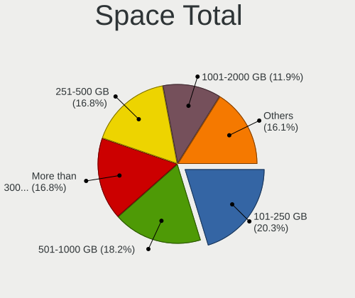

| Size in GB     | Desktops | Percent |
|----------------|----------|---------|
| 101-250        | 29       | 20.28%  |
| 501-1000       | 26       | 18.18%  |
| More than 3000 | 24       | 16.78%  |
| 251-500        | 24       | 16.78%  |
| 1001-2000      | 17       | 11.89%  |
| Unknown        | 10       | 6.99%   |
| 2001-3000      | 8        | 5.59%   |
| 51-100         | 3        | 2.1%    |
| 21-50          | 1        | 0.7%    |
| 1-20           | 1        | 0.7%    |

Space Used
----------

Amount of used disk space

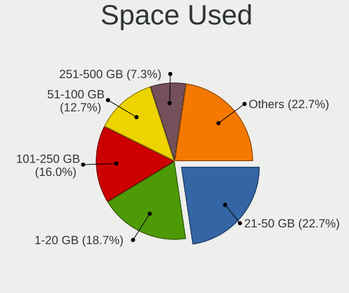

| Used GB        | Desktops | Percent |
|----------------|----------|---------|
| 21-50          | 34       | 22.67%  |
| 1-20           | 28       | 18.67%  |
| 101-250        | 24       | 16%     |
| 51-100         | 19       | 12.67%  |
| 251-500        | 11       | 7.33%   |
| Unknown        | 10       | 6.67%   |
| More than 3000 | 8        | 5.33%   |
| 501-1000       | 7        | 4.67%   |
| 1001-2000      | 5        | 3.33%   |
| 2001-3000      | 4        | 2.67%   |

Malfunc. Drives
---------------

Drive models with a malfunction

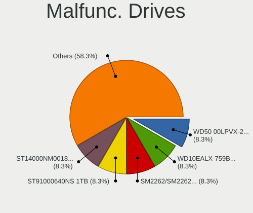

| Model                                               | Desktops | Drives | Percent |
|-----------------------------------------------------|----------|--------|---------|
| WDC WD50 00LPVX-22V0TT0 500GB                       | 1        | 1      | 8.33%   |
| WDC WD10EALX-759BA1 1TB                             | 1        | 2      | 8.33%   |
| Silicon Motion SM2262/SM2262EN SSD Controller 960GB | 1        | 1      | 8.33%   |
| Seagate ST91000640NS 1TB                            | 1        | 2      | 8.33%   |
| Seagate ST14000NM0018-2H4101 14TB                   | 1        | 1      | 8.33%   |
| Seagate ST1000DM010-2EP102 1TB                      | 1        | 1      | 8.33%   |
| Seagate ST1000DM003-9YN162 1TB                      | 1        | 1      | 8.33%   |
| Micron Technology M510_2.5 7MM 256GB SSD            | 1        | 1      | 8.33%   |
| Intel SSDSC2BB480G7 480GB                           | 1        | 2      | 8.33%   |
| Hitachi HDS722020ALA330 2TB                         | 1        | 1      | 8.33%   |
| Crucial CT1000BX500SSD1 1TB                         | 1        | 1      | 8.33%   |
| A-DATA Technology SU800NS38 256GB SSD               | 1        | 1      | 8.33%   |

Malfunc. Drive Vendor
---------------------

Vendors of faulty drives

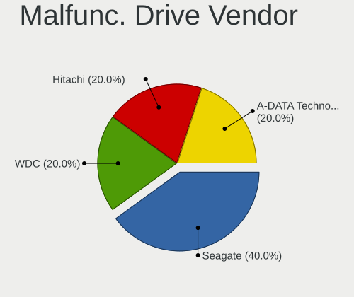

| Vendor            | Desktops | Drives | Percent |
|-------------------|----------|--------|---------|
| Seagate           | 4        | 5      | 33.33%  |
| WDC               | 2        | 3      | 16.67%  |
| Silicon Motion    | 1        | 1      | 8.33%   |
| Micron Technology | 1        | 1      | 8.33%   |
| Intel             | 1        | 2      | 8.33%   |
| Hitachi           | 1        | 1      | 8.33%   |
| Crucial           | 1        | 1      | 8.33%   |
| A-DATA Technology | 1        | 1      | 8.33%   |

Malfunc. HDD Vendor
-------------------

Vendors of faulty HDD drives

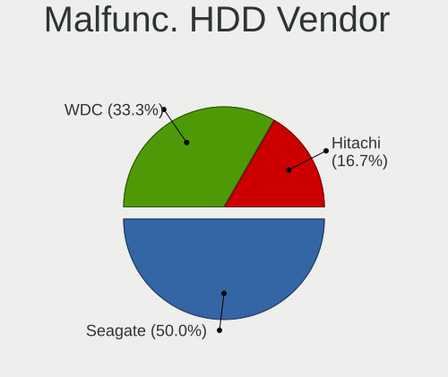

| Vendor  | Desktops | Drives | Percent |
|---------|----------|--------|---------|
| Seagate | 4        | 5      | 57.14%  |
| WDC     | 2        | 3      | 28.57%  |
| Hitachi | 1        | 1      | 14.29%  |

Malfunc. Drive Kind
-------------------

Kinds of faulty drives

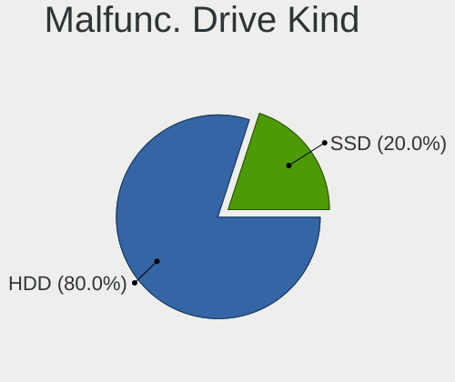

| Kind | Desktops | Drives | Percent |
|------|----------|--------|---------|
| HDD  | 6        | 9      | 54.55%  |
| SSD  | 4        | 5      | 36.36%  |
| NVMe | 1        | 1      | 9.09%   |

Failed Drives
-------------

Failed drive models

| Model                           | Desktops | Drives | Percent |
|---------------------------------|----------|--------|---------|
| Samsung Electronics SSD 980 1TB | 1        | 1      | 100%    |

Failed Drive Vendor
-------------------

Failed drive vendors

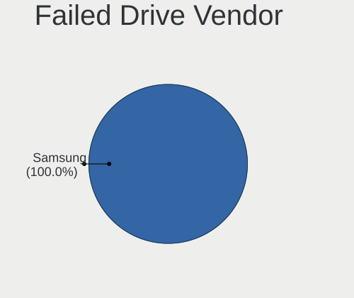

| Vendor              | Desktops | Drives | Percent |
|---------------------|----------|--------|---------|
| Samsung Electronics | 1        | 1      | 100%    |

Drive Status
------------

Number of failed and malfunc. drives

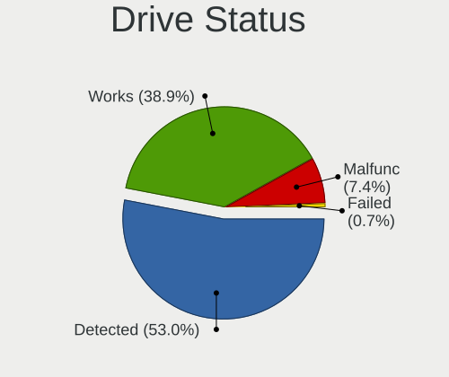

| Status   | Desktops | Drives | Percent |
|----------|----------|--------|---------|
| Detected | 79       | 309    | 53.02%  |
| Works    | 58       | 187    | 38.93%  |
| Malfunc  | 11       | 15     | 7.38%   |
| Failed   | 1        | 1      | 0.67%   |

Storage controller
------------------

Storage Vendor
--------------

Storage controller vendors

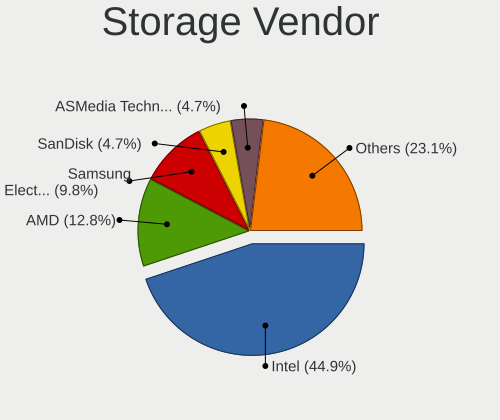

| Vendor                       | Desktops | Percent |
|------------------------------|----------|---------|
| Intel                        | 105      | 44.87%  |
| AMD                          | 30       | 12.82%  |
| Samsung Electronics          | 23       | 9.83%   |
| SanDisk                      | 11       | 4.7%    |
| ASMedia Technology           | 11       | 4.7%    |
| Phison Electronics           | 10       | 4.27%   |
| Broadcom / LSI               | 10       | 4.27%   |
| Micron/Crucial Technology    | 8        | 3.42%   |
| Toshiba America Info Systems | 3        | 1.28%   |
| Silicon Motion               | 3        | 1.28%   |
| Marvell Technology Group     | 3        | 1.28%   |
| LSI Logic / Symbios Logic    | 3        | 1.28%   |
| ADATA Technology             | 3        | 1.28%   |
| SK hynix                     | 2        | 0.85%   |
| Micron Technology            | 2        | 0.85%   |
| Western Digital              | 1        | 0.43%   |
| Realtek Semiconductor        | 1        | 0.43%   |
| MAXIO Technology (Hangzhou)  | 1        | 0.43%   |
| KIOXIA                       | 1        | 0.43%   |
| Kingston Technology Company  | 1        | 0.43%   |
| JMicron Technology           | 1        | 0.43%   |
| HighPoint Technologies       | 1        | 0.43%   |

Storage Model
-------------

Storage controller models

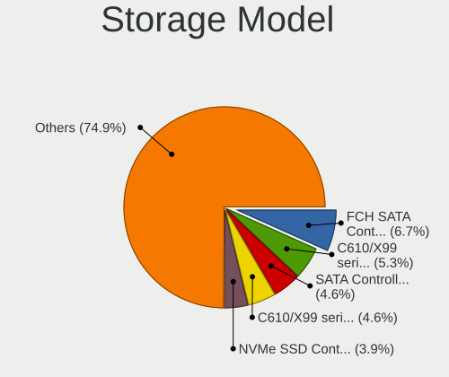

| Model                                                                          | Desktops | Percent |
|--------------------------------------------------------------------------------|----------|---------|
| AMD FCH SATA Controller [AHCI mode]                                            | 19       | 6.71%   |
| Intel C610/X99 series chipset 6-Port SATA Controller [AHCI mode]               | 15       | 5.3%    |
| Intel SATA Controller [RAID Mode]                                              | 13       | 4.59%   |
| Intel C610/X99 series chipset sSATA Controller [AHCI mode]                     | 13       | 4.59%   |
| Samsung NVMe SSD Controller SM981/PM981/PM983                                  | 11       | 3.89%   |
| Intel Cannon Lake PCH SATA AHCI Controller                                     | 11       | 3.89%   |
| ASMedia ASM1061/ASM1062 Serial ATA Controller                                  | 11       | 3.89%   |
| Intel 8 Series/C220 Series Chipset Family 6-port SATA Controller 1 [AHCI mode] | 9        | 3.18%   |
| Intel 200 Series PCH SATA controller [AHCI mode]                               | 8        | 2.83%   |
| Intel Q170/Q150/B150/H170/H110/Z170/CM236 Chipset SATA Controller [AHCI Mode]  | 7        | 2.47%   |
| AMD 500 Series Chipset SATA Controller                                         | 7        | 2.47%   |
| Intel 7 Series/C210 Series Chipset Family 6-port SATA Controller [AHCI mode]   | 6        | 2.12%   |
| Broadcom / LSI MegaRAID SAS-3 3108 [Invader]                                   | 6        | 2.12%   |
| Phison E16 PCIe4 NVMe Controller                                               | 5        | 1.77%   |
| Micron/Crucial P2 [Nick P2] / P3 / P3 Plus NVMe PCIe SSD (DRAM-less)           | 5        | 1.77%   |
| Intel Alder Lake-S PCH SATA Controller [AHCI Mode]                             | 5        | 1.77%   |
| Broadcom / LSI SAS3008 PCI-Express Fusion-MPT SAS-3                            | 5        | 1.77%   |
| Samsung NVMe SSD Controller S4LV008[Pascal]                                    | 4        | 1.41%   |
| Samsung NVMe SSD Controller PM9A1/PM9A3/980PRO                                 | 4        | 1.41%   |
| Phison E12 NVMe Controller                                                     | 4        | 1.41%   |
| Intel Volume Management Device NVMe RAID Controller                            | 4        | 1.41%   |
| Intel C600/X79 series chipset 6-Port SATA AHCI Controller                      | 4        | 1.41%   |
| Intel 500 Series Chipset Family SATA AHCI Controller                           | 4        | 1.41%   |
| Toshiba America Info Systems XG5 NVMe SSD Controller                           | 3        | 1.06%   |
| SanDisk Ultra 3D / WD PC SN530, IX SN530, Blue SN550 NVMe SSD (DRAM-less)      | 3        | 1.06%   |
| Samsung NVMe SSD Controller 980 (DRAM-less)                                    | 3        | 1.06%   |
| Intel SSD 660P Series                                                          | 3        | 1.06%   |
| Intel RST Volume Management Device Controller                                  | 3        | 1.06%   |
| Intel Raptor Lake SATA AHCI Controller                                         | 3        | 1.06%   |
| Intel C602 chipset 4-Port SATA Storage Control Unit                            | 3        | 1.06%   |
| Intel 6 Series/C200 Series Chipset Family 6 port Desktop SATA AHCI Controller  | 3        | 1.06%   |
| AMD 400 Series Chipset SATA Controller                                         | 3        | 1.06%   |
| AMD 300 Series Chipset SATA Controller                                         | 3        | 1.06%   |
| SK hynix PC601 NVMe Solid State Drive                                          | 2        | 0.71%   |
| Silicon Motion SM2263EN/SM2263XT (DRAM-less) NVMe SSD Controllers              | 2        | 0.71%   |
| SanDisk WD SN560/SN740/SN770/SN5000 NVMe SSD                                   | 2        | 0.71%   |
| SanDisk WD PC SN810 / Black SN850 NVMe SSD                                     | 2        | 0.71%   |
| SanDisk Ultra 3D / WD Blue SN570 NVMe SSD (DRAM-less)                          | 2        | 0.71%   |
| Phison PS5013-E13 PCIe3 NVMe Controller (DRAM-less)                            | 2        | 0.71%   |
| Micron/Crucial P1 NVMe PCIe SSD[Frampton2]                                     | 2        | 0.71%   |

Storage Kind
------------

Kind of storage controller (IDE, SATA, NVMe, SAS, ...)

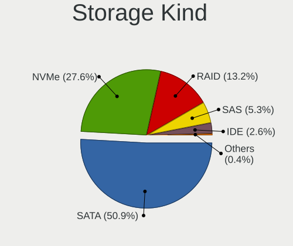

| Kind | Desktops | Percent |
|------|----------|---------|
| SATA | 116      | 50.88%  |
| NVMe | 63       | 27.63%  |
| RAID | 30       | 13.16%  |
| SAS  | 12       | 5.26%   |
| IDE  | 6        | 2.63%   |
| SCSI | 1        | 0.44%   |

Processor
---------

CPU Vendor
----------

Processor vendors

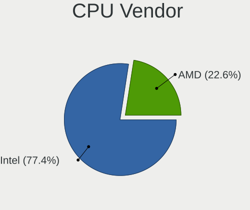

| Vendor | Desktops | Percent |
|--------|----------|---------|
| Intel  | 103      | 77.44%  |
| AMD    | 30       | 22.56%  |

CPU Model
---------

Processor models

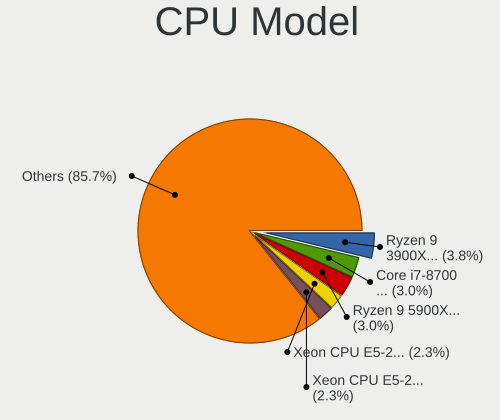

| Model                                   | Desktops | Percent |
|-----------------------------------------|----------|---------|
| AMD Ryzen 9 3900X 12-Core Processor     | 5        | 3.76%   |
| Intel Core i7-8700 CPU @ 3.20GHz        | 4        | 3.01%   |
| AMD Ryzen 9 5900X 12-Core Processor     | 4        | 3.01%   |
| Intel Xeon CPU E5-2680 v3 @ 2.50GHz     | 3        | 2.26%   |
| Intel Xeon CPU E5-2620 v4 @ 2.10GHz     | 3        | 2.26%   |
| Intel 11th Gen Core i7-11700K @ 3.60GHz | 3        | 2.26%   |
| AMD Ryzen 5 5600G with Radeon Graphics  | 3        | 2.26%   |
| AMD Ryzen 5 3600 6-Core Processor       | 3        | 2.26%   |
| Intel Xeon CPU E5-2630 v3 @ 2.40GHz     | 2        | 1.5%    |
| Intel Xeon CPU E5-2620 v3 @ 2.40GHz     | 2        | 1.5%    |
| Intel Pentium Gold G5400 CPU @ 3.70GHz  | 2        | 1.5%    |
| Intel Core i9-9900 CPU @ 3.10GHz        | 2        | 1.5%    |
| Intel Core i7-8700K CPU @ 3.70GHz       | 2        | 1.5%    |
| Intel Core i7-7700K CPU @ 4.20GHz       | 2        | 1.5%    |
| Intel Core i7-7700 CPU @ 3.60GHz        | 2        | 1.5%    |
| Intel Core i5-6500 CPU @ 3.20GHz        | 2        | 1.5%    |
| Intel Core i5-4590 CPU @ 3.30GHz        | 2        | 1.5%    |
| Intel Core i3-4160 CPU @ 3.60GHz        | 2        | 1.5%    |
| Intel Core i3-4130 CPU @ 3.40GHz        | 2        | 1.5%    |
| Intel Xeon w9-3495X                     | 1        | 0.75%   |
| Intel Xeon w9-3475X                     | 1        | 0.75%   |
| Intel Xeon W-2145 CPU @ 3.70GHz         | 1        | 0.75%   |
| Intel Xeon W-2102 CPU @ 2.90GHz         | 1        | 0.75%   |
| Intel Xeon CPU X5570 @ 2.93GHz          | 1        | 0.75%   |
| Intel Xeon CPU E5472 @ 3.00GHz          | 1        | 0.75%   |
| Intel Xeon CPU E5-2696 v3 @ 2.30GHz     | 1        | 0.75%   |
| Intel Xeon CPU E5-2690 0 @ 2.90GHz      | 1        | 0.75%   |
| Intel Xeon CPU E5-2680 v2 @ 2.80GHz     | 1        | 0.75%   |
| Intel Xeon CPU E5-2678 v3 @ 2.50GHz     | 1        | 0.75%   |
| Intel Xeon CPU E5-2670 0 @ 2.60GHz      | 1        | 0.75%   |
| Intel Xeon CPU E5-2620 0 @ 2.00GHz      | 1        | 0.75%   |
| Intel Xeon CPU E5-1650 v4 @ 3.60GHz     | 1        | 0.75%   |
| Intel Xeon CPU E5-1650 v3 @ 3.50GHz     | 1        | 0.75%   |
| Intel Xeon CPU E5-1620 v4 @ 3.50GHz     | 1        | 0.75%   |
| Intel Xeon CPU E5-1620 v3 @ 3.50GHz     | 1        | 0.75%   |
| Intel Xeon CPU E5-1607 v4 @ 3.10GHz     | 1        | 0.75%   |
| Intel Xeon CPU E3-1280 V2 @ 3.60GHz     | 1        | 0.75%   |
| Intel Xeon CPU E3-1270 v5 @ 3.60GHz     | 1        | 0.75%   |
| Intel Xeon CPU E3-1245 v5 @ 3.50GHz     | 1        | 0.75%   |
| Intel Xeon CPU E3-1240 v5 @ 3.50GHz     | 1        | 0.75%   |

CPU Model Family
----------------

Processor model prefix

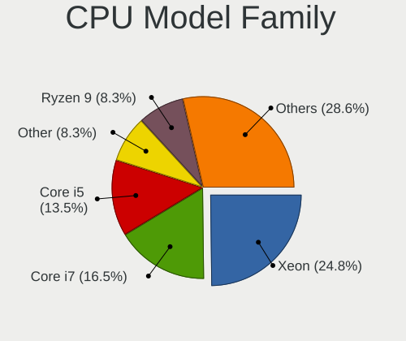

| Model                  | Desktops | Percent |
|------------------------|----------|---------|
| Intel Xeon             | 33       | 24.81%  |
| Intel Core i7          | 22       | 16.54%  |
| Intel Core i5          | 18       | 13.53%  |
| Other                  | 11       | 8.27%   |
| AMD Ryzen 9            | 11       | 8.27%   |
| Intel Core i3          | 10       | 7.52%   |
| AMD Ryzen 5            | 8        | 6.02%   |
| AMD Ryzen 7            | 6        | 4.51%   |
| Intel Core i9          | 4        | 3.01%   |
| Intel Pentium Gold     | 2        | 1.5%    |
| Intel Pentium Silver   | 1        | 0.75%   |
| Intel Core 2 Duo       | 1        | 0.75%   |
| Intel Celeron          | 1        | 0.75%   |
| AMD Ryzen Threadripper | 1        | 0.75%   |
| AMD Ryzen 3            | 1        | 0.75%   |
| AMD FX                 | 1        | 0.75%   |
| AMD Athlon X4          | 1        | 0.75%   |
| AMD A4                 | 1        | 0.75%   |

CPU Cores
---------

Number of processor cores

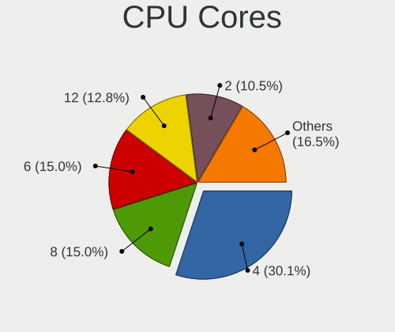

| Number | Desktops | Percent |
|--------|----------|---------|
| 4      | 40       | 30.08%  |
| 8      | 20       | 15.04%  |
| 6      | 20       | 15.04%  |
| 12     | 17       | 12.78%  |
| 2      | 14       | 10.53%  |
| 16     | 9        | 6.77%   |
| 24     | 3        | 2.26%   |
| 36     | 2        | 1.5%    |
| 20     | 2        | 1.5%    |
| 10     | 2        | 1.5%    |
| 1      | 2        | 1.5%    |
| 56     | 1        | 0.75%   |
| 14     | 1        | 0.75%   |

CPU Sockets
-----------

Number of sockets

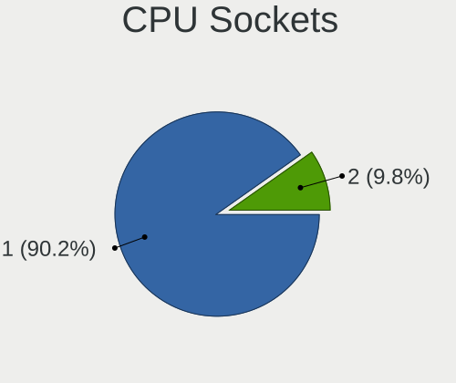

| Number | Desktops | Percent |
|--------|----------|---------|
| 1      | 120      | 90.23%  |
| 2      | 13       | 9.77%   |

CPU Threads
-----------

Threads per core (Hyper-Threading)

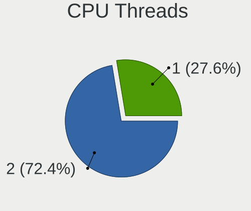

| Number | Desktops | Percent |
|--------|----------|---------|
| 2      | 97       | 72.39%  |
| 1      | 37       | 27.61%  |

CPU Op-Modes
------------

CPU Operation Modes (32-bit, 64-bit)

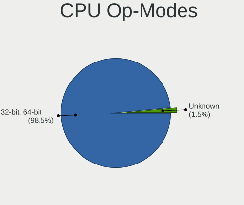

| Op mode        | Desktops | Percent |
|----------------|----------|---------|
| 32-bit, 64-bit | 131      | 98.5%   |
| Unknown        | 2        | 1.5%    |

CPU Microcode
-------------

Microcode number

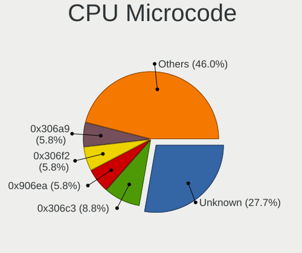

| Number     | Desktops | Percent |
|------------|----------|---------|
| Unknown    | 38       | 27.74%  |
| 0x306c3    | 12       | 8.76%   |
| 0x906ea    | 8        | 5.84%   |
| 0x306f2    | 8        | 5.84%   |
| 0x306a9    | 8        | 5.84%   |
| 0x08701021 | 5        | 3.65%   |
| 0xa0671    | 4        | 2.92%   |
| 0x906e9    | 4        | 2.92%   |
| 0x506e3    | 4        | 2.92%   |
| 0x406f1    | 4        | 2.92%   |
| 0x906ed    | 3        | 2.19%   |
| 0x206d7    | 3        | 2.19%   |
| 0x906eb    | 2        | 1.46%   |
| 0x906c0    | 2        | 1.46%   |
| 0x90672    | 2        | 1.46%   |
| 0x0a50000f | 2        | 1.46%   |
| 0x0a20120a | 2        | 1.46%   |
| 0x08701013 | 2        | 1.46%   |
| 0x08001138 | 2        | 1.46%   |
| 0xb0671    | 1        | 0.73%   |
| 0xa0655    | 1        | 0.73%   |
| 0x806e9    | 1        | 0.73%   |
| 0x306e4    | 1        | 0.73%   |
| 0x206c2    | 1        | 0.73%   |
| 0x206a7    | 1        | 0.73%   |
| 0x106a5    | 1        | 0.73%   |
| 0x1067a    | 1        | 0.73%   |
| 0x10676    | 1        | 0.73%   |
| 0x0a601206 | 1        | 0.73%   |
| 0x0a601203 | 1        | 0.73%   |
| 0x0a50000c | 1        | 0.73%   |
| 0x0a201204 | 1        | 0.73%   |
| 0x0a20102b | 1        | 0.73%   |
| 0x08701030 | 1        | 0.73%   |
| 0x08108102 | 1        | 0.73%   |
| 0x0810100b | 1        | 0.73%   |
| 0x0800820d | 1        | 0.73%   |
| 0x08001137 | 1        | 0.73%   |
| 0x06006705 | 1        | 0.73%   |
| 0x0600611a | 1        | 0.73%   |

CPU Microarch
-------------

Microarchitecture

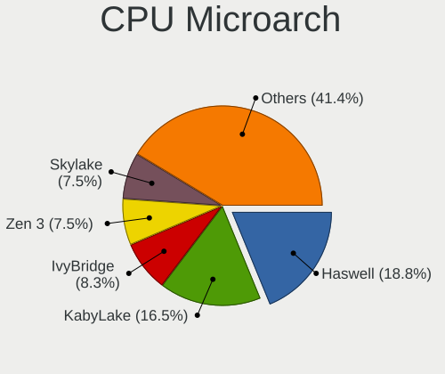

| Name             | Desktops | Percent |
|------------------|----------|---------|
| Haswell          | 25       | 18.8%   |
| KabyLake         | 22       | 16.54%  |
| IvyBridge        | 11       | 8.27%   |
| Zen 3            | 10       | 7.52%   |
| Skylake          | 10       | 7.52%   |
| Zen 2            | 9        | 6.77%   |
| Broadwell        | 6        | 4.51%   |
| Alderlake Hybrid | 6        | 4.51%   |
| SandyBridge      | 5        | 3.76%   |
| Icelake          | 5        | 3.76%   |
| Unknown          | 5        | 3.76%   |
| Zen              | 4        | 3.01%   |
| CometLake        | 3        | 2.26%   |
| Zen+             | 2        | 1.5%    |
| Tremont          | 2        | 1.5%    |
| Penryn           | 2        | 1.5%    |
| Excavator        | 2        | 1.5%    |
| Westmere         | 1        | 0.75%   |
| Sapphire Rapids  | 1        | 0.75%   |
| Piledriver       | 1        | 0.75%   |
| Nehalem          | 1        | 0.75%   |

Graphics
--------

GPU Vendor
----------

Vendors of graphics cards

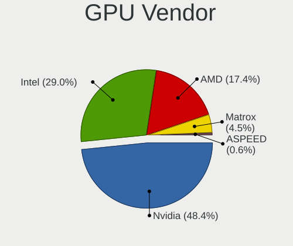

| Vendor                     | Desktops | Percent |
|----------------------------|----------|---------|
| Nvidia                     | 75       | 48.39%  |
| Intel                      | 45       | 29.03%  |
| AMD                        | 27       | 17.42%  |
| Matrox Electronics Systems | 7        | 4.52%   |
| ASPEED Technology          | 1        | 0.65%   |

GPU Model
---------

Graphics card models

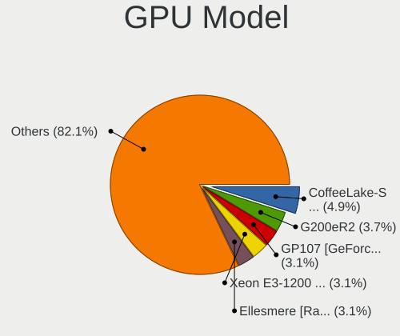

| Model                                                                       | Desktops | Percent |
|-----------------------------------------------------------------------------|----------|---------|
| Intel CoffeeLake-S GT2 [UHD Graphics 630]                                   | 8        | 4.94%   |
| Matrox Electronics Systems G200eR2                                          | 6        | 3.7%    |
| Nvidia GP107 [GeForce GTX 1050 Ti]                                          | 5        | 3.09%   |
| Intel Xeon E3-1200 v3/4th Gen Core Processor Integrated Graphics Controller | 5        | 3.09%   |
| AMD Ellesmere [Radeon RX 470/480/570/570X/580/580X/590]                     | 5        | 3.09%   |
| Nvidia GK208B [GeForce GT 730]                                              | 4        | 2.47%   |
| Intel RocketLake-S GT1 [UHD Graphics 750]                                   | 4        | 2.47%   |
| Nvidia GP104 [GeForce GTX 1070]                                             | 3        | 1.85%   |
| Nvidia GM107GL [Quadro K620]                                                | 3        | 1.85%   |
| Intel Xeon E3-1200 v2/3rd Gen Core processor Graphics Controller            | 3        | 1.85%   |
| Intel Kaby Lake-S GT2 [HD Graphics 630]                                     | 3        | 1.85%   |
| Intel Alder Lake-S GT1 [UHD Graphics 770]                                   | 3        | 1.85%   |
| Intel 4th Generation Core Processor Family Integrated Graphics Controller   | 3        | 1.85%   |
| Nvidia TU117GL [T400 4GB / T400E]                                           | 2        | 1.23%   |
| Nvidia TU106 [GeForce RTX 2060 SUPER]                                       | 2        | 1.23%   |
| Nvidia TU104 [GeForce RTX 2070 SUPER]                                       | 2        | 1.23%   |
| Nvidia GP107GL [Quadro P400]                                                | 2        | 1.23%   |
| Nvidia GP106 [GeForce GTX 1060 6GB]                                         | 2        | 1.23%   |
| Nvidia GP106 [GeForce GTX 1060 3GB]                                         | 2        | 1.23%   |
| Nvidia GP102 [GeForce GTX 1080 Ti]                                          | 2        | 1.23%   |
| Nvidia GM206 [GeForce GTX 960]                                              | 2        | 1.23%   |
| Nvidia GF119 [NVS 315]                                                      | 2        | 1.23%   |
| Nvidia GF108GL [Quadro 600]                                                 | 2        | 1.23%   |
| Nvidia GA104 [GeForce RTX 3060 Ti Lite Hash Rate]                           | 2        | 1.23%   |
| Nvidia G96C [GeForce 9500 GT]                                               | 2        | 1.23%   |
| Nvidia AD102 [GeForce RTX 4090]                                             | 2        | 1.23%   |
| Intel Skylake-S GT2 [HD Graphics 530]                                       | 2        | 1.23%   |
| Intel Skylake-DT/H GT2 [HD Graphics P530]                                   | 2        | 1.23%   |
| Intel Raptor Lake-S GT1 [UHD Graphics 770]                                  | 2        | 1.23%   |
| Intel JasperLake [UHD Graphics]                                             | 2        | 1.23%   |
| Intel IvyBridge GT2 [HD Graphics 4000]                                      | 2        | 1.23%   |
| AMD Vega 10 XL/XT [Radeon RX Vega 56/64]                                    | 2        | 1.23%   |
| AMD Raphael                                                                 | 2        | 1.23%   |
| AMD Oland [Radeon HD 8570 / R5 430 OEM / R7 240/340 / Radeon 520 OEM]       | 2        | 1.23%   |
| AMD Navi 22 [Radeon RX 6700/6700 XT/6750 XT / 6800M/6850M XT]               | 2        | 1.23%   |
| AMD Navi 14 [Radeon RX 5500/5500M / Pro 5500M]                              | 2        | 1.23%   |
| AMD Navi 10 [Radeon RX 5600 OEM/5600 XT / 5700/5700 XT]                     | 2        | 1.23%   |
| AMD Cezanne [Radeon Vega Series / Radeon Vega Mobile Series]                | 2        | 1.23%   |
| Nvidia TU116 [GeForce GTX 1660 Ti]                                          | 1        | 0.62%   |
| Nvidia TU116 [GeForce GTX 1660 SUPER]                                       | 1        | 0.62%   |

GPU Combo
---------

Combinations of graphics cards

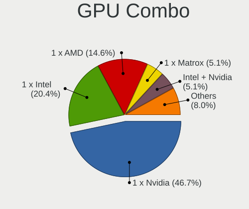

| Name            | Desktops | Percent |
|-----------------|----------|---------|
| 1 x Nvidia      | 64       | 46.72%  |
| 1 x Intel       | 28       | 20.44%  |
| 1 x AMD         | 20       | 14.6%   |
| 1 x Matrox      | 7        | 5.11%   |
| Intel + Nvidia  | 7        | 5.11%   |
| 2 x Nvidia      | 3        | 2.19%   |
| 2 x AMD         | 3        | 2.19%   |
| Intel + AMD     | 3        | 2.19%   |
| Nvidia + ASPEED | 1        | 0.73%   |
| AMD + Nvidia    | 1        | 0.73%   |

GPU Driver
----------

Free vs proprietary

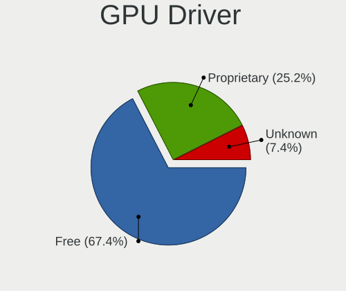

| Driver      | Desktops | Percent |
|-------------|----------|---------|
| Free        | 91       | 67.41%  |
| Proprietary | 34       | 25.19%  |
| Unknown     | 10       | 7.41%   |

GPU Memory
----------

Total video memory

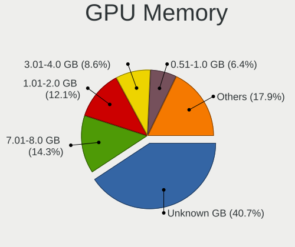

| Size in GB | Desktops | Percent |
|------------|----------|---------|
| Unknown    | 57       | 40.71%  |
| 7.01-8.0   | 20       | 14.29%  |
| 1.01-2.0   | 17       | 12.14%  |
| 3.01-4.0   | 12       | 8.57%   |
| 0.51-1.0   | 9        | 6.43%   |
| 8.01-16.0  | 8        | 5.71%   |
| 0.01-0.5   | 6        | 4.29%   |
| 5.01-6.0   | 4        | 2.86%   |
| 2.01-3.0   | 3        | 2.14%   |
| 16.01-24.0 | 3        | 2.14%   |
| 32.01-64.0 | 1        | 0.71%   |

Monitor
-------

Monitor Vendor
--------------

Monitor vendors

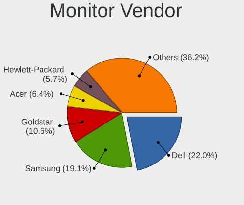

| Vendor               | Desktops | Percent |
|----------------------|----------|---------|
| Dell                 | 31       | 21.99%  |
| Samsung Electronics  | 27       | 19.15%  |
| Goldstar             | 15       | 10.64%  |
| Acer                 | 9        | 6.38%   |
| Hewlett-Packard      | 8        | 5.67%   |
| Lenovo               | 7        | 4.96%   |
| BenQ                 | 6        | 4.26%   |
| Unknown              | 4        | 2.84%   |
| ViewSonic            | 3        | 2.13%   |
| Philips              | 3        | 2.13%   |
| Iiyama               | 3        | 2.13%   |
| Gigabyte Technology  | 3        | 2.13%   |
| Ancor Communications | 3        | 2.13%   |
| Lenovo Group Limited | 2        | 1.42%   |
| Eizo                 | 2        | 1.42%   |
| Vizio                | 1        | 0.71%   |
| STD                  | 1        | 0.71%   |
| Sony                 | 1        | 0.71%   |
| Sceptre Tech         | 1        | 0.71%   |
| Panasonic            | 1        | 0.71%   |
| OUT                  | 1        | 0.71%   |
| Microstep            | 1        | 0.71%   |
| Medion               | 1        | 0.71%   |
| LG Electronics       | 1        | 0.71%   |
| Insignia             | 1        | 0.71%   |
| Haier                | 1        | 0.71%   |
| Fujitsu Siemens      | 1        | 0.71%   |
| Deco Gear            | 1        | 0.71%   |
| ASUSTek Computer     | 1        | 0.71%   |
| AOC                  | 1        | 0.71%   |

Monitor Model
-------------

Monitor models

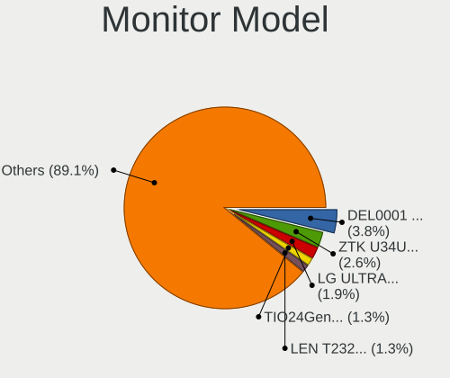

| Model                                                                   | Desktops | Percent |
|-------------------------------------------------------------------------|----------|---------|
| Dell LCD Monitor DEL0001 1280x1024                                      | 6        | 3.85%   |
| Unknown                                                                 | 4        | 2.56%   |
| Goldstar LG ULTRAWIDE GSM59F1 2560x1080 670x280mm 28.6-inch             | 3        | 1.92%   |
| Lenovo TIO24Gen3 LEN10B4 1920x1080 527x296mm 23.8-inch                  | 2        | 1.28%   |
| Lenovo LEN T2324pA LEN60C7 1920x1080 509x286mm 23.0-inch                | 2        | 1.28%   |
| Lenovo LEN P27u-10 LEN61B0 3840x2160 597x336mm 27.0-inch                | 2        | 1.28%   |
| Iiyama PL4840 IVM1065 1920x1080 1054x593mm 47.6-inch                    | 2        | 1.28%   |
| Goldstar FULL HD GSM5B55 1920x1080 480x270mm 21.7-inch                  | 2        | 1.28%   |
| Dell P2210 DEL404D 1680x1050 474x296mm 22.0-inch                        | 2        | 1.28%   |
| Acer ED322QR ACR06DD 1920x1080 700x390mm 31.5-inch                      | 2        | 1.28%   |
| Vizio E500i-B1 VIZ1004 1920x1080 1095x616mm 49.5-inch                   | 1        | 0.64%   |
| ViewSonic VX2776 Series VSC3E32 1920x1080 598x336mm 27.0-inch           | 1        | 0.64%   |
| ViewSonic VA2419 Series VSC7B32 1920x1080 527x296mm 23.8-inch           | 1        | 0.64%   |
| ViewSonic VA2259 Series VSC5E32 1920x1080 476x268mm 21.5-inch           | 1        | 0.64%   |
| STD HDMI STD0110 1920x1080 520x310mm 23.8-inch                          | 1        | 0.64%   |
| Sony TV SNYD703 1360x768                                                | 1        | 0.64%   |
| Sceptre Tech Sceptre F22 SPT08C4 1920x1080 486x275mm 22.0-inch          | 1        | 0.64%   |
| Samsung Electronics U32R59x SAM0F96 3840x2160 697x392mm 31.5-inch       | 1        | 0.64%   |
| Samsung Electronics SyncMaster SAM0B96 1920x1080 885x498mm 40.0-inch    | 1        | 0.64%   |
| Samsung Electronics SyncMaster SAM05FC 1920x1080                        | 1        | 0.64%   |
| Samsung Electronics SyncMaster SAM0566 1440x900 408x255mm 18.9-inch     | 1        | 0.64%   |
| Samsung Electronics SyncMaster SAM0526 1920x1080 510x287mm 23.0-inch    | 1        | 0.64%   |
| Samsung Electronics SyncMaster SAM0380 1680x1050 459x296mm 21.5-inch    | 1        | 0.64%   |
| Samsung Electronics SyncMaster SAM0370 1680x1050 459x296mm 21.5-inch    | 1        | 0.64%   |
| Samsung Electronics SyncMaster SAM020D 1280x1024 338x270mm 17.0-inch    | 1        | 0.64%   |
| Samsung Electronics SyncMaster SAM011E 1280x1024 338x270mm 17.0-inch    | 1        | 0.64%   |
| Samsung Electronics SMS23A550H SAM07CA 1920x1080 509x286mm 23.0-inch    | 1        | 0.64%   |
| Samsung Electronics S27C500 SAM0AF2 1920x1080 598x336mm 27.0-inch       | 1        | 0.64%   |
| Samsung Electronics S24F350 SAM0D21 1920x1080 521x293mm 23.5-inch       | 1        | 0.64%   |
| Samsung Electronics S22E390 SAM0C18 1920x1080 477x268mm 21.5-inch       | 1        | 0.64%   |
| Samsung Electronics S22B300 SAM08A9 1600x900 443x249mm 20.0-inch        | 1        | 0.64%   |
| Samsung Electronics LU28R55 SAM1017 3840x2160 632x360mm 28.6-inch       | 1        | 0.64%   |
| Samsung Electronics LU28R55 SAM1015 3840x2160 632x360mm 28.6-inch       | 1        | 0.64%   |
| Samsung Electronics LCD Monitor SAM723F 3840x2160 700x390mm 31.5-inch   | 1        | 0.64%   |
| Samsung Electronics LCD Monitor SAM7106 1920x1080 1210x680mm 54.6-inch  | 1        | 0.64%   |
| Samsung Electronics LCD Monitor SAM7103 3840x2160 700x390mm 31.5-inch   | 1        | 0.64%   |
| Samsung Electronics LCD Monitor SAM7016 3840x2160 1872x1053mm 84.6-inch | 1        | 0.64%   |
| Samsung Electronics LCD Monitor SAM0D42 3840x2160 890x500mm 40.2-inch   | 1        | 0.64%   |
| Samsung Electronics LCD Monitor SAM0C26 1920x1080 1209x680mm 54.6-inch  | 1        | 0.64%   |
| Samsung Electronics LCD Monitor SAM0C04 3840x2160 1420x800mm 64.2-inch  | 1        | 0.64%   |

Monitor Resolution
------------------

Monitor screen resolution

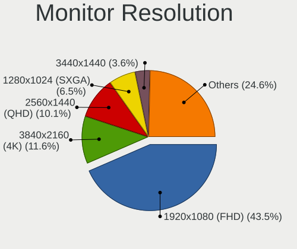

| Resolution         | Desktops | Percent |
|--------------------|----------|---------|
| 1920x1080 (FHD)    | 60       | 43.48%  |
| 3840x2160 (4K)     | 16       | 11.59%  |
| 2560x1440 (QHD)    | 14       | 10.14%  |
| 1280x1024 (SXGA)   | 9        | 6.52%   |
| 3440x1440          | 5        | 3.62%   |
| 2560x1080          | 5        | 3.62%   |
| 1680x1050 (WSXGA+) | 5        | 3.62%   |
| Unknown            | 5        | 3.62%   |
| 1600x900 (HD+)     | 4        | 2.9%    |
| 3840x1080          | 3        | 2.17%   |
| 7680x2160          | 2        | 1.45%   |
| 3840x1200          | 2        | 1.45%   |
| 1920x1200 (WUXGA)  | 2        | 1.45%   |
| 9600x2160          | 1        | 0.72%   |
| 3840x1600          | 1        | 0.72%   |
| 2560x1600          | 1        | 0.72%   |
| 1440x900 (WXGA+)   | 1        | 0.72%   |
| 1280x768           | 1        | 0.72%   |
| 1280x720 (HD)      | 1        | 0.72%   |

Monitor Diagonal
----------------

Diagonal size in inches

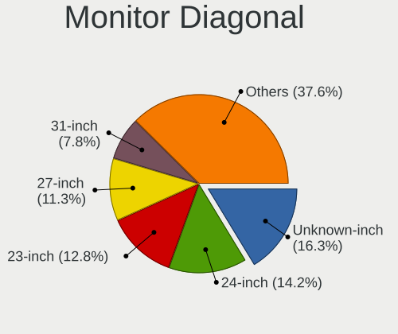

| Inches  | Desktops | Percent |
|---------|----------|---------|
| Unknown | 23       | 16.31%  |
| 24      | 20       | 14.18%  |
| 23      | 18       | 12.77%  |
| 27      | 16       | 11.35%  |
| 31      | 11       | 7.8%    |
| 21      | 8        | 5.67%   |
| 34      | 6        | 4.26%   |
| 84      | 4        | 2.84%   |
| 54      | 4        | 2.84%   |
| 20      | 4        | 2.84%   |
| 28      | 3        | 2.13%   |
| 22      | 3        | 2.13%   |
| 47      | 2        | 1.42%   |
| 43      | 2        | 1.42%   |
| 40      | 2        | 1.42%   |
| 17      | 2        | 1.42%   |
| 72      | 1        | 0.71%   |
| 60      | 1        | 0.71%   |
| 52      | 1        | 0.71%   |
| 39      | 1        | 0.71%   |
| 37      | 1        | 0.71%   |
| 35      | 1        | 0.71%   |
| 33      | 1        | 0.71%   |
| 29      | 1        | 0.71%   |
| 26      | 1        | 0.71%   |
| 25      | 1        | 0.71%   |
| 19      | 1        | 0.71%   |
| 18      | 1        | 0.71%   |
| 16      | 1        | 0.71%   |

Monitor Width
-------------

Physical width

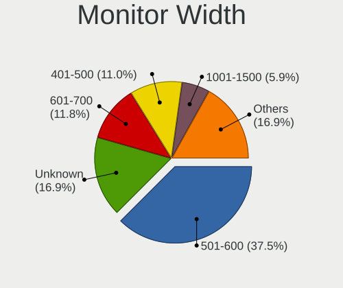

| Width in mm | Desktops | Percent |
|-------------|----------|---------|
| 501-600     | 51       | 37.5%   |
| Unknown     | 23       | 16.91%  |
| 601-700     | 16       | 11.76%  |
| 401-500     | 15       | 11.03%  |
| 1001-1500   | 8        | 5.88%   |
| 701-800     | 7        | 5.15%   |
| 801-900     | 5        | 3.68%   |
| 1501-2000   | 5        | 3.68%   |
| 301-350     | 3        | 2.21%   |
| 901-1000    | 2        | 1.47%   |
| 351-400     | 1        | 0.74%   |

Aspect Ratio
------------

Proportional relationship between the width and the height

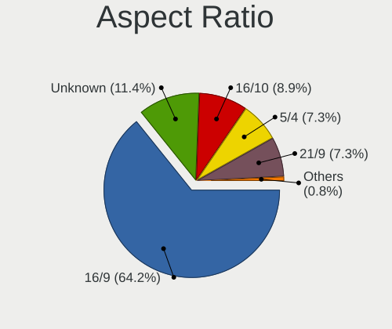

| Ratio   | Desktops | Percent |
|---------|----------|---------|
| 16/9    | 79       | 64.23%  |
| Unknown | 14       | 11.38%  |
| 16/10   | 11       | 8.94%   |
| 5/4     | 9        | 7.32%   |
| 21/9    | 9        | 7.32%   |
| 4/3     | 1        | 0.81%   |

Monitor Area
------------

Area in inch²

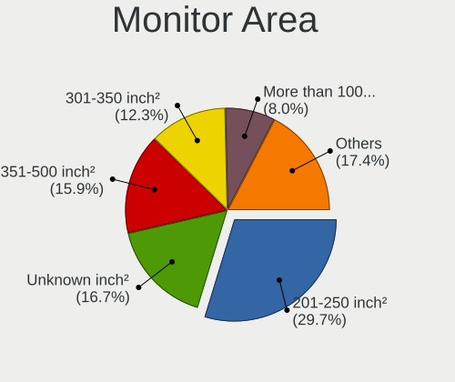

| Area in inch² | Desktops | Percent |
|----------------|----------|---------|
| 201-250        | 41       | 29.71%  |
| Unknown        | 23       | 16.67%  |
| 351-500        | 22       | 15.94%  |
| 301-350        | 17       | 12.32%  |
| More than 1000 | 11       | 7.97%   |
| 501-1000       | 8        | 5.8%    |
| 251-300        | 7        | 5.07%   |
| 151-200        | 6        | 4.35%   |
| 141-150        | 2        | 1.45%   |
| 131-140        | 1        | 0.72%   |

Pixel Density
-------------

Pixels per inch

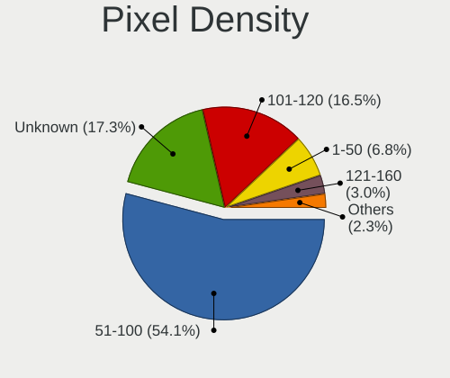

| Density | Desktops | Percent |
|---------|----------|---------|
| 51-100  | 72       | 54.14%  |
| Unknown | 23       | 17.29%  |
| 101-120 | 22       | 16.54%  |
| 1-50    | 9        | 6.77%   |
| 121-160 | 4        | 3.01%   |
| 161-240 | 3        | 2.26%   |

Multiple Monitors
-----------------

Total monitors connected

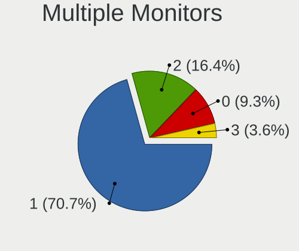

| Total | Desktops | Percent |
|-------|----------|---------|
| 1     | 99       | 70.71%  |
| 2     | 23       | 16.43%  |
| 0     | 13       | 9.29%   |
| 3     | 5        | 3.57%   |

Network
-------

Net Controller Vendor
---------------------

Controller vendors

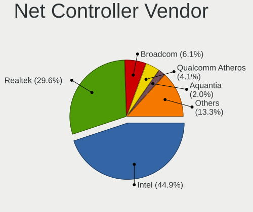

| Vendor                   | Desktops | Percent |
|--------------------------|----------|---------|
| Intel                    | 88       | 44.9%   |
| Realtek Semiconductor    | 58       | 29.59%  |
| Broadcom                 | 12       | 6.12%   |
| Qualcomm Atheros         | 8        | 4.08%   |
| Aquantia                 | 4        | 2.04%   |
| ASIX Electronics         | 3        | 1.53%   |
| TP-Link                  | 2        | 1.02%   |
| Samsung Electronics      | 2        | 1.02%   |
| Ralink Technology        | 2        | 1.02%   |
| MediaTek                 | 2        | 1.02%   |
| Edimax Technology        | 2        | 1.02%   |
| Dell                     | 2        | 1.02%   |
| Ralink                   | 1        | 0.51%   |
| Qualcomm                 | 1        | 0.51%   |
| Microchip Technology     | 1        | 0.51%   |
| Micro Star International | 1        | 0.51%   |
| Mellanox Technologies    | 1        | 0.51%   |
| Huawei Technologies      | 1        | 0.51%   |
| D-Link                   | 1        | 0.51%   |
| Broadcom Limited         | 1        | 0.51%   |
| ASUSTek Computer         | 1        | 0.51%   |
| Arduino SA               | 1        | 0.51%   |
| AMD                      | 1        | 0.51%   |

Net Controller Model
--------------------

Controller models

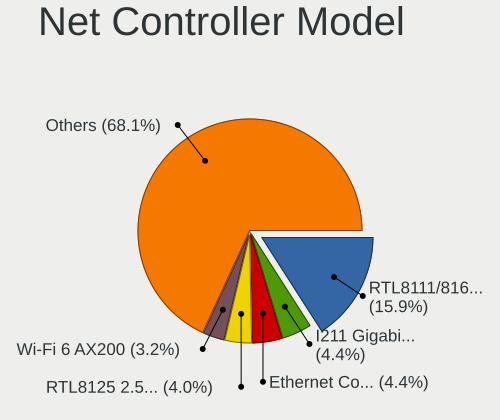

| Model                                                                          | Desktops | Percent |
|--------------------------------------------------------------------------------|----------|---------|
| Realtek RTL8111/8168/8211/8411 PCI Express Gigabit Ethernet Controller         | 40       | 15.94%  |
| Intel I211 Gigabit Network Connection                                          | 11       | 4.38%   |
| Intel Ethernet Controller I225-V                                               | 11       | 4.38%   |
| Realtek RTL8125 2.5GbE Controller                                              | 10       | 3.98%   |
| Intel Wi-Fi 6 AX200                                                            | 8        | 3.19%   |
| Intel Ethernet Connection I217-LM                                              | 7        | 2.79%   |
| Intel Ethernet Connection (2) I219-V                                           | 7        | 2.79%   |
| Intel 82579LM Gigabit Network Connection (Lewisville)                          | 7        | 2.79%   |
| Intel 82574L Gigabit Network Connection                                        | 7        | 2.79%   |
| Intel Ethernet Connection (2) I219-LM                                          | 6        | 2.39%   |
| Intel Wi-Fi 6E(802.11ax) AX210/AX1675* 2x2 [Typhoon Peak]                      | 5        | 1.99%   |
| Intel Dual Band Wireless-AC 3168NGW [Stone Peak]                               | 5        | 1.99%   |
| Intel I350 Gigabit Network Connection                                          | 4        | 1.59%   |
| Intel Ethernet Connection (7) I219-LM                                          | 4        | 1.59%   |
| Intel Ethernet Connection (17) I219-LM                                         | 4        | 1.59%   |
| Broadcom NetXtreme II BCM57810 10 Gigabit Ethernet                             | 4        | 1.59%   |
| Broadcom NetXtreme BCM5719 Gigabit Ethernet PCIe                               | 4        | 1.59%   |
| Realtek RTL8188EUS 802.11n Wireless Network Adapter                            | 3        | 1.2%    |
| Realtek RTL8153 Gigabit Ethernet Adapter                                       | 3        | 1.2%    |
| Realtek RTL810xE PCI Express Fast Ethernet controller                          | 3        | 1.2%    |
| Intel I210 Gigabit Network Connection                                          | 3        | 1.2%    |
| Intel Ethernet Connection (2) I218-V                                           | 3        | 1.2%    |
| Intel Ethernet Connection (2) I218-LM                                          | 3        | 1.2%    |
| Intel Cannon Lake PCH CNVi WiFi                                                | 3        | 1.2%    |
| Broadcom BCM4352 802.11ac Dual Band Wireless Network Adapter                   | 3        | 1.2%    |
| Qualcomm Atheros QCA6174 802.11ac Wireless Network Adapter                     | 2        | 0.8%    |
| Qualcomm Atheros AR9485 Wireless Network Adapter                               | 2        | 0.8%    |
| Intel Wi-Fi 5(802.11ac) Wireless-AC 9x6x [Thunder Peak]                        | 2        | 0.8%    |
| Intel Ethernet Controller I226-V                                               | 2        | 0.8%    |
| Intel Ethernet Controller 10-Gigabit X540-AT2                                  | 2        | 0.8%    |
| Intel Ethernet Connection I217-V                                               | 2        | 0.8%    |
| Intel Ethernet Connection (7) I219-V                                           | 2        | 0.8%    |
| Intel Ethernet Connection (5) I219-LM                                          | 2        | 0.8%    |
| Intel Alder Lake-S PCH CNVi WiFi                                               | 2        | 0.8%    |
| Intel 82599 10 Gigabit Dual Port Backplane Connection                          | 2        | 0.8%    |
| Intel 700 Series Chipset CNVi WiFi                                             | 2        | 0.8%    |
| Dell iDRAC Virtual NIC                                                         | 2        | 0.8%    |
| Broadcom BCM4360 802.11ac Dual Band Wireless Network Adapter                   | 2        | 0.8%    |
| ASIX AX88179 Gigabit Ethernet                                                  | 2        | 0.8%    |
| Aquantia AQtion AQC107 NBase-T/IEEE 802.3an Ethernet Controller [Atlantic 10G] | 2        | 0.8%    |

Wireless Vendor
---------------

Wireless vendors

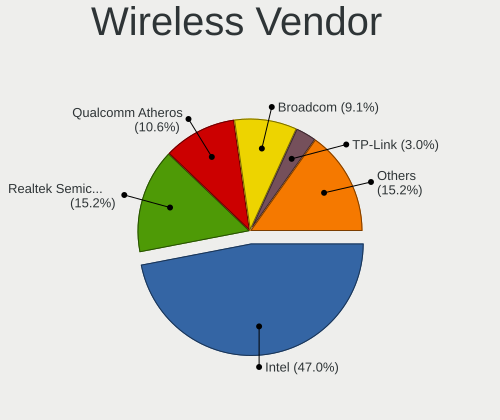

| Vendor                   | Desktops | Percent |
|--------------------------|----------|---------|
| Intel                    | 31       | 46.97%  |
| Realtek Semiconductor    | 10       | 15.15%  |
| Qualcomm Atheros         | 7        | 10.61%  |
| Broadcom                 | 6        | 9.09%   |
| TP-Link                  | 2        | 3.03%   |
| Ralink Technology        | 2        | 3.03%   |
| MediaTek                 | 2        | 3.03%   |
| Edimax Technology        | 2        | 3.03%   |
| Ralink                   | 1        | 1.52%   |
| Micro Star International | 1        | 1.52%   |
| D-Link                   | 1        | 1.52%   |
| ASUSTek Computer         | 1        | 1.52%   |

Wireless Model
--------------

Wireless models

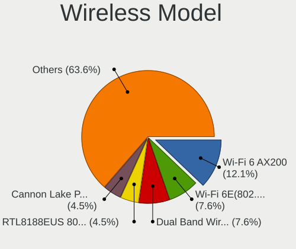

| Model                                                                      | Desktops | Percent |
|----------------------------------------------------------------------------|----------|---------|
| Intel Wi-Fi 6 AX200                                                        | 8        | 12.12%  |
| Intel Wi-Fi 6E(802.11ax) AX210/AX1675* 2x2 [Typhoon Peak]                  | 5        | 7.58%   |
| Intel Dual Band Wireless-AC 3168NGW [Stone Peak]                           | 5        | 7.58%   |
| Realtek RTL8188EUS 802.11n Wireless Network Adapter                        | 3        | 4.55%   |
| Intel Cannon Lake PCH CNVi WiFi                                            | 3        | 4.55%   |
| Broadcom BCM4352 802.11ac Dual Band Wireless Network Adapter               | 3        | 4.55%   |
| Qualcomm Atheros QCA6174 802.11ac Wireless Network Adapter                 | 2        | 3.03%   |
| Qualcomm Atheros AR9485 Wireless Network Adapter                           | 2        | 3.03%   |
| Intel Wi-Fi 5(802.11ac) Wireless-AC 9x6x [Thunder Peak]                    | 2        | 3.03%   |
| Intel 700 Series Chipset CNVi WiFi                                         | 2        | 3.03%   |
| Broadcom BCM4360 802.11ac Dual Band Wireless Network Adapter               | 2        | 3.03%   |
| TP-Link TL-WN823N v2/v3 [Realtek RTL8192EU]                                | 1        | 1.52%   |
| TP-Link Archer T2U PLUS [RTL8821AU]                                        | 1        | 1.52%   |
| Realtek RTL8852CE PCIe 802.11ax Wireless Network Controller                | 1        | 1.52%   |
| Realtek RTL8852BE PCIe 802.11ax Wireless Network Controller                | 1        | 1.52%   |
| Realtek RTL8723BE PCIe Wireless Network Adapter                            | 1        | 1.52%   |
| Realtek RTL8192EU 802.11b/g/n WLAN Adapter                                 | 1        | 1.52%   |
| Realtek RTL8192EE PCIe Wireless Network Adapter                            | 1        | 1.52%   |
| Realtek RTL8192CE PCIe Wireless Network Adapter                            | 1        | 1.52%   |
| Realtek 802.11n WLAN Adapter                                               | 1        | 1.52%   |
| Ralink RT5572 Wireless Adapter                                             | 1        | 1.52%   |
| Ralink RT5372 Wireless Adapter                                             | 1        | 1.52%   |
| Ralink RT3090 Wireless 802.11n 1T/1R PCIe                                  | 1        | 1.52%   |
| Qualcomm Atheros AR9462 Wireless Network Adapter                           | 1        | 1.52%   |
| Qualcomm Atheros AR9287 Wireless Network Adapter (PCI-Express)             | 1        | 1.52%   |
| Qualcomm Atheros AR9227 Wireless Network Adapter                           | 1        | 1.52%   |
| Micro Star International MS-3871 802.11bgn Wireless Module [Ralink RT8070] | 1        | 1.52%   |
| MediaTek MT7921K (RZ608) Wi-Fi 6E 80MHz                                    | 1        | 1.52%   |
| MediaTek MT7612U 802.11a/b/g/n/ac Wireless Adapter                         | 1        | 1.52%   |
| Intel Wireless 8265 / 8275                                                 | 1        | 1.52%   |
| Intel Wireless 7260                                                        | 1        | 1.52%   |
| Intel Wi-Fi 7(802.11be) AX1775*/AX1790*/BE20*/BE401/BE1750* 2x2            | 1        | 1.52%   |
| Intel Jasper Lake PCH CNVi WiFi                                            | 1        | 1.52%   |
| Intel Comet Lake PCH CNVi WiFi                                             | 1        | 1.52%   |
| Intel Alder Lake-S PCH CNVi WiFi                                           | 1        | 1.52%   |
| Edimax EW-7811Un 802.11n Wireless Adapter [Realtek RTL8188CUS]             | 1        | 1.52%   |
| Edimax AC1200 MU-MIMO USB3.0 Adapter                                       | 1        | 1.52%   |
| D-Link DWA-171 AC600 DB Wireless Adapter(rev.A1) [Realtek RTL8811AU]       | 1        | 1.52%   |
| Broadcom BCM4321 802.11b/g/n                                               | 1        | 1.52%   |
| ASUS WL-167G v3 802.11n Adapter [Realtek RTL8188SU]                        | 1        | 1.52%   |

Ethernet Vendor
---------------

Ethernet vendors

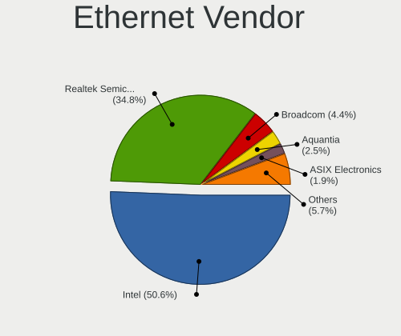

| Vendor                | Desktops | Percent |
|-----------------------|----------|---------|
| Intel                 | 80       | 50.63%  |
| Realtek Semiconductor | 55       | 34.81%  |
| Broadcom              | 7        | 4.43%   |
| Aquantia              | 4        | 2.53%   |
| ASIX Electronics      | 3        | 1.9%    |
| Samsung Electronics   | 2        | 1.27%   |
| Qualcomm Atheros      | 2        | 1.27%   |
| Dell                  | 2        | 1.27%   |
| Qualcomm              | 1        | 0.63%   |
| Mellanox Technologies | 1        | 0.63%   |
| Broadcom Limited      | 1        | 0.63%   |

Ethernet Model
--------------

Ethernet models

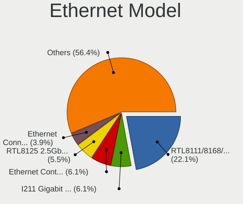

| Model                                                                          | Desktops | Percent |
|--------------------------------------------------------------------------------|----------|---------|
| Realtek RTL8111/8168/8211/8411 PCI Express Gigabit Ethernet Controller         | 40       | 22.1%   |
| Intel I211 Gigabit Network Connection                                          | 11       | 6.08%   |
| Intel Ethernet Controller I225-V                                               | 11       | 6.08%   |
| Realtek RTL8125 2.5GbE Controller                                              | 10       | 5.52%   |
| Intel Ethernet Connection I217-LM                                              | 7        | 3.87%   |
| Intel Ethernet Connection (2) I219-V                                           | 7        | 3.87%   |
| Intel 82579LM Gigabit Network Connection (Lewisville)                          | 7        | 3.87%   |
| Intel 82574L Gigabit Network Connection                                        | 7        | 3.87%   |
| Intel Ethernet Connection (2) I219-LM                                          | 6        | 3.31%   |
| Intel I350 Gigabit Network Connection                                          | 4        | 2.21%   |
| Intel Ethernet Connection (7) I219-LM                                          | 4        | 2.21%   |
| Intel Ethernet Connection (17) I219-LM                                         | 4        | 2.21%   |
| Broadcom NetXtreme II BCM57810 10 Gigabit Ethernet                             | 4        | 2.21%   |
| Broadcom NetXtreme BCM5719 Gigabit Ethernet PCIe                               | 4        | 2.21%   |
| Realtek RTL8153 Gigabit Ethernet Adapter                                       | 3        | 1.66%   |
| Realtek RTL810xE PCI Express Fast Ethernet controller                          | 3        | 1.66%   |
| Intel I210 Gigabit Network Connection                                          | 3        | 1.66%   |
| Intel Ethernet Connection (2) I218-V                                           | 3        | 1.66%   |
| Intel Ethernet Connection (2) I218-LM                                          | 3        | 1.66%   |
| Intel Ethernet Controller I226-V                                               | 2        | 1.1%    |
| Intel Ethernet Controller 10-Gigabit X540-AT2                                  | 2        | 1.1%    |
| Intel Ethernet Connection I217-V                                               | 2        | 1.1%    |
| Intel Ethernet Connection (7) I219-V                                           | 2        | 1.1%    |
| Intel Ethernet Connection (5) I219-LM                                          | 2        | 1.1%    |
| Intel 82599 10 Gigabit Dual Port Backplane Connection                          | 2        | 1.1%    |
| Dell iDRAC Virtual NIC                                                         | 2        | 1.1%    |
| ASIX AX88179 Gigabit Ethernet                                                  | 2        | 1.1%    |
| Aquantia AQtion AQC107 NBase-T/IEEE 802.3an Ethernet Controller [Atlantic 10G] | 2        | 1.1%    |
| Samsung GT-I9070 (network tethering, USB debugging enabled)                    | 1        | 0.55%   |
| Samsung Galaxy series, misc. (tethering mode)                                  | 1        | 0.55%   |
| Realtek RTL8169 PCI Gigabit Ethernet Controller                                | 1        | 0.55%   |
| Qualcomm Nokia X30 5G                                                          | 1        | 0.55%   |
| Qualcomm Atheros Killer E2500 Gigabit Ethernet Controller                      | 1        | 0.55%   |
| Qualcomm Atheros AR8151 v2.0 Gigabit Ethernet                                  | 1        | 0.55%   |
| Mellanox MT27500 Family [ConnectX-3]                                           | 1        | 0.55%   |
| Intel Ethernet Controller X710 for 10GbE SFP+                                  | 1        | 0.55%   |
| Intel Ethernet Connection (11) I219-V                                          | 1        | 0.55%   |
| Intel Alder Lake-S PCH CNVi WiFi                                               | 1        | 0.55%   |
| Intel 82579V Gigabit Network Connection                                        | 1        | 0.55%   |
| Intel 82575EB Gigabit Network Connection                                       | 1        | 0.55%   |

Net Controller Kind
-------------------

Ethernet, WiFi or modem

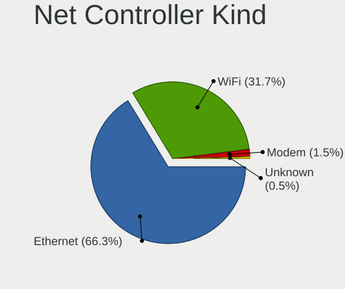

| Kind     | Desktops | Percent |
|----------|----------|---------|
| Ethernet | 132      | 66.33%  |
| WiFi     | 63       | 31.66%  |
| Modem    | 3        | 1.51%   |
| Unknown  | 1        | 0.5%    |

Used Controller
---------------

Currently used network controller

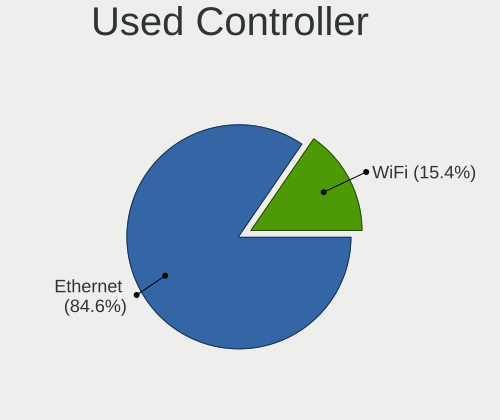

| Kind     | Desktops | Percent |
|----------|----------|---------|
| Ethernet | 115      | 84.56%  |
| WiFi     | 21       | 15.44%  |

NICs
----

Total network controllers on board

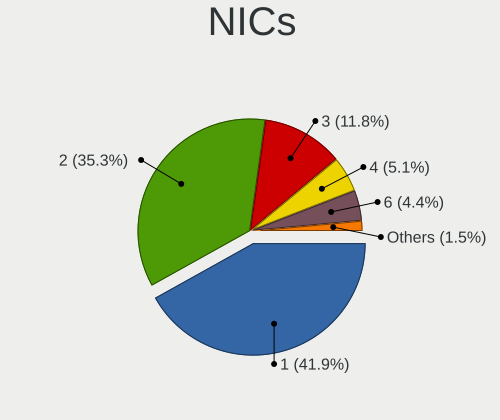

| Total | Desktops | Percent |
|-------|----------|---------|
| 1     | 57       | 41.91%  |
| 2     | 48       | 35.29%  |
| 3     | 16       | 11.76%  |
| 4     | 7        | 5.15%   |
| 6     | 6        | 4.41%   |
| 5     | 2        | 1.47%   |

IPv6
----

IPv6 vs IPv4

| Used | Desktops | Percent |
|------|----------|---------|
| No   | 104      | 75.36%  |
| Yes  | 34       | 24.64%  |

Bluetooth
---------

Bluetooth Vendor
----------------

Controller vendors

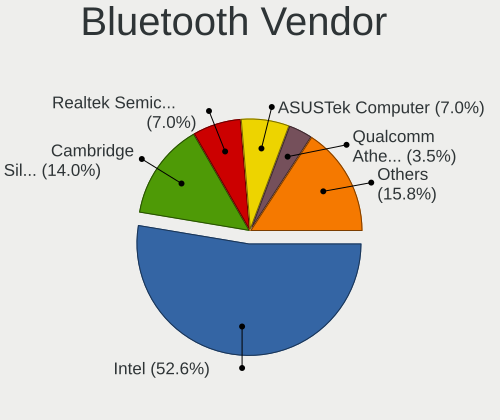

| Vendor                          | Desktops | Percent |
|---------------------------------|----------|---------|
| Intel                           | 30       | 52.63%  |
| Cambridge Silicon Radio         | 8        | 14.04%  |
| Realtek Semiconductor           | 4        | 7.02%   |
| ASUSTek Computer                | 4        | 7.02%   |
| Qualcomm Atheros Communications | 2        | 3.51%   |
| TP-Link                         | 1        | 1.75%   |
| Micro Star International        | 1        | 1.75%   |
| MediaTek                        | 1        | 1.75%   |
| Integrated System Solution      | 1        | 1.75%   |
| IMC Networks                    | 1        | 1.75%   |
| Foxconn / Hon Hai               | 1        | 1.75%   |
| Edimax Technology               | 1        | 1.75%   |
| Broadcom                        | 1        | 1.75%   |
| Actions                         | 1        | 1.75%   |

Bluetooth Model
---------------

Controller models

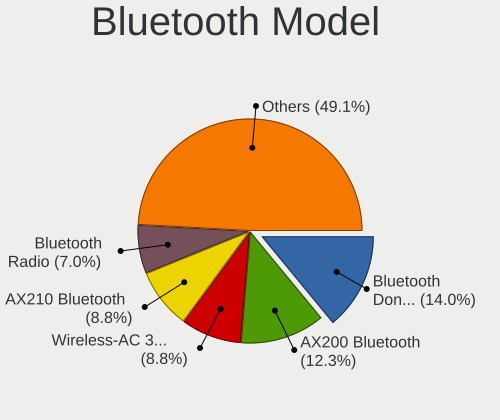

| Model                                                 | Desktops | Percent |
|-------------------------------------------------------|----------|---------|
| Cambridge Silicon Radio Bluetooth Dongle (HCI mode)   | 8        | 14.04%  |
| Intel AX200 Bluetooth                                 | 7        | 12.28%  |
| Intel Wireless-AC 3168 Bluetooth                      | 5        | 8.77%   |
| Intel AX210 Bluetooth                                 | 5        | 8.77%   |
| Realtek Bluetooth Radio                               | 4        | 7.02%   |
| Intel AX201 Bluetooth                                 | 4        | 7.02%   |
| Intel Bluetooth Device                                | 3        | 5.26%   |
| Intel Bluetooth 9460/9560 Jefferson Peak (JfP)        | 3        | 5.26%   |
| Qualcomm Atheros  Bluetooth Device                    | 2        | 3.51%   |
| Intel Bluetooth wireless interface                    | 2        | 3.51%   |
| ASUS BCM20702A0                                       | 2        | 3.51%   |
| TP-Link TP-T@- UB500 Adapter                          | 1        | 1.75%   |
| Micro Star International Bluetooth Device             | 1        | 1.75%   |
| MediaTek Wireless_Device                              | 1        | 1.75%   |
| Intel Wireless-AC 9260 Bluetooth Adapter              | 1        | 1.75%   |
| Integrated System Solution KY-BT100 Bluetooth Adapter | 1        | 1.75%   |
| IMC Networks BCM20702A0                               | 1        | 1.75%   |
| Foxconn / Hon Hai Bluetooth Device                    | 1        | 1.75%   |
| Edimax Bluetooth Device                               | 1        | 1.75%   |
| Broadcom BCM20702A0 Bluetooth 4.0                     | 1        | 1.75%   |
| ASUS Qualcomm Bluetooth 4.1                           | 1        | 1.75%   |
| ASUS Broadcom BCM20702 Single-Chip Bluetooth 4.0 + LE | 1        | 1.75%   |
| Actions general adapter                               | 1        | 1.75%   |

Sound
-----

Sound Vendor
------------

Sound card vendors

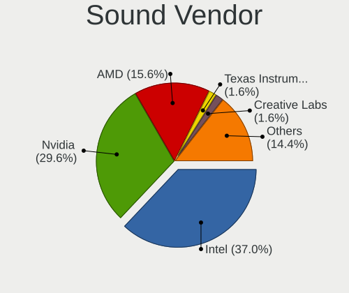

| Vendor                                       | Desktops | Percent |
|----------------------------------------------|----------|---------|
| Intel                                        | 90       | 37.04%  |
| Nvidia                                       | 72       | 29.63%  |
| AMD                                          | 38       | 15.64%  |
| Texas Instruments                            | 4        | 1.65%   |
| Creative Labs                                | 4        | 1.65%   |
| ASUSTek Computer                             | 4        | 1.65%   |
| Logitech                                     | 3        | 1.23%   |
| Lenovo                                       | 3        | 1.23%   |
| Plantronics                                  | 2        | 0.82%   |
| Micro Star International                     | 2        | 0.82%   |
| Creative Technology                          | 2        | 0.82%   |
| C-Media Electronics                          | 2        | 0.82%   |
| Zoran Co. Personal Media Division (Nogatech) | 1        | 0.41%   |
| Valve Software                               | 1        | 0.41%   |
| Unknown                                      | 1        | 0.41%   |
| Tenx Technology                              | 1        | 0.41%   |
| SteelSeries ApS                              | 1        | 0.41%   |
| Sonata                                       | 1        | 0.41%   |
| Sennheiser Communications                    | 1        | 0.41%   |
| RODE Microphones                             | 1        | 0.41%   |
| Razer USA                                    | 1        | 0.41%   |
| JMTek                                        | 1        | 0.41%   |
| GN Netcom                                    | 1        | 0.41%   |
| Giga-Byte Technology                         | 1        | 0.41%   |
| Elgato Systems                               | 1        | 0.41%   |
| Dynex                                        | 1        | 0.41%   |
| Dell                                         | 1        | 0.41%   |
| Blue Microphones                             | 1        | 0.41%   |
| Astro Gaming                                 | 1        | 0.41%   |

Sound Model
-----------

Sound card models

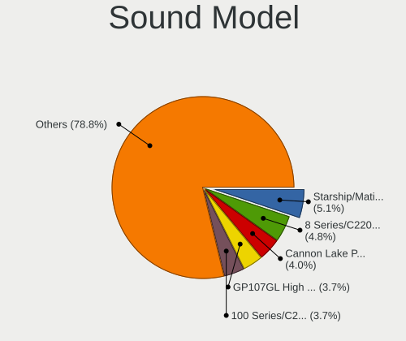

| Model                                                                      | Desktops | Percent |
|----------------------------------------------------------------------------|----------|---------|
| AMD Starship/Matisse HD Audio Controller                                   | 14       | 5.13%   |
| Intel 8 Series/C220 Series Chipset High Definition Audio Controller        | 13       | 4.76%   |
| Intel Cannon Lake PCH cAVS                                                 | 11       | 4.03%   |
| Nvidia GP107GL High Definition Audio Controller                            | 10       | 3.66%   |
| Intel 100 Series/C230 Series Chipset Family HD Audio Controller            | 10       | 3.66%   |
| Intel C610/X99 series chipset HD Audio Controller                          | 9        | 3.3%    |
| Intel 200 Series PCH HD Audio                                              | 9        | 3.3%    |
| AMD Ryzen HD Audio Controller                                              | 8        | 2.93%   |
| Intel Xeon E3-1200 v3/4th Gen Core Processor HD Audio Controller           | 7        | 2.56%   |
| Intel Alder Lake-S HD Audio Controller                                     | 6        | 2.2%    |
| Nvidia GP104 High Definition Audio Controller                              | 5        | 1.83%   |
| Nvidia GK208 HDMI/DP Audio Controller                                      | 5        | 1.83%   |
| Nvidia GF108 High Definition Audio Controller                              | 5        | 1.83%   |
| Intel Tiger Lake-H HD Audio Controller                                     | 5        | 1.83%   |
| Intel C600/X79 series chipset High Definition Audio Controller             | 5        | 1.83%   |
| Intel 7 Series/C216 Chipset Family High Definition Audio Controller        | 5        | 1.83%   |
| AMD Ellesmere HDMI Audio [Radeon RX 470/480 / 570/580/590]                 | 5        | 1.83%   |
| Texas Instruments PCM2902 Audio Codec                                      | 4        | 1.47%   |
| Nvidia TU106 High Definition Audio Controller                              | 4        | 1.47%   |
| Nvidia GP106 High Definition Audio Controller                              | 4        | 1.47%   |
| Nvidia GM206 High Definition Audio Controller                              | 4        | 1.47%   |
| Nvidia GM107 High Definition Audio Controller [GeForce 940MX]              | 4        | 1.47%   |
| Nvidia GA102 High Definition Audio Controller                              | 4        | 1.47%   |
| AMD Navi 10 HDMI Audio                                                     | 4        | 1.47%   |
| AMD Family 17h (Models 00h-0fh) HD Audio Controller                        | 4        | 1.47%   |
| Nvidia TU116 High Definition Audio Controller                              | 3        | 1.1%    |
| Nvidia GF119 HDMI Audio Controller                                         | 3        | 1.1%    |
| Nvidia GA106 High Definition Audio Controller                              | 3        | 1.1%    |
| Nvidia GA104 High Definition Audio Controller                              | 3        | 1.1%    |
| Lenovo Thinkcentre TIO24Gen3 for USB-audio                                 | 3        | 1.1%    |
| Intel Raptor Lake High Definition Audio Controller                         | 3        | 1.1%    |
| Intel 6 Series/C200 Series Chipset Family High Definition Audio Controller | 3        | 1.1%    |
| ASUSTek Computer USB Audio                                                 | 3        | 1.1%    |
| AMD Renoir/Cezanne HDMI/DP Audio Controller                                | 3        | 1.1%    |
| AMD Oland/Hainan/Cape Verde/Pitcairn HDMI Audio [Radeon HD 7000 Series]    | 3        | 1.1%    |
| AMD Navi 21/23 HDMI/DP Audio Controller                                    | 3        | 1.1%    |
| Nvidia TU107 GeForce GTX 1650 High Definition Audio Controller             | 2        | 0.73%   |
| Nvidia TU104 HD Audio Controller                                           | 2        | 0.73%   |
| Nvidia GP102 HDMI Audio Controller                                         | 2        | 0.73%   |
| Nvidia GM204 High Definition Audio Controller                              | 2        | 0.73%   |

Memory
------

Memory Vendor
-------------

Memory module vendors

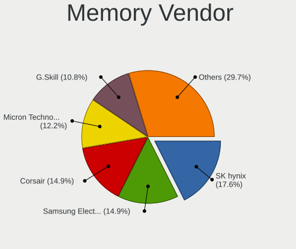

| Vendor              | Desktops | Percent |
|---------------------|----------|---------|
| SK hynix            | 13       | 17.57%  |
| Samsung Electronics | 11       | 14.86%  |
| Corsair             | 11       | 14.86%  |
| Micron Technology   | 9        | 12.16%  |
| G.Skill             | 8        | 10.81%  |
| Crucial             | 8        | 10.81%  |
| Kingston            | 5        | 6.76%   |
| Unknown             | 3        | 4.05%   |
| Unknown (0x0205)    | 1        | 1.35%   |
| Transcend           | 1        | 1.35%   |
| Team                | 1        | 1.35%   |
| Patriot             | 1        | 1.35%   |
| Hewlett-Packard     | 1        | 1.35%   |
| GOODRAM             | 1        | 1.35%   |

Memory Model
------------

Memory module models

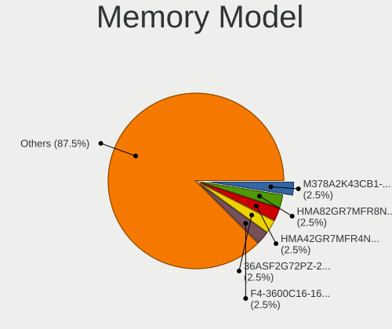

| Model                                                   | Desktops | Percent |
|---------------------------------------------------------|----------|---------|
| SK hynix RAM HMA82GR7MFR8N-UH 16GB DIMM DDR4 2400MT/s   | 2        | 2.5%    |
| SK hynix RAM HMA42GR7MFR4N-TF 16GB DIMM DDR4 2133MT/s   | 2        | 2.5%    |
| Samsung RAM M378A2K43CB1-CTD 16GB DIMM DDR4 3200MT/s    | 2        | 2.5%    |
| Micron RAM 36ASF2G72PZ-2G1A2 16GB DIMM DDR4 2400MT/s    | 2        | 2.5%    |
| G.Skill RAM F4-3600C16-16GTZNC 16GiB DIMM DDR4 3600MT/s | 2        | 2.5%    |
| Corsair RAM CMK64GX4M2D3600C18 32GB DIMM DDR4 3600MT/s  | 2        | 2.5%    |
| Corsair RAM CMK16GX4M2B3200C16 8GB DIMM DDR4 3600MT/s   | 2        | 2.5%    |
| Unknown RAM Module 8GB DIMM DDR3 1333MT/s               | 1        | 1.25%   |
| Unknown RAM Module 8192MB DIMM DDR3 1600MT/s            | 1        | 1.25%   |
| Unknown RAM Module 2GB DIMM DDR3 1600MT/s               | 1        | 1.25%   |
| Unknown (0x0205) RAM Module 8GB DIMM DDR3 1600MT/s      | 1        | 1.25%   |
| Transcend RAM TS1GLK72V3H 8GB DIMM DDR3 1333MT/s        | 1        | 1.25%   |
| Team RAM TEAMGROUP-ED4-2400 16GB DIMM DDR4 2400MT/s     | 1        | 1.25%   |
| SK hynix RAM Module 16GB Row Of Chips LPDDR4 2933MT/s   | 1        | 1.25%   |
| SK hynix RAM HMT351S6EFR8C-PB 4096MB DIMM DDR3 1333MT/s | 1        | 1.25%   |
| SK hynix RAM HMT351S6CFR8C-H9 4096MB DIMM DDR3 1333MT/s | 1        | 1.25%   |
| SK hynix RAM HMCG88AGBRA190N 32GB DIMM DDR5 5600MT/s    | 1        | 1.25%   |
| SK hynix RAM HMCG78MEBSA092N 16GB SODIMM DDR5 4800MT/s  | 1        | 1.25%   |
| SK hynix RAM HMA851U6CJR6N-VK 4GB DIMM DDR4 2667MT/s    | 1        | 1.25%   |
| SK hynix RAM HMA84GR7MFR4N-UH 32GB RIMM DDR4 2400MT/s   | 1        | 1.25%   |
| SK hynix RAM HMA82GU7AFR8N-UH 16GB DIMM DDR4 2400MT/s   | 1        | 1.25%   |
| SK hynix RAM HMA82GU6CJR8N-VK 16GB DIMM DDR4 2667MT/s   | 1        | 1.25%   |
| SK hynix RAM HMA81GU7AFR8N-UH 8GB DIMM DDR4 2400MT/s    | 1        | 1.25%   |
| Samsung RAM Module 8GB DIMM DDR4 2666MT/s               | 1        | 1.25%   |
| Samsung RAM Module 8192MB SODIMM DDR4 2667MT/s          | 1        | 1.25%   |
| Samsung RAM Module 4GB DIMM DDR4 2133MT/s               | 1        | 1.25%   |
| Samsung RAM Module 16GB DIMM DDR4 2666MT/s              | 1        | 1.25%   |
| Samsung RAM M393A2G40DB0-CPB 16GB DIMM DDR4 2133MT/s    | 1        | 1.25%   |
| Samsung RAM M393A1G43EB1-CRC 8GB DIMM DDR4 2400MT/s     | 1        | 1.25%   |
| Samsung RAM M378B5673FH0-CH9 2GB DIMM DDR3 1600MT/s     | 1        | 1.25%   |
| Samsung RAM M378B5273CH0-CH9 4GB DIMM DDR3 1867MT/s     | 1        | 1.25%   |
| Samsung RAM M378B1G73DB0-CK0 8GB DIMM DDR3 1600MT/s     | 1        | 1.25%   |
| Samsung RAM M378A1K43CB2-CTD 8GB DIMM DDR4 3266MT/s     | 1        | 1.25%   |
| Samsung RAM M3 78T5663EH3-CF7 2GB DIMM DDR2 800MT/s     | 1        | 1.25%   |
| Samsung RAM M3 78T2863EHS-CF7 1GB DIMM DDR2 800MT/s     | 1        | 1.25%   |
| Patriot RAM PSD416G26662 16GB DIMM DDR4 2667MT/s        | 1        | 1.25%   |
| Micron RAM Module 4GB DIMM DDR4 2133MT/s                | 1        | 1.25%   |
| Micron RAM 9ASF51272PZ-2G3B1 4GB RIMM DDR4 2400MT/s     | 1        | 1.25%   |
| Micron RAM 36ASF4G72PZ-2G3B1 32GB DIMM DDR4 2400MT/s    | 1        | 1.25%   |
| Micron RAM 18ASF2G72PDZ-2G6E1 16GB DIMM DDR4 2667MT/s   | 1        | 1.25%   |

Memory Kind
-----------

Memory module kinds

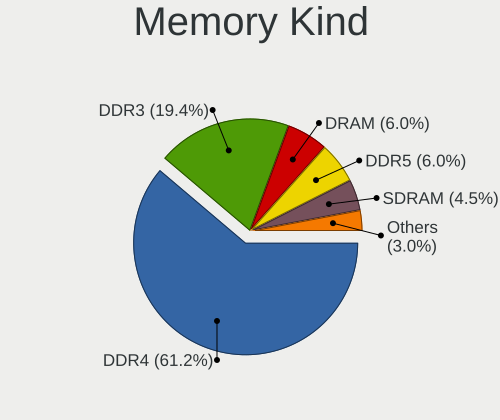

| Kind   | Desktops | Percent |
|--------|----------|---------|
| DDR4   | 41       | 61.19%  |
| DDR3   | 13       | 19.4%   |
| DRAM   | 4        | 5.97%   |
| DDR5   | 4        | 5.97%   |
| SDRAM  | 3        | 4.48%   |
| LPDDR4 | 1        | 1.49%   |
| DDR2   | 1        | 1.49%   |

Memory Form Factor
------------------

Physical design of the memory module

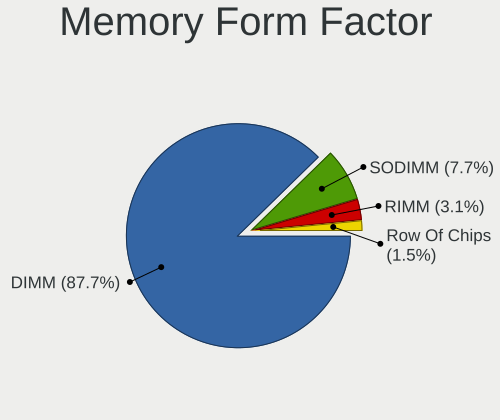

| Name         | Desktops | Percent |
|--------------|----------|---------|
| DIMM         | 57       | 87.69%  |
| SODIMM       | 5        | 7.69%   |
| RIMM         | 2        | 3.08%   |
| Row Of Chips | 1        | 1.54%   |

Memory Size
-----------

Memory module size

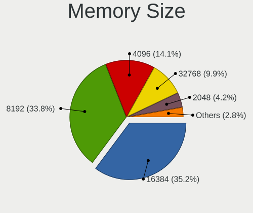

| Size  | Desktops | Percent |
|-------|----------|---------|
| 16384 | 25       | 35.21%  |
| 8192  | 24       | 33.8%   |
| 4096  | 10       | 14.08%  |
| 32768 | 7        | 9.86%   |
| 2048  | 3        | 4.23%   |
| 49152 | 1        | 1.41%   |
| 1024  | 1        | 1.41%   |

Memory Speed
------------

Memory module speed

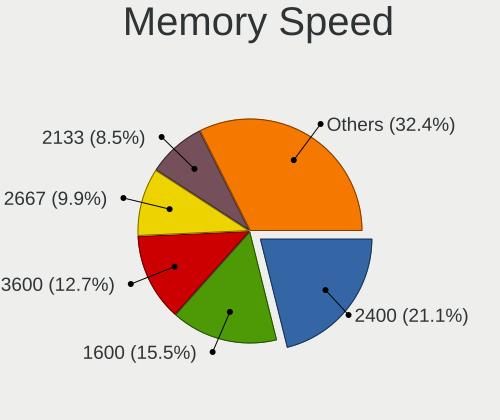

| Speed | Desktops | Percent |
|-------|----------|---------|
| 2400  | 15       | 21.13%  |
| 1600  | 11       | 15.49%  |
| 3600  | 9        | 12.68%  |
| 2667  | 7        | 9.86%   |
| 2133  | 6        | 8.45%   |
| 3200  | 4        | 5.63%   |
| 1333  | 3        | 4.23%   |
| 6400  | 2        | 2.82%   |
| 3866  | 2        | 2.82%   |
| 2933  | 2        | 2.82%   |
| 2666  | 2        | 2.82%   |
| 5600  | 1        | 1.41%   |
| 4800  | 1        | 1.41%   |
| 4000  | 1        | 1.41%   |
| 3933  | 1        | 1.41%   |
| 3266  | 1        | 1.41%   |
| 2048  | 1        | 1.41%   |
| 1867  | 1        | 1.41%   |
| 800   | 1        | 1.41%   |

Printers & scanners
-------------------

Printer Vendor
--------------

Printer device vendors

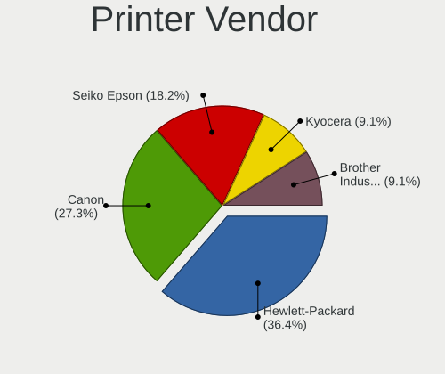

| Vendor             | Desktops | Percent |
|--------------------|----------|---------|
| Hewlett-Packard    | 4        | 36.36%  |
| Canon              | 3        | 27.27%  |
| Seiko Epson        | 2        | 18.18%  |
| Kyocera            | 1        | 9.09%   |
| Brother Industries | 1        | 9.09%   |

Printer Model
-------------

Printer device models

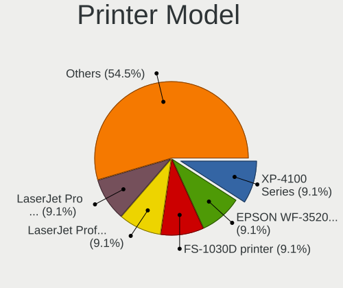

| Model                            | Desktops | Percent |
|----------------------------------|----------|---------|
| Seiko Epson XP-4100 Series       | 1        | 9.09%   |
| Seiko Epson EPSON WF-3520 Series | 1        | 9.09%   |
| Kyocera FS-1030D printer         | 1        | 9.09%   |
| HP LaserJet Professional P 1102w | 1        | 9.09%   |
| HP LaserJet Pro M118-M119        | 1        | 9.09%   |
| HP HP Laser 107w                 | 1        | 9.09%   |
| HP DeskJet 3700 series           | 1        | 9.09%   |
| Canon PIXMA MG2500 Series        | 1        | 9.09%   |
| Canon LiDE 300                   | 1        | 9.09%   |
| Canon E560 series                | 1        | 9.09%   |
| Brother DCP-1610W                | 1        | 9.09%   |

Scanner Vendor
--------------

Scanner device vendors

Zero info for selected period =(

Scanner Model
-------------

Scanner device models

Zero info for selected period =(

Camera
------

Camera Vendor
-------------

Camera device vendors

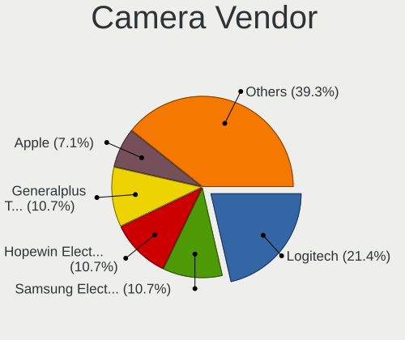

| Vendor                      | Desktops | Percent |
|-----------------------------|----------|---------|
| Logitech                    | 6        | 21.43%  |
| Samsung Electronics         | 3        | 10.71%  |
| Hopewin Electronic Material | 3        | 10.71%  |
| Generalplus Technology      | 3        | 10.71%  |
| Apple                       | 2        | 7.14%   |
| vivo                        | 1        | 3.57%   |
| Valve Software              | 1        | 3.57%   |
| Ruision                     | 1        | 3.57%   |
| Realtek Semiconductor       | 1        | 3.57%   |
| Owon                        | 1        | 3.57%   |
| Microsoft                   | 1        | 3.57%   |
| Microdia                    | 1        | 3.57%   |
| Jieli Technology            | 1        | 3.57%   |
| IMC Networks                | 1        | 3.57%   |
| Hewlett-Packard             | 1        | 3.57%   |
| ARC International           | 1        | 3.57%   |

Camera Model
------------

Camera device models

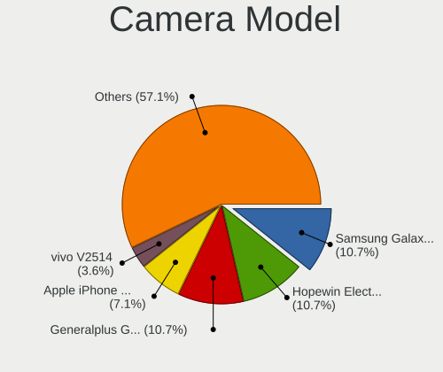

| Model                                            | Desktops | Percent |
|--------------------------------------------------|----------|---------|
| Samsung Galaxy series, misc. (MTP mode)          | 3        | 10.71%  |
| Hopewin Electronic Material FULL HD 1080P Webcam | 3        | 10.71%  |
| Generalplus GENERAL WEBCAM                       | 3        | 10.71%  |
| Apple iPhone 5/5C/5S/6/SE/7/8/X                  | 2        | 7.14%   |
| vivo V2514                                       | 1        | 3.57%   |
| Valve Software 3D Camera                         | 1        | 3.57%   |
| Ruision UVC Camera                               | 1        | 3.57%   |
| Realtek FULL HD 1080P Webcam                     | 1        | 3.57%   |
| Owon USB CAMERA                                  | 1        | 3.57%   |
| Microsoft LifeCam HD-3000                        | 1        | 3.57%   |
| Microdia USB 2.0 Camera                          | 1        | 3.57%   |
| Logitech Webcam C310                             | 1        | 3.57%   |
| Logitech Webcam C270                             | 1        | 3.57%   |
| Logitech Webcam C250                             | 1        | 3.57%   |
| Logitech HD Webcam C910                          | 1        | 3.57%   |
| Logitech HD Webcam C615                          | 1        | 3.57%   |
| Logitech C920 PRO HD Webcam                      | 1        | 3.57%   |
| Jieli USB PHY 2.0                                | 1        | 3.57%   |
| IMC Networks XHC Camera                          | 1        | 3.57%   |
| HP Webcam HD 4310                                | 1        | 3.57%   |
| ARC International Camera                         | 1        | 3.57%   |

Security
--------

Fingerprint Vendor
------------------

Fingerprint sensor vendors

Zero info for selected period =(

Fingerprint Model
-----------------

Fingerprint sensor models

Zero info for selected period =(

Chipcard Vendor
---------------

Chipcard module vendors

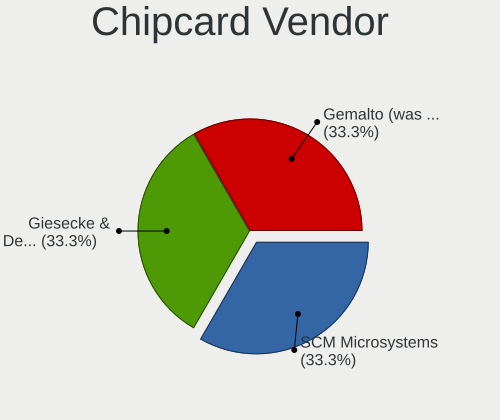

| Vendor                | Desktops | Percent |
|-----------------------|----------|---------|
| SCM Microsystems      | 1        | 33.33%  |
| Giesecke & Devrient   | 1        | 33.33%  |
| Gemalto (was Gemplus) | 1        | 33.33%  |

Chipcard Model
--------------

Chipcard module models

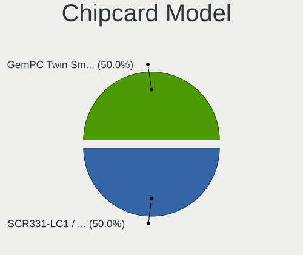

| Model                                                  | Desktops | Percent |
|--------------------------------------------------------|----------|---------|
| SCM Microsystems SCR331-LC1 / SCR3310 SmartCard Reader | 1        | 33.33%  |
| Giesecke & Devrient StarSign CUT S                     | 1        | 33.33%  |
| Gemalto (was Gemplus) GemPC Twin SmartCard Reader      | 1        | 33.33%  |

Unsupported
-----------

Unsupported Devices
-------------------

Total unsupported devices on board

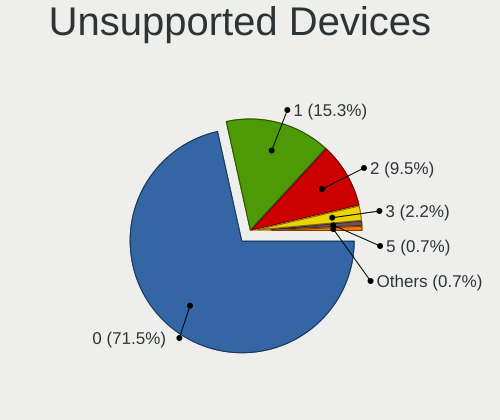

| Total | Desktops | Percent |
|-------|----------|---------|
| 0     | 98       | 71.53%  |
| 1     | 21       | 15.33%  |
| 2     | 13       | 9.49%   |
| 3     | 3        | 2.19%   |
| 5     | 1        | 0.73%   |
| 4     | 1        | 0.73%   |

Unsupported Device Types
------------------------

Types of unsupported devices

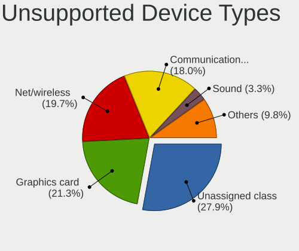

| Type                     | Desktops | Percent |
|--------------------------|----------|---------|
| Unassigned class         | 17       | 27.87%  |
| Graphics card            | 13       | 21.31%  |
| Net/wireless             | 12       | 19.67%  |
| Communication controller | 11       | 18.03%  |
| Sound                    | 2        | 3.28%   |
| Net/ethernet             | 2        | 3.28%   |
| Bluetooth                | 2        | 3.28%   |
| Storage/ide              | 1        | 1.64%   |
| Firewire controller      | 1        | 1.64%   |

