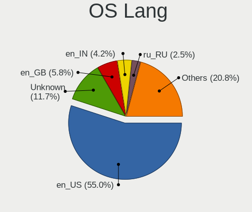
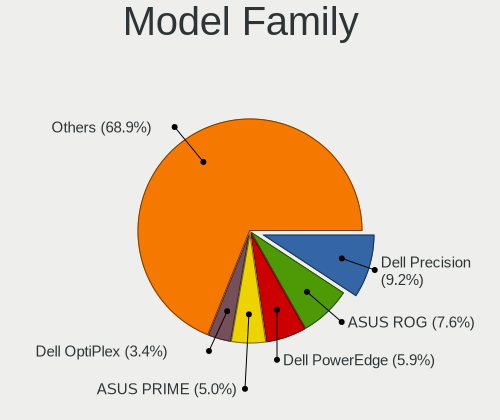
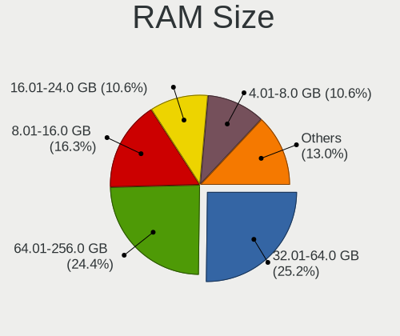
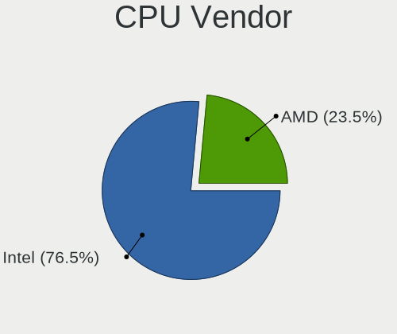
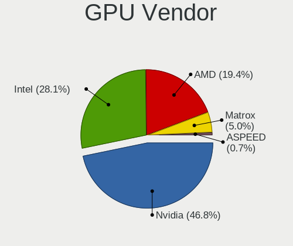
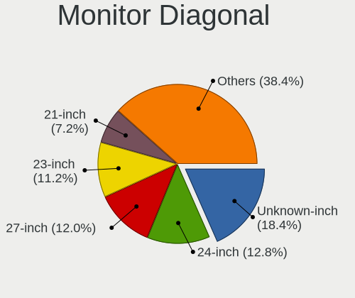
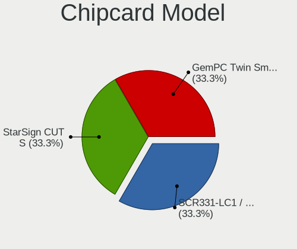

RHEL - Tested Hardware & Statistics (Desktops)
----------------------------------------------

A project to collect tested hardware configurations for RHEL.

Anyone can contribute to this report by the [hw-probe](https://github.com/linuxhw/hw-probe) tool:

    sudo -E hw-probe -all -upload

Please contribute! Especially if your hardware is rare.

Contents
--------

* [ Test Cases ](#test-cases)

* [ System ](#system)
  - [ OS                       ](#os)
  - [ OS Family                ](#os-family)
  - [ Kernel                   ](#kernel)
  - [ Kernel Family            ](#kernel-family)
  - [ Kernel Major Ver.        ](#kernel-major-ver)
  - [ Arch                     ](#arch)
  - [ DE                       ](#de)
  - [ Display Server           ](#display-server)
  - [ Display Manager          ](#display-manager)
  - [ OS Lang                  ](#os-lang)
  - [ Boot Mode                ](#boot-mode)
  - [ Filesystem               ](#filesystem)
  - [ Part. scheme             ](#part-scheme)
  - [ Dual Boot with Linux/BSD ](#dual-boot-with-linuxbsd)
  - [ Dual Boot (Win)          ](#dual-boot-win)

* [ Board ](#board)
  - [ Vendor                   ](#vendor)
  - [ Model                    ](#model)
  - [ Model Family             ](#model-family)
  - [ MFG Year                 ](#mfg-year)
  - [ Form Factor              ](#form-factor)
  - [ Secure Boot              ](#secure-boot)
  - [ Coreboot                 ](#coreboot)
  - [ RAM Size                 ](#ram-size)
  - [ RAM Used                 ](#ram-used)
  - [ Total Drives             ](#total-drives)
  - [ Has CD-ROM               ](#has-cd-rom)
  - [ Has Ethernet             ](#has-ethernet)
  - [ Has WiFi                 ](#has-wifi)
  - [ Has Bluetooth            ](#has-bluetooth)

* [ Location ](#location)
  - [ Country                  ](#country)
  - [ City                     ](#city)

* [ Drives ](#drives)
  - [ Drive Vendor             ](#drive-vendor)
  - [ Drive Model              ](#drive-model)
  - [ HDD Vendor               ](#hdd-vendor)
  - [ SSD Vendor               ](#ssd-vendor)
  - [ Drive Kind               ](#drive-kind)
  - [ Drive Connector          ](#drive-connector)
  - [ Drive Size               ](#drive-size)
  - [ Space Total              ](#space-total)
  - [ Space Used               ](#space-used)
  - [ Malfunc. Drives          ](#malfunc-drives)
  - [ Malfunc. Drive Vendor    ](#malfunc-drive-vendor)
  - [ Malfunc. HDD Vendor      ](#malfunc-hdd-vendor)
  - [ Malfunc. Drive Kind      ](#malfunc-drive-kind)
  - [ Failed Drives            ](#failed-drives)
  - [ Failed Drive Vendor      ](#failed-drive-vendor)
  - [ Drive Status             ](#drive-status)

* [ Storage controller ](#storage-controller)
  - [ Storage Vendor           ](#storage-vendor)
  - [ Storage Model            ](#storage-model)
  - [ Storage Kind             ](#storage-kind)

* [ Processor ](#processor)
  - [ CPU Vendor               ](#cpu-vendor)
  - [ CPU Model                ](#cpu-model)
  - [ CPU Model Family         ](#cpu-model-family)
  - [ CPU Cores                ](#cpu-cores)
  - [ CPU Sockets              ](#cpu-sockets)
  - [ CPU Threads              ](#cpu-threads)
  - [ CPU Op-Modes             ](#cpu-op-modes)
  - [ CPU Microcode            ](#cpu-microcode)
  - [ CPU Microarch            ](#cpu-microarch)

* [ Graphics ](#graphics)
  - [ GPU Vendor               ](#gpu-vendor)
  - [ GPU Model                ](#gpu-model)
  - [ GPU Combo                ](#gpu-combo)
  - [ GPU Driver               ](#gpu-driver)
  - [ GPU Memory               ](#gpu-memory)

* [ Monitor ](#monitor)
  - [ Monitor Vendor           ](#monitor-vendor)
  - [ Monitor Model            ](#monitor-model)
  - [ Monitor Resolution       ](#monitor-resolution)
  - [ Monitor Diagonal         ](#monitor-diagonal)
  - [ Monitor Width            ](#monitor-width)
  - [ Aspect Ratio             ](#aspect-ratio)
  - [ Monitor Area             ](#monitor-area)
  - [ Pixel Density            ](#pixel-density)
  - [ Multiple Monitors        ](#multiple-monitors)

* [ Network ](#network)
  - [ Net Controller Vendor    ](#net-controller-vendor)
  - [ Net Controller Model     ](#net-controller-model)
  - [ Wireless Vendor          ](#wireless-vendor)
  - [ Wireless Model           ](#wireless-model)
  - [ Ethernet Vendor          ](#ethernet-vendor)
  - [ Ethernet Model           ](#ethernet-model)
  - [ Net Controller Kind      ](#net-controller-kind)
  - [ Used Controller          ](#used-controller)
  - [ NICs                     ](#nics)
  - [ IPv6                     ](#ipv6)

* [ Bluetooth ](#bluetooth)
  - [ Bluetooth Vendor         ](#bluetooth-vendor)
  - [ Bluetooth Model          ](#bluetooth-model)

* [ Sound ](#sound)
  - [ Sound Vendor             ](#sound-vendor)
  - [ Sound Model              ](#sound-model)

* [ Memory ](#memory)
  - [ Memory Vendor            ](#memory-vendor)
  - [ Memory Model             ](#memory-model)
  - [ Memory Kind              ](#memory-kind)
  - [ Memory Form Factor       ](#memory-form-factor)
  - [ Memory Size              ](#memory-size)
  - [ Memory Speed             ](#memory-speed)

* [ Printers & scanners ](#printers--scanners)
  - [ Printer Vendor           ](#printer-vendor)
  - [ Printer Model            ](#printer-model)
  - [ Scanner Vendor           ](#scanner-vendor)
  - [ Scanner Model            ](#scanner-model)

* [ Camera ](#camera)
  - [ Camera Vendor            ](#camera-vendor)
  - [ Camera Model             ](#camera-model)

* [ Security ](#security)
  - [ Fingerprint Vendor       ](#fingerprint-vendor)
  - [ Fingerprint Model        ](#fingerprint-model)
  - [ Chipcard Vendor          ](#chipcard-vendor)
  - [ Chipcard Model           ](#chipcard-model)

* [ Unsupported ](#unsupported)
  - [ Unsupported Devices      ](#unsupported-devices)
  - [ Unsupported Device Types ](#unsupported-device-types)

Test Cases
----------

Total: 157

| Vendor        | Model                       | Probe                                                      | Date         |
|---------------|-----------------------------|------------------------------------------------------------|--------------|
| ASUSTek       | ROG STRIX Z590-A GAMING ... | [fba3144c06](https://linux-hardware.org/?probe=fba3144c06) | May 06, 2024 |
| MSI           | MEG Z790 ACE MAX            | [b10bbe2874](https://linux-hardware.org/?probe=b10bbe2874) | Apr 22, 2024 |
| Dell          | 07WP95 A02                  | [46e0a9d4d4](https://linux-hardware.org/?probe=46e0a9d4d4) | Apr 15, 2024 |
| CX / Air C... | CX-H87-M1                   | [6ca85693a6](https://linux-hardware.org/?probe=6ca85693a6) | Apr 12, 2024 |
| ASUSTek       | G16CH                       | [04a245fffe](https://linux-hardware.org/?probe=04a245fffe) | Apr 11, 2024 |
| ASRock        | X570 Creator                | [53aae5d4cb](https://linux-hardware.org/?probe=53aae5d4cb) | Apr 07, 2024 |
| ASRock        | X399 Taichi                 | [c57b1d4302](https://linux-hardware.org/?probe=c57b1d4302) | Apr 04, 2024 |
| ASRock        | X399 Taichi                 | [0f04c10bfa](https://linux-hardware.org/?probe=0f04c10bfa) | Apr 02, 2024 |
| HP            | 212A                        | [4a6e30808e](https://linux-hardware.org/?probe=4a6e30808e) | Mar 12, 2024 |
| Dell          | 06JWJY A00                  | [f1c6a0f9dd](https://linux-hardware.org/?probe=f1c6a0f9dd) | Mar 06, 2024 |
| ASUSTek       | TUF Gaming X670E-PLUS WI... | [23c12f49f6](https://linux-hardware.org/?probe=23c12f49f6) | Jan 27, 2024 |
| Intel         | DQ77MK AAG39642-400         | [6d4d5ee6c7](https://linux-hardware.org/?probe=6d4d5ee6c7) | Jan 25, 2024 |
| Gigabyte      | B550M AORUS PRO-P           | [cb116dae9c](https://linux-hardware.org/?probe=cb116dae9c) | Jan 20, 2024 |
| MSI           | PRO Z690-A DDR4             | [55f164e414](https://linux-hardware.org/?probe=55f164e414) | Dec 20, 2023 |
| MSI           | PRO Z690-A DDR4             | [b758a439b8](https://linux-hardware.org/?probe=b758a439b8) | Dec 20, 2023 |
| ASUSTek       | ROG Maximus Z790 HERO       | [c492be4899](https://linux-hardware.org/?probe=c492be4899) | Dec 04, 2023 |
| Dell          | 0X8DXD A00                  | [bc58f50ac6](https://linux-hardware.org/?probe=bc58f50ac6) | Nov 22, 2023 |
| ASUSTek       | ROG CROSSHAIR VIII DARK ... | [367bde5a11](https://linux-hardware.org/?probe=367bde5a11) | Nov 03, 2023 |
| ASUSTek       | PRIME Z690-A                | [e356c02979](https://linux-hardware.org/?probe=e356c02979) | Oct 30, 2023 |
| ASUSTek       | ROG Maximus XII APEX        | [2ed4b6b711](https://linux-hardware.org/?probe=2ed4b6b711) | Oct 24, 2023 |
| HP            | ProLiant ML310e Gen8        | [79f6aee2c7](https://linux-hardware.org/?probe=79f6aee2c7) | Oct 24, 2023 |
| ASUSTek       | ROG CROSSHAIR VIII DARK ... | [ff1efba80e](https://linux-hardware.org/?probe=ff1efba80e) | Sep 13, 2023 |
| ASUSTek       | ROG CROSSHAIR VIII DARK ... | [c190907cc8](https://linux-hardware.org/?probe=c190907cc8) | Aug 29, 2023 |
| ASUSTek       | STRIX Z270E GAMING          | [e5b049be3a](https://linux-hardware.org/?probe=e5b049be3a) | Aug 18, 2023 |
| ASRock        | A320M-HDV R4.0              | [f88687d2f0](https://linux-hardware.org/?probe=f88687d2f0) | Aug 15, 2023 |
| ASUSTek       | ROG STRIX Z590-E GAMING ... | [f6892c6532](https://linux-hardware.org/?probe=f6892c6532) | Aug 15, 2023 |
| ASUSTek       | ROG Maximus X HERO          | [d5d888506b](https://linux-hardware.org/?probe=d5d888506b) | Aug 10, 2023 |
| ASRock        | A320M-HDV R4.0              | [eb99d95702](https://linux-hardware.org/?probe=eb99d95702) | Aug 08, 2023 |
| ASRock        | A320M-HDV R4.0              | [de07e937bb](https://linux-hardware.org/?probe=de07e937bb) | Aug 04, 2023 |
| HP            | 0AECh D                     | [b9ea790e39](https://linux-hardware.org/?probe=b9ea790e39) | Jul 24, 2023 |
| HP            | 0AECh D                     | [078f0cd045](https://linux-hardware.org/?probe=078f0cd045) | Jul 24, 2023 |
| MSI           | Z270-A PRO                  | [0d8b3d7c32](https://linux-hardware.org/?probe=0d8b3d7c32) | Jun 20, 2023 |
| Dell          | 07T4MC A02                  | [ad310dd147](https://linux-hardware.org/?probe=ad310dd147) | Jun 09, 2023 |
| Dell          | 0HHV7N A00                  | [a3a157f327](https://linux-hardware.org/?probe=a3a157f327) | May 21, 2023 |
| MSI           | MAG X570S TOMAHAWK MAX W... | [2afc4ee693](https://linux-hardware.org/?probe=2afc4ee693) | May 18, 2023 |
| ASUSTek       | TUF Gaming X570-PLUS        | [b1ea93c5fa](https://linux-hardware.org/?probe=b1ea93c5fa) | May 09, 2023 |
| Gigabyte      | B550M AORUS PRO-P           | [18c5e3c7c3](https://linux-hardware.org/?probe=18c5e3c7c3) | Apr 10, 2023 |
| MSI           | B450M MORTAR MAX            | [0077b88576](https://linux-hardware.org/?probe=0077b88576) | Apr 06, 2023 |
| Gigabyte      | X670E AORUS MASTER          | [68731ac4ec](https://linux-hardware.org/?probe=68731ac4ec) | Mar 31, 2023 |
| ASUSTek       | PRIME Z690-P WIFI           | [898059efa5](https://linux-hardware.org/?probe=898059efa5) | Mar 28, 2023 |
| MSI           | B450M MORTAR MAX            | [29c85678af](https://linux-hardware.org/?probe=29c85678af) | Mar 28, 2023 |
| ASUSTek       | PRIME Z690-P WIFI           | [1821e3657a](https://linux-hardware.org/?probe=1821e3657a) | Mar 26, 2023 |
| MSI           | B450M MORTAR MAX            | [641481dd1d](https://linux-hardware.org/?probe=641481dd1d) | Mar 21, 2023 |
| MSI           | B450M MORTAR MAX            | [9d859cb8bd](https://linux-hardware.org/?probe=9d859cb8bd) | Mar 20, 2023 |
| Gigabyte      | X570 UD                     | [12d8200114](https://linux-hardware.org/?probe=12d8200114) | Mar 13, 2023 |
| Gigabyte      | H510M H                     | [861b7c5aa7](https://linux-hardware.org/?probe=861b7c5aa7) | Feb 02, 2023 |
| ASUSTek       | PRIME Z590-A                | [f328fab9f1](https://linux-hardware.org/?probe=f328fab9f1) | Jan 27, 2023 |
| Hardkernel    | ODROID-H3                   | [98f5768c61](https://linux-hardware.org/?probe=98f5768c61) | Jan 22, 2023 |
| Unknown       | Unknown                     | [9d66e8f05d](https://linux-hardware.org/?probe=9d66e8f05d) | Dec 25, 2022 |
| Gigabyte      | Z590I VISION D              | [9787630f1c](https://linux-hardware.org/?probe=9787630f1c) | Dec 12, 2022 |
| MSI           | B550M PRO-VDH WIFI          | [af5361313b](https://linux-hardware.org/?probe=af5361313b) | Nov 17, 2022 |
| MSI           | B550M PRO-VDH WIFI          | [2d830dc96d](https://linux-hardware.org/?probe=2d830dc96d) | Nov 11, 2022 |
| HP            | 8591                        | [98bde1bd5a](https://linux-hardware.org/?probe=98bde1bd5a) | Nov 01, 2022 |
| Gigabyte      | Z590I VISION D              | [22131a6ec5](https://linux-hardware.org/?probe=22131a6ec5) | Sep 03, 2022 |
| Acer          | Aspire XC-330               | [2012033d09](https://linux-hardware.org/?probe=2012033d09) | Aug 14, 2022 |
| Unknown       | Unknown                     | [fad6d4558f](https://linux-hardware.org/?probe=fad6d4558f) | Jul 26, 2022 |
| Intel         | H81                         | [e1a730a6e6](https://linux-hardware.org/?probe=e1a730a6e6) | Jul 08, 2022 |
| Unknown       | Unknown                     | [16c6df7b29](https://linux-hardware.org/?probe=16c6df7b29) | Jul 07, 2022 |
| Unknown       | Unknown                     | [6b25430dc1](https://linux-hardware.org/?probe=6b25430dc1) | Jul 07, 2022 |
| Dell          | 02K9CR A03                  | [5656d7a0d5](https://linux-hardware.org/?probe=5656d7a0d5) | May 27, 2022 |
| Dell          | 0N4YC8 A00                  | [74525891a0](https://linux-hardware.org/?probe=74525891a0) | May 26, 2022 |
| ASRock        | Z370 Professional Gaming... | [658347ec76](https://linux-hardware.org/?probe=658347ec76) | May 12, 2022 |
| Lenovo        | 3132 SDK0K17763 WIN 1801... | [a6e43346ba](https://linux-hardware.org/?probe=a6e43346ba) | Apr 16, 2022 |
| ASUSTek       | X99-DELUXE II               | [82939dc69f](https://linux-hardware.org/?probe=82939dc69f) | Apr 05, 2022 |
| CX / Air C... | CX-H87-M1                   | [ddfbf2df5e](https://linux-hardware.org/?probe=ddfbf2df5e) | Apr 01, 2022 |
| CX / Air C... | CX-H87-M1                   | [5a8ee938ce](https://linux-hardware.org/?probe=5a8ee938ce) | Apr 01, 2022 |
| ASRock        | X99E-ITX/ac                 | [0cf67f0201](https://linux-hardware.org/?probe=0cf67f0201) | Mar 06, 2022 |
| ASRock        | X570 Steel Legend           | [e7843ce1cf](https://linux-hardware.org/?probe=e7843ce1cf) | Mar 05, 2022 |
| ASUSTek       | Maximus VII FORMULA         | [7fd2e4885c](https://linux-hardware.org/?probe=7fd2e4885c) | Mar 05, 2022 |
| Gigabyte      | B150-HD3-CF                 | [cab21caab7](https://linux-hardware.org/?probe=cab21caab7) | Feb 10, 2022 |
| ASUSTek       | Maximus VII FORMULA         | [36c52eaf3d](https://linux-hardware.org/?probe=36c52eaf3d) | Feb 05, 2022 |
| ASUSTek       | Maximus VII FORMULA         | [07de603a4a](https://linux-hardware.org/?probe=07de603a4a) | Jan 31, 2022 |
| Gigabyte      | Z97N-WIFI                   | [5808f89618](https://linux-hardware.org/?probe=5808f89618) | Jan 07, 2022 |
| ASUSTek       | PRIME B360M-D               | [e3b3ac9f8b](https://linux-hardware.org/?probe=e3b3ac9f8b) | Jan 01, 2022 |
| Lenovo        | MAHOBAY                     | [ea1413bf9e](https://linux-hardware.org/?probe=ea1413bf9e) | Nov 19, 2021 |
| HP            | ProLiant MicroServer Gen... | [0178a25382](https://linux-hardware.org/?probe=0178a25382) | Nov 18, 2021 |
| ASUSTek       | PRIME B350M-A               | [d3d69e7587](https://linux-hardware.org/?probe=d3d69e7587) | Oct 24, 2021 |
| ASUSTek       | Pro WS X570-ACE             | [07a5b3c465](https://linux-hardware.org/?probe=07a5b3c465) | Oct 16, 2021 |
| ASUSTek       | PRIME B350M-A               | [66cd9bb2c9](https://linux-hardware.org/?probe=66cd9bb2c9) | Oct 09, 2021 |
| ASUSTek       | Z87-DELUXE                  | [63b48dfa23](https://linux-hardware.org/?probe=63b48dfa23) | Oct 07, 2021 |
| HP            | 212B                        | [322371cc6a](https://linux-hardware.org/?probe=322371cc6a) | Oct 04, 2021 |
| ASUSTek       | Z87-DELUXE                  | [2792a3ef1c](https://linux-hardware.org/?probe=2792a3ef1c) | Oct 03, 2021 |
| Gigabyte      | Z97N-WIFI                   | [539316ac91](https://linux-hardware.org/?probe=539316ac91) | Sep 30, 2021 |
| Gigabyte      | Z97N-WIFI                   | [95ae5d0e04](https://linux-hardware.org/?probe=95ae5d0e04) | Sep 29, 2021 |
| Lenovo        | MAHOBAY                     | [fc498b8cb0](https://linux-hardware.org/?probe=fc498b8cb0) | Sep 10, 2021 |
| ASUSTek       | PRIME B350M-A               | [35fa4b96f4](https://linux-hardware.org/?probe=35fa4b96f4) | Sep 09, 2021 |
| Gigabyte      | Z390 AORUS ULTRA-CF         | [f7bcc3d753](https://linux-hardware.org/?probe=f7bcc3d753) | Aug 25, 2021 |
| Gigabyte      | 970A-D3                     | [d62c66d9bd](https://linux-hardware.org/?probe=d62c66d9bd) | Aug 12, 2021 |
| Gigabyte      | Z490 GAMING X               | [a540fa2f59](https://linux-hardware.org/?probe=a540fa2f59) | Jul 19, 2021 |
| Dell          | 0MWYPT A02                  | [ab6e7450c3](https://linux-hardware.org/?probe=ab6e7450c3) | Jul 01, 2021 |
| Intel         | DX79SR AAG57199-200         | [380f10f479](https://linux-hardware.org/?probe=380f10f479) | Jun 10, 2021 |
| HP            | 1906                        | [bf20783dee](https://linux-hardware.org/?probe=bf20783dee) | Jun 02, 2021 |
| Gigabyte      | B85M-D3V-A                  | [4405336208](https://linux-hardware.org/?probe=4405336208) | Jun 01, 2021 |
| MSI           | MPG Z390 GAMING PLUS        | [2eebd180f8](https://linux-hardware.org/?probe=2eebd180f8) | May 28, 2021 |
| HP            | 2129                        | [3991895525](https://linux-hardware.org/?probe=3991895525) | May 23, 2021 |
| MSI           | Z77A-G45                    | [9b11ff6d26](https://linux-hardware.org/?probe=9b11ff6d26) | May 22, 2021 |
| MSI           | Z77A-G45                    | [bd980d04be](https://linux-hardware.org/?probe=bd980d04be) | May 22, 2021 |
| ASUSTek       | ROG Maximus X HERO          | [4a38b848dd](https://linux-hardware.org/?probe=4a38b848dd) | May 19, 2021 |
| HP            | 8054                        | [cf6b804c19](https://linux-hardware.org/?probe=cf6b804c19) | May 13, 2021 |
| ASRock        | X99E-ITX/ac                 | [9cacd1608e](https://linux-hardware.org/?probe=9cacd1608e) | May 08, 2021 |
| ASUSTek       | PRIME B360M-D               | [3dce7dc37d](https://linux-hardware.org/?probe=3dce7dc37d) | Mar 20, 2021 |
| ASRock        | A300M-STX                   | [22c97ac8b2](https://linux-hardware.org/?probe=22c97ac8b2) | Feb 27, 2021 |
| Dell          | 0NNNCT A01                  | [3f081f03fe](https://linux-hardware.org/?probe=3f081f03fe) | Feb 22, 2021 |
| Dell          | PowerEdge FC630             | [98ea3e97e6](https://linux-hardware.org/?probe=98ea3e97e6) | Jan 25, 2021 |
| Dell          | PowerEdge FC630             | [2da05b98bf](https://linux-hardware.org/?probe=2da05b98bf) | Jan 25, 2021 |
| ASUSTek       | ROG Maximus X HERO          | [d0ac809f8a](https://linux-hardware.org/?probe=d0ac809f8a) | Jan 15, 2021 |
| Dell          | PowerEdge FC630             | [038ccd7256](https://linux-hardware.org/?probe=038ccd7256) | Jan 15, 2021 |
| Dell          | PowerEdge FC630             | [f0441f0a07](https://linux-hardware.org/?probe=f0441f0a07) | Jan 15, 2021 |
| Dell          | PowerEdge FC630             | [3c396f0b59](https://linux-hardware.org/?probe=3c396f0b59) | Jan 15, 2021 |
| Dell          | PowerEdge FC630             | [ab4ea06f29](https://linux-hardware.org/?probe=ab4ea06f29) | Jan 15, 2021 |
| ASUSTek       | ROG STRIX B350-F GAMING     | [e10979867d](https://linux-hardware.org/?probe=e10979867d) | Jan 13, 2021 |
| ASUSTek       | H87M-PLUS                   | [95389bff49](https://linux-hardware.org/?probe=95389bff49) | Jan 13, 2021 |
| ASRock        | H270 Pro4                   | [3a3b83a6ed](https://linux-hardware.org/?probe=3a3b83a6ed) | Jan 07, 2021 |
| Unknown       | SKYBAY                      | [d99f937c68](https://linux-hardware.org/?probe=d99f937c68) | Dec 12, 2020 |
| HP            | 1905                        | [6690d08a07](https://linux-hardware.org/?probe=6690d08a07) | Dec 04, 2020 |
| Dell          | 082WXT A01                  | [8d9240a29c](https://linux-hardware.org/?probe=8d9240a29c) | Nov 19, 2020 |
| Dell          | 082WXT A01                  | [0a2176308f](https://linux-hardware.org/?probe=0a2176308f) | Nov 17, 2020 |
| HP            | 81B4                        | [12ac27dcb5](https://linux-hardware.org/?probe=12ac27dcb5) | Nov 14, 2020 |
| HP            | 81B4                        | [faf7b737fe](https://linux-hardware.org/?probe=faf7b737fe) | Nov 14, 2020 |
| MSI           | H310M PRO-VD                | [18c316813f](https://linux-hardware.org/?probe=18c316813f) | Nov 11, 2020 |
| HP            | 1905                        | [0e53545ff8](https://linux-hardware.org/?probe=0e53545ff8) | Oct 14, 2020 |
| ASUSTek       | Z10PE-D16 WS                | [7bf945cd18](https://linux-hardware.org/?probe=7bf945cd18) | Oct 13, 2020 |
| HP            | 1905                        | [48fd57f60f](https://linux-hardware.org/?probe=48fd57f60f) | Sep 24, 2020 |
| HP            | 1905                        | [0e2d6062d9](https://linux-hardware.org/?probe=0e2d6062d9) | Sep 24, 2020 |
| HP            | 843F                        | [6f9898a049](https://linux-hardware.org/?probe=6f9898a049) | Sep 24, 2020 |
| HP            | 843F                        | [91498f153e](https://linux-hardware.org/?probe=91498f153e) | Sep 18, 2020 |
| HP            | 843F                        | [e0bdf38c8a](https://linux-hardware.org/?probe=e0bdf38c8a) | Jul 16, 2020 |
| Lenovo        | 3132 SDK0J40697 WIN 3305... | [b9a88cd7cf](https://linux-hardware.org/?probe=b9a88cd7cf) | Jun 13, 2020 |
| ASUSTek       | P8Z77-V PRO                 | [b97f2eb31f](https://linux-hardware.org/?probe=b97f2eb31f) | May 20, 2020 |
| HP            | 158A                        | [344194646f](https://linux-hardware.org/?probe=344194646f) | May 14, 2020 |
| Dell          | 00V62H A01                  | [220c6fdf1c](https://linux-hardware.org/?probe=220c6fdf1c) | May 13, 2020 |
| Lenovo        | 3132 SDK0J40697 WIN 3305... | [6237c4cae4](https://linux-hardware.org/?probe=6237c4cae4) | May 10, 2020 |
| ASRockRack    | EP2C612 WS                  | [9657b92263](https://linux-hardware.org/?probe=9657b92263) | Apr 14, 2020 |
| Gigabyte      | B75-D3V                     | [73b3145cb4](https://linux-hardware.org/?probe=73b3145cb4) | Apr 10, 2020 |
| ASRockRack    | EP2C612 WS                  | [8dad315eb5](https://linux-hardware.org/?probe=8dad315eb5) | Apr 07, 2020 |
| Lenovo        | 3132 SDK0J40697 WIN 3305... | [848a63637f](https://linux-hardware.org/?probe=848a63637f) | Apr 01, 2020 |
| Alienware     | 0VDT73 A00                  | [00cc8f89dc](https://linux-hardware.org/?probe=00cc8f89dc) | Mar 17, 2020 |
| Lenovo        | 3132 SDK0J40697 WIN 3305... | [a018f0a4d4](https://linux-hardware.org/?probe=a018f0a4d4) | Feb 27, 2020 |
| Lenovo        | ThinkCentre M91p 0266RZ1    | [ce36caf100](https://linux-hardware.org/?probe=ce36caf100) | Feb 18, 2020 |
| Lenovo        | ThinkCentre M91p 0266RZ1    | [13d8453be0](https://linux-hardware.org/?probe=13d8453be0) | Feb 18, 2020 |
| MSI           | B350M MORTAR                | [9496a3ac2c](https://linux-hardware.org/?probe=9496a3ac2c) | Feb 10, 2020 |
| ASUSTek       | P8Z77-V PRO                 | [0a9570ceaf](https://linux-hardware.org/?probe=0a9570ceaf) | Jan 29, 2020 |
| Dell          | 0XR1GT A00                  | [319aa86f81](https://linux-hardware.org/?probe=319aa86f81) | Jan 25, 2020 |
| Dell          | 0XR1GT A00                  | [189883a0aa](https://linux-hardware.org/?probe=189883a0aa) | Jan 25, 2020 |
| ASUSTek       | PRIME X470-PRO              | [bfacbe4d23](https://linux-hardware.org/?probe=bfacbe4d23) | Jan 18, 2020 |
| MSI           | B350M MORTAR                | [f53a75b96e](https://linux-hardware.org/?probe=f53a75b96e) | Jan 10, 2020 |
| ASUSTek       | P8Z77-V PRO                 | [6bffc36e6a](https://linux-hardware.org/?probe=6bffc36e6a) | Jan 06, 2020 |
| ASRock        | H91M-PLUS                   | [c90d6b4c4d](https://linux-hardware.org/?probe=c90d6b4c4d) | Dec 30, 2019 |
| Lenovo        | 3132 SDK0J40697 WIN 3305... | [fff26d5712](https://linux-hardware.org/?probe=fff26d5712) | Dec 21, 2019 |
| Lenovo        | 3132 SDK0J40697 WIN 3305... | [199fad181e](https://linux-hardware.org/?probe=199fad181e) | Nov 29, 2019 |
| Dell          | 0G919G A00                  | [bdf53b02dc](https://linux-hardware.org/?probe=bdf53b02dc) | Nov 18, 2019 |
| Lenovo        | 3132 SDK0J40697 WIN 3305... | [6a11247e37](https://linux-hardware.org/?probe=6a11247e37) | Nov 11, 2019 |
| Supermicro    | X7DWN+                      | [505e506351](https://linux-hardware.org/?probe=505e506351) | Oct 26, 2019 |
| Supermicro    | X7DWN+                      | [5ad617d6ad](https://linux-hardware.org/?probe=5ad617d6ad) | Oct 25, 2019 |
| Dell          | 0HHV7N A00                  | [9e55c4bdee](https://linux-hardware.org/?probe=9e55c4bdee) | Apr 05, 2019 |
| HP            | 158A                        | [6924d366ab](https://linux-hardware.org/?probe=6924d366ab) | Jan 09, 2019 |
| Dell          | 05DN3X A00                  | [4be9ce0f72](https://linux-hardware.org/?probe=4be9ce0f72) | Dec 20, 2018 |

System
------

OS
--

Installed operating systems

| Name   | Desktops | Percent |
|--------|----------|---------|
| RHEL 8 | 56       | 52.34%  |
| RHEL 9 | 37       | 34.58%  |
| RHEL 7 | 14       | 13.08%  |

OS Family
---------

OS without a version

| Name | Desktops | Percent |
|------|----------|---------|
| RHEL | 106      | 100%    |

Kernel
------

Version of the Linux kernel

| Version                      | Desktops | Percent |
|------------------------------|----------|---------|
| 5.14.0-362.24.1.el9_3.x86_64 | 7        | 5.65%   |
| 4.18.0-305.el8.x86_64        | 7        | 5.65%   |
| 4.18.0-147.3.1.el8_1.x86_64  | 6        | 4.84%   |
| 5.14.0-162.6.1.el9_1.x86_64  | 5        | 4.03%   |
| 5.14.0-284.11.1.el9_2.x86_64 | 4        | 3.23%   |
| 4.18.0-348.20.1.el8_5.x86_64 | 4        | 3.23%   |
| 4.18.0-305.19.1.el8_4.x86_64 | 4        | 3.23%   |
| 4.18.0-240.1.1.el8_3.x86_64  | 4        | 3.23%   |
| 5.14.0-70.17.1.el9_0.x86_64  | 3        | 2.42%   |
| 5.14.0-362.13.1.el9_3.x86_64 | 3        | 2.42%   |
| 5.14.0-284.25.1.el9_2.x86_64 | 3        | 2.42%   |
| 5.14.0-162.22.2.el9_1.x86_64 | 3        | 2.42%   |
| 4.18.0-348.12.2.el8_5.x86_64 | 3        | 2.42%   |
| 4.18.0-240.22.1.el8_3.x86_64 | 3        | 2.42%   |
| 4.18.0-240.10.1.el8_3.x86_64 | 3        | 2.42%   |
| 4.18.0-147.5.1.el8_1.x86_64  | 3        | 2.42%   |
| 3.10.0-862.3.2.el7.x86_64    | 3        | 2.42%   |
| 5.14.0-70.22.1.el9_0.x86_64  | 2        | 1.61%   |
| 5.14.0-284.30.1.el9_2.x86_64 | 2        | 1.61%   |
| 5.14.0-162.12.1.el9_1.x86_64 | 2        | 1.61%   |
| 4.18.0-348.2.1.el8_5.x86_64  | 2        | 1.61%   |
| 4.18.0-305.10.2.el8_4.x86_64 | 2        | 1.61%   |
| 4.18.0-240.15.1.el8_3.x86_64 | 2        | 1.61%   |
| 4.18.0-193.el8.x86_64        | 2        | 1.61%   |
| 4.18.0-193.6.3.el8_2.x86_64  | 2        | 1.61%   |
| 4.18.0-193.19.1.el8_2.x86_64 | 2        | 1.61%   |
| 4.18.0-147.el8.x86_64        | 2        | 1.61%   |
| 5.14.0-70.5.1.el9_0.x86_64   | 1        | 0.81%   |
| 5.14.0-362.8.1.el9_3.x86_64  | 1        | 0.81%   |
| 5.14.0-362.18.1.el9_3.x86_64 | 1        | 0.81%   |
| 5.14.0-284.18.1.el9_2.x86_64 | 1        | 0.81%   |
| 5.14.0-162.23.1.el9_1.x86_64 | 1        | 0.81%   |
| 5.10.6-1.el8.elrepo.x86_64   | 1        | 0.81%   |
| 4.19.150                     | 1        | 0.81%   |
| 4.18.0-80.11.2.el8_0.x86_64  | 1        | 0.81%   |
| 4.18.0-513.18.1.el8_9.x86_64 | 1        | 0.81%   |
| 4.18.0-513.1.1.el8_9.x86_64  | 1        | 0.81%   |
| 4.18.0-477.15.1.el8_8.x86_64 | 1        | 0.81%   |
| 4.18.0-425.3.1.el8.x86_64    | 1        | 0.81%   |
| 4.18.0-425.10.1.el8_7.x86_64 | 1        | 0.81%   |

Kernel Family
-------------

Linux kernel without a distro release

| Version  | Desktops | Percent |
|----------|----------|---------|
| 4.18.0   | 54       | 50.47%  |
| 5.14.0   | 37       | 34.58%  |
| 3.10.0   | 14       | 13.08%  |
| 5.10.6   | 1        | 0.93%   |
| 4.19.150 | 1        | 0.93%   |

Kernel Major Ver.
-----------------

Linux kernel major version

| Version | Desktops | Percent |
|---------|----------|---------|
| 4.18    | 54       | 50.47%  |
| 5.14    | 37       | 34.58%  |
| 3.10    | 14       | 13.08%  |
| 5.10    | 1        | 0.93%   |
| 4.19    | 1        | 0.93%   |

Arch
----

OS architecture (x86_64, i586, etc.)

| Name   | Desktops | Percent |
|--------|----------|---------|
| x86_64 | 106      | 100%    |

DE
--

Desktop Environment

| Name          | Desktops | Percent |
|---------------|----------|---------|
| GNOME         | 80       | 73.39%  |
| Unknown       | 16       | 14.68%  |
| KDE5          | 4        | 3.67%   |
| GNOME Classic | 4        | 3.67%   |
| KDE           | 2        | 1.83%   |
| MATE          | 1        | 0.92%   |
| KDE4          | 1        | 0.92%   |
| Cinnamon      | 1        | 0.92%   |

Display Server
--------------

X11 or Wayland

| Name    | Desktops | Percent |
|---------|----------|---------|
| Wayland | 51       | 46.36%  |
| X11     | 50       | 45.45%  |
| Unknown | 7        | 6.36%   |
| Tty     | 2        | 1.82%   |

Display Manager
---------------

SDDM, LightDM, etc.

| Name    | Desktops | Percent |
|---------|----------|---------|
| Unknown | 72       | 66.06%  |
| GDM     | 33       | 30.28%  |
| SDDM    | 2        | 1.83%   |
| LightDM | 2        | 1.83%   |

OS Lang
-------

Language

| Lang    | Desktops | Percent |
|---------|----------|---------|
| en_US   | 60       | 56.07%  |
| Unknown | 13       | 12.15%  |
| en_GB   | 7        | 6.54%   |
| en_IN   | 4        | 3.74%   |
| ru_RU   | 3        | 2.8%    |
| en_NZ   | 3        | 2.8%    |
| pt_BR   | 2        | 1.87%   |
| pl_PL   | 2        | 1.87%   |
| es_ES   | 2        | 1.87%   |
| es_AR   | 2        | 1.87%   |
| de_DE   | 2        | 1.87%   |
| sl_SI   | 1        | 0.93%   |
| ko_KR   | 1        | 0.93%   |
| ja_JP   | 1        | 0.93%   |
| es_MX   | 1        | 0.93%   |
| en_ZA   | 1        | 0.93%   |
| en_CA   | 1        | 0.93%   |
| cs_CZ   | 1        | 0.93%   |

Boot Mode
---------

EFI or BIOS

| Mode | Desktops | Percent |
|------|----------|---------|
| EFI  | 71       | 66.36%  |
| BIOS | 36       | 33.64%  |

Filesystem
----------

Type of filesystem

| Type    | Desktops | Percent |
|---------|----------|---------|
| Xfs     | 97       | 90.65%  |
| Ext4    | 7        | 6.54%   |
| Unknown | 3        | 2.8%    |

Part. scheme
------------

Scheme of partitioning

| Type    | Desktops | Percent |
|---------|----------|---------|
| Unknown | 57       | 52.29%  |
| GPT     | 38       | 34.86%  |
| MBR     | 14       | 12.84%  |

Dual Boot with Linux/BSD
------------------------

Hosting more than one Linux/BSD

| Dual boot | Desktops | Percent |
|-----------|----------|---------|
| No        | 85       | 79.44%  |
| Yes       | 22       | 20.56%  |

Dual Boot (Win)
---------------

Hosting Linux and Windows

| Dual boot | Desktops | Percent |
|-----------|----------|---------|
| No        | 95       | 88.79%  |
| Yes       | 12       | 11.21%  |

Board
-----

Vendor
------

Motherboard manufacturer

| Name                | Desktops | Percent |
|---------------------|----------|---------|
| ASUSTek Computer    | 24       | 22.64%  |
| Dell                | 21       | 19.81%  |
| Hewlett-Packard     | 13       | 12.26%  |
| Gigabyte Technology | 13       | 12.26%  |
| MSI                 | 10       | 9.43%   |
| ASRock              | 9        | 8.49%   |
| Lenovo              | 4        | 3.77%   |
| Unknown             | 4        | 3.77%   |
| Intel               | 3        | 2.83%   |
| Supermicro          | 1        | 0.94%   |
| Hardkernel          | 1        | 0.94%   |
| CX / Air Computers. | 1        | 0.94%   |
| Alienware           | 1        | 0.94%   |
| Acer                | 1        | 0.94%   |

Model
-----

Motherboard model

| Name                                | Desktops | Percent |
|-------------------------------------|----------|---------|
| Dell PowerEdge FC630                | 6        | 5.66%   |
| ASUS All Series                     | 4        | 3.77%   |
| Unknown                             | 4        | 3.77%   |
| HP Z620 Workstation                 | 2        | 1.89%   |
| Gigabyte B550M AORUS PRO-P          | 2        | 1.89%   |
| Dell Precision Tower 5810           | 2        | 1.89%   |
| Dell Precision 5820 Tower           | 2        | 1.89%   |
| Dell OptiPlex 9020                  | 2        | 1.89%   |
| Supermicro X7DW3                    | 1        | 0.94%   |
| MSI MS-7D86                         | 1        | 0.94%   |
| MSI MS-7D54                         | 1        | 0.94%   |
| MSI MS-7D25                         | 1        | 0.94%   |
| MSI MS-7C95                         | 1        | 0.94%   |
| MSI MS-7B89                         | 1        | 0.94%   |
| MSI MS-7B51                         | 1        | 0.94%   |
| MSI MS-7B33                         | 1        | 0.94%   |
| MSI MS-7A71                         | 1        | 0.94%   |
| MSI MS-7A37                         | 1        | 0.94%   |
| MSI MS-7752                         | 1        | 0.94%   |
| Lenovo ThinkCentre M92p 3238AZ8     | 1        | 0.94%   |
| Lenovo ThinkCentre M920t 10SFS03200 | 1        | 0.94%   |
| Lenovo ThinkCentre M91p 0266RZ1     | 1        | 0.94%   |
| Lenovo 10SFS03200                   | 1        | 0.94%   |
| Intel H81                           | 1        | 0.94%   |
| Intel DX79SR AAG57199-200           | 1        | 0.94%   |
| Intel DQ77MK AAG39642-400           | 1        | 0.94%   |
| HP Z840 Workstation                 | 1        | 0.94%   |
| HP Z800 Workstation                 | 1        | 0.94%   |
| HP Z440 Workstation                 | 1        | 0.94%   |
| HP Z230 Tower Workstation           | 1        | 0.94%   |
| HP Z230 SFF Workstation             | 1        | 0.94%   |
| HP Z1 Entry Tower G5                | 1        | 0.94%   |
| HP ProLiant ML310e Gen8             | 1        | 0.94%   |
| HP ProLiant MicroServer Gen8        | 1        | 0.94%   |
| HP EliteDesk 800 G2 SFF             | 1        | 0.94%   |
| HP 290 G1 SFF Business PC           | 1        | 0.94%   |
| HP 260-P020il                       | 1        | 0.94%   |
| Hardkernel ODROID-H3                | 1        | 0.94%   |
| Gigabyte Z97N-WIFI                  | 1        | 0.94%   |
| Gigabyte Z590I VISION D             | 1        | 0.94%   |

Model Family
------------

Motherboard model prefix

| Name                 | Desktops | Percent |
|----------------------|----------|---------|
| Dell Precision       | 8        | 7.55%   |
| ASUS ROG             | 8        | 7.55%   |
| Dell PowerEdge       | 7        | 6.6%    |
| ASUS PRIME           | 6        | 5.66%   |
| Dell OptiPlex        | 4        | 3.77%   |
| ASUS All             | 4        | 3.77%   |
| Unknown              | 4        | 3.77%   |
| Lenovo ThinkCentre   | 3        | 2.83%   |
| HP Z620              | 2        | 1.89%   |
| HP Z230              | 2        | 1.89%   |
| HP ProLiant          | 2        | 1.89%   |
| Gigabyte B550M       | 2        | 1.89%   |
| ASUS TUF             | 2        | 1.89%   |
| ASRock X570          | 2        | 1.89%   |
| Supermicro X7DW3     | 1        | 0.94%   |
| MSI MS-7D86          | 1        | 0.94%   |
| MSI MS-7D54          | 1        | 0.94%   |
| MSI MS-7D25          | 1        | 0.94%   |
| MSI MS-7C95          | 1        | 0.94%   |
| MSI MS-7B89          | 1        | 0.94%   |
| MSI MS-7B51          | 1        | 0.94%   |
| MSI MS-7B33          | 1        | 0.94%   |
| MSI MS-7A71          | 1        | 0.94%   |
| MSI MS-7A37          | 1        | 0.94%   |
| MSI MS-7752          | 1        | 0.94%   |
| Lenovo 10SFS03200    | 1        | 0.94%   |
| Intel H81            | 1        | 0.94%   |
| Intel DX79SR         | 1        | 0.94%   |
| Intel DQ77MK         | 1        | 0.94%   |
| HP Z840              | 1        | 0.94%   |
| HP Z800              | 1        | 0.94%   |
| HP Z440              | 1        | 0.94%   |
| HP Z1                | 1        | 0.94%   |
| HP EliteDesk         | 1        | 0.94%   |
| HP 290               | 1        | 0.94%   |
| HP 260-P020il        | 1        | 0.94%   |
| Hardkernel ODROID-H3 | 1        | 0.94%   |
| Gigabyte Z97N-WIFI   | 1        | 0.94%   |
| Gigabyte Z590I       | 1        | 0.94%   |
| Gigabyte Z490        | 1        | 0.94%   |

MFG Year
--------

Motherboard manufacture year

| Year | Desktops | Percent |
|------|----------|---------|
| 2016 | 15       | 14.15%  |
| 2018 | 13       | 12.26%  |
| 2019 | 11       | 10.38%  |
| 2017 | 11       | 10.38%  |
| 2021 | 10       | 9.43%   |
| 2012 | 9        | 8.49%   |
| 2022 | 7        | 6.6%    |
| 2015 | 7        | 6.6%    |
| 2013 | 6        | 5.66%   |
| 2020 | 5        | 4.72%   |
| 2023 | 4        | 3.77%   |
| 2014 | 3        | 2.83%   |
| 2010 | 2        | 1.89%   |
| 2009 | 2        | 1.89%   |
| 2011 | 1        | 0.94%   |

Form Factor
-----------

Physical design of the computer

| Name    | Desktops | Percent |
|---------|----------|---------|
| Desktop | 106      | 100%    |

Secure Boot
-----------

Enabled or disabled

| State    | Desktops | Percent |
|----------|----------|---------|
| Disabled | 101      | 94.39%  |
| Enabled  | 6        | 5.61%   |

Coreboot
--------

Have coreboot on board

| Used | Desktops | Percent |
|------|----------|---------|
| No   | 106      | 100%    |

RAM Size
--------

Total RAM memory

| Size in GB      | Desktops | Percent |
|-----------------|----------|---------|
| 32.01-64.0      | 26       | 23.64%  |
| 64.01-256.0     | 26       | 23.64%  |
| 8.01-16.0       | 19       | 17.27%  |
| 16.01-24.0      | 13       | 11.82%  |
| 4.01-8.0        | 12       | 10.91%  |
| 24.01-32.0      | 9        | 8.18%   |
| More than 256.0 | 2        | 1.82%   |
| 3.01-4.0        | 2        | 1.82%   |
| 2.01-3.0        | 1        | 0.91%   |

RAM Used
--------

Used RAM memory

| Used GB    | Desktops | Percent |
|------------|----------|---------|
| 4.01-8.0   | 34       | 28.1%   |
| 2.01-3.0   | 32       | 26.45%  |
| 8.01-16.0  | 21       | 17.36%  |
| 3.01-4.0   | 19       | 15.7%   |
| 1.01-2.0   | 10       | 8.26%   |
| 16.01-24.0 | 3        | 2.48%   |
| 24.01-32.0 | 1        | 0.83%   |
| 0.51-1.0   | 1        | 0.83%   |

Total Drives
------------

Number of drives on board

| Drives | Desktops | Percent |
|--------|----------|---------|
| 2      | 35       | 31.25%  |
| 1      | 27       | 24.11%  |
| 3      | 19       | 16.96%  |
| 5      | 10       | 8.93%   |
| 4      | 10       | 8.93%   |
| 12     | 3        | 2.68%   |
| 8      | 2        | 1.79%   |
| 6      | 2        | 1.79%   |
| 14     | 1        | 0.89%   |
| 10     | 1        | 0.89%   |
| 7      | 1        | 0.89%   |
| 0      | 1        | 0.89%   |

Has CD-ROM
----------

Has CD-ROM on board

| Presented | Desktops | Percent |
|-----------|----------|---------|
| No        | 66       | 61.68%  |
| Yes       | 41       | 38.32%  |

Has Ethernet
------------

Has Ethernet on board

| Presented | Desktops | Percent |
|-----------|----------|---------|
| Yes       | 106      | 100%    |

Has WiFi
--------

Has WiFi module

| Presented | Desktops | Percent |
|-----------|----------|---------|
| Yes       | 54       | 50%     |
| No        | 54       | 50%     |

Has Bluetooth
-------------

Has Bluetooth module

| Presented | Desktops | Percent |
|-----------|----------|---------|
| No        | 61       | 56.48%  |
| Yes       | 47       | 43.52%  |

Location
--------

Country
-------

Geographic location (country)

| Country      | Desktops | Percent |
|--------------|----------|---------|
| USA          | 29       | 27.36%  |
| Germany      | 10       | 9.43%   |
| UK           | 8        | 7.55%   |
| India        | 7        | 6.6%    |
| Canada       | 6        | 5.66%   |
| Czechia      | 5        | 4.72%   |
| Spain        | 3        | 2.83%   |
| Russia       | 3        | 2.83%   |
| New Zealand  | 3        | 2.83%   |
| Italy        | 3        | 2.83%   |
| Brazil       | 3        | 2.83%   |
| Ukraine      | 2        | 1.89%   |
| Sweden       | 2        | 1.89%   |
| South Korea  | 2        | 1.89%   |
| Poland       | 2        | 1.89%   |
| Argentina    | 2        | 1.89%   |
| Turkmenistan | 1        | 0.94%   |
| Switzerland  | 1        | 0.94%   |
| South Africa | 1        | 0.94%   |
| Slovenia     | 1        | 0.94%   |
| Netherlands  | 1        | 0.94%   |
| Mexico       | 1        | 0.94%   |
| Lithuania    | 1        | 0.94%   |
| Japan        | 1        | 0.94%   |
| Indonesia    | 1        | 0.94%   |
| France       | 1        | 0.94%   |
| Finland      | 1        | 0.94%   |
| Egypt        | 1        | 0.94%   |
| China        | 1        | 0.94%   |
| Belgium      | 1        | 0.94%   |
| Belarus      | 1        | 0.94%   |
| Austria      | 1        | 0.94%   |

City
----

Geographic location (city)

| City                  | Desktops | Percent |
|-----------------------|----------|---------|
| Petersberg            | 6        | 5.45%   |
| Prague                | 4        | 3.64%   |
| Wellington            | 2        | 1.82%   |
| Kyiv                  | 2        | 1.82%   |
| Chicago               | 2        | 1.82%   |
| Bengaluru             | 2        | 1.82%   |
| Yorktown Heights      | 1        | 0.91%   |
| Yongin-si             | 1        | 0.91%   |
| Wildomar              | 1        | 0.91%   |
| Wiesbaden             | 1        | 0.91%   |
| Vienna                | 1        | 0.91%   |
| Valencia              | 1        | 0.91%   |
| Vaglio                | 1        | 0.91%   |
| Turku                 | 1        | 0.91%   |
| Toronto               | 1        | 0.91%   |
| Tokyo                 | 1        | 0.91%   |
| Tiruchi               | 1        | 0.91%   |
| Tauranga              | 1        | 0.91%   |
| Sutton                | 1        | 0.91%   |
| Stavropol             | 1        | 0.91%   |
| Spokane               | 1        | 0.91%   |
| Sierra Vista          | 1        | 0.91%   |
| Šiauliai             | 1        | 0.91%   |
| Saratov               | 1        | 0.91%   |
| San Jose              | 1        | 0.91%   |
| San Fernando          | 1        | 0.91%   |
| Salvador              | 1        | 0.91%   |
| Saltillo              | 1        | 0.91%   |
| Sainte-Marie          | 1        | 0.91%   |
| Rosario               | 1        | 0.91%   |
| Rio de Janeiro        | 1        | 0.91%   |
| Ribeirao Preto        | 1        | 0.91%   |
| Rensselaer            | 1        | 0.91%   |
| Reading               | 1        | 0.91%   |
| Porto Empedocle       | 1        | 0.91%   |
| Phoenix               | 1        | 0.91%   |
| Pforzheim             | 1        | 0.91%   |
| Pernis                | 1        | 0.91%   |
| Paracuellos de Jarama | 1        | 0.91%   |
| Oldham                | 1        | 0.91%   |

Drives
------

Drive Vendor
------------

Hard drive vendors

| Vendor                       | Desktops | Drives | Percent |
|------------------------------|----------|--------|---------|
| Seagate                      | 38       | 76     | 17.43%  |
| WDC                          | 36       | 71     | 16.51%  |
| Samsung Electronics          | 29       | 62     | 13.3%   |
| Toshiba                      | 13       | 19     | 5.96%   |
| Kingston                     | 11       | 16     | 5.05%   |
| SanDisk                      | 8        | 17     | 3.67%   |
| Intel                        | 7        | 13     | 3.21%   |
| Crucial                      | 7        | 12     | 3.21%   |
| Micron/Crucial Technology    | 6        | 8      | 2.75%   |
| Phison                       | 5        | 9      | 2.29%   |
| SK hynix                     | 4        | 6      | 1.83%   |
| Micron Technology            | 4        | 4      | 1.83%   |
| Hitachi                      | 4        | 4      | 1.83%   |
| Dell                         | 4        | 8      | 1.83%   |
| A-DATA Technology            | 4        | 4      | 1.83%   |
| Unknown                      | 3        | 6      | 1.38%   |
| PNY                          | 3        | 3      | 1.38%   |
| HGST                         | 3        | 3      | 1.38%   |
| Gigabyte Technology          | 3        | 4      | 1.38%   |
| China                        | 3        | 3      | 1.38%   |
| Phison Electronics           | 2        | 3      | 0.92%   |
| Corsair                      | 2        | 5      | 0.92%   |
| XUM                          | 1        | 1      | 0.46%   |
| XPG                          | 1        | 1      | 0.46%   |
| Western Digital              | 1        | 1      | 0.46%   |
| Toshiba America Info Systems | 1        | 1      | 0.46%   |
| T-FORCE                      | 1        | 2      | 0.46%   |
| Silicon Motion               | 1        | 1      | 0.46%   |
| SCST_FIO                     | 1        | 9      | 0.46%   |
| SABRENT                      | 1        | 1      | 0.46%   |
| OCZ                          | 1        | 2      | 0.46%   |
| KingSpec                     | 1        | 1      | 0.46%   |
| KingFast                     | 1        | 2      | 0.46%   |
| KINGBANK                     | 1        | 1      | 0.46%   |
| Inland                       | 1        | 1      | 0.46%   |
| HPT                          | 1        | 1      | 0.46%   |
| Hoodisk                      | 1        | 1      | 0.46%   |
| Hewlett-Packard              | 1        | 1      | 0.46%   |
| Fantom                       | 1        | 1      | 0.46%   |
| Anobit                       | 1        | 1      | 0.46%   |

Drive Model
-----------

Hard drive models

| Model                                              | Desktops | Percent |
|----------------------------------------------------|----------|---------|
| Samsung SSD 860 EVO 1TB                            | 4        | 1.45%   |
| Dell MD34xx 26TB                                   | 4        | 1.45%   |
| Toshiba DT01ACA200 2TB                             | 3        | 1.09%   |
| Seagate ST2000DM001-1ER164 2TB                     | 3        | 1.09%   |
| Samsung SSD 860 EVO 500GB                          | 3        | 1.09%   |
| Samsung NVMe SSD Controller PM9A1/PM9A3/980PRO 1TB | 3        | 1.09%   |
| Micron/Crucial P2 NVMe PCIe SSD 4TB                | 3        | 1.09%   |
| WDC WD40EFRX-68N32N0 4TB                           | 2        | 0.72%   |
| WDC WD1003FZEX-00MK2A0 1TB                         | 2        | 0.72%   |
| WDC WD1002FAEX-00Z3A0 1TB                          | 2        | 0.72%   |
| Unknown SD/MMC/MS PRO 128GB                        | 2        | 0.72%   |
| Toshiba NVMe SSD Drive 256GB                       | 2        | 0.72%   |
| Toshiba DT01ACA100 1TB                             | 2        | 0.72%   |
| Toshiba AL14SEB18EQ 1.8TB                          | 2        | 0.72%   |
| Seagate ST91000640NS 1TB                           | 2        | 0.72%   |
| Seagate ST500DM002-1BD142 500GB                    | 2        | 0.72%   |
| Seagate ST2000NX0433 2TB                           | 2        | 0.72%   |
| Seagate ST2000NX0273 2TB                           | 2        | 0.72%   |
| Seagate ST1000DM010-2EP102 1TB                     | 2        | 0.72%   |
| Seagate ST1000DM003-9YN162 1TB                     | 2        | 0.72%   |
| Samsung SSD 990 PRO 2TB                            | 2        | 0.72%   |
| Samsung SSD 870 QVO 1TB                            | 2        | 0.72%   |
| Samsung SSD 850 EVO 250GB                          | 2        | 0.72%   |
| Samsung NVMe SSD Drive 512GB                       | 2        | 0.72%   |
| Samsung NVMe SSD Drive 500GB                       | 2        | 0.72%   |
| Samsung NVMe SSD Controller SM981/PM981/PM983 1TB  | 2        | 0.72%   |
| Phison E16 PCIe4 NVMe Controller 1TB               | 2        | 0.72%   |
| Micron/Crucial CT1000P1SSD8 1TB                    | 2        | 0.72%   |
| Kingston SUV500120G 120GB SSD                      | 2        | 0.72%   |
| Kingston SA400S37480G 480GB SSD                    | 2        | 0.72%   |
| Kingston SA400S37240G 240GB SSD                    | 2        | 0.72%   |
| Intel SSD 660P Series 1024GB                       | 2        | 0.72%   |
| HGST HTS721010A9E630 1TB                           | 2        | 0.72%   |
| Crucial CT240BX500SSD1 240GB                       | 2        | 0.72%   |
| Corsair Force LE SSD 240GB                         | 2        | 0.72%   |
| XUM HX256GSSDSATA3 256GB                           | 1        | 0.36%   |
| XPG NVMe SSD Drive 1024GB                          | 1        | 0.36%   |
| Western Digital NVMe SSD Drive 960GB               | 1        | 0.36%   |
| WDC WDS500G2B0A-00SM50 500GB SSD                   | 1        | 0.36%   |
| WDC WDS250G2B0B-00YS70 250GB SSD                   | 1        | 0.36%   |

HDD Vendor
----------

Hard disk drive vendors

| Vendor              | Desktops | Drives | Percent |
|---------------------|----------|--------|---------|
| Seagate             | 38       | 76     | 38%     |
| WDC                 | 33       | 64     | 33%     |
| Toshiba             | 11       | 16     | 11%     |
| Hitachi             | 4        | 4      | 4%      |
| Dell                | 4        | 8      | 4%      |
| HGST                | 3        | 3      | 3%      |
| Unknown             | 2        | 2      | 2%      |
| SCST_FIO            | 1        | 9      | 1%      |
| Samsung Electronics | 1        | 2      | 1%      |
| SABRENT             | 1        | 1      | 1%      |
| Hewlett-Packard     | 1        | 1      | 1%      |
| Fantom              | 1        | 1      | 1%      |

SSD Vendor
----------

Solid state drive vendors

| Vendor              | Desktops | Drives | Percent |
|---------------------|----------|--------|---------|
| Samsung Electronics | 17       | 34     | 23.94%  |
| Kingston            | 11       | 16     | 15.49%  |
| Crucial             | 7        | 11     | 9.86%   |
| WDC                 | 5        | 6      | 7.04%   |
| SanDisk             | 4        | 9      | 5.63%   |
| PNY                 | 3        | 3      | 4.23%   |
| Micron Technology   | 3        | 3      | 4.23%   |
| Intel               | 3        | 5      | 4.23%   |
| China               | 3        | 3      | 4.23%   |
| A-DATA Technology   | 3        | 3      | 4.23%   |
| SK hynix            | 2        | 4      | 2.82%   |
| Corsair             | 2        | 5      | 2.82%   |
| XUM                 | 1        | 1      | 1.41%   |
| OCZ                 | 1        | 2      | 1.41%   |
| KingSpec            | 1        | 1      | 1.41%   |
| KINGBANK            | 1        | 1      | 1.41%   |
| Inland              | 1        | 1      | 1.41%   |
| Hoodisk             | 1        | 1      | 1.41%   |
| Gigabyte Technology | 1        | 1      | 1.41%   |
| Anobit              | 1        | 1      | 1.41%   |

Drive Kind
----------

HDD or SSD

| Kind    | Desktops | Drives | Percent |
|---------|----------|--------|---------|
| HDD     | 73       | 187    | 39.46%  |
| SSD     | 63       | 111    | 34.05%  |
| NVMe    | 45       | 79     | 24.32%  |
| Unknown | 4        | 9      | 2.16%   |

Drive Connector
---------------

SATA, SAS, NVMe, etc.

| Type | Desktops | Drives | Percent |
|------|----------|--------|---------|
| SATA | 93       | 277    | 60.78%  |
| NVMe | 45       | 79     | 29.41%  |
| SAS  | 15       | 30     | 9.8%    |

Drive Size
----------

Size of hard drive

| Size in TB | Desktops | Drives | Percent |
|------------|----------|--------|---------|
| 0.01-0.5   | 60       | 113    | 37.5%   |
| 0.51-1.0   | 45       | 73     | 28.13%  |
| 1.01-2.0   | 28       | 55     | 17.5%   |
| 3.01-4.0   | 11       | 25     | 6.88%   |
| 4.01-10.0  | 7        | 16     | 4.38%   |
| 20.01-50.0 | 4        | 8      | 2.5%    |
| 2.01-3.0   | 3        | 4      | 1.88%   |
| 10.01-20.0 | 2        | 4      | 1.25%   |

Space Total
-----------

Amount of disk space available on the file system

| Size in GB     | Desktops | Percent |
|----------------|----------|---------|
| 101-250        | 23       | 20.35%  |
| 251-500        | 20       | 17.7%   |
| More than 3000 | 18       | 15.93%  |
| 501-1000       | 18       | 15.93%  |
| 1001-2000      | 14       | 12.39%  |
| Unknown        | 9        | 7.96%   |
| 2001-3000      | 7        | 6.19%   |
| 51-100         | 3        | 2.65%   |
| 21-50          | 1        | 0.88%   |

Space Used
----------

Amount of used disk space

| Used GB        | Desktops | Percent |
|----------------|----------|---------|
| 21-50          | 28       | 23.53%  |
| 1-20           | 23       | 19.33%  |
| 101-250        | 17       | 14.29%  |
| 51-100         | 14       | 11.76%  |
| 251-500        | 9        | 7.56%   |
| Unknown        | 9        | 7.56%   |
| 501-1000       | 6        | 5.04%   |
| 1001-2000      | 5        | 4.2%    |
| More than 3000 | 4        | 3.36%   |
| 2001-3000      | 4        | 3.36%   |

Malfunc. Drives
---------------

Drive models with a malfunction

| Model                                    | Desktops | Drives | Percent |
|------------------------------------------|----------|--------|---------|
| WDC WD50 00LPVX-22V0TT0 500GB            | 1        | 1      | 11.11%  |
| WDC WD10EALX-759BA1 1TB                  | 1        | 2      | 11.11%  |
| Seagate ST91000640NS 1TB                 | 1        | 2      | 11.11%  |
| Seagate ST1000DM010-2EP102 1TB           | 1        | 1      | 11.11%  |
| Seagate ST1000DM003-9YN162 1TB           | 1        | 1      | 11.11%  |
| Micron Technology M510_2.5 7MM 256GB SSD | 1        | 1      | 11.11%  |
| Hitachi HDS722020ALA330 2TB              | 1        | 1      | 11.11%  |
| Crucial CT1000BX500SSD1 1TB              | 1        | 1      | 11.11%  |
| A-DATA Technology SU800NS38 256GB SSD    | 1        | 1      | 11.11%  |

Malfunc. Drive Vendor
---------------------

Vendors of faulty drives

| Vendor            | Desktops | Drives | Percent |
|-------------------|----------|--------|---------|
| Seagate           | 3        | 4      | 33.33%  |
| WDC               | 2        | 3      | 22.22%  |
| Micron Technology | 1        | 1      | 11.11%  |
| Hitachi           | 1        | 1      | 11.11%  |
| Crucial           | 1        | 1      | 11.11%  |
| A-DATA Technology | 1        | 1      | 11.11%  |

Malfunc. HDD Vendor
-------------------

Vendors of faulty HDD drives

| Vendor  | Desktops | Drives | Percent |
|---------|----------|--------|---------|
| Seagate | 3        | 4      | 50%     |
| WDC     | 2        | 3      | 33.33%  |
| Hitachi | 1        | 1      | 16.67%  |

Malfunc. Drive Kind
-------------------

Kinds of faulty drives

| Kind | Desktops | Drives | Percent |
|------|----------|--------|---------|
| HDD  | 5        | 8      | 62.5%   |
| SSD  | 3        | 3      | 37.5%   |

Failed Drives
-------------

Failed drive models

Zero info for selected period =(

Failed Drive Vendor
-------------------

Failed drive vendors

Zero info for selected period =(

Drive Status
------------

Number of failed and malfunc. drives

| Status   | Desktops | Drives | Percent |
|----------|----------|--------|---------|
| Detected | 62       | 230    | 52.99%  |
| Works    | 47       | 145    | 40.17%  |
| Malfunc  | 8        | 11     | 6.84%   |

Storage controller
------------------

Storage Vendor
--------------

Storage controller vendors

| Vendor                       | Desktops | Percent |
|------------------------------|----------|---------|
| Intel                        | 86       | 48.04%  |
| AMD                          | 22       | 12.29%  |
| Samsung Electronics          | 18       | 10.06%  |
| Broadcom / LSI               | 9        | 5.03%   |
| ASMedia Technology           | 9        | 5.03%   |
| Phison Electronics           | 8        | 4.47%   |
| Micron/Crucial Technology    | 6        | 3.35%   |
| SanDisk                      | 4        | 2.23%   |
| Toshiba America Info Systems | 3        | 1.68%   |
| Marvell Technology Group     | 3        | 1.68%   |
| ADATA Technology             | 3        | 1.68%   |
| SK hynix                     | 2        | 1.12%   |
| LSI Logic / Symbios Logic    | 2        | 1.12%   |
| Western Digital              | 1        | 0.56%   |
| Silicon Motion               | 1        | 0.56%   |
| Micron Technology            | 1        | 0.56%   |
| HighPoint Technologies       | 1        | 0.56%   |

Storage Model
-------------

Storage controller models

| Model                                                                                  | Desktops | Percent |
|----------------------------------------------------------------------------------------|----------|---------|
| AMD FCH SATA Controller [AHCI mode]                                                    | 15       | 6.88%   |
| Intel C610/X99 series chipset 6-Port SATA Controller [AHCI mode]                       | 12       | 5.5%    |
| Samsung NVMe SSD Controller SM981/PM981/PM983                                          | 11       | 5.05%   |
| Intel C610/X99 series chipset sSATA Controller [AHCI mode]                             | 11       | 5.05%   |
| Intel SATA Controller [RAID mode]                                                      | 10       | 4.59%   |
| Intel Cannon Lake PCH SATA AHCI Controller                                             | 10       | 4.59%   |
| ASMedia ASM1061/ASM1062 Serial ATA Controller                                          | 9        | 4.13%   |
| Intel 8 Series/C220 Series Chipset Family 6-port SATA Controller 1 [AHCI mode]         | 6        | 2.75%   |
| Intel 7 Series/C210 Series Chipset Family 6-port SATA Controller [AHCI mode]           | 6        | 2.75%   |
| Intel 200 Series PCH SATA controller [AHCI mode]                                       | 6        | 2.75%   |
| Broadcom / LSI MegaRAID SAS-3 3108 [Invader]                                           | 6        | 2.75%   |
| Broadcom / LSI SAS3008 PCI-Express Fusion-MPT SAS-3                                    | 5        | 2.29%   |
| Phison E16 PCIe4 NVMe Controller                                                       | 4        | 1.83%   |
| Intel Q170/Q150/B150/H170/H110/Z170/CM236 Chipset SATA Controller [AHCI Mode]          | 4        | 1.83%   |
| Intel 500 Series Chipset Family SATA AHCI Controller                                   | 4        | 1.83%   |
| Toshiba America Info Systems XG5 NVMe SSD Controller                                   | 3        | 1.38%   |
| Samsung NVMe SSD Controller S4LV008[Pascal]                                            | 3        | 1.38%   |
| Samsung NVMe SSD Controller PM9A1/PM9A3/980PRO                                         | 3        | 1.38%   |
| Phison E12 NVMe Controller                                                             | 3        | 1.38%   |
| Micron/Crucial P2 [Nick P2] / P3 / P3 Plus NVMe PCIe SSD (DRAM-less)                   | 3        | 1.38%   |
| Intel Volume Management Device NVMe RAID Controller Intel Corporation                  | 3        | 1.38%   |
| Intel SSD 660P Series                                                                  | 3        | 1.38%   |
| Intel Raptor Lake SATA AHCI Controller                                                 | 3        | 1.38%   |
| Intel C600/X79 series chipset 6-Port SATA AHCI Controller                              | 3        | 1.38%   |
| Intel Alder Lake-S PCH SATA Controller [AHCI Mode]                                     | 3        | 1.38%   |
| Intel 6 Series/C200 Series Chipset Family 6 port Desktop SATA AHCI Controller          | 3        | 1.38%   |
| AMD 500 Series Chipset SATA Controller                                                 | 3        | 1.38%   |
| AMD 300 Series Chipset SATA Controller                                                 | 3        | 1.38%   |
| SK hynix PC601 NVMe Solid State Drive                                                  | 2        | 0.92%   |
| SanDisk Ultra 3D / WD Blue SN550 NVMe SSD                                              | 2        | 0.92%   |
| Phison PS5013-E13 PCIe3 NVMe Controller (DRAM-less)                                    | 2        | 0.92%   |
| Micron/Crucial P1 NVMe PCIe SSD[Frampton2]                                             | 2        | 0.92%   |
| Intel Jasper Lake SATA AHCI Controller                                                 | 2        | 0.92%   |
| Intel C602 chipset 4-Port SATA Storage Control Unit                                    | 2        | 0.92%   |
| Intel 9 Series Chipset Family SATA Controller [AHCI Mode]                              | 2        | 0.92%   |
| AMD 600 Series Chipset SATA Controller                                                 | 2        | 0.92%   |
| AMD 400 Series Chipset SATA Controller                                                 | 2        | 0.92%   |
| ADATA XPG GAMMIXS1 1L, XPG GAMMIX S5, LEGEND 710 / 740, SWORDFISH NVMe SSD (DRAM-less) | 2        | 0.92%   |
| Western Digital Ultrastar DC SN640 NVMe SSD                                            | 1        | 0.46%   |
| Silicon Motion SM2263EN/SM2263XT (DRAM-less) NVMe SSD Controllers                      | 1        | 0.46%   |

Storage Kind
------------

Kind of storage controller (IDE, SATA, NVMe, SAS, ...)

| Kind | Desktops | Percent |
|------|----------|---------|
| SATA | 92       | 51.98%  |
| NVMe | 45       | 25.42%  |
| RAID | 25       | 14.12%  |
| SAS  | 10       | 5.65%   |
| IDE  | 5        | 2.82%   |

Processor
---------

CPU Vendor
----------

Processor vendors

| Vendor | Desktops | Percent |
|--------|----------|---------|
| Intel  | 84       | 79.25%  |
| AMD    | 22       | 20.75%  |

CPU Model
---------

Processor models

| Model                                   | Desktops | Percent |
|-----------------------------------------|----------|---------|
| AMD Ryzen 9 3900X 12-Core Processor     | 5        | 4.72%   |
| Intel Core i7-8700 CPU @ 3.20GHz        | 4        | 3.77%   |
| Intel 11th Gen Core i7-11700K @ 3.60GHz | 3        | 2.83%   |
| Intel Xeon CPU E5-2680 v3 @ 2.50GHz     | 2        | 1.89%   |
| Intel Xeon CPU E5-2630 v3 @ 2.40GHz     | 2        | 1.89%   |
| Intel Xeon CPU E5-2620 v4 @ 2.10GHz     | 2        | 1.89%   |
| Intel Xeon CPU E5-2620 v3 @ 2.40GHz     | 2        | 1.89%   |
| Intel Pentium Gold G5400 CPU @ 3.70GHz  | 2        | 1.89%   |
| Intel Core i7-8700K CPU @ 3.70GHz       | 2        | 1.89%   |
| Intel Core i7-7700K CPU @ 4.20GHz       | 2        | 1.89%   |
| Intel Core i7-7700 CPU @ 3.60GHz        | 2        | 1.89%   |
| Intel Core i3-4130 CPU @ 3.40GHz        | 2        | 1.89%   |
| AMD Ryzen 9 5900X 12-Core Processor     | 2        | 1.89%   |
| AMD Ryzen 5 5600G with Radeon Graphics  | 2        | 1.89%   |
| AMD Ryzen 5 3600 6-Core Processor       | 2        | 1.89%   |
| Intel Xeon W-2145 CPU @ 3.70GHz         | 1        | 0.94%   |
| Intel Xeon W-2102 CPU @ 2.90GHz         | 1        | 0.94%   |
| Intel Xeon CPU X5570 @ 2.93GHz          | 1        | 0.94%   |
| Intel Xeon CPU E5472 @ 3.00GHz          | 1        | 0.94%   |
| Intel Xeon CPU E5-2696 v3 @ 2.30GHz     | 1        | 0.94%   |
| Intel Xeon CPU E5-2690 0 @ 2.90GHz      | 1        | 0.94%   |
| Intel Xeon CPU E5-2680 v2 @ 2.80GHz     | 1        | 0.94%   |
| Intel Xeon CPU E5-2678 v3 @ 2.50GHz     | 1        | 0.94%   |
| Intel Xeon CPU E5-2670 0 @ 2.60GHz      | 1        | 0.94%   |
| Intel Xeon CPU E5-1650 v4 @ 3.60GHz     | 1        | 0.94%   |
| Intel Xeon CPU E5-1620 v3 @ 3.50GHz     | 1        | 0.94%   |
| Intel Xeon CPU E5-1607 v4 @ 3.10GHz     | 1        | 0.94%   |
| Intel Xeon CPU E3-1280 V2 @ 3.60GHz     | 1        | 0.94%   |
| Intel Xeon CPU E3-1270 v5 @ 3.60GHz     | 1        | 0.94%   |
| Intel Xeon CPU E3-1240 v3 @ 3.40GHz     | 1        | 0.94%   |
| Intel Xeon CPU E3-1225 v5 @ 3.30GHz     | 1        | 0.94%   |
| Intel Pentium Silver N6005 @ 2.00GHz    | 1        | 0.94%   |
| Intel Core i9-9900 CPU @ 3.10GHz        | 1        | 0.94%   |
| Intel Core i9-14900KS                   | 1        | 0.94%   |
| Intel Core i9-10850K CPU @ 3.60GHz      | 1        | 0.94%   |
| Intel Core i7-9700F CPU @ 3.00GHz       | 1        | 0.94%   |
| Intel Core i7-9700 CPU @ 3.00GHz        | 1        | 0.94%   |
| Intel Core i7-7560U CPU @ 2.40GHz       | 1        | 0.94%   |
| Intel Core i7-4790K CPU @ 4.00GHz       | 1        | 0.94%   |
| Intel Core i7-4790 CPU @ 3.60GHz        | 1        | 0.94%   |

CPU Model Family
----------------

Processor model prefix

| Model                  | Desktops | Percent |
|------------------------|----------|---------|
| Intel Xeon             | 24       | 22.64%  |
| Intel Core i7          | 20       | 18.87%  |
| Intel Core i5          | 14       | 13.21%  |
| Other                  | 10       | 9.43%   |
| AMD Ryzen 9            | 9        | 8.49%   |
| Intel Core i3          | 8        | 7.55%   |
| AMD Ryzen 5            | 5        | 4.72%   |
| Intel Core i9          | 3        | 2.83%   |
| AMD Ryzen 7            | 3        | 2.83%   |
| Intel Pentium Gold     | 2        | 1.89%   |
| Intel Pentium Silver   | 1        | 0.94%   |
| Intel Core 2 Duo       | 1        | 0.94%   |
| Intel Celeron          | 1        | 0.94%   |
| AMD Ryzen Threadripper | 1        | 0.94%   |
| AMD Ryzen 3            | 1        | 0.94%   |
| AMD FX                 | 1        | 0.94%   |
| AMD Athlon X4          | 1        | 0.94%   |
| AMD A4                 | 1        | 0.94%   |

CPU Cores
---------

Number of processor cores

| Number | Desktops | Percent |
|--------|----------|---------|
| 4      | 34       | 32.08%  |
| 8      | 16       | 15.09%  |
| 6      | 14       | 13.21%  |
| 2      | 13       | 12.26%  |
| 12     | 12       | 11.32%  |
| 16     | 8        | 7.55%   |
| 24     | 3        | 2.83%   |
| 10     | 2        | 1.89%   |
| 36     | 1        | 0.94%   |
| 20     | 1        | 0.94%   |
| 14     | 1        | 0.94%   |
| 1      | 1        | 0.94%   |

CPU Sockets
-----------

Number of sockets

| Number | Desktops | Percent |
|--------|----------|---------|
| 1      | 95       | 89.62%  |
| 2      | 11       | 10.38%  |

CPU Threads
-----------

Threads per core (Hyper-Threading)

| Number | Desktops | Percent |
|--------|----------|---------|
| 2      | 78       | 72.9%   |
| 1      | 29       | 27.1%   |

CPU Op-Modes
------------

CPU Operation Modes (32-bit, 64-bit)

| Op mode        | Desktops | Percent |
|----------------|----------|---------|
| 32-bit, 64-bit | 104      | 98.11%  |
| Unknown        | 2        | 1.89%   |

CPU Microcode
-------------

Microcode number

| Number     | Desktops | Percent |
|------------|----------|---------|
| Unknown    | 14       | 13.08%  |
| 0x306c3    | 12       | 11.21%  |
| 0x906ea    | 8        | 7.48%   |
| 0x306f2    | 8        | 7.48%   |
| 0x306a9    | 8        | 7.48%   |
| 0x08701021 | 5        | 4.67%   |
| 0xa0671    | 4        | 3.74%   |
| 0x906e9    | 4        | 3.74%   |
| 0x506e3    | 4        | 3.74%   |
| 0x406f1    | 4        | 3.74%   |
| 0x906ed    | 3        | 2.8%    |
| 0x206d7    | 3        | 2.8%    |
| 0x906c0    | 2        | 1.87%   |
| 0x0a20120a | 2        | 1.87%   |
| 0x08701013 | 2        | 1.87%   |
| 0x08001138 | 2        | 1.87%   |
| 0xb0671    | 1        | 0.93%   |
| 0xa0655    | 1        | 0.93%   |
| 0x906eb    | 1        | 0.93%   |
| 0x90672    | 1        | 0.93%   |
| 0x806e9    | 1        | 0.93%   |
| 0x306e4    | 1        | 0.93%   |
| 0x206c2    | 1        | 0.93%   |
| 0x206a7    | 1        | 0.93%   |
| 0x106a5    | 1        | 0.93%   |
| 0x1067a    | 1        | 0.93%   |
| 0x10676    | 1        | 0.93%   |
| 0x0a601206 | 1        | 0.93%   |
| 0x0a601203 | 1        | 0.93%   |
| 0x0a50000f | 1        | 0.93%   |
| 0x0a50000c | 1        | 0.93%   |
| 0x0a20102b | 1        | 0.93%   |
| 0x08108102 | 1        | 0.93%   |
| 0x0810100b | 1        | 0.93%   |
| 0x08001137 | 1        | 0.93%   |
| 0x06006705 | 1        | 0.93%   |
| 0x0600611a | 1        | 0.93%   |
| 0x06000852 | 1        | 0.93%   |

CPU Microarch
-------------

Microarchitecture

| Name             | Desktops | Percent |
|------------------|----------|---------|
| Haswell          | 21       | 19.81%  |
| KabyLake         | 19       | 17.92%  |
| IvyBridge        | 11       | 10.38%  |
| Zen 2            | 7        | 6.6%    |
| Skylake          | 6        | 5.66%   |
| Alderlake Hybrid | 6        | 5.66%   |
| Zen 3            | 5        | 4.72%   |
| Icelake          | 5        | 4.72%   |
| Zen              | 4        | 3.77%   |
| SandyBridge      | 4        | 3.77%   |
| Broadwell        | 4        | 3.77%   |
| Tremont          | 2        | 1.89%   |
| Penryn           | 2        | 1.89%   |
| Excavator        | 2        | 1.89%   |
| CometLake        | 2        | 1.89%   |
| Unknown          | 2        | 1.89%   |
| Zen+             | 1        | 0.94%   |
| Westmere         | 1        | 0.94%   |
| Piledriver       | 1        | 0.94%   |
| Nehalem          | 1        | 0.94%   |

Graphics
--------

GPU Vendor
----------

Vendors of graphics cards

| Vendor                     | Desktops | Percent |
|----------------------------|----------|---------|
| Nvidia                     | 57       | 45.6%   |
| Intel                      | 38       | 30.4%   |
| AMD                        | 23       | 18.4%   |
| Matrox Electronics Systems | 7        | 5.6%    |

GPU Model
---------

Graphics card models

| Model                                                                       | Desktops | Percent |
|-----------------------------------------------------------------------------|----------|---------|
| Intel CoffeeLake-S GT2 [UHD Graphics 630]                                   | 7        | 5.34%   |
| Matrox Electronics Systems G200eR2                                          | 6        | 4.58%   |
| AMD Ellesmere [Radeon RX 470/480/570/570X/580/580X/590]                     | 5        | 3.82%   |
| Intel Xeon E3-1200 v3/4th Gen Core Processor Integrated Graphics Controller | 4        | 3.05%   |
| Intel RocketLake-S GT1 [UHD Graphics 750]                                   | 4        | 3.05%   |
| Nvidia GP107 [GeForce GTX 1050 Ti]                                          | 3        | 2.29%   |
| Nvidia GP104 [GeForce GTX 1070]                                             | 3        | 2.29%   |
| Nvidia GK208B [GeForce GT 730]                                              | 3        | 2.29%   |
| Intel Xeon E3-1200 v2/3rd Gen Core processor Graphics Controller            | 3        | 2.29%   |
| Intel HD Graphics 630                                                       | 3        | 2.29%   |
| Intel 4th Generation Core Processor Family Integrated Graphics Controller   | 3        | 2.29%   |
| Nvidia TU117GL [T400 4GB]                                                   | 2        | 1.53%   |
| Nvidia TU106 [GeForce RTX 2060 SUPER]                                       | 2        | 1.53%   |
| Nvidia TU104 [GeForce RTX 2070 SUPER]                                       | 2        | 1.53%   |
| Nvidia GP106 [GeForce GTX 1060 6GB]                                         | 2        | 1.53%   |
| Nvidia GP102 [GeForce GTX 1080 Ti]                                          | 2        | 1.53%   |
| Nvidia GM206 [GeForce GTX 960]                                              | 2        | 1.53%   |
| Nvidia GF108GL [Quadro 600]                                                 | 2        | 1.53%   |
| Nvidia G96C [GeForce 9500 GT]                                               | 2        | 1.53%   |
| Nvidia AD102 [GeForce RTX 4090]                                             | 2        | 1.53%   |
| Intel JasperLake [UHD Graphics]                                             | 2        | 1.53%   |
| Intel IvyBridge GT2 [HD Graphics 4000]                                      | 2        | 1.53%   |
| Intel AlderLake-S GT1                                                       | 2        | 1.53%   |
| AMD Vega 10 XL/XT [Radeon RX Vega 56/64]                                    | 2        | 1.53%   |
| AMD Raphael                                                                 | 2        | 1.53%   |
| AMD Oland [Radeon HD 8570 / R5 430 OEM / R7 240/340 / Radeon 520 OEM]       | 2        | 1.53%   |
| AMD Navi 14 [Radeon RX 5500/5500M / Pro 5500M]                              | 2        | 1.53%   |
| AMD Cezanne [Radeon Vega Series / Radeon Vega Mobile Series]                | 2        | 1.53%   |
| Nvidia TU116 [GeForce GTX 1660 Ti]                                          | 1        | 0.76%   |
| Nvidia TU116 [GeForce GTX 1650 SUPER]                                       | 1        | 0.76%   |
| Nvidia TU106 [GeForce RTX 2070]                                             | 1        | 0.76%   |
| Nvidia GT218 [GeForce G210]                                                 | 1        | 0.76%   |
| Nvidia GP107GL [Quadro P600]                                                | 1        | 0.76%   |
| Nvidia GP107GL [Quadro P400]                                                | 1        | 0.76%   |
| Nvidia GP107GL [Quadro P1000]                                               | 1        | 0.76%   |
| Nvidia GP107 [GeForce GTX 1050]                                             | 1        | 0.76%   |
| Nvidia GP106 [GeForce GTX 1060 3GB]                                         | 1        | 0.76%   |
| Nvidia GP104 [GeForce GTX 1080]                                             | 1        | 0.76%   |
| Nvidia GP104 [GeForce GTX 1070 Ti]                                          | 1        | 0.76%   |
| Nvidia GM206GL [Quadro M2000]                                               | 1        | 0.76%   |

GPU Combo
---------

Combinations of graphics cards

| Name           | Desktops | Percent |
|----------------|----------|---------|
| 1 x Nvidia     | 48       | 44.04%  |
| 1 x Intel      | 23       | 21.1%   |
| 1 x AMD        | 16       | 14.68%  |
| 1 x Matrox     | 7        | 6.42%   |
| Intel + Nvidia | 5        | 4.59%   |
| 2 x Nvidia     | 3        | 2.75%   |
| 2 x AMD        | 3        | 2.75%   |
| Intel + AMD    | 3        | 2.75%   |
| AMD + Nvidia   | 1        | 0.92%   |

GPU Driver
----------

Free vs proprietary

| Driver      | Desktops | Percent |
|-------------|----------|---------|
| Free        | 73       | 68.22%  |
| Proprietary | 25       | 23.36%  |
| Unknown     | 9        | 8.41%   |

GPU Memory
----------

Total video memory

| Size in GB | Desktops | Percent |
|------------|----------|---------|
| Unknown    | 41       | 36.61%  |
| 7.01-8.0   | 16       | 14.29%  |
| 1.01-2.0   | 16       | 14.29%  |
| 3.01-4.0   | 11       | 9.82%   |
| 0.51-1.0   | 8        | 7.14%   |
| 8.01-16.0  | 6        | 5.36%   |
| 0.01-0.5   | 6        | 5.36%   |
| 5.01-6.0   | 3        | 2.68%   |
| 2.01-3.0   | 3        | 2.68%   |
| 16.01-24.0 | 2        | 1.79%   |

Monitor
-------

Monitor Vendor
--------------

Monitor vendors

| Vendor               | Desktops | Percent |
|----------------------|----------|---------|
| Dell                 | 24       | 21.62%  |
| Samsung Electronics  | 18       | 16.22%  |
| Goldstar             | 11       | 9.91%   |
| Acer                 | 8        | 7.21%   |
| Hewlett-Packard      | 7        | 6.31%   |
| Lenovo               | 6        | 5.41%   |
| BenQ                 | 4        | 3.6%    |
| Unknown              | 4        | 3.6%    |
| ViewSonic            | 3        | 2.7%    |
| Philips              | 3        | 2.7%    |
| Gigabyte Technology  | 3        | 2.7%    |
| Ancor Communications | 3        | 2.7%    |
| Lenovo Group Limited | 2        | 1.8%    |
| Iiyama               | 2        | 1.8%    |
| Eizo                 | 2        | 1.8%    |
| Vizio                | 1        | 0.9%    |
| STD                  | 1        | 0.9%    |
| Sony                 | 1        | 0.9%    |
| Panasonic            | 1        | 0.9%    |
| OUT                  | 1        | 0.9%    |
| Microstep            | 1        | 0.9%    |
| LG Electronics       | 1        | 0.9%    |
| Insignia             | 1        | 0.9%    |
| Haier                | 1        | 0.9%    |
| Deco Gear            | 1        | 0.9%    |
| AOC                  | 1        | 0.9%    |

Monitor Model
-------------

Monitor models

| Model                                                                  | Desktops | Percent |
|------------------------------------------------------------------------|----------|---------|
| Dell LCD Monitor DEL0001 1280x1024                                     | 6        | 4.84%   |
| Unknown                                                                | 4        | 3.23%   |
| Lenovo TIO24Gen3 LEN10B4 1920x1080 527x296mm 23.8-inch                 | 2        | 1.61%   |
| Lenovo LEN T2324pA LEN60C7 1920x1080 509x286mm 23.0-inch               | 2        | 1.61%   |
| Lenovo LEN P27u-10 LEN61B0 3840x2160 597x336mm 27.0-inch               | 2        | 1.61%   |
| Iiyama PL4840 IVM1065 1920x1080 1054x593mm 47.6-inch                   | 2        | 1.61%   |
| Goldstar FULL HD GSM5B55 1920x1080 480x270mm 21.7-inch                 | 2        | 1.61%   |
| Acer ED322QR ACR06DD 1920x1080 700x390mm 31.5-inch                     | 2        | 1.61%   |
| Vizio E500i-A1 VIZ1004 1920x1080 1095x616mm 49.5-inch                  | 1        | 0.81%   |
| ViewSonic VX2776 Series VSC3E32 1920x1080 598x336mm 27.0-inch          | 1        | 0.81%   |
| ViewSonic VA2419 Series VSC7B32 1920x1080 527x296mm 23.8-inch          | 1        | 0.81%   |
| ViewSonic VA2259 Series VSC5E32 1920x1080 476x268mm 21.5-inch          | 1        | 0.81%   |
| STD HDMI STD0110 1440x900 420x240mm 19.0-inch                          | 1        | 0.81%   |
| Sony TV SNYD703 1360x768                                               | 1        | 0.81%   |
| Samsung Electronics SyncMaster SAM05FC 1920x1080                       | 1        | 0.81%   |
| Samsung Electronics SyncMaster SAM0566 1440x900 408x255mm 18.9-inch    | 1        | 0.81%   |
| Samsung Electronics SyncMaster SAM0526 1920x1080 510x287mm 23.0-inch   | 1        | 0.81%   |
| Samsung Electronics SyncMaster SAM0370 1680x1050 459x296mm 21.5-inch   | 1        | 0.81%   |
| Samsung Electronics SyncMaster SAM020D 1280x1024 338x270mm 17.0-inch   | 1        | 0.81%   |
| Samsung Electronics SMS23A550H SAM07CA 1920x1080 509x286mm 23.0-inch   | 1        | 0.81%   |
| Samsung Electronics S27C500 SAM0AF2 1920x1080 598x336mm 27.0-inch      | 1        | 0.81%   |
| Samsung Electronics S24F350 SAM0D21 1920x1080 521x293mm 23.5-inch      | 1        | 0.81%   |
| Samsung Electronics S22E390 SAM0C18 1920x1080 477x268mm 21.5-inch      | 1        | 0.81%   |
| Samsung Electronics S22B300 SAM08A9 1600x900 443x249mm 20.0-inch       | 1        | 0.81%   |
| Samsung Electronics LCD Monitor SAM7106 1920x1080 1210x680mm 54.6-inch | 1        | 0.81%   |
| Samsung Electronics LCD Monitor SAM7103 3840x2160 950x540mm 43.0-inch  | 1        | 0.81%   |
| Samsung Electronics LCD Monitor SAM7016 3840x2160 950x540mm 43.0-inch  | 1        | 0.81%   |
| Samsung Electronics LCD Monitor SAM0C04 3840x2160 1420x800mm 64.2-inch | 1        | 0.81%   |
| Samsung Electronics LCD Monitor SAM0B30 1920x1080 885x498mm 40.0-inch  | 1        | 0.81%   |
| Samsung Electronics LCD Monitor SAM0200 1280x720                       | 1        | 0.81%   |
| Samsung Electronics LCD Monitor S22B150                                | 1        | 0.81%   |
| Samsung Electronics LCD Monitor C49HG9x 3840x1080                      | 1        | 0.81%   |
| Samsung Electronics C32R50x SAM7000 1920x1080 698x393mm 31.5-inch      | 1        | 0.81%   |
| Samsung Electronics C32HG7x SAM0E14 2560x1440 697x392mm 31.5-inch      | 1        | 0.81%   |
| Samsung Electronics C24F390 SAM0D2C 1920x1080 521x293mm 23.5-inch      | 1        | 0.81%   |
| Philips PHL 322E1 PHLC20F 1920x1080 698x393mm 31.5-inch                | 1        | 0.81%   |
| Philips PHL 273V7 PHLC156 1920x1080 598x336mm 27.0-inch                | 1        | 0.81%   |
| Philips PHL 243V5 PHLC0D1 1920x1080 521x293mm 23.5-inch                | 1        | 0.81%   |
| Panasonic TV MEIA296 1920x1080 698x392mm 31.5-inch                     | 1        | 0.81%   |
| OUT Analog OUT0096 1280x800 341x256mm 16.8-inch                        | 1        | 0.81%   |

Monitor Resolution
------------------

Monitor screen resolution

| Resolution         | Desktops | Percent |
|--------------------|----------|---------|
| 1920x1080 (FHD)    | 49       | 45.79%  |
| 3840x2160 (4K)     | 10       | 9.35%   |
| 2560x1440 (QHD)    | 9        | 8.41%   |
| 1280x1024 (SXGA)   | 8        | 7.48%   |
| 3440x1440          | 4        | 3.74%   |
| 1600x900 (HD+)     | 4        | 3.74%   |
| Unknown            | 4        | 3.74%   |
| 3840x1080          | 3        | 2.8%    |
| 2560x1080          | 3        | 2.8%    |
| 3840x1200          | 2        | 1.87%   |
| 1920x1200 (WUXGA)  | 2        | 1.87%   |
| 1680x1050 (WSXGA+) | 2        | 1.87%   |
| 9600x2160          | 1        | 0.93%   |
| 7680x2160          | 1        | 0.93%   |
| 3840x1600          | 1        | 0.93%   |
| 1440x900 (WXGA+)   | 1        | 0.93%   |
| 1360x768           | 1        | 0.93%   |
| 1280x768           | 1        | 0.93%   |
| 1280x720 (HD)      | 1        | 0.93%   |

Monitor Diagonal
----------------

Diagonal size in inches

| Inches  | Desktops | Percent |
|---------|----------|---------|
| Unknown | 22       | 20%     |
| 24      | 14       | 12.73%  |
| 23      | 14       | 12.73%  |
| 27      | 12       | 10.91%  |
| 21      | 11       | 10%     |
| 31      | 6        | 5.45%   |
| 54      | 4        | 3.64%   |
| 20      | 4        | 3.64%   |
| 34      | 3        | 2.73%   |
| 84      | 2        | 1.82%   |
| 47      | 2        | 1.82%   |
| 72      | 1        | 0.91%   |
| 64      | 1        | 0.91%   |
| 52      | 1        | 0.91%   |
| 43      | 1        | 0.91%   |
| 40      | 1        | 0.91%   |
| 39      | 1        | 0.91%   |
| 37      | 1        | 0.91%   |
| 35      | 1        | 0.91%   |
| 33      | 1        | 0.91%   |
| 28      | 1        | 0.91%   |
| 26      | 1        | 0.91%   |
| 25      | 1        | 0.91%   |
| 19      | 1        | 0.91%   |
| 18      | 1        | 0.91%   |
| 17      | 1        | 0.91%   |
| 16      | 1        | 0.91%   |

Monitor Width
-------------

Physical width

| Width in mm | Desktops | Percent |
|-------------|----------|---------|
| 501-600     | 38       | 35.85%  |
| Unknown     | 22       | 20.75%  |
| 401-500     | 15       | 14.15%  |
| 601-700     | 8        | 7.55%   |
| 1001-1500   | 8        | 7.55%   |
| 801-900     | 4        | 3.77%   |
| 701-800     | 4        | 3.77%   |
| 1501-2000   | 3        | 2.83%   |
| 301-350     | 2        | 1.89%   |
| 351-400     | 1        | 0.94%   |
| 901-1000    | 1        | 0.94%   |

Aspect Ratio
------------

Proportional relationship between the width and the height

| Ratio   | Desktops | Percent |
|---------|----------|---------|
| 16/9    | 63       | 64.95%  |
| Unknown | 13       | 13.4%   |
| 5/4     | 8        | 8.25%   |
| 21/9    | 6        | 6.19%   |
| 16/10   | 6        | 6.19%   |
| 4/3     | 1        | 1.03%   |

Monitor Area
------------

Area in inch²

| Area in inch² | Desktops | Percent |
|----------------|----------|---------|
| 201-250        | 32       | 29.63%  |
| Unknown        | 22       | 20.37%  |
| 301-350        | 13       | 12.04%  |
| 351-500        | 11       | 10.19%  |
| More than 1000 | 9        | 8.33%   |
| 151-200        | 7        | 6.48%   |
| 251-300        | 6        | 5.56%   |
| 501-1000       | 6        | 5.56%   |
| 141-150        | 1        | 0.93%   |
| 131-140        | 1        | 0.93%   |

Pixel Density
-------------

Pixels per inch

| Density | Desktops | Percent |
|---------|----------|---------|
| 51-100  | 52       | 49.52%  |
| Unknown | 22       | 20.95%  |
| 101-120 | 19       | 18.1%   |
| 1-50    | 8        | 7.62%   |
| 161-240 | 3        | 2.86%   |
| 121-160 | 1        | 0.95%   |

Multiple Monitors
-----------------

Total monitors connected

| Total | Desktops | Percent |
|-------|----------|---------|
| 1     | 78       | 70.91%  |
| 2     | 16       | 14.55%  |
| 0     | 11       | 10%     |
| 3     | 5        | 4.55%   |

Network
-------

Net Controller Vendor
---------------------

Controller vendors

| Vendor                   | Desktops | Percent |
|--------------------------|----------|---------|
| Intel                    | 70       | 44.59%  |
| Realtek Semiconductor    | 46       | 29.3%   |
| Broadcom                 | 12       | 7.64%   |
| Qualcomm Atheros         | 8        | 5.1%    |
| ASIX Electronics         | 3        | 1.91%   |
| Ralink Technology        | 2        | 1.27%   |
| MediaTek                 | 2        | 1.27%   |
| Dell                     | 2        | 1.27%   |
| Aquantia                 | 2        | 1.27%   |
| Ralink                   | 1        | 0.64%   |
| Microchip Technology     | 1        | 0.64%   |
| Micro Star International | 1        | 0.64%   |
| Mellanox Technologies    | 1        | 0.64%   |
| Huawei Technologies      | 1        | 0.64%   |
| Edimax Technology        | 1        | 0.64%   |
| D-Link                   | 1        | 0.64%   |
| Broadcom Limited         | 1        | 0.64%   |
| ASUSTek Computer         | 1        | 0.64%   |
| Arduino SA               | 1        | 0.64%   |

Net Controller Model
--------------------

Controller models

| Model                                                                          | Desktops | Percent |
|--------------------------------------------------------------------------------|----------|---------|
| Realtek RTL8111/8168/8211/8411 PCI Express Gigabit Ethernet Controller         | 30       | 14.49%  |
| Intel I211 Gigabit Network Connection                                          | 10       | 4.83%   |
| Realtek RTL8125 2.5GbE Controller                                              | 9        | 4.35%   |
| Intel Ethernet Controller I225-V                                               | 9        | 4.35%   |
| Intel Wi-Fi 6 AX200                                                            | 7        | 3.38%   |
| Intel 82579LM Gigabit Network Connection (Lewisville)                          | 7        | 3.38%   |
| Intel 82574L Gigabit Network Connection                                        | 7        | 3.38%   |
| Intel Ethernet Connection I217-LM                                              | 6        | 2.9%    |
| Intel Ethernet Connection (2) I219-V                                           | 5        | 2.42%   |
| Intel Wi-Fi 6E(802.11ax) AX210/AX1675* 2x2 [Typhoon Peak]                      | 4        | 1.93%   |
| Intel Ethernet Connection (7) I219-LM                                          | 4        | 1.93%   |
| Intel Ethernet Connection (2) I219-LM                                          | 4        | 1.93%   |
| Intel Dual Band Wireless-AC 3168NGW [Stone Peak]                               | 4        | 1.93%   |
| Broadcom NetXtreme II BCM57810 10 Gigabit Ethernet                             | 4        | 1.93%   |
| Broadcom NetXtreme BCM5719 Gigabit Ethernet PCIe                               | 4        | 1.93%   |
| Realtek RTL8153 Gigabit Ethernet Adapter                                       | 3        | 1.45%   |
| Realtek RTL810xE PCI Express Fast Ethernet controller                          | 3        | 1.45%   |
| Intel I350 Gigabit Network Connection                                          | 3        | 1.45%   |
| Intel Ethernet Connection (2) I218-V                                           | 3        | 1.45%   |
| Intel Cannon Lake PCH CNVi WiFi                                                | 3        | 1.45%   |
| Broadcom BCM4352 802.11ac Dual Band Wireless Network Adapter                   | 3        | 1.45%   |
| Realtek RTL8188EUS 802.11n Wireless Network Adapter                            | 2        | 0.97%   |
| Qualcomm Atheros QCA6174 802.11ac Wireless Network Adapter                     | 2        | 0.97%   |
| Qualcomm Atheros AR9485 Wireless Network Adapter                               | 2        | 0.97%   |
| Intel Wi-Fi 5(802.11ac) Wireless-AC 9x6x [Thunder Peak]                        | 2        | 0.97%   |
| Intel Raptor Lake-S PCH CNVi WiFi                                              | 2        | 0.97%   |
| Intel I210 Gigabit Network Connection                                          | 2        | 0.97%   |
| Intel Ethernet Controller I226-V                                               | 2        | 0.97%   |
| Intel Ethernet Connection I217-V                                               | 2        | 0.97%   |
| Intel Ethernet Connection (7) I219-V                                           | 2        | 0.97%   |
| Intel Ethernet Connection (5) I219-LM                                          | 2        | 0.97%   |
| Intel Ethernet Connection (2) I218-LM                                          | 2        | 0.97%   |
| Intel 82599 10 Gigabit Dual Port Backplane Connection                          | 2        | 0.97%   |
| Dell iDRAC Virtual NIC                                                         | 2        | 0.97%   |
| Broadcom BCM4360 802.11ac Dual Band Wireless Network Adapter                   | 2        | 0.97%   |
| ASIX AX88179 Gigabit Ethernet                                                  | 2        | 0.97%   |
| Aquantia AQtion AQC107 NBase-T/IEEE 802.3an Ethernet Controller [Atlantic 10G] | 2        | 0.97%   |
| Realtek RTL8852CE PCIe 802.11ax Wireless Network Controller                    | 1        | 0.48%   |
| Realtek RTL8723BE PCIe Wireless Network Adapter                                | 1        | 0.48%   |
| Realtek RTL8192EU 802.11b/g/n WLAN Adapter                                     | 1        | 0.48%   |

Wireless Vendor
---------------

Wireless vendors

| Vendor                   | Desktops | Percent |
|--------------------------|----------|---------|
| Intel                    | 27       | 47.37%  |
| Realtek Semiconductor    | 8        | 14.04%  |
| Qualcomm Atheros         | 7        | 12.28%  |
| Broadcom                 | 6        | 10.53%  |
| Ralink Technology        | 2        | 3.51%   |
| MediaTek                 | 2        | 3.51%   |
| Ralink                   | 1        | 1.75%   |
| Micro Star International | 1        | 1.75%   |
| Edimax Technology        | 1        | 1.75%   |
| D-Link                   | 1        | 1.75%   |
| ASUSTek Computer         | 1        | 1.75%   |

Wireless Model
--------------

Wireless models

| Model                                                                      | Desktops | Percent |
|----------------------------------------------------------------------------|----------|---------|
| Intel Wi-Fi 6 AX200                                                        | 7        | 12.28%  |
| Intel Wi-Fi 6E(802.11ax) AX210/AX1675* 2x2 [Typhoon Peak]                  | 4        | 7.02%   |
| Intel Dual Band Wireless-AC 3168NGW [Stone Peak]                           | 4        | 7.02%   |
| Intel Cannon Lake PCH CNVi WiFi                                            | 3        | 5.26%   |
| Broadcom BCM4352 802.11ac Dual Band Wireless Network Adapter               | 3        | 5.26%   |
| Realtek RTL8188EUS 802.11n Wireless Network Adapter                        | 2        | 3.51%   |
| Qualcomm Atheros QCA6174 802.11ac Wireless Network Adapter                 | 2        | 3.51%   |
| Qualcomm Atheros AR9485 Wireless Network Adapter                           | 2        | 3.51%   |
| Intel Wi-Fi 5(802.11ac) Wireless-AC 9x6x [Thunder Peak]                    | 2        | 3.51%   |
| Intel Raptor Lake-S PCH CNVi WiFi                                          | 2        | 3.51%   |
| Broadcom BCM4360 802.11ac Dual Band Wireless Network Adapter               | 2        | 3.51%   |
| Realtek RTL8852CE PCIe 802.11ax Wireless Network Controller                | 1        | 1.75%   |
| Realtek RTL8723BE PCIe Wireless Network Adapter                            | 1        | 1.75%   |
| Realtek RTL8192EU 802.11b/g/n WLAN Adapter                                 | 1        | 1.75%   |
| Realtek RTL8192EE PCIe Wireless Network Adapter                            | 1        | 1.75%   |
| Realtek RTL8192CE PCIe Wireless Network Adapter                            | 1        | 1.75%   |
| Realtek 802.11n WLAN Adapter                                               | 1        | 1.75%   |
| Ralink RT5572 Wireless Adapter                                             | 1        | 1.75%   |
| Ralink RT5372 Wireless Adapter                                             | 1        | 1.75%   |
| Ralink RT3090 Wireless 802.11n 1T/1R PCIe                                  | 1        | 1.75%   |
| Qualcomm Atheros AR9462 Wireless Network Adapter                           | 1        | 1.75%   |
| Qualcomm Atheros AR9287 Wireless Network Adapter (PCI-Express)             | 1        | 1.75%   |
| Qualcomm Atheros AR9227 Wireless Network Adapter                           | 1        | 1.75%   |
| Micro Star International MS-3871 802.11bgn Wireless Module [Ralink RT8070] | 1        | 1.75%   |
| MediaTek MT7921K (RZ608) Wi-Fi 6E 80MHz                                    | 1        | 1.75%   |
| MediaTek MT7612U 802.11a/b/g/n/ac Wireless Adapter                         | 1        | 1.75%   |
| Intel Wireless 8265 / 8275                                                 | 1        | 1.75%   |
| Intel Wireless 7260                                                        | 1        | 1.75%   |
| Intel Wi-Fi 6 AX201 160MHz                                                 | 1        | 1.75%   |
| Intel Comet Lake PCH CNVi WiFi                                             | 1        | 1.75%   |
| Intel Alder Lake-S PCH CNVi WiFi                                           | 1        | 1.75%   |
| Edimax AC1200 MU-MIMO USB3.0 Adapter                                       | 1        | 1.75%   |
| D-Link DWA-171 AC600 DB Wireless Adapter(rev.A1) [Realtek RTL8811AU]       | 1        | 1.75%   |
| Broadcom BCM4321 802.11b/g/n                                               | 1        | 1.75%   |
| ASUS WL-167G v3 802.11n Adapter [Realtek RTL8188SU]                        | 1        | 1.75%   |

Ethernet Vendor
---------------

Ethernet vendors

| Vendor                | Desktops | Percent |
|-----------------------|----------|---------|
| Intel                 | 65       | 51.18%  |
| Realtek Semiconductor | 44       | 34.65%  |
| Broadcom              | 7        | 5.51%   |
| ASIX Electronics      | 3        | 2.36%   |
| Qualcomm Atheros      | 2        | 1.57%   |
| Dell                  | 2        | 1.57%   |
| Aquantia              | 2        | 1.57%   |
| Mellanox Technologies | 1        | 0.79%   |
| Broadcom Limited      | 1        | 0.79%   |

Ethernet Model
--------------

Ethernet models

| Model                                                                          | Desktops | Percent |
|--------------------------------------------------------------------------------|----------|---------|
| Realtek RTL8111/8168/8211/8411 PCI Express Gigabit Ethernet Controller         | 30       | 20.41%  |
| Intel I211 Gigabit Network Connection                                          | 10       | 6.8%    |
| Realtek RTL8125 2.5GbE Controller                                              | 9        | 6.12%   |
| Intel Ethernet Controller I225-V                                               | 9        | 6.12%   |
| Intel 82579LM Gigabit Network Connection (Lewisville)                          | 7        | 4.76%   |
| Intel 82574L Gigabit Network Connection                                        | 7        | 4.76%   |
| Intel Ethernet Connection I217-LM                                              | 6        | 4.08%   |
| Intel Ethernet Connection (2) I219-V                                           | 5        | 3.4%    |
| Intel Ethernet Connection (7) I219-LM                                          | 4        | 2.72%   |
| Intel Ethernet Connection (2) I219-LM                                          | 4        | 2.72%   |
| Broadcom NetXtreme II BCM57810 10 Gigabit Ethernet                             | 4        | 2.72%   |
| Broadcom NetXtreme BCM5719 Gigabit Ethernet PCIe                               | 4        | 2.72%   |
| Realtek RTL8153 Gigabit Ethernet Adapter                                       | 3        | 2.04%   |
| Realtek RTL810xE PCI Express Fast Ethernet controller                          | 3        | 2.04%   |
| Intel I350 Gigabit Network Connection                                          | 3        | 2.04%   |
| Intel Ethernet Connection (2) I218-V                                           | 3        | 2.04%   |
| Intel I210 Gigabit Network Connection                                          | 2        | 1.36%   |
| Intel Ethernet Controller I226-V                                               | 2        | 1.36%   |
| Intel Ethernet Connection I217-V                                               | 2        | 1.36%   |
| Intel Ethernet Connection (7) I219-V                                           | 2        | 1.36%   |
| Intel Ethernet Connection (5) I219-LM                                          | 2        | 1.36%   |
| Intel Ethernet Connection (2) I218-LM                                          | 2        | 1.36%   |
| Intel 82599 10 Gigabit Dual Port Backplane Connection                          | 2        | 1.36%   |
| Dell iDRAC Virtual NIC                                                         | 2        | 1.36%   |
| ASIX AX88179 Gigabit Ethernet                                                  | 2        | 1.36%   |
| Aquantia AQtion AQC107 NBase-T/IEEE 802.3an Ethernet Controller [Atlantic 10G] | 2        | 1.36%   |
| Realtek RTL8169 PCI Gigabit Ethernet Controller                                | 1        | 0.68%   |
| Qualcomm Atheros Killer E2500 Gigabit Ethernet Controller                      | 1        | 0.68%   |
| Qualcomm Atheros AR8151 v2.0 Gigabit Ethernet                                  | 1        | 0.68%   |
| Mellanox MT27500 Family [ConnectX-3]                                           | 1        | 0.68%   |
| Intel Ethernet Controller 10-Gigabit X540-AT2                                  | 1        | 0.68%   |
| Intel Ethernet Connection (11) I219-V                                          | 1        | 0.68%   |
| Intel 82579V Gigabit Network Connection                                        | 1        | 0.68%   |
| Intel 82575EB Gigabit Network Connection                                       | 1        | 0.68%   |
| Intel 82571EB/82571GB Gigabit Ethernet Controller D0/D1 (copper applications)  | 1        | 0.68%   |
| Intel 82571EB/82571GB Gigabit Ethernet Controller (Copper)                     | 1        | 0.68%   |
| Intel 82567LM-3 Gigabit Network Connection                                     | 1        | 0.68%   |
| Broadcom NetXtreme BCM5764M Gigabit Ethernet PCIe                              | 1        | 0.68%   |
| Broadcom NetXtreme BCM5720 Gigabit Ethernet PCIe                               | 1        | 0.68%   |
| Broadcom NetXtreme BCM5717 Gigabit Ethernet PCIe                               | 1        | 0.68%   |

Net Controller Kind
-------------------

Ethernet, WiFi or modem

| Kind     | Desktops | Percent |
|----------|----------|---------|
| Ethernet | 106      | 65.03%  |
| WiFi     | 54       | 33.13%  |
| Modem    | 3        | 1.84%   |

Used Controller
---------------

Currently used network controller

| Kind     | Desktops | Percent |
|----------|----------|---------|
| Ethernet | 91       | 84.26%  |
| WiFi     | 17       | 15.74%  |

NICs
----

Total network controllers on board

| Total | Desktops | Percent |
|-------|----------|---------|
| 1     | 42       | 38.53%  |
| 2     | 38       | 34.86%  |
| 3     | 16       | 14.68%  |
| 4     | 6        | 5.5%    |
| 6     | 5        | 4.59%   |
| 5     | 2        | 1.83%   |

IPv6
----

IPv6 vs IPv4

| Used | Desktops | Percent |
|------|----------|---------|
| No   | 85       | 78.7%   |
| Yes  | 23       | 21.3%   |

Bluetooth
---------

Bluetooth Vendor
----------------

Controller vendors

| Vendor                          | Desktops | Percent |
|---------------------------------|----------|---------|
| Intel                           | 25       | 52.08%  |
| Cambridge Silicon Radio         | 8        | 16.67%  |
| ASUSTek Computer                | 4        | 8.33%   |
| Realtek Semiconductor           | 3        | 6.25%   |
| Qualcomm Atheros Communications | 2        | 4.17%   |
| Micro Star International        | 1        | 2.08%   |
| MediaTek                        | 1        | 2.08%   |
| Integrated System Solution      | 1        | 2.08%   |
| IMC Networks                    | 1        | 2.08%   |
| Foxconn / Hon Hai               | 1        | 2.08%   |
| Broadcom                        | 1        | 2.08%   |

Bluetooth Model
---------------

Controller models

| Model                                                 | Desktops | Percent |
|-------------------------------------------------------|----------|---------|
| Cambridge Silicon Radio Bluetooth Dongle (HCI mode)   | 8        | 16.67%  |
| Intel AX200 Bluetooth                                 | 6        | 12.5%   |
| Intel Wireless-AC 3168 Bluetooth                      | 4        | 8.33%   |
| Intel AX210 Bluetooth                                 | 4        | 8.33%   |
| Intel AX201 Bluetooth                                 | 4        | 8.33%   |
| Realtek Bluetooth Radio                               | 3        | 6.25%   |
| Intel Bluetooth 9460/9560 Jefferson Peak (JfP)        | 3        | 6.25%   |
| Qualcomm Atheros  Bluetooth Device                    | 2        | 4.17%   |
| ASUS BCM20702A0                                       | 2        | 4.17%   |
| Micro Star International Bluetooth Device             | 1        | 2.08%   |
| MediaTek Wireless_Device                              | 1        | 2.08%   |
| Intel Wireless-AC 9260 Bluetooth Adapter              | 1        | 2.08%   |
| Intel Bluetooth wireless interface                    | 1        | 2.08%   |
| Intel Bluetooth Device                                | 1        | 2.08%   |
| Intel AX211 Bluetooth                                 | 1        | 2.08%   |
| Integrated System Solution KY-BT100 Bluetooth Adapter | 1        | 2.08%   |
| IMC Networks BCM20702A0                               | 1        | 2.08%   |
| Foxconn / Hon Hai Bluetooth Device                    | 1        | 2.08%   |
| Broadcom BCM20702A0 Bluetooth 4.0                     | 1        | 2.08%   |
| ASUS Qualcomm Bluetooth 4.1                           | 1        | 2.08%   |
| ASUS Broadcom BCM20702 Single-Chip Bluetooth 4.0 + LE | 1        | 2.08%   |

Sound
-----

Sound Vendor
------------

Sound card vendors

| Vendor                                       | Desktops | Percent |
|----------------------------------------------|----------|---------|
| Intel                                        | 73       | 38.42%  |
| Nvidia                                       | 53       | 27.89%  |
| AMD                                          | 29       | 15.26%  |
| Creative Labs                                | 4        | 2.11%   |
| ASUSTek Computer                             | 4        | 2.11%   |
| Texas Instruments                            | 3        | 1.58%   |
| Lenovo                                       | 3        | 1.58%   |
| Plantronics                                  | 2        | 1.05%   |
| Logitech                                     | 2        | 1.05%   |
| Zoran Co. Personal Media Division (Nogatech) | 1        | 0.53%   |
| Valve Software                               | 1        | 0.53%   |
| Unknown                                      | 1        | 0.53%   |
| Tenx Technology                              | 1        | 0.53%   |
| SteelSeries ApS                              | 1        | 0.53%   |
| Sennheiser Communications                    | 1        | 0.53%   |
| RODE Microphones                             | 1        | 0.53%   |
| Micro Star International                     | 1        | 0.53%   |
| JMTek                                        | 1        | 0.53%   |
| GN Netcom                                    | 1        | 0.53%   |
| Giga-Byte Technology                         | 1        | 0.53%   |
| Elgato Systems                               | 1        | 0.53%   |
| Dynex                                        | 1        | 0.53%   |
| Creative Technology                          | 1        | 0.53%   |
| C-Media Electronics                          | 1        | 0.53%   |
| Blue Microphones                             | 1        | 0.53%   |
| Astro Gaming                                 | 1        | 0.53%   |

Sound Model
-----------

Sound card models

| Model                                                                      | Desktops | Percent |
|----------------------------------------------------------------------------|----------|---------|
| Intel Cannon Lake PCH cAVS                                                 | 10       | 4.65%   |
| Intel 8 Series/C220 Series Chipset High Definition Audio Controller        | 10       | 4.65%   |
| AMD Starship/Matisse HD Audio Controller                                   | 9        | 4.19%   |
| Nvidia GP107GL High Definition Audio Controller                            | 7        | 3.26%   |
| Intel C610/X99 series chipset HD Audio Controller                          | 7        | 3.26%   |
| Intel 200 Series PCH HD Audio                                              | 7        | 3.26%   |
| Intel Xeon E3-1200 v3/4th Gen Core Processor HD Audio Controller           | 6        | 2.79%   |
| Intel 100 Series/C230 Series Chipset Family HD Audio Controller            | 6        | 2.79%   |
| AMD Family 17h/19h HD Audio Controller                                     | 6        | 2.79%   |
| Nvidia GP104 High Definition Audio Controller                              | 5        | 2.33%   |
| Intel Tiger Lake-H HD Audio Controller                                     | 5        | 2.33%   |
| Intel 7 Series/C216 Chipset Family High Definition Audio Controller        | 5        | 2.33%   |
| AMD Ellesmere HDMI Audio [Radeon RX 470/480 / 570/580/590]                 | 5        | 2.33%   |
| Nvidia GK208 HDMI/DP Audio Controller                                      | 4        | 1.86%   |
| Nvidia GF108 High Definition Audio Controller                              | 4        | 1.86%   |
| Intel C600/X79 series chipset High Definition Audio Controller             | 4        | 1.86%   |
| Texas Instruments PCM2902 Audio Codec                                      | 3        | 1.4%    |
| Nvidia TU106 High Definition Audio Controller                              | 3        | 1.4%    |
| Nvidia GP106 High Definition Audio Controller                              | 3        | 1.4%    |
| Nvidia GM206 High Definition Audio Controller                              | 3        | 1.4%    |
| Lenovo Thinkcentre TIO24Gen3 for USB-audio                                 | 3        | 1.4%    |
| Intel Raptor Lake High Definition Audio Controller                         | 3        | 1.4%    |
| Intel Alder Lake-S HD Audio Controller                                     | 3        | 1.4%    |
| Intel 6 Series/C200 Series Chipset Family High Definition Audio Controller | 3        | 1.4%    |
| ASUSTek Computer USB Audio                                                 | 3        | 1.4%    |
| AMD Oland/Hainan/Cape Verde/Pitcairn HDMI Audio [Radeon HD 7000 Series]    | 3        | 1.4%    |
| AMD Family 17h (Models 00h-0fh) HD Audio Controller                        | 3        | 1.4%    |
| Nvidia TU116 High Definition Audio Controller                              | 2        | 0.93%   |
| Nvidia TU107 GeForce GTX 1650 High Definition Audio Controller             | 2        | 0.93%   |
| Nvidia TU104 HD Audio Controller                                           | 2        | 0.93%   |
| Nvidia GP102 HDMI Audio Controller                                         | 2        | 0.93%   |
| Nvidia GM204 High Definition Audio Controller                              | 2        | 0.93%   |
| Nvidia GM107 High Definition Audio Controller [GeForce 940MX]              | 2        | 0.93%   |
| Nvidia GK106 HDMI Audio Controller                                         | 2        | 0.93%   |
| Nvidia GF119 HDMI Audio Controller                                         | 2        | 0.93%   |
| Nvidia GA106 High Definition Audio Controller                              | 2        | 0.93%   |
| Nvidia GA102 High Definition Audio Controller                              | 2        | 0.93%   |
| Nvidia AD102 High Definition Audio Controller                              | 2        | 0.93%   |
| Intel Jasper Lake HD Audio                                                 | 2        | 0.93%   |
| Intel Comet Lake PCH cAVS                                                  | 2        | 0.93%   |

Memory
------

Memory Vendor
-------------

Memory module vendors

| Vendor              | Desktops | Percent |
|---------------------|----------|---------|
| SK hynix            | 9        | 15%     |
| Micron Technology   | 9        | 15%     |
| Samsung Electronics | 8        | 13.33%  |
| Crucial             | 8        | 13.33%  |
| Corsair             | 7        | 11.67%  |
| Kingston            | 5        | 8.33%   |
| G.Skill             | 5        | 8.33%   |
| Unknown             | 3        | 5%      |
| Unknown (0x0205)    | 1        | 1.67%   |
| Transcend           | 1        | 1.67%   |
| Team                | 1        | 1.67%   |
| Patriot             | 1        | 1.67%   |
| Hewlett-Packard     | 1        | 1.67%   |
| GOODRAM             | 1        | 1.67%   |

Memory Model
------------

Memory module models

| Model                                                   | Desktops | Percent |
|---------------------------------------------------------|----------|---------|
| SK hynix RAM HMA82GR7MFR8N-UH 16GB DIMM DDR4 2400MT/s   | 2        | 3.08%   |
| SK hynix RAM HMA42GR7MFR4N-TF 16GB DIMM DDR4 2133MT/s   | 2        | 3.08%   |
| Samsung RAM M378A2K43CB1-CTD 16GB DIMM DDR4 3200MT/s    | 2        | 3.08%   |
| Micron RAM 36ASF2G72PZ-2G1A2 16GB DIMM DDR4 2400MT/s    | 2        | 3.08%   |
| Corsair RAM CMK64GX4M2D3600C18 32GB DIMM DDR4 3600MT/s  | 2        | 3.08%   |
| Corsair RAM CMK16GX4M2B3200C16 8GB DIMM DDR4 3600MT/s   | 2        | 3.08%   |
| Unknown RAM Module 8GB DIMM DDR3 1333MT/s               | 1        | 1.54%   |
| Unknown RAM Module 8192MB DIMM DDR3 1600MT/s            | 1        | 1.54%   |
| Unknown RAM Module 2GB DIMM DDR3 1600MT/s               | 1        | 1.54%   |
| Unknown (0x0205) RAM Module 8GB DIMM DDR3 1600MT/s      | 1        | 1.54%   |
| Transcend RAM TS1GLK72V3H 8GB DIMM DDR3 1333MT/s        | 1        | 1.54%   |
| Team RAM TEAMGROUP-ED4-2400 16GB DIMM DDR4 2400MT/s     | 1        | 1.54%   |
| SK hynix RAM Module 16GB Row Of Chips LPDDR4 2933MT/s   | 1        | 1.54%   |
| SK hynix RAM HMT351S6EFR8C-PB 4096MB DIMM DDR3 1333MT/s | 1        | 1.54%   |
| SK hynix RAM HMT351S6CFR8C-H9 4096MB DIMM DDR3 1333MT/s | 1        | 1.54%   |
| SK hynix RAM HMA851U6CJR6N-VK 4GB DIMM DDR4 2667MT/s    | 1        | 1.54%   |
| SK hynix RAM HMA82GU6CJR8N-VK 16GB DIMM DDR4 2667MT/s   | 1        | 1.54%   |
| SK hynix RAM HMA81GU7AFR8N-UH 8192MB DIMM DDR4 2400MT/s | 1        | 1.54%   |
| Samsung RAM Module 8GB DIMM DDR4 2666MT/s               | 1        | 1.54%   |
| Samsung RAM Module 4GB DIMM DDR4 2133MT/s               | 1        | 1.54%   |
| Samsung RAM Module 16GB DIMM DDR4 2666MT/s              | 1        | 1.54%   |
| Samsung RAM M393A2G40DB0-CPB 16GB DIMM DDR4 2133MT/s    | 1        | 1.54%   |
| Samsung RAM M378B5673FH0-CH9 2GB DIMM DDR3 1600MT/s     | 1        | 1.54%   |
| Samsung RAM M378B5273CH0-CH9 4GB DIMM DDR3 1867MT/s     | 1        | 1.54%   |
| Samsung RAM M378A1K43CB2-CTD 8GB DIMM DDR4 3266MT/s     | 1        | 1.54%   |
| Samsung RAM M3 78T5663EH3-CF7 2GB DIMM DDR2 800MT/s     | 1        | 1.54%   |
| Samsung RAM M3 78T2863EHS-CF7 1GB DIMM DDR2 800MT/s     | 1        | 1.54%   |
| Patriot RAM PSD416G26662 16GB DIMM DDR4 2667MT/s        | 1        | 1.54%   |
| Micron RAM Module 4GB DIMM DDR4 2133MT/s                | 1        | 1.54%   |
| Micron RAM 9ASF51272PZ-2G3B1 4GB RIMM DDR4 2400MT/s     | 1        | 1.54%   |
| Micron RAM 36ASF4G72PZ-2G3B1 32GB DIMM DDR4 2400MT/s    | 1        | 1.54%   |
| Micron RAM 18ASF2G72PDZ-2G6E1 16GB DIMM DDR4 2667MT/s   | 1        | 1.54%   |
| Micron RAM 18ASF2G72AZ-2G6D1 16GB DIMM DDR4 2667MT/s    | 1        | 1.54%   |
| Micron RAM 16JTF1G64AZ-1G6E1 8GB DIMM DDR3 1600MT/s     | 1        | 1.54%   |
| Micron RAM 16ATF1G64AZ-2G1B1 8GB DIMM DDR4 2133MT/s     | 1        | 1.54%   |
| Kingston RAM KHX2666C13/16GX 16384MB DIMM DDR4 3200MT/s | 1        | 1.54%   |
| Kingston RAM KHX2400C12D4/8GX 8GB DIMM DDR4 2400MT/s    | 1        | 1.54%   |
| Kingston RAM KF3200C16D4/8GX 8192MB DIMM DDR4 3600MT/s  | 1        | 1.54%   |
| Kingston RAM KF3200C16D4/32GX 32GB DIMM DDR4 3933MT/s   | 1        | 1.54%   |
| Kingston RAM 9905712-034.A00G 16GB SODIMM DDR4 2400MT/s | 1        | 1.54%   |

Memory Kind
-----------

Memory module kinds

| Kind   | Desktops | Percent |
|--------|----------|---------|
| DDR4   | 31       | 57.41%  |
| DDR3   | 12       | 22.22%  |
| DRAM   | 4        | 7.41%   |
| SDRAM  | 3        | 5.56%   |
| DDR5   | 2        | 3.7%    |
| LPDDR4 | 1        | 1.85%   |
| DDR2   | 1        | 1.85%   |

Memory Form Factor
------------------

Physical design of the memory module

| Name         | Desktops | Percent |
|--------------|----------|---------|
| DIMM         | 48       | 92.31%  |
| SODIMM       | 2        | 3.85%   |
| Row Of Chips | 1        | 1.92%   |
| RIMM         | 1        | 1.92%   |

Memory Size
-----------

Memory module size

| Size  | Desktops | Percent |
|-------|----------|---------|
| 16384 | 21       | 36.21%  |
| 8192  | 18       | 31.03%  |
| 4096  | 10       | 17.24%  |
| 32768 | 4        | 6.9%    |
| 2048  | 3        | 5.17%   |
| 49152 | 1        | 1.72%   |
| 1024  | 1        | 1.72%   |

Memory Speed
------------

Memory module speed

| Speed | Desktops | Percent |
|-------|----------|---------|
| 2400  | 12       | 21.05%  |
| 1600  | 10       | 17.54%  |
| 3600  | 8        | 14.04%  |
| 2667  | 5        | 8.77%   |
| 2133  | 5        | 8.77%   |
| 1333  | 3        | 5.26%   |
| 3200  | 2        | 3.51%   |
| 2933  | 2        | 3.51%   |
| 6400  | 1        | 1.75%   |
| 5600  | 1        | 1.75%   |
| 3933  | 1        | 1.75%   |
| 3866  | 1        | 1.75%   |
| 3266  | 1        | 1.75%   |
| 2666  | 1        | 1.75%   |
| 2472  | 1        | 1.75%   |
| 2048  | 1        | 1.75%   |
| 1867  | 1        | 1.75%   |
| 800   | 1        | 1.75%   |

Printers & scanners
-------------------

Printer Vendor
--------------

Printer device vendors

| Vendor             | Desktops | Percent |
|--------------------|----------|---------|
| Hewlett-Packard    | 3        | 33.33%  |
| Canon              | 3        | 33.33%  |
| Seiko Epson        | 2        | 22.22%  |
| Brother Industries | 1        | 11.11%  |

Printer Model
-------------

Printer device models

| Model                            | Desktops | Percent |
|----------------------------------|----------|---------|
| Seiko Epson XP-4100 Series       | 1        | 11.11%  |
| Seiko Epson WF-3520 Series       | 1        | 11.11%  |
| HP LaserJet Professional P 1102w | 1        | 11.11%  |
| HP LaserJet Pro M118-M119        | 1        | 11.11%  |
| HP DeskJet 3700 series           | 1        | 11.11%  |
| Canon PIXMA MG2500 Series        | 1        | 11.11%  |
| Canon LiDE 300                   | 1        | 11.11%  |
| Canon E560 series                | 1        | 11.11%  |
| Brother DCP-1610W                | 1        | 11.11%  |

Scanner Vendor
--------------

Scanner device vendors

Zero info for selected period =(

Scanner Model
-------------

Scanner device models

Zero info for selected period =(

Camera
------

Camera Vendor
-------------

Camera device vendors

| Vendor                      | Desktops | Percent |
|-----------------------------|----------|---------|
| Logitech                    | 3        | 13.64%  |
| Hopewin Electronic Material | 3        | 13.64%  |
| Samsung Electronics         | 2        | 9.09%   |
| Generalplus Technology      | 2        | 9.09%   |
| Apple                       | 2        | 9.09%   |
| vivo                        | 1        | 4.55%   |
| Valve Software              | 1        | 4.55%   |
| Ruision                     | 1        | 4.55%   |
| Realtek Semiconductor       | 1        | 4.55%   |
| Owon                        | 1        | 4.55%   |
| Microsoft                   | 1        | 4.55%   |
| Microdia                    | 1        | 4.55%   |
| Jieli Technology            | 1        | 4.55%   |
| IMC Networks                | 1        | 4.55%   |
| ARC International           | 1        | 4.55%   |

Camera Model
------------

Camera device models

| Model                                            | Desktops | Percent |
|--------------------------------------------------|----------|---------|
| Hopewin Electronic Material FULL HD 1080P Webcam | 3        | 13.64%  |
| Samsung Galaxy series, misc. (MTP mode)          | 2        | 9.09%   |
| Generalplus CAMERA - UVC                         | 2        | 9.09%   |
| Apple iPhone 5/5C/5S/6/SE/7/8/X                  | 2        | 9.09%   |
| vivo V2053                                       | 1        | 4.55%   |
| Valve Software 3D Camera                         | 1        | 4.55%   |
| Ruision UVC Camera                               | 1        | 4.55%   |
| Realtek FULL HD 1080P Webcam                     | 1        | 4.55%   |
| Owon USB CAMERA                                  | 1        | 4.55%   |
| Microsoft LifeCam HD-3000                        | 1        | 4.55%   |
| Microdia USB 2.0 Camera                          | 1        | 4.55%   |
| Logitech Webcam C270                             | 1        | 4.55%   |
| Logitech Webcam C250                             | 1        | 4.55%   |
| Logitech HD Webcam C910                          | 1        | 4.55%   |
| Jieli USB PHY 2.0                                | 1        | 4.55%   |
| IMC Networks XHC Camera                          | 1        | 4.55%   |
| ARC International Camera                         | 1        | 4.55%   |

Security
--------

Fingerprint Vendor
------------------

Fingerprint sensor vendors

Zero info for selected period =(

Fingerprint Model
-----------------

Fingerprint sensor models

Zero info for selected period =(

Chipcard Vendor
---------------

Chipcard module vendors

| Vendor                | Desktops | Percent |
|-----------------------|----------|---------|
| SCM Microsystems      | 1        | 50%     |
| Gemalto (was Gemplus) | 1        | 50%     |

Chipcard Model
--------------

Chipcard module models

| Model                                                  | Desktops | Percent |
|--------------------------------------------------------|----------|---------|
| SCM Microsystems SCR331-LC1 / SCR3310 SmartCard Reader | 1        | 50%     |
| Gemalto (was Gemplus) GemPC Twin SmartCard Reader      | 1        | 50%     |

Unsupported
-----------

Unsupported Devices
-------------------

Total unsupported devices on board

| Total | Desktops | Percent |
|-------|----------|---------|
| 0     | 77       | 71.3%   |
| 1     | 18       | 16.67%  |
| 2     | 11       | 10.19%  |
| 5     | 1        | 0.93%   |
| 3     | 1        | 0.93%   |

Unsupported Device Types
------------------------

Types of unsupported devices

| Type                     | Desktops | Percent |
|--------------------------|----------|---------|
| Unassigned class         | 14       | 31.11%  |
| Graphics card            | 10       | 22.22%  |
| Net/wireless             | 9        | 20%     |
| Communication controller | 7        | 15.56%  |
| Bluetooth                | 2        | 4.44%   |
| Storage/ide              | 1        | 2.22%   |
| Sound                    | 1        | 2.22%   |
| Firewire controller      | 1        | 2.22%   |

