RHEL - Tested Hardware & Statistics (Notebooks)
-----------------------------------------------

A project to collect tested hardware configurations for RHEL.

Anyone can contribute to this report by the [hw-probe](https://github.com/linuxhw/hw-probe) tool:

    sudo -E hw-probe -all -upload

Please contribute! Especially if your hardware is rare.

Contents
--------

* [ Test Cases ](#test-cases)

* [ System ](#system)
  - [ OS                       ](#os)
  - [ OS Family                ](#os-family)
  - [ Kernel                   ](#kernel)
  - [ Kernel Family            ](#kernel-family)
  - [ Kernel Major Ver.        ](#kernel-major-ver)
  - [ Arch                     ](#arch)
  - [ DE                       ](#de)
  - [ Display Server           ](#display-server)
  - [ Display Manager          ](#display-manager)
  - [ OS Lang                  ](#os-lang)
  - [ Boot Mode                ](#boot-mode)
  - [ Filesystem               ](#filesystem)
  - [ Part. scheme             ](#part-scheme)
  - [ Dual Boot with Linux/BSD ](#dual-boot-with-linuxbsd)
  - [ Dual Boot (Win)          ](#dual-boot-win)

* [ Board ](#board)
  - [ Vendor                   ](#vendor)
  - [ Model                    ](#model)
  - [ Model Family             ](#model-family)
  - [ MFG Year                 ](#mfg-year)
  - [ Form Factor              ](#form-factor)
  - [ Secure Boot              ](#secure-boot)
  - [ Coreboot                 ](#coreboot)
  - [ RAM Size                 ](#ram-size)
  - [ RAM Used                 ](#ram-used)
  - [ Total Drives             ](#total-drives)
  - [ Has CD-ROM               ](#has-cd-rom)
  - [ Has Ethernet             ](#has-ethernet)
  - [ Has WiFi                 ](#has-wifi)
  - [ Has Bluetooth            ](#has-bluetooth)

* [ Location ](#location)
  - [ Country                  ](#country)
  - [ City                     ](#city)

* [ Drives ](#drives)
  - [ Drive Vendor             ](#drive-vendor)
  - [ Drive Model              ](#drive-model)
  - [ HDD Vendor               ](#hdd-vendor)
  - [ SSD Vendor               ](#ssd-vendor)
  - [ Drive Kind               ](#drive-kind)
  - [ Drive Connector          ](#drive-connector)
  - [ Drive Size               ](#drive-size)
  - [ Space Total              ](#space-total)
  - [ Space Used               ](#space-used)
  - [ Malfunc. Drives          ](#malfunc-drives)
  - [ Malfunc. Drive Vendor    ](#malfunc-drive-vendor)
  - [ Malfunc. HDD Vendor      ](#malfunc-hdd-vendor)
  - [ Malfunc. Drive Kind      ](#malfunc-drive-kind)
  - [ Failed Drives            ](#failed-drives)
  - [ Failed Drive Vendor      ](#failed-drive-vendor)
  - [ Drive Status             ](#drive-status)

* [ Storage controller ](#storage-controller)
  - [ Storage Vendor           ](#storage-vendor)
  - [ Storage Model            ](#storage-model)
  - [ Storage Kind             ](#storage-kind)

* [ Processor ](#processor)
  - [ CPU Vendor               ](#cpu-vendor)
  - [ CPU Model                ](#cpu-model)
  - [ CPU Model Family         ](#cpu-model-family)
  - [ CPU Cores                ](#cpu-cores)
  - [ CPU Sockets              ](#cpu-sockets)
  - [ CPU Threads              ](#cpu-threads)
  - [ CPU Op-Modes             ](#cpu-op-modes)
  - [ CPU Microcode            ](#cpu-microcode)
  - [ CPU Microarch            ](#cpu-microarch)

* [ Graphics ](#graphics)
  - [ GPU Vendor               ](#gpu-vendor)
  - [ GPU Model                ](#gpu-model)
  - [ GPU Combo                ](#gpu-combo)
  - [ GPU Driver               ](#gpu-driver)
  - [ GPU Memory               ](#gpu-memory)

* [ Monitor ](#monitor)
  - [ Monitor Vendor           ](#monitor-vendor)
  - [ Monitor Model            ](#monitor-model)
  - [ Monitor Resolution       ](#monitor-resolution)
  - [ Monitor Diagonal         ](#monitor-diagonal)
  - [ Monitor Width            ](#monitor-width)
  - [ Aspect Ratio             ](#aspect-ratio)
  - [ Monitor Area             ](#monitor-area)
  - [ Pixel Density            ](#pixel-density)
  - [ Multiple Monitors        ](#multiple-monitors)

* [ Network ](#network)
  - [ Net Controller Vendor    ](#net-controller-vendor)
  - [ Net Controller Model     ](#net-controller-model)
  - [ Wireless Vendor          ](#wireless-vendor)
  - [ Wireless Model           ](#wireless-model)
  - [ Ethernet Vendor          ](#ethernet-vendor)
  - [ Ethernet Model           ](#ethernet-model)
  - [ Net Controller Kind      ](#net-controller-kind)
  - [ Used Controller          ](#used-controller)
  - [ NICs                     ](#nics)
  - [ IPv6                     ](#ipv6)

* [ Bluetooth ](#bluetooth)
  - [ Bluetooth Vendor         ](#bluetooth-vendor)
  - [ Bluetooth Model          ](#bluetooth-model)

* [ Sound ](#sound)
  - [ Sound Vendor             ](#sound-vendor)
  - [ Sound Model              ](#sound-model)

* [ Memory ](#memory)
  - [ Memory Vendor            ](#memory-vendor)
  - [ Memory Model             ](#memory-model)
  - [ Memory Kind              ](#memory-kind)
  - [ Memory Form Factor       ](#memory-form-factor)
  - [ Memory Size              ](#memory-size)
  - [ Memory Speed             ](#memory-speed)

* [ Printers & scanners ](#printers--scanners)
  - [ Printer Vendor           ](#printer-vendor)
  - [ Printer Model            ](#printer-model)
  - [ Scanner Vendor           ](#scanner-vendor)
  - [ Scanner Model            ](#scanner-model)

* [ Camera ](#camera)
  - [ Camera Vendor            ](#camera-vendor)
  - [ Camera Model             ](#camera-model)

* [ Security ](#security)
  - [ Fingerprint Vendor       ](#fingerprint-vendor)
  - [ Fingerprint Model        ](#fingerprint-model)
  - [ Chipcard Vendor          ](#chipcard-vendor)
  - [ Chipcard Model           ](#chipcard-model)

* [ Unsupported ](#unsupported)
  - [ Unsupported Devices      ](#unsupported-devices)
  - [ Unsupported Device Types ](#unsupported-device-types)

Test Cases
----------

Total: 217

| Vendor   | Model                       | Probe                                                      | Date         |
|----------|-----------------------------|------------------------------------------------------------|--------------|
| Dell     | Latitude 9420               | [3fd325486b](https://linux-hardware.org/?probe=3fd325486b) | Jan 18, 2023 |
| Dell     | Latitude 3410               | [0a4720ef85](https://linux-hardware.org/?probe=0a4720ef85) | Jan 02, 2023 |
| Lenovo   | ThinkPad P17 Gen 2i 20YU... | [34169c74c5](https://linux-hardware.org/?probe=34169c74c5) | Dec 31, 2022 |
| HP       | EliteBook 2570p             | [199df541f2](https://linux-hardware.org/?probe=199df541f2) | Dec 21, 2022 |
| MSI      | GE72VR 7RF                  | [f5384e68dd](https://linux-hardware.org/?probe=f5384e68dd) | Dec 16, 2022 |
| Lenovo   | ThinkPad X1 Nano Gen 2 2... | [7c17c479b7](https://linux-hardware.org/?probe=7c17c479b7) | Dec 03, 2022 |
| HP       | Laptop 14s-dk0xxx           | [c1d2a02024](https://linux-hardware.org/?probe=c1d2a02024) | Nov 30, 2022 |
| Lenovo   | ThinkPad P1 Gen 3 20TJS2... | [64fb254a64](https://linux-hardware.org/?probe=64fb254a64) | Nov 17, 2022 |
| Dell     | Latitude E7450              | [1fba71c904](https://linux-hardware.org/?probe=1fba71c904) | Nov 15, 2022 |
| Lenovo   | ThinkPad P1 Gen 3 20TJS2... | [de9e18e6ca](https://linux-hardware.org/?probe=de9e18e6ca) | Nov 14, 2022 |
| Lenovo   | ThinkPad T14 Gen 1 20S1S... | [24d91cf27b](https://linux-hardware.org/?probe=24d91cf27b) | Oct 30, 2022 |
| Lenovo   | ThinkPad X220 4291WSH       | [00e77b8815](https://linux-hardware.org/?probe=00e77b8815) | Oct 26, 2022 |
| Lenovo   | ThinkPad X220 4291WSH       | [94d1c333ac](https://linux-hardware.org/?probe=94d1c333ac) | Oct 26, 2022 |
| ASUSTek  | Z450LA                      | [ba00eb6516](https://linux-hardware.org/?probe=ba00eb6516) | Oct 18, 2022 |
| ASUSTek  | Z450LA                      | [6042d84470](https://linux-hardware.org/?probe=6042d84470) | Oct 17, 2022 |
| HP       | 340S G7                     | [7baf4edd11](https://linux-hardware.org/?probe=7baf4edd11) | Oct 09, 2022 |
| Razer    | Blade 15 Mid 2019-Base      | [c1457e4e02](https://linux-hardware.org/?probe=c1457e4e02) | Sep 21, 2022 |
| Lenovo   | ThinkPad P17 Gen 2i 20YU... | [8656acec04](https://linux-hardware.org/?probe=8656acec04) | Sep 14, 2022 |
| Lenovo   | ThinkPad P17 Gen 2i 20YU... | [23649c49e3](https://linux-hardware.org/?probe=23649c49e3) | Sep 14, 2022 |
| Dell     | Precision 7510              | [cd8482ea72](https://linux-hardware.org/?probe=cd8482ea72) | Aug 08, 2022 |
| Lenovo   | ThinkPad P17 Gen 2i 20YU... | [3df0bebc37](https://linux-hardware.org/?probe=3df0bebc37) | Aug 03, 2022 |
| Lenovo   | ThinkPad E15 Gen 2 20T80... | [2566bb66dd](https://linux-hardware.org/?probe=2566bb66dd) | Jul 12, 2022 |
| Lenovo   | ThinkPad P17 Gen 2i 20YU... | [71c31086e6](https://linux-hardware.org/?probe=71c31086e6) | Jul 11, 2022 |
| Lenovo   | ThinkPad P17 Gen 2i 20YU... | [714c212f51](https://linux-hardware.org/?probe=714c212f51) | Jul 08, 2022 |
| Dell     | Inspiron 5559               | [aaaaef108a](https://linux-hardware.org/?probe=aaaaef108a) | Jul 03, 2022 |
| Lenovo   | ThinkPad E14 20RA001MMZ     | [4bf795762d](https://linux-hardware.org/?probe=4bf795762d) | Jul 02, 2022 |
| Lenovo   | ThinkPad T14s Gen 1 20T1... | [7e2ddf75e5](https://linux-hardware.org/?probe=7e2ddf75e5) | Jun 30, 2022 |
| Lenovo   | ThinkPad T480 20L60034MX    | [179d10e315](https://linux-hardware.org/?probe=179d10e315) | Jun 21, 2022 |
| Lenovo   | ThinkPad T14s Gen 1 20T1... | [d77ce7a3f7](https://linux-hardware.org/?probe=d77ce7a3f7) | Jun 13, 2022 |
| Lenovo   | ThinkPad Edge E431 62771... | [ef8cc06070](https://linux-hardware.org/?probe=ef8cc06070) | Jun 09, 2022 |
| Lenovo   | ThinkPad T15 Gen 2i 20W5... | [8ee33363ef](https://linux-hardware.org/?probe=8ee33363ef) | May 30, 2022 |
| Lenovo   | Legion 5 15ACH6 82JW        | [9a3948a7e8](https://linux-hardware.org/?probe=9a3948a7e8) | May 23, 2022 |
| Lenovo   | Legion 5 15ACH6 82JW        | [2e520c1e13](https://linux-hardware.org/?probe=2e520c1e13) | May 23, 2022 |
| Lenovo   | Legion 5 15ACH6 82JW        | [9be915450d](https://linux-hardware.org/?probe=9be915450d) | May 23, 2022 |
| ASUSTek  | TUF Gaming Z690-PLUS WIF... | [48c983a184](https://linux-hardware.org/?probe=48c983a184) | May 15, 2022 |
| Lenovo   | ThinkPad T14s Gen 1 20T1... | [0b0ffcbfee](https://linux-hardware.org/?probe=0b0ffcbfee) | May 13, 2022 |
| Dell     | XPS 17 9710                 | [919abd9078](https://linux-hardware.org/?probe=919abd9078) | May 13, 2022 |
| Dell     | XPS 17 9710                 | [15bc7f6757](https://linux-hardware.org/?probe=15bc7f6757) | May 13, 2022 |
| ASUSTek  | VivoBook_ASUSLaptop X409... | [61e54407f3](https://linux-hardware.org/?probe=61e54407f3) | May 04, 2022 |
| ASUSTek  | VivoBook_ASUSLaptop X409... | [7d0cabeccf](https://linux-hardware.org/?probe=7d0cabeccf) | May 04, 2022 |
| Lenovo   | ThinkPad T480 20L6S29D02    | [1eb07120eb](https://linux-hardware.org/?probe=1eb07120eb) | Apr 29, 2022 |
| Lenovo   | ThinkPad T14 Gen 1 20S1S... | [a3ddc714b0](https://linux-hardware.org/?probe=a3ddc714b0) | Apr 28, 2022 |
| Lenovo   | ThinkBook 13s-IWL 20R9      | [604488642b](https://linux-hardware.org/?probe=604488642b) | Apr 25, 2022 |
| Lenovo   | ThinkPad T590 20N5S2NC0V    | [d6bf3c27ef](https://linux-hardware.org/?probe=d6bf3c27ef) | Apr 20, 2022 |
| Dell     | Precision 5550              | [949f4a7658](https://linux-hardware.org/?probe=949f4a7658) | Apr 19, 2022 |
| Lenovo   | ThinkPad P17 Gen 2i 20YU... | [7763003308](https://linux-hardware.org/?probe=7763003308) | Mar 31, 2022 |
| Dell     | Precision 7560              | [2abd72978c](https://linux-hardware.org/?probe=2abd72978c) | Mar 29, 2022 |
| Lenovo   | ThinkPad P17 Gen 2i 20YU... | [14ea45c4d7](https://linux-hardware.org/?probe=14ea45c4d7) | Mar 03, 2022 |
| Lenovo   | ThinkPad P1 Gen 3 20TJS2... | [eed6e0f012](https://linux-hardware.org/?probe=eed6e0f012) | Mar 01, 2022 |
| Lenovo   | Z40-70 20366                | [5210de65b3](https://linux-hardware.org/?probe=5210de65b3) | Feb 27, 2022 |
| Lenovo   | ThinkPad T14s Gen 1 20T1... | [081fe975ce](https://linux-hardware.org/?probe=081fe975ce) | Feb 07, 2022 |
| Lenovo   | ThinkPad X1 Yoga 1st 20F... | [7b31f4ca0b](https://linux-hardware.org/?probe=7b31f4ca0b) | Feb 05, 2022 |
| Lenovo   | ThinkPad P17 Gen 2i 20YU... | [b3ef38d0ef](https://linux-hardware.org/?probe=b3ef38d0ef) | Jan 31, 2022 |
| Dell     | Latitude E5570              | [87ec93dcdc](https://linux-hardware.org/?probe=87ec93dcdc) | Jan 31, 2022 |
| Lenovo   | ThinkPad T490 20N3S5DV0S    | [e619ec0303](https://linux-hardware.org/?probe=e619ec0303) | Jan 31, 2022 |
| Lenovo   | ThinkPad P17 Gen 2i 20YU... | [a60504e123](https://linux-hardware.org/?probe=a60504e123) | Jan 29, 2022 |
| HP       | EliteBook 8460p             | [335a0c0490](https://linux-hardware.org/?probe=335a0c0490) | Jan 28, 2022 |
| Samsung  | 730QCJ/730QCR               | [24b05b96d7](https://linux-hardware.org/?probe=24b05b96d7) | Jan 19, 2022 |
| ASUSTek  | X550VX                      | [d7ef034908](https://linux-hardware.org/?probe=d7ef034908) | Jan 03, 2022 |
| Toshiba  | Satellite Pro R50-C         | [012f2de3d5](https://linux-hardware.org/?probe=012f2de3d5) | Dec 28, 2021 |
| Toshiba  | Satellite Pro R50-C         | [2e716df6c6](https://linux-hardware.org/?probe=2e716df6c6) | Dec 26, 2021 |
| HP       | Pavilion Gaming Laptop 1... | [b6b4df52d0](https://linux-hardware.org/?probe=b6b4df52d0) | Dec 25, 2021 |
| Dell     | Precision 3551              | [cbddfb522a](https://linux-hardware.org/?probe=cbddfb522a) | Dec 21, 2021 |
| Lenovo   | ThinkPad P52 20MAS17205     | [86d1d49f33](https://linux-hardware.org/?probe=86d1d49f33) | Dec 09, 2021 |
| Lenovo   | ThinkPad P17 Gen 2i 20YU... | [ba46713703](https://linux-hardware.org/?probe=ba46713703) | Dec 07, 2021 |
| Acer     | Nitro AN515-54              | [cda3dbe636](https://linux-hardware.org/?probe=cda3dbe636) | Dec 04, 2021 |
| Lenovo   | ThinkPad P1 Gen 3 20TJS2... | [a4e5f602c4](https://linux-hardware.org/?probe=a4e5f602c4) | Dec 01, 2021 |
| Lenovo   | ThinkPad P17 Gen 2i 20YU... | [7cb04612a2](https://linux-hardware.org/?probe=7cb04612a2) | Nov 30, 2021 |
| Lenovo   | ThinkPad P17 Gen 2i 20YU... | [90eea91b30](https://linux-hardware.org/?probe=90eea91b30) | Nov 27, 2021 |
| HP       | EliteBook 840 G8 Noteboo... | [19fc23d020](https://linux-hardware.org/?probe=19fc23d020) | Nov 27, 2021 |
| Gigabyte | AERO 15 KD                  | [cfa38b921a](https://linux-hardware.org/?probe=cfa38b921a) | Nov 22, 2021 |
| Lenovo   | ThinkPad P17 Gen 2i 20YU... | [6827caed15](https://linux-hardware.org/?probe=6827caed15) | Nov 19, 2021 |
| Lenovo   | ThinkPad T480 20L6S29E1T    | [df288ab5f0](https://linux-hardware.org/?probe=df288ab5f0) | Nov 18, 2021 |
| Lenovo   | ThinkPad P17 Gen 2i 20YU... | [f766090339](https://linux-hardware.org/?probe=f766090339) | Nov 16, 2021 |
| Lenovo   | ThinkPad P17 Gen 2i 20YU... | [ece232f046](https://linux-hardware.org/?probe=ece232f046) | Nov 11, 2021 |
| Lenovo   | ThinkPad P50 20ENS1L000     | [318b5aea2b](https://linux-hardware.org/?probe=318b5aea2b) | Nov 08, 2021 |
| Lenovo   | ThinkPad E490 20N8000JAD    | [997e24e5c9](https://linux-hardware.org/?probe=997e24e5c9) | Nov 06, 2021 |
| Lenovo   | ThinkPad E490 20N8000JAD    | [9d70a71c88](https://linux-hardware.org/?probe=9d70a71c88) | Nov 06, 2021 |
| Lenovo   | ThinkPad T14s Gen 1 20T1... | [59dfcd3b23](https://linux-hardware.org/?probe=59dfcd3b23) | Oct 22, 2021 |
| HP       | ZBook Firefly 15 inch G8... | [49d20bd238](https://linux-hardware.org/?probe=49d20bd238) | Oct 12, 2021 |
| Lenovo   | ThinkPad P50 20ENS1L000     | [f8443770b9](https://linux-hardware.org/?probe=f8443770b9) | Oct 08, 2021 |
| Lenovo   | ThinkPad T490s 20NYS7K90... | [042f9bec29](https://linux-hardware.org/?probe=042f9bec29) | Oct 06, 2021 |
| Lenovo   | ThinkPad T470 20HES57W00    | [482453f90b](https://linux-hardware.org/?probe=482453f90b) | Sep 30, 2021 |
| Lenovo   | ThinkPad P1 Gen 3 20TJS2... | [a667466f62](https://linux-hardware.org/?probe=a667466f62) | Sep 17, 2021 |
| Lenovo   | ThinkPad P1 Gen 3 20TJS2... | [502a6b96a3](https://linux-hardware.org/?probe=502a6b96a3) | Sep 13, 2021 |
| Lenovo   | ThinkPad X230 Tablet 343... | [daadb8ccc0](https://linux-hardware.org/?probe=daadb8ccc0) | Sep 06, 2021 |
| Dell     | XPS 15 9560                 | [952dd9f6f5](https://linux-hardware.org/?probe=952dd9f6f5) | Sep 01, 2021 |
| Lenovo   | ThinkPad P1 Gen 3 20TJS2... | [7bf4b860a8](https://linux-hardware.org/?probe=7bf4b860a8) | Aug 26, 2021 |
| Lenovo   | ThinkPad T14s Gen 1 20T1... | [01e55d6021](https://linux-hardware.org/?probe=01e55d6021) | Aug 09, 2021 |
| ASUSTek  | TUF Gaming FX505DU_FX505... | [586add668c](https://linux-hardware.org/?probe=586add668c) | Aug 03, 2021 |
| ASUSTek  | TUF Gaming FX505DU_FX505... | [5096c7cbb6](https://linux-hardware.org/?probe=5096c7cbb6) | Aug 03, 2021 |
| Dell     | XPS 15 9560                 | [1bb9bd9d46](https://linux-hardware.org/?probe=1bb9bd9d46) | Jul 27, 2021 |
| Lenovo   | ThinkPad T14s Gen 1 20T1... | [cea7891e5a](https://linux-hardware.org/?probe=cea7891e5a) | Jul 26, 2021 |
| HP       | ZBook 15 G5                 | [9f9cc51cda](https://linux-hardware.org/?probe=9f9cc51cda) | Jul 20, 2021 |
| Dell     | Latitude E5510              | [2ab8a16c55](https://linux-hardware.org/?probe=2ab8a16c55) | Jul 12, 2021 |
| HP       | EliteBook 850 G7 Noteboo... | [7e7fbaff11](https://linux-hardware.org/?probe=7e7fbaff11) | Jul 11, 2021 |
| Lenovo   | ThinkPad T14 Gen 1 20S1S... | [c4091b8c8c](https://linux-hardware.org/?probe=c4091b8c8c) | Jul 09, 2021 |
| Lenovo   | ThinkPad T490s 20NYS7K91... | [a03b6b86cc](https://linux-hardware.org/?probe=a03b6b86cc) | Jul 03, 2021 |
| Lenovo   | ThinkPad T490s 20NYS7K91... | [500c95d16b](https://linux-hardware.org/?probe=500c95d16b) | Jul 03, 2021 |
| Dell     | Latitude E6430              | [ce6bc6552c](https://linux-hardware.org/?probe=ce6bc6552c) | Jun 29, 2021 |
| Dell     | Latitude E6430              | [ed72da5de8](https://linux-hardware.org/?probe=ed72da5de8) | Jun 25, 2021 |
| Dell     | Latitude E6430              | [899e8720e1](https://linux-hardware.org/?probe=899e8720e1) | Jun 25, 2021 |
| Lenovo   | ThinkPad T14s Gen 1 20T1... | [b1f8b4df82](https://linux-hardware.org/?probe=b1f8b4df82) | Jun 25, 2021 |
| Lenovo   | ThinkPad T490s 20NYS7K91... | [eccdf8e8c1](https://linux-hardware.org/?probe=eccdf8e8c1) | Jun 20, 2021 |
| Lenovo   | ThinkPad P15 Gen 1 20SUS... | [a703424a8c](https://linux-hardware.org/?probe=a703424a8c) | Jun 13, 2021 |
| Dell     | Precision 3541              | [984db774ed](https://linux-hardware.org/?probe=984db774ed) | Jun 08, 2021 |
| HP       | ZBook Studio G5             | [c3162a0346](https://linux-hardware.org/?probe=c3162a0346) | Jun 04, 2021 |
| HP       | ZBook Studio G5             | [1a9225e48c](https://linux-hardware.org/?probe=1a9225e48c) | Jun 04, 2021 |
| Dell     | Latitude E6530              | [2e9b8200a9](https://linux-hardware.org/?probe=2e9b8200a9) | May 29, 2021 |
| Lenovo   | ThinkPad T14 Gen 1 20S1S... | [c51ae8a5ff](https://linux-hardware.org/?probe=c51ae8a5ff) | May 28, 2021 |
| Lenovo   | ThinkPad P1 Gen 3 20TJS2... | [65666a7bec](https://linux-hardware.org/?probe=65666a7bec) | May 17, 2021 |
| Lenovo   | ThinkPad T470p 20J7S0FA0... | [bf95cd0ce7](https://linux-hardware.org/?probe=bf95cd0ce7) | Apr 20, 2021 |
| Lenovo   | ThinkPad P1 Gen 3 20TJS2... | [349f951788](https://linux-hardware.org/?probe=349f951788) | Apr 18, 2021 |
| Dell     | Inspiron 3559               | [854655e305](https://linux-hardware.org/?probe=854655e305) | Apr 14, 2021 |
| Lenovo   | ThinkPad P1 Gen 3 20TJS2... | [46bb05613f](https://linux-hardware.org/?probe=46bb05613f) | Apr 13, 2021 |
| Lenovo   | ThinkPad T14s Gen 1 20T1... | [3ee0cc7c18](https://linux-hardware.org/?probe=3ee0cc7c18) | Apr 13, 2021 |
| Lenovo   | ThinkPad P1 Gen 3 20TJS2... | [ecc3dfa09a](https://linux-hardware.org/?probe=ecc3dfa09a) | Apr 13, 2021 |
| HP       | OMEN by Laptop 15-dc1xxx    | [a40c80d584](https://linux-hardware.org/?probe=a40c80d584) | Apr 11, 2021 |
| Lenovo   | ThinkPad P1 Gen 3 20TJS2... | [f98af88440](https://linux-hardware.org/?probe=f98af88440) | Apr 06, 2021 |
| Lenovo   | ThinkPad T14 Gen 1 20S1S... | [ee5d8875e3](https://linux-hardware.org/?probe=ee5d8875e3) | Mar 11, 2021 |
| Lenovo   | ThinkPad T460 20FMS1VA09    | [5bc6b53ecf](https://linux-hardware.org/?probe=5bc6b53ecf) | Mar 03, 2021 |
| Lenovo   | ThinkPad T460 20FMS1VA09    | [55314e09ff](https://linux-hardware.org/?probe=55314e09ff) | Mar 03, 2021 |
| Lenovo   | ThinkPad W530 2441B32       | [fb9b49c1d9](https://linux-hardware.org/?probe=fb9b49c1d9) | Mar 02, 2021 |
| ASUSTek  | Zephyrus G GU502DU_GA502... | [c6fd48fe3f](https://linux-hardware.org/?probe=c6fd48fe3f) | Feb 28, 2021 |
| Dell     | Precision 5510              | [2d4aed7f6c](https://linux-hardware.org/?probe=2d4aed7f6c) | Feb 22, 2021 |
| Sony     | VPCEB4L1R                   | [1744d5db17](https://linux-hardware.org/?probe=1744d5db17) | Feb 16, 2021 |
| HP       | EliteBook 8460p             | [3aed966657](https://linux-hardware.org/?probe=3aed966657) | Feb 10, 2021 |
| Lenovo   | ThinkPad T14 Gen 1 20S1S... | [071f1be343](https://linux-hardware.org/?probe=071f1be343) | Feb 09, 2021 |
| Lenovo   | ThinkPad X201 3680PKS       | [14a1f8c536](https://linux-hardware.org/?probe=14a1f8c536) | Feb 07, 2021 |
| Lenovo   | ThinkPad X201 3680PKS       | [f935adf770](https://linux-hardware.org/?probe=f935adf770) | Feb 07, 2021 |
| Lenovo   | ThinkPad E15 Gen 2 20T80... | [832d7f19ae](https://linux-hardware.org/?probe=832d7f19ae) | Feb 02, 2021 |
| Lenovo   | ThinkPad L480 20LSCTO1WW    | [bdff7fe555](https://linux-hardware.org/?probe=bdff7fe555) | Jan 28, 2021 |
| Lenovo   | ThinkPad P52 20MAS17205     | [0a2ca85ddc](https://linux-hardware.org/?probe=0a2ca85ddc) | Jan 22, 2021 |
| Lenovo   | ThinkPad P1 Gen 2 20QUS1... | [3e0d4ac7c7](https://linux-hardware.org/?probe=3e0d4ac7c7) | Jan 19, 2021 |
| Lenovo   | ThinkPad T14 Gen 1 20S1S... | [1a1bbc078f](https://linux-hardware.org/?probe=1a1bbc078f) | Jan 18, 2021 |
| Lenovo   | ThinkPad T480s 20L8S2N80... | [d606944d2b](https://linux-hardware.org/?probe=d606944d2b) | Jan 10, 2021 |
| Lenovo   | ThinkPad T14s Gen 1 20T1... | [e24d02bc67](https://linux-hardware.org/?probe=e24d02bc67) | Jan 05, 2021 |
| Lenovo   | ThinkPad E15 Gen 2 20T80... | [e1e788633e](https://linux-hardware.org/?probe=e1e788633e) | Dec 22, 2020 |
| Lenovo   | ThinkPad T490s 20NYS7K91... | [f95e7c46f7](https://linux-hardware.org/?probe=f95e7c46f7) | Dec 14, 2020 |
| Dell     | Latitude 5290               | [f69f594914](https://linux-hardware.org/?probe=f69f594914) | Dec 09, 2020 |
| Dell     | Latitude 5290               | [538342789e](https://linux-hardware.org/?probe=538342789e) | Dec 09, 2020 |
| HP       | Pavilion 14                 | [bed5ca82b9](https://linux-hardware.org/?probe=bed5ca82b9) | Dec 03, 2020 |
| Lenovo   | ThinkPad X250 20CLS0H807    | [a70d23cd77](https://linux-hardware.org/?probe=a70d23cd77) | Dec 02, 2020 |
| Lenovo   | ThinkPad X250 20CLS0H807    | [b446c7d5a5](https://linux-hardware.org/?probe=b446c7d5a5) | Dec 02, 2020 |
| Lenovo   | ThinkPad X250 20CLS0H807    | [81c97fb756](https://linux-hardware.org/?probe=81c97fb756) | Dec 02, 2020 |
| Lenovo   | ThinkPad T460 20BUS0QT0A    | [c0487ec734](https://linux-hardware.org/?probe=c0487ec734) | Dec 02, 2020 |
| HP       | ZBook 14u G6                | [84782d875f](https://linux-hardware.org/?probe=84782d875f) | Nov 27, 2020 |
| Dell     | Precision 7510              | [0725f10b71](https://linux-hardware.org/?probe=0725f10b71) | Nov 23, 2020 |
| TUXEDO   | N13xWU                      | [b72558f93c](https://linux-hardware.org/?probe=b72558f93c) | Nov 19, 2020 |
| Dell     | Inspiron 5567               | [f563b4b50d](https://linux-hardware.org/?probe=f563b4b50d) | Nov 18, 2020 |
| Dell     | Latitude E6420              | [363320d61e](https://linux-hardware.org/?probe=363320d61e) | Nov 11, 2020 |
| Dell     | Latitude E6420              | [8a37aaac86](https://linux-hardware.org/?probe=8a37aaac86) | Nov 11, 2020 |
| TUXEDO   | N13xWU                      | [e6a667e32c](https://linux-hardware.org/?probe=e6a667e32c) | Nov 08, 2020 |
| TUXEDO   | N13xWU                      | [b4cd820410](https://linux-hardware.org/?probe=b4cd820410) | Nov 08, 2020 |
| Dell     | Precision 7510              | [432ebce0a4](https://linux-hardware.org/?probe=432ebce0a4) | Nov 03, 2020 |
| HP       | Pavilion 14                 | [d8220245e5](https://linux-hardware.org/?probe=d8220245e5) | Nov 01, 2020 |
| Dell     | Precision 7510              | [a564df5de7](https://linux-hardware.org/?probe=a564df5de7) | Nov 01, 2020 |
| Lenovo   | ThinkPad T520 42404CG       | [1ca04091de](https://linux-hardware.org/?probe=1ca04091de) | Oct 24, 2020 |
| Lenovo   | ThinkPad T520 42404CG       | [2e3d64e7c5](https://linux-hardware.org/?probe=2e3d64e7c5) | Oct 24, 2020 |
| Lenovo   | ThinkPad T14s Gen 1 20UJ... | [f2907d324d](https://linux-hardware.org/?probe=f2907d324d) | Oct 21, 2020 |
| Dell     | Latitude 5300               | [4169f50442](https://linux-hardware.org/?probe=4169f50442) | Oct 18, 2020 |
| Dell     | Latitude 5300               | [4bd822b6e3](https://linux-hardware.org/?probe=4bd822b6e3) | Oct 15, 2020 |
| HP       | Pavilion 14                 | [b29b04ed35](https://linux-hardware.org/?probe=b29b04ed35) | Oct 08, 2020 |
| Lenovo   | ThinkPad W520 4284GN2       | [8677a1b95c](https://linux-hardware.org/?probe=8677a1b95c) | Oct 07, 2020 |
| Lenovo   | ThinkPad W520 4284GN2       | [352bbb87fe](https://linux-hardware.org/?probe=352bbb87fe) | Oct 07, 2020 |
| Lenovo   | ThinkPad T590 20N5S2NC0V    | [2bc1a5b44a](https://linux-hardware.org/?probe=2bc1a5b44a) | Oct 01, 2020 |
| Lenovo   | ThinkPad P50 20EN0005UK     | [94c1b32081](https://linux-hardware.org/?probe=94c1b32081) | Sep 21, 2020 |
| Lenovo   | ThinkPad T470p 20J7S0FA0... | [e3dab03999](https://linux-hardware.org/?probe=e3dab03999) | Sep 01, 2020 |
| HP       | ProBook 430 G5              | [08f2b63110](https://linux-hardware.org/?probe=08f2b63110) | Aug 31, 2020 |
| Dell     | Inspiron N5110              | [8b995a24c1](https://linux-hardware.org/?probe=8b995a24c1) | Aug 04, 2020 |
| Dell     | Inspiron N5110              | [97293b7aa0](https://linux-hardware.org/?probe=97293b7aa0) | Aug 04, 2020 |
| Lenovo   | ThinkPad T470p 20J7S0FA0... | [93b236ab24](https://linux-hardware.org/?probe=93b236ab24) | Aug 01, 2020 |
| ASUSTek  | GL502VMK                    | [7556ef6b87](https://linux-hardware.org/?probe=7556ef6b87) | Jul 22, 2020 |
| Lenovo   | ThinkPad T490 20N3S5DU27    | [d4bb886295](https://linux-hardware.org/?probe=d4bb886295) | Jul 08, 2020 |
| Dell     | Latitude 5300               | [65284e0295](https://linux-hardware.org/?probe=65284e0295) | Jul 04, 2020 |
| Timi     | TM1707                      | [84538e3769](https://linux-hardware.org/?probe=84538e3769) | Jun 30, 2020 |
| Timi     | TM1707                      | [1267830169](https://linux-hardware.org/?probe=1267830169) | Jun 30, 2020 |
| ASUSTek  | GL502VMK                    | [45e4ef6c32](https://linux-hardware.org/?probe=45e4ef6c32) | Jun 25, 2020 |
| Lenovo   | ThinkPad P1 Gen 2 20QUS1... | [ce5bce7893](https://linux-hardware.org/?probe=ce5bce7893) | Jun 19, 2020 |
| Dell     | Latitude 5300               | [8ebae81f7c](https://linux-hardware.org/?probe=8ebae81f7c) | Jun 18, 2020 |
| Lenovo   | ThinkPad T590 20N5S2NC0N    | [b74e2f66bd](https://linux-hardware.org/?probe=b74e2f66bd) | May 29, 2020 |
| Lenovo   | ThinkPad T590 20N5S2NC0N    | [de063b9994](https://linux-hardware.org/?probe=de063b9994) | May 28, 2020 |
| Lenovo   | ThinkPad P1 Gen 2 20QUS1... | [9b51817b92](https://linux-hardware.org/?probe=9b51817b92) | May 26, 2020 |
| Lenovo   | ThinkPad P52 20MAS17205     | [4547e0d6fe](https://linux-hardware.org/?probe=4547e0d6fe) | May 25, 2020 |
| HP       | ProBook 430 G5              | [416ff2ebbb](https://linux-hardware.org/?probe=416ff2ebbb) | May 23, 2020 |
| HP       | ProBook 430 G5              | [06bf1966d5](https://linux-hardware.org/?probe=06bf1966d5) | May 23, 2020 |
| Lenovo   | ThinkPad T590 20N5S2NC0V    | [0108b32128](https://linux-hardware.org/?probe=0108b32128) | May 07, 2020 |
| Dell     | G3 3779                     | [5416d30b40](https://linux-hardware.org/?probe=5416d30b40) | May 05, 2020 |
| Dell     | Precision 5540              | [3c0f6bcf28](https://linux-hardware.org/?probe=3c0f6bcf28) | Apr 29, 2020 |
| Lenovo   | ThinkPad T450s 20BWS0B50... | [ea2a99e61e](https://linux-hardware.org/?probe=ea2a99e61e) | Apr 12, 2020 |
| Lenovo   | ThinkPad T590 20N5S2NC0N    | [d955389819](https://linux-hardware.org/?probe=d955389819) | Mar 27, 2020 |
| Lenovo   | ThinkPad T590 20N5S2NC00    | [c86bb46fad](https://linux-hardware.org/?probe=c86bb46fad) | Mar 26, 2020 |
| Lenovo   | ThinkPad T590 20N5S2NC00    | [79d1c623b5](https://linux-hardware.org/?probe=79d1c623b5) | Mar 24, 2020 |
| Lenovo   | ThinkPad X1 Carbon 7th 2... | [07d54a6a50](https://linux-hardware.org/?probe=07d54a6a50) | Mar 24, 2020 |
| Lenovo   | ThinkPad T450s 20BWS0B50... | [e2eabf79b0](https://linux-hardware.org/?probe=e2eabf79b0) | Mar 03, 2020 |
| Sony     | VPCEB23FM                   | [908bc46e69](https://linux-hardware.org/?probe=908bc46e69) | Feb 27, 2020 |
| Sony     | VPCEB23FM                   | [654cbddfc9](https://linux-hardware.org/?probe=654cbddfc9) | Feb 26, 2020 |
| Lenovo   | ThinkPad P52 20M9CTO1WW     | [48c65f99c6](https://linux-hardware.org/?probe=48c65f99c6) | Feb 17, 2020 |
| Lenovo   | ThinkPad P52 20M9CTO1WW     | [4e770d86e3](https://linux-hardware.org/?probe=4e770d86e3) | Feb 15, 2020 |
| Lenovo   | ThinkPad X270 20HN001EMC    | [78dbc955e7](https://linux-hardware.org/?probe=78dbc955e7) | Feb 12, 2020 |
| Lenovo   | ThinkPad P1 Gen 2 20QUS1... | [2b0d41a249](https://linux-hardware.org/?probe=2b0d41a249) | Jan 29, 2020 |
| Lenovo   | ThinkPad T490s 20NX002HU... | [622df7e336](https://linux-hardware.org/?probe=622df7e336) | Jan 24, 2020 |
| Lenovo   | ThinkPad P1 Gen 2 20QUS1... | [ff60ab76a9](https://linux-hardware.org/?probe=ff60ab76a9) | Jan 15, 2020 |
| Lenovo   | ThinkPad X1 Carbon 6th 2... | [21aeb33209](https://linux-hardware.org/?probe=21aeb33209) | Dec 18, 2019 |
| Lenovo   | ThinkPad X1 Carbon 7th 2... | [7b90aa9c1b](https://linux-hardware.org/?probe=7b90aa9c1b) | Nov 21, 2019 |
| Lenovo   | ThinkPad X1 Carbon 7th 2... | [1858b15d73](https://linux-hardware.org/?probe=1858b15d73) | Nov 20, 2019 |
| Lenovo   | ThinkPad X270 20HN001EMC    | [e052f322df](https://linux-hardware.org/?probe=e052f322df) | Nov 15, 2019 |
| Dell     | Inspiron 5567               | [aba56c558d](https://linux-hardware.org/?probe=aba56c558d) | Nov 10, 2019 |
| HP       | 250 G4 Notebook PC          | [8dbaf2e95e](https://linux-hardware.org/?probe=8dbaf2e95e) | Nov 07, 2019 |
| HP       | 250 G4 Notebook PC          | [0347166558](https://linux-hardware.org/?probe=0347166558) | Nov 07, 2019 |
| Lenovo   | ThinkPad X1 Carbon 6th 2... | [f5adffebe4](https://linux-hardware.org/?probe=f5adffebe4) | Oct 30, 2019 |
| Lenovo   | ThinkPad T590 20N5S2NC0V    | [2204d80ff6](https://linux-hardware.org/?probe=2204d80ff6) | Oct 22, 2019 |
| Lenovo   | ThinkPad T480s 20L8S2N80... | [d1d0246ce6](https://linux-hardware.org/?probe=d1d0246ce6) | Aug 09, 2019 |
| Dell     | Latitude 7390               | [9b0861a491](https://linux-hardware.org/?probe=9b0861a491) | Jul 04, 2019 |
| Dell     | Latitude 7390               | [5090404699](https://linux-hardware.org/?probe=5090404699) | Jul 04, 2019 |
| Lenovo   | ThinkPad L480 20LSS0M100    | [b1b6812c4f](https://linux-hardware.org/?probe=b1b6812c4f) | May 19, 2019 |
| Lenovo   | ThinkPad X131e 3368CTO      | [c3f67b75e2](https://linux-hardware.org/?probe=c3f67b75e2) | Oct 31, 2018 |

System
------

OS
--

Installed operating systems

| Name   | Notebooks | Percent |
|--------|-----------|---------|
| RHEL 8 | 107       | 80.45%  |
| RHEL 9 | 17        | 12.78%  |
| RHEL 7 | 9         | 6.77%   |

OS Family
---------

OS without a version

| Name | Notebooks | Percent |
|------|-----------|---------|
| RHEL | 132       | 100%    |

Kernel
------

Version of the Linux kernel

| Version                      | Notebooks | Percent |
|------------------------------|-----------|---------|
| 4.18.0-240.10.1.el8_3.x86_64 | 10        | 6.25%   |
| 4.18.0-240.1.1.el8_3.x86_64  | 10        | 6.25%   |
| 4.18.0-80.11.2.el8_0.x86_64  | 8         | 5%      |
| 4.18.0-240.15.1.el8_3.x86_64 | 8         | 5%      |
| 4.18.0-348.20.1.el8_5.x86_64 | 7         | 4.38%   |
| 4.18.0-305.3.1.el8_4.x86_64  | 7         | 4.38%   |
| 5.14.0-162.6.1.el9_1.x86_64  | 4         | 2.5%    |
| 4.18.0-348.2.1.el8_5.x86_64  | 4         | 2.5%    |
| 4.18.0-348.12.2.el8_5.x86_64 | 4         | 2.5%    |
| 4.18.0-305.7.1.el8_4.x86_64  | 4         | 2.5%    |
| 4.18.0-305.25.1.el8_4.x86_64 | 4         | 2.5%    |
| 4.18.0-305.19.1.el8_4.x86_64 | 4         | 2.5%    |
| 4.18.0-305.10.2.el8_4.x86_64 | 4         | 2.5%    |
| 4.18.0-240.22.1.el8_3.x86_64 | 4         | 2.5%    |
| 4.18.0-193.el8.x86_64        | 4         | 2.5%    |
| 4.18.0-193.19.1.el8_2.x86_64 | 4         | 2.5%    |
| 5.14.0-70.5.1.el9_0.x86_64   | 3         | 1.88%   |
| 5.14.0-70.26.1.el9_0.x86_64  | 3         | 1.88%   |
| 4.18.0-372.9.1.el8.x86_64    | 3         | 1.88%   |
| 4.18.0-348.7.1.el8_5.x86_64  | 3         | 1.88%   |
| 4.18.0-305.el8.x86_64        | 3         | 1.88%   |
| 4.18.0-305.12.1.el8_4.x86_64 | 3         | 1.88%   |
| 4.18.0-193.6.3.el8_2.x86_64  | 3         | 1.88%   |
| 4.18.0-193.28.1.el8_2.x86_64 | 3         | 1.88%   |
| 4.18.0-147.5.1.el8_1.x86_64  | 3         | 1.88%   |
| 5.14.0-70.17.1.el9_0.x86_64  | 2         | 1.25%   |
| 5.14.0-70.13.1.el9_0.x86_64  | 2         | 1.25%   |
| 4.18.0-425.3.1.el8.x86_64    | 2         | 1.25%   |
| 4.18.0-348.el8.x86_64        | 2         | 1.25%   |
| 4.18.0-193.14.3.el8_2.x86_64 | 2         | 1.25%   |
| 4.18.0-147.el8.x86_64        | 2         | 1.25%   |
| 4.18.0-147.8.1.el8_1.x86_64  | 2         | 1.25%   |
| 3.10.0-1127.13.1.el7.x86_64  | 2         | 1.25%   |
| 3.10.0-1062.18.1.el7.x86_64  | 2         | 1.25%   |
| 5.9.1-1.el8.elrepo.x86_64    | 1         | 0.63%   |
| 5.14.0-70.30.1.el9_0.x86_64  | 1         | 0.63%   |
| 5.14.0-39.el9.x86_64         | 1         | 0.63%   |
| 5.14.0-1.7.1.el9.x86_64      | 1         | 0.63%   |
| 4.18.0-80.el8.x86_64         | 1         | 0.63%   |
| 4.18.0-80.4.2.el8_0.x86_64   | 1         | 0.63%   |

Kernel Family
-------------

Linux kernel without a distro release

| Version | Notebooks | Percent |
|---------|-----------|---------|
| 4.18.0  | 106       | 79.7%   |
| 5.14.0  | 17        | 12.78%  |
| 3.10.0  | 9         | 6.77%   |
| 5.9.1   | 1         | 0.75%   |

Kernel Major Ver.
-----------------

Linux kernel major version

| Version | Notebooks | Percent |
|---------|-----------|---------|
| 4.18    | 106       | 79.7%   |
| 5.14    | 17        | 12.78%  |
| 3.10    | 9         | 6.77%   |
| 5.9     | 1         | 0.75%   |

Arch
----

OS architecture (x86_64, i586, etc.)

| Name   | Notebooks | Percent |
|--------|-----------|---------|
| x86_64 | 132       | 100%    |

DE
--

Desktop Environment

| Name          | Notebooks | Percent |
|---------------|-----------|---------|
| GNOME         | 114       | 82.61%  |
| Unknown       | 13        | 9.42%   |
| GNOME Classic | 8         | 5.8%    |
| KDE5          | 2         | 1.45%   |
| Cinnamon      | 1         | 0.72%   |

Display Server
--------------

X11 or Wayland

| Name    | Notebooks | Percent |
|---------|-----------|---------|
| X11     | 76        | 55.88%  |
| Wayland | 55        | 40.44%  |
| Unknown | 5         | 3.68%   |

Display Manager
---------------

SDDM, LightDM, etc.

| Name    | Notebooks | Percent |
|---------|-----------|---------|
| Unknown | 106       | 77.37%  |
| GDM     | 30        | 21.9%   |
| SDDM    | 1         | 0.73%   |

OS Lang
-------

Language

| Lang    | Notebooks | Percent |
|---------|-----------|---------|
| en_US   | 95        | 70.37%  |
| Unknown | 10        | 7.41%   |
| en_GB   | 6         | 4.44%   |
| pt_BR   | 4         | 2.96%   |
| fr_FR   | 4         | 2.96%   |
| pl_PL   | 2         | 1.48%   |
| nl_NL   | 2         | 1.48%   |
| en_IN   | 2         | 1.48%   |
| en_IE   | 2         | 1.48%   |
| de_DE   | 2         | 1.48%   |
| ru_RU   | 1         | 0.74%   |
| ja_JP   | 1         | 0.74%   |
| it_IT   | 1         | 0.74%   |
| es_ES   | 1         | 0.74%   |
| es_EC   | 1         | 0.74%   |
| de_CH   | 1         | 0.74%   |

Boot Mode
---------

EFI or BIOS

| Mode | Notebooks | Percent |
|------|-----------|---------|
| EFI  | 110       | 80.88%  |
| BIOS | 26        | 19.12%  |

Filesystem
----------

Type of filesystem

| Type    | Notebooks | Percent |
|---------|-----------|---------|
| Xfs     | 112       | 83.58%  |
| Ext4    | 14        | 10.45%  |
| Unknown | 8         | 5.97%   |

Part. scheme
------------

Scheme of partitioning

| Type    | Notebooks | Percent |
|---------|-----------|---------|
| Unknown | 104       | 75.91%  |
| GPT     | 30        | 21.9%   |
| MBR     | 3         | 2.19%   |

Dual Boot with Linux/BSD
------------------------

Hosting more than one Linux/BSD

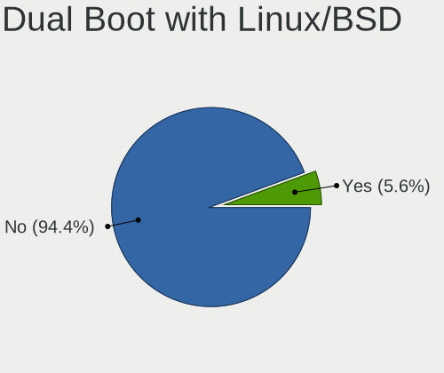

| Dual boot | Notebooks | Percent |
|-----------|-----------|---------|
| No        | 126       | 93.33%  |
| Yes       | 9         | 6.67%   |

Dual Boot (Win)
---------------

Hosting Linux and Windows

| Dual boot | Notebooks | Percent |
|-----------|-----------|---------|
| No        | 122       | 91.04%  |
| Yes       | 12        | 8.96%   |

Board
-----

Vendor
------

Motherboard manufacturer

| Name                | Notebooks | Percent |
|---------------------|-----------|---------|
| Lenovo              | 74        | 56.06%  |
| Dell                | 27        | 20.45%  |
| Hewlett-Packard     | 14        | 10.61%  |
| ASUSTek Computer    | 7         | 5.3%    |
| Sony                | 2         | 1.52%   |
| TUXEDO              | 1         | 0.76%   |
| Toshiba             | 1         | 0.76%   |
| Timi                | 1         | 0.76%   |
| Samsung Electronics | 1         | 0.76%   |
| Razer               | 1         | 0.76%   |
| MSI                 | 1         | 0.76%   |
| Gigabyte Technology | 1         | 0.76%   |
| Acer                | 1         | 0.76%   |

Model
-----

Motherboard model

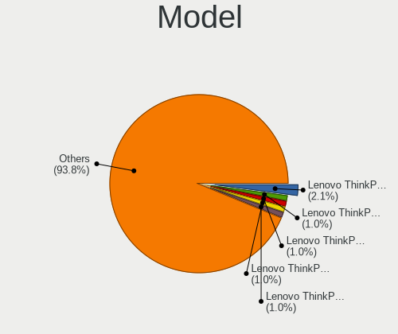

| Name                                     | Notebooks | Percent |
|------------------------------------------|-----------|---------|
| Lenovo ThinkPad P1 Gen 3 20TJS2F40X      | 4         | 3.03%   |
| Lenovo ThinkPad X1 Carbon 7th 20QES2P401 | 2         | 1.52%   |
| Lenovo ThinkPad X1 Carbon 6th 20KGS23S00 | 2         | 1.52%   |
| Lenovo ThinkPad T590 20N5S2NC0N          | 2         | 1.52%   |
| Lenovo ThinkPad T490s 20NYS7K91R         | 2         | 1.52%   |
| Lenovo ThinkPad T14s Gen 1 20T1S39D08    | 2         | 1.52%   |
| Lenovo ThinkPad P1 Gen 3 20TJS2F42Q      | 2         | 1.52%   |
| HP EliteBook 8460p                       | 2         | 1.52%   |
| Dell Precision 7510                      | 2         | 1.52%   |
| Dell Latitude E6430                      | 2         | 1.52%   |
| Dell Latitude 5300                       | 2         | 1.52%   |
| TUXEDO N13xWU                            | 1         | 0.76%   |
| Toshiba Satellite Pro R50-C              | 1         | 0.76%   |
| Timi TM1707                              | 1         | 0.76%   |
| Sony VPCEB4L1R                           | 1         | 0.76%   |
| Sony VPCEB23FM                           | 1         | 0.76%   |
| Samsung 730QCJ/730QCR                    | 1         | 0.76%   |
| Razer Blade 15 Mid 2019-Base             | 1         | 0.76%   |
| MSI GE72VR 7RF                           | 1         | 0.76%   |
| Lenovo Z40-70 20366                      | 1         | 0.76%   |
| Lenovo ThinkPad X270 20HN001EMC          | 1         | 0.76%   |
| Lenovo ThinkPad X250 20CLS0H807          | 1         | 0.76%   |
| Lenovo ThinkPad X230 Tablet 34373KU      | 1         | 0.76%   |
| Lenovo ThinkPad X201 3680PKS             | 1         | 0.76%   |
| Lenovo ThinkPad X131e 3368CTO            | 1         | 0.76%   |
| Lenovo ThinkPad X1 Yoga 1st 20FCS2N100   | 1         | 0.76%   |
| Lenovo ThinkPad X1 Nano Gen 2 21E80012US | 1         | 0.76%   |
| Lenovo ThinkPad W530 2441B32             | 1         | 0.76%   |
| Lenovo ThinkPad W520 4284GN2             | 1         | 0.76%   |
| Lenovo ThinkPad T590 20N5S2NC0V          | 1         | 0.76%   |
| Lenovo ThinkPad T590 20N5S2NC00          | 1         | 0.76%   |
| Lenovo ThinkPad T520 42404CG             | 1         | 0.76%   |
| Lenovo ThinkPad T490s 20NYS7K905         | 1         | 0.76%   |
| Lenovo ThinkPad T490s 20NX002HUS         | 1         | 0.76%   |
| Lenovo ThinkPad T490 20N3S5DV0S          | 1         | 0.76%   |
| Lenovo ThinkPad T490 20N3S5DU27          | 1         | 0.76%   |
| Lenovo ThinkPad T480s 20L8S2N80V         | 1         | 0.76%   |
| Lenovo ThinkPad T480s 20L8S2N800         | 1         | 0.76%   |
| Lenovo ThinkPad T480 20L6S29E1T          | 1         | 0.76%   |
| Lenovo ThinkPad T480 20L6S29D02          | 1         | 0.76%   |

Model Family
------------

Motherboard model prefix

| Name              | Notebooks | Percent |
|-------------------|-----------|---------|
| Lenovo ThinkPad   | 71        | 53.79%  |
| Dell Latitude     | 12        | 9.09%   |
| Dell Precision    | 8         | 6.06%   |
| HP EliteBook      | 5         | 3.79%   |
| Dell Inspiron     | 4         | 3.03%   |
| HP ZBook          | 3         | 2.27%   |
| Dell XPS          | 2         | 1.52%   |
| ASUS TUF          | 2         | 1.52%   |
| TUXEDO N13xWU     | 1         | 0.76%   |
| Toshiba Satellite | 1         | 0.76%   |
| Timi TM1707       | 1         | 0.76%   |
| Sony VPCEB4L1R    | 1         | 0.76%   |
| Sony VPCEB23FM    | 1         | 0.76%   |
| Samsung 730QCJ    | 1         | 0.76%   |
| Razer Blade       | 1         | 0.76%   |
| MSI GE72VR        | 1         | 0.76%   |
| Lenovo Z40-70     | 1         | 0.76%   |
| Lenovo ThinkBook  | 1         | 0.76%   |
| Lenovo Legion     | 1         | 0.76%   |
| HP ProBook        | 1         | 0.76%   |
| HP Pavilion       | 1         | 0.76%   |
| HP OMEN           | 1         | 0.76%   |
| HP Laptop         | 1         | 0.76%   |
| HP 340S           | 1         | 0.76%   |
| HP 250            | 1         | 0.76%   |
| Gigabyte AERO     | 1         | 0.76%   |
| Dell G3           | 1         | 0.76%   |
| ASUS Zephyrus     | 1         | 0.76%   |
| ASUS Z450LA       | 1         | 0.76%   |
| ASUS X550VX       | 1         | 0.76%   |
| ASUS VivoBook     | 1         | 0.76%   |
| ASUS GL502VMK     | 1         | 0.76%   |
| Acer Nitro        | 1         | 0.76%   |

MFG Year
--------

Motherboard manufacture year

| Year | Notebooks | Percent |
|------|-----------|---------|
| 2020 | 31        | 23.48%  |
| 2019 | 28        | 21.21%  |
| 2018 | 17        | 12.88%  |
| 2017 | 9         | 6.82%   |
| 2016 | 9         | 6.82%   |
| 2021 | 8         | 6.06%   |
| 2015 | 8         | 6.06%   |
| 2011 | 7         | 5.3%    |
| 2012 | 6         | 4.55%   |
| 2013 | 3         | 2.27%   |
| 2010 | 3         | 2.27%   |
| 2014 | 2         | 1.52%   |
| 2022 | 1         | 0.76%   |

Form Factor
-----------

Physical design of the computer

| Name     | Notebooks | Percent |
|----------|-----------|---------|
| Notebook | 132       | 100%    |

Secure Boot
-----------

Enabled or disabled

| State    | Notebooks | Percent |
|----------|-----------|---------|
| Disabled | 112       | 84.21%  |
| Enabled  | 21        | 15.79%  |

Coreboot
--------

Have coreboot on board

| Used | Notebooks | Percent |
|------|-----------|---------|
| No   | 132       | 100%    |

RAM Size
--------

Total RAM memory

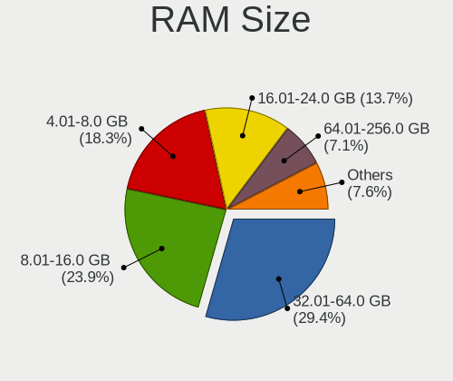

| Size in GB  | Notebooks | Percent |
|-------------|-----------|---------|
| 32.01-64.0  | 46        | 33.82%  |
| 8.01-16.0   | 29        | 21.32%  |
| 4.01-8.0    | 23        | 16.91%  |
| 16.01-24.0  | 22        | 16.18%  |
| 3.01-4.0    | 7         | 5.15%   |
| 64.01-256.0 | 7         | 5.15%   |
| 24.01-32.0  | 2         | 1.47%   |

RAM Used
--------

Used RAM memory

| Used GB    | Notebooks | Percent |
|------------|-----------|---------|
| 4.01-8.0   | 61        | 41.5%   |
| 8.01-16.0  | 25        | 17.01%  |
| 3.01-4.0   | 22        | 14.97%  |
| 2.01-3.0   | 21        | 14.29%  |
| 1.01-2.0   | 12        | 8.16%   |
| 24.01-32.0 | 2         | 1.36%   |
| 16.01-24.0 | 2         | 1.36%   |
| 32.01-64.0 | 1         | 0.68%   |
| 0.51-1.0   | 1         | 0.68%   |

Total Drives
------------

Number of drives on board

| Drives | Notebooks | Percent |
|--------|-----------|---------|
| 1      | 101       | 74.81%  |
| 2      | 23        | 17.04%  |
| 3      | 10        | 7.41%   |
| 4      | 1         | 0.74%   |

Has CD-ROM
----------

Has CD-ROM on board

| Presented | Notebooks | Percent |
|-----------|-----------|---------|
| No        | 114       | 85.71%  |
| Yes       | 19        | 14.29%  |

Has Ethernet
------------

Has Ethernet on board

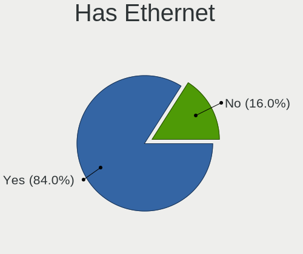

| Presented | Notebooks | Percent |
|-----------|-----------|---------|
| Yes       | 115       | 86.47%  |
| No        | 18        | 13.53%  |

Has WiFi
--------

Has WiFi module

| Presented | Notebooks | Percent |
|-----------|-----------|---------|
| Yes       | 131       | 99.24%  |
| No        | 1         | 0.76%   |

Has Bluetooth
-------------

Has Bluetooth module

| Presented | Notebooks | Percent |
|-----------|-----------|---------|
| Yes       | 108       | 78.26%  |
| No        | 30        | 21.74%  |

Location
--------

Country
-------

Geographic location (country)

| Country      | Notebooks | Percent |
|--------------|-----------|---------|
| USA          | 33        | 25%     |
| India        | 16        | 12.12%  |
| Germany      | 7         | 5.3%    |
| UK           | 6         | 4.55%   |
| France       | 5         | 3.79%   |
| Czechia      | 5         | 3.79%   |
| Spain        | 4         | 3.03%   |
| Brazil       | 4         | 3.03%   |
| Switzerland  | 3         | 2.27%   |
| Netherlands  | 3         | 2.27%   |
| Mexico       | 3         | 2.27%   |
| Turkey       | 2         | 1.52%   |
| South Africa | 2         | 1.52%   |
| Singapore    | 2         | 1.52%   |
| Romania      | 2         | 1.52%   |
| Poland       | 2         | 1.52%   |
| Japan        | 2         | 1.52%   |
| Italy        | 2         | 1.52%   |
| Canada       | 2         | 1.52%   |
| Australia    | 2         | 1.52%   |
| Sri Lanka    | 1         | 0.76%   |
| Saudi Arabia | 1         | 0.76%   |
| Russia       | 1         | 0.76%   |
| Portugal     | 1         | 0.76%   |
| Pakistan     | 1         | 0.76%   |
| Norway       | 1         | 0.76%   |
| Nepal        | 1         | 0.76%   |
| Myanmar      | 1         | 0.76%   |
| Morocco      | 1         | 0.76%   |
| Luxembourg   | 1         | 0.76%   |
| Lithuania    | 1         | 0.76%   |
| Kuwait       | 1         | 0.76%   |
| Kenya        | 1         | 0.76%   |
| Israel       | 1         | 0.76%   |
| Ireland      | 1         | 0.76%   |
| Georgia      | 1         | 0.76%   |
| Finland      | 1         | 0.76%   |
| Egypt        | 1         | 0.76%   |
| Ecuador      | 1         | 0.76%   |
| Colombia     | 1         | 0.76%   |

City
----

Geographic location (city)

| City                     | Notebooks | Percent |
|--------------------------|-----------|---------|
| Prague                   | 4         | 2.84%   |
| Munich                   | 3         | 2.13%   |
| Mexico City              | 3         | 2.13%   |
| Singapore                | 2         | 1.42%   |
| Milan                    | 2         | 1.42%   |
| Madrid                   | 2         | 1.42%   |
| Houston                  | 2         | 1.42%   |
| Chennai                  | 2         | 1.42%   |
| Zaragoza                 | 1         | 0.71%   |
| Webster                  | 1         | 0.71%   |
| Vardenis                 | 1         | 0.71%   |
| Udaipur                  | 1         | 0.71%   |
| Turku                    | 1         | 0.71%   |
| Temuco                   | 1         | 0.71%   |
| Temara                   | 1         | 0.71%   |
| Taringa                  | 1         | 0.71%   |
| Talkha                   | 1         | 0.71%   |
| Syracuse                 | 1         | 0.71%   |
| Streatham                | 1         | 0.71%   |
| Steamboat Springs        | 1         | 0.71%   |
| Sofia                    | 1         | 0.71%   |
| Skien                    | 1         | 0.71%   |
| ilal                 | 1         | 0.71%   |
| Sheffield                | 1         | 0.71%   |
| Sao Paulo                | 1         | 0.71%   |
| San Jose                 | 1         | 0.71%   |
| San Francisco            | 1         | 0.71%   |
| Salt Lake City           | 1         | 0.71%   |
| Saint-Ismier             | 1         | 0.71%   |
| Saint-Alphonse-Rodriguez | 1         | 0.71%   |
| Saint Paul               | 1         | 0.71%   |
| Roha                     | 1         | 0.71%   |
| Rochester                | 1         | 0.71%   |
| Reims                    | 1         | 0.71%   |
| Raleigh                  | 1         | 0.71%   |
| Quito                    | 1         | 0.71%   |
| Queenscliff              | 1         | 0.71%   |
| Queens                   | 1         | 0.71%   |
| Providence               | 1         | 0.71%   |
| Prairieville             | 1         | 0.71%   |

Drives
------

Drive Vendor
------------

Hard drive vendors

| Vendor              | Notebooks | Drives | Percent |
|---------------------|-----------|--------|---------|
| Samsung Electronics | 38        | 61     | 22.22%  |
| Toshiba             | 20        | 24     | 11.7%   |
| WDC                 | 17        | 21     | 9.94%   |
| SK hynix            | 14        | 14     | 8.19%   |
| SanDisk             | 14        | 18     | 8.19%   |
| Seagate             | 12        | 17     | 7.02%   |
| Intel               | 9         | 12     | 5.26%   |
| Unknown             | 6         | 8      | 3.51%   |
| Micron Technology   | 6         | 8      | 3.51%   |
| Kingston            | 6         | 6      | 3.51%   |
| HGST                | 4         | 4      | 2.34%   |
| Crucial             | 3         | 3      | 1.75%   |
| A-DATA Technology   | 3         | 3      | 1.75%   |
| Silicon Motion      | 2         | 3      | 1.17%   |
| Lenovo              | 2         | 2      | 1.17%   |
| KIOXIA              | 2         | 2      | 1.17%   |
| Transcend           | 1         | 1      | 0.58%   |
| Team                | 1         | 2      | 0.58%   |
| SSSTC               | 1         | 1      | 0.58%   |
| SMI                 | 1         | 2      | 0.58%   |
| SABRENT             | 1         | 1      | 0.58%   |
| PNY                 | 1         | 2      | 0.58%   |
| Plextor             | 1         | 1      | 0.58%   |
| Phison              | 1         | 1      | 0.58%   |
| Lite-On             | 1         | 1      | 0.58%   |
| Golden              | 1         | 1      | 0.58%   |
| Gigabyte Technology | 1         | 1      | 0.58%   |
| Corsair             | 1         | 1      | 0.58%   |
| China               | 1         | 1      | 0.58%   |

Drive Model
-----------

Hard drive models

| Model                                  | Notebooks | Percent |
|----------------------------------------|-----------|---------|
| SK hynix NVMe SSD Drive 512GB          | 10        | 5.41%   |
| SanDisk NVMe SSD Drive 256GB           | 6         | 3.24%   |
| Samsung SM963 2.5" NVMe PCIe SSD 256GB | 6         | 3.24%   |
| Samsung NVMe SSD Drive 512GB           | 6         | 3.24%   |
| Samsung NVMe SSD Drive 1024GB          | 5         | 2.7%    |
| Toshiba NVMe SSD Drive 256GB           | 4         | 2.16%   |
| Intel NVMe SSD Drive 512GB             | 4         | 2.16%   |
| Toshiba NVMe SSD Drive 512GB           | 3         | 1.62%   |
| Samsung NVMe SSD Drive 2TB             | 3         | 1.62%   |
| Samsung NVMe SSD Drive 1TB             | 3         | 1.62%   |
| Micron NVMe SSD Drive 256GB            | 3         | 1.62%   |
| HGST HTS721010A9E630 1TB               | 3         | 1.62%   |
| Unknown NVMe SSD Drive 256GB           | 2         | 1.08%   |
| Toshiba NVMe SSD Drive 1024GB          | 2         | 1.08%   |
| Toshiba MQ01ABF050 500GB               | 2         | 1.08%   |
| Toshiba KXG6AZNV256G 256GB             | 2         | 1.08%   |
| SK hynix NVMe SSD Drive 1024GB         | 2         | 1.08%   |
| Seagate Expansion 240GB                | 2         | 1.08%   |
| SanDisk NVMe SSD Drive 512GB           | 2         | 1.08%   |
| Samsung SSD 860 EVO 1TB                | 2         | 1.08%   |
| Samsung Portable SSD T5 500GB          | 2         | 1.08%   |
| Samsung NVMe SSD Drive 500GB           | 2         | 1.08%   |
| Intel NVMe SSD Drive 2TB               | 2         | 1.08%   |
| WDC WDS500G2B0A-00SM50 500GB SSD       | 1         | 0.54%   |
| WDC WDS400T2B0A-00SM50 4TB SSD         | 1         | 0.54%   |
| WDC WDS200T2B0B-00YS70 2TB SSD         | 1         | 0.54%   |
| WDC WD6400BPVT-75HXZT1 640GB           | 1         | 0.54%   |
| WDC WD5000LPLX-08ZNTT0 500GB           | 1         | 0.54%   |
| WDC WD2500BEVT-60ZCT1 250GB            | 1         | 0.54%   |
| WDC WD20 SPZX-11UA7T0 2TB              | 1         | 0.54%   |
| WDC WD10SPZX-60Z10T0 1TB               | 1         | 0.54%   |
| WDC WD10SPZX-22Z10T0 1TB               | 1         | 0.54%   |
| WDC WD10SPZX-21Z10T0 1TB               | 1         | 0.54%   |
| WDC WD10SPZX-08Z10 1TB                 | 1         | 0.54%   |
| WDC WD10SPCX-75KHST0 1TB               | 1         | 0.54%   |
| WDC WD10JPVX-75JC3T0 1TB               | 1         | 0.54%   |
| WDC PC SN730 SDBQNTY-512G-1001 512GB   | 1         | 0.54%   |
| WDC PC SN730 SDBQNTY-256G-1001 256GB   | 1         | 0.54%   |
| WDC PC SN720 SDAQNTW-512G-1001 512GB   | 1         | 0.54%   |
| WDC PC SN530 SDBPNPZ-256G-1006 256GB   | 1         | 0.54%   |

HDD Vendor
----------

Hard disk drive vendors

| Vendor  | Notebooks | Drives | Percent |
|---------|-----------|--------|---------|
| Seagate | 12        | 16     | 35.29%  |
| WDC     | 10        | 12     | 29.41%  |
| Toshiba | 7         | 9      | 20.59%  |
| HGST    | 4         | 4      | 11.76%  |
| SABRENT | 1         | 1      | 2.94%   |

SSD Vendor
----------

Solid state drive vendors

| Vendor              | Notebooks | Drives | Percent |
|---------------------|-----------|--------|---------|
| Samsung Electronics | 14        | 15     | 36.84%  |
| WDC                 | 3         | 4      | 7.89%   |
| SanDisk             | 3         | 4      | 7.89%   |
| Kingston            | 3         | 3      | 7.89%   |
| Crucial             | 3         | 3      | 7.89%   |
| A-DATA Technology   | 2         | 2      | 5.26%   |
| Transcend           | 1         | 1      | 2.63%   |
| Toshiba             | 1         | 1      | 2.63%   |
| Team                | 1         | 2      | 2.63%   |
| Seagate             | 1         | 1      | 2.63%   |
| PNY                 | 1         | 2      | 2.63%   |
| Plextor             | 1         | 1      | 2.63%   |
| Micron Technology   | 1         | 1      | 2.63%   |
| Intel               | 1         | 1      | 2.63%   |
| Corsair             | 1         | 1      | 2.63%   |
| China               | 1         | 1      | 2.63%   |

Drive Kind
----------

HDD or SSD

| Kind    | Notebooks | Drives | Percent |
|---------|-----------|--------|---------|
| NVMe    | 90        | 129    | 54.22%  |
| SSD     | 36        | 43     | 21.69%  |
| HDD     | 34        | 42     | 20.48%  |
| MMC     | 4         | 5      | 2.41%   |
| Unknown | 2         | 3      | 1.2%    |

Drive Connector
---------------

SATA, SAS, NVMe, etc.

| Type | Notebooks | Drives | Percent |
|------|-----------|--------|---------|
| NVMe | 90        | 129    | 57.32%  |
| SATA | 53        | 75     | 33.76%  |
| SAS  | 10        | 13     | 6.37%   |
| MMC  | 4         | 5      | 2.55%   |

Drive Size
----------

Size of hard drive

| Size in TB | Notebooks | Drives | Percent |
|------------|-----------|--------|---------|
| 0.01-0.5   | 32        | 39     | 47.76%  |
| 0.51-1.0   | 25        | 33     | 37.31%  |
| 1.01-2.0   | 5         | 6      | 7.46%   |
| 3.01-4.0   | 3         | 3      | 4.48%   |
| 4.01-10.0  | 2         | 4      | 2.99%   |

Space Total
-----------

Amount of disk space available on the file system

| Size in GB     | Notebooks | Percent |
|----------------|-----------|---------|
| 101-250        | 58        | 42.03%  |
| 251-500        | 26        | 18.84%  |
| 501-1000       | 20        | 14.49%  |
| 1001-2000      | 11        | 7.97%   |
| 51-100         | 7         | 5.07%   |
| More than 3000 | 6         | 4.35%   |
| 21-50          | 3         | 2.17%   |
| Unknown        | 3         | 2.17%   |
| 2001-3000      | 2         | 1.45%   |
| 1-20           | 2         | 1.45%   |

Space Used
----------

Amount of used disk space

| Used GB        | Notebooks | Percent |
|----------------|-----------|---------|
| 21-50          | 34        | 23.45%  |
| 1-20           | 32        | 22.07%  |
| 101-250        | 31        | 21.38%  |
| 51-100         | 22        | 15.17%  |
| 251-500        | 12        | 8.28%   |
| 501-1000       | 7         | 4.83%   |
| Unknown        | 3         | 2.07%   |
| 1001-2000      | 2         | 1.38%   |
| More than 3000 | 1         | 0.69%   |
| 2001-3000      | 1         | 0.69%   |

Malfunc. Drives
---------------

Drive models with a malfunction

| Model                            | Notebooks | Drives | Percent |
|----------------------------------|-----------|--------|---------|
| Transcend TS512GMTS800 512GB SSD | 1         | 1      | 33.33%  |
| Seagate ST500LT012-1DG142 500GB  | 1         | 1      | 33.33%  |
| Intel SSDSC2BA800G4R 800GB       | 1         | 1      | 33.33%  |

Malfunc. Drive Vendor
---------------------

Vendors of faulty drives

| Vendor    | Notebooks | Drives | Percent |
|-----------|-----------|--------|---------|
| Transcend | 1         | 1      | 33.33%  |
| Seagate   | 1         | 1      | 33.33%  |
| Intel     | 1         | 1      | 33.33%  |

Malfunc. HDD Vendor
-------------------

Vendors of faulty HDD drives

| Vendor  | Notebooks | Drives | Percent |
|---------|-----------|--------|---------|
| Seagate | 1         | 1      | 100%    |

Malfunc. Drive Kind
-------------------

Kinds of faulty drives

| Kind | Notebooks | Drives | Percent |
|------|-----------|--------|---------|
| SSD  | 2         | 2      | 66.67%  |
| HDD  | 1         | 1      | 33.33%  |

Failed Drives
-------------

Failed drive models

Zero info for selected period =(

Failed Drive Vendor
-------------------

Failed drive vendors

Zero info for selected period =(

Drive Status
------------

Number of failed and malfunc. drives

| Status   | Notebooks | Drives | Percent |
|----------|-----------|--------|---------|
| Detected | 107       | 180    | 76.43%  |
| Works    | 30        | 39     | 21.43%  |
| Malfunc  | 3         | 3      | 2.14%   |

Storage controller
------------------

Storage Vendor
--------------

Storage controller vendors

| Vendor                       | Notebooks | Percent |
|------------------------------|-----------|---------|
| Intel                        | 69        | 43.4%   |
| Samsung Electronics          | 26        | 16.35%  |
| SanDisk                      | 15        | 9.43%   |
| SK hynix                     | 14        | 8.81%   |
| Toshiba America Info Systems | 12        | 7.55%   |
| Micron Technology            | 5         | 3.14%   |
| KIOXIA                       | 4         | 2.52%   |
| Kingston Technology Company  | 3         | 1.89%   |
| AMD                          | 3         | 1.89%   |
| Silicon Motion               | 2         | 1.26%   |
| Phison Electronics           | 2         | 1.26%   |
| Lenovo                       | 2         | 1.26%   |
| Lite-On Technology           | 1         | 0.63%   |
| ADATA Technology             | 1         | 0.63%   |

Storage Model
-------------

Storage controller models

| Model                                                                         | Notebooks | Percent |
|-------------------------------------------------------------------------------|-----------|---------|
| Samsung NVMe SSD Controller SM981/PM981/PM983                                 | 20        | 12.42%  |
| Toshiba America Info Systems XG6 NVMe SSD Controller                          | 11        | 6.83%   |
| SK hynix Non-Volatile memory controller                                       | 11        | 6.83%   |
| Intel Sunrise Point-LP SATA Controller [AHCI mode]                            | 11        | 6.83%   |
| SanDisk WD Black SN750 / PC SN730 NVMe SSD                                    | 9         | 5.59%   |
| Intel 82801 Mobile SATA Controller [RAID mode]                                | 7         | 4.35%   |
| Intel Cannon Lake Mobile PCH SATA AHCI Controller                             | 6         | 3.73%   |
| Intel 7 Series Chipset Family 6-port SATA Controller [AHCI mode]              | 6         | 3.73%   |
| Intel 6 Series/C200 Series Chipset Family 6 port Mobile SATA AHCI Controller  | 6         | 3.73%   |
| Micron Non-Volatile memory controller                                         | 5         | 3.11%   |
| Intel SSD Pro 7600p/760p/E 6100p Series                                       | 4         | 2.48%   |
| Intel SSD 660P Series                                                         | 4         | 2.48%   |
| Intel HM170/QM170 Chipset SATA Controller [AHCI Mode]                         | 4         | 2.48%   |
| SK hynix Gold P31/PC711 NVMe Solid State Drive                                | 3         | 1.86%   |
| KIOXIA NVMe SSD Controller BG4                                                | 3         | 1.86%   |
| Intel Wildcat Point-LP SATA Controller [AHCI Mode]                            | 3         | 1.86%   |
| Intel SATA Controller [RAID mode]                                             | 3         | 1.86%   |
| Intel Q170/Q150/B150/H170/H110/Z170/CM236 Chipset SATA Controller [AHCI Mode] | 3         | 1.86%   |
| Intel 8 Series SATA Controller 1 [AHCI mode]                                  | 3         | 1.86%   |
| Intel 5 Series/3400 Series Chipset 4 port SATA AHCI Controller                | 3         | 1.86%   |
| AMD FCH SATA Controller [AHCI mode]                                           | 3         | 1.86%   |
| Silicon Motion SM2263EN/SM2263XT SSD Controller                               | 2         | 1.24%   |
| SanDisk WD Blue SN500 / PC SN520 NVMe SSD                                     | 2         | 1.24%   |
| SanDisk WD Black 2018/SN750 / PC SN720 NVMe SSD                               | 2         | 1.24%   |
| Samsung NVMe SSD Controller SM961/PM961/SM963                                 | 2         | 1.24%   |
| Samsung NVMe SSD Controller PM9A1/PM9A3/980PRO                                | 2         | 1.24%   |
| Samsung NVMe SSD Controller 980                                               | 2         | 1.24%   |
| Lenovo Non-Volatile memory controller                                         | 2         | 1.24%   |
| Intel Volume Management Device NVMe RAID Controller                           | 2         | 1.24%   |
| Intel Comet Lake SATA AHCI Controller                                         | 2         | 1.24%   |
| Intel Cannon Point-LP SATA Controller [AHCI Mode]                             | 2         | 1.24%   |
| Toshiba America Info Systems XG4 NVMe SSD Controller                          | 1         | 0.62%   |
| SanDisk WD PC SN810 / Black SN850 NVMe SSD                                    | 1         | 0.62%   |
| SanDisk WD Blue SN550 NVMe SSD                                                | 1         | 0.62%   |
| Phison PS5013 E13 NVMe Controller                                             | 1         | 0.62%   |
| Phison E12 NVMe Controller                                                    | 1         | 0.62%   |
| Lite-On Non-Volatile memory controller                                        | 1         | 0.62%   |
| KIOXIA Non-Volatile memory controller                                         | 1         | 0.62%   |
| Kingston Company Company Non-Volatile memory controller                       | 1         | 0.62%   |
| Kingston Company KC2000 NVMe SSD                                              | 1         | 0.62%   |

Storage Kind
------------

Kind of storage controller (IDE, SATA, NVMe, SAS, ...)

| Kind | Notebooks | Percent |
|------|-----------|---------|
| NVMe | 89        | 57.42%  |
| SATA | 55        | 35.48%  |
| RAID | 11        | 7.1%    |

Processor
---------

CPU Vendor
----------

Processor vendors

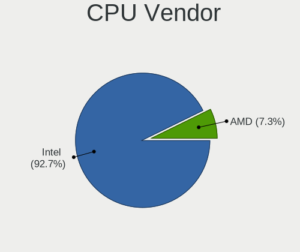

| Vendor | Notebooks | Percent |
|--------|-----------|---------|
| Intel  | 125       | 94.7%   |
| AMD    | 7         | 5.3%    |

CPU Model
---------

Processor models

| Model                                         | Notebooks | Percent |
|-----------------------------------------------|-----------|---------|
| Intel Core i7-10850H CPU @ 2.70GHz            | 11        | 8.33%   |
| Intel Core i7-8665U CPU @ 1.90GHz             | 9         | 6.82%   |
| Intel Core i7-10610U CPU @ 1.80GHz            | 9         | 6.82%   |
| Intel Core i7-8650U CPU @ 1.90GHz             | 5         | 3.79%   |
| Intel Core i5-10210U CPU @ 1.60GHz            | 5         | 3.79%   |
| Intel Core i7-8565U CPU @ 1.80GHz             | 4         | 3.03%   |
| Intel Core i7-9750H CPU @ 2.60GHz             | 3         | 2.27%   |
| Intel Core i7-8750H CPU @ 2.20GHz             | 3         | 2.27%   |
| Intel Core i7-8550U CPU @ 1.80GHz             | 3         | 2.27%   |
| Intel Core i7-7700HQ CPU @ 2.80GHz            | 3         | 2.27%   |
| Intel Core i7-7600U CPU @ 2.80GHz             | 3         | 2.27%   |
| Intel Core i5-8250U CPU @ 1.60GHz             | 3         | 2.27%   |
| Intel Core i5-6200U CPU @ 2.30GHz             | 3         | 2.27%   |
| Intel Core i5-5300U CPU @ 2.30GHz             | 3         | 2.27%   |
| Intel Core i7-9850H CPU @ 2.60GHz             | 2         | 1.52%   |
| Intel Core i7-6820HQ CPU @ 2.70GHz            | 2         | 1.52%   |
| Intel Core i7-6700HQ CPU @ 2.60GHz            | 2         | 1.52%   |
| Intel Core i7-3520M CPU @ 2.90GHz             | 2         | 1.52%   |
| Intel Core i5-8365U CPU @ 1.60GHz             | 2         | 1.52%   |
| Intel Core i5-8350U CPU @ 1.70GHz             | 2         | 1.52%   |
| Intel Core i5-8265U CPU @ 1.60GHz             | 2         | 1.52%   |
| Intel Core i5-3320M CPU @ 2.60GHz             | 2         | 1.52%   |
| Intel Core i5-2520M CPU @ 2.50GHz             | 2         | 1.52%   |
| AMD Ryzen 7 4700U with Radeon Graphics        | 2         | 1.52%   |
| AMD Ryzen 7 3750H with Radeon Vega Mobile Gfx | 2         | 1.52%   |
| Intel Xeon W-11955M CPU @ 2.60GHz             | 1         | 0.76%   |
| Intel Xeon W-10855M CPU @ 2.80GHz             | 1         | 0.76%   |
| Intel Xeon E-2176M CPU @ 2.70GHz              | 1         | 0.76%   |
| Intel Xeon CPU E3-1575M v5 @ 3.00GHz          | 1         | 0.76%   |
| Intel Xeon CPU E3-1505M v5 @ 2.80GHz          | 1         | 0.76%   |
| Intel Pentium CPU 5405U @ 2.30GHz             | 1         | 0.76%   |
| Intel Core i9-9980HK CPU @ 2.40GHz            | 1         | 0.76%   |
| Intel Core i9-9880H CPU @ 2.30GHz             | 1         | 0.76%   |
| Intel Core i7-8850H CPU @ 2.60GHz             | 1         | 0.76%   |
| Intel Core i7-7820HQ CPU @ 2.90GHz            | 1         | 0.76%   |
| Intel Core i7-7500U CPU @ 2.70GHz             | 1         | 0.76%   |
| Intel Core i7-6600U CPU @ 2.60GHz             | 1         | 0.76%   |
| Intel Core i7-5600U CPU @ 2.60GHz             | 1         | 0.76%   |
| Intel Core i7-4500U CPU @ 1.80GHz             | 1         | 0.76%   |
| Intel Core i7-3720QM CPU @ 2.60GHz            | 1         | 0.76%   |

CPU Model Family
----------------

Processor model prefix

| Model           | Notebooks | Percent |
|-----------------|-----------|---------|
| Intel Core i7   | 72        | 54.55%  |
| Intel Core i5   | 33        | 25%     |
| Other           | 7         | 5.3%    |
| Intel Xeon      | 5         | 3.79%   |
| Intel Core i3   | 5         | 3.79%   |
| AMD Ryzen 7     | 5         | 3.79%   |
| Intel Core i9   | 2         | 1.52%   |
| Intel Pentium   | 1         | 0.76%   |
| AMD Ryzen 7 PRO | 1         | 0.76%   |
| AMD Ryzen 5     | 1         | 0.76%   |

CPU Cores
---------

Number of processor cores

| Number | Notebooks | Percent |
|--------|-----------|---------|
| 4      | 64        | 48.48%  |
| 2      | 34        | 25.76%  |
| 6      | 22        | 16.67%  |
| 8      | 11        | 8.33%   |
| 12     | 1         | 0.76%   |

CPU Sockets
-----------

Number of sockets

| Number | Notebooks | Percent |
|--------|-----------|---------|
| 1      | 132       | 100%    |

CPU Threads
-----------

Threads per core (Hyper-Threading)

| Number | Notebooks | Percent |
|--------|-----------|---------|
| 2      | 128       | 96.97%  |
| 1      | 4         | 3.03%   |

CPU Op-Modes
------------

CPU Operation Modes (32-bit, 64-bit)

| Op mode        | Notebooks | Percent |
|----------------|-----------|---------|
| 32-bit, 64-bit | 127       | 94.78%  |
| Unknown        | 7         | 5.22%   |

CPU Microcode
-------------

Microcode number

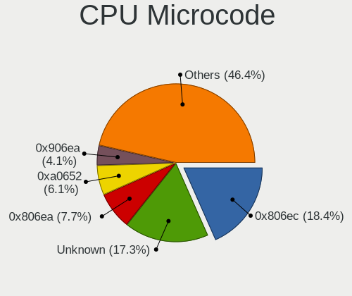

| Number     | Notebooks | Percent |
|------------|-----------|---------|
| 0x806ec    | 32        | 23.88%  |
| 0x806ea    | 13        | 9.7%    |
| 0xa0652    | 12        | 8.96%   |
| 0x906ea    | 8         | 5.97%   |
| 0x506e3    | 7         | 5.22%   |
| 0x306a9    | 7         | 5.22%   |
| 0x206a7    | 7         | 5.22%   |
| 0x406e3    | 6         | 4.48%   |
| 0x906ed    | 4         | 2.99%   |
| 0x906e9    | 4         | 2.99%   |
| 0x806e9    | 4         | 2.99%   |
| 0x806d1    | 4         | 2.99%   |
| 0x306d4    | 4         | 2.99%   |
| 0x40651    | 3         | 2.24%   |
| 0x20655    | 3         | 2.24%   |
| Unknown    | 3         | 2.24%   |
| 0x806c1    | 2         | 1.49%   |
| 0x08600103 | 2         | 1.49%   |
| 0x08108102 | 2         | 1.49%   |
| 0x906a3    | 1         | 0.75%   |
| 0x90672    | 1         | 0.75%   |
| 0x706e5    | 1         | 0.75%   |
| 0x20652    | 1         | 0.75%   |
| 0x0a50000c | 1         | 0.75%   |
| 0x08600104 | 1         | 0.75%   |
| 0x08108109 | 1         | 0.75%   |

CPU Microarch
-------------

Microarchitecture

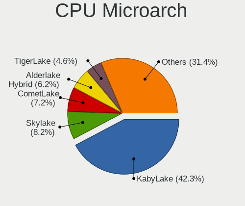

| Name             | Notebooks | Percent |
|------------------|-----------|---------|
| KabyLake         | 66        | 49.62%  |
| Skylake          | 13        | 9.77%   |
| CometLake        | 12        | 9.02%   |
| SandyBridge      | 7         | 5.26%   |
| IvyBridge        | 7         | 5.26%   |
| Icelake          | 5         | 3.76%   |
| Westmere         | 4         | 3.01%   |
| Broadwell        | 4         | 3.01%   |
| Zen+             | 3         | 2.26%   |
| Zen 2            | 3         | 2.26%   |
| Haswell          | 3         | 2.26%   |
| TigerLake        | 2         | 1.5%    |
| Alderlake Hybrid | 2         | 1.5%    |
| Zen 3            | 1         | 0.75%   |
| Unknown          | 1         | 0.75%   |

Graphics
--------

GPU Vendor
----------

Vendors of graphics cards

| Vendor | Notebooks | Percent |
|--------|-----------|---------|
| Intel  | 113       | 66.86%  |
| Nvidia | 39        | 23.08%  |
| AMD    | 17        | 10.06%  |

GPU Model
---------

Graphics card models

| Model                                                                         | Notebooks | Percent |
|-------------------------------------------------------------------------------|-----------|---------|
| Intel WhiskeyLake-U GT2 [UHD Graphics 620]                                    | 17        | 10.06%  |
| Intel CometLake-U GT2 [UHD Graphics]                                          | 15        | 8.88%   |
| Intel UHD Graphics 620                                                        | 13        | 7.69%   |
| Intel CometLake-H GT2 [UHD Graphics]                                          | 11        | 6.51%   |
| Intel CoffeeLake-H GT2 [UHD Graphics 630]                                     | 8         | 4.73%   |
| Intel 3rd Gen Core processor Graphics Controller                              | 7         | 4.14%   |
| Intel Skylake GT2 [HD Graphics 520]                                           | 6         | 3.55%   |
| Intel 2nd Generation Core Processor Family Integrated Graphics Controller     | 5         | 2.96%   |
| Intel HD Graphics 620                                                         | 4         | 2.37%   |
| Intel HD Graphics 5500                                                        | 4         | 2.37%   |
| Intel HD Graphics 530                                                         | 4         | 2.37%   |
| Nvidia TU116M [GeForce GTX 1660 Ti Mobile]                                    | 3         | 1.78%   |
| Nvidia GP107GLM [Quadro P2000 Mobile]                                         | 3         | 1.78%   |
| Intel TigerLake-H GT1 [UHD Graphics]                                          | 3         | 1.78%   |
| Intel HD Graphics 630                                                         | 3         | 1.78%   |
| Intel Haswell-ULT Integrated Graphics Controller                              | 3         | 1.78%   |
| Intel Core Processor Integrated Graphics Controller                           | 3         | 1.78%   |
| AMD Renoir                                                                    | 3         | 1.78%   |
| AMD Picasso/Raven 2 [Radeon Vega Series / Radeon Vega Mobile Series]          | 3         | 1.78%   |
| Nvidia GP107M [GeForce GTX 1050 Mobile]                                       | 2         | 1.18%   |
| Nvidia GP107GLM [Quadro P620]                                                 | 2         | 1.18%   |
| Nvidia GM107GLM [Quadro M2000M]                                               | 2         | 1.18%   |
| Nvidia GM107GLM [Quadro M1000M]                                               | 2         | 1.18%   |
| Nvidia GF108GLM [NVS 5200M]                                                   | 2         | 1.18%   |
| Nvidia GA106M [GeForce RTX 3060 Mobile / Max-Q]                               | 2         | 1.18%   |
| Intel TigerLake-LP GT2 [Iris Xe Graphics]                                     | 2         | 1.18%   |
| AMD Sun XT [Radeon HD 8670A/8670M/8690M / R5 M330 / M430 / Radeon 520 Mobile] | 2         | 1.18%   |
| AMD Seymour [Radeon HD 6400M/7400M Series]                                    | 2         | 1.18%   |
| Nvidia TU117M [GeForce MX450]                                                 | 1         | 0.59%   |
| Nvidia TU117M [GeForce GTX 1650 Mobile / Max-Q]                               | 1         | 0.59%   |
| Nvidia TU117GLM [Quadro T2000 Mobile / Max-Q]                                 | 1         | 0.59%   |
| Nvidia TU117GLM [Quadro T1000 Mobile]                                         | 1         | 0.59%   |
| Nvidia TU106GLM [Quadro RTX 3000 Mobile / Max-Q]                              | 1         | 0.59%   |
| Nvidia TU106BM [GeForce RTX 2070 Mobile / Max-Q]                              | 1         | 0.59%   |
| Nvidia GP108M [GeForce MX250]                                                 | 1         | 0.59%   |
| Nvidia GP108M [GeForce MX150]                                                 | 1         | 0.59%   |
| Nvidia GP107M [GeForce GTX 1050 Ti Mobile]                                    | 1         | 0.59%   |
| Nvidia GP107GLM [Quadro P1000 Mobile]                                         | 1         | 0.59%   |
| Nvidia GP106M [GeForce GTX 1060 Mobile]                                       | 1         | 0.59%   |
| Nvidia GP106BM [GeForce GTX 1060 Mobile 6GB]                                  | 1         | 0.59%   |

GPU Combo
---------

Combinations of graphics cards

| Name           | Notebooks | Percent |
|----------------|-----------|---------|
| 1 x Intel      | 79        | 59.4%   |
| Intel + Nvidia | 27        | 20.3%   |
| 1 x Nvidia     | 10        | 7.52%   |
| Intel + AMD    | 7         | 5.26%   |
| 1 x AMD        | 7         | 5.26%   |
| AMD + Nvidia   | 3         | 2.26%   |

GPU Driver
----------

Free vs proprietary

| Driver      | Notebooks | Percent |
|-------------|-----------|---------|
| Free        | 117       | 86.67%  |
| Proprietary | 13        | 9.63%   |
| Unknown     | 5         | 3.7%    |

GPU Memory
----------

Total video memory

| Size in GB | Notebooks | Percent |
|------------|-----------|---------|
| Unknown    | 92        | 68.66%  |
| 1.01-2.0   | 13        | 9.7%    |
| 3.01-4.0   | 11        | 8.21%   |
| 5.01-6.0   | 6         | 4.48%   |
| 0.51-1.0   | 5         | 3.73%   |
| 0.01-0.5   | 3         | 2.24%   |
| 7.01-8.0   | 1         | 0.75%   |
| 2.01-3.0   | 1         | 0.75%   |
| 16.01-24.0 | 1         | 0.75%   |
| 8.01-16.0  | 1         | 0.75%   |

Monitor
-------

Monitor Vendor
--------------

Monitor vendors

| Vendor                  | Notebooks | Percent |
|-------------------------|-----------|---------|
| AU Optronics            | 29        | 15.76%  |
| BOE                     | 23        | 12.5%   |
| LG Display              | 21        | 11.41%  |
| Chimei Innolux          | 20        | 10.87%  |
| Dell                    | 17        | 9.24%   |
| Samsung Electronics     | 16        | 8.7%    |
| Lenovo                  | 13        | 7.07%   |
| Sharp                   | 8         | 4.35%   |
| Goldstar                | 6         | 3.26%   |
| InfoVision              | 5         | 2.72%   |
| Hewlett-Packard         | 5         | 2.72%   |
| Acer                    | 3         | 1.63%   |
| Philips                 | 2         | 1.09%   |
| PANDA                   | 2         | 1.09%   |
| LGD                     | 2         | 1.09%   |
| BOE Technology Group    | 2         | 1.09%   |
| AOC                     | 2         | 1.09%   |
| Sun                     | 1         | 0.54%   |
| Sceptre Tech            | 1         | 0.54%   |
| Planar                  | 1         | 0.54%   |
| ITE                     | 1         | 0.54%   |
| Eizo                    | 1         | 0.54%   |
| CSO                     | 1         | 0.54%   |
| Chi Mei Optoelectronics | 1         | 0.54%   |
| ASUSTek Computer        | 1         | 0.54%   |

Monitor Model
-------------

Monitor models

| Model                                                                 | Notebooks | Percent |
|-----------------------------------------------------------------------|-----------|---------|
| Chimei Innolux LCD Monitor CMN15E8 1920x1080 344x193mm 15.5-inch      | 7         | 3.61%   |
| Lenovo LCD Monitor LEN40BA 1920x1080 344x194mm 15.5-inch              | 5         | 2.58%   |
| AU Optronics LCD Monitor AUO403D 1920x1080 309x173mm 13.9-inch        | 5         | 2.58%   |
| InfoVision LCD Monitor IVO057D 1920x1080 309x174mm 14.0-inch          | 4         | 2.06%   |
| LG Display LCD Monitor LGD0676 1920x1080 309x174mm 14.0-inch          | 3         | 1.55%   |
| Dell P2419H DELD0DA 1920x1080 527x296mm 23.8-inch                     | 3         | 1.55%   |
| Dell P2419H DELD0D9 1920x1080 527x296mm 23.8-inch                     | 3         | 1.55%   |
| Chimei Innolux LCD Monitor CMN14C9 1920x1080 309x173mm 13.9-inch      | 3         | 1.55%   |
| BOE LCD Monitor BOE086E 1920x1080 344x194mm 15.5-inch                 | 3         | 1.55%   |
| BOE LCD Monitor BOE07C9 1920x1080 309x173mm 13.9-inch                 | 3         | 1.55%   |
| AU Optronics LCD Monitor AUO323D 1920x1080 309x174mm 14.0-inch        | 3         | 1.55%   |
| Sharp LCD Monitor SHP1453 1920x1080 346x194mm 15.6-inch               | 2         | 1.03%   |
| Sharp LCD Monitor SHP1430 3840x2160 350x190mm 15.7-inch               | 2         | 1.03%   |
| Samsung Electronics C24F390 SAM0D2C 1920x1080 521x293mm 23.5-inch     | 2         | 1.03%   |
| Philips PHL 272E1 PHLC210 1920x1080 598x336mm 27.0-inch               | 2         | 1.03%   |
| PANDA LCD Monitor NCP0036 1920x1080 344x194mm 15.5-inch               | 2         | 1.03%   |
| LGD LCD Monitor 1920x1080                                             | 2         | 1.03%   |
| LG Display LCD Monitor LGD0306 1600x900 310x174mm 14.0-inch           | 2         | 1.03%   |
| Lenovo LEN LT2452pwC LEN1144 1920x1200 518x324mm 24.1-inch            | 2         | 1.03%   |
| Lenovo LCD Monitor LEN40B2 1920x1080 344x193mm 15.5-inch              | 2         | 1.03%   |
| Hewlett-Packard 27yh HPN351C 1920x1080 598x336mm 27.0-inch            | 2         | 1.03%   |
| Goldstar LG ULTRAWIDE GSM59F1 2560x1080 670x280mm 28.6-inch           | 2         | 1.03%   |
| Chimei Innolux LCD Monitor CMN14F5 1920x1080 309x173mm 13.9-inch      | 2         | 1.03%   |
| Chimei Innolux LCD Monitor CMN1482 1600x900 309x174mm 14.0-inch       | 2         | 1.03%   |
| AU Optronics LCD Monitor AUO562D 1920x1080 293x165mm 13.2-inch        | 2         | 1.03%   |
| AU Optronics LCD Monitor AUO313E 1600x900 309x174mm 14.0-inch         | 2         | 1.03%   |
| AU Optronics LCD Monitor AUO21ED 1920x1080 344x194mm 15.5-inch        | 2         | 1.03%   |
| Sun Monitor SUN059A 1920x1200 518x324mm 24.1-inch                     | 1         | 0.52%   |
| Sharp LCD Monitor SHP1518 1920x1200 366x229mm 17.0-inch               | 1         | 0.52%   |
| Sharp LCD Monitor SHP14D1 1920x1200 336x210mm 15.6-inch               | 1         | 0.52%   |
| Sharp LCD Monitor SHP14BA 1920x1080 344x194mm 15.5-inch               | 1         | 0.52%   |
| Sharp LCD Monitor SHP143B 3840x2160 346x194mm 15.6-inch               | 1         | 0.52%   |
| Sceptre Tech Sceptre L24 SPT098C 1920x1080 530x300mm 24.0-inch        | 1         | 0.52%   |
| Samsung Electronics U28E590 SAM0C4D 3840x2160 607x345mm 27.5-inch     | 1         | 0.52%   |
| Samsung Electronics U28E590 SAM0C4C 3840x2160 608x345mm 27.5-inch     | 1         | 0.52%   |
| Samsung Electronics U28E570 SAM0D6F 3840x2160 607x345mm 27.5-inch     | 1         | 0.52%   |
| Samsung Electronics SyncMaster SAM0587 1920x1200 518x324mm 24.1-inch  | 1         | 0.52%   |
| Samsung Electronics SMBX2431 SAM0771 1920x1080 531x299mm 24.0-inch    | 1         | 0.52%   |
| Samsung Electronics SA300/SA350 SAM0793 1920x1080 531x299mm 24.0-inch | 1         | 0.52%   |
| Samsung Electronics S24E450 SAM0C9B 1920x1080 521x293mm 23.5-inch     | 1         | 0.52%   |

Monitor Resolution
------------------

Monitor screen resolution

| Resolution         | Notebooks | Percent |
|--------------------|-----------|---------|
| 1920x1080 (FHD)    | 92        | 58.6%   |
| 1366x768 (WXGA)    | 21        | 13.38%  |
| 3840x2160 (4K)     | 10        | 6.37%   |
| 2560x1440 (QHD)    | 8         | 5.1%    |
| 1600x900 (HD+)     | 7         | 4.46%   |
| 1920x1200 (WUXGA)  | 5         | 3.18%   |
| 2560x1080          | 3         | 1.91%   |
| 1680x1050 (WSXGA+) | 2         | 1.27%   |
| Unknown            | 2         | 1.27%   |
| 6400x2160          | 1         | 0.64%   |
| 3840x1080          | 1         | 0.64%   |
| 3440x1440          | 1         | 0.64%   |
| 2160x1350          | 1         | 0.64%   |
| 2048x1152          | 1         | 0.64%   |
| 1440x900 (WXGA+)   | 1         | 0.64%   |
| 1280x800 (WXGA)    | 1         | 0.64%   |

Monitor Diagonal
----------------

Diagonal size in inches

| Inches  | Notebooks | Percent |
|---------|-----------|---------|
| 15      | 49        | 26.63%  |
| 14      | 34        | 18.48%  |
| 13      | 28        | 15.22%  |
| 24      | 18        | 9.78%   |
| 27      | 14        | 7.61%   |
| 23      | 10        | 5.43%   |
| 17      | 5         | 2.72%   |
| 12      | 5         | 2.72%   |
| 34      | 4         | 2.17%   |
| Unknown | 4         | 2.17%   |
| 21      | 3         | 1.63%   |
| 31      | 2         | 1.09%   |
| 22      | 2         | 1.09%   |
| 72      | 1         | 0.54%   |
| 49      | 1         | 0.54%   |
| 32      | 1         | 0.54%   |
| 19      | 1         | 0.54%   |
| 18      | 1         | 0.54%   |
| 11      | 1         | 0.54%   |

Monitor Width
-------------

Physical width

| Width in mm | Notebooks | Percent |
|-------------|-----------|---------|
| 301-350     | 103       | 57.22%  |
| 501-600     | 35        | 19.44%  |
| 201-300     | 14        | 7.78%   |
| 401-500     | 7         | 3.89%   |
| 701-800     | 5         | 2.78%   |
| 601-700     | 5         | 2.78%   |
| 351-400     | 5         | 2.78%   |
| Unknown     | 4         | 2.22%   |
| 1501-2000   | 1         | 0.56%   |
| 1001-1500   | 1         | 0.56%   |

Aspect Ratio
------------

Proportional relationship between the width and the height

| Ratio   | Notebooks | Percent |
|---------|-----------|---------|
| 16/9    | 121       | 84.03%  |
| 16/10   | 13        | 9.03%   |
| 21/9    | 4         | 2.78%   |
| Unknown | 4         | 2.78%   |
| 32/9    | 1         | 0.69%   |
| 3/2     | 1         | 0.69%   |

Monitor Area
------------

Area in inch

| Area in inch | Notebooks | Percent |
|----------------|-----------|---------|
| 81-90          | 54        | 29.67%  |
| 101-110        | 49        | 26.92%  |
| 201-250        | 24        | 13.19%  |
| 301-350        | 14        | 7.69%   |
| 71-80          | 8         | 4.4%    |
| 251-300        | 8         | 4.4%    |
| 351-500        | 6         | 3.3%    |
| 61-70          | 5         | 2.75%   |
| 121-130        | 5         | 2.75%   |
| Unknown        | 4         | 2.2%    |
| More than 1000 | 1         | 0.55%   |
| 51-60          | 1         | 0.55%   |
| 151-200        | 1         | 0.55%   |
| 141-150        | 1         | 0.55%   |
| 501-1000       | 1         | 0.55%   |

Pixel Density
-------------

Pixels per inch

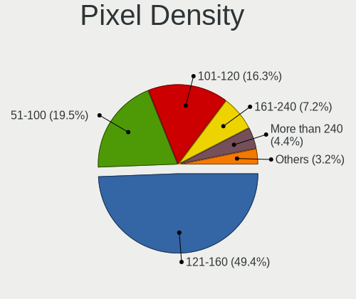

| Density       | Notebooks | Percent |
|---------------|-----------|---------|
| 121-160       | 92        | 52.27%  |
| 51-100        | 39        | 22.16%  |
| 101-120       | 27        | 15.34%  |
| 161-240       | 8         | 4.55%   |
| More than 240 | 6         | 3.41%   |
| Unknown       | 4         | 2.27%   |

Multiple Monitors
-----------------

Total monitors connected

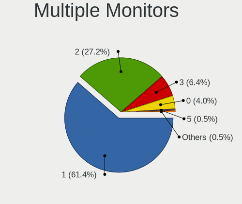

| Total | Notebooks | Percent |
|-------|-----------|---------|
| 1     | 84        | 60%     |
| 2     | 41        | 29.29%  |
| 3     | 8         | 5.71%   |
| 0     | 6         | 4.29%   |
| 4     | 1         | 0.71%   |

Network
-------

Net Controller Vendor
---------------------

Controller vendors

| Vendor                            | Notebooks | Percent |
|-----------------------------------|-----------|---------|
| Intel                             | 115       | 57.5%   |
| Realtek Semiconductor             | 41        | 20.5%   |
| Lenovo                            | 17        | 8.5%    |
| Qualcomm Atheros                  | 7         | 3.5%    |
| Marvell Technology Group          | 2         | 1%      |
| Ericsson Business Mobile Networks | 2         | 1%      |
| Dell                              | 2         | 1%      |
| Broadcom Limited                  | 2         | 1%      |
| Xiaomi                            | 1         | 0.5%    |
| Sierra Wireless                   | 1         | 0.5%    |
| Samsung Electronics               | 1         | 0.5%    |
| Ralink                            | 1         | 0.5%    |
| Qualcomm Atheros Communications   | 1         | 0.5%    |
| MediaTek                          | 1         | 0.5%    |
| Luminary Micro                    | 1         | 0.5%    |
| ICS Advent                        | 1         | 0.5%    |
| Huawei Technologies               | 1         | 0.5%    |
| DisplayLink                       | 1         | 0.5%    |
| Broadcom                          | 1         | 0.5%    |
| ASIX Electronics                  | 1         | 0.5%    |

Net Controller Model
--------------------

Controller models

| Model                                                                          | Notebooks | Percent |
|--------------------------------------------------------------------------------|-----------|---------|
| Realtek RTL8111/8168/8411 PCI Express Gigabit Ethernet Controller              | 21        | 7.64%   |
| Intel Wireless 8265 / 8275                                                     | 17        | 6.18%   |
| Intel Comet Lake PCH-LP CNVi WiFi                                              | 15        | 5.45%   |
| Intel Cannon Point-LP CNVi [Wireless-AC]                                       | 15        | 5.45%   |
| Intel Comet Lake PCH CNVi WiFi                                                 | 12        | 4.36%   |
| Intel 82579LM Gigabit Network Connection (Lewisville)                          | 11        | 4%      |
| Intel Ethernet Connection (6) I219-LM                                          | 10        | 3.64%   |
| Intel Ethernet Connection (4) I219-LM                                          | 10        | 3.64%   |
| Intel Wireless 8260                                                            | 9         | 3.27%   |
| Lenovo ThinkPad TBT 3 Dock                                                     | 8         | 2.91%   |
| Intel Ethernet Connection (10) I219-LM                                         | 8         | 2.91%   |
| Intel Cannon Lake PCH CNVi WiFi                                                | 8         | 2.91%   |
| Realtek RTL8153 Gigabit Ethernet Adapter                                       | 7         | 2.55%   |
| Realtek RTL810xE PCI Express Fast Ethernet controller                          | 6         | 2.18%   |
| Intel Wi-Fi 6 AX200                                                            | 6         | 2.18%   |
| Intel Ethernet Connection (7) I219-LM                                          | 6         | 2.18%   |
| Intel Centrino Advanced-N 6205 [Taylor Peak]                                   | 6         | 2.18%   |
| Intel Wireless 7265                                                            | 4         | 1.45%   |
| Intel Ethernet Connection (6) I219-V                                           | 4         | 1.45%   |
| Intel Ethernet Connection (3) I218-LM                                          | 4         | 1.45%   |
| Intel Ethernet Connection (2) I219-LM                                          | 4         | 1.45%   |
| Intel Centrino Ultimate-N 6300                                                 | 4         | 1.45%   |
| Lenovo USB-C to LAN                                                            | 3         | 1.09%   |
| Intel Ethernet Connection (4) I219-V                                           | 3         | 1.09%   |
| Intel Ethernet Connection (10) I219-V                                          | 3         | 1.09%   |
| Realtek RTL8822BE 802.11a/b/g/n/ac WiFi adapter                                | 2         | 0.73%   |
| Realtek RTL8821CE 802.11ac PCIe Wireless Network Adapter                       | 2         | 0.73%   |
| Realtek RTL8188CE 802.11b/g/n WiFi Adapter                                     | 2         | 0.73%   |
| Qualcomm Atheros QCA9565 / AR9565 Wireless Network Adapter                     | 2         | 0.73%   |
| Qualcomm Atheros AR9485 Wireless Network Adapter                               | 2         | 0.73%   |
| Marvell Group Yukon Optima 88E8059 [PCIe Gigabit Ethernet Controller with AVB] | 2         | 0.73%   |
| Lenovo ThinkPad TBT3 LAN                                                       | 2         | 0.73%   |
| Lenovo ThinkPad Lan                                                            | 2         | 0.73%   |
| Intel Wireless-AC 9260                                                         | 2         | 0.73%   |
| Intel Wireless 3165                                                            | 2         | 0.73%   |
| Intel Wi-Fi 6 AX210/AX211/AX411 160MHz                                         | 2         | 0.73%   |
| Intel Wi-Fi 6 AX201                                                            | 2         | 0.73%   |
| Intel Ethernet Connection I219-LM                                              | 2         | 0.73%   |
| Intel Ethernet Connection (11) I219-LM                                         | 2         | 0.73%   |
| Dell DW5811e Snapdragon X7 LTE                                           | 2         | 0.73%   |

Wireless Vendor
---------------

Wireless vendors

| Vendor                            | Notebooks | Percent |
|-----------------------------------|-----------|---------|
| Intel                             | 112       | 81.75%  |
| Realtek Semiconductor             | 10        | 7.3%    |
| Qualcomm Atheros                  | 6         | 4.38%   |
| Dell                              | 2         | 1.46%   |
| Sierra Wireless                   | 1         | 0.73%   |
| Ralink                            | 1         | 0.73%   |
| Qualcomm Atheros Communications   | 1         | 0.73%   |
| MediaTek                          | 1         | 0.73%   |
| Ericsson Business Mobile Networks | 1         | 0.73%   |
| Broadcom Limited                  | 1         | 0.73%   |
| Broadcom                          | 1         | 0.73%   |

Wireless Model
--------------

Wireless models

| Model                                                          | Notebooks | Percent |
|----------------------------------------------------------------|-----------|---------|
| Intel Wireless 8265 / 8275                                     | 17        | 12.41%  |
| Intel Comet Lake PCH-LP CNVi WiFi                              | 15        | 10.95%  |
| Intel Cannon Point-LP CNVi [Wireless-AC]                       | 15        | 10.95%  |
| Intel Comet Lake PCH CNVi WiFi                                 | 12        | 8.76%   |
| Intel Wireless 8260                                            | 9         | 6.57%   |
| Intel Cannon Lake PCH CNVi WiFi                                | 8         | 5.84%   |
| Intel Wi-Fi 6 AX200                                            | 6         | 4.38%   |
| Intel Centrino Advanced-N 6205 [Taylor Peak]                   | 6         | 4.38%   |
| Intel Wireless 7265                                            | 4         | 2.92%   |
| Intel Centrino Ultimate-N 6300                                 | 4         | 2.92%   |
| Realtek RTL8822BE 802.11a/b/g/n/ac WiFi adapter                | 2         | 1.46%   |
| Realtek RTL8821CE 802.11ac PCIe Wireless Network Adapter       | 2         | 1.46%   |
| Realtek RTL8188CE 802.11b/g/n WiFi Adapter                     | 2         | 1.46%   |
| Qualcomm Atheros QCA9565 / AR9565 Wireless Network Adapter     | 2         | 1.46%   |
| Qualcomm Atheros AR9485 Wireless Network Adapter               | 2         | 1.46%   |
| Intel Wireless-AC 9260                                         | 2         | 1.46%   |
| Intel Wireless 3165                                            | 2         | 1.46%   |
| Intel Wi-Fi 6 AX210/AX211/AX411 160MHz                         | 2         | 1.46%   |
| Intel Wi-Fi 6 AX201                                            | 2         | 1.46%   |
| Dell DW5811e Snapdragon X7 LTE                           | 2         | 1.46%   |
| Sierra Wireless AirPrime MC7455 3G/4G LTE Modem                | 1         | 0.73%   |
| Realtek RTL8852AE 802.11ax PCIe Wireless Network Adapter       | 1         | 0.73%   |
| Realtek RTL8723DE Wireless Network Adapter                     | 1         | 0.73%   |
| Realtek RTL8723BE PCIe Wireless Network Adapter                | 1         | 0.73%   |
| Realtek RTL8188CUS 802.11n WLAN Adapter                        | 1         | 0.73%   |
| Ralink RT3290 Wireless 802.11n 1T/1R PCIe                      | 1         | 0.73%   |
| Qualcomm Atheros QCA6174 802.11ac Wireless Network Adapter     | 1         | 0.73%   |
| Qualcomm Atheros AR9271 802.11n                                | 1         | 0.73%   |
| Qualcomm Atheros AR9285 Wireless Network Adapter (PCI-Express) | 1         | 0.73%   |
| MediaTek MT7921 802.11ax PCI Express Wireless Network Adapter  | 1         | 0.73%   |
| Intel Wireless 3160                                            | 1         | 0.73%   |
| Intel Tiger Lake PCH CNVi WiFi                                 | 1         | 0.73%   |
| Intel Ice Lake-LP PCH CNVi WiFi                                | 1         | 0.73%   |
| Intel Dual Band Wireless-AC 3168NGW [Stone Peak]               | 1         | 0.73%   |
| Intel Centrino Wireless-N 2230                                 | 1         | 0.73%   |
| Intel Centrino Wireless-N 1030 [Rainbow Peak]                  | 1         | 0.73%   |
| Intel Alder Lake-S PCH CNVi WiFi                               | 1         | 0.73%   |
| Intel Alder Lake-P PCH CNVi WiFi                               | 1         | 0.73%   |
| Ericsson Business Mobile Networks N5321 gw                     | 1         | 0.73%   |
| Broadcom Limited BCM4352 802.11ac Wireless Network Adapter     | 1         | 0.73%   |

Ethernet Vendor
---------------

Ethernet vendors

| Vendor                   | Notebooks | Percent |
|--------------------------|-----------|---------|
| Intel                    | 74        | 54.41%  |
| Realtek Semiconductor    | 35        | 25.74%  |
| Lenovo                   | 17        | 12.5%   |
| Marvell Technology Group | 2         | 1.47%   |
| Xiaomi                   | 1         | 0.74%   |
| Samsung Electronics      | 1         | 0.74%   |
| Qualcomm Atheros         | 1         | 0.74%   |
| ICS Advent               | 1         | 0.74%   |
| Huawei Technologies      | 1         | 0.74%   |
| DisplayLink              | 1         | 0.74%   |
| Broadcom Limited         | 1         | 0.74%   |
| ASIX Electronics         | 1         | 0.74%   |

Ethernet Model
--------------

Ethernet models

| Model                                                                          | Notebooks | Percent |
|--------------------------------------------------------------------------------|-----------|---------|
| Realtek RTL8111/8168/8411 PCI Express Gigabit Ethernet Controller              | 21        | 15.44%  |
| Intel 82579LM Gigabit Network Connection (Lewisville)                          | 11        | 8.09%   |
| Intel Ethernet Connection (6) I219-LM                                          | 10        | 7.35%   |
| Intel Ethernet Connection (4) I219-LM                                          | 10        | 7.35%   |
| Lenovo ThinkPad TBT 3 Dock                                                     | 8         | 5.88%   |
| Intel Ethernet Connection (10) I219-LM                                         | 8         | 5.88%   |
| Realtek RTL8153 Gigabit Ethernet Adapter                                       | 7         | 5.15%   |
| Realtek RTL810xE PCI Express Fast Ethernet controller                          | 6         | 4.41%   |
| Intel Ethernet Connection (7) I219-LM                                          | 6         | 4.41%   |
| Intel Ethernet Connection (6) I219-V                                           | 4         | 2.94%   |
| Intel Ethernet Connection (3) I218-LM                                          | 4         | 2.94%   |
| Intel Ethernet Connection (2) I219-LM                                          | 4         | 2.94%   |
| Lenovo USB-C to LAN                                                            | 3         | 2.21%   |
| Intel Ethernet Connection (4) I219-V                                           | 3         | 2.21%   |
| Intel Ethernet Connection (10) I219-V                                          | 3         | 2.21%   |
| Marvell Group Yukon Optima 88E8059 [PCIe Gigabit Ethernet Controller with AVB] | 2         | 1.47%   |
| Lenovo ThinkPad TBT3 LAN                                                       | 2         | 1.47%   |
| Lenovo ThinkPad Lan                                                            | 2         | 1.47%   |
| Intel Ethernet Connection I219-LM                                              | 2         | 1.47%   |
| Intel Ethernet Connection (11) I219-LM                                         | 2         | 1.47%   |
| Xiaomi Mi/Redmi series (RNDIS + ADB)                                           | 1         | 0.74%   |
| Samsung GT-I9070 (network tethering, USB debugging enabled)                    | 1         | 0.74%   |
| Realtek RTL8125 2.5GbE Controller                                              | 1         | 0.74%   |
| Qualcomm Atheros Killer E2500 Gigabit Ethernet Controller                      | 1         | 0.74%   |
| Lenovo USB-C Dock Ethernet                                                     | 1         | 0.74%   |
| Lenovo ThinkPad Dock Ethernet [Realtek RTL8153B]                               | 1         | 0.74%   |
| Intel Ethernet Controller I225-V                                               | 1         | 0.74%   |
| Intel Ethernet Controller I225-LM                                              | 1         | 0.74%   |
| Intel Ethernet Connection I219-V                                               | 1         | 0.74%   |
| Intel Ethernet Connection (5) I219-LM                                          | 1         | 0.74%   |
| Intel Ethernet Connection (2) I219-V                                           | 1         | 0.74%   |
| Intel Ethernet Connection (14) I219-LM                                         | 1         | 0.74%   |
| Intel 82577LM Gigabit Network Connection                                       | 1         | 0.74%   |
| ICS Advent DM9601 Fast Ethernet Adapter                                        | 1         | 0.74%   |
| Huawei E353/E3131                                                              | 1         | 0.74%   |
| DisplayLink Plugable UGA-3000                                                  | 1         | 0.74%   |
| Broadcom Limited NetXtreme BCM5761e Gigabit Ethernet PCIe                      | 1         | 0.74%   |
| ASIX AX88179 Gigabit Ethernet                                                  | 1         | 0.74%   |

Net Controller Kind
-------------------

Ethernet, WiFi or modem

| Kind     | Notebooks | Percent |
|----------|-----------|---------|
| WiFi     | 131       | 52.82%  |
| Ethernet | 115       | 46.37%  |
| Modem    | 2         | 0.81%   |

Used Controller
---------------

Currently used network controller

| Kind     | Notebooks | Percent |
|----------|-----------|---------|
| WiFi     | 100       | 68.97%  |
| Ethernet | 45        | 31.03%  |

NICs
----

Total network controllers on board

| Total | Notebooks | Percent |
|-------|-----------|---------|
| 2     | 105       | 79.55%  |
| 1     | 27        | 20.45%  |

IPv6
----

IPv6 vs IPv4

| Used | Notebooks | Percent |
|------|-----------|---------|
| No   | 122       | 91.73%  |
| Yes  | 11        | 8.27%   |

Bluetooth
---------

Bluetooth Vendor
----------------

Controller vendors

| Vendor                          | Notebooks | Percent |
|---------------------------------|-----------|---------|
| Intel                           | 87        | 79.82%  |
| Broadcom                        | 7         | 6.42%   |
| Realtek Semiconductor           | 4         | 3.67%   |
| IMC Networks                    | 3         | 2.75%   |
| Qualcomm Atheros Communications | 2         | 1.83%   |
| Foxconn / Hon Hai               | 2         | 1.83%   |
| Cambridge Silicon Radio         | 2         | 1.83%   |
| Ralink                          | 1         | 0.92%   |
| Dell                            | 1         | 0.92%   |

Bluetooth Model
---------------

Controller models

| Model                                                                               | Notebooks | Percent |
|-------------------------------------------------------------------------------------|-----------|---------|
| Intel Bluetooth Device                                                              | 31        | 28.44%  |
| Intel Bluetooth wireless interface                                                  | 26        | 23.85%  |
| Intel Bluetooth 9460/9560 Jefferson Peak (JfP)                                      | 19        | 17.43%  |
| Intel AX200 Bluetooth                                                               | 6         | 5.5%    |
| IMC Networks Bluetooth Radio                                                        | 3         | 2.75%   |
| Realtek  Bluetooth 4.2 Adapter                                                      | 2         | 1.83%   |
| Realtek Bluetooth Radio                                                             | 2         | 1.83%   |
| Cambridge Silicon Radio Bluetooth Dongle (HCI mode)                                 | 2         | 1.83%   |
| Broadcom BCM20702 Bluetooth 4.0 [ThinkPad]                                          | 2         | 1.83%   |
| Broadcom BCM2045B (BDC-2.1)                                                         | 2         | 1.83%   |
| Ralink RT3290 Bluetooth                                                             | 1         | 0.92%   |
| Qualcomm Atheros  Bluetooth Device                                                  | 1         | 0.92%   |
| Qualcomm Atheros AR3012 Bluetooth 4.0                                               | 1         | 0.92%   |
| Intel Wireless-AC 9260 Bluetooth Adapter                                            | 1         | 0.92%   |
| Intel Wireless-AC 3168 Bluetooth                                                    | 1         | 0.92%   |
| Intel Centrino Bluetooth Wireless Transceiver                                       | 1         | 0.92%   |
| Intel Centrino Advanced-N 6230 Bluetooth adapter                                    | 1         | 0.92%   |
| Intel AX210 Bluetooth                                                               | 1         | 0.92%   |
| Foxconn / Hon Hai Wireless_Device                                                   | 1         | 0.92%   |
| Foxconn / Hon Hai Foxconn T77H114 BCM2070 [Single-Chip Bluetooth 2.1 + EDR Adapter] | 1         | 0.92%   |
| Dell DW375 Bluetooth Module                                                         | 1         | 0.92%   |
| Broadcom HP Portable SoftSailing                                                    | 1         | 0.92%   |
| Broadcom BCM43142A0 Bluetooth 4.0                                                   | 1         | 0.92%   |
| Broadcom BCM20702A0 Bluetooth                                                       | 1         | 0.92%   |

Sound
-----

Sound Vendor
------------

Sound card vendors

| Vendor                    | Notebooks | Percent |
|---------------------------|-----------|---------|
| Intel                     | 125       | 62.81%  |
| Nvidia                    | 23        | 11.56%  |
| Lenovo                    | 13        | 6.53%   |
| AMD                       | 11        | 5.53%   |
| Realtek Semiconductor     | 4         | 2.01%   |
| Texas Instruments         | 3         | 1.51%   |
| Plantronics               | 3         | 1.51%   |
| GN Netcom                 | 3         | 1.51%   |
| Generalplus Technology    | 2         | 1.01%   |
| C-Media Electronics       | 2         | 1.01%   |
| Sony                      | 1         | 0.5%    |
| Sennheiser Communications | 1         | 0.5%    |
| Logitech                  | 1         | 0.5%    |
| LG Electronics            | 1         | 0.5%    |
| JMTek                     | 1         | 0.5%    |
| Google                    | 1         | 0.5%    |
| Focusrite-Novation        | 1         | 0.5%    |
| Dell                      | 1         | 0.5%    |
| Corsair                   | 1         | 0.5%    |
| Blue Microphones          | 1         | 0.5%    |

Sound Model
-----------

Sound card models

| Model                                                                             | Notebooks | Percent |
|-----------------------------------------------------------------------------------|-----------|---------|
| Intel Sunrise Point-LP HD Audio                                                   | 23        | 10.9%   |
| Intel Cannon Point-LP High Definition Audio Controller                            | 18        | 8.53%   |
| Intel Comet Lake PCH-LP cAVS                                                      | 15        | 7.11%   |
| Intel Comet Lake PCH cAVS                                                         | 12        | 5.69%   |
| Intel Cannon Lake PCH cAVS                                                        | 12        | 5.69%   |
| Lenovo ThinkPad Thunderbolt 3 Dock USB Audio                                      | 8         | 3.79%   |
| Intel 7 Series/C216 Chipset Family High Definition Audio Controller               | 8         | 3.79%   |
| Intel 100 Series/C230 Series Chipset Family HD Audio Controller                   | 7         | 3.32%   |
| AMD Family 17h/19h HD Audio Controller                                            | 7         | 3.32%   |
| Intel 6 Series/C200 Series Chipset Family High Definition Audio Controller        | 6         | 2.84%   |
| Realtek Semiconductor USB Audio                                                   | 4         | 1.9%    |
| Nvidia GP107GL High Definition Audio Controller                                   | 4         | 1.9%    |
| Intel Wildcat Point-LP High Definition Audio Controller                           | 4         | 1.9%    |
| Intel Tiger Lake-H HD Audio Controller                                            | 4         | 1.9%    |
| Intel CM238 HD Audio Controller                                                   | 4         | 1.9%    |
| Intel Broadwell-U Audio Controller                                                | 4         | 1.9%    |
| Intel 5 Series/3400 Series Chipset High Definition Audio                          | 4         | 1.9%    |
| Plantronics BT600                                                                 | 3         | 1.42%   |
| Nvidia TU116 High Definition Audio Controller                                     | 3         | 1.42%   |
| Nvidia GM107 High Definition Audio Controller [GeForce 940MX]                     | 3         | 1.42%   |
| Intel Haswell-ULT HD Audio Controller                                             | 3         | 1.42%   |
| Intel 8 Series HD Audio Controller                                                | 3         | 1.42%   |
| AMD Renoir Radeon High Definition Audio Controller                                | 3         | 1.42%   |
| Texas Instruments PCM2902 Audio Codec                                             | 2         | 0.95%   |
| Nvidia TU106 High Definition Audio Controller                                     | 2         | 0.95%   |
| Nvidia GF108 High Definition Audio Controller                                     | 2         | 0.95%   |
| Nvidia GA106 High Definition Audio Controller                                     | 2         | 0.95%   |
| Nvidia Audio device                                                               | 2         | 0.95%   |
| Lenovo ThinkPad Thunderbolt 3 Dock Audio                                          | 2         | 0.95%   |
| Intel Tiger Lake-LP Smart Sound Technology Audio Controller                       | 2         | 0.95%   |
| AMD Raven/Raven2/Fenghuang HDMI/DP Audio Controller                               | 2         | 0.95%   |
| AMD Caicos HDMI Audio [Radeon HD 6450 / 7450/8450/8490 OEM / R5 230/235/235X OEM] | 2         | 0.95%   |
| Texas Instruments PCM2704 16-bit stereo audio DAC                                 | 1         | 0.47%   |
| Sony DualSense wireless controller (PS5)                                          | 1         | 0.47%   |
| Sennheiser Communications Headset [PC 8]                                          | 1         | 0.47%   |
| Nvidia TU107 GeForce GTX 1650 High Definition Audio Controller                    | 1         | 0.47%   |
| Nvidia GP106 High Definition Audio Controller                                     | 1         | 0.47%   |
| Nvidia GK107 HDMI Audio Controller                                                | 1         | 0.47%   |
| Nvidia GA104 High Definition Audio Controller                                     | 1         | 0.47%   |
| Nvidia GA102 High Definition Audio Controller                                     | 1         | 0.47%   |

Memory
------

Memory Vendor
-------------

Memory module vendors

| Vendor              | Notebooks | Percent |
|---------------------|-----------|---------|
| Samsung Electronics | 20        | 40.82%  |
| SK hynix            | 15        | 30.61%  |
| Kingston            | 3         | 6.12%   |
| Crucial             | 3         | 6.12%   |
| Unknown             | 2         | 4.08%   |
| Smart               | 2         | 4.08%   |
| Micron Technology   | 2         | 4.08%   |
| GOODRAM             | 1         | 2.04%   |
| Elpida              | 1         | 2.04%   |

Memory Model
------------

Memory module models

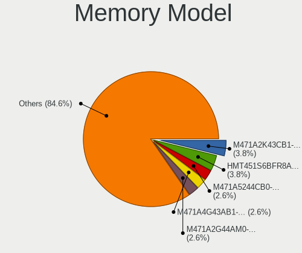

| Model                                                        | Notebooks | Percent |
|--------------------------------------------------------------|-----------|---------|
| Samsung RAM M471A2K43CB1-CRC 16GB SODIMM DDR4 2667MT/s       | 3         | 5.77%   |
| SK hynix RAM HMT451S6BFR8A-PB 4GB SODIMM DDR3 1600MT/s       | 2         | 3.85%   |
| SK hynix RAM HMT41GS6BFR8A-PB 8GB SODIMM DDR3 1600MT/s       | 2         | 3.85%   |
| Samsung RAM M471A2G44AM0-CWE 16GB SODIMM DDR4 3200MT/s       | 2         | 3.85%   |
| Samsung RAM M471A1K43DB1-CTD 8GB SODIMM DDR4 2667MT/s        | 2         | 3.85%   |
| Unknown RAM V3D4SF16GB1G81G82400 16GB SODIMM DDR4 2400MT/s   | 1         | 1.92%   |
| Unknown RAM Module 8GB SODIMM DDR3 1600MT/s                  | 1         | 1.92%   |
| Smart RAM SF564128CJ8NWMNSEG 4GB SODIMM DDR3 1600MT/s        | 1         | 1.92%   |
| Smart RAM SF4642G8CK8IEHLSBG 16384MB SODIMM DDR4 2667MT/s    | 1         | 1.92%   |
| SK hynix RAM HMT451S6BFR8A-PB 4096MB SODIMM DDR3 1600MT/s    | 1         | 1.92%   |
| SK hynix RAM HMT41GS6AFR8A-PB 8GB SODIMM DDR3 1600MT/s       | 1         | 1.92%   |
| SK hynix RAM HMT351S6EFR8A-PB 4GB SODIMM DDR3 1600MT/s       | 1         | 1.92%   |
| SK hynix RAM HMT351S6CFR8C-H9 4GB SODIMM DDR3 1333MT/s       | 1         | 1.92%   |
| SK hynix RAM HMAB2GS6AMR6N-XN 16384MB SODIMM DDR4 3200MT/s   | 1         | 1.92%   |
| SK hynix RAM HMAA1GS6CJR6N-XN 8GB SODIMM DDR4 3200MT/s       | 1         | 1.92%   |
| SK hynix RAM HMA851S6AFR6N-UH 4GB SODIMM DDR4 2667MT/s       | 1         | 1.92%   |
| SK hynix RAM HMA82GS7MFR8N-TF 16GB SODIMM DDR4 2133MT/s      | 1         | 1.92%   |
| SK hynix RAM HMA82GS6MFR8N-TF 16GB SODIMM DDR4 2133MT/s      | 1         | 1.92%   |
| SK hynix RAM HMA82GS6DJR8N-XN 16GB SODIMM DDR4 3200MT/s      | 1         | 1.92%   |
| SK hynix RAM HMA82GS6AFR8N-UH 16GB SODIMM DDR4 2667MT/s      | 1         | 1.92%   |
| SK hynix RAM HMA81GS6JJR8N-VK 8GB SODIMM DDR4 2667MT/s       | 1         | 1.92%   |
| SK hynix RAM HMA451S6AFR8N-TF 4GB SODIMM DDR4 2133MT/s       | 1         | 1.92%   |
| Samsung RAM Module 16GB SODIMM DDR4 3200MT/s                 | 1         | 1.92%   |
| Samsung RAM M471B5273DH0-CH9 4GB SODIMM DDR3 1334MT/s        | 1         | 1.92%   |
| Samsung RAM M471B5173EB0-YK0 4GB SODIMM DDR3 1600MT/s        | 1         | 1.92%   |
| Samsung RAM M471B5173DB0-YK0 4GB SODIMM DDR3 1600MT/s        | 1         | 1.92%   |
| Samsung RAM M471B5173CB0-YK0 4GB SODIMM DDR3 1600MT/s        | 1         | 1.92%   |
| Samsung RAM M471A5244CB0-CRC 4GB SODIMM DDR4 2667MT/s        | 1         | 1.92%   |
| Samsung RAM M471A4G43AB1-CWE 32GB SODIMM DDR4 3200MT/s       | 1         | 1.92%   |
| Samsung RAM M471A2G44AM0-CTD 16GB SODIMM DDR4 2667MT/s       | 1         | 1.92%   |
| Samsung RAM M471A1K43CB1-CRC 8GB SODIMM DDR4 2667MT/s        | 1         | 1.92%   |
| Samsung RAM M471A1K43BB1-CTD 8GB SODIMM DDR4 2667MT/s        | 1         | 1.92%   |
| Samsung RAM M471A1G44AB0-CWE 8GB SODIMM DDR4 3200MT/s        | 1         | 1.92%   |
| Samsung RAM K4EBE304EB-EGCG 8GB Row Of Chips LPDDR3 2133MT/s | 1         | 1.92%   |
| Samsung RAM K4B8G1646B-MYK0 4GB SODIMM DDR3 1600MT/s         | 1         | 1.92%   |
| Samsung RAM K3LK7K7@BM-BGCP 2GB Row Of Chips LPDDR5 6400MT/s | 1         | 1.92%   |
| Micron RAM 8KTF51264HZ-1G9E5 4GB SODIMM DDR3 1333MT/s        | 1         | 1.92%   |
| Micron RAM 4ATF1G64HZ-3G2E2 8GB SODIMM DDR4 3200MT/s         | 1         | 1.92%   |
| Kingston RAM MSI24D4S7S8MB-8 8GB SODIMM DDR4 2400MT/s        | 1         | 1.92%   |
| Kingston RAM KHX2400C14S4/8G 8GB SODIMM DDR4 2400MT/s        | 1         | 1.92%   |

Memory Kind
-----------

Memory module kinds

| Kind   | Notebooks | Percent |
|--------|-----------|---------|
| DDR4   | 24        | 61.54%  |
| DDR3   | 12        | 30.77%  |
| LPDDR5 | 1         | 2.56%   |
| LPDDR4 | 1         | 2.56%   |
| LPDDR3 | 1         | 2.56%   |

Memory Form Factor
------------------

Physical design of the memory module

| Name         | Notebooks | Percent |
|--------------|-----------|---------|
| SODIMM       | 36        | 94.74%  |
| Row Of Chips | 2         | 5.26%   |

Memory Size
-----------

Memory module size

| Size  | Notebooks | Percent |
|-------|-----------|---------|
| 16384 | 15        | 35.71%  |
| 8192  | 15        | 35.71%  |
| 4096  | 10        | 23.81%  |
| 32768 | 1         | 2.38%   |
| 2048  | 1         | 2.38%   |

Memory Speed
------------

Memory module speed

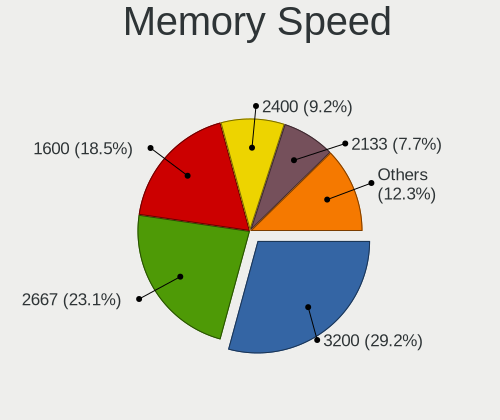

| Speed | Notebooks | Percent |
|-------|-----------|---------|
| 2667  | 12        | 28.57%  |
| 3200  | 9         | 21.43%  |
| 1600  | 9         | 21.43%  |
| 2133  | 4         | 9.52%   |
| 2400  | 3         | 7.14%   |
| 1333  | 3         | 7.14%   |
| 6400  | 1         | 2.38%   |
| 1334  | 1         | 2.38%   |

Printers & scanners
-------------------

Printer Vendor
--------------

Printer device vendors

| Vendor          | Notebooks | Percent |
|-----------------|-----------|---------|
| Hewlett-Packard | 1         | 100%    |

Printer Model
-------------

Printer device models

| Model               | Notebooks | Percent |
|---------------------|-----------|---------|
| HP ENVY 4500 series | 1         | 100%    |

Scanner Vendor
--------------

Scanner device vendors

Zero info for selected period =(

Scanner Model
-------------

Scanner device models

Zero info for selected period =(

Camera
------

Camera Vendor
-------------

Camera device vendors

| Vendor                                 | Notebooks | Percent |
|----------------------------------------|-----------|---------|
| Chicony Electronics                    | 44        | 31.88%  |
| IMC Networks                           | 21        | 15.22%  |
| Acer                                   | 14        | 10.14%  |
| Realtek Semiconductor                  | 10        | 7.25%   |
| Microdia                               | 10        | 7.25%   |
| Sunplus Innovation Technology          | 8         | 5.8%    |
| Logitech                               | 7         | 5.07%   |
| Suyin                                  | 4         | 2.9%    |
| Lite-On Technology                     | 3         | 2.17%   |
| Cheng Uei Precision Industry (Foxlink) | 3         | 2.17%   |
| Unknown                                | 2         | 1.45%   |
| Syntek                                 | 2         | 1.45%   |
| Samsung Electronics                    | 2         | 1.45%   |
| Quanta                                 | 2         | 1.45%   |
| Microsoft                              | 2         | 1.45%   |
| Remo Tech                              | 1         | 0.72%   |
| LG Electronics                         | 1         | 0.72%   |
| Lenovo                                 | 1         | 0.72%   |
| KYE Systems (Mouse Systems)            | 1         | 0.72%   |

Camera Model
------------

Camera device models

| Model                                   | Notebooks | Percent |
|-----------------------------------------|-----------|---------|
| Chicony Integrated Camera               | 23        | 16.31%  |
| IMC Networks Integrated Camera          | 17        | 12.06%  |
| Realtek Integrated_Webcam_HD            | 8         | 5.67%   |
| Acer Integrated Camera                  | 7         | 4.96%   |
| Sunplus Integrated_Webcam_HD            | 5         | 3.55%   |
| Chicony Integrated Camera (1280x720@30) | 5         | 3.55%   |
| Microdia Integrated_Webcam_HD           | 4         | 2.84%   |
| Logitech HD Pro Webcam C920             | 4         | 2.84%   |
| Chicony HP HD Camera                    | 4         | 2.84%   |
| Acer SunplusIT Integrated Camera        | 4         | 2.84%   |
| Lite-On Integrated Camera               | 3         | 2.13%   |
| IMC Networks USB2.0 HD UVC WebCam       | 3         | 2.13%   |
| Chicony ThinkPad T490 Webcam            | 3         | 2.13%   |
| Suyin Integrated_Webcam_HD              | 2         | 1.42%   |
| Samsung Galaxy A5 (MTP)                 | 2         | 1.42%   |
| Microdia Webcam                         | 2         | 1.42%   |
| Microdia Integrated Webcam              | 2         | 1.42%   |
| Chicony Integrated Camera [ThinkPad]    | 2         | 1.42%   |
| Acer Integrated IR Camera               | 2         | 1.42%   |
| Unknown FULL HD 1080P Webcam            | 1         | 0.71%   |
| Unknown 720p HD Camera                  | 1         | 0.71%   |
| Syntek Lenovo EasyCamera                | 1         | 0.71%   |
| Syntek Integrated Camera                | 1         | 0.71%   |
| Suyin RGBIR Camera                      | 1         | 0.71%   |
| Suyin HP Truevision HD                  | 1         | 0.71%   |
| Sunplus Laptop_Integrated_Webcam_FHD    | 1         | 0.71%   |
| Sunplus Integrated Webcam               | 1         | 0.71%   |
| Sunplus HP HD Webcam [Fixed]            | 1         | 0.71%   |
| Remo Tech OBSBOT Tiny 4K                | 1         | 0.71%   |
| Realtek USB2.0 VGA UVC WebCam           | 1         | 0.71%   |
| Realtek NexiGo N660P FHD Webcam         | 1         | 0.71%   |
| Quanta HP TrueVision HD Camera          | 1         | 0.71%   |
| Quanta HP HD Camera                     | 1         | 0.71%   |
| Microsoft LifeCam VX-2000               | 1         | 0.71%   |
| Microsoft LifeCam Cinema                | 1         | 0.71%   |
| Microdia Laptop_Integrated_Webcam_HD    | 1         | 0.71%   |
| Microdia Laptop_Integrated_Webcam_E4HD  | 1         | 0.71%   |
| Logitech Webcam C925e                   | 1         | 0.71%   |
| Logitech Webcam C310                    | 1         | 0.71%   |
| Logitech B525 HD Webcam                 | 1         | 0.71%   |

Security
--------

Fingerprint Vendor
------------------

Fingerprint sensor vendors

| Vendor                     | Notebooks | Percent |
|----------------------------|-----------|---------|
| Synaptics                  | 34        | 58.62%  |
| Validity Sensors           | 16        | 27.59%  |
| Shenzhen Goodix Technology | 4         | 6.9%    |
| Upek                       | 2         | 3.45%   |
| Samsung Electronics        | 1         | 1.72%   |
| Elan Microelectronics      | 1         | 1.72%   |

Fingerprint Model
-----------------

Fingerprint sensor models

| Model                                                                      | Notebooks | Percent |
|----------------------------------------------------------------------------|-----------|---------|
| Synaptics Prometheus MIS Touch Fingerprint Reader                          | 24        | 41.38%  |
| Synaptics Metallica MIS Touch Fingerprint Reader                           | 7         | 12.07%  |
| Validity Sensors VFS7500 Touch Fingerprint Sensor                          | 3         | 5.17%   |
| Validity Sensors VFS 5011 fingerprint sensor                               | 3         | 5.17%   |
| Shenzhen Goodix  FingerPrint Device                                        | 3         | 5.17%   |
| Validity Sensors VFS471 Fingerprint Reader                                 | 2         | 3.45%   |
| Validity Sensors Synaptics WBDI                                            | 2         | 3.45%   |
| Validity Sensors Synaptics VFS7552 Touch Fingerprint Sensor with PurePrint | 2         | 3.45%   |
| Upek Biometric Touchchip/Touchstrip Fingerprint Sensor                     | 2         | 3.45%   |
| Validity Sensors VFS7552 Touch Fingerprint Sensor                          | 1         | 1.72%   |
| Validity Sensors VFS5011 Fingerprint Reader                                | 1         | 1.72%   |
| Validity Sensors VFS495 Fingerprint Reader                                 | 1         | 1.72%   |
| Validity Sensors VFS491                                                    | 1         | 1.72%   |
| Synaptics  VFS7552 Touch Fingerprint Sensor with PurePrint                 | 1         | 1.72%   |
| Synaptics  FS7604 Touch Fingerprint Sensor with PurePrint                  | 1         | 1.72%   |
| Synaptics Metallica MOH Touch Fingerprint Reader                           | 1         | 1.72%   |
| Shenzhen Goodix FingerPrint                                                | 1         | 1.72%   |
| Samsung Fingerprint Sensor Device - 730B                                   | 1         | 1.72%   |
| Elan ELAN:Fingerprint                                                      | 1         | 1.72%   |

Chipcard Vendor
---------------

Chipcard module vendors

| Vendor      | Notebooks | Percent |
|-------------|-----------|---------|
| Broadcom    | 10        | 55.56%  |
| Alcor Micro | 5         | 27.78%  |
| Lenovo      | 2         | 11.11%  |
| Upek        | 1         | 5.56%   |

Chipcard Model
--------------

Chipcard module models

| Model                                                      | Notebooks | Percent |
|------------------------------------------------------------|-----------|---------|
| Alcor Micro AU9540 Smartcard Reader                        | 5         | 27.78%  |
| Broadcom 5880                                              | 4         | 22.22%  |
| Broadcom BCM5880 Secure Applications Processor             | 3         | 16.67%  |
| Broadcom 58200                                             | 3         | 16.67%  |
| Lenovo Integrated Smart Card Reader                        | 2         | 11.11%  |
| Upek TouchChip Fingerprint Coprocessor (WBF advanced mode) | 1         | 5.56%   |

Unsupported
-----------

Unsupported Devices
-------------------

Total unsupported devices on board

| Total | Notebooks | Percent |
|-------|-----------|---------|
| 1     | 69        | 51.11%  |
| 0     | 50        | 37.04%  |
| 2     | 12        | 8.89%   |
| 3     | 3         | 2.22%   |
| 4     | 1         | 0.74%   |

Unsupported Device Types
------------------------

Types of unsupported devices

| Type                     | Notebooks | Percent |
|--------------------------|-----------|---------|
| Fingerprint reader       | 58        | 55.24%  |
| Graphics card            | 16        | 15.24%  |
| Chipcard                 | 11        | 10.48%  |
| Card reader              | 5         | 4.76%   |
| Net/wireless             | 4         | 3.81%   |
| Multimedia controller    | 4         | 3.81%   |
| Net/ethernet             | 2         | 1.9%    |
| Bluetooth                | 2         | 1.9%    |
| Storage                  | 1         | 0.95%   |
| Communication controller | 1         | 0.95%   |
| Camera                   | 1         | 0.95%   |

