RHEL 7 - Tested Hardware & Statistics (Desktops)
------------------------------------------------

A project to collect tested hardware configurations for RHEL 7.

Anyone can contribute to this report by the [hw-probe](https://github.com/linuxhw/hw-probe) tool:

    sudo -E hw-probe -all -upload

Please contribute! Especially if your hardware is rare.

Contents
--------

* [ Test Cases ](#test-cases)

* [ System ](#system)
  - [ Kernel                   ](#kernel)
  - [ Kernel Family            ](#kernel-family)
  - [ Kernel Major Ver.        ](#kernel-major-ver)
  - [ Arch                     ](#arch)
  - [ DE                       ](#de)
  - [ Display Server           ](#display-server)
  - [ Display Manager          ](#display-manager)
  - [ OS Lang                  ](#os-lang)
  - [ Boot Mode                ](#boot-mode)
  - [ Filesystem               ](#filesystem)
  - [ Part. scheme             ](#part-scheme)
  - [ Dual Boot with Linux/BSD ](#dual-boot-with-linuxbsd)
  - [ Dual Boot (Win)          ](#dual-boot-win)

* [ Board ](#board)
  - [ Vendor                   ](#vendor)
  - [ Model                    ](#model)
  - [ Model Family             ](#model-family)
  - [ MFG Year                 ](#mfg-year)
  - [ Form Factor              ](#form-factor)
  - [ Secure Boot              ](#secure-boot)
  - [ Coreboot                 ](#coreboot)
  - [ RAM Size                 ](#ram-size)
  - [ RAM Used                 ](#ram-used)
  - [ Total Drives             ](#total-drives)
  - [ Has CD-ROM               ](#has-cd-rom)
  - [ Has Ethernet             ](#has-ethernet)
  - [ Has WiFi                 ](#has-wifi)
  - [ Has Bluetooth            ](#has-bluetooth)

* [ Location ](#location)
  - [ Country                  ](#country)
  - [ City                     ](#city)

* [ Drives ](#drives)
  - [ Drive Vendor             ](#drive-vendor)
  - [ Drive Model              ](#drive-model)
  - [ HDD Vendor               ](#hdd-vendor)
  - [ SSD Vendor               ](#ssd-vendor)
  - [ Drive Kind               ](#drive-kind)
  - [ Drive Connector          ](#drive-connector)
  - [ Drive Size               ](#drive-size)
  - [ Space Total              ](#space-total)
  - [ Space Used               ](#space-used)
  - [ Malfunc. Drives          ](#malfunc-drives)
  - [ Malfunc. Drive Vendor    ](#malfunc-drive-vendor)
  - [ Malfunc. HDD Vendor      ](#malfunc-hdd-vendor)
  - [ Malfunc. Drive Kind      ](#malfunc-drive-kind)
  - [ Failed Drives            ](#failed-drives)
  - [ Failed Drive Vendor      ](#failed-drive-vendor)
  - [ Drive Status             ](#drive-status)

* [ Storage controller ](#storage-controller)
  - [ Storage Vendor           ](#storage-vendor)
  - [ Storage Model            ](#storage-model)
  - [ Storage Kind             ](#storage-kind)

* [ Processor ](#processor)
  - [ CPU Vendor               ](#cpu-vendor)
  - [ CPU Model                ](#cpu-model)
  - [ CPU Model Family         ](#cpu-model-family)
  - [ CPU Cores                ](#cpu-cores)
  - [ CPU Sockets              ](#cpu-sockets)
  - [ CPU Threads              ](#cpu-threads)
  - [ CPU Op-Modes             ](#cpu-op-modes)
  - [ CPU Microcode            ](#cpu-microcode)
  - [ CPU Microarch            ](#cpu-microarch)

* [ Graphics ](#graphics)
  - [ GPU Vendor               ](#gpu-vendor)
  - [ GPU Model                ](#gpu-model)
  - [ GPU Combo                ](#gpu-combo)
  - [ GPU Driver               ](#gpu-driver)
  - [ GPU Memory               ](#gpu-memory)

* [ Monitor ](#monitor)
  - [ Monitor Vendor           ](#monitor-vendor)
  - [ Monitor Model            ](#monitor-model)
  - [ Monitor Resolution       ](#monitor-resolution)
  - [ Monitor Diagonal         ](#monitor-diagonal)
  - [ Monitor Width            ](#monitor-width)
  - [ Aspect Ratio             ](#aspect-ratio)
  - [ Monitor Area             ](#monitor-area)
  - [ Pixel Density            ](#pixel-density)
  - [ Multiple Monitors        ](#multiple-monitors)

* [ Network ](#network)
  - [ Net Controller Vendor    ](#net-controller-vendor)
  - [ Net Controller Model     ](#net-controller-model)
  - [ Wireless Vendor          ](#wireless-vendor)
  - [ Wireless Model           ](#wireless-model)
  - [ Ethernet Vendor          ](#ethernet-vendor)
  - [ Ethernet Model           ](#ethernet-model)
  - [ Net Controller Kind      ](#net-controller-kind)
  - [ Used Controller          ](#used-controller)
  - [ NICs                     ](#nics)
  - [ IPv6                     ](#ipv6)

* [ Bluetooth ](#bluetooth)
  - [ Bluetooth Vendor         ](#bluetooth-vendor)
  - [ Bluetooth Model          ](#bluetooth-model)

* [ Sound ](#sound)
  - [ Sound Vendor             ](#sound-vendor)
  - [ Sound Model              ](#sound-model)

* [ Memory ](#memory)
  - [ Memory Vendor            ](#memory-vendor)
  - [ Memory Model             ](#memory-model)
  - [ Memory Kind              ](#memory-kind)
  - [ Memory Form Factor       ](#memory-form-factor)
  - [ Memory Size              ](#memory-size)
  - [ Memory Speed             ](#memory-speed)

* [ Printers & scanners ](#printers--scanners)
  - [ Printer Vendor           ](#printer-vendor)
  - [ Printer Model            ](#printer-model)
  - [ Scanner Vendor           ](#scanner-vendor)
  - [ Scanner Model            ](#scanner-model)

* [ Camera ](#camera)
  - [ Camera Vendor            ](#camera-vendor)
  - [ Camera Model             ](#camera-model)

* [ Security ](#security)
  - [ Fingerprint Vendor       ](#fingerprint-vendor)
  - [ Fingerprint Model        ](#fingerprint-model)
  - [ Chipcard Vendor          ](#chipcard-vendor)
  - [ Chipcard Model           ](#chipcard-model)

* [ Unsupported ](#unsupported)
  - [ Unsupported Devices      ](#unsupported-devices)
  - [ Unsupported Device Types ](#unsupported-device-types)

Test Cases
----------

Total: 14

| Vendor  | Model                       | Probe                                                      | Date         |
|---------|-----------------------------|------------------------------------------------------------|--------------|
| Dell    | 0X8DXD A00                  | [bc58f50ac6](https://linux-hardware.org/?probe=bc58f50ac6) | Nov 22, 2023 |
| ASUSTek | STRIX Z270E GAMING          | [e5b049be3a](https://linux-hardware.org/?probe=e5b049be3a) | Aug 18, 2023 |
| HP      | ProLiant MicroServer Gen... | [0178a25382](https://linux-hardware.org/?probe=0178a25382) | Nov 18, 2021 |
| Dell    | PowerEdge FC630             | [98ea3e97e6](https://linux-hardware.org/?probe=98ea3e97e6) | Jan 25, 2021 |
| Dell    | PowerEdge FC630             | [2da05b98bf](https://linux-hardware.org/?probe=2da05b98bf) | Jan 25, 2021 |
| Dell    | PowerEdge FC630             | [038ccd7256](https://linux-hardware.org/?probe=038ccd7256) | Jan 15, 2021 |
| Dell    | PowerEdge FC630             | [f0441f0a07](https://linux-hardware.org/?probe=f0441f0a07) | Jan 15, 2021 |
| Dell    | PowerEdge FC630             | [3c396f0b59](https://linux-hardware.org/?probe=3c396f0b59) | Jan 15, 2021 |
| Dell    | PowerEdge FC630             | [ab4ea06f29](https://linux-hardware.org/?probe=ab4ea06f29) | Jan 15, 2021 |
| Dell    | 00V62H A01                  | [220c6fdf1c](https://linux-hardware.org/?probe=220c6fdf1c) | May 13, 2020 |
| Dell    | 0G919G A00                  | [bdf53b02dc](https://linux-hardware.org/?probe=bdf53b02dc) | Nov 18, 2019 |
| Dell    | 0HHV7N A00                  | [9e55c4bdee](https://linux-hardware.org/?probe=9e55c4bdee) | Apr 05, 2019 |
| HP      | 158A                        | [6924d366ab](https://linux-hardware.org/?probe=6924d366ab) | Jan 09, 2019 |
| Dell    | 05DN3X A00                  | [4be9ce0f72](https://linux-hardware.org/?probe=4be9ce0f72) | Dec 20, 2018 |

System
------

Kernel
------

Version of the Linux kernel

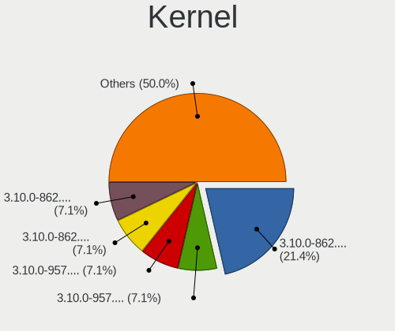

| Version                     | Desktops | Percent |
|-----------------------------|----------|---------|
| 3.10.0-862.3.2.el7.x86_64   | 3        | 21.43%  |
| 3.10.0-957.5.1.el7.x86_64   | 1        | 7.14%   |
| 3.10.0-957.1.3.el7.x86_64   | 1        | 7.14%   |
| 3.10.0-862.9.1.el7.x86_64   | 1        | 7.14%   |
| 3.10.0-862.11.6.el7.x86_64  | 1        | 7.14%   |
| 3.10.0-693.11.6.el7.x86_64  | 1        | 7.14%   |
| 3.10.0-1160.92.1.el7.x86_64 | 1        | 7.14%   |
| 3.10.0-1160.53.1.el7.x86_64 | 1        | 7.14%   |
| 3.10.0-1160.45.1.el7.x86_64 | 1        | 7.14%   |
| 3.10.0-1127.10.1.el7.x86_64 | 1        | 7.14%   |
| 3.10.0-1062.4.3.el7.x86_64  | 1        | 7.14%   |
| 3.10.0-1062.18.1.el7.x86_64 | 1        | 7.14%   |

Kernel Family
-------------

Linux kernel without a distro release

| Version | Desktops | Percent |
|---------|----------|---------|
| 3.10.0  | 14       | 100%    |

Kernel Major Ver.
-----------------

Linux kernel major version

| Version | Desktops | Percent |
|---------|----------|---------|
| 3.10    | 14       | 100%    |

Arch
----

OS architecture (x86_64, i586, etc.)

| Name   | Desktops | Percent |
|--------|----------|---------|
| x86_64 | 14       | 100%    |

DE
--

Desktop Environment

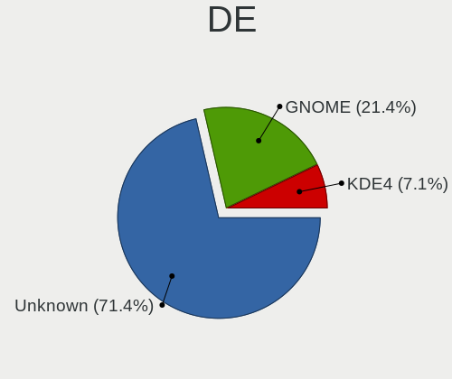

| Name    | Desktops | Percent |
|---------|----------|---------|
| Unknown | 10       | 71.43%  |
| GNOME   | 3        | 21.43%  |
| KDE4    | 1        | 7.14%   |

Display Server
--------------

X11 or Wayland

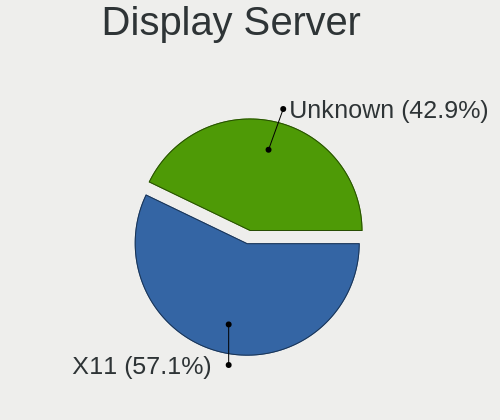

| Name    | Desktops | Percent |
|---------|----------|---------|
| X11     | 8        | 57.14%  |
| Unknown | 6        | 42.86%  |

Display Manager
---------------

SDDM, LightDM, etc.

| Name    | Desktops | Percent |
|---------|----------|---------|
| Unknown | 11       | 78.57%  |
| GDM     | 2        | 14.29%  |
| LightDM | 1        | 7.14%   |

OS Lang
-------

Language

| Lang    | Desktops | Percent |
|---------|----------|---------|
| Unknown | 10       | 71.43%  |
| en_US   | 3        | 21.43%  |
| en_GB   | 1        | 7.14%   |

Boot Mode
---------

EFI or BIOS

| Mode | Desktops | Percent |
|------|----------|---------|
| BIOS | 12       | 85.71%  |
| EFI  | 2        | 14.29%  |

Filesystem
----------

Type of filesystem

| Type    | Desktops | Percent |
|---------|----------|---------|
| Xfs     | 11       | 78.57%  |
| Ext4    | 2        | 14.29%  |
| Unknown | 1        | 7.14%   |

Part. scheme
------------

Scheme of partitioning

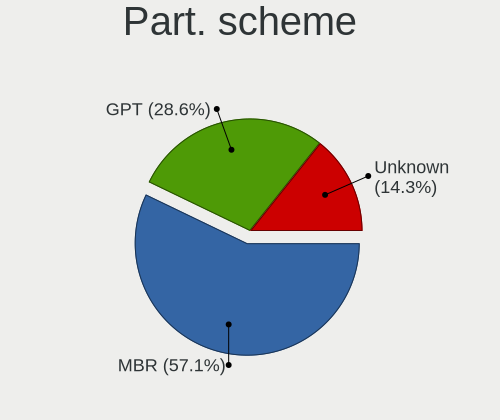

| Type    | Desktops | Percent |
|---------|----------|---------|
| MBR     | 8        | 57.14%  |
| GPT     | 4        | 28.57%  |
| Unknown | 2        | 14.29%  |

Dual Boot with Linux/BSD
------------------------

Hosting more than one Linux/BSD

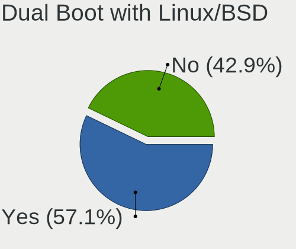

| Dual boot | Desktops | Percent |
|-----------|----------|---------|
| Yes       | 8        | 57.14%  |
| No        | 6        | 42.86%  |

Dual Boot (Win)
---------------

Hosting Linux and Windows

| Dual boot | Desktops | Percent |
|-----------|----------|---------|
| No        | 14       | 100%    |

Board
-----

Vendor
------

Motherboard manufacturer

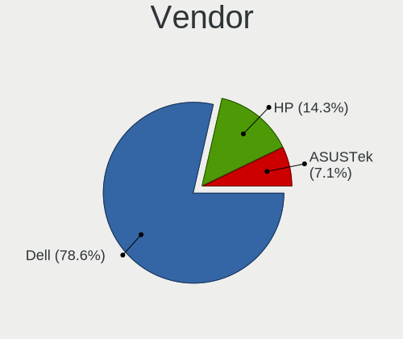

| Name             | Desktops | Percent |
|------------------|----------|---------|
| Dell             | 11       | 78.57%  |
| Hewlett-Packard  | 2        | 14.29%  |
| ASUSTek Computer | 1        | 7.14%   |

Model
-----

Motherboard model

| Name                         | Desktops | Percent |
|------------------------------|----------|---------|
| Dell PowerEdge FC630         | 6        | 42.86%  |
| HP Z620 Workstation          | 1        | 7.14%   |
| HP ProLiant MicroServer Gen8 | 1        | 7.14%   |
| Dell Studio XPS 9100         | 1        | 7.14%   |
| Dell Precision Tower 5810    | 1        | 7.14%   |
| Dell Precision 5820 Tower    | 1        | 7.14%   |
| Dell OptiPlex 9020           | 1        | 7.14%   |
| Dell OptiPlex 760            | 1        | 7.14%   |
| ASUS STRIX Z270E GAMING      | 1        | 7.14%   |

Model Family
------------

Motherboard model prefix

| Name           | Desktops | Percent |
|----------------|----------|---------|
| Dell PowerEdge | 6        | 42.86%  |
| Dell Precision | 2        | 14.29%  |
| Dell OptiPlex  | 2        | 14.29%  |
| HP Z620        | 1        | 7.14%   |
| HP ProLiant    | 1        | 7.14%   |
| Dell Studio    | 1        | 7.14%   |
| ASUS STRIX     | 1        | 7.14%   |

MFG Year
--------

Motherboard manufacture year

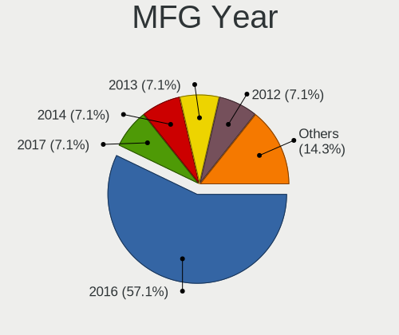

| Year | Desktops | Percent |
|------|----------|---------|
| 2016 | 8        | 57.14%  |
| 2017 | 1        | 7.14%   |
| 2014 | 1        | 7.14%   |
| 2013 | 1        | 7.14%   |
| 2012 | 1        | 7.14%   |
| 2010 | 1        | 7.14%   |
| 2009 | 1        | 7.14%   |

Form Factor
-----------

Physical design of the computer

| Name    | Desktops | Percent |
|---------|----------|---------|
| Desktop | 14       | 100%    |

Secure Boot
-----------

Enabled or disabled

| State    | Desktops | Percent |
|----------|----------|---------|
| Disabled | 14       | 100%    |

Coreboot
--------

Have coreboot on board

| Used | Desktops | Percent |
|------|----------|---------|
| No   | 14       | 100%    |

RAM Size
--------

Total RAM memory

| Size in GB      | Desktops | Percent |
|-----------------|----------|---------|
| 64.01-256.0     | 5        | 35.71%  |
| More than 256.0 | 2        | 14.29%  |
| 24.01-32.0      | 2        | 14.29%  |
| 4.01-8.0        | 1        | 7.14%   |
| 32.01-64.0      | 1        | 7.14%   |
| 2.01-3.0        | 1        | 7.14%   |
| 16.01-24.0      | 1        | 7.14%   |
| 8.01-16.0       | 1        | 7.14%   |

RAM Used
--------

Used RAM memory

| Used GB    | Desktops | Percent |
|------------|----------|---------|
| 4.01-8.0   | 7        | 50%     |
| 8.01-16.0  | 2        | 14.29%  |
| 24.01-32.0 | 1        | 7.14%   |
| 2.01-3.0   | 1        | 7.14%   |
| 16.01-24.0 | 1        | 7.14%   |
| 1.01-2.0   | 1        | 7.14%   |
| 0.51-1.0   | 1        | 7.14%   |

Total Drives
------------

Number of drives on board

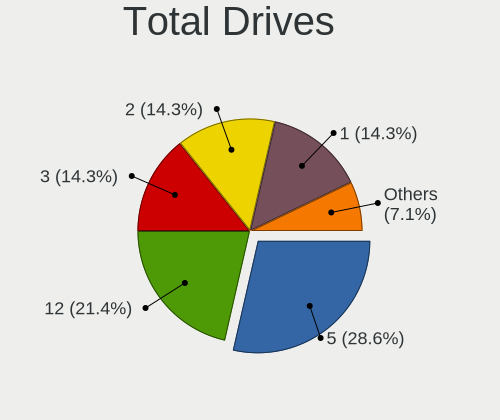

| Drives | Desktops | Percent |
|--------|----------|---------|
| 5      | 4        | 28.57%  |
| 12     | 3        | 21.43%  |
| 3      | 2        | 14.29%  |
| 2      | 2        | 14.29%  |
| 1      | 2        | 14.29%  |
| 4      | 1        | 7.14%   |

Has CD-ROM
----------

Has CD-ROM on board

| Presented | Desktops | Percent |
|-----------|----------|---------|
| Yes       | 7        | 50%     |
| No        | 7        | 50%     |

Has Ethernet
------------

Has Ethernet on board

| Presented | Desktops | Percent |
|-----------|----------|---------|
| Yes       | 14       | 100%    |

Has WiFi
--------

Has WiFi module

| Presented | Desktops | Percent |
|-----------|----------|---------|
| No        | 12       | 85.71%  |
| Yes       | 2        | 14.29%  |

Has Bluetooth
-------------

Has Bluetooth module

| Presented | Desktops | Percent |
|-----------|----------|---------|
| No        | 13       | 92.86%  |
| Yes       | 1        | 7.14%   |

Location
--------

Country
-------

Geographic location (country)

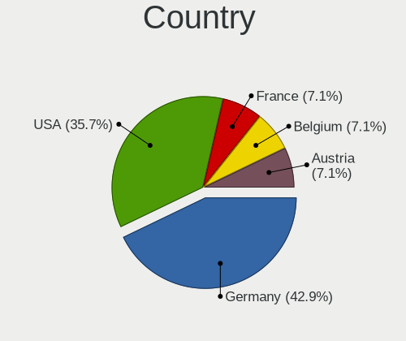

| Country | Desktops | Percent |
|---------|----------|---------|
| Germany | 6        | 42.86%  |
| USA     | 5        | 35.71%  |
| France  | 1        | 7.14%   |
| Belgium | 1        | 7.14%   |
| Austria | 1        | 7.14%   |

City
----

Geographic location (city)

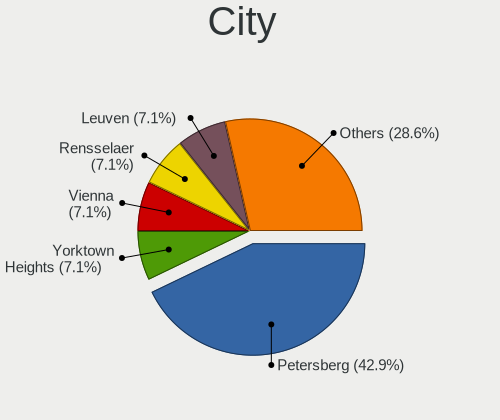

| City             | Desktops | Percent |
|------------------|----------|---------|
| Petersberg       | 6        | 42.86%  |
| Yorktown Heights | 1        | 7.14%   |
| Vienna           | 1        | 7.14%   |
| Rensselaer       | 1        | 7.14%   |
| Leuven           | 1        | 7.14%   |
| Glendale         | 1        | 7.14%   |
| Chicago          | 1        | 7.14%   |
| Caen             | 1        | 7.14%   |
| Bethlehem        | 1        | 7.14%   |

Drives
------

Drive Vendor
------------

Hard drive vendors

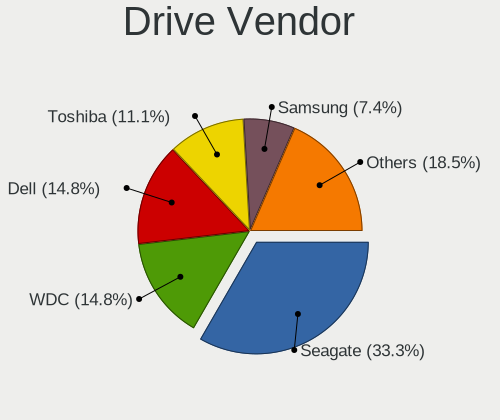

| Vendor                       | Desktops | Drives | Percent |
|------------------------------|----------|--------|---------|
| Seagate                      | 9        | 28     | 33.33%  |
| WDC                          | 4        | 6      | 14.81%  |
| Dell                         | 4        | 8      | 14.81%  |
| Toshiba                      | 3        | 5      | 11.11%  |
| Samsung Electronics          | 2        | 3      | 7.41%   |
| Toshiba America Info Systems | 1        | 1      | 3.7%    |
| SK hynix                     | 1        | 2      | 3.7%    |
| SCST_FIO                     | 1        | 9      | 3.7%    |
| HGST                         | 1        | 1      | 3.7%    |
| Anobit                       | 1        | 1      | 3.7%    |

Drive Model
-----------

Hard drive models

| Model                                               | Desktops | Percent |
|-----------------------------------------------------|----------|---------|
| Dell MD34xx 26TB                                    | 4        | 10.81%  |
| Toshiba AL14SEB18EQ 1.8TB                           | 2        | 5.41%   |
| Seagate ST91000640NS 1TB                            | 2        | 5.41%   |
| Seagate ST2000NX0433 2TB                            | 2        | 5.41%   |
| Seagate ST2000NX0273 2TB                            | 2        | 5.41%   |
| Samsung SSD 860 EVO 500GB                           | 2        | 5.41%   |
| WDC WDS500G2B0A-00SM50 500GB SSD                    | 1        | 2.7%    |
| WDC WD5000HHTZ-04N21V0 500GB                        | 1        | 2.7%    |
| WDC WD20EZRX-00DC0B0 2TB                            | 1        | 2.7%    |
| WDC WD2002FFSX-68PF8N0 2TB                          | 1        | 2.7%    |
| WDC WD10EALX-759BA1 1TB                             | 1        | 2.7%    |
| Toshiba MQ01ACF032 320GB                            | 1        | 2.7%    |
| Toshiba America Info Systems KXG50ZNV256G NVM 256GB | 1        | 2.7%    |
| SK hynix SC311 SATA 256GB SSD                       | 1        | 2.7%    |
| Seagate ST4000NM0085-1YY107 4TB                     | 1        | 2.7%    |
| Seagate ST3160815AS 160GB                           | 1        | 2.7%    |
| Seagate ST2000VN000-1HJ164 2TB                      | 1        | 2.7%    |
| SCST_FIO slordtgt008 8.7TB                          | 1        | 2.7%    |
| SCST_FIO slordtgt007 8.7TB                          | 1        | 2.7%    |
| SCST_FIO slordtgt006 8.7TB                          | 1        | 2.7%    |
| SCST_FIO slordtgt005 8.7TB                          | 1        | 2.7%    |
| SCST_FIO slordtgt004 8.7TB                          | 1        | 2.7%    |
| SCST_FIO slordtgt003 274GB                          | 1        | 2.7%    |
| SCST_FIO slordtgt002 274GB                          | 1        | 2.7%    |
| SCST_FIO slordtgt001 274GB                          | 1        | 2.7%    |
| SCST_FIO slordtgt000 274GB                          | 1        | 2.7%    |
| Samsung SSD 850 EVO 1TB                             | 1        | 2.7%    |
| HGST HTS721010A9E630 1TB                            | 1        | 2.7%    |
| Anobit Gen2A400 118032738 400GB SSD                 | 1        | 2.7%    |

HDD Vendor
----------

Hard disk drive vendors

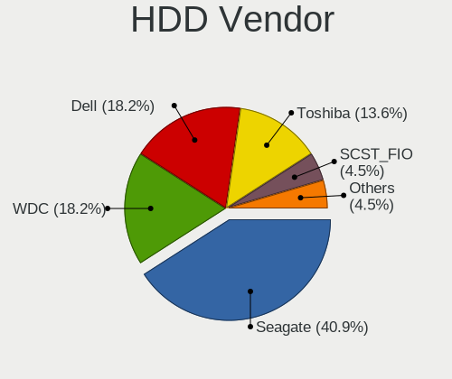

| Vendor   | Desktops | Drives | Percent |
|----------|----------|--------|---------|
| Seagate  | 9        | 28     | 40.91%  |
| WDC      | 4        | 5      | 18.18%  |
| Dell     | 4        | 8      | 18.18%  |
| Toshiba  | 3        | 5      | 13.64%  |
| SCST_FIO | 1        | 9      | 4.55%   |
| HGST     | 1        | 1      | 4.55%   |

SSD Vendor
----------

Solid state drive vendors

| Vendor              | Desktops | Drives | Percent |
|---------------------|----------|--------|---------|
| Samsung Electronics | 2        | 3      | 40%     |
| WDC                 | 1        | 1      | 20%     |
| SK hynix            | 1        | 2      | 20%     |
| Anobit              | 1        | 1      | 20%     |

Drive Kind
----------

HDD or SSD

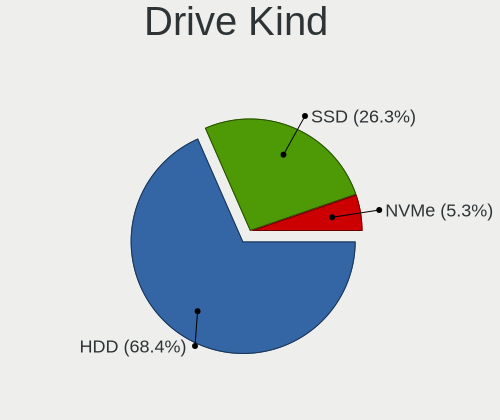

| Kind | Desktops | Drives | Percent |
|------|----------|--------|---------|
| HDD  | 13       | 56     | 68.42%  |
| SSD  | 5        | 7      | 26.32%  |
| NVMe | 1        | 1      | 5.26%   |

Drive Connector
---------------

SATA, SAS, NVMe, etc.

| Type | Desktops | Drives | Percent |
|------|----------|--------|---------|
| SATA | 14       | 55     | 73.68%  |
| SAS  | 4        | 8      | 21.05%  |
| NVMe | 1        | 1      | 5.26%   |

Drive Size
----------

Size of hard drive

| Size in TB | Desktops | Drives | Percent |
|------------|----------|--------|---------|
| 0.01-0.5   | 7        | 13     | 29.17%  |
| 1.01-2.0   | 6        | 27     | 25%     |
| 0.51-1.0   | 5        | 8      | 20.83%  |
| 20.01-50.0 | 4        | 8      | 16.67%  |
| 3.01-4.0   | 1        | 2      | 4.17%   |
| 4.01-10.0  | 1        | 5      | 4.17%   |

Space Total
-----------

Amount of disk space available on the file system

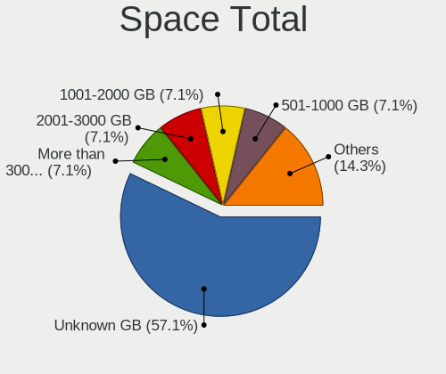

| Size in GB     | Desktops | Percent |
|----------------|----------|---------|
| Unknown        | 8        | 57.14%  |
| More than 3000 | 1        | 7.14%   |
| 251-500        | 1        | 7.14%   |
| 2001-3000      | 1        | 7.14%   |
| 1001-2000      | 1        | 7.14%   |
| 501-1000       | 1        | 7.14%   |
| 51-100         | 1        | 7.14%   |

Space Used
----------

Amount of used disk space

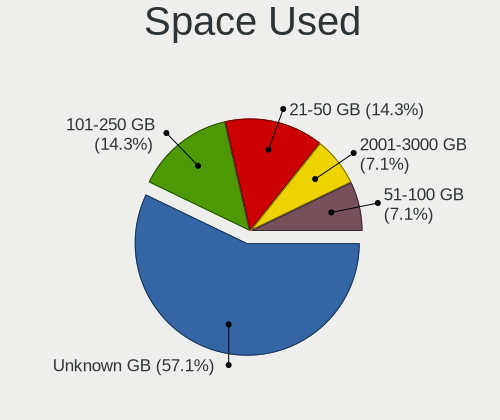

| Used GB   | Desktops | Percent |
|-----------|----------|---------|
| Unknown   | 8        | 57.14%  |
| 21-50     | 2        | 14.29%  |
| 101-250   | 2        | 14.29%  |
| 2001-3000 | 1        | 7.14%   |
| 51-100    | 1        | 7.14%   |

Malfunc. Drives
---------------

Drive models with a malfunction

| Model                    | Desktops | Drives | Percent |
|--------------------------|----------|--------|---------|
| WDC WD10EALX-759BA1 1TB  | 1        | 2      | 50%     |
| Seagate ST91000640NS 1TB | 1        | 2      | 50%     |

Malfunc. Drive Vendor
---------------------

Vendors of faulty drives

| Vendor  | Desktops | Drives | Percent |
|---------|----------|--------|---------|
| WDC     | 1        | 2      | 50%     |
| Seagate | 1        | 2      | 50%     |

Malfunc. HDD Vendor
-------------------

Vendors of faulty HDD drives

| Vendor  | Desktops | Drives | Percent |
|---------|----------|--------|---------|
| WDC     | 1        | 2      | 50%     |
| Seagate | 1        | 2      | 50%     |

Malfunc. Drive Kind
-------------------

Kinds of faulty drives

| Kind | Desktops | Drives | Percent |
|------|----------|--------|---------|
| HDD  | 2        | 4      | 100%    |

Failed Drives
-------------

Failed drive models

Zero info for selected period =(

Failed Drive Vendor
-------------------

Failed drive vendors

Zero info for selected period =(

Drive Status
------------

Number of failed and malfunc. drives

| Status   | Desktops | Drives | Percent |
|----------|----------|--------|---------|
| Works    | 12       | 56     | 75%     |
| Detected | 2        | 4      | 12.5%   |
| Malfunc  | 2        | 4      | 12.5%   |

Storage controller
------------------

Storage Vendor
--------------

Storage controller vendors

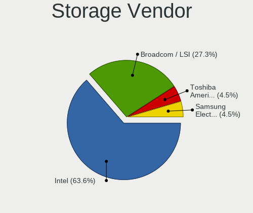

| Vendor                       | Desktops | Percent |
|------------------------------|----------|---------|
| Intel                        | 14       | 63.64%  |
| Broadcom / LSI               | 6        | 27.27%  |
| Toshiba America Info Systems | 1        | 4.55%   |
| Samsung Electronics          | 1        | 4.55%   |

Storage Model
-------------

Storage controller models

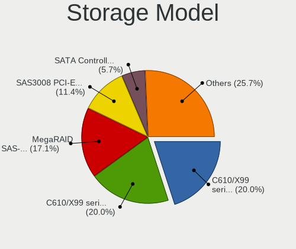

| Model                                                                         | Desktops | Percent |
|-------------------------------------------------------------------------------|----------|---------|
| Intel C610/X99 series chipset sSATA Controller [AHCI mode]                    | 7        | 20%     |
| Intel C610/X99 series chipset 6-Port SATA Controller [AHCI mode]              | 7        | 20%     |
| Broadcom / LSI MegaRAID SAS-3 3108 [Invader]                                  | 6        | 17.14%  |
| Broadcom / LSI SAS3008 PCI-Express Fusion-MPT SAS-3                           | 4        | 11.43%  |
| Intel SATA Controller [RAID Mode]                                             | 2        | 5.71%   |
| Toshiba America Info Systems XG5 NVMe SSD Controller                          | 1        | 2.86%   |
| Samsung NVMe SSD Controller SM981/PM981/PM983                                 | 1        | 2.86%   |
| Intel C602 chipset 4-Port SATA Storage Control Unit                           | 1        | 2.86%   |
| Intel C600/X79 series chipset 6-Port SATA AHCI Controller                     | 1        | 2.86%   |
| Intel 82801JI (ICH10 Family) SATA AHCI Controller                             | 1        | 2.86%   |
| Intel 82801JD/DO (ICH10 Family) SATA AHCI Controller                          | 1        | 2.86%   |
| Intel 6 Series/C200 Series Chipset Family 6 port Desktop SATA AHCI Controller | 1        | 2.86%   |
| Intel 4 Series Chipset PT IDER Controller                                     | 1        | 2.86%   |
| Intel 200 Series PCH SATA controller [AHCI mode]                              | 1        | 2.86%   |

Storage Kind
------------

Kind of storage controller (IDE, SATA, NVMe, SAS, ...)

| Kind | Desktops | Percent |
|------|----------|---------|
| SATA | 12       | 42.86%  |
| RAID | 8        | 28.57%  |
| SAS  | 5        | 17.86%  |
| NVMe | 2        | 7.14%   |
| IDE  | 1        | 3.57%   |

Processor
---------

CPU Vendor
----------

Processor vendors

| Vendor | Desktops | Percent |
|--------|----------|---------|
| Intel  | 14       | 100%    |

CPU Model
---------

Processor models

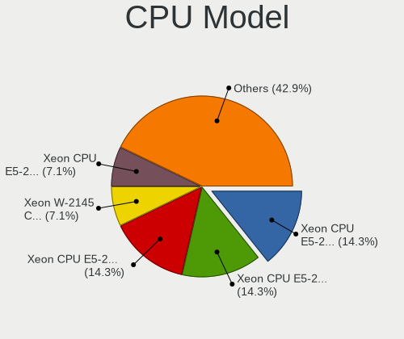

| Model                                | Desktops | Percent |
|--------------------------------------|----------|---------|
| Intel Xeon CPU E5-2630 v3 @ 2.40GHz  | 2        | 14.29%  |
| Intel Xeon CPU E5-2620 v4 @ 2.10GHz  | 2        | 14.29%  |
| Intel Xeon CPU E5-2620 v3 @ 2.40GHz  | 2        | 14.29%  |
| Intel Xeon W-2145 CPU @ 3.70GHz      | 1        | 7.14%   |
| Intel Xeon CPU E5-2690 0 @ 2.90GHz   | 1        | 7.14%   |
| Intel Xeon CPU E5-1620 v3 @ 3.50GHz  | 1        | 7.14%   |
| Intel Xeon CPU E3-1280 V2 @ 3.60GHz  | 1        | 7.14%   |
| Intel Core i7-7700K CPU @ 4.20GHz    | 1        | 7.14%   |
| Intel Core i7 CPU X 990 @ 3.47GHz    | 1        | 7.14%   |
| Intel Core i5-4590 CPU @ 3.30GHz     | 1        | 7.14%   |
| Intel Core 2 Duo CPU E7400 @ 2.80GHz | 1        | 7.14%   |

CPU Model Family
----------------

Processor model prefix

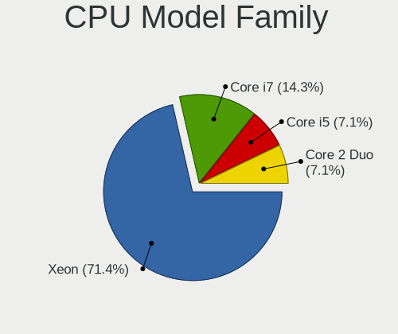

| Model            | Desktops | Percent |
|------------------|----------|---------|
| Intel Xeon       | 10       | 71.43%  |
| Intel Core i7    | 2        | 14.29%  |
| Intel Core i5    | 1        | 7.14%   |
| Intel Core 2 Duo | 1        | 7.14%   |

CPU Cores
---------

Number of processor cores

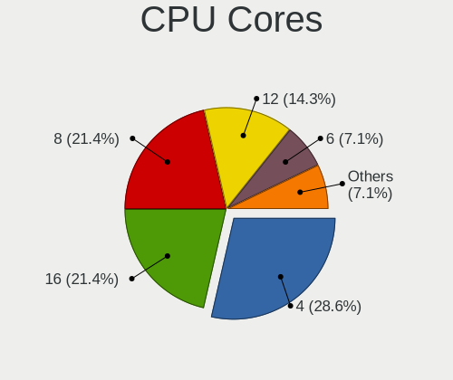

| Number | Desktops | Percent |
|--------|----------|---------|
| 4      | 4        | 28.57%  |
| 16     | 3        | 21.43%  |
| 8      | 3        | 21.43%  |
| 12     | 2        | 14.29%  |
| 6      | 1        | 7.14%   |
| 2      | 1        | 7.14%   |

CPU Sockets
-----------

Number of sockets

| Number | Desktops | Percent |
|--------|----------|---------|
| 1      | 9        | 64.29%  |
| 2      | 5        | 35.71%  |

CPU Threads
-----------

Threads per core (Hyper-Threading)

| Number | Desktops | Percent |
|--------|----------|---------|
| 2      | 12       | 85.71%  |
| 1      | 2        | 14.29%  |

CPU Op-Modes
------------

CPU Operation Modes (32-bit, 64-bit)

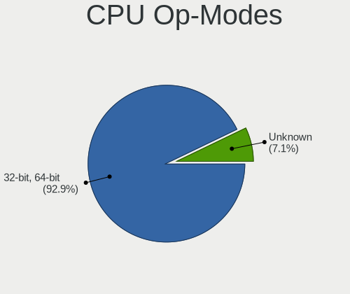

| Op mode        | Desktops | Percent |
|----------------|----------|---------|
| 32-bit, 64-bit | 13       | 92.86%  |
| Unknown        | 1        | 7.14%   |

CPU Microcode
-------------

Microcode number

| Number  | Desktops | Percent |
|---------|----------|---------|
| 0x306f2 | 4        | 28.57%  |
| Unknown | 3        | 21.43%  |
| 0x406f1 | 2        | 14.29%  |
| 0x306c3 | 1        | 7.14%   |
| 0x306a9 | 1        | 7.14%   |
| 0x206d7 | 1        | 7.14%   |
| 0x206c2 | 1        | 7.14%   |
| 0x1067a | 1        | 7.14%   |

CPU Microarch
-------------

Microarchitecture

| Name        | Desktops | Percent |
|-------------|----------|---------|
| Haswell     | 6        | 42.86%  |
| Broadwell   | 2        | 14.29%  |
| Westmere    | 1        | 7.14%   |
| Skylake     | 1        | 7.14%   |
| SandyBridge | 1        | 7.14%   |
| Penryn      | 1        | 7.14%   |
| KabyLake    | 1        | 7.14%   |
| IvyBridge   | 1        | 7.14%   |

Graphics
--------

GPU Vendor
----------

Vendors of graphics cards

| Vendor                     | Desktops | Percent |
|----------------------------|----------|---------|
| Nvidia                     | 6        | 40%     |
| Matrox Electronics Systems | 6        | 40%     |
| Intel                      | 2        | 13.33%  |
| AMD                        | 1        | 6.67%   |

GPU Model
---------

Graphics card models

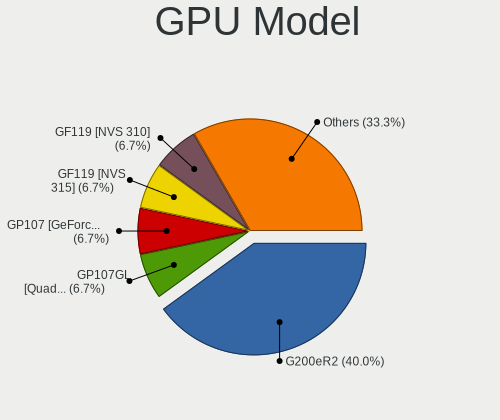

| Model                                                                       | Desktops | Percent |
|-----------------------------------------------------------------------------|----------|---------|
| Matrox Electronics Systems G200eR2                                          | 6        | 40%     |
| Nvidia GP107GL [Quadro P400]                                                | 1        | 6.67%   |
| Nvidia GP107 [GeForce GTX 1050]                                             | 1        | 6.67%   |
| Nvidia GF119 [NVS 315]                                                      | 1        | 6.67%   |
| Nvidia GF119 [NVS 310]                                                      | 1        | 6.67%   |
| Nvidia GF116 [GeForce GTX 550 Ti]                                           | 1        | 6.67%   |
| Nvidia GF108GL [Quadro 600]                                                 | 1        | 6.67%   |
| Intel Xeon E3-1200 v3/4th Gen Core Processor Integrated Graphics Controller | 1        | 6.67%   |
| Intel 4 Series Chipset Integrated Graphics Controller                       | 1        | 6.67%   |
| AMD Caicos [Radeon HD 6450/7450/8450 / R5 230 OEM]                          | 1        | 6.67%   |

GPU Combo
---------

Combinations of graphics cards

| Name           | Desktops | Percent |
|----------------|----------|---------|
| 1 x Matrox     | 6        | 42.86%  |
| 1 x Nvidia     | 5        | 35.71%  |
| Intel + Nvidia | 1        | 7.14%   |
| 1 x Intel      | 1        | 7.14%   |
| 1 x AMD        | 1        | 7.14%   |

GPU Driver
----------

Free vs proprietary

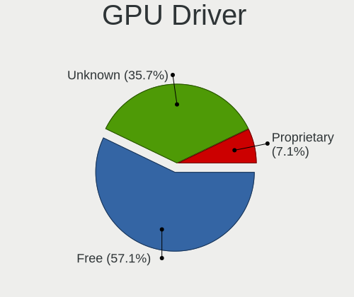

| Driver      | Desktops | Percent |
|-------------|----------|---------|
| Free        | 8        | 57.14%  |
| Unknown     | 5        | 35.71%  |
| Proprietary | 1        | 7.14%   |

GPU Memory
----------

Total video memory

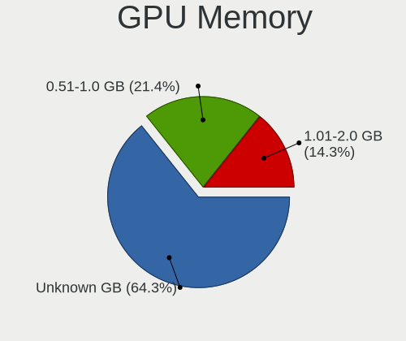

| Size in GB | Desktops | Percent |
|------------|----------|---------|
| Unknown    | 9        | 64.29%  |
| 0.51-1.0   | 3        | 21.43%  |
| 1.01-2.0   | 2        | 14.29%  |

Monitor
-------

Monitor Vendor
--------------

Monitor vendors

| Vendor              | Desktops | Percent |
|---------------------|----------|---------|
| Dell                | 7        | 63.64%  |
| ViewSonic           | 1        | 9.09%   |
| Samsung Electronics | 1        | 9.09%   |
| Hewlett-Packard     | 1        | 9.09%   |
| Goldstar            | 1        | 9.09%   |

Monitor Model
-------------

Monitor models

| Model                                                                 | Desktops | Percent |
|-----------------------------------------------------------------------|----------|---------|
| Dell LCD Monitor DEL0001 1280x1024                                    | 6        | 54.55%  |
| ViewSonic VA2419 Series VSC7B32 1920x1080 530x300mm 24.0-inch         | 1        | 9.09%   |
| Samsung Electronics LCD Monitor SAM0B30 1920x1080 885x498mm 40.0-inch | 1        | 9.09%   |
| Hewlett-Packard 24es HWP3320 1920x1080 527x296mm 23.8-inch            | 1        | 9.09%   |
| Goldstar HDR WFHD GSM7715 2560x1080 798x334mm 34.1-inch               | 1        | 9.09%   |
| Dell U2917W DEL40F9 2560x1080 673x284mm 28.8-inch                     | 1        | 9.09%   |

Monitor Resolution
------------------

Monitor screen resolution

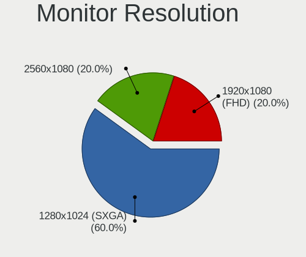

| Resolution       | Desktops | Percent |
|------------------|----------|---------|
| 1280x1024 (SXGA) | 6        | 60%     |
| 2560x1080        | 2        | 20%     |
| 1920x1080 (FHD)  | 2        | 20%     |

Monitor Diagonal
----------------

Diagonal size in inches

| Inches  | Desktops | Percent |
|---------|----------|---------|
| Unknown | 6        | 60%     |
| 54      | 1        | 10%     |
| 34      | 1        | 10%     |
| 28      | 1        | 10%     |
| 24      | 1        | 10%     |

Monitor Width
-------------

Physical width

| Width in mm | Desktops | Percent |
|-------------|----------|---------|
| Unknown     | 6        | 60%     |
| 701-800     | 1        | 10%     |
| 601-700     | 1        | 10%     |
| 501-600     | 1        | 10%     |
| 1001-1500   | 1        | 10%     |

Aspect Ratio
------------

Proportional relationship between the width and the height

| Ratio | Desktops | Percent |
|-------|----------|---------|
| 5/4   | 6        | 60%     |
| 21/9  | 2        | 20%     |
| 16/9  | 2        | 20%     |

Monitor Area
------------

Area in inch²

| Area in inch² | Desktops | Percent |
|----------------|----------|---------|
| Unknown        | 6        | 60%     |
| More than 1000 | 1        | 10%     |
| 351-500        | 1        | 10%     |
| 251-300        | 1        | 10%     |
| 201-250        | 1        | 10%     |

Pixel Density
-------------

Pixels per inch

| Density | Desktops | Percent |
|---------|----------|---------|
| Unknown | 6        | 60%     |
| 51-100  | 3        | 30%     |
| 1-50    | 1        | 10%     |

Multiple Monitors
-----------------

Total monitors connected

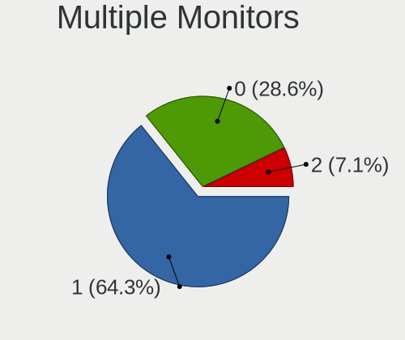

| Total | Desktops | Percent |
|-------|----------|---------|
| 1     | 9        | 64.29%  |
| 0     | 4        | 28.57%  |
| 2     | 1        | 7.14%   |

Network
-------

Net Controller Vendor
---------------------

Controller vendors

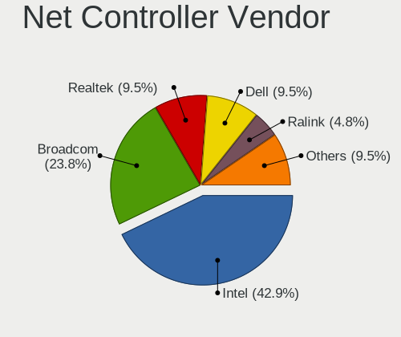

| Vendor                | Desktops | Percent |
|-----------------------|----------|---------|
| Intel                 | 9        | 42.86%  |
| Broadcom              | 5        | 23.81%  |
| Realtek Semiconductor | 2        | 9.52%   |
| Dell                  | 2        | 9.52%   |
| Ralink Technology     | 1        | 4.76%   |
| Qualcomm Atheros      | 1        | 4.76%   |
| ASIX Electronics      | 1        | 4.76%   |

Net Controller Model
--------------------

Controller models

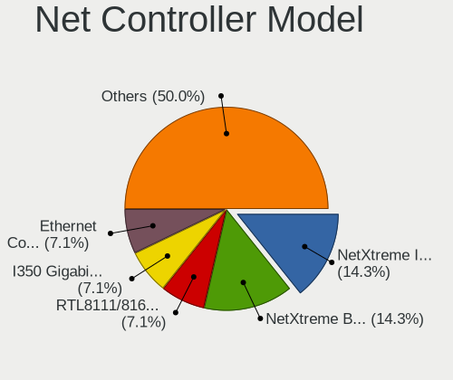

| Model                                                                  | Desktops | Percent |
|------------------------------------------------------------------------|----------|---------|
| Broadcom NetXtreme II BCM57810 10 Gigabit Ethernet                     | 4        | 14.29%  |
| Broadcom NetXtreme BCM5719 Gigabit Ethernet PCIe                       | 4        | 14.29%  |
| Realtek RTL8111/8168/8211/8411 PCI Express Gigabit Ethernet Controller | 2        | 7.14%   |
| Intel I350 Gigabit Network Connection                                  | 2        | 7.14%   |
| Intel Ethernet Connection I217-LM                                      | 2        | 7.14%   |
| Intel 82599 10 Gigabit Dual Port Backplane Connection                  | 2        | 7.14%   |
| Dell iDRAC Virtual NIC                                                 | 2        | 7.14%   |
| Ralink RT5372 Wireless Adapter                                         | 1        | 3.57%   |
| Qualcomm Atheros QCA6174 802.11ac Wireless Network Adapter             | 1        | 3.57%   |
| Intel Ethernet Connection (5) I219-LM                                  | 1        | 3.57%   |
| Intel Ethernet Connection (2) I219-V                                   | 1        | 3.57%   |
| Intel 82579LM Gigabit Network Connection (Lewisville)                  | 1        | 3.57%   |
| Intel 82574L Gigabit Network Connection                                | 1        | 3.57%   |
| Intel 82571EB/82571GB Gigabit Ethernet Controller (Copper)             | 1        | 3.57%   |
| Intel 82567LM-3 Gigabit Network Connection                             | 1        | 3.57%   |
| Broadcom NetXtreme BCM5720 Gigabit Ethernet PCIe                       | 1        | 3.57%   |
| ASIX AX88179 Gigabit Ethernet                                          | 1        | 3.57%   |

Wireless Vendor
---------------

Wireless vendors

| Vendor            | Desktops | Percent |
|-------------------|----------|---------|
| Ralink Technology | 1        | 50%     |
| Qualcomm Atheros  | 1        | 50%     |

Wireless Model
--------------

Wireless models

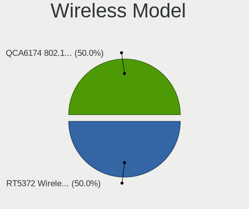

| Model                                                      | Desktops | Percent |
|------------------------------------------------------------|----------|---------|
| Ralink RT5372 Wireless Adapter                             | 1        | 50%     |
| Qualcomm Atheros QCA6174 802.11ac Wireless Network Adapter | 1        | 50%     |

Ethernet Vendor
---------------

Ethernet vendors

| Vendor                | Desktops | Percent |
|-----------------------|----------|---------|
| Intel                 | 9        | 47.37%  |
| Broadcom              | 5        | 26.32%  |
| Realtek Semiconductor | 2        | 10.53%  |
| Dell                  | 2        | 10.53%  |
| ASIX Electronics      | 1        | 5.26%   |

Ethernet Model
--------------

Ethernet models

| Model                                                                  | Desktops | Percent |
|------------------------------------------------------------------------|----------|---------|
| Broadcom NetXtreme II BCM57810 10 Gigabit Ethernet                     | 4        | 15.38%  |
| Broadcom NetXtreme BCM5719 Gigabit Ethernet PCIe                       | 4        | 15.38%  |
| Realtek RTL8111/8168/8211/8411 PCI Express Gigabit Ethernet Controller | 2        | 7.69%   |
| Intel I350 Gigabit Network Connection                                  | 2        | 7.69%   |
| Intel Ethernet Connection I217-LM                                      | 2        | 7.69%   |
| Intel 82599 10 Gigabit Dual Port Backplane Connection                  | 2        | 7.69%   |
| Dell iDRAC Virtual NIC                                                 | 2        | 7.69%   |
| Intel Ethernet Connection (5) I219-LM                                  | 1        | 3.85%   |
| Intel Ethernet Connection (2) I219-V                                   | 1        | 3.85%   |
| Intel 82579LM Gigabit Network Connection (Lewisville)                  | 1        | 3.85%   |
| Intel 82574L Gigabit Network Connection                                | 1        | 3.85%   |
| Intel 82571EB/82571GB Gigabit Ethernet Controller (Copper)             | 1        | 3.85%   |
| Intel 82567LM-3 Gigabit Network Connection                             | 1        | 3.85%   |
| Broadcom NetXtreme BCM5720 Gigabit Ethernet PCIe                       | 1        | 3.85%   |
| ASIX AX88179 Gigabit Ethernet                                          | 1        | 3.85%   |

Net Controller Kind
-------------------

Ethernet, WiFi or modem

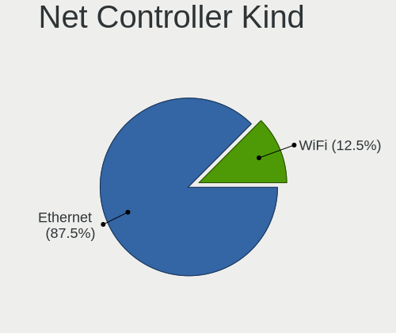

| Kind     | Desktops | Percent |
|----------|----------|---------|
| Ethernet | 14       | 87.5%   |
| WiFi     | 2        | 12.5%   |

Used Controller
---------------

Currently used network controller

| Kind     | Desktops | Percent |
|----------|----------|---------|
| Ethernet | 13       | 92.86%  |
| WiFi     | 1        | 7.14%   |

NICs
----

Total network controllers on board

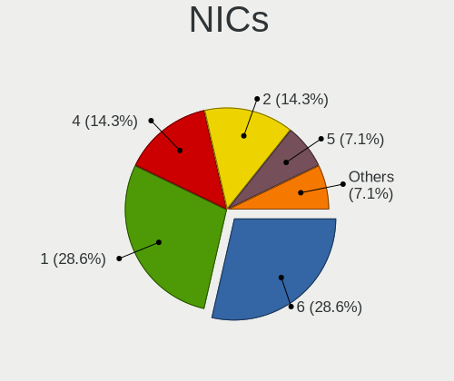

| Total | Desktops | Percent |
|-------|----------|---------|
| 6     | 4        | 28.57%  |
| 1     | 4        | 28.57%  |
| 4     | 2        | 14.29%  |
| 2     | 2        | 14.29%  |
| 5     | 1        | 7.14%   |
| 3     | 1        | 7.14%   |

IPv6
----

IPv6 vs IPv4

| Used | Desktops | Percent |
|------|----------|---------|
| No   | 14       | 100%    |

Bluetooth
---------

Bluetooth Vendor
----------------

Controller vendors

| Vendor           | Desktops | Percent |
|------------------|----------|---------|
| ASUSTek Computer | 1        | 100%    |

Bluetooth Model
---------------

Controller models

| Model                       | Desktops | Percent |
|-----------------------------|----------|---------|
| ASUS Qualcomm Bluetooth 4.1 | 1        | 100%    |

Sound
-----

Sound Vendor
------------

Sound card vendors

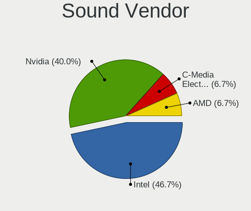

| Vendor              | Desktops | Percent |
|---------------------|----------|---------|
| Intel               | 7        | 46.67%  |
| Nvidia              | 6        | 40%     |
| C-Media Electronics | 1        | 6.67%   |
| AMD                 | 1        | 6.67%   |

Sound Model
-----------

Sound card models

| Model                                                                             | Desktops | Percent |
|-----------------------------------------------------------------------------------|----------|---------|
| Nvidia GP107GL High Definition Audio Controller                                   | 2        | 12.5%   |
| Nvidia GF119 HDMI Audio Controller                                                | 2        | 12.5%   |
| Intel 200 Series PCH HD Audio                                                     | 2        | 12.5%   |
| Nvidia GF116 High Definition Audio Controller                                     | 1        | 6.25%   |
| Nvidia GF108 High Definition Audio Controller                                     | 1        | 6.25%   |
| Intel Xeon E3-1200 v3/4th Gen Core Processor HD Audio Controller                  | 1        | 6.25%   |
| Intel C610/X99 series chipset HD Audio Controller                                 | 1        | 6.25%   |
| Intel C600/X79 series chipset High Definition Audio Controller                    | 1        | 6.25%   |
| Intel 82801JI (ICH10 Family) HD Audio Controller                                  | 1        | 6.25%   |
| Intel 82801JD/DO (ICH10 Family) HD Audio Controller                               | 1        | 6.25%   |
| Intel 8 Series/C220 Series Chipset High Definition Audio Controller               | 1        | 6.25%   |
| C-Media Electronics USB Advanced Audio Device                                     | 1        | 6.25%   |
| AMD Caicos HDMI Audio [Radeon HD 6450 / 7450/8450/8490 OEM / R5 230/235/235X OEM] | 1        | 6.25%   |

Memory
------

Memory Vendor
-------------

Memory module vendors

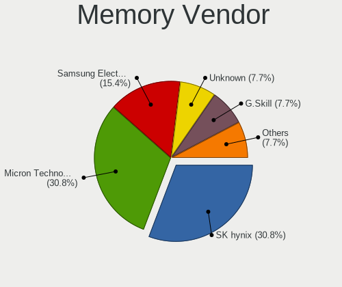

| Vendor              | Desktops | Percent |
|---------------------|----------|---------|
| SK hynix            | 4        | 30.77%  |
| Micron Technology   | 4        | 30.77%  |
| Samsung Electronics | 2        | 15.38%  |
| Unknown             | 1        | 7.69%   |
| G.Skill             | 1        | 7.69%   |
| Crucial             | 1        | 7.69%   |

Memory Model
------------

Memory module models

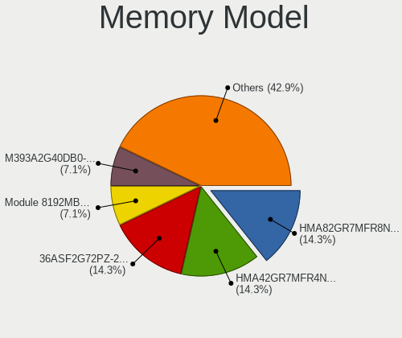

| Model                                                 | Desktops | Percent |
|-------------------------------------------------------|----------|---------|
| SK hynix RAM HMA82GR7MFR8N-UH 16GB DIMM DDR4 2400MT/s | 2        | 14.29%  |
| SK hynix RAM HMA42GR7MFR4N-TF 16GB DIMM DDR4 2133MT/s | 2        | 14.29%  |
| Micron RAM 36ASF2G72PZ-2G1A2 16GB DIMM DDR4 2400MT/s  | 2        | 14.29%  |
| Unknown RAM Module 8192MB DIMM DDR3 1600MT/s          | 1        | 7.14%   |
| Samsung RAM M393A2G40DB0-CPB 16GB DIMM DDR4 2133MT/s  | 1        | 7.14%   |
| Samsung RAM M3 78T5663EH3-CF7 2GB DIMM DDR2 800MT/s   | 1        | 7.14%   |
| Samsung RAM M3 78T2863EHS-CF7 1GB DIMM DDR2 800MT/s   | 1        | 7.14%   |
| Micron RAM 9ASF51272PZ-2G3B1 4GB RIMM DDR4 2400MT/s   | 1        | 7.14%   |
| Micron RAM 18ASF2G72PDZ-2G6E1 16GB DIMM DDR4 2667MT/s | 1        | 7.14%   |
| G.Skill RAM F4-3200C14-16GTZ 16GB DIMM DDR4 3600MT/s  | 1        | 7.14%   |
| Crucial RAM BLT4G3D1608ET3LX0. 4GB DIMM DDR3 1600MT/s | 1        | 7.14%   |

Memory Kind
-----------

Memory module kinds

| Kind  | Desktops | Percent |
|-------|----------|---------|
| DDR4  | 7        | 50%     |
| DRAM  | 3        | 21.43%  |
| DDR3  | 2        | 14.29%  |
| SDRAM | 1        | 7.14%   |
| DDR2  | 1        | 7.14%   |

Memory Form Factor
------------------

Physical design of the memory module

| Name | Desktops | Percent |
|------|----------|---------|
| DIMM | 11       | 91.67%  |
| RIMM | 1        | 8.33%   |

Memory Size
-----------

Memory module size

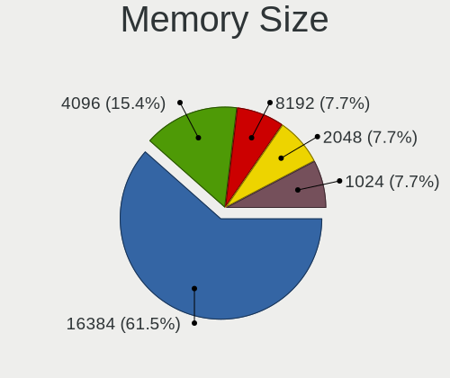

| Size  | Desktops | Percent |
|-------|----------|---------|
| 16384 | 8        | 61.54%  |
| 4096  | 2        | 15.38%  |
| 8192  | 1        | 7.69%   |
| 2048  | 1        | 7.69%   |
| 1024  | 1        | 7.69%   |

Memory Speed
------------

Memory module speed

| Speed | Desktops | Percent |
|-------|----------|---------|
| 2400  | 5        | 38.46%  |
| 2133  | 2        | 15.38%  |
| 1600  | 2        | 15.38%  |
| 3600  | 1        | 7.69%   |
| 2667  | 1        | 7.69%   |
| 2048  | 1        | 7.69%   |
| 800   | 1        | 7.69%   |

Printers & scanners
-------------------

Printer Vendor
--------------

Printer device vendors

Zero info for selected period =(

Printer Model
-------------

Printer device models

Zero info for selected period =(

Scanner Vendor
--------------

Scanner device vendors

Zero info for selected period =(

Scanner Model
-------------

Scanner device models

Zero info for selected period =(

Camera
------

Camera Vendor
-------------

Camera device vendors

Zero info for selected period =(

Camera Model
------------

Camera device models

Zero info for selected period =(

Security
--------

Fingerprint Vendor
------------------

Fingerprint sensor vendors

Zero info for selected period =(

Fingerprint Model
-----------------

Fingerprint sensor models

Zero info for selected period =(

Chipcard Vendor
---------------

Chipcard module vendors

Zero info for selected period =(

Chipcard Model
--------------

Chipcard module models

Zero info for selected period =(

Unsupported
-----------

Unsupported Devices
-------------------

Total unsupported devices on board

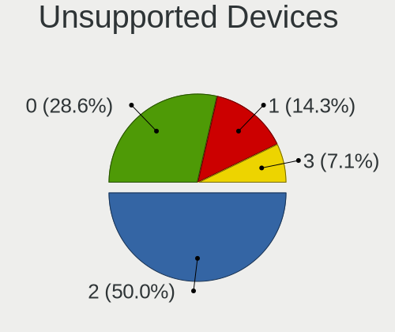

| Total | Desktops | Percent |
|-------|----------|---------|
| 2     | 7        | 50%     |
| 0     | 4        | 28.57%  |
| 1     | 2        | 14.29%  |
| 3     | 1        | 7.14%   |

Unsupported Device Types
------------------------

Types of unsupported devices

| Type                     | Desktops | Percent |
|--------------------------|----------|---------|
| Unassigned class         | 7        | 38.89%  |
| Communication controller | 6        | 33.33%  |
| Graphics card            | 5        | 27.78%  |

