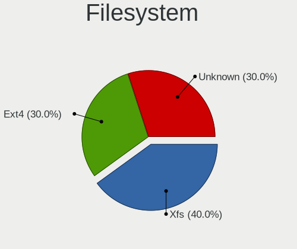
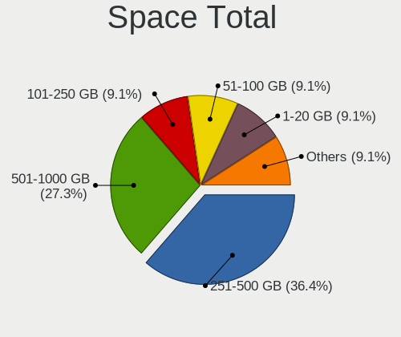
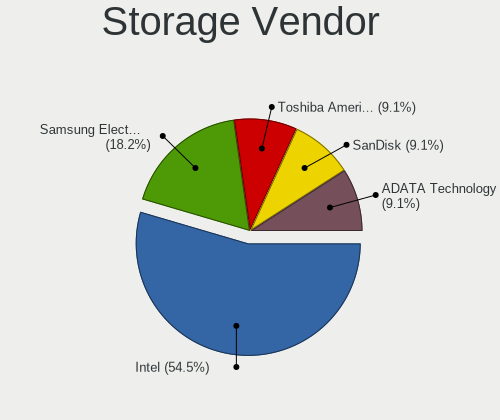

RHEL 7 - Tested Hardware & Statistics (Notebooks)
-------------------------------------------------

A project to collect tested hardware configurations for RHEL 7.

Anyone can contribute to this report by the [hw-probe](https://github.com/linuxhw/hw-probe) tool:

    sudo -E hw-probe -all -upload

Please contribute! Especially if your hardware is rare.

Contents
--------

* [ Test Cases ](#test-cases)

* [ System ](#system)
  - [ Kernel                   ](#kernel)
  - [ Kernel Family            ](#kernel-family)
  - [ Kernel Major Ver.        ](#kernel-major-ver)
  - [ Arch                     ](#arch)
  - [ DE                       ](#de)
  - [ Display Server           ](#display-server)
  - [ Display Manager          ](#display-manager)
  - [ OS Lang                  ](#os-lang)
  - [ Boot Mode                ](#boot-mode)
  - [ Filesystem               ](#filesystem)
  - [ Part. scheme             ](#part-scheme)
  - [ Dual Boot with Linux/BSD ](#dual-boot-with-linuxbsd)
  - [ Dual Boot (Win)          ](#dual-boot-win)

* [ Board ](#board)
  - [ Vendor                   ](#vendor)
  - [ Model                    ](#model)
  - [ Model Family             ](#model-family)
  - [ MFG Year                 ](#mfg-year)
  - [ Form Factor              ](#form-factor)
  - [ Secure Boot              ](#secure-boot)
  - [ Coreboot                 ](#coreboot)
  - [ RAM Size                 ](#ram-size)
  - [ RAM Used                 ](#ram-used)
  - [ Total Drives             ](#total-drives)
  - [ Has CD-ROM               ](#has-cd-rom)
  - [ Has Ethernet             ](#has-ethernet)
  - [ Has WiFi                 ](#has-wifi)
  - [ Has Bluetooth            ](#has-bluetooth)

* [ Location ](#location)
  - [ Country                  ](#country)
  - [ City                     ](#city)

* [ Drives ](#drives)
  - [ Drive Vendor             ](#drive-vendor)
  - [ Drive Model              ](#drive-model)
  - [ HDD Vendor               ](#hdd-vendor)
  - [ SSD Vendor               ](#ssd-vendor)
  - [ Drive Kind               ](#drive-kind)
  - [ Drive Connector          ](#drive-connector)
  - [ Drive Size               ](#drive-size)
  - [ Space Total              ](#space-total)
  - [ Space Used               ](#space-used)
  - [ Malfunc. Drives          ](#malfunc-drives)
  - [ Malfunc. Drive Vendor    ](#malfunc-drive-vendor)
  - [ Malfunc. HDD Vendor      ](#malfunc-hdd-vendor)
  - [ Malfunc. Drive Kind      ](#malfunc-drive-kind)
  - [ Failed Drives            ](#failed-drives)
  - [ Failed Drive Vendor      ](#failed-drive-vendor)
  - [ Drive Status             ](#drive-status)

* [ Storage controller ](#storage-controller)
  - [ Storage Vendor           ](#storage-vendor)
  - [ Storage Model            ](#storage-model)
  - [ Storage Kind             ](#storage-kind)

* [ Processor ](#processor)
  - [ CPU Vendor               ](#cpu-vendor)
  - [ CPU Model                ](#cpu-model)
  - [ CPU Model Family         ](#cpu-model-family)
  - [ CPU Cores                ](#cpu-cores)
  - [ CPU Sockets              ](#cpu-sockets)
  - [ CPU Threads              ](#cpu-threads)
  - [ CPU Op-Modes             ](#cpu-op-modes)
  - [ CPU Microcode            ](#cpu-microcode)
  - [ CPU Microarch            ](#cpu-microarch)

* [ Graphics ](#graphics)
  - [ GPU Vendor               ](#gpu-vendor)
  - [ GPU Model                ](#gpu-model)
  - [ GPU Combo                ](#gpu-combo)
  - [ GPU Driver               ](#gpu-driver)
  - [ GPU Memory               ](#gpu-memory)

* [ Monitor ](#monitor)
  - [ Monitor Vendor           ](#monitor-vendor)
  - [ Monitor Model            ](#monitor-model)
  - [ Monitor Resolution       ](#monitor-resolution)
  - [ Monitor Diagonal         ](#monitor-diagonal)
  - [ Monitor Width            ](#monitor-width)
  - [ Aspect Ratio             ](#aspect-ratio)
  - [ Monitor Area             ](#monitor-area)
  - [ Pixel Density            ](#pixel-density)
  - [ Multiple Monitors        ](#multiple-monitors)

* [ Network ](#network)
  - [ Net Controller Vendor    ](#net-controller-vendor)
  - [ Net Controller Model     ](#net-controller-model)
  - [ Wireless Vendor          ](#wireless-vendor)
  - [ Wireless Model           ](#wireless-model)
  - [ Ethernet Vendor          ](#ethernet-vendor)
  - [ Ethernet Model           ](#ethernet-model)
  - [ Net Controller Kind      ](#net-controller-kind)
  - [ Used Controller          ](#used-controller)
  - [ NICs                     ](#nics)
  - [ IPv6                     ](#ipv6)

* [ Bluetooth ](#bluetooth)
  - [ Bluetooth Vendor         ](#bluetooth-vendor)
  - [ Bluetooth Model          ](#bluetooth-model)

* [ Sound ](#sound)
  - [ Sound Vendor             ](#sound-vendor)
  - [ Sound Model              ](#sound-model)

* [ Memory ](#memory)
  - [ Memory Vendor            ](#memory-vendor)
  - [ Memory Model             ](#memory-model)
  - [ Memory Kind              ](#memory-kind)
  - [ Memory Form Factor       ](#memory-form-factor)
  - [ Memory Size              ](#memory-size)
  - [ Memory Speed             ](#memory-speed)

* [ Printers & scanners ](#printers--scanners)
  - [ Printer Vendor           ](#printer-vendor)
  - [ Printer Model            ](#printer-model)
  - [ Scanner Vendor           ](#scanner-vendor)
  - [ Scanner Model            ](#scanner-model)

* [ Camera ](#camera)
  - [ Camera Vendor            ](#camera-vendor)
  - [ Camera Model             ](#camera-model)

* [ Security ](#security)
  - [ Fingerprint Vendor       ](#fingerprint-vendor)
  - [ Fingerprint Model        ](#fingerprint-model)
  - [ Chipcard Vendor          ](#chipcard-vendor)
  - [ Chipcard Model           ](#chipcard-model)

* [ Unsupported ](#unsupported)
  - [ Unsupported Devices      ](#unsupported-devices)
  - [ Unsupported Device Types ](#unsupported-device-types)

Test Cases
----------

Total: 13

| Vendor | Model                       | Probe                                                      | Date         |
|--------|-----------------------------|------------------------------------------------------------|--------------|
| Getac  | B360                        | [c4bd09adf1](https://linux-hardware.org/?probe=c4bd09adf1) | Mar 01, 2023 |
| Dell   | Latitude E5570              | [87ec93dcdc](https://linux-hardware.org/?probe=87ec93dcdc) | Jan 31, 2022 |
| Lenovo | ThinkPad T470p 20J7S0FA0... | [bf95cd0ce7](https://linux-hardware.org/?probe=bf95cd0ce7) | Apr 20, 2021 |
| Dell   | Precision 5510              | [2d4aed7f6c](https://linux-hardware.org/?probe=2d4aed7f6c) | Feb 22, 2021 |
| HP     | ZBook 14u G6                | [84782d875f](https://linux-hardware.org/?probe=84782d875f) | Nov 27, 2020 |
| Lenovo | ThinkPad T470p 20J7S0FA0... | [e3dab03999](https://linux-hardware.org/?probe=e3dab03999) | Sep 01, 2020 |
| Lenovo | ThinkPad T470p 20J7S0FA0... | [93b236ab24](https://linux-hardware.org/?probe=93b236ab24) | Aug 01, 2020 |
| Lenovo | ThinkPad T490 20N3S5DU27    | [d4bb886295](https://linux-hardware.org/?probe=d4bb886295) | Jul 08, 2020 |
| Lenovo | ThinkPad P52 20MAS17205     | [4547e0d6fe](https://linux-hardware.org/?probe=4547e0d6fe) | May 25, 2020 |
| Dell   | Latitude 7390               | [9b0861a491](https://linux-hardware.org/?probe=9b0861a491) | Jul 04, 2019 |
| Dell   | Latitude 7390               | [5090404699](https://linux-hardware.org/?probe=5090404699) | Jul 04, 2019 |
| Lenovo | ThinkPad L480 20LSS0M100    | [b1b6812c4f](https://linux-hardware.org/?probe=b1b6812c4f) | May 19, 2019 |
| Lenovo | ThinkPad X131e 3368CTO      | [c3f67b75e2](https://linux-hardware.org/?probe=c3f67b75e2) | Oct 31, 2018 |

System
------

Kernel
------

Version of the Linux kernel

| Version                     | Notebooks | Percent |
|-----------------------------|-----------|---------|
| 3.10.0-1127.13.1.el7.x86_64 | 2         | 16.67%  |
| 3.10.0-1062.18.1.el7.x86_64 | 2         | 16.67%  |
| 3.10.0-957.el7.x86_64       | 1         | 8.33%   |
| 3.10.0-957.21.3.el7.x86_64  | 1         | 8.33%   |
| 3.10.0-957.10.1.el7.x86_64  | 1         | 8.33%   |
| 3.10.0-327.el7.x86_64       | 1         | 8.33%   |
| 3.10.0-1160.6.1.el7.x86_64  | 1         | 8.33%   |
| 3.10.0-1160.53.1.el7.x86_64 | 1         | 8.33%   |
| 3.10.0-1160.21.1.el7.x86_64 | 1         | 8.33%   |
| 3.10.0-1160.15.2.el7.x86_64 | 1         | 8.33%   |

Kernel Family
-------------

Linux kernel without a distro release

| Version | Notebooks | Percent |
|---------|-----------|---------|
| 3.10.0  | 10        | 100%    |

Kernel Major Ver.
-----------------

Linux kernel major version

| Version | Notebooks | Percent |
|---------|-----------|---------|
| 3.10    | 10        | 100%    |

Arch
----

OS architecture (x86_64, i586, etc.)

| Name   | Notebooks | Percent |
|--------|-----------|---------|
| x86_64 | 10        | 100%    |

DE
--

Desktop Environment

| Name          | Notebooks | Percent |
|---------------|-----------|---------|
| Unknown       | 4         | 36.36%  |
| GNOME Classic | 3         | 27.27%  |
| GNOME         | 2         | 18.18%  |
| KDE4          | 1         | 9.09%   |
| Cinnamon      | 1         | 9.09%   |

Display Server
--------------

X11 or Wayland

| Name | Notebooks | Percent |
|------|-----------|---------|
| X11  | 10        | 100%    |

Display Manager
---------------

SDDM, LightDM, etc.

| Name    | Notebooks | Percent |
|---------|-----------|---------|
| Unknown | 8         | 80%     |
| GDM     | 2         | 20%     |

OS Lang
-------

Language

| Lang    | Notebooks | Percent |
|---------|-----------|---------|
| en_US   | 3         | 30%     |
| Unknown | 3         | 30%     |
| en_GB   | 2         | 20%     |
| en_IN   | 1         | 10%     |
| de_DE   | 1         | 10%     |

Boot Mode
---------

EFI or BIOS

| Mode | Notebooks | Percent |
|------|-----------|---------|
| BIOS | 6         | 60%     |
| EFI  | 4         | 40%     |

Filesystem
----------

Type of filesystem

| Type    | Notebooks | Percent |
|---------|-----------|---------|
| Xfs     | 4         | 40%     |
| Ext4    | 3         | 30%     |
| Unknown | 3         | 30%     |

Part. scheme
------------

Scheme of partitioning

| Type    | Notebooks | Percent |
|---------|-----------|---------|
| Unknown | 8         | 72.73%  |
| MBR     | 2         | 18.18%  |
| GPT     | 1         | 9.09%   |

Dual Boot with Linux/BSD
------------------------

Hosting more than one Linux/BSD

| Dual boot | Notebooks | Percent |
|-----------|-----------|---------|
| No        | 10        | 90.91%  |
| Yes       | 1         | 9.09%   |

Dual Boot (Win)
---------------

Hosting Linux and Windows

| Dual boot | Notebooks | Percent |
|-----------|-----------|---------|
| No        | 10        | 100%    |

Board
-----

Vendor
------

Motherboard manufacturer

| Name            | Notebooks | Percent |
|-----------------|-----------|---------|
| Lenovo          | 5         | 50%     |
| Dell            | 3         | 30%     |
| Hewlett-Packard | 1         | 10%     |
| Getac           | 1         | 10%     |

Model
-----

Motherboard model

| Name                             | Notebooks | Percent |
|----------------------------------|-----------|---------|
| Lenovo ThinkPad X131e 3368CTO    | 1         | 10%     |
| Lenovo ThinkPad T490 20N3S5DU27  | 1         | 10%     |
| Lenovo ThinkPad T470p 20J7S0FA0E | 1         | 10%     |
| Lenovo ThinkPad P52 20MAS17205   | 1         | 10%     |
| Lenovo ThinkPad L480 20LSS0M100  | 1         | 10%     |
| HP ZBook 14u G6                  | 1         | 10%     |
| Getac B360                       | 1         | 10%     |
| Dell Precision 5510              | 1         | 10%     |
| Dell Latitude E5570              | 1         | 10%     |
| Dell Latitude 7390               | 1         | 10%     |

Model Family
------------

Motherboard model prefix

| Name            | Notebooks | Percent |
|-----------------|-----------|---------|
| Lenovo ThinkPad | 5         | 50%     |
| Dell Latitude   | 2         | 20%     |
| HP ZBook        | 1         | 10%     |
| Getac B360      | 1         | 10%     |
| Dell Precision  | 1         | 10%     |

MFG Year
--------

Motherboard manufacture year

| Year | Notebooks | Percent |
|------|-----------|---------|
| 2018 | 3         | 30%     |
| 2019 | 2         | 20%     |
| 2016 | 2         | 20%     |
| 2022 | 1         | 10%     |
| 2017 | 1         | 10%     |
| 2012 | 1         | 10%     |

Form Factor
-----------

Physical design of the computer

| Name     | Notebooks | Percent |
|----------|-----------|---------|
| Notebook | 10        | 100%    |

Secure Boot
-----------

Enabled or disabled

| State    | Notebooks | Percent |
|----------|-----------|---------|
| Disabled | 8         | 80%     |
| Enabled  | 2         | 20%     |

Coreboot
--------

Have coreboot on board

| Used | Notebooks | Percent |
|------|-----------|---------|
| No   | 10        | 100%    |

RAM Size
--------

Total RAM memory

| Size in GB  | Notebooks | Percent |
|-------------|-----------|---------|
| 32.01-64.0  | 4         | 40%     |
| 4.01-8.0    | 2         | 20%     |
| 16.01-24.0  | 2         | 20%     |
| 64.01-256.0 | 1         | 10%     |
| 8.01-16.0   | 1         | 10%     |

RAM Used
--------

Used RAM memory

| Used GB   | Notebooks | Percent |
|-----------|-----------|---------|
| 4.01-8.0  | 3         | 27.27%  |
| 1.01-2.0  | 3         | 27.27%  |
| 3.01-4.0  | 2         | 18.18%  |
| 8.01-16.0 | 2         | 18.18%  |
| 2.01-3.0  | 1         | 9.09%   |

Total Drives
------------

Number of drives on board

| Drives | Notebooks | Percent |
|--------|-----------|---------|
| 1      | 9         | 90%     |
| 2      | 1         | 10%     |

Has CD-ROM
----------

Has CD-ROM on board

| Presented | Notebooks | Percent |
|-----------|-----------|---------|
| No        | 10        | 100%    |

Has Ethernet
------------

Has Ethernet on board

| Presented | Notebooks | Percent |
|-----------|-----------|---------|
| Yes       | 10        | 100%    |

Has WiFi
--------

Has WiFi module

| Presented | Notebooks | Percent |
|-----------|-----------|---------|
| Yes       | 10        | 100%    |

Has Bluetooth
-------------

Has Bluetooth module

| Presented | Notebooks | Percent |
|-----------|-----------|---------|
| Yes       | 8         | 80%     |
| No        | 2         | 20%     |

Location
--------

Country
-------

Geographic location (country)

| Country   | Notebooks | Percent |
|-----------|-----------|---------|
| Spain     | 2         | 20%     |
| India     | 2         | 20%     |
| USA       | 1         | 10%     |
| UK        | 1         | 10%     |
| Singapore | 1         | 10%     |
| Italy     | 1         | 10%     |
| Ireland   | 1         | 10%     |
| Germany   | 1         | 10%     |

City
----

Geographic location (city)

| City       | Notebooks | Percent |
|------------|-----------|---------|
| Singapore  | 1         | 10%     |
| Milan      | 1         | 10%     |
| Manchester | 1         | 10%     |
| Madrid     | 1         | 10%     |
| Lohmar     | 1         | 10%     |
| Loganville | 1         | 10%     |
| Kalyan     | 1         | 10%     |
| Galway     | 1         | 10%     |
| Delhi      | 1         | 10%     |
| Barcelona  | 1         | 10%     |

Drives
------

Drive Vendor
------------

Hard drive vendors

| Vendor              | Notebooks | Drives | Percent |
|---------------------|-----------|--------|---------|
| Samsung Electronics | 3         | 5      | 27.27%  |
| Unknown             | 2         | 2      | 18.18%  |
| WDC                 | 1         | 1      | 9.09%   |
| Transcend           | 1         | 1      | 9.09%   |
| Toshiba             | 1         | 1      | 9.09%   |
| SanDisk             | 1         | 1      | 9.09%   |
| Intel               | 1         | 1      | 9.09%   |
| Crucial             | 1         | 1      | 9.09%   |

Drive Model
-----------

Hard drive models

| Model                                         | Notebooks | Percent |
|-----------------------------------------------|-----------|---------|
| Samsung NVMe SSD Drive 512GB                  | 2         | 16.67%  |
| WDC WD10SPCX-75KHST0 1TB                      | 1         | 8.33%   |
| Unknown NVMe SSD Drive 1TB                    | 1         | 8.33%   |
| Unknown MMC Card  128GB                       | 1         | 8.33%   |
| Transcend TS512GMTS800 512GB SSD              | 1         | 8.33%   |
| Toshiba NVMe SSD Drive 1024GB                 | 1         | 8.33%   |
| SanDisk NVMe SSD Drive 512GB                  | 1         | 8.33%   |
| Samsung SSD PM871b M.2 2280 512GB             | 1         | 8.33%   |
| Samsung NVMe SSD Controller SM981/PM981 512GB | 1         | 8.33%   |
| Intel NVMe SSD Drive 512GB                    | 1         | 8.33%   |
| Crucial CT120BX300SSD1 120GB                  | 1         | 8.33%   |

HDD Vendor
----------

Hard disk drive vendors

| Vendor | Notebooks | Drives | Percent |
|--------|-----------|--------|---------|
| WDC    | 1         | 1      | 100%    |

SSD Vendor
----------

Solid state drive vendors

| Vendor              | Notebooks | Drives | Percent |
|---------------------|-----------|--------|---------|
| Transcend           | 1         | 1      | 33.33%  |
| Samsung Electronics | 1         | 1      | 33.33%  |
| Crucial             | 1         | 1      | 33.33%  |

Drive Kind
----------

HDD or SSD

| Kind | Notebooks | Drives | Percent |
|------|-----------|--------|---------|
| NVMe | 6         | 8      | 54.55%  |
| SSD  | 3         | 3      | 27.27%  |
| MMC  | 1         | 1      | 9.09%   |
| HDD  | 1         | 1      | 9.09%   |

Drive Connector
---------------

SATA, SAS, NVMe, etc.

| Type | Notebooks | Drives | Percent |
|------|-----------|--------|---------|
| NVMe | 6         | 8      | 54.55%  |
| SATA | 4         | 4      | 36.36%  |
| MMC  | 1         | 1      | 9.09%   |

Drive Size
----------

Size of hard drive

| Size in TB | Notebooks | Drives | Percent |
|------------|-----------|--------|---------|
| 0.51-1.0   | 3         | 3      | 75%     |
| 0.01-0.5   | 1         | 1      | 25%     |

Space Total
-----------

Amount of disk space available on the file system

| Size in GB | Notebooks | Percent |
|------------|-----------|---------|
| 251-500    | 4         | 36.36%  |
| 501-1000   | 3         | 27.27%  |
| 101-250    | 1         | 9.09%   |
| 1-20       | 1         | 9.09%   |
| 51-100     | 1         | 9.09%   |
| Unknown    | 1         | 9.09%   |

Space Used
----------

Amount of used disk space

| Used GB | Notebooks | Percent |
|---------|-----------|---------|
| 101-250 | 3         | 27.27%  |
| 1-20    | 3         | 27.27%  |
| 251-500 | 2         | 18.18%  |
| 21-50   | 2         | 18.18%  |
| Unknown | 1         | 9.09%   |

Malfunc. Drives
---------------

Drive models with a malfunction

| Model                            | Notebooks | Drives | Percent |
|----------------------------------|-----------|--------|---------|
| Transcend TS512GMTS800 512GB SSD | 1         | 1      | 100%    |

Malfunc. Drive Vendor
---------------------

Vendors of faulty drives

| Vendor    | Notebooks | Drives | Percent |
|-----------|-----------|--------|---------|
| Transcend | 1         | 1      | 100%    |

Malfunc. HDD Vendor
-------------------

Vendors of faulty HDD drives

Zero info for selected period =(

Malfunc. Drive Kind
-------------------

Kinds of faulty drives

| Kind | Notebooks | Drives | Percent |
|------|-----------|--------|---------|
| SSD  | 1         | 1      | 100%    |

Failed Drives
-------------

Failed drive models

Zero info for selected period =(

Failed Drive Vendor
-------------------

Failed drive vendors

Zero info for selected period =(

Drive Status
------------

Number of failed and malfunc. drives

| Status   | Notebooks | Drives | Percent |
|----------|-----------|--------|---------|
| Detected | 9         | 11     | 81.82%  |
| Malfunc  | 1         | 1      | 9.09%   |
| Works    | 1         | 1      | 9.09%   |

Storage controller
------------------

Storage Vendor
--------------

Storage controller vendors

| Vendor                       | Notebooks | Percent |
|------------------------------|-----------|---------|
| Intel                        | 6         | 54.55%  |
| Samsung Electronics          | 2         | 18.18%  |
| Toshiba America Info Systems | 1         | 9.09%   |
| SanDisk                      | 1         | 9.09%   |
| ADATA Technology             | 1         | 9.09%   |

Storage Model
-------------

Storage controller models

| Model                                                            | Notebooks | Percent |
|------------------------------------------------------------------|-----------|---------|
| Samsung NVMe SSD Controller SM981/PM981/PM983                    | 2         | 18.18%  |
| Intel SATA Controller [RAID mode]                                | 2         | 18.18%  |
| Toshiba America Info Systems XG6 NVMe SSD Controller             | 1         | 9.09%   |
| SanDisk WD Black SN750 / PC SN730 NVMe SSD                       | 1         | 9.09%   |
| Intel Sunrise Point-LP SATA Controller [AHCI mode]               | 1         | 9.09%   |
| Intel SSD Pro 7600p/760p/E 6100p Series                          | 1         | 9.09%   |
| Intel Comet Lake SATA AHCI Controller                            | 1         | 9.09%   |
| Intel 7 Series Chipset Family 6-port SATA Controller [AHCI mode] | 1         | 9.09%   |
| ADATA IM2P33F8ABR1 NVMe SSD                                      | 1         | 9.09%   |

Storage Kind
------------

Kind of storage controller (IDE, SATA, NVMe, SAS, ...)

| Kind | Notebooks | Percent |
|------|-----------|---------|
| NVMe | 6         | 54.55%  |
| SATA | 3         | 27.27%  |
| RAID | 2         | 18.18%  |

Processor
---------

CPU Vendor
----------

Processor vendors

| Vendor | Notebooks | Percent |
|--------|-----------|---------|
| Intel  | 10        | 100%    |

CPU Model
---------

Processor models

| Model                              | Notebooks | Percent |
|------------------------------------|-----------|---------|
| Intel Core i7-8565U CPU @ 1.80GHz  | 2         | 20%     |
| Intel Core i7-8850H CPU @ 2.60GHz  | 1         | 10%     |
| Intel Core i7-8550U CPU @ 1.80GHz  | 1         | 10%     |
| Intel Core i7-7820HQ CPU @ 2.90GHz | 1         | 10%     |
| Intel Core i7-7600U CPU @ 2.80GHz  | 1         | 10%     |
| Intel Core i7-6820HQ CPU @ 2.70GHz | 1         | 10%     |
| Intel Core i7-10510U CPU @ 1.80GHz | 1         | 10%     |
| Intel Core i5-6300HQ CPU @ 2.30GHz | 1         | 10%     |
| Intel Core i3-2367M CPU @ 1.40GHz  | 1         | 10%     |

CPU Model Family
----------------

Processor model prefix

| Model         | Notebooks | Percent |
|---------------|-----------|---------|
| Intel Core i7 | 8         | 80%     |
| Intel Core i5 | 1         | 10%     |
| Intel Core i3 | 1         | 10%     |

CPU Cores
---------

Number of processor cores

| Number | Notebooks | Percent |
|--------|-----------|---------|
| 4      | 7         | 70%     |
| 2      | 2         | 20%     |
| 6      | 1         | 10%     |

CPU Sockets
-----------

Number of sockets

| Number | Notebooks | Percent |
|--------|-----------|---------|
| 1      | 10        | 100%    |

CPU Threads
-----------

Threads per core (Hyper-Threading)

| Number | Notebooks | Percent |
|--------|-----------|---------|
| 2      | 9         | 90%     |
| 1      | 1         | 10%     |

CPU Op-Modes
------------

CPU Operation Modes (32-bit, 64-bit)

| Op mode        | Notebooks | Percent |
|----------------|-----------|---------|
| 32-bit, 64-bit | 7         | 70%     |
| Unknown        | 3         | 30%     |

CPU Microcode
-------------

Microcode number

| Number  | Notebooks | Percent |
|---------|-----------|---------|
| 0x806ec | 3         | 30%     |
| 0x506e3 | 2         | 20%     |
| 0x906ea | 1         | 10%     |
| 0x906e9 | 1         | 10%     |
| 0x806ea | 1         | 10%     |
| 0x806e9 | 1         | 10%     |
| 0x206a7 | 1         | 10%     |

CPU Microarch
-------------

Microarchitecture

| Name        | Notebooks | Percent |
|-------------|-----------|---------|
| KabyLake    | 7         | 70%     |
| Skylake     | 2         | 20%     |
| SandyBridge | 1         | 10%     |

Graphics
--------

GPU Vendor
----------

Vendors of graphics cards

| Vendor | Notebooks | Percent |
|--------|-----------|---------|
| Intel  | 9         | 60%     |
| Nvidia | 5         | 33.33%  |
| AMD    | 1         | 6.67%   |

GPU Model
---------

Graphics card models

| Model                                                                     | Notebooks | Percent |
|---------------------------------------------------------------------------|-----------|---------|
| Intel WhiskeyLake-U GT2 [UHD Graphics 620]                                | 2         | 13.33%  |
| Intel HD Graphics 530                                                     | 2         | 13.33%  |
| Nvidia GP108M [GeForce MX250]                                             | 1         | 6.67%   |
| Nvidia GP107M [GeForce GTX 1050 Mobile]                                   | 1         | 6.67%   |
| Nvidia GP107GLM [Quadro P1000 Mobile]                                     | 1         | 6.67%   |
| Nvidia GM108M [GeForce 940MX]                                             | 1         | 6.67%   |
| Nvidia GM107GLM [Quadro M1000M]                                           | 1         | 6.67%   |
| Intel UHD Graphics 620                                                    | 1         | 6.67%   |
| Intel HD Graphics 630                                                     | 1         | 6.67%   |
| Intel HD Graphics 620                                                     | 1         | 6.67%   |
| Intel CometLake-U GT2 [UHD Graphics]                                      | 1         | 6.67%   |
| Intel 2nd Generation Core Processor Family Integrated Graphics Controller | 1         | 6.67%   |
| AMD Mars [Radeon HD 8670A/8670M/8750M / R7 M370]                          | 1         | 6.67%   |

GPU Combo
---------

Combinations of graphics cards

| Name           | Notebooks | Percent |
|----------------|-----------|---------|
| Intel + Nvidia | 4         | 40%     |
| 1 x Intel      | 4         | 40%     |
| 1 x Nvidia     | 1         | 10%     |
| Intel + AMD    | 1         | 10%     |

GPU Driver
----------

Free vs proprietary

| Driver      | Notebooks | Percent |
|-------------|-----------|---------|
| Free        | 7         | 70%     |
| Proprietary | 2         | 20%     |
| Unknown     | 1         | 10%     |

GPU Memory
----------

Total video memory

| Size in GB | Notebooks | Percent |
|------------|-----------|---------|
| Unknown    | 7         | 70%     |
| 1.01-2.0   | 2         | 20%     |
| 3.01-4.0   | 1         | 10%     |

Monitor
-------

Monitor Vendor
--------------

Monitor vendors

| Vendor               | Notebooks | Percent |
|----------------------|-----------|---------|
| AU Optronics         | 3         | 25%     |
| Samsung Electronics  | 2         | 16.67%  |
| Sharp                | 1         | 8.33%   |
| ITE                  | 1         | 8.33%   |
| InfoVision           | 1         | 8.33%   |
| Dell                 | 1         | 8.33%   |
| Chimei Innolux       | 1         | 8.33%   |
| BOE Technology Group | 1         | 8.33%   |
| BOE                  | 1         | 8.33%   |

Monitor Model
-------------

Monitor models

| Model                                                                 | Notebooks | Percent |
|-----------------------------------------------------------------------|-----------|---------|
| Sharp LCD Monitor SHP1453 1920x1080 346x194mm 15.6-inch               | 1         | 7.69%   |
| Samsung Electronics LCD Monitor SDC894F 1920x1080 344x194mm 15.5-inch | 1         | 7.69%   |
| Samsung Electronics C24F390 SAM0D2C 1920x1080 521x293mm 23.5-inch     | 1         | 7.69%   |
| ITE DP2VGA V168 ITE6512 1680x1050 600x340mm 27.2-inch                 | 1         | 7.69%   |
| InfoVision LCD Monitor IVO057D 1920x1080 309x174mm 14.0-inch          | 1         | 7.69%   |
| Dell P2217H DELA0D9 1920x1080 480x270mm 21.7-inch                     | 1         | 7.69%   |
| Dell P2217H DELA0D8 1920x1080 476x267mm 21.5-inch                     | 1         | 7.69%   |
| Chimei Innolux LCD Monitor CMN14C9 1920x1080 309x173mm 13.9-inch      | 1         | 7.69%   |
| BOE Technology Group LCD Monitor 1920x1080                            | 1         | 7.69%   |
| BOE LCD Monitor BOE07EF 1920x1080 309x174mm 14.0-inch                 | 1         | 7.69%   |
| AU Optronics LCD Monitor AUO462D 1920x1080 293x165mm 13.2-inch        | 1         | 7.69%   |
| AU Optronics LCD Monitor AUO315C 1366x768 256x144mm 11.6-inch         | 1         | 7.69%   |
| AU Optronics LCD Monitor AUO103D 1920x1080 309x173mm 13.9-inch        | 1         | 7.69%   |

Monitor Resolution
------------------

Monitor screen resolution

| Resolution      | Notebooks | Percent |
|-----------------|-----------|---------|
| 1920x1080 (FHD) | 8         | 88.89%  |
| 1366x768 (WXGA) | 1         | 11.11%  |

Monitor Diagonal
----------------

Diagonal size in inches

| Inches  | Notebooks | Percent |
|---------|-----------|---------|
| 13      | 3         | 25%     |
| 15      | 2         | 16.67%  |
| 14      | 2         | 16.67%  |
| 27      | 1         | 8.33%   |
| 23      | 1         | 8.33%   |
| 21      | 1         | 8.33%   |
| 11      | 1         | 8.33%   |
| Unknown | 1         | 8.33%   |

Monitor Width
-------------

Physical width

| Width in mm | Notebooks | Percent |
|-------------|-----------|---------|
| 301-350     | 6         | 50%     |
| 501-600     | 2         | 16.67%  |
| 201-300     | 2         | 16.67%  |
| 401-500     | 1         | 8.33%   |
| Unknown     | 1         | 8.33%   |

Aspect Ratio
------------

Proportional relationship between the width and the height

| Ratio   | Notebooks | Percent |
|---------|-----------|---------|
| 16/9    | 8         | 88.89%  |
| Unknown | 1         | 11.11%  |

Monitor Area
------------

Area in inch²

| Area in inch² | Notebooks | Percent |
|----------------|-----------|---------|
| 81-90          | 4         | 33.33%  |
| 201-250        | 2         | 16.67%  |
| 101-110        | 2         | 16.67%  |
| 71-80          | 1         | 8.33%   |
| 51-60          | 1         | 8.33%   |
| 301-350        | 1         | 8.33%   |
| Unknown        | 1         | 8.33%   |

Pixel Density
-------------

Pixels per inch

| Density | Notebooks | Percent |
|---------|-----------|---------|
| 121-160 | 7         | 58.33%  |
| 51-100  | 2         | 16.67%  |
| 161-240 | 1         | 8.33%   |
| 101-120 | 1         | 8.33%   |
| Unknown | 1         | 8.33%   |

Multiple Monitors
-----------------

Total monitors connected

| Total | Notebooks | Percent |
|-------|-----------|---------|
| 1     | 6         | 60%     |
| 2     | 2         | 20%     |
| 3     | 1         | 10%     |
| 0     | 1         | 10%     |

Network
-------

Net Controller Vendor
---------------------

Controller vendors

| Vendor                            | Notebooks | Percent |
|-----------------------------------|-----------|---------|
| Intel                             | 9         | 56.25%  |
| Realtek Semiconductor             | 3         | 18.75%  |
| Qualcomm Atheros                  | 1         | 6.25%   |
| OPPO Electronics                  | 1         | 6.25%   |
| Ericsson Business Mobile Networks | 1         | 6.25%   |
| Dell                              | 1         | 6.25%   |

Net Controller Model
--------------------

Controller models

| Model                                                              | Notebooks | Percent |
|--------------------------------------------------------------------|-----------|---------|
| Intel Wireless 8265 / 8275                                         | 3         | 13.04%  |
| Intel Wireless 8260                                                | 2         | 8.7%    |
| Intel Ethernet Connection (6) I219-V                               | 2         | 8.7%    |
| Realtek RTL8822BE 802.11a/b/g/n/ac WiFi adapter                    | 1         | 4.35%   |
| Realtek RTL8153 Gigabit Ethernet Adapter                           | 1         | 4.35%   |
| Realtek RTL8111/8168/8411 PCI Express Gigabit Ethernet Controller  | 1         | 4.35%   |
| Qualcomm Atheros AR9485 Wireless Network Adapter                   | 1         | 4.35%   |
| OPPO CPH2411                                                       | 1         | 4.35%   |
| Intel Wi-Fi 6 AX200                                                | 1         | 4.35%   |
| Intel Ethernet Connection (7) I219-LM                              | 1         | 4.35%   |
| Intel Ethernet Connection (6) I219-LM                              | 1         | 4.35%   |
| Intel Ethernet Connection (5) I219-LM                              | 1         | 4.35%   |
| Intel Ethernet Connection (4) I219-V                               | 1         | 4.35%   |
| Intel Ethernet Connection (4) I219-LM                              | 1         | 4.35%   |
| Intel Ethernet Connection (2) I219-LM                              | 1         | 4.35%   |
| Intel Cannon Point-LP CNVi [Wireless-AC]                           | 1         | 4.35%   |
| Intel Cannon Lake PCH CNVi WiFi                                    | 1         | 4.35%   |
| Ericsson Business Mobile Networks H5321 gw Mobile Broadband Module | 1         | 4.35%   |
| Dell DW5811e Snapdragon™ X7 LTE                               | 1         | 4.35%   |

Wireless Vendor
---------------

Wireless vendors

| Vendor                | Notebooks | Percent |
|-----------------------|-----------|---------|
| Intel                 | 8         | 72.73%  |
| Realtek Semiconductor | 1         | 9.09%   |
| Qualcomm Atheros      | 1         | 9.09%   |
| Dell                  | 1         | 9.09%   |

Wireless Model
--------------

Wireless models

| Model                                            | Notebooks | Percent |
|--------------------------------------------------|-----------|---------|
| Intel Wireless 8265 / 8275                       | 3         | 27.27%  |
| Intel Wireless 8260                              | 2         | 18.18%  |
| Realtek RTL8822BE 802.11a/b/g/n/ac WiFi adapter  | 1         | 9.09%   |
| Qualcomm Atheros AR9485 Wireless Network Adapter | 1         | 9.09%   |
| Intel Wi-Fi 6 AX200                              | 1         | 9.09%   |
| Intel Cannon Point-LP CNVi [Wireless-AC]         | 1         | 9.09%   |
| Intel Cannon Lake PCH CNVi WiFi                  | 1         | 9.09%   |
| Dell DW5811e Snapdragon™ X7 LTE             | 1         | 9.09%   |

Ethernet Vendor
---------------

Ethernet vendors

| Vendor                | Notebooks | Percent |
|-----------------------|-----------|---------|
| Intel                 | 8         | 72.73%  |
| Realtek Semiconductor | 2         | 18.18%  |
| OPPO Electronics      | 1         | 9.09%   |

Ethernet Model
--------------

Ethernet models

| Model                                                             | Notebooks | Percent |
|-------------------------------------------------------------------|-----------|---------|
| Intel Ethernet Connection (6) I219-V                              | 2         | 18.18%  |
| Realtek RTL8153 Gigabit Ethernet Adapter                          | 1         | 9.09%   |
| Realtek RTL8111/8168/8411 PCI Express Gigabit Ethernet Controller | 1         | 9.09%   |
| OPPO CPH2411                                                      | 1         | 9.09%   |
| Intel Ethernet Connection (7) I219-LM                             | 1         | 9.09%   |
| Intel Ethernet Connection (6) I219-LM                             | 1         | 9.09%   |
| Intel Ethernet Connection (5) I219-LM                             | 1         | 9.09%   |
| Intel Ethernet Connection (4) I219-V                              | 1         | 9.09%   |
| Intel Ethernet Connection (4) I219-LM                             | 1         | 9.09%   |
| Intel Ethernet Connection (2) I219-LM                             | 1         | 9.09%   |

Net Controller Kind
-------------------

Ethernet, WiFi or modem

| Kind     | Notebooks | Percent |
|----------|-----------|---------|
| WiFi     | 10        | 47.62%  |
| Ethernet | 10        | 47.62%  |
| Modem    | 1         | 4.76%   |

Used Controller
---------------

Currently used network controller

| Kind     | Notebooks | Percent |
|----------|-----------|---------|
| WiFi     | 7         | 70%     |
| Ethernet | 3         | 30%     |

NICs
----

Total network controllers on board

| Total | Notebooks | Percent |
|-------|-----------|---------|
| 2     | 9         | 90%     |
| 1     | 1         | 10%     |

IPv6
----

IPv6 vs IPv4

| Used | Notebooks | Percent |
|------|-----------|---------|
| No   | 10        | 100%    |

Bluetooth
---------

Bluetooth Vendor
----------------

Controller vendors

| Vendor                | Notebooks | Percent |
|-----------------------|-----------|---------|
| Intel                 | 7         | 87.5%   |
| Realtek Semiconductor | 1         | 12.5%   |

Bluetooth Model
---------------

Controller models

| Model                                          | Notebooks | Percent |
|------------------------------------------------|-----------|---------|
| Intel Bluetooth wireless interface             | 4         | 50%     |
| Intel Bluetooth 9460/9560 Jefferson Peak (JfP) | 2         | 25%     |
| Realtek  Bluetooth 4.2 Adapter                 | 1         | 12.5%   |
| Intel AX200 Bluetooth                          | 1         | 12.5%   |

Sound
-----

Sound Vendor
------------

Sound card vendors

| Vendor                | Notebooks | Percent |
|-----------------------|-----------|---------|
| Intel                 | 10        | 83.33%  |
| Realtek Semiconductor | 1         | 8.33%   |
| Nvidia                | 1         | 8.33%   |

Sound Model
-----------

Sound card models

| Model                                                               | Notebooks | Percent |
|---------------------------------------------------------------------|-----------|---------|
| Intel Sunrise Point-LP HD Audio                                     | 2         | 16.67%  |
| Intel Cannon Point-LP High Definition Audio Controller              | 2         | 16.67%  |
| Intel 100 Series/C230 Series Chipset Family HD Audio Controller     | 2         | 16.67%  |
| Realtek Semiconductor USB Audio                                     | 1         | 8.33%   |
| Nvidia GP107GL High Definition Audio Controller                     | 1         | 8.33%   |
| Intel Comet Lake PCH-LP cAVS                                        | 1         | 8.33%   |
| Intel CM238 HD Audio Controller                                     | 1         | 8.33%   |
| Intel Cannon Lake PCH cAVS                                          | 1         | 8.33%   |
| Intel 7 Series/C216 Chipset Family High Definition Audio Controller | 1         | 8.33%   |

Memory
------

Memory Vendor
-------------

Memory module vendors

| Vendor              | Notebooks | Percent |
|---------------------|-----------|---------|
| Transcend           | 1         | 33.33%  |
| SK hynix            | 1         | 33.33%  |
| Samsung Electronics | 1         | 33.33%  |

Memory Model
------------

Memory module models

| Model                                                  | Notebooks | Percent |
|--------------------------------------------------------|-----------|---------|
| Transcend RAM JM3200HSE-32G 32GB SODIMM DDR4 3200MT/s  | 1         | 33.33%  |
| SK hynix RAM HMA451S6AFR8N-TF 4GB SODIMM DDR4 2133MT/s | 1         | 33.33%  |
| Samsung RAM M471A2K43CB1-CRC 16GB SODIMM DDR4 2667MT/s | 1         | 33.33%  |

Memory Kind
-----------

Memory module kinds

| Kind | Notebooks | Percent |
|------|-----------|---------|
| DDR4 | 3         | 100%    |

Memory Form Factor
------------------

Physical design of the memory module

| Name   | Notebooks | Percent |
|--------|-----------|---------|
| SODIMM | 3         | 100%    |

Memory Size
-----------

Memory module size

| Size  | Notebooks | Percent |
|-------|-----------|---------|
| 32768 | 1         | 33.33%  |
| 16384 | 1         | 33.33%  |
| 4096  | 1         | 33.33%  |

Memory Speed
------------

Memory module speed

| Speed | Notebooks | Percent |
|-------|-----------|---------|
| 3200  | 1         | 33.33%  |
| 2667  | 1         | 33.33%  |
| 2133  | 1         | 33.33%  |

Printers & scanners
-------------------

Printer Vendor
--------------

Printer device vendors

Zero info for selected period =(

Printer Model
-------------

Printer device models

Zero info for selected period =(

Scanner Vendor
--------------

Scanner device vendors

Zero info for selected period =(

Scanner Model
-------------

Scanner device models

Zero info for selected period =(

Camera
------

Camera Vendor
-------------

Camera device vendors

| Vendor                                 | Notebooks | Percent |
|----------------------------------------|-----------|---------|
| Chicony Electronics                    | 4         | 40%     |
| Microdia                               | 2         | 20%     |
| Realtek Semiconductor                  | 1         | 10%     |
| IMC Networks                           | 1         | 10%     |
| Cheng Uei Precision Industry (Foxlink) | 1         | 10%     |
| Bison Electronics                      | 1         | 10%     |

Camera Model
------------

Camera device models

| Model                                                 | Notebooks | Percent |
|-------------------------------------------------------|-----------|---------|
| Microdia Integrated_Webcam_HD                         | 2         | 18.18%  |
| Chicony Integrated Camera                             | 2         | 18.18%  |
| Realtek Integrated_Webcam_HD                          | 1         | 9.09%   |
| IMC Networks Integrated Camera                        | 1         | 9.09%   |
| Chicony Integrated IR Camera                          | 1         | 9.09%   |
| Chicony Integrated Camera (1280x720@30)               | 1         | 9.09%   |
| Chicony HP HD Camera                                  | 1         | 9.09%   |
| Cheng Uei Precision Industry (Foxlink) Full HD Camera | 1         | 9.09%   |
| Bison Lenovo Integrated Webcam                        | 1         | 9.09%   |

Security
--------

Fingerprint Vendor
------------------

Fingerprint sensor vendors

| Vendor           | Notebooks | Percent |
|------------------|-----------|---------|
| Synaptics        | 4         | 80%     |
| Validity Sensors | 1         | 20%     |

Fingerprint Model
-----------------

Fingerprint sensor models

| Model                                                      | Notebooks | Percent |
|------------------------------------------------------------|-----------|---------|
| Synaptics Metallica MIS Touch Fingerprint Reader           | 2         | 40%     |
| Validity Sensors Synaptics WBDI                            | 1         | 20%     |
| Synaptics  VFS7552 Touch Fingerprint Sensor with PurePrint | 1         | 20%     |
| Synaptics Prometheus MIS Touch Fingerprint Reader          | 1         | 20%     |

Chipcard Vendor
---------------

Chipcard module vendors

| Vendor   | Notebooks | Percent |
|----------|-----------|---------|
| Broadcom | 2         | 100%    |

Chipcard Model
--------------

Chipcard module models

| Model                                          | Notebooks | Percent |
|------------------------------------------------|-----------|---------|
| Broadcom BCM5880 Secure Applications Processor | 1         | 50%     |
| Broadcom 5880                                  | 1         | 50%     |

Unsupported
-----------

Unsupported Devices
-------------------

Total unsupported devices on board

| Total | Notebooks | Percent |
|-------|-----------|---------|
| 0     | 4         | 36.36%  |
| 1     | 3         | 27.27%  |
| 2     | 2         | 18.18%  |
| 5     | 1         | 9.09%   |
| 3     | 1         | 9.09%   |

Unsupported Device Types
------------------------

Types of unsupported devices

| Type                     | Notebooks | Percent |
|--------------------------|-----------|---------|
| Fingerprint reader       | 5         | 38.46%  |
| Graphics card            | 2         | 15.38%  |
| Communication controller | 2         | 15.38%  |
| Net/wireless             | 1         | 7.69%   |
| Net/ethernet             | 1         | 7.69%   |
| Card reader              | 1         | 7.69%   |
| Camera                   | 1         | 7.69%   |

