RHEL 7 - Tested Hardware & Statistics
-------------------------------------

A project to collect tested hardware configurations for RHEL 7.

Anyone can contribute to this report by the [hw-probe](https://github.com/linuxhw/hw-probe) tool:

    sudo -E hw-probe -all -upload

Please contribute! Especially if your hardware is rare.

This is a report for all computer types. See also reports for [desktops](/Dist/RHEL_7/Desktop/README.md) and [notebooks](/Dist/RHEL_7/Notebook/README.md).

Contents
--------

* [ Test Cases ](#test-cases)

* [ System ](#system)
  - [ Kernel                   ](#kernel)
  - [ Kernel Family            ](#kernel-family)
  - [ Kernel Major Ver.        ](#kernel-major-ver)
  - [ Arch                     ](#arch)
  - [ DE                       ](#de)
  - [ Display Server           ](#display-server)
  - [ Display Manager          ](#display-manager)
  - [ OS Lang                  ](#os-lang)
  - [ Boot Mode                ](#boot-mode)
  - [ Filesystem               ](#filesystem)
  - [ Part. scheme             ](#part-scheme)
  - [ Dual Boot with Linux/BSD ](#dual-boot-with-linuxbsd)
  - [ Dual Boot (Win)          ](#dual-boot-win)

* [ Board ](#board)
  - [ Vendor                   ](#vendor)
  - [ Model                    ](#model)
  - [ Model Family             ](#model-family)
  - [ MFG Year                 ](#mfg-year)
  - [ Form Factor              ](#form-factor)
  - [ Secure Boot              ](#secure-boot)
  - [ Coreboot                 ](#coreboot)
  - [ RAM Size                 ](#ram-size)
  - [ RAM Used                 ](#ram-used)
  - [ Total Drives             ](#total-drives)
  - [ Has CD-ROM               ](#has-cd-rom)
  - [ Has Ethernet             ](#has-ethernet)
  - [ Has WiFi                 ](#has-wifi)
  - [ Has Bluetooth            ](#has-bluetooth)

* [ Location ](#location)
  - [ Country                  ](#country)
  - [ City                     ](#city)

* [ Drives ](#drives)
  - [ Drive Vendor             ](#drive-vendor)
  - [ Drive Model              ](#drive-model)
  - [ HDD Vendor               ](#hdd-vendor)
  - [ SSD Vendor               ](#ssd-vendor)
  - [ Drive Kind               ](#drive-kind)
  - [ Drive Connector          ](#drive-connector)
  - [ Drive Size               ](#drive-size)
  - [ Space Total              ](#space-total)
  - [ Space Used               ](#space-used)
  - [ Malfunc. Drives          ](#malfunc-drives)
  - [ Malfunc. Drive Vendor    ](#malfunc-drive-vendor)
  - [ Malfunc. HDD Vendor      ](#malfunc-hdd-vendor)
  - [ Malfunc. Drive Kind      ](#malfunc-drive-kind)
  - [ Failed Drives            ](#failed-drives)
  - [ Failed Drive Vendor      ](#failed-drive-vendor)
  - [ Drive Status             ](#drive-status)

* [ Storage controller ](#storage-controller)
  - [ Storage Vendor           ](#storage-vendor)
  - [ Storage Model            ](#storage-model)
  - [ Storage Kind             ](#storage-kind)

* [ Processor ](#processor)
  - [ CPU Vendor               ](#cpu-vendor)
  - [ CPU Model                ](#cpu-model)
  - [ CPU Model Family         ](#cpu-model-family)
  - [ CPU Cores                ](#cpu-cores)
  - [ CPU Sockets              ](#cpu-sockets)
  - [ CPU Threads              ](#cpu-threads)
  - [ CPU Op-Modes             ](#cpu-op-modes)
  - [ CPU Microcode            ](#cpu-microcode)
  - [ CPU Microarch            ](#cpu-microarch)

* [ Graphics ](#graphics)
  - [ GPU Vendor               ](#gpu-vendor)
  - [ GPU Model                ](#gpu-model)
  - [ GPU Combo                ](#gpu-combo)
  - [ GPU Driver               ](#gpu-driver)
  - [ GPU Memory               ](#gpu-memory)

* [ Monitor ](#monitor)
  - [ Monitor Vendor           ](#monitor-vendor)
  - [ Monitor Model            ](#monitor-model)
  - [ Monitor Resolution       ](#monitor-resolution)
  - [ Monitor Diagonal         ](#monitor-diagonal)
  - [ Monitor Width            ](#monitor-width)
  - [ Aspect Ratio             ](#aspect-ratio)
  - [ Monitor Area             ](#monitor-area)
  - [ Pixel Density            ](#pixel-density)
  - [ Multiple Monitors        ](#multiple-monitors)

* [ Network ](#network)
  - [ Net Controller Vendor    ](#net-controller-vendor)
  - [ Net Controller Model     ](#net-controller-model)
  - [ Wireless Vendor          ](#wireless-vendor)
  - [ Wireless Model           ](#wireless-model)
  - [ Ethernet Vendor          ](#ethernet-vendor)
  - [ Ethernet Model           ](#ethernet-model)
  - [ Net Controller Kind      ](#net-controller-kind)
  - [ Used Controller          ](#used-controller)
  - [ NICs                     ](#nics)
  - [ IPv6                     ](#ipv6)

* [ Bluetooth ](#bluetooth)
  - [ Bluetooth Vendor         ](#bluetooth-vendor)
  - [ Bluetooth Model          ](#bluetooth-model)

* [ Sound ](#sound)
  - [ Sound Vendor             ](#sound-vendor)
  - [ Sound Model              ](#sound-model)

* [ Memory ](#memory)
  - [ Memory Vendor            ](#memory-vendor)
  - [ Memory Model             ](#memory-model)
  - [ Memory Kind              ](#memory-kind)
  - [ Memory Form Factor       ](#memory-form-factor)
  - [ Memory Size              ](#memory-size)
  - [ Memory Speed             ](#memory-speed)

* [ Printers & scanners ](#printers--scanners)
  - [ Printer Vendor           ](#printer-vendor)
  - [ Printer Model            ](#printer-model)
  - [ Scanner Vendor           ](#scanner-vendor)
  - [ Scanner Model            ](#scanner-model)

* [ Camera ](#camera)
  - [ Camera Vendor            ](#camera-vendor)
  - [ Camera Model             ](#camera-model)

* [ Security ](#security)
  - [ Fingerprint Vendor       ](#fingerprint-vendor)
  - [ Fingerprint Model        ](#fingerprint-model)
  - [ Chipcard Vendor          ](#chipcard-vendor)
  - [ Chipcard Model           ](#chipcard-model)

* [ Unsupported ](#unsupported)
  - [ Unsupported Devices      ](#unsupported-devices)
  - [ Unsupported Device Types ](#unsupported-device-types)

Test Cases
----------

Total: 47

| Vendor    | Model                       | Form-Factor | Probe                                                      | Date         |
|-----------|-----------------------------|-------------|------------------------------------------------------------|--------------|
| Dell      | 02C2CP A08                  | Server      | [f7cd1a9252](https://linux-hardware.org/?probe=f7cd1a9252) | Nov 22, 2023 |
| Dell      | 0X8DXD A00                  | Desktop     | [bc58f50ac6](https://linux-hardware.org/?probe=bc58f50ac6) | Nov 22, 2023 |
| ASUSTek   | STRIX Z270E GAMING          | Desktop     | [e5b049be3a](https://linux-hardware.org/?probe=e5b049be3a) | Aug 18, 2023 |
| Lenovo    | [3633AC1] STC               | Server      | [aef7266e33](https://linux-hardware.org/?probe=aef7266e33) | Mar 20, 2023 |
| Getac     | B360                        | Notebook    | [c4bd09adf1](https://linux-hardware.org/?probe=c4bd09adf1) | Mar 01, 2023 |
| Intel     | NUC11DBBi7 M17027-302       | Mini pc     | [e1e4cbbe30](https://linux-hardware.org/?probe=e1e4cbbe30) | Mar 17, 2022 |
| Dell      | Latitude E5570              | Notebook    | [87ec93dcdc](https://linux-hardware.org/?probe=87ec93dcdc) | Jan 31, 2022 |
| HP        | ProLiant DL380e Gen8        | Server      | [a28b637049](https://linux-hardware.org/?probe=a28b637049) | Dec 28, 2021 |
| HP        | ProLiant DL360p Gen8        | Server      | [7052b7628f](https://linux-hardware.org/?probe=7052b7628f) | Nov 18, 2021 |
| HP        | ProLiant MicroServer Gen... | Desktop     | [0178a25382](https://linux-hardware.org/?probe=0178a25382) | Nov 18, 2021 |
| Lenovo    | HR630X                      | Server      | [0627db12df](https://linux-hardware.org/?probe=0627db12df) | Sep 08, 2021 |
| ZTSYSTEMS | A9DRPF TBD                  | Server      | [1b5977b024](https://linux-hardware.org/?probe=1b5977b024) | Jun 03, 2021 |
| ZTSYSTEMS | A9DRPF TBD                  | Server      | [57e5191283](https://linux-hardware.org/?probe=57e5191283) | Jun 01, 2021 |
| Dell      | 0CNCJW A08                  | Server      | [f90168c69d](https://linux-hardware.org/?probe=f90168c69d) | Jun 01, 2021 |
| MiTAC     | HS-9215 R0A                 | Server      | [2f38c3fd0e](https://linux-hardware.org/?probe=2f38c3fd0e) | May 27, 2021 |
| HP        | ProLiant DL180 G6           | Server      | [28b04c3004](https://linux-hardware.org/?probe=28b04c3004) | May 26, 2021 |
| Dell      | 0971VF A01                  | Server      | [9d511d1a0b](https://linux-hardware.org/?probe=9d511d1a0b) | May 26, 2021 |
| Lenovo    | HR630X                      | Server      | [fd087082c0](https://linux-hardware.org/?probe=fd087082c0) | May 26, 2021 |
| Lenovo    | ThinkPad T470p 20J7S0FA0... | Notebook    | [bf95cd0ce7](https://linux-hardware.org/?probe=bf95cd0ce7) | Apr 20, 2021 |
| Dell      | Precision 5510              | Notebook    | [2d4aed7f6c](https://linux-hardware.org/?probe=2d4aed7f6c) | Feb 22, 2021 |
| Dell      | PowerEdge FC630             | Desktop     | [98ea3e97e6](https://linux-hardware.org/?probe=98ea3e97e6) | Jan 25, 2021 |
| Dell      | PowerEdge FC630             | Desktop     | [2da05b98bf](https://linux-hardware.org/?probe=2da05b98bf) | Jan 25, 2021 |
| Dell      | PowerEdge FC630             | Desktop     | [038ccd7256](https://linux-hardware.org/?probe=038ccd7256) | Jan 15, 2021 |
| Dell      | PowerEdge FC630             | Desktop     | [f0441f0a07](https://linux-hardware.org/?probe=f0441f0a07) | Jan 15, 2021 |
| Dell      | PowerEdge FC630             | Desktop     | [3c396f0b59](https://linux-hardware.org/?probe=3c396f0b59) | Jan 15, 2021 |
| Dell      | PowerEdge FC630             | Desktop     | [ab4ea06f29](https://linux-hardware.org/?probe=ab4ea06f29) | Jan 15, 2021 |
| HP        | ZBook 14u G6                | Notebook    | [84782d875f](https://linux-hardware.org/?probe=84782d875f) | Nov 27, 2020 |
| Lenovo    | ThinkPad X1 Yoga 1st 20F... | Convertible | [ded8f80f0a](https://linux-hardware.org/?probe=ded8f80f0a) | Nov 18, 2020 |
| Lenovo    | ThinkPad T470p 20J7S0FA0... | Notebook    | [e3dab03999](https://linux-hardware.org/?probe=e3dab03999) | Sep 01, 2020 |
| Lenovo    | ThinkPad T470p 20J7S0FA0... | Notebook    | [93b236ab24](https://linux-hardware.org/?probe=93b236ab24) | Aug 01, 2020 |
| Lenovo    | ThinkPad T490 20N3S5DU27    | Notebook    | [d4bb886295](https://linux-hardware.org/?probe=d4bb886295) | Jul 08, 2020 |
| Lenovo    | ThinkPad P52 20MAS17205     | Notebook    | [4547e0d6fe](https://linux-hardware.org/?probe=4547e0d6fe) | May 25, 2020 |
| Dell      | 00V62H A01                  | Desktop     | [220c6fdf1c](https://linux-hardware.org/?probe=220c6fdf1c) | May 13, 2020 |
| Dell      | 0FRVY0 A05                  | Server      | [e2a3815dd2](https://linux-hardware.org/?probe=e2a3815dd2) | Feb 21, 2020 |
| Dell      | 0FRVY0 A05                  | Server      | [da0c7d43d0](https://linux-hardware.org/?probe=da0c7d43d0) | Feb 21, 2020 |
| Dell      | 0FRVY0 A05                  | Server      | [07bde7dae0](https://linux-hardware.org/?probe=07bde7dae0) | Feb 21, 2020 |
| Dell      | 0FRVY0 A05                  | Server      | [6e7911571a](https://linux-hardware.org/?probe=6e7911571a) | Feb 21, 2020 |
| Dell      | 08D89F A02                  | Server      | [502ac45263](https://linux-hardware.org/?probe=502ac45263) | Feb 21, 2020 |
| Dell      | 08D89F A02                  | Server      | [412539e106](https://linux-hardware.org/?probe=412539e106) | Feb 21, 2020 |
| Dell      | 0G919G A00                  | Desktop     | [bdf53b02dc](https://linux-hardware.org/?probe=bdf53b02dc) | Nov 18, 2019 |
| Dell      | Latitude 7390               | Notebook    | [9b0861a491](https://linux-hardware.org/?probe=9b0861a491) | Jul 04, 2019 |
| Dell      | Latitude 7390               | Notebook    | [5090404699](https://linux-hardware.org/?probe=5090404699) | Jul 04, 2019 |
| Lenovo    | ThinkPad L480 20LSS0M100    | Notebook    | [b1b6812c4f](https://linux-hardware.org/?probe=b1b6812c4f) | May 19, 2019 |
| Dell      | 0HHV7N A00                  | Desktop     | [9e55c4bdee](https://linux-hardware.org/?probe=9e55c4bdee) | Apr 05, 2019 |
| HP        | 158A                        | Desktop     | [6924d366ab](https://linux-hardware.org/?probe=6924d366ab) | Jan 09, 2019 |
| Dell      | 05DN3X A00                  | Desktop     | [4be9ce0f72](https://linux-hardware.org/?probe=4be9ce0f72) | Dec 20, 2018 |
| Lenovo    | ThinkPad X131e 3368CTO      | Notebook    | [c3f67b75e2](https://linux-hardware.org/?probe=c3f67b75e2) | Oct 31, 2018 |

System
------

Kernel
------

Version of the Linux kernel

| Version                                       | Computers | Percent |
|-----------------------------------------------|-----------|---------|
| 3.10.0-1062.12.1.el7.x86_64                   | 6         | 13.04%  |
| 3.10.0-862.3.2.el7.x86_64                     | 3         | 6.52%   |
| 3.10.0-1062.4.3.el7.YAHOO.20191113.49.x86_64  | 3         | 6.52%   |
| 3.10.0-1062.18.1.el7.x86_64                   | 3         | 6.52%   |
| 3.10.0-1160.6.1.el7.x86_64                    | 2         | 4.35%   |
| 3.10.0-1160.53.1.el7.x86_64                   | 2         | 4.35%   |
| 3.10.0-1160.2.2.el7.x86_64                    | 2         | 4.35%   |
| 3.10.0-1160.15.2.el7.x86_64                   | 2         | 4.35%   |
| 3.10.0-1127.13.1.el7.x86_64                   | 2         | 4.35%   |
| 3.10.0-957.el7.x86_64                         | 1         | 2.17%   |
| 3.10.0-957.5.1.el7.x86_64                     | 1         | 2.17%   |
| 3.10.0-957.21.3.el7.x86_64                    | 1         | 2.17%   |
| 3.10.0-957.10.1.el7.YAHOO.20190320.30.x86_64  | 1         | 2.17%   |
| 3.10.0-957.10.1.el7.x86_64                    | 1         | 2.17%   |
| 3.10.0-957.1.3.el7.x86_64                     | 1         | 2.17%   |
| 3.10.0-862.9.1.el7.x86_64                     | 1         | 2.17%   |
| 3.10.0-862.11.6.el7.x86_64                    | 1         | 2.17%   |
| 3.10.0-693.11.6.el7.x86_64                    | 1         | 2.17%   |
| 3.10.0-327.el7.x86_64                         | 1         | 2.17%   |
| 3.10.0-1160.el7.x86_64                        | 1         | 2.17%   |
| 3.10.0-1160.95.1.el7.x86_64                   | 1         | 2.17%   |
| 3.10.0-1160.92.1.el7.x86_64                   | 1         | 2.17%   |
| 3.10.0-1160.83.1.el7.x86_64                   | 1         | 2.17%   |
| 3.10.0-1160.59.1.el7.x86_64                   | 1         | 2.17%   |
| 3.10.0-1160.45.1.el7.x86_64                   | 1         | 2.17%   |
| 3.10.0-1160.21.1.el7.x86_64                   | 1         | 2.17%   |
| 3.10.0-1127.19.1.el7.YAHOO.20200821.63.x86_64 | 1         | 2.17%   |
| 3.10.0-1127.10.1.el7.x86_64                   | 1         | 2.17%   |
| 3.10.0-1062.9.1.el7.x86_64                    | 1         | 2.17%   |
| 3.10.0-1062.4.3.el7.x86_64                    | 1         | 2.17%   |

Kernel Family
-------------

Linux kernel without a distro release

| Version | Computers | Percent |
|---------|-----------|---------|
| 3.10.0  | 44        | 100%    |

Kernel Major Ver.
-----------------

Linux kernel major version

| Version | Computers | Percent |
|---------|-----------|---------|
| 3.10    | 44        | 100%    |

Arch
----

OS architecture (x86_64, i586, etc.)

| Name   | Computers | Percent |
|--------|-----------|---------|
| x86_64 | 44        | 100%    |

DE
--

Desktop Environment

| Name          | Computers | Percent |
|---------------|-----------|---------|
| Unknown       | 30        | 66.67%  |
| GNOME         | 8         | 17.78%  |
| GNOME Classic | 4         | 8.89%   |
| KDE4          | 2         | 4.44%   |
| Cinnamon      | 1         | 2.22%   |

Display Server
--------------

X11 or Wayland

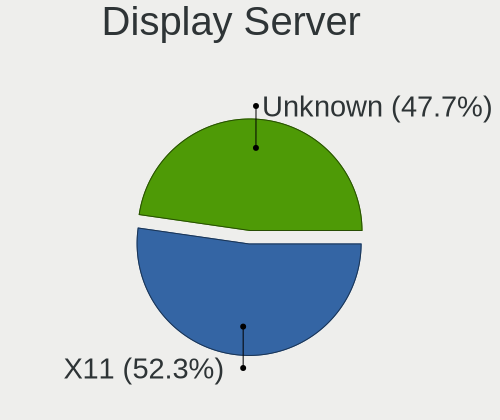

| Name    | Computers | Percent |
|---------|-----------|---------|
| X11     | 23        | 52.27%  |
| Unknown | 21        | 47.73%  |

Display Manager
---------------

SDDM, LightDM, etc.

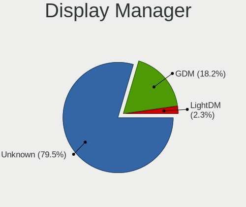

| Name    | Computers | Percent |
|---------|-----------|---------|
| Unknown | 35        | 79.55%  |
| GDM     | 8         | 18.18%  |
| LightDM | 1         | 2.27%   |

OS Lang
-------

Language

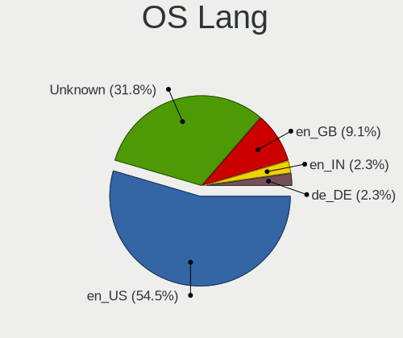

| Lang    | Computers | Percent |
|---------|-----------|---------|
| en_US   | 24        | 54.55%  |
| Unknown | 14        | 31.82%  |
| en_GB   | 4         | 9.09%   |
| en_IN   | 1         | 2.27%   |
| de_DE   | 1         | 2.27%   |

Boot Mode
---------

EFI or BIOS

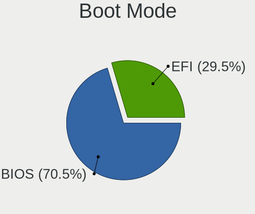

| Mode | Computers | Percent |
|------|-----------|---------|
| BIOS | 31        | 70.45%  |
| EFI  | 13        | 29.55%  |

Filesystem
----------

Type of filesystem

| Type    | Computers | Percent |
|---------|-----------|---------|
| Xfs     | 27        | 61.36%  |
| Ext4    | 13        | 29.55%  |
| Unknown | 4         | 9.09%   |

Part. scheme
------------

Scheme of partitioning

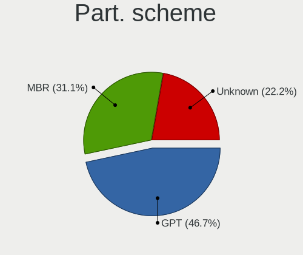

| Type    | Computers | Percent |
|---------|-----------|---------|
| GPT     | 21        | 46.67%  |
| MBR     | 14        | 31.11%  |
| Unknown | 10        | 22.22%  |

Dual Boot with Linux/BSD
------------------------

Hosting more than one Linux/BSD

| Dual boot | Computers | Percent |
|-----------|-----------|---------|
| No        | 31        | 68.89%  |
| Yes       | 14        | 31.11%  |

Dual Boot (Win)
---------------

Hosting Linux and Windows

| Dual boot | Computers | Percent |
|-----------|-----------|---------|
| No        | 44        | 100%    |

Board
-----

Vendor
------

Motherboard manufacturer

| Name             | Computers | Percent |
|------------------|-----------|---------|
| Dell             | 23        | 52.27%  |
| Lenovo           | 9         | 20.45%  |
| Hewlett-Packard  | 6         | 13.64%  |
| ZTSYSTEMS        | 2         | 4.55%   |
| MiTAC            | 1         | 2.27%   |
| Intel            | 1         | 2.27%   |
| Getac            | 1         | 2.27%   |
| ASUSTek Computer | 1         | 2.27%   |

Model
-----

Motherboard model

| Name                                   | Computers | Percent |
|----------------------------------------|-----------|---------|
| Dell PowerEdge FC630                   | 6         | 13.64%  |
| Dell PowerEdge R230                    | 4         | 9.09%   |
| Lenovo 7X56CTO1WW HR630X               | 2         | 4.55%   |
| Dell PowerEdge R740                    | 2         | 4.55%   |
| Dell PowerEdge R630                    | 2         | 4.55%   |
| ZTSYSTEMS Z802                         | 1         | 2.27%   |
| ZTSYSTEMS Z801                         | 1         | 2.27%   |
| MiTAC C4I                              | 1         | 2.27%   |
| Lenovo ThinkPad X131e 3368CTO          | 1         | 2.27%   |
| Lenovo ThinkPad X1 Yoga 1st 20FRS17K00 | 1         | 2.27%   |
| Lenovo ThinkPad T490 20N3S5DU27        | 1         | 2.27%   |
| Lenovo ThinkPad T470p 20J7S0FA0E       | 1         | 2.27%   |
| Lenovo ThinkPad P52 20MAS17205         | 1         | 2.27%   |
| Lenovo ThinkPad L480 20LSS0M100        | 1         | 2.27%   |
| Lenovo System x3250 M6 -[3943AC1]-     | 1         | 2.27%   |
| Intel NUC11BTMi7                       | 1         | 2.27%   |
| HP ZBook 14u G6                        | 1         | 2.27%   |
| HP Z620 Workstation                    | 1         | 2.27%   |
| HP ProLiant MicroServer Gen8           | 1         | 2.27%   |
| HP ProLiant DL380e Gen8                | 1         | 2.27%   |
| HP ProLiant DL360p Gen8                | 1         | 2.27%   |
| HP ProLiant DL180 G6                   | 1         | 2.27%   |
| Getac B360                             | 1         | 2.27%   |
| Dell XS23-TY3                          | 1         | 2.27%   |
| Dell Studio XPS 9100                   | 1         | 2.27%   |
| Dell Precision Tower 5810              | 1         | 2.27%   |
| Dell Precision 5820 Tower              | 1         | 2.27%   |
| Dell Precision 5510                    | 1         | 2.27%   |
| Dell OptiPlex 9020                     | 1         | 2.27%   |
| Dell OptiPlex 760                      | 1         | 2.27%   |
| Dell Latitude E5570                    | 1         | 2.27%   |
| Dell Latitude 7390                     | 1         | 2.27%   |
| ASUS STRIX Z270E GAMING                | 1         | 2.27%   |

Model Family
------------

Motherboard model prefix

| Name              | Computers | Percent |
|-------------------|-----------|---------|
| Dell PowerEdge    | 14        | 31.82%  |
| Lenovo ThinkPad   | 6         | 13.64%  |
| HP ProLiant       | 4         | 9.09%   |
| Dell Precision    | 3         | 6.82%   |
| Lenovo 7X56CTO1WW | 2         | 4.55%   |
| Dell OptiPlex     | 2         | 4.55%   |
| Dell Latitude     | 2         | 4.55%   |
| ZTSYSTEMS Z802    | 1         | 2.27%   |
| ZTSYSTEMS Z801    | 1         | 2.27%   |
| MiTAC C4I         | 1         | 2.27%   |
| Lenovo System     | 1         | 2.27%   |
| Intel NUC11BTMi7  | 1         | 2.27%   |
| HP ZBook          | 1         | 2.27%   |
| HP Z620           | 1         | 2.27%   |
| Getac B360        | 1         | 2.27%   |
| Dell XS23-TY3     | 1         | 2.27%   |
| Dell Studio       | 1         | 2.27%   |
| ASUS STRIX        | 1         | 2.27%   |

MFG Year
--------

Motherboard manufacture year

| Year | Computers | Percent |
|------|-----------|---------|
| 2016 | 10        | 22.73%  |
| 2018 | 8         | 18.18%  |
| 2019 | 7         | 15.91%  |
| 2012 | 4         | 9.09%   |
| 2017 | 3         | 6.82%   |
| 2013 | 3         | 6.82%   |
| 2010 | 3         | 6.82%   |
| 2022 | 2         | 4.55%   |
| 2021 | 1         | 2.27%   |
| 2015 | 1         | 2.27%   |
| 2014 | 1         | 2.27%   |
| 2009 | 1         | 2.27%   |

Form Factor
-----------

Physical design of the computer

| Name        | Computers | Percent |
|-------------|-----------|---------|
| Server      | 18        | 40.91%  |
| Desktop     | 14        | 31.82%  |
| Notebook    | 10        | 22.73%  |
| Convertible | 1         | 2.27%   |
| Mini pc     | 1         | 2.27%   |

Secure Boot
-----------

Enabled or disabled

| State    | Computers | Percent |
|----------|-----------|---------|
| Disabled | 42        | 95.45%  |
| Enabled  | 2         | 4.55%   |

Coreboot
--------

Have coreboot on board

| Used | Computers | Percent |
|------|-----------|---------|
| No   | 44        | 100%    |

RAM Size
--------

Total RAM memory

| Size in GB      | Computers | Percent |
|-----------------|-----------|---------|
| 64.01-256.0     | 14        | 31.82%  |
| 4.01-8.0        | 8         | 18.18%  |
| 32.01-64.0      | 6         | 13.64%  |
| 16.01-24.0      | 5         | 11.36%  |
| 8.01-16.0       | 4         | 9.09%   |
| More than 256.0 | 3         | 6.82%   |
| 24.01-32.0      | 3         | 6.82%   |
| 2.01-3.0        | 1         | 2.27%   |

RAM Used
--------

Used RAM memory

| Used GB     | Computers | Percent |
|-------------|-----------|---------|
| 4.01-8.0    | 13        | 28.89%  |
| 1.01-2.0    | 8         | 17.78%  |
| 2.01-3.0    | 7         | 15.56%  |
| 3.01-4.0    | 5         | 11.11%  |
| 8.01-16.0   | 5         | 11.11%  |
| 24.01-32.0  | 2         | 4.44%   |
| 16.01-24.0  | 2         | 4.44%   |
| 32.01-64.0  | 1         | 2.22%   |
| 64.01-256.0 | 1         | 2.22%   |
| 0.51-1.0    | 1         | 2.22%   |

Total Drives
------------

Number of drives on board

| Drives | Computers | Percent |
|--------|-----------|---------|
| 1      | 15        | 34.09%  |
| 3      | 8         | 18.18%  |
| 2      | 7         | 15.91%  |
| 5      | 5         | 11.36%  |
| 12     | 3         | 6.82%   |
| 4      | 2         | 4.55%   |
| 14     | 1         | 2.27%   |
| 11     | 1         | 2.27%   |
| 6      | 1         | 2.27%   |
| 0      | 1         | 2.27%   |

Has CD-ROM
----------

Has CD-ROM on board

| Presented | Computers | Percent |
|-----------|-----------|---------|
| No        | 37        | 84.09%  |
| Yes       | 7         | 15.91%  |

Has Ethernet
------------

Has Ethernet on board

| Presented | Computers | Percent |
|-----------|-----------|---------|
| Yes       | 43        | 97.73%  |
| No        | 1         | 2.27%   |

Has WiFi
--------

Has WiFi module

| Presented | Computers | Percent |
|-----------|-----------|---------|
| No        | 31        | 70.45%  |
| Yes       | 13        | 29.55%  |

Has Bluetooth
-------------

Has Bluetooth module

| Presented | Computers | Percent |
|-----------|-----------|---------|
| No        | 34        | 77.27%  |
| Yes       | 10        | 22.73%  |

Location
--------

Country
-------

Geographic location (country)

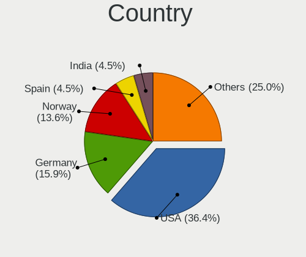

| Country     | Computers | Percent |
|-------------|-----------|---------|
| USA         | 16        | 36.36%  |
| Germany     | 7         | 15.91%  |
| Norway      | 6         | 13.64%  |
| Spain       | 2         | 4.55%   |
| India       | 2         | 4.55%   |
| Czechia     | 2         | 4.55%   |
| Austria     | 2         | 4.55%   |
| UK          | 1         | 2.27%   |
| Singapore   | 1         | 2.27%   |
| Netherlands | 1         | 2.27%   |
| Italy       | 1         | 2.27%   |
| Ireland     | 1         | 2.27%   |
| France      | 1         | 2.27%   |
| Belgium     | 1         | 2.27%   |

City
----

Geographic location (city)

| City                  | Computers | Percent |
|-----------------------|-----------|---------|
| Quincy                | 8         | 18.18%  |
| Petersberg            | 6         | 13.64%  |
| Voll                  | 4         | 9.09%   |
| Vienna                | 2         | 4.55%   |
| Prague                | 2         | 4.55%   |
| Kongsberg             | 2         | 4.55%   |
| Yorktown Heights      | 1         | 2.27%   |
| Singapore             | 1         | 2.27%   |
| Rensselaer            | 1         | 2.27%   |
| Milan                 | 1         | 2.27%   |
| Manchester            | 1         | 2.27%   |
| Madrid                | 1         | 2.27%   |
| Los Alamos            | 1         | 2.27%   |
| Lohmar                | 1         | 2.27%   |
| Loganville            | 1         | 2.27%   |
| Leuven                | 1         | 2.27%   |
| La Cañada Flintridge | 1         | 2.27%   |
| Kalyan                | 1         | 2.27%   |
| Glendale              | 1         | 2.27%   |
| Galway                | 1         | 2.27%   |
| Delhi                 | 1         | 2.27%   |
| Chicago               | 1         | 2.27%   |
| Caen                  | 1         | 2.27%   |
| Bethlehem             | 1         | 2.27%   |
| Barcelona             | 1         | 2.27%   |
| Amsterdam             | 1         | 2.27%   |

Drives
------

Drive Vendor
------------

Hard drive vendors

| Vendor                       | Computers | Drives | Percent |
|------------------------------|-----------|--------|---------|
| Seagate                      | 16        | 48     | 25.4%   |
| WDC                          | 8         | 12     | 12.7%   |
| Toshiba                      | 8         | 14     | 12.7%   |
| Samsung Electronics          | 7         | 11     | 11.11%  |
| Dell                         | 4         | 8      | 6.35%   |
| Intel                        | 3         | 3      | 4.76%   |
| Unknown                      | 2         | 2      | 3.17%   |
| SanDisk                      | 2         | 2      | 3.17%   |
| Micron Technology            | 2         | 3      | 3.17%   |
| HGST                         | 2         | 5      | 3.17%   |
| Western Digital              | 1         | 1      | 1.59%   |
| Transcend                    | 1         | 1      | 1.59%   |
| Toshiba America Info Systems | 1         | 1      | 1.59%   |
| SK hynix                     | 1         | 2      | 1.59%   |
| SCST_FIO                     | 1         | 9      | 1.59%   |
| NVMe                         | 1         | 1      | 1.59%   |
| Hewlett-Packard              | 1         | 8      | 1.59%   |
| Crucial                      | 1         | 1      | 1.59%   |
| Anobit                       | 1         | 1      | 1.59%   |

Drive Model
-----------

Hard drive models

| Model                                               | Computers | Percent |
|-----------------------------------------------------|-----------|---------|
| Toshiba MG04ACA100NY 1TB                            | 4         | 5.33%   |
| Dell MD34xx 26TB                                    | 4         | 5.33%   |
| WDC WD5003ABYZ-011FA0 500GB                         | 2         | 2.67%   |
| Toshiba AL14SEB18EQ 1.8TB                           | 2         | 2.67%   |
| Seagate ST91000640NS 1TB                            | 2         | 2.67%   |
| Seagate ST4000NM0033-9ZM170 4TB                     | 2         | 2.67%   |
| Seagate ST300MP0026 304GB                           | 2         | 2.67%   |
| Seagate ST2000NX0433 2TB                            | 2         | 2.67%   |
| Seagate ST2000NX0273 2TB                            | 2         | 2.67%   |
| Samsung SSD 860 EVO 500GB                           | 2         | 2.67%   |
| Samsung NVMe SSD Drive 512GB                        | 2         | 2.67%   |
| Western Digital WUS3BA176C7P3E3 8TB                 | 1         | 1.33%   |
| WDC WDS500G2B0A-00SM50 500GB SSD                    | 1         | 1.33%   |
| WDC WD5000HHTZ-04N21V0 500GB                        | 1         | 1.33%   |
| WDC WD4000FYYZ-01UL1B1 4TB                          | 1         | 1.33%   |
| WDC WD20EZRX-00DC0B0 2TB                            | 1         | 1.33%   |
| WDC WD2002FFSX-68PF8N0 2TB                          | 1         | 1.33%   |
| WDC WD10SPCX-75KHST0 1TB                            | 1         | 1.33%   |
| WDC WD10EALX-759BA1 1TB                             | 1         | 1.33%   |
| Unknown NVMe SSD Drive 1TB                          | 1         | 1.33%   |
| Unknown MMC Card  128GB                             | 1         | 1.33%   |
| Transcend TS512GMTS800 512GB SSD                    | 1         | 1.33%   |
| Toshiba NVMe SSD Drive 1024GB                       | 1         | 1.33%   |
| Toshiba MQ01ACF032 320GB                            | 1         | 1.33%   |
| Toshiba America Info Systems KXG50ZNV256G NVM 256GB | 1         | 1.33%   |
| SK hynix SC311 SATA 256GB SSD                       | 1         | 1.33%   |
| Seagate ST9500620NS 500GB                           | 1         | 1.33%   |
| Seagate ST6000NM0024-1HT17Z 6TB                     | 1         | 1.33%   |
| Seagate ST4000NM0085-1YY107 4TB                     | 1         | 1.33%   |
| Seagate ST3160815AS 160GB                           | 1         | 1.33%   |
| Seagate ST2000VN000-1HJ164 2TB                      | 1         | 1.33%   |
| Seagate ST2000NX0423 2TB                            | 1         | 1.33%   |
| Seagate ST1000NM0065-1VT10C 1TB                     | 1         | 1.33%   |
| SCST_FIO slordtgt008 8.7TB                          | 1         | 1.33%   |
| SCST_FIO slordtgt007 8.7TB                          | 1         | 1.33%   |
| SCST_FIO slordtgt006 8.7TB                          | 1         | 1.33%   |
| SCST_FIO slordtgt005 8.7TB                          | 1         | 1.33%   |
| SCST_FIO slordtgt004 8.7TB                          | 1         | 1.33%   |
| SCST_FIO slordtgt003 274GB                          | 1         | 1.33%   |
| SCST_FIO slordtgt002 274GB                          | 1         | 1.33%   |

HDD Vendor
----------

Hard disk drive vendors

| Vendor          | Computers | Drives | Percent |
|-----------------|-----------|--------|---------|
| Seagate         | 16        | 48     | 41.03%  |
| WDC             | 8         | 11     | 20.51%  |
| Toshiba         | 7         | 13     | 17.95%  |
| Dell            | 4         | 8      | 10.26%  |
| HGST            | 2         | 5      | 5.13%   |
| SCST_FIO        | 1         | 9      | 2.56%   |
| Hewlett-Packard | 1         | 8      | 2.56%   |

SSD Vendor
----------

Solid state drive vendors

| Vendor              | Computers | Drives | Percent |
|---------------------|-----------|--------|---------|
| Samsung Electronics | 4         | 5      | 30.77%  |
| Micron Technology   | 2         | 3      | 15.38%  |
| WDC                 | 1         | 1      | 7.69%   |
| Transcend           | 1         | 1      | 7.69%   |
| SK hynix            | 1         | 2      | 7.69%   |
| SanDisk             | 1         | 1      | 7.69%   |
| Intel               | 1         | 1      | 7.69%   |
| Crucial             | 1         | 1      | 7.69%   |
| Anobit              | 1         | 1      | 7.69%   |

Drive Kind
----------

HDD or SSD

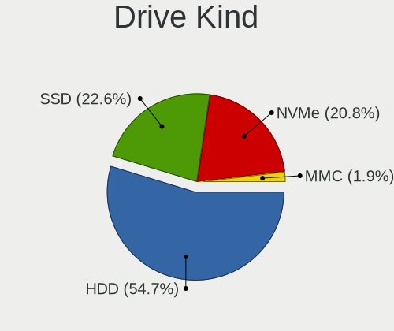

| Kind | Computers | Drives | Percent |
|------|-----------|--------|---------|
| HDD  | 28        | 102    | 53.85%  |
| SSD  | 12        | 16     | 23.08%  |
| NVMe | 11        | 14     | 21.15%  |
| MMC  | 1         | 1      | 1.92%   |

Drive Connector
---------------

SATA, SAS, NVMe, etc.

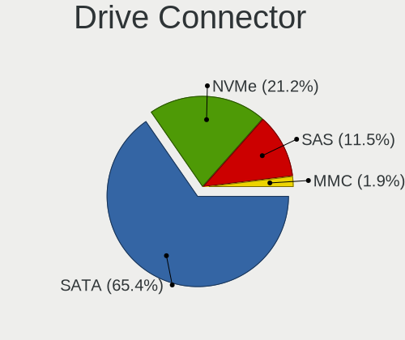

| Type | Computers | Drives | Percent |
|------|-----------|--------|---------|
| SATA | 34        | 110    | 68%     |
| NVMe | 11        | 14     | 22%     |
| SAS  | 4         | 8      | 8%      |
| MMC  | 1         | 1      | 2%      |

Drive Size
----------

Size of hard drive

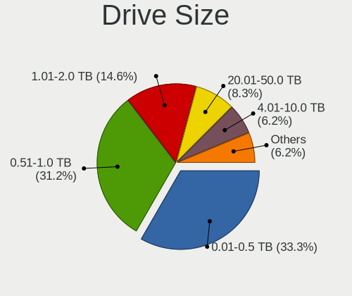

| Size in TB | Computers | Drives | Percent |
|------------|-----------|--------|---------|
| 0.51-1.0   | 15        | 24     | 31.91%  |
| 0.01-0.5   | 15        | 31     | 31.91%  |
| 1.01-2.0   | 7         | 31     | 14.89%  |
| 20.01-50.0 | 4         | 8      | 8.51%   |
| 3.01-4.0   | 3         | 13     | 6.38%   |
| 4.01-10.0  | 3         | 11     | 6.38%   |

Space Total
-----------

Amount of disk space available on the file system

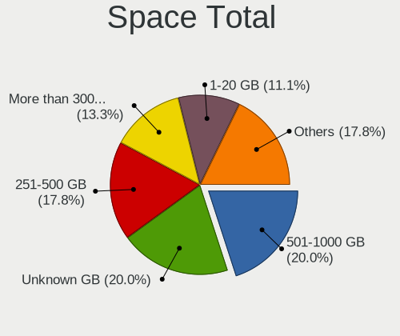

| Size in GB     | Computers | Percent |
|----------------|-----------|---------|
| 501-1000       | 9         | 20%     |
| Unknown        | 9         | 20%     |
| 251-500        | 8         | 17.78%  |
| More than 3000 | 6         | 13.33%  |
| 1-20           | 5         | 11.11%  |
| 101-250        | 3         | 6.67%   |
| 1001-2000      | 2         | 4.44%   |
| 51-100         | 2         | 4.44%   |
| 2001-3000      | 1         | 2.22%   |

Space Used
----------

Amount of used disk space

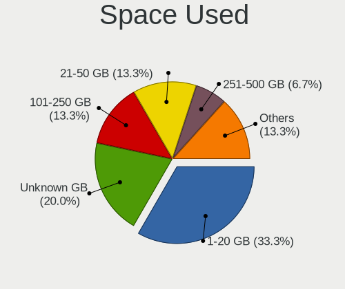

| Used GB   | Computers | Percent |
|-----------|-----------|---------|
| 1-20      | 15        | 33.33%  |
| Unknown   | 9         | 20%     |
| 21-50     | 6         | 13.33%  |
| 101-250   | 6         | 13.33%  |
| 251-500   | 3         | 6.67%   |
| 51-100    | 3         | 6.67%   |
| 1001-2000 | 2         | 4.44%   |
| 2001-3000 | 1         | 2.22%   |

Malfunc. Drives
---------------

Drive models with a malfunction

| Model                            | Computers | Drives | Percent |
|----------------------------------|-----------|--------|---------|
| WDC WD5003ABYZ-011FA0 500GB      | 1         | 1      | 16.67%  |
| WDC WD4000FYYZ-01UL1B1 4TB       | 1         | 3      | 16.67%  |
| WDC WD10EALX-759BA1 1TB          | 1         | 2      | 16.67%  |
| Transcend TS512GMTS800 512GB SSD | 1         | 1      | 16.67%  |
| Seagate ST91000640NS 1TB         | 1         | 2      | 16.67%  |
| Seagate ST6000NM0024-1HT17Z 6TB  | 1         | 2      | 16.67%  |

Malfunc. Drive Vendor
---------------------

Vendors of faulty drives

| Vendor    | Computers | Drives | Percent |
|-----------|-----------|--------|---------|
| WDC       | 3         | 6      | 50%     |
| Seagate   | 2         | 4      | 33.33%  |
| Transcend | 1         | 1      | 16.67%  |

Malfunc. HDD Vendor
-------------------

Vendors of faulty HDD drives

| Vendor  | Computers | Drives | Percent |
|---------|-----------|--------|---------|
| WDC     | 3         | 6      | 60%     |
| Seagate | 2         | 4      | 40%     |

Malfunc. Drive Kind
-------------------

Kinds of faulty drives

| Kind | Computers | Drives | Percent |
|------|-----------|--------|---------|
| HDD  | 4         | 10     | 80%     |
| SSD  | 1         | 1      | 20%     |

Failed Drives
-------------

Failed drive models

Zero info for selected period =(

Failed Drive Vendor
-------------------

Failed drive vendors

Zero info for selected period =(

Drive Status
------------

Number of failed and malfunc. drives

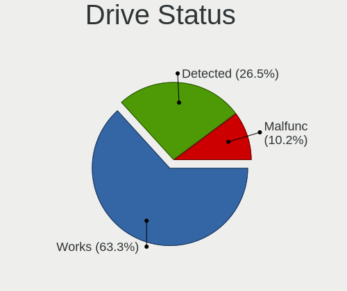

| Status   | Computers | Drives | Percent |
|----------|-----------|--------|---------|
| Works    | 31        | 107    | 65.96%  |
| Detected | 11        | 15     | 23.4%   |
| Malfunc  | 5         | 11     | 10.64%  |

Storage controller
------------------

Storage Vendor
--------------

Storage controller vendors

| Vendor                       | Computers | Percent |
|------------------------------|-----------|---------|
| Intel                        | 38        | 57.58%  |
| Broadcom / LSI               | 10        | 15.15%  |
| LSI Logic / Symbios Logic    | 5         | 7.58%   |
| Samsung Electronics          | 4         | 6.06%   |
| Hewlett-Packard              | 3         | 4.55%   |
| Toshiba America Info Systems | 2         | 3.03%   |
| Western Digital              | 1         | 1.52%   |
| SanDisk                      | 1         | 1.52%   |
| Phison Electronics           | 1         | 1.52%   |
| ADATA Technology             | 1         | 1.52%   |

Storage Model
-------------

Storage controller models

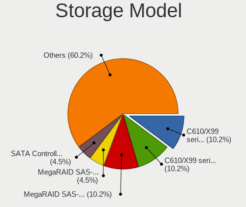

| Model                                                                         | Computers | Percent |
|-------------------------------------------------------------------------------|-----------|---------|
| Intel C610/X99 series chipset sSATA Controller [AHCI mode]                    | 9         | 10.23%  |
| Intel C610/X99 series chipset 6-Port SATA Controller [AHCI mode]              | 9         | 10.23%  |
| Broadcom / LSI MegaRAID SAS-3 3108 [Invader]                                  | 9         | 10.23%  |
| LSI Logic / Symbios Logic MegaRAID SAS-3 3008 [Fury]                          | 4         | 4.55%   |
| Intel Q170/Q150/B150/H170/H110/Z170/CM236 Chipset SATA Controller [AHCI Mode] | 4         | 4.55%   |
| Intel C620 Series Chipset Family SSATA Controller [AHCI mode]                 | 4         | 4.55%   |
| Intel C620 Series Chipset Family SATA Controller [AHCI mode]                  | 4         | 4.55%   |
| Broadcom / LSI SAS3008 PCI-Express Fusion-MPT SAS-3                           | 4         | 4.55%   |
| Samsung NVMe SSD Controller SM981/PM981/PM983                                 | 3         | 3.41%   |
| Intel SATA Controller [RAID mode]                                             | 3         | 3.41%   |
| Intel C602 chipset 4-Port SATA Storage Control Unit                           | 3         | 3.41%   |
| Intel C600/X79 series chipset 6-Port SATA AHCI Controller                     | 3         | 3.41%   |
| Intel 82801JI (ICH10 Family) SATA AHCI Controller                             | 3         | 3.41%   |
| Intel C600/X79 series chipset 4-Port SATA IDE Controller                      | 2         | 2.27%   |
| HP Smart Array Gen8 Controllers                                               | 2         | 2.27%   |
| Western Digital Ultrastar DC SN630 NVMe SSD                                   | 1         | 1.14%   |
| Toshiba America Info Systems XG6 NVMe SSD Controller                          | 1         | 1.14%   |
| Toshiba America Info Systems XG5 NVMe SSD Controller                          | 1         | 1.14%   |
| SanDisk Extreme Pro / WD Black SN750 / PC SN730 / Red SN700 NVMe SSD          | 1         | 1.14%   |
| Samsung NVMe SSD Controller PM9A1/PM9A3/980PRO                                | 1         | 1.14%   |
| Phison PS5013-E13 PCIe3 NVMe Controller (DRAM-less)                           | 1         | 1.14%   |
| LSI Logic / Symbios Logic MegaRAID SAS-3 3108 [Invader]                       | 1         | 1.14%   |
| Intel Volume Management Device NVMe RAID Controller                           | 1         | 1.14%   |
| Intel Sunrise Point-LP SATA Controller [AHCI mode]                            | 1         | 1.14%   |
| Intel SSD DC P4101/Pro 7600p/760p/E 6100p Series                              | 1         | 1.14%   |
| Intel PCIe Data Center SSD                                                    | 1         | 1.14%   |
| Intel Comet Lake SATA AHCI Controller                                         | 1         | 1.14%   |
| Intel C600/X79 series chipset SATA RAID Controller                            | 1         | 1.14%   |
| Intel C600/X79 series chipset 2-Port SATA IDE Controller                      | 1         | 1.14%   |
| Intel 82801JD/DO (ICH10 Family) SATA AHCI Controller                          | 1         | 1.14%   |
| Intel 7 Series Chipset Family 6-port SATA Controller [AHCI mode]              | 1         | 1.14%   |
| Intel 6 Series/C200 Series Chipset Family 6 port Desktop SATA AHCI Controller | 1         | 1.14%   |
| Intel 4 Series Chipset PT IDER Controller                                     | 1         | 1.14%   |
| Intel 200 Series PCH SATA controller [AHCI mode]                              | 1         | 1.14%   |
| HP Smart Array G6 controllers                                                 | 1         | 1.14%   |
| Broadcom / LSI MegaRAID SAS 2208 [Thunderbolt]                                | 1         | 1.14%   |
| ADATA IM2P33F8 series NVMe SSD (DRAM-less)                                    | 1         | 1.14%   |

Storage Kind
------------

Kind of storage controller (IDE, SATA, NVMe, SAS, ...)

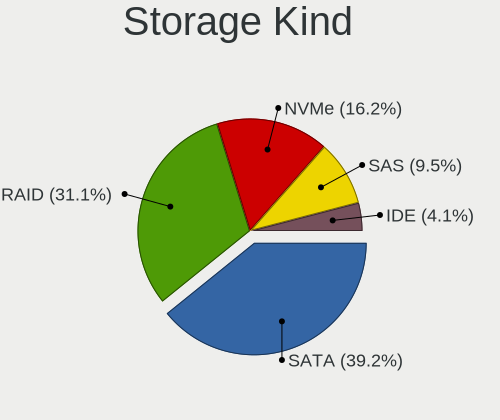

| Kind | Computers | Percent |
|------|-----------|---------|
| SATA | 29        | 39.19%  |
| RAID | 23        | 31.08%  |
| NVMe | 12        | 16.22%  |
| SAS  | 7         | 9.46%   |
| IDE  | 3         | 4.05%   |

Processor
---------

CPU Vendor
----------

Processor vendors

| Vendor | Computers | Percent |
|--------|-----------|---------|
| Intel  | 44        | 100%    |

CPU Model
---------

Processor models

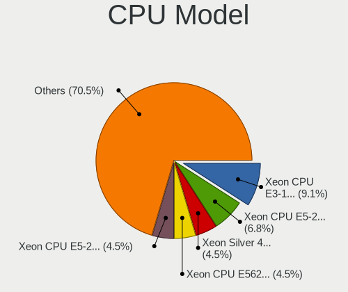

| Model                                   | Computers | Percent |
|-----------------------------------------|-----------|---------|
| Intel Xeon CPU E3-1220 v5 @ 3.00GHz     | 4         | 9.09%   |
| Intel Xeon CPU E5-2630 v3 @ 2.40GHz     | 3         | 6.82%   |
| Intel Xeon Silver 4114 CPU @ 2.20GHz    | 2         | 4.55%   |
| Intel Xeon CPU E5620 @ 2.40GHz          | 2         | 4.55%   |
| Intel Xeon CPU E5-2620 v4 @ 2.10GHz     | 2         | 4.55%   |
| Intel Xeon CPU E5-2620 v3 @ 2.40GHz     | 2         | 4.55%   |
| Intel Xeon CPU E5-2620 v2 @ 2.10GHz     | 2         | 4.55%   |
| Intel Core i7-8565U CPU @ 1.80GHz       | 2         | 4.55%   |
| Intel Xeon W-2145 CPU @ 3.70GHz         | 1         | 2.27%   |
| Intel Xeon Gold 6263CY CPU @ 2.60GHz    | 1         | 2.27%   |
| Intel Xeon Gold 6140 CPU @ 2.30GHz      | 1         | 2.27%   |
| Intel Xeon CPU E5-2690 0 @ 2.90GHz      | 1         | 2.27%   |
| Intel Xeon CPU E5-2683 v4 @ 2.10GHz     | 1         | 2.27%   |
| Intel Xeon CPU E5-2680 v3 @ 2.50GHz     | 1         | 2.27%   |
| Intel Xeon CPU E5-2650 v2 @ 2.60GHz     | 1         | 2.27%   |
| Intel Xeon CPU E5-2407 0 @ 2.20GHz      | 1         | 2.27%   |
| Intel Xeon CPU E5-1620 v3 @ 3.50GHz     | 1         | 2.27%   |
| Intel Xeon CPU E3-1280 V2 @ 3.60GHz     | 1         | 2.27%   |
| Intel Xeon CPU E3-1270 v6 @ 3.80GHz     | 1         | 2.27%   |
| Intel Core i7-8850H CPU @ 2.60GHz       | 1         | 2.27%   |
| Intel Core i7-8550U CPU @ 1.80GHz       | 1         | 2.27%   |
| Intel Core i7-7820HQ CPU @ 2.90GHz      | 1         | 2.27%   |
| Intel Core i7-7700K CPU @ 4.20GHz       | 1         | 2.27%   |
| Intel Core i7-7600U CPU @ 2.80GHz       | 1         | 2.27%   |
| Intel Core i7-6820HQ CPU @ 2.70GHz      | 1         | 2.27%   |
| Intel Core i7-6600U CPU @ 2.60GHz       | 1         | 2.27%   |
| Intel Core i7-10510U CPU @ 1.80GHz      | 1         | 2.27%   |
| Intel Core i7 CPU X 990 @ 3.47GHz       | 1         | 2.27%   |
| Intel Core i5-6300HQ CPU @ 2.30GHz      | 1         | 2.27%   |
| Intel Core i5-4590 CPU @ 3.30GHz        | 1         | 2.27%   |
| Intel Core i3-2367M CPU @ 1.40GHz       | 1         | 2.27%   |
| Intel Core 2 Duo CPU E7400 @ 2.80GHz    | 1         | 2.27%   |
| Intel 11th Gen Core i7-11700B @ 3.20GHz | 1         | 2.27%   |

CPU Model Family
----------------

Processor model prefix

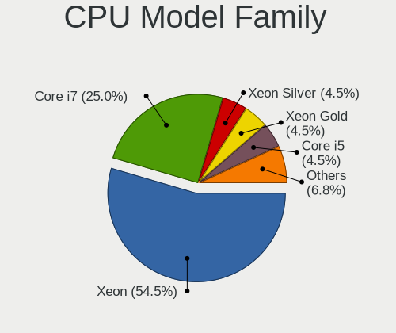

| Model             | Computers | Percent |
|-------------------|-----------|---------|
| Intel Xeon        | 24        | 54.55%  |
| Intel Core i7     | 11        | 25%     |
| Intel Xeon Silver | 2         | 4.55%   |
| Intel Xeon Gold   | 2         | 4.55%   |
| Intel Core i5     | 2         | 4.55%   |
| Other             | 1         | 2.27%   |
| Intel Core i3     | 1         | 2.27%   |
| Intel Core 2 Duo  | 1         | 2.27%   |

CPU Cores
---------

Number of processor cores

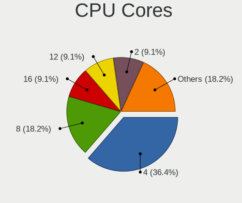

| Number | Computers | Percent |
|--------|-----------|---------|
| 4      | 16        | 36.36%  |
| 8      | 8         | 18.18%  |
| 16     | 4         | 9.09%   |
| 12     | 4         | 9.09%   |
| 2      | 4         | 9.09%   |
| 20     | 2         | 4.55%   |
| 6      | 2         | 4.55%   |
| 48     | 1         | 2.27%   |
| 36     | 1         | 2.27%   |
| 32     | 1         | 2.27%   |
| 24     | 1         | 2.27%   |

CPU Sockets
-----------

Number of sockets

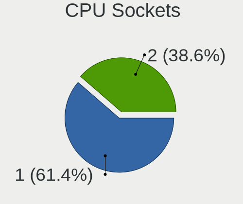

| Number | Computers | Percent |
|--------|-----------|---------|
| 1      | 27        | 61.36%  |
| 2      | 17        | 38.64%  |

CPU Threads
-----------

Threads per core (Hyper-Threading)

| Number | Computers | Percent |
|--------|-----------|---------|
| 2      | 36        | 81.82%  |
| 1      | 8         | 18.18%  |

CPU Op-Modes
------------

CPU Operation Modes (32-bit, 64-bit)

| Op mode        | Computers | Percent |
|----------------|-----------|---------|
| 32-bit, 64-bit | 40        | 90.91%  |
| Unknown        | 4         | 9.09%   |

CPU Microcode
-------------

Microcode number

| Number  | Computers | Percent |
|---------|-----------|---------|
| Unknown | 9         | 20.45%  |
| 0x306f2 | 6         | 13.64%  |
| 0x806ec | 3         | 6.82%   |
| 0x406f1 | 3         | 6.82%   |
| 0x306e4 | 3         | 6.82%   |
| 0x206c2 | 3         | 6.82%   |
| 0x906e9 | 2         | 4.55%   |
| 0x506e3 | 2         | 4.55%   |
| 0x206d7 | 2         | 4.55%   |
| 0x906ea | 1         | 2.27%   |
| 0x806ea | 1         | 2.27%   |
| 0x806e9 | 1         | 2.27%   |
| 0x806d1 | 1         | 2.27%   |
| 0x50657 | 1         | 2.27%   |
| 0x50654 | 1         | 2.27%   |
| 0x406e3 | 1         | 2.27%   |
| 0x306c3 | 1         | 2.27%   |
| 0x306a9 | 1         | 2.27%   |
| 0x206a7 | 1         | 2.27%   |
| 0x1067a | 1         | 2.27%   |

CPU Microarch
-------------

Microarchitecture

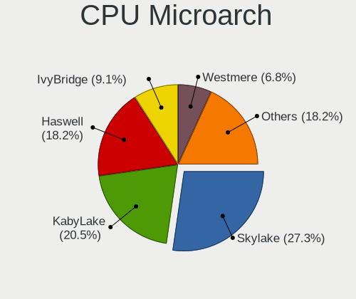

| Name        | Computers | Percent |
|-------------|-----------|---------|
| Skylake     | 12        | 27.27%  |
| KabyLake    | 9         | 20.45%  |
| Haswell     | 8         | 18.18%  |
| IvyBridge   | 4         | 9.09%   |
| Westmere    | 3         | 6.82%   |
| SandyBridge | 3         | 6.82%   |
| Broadwell   | 3         | 6.82%   |
| Penryn      | 1         | 2.27%   |
| Unknown     | 1         | 2.27%   |

Graphics
--------

GPU Vendor
----------

Vendors of graphics cards

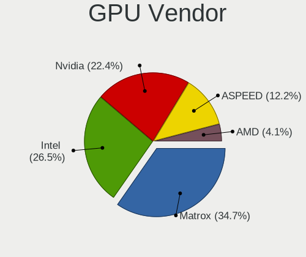

| Vendor                     | Computers | Percent |
|----------------------------|-----------|---------|
| Matrox Electronics Systems | 17        | 34.69%  |
| Intel                      | 13        | 26.53%  |
| Nvidia                     | 11        | 22.45%  |
| ASPEED Technology          | 6         | 12.24%  |
| AMD                        | 2         | 4.08%   |

GPU Model
---------

Graphics card models

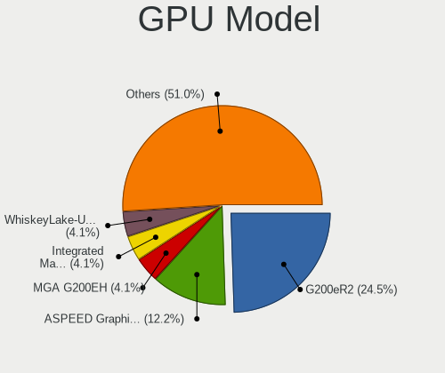

| Model                                                                       | Computers | Percent |
|-----------------------------------------------------------------------------|-----------|---------|
| Matrox Electronics Systems G200eR2                                          | 12        | 24.49%  |
| ASPEED Technology ASPEED Graphics Family                                    | 6         | 12.24%  |
| Matrox Electronics Systems MGA G200EH                                       | 2         | 4.08%   |
| Matrox Electronics Systems Integrated Matrox G200eW3 Graphics Controller    | 2         | 4.08%   |
| Intel WhiskeyLake-U GT2 [UHD Graphics 620]                                  | 2         | 4.08%   |
| Intel HD Graphics 530                                                       | 2         | 4.08%   |
| Nvidia GP108M [GeForce MX250]                                               | 1         | 2.04%   |
| Nvidia GP107M [GeForce GTX 1050 Mobile]                                     | 1         | 2.04%   |
| Nvidia GP107GLM [Quadro P1000 Mobile]                                       | 1         | 2.04%   |
| Nvidia GP107GL [Quadro P400]                                                | 1         | 2.04%   |
| Nvidia GP107 [GeForce GTX 1050]                                             | 1         | 2.04%   |
| Nvidia GM108M [GeForce 940MX]                                               | 1         | 2.04%   |
| Nvidia GM107GLM [Quadro M1000M]                                             | 1         | 2.04%   |
| Nvidia GF119 [NVS 315]                                                      | 1         | 2.04%   |
| Nvidia GF119 [NVS 310]                                                      | 1         | 2.04%   |
| Nvidia GF116 [GeForce GTX 550 Ti]                                           | 1         | 2.04%   |
| Nvidia GF108GL [Quadro 600]                                                 | 1         | 2.04%   |
| Matrox Electronics Systems MGA G200e [Pilot] ServerEngines (SEP1)           | 1         | 2.04%   |
| Intel Xeon E3-1200 v3/4th Gen Core Processor Integrated Graphics Controller | 1         | 2.04%   |
| Intel UHD Graphics 620                                                      | 1         | 2.04%   |
| Intel TigerLake-H GT1 [UHD Graphics]                                        | 1         | 2.04%   |
| Intel Skylake GT2 [HD Graphics 520]                                         | 1         | 2.04%   |
| Intel HD Graphics 630                                                       | 1         | 2.04%   |
| Intel HD Graphics 620                                                       | 1         | 2.04%   |
| Intel CometLake-U GT2 [UHD Graphics]                                        | 1         | 2.04%   |
| Intel 4 Series Chipset Integrated Graphics Controller                       | 1         | 2.04%   |
| Intel 2nd Generation Core Processor Family Integrated Graphics Controller   | 1         | 2.04%   |
| AMD Mars [Radeon HD 8670A/8670M/8750M / R7 M370]                            | 1         | 2.04%   |
| AMD Caicos [Radeon HD 6450/7450/8450 / R5 230 OEM]                          | 1         | 2.04%   |

GPU Combo
---------

Combinations of graphics cards

| Name           | Computers | Percent |
|----------------|-----------|---------|
| 1 x Matrox     | 17        | 38.64%  |
| 1 x Intel      | 7         | 15.91%  |
| 1 x Nvidia     | 6         | 13.64%  |
| 1 x ASPEED     | 6         | 13.64%  |
| Intel + Nvidia | 5         | 11.36%  |
| Other          | 1         | 2.27%   |
| Intel + AMD    | 1         | 2.27%   |
| 1 x AMD        | 1         | 2.27%   |

GPU Driver
----------

Free vs proprietary

| Driver      | Computers | Percent |
|-------------|-----------|---------|
| Free        | 27        | 61.36%  |
| Unknown     | 14        | 31.82%  |
| Proprietary | 3         | 6.82%   |

GPU Memory
----------

Total video memory

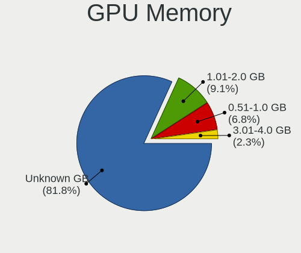

| Size in GB | Computers | Percent |
|------------|-----------|---------|
| Unknown    | 36        | 81.82%  |
| 1.01-2.0   | 4         | 9.09%   |
| 0.51-1.0   | 3         | 6.82%   |
| 3.01-4.0   | 1         | 2.27%   |

Monitor
-------

Monitor Vendor
--------------

Monitor vendors

| Vendor               | Computers | Percent |
|----------------------|-----------|---------|
| Dell                 | 8         | 33.33%  |
| Samsung Electronics  | 3         | 12.5%   |
| AU Optronics         | 3         | 12.5%   |
| ViewSonic            | 1         | 4.17%   |
| Sharp                | 1         | 4.17%   |
| LG Display           | 1         | 4.17%   |
| ITE                  | 1         | 4.17%   |
| InfoVision           | 1         | 4.17%   |
| Hewlett-Packard      | 1         | 4.17%   |
| Goldstar             | 1         | 4.17%   |
| Chimei Innolux       | 1         | 4.17%   |
| BOE Technology Group | 1         | 4.17%   |
| BOE                  | 1         | 4.17%   |

Monitor Model
-------------

Monitor models

| Model                                                                 | Computers | Percent |
|-----------------------------------------------------------------------|-----------|---------|
| Dell LCD Monitor DEL0001 1280x1024                                    | 6         | 24%     |
| ViewSonic VA2419 Series VSC7B32 1920x1080 530x300mm 24.0-inch         | 1         | 4%      |
| Sharp LCD Monitor SHP1453 1920x1080 346x194mm 15.6-inch               | 1         | 4%      |
| Samsung Electronics LCD Monitor SDC894F 1920x1080 344x194mm 15.5-inch | 1         | 4%      |
| Samsung Electronics LCD Monitor SAM0B30 1920x1080 885x498mm 40.0-inch | 1         | 4%      |
| Samsung Electronics C24F390 SAM0D2C 1920x1080 521x293mm 23.5-inch     | 1         | 4%      |
| LG Display LCD Monitor LGD04AA 1920x1080 309x174mm 14.0-inch          | 1         | 4%      |
| ITE DP2VGA V205 ITE6512 1920x1080 600x340mm 27.2-inch                 | 1         | 4%      |
| InfoVision LCD Monitor IVO057D 1920x1080 309x174mm 14.0-inch          | 1         | 4%      |
| Hewlett-Packard 24es HWP3320 1920x1080 527x296mm 23.8-inch            | 1         | 4%      |
| Goldstar HDR WFHD GSM7715 2560x1080 798x334mm 34.1-inch               | 1         | 4%      |
| Dell U2917W DEL40F9 2560x1080 673x284mm 28.8-inch                     | 1         | 4%      |
| Dell P2217H DELA0D9 1920x1080 476x267mm 21.5-inch                     | 1         | 4%      |
| Dell P2217H DELA0D8 1920x1080 476x267mm 21.5-inch                     | 1         | 4%      |
| Chimei Innolux LCD Monitor CMN14C9 1920x1080 309x173mm 13.9-inch      | 1         | 4%      |
| BOE Technology Group LCD Monitor 1920x1080                            | 1         | 4%      |
| BOE LCD Monitor BOE07EF 1920x1080 309x174mm 14.0-inch                 | 1         | 4%      |
| AU Optronics LCD Monitor AUO462D 1920x1080 293x165mm 13.2-inch        | 1         | 4%      |
| AU Optronics LCD Monitor AUO315C 1366x768 256x144mm 11.6-inch         | 1         | 4%      |
| AU Optronics LCD Monitor AUO103D 1920x1080 309x173mm 13.9-inch        | 1         | 4%      |

Monitor Resolution
------------------

Monitor screen resolution

| Resolution       | Computers | Percent |
|------------------|-----------|---------|
| 1920x1080 (FHD)  | 11        | 55%     |
| 1280x1024 (SXGA) | 6         | 30%     |
| 2560x1080        | 2         | 10%     |
| 1366x768 (WXGA)  | 1         | 5%      |

Monitor Diagonal
----------------

Diagonal size in inches

| Inches  | Computers | Percent |
|---------|-----------|---------|
| Unknown | 7         | 30.43%  |
| 14      | 3         | 13.04%  |
| 13      | 3         | 13.04%  |
| 15      | 2         | 8.7%    |
| 54      | 1         | 4.35%   |
| 34      | 1         | 4.35%   |
| 28      | 1         | 4.35%   |
| 27      | 1         | 4.35%   |
| 24      | 1         | 4.35%   |
| 23      | 1         | 4.35%   |
| 21      | 1         | 4.35%   |
| 11      | 1         | 4.35%   |

Monitor Width
-------------

Physical width

| Width in mm | Computers | Percent |
|-------------|-----------|---------|
| 301-350     | 7         | 30.43%  |
| Unknown     | 7         | 30.43%  |
| 501-600     | 3         | 13.04%  |
| 201-300     | 2         | 8.7%    |
| 701-800     | 1         | 4.35%   |
| 601-700     | 1         | 4.35%   |
| 401-500     | 1         | 4.35%   |
| 1001-1500   | 1         | 4.35%   |

Aspect Ratio
------------

Proportional relationship between the width and the height

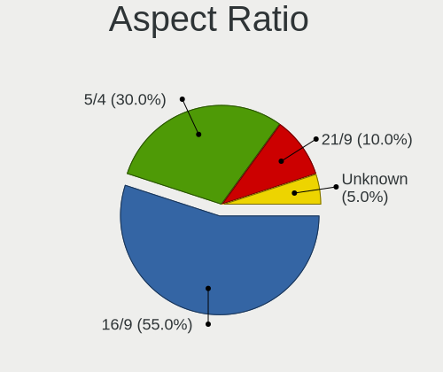

| Ratio   | Computers | Percent |
|---------|-----------|---------|
| 16/9    | 11        | 55%     |
| 5/4     | 6         | 30%     |
| 21/9    | 2         | 10%     |
| Unknown | 1         | 5%      |

Monitor Area
------------

Area in inch²

| Area in inch² | Computers | Percent |
|----------------|-----------|---------|
| Unknown        | 7         | 30.43%  |
| 81-90          | 5         | 21.74%  |
| 201-250        | 3         | 13.04%  |
| 101-110        | 2         | 8.7%    |
| More than 1000 | 1         | 4.35%   |
| 71-80          | 1         | 4.35%   |
| 51-60          | 1         | 4.35%   |
| 351-500        | 1         | 4.35%   |
| 301-350        | 1         | 4.35%   |
| 251-300        | 1         | 4.35%   |

Pixel Density
-------------

Pixels per inch

| Density | Computers | Percent |
|---------|-----------|---------|
| 121-160 | 8         | 34.78%  |
| Unknown | 7         | 30.43%  |
| 51-100  | 5         | 21.74%  |
| 1-50    | 1         | 4.35%   |
| 161-240 | 1         | 4.35%   |
| 101-120 | 1         | 4.35%   |

Multiple Monitors
-----------------

Total monitors connected

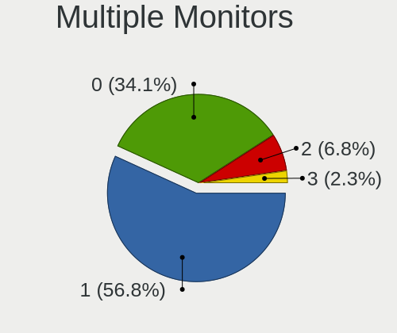

| Total | Computers | Percent |
|-------|-----------|---------|
| 1     | 25        | 56.82%  |
| 0     | 15        | 34.09%  |
| 2     | 3         | 6.82%   |
| 3     | 1         | 2.27%   |

Network
-------

Net Controller Vendor
---------------------

Controller vendors

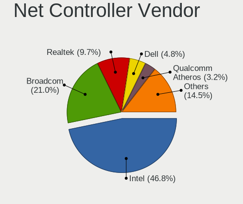

| Vendor                            | Computers | Percent |
|-----------------------------------|-----------|---------|
| Intel                             | 29        | 46.77%  |
| Broadcom                          | 13        | 20.97%  |
| Realtek Semiconductor             | 6         | 9.68%   |
| Dell                              | 3         | 4.84%   |
| Qualcomm Atheros                  | 2         | 3.23%   |
| Sierra Wireless                   | 1         | 1.61%   |
| Ralink Technology                 | 1         | 1.61%   |
| QLogic                            | 1         | 1.61%   |
| Prolific Technology               | 1         | 1.61%   |
| OPPO Electronics                  | 1         | 1.61%   |
| Mellanox Technologies             | 1         | 1.61%   |
| Ericsson Business Mobile Networks | 1         | 1.61%   |
| Emulex                            | 1         | 1.61%   |
| ASIX Electronics                  | 1         | 1.61%   |

Net Controller Model
--------------------

Controller models

| Model                                                             | Computers | Percent |
|-------------------------------------------------------------------|-----------|---------|
| Broadcom NetXtreme BCM5720 Gigabit Ethernet PCIe                  | 7         | 8.75%   |
| Intel I350 Gigabit Network Connection                             | 6         | 7.5%    |
| Broadcom NetXtreme II BCM57810 10 Gigabit Ethernet                | 5         | 6.25%   |
| Broadcom NetXtreme BCM5719 Gigabit Ethernet PCIe                  | 5         | 6.25%   |
| Realtek RTL8111/8168/8411 PCI Express Gigabit Ethernet Controller | 3         | 3.75%   |
| Intel Wireless 8265 / 8275                                        | 3         | 3.75%   |
| Intel Wireless 8260                                               | 3         | 3.75%   |
| Realtek RTL8153 Gigabit Ethernet Adapter                          | 2         | 2.5%    |
| Intel Ethernet Controller X550                                    | 2         | 2.5%    |
| Intel Ethernet Connection I217-LM                                 | 2         | 2.5%    |
| Intel Ethernet Connection (6) I219-V                              | 2         | 2.5%    |
| Intel Ethernet Connection (5) I219-LM                             | 2         | 2.5%    |
| Intel 82599ES 10-Gigabit SFI/SFP+ Network Connection              | 2         | 2.5%    |
| Intel 82599 10 Gigabit Network Connection                         | 2         | 2.5%    |
| Intel 82599 10 Gigabit Dual Port Backplane Connection             | 2         | 2.5%    |
| Intel 82576 Gigabit Network Connection                            | 2         | 2.5%    |
| Dell iDRAC Virtual NIC                                            | 2         | 2.5%    |
| Sierra Wireless EM7455 Qualcomm Snapdragon X7 LTE-A               | 1         | 1.25%   |
| Realtek RTL8822BE 802.11a/b/g/n/ac WiFi adapter                   | 1         | 1.25%   |
| Ralink RT5372 Wireless Adapter                                    | 1         | 1.25%   |
| Qualcomm Atheros QCA6174 802.11ac Wireless Network Adapter        | 1         | 1.25%   |
| Qualcomm Atheros AR9485 Wireless Network Adapter                  | 1         | 1.25%   |
| QLogic cLOM8214 1/10GbE Controller                                | 1         | 1.25%   |
| Prolific USB-Serial Controller                                    | 1         | 1.25%   |
| OPPO SM8350-IDP _SN:27BAACC8                                      | 1         | 1.25%   |
| Mellanox MT27710 Family [ConnectX-4 Lx]                           | 1         | 1.25%   |
| Intel Wi-Fi 6 AX200                                               | 1         | 1.25%   |
| Intel Ethernet Controller I225-LM                                 | 1         | 1.25%   |
| Intel Ethernet Connection I219-LM                                 | 1         | 1.25%   |
| Intel Ethernet Connection (7) I219-LM                             | 1         | 1.25%   |
| Intel Ethernet Connection (6) I219-LM                             | 1         | 1.25%   |
| Intel Ethernet Connection (4) I219-V                              | 1         | 1.25%   |
| Intel Ethernet Connection (4) I219-LM                             | 1         | 1.25%   |
| Intel Ethernet Connection (2) I219-V                              | 1         | 1.25%   |
| Intel Ethernet Connection (2) I219-LM                             | 1         | 1.25%   |
| Intel Cannon Point-LP CNVi [Wireless-AC]                          | 1         | 1.25%   |
| Intel Cannon Lake PCH CNVi WiFi                                   | 1         | 1.25%   |
| Intel 82579LM Gigabit Network Connection (Lewisville)             | 1         | 1.25%   |
| Intel 82574L Gigabit Network Connection                           | 1         | 1.25%   |
| Intel 82571EB/82571GB Gigabit Ethernet Controller (Copper)        | 1         | 1.25%   |

Wireless Vendor
---------------

Wireless vendors

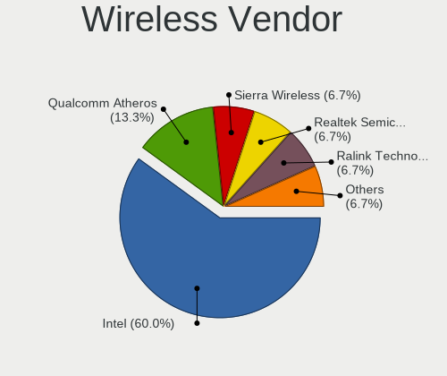

| Vendor                | Computers | Percent |
|-----------------------|-----------|---------|
| Intel                 | 9         | 60%     |
| Qualcomm Atheros      | 2         | 13.33%  |
| Sierra Wireless       | 1         | 6.67%   |
| Realtek Semiconductor | 1         | 6.67%   |
| Ralink Technology     | 1         | 6.67%   |
| Dell                  | 1         | 6.67%   |

Wireless Model
--------------

Wireless models

| Model                                                      | Computers | Percent |
|------------------------------------------------------------|-----------|---------|
| Intel Wireless 8265 / 8275                                 | 3         | 20%     |
| Intel Wireless 8260                                        | 3         | 20%     |
| Sierra Wireless EM7455 Qualcomm Snapdragon X7 LTE-A        | 1         | 6.67%   |
| Realtek RTL8822BE 802.11a/b/g/n/ac WiFi adapter            | 1         | 6.67%   |
| Ralink RT5372 Wireless Adapter                             | 1         | 6.67%   |
| Qualcomm Atheros QCA6174 802.11ac Wireless Network Adapter | 1         | 6.67%   |
| Qualcomm Atheros AR9485 Wireless Network Adapter           | 1         | 6.67%   |
| Intel Wi-Fi 6 AX200                                        | 1         | 6.67%   |
| Intel Cannon Point-LP CNVi [Wireless-AC]                   | 1         | 6.67%   |
| Intel Cannon Lake PCH CNVi WiFi                            | 1         | 6.67%   |
| Dell DW5811e Snapdragon™ X7 LTE                       | 1         | 6.67%   |

Ethernet Vendor
---------------

Ethernet vendors

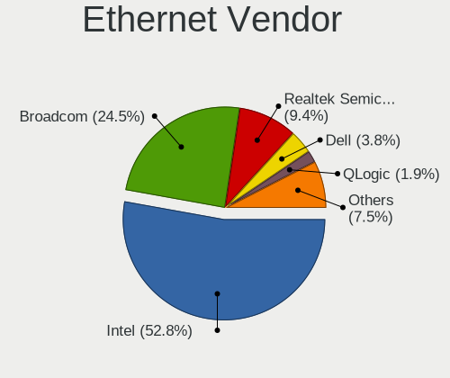

| Vendor                | Computers | Percent |
|-----------------------|-----------|---------|
| Intel                 | 28        | 52.83%  |
| Broadcom              | 13        | 24.53%  |
| Realtek Semiconductor | 5         | 9.43%   |
| Dell                  | 2         | 3.77%   |
| QLogic                | 1         | 1.89%   |
| OPPO Electronics      | 1         | 1.89%   |
| Mellanox Technologies | 1         | 1.89%   |
| Emulex                | 1         | 1.89%   |
| ASIX Electronics      | 1         | 1.89%   |

Ethernet Model
--------------

Ethernet models

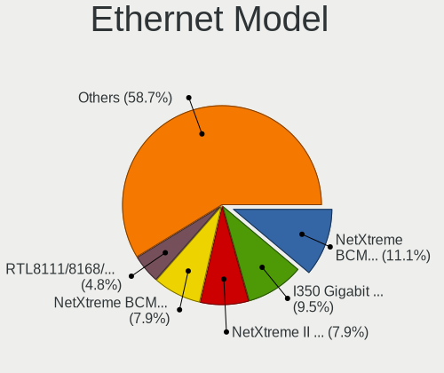

| Model                                                             | Computers | Percent |
|-------------------------------------------------------------------|-----------|---------|
| Broadcom NetXtreme BCM5720 Gigabit Ethernet PCIe                  | 7         | 11.11%  |
| Intel I350 Gigabit Network Connection                             | 6         | 9.52%   |
| Broadcom NetXtreme II BCM57810 10 Gigabit Ethernet                | 5         | 7.94%   |
| Broadcom NetXtreme BCM5719 Gigabit Ethernet PCIe                  | 5         | 7.94%   |
| Realtek RTL8111/8168/8411 PCI Express Gigabit Ethernet Controller | 3         | 4.76%   |
| Realtek RTL8153 Gigabit Ethernet Adapter                          | 2         | 3.17%   |
| Intel Ethernet Controller X550                                    | 2         | 3.17%   |
| Intel Ethernet Connection I217-LM                                 | 2         | 3.17%   |
| Intel Ethernet Connection (6) I219-V                              | 2         | 3.17%   |
| Intel Ethernet Connection (5) I219-LM                             | 2         | 3.17%   |
| Intel 82599ES 10-Gigabit SFI/SFP+ Network Connection              | 2         | 3.17%   |
| Intel 82599 10 Gigabit Network Connection                         | 2         | 3.17%   |
| Intel 82599 10 Gigabit Dual Port Backplane Connection             | 2         | 3.17%   |
| Intel 82576 Gigabit Network Connection                            | 2         | 3.17%   |
| Dell iDRAC Virtual NIC                                            | 2         | 3.17%   |
| QLogic cLOM8214 1/10GbE Controller                                | 1         | 1.59%   |
| OPPO SM8350-IDP _SN:27BAACC8                                      | 1         | 1.59%   |
| Mellanox MT27710 Family [ConnectX-4 Lx]                           | 1         | 1.59%   |
| Intel Ethernet Controller I225-LM                                 | 1         | 1.59%   |
| Intel Ethernet Connection I219-LM                                 | 1         | 1.59%   |
| Intel Ethernet Connection (7) I219-LM                             | 1         | 1.59%   |
| Intel Ethernet Connection (6) I219-LM                             | 1         | 1.59%   |
| Intel Ethernet Connection (4) I219-V                              | 1         | 1.59%   |
| Intel Ethernet Connection (4) I219-LM                             | 1         | 1.59%   |
| Intel Ethernet Connection (2) I219-V                              | 1         | 1.59%   |
| Intel Ethernet Connection (2) I219-LM                             | 1         | 1.59%   |
| Intel 82579LM Gigabit Network Connection (Lewisville)             | 1         | 1.59%   |
| Intel 82574L Gigabit Network Connection                           | 1         | 1.59%   |
| Intel 82571EB/82571GB Gigabit Ethernet Controller (Copper)        | 1         | 1.59%   |
| Intel 82567LM-3 Gigabit Network Connection                        | 1         | 1.59%   |
| Emulex OneConnect NIC (Skyhawk)                                   | 1         | 1.59%   |
| ASIX AX88179 Gigabit Ethernet                                     | 1         | 1.59%   |

Net Controller Kind
-------------------

Ethernet, WiFi or modem

| Kind     | Computers | Percent |
|----------|-----------|---------|
| Ethernet | 43        | 74.14%  |
| WiFi     | 13        | 22.41%  |
| Modem    | 2         | 3.45%   |

Used Controller
---------------

Currently used network controller

| Kind     | Computers | Percent |
|----------|-----------|---------|
| Ethernet | 33        | 78.57%  |
| WiFi     | 9         | 21.43%  |

NICs
----

Total network controllers on board

| Total | Computers | Percent |
|-------|-----------|---------|
| 2     | 17        | 38.64%  |
| 1     | 10        | 22.73%  |
| 4     | 8         | 18.18%  |
| 6     | 5         | 11.36%  |
| 12    | 1         | 2.27%   |
| 5     | 1         | 2.27%   |
| 3     | 1         | 2.27%   |
| 0     | 1         | 2.27%   |

IPv6
----

IPv6 vs IPv4

| Used | Computers | Percent |
|------|-----------|---------|
| No   | 42        | 95.45%  |
| Yes  | 2         | 4.55%   |

Bluetooth
---------

Bluetooth Vendor
----------------

Controller vendors

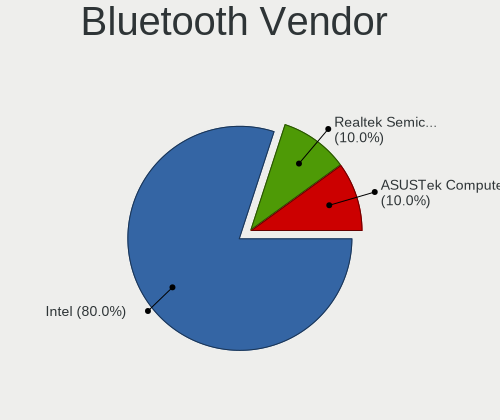

| Vendor                | Computers | Percent |
|-----------------------|-----------|---------|
| Intel                 | 8         | 80%     |
| Realtek Semiconductor | 1         | 10%     |
| ASUSTek Computer      | 1         | 10%     |

Bluetooth Model
---------------

Controller models

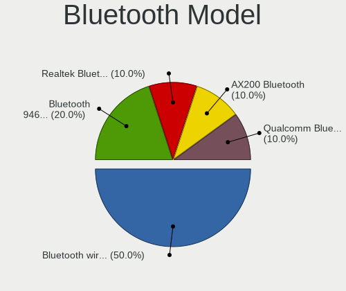

| Model                                          | Computers | Percent |
|------------------------------------------------|-----------|---------|
| Intel Bluetooth wireless interface             | 5         | 50%     |
| Intel Bluetooth 9460/9560 Jefferson Peak (JfP) | 2         | 20%     |
| Realtek  Bluetooth 4.2 Adapter                 | 1         | 10%     |
| Intel AX200 Bluetooth                          | 1         | 10%     |
| ASUS Qualcomm Bluetooth 4.1                    | 1         | 10%     |

Sound
-----

Sound Vendor
------------

Sound card vendors

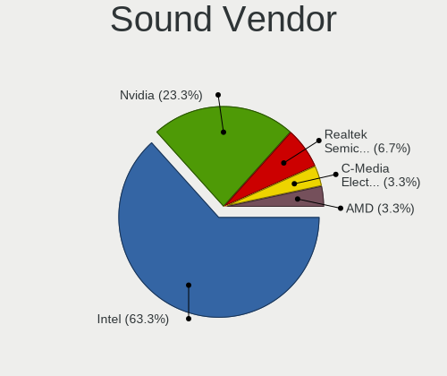

| Vendor                | Computers | Percent |
|-----------------------|-----------|---------|
| Intel                 | 19        | 63.33%  |
| Nvidia                | 7         | 23.33%  |
| Realtek Semiconductor | 2         | 6.67%   |
| C-Media Electronics   | 1         | 3.33%   |
| AMD                   | 1         | 3.33%   |

Sound Model
-----------

Sound card models

| Model                                                                             | Computers | Percent |
|-----------------------------------------------------------------------------------|-----------|---------|
| Nvidia GP107GL High Definition Audio Controller                                   | 3         | 9.68%   |
| Intel Sunrise Point-LP HD Audio                                                   | 3         | 9.68%   |
| Realtek Semiconductor USB Audio                                                   | 2         | 6.45%   |
| Nvidia GF119 HDMI Audio Controller                                                | 2         | 6.45%   |
| Intel Cannon Point-LP High Definition Audio Controller                            | 2         | 6.45%   |
| Intel 200 Series PCH HD Audio                                                     | 2         | 6.45%   |
| Intel 100 Series/C230 Series Chipset Family HD Audio Controller                   | 2         | 6.45%   |
| Nvidia GF116 High Definition Audio Controller                                     | 1         | 3.23%   |
| Nvidia GF108 High Definition Audio Controller                                     | 1         | 3.23%   |
| Intel Xeon E3-1200 v3/4th Gen Core Processor HD Audio Controller                  | 1         | 3.23%   |
| Intel Tiger Lake-H HD Audio Controller                                            | 1         | 3.23%   |
| Intel Comet Lake PCH-LP cAVS                                                      | 1         | 3.23%   |
| Intel CM238 HD Audio Controller                                                   | 1         | 3.23%   |
| Intel Cannon Lake PCH cAVS                                                        | 1         | 3.23%   |
| Intel C610/X99 series chipset HD Audio Controller                                 | 1         | 3.23%   |
| Intel C600/X79 series chipset High Definition Audio Controller                    | 1         | 3.23%   |
| Intel 82801JI (ICH10 Family) HD Audio Controller                                  | 1         | 3.23%   |
| Intel 82801JD/DO (ICH10 Family) HD Audio Controller                               | 1         | 3.23%   |
| Intel 8 Series/C220 Series Chipset High Definition Audio Controller               | 1         | 3.23%   |
| Intel 7 Series/C216 Chipset Family High Definition Audio Controller               | 1         | 3.23%   |
| C-Media Electronics USB Advanced Audio Device                                     | 1         | 3.23%   |
| AMD Caicos HDMI Audio [Radeon HD 6450 / 7450/8450/8490 OEM / R5 230/235/235X OEM] | 1         | 3.23%   |

Memory
------

Memory Vendor
-------------

Memory module vendors

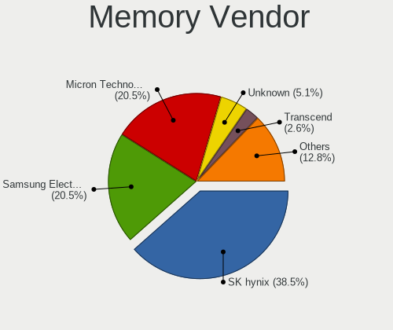

| Vendor              | Computers | Percent |
|---------------------|-----------|---------|
| SK hynix            | 15        | 38.46%  |
| Samsung Electronics | 8         | 20.51%  |
| Micron Technology   | 8         | 20.51%  |
| Unknown             | 2         | 5.13%   |
| Transcend           | 1         | 2.56%   |
| Kingston            | 1         | 2.56%   |
| Hewlett-Packard     | 1         | 2.56%   |
| G.Skill             | 1         | 2.56%   |
| Elpida              | 1         | 2.56%   |
| Crucial             | 1         | 2.56%   |

Memory Model
------------

Memory module models

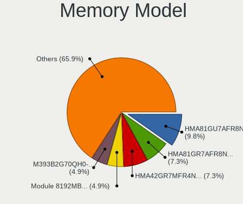

| Model                                                   | Computers | Percent |
|---------------------------------------------------------|-----------|---------|
| SK hynix RAM HMA81GU7AFR8N-UH 8GB DIMM DDR4 2400MT/s    | 4         | 9.76%   |
| SK hynix RAM HMA81GR7AFR8N-VK 8192MB DIMM DDR4 2666MT/s | 3         | 7.32%   |
| SK hynix RAM HMA42GR7MFR4N-TF 16GB DIMM DDR4 2133MT/s   | 3         | 7.32%   |
| Unknown RAM Module 8192MB DIMM DDR3 1600MT/s            | 2         | 4.88%   |
| SK hynix RAM HMA82GR7MFR8N-UH 16GB DIMM DDR4 2400MT/s   | 2         | 4.88%   |
| Samsung RAM M393B2G70QH0-YK0 16GB DIMM DDR3 1600MT/s    | 2         | 4.88%   |
| Micron RAM 36ASF2G72PZ-2G1A2 16GB DIMM DDR4 2133MT/s    | 2         | 4.88%   |
| Transcend RAM JM3200HSE-32G 32GB SODIMM DDR4 3200MT/s   | 1         | 2.44%   |
| SK hynix RAM HMA84GR7CJR4N-WM 32GB DIMM DDR4 2933MT/s   | 1         | 2.44%   |
| SK hynix RAM HMA81GR7AFR8N-VK 8GB DIMM DDR4 2666MT/s    | 1         | 2.44%   |
| SK hynix RAM HMA451S6AFR8N-TF 4GB SODIMM DDR4 2133MT/s  | 1         | 2.44%   |
| Samsung RAM M471A4G43AB1-CWE 32GB SODIMM DDR4 3200MT/s  | 1         | 2.44%   |
| Samsung RAM M471A2K43CB1-CRC 16GB SODIMM DDR4 2667MT/s  | 1         | 2.44%   |
| Samsung RAM M393B5173FHD-CF8 4096MB DIMM 1066MT/s       | 1         | 2.44%   |
| Samsung RAM M393A4K40DB3-CWE 32GB DIMM DDR4 3200MT/s    | 1         | 2.44%   |
| Samsung RAM M393A2G40DB0-CPB 16GB DIMM DDR4 2133MT/s    | 1         | 2.44%   |
| Samsung RAM M3 78T5663EH3-CF7 2GB DIMM DDR2 800MT/s     | 1         | 2.44%   |
| Samsung RAM M3 78T2863EHS-CF7 1GB DIMM DDR2 800MT/s     | 1         | 2.44%   |
| Micron RAM 9ASF51272PZ-2G3B1 4GB RIMM DDR4 2400MT/s     | 1         | 2.44%   |
| Micron RAM 9ASF1G72AZ-2G3B1 8GB DIMM DDR4 2400MT/s      | 1         | 2.44%   |
| Micron RAM 36KSF2G72PZ-1G6E1 16GB DIMM DDR3 1600MT/s    | 1         | 2.44%   |
| Micron RAM 36ASF4G72PZ-2G9E2 32GB DIMM DDR4 2933MT/s    | 1         | 2.44%   |
| Micron RAM 18KSF1G72PDZ-1G6E 8192MB DIMM DDR3 1333MT/s  | 1         | 2.44%   |
| Micron RAM 18ASF2G72PDZ-2G6E1 16GB DIMM DDR4 2667MT/s   | 1         | 2.44%   |
| Kingston RAM 9965589-026.D00G 8192MB RIMM DDR4 2400MT/s | 1         | 2.44%   |
| HP RAM 712382-071 8192MB DIMM DDR3 1866MT/s             | 1         | 2.44%   |
| G.Skill RAM F4-3200C14-16GTZ 16GB DIMM DDR4 3600MT/s    | 1         | 2.44%   |
| Elpida RAM EDFA232A2MA-JD-F 4GB SODIMM LPDDR3 1867MT/s  | 1         | 2.44%   |
| Elpida RAM EDFA232A2MA-JD-F 4GB Chip LPDDR3 1867MT/s    | 1         | 2.44%   |
| Crucial RAM BLT4G3D1608ET3LX0. 4GB DIMM DDR3 1600MT/s   | 1         | 2.44%   |

Memory Kind
-----------

Memory module kinds

| Kind    | Computers | Percent |
|---------|-----------|---------|
| DDR4    | 23        | 62.16%  |
| DDR3    | 7         | 18.92%  |
| DRAM    | 3         | 8.11%   |
| SDRAM   | 1         | 2.7%    |
| LPDDR3  | 1         | 2.7%    |
| DDR2    | 1         | 2.7%    |
| Unknown | 1         | 2.7%    |

Memory Form Factor
------------------

Physical design of the memory module

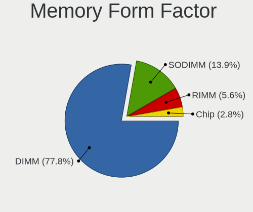

| Name   | Computers | Percent |
|--------|-----------|---------|
| DIMM   | 28        | 77.78%  |
| SODIMM | 5         | 13.89%  |
| RIMM   | 2         | 5.56%   |
| Chip   | 1         | 2.78%   |

Memory Size
-----------

Memory module size

| Size  | Computers | Percent |
|-------|-----------|---------|
| 8192  | 14        | 38.89%  |
| 16384 | 12        | 33.33%  |
| 4096  | 5         | 13.89%  |
| 32768 | 3         | 8.33%   |
| 2048  | 1         | 2.78%   |
| 1024  | 1         | 2.78%   |

Memory Speed
------------

Memory module speed

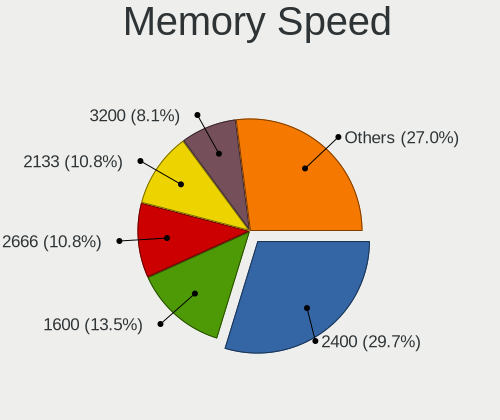

| Speed | Computers | Percent |
|-------|-----------|---------|
| 2400  | 9         | 24.32%  |
| 2133  | 6         | 16.22%  |
| 1600  | 5         | 13.51%  |
| 2666  | 4         | 10.81%  |
| 3200  | 3         | 8.11%   |
| 2667  | 2         | 5.41%   |
| 3600  | 1         | 2.7%    |
| 2933  | 1         | 2.7%    |
| 2048  | 1         | 2.7%    |
| 1867  | 1         | 2.7%    |
| 1866  | 1         | 2.7%    |
| 1333  | 1         | 2.7%    |
| 1066  | 1         | 2.7%    |
| 800   | 1         | 2.7%    |

Printers & scanners
-------------------

Printer Vendor
--------------

Printer device vendors

Zero info for selected period =(

Printer Model
-------------

Printer device models

Zero info for selected period =(

Scanner Vendor
--------------

Scanner device vendors

Zero info for selected period =(

Scanner Model
-------------

Scanner device models

Zero info for selected period =(

Camera
------

Camera Vendor
-------------

Camera device vendors

| Vendor                                 | Computers | Percent |
|----------------------------------------|-----------|---------|
| Chicony Electronics                    | 4         | 36.36%  |
| Microdia                               | 2         | 18.18%  |
| IMC Networks                           | 2         | 18.18%  |
| Realtek Semiconductor                  | 1         | 9.09%   |
| Cheng Uei Precision Industry (Foxlink) | 1         | 9.09%   |
| Bison Electronics                      | 1         | 9.09%   |

Camera Model
------------

Camera device models

| Model                                                 | Computers | Percent |
|-------------------------------------------------------|-----------|---------|
| Microdia Integrated_Webcam_HD                         | 2         | 16.67%  |
| IMC Networks Integrated Camera                        | 2         | 16.67%  |
| Chicony Integrated Camera                             | 2         | 16.67%  |
| Realtek Integrated_Webcam_HD                          | 1         | 8.33%   |
| Chicony Integrated IR Camera                          | 1         | 8.33%   |
| Chicony Integrated Camera (1280x720@30)               | 1         | 8.33%   |
| Chicony HP HD Camera                                  | 1         | 8.33%   |
| Cheng Uei Precision Industry (Foxlink) Full HD Camera | 1         | 8.33%   |
| Bison Lenovo Integrated Webcam                        | 1         | 8.33%   |

Security
--------

Fingerprint Vendor
------------------

Fingerprint sensor vendors

| Vendor           | Computers | Percent |
|------------------|-----------|---------|
| Synaptics        | 4         | 66.67%  |
| Validity Sensors | 2         | 33.33%  |

Fingerprint Model
-----------------

Fingerprint sensor models

| Model                                             | Computers | Percent |
|---------------------------------------------------|-----------|---------|
| Synaptics Metallica MIS Touch Fingerprint Reader  | 2         | 33.33%  |
| Validity Sensors VFS7500 Touch Fingerprint Sensor | 1         | 16.67%  |
| Validity Sensors Synaptics WBDI                   | 1         | 16.67%  |
| Synaptics Prometheus MIS Touch Fingerprint Reader | 1         | 16.67%  |
| Synaptics Fingerprint reader [HP G6]              | 1         | 16.67%  |

Chipcard Vendor
---------------

Chipcard module vendors

| Vendor   | Computers | Percent |
|----------|-----------|---------|
| Broadcom | 2         | 66.67%  |
| OmniKey  | 1         | 33.33%  |

Chipcard Model
--------------

Chipcard module models

| Model                                          | Computers | Percent |
|------------------------------------------------|-----------|---------|
| OmniKey CardMan 3121 (HID Technologies)        | 1         | 33.33%  |
| Broadcom BCM5880 Secure Applications Processor | 1         | 33.33%  |
| Broadcom 5880                                  | 1         | 33.33%  |

Unsupported
-----------

Unsupported Devices
-------------------

Total unsupported devices on board

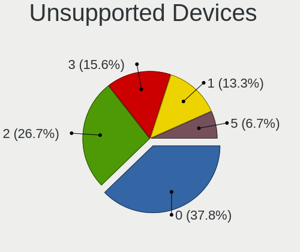

| Total | Computers | Percent |
|-------|-----------|---------|
| 0     | 17        | 37.78%  |
| 2     | 11        | 24.44%  |
| 3     | 7         | 15.56%  |
| 1     | 7         | 15.56%  |
| 5     | 3         | 6.67%   |

Unsupported Device Types
------------------------

Types of unsupported devices

| Type                     | Computers | Percent |
|--------------------------|-----------|---------|
| Communication controller | 18        | 31.58%  |
| Unassigned class         | 14        | 24.56%  |
| Graphics card            | 14        | 24.56%  |
| Fingerprint reader       | 6         | 10.53%  |
| Storage/raid             | 1         | 1.75%   |
| Net/wireless             | 1         | 1.75%   |
| Net/ethernet             | 1         | 1.75%   |
| Card reader              | 1         | 1.75%   |
| Camera                   | 1         | 1.75%   |

