RHEL 8 - Tested Hardware & Statistics
-------------------------------------

A project to collect tested hardware configurations for RHEL 8.

Anyone can contribute to this report by the [hw-probe](https://github.com/linuxhw/hw-probe) tool:

    sudo -E hw-probe -all -upload

Please contribute! Especially if your hardware is rare.

This is a report for all computer types. See also reports for [desktops](/Dist/RHEL_8/Desktop/README.md) and [notebooks](/Dist/RHEL_8/Notebook/README.md).

Contents
--------

* [ Test Cases ](#test-cases)

* [ System ](#system)
  - [ Kernel                   ](#kernel)
  - [ Kernel Family            ](#kernel-family)
  - [ Kernel Major Ver.        ](#kernel-major-ver)
  - [ Arch                     ](#arch)
  - [ DE                       ](#de)
  - [ Display Server           ](#display-server)
  - [ Display Manager          ](#display-manager)
  - [ OS Lang                  ](#os-lang)
  - [ Boot Mode                ](#boot-mode)
  - [ Filesystem               ](#filesystem)
  - [ Part. scheme             ](#part-scheme)
  - [ Dual Boot with Linux/BSD ](#dual-boot-with-linuxbsd)
  - [ Dual Boot (Win)          ](#dual-boot-win)

* [ Board ](#board)
  - [ Vendor                   ](#vendor)
  - [ Model                    ](#model)
  - [ Model Family             ](#model-family)
  - [ MFG Year                 ](#mfg-year)
  - [ Form Factor              ](#form-factor)
  - [ Secure Boot              ](#secure-boot)
  - [ Coreboot                 ](#coreboot)
  - [ RAM Size                 ](#ram-size)
  - [ RAM Used                 ](#ram-used)
  - [ Total Drives             ](#total-drives)
  - [ Has CD-ROM               ](#has-cd-rom)
  - [ Has Ethernet             ](#has-ethernet)
  - [ Has WiFi                 ](#has-wifi)
  - [ Has Bluetooth            ](#has-bluetooth)

* [ Location ](#location)
  - [ Country                  ](#country)
  - [ City                     ](#city)

* [ Drives ](#drives)
  - [ Drive Vendor             ](#drive-vendor)
  - [ Drive Model              ](#drive-model)
  - [ HDD Vendor               ](#hdd-vendor)
  - [ SSD Vendor               ](#ssd-vendor)
  - [ Drive Kind               ](#drive-kind)
  - [ Drive Connector          ](#drive-connector)
  - [ Drive Size               ](#drive-size)
  - [ Space Total              ](#space-total)
  - [ Space Used               ](#space-used)
  - [ Malfunc. Drives          ](#malfunc-drives)
  - [ Malfunc. Drive Vendor    ](#malfunc-drive-vendor)
  - [ Malfunc. HDD Vendor      ](#malfunc-hdd-vendor)
  - [ Malfunc. Drive Kind      ](#malfunc-drive-kind)
  - [ Failed Drives            ](#failed-drives)
  - [ Failed Drive Vendor      ](#failed-drive-vendor)
  - [ Drive Status             ](#drive-status)

* [ Storage controller ](#storage-controller)
  - [ Storage Vendor           ](#storage-vendor)
  - [ Storage Model            ](#storage-model)
  - [ Storage Kind             ](#storage-kind)

* [ Processor ](#processor)
  - [ CPU Vendor               ](#cpu-vendor)
  - [ CPU Model                ](#cpu-model)
  - [ CPU Model Family         ](#cpu-model-family)
  - [ CPU Cores                ](#cpu-cores)
  - [ CPU Sockets              ](#cpu-sockets)
  - [ CPU Threads              ](#cpu-threads)
  - [ CPU Op-Modes             ](#cpu-op-modes)
  - [ CPU Microcode            ](#cpu-microcode)
  - [ CPU Microarch            ](#cpu-microarch)

* [ Graphics ](#graphics)
  - [ GPU Vendor               ](#gpu-vendor)
  - [ GPU Model                ](#gpu-model)
  - [ GPU Combo                ](#gpu-combo)
  - [ GPU Driver               ](#gpu-driver)
  - [ GPU Memory               ](#gpu-memory)

* [ Monitor ](#monitor)
  - [ Monitor Vendor           ](#monitor-vendor)
  - [ Monitor Model            ](#monitor-model)
  - [ Monitor Resolution       ](#monitor-resolution)
  - [ Monitor Diagonal         ](#monitor-diagonal)
  - [ Monitor Width            ](#monitor-width)
  - [ Aspect Ratio             ](#aspect-ratio)
  - [ Monitor Area             ](#monitor-area)
  - [ Pixel Density            ](#pixel-density)
  - [ Multiple Monitors        ](#multiple-monitors)

* [ Network ](#network)
  - [ Net Controller Vendor    ](#net-controller-vendor)
  - [ Net Controller Model     ](#net-controller-model)
  - [ Wireless Vendor          ](#wireless-vendor)
  - [ Wireless Model           ](#wireless-model)
  - [ Ethernet Vendor          ](#ethernet-vendor)
  - [ Ethernet Model           ](#ethernet-model)
  - [ Net Controller Kind      ](#net-controller-kind)
  - [ Used Controller          ](#used-controller)
  - [ NICs                     ](#nics)
  - [ IPv6                     ](#ipv6)

* [ Bluetooth ](#bluetooth)
  - [ Bluetooth Vendor         ](#bluetooth-vendor)
  - [ Bluetooth Model          ](#bluetooth-model)

* [ Sound ](#sound)
  - [ Sound Vendor             ](#sound-vendor)
  - [ Sound Model              ](#sound-model)

* [ Memory ](#memory)
  - [ Memory Vendor            ](#memory-vendor)
  - [ Memory Model             ](#memory-model)
  - [ Memory Kind              ](#memory-kind)
  - [ Memory Form Factor       ](#memory-form-factor)
  - [ Memory Size              ](#memory-size)
  - [ Memory Speed             ](#memory-speed)

* [ Printers & scanners ](#printers--scanners)
  - [ Printer Vendor           ](#printer-vendor)
  - [ Printer Model            ](#printer-model)
  - [ Scanner Vendor           ](#scanner-vendor)
  - [ Scanner Model            ](#scanner-model)

* [ Camera ](#camera)
  - [ Camera Vendor            ](#camera-vendor)
  - [ Camera Model             ](#camera-model)

* [ Security ](#security)
  - [ Fingerprint Vendor       ](#fingerprint-vendor)
  - [ Fingerprint Model        ](#fingerprint-model)
  - [ Chipcard Vendor          ](#chipcard-vendor)
  - [ Chipcard Model           ](#chipcard-model)

* [ Unsupported ](#unsupported)
  - [ Unsupported Devices      ](#unsupported-devices)
  - [ Unsupported Device Types ](#unsupported-device-types)

Test Cases
----------

Total: 279

| Vendor        | Model                       | Form-Factor | Probe                                                      | Date         |
|---------------|-----------------------------|-------------|------------------------------------------------------------|--------------|
| Lenovo        | ThinkPad P17 Gen 2i 20YU... | Notebook    | [8656acec04](https://linux-hardware.org/?probe=8656acec04) | Sep 14, 2022 |
| Lenovo        | ThinkPad P17 Gen 2i 20YU... | Notebook    | [23649c49e3](https://linux-hardware.org/?probe=23649c49e3) | Sep 14, 2022 |
| Gigabyte      | Z590I VISION D              | Desktop     | [22131a6ec5](https://linux-hardware.org/?probe=22131a6ec5) | Sep 03, 2022 |
| Lenovo        | ThinkPad P17 Gen 2i 20YU... | Notebook    | [3df0bebc37](https://linux-hardware.org/?probe=3df0bebc37) | Aug 03, 2022 |
| Lenovo        | ThinkPad E15 Gen 2 20T80... | Notebook    | [2566bb66dd](https://linux-hardware.org/?probe=2566bb66dd) | Jul 12, 2022 |
| Lenovo        | ThinkPad P17 Gen 2i 20YU... | Notebook    | [71c31086e6](https://linux-hardware.org/?probe=71c31086e6) | Jul 11, 2022 |
| Lenovo        | ThinkPad P17 Gen 2i 20YU... | Notebook    | [714c212f51](https://linux-hardware.org/?probe=714c212f51) | Jul 08, 2022 |
| Lenovo        | ThinkPad T14s Gen 1 20T1... | Notebook    | [7e2ddf75e5](https://linux-hardware.org/?probe=7e2ddf75e5) | Jun 30, 2022 |
| Lenovo        | ThinkPad T480 20L60034MX    | Notebook    | [179d10e315](https://linux-hardware.org/?probe=179d10e315) | Jun 21, 2022 |
| Unknown       | A06                         | Server      | [aca491bb91](https://linux-hardware.org/?probe=aca491bb91) | Jun 21, 2022 |
| Unknown       | A06                         | Server      | [3bf8edf992](https://linux-hardware.org/?probe=3bf8edf992) | Jun 18, 2022 |
| Supermicro    | X10DRi                      | Server      | [0cf218f7bf](https://linux-hardware.org/?probe=0cf218f7bf) | Jun 16, 2022 |
| Lenovo        | ThinkPad T14s Gen 1 20T1... | Notebook    | [d77ce7a3f7](https://linux-hardware.org/?probe=d77ce7a3f7) | Jun 13, 2022 |
| Lenovo        | ThinkPad T15 Gen 2i 20W5... | Notebook    | [8ee33363ef](https://linux-hardware.org/?probe=8ee33363ef) | May 30, 2022 |
| AMI           | Aptio CRB                   | Mini pc     | [372a1d69d7](https://linux-hardware.org/?probe=372a1d69d7) | May 27, 2022 |
| Dell          | 02K9CR A03                  | Desktop     | [5656d7a0d5](https://linux-hardware.org/?probe=5656d7a0d5) | May 27, 2022 |
| Dell          | 0N4YC8 A00                  | Desktop     | [74525891a0](https://linux-hardware.org/?probe=74525891a0) | May 26, 2022 |
| HP            | ENVY x360 Convertible 15... | Convertible | [f08ef13508](https://linux-hardware.org/?probe=f08ef13508) | May 26, 2022 |
| Lenovo        | Legion 5 15ACH6 82JW        | Notebook    | [9a3948a7e8](https://linux-hardware.org/?probe=9a3948a7e8) | May 23, 2022 |
| Lenovo        | Legion 5 15ACH6 82JW        | Notebook    | [2e520c1e13](https://linux-hardware.org/?probe=2e520c1e13) | May 23, 2022 |
| Lenovo        | Legion 5 15ACH6 82JW        | Notebook    | [9be915450d](https://linux-hardware.org/?probe=9be915450d) | May 23, 2022 |
| Lenovo        | ThinkPad T14s Gen 1 20T1... | Notebook    | [0b0ffcbfee](https://linux-hardware.org/?probe=0b0ffcbfee) | May 13, 2022 |
| ASUSTek       | VivoBook_ASUSLaptop X409... | Notebook    | [61e54407f3](https://linux-hardware.org/?probe=61e54407f3) | May 04, 2022 |
| ASUSTek       | VivoBook_ASUSLaptop X409... | Notebook    | [7d0cabeccf](https://linux-hardware.org/?probe=7d0cabeccf) | May 04, 2022 |
| Lenovo        | ThinkPad T480 20L6S29D02    | Notebook    | [1eb07120eb](https://linux-hardware.org/?probe=1eb07120eb) | Apr 29, 2022 |
| Lenovo        | ThinkPad T14 Gen 1 20S1S... | Notebook    | [a3ddc714b0](https://linux-hardware.org/?probe=a3ddc714b0) | Apr 28, 2022 |
| Lenovo        | ThinkPad T590 20N5S2NC0V    | Notebook    | [d6bf3c27ef](https://linux-hardware.org/?probe=d6bf3c27ef) | Apr 20, 2022 |
| Dell          | Precision 5550              | Notebook    | [949f4a7658](https://linux-hardware.org/?probe=949f4a7658) | Apr 19, 2022 |
| Lenovo        | 3132 SDK0K17763 WIN 1801... | Desktop     | [a6e43346ba](https://linux-hardware.org/?probe=a6e43346ba) | Apr 16, 2022 |
| ASUSTek       | X99-DELUXE II               | Desktop     | [82939dc69f](https://linux-hardware.org/?probe=82939dc69f) | Apr 05, 2022 |
| CX / Air C... | CX-H87-M1                   | Desktop     | [ddfbf2df5e](https://linux-hardware.org/?probe=ddfbf2df5e) | Apr 01, 2022 |
| CX / Air C... | CX-H87-M1                   | Desktop     | [5a8ee938ce](https://linux-hardware.org/?probe=5a8ee938ce) | Apr 01, 2022 |
| Lenovo        | ThinkPad P17 Gen 2i 20YU... | Notebook    | [7763003308](https://linux-hardware.org/?probe=7763003308) | Mar 31, 2022 |
| Dell          | Precision 7560              | Notebook    | [2abd72978c](https://linux-hardware.org/?probe=2abd72978c) | Mar 29, 2022 |
| ASRock        | X99E-ITX/ac                 | Desktop     | [0cf67f0201](https://linux-hardware.org/?probe=0cf67f0201) | Mar 06, 2022 |
| ASRock        | X570 Steel Legend           | Desktop     | [e7843ce1cf](https://linux-hardware.org/?probe=e7843ce1cf) | Mar 05, 2022 |
| ASUSTek       | Maximus VII FORMULA         | Desktop     | [7fd2e4885c](https://linux-hardware.org/?probe=7fd2e4885c) | Mar 05, 2022 |
| Lenovo        | ThinkPad P17 Gen 2i 20YU... | Notebook    | [14ea45c4d7](https://linux-hardware.org/?probe=14ea45c4d7) | Mar 03, 2022 |
| Lenovo        | ThinkPad P1 Gen 3 20TJS2... | Notebook    | [eed6e0f012](https://linux-hardware.org/?probe=eed6e0f012) | Mar 01, 2022 |
| Lenovo        | Z40-70 20366                | Notebook    | [5210de65b3](https://linux-hardware.org/?probe=5210de65b3) | Feb 27, 2022 |
| Gigabyte      | B150-HD3-CF                 | Desktop     | [cab21caab7](https://linux-hardware.org/?probe=cab21caab7) | Feb 10, 2022 |
| Lenovo        | ThinkPad T14s Gen 1 20T1... | Notebook    | [081fe975ce](https://linux-hardware.org/?probe=081fe975ce) | Feb 07, 2022 |
| ASUSTek       | Maximus VII FORMULA         | Desktop     | [36c52eaf3d](https://linux-hardware.org/?probe=36c52eaf3d) | Feb 05, 2022 |
| Lenovo        | ThinkPad X1 Yoga 1st 20F... | Notebook    | [7b31f4ca0b](https://linux-hardware.org/?probe=7b31f4ca0b) | Feb 05, 2022 |
| Lenovo        | ThinkPad P17 Gen 2i 20YU... | Notebook    | [b3ef38d0ef](https://linux-hardware.org/?probe=b3ef38d0ef) | Jan 31, 2022 |
| Lenovo        | ThinkPad T490 20N3S5DV0S    | Notebook    | [e619ec0303](https://linux-hardware.org/?probe=e619ec0303) | Jan 31, 2022 |
| ASUSTek       | Maximus VII FORMULA         | Desktop     | [07de603a4a](https://linux-hardware.org/?probe=07de603a4a) | Jan 31, 2022 |
| Lenovo        | ThinkPad P17 Gen 2i 20YU... | Notebook    | [a60504e123](https://linux-hardware.org/?probe=a60504e123) | Jan 29, 2022 |
| HP            | EliteBook 8460p             | Notebook    | [335a0c0490](https://linux-hardware.org/?probe=335a0c0490) | Jan 28, 2022 |
| Gigabyte      | Z97N-WIFI                   | Desktop     | [5808f89618](https://linux-hardware.org/?probe=5808f89618) | Jan 07, 2022 |
| ASUSTek       | X550VX                      | Notebook    | [d7ef034908](https://linux-hardware.org/?probe=d7ef034908) | Jan 03, 2022 |
| ASUSTek       | PRIME B360M-D               | Desktop     | [e3b3ac9f8b](https://linux-hardware.org/?probe=e3b3ac9f8b) | Jan 01, 2022 |
| Toshiba       | Satellite Pro R50-C         | Notebook    | [012f2de3d5](https://linux-hardware.org/?probe=012f2de3d5) | Dec 28, 2021 |
| Toshiba       | Satellite Pro R50-C         | Notebook    | [2e716df6c6](https://linux-hardware.org/?probe=2e716df6c6) | Dec 26, 2021 |
| Dell          | Precision 3551              | Notebook    | [cbddfb522a](https://linux-hardware.org/?probe=cbddfb522a) | Dec 21, 2021 |
| Lenovo        | ThinkPad P52 20MAS17205     | Notebook    | [86d1d49f33](https://linux-hardware.org/?probe=86d1d49f33) | Dec 09, 2021 |
| Lenovo        | ThinkPad P17 Gen 2i 20YU... | Notebook    | [ba46713703](https://linux-hardware.org/?probe=ba46713703) | Dec 07, 2021 |
| Acer          | Nitro AN515-54              | Notebook    | [cda3dbe636](https://linux-hardware.org/?probe=cda3dbe636) | Dec 04, 2021 |
| Lenovo        | ThinkPad P1 Gen 3 20TJS2... | Notebook    | [a4e5f602c4](https://linux-hardware.org/?probe=a4e5f602c4) | Dec 01, 2021 |
| Lenovo        | ThinkPad P17 Gen 2i 20YU... | Notebook    | [7cb04612a2](https://linux-hardware.org/?probe=7cb04612a2) | Nov 30, 2021 |
| Lenovo        | ThinkPad P17 Gen 2i 20YU... | Notebook    | [90eea91b30](https://linux-hardware.org/?probe=90eea91b30) | Nov 27, 2021 |
| HP            | EliteBook 840 G8 Noteboo... | Notebook    | [19fc23d020](https://linux-hardware.org/?probe=19fc23d020) | Nov 27, 2021 |
| Lenovo        | ThinkPad P17 Gen 2i 20YU... | Notebook    | [6827caed15](https://linux-hardware.org/?probe=6827caed15) | Nov 19, 2021 |
| Lenovo        | MAHOBAY                     | Desktop     | [ea1413bf9e](https://linux-hardware.org/?probe=ea1413bf9e) | Nov 19, 2021 |
| Lenovo        | ThinkPad T480 20L6S29E1T    | Notebook    | [df288ab5f0](https://linux-hardware.org/?probe=df288ab5f0) | Nov 18, 2021 |
| Lenovo        | ThinkPad P17 Gen 2i 20YU... | Notebook    | [f766090339](https://linux-hardware.org/?probe=f766090339) | Nov 16, 2021 |
| Lenovo        | ThinkPad P17 Gen 2i 20YU... | Notebook    | [ece232f046](https://linux-hardware.org/?probe=ece232f046) | Nov 11, 2021 |
| Lenovo        | ThinkPad P50 20ENS1L000     | Notebook    | [318b5aea2b](https://linux-hardware.org/?probe=318b5aea2b) | Nov 08, 2021 |
| Lenovo        | ThinkPad E490 20N8000JAD    | Notebook    | [997e24e5c9](https://linux-hardware.org/?probe=997e24e5c9) | Nov 06, 2021 |
| Lenovo        | ThinkPad E490 20N8000JAD    | Notebook    | [9d70a71c88](https://linux-hardware.org/?probe=9d70a71c88) | Nov 06, 2021 |
| ASUSTek       | PRIME B350M-A               | Desktop     | [d3d69e7587](https://linux-hardware.org/?probe=d3d69e7587) | Oct 24, 2021 |
| Lenovo        | ThinkPad T14s Gen 1 20T1... | Notebook    | [59dfcd3b23](https://linux-hardware.org/?probe=59dfcd3b23) | Oct 22, 2021 |
| ASUSTek       | Pro WS X570-ACE             | Desktop     | [07a5b3c465](https://linux-hardware.org/?probe=07a5b3c465) | Oct 16, 2021 |
| HP            | ZBook Firefly 15 inch G8... | Notebook    | [49d20bd238](https://linux-hardware.org/?probe=49d20bd238) | Oct 12, 2021 |
| ASUSTek       | PRIME B350M-A               | Desktop     | [66cd9bb2c9](https://linux-hardware.org/?probe=66cd9bb2c9) | Oct 09, 2021 |
| Lenovo        | ThinkPad P50 20ENS1L000     | Notebook    | [f8443770b9](https://linux-hardware.org/?probe=f8443770b9) | Oct 08, 2021 |
| ASUSTek       | Z87-DELUXE                  | Desktop     | [63b48dfa23](https://linux-hardware.org/?probe=63b48dfa23) | Oct 07, 2021 |
| Lenovo        | ThinkPad T490s 20NYS7K90... | Notebook    | [042f9bec29](https://linux-hardware.org/?probe=042f9bec29) | Oct 06, 2021 |
| HP            | 212B                        | Desktop     | [322371cc6a](https://linux-hardware.org/?probe=322371cc6a) | Oct 04, 2021 |
| ASUSTek       | Z87-DELUXE                  | Desktop     | [2792a3ef1c](https://linux-hardware.org/?probe=2792a3ef1c) | Oct 03, 2021 |
| Gigabyte      | Z97N-WIFI                   | Desktop     | [539316ac91](https://linux-hardware.org/?probe=539316ac91) | Sep 30, 2021 |
| Lenovo        | ThinkPad T470 20HES57W00    | Notebook    | [482453f90b](https://linux-hardware.org/?probe=482453f90b) | Sep 30, 2021 |
| Gigabyte      | Z97N-WIFI                   | Desktop     | [95ae5d0e04](https://linux-hardware.org/?probe=95ae5d0e04) | Sep 29, 2021 |
| Lenovo        | ThinkPad P1 Gen 3 20TJS2... | Notebook    | [a667466f62](https://linux-hardware.org/?probe=a667466f62) | Sep 17, 2021 |
| Lenovo        | ThinkPad P1 Gen 3 20TJS2... | Notebook    | [502a6b96a3](https://linux-hardware.org/?probe=502a6b96a3) | Sep 13, 2021 |
| Lenovo        | MAHOBAY                     | Desktop     | [fc498b8cb0](https://linux-hardware.org/?probe=fc498b8cb0) | Sep 10, 2021 |
| ASUSTek       | PRIME B350M-A               | Desktop     | [35fa4b96f4](https://linux-hardware.org/?probe=35fa4b96f4) | Sep 09, 2021 |
| Lenovo        | ThinkPad X230 Tablet 343... | Notebook    | [daadb8ccc0](https://linux-hardware.org/?probe=daadb8ccc0) | Sep 06, 2021 |
| Dell          | XPS 15 9560                 | Notebook    | [952dd9f6f5](https://linux-hardware.org/?probe=952dd9f6f5) | Sep 01, 2021 |
| Lenovo        | ThinkPad P1 Gen 3 20TJS2... | Notebook    | [7bf4b860a8](https://linux-hardware.org/?probe=7bf4b860a8) | Aug 26, 2021 |
| Gigabyte      | Z390 AORUS ULTRA-CF         | Desktop     | [f7bcc3d753](https://linux-hardware.org/?probe=f7bcc3d753) | Aug 25, 2021 |
| Gigabyte      | 970A-D3                     | Desktop     | [d62c66d9bd](https://linux-hardware.org/?probe=d62c66d9bd) | Aug 12, 2021 |
| Lenovo        | ThinkPad T14s Gen 1 20T1... | Notebook    | [01e55d6021](https://linux-hardware.org/?probe=01e55d6021) | Aug 09, 2021 |
| ASUSTek       | TUF Gaming FX505DU_FX505... | Notebook    | [586add668c](https://linux-hardware.org/?probe=586add668c) | Aug 03, 2021 |
| ASUSTek       | TUF Gaming FX505DU_FX505... | Notebook    | [5096c7cbb6](https://linux-hardware.org/?probe=5096c7cbb6) | Aug 03, 2021 |
| Dell          | XPS 15 9560                 | Notebook    | [1bb9bd9d46](https://linux-hardware.org/?probe=1bb9bd9d46) | Jul 27, 2021 |
| Supermicro    | X10DRi                      | Server      | [6be87ab445](https://linux-hardware.org/?probe=6be87ab445) | Jul 26, 2021 |
| Lenovo        | ThinkPad T14s Gen 1 20T1... | Notebook    | [cea7891e5a](https://linux-hardware.org/?probe=cea7891e5a) | Jul 26, 2021 |
| ASUSTek       | PN50                        | Mini pc     | [54f44d70c5](https://linux-hardware.org/?probe=54f44d70c5) | Jul 24, 2021 |
| HP            | ZBook 15 G5                 | Notebook    | [9f9cc51cda](https://linux-hardware.org/?probe=9f9cc51cda) | Jul 20, 2021 |
| Gigabyte      | Z490 GAMING X               | Desktop     | [a540fa2f59](https://linux-hardware.org/?probe=a540fa2f59) | Jul 19, 2021 |
| Dell          | Latitude E5510              | Notebook    | [2ab8a16c55](https://linux-hardware.org/?probe=2ab8a16c55) | Jul 12, 2021 |
| HP            | EliteBook 850 G7 Noteboo... | Notebook    | [7e7fbaff11](https://linux-hardware.org/?probe=7e7fbaff11) | Jul 11, 2021 |
| Lenovo        | ThinkPad T14 Gen 1 20S1S... | Notebook    | [c4091b8c8c](https://linux-hardware.org/?probe=c4091b8c8c) | Jul 09, 2021 |
| Lenovo        | ThinkPad T490s 20NYS7K91... | Notebook    | [a03b6b86cc](https://linux-hardware.org/?probe=a03b6b86cc) | Jul 03, 2021 |
| Lenovo        | ThinkPad T490s 20NYS7K91... | Notebook    | [500c95d16b](https://linux-hardware.org/?probe=500c95d16b) | Jul 03, 2021 |
| Dell          | 0MWYPT A02                  | Desktop     | [ab6e7450c3](https://linux-hardware.org/?probe=ab6e7450c3) | Jul 01, 2021 |
| Dell          | Latitude E6430              | Notebook    | [ce6bc6552c](https://linux-hardware.org/?probe=ce6bc6552c) | Jun 29, 2021 |
| Dell          | Latitude E6430              | Notebook    | [ed72da5de8](https://linux-hardware.org/?probe=ed72da5de8) | Jun 25, 2021 |
| Dell          | Latitude E6430              | Notebook    | [899e8720e1](https://linux-hardware.org/?probe=899e8720e1) | Jun 25, 2021 |
| Lenovo        | ThinkPad T14s Gen 1 20T1... | Notebook    | [b1f8b4df82](https://linux-hardware.org/?probe=b1f8b4df82) | Jun 25, 2021 |
| Lenovo        | ThinkPad T490s 20NYS7K91... | Notebook    | [eccdf8e8c1](https://linux-hardware.org/?probe=eccdf8e8c1) | Jun 20, 2021 |
| Lenovo        | ThinkPad P15 Gen 1 20SUS... | Notebook    | [a703424a8c](https://linux-hardware.org/?probe=a703424a8c) | Jun 13, 2021 |
| Intel         | DX79SR AAG57199-200         | Desktop     | [380f10f479](https://linux-hardware.org/?probe=380f10f479) | Jun 10, 2021 |
| Dell          | Precision 3541              | Notebook    | [984db774ed](https://linux-hardware.org/?probe=984db774ed) | Jun 08, 2021 |
| HP            | ZBook Studio G5             | Notebook    | [c3162a0346](https://linux-hardware.org/?probe=c3162a0346) | Jun 04, 2021 |
| HP            | ZBook Studio G5             | Notebook    | [1a9225e48c](https://linux-hardware.org/?probe=1a9225e48c) | Jun 04, 2021 |
| HP            | 1906                        | Desktop     | [bf20783dee](https://linux-hardware.org/?probe=bf20783dee) | Jun 02, 2021 |
| Dell          | 074H08 A00                  | Server      | [b7ac531bf5](https://linux-hardware.org/?probe=b7ac531bf5) | Jun 02, 2021 |
| Gigabyte      | B85M-D3V-A                  | Desktop     | [4405336208](https://linux-hardware.org/?probe=4405336208) | Jun 01, 2021 |
| Dell          | Latitude E6530              | Notebook    | [2e9b8200a9](https://linux-hardware.org/?probe=2e9b8200a9) | May 29, 2021 |
| MSI           | MPG Z390 GAMING PLUS        | Desktop     | [2eebd180f8](https://linux-hardware.org/?probe=2eebd180f8) | May 28, 2021 |
| Lenovo        | ThinkPad T14 Gen 1 20S1S... | Notebook    | [c51ae8a5ff](https://linux-hardware.org/?probe=c51ae8a5ff) | May 28, 2021 |
| HP            | 2129                        | Desktop     | [3991895525](https://linux-hardware.org/?probe=3991895525) | May 23, 2021 |
| MSI           | Z77A-G45                    | Desktop     | [9b11ff6d26](https://linux-hardware.org/?probe=9b11ff6d26) | May 22, 2021 |
| MSI           | Z77A-G45                    | Desktop     | [bd980d04be](https://linux-hardware.org/?probe=bd980d04be) | May 22, 2021 |
| ASUSTek       | ROG Maximus X HERO          | Desktop     | [4a38b848dd](https://linux-hardware.org/?probe=4a38b848dd) | May 19, 2021 |
| Lenovo        | ThinkPad P1 Gen 3 20TJS2... | Notebook    | [65666a7bec](https://linux-hardware.org/?probe=65666a7bec) | May 17, 2021 |
| HP            | 8054                        | Desktop     | [cf6b804c19](https://linux-hardware.org/?probe=cf6b804c19) | May 13, 2021 |
| ASRock        | X99E-ITX/ac                 | Desktop     | [9cacd1608e](https://linux-hardware.org/?probe=9cacd1608e) | May 08, 2021 |
| Lenovo        | 7D2XCTO1WW                  | Server      | [2175466ea1](https://linux-hardware.org/?probe=2175466ea1) | Apr 25, 2021 |
| HP            | ProLiant DL380 Gen9         | Server      | [23f12250e5](https://linux-hardware.org/?probe=23f12250e5) | Apr 22, 2021 |
| Lenovo        | ThinkPad P1 Gen 3 20TJS2... | Notebook    | [349f951788](https://linux-hardware.org/?probe=349f951788) | Apr 18, 2021 |
| Dell          | Inspiron 3559               | Notebook    | [854655e305](https://linux-hardware.org/?probe=854655e305) | Apr 14, 2021 |
| Lenovo        | ThinkPad P1 Gen 3 20TJS2... | Notebook    | [46bb05613f](https://linux-hardware.org/?probe=46bb05613f) | Apr 13, 2021 |
| Lenovo        | ThinkPad T14s Gen 1 20T1... | Notebook    | [3ee0cc7c18](https://linux-hardware.org/?probe=3ee0cc7c18) | Apr 13, 2021 |
| Lenovo        | ThinkPad P1 Gen 3 20TJS2... | Notebook    | [ecc3dfa09a](https://linux-hardware.org/?probe=ecc3dfa09a) | Apr 13, 2021 |
| HP            | OMEN by Laptop 15-dc1xxx    | Notebook    | [a40c80d584](https://linux-hardware.org/?probe=a40c80d584) | Apr 11, 2021 |
| Lenovo        | ThinkPad P1 Gen 3 20TJS2... | Notebook    | [f98af88440](https://linux-hardware.org/?probe=f98af88440) | Apr 06, 2021 |
| Lenovo        | HASWELLREFRESHDT NO DPK     | All in one  | [4c3dd6a28b](https://linux-hardware.org/?probe=4c3dd6a28b) | Mar 25, 2021 |
| Lenovo        | HASWELLREFRESHDT NO DPK     | All in one  | [344f718da0](https://linux-hardware.org/?probe=344f718da0) | Mar 25, 2021 |
| Lenovo        | HASWELLREFRESHDT NO DPK     | All in one  | [feedaccb5b](https://linux-hardware.org/?probe=feedaccb5b) | Mar 24, 2021 |
| ASUSTek       | PRIME B360M-D               | Desktop     | [3dce7dc37d](https://linux-hardware.org/?probe=3dce7dc37d) | Mar 20, 2021 |
| Lenovo        | ThinkPad T14 Gen 1 20S1S... | Notebook    | [ee5d8875e3](https://linux-hardware.org/?probe=ee5d8875e3) | Mar 11, 2021 |
| Lenovo        | ThinkPad T460 20FMS1VA09    | Notebook    | [5bc6b53ecf](https://linux-hardware.org/?probe=5bc6b53ecf) | Mar 03, 2021 |
| Lenovo        | ThinkPad T460 20FMS1VA09    | Notebook    | [55314e09ff](https://linux-hardware.org/?probe=55314e09ff) | Mar 03, 2021 |
| Lenovo        | ThinkPad W530 2441B32       | Notebook    | [fb9b49c1d9](https://linux-hardware.org/?probe=fb9b49c1d9) | Mar 02, 2021 |
| ASUSTek       | Zephyrus G GU502DU_GA502... | Notebook    | [c6fd48fe3f](https://linux-hardware.org/?probe=c6fd48fe3f) | Feb 28, 2021 |
| ASRock        | A300M-STX                   | Desktop     | [22c97ac8b2](https://linux-hardware.org/?probe=22c97ac8b2) | Feb 27, 2021 |
| Dell          | 0NNNCT A01                  | Desktop     | [3f081f03fe](https://linux-hardware.org/?probe=3f081f03fe) | Feb 22, 2021 |
| Sony          | VPCEB4L1R                   | Notebook    | [1744d5db17](https://linux-hardware.org/?probe=1744d5db17) | Feb 16, 2021 |
| HP            | EliteBook 8460p             | Notebook    | [3aed966657](https://linux-hardware.org/?probe=3aed966657) | Feb 10, 2021 |
| Lenovo        | ThinkPad T14 Gen 1 20S1S... | Notebook    | [071f1be343](https://linux-hardware.org/?probe=071f1be343) | Feb 09, 2021 |
| Intel         | NUC10i7FNB K61360-302       | Mini pc     | [29d0e20ba4](https://linux-hardware.org/?probe=29d0e20ba4) | Feb 08, 2021 |
| Lenovo        | ThinkPad X201 3680PKS       | Notebook    | [14a1f8c536](https://linux-hardware.org/?probe=14a1f8c536) | Feb 07, 2021 |
| Lenovo        | ThinkPad X201 3680PKS       | Notebook    | [f935adf770](https://linux-hardware.org/?probe=f935adf770) | Feb 07, 2021 |
| Lenovo        | ThinkPad E15 Gen 2 20T80... | Notebook    | [832d7f19ae](https://linux-hardware.org/?probe=832d7f19ae) | Feb 02, 2021 |
| Lenovo        | ThinkPad L480 20LSCTO1WW    | Notebook    | [bdff7fe555](https://linux-hardware.org/?probe=bdff7fe555) | Jan 28, 2021 |
| Lenovo        | ThinkPad P52 20MAS17205     | Notebook    | [0a2ca85ddc](https://linux-hardware.org/?probe=0a2ca85ddc) | Jan 22, 2021 |
| Lenovo        | ThinkPad P1 Gen 2 20QUS1... | Notebook    | [3e0d4ac7c7](https://linux-hardware.org/?probe=3e0d4ac7c7) | Jan 19, 2021 |
| Lenovo        | ThinkPad T14 Gen 1 20S1S... | Notebook    | [1a1bbc078f](https://linux-hardware.org/?probe=1a1bbc078f) | Jan 18, 2021 |
| ASUSTek       | ROG Maximus X HERO          | Desktop     | [d0ac809f8a](https://linux-hardware.org/?probe=d0ac809f8a) | Jan 15, 2021 |
| ASUSTek       | ROG STRIX B350-F GAMING     | Desktop     | [e10979867d](https://linux-hardware.org/?probe=e10979867d) | Jan 13, 2021 |
| ASUSTek       | H87M-PLUS                   | Desktop     | [95389bff49](https://linux-hardware.org/?probe=95389bff49) | Jan 13, 2021 |
| Lenovo        | ThinkPad T480s 20L8S2N80... | Notebook    | [d606944d2b](https://linux-hardware.org/?probe=d606944d2b) | Jan 10, 2021 |
| ASRock        | H270 Pro4                   | Desktop     | [3a3b83a6ed](https://linux-hardware.org/?probe=3a3b83a6ed) | Jan 07, 2021 |
| Lenovo        | ThinkPad T14s Gen 1 20T1... | Notebook    | [e24d02bc67](https://linux-hardware.org/?probe=e24d02bc67) | Jan 05, 2021 |
| Lenovo        | ThinkPad E15 Gen 2 20T80... | Notebook    | [e1e788633e](https://linux-hardware.org/?probe=e1e788633e) | Dec 22, 2020 |
| Lenovo        | ThinkPad T490s 20NYS7K91... | Notebook    | [f95e7c46f7](https://linux-hardware.org/?probe=f95e7c46f7) | Dec 14, 2020 |
| Unknown       | SKYBAY                      | Desktop     | [d99f937c68](https://linux-hardware.org/?probe=d99f937c68) | Dec 12, 2020 |
| Dell          | Latitude 5290               | Notebook    | [f69f594914](https://linux-hardware.org/?probe=f69f594914) | Dec 09, 2020 |
| Dell          | Latitude 5290               | Notebook    | [538342789e](https://linux-hardware.org/?probe=538342789e) | Dec 09, 2020 |
| HP            | 1905                        | Desktop     | [6690d08a07](https://linux-hardware.org/?probe=6690d08a07) | Dec 04, 2020 |
| HP            | Pavilion 14                 | Notebook    | [bed5ca82b9](https://linux-hardware.org/?probe=bed5ca82b9) | Dec 03, 2020 |
| Lenovo        | ThinkPad X250 20CLS0H807    | Notebook    | [a70d23cd77](https://linux-hardware.org/?probe=a70d23cd77) | Dec 02, 2020 |
| Lenovo        | ThinkPad X250 20CLS0H807    | Notebook    | [b446c7d5a5](https://linux-hardware.org/?probe=b446c7d5a5) | Dec 02, 2020 |
| Lenovo        | ThinkPad X250 20CLS0H807    | Notebook    | [81c97fb756](https://linux-hardware.org/?probe=81c97fb756) | Dec 02, 2020 |
| Lenovo        | ThinkPad T460 20BUS0QT0A    | Notebook    | [c0487ec734](https://linux-hardware.org/?probe=c0487ec734) | Dec 02, 2020 |
| Dell          | Precision 7510              | Notebook    | [0725f10b71](https://linux-hardware.org/?probe=0725f10b71) | Nov 23, 2020 |
| Dell          | 082WXT A01                  | Desktop     | [8d9240a29c](https://linux-hardware.org/?probe=8d9240a29c) | Nov 19, 2020 |
| TUXEDO        | N13xWU                      | Notebook    | [b72558f93c](https://linux-hardware.org/?probe=b72558f93c) | Nov 19, 2020 |
| Dell          | Inspiron 5567               | Notebook    | [f563b4b50d](https://linux-hardware.org/?probe=f563b4b50d) | Nov 18, 2020 |
| Dell          | 082WXT A01                  | Desktop     | [0a2176308f](https://linux-hardware.org/?probe=0a2176308f) | Nov 17, 2020 |
| HP            | 81B4                        | Desktop     | [12ac27dcb5](https://linux-hardware.org/?probe=12ac27dcb5) | Nov 14, 2020 |
| HP            | 81B4                        | Desktop     | [faf7b737fe](https://linux-hardware.org/?probe=faf7b737fe) | Nov 14, 2020 |
| Dell          | Latitude E6420              | Notebook    | [363320d61e](https://linux-hardware.org/?probe=363320d61e) | Nov 11, 2020 |
| Dell          | Latitude E6420              | Notebook    | [8a37aaac86](https://linux-hardware.org/?probe=8a37aaac86) | Nov 11, 2020 |
| MSI           | H310M PRO-VD                | Desktop     | [18c316813f](https://linux-hardware.org/?probe=18c316813f) | Nov 11, 2020 |
| TUXEDO        | N13xWU                      | Notebook    | [e6a667e32c](https://linux-hardware.org/?probe=e6a667e32c) | Nov 08, 2020 |
| TUXEDO        | N13xWU                      | Notebook    | [b4cd820410](https://linux-hardware.org/?probe=b4cd820410) | Nov 08, 2020 |
| Dell          | Precision 7510              | Notebook    | [432ebce0a4](https://linux-hardware.org/?probe=432ebce0a4) | Nov 03, 2020 |
| HP            | Pavilion 14                 | Notebook    | [d8220245e5](https://linux-hardware.org/?probe=d8220245e5) | Nov 01, 2020 |
| Dell          | Precision 7510              | Notebook    | [a564df5de7](https://linux-hardware.org/?probe=a564df5de7) | Nov 01, 2020 |
| Lenovo        | Yoga C640-13IML 81UE        | Convertible | [2dc26a5fbe](https://linux-hardware.org/?probe=2dc26a5fbe) | Oct 29, 2020 |
| Lenovo        | Yoga C640-13IML 81UE        | Convertible | [cf0c44ffb8](https://linux-hardware.org/?probe=cf0c44ffb8) | Oct 29, 2020 |
| Lenovo        | ThinkPad T520 42404CG       | Notebook    | [1ca04091de](https://linux-hardware.org/?probe=1ca04091de) | Oct 24, 2020 |
| Lenovo        | ThinkPad T520 42404CG       | Notebook    | [2e3d64e7c5](https://linux-hardware.org/?probe=2e3d64e7c5) | Oct 24, 2020 |
| Lenovo        | ThinkPad T14s Gen 1 20UJ... | Notebook    | [f2907d324d](https://linux-hardware.org/?probe=f2907d324d) | Oct 21, 2020 |
| Dell          | Latitude 5300               | Notebook    | [4169f50442](https://linux-hardware.org/?probe=4169f50442) | Oct 18, 2020 |
| Dell          | Latitude 5300               | Notebook    | [4bd822b6e3](https://linux-hardware.org/?probe=4bd822b6e3) | Oct 15, 2020 |
| HP            | 1905                        | Desktop     | [0e53545ff8](https://linux-hardware.org/?probe=0e53545ff8) | Oct 14, 2020 |
| ASUSTek       | Z10PE-D16 WS                | Desktop     | [7bf945cd18](https://linux-hardware.org/?probe=7bf945cd18) | Oct 13, 2020 |
| HP            | Pavilion 14                 | Notebook    | [b29b04ed35](https://linux-hardware.org/?probe=b29b04ed35) | Oct 08, 2020 |
| Lenovo        | ThinkPad W520 4284GN2       | Notebook    | [8677a1b95c](https://linux-hardware.org/?probe=8677a1b95c) | Oct 07, 2020 |
| Lenovo        | ThinkPad W520 4284GN2       | Notebook    | [352bbb87fe](https://linux-hardware.org/?probe=352bbb87fe) | Oct 07, 2020 |
| Lenovo        | ThinkPad T590 20N5S2NC0V    | Notebook    | [2bc1a5b44a](https://linux-hardware.org/?probe=2bc1a5b44a) | Oct 01, 2020 |
| HP            | 1905                        | Desktop     | [48fd57f60f](https://linux-hardware.org/?probe=48fd57f60f) | Sep 24, 2020 |
| HP            | 1905                        | Desktop     | [0e2d6062d9](https://linux-hardware.org/?probe=0e2d6062d9) | Sep 24, 2020 |
| HP            | 843F                        | Desktop     | [6f9898a049](https://linux-hardware.org/?probe=6f9898a049) | Sep 24, 2020 |
| Lenovo        | ThinkPad P50 20EN0005UK     | Notebook    | [94c1b32081](https://linux-hardware.org/?probe=94c1b32081) | Sep 21, 2020 |
| HP            | 843F                        | Desktop     | [91498f153e](https://linux-hardware.org/?probe=91498f153e) | Sep 18, 2020 |
| HP            | ProBook 430 G5              | Notebook    | [08f2b63110](https://linux-hardware.org/?probe=08f2b63110) | Aug 31, 2020 |
| Dell          | Inspiron N5110              | Notebook    | [8b995a24c1](https://linux-hardware.org/?probe=8b995a24c1) | Aug 04, 2020 |
| Dell          | Inspiron N5110              | Notebook    | [97293b7aa0](https://linux-hardware.org/?probe=97293b7aa0) | Aug 04, 2020 |
| ASUSTek       | GL502VMK                    | Notebook    | [7556ef6b87](https://linux-hardware.org/?probe=7556ef6b87) | Jul 22, 2020 |
| HP            | 843F                        | Desktop     | [e0bdf38c8a](https://linux-hardware.org/?probe=e0bdf38c8a) | Jul 16, 2020 |
| Dell          | Latitude 5300               | Notebook    | [65284e0295](https://linux-hardware.org/?probe=65284e0295) | Jul 04, 2020 |
| Timi          | TM1707                      | Notebook    | [84538e3769](https://linux-hardware.org/?probe=84538e3769) | Jun 30, 2020 |
| Timi          | TM1707                      | Notebook    | [1267830169](https://linux-hardware.org/?probe=1267830169) | Jun 30, 2020 |
| ASUSTek       | GL502VMK                    | Notebook    | [45e4ef6c32](https://linux-hardware.org/?probe=45e4ef6c32) | Jun 25, 2020 |
| Lenovo        | ThinkPad P1 Gen 2 20QUS1... | Notebook    | [ce5bce7893](https://linux-hardware.org/?probe=ce5bce7893) | Jun 19, 2020 |
| Dell          | Latitude 5300               | Notebook    | [8ebae81f7c](https://linux-hardware.org/?probe=8ebae81f7c) | Jun 18, 2020 |
| Lenovo        | 3132 SDK0J40697 WIN 3305... | Desktop     | [b9a88cd7cf](https://linux-hardware.org/?probe=b9a88cd7cf) | Jun 13, 2020 |
| Lenovo        | ThinkPad T590 20N5S2NC0N    | Notebook    | [b74e2f66bd](https://linux-hardware.org/?probe=b74e2f66bd) | May 29, 2020 |
| Lenovo        | ThinkPad T590 20N5S2NC0N    | Notebook    | [de063b9994](https://linux-hardware.org/?probe=de063b9994) | May 28, 2020 |
| Lenovo        | ThinkPad P1 Gen 2 20QUS1... | Notebook    | [9b51817b92](https://linux-hardware.org/?probe=9b51817b92) | May 26, 2020 |
| HP            | ProBook 430 G5              | Notebook    | [416ff2ebbb](https://linux-hardware.org/?probe=416ff2ebbb) | May 23, 2020 |
| HP            | ProBook 430 G5              | Notebook    | [06bf1966d5](https://linux-hardware.org/?probe=06bf1966d5) | May 23, 2020 |
| ASUSTek       | P8Z77-V PRO                 | Desktop     | [b97f2eb31f](https://linux-hardware.org/?probe=b97f2eb31f) | May 20, 2020 |
| HP            | 158A                        | Desktop     | [344194646f](https://linux-hardware.org/?probe=344194646f) | May 14, 2020 |
| Lenovo        | 3132 SDK0J40697 WIN 3305... | Desktop     | [6237c4cae4](https://linux-hardware.org/?probe=6237c4cae4) | May 10, 2020 |
| Lenovo        | ThinkPad T590 20N5S2NC0V    | Notebook    | [0108b32128](https://linux-hardware.org/?probe=0108b32128) | May 07, 2020 |
| Dell          | G3 3779                     | Notebook    | [5416d30b40](https://linux-hardware.org/?probe=5416d30b40) | May 05, 2020 |
| Dell          | Precision 5540              | Notebook    | [3c0f6bcf28](https://linux-hardware.org/?probe=3c0f6bcf28) | Apr 29, 2020 |
| ASRockRack    | EP2C612 WS                  | Desktop     | [9657b92263](https://linux-hardware.org/?probe=9657b92263) | Apr 14, 2020 |
| Lenovo        | ThinkPad T450s 20BWS0B50... | Notebook    | [ea2a99e61e](https://linux-hardware.org/?probe=ea2a99e61e) | Apr 12, 2020 |
| Gigabyte      | B75-D3V                     | Desktop     | [73b3145cb4](https://linux-hardware.org/?probe=73b3145cb4) | Apr 10, 2020 |
| ASRockRack    | EP2C612 WS                  | Desktop     | [8dad315eb5](https://linux-hardware.org/?probe=8dad315eb5) | Apr 07, 2020 |
| Lenovo        | 3132 SDK0J40697 WIN 3305... | Desktop     | [848a63637f](https://linux-hardware.org/?probe=848a63637f) | Apr 01, 2020 |
| Lenovo        | ThinkPad T590 20N5S2NC0N    | Notebook    | [d955389819](https://linux-hardware.org/?probe=d955389819) | Mar 27, 2020 |
| Lenovo        | ThinkPad T590 20N5S2NC00    | Notebook    | [c86bb46fad](https://linux-hardware.org/?probe=c86bb46fad) | Mar 26, 2020 |
| Lenovo        | ThinkPad T590 20N5S2NC00    | Notebook    | [79d1c623b5](https://linux-hardware.org/?probe=79d1c623b5) | Mar 24, 2020 |
| Lenovo        | ThinkPad X1 Carbon 7th 2... | Notebook    | [07d54a6a50](https://linux-hardware.org/?probe=07d54a6a50) | Mar 24, 2020 |
| Alienware     | 0VDT73 A00                  | Desktop     | [00cc8f89dc](https://linux-hardware.org/?probe=00cc8f89dc) | Mar 17, 2020 |
| Lenovo        | ThinkPad T450s 20BWS0B50... | Notebook    | [e2eabf79b0](https://linux-hardware.org/?probe=e2eabf79b0) | Mar 03, 2020 |
| Lenovo        | 3132 SDK0J40697 WIN 3305... | Desktop     | [a018f0a4d4](https://linux-hardware.org/?probe=a018f0a4d4) | Feb 27, 2020 |
| Sony          | VPCEB23FM                   | Notebook    | [908bc46e69](https://linux-hardware.org/?probe=908bc46e69) | Feb 27, 2020 |
| Sony          | VPCEB23FM                   | Notebook    | [654cbddfc9](https://linux-hardware.org/?probe=654cbddfc9) | Feb 26, 2020 |
| Lenovo        | ThinkCentre M91p 0266RZ1    | Desktop     | [ce36caf100](https://linux-hardware.org/?probe=ce36caf100) | Feb 18, 2020 |
| Lenovo        | ThinkCentre M91p 0266RZ1    | Desktop     | [13d8453be0](https://linux-hardware.org/?probe=13d8453be0) | Feb 18, 2020 |
| Lenovo        | ThinkPad P52 20M9CTO1WW     | Notebook    | [48c65f99c6](https://linux-hardware.org/?probe=48c65f99c6) | Feb 17, 2020 |
| Lenovo        | ThinkPad P52 20M9CTO1WW     | Notebook    | [4e770d86e3](https://linux-hardware.org/?probe=4e770d86e3) | Feb 15, 2020 |
| Lenovo        | ThinkPad X270 20HN001EMC    | Notebook    | [78dbc955e7](https://linux-hardware.org/?probe=78dbc955e7) | Feb 12, 2020 |
| MSI           | B350M MORTAR                | Desktop     | [9496a3ac2c](https://linux-hardware.org/?probe=9496a3ac2c) | Feb 10, 2020 |
| ASUSTek       | P8Z77-V PRO                 | Desktop     | [0a9570ceaf](https://linux-hardware.org/?probe=0a9570ceaf) | Jan 29, 2020 |
| Lenovo        | ThinkPad P1 Gen 2 20QUS1... | Notebook    | [2b0d41a249](https://linux-hardware.org/?probe=2b0d41a249) | Jan 29, 2020 |
| Dell          | 0XR1GT A00                  | Desktop     | [319aa86f81](https://linux-hardware.org/?probe=319aa86f81) | Jan 25, 2020 |
| Dell          | 0XR1GT A00                  | Desktop     | [189883a0aa](https://linux-hardware.org/?probe=189883a0aa) | Jan 25, 2020 |
| Lenovo        | ThinkPad T490s 20NX002HU... | Notebook    | [622df7e336](https://linux-hardware.org/?probe=622df7e336) | Jan 24, 2020 |
| ASUSTek       | PRIME X470-PRO              | Desktop     | [bfacbe4d23](https://linux-hardware.org/?probe=bfacbe4d23) | Jan 18, 2020 |
| Lenovo        | ThinkPad P1 Gen 2 20QUS1... | Notebook    | [ff60ab76a9](https://linux-hardware.org/?probe=ff60ab76a9) | Jan 15, 2020 |
| MSI           | B350M MORTAR                | Desktop     | [f53a75b96e](https://linux-hardware.org/?probe=f53a75b96e) | Jan 10, 2020 |
| ASUSTek       | P8Z77-V PRO                 | Desktop     | [6bffc36e6a](https://linux-hardware.org/?probe=6bffc36e6a) | Jan 06, 2020 |
| ASRock        | H91M-PLUS                   | Desktop     | [c90d6b4c4d](https://linux-hardware.org/?probe=c90d6b4c4d) | Dec 30, 2019 |
| Lenovo        | 3132 SDK0J40697 WIN 3305... | Desktop     | [fff26d5712](https://linux-hardware.org/?probe=fff26d5712) | Dec 21, 2019 |
| Lenovo        | ThinkPad X1 Carbon 6th 2... | Notebook    | [21aeb33209](https://linux-hardware.org/?probe=21aeb33209) | Dec 18, 2019 |
| Lenovo        | 3132 SDK0J40697 WIN 3305... | Desktop     | [199fad181e](https://linux-hardware.org/?probe=199fad181e) | Nov 29, 2019 |
| Lenovo        | ThinkPad X1 Carbon 7th 2... | Notebook    | [7b90aa9c1b](https://linux-hardware.org/?probe=7b90aa9c1b) | Nov 21, 2019 |
| Lenovo        | ThinkPad X1 Carbon 7th 2... | Notebook    | [1858b15d73](https://linux-hardware.org/?probe=1858b15d73) | Nov 20, 2019 |
| Lenovo        | ThinkPad X270 20HN001EMC    | Notebook    | [e052f322df](https://linux-hardware.org/?probe=e052f322df) | Nov 15, 2019 |
| Lenovo        | 3132 SDK0J40697 WIN 3305... | Desktop     | [6a11247e37](https://linux-hardware.org/?probe=6a11247e37) | Nov 11, 2019 |
| Dell          | Inspiron 5567               | Notebook    | [aba56c558d](https://linux-hardware.org/?probe=aba56c558d) | Nov 10, 2019 |
| HP            | 250 G4 Notebook PC          | Notebook    | [8dbaf2e95e](https://linux-hardware.org/?probe=8dbaf2e95e) | Nov 07, 2019 |
| HP            | 250 G4 Notebook PC          | Notebook    | [0347166558](https://linux-hardware.org/?probe=0347166558) | Nov 07, 2019 |
| Lenovo        | ThinkPad X1 Carbon 6th 2... | Notebook    | [f5adffebe4](https://linux-hardware.org/?probe=f5adffebe4) | Oct 30, 2019 |
| Supermicro    | X7DWN+                      | Desktop     | [505e506351](https://linux-hardware.org/?probe=505e506351) | Oct 26, 2019 |
| Supermicro    | X7DWN+                      | Desktop     | [5ad617d6ad](https://linux-hardware.org/?probe=5ad617d6ad) | Oct 25, 2019 |
| Lenovo        | ThinkPad T590 20N5S2NC0V    | Notebook    | [2204d80ff6](https://linux-hardware.org/?probe=2204d80ff6) | Oct 22, 2019 |
| Lenovo        | ThinkPad T480s 20L8S2N80... | Notebook    | [d1d0246ce6](https://linux-hardware.org/?probe=d1d0246ce6) | Aug 09, 2019 |

System
------

Kernel
------

Version of the Linux kernel

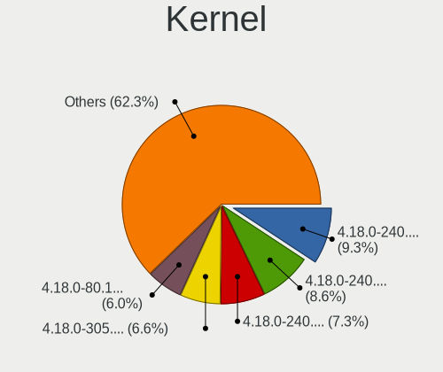

| Version                      | Computers | Percent |
|------------------------------|-----------|---------|
| 4.18.0-240.10.1.el8_3.x86_64 | 14        | 6.83%   |
| 4.18.0-240.1.1.el8_3.x86_64  | 14        | 6.83%   |
| 4.18.0-348.20.1.el8_5.x86_64 | 12        | 5.85%   |
| 4.18.0-240.15.1.el8_3.x86_64 | 11        | 5.37%   |
| 4.18.0-305.el8.x86_64        | 10        | 4.88%   |
| 4.18.0-80.11.2.el8_0.x86_64  | 9         | 4.39%   |
| 4.18.0-348.12.2.el8_5.x86_64 | 9         | 4.39%   |
| 4.18.0-240.22.1.el8_3.x86_64 | 9         | 4.39%   |
| 4.18.0-305.3.1.el8_4.x86_64  | 8         | 3.9%    |
| 4.18.0-305.19.1.el8_4.x86_64 | 8         | 3.9%    |
| 4.18.0-305.10.2.el8_4.x86_64 | 7         | 3.41%   |
| 4.18.0-348.2.1.el8_5.x86_64  | 6         | 2.93%   |
| 4.18.0-193.el8.x86_64        | 6         | 2.93%   |
| 4.18.0-193.19.1.el8_2.x86_64 | 6         | 2.93%   |
| 4.18.0-147.5.1.el8_1.x86_64  | 6         | 2.93%   |
| 4.18.0-147.3.1.el8_1.x86_64  | 6         | 2.93%   |
| 4.18.0-305.7.1.el8_4.x86_64  | 5         | 2.44%   |
| 4.18.0-193.6.3.el8_2.x86_64  | 5         | 2.44%   |
| 4.18.0-372.9.1.el8.x86_64    | 4         | 1.95%   |
| 4.18.0-348.7.1.el8_5.x86_64  | 4         | 1.95%   |
| 4.18.0-305.25.1.el8_4.x86_64 | 4         | 1.95%   |
| 4.18.0-305.12.1.el8_4.x86_64 | 4         | 1.95%   |
| 4.18.0-193.28.1.el8_2.x86_64 | 4         | 1.95%   |
| 4.18.0-147.el8.x86_64        | 4         | 1.95%   |
| 4.18.0-147.8.1.el8_1.x86_64  | 3         | 1.46%   |
| 4.18.0-372.19.1.el8_6.x86_64 | 2         | 0.98%   |
| 4.18.0-348.el8.x86_64        | 2         | 0.98%   |
| 4.18.0-305.17.1.el8_4.x86_64 | 2         | 0.98%   |
| 4.18.0-240.8.1.el8_3.x86_64  | 2         | 0.98%   |
| 4.18.0-193.14.3.el8_2.x86_64 | 2         | 0.98%   |
| 4.18.0-193.1.2.el8_2.x86_64  | 2         | 0.98%   |
| 5.9.1-1.el8.elrepo.x86_64    | 1         | 0.49%   |
| 5.13.13-1.el8.elrepo.x86_64  | 1         | 0.49%   |
| 5.13.0-1.el8.elrepo.x86_64   | 1         | 0.49%   |
| 5.10.6-1.el8.elrepo.x86_64   | 1         | 0.49%   |
| 4.19.150                     | 1         | 0.49%   |
| 4.18.0-80.el8.x86_64         | 1         | 0.49%   |
| 4.18.0-80.4.2.el8_0.x86_64   | 1         | 0.49%   |
| 4.18.0-372.13.1.el8_6.x86_64 | 1         | 0.49%   |
| 4.18.0-221.el8.x86_64        | 1         | 0.49%   |

Kernel Family
-------------

Linux kernel without a distro release

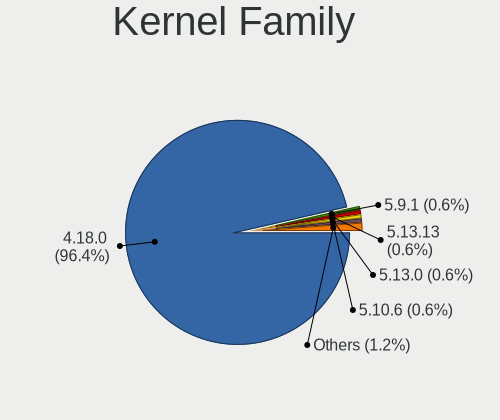

| Version  | Computers | Percent |
|----------|-----------|---------|
| 4.18.0   | 163       | 96.45%  |
| 5.9.1    | 1         | 0.59%   |
| 5.13.13  | 1         | 0.59%   |
| 5.13.0   | 1         | 0.59%   |
| 5.10.6   | 1         | 0.59%   |
| 4.19.150 | 1         | 0.59%   |
| Unknown  | 1         | 0.59%   |

Kernel Major Ver.
-----------------

Linux kernel major version

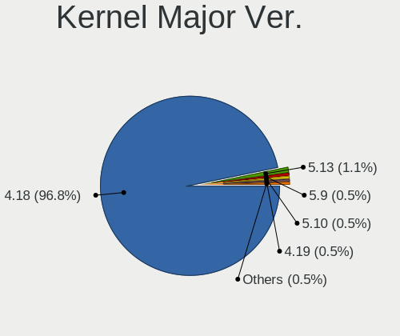

| Version | Computers | Percent |
|---------|-----------|---------|
| 4.18    | 163       | 96.45%  |
| 5.13    | 2         | 1.18%   |
| 5.9     | 1         | 0.59%   |
| 5.10    | 1         | 0.59%   |
| 4.19    | 1         | 0.59%   |
| Unknown | 1         | 0.59%   |

Arch
----

OS architecture (x86_64, i586, etc.)

| Name    | Computers | Percent |
|---------|-----------|---------|
| x86_64  | 168       | 99.41%  |
| Unknown | 1         | 0.59%   |

DE
--

Desktop Environment

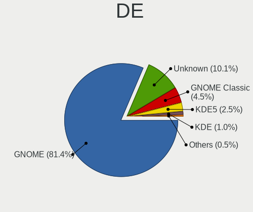

| Name          | Computers | Percent |
|---------------|-----------|---------|
| GNOME         | 143       | 81.25%  |
| Unknown       | 17        | 9.66%   |
| GNOME Classic | 8         | 4.55%   |
| KDE5          | 5         | 2.84%   |
| KDE           | 2         | 1.14%   |
| MATE          | 1         | 0.57%   |

Display Server
--------------

X11 or Wayland

| Name    | Computers | Percent |
|---------|-----------|---------|
| X11     | 97        | 55.11%  |
| Wayland | 70        | 39.77%  |
| Unknown | 9         | 5.11%   |

Display Manager
---------------

SDDM, LightDM, etc.

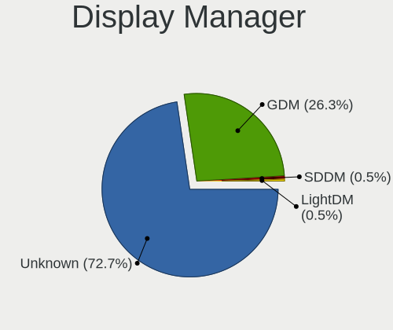

| Name    | Computers | Percent |
|---------|-----------|---------|
| Unknown | 132       | 74.58%  |
| GDM     | 43        | 24.29%  |
| SDDM    | 1         | 0.56%   |
| LightDM | 1         | 0.56%   |

OS Lang
-------

Language

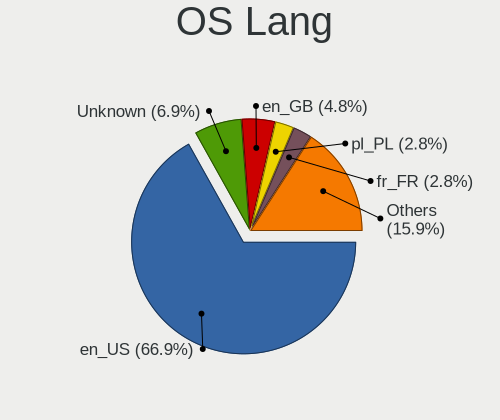

| Lang    | Computers | Percent |
|---------|-----------|---------|
| en_US   | 117       | 67.63%  |
| Unknown | 12        | 6.94%   |
| en_GB   | 8         | 4.62%   |
| pl_PL   | 4         | 2.31%   |
| fr_FR   | 4         | 2.31%   |
| en_IN   | 4         | 2.31%   |
| ru_RU   | 3         | 1.73%   |
| de_DE   | 3         | 1.73%   |
| pt_BR   | 2         | 1.16%   |
| nl_NL   | 2         | 1.16%   |
| es_ES   | 2         | 1.16%   |
| es_AR   | 2         | 1.16%   |
| en_IE   | 2         | 1.16%   |
| ko_KR   | 1         | 0.58%   |
| ja_JP   | 1         | 0.58%   |
| it_IT   | 1         | 0.58%   |
| es_MX   | 1         | 0.58%   |
| es_EC   | 1         | 0.58%   |
| en_NZ   | 1         | 0.58%   |
| de_CH   | 1         | 0.58%   |
| cs_CZ   | 1         | 0.58%   |

Boot Mode
---------

EFI or BIOS

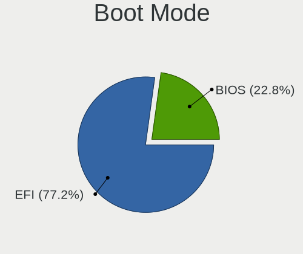

| Mode | Computers | Percent |
|------|-----------|---------|
| EFI  | 136       | 78.61%  |
| BIOS | 37        | 21.39%  |

Filesystem
----------

Type of filesystem

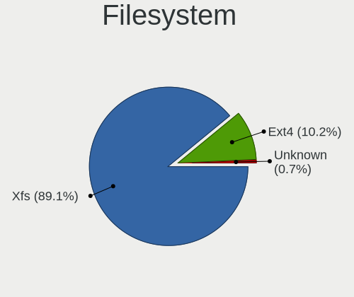

| Type    | Computers | Percent |
|---------|-----------|---------|
| Xfs     | 149       | 86.63%  |
| Ext4    | 15        | 8.72%   |
| Unknown | 8         | 4.65%   |

Part. scheme
------------

Scheme of partitioning

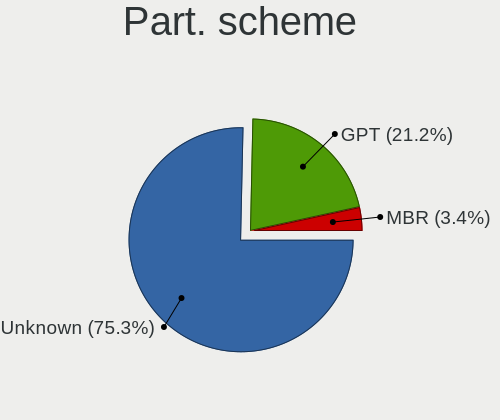

| Type    | Computers | Percent |
|---------|-----------|---------|
| Unknown | 123       | 69.89%  |
| GPT     | 48        | 27.27%  |
| MBR     | 5         | 2.84%   |

Dual Boot with Linux/BSD
------------------------

Hosting more than one Linux/BSD

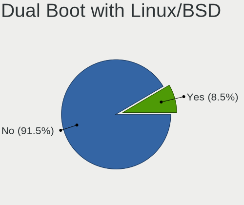

| Dual boot | Computers | Percent |
|-----------|-----------|---------|
| No        | 157       | 91.28%  |
| Yes       | 15        | 8.72%   |

Dual Boot (Win)
---------------

Hosting Linux and Windows

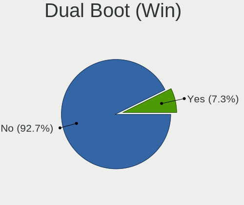

| Dual boot | Computers | Percent |
|-----------|-----------|---------|
| No        | 156       | 90.7%   |
| Yes       | 16        | 9.3%    |

Board
-----

Vendor
------

Motherboard manufacturer

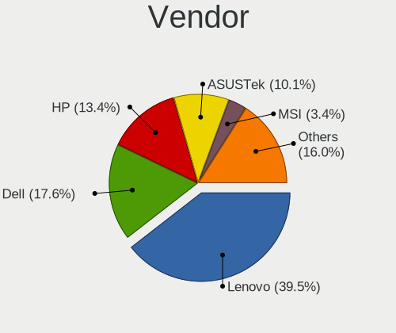

| Name                | Computers | Percent |
|---------------------|-----------|---------|
| Lenovo              | 72        | 42.6%   |
| Dell                | 26        | 15.38%  |
| Hewlett-Packard     | 20        | 11.83%  |
| ASUSTek Computer    | 18        | 10.65%  |
| Gigabyte Technology | 8         | 4.73%   |
| ASRock              | 5         | 2.96%   |
| MSI                 | 4         | 2.37%   |
| Supermicro          | 3         | 1.78%   |
| Sony                | 2         | 1.18%   |
| Intel               | 2         | 1.18%   |
| Unknown             | 2         | 1.18%   |
| TUXEDO              | 1         | 0.59%   |
| Toshiba             | 1         | 0.59%   |
| Timi                | 1         | 0.59%   |
| CX / Air Computers. | 1         | 0.59%   |
| AMI                 | 1         | 0.59%   |
| Alienware           | 1         | 0.59%   |
| Acer                | 1         | 0.59%   |

Model
-----

Motherboard model

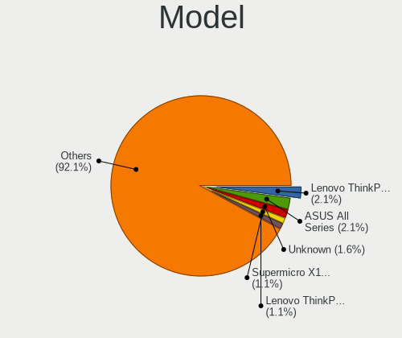

| Name                                     | Computers | Percent |
|------------------------------------------|-----------|---------|
| Lenovo ThinkPad P1 Gen 3 20TJS2F40X      | 4         | 2.37%   |
| ASUS All Series                          | 4         | 2.37%   |
| Supermicro X10DRi                        | 2         | 1.18%   |
| Lenovo ThinkPad X1 Carbon 7th 20QES2P401 | 2         | 1.18%   |
| Lenovo ThinkPad X1 Carbon 6th 20KGS23S00 | 2         | 1.18%   |
| Lenovo ThinkPad T590 20N5S2NC0N          | 2         | 1.18%   |
| Lenovo ThinkPad T490s 20NYS7K91R         | 2         | 1.18%   |
| Lenovo ThinkPad T14s Gen 1 20T1S39D08    | 2         | 1.18%   |
| Lenovo ThinkPad P1 Gen 3 20TJS2F42Q      | 2         | 1.18%   |
| HP EliteBook 8460p                       | 2         | 1.18%   |
| Dell Latitude E6430                      | 2         | 1.18%   |
| Dell Latitude 5300                       | 2         | 1.18%   |
| Unknown                                  | 2         | 1.18%   |
| TUXEDO N13xWU                            | 1         | 0.59%   |
| Toshiba Satellite Pro R50-C              | 1         | 0.59%   |
| Timi TM1707                              | 1         | 0.59%   |
| Supermicro X7DW3                         | 1         | 0.59%   |
| Sony VPCEB4L1R                           | 1         | 0.59%   |
| Sony VPCEB23FM                           | 1         | 0.59%   |
| MSI MS-7B51                              | 1         | 0.59%   |
| MSI MS-7B33                              | 1         | 0.59%   |
| MSI MS-7A37                              | 1         | 0.59%   |
| MSI MS-7752                              | 1         | 0.59%   |
| Lenovo Z40-70 20366                      | 1         | 0.59%   |
| Lenovo Yoga C640-13IML 81UE              | 1         | 0.59%   |
| Lenovo ThinkSystem SR645                 | 1         | 0.59%   |
| Lenovo ThinkPad X270 20HN001EMC          | 1         | 0.59%   |
| Lenovo ThinkPad X250 20CLS0H807          | 1         | 0.59%   |
| Lenovo ThinkPad X230 Tablet 34373KU      | 1         | 0.59%   |
| Lenovo ThinkPad X201 3680PKS             | 1         | 0.59%   |
| Lenovo ThinkPad X1 Yoga 1st 20FCS2N100   | 1         | 0.59%   |
| Lenovo ThinkPad W530 2441B32             | 1         | 0.59%   |
| Lenovo ThinkPad W520 4284GN2             | 1         | 0.59%   |
| Lenovo ThinkPad T590 20N5S2NC0V          | 1         | 0.59%   |
| Lenovo ThinkPad T590 20N5S2NC00          | 1         | 0.59%   |
| Lenovo ThinkPad T520 42404CG             | 1         | 0.59%   |
| Lenovo ThinkPad T490s 20NYS7K905         | 1         | 0.59%   |
| Lenovo ThinkPad T490s 20NX002HUS         | 1         | 0.59%   |
| Lenovo ThinkPad T490 20N3S5DV0S          | 1         | 0.59%   |
| Lenovo ThinkPad T480s 20L8S2N80V         | 1         | 0.59%   |

Model Family
------------

Motherboard model prefix

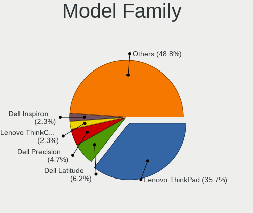

| Name               | Computers | Percent |
|--------------------|-----------|---------|
| Lenovo ThinkPad    | 63        | 37.28%  |
| Dell Precision     | 10        | 5.92%   |
| Dell Latitude      | 8         | 4.73%   |
| HP EliteBook       | 4         | 2.37%   |
| ASUS All           | 4         | 2.37%   |
| Lenovo ThinkCentre | 3         | 1.78%   |
| Dell Inspiron      | 3         | 1.78%   |
| ASUS PRIME         | 3         | 1.78%   |
| Supermicro X10DRi  | 2         | 1.18%   |
| HP ZBook           | 2         | 1.18%   |
| HP Z230            | 2         | 1.18%   |
| ASUS ROG           | 2         | 1.18%   |
| Unknown            | 2         | 1.18%   |
| TUXEDO N13xWU      | 1         | 0.59%   |
| Toshiba Satellite  | 1         | 0.59%   |
| Timi TM1707        | 1         | 0.59%   |
| Supermicro X7DW3   | 1         | 0.59%   |
| Sony VPCEB4L1R     | 1         | 0.59%   |
| Sony VPCEB23FM     | 1         | 0.59%   |
| MSI MS-7B51        | 1         | 0.59%   |
| MSI MS-7B33        | 1         | 0.59%   |
| MSI MS-7A37        | 1         | 0.59%   |
| MSI MS-7752        | 1         | 0.59%   |
| Lenovo Z40-70      | 1         | 0.59%   |
| Lenovo Yoga        | 1         | 0.59%   |
| Lenovo ThinkSystem | 1         | 0.59%   |
| Lenovo S40-40      | 1         | 0.59%   |
| Lenovo Legion      | 1         | 0.59%   |
| Lenovo 10SFS03200  | 1         | 0.59%   |
| Intel NUC10i7FNK   | 1         | 0.59%   |
| Intel DX79SR       | 1         | 0.59%   |
| HP Z840            | 1         | 0.59%   |
| HP Z620            | 1         | 0.59%   |
| HP Z440            | 1         | 0.59%   |
| HP ProLiant        | 1         | 0.59%   |
| HP ProBook         | 1         | 0.59%   |
| HP Pavilion        | 1         | 0.59%   |
| HP OMEN            | 1         | 0.59%   |
| HP ENVY            | 1         | 0.59%   |
| HP EliteDesk       | 1         | 0.59%   |

MFG Year
--------

Motherboard manufacture year

| Year | Computers | Percent |
|------|-----------|---------|
| 2020 | 34        | 20.12%  |
| 2019 | 28        | 16.57%  |
| 2018 | 25        | 14.79%  |
| 2017 | 15        | 8.88%   |
| 2015 | 15        | 8.88%   |
| 2012 | 11        | 6.51%   |
| 2016 | 9         | 5.33%   |
| 2021 | 8         | 4.73%   |
| 2013 | 8         | 4.73%   |
| 2011 | 8         | 4.73%   |
| 2014 | 4         | 2.37%   |
| 2010 | 3         | 1.78%   |
| 2009 | 1         | 0.59%   |

Form Factor
-----------

Physical design of the computer

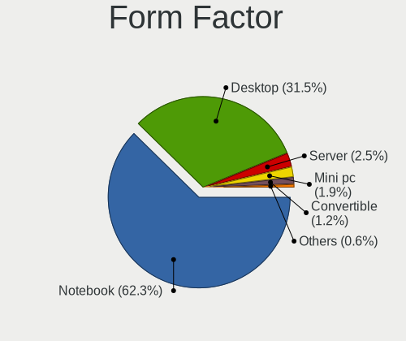

| Name        | Computers | Percent |
|-------------|-----------|---------|
| Notebook    | 105       | 62.13%  |
| Desktop     | 52        | 30.77%  |
| Server      | 6         | 3.55%   |
| Mini pc     | 3         | 1.78%   |
| Convertible | 2         | 1.18%   |
| All in one  | 1         | 0.59%   |

Secure Boot
-----------

Enabled or disabled

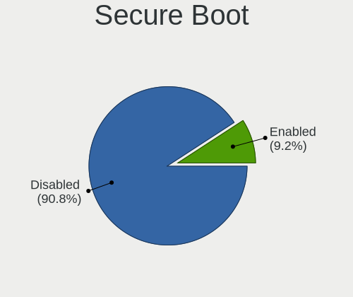

| State    | Computers | Percent |
|----------|-----------|---------|
| Disabled | 149       | 87.13%  |
| Enabled  | 22        | 12.87%  |

Coreboot
--------

Have coreboot on board

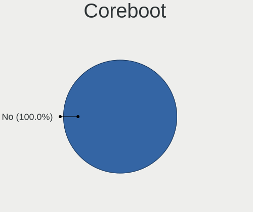

| Used | Computers | Percent |
|------|-----------|---------|
| No   | 169       | 100%    |

RAM Size
--------

Total RAM memory

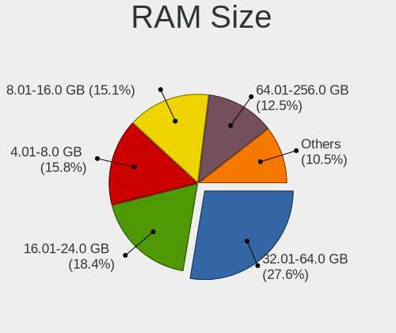

| Size in GB      | Computers | Percent |
|-----------------|-----------|---------|
| 32.01-64.0      | 52        | 29.89%  |
| 16.01-24.0      | 32        | 18.39%  |
| 8.01-16.0       | 27        | 15.52%  |
| 4.01-8.0        | 24        | 13.79%  |
| 64.01-256.0     | 22        | 12.64%  |
| 3.01-4.0        | 7         | 4.02%   |
| 24.01-32.0      | 7         | 4.02%   |
| More than 256.0 | 2         | 1.15%   |
| Unknown         | 1         | 0.57%   |

RAM Used
--------

Used RAM memory

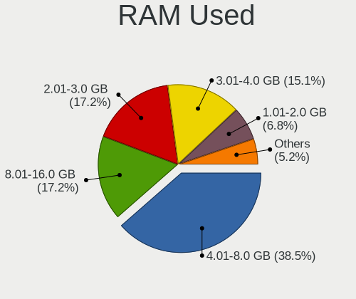

| Used GB         | Computers | Percent |
|-----------------|-----------|---------|
| 4.01-8.0        | 74        | 38.54%  |
| 2.01-3.0        | 33        | 17.19%  |
| 8.01-16.0       | 33        | 17.19%  |
| 3.01-4.0        | 29        | 15.1%   |
| 1.01-2.0        | 13        | 6.77%   |
| 24.01-32.0      | 3         | 1.56%   |
| 16.01-24.0      | 2         | 1.04%   |
| 0.51-1.0        | 2         | 1.04%   |
| More than 256.0 | 1         | 0.52%   |
| 32.01-64.0      | 1         | 0.52%   |
| Unknown         | 1         | 0.52%   |

Total Drives
------------

Number of drives on board

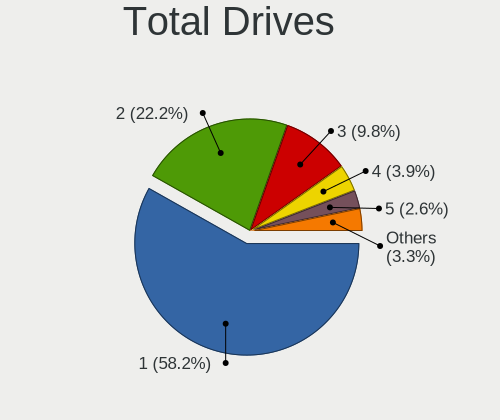

| Drives | Computers | Percent |
|--------|-----------|---------|
| 1      | 101       | 57.39%  |
| 2      | 41        | 23.3%   |
| 3      | 17        | 9.66%   |
| 4      | 7         | 3.98%   |
| 5      | 4         | 2.27%   |
| 8      | 2         | 1.14%   |
| 6      | 2         | 1.14%   |
| 7      | 1         | 0.57%   |
| 0      | 1         | 0.57%   |

Has CD-ROM
----------

Has CD-ROM on board

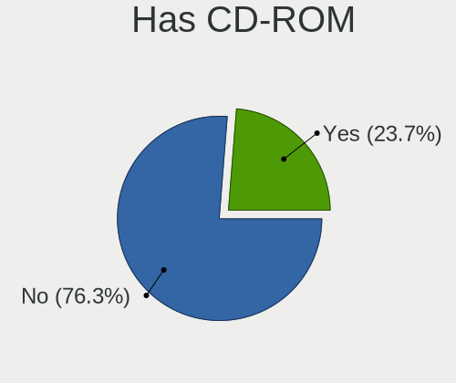

| Presented | Computers | Percent |
|-----------|-----------|---------|
| No        | 131       | 76.61%  |
| Yes       | 40        | 23.39%  |

Has Ethernet
------------

Has Ethernet on board

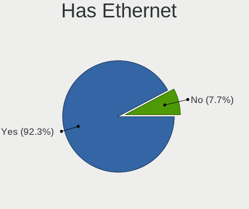

| Presented | Computers | Percent |
|-----------|-----------|---------|
| Yes       | 155       | 91.18%  |
| No        | 15        | 8.82%   |

Has WiFi
--------

Has WiFi module

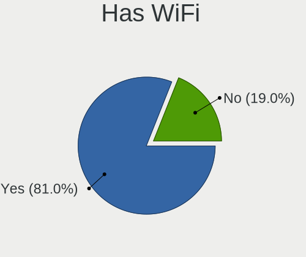

| Presented | Computers | Percent |
|-----------|-----------|---------|
| Yes       | 136       | 80.47%  |
| No        | 33        | 19.53%  |

Has Bluetooth
-------------

Has Bluetooth module

| Presented | Computers | Percent |
|-----------|-----------|---------|
| Yes       | 112       | 64%     |
| No        | 63        | 36%     |

Location
--------

Country
-------

Geographic location (country)

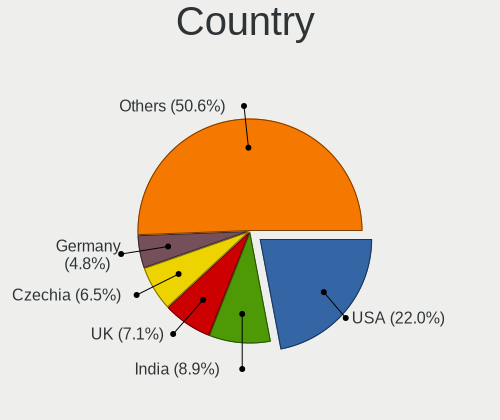

| Country      | Computers | Percent |
|--------------|-----------|---------|
| USA          | 37        | 21.89%  |
| India        | 15        | 8.88%   |
| UK           | 12        | 7.1%    |
| Czechia      | 11        | 6.51%   |
| Germany      | 8         | 4.73%   |
| France       | 6         | 3.55%   |
| Canada       | 6         | 3.55%   |
| Poland       | 5         | 2.96%   |
| Netherlands  | 4         | 2.37%   |
| Mexico       | 4         | 2.37%   |
| Switzerland  | 3         | 1.78%   |
| Spain        | 3         | 1.78%   |
| Russia       | 3         | 1.78%   |
| Lithuania    | 3         | 1.78%   |
| Italy        | 3         | 1.78%   |
| Brazil       | 3         | 1.78%   |
| Argentina    | 3         | 1.78%   |
| Ukraine      | 2         | 1.18%   |
| South Korea  | 2         | 1.18%   |
| South Africa | 2         | 1.18%   |
| Romania      | 2         | 1.18%   |
| Japan        | 2         | 1.18%   |
| Finland      | 2         | 1.18%   |
| Egypt        | 2         | 1.18%   |
| China        | 2         | 1.18%   |
| Australia    | 2         | 1.18%   |
| Turkmenistan | 1         | 0.59%   |
| Sweden       | 1         | 0.59%   |
| Singapore    | 1         | 0.59%   |
| Saudi Arabia | 1         | 0.59%   |
| Portugal     | 1         | 0.59%   |
| Pakistan     | 1         | 0.59%   |
| New Zealand  | 1         | 0.59%   |
| Nepal        | 1         | 0.59%   |
| Myanmar      | 1         | 0.59%   |
| Morocco      | 1         | 0.59%   |
| Luxembourg   | 1         | 0.59%   |
| Kuwait       | 1         | 0.59%   |
| Israel       | 1         | 0.59%   |
| Ireland      | 1         | 0.59%   |

City
----

Geographic location (city)

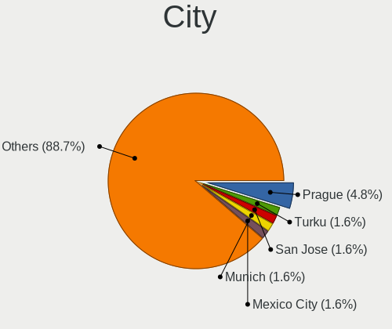

| City              | Computers | Percent |
|-------------------|-----------|---------|
| Prague            | 9         | 4.97%   |
| San Jose          | 3         | 1.66%   |
| Munich            | 3         | 1.66%   |
| Mexico City       | 3         | 1.66%   |
| Turku             | 2         | 1.1%    |
| Toronto           | 2         | 1.1%    |
| Montreal          | 2         | 1.1%    |
| Milan             | 2         | 1.1%    |
| Kyiv              | 2         | 1.1%    |
| Didcot            | 2         | 1.1%    |
| Des Moines        | 2         | 1.1%    |
| Chicago           | 2         | 1.1%    |
| Chennai           | 2         | 1.1%    |
| Berlin            | 2         | 1.1%    |
| Bengaluru         | 2         | 1.1%    |
| Zaragoza          | 1         | 0.55%   |
| Yongin-si         | 1         | 0.55%   |
| Wroclaw           | 1         | 0.55%   |
| Wiesbaden         | 1         | 0.55%   |
| Webster           | 1         | 0.55%   |
| Vardenis          | 1         | 0.55%   |
| Vaglio            | 1         | 0.55%   |
| Udaipur           | 1         | 0.55%   |
| Tiruchi           | 1         | 0.55%   |
| Temuco            | 1         | 0.55%   |
| Temara            | 1         | 0.55%   |
| Tauranga          | 1         | 0.55%   |
| Taringa           | 1         | 0.55%   |
| Talkha            | 1         | 0.55%   |
| Syracuse          | 1         | 0.55%   |
| Suffolk           | 1         | 0.55%   |
| Streatham         | 1         | 0.55%   |
| Steamboat Springs | 1         | 0.55%   |
| Spokane           | 1         | 0.55%   |
| Sofia             | 1         | 0.55%   |
| Singapore         | 1         | 0.55%   |
| Šilalė          | 1         | 0.55%   |
| Šiauliai         | 1         | 0.55%   |
| Sheffield         | 1         | 0.55%   |
| Saratov           | 1         | 0.55%   |

Drives
------

Drive Vendor
------------

Hard drive vendors

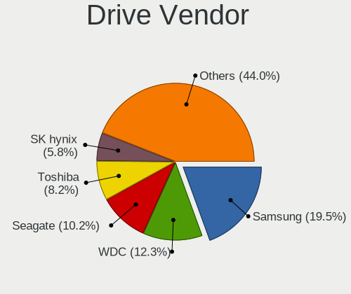

| Vendor              | Computers | Drives | Percent |
|---------------------|-----------|--------|---------|
| Samsung Electronics | 48        | 79     | 18.53%  |
| WDC                 | 36        | 61     | 13.9%   |
| Seagate             | 27        | 43     | 10.42%  |
| Toshiba             | 22        | 29     | 8.49%   |
| SK hynix            | 16        | 19     | 6.18%   |
| SanDisk             | 15        | 24     | 5.79%   |
| Kingston            | 13        | 17     | 5.02%   |
| Intel               | 11        | 18     | 4.25%   |
| Micron Technology   | 9         | 16     | 3.47%   |
| Crucial             | 8         | 11     | 3.09%   |
| Unknown             | 7         | 9      | 2.7%    |
| A-DATA Technology   | 5         | 5      | 1.93%   |
| HGST                | 4         | 4      | 1.54%   |
| Silicon Motion      | 3         | 4      | 1.16%   |
| PNY                 | 3         | 4      | 1.16%   |
| Phison              | 3         | 7      | 1.16%   |
| Hitachi             | 3         | 3      | 1.16%   |
| Hewlett-Packard     | 3         | 5      | 1.16%   |
| Gigabyte Technology | 3         | 3      | 1.16%   |
| Corsair             | 3         | 6      | 1.16%   |
| Lenovo              | 2         | 2      | 0.77%   |
| XPG                 | 1         | 1      | 0.39%   |
| Western Digital     | 1         | 1      | 0.39%   |
| Team                | 1         | 2      | 0.39%   |
| T-FORCE             | 1         | 2      | 0.39%   |
| SMI                 | 1         | 2      | 0.39%   |
| OCZ                 | 1         | 2      | 0.39%   |
| Lite-On             | 1         | 1      | 0.39%   |
| KIOXIA              | 1         | 1      | 0.39%   |
| KingFast            | 1         | 1      | 0.39%   |
| KINGBANK            | 1         | 1      | 0.39%   |
| HPT                 | 1         | 1      | 0.39%   |
| Hoodisk             | 1         | 1      | 0.39%   |
| DELLBOSS            | 1         | 1      | 0.39%   |
| Dell                | 1         | 1      | 0.39%   |
| China               | 1         | 1      | 0.39%   |

Drive Model
-----------

Hard drive models

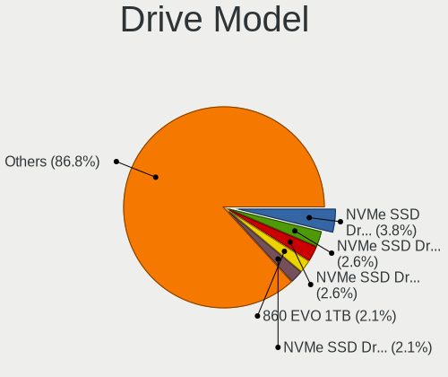

| Model                                | Computers | Percent |
|--------------------------------------|-----------|---------|
| SK hynix NVMe SSD Drive 512GB        | 10        | 3.44%   |
| Samsung NVMe SSD Drive 512GB         | 7         | 2.41%   |
| Toshiba NVMe SSD Drive 256GB         | 6         | 2.06%   |
| SanDisk NVMe SSD Drive 256GB         | 6         | 2.06%   |
| Samsung NVMe SSD Drive 256GB         | 6         | 2.06%   |
| Samsung SSD 860 EVO 1TB              | 5         | 1.72%   |
| Samsung NVMe SSD Drive 1024GB        | 5         | 1.72%   |
| Samsung NVMe SSD Drive 500GB         | 4         | 1.37%   |
| Toshiba NVMe SSD Drive 512GB         | 3         | 1.03%   |
| Micron NVMe SSD Drive 256GB          | 3         | 1.03%   |
| HGST HTS721010A9E630 1TB             | 3         | 1.03%   |
| WDC WD1003FZEX-00MK2A0 1TB           | 2         | 0.69%   |
| WDC WD1002FAEX-00Z3A0 1TB            | 2         | 0.69%   |
| Unknown NVMe SSD Drive 256GB         | 2         | 0.69%   |
| Toshiba KXG6AZNV256G 256GB           | 2         | 0.69%   |
| Toshiba DT01ACA200 2TB               | 2         | 0.69%   |
| Seagate ST500DM002-1BD142 500GB      | 2         | 0.69%   |
| Seagate ST2000DM001-1ER164 2TB       | 2         | 0.69%   |
| Seagate ST1000LM049-2GH172 1TB       | 2         | 0.69%   |
| Seagate ST1000DM003-9YN162 1TB       | 2         | 0.69%   |
| Seagate Expansion 1TB                | 2         | 0.69%   |
| Samsung SSD 860 EVO 500GB            | 2         | 0.69%   |
| Samsung Portable SSD T5 500GB        | 2         | 0.69%   |
| Samsung NVMe SSD Drive 2TB           | 2         | 0.69%   |
| Samsung NVMe SSD Drive 1TB           | 2         | 0.69%   |
| Kingston SUV500120G 120GB SSD        | 2         | 0.69%   |
| Kingston SA400S37480G 480GB SSD      | 2         | 0.69%   |
| Kingston SA400S37240G 240GB SSD      | 2         | 0.69%   |
| Intel SSDPEL1K100GA 100GB            | 2         | 0.69%   |
| Intel NVMe SSD Drive 512GB           | 2         | 0.69%   |
| Intel NVMe SSD Drive 2TB             | 2         | 0.69%   |
| HP SSD EX950 512GB                   | 2         | 0.69%   |
| Gigabyte GP-GSM2NE3100TNTD 1TB       | 2         | 0.69%   |
| Crucial CT480BX500SSD1 480GB         | 2         | 0.69%   |
| Crucial CT240BX500SSD1 240GB         | 2         | 0.69%   |
| Corsair Force LE SSD 240GB           | 2         | 0.69%   |
| XPG NVMe SSD Drive 1024GB            | 1         | 0.34%   |
| Western Digital NVMe SSD Drive 960GB | 1         | 0.34%   |
| WDC WDS500G2B0A-00SM50 500GB SSD     | 1         | 0.34%   |
| WDC WDS400T2B0A-00SM50 4TB SSD       | 1         | 0.34%   |

HDD Vendor
----------

Hard disk drive vendors

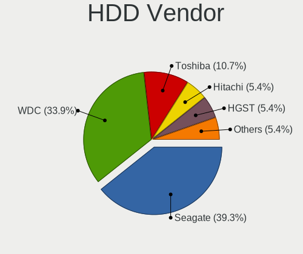

| Vendor              | Computers | Drives | Percent |
|---------------------|-----------|--------|---------|
| WDC                 | 27        | 48     | 36.49%  |
| Seagate             | 27        | 42     | 36.49%  |
| Toshiba             | 9         | 13     | 12.16%  |
| HGST                | 4         | 4      | 5.41%   |
| Hitachi             | 3         | 3      | 4.05%   |
| Unknown             | 1         | 1      | 1.35%   |
| Samsung Electronics | 1         | 2      | 1.35%   |
| Hewlett-Packard     | 1         | 1      | 1.35%   |
| DELLBOSS            | 1         | 1      | 1.35%   |

SSD Vendor
----------

Solid state drive vendors

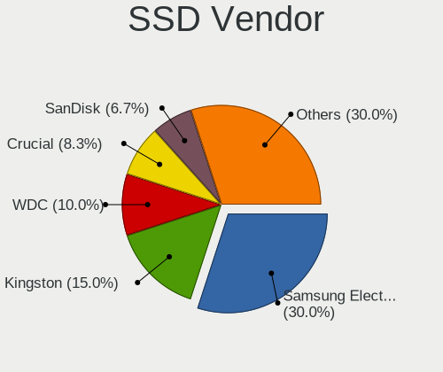

| Vendor              | Computers | Drives | Percent |
|---------------------|-----------|--------|---------|
| Samsung Electronics | 22        | 28     | 27.85%  |
| Kingston            | 11        | 15     | 13.92%  |
| Crucial             | 8         | 11     | 10.13%  |
| WDC                 | 6         | 8      | 7.59%   |
| SanDisk             | 5         | 11     | 6.33%   |
| Micron Technology   | 5         | 10     | 6.33%   |
| A-DATA Technology   | 5         | 5      | 6.33%   |
| PNY                 | 3         | 4      | 3.8%    |
| Corsair             | 3         | 6      | 3.8%    |
| SK hynix            | 2         | 5      | 2.53%   |
| Intel               | 2         | 3      | 2.53%   |
| Toshiba             | 1         | 1      | 1.27%   |
| Team                | 1         | 2      | 1.27%   |
| Seagate             | 1         | 1      | 1.27%   |
| OCZ                 | 1         | 2      | 1.27%   |
| KINGBANK            | 1         | 1      | 1.27%   |
| Hoodisk             | 1         | 1      | 1.27%   |
| China               | 1         | 1      | 1.27%   |

Drive Kind
----------

HDD or SSD

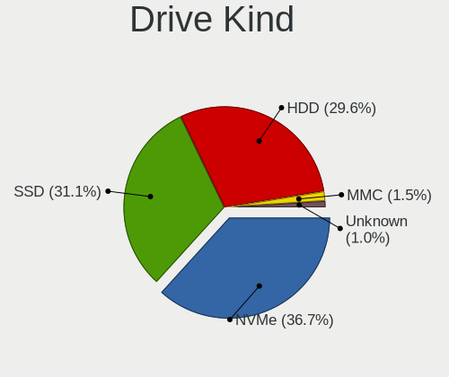

| Kind    | Computers | Drives | Percent |
|---------|-----------|--------|---------|
| NVMe    | 94        | 147    | 39.5%   |
| SSD     | 71        | 115    | 29.83%  |
| HDD     | 65        | 115    | 27.31%  |
| MMC     | 4         | 5      | 1.68%   |
| Unknown | 4         | 6      | 1.68%   |

Drive Connector
---------------

SATA, SAS, NVMe, etc.

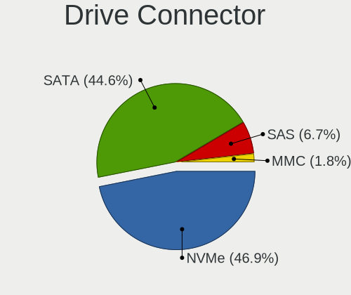

| Type | Computers | Drives | Percent |
|------|-----------|--------|---------|
| NVMe | 94        | 147    | 45.41%  |
| SATA | 94        | 212    | 45.41%  |
| SAS  | 15        | 24     | 7.25%   |
| MMC  | 4         | 5      | 1.93%   |

Drive Size
----------

Size of hard drive

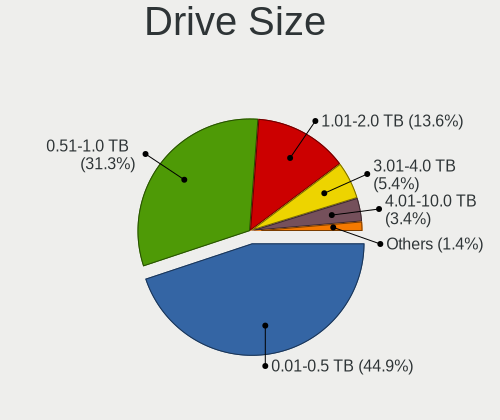

| Size in TB | Computers | Drives | Percent |
|------------|-----------|--------|---------|
| 0.01-0.5   | 66        | 108    | 45.52%  |
| 0.51-1.0   | 45        | 67     | 31.03%  |
| 1.01-2.0   | 19        | 25     | 13.1%   |
| 3.01-4.0   | 10        | 20     | 6.9%    |
| 4.01-10.0  | 3         | 8      | 2.07%   |
| 2.01-3.0   | 1         | 1      | 0.69%   |
| 10.01-20.0 | 1         | 1      | 0.69%   |

Space Total
-----------

Amount of disk space available on the file system

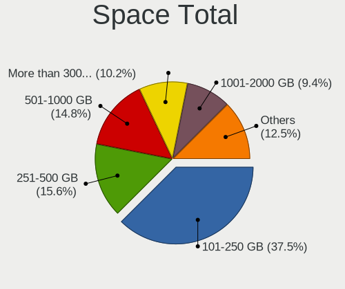

| Size in GB     | Computers | Percent |
|----------------|-----------|---------|
| 101-250        | 65        | 36.31%  |
| 251-500        | 31        | 17.32%  |
| 501-1000       | 27        | 15.08%  |
| More than 3000 | 16        | 8.94%   |
| 1001-2000      | 16        | 8.94%   |
| 2001-3000      | 7         | 3.91%   |
| Unknown        | 7         | 3.91%   |
| 51-100         | 6         | 3.35%   |
| 21-50          | 3         | 1.68%   |
| 1-20           | 1         | 0.56%   |

Space Used
----------

Amount of used disk space

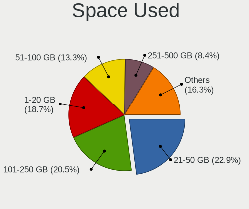

| Used GB        | Computers | Percent |
|----------------|-----------|---------|
| 21-50          | 43        | 22.4%   |
| 1-20           | 39        | 20.31%  |
| 101-250        | 36        | 18.75%  |
| 51-100         | 27        | 14.06%  |
| 251-500        | 14        | 7.29%   |
| 501-1000       | 11        | 5.73%   |
| 1001-2000      | 8         | 4.17%   |
| Unknown        | 7         | 3.65%   |
| More than 3000 | 4         | 2.08%   |
| 2001-3000      | 3         | 1.56%   |

Malfunc. Drives
---------------

Drive models with a malfunction

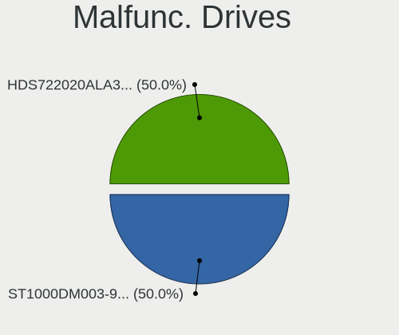

| Model                                    | Computers | Drives | Percent |
|------------------------------------------|-----------|--------|---------|
| Seagate ST1000DM003-9YN162 1TB           | 1         | 1      | 25%     |
| Micron Technology M510_2.5 7MM 256GB SSD | 1         | 1      | 25%     |
| Hitachi HDS722020ALA330 2TB              | 1         | 1      | 25%     |
| A-DATA Technology SU800NS38 256GB SSD    | 1         | 1      | 25%     |

Malfunc. Drive Vendor
---------------------

Vendors of faulty drives

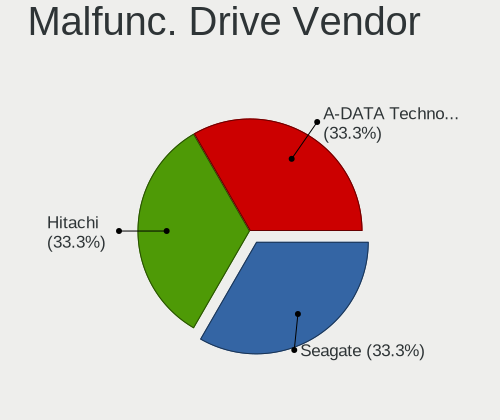

| Vendor            | Computers | Drives | Percent |
|-------------------|-----------|--------|---------|
| Seagate           | 1         | 1      | 25%     |
| Micron Technology | 1         | 1      | 25%     |
| Hitachi           | 1         | 1      | 25%     |
| A-DATA Technology | 1         | 1      | 25%     |

Malfunc. HDD Vendor
-------------------

Vendors of faulty HDD drives

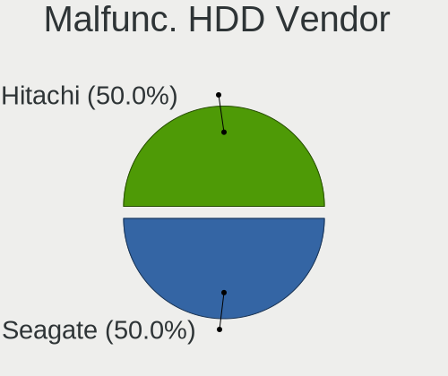

| Vendor  | Computers | Drives | Percent |
|---------|-----------|--------|---------|
| Seagate | 1         | 1      | 50%     |
| Hitachi | 1         | 1      | 50%     |

Malfunc. Drive Kind
-------------------

Kinds of faulty drives

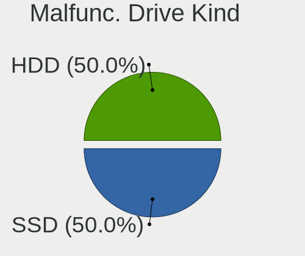

| Kind | Computers | Drives | Percent |
|------|-----------|--------|---------|
| SSD  | 2         | 2      | 50%     |
| HDD  | 2         | 2      | 50%     |

Failed Drives
-------------

Failed drive models

Zero info for selected period =(

Failed Drive Vendor
-------------------

Failed drive vendors

Zero info for selected period =(

Drive Status
------------

Number of failed and malfunc. drives

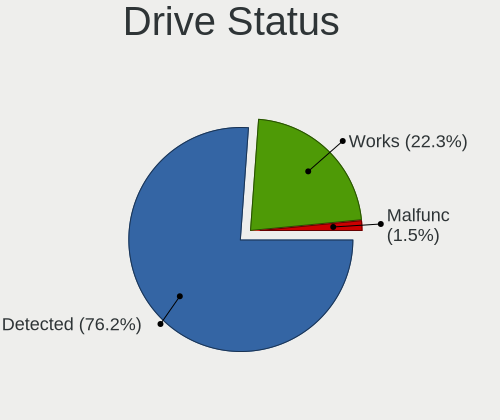

| Status   | Computers | Drives | Percent |
|----------|-----------|--------|---------|
| Detected | 126       | 290    | 70.39%  |
| Works    | 49        | 94     | 27.37%  |
| Malfunc  | 4         | 4      | 2.23%   |

Storage controller
------------------

Storage Vendor
--------------

Storage controller vendors

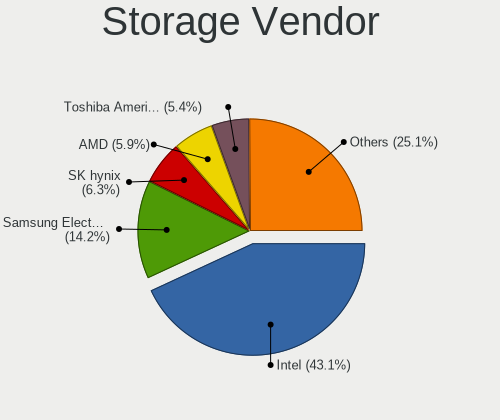

| Vendor                       | Computers | Percent |
|------------------------------|-----------|---------|
| Intel                        | 100       | 44.44%  |
| Samsung Electronics          | 32        | 14.22%  |
| SK hynix                     | 14        | 6.22%   |
| SanDisk                      | 13        | 5.78%   |
| AMD                          | 13        | 5.78%   |
| Toshiba America Info Systems | 12        | 5.33%   |
| Silicon Motion               | 5         | 2.22%   |
| Phison Electronics           | 5         | 2.22%   |
| Micron Technology            | 4         | 1.78%   |
| Marvell Technology Group     | 4         | 1.78%   |
| Broadcom / LSI               | 4         | 1.78%   |
| KIOXIA                       | 3         | 1.33%   |
| ASMedia Technology           | 3         | 1.33%   |
| LSI Logic / Symbios Logic    | 2         | 0.89%   |
| Lenovo                       | 2         | 0.89%   |
| Kingston Technology Company  | 2         | 0.89%   |
| Biwin Storage Technology     | 2         | 0.89%   |
| Western Digital              | 1         | 0.44%   |
| Lite-On Technology           | 1         | 0.44%   |
| HighPoint Technologies       | 1         | 0.44%   |
| Hewlett-Packard              | 1         | 0.44%   |
| ADATA Technology             | 1         | 0.44%   |

Storage Model
-------------

Storage controller models

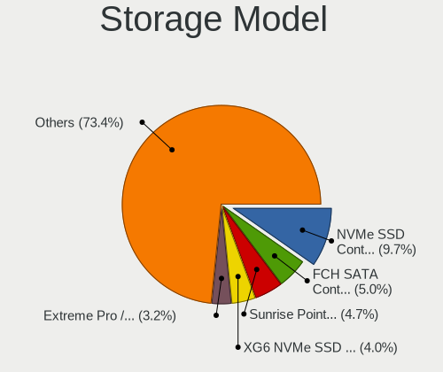

| Model                                                                            | Computers | Percent |
|----------------------------------------------------------------------------------|-----------|---------|
| Samsung NVMe SSD Controller SM981/PM981/PM983                                    | 25        | 10.12%  |
| SK hynix Non-Volatile memory controller                                          | 12        | 4.86%   |
| AMD FCH SATA Controller [AHCI mode]                                              | 12        | 4.86%   |
| Intel Sunrise Point-LP SATA Controller [AHCI mode]                               | 10        | 4.05%   |
| Toshiba America Info Systems XG6 NVMe SSD Controller                             | 9         | 3.64%   |
| SanDisk WD Black SN750 / PC SN730 NVMe SSD                                       | 9         | 3.64%   |
| Intel Cannon Lake PCH SATA AHCI Controller                                       | 8         | 3.24%   |
| Intel Q170/Q150/B150/H170/H110/Z170/CM236 Chipset SATA Controller [AHCI Mode]    | 7         | 2.83%   |
| Intel C610/X99 series chipset 6-Port SATA Controller [AHCI mode]                 | 7         | 2.83%   |
| Intel 8 Series/C220 Series Chipset Family 6-port SATA Controller 1 [AHCI mode]   | 7         | 2.83%   |
| Intel Cannon Lake Mobile PCH SATA AHCI Controller                                | 6         | 2.43%   |
| Intel 6 Series/C200 Series Chipset Family 6 port Mobile SATA AHCI Controller     | 6         | 2.43%   |
| Intel C610/X99 series chipset sSATA Controller [AHCI mode]                       | 5         | 2.02%   |
| Intel 7 Series/C210 Series Chipset Family 6-port SATA Controller [AHCI mode]     | 5         | 2.02%   |
| Micron Non-Volatile memory controller                                            | 4         | 1.62%   |
| Intel SSD 660P Series                                                            | 4         | 1.62%   |
| Intel 82801 Mobile SATA Controller [RAID mode]                                   | 4         | 1.62%   |
| Silicon Motion SM2263EN/SM2263XT SSD Controller                                  | 3         | 1.21%   |
| Samsung NVMe SSD Controller SM961/PM961/SM963                                    | 3         | 1.21%   |
| Phison PS5013 E13 NVMe Controller                                                | 3         | 1.21%   |
| KIOXIA NVMe SSD Controller BG4                                                   | 3         | 1.21%   |
| Intel Wildcat Point-LP SATA Controller [AHCI Mode]                               | 3         | 1.21%   |
| Intel SSD Pro 7600p/760p/E 6100p Series                                          | 3         | 1.21%   |
| Intel SATA Controller [RAID mode]                                                | 3         | 1.21%   |
| Intel HM170/QM170 Chipset SATA Controller [AHCI Mode]                            | 3         | 1.21%   |
| Intel 7 Series Chipset Family 6-port SATA Controller [AHCI mode]                 | 3         | 1.21%   |
| Intel 5 Series/3400 Series Chipset 4 port SATA AHCI Controller                   | 3         | 1.21%   |
| Intel 200 Series PCH SATA controller [AHCI mode]                                 | 3         | 1.21%   |
| ASMedia ASM1062 Serial ATA Controller                                            | 3         | 1.21%   |
| AMD 300 Series Chipset SATA Controller                                           | 3         | 1.21%   |
| Toshiba America Info Systems Toshiba America Info Non-Volatile memory controller | 2         | 0.81%   |
| SK hynix Gold P31 SSD                                                            | 2         | 0.81%   |
| Silicon Motion SM2262/SM2262EN SSD Controller                                    | 2         | 0.81%   |
| SanDisk WD Blue SN550 NVMe SSD                                                   | 2         | 0.81%   |
| SanDisk WD Black 2018/SN750 / PC SN720 NVMe SSD                                  | 2         | 0.81%   |
| Samsung NVMe SSD Controller 980                                                  | 2         | 0.81%   |
| Phison E12 NVMe Controller                                                       | 2         | 0.81%   |
| Lenovo Non-Volatile memory controller                                            | 2         | 0.81%   |
| Intel NVMe Datacenter SSD [Optane]                                               | 2         | 0.81%   |
| Intel Comet Lake SATA AHCI Controller                                            | 2         | 0.81%   |

Storage Kind
------------

Kind of storage controller (IDE, SATA, NVMe, SAS, ...)

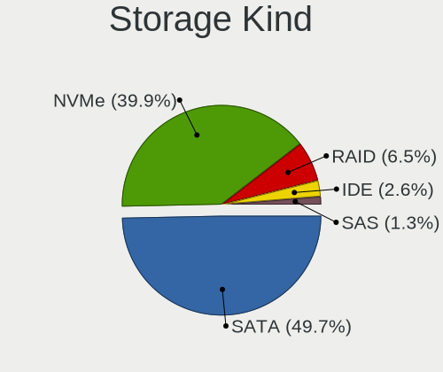

| Kind | Computers | Percent |
|------|-----------|---------|
| SATA | 99        | 46.05%  |
| NVMe | 94        | 43.72%  |
| RAID | 15        | 6.98%   |
| IDE  | 4         | 1.86%   |
| SAS  | 3         | 1.4%    |

Processor
---------

CPU Vendor
----------

Processor vendors

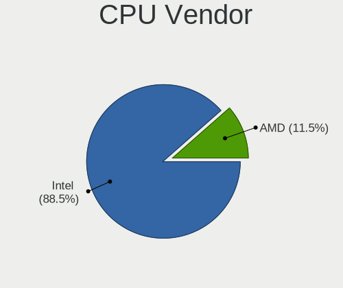

| Vendor | Computers | Percent |
|--------|-----------|---------|
| Intel  | 151       | 89.35%  |
| AMD    | 18        | 10.65%  |

CPU Model
---------

Processor models

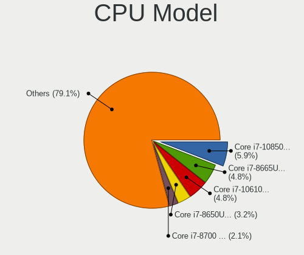

| Model                                         | Computers | Percent |
|-----------------------------------------------|-----------|---------|
| Intel Core i7-10850H CPU @ 2.70GHz            | 10        | 5.92%   |
| Intel Core i7-8665U CPU @ 1.90GHz             | 9         | 5.33%   |
| Intel Core i7-10610U CPU @ 1.80GHz            | 9         | 5.33%   |
| Intel Core i7-8650U CPU @ 1.90GHz             | 5         | 2.96%   |
| Intel Core i7-8700 CPU @ 3.20GHz              | 4         | 2.37%   |
| Intel Core i7-8750H CPU @ 2.20GHz             | 3         | 1.78%   |
| Intel Core i5-8250U CPU @ 1.60GHz             | 3         | 1.78%   |
| Intel Core i5-5300U CPU @ 2.30GHz             | 3         | 1.78%   |
| Intel Core i5-10210U CPU @ 1.60GHz            | 3         | 1.78%   |
| AMD Ryzen 9 3900X 12-Core Processor           | 3         | 1.78%   |
| Intel Xeon CPU E5-2680 v3 @ 2.50GHz           | 2         | 1.18%   |
| Intel Xeon CPU E5-2667 v3 @ 3.20GHz           | 2         | 1.18%   |
| Intel Pentium Gold G5400 CPU @ 3.70GHz        | 2         | 1.18%   |
| Intel Core i7-9850H CPU @ 2.60GHz             | 2         | 1.18%   |
| Intel Core i7-9750H CPU @ 2.60GHz             | 2         | 1.18%   |
| Intel Core i7-8565U CPU @ 1.80GHz             | 2         | 1.18%   |
| Intel Core i7-8550U CPU @ 1.80GHz             | 2         | 1.18%   |
| Intel Core i7-7700HQ CPU @ 2.80GHz            | 2         | 1.18%   |
| Intel Core i7-7700 CPU @ 3.60GHz              | 2         | 1.18%   |
| Intel Core i7-7600U CPU @ 2.80GHz             | 2         | 1.18%   |
| Intel Core i7-6700HQ CPU @ 2.60GHz            | 2         | 1.18%   |
| Intel Core i7-3520M CPU @ 2.90GHz             | 2         | 1.18%   |
| Intel Core i5-8365U CPU @ 1.60GHz             | 2         | 1.18%   |
| Intel Core i5-8350U CPU @ 1.70GHz             | 2         | 1.18%   |
| Intel Core i5-6200U CPU @ 2.30GHz             | 2         | 1.18%   |
| Intel Core i5-2520M CPU @ 2.50GHz             | 2         | 1.18%   |
| AMD Ryzen 7 4700U with Radeon Graphics        | 2         | 1.18%   |
| AMD Ryzen 7 3750H with Radeon Vega Mobile Gfx | 2         | 1.18%   |
| Intel Xeon W-11955M CPU @ 2.60GHz             | 1         | 0.59%   |
| Intel Xeon W-10855M CPU @ 2.80GHz             | 1         | 0.59%   |
| Intel Xeon E-2176M CPU @ 2.70GHz              | 1         | 0.59%   |
| Intel Xeon CPU E5472 @ 3.00GHz                | 1         | 0.59%   |
| Intel Xeon CPU E5-2696 v3 @ 2.30GHz           | 1         | 0.59%   |
| Intel Xeon CPU E5-2680 v2 @ 2.80GHz           | 1         | 0.59%   |
| Intel Xeon CPU E5-2678 v3 @ 2.50GHz           | 1         | 0.59%   |
| Intel Xeon CPU E5-2670 0 @ 2.60GHz            | 1         | 0.59%   |
| Intel Xeon CPU E5-2640 v4 @ 2.40GHz           | 1         | 0.59%   |
| Intel Xeon CPU E5-1650 v4 @ 3.60GHz           | 1         | 0.59%   |
| Intel Xeon CPU E3-1575M v5 @ 3.00GHz          | 1         | 0.59%   |
| Intel Xeon CPU E3-1505M v5 @ 2.80GHz          | 1         | 0.59%   |

CPU Model Family
----------------

Processor model prefix

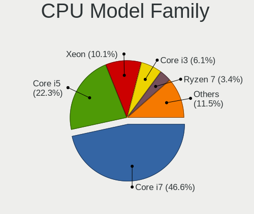

| Model              | Computers | Percent |
|--------------------|-----------|---------|
| Intel Core i7      | 76        | 44.97%  |
| Intel Core i5      | 36        | 21.3%   |
| Intel Xeon         | 20        | 11.83%  |
| Intel Core i3      | 9         | 5.33%   |
| AMD Ryzen 7        | 7         | 4.14%   |
| Other              | 4         | 2.37%   |
| AMD Ryzen 9        | 3         | 1.78%   |
| Intel Pentium Gold | 2         | 1.18%   |
| Intel Pentium      | 2         | 1.18%   |
| Intel Core i9      | 2         | 1.18%   |
| AMD Ryzen 5        | 2         | 1.18%   |
| AMD Ryzen 3        | 2         | 1.18%   |
| AMD EPYC           | 2         | 1.18%   |
| AMD Ryzen 7 PRO    | 1         | 0.59%   |
| AMD FX             | 1         | 0.59%   |

CPU Cores
---------

Number of processor cores

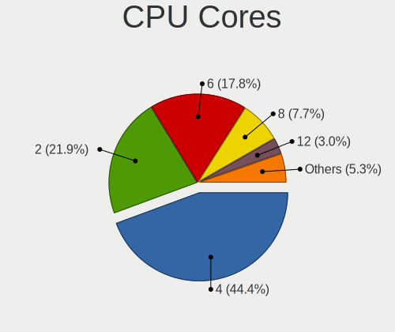

| Number | Computers | Percent |
|--------|-----------|---------|
| 4      | 75        | 44.38%  |
| 2      | 37        | 21.89%  |
| 6      | 30        | 17.75%  |
| 8      | 13        | 7.69%   |
| 12     | 5         | 2.96%   |
| 16     | 3         | 1.78%   |
| 20     | 2         | 1.18%   |
| 96     | 1         | 0.59%   |
| 64     | 1         | 0.59%   |
| 36     | 1         | 0.59%   |
| 24     | 1         | 0.59%   |

CPU Sockets
-----------

Number of sockets

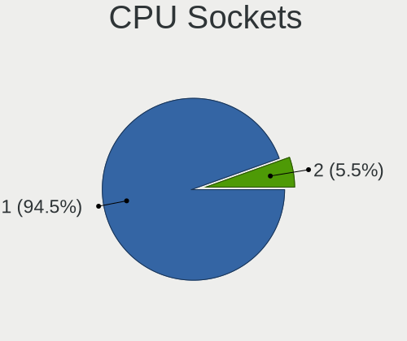

| Number | Computers | Percent |
|--------|-----------|---------|
| 1      | 159       | 94.08%  |
| 2      | 10        | 5.92%   |

CPU Threads
-----------

Threads per core (Hyper-Threading)

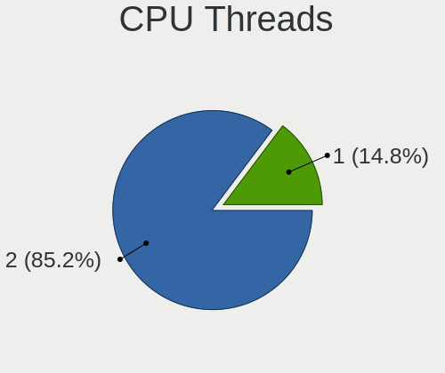

| Number | Computers | Percent |
|--------|-----------|---------|
| 2      | 145       | 85.29%  |
| 1      | 25        | 14.71%  |

CPU Op-Modes
------------

CPU Operation Modes (32-bit, 64-bit)

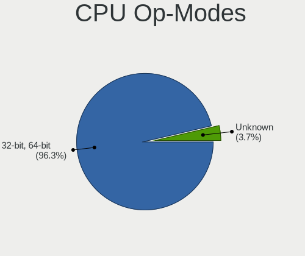

| Op mode        | Computers | Percent |
|----------------|-----------|---------|
| 32-bit, 64-bit | 165       | 96.49%  |
| Unknown        | 6         | 3.51%   |

CPU Microcode
-------------

Microcode number

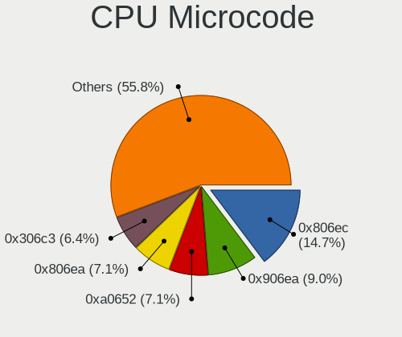

| Number     | Computers | Percent |
|------------|-----------|---------|
| 0x806ec    | 27        | 15.79%  |
| 0x906ea    | 14        | 8.19%   |
| 0x806ea    | 12        | 7.02%   |
| 0x306c3    | 12        | 7.02%   |
| 0xa0652    | 11        | 6.43%   |
| 0x306a9    | 9         | 5.26%   |
| 0x206a7    | 8         | 4.68%   |
| 0x506e3    | 7         | 4.09%   |
| 0x906ed    | 6         | 3.51%   |
| 0x906e9    | 5         | 2.92%   |
| 0x406e3    | 5         | 2.92%   |
| 0x306f2    | 5         | 2.92%   |
| Unknown    | 5         | 2.92%   |
| 0x806e9    | 4         | 2.34%   |
| 0x306d4    | 3         | 1.75%   |
| 0x20655    | 3         | 1.75%   |
| 0x08600103 | 3         | 1.75%   |
| 0x08108102 | 3         | 1.75%   |
| 0x806d1    | 2         | 1.17%   |
| 0x806c1    | 2         | 1.17%   |
| 0x406f1    | 2         | 1.17%   |
| 0x40651    | 2         | 1.17%   |
| 0x206d7    | 2         | 1.17%   |
| 0x08701021 | 2         | 1.17%   |
| 0xa0671    | 1         | 0.58%   |
| 0xa0660    | 1         | 0.58%   |
| 0xa0655    | 1         | 0.58%   |
| 0x906eb    | 1         | 0.58%   |
| 0x306e4    | 1         | 0.58%   |
| 0x20652    | 1         | 0.58%   |
| 0x10676    | 1         | 0.58%   |
| 0x0a50000c | 1         | 0.58%   |
| 0x0a001119 | 1         | 0.58%   |
| 0x08701013 | 1         | 0.58%   |
| 0x08600106 | 1         | 0.58%   |
| 0x08600104 | 1         | 0.58%   |
| 0x08301034 | 1         | 0.58%   |
| 0x0810100b | 1         | 0.58%   |
| 0x08001138 | 1         | 0.58%   |
| 0x08001137 | 1         | 0.58%   |

CPU Microarch
-------------

Microarchitecture

| Name        | Computers | Percent |
|-------------|-----------|---------|
| KabyLake    | 70        | 41.18%  |
| Haswell     | 20        | 11.76%  |
| CometLake   | 13        | 7.65%   |
| Skylake     | 12        | 7.06%   |
| IvyBridge   | 11        | 6.47%   |
| SandyBridge | 10        | 5.88%   |
| Zen 2       | 9         | 5.29%   |
| Broadwell   | 5         | 2.94%   |
| Westmere    | 4         | 2.35%   |
| Zen+        | 3         | 1.76%   |
| Zen         | 3         | 1.76%   |
| Icelake     | 3         | 1.76%   |
| TigerLake   | 2         | 1.18%   |
| Unknown     | 2         | 1.18%   |
| Zen 3       | 1         | 0.59%   |
| Piledriver  | 1         | 0.59%   |
| Penryn      | 1         | 0.59%   |

Graphics
--------

GPU Vendor
----------

Vendors of graphics cards

| Vendor                     | Computers | Percent |
|----------------------------|-----------|---------|
| Intel                      | 113       | 54.59%  |
| Nvidia                     | 64        | 30.92%  |
| AMD                        | 24        | 11.59%  |
| Matrox Electronics Systems | 4         | 1.93%   |
| ASPEED Technology          | 2         | 0.97%   |

GPU Model
---------

Graphics card models

| Model                                                                       | Computers | Percent |
|-----------------------------------------------------------------------------|-----------|---------|
| Intel WhiskeyLake-U GT2 [UHD Graphics 620]                                  | 14        | 6.7%    |
| Intel CometLake-U GT2 [UHD Graphics]                                        | 13        | 6.22%   |
| Intel UHD Graphics 620                                                      | 12        | 5.74%   |
| Intel CometLake-H GT2 [UHD Graphics]                                        | 10        | 4.78%   |
| Intel CoffeeLake-H GT2 [UHD Graphics 630]                                   | 7         | 3.35%   |
| Intel Skylake GT2 [HD Graphics 520]                                         | 5         | 2.39%   |
| Intel CoffeeLake-S GT2 [UHD Graphics 630]                                   | 5         | 2.39%   |
| Intel 3rd Gen Core processor Graphics Controller                            | 5         | 2.39%   |
| Intel 2nd Generation Core Processor Family Integrated Graphics Controller   | 5         | 2.39%   |
| AMD Renoir                                                                  | 5         | 2.39%   |
| Intel Xeon E3-1200 v3/4th Gen Core Processor Integrated Graphics Controller | 4         | 1.91%   |
| Nvidia GP107GLM [Quadro P2000 Mobile]                                       | 3         | 1.44%   |
| Nvidia GP107 [GeForce GTX 1050 Ti]                                          | 3         | 1.44%   |
| Intel HD Graphics 630                                                       | 3         | 1.44%   |
| Intel HD Graphics 620                                                       | 3         | 1.44%   |
| Intel HD Graphics 5500                                                      | 3         | 1.44%   |
| Intel Core Processor Integrated Graphics Controller                         | 3         | 1.44%   |
| AMD Picasso/Raven 2 [Radeon Vega Series / Radeon Vega Mobile Series]        | 3         | 1.44%   |
| Nvidia TU116M [GeForce GTX 1660 Ti Mobile]                                  | 2         | 0.96%   |
| Nvidia TU106 [GeForce RTX 2060 SUPER]                                       | 2         | 0.96%   |
| Nvidia GP107M [GeForce GTX 1050 Mobile]                                     | 2         | 0.96%   |
| Nvidia GP107GLM [Quadro P620]                                               | 2         | 0.96%   |
| Nvidia GP106GL [Quadro P2200]                                               | 2         | 0.96%   |
| Nvidia GP106 [GeForce GTX 1060 6GB]                                         | 2         | 0.96%   |
| Nvidia GM107GLM [Quadro M2000M]                                             | 2         | 0.96%   |
| Nvidia GF108GLM [NVS 5200M]                                                 | 2         | 0.96%   |
| Intel Xeon E3-1200 v2/3rd Gen Core processor Graphics Controller            | 2         | 0.96%   |
| Intel TigerLake-LP GT2 [Iris Xe Graphics]                                   | 2         | 0.96%   |
| Intel IvyBridge GT2 [HD Graphics 4000]                                      | 2         | 0.96%   |
| Intel HD Graphics 530                                                       | 2         | 0.96%   |
| Intel Haswell-ULT Integrated Graphics Controller                            | 2         | 0.96%   |
| Intel 4th Generation Core Processor Family Integrated Graphics Controller   | 2         | 0.96%   |
| ASPEED Technology ASPEED Graphics Family                                    | 2         | 0.96%   |
| AMD Seymour [Radeon HD 6400M/7400M Series]                                  | 2         | 0.96%   |
| AMD Lexa PRO [Radeon 540/540X/550/550X / RX 540X/550/550X]                  | 2         | 0.96%   |
| Nvidia TU117M [GeForce MX450]                                               | 1         | 0.48%   |
| Nvidia TU117M [GeForce GTX 1650 Mobile / Max-Q]                             | 1         | 0.48%   |
| Nvidia TU117GLM [Quadro T2000 Mobile / Max-Q]                               | 1         | 0.48%   |
| Nvidia TU117GLM [Quadro T1000 Mobile]                                       | 1         | 0.48%   |
| Nvidia TU116 [GeForce GTX 1660 Ti]                                          | 1         | 0.48%   |

GPU Combo
---------

Combinations of graphics cards

| Name                    | Computers | Percent |
|-------------------------|-----------|---------|
| 1 x Intel               | 81        | 47.37%  |
| 1 x Nvidia              | 37        | 21.64%  |
| Intel + Nvidia          | 21        | 12.28%  |
| 1 x AMD                 | 14        | 8.19%   |
| Intel + AMD             | 6         | 3.51%   |
| 1 x Matrox              | 3         | 1.75%   |
| AMD + Nvidia            | 3         | 1.75%   |
| Other                   | 1         | 0.58%   |
| 2 x Nvidia + 1 x ASPEED | 1         | 0.58%   |
| 2 x Nvidia              | 1         | 0.58%   |
| 2 x AMD                 | 1         | 0.58%   |
| Nvidia + Matrox         | 1         | 0.58%   |
| Nvidia + ASPEED         | 1         | 0.58%   |

GPU Driver
----------

Free vs proprietary

| Driver      | Computers | Percent |
|-------------|-----------|---------|
| Free        | 135       | 78.49%  |
| Proprietary | 29        | 16.86%  |
| Unknown     | 8         | 4.65%   |

GPU Memory
----------

Total video memory

| Size in GB | Computers | Percent |
|------------|-----------|---------|
| Unknown    | 104       | 59.77%  |
| 1.01-2.0   | 19        | 10.92%  |
| 3.01-4.0   | 14        | 8.05%   |
| 0.51-1.0   | 8         | 4.6%    |
| 0.01-0.5   | 8         | 4.6%    |
| 7.01-8.0   | 7         | 4.02%   |
| 5.01-6.0   | 7         | 4.02%   |
| 2.01-3.0   | 3         | 1.72%   |
| 4.01-5.0   | 2         | 1.15%   |
| 8.01-16.0  | 2         | 1.15%   |

Monitor
-------

Monitor Vendor
--------------

Monitor vendors

| Vendor                  | Computers | Percent |
|-------------------------|-----------|---------|
| AU Optronics            | 25        | 11.47%  |
| Dell                    | 23        | 10.55%  |
| Lenovo                  | 22        | 10.09%  |
| Samsung Electronics     | 20        | 9.17%   |
| LG Display              | 18        | 8.26%   |
| BOE                     | 18        | 8.26%   |
| Chimei Innolux          | 16        | 7.34%   |
| Goldstar                | 13        | 5.96%   |
| Hewlett-Packard         | 11        | 5.05%   |
| Sharp                   | 5         | 2.29%   |
| Acer                    | 5         | 2.29%   |
| Philips                 | 4         | 1.83%   |
| InfoVision              | 4         | 1.83%   |
| Eizo                    | 4         | 1.83%   |
| BenQ                    | 4         | 1.83%   |
| Ancor Communications    | 3         | 1.38%   |
| ViewSonic               | 2         | 0.92%   |
| PANDA                   | 2         | 0.92%   |
| LGD                     | 2         | 0.92%   |
| Lenovo Group Limited    | 2         | 0.92%   |
| Iiyama                  | 2         | 0.92%   |
| Gigabyte Technology     | 2         | 0.92%   |
| AOC                     | 2         | 0.92%   |
| Sun                     | 1         | 0.46%   |
| Sceptre Tech            | 1         | 0.46%   |
| Planar                  | 1         | 0.46%   |
| LG Electronics          | 1         | 0.46%   |
| Insignia                | 1         | 0.46%   |
| EVE                     | 1         | 0.46%   |
| Chi Mei Optoelectronics | 1         | 0.46%   |
| BOE Technology Group    | 1         | 0.46%   |
| Unknown                 | 1         | 0.46%   |

Monitor Model
-------------

Monitor models

| Model                                                             | Computers | Percent |
|-------------------------------------------------------------------|-----------|---------|
| Chimei Innolux LCD Monitor CMN15E8 1920x1080 344x193mm 15.5-inch  | 6         | 2.55%   |
| Lenovo LEN P27u-10 LEN61B0 3840x2160 600x340mm 27.2-inch          | 5         | 2.13%   |
| Lenovo LCD Monitor LEN40BA 1920x1080 344x194mm 15.5-inch          | 5         | 2.13%   |
| AU Optronics LCD Monitor AUO403D 1920x1080 309x174mm 14.0-inch    | 5         | 2.13%   |
| LG Display LCD Monitor LGD0676 1920x1080 309x174mm 14.0-inch      | 3         | 1.28%   |
| Lenovo TIO24Gen3 LEN10B4 1920x1080 527x296mm 23.8-inch            | 3         | 1.28%   |
| InfoVision LCD Monitor IVO057D 1920x1080 309x174mm 14.0-inch      | 3         | 1.28%   |
| Goldstar ULTRAWIDE GSM59F1 2560x1080 673x284mm 28.8-inch          | 3         | 1.28%   |
| Dell P2419H DELD0DA 1920x1080 527x296mm 23.8-inch                 | 3         | 1.28%   |
| Dell P2419H DELD0D9 1920x1080 527x296mm 23.8-inch                 | 3         | 1.28%   |
| BOE LCD Monitor BOE086E 1920x1080 344x194mm 15.5-inch             | 3         | 1.28%   |
| AU Optronics LCD Monitor AUO323D 1920x1080 309x174mm 14.0-inch    | 3         | 1.28%   |
| Samsung Electronics C24F390 SAM0D2C 1920x1080 521x293mm 23.5-inch | 2         | 0.85%   |
| Philips PHL 272E1 PHLC210 1920x1080 598x336mm 27.0-inch           | 2         | 0.85%   |
| PANDA LCD Monitor NCP0036 1920x1080 344x194mm 15.5-inch           | 2         | 0.85%   |
| LGD LCD Monitor 1920x1080                                         | 2         | 0.85%   |
| LG Display LCD Monitor LGD0306 1600x900 310x174mm 14.0-inch       | 2         | 0.85%   |
| Lenovo LEN T2324pA LEN60C7 1920x1080 509x286mm 23.0-inch          | 2         | 0.85%   |
| Lenovo LCD Monitor LEN40B2 1920x1080 344x193mm 15.5-inch          | 2         | 0.85%   |
| Iiyama PL4840 IVM1065 1920x1080 1054x593mm 47.6-inch              | 2         | 0.85%   |
| Hewlett-Packard 27yh HPN351C 1920x1080 600x340mm 27.2-inch        | 2         | 0.85%   |
| Goldstar FULL HD GSM5B55 1920x1080 480x270mm 21.7-inch            | 2         | 0.85%   |
| Chimei Innolux LCD Monitor CMN14F5 1920x1080 309x173mm 13.9-inch  | 2         | 0.85%   |
| Chimei Innolux LCD Monitor CMN14C9 1920x1080 309x173mm 13.9-inch  | 2         | 0.85%   |
| Chimei Innolux LCD Monitor CMN1482 1600x900 309x174mm 14.0-inch   | 2         | 0.85%   |
| BOE LCD Monitor BOE07C9 1920x1080 309x173mm 13.9-inch             | 2         | 0.85%   |
| AU Optronics LCD Monitor AUO562D 1920x1080 293x165mm 13.2-inch    | 2         | 0.85%   |
| AU Optronics LCD Monitor AUO313E 1600x900 309x174mm 14.0-inch     | 2         | 0.85%   |
| AU Optronics LCD Monitor AUO21ED 1920x1080 344x193mm 15.5-inch    | 2         | 0.85%   |
| ViewSonic VX2776 Series VSC3E32 1920x1080 598x336mm 27.0-inch     | 1         | 0.43%   |
| ViewSonic VA2259 Series VSC5E32 1920x1080 476x268mm 21.5-inch     | 1         | 0.43%   |
| Sun Monitor SUN059A 1920x1200 518x324mm 24.1-inch                 | 1         | 0.43%   |
| Sharp LCD Monitor SHP14D1 1920x1200 336x210mm 15.6-inch           | 1         | 0.43%   |
| Sharp LCD Monitor SHP14BA 1920x1080 344x194mm 15.5-inch           | 1         | 0.43%   |
| Sharp LCD Monitor SHP1453 1920x1080 346x194mm 15.6-inch           | 1         | 0.43%   |
| Sharp LCD Monitor SHP143B 3840x2160 346x194mm 15.6-inch           | 1         | 0.43%   |
| Sharp LCD Monitor SHP1430 3840x2160 350x190mm 15.7-inch           | 1         | 0.43%   |
| Sceptre Tech Sceptre L24 SPT098C 1920x1080 530x300mm 24.0-inch    | 1         | 0.43%   |
| Samsung Electronics U28E590 SAM0C4D 3840x2160 607x345mm 27.5-inch | 1         | 0.43%   |
| Samsung Electronics U28E590 SAM0C4C 3840x2160 608x345mm 27.5-inch | 1         | 0.43%   |

Monitor Resolution
------------------

Monitor screen resolution

| Resolution         | Computers | Percent |
|--------------------|-----------|---------|
| 1920x1080 (FHD)    | 105       | 54.12%  |
| 3840x2160 (4K)     | 16        | 8.25%   |
| 1366x768 (WXGA)    | 15        | 7.73%   |
| 2560x1440 (QHD)    | 14        | 7.22%   |
| 1600x900 (HD+)     | 11        | 5.67%   |
| 1920x1200 (WUXGA)  | 6         | 3.09%   |
| 3840x1080          | 4         | 2.06%   |
| 3440x1440          | 4         | 2.06%   |
| 2560x1080          | 4         | 2.06%   |
| Unknown            | 4         | 2.06%   |
| 1680x1050 (WSXGA+) | 2         | 1.03%   |
| 1440x900 (WXGA+)   | 2         | 1.03%   |
| 9600x2160          | 1         | 0.52%   |
| 7680x2160          | 1         | 0.52%   |
| 6400x2160          | 1         | 0.52%   |
| 3840x1200          | 1         | 0.52%   |
| 2048x1152          | 1         | 0.52%   |
| 1280x800 (WXGA)    | 1         | 0.52%   |
| 1280x720 (HD)      | 1         | 0.52%   |

Monitor Diagonal
----------------

Diagonal size in inches

| Inches  | Computers | Percent |
|---------|-----------|---------|
| 15      | 44        | 20.18%  |
| 14      | 30        | 13.76%  |
| 24      | 26        | 11.93%  |
| 27      | 23        | 10.55%  |
| 23      | 18        | 8.26%   |
| 13      | 16        | 7.34%   |
| Unknown | 13        | 5.96%   |
| 21      | 9         | 4.13%   |
| 34      | 6         | 2.75%   |
| 31      | 6         | 2.75%   |
| 12      | 5         | 2.29%   |
| 20      | 4         | 1.83%   |
| 17      | 3         | 1.38%   |
| 54      | 2         | 0.92%   |
| 47      | 2         | 0.92%   |
| 32      | 2         | 0.92%   |
| 22      | 2         | 0.92%   |
| 18      | 2         | 0.92%   |
| 49      | 1         | 0.46%   |
| 40      | 1         | 0.46%   |
| 39      | 1         | 0.46%   |
| 25      | 1         | 0.46%   |
| 19      | 1         | 0.46%   |

Monitor Width
-------------

Physical width

| Width in mm | Computers | Percent |
|-------------|-----------|---------|
| 301-350     | 86        | 40.95%  |
| 501-600     | 57        | 27.14%  |
| 401-500     | 17        | 8.1%    |
| Unknown     | 13        | 6.19%   |
| 601-700     | 10        | 4.76%   |
| 201-300     | 9         | 4.29%   |
| 701-800     | 8         | 3.81%   |
| 1001-1500   | 5         | 2.38%   |
| 351-400     | 3         | 1.43%   |
| 801-900     | 2         | 0.95%   |

Aspect Ratio
------------

Proportional relationship between the width and the height

| Ratio   | Computers | Percent |
|---------|-----------|---------|
| 16/9    | 142       | 81.14%  |
| 16/10   | 14        | 8%      |
| Unknown | 11        | 6.29%   |
| 21/9    | 6         | 3.43%   |
| 32/9    | 1         | 0.57%   |
| 3/2     | 1         | 0.57%   |

Monitor Area
------------

Area in inch²

| Area in inch² | Computers | Percent |
|----------------|-----------|---------|
| 101-110        | 44        | 20.56%  |
| 81-90          | 42        | 19.63%  |
| 201-250        | 42        | 19.63%  |
| 301-350        | 23        | 10.75%  |
| 351-500        | 13        | 6.07%   |
| Unknown        | 13        | 6.07%   |
| 251-300        | 11        | 5.14%   |
| 151-200        | 6         | 2.8%    |
| 61-70          | 5         | 2.34%   |
| 501-1000       | 5         | 2.34%   |
| 71-80          | 4         | 1.87%   |
| 121-130        | 3         | 1.4%    |
| More than 1000 | 2         | 0.93%   |
| 141-150        | 1         | 0.47%   |

Pixel Density
-------------

Pixels per inch

| Density       | Computers | Percent |
|---------------|-----------|---------|
| 121-160       | 81        | 38.76%  |
| 51-100        | 66        | 31.58%  |
| 101-120       | 31        | 14.83%  |
| Unknown       | 13        | 6.22%   |
| 161-240       | 10        | 4.78%   |
| More than 240 | 4         | 1.91%   |
| 1-50          | 4         | 1.91%   |

Multiple Monitors
-----------------

Total monitors connected

| Total | Computers | Percent |
|-------|-----------|---------|
| 1     | 109       | 60.89%  |
| 2     | 46        | 25.7%   |
| 3     | 12        | 6.7%    |
| 0     | 12        | 6.7%    |

Network
-------

Net Controller Vendor
---------------------

Controller vendors

| Vendor                            | Computers | Percent |
|-----------------------------------|-----------|---------|
| Intel                             | 136       | 53.54%  |
| Realtek Semiconductor             | 53        | 20.87%  |
| Lenovo                            | 16        | 6.3%    |
| Qualcomm Atheros                  | 11        | 4.33%   |
| Broadcom                          | 7         | 2.76%   |
| Broadcom Limited                  | 5         | 1.97%   |
| Ralink                            | 2         | 0.79%   |
| MediaTek                          | 2         | 0.79%   |
| Marvell Technology Group          | 2         | 0.79%   |
| Huawei Technologies               | 2         | 0.79%   |
| Dell                              | 2         | 0.79%   |
| ASIX Electronics                  | 2         | 0.79%   |
| Xiaomi                            | 1         | 0.39%   |
| Sierra Wireless                   | 1         | 0.39%   |
| Samsung Electronics               | 1         | 0.39%   |
| Ralink Technology                 | 1         | 0.39%   |
| Qualcomm Atheros Communications   | 1         | 0.39%   |
| Microchip Technology              | 1         | 0.39%   |
| Micro Star International          | 1         | 0.39%   |
| Luminary Micro                    | 1         | 0.39%   |
| ICS Advent                        | 1         | 0.39%   |
| IBM                               | 1         | 0.39%   |
| Ericsson Business Mobile Networks | 1         | 0.39%   |
| DisplayLink                       | 1         | 0.39%   |
| D-Link                            | 1         | 0.39%   |
| Arduino SA                        | 1         | 0.39%   |

Net Controller Model
--------------------

Controller models

| Model                                                                          | Computers | Percent |
|--------------------------------------------------------------------------------|-----------|---------|
| Realtek RTL8111/8168/8411 PCI Express Gigabit Ethernet Controller              | 36        | 10.43%  |
| Intel 82579LM Gigabit Network Connection (Lewisville)                          | 15        | 4.35%   |
| Intel Wireless 8265 / 8275                                                     | 14        | 4.06%   |
| Intel Comet Lake PCH-LP CNVi WiFi                                              | 14        | 4.06%   |
| Intel Cannon Point-LP CNVi [Wireless-AC]                                       | 13        | 3.77%   |
| Intel Comet Lake PCH CNVi WiFi                                                 | 11        | 3.19%   |
| Intel Wi-Fi 6 AX200                                                            | 10        | 2.9%    |
| Intel Ethernet Connection (6) I219-LM                                          | 10        | 2.9%    |
| Intel Ethernet Connection (7) I219-LM                                          | 9         | 2.61%   |
| Intel Ethernet Connection (4) I219-LM                                          | 9         | 2.61%   |
| Intel Cannon Lake PCH CNVi WiFi                                                | 9         | 2.61%   |
| Lenovo ThinkPad TBT 3 Dock                                                     | 8         | 2.32%   |
| Intel Ethernet Connection (10) I219-LM                                         | 8         | 2.32%   |
| Realtek RTL8153 Gigabit Ethernet Adapter                                       | 7         | 2.03%   |
| Intel Wireless 8260                                                            | 6         | 1.74%   |
| Intel I211 Gigabit Network Connection                                          | 6         | 1.74%   |
| Intel Centrino Advanced-N 6205 [Taylor Peak]                                   | 6         | 1.74%   |
| Intel Ethernet Connection (2) I219-LM                                          | 5         | 1.45%   |
| Realtek RTL810xE PCI Express Fast Ethernet controller                          | 4         | 1.16%   |
| Intel Wireless-AC 9260                                                         | 4         | 1.16%   |
| Intel Ethernet Connection (2) I219-V                                           | 4         | 1.16%   |
| Intel Ethernet Connection (10) I219-V                                          | 4         | 1.16%   |
| Intel Centrino Ultimate-N 6300                                                 | 4         | 1.16%   |
| Qualcomm Atheros AR9485 Wireless Network Adapter                               | 3         | 0.87%   |
| Intel Wireless 7265                                                            | 3         | 0.87%   |
| Intel I350 Gigabit Network Connection                                          | 3         | 0.87%   |
| Intel Ethernet Connection I217-LM                                              | 3         | 0.87%   |
| Intel Ethernet Connection (3) I218-LM                                          | 3         | 0.87%   |
| Intel Ethernet Connection (2) I218-V                                           | 3         | 0.87%   |
| Intel 82574L Gigabit Network Connection                                        | 3         | 0.87%   |
| Broadcom BCM4352 802.11ac Wireless Network Adapter                             | 3         | 0.87%   |
| Realtek RTL8821CE 802.11ac PCIe Wireless Network Adapter                       | 2         | 0.58%   |
| Realtek RTL8188CE 802.11b/g/n WiFi Adapter                                     | 2         | 0.58%   |
| Qualcomm Atheros QCA6174 802.11ac Wireless Network Adapter                     | 2         | 0.58%   |
| Marvell Group Yukon Optima 88E8059 [PCIe Gigabit Ethernet Controller with AVB] | 2         | 0.58%   |
| Lenovo USB-C to LAN                                                            | 2         | 0.58%   |
| Lenovo ThinkPad TBT3 LAN                                                       | 2         | 0.58%   |
| Lenovo ThinkPad Lan                                                            | 2         | 0.58%   |
| Intel Wireless 7260                                                            | 2         | 0.58%   |
| Intel Wireless 3165                                                            | 2         | 0.58%   |

Wireless Vendor
---------------

Wireless vendors

| Vendor                            | Computers | Percent |
|-----------------------------------|-----------|---------|
| Intel                             | 103       | 73.05%  |
| Realtek Semiconductor             | 11        | 7.8%    |
| Qualcomm Atheros                  | 10        | 7.09%   |
| Broadcom                          | 5         | 3.55%   |
| Ralink                            | 2         | 1.42%   |
| MediaTek                          | 2         | 1.42%   |
| Sierra Wireless                   | 1         | 0.71%   |
| Ralink Technology                 | 1         | 0.71%   |
| Qualcomm Atheros Communications   | 1         | 0.71%   |
| Micro Star International          | 1         | 0.71%   |
| Ericsson Business Mobile Networks | 1         | 0.71%   |
| Dell                              | 1         | 0.71%   |
| D-Link                            | 1         | 0.71%   |
| Broadcom Limited                  | 1         | 0.71%   |

Wireless Model
--------------

Wireless models

| Model                                                                      | Computers | Percent |
|----------------------------------------------------------------------------|-----------|---------|
| Intel Wireless 8265 / 8275                                                 | 14        | 9.93%   |
| Intel Comet Lake PCH-LP CNVi WiFi                                          | 14        | 9.93%   |
| Intel Cannon Point-LP CNVi [Wireless-AC]                                   | 13        | 9.22%   |
| Intel Comet Lake PCH CNVi WiFi                                             | 11        | 7.8%    |
| Intel Wi-Fi 6 AX200                                                        | 10        | 7.09%   |
| Intel Cannon Lake PCH CNVi WiFi                                            | 9         | 6.38%   |
| Intel Wireless 8260                                                        | 6         | 4.26%   |
| Intel Centrino Advanced-N 6205 [Taylor Peak]                               | 6         | 4.26%   |
| Intel Wireless-AC 9260                                                     | 4         | 2.84%   |
| Intel Centrino Ultimate-N 6300                                             | 4         | 2.84%   |
| Qualcomm Atheros AR9485 Wireless Network Adapter                           | 3         | 2.13%   |
| Intel Wireless 7265                                                        | 3         | 2.13%   |
| Broadcom BCM4352 802.11ac Wireless Network Adapter                         | 3         | 2.13%   |
| Realtek RTL8821CE 802.11ac PCIe Wireless Network Adapter                   | 2         | 1.42%   |
| Realtek RTL8188CE 802.11b/g/n WiFi Adapter                                 | 2         | 1.42%   |
| Qualcomm Atheros QCA6174 802.11ac Wireless Network Adapter                 | 2         | 1.42%   |
| Intel Wireless 7260                                                        | 2         | 1.42%   |
| Intel Wireless 3165                                                        | 2         | 1.42%   |
| Intel Wi-Fi 6 AX210/AX211/AX411 160MHz                                     | 2         | 1.42%   |
| Intel Wi-Fi 6 AX201                                                        | 2         | 1.42%   |
| Sierra Wireless AirPrime MC7455 3G/4G LTE Modem                            | 1         | 0.71%   |
| Realtek RTL8852AE 802.11ax PCIe Wireless Network Adapter                   | 1         | 0.71%   |
| Realtek RTL8822BE 802.11a/b/g/n/ac WiFi adapter                            | 1         | 0.71%   |
| Realtek RTL8723BE PCIe Wireless Network Adapter                            | 1         | 0.71%   |
| Realtek RTL8192EE PCIe Wireless Network Adapter                            | 1         | 0.71%   |
| Realtek RTL8192CE PCIe Wireless Network Adapter                            | 1         | 0.71%   |
| Realtek RTL8188EUS 802.11n Wireless Network Adapter                        | 1         | 0.71%   |
| Realtek RTL8188CUS 802.11n WLAN Adapter                                    | 1         | 0.71%   |
| Ralink RT5572 Wireless Adapter                                             | 1         | 0.71%   |
| Ralink RT3290 Wireless 802.11n 1T/1R PCIe                                  | 1         | 0.71%   |
| Ralink RT3090 Wireless 802.11n 1T/1R PCIe                                  | 1         | 0.71%   |
| Qualcomm Atheros QCA9565 / AR9565 Wireless Network Adapter                 | 1         | 0.71%   |
| Qualcomm Atheros AR9271 802.11n                                            | 1         | 0.71%   |
| Qualcomm Atheros AR9462 Wireless Network Adapter                           | 1         | 0.71%   |
| Qualcomm Atheros AR9287 Wireless Network Adapter (PCI-Express)             | 1         | 0.71%   |
| Qualcomm Atheros AR9285 Wireless Network Adapter (PCI-Express)             | 1         | 0.71%   |
| Qualcomm Atheros AR9227 Wireless Network Adapter                           | 1         | 0.71%   |
| Micro Star International MS-3871 802.11bgn Wireless Module [Ralink RT8070] | 1         | 0.71%   |
| MediaTek MT7921 802.11ax PCI Express Wireless Network Adapter              | 1         | 0.71%   |
| MediaTek MT7612U 802.11a/b/g/n/ac Wireless Adapter                         | 1         | 0.71%   |

Ethernet Vendor
---------------

Ethernet vendors

| Vendor                   | Computers | Percent |
|--------------------------|-----------|---------|
| Intel                    | 105       | 56.76%  |
| Realtek Semiconductor    | 46        | 24.86%  |
| Lenovo                   | 16        | 8.65%   |
| Broadcom Limited         | 4         | 2.16%   |
| Qualcomm Atheros         | 2         | 1.08%   |
| Marvell Technology Group | 2         | 1.08%   |
| Broadcom                 | 2         | 1.08%   |
| ASIX Electronics         | 2         | 1.08%   |
| Xiaomi                   | 1         | 0.54%   |
| Samsung Electronics      | 1         | 0.54%   |
| ICS Advent               | 1         | 0.54%   |
| IBM                      | 1         | 0.54%   |
| Huawei Technologies      | 1         | 0.54%   |
| DisplayLink              | 1         | 0.54%   |

Ethernet Model
--------------

Ethernet models

| Model                                                                          | Computers | Percent |
|--------------------------------------------------------------------------------|-----------|---------|
| Realtek RTL8111/8168/8411 PCI Express Gigabit Ethernet Controller              | 36        | 18.09%  |
| Intel 82579LM Gigabit Network Connection (Lewisville)                          | 15        | 7.54%   |
| Intel Ethernet Connection (6) I219-LM                                          | 10        | 5.03%   |
| Intel Ethernet Connection (7) I219-LM                                          | 9         | 4.52%   |
| Intel Ethernet Connection (4) I219-LM                                          | 9         | 4.52%   |
| Lenovo ThinkPad TBT 3 Dock                                                     | 8         | 4.02%   |
| Intel Ethernet Connection (10) I219-LM                                         | 8         | 4.02%   |
| Realtek RTL8153 Gigabit Ethernet Adapter                                       | 7         | 3.52%   |
| Intel I211 Gigabit Network Connection                                          | 6         | 3.02%   |
| Intel Ethernet Connection (2) I219-LM                                          | 5         | 2.51%   |
| Realtek RTL810xE PCI Express Fast Ethernet controller                          | 4         | 2.01%   |
| Intel Ethernet Connection (2) I219-V                                           | 4         | 2.01%   |
| Intel Ethernet Connection (10) I219-V                                          | 4         | 2.01%   |
| Intel I350 Gigabit Network Connection                                          | 3         | 1.51%   |
| Intel Ethernet Connection I217-LM                                              | 3         | 1.51%   |
| Intel Ethernet Connection (3) I218-LM                                          | 3         | 1.51%   |
| Intel Ethernet Connection (2) I218-V                                           | 3         | 1.51%   |
| Intel 82574L Gigabit Network Connection                                        | 3         | 1.51%   |
| Marvell Group Yukon Optima 88E8059 [PCIe Gigabit Ethernet Controller with AVB] | 2         | 1.01%   |
| Lenovo USB-C to LAN                                                            | 2         | 1.01%   |
| Lenovo ThinkPad TBT3 LAN                                                       | 2         | 1.01%   |
| Lenovo ThinkPad Lan                                                            | 2         | 1.01%   |
| Intel I210 Gigabit Network Connection                                          | 2         | 1.01%   |
| Intel Ethernet Virtual Function 700 Series                                     | 2         | 1.01%   |
| Intel Ethernet Connection I219-LM                                              | 2         | 1.01%   |
| Intel Ethernet Connection I217-V                                               | 2         | 1.01%   |
| Intel Ethernet Connection (7) I219-V                                           | 2         | 1.01%   |
| Intel Ethernet Connection (6) I219-V                                           | 2         | 1.01%   |
| Intel Ethernet Connection (4) I219-V                                           | 2         | 1.01%   |
| Intel Ethernet Connection (2) I218-LM                                          | 2         | 1.01%   |
| Intel Ethernet Connection (11) I219-LM                                         | 2         | 1.01%   |
| Xiaomi Mi/Redmi series (RNDIS + ADB)                                           | 1         | 0.5%    |
| Samsung GT-I9070 (network tethering, USB debugging enabled)                    | 1         | 0.5%    |
| Realtek RTL8169 PCI Gigabit Ethernet Controller                                | 1         | 0.5%    |
| Realtek RTL8125 2.5GbE Controller                                              | 1         | 0.5%    |
| Qualcomm Atheros Killer E2500 Gigabit Ethernet Controller                      | 1         | 0.5%    |
| Qualcomm Atheros AR8151 v2.0 Gigabit Ethernet                                  | 1         | 0.5%    |
| Lenovo USB-C Dock Ethernet                                                     | 1         | 0.5%    |
| Lenovo ThinkPad Dock Ethernet [Realtek RTL8153B]                               | 1         | 0.5%    |
| Intel Ethernet Controller X710/X557-AT 10GBASE-T                               | 1         | 0.5%    |

Net Controller Kind
-------------------

Ethernet, WiFi or modem

| Kind     | Computers | Percent |
|----------|-----------|---------|
| Ethernet | 155       | 52.36%  |
| WiFi     | 136       | 45.95%  |
| Modem    | 4         | 1.35%   |
| Unknown  | 1         | 0.34%   |

Used Controller
---------------

Currently used network controller

| Kind     | Computers | Percent |
|----------|-----------|---------|
| WiFi     | 92        | 50.83%  |
| Ethernet | 88        | 48.62%  |
| Unknown  | 1         | 0.55%   |

NICs
----

Total network controllers on board

| Total | Computers | Percent |
|-------|-----------|---------|
| 2     | 107       | 62.94%  |
| 1     | 46        | 27.06%  |
| 3     | 10        | 5.88%   |
| 6     | 2         | 1.18%   |
| 4     | 2         | 1.18%   |
| 132   | 1         | 0.59%   |
| 22    | 1         | 0.59%   |
| 8     | 1         | 0.59%   |

IPv6
----

IPv6 vs IPv4

| Used | Computers | Percent |
|------|-----------|---------|
| No   | 155       | 90.64%  |
| Yes  | 16        | 9.36%   |

Bluetooth
---------

Bluetooth Vendor
----------------

Controller vendors

| Vendor                          | Computers | Percent |
|---------------------------------|-----------|---------|
| Intel                           | 79        | 70.54%  |
| Cambridge Silicon Radio         | 8         | 7.14%   |
| Broadcom                        | 6         | 5.36%   |
| Qualcomm Atheros Communications | 4         | 3.57%   |
| IMC Networks                    | 4         | 3.57%   |
| Realtek Semiconductor           | 3         | 2.68%   |
| ASUSTek Computer                | 3         | 2.68%   |
| Foxconn / Hon Hai               | 2         | 1.79%   |
| Ralink                          | 1         | 0.89%   |
| Micro Star International        | 1         | 0.89%   |
| Dell                            | 1         | 0.89%   |

Bluetooth Model
---------------

Controller models

| Model                                                                               | Computers | Percent |
|-------------------------------------------------------------------------------------|-----------|---------|
| Intel AX201 Bluetooth                                                               | 26        | 23.21%  |
| Intel Bluetooth wireless interface                                                  | 21        | 18.75%  |
| Intel Bluetooth 9460/9560 Jefferson Peak (JfP)                                      | 19        | 16.96%  |
| Intel AX200 Bluetooth                                                               | 9         | 8.04%   |
| Cambridge Silicon Radio Bluetooth Dongle (HCI mode)                                 | 8         | 7.14%   |
| Realtek Bluetooth Radio                                                             | 3         | 2.68%   |
| Qualcomm Atheros  Bluetooth Device                                                  | 3         | 2.68%   |
| IMC Networks Bluetooth Radio                                                        | 3         | 2.68%   |
| Intel Wireless-AC 9260 Bluetooth Adapter                                            | 2         | 1.79%   |
| Broadcom BCM20702 Bluetooth 4.0 [ThinkPad]                                          | 2         | 1.79%   |
| ASUS BCM20702A0                                                                     | 2         | 1.79%   |
| Ralink RT3290 Bluetooth                                                             | 1         | 0.89%   |
| Qualcomm Atheros AR3012 Bluetooth 4.0                                               | 1         | 0.89%   |
| Micro Star International Bluetooth Device                                           | 1         | 0.89%   |
| Intel Centrino Advanced-N 6230 Bluetooth adapter                                    | 1         | 0.89%   |
| Intel AX210 Bluetooth                                                               | 1         | 0.89%   |
| IMC Networks BCM20702A0                                                             | 1         | 0.89%   |
| Foxconn / Hon Hai Wireless_Device                                                   | 1         | 0.89%   |
| Foxconn / Hon Hai Foxconn T77H114 BCM2070 [Single-Chip Bluetooth 2.1 + EDR Adapter] | 1         | 0.89%   |
| Dell DW375 Bluetooth Module                                                         | 1         | 0.89%   |
| Broadcom BCM43142A0 Bluetooth 4.0                                                   | 1         | 0.89%   |
| Broadcom BCM20702A0 Bluetooth 4.0                                                   | 1         | 0.89%   |
| Broadcom BCM20702A0 Bluetooth                                                       | 1         | 0.89%   |
| Broadcom BCM2045B (BDC-2.1)                                                         | 1         | 0.89%   |
| ASUS Broadcom BCM20702 Single-Chip Bluetooth 4.0 + LE                               | 1         | 0.89%   |

Sound
-----

Sound Vendor
------------

Sound card vendors

| Vendor                    | Computers | Percent |
|---------------------------|-----------|---------|
| Intel                     | 143       | 52.77%  |
| Nvidia                    | 48        | 17.71%  |
| AMD                       | 23        | 8.49%   |
| Lenovo                    | 16        | 5.9%    |
| Plantronics               | 5         | 1.85%   |
| JMTek                     | 4         | 1.48%   |
| Texas Instruments         | 3         | 1.11%   |
| GN Netcom                 | 3         | 1.11%   |
| Generalplus Technology    | 3         | 1.11%   |
| Creative Technology       | 3         | 1.11%   |
| Creative Labs             | 3         | 1.11%   |
| Realtek Semiconductor     | 2         | 0.74%   |
| Logitech                  | 2         | 0.74%   |
| C-Media Electronics       | 2         | 0.74%   |
| Tenx Technology           | 1         | 0.37%   |
| Sennheiser Communications | 1         | 0.37%   |
| RODE Microphones          | 1         | 0.37%   |
| Google                    | 1         | 0.37%   |
| Giga-Byte Technology      | 1         | 0.37%   |
| Focusrite-Novation        | 1         | 0.37%   |
| Dynex                     | 1         | 0.37%   |
| DSEA A/S                  | 1         | 0.37%   |
| Dell                      | 1         | 0.37%   |
| Corsair                   | 1         | 0.37%   |
| ASUSTek Computer          | 1         | 0.37%   |

Sound Model
-----------

Sound card models

| Model                                                                      | Computers | Percent |
|----------------------------------------------------------------------------|-----------|---------|
| Intel Sunrise Point-LP HD Audio                                            | 21        | 7.19%   |
| Intel Cannon Lake PCH cAVS                                                 | 19        | 6.51%   |
| Intel Cannon Point-LP High Definition Audio Controller                     | 15        | 5.14%   |
| Intel Comet Lake PCH-LP cAVS                                               | 14        | 4.79%   |
| Intel Comet Lake PCH cAVS                                                  | 12        | 4.11%   |
| AMD Family 17h/19h HD Audio Controller                                     | 10        | 3.42%   |
| Intel 8 Series/C220 Series Chipset High Definition Audio Controller        | 9         | 3.08%   |
| Intel 7 Series/C216 Chipset Family High Definition Audio Controller        | 9         | 3.08%   |
| Intel 100 Series/C230 Series Chipset Family HD Audio Controller            | 9         | 3.08%   |
| Nvidia GP107GL High Definition Audio Controller                            | 8         | 2.74%   |
| Lenovo ThinkPad Thunderbolt 3 Dock USB Audio                               | 8         | 2.74%   |
| Intel 6 Series/C200 Series Chipset Family High Definition Audio Controller | 7         | 2.4%    |
| Nvidia GP106 High Definition Audio Controller                              | 5         | 1.71%   |
| Nvidia GM107 High Definition Audio Controller [GeForce 940MX]              | 5         | 1.71%   |
| Nvidia GF108 High Definition Audio Controller                              | 5         | 1.71%   |
| Intel Xeon E3-1200 v3/4th Gen Core Processor HD Audio Controller           | 5         | 1.71%   |
| Intel C610/X99 series chipset HD Audio Controller                          | 5         | 1.71%   |
| AMD Renoir Radeon High Definition Audio Controller                         | 5         | 1.71%   |
| Plantronics BT600                                                          | 4         | 1.37%   |
| Nvidia TU116 High Definition Audio Controller                              | 4         | 1.37%   |
| Nvidia TU106 High Definition Audio Controller                              | 4         | 1.37%   |
| Lenovo Thinkcentre TIO24Gen3 for USB-audio                                 | 4         | 1.37%   |
| Intel 5 Series/3400 Series Chipset High Definition Audio                   | 4         | 1.37%   |
| Texas Instruments PCM2902 Audio Codec                                      | 3         | 1.03%   |
| Intel Wildcat Point-LP High Definition Audio Controller                    | 3         | 1.03%   |
| Intel Tiger Lake-H HD Audio Controller                                     | 3         | 1.03%   |
| Intel C600/X79 series chipset High Definition Audio Controller             | 3         | 1.03%   |
| Intel Broadwell-U Audio Controller                                         | 3         | 1.03%   |
| AMD Starship/Matisse HD Audio Controller                                   | 3         | 1.03%   |
| AMD Raven/Raven2/Fenghuang HDMI/DP Audio Controller                        | 3         | 1.03%   |
| Realtek Semiconductor USB Audio                                            | 2         | 0.68%   |
| Nvidia GP104 High Definition Audio Controller                              | 2         | 0.68%   |
| Nvidia GM204 High Definition Audio Controller                              | 2         | 0.68%   |
| Nvidia GK208 HDMI/DP Audio Controller                                      | 2         | 0.68%   |
| Nvidia Audio device                                                        | 2         | 0.68%   |
| Lenovo ThinkPad Thunderbolt 3 Dock Audio                                   | 2         | 0.68%   |
| JMTek USB PnP Audio Device                                                 | 2         | 0.68%   |
| Intel Tiger Lake-LP Smart Sound Technology Audio Controller                | 2         | 0.68%   |
| Intel Haswell-ULT HD Audio Controller                                      | 2         | 0.68%   |
| Intel CM238 HD Audio Controller                                            | 2         | 0.68%   |

Memory
------

Memory Vendor
-------------

Memory module vendors

| Vendor              | Computers | Percent |
|---------------------|-----------|---------|
| Samsung Electronics | 26        | 34.21%  |
| SK hynix            | 16        | 21.05%  |
| Crucial             | 8         | 10.53%  |
| Micron Technology   | 6         | 7.89%   |
| Kingston            | 6         | 7.89%   |
| Corsair             | 4         | 5.26%   |
| Unknown             | 2         | 2.63%   |
| GOODRAM             | 2         | 2.63%   |
| Unknown (0x0205)    | 1         | 1.32%   |
| Transcend           | 1         | 1.32%   |
| Smart               | 1         | 1.32%   |
| Patriot             | 1         | 1.32%   |
| Hewlett-Packard     | 1         | 1.32%   |
| Unknown             | 1         | 1.32%   |

Memory Model
------------

Memory module models

| Model                                                      | Computers | Percent |
|------------------------------------------------------------|-----------|---------|
| SK hynix RAM HMT451S6BFR8A-PB 4GB SODIMM DDR3 1600MT/s     | 2         | 2.44%   |
| Samsung RAM M471A2K43CB1-CRC 16GB SODIMM DDR4 2667MT/s     | 2         | 2.44%   |
| Samsung RAM M471A2G44AM0-CWE 16GB SODIMM DDR4 3200MT/s     | 2         | 2.44%   |
| Samsung RAM M386A4G40DM0-CPB 32GB DIMM DDR4 2133MT/s       | 2         | 2.44%   |
| Samsung RAM M378A2K43CB1-CTD 16GB DIMM DDR4 2667MT/s       | 2         | 2.44%   |
| Corsair RAM CMK64GX4M2D3600C18 32GB DIMM DDR4 3600MT/s     | 2         | 2.44%   |
| Unknown RAM V3D4SF16GB1G81G82400 16GB SODIMM DDR4 2400MT/s | 1         | 1.22%   |
| Unknown RAM Module 8GB SODIMM DDR3 1600MT/s                | 1         | 1.22%   |
| Unknown (0x0205) RAM Module 8GB DIMM DDR3 1600MT/s         | 1         | 1.22%   |
| Transcend RAM TS1GLK72V3H 8GB DIMM DDR3 1333MT/s           | 1         | 1.22%   |
| Smart RAM SF4642G8CK8IEHLSBG 16384MB SODIMM DDR4 2667MT/s  | 1         | 1.22%   |
| SK hynix RAM HMT41GU7BFR8A-PB 8GB DIMM DDR3 1600MT/s       | 1         | 1.22%   |
| SK hynix RAM HMT41GS6BFR8A-PB 8GB SODIMM DDR3 1600MT/s     | 1         | 1.22%   |
| SK hynix RAM HMT41GS6BFR8A-PB 8192MB SODIMM DDR3 1600MT/s  | 1         | 1.22%   |
| SK hynix RAM HMT41GS6AFR8A-PB 8GB SODIMM DDR3 1600MT/s     | 1         | 1.22%   |
| SK hynix RAM HMT351S6EFR8C-PB 4096MB DIMM DDR3 1333MT/s    | 1         | 1.22%   |
| SK hynix RAM HMT351S6EFR8A-PB 4GB SODIMM DDR3 1600MT/s     | 1         | 1.22%   |
| SK hynix RAM HMT351S6CFR8C-H9 4096MB SODIMM DDR3 1333MT/s  | 1         | 1.22%   |
| SK hynix RAM HMT351S6CFR8C-H9 4096MB DIMM DDR3 1333MT/s    | 1         | 1.22%   |
| SK hynix RAM HMAB2GS6AMR6N-XN 16GB SODIMM DDR4 3200MT/s    | 1         | 1.22%   |
| SK hynix RAM HMAA8GR7CJR4N-XN 64GB DIMM DDR4 3200MT/s      | 1         | 1.22%   |
| SK hynix RAM HMAA1GS6CJR6N-XN 8GB SODIMM DDR4 3200MT/s     | 1         | 1.22%   |
| SK hynix RAM HMA851U6CJR6N-VK 4GB DIMM DDR4 2667MT/s       | 1         | 1.22%   |
| SK hynix RAM HMA851S6AFR6N-UH 4GB SODIMM DDR4 2667MT/s     | 1         | 1.22%   |
| SK hynix RAM HMA82GS7MFR8N-TF 16GB SODIMM DDR4 2133MT/s    | 1         | 1.22%   |
| SK hynix RAM HMA82GS6DJR8N-XN 16GB SODIMM DDR4 3200MT/s    | 1         | 1.22%   |
| SK hynix RAM HMA82GS6AFR8N-UH 16GB SODIMM DDR4 2667MT/s    | 1         | 1.22%   |
| Samsung RAM Module 8GB DIMM DDR4 2666MT/s                  | 1         | 1.22%   |
| Samsung RAM Module 4GB DIMM DDR4 2133MT/s                  | 1         | 1.22%   |
| Samsung RAM Module 16GB SODIMM DDR4 3200MT/s               | 1         | 1.22%   |
| Samsung RAM Module 16GB DIMM DDR4 2666MT/s                 | 1         | 1.22%   |
| Samsung RAM M471B5273DH0-CH9 4GB SODIMM DDR3 1334MT/s      | 1         | 1.22%   |
| Samsung RAM M471B5173EB0-YK0 4GB SODIMM DDR3 1600MT/s      | 1         | 1.22%   |
| Samsung RAM M471B5173DB0-YK0 4GB SODIMM DDR3 1600MT/s      | 1         | 1.22%   |
| Samsung RAM M471B5173CB0-YK0 4GB SODIMM DDR3 1600MT/s      | 1         | 1.22%   |
| Samsung RAM M471A5244CB0-CTD 4GB SODIMM DDR4 3266MT/s      | 1         | 1.22%   |
| Samsung RAM M471A5244CB0-CRC 4GB SODIMM DDR4 2667MT/s      | 1         | 1.22%   |
| Samsung RAM M471A4G43AB1-CWE 32GB SODIMM DDR4 3200MT/s     | 1         | 1.22%   |
| Samsung RAM M471A2G44AM0-CTD 16GB SODIMM DDR4 2667MT/s     | 1         | 1.22%   |
| Samsung RAM M471A1K43DB1-CTD 8GB SODIMM DDR4 2667MT/s      | 1         | 1.22%   |

Memory Kind
-----------

Memory module kinds

| Kind   | Computers | Percent |
|--------|-----------|---------|
| DDR4   | 40        | 64.52%  |
| DDR3   | 18        | 29.03%  |
| SDRAM  | 2         | 3.23%   |
| LPDDR4 | 1         | 1.61%   |
| LPDDR3 | 1         | 1.61%   |

Memory Form Factor
------------------

Physical design of the memory module

| Name         | Computers | Percent |
|--------------|-----------|---------|
| SODIMM       | 32        | 52.46%  |
| DIMM         | 28        | 45.9%   |
| Row Of Chips | 1         | 1.64%   |

Memory Size
-----------

Memory module size

| Size  | Computers | Percent |
|-------|-----------|---------|
| 8192  | 22        | 32.84%  |
| 16384 | 20        | 29.85%  |
| 4096  | 15        | 22.39%  |
| 32768 | 8         | 11.94%  |
| 65536 | 1         | 1.49%   |
| 2048  | 1         | 1.49%   |

Memory Speed
------------

Memory module speed

| Speed | Computers | Percent |
|-------|-----------|---------|
| 1600  | 14        | 20.9%   |
| 3200  | 13        | 19.4%   |
| 2667  | 13        | 19.4%   |
| 2400  | 8         | 11.94%  |
| 2133  | 6         | 8.96%   |
| 1333  | 6         | 8.96%   |
| 3600  | 2         | 2.99%   |
| 3266  | 1         | 1.49%   |
| 2933  | 1         | 1.49%   |
| 2666  | 1         | 1.49%   |
| 2472  | 1         | 1.49%   |
| 1334  | 1         | 1.49%   |

Printers & scanners
-------------------

Printer Vendor
--------------

Printer device vendors

| Vendor             | Computers | Percent |
|--------------------|-----------|---------|
| Hewlett-Packard    | 3         | 50%     |
| Canon              | 2         | 33.33%  |
| Brother Industries | 1         | 16.67%  |

Printer Model
-------------

Printer device models

| Model                              | Computers | Percent |
|------------------------------------|-----------|---------|
| HP LaserJet Professional P 1102w   | 1         | 16.67%  |
| HP ENVY 4500 series                | 1         | 16.67%  |
| HP DeskJet 2620 All-in-One Printer | 1         | 16.67%  |
| Canon LiDE 300                     | 1         | 16.67%  |
| Canon E560 series                  | 1         | 16.67%  |
| Brother DCP-1610W                  | 1         | 16.67%  |

Scanner Vendor
--------------

Scanner device vendors

Zero info for selected period =(

Scanner Model
-------------

Scanner device models

Zero info for selected period =(

Camera
------

Camera Vendor
-------------

Camera device vendors

| Vendor                                 | Computers | Percent |
|----------------------------------------|-----------|---------|
| Chicony Electronics                    | 37        | 30.08%  |
| IMC Networks                           | 17        | 13.82%  |
| Acer                                   | 13        | 10.57%  |
| Realtek Semiconductor                  | 9         | 7.32%   |
| Logitech                               | 9         | 7.32%   |
| Microdia                               | 7         | 5.69%   |
| Sunplus Innovation Technology          | 6         | 4.88%   |
| Unknown                                | 4         | 3.25%   |
| Suyin                                  | 3         | 2.44%   |
| Samsung Electronics                    | 3         | 2.44%   |
| Lite-On Technology                     | 3         | 2.44%   |
| Microsoft                              | 2         | 1.63%   |
| Generalplus Technology                 | 2         | 1.63%   |
| Cheng Uei Precision Industry (Foxlink) | 2         | 1.63%   |
| Syntek                                 | 1         | 0.81%   |
| Ruision                                | 1         | 0.81%   |
| Quanta                                 | 1         | 0.81%   |
| Lenovo                                 | 1         | 0.81%   |
| Jieli Technology                       | 1         | 0.81%   |
| ARC International                      | 1         | 0.81%   |

Camera Model
------------

Camera device models

| Model                                   | Computers | Percent |
|-----------------------------------------|-----------|---------|
| Chicony Integrated Camera               | 20        | 15.87%  |
| IMC Networks Integrated Camera          | 15        | 11.9%   |
| Realtek Integrated_Webcam_HD            | 7         | 5.56%   |
| Acer Integrated Camera                  | 7         | 5.56%   |
| Unknown FULL HD 1080P Webcam            | 4         | 3.17%   |
| Logitech HD Pro Webcam C920             | 4         | 3.17%   |
| Chicony Integrated Camera (1280x720@30) | 4         | 3.17%   |
| Acer SunplusIT Integrated Camera        | 4         | 3.17%   |
| Sunplus Integrated_Webcam_HD            | 3         | 2.38%   |
| Samsung Galaxy A5 (MTP)                 | 3         | 2.38%   |
| Lite-On Integrated Camera               | 3         | 2.38%   |
| Chicony ThinkPad T490 Webcam            | 3         | 2.38%   |
| Chicony HP HD Camera                    | 3         | 2.38%   |
| Microdia Webcam                         | 2         | 1.59%   |
| Microdia Integrated Webcam              | 2         | 1.59%   |
| IMC Networks USB2.0 HD UVC WebCam       | 2         | 1.59%   |
| Generalplus GENERAL WEBCAM              | 2         | 1.59%   |
| Chicony Integrated Camera [ThinkPad]    | 2         | 1.59%   |
| Acer Integrated IR Camera               | 2         | 1.59%   |
| Syntek Lenovo EasyCamera                | 1         | 0.79%   |
| Suyin USB2.0 RGBIR Camera               | 1         | 0.79%   |
| Suyin Integrated_Webcam_HD              | 1         | 0.79%   |
| Suyin HP Truevision HD                  | 1         | 0.79%   |
| Sunplus Laptop_Integrated_Webcam_FHD    | 1         | 0.79%   |
| Sunplus Integrated Webcam               | 1         | 0.79%   |
| Sunplus HP HD Webcam [Fixed]            | 1         | 0.79%   |
| Ruision UVC Camera                      | 1         | 0.79%   |
| Realtek USB2.0 VGA UVC WebCam           | 1         | 0.79%   |
| Realtek NexiGo N660P FHD Webcam         | 1         | 0.79%   |
| Quanta HP HD Camera                     | 1         | 0.79%   |
| Microsoft LifeCam HD-3000               | 1         | 0.79%   |
| Microsoft LifeCam Cinema                | 1         | 0.79%   |
| Microdia Laptop_Integrated_Webcam_HD    | 1         | 0.79%   |
| Microdia Laptop_Integrated_Webcam_E4HD  | 1         | 0.79%   |
| Microdia Integrated_Webcam_HD           | 1         | 0.79%   |
| Logitech Webcam C925e                   | 1         | 0.79%   |
| Logitech Webcam C310                    | 1         | 0.79%   |
| Logitech Webcam C270                    | 1         | 0.79%   |
| Logitech HD Webcam C910                 | 1         | 0.79%   |
| Logitech B525 HD Webcam                 | 1         | 0.79%   |

Security
--------

Fingerprint Vendor
------------------

Fingerprint sensor vendors

| Vendor                     | Computers | Percent |
|----------------------------|-----------|---------|
| Synaptics                  | 29        | 60.42%  |
| Validity Sensors           | 13        | 27.08%  |
| Shenzhen Goodix Technology | 3         | 6.25%   |
| Upek                       | 2         | 4.17%   |
| Elan Microelectronics      | 1         | 2.08%   |

Fingerprint Model
-----------------

Fingerprint sensor models

| Model                                                                      | Computers | Percent |
|----------------------------------------------------------------------------|-----------|---------|
| Synaptics Prometheus MIS Touch Fingerprint Reader                          | 21        | 43.75%  |
| Synaptics Metallica MIS Touch Fingerprint Reader                           | 6         | 12.5%   |
| Validity Sensors VFS7500 Touch Fingerprint Sensor                          | 3         | 6.25%   |
| Validity Sensors VFS 5011 fingerprint sensor                               | 3         | 6.25%   |
| Validity Sensors VFS471 Fingerprint Reader                                 | 2         | 4.17%   |
| Validity Sensors Synaptics VFS7552 Touch Fingerprint Sensor with PurePrint | 2         | 4.17%   |
| Upek Biometric Touchchip/Touchstrip Fingerprint Sensor                     | 2         | 4.17%   |
| Validity Sensors VFS7552 Touch Fingerprint Sensor                          | 1         | 2.08%   |
| Validity Sensors VFS495 Fingerprint Reader                                 | 1         | 2.08%   |
| Validity Sensors Synaptics WBDI                                            | 1         | 2.08%   |
| Synaptics  FS7604 Touch Fingerprint Sensor with PurePrint                  | 1         | 2.08%   |
| Synaptics Metallica MOH Touch Fingerprint Reader                           | 1         | 2.08%   |
| Shenzhen Goodix  FingerPrint Device                                        | 1         | 2.08%   |
| Shenzhen Goodix Fingerprint Reader                                         | 1         | 2.08%   |
| Shenzhen Goodix FingerPrint                                                | 1         | 2.08%   |
| Elan ELAN:Fingerprint                                                      | 1         | 2.08%   |

Chipcard Vendor
---------------

Chipcard module vendors

| Vendor                | Computers | Percent |
|-----------------------|-----------|---------|
| Broadcom              | 6         | 35.29%  |
| Alcor Micro           | 5         | 29.41%  |
| Lenovo                | 2         | 11.76%  |
| Yubico.com            | 1         | 5.88%   |
| Upek                  | 1         | 5.88%   |
| SCM Microsystems      | 1         | 5.88%   |
| Gemalto (was Gemplus) | 1         | 5.88%   |

Chipcard Model
--------------

Chipcard module models

| Model                                                      | Computers | Percent |
|------------------------------------------------------------|-----------|---------|
| Alcor Micro AU9540 Smartcard Reader                        | 5         | 29.41%  |
| Broadcom 58200                                             | 3         | 17.65%  |
| Lenovo Integrated Smart Card Reader                        | 2         | 11.76%  |
| Broadcom 5880                                              | 2         | 11.76%  |
| Yubico.com Yubikey NEO(-N) OTP+CCID                        | 1         | 5.88%   |
| Upek TouchChip Fingerprint Coprocessor (WBF advanced mode) | 1         | 5.88%   |
| SCM Microsystems SCR331-LC1 / SCR3310 SmartCard Reader     | 1         | 5.88%   |
| Gemalto (was Gemplus) GemPC Twin SmartCard Reader          | 1         | 5.88%   |
| Broadcom BCM5880 Secure Applications Processor             | 1         | 5.88%   |

Unsupported
-----------

Unsupported Devices
-------------------

Total unsupported devices on board

| Total | Computers | Percent |
|-------|-----------|---------|
| 0     | 85        | 49.71%  |
| 1     | 67        | 39.18%  |
| 2     | 14        | 8.19%   |
| 3     | 3         | 1.75%   |
| 5     | 1         | 0.58%   |
| 4     | 1         | 0.58%   |

Unsupported Device Types
------------------------

Types of unsupported devices

| Type                     | Computers | Percent |
|--------------------------|-----------|---------|
| Fingerprint reader       | 48        | 43.64%  |
| Graphics card            | 15        | 13.64%  |
| Chipcard                 | 11        | 10%     |
| Unassigned class         | 9         | 8.18%   |
| Net/wireless             | 8         | 7.27%   |
| Multimedia controller    | 3         | 2.73%   |
| Communication controller | 3         | 2.73%   |
| Card reader              | 3         | 2.73%   |
| Bluetooth                | 3         | 2.73%   |
| Storage                  | 2         | 1.82%   |
| Net/ethernet             | 2         | 1.82%   |
| Storage/ide              | 1         | 0.91%   |
| Sound                    | 1         | 0.91%   |
| Network                  | 1         | 0.91%   |

