RHEL 8 - Tested Hardware & Statistics
-------------------------------------

A project to collect tested hardware configurations for RHEL 8.

Anyone can contribute to this report by the [hw-probe](https://github.com/linuxhw/hw-probe) tool:

    sudo -E hw-probe -all -upload

Please submit a probe of your configuration if it's not presented on the page or is rare.

This is a report for all computer types. See also reports for [desktops](/Dist/RHEL_8/Desktop/README.md) and [notebooks](/Dist/RHEL_8/Notebook/README.md).

Full-feature report is available here: https://linux-hardware.org/?view=trends

Contents
--------

* [ Test Cases ](#test-cases)

* [ System ](#system)
  - [ Kernel                   ](#kernel)
  - [ Kernel Family            ](#kernel-family)
  - [ Kernel Major Ver.        ](#kernel-major-ver)
  - [ Arch                     ](#arch)
  - [ DE                       ](#de)
  - [ Display Server           ](#display-server)
  - [ Display Manager          ](#display-manager)
  - [ OS Lang                  ](#os-lang)
  - [ Boot Mode                ](#boot-mode)
  - [ Filesystem               ](#filesystem)
  - [ Part. scheme             ](#part-scheme)
  - [ Dual Boot with Linux/BSD ](#dual-boot-with-linuxbsd)
  - [ Dual Boot (Win)          ](#dual-boot-win)

* [ Board ](#board)
  - [ Vendor                   ](#vendor)
  - [ Model                    ](#model)
  - [ Model Family             ](#model-family)
  - [ MFG Year                 ](#mfg-year)
  - [ Form Factor              ](#form-factor)
  - [ Secure Boot              ](#secure-boot)
  - [ Coreboot                 ](#coreboot)
  - [ RAM Size                 ](#ram-size)
  - [ RAM Used                 ](#ram-used)
  - [ Total Drives             ](#total-drives)
  - [ Has CD-ROM               ](#has-cd-rom)
  - [ Has Ethernet             ](#has-ethernet)
  - [ Has WiFi                 ](#has-wifi)
  - [ Has Bluetooth            ](#has-bluetooth)

* [ Location ](#location)
  - [ Country                  ](#country)
  - [ City                     ](#city)

* [ Drives ](#drives)
  - [ Drive Vendor             ](#drive-vendor)
  - [ Drive Model              ](#drive-model)
  - [ HDD Vendor               ](#hdd-vendor)
  - [ SSD Vendor               ](#ssd-vendor)
  - [ Drive Kind               ](#drive-kind)
  - [ Drive Connector          ](#drive-connector)
  - [ Drive Size               ](#drive-size)
  - [ Space Total              ](#space-total)
  - [ Space Used               ](#space-used)
  - [ Malfunc. Drives          ](#malfunc-drives)
  - [ Malfunc. Drive Vendor    ](#malfunc-drive-vendor)
  - [ Malfunc. HDD Vendor      ](#malfunc-hdd-vendor)
  - [ Malfunc. Drive Kind      ](#malfunc-drive-kind)
  - [ Failed Drives            ](#failed-drives)
  - [ Failed Drive Vendor      ](#failed-drive-vendor)
  - [ Drive Status             ](#drive-status)

* [ Storage controller ](#storage-controller)
  - [ Storage Vendor           ](#storage-vendor)
  - [ Storage Model            ](#storage-model)
  - [ Storage Kind             ](#storage-kind)

* [ Processor ](#processor)
  - [ CPU Vendor               ](#cpu-vendor)
  - [ CPU Model                ](#cpu-model)
  - [ CPU Model Family         ](#cpu-model-family)
  - [ CPU Cores                ](#cpu-cores)
  - [ CPU Sockets              ](#cpu-sockets)
  - [ CPU Threads              ](#cpu-threads)
  - [ CPU Op-Modes             ](#cpu-op-modes)
  - [ CPU Microcode            ](#cpu-microcode)
  - [ CPU Microarch            ](#cpu-microarch)

* [ Graphics ](#graphics)
  - [ GPU Vendor               ](#gpu-vendor)
  - [ GPU Model                ](#gpu-model)
  - [ GPU Combo                ](#gpu-combo)
  - [ GPU Driver               ](#gpu-driver)
  - [ GPU Memory               ](#gpu-memory)

* [ Monitor ](#monitor)
  - [ Monitor Vendor           ](#monitor-vendor)
  - [ Monitor Model            ](#monitor-model)
  - [ Monitor Resolution       ](#monitor-resolution)
  - [ Monitor Diagonal         ](#monitor-diagonal)
  - [ Monitor Width            ](#monitor-width)
  - [ Aspect Ratio             ](#aspect-ratio)
  - [ Monitor Area             ](#monitor-area)
  - [ Pixel Density            ](#pixel-density)
  - [ Multiple Monitors        ](#multiple-monitors)

* [ Network ](#network)
  - [ Net Controller Vendor    ](#net-controller-vendor)
  - [ Net Controller Model     ](#net-controller-model)
  - [ Wireless Vendor          ](#wireless-vendor)
  - [ Wireless Model           ](#wireless-model)
  - [ Ethernet Vendor          ](#ethernet-vendor)
  - [ Ethernet Model           ](#ethernet-model)
  - [ Net Controller Kind      ](#net-controller-kind)
  - [ Used Controller          ](#used-controller)
  - [ NICs                     ](#nics)
  - [ IPv6                     ](#ipv6)

* [ Bluetooth ](#bluetooth)
  - [ Bluetooth Vendor         ](#bluetooth-vendor)
  - [ Bluetooth Model          ](#bluetooth-model)

* [ Sound ](#sound)
  - [ Sound Vendor             ](#sound-vendor)
  - [ Sound Model              ](#sound-model)

* [ Memory ](#memory)
  - [ Memory Vendor            ](#memory-vendor)
  - [ Memory Model             ](#memory-model)
  - [ Memory Kind              ](#memory-kind)
  - [ Memory Form Factor       ](#memory-form-factor)
  - [ Memory Size              ](#memory-size)
  - [ Memory Speed             ](#memory-speed)

* [ Printers & scanners ](#printers--scanners)
  - [ Printer Vendor           ](#printer-vendor)
  - [ Printer Model            ](#printer-model)
  - [ Scanner Vendor           ](#scanner-vendor)
  - [ Scanner Model            ](#scanner-model)

* [ Camera ](#camera)
  - [ Camera Vendor            ](#camera-vendor)
  - [ Camera Model             ](#camera-model)

* [ Security ](#security)
  - [ Fingerprint Vendor       ](#fingerprint-vendor)
  - [ Fingerprint Model        ](#fingerprint-model)
  - [ Chipcard Vendor          ](#chipcard-vendor)
  - [ Chipcard Model           ](#chipcard-model)

* [ Unsupported ](#unsupported)
  - [ Unsupported Devices      ](#unsupported-devices)
  - [ Unsupported Device Types ](#unsupported-device-types)

Test Cases
----------

| Vendor     | Model                       | Form-Factor | Probe                                                      | Date         |
|------------|-----------------------------|-------------|------------------------------------------------------------|--------------|
| Toshiba    | Satellite Pro R50-C         | Notebook    | [012f2de3d5](https://linux-hardware.org/?probe=012f2de3d5) | Dec 28, 2021 |
| Toshiba    | Satellite Pro R50-C         | Notebook    | [2e716df6c6](https://linux-hardware.org/?probe=2e716df6c6) | Dec 26, 2021 |
| Dell       | Precision 3551              | Notebook    | [cbddfb522a](https://linux-hardware.org/?probe=cbddfb522a) | Dec 21, 2021 |
| Lenovo     | ThinkPad P17 Gen 2i 20YU... | Notebook    | [6c62008ae3](https://linux-hardware.org/?probe=6c62008ae3) | Dec 21, 2021 |
| Lenovo     | ThinkPad P17 Gen 2i 20YU... | Notebook    | [6f29b7bde7](https://linux-hardware.org/?probe=6f29b7bde7) | Dec 21, 2021 |
| Gigabyte   | Z97N-WIFI                   | Desktop     | [9d1a04cc28](https://linux-hardware.org/?probe=9d1a04cc28) | Dec 15, 2021 |
| Lenovo     | ThinkPad P52 20MAS17205     | Notebook    | [86d1d49f33](https://linux-hardware.org/?probe=86d1d49f33) | Dec 09, 2021 |
| Lenovo     | ThinkPad P17 Gen 2i 20YU... | Notebook    | [ba46713703](https://linux-hardware.org/?probe=ba46713703) | Dec 07, 2021 |
| Lenovo     | ThinkPad P17 Gen 2i 20YU... | Notebook    | [f88a7d7f15](https://linux-hardware.org/?probe=f88a7d7f15) | Dec 06, 2021 |
| Acer       | Nitro AN515-54              | Notebook    | [cda3dbe636](https://linux-hardware.org/?probe=cda3dbe636) | Dec 04, 2021 |
| Lenovo     | ThinkPad P1 Gen 3 20TJS2... | Notebook    | [a4e5f602c4](https://linux-hardware.org/?probe=a4e5f602c4) | Dec 01, 2021 |
| Lenovo     | ThinkPad P17 Gen 2i 20YU... | Notebook    | [7cb04612a2](https://linux-hardware.org/?probe=7cb04612a2) | Nov 30, 2021 |
| Lenovo     | ThinkPad P17 Gen 2i 20YU... | Notebook    | [cd6c668ae9](https://linux-hardware.org/?probe=cd6c668ae9) | Nov 29, 2021 |
| Lenovo     | ThinkPad P17 Gen 2i 20YU... | Notebook    | [90eea91b30](https://linux-hardware.org/?probe=90eea91b30) | Nov 27, 2021 |
| HP         | EliteBook 840 G8 Noteboo... | Notebook    | [19fc23d020](https://linux-hardware.org/?probe=19fc23d020) | Nov 27, 2021 |
| Lenovo     | ThinkPad P17 Gen 2i 20YU... | Notebook    | [6827caed15](https://linux-hardware.org/?probe=6827caed15) | Nov 19, 2021 |
| Lenovo     | MAHOBAY                     | Desktop     | [ea1413bf9e](https://linux-hardware.org/?probe=ea1413bf9e) | Nov 19, 2021 |
| Lenovo     | ThinkPad T480 20L6S29E1T    | Notebook    | [df288ab5f0](https://linux-hardware.org/?probe=df288ab5f0) | Nov 18, 2021 |
| Lenovo     | ThinkPad P17 Gen 2i 20YU... | Notebook    | [ab905debb9](https://linux-hardware.org/?probe=ab905debb9) | Nov 17, 2021 |
| Lenovo     | ThinkPad P17 Gen 2i 20YU... | Notebook    | [f766090339](https://linux-hardware.org/?probe=f766090339) | Nov 16, 2021 |
| Lenovo     | ThinkPad P17 Gen 2i 20YU... | Notebook    | [ece232f046](https://linux-hardware.org/?probe=ece232f046) | Nov 11, 2021 |
| Lenovo     | ThinkPad P50 20ENS1L000     | Notebook    | [318b5aea2b](https://linux-hardware.org/?probe=318b5aea2b) | Nov 08, 2021 |
| Lenovo     | ThinkPad E490 20N8000JAD    | Notebook    | [997e24e5c9](https://linux-hardware.org/?probe=997e24e5c9) | Nov 06, 2021 |
| Lenovo     | ThinkPad E490 20N8000JAD    | Notebook    | [9d70a71c88](https://linux-hardware.org/?probe=9d70a71c88) | Nov 06, 2021 |
| ASUSTek    | PRIME B350M-A               | Desktop     | [d3d69e7587](https://linux-hardware.org/?probe=d3d69e7587) | Oct 24, 2021 |
| Lenovo     | ThinkPad T14s Gen 1 20T1... | Notebook    | [59dfcd3b23](https://linux-hardware.org/?probe=59dfcd3b23) | Oct 22, 2021 |
| ASUSTek    | Pro WS X570-ACE             | Desktop     | [07a5b3c465](https://linux-hardware.org/?probe=07a5b3c465) | Oct 16, 2021 |
| HP         | ZBook Firefly 15 inch G8... | Notebook    | [49d20bd238](https://linux-hardware.org/?probe=49d20bd238) | Oct 12, 2021 |
| ASUSTek    | PRIME B350M-A               | Desktop     | [66cd9bb2c9](https://linux-hardware.org/?probe=66cd9bb2c9) | Oct 09, 2021 |
| Lenovo     | ThinkPad P50 20ENS1L000     | Notebook    | [f8443770b9](https://linux-hardware.org/?probe=f8443770b9) | Oct 08, 2021 |
| ASUSTek    | Z87-DELUXE                  | Desktop     | [63b48dfa23](https://linux-hardware.org/?probe=63b48dfa23) | Oct 07, 2021 |
| Lenovo     | ThinkPad T490s 20NYS7K90... | Notebook    | [042f9bec29](https://linux-hardware.org/?probe=042f9bec29) | Oct 06, 2021 |
| HP         | 212B                        | Desktop     | [322371cc6a](https://linux-hardware.org/?probe=322371cc6a) | Oct 04, 2021 |
| ASUSTek    | Z87-DELUXE                  | Desktop     | [2792a3ef1c](https://linux-hardware.org/?probe=2792a3ef1c) | Oct 03, 2021 |
| Gigabyte   | Z97N-WIFI                   | Desktop     | [539316ac91](https://linux-hardware.org/?probe=539316ac91) | Sep 30, 2021 |
| Lenovo     | ThinkPad T470 20HES57W00    | Notebook    | [482453f90b](https://linux-hardware.org/?probe=482453f90b) | Sep 30, 2021 |
| Gigabyte   | Z97N-WIFI                   | Desktop     | [95ae5d0e04](https://linux-hardware.org/?probe=95ae5d0e04) | Sep 29, 2021 |
| Lenovo     | ThinkPad P1 Gen 3 20TJS2... | Notebook    | [a667466f62](https://linux-hardware.org/?probe=a667466f62) | Sep 17, 2021 |
| Lenovo     | ThinkPad P1 Gen 3 20TJS2... | Notebook    | [502a6b96a3](https://linux-hardware.org/?probe=502a6b96a3) | Sep 13, 2021 |
| Lenovo     | MAHOBAY                     | Desktop     | [fc498b8cb0](https://linux-hardware.org/?probe=fc498b8cb0) | Sep 10, 2021 |
| ASUSTek    | PRIME B350M-A               | Desktop     | [35fa4b96f4](https://linux-hardware.org/?probe=35fa4b96f4) | Sep 09, 2021 |
| Lenovo     | ThinkPad X230 Tablet 343... | Notebook    | [daadb8ccc0](https://linux-hardware.org/?probe=daadb8ccc0) | Sep 06, 2021 |
| Dell       | XPS 15 9560                 | Notebook    | [952dd9f6f5](https://linux-hardware.org/?probe=952dd9f6f5) | Sep 01, 2021 |
| Lenovo     | ThinkPad P1 Gen 3 20TJS2... | Notebook    | [7bf4b860a8](https://linux-hardware.org/?probe=7bf4b860a8) | Aug 26, 2021 |
| Gigabyte   | Z390 AORUS ULTRA-CF         | Desktop     | [f7bcc3d753](https://linux-hardware.org/?probe=f7bcc3d753) | Aug 25, 2021 |
| Gigabyte   | 970A-D3                     | Desktop     | [d62c66d9bd](https://linux-hardware.org/?probe=d62c66d9bd) | Aug 12, 2021 |
| Lenovo     | ThinkPad T14s Gen 1 20T1... | Notebook    | [01e55d6021](https://linux-hardware.org/?probe=01e55d6021) | Aug 09, 2021 |
| ASUSTek    | TUF Gaming FX505DU_FX505... | Notebook    | [586add668c](https://linux-hardware.org/?probe=586add668c) | Aug 03, 2021 |
| ASUSTek    | TUF Gaming FX505DU_FX505... | Notebook    | [5096c7cbb6](https://linux-hardware.org/?probe=5096c7cbb6) | Aug 03, 2021 |
| Dell       | XPS 15 9560                 | Notebook    | [1bb9bd9d46](https://linux-hardware.org/?probe=1bb9bd9d46) | Jul 27, 2021 |
| Supermicro | X10DRi                      | Server      | [6be87ab445](https://linux-hardware.org/?probe=6be87ab445) | Jul 26, 2021 |
| Lenovo     | ThinkPad T14s Gen 1 20T1... | Notebook    | [cea7891e5a](https://linux-hardware.org/?probe=cea7891e5a) | Jul 26, 2021 |
| ASUSTek    | PN50                        | Mini pc     | [54f44d70c5](https://linux-hardware.org/?probe=54f44d70c5) | Jul 24, 2021 |
| HP         | ZBook 15 G5                 | Notebook    | [9f9cc51cda](https://linux-hardware.org/?probe=9f9cc51cda) | Jul 20, 2021 |
| Gigabyte   | Z490 GAMING X               | Desktop     | [a540fa2f59](https://linux-hardware.org/?probe=a540fa2f59) | Jul 19, 2021 |
| Dell       | Latitude E5510              | Notebook    | [2ab8a16c55](https://linux-hardware.org/?probe=2ab8a16c55) | Jul 12, 2021 |
| HP         | EliteBook 850 G7 Noteboo... | Notebook    | [7e7fbaff11](https://linux-hardware.org/?probe=7e7fbaff11) | Jul 11, 2021 |
| Lenovo     | ThinkPad T14 Gen 1 20S1S... | Notebook    | [c4091b8c8c](https://linux-hardware.org/?probe=c4091b8c8c) | Jul 09, 2021 |
| Lenovo     | ThinkPad T490s 20NYS7K91... | Notebook    | [a03b6b86cc](https://linux-hardware.org/?probe=a03b6b86cc) | Jul 03, 2021 |
| Lenovo     | ThinkPad T490s 20NYS7K91... | Notebook    | [500c95d16b](https://linux-hardware.org/?probe=500c95d16b) | Jul 03, 2021 |
| Dell       | 0MWYPT A02                  | Desktop     | [ab6e7450c3](https://linux-hardware.org/?probe=ab6e7450c3) | Jul 01, 2021 |
| Dell       | Latitude E6430              | Notebook    | [ce6bc6552c](https://linux-hardware.org/?probe=ce6bc6552c) | Jun 29, 2021 |
| Dell       | Latitude E6430              | Notebook    | [ed72da5de8](https://linux-hardware.org/?probe=ed72da5de8) | Jun 25, 2021 |
| Dell       | Latitude E6430              | Notebook    | [899e8720e1](https://linux-hardware.org/?probe=899e8720e1) | Jun 25, 2021 |
| Lenovo     | ThinkPad T14s Gen 1 20T1... | Notebook    | [b1f8b4df82](https://linux-hardware.org/?probe=b1f8b4df82) | Jun 25, 2021 |
| Lenovo     | ThinkPad T490s 20NYS7K91... | Notebook    | [eccdf8e8c1](https://linux-hardware.org/?probe=eccdf8e8c1) | Jun 20, 2021 |
| Lenovo     | ThinkPad P15 Gen 1 20SUS... | Notebook    | [a703424a8c](https://linux-hardware.org/?probe=a703424a8c) | Jun 13, 2021 |
| Intel      | DX79SR AAG57199-200         | Desktop     | [380f10f479](https://linux-hardware.org/?probe=380f10f479) | Jun 10, 2021 |
| Dell       | Precision 3541              | Notebook    | [984db774ed](https://linux-hardware.org/?probe=984db774ed) | Jun 08, 2021 |
| HP         | ZBook Studio G5             | Notebook    | [c3162a0346](https://linux-hardware.org/?probe=c3162a0346) | Jun 04, 2021 |
| HP         | ZBook Studio G5             | Notebook    | [1a9225e48c](https://linux-hardware.org/?probe=1a9225e48c) | Jun 04, 2021 |
| HP         | 1906                        | Desktop     | [bf20783dee](https://linux-hardware.org/?probe=bf20783dee) | Jun 02, 2021 |
| Dell       | 074H08 A00                  | Server      | [b7ac531bf5](https://linux-hardware.org/?probe=b7ac531bf5) | Jun 02, 2021 |
| Gigabyte   | B85M-D3V-A                  | Desktop     | [4405336208](https://linux-hardware.org/?probe=4405336208) | Jun 01, 2021 |
| Dell       | Latitude E6530              | Notebook    | [2e9b8200a9](https://linux-hardware.org/?probe=2e9b8200a9) | May 29, 2021 |
| MSI        | MPG Z390 GAMING PLUS        | Desktop     | [2eebd180f8](https://linux-hardware.org/?probe=2eebd180f8) | May 28, 2021 |
| Lenovo     | ThinkPad T14 Gen 1 20S1S... | Notebook    | [c51ae8a5ff](https://linux-hardware.org/?probe=c51ae8a5ff) | May 28, 2021 |
| Lenovo     | ThinkPad T14 Gen 1 20S1S... | Notebook    | [779849778e](https://linux-hardware.org/?probe=779849778e) | May 26, 2021 |
| HP         | 2129                        | Desktop     | [3991895525](https://linux-hardware.org/?probe=3991895525) | May 23, 2021 |
| MSI        | Z77A-G45                    | Desktop     | [9b11ff6d26](https://linux-hardware.org/?probe=9b11ff6d26) | May 22, 2021 |
| MSI        | Z77A-G45                    | Desktop     | [bd980d04be](https://linux-hardware.org/?probe=bd980d04be) | May 22, 2021 |
| ASUSTek    | ROG Maximus X HERO          | Desktop     | [4a38b848dd](https://linux-hardware.org/?probe=4a38b848dd) | May 19, 2021 |
| Lenovo     | ThinkPad P1 Gen 3 20TJS2... | Notebook    | [65666a7bec](https://linux-hardware.org/?probe=65666a7bec) | May 17, 2021 |
| HP         | 8054                        | Desktop     | [cf6b804c19](https://linux-hardware.org/?probe=cf6b804c19) | May 13, 2021 |
| ASRock     | X99E-ITX/ac                 | Desktop     | [9cacd1608e](https://linux-hardware.org/?probe=9cacd1608e) | May 08, 2021 |
| Lenovo     | 7D2XCTO1WW                  | Server      | [2175466ea1](https://linux-hardware.org/?probe=2175466ea1) | Apr 25, 2021 |
| HP         | ProLiant DL380 Gen9         | Server      | [23f12250e5](https://linux-hardware.org/?probe=23f12250e5) | Apr 22, 2021 |
| Lenovo     | ThinkPad P1 Gen 3 20TJS2... | Notebook    | [349f951788](https://linux-hardware.org/?probe=349f951788) | Apr 18, 2021 |
| Dell       | Inspiron 3559               | Notebook    | [854655e305](https://linux-hardware.org/?probe=854655e305) | Apr 14, 2021 |
| Lenovo     | ThinkPad P1 Gen 3 20TJS2... | Notebook    | [46bb05613f](https://linux-hardware.org/?probe=46bb05613f) | Apr 13, 2021 |
| Lenovo     | ThinkPad T14s Gen 1 20T1... | Notebook    | [3ee0cc7c18](https://linux-hardware.org/?probe=3ee0cc7c18) | Apr 13, 2021 |
| Lenovo     | ThinkPad P1 Gen 3 20TJS2... | Notebook    | [ecc3dfa09a](https://linux-hardware.org/?probe=ecc3dfa09a) | Apr 13, 2021 |
| HP         | OMEN by Laptop 15-dc1xxx    | Notebook    | [a40c80d584](https://linux-hardware.org/?probe=a40c80d584) | Apr 11, 2021 |
| Lenovo     | ThinkPad P1 Gen 3 20TJS2... | Notebook    | [f98af88440](https://linux-hardware.org/?probe=f98af88440) | Apr 06, 2021 |
| Lenovo     | ThinkPad T14 Gen 1 20S1S... | Notebook    | [bb1cb9b30a](https://linux-hardware.org/?probe=bb1cb9b30a) | Apr 02, 2021 |
| Lenovo     | HASWELLREFRESHDT NO DPK     | All in one  | [4c3dd6a28b](https://linux-hardware.org/?probe=4c3dd6a28b) | Mar 25, 2021 |
| Lenovo     | HASWELLREFRESHDT NO DPK     | All in one  | [344f718da0](https://linux-hardware.org/?probe=344f718da0) | Mar 25, 2021 |
| Lenovo     | HASWELLREFRESHDT NO DPK     | All in one  | [feedaccb5b](https://linux-hardware.org/?probe=feedaccb5b) | Mar 24, 2021 |
| ASUSTek    | PRIME B360M-D               | Desktop     | [3dce7dc37d](https://linux-hardware.org/?probe=3dce7dc37d) | Mar 20, 2021 |
| Lenovo     | ThinkPad T14 Gen 1 20S1S... | Notebook    | [433f10b16b](https://linux-hardware.org/?probe=433f10b16b) | Mar 16, 2021 |
| Lenovo     | ThinkPad T14 Gen 1 20S1S... | Notebook    | [ee5d8875e3](https://linux-hardware.org/?probe=ee5d8875e3) | Mar 11, 2021 |
| Lenovo     | ThinkPad T460 20FMS1VA09    | Notebook    | [5bc6b53ecf](https://linux-hardware.org/?probe=5bc6b53ecf) | Mar 03, 2021 |
| Lenovo     | ThinkPad T460 20FMS1VA09    | Notebook    | [55314e09ff](https://linux-hardware.org/?probe=55314e09ff) | Mar 03, 2021 |
| Lenovo     | ThinkPad W530 2441B32       | Notebook    | [fb9b49c1d9](https://linux-hardware.org/?probe=fb9b49c1d9) | Mar 02, 2021 |
| ASUSTek    | Zephyrus G GU502DU_GA502... | Notebook    | [c6fd48fe3f](https://linux-hardware.org/?probe=c6fd48fe3f) | Feb 28, 2021 |
| ASRock     | A300M-STX                   | Desktop     | [22c97ac8b2](https://linux-hardware.org/?probe=22c97ac8b2) | Feb 27, 2021 |
| Dell       | 0NNNCT A01                  | Desktop     | [3f081f03fe](https://linux-hardware.org/?probe=3f081f03fe) | Feb 22, 2021 |
| Sony       | VPCEB4L1R                   | Notebook    | [1744d5db17](https://linux-hardware.org/?probe=1744d5db17) | Feb 16, 2021 |
| HP         | EliteBook 8460p             | Notebook    | [3aed966657](https://linux-hardware.org/?probe=3aed966657) | Feb 10, 2021 |
| Lenovo     | ThinkPad T14 Gen 1 20S1S... | Notebook    | [071f1be343](https://linux-hardware.org/?probe=071f1be343) | Feb 09, 2021 |
| Intel      | NUC10i7FNB K61360-302       | Mini pc     | [29d0e20ba4](https://linux-hardware.org/?probe=29d0e20ba4) | Feb 08, 2021 |
| Lenovo     | ThinkPad X201 3680PKS       | Notebook    | [14a1f8c536](https://linux-hardware.org/?probe=14a1f8c536) | Feb 07, 2021 |
| Lenovo     | ThinkPad X201 3680PKS       | Notebook    | [f935adf770](https://linux-hardware.org/?probe=f935adf770) | Feb 07, 2021 |
| Lenovo     | ThinkPad E15 Gen 2 20T80... | Notebook    | [832d7f19ae](https://linux-hardware.org/?probe=832d7f19ae) | Feb 02, 2021 |
| Lenovo     | ThinkPad L480 20LSCTO1WW    | Notebook    | [bdff7fe555](https://linux-hardware.org/?probe=bdff7fe555) | Jan 28, 2021 |
| Lenovo     | ThinkPad P52 20MAS17205     | Notebook    | [0a2ca85ddc](https://linux-hardware.org/?probe=0a2ca85ddc) | Jan 22, 2021 |
| Lenovo     | ThinkPad P1 Gen 2 20QUS1... | Notebook    | [3e0d4ac7c7](https://linux-hardware.org/?probe=3e0d4ac7c7) | Jan 19, 2021 |
| Lenovo     | ThinkPad T14 Gen 1 20S1S... | Notebook    | [1a1bbc078f](https://linux-hardware.org/?probe=1a1bbc078f) | Jan 18, 2021 |
| ASUSTek    | ROG Maximus X HERO          | Desktop     | [d0ac809f8a](https://linux-hardware.org/?probe=d0ac809f8a) | Jan 15, 2021 |
| ASUSTek    | ROG STRIX B350-F GAMING     | Desktop     | [e10979867d](https://linux-hardware.org/?probe=e10979867d) | Jan 13, 2021 |
| ASUSTek    | H87M-PLUS                   | Desktop     | [95389bff49](https://linux-hardware.org/?probe=95389bff49) | Jan 13, 2021 |
| Lenovo     | ThinkPad T480s 20L8S2N80... | Notebook    | [d606944d2b](https://linux-hardware.org/?probe=d606944d2b) | Jan 10, 2021 |
| ASRock     | H270 Pro4                   | Desktop     | [3a3b83a6ed](https://linux-hardware.org/?probe=3a3b83a6ed) | Jan 07, 2021 |
| Lenovo     | ThinkPad T14s Gen 1 20T1... | Notebook    | [e24d02bc67](https://linux-hardware.org/?probe=e24d02bc67) | Jan 05, 2021 |
| Lenovo     | ThinkPad E15 Gen 2 20T80... | Notebook    | [e3d128beda](https://linux-hardware.org/?probe=e3d128beda) | Dec 28, 2020 |
| Lenovo     | ThinkPad E15 Gen 2 20T80... | Notebook    | [e1e788633e](https://linux-hardware.org/?probe=e1e788633e) | Dec 22, 2020 |
| Lenovo     | ThinkPad T490s 20NYS7K91... | Notebook    | [f95e7c46f7](https://linux-hardware.org/?probe=f95e7c46f7) | Dec 14, 2020 |
| Unknown    | SKYBAY                      | Desktop     | [d99f937c68](https://linux-hardware.org/?probe=d99f937c68) | Dec 12, 2020 |
| Dell       | Latitude 5290               | Notebook    | [f69f594914](https://linux-hardware.org/?probe=f69f594914) | Dec 09, 2020 |
| Dell       | Latitude 5290               | Notebook    | [538342789e](https://linux-hardware.org/?probe=538342789e) | Dec 09, 2020 |
| HP         | 1905                        | Desktop     | [6690d08a07](https://linux-hardware.org/?probe=6690d08a07) | Dec 04, 2020 |
| HP         | Pavilion 14                 | Notebook    | [bed5ca82b9](https://linux-hardware.org/?probe=bed5ca82b9) | Dec 03, 2020 |
| Lenovo     | ThinkPad X250 20CLS0H807    | Notebook    | [a70d23cd77](https://linux-hardware.org/?probe=a70d23cd77) | Dec 02, 2020 |
| Lenovo     | ThinkPad X250 20CLS0H807    | Notebook    | [b446c7d5a5](https://linux-hardware.org/?probe=b446c7d5a5) | Dec 02, 2020 |
| Lenovo     | ThinkPad X250 20CLS0H807    | Notebook    | [81c97fb756](https://linux-hardware.org/?probe=81c97fb756) | Dec 02, 2020 |
| Lenovo     | ThinkpadT460 20BUS0QT0A     | Notebook    | [c0487ec734](https://linux-hardware.org/?probe=c0487ec734) | Dec 02, 2020 |
| Dell       | Precision 7510              | Notebook    | [0725f10b71](https://linux-hardware.org/?probe=0725f10b71) | Nov 23, 2020 |
| Dell       | 082WXT A01                  | Desktop     | [8d9240a29c](https://linux-hardware.org/?probe=8d9240a29c) | Nov 19, 2020 |
| TUXEDO     | N13xWU                      | Notebook    | [b72558f93c](https://linux-hardware.org/?probe=b72558f93c) | Nov 19, 2020 |
| Dell       | Inspiron 5567               | Notebook    | [f563b4b50d](https://linux-hardware.org/?probe=f563b4b50d) | Nov 18, 2020 |
| Dell       | 082WXT A01                  | Desktop     | [0a2176308f](https://linux-hardware.org/?probe=0a2176308f) | Nov 17, 2020 |
| HP         | 81B4                        | Desktop     | [12ac27dcb5](https://linux-hardware.org/?probe=12ac27dcb5) | Nov 14, 2020 |
| HP         | 81B4                        | Desktop     | [faf7b737fe](https://linux-hardware.org/?probe=faf7b737fe) | Nov 14, 2020 |
| HP         | 1905                        | Desktop     | [872e4ba303](https://linux-hardware.org/?probe=872e4ba303) | Nov 13, 2020 |
| Dell       | Latitude E6420              | Notebook    | [363320d61e](https://linux-hardware.org/?probe=363320d61e) | Nov 11, 2020 |
| Dell       | Latitude E6420              | Notebook    | [8a37aaac86](https://linux-hardware.org/?probe=8a37aaac86) | Nov 11, 2020 |
| MSI        | H310M PRO-VD                | Desktop     | [18c316813f](https://linux-hardware.org/?probe=18c316813f) | Nov 11, 2020 |
| TUXEDO     | N13xWU                      | Notebook    | [e6a667e32c](https://linux-hardware.org/?probe=e6a667e32c) | Nov 08, 2020 |
| TUXEDO     | N13xWU                      | Notebook    | [b4cd820410](https://linux-hardware.org/?probe=b4cd820410) | Nov 08, 2020 |
| Dell       | Precision 7510              | Notebook    | [432ebce0a4](https://linux-hardware.org/?probe=432ebce0a4) | Nov 03, 2020 |
| HP         | Pavilion 14                 | Notebook    | [d8220245e5](https://linux-hardware.org/?probe=d8220245e5) | Nov 01, 2020 |
| Dell       | Precision 7510              | Notebook    | [9d901b2f8e](https://linux-hardware.org/?probe=9d901b2f8e) | Nov 01, 2020 |
| Dell       | Precision 7510              | Notebook    | [a564df5de7](https://linux-hardware.org/?probe=a564df5de7) | Nov 01, 2020 |
| Lenovo     | Yoga C640-13IML 81UE        | Convertible | [2dc26a5fbe](https://linux-hardware.org/?probe=2dc26a5fbe) | Oct 29, 2020 |
| Lenovo     | Yoga C640-13IML 81UE        | Convertible | [cf0c44ffb8](https://linux-hardware.org/?probe=cf0c44ffb8) | Oct 29, 2020 |
| Lenovo     | ThinkPad T520 42404CG       | Notebook    | [1ca04091de](https://linux-hardware.org/?probe=1ca04091de) | Oct 24, 2020 |
| Lenovo     | ThinkPad T520 42404CG       | Notebook    | [2e3d64e7c5](https://linux-hardware.org/?probe=2e3d64e7c5) | Oct 24, 2020 |
| Lenovo     | ThinkPad T14s Gen 1 20UJ... | Notebook    | [f2907d324d](https://linux-hardware.org/?probe=f2907d324d) | Oct 21, 2020 |
| Dell       | Latitude 5300               | Notebook    | [4169f50442](https://linux-hardware.org/?probe=4169f50442) | Oct 18, 2020 |
| Dell       | Latitude 5300               | Notebook    | [4bd822b6e3](https://linux-hardware.org/?probe=4bd822b6e3) | Oct 15, 2020 |
| HP         | 1905                        | Desktop     | [0e53545ff8](https://linux-hardware.org/?probe=0e53545ff8) | Oct 14, 2020 |
| ASUSTek    | Z10PE-D16 WS                | Desktop     | [7bf945cd18](https://linux-hardware.org/?probe=7bf945cd18) | Oct 13, 2020 |
| HP         | Pavilion 14                 | Notebook    | [b29b04ed35](https://linux-hardware.org/?probe=b29b04ed35) | Oct 08, 2020 |
| Lenovo     | ThinkPad W520 4284GN2       | Notebook    | [8677a1b95c](https://linux-hardware.org/?probe=8677a1b95c) | Oct 07, 2020 |
| Lenovo     | ThinkPad W520 4284GN2       | Notebook    | [352bbb87fe](https://linux-hardware.org/?probe=352bbb87fe) | Oct 07, 2020 |
| Lenovo     | ThinkPad T590 20N5S2NC0V    | Notebook    | [2bc1a5b44a](https://linux-hardware.org/?probe=2bc1a5b44a) | Oct 01, 2020 |
| HP         | 1905                        | Desktop     | [48fd57f60f](https://linux-hardware.org/?probe=48fd57f60f) | Sep 24, 2020 |
| HP         | 1905                        | Desktop     | [0e2d6062d9](https://linux-hardware.org/?probe=0e2d6062d9) | Sep 24, 2020 |
| HP         | 843F                        | Desktop     | [6f9898a049](https://linux-hardware.org/?probe=6f9898a049) | Sep 24, 2020 |
| Lenovo     | ThinkPad P50 20EN0005UK     | Notebook    | [94c1b32081](https://linux-hardware.org/?probe=94c1b32081) | Sep 21, 2020 |
| HP         | 843F                        | Desktop     | [91498f153e](https://linux-hardware.org/?probe=91498f153e) | Sep 18, 2020 |
| Dell       | Inspiron 5567               | Notebook    | [a9d66d8f86](https://linux-hardware.org/?probe=a9d66d8f86) | Sep 15, 2020 |
| HP         | ProBook 430 G5              | Notebook    | [08f2b63110](https://linux-hardware.org/?probe=08f2b63110) | Aug 31, 2020 |
| Dell       | Inspiron N5110              | Notebook    | [8b995a24c1](https://linux-hardware.org/?probe=8b995a24c1) | Aug 04, 2020 |
| Dell       | Inspiron N5110              | Notebook    | [97293b7aa0](https://linux-hardware.org/?probe=97293b7aa0) | Aug 04, 2020 |
| ASUSTek    | GL502VMK                    | Notebook    | [7556ef6b87](https://linux-hardware.org/?probe=7556ef6b87) | Jul 22, 2020 |
| HP         | 843F                        | Desktop     | [e0bdf38c8a](https://linux-hardware.org/?probe=e0bdf38c8a) | Jul 16, 2020 |
| Dell       | Latitude 5300               | Notebook    | [65284e0295](https://linux-hardware.org/?probe=65284e0295) | Jul 04, 2020 |
| Timi       | TM1707                      | Notebook    | [84538e3769](https://linux-hardware.org/?probe=84538e3769) | Jun 30, 2020 |
| Timi       | TM1707                      | Notebook    | [1267830169](https://linux-hardware.org/?probe=1267830169) | Jun 30, 2020 |
| ASUSTek    | GL502VMK                    | Notebook    | [45e4ef6c32](https://linux-hardware.org/?probe=45e4ef6c32) | Jun 25, 2020 |
| Lenovo     | ThinkPad P1 Gen 2 20QUS1... | Notebook    | [ce5bce7893](https://linux-hardware.org/?probe=ce5bce7893) | Jun 19, 2020 |
| Dell       | Latitude 5300               | Notebook    | [8ebae81f7c](https://linux-hardware.org/?probe=8ebae81f7c) | Jun 18, 2020 |
| Lenovo     | 3132 SDK0J40697 WIN 3305... | Desktop     | [b9a88cd7cf](https://linux-hardware.org/?probe=b9a88cd7cf) | Jun 13, 2020 |
| Lenovo     | ThinkPad T590 20N5S2NC0N    | Notebook    | [b74e2f66bd](https://linux-hardware.org/?probe=b74e2f66bd) | May 29, 2020 |
| Lenovo     | ThinkPad T590 20N5S2NC0N    | Notebook    | [de063b9994](https://linux-hardware.org/?probe=de063b9994) | May 28, 2020 |
| Lenovo     | ThinkPad P1 Gen 2 20QUS1... | Notebook    | [9b51817b92](https://linux-hardware.org/?probe=9b51817b92) | May 26, 2020 |
| HP         | ProBook 430 G5              | Notebook    | [20760711e1](https://linux-hardware.org/?probe=20760711e1) | May 24, 2020 |
| HP         | ProBook 430 G5              | Notebook    | [416ff2ebbb](https://linux-hardware.org/?probe=416ff2ebbb) | May 23, 2020 |
| HP         | ProBook 430 G5              | Notebook    | [53ccb8b4bf](https://linux-hardware.org/?probe=53ccb8b4bf) | May 23, 2020 |
| HP         | ProBook 430 G5              | Notebook    | [06bf1966d5](https://linux-hardware.org/?probe=06bf1966d5) | May 23, 2020 |
| ASUSTek    | P8Z77-V PRO                 | Desktop     | [b97f2eb31f](https://linux-hardware.org/?probe=b97f2eb31f) | May 20, 2020 |
| HP         | 158A                        | Desktop     | [344194646f](https://linux-hardware.org/?probe=344194646f) | May 14, 2020 |
| Lenovo     | 3132 SDK0J40697 WIN 3305... | Desktop     | [6237c4cae4](https://linux-hardware.org/?probe=6237c4cae4) | May 10, 2020 |
| ASUSTek    | P8Z77-V PRO                 | Desktop     | [1abce91d71](https://linux-hardware.org/?probe=1abce91d71) | May 08, 2020 |
| Lenovo     | ThinkPad T590 20N5S2NC0V    | Notebook    | [0108b32128](https://linux-hardware.org/?probe=0108b32128) | May 07, 2020 |
| Dell       | G3 3779                     | Notebook    | [5416d30b40](https://linux-hardware.org/?probe=5416d30b40) | May 05, 2020 |
| Dell       | Precision 5540              | Notebook    | [3c0f6bcf28](https://linux-hardware.org/?probe=3c0f6bcf28) | Apr 29, 2020 |
| Dell       | Inspiron 5567               | Notebook    | [6cc6232ddf](https://linux-hardware.org/?probe=6cc6232ddf) | Apr 14, 2020 |
| ASRockRack | EP2C612 WS                  | Desktop     | [9657b92263](https://linux-hardware.org/?probe=9657b92263) | Apr 14, 2020 |
| Lenovo     | ThinkPad T450s 20BWS0B50... | Notebook    | [ea2a99e61e](https://linux-hardware.org/?probe=ea2a99e61e) | Apr 12, 2020 |
| Gigabyte   | B75-D3V                     | Desktop     | [73b3145cb4](https://linux-hardware.org/?probe=73b3145cb4) | Apr 10, 2020 |
| ASRockRack | EP2C612 WS                  | Desktop     | [1dd5200664](https://linux-hardware.org/?probe=1dd5200664) | Apr 07, 2020 |
| ASRockRack | EP2C612 WS                  | Desktop     | [8dad315eb5](https://linux-hardware.org/?probe=8dad315eb5) | Apr 07, 2020 |
| Lenovo     | 3132 SDK0J40697 WIN 3305... | Desktop     | [848a63637f](https://linux-hardware.org/?probe=848a63637f) | Apr 01, 2020 |
| Lenovo     | 3132 SDK0J40697 WIN 3305... | Desktop     | [b49a701ac3](https://linux-hardware.org/?probe=b49a701ac3) | Apr 01, 2020 |
| Lenovo     | ThinkPad T590 20N5S2NC0N    | Notebook    | [d955389819](https://linux-hardware.org/?probe=d955389819) | Mar 27, 2020 |
| Lenovo     | ThinkPad T590 20N5S2NC00    | Notebook    | [c86bb46fad](https://linux-hardware.org/?probe=c86bb46fad) | Mar 26, 2020 |
| Lenovo     | ThinkPad T590 20N5S2NC00    | Notebook    | [79d1c623b5](https://linux-hardware.org/?probe=79d1c623b5) | Mar 24, 2020 |
| Lenovo     | ThinkPad X1 Carbon 7th 2... | Notebook    | [07d54a6a50](https://linux-hardware.org/?probe=07d54a6a50) | Mar 24, 2020 |
| Alienware  | 0VDT73 A00                  | Desktop     | [00cc8f89dc](https://linux-hardware.org/?probe=00cc8f89dc) | Mar 17, 2020 |
| Lenovo     | ThinkPad T450s 20BWS0B50... | Notebook    | [e2eabf79b0](https://linux-hardware.org/?probe=e2eabf79b0) | Mar 03, 2020 |
| Lenovo     | 3132 SDK0J40697 WIN 3305... | Desktop     | [a018f0a4d4](https://linux-hardware.org/?probe=a018f0a4d4) | Feb 27, 2020 |
| Lenovo     | 3132 SDK0J40697 WIN 3305... | Desktop     | [b5d3a3694d](https://linux-hardware.org/?probe=b5d3a3694d) | Feb 27, 2020 |
| Sony       | VPCEB23FM                   | Notebook    | [908bc46e69](https://linux-hardware.org/?probe=908bc46e69) | Feb 27, 2020 |
| Sony       | VPCEB23FM                   | Notebook    | [4cde30cfa5](https://linux-hardware.org/?probe=4cde30cfa5) | Feb 26, 2020 |
| Sony       | VPCEB23FM                   | Notebook    | [654cbddfc9](https://linux-hardware.org/?probe=654cbddfc9) | Feb 26, 2020 |
| Lenovo     | Board                       | Desktop     | [ce36caf100](https://linux-hardware.org/?probe=ce36caf100) | Feb 18, 2020 |
| Lenovo     | Board                       | Desktop     | [13d8453be0](https://linux-hardware.org/?probe=13d8453be0) | Feb 18, 2020 |
| Lenovo     | ThinkPad P52 20M9CTO1WW     | Notebook    | [48c65f99c6](https://linux-hardware.org/?probe=48c65f99c6) | Feb 17, 2020 |
| Lenovo     | ThinkPad P52 20M9CTO1WW     | Notebook    | [4e770d86e3](https://linux-hardware.org/?probe=4e770d86e3) | Feb 15, 2020 |
| Lenovo     | ThinkPad X270 20HN001EMC    | Notebook    | [78dbc955e7](https://linux-hardware.org/?probe=78dbc955e7) | Feb 12, 2020 |
| MSI        | B350M MORTAR                | Desktop     | [9496a3ac2c](https://linux-hardware.org/?probe=9496a3ac2c) | Feb 10, 2020 |
| Lenovo     | 3132 SDK0J40697 WIN 3305... | Desktop     | [5c93a8b972](https://linux-hardware.org/?probe=5c93a8b972) | Feb 03, 2020 |
| Lenovo     | 3132 SDK0J40697 WIN 3305... | Desktop     | [7b9606b44d](https://linux-hardware.org/?probe=7b9606b44d) | Feb 03, 2020 |
| ASUSTek    | P8Z77-V PRO                 | Desktop     | [0a9570ceaf](https://linux-hardware.org/?probe=0a9570ceaf) | Jan 29, 2020 |
| Lenovo     | ThinkPad P1 Gen 2 20QUS1... | Notebook    | [2b0d41a249](https://linux-hardware.org/?probe=2b0d41a249) | Jan 29, 2020 |
| Lenovo     | 3132 SDK0J40697 WIN 3305... | Desktop     | [f24757810e](https://linux-hardware.org/?probe=f24757810e) | Jan 28, 2020 |
| Dell       | 0XR1GT A00                  | Desktop     | [319aa86f81](https://linux-hardware.org/?probe=319aa86f81) | Jan 25, 2020 |
| Dell       | 0XR1GT A00                  | Desktop     | [189883a0aa](https://linux-hardware.org/?probe=189883a0aa) | Jan 25, 2020 |
| Lenovo     | ThinkPad T490s 20NX002HU... | Notebook    | [622df7e336](https://linux-hardware.org/?probe=622df7e336) | Jan 24, 2020 |
| Lenovo     | ThinkPad X270 20HN001EMC    | Notebook    | [73b2494a42](https://linux-hardware.org/?probe=73b2494a42) | Jan 22, 2020 |
| Lenovo     | 3132 SDK0J40697 WIN 3305... | Desktop     | [bdeba33a9c](https://linux-hardware.org/?probe=bdeba33a9c) | Jan 19, 2020 |
| ASUSTek    | PRIME X470-PRO              | Desktop     | [bfacbe4d23](https://linux-hardware.org/?probe=bfacbe4d23) | Jan 18, 2020 |
| Lenovo     | 3132 SDK0J40697 WIN 3305... | Desktop     | [a92733c45d](https://linux-hardware.org/?probe=a92733c45d) | Jan 17, 2020 |
| Lenovo     | 3132 SDK0J40697 WIN 3305... | Desktop     | [4edc6c52b8](https://linux-hardware.org/?probe=4edc6c52b8) | Jan 17, 2020 |
| Lenovo     | 3132 SDK0J40697 WIN 3305... | Desktop     | [372bb9dced](https://linux-hardware.org/?probe=372bb9dced) | Jan 15, 2020 |
| Lenovo     | ThinkPad P1 Gen 2 20QUS1... | Notebook    | [ff60ab76a9](https://linux-hardware.org/?probe=ff60ab76a9) | Jan 15, 2020 |
| Lenovo     | ThinkPad X270 20HN001EMC    | Notebook    | [92086a7925](https://linux-hardware.org/?probe=92086a7925) | Jan 14, 2020 |
| Lenovo     | ThinkPad X270 20HN001EMC    | Notebook    | [c24f015f0f](https://linux-hardware.org/?probe=c24f015f0f) | Jan 13, 2020 |
| Lenovo     | 3132 SDK0J40697 WIN 3305... | Desktop     | [61f2cf2ae4](https://linux-hardware.org/?probe=61f2cf2ae4) | Jan 12, 2020 |
| Lenovo     | 3132 SDK0J40697 WIN 3305... | Desktop     | [458ececa20](https://linux-hardware.org/?probe=458ececa20) | Jan 12, 2020 |
| MSI        | B350M MORTAR                | Desktop     | [f53a75b96e](https://linux-hardware.org/?probe=f53a75b96e) | Jan 10, 2020 |
| ASUSTek    | P8Z77-V PRO                 | Desktop     | [6bffc36e6a](https://linux-hardware.org/?probe=6bffc36e6a) | Jan 06, 2020 |
| ASRock     | H91M-PLUS                   | Desktop     | [c90d6b4c4d](https://linux-hardware.org/?probe=c90d6b4c4d) | Dec 30, 2019 |
| Lenovo     | 3132 SDK0J40697 WIN 3305... | Desktop     | [fff26d5712](https://linux-hardware.org/?probe=fff26d5712) | Dec 21, 2019 |
| Lenovo     | 3132 SDK0J40697 WIN 3305... | Desktop     | [2979b0995f](https://linux-hardware.org/?probe=2979b0995f) | Dec 21, 2019 |
| Lenovo     | ThinkPad X1 Carbon 6th 2... | Notebook    | [21aeb33209](https://linux-hardware.org/?probe=21aeb33209) | Dec 18, 2019 |
| Lenovo     | 3132 SDK0J40697 WIN 3305... | Desktop     | [2ce515411e](https://linux-hardware.org/?probe=2ce515411e) | Dec 13, 2019 |
| Lenovo     | 3132 SDK0J40697 WIN 3305... | Desktop     | [199fad181e](https://linux-hardware.org/?probe=199fad181e) | Nov 29, 2019 |
| Lenovo     | 3132 SDK0J40697 WIN 3305... | Desktop     | [2862a08f39](https://linux-hardware.org/?probe=2862a08f39) | Nov 29, 2019 |
| Lenovo     | ThinkPad X1 Carbon 7th 2... | Notebook    | [7b90aa9c1b](https://linux-hardware.org/?probe=7b90aa9c1b) | Nov 21, 2019 |
| Lenovo     | ThinkPad X1 Carbon 7th 2... | Notebook    | [1858b15d73](https://linux-hardware.org/?probe=1858b15d73) | Nov 20, 2019 |
| Lenovo     | 3132 SDK0J40697 WIN 3305... | Desktop     | [6d1db662fe](https://linux-hardware.org/?probe=6d1db662fe) | Nov 17, 2019 |
| Lenovo     | 3132 SDK0J40697 WIN 3305... | Desktop     | [997d2ae2bf](https://linux-hardware.org/?probe=997d2ae2bf) | Nov 16, 2019 |
| Lenovo     | ThinkPad X270 20HN001EMC    | Notebook    | [e052f322df](https://linux-hardware.org/?probe=e052f322df) | Nov 15, 2019 |
| Lenovo     | 3132 SDK0J40697 WIN 3305... | Desktop     | [6a11247e37](https://linux-hardware.org/?probe=6a11247e37) | Nov 11, 2019 |
| Dell       | Inspiron 5567               | Notebook    | [aba56c558d](https://linux-hardware.org/?probe=aba56c558d) | Nov 10, 2019 |
| HP         | 250 G4 Notebook PC          | Notebook    | [8dbaf2e95e](https://linux-hardware.org/?probe=8dbaf2e95e) | Nov 07, 2019 |
| HP         | 250 G4 Notebook PC          | Notebook    | [e5994eed73](https://linux-hardware.org/?probe=e5994eed73) | Nov 07, 2019 |
| HP         | 250 G4 Notebook PC          | Notebook    | [0347166558](https://linux-hardware.org/?probe=0347166558) | Nov 07, 2019 |
| Lenovo     | ThinkPad X1 Carbon 6th 2... | Notebook    | [f5adffebe4](https://linux-hardware.org/?probe=f5adffebe4) | Oct 30, 2019 |
| Supermicro | X7DWN+                      | Desktop     | [505e506351](https://linux-hardware.org/?probe=505e506351) | Oct 26, 2019 |
| Supermicro | X7DWN+                      | Desktop     | [c0df153404](https://linux-hardware.org/?probe=c0df153404) | Oct 25, 2019 |
| Supermicro | X7DWN+                      | Desktop     | [5ad617d6ad](https://linux-hardware.org/?probe=5ad617d6ad) | Oct 25, 2019 |
| Lenovo     | ThinkPad T590 20N5S2NC0V    | Notebook    | [2204d80ff6](https://linux-hardware.org/?probe=2204d80ff6) | Oct 22, 2019 |
| Lenovo     | ThinkPad T480s 20L8S2N80... | Notebook    | [d1d0246ce6](https://linux-hardware.org/?probe=d1d0246ce6) | Aug 09, 2019 |

System
------

Kernel
------

Version of the Linux kernel

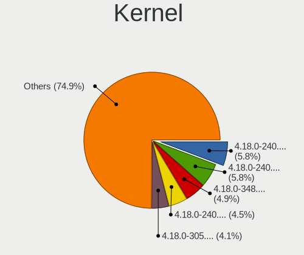

| Version                      | Computers | Percent |
|------------------------------|-----------|---------|
| 4.18.0-240.1.1.el8_3.x86_64  | 14        | 8.19%   |
| 4.18.0-240.10.1.el8_3.x86_64 | 13        | 7.6%    |
| 4.18.0-240.15.1.el8_3.x86_64 | 11        | 6.43%   |
| 4.18.0-305.el8.x86_64        | 10        | 5.85%   |
| 4.18.0-80.11.2.el8_0.x86_64  | 9         | 5.26%   |
| 4.18.0-305.3.1.el8_4.x86_64  | 8         | 4.68%   |
| 4.18.0-305.19.1.el8_4.x86_64 | 7         | 4.09%   |
| 4.18.0-305.10.2.el8_4.x86_64 | 7         | 4.09%   |
| 4.18.0-240.22.1.el8_3.x86_64 | 7         | 4.09%   |
| 4.18.0-193.19.1.el8_2.x86_64 | 7         | 4.09%   |
| 4.18.0-147.3.1.el8_1.x86_64  | 7         | 4.09%   |
| 4.18.0-348.2.1.el8_5.x86_64  | 6         | 3.51%   |
| 4.18.0-193.el8.x86_64        | 6         | 3.51%   |
| 4.18.0-147.5.1.el8_1.x86_64  | 6         | 3.51%   |
| 4.18.0-305.7.1.el8_4.x86_64  | 5         | 2.92%   |
| 4.18.0-193.6.3.el8_2.x86_64  | 5         | 2.92%   |
| 4.18.0-305.25.1.el8_4.x86_64 | 4         | 2.34%   |
| 4.18.0-305.12.1.el8_4.x86_64 | 4         | 2.34%   |
| 4.18.0-193.28.1.el8_2.x86_64 | 4         | 2.34%   |
| 4.18.0-147.el8.x86_64        | 4         | 2.34%   |
| 4.18.0-147.8.1.el8_1.x86_64  | 4         | 2.34%   |
| 4.18.0-305.17.1.el8_4.x86_64 | 2         | 1.17%   |
| 4.18.0-240.8.1.el8_3.x86_64  | 2         | 1.17%   |
| 4.18.0-193.14.3.el8_2.x86_64 | 2         | 1.17%   |
| 4.18.0-147.0.3.el8_1.x86_64  | 2         | 1.17%   |
| 5.9.1-1.el8.elrepo.x86_64    | 1         | 0.58%   |
| 5.13.0-1.el8.elrepo.x86_64   | 1         | 0.58%   |
| 5.10.6-1.el8.elrepo.x86_64   | 1         | 0.58%   |
| 4.19.150                     | 1         | 0.58%   |
| 4.18.0-80.el8.x86_64         | 1         | 0.58%   |
| 4.18.0-80.4.2.el8_0.x86_64   | 1         | 0.58%   |
| 4.18.0-348.el8.x86_64        | 1         | 0.58%   |
| 4.18.0-348.7.1.el8_5.x86_64  | 1         | 0.58%   |
| 4.18.0-221.el8.x86_64        | 1         | 0.58%   |
| 4.18.0-193.23.1.el8_2.x86_64 | 1         | 0.58%   |
| 4.18.0-193.13.2.el8_2.x86_64 | 1         | 0.58%   |
| 4.18.0-193.1.2.el8_2.x86_64  | 1         | 0.58%   |
| 4.18.0-168.el8.x86_64        | 1         | 0.58%   |
| 4.18.0-144.el8.x86_64        | 1         | 0.58%   |
| Unknown                      | 1         | 0.58%   |

Kernel Family
-------------

Linux kernel without a distro release

| Version  | Computers | Percent |
|----------|-----------|---------|
| 4.18.0   | 132       | 96.35%  |
| 5.9.1    | 1         | 0.73%   |
| 5.13.0   | 1         | 0.73%   |
| 5.10.6   | 1         | 0.73%   |
| 4.19.150 | 1         | 0.73%   |
| Unknown  | 1         | 0.73%   |

Kernel Major Ver.
-----------------

Linux kernel major version

| Version | Computers | Percent |
|---------|-----------|---------|
| 4.18    | 132       | 96.35%  |
| 5.9     | 1         | 0.73%   |
| 5.13    | 1         | 0.73%   |
| 5.10    | 1         | 0.73%   |
| 4.19    | 1         | 0.73%   |
| Unknown | 1         | 0.73%   |

Arch
----

OS architecture (x86_64, i586, etc.)

| Name    | Computers | Percent |
|---------|-----------|---------|
| x86_64  | 136       | 99.27%  |
| Unknown | 1         | 0.73%   |

DE
--

Desktop Environment

| Name          | Computers | Percent |
|---------------|-----------|---------|
| GNOME         | 118       | 82.52%  |
| Unknown       | 11        | 7.69%   |
| GNOME Classic | 7         | 4.9%    |
| KDE5          | 5         | 3.5%    |
| KDE           | 2         | 1.4%    |

Display Server
--------------

X11 or Wayland

| Name    | Computers | Percent |
|---------|-----------|---------|
| X11     | 81        | 56.64%  |
| Wayland | 56        | 39.16%  |
| Unknown | 6         | 4.2%    |

Display Manager
---------------

SDDM, LightDM, etc.

| Name    | Computers | Percent |
|---------|-----------|---------|
| Unknown | 114       | 80.28%  |
| GDM     | 28        | 19.72%  |

OS Lang
-------

Language

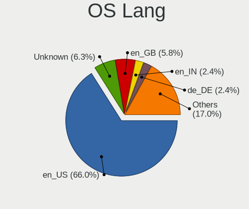

| Lang    | Computers | Percent |
|---------|-----------|---------|
| en_US   | 93        | 65.96%  |
| Unknown | 10        | 7.09%   |
| en_GB   | 7         | 4.96%   |
| pl_PL   | 4         | 2.84%   |
| fr_FR   | 4         | 2.84%   |
| en_IN   | 4         | 2.84%   |
| ru_RU   | 3         | 2.13%   |
| pt_BR   | 2         | 1.42%   |
| nl_NL   | 2         | 1.42%   |
| de_DE   | 2         | 1.42%   |
| ko_KR   | 1         | 0.71%   |
| ja_JP   | 1         | 0.71%   |
| it_IT   | 1         | 0.71%   |
| es_ES   | 1         | 0.71%   |
| es_EC   | 1         | 0.71%   |
| es_AR   | 1         | 0.71%   |
| en_NZ   | 1         | 0.71%   |
| en_IE   | 1         | 0.71%   |
| de_CH   | 1         | 0.71%   |
| cs_CZ   | 1         | 0.71%   |

Boot Mode
---------

EFI or BIOS

| Mode | Computers | Percent |
|------|-----------|---------|
| EFI  | 108       | 77.14%  |
| BIOS | 32        | 22.86%  |

Filesystem
----------

Type of filesystem

| Type    | Computers | Percent |
|---------|-----------|---------|
| Xfs     | 122       | 89.05%  |
| Ext4    | 14        | 10.22%  |
| Unknown | 1         | 0.73%   |

Part. scheme
------------

Scheme of partitioning

| Type    | Computers | Percent |
|---------|-----------|---------|
| Unknown | 108       | 76.6%   |
| GPT     | 29        | 20.57%  |
| MBR     | 4         | 2.84%   |

Dual Boot with Linux/BSD
------------------------

Hosting more than one Linux/BSD

| Dual boot | Computers | Percent |
|-----------|-----------|---------|
| No        | 134       | 97.81%  |
| Yes       | 3         | 2.19%   |

Dual Boot (Win)
---------------

Hosting Linux and Windows

| Dual boot | Computers | Percent |
|-----------|-----------|---------|
| No        | 129       | 93.48%  |
| Yes       | 9         | 6.52%   |

Board
-----

Vendor
------

Motherboard manufacturer

| Name                | Computers | Percent |
|---------------------|-----------|---------|
| Lenovo              | 57        | 41.61%  |
| Dell                | 22        | 16.06%  |
| Hewlett-Packard     | 18        | 13.14%  |
| ASUSTek Computer    | 14        | 10.22%  |
| Gigabyte Technology | 6         | 4.38%   |
| MSI                 | 4         | 2.92%   |
| ASRock              | 4         | 2.92%   |
| Supermicro          | 2         | 1.46%   |
| Sony                | 2         | 1.46%   |
| Intel               | 2         | 1.46%   |
| TUXEDO              | 1         | 0.73%   |
| Toshiba             | 1         | 0.73%   |
| Timi                | 1         | 0.73%   |
| Alienware           | 1         | 0.73%   |
| Acer                | 1         | 0.73%   |
| Unknown             | 1         | 0.73%   |

Model
-----

Motherboard model

| Name                                     | Computers | Percent |
|------------------------------------------|-----------|---------|
| Lenovo ThinkPad P1 Gen 3 20TJS2F40X      | 3         | 2.19%   |
| Lenovo ThinkPad X1 Carbon 7th 20QES2P401 | 2         | 1.46%   |
| Lenovo ThinkPad X1 Carbon 6th 20KGS23S00 | 2         | 1.46%   |
| Lenovo ThinkPad T590 20N5S2NC0N          | 2         | 1.46%   |
| Lenovo ThinkPad T490s 20NYS7K91R         | 2         | 1.46%   |
| Lenovo ThinkPad T14s Gen 1 20T1S39D08    | 2         | 1.46%   |
| Lenovo ThinkPad P1 Gen 3 20TJS2F42Q      | 2         | 1.46%   |
| Dell Latitude E6430                      | 2         | 1.46%   |
| Dell Latitude 5300                       | 2         | 1.46%   |
| ASUS All Series                          | 2         | 1.46%   |
| TUXEDO N13xWU                            | 1         | 0.73%   |
| Toshiba Satellite Pro R50-C              | 1         | 0.73%   |
| Timi TM1707                              | 1         | 0.73%   |
| Supermicro X7DW3                         | 1         | 0.73%   |
| Supermicro X10DRi                        | 1         | 0.73%   |
| Sony VPCEB4L1R                           | 1         | 0.73%   |
| Sony VPCEB23FM                           | 1         | 0.73%   |
| MSI MS-7B51                              | 1         | 0.73%   |
| MSI MS-7B33                              | 1         | 0.73%   |
| MSI MS-7A37                              | 1         | 0.73%   |
| MSI MS-7752                              | 1         | 0.73%   |
| Lenovo Yoga C640-13IML 81UE              | 1         | 0.73%   |
| Lenovo ThinkSystem SR645                 | 1         | 0.73%   |
| Lenovo ThinkpadT460 20BUS0QT0A           | 1         | 0.73%   |
| Lenovo ThinkPad X270 20HN001EMC          | 1         | 0.73%   |
| Lenovo ThinkPad X250 20CLS0H807          | 1         | 0.73%   |
| Lenovo ThinkPad X230 Tablet 34373KU      | 1         | 0.73%   |
| Lenovo ThinkPad X201 3680PKS             | 1         | 0.73%   |
| Lenovo ThinkPad W530 2441B32             | 1         | 0.73%   |
| Lenovo ThinkPad W520 4284GN2             | 1         | 0.73%   |
| Lenovo ThinkPad T590 20N5S2NC0V          | 1         | 0.73%   |
| Lenovo ThinkPad T590 20N5S2NC00          | 1         | 0.73%   |
| Lenovo ThinkPad T520 42404CG             | 1         | 0.73%   |
| Lenovo ThinkPad T490s 20NYS7K905         | 1         | 0.73%   |
| Lenovo ThinkPad T490s 20NX002HUS         | 1         | 0.73%   |
| Lenovo ThinkPad T480s 20L8S2N80V         | 1         | 0.73%   |
| Lenovo ThinkPad T480s 20L8S2N800         | 1         | 0.73%   |
| Lenovo ThinkPad T480 20L6S29E1T          | 1         | 0.73%   |
| Lenovo ThinkPad T470 20HES57W00          | 1         | 0.73%   |
| Lenovo ThinkPad T460 20FMS1VA09          | 1         | 0.73%   |
| Lenovo ThinkPad T450s 20BWS0B500         | 1         | 0.73%   |
| Lenovo ThinkPad T14s Gen 1 20UJ000WMH    | 1         | 0.73%   |
| Lenovo ThinkPad T14s Gen 1 20T1S39D12    | 1         | 0.73%   |
| Lenovo ThinkPad T14s Gen 1 20T1S39D0C    | 1         | 0.73%   |
| Lenovo ThinkPad T14 Gen 1 20S1S3B00F     | 1         | 0.73%   |
| Lenovo ThinkPad T14 Gen 1 20S1S38414     | 1         | 0.73%   |
| Lenovo ThinkPad P52 20MAS17205           | 1         | 0.73%   |
| Lenovo ThinkPad P52 20M9CTO1WW           | 1         | 0.73%   |
| Lenovo ThinkPad P50 20ENS1L000           | 1         | 0.73%   |
| Lenovo ThinkPad P50 20EN0005UK           | 1         | 0.73%   |
| Lenovo ThinkPad P17 Gen 2i 20YU002KUS    | 1         | 0.73%   |
| Lenovo ThinkPad P15 Gen 1 20SUS34800     | 1         | 0.73%   |
| Lenovo ThinkPad P1 Gen 3 20TJS2F45V      | 1         | 0.73%   |
| Lenovo ThinkPad P1 Gen 3 20TJS2F40K      | 1         | 0.73%   |
| Lenovo ThinkPad P1 Gen 2 20QUS1H300      | 1         | 0.73%   |
| Lenovo ThinkPad P1 Gen 2 20QUS10L0L      | 1         | 0.73%   |
| Lenovo ThinkPad L480 20LSCTO1WW          | 1         | 0.73%   |
| Lenovo ThinkPad E490 20N8000JAD          | 1         | 0.73%   |
| Lenovo ThinkPad E15 Gen 2 20T80002US     | 1         | 0.73%   |
| Lenovo ThinkCentre M92p 3238AZ8          | 1         | 0.73%   |

Model Family
------------

Motherboard model prefix

| Name                | Computers | Percent |
|---------------------|-----------|---------|
| Lenovo ThinkPad     | 50        | 36.5%   |
| Dell Latitude       | 8         | 5.84%   |
| Dell Precision      | 7         | 5.11%   |
| Lenovo ThinkCentre  | 3         | 2.19%   |
| HP EliteBook        | 3         | 2.19%   |
| Dell Inspiron       | 3         | 2.19%   |
| ASUS PRIME          | 3         | 2.19%   |
| HP ZBook            | 2         | 1.46%   |
| HP Z230             | 2         | 1.46%   |
| ASUS ROG            | 2         | 1.46%   |
| ASUS All            | 2         | 1.46%   |
| TUXEDO N13xWU       | 1         | 0.73%   |
| Toshiba Satellite   | 1         | 0.73%   |
| Timi TM1707         | 1         | 0.73%   |
| Supermicro X7DW3    | 1         | 0.73%   |
| Supermicro X10DRi   | 1         | 0.73%   |
| Sony VPCEB4L1R      | 1         | 0.73%   |
| Sony VPCEB23FM      | 1         | 0.73%   |
| MSI MS-7B51         | 1         | 0.73%   |
| MSI MS-7B33         | 1         | 0.73%   |
| MSI MS-7A37         | 1         | 0.73%   |
| MSI MS-7752         | 1         | 0.73%   |
| Lenovo Yoga         | 1         | 0.73%   |
| Lenovo ThinkSystem  | 1         | 0.73%   |
| Lenovo ThinkpadT460 | 1         | 0.73%   |
| Lenovo S40-40       | 1         | 0.73%   |
| Intel NUC10i7FNK    | 1         | 0.73%   |
| Intel DX79SR        | 1         | 0.73%   |
| HP Z840             | 1         | 0.73%   |
| HP Z620             | 1         | 0.73%   |
| HP Z440             | 1         | 0.73%   |
| HP ProLiant         | 1         | 0.73%   |
| HP ProBook          | 1         | 0.73%   |
| HP Pavilion         | 1         | 0.73%   |
| HP OMEN             | 1         | 0.73%   |
| HP EliteDesk        | 1         | 0.73%   |
| HP 290              | 1         | 0.73%   |
| HP 260-P020il       | 1         | 0.73%   |
| HP 250              | 1         | 0.73%   |
| Gigabyte Z97N-WIFI  | 1         | 0.73%   |
| Gigabyte Z490       | 1         | 0.73%   |
| Gigabyte Z390       | 1         | 0.73%   |
| Gigabyte B85M-D3V-A | 1         | 0.73%   |
| Gigabyte B75-D3V    | 1         | 0.73%   |
| Gigabyte 970A-D3    | 1         | 0.73%   |
| Dell XPS            | 1         | 0.73%   |
| Dell Vostro         | 1         | 0.73%   |
| Dell PowerEdge      | 1         | 0.73%   |
| Dell G3             | 1         | 0.73%   |
| ASUS Zephyrus       | 1         | 0.73%   |
| ASUS Z10PE-D16      | 1         | 0.73%   |
| ASUS TUF            | 1         | 0.73%   |
| ASUS Pro            | 1         | 0.73%   |
| ASUS P8Z77-V        | 1         | 0.73%   |
| ASUS MINIPC         | 1         | 0.73%   |
| ASUS GL502VMK       | 1         | 0.73%   |
| ASRock X99E-ITX     | 1         | 0.73%   |
| ASRock H91M-PLUS    | 1         | 0.73%   |
| ASRock H270         | 1         | 0.73%   |
| ASRock A300M-STX    | 1         | 0.73%   |

MFG Year
--------

Motherboard manufacture year

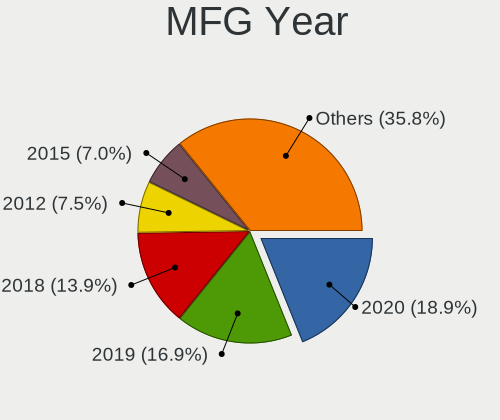

| Year | Computers | Percent |
|------|-----------|---------|
| 2020 | 46        | 33.58%  |
| 2019 | 34        | 24.82%  |
| 2018 | 17        | 12.41%  |
| 2021 | 12        | 8.76%   |
| 2017 | 4         | 2.92%   |
| 2016 | 4         | 2.92%   |
| 2014 | 4         | 2.92%   |
| 2013 | 4         | 2.92%   |
| 2012 | 4         | 2.92%   |
| 2011 | 3         | 2.19%   |
| 2015 | 2         | 1.46%   |
| 2010 | 2         | 1.46%   |
| 2009 | 1         | 0.73%   |

Form Factor
-----------

Physical design of the computer

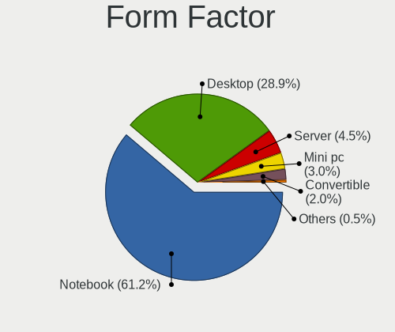

| Name        | Computers | Percent |
|-------------|-----------|---------|
| Notebook    | 86        | 62.77%  |
| Desktop     | 43        | 31.39%  |
| Server      | 4         | 2.92%   |
| Mini pc     | 2         | 1.46%   |
| Convertible | 1         | 0.73%   |
| All in one  | 1         | 0.73%   |

Secure Boot
-----------

Enabled or disabled

| State    | Computers | Percent |
|----------|-----------|---------|
| Disabled | 125       | 90.58%  |
| Enabled  | 13        | 9.42%   |

Coreboot
--------

Have coreboot on board

| Used | Computers | Percent |
|------|-----------|---------|
| No   | 137       | 100%    |

RAM Size
--------

Total RAM memory

| Size in GB      | Computers | Percent |
|-----------------|-----------|---------|
| 32.01-64.0      | 39        | 27.66%  |
| 4.01-8.0        | 24        | 17.02%  |
| 16.01-24.0      | 23        | 16.31%  |
| 8.01-16.0       | 21        | 14.89%  |
| 64.01-256.0     | 19        | 13.48%  |
| 3.01-4.0        | 7         | 4.96%   |
| 24.01-32.0      | 5         | 3.55%   |
| More than 256.0 | 2         | 1.42%   |
| Unknown         | 1         | 0.71%   |

RAM Used
--------

Used RAM memory

| Used GB         | Computers | Percent |
|-----------------|-----------|---------|
| 4.01-8.0        | 58        | 36.71%  |
| 8.01-16.0       | 29        | 18.35%  |
| 2.01-3.0        | 27        | 17.09%  |
| 3.01-4.0        | 26        | 16.46%  |
| 1.01-2.0        | 11        | 6.96%   |
| 16.01-24.0      | 3         | 1.9%    |
| 24.01-32.0      | 2         | 1.27%   |
| More than 256.0 | 1         | 0.63%   |
| Unknown         | 1         | 0.63%   |

Total Drives
------------

Number of drives on board

| Drives | Computers | Percent |
|--------|-----------|---------|
| 1      | 84        | 58.33%  |
| 2      | 32        | 22.22%  |
| 3      | 15        | 10.42%  |
| 4      | 6         | 4.17%   |
| 5      | 3         | 2.08%   |
| 6      | 2         | 1.39%   |
| 8      | 1         | 0.69%   |
| 7      | 1         | 0.69%   |

Has CD-ROM
----------

Has CD-ROM on board

| Presented | Computers | Percent |
|-----------|-----------|---------|
| No        | 106       | 76.26%  |
| Yes       | 33        | 23.74%  |

Has Ethernet
------------

Has Ethernet on board

| Presented | Computers | Percent |
|-----------|-----------|---------|
| Yes       | 128       | 92.75%  |
| No        | 10        | 7.25%   |

Has WiFi
--------

Has WiFi module

| Presented | Computers | Percent |
|-----------|-----------|---------|
| Yes       | 110       | 80.29%  |
| No        | 27        | 19.71%  |

Has Bluetooth
-------------

Has Bluetooth module

| Presented | Computers | Percent |
|-----------|-----------|---------|
| Yes       | 89        | 62.68%  |
| No        | 53        | 37.32%  |

Location
--------

Country
-------

Geographic location (country)

| Country      | Computers | Percent |
|--------------|-----------|---------|
| USA          | 30        | 21.74%  |
| India        | 15        | 10.87%  |
| UK           | 9         | 6.52%   |
| Germany      | 7         | 5.07%   |
| Czechia      | 7         | 5.07%   |
| France       | 6         | 4.35%   |
| Canada       | 6         | 4.35%   |
| Poland       | 4         | 2.9%    |
| Netherlands  | 4         | 2.9%    |
| Switzerland  | 3         | 2.17%   |
| Russia       | 3         | 2.17%   |
| Lithuania    | 3         | 2.17%   |
| Italy        | 3         | 2.17%   |
| Ukraine      | 2         | 1.45%   |
| Spain        | 2         | 1.45%   |
| South Korea  | 2         | 1.45%   |
| South Africa | 2         | 1.45%   |
| Mexico       | 2         | 1.45%   |
| Japan        | 2         | 1.45%   |
| Brazil       | 2         | 1.45%   |
| Australia    | 2         | 1.45%   |
| Argentina    | 2         | 1.45%   |
| Turkmenistan | 1         | 0.72%   |
| Sweden       | 1         | 0.72%   |
| Singapore    | 1         | 0.72%   |
| Saudi Arabia | 1         | 0.72%   |
| Romania      | 1         | 0.72%   |
| Portugal     | 1         | 0.72%   |
| Pakistan     | 1         | 0.72%   |
| New Zealand  | 1         | 0.72%   |
| Nepal        | 1         | 0.72%   |
| Myanmar      | 1         | 0.72%   |
| Morocco      | 1         | 0.72%   |
| Kuwait       | 1         | 0.72%   |
| Ireland      | 1         | 0.72%   |
| Indonesia    | 1         | 0.72%   |
| Egypt        | 1         | 0.72%   |
| Ecuador      | 1         | 0.72%   |
| Colombia     | 1         | 0.72%   |
| Bulgaria     | 1         | 0.72%   |
| Belarus      | 1         | 0.72%   |
| Armenia      | 1         | 0.72%   |

City
----

Geographic location (city)

| City                     | Computers | Percent |
|--------------------------|-----------|---------|
| Brno                     | 5         | 3.36%   |
| Munich                   | 3         | 2.01%   |
| Toronto                  | 2         | 1.34%   |
| San Jose                 | 2         | 1.34%   |
| Mumbai                   | 2         | 1.34%   |
| Milan                    | 2         | 1.34%   |
| Mexico City              | 2         | 1.34%   |
| Kyiv                     | 2         | 1.34%   |
| Doetinchem               | 2         | 1.34%   |
| Coimbatore               | 2         | 1.34%   |
| Chicago                  | 2         | 1.34%   |
| Bengaluru                | 2         | 1.34%   |
| ?iauliai                | 2         | 1.34%   |
| Aurora                   | 2         | 1.34%   |
| Yerevan                  | 1         | 0.67%   |
| Wroclaw                  | 1         | 0.67%   |
| Wiesbaden                | 1         | 0.67%   |
| Weybridge                | 1         | 0.67%   |
| Webster                  | 1         | 0.67%   |
| Warsaw                   | 1         | 0.67%   |
| Valmontone               | 1         | 0.67%   |
| Vaestra Froelunda        | 1         | 0.67%   |
| Tauranga                 | 1         | 0.67%   |
| Taringa                  | 1         | 0.67%   |
| Suwon                    | 1         | 0.67%   |
| Sumida                   | 1         | 0.67%   |
| Stroud                   | 1         | 0.67%   |
| Spokane                  | 1         | 0.67%   |
| Sofia                    | 1         | 0.67%   |
| Singapore                | 1         | 0.67%   |
| Sheffield                | 1         | 0.67%   |
| Seoul                    | 1         | 0.67%   |
| Saratov                  | 1         | 0.67%   |
| San Francisco            | 1         | 0.67%   |
| Sammamish                | 1         | 0.67%   |
| Sal?                    | 1         | 0.67%   |
| Saint-Ismier             | 1         | 0.67%   |
| Saint-Alphonse-Rodriguez | 1         | 0.67%   |
| Sagaing                  | 1         | 0.67%   |
| Roudnice nad Labem       | 1         | 0.67%   |
| Roha                     | 1         | 0.67%   |
| Reims                    | 1         | 0.67%   |
| Raleigh                  | 1         | 0.67%   |
| Quito                    | 1         | 0.67%   |
| Queenscliff              | 1         | 0.67%   |
| Queens                   | 1         | 0.67%   |
| Pune                     | 1         | 0.67%   |
| Prague                   | 1         | 0.67%   |
| Poznan                   | 1         | 0.67%   |
| Portalegre               | 1         | 0.67%   |
| Port Elizabeth           | 1         | 0.67%   |
| Pleasanton               | 1         | 0.67%   |
| Pickerington             | 1         | 0.67%   |
| Pernis                   | 1         | 0.67%   |
| Paris                    | 1         | 0.67%   |
| Paraiso do Tocantins     | 1         | 0.67%   |
| Paragould                | 1         | 0.67%   |
| Paracuellos de Jarama    | 1         | 0.67%   |
| Oyama                    | 1         | 0.67%   |
| Ottawa                   | 1         | 0.67%   |

Drives
------

Drive Vendor
------------

Hard drive vendors

| Vendor              | Computers | Drives | Percent |
|---------------------|-----------|--------|---------|
| Samsung Electronics | 40        | 63     | 19.42%  |
| WDC                 | 31        | 54     | 15.05%  |
| Seagate             | 24        | 36     | 11.65%  |
| Toshiba             | 16        | 24     | 7.77%   |
| SK Hynix            | 13        | 16     | 6.31%   |
| SanDisk             | 13        | 19     | 6.31%   |
| Kingston            | 10        | 12     | 4.85%   |
| Intel               | 9         | 13     | 4.37%   |
| Unknown             | 6         | 8      | 2.91%   |
| Micron Technology   | 6         | 13     | 2.91%   |
| Crucial             | 5         | 9      | 2.43%   |
| A-DATA Technology   | 4         | 4      | 1.94%   |
| Hitachi             | 3         | 3      | 1.46%   |
| HGST                | 3         | 3      | 1.46%   |
| Silicon Motion      | 2         | 3      | 0.97%   |
| PNY                 | 2         | 5      | 0.97%   |
| Phison              | 2         | 4      | 0.97%   |
| Lenovo              | 2         | 2      | 0.97%   |
| Hewlett-Packard     | 2         | 3      | 0.97%   |
| Corsair             | 2         | 2      | 0.97%   |
| XPG                 | 1         | 1      | 0.49%   |
| Team                | 1         | 2      | 0.49%   |
| T-FORCE             | 1         | 2      | 0.49%   |
| SMI                 | 1         | 2      | 0.49%   |
| OCZ                 | 1         | 2      | 0.49%   |
| Lite-On             | 1         | 1      | 0.49%   |
| Hoodisk             | 1         | 1      | 0.49%   |
| Gigabyte Technology | 1         | 1      | 0.49%   |
| DELLBOSS            | 1         | 1      | 0.49%   |
| Dell                | 1         | 1      | 0.49%   |
| China               | 1         | 1      | 0.49%   |

Drive Model
-----------

Hard drive models

| Model                                                      | Computers | Percent |
|------------------------------------------------------------|-----------|---------|
| SK Hynix NVMe SSD Drive 512GB                              | 9         | 3.83%   |
| Sandisk NVMe SSD Drive 256GB                               | 6         | 2.55%   |
| Samsung NVMe SSD Drive 512GB                               | 6         | 2.55%   |
| Samsung SSD 860 EVO 1TB                                    | 5         | 2.13%   |
| Samsung NVMe SSD Drive 256GB                               | 5         | 2.13%   |
| Samsung NVMe SSD Drive 1024GB                              | 5         | 2.13%   |
| Toshiba NVMe SSD Drive 256GB                               | 4         | 1.7%    |
| Toshiba NVMe SSD Drive 512GB                               | 3         | 1.28%   |
| Samsung NVMe SSD Drive 500GB                               | 3         | 1.28%   |
| Micron NVMe SSD Drive 256GB                                | 3         | 1.28%   |
| WDC WD1002FAEX-00Z3A0 1TB                                  | 2         | 0.85%   |
| Unknown NVMe SSD Drive 256GB                               | 2         | 0.85%   |
| Seagate ST2000DM001-1ER164 2TB                             | 2         | 0.85%   |
| Seagate ST1000LM049-2GH172 1TB                             | 2         | 0.85%   |
| Seagate ST1000DM003-9YN162 1TB                             | 2         | 0.85%   |
| Seagate Expansion 1TB                                      | 2         | 0.85%   |
| Samsung SSD 860 EVO 500GB                                  | 2         | 0.85%   |
| Samsung Portable SSD T5 500GB                              | 2         | 0.85%   |
| Samsung NVMe SSD Drive 2TB                                 | 2         | 0.85%   |
| Samsung NVMe SSD Drive 1TB                                 | 2         | 0.85%   |
| Kingston SUV500120G 120GB SSD                              | 2         | 0.85%   |
| Kingston SA400S37480G 480GB SSD                            | 2         | 0.85%   |
| Kingston SA400S37240G 240GB SSD                            | 2         | 0.85%   |
| Intel NVMe SSD Drive 512GB                                 | 2         | 0.85%   |
| Intel NVMe Datacenter SSD [3DNAND] SE 2.5" U.2 (P4510) 2TB | 2         | 0.85%   |
| HGST HTS721010A9E630 1TB                                   | 2         | 0.85%   |
| Crucial CT480BX500SSD1 480GB                               | 2         | 0.85%   |
| XPG NVMe SSD Drive 1024GB                                  | 1         | 0.43%   |
| WDC WDS500G2B0A-00SM50 500GB SSD                           | 1         | 0.43%   |
| WDC WDS400T2B0A-00SM50 4TB SSD                             | 1         | 0.43%   |
| WDC WDS250G2B0B-00YS70 250GB SSD                           | 1         | 0.43%   |
| WDC WDS240G2G0A-00JH30 240GB SSD                           | 1         | 0.43%   |
| WDC WDS240G1G0A-00SS50 240GB SSD                           | 1         | 0.43%   |
| WDC WDS200T2B0B-00YS70 2TB SSD                             | 1         | 0.43%   |
| WDC WDS100T2B0A-00SM50 1TB SSD                             | 1         | 0.43%   |
| WDC WD7500BPKT-00PK4T0 752GB                               | 1         | 0.43%   |
| WDC WD6400BPVT-75HXZT1 640GB                               | 1         | 0.43%   |
| WDC WD60 EFAX-68JH4N1 6TB                                  | 1         | 0.43%   |
| WDC WD60 EFAX-68JH4N0 6TB                                  | 1         | 0.43%   |
| WDC WD5003ABYZ-011FA0 500GB                                | 1         | 0.43%   |
| WDC WD5000LPLX-08ZNTT0 500GB                               | 1         | 0.43%   |
| WDC WD5000AAKX-75U6AA0 500GB                               | 1         | 0.43%   |
| WDC WD5000AAKX-08U6AA0 500GB                               | 1         | 0.43%   |
| WDC WD40PURZ-85TTDY0 4TB                                   | 1         | 0.43%   |
| WDC WD40EZRZ-19GXCB0 4TB                                   | 1         | 0.43%   |
| WDC WD40EFRX-68N32N0 4TB                                   | 1         | 0.43%   |
| WDC WD4005FZBX-00K5WB0 4TB                                 | 1         | 0.43%   |
| WDC WD2500BEVT-60ZCT1 250GB                                | 1         | 0.43%   |
| WDC WD2500BEKT-75F3T0 250GB                                | 1         | 0.43%   |
| WDC WD2500AAKX-083CA1 250GB                                | 1         | 0.43%   |
| WDC WD20PURZ-85GU6Y0 2TB                                   | 1         | 0.43%   |
| WDC WD20EARS-22MVWB0 2TB                                   | 1         | 0.43%   |
| WDC WD20 SPZX-11UA7T0 2TB                                  | 1         | 0.43%   |
| WDC WD10SPZX-22Z10T0 1TB                                   | 1         | 0.43%   |
| WDC WD10SPZX-21Z10T0 1TB                                   | 1         | 0.43%   |
| WDC WD10SPZX-08Z10 1TB                                     | 1         | 0.43%   |
| WDC WD10JPVX-75JC3T0 1TB                                   | 1         | 0.43%   |
| WDC WD10JPVX-22JC3T0 1TB                                   | 1         | 0.43%   |
| WDC WD10EZEX-75WN4A0 1TB                                   | 1         | 0.43%   |
| WDC WD10EZEX-22MFCA0 1TB                                   | 1         | 0.43%   |

HDD Vendor
----------

Hard disk drive vendors

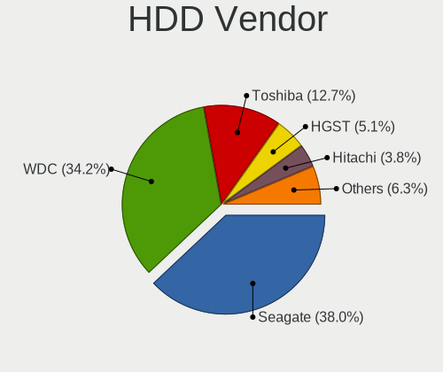

| Vendor              | Computers | Drives | Percent |
|---------------------|-----------|--------|---------|
| Seagate             | 24        | 35     | 37.5%   |
| WDC                 | 23        | 42     | 35.94%  |
| Toshiba             | 7         | 11     | 10.94%  |
| Hitachi             | 3         | 3      | 4.69%   |
| HGST                | 3         | 3      | 4.69%   |
| Unknown             | 1         | 1      | 1.56%   |
| Samsung Electronics | 1         | 1      | 1.56%   |
| Hewlett-Packard     | 1         | 1      | 1.56%   |
| DELLBOSS            | 1         | 1      | 1.56%   |

SSD Vendor
----------

Solid state drive vendors

| Vendor              | Computers | Drives | Percent |
|---------------------|-----------|--------|---------|
| Samsung Electronics | 19        | 23     | 29.23%  |
| Kingston            | 10        | 12     | 15.38%  |
| WDC                 | 6         | 8      | 9.23%   |
| Crucial             | 5         | 9      | 7.69%   |
| SanDisk             | 4         | 5      | 6.15%   |
| A-DATA Technology   | 4         | 4      | 6.15%   |
| Micron Technology   | 3         | 8      | 4.62%   |
| SK Hynix            | 2         | 5      | 3.08%   |
| PNY                 | 2         | 5      | 3.08%   |
| Intel               | 2         | 3      | 3.08%   |
| Corsair             | 2         | 2      | 3.08%   |
| Toshiba             | 1         | 1      | 1.54%   |
| Team                | 1         | 2      | 1.54%   |
| Seagate             | 1         | 1      | 1.54%   |
| OCZ                 | 1         | 2      | 1.54%   |
| Hoodisk             | 1         | 1      | 1.54%   |
| China               | 1         | 1      | 1.54%   |

Drive Kind
----------

HDD or SSD

| Kind    | Computers | Drives | Percent |
|---------|-----------|--------|---------|
| NVMe    | 72        | 113    | 36.73%  |
| SSD     | 61        | 92     | 31.12%  |
| HDD     | 58        | 98     | 29.59%  |
| MMC     | 3         | 4      | 1.53%   |
| Unknown | 2         | 4      | 1.02%   |

Drive Connector
---------------

SATA, SAS, NVMe, etc.

| Type | Computers | Drives | Percent |
|------|-----------|--------|---------|
| SATA | 81        | 177    | 48.21%  |
| NVMe | 72        | 113    | 42.86%  |
| SAS  | 12        | 17     | 7.14%   |
| MMC  | 3         | 4      | 1.79%   |

Drive Size
----------

Size of hard drive

| Size in TB | Computers | Drives | Percent |
|------------|-----------|--------|---------|
| 0.01-0.5   | 55        | 80     | 43.65%  |
| 0.51-1.0   | 39        | 62     | 30.95%  |
| 1.01-2.0   | 18        | 21     | 14.29%  |
| 3.01-4.0   | 10        | 20     | 7.94%   |
| 4.01-10.0  | 2         | 5      | 1.59%   |
| 2.01-3.0   | 1         | 1      | 0.79%   |
| 10.01-20.0 | 1         | 1      | 0.79%   |

Space Total
-----------

Amount of disk space available on the file system

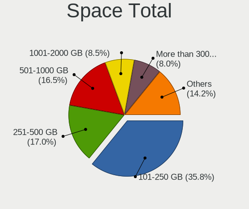

| Size in GB     | Computers | Percent |
|----------------|-----------|---------|
| 101-250        | 53        | 36.55%  |
| 251-500        | 26        | 17.93%  |
| 501-1000       | 22        | 15.17%  |
| More than 3000 | 14        | 9.66%   |
| 1001-2000      | 13        | 8.97%   |
| 2001-3000      | 5         | 3.45%   |
| 51-100         | 5         | 3.45%   |
| Unknown        | 4         | 2.76%   |
| 21-50          | 2         | 1.38%   |
| 1-20           | 1         | 0.69%   |

Space Used
----------

Amount of used disk space

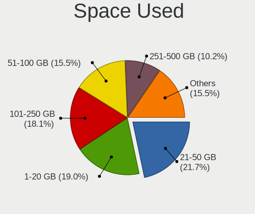

| Used GB        | Computers | Percent |
|----------------|-----------|---------|
| 21-50          | 36        | 23.23%  |
| 101-250        | 31        | 20%     |
| 1-20           | 29        | 18.71%  |
| 51-100         | 22        | 14.19%  |
| 251-500        | 11        | 7.1%    |
| 501-1000       | 10        | 6.45%   |
| 1001-2000      | 6         | 3.87%   |
| Unknown        | 4         | 2.58%   |
| More than 3000 | 3         | 1.94%   |
| 2001-3000      | 3         | 1.94%   |

Malfunc. Drives
---------------

Drive models with a malfunction

| Model                          | Computers | Drives | Percent |
|--------------------------------|-----------|--------|---------|
| Seagate ST1000DM003-9YN162 1TB | 1         | 1      | 50%     |
| Hitachi HDS722020ALA330 2TB    | 1         | 1      | 50%     |

Malfunc. Drive Vendor
---------------------

Vendors of faulty drives

| Vendor  | Computers | Drives | Percent |
|---------|-----------|--------|---------|
| Seagate | 1         | 1      | 50%     |
| Hitachi | 1         | 1      | 50%     |

Malfunc. HDD Vendor
-------------------

Vendors of faulty HDD drives

| Vendor  | Computers | Drives | Percent |
|---------|-----------|--------|---------|
| Seagate | 1         | 1      | 50%     |
| Hitachi | 1         | 1      | 50%     |

Malfunc. Drive Kind
-------------------

Kinds of faulty drives

| Kind | Computers | Drives | Percent |
|------|-----------|--------|---------|
| HDD  | 2         | 2      | 100%    |

Failed Drives
-------------

Failed drive models

Zero info for selected period =(

Failed Drive Vendor
-------------------

Failed drive vendors

Zero info for selected period =(

Drive Status
------------

Number of failed and malfunc. drives

| Status   | Computers | Drives | Percent |
|----------|-----------|--------|---------|
| Detected | 110       | 242    | 74.83%  |
| Works    | 35        | 67     | 23.81%  |
| Malfunc  | 2         | 2      | 1.36%   |

Storage controller
------------------

Storage Vendor
--------------

Storage controller vendors

| Vendor                       | Computers | Percent |
|------------------------------|-----------|---------|
| Intel                        | 85        | 46.96%  |
| Samsung Electronics          | 27        | 14.92%  |
| SK Hynix                     | 11        | 6.08%   |
| Sandisk                      | 11        | 6.08%   |
| AMD                          | 11        | 6.08%   |
| Toshiba America Info Systems | 8         | 4.42%   |
| Marvell Technology Group     | 4         | 2.21%   |
| Broadcom / LSI               | 4         | 2.21%   |
| Silicon Motion               | 3         | 1.66%   |
| Micron Technology            | 3         | 1.66%   |
| Phison Electronics           | 2         | 1.1%    |
| LSI Logic / Symbios Logic    | 2         | 1.1%    |
| Lenovo                       | 2         | 1.1%    |
| KIOXIA                       | 2         | 1.1%    |
| ASMedia Technology           | 2         | 1.1%    |
| Lite-On Technology           | 1         | 0.55%   |
| Hewlett-Packard              | 1         | 0.55%   |
| Biwin Storage Technology     | 1         | 0.55%   |
| ADATA Technology             | 1         | 0.55%   |

Storage Model
-------------

Storage controller models

| Model                                                                            | Computers | Percent |
|----------------------------------------------------------------------------------|-----------|---------|
| Samsung NVMe SSD Controller SM981/PM981/PM983                                    | 20        | 9.95%   |
| SK Hynix Non-Volatile memory controller                                          | 11        | 5.47%   |
| Intel Sunrise Point-LP SATA Controller [AHCI mode]                               | 10        | 4.98%   |
| AMD FCH SATA Controller [AHCI mode]                                              | 10        | 4.98%   |
| Sandisk WD Black SN750 / PC SN730 NVMe SSD                                       | 8         | 3.98%   |
| Intel Cannon Lake PCH SATA AHCI Controller                                       | 7         | 3.48%   |
| Intel Q170/Q150/B150/H170/H110/Z170/CM236 Chipset SATA Controller [AHCI Mode]    | 6         | 2.99%   |
| Intel Cannon Lake Mobile PCH SATA AHCI Controller                                | 6         | 2.99%   |
| Toshiba America Info Systems XG6 NVMe SSD Controller                             | 5         | 2.49%   |
| Intel C610/X99 series chipset 6-Port SATA Controller [AHCI mode]                 | 5         | 2.49%   |
| Intel 8 Series/C220 Series Chipset Family 6-port SATA Controller 1 [AHCI mode]   | 5         | 2.49%   |
| Intel 7 Series/C210 Series Chipset Family 6-port SATA Controller [AHCI mode]     | 5         | 2.49%   |
| Intel 6 Series/C200 Series Chipset Family 6 port Mobile SATA AHCI Controller     | 5         | 2.49%   |
| Intel SSD 660P Series                                                            | 4         | 1.99%   |
| Intel C610/X99 series chipset sSATA Controller [AHCI mode]                       | 4         | 1.99%   |
| Intel 82801 Mobile SATA Controller [RAID mode]                                   | 4         | 1.99%   |
| Samsung NVMe SSD Controller SM961/PM961/SM963                                    | 3         | 1.49%   |
| Micron Non-Volatile memory controller                                            | 3         | 1.49%   |
| Intel Wildcat Point-LP SATA Controller [AHCI Mode]                               | 3         | 1.49%   |
| Intel 7 Series Chipset Family 6-port SATA Controller [AHCI mode]                 | 3         | 1.49%   |
| Intel 5 Series/3400 Series Chipset 4 port SATA AHCI Controller                   | 3         | 1.49%   |
| Intel 200 Series PCH SATA controller [AHCI mode]                                 | 3         | 1.49%   |
| AMD 300 Series Chipset SATA Controller                                           | 3         | 1.49%   |
| Toshiba America Info Systems Toshiba America Info Non-Volatile memory controller | 2         | 1%      |
| Silicon Motion SM2263EN/SM2263XT SSD Controller                                  | 2         | 1%      |
| Sandisk WD Blue SN550 NVMe SSD                                                   | 2         | 1%      |
| Samsung NVMe SSD Controller 980                                                  | 2         | 1%      |
| Lenovo Non-Volatile memory controller                                            | 2         | 1%      |
| KIOXIA Non-Volatile memory controller                                            | 2         | 1%      |
| Intel SSD Pro 7600p/760p/E 6100p Series                                          | 2         | 1%      |
| Intel HM170/QM170 Chipset SATA Controller [AHCI Mode]                            | 2         | 1%      |
| Intel Comet Lake SATA AHCI Controller                                            | 2         | 1%      |
| Intel C600/X79 series chipset SATA RAID Controller                               | 2         | 1%      |
| Intel C600/X79 series chipset 6-Port SATA AHCI Controller                        | 2         | 1%      |
| ASMedia ASM1062 Serial ATA Controller                                            | 2         | 1%      |
| Toshiba America Info Systems XG4 NVMe SSD Controller                             | 1         | 0.5%    |
| Silicon Motion SM2262/SM2262EN SSD Controller                                    | 1         | 0.5%    |
| Sandisk WD Blue SN500 / PC SN520 NVMe SSD                                        | 1         | 0.5%    |
| Sandisk WD Black 2018/SN750 / PC SN720 NVMe SSD                                  | 1         | 0.5%    |
| Samsung NVMe SSD Controller PM9A1/PM9A3/980PRO                                   | 1         | 0.5%    |
| Samsung NVMe SSD Controller PM173X                                               | 1         | 0.5%    |
| Phison PS5013 E13 NVMe Controller                                                | 1         | 0.5%    |
| Phison E16 PCIe4 NVMe Controller                                                 | 1         | 0.5%    |
| Phison E12 NVMe Controller                                                       | 1         | 0.5%    |
| Marvell Group 88SE9230 PCIe 2.0 x2 4-port SATA 6 Gb/s RAID Controller            | 1         | 0.5%    |
| Marvell Group 88SE9215 PCIe 2.0 x1 4-port SATA 6 Gb/s Controller                 | 1         | 0.5%    |
| Marvell Group 88SE9128 PCIe SATA 6 Gb/s RAID controller with HyperDuo            | 1         | 0.5%    |
| Marvell Group 88NR2241 Non-Volatile memory controller                            | 1         | 0.5%    |
| LSI Logic / Symbios Logic SAS2308 PCI-Express Fusion-MPT SAS-2                   | 1         | 0.5%    |
| LSI Logic / Symbios Logic MegaRAID SAS 2008 [Falcon]                             | 1         | 0.5%    |
| Lite-On Non-Volatile memory controller                                           | 1         | 0.5%    |
| Intel Volume Management Device NVMe RAID Controller                              | 1         | 0.5%    |
| Intel SATA Controller [RAID mode]                                                | 1         | 0.5%    |
| Intel NVMe Datacenter SSD [Optane]                                               | 1         | 0.5%    |
| Intel Cannon Point-LP SATA Controller [AHCI Mode]                                | 1         | 0.5%    |
| Intel C610/X99 series chipset sSATA Controller [RAID mode]                       | 1         | 0.5%    |
| Intel C602 chipset 4-Port SATA Storage Control Unit                              | 1         | 0.5%    |
| Intel C600/X79 series chipset IDE-r Controller                                   | 1         | 0.5%    |
| Intel 9 Series Chipset Family SATA Controller [AHCI Mode]                        | 1         | 0.5%    |
| Intel 8 Series SATA Controller 1 [AHCI mode]                                     | 1         | 0.5%    |

Storage Kind
------------

Kind of storage controller (IDE, SATA, NVMe, SAS, ...)

| Kind | Computers | Percent |
|------|-----------|---------|
| SATA | 85        | 48.3%   |
| NVMe | 72        | 40.91%  |
| RAID | 12        | 6.82%   |
| IDE  | 4         | 2.27%   |
| SAS  | 3         | 1.7%    |

Processor
---------

CPU Vendor
----------

Processor vendors

| Vendor | Computers | Percent |
|--------|-----------|---------|
| Intel  | 123       | 89.78%  |
| AMD    | 14        | 10.22%  |

CPU Model
---------

Processor models

| Model                                         | Computers | Percent |
|-----------------------------------------------|-----------|---------|
| Intel Core i7-8665U CPU @ 1.90GHz             | 9         | 6.57%   |
| Intel Core i7-10850H CPU @ 2.70GHz            | 8         | 5.84%   |
| Intel Core i7-10610U CPU @ 1.80GHz            | 5         | 3.65%   |
| Intel Core i7-8650U CPU @ 1.90GHz             | 4         | 2.92%   |
| Intel Core i7-8750H CPU @ 2.20GHz             | 3         | 2.19%   |
| Intel Core i7-8700 CPU @ 3.20GHz              | 3         | 2.19%   |
| Intel Core i5-5300U CPU @ 2.30GHz             | 3         | 2.19%   |
| Intel Xeon CPU E5-2680 v3 @ 2.50GHz           | 2         | 1.46%   |
| Intel Pentium Gold G5400 CPU @ 3.70GHz        | 2         | 1.46%   |
| Intel Core i7-9850H CPU @ 2.60GHz             | 2         | 1.46%   |
| Intel Core i7-9750H CPU @ 2.60GHz             | 2         | 1.46%   |
| Intel Core i7-8565U CPU @ 1.80GHz             | 2         | 1.46%   |
| Intel Core i7-8550U CPU @ 1.80GHz             | 2         | 1.46%   |
| Intel Core i7-7700HQ CPU @ 2.80GHz            | 2         | 1.46%   |
| Intel Core i7-7600U CPU @ 2.80GHz             | 2         | 1.46%   |
| Intel Core i7-3520M CPU @ 2.90GHz             | 2         | 1.46%   |
| Intel Core i5-8365U CPU @ 1.60GHz             | 2         | 1.46%   |
| Intel Core i5-8350U CPU @ 1.70GHz             | 2         | 1.46%   |
| Intel Core i5-8250U CPU @ 1.60GHz             | 2         | 1.46%   |
| Intel Core i5-6200U CPU @ 2.30GHz             | 2         | 1.46%   |
| Intel Core i5-2520M CPU @ 2.50GHz             | 2         | 1.46%   |
| Intel Core i5-10210U CPU @ 1.60GHz            | 2         | 1.46%   |
| AMD Ryzen 9 3900X 12-Core Processor           | 2         | 1.46%   |
| AMD Ryzen 7 3750H with Radeon Vega Mobile Gfx | 2         | 1.46%   |
| Intel Xeon W-10855M CPU @ 2.80GHz             | 1         | 0.73%   |
| Intel Xeon E-2176M CPU @ 2.70GHz              | 1         | 0.73%   |
| Intel Xeon CPU E5472 @ 3.00GHz                | 1         | 0.73%   |
| Intel Xeon CPU E5-2696 v3 @ 2.30GHz           | 1         | 0.73%   |
| Intel Xeon CPU E5-2680 v2 @ 2.80GHz           | 1         | 0.73%   |
| Intel Xeon CPU E5-2670 0 @ 2.60GHz            | 1         | 0.73%   |
| Intel Xeon CPU E5-2667 v3 @ 3.20GHz           | 1         | 0.73%   |
| Intel Xeon CPU E5-2640 v4 @ 2.40GHz           | 1         | 0.73%   |
| Intel Xeon CPU E5-1650 v4 @ 3.60GHz           | 1         | 0.73%   |
| Intel Xeon CPU E3-1575M v5 @ 3.00GHz          | 1         | 0.73%   |
| Intel Xeon CPU E3-1505M v5 @ 2.80GHz          | 1         | 0.73%   |
| Intel Xeon CPU E3-1240 v3 @ 3.40GHz           | 1         | 0.73%   |
| Intel Pentium CPU G3250 @ 3.20GHz             | 1         | 0.73%   |
| Intel Core i9-9980HK CPU @ 2.40GHz            | 1         | 0.73%   |
| Intel Core i9-9880H CPU @ 2.30GHz             | 1         | 0.73%   |
| Intel Core i7-9700F CPU @ 3.00GHz             | 1         | 0.73%   |
| Intel Core i7-8850H CPU @ 2.60GHz             | 1         | 0.73%   |
| Intel Core i7-8700K CPU @ 3.70GHz             | 1         | 0.73%   |
| Intel Core i7-7700 CPU @ 3.60GHz              | 1         | 0.73%   |
| Intel Core i7-7560U CPU @ 2.40GHz             | 1         | 0.73%   |
| Intel Core i7-7500U CPU @ 2.70GHz             | 1         | 0.73%   |
| Intel Core i7-6700HQ CPU @ 2.60GHz            | 1         | 0.73%   |
| Intel Core i7-4770K CPU @ 3.50GHz             | 1         | 0.73%   |
| Intel Core i7-4500U CPU @ 1.80GHz             | 1         | 0.73%   |
| Intel Core i7-3820 CPU @ 3.60GHz              | 1         | 0.73%   |
| Intel Core i7-3770K CPU @ 3.50GHz             | 1         | 0.73%   |
| Intel Core i7-3720QM CPU @ 2.60GHz            | 1         | 0.73%   |
| Intel Core i7-3540M CPU @ 3.00GHz             | 1         | 0.73%   |
| Intel Core i7-2760QM CPU @ 2.40GHz            | 1         | 0.73%   |
| Intel Core i7-10710U CPU @ 1.10GHz            | 1         | 0.73%   |
| Intel Core i7-10510U CPU @ 1.80GHz            | 1         | 0.73%   |
| Intel Core i5-9600K CPU @ 3.70GHz             | 1         | 0.73%   |
| Intel Core i5-7500 CPU @ 3.40GHz              | 1         | 0.73%   |
| Intel Core i5-6500 CPU @ 3.20GHz              | 1         | 0.73%   |
| Intel Core i5-6300U CPU @ 2.40GHz             | 1         | 0.73%   |
| Intel Core i5-4690 CPU @ 3.50GHz              | 1         | 0.73%   |

CPU Model Family
----------------

Processor model prefix

| Model              | Computers | Percent |
|--------------------|-----------|---------|
| Intel Core i7      | 62        | 45.26%  |
| Intel Core i5      | 31        | 22.63%  |
| Intel Xeon         | 14        | 10.22%  |
| Intel Core i3      | 9         | 6.57%   |
| AMD Ryzen 7        | 5         | 3.65%   |
| Other              | 2         | 1.46%   |
| Intel Pentium Gold | 2         | 1.46%   |
| Intel Core i9      | 2         | 1.46%   |
| AMD Ryzen 9        | 2         | 1.46%   |
| AMD Ryzen 3        | 2         | 1.46%   |
| AMD EPYC           | 2         | 1.46%   |
| Intel Pentium      | 1         | 0.73%   |
| AMD Ryzen 7 PRO    | 1         | 0.73%   |
| AMD Ryzen 5        | 1         | 0.73%   |
| AMD FX             | 1         | 0.73%   |

CPU Cores
---------

Number of processor cores

| Number | Computers | Percent |
|--------|-----------|---------|
| 4      | 58        | 42.34%  |
| 2      | 33        | 24.09%  |
| 6      | 26        | 18.98%  |
| 8      | 9         | 6.57%   |
| 12     | 3         | 2.19%   |
| 20     | 2         | 1.46%   |
| 16     | 2         | 1.46%   |
| 96     | 1         | 0.73%   |
| 64     | 1         | 0.73%   |
| 36     | 1         | 0.73%   |
| 24     | 1         | 0.73%   |

CPU Sockets
-----------

Number of sockets

| Number | Computers | Percent |
|--------|-----------|---------|
| 1      | 128       | 93.43%  |
| 2      | 9         | 6.57%   |

CPU Threads
-----------

Threads per core (Hyper-Threading)

| Number | Computers | Percent |
|--------|-----------|---------|
| 2      | 119       | 86.23%  |
| 1      | 19        | 13.77%  |

CPU Op-Modes
------------

CPU Operation Modes (32-bit, 64-bit)

| Op mode        | Computers | Percent |
|----------------|-----------|---------|
| 32-bit, 64-bit | 133       | 95.68%  |
| Unknown        | 6         | 4.32%   |

CPU Microcode
-------------

Microcode number

| Number     | Computers | Percent |
|------------|-----------|---------|
| 0x806ec    | 20        | 14.39%  |
| 0x906ea    | 13        | 9.35%   |
| 0x806ea    | 10        | 7.19%   |
| 0xa0652    | 9         | 6.47%   |
| 0x306a9    | 9         | 6.47%   |
| 0x306c3    | 8         | 5.76%   |
| 0x906ed    | 6         | 4.32%   |
| 0x206a7    | 6         | 4.32%   |
| 0x506e3    | 5         | 3.6%    |
| Unknown    | 5         | 3.6%    |
| 0x906e9    | 4         | 2.88%   |
| 0x806e9    | 4         | 2.88%   |
| 0x406e3    | 4         | 2.88%   |
| 0x306f2    | 3         | 2.16%   |
| 0x306d4    | 3         | 2.16%   |
| 0x20655    | 3         | 2.16%   |
| 0x08108102 | 3         | 2.16%   |
| 0x406f1    | 2         | 1.44%   |
| 0x206d7    | 2         | 1.44%   |
| 0x08600103 | 2         | 1.44%   |
| 0xa0660    | 1         | 0.72%   |
| 0xa0655    | 1         | 0.72%   |
| 0x906eb    | 1         | 0.72%   |
| 0x806d1    | 1         | 0.72%   |
| 0x806c1    | 1         | 0.72%   |
| 0x40651    | 1         | 0.72%   |
| 0x306e4    | 1         | 0.72%   |
| 0x20652    | 1         | 0.72%   |
| 0x10676    | 1         | 0.72%   |
| 0x0a001119 | 1         | 0.72%   |
| 0x08701021 | 1         | 0.72%   |
| 0x08701013 | 1         | 0.72%   |
| 0x08600104 | 1         | 0.72%   |
| 0x08301034 | 1         | 0.72%   |
| 0x0810100b | 1         | 0.72%   |
| 0x08001138 | 1         | 0.72%   |
| 0x08001137 | 1         | 0.72%   |
| 0x06000852 | 1         | 0.72%   |

CPU Microarch
-------------

Microarchitecture

| Name        | Computers | Percent |
|-------------|-----------|---------|
| KabyLake    | 59        | 43.07%  |
| Haswell     | 13        | 9.49%   |
| IvyBridge   | 11        | 8.03%   |
| CometLake   | 11        | 8.03%   |
| Skylake     | 9         | 6.57%   |
| SandyBridge | 8         | 5.84%   |
| Zen 2       | 6         | 4.38%   |
| Broadwell   | 5         | 3.65%   |
| Westmere    | 4         | 2.92%   |
| Zen+        | 3         | 2.19%   |
| Zen         | 3         | 2.19%   |
| TigerLake   | 1         | 0.73%   |
| Piledriver  | 1         | 0.73%   |
| Penryn      | 1         | 0.73%   |
| Icelake     | 1         | 0.73%   |
| Unknown     | 1         | 0.73%   |

Graphics
--------

GPU Vendor
----------

Vendors of graphics cards

| Vendor                     | Computers | Percent |
|----------------------------|-----------|---------|
| Intel                      | 94        | 55.62%  |
| Nvidia                     | 53        | 31.36%  |
| AMD                        | 18        | 10.65%  |
| Matrox Electronics Systems | 3         | 1.78%   |
| ASPEED Technology          | 1         | 0.59%   |

GPU Model
---------

Graphics card models

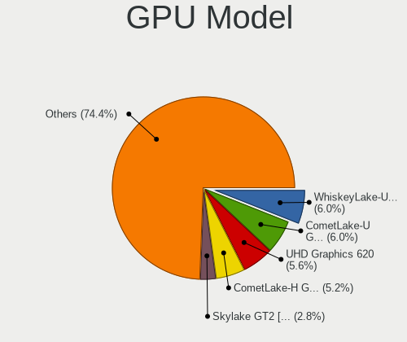

| Model                                                                       | Computers | Percent |
|-----------------------------------------------------------------------------|-----------|---------|
| Intel WhiskeyLake-U GT2 [UHD Graphics 620]                                  | 13        | 7.6%    |
| Intel UHD Graphics 620                                                      | 10        | 5.85%   |
| Intel CometLake-U GT2 [UHD Graphics]                                        | 8         | 4.68%   |
| Intel CometLake-H GT2 [UHD Graphics]                                        | 8         | 4.68%   |
| Intel CoffeeLake-H GT2 [UHD Graphics 630]                                   | 7         | 4.09%   |
| Intel 3rd Gen Core processor Graphics Controller                            | 5         | 2.92%   |
| Intel 2nd Generation Core Processor Family Integrated Graphics Controller   | 5         | 2.92%   |
| Intel Skylake GT2 [HD Graphics 520]                                         | 4         | 2.34%   |
| Intel CoffeeLake-S GT2 [UHD Graphics 630]                                   | 4         | 2.34%   |
| Nvidia GP107GLM [Quadro P2000 Mobile]                                       | 3         | 1.75%   |
| Nvidia GP107 [GeForce GTX 1050 Ti]                                          | 3         | 1.75%   |
| Intel Xeon E3-1200 v3/4th Gen Core Processor Integrated Graphics Controller | 3         | 1.75%   |
| Intel HD Graphics 620                                                       | 3         | 1.75%   |
| Intel HD Graphics 5500                                                      | 3         | 1.75%   |
| Intel Core Processor Integrated Graphics Controller                         | 3         | 1.75%   |
| AMD Renoir                                                                  | 3         | 1.75%   |
| AMD Picasso/Raven 2 [Radeon Vega Series / Radeon Vega Mobile Series]        | 3         | 1.75%   |
| Nvidia TU116M [GeForce GTX 1660 Ti Mobile]                                  | 2         | 1.17%   |
| Nvidia GP107M [GeForce GTX 1050 Mobile]                                     | 2         | 1.17%   |
| Nvidia GP107GLM [Quadro P620]                                               | 2         | 1.17%   |
| Nvidia GP106 [GeForce GTX 1060 6GB]                                         | 2         | 1.17%   |
| Nvidia GM107GLM [Quadro M2000M]                                             | 2         | 1.17%   |
| Nvidia GF108GLM [NVS 5200M]                                                 | 2         | 1.17%   |
| Intel Xeon E3-1200 v2/3rd Gen Core processor Graphics Controller            | 2         | 1.17%   |
| Intel IvyBridge GT2 [HD Graphics 4000]                                      | 2         | 1.17%   |
| Intel HD Graphics 630                                                       | 2         | 1.17%   |
| Intel 4th Generation Core Processor Family Integrated Graphics Controller   | 2         | 1.17%   |
| AMD Lexa PRO [Radeon 540/540X/550/550X / RX 540X/550/550X]                  | 2         | 1.17%   |
| Nvidia TU117M [GeForce GTX 1650 Mobile / Max-Q]                             | 1         | 0.58%   |
| Nvidia TU117GLM [Quadro T2000 Mobile / Max-Q]                               | 1         | 0.58%   |
| Nvidia TU116 [GeForce GTX 1660 Ti]                                          | 1         | 0.58%   |
| Nvidia TU116 [GeForce GTX 1650 SUPER]                                       | 1         | 0.58%   |
| Nvidia TU106GLM [Quadro RTX 3000 Mobile / Max-Q]                            | 1         | 0.58%   |
| Nvidia TU106BM [GeForce RTX 2070 Mobile / Max-Q]                            | 1         | 0.58%   |
| Nvidia TU104 [GeForce RTX 2070 SUPER]                                       | 1         | 0.58%   |
| Nvidia GP107M [GeForce GTX 1050 Ti Mobile]                                  | 1         | 0.58%   |
| Nvidia GP107GLM [Quadro P1000 Mobile]                                       | 1         | 0.58%   |
| Nvidia GP107GL [Quadro P600]                                                | 1         | 0.58%   |
| Nvidia GP106GL [Quadro P2200]                                               | 1         | 0.58%   |
| Nvidia GP106BM [GeForce GTX 1060 Mobile 6GB]                                | 1         | 0.58%   |
| Nvidia GP106 [GeForce GTX 1060 3GB]                                         | 1         | 0.58%   |
| Nvidia GP104 [GeForce GTX 1080]                                             | 1         | 0.58%   |
| Nvidia GP102 [GeForce GTX 1080 Ti]                                          | 1         | 0.58%   |
| Nvidia GM206 [GeForce GTX 960]                                              | 1         | 0.58%   |
| Nvidia GM204GL [Quadro M4000]                                               | 1         | 0.58%   |
| Nvidia GM204 [GeForce GTX 970]                                              | 1         | 0.58%   |
| Nvidia GM107GLM [Quadro M1000M]                                             | 1         | 0.58%   |
| Nvidia GM107GL [NVS 810]                                                    | 1         | 0.58%   |
| Nvidia GK208B [GeForce GT 730]                                              | 1         | 0.58%   |
| Nvidia GK208B [GeForce GT 710]                                              | 1         | 0.58%   |
| Nvidia GK107GLM [Quadro K2000M]                                             | 1         | 0.58%   |
| Nvidia GK106GL [Quadro K4000]                                               | 1         | 0.58%   |
| Nvidia GK104 [GeForce GTX 760]                                              | 1         | 0.58%   |
| Nvidia GF119M [Quadro NVS 4200M]                                            | 1         | 0.58%   |
| Nvidia GF114 [GeForce GTX 560]                                              | 1         | 0.58%   |
| Nvidia GF110 [GeForce GTX 580]                                              | 1         | 0.58%   |
| Nvidia GF108GL [Quadro 600]                                                 | 1         | 0.58%   |
| Nvidia GF108 [GeForce GT 730]                                               | 1         | 0.58%   |
| Nvidia GF108 [GeForce GT 630]                                               | 1         | 0.58%   |
| Nvidia GF106GLM [Quadro 2000M]                                              | 1         | 0.58%   |

GPU Combo
---------

Combinations of graphics cards

| Name            | Computers | Percent |
|-----------------|-----------|---------|
| 1 x Intel       | 67        | 48.2%   |
| 1 x Nvidia      | 33        | 23.74%  |
| Intel + Nvidia  | 17        | 12.23%  |
| 1 x AMD         | 10        | 7.19%   |
| Intel + AMD     | 6         | 4.32%   |
| 1 x Matrox      | 2         | 1.44%   |
| AMD + Nvidia    | 2         | 1.44%   |
| Nvidia + Matrox | 1         | 0.72%   |
| Nvidia + ASPEED | 1         | 0.72%   |

GPU Driver
----------

Free vs proprietary

| Driver      | Computers | Percent |
|-------------|-----------|---------|
| Free        | 111       | 79.86%  |
| Proprietary | 25        | 17.99%  |
| Unknown     | 3         | 2.16%   |

GPU Memory
----------

Total video memory

| Size in GB | Computers | Percent |
|------------|-----------|---------|
| Unknown    | 84        | 59.15%  |
| 1.01-2.0   | 16        | 11.27%  |
| 3.01-4.0   | 12        | 8.45%   |
| 5.01-6.0   | 7         | 4.93%   |
| 0.51-1.0   | 6         | 4.23%   |
| 0.01-0.5   | 6         | 4.23%   |
| 7.01-8.0   | 5         | 3.52%   |
| 2.01-3.0   | 3         | 2.11%   |
| 8.01-16.0  | 2         | 1.41%   |
| 4.01-5.0   | 1         | 0.7%    |

Monitor
-------

Monitor Vendor
--------------

Monitor vendors

| Vendor                  | Computers | Percent |
|-------------------------|-----------|---------|
| AU Optronics            | 19        | 10.38%  |
| Dell                    | 18        | 9.84%   |
| Samsung Electronics     | 17        | 9.29%   |
| Lenovo                  | 16        | 8.74%   |
| BOE                     | 15        | 8.2%    |
| Chimei Innolux          | 14        | 7.65%   |
| LG Display              | 13        | 7.1%    |
| Goldstar                | 13        | 7.1%    |
| Hewlett-Packard         | 11        | 6.01%   |
| Acer                    | 5         | 2.73%   |
| Sharp                   | 4         | 2.19%   |
| InfoVision              | 4         | 2.19%   |
| Eizo                    | 4         | 2.19%   |
| BenQ                    | 4         | 2.19%   |
| Philips                 | 3         | 1.64%   |
| Ancor Communications    | 3         | 1.64%   |
| ViewSonic               | 2         | 1.09%   |
| PANDA                   | 2         | 1.09%   |
| LGD                     | 2         | 1.09%   |
| Lenovo Group Limited    | 2         | 1.09%   |
| Iiyama                  | 2         | 1.09%   |
| Gigabyte Technology     | 2         | 1.09%   |
| Sun                     | 1         | 0.55%   |
| Sceptre Tech            | 1         | 0.55%   |
| Planar                  | 1         | 0.55%   |
| LG Electronics          | 1         | 0.55%   |
| Insignia                | 1         | 0.55%   |
| Chi Mei Optoelectronics | 1         | 0.55%   |
| BOE Technology Group    | 1         | 0.55%   |
| AOC                     | 1         | 0.55%   |

Monitor Model
-------------

Monitor models

| Model                                                                 | Computers | Percent |
|-----------------------------------------------------------------------|-----------|---------|
| Chimei Innolux LCD Monitor CMN15E8 1920x1080 344x193mm 15.5-inch      | 5         | 2.54%   |
| Lenovo LCD Monitor LEN40BA 1920x1080 344x194mm 15.5-inch              | 4         | 2.03%   |
| LG Display LCD Monitor LGD0676 1920x1080 309x174mm 14.0-inch          | 3         | 1.52%   |
| Lenovo TIO24Gen3 LEN10B4 1920x1080 527x296mm 23.8-inch                | 3         | 1.52%   |
| Lenovo LEN P27u-10 LEN61B0 3840x2160 597x336mm 27.0-inch              | 3         | 1.52%   |
| InfoVision LCD Monitor IVO057D 1920x1080 309x174mm 14.0-inch          | 3         | 1.52%   |
| Goldstar LG ULTRAWIDE GSM59F1 1920x1080 580x240mm 24.7-inch           | 3         | 1.52%   |
| Dell P2419H DELD0D9 1920x1080 527x296mm 23.8-inch                     | 3         | 1.52%   |
| BOE LCD Monitor BOE086E 1920x1080 344x194mm 15.5-inch                 | 3         | 1.52%   |
| Philips PHL 272E1 PHLC210 1920x1080 598x336mm 27.0-inch               | 2         | 1.02%   |
| PANDA LCD Monitor NCP0036 1920x1080 344x194mm 15.5-inch               | 2         | 1.02%   |
| LGD LCD Monitor 1920x1080                                             | 2         | 1.02%   |
| Lenovo LEN T2324pA LEN60C7 1920x1080 509x286mm 23.0-inch              | 2         | 1.02%   |
| Lenovo LCD Monitor LEN40B2 1920x1080 344x193mm 15.5-inch              | 2         | 1.02%   |
| Iiyama PL4840 IVM1065 1920x1080 1054x593mm 47.6-inch                  | 2         | 1.02%   |
| Hewlett-Packard 27y HPN351C 1920x1080 598x336mm 27.0-inch             | 2         | 1.02%   |
| Goldstar FULL HD GSM5B55 1920x1080 480x270mm 21.7-inch                | 2         | 1.02%   |
| Dell P2419H DELD0DA 1920x1080 527x296mm 23.8-inch                     | 2         | 1.02%   |
| Chimei Innolux LCD Monitor CMN14F5 1920x1080 309x173mm 13.9-inch      | 2         | 1.02%   |
| Chimei Innolux LCD Monitor CMN14C9 1920x1080 309x173mm 13.9-inch      | 2         | 1.02%   |
| Chimei Innolux LCD Monitor CMN1482 1600x900 309x174mm 14.0-inch       | 2         | 1.02%   |
| BOE LCD Monitor BOE07C9 1920x1080 309x173mm 13.9-inch                 | 2         | 1.02%   |
| AU Optronics LCD Monitor AUO562D 1920x1080 293x165mm 13.2-inch        | 2         | 1.02%   |
| AU Optronics LCD Monitor AUO313E 1600x900 309x174mm 14.0-inch         | 2         | 1.02%   |
| AU Optronics LCD Monitor AUO21ED 1920x1080 344x194mm 15.5-inch        | 2         | 1.02%   |
| ViewSonic VX2776 Series VSC3E32 1920x1080 598x336mm 27.0-inch         | 1         | 0.51%   |
| ViewSonic VA2259 Series VSC5E32 1920x1080 476x268mm 21.5-inch         | 1         | 0.51%   |
| Sun Monitor SUN059A 1920x1200 518x324mm 24.1-inch                     | 1         | 0.51%   |
| Sharp LCD Monitor SHP14BA 1920x1080 344x194mm 15.5-inch               | 1         | 0.51%   |
| Sharp LCD Monitor SHP1453 1920x1080 346x194mm 15.6-inch               | 1         | 0.51%   |
| Sharp LCD Monitor SHP143B 3840x2160 350x190mm 15.7-inch               | 1         | 0.51%   |
| Sharp LCD Monitor SHP1430 3840x2160 350x190mm 15.7-inch               | 1         | 0.51%   |
| Sceptre Tech Sceptre L24 SPT098C 1920x1080 530x300mm 24.0-inch        | 1         | 0.51%   |
| Samsung Electronics U28E590 SAM0C4D 3840x2160 607x345mm 27.5-inch     | 1         | 0.51%   |
| Samsung Electronics U28E590 SAM0C4C 3840x2160 608x345mm 27.5-inch     | 1         | 0.51%   |
| Samsung Electronics U28E570 SAM0D6F 3840x2160 607x345mm 27.5-inch     | 1         | 0.51%   |
| Samsung Electronics SyncMaster SAM0587 1920x1200 518x324mm 24.1-inch  | 1         | 0.51%   |
| Samsung Electronics SyncMaster SAM0566 1440x900 408x255mm 18.9-inch   | 1         | 0.51%   |
| Samsung Electronics S23C350 SAM0A36 1920x1080 510x287mm 23.0-inch     | 1         | 0.51%   |
| Samsung Electronics S22E390 SAM0C18 1920x1080 480x270mm 21.7-inch     | 1         | 0.51%   |
| Samsung Electronics S22B300 SAM08A9 1440x900 440x250mm 19.9-inch      | 1         | 0.51%   |
| Samsung Electronics LS27R75 SAM0FAC 2560x1440 598x336mm 27.0-inch     | 1         | 0.51%   |
| Samsung Electronics LCD Monitor SEC544B 1600x900 382x214mm 17.2-inch  | 1         | 0.51%   |
| Samsung Electronics LCD Monitor SEC5448 1920x1080 344x194mm 15.5-inch | 1         | 0.51%   |
| Samsung Electronics LCD Monitor SAM0200 1280x720                      | 1         | 0.51%   |
| Samsung Electronics LCD Monitor S22B150                               | 1         | 0.51%   |
| Samsung Electronics LCD Monitor C49HG9x 3840x1080                     | 1         | 0.51%   |
| Samsung Electronics LC32G5xT SAM7089 2560x1440 698x393mm 31.5-inch    | 1         | 0.51%   |
| Samsung Electronics C32R50x SAM7000 1920x1080 698x393mm 31.5-inch     | 1         | 0.51%   |
| Samsung Electronics C32HG7x SAM0E14 2560x1440 700x390mm 31.5-inch     | 1         | 0.51%   |
| Samsung Electronics C24F390 SAM0D2C 1920x1080 520x290mm 23.4-inch     | 1         | 0.51%   |
| Planar PLL2410W PLN2410 1920x1080 521x293mm 23.5-inch                 | 1         | 0.51%   |
| Philips PHL 273V7 PHLC156 1920x1080 598x336mm 27.0-inch               | 1         | 0.51%   |
| LG Electronics LCD Monitor W2486 1920x1080                            | 1         | 0.51%   |
| LG Display LCD Monitor LGD064E 1920x1080 309x174mm 14.0-inch          | 1         | 0.51%   |
| LG Display LCD Monitor LGD062C 1920x1080 309x174mm 14.0-inch          | 1         | 0.51%   |
| LG Display LCD Monitor LGD0618 1920x1080 344x194mm 15.5-inch          | 1         | 0.51%   |
| LG Display LCD Monitor LGD0612 1920x1080 344x194mm 15.5-inch          | 1         | 0.51%   |
| LG Display LCD Monitor LGD0608 1920x1080 309x174mm 14.0-inch          | 1         | 0.51%   |
| LG Display LCD Monitor LGD0525 1366x768 344x194mm 15.5-inch           | 1         | 0.51%   |

Monitor Resolution
------------------

Monitor screen resolution

| Resolution         | Computers | Percent |
|--------------------|-----------|---------|
| 1920x1080 (FHD)    | 86        | 52.76%  |
| 3840x2160 (4K)     | 14        | 8.59%   |
| 1366x768 (WXGA)    | 13        | 7.98%   |
| 2560x1440 (QHD)    | 12        | 7.36%   |
| 1600x900 (HD+)     | 10        | 6.13%   |
| 1920x1200 (WUXGA)  | 5         | 3.07%   |
| 3840x1080          | 4         | 2.45%   |
| 2560x1080          | 4         | 2.45%   |
| Unknown            | 4         | 2.45%   |
| 3440x1440          | 2         | 1.23%   |
| 1440x900 (WXGA+)   | 2         | 1.23%   |
| 9600x2160          | 1         | 0.61%   |
| 7680x2160          | 1         | 0.61%   |
| 6400x2160          | 1         | 0.61%   |
| 2048x1152          | 1         | 0.61%   |
| 1680x1050 (WSXGA+) | 1         | 0.61%   |
| 1280x800 (WXGA)    | 1         | 0.61%   |
| 1280x720 (HD)      | 1         | 0.61%   |

Monitor Diagonal
----------------

Diagonal size in inches

| Inches  | Computers | Percent |
|---------|-----------|---------|
| 15      | 38        | 20.88%  |
| 24      | 23        | 12.64%  |
| 27      | 19        | 10.44%  |
| 14      | 19        | 10.44%  |
| 13      | 15        | 8.24%   |
| 23      | 13        | 7.14%   |
| Unknown | 10        | 5.49%   |
| 21      | 9         | 4.95%   |
| 31      | 6         | 3.3%    |
| 34      | 5         | 2.75%   |
| 12      | 5         | 2.75%   |
| 20      | 4         | 2.2%    |
| 17      | 3         | 1.65%   |
| 47      | 2         | 1.1%    |
| 32      | 2         | 1.1%    |
| 18      | 2         | 1.1%    |
| 54      | 1         | 0.55%   |
| 49      | 1         | 0.55%   |
| 40      | 1         | 0.55%   |
| 39      | 1         | 0.55%   |
| 25      | 1         | 0.55%   |
| 22      | 1         | 0.55%   |
| 19      | 1         | 0.55%   |

Monitor Width
-------------

Physical width

| Width in mm | Computers | Percent |
|-------------|-----------|---------|
| 301-350     | 68        | 39.08%  |
| 501-600     | 46        | 26.44%  |
| 401-500     | 16        | 9.2%    |
| Unknown     | 10        | 5.75%   |
| 601-700     | 9         | 5.17%   |
| 201-300     | 9         | 5.17%   |
| 701-800     | 7         | 4.02%   |
| 1001-1500   | 4         | 2.3%    |
| 351-400     | 3         | 1.72%   |
| 801-900     | 2         | 1.15%   |

Aspect Ratio
------------

Proportional relationship between the width and the height

| Ratio   | Computers | Percent |
|---------|-----------|---------|
| 16/9    | 117       | 81.25%  |
| 16/10   | 11        | 7.64%   |
| Unknown | 9         | 6.25%   |
| 21/9    | 5         | 3.47%   |
| 32/9    | 1         | 0.69%   |
| 3/2     | 1         | 0.69%   |

Monitor Area
------------

Area in inch

| Area in inch | Computers | Percent |
|----------------|-----------|---------|
| 101-110        | 38        | 21.23%  |
| 201-250        | 34        | 18.99%  |
| 81-90          | 30        | 16.76%  |
| 301-350        | 19        | 10.61%  |
| 351-500        | 12        | 6.7%    |
| 251-300        | 11        | 6.15%   |
| Unknown        | 10        | 5.59%   |
| 151-200        | 6         | 3.35%   |
| 61-70          | 5         | 2.79%   |
| 501-1000       | 5         | 2.79%   |
| 71-80          | 4         | 2.23%   |
| 121-130        | 3         | 1.68%   |
| More than 1000 | 1         | 0.56%   |
| 141-150        | 1         | 0.56%   |

Pixel Density
-------------

Pixels per inch

| Density       | Computers | Percent |
|---------------|-----------|---------|
| 121-160       | 65        | 37.14%  |
| 51-100        | 57        | 32.57%  |
| 101-120       | 27        | 15.43%  |
| Unknown       | 10        | 5.71%   |
| 161-240       | 9         | 5.14%   |
| More than 240 | 4         | 2.29%   |
| 1-50          | 3         | 1.71%   |

Multiple Monitors
-----------------

Total monitors connected

| Total | Computers | Percent |
|-------|-----------|---------|
| 1     | 90        | 61.22%  |
| 2     | 39        | 26.53%  |
| 3     | 11        | 7.48%   |
| 0     | 7         | 4.76%   |

Network
-------

Net Controller Vendor
---------------------

Controller vendors

| Vendor                            | Computers | Percent |
|-----------------------------------|-----------|---------|
| Intel                             | 111       | 52.61%  |
| Realtek Semiconductor             | 46        | 21.8%   |
| Lenovo                            | 13        | 6.16%   |
| Qualcomm Atheros                  | 8         | 3.79%   |
| Broadcom                          | 5         | 2.37%   |
| Broadcom Limited                  | 4         | 1.9%    |
| Ralink                            | 2         | 0.95%   |
| Marvell Technology Group          | 2         | 0.95%   |
| Huawei Technologies               | 2         | 0.95%   |
| Dell                              | 2         | 0.95%   |
| ASIX Electronics                  | 2         | 0.95%   |
| Xiaomi                            | 1         | 0.47%   |
| Sierra Wireless                   | 1         | 0.47%   |
| Samsung Electronics               | 1         | 0.47%   |
| Ralink Technology                 | 1         | 0.47%   |
| Microchip Technology              | 1         | 0.47%   |
| Micro Star International          | 1         | 0.47%   |
| MediaTek                          | 1         | 0.47%   |
| Luminary Micro                    | 1         | 0.47%   |
| ICS Advent                        | 1         | 0.47%   |
| IBM                               | 1         | 0.47%   |
| Ericsson Business Mobile Networks | 1         | 0.47%   |
| DisplayLink                       | 1         | 0.47%   |
| D-Link                            | 1         | 0.47%   |
| Arduino SA                        | 1         | 0.47%   |

Net Controller Model
--------------------

Controller models

| Model                                                                          | Computers | Percent |
|--------------------------------------------------------------------------------|-----------|---------|
| Realtek RTL8111/8168/8411 PCI Express Gigabit Ethernet Controller              | 31        | 10.92%  |
| Intel 82579LM Gigabit Network Connection (Lewisville)                          | 14        | 4.93%   |
| Intel Wireless 8265 / 8275                                                     | 12        | 4.23%   |
| Intel Cannon Point-LP CNVi [Wireless-AC]                                       | 12        | 4.23%   |
| Intel Ethernet Connection (6) I219-LM                                          | 10        | 3.52%   |
| Intel Comet Lake PCH-LP CNVi WiFi                                              | 9         | 3.17%   |
| Intel Comet Lake PCH CNVi WiFi                                                 | 9         | 3.17%   |
| Intel Cannon Lake PCH CNVi WiFi                                                | 9         | 3.17%   |
| Intel Ethernet Connection (7) I219-LM                                          | 8         | 2.82%   |
| Intel Ethernet Connection (4) I219-LM                                          | 8         | 2.82%   |
| Lenovo ThinkPad TBT 3 Dock                                                     | 7         | 2.46%   |
| Intel Wi-Fi 6 AX200                                                            | 7         | 2.46%   |
| Realtek RTL8153 Gigabit Ethernet Adapter                                       | 6         | 2.11%   |
| Intel Wireless 8260                                                            | 5         | 1.76%   |
| Intel Centrino Advanced-N 6205 [Taylor Peak]                                   | 5         | 1.76%   |
| Realtek RTL810xE PCI Express Fast Ethernet controller                          | 4         | 1.41%   |
| Intel I211 Gigabit Network Connection                                          | 4         | 1.41%   |
| Intel Ethernet Connection (2) I219-LM                                          | 4         | 1.41%   |
| Intel Ethernet Connection (10) I219-LM                                         | 4         | 1.41%   |
| Intel Centrino Ultimate-N 6300                                                 | 4         | 1.41%   |
| Intel Wireless-AC 9260                                                         | 3         | 1.06%   |
| Intel Wireless 7265                                                            | 3         | 1.06%   |
| Intel Ethernet Connection (3) I218-LM                                          | 3         | 1.06%   |
| Intel Ethernet Connection (2) I219-V                                           | 3         | 1.06%   |
| Intel Ethernet Connection (10) I219-V                                          | 3         | 1.06%   |
| Intel 82574L Gigabit Network Connection                                        | 3         | 1.06%   |
| Realtek RTL8188CE 802.11b/g/n WiFi Adapter                                     | 2         | 0.7%    |
| Qualcomm Atheros QCA6174 802.11ac Wireless Network Adapter                     | 2         | 0.7%    |
| Qualcomm Atheros AR9485 Wireless Network Adapter                               | 2         | 0.7%    |
| Marvell Group Yukon Optima 88E8059 [PCIe Gigabit Ethernet Controller with AVB] | 2         | 0.7%    |
| Lenovo USB-C to LAN                                                            | 2         | 0.7%    |
| Lenovo ThinkPad TBT3 LAN                                                       | 2         | 0.7%    |
| Intel Wireless 7260                                                            | 2         | 0.7%    |
| Intel Wireless 3165                                                            | 2         | 0.7%    |
| Intel I210 Gigabit Network Connection                                          | 2         | 0.7%    |
| Intel Ethernet Virtual Function 700 Series                                     | 2         | 0.7%    |
| Intel Ethernet Connection I217-V                                               | 2         | 0.7%    |
| Intel Ethernet Connection I217-LM                                              | 2         | 0.7%    |
| Intel Ethernet Connection (7) I219-V                                           | 2         | 0.7%    |
| Intel Ethernet Connection (2) I218-LM                                          | 2         | 0.7%    |
| Intel Ethernet Connection (11) I219-LM                                         | 2         | 0.7%    |
| Broadcom BCM4352 802.11ac Wireless Network Adapter                             | 2         | 0.7%    |
| Xiaomi Mi/Redmi series (RNDIS + ADB)                                           | 1         | 0.35%   |
| Sierra Wireless AirPrime MC7455 3G/4G LTE Modem                                | 1         | 0.35%   |
| Samsung GT-I9070 (network tethering, USB debugging enabled)                    | 1         | 0.35%   |
| Realtek RTL8822BE 802.11a/b/g/n/ac WiFi adapter                                | 1         | 0.35%   |
| Realtek RTL8821CE 802.11ac PCIe Wireless Network Adapter                       | 1         | 0.35%   |
| Realtek RTL8723BE PCIe Wireless Network Adapter                                | 1         | 0.35%   |
| Realtek RTL8192EE PCIe Wireless Network Adapter                                | 1         | 0.35%   |
| Realtek RTL8192CE PCIe Wireless Network Adapter                                | 1         | 0.35%   |
| Realtek RTL8188EUS 802.11n Wireless Network Adapter                            | 1         | 0.35%   |
| Realtek RTL8188CUS 802.11n WLAN Adapter                                        | 1         | 0.35%   |
| Realtek RTL8169 PCI Gigabit Ethernet Controller                                | 1         | 0.35%   |
| Realtek RTL8125 2.5GbE Controller                                              | 1         | 0.35%   |
| Ralink RT5572 Wireless Adapter                                                 | 1         | 0.35%   |
| Ralink RT3290 Wireless 802.11n 1T/1R PCIe                                      | 1         | 0.35%   |
| Ralink RT3090 Wireless 802.11n 1T/1R PCIe                                      | 1         | 0.35%   |
| Qualcomm Atheros Killer E2500 Gigabit Ethernet Controller                      | 1         | 0.35%   |
| Qualcomm Atheros AR9462 Wireless Network Adapter                               | 1         | 0.35%   |
| Qualcomm Atheros AR9285 Wireless Network Adapter (PCI-Express)                 | 1         | 0.35%   |

Wireless Vendor
---------------

Wireless vendors

| Vendor                   | Computers | Percent |
|--------------------------|-----------|---------|
| Intel                    | 85        | 75.22%  |
| Realtek Semiconductor    | 9         | 7.96%   |
| Qualcomm Atheros         | 7         | 6.19%   |
| Broadcom                 | 3         | 2.65%   |
| Ralink                   | 2         | 1.77%   |
| Sierra Wireless          | 1         | 0.88%   |
| Ralink Technology        | 1         | 0.88%   |
| Micro Star International | 1         | 0.88%   |
| MediaTek                 | 1         | 0.88%   |
| Dell                     | 1         | 0.88%   |
| D-Link                   | 1         | 0.88%   |
| Broadcom Limited         | 1         | 0.88%   |

Wireless Model
--------------

Wireless models

| Model                                                                      | Computers | Percent |
|----------------------------------------------------------------------------|-----------|---------|
| Intel Wireless 8265 / 8275                                                 | 12        | 10.62%  |
| Intel Cannon Point-LP CNVi [Wireless-AC]                                   | 12        | 10.62%  |
| Intel Comet Lake PCH-LP CNVi WiFi                                          | 9         | 7.96%   |
| Intel Comet Lake PCH CNVi WiFi                                             | 9         | 7.96%   |
| Intel Cannon Lake PCH CNVi WiFi                                            | 9         | 7.96%   |
| Intel Wi-Fi 6 AX200                                                        | 7         | 6.19%   |
| Intel Wireless 8260                                                        | 5         | 4.42%   |
| Intel Centrino Advanced-N 6205 [Taylor Peak]                               | 5         | 4.42%   |
| Intel Centrino Ultimate-N 6300                                             | 4         | 3.54%   |
| Intel Wireless-AC 9260                                                     | 3         | 2.65%   |
| Intel Wireless 7265                                                        | 3         | 2.65%   |
| Realtek RTL8188CE 802.11b/g/n WiFi Adapter                                 | 2         | 1.77%   |
| Qualcomm Atheros QCA6174 802.11ac Wireless Network Adapter                 | 2         | 1.77%   |
| Qualcomm Atheros AR9485 Wireless Network Adapter                           | 2         | 1.77%   |
| Intel Wireless 7260                                                        | 2         | 1.77%   |
| Intel Wireless 3165                                                        | 2         | 1.77%   |
| Broadcom BCM4352 802.11ac Wireless Network Adapter                         | 2         | 1.77%   |
| Sierra Wireless AirPrime MC7455 3G/4G LTE Modem                            | 1         | 0.88%   |
| Realtek RTL8822BE 802.11a/b/g/n/ac WiFi adapter                            | 1         | 0.88%   |
| Realtek RTL8821CE 802.11ac PCIe Wireless Network Adapter                   | 1         | 0.88%   |
| Realtek RTL8723BE PCIe Wireless Network Adapter                            | 1         | 0.88%   |
| Realtek RTL8192EE PCIe Wireless Network Adapter                            | 1         | 0.88%   |
| Realtek RTL8192CE PCIe Wireless Network Adapter                            | 1         | 0.88%   |
| Realtek RTL8188EUS 802.11n Wireless Network Adapter                        | 1         | 0.88%   |
| Realtek RTL8188CUS 802.11n WLAN Adapter                                    | 1         | 0.88%   |
| Ralink RT5572 Wireless Adapter                                             | 1         | 0.88%   |
| Ralink RT3290 Wireless 802.11n 1T/1R PCIe                                  | 1         | 0.88%   |
| Ralink RT3090 Wireless 802.11n 1T/1R PCIe                                  | 1         | 0.88%   |
| Qualcomm Atheros AR9462 Wireless Network Adapter                           | 1         | 0.88%   |
| Qualcomm Atheros AR9285 Wireless Network Adapter (PCI-Express)             | 1         | 0.88%   |
| Qualcomm Atheros AR9227 Wireless Network Adapter                           | 1         | 0.88%   |
| Micro Star International MS-3871 802.11bgn Wireless Module [Ralink RT8070] | 1         | 0.88%   |
| MediaTek MT7612U 802.11a/b/g/n/ac Wireless Adapter                         | 1         | 0.88%   |
| Intel Wi-Fi 6 AX210/AX211/AX411 160MHz                                     | 1         | 0.88%   |
| Intel Wi-Fi 6 AX201                                                        | 1         | 0.88%   |
| Intel Centrino Wireless-N 1030 [Rainbow Peak]                              | 1         | 0.88%   |
| Dell DW5811e Snapdragon????? X7 LTE                                       | 1         | 0.88%   |
| D-Link DWA-171 AC600 DB Wireless Adapter(rev.A1) [Realtek RTL8811AU]       | 1         | 0.88%   |
| Broadcom Limited BCM4352 802.11ac Wireless Network Adapter                 | 1         | 0.88%   |
| Broadcom BCM43142 802.11b/g/n                                              | 1         | 0.88%   |

Ethernet Vendor
---------------

Ethernet vendors

| Vendor                   | Computers | Percent |
|--------------------------|-----------|---------|
| Intel                    | 84        | 54.55%  |
| Realtek Semiconductor    | 40        | 25.97%  |
| Lenovo                   | 13        | 8.44%   |
| Broadcom Limited         | 3         | 1.95%   |
| Qualcomm Atheros         | 2         | 1.3%    |
| Marvell Technology Group | 2         | 1.3%    |
| Broadcom                 | 2         | 1.3%    |
| ASIX Electronics         | 2         | 1.3%    |
| Xiaomi                   | 1         | 0.65%   |
| Samsung Electronics      | 1         | 0.65%   |
| ICS Advent               | 1         | 0.65%   |
| IBM                      | 1         | 0.65%   |
| Huawei Technologies      | 1         | 0.65%   |
| DisplayLink              | 1         | 0.65%   |

Ethernet Model
--------------

Ethernet models

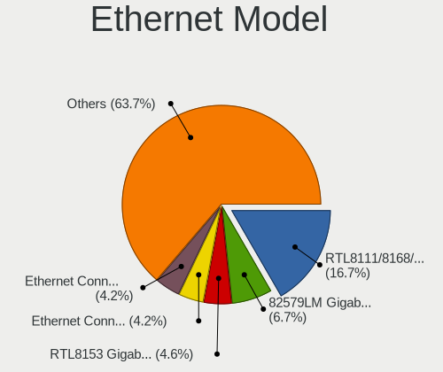

| Model                                                                          | Computers | Percent |
|--------------------------------------------------------------------------------|-----------|---------|
| Realtek RTL8111/8168/8411 PCI Express Gigabit Ethernet Controller              | 31        | 18.79%  |
| Intel 82579LM Gigabit Network Connection (Lewisville)                          | 14        | 8.48%   |
| Intel Ethernet Connection (6) I219-LM                                          | 10        | 6.06%   |
| Intel Ethernet Connection (7) I219-LM                                          | 8         | 4.85%   |
| Intel Ethernet Connection (4) I219-LM                                          | 8         | 4.85%   |
| Lenovo ThinkPad TBT 3 Dock                                                     | 7         | 4.24%   |
| Realtek RTL8153 Gigabit Ethernet Adapter                                       | 6         | 3.64%   |
| Realtek RTL810xE PCI Express Fast Ethernet controller                          | 4         | 2.42%   |
| Intel I211 Gigabit Network Connection                                          | 4         | 2.42%   |
| Intel Ethernet Connection (2) I219-LM                                          | 4         | 2.42%   |
| Intel Ethernet Connection (10) I219-LM                                         | 4         | 2.42%   |
| Intel Ethernet Connection (3) I218-LM                                          | 3         | 1.82%   |
| Intel Ethernet Connection (2) I219-V                                           | 3         | 1.82%   |
| Intel Ethernet Connection (10) I219-V                                          | 3         | 1.82%   |
| Intel 82574L Gigabit Network Connection                                        | 3         | 1.82%   |
| Marvell Group Yukon Optima 88E8059 [PCIe Gigabit Ethernet Controller with AVB] | 2         | 1.21%   |
| Lenovo USB-C to LAN                                                            | 2         | 1.21%   |
| Lenovo ThinkPad TBT3 LAN                                                       | 2         | 1.21%   |
| Intel I210 Gigabit Network Connection                                          | 2         | 1.21%   |
| Intel Ethernet Virtual Function 700 Series                                     | 2         | 1.21%   |
| Intel Ethernet Connection I217-V                                               | 2         | 1.21%   |
| Intel Ethernet Connection I217-LM                                              | 2         | 1.21%   |
| Intel Ethernet Connection (7) I219-V                                           | 2         | 1.21%   |
| Intel Ethernet Connection (2) I218-LM                                          | 2         | 1.21%   |
| Intel Ethernet Connection (11) I219-LM                                         | 2         | 1.21%   |
| Xiaomi Mi/Redmi series (RNDIS + ADB)                                           | 1         | 0.61%   |
| Samsung GT-I9070 (network tethering, USB debugging enabled)                    | 1         | 0.61%   |
| Realtek RTL8169 PCI Gigabit Ethernet Controller                                | 1         | 0.61%   |
| Realtek RTL8125 2.5GbE Controller                                              | 1         | 0.61%   |
| Qualcomm Atheros Killer E2500 Gigabit Ethernet Controller                      | 1         | 0.61%   |
| Qualcomm Atheros AR8151 v2.0 Gigabit Ethernet                                  | 1         | 0.61%   |
| Lenovo USB-C Dock Ethernet                                                     | 1         | 0.61%   |
| Lenovo ThinkPad Dock Ethernet [Realtek RTL8153B]                               | 1         | 0.61%   |
| Intel I350 Gigabit Network Connection                                          | 1         | 0.61%   |
| Intel Ethernet Controller X710/X557-AT 10GBASE-T                               | 1         | 0.61%   |
| Intel Ethernet Controller X710 for 10GbE SFP+                                  | 1         | 0.61%   |
| Intel Ethernet Controller I225-LM                                              | 1         | 0.61%   |
| Intel Ethernet Connection I219-V                                               | 1         | 0.61%   |
| Intel Ethernet Connection I219-LM                                              | 1         | 0.61%   |
| Intel Ethernet Connection (6) I219-V                                           | 1         | 0.61%   |
| Intel Ethernet Connection (4) I219-V                                           | 1         | 0.61%   |
| Intel Ethernet Connection (2) I218-V                                           | 1         | 0.61%   |
| Intel Ethernet Connection (11) I219-V                                          | 1         | 0.61%   |
| Intel 82579V Gigabit Network Connection                                        | 1         | 0.61%   |
| Intel 82577LM Gigabit Network Connection                                       | 1         | 0.61%   |
| Intel 82575EB Gigabit Network Connection                                       | 1         | 0.61%   |
| Intel 82571EB/82571GB Gigabit Ethernet Controller D0/D1 (copper applications)  | 1         | 0.61%   |
| ICS Advent DM9601 Fast Ethernet Adapter                                        | 1         | 0.61%   |
| IBM XClarity Controller                                                        | 1         | 0.61%   |
| Huawei E353/E3131                                                              | 1         | 0.61%   |
| DisplayLink Plugable UGA-3000                                                  | 1         | 0.61%   |
| Broadcom NetXtreme BCM5720 Gigabit Ethernet PCIe                               | 1         | 0.61%   |
| Broadcom NetXtreme BCM5719 Gigabit Ethernet PCIe                               | 1         | 0.61%   |
| Broadcom Limited NetXtreme II BCM5709 Gigabit Ethernet                         | 1         | 0.61%   |
| Broadcom Limited NetXtreme BCM5761e Gigabit Ethernet PCIe                      | 1         | 0.61%   |
| Broadcom Limited NetXtreme BCM5751 Gigabit Ethernet PCI Express                | 1         | 0.61%   |
| ASIX AX88772A Fast Ethernet                                                    | 1         | 0.61%   |
| ASIX AX88179 Gigabit Ethernet                                                  | 1         | 0.61%   |

Net Controller Kind
-------------------

Ethernet, WiFi or modem

| Kind     | Computers | Percent |
|----------|-----------|---------|
| Ethernet | 128       | 52.46%  |
| WiFi     | 110       | 45.08%  |
| Modem    | 5         | 2.05%   |
| Unknown  | 1         | 0.41%   |

Used Controller
---------------

Currently used network controller

| Kind     | Computers | Percent |
|----------|-----------|---------|
| Ethernet | 116       | 53.7%   |
| WiFi     | 99        | 45.83%  |
| Unknown  | 1         | 0.46%   |

NICs
----

Total network controllers on board

| Total | Computers | Percent |
|-------|-----------|---------|
| 2     | 87        | 63.04%  |
| 1     | 38        | 27.54%  |
| 3     | 8         | 5.8%    |
| 132   | 1         | 0.72%   |
| 22    | 1         | 0.72%   |
| 8     | 1         | 0.72%   |
| 6     | 1         | 0.72%   |
| 4     | 1         | 0.72%   |

IPv6
----

IPv6 vs IPv4

| Used | Computers | Percent |
|------|-----------|---------|
| No   | 126       | 90.65%  |
| Yes  | 13        | 9.35%   |

Bluetooth
---------

Bluetooth Vendor
----------------

Controller vendors

| Vendor                          | Computers | Percent |
|---------------------------------|-----------|---------|
| Intel                           | 64        | 71.91%  |
| Cambridge Silicon Radio         | 6         | 6.74%   |
| Broadcom                        | 6         | 6.74%   |
| Qualcomm Atheros Communications | 3         | 3.37%   |
| IMC Networks                    | 3         | 3.37%   |
| Realtek Semiconductor           | 2         | 2.25%   |
| Ralink                          | 1         | 1.12%   |
| Micro Star International        | 1         | 1.12%   |
| Foxconn / Hon Hai               | 1         | 1.12%   |
| Dell                            | 1         | 1.12%   |
| ASUSTek Computer                | 1         | 1.12%   |

Bluetooth Model
---------------

Controller models

| Model                                                                               | Computers | Percent |
|-------------------------------------------------------------------------------------|-----------|---------|
| Intel Bluetooth Device                                                              | 49        | 55.06%  |
| Intel Bluetooth wireless interface                                                  | 6         | 6.74%   |
| Intel AX200 Bluetooth                                                               | 6         | 6.74%   |
| Cambridge Silicon Radio Bluetooth Dongle (HCI mode)                                 | 6         | 6.74%   |
| Qualcomm Atheros  Bluetooth Device                                                  | 3         | 3.37%   |
| Realtek Bluetooth Radio                                                             | 2         | 2.25%   |
| Intel Wireless-AC 9260 Bluetooth Adapter                                            | 2         | 2.25%   |
| IMC Networks Bluetooth Radio                                                        | 2         | 2.25%   |
| Broadcom BCM20702 Bluetooth 4.0 [ThinkPad]                                          | 2         | 2.25%   |
| Ralink RT3290 Bluetooth                                                             | 1         | 1.12%   |
| Micro Star International Bluetooth Device                                           | 1         | 1.12%   |
| Intel Centrino Advanced-N 6230 Bluetooth adapter                                    | 1         | 1.12%   |
| IMC Networks BCM20702A0                                                             | 1         | 1.12%   |
| Foxconn / Hon Hai Foxconn T77H114 BCM2070 [Single-Chip Bluetooth 2.1 + EDR Adapter] | 1         | 1.12%   |
| Dell DW375 Bluetooth Module                                                         | 1         | 1.12%   |
| Broadcom BCM43142A0 Bluetooth 4.0                                                   | 1         | 1.12%   |
| Broadcom BCM20702A0 Bluetooth 4.0                                                   | 1         | 1.12%   |
| Broadcom BCM20702A0 Bluetooth                                                       | 1         | 1.12%   |
| Broadcom BCM2045B (BDC-2.1)                                                         | 1         | 1.12%   |
| ASUS BCM20702A0                                                                     | 1         | 1.12%   |

Sound
-----

Sound Vendor
------------

Sound card vendors

| Vendor                 | Computers | Percent |
|------------------------|-----------|---------|
| Intel                  | 118       | 53.15%  |
| Nvidia                 | 41        | 18.47%  |
| AMD                    | 16        | 7.21%   |
| Lenovo                 | 14        | 6.31%   |
| Plantronics            | 4         | 1.8%    |
| Texas Instruments      | 3         | 1.35%   |
| JMTek                  | 3         | 1.35%   |
| GN Netcom              | 3         | 1.35%   |
| Generalplus Technology | 3         | 1.35%   |
| Creative Labs          | 3         | 1.35%   |
| Realtek Semiconductor  | 2         | 0.9%    |
| Logitech               | 2         | 0.9%    |
| Creative Technology    | 2         | 0.9%    |
| Tenx Technology        | 1         | 0.45%   |
| RODE Microphones       | 1         | 0.45%   |
| Google                 | 1         | 0.45%   |
| Focusrite-Novation     | 1         | 0.45%   |
| DYNEX                  | 1         | 0.45%   |
| Dell                   | 1         | 0.45%   |
| C-Media Electronics    | 1         | 0.45%   |
| ASUSTek Computer       | 1         | 0.45%   |

Sound Model
-----------

Sound card models

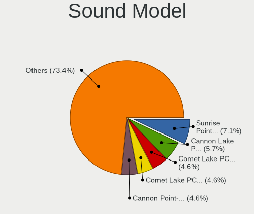

| Model                                                                      | Computers | Percent |
|----------------------------------------------------------------------------|-----------|---------|
| Intel Sunrise Point-LP HD Audio                                            | 18        | 7.53%   |
| Intel Cannon Lake PCH cAVS                                                 | 18        | 7.53%   |
| Intel Cannon Point-LP High Definition Audio Controller                     | 13        | 5.44%   |
| Intel Comet Lake PCH cAVS                                                  | 10        | 4.18%   |
| Intel Comet Lake PCH-LP cAVS                                               | 9         | 3.77%   |
| Intel 7 Series/C216 Chipset Family High Definition Audio Controller        | 9         | 3.77%   |
| Nvidia GP107GL High Definition Audio Controller                            | 8         | 3.35%   |
| Lenovo ThinkPad Thunderbolt 3 Dock USB Audio                               | 7         | 2.93%   |
| Intel 8 Series/C220 Series Chipset High Definition Audio Controller        | 7         | 2.93%   |
| AMD Family 17h (Models 10h-1fh) HD Audio Controller                        | 7         | 2.93%   |
| Intel 6 Series/C200 Series Chipset Family High Definition Audio Controller | 6         | 2.51%   |
| Intel 100 Series/C230 Series Chipset Family HD Audio Controller            | 6         | 2.51%   |
| Nvidia GF108 High Definition Audio Controller                              | 5         | 2.09%   |
| Plantronics BT600                                                          | 4         | 1.67%   |
| Nvidia TU116 High Definition Audio Controller                              | 4         | 1.67%   |
| Nvidia GP106 High Definition Audio Controller                              | 4         | 1.67%   |
| Nvidia GM107 High Definition Audio Controller [GeForce 940MX]              | 4         | 1.67%   |
| Intel Xeon E3-1200 v3/4th Gen Core Processor HD Audio Controller           | 4         | 1.67%   |
| Intel C610/X99 series chipset HD Audio Controller                          | 4         | 1.67%   |
| Intel 5 Series/3400 Series Chipset High Definition Audio                   | 4         | 1.67%   |
| Texas Instruments PCM2902 Audio Codec                                      | 3         | 1.26%   |
| Lenovo Thinkcentre TIO24Gen3 for USB-audio                                 | 3         | 1.26%   |
| Intel Wildcat Point-LP High Definition Audio Controller                    | 3         | 1.26%   |
| Intel C600/X79 series chipset High Definition Audio Controller             | 3         | 1.26%   |
| Intel Broadwell-U Audio Controller                                         | 3         | 1.26%   |
| AMD Renoir Radeon High Definition Audio Controller                         | 3         | 1.26%   |
| AMD Raven/Raven2/Fenghuang HDMI/DP Audio Controller                        | 3         | 1.26%   |
| Realtek Semiconductor USB Audio                                            | 2         | 0.84%   |
| Nvidia TU106 High Definition Audio Controller                              | 2         | 0.84%   |
| Nvidia GM204 High Definition Audio Controller                              | 2         | 0.84%   |
| Nvidia GK208 HDMI/DP Audio Controller                                      | 2         | 0.84%   |
| Lenovo ThinkPad Thunderbolt 3 Dock Audio                                   | 2         | 0.84%   |
| Intel CM238 HD Audio Controller                                            | 2         | 0.84%   |
| Intel 200 Series PCH HD Audio                                              | 2         | 0.84%   |
| Generalplus Technology USB Audio Device                                    | 2         | 0.84%   |
| AMD Starship/Matisse HD Audio Controller                                   | 2         | 0.84%   |
| AMD Family 17h (Models 00h-0fh) HD Audio Controller                        | 2         | 0.84%   |
| Tenx Technology USB AUDIO                                                  | 1         | 0.42%   |
| RODE Microphones RODE NT-USB                                               | 1         | 0.42%   |
| Nvidia TU107 GeForce GTX 1650 High Definition Audio Controller             | 1         | 0.42%   |
| Nvidia TU104 HD Audio Controller                                           | 1         | 0.42%   |
| Nvidia GP104 High Definition Audio Controller                              | 1         | 0.42%   |
| Nvidia GP102 HDMI Audio Controller                                         | 1         | 0.42%   |
| Nvidia GM206 High Definition Audio Controller                              | 1         | 0.42%   |
| Nvidia GK107 HDMI Audio Controller                                         | 1         | 0.42%   |
| Nvidia GK106 HDMI Audio Controller                                         | 1         | 0.42%   |
| Nvidia GK104 HDMI Audio Controller                                         | 1         | 0.42%   |
| Nvidia GF114 HDMI Audio Controller                                         | 1         | 0.42%   |
| Nvidia GF110 High Definition Audio Controller                              | 1         | 0.42%   |
| Nvidia GA104 High Definition Audio Controller                              | 1         | 0.42%   |
| Logitech H570e Mono                                                        | 1         | 0.42%   |
| Logitech H555 Headset                                                      | 1         | 0.42%   |
| Lenovo ThinkPad USB-C Dock Gen2 USB Audio                                  | 1         | 0.42%   |
| Lenovo ThinkPad Dock Audio                                                 | 1         | 0.42%   |
| JMTek USB Speaker                                                          | 1         | 0.42%   |
| JMTek USB PnP Audio Device                                                 | 1         | 0.42%   |
| JMTek iTalk-02                                                             | 1         | 0.42%   |
| Intel Tiger Lake-LP Smart Sound Technology Audio Controller                | 1         | 0.42%   |
| Intel Tiger Lake-H HD Audio Controller                                     | 1         | 0.42%   |
| Intel Haswell-ULT HD Audio Controller                                      | 1         | 0.42%   |

Memory
------

Memory Vendor
-------------

Memory module vendors

| Vendor              | Computers | Percent |
|---------------------|-----------|---------|
| Samsung Electronics | 19        | 33.93%  |
| SK Hynix            | 12        | 21.43%  |
| Crucial             | 6         | 10.71%  |
| Kingston            | 4         | 7.14%   |
| Corsair             | 4         | 7.14%   |
| Micron Technology   | 3         | 5.36%   |
| Unknown             | 2         | 3.57%   |
| Unknown (0x0205)    | 1         | 1.79%   |
| Transcend           | 1         | 1.79%   |
| Smart               | 1         | 1.79%   |
| Patriot             | 1         | 1.79%   |
| Hewlett-Packard     | 1         | 1.79%   |
| GOODRAM             | 1         | 1.79%   |

Memory Model
------------

Memory module models

| Model                                                           | Computers | Percent |
|-----------------------------------------------------------------|-----------|---------|
| SK Hynix RAM HMT451S6BFR8A-PB 4GB SODIMM DDR3 1600MT/s          | 2         | 3.33%   |
| Samsung RAM M378A2K43CB1-CTD 16GB DIMM DDR4 2667MT/s            | 2         | 3.33%   |
| Corsair RAM CMK64GX4M2D3600C18 32GB DIMM DDR4 3600MT/s          | 2         | 3.33%   |
| Unknown RAM V3D4SF16GB1G81G82400 16GB SODIMM DDR4 2400MT/s      | 1         | 1.67%   |
| Unknown RAM Module 8GB SODIMM DDR3 1600MT/s                     | 1         | 1.67%   |
| Unknown (0x0205) RAM Module 8GB DIMM DDR3 1600MT/s              | 1         | 1.67%   |
| Transcend RAM TS1GLK72V3H 8GB DIMM DDR3 1333MT/s                | 1         | 1.67%   |
| Smart RAM SF4642G8CK8IEHLSBG 16384MB SODIMM DDR4 2667MT/s       | 1         | 1.67%   |
| SK Hynix RAM HMT41GS6BFR8A-PB 8GB SODIMM DDR3 1600MT/s          | 1         | 1.67%   |
| SK Hynix RAM HMT351S6EFR8C-PB 4096MB DIMM DDR3 1333MT/s         | 1         | 1.67%   |
| SK Hynix RAM HMT351S6EFR8A-PB 4GB SODIMM DDR3 1600MT/s          | 1         | 1.67%   |
| SK Hynix RAM HMT351S6CFR8C-H9 4GB SODIMM DDR3 1333MT/s          | 1         | 1.67%   |
| SK Hynix RAM HMT351S6CFR8C-H9 4096MB DIMM DDR3 1333MT/s         | 1         | 1.67%   |
| SK Hynix RAM HMAB2GS6AMR6N-XN 16GB SODIMM DDR4 3200MT/s         | 1         | 1.67%   |
| SK Hynix RAM HMAA8GR7CJR4N-XN 64GB DIMM DDR4 3200MT/s           | 1         | 1.67%   |
| SK Hynix RAM HMA851U6CJR6N-VK 4GB DIMM DDR4 2667MT/s            | 1         | 1.67%   |
| SK Hynix RAM HMA851S6AFR6N-UH 4096MB SODIMM DDR4 2667MT/s       | 1         | 1.67%   |
| SK Hynix RAM HMA82GS7MFR8N-TF 16GB SODIMM DDR4 2133MT/s         | 1         | 1.67%   |
| SK Hynix RAM HMA82GS6AFR8N-UH 16GB SODIMM DDR4 2667MT/s         | 1         | 1.67%   |
| Samsung RAM Module 8GB DIMM DDR4 2666MT/s                       | 1         | 1.67%   |
| Samsung RAM Module 4GB DIMM DDR4 2133MT/s                       | 1         | 1.67%   |
| Samsung RAM Module 16GB SODIMM DDR4 3200MT/s                    | 1         | 1.67%   |
| Samsung RAM Module 16GB DIMM DDR4 2666MT/s                      | 1         | 1.67%   |
| Samsung RAM M471B5273DH0-CH9 4096MB SODIMM DDR3 1334MT/s        | 1         | 1.67%   |
| Samsung RAM M471B5173EB0-YK0 4GB SODIMM DDR3 1600MT/s           | 1         | 1.67%   |
| Samsung RAM M471B5173DB0-YK0 4096MB SODIMM DDR3 1600MT/s        | 1         | 1.67%   |
| Samsung RAM M471B5173CB0-YK0 4096MB SODIMM DDR3 1600MT/s        | 1         | 1.67%   |
| Samsung RAM M471A5244CB0-CTD 4GB SODIMM DDR4 3266MT/s           | 1         | 1.67%   |
| Samsung RAM M471A5244CB0-CRC 4096MB SODIMM DDR4 2667MT/s        | 1         | 1.67%   |
| Samsung RAM M471A4G43AB1-CWE 32GB SODIMM DDR4 3200MT/s          | 1         | 1.67%   |
| Samsung RAM M471A1K43DB1-CTD 8GB SODIMM DDR4 2667MT/s           | 1         | 1.67%   |
| Samsung RAM M471A1K43BB1-CTD 8192MB SODIMM DDR4 2667MT/s        | 1         | 1.67%   |
| Samsung RAM M393A4K40DB3-CWE 32GB DIMM DDR4 3200MT/s            | 1         | 1.67%   |
| Samsung RAM M386A4G40DM0-CPB 32GB DIMM DDR4 2133MT/s            | 1         | 1.67%   |
| Samsung RAM M378B5673FH0-CH9 2GB DIMM DDR3 1600MT/s             | 1         | 1.67%   |
| Samsung RAM M378A1K43CB2-CTD 8GB DIMM DDR4 3200MT/s             | 1         | 1.67%   |
| Samsung RAM K4EBE304EB-EGCG 8192MB Row Of Chips LPDDR3 2133MT/s | 1         | 1.67%   |
| Samsung RAM K4B8G1646B-MYK0 4GB SODIMM DDR3 1600MT/s            | 1         | 1.67%   |
| Patriot RAM PSD416G26662 16384MB DIMM DDR4 2667MT/s             | 1         | 1.67%   |
| Micron RAM Module 4GB DIMM DDR4 2133MT/s                        | 1         | 1.67%   |
| Micron RAM 8KTF51264HZ-1G9E5 4GB SODIMM DDR3 1333MT/s           | 1         | 1.67%   |
| Micron RAM 36ASF4G72PZ-2G3B1 32GB DIMM DDR4 2400MT/s            | 1         | 1.67%   |
| Kingston RAM KHX2666C13/16GX 16384MB DIMM DDR4 3200MT/s         | 1         | 1.67%   |
| Kingston RAM KHX2400C14S4/8G 8GB SODIMM DDR4 2400MT/s           | 1         | 1.67%   |
| Kingston RAM 99U5469-042.A00LF 4096MB SODIMM DDR3 1333MT/s      | 1         | 1.67%   |
| Kingston RAM 9905712-034.A00G 16GB SODIMM DDR4 2400MT/s         | 1         | 1.67%   |
| HP RAM 809082-091 16384MB DIMM DDR4 2400MT/s                    | 1         | 1.67%   |
| GOODRAM RAM GR1600D364L11S/4G 4GB DIMM DDR3 1600MT/s            | 1         | 1.67%   |
| Crucial RAM CT51264BA160BJ.M8F 4GB DIMM DDR3 1600MT/s           | 1         | 1.67%   |
| Crucial RAM CT4G4DFS824A.M8FG 4GB DIMM DDR4 2400MT/s            | 1         | 1.67%   |
| Crucial RAM CT16G4DFD824A.C16FBD 16GB DIMM DDR4 2933MT/s        | 1         | 1.67%   |
| Crucial RAM CT102464BF160B.M16 8GB SODIMM DDR3 1600MT/s         | 1         | 1.67%   |
| Crucial RAM BLS4G4D240FSB.8FBD2 4096MB DIMM DDR4 2400MT/s       | 1         | 1.67%   |
| Crucial RAM BLS4G4D240FSB.8FBD 4096MB DIMM DDR4 2400MT/s        | 1         | 1.67%   |
| Crucial RAM BLS4G3D1609DS1S00. 4096MB DIMM DDR3 1600MT/s        | 1         | 1.67%   |
| Corsair RAM CMZ16GX3M2A1600C10 8192MB DIMM DDR3 1600MT/s        | 1         | 1.67%   |
| Corsair RAM CMSX32GX4M2A2666C18 16GB SODIMM DDR4 2667MT/s       | 1         | 1.67%   |

Memory Kind
-----------

Memory module kinds

| Kind   | Computers | Percent |
|--------|-----------|---------|
| DDR4   | 27        | 61.36%  |
| DDR3   | 14        | 31.82%  |
| SDRAM  | 1         | 2.27%   |
| LPDDR4 | 1         | 2.27%   |
| LPDDR3 | 1         | 2.27%   |

Memory Form Factor
------------------

Physical design of the memory module

| Name         | Computers | Percent |
|--------------|-----------|---------|
| SODIMM       | 21        | 48.84%  |
| DIMM         | 21        | 48.84%  |
| Row Of Chips | 1         | 2.33%   |

Memory Size
-----------

Memory module size

| Size  | Computers | Percent |
|-------|-----------|---------|
| 4096  | 16        | 34.04%  |
| 16384 | 13        | 27.66%  |
| 8192  | 10        | 21.28%  |
| 32768 | 6         | 12.77%  |
| 65536 | 1         | 2.13%   |
| 2048  | 1         | 2.13%   |

Memory Speed
------------

Memory module speed

| Speed | Computers | Percent |
|-------|-----------|---------|
| 1600  | 11        | 22.92%  |
| 2667  | 10        | 20.83%  |
| 2400  | 7         | 14.58%  |
| 3200  | 6         | 12.5%   |
| 2133  | 4         | 8.33%   |
| 1333  | 4         | 8.33%   |
| 3600  | 2         | 4.17%   |
| 3266  | 1         | 2.08%   |
| 2933  | 1         | 2.08%   |
| 2666  | 1         | 2.08%   |
| 1334  | 1         | 2.08%   |

Printers & scanners
-------------------

Printer Vendor
--------------

Printer device vendors

| Vendor             | Computers | Percent |
|--------------------|-----------|---------|
| Hewlett-Packard    | 3         | 50%     |
| Canon              | 2         | 33.33%  |
| Brother Industries | 1         | 16.67%  |

Printer Model
-------------

Printer device models

| Model                              | Computers | Percent |
|------------------------------------|-----------|---------|
| HP LaserJet Professional P 1102w   | 1         | 16.67%  |
| HP ENVY 4500 series                | 1         | 16.67%  |
| HP DeskJet 2620 All-in-One Printer | 1         | 16.67%  |
| Canon E560 series                  | 1         | 16.67%  |
| Canon CanoScan LiDE 300            | 1         | 16.67%  |
| Brother DCP-1610W                  | 1         | 16.67%  |

Scanner Vendor
--------------

Scanner device vendors

Zero info for selected period =(

Scanner Model
-------------

Scanner device models

Zero info for selected period =(

Camera
------

Camera Vendor
-------------

Camera device vendors

| Vendor                                 | Computers | Percent |
|----------------------------------------|-----------|---------|
| Chicony Electronics                    | 31        | 30.69%  |
| IMC Networks                           | 12        | 11.88%  |
| Acer                                   | 12        | 11.88%  |
| Logitech                               | 9         | 8.91%   |
| Realtek Semiconductor                  | 7         | 6.93%   |
| Sunplus Innovation Technology          | 6         | 5.94%   |
| Microdia                               | 6         | 5.94%   |
| Unknown                                | 3         | 2.97%   |
| Suyin                                  | 3         | 2.97%   |
| Lite-On Technology                     | 3         | 2.97%   |
| Samsung Electronics                    | 2         | 1.98%   |
| Cheng Uei Precision Industry (Foxlink) | 2         | 1.98%   |
| Ruision                                | 1         | 0.99%   |
| Quanta                                 | 1         | 0.99%   |
| Lenovo                                 | 1         | 0.99%   |
| Jieli Technology                       | 1         | 0.99%   |
| ARC International                      | 1         | 0.99%   |

Camera Model
------------

Camera device models

| Model                                                        | Computers | Percent |
|--------------------------------------------------------------|-----------|---------|
| Chicony Integrated Camera                                    | 16        | 15.53%  |
| IMC Networks Integrated Camera                               | 10        | 9.71%   |
| Acer Integrated Camera                                       | 7         | 6.8%    |
| Realtek Integrated_Webcam_HD                                 | 6         | 5.83%   |
| Logitech HD Pro Webcam C920                                  | 4         | 3.88%   |
| Unknown FULL HD 1080P Webcam                                 | 3         | 2.91%   |
| Sunplus Integrated_Webcam_HD                                 | 3         | 2.91%   |
| Lite-On Integrated Camera                                    | 3         | 2.91%   |
| Chicony Integrated Camera (1280x720@30)                      | 3         | 2.91%   |
| Chicony HP HD Camera                                         | 3         | 2.91%   |
| Acer SunplusIT Integrated Camera                             | 3         | 2.91%   |
| Samsung Galaxy A5 (MTP)                                      | 2         | 1.94%   |
| Microdia Webcam                                              | 2         | 1.94%   |
| Microdia Integrated Webcam                                   | 2         | 1.94%   |
| IMC Networks USB2.0 HD UVC WebCam                            | 2         | 1.94%   |
| Chicony ThinkPad T490 Webcam                                 | 2         | 1.94%   |
| Chicony Integrated Camera [ThinkPad]                         | 2         | 1.94%   |
| Suyin RGBIR Camera                                           | 1         | 0.97%   |
| Suyin Integrated_Webcam_HD                                   | 1         | 0.97%   |
| Suyin HP Truevision HD                                       | 1         | 0.97%   |
| Sunplus USB2.0 Camera                                        | 1         | 0.97%   |
| Sunplus Laptop_Integrated_Webcam_FHD                         | 1         | 0.97%   |
| Sunplus HP HD Webcam [Fixed]                                 | 1         | 0.97%   |
| Ruision UVC Camera                                           | 1         | 0.97%   |
| Realtek WEB CAMERA M9 Pro                                    | 1         | 0.97%   |
| Quanta HP HD Camera                                          | 1         | 0.97%   |
| Microdia Laptop_Integrated_Webcam_HD                         | 1         | 0.97%   |
| Microdia Laptop_Integrated_Webcam_E4HD                       | 1         | 0.97%   |
| Logitech Webcam C925e                                        | 1         | 0.97%   |
| Logitech Webcam C310                                         | 1         | 0.97%   |
| Logitech Webcam C270                                         | 1         | 0.97%   |
| Logitech HD Webcam C910                                      | 1         | 0.97%   |
| Logitech B525 HD Webcam                                      | 1         | 0.97%   |
| Lenovo Integrated Webcam                                     | 1         | 0.97%   |
| Jieli USB PHY 2.0                                            | 1         | 0.97%   |
| Chicony TOSHIBA Web Camera - HD                              | 1         | 0.97%   |
| Chicony Lenovo Integrated Camera (0.3MP)                     | 1         | 0.97%   |
| Chicony Integrated IR Camera                                 | 1         | 0.97%   |
| Chicony HP Wide Vision HD Camera                             | 1         | 0.97%   |
| Chicony HP Webcam                                            | 1         | 0.97%   |
| Chicony HD User Facing                                       | 1         | 0.97%   |
| Cheng Uei Precision Industry (Foxlink) XiaoMi USB 2.0 Webcam | 1         | 0.97%   |
| Cheng Uei Precision Industry (Foxlink) Webcam                | 1         | 0.97%   |
| ARC International Camera                                     | 1         | 0.97%   |
| Acer ThinkPad P50 Integrated Camera                          | 1         | 0.97%   |
| Acer LENOVO LBG 1080P CAM                                    | 1         | 0.97%   |
| Acer Integrated IR Camera                                    | 1         | 0.97%   |

Security
--------

Fingerprint Vendor
------------------

Fingerprint sensor vendors

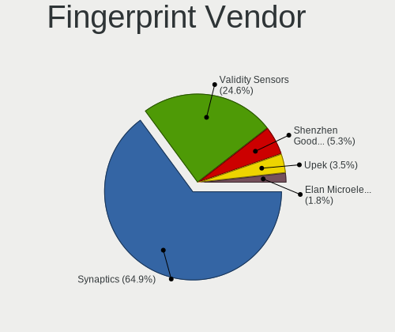

| Vendor                     | Computers | Percent |
|----------------------------|-----------|---------|
| Synaptics                  | 23        | 60.53%  |
| Validity Sensors           | 11        | 28.95%  |
| Upek                       | 2         | 5.26%   |
| Shenzhen Goodix Technology | 1         | 2.63%   |
| Elan Microelectronics      | 1         | 2.63%   |

Fingerprint Model
-----------------

Fingerprint sensor models

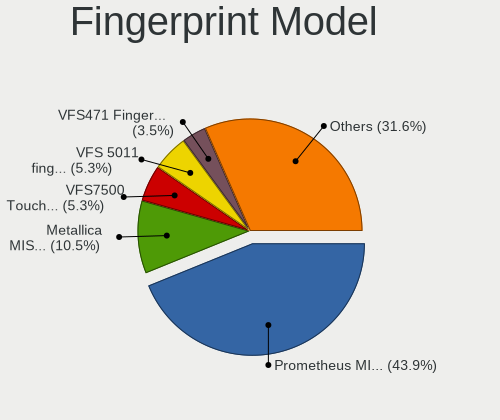

| Model                                                                      | Computers | Percent |
|----------------------------------------------------------------------------|-----------|---------|
| Synaptics Prometheus MIS Touch Fingerprint Reader                          | 17        | 44.74%  |
| Synaptics Metallica MIS Touch Fingerprint Reader                           | 4         | 10.53%  |
| Validity Sensors VFS 5011 fingerprint sensor                               | 3         | 7.89%   |
| Validity Sensors VFS7500 Touch Fingerprint Sensor                          | 2         | 5.26%   |
| Validity Sensors Synaptics VFS7552 Touch Fingerprint Sensor with PurePrint | 2         | 5.26%   |
| Upek Biometric Touchchip/Touchstrip Fingerprint Sensor                     | 2         | 5.26%   |
| Validity Sensors VFS7552 Touch Fingerprint Sensor                          | 1         | 2.63%   |
| Validity Sensors VFS495 Fingerprint Reader                                 | 1         | 2.63%   |
| Validity Sensors VFS471 Fingerprint Reader                                 | 1         | 2.63%   |
| Validity Sensors Synaptics WBDI                                            | 1         | 2.63%   |
| Synaptics  FS7604 Touch Fingerprint Sensor with PurePrint                  | 1         | 2.63%   |
| Synaptics Metallica MOH Touch Fingerprint Reader                           | 1         | 2.63%   |
| Shenzhen Goodix Fingerprint Reader                                         | 1         | 2.63%   |
| Elan ELAN:Fingerprint                                                      | 1         | 2.63%   |

Chipcard Vendor
---------------

Chipcard module vendors

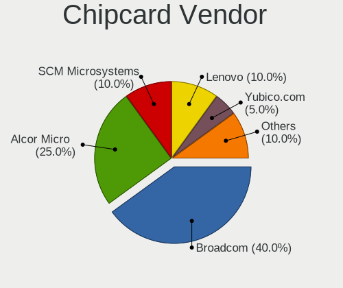

| Vendor                | Computers | Percent |
|-----------------------|-----------|---------|
| Broadcom              | 5         | 35.71%  |
| Alcor Micro           | 4         | 28.57%  |
| Lenovo                | 2         | 14.29%  |
| Upek                  | 1         | 7.14%   |
| SCM Microsystems      | 1         | 7.14%   |
| Gemalto (was Gemplus) | 1         | 7.14%   |

Chipcard Model
--------------

Chipcard module models

| Model                                                      | Computers | Percent |
|------------------------------------------------------------|-----------|---------|
| Alcor Micro AU9540 Smartcard Reader                        | 4         | 28.57%  |
| Lenovo Integrated Smart Card Reader                        | 2         | 14.29%  |
| Broadcom 5880                                              | 2         | 14.29%  |
| Broadcom 58200                                             | 2         | 14.29%  |
| Upek TouchChip Fingerprint Coprocessor (WBF advanced mode) | 1         | 7.14%   |
| SCM Microsystems SCR331-LC1 / SCR3310 SmartCard Reader     | 1         | 7.14%   |
| Gemalto (was Gemplus) GemPC Twin SmartCard Reader          | 1         | 7.14%   |
| Broadcom BCM5880 Secure Applications Processor             | 1         | 7.14%   |

Unsupported
-----------

Unsupported Devices
-------------------

Total unsupported devices on board

| Total | Computers | Percent |
|-------|-----------|---------|
| 0     | 71        | 51.82%  |
| 1     | 54        | 39.42%  |
| 2     | 10        | 7.3%    |
| 3     | 2         | 1.46%   |

Unsupported Device Types
------------------------

Types of unsupported devices

| Type                     | Computers | Percent |
|--------------------------|-----------|---------|
| Fingerprint reader       | 38        | 46.91%  |
| Graphics card            | 10        | 12.35%  |
| Chipcard                 | 10        | 12.35%  |
| Unassigned class         | 7         | 8.64%   |
| Net/wireless             | 5         | 6.17%   |
| Net/ethernet             | 2         | 2.47%   |
| Multimedia controller    | 2         | 2.47%   |
| Communication controller | 2         | 2.47%   |
| Bluetooth                | 2         | 2.47%   |
| Storage/ide              | 1         | 1.23%   |
| Storage                  | 1         | 1.23%   |
| Network                  | 1         | 1.23%   |

