RHEL 8 - Tested Hardware & Statistics (Desktops)
------------------------------------------------

A project to collect tested hardware configurations for RHEL 8.

Anyone can contribute to this report by the [hw-probe](https://github.com/linuxhw/hw-probe) tool:

    sudo -E hw-probe -all -upload

Please contribute! Especially if your hardware is rare.

Contents
--------

* [ Test Cases ](#test-cases)

* [ System ](#system)
  - [ Kernel                   ](#kernel)
  - [ Kernel Family            ](#kernel-family)
  - [ Kernel Major Ver.        ](#kernel-major-ver)
  - [ Arch                     ](#arch)
  - [ DE                       ](#de)
  - [ Display Server           ](#display-server)
  - [ Display Manager          ](#display-manager)
  - [ OS Lang                  ](#os-lang)
  - [ Boot Mode                ](#boot-mode)
  - [ Filesystem               ](#filesystem)
  - [ Part. scheme             ](#part-scheme)
  - [ Dual Boot with Linux/BSD ](#dual-boot-with-linuxbsd)
  - [ Dual Boot (Win)          ](#dual-boot-win)

* [ Board ](#board)
  - [ Vendor                   ](#vendor)
  - [ Model                    ](#model)
  - [ Model Family             ](#model-family)
  - [ MFG Year                 ](#mfg-year)
  - [ Form Factor              ](#form-factor)
  - [ Secure Boot              ](#secure-boot)
  - [ Coreboot                 ](#coreboot)
  - [ RAM Size                 ](#ram-size)
  - [ RAM Used                 ](#ram-used)
  - [ Total Drives             ](#total-drives)
  - [ Has CD-ROM               ](#has-cd-rom)
  - [ Has Ethernet             ](#has-ethernet)
  - [ Has WiFi                 ](#has-wifi)
  - [ Has Bluetooth            ](#has-bluetooth)

* [ Location ](#location)
  - [ Country                  ](#country)
  - [ City                     ](#city)

* [ Drives ](#drives)
  - [ Drive Vendor             ](#drive-vendor)
  - [ Drive Model              ](#drive-model)
  - [ HDD Vendor               ](#hdd-vendor)
  - [ SSD Vendor               ](#ssd-vendor)
  - [ Drive Kind               ](#drive-kind)
  - [ Drive Connector          ](#drive-connector)
  - [ Drive Size               ](#drive-size)
  - [ Space Total              ](#space-total)
  - [ Space Used               ](#space-used)
  - [ Malfunc. Drives          ](#malfunc-drives)
  - [ Malfunc. Drive Vendor    ](#malfunc-drive-vendor)
  - [ Malfunc. HDD Vendor      ](#malfunc-hdd-vendor)
  - [ Malfunc. Drive Kind      ](#malfunc-drive-kind)
  - [ Failed Drives            ](#failed-drives)
  - [ Failed Drive Vendor      ](#failed-drive-vendor)
  - [ Drive Status             ](#drive-status)

* [ Storage controller ](#storage-controller)
  - [ Storage Vendor           ](#storage-vendor)
  - [ Storage Model            ](#storage-model)
  - [ Storage Kind             ](#storage-kind)

* [ Processor ](#processor)
  - [ CPU Vendor               ](#cpu-vendor)
  - [ CPU Model                ](#cpu-model)
  - [ CPU Model Family         ](#cpu-model-family)
  - [ CPU Cores                ](#cpu-cores)
  - [ CPU Sockets              ](#cpu-sockets)
  - [ CPU Threads              ](#cpu-threads)
  - [ CPU Op-Modes             ](#cpu-op-modes)
  - [ CPU Microcode            ](#cpu-microcode)
  - [ CPU Microarch            ](#cpu-microarch)

* [ Graphics ](#graphics)
  - [ GPU Vendor               ](#gpu-vendor)
  - [ GPU Model                ](#gpu-model)
  - [ GPU Combo                ](#gpu-combo)
  - [ GPU Driver               ](#gpu-driver)
  - [ GPU Memory               ](#gpu-memory)

* [ Monitor ](#monitor)
  - [ Monitor Vendor           ](#monitor-vendor)
  - [ Monitor Model            ](#monitor-model)
  - [ Monitor Resolution       ](#monitor-resolution)
  - [ Monitor Diagonal         ](#monitor-diagonal)
  - [ Monitor Width            ](#monitor-width)
  - [ Aspect Ratio             ](#aspect-ratio)
  - [ Monitor Area             ](#monitor-area)
  - [ Pixel Density            ](#pixel-density)
  - [ Multiple Monitors        ](#multiple-monitors)

* [ Network ](#network)
  - [ Net Controller Vendor    ](#net-controller-vendor)
  - [ Net Controller Model     ](#net-controller-model)
  - [ Wireless Vendor          ](#wireless-vendor)
  - [ Wireless Model           ](#wireless-model)
  - [ Ethernet Vendor          ](#ethernet-vendor)
  - [ Ethernet Model           ](#ethernet-model)
  - [ Net Controller Kind      ](#net-controller-kind)
  - [ Used Controller          ](#used-controller)
  - [ NICs                     ](#nics)
  - [ IPv6                     ](#ipv6)

* [ Bluetooth ](#bluetooth)
  - [ Bluetooth Vendor         ](#bluetooth-vendor)
  - [ Bluetooth Model          ](#bluetooth-model)

* [ Sound ](#sound)
  - [ Sound Vendor             ](#sound-vendor)
  - [ Sound Model              ](#sound-model)

* [ Memory ](#memory)
  - [ Memory Vendor            ](#memory-vendor)
  - [ Memory Model             ](#memory-model)
  - [ Memory Kind              ](#memory-kind)
  - [ Memory Form Factor       ](#memory-form-factor)
  - [ Memory Size              ](#memory-size)
  - [ Memory Speed             ](#memory-speed)

* [ Printers & scanners ](#printers--scanners)
  - [ Printer Vendor           ](#printer-vendor)
  - [ Printer Model            ](#printer-model)
  - [ Scanner Vendor           ](#scanner-vendor)
  - [ Scanner Model            ](#scanner-model)

* [ Camera ](#camera)
  - [ Camera Vendor            ](#camera-vendor)
  - [ Camera Model             ](#camera-model)

* [ Security ](#security)
  - [ Fingerprint Vendor       ](#fingerprint-vendor)
  - [ Fingerprint Model        ](#fingerprint-model)
  - [ Chipcard Vendor          ](#chipcard-vendor)
  - [ Chipcard Model           ](#chipcard-model)

* [ Unsupported ](#unsupported)
  - [ Unsupported Devices      ](#unsupported-devices)
  - [ Unsupported Device Types ](#unsupported-device-types)

Test Cases
----------

Total: 92

| Vendor        | Model                       | Probe                                                      | Date         |
|---------------|-----------------------------|------------------------------------------------------------|--------------|
| Dell          | 06JWJY A00                  | [f1c6a0f9dd](https://linux-hardware.org/?probe=f1c6a0f9dd) | Mar 06, 2024 |
| ASUSTek       | ROG Maximus XII APEX        | [2ed4b6b711](https://linux-hardware.org/?probe=2ed4b6b711) | Oct 24, 2023 |
| ASUSTek       | ROG Maximus X HERO          | [d5d888506b](https://linux-hardware.org/?probe=d5d888506b) | Aug 10, 2023 |
| Gigabyte      | X570 UD                     | [12d8200114](https://linux-hardware.org/?probe=12d8200114) | Mar 13, 2023 |
| Gigabyte      | Z590I VISION D              | [9787630f1c](https://linux-hardware.org/?probe=9787630f1c) | Dec 12, 2022 |
| HP            | 8591                        | [98bde1bd5a](https://linux-hardware.org/?probe=98bde1bd5a) | Nov 01, 2022 |
| Gigabyte      | Z590I VISION D              | [22131a6ec5](https://linux-hardware.org/?probe=22131a6ec5) | Sep 03, 2022 |
| Dell          | 02K9CR A03                  | [5656d7a0d5](https://linux-hardware.org/?probe=5656d7a0d5) | May 27, 2022 |
| Dell          | 0N4YC8 A00                  | [74525891a0](https://linux-hardware.org/?probe=74525891a0) | May 26, 2022 |
| Lenovo        | 3132 SDK0K17763 WIN 1801... | [a6e43346ba](https://linux-hardware.org/?probe=a6e43346ba) | Apr 16, 2022 |
| ASUSTek       | X99-DELUXE II               | [82939dc69f](https://linux-hardware.org/?probe=82939dc69f) | Apr 05, 2022 |
| CX / Air C... | CX-H87-M1                   | [ddfbf2df5e](https://linux-hardware.org/?probe=ddfbf2df5e) | Apr 01, 2022 |
| CX / Air C... | CX-H87-M1                   | [5a8ee938ce](https://linux-hardware.org/?probe=5a8ee938ce) | Apr 01, 2022 |
| ASRock        | X99E-ITX/ac                 | [0cf67f0201](https://linux-hardware.org/?probe=0cf67f0201) | Mar 06, 2022 |
| ASRock        | X570 Steel Legend           | [e7843ce1cf](https://linux-hardware.org/?probe=e7843ce1cf) | Mar 05, 2022 |
| ASUSTek       | Maximus VII FORMULA         | [7fd2e4885c](https://linux-hardware.org/?probe=7fd2e4885c) | Mar 05, 2022 |
| Gigabyte      | B150-HD3-CF                 | [cab21caab7](https://linux-hardware.org/?probe=cab21caab7) | Feb 10, 2022 |
| ASUSTek       | Maximus VII FORMULA         | [36c52eaf3d](https://linux-hardware.org/?probe=36c52eaf3d) | Feb 05, 2022 |
| ASUSTek       | Maximus VII FORMULA         | [07de603a4a](https://linux-hardware.org/?probe=07de603a4a) | Jan 31, 2022 |
| Gigabyte      | Z97N-WIFI                   | [5808f89618](https://linux-hardware.org/?probe=5808f89618) | Jan 07, 2022 |
| ASUSTek       | PRIME B360M-D               | [e3b3ac9f8b](https://linux-hardware.org/?probe=e3b3ac9f8b) | Jan 01, 2022 |
| Lenovo        | MAHOBAY                     | [ea1413bf9e](https://linux-hardware.org/?probe=ea1413bf9e) | Nov 19, 2021 |
| ASUSTek       | PRIME B350M-A               | [d3d69e7587](https://linux-hardware.org/?probe=d3d69e7587) | Oct 24, 2021 |
| ASUSTek       | Pro WS X570-ACE             | [07a5b3c465](https://linux-hardware.org/?probe=07a5b3c465) | Oct 16, 2021 |
| ASUSTek       | PRIME B350M-A               | [66cd9bb2c9](https://linux-hardware.org/?probe=66cd9bb2c9) | Oct 09, 2021 |
| ASUSTek       | Z87-DELUXE                  | [63b48dfa23](https://linux-hardware.org/?probe=63b48dfa23) | Oct 07, 2021 |
| HP            | 212B                        | [322371cc6a](https://linux-hardware.org/?probe=322371cc6a) | Oct 04, 2021 |
| ASUSTek       | Z87-DELUXE                  | [2792a3ef1c](https://linux-hardware.org/?probe=2792a3ef1c) | Oct 03, 2021 |
| Gigabyte      | Z97N-WIFI                   | [539316ac91](https://linux-hardware.org/?probe=539316ac91) | Sep 30, 2021 |
| Gigabyte      | Z97N-WIFI                   | [95ae5d0e04](https://linux-hardware.org/?probe=95ae5d0e04) | Sep 29, 2021 |
| Lenovo        | MAHOBAY                     | [fc498b8cb0](https://linux-hardware.org/?probe=fc498b8cb0) | Sep 10, 2021 |
| ASUSTek       | PRIME B350M-A               | [35fa4b96f4](https://linux-hardware.org/?probe=35fa4b96f4) | Sep 09, 2021 |
| Gigabyte      | Z390 AORUS ULTRA-CF         | [f7bcc3d753](https://linux-hardware.org/?probe=f7bcc3d753) | Aug 25, 2021 |
| Gigabyte      | 970A-D3                     | [d62c66d9bd](https://linux-hardware.org/?probe=d62c66d9bd) | Aug 12, 2021 |
| Gigabyte      | Z490 GAMING X               | [a540fa2f59](https://linux-hardware.org/?probe=a540fa2f59) | Jul 19, 2021 |
| Dell          | 0MWYPT A02                  | [ab6e7450c3](https://linux-hardware.org/?probe=ab6e7450c3) | Jul 01, 2021 |
| Intel         | DX79SR AAG57199-200         | [380f10f479](https://linux-hardware.org/?probe=380f10f479) | Jun 10, 2021 |
| HP            | 1906                        | [bf20783dee](https://linux-hardware.org/?probe=bf20783dee) | Jun 02, 2021 |
| Gigabyte      | B85M-D3V-A                  | [4405336208](https://linux-hardware.org/?probe=4405336208) | Jun 01, 2021 |
| MSI           | MPG Z390 GAMING PLUS        | [2eebd180f8](https://linux-hardware.org/?probe=2eebd180f8) | May 28, 2021 |
| HP            | 2129                        | [3991895525](https://linux-hardware.org/?probe=3991895525) | May 23, 2021 |
| MSI           | Z77A-G45                    | [9b11ff6d26](https://linux-hardware.org/?probe=9b11ff6d26) | May 22, 2021 |
| MSI           | Z77A-G45                    | [bd980d04be](https://linux-hardware.org/?probe=bd980d04be) | May 22, 2021 |
| ASUSTek       | ROG Maximus X HERO          | [4a38b848dd](https://linux-hardware.org/?probe=4a38b848dd) | May 19, 2021 |
| HP            | 8054                        | [cf6b804c19](https://linux-hardware.org/?probe=cf6b804c19) | May 13, 2021 |
| ASRock        | X99E-ITX/ac                 | [9cacd1608e](https://linux-hardware.org/?probe=9cacd1608e) | May 08, 2021 |
| ASUSTek       | PRIME B360M-D               | [3dce7dc37d](https://linux-hardware.org/?probe=3dce7dc37d) | Mar 20, 2021 |
| ASRock        | A300M-STX                   | [22c97ac8b2](https://linux-hardware.org/?probe=22c97ac8b2) | Feb 27, 2021 |
| Dell          | 0NNNCT A01                  | [3f081f03fe](https://linux-hardware.org/?probe=3f081f03fe) | Feb 22, 2021 |
| ASUSTek       | ROG Maximus X HERO          | [d0ac809f8a](https://linux-hardware.org/?probe=d0ac809f8a) | Jan 15, 2021 |
| ASUSTek       | ROG STRIX B350-F GAMING     | [e10979867d](https://linux-hardware.org/?probe=e10979867d) | Jan 13, 2021 |
| ASUSTek       | H87M-PLUS                   | [95389bff49](https://linux-hardware.org/?probe=95389bff49) | Jan 13, 2021 |
| ASRock        | H270 Pro4                   | [3a3b83a6ed](https://linux-hardware.org/?probe=3a3b83a6ed) | Jan 07, 2021 |
| Unknown       | SKYBAY                      | [d99f937c68](https://linux-hardware.org/?probe=d99f937c68) | Dec 12, 2020 |
| HP            | 1905                        | [6690d08a07](https://linux-hardware.org/?probe=6690d08a07) | Dec 04, 2020 |
| Dell          | 082WXT A01                  | [8d9240a29c](https://linux-hardware.org/?probe=8d9240a29c) | Nov 19, 2020 |
| Dell          | 082WXT A01                  | [0a2176308f](https://linux-hardware.org/?probe=0a2176308f) | Nov 17, 2020 |
| HP            | 81B4                        | [12ac27dcb5](https://linux-hardware.org/?probe=12ac27dcb5) | Nov 14, 2020 |
| HP            | 81B4                        | [faf7b737fe](https://linux-hardware.org/?probe=faf7b737fe) | Nov 14, 2020 |
| MSI           | H310M PRO-VD                | [18c316813f](https://linux-hardware.org/?probe=18c316813f) | Nov 11, 2020 |
| HP            | 1905                        | [0e53545ff8](https://linux-hardware.org/?probe=0e53545ff8) | Oct 14, 2020 |
| ASUSTek       | Z10PE-D16 WS                | [7bf945cd18](https://linux-hardware.org/?probe=7bf945cd18) | Oct 13, 2020 |
| HP            | 1905                        | [48fd57f60f](https://linux-hardware.org/?probe=48fd57f60f) | Sep 24, 2020 |
| HP            | 1905                        | [0e2d6062d9](https://linux-hardware.org/?probe=0e2d6062d9) | Sep 24, 2020 |
| HP            | 843F                        | [6f9898a049](https://linux-hardware.org/?probe=6f9898a049) | Sep 24, 2020 |
| HP            | 843F                        | [91498f153e](https://linux-hardware.org/?probe=91498f153e) | Sep 18, 2020 |
| HP            | 843F                        | [e0bdf38c8a](https://linux-hardware.org/?probe=e0bdf38c8a) | Jul 16, 2020 |
| Lenovo        | 3132 SDK0J40697 WIN 3305... | [b9a88cd7cf](https://linux-hardware.org/?probe=b9a88cd7cf) | Jun 13, 2020 |
| ASUSTek       | P8Z77-V PRO                 | [b97f2eb31f](https://linux-hardware.org/?probe=b97f2eb31f) | May 20, 2020 |
| HP            | 158A                        | [344194646f](https://linux-hardware.org/?probe=344194646f) | May 14, 2020 |
| Lenovo        | 3132 SDK0J40697 WIN 3305... | [6237c4cae4](https://linux-hardware.org/?probe=6237c4cae4) | May 10, 2020 |
| ASRockRack    | EP2C612 WS                  | [9657b92263](https://linux-hardware.org/?probe=9657b92263) | Apr 14, 2020 |
| Gigabyte      | B75-D3V                     | [73b3145cb4](https://linux-hardware.org/?probe=73b3145cb4) | Apr 10, 2020 |
| ASRockRack    | EP2C612 WS                  | [8dad315eb5](https://linux-hardware.org/?probe=8dad315eb5) | Apr 07, 2020 |
| Lenovo        | 3132 SDK0J40697 WIN 3305... | [848a63637f](https://linux-hardware.org/?probe=848a63637f) | Apr 01, 2020 |
| Alienware     | 0VDT73 A00                  | [00cc8f89dc](https://linux-hardware.org/?probe=00cc8f89dc) | Mar 17, 2020 |
| Lenovo        | 3132 SDK0J40697 WIN 3305... | [a018f0a4d4](https://linux-hardware.org/?probe=a018f0a4d4) | Feb 27, 2020 |
| Lenovo        | ThinkCentre M91p 0266RZ1    | [ce36caf100](https://linux-hardware.org/?probe=ce36caf100) | Feb 18, 2020 |
| Lenovo        | ThinkCentre M91p 0266RZ1    | [13d8453be0](https://linux-hardware.org/?probe=13d8453be0) | Feb 18, 2020 |
| MSI           | B350M MORTAR                | [9496a3ac2c](https://linux-hardware.org/?probe=9496a3ac2c) | Feb 10, 2020 |
| ASUSTek       | P8Z77-V PRO                 | [0a9570ceaf](https://linux-hardware.org/?probe=0a9570ceaf) | Jan 29, 2020 |
| Dell          | 0XR1GT A00                  | [319aa86f81](https://linux-hardware.org/?probe=319aa86f81) | Jan 25, 2020 |
| Dell          | 0XR1GT A00                  | [189883a0aa](https://linux-hardware.org/?probe=189883a0aa) | Jan 25, 2020 |
| ASUSTek       | PRIME X470-PRO              | [bfacbe4d23](https://linux-hardware.org/?probe=bfacbe4d23) | Jan 18, 2020 |
| MSI           | B350M MORTAR                | [f53a75b96e](https://linux-hardware.org/?probe=f53a75b96e) | Jan 10, 2020 |
| ASUSTek       | P8Z77-V PRO                 | [6bffc36e6a](https://linux-hardware.org/?probe=6bffc36e6a) | Jan 06, 2020 |
| ASRock        | H91M-PLUS                   | [c90d6b4c4d](https://linux-hardware.org/?probe=c90d6b4c4d) | Dec 30, 2019 |
| Lenovo        | 3132 SDK0J40697 WIN 3305... | [fff26d5712](https://linux-hardware.org/?probe=fff26d5712) | Dec 21, 2019 |
| Lenovo        | 3132 SDK0J40697 WIN 3305... | [199fad181e](https://linux-hardware.org/?probe=199fad181e) | Nov 29, 2019 |
| Lenovo        | 3132 SDK0J40697 WIN 3305... | [6a11247e37](https://linux-hardware.org/?probe=6a11247e37) | Nov 11, 2019 |
| Supermicro    | X7DWN+                      | [505e506351](https://linux-hardware.org/?probe=505e506351) | Oct 26, 2019 |
| Supermicro    | X7DWN+                      | [5ad617d6ad](https://linux-hardware.org/?probe=5ad617d6ad) | Oct 25, 2019 |

System
------

Kernel
------

Version of the Linux kernel

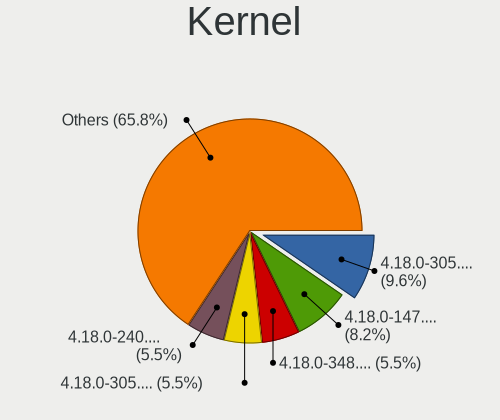

| Version                      | Desktops | Percent |
|------------------------------|----------|---------|
| 4.18.0-305.el8.x86_64        | 7        | 9.86%   |
| 4.18.0-147.3.1.el8_1.x86_64  | 6        | 8.45%   |
| 4.18.0-348.20.1.el8_5.x86_64 | 4        | 5.63%   |
| 4.18.0-305.19.1.el8_4.x86_64 | 4        | 5.63%   |
| 4.18.0-240.1.1.el8_3.x86_64  | 4        | 5.63%   |
| 4.18.0-348.12.2.el8_5.x86_64 | 3        | 4.23%   |
| 4.18.0-240.22.1.el8_3.x86_64 | 3        | 4.23%   |
| 4.18.0-240.10.1.el8_3.x86_64 | 3        | 4.23%   |
| 4.18.0-147.5.1.el8_1.x86_64  | 3        | 4.23%   |
| 4.18.0-348.2.1.el8_5.x86_64  | 2        | 2.82%   |
| 4.18.0-305.10.2.el8_4.x86_64 | 2        | 2.82%   |
| 4.18.0-240.15.1.el8_3.x86_64 | 2        | 2.82%   |
| 4.18.0-193.el8.x86_64        | 2        | 2.82%   |
| 4.18.0-193.6.3.el8_2.x86_64  | 2        | 2.82%   |
| 4.18.0-193.19.1.el8_2.x86_64 | 2        | 2.82%   |
| 4.18.0-147.el8.x86_64        | 2        | 2.82%   |
| 5.10.6-1.el8.elrepo.x86_64   | 1        | 1.41%   |
| 4.19.150                     | 1        | 1.41%   |
| 4.18.0-80.11.2.el8_0.x86_64  | 1        | 1.41%   |
| 4.18.0-513.18.1.el8_9.x86_64 | 1        | 1.41%   |
| 4.18.0-513.1.1.el8_9.x86_64  | 1        | 1.41%   |
| 4.18.0-477.15.1.el8_8.x86_64 | 1        | 1.41%   |
| 4.18.0-425.3.1.el8.x86_64    | 1        | 1.41%   |
| 4.18.0-425.10.1.el8_7.x86_64 | 1        | 1.41%   |
| 4.18.0-372.9.1.el8.x86_64    | 1        | 1.41%   |
| 4.18.0-372.32.1.el8_6.x86_64 | 1        | 1.41%   |
| 4.18.0-372.19.1.el8_6.x86_64 | 1        | 1.41%   |
| 4.18.0-348.7.1.el8_5.x86_64  | 1        | 1.41%   |
| 4.18.0-305.7.1.el8_4.x86_64  | 1        | 1.41%   |
| 4.18.0-305.3.1.el8_4.x86_64  | 1        | 1.41%   |
| 4.18.0-305.17.1.el8_4.x86_64 | 1        | 1.41%   |
| 4.18.0-305.12.1.el8_4.x86_64 | 1        | 1.41%   |
| 4.18.0-240.8.1.el8_3.x86_64  | 1        | 1.41%   |
| 4.18.0-193.28.1.el8_2.x86_64 | 1        | 1.41%   |
| 4.18.0-193.1.2.el8_2.x86_64  | 1        | 1.41%   |
| 4.18.0-147.8.1.el8_1.x86_64  | 1        | 1.41%   |

Kernel Family
-------------

Linux kernel without a distro release

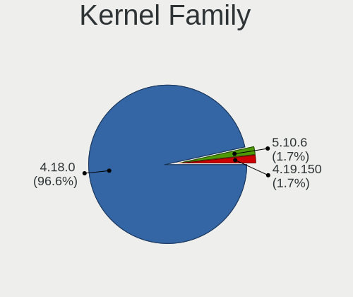

| Version  | Desktops | Percent |
|----------|----------|---------|
| 4.18.0   | 54       | 96.43%  |
| 5.10.6   | 1        | 1.79%   |
| 4.19.150 | 1        | 1.79%   |

Kernel Major Ver.
-----------------

Linux kernel major version

| Version | Desktops | Percent |
|---------|----------|---------|
| 4.18    | 54       | 96.43%  |
| 5.10    | 1        | 1.79%   |
| 4.19    | 1        | 1.79%   |

Arch
----

OS architecture (x86_64, i586, etc.)

| Name   | Desktops | Percent |
|--------|----------|---------|
| x86_64 | 56       | 100%    |

DE
--

Desktop Environment

| Name          | Desktops | Percent |
|---------------|----------|---------|
| GNOME         | 46       | 77.97%  |
| Unknown       | 5        | 8.47%   |
| GNOME Classic | 3        | 5.08%   |
| KDE5          | 2        | 3.39%   |
| KDE           | 2        | 3.39%   |
| MATE          | 1        | 1.69%   |

Display Server
--------------

X11 or Wayland

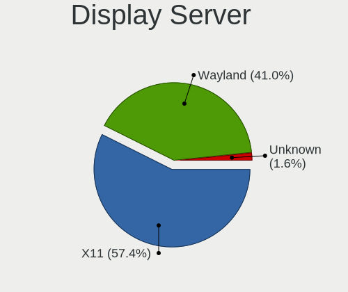

| Name    | Desktops | Percent |
|---------|----------|---------|
| X11     | 34       | 57.63%  |
| Wayland | 24       | 40.68%  |
| Unknown | 1        | 1.69%   |

Display Manager
---------------

SDDM, LightDM, etc.

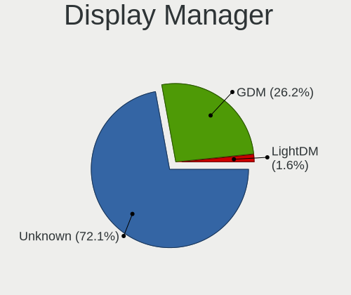

| Name    | Desktops | Percent |
|---------|----------|---------|
| Unknown | 42       | 71.19%  |
| GDM     | 16       | 27.12%  |
| LightDM | 1        | 1.69%   |

OS Lang
-------

Language

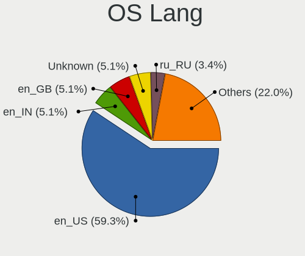

| Lang    | Desktops | Percent |
|---------|----------|---------|
| en_US   | 35       | 61.4%   |
| en_GB   | 3        | 5.26%   |
| Unknown | 3        | 5.26%   |
| ru_RU   | 2        | 3.51%   |
| pl_PL   | 2        | 3.51%   |
| es_AR   | 2        | 3.51%   |
| en_IN   | 2        | 3.51%   |
| de_DE   | 2        | 3.51%   |
| sl_SI   | 1        | 1.75%   |
| ko_KR   | 1        | 1.75%   |
| es_MX   | 1        | 1.75%   |
| es_ES   | 1        | 1.75%   |
| en_NZ   | 1        | 1.75%   |
| cs_CZ   | 1        | 1.75%   |

Boot Mode
---------

EFI or BIOS

| Mode | Desktops | Percent |
|------|----------|---------|
| EFI  | 39       | 68.42%  |
| BIOS | 18       | 31.58%  |

Filesystem
----------

Type of filesystem

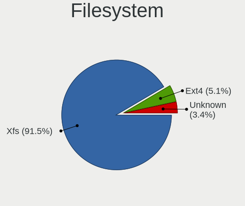

| Type    | Desktops | Percent |
|---------|----------|---------|
| Xfs     | 52       | 91.23%  |
| Ext4    | 3        | 5.26%   |
| Unknown | 2        | 3.51%   |

Part. scheme
------------

Scheme of partitioning

| Type    | Desktops | Percent |
|---------|----------|---------|
| Unknown | 38       | 64.41%  |
| GPT     | 17       | 28.81%  |
| MBR     | 4        | 6.78%   |

Dual Boot with Linux/BSD
------------------------

Hosting more than one Linux/BSD

| Dual boot | Desktops | Percent |
|-----------|----------|---------|
| No        | 51       | 89.47%  |
| Yes       | 6        | 10.53%  |

Dual Boot (Win)
---------------

Hosting Linux and Windows

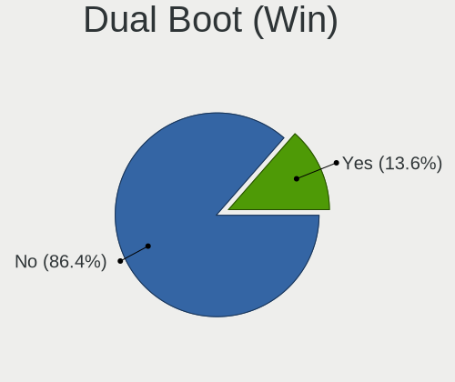

| Dual boot | Desktops | Percent |
|-----------|----------|---------|
| No        | 49       | 85.96%  |
| Yes       | 8        | 14.04%  |

Board
-----

Vendor
------

Motherboard manufacturer

| Name                | Desktops | Percent |
|---------------------|----------|---------|
| ASUSTek Computer    | 13       | 23.21%  |
| Hewlett-Packard     | 9        | 16.07%  |
| Gigabyte Technology | 9        | 16.07%  |
| Dell                | 7        | 12.5%   |
| ASRock              | 5        | 8.93%   |
| MSI                 | 4        | 7.14%   |
| Lenovo              | 4        | 7.14%   |
| Supermicro          | 1        | 1.79%   |
| Intel               | 1        | 1.79%   |
| CX / Air Computers. | 1        | 1.79%   |
| Alienware           | 1        | 1.79%   |
| Unknown             | 1        | 1.79%   |

Model
-----

Motherboard model

| Name                                | Desktops | Percent |
|-------------------------------------|----------|---------|
| ASUS All Series                     | 4        | 7.14%   |
| Supermicro X7DW3                    | 1        | 1.79%   |
| MSI MS-7B51                         | 1        | 1.79%   |
| MSI MS-7B33                         | 1        | 1.79%   |
| MSI MS-7A37                         | 1        | 1.79%   |
| MSI MS-7752                         | 1        | 1.79%   |
| Lenovo ThinkCentre M92p 3238AZ8     | 1        | 1.79%   |
| Lenovo ThinkCentre M920t 10SFS03200 | 1        | 1.79%   |
| Lenovo ThinkCentre M91p 0266RZ1     | 1        | 1.79%   |
| Lenovo 10SFS03200                   | 1        | 1.79%   |
| Intel DX79SR AAG57199-200           | 1        | 1.79%   |
| HP Z840 Workstation                 | 1        | 1.79%   |
| HP Z620 Workstation                 | 1        | 1.79%   |
| HP Z440 Workstation                 | 1        | 1.79%   |
| HP Z230 Tower Workstation           | 1        | 1.79%   |
| HP Z230 SFF Workstation             | 1        | 1.79%   |
| HP Z1 Entry Tower G5                | 1        | 1.79%   |
| HP EliteDesk 800 G2 SFF             | 1        | 1.79%   |
| HP 290 G1 SFF Business PC           | 1        | 1.79%   |
| HP 260-P020il                       | 1        | 1.79%   |
| Gigabyte Z97N-WIFI                  | 1        | 1.79%   |
| Gigabyte Z590I VISION D             | 1        | 1.79%   |
| Gigabyte Z490 GAMING X              | 1        | 1.79%   |
| Gigabyte Z390 AORUS ULTRA           | 1        | 1.79%   |
| Gigabyte X570 UD                    | 1        | 1.79%   |
| Gigabyte B85M-D3V-A                 | 1        | 1.79%   |
| Gigabyte B75-D3V                    | 1        | 1.79%   |
| Gigabyte B150-HD3                   | 1        | 1.79%   |
| Gigabyte 970A-D3                    | 1        | 1.79%   |
| Dell Vostro 270                     | 1        | 1.79%   |
| Dell Precision Tower 3620           | 1        | 1.79%   |
| Dell Precision Tower 3420           | 1        | 1.79%   |
| Dell Precision T7600                | 1        | 1.79%   |
| Dell Precision 5820 Tower           | 1        | 1.79%   |
| Dell Precision 3630 Tower           | 1        | 1.79%   |
| Dell OptiPlex 9020                  | 1        | 1.79%   |
| CX / Air Computers. H87-M1          | 1        | 1.79%   |
| ASUS Z10PE-D16 WS                   | 1        | 1.79%   |
| ASUS ROG STRIX B350-F GAMING        | 1        | 1.79%   |
| ASUS ROG Maximus XII APEX           | 1        | 1.79%   |

Model Family
------------

Motherboard model prefix

| Name                       | Desktops | Percent |
|----------------------------|----------|---------|
| Dell Precision             | 5        | 8.93%   |
| ASUS All                   | 4        | 7.14%   |
| Lenovo ThinkCentre         | 3        | 5.36%   |
| ASUS ROG                   | 3        | 5.36%   |
| ASUS PRIME                 | 3        | 5.36%   |
| HP Z230                    | 2        | 3.57%   |
| Supermicro X7DW3           | 1        | 1.79%   |
| MSI MS-7B51                | 1        | 1.79%   |
| MSI MS-7B33                | 1        | 1.79%   |
| MSI MS-7A37                | 1        | 1.79%   |
| MSI MS-7752                | 1        | 1.79%   |
| Lenovo 10SFS03200          | 1        | 1.79%   |
| Intel DX79SR               | 1        | 1.79%   |
| HP Z840                    | 1        | 1.79%   |
| HP Z620                    | 1        | 1.79%   |
| HP Z440                    | 1        | 1.79%   |
| HP Z1                      | 1        | 1.79%   |
| HP EliteDesk               | 1        | 1.79%   |
| HP 290                     | 1        | 1.79%   |
| HP 260-P020il              | 1        | 1.79%   |
| Gigabyte Z97N-WIFI         | 1        | 1.79%   |
| Gigabyte Z590I             | 1        | 1.79%   |
| Gigabyte Z490              | 1        | 1.79%   |
| Gigabyte Z390              | 1        | 1.79%   |
| Gigabyte X570              | 1        | 1.79%   |
| Gigabyte B85M-D3V-A        | 1        | 1.79%   |
| Gigabyte B75-D3V           | 1        | 1.79%   |
| Gigabyte B150-HD3          | 1        | 1.79%   |
| Gigabyte 970A-D3           | 1        | 1.79%   |
| Dell Vostro                | 1        | 1.79%   |
| Dell OptiPlex              | 1        | 1.79%   |
| CX / Air Computers. H87-M1 | 1        | 1.79%   |
| ASUS Z10PE-D16             | 1        | 1.79%   |
| ASUS Pro                   | 1        | 1.79%   |
| ASUS P8Z77-V               | 1        | 1.79%   |
| ASRock X99E-ITX            | 1        | 1.79%   |
| ASRock X570                | 1        | 1.79%   |
| ASRock H91M-PLUS           | 1        | 1.79%   |
| ASRock H270                | 1        | 1.79%   |
| ASRock A300M-STX           | 1        | 1.79%   |

MFG Year
--------

Motherboard manufacture year

| Year | Desktops | Percent |
|------|----------|---------|
| 2018 | 10       | 17.86%  |
| 2019 | 8        | 14.29%  |
| 2012 | 7        | 12.5%   |
| 2017 | 6        | 10.71%  |
| 2015 | 6        | 10.71%  |
| 2016 | 5        | 8.93%   |
| 2013 | 5        | 8.93%   |
| 2020 | 3        | 5.36%   |
| 2021 | 2        | 3.57%   |
| 2022 | 1        | 1.79%   |
| 2014 | 1        | 1.79%   |
| 2011 | 1        | 1.79%   |
| 2009 | 1        | 1.79%   |

Form Factor
-----------

Physical design of the computer

| Name    | Desktops | Percent |
|---------|----------|---------|
| Desktop | 56       | 100%    |

Secure Boot
-----------

Enabled or disabled

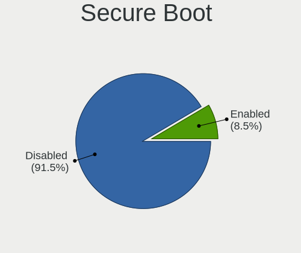

| State    | Desktops | Percent |
|----------|----------|---------|
| Disabled | 52       | 91.23%  |
| Enabled  | 5        | 8.77%   |

Coreboot
--------

Have coreboot on board

| Used | Desktops | Percent |
|------|----------|---------|
| No   | 56       | 100%    |

RAM Size
--------

Total RAM memory

| Size in GB  | Desktops | Percent |
|-------------|----------|---------|
| 64.01-256.0 | 16       | 27.12%  |
| 32.01-64.0  | 13       | 22.03%  |
| 16.01-24.0  | 10       | 16.95%  |
| 4.01-8.0    | 8        | 13.56%  |
| 8.01-16.0   | 7        | 11.86%  |
| 24.01-32.0  | 5        | 8.47%   |

RAM Used
--------

Used RAM memory

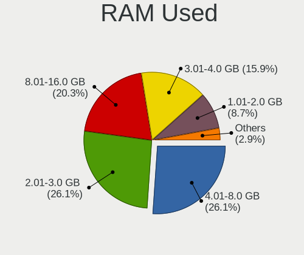

| Used GB    | Desktops | Percent |
|------------|----------|---------|
| 4.01-8.0   | 18       | 26.87%  |
| 2.01-3.0   | 18       | 26.87%  |
| 8.01-16.0  | 13       | 19.4%   |
| 3.01-4.0   | 11       | 16.42%  |
| 1.01-2.0   | 5        | 7.46%   |
| 16.01-24.0 | 2        | 2.99%   |

Total Drives
------------

Number of drives on board

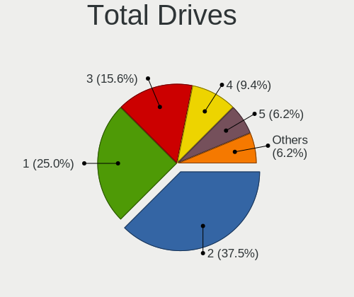

| Drives | Desktops | Percent |
|--------|----------|---------|
| 2      | 23       | 37.1%   |
| 1      | 16       | 25.81%  |
| 3      | 10       | 16.13%  |
| 4      | 6        | 9.68%   |
| 5      | 3        | 4.84%   |
| 8      | 2        | 3.23%   |
| 10     | 1        | 1.61%   |
| 6      | 1        | 1.61%   |

Has CD-ROM
----------

Has CD-ROM on board

| Presented | Desktops | Percent |
|-----------|----------|---------|
| No        | 31       | 54.39%  |
| Yes       | 26       | 45.61%  |

Has Ethernet
------------

Has Ethernet on board

| Presented | Desktops | Percent |
|-----------|----------|---------|
| Yes       | 56       | 100%    |

Has WiFi
--------

Has WiFi module

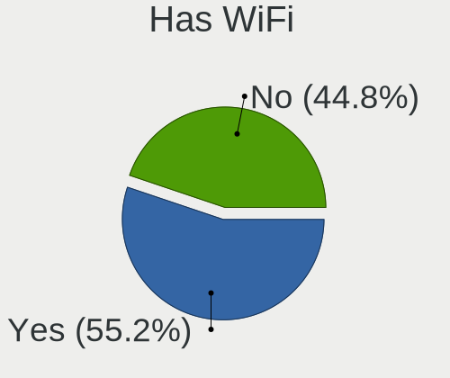

| Presented | Desktops | Percent |
|-----------|----------|---------|
| Yes       | 30       | 53.57%  |
| No        | 26       | 46.43%  |

Has Bluetooth
-------------

Has Bluetooth module

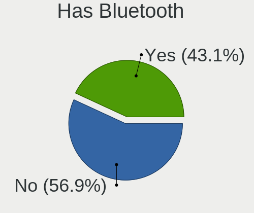

| Presented | Desktops | Percent |
|-----------|----------|---------|
| No        | 31       | 55.36%  |
| Yes       | 25       | 44.64%  |

Location
--------

Country
-------

Geographic location (country)

| Country      | Desktops | Percent |
|--------------|----------|---------|
| USA          | 10       | 17.86%  |
| UK           | 5        | 8.93%   |
| Czechia      | 5        | 8.93%   |
| Italy        | 3        | 5.36%   |
| Germany      | 3        | 5.36%   |
| Canada       | 3        | 5.36%   |
| Ukraine      | 2        | 3.57%   |
| South Korea  | 2        | 3.57%   |
| Russia       | 2        | 3.57%   |
| Poland       | 2        | 3.57%   |
| India        | 2        | 3.57%   |
| Argentina    | 2        | 3.57%   |
| Turkmenistan | 1        | 1.79%   |
| Switzerland  | 1        | 1.79%   |
| Sweden       | 1        | 1.79%   |
| Spain        | 1        | 1.79%   |
| Slovenia     | 1        | 1.79%   |
| New Zealand  | 1        | 1.79%   |
| Netherlands  | 1        | 1.79%   |
| Mexico       | 1        | 1.79%   |
| Lithuania    | 1        | 1.79%   |
| Indonesia    | 1        | 1.79%   |
| Finland      | 1        | 1.79%   |
| Egypt        | 1        | 1.79%   |
| China        | 1        | 1.79%   |
| Brazil       | 1        | 1.79%   |
| Belarus      | 1        | 1.79%   |

City
----

Geographic location (city)

| City                  | Desktops | Percent |
|-----------------------|----------|---------|
| Prague                | 4        | 6.78%   |
| Kyiv                  | 2        | 3.39%   |
| Yongin-si             | 1        | 1.69%   |
| Wiesbaden             | 1        | 1.69%   |
| Vaglio                | 1        | 1.69%   |
| Turku                 | 1        | 1.69%   |
| Toronto               | 1        | 1.69%   |
| Tiruchi               | 1        | 1.69%   |
| Tauranga              | 1        | 1.69%   |
| Spokane               | 1        | 1.69%   |
| Šiauliai             | 1        | 1.69%   |
| Saratov               | 1        | 1.69%   |
| San Jose              | 1        | 1.69%   |
| San Fernando          | 1        | 1.69%   |
| Salvador              | 1        | 1.69%   |
| Saltillo              | 1        | 1.69%   |
| Rosario               | 1        | 1.69%   |
| Reading               | 1        | 1.69%   |
| Porto Empedocle       | 1        | 1.69%   |
| Pernis                | 1        | 1.69%   |
| Paracuellos de Jarama | 1        | 1.69%   |
| Musselburgh           | 1        | 1.69%   |
| Montreal              | 1        | 1.69%   |
| Mississauga           | 1        | 1.69%   |
| Minsk                 | 1        | 1.69%   |
| Milwaukee             | 1        | 1.69%   |
| Milan                 | 1        | 1.69%   |
| Lodz                  | 1        | 1.69%   |
| Ljutomer              | 1        | 1.69%   |
| Leeds                 | 1        | 1.69%   |
| Langfang              | 1        | 1.69%   |
| Kielce                | 1        | 1.69%   |
| Inowlodz              | 1        | 1.69%   |
| Huddersfield          | 1        | 1.69%   |
| Horseshoe Bend        | 1        | 1.69%   |
| Holly Springs         | 1        | 1.69%   |
| Gyami                 | 1        | 1.69%   |
| Gothenburg            | 1        | 1.69%   |
| Gangnam-gu            | 1        | 1.69%   |
| Dobrany               | 1        | 1.69%   |

Drives
------

Drive Vendor
------------

Hard drive vendors

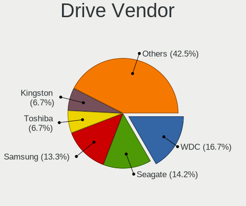

| Vendor                    | Desktops | Drives | Percent |
|---------------------------|----------|--------|---------|
| WDC                       | 20       | 41     | 17.09%  |
| Seagate                   | 17       | 28     | 14.53%  |
| Samsung Electronics       | 15       | 39     | 12.82%  |
| Toshiba                   | 8        | 11     | 6.84%   |
| Kingston                  | 8        | 12     | 6.84%   |
| Crucial                   | 5        | 9      | 4.27%   |
| SanDisk                   | 4        | 10     | 3.42%   |
| Intel                     | 4        | 6      | 3.42%   |
| A-DATA Technology         | 4        | 4      | 3.42%   |
| SK hynix                  | 3        | 4      | 2.56%   |
| Phison                    | 3        | 7      | 2.56%   |
| Micron Technology         | 3        | 3      | 2.56%   |
| Hitachi                   | 3        | 3      | 2.56%   |
| PNY                       | 2        | 2      | 1.71%   |
| Gigabyte Technology       | 2        | 3      | 1.71%   |
| Corsair                   | 2        | 5      | 1.71%   |
| XPG                       | 1        | 1      | 0.85%   |
| Western Digital           | 1        | 1      | 0.85%   |
| Unknown                   | 1        | 1      | 0.85%   |
| T-FORCE                   | 1        | 2      | 0.85%   |
| Silicon Motion            | 1        | 1      | 0.85%   |
| OCZ                       | 1        | 2      | 0.85%   |
| Micron/Crucial Technology | 1        | 1      | 0.85%   |
| KingFast                  | 1        | 1      | 0.85%   |
| KINGBANK                  | 1        | 1      | 0.85%   |
| HPT                       | 1        | 1      | 0.85%   |
| Hoodisk                   | 1        | 1      | 0.85%   |
| HGST                      | 1        | 1      | 0.85%   |
| Hewlett-Packard           | 1        | 1      | 0.85%   |
| China                     | 1        | 1      | 0.85%   |

Drive Model
-----------

Hard drive models

| Model                                | Desktops | Percent |
|--------------------------------------|----------|---------|
| Samsung SSD 860 EVO 1TB              | 4        | 2.8%    |
| Toshiba DT01ACA200 2TB               | 3        | 2.1%    |
| WDC WD1003FZEX-00MK2A0 1TB           | 2        | 1.4%    |
| WDC WD1002FAEX-00Z3A0 1TB            | 2        | 1.4%    |
| Toshiba NVMe SSD Drive 256GB         | 2        | 1.4%    |
| Seagate ST500DM002-1BD142 500GB      | 2        | 1.4%    |
| Seagate ST2000DM001-1ER164 2TB       | 2        | 1.4%    |
| Seagate ST1000DM003-9YN162 1TB       | 2        | 1.4%    |
| Samsung NVMe SSD Drive 512GB         | 2        | 1.4%    |
| Samsung NVMe SSD Drive 500GB         | 2        | 1.4%    |
| Kingston SUV500120G 120GB SSD        | 2        | 1.4%    |
| Crucial CT240BX500SSD1 240GB         | 2        | 1.4%    |
| Corsair Force LE SSD 240GB           | 2        | 1.4%    |
| XPG NVMe SSD Drive 1024GB            | 1        | 0.7%    |
| Western Digital NVMe SSD Drive 960GB | 1        | 0.7%    |
| WDC WDS250G2B0B-00YS70 250GB SSD     | 1        | 0.7%    |
| WDC WDS240G2G0A-00JH30 240GB SSD     | 1        | 0.7%    |
| WDC WDS240G1G0A-00SS50 240GB SSD     | 1        | 0.7%    |
| WDC WDS100T2B0A-00SM50 1TB SSD       | 1        | 0.7%    |
| WDC WD7500BPKT-00PK4T0 752GB         | 1        | 0.7%    |
| WDC WD60 EFAX-68JH4N1 6TB            | 1        | 0.7%    |
| WDC WD60 EFAX-68JH4N0 6TB            | 1        | 0.7%    |
| WDC WD5003ABYZ-011FA0 500GB          | 1        | 0.7%    |
| WDC WD5000AAKX-75U6AA0 500GB         | 1        | 0.7%    |
| WDC WD50 00LPVX-00V0TT0 500GB        | 1        | 0.7%    |
| WDC WD40PURZ-85TTDY0 4TB             | 1        | 0.7%    |
| WDC WD40EZRZ-19GXCB0 4TB             | 1        | 0.7%    |
| WDC WD40EFRX-68N32N0 4TB             | 1        | 0.7%    |
| WDC WD4005FZBX-00K5WB0 4TB           | 1        | 0.7%    |
| WDC WD2500BEKT-75F3T0 250GB          | 1        | 0.7%    |
| WDC WD2500AAKX-083CA1 250GB          | 1        | 0.7%    |
| WDC WD20PURZ-85GU6Y0 2TB             | 1        | 0.7%    |
| WDC WD20EARS-22MVWB0 2TB             | 1        | 0.7%    |
| WDC WD2005FBYZ-01YCBB3 2TB           | 1        | 0.7%    |
| WDC WD2003FZEX-00SRLA0 2TB           | 1        | 0.7%    |
| WDC WD10JPVX-22JC3T0 1TB             | 1        | 0.7%    |
| WDC WD10EZEX-75WN4A0 1TB             | 1        | 0.7%    |
| WDC WD10EZEX-22MFCA0 1TB             | 1        | 0.7%    |
| WDC WD10EZEX-08WN4A0 1TB             | 1        | 0.7%    |
| Unknown SD/MMC/MS PRO 128GB          | 1        | 0.7%    |

HDD Vendor
----------

Hard disk drive vendors

| Vendor              | Desktops | Drives | Percent |
|---------------------|----------|--------|---------|
| WDC                 | 18       | 37     | 37.5%   |
| Seagate             | 17       | 28     | 35.42%  |
| Toshiba             | 6        | 8      | 12.5%   |
| Hitachi             | 3        | 3      | 6.25%   |
| Unknown             | 1        | 1      | 2.08%   |
| Samsung Electronics | 1        | 2      | 2.08%   |
| HGST                | 1        | 1      | 2.08%   |
| Hewlett-Packard     | 1        | 1      | 2.08%   |

SSD Vendor
----------

Solid state drive vendors

| Vendor              | Desktops | Drives | Percent |
|---------------------|----------|--------|---------|
| Samsung Electronics | 10       | 25     | 22.22%  |
| Kingston            | 8        | 12     | 17.78%  |
| Crucial             | 5        | 9      | 11.11%  |
| WDC                 | 3        | 4      | 6.67%   |
| Micron Technology   | 3        | 3      | 6.67%   |
| A-DATA Technology   | 3        | 3      | 6.67%   |
| SanDisk             | 2        | 7      | 4.44%   |
| PNY                 | 2        | 2      | 4.44%   |
| Intel               | 2        | 3      | 4.44%   |
| Corsair             | 2        | 5      | 4.44%   |
| SK hynix            | 1        | 2      | 2.22%   |
| OCZ                 | 1        | 2      | 2.22%   |
| KINGBANK            | 1        | 1      | 2.22%   |
| Hoodisk             | 1        | 1      | 2.22%   |
| China               | 1        | 1      | 2.22%   |

Drive Kind
----------

HDD or SSD

| Kind    | Desktops | Drives | Percent |
|---------|----------|--------|---------|
| SSD     | 39       | 80     | 39%     |
| HDD     | 39       | 81     | 39%     |
| NVMe    | 19       | 38     | 19%     |
| Unknown | 3        | 4      | 3%      |

Drive Connector
---------------

SATA, SAS, NVMe, etc.

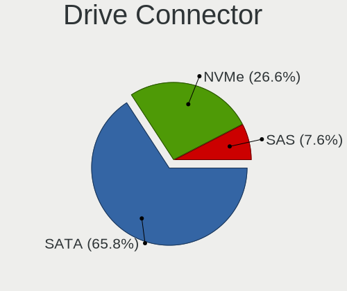

| Type | Desktops | Drives | Percent |
|------|----------|--------|---------|
| SATA | 51       | 153    | 67.11%  |
| NVMe | 19       | 38     | 25%     |
| SAS  | 6        | 12     | 7.89%   |

Drive Size
----------

Size of hard drive

| Size in TB | Desktops | Drives | Percent |
|------------|----------|--------|---------|
| 0.01-0.5   | 35       | 74     | 39.33%  |
| 0.51-1.0   | 29       | 51     | 32.58%  |
| 1.01-2.0   | 15       | 18     | 16.85%  |
| 3.01-4.0   | 6        | 11     | 6.74%   |
| 4.01-10.0  | 3        | 6      | 3.37%   |
| 2.01-3.0   | 1        | 1      | 1.12%   |

Space Total
-----------

Amount of disk space available on the file system

| Size in GB     | Desktops | Percent |
|----------------|----------|---------|
| 101-250        | 13       | 20.97%  |
| 501-1000       | 13       | 20.97%  |
| More than 3000 | 11       | 17.74%  |
| 251-500        | 9        | 14.52%  |
| 1001-2000      | 8        | 12.9%   |
| 2001-3000      | 5        | 8.06%   |
| 51-100         | 2        | 3.23%   |
| Unknown        | 1        | 1.61%   |

Space Used
----------

Amount of used disk space

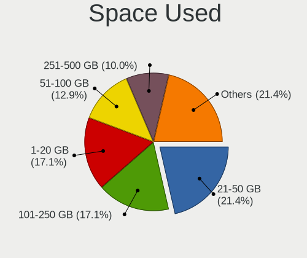

| Used GB        | Desktops | Percent |
|----------------|----------|---------|
| 21-50          | 15       | 22.06%  |
| 101-250        | 11       | 16.18%  |
| 1-20           | 11       | 16.18%  |
| 51-100         | 9        | 13.24%  |
| 251-500        | 7        | 10.29%  |
| 1001-2000      | 5        | 7.35%   |
| 501-1000       | 4        | 5.88%   |
| More than 3000 | 3        | 4.41%   |
| 2001-3000      | 2        | 2.94%   |
| Unknown        | 1        | 1.47%   |

Malfunc. Drives
---------------

Drive models with a malfunction

| Model                                    | Desktops | Drives | Percent |
|------------------------------------------|----------|--------|---------|
| Seagate ST1000DM003-9YN162 1TB           | 1        | 1      | 25%     |
| Micron Technology M510_2.5 7MM 256GB SSD | 1        | 1      | 25%     |
| Hitachi HDS722020ALA330 2TB              | 1        | 1      | 25%     |
| A-DATA Technology SU800NS38 256GB SSD    | 1        | 1      | 25%     |

Malfunc. Drive Vendor
---------------------

Vendors of faulty drives

| Vendor            | Desktops | Drives | Percent |
|-------------------|----------|--------|---------|
| Seagate           | 1        | 1      | 25%     |
| Micron Technology | 1        | 1      | 25%     |
| Hitachi           | 1        | 1      | 25%     |
| A-DATA Technology | 1        | 1      | 25%     |

Malfunc. HDD Vendor
-------------------

Vendors of faulty HDD drives

| Vendor  | Desktops | Drives | Percent |
|---------|----------|--------|---------|
| Seagate | 1        | 1      | 50%     |
| Hitachi | 1        | 1      | 50%     |

Malfunc. Drive Kind
-------------------

Kinds of faulty drives

| Kind | Desktops | Drives | Percent |
|------|----------|--------|---------|
| SSD  | 2        | 2      | 50%     |
| HDD  | 2        | 2      | 50%     |

Failed Drives
-------------

Failed drive models

Zero info for selected period =(

Failed Drive Vendor
-------------------

Failed drive vendors

Zero info for selected period =(

Drive Status
------------

Number of failed and malfunc. drives

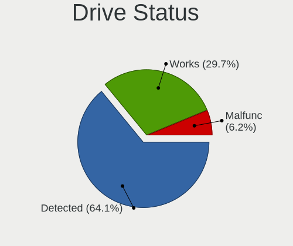

| Status   | Desktops | Drives | Percent |
|----------|----------|--------|---------|
| Detected | 39       | 154    | 62.9%   |
| Works    | 19       | 45     | 30.65%  |
| Malfunc  | 4        | 4      | 6.45%   |

Storage controller
------------------

Storage Vendor
--------------

Storage controller vendors

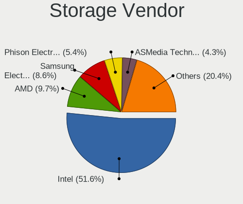

| Vendor                       | Desktops | Percent |
|------------------------------|----------|---------|
| Intel                        | 46       | 51.69%  |
| AMD                          | 9        | 10.11%  |
| Samsung Electronics          | 8        | 8.99%   |
| Phison Electronics           | 4        | 4.49%   |
| ASMedia Technology           | 4        | 4.49%   |
| Marvell Technology Group     | 3        | 3.37%   |
| Toshiba America Info Systems | 2        | 2.25%   |
| SK hynix                     | 2        | 2.25%   |
| LSI Logic / Symbios Logic    | 2        | 2.25%   |
| Broadcom / LSI               | 2        | 2.25%   |
| ADATA Technology             | 2        | 2.25%   |
| Western Digital              | 1        | 1.12%   |
| Silicon Motion               | 1        | 1.12%   |
| SanDisk                      | 1        | 1.12%   |
| Micron/Crucial Technology    | 1        | 1.12%   |
| HighPoint Technologies       | 1        | 1.12%   |

Storage Model
-------------

Storage controller models

| Model                                                                                   | Desktops | Percent |
|-----------------------------------------------------------------------------------------|----------|---------|
| Intel Cannon Lake PCH SATA AHCI Controller                                              | 9        | 8.49%   |
| AMD FCH SATA Controller [AHCI mode]                                                     | 8        | 7.55%   |
| Samsung NVMe SSD Controller SM981/PM981/PM983                                           | 7        | 6.6%    |
| Intel SATA Controller [RAID Mode]                                                       | 6        | 5.66%   |
| Intel 8 Series/C220 Series Chipset Family 6-port SATA Controller 1 [AHCI mode]          | 5        | 4.72%   |
| Intel 7 Series/C210 Series Chipset Family 6-port SATA Controller [AHCI mode]            | 5        | 4.72%   |
| Intel Q170/Q150/B150/H170/H110/Z170/CM236 Chipset SATA Controller [AHCI Mode]           | 4        | 3.77%   |
| Intel C610/X99 series chipset 6-Port SATA Controller [AHCI mode]                        | 4        | 3.77%   |
| ASMedia ASM1061/ASM1062 Serial ATA Controller                                           | 4        | 3.77%   |
| Intel C610/X99 series chipset sSATA Controller [AHCI mode]                              | 3        | 2.83%   |
| Intel 200 Series PCH SATA controller [AHCI mode]                                        | 3        | 2.83%   |
| AMD 300 Series Chipset SATA Controller                                                  | 3        | 2.83%   |
| Toshiba America Info Systems XG5 NVMe SSD Controller                                    | 2        | 1.89%   |
| SK hynix PC601 NVMe Solid State Drive                                                   | 2        | 1.89%   |
| Phison PS5013-E13 PCIe3 NVMe Controller (DRAM-less)                                     | 2        | 1.89%   |
| Phison E12 NVMe Controller                                                              | 2        | 1.89%   |
| Intel C600/X79 series chipset 6-Port SATA AHCI Controller                               | 2        | 1.89%   |
| Intel 9 Series Chipset Family SATA Controller [AHCI Mode]                               | 2        | 1.89%   |
| Western Digital Ultrastar DC SN640 NVMe SSD                                             | 1        | 0.94%   |
| Silicon Motion SM2263EN/SM2263XT (DRAM-less) NVMe SSD Controllers                       | 1        | 0.94%   |
| SanDisk Ultra 3D / WD Blue SN550 NVMe SSD                                               | 1        | 0.94%   |
| SanDisk Extreme Pro / WD Black SN750 / PC SN730 / Red SN700 NVMe SSD                    | 1        | 0.94%   |
| Samsung NVMe SSD Controller SM961/PM961/SM963                                           | 1        | 0.94%   |
| Phison E16 PCIe4 NVMe Controller                                                        | 1        | 0.94%   |
| Micron/Crucial P1 NVMe PCIe SSD[Frampton2]                                              | 1        | 0.94%   |
| Marvell Group 88SE9215 PCIe 2.0 x1 4-port SATA 6 Gb/s Controller                        | 1        | 0.94%   |
| Marvell Group 88SE9128 PCIe SATA 6 Gb/s RAID controller with HyperDuo                   | 1        | 0.94%   |
| Marvell Group 88NR2241 Non-Volatile memory controller                                   | 1        | 0.94%   |
| LSI Logic / Symbios Logic SAS2308 PCI-Express Fusion-MPT SAS-2                          | 1        | 0.94%   |
| LSI Logic / Symbios Logic MegaRAID SAS 2008 [Falcon]                                    | 1        | 0.94%   |
| Intel Sunrise Point-LP SATA Controller [AHCI mode]                                      | 1        | 0.94%   |
| Intel SSD 660P Series                                                                   | 1        | 0.94%   |
| Intel sSATA Controller [RAID Mode]                                                      | 1        | 0.94%   |
| Intel Optane SSD 900P Series                                                            | 1        | 0.94%   |
| Intel Comet Lake SATA AHCI Controller                                                   | 1        | 0.94%   |
| Intel C602 chipset 4-Port SATA Storage Control Unit                                     | 1        | 0.94%   |
| Intel C600/X79 series chipset IDE-r Controller                                          | 1        | 0.94%   |
| Intel 631xESB/632xESB/3100 Chipset SATA IDE Controller                                  | 1        | 0.94%   |
| Intel 631xESB/632xESB IDE Controller                                                    | 1        | 0.94%   |
| Intel 6 Series/C200 Series Chipset Family Desktop SATA Controller (IDE mode, ports 4-5) | 1        | 0.94%   |

Storage Kind
------------

Kind of storage controller (IDE, SATA, NVMe, SAS, ...)

| Kind | Desktops | Percent |
|------|----------|---------|
| SATA | 48       | 57.14%  |
| NVMe | 19       | 22.62%  |
| RAID | 9        | 10.71%  |
| SAS  | 4        | 4.76%   |
| IDE  | 4        | 4.76%   |

Processor
---------

CPU Vendor
----------

Processor vendors

| Vendor | Desktops | Percent |
|--------|----------|---------|
| Intel  | 47       | 83.93%  |
| AMD    | 9        | 16.07%  |

CPU Model
---------

Processor models

| Model                                  | Desktops | Percent |
|----------------------------------------|----------|---------|
| Intel Core i7-8700 CPU @ 3.20GHz       | 4        | 7.14%   |
| AMD Ryzen 9 3900X 12-Core Processor    | 4        | 7.14%   |
| Intel Xeon CPU E5-2680 v3 @ 2.50GHz    | 2        | 3.57%   |
| Intel Pentium Gold G5400 CPU @ 3.70GHz | 2        | 3.57%   |
| Intel Core i7-7700 CPU @ 3.60GHz       | 2        | 3.57%   |
| Intel Xeon W-2102 CPU @ 2.90GHz        | 1        | 1.79%   |
| Intel Xeon CPU E5472 @ 3.00GHz         | 1        | 1.79%   |
| Intel Xeon CPU E5-2696 v3 @ 2.30GHz    | 1        | 1.79%   |
| Intel Xeon CPU E5-2680 v2 @ 2.80GHz    | 1        | 1.79%   |
| Intel Xeon CPU E5-2678 v3 @ 2.50GHz    | 1        | 1.79%   |
| Intel Xeon CPU E5-2670 0 @ 2.60GHz     | 1        | 1.79%   |
| Intel Xeon CPU E5-1650 v4 @ 3.60GHz    | 1        | 1.79%   |
| Intel Xeon CPU E3-1270 v5 @ 3.60GHz    | 1        | 1.79%   |
| Intel Xeon CPU E3-1240 v3 @ 3.40GHz    | 1        | 1.79%   |
| Intel Core i9-9900 CPU @ 3.10GHz       | 1        | 1.79%   |
| Intel Core i9-10850K CPU @ 3.60GHz     | 1        | 1.79%   |
| Intel Core i7-9700F CPU @ 3.00GHz      | 1        | 1.79%   |
| Intel Core i7-8700K CPU @ 3.70GHz      | 1        | 1.79%   |
| Intel Core i7-7560U CPU @ 2.40GHz      | 1        | 1.79%   |
| Intel Core i7-4790K CPU @ 4.00GHz      | 1        | 1.79%   |
| Intel Core i7-4790 CPU @ 3.60GHz       | 1        | 1.79%   |
| Intel Core i7-4770K CPU @ 3.50GHz      | 1        | 1.79%   |
| Intel Core i7-3820 CPU @ 3.60GHz       | 1        | 1.79%   |
| Intel Core i7-3770K CPU @ 3.50GHz      | 1        | 1.79%   |
| Intel Core i5-9600K CPU @ 3.70GHz      | 1        | 1.79%   |
| Intel Core i5-7500 CPU @ 3.40GHz       | 1        | 1.79%   |
| Intel Core i5-6500 CPU @ 3.20GHz       | 1        | 1.79%   |
| Intel Core i5-4690 CPU @ 3.50GHz       | 1        | 1.79%   |
| Intel Core i5-4460 CPU @ 3.20GHz       | 1        | 1.79%   |
| Intel Core i5-3570K CPU @ 3.40GHz      | 1        | 1.79%   |
| Intel Core i5-3550 CPU @ 3.30GHz       | 1        | 1.79%   |
| Intel Core i5-3470T CPU @ 2.90GHz      | 1        | 1.79%   |
| Intel Core i5-3450 CPU @ 3.10GHz       | 1        | 1.79%   |
| Intel Core i5-2400S CPU @ 2.50GHz      | 1        | 1.79%   |
| Intel Core i5-10600K CPU @ 4.10GHz     | 1        | 1.79%   |
| Intel Core i3-8100 CPU @ 3.60GHz       | 1        | 1.79%   |
| Intel Core i3-6100T CPU @ 3.20GHz      | 1        | 1.79%   |
| Intel Core i3-4330 CPU @ 3.50GHz       | 1        | 1.79%   |
| Intel Core i3-4170 CPU @ 3.70GHz       | 1        | 1.79%   |
| Intel Core i3-4160 CPU @ 3.60GHz       | 1        | 1.79%   |

CPU Model Family
----------------

Processor model prefix

| Model              | Desktops | Percent |
|--------------------|----------|---------|
| Intel Core i7      | 14       | 25%     |
| Intel Xeon         | 11       | 19.64%  |
| Intel Core i5      | 11       | 19.64%  |
| Intel Core i3      | 6        | 10.71%  |
| AMD Ryzen 9        | 4        | 7.14%   |
| Intel Pentium Gold | 2        | 3.57%   |
| Intel Core i9      | 2        | 3.57%   |
| AMD Ryzen 7        | 2        | 3.57%   |
| Other              | 1        | 1.79%   |
| AMD Ryzen 5        | 1        | 1.79%   |
| AMD Ryzen 3        | 1        | 1.79%   |
| AMD FX             | 1        | 1.79%   |

CPU Cores
---------

Number of processor cores

| Number | Desktops | Percent |
|--------|----------|---------|
| 4      | 22       | 39.29%  |
| 2      | 9        | 16.07%  |
| 6      | 8        | 14.29%  |
| 12     | 6        | 10.71%  |
| 8      | 6        | 10.71%  |
| 36     | 1        | 1.79%   |
| 24     | 1        | 1.79%   |
| 20     | 1        | 1.79%   |
| 16     | 1        | 1.79%   |
| 10     | 1        | 1.79%   |

CPU Sockets
-----------

Number of sockets

| Number | Desktops | Percent |
|--------|----------|---------|
| 1      | 51       | 91.07%  |
| 2      | 5        | 8.93%   |

CPU Threads
-----------

Threads per core (Hyper-Threading)

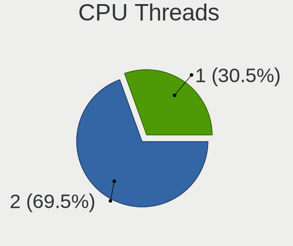

| Number | Desktops | Percent |
|--------|----------|---------|
| 2      | 40       | 70.18%  |
| 1      | 17       | 29.82%  |

CPU Op-Modes
------------

CPU Operation Modes (32-bit, 64-bit)

| Op mode        | Desktops | Percent |
|----------------|----------|---------|
| 32-bit, 64-bit | 55       | 98.21%  |
| Unknown        | 1        | 1.79%   |

CPU Microcode
-------------

Microcode number

| Number     | Desktops | Percent |
|------------|----------|---------|
| 0x306c3    | 10       | 17.86%  |
| 0x906ea    | 7        | 12.5%   |
| 0x306f2    | 4        | 7.14%   |
| 0x306a9    | 4        | 7.14%   |
| 0x906ed    | 3        | 5.36%   |
| 0x906e9    | 3        | 5.36%   |
| 0x506e3    | 3        | 5.36%   |
| Unknown    | 3        | 5.36%   |
| 0x206d7    | 2        | 3.57%   |
| 0x08701021 | 2        | 3.57%   |
| 0x08701013 | 2        | 3.57%   |
| 0xa0671    | 1        | 1.79%   |
| 0xa0655    | 1        | 1.79%   |
| 0x906eb    | 1        | 1.79%   |
| 0x806e9    | 1        | 1.79%   |
| 0x406f1    | 1        | 1.79%   |
| 0x306e4    | 1        | 1.79%   |
| 0x206a7    | 1        | 1.79%   |
| 0x10676    | 1        | 1.79%   |
| 0x08108102 | 1        | 1.79%   |
| 0x0810100b | 1        | 1.79%   |
| 0x08001138 | 1        | 1.79%   |
| 0x08001137 | 1        | 1.79%   |
| 0x06000852 | 1        | 1.79%   |

CPU Microarch
-------------

Microarchitecture

| Name        | Desktops | Percent |
|-------------|----------|---------|
| KabyLake    | 15       | 26.79%  |
| Haswell     | 14       | 25%     |
| IvyBridge   | 6        | 10.71%  |
| Zen 2       | 4        | 7.14%   |
| Skylake     | 4        | 7.14%   |
| Zen         | 3        | 5.36%   |
| SandyBridge | 3        | 5.36%   |
| CometLake   | 2        | 3.57%   |
| Zen+        | 1        | 1.79%   |
| Piledriver  | 1        | 1.79%   |
| Penryn      | 1        | 1.79%   |
| Icelake     | 1        | 1.79%   |
| Broadwell   | 1        | 1.79%   |

Graphics
--------

GPU Vendor
----------

Vendors of graphics cards

| Vendor | Desktops | Percent |
|--------|----------|---------|
| Nvidia | 35       | 52.24%  |
| Intel  | 23       | 34.33%  |
| AMD    | 9        | 13.43%  |

GPU Model
---------

Graphics card models

| Model                                                                       | Desktops | Percent |
|-----------------------------------------------------------------------------|----------|---------|
| Intel CoffeeLake-S GT2 [UHD Graphics 630]                                   | 6        | 8.57%   |
| Nvidia GP107 [GeForce GTX 1050 Ti]                                          | 3        | 4.29%   |
| Intel Xeon E3-1200 v3/4th Gen Core Processor Integrated Graphics Controller | 3        | 4.29%   |
| Nvidia TU106 [GeForce RTX 2060 SUPER]                                       | 2        | 2.86%   |
| Nvidia TU104 [GeForce RTX 2070 SUPER]                                       | 2        | 2.86%   |
| Nvidia GP106 [GeForce GTX 1060 6GB]                                         | 2        | 2.86%   |
| Nvidia GP104 [GeForce GTX 1070]                                             | 2        | 2.86%   |
| Nvidia GK208B [GeForce GT 730]                                              | 2        | 2.86%   |
| Intel Xeon E3-1200 v2/3rd Gen Core processor Graphics Controller            | 2        | 2.86%   |
| Intel IvyBridge GT2 [HD Graphics 4000]                                      | 2        | 2.86%   |
| Intel HD Graphics 630                                                       | 2        | 2.86%   |
| Intel 4th Generation Core Processor Family Integrated Graphics Controller   | 2        | 2.86%   |
| Nvidia TU116 [GeForce GTX 1660 Ti]                                          | 1        | 1.43%   |
| Nvidia TU116 [GeForce GTX 1650 SUPER]                                       | 1        | 1.43%   |
| Nvidia TU106 [GeForce RTX 2070]                                             | 1        | 1.43%   |
| Nvidia GP107GL [Quadro P600]                                                | 1        | 1.43%   |
| Nvidia GP107GL [Quadro P1000]                                               | 1        | 1.43%   |
| Nvidia GP106 [GeForce GTX 1060 3GB]                                         | 1        | 1.43%   |
| Nvidia GP104 [GeForce GTX 1080]                                             | 1        | 1.43%   |
| Nvidia GP102 [GeForce GTX 1080 Ti]                                          | 1        | 1.43%   |
| Nvidia GM206 [GeForce GTX 960]                                              | 1        | 1.43%   |
| Nvidia GM204GL [Quadro M4000]                                               | 1        | 1.43%   |
| Nvidia GM204 [GeForce GTX 970]                                              | 1        | 1.43%   |
| Nvidia GM107GL [Quadro K620]                                                | 1        | 1.43%   |
| Nvidia GM107GL [NVS 810]                                                    | 1        | 1.43%   |
| Nvidia GK208B [GeForce GT 710]                                              | 1        | 1.43%   |
| Nvidia GK106GL [Quadro K4000]                                               | 1        | 1.43%   |
| Nvidia GK104 [GeForce GTX 760]                                              | 1        | 1.43%   |
| Nvidia GF114 [GeForce GTX 560]                                              | 1        | 1.43%   |
| Nvidia GF110 [GeForce GTX 580]                                              | 1        | 1.43%   |
| Nvidia GF108GL [Quadro 600]                                                 | 1        | 1.43%   |
| Nvidia GF108 [GeForce GT 730]                                               | 1        | 1.43%   |
| Nvidia GF108 [GeForce GT 630]                                               | 1        | 1.43%   |
| Nvidia GA102 [GeForce RTX 3080 Ti]                                          | 1        | 1.43%   |
| Nvidia G98 [Quadro NVS 295]                                                 | 1        | 1.43%   |
| Nvidia G98 [GeForce 8400 GS Rev. 2]                                         | 1        | 1.43%   |
| Nvidia G96C [GeForce 9500 GT]                                               | 1        | 1.43%   |
| Intel RocketLake-S GT1 [UHD Graphics 750]                                   | 1        | 1.43%   |
| Intel Iris Plus Graphics 640                                                | 1        | 1.43%   |
| Intel HD Graphics 530                                                       | 1        | 1.43%   |

GPU Combo
---------

Combinations of graphics cards

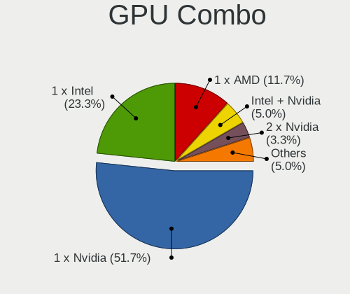

| Name           | Desktops | Percent |
|----------------|----------|---------|
| 1 x Nvidia     | 30       | 51.72%  |
| 1 x Intel      | 14       | 24.14%  |
| 1 x AMD        | 6        | 10.34%  |
| Intel + Nvidia | 3        | 5.17%   |
| 2 x Nvidia     | 2        | 3.45%   |
| Intel + AMD    | 2        | 3.45%   |
| 2 x AMD        | 1        | 1.72%   |

GPU Driver
----------

Free vs proprietary

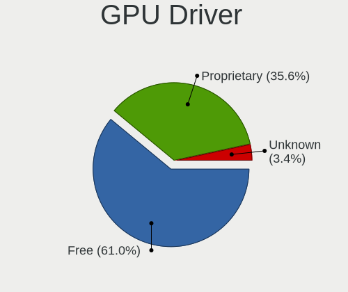

| Driver      | Desktops | Percent |
|-------------|----------|---------|
| Free        | 35       | 61.4%   |
| Proprietary | 20       | 35.09%  |
| Unknown     | 2        | 3.51%   |

GPU Memory
----------

Total video memory

| Size in GB | Desktops | Percent |
|------------|----------|---------|
| Unknown    | 22       | 36.07%  |
| 1.01-2.0   | 11       | 18.03%  |
| 7.01-8.0   | 9        | 14.75%  |
| 3.01-4.0   | 5        | 8.2%    |
| 5.01-6.0   | 3        | 4.92%   |
| 2.01-3.0   | 3        | 4.92%   |
| 0.51-1.0   | 3        | 4.92%   |
| 0.01-0.5   | 3        | 4.92%   |
| 8.01-16.0  | 2        | 3.28%   |

Monitor
-------

Monitor Vendor
--------------

Monitor vendors

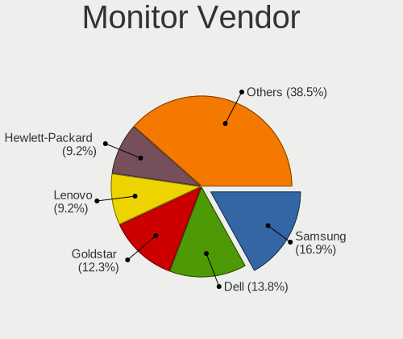

| Vendor               | Desktops | Percent |
|----------------------|----------|---------|
| Samsung Electronics  | 10       | 15.87%  |
| Goldstar             | 8        | 12.7%   |
| Dell                 | 8        | 12.7%   |
| Lenovo               | 6        | 9.52%   |
| Hewlett-Packard      | 6        | 9.52%   |
| BenQ                 | 3        | 4.76%   |
| Ancor Communications | 3        | 4.76%   |
| ViewSonic            | 2        | 3.17%   |
| Philips              | 2        | 3.17%   |
| Lenovo Group Limited | 2        | 3.17%   |
| Iiyama               | 2        | 3.17%   |
| Gigabyte Technology  | 2        | 3.17%   |
| Eizo                 | 2        | 3.17%   |
| Acer                 | 2        | 3.17%   |
| Unknown              | 2        | 3.17%   |
| Microstep            | 1        | 1.59%   |
| LG Electronics       | 1        | 1.59%   |
| Insignia             | 1        | 1.59%   |

Monitor Model
-------------

Monitor models

| Model                                                                  | Desktops | Percent |
|------------------------------------------------------------------------|----------|---------|
| Lenovo TIO24Gen3 LEN10B4 1920x1080 527x296mm 23.8-inch                 | 2        | 2.74%   |
| Lenovo LEN T2324pA LEN60C7 1920x1080 509x286mm 23.0-inch               | 2        | 2.74%   |
| Lenovo LEN P27u-10 LEN61B0 3840x2160 597x336mm 27.0-inch               | 2        | 2.74%   |
| Iiyama PL4840 IVM1065 1920x1080 1054x593mm 47.6-inch                   | 2        | 2.74%   |
| Goldstar FULL HD GSM5B55 1920x1080 480x270mm 21.7-inch                 | 2        | 2.74%   |
| Unknown                                                                | 2        | 2.74%   |
| ViewSonic VX2776 Series VSC3E32 1920x1080 598x336mm 27.0-inch          | 1        | 1.37%   |
| ViewSonic VA2259 Series VSC5E32 1920x1080 476x268mm 21.5-inch          | 1        | 1.37%   |
| Samsung Electronics SyncMaster SAM05FC 1920x1080                       | 1        | 1.37%   |
| Samsung Electronics SyncMaster SAM0566 1440x900 408x255mm 18.9-inch    | 1        | 1.37%   |
| Samsung Electronics S22E390 SAM0C18 1920x1080 477x268mm 21.5-inch      | 1        | 1.37%   |
| Samsung Electronics S22B300 SAM08A9 1600x900 443x249mm 20.0-inch       | 1        | 1.37%   |
| Samsung Electronics LCD Monitor SAM7106 1920x1080 1210x680mm 54.6-inch | 1        | 1.37%   |
| Samsung Electronics LCD Monitor SAM0200 1280x720                       | 1        | 1.37%   |
| Samsung Electronics LCD Monitor S22B150                                | 1        | 1.37%   |
| Samsung Electronics LCD Monitor C49HG9x 3840x1080                      | 1        | 1.37%   |
| Samsung Electronics C32R50x SAM7000 1920x1080 698x393mm 31.5-inch      | 1        | 1.37%   |
| Samsung Electronics C32HG7x SAM0E14 2560x1440 697x392mm 31.5-inch      | 1        | 1.37%   |
| Samsung Electronics C24F390 SAM0D2C 1920x1080 521x293mm 23.5-inch      | 1        | 1.37%   |
| Philips PHL 273V7 PHLC156 1920x1080 598x336mm 27.0-inch                | 1        | 1.37%   |
| Philips PHL 243V5 PHLC0D1 1920x1080 521x293mm 23.5-inch                | 1        | 1.37%   |
| Microstep LCD Monitor MSI AG32CV 1920x1080                             | 1        | 1.37%   |
| LG Electronics LCD Monitor W2486 1920x1080                             | 1        | 1.37%   |
| Lenovo P27h-20 LEN61E9 2560x1440 609x349mm 27.6-inch                   | 1        | 1.37%   |
| Lenovo LEN L24q-30 LEN65FB 2560x1440 527x296mm 23.8-inch               | 1        | 1.37%   |
| Lenovo L24q-10 LEN65CF 2560x1440 527x296mm 23.8-inch                   | 1        | 1.37%   |
| Lenovo Group Limited LCD Monitor LEN T2324pA 3840x1080                 | 1        | 1.37%   |
| Lenovo Group Limited LCD Monitor LEN P27u-10 9600x2160                 | 1        | 1.37%   |
| Lenovo Group Limited LCD Monitor LEN P27u-10 7680x2160                 | 1        | 1.37%   |
| Lenovo Group Limited LCD Monitor LEN P27u-10                           | 1        | 1.37%   |
| Insignia NS-40D420NA18 BBY4000 1920x1080 591x355mm 27.1-inch           | 1        | 1.37%   |
| Hewlett-Packard Z38c HPN3411 3840x1600 880x367mm 37.5-inch             | 1        | 1.37%   |
| Hewlett-Packard LE2002x HWP2963 1600x900 443x249mm 20.0-inch           | 1        | 1.37%   |
| Hewlett-Packard LCD Monitor LA2306                                     | 1        | 1.37%   |
| Hewlett-Packard LA2405x HWP301F 1920x1200 518x324mm 24.1-inch          | 1        | 1.37%   |
| Hewlett-Packard E273 HPN3471 1920x1080 598x336mm 27.0-inch             | 1        | 1.37%   |
| Hewlett-Packard E233 HPN3460 1920x1080 510x290mm 23.1-inch             | 1        | 1.37%   |
| Goldstar W2243 GSM56FE 1920x1080 477x268mm 21.5-inch                   | 1        | 1.37%   |
| Goldstar ULTRAWIDE GSM76F6 3440x1440 800x335mm 34.1-inch               | 1        | 1.37%   |
| Goldstar ULTRAWIDE GSM59F1 2560x1080 673x284mm 28.8-inch               | 1        | 1.37%   |

Monitor Resolution
------------------

Monitor screen resolution

| Resolution        | Desktops | Percent |
|-------------------|----------|---------|
| 1920x1080 (FHD)   | 30       | 48.39%  |
| 2560x1440 (QHD)   | 6        | 9.68%   |
| 3840x2160 (4K)    | 4        | 6.45%   |
| Unknown           | 4        | 6.45%   |
| 3840x1080         | 3        | 4.84%   |
| 3440x1440         | 3        | 4.84%   |
| 1600x900 (HD+)    | 3        | 4.84%   |
| 3840x1200         | 2        | 3.23%   |
| 9600x2160         | 1        | 1.61%   |
| 7680x2160         | 1        | 1.61%   |
| 3840x1600         | 1        | 1.61%   |
| 2560x1080         | 1        | 1.61%   |
| 1920x1200 (WUXGA) | 1        | 1.61%   |
| 1440x900 (WXGA+)  | 1        | 1.61%   |
| 1280x720 (HD)     | 1        | 1.61%   |

Monitor Diagonal
----------------

Diagonal size in inches

| Inches  | Desktops | Percent |
|---------|----------|---------|
| Unknown | 13       | 20.63%  |
| 23      | 9        | 14.29%  |
| 27      | 8        | 12.7%   |
| 24      | 8        | 12.7%   |
| 21      | 7        | 11.11%  |
| 31      | 4        | 6.35%   |
| 20      | 3        | 4.76%   |
| 54      | 2        | 3.17%   |
| 47      | 2        | 3.17%   |
| 34      | 2        | 3.17%   |
| 40      | 1        | 1.59%   |
| 39      | 1        | 1.59%   |
| 37      | 1        | 1.59%   |
| 25      | 1        | 1.59%   |
| 18      | 1        | 1.59%   |

Monitor Width
-------------

Physical width

| Width in mm | Desktops | Percent |
|-------------|----------|---------|
| 501-600     | 23       | 38.33%  |
| Unknown     | 13       | 21.67%  |
| 401-500     | 10       | 16.67%  |
| 601-700     | 5        | 8.33%   |
| 1001-1500   | 4        | 6.67%   |
| 801-900     | 3        | 5%      |
| 701-800     | 2        | 3.33%   |

Aspect Ratio
------------

Proportional relationship between the width and the height

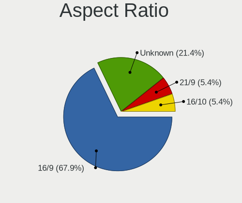

| Ratio   | Desktops | Percent |
|---------|----------|---------|
| 16/9    | 37       | 68.52%  |
| Unknown | 11       | 20.37%  |
| 21/9    | 3        | 5.56%   |
| 16/10   | 3        | 5.56%   |

Monitor Area
------------

Area in inch²

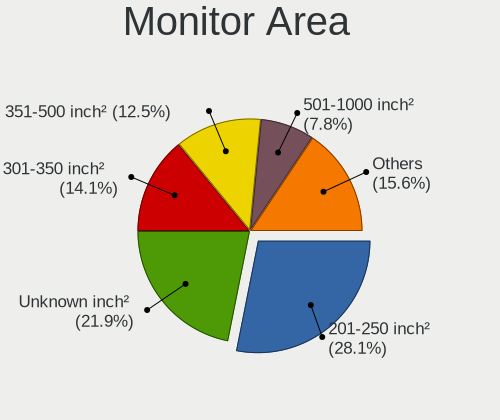

| Area in inch² | Desktops | Percent |
|----------------|----------|---------|
| 201-250        | 21       | 33.87%  |
| Unknown        | 13       | 20.97%  |
| 301-350        | 8        | 12.9%   |
| 351-500        | 6        | 9.68%   |
| 501-1000       | 5        | 8.06%   |
| 151-200        | 4        | 6.45%   |
| 251-300        | 3        | 4.84%   |
| More than 1000 | 2        | 3.23%   |

Pixel Density
-------------

Pixels per inch

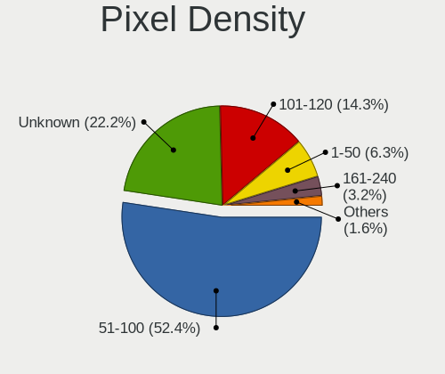

| Density | Desktops | Percent |
|---------|----------|---------|
| 51-100  | 29       | 47.54%  |
| Unknown | 13       | 21.31%  |
| 101-120 | 12       | 19.67%  |
| 1-50    | 4        | 6.56%   |
| 161-240 | 2        | 3.28%   |
| 121-160 | 1        | 1.64%   |

Multiple Monitors
-----------------

Total monitors connected

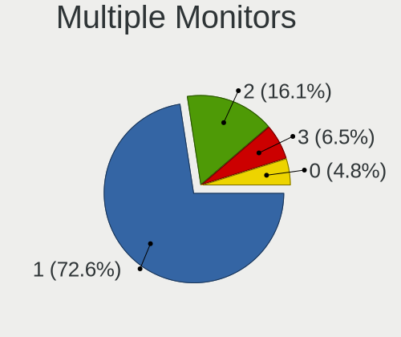

| Total | Desktops | Percent |
|-------|----------|---------|
| 1     | 44       | 73.33%  |
| 2     | 9        | 15%     |
| 3     | 4        | 6.67%   |
| 0     | 3        | 5%      |

Network
-------

Net Controller Vendor
---------------------

Controller vendors

| Vendor                   | Desktops | Percent |
|--------------------------|----------|---------|
| Intel                    | 38       | 45.24%  |
| Realtek Semiconductor    | 24       | 28.57%  |
| Qualcomm Atheros         | 7        | 8.33%   |
| Broadcom                 | 4        | 4.76%   |
| ASIX Electronics         | 2        | 2.38%   |
| Ralink Technology        | 1        | 1.19%   |
| Ralink                   | 1        | 1.19%   |
| Microchip Technology     | 1        | 1.19%   |
| Micro Star International | 1        | 1.19%   |
| MediaTek                 | 1        | 1.19%   |
| Huawei Technologies      | 1        | 1.19%   |
| D-Link                   | 1        | 1.19%   |
| Broadcom Limited         | 1        | 1.19%   |
| Arduino SA               | 1        | 1.19%   |

Net Controller Model
--------------------

Controller models

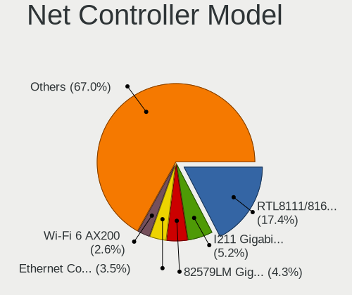

| Model                                                                      | Desktops | Percent |
|----------------------------------------------------------------------------|----------|---------|
| Realtek RTL8111/8168/8211/8411 PCI Express Gigabit Ethernet Controller     | 20       | 18.52%  |
| Intel I211 Gigabit Network Connection                                      | 6        | 5.56%   |
| Intel 82579LM Gigabit Network Connection (Lewisville)                      | 5        | 4.63%   |
| Intel Ethernet Connection (7) I219-LM                                      | 4        | 3.7%    |
| Intel Wi-Fi 6 AX200                                                        | 3        | 2.78%   |
| Intel Ethernet Connection I217-LM                                          | 3        | 2.78%   |
| Intel Ethernet Connection (2) I219-V                                       | 3        | 2.78%   |
| Intel Ethernet Connection (2) I219-LM                                      | 3        | 2.78%   |
| Intel Ethernet Connection (2) I218-V                                       | 3        | 2.78%   |
| Intel Cannon Lake PCH CNVi WiFi                                            | 3        | 2.78%   |
| Intel 82574L Gigabit Network Connection                                    | 3        | 2.78%   |
| Broadcom BCM4352 802.11ac Dual Band Wireless Network Adapter               | 3        | 2.78%   |
| Realtek RTL8153 Gigabit Ethernet Adapter                                   | 2        | 1.85%   |
| Qualcomm Atheros AR9485 Wireless Network Adapter                           | 2        | 1.85%   |
| Intel Wi-Fi 5(802.11ac) Wireless-AC 9x6x [Thunder Peak]                    | 2        | 1.85%   |
| Intel I210 Gigabit Network Connection                                      | 2        | 1.85%   |
| Intel Ethernet Controller I225-V                                           | 2        | 1.85%   |
| Intel Ethernet Connection I217-V                                           | 2        | 1.85%   |
| Intel Ethernet Connection (7) I219-V                                       | 2        | 1.85%   |
| Intel Ethernet Connection (2) I218-LM                                      | 2        | 1.85%   |
| Realtek RTL8723BE PCIe Wireless Network Adapter                            | 1        | 0.93%   |
| Realtek RTL8192EE PCIe Wireless Network Adapter                            | 1        | 0.93%   |
| Realtek RTL8192CE PCIe Wireless Network Adapter                            | 1        | 0.93%   |
| Realtek RTL8188EUS 802.11n Wireless Network Adapter                        | 1        | 0.93%   |
| Realtek RTL8169 PCI Gigabit Ethernet Controller                            | 1        | 0.93%   |
| Realtek RTL8125 2.5GbE Controller                                          | 1        | 0.93%   |
| Ralink RT5572 Wireless Adapter                                             | 1        | 0.93%   |
| Ralink RT3090 Wireless 802.11n 1T/1R PCIe                                  | 1        | 0.93%   |
| Qualcomm Atheros QCA6174 802.11ac Wireless Network Adapter                 | 1        | 0.93%   |
| Qualcomm Atheros Killer E2500 Gigabit Ethernet Controller                  | 1        | 0.93%   |
| Qualcomm Atheros AR9462 Wireless Network Adapter                           | 1        | 0.93%   |
| Qualcomm Atheros AR9287 Wireless Network Adapter (PCI-Express)             | 1        | 0.93%   |
| Qualcomm Atheros AR9227 Wireless Network Adapter                           | 1        | 0.93%   |
| Qualcomm Atheros AR8151 v2.0 Gigabit Ethernet                              | 1        | 0.93%   |
| Microchip TrueRNG                                                          | 1        | 0.93%   |
| Micro Star International MS-3871 802.11bgn Wireless Module [Ralink RT8070] | 1        | 0.93%   |
| MediaTek MT7612U 802.11a/b/g/n/ac Wireless Adapter                         | 1        | 0.93%   |
| Intel Wireless 8265 / 8275                                                 | 1        | 0.93%   |
| Intel Wireless 7260                                                        | 1        | 0.93%   |
| Intel I350 Gigabit Network Connection                                      | 1        | 0.93%   |

Wireless Vendor
---------------

Wireless vendors

| Vendor                   | Desktops | Percent |
|--------------------------|----------|---------|
| Intel                    | 11       | 36.67%  |
| Qualcomm Atheros         | 6        | 20%     |
| Realtek Semiconductor    | 4        | 13.33%  |
| Broadcom                 | 4        | 13.33%  |
| Ralink Technology        | 1        | 3.33%   |
| Ralink                   | 1        | 3.33%   |
| Micro Star International | 1        | 3.33%   |
| MediaTek                 | 1        | 3.33%   |
| D-Link                   | 1        | 3.33%   |

Wireless Model
--------------

Wireless models

| Model                                                                      | Desktops | Percent |
|----------------------------------------------------------------------------|----------|---------|
| Intel Wi-Fi 6 AX200                                                        | 3        | 10%     |
| Intel Cannon Lake PCH CNVi WiFi                                            | 3        | 10%     |
| Broadcom BCM4352 802.11ac Dual Band Wireless Network Adapter               | 3        | 10%     |
| Qualcomm Atheros AR9485 Wireless Network Adapter                           | 2        | 6.67%   |
| Intel Wi-Fi 5(802.11ac) Wireless-AC 9x6x [Thunder Peak]                    | 2        | 6.67%   |
| Realtek RTL8723BE PCIe Wireless Network Adapter                            | 1        | 3.33%   |
| Realtek RTL8192EE PCIe Wireless Network Adapter                            | 1        | 3.33%   |
| Realtek RTL8192CE PCIe Wireless Network Adapter                            | 1        | 3.33%   |
| Realtek RTL8188EUS 802.11n Wireless Network Adapter                        | 1        | 3.33%   |
| Ralink RT5572 Wireless Adapter                                             | 1        | 3.33%   |
| Ralink RT3090 Wireless 802.11n 1T/1R PCIe                                  | 1        | 3.33%   |
| Qualcomm Atheros QCA6174 802.11ac Wireless Network Adapter                 | 1        | 3.33%   |
| Qualcomm Atheros AR9462 Wireless Network Adapter                           | 1        | 3.33%   |
| Qualcomm Atheros AR9287 Wireless Network Adapter (PCI-Express)             | 1        | 3.33%   |
| Qualcomm Atheros AR9227 Wireless Network Adapter                           | 1        | 3.33%   |
| Micro Star International MS-3871 802.11bgn Wireless Module [Ralink RT8070] | 1        | 3.33%   |
| MediaTek MT7612U 802.11a/b/g/n/ac Wireless Adapter                         | 1        | 3.33%   |
| Intel Wireless 8265 / 8275                                                 | 1        | 3.33%   |
| Intel Wireless 7260                                                        | 1        | 3.33%   |
| Intel Comet Lake PCH CNVi WiFi                                             | 1        | 3.33%   |
| D-Link DWA-171 AC600 DB Wireless Adapter(rev.A1) [Realtek RTL8811AU]       | 1        | 3.33%   |
| Broadcom BCM4360 802.11ac Dual Band Wireless Network Adapter               | 1        | 3.33%   |

Ethernet Vendor
---------------

Ethernet vendors

| Vendor                | Desktops | Percent |
|-----------------------|----------|---------|
| Intel                 | 38       | 58.46%  |
| Realtek Semiconductor | 22       | 33.85%  |
| Qualcomm Atheros      | 2        | 3.08%   |
| ASIX Electronics      | 2        | 3.08%   |
| Broadcom Limited      | 1        | 1.54%   |

Ethernet Model
--------------

Ethernet models

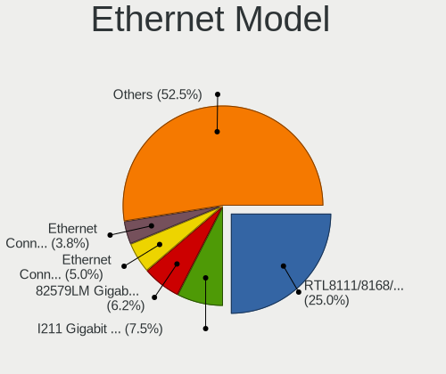

| Model                                                                         | Desktops | Percent |
|-------------------------------------------------------------------------------|----------|---------|
| Realtek RTL8111/8168/8211/8411 PCI Express Gigabit Ethernet Controller        | 20       | 26.67%  |
| Intel I211 Gigabit Network Connection                                         | 6        | 8%      |
| Intel 82579LM Gigabit Network Connection (Lewisville)                         | 5        | 6.67%   |
| Intel Ethernet Connection (7) I219-LM                                         | 4        | 5.33%   |
| Intel Ethernet Connection I217-LM                                             | 3        | 4%      |
| Intel Ethernet Connection (2) I219-V                                          | 3        | 4%      |
| Intel Ethernet Connection (2) I219-LM                                         | 3        | 4%      |
| Intel Ethernet Connection (2) I218-V                                          | 3        | 4%      |
| Intel 82574L Gigabit Network Connection                                       | 3        | 4%      |
| Realtek RTL8153 Gigabit Ethernet Adapter                                      | 2        | 2.67%   |
| Intel I210 Gigabit Network Connection                                         | 2        | 2.67%   |
| Intel Ethernet Controller I225-V                                              | 2        | 2.67%   |
| Intel Ethernet Connection I217-V                                              | 2        | 2.67%   |
| Intel Ethernet Connection (7) I219-V                                          | 2        | 2.67%   |
| Intel Ethernet Connection (2) I218-LM                                         | 2        | 2.67%   |
| Realtek RTL8169 PCI Gigabit Ethernet Controller                               | 1        | 1.33%   |
| Realtek RTL8125 2.5GbE Controller                                             | 1        | 1.33%   |
| Qualcomm Atheros Killer E2500 Gigabit Ethernet Controller                     | 1        | 1.33%   |
| Qualcomm Atheros AR8151 v2.0 Gigabit Ethernet                                 | 1        | 1.33%   |
| Intel I350 Gigabit Network Connection                                         | 1        | 1.33%   |
| Intel Ethernet Connection (5) I219-LM                                         | 1        | 1.33%   |
| Intel Ethernet Connection (11) I219-V                                         | 1        | 1.33%   |
| Intel 82579V Gigabit Network Connection                                       | 1        | 1.33%   |
| Intel 82575EB Gigabit Network Connection                                      | 1        | 1.33%   |
| Intel 82571EB/82571GB Gigabit Ethernet Controller D0/D1 (copper applications) | 1        | 1.33%   |
| Broadcom Limited NetXtreme BCM5751 Gigabit Ethernet PCI Express               | 1        | 1.33%   |
| ASIX AX88772A Fast Ethernet                                                   | 1        | 1.33%   |
| ASIX AX88179 Gigabit Ethernet                                                 | 1        | 1.33%   |

Net Controller Kind
-------------------

Ethernet, WiFi or modem

| Kind     | Desktops | Percent |
|----------|----------|---------|
| Ethernet | 56       | 62.92%  |
| WiFi     | 30       | 33.71%  |
| Modem    | 3        | 3.37%   |

Used Controller
---------------

Currently used network controller

| Kind     | Desktops | Percent |
|----------|----------|---------|
| Ethernet | 47       | 81.03%  |
| WiFi     | 11       | 18.97%  |

NICs
----

Total network controllers on board

| Total | Desktops | Percent |
|-------|----------|---------|
| 1     | 25       | 43.86%  |
| 2     | 20       | 35.09%  |
| 3     | 10       | 17.54%  |
| 6     | 1        | 1.75%   |
| 4     | 1        | 1.75%   |

IPv6
----

IPv6 vs IPv4

| Used | Desktops | Percent |
|------|----------|---------|
| No   | 48       | 84.21%  |
| Yes  | 9        | 15.79%  |

Bluetooth
---------

Bluetooth Vendor
----------------

Controller vendors

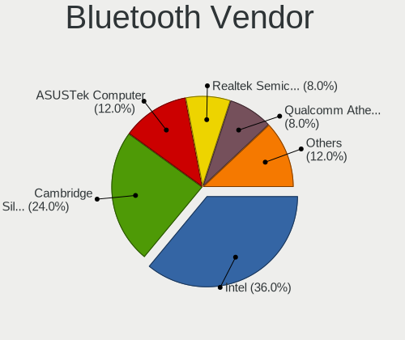

| Vendor                          | Desktops | Percent |
|---------------------------------|----------|---------|
| Intel                           | 9        | 36%     |
| Cambridge Silicon Radio         | 6        | 24%     |
| ASUSTek Computer                | 3        | 12%     |
| Realtek Semiconductor           | 2        | 8%      |
| Qualcomm Atheros Communications | 2        | 8%      |
| Micro Star International        | 1        | 4%      |
| IMC Networks                    | 1        | 4%      |
| Broadcom                        | 1        | 4%      |

Bluetooth Model
---------------

Controller models

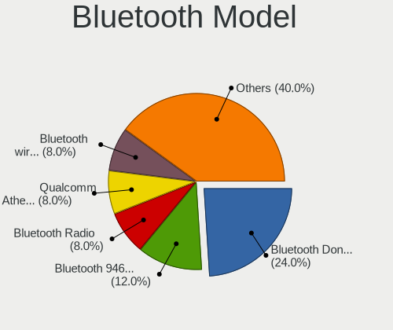

| Model                                                 | Desktops | Percent |
|-------------------------------------------------------|----------|---------|
| Cambridge Silicon Radio Bluetooth Dongle (HCI mode)   | 6        | 24%     |
| Intel Bluetooth 9460/9560 Jefferson Peak (JfP)        | 3        | 12%     |
| Realtek Bluetooth Radio                               | 2        | 8%      |
| Qualcomm Atheros  Bluetooth Device                    | 2        | 8%      |
| Intel AX200 Bluetooth                                 | 2        | 8%      |
| ASUS BCM20702A0                                       | 2        | 8%      |
| Micro Star International Bluetooth Device             | 1        | 4%      |
| Intel Wireless-AC 9260 Bluetooth Adapter              | 1        | 4%      |
| Intel Bluetooth wireless interface                    | 1        | 4%      |
| Intel Bluetooth Device                                | 1        | 4%      |
| Intel AX201 Bluetooth                                 | 1        | 4%      |
| IMC Networks BCM20702A0                               | 1        | 4%      |
| Broadcom BCM20702A0 Bluetooth 4.0                     | 1        | 4%      |
| ASUS Broadcom BCM20702 Single-Chip Bluetooth 4.0 + LE | 1        | 4%      |

Sound
-----

Sound Vendor
------------

Sound card vendors

| Vendor                    | Desktops | Percent |
|---------------------------|----------|---------|
| Intel                     | 44       | 40%     |
| Nvidia                    | 33       | 30%     |
| AMD                       | 13       | 11.82%  |
| Lenovo                    | 3        | 2.73%   |
| Creative Labs             | 3        | 2.73%   |
| Plantronics               | 2        | 1.82%   |
| Texas Instruments         | 1        | 0.91%   |
| Tenx Technology           | 1        | 0.91%   |
| SteelSeries ApS           | 1        | 0.91%   |
| Sennheiser Communications | 1        | 0.91%   |
| RODE Microphones          | 1        | 0.91%   |
| Logitech                  | 1        | 0.91%   |
| JMTek                     | 1        | 0.91%   |
| GN Netcom                 | 1        | 0.91%   |
| Giga-Byte Technology      | 1        | 0.91%   |
| Dynex                     | 1        | 0.91%   |
| Creative Technology       | 1        | 0.91%   |
| ASUSTek Computer          | 1        | 0.91%   |

Sound Model
-----------

Sound card models

| Model                                                                   | Desktops | Percent |
|-------------------------------------------------------------------------|----------|---------|
| Intel Cannon Lake PCH cAVS                                              | 9        | 7.5%    |
| Intel 8 Series/C220 Series Chipset High Definition Audio Controller     | 8        | 6.67%   |
| Nvidia GP107GL High Definition Audio Controller                         | 5        | 4.17%   |
| Intel C610/X99 series chipset HD Audio Controller                       | 5        | 4.17%   |
| Intel 100 Series/C230 Series Chipset Family HD Audio Controller         | 5        | 4.17%   |
| Intel Xeon E3-1200 v3/4th Gen Core Processor HD Audio Controller        | 4        | 3.33%   |
| Intel 7 Series/C216 Chipset Family High Definition Audio Controller     | 4        | 3.33%   |
| AMD Starship/Matisse HD Audio Controller                                | 4        | 3.33%   |
| Nvidia TU106 High Definition Audio Controller                           | 3        | 2.5%    |
| Nvidia GP106 High Definition Audio Controller                           | 3        | 2.5%    |
| Nvidia GP104 High Definition Audio Controller                           | 3        | 2.5%    |
| Nvidia GK208 HDMI/DP Audio Controller                                   | 3        | 2.5%    |
| Nvidia GF108 High Definition Audio Controller                           | 3        | 2.5%    |
| Lenovo Thinkcentre TIO24Gen3 for USB-audio                              | 3        | 2.5%    |
| Intel C600/X79 series chipset High Definition Audio Controller          | 3        | 2.5%    |
| Intel 200 Series PCH HD Audio                                           | 3        | 2.5%    |
| Nvidia TU116 High Definition Audio Controller                           | 2        | 1.67%   |
| Nvidia TU104 HD Audio Controller                                        | 2        | 1.67%   |
| Nvidia GM204 High Definition Audio Controller                           | 2        | 1.67%   |
| Nvidia GM107 High Definition Audio Controller [GeForce 940MX]           | 2        | 1.67%   |
| Intel Comet Lake PCH cAVS                                               | 2        | 1.67%   |
| Intel 9 Series Chipset Family HD Audio Controller                       | 2        | 1.67%   |
| AMD Raven/Raven2/Fenghuang HDMI/DP Audio Controller                     | 2        | 1.67%   |
| AMD Oland/Hainan/Cape Verde/Pitcairn HDMI Audio [Radeon HD 7000 Series] | 2        | 1.67%   |
| AMD Family 17h/19h HD Audio Controller                                  | 2        | 1.67%   |
| AMD Family 17h (Models 00h-0fh) HD Audio Controller                     | 2        | 1.67%   |
| Texas Instruments PCM2902 Audio Codec                                   | 1        | 0.83%   |
| Tenx Technology USB AUDIO                                               | 1        | 0.83%   |
| SteelSeries ApS SteelSeries Arctis 7                                    | 1        | 0.83%   |
| Sennheiser Communications EPOS ADAPT 1x5T                               | 1        | 0.83%   |
| RODE Microphones RODE NT-USB                                            | 1        | 0.83%   |
| Plantronics Poly BT700                                                  | 1        | 0.83%   |
| Plantronics BT600                                                       | 1        | 0.83%   |
| Nvidia GP102 HDMI Audio Controller                                      | 1        | 0.83%   |
| Nvidia GM206 High Definition Audio Controller                           | 1        | 0.83%   |
| Nvidia GK106 HDMI Audio Controller                                      | 1        | 0.83%   |
| Nvidia GK104 HDMI Audio Controller                                      | 1        | 0.83%   |
| Nvidia GF114 HDMI Audio Controller                                      | 1        | 0.83%   |
| Nvidia GF110 High Definition Audio Controller                           | 1        | 0.83%   |
| Nvidia GA102 High Definition Audio Controller                           | 1        | 0.83%   |

Memory
------

Memory Vendor
-------------

Memory module vendors

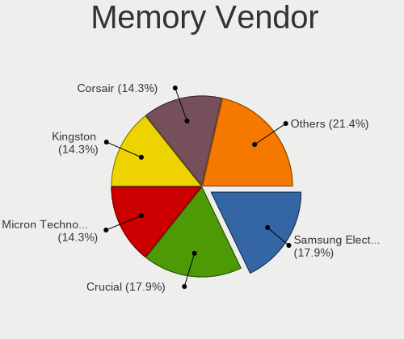

| Vendor              | Desktops | Percent |
|---------------------|----------|---------|
| Samsung Electronics | 5        | 17.86%  |
| Crucial             | 5        | 17.86%  |
| Micron Technology   | 4        | 14.29%  |
| Kingston            | 4        | 14.29%  |
| Corsair             | 4        | 14.29%  |
| SK hynix            | 2        | 7.14%   |
| Unknown (0x0205)    | 1        | 3.57%   |
| Transcend           | 1        | 3.57%   |
| Patriot             | 1        | 3.57%   |
| GOODRAM             | 1        | 3.57%   |

Memory Model
------------

Memory module models

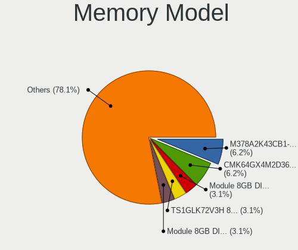

| Model                                                     | Desktops | Percent |
|-----------------------------------------------------------|----------|---------|
| Samsung RAM M378A2K43CB1-CTD 16GB DIMM DDR4 3200MT/s      | 2        | 6.25%   |
| Corsair RAM CMK64GX4M2D3600C18 32GB DIMM DDR4 3600MT/s    | 2        | 6.25%   |
| Unknown (0x0205) RAM Module 8GB DIMM DDR3 1600MT/s        | 1        | 3.13%   |
| Transcend RAM TS1GLK72V3H 8GB DIMM DDR3 1333MT/s          | 1        | 3.13%   |
| SK hynix RAM HMT351S6EFR8C-PB 4096MB DIMM DDR3 1333MT/s   | 1        | 3.13%   |
| SK hynix RAM HMT351S6CFR8C-H9 4096MB DIMM DDR3 1333MT/s   | 1        | 3.13%   |
| SK hynix RAM HMA851U6CJR6N-VK 4GB DIMM DDR4 2667MT/s      | 1        | 3.13%   |
| Samsung RAM Module 8GB DIMM DDR4 2666MT/s                 | 1        | 3.13%   |
| Samsung RAM Module 4GB DIMM DDR4 2133MT/s                 | 1        | 3.13%   |
| Samsung RAM Module 16GB DIMM DDR4 2666MT/s                | 1        | 3.13%   |
| Samsung RAM M378B5673FH0-CH9 2GB DIMM DDR3 1600MT/s       | 1        | 3.13%   |
| Samsung RAM M378A1K43CB2-CTD 8GB DIMM DDR4 3266MT/s       | 1        | 3.13%   |
| Patriot RAM PSD416G26662 16GB DIMM DDR4 2667MT/s          | 1        | 3.13%   |
| Micron RAM Module 4GB DIMM DDR4 2133MT/s                  | 1        | 3.13%   |
| Micron RAM 36ASF4G72PZ-2G3B1 32GB DIMM DDR4 2400MT/s      | 1        | 3.13%   |
| Micron RAM 16JTF1G64AZ-1G6E1 8GB DIMM DDR3 1600MT/s       | 1        | 3.13%   |
| Micron RAM 16ATF1G64AZ-2G1B1 8GB DIMM DDR4 2133MT/s       | 1        | 3.13%   |
| Kingston RAM KHX2666C13/16GX 16384MB DIMM DDR4 3200MT/s   | 1        | 3.13%   |
| Kingston RAM KHX2400C12D4/8GX 8GB DIMM DDR4 2400MT/s      | 1        | 3.13%   |
| Kingston RAM KF3200C16D4/32GX 32GB DIMM DDR4 3933MT/s     | 1        | 3.13%   |
| Kingston RAM 9905712-034.A00G 16GB SODIMM DDR4 2400MT/s   | 1        | 3.13%   |
| GOODRAM RAM GR1600D364L11S/4G 4GB DIMM DDR3 1600MT/s      | 1        | 3.13%   |
| Crucial RAM CT51264BA160BJ.M8F 4GB DIMM DDR3 1600MT/s     | 1        | 3.13%   |
| Crucial RAM CT4G4DFS824A.M8FG 4GB DIMM DDR4 2400MT/s      | 1        | 3.13%   |
| Crucial RAM CT16G4DFD824A.C16FBD 16GB DIMM DDR4 2933MT/s  | 1        | 3.13%   |
| Crucial RAM BLS4G4D240FSB.8FBD2 4096MB DIMM DDR4 2400MT/s | 1        | 3.13%   |
| Crucial RAM BLS4G4D240FSB.8FBD 4GB DIMM DDR4 2472MT/s     | 1        | 3.13%   |
| Crucial RAM BLS4G3D1609DS1S00. 4GB DIMM DDR3 1600MT/s     | 1        | 3.13%   |
| Corsair RAM CMZ16GX3M2A1600C10 8GB DIMM DDR3 1600MT/s     | 1        | 3.13%   |
| Corsair RAM CMK16GX4M2Z3600C20 8GB DIMM DDR4 3600MT/s     | 1        | 3.13%   |

Memory Kind
-----------

Memory module kinds

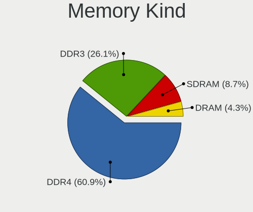

| Kind  | Desktops | Percent |
|-------|----------|---------|
| DDR4  | 14       | 60.87%  |
| DDR3  | 6        | 26.09%  |
| SDRAM | 2        | 8.7%    |
| DRAM  | 1        | 4.35%   |

Memory Form Factor
------------------

Physical design of the memory module

| Name   | Desktops | Percent |
|--------|----------|---------|
| DIMM   | 22       | 95.65%  |
| SODIMM | 1        | 4.35%   |

Memory Size
-----------

Memory module size

| Size  | Desktops | Percent |
|-------|----------|---------|
| 8192  | 10       | 37.04%  |
| 4096  | 7        | 25.93%  |
| 16384 | 5        | 18.52%  |
| 32768 | 4        | 14.81%  |
| 2048  | 1        | 3.7%    |

Memory Speed
------------

Memory module speed

| Speed | Desktops | Percent |
|-------|----------|---------|
| 1600  | 6        | 22.22%  |
| 2400  | 5        | 18.52%  |
| 3600  | 3        | 11.11%  |
| 3200  | 2        | 7.41%   |
| 2667  | 2        | 7.41%   |
| 2133  | 2        | 7.41%   |
| 1333  | 2        | 7.41%   |
| 3933  | 1        | 3.7%    |
| 3266  | 1        | 3.7%    |
| 2933  | 1        | 3.7%    |
| 2666  | 1        | 3.7%    |
| 2472  | 1        | 3.7%    |

Printers & scanners
-------------------

Printer Vendor
--------------

Printer device vendors

| Vendor             | Desktops | Percent |
|--------------------|----------|---------|
| Hewlett-Packard    | 2        | 40%     |
| Canon              | 2        | 40%     |
| Brother Industries | 1        | 20%     |

Printer Model
-------------

Printer device models

| Model                            | Desktops | Percent |
|----------------------------------|----------|---------|
| HP LaserJet Professional P 1102w | 1        | 20%     |
| HP LaserJet Pro M118-M119        | 1        | 20%     |
| Canon LiDE 300                   | 1        | 20%     |
| Canon E560 series                | 1        | 20%     |
| Brother DCP-1610W                | 1        | 20%     |

Scanner Vendor
--------------

Scanner device vendors

Zero info for selected period =(

Scanner Model
-------------

Scanner device models

Zero info for selected period =(

Camera
------

Camera Vendor
-------------

Camera device vendors

| Vendor                      | Desktops | Percent |
|-----------------------------|----------|---------|
| Hopewin Electronic Material | 3        | 25%     |
| Logitech                    | 2        | 16.67%  |
| Generalplus Technology      | 2        | 16.67%  |
| Samsung Electronics         | 1        | 8.33%   |
| Ruision                     | 1        | 8.33%   |
| Microsoft                   | 1        | 8.33%   |
| Jieli Technology            | 1        | 8.33%   |
| ARC International           | 1        | 8.33%   |

Camera Model
------------

Camera device models

| Model                                            | Desktops | Percent |
|--------------------------------------------------|----------|---------|
| Hopewin Electronic Material FULL HD 1080P Webcam | 3        | 25%     |
| Generalplus CAMERA - UVC                         | 2        | 16.67%  |
| Samsung Galaxy series, misc. (MTP mode)          | 1        | 8.33%   |
| Ruision UVC Camera                               | 1        | 8.33%   |
| Microsoft LifeCam HD-3000                        | 1        | 8.33%   |
| Logitech Webcam C270                             | 1        | 8.33%   |
| Logitech HD Webcam C910                          | 1        | 8.33%   |
| Jieli USB PHY 2.0                                | 1        | 8.33%   |
| ARC International Camera                         | 1        | 8.33%   |

Security
--------

Fingerprint Vendor
------------------

Fingerprint sensor vendors

Zero info for selected period =(

Fingerprint Model
-----------------

Fingerprint sensor models

Zero info for selected period =(

Chipcard Vendor
---------------

Chipcard module vendors

| Vendor                | Desktops | Percent |
|-----------------------|----------|---------|
| SCM Microsystems      | 1        | 50%     |
| Gemalto (was Gemplus) | 1        | 50%     |

Chipcard Model
--------------

Chipcard module models

| Model                                                  | Desktops | Percent |
|--------------------------------------------------------|----------|---------|
| SCM Microsystems SCR331-LC1 / SCR3310 SmartCard Reader | 1        | 50%     |
| Gemalto (was Gemplus) GemPC Twin SmartCard Reader      | 1        | 50%     |

Unsupported
-----------

Unsupported Devices
-------------------

Total unsupported devices on board

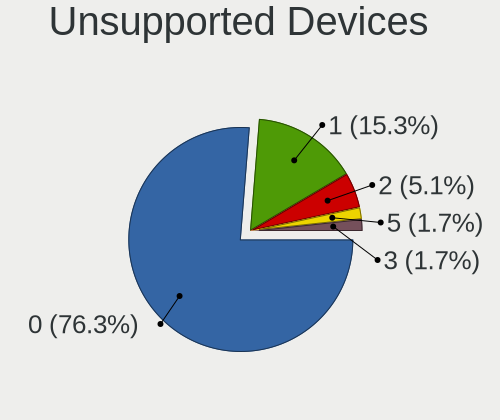

| Total | Desktops | Percent |
|-------|----------|---------|
| 0     | 45       | 78.95%  |
| 1     | 8        | 14.04%  |
| 2     | 3        | 5.26%   |
| 5     | 1        | 1.75%   |

Unsupported Device Types
------------------------

Types of unsupported devices

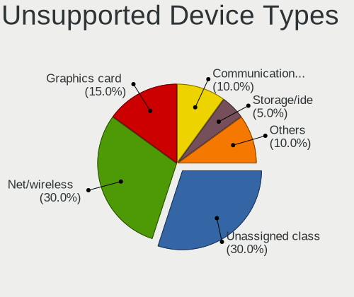

| Type                     | Desktops | Percent |
|--------------------------|----------|---------|
| Unassigned class         | 6        | 35.29%  |
| Net/wireless             | 4        | 23.53%  |
| Graphics card            | 3        | 17.65%  |
| Storage/ide              | 1        | 5.88%   |
| Sound                    | 1        | 5.88%   |
| Communication controller | 1        | 5.88%   |
| Bluetooth                | 1        | 5.88%   |

