RHEL 8 - Tested Hardware & Statistics (Desktops)
------------------------------------------------

A project to collect tested hardware configurations for RHEL 8.

Anyone can contribute to this report by the [hw-probe](https://github.com/linuxhw/hw-probe) tool:

    sudo -E hw-probe -all -upload

Please submit a probe of your configuration if it's not presented on the page or is rare.

Full-feature report is available here: https://linux-hardware.org/?view=trends

Contents
--------

* [ Test Cases ](#test-cases)

* [ System ](#system)
  - [ Kernel                   ](#kernel)
  - [ Kernel Family            ](#kernel-family)
  - [ Kernel Major Ver.        ](#kernel-major-ver)
  - [ Arch                     ](#arch)
  - [ DE                       ](#de)
  - [ Display Server           ](#display-server)
  - [ Display Manager          ](#display-manager)
  - [ OS Lang                  ](#os-lang)
  - [ Boot Mode                ](#boot-mode)
  - [ Filesystem               ](#filesystem)
  - [ Part. scheme             ](#part-scheme)
  - [ Dual Boot with Linux/BSD ](#dual-boot-with-linuxbsd)
  - [ Dual Boot (Win)          ](#dual-boot-win)

* [ Board ](#board)
  - [ Vendor                   ](#vendor)
  - [ Model                    ](#model)
  - [ Model Family             ](#model-family)
  - [ MFG Year                 ](#mfg-year)
  - [ Form Factor              ](#form-factor)
  - [ Secure Boot              ](#secure-boot)
  - [ Coreboot                 ](#coreboot)
  - [ RAM Size                 ](#ram-size)
  - [ RAM Used                 ](#ram-used)
  - [ Total Drives             ](#total-drives)
  - [ Has CD-ROM               ](#has-cd-rom)
  - [ Has Ethernet             ](#has-ethernet)
  - [ Has WiFi                 ](#has-wifi)
  - [ Has Bluetooth            ](#has-bluetooth)

* [ Location ](#location)
  - [ Country                  ](#country)
  - [ City                     ](#city)

* [ Drives ](#drives)
  - [ Drive Vendor             ](#drive-vendor)
  - [ Drive Model              ](#drive-model)
  - [ HDD Vendor               ](#hdd-vendor)
  - [ SSD Vendor               ](#ssd-vendor)
  - [ Drive Kind               ](#drive-kind)
  - [ Drive Connector          ](#drive-connector)
  - [ Drive Size               ](#drive-size)
  - [ Space Total              ](#space-total)
  - [ Space Used               ](#space-used)
  - [ Malfunc. Drives          ](#malfunc-drives)
  - [ Malfunc. Drive Vendor    ](#malfunc-drive-vendor)
  - [ Malfunc. HDD Vendor      ](#malfunc-hdd-vendor)
  - [ Malfunc. Drive Kind      ](#malfunc-drive-kind)
  - [ Failed Drives            ](#failed-drives)
  - [ Failed Drive Vendor      ](#failed-drive-vendor)
  - [ Drive Status             ](#drive-status)

* [ Storage controller ](#storage-controller)
  - [ Storage Vendor           ](#storage-vendor)
  - [ Storage Model            ](#storage-model)
  - [ Storage Kind             ](#storage-kind)

* [ Processor ](#processor)
  - [ CPU Vendor               ](#cpu-vendor)
  - [ CPU Model                ](#cpu-model)
  - [ CPU Model Family         ](#cpu-model-family)
  - [ CPU Cores                ](#cpu-cores)
  - [ CPU Sockets              ](#cpu-sockets)
  - [ CPU Threads              ](#cpu-threads)
  - [ CPU Op-Modes             ](#cpu-op-modes)
  - [ CPU Microcode            ](#cpu-microcode)
  - [ CPU Microarch            ](#cpu-microarch)

* [ Graphics ](#graphics)
  - [ GPU Vendor               ](#gpu-vendor)
  - [ GPU Model                ](#gpu-model)
  - [ GPU Combo                ](#gpu-combo)
  - [ GPU Driver               ](#gpu-driver)
  - [ GPU Memory               ](#gpu-memory)

* [ Monitor ](#monitor)
  - [ Monitor Vendor           ](#monitor-vendor)
  - [ Monitor Model            ](#monitor-model)
  - [ Monitor Resolution       ](#monitor-resolution)
  - [ Monitor Diagonal         ](#monitor-diagonal)
  - [ Monitor Width            ](#monitor-width)
  - [ Aspect Ratio             ](#aspect-ratio)
  - [ Monitor Area             ](#monitor-area)
  - [ Pixel Density            ](#pixel-density)
  - [ Multiple Monitors        ](#multiple-monitors)

* [ Network ](#network)
  - [ Net Controller Vendor    ](#net-controller-vendor)
  - [ Net Controller Model     ](#net-controller-model)
  - [ Wireless Vendor          ](#wireless-vendor)
  - [ Wireless Model           ](#wireless-model)
  - [ Ethernet Vendor          ](#ethernet-vendor)
  - [ Ethernet Model           ](#ethernet-model)
  - [ Net Controller Kind      ](#net-controller-kind)
  - [ Used Controller          ](#used-controller)
  - [ NICs                     ](#nics)
  - [ IPv6                     ](#ipv6)

* [ Bluetooth ](#bluetooth)
  - [ Bluetooth Vendor         ](#bluetooth-vendor)
  - [ Bluetooth Model          ](#bluetooth-model)

* [ Sound ](#sound)
  - [ Sound Vendor             ](#sound-vendor)
  - [ Sound Model              ](#sound-model)

* [ Memory ](#memory)
  - [ Memory Vendor            ](#memory-vendor)
  - [ Memory Model             ](#memory-model)
  - [ Memory Kind              ](#memory-kind)
  - [ Memory Form Factor       ](#memory-form-factor)
  - [ Memory Size              ](#memory-size)
  - [ Memory Speed             ](#memory-speed)

* [ Printers & scanners ](#printers--scanners)
  - [ Printer Vendor           ](#printer-vendor)
  - [ Printer Model            ](#printer-model)
  - [ Scanner Vendor           ](#scanner-vendor)
  - [ Scanner Model            ](#scanner-model)

* [ Camera ](#camera)
  - [ Camera Vendor            ](#camera-vendor)
  - [ Camera Model             ](#camera-model)

* [ Security ](#security)
  - [ Fingerprint Vendor       ](#fingerprint-vendor)
  - [ Fingerprint Model        ](#fingerprint-model)
  - [ Chipcard Vendor          ](#chipcard-vendor)
  - [ Chipcard Model           ](#chipcard-model)

* [ Unsupported ](#unsupported)
  - [ Unsupported Devices      ](#unsupported-devices)
  - [ Unsupported Device Types ](#unsupported-device-types)

Test Cases
----------

| Vendor     | Model                       | Probe                                                      | Date         |
|------------|-----------------------------|------------------------------------------------------------|--------------|
| ASUSTek    | Maximus VII FORMULA         | [07de603a4a](https://linux-hardware.org/?probe=07de603a4a) | Jan 31, 2022 |
| Gigabyte   | Z97N-WIFI                   | [5808f89618](https://linux-hardware.org/?probe=5808f89618) | Jan 07, 2022 |
| ASUSTek    | PRIME B360M-D               | [e3b3ac9f8b](https://linux-hardware.org/?probe=e3b3ac9f8b) | Jan 01, 2022 |
| Gigabyte   | Z97N-WIFI                   | [9d1a04cc28](https://linux-hardware.org/?probe=9d1a04cc28) | Dec 15, 2021 |
| Lenovo     | MAHOBAY                     | [ea1413bf9e](https://linux-hardware.org/?probe=ea1413bf9e) | Nov 19, 2021 |
| ASUSTek    | PRIME B350M-A               | [d3d69e7587](https://linux-hardware.org/?probe=d3d69e7587) | Oct 24, 2021 |
| ASUSTek    | Pro WS X570-ACE             | [07a5b3c465](https://linux-hardware.org/?probe=07a5b3c465) | Oct 16, 2021 |
| ASUSTek    | PRIME B350M-A               | [66cd9bb2c9](https://linux-hardware.org/?probe=66cd9bb2c9) | Oct 09, 2021 |
| ASUSTek    | Z87-DELUXE                  | [63b48dfa23](https://linux-hardware.org/?probe=63b48dfa23) | Oct 07, 2021 |
| HP         | 212B                        | [322371cc6a](https://linux-hardware.org/?probe=322371cc6a) | Oct 04, 2021 |
| ASUSTek    | Z87-DELUXE                  | [2792a3ef1c](https://linux-hardware.org/?probe=2792a3ef1c) | Oct 03, 2021 |
| Gigabyte   | Z97N-WIFI                   | [539316ac91](https://linux-hardware.org/?probe=539316ac91) | Sep 30, 2021 |
| Gigabyte   | Z97N-WIFI                   | [95ae5d0e04](https://linux-hardware.org/?probe=95ae5d0e04) | Sep 29, 2021 |
| Lenovo     | MAHOBAY                     | [fc498b8cb0](https://linux-hardware.org/?probe=fc498b8cb0) | Sep 10, 2021 |
| ASUSTek    | PRIME B350M-A               | [35fa4b96f4](https://linux-hardware.org/?probe=35fa4b96f4) | Sep 09, 2021 |
| Gigabyte   | Z390 AORUS ULTRA-CF         | [f7bcc3d753](https://linux-hardware.org/?probe=f7bcc3d753) | Aug 25, 2021 |
| Gigabyte   | 970A-D3                     | [d62c66d9bd](https://linux-hardware.org/?probe=d62c66d9bd) | Aug 12, 2021 |
| Gigabyte   | Z490 GAMING X               | [a540fa2f59](https://linux-hardware.org/?probe=a540fa2f59) | Jul 19, 2021 |
| Dell       | 0MWYPT A02                  | [ab6e7450c3](https://linux-hardware.org/?probe=ab6e7450c3) | Jul 01, 2021 |
| Intel      | DX79SR AAG57199-200         | [380f10f479](https://linux-hardware.org/?probe=380f10f479) | Jun 10, 2021 |
| HP         | 1906                        | [bf20783dee](https://linux-hardware.org/?probe=bf20783dee) | Jun 02, 2021 |
| Gigabyte   | B85M-D3V-A                  | [4405336208](https://linux-hardware.org/?probe=4405336208) | Jun 01, 2021 |
| MSI        | MPG Z390 GAMING PLUS        | [2eebd180f8](https://linux-hardware.org/?probe=2eebd180f8) | May 28, 2021 |
| HP         | 2129                        | [3991895525](https://linux-hardware.org/?probe=3991895525) | May 23, 2021 |
| MSI        | Z77A-G45                    | [9b11ff6d26](https://linux-hardware.org/?probe=9b11ff6d26) | May 22, 2021 |
| MSI        | Z77A-G45                    | [bd980d04be](https://linux-hardware.org/?probe=bd980d04be) | May 22, 2021 |
| ASUSTek    | ROG Maximus X HERO          | [4a38b848dd](https://linux-hardware.org/?probe=4a38b848dd) | May 19, 2021 |
| HP         | 8054                        | [cf6b804c19](https://linux-hardware.org/?probe=cf6b804c19) | May 13, 2021 |
| ASRock     | X99E-ITX/ac                 | [9cacd1608e](https://linux-hardware.org/?probe=9cacd1608e) | May 08, 2021 |
| ASUSTek    | PRIME B360M-D               | [3dce7dc37d](https://linux-hardware.org/?probe=3dce7dc37d) | Mar 20, 2021 |
| ASRock     | A300M-STX                   | [22c97ac8b2](https://linux-hardware.org/?probe=22c97ac8b2) | Feb 27, 2021 |
| Dell       | 0NNNCT A01                  | [3f081f03fe](https://linux-hardware.org/?probe=3f081f03fe) | Feb 22, 2021 |
| ASUSTek    | ROG Maximus X HERO          | [d0ac809f8a](https://linux-hardware.org/?probe=d0ac809f8a) | Jan 15, 2021 |
| ASUSTek    | ROG STRIX B350-F GAMING     | [e10979867d](https://linux-hardware.org/?probe=e10979867d) | Jan 13, 2021 |
| ASUSTek    | H87M-PLUS                   | [95389bff49](https://linux-hardware.org/?probe=95389bff49) | Jan 13, 2021 |
| ASRock     | H270 Pro4                   | [3a3b83a6ed](https://linux-hardware.org/?probe=3a3b83a6ed) | Jan 07, 2021 |
| Unknown    | SKYBAY                      | [d99f937c68](https://linux-hardware.org/?probe=d99f937c68) | Dec 12, 2020 |
| HP         | 1905                        | [6690d08a07](https://linux-hardware.org/?probe=6690d08a07) | Dec 04, 2020 |
| Dell       | 082WXT A01                  | [8d9240a29c](https://linux-hardware.org/?probe=8d9240a29c) | Nov 19, 2020 |
| Dell       | 082WXT A01                  | [0a2176308f](https://linux-hardware.org/?probe=0a2176308f) | Nov 17, 2020 |
| HP         | 81B4                        | [12ac27dcb5](https://linux-hardware.org/?probe=12ac27dcb5) | Nov 14, 2020 |
| HP         | 81B4                        | [faf7b737fe](https://linux-hardware.org/?probe=faf7b737fe) | Nov 14, 2020 |
| HP         | 1905                        | [872e4ba303](https://linux-hardware.org/?probe=872e4ba303) | Nov 13, 2020 |
| MSI        | H310M PRO-VD                | [18c316813f](https://linux-hardware.org/?probe=18c316813f) | Nov 11, 2020 |
| HP         | 1905                        | [0e53545ff8](https://linux-hardware.org/?probe=0e53545ff8) | Oct 14, 2020 |
| ASUSTek    | Z10PE-D16 WS                | [7bf945cd18](https://linux-hardware.org/?probe=7bf945cd18) | Oct 13, 2020 |
| HP         | 1905                        | [48fd57f60f](https://linux-hardware.org/?probe=48fd57f60f) | Sep 24, 2020 |
| HP         | 1905                        | [0e2d6062d9](https://linux-hardware.org/?probe=0e2d6062d9) | Sep 24, 2020 |
| HP         | 843F                        | [6f9898a049](https://linux-hardware.org/?probe=6f9898a049) | Sep 24, 2020 |
| HP         | 843F                        | [91498f153e](https://linux-hardware.org/?probe=91498f153e) | Sep 18, 2020 |
| HP         | 843F                        | [e0bdf38c8a](https://linux-hardware.org/?probe=e0bdf38c8a) | Jul 16, 2020 |
| Lenovo     | 3132 SDK0J40697 WIN 3305... | [b9a88cd7cf](https://linux-hardware.org/?probe=b9a88cd7cf) | Jun 13, 2020 |
| ASUSTek    | P8Z77-V PRO                 | [b97f2eb31f](https://linux-hardware.org/?probe=b97f2eb31f) | May 20, 2020 |
| HP         | 158A                        | [344194646f](https://linux-hardware.org/?probe=344194646f) | May 14, 2020 |
| Lenovo     | 3132 SDK0J40697 WIN 3305... | [6237c4cae4](https://linux-hardware.org/?probe=6237c4cae4) | May 10, 2020 |
| ASUSTek    | P8Z77-V PRO                 | [1abce91d71](https://linux-hardware.org/?probe=1abce91d71) | May 08, 2020 |
| ASRockRack | EP2C612 WS                  | [9657b92263](https://linux-hardware.org/?probe=9657b92263) | Apr 14, 2020 |
| Gigabyte   | B75-D3V                     | [73b3145cb4](https://linux-hardware.org/?probe=73b3145cb4) | Apr 10, 2020 |
| ASRockRack | EP2C612 WS                  | [1dd5200664](https://linux-hardware.org/?probe=1dd5200664) | Apr 07, 2020 |
| ASRockRack | EP2C612 WS                  | [8dad315eb5](https://linux-hardware.org/?probe=8dad315eb5) | Apr 07, 2020 |
| Lenovo     | 3132 SDK0J40697 WIN 3305... | [848a63637f](https://linux-hardware.org/?probe=848a63637f) | Apr 01, 2020 |
| Lenovo     | 3132 SDK0J40697 WIN 3305... | [b49a701ac3](https://linux-hardware.org/?probe=b49a701ac3) | Apr 01, 2020 |
| Alienware  | 0VDT73 A00                  | [00cc8f89dc](https://linux-hardware.org/?probe=00cc8f89dc) | Mar 17, 2020 |
| Lenovo     | 3132 SDK0J40697 WIN 3305... | [a018f0a4d4](https://linux-hardware.org/?probe=a018f0a4d4) | Feb 27, 2020 |
| Lenovo     | 3132 SDK0J40697 WIN 3305... | [b5d3a3694d](https://linux-hardware.org/?probe=b5d3a3694d) | Feb 27, 2020 |
| Lenovo     | Board                       | [ce36caf100](https://linux-hardware.org/?probe=ce36caf100) | Feb 18, 2020 |
| Lenovo     | Board                       | [13d8453be0](https://linux-hardware.org/?probe=13d8453be0) | Feb 18, 2020 |
| MSI        | B350M MORTAR                | [9496a3ac2c](https://linux-hardware.org/?probe=9496a3ac2c) | Feb 10, 2020 |
| Lenovo     | 3132 SDK0J40697 WIN 3305... | [5c93a8b972](https://linux-hardware.org/?probe=5c93a8b972) | Feb 03, 2020 |
| Lenovo     | 3132 SDK0J40697 WIN 3305... | [7b9606b44d](https://linux-hardware.org/?probe=7b9606b44d) | Feb 03, 2020 |
| ASUSTek    | P8Z77-V PRO                 | [0a9570ceaf](https://linux-hardware.org/?probe=0a9570ceaf) | Jan 29, 2020 |
| Lenovo     | 3132 SDK0J40697 WIN 3305... | [f24757810e](https://linux-hardware.org/?probe=f24757810e) | Jan 28, 2020 |
| Dell       | 0XR1GT A00                  | [319aa86f81](https://linux-hardware.org/?probe=319aa86f81) | Jan 25, 2020 |
| Dell       | 0XR1GT A00                  | [189883a0aa](https://linux-hardware.org/?probe=189883a0aa) | Jan 25, 2020 |
| Lenovo     | 3132 SDK0J40697 WIN 3305... | [bdeba33a9c](https://linux-hardware.org/?probe=bdeba33a9c) | Jan 19, 2020 |
| ASUSTek    | PRIME X470-PRO              | [bfacbe4d23](https://linux-hardware.org/?probe=bfacbe4d23) | Jan 18, 2020 |
| Lenovo     | 3132 SDK0J40697 WIN 3305... | [a92733c45d](https://linux-hardware.org/?probe=a92733c45d) | Jan 17, 2020 |
| Lenovo     | 3132 SDK0J40697 WIN 3305... | [4edc6c52b8](https://linux-hardware.org/?probe=4edc6c52b8) | Jan 17, 2020 |
| Lenovo     | 3132 SDK0J40697 WIN 3305... | [372bb9dced](https://linux-hardware.org/?probe=372bb9dced) | Jan 15, 2020 |
| Lenovo     | 3132 SDK0J40697 WIN 3305... | [61f2cf2ae4](https://linux-hardware.org/?probe=61f2cf2ae4) | Jan 12, 2020 |
| Lenovo     | 3132 SDK0J40697 WIN 3305... | [458ececa20](https://linux-hardware.org/?probe=458ececa20) | Jan 12, 2020 |
| MSI        | B350M MORTAR                | [f53a75b96e](https://linux-hardware.org/?probe=f53a75b96e) | Jan 10, 2020 |
| ASUSTek    | P8Z77-V PRO                 | [6bffc36e6a](https://linux-hardware.org/?probe=6bffc36e6a) | Jan 06, 2020 |
| ASRock     | H91M-PLUS                   | [c90d6b4c4d](https://linux-hardware.org/?probe=c90d6b4c4d) | Dec 30, 2019 |
| Lenovo     | 3132 SDK0J40697 WIN 3305... | [fff26d5712](https://linux-hardware.org/?probe=fff26d5712) | Dec 21, 2019 |
| Lenovo     | 3132 SDK0J40697 WIN 3305... | [2979b0995f](https://linux-hardware.org/?probe=2979b0995f) | Dec 21, 2019 |
| Lenovo     | 3132 SDK0J40697 WIN 3305... | [2ce515411e](https://linux-hardware.org/?probe=2ce515411e) | Dec 13, 2019 |
| Lenovo     | 3132 SDK0J40697 WIN 3305... | [199fad181e](https://linux-hardware.org/?probe=199fad181e) | Nov 29, 2019 |
| Lenovo     | 3132 SDK0J40697 WIN 3305... | [2862a08f39](https://linux-hardware.org/?probe=2862a08f39) | Nov 29, 2019 |
| Lenovo     | 3132 SDK0J40697 WIN 3305... | [6d1db662fe](https://linux-hardware.org/?probe=6d1db662fe) | Nov 17, 2019 |
| Lenovo     | 3132 SDK0J40697 WIN 3305... | [997d2ae2bf](https://linux-hardware.org/?probe=997d2ae2bf) | Nov 16, 2019 |
| Lenovo     | 3132 SDK0J40697 WIN 3305... | [6a11247e37](https://linux-hardware.org/?probe=6a11247e37) | Nov 11, 2019 |
| Supermicro | X7DWN+                      | [505e506351](https://linux-hardware.org/?probe=505e506351) | Oct 26, 2019 |
| Supermicro | X7DWN+                      | [c0df153404](https://linux-hardware.org/?probe=c0df153404) | Oct 25, 2019 |
| Supermicro | X7DWN+                      | [5ad617d6ad](https://linux-hardware.org/?probe=5ad617d6ad) | Oct 25, 2019 |

System
------

Kernel
------

Version of the Linux kernel

| Version                      | Desktops | Percent |
|------------------------------|----------|---------|
| 4.18.0-305.el8.x86_64        | 7        | 12.28%  |
| 4.18.0-147.3.1.el8_1.x86_64  | 6        | 10.53%  |
| 4.18.0-305.19.1.el8_4.x86_64 | 4        | 7.02%   |
| 4.18.0-240.1.1.el8_3.x86_64  | 4        | 7.02%   |
| 4.18.0-240.10.1.el8_3.x86_64 | 3        | 5.26%   |
| 4.18.0-193.el8.x86_64        | 3        | 5.26%   |
| 4.18.0-147.5.1.el8_1.x86_64  | 3        | 5.26%   |
| 4.18.0-348.2.1.el8_5.x86_64  | 2        | 3.51%   |
| 4.18.0-305.10.2.el8_4.x86_64 | 2        | 3.51%   |
| 4.18.0-240.22.1.el8_3.x86_64 | 2        | 3.51%   |
| 4.18.0-240.15.1.el8_3.x86_64 | 2        | 3.51%   |
| 4.18.0-193.6.3.el8_2.x86_64  | 2        | 3.51%   |
| 4.18.0-193.19.1.el8_2.x86_64 | 2        | 3.51%   |
| 4.18.0-147.el8.x86_64        | 2        | 3.51%   |
| 5.10.6-1.el8.elrepo.x86_64   | 1        | 1.75%   |
| 4.19.150                     | 1        | 1.75%   |
| 4.18.0-80.11.2.el8_0.x86_64  | 1        | 1.75%   |
| 4.18.0-348.7.1.el8_5.x86_64  | 1        | 1.75%   |
| 4.18.0-348.12.2.el8_5.x86_64 | 1        | 1.75%   |
| 4.18.0-305.7.1.el8_4.x86_64  | 1        | 1.75%   |
| 4.18.0-305.3.1.el8_4.x86_64  | 1        | 1.75%   |
| 4.18.0-305.17.1.el8_4.x86_64 | 1        | 1.75%   |
| 4.18.0-305.12.1.el8_4.x86_64 | 1        | 1.75%   |
| 4.18.0-240.8.1.el8_3.x86_64  | 1        | 1.75%   |
| 4.18.0-193.28.1.el8_2.x86_64 | 1        | 1.75%   |
| 4.18.0-147.8.1.el8_1.x86_64  | 1        | 1.75%   |
| 4.18.0-147.0.3.el8_1.x86_64  | 1        | 1.75%   |

Kernel Family
-------------

Linux kernel without a distro release

| Version  | Desktops | Percent |
|----------|----------|---------|
| 4.18.0   | 42       | 95.45%  |
| 5.10.6   | 1        | 2.27%   |
| 4.19.150 | 1        | 2.27%   |

Kernel Major Ver.
-----------------

Linux kernel major version

| Version | Desktops | Percent |
|---------|----------|---------|
| 4.18    | 42       | 95.45%  |
| 5.10    | 1        | 2.27%   |
| 4.19    | 1        | 2.27%   |

Arch
----

OS architecture (x86_64, i586, etc.)

| Name   | Desktops | Percent |
|--------|----------|---------|
| x86_64 | 44       | 100%    |

DE
--

Desktop Environment

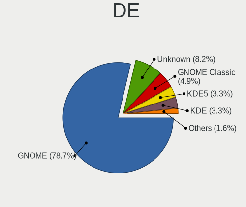

| Name          | Desktops | Percent |
|---------------|----------|---------|
| GNOME         | 38       | 82.61%  |
| KDE5          | 2        | 4.35%   |
| KDE           | 2        | 4.35%   |
| GNOME Classic | 2        | 4.35%   |
| Unknown       | 2        | 4.35%   |

Display Server
--------------

X11 or Wayland

| Name    | Desktops | Percent |
|---------|----------|---------|
| X11     | 27       | 57.45%  |
| Wayland | 19       | 40.43%  |
| Unknown | 1        | 2.13%   |

Display Manager
---------------

SDDM, LightDM, etc.

| Name    | Desktops | Percent |
|---------|----------|---------|
| Unknown | 34       | 73.91%  |
| GDM     | 12       | 26.09%  |

OS Lang
-------

Language

| Lang    | Desktops | Percent |
|---------|----------|---------|
| en_US   | 29       | 64.44%  |
| ru_RU   | 2        | 4.44%   |
| pl_PL   | 2        | 4.44%   |
| en_IN   | 2        | 4.44%   |
| en_GB   | 2        | 4.44%   |
| Unknown | 2        | 4.44%   |
| ko_KR   | 1        | 2.22%   |
| es_ES   | 1        | 2.22%   |
| es_AR   | 1        | 2.22%   |
| en_NZ   | 1        | 2.22%   |
| de_DE   | 1        | 2.22%   |
| cs_CZ   | 1        | 2.22%   |

Boot Mode
---------

EFI or BIOS

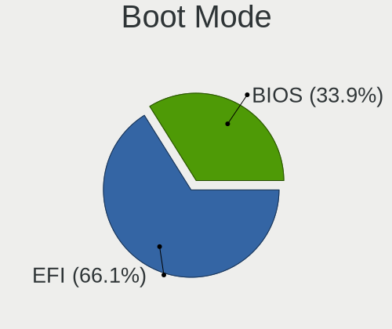

| Mode | Desktops | Percent |
|------|----------|---------|
| EFI  | 32       | 71.11%  |
| BIOS | 13       | 28.89%  |

Filesystem
----------

Type of filesystem

| Type | Desktops | Percent |
|------|----------|---------|
| Xfs  | 41       | 93.18%  |
| Ext4 | 3        | 6.82%   |

Part. scheme
------------

Scheme of partitioning

| Type    | Desktops | Percent |
|---------|----------|---------|
| Unknown | 31       | 67.39%  |
| GPT     | 11       | 23.91%  |
| MBR     | 4        | 8.7%    |

Dual Boot with Linux/BSD
------------------------

Hosting more than one Linux/BSD

| Dual boot | Desktops | Percent |
|-----------|----------|---------|
| No        | 42       | 95.45%  |
| Yes       | 2        | 4.55%   |

Dual Boot (Win)
---------------

Hosting Linux and Windows

| Dual boot | Desktops | Percent |
|-----------|----------|---------|
| No        | 40       | 88.89%  |
| Yes       | 5        | 11.11%  |

Board
-----

Vendor
------

Motherboard manufacturer

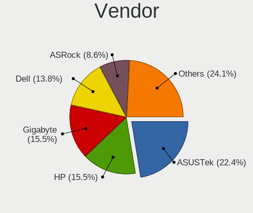

| Name                | Desktops | Percent |
|---------------------|----------|---------|
| ASUSTek Computer    | 11       | 25%     |
| Hewlett-Packard     | 8        | 18.18%  |
| Gigabyte Technology | 6        | 13.64%  |
| MSI                 | 4        | 9.09%   |
| Dell                | 4        | 9.09%   |
| ASRock              | 4        | 9.09%   |
| Lenovo              | 3        | 6.82%   |
| Supermicro          | 1        | 2.27%   |
| Intel               | 1        | 2.27%   |
| Alienware           | 1        | 2.27%   |
| Unknown             | 1        | 2.27%   |

Model
-----

Motherboard model

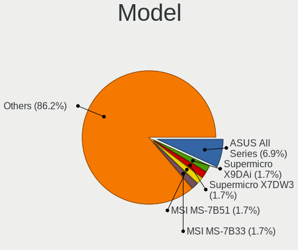

| Name                                | Desktops | Percent |
|-------------------------------------|----------|---------|
| ASUS All Series                     | 3        | 6.82%   |
| Supermicro X7DW3                    | 1        | 2.27%   |
| MSI MS-7B51                         | 1        | 2.27%   |
| MSI MS-7B33                         | 1        | 2.27%   |
| MSI MS-7A37                         | 1        | 2.27%   |
| MSI MS-7752                         | 1        | 2.27%   |
| Lenovo ThinkCentre M92p 3238AZ8     | 1        | 2.27%   |
| Lenovo ThinkCentre M920t 10SFS03200 | 1        | 2.27%   |
| Lenovo ThinkCentre M91p 0266RZ1     | 1        | 2.27%   |
| Intel DX79SR AAG57199-200           | 1        | 2.27%   |
| HP Z840 Workstation                 | 1        | 2.27%   |
| HP Z620 Workstation                 | 1        | 2.27%   |
| HP Z440 Workstation                 | 1        | 2.27%   |
| HP Z230 Tower Workstation           | 1        | 2.27%   |
| HP Z230 SFF Workstation             | 1        | 2.27%   |
| HP EliteDesk 800 G2 SFF             | 1        | 2.27%   |
| HP 290 G1 SFF Business PC           | 1        | 2.27%   |
| HP 260-P020il                       | 1        | 2.27%   |
| Gigabyte Z97N-WIFI                  | 1        | 2.27%   |
| Gigabyte Z490 GAMING X              | 1        | 2.27%   |
| Gigabyte Z390 AORUS ULTRA           | 1        | 2.27%   |
| Gigabyte B85M-D3V-A                 | 1        | 2.27%   |
| Gigabyte B75-D3V                    | 1        | 2.27%   |
| Gigabyte 970A-D3                    | 1        | 2.27%   |
| Dell Vostro 270                     | 1        | 2.27%   |
| Dell Precision Tower 3620           | 1        | 2.27%   |
| Dell Precision T7600                | 1        | 2.27%   |
| Dell Precision 3630 Tower           | 1        | 2.27%   |
| ASUS Z10PE-D16 WS                   | 1        | 2.27%   |
| ASUS ROG STRIX B350-F GAMING        | 1        | 2.27%   |
| ASUS ROG Maximus X HERO             | 1        | 2.27%   |
| ASUS Pro WS X570-ACE                | 1        | 2.27%   |
| ASUS PRIME X470-PRO                 | 1        | 2.27%   |
| ASUS PRIME B360M-D                  | 1        | 2.27%   |
| ASUS PRIME B350M-A                  | 1        | 2.27%   |
| ASUS P8Z77-V PRO                    | 1        | 2.27%   |
| ASRock X99E-ITX/ac                  | 1        | 2.27%   |
| ASRock H91M-PLUS                    | 1        | 2.27%   |
| ASRock H270 Pro4                    | 1        | 2.27%   |
| ASRock A300M-STX                    | 1        | 2.27%   |
| Alienware Aurora R7                 | 1        | 2.27%   |
| Unknown                             | 1        | 2.27%   |

Model Family
------------

Motherboard model prefix

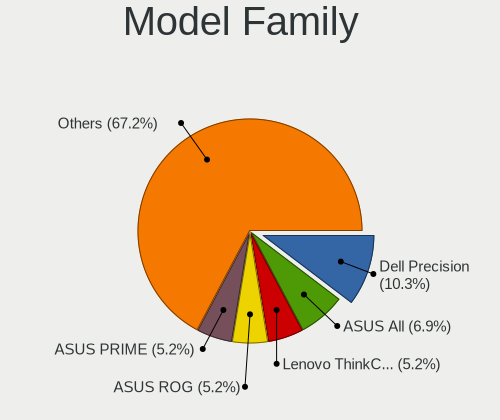

| Name                | Desktops | Percent |
|---------------------|----------|---------|
| Lenovo ThinkCentre  | 3        | 6.82%   |
| Dell Precision      | 3        | 6.82%   |
| ASUS PRIME          | 3        | 6.82%   |
| ASUS All            | 3        | 6.82%   |
| HP Z230             | 2        | 4.55%   |
| ASUS ROG            | 2        | 4.55%   |
| Supermicro X7DW3    | 1        | 2.27%   |
| MSI MS-7B51         | 1        | 2.27%   |
| MSI MS-7B33         | 1        | 2.27%   |
| MSI MS-7A37         | 1        | 2.27%   |
| MSI MS-7752         | 1        | 2.27%   |
| Intel DX79SR        | 1        | 2.27%   |
| HP Z840             | 1        | 2.27%   |
| HP Z620             | 1        | 2.27%   |
| HP Z440             | 1        | 2.27%   |
| HP EliteDesk        | 1        | 2.27%   |
| HP 290              | 1        | 2.27%   |
| HP 260-P020il       | 1        | 2.27%   |
| Gigabyte Z97N-WIFI  | 1        | 2.27%   |
| Gigabyte Z490       | 1        | 2.27%   |
| Gigabyte Z390       | 1        | 2.27%   |
| Gigabyte B85M-D3V-A | 1        | 2.27%   |
| Gigabyte B75-D3V    | 1        | 2.27%   |
| Gigabyte 970A-D3    | 1        | 2.27%   |
| Dell Vostro         | 1        | 2.27%   |
| ASUS Z10PE-D16      | 1        | 2.27%   |
| ASUS Pro            | 1        | 2.27%   |
| ASUS P8Z77-V        | 1        | 2.27%   |
| ASRock X99E-ITX     | 1        | 2.27%   |
| ASRock H91M-PLUS    | 1        | 2.27%   |
| ASRock H270         | 1        | 2.27%   |
| ASRock A300M-STX    | 1        | 2.27%   |
| Alienware Aurora    | 1        | 2.27%   |
| Unknown             | 1        | 2.27%   |

MFG Year
--------

Motherboard manufacture year

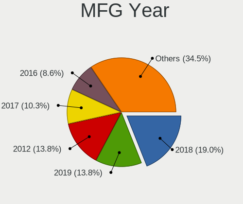

| Year | Desktops | Percent |
|------|----------|---------|
| 2018 | 9        | 20.45%  |
| 2012 | 8        | 18.18%  |
| 2017 | 6        | 13.64%  |
| 2019 | 5        | 11.36%  |
| 2015 | 4        | 9.09%   |
| 2013 | 4        | 9.09%   |
| 2020 | 3        | 6.82%   |
| 2016 | 3        | 6.82%   |
| 2014 | 1        | 2.27%   |
| 2009 | 1        | 2.27%   |

Form Factor
-----------

Physical design of the computer

| Name    | Desktops | Percent |
|---------|----------|---------|
| Desktop | 44       | 100%    |

Secure Boot
-----------

Enabled or disabled

| State    | Desktops | Percent |
|----------|----------|---------|
| Disabled | 42       | 95.45%  |
| Enabled  | 2        | 4.55%   |

Coreboot
--------

Have coreboot on board

| Used | Desktops | Percent |
|------|----------|---------|
| No   | 44       | 100%    |

RAM Size
--------

Total RAM memory

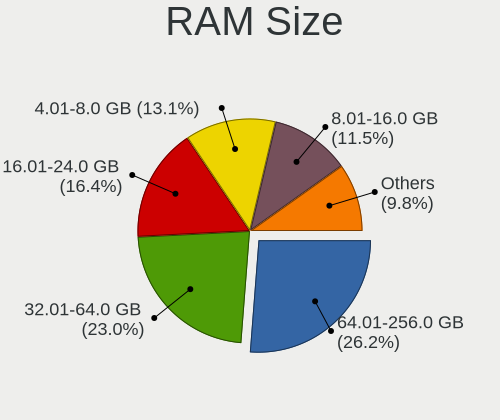

| Size in GB  | Desktops | Percent |
|-------------|----------|---------|
| 64.01-256.0 | 12       | 26.67%  |
| 4.01-8.0    | 8        | 17.78%  |
| 16.01-24.0  | 8        | 17.78%  |
| 32.01-64.0  | 7        | 15.56%  |
| 24.01-32.0  | 5        | 11.11%  |
| 8.01-16.0   | 5        | 11.11%  |

RAM Used
--------

Used RAM memory

| Used GB   | Desktops | Percent |
|-----------|----------|---------|
| 4.01-8.0  | 16       | 31.37%  |
| 2.01-3.0  | 14       | 27.45%  |
| 8.01-16.0 | 11       | 21.57%  |
| 3.01-4.0  | 7        | 13.73%  |
| 1.01-2.0  | 3        | 5.88%   |

Total Drives
------------

Number of drives on board

| Drives | Desktops | Percent |
|--------|----------|---------|
| 2      | 19       | 38.78%  |
| 1      | 13       | 26.53%  |
| 3      | 7        | 14.29%  |
| 4      | 5        | 10.2%   |
| 8      | 2        | 4.08%   |
| 5      | 2        | 4.08%   |
| 6      | 1        | 2.04%   |

Has CD-ROM
----------

Has CD-ROM on board

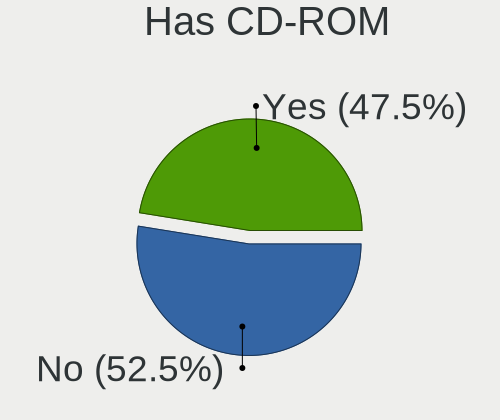

| Presented | Desktops | Percent |
|-----------|----------|---------|
| No        | 24       | 53.33%  |
| Yes       | 21       | 46.67%  |

Has Ethernet
------------

Has Ethernet on board

| Presented | Desktops | Percent |
|-----------|----------|---------|
| Yes       | 44       | 100%    |

Has WiFi
--------

Has WiFi module

| Presented | Desktops | Percent |
|-----------|----------|---------|
| Yes       | 22       | 50%     |
| No        | 22       | 50%     |

Has Bluetooth
-------------

Has Bluetooth module

| Presented | Desktops | Percent |
|-----------|----------|---------|
| No        | 27       | 61.36%  |
| Yes       | 17       | 38.64%  |

Location
--------

Country
-------

Geographic location (country)

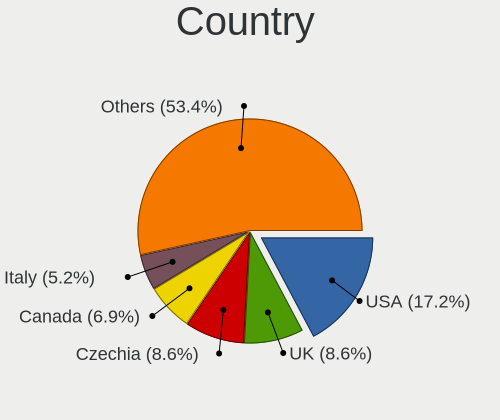

| Country      | Desktops | Percent |
|--------------|----------|---------|
| USA          | 8        | 18.18%  |
| Czechia      | 4        | 9.09%   |
| UK           | 3        | 6.82%   |
| Canada       | 3        | 6.82%   |
| Ukraine      | 2        | 4.55%   |
| South Korea  | 2        | 4.55%   |
| Russia       | 2        | 4.55%   |
| Poland       | 2        | 4.55%   |
| Italy        | 2        | 4.55%   |
| India        | 2        | 4.55%   |
| Germany      | 2        | 4.55%   |
| Turkmenistan | 1        | 2.27%   |
| Switzerland  | 1        | 2.27%   |
| Sweden       | 1        | 2.27%   |
| Spain        | 1        | 2.27%   |
| New Zealand  | 1        | 2.27%   |
| Netherlands  | 1        | 2.27%   |
| Lithuania    | 1        | 2.27%   |
| Indonesia    | 1        | 2.27%   |
| Egypt        | 1        | 2.27%   |
| Brazil       | 1        | 2.27%   |
| Belarus      | 1        | 2.27%   |
| Argentina    | 1        | 2.27%   |

City
----

Geographic location (city)

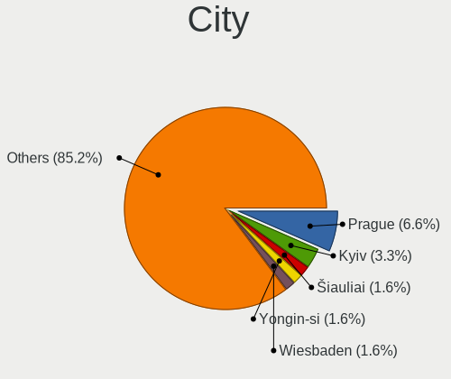

| City                  | Desktops | Percent |
|-----------------------|----------|---------|
| Brno                  | 3        | 6.38%   |
| Kyiv                  | 2        | 4.26%   |
| Wiesbaden             | 1        | 2.13%   |
| Weybridge             | 1        | 2.13%   |
| Warsaw                | 1        | 2.13%   |
| Valmontone            | 1        | 2.13%   |
| Vaestra Froelunda     | 1        | 2.13%   |
| Toronto               | 1        | 2.13%   |
| Tauranga              | 1        | 2.13%   |
| Suwon                 | 1        | 2.13%   |
| Spokane               | 1        | 2.13%   |
| Seoul                 | 1        | 2.13%   |
| Saratov               | 1        | 2.13%   |
| San Jose              | 1        | 2.13%   |
| Salvador              | 1        | 2.13%   |
| Poznan                | 1        | 2.13%   |
| Pernis                | 1        | 2.13%   |
| Paracuellos de Jarama | 1        | 2.13%   |
| Ostrow Mazowiecka     | 1        | 2.13%   |
| Musselburgh           | 1        | 2.13%   |
| Mragowo               | 1        | 2.13%   |
| Montreal              | 1        | 2.13%   |
| Mississauga           | 1        | 2.13%   |
| Minsk                 | 1        | 2.13%   |
| Milwaukee             | 1        | 2.13%   |
| Milan                 | 1        | 2.13%   |
| Lugano                | 1        | 2.13%   |
| Huddersfield          | 1        | 2.13%   |
| Houghton              | 1        | 2.13%   |
| Gyami                 | 1        | 2.13%   |
| Dobrany               | 1        | 2.13%   |
| Dimitrovgrad          | 1        | 2.13%   |
| Des Moines            | 1        | 2.13%   |
| Coimbatore            | 1        | 2.13%   |
| Chicago               | 1        | 2.13%   |
| Cary                  | 1        | 2.13%   |
| Cairo                 | 1        | 2.13%   |
| Buenos Aires          | 1        | 2.13%   |
| Bonn                  | 1        | 2.13%   |
| Bengaluru             | 1        | 2.13%   |
| Bandung               | 1        | 2.13%   |
| ? iauliai             | 1        | 2.13%   |
| Aurora                | 1        | 2.13%   |
| Albuquerque           | 1        | 2.13%   |

Drives
------

Drive Vendor
------------

Hard drive vendors

| Vendor              | Desktops | Drives | Percent |
|---------------------|----------|--------|---------|
| WDC                 | 17       | 36     | 18.68%  |
| Seagate             | 14       | 23     | 15.38%  |
| Samsung Electronics | 12       | 24     | 13.19%  |
| Kingston            | 7        | 10     | 7.69%   |
| Toshiba             | 6        | 9      | 6.59%   |
| SanDisk             | 4        | 6      | 4.4%    |
| Crucial             | 4        | 8      | 4.4%    |
| Phison              | 3        | 5      | 3.3%    |
| Intel               | 3        | 4      | 3.3%    |
| Hitachi             | 3        | 3      | 3.3%    |
| SK Hynix            | 2        | 3      | 2.2%    |
| Corsair             | 2        | 2      | 2.2%    |
| A-DATA Technology   | 2        | 2      | 2.2%    |
| XPG                 | 1        | 1      | 1.1%    |
| Unknown             | 1        | 1      | 1.1%    |
| T-FORCE             | 1        | 2      | 1.1%    |
| Silicon Motion      | 1        | 1      | 1.1%    |
| PNY                 | 1        | 1      | 1.1%    |
| OCZ                 | 1        | 2      | 1.1%    |
| Micron Technology   | 1        | 1      | 1.1%    |
| Hoodisk             | 1        | 1      | 1.1%    |
| HGST                | 1        | 1      | 1.1%    |
| Hewlett-Packard     | 1        | 1      | 1.1%    |
| Gigabyte Technology | 1        | 1      | 1.1%    |
| China               | 1        | 1      | 1.1%    |

Drive Model
-----------

Hard drive models

| Model                                 | Desktops | Percent |
|---------------------------------------|----------|---------|
| Samsung SSD 860 EVO 1TB               | 3        | 2.68%   |
| WDC WD1002FAEX-00Z3A0 1TB             | 2        | 1.79%   |
| Toshiba KBG30ZMS128G 128GB NVMe SSD   | 2        | 1.79%   |
| Seagate ST500DM002-1BD142 500GB       | 2        | 1.79%   |
| Seagate ST2000DM001-1ER164 2TB        | 2        | 1.79%   |
| Seagate ST1000DM003-9YN162 1TB        | 2        | 1.79%   |
| Samsung NVMe SSD Drive 512GB          | 2        | 1.79%   |
| Samsung NVMe SSD Drive 500GB          | 2        | 1.79%   |
| Kingston SUV500120G 120GB SSD         | 2        | 1.79%   |
| Corsair Force LE SSD 240GB            | 2        | 1.79%   |
| XPG NVMe SSD Drive 1024GB             | 1        | 0.89%   |
| WDC WDS250G2B0B-00YS70 250GB SSD      | 1        | 0.89%   |
| WDC WDS240G2G0A-00JH30 240GB SSD      | 1        | 0.89%   |
| WDC WDS240G1G0A-00SS50 240GB SSD      | 1        | 0.89%   |
| WDC WDS100T2B0A-00SM50 1TB SSD        | 1        | 0.89%   |
| WDC WD7500BPKT-00PK4T0 752GB          | 1        | 0.89%   |
| WDC WD60 EFAX-68JH4N1 6TB             | 1        | 0.89%   |
| WDC WD60 EFAX-68JH4N0 6TB             | 1        | 0.89%   |
| WDC WD5003ABYZ-011FA0 500GB           | 1        | 0.89%   |
| WDC WD5000AAKX-75U6AA0 500GB          | 1        | 0.89%   |
| WDC WD50 00LPVX-00V0TT0 500GB         | 1        | 0.89%   |
| WDC WD40PURZ-85TTDY0 4TB              | 1        | 0.89%   |
| WDC WD40EZRZ-19GXCB0 4TB              | 1        | 0.89%   |
| WDC WD40EFRX-68N32N0 4TB              | 1        | 0.89%   |
| WDC WD4005FZBX-00K5WB0 4TB            | 1        | 0.89%   |
| WDC WD2500BEKT-75F3T0 250GB           | 1        | 0.89%   |
| WDC WD2500AAKX-083CA1 250GB           | 1        | 0.89%   |
| WDC WD20PURZ-85GU6Y0 2TB              | 1        | 0.89%   |
| WDC WD20EARS-22MVWB0 2TB              | 1        | 0.89%   |
| WDC WD2003FZEX-00SRLA0 2TB            | 1        | 0.89%   |
| WDC WD10JPVX-22JC3T0 1TB              | 1        | 0.89%   |
| WDC WD10EZEX-75WN4A0 1TB              | 1        | 0.89%   |
| WDC WD10EZEX-22MFCA0 1TB              | 1        | 0.89%   |
| WDC WD1003FZEX-00MK2A0 1TB            | 1        | 0.89%   |
| Unknown SD/MMC/MS PRO 128GB           | 1        | 0.89%   |
| Toshiba HDWT140 4TB                   | 1        | 0.89%   |
| Toshiba HDWQ140 4TB                   | 1        | 0.89%   |
| Toshiba HDWD120 2TB                   | 1        | 0.89%   |
| Toshiba DT01ACA300 3TB                | 1        | 0.89%   |
| Toshiba DT01ACA200 2TB                | 1        | 0.89%   |
| Toshiba DT01ACA100 1TB                | 1        | 0.89%   |
| T-FORCE 1TB                           | 1        | 0.89%   |
| SK Hynix PC601 NVMe 512GB             | 1        | 0.89%   |
| SK Hynix HFS128G32TNF-N3A0A 128GB SSD | 1        | 0.89%   |
| Silicon Motion NVMe SSD Drive 256GB   | 1        | 0.89%   |
| Seagate ST6000VN0033-2EE110 6TB       | 1        | 0.89%   |
| Seagate ST4000LM024-2AN17V 4TB        | 1        | 0.89%   |
| Seagate ST3250310AS 250GB             | 1        | 0.89%   |
| Seagate ST31000524AS 1TB              | 1        | 0.89%   |
| Seagate ST2000DM001-9YN164 2TB        | 1        | 0.89%   |
| Seagate ST1000VN002-2EY102 1TB        | 1        | 0.89%   |
| Seagate ST1000LM049-2GH172 1TB        | 1        | 0.89%   |
| Seagate ST1000LM024 HN-M101MBB 1TB    | 1        | 0.89%   |
| Seagate ST1000DM010-2EP102 1TB        | 1        | 0.89%   |
| Seagate ST1000DM003-1SB102 1TB        | 1        | 0.89%   |
| SanDisk WD_BLACK AN1500 1TB           | 1        | 0.89%   |
| SanDisk SDSSDA480G 480GB              | 1        | 0.89%   |
| SanDisk SDSSDA240G 240GB              | 1        | 0.89%   |
| SanDisk SDSSDA120G 120GB              | 1        | 0.89%   |
| Sandisk NVMe SSD Drive 500GB          | 1        | 0.89%   |

HDD Vendor
----------

Hard disk drive vendors

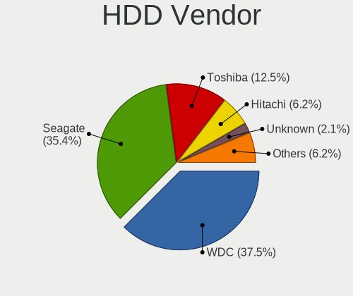

| Vendor              | Desktops | Drives | Percent |
|---------------------|----------|--------|---------|
| WDC                 | 15       | 32     | 37.5%   |
| Seagate             | 14       | 23     | 35%     |
| Toshiba             | 4        | 6      | 10%     |
| Hitachi             | 3        | 3      | 7.5%    |
| Unknown             | 1        | 1      | 2.5%    |
| Samsung Electronics | 1        | 1      | 2.5%    |
| HGST                | 1        | 1      | 2.5%    |
| Hewlett-Packard     | 1        | 1      | 2.5%    |

SSD Vendor
----------

Solid state drive vendors

| Vendor              | Desktops | Drives | Percent |
|---------------------|----------|--------|---------|
| Samsung Electronics | 9        | 13     | 24.32%  |
| Kingston            | 7        | 10     | 18.92%  |
| Crucial             | 4        | 8      | 10.81%  |
| WDC                 | 3        | 4      | 8.11%   |
| SanDisk             | 2        | 3      | 5.41%   |
| Intel               | 2        | 3      | 5.41%   |
| Corsair             | 2        | 2      | 5.41%   |
| A-DATA Technology   | 2        | 2      | 5.41%   |
| SK Hynix            | 1        | 2      | 2.7%    |
| PNY                 | 1        | 1      | 2.7%    |
| OCZ                 | 1        | 2      | 2.7%    |
| Micron Technology   | 1        | 1      | 2.7%    |
| Hoodisk             | 1        | 1      | 2.7%    |
| China               | 1        | 1      | 2.7%    |

Drive Kind
----------

HDD or SSD

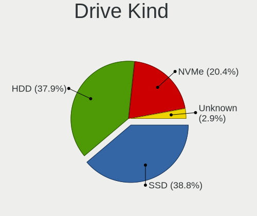

| Kind    | Desktops | Drives | Percent |
|---------|----------|--------|---------|
| SSD     | 33       | 53     | 41.25%  |
| HDD     | 33       | 68     | 41.25%  |
| NVMe    | 13       | 26     | 16.25%  |
| Unknown | 1        | 2      | 1.25%   |

Drive Connector
---------------

SATA, SAS, NVMe, etc.

| Type | Desktops | Drives | Percent |
|------|----------|--------|---------|
| SATA | 42       | 115    | 71.19%  |
| NVMe | 13       | 26     | 22.03%  |
| SAS  | 4        | 8      | 6.78%   |

Drive Size
----------

Size of hard drive

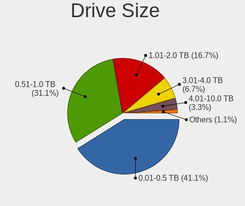

| Size in TB | Desktops | Drives | Percent |
|------------|----------|--------|---------|
| 0.01-0.5   | 30       | 55     | 41.1%   |
| 0.51-1.0   | 22       | 36     | 30.14%  |
| 1.01-2.0   | 12       | 13     | 16.44%  |
| 3.01-4.0   | 6        | 11     | 8.22%   |
| 4.01-10.0  | 2        | 5      | 2.74%   |
| 2.01-3.0   | 1        | 1      | 1.37%   |

Space Total
-----------

Amount of disk space available on the file system

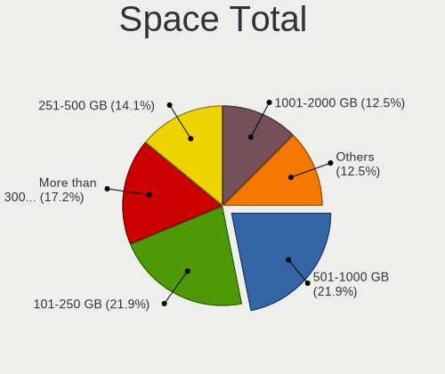

| Size in GB     | Desktops | Percent |
|----------------|----------|---------|
| 101-250        | 12       | 24.49%  |
| More than 3000 | 9        | 18.37%  |
| 501-1000       | 9        | 18.37%  |
| 251-500        | 8        | 16.33%  |
| 1001-2000      | 6        | 12.24%  |
| 2001-3000      | 3        | 6.12%   |
| 51-100         | 2        | 4.08%   |

Space Used
----------

Amount of used disk space

| Used GB        | Desktops | Percent |
|----------------|----------|---------|
| 21-50          | 13       | 25%     |
| 1-20           | 9        | 17.31%  |
| 101-250        | 8        | 15.38%  |
| 51-100         | 6        | 11.54%  |
| 251-500        | 4        | 7.69%   |
| 1001-2000      | 4        | 7.69%   |
| 501-1000       | 4        | 7.69%   |
| More than 3000 | 2        | 3.85%   |
| 2001-3000      | 2        | 3.85%   |

Malfunc. Drives
---------------

Drive models with a malfunction

| Model                          | Desktops | Drives | Percent |
|--------------------------------|----------|--------|---------|
| Seagate ST1000DM003-9YN162 1TB | 1        | 1      | 50%     |
| Hitachi HDS722020ALA330 2TB    | 1        | 1      | 50%     |

Malfunc. Drive Vendor
---------------------

Vendors of faulty drives

| Vendor  | Desktops | Drives | Percent |
|---------|----------|--------|---------|
| Seagate | 1        | 1      | 50%     |
| Hitachi | 1        | 1      | 50%     |

Malfunc. HDD Vendor
-------------------

Vendors of faulty HDD drives

| Vendor  | Desktops | Drives | Percent |
|---------|----------|--------|---------|
| Seagate | 1        | 1      | 50%     |
| Hitachi | 1        | 1      | 50%     |

Malfunc. Drive Kind
-------------------

Kinds of faulty drives

| Kind | Desktops | Drives | Percent |
|------|----------|--------|---------|
| HDD  | 2        | 2      | 100%    |

Failed Drives
-------------

Failed drive models

Zero info for selected period =(

Failed Drive Vendor
-------------------

Failed drive vendors

Zero info for selected period =(

Drive Status
------------

Number of failed and malfunc. drives

| Status   | Desktops | Drives | Percent |
|----------|----------|--------|---------|
| Detected | 30       | 113    | 62.5%   |
| Works    | 16       | 34     | 33.33%  |
| Malfunc  | 2        | 2      | 4.17%   |

Storage controller
------------------

Storage Vendor
--------------

Storage controller vendors

| Vendor                       | Desktops | Percent |
|------------------------------|----------|---------|
| Intel                        | 36       | 52.94%  |
| AMD                          | 7        | 10.29%  |
| Samsung Electronics          | 6        | 8.82%   |
| Phison Electronics           | 3        | 4.41%   |
| Marvell Technology Group     | 3        | 4.41%   |
| ASMedia Technology           | 3        | 4.41%   |
| Toshiba America Info Systems | 2        | 2.94%   |
| LSI Logic / Symbios Logic    | 2        | 2.94%   |
| Broadcom / LSI               | 2        | 2.94%   |
| SK Hynix                     | 1        | 1.47%   |
| Silicon Motion               | 1        | 1.47%   |
| Sandisk                      | 1        | 1.47%   |
| ADATA Technology             | 1        | 1.47%   |

Storage Model
-------------

Storage controller models

| Model                                                                                   | Desktops | Percent |
|-----------------------------------------------------------------------------------------|----------|---------|
| Intel Cannon Lake PCH SATA AHCI Controller                                              | 7        | 8.33%   |
| AMD FCH SATA Controller [AHCI mode]                                                     | 6        | 7.14%   |
| Samsung NVMe SSD Controller SM981/PM981/PM983                                           | 5        | 5.95%   |
| Intel 7 Series/C210 Series Chipset Family 6-port SATA Controller [AHCI mode]            | 5        | 5.95%   |
| Intel 8 Series/C220 Series Chipset Family 6-port SATA Controller 1 [AHCI mode]          | 4        | 4.76%   |
| Intel Q170/Q150/B150/H170/H110/Z170/CM236 Chipset SATA Controller [AHCI Mode]           | 3        | 3.57%   |
| Intel C610/X99 series chipset sSATA Controller [AHCI mode]                              | 3        | 3.57%   |
| Intel C610/X99 series chipset 6-Port SATA Controller [AHCI mode]                        | 3        | 3.57%   |
| Intel 200 Series PCH SATA controller [AHCI mode]                                        | 3        | 3.57%   |
| ASMedia ASM1062 Serial ATA Controller                                                   | 3        | 3.57%   |
| AMD 300 Series Chipset SATA Controller                                                  | 3        | 3.57%   |
| Toshiba America Info Systems Toshiba America Info Non-Volatile memory controller        | 2        | 2.38%   |
| Phison E12 NVMe Controller                                                              | 2        | 2.38%   |
| Intel C600/X79 series chipset SATA RAID Controller                                      | 2        | 2.38%   |
| Intel C600/X79 series chipset 6-Port SATA AHCI Controller                               | 2        | 2.38%   |
| Intel 9 Series Chipset Family SATA Controller [AHCI Mode]                               | 2        | 2.38%   |
| SK Hynix Non-Volatile memory controller                                                 | 1        | 1.19%   |
| Silicon Motion SM2263EN/SM2263XT SSD Controller                                         | 1        | 1.19%   |
| Sandisk WD Blue SN550 NVMe SSD                                                          | 1        | 1.19%   |
| Sandisk WD Black SN750 / PC SN730 NVMe SSD                                              | 1        | 1.19%   |
| Samsung NVMe SSD Controller SM961/PM961/SM963                                           | 1        | 1.19%   |
| Phison PS5013 E13 NVMe Controller                                                       | 1        | 1.19%   |
| Phison E16 PCIe4 NVMe Controller                                                        | 1        | 1.19%   |
| Marvell Group 88SE9215 PCIe 2.0 x1 4-port SATA 6 Gb/s Controller                        | 1        | 1.19%   |
| Marvell Group 88SE9128 PCIe SATA 6 Gb/s RAID controller with HyperDuo                   | 1        | 1.19%   |
| Marvell Group 88NR2241 Non-Volatile memory controller                                   | 1        | 1.19%   |
| LSI Logic / Symbios Logic SAS2308 PCI-Express Fusion-MPT SAS-2                          | 1        | 1.19%   |
| LSI Logic / Symbios Logic MegaRAID SAS 2008 [Falcon]                                    | 1        | 1.19%   |
| Intel Sunrise Point-LP SATA Controller [AHCI mode]                                      | 1        | 1.19%   |
| Intel SSD 660P Series                                                                   | 1        | 1.19%   |
| Intel SATA Controller [RAID mode]                                                       | 1        | 1.19%   |
| Intel Comet Lake SATA AHCI Controller                                                   | 1        | 1.19%   |
| Intel C610/X99 series chipset sSATA Controller [RAID mode]                              | 1        | 1.19%   |
| Intel C602 chipset 4-Port SATA Storage Control Unit                                     | 1        | 1.19%   |
| Intel C600/X79 series chipset IDE-r Controller                                          | 1        | 1.19%   |
| Intel 631xESB/632xESB/3100 Chipset SATA IDE Controller                                  | 1        | 1.19%   |
| Intel 631xESB/632xESB IDE Controller                                                    | 1        | 1.19%   |
| Intel 6 Series/C200 Series Chipset Family Desktop SATA Controller (IDE mode, ports 4-5) | 1        | 1.19%   |
| Intel 6 Series/C200 Series Chipset Family Desktop SATA Controller (IDE mode, ports 0-3) | 1        | 1.19%   |
| Broadcom / LSI SAS2308 PCI-Express Fusion-MPT SAS-2                                     | 1        | 1.19%   |
| Broadcom / LSI MegaRAID SAS 2208 [Thunderbolt]                                          | 1        | 1.19%   |
| AMD SB7x0/SB8x0/SB9x0 SATA Controller [IDE mode]                                        | 1        | 1.19%   |
| AMD SB7x0/SB8x0/SB9x0 IDE Controller                                                    | 1        | 1.19%   |
| AMD 400 Series Chipset SATA Controller                                                  | 1        | 1.19%   |
| ADATA XPG SX8200 Pro PCIe Gen3x4 M.2 2280 Solid State Drive                             | 1        | 1.19%   |

Storage Kind
------------

Kind of storage controller (IDE, SATA, NVMe, SAS, ...)

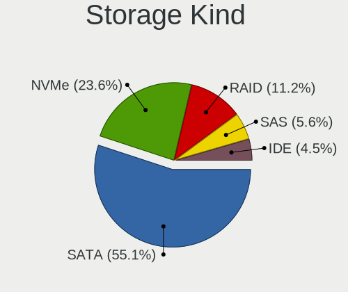

| Kind | Desktops | Percent |
|------|----------|---------|
| SATA | 39       | 60.94%  |
| NVMe | 13       | 20.31%  |
| RAID | 5        | 7.81%   |
| IDE  | 4        | 6.25%   |
| SAS  | 3        | 4.69%   |

Processor
---------

CPU Vendor
----------

Processor vendors

| Vendor | Desktops | Percent |
|--------|----------|---------|
| Intel  | 37       | 84.09%  |
| AMD    | 7        | 15.91%  |

CPU Model
---------

Processor models

| Model                                       | Desktops | Percent |
|---------------------------------------------|----------|---------|
| Intel Core i7-8700 CPU @ 3.20GHz            | 3        | 6.82%   |
| Intel Xeon CPU E5-2680 v3 @ 2.50GHz         | 2        | 4.55%   |
| Intel Pentium Gold G5400 CPU @ 3.70GHz      | 2        | 4.55%   |
| AMD Ryzen 9 3900X 12-Core Processor         | 2        | 4.55%   |
| Intel Xeon CPU E5472 @ 3.00GHz              | 1        | 2.27%   |
| Intel Xeon CPU E5-2696 v3 @ 2.30GHz         | 1        | 2.27%   |
| Intel Xeon CPU E5-2680 v2 @ 2.80GHz         | 1        | 2.27%   |
| Intel Xeon CPU E5-2670 0 @ 2.60GHz          | 1        | 2.27%   |
| Intel Xeon CPU E5-1650 v4 @ 3.60GHz         | 1        | 2.27%   |
| Intel Xeon CPU E3-1240 v3 @ 3.40GHz         | 1        | 2.27%   |
| Intel Core i7-9700F CPU @ 3.00GHz           | 1        | 2.27%   |
| Intel Core i7-8700K CPU @ 3.70GHz           | 1        | 2.27%   |
| Intel Core i7-7700 CPU @ 3.60GHz            | 1        | 2.27%   |
| Intel Core i7-7560U CPU @ 2.40GHz           | 1        | 2.27%   |
| Intel Core i7-4790K CPU @ 4.00GHz           | 1        | 2.27%   |
| Intel Core i7-4770K CPU @ 3.50GHz           | 1        | 2.27%   |
| Intel Core i7-3820 CPU @ 3.60GHz            | 1        | 2.27%   |
| Intel Core i7-3770K CPU @ 3.50GHz           | 1        | 2.27%   |
| Intel Core i5-9600K CPU @ 3.70GHz           | 1        | 2.27%   |
| Intel Core i5-7500 CPU @ 3.40GHz            | 1        | 2.27%   |
| Intel Core i5-6500 CPU @ 3.20GHz            | 1        | 2.27%   |
| Intel Core i5-4690 CPU @ 3.50GHz            | 1        | 2.27%   |
| Intel Core i5-3570K CPU @ 3.40GHz           | 1        | 2.27%   |
| Intel Core i5-3550 CPU @ 3.30GHz            | 1        | 2.27%   |
| Intel Core i5-3470T CPU @ 2.90GHz           | 1        | 2.27%   |
| Intel Core i5-3450 CPU @ 3.10GHz            | 1        | 2.27%   |
| Intel Core i5-2400S CPU @ 2.50GHz           | 1        | 2.27%   |
| Intel Core i5-10600K CPU @ 4.10GHz          | 1        | 2.27%   |
| Intel Core i3-8100 CPU @ 3.60GHz            | 1        | 2.27%   |
| Intel Core i3-6100T CPU @ 3.20GHz           | 1        | 2.27%   |
| Intel Core i3-4330 CPU @ 3.50GHz            | 1        | 2.27%   |
| Intel Core i3-4170 CPU @ 3.70GHz            | 1        | 2.27%   |
| Intel Core i3-4160 CPU @ 3.60GHz            | 1        | 2.27%   |
| Intel Core i3-4130 CPU @ 3.40GHz            | 1        | 2.27%   |
| AMD Ryzen 7 1700X Eight-Core Processor      | 1        | 2.27%   |
| AMD Ryzen 7 1700 Eight-Core Processor       | 1        | 2.27%   |
| AMD Ryzen 5 3400G with Radeon Vega Graphics | 1        | 2.27%   |
| AMD Ryzen 3 2200G with Radeon Vega Graphics | 1        | 2.27%   |
| AMD FX-8350 Eight-Core Processor            | 1        | 2.27%   |

CPU Model Family
----------------

Processor model prefix

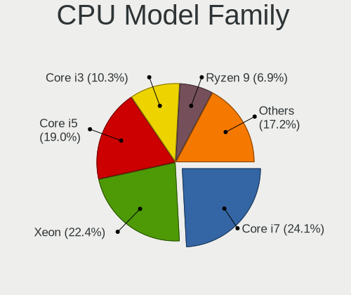

| Model              | Desktops | Percent |
|--------------------|----------|---------|
| Intel Core i7      | 11       | 25%     |
| Intel Core i5      | 10       | 22.73%  |
| Intel Xeon         | 8        | 18.18%  |
| Intel Core i3      | 6        | 13.64%  |
| Intel Pentium Gold | 2        | 4.55%   |
| AMD Ryzen 9        | 2        | 4.55%   |
| AMD Ryzen 7        | 2        | 4.55%   |
| AMD Ryzen 5        | 1        | 2.27%   |
| AMD Ryzen 3        | 1        | 2.27%   |
| AMD FX             | 1        | 2.27%   |

CPU Cores
---------

Number of processor cores

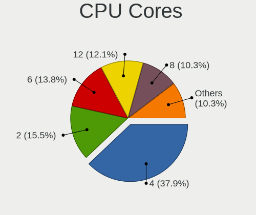

| Number | Desktops | Percent |
|--------|----------|---------|
| 4      | 17       | 38.64%  |
| 2      | 9        | 20.45%  |
| 6      | 7        | 15.91%  |
| 8      | 4        | 9.09%   |
| 12     | 3        | 6.82%   |
| 36     | 1        | 2.27%   |
| 24     | 1        | 2.27%   |
| 20     | 1        | 2.27%   |
| 16     | 1        | 2.27%   |

CPU Sockets
-----------

Number of sockets

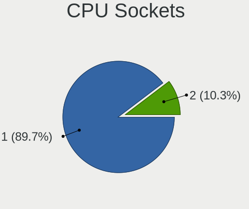

| Number | Desktops | Percent |
|--------|----------|---------|
| 1      | 39       | 88.64%  |
| 2      | 5        | 11.36%  |

CPU Threads
-----------

Threads per core (Hyper-Threading)

| Number | Desktops | Percent |
|--------|----------|---------|
| 2      | 31       | 68.89%  |
| 1      | 14       | 31.11%  |

CPU Op-Modes
------------

CPU Operation Modes (32-bit, 64-bit)

| Op mode        | Desktops | Percent |
|----------------|----------|---------|
| 32-bit, 64-bit | 43       | 97.73%  |
| Unknown        | 1        | 2.27%   |

CPU Microcode
-------------

Microcode number

| Number     | Desktops | Percent |
|------------|----------|---------|
| 0x306c3    | 8        | 18.18%  |
| 0x906ea    | 6        | 13.64%  |
| 0x306a9    | 4        | 9.09%   |
| 0x306f2    | 3        | 6.82%   |
| 0x906ed    | 2        | 4.55%   |
| 0x906e9    | 2        | 4.55%   |
| 0x506e3    | 2        | 4.55%   |
| 0x206d7    | 2        | 4.55%   |
| 0xa0655    | 1        | 2.27%   |
| 0x906eb    | 1        | 2.27%   |
| 0x806e9    | 1        | 2.27%   |
| 0x406f1    | 1        | 2.27%   |
| 0x306e4    | 1        | 2.27%   |
| 0x206a7    | 1        | 2.27%   |
| 0x10676    | 1        | 2.27%   |
| 0x08701021 | 1        | 2.27%   |
| 0x08701013 | 1        | 2.27%   |
| 0x08108102 | 1        | 2.27%   |
| 0x0810100b | 1        | 2.27%   |
| 0x08001138 | 1        | 2.27%   |
| 0x08001137 | 1        | 2.27%   |
| 0x06000852 | 1        | 2.27%   |
| Unknown    | 1        | 2.27%   |

CPU Microarch
-------------

Microarchitecture

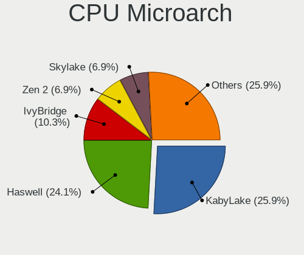

| Name        | Desktops | Percent |
|-------------|----------|---------|
| KabyLake    | 12       | 27.27%  |
| Haswell     | 11       | 25%     |
| IvyBridge   | 6        | 13.64%  |
| Zen         | 3        | 6.82%   |
| SandyBridge | 3        | 6.82%   |
| Zen 2       | 2        | 4.55%   |
| Skylake     | 2        | 4.55%   |
| Zen+        | 1        | 2.27%   |
| Piledriver  | 1        | 2.27%   |
| Penryn      | 1        | 2.27%   |
| CometLake   | 1        | 2.27%   |
| Broadwell   | 1        | 2.27%   |

Graphics
--------

GPU Vendor
----------

Vendors of graphics cards

| Vendor | Desktops | Percent |
|--------|----------|---------|
| Nvidia | 27       | 51.92%  |
| Intel  | 18       | 34.62%  |
| AMD    | 7        | 13.46%  |

GPU Model
---------

Graphics card models

| Model                                                                       | Desktops | Percent |
|-----------------------------------------------------------------------------|----------|---------|
| Intel CoffeeLake-S GT2 [UHD Graphics 630]                                   | 4        | 7.41%   |
| Nvidia GP107 [GeForce GTX 1050 Ti]                                          | 3        | 5.56%   |
| Nvidia GP106 [GeForce GTX 1060 6GB]                                         | 2        | 3.7%    |
| Intel Xeon E3-1200 v3/4th Gen Core Processor Integrated Graphics Controller | 2        | 3.7%    |
| Intel Xeon E3-1200 v2/3rd Gen Core processor Graphics Controller            | 2        | 3.7%    |
| Intel IvyBridge GT2 [HD Graphics 4000]                                      | 2        | 3.7%    |
| Intel 4th Generation Core Processor Family Integrated Graphics Controller   | 2        | 3.7%    |
| Nvidia TU116 [GeForce GTX 1660 Ti]                                          | 1        | 1.85%   |
| Nvidia TU116 [GeForce GTX 1650 SUPER]                                       | 1        | 1.85%   |
| Nvidia TU106 [GeForce RTX 2060 SUPER]                                       | 1        | 1.85%   |
| Nvidia TU104 [GeForce RTX 2070 SUPER]                                       | 1        | 1.85%   |
| Nvidia GP107GL [Quadro P600]                                                | 1        | 1.85%   |
| Nvidia GP106 [GeForce GTX 1060 3GB]                                         | 1        | 1.85%   |
| Nvidia GP104 [GeForce GTX 1080]                                             | 1        | 1.85%   |
| Nvidia GP102 [GeForce GTX 1080 Ti]                                          | 1        | 1.85%   |
| Nvidia GM206 [GeForce GTX 960]                                              | 1        | 1.85%   |
| Nvidia GM204GL [Quadro M4000]                                               | 1        | 1.85%   |
| Nvidia GM204 [GeForce GTX 970]                                              | 1        | 1.85%   |
| Nvidia GM107GL [NVS 810]                                                    | 1        | 1.85%   |
| Nvidia GK208B [GeForce GT 730]                                              | 1        | 1.85%   |
| Nvidia GK208B [GeForce GT 710]                                              | 1        | 1.85%   |
| Nvidia GK106GL [Quadro K4000]                                               | 1        | 1.85%   |
| Nvidia GK104 [GeForce GTX 760]                                              | 1        | 1.85%   |
| Nvidia GF114 [GeForce GTX 560]                                              | 1        | 1.85%   |
| Nvidia GF110 [GeForce GTX 580]                                              | 1        | 1.85%   |
| Nvidia GF108GL [Quadro 600]                                                 | 1        | 1.85%   |
| Nvidia GF108 [GeForce GT 730]                                               | 1        | 1.85%   |
| Nvidia GF108 [GeForce GT 630]                                               | 1        | 1.85%   |
| Nvidia G98 [Quadro NVS 295]                                                 | 1        | 1.85%   |
| Nvidia G98 [GeForce 8400 GS Rev. 2]                                         | 1        | 1.85%   |
| Nvidia G96C [GeForce 9500 GT]                                               | 1        | 1.85%   |
| Intel Iris Plus Graphics 640                                                | 1        | 1.85%   |
| Intel HD Graphics 630                                                       | 1        | 1.85%   |
| Intel HD Graphics 530                                                       | 1        | 1.85%   |
| Intel CometLake-S GT2 [UHD Graphics 630]                                    | 1        | 1.85%   |
| Intel CoffeeLake-S GT1 [UHD Graphics 610]                                   | 1        | 1.85%   |
| Intel 2nd Generation Core Processor Family Integrated Graphics Controller   | 1        | 1.85%   |
| AMD Vega 10 XL/XT [Radeon RX Vega 56/64]                                    | 1        | 1.85%   |
| AMD Tahiti XT [Radeon HD 7970/8970 OEM / R9 280X]                           | 1        | 1.85%   |
| AMD Raven Ridge [Radeon Vega Series / Radeon Vega Mobile Series]            | 1        | 1.85%   |
| AMD Picasso/Raven 2 [Radeon Vega Series / Radeon Vega Mobile Series]        | 1        | 1.85%   |
| AMD Oland XT [Radeon HD 8670 / R5 340X OEM / R7 250/350/350X OEM]           | 1        | 1.85%   |
| AMD Lexa PRO [Radeon 540/540X/550/550X / RX 540X/550/550X]                  | 1        | 1.85%   |
| AMD ES1000                                                                  | 1        | 1.85%   |

GPU Combo
---------

Combinations of graphics cards

| Name           | Desktops | Percent |
|----------------|----------|---------|
| 1 x Nvidia     | 26       | 57.78%  |
| 1 x Intel      | 11       | 24.44%  |
| 1 x AMD        | 5        | 11.11%  |
| Intel + AMD    | 2        | 4.44%   |
| Intel + Nvidia | 1        | 2.22%   |

GPU Driver
----------

Free vs proprietary

| Driver      | Desktops | Percent |
|-------------|----------|---------|
| Free        | 30       | 66.67%  |
| Proprietary | 15       | 33.33%  |

GPU Memory
----------

Total video memory

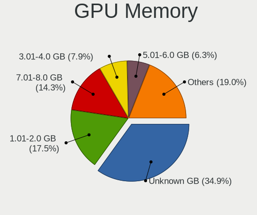

| Size in GB | Desktops | Percent |
|------------|----------|---------|
| Unknown    | 18       | 37.5%   |
| 1.01-2.0   | 10       | 20.83%  |
| 7.01-8.0   | 4        | 8.33%   |
| 3.01-4.0   | 4        | 8.33%   |
| 5.01-6.0   | 3        | 6.25%   |
| 2.01-3.0   | 3        | 6.25%   |
| 0.01-0.5   | 3        | 6.25%   |
| 0.51-1.0   | 2        | 4.17%   |
| 8.01-16.0  | 1        | 2.08%   |

Monitor
-------

Monitor Vendor
--------------

Monitor vendors

| Vendor               | Desktops | Percent |
|----------------------|----------|---------|
| Samsung Electronics  | 9        | 17.31%  |
| Goldstar             | 8        | 15.38%  |
| Hewlett-Packard      | 5        | 9.62%   |
| Dell                 | 5        | 9.62%   |
| Lenovo               | 4        | 7.69%   |
| BenQ                 | 3        | 5.77%   |
| Ancor Communications | 3        | 5.77%   |
| ViewSonic            | 2        | 3.85%   |
| Lenovo Group Limited | 2        | 3.85%   |
| Iiyama               | 2        | 3.85%   |
| Gigabyte Technology  | 2        | 3.85%   |
| Eizo                 | 2        | 3.85%   |
| Acer                 | 2        | 3.85%   |
| Philips              | 1        | 1.92%   |
| LG Electronics       | 1        | 1.92%   |
| Insignia             | 1        | 1.92%   |

Monitor Model
-------------

Monitor models

| Model                                                                 | Desktops | Percent |
|-----------------------------------------------------------------------|----------|---------|
| Lenovo TIO24Gen3 LEN10B4 1920x1080 527x296mm 23.8-inch                | 2        | 3.33%   |
| Lenovo LEN T2324pA LEN60C7 1920x1080 509x286mm 23.0-inch              | 2        | 3.33%   |
| Iiyama PL4840 IVM1065 1920x1080 1054x593mm 47.6-inch                  | 2        | 3.33%   |
| Goldstar LG FULL HD GSM5B55 1920x1080 480x270mm 21.7-inch             | 2        | 3.33%   |
| ViewSonic VA2259 Series VSC5E32 1920x1080 476x268mm 21.5-inch         | 1        | 1.67%   |
| ViewSonic LCD Monitor VSC3E32 1920x1080 600x340mm 27.2-inch           | 1        | 1.67%   |
| Samsung Electronics SyncMaster SAM05FC 1920x1080                      | 1        | 1.67%   |
| Samsung Electronics SyncMaster SAM0566 1440x900 408x255mm 18.9-inch   | 1        | 1.67%   |
| Samsung Electronics S22E390 SAM0C18 1920x1080 480x270mm 21.7-inch     | 1        | 1.67%   |
| Samsung Electronics S22B300 SAM08A9 1440x900 440x250mm 19.9-inch      | 1        | 1.67%   |
| Samsung Electronics LCD Monitor SAM0200 1280x720                      | 1        | 1.67%   |
| Samsung Electronics LCD Monitor S22B150                               | 1        | 1.67%   |
| Samsung Electronics LCD Monitor C49HG9x 3840x1080                     | 1        | 1.67%   |
| Samsung Electronics C32R50x SAM7000 1920x1080 698x393mm 31.5-inch     | 1        | 1.67%   |
| Samsung Electronics C32HG7x SAM0E14 2560x1440 700x390mm 31.5-inch     | 1        | 1.67%   |
| Philips PHL 273V7 PHLC156 1920x1080 598x336mm 27.0-inch               | 1        | 1.67%   |
| LG Electronics LCD Monitor W2486 1920x1080                            | 1        | 1.67%   |
| Lenovo LEN P27u-10 LEN61B0 3840x2160 597x336mm 27.0-inch              | 1        | 1.67%   |
| Lenovo LEN L24q-30 LEN65FB 2560x1440 527x296mm 23.8-inch              | 1        | 1.67%   |
| Lenovo L24q-10 LEN65CF 2560x1440 527x296mm 23.8-inch                  | 1        | 1.67%   |
| Lenovo Group Limited LCD Monitor LEN T2324pA 3840x1080                | 1        | 1.67%   |
| Lenovo Group Limited LCD Monitor LEN P27u-10 9600x2160                | 1        | 1.67%   |
| Lenovo Group Limited LCD Monitor LEN P27u-10 7680x2160                | 1        | 1.67%   |
| Lenovo Group Limited LCD Monitor LEN P27u-10                          | 1        | 1.67%   |
| Insignia HDMI BBY4000 1920x1080 1152x648mm 52.0-inch                  | 1        | 1.67%   |
| Hewlett-Packard LE2002x HWP2963 1600x900 443x249mm 20.0-inch          | 1        | 1.67%   |
| Hewlett-Packard LCD Monitor LA2306                                    | 1        | 1.67%   |
| Hewlett-Packard LA2405x HWP301F 1920x1200 518x324mm 24.1-inch         | 1        | 1.67%   |
| Hewlett-Packard E273 HPN3471 1920x1080 598x336mm 27.0-inch            | 1        | 1.67%   |
| Hewlett-Packard E233 HPN3460 1920x1080 510x290mm 23.1-inch            | 1        | 1.67%   |
| Goldstar W2243 GSM56FE 1920x1080 477x268mm 21.5-inch                  | 1        | 1.67%   |
| Goldstar ULTRAWIDE GSM76F6 3440x1440 800x335mm 34.1-inch              | 1        | 1.67%   |
| Goldstar ULTRAWIDE GSM59F1 2560x1080 677x290mm 29.0-inch              | 1        | 1.67%   |
| Goldstar ULTRAGEAR GSM5BB1 1920x1080 527x296mm 23.8-inch              | 1        | 1.67%   |
| Goldstar 26LB75  GSM5673 1920x1080 700x390mm 31.5-inch                | 1        | 1.67%   |
| Goldstar 24GM77 GSM5A90 1920x1080 531x298mm 24.0-inch                 | 1        | 1.67%   |
| Goldstar 24GM77 GSM5A8F 1920x1080 531x298mm 24.0-inch                 | 1        | 1.67%   |
| Gigabyte Technology G34WQC GBT3400 3440x1440 797x334mm 34.0-inch      | 1        | 1.67%   |
| Gigabyte Technology G32QC GBT3200 2560x1440 697x392mm 31.5-inch       | 1        | 1.67%   |
| Eizo LCD Monitor EV2416W                                              | 1        | 1.67%   |
| Eizo CS2420 ENC2956 1920x1200 519x324mm 24.1-inch                     | 1        | 1.67%   |
| Dell UP2716D DEL40DD 2560x1440 597x336mm 27.0-inch                    | 1        | 1.67%   |
| Dell U2515H DELD06E 1920x1080 550x310mm 24.9-inch                     | 1        | 1.67%   |
| Dell S2719H DELD0CD 1920x1080 598x336mm 27.0-inch                     | 1        | 1.67%   |
| Dell P2417H DELA0DB 1920x1080 527x296mm 23.8-inch                     | 1        | 1.67%   |
| Dell P2312H DEL4077 1920x1080 510x287mm 23.0-inch                     | 1        | 1.67%   |
| Dell LNKG H2VA001 LNKA001 1920x1080 880x500mm 39.8-inch               | 1        | 1.67%   |
| Dell LCD Monitor P2719H 1920x1080                                     | 1        | 1.67%   |
| BenQ GL2460 BNQ78CE 1920x1080 531x299mm 24.0-inch                     | 1        | 1.67%   |
| BenQ GL2250H BNQ78A1 1920x1080 477x268mm 21.5-inch                    | 1        | 1.67%   |
| BenQ BenQG2222HDL BNQ7859 1920x1080 478x269mm 21.6-inch               | 1        | 1.67%   |
| Ancor Communications VS248 ACI2498 1920x1080 531x299mm 24.0-inch      | 1        | 1.67%   |
| Ancor Communications ASUS VS247 ACI249A 1920x1080 521x293mm 23.5-inch | 1        | 1.67%   |
| Ancor Communications ASUS VH238 ACI23F9 1920x1080 509x286mm 23.0-inch | 1        | 1.67%   |
| Acer P205H ACR00D1 1600x900 443x249mm 20.0-inch                       | 1        | 1.67%   |
| Acer LCD Monitor S240HL 3840x1080                                     | 1        | 1.67%   |

Monitor Resolution
------------------

Monitor screen resolution

| Resolution        | Desktops | Percent |
|-------------------|----------|---------|
| 1920x1080 (FHD)   | 25       | 50%     |
| 2560x1440 (QHD)   | 5        | 10%     |
| 3840x2160 (4K)    | 3        | 6%      |
| 3840x1080         | 3        | 6%      |
| 1600x900 (HD+)    | 3        | 6%      |
| Unknown           | 3        | 6%      |
| 3440x1440         | 2        | 4%      |
| 9600x2160         | 1        | 2%      |
| 7680x2160         | 1        | 2%      |
| 2560x1080         | 1        | 2%      |
| 1920x1200 (WUXGA) | 1        | 2%      |
| 1440x900 (WXGA+)  | 1        | 2%      |
| 1280x720 (HD)     | 1        | 2%      |

Monitor Diagonal
----------------

Diagonal size in inches

| Inches  | Desktops | Percent |
|---------|----------|---------|
| 24      | 8        | 15.69%  |
| Unknown | 8        | 15.69%  |
| 21      | 7        | 13.73%  |
| 27      | 6        | 11.76%  |
| 23      | 6        | 11.76%  |
| 31      | 4        | 7.84%   |
| 20      | 3        | 5.88%   |
| 47      | 2        | 3.92%   |
| 34      | 2        | 3.92%   |
| 54      | 1        | 1.96%   |
| 40      | 1        | 1.96%   |
| 39      | 1        | 1.96%   |
| 25      | 1        | 1.96%   |
| 18      | 1        | 1.96%   |

Monitor Width
-------------

Physical width

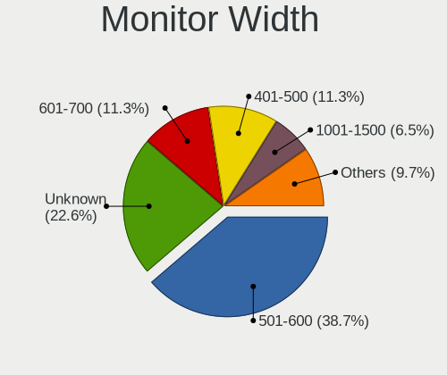

| Width in mm | Desktops | Percent |
|-------------|----------|---------|
| 501-600     | 19       | 39.58%  |
| 401-500     | 10       | 20.83%  |
| Unknown     | 8        | 16.67%  |
| 601-700     | 4        | 8.33%   |
| 1001-1500   | 3        | 6.25%   |
| 801-900     | 2        | 4.17%   |
| 701-800     | 2        | 4.17%   |

Aspect Ratio
------------

Proportional relationship between the width and the height

| Ratio   | Desktops | Percent |
|---------|----------|---------|
| 16/9    | 32       | 74.42%  |
| Unknown | 6        | 13.95%  |
| 16/10   | 3        | 6.98%   |
| 21/9    | 2        | 4.65%   |

Monitor Area
------------

Area in inch²

| Area in inch² | Desktops | Percent |
|----------------|----------|---------|
| 201-250        | 17       | 34.69%  |
| Unknown        | 8        | 16.33%  |
| 351-500        | 6        | 12.24%  |
| 301-350        | 6        | 12.24%  |
| 151-200        | 4        | 8.16%   |
| 501-1000       | 4        | 8.16%   |
| 251-300        | 3        | 6.12%   |
| More than 1000 | 1        | 2.04%   |

Pixel Density
-------------

Pixels per inch

| Density | Desktops | Percent |
|---------|----------|---------|
| 51-100  | 26       | 53.06%  |
| 101-120 | 10       | 20.41%  |
| Unknown | 8        | 16.33%  |
| 1-50    | 3        | 6.12%   |
| 161-240 | 1        | 2.04%   |
| 121-160 | 1        | 2.04%   |

Multiple Monitors
-----------------

Total monitors connected

| Total | Desktops | Percent |
|-------|----------|---------|
| 1     | 34       | 70.83%  |
| 2     | 8        | 16.67%  |
| 3     | 4        | 8.33%   |
| 0     | 2        | 4.17%   |

Network
-------

Net Controller Vendor
---------------------

Controller vendors

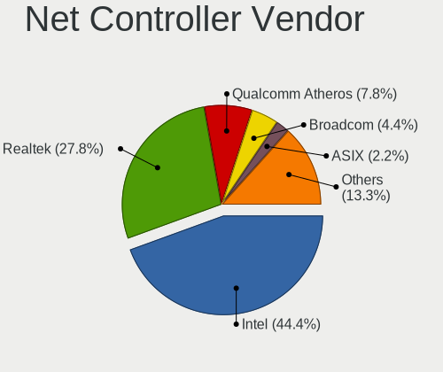

| Vendor                   | Desktops | Percent |
|--------------------------|----------|---------|
| Intel                    | 28       | 41.18%  |
| Realtek Semiconductor    | 20       | 29.41%  |
| Qualcomm Atheros         | 6        | 8.82%   |
| Broadcom                 | 3        | 4.41%   |
| ASIX Electronics         | 2        | 2.94%   |
| Ralink Technology        | 1        | 1.47%   |
| Ralink                   | 1        | 1.47%   |
| Microchip Technology     | 1        | 1.47%   |
| Micro Star International | 1        | 1.47%   |
| MediaTek                 | 1        | 1.47%   |
| Huawei Technologies      | 1        | 1.47%   |
| D-Link                   | 1        | 1.47%   |
| Broadcom Limited         | 1        | 1.47%   |
| Arduino SA               | 1        | 1.47%   |

Net Controller Model
--------------------

Controller models

| Model                                                                         | Desktops | Percent |
|-------------------------------------------------------------------------------|----------|---------|
| Realtek RTL8111/8168/8411 PCI Express Gigabit Ethernet Controller             | 18       | 21.18%  |
| Intel 82579LM Gigabit Network Connection (Lewisville)                         | 5        | 5.88%   |
| Intel I211 Gigabit Network Connection                                         | 4        | 4.71%   |
| Intel 82574L Gigabit Network Connection                                       | 3        | 3.53%   |
| Broadcom BCM4352 802.11ac Wireless Network Adapter                            | 3        | 3.53%   |
| Qualcomm Atheros AR9485 Wireless Network Adapter                              | 2        | 2.35%   |
| Intel I210 Gigabit Network Connection                                         | 2        | 2.35%   |
| Intel Ethernet Connection I217-V                                              | 2        | 2.35%   |
| Intel Ethernet Connection I217-LM                                             | 2        | 2.35%   |
| Intel Ethernet Connection (7) I219-V                                          | 2        | 2.35%   |
| Intel Ethernet Connection (7) I219-LM                                         | 2        | 2.35%   |
| Intel Ethernet Connection (2) I219-V                                          | 2        | 2.35%   |
| Intel Ethernet Connection (2) I219-LM                                         | 2        | 2.35%   |
| Intel Ethernet Connection (2) I218-V                                          | 2        | 2.35%   |
| Intel Ethernet Connection (2) I218-LM                                         | 2        | 2.35%   |
| Intel Cannon Lake PCH CNVi WiFi                                               | 2        | 2.35%   |
| Realtek RTL8723BE PCIe Wireless Network Adapter                               | 1        | 1.18%   |
| Realtek RTL8192EE PCIe Wireless Network Adapter                               | 1        | 1.18%   |
| Realtek RTL8192CE PCIe Wireless Network Adapter                               | 1        | 1.18%   |
| Realtek RTL8188EUS 802.11n Wireless Network Adapter                           | 1        | 1.18%   |
| Realtek RTL8169 PCI Gigabit Ethernet Controller                               | 1        | 1.18%   |
| Realtek RTL8125 2.5GbE Controller                                             | 1        | 1.18%   |
| Ralink RT5572 Wireless Adapter                                                | 1        | 1.18%   |
| Ralink RT3090 Wireless 802.11n 1T/1R PCIe                                     | 1        | 1.18%   |
| Qualcomm Atheros QCA6174 802.11ac Wireless Network Adapter                    | 1        | 1.18%   |
| Qualcomm Atheros Killer E2500 Gigabit Ethernet Controller                     | 1        | 1.18%   |
| Qualcomm Atheros AR9462 Wireless Network Adapter                              | 1        | 1.18%   |
| Qualcomm Atheros AR9227 Wireless Network Adapter                              | 1        | 1.18%   |
| Qualcomm Atheros AR8151 v2.0 Gigabit Ethernet                                 | 1        | 1.18%   |
| Microchip TrueRNG                                                             | 1        | 1.18%   |
| Micro Star International MS-3871 802.11bgn Wireless Module [Ralink RT8070]    | 1        | 1.18%   |
| MediaTek MT7612U 802.11a/b/g/n/ac Wireless Adapter                            | 1        | 1.18%   |
| Intel Wireless-AC 9260                                                        | 1        | 1.18%   |
| Intel Wireless 7260                                                           | 1        | 1.18%   |
| Intel Wi-Fi 6 AX200                                                           | 1        | 1.18%   |
| Intel I350 Gigabit Network Connection                                         | 1        | 1.18%   |
| Intel Ethernet Connection (11) I219-V                                         | 1        | 1.18%   |
| Intel 82579V Gigabit Network Connection                                       | 1        | 1.18%   |
| Intel 82575EB Gigabit Network Connection                                      | 1        | 1.18%   |
| Intel 82571EB/82571GB Gigabit Ethernet Controller D0/D1 (copper applications) | 1        | 1.18%   |
| Huawei Modem/Networkcard                                                      | 1        | 1.18%   |
| D-Link DWA-171 AC600 DB Wireless Adapter(rev.A1) [Realtek RTL8811AU]          | 1        | 1.18%   |
| Broadcom Limited NetXtreme BCM5751 Gigabit Ethernet PCI Express               | 1        | 1.18%   |
| ASIX AX88772A Fast Ethernet                                                   | 1        | 1.18%   |
| ASIX AX88179 Gigabit Ethernet                                                 | 1        | 1.18%   |
| Arduino SA Uno (CDC ACM)                                                      | 1        | 1.18%   |

Wireless Vendor
---------------

Wireless vendors

| Vendor                   | Desktops | Percent |
|--------------------------|----------|---------|
| Qualcomm Atheros         | 5        | 22.73%  |
| Intel                    | 5        | 22.73%  |
| Realtek Semiconductor    | 4        | 18.18%  |
| Broadcom                 | 3        | 13.64%  |
| Ralink Technology        | 1        | 4.55%   |
| Ralink                   | 1        | 4.55%   |
| Micro Star International | 1        | 4.55%   |
| MediaTek                 | 1        | 4.55%   |
| D-Link                   | 1        | 4.55%   |

Wireless Model
--------------

Wireless models

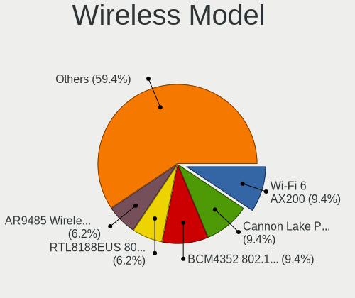

| Model                                                                      | Desktops | Percent |
|----------------------------------------------------------------------------|----------|---------|
| Broadcom BCM4352 802.11ac Wireless Network Adapter                         | 3        | 13.64%  |
| Qualcomm Atheros AR9485 Wireless Network Adapter                           | 2        | 9.09%   |
| Intel Cannon Lake PCH CNVi WiFi                                            | 2        | 9.09%   |
| Realtek RTL8723BE PCIe Wireless Network Adapter                            | 1        | 4.55%   |
| Realtek RTL8192EE PCIe Wireless Network Adapter                            | 1        | 4.55%   |
| Realtek RTL8192CE PCIe Wireless Network Adapter                            | 1        | 4.55%   |
| Realtek RTL8188EUS 802.11n Wireless Network Adapter                        | 1        | 4.55%   |
| Ralink RT5572 Wireless Adapter                                             | 1        | 4.55%   |
| Ralink RT3090 Wireless 802.11n 1T/1R PCIe                                  | 1        | 4.55%   |
| Qualcomm Atheros QCA6174 802.11ac Wireless Network Adapter                 | 1        | 4.55%   |
| Qualcomm Atheros AR9462 Wireless Network Adapter                           | 1        | 4.55%   |
| Qualcomm Atheros AR9227 Wireless Network Adapter                           | 1        | 4.55%   |
| Micro Star International MS-3871 802.11bgn Wireless Module [Ralink RT8070] | 1        | 4.55%   |
| MediaTek MT7612U 802.11a/b/g/n/ac Wireless Adapter                         | 1        | 4.55%   |
| Intel Wireless-AC 9260                                                     | 1        | 4.55%   |
| Intel Wireless 7260                                                        | 1        | 4.55%   |
| Intel Wi-Fi 6 AX200                                                        | 1        | 4.55%   |
| D-Link DWA-171 AC600 DB Wireless Adapter(rev.A1) [Realtek RTL8811AU]       | 1        | 4.55%   |

Ethernet Vendor
---------------

Ethernet vendors

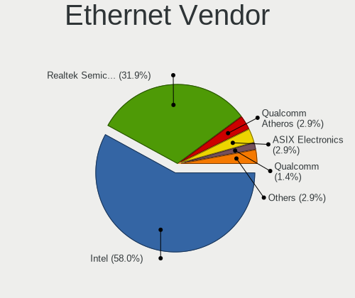

| Vendor                | Desktops | Percent |
|-----------------------|----------|---------|
| Intel                 | 28       | 54.9%   |
| Realtek Semiconductor | 18       | 35.29%  |
| Qualcomm Atheros      | 2        | 3.92%   |
| ASIX Electronics      | 2        | 3.92%   |
| Broadcom Limited      | 1        | 1.96%   |

Ethernet Model
--------------

Ethernet models

| Model                                                                         | Desktops | Percent |
|-------------------------------------------------------------------------------|----------|---------|
| Realtek RTL8111/8168/8411 PCI Express Gigabit Ethernet Controller             | 18       | 30%     |
| Intel 82579LM Gigabit Network Connection (Lewisville)                         | 5        | 8.33%   |
| Intel I211 Gigabit Network Connection                                         | 4        | 6.67%   |
| Intel 82574L Gigabit Network Connection                                       | 3        | 5%      |
| Intel I210 Gigabit Network Connection                                         | 2        | 3.33%   |
| Intel Ethernet Connection I217-V                                              | 2        | 3.33%   |
| Intel Ethernet Connection I217-LM                                             | 2        | 3.33%   |
| Intel Ethernet Connection (7) I219-V                                          | 2        | 3.33%   |
| Intel Ethernet Connection (7) I219-LM                                         | 2        | 3.33%   |
| Intel Ethernet Connection (2) I219-V                                          | 2        | 3.33%   |
| Intel Ethernet Connection (2) I219-LM                                         | 2        | 3.33%   |
| Intel Ethernet Connection (2) I218-V                                          | 2        | 3.33%   |
| Intel Ethernet Connection (2) I218-LM                                         | 2        | 3.33%   |
| Realtek RTL8169 PCI Gigabit Ethernet Controller                               | 1        | 1.67%   |
| Realtek RTL8125 2.5GbE Controller                                             | 1        | 1.67%   |
| Qualcomm Atheros Killer E2500 Gigabit Ethernet Controller                     | 1        | 1.67%   |
| Qualcomm Atheros AR8151 v2.0 Gigabit Ethernet                                 | 1        | 1.67%   |
| Intel I350 Gigabit Network Connection                                         | 1        | 1.67%   |
| Intel Ethernet Connection (11) I219-V                                         | 1        | 1.67%   |
| Intel 82579V Gigabit Network Connection                                       | 1        | 1.67%   |
| Intel 82575EB Gigabit Network Connection                                      | 1        | 1.67%   |
| Intel 82571EB/82571GB Gigabit Ethernet Controller D0/D1 (copper applications) | 1        | 1.67%   |
| Broadcom Limited NetXtreme BCM5751 Gigabit Ethernet PCI Express               | 1        | 1.67%   |
| ASIX AX88772A Fast Ethernet                                                   | 1        | 1.67%   |
| ASIX AX88179 Gigabit Ethernet                                                 | 1        | 1.67%   |

Net Controller Kind
-------------------

Ethernet, WiFi or modem

| Kind     | Desktops | Percent |
|----------|----------|---------|
| Ethernet | 44       | 63.77%  |
| WiFi     | 22       | 31.88%  |
| Modem    | 3        | 4.35%   |

Used Controller
---------------

Currently used network controller

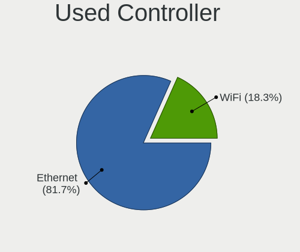

| Kind     | Desktops | Percent |
|----------|----------|---------|
| Ethernet | 41       | 73.21%  |
| WiFi     | 15       | 26.79%  |

NICs
----

Total network controllers on board

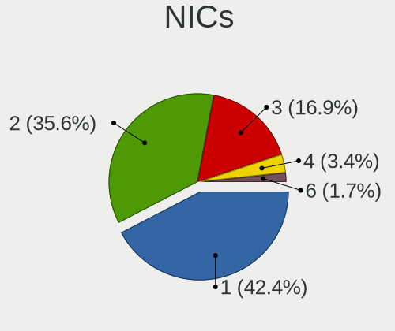

| Total | Desktops | Percent |
|-------|----------|---------|
| 1     | 21       | 46.67%  |
| 2     | 14       | 31.11%  |
| 3     | 8        | 17.78%  |
| 6     | 1        | 2.22%   |
| 4     | 1        | 2.22%   |

IPv6
----

IPv6 vs IPv4

| Used | Desktops | Percent |
|------|----------|---------|
| No   | 39       | 86.67%  |
| Yes  | 6        | 13.33%  |

Bluetooth
---------

Bluetooth Vendor
----------------

Controller vendors

| Vendor                          | Desktops | Percent |
|---------------------------------|----------|---------|
| Intel                           | 4        | 23.53%  |
| Cambridge Silicon Radio         | 4        | 23.53%  |
| Realtek Semiconductor           | 2        | 11.76%  |
| Qualcomm Atheros Communications | 2        | 11.76%  |
| ASUSTek Computer                | 2        | 11.76%  |
| Micro Star International        | 1        | 5.88%   |
| IMC Networks                    | 1        | 5.88%   |
| Broadcom                        | 1        | 5.88%   |

Bluetooth Model
---------------

Controller models

| Model                                               | Desktops | Percent |
|-----------------------------------------------------|----------|---------|
| Cambridge Silicon Radio Bluetooth Dongle (HCI mode) | 4        | 23.53%  |
| Realtek Bluetooth Radio                             | 2        | 11.76%  |
| Qualcomm Atheros  Bluetooth Device                  | 2        | 11.76%  |
| Intel Bluetooth 9460/9560 Jefferson Peak (JfP)      | 2        | 11.76%  |
| ASUS BCM20702A0                                     | 2        | 11.76%  |
| Micro Star International Bluetooth Device           | 1        | 5.88%   |
| Intel Wireless-AC 9260 Bluetooth Adapter            | 1        | 5.88%   |
| Intel Bluetooth Device                              | 1        | 5.88%   |
| IMC Networks BCM20702A0                             | 1        | 5.88%   |
| Broadcom BCM20702A0 Bluetooth 4.0                   | 1        | 5.88%   |

Sound
-----

Sound Vendor
------------

Sound card vendors

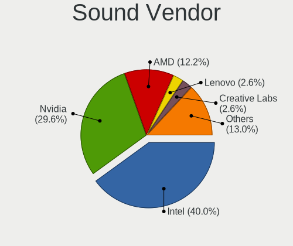

| Vendor              | Desktops | Percent |
|---------------------|----------|---------|
| Intel               | 34       | 41.46%  |
| Nvidia              | 25       | 30.49%  |
| AMD                 | 9        | 10.98%  |
| Creative Labs       | 3        | 3.66%   |
| Lenovo              | 2        | 2.44%   |
| Texas Instruments   | 1        | 1.22%   |
| Tenx Technology     | 1        | 1.22%   |
| RODE Microphones    | 1        | 1.22%   |
| Plantronics         | 1        | 1.22%   |
| Logitech            | 1        | 1.22%   |
| JMTek               | 1        | 1.22%   |
| DYNEX               | 1        | 1.22%   |
| Creative Technology | 1        | 1.22%   |
| ASUSTek Computer    | 1        | 1.22%   |

Sound Model
-----------

Sound card models

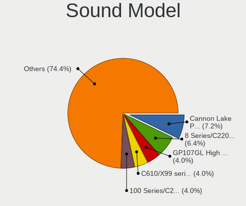

| Model                                                                      | Desktops | Percent |
|----------------------------------------------------------------------------|----------|---------|
| Intel Cannon Lake PCH cAVS                                                 | 7        | 7.78%   |
| Intel 8 Series/C220 Series Chipset High Definition Audio Controller        | 6        | 6.67%   |
| Nvidia GP107GL High Definition Audio Controller                            | 4        | 4.44%   |
| Intel C610/X99 series chipset HD Audio Controller                          | 4        | 4.44%   |
| Intel 7 Series/C216 Chipset Family High Definition Audio Controller        | 4        | 4.44%   |
| Nvidia GP106 High Definition Audio Controller                              | 3        | 3.33%   |
| Nvidia GF108 High Definition Audio Controller                              | 3        | 3.33%   |
| Intel Xeon E3-1200 v3/4th Gen Core Processor HD Audio Controller           | 3        | 3.33%   |
| Intel C600/X79 series chipset High Definition Audio Controller             | 3        | 3.33%   |
| Intel 100 Series/C230 Series Chipset Family HD Audio Controller            | 3        | 3.33%   |
| Nvidia TU116 High Definition Audio Controller                              | 2        | 2.22%   |
| Nvidia GM204 High Definition Audio Controller                              | 2        | 2.22%   |
| Nvidia GK208 HDMI/DP Audio Controller                                      | 2        | 2.22%   |
| Lenovo Thinkcentre TIO24Gen3 for USB-audio                                 | 2        | 2.22%   |
| Intel 9 Series Chipset Family HD Audio Controller                          | 2        | 2.22%   |
| Intel 200 Series PCH HD Audio                                              | 2        | 2.22%   |
| AMD Starship/Matisse HD Audio Controller                                   | 2        | 2.22%   |
| AMD Raven/Raven2/Fenghuang HDMI/DP Audio Controller                        | 2        | 2.22%   |
| AMD Family 17h (Models 10h-1fh) HD Audio Controller                        | 2        | 2.22%   |
| AMD Family 17h (Models 00h-0fh) HD Audio Controller                        | 2        | 2.22%   |
| Texas Instruments PCM2902 Audio Codec                                      | 1        | 1.11%   |
| Tenx Technology USB AUDIO                                                  | 1        | 1.11%   |
| RODE Microphones RODE NT-USB                                               | 1        | 1.11%   |
| Plantronics BT600                                                          | 1        | 1.11%   |
| Nvidia TU106 High Definition Audio Controller                              | 1        | 1.11%   |
| Nvidia TU104 HD Audio Controller                                           | 1        | 1.11%   |
| Nvidia GP104 High Definition Audio Controller                              | 1        | 1.11%   |
| Nvidia GP102 HDMI Audio Controller                                         | 1        | 1.11%   |
| Nvidia GM206 High Definition Audio Controller                              | 1        | 1.11%   |
| Nvidia GM107 High Definition Audio Controller [GeForce 940MX]              | 1        | 1.11%   |
| Nvidia GK106 HDMI Audio Controller                                         | 1        | 1.11%   |
| Nvidia GK104 HDMI Audio Controller                                         | 1        | 1.11%   |
| Nvidia GF114 HDMI Audio Controller                                         | 1        | 1.11%   |
| Nvidia GF110 High Definition Audio Controller                              | 1        | 1.11%   |
| Logitech H570e Mono                                                        | 1        | 1.11%   |
| JMTek USB Speaker                                                          | 1        | 1.11%   |
| Intel Sunrise Point-LP HD Audio                                            | 1        | 1.11%   |
| Intel Comet Lake PCH cAVS                                                  | 1        | 1.11%   |
| Intel 6 Series/C200 Series Chipset Family High Definition Audio Controller | 1        | 1.11%   |
| DYNEX USB MIC Device                                                       | 1        | 1.11%   |
| Creative Technology Sound Blaster Tactic(3D) Alpha                         | 1        | 1.11%   |
| Creative Labs Sound Core3D [Sound Blaster Recon3D / Z-Series]              | 1        | 1.11%   |
| Creative Labs EMU20k2 [Sound Blaster X-Fi Titanium Series]                 | 1        | 1.11%   |
| Creative Labs CA0110 [Sound Blaster X-Fi Xtreme Audio]                     | 1        | 1.11%   |
| ASUSTek Computer Xonar U3 sound card                                       | 1        | 1.11%   |
| AMD Vega 10 HDMI Audio [Radeon Vega 56/64]                                 | 1        | 1.11%   |
| AMD Tahiti HDMI Audio [Radeon HD 7870 XT / 7950/7970]                      | 1        | 1.11%   |
| AMD SBx00 Azalia (Intel HDA)                                               | 1        | 1.11%   |
| AMD Oland/Hainan/Cape Verde/Pitcairn HDMI Audio [Radeon HD 7000 Series]    | 1        | 1.11%   |
| AMD Baffin HDMI/DP Audio [Radeon RX 550 640SP / RX 560/560X]               | 1        | 1.11%   |

Memory
------

Memory Vendor
-------------

Memory module vendors

| Vendor              | Desktops | Percent |
|---------------------|----------|---------|
| Samsung Electronics | 5        | 21.74%  |
| Crucial             | 5        | 21.74%  |
| Corsair             | 3        | 13.04%  |
| SK Hynix            | 2        | 8.7%    |
| Micron Technology   | 2        | 8.7%    |
| Kingston            | 2        | 8.7%    |
| Unknown (0x0205)    | 1        | 4.35%   |
| Transcend           | 1        | 4.35%   |
| Patriot             | 1        | 4.35%   |
| GOODRAM             | 1        | 4.35%   |

Memory Model
------------

Memory module models

| Model                                                     | Desktops | Percent |
|-----------------------------------------------------------|----------|---------|
| Samsung RAM M378A2K43CB1-CTD 16GB DIMM DDR4 2667MT/s      | 2        | 7.41%   |
| Corsair RAM CMK64GX4M2D3600C18 32GB DIMM DDR4 3600MT/s    | 2        | 7.41%   |
| Unknown (0x0205) RAM Module 8GB DIMM DDR3 1600MT/s        | 1        | 3.7%    |
| Transcend RAM TS1GLK72V3H 8GB DIMM DDR3 1333MT/s          | 1        | 3.7%    |
| SK Hynix RAM HMT351S6EFR8C-PB 4096MB DIMM DDR3 1333MT/s   | 1        | 3.7%    |
| SK Hynix RAM HMT351S6CFR8C-H9 4096MB DIMM DDR3 1333MT/s   | 1        | 3.7%    |
| SK Hynix RAM HMA851U6CJR6N-VK 4GB DIMM DDR4 2667MT/s      | 1        | 3.7%    |
| Samsung RAM Module 8GB DIMM DDR4 2666MT/s                 | 1        | 3.7%    |
| Samsung RAM Module 4GB DIMM DDR4 2133MT/s                 | 1        | 3.7%    |
| Samsung RAM Module 16GB DIMM DDR4 2666MT/s                | 1        | 3.7%    |
| Samsung RAM M378B5673FH0-CH9 2GB DIMM DDR3 1600MT/s       | 1        | 3.7%    |
| Samsung RAM M378A1K43CB2-CTD 8192MB DIMM DDR4 3200MT/s    | 1        | 3.7%    |
| Patriot RAM PSD416G26662 16GB DIMM DDR4 2667MT/s          | 1        | 3.7%    |
| Micron RAM Module 4GB DIMM DDR4 2133MT/s                  | 1        | 3.7%    |
| Micron RAM 36ASF4G72PZ-2G3B1 32GB DIMM DDR4 2400MT/s      | 1        | 3.7%    |
| Kingston RAM KHX2666C13/16GX 16384MB DIMM DDR4 3200MT/s   | 1        | 3.7%    |
| Kingston RAM 9905712-034.A00G 16GB SODIMM DDR4 2400MT/s   | 1        | 3.7%    |
| GOODRAM RAM GR1600D364L11S/4G 4GB DIMM DDR3 1600MT/s      | 1        | 3.7%    |
| Crucial RAM CT51264BA160BJ.M8F 4GB DIMM DDR3 1600MT/s     | 1        | 3.7%    |
| Crucial RAM CT4G4DFS824A.M8FG 4GB DIMM DDR4 2400MT/s      | 1        | 3.7%    |
| Crucial RAM CT16G4DFD824A.C16FBD 16GB DIMM DDR4 2933MT/s  | 1        | 3.7%    |
| Crucial RAM BLS4G4D240FSB.8FBD2 4096MB DIMM DDR4 2400MT/s | 1        | 3.7%    |
| Crucial RAM BLS4G4D240FSB.8FBD 4096MB DIMM DDR4 2400MT/s  | 1        | 3.7%    |
| Crucial RAM BLS4G3D1609DS1S00. 4GB DIMM DDR3 1600MT/s     | 1        | 3.7%    |
| Corsair RAM CMZ16GX3M2A1600C10 8192MB DIMM DDR3 1600MT/s  | 1        | 3.7%    |

Memory Kind
-----------

Memory module kinds

| Kind  | Desktops | Percent |
|-------|----------|---------|
| DDR4  | 11       | 61.11%  |
| DDR3  | 6        | 33.33%  |
| SDRAM | 1        | 5.56%   |

Memory Form Factor
------------------

Physical design of the memory module

| Name   | Desktops | Percent |
|--------|----------|---------|
| DIMM   | 17       | 94.44%  |
| SODIMM | 1        | 5.56%   |

Memory Size
-----------

Memory module size

| Size  | Desktops | Percent |
|-------|----------|---------|
| 4096  | 7        | 33.33%  |
| 16384 | 5        | 23.81%  |
| 8192  | 5        | 23.81%  |
| 32768 | 3        | 14.29%  |
| 2048  | 1        | 4.76%   |

Memory Speed
------------

Memory module speed

| Speed | Desktops | Percent |
|-------|----------|---------|
| 1600  | 5        | 25%     |
| 2400  | 4        | 20%     |
| 2667  | 3        | 15%     |
| 3600  | 2        | 10%     |
| 1333  | 2        | 10%     |
| 3200  | 1        | 5%      |
| 2933  | 1        | 5%      |
| 2666  | 1        | 5%      |
| 2133  | 1        | 5%      |

Printers & scanners
-------------------

Printer Vendor
--------------

Printer device vendors

| Vendor             | Desktops | Percent |
|--------------------|----------|---------|
| Canon              | 2        | 50%     |
| Hewlett-Packard    | 1        | 25%     |
| Brother Industries | 1        | 25%     |

Printer Model
-------------

Printer device models

| Model                            | Desktops | Percent |
|----------------------------------|----------|---------|
| HP LaserJet Professional P 1102w | 1        | 25%     |
| Canon E560 series                | 1        | 25%     |
| Canon CanoScan LiDE 300          | 1        | 25%     |
| Brother DCP-1610W                | 1        | 25%     |

Scanner Vendor
--------------

Scanner device vendors

Zero info for selected period =(

Scanner Model
-------------

Scanner device models

Zero info for selected period =(

Camera
------

Camera Vendor
-------------

Camera device vendors

| Vendor            | Desktops | Percent |
|-------------------|----------|---------|
| Unknown           | 2        | 28.57%  |
| Logitech          | 2        | 28.57%  |
| Ruision           | 1        | 14.29%  |
| Jieli Technology  | 1        | 14.29%  |
| ARC International | 1        | 14.29%  |

Camera Model
------------

Camera device models

| Model                        | Desktops | Percent |
|------------------------------|----------|---------|
| Unknown FULL HD 1080P Webcam | 2        | 28.57%  |
| Ruision UVC Camera           | 1        | 14.29%  |
| Logitech Webcam C270         | 1        | 14.29%  |
| Logitech HD Webcam C910      | 1        | 14.29%  |
| Jieli USB PHY 2.0            | 1        | 14.29%  |
| ARC International Camera     | 1        | 14.29%  |

Security
--------

Fingerprint Vendor
------------------

Fingerprint sensor vendors

Zero info for selected period =(

Fingerprint Model
-----------------

Fingerprint sensor models

Zero info for selected period =(

Chipcard Vendor
---------------

Chipcard module vendors

| Vendor                | Desktops | Percent |
|-----------------------|----------|---------|
| SCM Microsystems      | 1        | 50%     |
| Gemalto (was Gemplus) | 1        | 50%     |

Chipcard Model
--------------

Chipcard module models

| Model                                                  | Desktops | Percent |
|--------------------------------------------------------|----------|---------|
| SCM Microsystems SCR331-LC1 / SCR3310 SmartCard Reader | 1        | 50%     |
| Gemalto (was Gemplus) GemPC Twin SmartCard Reader      | 1        | 50%     |

Unsupported
-----------

Unsupported Devices
-------------------

Total unsupported devices on board

| Total | Desktops | Percent |
|-------|----------|---------|
| 0     | 37       | 84.09%  |
| 1     | 4        | 9.09%   |
| 2     | 3        | 6.82%   |

Unsupported Device Types
------------------------

Types of unsupported devices

| Type                     | Desktops | Percent |
|--------------------------|----------|---------|
| Unassigned class         | 5        | 50%     |
| Net/wireless             | 3        | 30%     |
| Storage/ide              | 1        | 10%     |
| Communication controller | 1        | 10%     |

