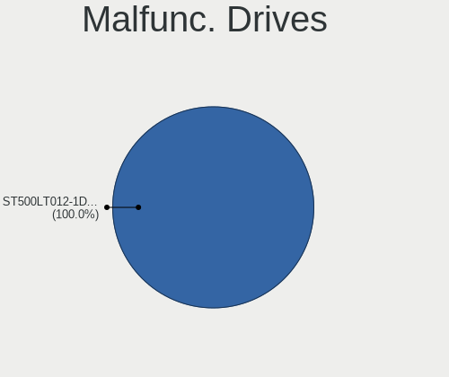

RHEL 8 - Tested Hardware & Statistics (Notebooks)
-------------------------------------------------

A project to collect tested hardware configurations for RHEL 8.

Anyone can contribute to this report by the [hw-probe](https://github.com/linuxhw/hw-probe) tool:

    sudo -E hw-probe -all -upload

Please contribute! Especially if your hardware is rare.

Contents
--------

* [ Test Cases ](#test-cases)

* [ System ](#system)
  - [ Kernel                   ](#kernel)
  - [ Kernel Family            ](#kernel-family)
  - [ Kernel Major Ver.        ](#kernel-major-ver)
  - [ Arch                     ](#arch)
  - [ DE                       ](#de)
  - [ Display Server           ](#display-server)
  - [ Display Manager          ](#display-manager)
  - [ OS Lang                  ](#os-lang)
  - [ Boot Mode                ](#boot-mode)
  - [ Filesystem               ](#filesystem)
  - [ Part. scheme             ](#part-scheme)
  - [ Dual Boot with Linux/BSD ](#dual-boot-with-linuxbsd)
  - [ Dual Boot (Win)          ](#dual-boot-win)

* [ Board ](#board)
  - [ Vendor                   ](#vendor)
  - [ Model                    ](#model)
  - [ Model Family             ](#model-family)
  - [ MFG Year                 ](#mfg-year)
  - [ Form Factor              ](#form-factor)
  - [ Secure Boot              ](#secure-boot)
  - [ Coreboot                 ](#coreboot)
  - [ RAM Size                 ](#ram-size)
  - [ RAM Used                 ](#ram-used)
  - [ Total Drives             ](#total-drives)
  - [ Has CD-ROM               ](#has-cd-rom)
  - [ Has Ethernet             ](#has-ethernet)
  - [ Has WiFi                 ](#has-wifi)
  - [ Has Bluetooth            ](#has-bluetooth)

* [ Location ](#location)
  - [ Country                  ](#country)
  - [ City                     ](#city)

* [ Drives ](#drives)
  - [ Drive Vendor             ](#drive-vendor)
  - [ Drive Model              ](#drive-model)
  - [ HDD Vendor               ](#hdd-vendor)
  - [ SSD Vendor               ](#ssd-vendor)
  - [ Drive Kind               ](#drive-kind)
  - [ Drive Connector          ](#drive-connector)
  - [ Drive Size               ](#drive-size)
  - [ Space Total              ](#space-total)
  - [ Space Used               ](#space-used)
  - [ Malfunc. Drives          ](#malfunc-drives)
  - [ Malfunc. Drive Vendor    ](#malfunc-drive-vendor)
  - [ Malfunc. HDD Vendor      ](#malfunc-hdd-vendor)
  - [ Malfunc. Drive Kind      ](#malfunc-drive-kind)
  - [ Failed Drives            ](#failed-drives)
  - [ Failed Drive Vendor      ](#failed-drive-vendor)
  - [ Drive Status             ](#drive-status)

* [ Storage controller ](#storage-controller)
  - [ Storage Vendor           ](#storage-vendor)
  - [ Storage Model            ](#storage-model)
  - [ Storage Kind             ](#storage-kind)

* [ Processor ](#processor)
  - [ CPU Vendor               ](#cpu-vendor)
  - [ CPU Model                ](#cpu-model)
  - [ CPU Model Family         ](#cpu-model-family)
  - [ CPU Cores                ](#cpu-cores)
  - [ CPU Sockets              ](#cpu-sockets)
  - [ CPU Threads              ](#cpu-threads)
  - [ CPU Op-Modes             ](#cpu-op-modes)
  - [ CPU Microcode            ](#cpu-microcode)
  - [ CPU Microarch            ](#cpu-microarch)

* [ Graphics ](#graphics)
  - [ GPU Vendor               ](#gpu-vendor)
  - [ GPU Model                ](#gpu-model)
  - [ GPU Combo                ](#gpu-combo)
  - [ GPU Driver               ](#gpu-driver)
  - [ GPU Memory               ](#gpu-memory)

* [ Monitor ](#monitor)
  - [ Monitor Vendor           ](#monitor-vendor)
  - [ Monitor Model            ](#monitor-model)
  - [ Monitor Resolution       ](#monitor-resolution)
  - [ Monitor Diagonal         ](#monitor-diagonal)
  - [ Monitor Width            ](#monitor-width)
  - [ Aspect Ratio             ](#aspect-ratio)
  - [ Monitor Area             ](#monitor-area)
  - [ Pixel Density            ](#pixel-density)
  - [ Multiple Monitors        ](#multiple-monitors)

* [ Network ](#network)
  - [ Net Controller Vendor    ](#net-controller-vendor)
  - [ Net Controller Model     ](#net-controller-model)
  - [ Wireless Vendor          ](#wireless-vendor)
  - [ Wireless Model           ](#wireless-model)
  - [ Ethernet Vendor          ](#ethernet-vendor)
  - [ Ethernet Model           ](#ethernet-model)
  - [ Net Controller Kind      ](#net-controller-kind)
  - [ Used Controller          ](#used-controller)
  - [ NICs                     ](#nics)
  - [ IPv6                     ](#ipv6)

* [ Bluetooth ](#bluetooth)
  - [ Bluetooth Vendor         ](#bluetooth-vendor)
  - [ Bluetooth Model          ](#bluetooth-model)

* [ Sound ](#sound)
  - [ Sound Vendor             ](#sound-vendor)
  - [ Sound Model              ](#sound-model)

* [ Memory ](#memory)
  - [ Memory Vendor            ](#memory-vendor)
  - [ Memory Model             ](#memory-model)
  - [ Memory Kind              ](#memory-kind)
  - [ Memory Form Factor       ](#memory-form-factor)
  - [ Memory Size              ](#memory-size)
  - [ Memory Speed             ](#memory-speed)

* [ Printers & scanners ](#printers--scanners)
  - [ Printer Vendor           ](#printer-vendor)
  - [ Printer Model            ](#printer-model)
  - [ Scanner Vendor           ](#scanner-vendor)
  - [ Scanner Model            ](#scanner-model)

* [ Camera ](#camera)
  - [ Camera Vendor            ](#camera-vendor)
  - [ Camera Model             ](#camera-model)

* [ Security ](#security)
  - [ Fingerprint Vendor       ](#fingerprint-vendor)
  - [ Fingerprint Model        ](#fingerprint-model)
  - [ Chipcard Vendor          ](#chipcard-vendor)
  - [ Chipcard Model           ](#chipcard-model)

* [ Unsupported ](#unsupported)
  - [ Unsupported Devices      ](#unsupported-devices)
  - [ Unsupported Device Types ](#unsupported-device-types)

Test Cases
----------

Total: 205

| Vendor  | Model                       | Probe                                                      | Date         |
|---------|-----------------------------|------------------------------------------------------------|--------------|
| Lenovo  | ThinkPad X1 Extreme Gen ... | [7a11752435](https://linux-hardware.org/?probe=7a11752435) | Sep 11, 2024 |
| Lenovo  | ThinkPad X1 Carbon Gen 8... | [37e0d80500](https://linux-hardware.org/?probe=37e0d80500) | Jul 12, 2024 |
| Dell    | Latitude 5340               | [f8bada88dd](https://linux-hardware.org/?probe=f8bada88dd) | Jun 15, 2024 |
| HP      | ZBook Fury 16 G9 Mobile ... | [10ff3b22cf](https://linux-hardware.org/?probe=10ff3b22cf) | Apr 03, 2024 |
| HP      | ZBook Fury 16 G9 Mobile ... | [896bd3d75a](https://linux-hardware.org/?probe=896bd3d75a) | Apr 03, 2024 |
| HP      | ZBook Fury 15 G7 Mobile ... | [59749a8b22](https://linux-hardware.org/?probe=59749a8b22) | Mar 17, 2024 |
| ASUSTek | VivoBook_ASUSLaptop M340... | [24f8aa7cd0](https://linux-hardware.org/?probe=24f8aa7cd0) | Mar 07, 2024 |
| Dell    | Latitude 5340               | [c9d3b3d7a7](https://linux-hardware.org/?probe=c9d3b3d7a7) | Dec 19, 2023 |
| Lenovo  | ThinkPad T14s Gen 1 20T1... | [5c4714ecce](https://linux-hardware.org/?probe=5c4714ecce) | Dec 01, 2023 |
| Dell    | Latitude 5420               | [f2bb4ee9f0](https://linux-hardware.org/?probe=f2bb4ee9f0) | Sep 23, 2023 |
| HP      | ProBook 640 G2              | [c0af84c629](https://linux-hardware.org/?probe=c0af84c629) | Sep 02, 2023 |
| HP      | Laptop 15-bs0xx             | [5f2a27253a](https://linux-hardware.org/?probe=5f2a27253a) | Aug 21, 2023 |
| HP      | Laptop 15-bs0xx             | [5e76f9bfc3](https://linux-hardware.org/?probe=5e76f9bfc3) | Aug 21, 2023 |
| ASUSTek | X550ZA                      | [cc243873e2](https://linux-hardware.org/?probe=cc243873e2) | Mar 26, 2023 |
| ASUSTek | X550ZA                      | [2e55d2163a](https://linux-hardware.org/?probe=2e55d2163a) | Mar 26, 2023 |
| Lenovo  | ThinkPad P1 Gen 4i 20Y4S... | [52e2d79bad](https://linux-hardware.org/?probe=52e2d79bad) | Mar 01, 2023 |
| Lenovo  | ThinkPad E15 Gen 2 20T80... | [1ce9430009](https://linux-hardware.org/?probe=1ce9430009) | Feb 27, 2023 |
| Lenovo  | ThinkPad E15 Gen 2 20T80... | [0d1a7d0dbe](https://linux-hardware.org/?probe=0d1a7d0dbe) | Feb 20, 2023 |
| Lenovo  | ThinkPad X1 Carbon Gen 9... | [affa3bb9f1](https://linux-hardware.org/?probe=affa3bb9f1) | Feb 19, 2023 |
| Lenovo  | ThinkPad T480s 20L8S2N80... | [2a4e6ab2d4](https://linux-hardware.org/?probe=2a4e6ab2d4) | Feb 07, 2023 |
| Getac   | S410G4                      | [81b80297ab](https://linux-hardware.org/?probe=81b80297ab) | Feb 06, 2023 |
| Getac   | S410G4                      | [1d8e6ad383](https://linux-hardware.org/?probe=1d8e6ad383) | Feb 06, 2023 |
| Lenovo  | ThinkPad T14 Gen 2i 20W1... | [701a355d37](https://linux-hardware.org/?probe=701a355d37) | Feb 04, 2023 |
| Lenovo  | ThinkPad P17 Gen 2i 20YU... | [34169c74c5](https://linux-hardware.org/?probe=34169c74c5) | Dec 31, 2022 |
| HP      | EliteBook 2570p             | [199df541f2](https://linux-hardware.org/?probe=199df541f2) | Dec 21, 2022 |
| Lenovo  | ThinkPad P1 Gen 3 20TJS2... | [64fb254a64](https://linux-hardware.org/?probe=64fb254a64) | Nov 17, 2022 |
| Lenovo  | ThinkPad P1 Gen 3 20TJS2... | [de9e18e6ca](https://linux-hardware.org/?probe=de9e18e6ca) | Nov 14, 2022 |
| Lenovo  | ThinkPad T14 Gen 1 20S1S... | [24d91cf27b](https://linux-hardware.org/?probe=24d91cf27b) | Oct 30, 2022 |
| Lenovo  | ThinkPad P17 Gen 2i 20YU... | [8656acec04](https://linux-hardware.org/?probe=8656acec04) | Sep 14, 2022 |
| Lenovo  | ThinkPad P17 Gen 2i 20YU... | [23649c49e3](https://linux-hardware.org/?probe=23649c49e3) | Sep 14, 2022 |
| Lenovo  | ThinkPad P17 Gen 2i 20YU... | [3df0bebc37](https://linux-hardware.org/?probe=3df0bebc37) | Aug 03, 2022 |
| Lenovo  | ThinkPad E15 Gen 2 20T80... | [2566bb66dd](https://linux-hardware.org/?probe=2566bb66dd) | Jul 12, 2022 |
| Lenovo  | ThinkPad P17 Gen 2i 20YU... | [71c31086e6](https://linux-hardware.org/?probe=71c31086e6) | Jul 11, 2022 |
| Lenovo  | ThinkPad P17 Gen 2i 20YU... | [714c212f51](https://linux-hardware.org/?probe=714c212f51) | Jul 08, 2022 |
| Lenovo  | ThinkPad T14s Gen 1 20T1... | [7e2ddf75e5](https://linux-hardware.org/?probe=7e2ddf75e5) | Jun 30, 2022 |
| Lenovo  | ThinkPad T480 20L60034MX    | [179d10e315](https://linux-hardware.org/?probe=179d10e315) | Jun 21, 2022 |
| Lenovo  | ThinkPad T14s Gen 1 20T1... | [d77ce7a3f7](https://linux-hardware.org/?probe=d77ce7a3f7) | Jun 13, 2022 |
| Lenovo  | ThinkPad T15 Gen 2i 20W5... | [8ee33363ef](https://linux-hardware.org/?probe=8ee33363ef) | May 30, 2022 |
| Lenovo  | Legion 5 15ACH6 82JW        | [9a3948a7e8](https://linux-hardware.org/?probe=9a3948a7e8) | May 23, 2022 |
| Lenovo  | Legion 5 15ACH6 82JW        | [2e520c1e13](https://linux-hardware.org/?probe=2e520c1e13) | May 23, 2022 |
| Lenovo  | Legion 5 15ACH6 82JW        | [9be915450d](https://linux-hardware.org/?probe=9be915450d) | May 23, 2022 |
| Lenovo  | ThinkPad T14s Gen 1 20T1... | [0b0ffcbfee](https://linux-hardware.org/?probe=0b0ffcbfee) | May 13, 2022 |
| ASUSTek | VivoBook_ASUSLaptop X409... | [61e54407f3](https://linux-hardware.org/?probe=61e54407f3) | May 04, 2022 |
| ASUSTek | VivoBook_ASUSLaptop X409... | [7d0cabeccf](https://linux-hardware.org/?probe=7d0cabeccf) | May 04, 2022 |
| Lenovo  | ThinkPad T480 20L6S29D02    | [1eb07120eb](https://linux-hardware.org/?probe=1eb07120eb) | Apr 29, 2022 |
| Lenovo  | ThinkPad T14 Gen 1 20S1S... | [a3ddc714b0](https://linux-hardware.org/?probe=a3ddc714b0) | Apr 28, 2022 |
| Lenovo  | ThinkPad T590 20N5S2NC0V    | [d6bf3c27ef](https://linux-hardware.org/?probe=d6bf3c27ef) | Apr 20, 2022 |
| Dell    | Precision 5550              | [949f4a7658](https://linux-hardware.org/?probe=949f4a7658) | Apr 19, 2022 |
| Lenovo  | ThinkPad P17 Gen 2i 20YU... | [7763003308](https://linux-hardware.org/?probe=7763003308) | Mar 31, 2022 |
| Dell    | Precision 7560              | [2abd72978c](https://linux-hardware.org/?probe=2abd72978c) | Mar 29, 2022 |
| Lenovo  | ThinkPad P17 Gen 2i 20YU... | [14ea45c4d7](https://linux-hardware.org/?probe=14ea45c4d7) | Mar 03, 2022 |
| Lenovo  | ThinkPad P1 Gen 3 20TJS2... | [eed6e0f012](https://linux-hardware.org/?probe=eed6e0f012) | Mar 01, 2022 |
| Lenovo  | Z40-70 20366                | [5210de65b3](https://linux-hardware.org/?probe=5210de65b3) | Feb 27, 2022 |
| Lenovo  | ThinkPad T14s Gen 1 20T1... | [081fe975ce](https://linux-hardware.org/?probe=081fe975ce) | Feb 07, 2022 |
| Lenovo  | ThinkPad X1 Yoga 1st 20F... | [7b31f4ca0b](https://linux-hardware.org/?probe=7b31f4ca0b) | Feb 05, 2022 |
| Lenovo  | ThinkPad P17 Gen 2i 20YU... | [b3ef38d0ef](https://linux-hardware.org/?probe=b3ef38d0ef) | Jan 31, 2022 |
| Lenovo  | ThinkPad T490 20N3S5DV0S    | [e619ec0303](https://linux-hardware.org/?probe=e619ec0303) | Jan 31, 2022 |
| Lenovo  | ThinkPad P17 Gen 2i 20YU... | [a60504e123](https://linux-hardware.org/?probe=a60504e123) | Jan 29, 2022 |
| HP      | EliteBook 8460p             | [335a0c0490](https://linux-hardware.org/?probe=335a0c0490) | Jan 28, 2022 |
| ASUSTek | X550VX                      | [d7ef034908](https://linux-hardware.org/?probe=d7ef034908) | Jan 03, 2022 |
| Toshiba | Satellite Pro R50-C         | [012f2de3d5](https://linux-hardware.org/?probe=012f2de3d5) | Dec 28, 2021 |
| Toshiba | Satellite Pro R50-C         | [2e716df6c6](https://linux-hardware.org/?probe=2e716df6c6) | Dec 26, 2021 |
| Dell    | Precision 3551              | [cbddfb522a](https://linux-hardware.org/?probe=cbddfb522a) | Dec 21, 2021 |
| Lenovo  | ThinkPad P52 20MAS17205     | [86d1d49f33](https://linux-hardware.org/?probe=86d1d49f33) | Dec 09, 2021 |
| Lenovo  | ThinkPad P17 Gen 2i 20YU... | [ba46713703](https://linux-hardware.org/?probe=ba46713703) | Dec 07, 2021 |
| Acer    | Nitro AN515-54              | [cda3dbe636](https://linux-hardware.org/?probe=cda3dbe636) | Dec 04, 2021 |
| Lenovo  | ThinkPad P1 Gen 3 20TJS2... | [a4e5f602c4](https://linux-hardware.org/?probe=a4e5f602c4) | Dec 01, 2021 |
| Lenovo  | ThinkPad P17 Gen 2i 20YU... | [7cb04612a2](https://linux-hardware.org/?probe=7cb04612a2) | Nov 30, 2021 |
| Lenovo  | ThinkPad P17 Gen 2i 20YU... | [90eea91b30](https://linux-hardware.org/?probe=90eea91b30) | Nov 27, 2021 |
| HP      | EliteBook 840 G8 Noteboo... | [19fc23d020](https://linux-hardware.org/?probe=19fc23d020) | Nov 27, 2021 |
| Lenovo  | ThinkPad P17 Gen 2i 20YU... | [6827caed15](https://linux-hardware.org/?probe=6827caed15) | Nov 19, 2021 |
| Lenovo  | ThinkPad T480 20L6S29E1T    | [df288ab5f0](https://linux-hardware.org/?probe=df288ab5f0) | Nov 18, 2021 |
| Lenovo  | ThinkPad P17 Gen 2i 20YU... | [f766090339](https://linux-hardware.org/?probe=f766090339) | Nov 16, 2021 |
| Lenovo  | ThinkPad P17 Gen 2i 20YU... | [ece232f046](https://linux-hardware.org/?probe=ece232f046) | Nov 11, 2021 |
| Lenovo  | ThinkPad P50 20ENS1L000     | [318b5aea2b](https://linux-hardware.org/?probe=318b5aea2b) | Nov 08, 2021 |
| Lenovo  | ThinkPad E490 20N8000JAD    | [997e24e5c9](https://linux-hardware.org/?probe=997e24e5c9) | Nov 06, 2021 |
| Lenovo  | ThinkPad E490 20N8000JAD    | [9d70a71c88](https://linux-hardware.org/?probe=9d70a71c88) | Nov 06, 2021 |
| Lenovo  | ThinkPad T14s Gen 1 20T1... | [59dfcd3b23](https://linux-hardware.org/?probe=59dfcd3b23) | Oct 22, 2021 |
| HP      | ZBook Firefly 15 inch G8... | [49d20bd238](https://linux-hardware.org/?probe=49d20bd238) | Oct 12, 2021 |
| Lenovo  | ThinkPad P50 20ENS1L000     | [f8443770b9](https://linux-hardware.org/?probe=f8443770b9) | Oct 08, 2021 |
| Lenovo  | ThinkPad T490s 20NYS7K90... | [042f9bec29](https://linux-hardware.org/?probe=042f9bec29) | Oct 06, 2021 |
| Lenovo  | ThinkPad T470 20HES57W00    | [482453f90b](https://linux-hardware.org/?probe=482453f90b) | Sep 30, 2021 |
| Lenovo  | ThinkPad P1 Gen 3 20TJS2... | [a667466f62](https://linux-hardware.org/?probe=a667466f62) | Sep 17, 2021 |
| Lenovo  | ThinkPad P1 Gen 3 20TJS2... | [502a6b96a3](https://linux-hardware.org/?probe=502a6b96a3) | Sep 13, 2021 |
| Lenovo  | ThinkPad X230 Tablet 343... | [daadb8ccc0](https://linux-hardware.org/?probe=daadb8ccc0) | Sep 06, 2021 |
| Dell    | XPS 15 9560                 | [952dd9f6f5](https://linux-hardware.org/?probe=952dd9f6f5) | Sep 01, 2021 |
| Lenovo  | ThinkPad P1 Gen 3 20TJS2... | [7bf4b860a8](https://linux-hardware.org/?probe=7bf4b860a8) | Aug 26, 2021 |
| Lenovo  | ThinkPad T14s Gen 1 20T1... | [01e55d6021](https://linux-hardware.org/?probe=01e55d6021) | Aug 09, 2021 |
| ASUSTek | TUF Gaming FX505DU_FX505... | [586add668c](https://linux-hardware.org/?probe=586add668c) | Aug 03, 2021 |
| ASUSTek | TUF Gaming FX505DU_FX505... | [5096c7cbb6](https://linux-hardware.org/?probe=5096c7cbb6) | Aug 03, 2021 |
| Dell    | XPS 15 9560                 | [1bb9bd9d46](https://linux-hardware.org/?probe=1bb9bd9d46) | Jul 27, 2021 |
| Lenovo  | ThinkPad T14s Gen 1 20T1... | [cea7891e5a](https://linux-hardware.org/?probe=cea7891e5a) | Jul 26, 2021 |
| HP      | ZBook 15 G5                 | [9f9cc51cda](https://linux-hardware.org/?probe=9f9cc51cda) | Jul 20, 2021 |
| Dell    | Latitude E5510              | [2ab8a16c55](https://linux-hardware.org/?probe=2ab8a16c55) | Jul 12, 2021 |
| HP      | EliteBook 850 G7 Noteboo... | [7e7fbaff11](https://linux-hardware.org/?probe=7e7fbaff11) | Jul 11, 2021 |
| Lenovo  | ThinkPad T14 Gen 1 20S1S... | [c4091b8c8c](https://linux-hardware.org/?probe=c4091b8c8c) | Jul 09, 2021 |
| Lenovo  | ThinkPad T490s 20NYS7K91... | [a03b6b86cc](https://linux-hardware.org/?probe=a03b6b86cc) | Jul 03, 2021 |
| Lenovo  | ThinkPad T490s 20NYS7K91... | [500c95d16b](https://linux-hardware.org/?probe=500c95d16b) | Jul 03, 2021 |
| Dell    | Latitude E6430              | [ce6bc6552c](https://linux-hardware.org/?probe=ce6bc6552c) | Jun 29, 2021 |
| Dell    | Latitude E6430              | [ed72da5de8](https://linux-hardware.org/?probe=ed72da5de8) | Jun 25, 2021 |
| Dell    | Latitude E6430              | [899e8720e1](https://linux-hardware.org/?probe=899e8720e1) | Jun 25, 2021 |
| Lenovo  | ThinkPad T14s Gen 1 20T1... | [b1f8b4df82](https://linux-hardware.org/?probe=b1f8b4df82) | Jun 25, 2021 |
| Lenovo  | ThinkPad T490s 20NYS7K91... | [eccdf8e8c1](https://linux-hardware.org/?probe=eccdf8e8c1) | Jun 20, 2021 |
| Lenovo  | ThinkPad P15 Gen 1 20SUS... | [a703424a8c](https://linux-hardware.org/?probe=a703424a8c) | Jun 13, 2021 |
| Dell    | Precision 3541              | [984db774ed](https://linux-hardware.org/?probe=984db774ed) | Jun 08, 2021 |
| HP      | ZBook Studio G5             | [c3162a0346](https://linux-hardware.org/?probe=c3162a0346) | Jun 04, 2021 |
| HP      | ZBook Studio G5             | [1a9225e48c](https://linux-hardware.org/?probe=1a9225e48c) | Jun 04, 2021 |
| Dell    | Latitude E6530              | [2e9b8200a9](https://linux-hardware.org/?probe=2e9b8200a9) | May 29, 2021 |
| Lenovo  | ThinkPad T14 Gen 1 20S1S... | [c51ae8a5ff](https://linux-hardware.org/?probe=c51ae8a5ff) | May 28, 2021 |
| Lenovo  | ThinkPad P1 Gen 3 20TJS2... | [65666a7bec](https://linux-hardware.org/?probe=65666a7bec) | May 17, 2021 |
| Lenovo  | ThinkPad P1 Gen 3 20TJS2... | [349f951788](https://linux-hardware.org/?probe=349f951788) | Apr 18, 2021 |
| Dell    | Inspiron 3559               | [854655e305](https://linux-hardware.org/?probe=854655e305) | Apr 14, 2021 |
| Lenovo  | ThinkPad P1 Gen 3 20TJS2... | [46bb05613f](https://linux-hardware.org/?probe=46bb05613f) | Apr 13, 2021 |
| Lenovo  | ThinkPad T14s Gen 1 20T1... | [3ee0cc7c18](https://linux-hardware.org/?probe=3ee0cc7c18) | Apr 13, 2021 |
| Lenovo  | ThinkPad P1 Gen 3 20TJS2... | [ecc3dfa09a](https://linux-hardware.org/?probe=ecc3dfa09a) | Apr 13, 2021 |
| HP      | OMEN by Laptop 15-dc1xxx    | [a40c80d584](https://linux-hardware.org/?probe=a40c80d584) | Apr 11, 2021 |
| Lenovo  | ThinkPad P1 Gen 3 20TJS2... | [f98af88440](https://linux-hardware.org/?probe=f98af88440) | Apr 06, 2021 |
| Lenovo  | ThinkPad T14 Gen 1 20S1S... | [ee5d8875e3](https://linux-hardware.org/?probe=ee5d8875e3) | Mar 11, 2021 |
| Lenovo  | ThinkPad T460 20FMS1VA09    | [5bc6b53ecf](https://linux-hardware.org/?probe=5bc6b53ecf) | Mar 03, 2021 |
| Lenovo  | ThinkPad T460 20FMS1VA09    | [55314e09ff](https://linux-hardware.org/?probe=55314e09ff) | Mar 03, 2021 |
| Lenovo  | ThinkPad W530 2441B32       | [fb9b49c1d9](https://linux-hardware.org/?probe=fb9b49c1d9) | Mar 02, 2021 |
| ASUSTek | Zephyrus G GU502DU_GA502... | [c6fd48fe3f](https://linux-hardware.org/?probe=c6fd48fe3f) | Feb 28, 2021 |
| Sony    | VPCEB4L1R                   | [1744d5db17](https://linux-hardware.org/?probe=1744d5db17) | Feb 16, 2021 |
| HP      | EliteBook 8460p             | [3aed966657](https://linux-hardware.org/?probe=3aed966657) | Feb 10, 2021 |
| Lenovo  | ThinkPad T14 Gen 1 20S1S... | [071f1be343](https://linux-hardware.org/?probe=071f1be343) | Feb 09, 2021 |
| Lenovo  | ThinkPad X201 3680PKS       | [14a1f8c536](https://linux-hardware.org/?probe=14a1f8c536) | Feb 07, 2021 |
| Lenovo  | ThinkPad X201 3680PKS       | [f935adf770](https://linux-hardware.org/?probe=f935adf770) | Feb 07, 2021 |
| Lenovo  | ThinkPad E15 Gen 2 20T80... | [832d7f19ae](https://linux-hardware.org/?probe=832d7f19ae) | Feb 02, 2021 |
| Lenovo  | ThinkPad L480 20LSCTO1WW    | [bdff7fe555](https://linux-hardware.org/?probe=bdff7fe555) | Jan 28, 2021 |
| Lenovo  | ThinkPad P52 20MAS17205     | [0a2ca85ddc](https://linux-hardware.org/?probe=0a2ca85ddc) | Jan 22, 2021 |
| Lenovo  | ThinkPad P1 Gen 2 20QUS1... | [3e0d4ac7c7](https://linux-hardware.org/?probe=3e0d4ac7c7) | Jan 19, 2021 |
| Lenovo  | ThinkPad T14 Gen 1 20S1S... | [1a1bbc078f](https://linux-hardware.org/?probe=1a1bbc078f) | Jan 18, 2021 |
| Lenovo  | ThinkPad T480s 20L8S2N80... | [d606944d2b](https://linux-hardware.org/?probe=d606944d2b) | Jan 10, 2021 |
| Lenovo  | ThinkPad T14s Gen 1 20T1... | [e24d02bc67](https://linux-hardware.org/?probe=e24d02bc67) | Jan 05, 2021 |
| Lenovo  | ThinkPad E15 Gen 2 20T80... | [e1e788633e](https://linux-hardware.org/?probe=e1e788633e) | Dec 22, 2020 |
| Lenovo  | ThinkPad T490s 20NYS7K91... | [f95e7c46f7](https://linux-hardware.org/?probe=f95e7c46f7) | Dec 14, 2020 |
| Dell    | Latitude 5290               | [f69f594914](https://linux-hardware.org/?probe=f69f594914) | Dec 09, 2020 |
| Dell    | Latitude 5290               | [538342789e](https://linux-hardware.org/?probe=538342789e) | Dec 09, 2020 |
| HP      | Pavilion 14                 | [bed5ca82b9](https://linux-hardware.org/?probe=bed5ca82b9) | Dec 03, 2020 |
| Lenovo  | ThinkPad X250 20CLS0H807    | [a70d23cd77](https://linux-hardware.org/?probe=a70d23cd77) | Dec 02, 2020 |
| Lenovo  | ThinkPad X250 20CLS0H807    | [b446c7d5a5](https://linux-hardware.org/?probe=b446c7d5a5) | Dec 02, 2020 |
| Lenovo  | ThinkPad X250 20CLS0H807    | [81c97fb756](https://linux-hardware.org/?probe=81c97fb756) | Dec 02, 2020 |
| Lenovo  | ThinkPad T460 20BUS0QT0A    | [c0487ec734](https://linux-hardware.org/?probe=c0487ec734) | Dec 02, 2020 |
| Dell    | Precision 7510              | [0725f10b71](https://linux-hardware.org/?probe=0725f10b71) | Nov 23, 2020 |
| TUXEDO  | N13xWU                      | [b72558f93c](https://linux-hardware.org/?probe=b72558f93c) | Nov 19, 2020 |
| Dell    | Inspiron 5567               | [f563b4b50d](https://linux-hardware.org/?probe=f563b4b50d) | Nov 18, 2020 |
| Dell    | Latitude E6420              | [363320d61e](https://linux-hardware.org/?probe=363320d61e) | Nov 11, 2020 |
| Dell    | Latitude E6420              | [8a37aaac86](https://linux-hardware.org/?probe=8a37aaac86) | Nov 11, 2020 |
| TUXEDO  | N13xWU                      | [e6a667e32c](https://linux-hardware.org/?probe=e6a667e32c) | Nov 08, 2020 |
| TUXEDO  | N13xWU                      | [b4cd820410](https://linux-hardware.org/?probe=b4cd820410) | Nov 08, 2020 |
| Dell    | Precision 7510              | [432ebce0a4](https://linux-hardware.org/?probe=432ebce0a4) | Nov 03, 2020 |
| HP      | Pavilion 14                 | [d8220245e5](https://linux-hardware.org/?probe=d8220245e5) | Nov 01, 2020 |
| Dell    | Precision 7510              | [a564df5de7](https://linux-hardware.org/?probe=a564df5de7) | Nov 01, 2020 |
| Lenovo  | ThinkPad T520 42404CG       | [1ca04091de](https://linux-hardware.org/?probe=1ca04091de) | Oct 24, 2020 |
| Lenovo  | ThinkPad T520 42404CG       | [2e3d64e7c5](https://linux-hardware.org/?probe=2e3d64e7c5) | Oct 24, 2020 |
| Lenovo  | ThinkPad T14s Gen 1 20UJ... | [f2907d324d](https://linux-hardware.org/?probe=f2907d324d) | Oct 21, 2020 |
| Dell    | Latitude 5300               | [4169f50442](https://linux-hardware.org/?probe=4169f50442) | Oct 18, 2020 |
| Dell    | Latitude 5300               | [4bd822b6e3](https://linux-hardware.org/?probe=4bd822b6e3) | Oct 15, 2020 |
| HP      | Pavilion 14                 | [b29b04ed35](https://linux-hardware.org/?probe=b29b04ed35) | Oct 08, 2020 |
| Lenovo  | ThinkPad W520 4284GN2       | [8677a1b95c](https://linux-hardware.org/?probe=8677a1b95c) | Oct 07, 2020 |
| Lenovo  | ThinkPad W520 4284GN2       | [352bbb87fe](https://linux-hardware.org/?probe=352bbb87fe) | Oct 07, 2020 |
| Lenovo  | ThinkPad T590 20N5S2NC0V    | [2bc1a5b44a](https://linux-hardware.org/?probe=2bc1a5b44a) | Oct 01, 2020 |
| Lenovo  | ThinkPad P50 20EN0005UK     | [94c1b32081](https://linux-hardware.org/?probe=94c1b32081) | Sep 21, 2020 |
| HP      | ProBook 430 G5              | [08f2b63110](https://linux-hardware.org/?probe=08f2b63110) | Aug 31, 2020 |
| Dell    | Inspiron N5110              | [8b995a24c1](https://linux-hardware.org/?probe=8b995a24c1) | Aug 04, 2020 |
| Dell    | Inspiron N5110              | [97293b7aa0](https://linux-hardware.org/?probe=97293b7aa0) | Aug 04, 2020 |
| ASUSTek | GL502VMK                    | [7556ef6b87](https://linux-hardware.org/?probe=7556ef6b87) | Jul 22, 2020 |
| Dell    | Latitude 5300               | [65284e0295](https://linux-hardware.org/?probe=65284e0295) | Jul 04, 2020 |
| Timi    | TM1707                      | [84538e3769](https://linux-hardware.org/?probe=84538e3769) | Jun 30, 2020 |
| Timi    | TM1707                      | [1267830169](https://linux-hardware.org/?probe=1267830169) | Jun 30, 2020 |
| ASUSTek | GL502VMK                    | [45e4ef6c32](https://linux-hardware.org/?probe=45e4ef6c32) | Jun 25, 2020 |
| Lenovo  | ThinkPad P1 Gen 2 20QUS1... | [ce5bce7893](https://linux-hardware.org/?probe=ce5bce7893) | Jun 19, 2020 |
| Dell    | Latitude 5300               | [8ebae81f7c](https://linux-hardware.org/?probe=8ebae81f7c) | Jun 18, 2020 |
| Lenovo  | ThinkPad T590 20N5S2NC0N    | [b74e2f66bd](https://linux-hardware.org/?probe=b74e2f66bd) | May 29, 2020 |
| Lenovo  | ThinkPad T590 20N5S2NC0N    | [de063b9994](https://linux-hardware.org/?probe=de063b9994) | May 28, 2020 |
| Lenovo  | ThinkPad P1 Gen 2 20QUS1... | [9b51817b92](https://linux-hardware.org/?probe=9b51817b92) | May 26, 2020 |
| HP      | ProBook 430 G5              | [416ff2ebbb](https://linux-hardware.org/?probe=416ff2ebbb) | May 23, 2020 |
| HP      | ProBook 430 G5              | [06bf1966d5](https://linux-hardware.org/?probe=06bf1966d5) | May 23, 2020 |
| Lenovo  | ThinkPad T590 20N5S2NC0V    | [0108b32128](https://linux-hardware.org/?probe=0108b32128) | May 07, 2020 |
| Dell    | G3 3779                     | [5416d30b40](https://linux-hardware.org/?probe=5416d30b40) | May 05, 2020 |
| Dell    | Precision 5540              | [3c0f6bcf28](https://linux-hardware.org/?probe=3c0f6bcf28) | Apr 29, 2020 |
| Lenovo  | ThinkPad T450s 20BWS0B50... | [ea2a99e61e](https://linux-hardware.org/?probe=ea2a99e61e) | Apr 12, 2020 |
| Lenovo  | ThinkPad T590 20N5S2NC0N    | [d955389819](https://linux-hardware.org/?probe=d955389819) | Mar 27, 2020 |
| Lenovo  | ThinkPad T590 20N5S2NC00    | [c86bb46fad](https://linux-hardware.org/?probe=c86bb46fad) | Mar 26, 2020 |
| Lenovo  | ThinkPad T590 20N5S2NC00    | [79d1c623b5](https://linux-hardware.org/?probe=79d1c623b5) | Mar 24, 2020 |
| Lenovo  | ThinkPad X1 Carbon 7th 2... | [07d54a6a50](https://linux-hardware.org/?probe=07d54a6a50) | Mar 24, 2020 |
| Lenovo  | ThinkPad T450s 20BWS0B50... | [e2eabf79b0](https://linux-hardware.org/?probe=e2eabf79b0) | Mar 03, 2020 |
| Sony    | VPCEB23FM                   | [908bc46e69](https://linux-hardware.org/?probe=908bc46e69) | Feb 27, 2020 |
| Sony    | VPCEB23FM                   | [654cbddfc9](https://linux-hardware.org/?probe=654cbddfc9) | Feb 26, 2020 |
| Lenovo  | ThinkPad P52 20M9CTO1WW     | [48c65f99c6](https://linux-hardware.org/?probe=48c65f99c6) | Feb 17, 2020 |
| Lenovo  | ThinkPad P52 20M9CTO1WW     | [4e770d86e3](https://linux-hardware.org/?probe=4e770d86e3) | Feb 15, 2020 |
| Lenovo  | ThinkPad X270 20HN001EMC    | [78dbc955e7](https://linux-hardware.org/?probe=78dbc955e7) | Feb 12, 2020 |
| Lenovo  | ThinkPad P1 Gen 2 20QUS1... | [2b0d41a249](https://linux-hardware.org/?probe=2b0d41a249) | Jan 29, 2020 |
| Lenovo  | ThinkPad T490s 20NX002HU... | [622df7e336](https://linux-hardware.org/?probe=622df7e336) | Jan 24, 2020 |
| Lenovo  | ThinkPad P1 Gen 2 20QUS1... | [ff60ab76a9](https://linux-hardware.org/?probe=ff60ab76a9) | Jan 15, 2020 |
| Lenovo  | ThinkPad X1 Carbon 6th 2... | [21aeb33209](https://linux-hardware.org/?probe=21aeb33209) | Dec 18, 2019 |
| Lenovo  | ThinkPad X1 Carbon 7th 2... | [7b90aa9c1b](https://linux-hardware.org/?probe=7b90aa9c1b) | Nov 21, 2019 |
| Lenovo  | ThinkPad X1 Carbon 7th 2... | [1858b15d73](https://linux-hardware.org/?probe=1858b15d73) | Nov 20, 2019 |
| Lenovo  | ThinkPad X270 20HN001EMC    | [e052f322df](https://linux-hardware.org/?probe=e052f322df) | Nov 15, 2019 |
| Dell    | Inspiron 5567               | [aba56c558d](https://linux-hardware.org/?probe=aba56c558d) | Nov 10, 2019 |
| HP      | 250 G4 Notebook PC          | [8dbaf2e95e](https://linux-hardware.org/?probe=8dbaf2e95e) | Nov 07, 2019 |
| HP      | 250 G4 Notebook PC          | [0347166558](https://linux-hardware.org/?probe=0347166558) | Nov 07, 2019 |
| Lenovo  | ThinkPad X1 Carbon 6th 2... | [f5adffebe4](https://linux-hardware.org/?probe=f5adffebe4) | Oct 30, 2019 |
| Lenovo  | ThinkPad T590 20N5S2NC0V    | [2204d80ff6](https://linux-hardware.org/?probe=2204d80ff6) | Oct 22, 2019 |
| Lenovo  | ThinkPad T480s 20L8S2N80... | [d1d0246ce6](https://linux-hardware.org/?probe=d1d0246ce6) | Aug 09, 2019 |

System
------

Kernel
------

Version of the Linux kernel

| Version                       | Notebooks | Percent |
|-------------------------------|-----------|---------|
| 4.18.0-240.10.1.el8_3.x86_64  | 10        | 6.67%   |
| 4.18.0-240.1.1.el8_3.x86_64   | 10        | 6.67%   |
| 4.18.0-80.11.2.el8_0.x86_64   | 8         | 5.33%   |
| 4.18.0-240.15.1.el8_3.x86_64  | 8         | 5.33%   |
| 4.18.0-425.10.1.el8_7.x86_64  | 7         | 4.67%   |
| 4.18.0-348.20.1.el8_5.x86_64  | 7         | 4.67%   |
| 4.18.0-305.3.1.el8_4.x86_64   | 7         | 4.67%   |
| 4.18.0-348.2.1.el8_5.x86_64   | 4         | 2.67%   |
| 4.18.0-348.12.2.el8_5.x86_64  | 4         | 2.67%   |
| 4.18.0-305.7.1.el8_4.x86_64   | 4         | 2.67%   |
| 4.18.0-305.25.1.el8_4.x86_64  | 4         | 2.67%   |
| 4.18.0-305.19.1.el8_4.x86_64  | 4         | 2.67%   |
| 4.18.0-305.10.2.el8_4.x86_64  | 4         | 2.67%   |
| 4.18.0-240.22.1.el8_3.x86_64  | 4         | 2.67%   |
| 4.18.0-193.el8.x86_64         | 4         | 2.67%   |
| 4.18.0-193.19.1.el8_2.x86_64  | 4         | 2.67%   |
| 4.18.0-425.3.1.el8.x86_64     | 3         | 2%      |
| 4.18.0-372.9.1.el8.x86_64     | 3         | 2%      |
| 4.18.0-348.7.1.el8_5.x86_64   | 3         | 2%      |
| 4.18.0-305.el8.x86_64         | 3         | 2%      |
| 4.18.0-305.12.1.el8_4.x86_64  | 3         | 2%      |
| 4.18.0-193.6.3.el8_2.x86_64   | 3         | 2%      |
| 4.18.0-193.28.1.el8_2.x86_64  | 3         | 2%      |
| 4.18.0-147.5.1.el8_1.x86_64   | 3         | 2%      |
| 4.18.0-477.27.1.el8_8.x86_64  | 2         | 1.33%   |
| 4.18.0-477.21.1.el8_8.x86_64  | 2         | 1.33%   |
| 4.18.0-348.el8.x86_64         | 2         | 1.33%   |
| 4.18.0-193.14.3.el8_2.x86_64  | 2         | 1.33%   |
| 4.18.0-147.el8.x86_64         | 2         | 1.33%   |
| 4.18.0-147.8.1.el8_1.x86_64   | 2         | 1.33%   |
| 5.9.1-1.el8.elrepo.x86_64     | 1         | 0.67%   |
| 4.18.0-80.el8.x86_64          | 1         | 0.67%   |
| 4.18.0-80.4.2.el8_0.x86_64    | 1         | 0.67%   |
| 4.18.0-553.5.1.el8_10.x86_64  | 1         | 0.67%   |
| 4.18.0-553.16.1.el8_10.x86_64 | 1         | 0.67%   |
| 4.18.0-513.9.1.el8_9.x86_64   | 1         | 0.67%   |
| 4.18.0-513.24.1.el8_9.x86_64  | 1         | 0.67%   |
| 4.18.0-513.18.1.el8_9.x86_64  | 1         | 0.67%   |
| 4.18.0-425.19.2.el8_7.x86_64  | 1         | 0.67%   |
| 4.18.0-372.32.1.el8_6.x86_64  | 1         | 0.67%   |

Kernel Family
-------------

Linux kernel without a distro release

| Version | Notebooks | Percent |
|---------|-----------|---------|
| 4.18.0  | 122       | 99.19%  |
| 5.9.1   | 1         | 0.81%   |

Kernel Major Ver.
-----------------

Linux kernel major version

| Version | Notebooks | Percent |
|---------|-----------|---------|
| 4.18    | 122       | 99.19%  |
| 5.9     | 1         | 0.81%   |

Arch
----

OS architecture (x86_64, i586, etc.)

| Name   | Notebooks | Percent |
|--------|-----------|---------|
| x86_64 | 123       | 100%    |

DE
--

Desktop Environment

| Name          | Notebooks | Percent |
|---------------|-----------|---------|
| GNOME         | 110       | 86.61%  |
| Unknown       | 9         | 7.09%   |
| GNOME Classic | 6         | 4.72%   |
| KDE5          | 2         | 1.57%   |

Display Server
--------------

X11 or Wayland

| Name    | Notebooks | Percent |
|---------|-----------|---------|
| X11     | 75        | 59.06%  |
| Wayland | 47        | 37.01%  |
| Unknown | 5         | 3.94%   |

Display Manager
---------------

SDDM, LightDM, etc.

| Name    | Notebooks | Percent |
|---------|-----------|---------|
| Unknown | 98        | 75.97%  |
| GDM     | 30        | 23.26%  |
| SDDM    | 1         | 0.78%   |

OS Lang
-------

Language

| Lang    | Notebooks | Percent |
|---------|-----------|---------|
| en_US   | 89        | 70.08%  |
| Unknown | 7         | 5.51%   |
| en_GB   | 6         | 4.72%   |
| fr_FR   | 4         | 3.15%   |
| pt_BR   | 2         | 1.57%   |
| pl_PL   | 2         | 1.57%   |
| nl_NL   | 2         | 1.57%   |
| en_IN   | 2         | 1.57%   |
| en_IE   | 2         | 1.57%   |
| de_DE   | 2         | 1.57%   |
| ru_RU   | 1         | 0.79%   |
| nl_BE   | 1         | 0.79%   |
| ja_JP   | 1         | 0.79%   |
| it_IT   | 1         | 0.79%   |
| es_ES   | 1         | 0.79%   |
| es_EC   | 1         | 0.79%   |
| es_CO   | 1         | 0.79%   |
| en_DK   | 1         | 0.79%   |
| de_CH   | 1         | 0.79%   |

Boot Mode
---------

EFI or BIOS

| Mode | Notebooks | Percent |
|------|-----------|---------|
| EFI  | 104       | 82.54%  |
| BIOS | 22        | 17.46%  |

Filesystem
----------

Type of filesystem

| Type    | Notebooks | Percent |
|---------|-----------|---------|
| Xfs     | 107       | 85.6%   |
| Ext4    | 13        | 10.4%   |
| Unknown | 5         | 4%      |

Part. scheme
------------

Scheme of partitioning

| Type    | Notebooks | Percent |
|---------|-----------|---------|
| Unknown | 96        | 75%     |
| GPT     | 31        | 24.22%  |
| MBR     | 1         | 0.78%   |

Dual Boot with Linux/BSD
------------------------

Hosting more than one Linux/BSD

| Dual boot | Notebooks | Percent |
|-----------|-----------|---------|
| No        | 118       | 94.4%   |
| Yes       | 7         | 5.6%    |

Dual Boot (Win)
---------------

Hosting Linux and Windows

| Dual boot | Notebooks | Percent |
|-----------|-----------|---------|
| No        | 115       | 91.27%  |
| Yes       | 11        | 8.73%   |

Board
-----

Vendor
------

Motherboard manufacturer

| Name             | Notebooks | Percent |
|------------------|-----------|---------|
| Lenovo           | 73        | 59.35%  |
| Dell             | 21        | 17.07%  |
| Hewlett-Packard  | 15        | 12.2%   |
| ASUSTek Computer | 7         | 5.69%   |
| Sony             | 2         | 1.63%   |
| TUXEDO           | 1         | 0.81%   |
| Toshiba          | 1         | 0.81%   |
| Timi             | 1         | 0.81%   |
| Getac            | 1         | 0.81%   |
| Acer             | 1         | 0.81%   |

Model
-----

Motherboard model

| Name                                        | Notebooks | Percent |
|---------------------------------------------|-----------|---------|
| Lenovo ThinkPad P1 Gen 3 20TJS2F40X         | 4         | 3.25%   |
| Lenovo ThinkPad X1 Carbon 7th 20QES2P401    | 2         | 1.63%   |
| Lenovo ThinkPad X1 Carbon 6th 20KGS23S00    | 2         | 1.63%   |
| Lenovo ThinkPad T590 20N5S2NC0N             | 2         | 1.63%   |
| Lenovo ThinkPad T490s 20NYS7K91R            | 2         | 1.63%   |
| Lenovo ThinkPad T480s 20L8S2N800            | 2         | 1.63%   |
| Lenovo ThinkPad T14s Gen 1 20T1S39D08       | 2         | 1.63%   |
| Lenovo ThinkPad P1 Gen 3 20TJS2F42Q         | 2         | 1.63%   |
| HP EliteBook 8460p                          | 2         | 1.63%   |
| Dell Latitude E6430                         | 2         | 1.63%   |
| Dell Latitude 5300                          | 2         | 1.63%   |
| TUXEDO N13xWU                               | 1         | 0.81%   |
| Toshiba Satellite Pro R50-C                 | 1         | 0.81%   |
| Timi TM1707                                 | 1         | 0.81%   |
| Sony VPCEB4L1R                              | 1         | 0.81%   |
| Sony VPCEB23FM                              | 1         | 0.81%   |
| Lenovo Z40-70 20366                         | 1         | 0.81%   |
| Lenovo ThinkPad X270 20HN001EMC             | 1         | 0.81%   |
| Lenovo ThinkPad X250 20CLS0H807             | 1         | 0.81%   |
| Lenovo ThinkPad X230 Tablet 34373KU         | 1         | 0.81%   |
| Lenovo ThinkPad X201 3680PKS                | 1         | 0.81%   |
| Lenovo ThinkPad X1 Yoga 1st 20FCS2N100      | 1         | 0.81%   |
| Lenovo ThinkPad X1 Extreme Gen 3 20TK001GUS | 1         | 0.81%   |
| Lenovo ThinkPad X1 Carbon Gen 9 20XXS3HC1G  | 1         | 0.81%   |
| Lenovo ThinkPad X1 Carbon Gen 8 20UAS2H10S  | 1         | 0.81%   |
| Lenovo ThinkPad W530 2441B32                | 1         | 0.81%   |
| Lenovo ThinkPad W520 4284GN2                | 1         | 0.81%   |
| Lenovo ThinkPad T590 20N5S2NC0V             | 1         | 0.81%   |
| Lenovo ThinkPad T590 20N5S2NC00             | 1         | 0.81%   |
| Lenovo ThinkPad T520 42404CG                | 1         | 0.81%   |
| Lenovo ThinkPad T490s 20NYS7K905            | 1         | 0.81%   |
| Lenovo ThinkPad T490s 20NX002HUS            | 1         | 0.81%   |
| Lenovo ThinkPad T490 20N3S5DV0S             | 1         | 0.81%   |
| Lenovo ThinkPad T480s 20L8S2N80V            | 1         | 0.81%   |
| Lenovo ThinkPad T480 20L6S29E1T             | 1         | 0.81%   |
| Lenovo ThinkPad T480 20L6S29D02             | 1         | 0.81%   |
| Lenovo ThinkPad T480 20L60034MX             | 1         | 0.81%   |
| Lenovo ThinkPad T470 20HES57W00             | 1         | 0.81%   |
| Lenovo ThinkPad T460 20FMS1VA09             | 1         | 0.81%   |
| Lenovo ThinkPad T460 20BUS0QT0A             | 1         | 0.81%   |

Model Family
------------

Motherboard model prefix

| Name              | Notebooks | Percent |
|-------------------|-----------|---------|
| Lenovo ThinkPad   | 71        | 57.72%  |
| Dell Latitude     | 10        | 8.13%   |
| Dell Precision    | 6         | 4.88%   |
| HP EliteBook      | 5         | 4.07%   |
| HP ZBook          | 4         | 3.25%   |
| Dell Inspiron     | 3         | 2.44%   |
| HP ProBook        | 2         | 1.63%   |
| ASUS VivoBook     | 2         | 1.63%   |
| TUXEDO N13xWU     | 1         | 0.81%   |
| Toshiba Satellite | 1         | 0.81%   |
| Timi TM1707       | 1         | 0.81%   |
| Sony VPCEB4L1R    | 1         | 0.81%   |
| Sony VPCEB23FM    | 1         | 0.81%   |
| Lenovo Z40-70     | 1         | 0.81%   |
| Lenovo Legion     | 1         | 0.81%   |
| HP Pavilion       | 1         | 0.81%   |
| HP OMEN           | 1         | 0.81%   |
| HP Laptop         | 1         | 0.81%   |
| HP 250            | 1         | 0.81%   |
| Getac S410G4      | 1         | 0.81%   |
| Dell XPS          | 1         | 0.81%   |
| Dell G3           | 1         | 0.81%   |
| ASUS Zephyrus     | 1         | 0.81%   |
| ASUS X550ZA       | 1         | 0.81%   |
| ASUS X550VX       | 1         | 0.81%   |
| ASUS TUF          | 1         | 0.81%   |
| ASUS GL502VMK     | 1         | 0.81%   |
| Acer Nitro        | 1         | 0.81%   |

MFG Year
--------

Motherboard manufacture year

| Year | Notebooks | Percent |
|------|-----------|---------|
| 2020 | 33        | 26.83%  |
| 2019 | 22        | 17.89%  |
| 2018 | 16        | 13.01%  |
| 2021 | 9         | 7.32%   |
| 2017 | 7         | 5.69%   |
| 2016 | 7         | 5.69%   |
| 2011 | 7         | 5.69%   |
| 2015 | 6         | 4.88%   |
| 2012 | 6         | 4.88%   |
| 2014 | 3         | 2.44%   |
| 2010 | 3         | 2.44%   |
| 2022 | 2         | 1.63%   |
| 2023 | 1         | 0.81%   |
| 2013 | 1         | 0.81%   |

Form Factor
-----------

Physical design of the computer

| Name     | Notebooks | Percent |
|----------|-----------|---------|
| Notebook | 123       | 100%    |

Secure Boot
-----------

Enabled or disabled

| State    | Notebooks | Percent |
|----------|-----------|---------|
| Disabled | 103       | 83.06%  |
| Enabled  | 21        | 16.94%  |

Coreboot
--------

Have coreboot on board

| Used | Notebooks | Percent |
|------|-----------|---------|
| No   | 123       | 100%    |

RAM Size
--------

Total RAM memory

| Size in GB  | Notebooks | Percent |
|-------------|-----------|---------|
| 32.01-64.0  | 46        | 36.22%  |
| 8.01-16.0   | 24        | 18.9%   |
| 16.01-24.0  | 22        | 17.32%  |
| 4.01-8.0    | 19        | 14.96%  |
| 64.01-256.0 | 9         | 7.09%   |
| 3.01-4.0    | 5         | 3.94%   |
| 24.01-32.0  | 2         | 1.57%   |

RAM Used
--------

Used RAM memory

| Used GB    | Notebooks | Percent |
|------------|-----------|---------|
| 4.01-8.0   | 63        | 45.32%  |
| 8.01-16.0  | 23        | 16.55%  |
| 3.01-4.0   | 19        | 13.67%  |
| 2.01-3.0   | 17        | 12.23%  |
| 1.01-2.0   | 10        | 7.19%   |
| 16.01-24.0 | 3         | 2.16%   |
| 24.01-32.0 | 2         | 1.44%   |
| 32.01-64.0 | 1         | 0.72%   |
| 0.51-1.0   | 1         | 0.72%   |

Total Drives
------------

Number of drives on board

| Drives | Notebooks | Percent |
|--------|-----------|---------|
| 1      | 96        | 76.19%  |
| 2      | 21        | 16.67%  |
| 3      | 8         | 6.35%   |
| 4      | 1         | 0.79%   |

Has CD-ROM
----------

Has CD-ROM on board

| Presented | Notebooks | Percent |
|-----------|-----------|---------|
| No        | 109       | 87.9%   |
| Yes       | 15        | 12.1%   |

Has Ethernet
------------

Has Ethernet on board

| Presented | Notebooks | Percent |
|-----------|-----------|---------|
| Yes       | 107       | 86.29%  |
| No        | 17        | 13.71%  |

Has WiFi
--------

Has WiFi module

| Presented | Notebooks | Percent |
|-----------|-----------|---------|
| Yes       | 122       | 99.19%  |
| No        | 1         | 0.81%   |

Has Bluetooth
-------------

Has Bluetooth module

| Presented | Notebooks | Percent |
|-----------|-----------|---------|
| Yes       | 101       | 78.29%  |
| No        | 28        | 21.71%  |

Location
--------

Country
-------

Geographic location (country)

| Country      | Notebooks | Percent |
|--------------|-----------|---------|
| USA          | 27        | 21.95%  |
| India        | 15        | 12.2%   |
| Germany      | 9         | 7.32%   |
| UK           | 6         | 4.88%   |
| France       | 5         | 4.07%   |
| Czechia      | 5         | 4.07%   |
| Switzerland  | 3         | 2.44%   |
| South Africa | 3         | 2.44%   |
| Netherlands  | 3         | 2.44%   |
| Mexico       | 3         | 2.44%   |
| Canada       | 3         | 2.44%   |
| Brazil       | 3         | 2.44%   |
| Spain        | 2         | 1.63%   |
| Romania      | 2         | 1.63%   |
| Poland       | 2         | 1.63%   |
| Japan        | 2         | 1.63%   |
| Colombia     | 2         | 1.63%   |
| Chile        | 2         | 1.63%   |
| Australia    | 2         | 1.63%   |
| Singapore    | 1         | 0.81%   |
| Saudi Arabia | 1         | 0.81%   |
| Russia       | 1         | 0.81%   |
| Portugal     | 1         | 0.81%   |
| Pakistan     | 1         | 0.81%   |
| Nepal        | 1         | 0.81%   |
| Myanmar      | 1         | 0.81%   |
| Morocco      | 1         | 0.81%   |
| Luxembourg   | 1         | 0.81%   |
| Lithuania    | 1         | 0.81%   |
| Kuwait       | 1         | 0.81%   |
| Kenya        | 1         | 0.81%   |
| Italy        | 1         | 0.81%   |
| Israel       | 1         | 0.81%   |
| Ireland      | 1         | 0.81%   |
| Georgia      | 1         | 0.81%   |
| Finland      | 1         | 0.81%   |
| Egypt        | 1         | 0.81%   |
| Ecuador      | 1         | 0.81%   |
| China        | 1         | 0.81%   |
| Bulgaria     | 1         | 0.81%   |

City
----

Geographic location (city)

| City                     | Notebooks | Percent |
|--------------------------|-----------|---------|
| Prague                   | 4         | 3.01%   |
| Munich                   | 3         | 2.26%   |
| Mexico City              | 3         | 2.26%   |
| Ottawa                   | 2         | 1.5%    |
| Chennai                  | 2         | 1.5%    |
| Berlin                   | 2         | 1.5%    |
| Bengaluru                | 2         | 1.5%    |
| Zaragoza                 | 1         | 0.75%   |
| Webster                  | 1         | 0.75%   |
| Wayne                    | 1         | 0.75%   |
| Wagholi                  | 1         | 0.75%   |
| Vardenis                 | 1         | 0.75%   |
| Udaipur                  | 1         | 0.75%   |
| Turku                    | 1         | 0.75%   |
| Temuco                   | 1         | 0.75%   |
| Temara                   | 1         | 0.75%   |
| Taringa                  | 1         | 0.75%   |
| Talkha                   | 1         | 0.75%   |
| Syracuse                 | 1         | 0.75%   |
| Stuttgart                | 1         | 0.75%   |
| Streatham                | 1         | 0.75%   |
| Stellenbosch             | 1         | 0.75%   |
| Steamboat Springs        | 1         | 0.75%   |
| Sofia                    | 1         | 0.75%   |
| Singapore                | 1         | 0.75%   |
| Šilalė                 | 1         | 0.75%   |
| Sheffield                | 1         | 0.75%   |
| Santiago                 | 1         | 0.75%   |
| San Jose                 | 1         | 0.75%   |
| San Francisco            | 1         | 0.75%   |
| Salt Lake City           | 1         | 0.75%   |
| Saint-Ismier             | 1         | 0.75%   |
| Saint-Alphonse-Rodriguez | 1         | 0.75%   |
| Roha                     | 1         | 0.75%   |
| Rochester                | 1         | 0.75%   |
| Reims                    | 1         | 0.75%   |
| Raleigh                  | 1         | 0.75%   |
| Quito                    | 1         | 0.75%   |
| Queenscliff              | 1         | 0.75%   |
| Queens                   | 1         | 0.75%   |

Drives
------

Drive Vendor
------------

Hard drive vendors

| Vendor                      | Notebooks | Drives | Percent |
|-----------------------------|-----------|--------|---------|
| Samsung Electronics         | 38        | 57     | 24.2%   |
| Toshiba                     | 17        | 21     | 10.83%  |
| WDC                         | 15        | 19     | 9.55%   |
| SK hynix                    | 14        | 15     | 8.92%   |
| Seagate                     | 12        | 17     | 7.64%   |
| SanDisk                     | 12        | 16     | 7.64%   |
| Micron Technology           | 7         | 9      | 4.46%   |
| Kingston                    | 7         | 7      | 4.46%   |
| Unknown                     | 6         | 8      | 3.82%   |
| Intel                       | 6         | 9      | 3.82%   |
| Lenovo                      | 3         | 3      | 1.91%   |
| HGST                        | 3         | 3      | 1.91%   |
| Silicon Motion              | 2         | 3      | 1.27%   |
| Crucial                     | 2         | 2      | 1.27%   |
| A-DATA Technology           | 2         | 2      | 1.27%   |
| UMIS                        | 1         | 1      | 0.64%   |
| Team                        | 1         | 2      | 0.64%   |
| SSSTC                       | 1         | 1      | 0.64%   |
| SMI                         | 1         | 2      | 0.64%   |
| PNY                         | 1         | 2      | 0.64%   |
| Lite-On                     | 1         | 1      | 0.64%   |
| KIOXIA                      | 1         | 2      | 0.64%   |
| Kingston Technology Company | 1         | 1      | 0.64%   |
| Intenso                     | 1         | 1      | 0.64%   |
| Gigabyte Technology         | 1         | 1      | 0.64%   |
| Corsair                     | 1         | 1      | 0.64%   |

Drive Model
-----------

Hard drive models

| Model                                            | Notebooks | Percent |
|--------------------------------------------------|-----------|---------|
| SK hynix NVMe SSD Drive 512GB                    | 10        | 5.92%   |
| SanDisk NVMe SSD Drive 256GB                     | 6         | 3.55%   |
| Samsung NVMe SSD Drive 256GB                     | 6         | 3.55%   |
| Samsung NVMe SSD Drive 512GB                     | 5         | 2.96%   |
| Samsung NVMe SSD Drive 1024GB                    | 5         | 2.96%   |
| Toshiba NVMe SSD Drive 256GB                     | 4         | 2.37%   |
| Toshiba NVMe SSD Drive 512GB                     | 3         | 1.78%   |
| Micron NVMe SSD Drive 256GB                      | 3         | 1.78%   |
| Unknown NVMe SSD Drive 256GB                     | 2         | 1.18%   |
| Unknown MMC Card  16GB                           | 2         | 1.18%   |
| Toshiba XG6 NVMe SSD Controller 1024GB           | 2         | 1.18%   |
| Toshiba KXG6AZNV256G 256GB                       | 2         | 1.18%   |
| Seagate Expansion 1TB                            | 2         | 1.18%   |
| Sandisk WD Black SN750 / PC SN730 NVMe SSD 512GB | 2         | 1.18%   |
| Samsung SSD 860 QVO 1TB                          | 2         | 1.18%   |
| Samsung SSD 860 EVO 1TB                          | 2         | 1.18%   |
| Samsung Portable SSD T5 500GB                    | 2         | 1.18%   |
| Samsung NVMe SSD Drive 500GB                     | 2         | 1.18%   |
| Samsung NVMe SSD Drive 2TB                       | 2         | 1.18%   |
| Samsung NVMe SSD Drive 1TB                       | 2         | 1.18%   |
| Samsung MZVL21T0HCLR-00BL7 1TB                   | 2         | 1.18%   |
| Kingston SA400S37480G 480GB SSD                  | 2         | 1.18%   |
| Intel NVMe SSD Drive 512GB                       | 2         | 1.18%   |
| Intel NVMe SSD Drive 2TB                         | 2         | 1.18%   |
| HGST HTS721010A9E630 1TB                         | 2         | 1.18%   |
| WDC WDS500G2B0A-00SM50 500GB SSD                 | 1         | 0.59%   |
| WDC WDS400T2B0A-00SM50 4TB SSD                   | 1         | 0.59%   |
| WDC WDS200T2B0B-00YS70 2TB SSD                   | 1         | 0.59%   |
| WDC WD6400BPVT-75HXZT1 640GB                     | 1         | 0.59%   |
| WDC WD5000LPLX-08ZNTT0 500GB                     | 1         | 0.59%   |
| WDC WD2500BEVT-60ZCT1 250GB                      | 1         | 0.59%   |
| WDC WD20 SPZX-11UA7T0 2TB                        | 1         | 0.59%   |
| WDC WD10SPZX-22Z10T0 1TB                         | 1         | 0.59%   |
| WDC WD10SPZX-21Z10T0 1TB                         | 1         | 0.59%   |
| WDC WD10SPZX-08Z10 1TB                           | 1         | 0.59%   |
| WDC WD10JPVX-75JC3T0 1TB                         | 1         | 0.59%   |
| WDC PC SN730 SDBQNTY-512G-1001 512GB             | 1         | 0.59%   |
| WDC PC SN730 SDBQNTY-256G-1001 256GB             | 1         | 0.59%   |
| WDC PC SN720 SDAQNTW-512G-1001 512GB             | 1         | 0.59%   |
| WDC PC SN530 SDBPNPZ-256G-1006 256GB             | 1         | 0.59%   |

HDD Vendor
----------

Hard disk drive vendors

| Vendor  | Notebooks | Drives | Percent |
|---------|-----------|--------|---------|
| Seagate | 12        | 16     | 44.44%  |
| WDC     | 8         | 10     | 29.63%  |
| Toshiba | 4         | 6      | 14.81%  |
| HGST    | 3         | 3      | 11.11%  |

SSD Vendor
----------

Solid state drive vendors

| Vendor              | Notebooks | Drives | Percent |
|---------------------|-----------|--------|---------|
| Samsung Electronics | 14        | 15     | 40%     |
| Kingston            | 4         | 4      | 11.43%  |
| WDC                 | 3         | 4      | 8.57%   |
| SanDisk             | 3         | 4      | 8.57%   |
| Crucial             | 2         | 2      | 5.71%   |
| A-DATA Technology   | 2         | 2      | 5.71%   |
| Toshiba             | 1         | 1      | 2.86%   |
| Team                | 1         | 2      | 2.86%   |
| Seagate             | 1         | 1      | 2.86%   |
| PNY                 | 1         | 2      | 2.86%   |
| Micron Technology   | 1         | 1      | 2.86%   |
| Intenso             | 1         | 1      | 2.86%   |
| Corsair             | 1         | 1      | 2.86%   |

Drive Kind
----------

HDD or SSD

| Kind    | Notebooks | Drives | Percent |
|---------|-----------|--------|---------|
| NVMe    | 87        | 124    | 57.24%  |
| SSD     | 33        | 40     | 21.71%  |
| HDD     | 27        | 35     | 17.76%  |
| MMC     | 4         | 5      | 2.63%   |
| Unknown | 1         | 2      | 0.66%   |

Drive Connector
---------------

SATA, SAS, NVMe, etc.

| Type | Notebooks | Drives | Percent |
|------|-----------|--------|---------|
| NVMe | 87        | 124    | 60.42%  |
| SATA | 44        | 65     | 30.56%  |
| SAS  | 9         | 12     | 6.25%   |
| MMC  | 4         | 5      | 2.78%   |

Drive Size
----------

Size of hard drive

| Size in TB | Notebooks | Drives | Percent |
|------------|-----------|--------|---------|
| 0.01-0.5   | 29        | 35     | 49.15%  |
| 0.51-1.0   | 20        | 28     | 33.9%   |
| 1.01-2.0   | 6         | 6      | 10.17%  |
| 3.01-4.0   | 3         | 5      | 5.08%   |
| 4.01-10.0  | 1         | 1      | 1.69%   |

Space Total
-----------

Amount of disk space available on the file system

| Size in GB     | Notebooks | Percent |
|----------------|-----------|---------|
| 101-250        | 57        | 44.53%  |
| 251-500        | 24        | 18.75%  |
| 501-1000       | 19        | 14.84%  |
| 1001-2000      | 9         | 7.03%   |
| More than 3000 | 6         | 4.69%   |
| 51-100         | 4         | 3.13%   |
| 21-50          | 3         | 2.34%   |
| 2001-3000      | 3         | 2.34%   |
| 1-20           | 2         | 1.56%   |
| Unknown        | 1         | 0.78%   |

Space Used
----------

Amount of used disk space

| Used GB        | Notebooks | Percent |
|----------------|-----------|---------|
| 21-50          | 30        | 22.06%  |
| 101-250        | 28        | 20.59%  |
| 1-20           | 26        | 19.12%  |
| 51-100         | 24        | 17.65%  |
| 251-500        | 15        | 11.03%  |
| 501-1000       | 7         | 5.15%   |
| 1001-2000      | 3         | 2.21%   |
| More than 3000 | 1         | 0.74%   |
| 2001-3000      | 1         | 0.74%   |
| Unknown        | 1         | 0.74%   |

Malfunc. Drives
---------------

Drive models with a malfunction

| Model                           | Notebooks | Drives | Percent |
|---------------------------------|-----------|--------|---------|
| Seagate ST500LT012-1DG142 500GB | 1         | 1      | 100%    |

Malfunc. Drive Vendor
---------------------

Vendors of faulty drives

| Vendor  | Notebooks | Drives | Percent |
|---------|-----------|--------|---------|
| Seagate | 1         | 1      | 100%    |

Malfunc. HDD Vendor
-------------------

Vendors of faulty HDD drives

| Vendor  | Notebooks | Drives | Percent |
|---------|-----------|--------|---------|
| Seagate | 1         | 1      | 100%    |

Malfunc. Drive Kind
-------------------

Kinds of faulty drives

| Kind | Notebooks | Drives | Percent |
|------|-----------|--------|---------|
| HDD  | 1         | 1      | 100%    |

Failed Drives
-------------

Failed drive models

Zero info for selected period =(

Failed Drive Vendor
-------------------

Failed drive vendors

Zero info for selected period =(

Drive Status
------------

Number of failed and malfunc. drives

| Status   | Notebooks | Drives | Percent |
|----------|-----------|--------|---------|
| Detected | 100       | 166    | 76.34%  |
| Works    | 30        | 39     | 22.9%   |
| Malfunc  | 1         | 1      | 0.76%   |

Storage controller
------------------

Storage Vendor
--------------

Storage controller vendors

| Vendor                         | Notebooks | Percent |
|--------------------------------|-----------|---------|
| Intel                          | 54        | 37.5%   |
| Samsung Electronics            | 26        | 18.06%  |
| SK hynix                       | 14        | 9.72%   |
| SanDisk                        | 13        | 9.03%   |
| Toshiba America Info Systems   | 12        | 8.33%   |
| Micron Technology              | 6         | 4.17%   |
| AMD                            | 4         | 2.78%   |
| Lenovo                         | 3         | 2.08%   |
| KIOXIA                         | 3         | 2.08%   |
| Kingston Technology Company    | 3         | 2.08%   |
| Silicon Motion                 | 2         | 1.39%   |
| Union Memory (Shenzhen)        | 1         | 0.69%   |
| Solid State Storage Technology | 1         | 0.69%   |
| Phison Electronics             | 1         | 0.69%   |
| Lite-On Technology             | 1         | 0.69%   |

Storage Model
-------------

Storage controller models

| Model                                                                         | Notebooks | Percent |
|-------------------------------------------------------------------------------|-----------|---------|
| Samsung NVMe SSD Controller SM981/PM981/PM983                                 | 19        | 13.01%  |
| Toshiba America Info Systems XG6 NVMe SSD Controller                          | 11        | 7.53%   |
| Intel Sunrise Point-LP SATA Controller [AHCI mode]                            | 11        | 7.53%   |
| SanDisk Extreme Pro / WD Black SN750 / PC SN730 / Red SN700 NVMe SSD          | 9         | 6.16%   |
| SK hynix PC611 NVMe Solid State Drive                                         | 7         | 4.79%   |
| Intel Cannon Lake Mobile PCH SATA AHCI Controller                             | 6         | 4.11%   |
| Intel 6 Series/C200 Series Chipset Family 6 port Mobile SATA AHCI Controller  | 6         | 4.11%   |
| SK hynix PC601 NVMe Solid State Drive                                         | 4         | 2.74%   |
| Micron 2300 NVMe SSD [Santana]                                                | 4         | 2.74%   |
| Intel 82801 Mobile SATA Controller [RAID mode]                                | 4         | 2.74%   |
| Intel 7 Series Chipset Family 6-port SATA Controller [AHCI mode]              | 4         | 2.74%   |
| SK hynix Gold P31/BC711/PC711 NVMe Solid State Drive                          | 3         | 2.05%   |
| Intel Wildcat Point-LP SATA Controller [AHCI Mode]                            | 3         | 2.05%   |
| Intel SSD DC P4101/Pro 7600p/760p/E 6100p Series                              | 3         | 2.05%   |
| Intel SSD 660P Series                                                         | 3         | 2.05%   |
| Intel Q170/Q150/B150/H170/H110/Z170/CM236 Chipset SATA Controller [AHCI Mode] | 3         | 2.05%   |
| Intel HM170/QM170 Chipset SATA Controller [AHCI Mode]                         | 3         | 2.05%   |
| Intel 5 Series/3400 Series Chipset 4 port SATA AHCI Controller                | 3         | 2.05%   |
| AMD FCH SATA Controller [AHCI mode]                                           | 3         | 2.05%   |
| Silicon Motion SM2263EN/SM2263XT (DRAM-less) NVMe SSD Controllers             | 2         | 1.37%   |
| SanDisk Extreme Pro / WD Black 2018/SN750/PC SN720 NVMe SSD                   | 2         | 1.37%   |
| Samsung NVMe SSD Controller SM961/PM961/SM963                                 | 2         | 1.37%   |
| Samsung NVMe SSD Controller PM9A1/PM9A3/980PRO                                | 2         | 1.37%   |
| Samsung NVMe SSD Controller 980 (DRAM-less)                                   | 2         | 1.37%   |
| Micron 3400 NVMe SSD [Hendrix]                                                | 2         | 1.37%   |
| Lenovo LENSE20256GMSP34MEAT2TA                                                | 2         | 1.37%   |
| KIOXIA NVMe SSD Controller BG4 (DRAM-less)                                    | 2         | 1.37%   |
| Intel Cannon Point-LP SATA Controller [AHCI Mode]                             | 2         | 1.37%   |
| Intel 8 Series SATA Controller 1 [AHCI mode]                                  | 2         | 1.37%   |
| Union Memory (Shenzhen) AM630 PCIe 4.0 x4 NVMe SSD Controller                 | 1         | 0.68%   |
| Toshiba America Info Systems XG4 NVMe SSD Controller                          | 1         | 0.68%   |
| Solid State Storage CA5-8D256 NVMe SSD M.2                                    | 1         | 0.68%   |
| SanDisk WD Blue SN500 / PC SN520 x2 M.2 2280 NVMe SSD                         | 1         | 0.68%   |
| SanDisk Ultra 3D / WD PC SN530, IX SN530, Blue SN550 NVMe SSD (DRAM-less)     | 1         | 0.68%   |
| Samsung NVMe SSD Controller S4LV008[Pascal]                                   | 1         | 0.68%   |
| Phison PS5013-E13 PCIe3 NVMe Controller (DRAM-less)                           | 1         | 0.68%   |
| Lite-On CA5-8D512 NVMe SSD                                                    | 1         | 0.68%   |
| Lenovo LENSE30256GMSP34MEAT3TA                                                | 1         | 0.68%   |
| KIOXIA NVMe SSD Controller BG5 (DRAM-less)                                    | 1         | 0.68%   |
| Kingston Company KC3000/FURY Renegade NVMe SSD [E18]                          | 1         | 0.68%   |

Storage Kind
------------

Kind of storage controller (IDE, SATA, NVMe, SAS, ...)

| Kind | Notebooks | Percent |
|------|-----------|---------|
| NVMe | 87        | 61.7%   |
| SATA | 49        | 34.75%  |
| RAID | 5         | 3.55%   |

Processor
---------

CPU Vendor
----------

Processor vendors

| Vendor | Notebooks | Percent |
|--------|-----------|---------|
| Intel  | 115       | 93.5%   |
| AMD    | 8         | 6.5%    |

CPU Model
---------

Processor models

| Model                                         | Notebooks | Percent |
|-----------------------------------------------|-----------|---------|
| Intel Core i7-10850H CPU @ 2.70GHz            | 12        | 9.76%   |
| Intel Core i7-10610U CPU @ 1.80GHz            | 10        | 8.13%   |
| Intel Core i7-8665U CPU @ 1.90GHz             | 9         | 7.32%   |
| Intel Core i7-8650U CPU @ 1.90GHz             | 6         | 4.88%   |
| Intel Core i5-10210U CPU @ 1.60GHz            | 4         | 3.25%   |
| Intel Core i7-8750H CPU @ 2.20GHz             | 3         | 2.44%   |
| Intel Core i5-8250U CPU @ 1.60GHz             | 3         | 2.44%   |
| Intel Core i5-5300U CPU @ 2.30GHz             | 3         | 2.44%   |
| Intel Core i7-9850H CPU @ 2.60GHz             | 2         | 1.63%   |
| Intel Core i7-9750H CPU @ 2.60GHz             | 2         | 1.63%   |
| Intel Core i7-8565U CPU @ 1.80GHz             | 2         | 1.63%   |
| Intel Core i7-8550U CPU @ 1.80GHz             | 2         | 1.63%   |
| Intel Core i7-7700HQ CPU @ 2.80GHz            | 2         | 1.63%   |
| Intel Core i7-7600U CPU @ 2.80GHz             | 2         | 1.63%   |
| Intel Core i7-6700HQ CPU @ 2.60GHz            | 2         | 1.63%   |
| Intel Core i7-6600U CPU @ 2.60GHz             | 2         | 1.63%   |
| Intel Core i7-3520M CPU @ 2.90GHz             | 2         | 1.63%   |
| Intel Core i5-8365U CPU @ 1.60GHz             | 2         | 1.63%   |
| Intel Core i5-8350U CPU @ 1.70GHz             | 2         | 1.63%   |
| Intel Core i5-6200U CPU @ 2.30GHz             | 2         | 1.63%   |
| Intel Core i5-2520M CPU @ 2.50GHz             | 2         | 1.63%   |
| Intel Core i3-6006U CPU @ 2.00GHz             | 2         | 1.63%   |
| Intel 11th Gen Core i7-1165G7 @ 2.80GHz       | 2         | 1.63%   |
| Intel 11th Gen Core i5-1145G7 @ 2.60GHz       | 2         | 1.63%   |
| AMD Ryzen 7 5800H with Radeon Graphics        | 2         | 1.63%   |
| AMD Ryzen 7 4700U with Radeon Graphics        | 2         | 1.63%   |
| AMD Ryzen 7 3750H with Radeon Vega Mobile Gfx | 2         | 1.63%   |
| Intel Xeon W-11955M CPU @ 2.60GHz             | 1         | 0.81%   |
| Intel Xeon W-10855M CPU @ 2.80GHz             | 1         | 0.81%   |
| Intel Xeon E-2176M CPU @ 2.70GHz              | 1         | 0.81%   |
| Intel Xeon CPU E3-1575M v5 @ 3.00GHz          | 1         | 0.81%   |
| Intel Xeon CPU E3-1505M v5 @ 2.80GHz          | 1         | 0.81%   |
| Intel Pentium CPU 5405U @ 2.30GHz             | 1         | 0.81%   |
| Intel Core i9-9980HK CPU @ 2.40GHz            | 1         | 0.81%   |
| Intel Core i9-9880H CPU @ 2.30GHz             | 1         | 0.81%   |
| Intel Core i9-10885H CPU @ 2.40GHz            | 1         | 0.81%   |
| Intel Core i7-8850H CPU @ 2.60GHz             | 1         | 0.81%   |
| Intel Core i7-7500U CPU @ 2.70GHz             | 1         | 0.81%   |
| Intel Core i7-4500U CPU @ 1.80GHz             | 1         | 0.81%   |
| Intel Core i7-3720QM CPU @ 2.60GHz            | 1         | 0.81%   |

CPU Model Family
----------------

Processor model prefix

| Model           | Notebooks | Percent |
|-----------------|-----------|---------|
| Intel Core i7   | 65        | 52.85%  |
| Intel Core i5   | 27        | 21.95%  |
| Other           | 10        | 8.13%   |
| AMD Ryzen 7     | 6         | 4.88%   |
| Intel Xeon      | 5         | 4.07%   |
| Intel Core i3   | 4         | 3.25%   |
| Intel Core i9   | 3         | 2.44%   |
| Intel Pentium   | 1         | 0.81%   |
| AMD Ryzen 7 PRO | 1         | 0.81%   |
| AMD A10         | 1         | 0.81%   |

CPU Cores
---------

Number of processor cores

| Number | Notebooks | Percent |
|--------|-----------|---------|
| 4      | 57        | 46.34%  |
| 2      | 31        | 25.2%   |
| 6      | 22        | 17.89%  |
| 8      | 11        | 8.94%   |
| 16     | 1         | 0.81%   |
| 10     | 1         | 0.81%   |

CPU Sockets
-----------

Number of sockets

| Number | Notebooks | Percent |
|--------|-----------|---------|
| 1      | 123       | 100%    |

CPU Threads
-----------

Threads per core (Hyper-Threading)

| Number | Notebooks | Percent |
|--------|-----------|---------|
| 2      | 119       | 96.75%  |
| 1      | 4         | 3.25%   |

CPU Op-Modes
------------

CPU Operation Modes (32-bit, 64-bit)

| Op mode        | Notebooks | Percent |
|----------------|-----------|---------|
| 32-bit, 64-bit | 121       | 96.8%   |
| Unknown        | 4         | 3.2%    |

CPU Microcode
-------------

Microcode number

| Number     | Notebooks | Percent |
|------------|-----------|---------|
| 0x806ec    | 27        | 21.6%   |
| 0x806ea    | 13        | 10.4%   |
| 0xa0652    | 12        | 9.6%    |
| Unknown    | 8         | 6.4%    |
| 0x906ea    | 7         | 5.6%    |
| 0x406e3    | 7         | 5.6%    |
| 0x806c1    | 6         | 4.8%    |
| 0x306a9    | 6         | 4.8%    |
| 0x206a7    | 6         | 4.8%    |
| 0x906ed    | 4         | 3.2%    |
| 0x506e3    | 4         | 3.2%    |
| 0x806e9    | 3         | 2.4%    |
| 0x806d1    | 3         | 2.4%    |
| 0x306d4    | 3         | 2.4%    |
| 0x20655    | 3         | 2.4%    |
| 0x906e9    | 2         | 1.6%    |
| 0x40651    | 2         | 1.6%    |
| 0x0a50000c | 2         | 1.6%    |
| 0x08600103 | 2         | 1.6%    |
| 0x08108102 | 2         | 1.6%    |
| 0x20652    | 1         | 0.8%    |
| 0x08600104 | 1         | 0.8%    |
| 0x06003106 | 1         | 0.8%    |

CPU Microarch
-------------

Microarchitecture

| Name             | Notebooks | Percent |
|------------------|-----------|---------|
| KabyLake         | 58        | 46.77%  |
| CometLake        | 14        | 11.29%  |
| Skylake          | 11        | 8.87%   |
| TigerLake        | 6         | 4.84%   |
| SandyBridge      | 6         | 4.84%   |
| IvyBridge        | 6         | 4.84%   |
| Westmere         | 4         | 3.23%   |
| Zen 2            | 3         | 2.42%   |
| Icelake          | 3         | 2.42%   |
| Broadwell        | 3         | 2.42%   |
| Zen+             | 2         | 1.61%   |
| Zen 3            | 2         | 1.61%   |
| Haswell          | 2         | 1.61%   |
| Unknown          | 2         | 1.61%   |
| Steamroller      | 1         | 0.81%   |
| Alderlake Hybrid | 1         | 0.81%   |

Graphics
--------

GPU Vendor
----------

Vendors of graphics cards

| Vendor | Notebooks | Percent |
|--------|-----------|---------|
| Intel  | 104       | 67.53%  |
| Nvidia | 35        | 22.73%  |
| AMD    | 15        | 9.74%   |

GPU Model
---------

Graphics card models

| Model                                                                     | Notebooks | Percent |
|---------------------------------------------------------------------------|-----------|---------|
| Intel WhiskeyLake-U GT2 [UHD Graphics 620]                                | 14        | 9.09%   |
| Intel CometLake-U GT2 [UHD Graphics]                                      | 14        | 9.09%   |
| Intel UHD Graphics 620                                                    | 13        | 8.44%   |
| Intel CometLake-H GT2 [UHD Graphics]                                      | 13        | 8.44%   |
| Intel Skylake GT2 [HD Graphics 520]                                       | 7         | 4.55%   |
| Intel CoffeeLake-H GT2 [UHD Graphics 630]                                 | 7         | 4.55%   |
| Intel TigerLake-LP GT2 [Iris Xe Graphics]                                 | 6         | 3.9%    |
| Intel 3rd Gen Core processor Graphics Controller                          | 6         | 3.9%    |
| Intel 2nd Generation Core Processor Family Integrated Graphics Controller | 4         | 2.6%    |
| Nvidia GP107GLM [Quadro P2000 Mobile]                                     | 3         | 1.95%   |
| Intel HD Graphics 620                                                     | 3         | 1.95%   |
| Intel HD Graphics 5500                                                    | 3         | 1.95%   |
| Intel Core Processor Integrated Graphics Controller                       | 3         | 1.95%   |
| AMD Renoir [Radeon Vega Series / Radeon Vega Mobile Series]               | 3         | 1.95%   |
| Nvidia TU117M [GeForce GTX 1650 Mobile / Max-Q]                           | 2         | 1.3%    |
| Nvidia TU116M [GeForce GTX 1660 Ti Mobile]                                | 2         | 1.3%    |
| Nvidia GP107M [GeForce GTX 1050 Mobile]                                   | 2         | 1.3%    |
| Nvidia GP107GLM [Quadro P620]                                             | 2         | 1.3%    |
| Nvidia GM107GLM [Quadro M2000M]                                           | 2         | 1.3%    |
| Nvidia GF108GLM [NVS 5200M]                                               | 2         | 1.3%    |
| Intel TigerLake-H GT1 [UHD Graphics]                                      | 2         | 1.3%    |
| Intel Haswell-ULT Integrated Graphics Controller                          | 2         | 1.3%    |
| AMD Seymour [Radeon HD 6400M/7400M Series]                                | 2         | 1.3%    |
| AMD Picasso/Raven 2 [Radeon Vega Series / Radeon Vega Mobile Series]      | 2         | 1.3%    |
| AMD Cezanne [Radeon Vega Series / Radeon Vega Mobile Series]              | 2         | 1.3%    |
| Nvidia TU117M [GeForce MX450]                                             | 1         | 0.65%   |
| Nvidia TU117M [GeForce GTX 1650 Ti Mobile]                                | 1         | 0.65%   |
| Nvidia TU117GLM [Quadro T2000 Mobile / Max-Q]                             | 1         | 0.65%   |
| Nvidia TU117GLM [Quadro T1000 Mobile]                                     | 1         | 0.65%   |
| Nvidia TU106GLM [Quadro RTX 3000 Mobile / Max-Q]                          | 1         | 0.65%   |
| Nvidia TU106BM [GeForce RTX 2070 Mobile / Max-Q]                          | 1         | 0.65%   |
| Nvidia GP108M [GeForce MX150]                                             | 1         | 0.65%   |
| Nvidia GP107M [GeForce GTX 1050 Ti Mobile]                                | 1         | 0.65%   |
| Nvidia GP107GLM [Quadro P1000 Mobile]                                     | 1         | 0.65%   |
| Nvidia GP106BM [GeForce GTX 1060 Mobile 6GB]                              | 1         | 0.65%   |
| Nvidia GM107M [GeForce GTX 950M]                                          | 1         | 0.65%   |
| Nvidia GM107GLM [Quadro M1000M]                                           | 1         | 0.65%   |
| Nvidia GK107GLM [Quadro K2000M]                                           | 1         | 0.65%   |
| Nvidia GF119M [Quadro NVS 4200M]                                          | 1         | 0.65%   |
| Nvidia GF106GLM [Quadro 2000M]                                            | 1         | 0.65%   |

GPU Combo
---------

Combinations of graphics cards

| Name           | Notebooks | Percent |
|----------------|-----------|---------|
| 1 x Intel      | 77        | 62.1%   |
| Intel + Nvidia | 23        | 18.55%  |
| 1 x Nvidia     | 9         | 7.26%   |
| 1 x AMD        | 7         | 5.65%   |
| Intel + AMD    | 4         | 3.23%   |
| AMD + Nvidia   | 4         | 3.23%   |

GPU Driver
----------

Free vs proprietary

| Driver      | Notebooks | Percent |
|-------------|-----------|---------|
| Free        | 109       | 87.2%   |
| Proprietary | 11        | 8.8%    |
| Unknown     | 5         | 4%      |

GPU Memory
----------

Total video memory

| Size in GB | Notebooks | Percent |
|------------|-----------|---------|
| Unknown    | 88        | 70.97%  |
| 3.01-4.0   | 12        | 9.68%   |
| 1.01-2.0   | 8         | 6.45%   |
| 0.51-1.0   | 6         | 4.84%   |
| 5.01-6.0   | 4         | 3.23%   |
| 0.01-0.5   | 4         | 3.23%   |
| 7.01-8.0   | 1         | 0.81%   |
| 8.01-16.0  | 1         | 0.81%   |

Monitor
-------

Monitor Vendor
--------------

Monitor vendors

| Vendor                  | Notebooks | Percent |
|-------------------------|-----------|---------|
| AU Optronics            | 28        | 16.37%  |
| BOE                     | 22        | 12.87%  |
| LG Display              | 20        | 11.7%   |
| Chimei Innolux          | 19        | 11.11%  |
| Dell                    | 16        | 9.36%   |
| Samsung Electronics     | 15        | 8.77%   |
| Lenovo                  | 13        | 7.6%    |
| Hewlett-Packard         | 6         | 3.51%   |
| Sharp                   | 5         | 2.92%   |
| InfoVision              | 4         | 2.34%   |
| Goldstar                | 4         | 2.34%   |
| PANDA                   | 3         | 1.75%   |
| Acer                    | 3         | 1.75%   |
| Philips                 | 2         | 1.17%   |
| LGD                     | 2         | 1.17%   |
| AOC                     | 2         | 1.17%   |
| Sun                     | 1         | 0.58%   |
| Sceptre Tech            | 1         | 0.58%   |
| Planar                  | 1         | 0.58%   |
| Eizo                    | 1         | 0.58%   |
| CSO                     | 1         | 0.58%   |
| Chi Mei Optoelectronics | 1         | 0.58%   |
| BOE Technology Group    | 1         | 0.58%   |

Monitor Model
-------------

Monitor models

| Model                                                                 | Notebooks | Percent |
|-----------------------------------------------------------------------|-----------|---------|
| Chimei Innolux LCD Monitor CMN15E8 1920x1080 344x193mm 15.5-inch      | 7         | 3.89%   |
| Lenovo LCD Monitor LEN40BA 1920x1080 344x194mm 15.5-inch              | 5         | 2.78%   |
| AU Optronics LCD Monitor AUO403D 1920x1080 309x174mm 14.0-inch        | 5         | 2.78%   |
| LG Display LCD Monitor LGD0676 1920x1080 309x174mm 14.0-inch          | 3         | 1.67%   |
| InfoVision LCD Monitor IVO057D 1920x1080 309x174mm 14.0-inch          | 3         | 1.67%   |
| Dell P2419H DELD0DA 1920x1080 527x296mm 23.8-inch                     | 3         | 1.67%   |
| Dell P2419H DELD0D9 1920x1080 527x296mm 23.8-inch                     | 3         | 1.67%   |
| Chimei Innolux LCD Monitor CMN14C9 1920x1080 309x173mm 13.9-inch      | 3         | 1.67%   |
| BOE LCD Monitor BOE086E 1920x1080 344x194mm 15.5-inch                 | 3         | 1.67%   |
| BOE LCD Monitor BOE07C9 1920x1080 309x173mm 13.9-inch                 | 3         | 1.67%   |
| AU Optronics LCD Monitor AUO323D 1920x1080 309x174mm 14.0-inch        | 3         | 1.67%   |
| Philips PHL 272E1 PHLC210 1920x1080 598x336mm 27.0-inch               | 2         | 1.11%   |
| PANDA LCD Monitor NCP0036 1920x1080 344x194mm 15.5-inch               | 2         | 1.11%   |
| LGD LCD Monitor 1920x1080                                             | 2         | 1.11%   |
| LG Display LCD Monitor LGD0306 1600x900 310x174mm 14.0-inch           | 2         | 1.11%   |
| Lenovo LCD Monitor LEN40B2 1920x1080 344x193mm 15.5-inch              | 2         | 1.11%   |
| Hewlett-Packard 27yh HPN351C 1920x1080 598x336mm 27.0-inch            | 2         | 1.11%   |
| Goldstar ULTRAWIDE GSM59F1 2560x1080 677x290mm 29.0-inch              | 2         | 1.11%   |
| Chimei Innolux LCD Monitor CMN14F5 1920x1080 309x173mm 13.9-inch      | 2         | 1.11%   |
| Chimei Innolux LCD Monitor CMN1482 1600x900 309x174mm 14.0-inch       | 2         | 1.11%   |
| AU Optronics LCD Monitor AUO562D 1920x1080 293x165mm 13.2-inch        | 2         | 1.11%   |
| AU Optronics LCD Monitor AUO313E 1600x900 309x174mm 14.0-inch         | 2         | 1.11%   |
| AU Optronics LCD Monitor AUO21ED 1920x1080 344x193mm 15.5-inch        | 2         | 1.11%   |
| Sun LCD Monitor SUN059A 1920x1080 518x324mm 24.1-inch                 | 1         | 0.56%   |
| Sharp LCD Monitor SHP14D1 1920x1200 336x210mm 15.6-inch               | 1         | 0.56%   |
| Sharp LCD Monitor SHP14BA 1920x1080 344x194mm 15.5-inch               | 1         | 0.56%   |
| Sharp LCD Monitor SHP1453 1920x1080 346x194mm 15.6-inch               | 1         | 0.56%   |
| Sharp LCD Monitor SHP143B 3840x2160 346x194mm 15.6-inch               | 1         | 0.56%   |
| Sharp LCD Monitor SHP1430 3840x2160 350x190mm 15.7-inch               | 1         | 0.56%   |
| Sceptre Tech Sceptre L24 SPT098C 1920x1080 530x300mm 24.0-inch        | 1         | 0.56%   |
| Samsung Electronics U28E590 SAM0C4D 3840x2160 607x345mm 27.5-inch     | 1         | 0.56%   |
| Samsung Electronics U28E590 SAM0C4C 3840x2160 608x345mm 27.5-inch     | 1         | 0.56%   |
| Samsung Electronics U28E570 SAM0D6F 3840x2160 607x345mm 27.5-inch     | 1         | 0.56%   |
| Samsung Electronics SyncMaster SAM0587 1920x1200 518x324mm 24.1-inch  | 1         | 0.56%   |
| Samsung Electronics SMBX2431 SAM0771 1920x1080 531x299mm 24.0-inch    | 1         | 0.56%   |
| Samsung Electronics SA300/SA350 SAM0793 1920x1080 531x299mm 24.0-inch | 1         | 0.56%   |
| Samsung Electronics S23C350 SAM0A36 1920x1080 510x287mm 23.0-inch     | 1         | 0.56%   |
| Samsung Electronics S22E310 SAM0C2D 1920x1080 477x268mm 21.5-inch     | 1         | 0.56%   |
| Samsung Electronics LS27R75 SAM0FAC 2560x1440 598x336mm 27.0-inch     | 1         | 0.56%   |
| Samsung Electronics LS24AG30x SAM7178 1920x1080 527x296mm 23.8-inch   | 1         | 0.56%   |

Monitor Resolution
------------------

Monitor screen resolution

| Resolution         | Notebooks | Percent |
|--------------------|-----------|---------|
| 1920x1080 (FHD)    | 83        | 57.24%  |
| 1366x768 (WXGA)    | 19        | 13.1%   |
| 3840x2160 (4K)     | 9         | 6.21%   |
| 2560x1440 (QHD)    | 7         | 4.83%   |
| 1600x900 (HD+)     | 7         | 4.83%   |
| 1920x1200 (WUXGA)  | 5         | 3.45%   |
| 2560x1080          | 3         | 2.07%   |
| 3440x1440          | 2         | 1.38%   |
| 1680x1050 (WSXGA+) | 2         | 1.38%   |
| 6400x2160          | 1         | 0.69%   |
| 3840x1080          | 1         | 0.69%   |
| 2880x1800          | 1         | 0.69%   |
| 2560x1600          | 1         | 0.69%   |
| 2048x1152          | 1         | 0.69%   |
| 1440x900 (WXGA+)   | 1         | 0.69%   |
| 1280x800 (WXGA)    | 1         | 0.69%   |
| Unknown            | 1         | 0.69%   |

Monitor Diagonal
----------------

Diagonal size in inches

| Inches  | Notebooks | Percent |
|---------|-----------|---------|
| 15      | 48        | 27.91%  |
| 14      | 34        | 19.77%  |
| 13      | 21        | 12.21%  |
| 24      | 19        | 11.05%  |
| 27      | 12        | 6.98%   |
| 23      | 8         | 4.65%   |
| 34      | 5         | 2.91%   |
| 12      | 5         | 2.91%   |
| 21      | 4         | 2.33%   |
| 17      | 3         | 1.74%   |
| Unknown | 3         | 1.74%   |
| 31      | 2         | 1.16%   |
| 22      | 2         | 1.16%   |
| 16      | 2         | 1.16%   |
| 49      | 1         | 0.58%   |
| 32      | 1         | 0.58%   |
| 19      | 1         | 0.58%   |
| 18      | 1         | 0.58%   |

Monitor Width
-------------

Physical width

| Width in mm | Notebooks | Percent |
|-------------|-----------|---------|
| 301-350     | 100       | 59.52%  |
| 501-600     | 32        | 19.05%  |
| 201-300     | 10        | 5.95%   |
| 401-500     | 8         | 4.76%   |
| 701-800     | 6         | 3.57%   |
| 601-700     | 5         | 2.98%   |
| 351-400     | 3         | 1.79%   |
| Unknown     | 3         | 1.79%   |
| 1001-1500   | 1         | 0.6%    |

Aspect Ratio
------------

Proportional relationship between the width and the height

| Ratio   | Notebooks | Percent |
|---------|-----------|---------|
| 16/9    | 110       | 82.71%  |
| 16/10   | 13        | 9.77%   |
| 21/9    | 5         | 3.76%   |
| Unknown | 3         | 2.26%   |
| 32/9    | 1         | 0.75%   |
| 3/2     | 1         | 0.75%   |

Monitor Area
------------

Area in inch²

| Area in inch² | Notebooks | Percent |
|----------------|-----------|---------|
| 81-90          | 50        | 29.59%  |
| 101-110        | 47        | 27.81%  |
| 201-250        | 24        | 14.2%   |
| 301-350        | 12        | 7.1%    |
| 351-500        | 7         | 4.14%   |
| 251-300        | 6         | 3.55%   |
| 71-80          | 5         | 2.96%   |
| 61-70          | 5         | 2.96%   |
| 121-130        | 3         | 1.78%   |
| 111-120        | 3         | 1.78%   |
| Unknown        | 3         | 1.78%   |
| 151-200        | 2         | 1.18%   |
| 141-150        | 1         | 0.59%   |
| 501-1000       | 1         | 0.59%   |

Pixel Density
-------------

Pixels per inch

| Density       | Notebooks | Percent |
|---------------|-----------|---------|
| 121-160       | 84        | 51.22%  |
| 51-100        | 37        | 22.56%  |
| 101-120       | 26        | 15.85%  |
| More than 240 | 7         | 4.27%   |
| 161-240       | 7         | 4.27%   |
| Unknown       | 3         | 1.83%   |

Multiple Monitors
-----------------

Total monitors connected

| Total | Notebooks | Percent |
|-------|-----------|---------|
| 1     | 74        | 56.92%  |
| 2     | 42        | 32.31%  |
| 3     | 8         | 6.15%   |
| 0     | 6         | 4.62%   |

Network
-------

Net Controller Vendor
---------------------

Controller vendors

| Vendor                            | Notebooks | Percent |
|-----------------------------------|-----------|---------|
| Intel                             | 107       | 57.22%  |
| Realtek Semiconductor             | 33        | 17.65%  |
| Lenovo                            | 18        | 9.63%   |
| Qualcomm Atheros                  | 5         | 2.67%   |
| Sierra Wireless                   | 2         | 1.07%   |
| MediaTek                          | 2         | 1.07%   |
| Marvell Technology Group          | 2         | 1.07%   |
| Broadcom Limited                  | 2         | 1.07%   |
| ASIX Electronics                  | 2         | 1.07%   |
| Xiaomi                            | 1         | 0.53%   |
| TP-Link                           | 1         | 0.53%   |
| Samsung Electronics               | 1         | 0.53%   |
| Ralink                            | 1         | 0.53%   |
| Qualcomm Atheros Communications   | 1         | 0.53%   |
| Luminary Micro                    | 1         | 0.53%   |
| ICS Advent                        | 1         | 0.53%   |
| Huawei Technologies               | 1         | 0.53%   |
| Google                            | 1         | 0.53%   |
| Ericsson Business Mobile Networks | 1         | 0.53%   |
| DisplayLink                       | 1         | 0.53%   |
| Dell                              | 1         | 0.53%   |
| Broadcom                          | 1         | 0.53%   |
| Aquantia                          | 1         | 0.53%   |

Net Controller Model
--------------------

Controller models

| Model                                                                          | Notebooks | Percent |
|--------------------------------------------------------------------------------|-----------|---------|
| Realtek RTL8111/8168/8211/8411 PCI Express Gigabit Ethernet Controller         | 17        | 6.46%   |
| Intel Wireless 8265 / 8275                                                     | 15        | 5.7%    |
| Intel Comet Lake PCH-LP CNVi WiFi                                              | 14        | 5.32%   |
| Intel Comet Lake PCH CNVi WiFi                                                 | 14        | 5.32%   |
| Intel Cannon Point-LP CNVi [Wireless-AC]                                       | 13        | 4.94%   |
| Intel 82579LM Gigabit Network Connection (Lewisville)                          | 11        | 4.18%   |
| Intel Ethernet Connection (6) I219-LM                                          | 10        | 3.8%    |
| Intel Ethernet Connection (4) I219-LM                                          | 10        | 3.8%    |
| Intel Ethernet Connection (10) I219-LM                                         | 10        | 3.8%    |
| Lenovo ThinkPad TBT 3 Dock                                                     | 9         | 3.42%   |
| Realtek RTL8153 Gigabit Ethernet Adapter                                       | 7         | 2.66%   |
| Intel Wireless 8260                                                            | 7         | 2.66%   |
| Intel Cannon Lake PCH CNVi WiFi                                                | 7         | 2.66%   |
| Intel Wi-Fi 6 AX201                                                            | 6         | 2.28%   |
| Intel Wi-Fi 6 AX200                                                            | 6         | 2.28%   |
| Intel Ethernet Connection (7) I219-LM                                          | 6         | 2.28%   |
| Intel Centrino Advanced-N 6205 [Taylor Peak]                                   | 6         | 2.28%   |
| Realtek RTL810xE PCI Express Fast Ethernet controller                          | 4         | 1.52%   |
| Intel Ethernet Connection (10) I219-V                                          | 4         | 1.52%   |
| Intel Centrino Ultimate-N 6300                                                 | 4         | 1.52%   |
| Lenovo Lenovo USB-C to LAN                                                     | 3         | 1.14%   |
| Intel Wireless 7265                                                            | 3         | 1.14%   |
| Intel Wi-Fi 6E(802.11ax) AX210/AX1675* 2x2 [Typhoon Peak]                      | 3         | 1.14%   |
| Intel Ethernet Connection I219-LM                                              | 3         | 1.14%   |
| Intel Ethernet Connection (3) I218-LM                                          | 3         | 1.14%   |
| Intel Ethernet Connection (13) I219-LM                                         | 3         | 1.14%   |
| Realtek RTL8821CE 802.11ac PCIe Wireless Network Adapter                       | 2         | 0.76%   |
| Realtek RTL8188CE 802.11b/g/n WiFi Adapter                                     | 2         | 0.76%   |
| Qualcomm Atheros QCA9565 / AR9565 Wireless Network Adapter                     | 2         | 0.76%   |
| Marvell Group Yukon Optima 88E8059 [PCIe Gigabit Ethernet Controller with AVB] | 2         | 0.76%   |
| Lenovo ThinkPad TBT3 LAN                                                       | 2         | 0.76%   |
| Lenovo ThinkPad Lan                                                            | 2         | 0.76%   |
| Intel Wireless 3165                                                            | 2         | 0.76%   |
| Intel Wi-Fi 5(802.11ac) Wireless-AC 9x6x [Thunder Peak]                        | 2         | 0.76%   |
| Intel Ethernet Connection (6) I219-V                                           | 2         | 0.76%   |
| Intel Ethernet Connection (4) I219-V                                           | 2         | 0.76%   |
| Intel Ethernet Connection (2) I219-LM                                          | 2         | 0.76%   |
| Intel Ethernet Connection (11) I219-LM                                         | 2         | 0.76%   |
| ASIX AX88179 Gigabit Ethernet                                                  | 2         | 0.76%   |
| Xiaomi Mi/Redmi series (RNDIS + ADB)                                           | 1         | 0.38%   |

Wireless Vendor
---------------

Wireless vendors

| Vendor                          | Notebooks | Percent |
|---------------------------------|-----------|---------|
| Intel                           | 105       | 82.03%  |
| Realtek Semiconductor           | 8         | 6.25%   |
| Qualcomm Atheros                | 5         | 3.91%   |
| Sierra Wireless                 | 2         | 1.56%   |
| MediaTek                        | 2         | 1.56%   |
| TP-Link                         | 1         | 0.78%   |
| Ralink                          | 1         | 0.78%   |
| Qualcomm Atheros Communications | 1         | 0.78%   |
| Dell                            | 1         | 0.78%   |
| Broadcom Limited                | 1         | 0.78%   |
| Broadcom                        | 1         | 0.78%   |

Wireless Model
--------------

Wireless models

| Model                                                                | Notebooks | Percent |
|----------------------------------------------------------------------|-----------|---------|
| Intel Wireless 8265 / 8275                                           | 15        | 11.72%  |
| Intel Comet Lake PCH-LP CNVi WiFi                                    | 14        | 10.94%  |
| Intel Comet Lake PCH CNVi WiFi                                       | 14        | 10.94%  |
| Intel Cannon Point-LP CNVi [Wireless-AC]                             | 13        | 10.16%  |
| Intel Wireless 8260                                                  | 7         | 5.47%   |
| Intel Cannon Lake PCH CNVi WiFi                                      | 7         | 5.47%   |
| Intel Wi-Fi 6 AX201                                                  | 6         | 4.69%   |
| Intel Wi-Fi 6 AX200                                                  | 6         | 4.69%   |
| Intel Centrino Advanced-N 6205 [Taylor Peak]                         | 6         | 4.69%   |
| Intel Centrino Ultimate-N 6300                                       | 4         | 3.13%   |
| Intel Wireless 7265                                                  | 3         | 2.34%   |
| Intel Wi-Fi 6E(802.11ax) AX210/AX1675* 2x2 [Typhoon Peak]            | 3         | 2.34%   |
| Realtek RTL8821CE 802.11ac PCIe Wireless Network Adapter             | 2         | 1.56%   |
| Realtek RTL8188CE 802.11b/g/n WiFi Adapter                           | 2         | 1.56%   |
| Qualcomm Atheros QCA9565 / AR9565 Wireless Network Adapter           | 2         | 1.56%   |
| Intel Wireless 3165                                                  | 2         | 1.56%   |
| Intel Wi-Fi 5(802.11ac) Wireless-AC 9x6x [Thunder Peak]              | 2         | 1.56%   |
| TP-Link Archer T3U [Realtek RTL8812BU]                               | 1         | 0.78%   |
| Sierra Wireless EM7565 Qualcomm Snapdragon™ X16 LTE-A         | 1         | 0.78%   |
| Sierra Wireless AirPrime MC7455 3G/4G LTE Modem                      | 1         | 0.78%   |
| Realtek RTL8852AE 802.11ax PCIe Wireless Network Adapter             | 1         | 0.78%   |
| Realtek RTL8822BE 802.11a/b/g/n/ac WiFi adapter                      | 1         | 0.78%   |
| Realtek RTL8723DE Wireless Network Adapter                           | 1         | 0.78%   |
| Realtek RTL8188CUS 802.11n WLAN Adapter                              | 1         | 0.78%   |
| Ralink RT3290 Wireless 802.11n 1T/1R PCIe                            | 1         | 0.78%   |
| Qualcomm Atheros QCA6174 802.11ac Wireless Network Adapter           | 1         | 0.78%   |
| Qualcomm Atheros AR9271 802.11n                                      | 1         | 0.78%   |
| Qualcomm Atheros AR9485 Wireless Network Adapter                     | 1         | 0.78%   |
| Qualcomm Atheros AR9285 Wireless Network Adapter (PCI-Express)       | 1         | 0.78%   |
| MediaTek MT7921 802.11ax PCI Express Wireless Network Adapter        | 1         | 0.78%   |
| MediaTek MT7630e 802.11bgn Wireless Network Adapter                  | 1         | 0.78%   |
| Intel Raptor Lake PCH CNVi WiFi                                      | 1         | 0.78%   |
| Intel Centrino Wireless-N 1030 [Rainbow Peak]                        | 1         | 0.78%   |
| Intel Alder Lake-S PCH CNVi WiFi                                     | 1         | 0.78%   |
| Dell DW5811e Snapdragon™ X7 LTE                                 | 1         | 0.78%   |
| Broadcom Limited BCM4352 802.11ac Dual Band Wireless Network Adapter | 1         | 0.78%   |
| Broadcom BCM43142 802.11b/g/n                                        | 1         | 0.78%   |

Ethernet Vendor
---------------

Ethernet vendors

| Vendor                   | Notebooks | Percent |
|--------------------------|-----------|---------|
| Intel                    | 74        | 56.49%  |
| Realtek Semiconductor    | 28        | 21.37%  |
| Lenovo                   | 18        | 13.74%  |
| Marvell Technology Group | 2         | 1.53%   |
| ASIX Electronics         | 2         | 1.53%   |
| Xiaomi                   | 1         | 0.76%   |
| ICS Advent               | 1         | 0.76%   |
| Huawei Technologies      | 1         | 0.76%   |
| Google                   | 1         | 0.76%   |
| DisplayLink              | 1         | 0.76%   |
| Broadcom Limited         | 1         | 0.76%   |
| Aquantia                 | 1         | 0.76%   |

Ethernet Model
--------------

Ethernet models

| Model                                                                          | Notebooks | Percent |
|--------------------------------------------------------------------------------|-----------|---------|
| Realtek RTL8111/8168/8211/8411 PCI Express Gigabit Ethernet Controller         | 17        | 12.88%  |
| Intel 82579LM Gigabit Network Connection (Lewisville)                          | 11        | 8.33%   |
| Intel Ethernet Connection (6) I219-LM                                          | 10        | 7.58%   |
| Intel Ethernet Connection (4) I219-LM                                          | 10        | 7.58%   |
| Intel Ethernet Connection (10) I219-LM                                         | 10        | 7.58%   |
| Lenovo ThinkPad TBT 3 Dock                                                     | 9         | 6.82%   |
| Realtek RTL8153 Gigabit Ethernet Adapter                                       | 7         | 5.3%    |
| Intel Ethernet Connection (7) I219-LM                                          | 6         | 4.55%   |
| Realtek RTL810xE PCI Express Fast Ethernet controller                          | 4         | 3.03%   |
| Intel Ethernet Connection (10) I219-V                                          | 4         | 3.03%   |
| Lenovo Lenovo USB-C to LAN                                                     | 3         | 2.27%   |
| Intel Ethernet Connection I219-LM                                              | 3         | 2.27%   |
| Intel Ethernet Connection (3) I218-LM                                          | 3         | 2.27%   |
| Intel Ethernet Connection (13) I219-LM                                         | 3         | 2.27%   |
| Marvell Group Yukon Optima 88E8059 [PCIe Gigabit Ethernet Controller with AVB] | 2         | 1.52%   |
| Lenovo ThinkPad TBT3 LAN                                                       | 2         | 1.52%   |
| Lenovo ThinkPad Lan                                                            | 2         | 1.52%   |
| Intel Ethernet Connection (6) I219-V                                           | 2         | 1.52%   |
| Intel Ethernet Connection (4) I219-V                                           | 2         | 1.52%   |
| Intel Ethernet Connection (2) I219-LM                                          | 2         | 1.52%   |
| Intel Ethernet Connection (11) I219-LM                                         | 2         | 1.52%   |
| ASIX AX88179 Gigabit Ethernet                                                  | 2         | 1.52%   |
| Xiaomi Mi/Redmi series (RNDIS + ADB)                                           | 1         | 0.76%   |
| Realtek RTL8152 Fast Ethernet Adapter                                          | 1         | 0.76%   |
| Lenovo USB-C Dock Ethernet                                                     | 1         | 0.76%   |
| Lenovo ThinkPad Dock Ethernet [Realtek RTL8153B]                               | 1         | 0.76%   |
| Intel Ethernet Controller I225-LM                                              | 1         | 0.76%   |
| Intel Ethernet Connection I219-V                                               | 1         | 0.76%   |
| Intel Ethernet Connection (2) I219-V                                           | 1         | 0.76%   |
| Intel Ethernet Connection (17) I219-LM                                         | 1         | 0.76%   |
| Intel Ethernet Connection (14) I219-LM                                         | 1         | 0.76%   |
| Intel 82577LM Gigabit Network Connection                                       | 1         | 0.76%   |
| ICS Advent DM9601 Fast Ethernet Adapter                                        | 1         | 0.76%   |
| Huawei E353/E3131                                                              | 1         | 0.76%   |
| Google Pixel 6a                                                                | 1         | 0.76%   |
| DisplayLink Plugable UGA-3000                                                  | 1         | 0.76%   |
| Broadcom Limited NetXtreme BCM5761e Gigabit Ethernet PCIe                      | 1         | 0.76%   |
| Aquantia Aquantia 5G USB Ethernet Adapter                                      | 1         | 0.76%   |

Net Controller Kind
-------------------

Ethernet, WiFi or modem

| Kind     | Notebooks | Percent |
|----------|-----------|---------|
| WiFi     | 122       | 52.59%  |
| Ethernet | 107       | 46.12%  |
| Modem    | 3         | 1.29%   |

Used Controller
---------------

Currently used network controller

| Kind     | Notebooks | Percent |
|----------|-----------|---------|
| WiFi     | 91        | 66.91%  |
| Ethernet | 44        | 32.35%  |
| Modem    | 1         | 0.74%   |

NICs
----

Total network controllers on board

| Total | Notebooks | Percent |
|-------|-----------|---------|
| 2     | 97        | 78.86%  |
| 1     | 26        | 21.14%  |

IPv6
----

IPv6 vs IPv4

| Used | Notebooks | Percent |
|------|-----------|---------|
| No   | 112       | 90.32%  |
| Yes  | 12        | 9.68%   |

Bluetooth
---------

Bluetooth Vendor
----------------

Controller vendors

| Vendor                          | Notebooks | Percent |
|---------------------------------|-----------|---------|
| Intel                           | 81        | 80.2%   |
| Broadcom                        | 6         | 5.94%   |
| IMC Networks                    | 3         | 2.97%   |
| Foxconn / Hon Hai               | 3         | 2.97%   |
| Realtek Semiconductor           | 2         | 1.98%   |
| Qualcomm Atheros Communications | 2         | 1.98%   |
| Cambridge Silicon Radio         | 2         | 1.98%   |
| Ralink                          | 1         | 0.99%   |
| Dell                            | 1         | 0.99%   |

Bluetooth Model
---------------

Controller models

| Model                                                                               | Notebooks | Percent |
|-------------------------------------------------------------------------------------|-----------|---------|
| Intel AX201 Bluetooth                                                               | 33        | 32.67%  |
| Intel Bluetooth wireless interface                                                  | 20        | 19.8%   |
| Intel Bluetooth 9460/9560 Jefferson Peak (JfP)                                      | 16        | 15.84%  |
| Intel AX200 Bluetooth                                                               | 6         | 5.94%   |
| IMC Networks Bluetooth Radio                                                        | 3         | 2.97%   |
| Intel AX211 Bluetooth                                                               | 2         | 1.98%   |
| Intel AX210 Bluetooth                                                               | 2         | 1.98%   |
| Cambridge Silicon Radio Bluetooth Dongle (HCI mode)                                 | 2         | 1.98%   |
| Broadcom BCM20702 Bluetooth 4.0 [ThinkPad]                                          | 2         | 1.98%   |
| Realtek  Bluetooth 4.2 Adapter                                                      | 1         | 0.99%   |
| Realtek Bluetooth Radio                                                             | 1         | 0.99%   |
| Ralink RT3290 Bluetooth                                                             | 1         | 0.99%   |
| Qualcomm Atheros  Bluetooth Device                                                  | 1         | 0.99%   |
| Qualcomm Atheros AR3012 Bluetooth 4.0                                               | 1         | 0.99%   |
| Intel Wireless-AC 9260 Bluetooth Adapter                                            | 1         | 0.99%   |
| Intel Centrino Advanced-N 6230 Bluetooth adapter                                    | 1         | 0.99%   |
| Foxconn / Hon Hai MediaTek Bluetooth Adapter                                        | 1         | 0.99%   |
| Foxconn / Hon Hai Foxconn T77H114 BCM2070 [Single-Chip Bluetooth 2.1 + EDR Adapter] | 1         | 0.99%   |
| Foxconn / Hon Hai BT                                                                | 1         | 0.99%   |
| Dell DW375 Bluetooth Module                                                         | 1         | 0.99%   |
| Broadcom HP Portable SoftSailing                                                    | 1         | 0.99%   |
| Broadcom BCM43142A0 Bluetooth 4.0                                                   | 1         | 0.99%   |
| Broadcom BCM20702A0 Bluetooth                                                       | 1         | 0.99%   |
| Broadcom BCM2045B (BDC-2.1)                                                         | 1         | 0.99%   |

Sound
-----

Sound Vendor
------------

Sound card vendors

| Vendor                 | Notebooks | Percent |
|------------------------|-----------|---------|
| Intel                  | 115       | 61.17%  |
| Nvidia                 | 21        | 11.17%  |
| Lenovo                 | 14        | 7.45%   |
| AMD                    | 11        | 5.85%   |
| GN Netcom              | 6         | 3.19%   |
| Plantronics            | 3         | 1.6%    |
| Texas Instruments      | 2         | 1.06%   |
| Realtek Semiconductor  | 2         | 1.06%   |
| JMTek                  | 2         | 1.06%   |
| Generalplus Technology | 2         | 1.06%   |
| C-Media Electronics    | 2         | 1.06%   |
| Logitech               | 1         | 0.53%   |
| Hewlett-Packard        | 1         | 0.53%   |
| Google                 | 1         | 0.53%   |
| Focusrite-Novation     | 1         | 0.53%   |
| DSEA A/S               | 1         | 0.53%   |
| Dell                   | 1         | 0.53%   |
| Corsair                | 1         | 0.53%   |
| Blue Microphones       | 1         | 0.53%   |

Sound Model
-----------

Sound card models

| Model                                                                             | Notebooks | Percent |
|-----------------------------------------------------------------------------------|-----------|---------|
| Intel Sunrise Point-LP HD Audio                                                   | 23        | 11.56%  |
| Intel Cannon Point-LP High Definition Audio Controller                            | 15        | 7.54%   |
| Intel Comet Lake PCH-LP cAVS                                                      | 14        | 7.04%   |
| Intel Comet Lake PCH cAVS                                                         | 14        | 7.04%   |
| Intel Cannon Lake PCH cAVS                                                        | 11        | 5.53%   |
| Lenovo ThinkPad Thunderbolt 3 Dock USB Audio                                      | 9         | 4.52%   |
| AMD Family 17h/19h/1ah HD Audio Controller                                        | 7         | 3.52%   |
| Intel Tiger Lake-LP Smart Sound Technology Audio Controller                       | 6         | 3.02%   |
| Intel 7 Series/C216 Chipset Family High Definition Audio Controller               | 6         | 3.02%   |
| Intel 6 Series/C200 Series Chipset Family High Definition Audio Controller        | 6         | 3.02%   |
| Nvidia GP107GL High Definition Audio Controller                                   | 4         | 2.01%   |
| Intel 5 Series/3400 Series Chipset High Definition Audio                          | 4         | 2.01%   |
| Intel 100 Series/C230 Series Chipset Family HD Audio Controller                   | 4         | 2.01%   |
| AMD Renoir Radeon High Definition Audio Controller                                | 4         | 2.01%   |
| Plantronics BT600                                                                 | 3         | 1.51%   |
| Nvidia TU107 GeForce GTX 1650 High Definition Audio Controller                    | 3         | 1.51%   |
| Nvidia GM107 High Definition Audio Controller [GeForce 940MX]                     | 3         | 1.51%   |
| Nvidia GA107 High Definition Audio Controller                                     | 3         | 1.51%   |
| Intel Wildcat Point-LP High Definition Audio Controller                           | 3         | 1.51%   |
| Intel Tiger Lake-H HD Audio Controller                                            | 3         | 1.51%   |
| Intel Broadwell-U Audio Controller                                                | 3         | 1.51%   |
| Texas Instruments PCM2902 Audio Codec                                             | 2         | 1.01%   |
| Realtek Semiconductor USB Audio                                                   | 2         | 1.01%   |
| Nvidia TU116 High Definition Audio Controller                                     | 2         | 1.01%   |
| Nvidia TU106 High Definition Audio Controller                                     | 2         | 1.01%   |
| Nvidia GF108 High Definition Audio Controller                                     | 2         | 1.01%   |
| Lenovo ThinkPad Thunderbolt 3 Dock Audio                                          | 2         | 1.01%   |
| Intel Haswell-ULT HD Audio Controller                                             | 2         | 1.01%   |
| Intel CM238 HD Audio Controller                                                   | 2         | 1.01%   |
| Intel 8 Series HD Audio Controller                                                | 2         | 1.01%   |
| AMD Caicos HDMI Audio [Radeon HD 6450 / 7450/8450/8490 OEM / R5 230/235/235X OEM] | 2         | 1.01%   |
| Nvidia GK107 HDMI Audio Controller                                                | 1         | 0.5%    |
| Nvidia GA104 High Definition Audio Controller                                     | 1         | 0.5%    |
| Logitech H555 Headset                                                             | 1         | 0.5%    |
| Lenovo ThinkPad USB-C Dock Gen2 USB Audio                                         | 1         | 0.5%    |
| Lenovo ThinkPad Dock Audio                                                        | 1         | 0.5%    |
| Lenovo Thinkcentre TIO24Gen3 for USB-audio                                        | 1         | 0.5%    |
| JMTek USB PnP Audio Device                                                        | 1         | 0.5%    |
| JMTek iTalk-02                                                                    | 1         | 0.5%    |
| Intel Raptor Lake-P/U/H cAVS                                                      | 1         | 0.5%    |

Memory
------

Memory Vendor
-------------

Memory module vendors

| Vendor              | Notebooks | Percent |
|---------------------|-----------|---------|
| Samsung Electronics | 20        | 39.22%  |
| SK hynix            | 15        | 29.41%  |
| Micron Technology   | 3         | 5.88%   |
| Kingston            | 3         | 5.88%   |
| Crucial             | 3         | 5.88%   |
| Unknown             | 2         | 3.92%   |
| Unknown (0x0B5E)    | 1         | 1.96%   |
| Smart               | 1         | 1.96%   |
| Innodisk            | 1         | 1.96%   |
| GOODRAM             | 1         | 1.96%   |
| Elpida              | 1         | 1.96%   |

Memory Model
------------

Memory module models

| Model                                                           | Notebooks | Percent |
|-----------------------------------------------------------------|-----------|---------|
| SK hynix RAM HMT451S6BFR8A-PB 4GB SODIMM DDR3 1600MT/s          | 2         | 3.77%   |
| SK hynix RAM HMT451S6BFR8A-PB 4096MB SODIMM DDR3 1600MT/s       | 2         | 3.77%   |
| SK hynix RAM HMT41GS6BFR8A-PB 8GB SODIMM DDR3 1600MT/s          | 2         | 3.77%   |
| Samsung RAM M471A4G43AB1-CWE 32GB SODIMM DDR4 3200MT/s          | 2         | 3.77%   |
| Samsung RAM M471A2K43CB1-CRC 16GB SODIMM DDR4 2667MT/s          | 2         | 3.77%   |
| Samsung RAM M471A2G44AM0-CWE 16GB SODIMM DDR4 3200MT/s          | 2         | 3.77%   |
| Samsung RAM M471A1G44AB0-CWE 8GB SODIMM DDR4 3200MT/s           | 2         | 3.77%   |
| Unknown RAM V3D4SF16GB1G81G82400 16GB SODIMM DDR4 2400MT/s      | 1         | 1.89%   |
| Unknown RAM Module 8GB SODIMM DDR3 1600MT/s                     | 1         | 1.89%   |
| Unknown (0x0B5E) RAM HEMA81GS6DJR8N-XN 8GB SODIMM DDR4 3200MT/s | 1         | 1.89%   |
| Smart RAM SF4642G8CK8IEHLSBG 16GB SODIMM DDR4 2667MT/s          | 1         | 1.89%   |
| SK hynix RAM HMT41GS6AFR8A-PB 8GB SODIMM DDR3 1600MT/s          | 1         | 1.89%   |
| SK hynix RAM HMT351S6EFR8A-PB 4GB SODIMM DDR3 1600MT/s          | 1         | 1.89%   |
| SK hynix RAM HMT351S6CFR8C-H9 4GB SODIMM DDR3 1333MT/s          | 1         | 1.89%   |
| SK hynix RAM HMAB2GS6AMR6N-XN 16GB SODIMM DDR4 3200MT/s         | 1         | 1.89%   |
| SK hynix RAM HMAA4GS6AJR8N-XN 32GB SODIMM DDR4 3200MT/s         | 1         | 1.89%   |
| SK hynix RAM HMAA1GS6CJR6N-XN 8GB SODIMM DDR4 3200MT/s          | 1         | 1.89%   |
| SK hynix RAM HMA851S6AFR6N-UH 4GB SODIMM DDR4 2667MT/s          | 1         | 1.89%   |
| SK hynix RAM HMA82GS7MFR8N-TF 16GB SODIMM DDR4 2133MT/s         | 1         | 1.89%   |
| SK hynix RAM HMA82GS6DJR8N-XN 16GB SODIMM DDR4 3200MT/s         | 1         | 1.89%   |
| SK hynix RAM HMA82GS6AFR8N-UH 16GB SODIMM DDR4 2667MT/s         | 1         | 1.89%   |
| Samsung RAM Module 16GB SODIMM DDR5 4800MT/s                    | 1         | 1.89%   |
| Samsung RAM Module 16GB SODIMM DDR4 3200MT/s                    | 1         | 1.89%   |
| Samsung RAM M471B5273DH0-CH9 4GB SODIMM DDR3 1334MT/s           | 1         | 1.89%   |
| Samsung RAM M471B5173EB0-YK0 4GB SODIMM DDR3 1600MT/s           | 1         | 1.89%   |
| Samsung RAM M471B5173DB0-YK0 4GB SODIMM DDR3 1600MT/s           | 1         | 1.89%   |
| Samsung RAM M471B5173CB0-YK0 4GB SODIMM DDR3 1600MT/s           | 1         | 1.89%   |
| Samsung RAM M471A5244CB0-CRC 4GB SODIMM DDR4 2667MT/s           | 1         | 1.89%   |
| Samsung RAM M471A2G44AM0-CTD 16GB SODIMM DDR4 2667MT/s          | 1         | 1.89%   |
| Samsung RAM M471A1K43DB1-CTD 8GB SODIMM DDR4 2667MT/s           | 1         | 1.89%   |
| Samsung RAM M471A1K43CB1-CRC 8GB SODIMM DDR4 2667MT/s           | 1         | 1.89%   |
| Samsung RAM M471A1K43BB1-CTD 8GB SODIMM DDR4 2667MT/s           | 1         | 1.89%   |
| Samsung RAM K4EBE304EB-EGCG 8GB Row Of Chips LPDDR3 2133MT/s    | 1         | 1.89%   |
| Samsung RAM K4B8G1646B-MYK0 4GB SODIMM DDR3 1600MT/s            | 1         | 1.89%   |
| Micron RAM 8KTF51264HZ-1G9E5 4GB SODIMM DDR3 1333MT/s           | 1         | 1.89%   |
| Micron RAM 8ATF2G64HZ-3G2E2 16GB SODIMM DDR4 3200MT/s           | 1         | 1.89%   |
| Micron RAM 4ATF1G64HZ-3G2E2 8GB SODIMM DDR4 3200MT/s            | 1         | 1.89%   |
| Kingston RAM KHX2400C14S4/8G 8GB SODIMM DDR4 2400MT/s           | 1         | 1.89%   |
| Kingston RAM KF3200C20S4/32GX 32GB SODIMM DDR4 3200MT/s         | 1         | 1.89%   |
| Kingston RAM 99U5469-042.A00LF 4096MB SODIMM DDR3 1333MT/s      | 1         | 1.89%   |

Memory Kind
-----------

Memory module kinds

| Kind   | Notebooks | Percent |
|--------|-----------|---------|
| DDR4   | 24        | 61.54%  |
| DDR3   | 12        | 30.77%  |
| LPDDR4 | 1         | 2.56%   |
| LPDDR3 | 1         | 2.56%   |
| DDR5   | 1         | 2.56%   |

Memory Form Factor
------------------

Physical design of the memory module

| Name         | Notebooks | Percent |
|--------------|-----------|---------|
| SODIMM       | 37        | 97.37%  |
| Row Of Chips | 1         | 2.63%   |

Memory Size
-----------

Memory module size

| Size  | Notebooks | Percent |
|-------|-----------|---------|
| 16384 | 16        | 38.1%   |
| 8192  | 13        | 30.95%  |
| 4096  | 9         | 21.43%  |
| 32768 | 4         | 9.52%   |

Memory Speed
------------

Memory module speed

| Speed | Notebooks | Percent |
|-------|-----------|---------|
| 3200  | 14        | 34.15%  |
| 2667  | 9         | 21.95%  |
| 1600  | 9         | 21.95%  |
| 1333  | 3         | 7.32%   |
| 2400  | 2         | 4.88%   |
| 2133  | 2         | 4.88%   |
| 4800  | 1         | 2.44%   |
| 1334  | 1         | 2.44%   |

Printers & scanners
-------------------

Printer Vendor
--------------

Printer device vendors

| Vendor          | Notebooks | Percent |
|-----------------|-----------|---------|
| Hewlett-Packard | 1         | 100%    |

Printer Model
-------------

Printer device models

| Model               | Notebooks | Percent |
|---------------------|-----------|---------|
| HP ENVY 4500 series | 1         | 100%    |

Scanner Vendor
--------------

Scanner device vendors

Zero info for selected period =(

Scanner Model
-------------

Scanner device models

Zero info for selected period =(

Camera
------

Camera Vendor
-------------

Camera device vendors

| Vendor                                 | Notebooks | Percent |
|----------------------------------------|-----------|---------|
| Chicony Electronics                    | 39        | 29.77%  |
| IMC Networks                           | 21        | 16.03%  |
| Bison Electronics                      | 13        | 9.92%   |
| Realtek Semiconductor                  | 11        | 8.4%    |
| Sunplus Innovation Technology          | 7         | 5.34%   |
| Microdia                               | 7         | 5.34%   |
| Logitech                               | 7         | 5.34%   |
| Lite-On Technology                     | 4         | 3.05%   |
| Suyin                                  | 3         | 2.29%   |
| Luxvisions Innotech Limited            | 3         | 2.29%   |
| Acer                                   | 3         | 2.29%   |
| Samsung Electronics                    | 2         | 1.53%   |
| Cheng Uei Precision Industry (Foxlink) | 2         | 1.53%   |
| Syntek                                 | 1         | 0.76%   |
| Ruision                                | 1         | 0.76%   |
| Remo Tech                              | 1         | 0.76%   |
| Quanta                                 | 1         | 0.76%   |
| Microsoft                              | 1         | 0.76%   |
| Lenovo                                 | 1         | 0.76%   |
| KYE Systems (Mouse Systems)            | 1         | 0.76%   |
| Hopewin Electronic Material            | 1         | 0.76%   |
| Creative Technology                    | 1         | 0.76%   |

Camera Model
------------

Camera device models

| Model                                             | Notebooks | Percent |
|---------------------------------------------------|-----------|---------|
| Chicony Integrated Camera                         | 21        | 15.91%  |
| IMC Networks Integrated Camera                    | 18        | 13.64%  |
| Realtek Integrated_Webcam_HD                      | 7         | 5.3%    |
| Bison Integrated Camera                           | 7         | 5.3%    |
| Bison SunplusIT Integrated Camera                 | 5         | 3.79%   |
| Logitech HD Pro Webcam C920                       | 4         | 3.03%   |
| Chicony Integrated Camera (1280x720@30)           | 4         | 3.03%   |
| Sunplus Integrated_Webcam_HD                      | 3         | 2.27%   |
| Lite-On Integrated Camera                         | 3         | 2.27%   |
| IMC Networks USB2.0 HD UVC WebCam                 | 3         | 2.27%   |
| Chicony ThinkPad T490 Webcam                      | 3         | 2.27%   |
| Chicony HP HD Camera                              | 3         | 2.27%   |
| Samsung Galaxy series, misc. (MTP mode)           | 2         | 1.52%   |
| Microdia Webcam                                   | 2         | 1.52%   |
| Microdia Integrated Webcam                        | 2         | 1.52%   |
| Chicony Integrated Camera [ThinkPad]              | 2         | 1.52%   |
| Acer Integrated IR Camera                         | 2         | 1.52%   |
| Syntek Lenovo EasyCamera                          | 1         | 0.76%   |
| Suyin RGBIR Camera                                | 1         | 0.76%   |
| Suyin Integrated_Webcam_HD                        | 1         | 0.76%   |
| Suyin HP Truevision HD                            | 1         | 0.76%   |
| Sunplus Laptop_Integrated_Webcam_FHD              | 1         | 0.76%   |
| Sunplus Integrated Webcam                         | 1         | 0.76%   |
| Sunplus HP HD Webcam [Fixed]                      | 1         | 0.76%   |
| Sunplus DICOTA 4K                                 | 1         | 0.76%   |
| Ruision UVC Camera                                | 1         | 0.76%   |
| Remo Tech OBSBOT Tiny 4K                          | 1         | 0.76%   |
| Realtek USB2.0 VGA UVC WebCam                     | 1         | 0.76%   |
| Realtek USB Camera                                | 1         | 0.76%   |
| Realtek NexiGo N660P FHD Webcam                   | 1         | 0.76%   |
| Realtek HP Webcam                                 | 1         | 0.76%   |
| Quanta HP HD Camera                               | 1         | 0.76%   |
| Microsoft LifeCam Cinema                          | 1         | 0.76%   |
| Microdia Laptop_Integrated_Webcam_HD              | 1         | 0.76%   |
| Microdia Laptop_Integrated_Webcam_E4HD            | 1         | 0.76%   |
| Microdia Integrated_Webcam_HD                     | 1         | 0.76%   |
| Luxvisions Innotech Limited Integrated RGB Camera | 1         | 0.76%   |
| Luxvisions Innotech Limited HP HD Camera          | 1         | 0.76%   |
| Luxvisions Innotech Limited HP 5MP Camera         | 1         | 0.76%   |
| Logitech Webcam C310                              | 1         | 0.76%   |

Security
--------

Fingerprint Vendor
------------------

Fingerprint sensor vendors

| Vendor                     | Notebooks | Percent |
|----------------------------|-----------|---------|
| Synaptics                  | 36        | 65.45%  |
| Validity Sensors           | 14        | 25.45%  |
| Upek                       | 2         | 3.64%   |
| Shenzhen Goodix Technology | 2         | 3.64%   |
| Elan Microelectronics      | 1         | 1.82%   |

Fingerprint Model
-----------------

Fingerprint sensor models

| Model                                                                      | Notebooks | Percent |
|----------------------------------------------------------------------------|-----------|---------|
| Synaptics Prometheus MIS Touch Fingerprint Reader                          | 24        | 43.64%  |
| Synaptics Metallica MIS Touch Fingerprint Reader                           | 6         | 10.91%  |
| Validity Sensors VFS7500 Touch Fingerprint Sensor                          | 3         | 5.45%   |
| Validity Sensors VFS 5011 fingerprint sensor                               | 3         | 5.45%   |
| Validity Sensors VFS471 Fingerprint Reader                                 | 2         | 3.64%   |
| Validity Sensors Synaptics VFS7552 Touch Fingerprint Sensor with PurePrint | 2         | 3.64%   |
| Upek Biometric Touchchip/Touchstrip Fingerprint Sensor                     | 2         | 3.64%   |
| Synaptics  FS7604 Touch Fingerprint Sensor with PurePrint                  | 2         | 3.64%   |
| Validity Sensors VFS7552 Touch Fingerprint Sensor                          | 1         | 1.82%   |
| Validity Sensors VFS495 Fingerprint Reader                                 | 1         | 1.82%   |
| Validity Sensors VFS491                                                    | 1         | 1.82%   |
| Validity Sensors Synaptics WBDI                                            | 1         | 1.82%   |
| Synaptics UWP WBDI Device                                                  | 1         | 1.82%   |
| Synaptics Prometheus Fingerprint Reader                                    | 1         | 1.82%   |
| Synaptics Metallica MOH Touch Fingerprint Reader                           | 1         | 1.82%   |
| Synaptics FS7604 Touch Fingerprint Sensor with PurePrint                   | 1         | 1.82%   |
| Shenzhen Goodix  FingerPrint Device                                        | 1         | 1.82%   |
| Shenzhen Goodix FingerPrint                                                | 1         | 1.82%   |
| Elan ELAN:Fingerprint                                                      | 1         | 1.82%   |

Chipcard Vendor
---------------

Chipcard module vendors

| Vendor      | Notebooks | Percent |
|-------------|-----------|---------|
| Broadcom    | 8         | 50%     |
| Alcor Micro | 5         | 31.25%  |
| Lenovo      | 2         | 12.5%   |
| Upek        | 1         | 6.25%   |

Chipcard Model
--------------

Chipcard module models

| Model                                                      | Notebooks | Percent |
|------------------------------------------------------------|-----------|---------|
| Broadcom 58200                                             | 5         | 31.25%  |
| Alcor Micro AU9540 Smartcard Reader                        | 5         | 31.25%  |
| Lenovo Integrated Smart Card Reader                        | 2         | 12.5%   |
| Broadcom 5880                                              | 2         | 12.5%   |
| Upek TouchChip Fingerprint Coprocessor (WBF advanced mode) | 1         | 6.25%   |
| Broadcom BCM5880 Secure Applications Processor             | 1         | 6.25%   |

Unsupported
-----------

Unsupported Devices
-------------------

Total unsupported devices on board

| Total | Notebooks | Percent |
|-------|-----------|---------|
| 1     | 65        | 52.42%  |
| 0     | 41        | 33.06%  |
| 2     | 14        | 11.29%  |
| 3     | 3         | 2.42%   |
| 4     | 1         | 0.81%   |

Unsupported Device Types
------------------------

Types of unsupported devices

| Type                  | Notebooks | Percent |
|-----------------------|-----------|---------|
| Fingerprint reader    | 55        | 52.38%  |
| Graphics card         | 15        | 14.29%  |
| Chipcard              | 13        | 12.38%  |
| Net/wireless          | 7         | 6.67%   |
| Multimedia controller | 4         | 3.81%   |
| Card reader           | 4         | 3.81%   |
| Net/ethernet          | 3         | 2.86%   |
| Bluetooth             | 3         | 2.86%   |
| Storage               | 1         | 0.95%   |

