RHEL 8 - Tested Hardware & Statistics (Notebooks)
-------------------------------------------------

A project to collect tested hardware configurations for RHEL 8.

Anyone can contribute to this report by the [hw-probe](https://github.com/linuxhw/hw-probe) tool:

    sudo -E hw-probe -all -upload

Please submit a probe of your configuration if it's not presented on the page or is rare.

Full-feature report is available here: https://linux-hardware.org/?view=trends&rel=rhel-8

Contents
--------

* [ Test Cases ](#test-cases)

* [ System ](#system)
  - [ Kernel                   ](#kernel)
  - [ Kernel Family            ](#kernel-family)
  - [ Kernel Major Ver.        ](#kernel-major-ver)
  - [ Arch                     ](#arch)
  - [ DE                       ](#de)
  - [ Display Server           ](#display-server)
  - [ Display Manager          ](#display-manager)
  - [ OS Lang                  ](#os-lang)
  - [ Boot Mode                ](#boot-mode)
  - [ Filesystem               ](#filesystem)
  - [ Part. scheme             ](#part-scheme)
  - [ Dual Boot with Linux/BSD ](#dual-boot-with-linuxbsd)
  - [ Dual Boot (Win)          ](#dual-boot-win)

* [ Board ](#board)
  - [ Vendor                   ](#vendor)
  - [ Model                    ](#model)
  - [ Model Family             ](#model-family)
  - [ MFG Year                 ](#mfg-year)
  - [ Form Factor              ](#form-factor)
  - [ Secure Boot              ](#secure-boot)
  - [ Coreboot                 ](#coreboot)
  - [ RAM Size                 ](#ram-size)
  - [ RAM Used                 ](#ram-used)
  - [ Total Drives             ](#total-drives)
  - [ Has CD-ROM               ](#has-cd-rom)
  - [ Has Ethernet             ](#has-ethernet)
  - [ Has WiFi                 ](#has-wifi)
  - [ Has Bluetooth            ](#has-bluetooth)

* [ Location ](#location)
  - [ Country                  ](#country)
  - [ City                     ](#city)

* [ Drives ](#drives)
  - [ Drive Vendor             ](#drive-vendor)
  - [ Drive Model              ](#drive-model)
  - [ HDD Vendor               ](#hdd-vendor)
  - [ SSD Vendor               ](#ssd-vendor)
  - [ Drive Kind               ](#drive-kind)
  - [ Drive Connector          ](#drive-connector)
  - [ Drive Size               ](#drive-size)
  - [ Space Total              ](#space-total)
  - [ Space Used               ](#space-used)
  - [ Malfunc. Drives          ](#malfunc-drives)
  - [ Malfunc. Drive Vendor    ](#malfunc-drive-vendor)
  - [ Malfunc. HDD Vendor      ](#malfunc-hdd-vendor)
  - [ Malfunc. Drive Kind      ](#malfunc-drive-kind)
  - [ Failed Drives            ](#failed-drives)
  - [ Failed Drive Vendor      ](#failed-drive-vendor)
  - [ Drive Status             ](#drive-status)

* [ Storage controller ](#storage-controller)
  - [ Storage Vendor           ](#storage-vendor)
  - [ Storage Model            ](#storage-model)
  - [ Storage Kind             ](#storage-kind)

* [ Processor ](#processor)
  - [ CPU Vendor               ](#cpu-vendor)
  - [ CPU Model                ](#cpu-model)
  - [ CPU Model Family         ](#cpu-model-family)
  - [ CPU Cores                ](#cpu-cores)
  - [ CPU Sockets              ](#cpu-sockets)
  - [ CPU Threads              ](#cpu-threads)
  - [ CPU Op-Modes             ](#cpu-op-modes)
  - [ CPU Microcode            ](#cpu-microcode)
  - [ CPU Microarch            ](#cpu-microarch)

* [ Graphics ](#graphics)
  - [ GPU Vendor               ](#gpu-vendor)
  - [ GPU Model                ](#gpu-model)
  - [ GPU Combo                ](#gpu-combo)
  - [ GPU Driver               ](#gpu-driver)
  - [ GPU Memory               ](#gpu-memory)

* [ Monitor ](#monitor)
  - [ Monitor Vendor           ](#monitor-vendor)
  - [ Monitor Model            ](#monitor-model)
  - [ Monitor Resolution       ](#monitor-resolution)
  - [ Monitor Diagonal         ](#monitor-diagonal)
  - [ Monitor Width            ](#monitor-width)
  - [ Aspect Ratio             ](#aspect-ratio)
  - [ Monitor Area             ](#monitor-area)
  - [ Pixel Density            ](#pixel-density)
  - [ Multiple Monitors        ](#multiple-monitors)

* [ Network ](#network)
  - [ Net Controller Vendor    ](#net-controller-vendor)
  - [ Net Controller Model     ](#net-controller-model)
  - [ Wireless Vendor          ](#wireless-vendor)
  - [ Wireless Model           ](#wireless-model)
  - [ Ethernet Vendor          ](#ethernet-vendor)
  - [ Ethernet Model           ](#ethernet-model)
  - [ Net Controller Kind      ](#net-controller-kind)
  - [ Used Controller          ](#used-controller)
  - [ NICs                     ](#nics)
  - [ IPv6                     ](#ipv6)

* [ Bluetooth ](#bluetooth)
  - [ Bluetooth Vendor         ](#bluetooth-vendor)
  - [ Bluetooth Model          ](#bluetooth-model)

* [ Sound ](#sound)
  - [ Sound Vendor             ](#sound-vendor)
  - [ Sound Model              ](#sound-model)

* [ Memory ](#memory)
  - [ Memory Vendor            ](#memory-vendor)
  - [ Memory Model             ](#memory-model)
  - [ Memory Kind              ](#memory-kind)
  - [ Memory Form Factor       ](#memory-form-factor)
  - [ Memory Size              ](#memory-size)
  - [ Memory Speed             ](#memory-speed)

* [ Printers & scanners ](#printers--scanners)
  - [ Printer Vendor           ](#printer-vendor)
  - [ Printer Model            ](#printer-model)
  - [ Scanner Vendor           ](#scanner-vendor)
  - [ Scanner Model            ](#scanner-model)

* [ Camera ](#camera)
  - [ Camera Vendor            ](#camera-vendor)
  - [ Camera Model             ](#camera-model)

* [ Security ](#security)
  - [ Fingerprint Vendor       ](#fingerprint-vendor)
  - [ Fingerprint Model        ](#fingerprint-model)
  - [ Chipcard Vendor          ](#chipcard-vendor)
  - [ Chipcard Model           ](#chipcard-model)

* [ Unsupported ](#unsupported)
  - [ Unsupported Devices      ](#unsupported-devices)
  - [ Unsupported Device Types ](#unsupported-device-types)

Test Cases
----------

| Vendor  | Model                       | Probe                                                      | Date         |
|---------|-----------------------------|------------------------------------------------------------|--------------|
| Lenovo  | ThinkPad P1 Gen 3 20TJS2... | [502a6b96a3](https://linux-hardware.org/?probe=502a6b96a3) | Sep 13, 2021 |
| Lenovo  | ThinkPad X230 Tablet 343... | [daadb8ccc0](https://linux-hardware.org/?probe=daadb8ccc0) | Sep 06, 2021 |
| Dell    | XPS 15 9560                 | [952dd9f6f5](https://linux-hardware.org/?probe=952dd9f6f5) | Sep 01, 2021 |
| Lenovo  | ThinkPad P1 Gen 3 20TJS2... | [7bf4b860a8](https://linux-hardware.org/?probe=7bf4b860a8) | Aug 26, 2021 |
| Lenovo  | ThinkPad T14s Gen 1 20T1... | [01e55d6021](https://linux-hardware.org/?probe=01e55d6021) | Aug 09, 2021 |
| ASUSTek | TUF Gaming FX505DU_FX505... | [586add668c](https://linux-hardware.org/?probe=586add668c) | Aug 03, 2021 |
| ASUSTek | TUF Gaming FX505DU_FX505... | [5096c7cbb6](https://linux-hardware.org/?probe=5096c7cbb6) | Aug 03, 2021 |
| Dell    | XPS 15 9560                 | [1bb9bd9d46](https://linux-hardware.org/?probe=1bb9bd9d46) | Jul 27, 2021 |
| Lenovo  | ThinkPad T14s Gen 1 20T1... | [cea7891e5a](https://linux-hardware.org/?probe=cea7891e5a) | Jul 26, 2021 |
| HP      | ZBook 15 G5                 | [9f9cc51cda](https://linux-hardware.org/?probe=9f9cc51cda) | Jul 20, 2021 |
| Dell    | Latitude E5510              | [2ab8a16c55](https://linux-hardware.org/?probe=2ab8a16c55) | Jul 12, 2021 |
| HP      | EliteBook 850 G7 Noteboo... | [7e7fbaff11](https://linux-hardware.org/?probe=7e7fbaff11) | Jul 11, 2021 |
| Lenovo  | ThinkPad T14 Gen 1 20S1S... | [c4091b8c8c](https://linux-hardware.org/?probe=c4091b8c8c) | Jul 09, 2021 |
| Lenovo  | ThinkPad T490s 20NYS7K91... | [a03b6b86cc](https://linux-hardware.org/?probe=a03b6b86cc) | Jul 03, 2021 |
| Lenovo  | ThinkPad T490s 20NYS7K91... | [500c95d16b](https://linux-hardware.org/?probe=500c95d16b) | Jul 03, 2021 |
| Dell    | Latitude E6430              | [ce6bc6552c](https://linux-hardware.org/?probe=ce6bc6552c) | Jun 29, 2021 |
| Dell    | Latitude E6430              | [ed72da5de8](https://linux-hardware.org/?probe=ed72da5de8) | Jun 25, 2021 |
| Dell    | Latitude E6430              | [899e8720e1](https://linux-hardware.org/?probe=899e8720e1) | Jun 25, 2021 |
| Lenovo  | ThinkPad T14s Gen 1 20T1... | [b1f8b4df82](https://linux-hardware.org/?probe=b1f8b4df82) | Jun 25, 2021 |
| Lenovo  | ThinkPad T490s 20NYS7K91... | [eccdf8e8c1](https://linux-hardware.org/?probe=eccdf8e8c1) | Jun 20, 2021 |
| Lenovo  | ThinkPad P15 Gen 1 20SUS... | [a703424a8c](https://linux-hardware.org/?probe=a703424a8c) | Jun 13, 2021 |
| Dell    | Precision 3541              | [984db774ed](https://linux-hardware.org/?probe=984db774ed) | Jun 08, 2021 |
| HP      | ZBook Studio G5             | [c3162a0346](https://linux-hardware.org/?probe=c3162a0346) | Jun 04, 2021 |
| HP      | ZBook Studio G5             | [1a9225e48c](https://linux-hardware.org/?probe=1a9225e48c) | Jun 04, 2021 |
| Dell    | Latitude E6530              | [2e9b8200a9](https://linux-hardware.org/?probe=2e9b8200a9) | May 29, 2021 |
| Lenovo  | ThinkPad T14 Gen 1 20S1S... | [c51ae8a5ff](https://linux-hardware.org/?probe=c51ae8a5ff) | May 28, 2021 |
| Lenovo  | ThinkPad T14 Gen 1 20S1S... | [779849778e](https://linux-hardware.org/?probe=779849778e) | May 26, 2021 |
| Lenovo  | ThinkPad P1 Gen 3 20TJS2... | [65666a7bec](https://linux-hardware.org/?probe=65666a7bec) | May 17, 2021 |
| Lenovo  | ThinkPad P1 Gen 3 20TJS2... | [349f951788](https://linux-hardware.org/?probe=349f951788) | Apr 18, 2021 |
| Dell    | Inspiron 3559               | [854655e305](https://linux-hardware.org/?probe=854655e305) | Apr 14, 2021 |
| Lenovo  | ThinkPad P1 Gen 3 20TJS2... | [46bb05613f](https://linux-hardware.org/?probe=46bb05613f) | Apr 13, 2021 |
| Lenovo  | ThinkPad T14s Gen 1 20T1... | [3ee0cc7c18](https://linux-hardware.org/?probe=3ee0cc7c18) | Apr 13, 2021 |
| Lenovo  | ThinkPad P1 Gen 3 20TJS2... | [ecc3dfa09a](https://linux-hardware.org/?probe=ecc3dfa09a) | Apr 13, 2021 |
| HP      | OMEN by HP Laptop 15-dc1... | [a40c80d584](https://linux-hardware.org/?probe=a40c80d584) | Apr 11, 2021 |
| Lenovo  | ThinkPad P1 Gen 3 20TJS2... | [f98af88440](https://linux-hardware.org/?probe=f98af88440) | Apr 06, 2021 |
| Lenovo  | ThinkPad T14 Gen 1 20S1S... | [bb1cb9b30a](https://linux-hardware.org/?probe=bb1cb9b30a) | Apr 02, 2021 |
| Lenovo  | ThinkPad T14 Gen 1 20S1S... | [433f10b16b](https://linux-hardware.org/?probe=433f10b16b) | Mar 16, 2021 |
| Lenovo  | ThinkPad T14 Gen 1 20S1S... | [ee5d8875e3](https://linux-hardware.org/?probe=ee5d8875e3) | Mar 11, 2021 |
| Lenovo  | ThinkPad T460 20FMS1VA09    | [5bc6b53ecf](https://linux-hardware.org/?probe=5bc6b53ecf) | Mar 03, 2021 |
| Lenovo  | ThinkPad T460 20FMS1VA09    | [55314e09ff](https://linux-hardware.org/?probe=55314e09ff) | Mar 03, 2021 |
| Lenovo  | ThinkPad W530 2441B32       | [fb9b49c1d9](https://linux-hardware.org/?probe=fb9b49c1d9) | Mar 02, 2021 |
| ASUSTek | Zephyrus G GU502DU_GA502... | [c6fd48fe3f](https://linux-hardware.org/?probe=c6fd48fe3f) | Feb 28, 2021 |
| Sony    | VPCEB4L1R                   | [1744d5db17](https://linux-hardware.org/?probe=1744d5db17) | Feb 16, 2021 |
| HP      | EliteBook 8460p             | [3aed966657](https://linux-hardware.org/?probe=3aed966657) | Feb 10, 2021 |
| Lenovo  | ThinkPad T14 Gen 1 20S1S... | [071f1be343](https://linux-hardware.org/?probe=071f1be343) | Feb 09, 2021 |
| Lenovo  | ThinkPad X201 3680PKS       | [14a1f8c536](https://linux-hardware.org/?probe=14a1f8c536) | Feb 07, 2021 |
| Lenovo  | ThinkPad X201 3680PKS       | [f935adf770](https://linux-hardware.org/?probe=f935adf770) | Feb 07, 2021 |
| Lenovo  | ThinkPad E15 Gen 2 20T80... | [832d7f19ae](https://linux-hardware.org/?probe=832d7f19ae) | Feb 02, 2021 |
| Lenovo  | ThinkPad L480 20LSCTO1WW    | [bdff7fe555](https://linux-hardware.org/?probe=bdff7fe555) | Jan 28, 2021 |
| Lenovo  | ThinkPad P52 20MAS17205     | [0a2ca85ddc](https://linux-hardware.org/?probe=0a2ca85ddc) | Jan 22, 2021 |
| Lenovo  | ThinkPad P1 Gen 2 20QUS1... | [3e0d4ac7c7](https://linux-hardware.org/?probe=3e0d4ac7c7) | Jan 19, 2021 |
| Lenovo  | ThinkPad T14 Gen 1 20S1S... | [1a1bbc078f](https://linux-hardware.org/?probe=1a1bbc078f) | Jan 18, 2021 |
| Lenovo  | ThinkPad T480s 20L8S2N80... | [d606944d2b](https://linux-hardware.org/?probe=d606944d2b) | Jan 10, 2021 |
| Lenovo  | ThinkPad T14s Gen 1 20T1... | [e24d02bc67](https://linux-hardware.org/?probe=e24d02bc67) | Jan 05, 2021 |
| Lenovo  | ThinkPad E15 Gen 2 20T80... | [e3d128beda](https://linux-hardware.org/?probe=e3d128beda) | Dec 28, 2020 |
| Lenovo  | ThinkPad E15 Gen 2 20T80... | [e1e788633e](https://linux-hardware.org/?probe=e1e788633e) | Dec 22, 2020 |
| Lenovo  | ThinkPad T490s 20NYS7K91... | [f95e7c46f7](https://linux-hardware.org/?probe=f95e7c46f7) | Dec 14, 2020 |
| Dell    | Latitude 5290               | [f69f594914](https://linux-hardware.org/?probe=f69f594914) | Dec 09, 2020 |
| Dell    | Latitude 5290               | [538342789e](https://linux-hardware.org/?probe=538342789e) | Dec 09, 2020 |
| HP      | Pavilion 14                 | [bed5ca82b9](https://linux-hardware.org/?probe=bed5ca82b9) | Dec 03, 2020 |
| Lenovo  | ThinkPad X250 20CLS0H807    | [a70d23cd77](https://linux-hardware.org/?probe=a70d23cd77) | Dec 02, 2020 |
| Lenovo  | ThinkPad X250 20CLS0H807    | [b446c7d5a5](https://linux-hardware.org/?probe=b446c7d5a5) | Dec 02, 2020 |
| Lenovo  | ThinkPad X250 20CLS0H807    | [81c97fb756](https://linux-hardware.org/?probe=81c97fb756) | Dec 02, 2020 |
| Lenovo  | ThinkpadT460 20BUS0QT0A     | [c0487ec734](https://linux-hardware.org/?probe=c0487ec734) | Dec 02, 2020 |
| Dell    | Precision 7510              | [0725f10b71](https://linux-hardware.org/?probe=0725f10b71) | Nov 23, 2020 |
| TUXEDO  | N13xWU                      | [b72558f93c](https://linux-hardware.org/?probe=b72558f93c) | Nov 19, 2020 |
| Dell    | Inspiron 5567               | [f563b4b50d](https://linux-hardware.org/?probe=f563b4b50d) | Nov 18, 2020 |
| Dell    | Latitude E6420              | [363320d61e](https://linux-hardware.org/?probe=363320d61e) | Nov 11, 2020 |
| Dell    | Latitude E6420              | [8a37aaac86](https://linux-hardware.org/?probe=8a37aaac86) | Nov 11, 2020 |
| TUXEDO  | N13xWU                      | [e6a667e32c](https://linux-hardware.org/?probe=e6a667e32c) | Nov 08, 2020 |
| TUXEDO  | N13xWU                      | [b4cd820410](https://linux-hardware.org/?probe=b4cd820410) | Nov 08, 2020 |
| Dell    | Precision 7510              | [432ebce0a4](https://linux-hardware.org/?probe=432ebce0a4) | Nov 03, 2020 |
| HP      | Pavilion 14                 | [d8220245e5](https://linux-hardware.org/?probe=d8220245e5) | Nov 01, 2020 |
| Dell    | Precision 7510              | [9d901b2f8e](https://linux-hardware.org/?probe=9d901b2f8e) | Nov 01, 2020 |
| Dell    | Precision 7510              | [a564df5de7](https://linux-hardware.org/?probe=a564df5de7) | Nov 01, 2020 |
| Lenovo  | ThinkPad T520 42404CG       | [1ca04091de](https://linux-hardware.org/?probe=1ca04091de) | Oct 24, 2020 |
| Lenovo  | ThinkPad T520 42404CG       | [2e3d64e7c5](https://linux-hardware.org/?probe=2e3d64e7c5) | Oct 24, 2020 |
| Lenovo  | ThinkPad T14s Gen 1 20UJ... | [f2907d324d](https://linux-hardware.org/?probe=f2907d324d) | Oct 21, 2020 |
| Dell    | Latitude 5300               | [4169f50442](https://linux-hardware.org/?probe=4169f50442) | Oct 18, 2020 |
| Dell    | Latitude 5300               | [4bd822b6e3](https://linux-hardware.org/?probe=4bd822b6e3) | Oct 15, 2020 |
| HP      | Pavilion 14                 | [b29b04ed35](https://linux-hardware.org/?probe=b29b04ed35) | Oct 08, 2020 |
| Lenovo  | ThinkPad W520 4284GN2       | [8677a1b95c](https://linux-hardware.org/?probe=8677a1b95c) | Oct 07, 2020 |
| Lenovo  | ThinkPad W520 4284GN2       | [352bbb87fe](https://linux-hardware.org/?probe=352bbb87fe) | Oct 07, 2020 |
| Lenovo  | ThinkPad T590 20N5S2NC0V    | [2bc1a5b44a](https://linux-hardware.org/?probe=2bc1a5b44a) | Oct 01, 2020 |
| Lenovo  | ThinkPad P50 20EN0005UK     | [94c1b32081](https://linux-hardware.org/?probe=94c1b32081) | Sep 21, 2020 |
| Dell    | Inspiron 5567               | [a9d66d8f86](https://linux-hardware.org/?probe=a9d66d8f86) | Sep 15, 2020 |
| HP      | ProBook 430 G5              | [08f2b63110](https://linux-hardware.org/?probe=08f2b63110) | Aug 31, 2020 |
| Dell    | Inspiron N5110              | [8b995a24c1](https://linux-hardware.org/?probe=8b995a24c1) | Aug 04, 2020 |
| Dell    | Inspiron N5110              | [97293b7aa0](https://linux-hardware.org/?probe=97293b7aa0) | Aug 04, 2020 |
| ASUSTek | GL502VMK                    | [7556ef6b87](https://linux-hardware.org/?probe=7556ef6b87) | Jul 22, 2020 |
| Dell    | Latitude 5300               | [65284e0295](https://linux-hardware.org/?probe=65284e0295) | Jul 04, 2020 |
| Timi    | TM1707                      | [84538e3769](https://linux-hardware.org/?probe=84538e3769) | Jun 30, 2020 |
| Timi    | TM1707                      | [1267830169](https://linux-hardware.org/?probe=1267830169) | Jun 30, 2020 |
| ASUSTek | GL502VMK                    | [45e4ef6c32](https://linux-hardware.org/?probe=45e4ef6c32) | Jun 25, 2020 |
| Lenovo  | ThinkPad P1 Gen 2 20QUS1... | [ce5bce7893](https://linux-hardware.org/?probe=ce5bce7893) | Jun 19, 2020 |
| Dell    | Latitude 5300               | [8ebae81f7c](https://linux-hardware.org/?probe=8ebae81f7c) | Jun 18, 2020 |
| Lenovo  | ThinkPad T590 20N5S2NC0N    | [b74e2f66bd](https://linux-hardware.org/?probe=b74e2f66bd) | May 29, 2020 |
| Lenovo  | ThinkPad T590 20N5S2NC0N    | [de063b9994](https://linux-hardware.org/?probe=de063b9994) | May 28, 2020 |
| Lenovo  | ThinkPad P1 Gen 2 20QUS1... | [9b51817b92](https://linux-hardware.org/?probe=9b51817b92) | May 26, 2020 |
| HP      | ProBook 430 G5              | [20760711e1](https://linux-hardware.org/?probe=20760711e1) | May 24, 2020 |
| HP      | ProBook 430 G5              | [416ff2ebbb](https://linux-hardware.org/?probe=416ff2ebbb) | May 23, 2020 |
| HP      | ProBook 430 G5              | [53ccb8b4bf](https://linux-hardware.org/?probe=53ccb8b4bf) | May 23, 2020 |
| HP      | ProBook 430 G5              | [06bf1966d5](https://linux-hardware.org/?probe=06bf1966d5) | May 23, 2020 |
| Lenovo  | ThinkPad T590 20N5S2NC0V    | [0108b32128](https://linux-hardware.org/?probe=0108b32128) | May 07, 2020 |
| Dell    | G3 3779                     | [5416d30b40](https://linux-hardware.org/?probe=5416d30b40) | May 05, 2020 |
| Dell    | Precision 5540              | [3c0f6bcf28](https://linux-hardware.org/?probe=3c0f6bcf28) | Apr 29, 2020 |
| Dell    | Inspiron 5567               | [6cc6232ddf](https://linux-hardware.org/?probe=6cc6232ddf) | Apr 14, 2020 |
| Lenovo  | ThinkPad T450s 20BWS0B50... | [ea2a99e61e](https://linux-hardware.org/?probe=ea2a99e61e) | Apr 12, 2020 |
| Lenovo  | ThinkPad T590 20N5S2NC0N    | [d955389819](https://linux-hardware.org/?probe=d955389819) | Mar 27, 2020 |
| Lenovo  | ThinkPad T590 20N5S2NC00    | [c86bb46fad](https://linux-hardware.org/?probe=c86bb46fad) | Mar 26, 2020 |
| Lenovo  | ThinkPad T590 20N5S2NC00    | [79d1c623b5](https://linux-hardware.org/?probe=79d1c623b5) | Mar 24, 2020 |
| Lenovo  | ThinkPad X1 Carbon 7th 2... | [07d54a6a50](https://linux-hardware.org/?probe=07d54a6a50) | Mar 24, 2020 |
| Lenovo  | ThinkPad T450s 20BWS0B50... | [e2eabf79b0](https://linux-hardware.org/?probe=e2eabf79b0) | Mar 03, 2020 |
| Sony    | VPCEB23FM                   | [908bc46e69](https://linux-hardware.org/?probe=908bc46e69) | Feb 27, 2020 |
| Sony    | VPCEB23FM                   | [4cde30cfa5](https://linux-hardware.org/?probe=4cde30cfa5) | Feb 26, 2020 |
| Sony    | VPCEB23FM                   | [654cbddfc9](https://linux-hardware.org/?probe=654cbddfc9) | Feb 26, 2020 |
| Lenovo  | ThinkPad P52 20M9CTO1WW     | [48c65f99c6](https://linux-hardware.org/?probe=48c65f99c6) | Feb 17, 2020 |
| Lenovo  | ThinkPad P52 20M9CTO1WW     | [4e770d86e3](https://linux-hardware.org/?probe=4e770d86e3) | Feb 15, 2020 |
| Lenovo  | ThinkPad X270 20HN001EMC    | [78dbc955e7](https://linux-hardware.org/?probe=78dbc955e7) | Feb 12, 2020 |
| Lenovo  | ThinkPad P1 Gen 2 20QUS1... | [2b0d41a249](https://linux-hardware.org/?probe=2b0d41a249) | Jan 29, 2020 |
| Lenovo  | ThinkPad T490s 20NX002HU... | [622df7e336](https://linux-hardware.org/?probe=622df7e336) | Jan 24, 2020 |
| Lenovo  | ThinkPad X270 20HN001EMC    | [73b2494a42](https://linux-hardware.org/?probe=73b2494a42) | Jan 22, 2020 |
| Lenovo  | ThinkPad P1 Gen 2 20QUS1... | [ff60ab76a9](https://linux-hardware.org/?probe=ff60ab76a9) | Jan 15, 2020 |
| Lenovo  | ThinkPad X270 20HN001EMC    | [92086a7925](https://linux-hardware.org/?probe=92086a7925) | Jan 14, 2020 |
| Lenovo  | ThinkPad X270 20HN001EMC    | [c24f015f0f](https://linux-hardware.org/?probe=c24f015f0f) | Jan 13, 2020 |
| Lenovo  | ThinkPad X1 Carbon 6th 2... | [21aeb33209](https://linux-hardware.org/?probe=21aeb33209) | Dec 18, 2019 |
| Lenovo  | ThinkPad X1 Carbon 7th 2... | [7b90aa9c1b](https://linux-hardware.org/?probe=7b90aa9c1b) | Nov 21, 2019 |
| Lenovo  | ThinkPad X1 Carbon 7th 2... | [1858b15d73](https://linux-hardware.org/?probe=1858b15d73) | Nov 20, 2019 |
| Lenovo  | ThinkPad X270 20HN001EMC    | [e052f322df](https://linux-hardware.org/?probe=e052f322df) | Nov 15, 2019 |
| Dell    | Inspiron 5567               | [aba56c558d](https://linux-hardware.org/?probe=aba56c558d) | Nov 10, 2019 |
| HP      | 250 G4 Notebook PC          | [8dbaf2e95e](https://linux-hardware.org/?probe=8dbaf2e95e) | Nov 07, 2019 |
| HP      | 250 G4 Notebook PC          | [e5994eed73](https://linux-hardware.org/?probe=e5994eed73) | Nov 07, 2019 |
| HP      | 250 G4 Notebook PC          | [0347166558](https://linux-hardware.org/?probe=0347166558) | Nov 07, 2019 |
| Lenovo  | ThinkPad X1 Carbon 6th 2... | [f5adffebe4](https://linux-hardware.org/?probe=f5adffebe4) | Oct 30, 2019 |
| Lenovo  | ThinkPad T590 20N5S2NC0V    | [2204d80ff6](https://linux-hardware.org/?probe=2204d80ff6) | Oct 22, 2019 |
| Lenovo  | ThinkPad T480s 20L8S2N80... | [d1d0246ce6](https://linux-hardware.org/?probe=d1d0246ce6) | Aug 09, 2019 |

System
------

Kernel
------

Version of the Linux kernel

| Version                      | Notebooks | Percent |
|------------------------------|-----------|---------|
| 4.18.0-240.1.1.el8_3.x86_64  | 10        | 10.75%  |
| 4.18.0-240.10.1.el8_3.x86_64 | 9         | 9.68%   |
| 4.18.0-80.11.2.el8_0.x86_64  | 8         | 8.6%    |
| 4.18.0-240.15.1.el8_3.x86_64 | 8         | 8.6%    |
| 4.18.0-305.3.1.el8_4.x86_64  | 7         | 7.53%   |
| 4.18.0-193.19.1.el8_2.x86_64 | 5         | 5.38%   |
| 4.18.0-305.7.1.el8_4.x86_64  | 4         | 4.3%    |
| 4.18.0-305.el8.x86_64        | 3         | 3.23%   |
| 4.18.0-305.12.1.el8_4.x86_64 | 3         | 3.23%   |
| 4.18.0-305.10.2.el8_4.x86_64 | 3         | 3.23%   |
| 4.18.0-240.22.1.el8_3.x86_64 | 3         | 3.23%   |
| 4.18.0-193.el8.x86_64        | 3         | 3.23%   |
| 4.18.0-193.6.3.el8_2.x86_64  | 3         | 3.23%   |
| 4.18.0-193.28.1.el8_2.x86_64 | 3         | 3.23%   |
| 4.18.0-147.8.1.el8_1.x86_64  | 3         | 3.23%   |
| 4.18.0-147.5.1.el8_1.x86_64  | 3         | 3.23%   |
| 4.18.0-193.14.3.el8_2.x86_64 | 2         | 2.15%   |
| 4.18.0-147.el8.x86_64        | 2         | 2.15%   |
| 5.9.1-1.el8.elrepo.x86_64    | 1         | 1.08%   |
| 4.18.0-80.el8.x86_64         | 1         | 1.08%   |
| 4.18.0-80.4.2.el8_0.x86_64   | 1         | 1.08%   |
| 4.18.0-240.8.1.el8_3.x86_64  | 1         | 1.08%   |
| 4.18.0-193.23.1.el8_2.x86_64 | 1         | 1.08%   |
| 4.18.0-193.13.2.el8_2.x86_64 | 1         | 1.08%   |
| 4.18.0-193.1.2.el8_2.x86_64  | 1         | 1.08%   |
| 4.18.0-168.el8.x86_64        | 1         | 1.08%   |
| 4.18.0-147.3.1.el8_1.x86_64  | 1         | 1.08%   |
| 4.18.0-147.0.3.el8_1.x86_64  | 1         | 1.08%   |
| 4.18.0-144.el8.x86_64        | 1         | 1.08%   |

Kernel Family
-------------

Linux kernel without a distro release

| Version | Notebooks | Percent |
|---------|-----------|---------|
| 4.18.0  | 73        | 98.65%  |
| 5.9.1   | 1         | 1.35%   |

Kernel Major Ver.
-----------------

Linux kernel major version

| Version | Notebooks | Percent |
|---------|-----------|---------|
| 4.18    | 73        | 98.65%  |
| 5.9     | 1         | 1.35%   |

Arch
----

OS architecture (x86_64, i586, etc.)

| Name   | Notebooks | Percent |
|--------|-----------|---------|
| x86_64 | 74        | 100%    |

DE
--

Desktop Environment

| Name          | Notebooks | Percent |
|---------------|-----------|---------|
| GNOME         | 65        | 85.53%  |
| GNOME Classic | 5         | 6.58%   |
| Unknown       | 5         | 6.58%   |
| KDE5          | 1         | 1.32%   |

Display Server
--------------

X11 or Wayland

| Name    | Notebooks | Percent |
|---------|-----------|---------|
| X11     | 45        | 58.44%  |
| Wayland | 29        | 37.66%  |
| Unknown | 3         | 3.9%    |

Display Manager
---------------

SDDM, LightDM, etc.

| Name    | Notebooks | Percent |
|---------|-----------|---------|
| Unknown | 67        | 87.01%  |
| GDM     | 10        | 12.99%  |

OS Lang
-------

Language

| Lang    | Notebooks | Percent |
|---------|-----------|---------|
| en_US   | 50        | 65.79%  |
| Unknown | 6         | 7.89%   |
| fr_FR   | 3         | 3.95%   |
| en_GB   | 3         | 3.95%   |
| pl_PL   | 2         | 2.63%   |
| nl_NL   | 2         | 2.63%   |
| en_IN   | 2         | 2.63%   |
| ru_RU   | 1         | 1.32%   |
| pt_BR   | 1         | 1.32%   |
| ja_JP   | 1         | 1.32%   |
| it_IT   | 1         | 1.32%   |
| es_EC   | 1         | 1.32%   |
| en_IE   | 1         | 1.32%   |
| de_DE   | 1         | 1.32%   |
| de_CH   | 1         | 1.32%   |

Boot Mode
---------

EFI or BIOS

| Mode | Notebooks | Percent |
|------|-----------|---------|
| EFI  | 59        | 77.63%  |
| BIOS | 17        | 22.37%  |

Filesystem
----------

Type of filesystem

| Type | Notebooks | Percent |
|------|-----------|---------|
| Xfs  | 66        | 89.19%  |
| Ext4 | 8         | 10.81%  |

Part. scheme
------------

Scheme of partitioning

| Type    | Notebooks | Percent |
|---------|-----------|---------|
| Unknown | 66        | 88%     |
| GPT     | 9         | 12%     |

Dual Boot with Linux/BSD
------------------------

Hosting more than one Linux/BSD

| Dual boot | Notebooks | Percent |
|-----------|-----------|---------|
| No        | 73        | 98.65%  |
| Yes       | 1         | 1.35%   |

Dual Boot (Win)
---------------

Hosting Linux and Windows

| Dual boot | Notebooks | Percent |
|-----------|-----------|---------|
| No        | 70        | 93.33%  |
| Yes       | 5         | 6.67%   |

Board
-----

Vendor
------

Motherboard manufacturer

| Name             | Notebooks | Percent |
|------------------|-----------|---------|
| Lenovo           | 43        | 58.11%  |
| Dell             | 16        | 21.62%  |
| Hewlett-Packard  | 8         | 10.81%  |
| ASUSTek Computer | 3         | 4.05%   |
| Sony             | 2         | 2.7%    |
| TUXEDO           | 1         | 1.35%   |
| Timi             | 1         | 1.35%   |

Model
-----

Motherboard model

| Name                                     | Notebooks | Percent |
|------------------------------------------|-----------|---------|
| Lenovo ThinkPad X1 Carbon 7th 20QES2P401 | 2         | 2.7%    |
| Lenovo ThinkPad X1 Carbon 6th 20KGS23S00 | 2         | 2.7%    |
| Lenovo ThinkPad T590 20N5S2NC0N          | 2         | 2.7%    |
| Lenovo ThinkPad T490s 20NYS7K91R         | 2         | 2.7%    |
| Lenovo ThinkPad P1 Gen 3 20TJS2F42Q      | 2         | 2.7%    |
| Lenovo ThinkPad P1 Gen 3 20TJS2F40X      | 2         | 2.7%    |
| Dell Latitude E6430                      | 2         | 2.7%    |
| Dell Latitude 5300                       | 2         | 2.7%    |
| TUXEDO N13xWU                            | 1         | 1.35%   |
| Timi TM1707                              | 1         | 1.35%   |
| Sony VPCEB4L1R                           | 1         | 1.35%   |
| Sony VPCEB23FM                           | 1         | 1.35%   |
| Lenovo ThinkpadT460 20BUS0QT0A           | 1         | 1.35%   |
| Lenovo ThinkPad X270 20HN001EMC          | 1         | 1.35%   |
| Lenovo ThinkPad X250 20CLS0H807          | 1         | 1.35%   |
| Lenovo ThinkPad X230 Tablet 34373KU      | 1         | 1.35%   |
| Lenovo ThinkPad X201 3680PKS             | 1         | 1.35%   |
| Lenovo ThinkPad W530 2441B32             | 1         | 1.35%   |
| Lenovo ThinkPad W520 4284GN2             | 1         | 1.35%   |
| Lenovo ThinkPad T590 20N5S2NC0V          | 1         | 1.35%   |
| Lenovo ThinkPad T590 20N5S2NC00          | 1         | 1.35%   |
| Lenovo ThinkPad T520 42404CG             | 1         | 1.35%   |
| Lenovo ThinkPad T490s 20NX002HUS         | 1         | 1.35%   |
| Lenovo ThinkPad T480s 20L8S2N80V         | 1         | 1.35%   |
| Lenovo ThinkPad T480s 20L8S2N800         | 1         | 1.35%   |
| Lenovo ThinkPad T460 20FMS1VA09          | 1         | 1.35%   |
| Lenovo ThinkPad T450s 20BWS0B500         | 1         | 1.35%   |
| Lenovo ThinkPad T14s Gen 1 20UJ000WMH    | 1         | 1.35%   |
| Lenovo ThinkPad T14s Gen 1 20T1S39D12    | 1         | 1.35%   |
| Lenovo ThinkPad T14s Gen 1 20T1S39D0C    | 1         | 1.35%   |
| Lenovo ThinkPad T14s Gen 1 20T1S39D08    | 1         | 1.35%   |
| Lenovo ThinkPad T14 Gen 1 20S1S3B00F     | 1         | 1.35%   |
| Lenovo ThinkPad T14 Gen 1 20S1S38414     | 1         | 1.35%   |
| Lenovo ThinkPad P52 20MAS17205           | 1         | 1.35%   |
| Lenovo ThinkPad P52 20M9CTO1WW           | 1         | 1.35%   |
| Lenovo ThinkPad P50 20EN0005UK           | 1         | 1.35%   |
| Lenovo ThinkPad P15 Gen 1 20SUS34800     | 1         | 1.35%   |
| Lenovo ThinkPad P1 Gen 3 20TJS2F45V      | 1         | 1.35%   |
| Lenovo ThinkPad P1 Gen 3 20TJS2F40K      | 1         | 1.35%   |
| Lenovo ThinkPad P1 Gen 2 20QUS1H300      | 1         | 1.35%   |
| Lenovo ThinkPad P1 Gen 2 20QUS10L0L      | 1         | 1.35%   |
| Lenovo ThinkPad L480 20LSCTO1WW          | 1         | 1.35%   |
| Lenovo ThinkPad E15 Gen 2 20T80002US     | 1         | 1.35%   |
| HP ZBook Studio G5                       | 1         | 1.35%   |
| HP ZBook 15 G5                           | 1         | 1.35%   |
| HP ProBook 430 G5                        | 1         | 1.35%   |
| HP Pavilion 14                           | 1         | 1.35%   |
| HP OMEN by HP Laptop 15-dc1xxx           | 1         | 1.35%   |
| HP EliteBook 850 G7 Notebook PC          | 1         | 1.35%   |
| HP EliteBook 8460p                       | 1         | 1.35%   |
| HP 250 G4 Notebook PC                    | 1         | 1.35%   |
| Dell XPS 15 9560                         | 1         | 1.35%   |
| Dell Precision 7510                      | 1         | 1.35%   |
| Dell Precision 5540                      | 1         | 1.35%   |
| Dell Precision 3541                      | 1         | 1.35%   |
| Dell Latitude E6530                      | 1         | 1.35%   |
| Dell Latitude E6420                      | 1         | 1.35%   |
| Dell Latitude E5510                      | 1         | 1.35%   |
| Dell Latitude 5290                       | 1         | 1.35%   |
| Dell Inspiron N5110                      | 1         | 1.35%   |

Model Family
------------

Motherboard model prefix

| Name                | Notebooks | Percent |
|---------------------|-----------|---------|
| Lenovo ThinkPad     | 42        | 56.76%  |
| Dell Latitude       | 8         | 10.81%  |
| Dell Precision      | 3         | 4.05%   |
| Dell Inspiron       | 3         | 4.05%   |
| HP ZBook            | 2         | 2.7%    |
| HP EliteBook        | 2         | 2.7%    |
| TUXEDO N13xWU       | 1         | 1.35%   |
| Timi TM1707         | 1         | 1.35%   |
| Sony VPCEB4L1R      | 1         | 1.35%   |
| Sony VPCEB23FM      | 1         | 1.35%   |
| Lenovo ThinkpadT460 | 1         | 1.35%   |
| HP ProBook          | 1         | 1.35%   |
| HP Pavilion         | 1         | 1.35%   |
| HP OMEN             | 1         | 1.35%   |
| HP 250              | 1         | 1.35%   |
| Dell XPS            | 1         | 1.35%   |
| Dell G3             | 1         | 1.35%   |
| ASUS Zephyrus       | 1         | 1.35%   |
| ASUS TUF            | 1         | 1.35%   |
| ASUS GL502VMK       | 1         | 1.35%   |

MFG Year
--------

Motherboard manufacture year

| Year | Notebooks | Percent |
|------|-----------|---------|
| 2020 | 27        | 36.49%  |
| 2019 | 20        | 27.03%  |
| 2018 | 11        | 14.86%  |
| 2021 | 5         | 6.76%   |
| 2017 | 3         | 4.05%   |
| 2011 | 3         | 4.05%   |
| 2010 | 2         | 2.7%    |
| 2016 | 1         | 1.35%   |
| 2014 | 1         | 1.35%   |
| 2012 | 1         | 1.35%   |

Form Factor
-----------

Physical design of the computer

| Name     | Notebooks | Percent |
|----------|-----------|---------|
| Notebook | 74        | 100%    |

Secure Boot
-----------

Enabled or disabled

| State    | Notebooks | Percent |
|----------|-----------|---------|
| Disabled | 65        | 86.67%  |
| Enabled  | 10        | 13.33%  |

Coreboot
--------

Have coreboot on board

| Used | Notebooks | Percent |
|------|-----------|---------|
| No   | 74        | 100%    |

RAM Size
--------

Total RAM memory

| Size in GB  | Notebooks | Percent |
|-------------|-----------|---------|
| 32.01-64.0  | 28        | 36.36%  |
| 4.01-8.0    | 13        | 16.88%  |
| 16.01-24.0  | 13        | 16.88%  |
| 8.01-16.0   | 13        | 16.88%  |
| 3.01-4.0    | 5         | 6.49%   |
| 64.01-256.0 | 4         | 5.19%   |
| 24.01-32.0  | 1         | 1.3%    |

RAM Used
--------

Used RAM memory

| Used GB    | Notebooks | Percent |
|------------|-----------|---------|
| 4.01-8.0   | 36        | 41.38%  |
| 8.01-16.0  | 17        | 19.54%  |
| 3.01-4.0   | 12        | 13.79%  |
| 2.01-3.0   | 11        | 12.64%  |
| 1.01-2.0   | 8         | 9.2%    |
| 16.01-24.0 | 2         | 2.3%    |
| 24.01-32.0 | 1         | 1.15%   |

Total Drives
------------

Number of drives on board

| Drives | Notebooks | Percent |
|--------|-----------|---------|
| 1      | 57        | 74.03%  |
| 2      | 12        | 15.58%  |
| 3      | 7         | 9.09%   |
| 4      | 1         | 1.3%    |

Has CD-ROM
----------

Has CD-ROM on board

| Presented | Notebooks | Percent |
|-----------|-----------|---------|
| No        | 63        | 84%     |
| Yes       | 12        | 16%     |

Has Ethernet
------------

Has Ethernet on board

| Presented | Notebooks | Percent |
|-----------|-----------|---------|
| Yes       | 67        | 89.33%  |
| No        | 8         | 10.67%  |

Has WiFi
--------

Has WiFi module

| Presented | Notebooks | Percent |
|-----------|-----------|---------|
| Yes       | 73        | 98.65%  |
| No        | 1         | 1.35%   |

Has Bluetooth
-------------

Has Bluetooth module

| Presented | Notebooks | Percent |
|-----------|-----------|---------|
| Yes       | 60        | 76.92%  |
| No        | 18        | 23.08%  |

Location
--------

Country
-------

Geographic location (country)

| Country      | Notebooks | Percent |
|--------------|-----------|---------|
| USA          | 17        | 22.67%  |
| India        | 11        | 14.67%  |
| UK           | 5         | 6.67%   |
| Germany      | 5         | 6.67%   |
| France       | 3         | 4%      |
| Switzerland  | 2         | 2.67%   |
| South Africa | 2         | 2.67%   |
| Netherlands  | 2         | 2.67%   |
| Mexico       | 2         | 2.67%   |
| Japan        | 2         | 2.67%   |
| Czechia      | 2         | 2.67%   |
| Canada       | 2         | 2.67%   |
| Australia    | 2         | 2.67%   |
| Spain        | 1         | 1.33%   |
| Singapore    | 1         | 1.33%   |
| Russia       | 1         | 1.33%   |
| Romania      | 1         | 1.33%   |
| Poland       | 1         | 1.33%   |
| Pakistan     | 1         | 1.33%   |
| Nepal        | 1         | 1.33%   |
| Myanmar      | 1         | 1.33%   |
| Morocco      | 1         | 1.33%   |
| Lithuania    | 1         | 1.33%   |
| Kuwait       | 1         | 1.33%   |
| Italy        | 1         | 1.33%   |
| Ireland      | 1         | 1.33%   |
| Ecuador      | 1         | 1.33%   |
| Colombia     | 1         | 1.33%   |
| Bulgaria     | 1         | 1.33%   |
| Brazil       | 1         | 1.33%   |
| Armenia      | 1         | 1.33%   |

City
----

Geographic location (city)

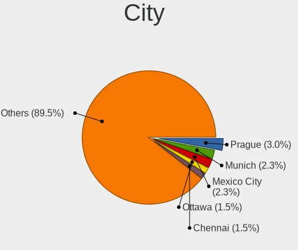

| City                     | Notebooks | Percent |
|--------------------------|-----------|---------|
| Munich                   | 3         | 3.57%   |
| Mumbai                   | 2         | 2.38%   |
| Mexico City              | 2         | 2.38%   |
| Doetinchem               | 2         | 2.38%   |
| Yerevan                  | 1         | 1.19%   |
| Webster                  | 1         | 1.19%   |
| Taringa                  | 1         | 1.19%   |
| Sumida                   | 1         | 1.19%   |
| Stroud                   | 1         | 1.19%   |
| Sofia                    | 1         | 1.19%   |
| Singapore                | 1         | 1.19%   |
| Sheffield                | 1         | 1.19%   |
| San Francisco            | 1         | 1.19%   |
| Sammamish                | 1         | 1.19%   |
| Sal?©                    | 1         | 1.19%   |
| Saint-Alphonse-Rodriguez | 1         | 1.19%   |
| Sagaing                  | 1         | 1.19%   |
| Roudnice nad Labem       | 1         | 1.19%   |
| Roha                     | 1         | 1.19%   |
| Reims                    | 1         | 1.19%   |
| Raleigh                  | 1         | 1.19%   |
| Quito                    | 1         | 1.19%   |
| Queenscliff              | 1         | 1.19%   |
| Queens                   | 1         | 1.19%   |
| Pune                     | 1         | 1.19%   |
| Prague                   | 1         | 1.19%   |
| Port Elizabeth           | 1         | 1.19%   |
| Pleasanton               | 1         | 1.19%   |
| Paraiso do Tocantins     | 1         | 1.19%   |
| Paragould                | 1         | 1.19%   |
| Oyama                    | 1         | 1.19%   |
| Ottawa                   | 1         | 1.19%   |
| Ogden                    | 1         | 1.19%   |
| Neuves-Maisons           | 1         | 1.19%   |
| Moscow                   | 1         | 1.19%   |
| Miroslava                | 1         | 1.19%   |
| Milan                    | 1         | 1.19%   |
| Mangalore                | 1         | 1.19%   |
| Madrid                   | 1         | 1.19%   |
| London                   | 1         | 1.19%   |
| Littleton                | 1         | 1.19%   |
| Lahore                   | 1         | 1.19%   |
| Kuwait City              | 1         | 1.19%   |
| Kochi                    | 1         | 1.19%   |
| Johnstone                | 1         | 1.19%   |
| Islamabad                | 1         | 1.19%   |
| Impflingen               | 1         | 1.19%   |
| Hyderabad                | 1         | 1.19%   |
| Houston                  | 1         | 1.19%   |
| Hosur                    | 1         | 1.19%   |
| Hobart                   | 1         | 1.19%   |
| Hetauda                  | 1         | 1.19%   |
| Gurgaon                  | 1         | 1.19%   |
| Grosseto                 | 1         | 1.19%   |
| Grenoble                 | 1         | 1.19%   |
| Grabs                    | 1         | 1.19%   |
| Galway                   | 1         | 1.19%   |
| Fort Lauderdale          | 1         | 1.19%   |
| Drachten                 | 1         | 1.19%   |
| Denver                   | 1         | 1.19%   |

Drives
------

Drive Vendor
------------

Hard drive vendors

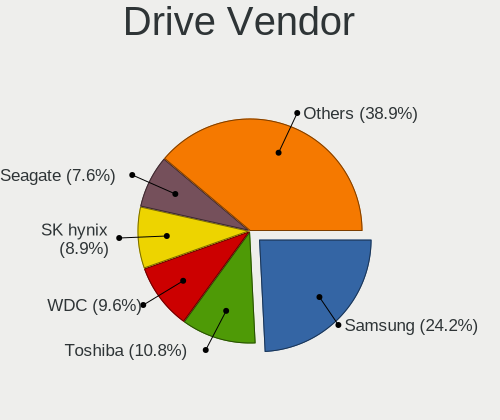

| Vendor              | Notebooks | Drives | Percent |
|---------------------|-----------|--------|---------|
| Samsung Electronics | 25        | 33     | 26.32%  |
| WDC                 | 10        | 15     | 10.53%  |
| Toshiba             | 10        | 15     | 10.53%  |
| Seagate             | 9         | 12     | 9.47%   |
| Sandisk             | 9         | 14     | 9.47%   |
| SK Hynix            | 8         | 8      | 8.42%   |
| Intel               | 5         | 7      | 5.26%   |
| Unknown             | 4         | 6      | 4.21%   |
| Micron Technology   | 3         | 5      | 3.16%   |
| Kingston            | 3         | 3      | 3.16%   |
| HGST                | 2         | 2      | 2.11%   |
| Team                | 1         | 2      | 1.05%   |
| SMI                 | 1         | 2      | 1.05%   |
| Silicon Motion      | 1         | 2      | 1.05%   |
| PNY                 | 1         | 4      | 1.05%   |
| Lite-On             | 1         | 1      | 1.05%   |
| Lenovo              | 1         | 1      | 1.05%   |
| Corsair             | 1         | 1      | 1.05%   |

Drive Model
-----------

Hard drive models

| Model                                   | Notebooks | Percent |
|-----------------------------------------|-----------|---------|
| SK Hynix NVMe SSD Drive 512GB           | 7         | 6.8%    |
| Sandisk NVMe SSD Drive 256GB            | 5         | 4.85%   |
| Samsung NVMe SSD Drive 256GB            | 5         | 4.85%   |
| Toshiba NVMe SSD Drive 512GB            | 3         | 2.91%   |
| Samsung NVMe SSD Drive 512GB            | 3         | 2.91%   |
| Samsung NVMe SSD Drive 1024GB           | 3         | 2.91%   |
| Unknown NVMe SSD Drive 256GB            | 2         | 1.94%   |
| Toshiba NVMe SSD Drive 256GB            | 2         | 1.94%   |
| Seagate Expansion+ 1TB                  | 2         | 1.94%   |
| Samsung SSD 860 EVO 1TB                 | 2         | 1.94%   |
| Samsung Portable SSD T5 500GB           | 2         | 1.94%   |
| Samsung NVMe SSD Drive 2TB              | 2         | 1.94%   |
| Samsung NVMe SSD Drive 1TB              | 2         | 1.94%   |
| Micron NVMe SSD Drive 256GB             | 2         | 1.94%   |
| Intel NVMe SSD Drive 512GB              | 2         | 1.94%   |
| Intel NVMe SSD Drive 2TB                | 2         | 1.94%   |
| WDC WDS500G2B0A-00SM50 500GB SSD        | 1         | 0.97%   |
| WDC WDS400T2B0A-00SM50 4TB SSD          | 1         | 0.97%   |
| WDC WDS200T2B0B-00YS70 2TB SSD          | 1         | 0.97%   |
| WDC WD6400BPVT-75HXZT1 640GB            | 1         | 0.97%   |
| WDC WD2500BEVT-60ZCT1 250GB             | 1         | 0.97%   |
| WDC WD20 SPZX-11UA7T0 2TB               | 1         | 0.97%   |
| WDC WD10SPZX-22Z10T0 1TB                | 1         | 0.97%   |
| WDC WD10JPVX-75JC3T0 1TB                | 1         | 0.97%   |
| WDC PC SN730 SDBQNTY-512G-1001 512GB    | 1         | 0.97%   |
| WDC PC SN730 SDBQNTY-256G-1001 256GB    | 1         | 0.97%   |
| WDC PC SN520 SDAPNUW-256G-1002 256GB    | 1         | 0.97%   |
| Unknown MMC Card  33GB                  | 1         | 0.97%   |
| Unknown MMC Card  32GB                  | 1         | 0.97%   |
| Toshiba TR150 960GB SSD                 | 1         | 0.97%   |
| Toshiba NVMe SSD Drive 1024GB           | 1         | 0.97%   |
| Toshiba MQ01ABD075 752GB                | 1         | 0.97%   |
| Toshiba MK3275GSX 320GB                 | 1         | 0.97%   |
| Toshiba HDWL110 1TB                     | 1         | 0.97%   |
| Team T253X2512G 512GB SSD               | 1         | 0.97%   |
| SMI DISK 512GB                          | 1         | 0.97%   |
| SK Hynix NVMe SSD Drive 1024GB          | 1         | 0.97%   |
| Silicon Motion NVMe SSD Drive 1TB       | 1         | 0.97%   |
| Seagate ST9160827AS 160GB               | 1         | 0.97%   |
| Seagate ST500LM021-1KJ152 500GB         | 1         | 0.97%   |
| Seagate ST500LM012 HN-M500MBB 500GB     | 1         | 0.97%   |
| Seagate ST1000LM049-2GH172 1TB          | 1         | 0.97%   |
| Seagate ST1000LM035-1RK172 1TB          | 1         | 0.97%   |
| Seagate BUP Slim BK 2TB                 | 1         | 0.97%   |
| Seagate BUP Portable 5TB                | 1         | 0.97%   |
| Seagate BUP BL 5TB                      | 1         | 0.97%   |
| Seagate BarraCuda SSD ZA2000CM10002 2TB | 1         | 0.97%   |
| SanDisk SDSSDH31024G 1024GB             | 1         | 0.97%   |
| SanDisk SD7SN6S-256G-1006 256GB SSD     | 1         | 0.97%   |
| SanDisk SD7SB7S512G1001 512GB SSD       | 1         | 0.97%   |
| Sandisk NVMe SSD Drive 512GB            | 1         | 0.97%   |
| SanDisk Extreme SSD 500GB               | 1         | 0.97%   |
| Samsung SSD PM830 2.5 7mm 256GB         | 1         | 0.97%   |
| Samsung SSD 970 EVO Plus 1TB            | 1         | 0.97%   |
| Samsung SSD 860 QVO 1TB                 | 1         | 0.97%   |
| Samsung SSD 860 EVO M.2 500GB           | 1         | 0.97%   |
| Samsung SSD 860 EVO 500GB               | 1         | 0.97%   |
| Samsung SSD 860 EVO 2TB                 | 1         | 0.97%   |
| Samsung SSD 850 PRO 2TB                 | 1         | 0.97%   |
| Samsung NVMe SSD Drive 500GB            | 1         | 0.97%   |

HDD Vendor
----------

Hard disk drive vendors

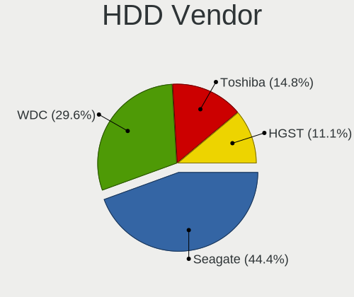

| Vendor  | Notebooks | Drives | Percent |
|---------|-----------|--------|---------|
| Seagate | 9         | 11     | 47.37%  |
| WDC     | 5         | 8      | 26.32%  |
| Toshiba | 3         | 5      | 15.79%  |
| HGST    | 2         | 2      | 10.53%  |

SSD Vendor
----------

Solid state drive vendors

| Vendor              | Notebooks | Drives | Percent |
|---------------------|-----------|--------|---------|
| Samsung Electronics | 11        | 12     | 42.31%  |
| WDC                 | 3         | 4      | 11.54%  |
| SanDisk             | 3         | 4      | 11.54%  |
| Kingston            | 3         | 3      | 11.54%  |
| Toshiba             | 1         | 1      | 3.85%   |
| Team                | 1         | 2      | 3.85%   |
| Seagate             | 1         | 1      | 3.85%   |
| PNY                 | 1         | 4      | 3.85%   |
| Micron Technology   | 1         | 1      | 3.85%   |
| Corsair             | 1         | 1      | 3.85%   |

Drive Kind
----------

HDD or SSD

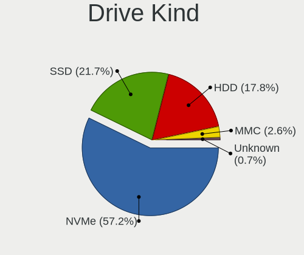

| Kind    | Notebooks | Drives | Percent |
|---------|-----------|--------|---------|
| NVMe    | 48        | 69     | 51.06%  |
| SSD     | 24        | 33     | 25.53%  |
| HDD     | 19        | 26     | 20.21%  |
| MMC     | 2         | 3      | 2.13%   |
| Unknown | 1         | 2      | 1.06%   |

Drive Connector
---------------

SATA, SAS, NVMe, etc.

| Type | Notebooks | Drives | Percent |
|------|-----------|--------|---------|
| NVMe | 48        | 69     | 53.33%  |
| SATA | 32        | 52     | 35.56%  |
| SAS  | 8         | 9      | 8.89%   |
| MMC  | 2         | 3      | 2.22%   |

Drive Size
----------

Size of hard drive

| Size in TB | Notebooks | Drives | Percent |
|------------|-----------|--------|---------|
| 0.01-0.5   | 20        | 26     | 45.45%  |
| 0.51-1.0   | 15        | 23     | 34.09%  |
| 1.01-2.0   | 6         | 7      | 13.64%  |
| 4.01-10.0  | 2         | 2      | 4.55%   |
| 3.01-4.0   | 1         | 1      | 2.27%   |

Space Total
-----------

Amount of disk space available on the file system

| Size in GB     | Notebooks | Percent |
|----------------|-----------|---------|
| 101-250        | 36        | 47.37%  |
| 251-500        | 12        | 15.79%  |
| 501-1000       | 10        | 13.16%  |
| 1001-2000      | 6         | 7.89%   |
| More than 3000 | 5         | 6.58%   |
| 51-100         | 3         | 3.95%   |
| 21-50          | 2         | 2.63%   |
| 2001-3000      | 1         | 1.32%   |
| 1-20           | 1         | 1.32%   |

Space Used
----------

Amount of used disk space

| Used GB        | Notebooks | Percent |
|----------------|-----------|---------|
| 21-50          | 21        | 25%     |
| 101-250        | 19        | 22.62%  |
| 1-20           | 16        | 19.05%  |
| 51-100         | 14        | 16.67%  |
| 251-500        | 6         | 7.14%   |
| 501-1000       | 5         | 5.95%   |
| More than 3000 | 1         | 1.19%   |
| 2001-3000      | 1         | 1.19%   |
| 1001-2000      | 1         | 1.19%   |

Malfunc. Drives
---------------

Drive models with a malfunction

Zero info for selected period =(

Malfunc. Drive Vendor
---------------------

Vendors of faulty drives

Zero info for selected period =(

Malfunc. HDD Vendor
-------------------

Vendors of faulty HDD drives

Zero info for selected period =(

Malfunc. Drive Kind
-------------------

Kinds of faulty drives

Zero info for selected period =(

Failed Drives
-------------

Failed drive models

Zero info for selected period =(

Failed Drive Vendor
-------------------

Failed drive vendors

Zero info for selected period =(

Drive Status
------------

Number of failed and malfunc. drives

| Status   | Notebooks | Drives | Percent |
|----------|-----------|--------|---------|
| Detected | 68        | 121    | 88.31%  |
| Works    | 9         | 12     | 11.69%  |

Storage controller
------------------

Storage Vendor
--------------

Storage controller vendors

| Vendor                       | Notebooks | Percent |
|------------------------------|-----------|---------|
| Intel                        | 40        | 46.51%  |
| Samsung Electronics          | 16        | 18.6%   |
| SK Hynix                     | 8         | 9.3%    |
| Sandisk                      | 8         | 9.3%    |
| Toshiba America Info Systems | 6         | 6.98%   |
| Micron Technology            | 2         | 2.33%   |
| KIOXIA                       | 2         | 2.33%   |
| Silicon Motion               | 1         | 1.16%   |
| Lite-On Technology           | 1         | 1.16%   |
| Lenovo                       | 1         | 1.16%   |
| AMD                          | 1         | 1.16%   |

Storage Model
-------------

Storage controller models

| Model                                                                         | Notebooks | Percent |
|-------------------------------------------------------------------------------|-----------|---------|
| Samsung NVMe SSD Controller SM981/PM981/PM983                                 | 14        | 15.91%  |
| SK Hynix Non-Volatile memory controller                                       | 8         | 9.09%   |
| Intel Sunrise Point-LP SATA Controller [AHCI mode]                            | 8         | 9.09%   |
| Sandisk WD Black SN750 / PC SN730 NVMe SSD                                    | 6         | 6.82%   |
| Intel Cannon Lake Mobile PCH SATA AHCI Controller                             | 6         | 6.82%   |
| Toshiba America Info Systems XG6 NVMe SSD Controller                          | 5         | 5.68%   |
| Intel 6 Series/C200 Series Chipset Family 6 port Mobile SATA AHCI Controller  | 5         | 5.68%   |
| Intel Wildcat Point-LP SATA Controller [AHCI Mode]                            | 3         | 3.41%   |
| Intel SSD 660P Series                                                         | 3         | 3.41%   |
| Intel 82801 Mobile SATA Controller [RAID mode]                                | 3         | 3.41%   |
| Intel 7 Series Chipset Family 6-port SATA Controller [AHCI mode]              | 3         | 3.41%   |
| Intel 5 Series/3400 Series Chipset 4 port SATA AHCI Controller                | 3         | 3.41%   |
| Micron Non-Volatile memory controller                                         | 2         | 2.27%   |
| KIOXIA Non-Volatile memory controller                                         | 2         | 2.27%   |
| Intel SSD Pro 7600p/760p/E 6100p Series                                       | 2         | 2.27%   |
| Intel Q170/Q150/B150/H170/H110/Z170/CM236 Chipset SATA Controller [AHCI Mode] | 2         | 2.27%   |
| Intel HM170/QM170 Chipset SATA Controller [AHCI Mode]                         | 2         | 2.27%   |
| Toshiba America Info Systems XG4 NVMe SSD Controller                          | 1         | 1.14%   |
| Silicon Motion SM2263EN/SM2263XT SSD Controller                               | 1         | 1.14%   |
| Sandisk WD Blue SN500 / PC SN520 NVMe SSD                                     | 1         | 1.14%   |
| Sandisk WD Black 2018/SN750 / PC SN720 NVMe SSD                               | 1         | 1.14%   |
| Samsung NVMe SSD Controller SM961/PM961/SM963                                 | 1         | 1.14%   |
| Samsung NVMe SSD Controller 980                                               | 1         | 1.14%   |
| Lite-On Non-Volatile memory controller                                        | 1         | 1.14%   |
| Lenovo Non-Volatile memory controller                                         | 1         | 1.14%   |
| Intel 8 Series SATA Controller 1 [AHCI mode]                                  | 1         | 1.14%   |
| Intel 5 Series/3400 Series Chipset 6 port SATA AHCI Controller                | 1         | 1.14%   |
| AMD FCH SATA Controller [AHCI mode]                                           | 1         | 1.14%   |

Storage Kind
------------

Kind of storage controller (IDE, SATA, NVMe, SAS, ...)

| Kind | Notebooks | Percent |
|------|-----------|---------|
| NVMe | 48        | 55.81%  |
| SATA | 35        | 40.7%   |
| RAID | 3         | 3.49%   |

Processor
---------

CPU Vendor
----------

Processor vendors

| Vendor | Notebooks | Percent |
|--------|-----------|---------|
| Intel  | 70        | 94.59%  |
| AMD    | 4         | 5.41%   |

CPU Model
---------

Processor models

| Model                                         | Notebooks | Percent |
|-----------------------------------------------|-----------|---------|
| Intel Core i7-8665U CPU @ 1.90GHz             | 8         | 10.81%  |
| Intel Core i7-10850H CPU @ 2.70GHz            | 6         | 8.11%   |
| Intel Core i7-8650U CPU @ 1.90GHz             | 4         | 5.41%   |
| Intel Core i7-10610U CPU @ 1.80GHz            | 4         | 5.41%   |
| Intel Core i7-8750H CPU @ 2.20GHz             | 3         | 4.05%   |
| Intel Core i5-5300U CPU @ 2.30GHz             | 3         | 4.05%   |
| Intel Core i7-9850H CPU @ 2.60GHz             | 2         | 2.7%    |
| Intel Core i7-8550U CPU @ 1.80GHz             | 2         | 2.7%    |
| Intel Core i7-7700HQ CPU @ 2.80GHz            | 2         | 2.7%    |
| Intel Core i7-3520M CPU @ 2.90GHz             | 2         | 2.7%    |
| Intel Core i5-8365U CPU @ 1.60GHz             | 2         | 2.7%    |
| Intel Core i5-8250U CPU @ 1.60GHz             | 2         | 2.7%    |
| Intel Core i5-6200U CPU @ 2.30GHz             | 2         | 2.7%    |
| Intel Core i5-2520M CPU @ 2.50GHz             | 2         | 2.7%    |
| Intel Core i5-10210U CPU @ 1.60GHz            | 2         | 2.7%    |
| AMD Ryzen 7 3750H with Radeon Vega Mobile Gfx | 2         | 2.7%    |
| Intel Xeon W-10855M CPU @ 2.80GHz             | 1         | 1.35%   |
| Intel Xeon E-2176M CPU @ 2.70GHz              | 1         | 1.35%   |
| Intel Xeon CPU E3-1575M v5 @ 3.00GHz          | 1         | 1.35%   |
| Intel Core i9-9980HK CPU @ 2.40GHz            | 1         | 1.35%   |
| Intel Core i9-9880H CPU @ 2.30GHz             | 1         | 1.35%   |
| Intel Core i7-9750H CPU @ 2.60GHz             | 1         | 1.35%   |
| Intel Core i7-8850H CPU @ 2.60GHz             | 1         | 1.35%   |
| Intel Core i7-8565U CPU @ 1.80GHz             | 1         | 1.35%   |
| Intel Core i7-7600U CPU @ 2.80GHz             | 1         | 1.35%   |
| Intel Core i7-7500U CPU @ 2.70GHz             | 1         | 1.35%   |
| Intel Core i7-6700HQ CPU @ 2.60GHz            | 1         | 1.35%   |
| Intel Core i7-4500U CPU @ 1.80GHz             | 1         | 1.35%   |
| Intel Core i7-3720QM CPU @ 2.60GHz            | 1         | 1.35%   |
| Intel Core i7-3540M CPU @ 3.00GHz             | 1         | 1.35%   |
| Intel Core i7-2760QM CPU @ 2.40GHz            | 1         | 1.35%   |
| Intel Core i5-8350U CPU @ 1.70GHz             | 1         | 1.35%   |
| Intel Core i5-6300U CPU @ 2.40GHz             | 1         | 1.35%   |
| Intel Core i5-3320M CPU @ 2.60GHz             | 1         | 1.35%   |
| Intel Core i5-2540M CPU @ 2.60GHz             | 1         | 1.35%   |
| Intel Core i5-2410M CPU @ 2.30GHz             | 1         | 1.35%   |
| Intel Core i5 CPU M 560 @ 2.67GHz             | 1         | 1.35%   |
| Intel Core i5 CPU M 520 @ 2.40GHz             | 1         | 1.35%   |
| Intel Core i3 CPU M 380 @ 2.53GHz             | 1         | 1.35%   |
| Intel Core i3 CPU M 350 @ 2.27GHz             | 1         | 1.35%   |
| AMD Ryzen 7 PRO 4750U with Radeon Graphics    | 1         | 1.35%   |
| AMD Ryzen 7 4700U with Radeon Graphics        | 1         | 1.35%   |

CPU Model Family
----------------

Processor model prefix

| Model           | Notebooks | Percent |
|-----------------|-----------|---------|
| Intel Core i7   | 43        | 58.11%  |
| Intel Core i5   | 20        | 27.03%  |
| Intel Xeon      | 3         | 4.05%   |
| AMD Ryzen 7     | 3         | 4.05%   |
| Intel Core i9   | 2         | 2.7%    |
| Intel Core i3   | 2         | 2.7%    |
| AMD Ryzen 7 PRO | 1         | 1.35%   |

CPU Cores
---------

Number of processor cores

| Number | Notebooks | Percent |
|--------|-----------|---------|
| 4      | 34        | 45.95%  |
| 2      | 21        | 28.38%  |
| 6      | 15        | 20.27%  |
| 8      | 4         | 5.41%   |

CPU Sockets
-----------

Number of sockets

| Number | Notebooks | Percent |
|--------|-----------|---------|
| 1      | 74        | 100%    |

CPU Threads
-----------

Threads per core (Hyper-Threading)

| Number | Notebooks | Percent |
|--------|-----------|---------|
| 2      | 73        | 98.65%  |
| 1      | 1         | 1.35%   |

CPU Op-Modes
------------

CPU Operation Modes (32-bit, 64-bit)

| Op mode        | Notebooks | Percent |
|----------------|-----------|---------|
| 32-bit, 64-bit | 72        | 94.74%  |
| Unknown        | 4         | 5.26%   |

CPU Microcode
-------------

Microcode number

| Number     | Notebooks | Percent |
|------------|-----------|---------|
| 0x806ec    | 16        | 21.05%  |
| 0x806ea    | 9         | 11.84%  |
| 0xa0652    | 7         | 9.21%   |
| 0x906ea    | 6         | 7.89%   |
| 0x306a9    | 5         | 6.58%   |
| 0x206a7    | 5         | 6.58%   |
| 0x906ed    | 4         | 5.26%   |
| 0x406e3    | 3         | 3.95%   |
| 0x306d4    | 3         | 3.95%   |
| 0x20655    | 3         | 3.95%   |
| Unknown    | 3         | 3.95%   |
| 0x906e9    | 2         | 2.63%   |
| 0x806e9    | 2         | 2.63%   |
| 0x506e3    | 2         | 2.63%   |
| 0x08108102 | 2         | 2.63%   |
| 0x40651    | 1         | 1.32%   |
| 0x20652    | 1         | 1.32%   |
| 0x08600104 | 1         | 1.32%   |
| 0x08600103 | 1         | 1.32%   |

CPU Microarch
-------------

Microarchitecture

| Name        | Notebooks | Percent |
|-------------|-----------|---------|
| KabyLake    | 40        | 54.05%  |
| CometLake   | 7         | 9.46%   |
| Skylake     | 5         | 6.76%   |
| SandyBridge | 5         | 6.76%   |
| IvyBridge   | 5         | 6.76%   |
| Westmere    | 4         | 5.41%   |
| Broadwell   | 3         | 4.05%   |
| Zen+        | 2         | 2.7%    |
| Zen 2       | 2         | 2.7%    |
| Haswell     | 1         | 1.35%   |

Graphics
--------

GPU Vendor
----------

Vendors of graphics cards

| Vendor | Notebooks | Percent |
|--------|-----------|---------|
| Intel  | 61        | 67.03%  |
| Nvidia | 21        | 23.08%  |
| AMD    | 9         | 9.89%   |

GPU Model
---------

Graphics card models

| Model                                                                                 | Notebooks | Percent |
|---------------------------------------------------------------------------------------|-----------|---------|
| Intel WhiskeyLake-U GT2 [UHD Graphics 620]                                            | 11        | 12.09%  |
| Intel UHD Graphics 620                                                                | 9         | 9.89%   |
| Intel CometLake-U GT2 [UHD Graphics]                                                  | 6         | 6.59%   |
| Intel CometLake-H GT2 [UHD Graphics]                                                  | 6         | 6.59%   |
| Intel CoffeeLake-H GT2 [UHD Graphics 630]                                             | 6         | 6.59%   |
| Intel 3rd Gen Core processor Graphics Controller                                      | 5         | 5.49%   |
| Intel 2nd Generation Core Processor Family Integrated Graphics Controller             | 4         | 4.4%    |
| Nvidia GP107GLM [Quadro P2000 Mobile]                                                 | 3         | 3.3%    |
| Intel Skylake GT2 [HD Graphics 520]                                                   | 3         | 3.3%    |
| Intel HD Graphics 5500                                                                | 3         | 3.3%    |
| Intel Core Processor Integrated Graphics Controller                                   | 3         | 3.3%    |
| Nvidia TU116M [GeForce GTX 1660 Ti Mobile]                                            | 2         | 2.2%    |
| Nvidia GP107M [GeForce GTX 1050 Mobile]                                               | 2         | 2.2%    |
| Nvidia GF108GLM [NVS 5200M]                                                           | 2         | 2.2%    |
| Intel HD Graphics 620                                                                 | 2         | 2.2%    |
| AMD Renoir                                                                            | 2         | 2.2%    |
| AMD Picasso                                                                           | 2         | 2.2%    |
| Nvidia TU117GLM [Quadro T2000 Mobile / Max-Q]                                         | 1         | 1.1%    |
| Nvidia TU106GLM [Quadro RTX 3000 Mobile / Max-Q]                                      | 1         | 1.1%    |
| Nvidia TU106BM [GeForce RTX 2070 Mobile / Max-Q]                                      | 1         | 1.1%    |
| Nvidia GP107M [GeForce GTX 1050 Ti Mobile]                                            | 1         | 1.1%    |
| Nvidia GP107GLM [Quadro P620]                                                         | 1         | 1.1%    |
| Nvidia GP107GLM [Quadro P1000 Mobile]                                                 | 1         | 1.1%    |
| Nvidia GP106BM [GeForce GTX 1060 Mobile 6GB]                                          | 1         | 1.1%    |
| Nvidia GM107GLM [Quadro M2000M]                                                       | 1         | 1.1%    |
| Nvidia GM107GLM [Quadro M1000M]                                                       | 1         | 1.1%    |
| Nvidia GK107GLM [Quadro K2000M]                                                       | 1         | 1.1%    |
| Nvidia GF119M [Quadro NVS 4200M]                                                      | 1         | 1.1%    |
| Nvidia GF106GLM [Quadro 2000M]                                                        | 1         | 1.1%    |
| Intel Iris Pro Graphics P580                                                          | 1         | 1.1%    |
| Intel HD Graphics 630                                                                 | 1         | 1.1%    |
| Intel Haswell-ULT Integrated Graphics Controller                                      | 1         | 1.1%    |
| AMD Topaz XT [Radeon R7 M260/M265 / M340/M360 / M440/M445 / 530/535 / 620/625 Mobile] | 1         | 1.1%    |
| AMD Sun XT [Radeon HD 8670A/8670M/8690M / R5 M330 / M430 / Radeon 520 Mobile]         | 1         | 1.1%    |
| AMD Seymour [Radeon HD 6400M/7400M Series]                                            | 1         | 1.1%    |
| AMD Meso XT [Radeon R5 M315]                                                          | 1         | 1.1%    |
| AMD Madison [Mobility Radeon HD 5650/5750 / 6530M/6550M]                              | 1         | 1.1%    |

GPU Combo
---------

Combinations of graphics cards

| Name           | Notebooks | Percent |
|----------------|-----------|---------|
| 1 x Intel      | 46        | 62.16%  |
| Intel + Nvidia | 12        | 16.22%  |
| 1 x Nvidia     | 7         | 9.46%   |
| 1 x AMD        | 4         | 5.41%   |
| Intel + AMD    | 3         | 4.05%   |
| AMD + Nvidia   | 2         | 2.7%    |

GPU Driver
----------

Free vs proprietary

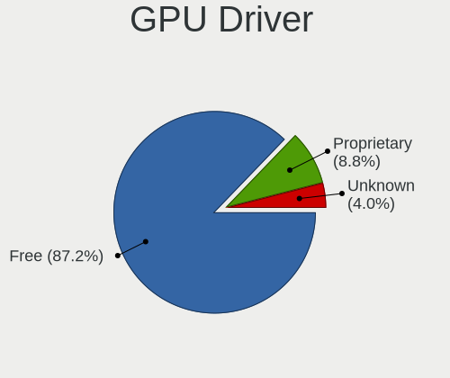

| Driver      | Notebooks | Percent |
|-------------|-----------|---------|
| Free        | 65        | 87.84%  |
| Proprietary | 6         | 8.11%   |
| Unknown     | 3         | 4.05%   |

GPU Memory
----------

Total video memory

| Size in GB | Notebooks | Percent |
|------------|-----------|---------|
| Unknown    | 53        | 71.62%  |
| 3.01-4.0   | 5         | 6.76%   |
| 1.01-2.0   | 5         | 6.76%   |
| 5.01-6.0   | 4         | 5.41%   |
| 0.51-1.0   | 4         | 5.41%   |
| 0.01-0.5   | 2         | 2.7%    |
| 7.01-8.0   | 1         | 1.35%   |

Monitor
-------

Monitor Vendor
--------------

Monitor vendors

| Vendor                  | Notebooks | Percent |
|-------------------------|-----------|---------|
| AU Optronics            | 16        | 15.53%  |
| Chimei Innolux          | 14        | 13.59%  |
| Dell                    | 12        | 11.65%  |
| BOE                     | 11        | 10.68%  |
| LG Display              | 10        | 9.71%   |
| Lenovo                  | 9         | 8.74%   |
| Samsung Electronics     | 7         | 6.8%    |
| Hewlett-Packard         | 4         | 3.88%   |
| Sharp                   | 3         | 2.91%   |
| Acer                    | 3         | 2.91%   |
| Philips                 | 2         | 1.94%   |
| PANDA                   | 2         | 1.94%   |
| LGD                     | 2         | 1.94%   |
| InfoVision              | 2         | 1.94%   |
| Goldstar                | 2         | 1.94%   |
| Sceptre Tech            | 1         | 0.97%   |
| Planar                  | 1         | 0.97%   |
| Eizo                    | 1         | 0.97%   |
| Chi Mei Optoelectronics | 1         | 0.97%   |

Monitor Model
-------------

Monitor models

| Model                                                                    | Notebooks | Percent |
|--------------------------------------------------------------------------|-----------|---------|
| Chimei Innolux LCD Monitor CMN15E8 1920x1080 344x193mm 15.5-inch         | 5         | 4.76%   |
| Lenovo LCD Monitor LEN40BA 1920x1080 344x194mm 15.5-inch                 | 4         | 3.81%   |
| Dell P2419H DELD0D9 1920x1080 527x296mm 23.8-inch                        | 3         | 2.86%   |
| Philips PHL 272E1 PHLC210 1920x1080 598x336mm 27.0-inch                  | 2         | 1.9%    |
| PANDA LCD Monitor NCP0036 1920x1080 344x194mm 15.5-inch                  | 2         | 1.9%    |
| LGD LCD Monitor 1920x1080                                                | 2         | 1.9%    |
| LG Display LCD Monitor LGD0676 1920x1080 309x174mm 14.0-inch             | 2         | 1.9%    |
| Lenovo LCD Monitor LEN40B2 1920x1080 344x193mm 15.5-inch                 | 2         | 1.9%    |
| Hewlett-Packard 27y HPN351C 1920x1080 598x336mm 27.0-inch                | 2         | 1.9%    |
| Dell P2419H DELD0DA 1920x1080 527x296mm 23.8-inch                        | 2         | 1.9%    |
| Chimei Innolux LCD Monitor CMN14F5 1920x1080 309x173mm 13.9-inch         | 2         | 1.9%    |
| Chimei Innolux LCD Monitor CMN14C9 1920x1080 309x173mm 13.9-inch         | 2         | 1.9%    |
| Chimei Innolux LCD Monitor CMN1482 1600x900 309x174mm 14.0-inch          | 2         | 1.9%    |
| BOE LCD Monitor BOE086E 1920x1080 344x194mm 15.5-inch                    | 2         | 1.9%    |
| BOE LCD Monitor BOE07C9 1920x1080 309x173mm 13.9-inch                    | 2         | 1.9%    |
| AU Optronics LCD Monitor AUO562D 1920x1080 293x165mm 13.2-inch           | 2         | 1.9%    |
| AU Optronics LCD Monitor AUO313E 1600x900 309x174mm 14.0-inch            | 2         | 1.9%    |
| Sharp LCD Monitor SHP14BA 1920x1080 344x194mm 15.5-inch                  | 1         | 0.95%   |
| Sharp LCD Monitor SHP1453 1920x1080 346x194mm 15.6-inch                  | 1         | 0.95%   |
| Sharp LCD Monitor SHP1430 3840x2160 350x190mm 15.7-inch                  | 1         | 0.95%   |
| Sceptre Tech Sceptre L24 SPT098C 1920x1080 530x300mm 24.0-inch           | 1         | 0.95%   |
| Samsung Electronics U28E590 SAM0C4D 3840x2160 607x345mm 27.5-inch        | 1         | 0.95%   |
| Samsung Electronics U28E590 SAM0C4C 3840x2160 608x345mm 27.5-inch        | 1         | 0.95%   |
| Samsung Electronics U28E570 SAM0D6F 3840x2160 607x345mm 27.5-inch        | 1         | 0.95%   |
| Samsung Electronics SyncMaster SAM0587 1920x1200 518x324mm 24.1-inch     | 1         | 0.95%   |
| Samsung Electronics S23C350 SAM0A36 1920x1080 510x287mm 23.0-inch        | 1         | 0.95%   |
| Samsung Electronics LS27R75 SAM0FAC 2560x1440 598x336mm 27.0-inch        | 1         | 0.95%   |
| Samsung Electronics LCD Monitor SEC544B 1600x900 382x214mm 17.2-inch     | 1         | 0.95%   |
| Samsung Electronics LCD Monitor SEC5448 1920x1080 344x194mm 15.5-inch    | 1         | 0.95%   |
| Planar PLL2410W PLN2410 1920x1080 521x293mm 23.5-inch                    | 1         | 0.95%   |
| LG Display LCD Monitor LGD0618 1920x1080 344x194mm 15.5-inch             | 1         | 0.95%   |
| LG Display LCD Monitor LGD0612 1920x1080 344x194mm 15.5-inch             | 1         | 0.95%   |
| LG Display LCD Monitor LGD0608 1920x1080 309x174mm 14.0-inch             | 1         | 0.95%   |
| LG Display LCD Monitor LGD0525 1366x768 344x194mm 15.5-inch              | 1         | 0.95%   |
| LG Display LCD Monitor LGD0484 1366x768 344x194mm 15.5-inch              | 1         | 0.95%   |
| LG Display LCD Monitor LGD0465 1366x768 344x194mm 15.5-inch              | 1         | 0.95%   |
| LG Display LCD Monitor LGD0306 1600x900 310x174mm 14.0-inch              | 1         | 0.95%   |
| LG Display LCD Monitor LGD02D8 1366x768 277x156mm 12.5-inch              | 1         | 0.95%   |
| Lenovo TIO24Gen3 LEN10B4 1920x1080 527x296mm 23.8-inch                   | 1         | 0.95%   |
| Lenovo LEN LT2452pwC LEN1144 1920x1200 518x324mm 24.1-inch               | 1         | 0.95%   |
| Lenovo LCD Monitor LEN4011 1280x800 261x163mm 12.1-inch                  | 1         | 0.95%   |
| InfoVision LCD Monitor IVO057D 1920x1080 309x174mm 14.0-inch             | 1         | 0.95%   |
| InfoVision LCD Monitor IVO04E3 1366x768 277x156mm 12.5-inch              | 1         | 0.95%   |
| Hewlett-Packard 25x HPN357F 1920x1080 544x303mm 24.5-inch                | 1         | 0.95%   |
| Hewlett-Packard 22cwa HWP3183 1920x1080 476x268mm 21.5-inch              | 1         | 0.95%   |
| Goldstar LG ULTRAWIDE GSM59F2 1920x1080 800x340mm 34.2-inch              | 1         | 0.95%   |
| Goldstar LG ULTRAWIDE GSM59F1 1920x1080 580x240mm 24.7-inch              | 1         | 0.95%   |
| Eizo EV2416W ENC2389 1920x1200 519x324mm 24.1-inch                       | 1         | 0.95%   |
| Dell U4919DW DELA10F 3840x1080 1198x337mm 49.0-inch                      | 1         | 0.95%   |
| Dell U2412M DELA07B 1920x1200 518x324mm 24.1-inch                        | 1         | 0.95%   |
| Dell SP2309W DELD01D 2048x1152 510x290mm 23.1-inch                       | 1         | 0.95%   |
| Dell SE2416H DELD082 1920x1080 527x296mm 23.8-inch                       | 1         | 0.95%   |
| Dell S2318HN/NX DELD0C0 1920x1080 510x290mm 23.1-inch                    | 1         | 0.95%   |
| Dell P2214H DELA098 1920x1080 480x270mm 21.7-inch                        | 1         | 0.95%   |
| Dell P2213 DELF042 1680x1050 473x296mm 22.0-inch                         | 1         | 0.95%   |
| Dell E2414H DEL4091 1920x1080 530x300mm 24.0-inch                        | 1         | 0.95%   |
| Chimei Innolux LCD Monitor CMN1738 1920x1080 381x214mm 17.2-inch         | 1         | 0.95%   |
| Chimei Innolux LCD Monitor CMN150C 1920x1080 344x193mm 15.5-inch         | 1         | 0.95%   |
| Chimei Innolux LCD Monitor CMN14B1 1920x1080 308x173mm 13.9-inch         | 1         | 0.95%   |
| Chi Mei Optoelectronics LCD Monitor CMO15A4 1366x768 344x194mm 15.5-inch | 1         | 0.95%   |

Monitor Resolution
------------------

Monitor screen resolution

| Resolution         | Notebooks | Percent |
|--------------------|-----------|---------|
| 1920x1080 (FHD)    | 52        | 61.18%  |
| 1366x768 (WXGA)    | 11        | 12.94%  |
| 1600x900 (HD+)     | 6         | 7.06%   |
| 3840x2160 (4K)     | 4         | 4.71%   |
| 1920x1200 (WUXGA)  | 3         | 3.53%   |
| 2560x1440 (QHD)    | 2         | 2.35%   |
| 2560x1080          | 2         | 2.35%   |
| 3840x1080          | 1         | 1.18%   |
| 2048x1152          | 1         | 1.18%   |
| 1680x1050 (WSXGA+) | 1         | 1.18%   |
| 1440x900 (WXGA+)   | 1         | 1.18%   |
| 1280x800 (WXGA)    | 1         | 1.18%   |

Monitor Diagonal
----------------

Diagonal size in inches

| Inches  | Notebooks | Percent |
|---------|-----------|---------|
| 15      | 33        | 32.35%  |
| 14      | 14        | 13.73%  |
| 13      | 13        | 12.75%  |
| 24      | 11        | 10.78%  |
| 27      | 8         | 7.84%   |
| 23      | 5         | 4.9%    |
| 12      | 5         | 4.9%    |
| 34      | 2         | 1.96%   |
| 21      | 2         | 1.96%   |
| 17      | 2         | 1.96%   |
| Unknown | 2         | 1.96%   |
| 49      | 1         | 0.98%   |
| 31      | 1         | 0.98%   |
| 22      | 1         | 0.98%   |
| 19      | 1         | 0.98%   |
| 18      | 1         | 0.98%   |

Monitor Width
-------------

Physical width

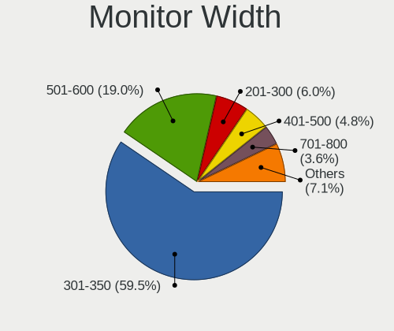

| Width in mm | Notebooks | Percent |
|-------------|-----------|---------|
| 301-350     | 57        | 57.58%  |
| 501-600     | 18        | 18.18%  |
| 201-300     | 8         | 8.08%   |
| 401-500     | 5         | 5.05%   |
| 601-700     | 4         | 4.04%   |
| 701-800     | 2         | 2.02%   |
| 351-400     | 2         | 2.02%   |
| Unknown     | 2         | 2.02%   |
| 1001-1500   | 1         | 1.01%   |

Aspect Ratio
------------

Proportional relationship between the width and the height

| Ratio   | Notebooks | Percent |
|---------|-----------|---------|
| 16/9    | 67        | 85.9%   |
| 16/10   | 5         | 6.41%   |
| 21/9    | 2         | 2.56%   |
| Unknown | 2         | 2.56%   |
| 32/9    | 1         | 1.28%   |
| 3/2     | 1         | 1.28%   |

Monitor Area
------------

Area in inch²

| Area in inch² | Notebooks | Percent |
|----------------|-----------|---------|
| 101-110        | 33        | 32.35%  |
| 81-90          | 24        | 23.53%  |
| 201-250        | 14        | 13.73%  |
| 301-350        | 8         | 7.84%   |
| 61-70          | 5         | 4.9%    |
| 251-300        | 5         | 4.9%    |
| 71-80          | 3         | 2.94%   |
| 351-500        | 3         | 2.94%   |
| 121-130        | 2         | 1.96%   |
| Unknown        | 2         | 1.96%   |
| 151-200        | 1         | 0.98%   |
| 141-150        | 1         | 0.98%   |
| 501-1000       | 1         | 0.98%   |

Pixel Density
-------------

Pixels per inch

| Density       | Notebooks | Percent |
|---------------|-----------|---------|
| 121-160       | 54        | 55.1%   |
| 51-100        | 23        | 23.47%  |
| 101-120       | 14        | 14.29%  |
| 161-240       | 3         | 3.06%   |
| More than 240 | 2         | 2.04%   |
| Unknown       | 2         | 2.04%   |

Multiple Monitors
-----------------

Total monitors connected

| Total | Notebooks | Percent |
|-------|-----------|---------|
| 1     | 46        | 58.23%  |
| 2     | 24        | 30.38%  |
| 3     | 5         | 6.33%   |
| 0     | 4         | 5.06%   |

Network
-------

Net Controller Vendor
---------------------

Controller vendors

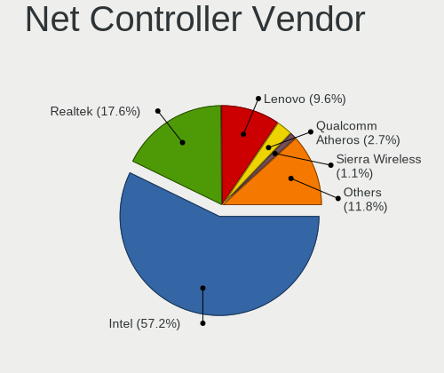

| Vendor                            | Notebooks | Percent |
|-----------------------------------|-----------|---------|
| Intel                             | 65        | 56.52%  |
| Realtek Semiconductor             | 21        | 18.26%  |
| Lenovo                            | 12        | 10.43%  |
| Qualcomm Atheros                  | 2         | 1.74%   |
| Marvell Technology Group          | 2         | 1.74%   |
| Broadcom Limited                  | 2         | 1.74%   |
| Xiaomi                            | 1         | 0.87%   |
| Sierra Wireless                   | 1         | 0.87%   |
| Samsung Electronics               | 1         | 0.87%   |
| Ralink                            | 1         | 0.87%   |
| Luminary Micro                    | 1         | 0.87%   |
| ICS Advent                        | 1         | 0.87%   |
| Huawei Technologies               | 1         | 0.87%   |
| Ericsson Business Mobile Networks | 1         | 0.87%   |
| DisplayLink                       | 1         | 0.87%   |
| Dell                              | 1         | 0.87%   |
| Broadcom                          | 1         | 0.87%   |

Net Controller Model
--------------------

Controller models

| Model                                                                          | Notebooks | Percent |
|--------------------------------------------------------------------------------|-----------|---------|
| Intel Cannon Point-LP CNVi [Wireless-AC]                                       | 11        | 6.88%   |
| Intel Wireless 8265 / 8275                                                     | 10        | 6.25%   |
| Realtek RTL8111/8168/8411 PCI Express Gigabit Ethernet Controller              | 9         | 5.63%   |
| Intel Ethernet Connection (6) I219-LM                                          | 9         | 5.63%   |
| Intel 82579LM Gigabit Network Connection (Lewisville)                          | 9         | 5.63%   |
| Intel Comet Lake PCH CNVi WiFi                                                 | 7         | 4.38%   |
| Intel Cannon Lake PCH CNVi WiFi                                                | 7         | 4.38%   |
| Lenovo ThinkPad TBT 3 Dock                                                     | 6         | 3.75%   |
| Intel Ethernet Connection (7) I219-LM                                          | 6         | 3.75%   |
| Intel Ethernet Connection (4) I219-LM                                          | 6         | 3.75%   |
| Intel Comet Lake PCH-LP CNVi WiFi                                              | 6         | 3.75%   |
| Intel Centrino Advanced-N 6205 [Taylor Peak]                                   | 5         | 3.13%   |
| Realtek RTL8153 Gigabit Ethernet Adapter                                       | 4         | 2.5%    |
| Realtek RTL810xE PCI Express Fast Ethernet controller                          | 4         | 2.5%    |
| Intel Wireless 8260                                                            | 4         | 2.5%    |
| Intel Wi-Fi 6 AX200                                                            | 4         | 2.5%    |
| Intel Centrino Ultimate-N 6300                                                 | 4         | 2.5%    |
| Intel Wireless 7265                                                            | 3         | 1.88%   |
| Intel Ethernet Connection (3) I218-LM                                          | 3         | 1.88%   |
| Intel Ethernet Connection (10) I219-LM                                         | 3         | 1.88%   |
| Realtek RTL8188CE 802.11b/g/n WiFi Adapter                                     | 2         | 1.25%   |
| Marvell Group Yukon Optima 88E8059 [PCIe Gigabit Ethernet Controller with AVB] | 2         | 1.25%   |
| Lenovo USB-C to LAN                                                            | 2         | 1.25%   |
| Lenovo ThinkPad TBT3 LAN                                                       | 2         | 1.25%   |
| Intel Ethernet Connection (10) I219-V                                          | 2         | 1.25%   |
| Xiaomi Mi/Redmi series (RNDIS + ADB)                                           | 1         | 0.63%   |
| Sierra Wireless MC7455 Qualcomm?‚ Snapdragon???„?? X7 LTE-A                    | 1         | 0.63%   |
| Samsung GT-I9070 (network tethering, USB debugging enabled)                    | 1         | 0.63%   |
| Realtek RTL8822BE 802.11a/b/g/n/ac WiFi adapter                                | 1         | 0.63%   |
| Realtek RTL8821CE 802.11ac PCIe Wireless Network Adapter                       | 1         | 0.63%   |
| Realtek RTL8188CUS 802.11n WLAN Adapter                                        | 1         | 0.63%   |
| Ralink RT3290 Wireless 802.11n 1T/1R PCIe                                      | 1         | 0.63%   |
| Qualcomm Atheros QCA6174 802.11ac Wireless Network Adapter                     | 1         | 0.63%   |
| Qualcomm Atheros AR9285 Wireless Network Adapter (PCI-Express)                 | 1         | 0.63%   |
| Luminary Micro In-Circuit Debug Interface                                      | 1         | 0.63%   |
| Lenovo USB-C Dock Ethernet                                                     | 1         | 0.63%   |
| Lenovo ThinkPad Dock Ethernet [Realtek RTL8153B]                               | 1         | 0.63%   |
| Intel Wireless-AC 9260                                                         | 1         | 0.63%   |
| Intel Wireless 3165                                                            | 1         | 0.63%   |
| Intel Ethernet Connection I219-LM                                              | 1         | 0.63%   |
| Intel Ethernet Connection (6) I219-V                                           | 1         | 0.63%   |
| Intel Ethernet Connection (4) I219-V                                           | 1         | 0.63%   |
| Intel Ethernet Connection (2) I219-V                                           | 1         | 0.63%   |
| Intel Ethernet Connection (2) I219-LM                                          | 1         | 0.63%   |
| Intel Ethernet Connection (11) I219-LM                                         | 1         | 0.63%   |
| Intel Centrino Wireless-N 1030 [Rainbow Peak]                                  | 1         | 0.63%   |
| Intel 82577LM Gigabit Network Connection                                       | 1         | 0.63%   |
| ICS Advent DM9601 Fast Ethernet Adapter                                        | 1         | 0.63%   |
| Huawei E353/E3131                                                              | 1         | 0.63%   |
| Ericsson Business Mobile Networks N5321 gw                                     | 1         | 0.63%   |
| DisplayLink Plugable UGA-3000                                                  | 1         | 0.63%   |
| Dell DW5811e Snapdragon???„?? X7 LTE                                           | 1         | 0.63%   |
| Broadcom Limited NetXtreme BCM5761e Gigabit Ethernet PCIe                      | 1         | 0.63%   |
| Broadcom Limited BCM4352 802.11ac Wireless Network Adapter                     | 1         | 0.63%   |
| Broadcom BCM43142 802.11b/g/n                                                  | 1         | 0.63%   |

Wireless Vendor
---------------

Wireless vendors

| Vendor                            | Notebooks | Percent |
|-----------------------------------|-----------|---------|
| Intel                             | 64        | 83.12%  |
| Realtek Semiconductor             | 5         | 6.49%   |
| Qualcomm Atheros                  | 2         | 2.6%    |
| Sierra Wireless                   | 1         | 1.3%    |
| Ralink                            | 1         | 1.3%    |
| Ericsson Business Mobile Networks | 1         | 1.3%    |
| Dell                              | 1         | 1.3%    |
| Broadcom Limited                  | 1         | 1.3%    |
| Broadcom                          | 1         | 1.3%    |

Wireless Model
--------------

Wireless models

| Model                                                          | Notebooks | Percent |
|----------------------------------------------------------------|-----------|---------|
| Intel Cannon Point-LP CNVi [Wireless-AC]                       | 11        | 14.29%  |
| Intel Wireless 8265 / 8275                                     | 10        | 12.99%  |
| Intel Comet Lake PCH CNVi WiFi                                 | 7         | 9.09%   |
| Intel Cannon Lake PCH CNVi WiFi                                | 7         | 9.09%   |
| Intel Comet Lake PCH-LP CNVi WiFi                              | 6         | 7.79%   |
| Intel Centrino Advanced-N 6205 [Taylor Peak]                   | 5         | 6.49%   |
| Intel Wireless 8260                                            | 4         | 5.19%   |
| Intel Wi-Fi 6 AX200                                            | 4         | 5.19%   |
| Intel Centrino Ultimate-N 6300                                 | 4         | 5.19%   |
| Intel Wireless 7265                                            | 3         | 3.9%    |
| Realtek RTL8188CE 802.11b/g/n WiFi Adapter                     | 2         | 2.6%    |
| Sierra Wireless MC7455 Qualcomm?‚ Snapdragon???„?? X7 LTE-A    | 1         | 1.3%    |
| Realtek RTL8822BE 802.11a/b/g/n/ac WiFi adapter                | 1         | 1.3%    |
| Realtek RTL8821CE 802.11ac PCIe Wireless Network Adapter       | 1         | 1.3%    |
| Realtek RTL8188CUS 802.11n WLAN Adapter                        | 1         | 1.3%    |
| Ralink RT3290 Wireless 802.11n 1T/1R PCIe                      | 1         | 1.3%    |
| Qualcomm Atheros QCA6174 802.11ac Wireless Network Adapter     | 1         | 1.3%    |
| Qualcomm Atheros AR9285 Wireless Network Adapter (PCI-Express) | 1         | 1.3%    |
| Intel Wireless-AC 9260                                         | 1         | 1.3%    |
| Intel Wireless 3165                                            | 1         | 1.3%    |
| Intel Centrino Wireless-N 1030 [Rainbow Peak]                  | 1         | 1.3%    |
| Ericsson Business Mobile Networks N5321 gw                     | 1         | 1.3%    |
| Dell DW5811e Snapdragon???„?? X7 LTE                           | 1         | 1.3%    |
| Broadcom Limited BCM4352 802.11ac Wireless Network Adapter     | 1         | 1.3%    |
| Broadcom BCM43142 802.11b/g/n                                  | 1         | 1.3%    |

Ethernet Vendor
---------------

Ethernet vendors

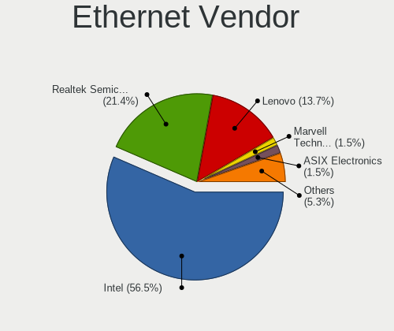

| Vendor                   | Notebooks | Percent |
|--------------------------|-----------|---------|
| Intel                    | 45        | 54.88%  |
| Realtek Semiconductor    | 17        | 20.73%  |
| Lenovo                   | 12        | 14.63%  |
| Marvell Technology Group | 2         | 2.44%   |
| Xiaomi                   | 1         | 1.22%   |
| Samsung Electronics      | 1         | 1.22%   |
| ICS Advent               | 1         | 1.22%   |
| Huawei Technologies      | 1         | 1.22%   |
| DisplayLink              | 1         | 1.22%   |
| Broadcom Limited         | 1         | 1.22%   |

Ethernet Model
--------------

Ethernet models

| Model                                                                          | Notebooks | Percent |
|--------------------------------------------------------------------------------|-----------|---------|
| Realtek RTL8111/8168/8411 PCI Express Gigabit Ethernet Controller              | 9         | 10.98%  |
| Intel Ethernet Connection (6) I219-LM                                          | 9         | 10.98%  |
| Intel 82579LM Gigabit Network Connection (Lewisville)                          | 9         | 10.98%  |
| Lenovo ThinkPad TBT 3 Dock                                                     | 6         | 7.32%   |
| Intel Ethernet Connection (7) I219-LM                                          | 6         | 7.32%   |
| Intel Ethernet Connection (4) I219-LM                                          | 6         | 7.32%   |
| Realtek RTL8153 Gigabit Ethernet Adapter                                       | 4         | 4.88%   |
| Realtek RTL810xE PCI Express Fast Ethernet controller                          | 4         | 4.88%   |
| Intel Ethernet Connection (3) I218-LM                                          | 3         | 3.66%   |
| Intel Ethernet Connection (10) I219-LM                                         | 3         | 3.66%   |
| Marvell Group Yukon Optima 88E8059 [PCIe Gigabit Ethernet Controller with AVB] | 2         | 2.44%   |
| Lenovo USB-C to LAN                                                            | 2         | 2.44%   |
| Lenovo ThinkPad TBT3 LAN                                                       | 2         | 2.44%   |
| Intel Ethernet Connection (10) I219-V                                          | 2         | 2.44%   |
| Xiaomi Mi/Redmi series (RNDIS + ADB)                                           | 1         | 1.22%   |
| Samsung GT-I9070 (network tethering, USB debugging enabled)                    | 1         | 1.22%   |
| Lenovo USB-C Dock Ethernet                                                     | 1         | 1.22%   |
| Lenovo ThinkPad Dock Ethernet [Realtek RTL8153B]                               | 1         | 1.22%   |
| Intel Ethernet Connection I219-LM                                              | 1         | 1.22%   |
| Intel Ethernet Connection (6) I219-V                                           | 1         | 1.22%   |
| Intel Ethernet Connection (4) I219-V                                           | 1         | 1.22%   |
| Intel Ethernet Connection (2) I219-V                                           | 1         | 1.22%   |
| Intel Ethernet Connection (2) I219-LM                                          | 1         | 1.22%   |
| Intel Ethernet Connection (11) I219-LM                                         | 1         | 1.22%   |
| Intel 82577LM Gigabit Network Connection                                       | 1         | 1.22%   |
| ICS Advent DM9601 Fast Ethernet Adapter                                        | 1         | 1.22%   |
| Huawei E353/E3131                                                              | 1         | 1.22%   |
| DisplayLink Plugable UGA-3000                                                  | 1         | 1.22%   |
| Broadcom Limited NetXtreme BCM5761e Gigabit Ethernet PCIe                      | 1         | 1.22%   |

Net Controller Kind
-------------------

Ethernet, WiFi or modem

| Kind     | Notebooks | Percent |
|----------|-----------|---------|
| WiFi     | 73        | 51.77%  |
| Ethernet | 67        | 47.52%  |
| Modem    | 1         | 0.71%   |

Used Controller
---------------

Currently used network controller

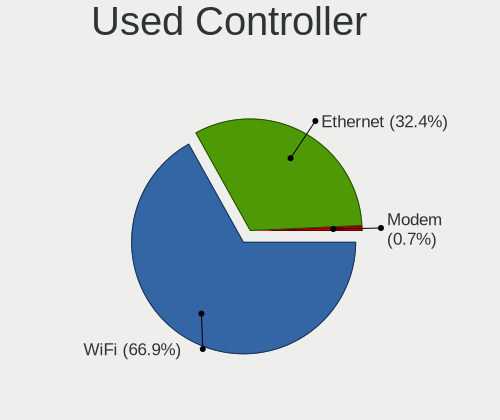

| Kind     | Notebooks | Percent |
|----------|-----------|---------|
| WiFi     | 70        | 53.85%  |
| Ethernet | 60        | 46.15%  |

NICs
----

Total network controllers on board

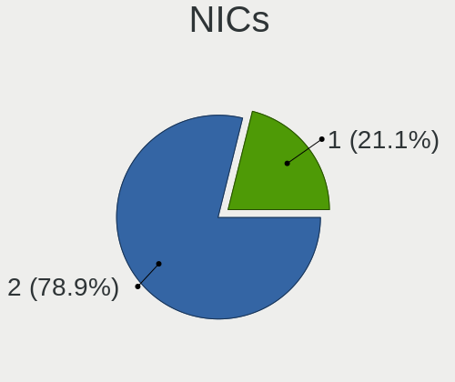

| Total | Notebooks | Percent |
|-------|-----------|---------|
| 2     | 60        | 81.08%  |
| 1     | 14        | 18.92%  |

IPv6
----

IPv6 vs IPv4

| Used | Notebooks | Percent |
|------|-----------|---------|
| No   | 72        | 96%     |
| Yes  | 3         | 4%      |

Bluetooth
---------

Bluetooth Vendor
----------------

Controller vendors

| Vendor                          | Notebooks | Percent |
|---------------------------------|-----------|---------|
| Intel                           | 47        | 78.33%  |
| Broadcom                        | 5         | 8.33%   |
| IMC Networks                    | 2         | 3.33%   |
| Cambridge Silicon Radio         | 2         | 3.33%   |
| Ralink                          | 1         | 1.67%   |
| Qualcomm Atheros Communications | 1         | 1.67%   |
| Foxconn / Hon Hai               | 1         | 1.67%   |
| Dell                            | 1         | 1.67%   |

Bluetooth Model
---------------

Controller models

| Model                                                                               | Notebooks | Percent |
|-------------------------------------------------------------------------------------|-----------|---------|
| Intel Bluetooth Device                                                              | 24        | 40%     |
| Intel Bluetooth 9460/9560 Jefferson Peak (JfP)                                      | 15        | 25%     |
| Intel Bluetooth wireless interface                                                  | 4         | 6.67%   |
| Intel AX200 Bluetooth                                                               | 4         | 6.67%   |
| IMC Networks Bluetooth Radio                                                        | 2         | 3.33%   |
| Cambridge Silicon Radio Bluetooth Dongle (HCI mode)                                 | 2         | 3.33%   |
| Broadcom BCM20702 Bluetooth 4.0 [ThinkPad]                                          | 2         | 3.33%   |
| Ralink RT3290 Bluetooth                                                             | 1         | 1.67%   |
| Qualcomm Atheros  Bluetooth Device                                                  | 1         | 1.67%   |
| Foxconn / Hon Hai Foxconn T77H114 BCM2070 [Single-Chip Bluetooth 2.1 + EDR Adapter] | 1         | 1.67%   |
| Dell DW375 Bluetooth Module                                                         | 1         | 1.67%   |
| Broadcom BCM43142A0 Bluetooth 4.0                                                   | 1         | 1.67%   |
| Broadcom BCM20702A0 Bluetooth                                                       | 1         | 1.67%   |
| Broadcom BCM2045B (BDC-2.1)                                                         | 1         | 1.67%   |

Sound
-----

Sound Vendor
------------

Sound card vendors

| Vendor                 | Notebooks | Percent |
|------------------------|-----------|---------|
| Intel                  | 70        | 61.95%  |
| Nvidia                 | 13        | 11.5%   |
| Lenovo                 | 11        | 9.73%   |
| AMD                    | 6         | 5.31%   |
| Realtek Semiconductor  | 2         | 1.77%   |
| Plantronics            | 2         | 1.77%   |
| Generalplus Technology | 2         | 1.77%   |
| Texas Instruments      | 1         | 0.88%   |
| Logitech               | 1         | 0.88%   |
| JMTek                  | 1         | 0.88%   |
| Google                 | 1         | 0.88%   |
| GN Netcom              | 1         | 0.88%   |
| Focusrite-Novation     | 1         | 0.88%   |
| Dell                   | 1         | 0.88%   |

Sound Model
-----------

Sound card models

| Model                                                                             | Notebooks | Percent |
|-----------------------------------------------------------------------------------|-----------|---------|
| Intel Sunrise Point-LP HD Audio                                                   | 14        | 11.67%  |
| Intel Cannon Point-LP High Definition Audio Controller                            | 11        | 9.17%   |
| Intel Cannon Lake PCH cAVS                                                        | 10        | 8.33%   |
| Intel Comet Lake PCH cAVS                                                         | 7         | 5.83%   |
| Lenovo ThinkPad Thunderbolt 3 Dock USB Audio                                      | 6         | 5%      |
| Intel Comet Lake PCH-LP cAVS                                                      | 6         | 5%      |
| Intel 7 Series/C216 Chipset Family High Definition Audio Controller               | 5         | 4.17%   |
| Intel 6 Series/C200 Series Chipset Family High Definition Audio Controller        | 5         | 4.17%   |
| Nvidia GP107GL High Definition Audio Controller                                   | 4         | 3.33%   |
| Intel 5 Series/3400 Series Chipset High Definition Audio                          | 4         | 3.33%   |
| AMD Family 17h (Models 10h-1fh) HD Audio Controller                               | 4         | 3.33%   |
| Intel Wildcat Point-LP High Definition Audio Controller                           | 3         | 2.5%    |
| Intel Broadwell-U Audio Controller                                                | 3         | 2.5%    |
| Realtek Semiconductor USB Audio                                                   | 2         | 1.67%   |
| Plantronics BT600                                                                 | 2         | 1.67%   |
| Nvidia TU116 High Definition Audio Controller                                     | 2         | 1.67%   |
| Nvidia TU106 High Definition Audio Controller                                     | 2         | 1.67%   |
| Nvidia GM107 High Definition Audio Controller [GeForce 940MX]                     | 2         | 1.67%   |
| Nvidia GF108 High Definition Audio Controller                                     | 2         | 1.67%   |
| Lenovo ThinkPad Thunderbolt 3 Dock Audio                                          | 2         | 1.67%   |
| Intel CM238 HD Audio Controller                                                   | 2         | 1.67%   |
| Intel 100 Series/C230 Series Chipset Family HD Audio Controller                   | 2         | 1.67%   |
| AMD Renoir Radeon High Definition Audio Controller                                | 2         | 1.67%   |
| Texas Instruments PCM2902 Audio Codec                                             | 1         | 0.83%   |
| Nvidia GK107 HDMI Audio Controller                                                | 1         | 0.83%   |
| Logitech H555 Headset                                                             | 1         | 0.83%   |
| Lenovo ThinkPad USB-C Dock Gen2 USB Audio                                         | 1         | 0.83%   |
| Lenovo ThinkPad Dock Audio                                                        | 1         | 0.83%   |
| Lenovo Thinkcentre TIO24Gen3 for USB-audio                                        | 1         | 0.83%   |
| JMTek iTalk-02                                                                    | 1         | 0.83%   |
| Intel Haswell-ULT HD Audio Controller                                             | 1         | 0.83%   |
| Intel 8 Series HD Audio Controller                                                | 1         | 0.83%   |
| Google Pixel earbuds                                                              | 1         | 0.83%   |
| GN Netcom Jabra EVOLVE 20 MS                                                      | 1         | 0.83%   |
| Generalplus Technology USB Microphone                                             | 1         | 0.83%   |
| Generalplus Technology USB Audio Device                                           | 1         | 0.83%   |
| Focusrite-Novation Scarlett 2i2 Camera                                            | 1         | 0.83%   |
| Dell AC511 Sound Bar                                                              | 1         | 0.83%   |
| AMD Redwood HDMI Audio [Radeon HD 5000 Series]                                    | 1         | 0.83%   |
| AMD Raven/Raven2/Fenghuang HDMI/DP Audio Controller                               | 1         | 0.83%   |
| AMD Caicos HDMI Audio [Radeon HD 6450 / 7450/8450/8490 OEM / R5 230/235/235X OEM] | 1         | 0.83%   |

Memory
------

Memory Vendor
-------------

Memory module vendors

| Vendor              | Notebooks | Percent |
|---------------------|-----------|---------|
| Samsung Electronics | 8         | 38.1%   |
| SK Hynix            | 7         | 33.33%  |
| Unknown             | 2         | 9.52%   |
| Kingston            | 2         | 9.52%   |
| Micron Technology   | 1         | 4.76%   |
| Crucial             | 1         | 4.76%   |

Memory Model
------------

Memory module models

| Model                                                        | Notebooks | Percent |
|--------------------------------------------------------------|-----------|---------|
| Unknown RAM V3D4SF16GB1G81G82400 16GB SODIMM DDR4 2400MT/s   | 1         | 4.76%   |
| Unknown RAM Module 8GB SODIMM DDR3 1600MT/s                  | 1         | 4.76%   |
| SK Hynix RAM HMT451S6BFR8A-PB 4GB SODIMM DDR3 1600MT/s       | 1         | 4.76%   |
| SK Hynix RAM HMT41GS6BFR8A-PB 8GB SODIMM DDR3 1600MT/s       | 1         | 4.76%   |
| SK Hynix RAM HMT351S6EFR8A-PB 4GB SODIMM DDR3 1600MT/s       | 1         | 4.76%   |
| SK Hynix RAM HMT351S6CFR8C-H9 4GB SODIMM DDR3 1333MT/s       | 1         | 4.76%   |
| SK Hynix RAM HMAB2GS6AMR6N-XN 16GB SODIMM DDR4 3200MT/s      | 1         | 4.76%   |
| SK Hynix RAM HMA851S6AFR6N-UH 4GB SODIMM DDR4 2667MT/s       | 1         | 4.76%   |
| SK Hynix RAM HMA82GS6AFR8N-UH 16GB SODIMM DDR4 2667MT/s      | 1         | 4.76%   |
| Samsung RAM M471B5273DH0-CH9 4096MB SODIMM DDR3 1334MT/s     | 1         | 4.76%   |
| Samsung RAM M471B5173EB0-YK0 4096MB SODIMM DDR3 1600MT/s     | 1         | 4.76%   |
| Samsung RAM M471B5173CB0-YK0 4GB SODIMM DDR3 1600MT/s        | 1         | 4.76%   |
| Samsung RAM M471A5244CB0-CRC 4GB SODIMM DDR4 2667MT/s        | 1         | 4.76%   |
| Samsung RAM M471A1K43DB1-CTD 8GB SODIMM DDR4 2667MT/s        | 1         | 4.76%   |
| Samsung RAM M471A1K43BB1-CTD 8GB SODIMM DDR4 2667MT/s        | 1         | 4.76%   |
| Samsung RAM K4EBE304EB-EGCG 8GB Row Of Chips LPDDR3 2133MT/s | 1         | 4.76%   |
| Samsung RAM K4B8G1646B-MYK0 4GB SODIMM DDR3 1600MT/s         | 1         | 4.76%   |
| Micron RAM 8KTF51264HZ-1G9E5 4GB SODIMM DDR3 1333MT/s        | 1         | 4.76%   |
| Kingston RAM KHX2400C14S4/8G 8GB SODIMM DDR4 2400MT/s        | 1         | 4.76%   |
| Kingston RAM 99U5469-042.A00LF 4096MB SODIMM DDR3 1333MT/s   | 1         | 4.76%   |
| Crucial RAM CT102464BF160B.M16 8GB SODIMM DDR3 1600MT/s      | 1         | 4.76%   |

Memory Kind
-----------

Memory module kinds

| Kind   | Notebooks | Percent |
|--------|-----------|---------|
| DDR3   | 7         | 46.67%  |
| DDR4   | 6         | 40%     |
| LPDDR4 | 1         | 6.67%   |
| LPDDR3 | 1         | 6.67%   |

Memory Form Factor
------------------

Physical design of the memory module

| Name         | Notebooks | Percent |
|--------------|-----------|---------|
| SODIMM       | 13        | 92.86%  |
| Row Of Chips | 1         | 7.14%   |

Memory Size
-----------

Memory module size

| Size  | Notebooks | Percent |
|-------|-----------|---------|
| 4096  | 7         | 46.67%  |
| 8192  | 5         | 33.33%  |
| 16384 | 3         | 20%     |

Memory Speed
------------

Memory module speed

| Speed | Notebooks | Percent |
|-------|-----------|---------|
| 2667  | 5         | 29.41%  |
| 1600  | 5         | 29.41%  |
| 2400  | 2         | 11.76%  |
| 1333  | 2         | 11.76%  |
| 3200  | 1         | 5.88%   |
| 2133  | 1         | 5.88%   |
| 1334  | 1         | 5.88%   |

Printers & scanners
-------------------

Printer Vendor
--------------

Printer device vendors

| Vendor          | Notebooks | Percent |
|-----------------|-----------|---------|
| Hewlett-Packard | 1         | 100%    |

Printer Model
-------------

Printer device models

| Model               | Notebooks | Percent |
|---------------------|-----------|---------|
| HP ENVY 4500 series | 1         | 100%    |

Scanner Vendor
--------------

Scanner device vendors

Zero info for selected period =(

Scanner Model
-------------

Scanner device models

Zero info for selected period =(

Camera
------

Camera Vendor
-------------

Camera device vendors

| Vendor                                 | Notebooks | Percent |
|----------------------------------------|-----------|---------|
| Chicony Electronics                    | 24        | 30.77%  |
| IMC Networks                           | 11        | 14.1%   |
| Acer                                   | 7         | 8.97%   |
| Sunplus Innovation Technology          | 6         | 7.69%   |
| Realtek Semiconductor                  | 6         | 7.69%   |
| Microdia                               | 6         | 7.69%   |
| Logitech                               | 5         | 6.41%   |
| Suyin                                  | 3         | 3.85%   |
| Lite-On Technology                     | 3         | 3.85%   |
| Samsung Electronics                    | 2         | 2.56%   |
| Cheng Uei Precision Industry (Foxlink) | 2         | 2.56%   |
| Unknown                                | 1         | 1.28%   |
| Quanta                                 | 1         | 1.28%   |
| Lenovo                                 | 1         | 1.28%   |

Camera Model
------------

Camera device models

| Model                                                        | Notebooks | Percent |
|--------------------------------------------------------------|-----------|---------|
| Chicony Integrated Camera                                    | 15        | 18.99%  |
| IMC Networks Integrated Camera                               | 9         | 11.39%  |
| Realtek Integrated_Webcam_HD                                 | 5         | 6.33%   |
| Acer Integrated Camera                                       | 5         | 6.33%   |
| Logitech HD Pro Webcam C920                                  | 4         | 5.06%   |
| Sunplus Integrated_Webcam_HD                                 | 3         | 3.8%    |
| Lite-On Integrated Camera                                    | 3         | 3.8%    |
| Samsung Galaxy A5 (MTP)                                      | 2         | 2.53%   |
| Microdia Webcam                                              | 2         | 2.53%   |
| Microdia Integrated Webcam                                   | 2         | 2.53%   |
| IMC Networks USB2.0 HD UVC WebCam                            | 2         | 2.53%   |
| Chicony ThinkPad T490 Webcam                                 | 2         | 2.53%   |
| Chicony Integrated Camera [ThinkPad]                         | 2         | 2.53%   |
| Chicony HP HD Camera                                         | 2         | 2.53%   |
| Unknown FULL HD 1080P Webcam                                 | 1         | 1.27%   |
| Suyin USB2.0 RGBIR Camera                                    | 1         | 1.27%   |
| Suyin Integrated_Webcam_HD                                   | 1         | 1.27%   |
| Suyin HP Truevision HD                                       | 1         | 1.27%   |
| Sunplus Laptop_Integrated_Webcam_FHD                         | 1         | 1.27%   |
| Sunplus Integrated Webcam                                    | 1         | 1.27%   |
| Sunplus HP HD Webcam [Fixed]                                 | 1         | 1.27%   |
| Realtek Streaming Webcam                                     | 1         | 1.27%   |
| Quanta HP HD Camera                                          | 1         | 1.27%   |
| Microdia Laptop_Integrated_Webcam_HD                         | 1         | 1.27%   |
| Microdia Laptop_Integrated_Webcam_E4HD                       | 1         | 1.27%   |
| Logitech Webcam C310                                         | 1         | 1.27%   |
| Lenovo Integrated Webcam                                     | 1         | 1.27%   |
| Chicony Lenovo Integrated Camera (0.3MP)                     | 1         | 1.27%   |
| Chicony Integrated IR Camera                                 | 1         | 1.27%   |
| Chicony HP Wide Vision HD Camera                             | 1         | 1.27%   |
| Chicony HP Webcam                                            | 1         | 1.27%   |
| Cheng Uei Precision Industry (Foxlink) XiaoMi USB 2.0 Webcam | 1         | 1.27%   |
| Cheng Uei Precision Industry (Foxlink) Webcam                | 1         | 1.27%   |
| Acer ThinkPad P50 Integrated Camera                          | 1         | 1.27%   |
| Acer SunplusIT Integrated Camera                             | 1         | 1.27%   |

Security
--------

Fingerprint Vendor
------------------

Fingerprint sensor vendors

| Vendor                | Notebooks | Percent |
|-----------------------|-----------|---------|
| Synaptics             | 19        | 59.38%  |
| Validity Sensors      | 10        | 31.25%  |
| Upek                  | 2         | 6.25%   |
| Elan Microelectronics | 1         | 3.13%   |

Fingerprint Model
-----------------

Fingerprint sensor models

| Model                                                                      | Notebooks | Percent |
|----------------------------------------------------------------------------|-----------|---------|
| Synaptics Prometheus MIS Touch Fingerprint Reader                          | 15        | 46.88%  |
| Validity Sensors VFS 5011 fingerprint sensor                               | 3         | 9.38%   |
| Synaptics Metallica MIS Touch Fingerprint Reader                           | 3         | 9.38%   |
| Validity Sensors Synaptics VFS7552 Touch Fingerprint Sensor with PurePrint | 2         | 6.25%   |
| Upek Biometric Touchchip/Touchstrip Fingerprint Sensor                     | 2         | 6.25%   |
| Validity Sensors VFS7552 Touch Fingerprint Sensor                          | 1         | 3.13%   |
| Validity Sensors VFS7500 Touch Fingerprint Sensor                          | 1         | 3.13%   |
| Validity Sensors VFS495 Fingerprint Reader                                 | 1         | 3.13%   |
| Validity Sensors VFS471 Fingerprint Reader                                 | 1         | 3.13%   |
| Validity Sensors Synaptics WBDI                                            | 1         | 3.13%   |
| Synaptics  FS7604 Touch Fingerprint Sensor with PurePrint                  | 1         | 3.13%   |
| Elan ELAN:Fingerprint                                                      | 1         | 3.13%   |

Chipcard Vendor
---------------

Chipcard module vendors

| Vendor      | Notebooks | Percent |
|-------------|-----------|---------|
| Broadcom    | 5         | 45.45%  |
| Alcor Micro | 3         | 27.27%  |
| Lenovo      | 2         | 18.18%  |
| Upek        | 1         | 9.09%   |

Chipcard Model
--------------

Chipcard module models

| Model                                                      | Notebooks | Percent |
|------------------------------------------------------------|-----------|---------|
| Alcor Micro AU9540 Smartcard Reader                        | 3         | 27.27%  |
| Lenovo Integrated Smart Card Reader                        | 2         | 18.18%  |
| Broadcom 5880                                              | 2         | 18.18%  |
| Broadcom 58200                                             | 2         | 18.18%  |
| Upek TouchChip Fingerprint Coprocessor (WBF advanced mode) | 1         | 9.09%   |
| Broadcom BCM5880 Secure Applications Processor             | 1         | 9.09%   |

Unsupported
-----------

Unsupported Devices
-------------------

Total unsupported devices on board

| Total | Notebooks | Percent |
|-------|-----------|---------|
| 1     | 41        | 55.41%  |
| 0     | 26        | 35.14%  |
| 2     | 6         | 8.11%   |
| 3     | 1         | 1.35%   |

Unsupported Device Types
------------------------

Types of unsupported devices

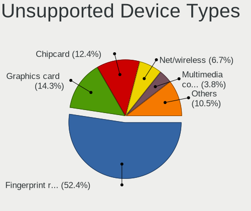

| Type                  | Notebooks | Percent |
|-----------------------|-----------|---------|
| Fingerprint reader    | 32        | 57.14%  |
| Chipcard              | 9         | 16.07%  |
| Graphics card         | 8         | 14.29%  |
| Net/ethernet          | 2         | 3.57%   |
| Bluetooth             | 2         | 3.57%   |
| Storage               | 1         | 1.79%   |
| Net/wireless          | 1         | 1.79%   |
| Multimedia controller | 1         | 1.79%   |

