RHEL 8 - Tested Hardware & Statistics (Notebooks)
-------------------------------------------------

A project to collect tested hardware configurations for RHEL 8.

Anyone can contribute to this report by the [hw-probe](https://github.com/linuxhw/hw-probe) tool:

    sudo -E hw-probe -all -upload

Please contribute! Especially if your hardware is rare.

Contents
--------

* [ Test Cases ](#test-cases)

* [ System ](#system)
  - [ Kernel                   ](#kernel)
  - [ Kernel Family            ](#kernel-family)
  - [ Kernel Major Ver.        ](#kernel-major-ver)
  - [ Arch                     ](#arch)
  - [ DE                       ](#de)
  - [ Display Server           ](#display-server)
  - [ Display Manager          ](#display-manager)
  - [ OS Lang                  ](#os-lang)
  - [ Boot Mode                ](#boot-mode)
  - [ Filesystem               ](#filesystem)
  - [ Part. scheme             ](#part-scheme)
  - [ Dual Boot with Linux/BSD ](#dual-boot-with-linuxbsd)
  - [ Dual Boot (Win)          ](#dual-boot-win)

* [ Board ](#board)
  - [ Vendor                   ](#vendor)
  - [ Model                    ](#model)
  - [ Model Family             ](#model-family)
  - [ MFG Year                 ](#mfg-year)
  - [ Form Factor              ](#form-factor)
  - [ Secure Boot              ](#secure-boot)
  - [ Coreboot                 ](#coreboot)
  - [ RAM Size                 ](#ram-size)
  - [ RAM Used                 ](#ram-used)
  - [ Total Drives             ](#total-drives)
  - [ Has CD-ROM               ](#has-cd-rom)
  - [ Has Ethernet             ](#has-ethernet)
  - [ Has WiFi                 ](#has-wifi)
  - [ Has Bluetooth            ](#has-bluetooth)

* [ Location ](#location)
  - [ Country                  ](#country)
  - [ City                     ](#city)

* [ Drives ](#drives)
  - [ Drive Vendor             ](#drive-vendor)
  - [ Drive Model              ](#drive-model)
  - [ HDD Vendor               ](#hdd-vendor)
  - [ SSD Vendor               ](#ssd-vendor)
  - [ Drive Kind               ](#drive-kind)
  - [ Drive Connector          ](#drive-connector)
  - [ Drive Size               ](#drive-size)
  - [ Space Total              ](#space-total)
  - [ Space Used               ](#space-used)
  - [ Malfunc. Drives          ](#malfunc-drives)
  - [ Malfunc. Drive Vendor    ](#malfunc-drive-vendor)
  - [ Malfunc. HDD Vendor      ](#malfunc-hdd-vendor)
  - [ Malfunc. Drive Kind      ](#malfunc-drive-kind)
  - [ Failed Drives            ](#failed-drives)
  - [ Failed Drive Vendor      ](#failed-drive-vendor)
  - [ Drive Status             ](#drive-status)

* [ Storage controller ](#storage-controller)
  - [ Storage Vendor           ](#storage-vendor)
  - [ Storage Model            ](#storage-model)
  - [ Storage Kind             ](#storage-kind)

* [ Processor ](#processor)
  - [ CPU Vendor               ](#cpu-vendor)
  - [ CPU Model                ](#cpu-model)
  - [ CPU Model Family         ](#cpu-model-family)
  - [ CPU Cores                ](#cpu-cores)
  - [ CPU Sockets              ](#cpu-sockets)
  - [ CPU Threads              ](#cpu-threads)
  - [ CPU Op-Modes             ](#cpu-op-modes)
  - [ CPU Microcode            ](#cpu-microcode)
  - [ CPU Microarch            ](#cpu-microarch)

* [ Graphics ](#graphics)
  - [ GPU Vendor               ](#gpu-vendor)
  - [ GPU Model                ](#gpu-model)
  - [ GPU Combo                ](#gpu-combo)
  - [ GPU Driver               ](#gpu-driver)
  - [ GPU Memory               ](#gpu-memory)

* [ Monitor ](#monitor)
  - [ Monitor Vendor           ](#monitor-vendor)
  - [ Monitor Model            ](#monitor-model)
  - [ Monitor Resolution       ](#monitor-resolution)
  - [ Monitor Diagonal         ](#monitor-diagonal)
  - [ Monitor Width            ](#monitor-width)
  - [ Aspect Ratio             ](#aspect-ratio)
  - [ Monitor Area             ](#monitor-area)
  - [ Pixel Density            ](#pixel-density)
  - [ Multiple Monitors        ](#multiple-monitors)

* [ Network ](#network)
  - [ Net Controller Vendor    ](#net-controller-vendor)
  - [ Net Controller Model     ](#net-controller-model)
  - [ Wireless Vendor          ](#wireless-vendor)
  - [ Wireless Model           ](#wireless-model)
  - [ Ethernet Vendor          ](#ethernet-vendor)
  - [ Ethernet Model           ](#ethernet-model)
  - [ Net Controller Kind      ](#net-controller-kind)
  - [ Used Controller          ](#used-controller)
  - [ NICs                     ](#nics)
  - [ IPv6                     ](#ipv6)

* [ Bluetooth ](#bluetooth)
  - [ Bluetooth Vendor         ](#bluetooth-vendor)
  - [ Bluetooth Model          ](#bluetooth-model)

* [ Sound ](#sound)
  - [ Sound Vendor             ](#sound-vendor)
  - [ Sound Model              ](#sound-model)

* [ Memory ](#memory)
  - [ Memory Vendor            ](#memory-vendor)
  - [ Memory Model             ](#memory-model)
  - [ Memory Kind              ](#memory-kind)
  - [ Memory Form Factor       ](#memory-form-factor)
  - [ Memory Size              ](#memory-size)
  - [ Memory Speed             ](#memory-speed)

* [ Printers & scanners ](#printers--scanners)
  - [ Printer Vendor           ](#printer-vendor)
  - [ Printer Model            ](#printer-model)
  - [ Scanner Vendor           ](#scanner-vendor)
  - [ Scanner Model            ](#scanner-model)

* [ Camera ](#camera)
  - [ Camera Vendor            ](#camera-vendor)
  - [ Camera Model             ](#camera-model)

* [ Security ](#security)
  - [ Fingerprint Vendor       ](#fingerprint-vendor)
  - [ Fingerprint Model        ](#fingerprint-model)
  - [ Chipcard Vendor          ](#chipcard-vendor)
  - [ Chipcard Model           ](#chipcard-model)

* [ Unsupported ](#unsupported)
  - [ Unsupported Devices      ](#unsupported-devices)
  - [ Unsupported Device Types ](#unsupported-device-types)

Test Cases
----------

Total: 171

| Vendor  | Model                       | Probe                                                      | Date         |
|---------|-----------------------------|------------------------------------------------------------|--------------|
| Lenovo  | ThinkPad T14s Gen 1 20T1... | [7e2ddf75e5](https://linux-hardware.org/?probe=7e2ddf75e5) | Jun 30, 2022 |
| Lenovo  | ThinkPad T480 20L60034MX    | [179d10e315](https://linux-hardware.org/?probe=179d10e315) | Jun 21, 2022 |
| Lenovo  | ThinkPad T14s Gen 1 20T1... | [d77ce7a3f7](https://linux-hardware.org/?probe=d77ce7a3f7) | Jun 13, 2022 |
| Lenovo  | ThinkPad T15 Gen 2i 20W5... | [8ee33363ef](https://linux-hardware.org/?probe=8ee33363ef) | May 30, 2022 |
| Lenovo  | Legion 5 15ACH6 82JW        | [9a3948a7e8](https://linux-hardware.org/?probe=9a3948a7e8) | May 23, 2022 |
| Lenovo  | Legion 5 15ACH6 82JW        | [2e520c1e13](https://linux-hardware.org/?probe=2e520c1e13) | May 23, 2022 |
| Lenovo  | Legion 5 15ACH6 82JW        | [9be915450d](https://linux-hardware.org/?probe=9be915450d) | May 23, 2022 |
| Lenovo  | ThinkPad T14s Gen 1 20T1... | [0b0ffcbfee](https://linux-hardware.org/?probe=0b0ffcbfee) | May 13, 2022 |
| ASUSTek | VivoBook_ASUSLaptop X409... | [61e54407f3](https://linux-hardware.org/?probe=61e54407f3) | May 04, 2022 |
| ASUSTek | VivoBook_ASUSLaptop X409... | [7d0cabeccf](https://linux-hardware.org/?probe=7d0cabeccf) | May 04, 2022 |
| Lenovo  | ThinkPad T480 20L6S29D02    | [1eb07120eb](https://linux-hardware.org/?probe=1eb07120eb) | Apr 29, 2022 |
| Lenovo  | ThinkPad T14 Gen 1 20S1S... | [a3ddc714b0](https://linux-hardware.org/?probe=a3ddc714b0) | Apr 28, 2022 |
| Lenovo  | ThinkPad T590 20N5S2NC0V    | [d6bf3c27ef](https://linux-hardware.org/?probe=d6bf3c27ef) | Apr 20, 2022 |
| Dell    | Precision 5550              | [949f4a7658](https://linux-hardware.org/?probe=949f4a7658) | Apr 19, 2022 |
| Lenovo  | ThinkPad P17 Gen 2i 20YU... | [7763003308](https://linux-hardware.org/?probe=7763003308) | Mar 31, 2022 |
| Dell    | Precision 7560              | [2abd72978c](https://linux-hardware.org/?probe=2abd72978c) | Mar 29, 2022 |
| Lenovo  | ThinkPad P17 Gen 2i 20YU... | [14ea45c4d7](https://linux-hardware.org/?probe=14ea45c4d7) | Mar 03, 2022 |
| Lenovo  | ThinkPad P1 Gen 3 20TJS2... | [eed6e0f012](https://linux-hardware.org/?probe=eed6e0f012) | Mar 01, 2022 |
| Lenovo  | Z40-70 20366                | [5210de65b3](https://linux-hardware.org/?probe=5210de65b3) | Feb 27, 2022 |
| Lenovo  | ThinkPad T14s Gen 1 20T1... | [081fe975ce](https://linux-hardware.org/?probe=081fe975ce) | Feb 07, 2022 |
| Lenovo  | ThinkPad X1 Yoga 1st 20F... | [7b31f4ca0b](https://linux-hardware.org/?probe=7b31f4ca0b) | Feb 05, 2022 |
| Lenovo  | ThinkPad P17 Gen 2i 20YU... | [b3ef38d0ef](https://linux-hardware.org/?probe=b3ef38d0ef) | Jan 31, 2022 |
| Lenovo  | ThinkPad T490 20N3S5DV0S    | [e619ec0303](https://linux-hardware.org/?probe=e619ec0303) | Jan 31, 2022 |
| Lenovo  | ThinkPad P17 Gen 2i 20YU... | [a60504e123](https://linux-hardware.org/?probe=a60504e123) | Jan 29, 2022 |
| HP      | EliteBook 8460p             | [335a0c0490](https://linux-hardware.org/?probe=335a0c0490) | Jan 28, 2022 |
| ASUSTek | X550VX                      | [d7ef034908](https://linux-hardware.org/?probe=d7ef034908) | Jan 03, 2022 |
| Toshiba | Satellite Pro R50-C         | [012f2de3d5](https://linux-hardware.org/?probe=012f2de3d5) | Dec 28, 2021 |
| Toshiba | Satellite Pro R50-C         | [2e716df6c6](https://linux-hardware.org/?probe=2e716df6c6) | Dec 26, 2021 |
| Dell    | Precision 3551              | [cbddfb522a](https://linux-hardware.org/?probe=cbddfb522a) | Dec 21, 2021 |
| Lenovo  | ThinkPad P52 20MAS17205     | [86d1d49f33](https://linux-hardware.org/?probe=86d1d49f33) | Dec 09, 2021 |
| Lenovo  | ThinkPad P17 Gen 2i 20YU... | [ba46713703](https://linux-hardware.org/?probe=ba46713703) | Dec 07, 2021 |
| Acer    | Nitro AN515-54              | [cda3dbe636](https://linux-hardware.org/?probe=cda3dbe636) | Dec 04, 2021 |
| Lenovo  | ThinkPad P1 Gen 3 20TJS2... | [a4e5f602c4](https://linux-hardware.org/?probe=a4e5f602c4) | Dec 01, 2021 |
| Lenovo  | ThinkPad P17 Gen 2i 20YU... | [7cb04612a2](https://linux-hardware.org/?probe=7cb04612a2) | Nov 30, 2021 |
| Lenovo  | ThinkPad P17 Gen 2i 20YU... | [90eea91b30](https://linux-hardware.org/?probe=90eea91b30) | Nov 27, 2021 |
| HP      | EliteBook 840 G8 Noteboo... | [19fc23d020](https://linux-hardware.org/?probe=19fc23d020) | Nov 27, 2021 |
| Lenovo  | ThinkPad P17 Gen 2i 20YU... | [6827caed15](https://linux-hardware.org/?probe=6827caed15) | Nov 19, 2021 |
| Lenovo  | ThinkPad T480 20L6S29E1T    | [df288ab5f0](https://linux-hardware.org/?probe=df288ab5f0) | Nov 18, 2021 |
| Lenovo  | ThinkPad P17 Gen 2i 20YU... | [f766090339](https://linux-hardware.org/?probe=f766090339) | Nov 16, 2021 |
| Lenovo  | ThinkPad P17 Gen 2i 20YU... | [ece232f046](https://linux-hardware.org/?probe=ece232f046) | Nov 11, 2021 |
| Lenovo  | ThinkPad P50 20ENS1L000     | [318b5aea2b](https://linux-hardware.org/?probe=318b5aea2b) | Nov 08, 2021 |
| Lenovo  | ThinkPad E490 20N8000JAD    | [997e24e5c9](https://linux-hardware.org/?probe=997e24e5c9) | Nov 06, 2021 |
| Lenovo  | ThinkPad E490 20N8000JAD    | [9d70a71c88](https://linux-hardware.org/?probe=9d70a71c88) | Nov 06, 2021 |
| Lenovo  | ThinkPad T14s Gen 1 20T1... | [59dfcd3b23](https://linux-hardware.org/?probe=59dfcd3b23) | Oct 22, 2021 |
| HP      | ZBook Firefly 15 inch G8... | [49d20bd238](https://linux-hardware.org/?probe=49d20bd238) | Oct 12, 2021 |
| Lenovo  | ThinkPad P50 20ENS1L000     | [f8443770b9](https://linux-hardware.org/?probe=f8443770b9) | Oct 08, 2021 |
| Lenovo  | ThinkPad T490s 20NYS7K90... | [042f9bec29](https://linux-hardware.org/?probe=042f9bec29) | Oct 06, 2021 |
| Lenovo  | ThinkPad T470 20HES57W00    | [482453f90b](https://linux-hardware.org/?probe=482453f90b) | Sep 30, 2021 |
| Lenovo  | ThinkPad P1 Gen 3 20TJS2... | [a667466f62](https://linux-hardware.org/?probe=a667466f62) | Sep 17, 2021 |
| Lenovo  | ThinkPad P1 Gen 3 20TJS2... | [502a6b96a3](https://linux-hardware.org/?probe=502a6b96a3) | Sep 13, 2021 |
| Lenovo  | ThinkPad X230 Tablet 343... | [daadb8ccc0](https://linux-hardware.org/?probe=daadb8ccc0) | Sep 06, 2021 |
| Dell    | XPS 15 9560                 | [952dd9f6f5](https://linux-hardware.org/?probe=952dd9f6f5) | Sep 01, 2021 |
| Lenovo  | ThinkPad P1 Gen 3 20TJS2... | [7bf4b860a8](https://linux-hardware.org/?probe=7bf4b860a8) | Aug 26, 2021 |
| Lenovo  | ThinkPad T14s Gen 1 20T1... | [01e55d6021](https://linux-hardware.org/?probe=01e55d6021) | Aug 09, 2021 |
| ASUSTek | TUF Gaming FX505DU_FX505... | [586add668c](https://linux-hardware.org/?probe=586add668c) | Aug 03, 2021 |
| ASUSTek | TUF Gaming FX505DU_FX505... | [5096c7cbb6](https://linux-hardware.org/?probe=5096c7cbb6) | Aug 03, 2021 |
| Dell    | XPS 15 9560                 | [1bb9bd9d46](https://linux-hardware.org/?probe=1bb9bd9d46) | Jul 27, 2021 |
| Lenovo  | ThinkPad T14s Gen 1 20T1... | [cea7891e5a](https://linux-hardware.org/?probe=cea7891e5a) | Jul 26, 2021 |
| HP      | ZBook 15 G5                 | [9f9cc51cda](https://linux-hardware.org/?probe=9f9cc51cda) | Jul 20, 2021 |
| Dell    | Latitude E5510              | [2ab8a16c55](https://linux-hardware.org/?probe=2ab8a16c55) | Jul 12, 2021 |
| HP      | EliteBook 850 G7 Noteboo... | [7e7fbaff11](https://linux-hardware.org/?probe=7e7fbaff11) | Jul 11, 2021 |
| Lenovo  | ThinkPad T14 Gen 1 20S1S... | [c4091b8c8c](https://linux-hardware.org/?probe=c4091b8c8c) | Jul 09, 2021 |
| Lenovo  | ThinkPad T490s 20NYS7K91... | [a03b6b86cc](https://linux-hardware.org/?probe=a03b6b86cc) | Jul 03, 2021 |
| Lenovo  | ThinkPad T490s 20NYS7K91... | [500c95d16b](https://linux-hardware.org/?probe=500c95d16b) | Jul 03, 2021 |
| Dell    | Latitude E6430              | [ce6bc6552c](https://linux-hardware.org/?probe=ce6bc6552c) | Jun 29, 2021 |
| Dell    | Latitude E6430              | [ed72da5de8](https://linux-hardware.org/?probe=ed72da5de8) | Jun 25, 2021 |
| Dell    | Latitude E6430              | [899e8720e1](https://linux-hardware.org/?probe=899e8720e1) | Jun 25, 2021 |
| Lenovo  | ThinkPad T14s Gen 1 20T1... | [b1f8b4df82](https://linux-hardware.org/?probe=b1f8b4df82) | Jun 25, 2021 |
| Lenovo  | ThinkPad T490s 20NYS7K91... | [eccdf8e8c1](https://linux-hardware.org/?probe=eccdf8e8c1) | Jun 20, 2021 |
| Lenovo  | ThinkPad P15 Gen 1 20SUS... | [a703424a8c](https://linux-hardware.org/?probe=a703424a8c) | Jun 13, 2021 |
| Dell    | Precision 3541              | [984db774ed](https://linux-hardware.org/?probe=984db774ed) | Jun 08, 2021 |
| HP      | ZBook Studio G5             | [c3162a0346](https://linux-hardware.org/?probe=c3162a0346) | Jun 04, 2021 |
| HP      | ZBook Studio G5             | [1a9225e48c](https://linux-hardware.org/?probe=1a9225e48c) | Jun 04, 2021 |
| Dell    | Latitude E6530              | [2e9b8200a9](https://linux-hardware.org/?probe=2e9b8200a9) | May 29, 2021 |
| Lenovo  | ThinkPad T14 Gen 1 20S1S... | [c51ae8a5ff](https://linux-hardware.org/?probe=c51ae8a5ff) | May 28, 2021 |
| Lenovo  | ThinkPad P1 Gen 3 20TJS2... | [65666a7bec](https://linux-hardware.org/?probe=65666a7bec) | May 17, 2021 |
| Lenovo  | ThinkPad P1 Gen 3 20TJS2... | [349f951788](https://linux-hardware.org/?probe=349f951788) | Apr 18, 2021 |
| Dell    | Inspiron 3559               | [854655e305](https://linux-hardware.org/?probe=854655e305) | Apr 14, 2021 |
| Lenovo  | ThinkPad P1 Gen 3 20TJS2... | [46bb05613f](https://linux-hardware.org/?probe=46bb05613f) | Apr 13, 2021 |
| Lenovo  | ThinkPad T14s Gen 1 20T1... | [3ee0cc7c18](https://linux-hardware.org/?probe=3ee0cc7c18) | Apr 13, 2021 |
| Lenovo  | ThinkPad P1 Gen 3 20TJS2... | [ecc3dfa09a](https://linux-hardware.org/?probe=ecc3dfa09a) | Apr 13, 2021 |
| HP      | OMEN by Laptop 15-dc1xxx    | [a40c80d584](https://linux-hardware.org/?probe=a40c80d584) | Apr 11, 2021 |
| Lenovo  | ThinkPad P1 Gen 3 20TJS2... | [f98af88440](https://linux-hardware.org/?probe=f98af88440) | Apr 06, 2021 |
| Lenovo  | ThinkPad T14 Gen 1 20S1S... | [ee5d8875e3](https://linux-hardware.org/?probe=ee5d8875e3) | Mar 11, 2021 |
| Lenovo  | ThinkPad T460 20FMS1VA09    | [5bc6b53ecf](https://linux-hardware.org/?probe=5bc6b53ecf) | Mar 03, 2021 |
| Lenovo  | ThinkPad T460 20FMS1VA09    | [55314e09ff](https://linux-hardware.org/?probe=55314e09ff) | Mar 03, 2021 |
| Lenovo  | ThinkPad W530 2441B32       | [fb9b49c1d9](https://linux-hardware.org/?probe=fb9b49c1d9) | Mar 02, 2021 |
| ASUSTek | Zephyrus G GU502DU_GA502... | [c6fd48fe3f](https://linux-hardware.org/?probe=c6fd48fe3f) | Feb 28, 2021 |
| Sony    | VPCEB4L1R                   | [1744d5db17](https://linux-hardware.org/?probe=1744d5db17) | Feb 16, 2021 |
| HP      | EliteBook 8460p             | [3aed966657](https://linux-hardware.org/?probe=3aed966657) | Feb 10, 2021 |
| Lenovo  | ThinkPad T14 Gen 1 20S1S... | [071f1be343](https://linux-hardware.org/?probe=071f1be343) | Feb 09, 2021 |
| Lenovo  | ThinkPad X201 3680PKS       | [14a1f8c536](https://linux-hardware.org/?probe=14a1f8c536) | Feb 07, 2021 |
| Lenovo  | ThinkPad X201 3680PKS       | [f935adf770](https://linux-hardware.org/?probe=f935adf770) | Feb 07, 2021 |
| Lenovo  | ThinkPad E15 Gen 2 20T80... | [832d7f19ae](https://linux-hardware.org/?probe=832d7f19ae) | Feb 02, 2021 |
| Lenovo  | ThinkPad L480 20LSCTO1WW    | [bdff7fe555](https://linux-hardware.org/?probe=bdff7fe555) | Jan 28, 2021 |
| Lenovo  | ThinkPad P52 20MAS17205     | [0a2ca85ddc](https://linux-hardware.org/?probe=0a2ca85ddc) | Jan 22, 2021 |
| Lenovo  | ThinkPad P1 Gen 2 20QUS1... | [3e0d4ac7c7](https://linux-hardware.org/?probe=3e0d4ac7c7) | Jan 19, 2021 |
| Lenovo  | ThinkPad T14 Gen 1 20S1S... | [1a1bbc078f](https://linux-hardware.org/?probe=1a1bbc078f) | Jan 18, 2021 |
| Lenovo  | ThinkPad T480s 20L8S2N80... | [d606944d2b](https://linux-hardware.org/?probe=d606944d2b) | Jan 10, 2021 |
| Lenovo  | ThinkPad T14s Gen 1 20T1... | [e24d02bc67](https://linux-hardware.org/?probe=e24d02bc67) | Jan 05, 2021 |
| Lenovo  | ThinkPad E15 Gen 2 20T80... | [e1e788633e](https://linux-hardware.org/?probe=e1e788633e) | Dec 22, 2020 |
| Lenovo  | ThinkPad T490s 20NYS7K91... | [f95e7c46f7](https://linux-hardware.org/?probe=f95e7c46f7) | Dec 14, 2020 |
| Dell    | Latitude 5290               | [f69f594914](https://linux-hardware.org/?probe=f69f594914) | Dec 09, 2020 |
| Dell    | Latitude 5290               | [538342789e](https://linux-hardware.org/?probe=538342789e) | Dec 09, 2020 |
| HP      | Pavilion 14                 | [bed5ca82b9](https://linux-hardware.org/?probe=bed5ca82b9) | Dec 03, 2020 |
| Lenovo  | ThinkPad X250 20CLS0H807    | [a70d23cd77](https://linux-hardware.org/?probe=a70d23cd77) | Dec 02, 2020 |
| Lenovo  | ThinkPad X250 20CLS0H807    | [b446c7d5a5](https://linux-hardware.org/?probe=b446c7d5a5) | Dec 02, 2020 |
| Lenovo  | ThinkPad X250 20CLS0H807    | [81c97fb756](https://linux-hardware.org/?probe=81c97fb756) | Dec 02, 2020 |
| Lenovo  | ThinkPad T460 20BUS0QT0A    | [c0487ec734](https://linux-hardware.org/?probe=c0487ec734) | Dec 02, 2020 |
| Dell    | Precision 7510              | [0725f10b71](https://linux-hardware.org/?probe=0725f10b71) | Nov 23, 2020 |
| TUXEDO  | N13xWU                      | [b72558f93c](https://linux-hardware.org/?probe=b72558f93c) | Nov 19, 2020 |
| Dell    | Inspiron 5567               | [f563b4b50d](https://linux-hardware.org/?probe=f563b4b50d) | Nov 18, 2020 |
| Dell    | Latitude E6420              | [363320d61e](https://linux-hardware.org/?probe=363320d61e) | Nov 11, 2020 |
| Dell    | Latitude E6420              | [8a37aaac86](https://linux-hardware.org/?probe=8a37aaac86) | Nov 11, 2020 |
| TUXEDO  | N13xWU                      | [e6a667e32c](https://linux-hardware.org/?probe=e6a667e32c) | Nov 08, 2020 |
| TUXEDO  | N13xWU                      | [b4cd820410](https://linux-hardware.org/?probe=b4cd820410) | Nov 08, 2020 |
| Dell    | Precision 7510              | [432ebce0a4](https://linux-hardware.org/?probe=432ebce0a4) | Nov 03, 2020 |
| HP      | Pavilion 14                 | [d8220245e5](https://linux-hardware.org/?probe=d8220245e5) | Nov 01, 2020 |
| Dell    | Precision 7510              | [a564df5de7](https://linux-hardware.org/?probe=a564df5de7) | Nov 01, 2020 |
| Lenovo  | ThinkPad T520 42404CG       | [1ca04091de](https://linux-hardware.org/?probe=1ca04091de) | Oct 24, 2020 |
| Lenovo  | ThinkPad T520 42404CG       | [2e3d64e7c5](https://linux-hardware.org/?probe=2e3d64e7c5) | Oct 24, 2020 |
| Lenovo  | ThinkPad T14s Gen 1 20UJ... | [f2907d324d](https://linux-hardware.org/?probe=f2907d324d) | Oct 21, 2020 |
| Dell    | Latitude 5300               | [4169f50442](https://linux-hardware.org/?probe=4169f50442) | Oct 18, 2020 |
| Dell    | Latitude 5300               | [4bd822b6e3](https://linux-hardware.org/?probe=4bd822b6e3) | Oct 15, 2020 |
| HP      | Pavilion 14                 | [b29b04ed35](https://linux-hardware.org/?probe=b29b04ed35) | Oct 08, 2020 |
| Lenovo  | ThinkPad W520 4284GN2       | [8677a1b95c](https://linux-hardware.org/?probe=8677a1b95c) | Oct 07, 2020 |
| Lenovo  | ThinkPad W520 4284GN2       | [352bbb87fe](https://linux-hardware.org/?probe=352bbb87fe) | Oct 07, 2020 |
| Lenovo  | ThinkPad T590 20N5S2NC0V    | [2bc1a5b44a](https://linux-hardware.org/?probe=2bc1a5b44a) | Oct 01, 2020 |
| Lenovo  | ThinkPad P50 20EN0005UK     | [94c1b32081](https://linux-hardware.org/?probe=94c1b32081) | Sep 21, 2020 |
| HP      | ProBook 430 G5              | [08f2b63110](https://linux-hardware.org/?probe=08f2b63110) | Aug 31, 2020 |
| Dell    | Inspiron N5110              | [8b995a24c1](https://linux-hardware.org/?probe=8b995a24c1) | Aug 04, 2020 |
| Dell    | Inspiron N5110              | [97293b7aa0](https://linux-hardware.org/?probe=97293b7aa0) | Aug 04, 2020 |
| ASUSTek | GL502VMK                    | [7556ef6b87](https://linux-hardware.org/?probe=7556ef6b87) | Jul 22, 2020 |
| Dell    | Latitude 5300               | [65284e0295](https://linux-hardware.org/?probe=65284e0295) | Jul 04, 2020 |
| Timi    | TM1707                      | [84538e3769](https://linux-hardware.org/?probe=84538e3769) | Jun 30, 2020 |
| Timi    | TM1707                      | [1267830169](https://linux-hardware.org/?probe=1267830169) | Jun 30, 2020 |
| ASUSTek | GL502VMK                    | [45e4ef6c32](https://linux-hardware.org/?probe=45e4ef6c32) | Jun 25, 2020 |
| Lenovo  | ThinkPad P1 Gen 2 20QUS1... | [ce5bce7893](https://linux-hardware.org/?probe=ce5bce7893) | Jun 19, 2020 |
| Dell    | Latitude 5300               | [8ebae81f7c](https://linux-hardware.org/?probe=8ebae81f7c) | Jun 18, 2020 |
| Lenovo  | ThinkPad T590 20N5S2NC0N    | [b74e2f66bd](https://linux-hardware.org/?probe=b74e2f66bd) | May 29, 2020 |
| Lenovo  | ThinkPad T590 20N5S2NC0N    | [de063b9994](https://linux-hardware.org/?probe=de063b9994) | May 28, 2020 |
| Lenovo  | ThinkPad P1 Gen 2 20QUS1... | [9b51817b92](https://linux-hardware.org/?probe=9b51817b92) | May 26, 2020 |
| HP      | ProBook 430 G5              | [416ff2ebbb](https://linux-hardware.org/?probe=416ff2ebbb) | May 23, 2020 |
| HP      | ProBook 430 G5              | [06bf1966d5](https://linux-hardware.org/?probe=06bf1966d5) | May 23, 2020 |
| Lenovo  | ThinkPad T590 20N5S2NC0V    | [0108b32128](https://linux-hardware.org/?probe=0108b32128) | May 07, 2020 |
| Dell    | G3 3779                     | [5416d30b40](https://linux-hardware.org/?probe=5416d30b40) | May 05, 2020 |
| Dell    | Precision 5540              | [3c0f6bcf28](https://linux-hardware.org/?probe=3c0f6bcf28) | Apr 29, 2020 |
| Lenovo  | ThinkPad T450s 20BWS0B50... | [ea2a99e61e](https://linux-hardware.org/?probe=ea2a99e61e) | Apr 12, 2020 |
| Lenovo  | ThinkPad T590 20N5S2NC0N    | [d955389819](https://linux-hardware.org/?probe=d955389819) | Mar 27, 2020 |
| Lenovo  | ThinkPad T590 20N5S2NC00    | [c86bb46fad](https://linux-hardware.org/?probe=c86bb46fad) | Mar 26, 2020 |
| Lenovo  | ThinkPad T590 20N5S2NC00    | [79d1c623b5](https://linux-hardware.org/?probe=79d1c623b5) | Mar 24, 2020 |
| Lenovo  | ThinkPad X1 Carbon 7th 2... | [07d54a6a50](https://linux-hardware.org/?probe=07d54a6a50) | Mar 24, 2020 |
| Lenovo  | ThinkPad T450s 20BWS0B50... | [e2eabf79b0](https://linux-hardware.org/?probe=e2eabf79b0) | Mar 03, 2020 |
| Sony    | VPCEB23FM                   | [908bc46e69](https://linux-hardware.org/?probe=908bc46e69) | Feb 27, 2020 |
| Sony    | VPCEB23FM                   | [654cbddfc9](https://linux-hardware.org/?probe=654cbddfc9) | Feb 26, 2020 |
| Lenovo  | ThinkPad P52 20M9CTO1WW     | [48c65f99c6](https://linux-hardware.org/?probe=48c65f99c6) | Feb 17, 2020 |
| Lenovo  | ThinkPad P52 20M9CTO1WW     | [4e770d86e3](https://linux-hardware.org/?probe=4e770d86e3) | Feb 15, 2020 |
| Lenovo  | ThinkPad X270 20HN001EMC    | [78dbc955e7](https://linux-hardware.org/?probe=78dbc955e7) | Feb 12, 2020 |
| Lenovo  | ThinkPad P1 Gen 2 20QUS1... | [2b0d41a249](https://linux-hardware.org/?probe=2b0d41a249) | Jan 29, 2020 |
| Lenovo  | ThinkPad T490s 20NX002HU... | [622df7e336](https://linux-hardware.org/?probe=622df7e336) | Jan 24, 2020 |
| Lenovo  | ThinkPad P1 Gen 2 20QUS1... | [ff60ab76a9](https://linux-hardware.org/?probe=ff60ab76a9) | Jan 15, 2020 |
| Lenovo  | ThinkPad X1 Carbon 6th 2... | [21aeb33209](https://linux-hardware.org/?probe=21aeb33209) | Dec 18, 2019 |
| Lenovo  | ThinkPad X1 Carbon 7th 2... | [7b90aa9c1b](https://linux-hardware.org/?probe=7b90aa9c1b) | Nov 21, 2019 |
| Lenovo  | ThinkPad X1 Carbon 7th 2... | [1858b15d73](https://linux-hardware.org/?probe=1858b15d73) | Nov 20, 2019 |
| Lenovo  | ThinkPad X270 20HN001EMC    | [e052f322df](https://linux-hardware.org/?probe=e052f322df) | Nov 15, 2019 |
| Dell    | Inspiron 5567               | [aba56c558d](https://linux-hardware.org/?probe=aba56c558d) | Nov 10, 2019 |
| HP      | 250 G4 Notebook PC          | [8dbaf2e95e](https://linux-hardware.org/?probe=8dbaf2e95e) | Nov 07, 2019 |
| HP      | 250 G4 Notebook PC          | [0347166558](https://linux-hardware.org/?probe=0347166558) | Nov 07, 2019 |
| Lenovo  | ThinkPad X1 Carbon 6th 2... | [f5adffebe4](https://linux-hardware.org/?probe=f5adffebe4) | Oct 30, 2019 |
| Lenovo  | ThinkPad T590 20N5S2NC0V    | [2204d80ff6](https://linux-hardware.org/?probe=2204d80ff6) | Oct 22, 2019 |
| Lenovo  | ThinkPad T480s 20L8S2N80... | [d1d0246ce6](https://linux-hardware.org/?probe=d1d0246ce6) | Aug 09, 2019 |

System
------

Kernel
------

Version of the Linux kernel

| Version                      | Notebooks | Percent |
|------------------------------|-----------|---------|
| 4.18.0-240.10.1.el8_3.x86_64 | 10        | 8%      |
| 4.18.0-240.1.1.el8_3.x86_64  | 10        | 8%      |
| 4.18.0-80.11.2.el8_0.x86_64  | 8         | 6.4%    |
| 4.18.0-240.15.1.el8_3.x86_64 | 8         | 6.4%    |
| 4.18.0-348.20.1.el8_5.x86_64 | 7         | 5.6%    |
| 4.18.0-305.3.1.el8_4.x86_64  | 7         | 5.6%    |
| 4.18.0-348.2.1.el8_5.x86_64  | 4         | 3.2%    |
| 4.18.0-348.12.2.el8_5.x86_64 | 4         | 3.2%    |
| 4.18.0-305.7.1.el8_4.x86_64  | 4         | 3.2%    |
| 4.18.0-305.25.1.el8_4.x86_64 | 4         | 3.2%    |
| 4.18.0-305.19.1.el8_4.x86_64 | 4         | 3.2%    |
| 4.18.0-305.10.2.el8_4.x86_64 | 4         | 3.2%    |
| 4.18.0-240.22.1.el8_3.x86_64 | 4         | 3.2%    |
| 4.18.0-193.el8.x86_64        | 4         | 3.2%    |
| 4.18.0-193.19.1.el8_2.x86_64 | 4         | 3.2%    |
| 4.18.0-348.7.1.el8_5.x86_64  | 3         | 2.4%    |
| 4.18.0-305.el8.x86_64        | 3         | 2.4%    |
| 4.18.0-305.12.1.el8_4.x86_64 | 3         | 2.4%    |
| 4.18.0-193.6.3.el8_2.x86_64  | 3         | 2.4%    |
| 4.18.0-193.28.1.el8_2.x86_64 | 3         | 2.4%    |
| 4.18.0-147.5.1.el8_1.x86_64  | 3         | 2.4%    |
| 4.18.0-372.9.1.el8.x86_64    | 2         | 1.6%    |
| 4.18.0-348.el8.x86_64        | 2         | 1.6%    |
| 4.18.0-193.14.3.el8_2.x86_64 | 2         | 1.6%    |
| 4.18.0-147.el8.x86_64        | 2         | 1.6%    |
| 4.18.0-147.8.1.el8_1.x86_64  | 2         | 1.6%    |
| 5.9.1-1.el8.elrepo.x86_64    | 1         | 0.8%    |
| 4.18.0-80.el8.x86_64         | 1         | 0.8%    |
| 4.18.0-80.4.2.el8_0.x86_64   | 1         | 0.8%    |
| 4.18.0-305.17.1.el8_4.x86_64 | 1         | 0.8%    |
| 4.18.0-240.8.1.el8_3.x86_64  | 1         | 0.8%    |
| 4.18.0-193.23.1.el8_2.x86_64 | 1         | 0.8%    |
| 4.18.0-193.13.2.el8_2.x86_64 | 1         | 0.8%    |
| 4.18.0-193.1.2.el8_2.x86_64  | 1         | 0.8%    |
| 4.18.0-168.el8.x86_64        | 1         | 0.8%    |
| 4.18.0-147.0.3.el8_1.x86_64  | 1         | 0.8%    |
| 4.18.0-144.el8.x86_64        | 1         | 0.8%    |

Kernel Family
-------------

Linux kernel without a distro release

| Version | Notebooks | Percent |
|---------|-----------|---------|
| 4.18.0  | 103       | 99.04%  |
| 5.9.1   | 1         | 0.96%   |

Kernel Major Ver.
-----------------

Linux kernel major version

| Version | Notebooks | Percent |
|---------|-----------|---------|
| 4.18    | 103       | 99.04%  |
| 5.9     | 1         | 0.96%   |

Arch
----

OS architecture (x86_64, i586, etc.)

| Name   | Notebooks | Percent |
|--------|-----------|---------|
| x86_64 | 104       | 100%    |

DE
--

Desktop Environment

| Name          | Notebooks | Percent |
|---------------|-----------|---------|
| GNOME         | 92        | 85.98%  |
| Unknown       | 9         | 8.41%   |
| GNOME Classic | 4         | 3.74%   |
| KDE5          | 2         | 1.87%   |

Display Server
--------------

X11 or Wayland

| Name    | Notebooks | Percent |
|---------|-----------|---------|
| X11     | 63        | 58.33%  |
| Wayland | 40        | 37.04%  |
| Unknown | 5         | 4.63%   |

Display Manager
---------------

SDDM, LightDM, etc.

| Name    | Notebooks | Percent |
|---------|-----------|---------|
| Unknown | 86        | 79.63%  |
| GDM     | 22        | 20.37%  |

OS Lang
-------

Language

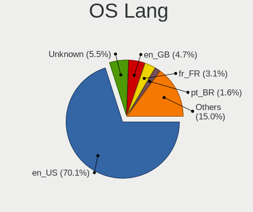

| Lang    | Notebooks | Percent |
|---------|-----------|---------|
| en_US   | 75        | 70.09%  |
| Unknown | 7         | 6.54%   |
| fr_FR   | 4         | 3.74%   |
| en_GB   | 4         | 3.74%   |
| pt_BR   | 2         | 1.87%   |
| pl_PL   | 2         | 1.87%   |
| nl_NL   | 2         | 1.87%   |
| en_IN   | 2         | 1.87%   |
| en_IE   | 2         | 1.87%   |
| ru_RU   | 1         | 0.93%   |
| ja_JP   | 1         | 0.93%   |
| it_IT   | 1         | 0.93%   |
| es_ES   | 1         | 0.93%   |
| es_EC   | 1         | 0.93%   |
| de_DE   | 1         | 0.93%   |
| de_CH   | 1         | 0.93%   |

Boot Mode
---------

EFI or BIOS

| Mode | Notebooks | Percent |
|------|-----------|---------|
| EFI  | 87        | 81.31%  |
| BIOS | 20        | 18.69%  |

Filesystem
----------

Type of filesystem

| Type    | Notebooks | Percent |
|---------|-----------|---------|
| Xfs     | 90        | 84.91%  |
| Ext4    | 11        | 10.38%  |
| Unknown | 5         | 4.72%   |

Part. scheme
------------

Scheme of partitioning

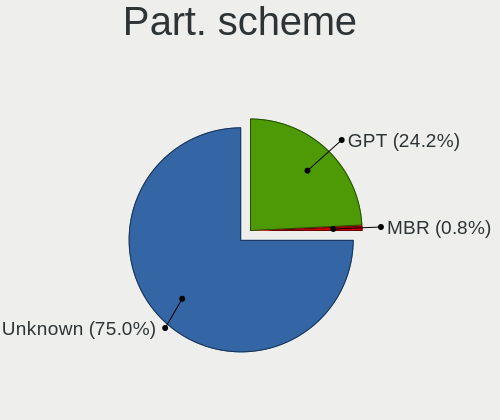

| Type    | Notebooks | Percent |
|---------|-----------|---------|
| Unknown | 84        | 77.78%  |
| GPT     | 23        | 21.3%   |
| MBR     | 1         | 0.93%   |

Dual Boot with Linux/BSD
------------------------

Hosting more than one Linux/BSD

| Dual boot | Notebooks | Percent |
|-----------|-----------|---------|
| No        | 99        | 93.4%   |
| Yes       | 7         | 6.6%    |

Dual Boot (Win)
---------------

Hosting Linux and Windows

| Dual boot | Notebooks | Percent |
|-----------|-----------|---------|
| No        | 98        | 93.33%  |
| Yes       | 7         | 6.67%   |

Board
-----

Vendor
------

Motherboard manufacturer

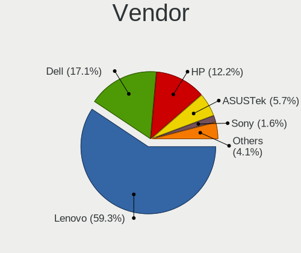

| Name             | Notebooks | Percent |
|------------------|-----------|---------|
| Lenovo           | 64        | 61.54%  |
| Dell             | 19        | 18.27%  |
| Hewlett-Packard  | 10        | 9.62%   |
| ASUSTek Computer | 5         | 4.81%   |
| Sony             | 2         | 1.92%   |
| TUXEDO           | 1         | 0.96%   |
| Toshiba          | 1         | 0.96%   |
| Timi             | 1         | 0.96%   |
| Acer             | 1         | 0.96%   |

Model
-----

Motherboard model

| Name                                     | Notebooks | Percent |
|------------------------------------------|-----------|---------|
| Lenovo ThinkPad P1 Gen 3 20TJS2F40X      | 4         | 3.85%   |
| Lenovo ThinkPad X1 Carbon 7th 20QES2P401 | 2         | 1.92%   |
| Lenovo ThinkPad X1 Carbon 6th 20KGS23S00 | 2         | 1.92%   |
| Lenovo ThinkPad T590 20N5S2NC0N          | 2         | 1.92%   |
| Lenovo ThinkPad T490s 20NYS7K91R         | 2         | 1.92%   |
| Lenovo ThinkPad T14s Gen 1 20T1S39D08    | 2         | 1.92%   |
| Lenovo ThinkPad P1 Gen 3 20TJS2F42Q      | 2         | 1.92%   |
| HP EliteBook 8460p                       | 2         | 1.92%   |
| Dell Latitude E6430                      | 2         | 1.92%   |
| Dell Latitude 5300                       | 2         | 1.92%   |
| TUXEDO N13xWU                            | 1         | 0.96%   |
| Toshiba Satellite Pro R50-C              | 1         | 0.96%   |
| Timi TM1707                              | 1         | 0.96%   |
| Sony VPCEB4L1R                           | 1         | 0.96%   |
| Sony VPCEB23FM                           | 1         | 0.96%   |
| Lenovo Z40-70 20366                      | 1         | 0.96%   |
| Lenovo ThinkPad X270 20HN001EMC          | 1         | 0.96%   |
| Lenovo ThinkPad X250 20CLS0H807          | 1         | 0.96%   |
| Lenovo ThinkPad X230 Tablet 34373KU      | 1         | 0.96%   |
| Lenovo ThinkPad X201 3680PKS             | 1         | 0.96%   |
| Lenovo ThinkPad X1 Yoga 1st 20FCS2N100   | 1         | 0.96%   |
| Lenovo ThinkPad W530 2441B32             | 1         | 0.96%   |
| Lenovo ThinkPad W520 4284GN2             | 1         | 0.96%   |
| Lenovo ThinkPad T590 20N5S2NC0V          | 1         | 0.96%   |
| Lenovo ThinkPad T590 20N5S2NC00          | 1         | 0.96%   |
| Lenovo ThinkPad T520 42404CG             | 1         | 0.96%   |
| Lenovo ThinkPad T490s 20NYS7K905         | 1         | 0.96%   |
| Lenovo ThinkPad T490s 20NX002HUS         | 1         | 0.96%   |
| Lenovo ThinkPad T490 20N3S5DV0S          | 1         | 0.96%   |
| Lenovo ThinkPad T480s 20L8S2N80V         | 1         | 0.96%   |
| Lenovo ThinkPad T480s 20L8S2N800         | 1         | 0.96%   |
| Lenovo ThinkPad T480 20L6S29E1T          | 1         | 0.96%   |
| Lenovo ThinkPad T480 20L6S29D02          | 1         | 0.96%   |
| Lenovo ThinkPad T480 20L60034MX          | 1         | 0.96%   |
| Lenovo ThinkPad T470 20HES57W00          | 1         | 0.96%   |
| Lenovo ThinkPad T460 20FMS1VA09          | 1         | 0.96%   |
| Lenovo ThinkPad T460 20BUS0QT0A          | 1         | 0.96%   |
| Lenovo ThinkPad T450s 20BWS0B500         | 1         | 0.96%   |
| Lenovo ThinkPad T15 Gen 2i 20W5S12J0K    | 1         | 0.96%   |
| Lenovo ThinkPad T14s Gen 1 20UJ000WMH    | 1         | 0.96%   |
| Lenovo ThinkPad T14s Gen 1 20T1S39D3N    | 1         | 0.96%   |
| Lenovo ThinkPad T14s Gen 1 20T1S39D1D    | 1         | 0.96%   |
| Lenovo ThinkPad T14s Gen 1 20T1S39D12    | 1         | 0.96%   |
| Lenovo ThinkPad T14s Gen 1 20T1S39D0Y    | 1         | 0.96%   |
| Lenovo ThinkPad T14s Gen 1 20T1S39D0C    | 1         | 0.96%   |
| Lenovo ThinkPad T14s Gen 1 20T1S39D0A    | 1         | 0.96%   |
| Lenovo ThinkPad T14 Gen 1 20S1SFJH0T     | 1         | 0.96%   |
| Lenovo ThinkPad T14 Gen 1 20S1S3B00F     | 1         | 0.96%   |
| Lenovo ThinkPad T14 Gen 1 20S1S38414     | 1         | 0.96%   |
| Lenovo ThinkPad P52 20MAS17205           | 1         | 0.96%   |
| Lenovo ThinkPad P52 20M9CTO1WW           | 1         | 0.96%   |
| Lenovo ThinkPad P50 20ENS1L000           | 1         | 0.96%   |
| Lenovo ThinkPad P50 20EN0005UK           | 1         | 0.96%   |
| Lenovo ThinkPad P17 Gen 2i 20YU002KUS    | 1         | 0.96%   |
| Lenovo ThinkPad P15 Gen 1 20SUS34800     | 1         | 0.96%   |
| Lenovo ThinkPad P1 Gen 3 20TJS2F45V      | 1         | 0.96%   |
| Lenovo ThinkPad P1 Gen 3 20TJS2F40K      | 1         | 0.96%   |
| Lenovo ThinkPad P1 Gen 2 20QUS1H300      | 1         | 0.96%   |
| Lenovo ThinkPad P1 Gen 2 20QUS10L0L      | 1         | 0.96%   |
| Lenovo ThinkPad L480 20LSCTO1WW          | 1         | 0.96%   |

Model Family
------------

Motherboard model prefix

| Name              | Notebooks | Percent |
|-------------------|-----------|---------|
| Lenovo ThinkPad   | 62        | 59.62%  |
| Dell Latitude     | 8         | 7.69%   |
| Dell Precision    | 6         | 5.77%   |
| HP EliteBook      | 4         | 3.85%   |
| Dell Inspiron     | 3         | 2.88%   |
| HP ZBook          | 2         | 1.92%   |
| TUXEDO N13xWU     | 1         | 0.96%   |
| Toshiba Satellite | 1         | 0.96%   |
| Timi TM1707       | 1         | 0.96%   |
| Sony VPCEB4L1R    | 1         | 0.96%   |
| Sony VPCEB23FM    | 1         | 0.96%   |
| Lenovo Z40-70     | 1         | 0.96%   |
| Lenovo Legion     | 1         | 0.96%   |
| HP ProBook        | 1         | 0.96%   |
| HP Pavilion       | 1         | 0.96%   |
| HP OMEN           | 1         | 0.96%   |
| HP 250            | 1         | 0.96%   |
| Dell XPS          | 1         | 0.96%   |
| Dell G3           | 1         | 0.96%   |
| ASUS Zephyrus     | 1         | 0.96%   |
| ASUS X550VX       | 1         | 0.96%   |
| ASUS VivoBook     | 1         | 0.96%   |
| ASUS TUF          | 1         | 0.96%   |
| ASUS GL502VMK     | 1         | 0.96%   |
| Acer Nitro        | 1         | 0.96%   |

MFG Year
--------

Motherboard manufacture year

| Year | Notebooks | Percent |
|------|-----------|---------|
| 2020 | 27        | 25.96%  |
| 2019 | 21        | 20.19%  |
| 2018 | 15        | 14.42%  |
| 2017 | 7         | 6.73%   |
| 2011 | 7         | 6.73%   |
| 2016 | 6         | 5.77%   |
| 2015 | 6         | 5.77%   |
| 2021 | 5         | 4.81%   |
| 2012 | 4         | 3.85%   |
| 2010 | 3         | 2.88%   |
| 2013 | 2         | 1.92%   |
| 2014 | 1         | 0.96%   |

Form Factor
-----------

Physical design of the computer

| Name     | Notebooks | Percent |
|----------|-----------|---------|
| Notebook | 104       | 100%    |

Secure Boot
-----------

Enabled or disabled

| State    | Notebooks | Percent |
|----------|-----------|---------|
| Disabled | 89        | 84.76%  |
| Enabled  | 16        | 15.24%  |

Coreboot
--------

Have coreboot on board

| Used | Notebooks | Percent |
|------|-----------|---------|
| No   | 104       | 100%    |

RAM Size
--------

Total RAM memory

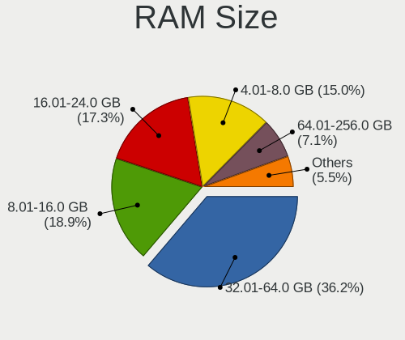

| Size in GB  | Notebooks | Percent |
|-------------|-----------|---------|
| 32.01-64.0  | 40        | 37.38%  |
| 16.01-24.0  | 19        | 17.76%  |
| 8.01-16.0   | 19        | 17.76%  |
| 4.01-8.0    | 15        | 14.02%  |
| 3.01-4.0    | 6         | 5.61%   |
| 64.01-256.0 | 6         | 5.61%   |
| 24.01-32.0  | 2         | 1.87%   |

RAM Used
--------

Used RAM memory

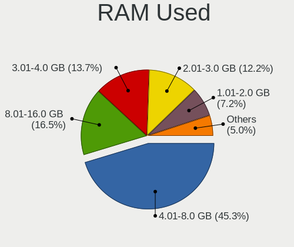

| Used GB    | Notebooks | Percent |
|------------|-----------|---------|
| 4.01-8.0   | 54        | 46.15%  |
| 8.01-16.0  | 20        | 17.09%  |
| 3.01-4.0   | 16        | 13.68%  |
| 2.01-3.0   | 14        | 11.97%  |
| 1.01-2.0   | 8         | 6.84%   |
| 16.01-24.0 | 2         | 1.71%   |
| 32.01-64.0 | 1         | 0.85%   |
| 24.01-32.0 | 1         | 0.85%   |
| 0.51-1.0   | 1         | 0.85%   |

Total Drives
------------

Number of drives on board

| Drives | Notebooks | Percent |
|--------|-----------|---------|
| 1      | 81        | 75.7%   |
| 2      | 17        | 15.89%  |
| 3      | 8         | 7.48%   |
| 4      | 1         | 0.93%   |

Has CD-ROM
----------

Has CD-ROM on board

| Presented | Notebooks | Percent |
|-----------|-----------|---------|
| No        | 92        | 87.62%  |
| Yes       | 13        | 12.38%  |

Has Ethernet
------------

Has Ethernet on board

| Presented | Notebooks | Percent |
|-----------|-----------|---------|
| Yes       | 92        | 87.62%  |
| No        | 13        | 12.38%  |

Has WiFi
--------

Has WiFi module

| Presented | Notebooks | Percent |
|-----------|-----------|---------|
| Yes       | 103       | 99.04%  |
| No        | 1         | 0.96%   |

Has Bluetooth
-------------

Has Bluetooth module

| Presented | Notebooks | Percent |
|-----------|-----------|---------|
| Yes       | 84        | 77.06%  |
| No        | 25        | 22.94%  |

Location
--------

Country
-------

Geographic location (country)

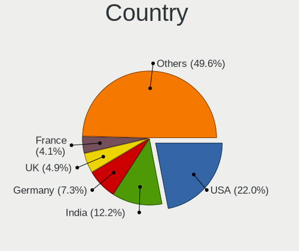

| Country      | Notebooks | Percent |
|--------------|-----------|---------|
| USA          | 24        | 23.08%  |
| India        | 13        | 12.5%   |
| UK           | 5         | 4.81%   |
| Germany      | 5         | 4.81%   |
| France       | 5         | 4.81%   |
| Czechia      | 5         | 4.81%   |
| Netherlands  | 3         | 2.88%   |
| Mexico       | 3         | 2.88%   |
| Switzerland  | 2         | 1.92%   |
| Spain        | 2         | 1.92%   |
| South Africa | 2         | 1.92%   |
| Romania      | 2         | 1.92%   |
| Japan        | 2         | 1.92%   |
| Canada       | 2         | 1.92%   |
| Brazil       | 2         | 1.92%   |
| Australia    | 2         | 1.92%   |
| Singapore    | 1         | 0.96%   |
| Saudi Arabia | 1         | 0.96%   |
| Russia       | 1         | 0.96%   |
| Portugal     | 1         | 0.96%   |
| Poland       | 1         | 0.96%   |
| Pakistan     | 1         | 0.96%   |
| Nepal        | 1         | 0.96%   |
| Myanmar      | 1         | 0.96%   |
| Morocco      | 1         | 0.96%   |
| Luxembourg   | 1         | 0.96%   |
| Lithuania    | 1         | 0.96%   |
| Kuwait       | 1         | 0.96%   |
| Italy        | 1         | 0.96%   |
| Israel       | 1         | 0.96%   |
| Ireland      | 1         | 0.96%   |
| Georgia      | 1         | 0.96%   |
| Finland      | 1         | 0.96%   |
| Egypt        | 1         | 0.96%   |
| Ecuador      | 1         | 0.96%   |
| Colombia     | 1         | 0.96%   |
| China        | 1         | 0.96%   |
| Chile        | 1         | 0.96%   |
| Bulgaria     | 1         | 0.96%   |
| Armenia      | 1         | 0.96%   |
| Argentina    | 1         | 0.96%   |

City
----

Geographic location (city)

| City                     | Notebooks | Percent |
|--------------------------|-----------|---------|
| Prague                   | 4         | 3.54%   |
| Munich                   | 3         | 2.65%   |
| Mexico City              | 3         | 2.65%   |
| Chennai                  | 2         | 1.77%   |
| Zaragoza                 | 1         | 0.88%   |
| Webster                  | 1         | 0.88%   |
| Vardenis                 | 1         | 0.88%   |
| Udaipur                  | 1         | 0.88%   |
| Turku                    | 1         | 0.88%   |
| Temuco                   | 1         | 0.88%   |
| Temara                   | 1         | 0.88%   |
| Taringa                  | 1         | 0.88%   |
| Talkha                   | 1         | 0.88%   |
| Syracuse                 | 1         | 0.88%   |
| Streatham                | 1         | 0.88%   |
| Steamboat Springs        | 1         | 0.88%   |
| Sofia                    | 1         | 0.88%   |
| Singapore                | 1         | 0.88%   |
| Šilalė                 | 1         | 0.88%   |
| Sheffield                | 1         | 0.88%   |
| San Jose                 | 1         | 0.88%   |
| San Francisco            | 1         | 0.88%   |
| Salt Lake City           | 1         | 0.88%   |
| Saint-Ismier             | 1         | 0.88%   |
| Saint-Alphonse-Rodriguez | 1         | 0.88%   |
| Roha                     | 1         | 0.88%   |
| Rochester                | 1         | 0.88%   |
| Reims                    | 1         | 0.88%   |
| Raleigh                  | 1         | 0.88%   |
| Quito                    | 1         | 0.88%   |
| Queenscliff              | 1         | 0.88%   |
| Queens                   | 1         | 0.88%   |
| Portalegre               | 1         | 0.88%   |
| Port Elizabeth           | 1         | 0.88%   |
| Pickerington             | 1         | 0.88%   |
| Paraiso do Tocantins     | 1         | 0.88%   |
| Paragould                | 1         | 0.88%   |
| Oyama                    | 1         | 0.88%   |
| Ottawa                   | 1         | 0.88%   |
| Muri bei Bern            | 1         | 0.88%   |
| Mumbai                   | 1         | 0.88%   |
| Mountain View            | 1         | 0.88%   |
| Montreal                 | 1         | 0.88%   |
| Mogilno                  | 1         | 0.88%   |
| Milan                    | 1         | 0.88%   |
| Mangalore                | 1         | 0.88%   |
| Mandalay                 | 1         | 0.88%   |
| Malkajgiri               | 1         | 0.88%   |
| Malappuram               | 1         | 0.88%   |
| Madrid                   | 1         | 0.88%   |
| Luxembourg               | 1         | 0.88%   |
| London                   | 1         | 0.88%   |
| Littleton                | 1         | 0.88%   |
| Lahore                   | 1         | 0.88%   |
| Kuwait City              | 1         | 0.88%   |
| Kirkland                 | 1         | 0.88%   |
| Khobar                   | 1         | 0.88%   |
| Kathmandu                | 1         | 0.88%   |
| K'alak'i T'bilisi        | 1         | 0.88%   |
| Johnstone                | 1         | 0.88%   |

Drives
------

Drive Vendor
------------

Hard drive vendors

| Vendor              | Notebooks | Drives | Percent |
|---------------------|-----------|--------|---------|
| Samsung Electronics | 32        | 47     | 24.06%  |
| WDC                 | 15        | 19     | 11.28%  |
| Toshiba             | 15        | 19     | 11.28%  |
| SK hynix            | 12        | 12     | 9.02%   |
| Seagate             | 11        | 14     | 8.27%   |
| SanDisk             | 11        | 14     | 8.27%   |
| Intel               | 6         | 9      | 4.51%   |
| Unknown             | 5         | 7      | 3.76%   |
| Micron Technology   | 5         | 7      | 3.76%   |
| Kingston            | 4         | 4      | 3.01%   |
| HGST                | 3         | 3      | 2.26%   |
| Silicon Motion      | 2         | 3      | 1.5%    |
| Lenovo              | 2         | 2      | 1.5%    |
| Crucial             | 2         | 2      | 1.5%    |
| A-DATA Technology   | 2         | 2      | 1.5%    |
| Team                | 1         | 2      | 0.75%   |
| SMI                 | 1         | 2      | 0.75%   |
| PNY                 | 1         | 2      | 0.75%   |
| Lite-On             | 1         | 1      | 0.75%   |
| Gigabyte Technology | 1         | 1      | 0.75%   |
| Corsair             | 1         | 1      | 0.75%   |

Drive Model
-----------

Hard drive models

| Model                                   | Notebooks | Percent |
|-----------------------------------------|-----------|---------|
| SK hynix NVMe SSD Drive 512GB           | 10        | 6.99%   |
| SanDisk NVMe SSD Drive 256GB            | 6         | 4.2%    |
| Samsung NVMe SSD Drive 256GB            | 6         | 4.2%    |
| Samsung NVMe SSD Drive 512GB            | 5         | 3.5%    |
| Samsung NVMe SSD Drive 1024GB           | 5         | 3.5%    |
| Toshiba KBG30ZMS128G 128GB NVMe SSD     | 4         | 2.8%    |
| Toshiba NVMe SSD Drive 512GB            | 3         | 2.1%    |
| Micron NVMe SSD Drive 256GB             | 3         | 2.1%    |
| Unknown NVMe SSD Drive 256GB            | 2         | 1.4%    |
| Toshiba KXG6AZNV256G 256GB              | 2         | 1.4%    |
| Seagate Expansion 1TB                   | 2         | 1.4%    |
| Samsung SSD 860 EVO 1TB                 | 2         | 1.4%    |
| Samsung SM963 2.5" NVMe PCIe SSD 500GB  | 2         | 1.4%    |
| Samsung Portable SSD T5 500GB           | 2         | 1.4%    |
| Samsung NVMe SSD Drive 2TB              | 2         | 1.4%    |
| Samsung NVMe SSD Drive 1TB              | 2         | 1.4%    |
| Intel NVMe SSD Drive 512GB              | 2         | 1.4%    |
| Intel NVMe SSD Drive 2TB                | 2         | 1.4%    |
| HGST HTS721010A9E630 1TB                | 2         | 1.4%    |
| WDC WDS500G2B0A-00SM50 500GB SSD        | 1         | 0.7%    |
| WDC WDS400T2B0A-00SM50 4TB SSD          | 1         | 0.7%    |
| WDC WDS200T2B0B-00YS70 2TB SSD          | 1         | 0.7%    |
| WDC WD6400BPVT-75HXZT1 640GB            | 1         | 0.7%    |
| WDC WD5000LPLX-08ZNTT0 500GB            | 1         | 0.7%    |
| WDC WD2500BEVT-60ZCT1 250GB             | 1         | 0.7%    |
| WDC WD20 SPZX-11UA7T0 2TB               | 1         | 0.7%    |
| WDC WD10SPZX-22Z10T0 1TB                | 1         | 0.7%    |
| WDC WD10SPZX-21Z10T0 1TB                | 1         | 0.7%    |
| WDC WD10SPZX-08Z10 1TB                  | 1         | 0.7%    |
| WDC WD10JPVX-75JC3T0 1TB                | 1         | 0.7%    |
| WDC PC SN730 SDBQNTY-512G-1001 512GB    | 1         | 0.7%    |
| WDC PC SN730 SDBQNTY-256G-1001 256GB    | 1         | 0.7%    |
| WDC PC SN720 SDAQNTW-512G-1001 512GB    | 1         | 0.7%    |
| WDC PC SN530 SDBPNPZ-256G-1006 256GB    | 1         | 0.7%    |
| WDC PC SN520 SDAPNUW-256G-1002 256GB    | 1         | 0.7%    |
| Unknown MMC Card  33GB                  | 1         | 0.7%    |
| Unknown MMC Card  32GB                  | 1         | 0.7%    |
| Unknown MMC Card  16GB                  | 1         | 0.7%    |
| Toshiba TR150 960GB SSD                 | 1         | 0.7%    |
| Toshiba NVMe SSD Drive 1024GB           | 1         | 0.7%    |
| Toshiba MQ01ABF050 500GB                | 1         | 0.7%    |
| Toshiba MQ01ABD075 752GB                | 1         | 0.7%    |
| Toshiba MK3275GSX 320GB                 | 1         | 0.7%    |
| Toshiba HDWL110 1TB                     | 1         | 0.7%    |
| Team T253X2512G 512GB SSD               | 1         | 0.7%    |
| SMI DISK 512GB                          | 1         | 0.7%    |
| SK hynix SKHynix_HFS512GDE9X084N 512GB  | 1         | 0.7%    |
| SK hynix NVMe SSD Drive 1024GB          | 1         | 0.7%    |
| Silicon Motion NVMe SSD Drive 1TB       | 1         | 0.7%    |
| Silicon Motion NE-512 512GB             | 1         | 0.7%    |
| Seagate ST9320325AS 320GB               | 1         | 0.7%    |
| Seagate ST9160827AS 160GB               | 1         | 0.7%    |
| Seagate ST500LM021-1KJ152 500GB         | 1         | 0.7%    |
| Seagate ST500LM012 HN-M500MBB 500GB     | 1         | 0.7%    |
| Seagate ST1000LM049-2GH172 1TB          | 1         | 0.7%    |
| Seagate ST1000LM035-1RK172 1TB          | 1         | 0.7%    |
| Seagate BUP Slim BK 1TB                 | 1         | 0.7%    |
| Seagate BUP Portable 5TB                | 1         | 0.7%    |
| Seagate BUP BL 4TB                      | 1         | 0.7%    |
| Seagate BarraCuda SSD ZA2000CM10002 2TB | 1         | 0.7%    |

HDD Vendor
----------

Hard disk drive vendors

| Vendor  | Notebooks | Drives | Percent |
|---------|-----------|--------|---------|
| Seagate | 11        | 13     | 42.31%  |
| WDC     | 8         | 10     | 30.77%  |
| Toshiba | 4         | 6      | 15.38%  |
| HGST    | 3         | 3      | 11.54%  |

SSD Vendor
----------

Solid state drive vendors

| Vendor              | Notebooks | Drives | Percent |
|---------------------|-----------|--------|---------|
| Samsung Electronics | 12        | 13     | 38.71%  |
| WDC                 | 3         | 4      | 9.68%   |
| SanDisk             | 3         | 4      | 9.68%   |
| Kingston            | 3         | 3      | 9.68%   |
| Crucial             | 2         | 2      | 6.45%   |
| A-DATA Technology   | 2         | 2      | 6.45%   |
| Toshiba             | 1         | 1      | 3.23%   |
| Team                | 1         | 2      | 3.23%   |
| Seagate             | 1         | 1      | 3.23%   |
| PNY                 | 1         | 2      | 3.23%   |
| Micron Technology   | 1         | 1      | 3.23%   |
| Corsair             | 1         | 1      | 3.23%   |

Drive Kind
----------

HDD or SSD

| Kind    | Notebooks | Drives | Percent |
|---------|-----------|--------|---------|
| NVMe    | 72        | 99     | 54.96%  |
| SSD     | 29        | 36     | 22.14%  |
| HDD     | 26        | 32     | 19.85%  |
| MMC     | 3         | 4      | 2.29%   |
| Unknown | 1         | 2      | 0.76%   |

Drive Connector
---------------

SATA, SAS, NVMe, etc.

| Type | Notebooks | Drives | Percent |
|------|-----------|--------|---------|
| NVMe | 72        | 99     | 58.06%  |
| SATA | 40        | 60     | 32.26%  |
| SAS  | 9         | 10     | 7.26%   |
| MMC  | 3         | 4      | 2.42%   |

Drive Size
----------

Size of hard drive

| Size in TB | Notebooks | Drives | Percent |
|------------|-----------|--------|---------|
| 0.01-0.5   | 25        | 30     | 47.17%  |
| 0.51-1.0   | 19        | 29     | 35.85%  |
| 1.01-2.0   | 5         | 5      | 9.43%   |
| 3.01-4.0   | 2         | 2      | 3.77%   |
| 4.01-10.0  | 2         | 2      | 3.77%   |

Space Total
-----------

Amount of disk space available on the file system

| Size in GB     | Notebooks | Percent |
|----------------|-----------|---------|
| 101-250        | 50        | 46.73%  |
| 251-500        | 20        | 18.69%  |
| 501-1000       | 14        | 13.08%  |
| 1001-2000      | 8         | 7.48%   |
| More than 3000 | 5         | 4.67%   |
| 51-100         | 4         | 3.74%   |
| 21-50          | 3         | 2.8%    |
| 2001-3000      | 1         | 0.93%   |
| 1-20           | 1         | 0.93%   |
| Unknown        | 1         | 0.93%   |

Space Used
----------

Amount of used disk space

| Used GB        | Notebooks | Percent |
|----------------|-----------|---------|
| 21-50          | 27        | 23.48%  |
| 101-250        | 26        | 22.61%  |
| 1-20           | 24        | 20.87%  |
| 51-100         | 17        | 14.78%  |
| 251-500        | 10        | 8.7%    |
| 501-1000       | 7         | 6.09%   |
| More than 3000 | 1         | 0.87%   |
| 2001-3000      | 1         | 0.87%   |
| 1001-2000      | 1         | 0.87%   |
| Unknown        | 1         | 0.87%   |

Malfunc. Drives
---------------

Drive models with a malfunction

Zero info for selected period =(

Malfunc. Drive Vendor
---------------------

Vendors of faulty drives

Zero info for selected period =(

Malfunc. HDD Vendor
-------------------

Vendors of faulty HDD drives

Zero info for selected period =(

Malfunc. Drive Kind
-------------------

Kinds of faulty drives

Zero info for selected period =(

Failed Drives
-------------

Failed drive models

Zero info for selected period =(

Failed Drive Vendor
-------------------

Failed drive vendors

Zero info for selected period =(

Drive Status
------------

Number of failed and malfunc. drives

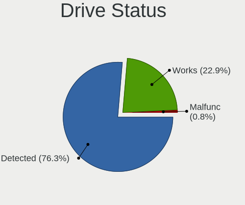

| Status   | Notebooks | Drives | Percent |
|----------|-----------|--------|---------|
| Detected | 87        | 144    | 79.82%  |
| Works    | 22        | 29     | 20.18%  |

Storage controller
------------------

Storage Vendor
--------------

Storage controller vendors

| Vendor                       | Notebooks | Percent |
|------------------------------|-----------|---------|
| Intel                        | 51        | 41.8%   |
| Samsung Electronics          | 22        | 18.03%  |
| SK hynix                     | 12        | 9.84%   |
| SanDisk                      | 12        | 9.84%   |
| Toshiba America Info Systems | 10        | 8.2%    |
| Micron Technology            | 4         | 3.28%   |
| Silicon Motion               | 2         | 1.64%   |
| Lenovo                       | 2         | 1.64%   |
| KIOXIA                       | 2         | 1.64%   |
| AMD                          | 2         | 1.64%   |
| Phison Electronics           | 1         | 0.82%   |
| Lite-On Technology           | 1         | 0.82%   |
| Kingston Technology Company  | 1         | 0.82%   |

Storage Model
-------------

Storage controller models

| Model                                                                         | Notebooks | Percent |
|-------------------------------------------------------------------------------|-----------|---------|
| Samsung NVMe SSD Controller SM981/PM981/PM983                                 | 18        | 14.52%  |
| SK hynix Non-Volatile memory controller                                       | 11        | 8.87%   |
| Toshiba America Info Systems XG6 NVMe SSD Controller                          | 9         | 7.26%   |
| Intel Sunrise Point-LP SATA Controller [AHCI mode]                            | 9         | 7.26%   |
| SanDisk WD Black SN750 / PC SN730 NVMe SSD                                    | 8         | 6.45%   |
| Intel Cannon Lake Mobile PCH SATA AHCI Controller                             | 6         | 4.84%   |
| Intel 6 Series/C200 Series Chipset Family 6 port Mobile SATA AHCI Controller  | 6         | 4.84%   |
| Micron Non-Volatile memory controller                                         | 4         | 3.23%   |
| Intel 82801 Mobile SATA Controller [RAID mode]                                | 4         | 3.23%   |
| Intel Wildcat Point-LP SATA Controller [AHCI Mode]                            | 3         | 2.42%   |
| Intel SSD Pro 7600p/760p/E 6100p Series                                       | 3         | 2.42%   |
| Intel SSD 660P Series                                                         | 3         | 2.42%   |
| Intel Q170/Q150/B150/H170/H110/Z170/CM236 Chipset SATA Controller [AHCI Mode] | 3         | 2.42%   |
| Intel HM170/QM170 Chipset SATA Controller [AHCI Mode]                         | 3         | 2.42%   |
| Intel 7 Series Chipset Family 6-port SATA Controller [AHCI mode]              | 3         | 2.42%   |
| Intel 5 Series/3400 Series Chipset 4 port SATA AHCI Controller                | 3         | 2.42%   |
| Silicon Motion SM2263EN/SM2263XT SSD Controller                               | 2         | 1.61%   |
| SanDisk WD Black 2018/SN750 / PC SN720 NVMe SSD                               | 2         | 1.61%   |
| Samsung NVMe SSD Controller SM961/PM961/SM963                                 | 2         | 1.61%   |
| Lenovo Non-Volatile memory controller                                         | 2         | 1.61%   |
| KIOXIA Non-Volatile memory controller                                         | 2         | 1.61%   |
| Intel Cannon Point-LP SATA Controller [AHCI Mode]                             | 2         | 1.61%   |
| Intel 8 Series SATA Controller 1 [AHCI mode]                                  | 2         | 1.61%   |
| AMD FCH SATA Controller [AHCI mode]                                           | 2         | 1.61%   |
| Toshiba America Info Systems XG4 NVMe SSD Controller                          | 1         | 0.81%   |
| SK hynix Gold P31 SSD                                                         | 1         | 0.81%   |
| SanDisk WD Blue SN550 NVMe SSD                                                | 1         | 0.81%   |
| SanDisk WD Blue SN500 / PC SN520 NVMe SSD                                     | 1         | 0.81%   |
| Samsung NVMe SSD Controller PM9A1/PM9A3/980PRO                                | 1         | 0.81%   |
| Samsung NVMe SSD Controller 980                                               | 1         | 0.81%   |
| Phison PS5013 E13 NVMe Controller                                             | 1         | 0.81%   |
| Lite-On Non-Volatile memory controller                                        | 1         | 0.81%   |
| Kingston Company A2000 NVMe SSD                                               | 1         | 0.81%   |
| Intel Volume Management Device NVMe RAID Controller                           | 1         | 0.81%   |
| Intel 5 Series/3400 Series Chipset 6 port SATA AHCI Controller                | 1         | 0.81%   |
| Intel 400 Series Chipset Family SATA AHCI Controller                          | 1         | 0.81%   |

Storage Kind
------------

Kind of storage controller (IDE, SATA, NVMe, SAS, ...)

| Kind | Notebooks | Percent |
|------|-----------|---------|
| NVMe | 72        | 59.5%   |
| SATA | 45        | 37.19%  |
| RAID | 4         | 3.31%   |

Processor
---------

CPU Vendor
----------

Processor vendors

| Vendor | Notebooks | Percent |
|--------|-----------|---------|
| Intel  | 99        | 95.19%  |
| AMD    | 5         | 4.81%   |

CPU Model
---------

Processor models

| Model                                         | Notebooks | Percent |
|-----------------------------------------------|-----------|---------|
| Intel Core i7-10850H CPU @ 2.70GHz            | 10        | 9.62%   |
| Intel Core i7-8665U CPU @ 1.90GHz             | 9         | 8.65%   |
| Intel Core i7-10610U CPU @ 1.80GHz            | 9         | 8.65%   |
| Intel Core i7-8650U CPU @ 1.90GHz             | 5         | 4.81%   |
| Intel Core i7-8750H CPU @ 2.20GHz             | 3         | 2.88%   |
| Intel Core i5-8250U CPU @ 1.60GHz             | 3         | 2.88%   |
| Intel Core i5-5300U CPU @ 2.30GHz             | 3         | 2.88%   |
| Intel Core i5-10210U CPU @ 1.60GHz            | 3         | 2.88%   |
| Intel Core i7-9850H CPU @ 2.60GHz             | 2         | 1.92%   |
| Intel Core i7-9750H CPU @ 2.60GHz             | 2         | 1.92%   |
| Intel Core i7-8565U CPU @ 1.80GHz             | 2         | 1.92%   |
| Intel Core i7-8550U CPU @ 1.80GHz             | 2         | 1.92%   |
| Intel Core i7-7700HQ CPU @ 2.80GHz            | 2         | 1.92%   |
| Intel Core i7-7600U CPU @ 2.80GHz             | 2         | 1.92%   |
| Intel Core i7-6700HQ CPU @ 2.60GHz            | 2         | 1.92%   |
| Intel Core i7-3520M CPU @ 2.90GHz             | 2         | 1.92%   |
| Intel Core i5-8365U CPU @ 1.60GHz             | 2         | 1.92%   |
| Intel Core i5-8350U CPU @ 1.70GHz             | 2         | 1.92%   |
| Intel Core i5-6200U CPU @ 2.30GHz             | 2         | 1.92%   |
| Intel Core i5-2520M CPU @ 2.50GHz             | 2         | 1.92%   |
| AMD Ryzen 7 3750H with Radeon Vega Mobile Gfx | 2         | 1.92%   |
| Intel Xeon W-11955M CPU @ 2.60GHz             | 1         | 0.96%   |
| Intel Xeon W-10855M CPU @ 2.80GHz             | 1         | 0.96%   |
| Intel Xeon E-2176M CPU @ 2.70GHz              | 1         | 0.96%   |
| Intel Xeon CPU E3-1575M v5 @ 3.00GHz          | 1         | 0.96%   |
| Intel Xeon CPU E3-1505M v5 @ 2.80GHz          | 1         | 0.96%   |
| Intel Pentium CPU 5405U @ 2.30GHz             | 1         | 0.96%   |
| Intel Core i9-9980HK CPU @ 2.40GHz            | 1         | 0.96%   |
| Intel Core i9-9880H CPU @ 2.30GHz             | 1         | 0.96%   |
| Intel Core i7-8850H CPU @ 2.60GHz             | 1         | 0.96%   |
| Intel Core i7-7500U CPU @ 2.70GHz             | 1         | 0.96%   |
| Intel Core i7-6600U CPU @ 2.60GHz             | 1         | 0.96%   |
| Intel Core i7-4500U CPU @ 1.80GHz             | 1         | 0.96%   |
| Intel Core i7-3720QM CPU @ 2.60GHz            | 1         | 0.96%   |
| Intel Core i7-3540M CPU @ 3.00GHz             | 1         | 0.96%   |
| Intel Core i7-2760QM CPU @ 2.40GHz            | 1         | 0.96%   |
| Intel Core i7-2640M CPU @ 2.80GHz             | 1         | 0.96%   |
| Intel Core i5-8265U CPU @ 1.60GHz             | 1         | 0.96%   |
| Intel Core i5-6300U CPU @ 2.40GHz             | 1         | 0.96%   |
| Intel Core i5-4210U CPU @ 1.70GHz             | 1         | 0.96%   |
| Intel Core i5-3320M CPU @ 2.60GHz             | 1         | 0.96%   |
| Intel Core i5-2540M CPU @ 2.60GHz             | 1         | 0.96%   |
| Intel Core i5-2410M CPU @ 2.30GHz             | 1         | 0.96%   |
| Intel Core i5 CPU M 560 @ 2.67GHz             | 1         | 0.96%   |
| Intel Core i5 CPU M 520 @ 2.40GHz             | 1         | 0.96%   |
| Intel Core i3-6006U CPU @ 2.00GHz             | 1         | 0.96%   |
| Intel Core i3 CPU M 380 @ 2.53GHz             | 1         | 0.96%   |
| Intel Core i3 CPU M 350 @ 2.27GHz             | 1         | 0.96%   |
| Intel 11th Gen Core i9-11950H @ 2.60GHz       | 1         | 0.96%   |
| Intel 11th Gen Core i7-1165G7 @ 2.80GHz       | 1         | 0.96%   |
| Intel 11th Gen Core i5-1135G7 @ 2.40GHz       | 1         | 0.96%   |
| AMD Ryzen 7 PRO 4750U with Radeon Graphics    | 1         | 0.96%   |
| AMD Ryzen 7 5800H with Radeon Graphics        | 1         | 0.96%   |
| AMD Ryzen 7 4700U with Radeon Graphics        | 1         | 0.96%   |

CPU Model Family
----------------

Processor model prefix

| Model           | Notebooks | Percent |
|-----------------|-----------|---------|
| Intel Core i7   | 60        | 57.69%  |
| Intel Core i5   | 25        | 24.04%  |
| Intel Xeon      | 5         | 4.81%   |
| AMD Ryzen 7     | 4         | 3.85%   |
| Other           | 3         | 2.88%   |
| Intel Core i3   | 3         | 2.88%   |
| Intel Core i9   | 2         | 1.92%   |
| Intel Pentium   | 1         | 0.96%   |
| AMD Ryzen 7 PRO | 1         | 0.96%   |

CPU Cores
---------

Number of processor cores

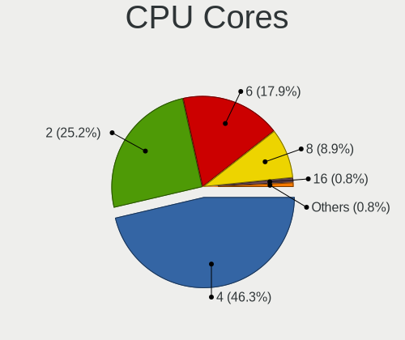

| Number | Notebooks | Percent |
|--------|-----------|---------|
| 4      | 50        | 48.08%  |
| 2      | 27        | 25.96%  |
| 6      | 20        | 19.23%  |
| 8      | 7         | 6.73%   |

CPU Sockets
-----------

Number of sockets

| Number | Notebooks | Percent |
|--------|-----------|---------|
| 1      | 104       | 100%    |

CPU Threads
-----------

Threads per core (Hyper-Threading)

| Number | Notebooks | Percent |
|--------|-----------|---------|
| 2      | 102       | 98.08%  |
| 1      | 2         | 1.92%   |

CPU Op-Modes
------------

CPU Operation Modes (32-bit, 64-bit)

| Op mode        | Notebooks | Percent |
|----------------|-----------|---------|
| 32-bit, 64-bit | 102       | 96.23%  |
| Unknown        | 4         | 3.77%   |

CPU Microcode
-------------

Microcode number

| Number     | Notebooks | Percent |
|------------|-----------|---------|
| 0x806ec    | 26        | 24.53%  |
| 0x806ea    | 12        | 11.32%  |
| 0xa0652    | 11        | 10.38%  |
| 0x906ea    | 7         | 6.6%    |
| 0x206a7    | 6         | 5.66%   |
| 0x406e3    | 5         | 4.72%   |
| 0x306a9    | 5         | 4.72%   |
| 0x906ed    | 4         | 3.77%   |
| 0x506e3    | 4         | 3.77%   |
| 0x806e9    | 3         | 2.83%   |
| 0x306d4    | 3         | 2.83%   |
| 0x20655    | 3         | 2.83%   |
| Unknown    | 3         | 2.83%   |
| 0x906e9    | 2         | 1.89%   |
| 0x806d1    | 2         | 1.89%   |
| 0x806c1    | 2         | 1.89%   |
| 0x40651    | 2         | 1.89%   |
| 0x08108102 | 2         | 1.89%   |
| 0x20652    | 1         | 0.94%   |
| 0x0a50000c | 1         | 0.94%   |
| 0x08600104 | 1         | 0.94%   |
| 0x08600103 | 1         | 0.94%   |

CPU Microarch
-------------

Microarchitecture

| Name        | Notebooks | Percent |
|-------------|-----------|---------|
| KabyLake    | 55        | 52.38%  |
| CometLake   | 11        | 10.48%  |
| Skylake     | 9         | 8.57%   |
| SandyBridge | 6         | 5.71%   |
| IvyBridge   | 5         | 4.76%   |
| Westmere    | 4         | 3.81%   |
| Broadwell   | 3         | 2.86%   |
| Zen+        | 2         | 1.9%    |
| Zen 2       | 2         | 1.9%    |
| TigerLake   | 2         | 1.9%    |
| Icelake     | 2         | 1.9%    |
| Haswell     | 2         | 1.9%    |
| Zen 3       | 1         | 0.95%   |
| Unknown     | 1         | 0.95%   |

Graphics
--------

GPU Vendor
----------

Vendors of graphics cards

| Vendor | Notebooks | Percent |
|--------|-----------|---------|
| Intel  | 88        | 67.18%  |
| Nvidia | 31        | 23.66%  |
| AMD    | 12        | 9.16%   |

GPU Model
---------

Graphics card models

| Model                                                                                 | Notebooks | Percent |
|---------------------------------------------------------------------------------------|-----------|---------|
| Intel WhiskeyLake-U GT2 [UHD Graphics 620]                                            | 14        | 10.69%  |
| Intel UHD Graphics 620                                                                | 12        | 9.16%   |
| Intel CometLake-U GT2 [UHD Graphics]                                                  | 12        | 9.16%   |
| Intel CometLake-H GT2 [UHD Graphics]                                                  | 10        | 7.63%   |
| Intel CoffeeLake-H GT2 [UHD Graphics 630]                                             | 7         | 5.34%   |
| Intel Skylake GT2 [HD Graphics 520]                                                   | 5         | 3.82%   |
| Intel 3rd Gen Core processor Graphics Controller                                      | 5         | 3.82%   |
| Intel 2nd Generation Core Processor Family Integrated Graphics Controller             | 4         | 3.05%   |
| Nvidia GP107GLM [Quadro P2000 Mobile]                                                 | 3         | 2.29%   |
| Intel HD Graphics 620                                                                 | 3         | 2.29%   |
| Intel HD Graphics 5500                                                                | 3         | 2.29%   |
| Intel Core Processor Integrated Graphics Controller                                   | 3         | 2.29%   |
| Nvidia TU116M [GeForce GTX 1660 Ti Mobile]                                            | 2         | 1.53%   |
| Nvidia GP107M [GeForce GTX 1050 Mobile]                                               | 2         | 1.53%   |
| Nvidia GP107GLM [Quadro P620]                                                         | 2         | 1.53%   |
| Nvidia GM107GLM [Quadro M2000M]                                                       | 2         | 1.53%   |
| Nvidia GF108GLM [NVS 5200M]                                                           | 2         | 1.53%   |
| Intel TigerLake-LP GT2 [Iris Xe Graphics]                                             | 2         | 1.53%   |
| Intel Haswell-ULT Integrated Graphics Controller                                      | 2         | 1.53%   |
| AMD Seymour [Radeon HD 6400M/7400M Series]                                            | 2         | 1.53%   |
| AMD Renoir                                                                            | 2         | 1.53%   |
| AMD Picasso/Raven 2 [Radeon Vega Series / Radeon Vega Mobile Series]                  | 2         | 1.53%   |
| Nvidia TU117M [GeForce MX450]                                                         | 1         | 0.76%   |
| Nvidia TU117M [GeForce GTX 1650 Mobile / Max-Q]                                       | 1         | 0.76%   |
| Nvidia TU117GLM [Quadro T2000 Mobile / Max-Q]                                         | 1         | 0.76%   |
| Nvidia TU117GLM [Quadro T1000 Mobile]                                                 | 1         | 0.76%   |
| Nvidia TU106GLM [Quadro RTX 3000 Mobile / Max-Q]                                      | 1         | 0.76%   |
| Nvidia TU106BM [GeForce RTX 2070 Mobile / Max-Q]                                      | 1         | 0.76%   |
| Nvidia GP108M [GeForce MX150]                                                         | 1         | 0.76%   |
| Nvidia GP107M [GeForce GTX 1050 Ti Mobile]                                            | 1         | 0.76%   |
| Nvidia GP107GLM [Quadro P1000 Mobile]                                                 | 1         | 0.76%   |
| Nvidia GP106BM [GeForce GTX 1060 Mobile 6GB]                                          | 1         | 0.76%   |
| Nvidia GM107M [GeForce GTX 950M]                                                      | 1         | 0.76%   |
| Nvidia GM107GLM [Quadro M1000M]                                                       | 1         | 0.76%   |
| Nvidia GK107GLM [Quadro K2000M]                                                       | 1         | 0.76%   |
| Nvidia GF119M [Quadro NVS 4200M]                                                      | 1         | 0.76%   |
| Nvidia GF106GLM [Quadro 2000M]                                                        | 1         | 0.76%   |
| Nvidia GA107GLM [RTX A2000 Mobile]                                                    | 1         | 0.76%   |
| Nvidia GA107BM [GeForce RTX 3050 Ti Mobile]                                           | 1         | 0.76%   |
| Nvidia GA104GLM [RTX A5000 Mobile]                                                    | 1         | 0.76%   |
| Intel TigerLake-H GT1 [UHD Graphics]                                                  | 1         | 0.76%   |
| Intel Iris Pro Graphics P580                                                          | 1         | 0.76%   |
| Intel HD Graphics P530                                                                | 1         | 0.76%   |
| Intel HD Graphics 630                                                                 | 1         | 0.76%   |
| Intel HD Graphics 530                                                                 | 1         | 0.76%   |
| Intel Coffee Lake UHD 610 Graphics Controller                                         | 1         | 0.76%   |
| AMD Topaz XT [Radeon R7 M260/M265 / M340/M360 / M440/M445 / 530/535 / 620/625 Mobile] | 1         | 0.76%   |
| AMD Sun XT [Radeon HD 8670A/8670M/8690M / R5 M330 / M430 / Radeon 520 Mobile]         | 1         | 0.76%   |
| AMD Meso XT [Radeon R5 M315]                                                          | 1         | 0.76%   |
| AMD Madison [Mobility Radeon HD 5650/5750 / 6530M/6550M]                              | 1         | 0.76%   |
| AMD Lexa PRO [Radeon 540/540X/550/550X / RX 540X/550/550X]                            | 1         | 0.76%   |
| AMD Cezanne                                                                           | 1         | 0.76%   |

GPU Combo
---------

Combinations of graphics cards

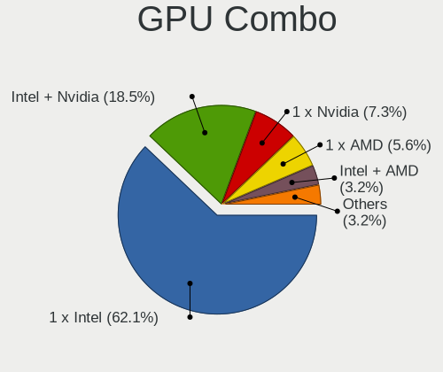

| Name           | Notebooks | Percent |
|----------------|-----------|---------|
| 1 x Intel      | 64        | 60.95%  |
| Intel + Nvidia | 20        | 19.05%  |
| 1 x Nvidia     | 9         | 8.57%   |
| 1 x AMD        | 5         | 4.76%   |
| Intel + AMD    | 4         | 3.81%   |
| AMD + Nvidia   | 3         | 2.86%   |

GPU Driver
----------

Free vs proprietary

| Driver      | Notebooks | Percent |
|-------------|-----------|---------|
| Free        | 91        | 86.67%  |
| Proprietary | 9         | 8.57%   |
| Unknown     | 5         | 4.76%   |

GPU Memory
----------

Total video memory

| Size in GB | Notebooks | Percent |
|------------|-----------|---------|
| Unknown    | 74        | 70.48%  |
| 3.01-4.0   | 10        | 9.52%   |
| 1.01-2.0   | 8         | 7.62%   |
| 0.51-1.0   | 5         | 4.76%   |
| 5.01-6.0   | 4         | 3.81%   |
| 0.01-0.5   | 2         | 1.9%    |
| 7.01-8.0   | 1         | 0.95%   |
| 8.01-16.0  | 1         | 0.95%   |

Monitor
-------

Monitor Vendor
--------------

Monitor vendors

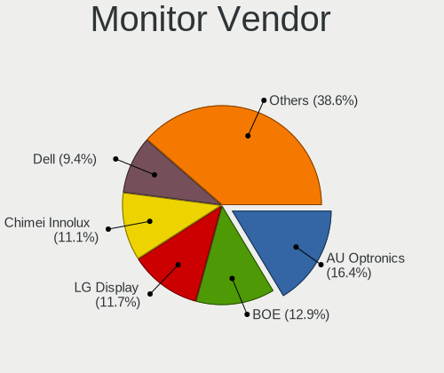

| Vendor                  | Notebooks | Percent |
|-------------------------|-----------|---------|
| AU Optronics            | 24        | 16.33%  |
| LG Display              | 18        | 12.24%  |
| BOE                     | 17        | 11.56%  |
| Dell                    | 16        | 10.88%  |
| Chimei Innolux          | 16        | 10.88%  |
| Lenovo                  | 11        | 7.48%   |
| Samsung Electronics     | 10        | 6.8%    |
| Sharp                   | 5         | 3.4%    |
| Hewlett-Packard         | 5         | 3.4%    |
| InfoVision              | 4         | 2.72%   |
| Goldstar                | 4         | 2.72%   |
| Acer                    | 3         | 2.04%   |
| Philips                 | 2         | 1.36%   |
| PANDA                   | 2         | 1.36%   |
| LGD                     | 2         | 1.36%   |
| AOC                     | 2         | 1.36%   |
| Sun                     | 1         | 0.68%   |
| Sceptre Tech            | 1         | 0.68%   |
| Planar                  | 1         | 0.68%   |
| Eizo                    | 1         | 0.68%   |
| Chi Mei Optoelectronics | 1         | 0.68%   |
| BOE Technology Group    | 1         | 0.68%   |

Monitor Model
-------------

Monitor models

| Model                                                                 | Notebooks | Percent |
|-----------------------------------------------------------------------|-----------|---------|
| Chimei Innolux LCD Monitor CMN15E8 1920x1080 340x190mm 15.3-inch      | 6         | 3.92%   |
| AU Optronics LCD Monitor AUO403D 1920x1080 309x174mm 14.0-inch        | 5         | 3.27%   |
| Lenovo LCD Monitor LEN40BA 1920x1080 344x194mm 15.5-inch              | 4         | 2.61%   |
| LG Display LCD Monitor LGD0676 1920x1080 309x174mm 14.0-inch          | 3         | 1.96%   |
| InfoVision LCD Monitor IVO057D 1920x1080 309x174mm 14.0-inch          | 3         | 1.96%   |
| Dell P2419H DELD0DA 1920x1080 530x300mm 24.0-inch                     | 3         | 1.96%   |
| Dell P2419H DELD0D9 1920x1080 527x296mm 23.8-inch                     | 3         | 1.96%   |
| BOE LCD Monitor BOE086E 1920x1080 344x194mm 15.5-inch                 | 3         | 1.96%   |
| AU Optronics LCD Monitor AUO323D 1920x1080 309x174mm 14.0-inch        | 3         | 1.96%   |
| Philips PHL 272E1 PHLC210 1920x1080 598x336mm 27.0-inch               | 2         | 1.31%   |
| PANDA LCD Monitor NCP0036 1920x1080 344x194mm 15.5-inch               | 2         | 1.31%   |
| LGD LCD Monitor 1920x1080                                             | 2         | 1.31%   |
| LG Display LCD Monitor LGD0306 1600x900 310x174mm 14.0-inch           | 2         | 1.31%   |
| Lenovo LCD Monitor LEN40B2 1920x1080 344x193mm 15.5-inch              | 2         | 1.31%   |
| Hewlett-Packard 27yh HPN351C 1920x1080 600x340mm 27.2-inch            | 2         | 1.31%   |
| Goldstar ULTRAWIDE GSM59F1 2560x1080 673x284mm 28.8-inch              | 2         | 1.31%   |
| Chimei Innolux LCD Monitor CMN14F5 1920x1080 309x173mm 13.9-inch      | 2         | 1.31%   |
| Chimei Innolux LCD Monitor CMN14C9 1920x1080 309x173mm 13.9-inch      | 2         | 1.31%   |
| Chimei Innolux LCD Monitor CMN1482 1600x900 309x174mm 14.0-inch       | 2         | 1.31%   |
| BOE LCD Monitor BOE07C9 1920x1080 309x173mm 13.9-inch                 | 2         | 1.31%   |
| AU Optronics LCD Monitor AUO562D 1920x1080 293x165mm 13.2-inch        | 2         | 1.31%   |
| AU Optronics LCD Monitor AUO313E 1600x900 309x174mm 14.0-inch         | 2         | 1.31%   |
| AU Optronics LCD Monitor AUO21ED 1920x1080 344x193mm 15.5-inch        | 2         | 1.31%   |
| Sun Monitor SUN059A 1920x1200 518x324mm 24.1-inch                     | 1         | 0.65%   |
| Sharp LCD Monitor SHP14D1 1920x1200 336x210mm 15.6-inch               | 1         | 0.65%   |
| Sharp LCD Monitor SHP14BA 1920x1080 344x194mm 15.5-inch               | 1         | 0.65%   |
| Sharp LCD Monitor SHP1453 1920x1080 346x194mm 15.6-inch               | 1         | 0.65%   |
| Sharp LCD Monitor SHP143B 3840x2160 346x194mm 15.6-inch               | 1         | 0.65%   |
| Sharp LCD Monitor SHP1430 3840x2160 350x190mm 15.7-inch               | 1         | 0.65%   |
| Sceptre Tech Sceptre L24 SPT098C 1920x1080 530x300mm 24.0-inch        | 1         | 0.65%   |
| Samsung Electronics U28E590 SAM0C4D 3840x2160 607x345mm 27.5-inch     | 1         | 0.65%   |
| Samsung Electronics U28E590 SAM0C4C 3840x2160 608x345mm 27.5-inch     | 1         | 0.65%   |
| Samsung Electronics U28E570 SAM0D6F 3840x2160 607x345mm 27.5-inch     | 1         | 0.65%   |
| Samsung Electronics SyncMaster SAM0587 1920x1200 518x324mm 24.1-inch  | 1         | 0.65%   |
| Samsung Electronics S23C350 SAM0A36 1920x1080 510x287mm 23.0-inch     | 1         | 0.65%   |
| Samsung Electronics LS27R75 SAM0FAC 2560x1440 598x336mm 27.0-inch     | 1         | 0.65%   |
| Samsung Electronics LF24T35 SAM707D 1920x1080 528x297mm 23.9-inch     | 1         | 0.65%   |
| Samsung Electronics LCD Monitor SEC544B 1600x900 310x174mm 14.0-inch  | 1         | 0.65%   |
| Samsung Electronics LCD Monitor SEC5448 1920x1080 344x194mm 15.5-inch | 1         | 0.65%   |
| Samsung Electronics LC32G5xT SAM7089 2560x1440 700x400mm 31.7-inch    | 1         | 0.65%   |
| Samsung Electronics C24F390 SAM0D2C 1920x1080 521x293mm 23.5-inch     | 1         | 0.65%   |
| Planar PLL2410W PLN2410 1920x1080 521x293mm 23.5-inch                 | 1         | 0.65%   |
| LG Display LCD Monitor LGD064E 1920x1080 309x174mm 14.0-inch          | 1         | 0.65%   |
| LG Display LCD Monitor LGD062C 1920x1080 309x174mm 14.0-inch          | 1         | 0.65%   |
| LG Display LCD Monitor LGD0618 1920x1080 344x194mm 15.5-inch          | 1         | 0.65%   |
| LG Display LCD Monitor LGD0612 1920x1080 344x194mm 15.5-inch          | 1         | 0.65%   |
| LG Display LCD Monitor LGD0608 1920x1080 309x174mm 14.0-inch          | 1         | 0.65%   |
| LG Display LCD Monitor LGD05F2 1920x1080 344x194mm 15.5-inch          | 1         | 0.65%   |
| LG Display LCD Monitor LGD0525 1366x768 344x194mm 15.5-inch           | 1         | 0.65%   |
| LG Display LCD Monitor LGD0521 1920x1080 309x174mm 14.0-inch          | 1         | 0.65%   |
| LG Display LCD Monitor LGD04A9 1920x1080 309x174mm 14.0-inch          | 1         | 0.65%   |
| LG Display LCD Monitor LGD0484 1366x768 344x194mm 15.5-inch           | 1         | 0.65%   |
| LG Display LCD Monitor LGD0465 1366x768 344x194mm 15.5-inch           | 1         | 0.65%   |
| LG Display LCD Monitor LGD0455 1366x768 310x174mm 14.0-inch           | 1         | 0.65%   |
| LG Display LCD Monitor LGD02D8 1366x768 277x156mm 12.5-inch           | 1         | 0.65%   |
| Lenovo TIO24Gen3 LEN10B4 1920x1080 527x296mm 23.8-inch                | 1         | 0.65%   |
| Lenovo LEN T24i-20 LEN61F7 1920x1080 527x296mm 23.8-inch              | 1         | 0.65%   |
| Lenovo LEN LT2252pwA LEN0A0C 1680x1050 474x296mm 22.0-inch            | 1         | 0.65%   |
| Lenovo LEN L27m-28 LEN65E6 1920x1080 597x336mm 27.0-inch              | 1         | 0.65%   |
| Lenovo LCD Monitor LEN4011 1280x800 261x163mm 12.1-inch               | 1         | 0.65%   |

Monitor Resolution
------------------

Monitor screen resolution

| Resolution         | Notebooks | Percent |
|--------------------|-----------|---------|
| 1920x1080 (FHD)    | 73        | 58.4%   |
| 1366x768 (WXGA)    | 15        | 12%     |
| 3840x2160 (4K)     | 7         | 5.6%    |
| 2560x1440 (QHD)    | 7         | 5.6%    |
| 1600x900 (HD+)     | 7         | 5.6%    |
| 1920x1200 (WUXGA)  | 4         | 3.2%    |
| 2560x1080          | 3         | 2.4%    |
| 1680x1050 (WSXGA+) | 2         | 1.6%    |
| 6400x2160          | 1         | 0.8%    |
| 3840x1080          | 1         | 0.8%    |
| 3440x1440          | 1         | 0.8%    |
| 2048x1152          | 1         | 0.8%    |
| 1440x900 (WXGA+)   | 1         | 0.8%    |
| 1280x800 (WXGA)    | 1         | 0.8%    |
| Unknown            | 1         | 0.8%    |

Monitor Diagonal
----------------

Diagonal size in inches

| Inches  | Notebooks | Percent |
|---------|-----------|---------|
| 15      | 42        | 28.57%  |
| 14      | 30        | 20.41%  |
| 24      | 16        | 10.88%  |
| 13      | 15        | 10.2%   |
| 27      | 11        | 7.48%   |
| 23      | 8         | 5.44%   |
| 12      | 5         | 3.4%    |
| 34      | 4         | 2.72%   |
| 17      | 3         | 2.04%   |
| Unknown | 3         | 2.04%   |
| 31      | 2         | 1.36%   |
| 22      | 2         | 1.36%   |
| 21      | 2         | 1.36%   |
| 49      | 1         | 0.68%   |
| 32      | 1         | 0.68%   |
| 19      | 1         | 0.68%   |
| 18      | 1         | 0.68%   |

Monitor Width
-------------

Physical width

| Width in mm | Notebooks | Percent |
|-------------|-----------|---------|
| 301-350     | 84        | 58.33%  |
| 501-600     | 29        | 20.14%  |
| 201-300     | 8         | 5.56%   |
| 401-500     | 6         | 4.17%   |
| 701-800     | 5         | 3.47%   |
| 601-700     | 5         | 3.47%   |
| 351-400     | 3         | 2.08%   |
| Unknown     | 3         | 2.08%   |
| 1001-1500   | 1         | 0.69%   |

Aspect Ratio
------------

Proportional relationship between the width and the height

| Ratio   | Notebooks | Percent |
|---------|-----------|---------|
| 16/9    | 95        | 83.33%  |
| 16/10   | 10        | 8.77%   |
| 21/9    | 4         | 3.51%   |
| Unknown | 3         | 2.63%   |
| 32/9    | 1         | 0.88%   |
| 3/2     | 1         | 0.88%   |

Monitor Area
------------

Area in inch²

| Area in inch² | Notebooks | Percent |
|----------------|-----------|---------|
| 81-90          | 42        | 28.97%  |
| 101-110        | 42        | 28.97%  |
| 201-250        | 20        | 13.79%  |
| 301-350        | 11        | 7.59%   |
| 251-300        | 7         | 4.83%   |
| 351-500        | 6         | 4.14%   |
| 61-70          | 5         | 3.45%   |
| 71-80          | 3         | 2.07%   |
| 121-130        | 3         | 2.07%   |
| Unknown        | 3         | 2.07%   |
| 151-200        | 1         | 0.69%   |
| 141-150        | 1         | 0.69%   |
| 501-1000       | 1         | 0.69%   |

Pixel Density
-------------

Pixels per inch

| Density       | Notebooks | Percent |
|---------------|-----------|---------|
| 121-160       | 76        | 54.29%  |
| 51-100        | 34        | 24.29%  |
| 101-120       | 20        | 14.29%  |
| More than 240 | 4         | 2.86%   |
| 161-240       | 3         | 2.14%   |
| Unknown       | 3         | 2.14%   |

Multiple Monitors
-----------------

Total monitors connected

| Total | Notebooks | Percent |
|-------|-----------|---------|
| 1     | 61        | 55.45%  |
| 2     | 36        | 32.73%  |
| 3     | 7         | 6.36%   |
| 0     | 6         | 5.45%   |

Network
-------

Net Controller Vendor
---------------------

Controller vendors

| Vendor                            | Notebooks | Percent |
|-----------------------------------|-----------|---------|
| Intel                             | 91        | 59.09%  |
| Realtek Semiconductor             | 28        | 18.18%  |
| Lenovo                            | 15        | 9.74%   |
| Qualcomm Atheros                  | 4         | 2.6%    |
| Marvell Technology Group          | 2         | 1.3%    |
| Broadcom Limited                  | 2         | 1.3%    |
| Xiaomi                            | 1         | 0.65%   |
| Sierra Wireless                   | 1         | 0.65%   |
| Samsung Electronics               | 1         | 0.65%   |
| Ralink                            | 1         | 0.65%   |
| Qualcomm Atheros Communications   | 1         | 0.65%   |
| Luminary Micro                    | 1         | 0.65%   |
| ICS Advent                        | 1         | 0.65%   |
| Huawei Technologies               | 1         | 0.65%   |
| Ericsson Business Mobile Networks | 1         | 0.65%   |
| DisplayLink                       | 1         | 0.65%   |
| Dell                              | 1         | 0.65%   |
| Broadcom                          | 1         | 0.65%   |

Net Controller Model
--------------------

Controller models

| Model                                                                          | Notebooks | Percent |
|--------------------------------------------------------------------------------|-----------|---------|
| Realtek RTL8111/8168/8411 PCI Express Gigabit Ethernet Controller              | 14        | 6.39%   |
| Intel Wireless 8265 / 8275                                                     | 14        | 6.39%   |
| Intel Cannon Point-LP CNVi [Wireless-AC]                                       | 13        | 5.94%   |
| Intel Comet Lake PCH-LP CNVi WiFi                                              | 12        | 5.48%   |
| Intel Comet Lake PCH CNVi WiFi                                                 | 11        | 5.02%   |
| Intel Ethernet Connection (6) I219-LM                                          | 10        | 4.57%   |
| Intel 82579LM Gigabit Network Connection (Lewisville)                          | 10        | 4.57%   |
| Intel Ethernet Connection (4) I219-LM                                          | 9         | 4.11%   |
| Lenovo ThinkPad TBT 3 Dock                                                     | 8         | 3.65%   |
| Intel Ethernet Connection (10) I219-LM                                         | 8         | 3.65%   |
| Intel Cannon Lake PCH CNVi WiFi                                                | 7         | 3.2%    |
| Intel Wireless 8260                                                            | 6         | 2.74%   |
| Intel Ethernet Connection (7) I219-LM                                          | 6         | 2.74%   |
| Intel Centrino Advanced-N 6205 [Taylor Peak]                                   | 6         | 2.74%   |
| Realtek RTL8153 Gigabit Ethernet Adapter                                       | 5         | 2.28%   |
| Intel Wi-Fi 6 AX200                                                            | 5         | 2.28%   |
| Realtek RTL810xE PCI Express Fast Ethernet controller                          | 4         | 1.83%   |
| Intel Centrino Ultimate-N 6300                                                 | 4         | 1.83%   |
| Intel Wireless 7265                                                            | 3         | 1.37%   |
| Intel Ethernet Connection (3) I218-LM                                          | 3         | 1.37%   |
| Intel Ethernet Connection (10) I219-V                                          | 3         | 1.37%   |
| Realtek RTL8821CE 802.11ac PCIe Wireless Network Adapter                       | 2         | 0.91%   |
| Realtek RTL8188CE 802.11b/g/n WiFi Adapter                                     | 2         | 0.91%   |
| Marvell Group Yukon Optima 88E8059 [PCIe Gigabit Ethernet Controller with AVB] | 2         | 0.91%   |
| Lenovo USB-C to LAN                                                            | 2         | 0.91%   |
| Lenovo ThinkPad TBT3 LAN                                                       | 2         | 0.91%   |
| Intel Wireless-AC 9260                                                         | 2         | 0.91%   |
| Intel Wireless 3165                                                            | 2         | 0.91%   |
| Intel Wi-Fi 6 AX210/AX211/AX411 160MHz                                         | 2         | 0.91%   |
| Intel Wi-Fi 6 AX201                                                            | 2         | 0.91%   |
| Intel Ethernet Connection I219-LM                                              | 2         | 0.91%   |
| Intel Ethernet Connection (6) I219-V                                           | 2         | 0.91%   |
| Intel Ethernet Connection (4) I219-V                                           | 2         | 0.91%   |
| Intel Ethernet Connection (2) I219-LM                                          | 2         | 0.91%   |
| Intel Ethernet Connection (11) I219-LM                                         | 2         | 0.91%   |
| Xiaomi Mi/Redmi series (RNDIS + ADB)                                           | 1         | 0.46%   |
| Sierra Wireless AirPrime MC7455 3G/4G LTE Modem                                | 1         | 0.46%   |
| Samsung GT-I9070 (network tethering, USB debugging enabled)                    | 1         | 0.46%   |
| Realtek RTL8852AE 802.11ax PCIe Wireless Network Adapter                       | 1         | 0.46%   |
| Realtek RTL8822BE 802.11a/b/g/n/ac WiFi adapter                                | 1         | 0.46%   |
| Realtek RTL8188CUS 802.11n WLAN Adapter                                        | 1         | 0.46%   |
| Ralink RT3290 Wireless 802.11n 1T/1R PCIe                                      | 1         | 0.46%   |
| Qualcomm Atheros QCA9565 / AR9565 Wireless Network Adapter                     | 1         | 0.46%   |
| Qualcomm Atheros QCA6174 802.11ac Wireless Network Adapter                     | 1         | 0.46%   |
| Qualcomm Atheros AR9271 802.11n                                                | 1         | 0.46%   |
| Qualcomm Atheros AR9485 Wireless Network Adapter                               | 1         | 0.46%   |
| Qualcomm Atheros AR9285 Wireless Network Adapter (PCI-Express)                 | 1         | 0.46%   |
| Luminary Micro In-Circuit Debug Interface                                      | 1         | 0.46%   |
| Lenovo USB-C Dock Ethernet                                                     | 1         | 0.46%   |
| Lenovo ThinkPad Lan                                                            | 1         | 0.46%   |
| Lenovo ThinkPad Dock Ethernet [Realtek RTL8153B]                               | 1         | 0.46%   |
| Intel Ethernet Controller I225-LM                                              | 1         | 0.46%   |
| Intel Ethernet Connection I219-V                                               | 1         | 0.46%   |
| Intel Ethernet Connection (2) I219-V                                           | 1         | 0.46%   |
| Intel Ethernet Connection (14) I219-LM                                         | 1         | 0.46%   |
| Intel Centrino Wireless-N 1030 [Rainbow Peak]                                  | 1         | 0.46%   |
| Intel 82577LM Gigabit Network Connection                                       | 1         | 0.46%   |
| ICS Advent DM9601 Fast Ethernet Adapter                                        | 1         | 0.46%   |
| Huawei E353/E3131                                                              | 1         | 0.46%   |
| Ericsson Business Mobile Networks N5321 gw                                     | 1         | 0.46%   |

Wireless Vendor
---------------

Wireless vendors

| Vendor                          | Notebooks | Percent |
|---------------------------------|-----------|---------|
| Intel                           | 90        | 84.11%  |
| Realtek Semiconductor           | 7         | 6.54%   |
| Qualcomm Atheros                | 4         | 3.74%   |
| Sierra Wireless                 | 1         | 0.93%   |
| Ralink                          | 1         | 0.93%   |
| Qualcomm Atheros Communications | 1         | 0.93%   |
| Dell                            | 1         | 0.93%   |
| Broadcom Limited                | 1         | 0.93%   |
| Broadcom                        | 1         | 0.93%   |

Wireless Model
--------------

Wireless models

| Model                                                          | Notebooks | Percent |
|----------------------------------------------------------------|-----------|---------|
| Intel Wireless 8265 / 8275                                     | 14        | 13.08%  |
| Intel Cannon Point-LP CNVi [Wireless-AC]                       | 13        | 12.15%  |
| Intel Comet Lake PCH-LP CNVi WiFi                              | 12        | 11.21%  |
| Intel Comet Lake PCH CNVi WiFi                                 | 11        | 10.28%  |
| Intel Cannon Lake PCH CNVi WiFi                                | 7         | 6.54%   |
| Intel Wireless 8260                                            | 6         | 5.61%   |
| Intel Centrino Advanced-N 6205 [Taylor Peak]                   | 6         | 5.61%   |
| Intel Wi-Fi 6 AX200                                            | 5         | 4.67%   |
| Intel Centrino Ultimate-N 6300                                 | 4         | 3.74%   |
| Intel Wireless 7265                                            | 3         | 2.8%    |
| Realtek RTL8821CE 802.11ac PCIe Wireless Network Adapter       | 2         | 1.87%   |
| Realtek RTL8188CE 802.11b/g/n WiFi Adapter                     | 2         | 1.87%   |
| Intel Wireless-AC 9260                                         | 2         | 1.87%   |
| Intel Wireless 3165                                            | 2         | 1.87%   |
| Intel Wi-Fi 6 AX210/AX211/AX411 160MHz                         | 2         | 1.87%   |
| Intel Wi-Fi 6 AX201                                            | 2         | 1.87%   |
| Sierra Wireless AirPrime MC7455 3G/4G LTE Modem                | 1         | 0.93%   |
| Realtek RTL8852AE 802.11ax PCIe Wireless Network Adapter       | 1         | 0.93%   |
| Realtek RTL8822BE 802.11a/b/g/n/ac WiFi adapter                | 1         | 0.93%   |
| Realtek RTL8188CUS 802.11n WLAN Adapter                        | 1         | 0.93%   |
| Ralink RT3290 Wireless 802.11n 1T/1R PCIe                      | 1         | 0.93%   |
| Qualcomm Atheros QCA9565 / AR9565 Wireless Network Adapter     | 1         | 0.93%   |
| Qualcomm Atheros QCA6174 802.11ac Wireless Network Adapter     | 1         | 0.93%   |
| Qualcomm Atheros AR9271 802.11n                                | 1         | 0.93%   |
| Qualcomm Atheros AR9485 Wireless Network Adapter               | 1         | 0.93%   |
| Qualcomm Atheros AR9285 Wireless Network Adapter (PCI-Express) | 1         | 0.93%   |
| Intel Centrino Wireless-N 1030 [Rainbow Peak]                  | 1         | 0.93%   |
| Dell DW5811e Snapdragon™ X7 LTE                           | 1         | 0.93%   |
| Broadcom Limited BCM4352 802.11ac Wireless Network Adapter     | 1         | 0.93%   |
| Broadcom BCM43142 802.11b/g/n                                  | 1         | 0.93%   |

Ethernet Vendor
---------------

Ethernet vendors

| Vendor                   | Notebooks | Percent |
|--------------------------|-----------|---------|
| Intel                    | 64        | 58.18%  |
| Realtek Semiconductor    | 23        | 20.91%  |
| Lenovo                   | 15        | 13.64%  |
| Marvell Technology Group | 2         | 1.82%   |
| Xiaomi                   | 1         | 0.91%   |
| Samsung Electronics      | 1         | 0.91%   |
| ICS Advent               | 1         | 0.91%   |
| Huawei Technologies      | 1         | 0.91%   |
| DisplayLink              | 1         | 0.91%   |
| Broadcom Limited         | 1         | 0.91%   |

Ethernet Model
--------------

Ethernet models

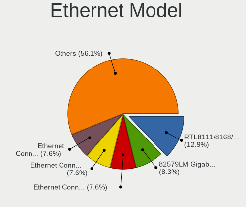

| Model                                                                          | Notebooks | Percent |
|--------------------------------------------------------------------------------|-----------|---------|
| Realtek RTL8111/8168/8411 PCI Express Gigabit Ethernet Controller              | 14        | 12.73%  |
| Intel Ethernet Connection (6) I219-LM                                          | 10        | 9.09%   |
| Intel 82579LM Gigabit Network Connection (Lewisville)                          | 10        | 9.09%   |
| Intel Ethernet Connection (4) I219-LM                                          | 9         | 8.18%   |
| Lenovo ThinkPad TBT 3 Dock                                                     | 8         | 7.27%   |
| Intel Ethernet Connection (10) I219-LM                                         | 8         | 7.27%   |
| Intel Ethernet Connection (7) I219-LM                                          | 6         | 5.45%   |
| Realtek RTL8153 Gigabit Ethernet Adapter                                       | 5         | 4.55%   |
| Realtek RTL810xE PCI Express Fast Ethernet controller                          | 4         | 3.64%   |
| Intel Ethernet Connection (3) I218-LM                                          | 3         | 2.73%   |
| Intel Ethernet Connection (10) I219-V                                          | 3         | 2.73%   |
| Marvell Group Yukon Optima 88E8059 [PCIe Gigabit Ethernet Controller with AVB] | 2         | 1.82%   |
| Lenovo USB-C to LAN                                                            | 2         | 1.82%   |
| Lenovo ThinkPad TBT3 LAN                                                       | 2         | 1.82%   |
| Intel Ethernet Connection I219-LM                                              | 2         | 1.82%   |
| Intel Ethernet Connection (6) I219-V                                           | 2         | 1.82%   |
| Intel Ethernet Connection (4) I219-V                                           | 2         | 1.82%   |
| Intel Ethernet Connection (2) I219-LM                                          | 2         | 1.82%   |
| Intel Ethernet Connection (11) I219-LM                                         | 2         | 1.82%   |
| Xiaomi Mi/Redmi series (RNDIS + ADB)                                           | 1         | 0.91%   |
| Samsung GT-I9070 (network tethering, USB debugging enabled)                    | 1         | 0.91%   |
| Lenovo USB-C Dock Ethernet                                                     | 1         | 0.91%   |
| Lenovo ThinkPad Lan                                                            | 1         | 0.91%   |
| Lenovo ThinkPad Dock Ethernet [Realtek RTL8153B]                               | 1         | 0.91%   |
| Intel Ethernet Controller I225-LM                                              | 1         | 0.91%   |
| Intel Ethernet Connection I219-V                                               | 1         | 0.91%   |
| Intel Ethernet Connection (2) I219-V                                           | 1         | 0.91%   |
| Intel Ethernet Connection (14) I219-LM                                         | 1         | 0.91%   |
| Intel 82577LM Gigabit Network Connection                                       | 1         | 0.91%   |
| ICS Advent DM9601 Fast Ethernet Adapter                                        | 1         | 0.91%   |
| Huawei E353/E3131                                                              | 1         | 0.91%   |
| DisplayLink Plugable UGA-3000                                                  | 1         | 0.91%   |
| Broadcom Limited NetXtreme BCM5761e Gigabit Ethernet PCIe                      | 1         | 0.91%   |

Net Controller Kind
-------------------

Ethernet, WiFi or modem

| Kind     | Notebooks | Percent |
|----------|-----------|---------|
| WiFi     | 103       | 52.28%  |
| Ethernet | 92        | 46.7%   |
| Modem    | 2         | 1.02%   |

Used Controller
---------------

Currently used network controller

| Kind     | Notebooks | Percent |
|----------|-----------|---------|
| WiFi     | 78        | 68.42%  |
| Ethernet | 36        | 31.58%  |

NICs
----

Total network controllers on board

| Total | Notebooks | Percent |
|-------|-----------|---------|
| 2     | 84        | 80.77%  |
| 1     | 20        | 19.23%  |

IPv6
----

IPv6 vs IPv4

| Used | Notebooks | Percent |
|------|-----------|---------|
| No   | 98        | 93.33%  |
| Yes  | 7         | 6.67%   |

Bluetooth
---------

Bluetooth Vendor
----------------

Controller vendors

| Vendor                          | Notebooks | Percent |
|---------------------------------|-----------|---------|
| Intel                           | 68        | 80.95%  |
| Broadcom                        | 5         | 5.95%   |
| IMC Networks                    | 3         | 3.57%   |
| Qualcomm Atheros Communications | 2         | 2.38%   |
| Cambridge Silicon Radio         | 2         | 2.38%   |
| Realtek Semiconductor           | 1         | 1.19%   |
| Ralink                          | 1         | 1.19%   |
| Foxconn / Hon Hai               | 1         | 1.19%   |
| Dell                            | 1         | 1.19%   |

Bluetooth Model
---------------

Controller models

| Model                                                                               | Notebooks | Percent |
|-------------------------------------------------------------------------------------|-----------|---------|
| Intel Bluetooth Device                                                              | 25        | 29.76%  |
| Intel Bluetooth wireless interface                                                  | 19        | 22.62%  |
| Intel Bluetooth 9460/9560 Jefferson Peak (JfP)                                      | 16        | 19.05%  |
| Intel AX200 Bluetooth                                                               | 5         | 5.95%   |
| IMC Networks Bluetooth Radio                                                        | 3         | 3.57%   |
| Cambridge Silicon Radio Bluetooth Dongle (HCI mode)                                 | 2         | 2.38%   |
| Broadcom BCM20702 Bluetooth 4.0 [ThinkPad]                                          | 2         | 2.38%   |
| Realtek Bluetooth Radio                                                             | 1         | 1.19%   |
| Ralink RT3290 Bluetooth                                                             | 1         | 1.19%   |
| Qualcomm Atheros  Bluetooth Device                                                  | 1         | 1.19%   |
| Qualcomm Atheros AR3012 Bluetooth 4.0                                               | 1         | 1.19%   |
| Intel Wireless-AC 9260 Bluetooth Adapter                                            | 1         | 1.19%   |
| Intel Centrino Advanced-N 6230 Bluetooth adapter                                    | 1         | 1.19%   |
| Intel AX210 Bluetooth                                                               | 1         | 1.19%   |
| Foxconn / Hon Hai Foxconn T77H114 BCM2070 [Single-Chip Bluetooth 2.1 + EDR Adapter] | 1         | 1.19%   |
| Dell DW375 Bluetooth Module                                                         | 1         | 1.19%   |
| Broadcom BCM43142A0 Bluetooth 4.0                                                   | 1         | 1.19%   |
| Broadcom BCM20702A0 Bluetooth                                                       | 1         | 1.19%   |
| Broadcom BCM2045B (BDC-2.1)                                                         | 1         | 1.19%   |

Sound
-----

Sound Vendor
------------

Sound card vendors

| Vendor                 | Notebooks | Percent |
|------------------------|-----------|---------|
| Intel                  | 99        | 62.66%  |
| Nvidia                 | 18        | 11.39%  |
| Lenovo                 | 13        | 8.23%   |
| AMD                    | 8         | 5.06%   |
| Plantronics            | 3         | 1.9%    |
| GN Netcom              | 3         | 1.9%    |
| Texas Instruments      | 2         | 1.27%   |
| Realtek Semiconductor  | 2         | 1.27%   |
| Generalplus Technology | 2         | 1.27%   |
| C-Media Electronics    | 2         | 1.27%   |
| Logitech               | 1         | 0.63%   |
| JMTek                  | 1         | 0.63%   |
| Google                 | 1         | 0.63%   |
| Focusrite-Novation     | 1         | 0.63%   |
| Dell                   | 1         | 0.63%   |
| Corsair                | 1         | 0.63%   |

Sound Model
-----------

Sound card models

| Model                                                                             | Notebooks | Percent |
|-----------------------------------------------------------------------------------|-----------|---------|
| Intel Sunrise Point-LP HD Audio                                                   | 20        | 12.05%  |
| Intel Cannon Point-LP High Definition Audio Controller                            | 15        | 9.04%   |
| Intel Comet Lake PCH-LP cAVS                                                      | 12        | 7.23%   |
| Intel Comet Lake PCH cAVS                                                         | 11        | 6.63%   |
| Intel Cannon Lake PCH cAVS                                                        | 11        | 6.63%   |
| Lenovo ThinkPad Thunderbolt 3 Dock USB Audio                                      | 8         | 4.82%   |
| Intel 6 Series/C200 Series Chipset Family High Definition Audio Controller        | 6         | 3.61%   |
| Intel 7 Series/C216 Chipset Family High Definition Audio Controller               | 5         | 3.01%   |
| AMD Family 17h/19h HD Audio Controller                                            | 5         | 3.01%   |
| Nvidia GP107GL High Definition Audio Controller                                   | 4         | 2.41%   |
| Intel 5 Series/3400 Series Chipset High Definition Audio                          | 4         | 2.41%   |
| Intel 100 Series/C230 Series Chipset Family HD Audio Controller                   | 4         | 2.41%   |
| Plantronics BT600                                                                 | 3         | 1.81%   |
| Nvidia GM107 High Definition Audio Controller [GeForce 940MX]                     | 3         | 1.81%   |
| Intel Wildcat Point-LP High Definition Audio Controller                           | 3         | 1.81%   |
| Intel Broadwell-U Audio Controller                                                | 3         | 1.81%   |
| Texas Instruments PCM2902 Audio Codec                                             | 2         | 1.2%    |
| Realtek Semiconductor USB Audio                                                   | 2         | 1.2%    |
| Nvidia TU116 High Definition Audio Controller                                     | 2         | 1.2%    |
| Nvidia TU106 High Definition Audio Controller                                     | 2         | 1.2%    |
| Nvidia GF108 High Definition Audio Controller                                     | 2         | 1.2%    |
| Nvidia Audio device                                                               | 2         | 1.2%    |
| Lenovo ThinkPad Thunderbolt 3 Dock Audio                                          | 2         | 1.2%    |
| Intel Tiger Lake-LP Smart Sound Technology Audio Controller                       | 2         | 1.2%    |
| Intel Tiger Lake-H HD Audio Controller                                            | 2         | 1.2%    |
| Intel Haswell-ULT HD Audio Controller                                             | 2         | 1.2%    |
| Intel CM238 HD Audio Controller                                                   | 2         | 1.2%    |
| Intel 8 Series HD Audio Controller                                                | 2         | 1.2%    |
| AMD Renoir Radeon High Definition Audio Controller                                | 2         | 1.2%    |
| AMD Caicos HDMI Audio [Radeon HD 6450 / 7450/8450/8490 OEM / R5 230/235/235X OEM] | 2         | 1.2%    |
| Nvidia TU107 GeForce GTX 1650 High Definition Audio Controller                    | 1         | 0.6%    |
| Nvidia GK107 HDMI Audio Controller                                                | 1         | 0.6%    |
| Nvidia GA104 High Definition Audio Controller                                     | 1         | 0.6%    |
| Logitech H555 Headset                                                             | 1         | 0.6%    |
| Lenovo ThinkPad USB-C Dock Gen2 USB Audio                                         | 1         | 0.6%    |
| Lenovo ThinkPad Dock Audio                                                        | 1         | 0.6%    |
| Lenovo Thinkcentre TIO24Gen3 for USB-audio                                        | 1         | 0.6%    |
| JMTek iTalk-02                                                                    | 1         | 0.6%    |
| Google Pixel earbuds                                                              | 1         | 0.6%    |
| GN Netcom Jabra Link 380                                                          | 1         | 0.6%    |
| GN Netcom Jabra EVOLVE 20 MS                                                      | 1         | 0.6%    |
| GN Netcom Jabra BIZ 2400 USB                                                      | 1         | 0.6%    |
| Generalplus Technology USB Microphone                                             | 1         | 0.6%    |
| Generalplus Technology IMYB 7.1 Channel                                           | 1         | 0.6%    |
| Focusrite-Novation Scarlett 2i2 Camera                                            | 1         | 0.6%    |
| Dell AC511 USB SoundBar                                                           | 1         | 0.6%    |
| Corsair VOID Wireless Gaming Dongle                                               | 1         | 0.6%    |
| C-Media Electronics Blue Snowball                                                 | 1         | 0.6%    |
| C-Media Electronics Audio Adapter                                                 | 1         | 0.6%    |
| AMD Redwood HDMI Audio [Radeon HD 5000 Series]                                    | 1         | 0.6%    |
| AMD Raven/Raven2/Fenghuang HDMI/DP Audio Controller                               | 1         | 0.6%    |

Memory
------

Memory Vendor
-------------

Memory module vendors

| Vendor              | Notebooks | Percent |
|---------------------|-----------|---------|
| Samsung Electronics | 16        | 42.11%  |
| SK hynix            | 12        | 31.58%  |
| Crucial             | 3         | 7.89%   |
| Unknown             | 2         | 5.26%   |
| Micron Technology   | 2         | 5.26%   |
| Kingston            | 2         | 5.26%   |
| Smart               | 1         | 2.63%   |

Memory Model
------------

Memory module models

| Model                                                           | Notebooks | Percent |
|-----------------------------------------------------------------|-----------|---------|
| SK hynix RAM HMT451S6BFR8A-PB 4GB SODIMM DDR3 1600MT/s          | 2         | 5%      |
| Samsung RAM M471A2K43CB1-CRC 16GB SODIMM DDR4 2667MT/s          | 2         | 5%      |
| Samsung RAM M471A2G44AM0-CWE 16384MB SODIMM DDR4 3200MT/s       | 2         | 5%      |
| Unknown RAM V3D4SF16GB1G81G82400 16GB SODIMM DDR4 2400MT/s      | 1         | 2.5%    |
| Unknown RAM Module 8GB SODIMM DDR3 1600MT/s                     | 1         | 2.5%    |
| Smart RAM SF4642G8CK8IEHLSBG 16384MB SODIMM DDR4 2667MT/s       | 1         | 2.5%    |
| SK hynix RAM HMT41GS6BFR8A-PB 8GB SODIMM DDR3 1600MT/s          | 1         | 2.5%    |
| SK hynix RAM HMT41GS6BFR8A-PB 8192MB SODIMM DDR3 1600MT/s       | 1         | 2.5%    |
| SK hynix RAM HMT41GS6AFR8A-PB 8192MB SODIMM DDR3 1600MT/s       | 1         | 2.5%    |
| SK hynix RAM HMT351S6EFR8A-PB 4096MB SODIMM DDR3 1600MT/s       | 1         | 2.5%    |
| SK hynix RAM HMT351S6CFR8C-H9 4GB SODIMM DDR3 1333MT/s          | 1         | 2.5%    |
| SK hynix RAM HMAB2GS6AMR6N-XN 16GB SODIMM DDR4 3200MT/s         | 1         | 2.5%    |
| SK hynix RAM HMAA1GS6CJR6N-XN 8GB SODIMM DDR4 3200MT/s          | 1         | 2.5%    |
| SK hynix RAM HMA851S6AFR6N-UH 4GB SODIMM DDR4 2667MT/s          | 1         | 2.5%    |
| SK hynix RAM HMA82GS7MFR8N-TF 16GB SODIMM DDR4 2133MT/s         | 1         | 2.5%    |
| SK hynix RAM HMA82GS6DJR8N-XN 16GB SODIMM DDR4 3200MT/s         | 1         | 2.5%    |
| SK hynix RAM HMA82GS6AFR8N-UH 16GB SODIMM DDR4 2667MT/s         | 1         | 2.5%    |
| Samsung RAM Module 16GB SODIMM DDR4 3200MT/s                    | 1         | 2.5%    |
| Samsung RAM M471B5273DH0-CH9 4GB SODIMM DDR3 1334MT/s           | 1         | 2.5%    |
| Samsung RAM M471B5173EB0-YK0 4GB SODIMM DDR3 1600MT/s           | 1         | 2.5%    |
| Samsung RAM M471B5173DB0-YK0 4GB SODIMM DDR3 1600MT/s           | 1         | 2.5%    |
| Samsung RAM M471B5173CB0-YK0 4GB SODIMM DDR3 1600MT/s           | 1         | 2.5%    |
| Samsung RAM M471A5244CB0-CRC 4GB SODIMM DDR4 2667MT/s           | 1         | 2.5%    |
| Samsung RAM M471A4G43AB1-CWE 32GB SODIMM DDR4 3200MT/s          | 1         | 2.5%    |
| Samsung RAM M471A2G44AM0-CTD 16GB SODIMM DDR4 2667MT/s          | 1         | 2.5%    |
| Samsung RAM M471A1K43DB1-CTD 8GB SODIMM DDR4 2667MT/s           | 1         | 2.5%    |
| Samsung RAM M471A1K43CB1-CRC 8192MB SODIMM DDR4 2667MT/s        | 1         | 2.5%    |
| Samsung RAM M471A1K43BB1-CTD 8GB SODIMM DDR4 2667MT/s           | 1         | 2.5%    |
| Samsung RAM K4EBE304EB-EGCG 8192MB Row Of Chips LPDDR3 2133MT/s | 1         | 2.5%    |
| Samsung RAM K4B8G1646B-MYK0 4GB SODIMM DDR3 1600MT/s            | 1         | 2.5%    |
| Micron RAM 8KTF51264HZ-1G9E5 4GB SODIMM DDR3 1333MT/s           | 1         | 2.5%    |
| Micron RAM 4ATF1G64HZ-3G2E2 8GB SODIMM DDR4 3200MT/s            | 1         | 2.5%    |
| Kingston RAM KHX2400C14S4/8G 8GB SODIMM DDR4 2400MT/s           | 1         | 2.5%    |
| Kingston RAM 99U5469-042.A00LF 4096MB SODIMM DDR3 1333MT/s      | 1         | 2.5%    |
| Crucial RAM CT16G4SFRA32A.M8FF 16GB SODIMM DDR4 3200MT/s        | 1         | 2.5%    |
| Crucial RAM CT102464BF160B.M16 8GB SODIMM DDR3 1600MT/s         | 1         | 2.5%    |
| Crucial RAM CT102464BF1339.M16 8GB SODIMM DDR3 1333MT/s         | 1         | 2.5%    |

Memory Kind
-----------

Memory module kinds

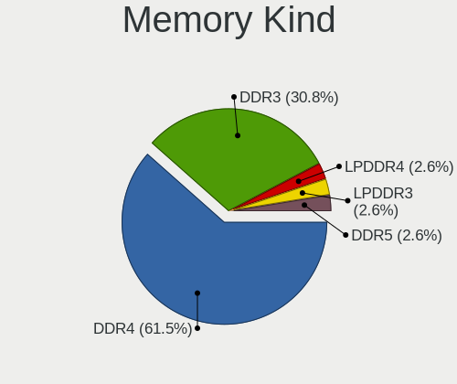

| Kind   | Notebooks | Percent |
|--------|-----------|---------|
| DDR4   | 18        | 60%     |
| DDR3   | 10        | 33.33%  |
| LPDDR4 | 1         | 3.33%   |
| LPDDR3 | 1         | 3.33%   |

Memory Form Factor
------------------

Physical design of the memory module

| Name         | Notebooks | Percent |
|--------------|-----------|---------|
| SODIMM       | 28        | 96.55%  |
| Row Of Chips | 1         | 3.45%   |

Memory Size
-----------

Memory module size

| Size  | Notebooks | Percent |
|-------|-----------|---------|
| 16384 | 12        | 38.71%  |
| 8192  | 10        | 32.26%  |
| 4096  | 8         | 25.81%  |
| 32768 | 1         | 3.23%   |

Memory Speed
------------

Memory module speed

| Speed | Notebooks | Percent |
|-------|-----------|---------|
| 2667  | 9         | 28.13%  |
| 3200  | 8         | 25%     |
| 1600  | 7         | 21.88%  |
| 1333  | 3         | 9.38%   |
| 2400  | 2         | 6.25%   |
| 2133  | 2         | 6.25%   |
| 1334  | 1         | 3.13%   |

Printers & scanners
-------------------

Printer Vendor
--------------

Printer device vendors

| Vendor          | Notebooks | Percent |
|-----------------|-----------|---------|
| Hewlett-Packard | 1         | 100%    |

Printer Model
-------------

Printer device models

| Model               | Notebooks | Percent |
|---------------------|-----------|---------|
| HP ENVY 4500 series | 1         | 100%    |

Scanner Vendor
--------------

Scanner device vendors

Zero info for selected period =(

Scanner Model
-------------

Scanner device models

Zero info for selected period =(

Camera
------

Camera Vendor
-------------

Camera device vendors

| Vendor                                 | Notebooks | Percent |
|----------------------------------------|-----------|---------|
| Chicony Electronics                    | 35        | 32.41%  |
| IMC Networks                           | 17        | 15.74%  |
| Acer                                   | 12        | 11.11%  |
| Realtek Semiconductor                  | 9         | 8.33%   |
| Microdia                               | 7         | 6.48%   |
| Logitech                               | 7         | 6.48%   |
| Sunplus Innovation Technology          | 6         | 5.56%   |
| Suyin                                  | 3         | 2.78%   |
| Lite-On Technology                     | 3         | 2.78%   |
| Samsung Electronics                    | 2         | 1.85%   |
| Cheng Uei Precision Industry (Foxlink) | 2         | 1.85%   |
| Unknown                                | 1         | 0.93%   |
| Syntek                                 | 1         | 0.93%   |
| Quanta                                 | 1         | 0.93%   |
| Microsoft                              | 1         | 0.93%   |
| Lenovo                                 | 1         | 0.93%   |

Camera Model
------------

Camera device models

| Model                                                        | Notebooks | Percent |
|--------------------------------------------------------------|-----------|---------|
| Chicony Integrated Camera                                    | 18        | 16.22%  |
| IMC Networks Integrated Camera                               | 15        | 13.51%  |
| Realtek Integrated_Webcam_HD                                 | 7         | 6.31%   |
| Acer Integrated Camera                                       | 7         | 6.31%   |
| Logitech HD Pro Webcam C920                                  | 4         | 3.6%    |
| Chicony Integrated Camera (1280x720@30)                      | 4         | 3.6%    |
| Acer SunplusIT Integrated Camera                             | 4         | 3.6%    |
| Sunplus Integrated_Webcam_HD                                 | 3         | 2.7%    |
| Lite-On Integrated Camera                                    | 3         | 2.7%    |
| Chicony ThinkPad T490 Webcam                                 | 3         | 2.7%    |
| Chicony HP HD Camera                                         | 3         | 2.7%    |
| Samsung Galaxy series, misc. (MTP mode)                      | 2         | 1.8%    |
| Microdia Webcam                                              | 2         | 1.8%    |
| Microdia Integrated Webcam                                   | 2         | 1.8%    |
| IMC Networks USB2.0 HD UVC WebCam                            | 2         | 1.8%    |
| Chicony Integrated Camera [ThinkPad]                         | 2         | 1.8%    |
| Acer Integrated IR Camera                                    | 2         | 1.8%    |
| Unknown FULL HD 1080P Webcam                                 | 1         | 0.9%    |
| Syntek Lenovo EasyCamera                                     | 1         | 0.9%    |
| Suyin USB2.0 RGBIR Camera                                    | 1         | 0.9%    |
| Suyin Integrated_Webcam_HD                                   | 1         | 0.9%    |
| Suyin HP Truevision HD                                       | 1         | 0.9%    |
| Sunplus Laptop_Integrated_Webcam_FHD                         | 1         | 0.9%    |
| Sunplus Integrated Webcam                                    | 1         | 0.9%    |
| Sunplus HP HD Webcam [Fixed]                                 | 1         | 0.9%    |
| Realtek WEB CAMERA M9 Pro                                    | 1         | 0.9%    |
| Realtek USB2.0 VGA UVC WebCam                                | 1         | 0.9%    |
| Quanta HP HD Camera                                          | 1         | 0.9%    |
| Microsoft LifeCam Cinema                                     | 1         | 0.9%    |
| Microdia Laptop_Integrated_Webcam_HD                         | 1         | 0.9%    |
| Microdia Laptop_Integrated_Webcam_E4HD                       | 1         | 0.9%    |
| Microdia Integrated_Webcam_HD                                | 1         | 0.9%    |
| Logitech Webcam C925e                                        | 1         | 0.9%    |
| Logitech Webcam C310                                         | 1         | 0.9%    |
| Logitech B525 HD Webcam                                      | 1         | 0.9%    |
| Lenovo Integrated Webcam                                     | 1         | 0.9%    |
| Chicony TOSHIBA Web Camera - HD                              | 1         | 0.9%    |
| Chicony Lenovo Integrated Camera (0.3MP)                     | 1         | 0.9%    |
| Chicony Integrated IR Camera                                 | 1         | 0.9%    |
| Chicony HP Wide Vision HD Camera                             | 1         | 0.9%    |
| Chicony HP Webcam                                            | 1         | 0.9%    |
| Chicony HD User Facing                                       | 1         | 0.9%    |
| Cheng Uei Precision Industry (Foxlink) XiaoMi USB 2.0 Webcam | 1         | 0.9%    |
| Cheng Uei Precision Industry (Foxlink) HP HD Camera          | 1         | 0.9%    |
| Acer ThinkPad P50 Integrated Camera                          | 1         | 0.9%    |

Security
--------

Fingerprint Vendor
------------------

Fingerprint sensor vendors

| Vendor                     | Notebooks | Percent |
|----------------------------|-----------|---------|
| Synaptics                  | 29        | 63.04%  |
| Validity Sensors           | 13        | 28.26%  |
| Upek                       | 2         | 4.35%   |
| Shenzhen Goodix Technology | 1         | 2.17%   |
| Elan Microelectronics      | 1         | 2.17%   |

Fingerprint Model
-----------------

Fingerprint sensor models

| Model                                                                      | Notebooks | Percent |
|----------------------------------------------------------------------------|-----------|---------|
| Synaptics Prometheus MIS Touch Fingerprint Reader                          | 21        | 45.65%  |
| Synaptics Metallica MIS Touch Fingerprint Reader                           | 6         | 13.04%  |
| Validity Sensors VFS7500 Touch Fingerprint Sensor                          | 3         | 6.52%   |
| Validity Sensors VFS 5011 fingerprint sensor                               | 3         | 6.52%   |
| Validity Sensors VFS471 Fingerprint Reader                                 | 2         | 4.35%   |
| Validity Sensors Synaptics VFS7552 Touch Fingerprint Sensor with PurePrint | 2         | 4.35%   |
| Upek Biometric Touchchip/Touchstrip Fingerprint Sensor                     | 2         | 4.35%   |
| Validity Sensors VFS7552 Touch Fingerprint Sensor                          | 1         | 2.17%   |
| Validity Sensors VFS495 Fingerprint Reader                                 | 1         | 2.17%   |
| Validity Sensors Synaptics WBDI                                            | 1         | 2.17%   |
| Synaptics  FS7604 Touch Fingerprint Sensor with PurePrint                  | 1         | 2.17%   |
| Synaptics Metallica MOH Touch Fingerprint Reader                           | 1         | 2.17%   |
| Shenzhen Goodix FingerPrint                                                | 1         | 2.17%   |
| Elan ELAN:Fingerprint                                                      | 1         | 2.17%   |

Chipcard Vendor
---------------

Chipcard module vendors

| Vendor      | Notebooks | Percent |
|-------------|-----------|---------|
| Broadcom    | 6         | 42.86%  |
| Alcor Micro | 5         | 35.71%  |
| Lenovo      | 2         | 14.29%  |
| Upek        | 1         | 7.14%   |

Chipcard Model
--------------

Chipcard module models

| Model                                                      | Notebooks | Percent |
|------------------------------------------------------------|-----------|---------|
| Alcor Micro AU9540 Smartcard Reader                        | 5         | 35.71%  |
| Broadcom 58200                                             | 3         | 21.43%  |
| Lenovo Integrated Smart Card Reader                        | 2         | 14.29%  |
| Broadcom 5880                                              | 2         | 14.29%  |
| Upek TouchChip Fingerprint Coprocessor (WBF advanced mode) | 1         | 7.14%   |
| Broadcom BCM5880 Secure Applications Processor             | 1         | 7.14%   |

Unsupported
-----------

Unsupported Devices
-------------------

Total unsupported devices on board

| Total | Notebooks | Percent |
|-------|-----------|---------|
| 1     | 56        | 53.33%  |
| 0     | 37        | 35.24%  |
| 2     | 9         | 8.57%   |
| 3     | 2         | 1.9%    |
| 4     | 1         | 0.95%   |

Unsupported Device Types
------------------------

Types of unsupported devices

| Type                  | Notebooks | Percent |
|-----------------------|-----------|---------|
| Fingerprint reader    | 46        | 55.42%  |
| Graphics card         | 13        | 15.66%  |
| Chipcard              | 11        | 13.25%  |
| Net/wireless          | 4         | 4.82%   |
| Net/ethernet          | 2         | 2.41%   |
| Multimedia controller | 2         | 2.41%   |
| Card reader           | 2         | 2.41%   |
| Bluetooth             | 2         | 2.41%   |
| Storage               | 1         | 1.2%    |

