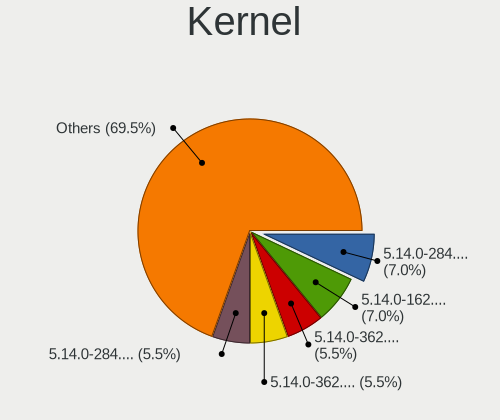
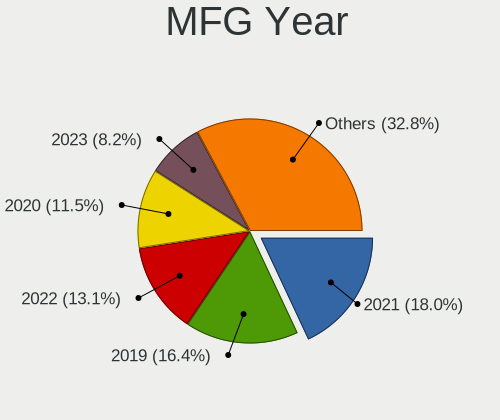
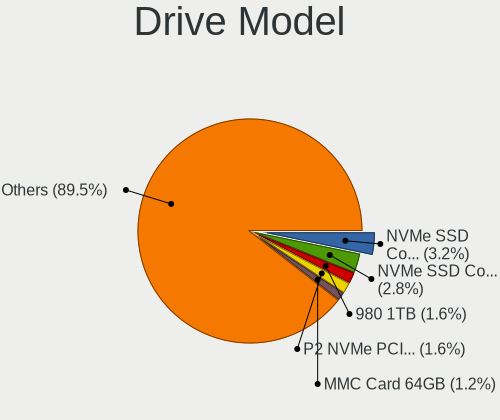
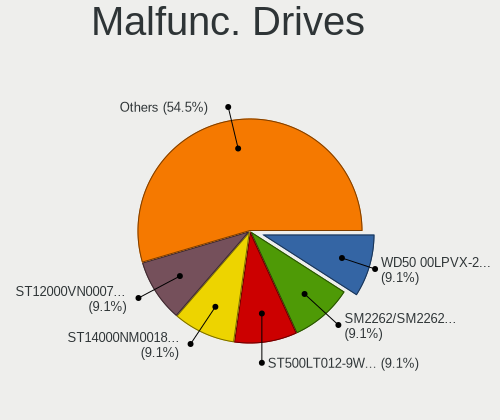
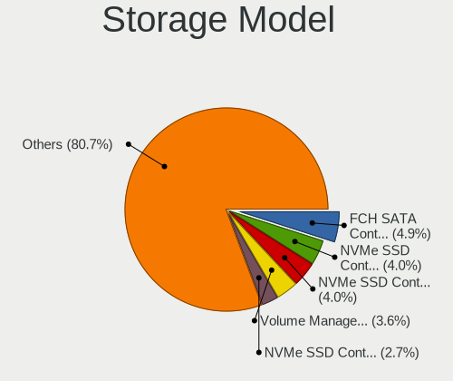
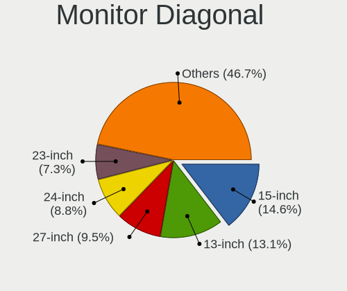
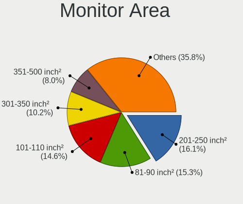
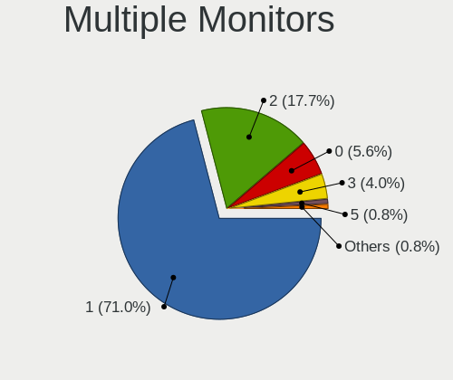
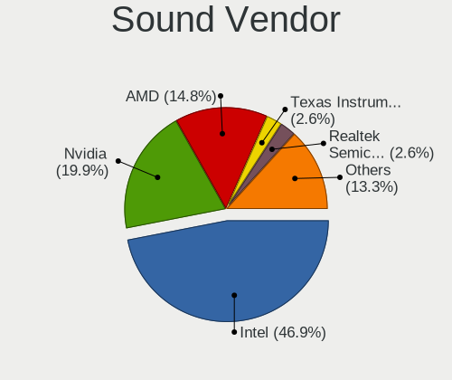
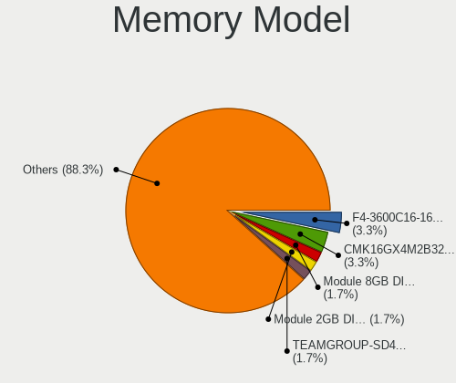

RHEL 9 - Tested Hardware & Statistics
-------------------------------------

A project to collect tested hardware configurations for RHEL 9.

Anyone can contribute to this report by the [hw-probe](https://github.com/linuxhw/hw-probe) tool:

    sudo -E hw-probe -all -upload

Please contribute! Especially if your hardware is rare.

This is a report for all computer types. See also reports for [desktops](/Dist/RHEL_9/Desktop/README.md) and [notebooks](/Dist/RHEL_9/Notebook/README.md).

Contents
--------

* [ Test Cases ](#test-cases)

* [ System ](#system)
  - [ Kernel                   ](#kernel)
  - [ Kernel Family            ](#kernel-family)
  - [ Kernel Major Ver.        ](#kernel-major-ver)
  - [ Arch                     ](#arch)
  - [ DE                       ](#de)
  - [ Display Server           ](#display-server)
  - [ Display Manager          ](#display-manager)
  - [ OS Lang                  ](#os-lang)
  - [ Boot Mode                ](#boot-mode)
  - [ Filesystem               ](#filesystem)
  - [ Part. scheme             ](#part-scheme)
  - [ Dual Boot with Linux/BSD ](#dual-boot-with-linuxbsd)
  - [ Dual Boot (Win)          ](#dual-boot-win)

* [ Board ](#board)
  - [ Vendor                   ](#vendor)
  - [ Model                    ](#model)
  - [ Model Family             ](#model-family)
  - [ MFG Year                 ](#mfg-year)
  - [ Form Factor              ](#form-factor)
  - [ Secure Boot              ](#secure-boot)
  - [ Coreboot                 ](#coreboot)
  - [ RAM Size                 ](#ram-size)
  - [ RAM Used                 ](#ram-used)
  - [ Total Drives             ](#total-drives)
  - [ Has CD-ROM               ](#has-cd-rom)
  - [ Has Ethernet             ](#has-ethernet)
  - [ Has WiFi                 ](#has-wifi)
  - [ Has Bluetooth            ](#has-bluetooth)

* [ Location ](#location)
  - [ Country                  ](#country)
  - [ City                     ](#city)

* [ Drives ](#drives)
  - [ Drive Vendor             ](#drive-vendor)
  - [ Drive Model              ](#drive-model)
  - [ HDD Vendor               ](#hdd-vendor)
  - [ SSD Vendor               ](#ssd-vendor)
  - [ Drive Kind               ](#drive-kind)
  - [ Drive Connector          ](#drive-connector)
  - [ Drive Size               ](#drive-size)
  - [ Space Total              ](#space-total)
  - [ Space Used               ](#space-used)
  - [ Malfunc. Drives          ](#malfunc-drives)
  - [ Malfunc. Drive Vendor    ](#malfunc-drive-vendor)
  - [ Malfunc. HDD Vendor      ](#malfunc-hdd-vendor)
  - [ Malfunc. Drive Kind      ](#malfunc-drive-kind)
  - [ Failed Drives            ](#failed-drives)
  - [ Failed Drive Vendor      ](#failed-drive-vendor)
  - [ Drive Status             ](#drive-status)

* [ Storage controller ](#storage-controller)
  - [ Storage Vendor           ](#storage-vendor)
  - [ Storage Model            ](#storage-model)
  - [ Storage Kind             ](#storage-kind)

* [ Processor ](#processor)
  - [ CPU Vendor               ](#cpu-vendor)
  - [ CPU Model                ](#cpu-model)
  - [ CPU Model Family         ](#cpu-model-family)
  - [ CPU Cores                ](#cpu-cores)
  - [ CPU Sockets              ](#cpu-sockets)
  - [ CPU Threads              ](#cpu-threads)
  - [ CPU Op-Modes             ](#cpu-op-modes)
  - [ CPU Microcode            ](#cpu-microcode)
  - [ CPU Microarch            ](#cpu-microarch)

* [ Graphics ](#graphics)
  - [ GPU Vendor               ](#gpu-vendor)
  - [ GPU Model                ](#gpu-model)
  - [ GPU Combo                ](#gpu-combo)
  - [ GPU Driver               ](#gpu-driver)
  - [ GPU Memory               ](#gpu-memory)

* [ Monitor ](#monitor)
  - [ Monitor Vendor           ](#monitor-vendor)
  - [ Monitor Model            ](#monitor-model)
  - [ Monitor Resolution       ](#monitor-resolution)
  - [ Monitor Diagonal         ](#monitor-diagonal)
  - [ Monitor Width            ](#monitor-width)
  - [ Aspect Ratio             ](#aspect-ratio)
  - [ Monitor Area             ](#monitor-area)
  - [ Pixel Density            ](#pixel-density)
  - [ Multiple Monitors        ](#multiple-monitors)

* [ Network ](#network)
  - [ Net Controller Vendor    ](#net-controller-vendor)
  - [ Net Controller Model     ](#net-controller-model)
  - [ Wireless Vendor          ](#wireless-vendor)
  - [ Wireless Model           ](#wireless-model)
  - [ Ethernet Vendor          ](#ethernet-vendor)
  - [ Ethernet Model           ](#ethernet-model)
  - [ Net Controller Kind      ](#net-controller-kind)
  - [ Used Controller          ](#used-controller)
  - [ NICs                     ](#nics)
  - [ IPv6                     ](#ipv6)

* [ Bluetooth ](#bluetooth)
  - [ Bluetooth Vendor         ](#bluetooth-vendor)
  - [ Bluetooth Model          ](#bluetooth-model)

* [ Sound ](#sound)
  - [ Sound Vendor             ](#sound-vendor)
  - [ Sound Model              ](#sound-model)

* [ Memory ](#memory)
  - [ Memory Vendor            ](#memory-vendor)
  - [ Memory Model             ](#memory-model)
  - [ Memory Kind              ](#memory-kind)
  - [ Memory Form Factor       ](#memory-form-factor)
  - [ Memory Size              ](#memory-size)
  - [ Memory Speed             ](#memory-speed)

* [ Printers & scanners ](#printers--scanners)
  - [ Printer Vendor           ](#printer-vendor)
  - [ Printer Model            ](#printer-model)
  - [ Scanner Vendor           ](#scanner-vendor)
  - [ Scanner Model            ](#scanner-model)

* [ Camera ](#camera)
  - [ Camera Vendor            ](#camera-vendor)
  - [ Camera Model             ](#camera-model)

* [ Security ](#security)
  - [ Fingerprint Vendor       ](#fingerprint-vendor)
  - [ Fingerprint Model        ](#fingerprint-model)
  - [ Chipcard Vendor          ](#chipcard-vendor)
  - [ Chipcard Model           ](#chipcard-model)

* [ Unsupported ](#unsupported)
  - [ Unsupported Devices      ](#unsupported-devices)
  - [ Unsupported Device Types ](#unsupported-device-types)

Test Cases
----------

Total: 64

| Vendor        | Model                       | Form-Factor | Probe                                                      | Date         |
|---------------|-----------------------------|-------------|------------------------------------------------------------|--------------|
| MSI           | Z270-A PRO                  | Desktop     | [0d8b3d7c32](https://linux-hardware.org/?probe=0d8b3d7c32) | Jun 20, 2023 |
| Lenovo        | STA7B38870 02               | Server      | [80a2f3d367](https://linux-hardware.org/?probe=80a2f3d367) | Jun 18, 2023 |
| Dell          | 07T4MC A02                  | Desktop     | [ad310dd147](https://linux-hardware.org/?probe=ad310dd147) | Jun 09, 2023 |
| Dell          | 0HHV7N A00                  | Desktop     | [a3a157f327](https://linux-hardware.org/?probe=a3a157f327) | May 21, 2023 |
| MSI           | MAG X570S TOMAHAWK MAX W... | Desktop     | [2afc4ee693](https://linux-hardware.org/?probe=2afc4ee693) | May 18, 2023 |
| Lenovo        | ThinkPad P17 Gen 2i 20YU... | Notebook    | [49ecdacd71](https://linux-hardware.org/?probe=49ecdacd71) | May 14, 2023 |
| ASUSTek       | TUF Gaming X570-PLUS        | Desktop     | [b1ea93c5fa](https://linux-hardware.org/?probe=b1ea93c5fa) | May 09, 2023 |
| HP            | EliteBook 855 G7 Noteboo... | Notebook    | [6e086ec096](https://linux-hardware.org/?probe=6e086ec096) | May 07, 2023 |
| Lenovo        | ThinkBook 14-IIL 20SL       | Notebook    | [5938e62d47](https://linux-hardware.org/?probe=5938e62d47) | Apr 17, 2023 |
| Dell          | Precision 7510              | Notebook    | [f68123c20a](https://linux-hardware.org/?probe=f68123c20a) | Apr 13, 2023 |
| Gigabyte      | B550M AORUS PRO-P           | Desktop     | [18c5e3c7c3](https://linux-hardware.org/?probe=18c5e3c7c3) | Apr 10, 2023 |
| Lenovo        | ThinkPad X1 Nano Gen 2 2... | Notebook    | [de656b2182](https://linux-hardware.org/?probe=de656b2182) | Apr 06, 2023 |
| MSI           | B450M MORTAR MAX            | Desktop     | [0077b88576](https://linux-hardware.org/?probe=0077b88576) | Apr 06, 2023 |
| Gigabyte      | X670E AORUS MASTER          | Desktop     | [68731ac4ec](https://linux-hardware.org/?probe=68731ac4ec) | Mar 31, 2023 |
| ASUSTek       | PRIME Z690-P WIFI           | Desktop     | [898059efa5](https://linux-hardware.org/?probe=898059efa5) | Mar 28, 2023 |
| MSI           | B450M MORTAR MAX            | Desktop     | [29c85678af](https://linux-hardware.org/?probe=29c85678af) | Mar 28, 2023 |
| ASUSTek       | PRIME Z690-P WIFI           | Desktop     | [1821e3657a](https://linux-hardware.org/?probe=1821e3657a) | Mar 26, 2023 |
| MSI           | B450M MORTAR MAX            | Desktop     | [641481dd1d](https://linux-hardware.org/?probe=641481dd1d) | Mar 21, 2023 |
| MSI           | B450M MORTAR MAX            | Desktop     | [9d859cb8bd](https://linux-hardware.org/?probe=9d859cb8bd) | Mar 20, 2023 |
| HP            | ProBook 640 G2              | Notebook    | [9439371137](https://linux-hardware.org/?probe=9439371137) | Mar 18, 2023 |
| HP            | ProBook 640 G2              | Notebook    | [c968526666](https://linux-hardware.org/?probe=c968526666) | Mar 18, 2023 |
| ASUSTek       | VivoBook_ASUSLaptop X515... | Notebook    | [bc39bd2ce5](https://linux-hardware.org/?probe=bc39bd2ce5) | Mar 17, 2023 |
| Lenovo        | ThinkPad L14 Gen 3 21C2S... | Notebook    | [6772403b62](https://linux-hardware.org/?probe=6772403b62) | Feb 20, 2023 |
| Dell          | Precision 7560              | Notebook    | [7ed10eebe9](https://linux-hardware.org/?probe=7ed10eebe9) | Feb 16, 2023 |
| MSI           | GP75 Leopard 9SD            | Notebook    | [1f2a5b1def](https://linux-hardware.org/?probe=1f2a5b1def) | Feb 11, 2023 |
| Gigabyte      | H510M H                     | Desktop     | [861b7c5aa7](https://linux-hardware.org/?probe=861b7c5aa7) | Feb 02, 2023 |
| ASUSTek       | PRIME Z590-A                | Desktop     | [f328fab9f1](https://linux-hardware.org/?probe=f328fab9f1) | Jan 27, 2023 |
| Hardkernel    | ODROID-H3                   | Desktop     | [98f5768c61](https://linux-hardware.org/?probe=98f5768c61) | Jan 22, 2023 |
| Dell          | Latitude 9420               | Notebook    | [3fd325486b](https://linux-hardware.org/?probe=3fd325486b) | Jan 18, 2023 |
| Dell          | Latitude 3410               | Notebook    | [0a4720ef85](https://linux-hardware.org/?probe=0a4720ef85) | Jan 02, 2023 |
| Unknown       | Unknown                     | Desktop     | [9d66e8f05d](https://linux-hardware.org/?probe=9d66e8f05d) | Dec 25, 2022 |
| MSI           | GE72VR 7RF                  | Notebook    | [f5384e68dd](https://linux-hardware.org/?probe=f5384e68dd) | Dec 16, 2022 |
| Lenovo        | ThinkPad X1 Nano Gen 2 2... | Notebook    | [7c17c479b7](https://linux-hardware.org/?probe=7c17c479b7) | Dec 03, 2022 |
| HP            | Laptop 14s-dk0xxx           | Notebook    | [c1d2a02024](https://linux-hardware.org/?probe=c1d2a02024) | Nov 30, 2022 |
| MSI           | B550M PRO-VDH WIFI          | Desktop     | [af5361313b](https://linux-hardware.org/?probe=af5361313b) | Nov 17, 2022 |
| Dell          | Latitude E7450              | Notebook    | [1fba71c904](https://linux-hardware.org/?probe=1fba71c904) | Nov 15, 2022 |
| MSI           | B550M PRO-VDH WIFI          | Desktop     | [2d830dc96d](https://linux-hardware.org/?probe=2d830dc96d) | Nov 11, 2022 |
| Dell          | 0RN4PJ A02                  | Server      | [84012f61ff](https://linux-hardware.org/?probe=84012f61ff) | Nov 03, 2022 |
| Lenovo        | ThinkPad X220 4291WSH       | Notebook    | [00e77b8815](https://linux-hardware.org/?probe=00e77b8815) | Oct 26, 2022 |
| Lenovo        | ThinkPad X220 4291WSH       | Notebook    | [94d1c333ac](https://linux-hardware.org/?probe=94d1c333ac) | Oct 26, 2022 |
| ASUSTek       | Z450LA                      | Notebook    | [ba00eb6516](https://linux-hardware.org/?probe=ba00eb6516) | Oct 18, 2022 |
| ASUSTek       | Z450LA                      | Notebook    | [6042d84470](https://linux-hardware.org/?probe=6042d84470) | Oct 17, 2022 |
| HP            | 340S G7                     | Notebook    | [7baf4edd11](https://linux-hardware.org/?probe=7baf4edd11) | Oct 09, 2022 |
| Razer         | Blade 15 Mid 2019-Base      | Notebook    | [c1457e4e02](https://linux-hardware.org/?probe=c1457e4e02) | Sep 21, 2022 |
| Acer          | Aspire XC-330               | Desktop     | [2012033d09](https://linux-hardware.org/?probe=2012033d09) | Aug 14, 2022 |
| Dell          | Precision 7510              | Notebook    | [cd8482ea72](https://linux-hardware.org/?probe=cd8482ea72) | Aug 08, 2022 |
| Unknown       | Unknown                     | Desktop     | [fad6d4558f](https://linux-hardware.org/?probe=fad6d4558f) | Jul 26, 2022 |
| Raspberry ... | Raspberry Pi 4 Model B      | Soc         | [4776ecdc2a](https://linux-hardware.org/?probe=4776ecdc2a) | Jul 15, 2022 |
| Intel         | H81                         | Desktop     | [e1a730a6e6](https://linux-hardware.org/?probe=e1a730a6e6) | Jul 08, 2022 |
| Unknown       | Unknown                     | Desktop     | [16c6df7b29](https://linux-hardware.org/?probe=16c6df7b29) | Jul 07, 2022 |
| Unknown       | Unknown                     | Desktop     | [6b25430dc1](https://linux-hardware.org/?probe=6b25430dc1) | Jul 07, 2022 |
| Gigabyte      | MU72-SU0-00 01000100        | Server      | [ab729dc8a5](https://linux-hardware.org/?probe=ab729dc8a5) | Jul 04, 2022 |
| Gigabyte      | MU72-SU0-00 01000100        | Server      | [1cb6aead26](https://linux-hardware.org/?probe=1cb6aead26) | Jul 03, 2022 |
| Dell          | Inspiron 5559               | Notebook    | [aaaaef108a](https://linux-hardware.org/?probe=aaaaef108a) | Jul 03, 2022 |
| Lenovo        | ThinkPad E14 20RA001MMZ     | Notebook    | [4bf795762d](https://linux-hardware.org/?probe=4bf795762d) | Jul 02, 2022 |
| Lenovo        | ThinkPad Edge E431 62771... | Notebook    | [ef8cc06070](https://linux-hardware.org/?probe=ef8cc06070) | Jun 09, 2022 |
| ASUSTek       | TUF Gaming Z690-PLUS WIF... | Notebook    | [48c983a184](https://linux-hardware.org/?probe=48c983a184) | May 15, 2022 |
| Dell          | XPS 17 9710                 | Notebook    | [919abd9078](https://linux-hardware.org/?probe=919abd9078) | May 13, 2022 |
| Dell          | XPS 17 9710                 | Notebook    | [15bc7f6757](https://linux-hardware.org/?probe=15bc7f6757) | May 13, 2022 |
| ASRock        | Z370 Professional Gaming... | Desktop     | [658347ec76](https://linux-hardware.org/?probe=658347ec76) | May 12, 2022 |
| Lenovo        | ThinkBook 13s-IWL 20R9      | Notebook    | [604488642b](https://linux-hardware.org/?probe=604488642b) | Apr 25, 2022 |
| Samsung       | 730QCJ/730QCR               | Notebook    | [24b05b96d7](https://linux-hardware.org/?probe=24b05b96d7) | Jan 19, 2022 |
| HP            | Pavilion Gaming Laptop 1... | Notebook    | [b6b4df52d0](https://linux-hardware.org/?probe=b6b4df52d0) | Dec 25, 2021 |
| Gigabyte      | AERO 15 KD                  | Notebook    | [cfa38b921a](https://linux-hardware.org/?probe=cfa38b921a) | Nov 22, 2021 |

System
------

Kernel
------

Version of the Linux kernel

| Version                      | Computers | Percent |
|------------------------------|-----------|---------|
| 5.14.0-162.6.1.el9_1.x86_64  | 9         | 18%     |
| 5.14.0-70.17.1.el9_0.x86_64  | 6         | 12%     |
| 5.14.0-162.12.1.el9_1.x86_64 | 5         | 10%     |
| 5.14.0-70.5.1.el9_0.x86_64   | 4         | 8%      |
| 5.14.0-70.26.1.el9_0.x86_64  | 4         | 8%      |
| 5.14.0-284.11.1.el9_2.x86_64 | 4         | 8%      |
| 5.14.0-162.23.1.el9_1.x86_64 | 4         | 8%      |
| 5.14.0-70.22.1.el9_0.x86_64  | 3         | 6%      |
| 5.14.0-162.22.2.el9_1.x86_64 | 3         | 6%      |
| 5.14.0-70.13.1.el9_0.x86_64  | 2         | 4%      |
| 5.14.0-162.18.1.el9_1.x86_64 | 2         | 4%      |
| 5.14.0-70.30.1.el9_0.x86_64  | 1         | 2%      |
| 5.14.0-70.17.1.el9_0.aarch64 | 1         | 2%      |
| 5.14.0-39.el9.x86_64         | 1         | 2%      |
| 5.14.0-1.7.1.el9.x86_64      | 1         | 2%      |

Kernel Family
-------------

Linux kernel without a distro release

| Version | Computers | Percent |
|---------|-----------|---------|
| 5.14.0  | 48        | 100%    |

Kernel Major Ver.
-----------------

Linux kernel major version

| Version | Computers | Percent |
|---------|-----------|---------|
| 5.14    | 48        | 100%    |

Arch
----

OS architecture (x86_64, i586, etc.)

| Name    | Computers | Percent |
|---------|-----------|---------|
| x86_64  | 47        | 97.92%  |
| aarch64 | 1         | 2.08%   |

DE
--

Desktop Environment

| Name          | Computers | Percent |
|---------------|-----------|---------|
| GNOME         | 45        | 93.75%  |
| GNOME Classic | 2         | 4.17%   |
| Unknown       | 1         | 2.08%   |

Display Server
--------------

X11 or Wayland

| Name    | Computers | Percent |
|---------|-----------|---------|
| Wayland | 31        | 64.58%  |
| X11     | 15        | 31.25%  |
| Tty     | 2         | 4.17%   |

Display Manager
---------------

SDDM, LightDM, etc.

| Name    | Computers | Percent |
|---------|-----------|---------|
| Unknown | 27        | 56.25%  |
| GDM     | 20        | 41.67%  |
| SDDM    | 1         | 2.08%   |

OS Lang
-------

Language

| Lang  | Computers | Percent |
|-------|-----------|---------|
| en_US | 35        | 72.92%  |
| en_GB | 4         | 8.33%   |
| pt_BR | 2         | 4.17%   |
| en_IN | 2         | 4.17%   |
| ru_RU | 1         | 2.08%   |
| ja_JP | 1         | 2.08%   |
| es_ES | 1         | 2.08%   |
| en_NZ | 1         | 2.08%   |
| en_CA | 1         | 2.08%   |

Boot Mode
---------

EFI or BIOS

| Mode | Computers | Percent |
|------|-----------|---------|
| EFI  | 45        | 93.75%  |
| BIOS | 3         | 6.25%   |

Filesystem
----------

Type of filesystem

| Type | Computers | Percent |
|------|-----------|---------|
| Xfs  | 46        | 95.83%  |
| Ext4 | 2         | 4.17%   |

Part. scheme
------------

Scheme of partitioning

| Type    | Computers | Percent |
|---------|-----------|---------|
| Unknown | 25        | 52.08%  |
| GPT     | 22        | 45.83%  |
| MBR     | 1         | 2.08%   |

Dual Boot with Linux/BSD
------------------------

Hosting more than one Linux/BSD

| Dual boot | Computers | Percent |
|-----------|-----------|---------|
| No        | 40        | 83.33%  |
| Yes       | 8         | 16.67%  |

Dual Boot (Win)
---------------

Hosting Linux and Windows

| Dual boot | Computers | Percent |
|-----------|-----------|---------|
| No        | 42        | 87.5%   |
| Yes       | 6         | 12.5%   |

Board
-----

Vendor
------

Motherboard manufacturer

| Name                    | Computers | Percent |
|-------------------------|-----------|---------|
| Dell                    | 9         | 18.75%  |
| Lenovo                  | 8         | 16.67%  |
| MSI                     | 6         | 12.5%   |
| ASUSTek Computer        | 6         | 12.5%   |
| Gigabyte Technology     | 5         | 10.42%  |
| Hewlett-Packard         | 4         | 8.33%   |
| Unknown                 | 3         | 6.25%   |
| Samsung Electronics     | 1         | 2.08%   |
| Razer                   | 1         | 2.08%   |
| Raspberry Pi Foundation | 1         | 2.08%   |
| Intel                   | 1         | 2.08%   |
| Hardkernel              | 1         | 2.08%   |
| ASRock                  | 1         | 2.08%   |
| Acer                    | 1         | 2.08%   |

Model
-----

Motherboard model

| Name                                     | Computers | Percent |
|------------------------------------------|-----------|---------|
| Unknown                                  | 3         | 6.25%   |
| Samsung 730QCJ/730QCR                    | 1         | 2.08%   |
| Razer Blade 15 Mid 2019-Base             | 1         | 2.08%   |
| RPi Raspberry Pi 4 Model B               | 1         | 2.08%   |
| MSI MS-7D54                              | 1         | 2.08%   |
| MSI MS-7C95                              | 1         | 2.08%   |
| MSI MS-7B89                              | 1         | 2.08%   |
| MSI MS-7A71                              | 1         | 2.08%   |
| MSI GP75 Leopard 9SD                     | 1         | 2.08%   |
| MSI GE72VR 7RF                           | 1         | 2.08%   |
| Lenovo ThinkSystem SR950 V3              | 1         | 2.08%   |
| Lenovo ThinkPad X1 Nano Gen 2 21E80012US | 1         | 2.08%   |
| Lenovo ThinkPad P17 Gen 2i 20YU002KUS    | 1         | 2.08%   |
| Lenovo ThinkPad L14 Gen 3 21C2S1EE00     | 1         | 2.08%   |
| Lenovo ThinkPad Edge E431 62771L7        | 1         | 2.08%   |
| Lenovo ThinkPad E14 20RA001MMZ           | 1         | 2.08%   |
| Lenovo ThinkBook 14-IIL 20SL             | 1         | 2.08%   |
| Lenovo ThinkBook 13s-IWL 20R9            | 1         | 2.08%   |
| Intel H81                                | 1         | 2.08%   |
| HP ProBook 640 G2                        | 1         | 2.08%   |
| HP Laptop 14s-dk0xxx                     | 1         | 2.08%   |
| HP EliteBook 855 G7 Notebook PC          | 1         | 2.08%   |
| HP 340S G7                               | 1         | 2.08%   |
| Hardkernel ODROID-H3                     | 1         | 2.08%   |
| Gigabyte X670E AORUS MASTER              | 1         | 2.08%   |
| Gigabyte MU72-SU0-00                     | 1         | 2.08%   |
| Gigabyte H510M H                         | 1         | 2.08%   |
| Gigabyte B550M AORUS PRO-P               | 1         | 2.08%   |
| Gigabyte AERO 15 KD                      | 1         | 2.08%   |
| Dell XPS 17 9710                         | 1         | 2.08%   |
| Dell Precision Tower 5810                | 1         | 2.08%   |
| Dell Precision 7920 Tower                | 1         | 2.08%   |
| Dell Precision 7560                      | 1         | 2.08%   |
| Dell Precision 7510                      | 1         | 2.08%   |
| Dell PowerEdge T30                       | 1         | 2.08%   |
| Dell Latitude E7450                      | 1         | 2.08%   |
| Dell Latitude 3410                       | 1         | 2.08%   |
| Dell Inspiron 5559                       | 1         | 2.08%   |
| ASUS Z450LA                              | 1         | 2.08%   |
| ASUS VivoBook_ASUSLaptop X515MA_A516MA   | 1         | 2.08%   |

Model Family
------------

Motherboard model prefix

| Name                 | Computers | Percent |
|----------------------|-----------|---------|
| Lenovo ThinkPad      | 5         | 10.42%  |
| Dell Precision       | 4         | 8.33%   |
| Unknown              | 3         | 6.25%   |
| Lenovo ThinkBook     | 2         | 4.17%   |
| Dell Latitude        | 2         | 4.17%   |
| ASUS TUF             | 2         | 4.17%   |
| ASUS PRIME           | 2         | 4.17%   |
| Samsung 730QCJ       | 1         | 2.08%   |
| Razer Blade          | 1         | 2.08%   |
| RPi Raspberry        | 1         | 2.08%   |
| MSI MS-7D54          | 1         | 2.08%   |
| MSI MS-7C95          | 1         | 2.08%   |
| MSI MS-7B89          | 1         | 2.08%   |
| MSI MS-7A71          | 1         | 2.08%   |
| MSI GP75             | 1         | 2.08%   |
| MSI GE72VR           | 1         | 2.08%   |
| Lenovo ThinkSystem   | 1         | 2.08%   |
| Intel H81            | 1         | 2.08%   |
| HP ProBook           | 1         | 2.08%   |
| HP Laptop            | 1         | 2.08%   |
| HP EliteBook         | 1         | 2.08%   |
| HP 340S              | 1         | 2.08%   |
| Hardkernel ODROID-H3 | 1         | 2.08%   |
| Gigabyte X670E       | 1         | 2.08%   |
| Gigabyte MU72-SU0-00 | 1         | 2.08%   |
| Gigabyte H510M       | 1         | 2.08%   |
| Gigabyte B550M       | 1         | 2.08%   |
| Gigabyte AERO        | 1         | 2.08%   |
| Dell XPS             | 1         | 2.08%   |
| Dell PowerEdge       | 1         | 2.08%   |
| Dell Inspiron        | 1         | 2.08%   |
| ASUS Z450LA          | 1         | 2.08%   |
| ASUS VivoBook        | 1         | 2.08%   |
| ASRock Z370          | 1         | 2.08%   |
| Acer Aspire          | 1         | 2.08%   |

MFG Year
--------

Motherboard manufacture year

| Year | Computers | Percent |
|------|-----------|---------|
| 2019 | 10        | 20.83%  |
| 2021 | 9         | 18.75%  |
| 2022 | 7         | 14.58%  |
| 2020 | 7         | 14.58%  |
| 2017 | 4         | 8.33%   |
| 2016 | 3         | 6.25%   |
| 2015 | 3         | 6.25%   |
| 2023 | 2         | 4.17%   |
| 2018 | 1         | 2.08%   |
| 2014 | 1         | 2.08%   |
| 2013 | 1         | 2.08%   |

Form Factor
-----------

Physical design of the computer

| Name           | Computers | Percent |
|----------------|-----------|---------|
| Notebook       | 25        | 52.08%  |
| Desktop        | 19        | 39.58%  |
| Server         | 3         | 6.25%   |
| System on chip | 1         | 2.08%   |

Secure Boot
-----------

Enabled or disabled

| State    | Computers | Percent |
|----------|-----------|---------|
| Disabled | 42        | 85.71%  |
| Enabled  | 7         | 14.29%  |

Coreboot
--------

Have coreboot on board

| Used | Computers | Percent |
|------|-----------|---------|
| No   | 48        | 100%    |

RAM Size
--------

Total RAM memory

| Size in GB      | Computers | Percent |
|-----------------|-----------|---------|
| 8.01-16.0       | 18        | 37.5%   |
| 4.01-8.0        | 9         | 18.75%  |
| 32.01-64.0      | 9         | 18.75%  |
| 64.01-256.0     | 6         | 12.5%   |
| 3.01-4.0        | 3         | 6.25%   |
| More than 256.0 | 2         | 4.17%   |
| 24.01-32.0      | 1         | 2.08%   |

RAM Used
--------

Used RAM memory

| Used GB   | Computers | Percent |
|-----------|-----------|---------|
| 2.01-3.0  | 18        | 36%     |
| 4.01-8.0  | 10        | 20%     |
| 3.01-4.0  | 10        | 20%     |
| 8.01-16.0 | 7         | 14%     |
| 1.01-2.0  | 5         | 10%     |

Total Drives
------------

Number of drives on board

| Drives | Computers | Percent |
|--------|-----------|---------|
| 1      | 23        | 46.94%  |
| 2      | 14        | 28.57%  |
| 3      | 6         | 12.24%  |
| 5      | 4         | 8.16%   |
| 14     | 1         | 2.04%   |
| 4      | 1         | 2.04%   |

Has CD-ROM
----------

Has CD-ROM on board

| Presented | Computers | Percent |
|-----------|-----------|---------|
| No        | 39        | 81.25%  |
| Yes       | 9         | 18.75%  |

Has Ethernet
------------

Has Ethernet on board

| Presented | Computers | Percent |
|-----------|-----------|---------|
| Yes       | 41        | 85.42%  |
| No        | 7         | 14.58%  |

Has WiFi
--------

Has WiFi module

| Presented | Computers | Percent |
|-----------|-----------|---------|
| Yes       | 36        | 75%     |
| No        | 12        | 25%     |

Has Bluetooth
-------------

Has Bluetooth module

| Presented | Computers | Percent |
|-----------|-----------|---------|
| Yes       | 33        | 67.35%  |
| No        | 16        | 32.65%  |

Location
--------

Country
-------

Geographic location (country)

| Country     | Computers | Percent |
|-------------|-----------|---------|
| USA         | 18        | 37.5%   |
| India       | 6         | 12.5%   |
| UK          | 3         | 6.25%   |
| Canada      | 3         | 6.25%   |
| Turkey      | 2         | 4.17%   |
| Chile       | 2         | 4.17%   |
| Brazil      | 2         | 4.17%   |
| Switzerland | 1         | 2.08%   |
| Sri Lanka   | 1         | 2.08%   |
| Spain       | 1         | 2.08%   |
| Russia      | 1         | 2.08%   |
| Norway      | 1         | 2.08%   |
| New Zealand | 1         | 2.08%   |
| Jordan      | 1         | 2.08%   |
| Japan       | 1         | 2.08%   |
| Indonesia   | 1         | 2.08%   |
| Guatemala   | 1         | 2.08%   |
| Germany     | 1         | 2.08%   |
| Finland     | 1         | 2.08%   |

City
----

Geographic location (city)

| City           | Computers | Percent |
|----------------|-----------|---------|
| Santiago       | 2         | 4.08%   |
| Wildomar       | 1         | 2.04%   |
| Whiteley       | 1         | 2.04%   |
| Wellington     | 1         | 2.04%   |
| Wake Forest    | 1         | 2.04%   |
| Valencia       | 1         | 2.04%   |
| Tokyo          | 1         | 2.04%   |
| Sutton         | 1         | 2.04%   |
| Stratham       | 1         | 2.04%   |
| Stavropol      | 1         | 2.04%   |
| Skien          | 1         | 2.04%   |
| Sao Paulo      | 1         | 2.04%   |
| Sainte-Marie   | 1         | 2.04%   |
| Saint Paul     | 1         | 2.04%   |
| Providence     | 1         | 2.04%   |
| Prairieville   | 1         | 2.04%   |
| Piracicaba     | 1         | 2.04%   |
| Pforzheim      | 1         | 2.04%   |
| Oldham         | 1         | 2.04%   |
| New Delhi      | 1         | 2.04%   |
| Mohegan Lake   | 1         | 2.04%   |
| Mattapoisett   | 1         | 2.04%   |
| Maltepe        | 1         | 2.04%   |
| Lansing        | 1         | 2.04%   |
| Kolkata        | 1         | 2.04%   |
| Kochi          | 1         | 2.04%   |
| Houston        | 1         | 2.04%   |
| Helsinki       | 1         | 2.04%   |
| Guatemala City | 1         | 2.04%   |
| Ghaziabad      | 1         | 2.04%   |
| Fort Collins   | 1         | 2.04%   |
| Ernakulam      | 1         | 2.04%   |
| East Peoria    | 1         | 2.04%   |
| Denver         | 1         | 2.04%   |
| Denizli        | 1         | 2.04%   |
| Corona         | 1         | 2.04%   |
| Colombo        | 1         | 2.04%   |
| Christiansburg | 1         | 2.04%   |
| Cherry Hill    | 1         | 2.04%   |
| Canton         | 1         | 2.04%   |

Drives
------

Drive Vendor
------------

Hard drive vendors

| Vendor                    | Computers | Drives | Percent |
|---------------------------|-----------|--------|---------|
| Samsung Electronics       | 16        | 20     | 17.78%  |
| Seagate                   | 10        | 14     | 11.11%  |
| WDC                       | 9         | 16     | 10%     |
| SanDisk                   | 7         | 7      | 7.78%   |
| Toshiba                   | 4         | 4      | 4.44%   |
| SK hynix                  | 3         | 3      | 3.33%   |
| Phison                    | 3         | 3      | 3.33%   |
| Micron Technology         | 3         | 3      | 3.33%   |
| KIOXIA                    | 3         | 4      | 3.33%   |
| Kingston                  | 3         | 3      | 3.33%   |
| Intel                     | 3         | 4      | 3.33%   |
| HGST                      | 3         | 3      | 3.33%   |
| China                     | 3         | 3      | 3.33%   |
| Unknown                   | 2         | 2      | 2.22%   |
| SABRENT                   | 2         | 2      | 2.22%   |
| KingSpec                  | 2         | 2      | 2.22%   |
| Crucial                   | 2         | 3      | 2.22%   |
| ADATA Technology          | 2         | 2      | 2.22%   |
| XUM                       | 1         | 1      | 1.11%   |
| SSSTC                     | 1         | 1      | 1.11%   |
| PNY                       | 1         | 1      | 1.11%   |
| Plextor                   | 1         | 1      | 1.11%   |
| Micron/Crucial Technology | 1         | 2      | 1.11%   |
| Hitachi                   | 1         | 1      | 1.11%   |
| Golden                    | 1         | 1      | 1.11%   |
| Gigabyte Technology       | 1         | 1      | 1.11%   |
| Fantom                    | 1         | 1      | 1.11%   |
| A-DATA Technology         | 1         | 1      | 1.11%   |

Drive Model
-----------

Hard drive models

| Model                                               | Computers | Percent |
|-----------------------------------------------------|-----------|---------|
| Samsung NVMe SSD Controller PM9A1/PM9A3/980PRO 2TB  | 3         | 2.97%   |
| Seagate ST1000DM010-2EP102 1TB                      | 2         | 1.98%   |
| Sandisk WD Blue SN500 / PC SN520 NVMe SSD 500GB     | 2         | 1.98%   |
| Samsung NVMe SSD Controller SM981/PM981/PM983 250GB | 2         | 1.98%   |
| SABRENT Disk 1TB                                    | 2         | 1.98%   |
| KIOXIA KBG5AZNT1T02 LA 1TB                          | 2         | 1.98%   |
| HGST HTS721010A9E630 1TB                            | 2         | 1.98%   |
| XUM HX256GSSDSATA3 256GB                            | 1         | 0.99%   |
| WDC WDBA3V5000ANC-WRSN 500GB                        | 1         | 0.99%   |
| WDC WD80EFAX-68KNBN0 8TB                            | 1         | 0.99%   |
| WDC WD5000AVCS-632DY1 500GB                         | 1         | 0.99%   |
| WDC WD50 00LPVX-22V0TT0 500GB                       | 1         | 0.99%   |
| WDC WD40EFRX-68N32N0 4TB                            | 1         | 0.99%   |
| WDC WD20EZRZ-00Z5HB0 2TB                            | 1         | 0.99%   |
| WDC WD20EZRX-00D8PB0 2TB                            | 1         | 0.99%   |
| WDC WD141KFGX-68FH9N0 14TB                          | 1         | 0.99%   |
| WDC WD140EFGX-68B0GN0 14TB                          | 1         | 0.99%   |
| WDC WD10SPZX-60Z10T0 1TB                            | 1         | 0.99%   |
| WDC WD10SPSX-00A6WT0 1TB                            | 1         | 0.99%   |
| WDC WD10JPLX-00MBPT0 1TB                            | 1         | 0.99%   |
| WDC WD10JPCX-24UE4T0 1TB                            | 1         | 0.99%   |
| WDC WD10EZEX-00BBHA0 1TB                            | 1         | 0.99%   |
| WDC WD100EFAX-68LHPN0 10TB                          | 1         | 0.99%   |
| Unknown SDU1  64GB                                  | 1         | 0.99%   |
| Unknown SD/MMC/MS PRO 250GB                         | 1         | 0.99%   |
| Toshiba MQ01ACF050 500GB                            | 1         | 0.99%   |
| Toshiba MQ01ABF050 500GB                            | 1         | 0.99%   |
| Toshiba MQ01ABD100 1TB                              | 1         | 0.99%   |
| Toshiba MK3261GSYN 320GB                            | 1         | 0.99%   |
| SSSTC CL1-3D512-Q11 NVMe 512GB                      | 1         | 0.99%   |
| SK hynix SHGP31-1000GM 1TB                          | 1         | 0.99%   |
| SK hynix SC401 SATA 512GB SSD                       | 1         | 0.99%   |
| SK hynix NVMe SSD Drive 1024GB                      | 1         | 0.99%   |
| Seagate ST9250315AS 250GB                           | 1         | 0.99%   |
| Seagate ST6000DM003-2CY186 6TB                      | 1         | 0.99%   |
| Seagate ST4000DM000-2AE166 4TB                      | 1         | 0.99%   |
| Seagate ST3500312CS 500GB                           | 1         | 0.99%   |
| Seagate ST31000528AS 1TB                            | 1         | 0.99%   |
| Seagate ST3000VN000-1HJ166 3TB                      | 1         | 0.99%   |
| Seagate ST18000NM000J-2TV103 18TB                   | 1         | 0.99%   |

HDD Vendor
----------

Hard disk drive vendors

| Vendor  | Computers | Drives | Percent |
|---------|-----------|--------|---------|
| Seagate | 10        | 14     | 35.71%  |
| WDC     | 8         | 15     | 28.57%  |
| Toshiba | 4         | 4      | 14.29%  |
| HGST    | 3         | 3      | 10.71%  |
| Unknown | 1         | 1      | 3.57%   |
| Hitachi | 1         | 1      | 3.57%   |
| Fantom  | 1         | 1      | 3.57%   |

SSD Vendor
----------

Solid state drive vendors

| Vendor              | Computers | Drives | Percent |
|---------------------|-----------|--------|---------|
| Samsung Electronics | 7         | 8      | 30.43%  |
| China               | 3         | 3      | 13.04%  |
| SanDisk             | 2         | 2      | 8.7%    |
| KingSpec            | 2         | 2      | 8.7%    |
| Crucial             | 2         | 2      | 8.7%    |
| XUM                 | 1         | 1      | 4.35%   |
| SK hynix            | 1         | 1      | 4.35%   |
| PNY                 | 1         | 1      | 4.35%   |
| Plextor             | 1         | 1      | 4.35%   |
| Kingston            | 1         | 1      | 4.35%   |
| Intel               | 1         | 2      | 4.35%   |
| Gigabyte Technology | 1         | 1      | 4.35%   |

Drive Kind
----------

HDD or SSD

| Kind    | Computers | Drives | Percent |
|---------|-----------|--------|---------|
| NVMe    | 35        | 43     | 44.87%  |
| HDD     | 21        | 39     | 26.92%  |
| SSD     | 20        | 25     | 25.64%  |
| MMC     | 1         | 1      | 1.28%   |
| Unknown | 1         | 1      | 1.28%   |

Drive Connector
---------------

SATA, SAS, NVMe, etc.

| Type | Computers | Drives | Percent |
|------|-----------|--------|---------|
| NVMe | 35        | 41     | 49.3%   |
| SATA | 30        | 61     | 42.25%  |
| SAS  | 5         | 6      | 7.04%   |
| MMC  | 1         | 1      | 1.41%   |

Drive Size
----------

Size of hard drive

| Size in TB | Computers | Drives | Percent |
|------------|-----------|--------|---------|
| 0.51-1.0   | 16        | 22     | 38.1%   |
| 0.01-0.5   | 16        | 23     | 38.1%   |
| 4.01-10.0  | 3         | 6      | 7.14%   |
| 3.01-4.0   | 2         | 4      | 4.76%   |
| 10.01-20.0 | 2         | 4      | 4.76%   |
| 1.01-2.0   | 2         | 3      | 4.76%   |
| 2.01-3.0   | 1         | 2      | 2.38%   |

Space Total
-----------

Amount of disk space available on the file system

| Size in GB     | Computers | Percent |
|----------------|-----------|---------|
| 101-250        | 15        | 30.61%  |
| 251-500        | 12        | 24.49%  |
| 501-1000       | 9         | 18.37%  |
| 1001-2000      | 6         | 12.24%  |
| More than 3000 | 3         | 6.12%   |
| 51-100         | 3         | 6.12%   |
| Unknown        | 1         | 2.04%   |

Space Used
----------

Amount of used disk space

| Used GB        | Computers | Percent |
|----------------|-----------|---------|
| 1-20           | 19        | 38.78%  |
| 21-50          | 12        | 24.49%  |
| 51-100         | 6         | 12.24%  |
| 251-500        | 5         | 10.2%   |
| 101-250        | 3         | 6.12%   |
| More than 3000 | 2         | 4.08%   |
| 1001-2000      | 1         | 2.04%   |
| Unknown        | 1         | 2.04%   |

Malfunc. Drives
---------------

Drive models with a malfunction

| Model                          | Computers | Drives | Percent |
|--------------------------------|-----------|--------|---------|
| WDC WD50 00LPVX-22V0TT0 500GB  | 1         | 1      | 25%     |
| Seagate ST1000DM010-2EP102 1TB | 1         | 1      | 25%     |
| Intel SSDSC2BA800G4R 800GB     | 1         | 2      | 25%     |
| Crucial CT1000BX500SSD1 1TB    | 1         | 1      | 25%     |

Malfunc. Drive Vendor
---------------------

Vendors of faulty drives

| Vendor  | Computers | Drives | Percent |
|---------|-----------|--------|---------|
| WDC     | 1         | 1      | 25%     |
| Seagate | 1         | 1      | 25%     |
| Intel   | 1         | 2      | 25%     |
| Crucial | 1         | 1      | 25%     |

Malfunc. HDD Vendor
-------------------

Vendors of faulty HDD drives

| Vendor  | Computers | Drives | Percent |
|---------|-----------|--------|---------|
| WDC     | 1         | 1      | 50%     |
| Seagate | 1         | 1      | 50%     |

Malfunc. Drive Kind
-------------------

Kinds of faulty drives

| Kind | Computers | Drives | Percent |
|------|-----------|--------|---------|
| SSD  | 2         | 3      | 66.67%  |
| HDD  | 1         | 2      | 33.33%  |

Failed Drives
-------------

Failed drive models

Zero info for selected period =(

Failed Drive Vendor
-------------------

Failed drive vendors

Zero info for selected period =(

Drive Status
------------

Number of failed and malfunc. drives

| Status   | Computers | Drives | Percent |
|----------|-----------|--------|---------|
| Detected | 29        | 58     | 54.72%  |
| Works    | 21        | 46     | 39.62%  |
| Malfunc  | 3         | 5      | 5.66%   |

Storage controller
------------------

Storage Vendor
--------------

Storage controller vendors

| Vendor                      | Computers | Percent |
|-----------------------------|-----------|---------|
| Intel                       | 32        | 41.56%  |
| Samsung Electronics         | 10        | 12.99%  |
| AMD                         | 8         | 10.39%  |
| SanDisk                     | 6         | 7.79%   |
| Phison Electronics          | 3         | 3.9%    |
| Micron Technology           | 3         | 3.9%    |
| KIOXIA                      | 3         | 3.9%    |
| ADATA Technology            | 3         | 3.9%    |
| SK hynix                    | 2         | 2.6%    |
| Micron/Crucial Technology   | 2         | 2.6%    |
| Kingston Technology Company | 2         | 2.6%    |
| Broadcom / LSI              | 2         | 2.6%    |
| ASMedia Technology          | 1         | 1.3%    |

Storage Model
-------------

Storage controller models

| Model                                                                         | Computers | Percent |
|-------------------------------------------------------------------------------|-----------|---------|
| AMD FCH SATA Controller [AHCI mode]                                           | 5         | 5.95%   |
| Samsung NVMe SSD Controller SM981/PM981/PM983                                 | 4         | 4.76%   |
| Samsung NVMe SSD Controller PM9A1/PM9A3/980PRO                                | 4         | 4.76%   |
| Intel Volume Management Device NVMe RAID Controller                           | 3         | 3.57%   |
| Intel 82801 Mobile SATA Controller [RAID mode]                                | 3         | 3.57%   |
| SK hynix Gold P31/BC711/PC711 NVMe Solid State Drive                          | 2         | 2.38%   |
| SanDisk WD Blue SN500 / PC SN520 NVMe SSD                                     | 2         | 2.38%   |
| Samsung NVMe SSD Controller 980                                               | 2         | 2.38%   |
| Phison E12 NVMe Controller                                                    | 2         | 2.38%   |
| KIOXIA Non-Volatile memory controller                                         | 2         | 2.38%   |
| Intel Sunrise Point-LP SATA Controller [AHCI mode]                            | 2         | 2.38%   |
| Intel SSD 660P Series                                                         | 2         | 2.38%   |
| Intel SATA Controller [RAID mode]                                             | 2         | 2.38%   |
| Intel Jasper Lake SATA AHCI Controller                                        | 2         | 2.38%   |
| Intel Comet Lake SATA AHCI Controller                                         | 2         | 2.38%   |
| Intel C620 Series Chipset Family SSATA Controller [AHCI mode]                 | 2         | 2.38%   |
| Intel C600/X79 series chipset SATA RAID Controller                            | 2         | 2.38%   |
| Intel 6 Series/C200 Series Chipset Family 6 port Desktop SATA AHCI Controller | 2         | 2.38%   |
| Intel 500 Series Chipset Family SATA AHCI Controller                          | 2         | 2.38%   |
| Intel 200 Series PCH SATA controller [AHCI mode]                              | 2         | 2.38%   |
| AMD 500 Series Chipset SATA Controller                                        | 2         | 2.38%   |
| SanDisk WD PC SN810 / Black SN850 NVMe SSD                                    | 1         | 1.19%   |
| SanDisk WD Blue SN570 NVMe SSD 1TB                                            | 1         | 1.19%   |
| SanDisk WD Blue SN550 NVMe SSD                                                | 1         | 1.19%   |
| SanDisk WD Black SN750 / PC SN730 NVMe SSD                                    | 1         | 1.19%   |
| Phison E16 PCIe4 NVMe Controller                                              | 1         | 1.19%   |
| Micron/Crucial P5 Plus NVMe PCIe SSD                                          | 1         | 1.19%   |
| Micron/Crucial P2 NVMe PCIe SSD                                               | 1         | 1.19%   |
| Micron 7450 PRO NVMe SSD                                                      | 1         | 1.19%   |
| Micron 2450 NVMe SSD (DRAM-less)                                              | 1         | 1.19%   |
| Micron 2200S NVMe SSD                                                         | 1         | 1.19%   |
| KIOXIA NVMe SSD Controller BG4                                                | 1         | 1.19%   |
| Kingston Company Company Non-Volatile memory controller                       | 1         | 1.19%   |
| Kingston Company FURY Renegade NVMe SSD                                       | 1         | 1.19%   |
| Intel Volume Management Device NVMe RAID Controller Intel Corporation         | 1         | 1.19%   |
| Intel Q170/Q150/B150/H170/H110/Z170/CM236 Chipset SATA Controller [AHCI Mode] | 1         | 1.19%   |
| Intel Ice Lake-LP SATA Controller [AHCI mode]                                 | 1         | 1.19%   |
| Intel HM170/QM170 Chipset SATA Controller [AHCI Mode]                         | 1         | 1.19%   |
| Intel Celeron/Pentium Silver Processor SATA Controller                        | 1         | 1.19%   |
| Intel Cannon Lake Mobile PCH SATA AHCI Controller                             | 1         | 1.19%   |

Storage Kind
------------

Kind of storage controller (IDE, SATA, NVMe, SAS, ...)

| Kind | Computers | Percent |
|------|-----------|---------|
| NVMe | 34        | 43.59%  |
| SATA | 32        | 41.03%  |
| RAID | 10        | 12.82%  |
| SAS  | 1         | 1.28%   |
| IDE  | 1         | 1.28%   |

Processor
---------

CPU Vendor
----------

Processor vendors

| Vendor | Computers | Percent |
|--------|-----------|---------|
| Intel  | 38        | 79.17%  |
| AMD    | 9         | 18.75%  |
| ARM    | 1         | 2.08%   |

CPU Model
---------

Processor models

| Model                                   | Computers | Percent |
|-----------------------------------------|-----------|---------|
| Intel Core i7-9750H CPU @ 2.60GHz       | 2         | 4.17%   |
| Intel Core i5-1035G1 CPU @ 1.00GHz      | 2         | 4.17%   |
| Intel Core i5-10210U CPU @ 1.60GHz      | 2         | 4.17%   |
| AMD Ryzen 5 3600 6-Core Processor       | 2         | 4.17%   |
| Intel Xeon W-11855M CPU @ 3.20GHz       | 1         | 2.08%   |
| Intel Xeon Silver 4310 CPU @ 2.10GHz    | 1         | 2.08%   |
| Intel Xeon Platinum 8468H               | 1         | 2.08%   |
| Intel Xeon Platinum 8168 CPU @ 2.70GHz  | 1         | 2.08%   |
| Intel Xeon CPU E5-1607 v4 @ 3.10GHz     | 1         | 2.08%   |
| Intel Xeon CPU E3-1225 v5 @ 3.30GHz     | 1         | 2.08%   |
| Intel Pentium Silver N6005 @ 2.00GHz    | 1         | 2.08%   |
| Intel Core i7-8700K CPU @ 3.70GHz       | 1         | 2.08%   |
| Intel Core i7-7700K CPU @ 4.20GHz       | 1         | 2.08%   |
| Intel Core i7-7700HQ CPU @ 2.80GHz      | 1         | 2.08%   |
| Intel Core i7-6820HQ CPU @ 2.70GHz      | 1         | 2.08%   |
| Intel Core i7-6600U CPU @ 2.60GHz       | 1         | 2.08%   |
| Intel Core i7-5600U CPU @ 2.60GHz       | 1         | 2.08%   |
| Intel Core i7-10510U CPU @ 1.80GHz      | 1         | 2.08%   |
| Intel Core i5-8265U CPU @ 1.60GHz       | 1         | 2.08%   |
| Intel Core i5-6200U CPU @ 2.30GHz       | 1         | 2.08%   |
| Intel Core i5-3570 CPU @ 3.40GHz        | 1         | 2.08%   |
| Intel Core i5-3470S CPU @ 2.90GHz       | 1         | 2.08%   |
| Intel Core i5-3320M CPU @ 2.60GHz       | 1         | 2.08%   |
| Intel Core i3-4130 CPU @ 3.40GHz        | 1         | 2.08%   |
| Intel Core i3-4005U CPU @ 1.70GHz       | 1         | 2.08%   |
| Intel Celeron N5105 @ 2.00GHz           | 1         | 2.08%   |
| Intel Celeron N4020 CPU @ 1.10GHz       | 1         | 2.08%   |
| Intel 13th Gen Core i5-13600K           | 1         | 2.08%   |
| Intel 12th Gen Core i9-12900K           | 1         | 2.08%   |
| Intel 12th Gen Core i7-1260P            | 1         | 2.08%   |
| Intel 12th Gen Core i5-1235U            | 1         | 2.08%   |
| Intel 11th Gen Core i9-11950H @ 2.60GHz | 1         | 2.08%   |
| Intel 11th Gen Core i9-11900H @ 2.50GHz | 1         | 2.08%   |
| Intel 11th Gen Core i7-11800H @ 2.30GHz | 1         | 2.08%   |
| Intel 11th Gen Core i7-11700K @ 3.60GHz | 1         | 2.08%   |
| Intel 11th Gen Core i7-11700F @ 2.50GHz | 1         | 2.08%   |
| ARM Processor                           | 1         | 2.08%   |
| AMD Ryzen 9 7900X 12-Core Processor     | 1         | 2.08%   |
| AMD Ryzen 9 5900X 12-Core Processor     | 1         | 2.08%   |
| AMD Ryzen 9 3900X 12-Core Processor     | 1         | 2.08%   |

CPU Model Family
----------------

Processor model prefix

| Model                | Computers | Percent |
|----------------------|-----------|---------|
| Other                | 10        | 20.83%  |
| Intel Core i7        | 9         | 18.75%  |
| Intel Core i5        | 9         | 18.75%  |
| AMD Ryzen 5          | 4         | 8.33%   |
| Intel Xeon           | 3         | 6.25%   |
| AMD Ryzen 9          | 3         | 6.25%   |
| Intel Xeon Platinum  | 2         | 4.17%   |
| Intel Core i3        | 2         | 4.17%   |
| Intel Celeron        | 2         | 4.17%   |
| Intel Xeon Silver    | 1         | 2.08%   |
| Intel Pentium Silver | 1         | 2.08%   |
| AMD Ryzen 7 PRO      | 1         | 2.08%   |
| AMD A4               | 1         | 2.08%   |

CPU Cores
---------

Number of processor cores

| Number | Computers | Percent |
|--------|-----------|---------|
| 4      | 17        | 35.42%  |
| 2      | 8         | 16.67%  |
| 8      | 7         | 14.58%  |
| 6      | 7         | 14.58%  |
| 12     | 5         | 10.42%  |
| 384    | 1         | 2.08%   |
| 48     | 1         | 2.08%   |
| 14     | 1         | 2.08%   |
| 10     | 1         | 2.08%   |

CPU Sockets
-----------

Number of sockets

| Number | Computers | Percent |
|--------|-----------|---------|
| 1      | 46        | 95.83%  |
| 8      | 1         | 2.08%   |
| 2      | 1         | 2.08%   |

CPU Threads
-----------

Threads per core (Hyper-Threading)

| Number | Computers | Percent |
|--------|-----------|---------|
| 2      | 38        | 79.17%  |
| 1      | 10        | 20.83%  |

CPU Op-Modes
------------

CPU Operation Modes (32-bit, 64-bit)

| Op mode        | Computers | Percent |
|----------------|-----------|---------|
| 32-bit, 64-bit | 48        | 100%    |

CPU Microcode
-------------

Microcode number

| Number     | Computers | Percent |
|------------|-----------|---------|
| 0x806ec    | 4         | 8.33%   |
| 0x806d1    | 4         | 8.33%   |
| 0x306a9    | 3         | 6.25%   |
| 0x08701021 | 3         | 6.25%   |
| 0xa0671    | 2         | 4.17%   |
| 0x906ea    | 2         | 4.17%   |
| 0x906e9    | 2         | 4.17%   |
| 0x906c0    | 2         | 4.17%   |
| 0x706e5    | 2         | 4.17%   |
| 0x506e3    | 2         | 4.17%   |
| 0x406e3    | 2         | 4.17%   |
| 0xb0671    | 1         | 2.08%   |
| 0x906ed    | 1         | 2.08%   |
| 0x906a4    | 1         | 2.08%   |
| 0x906a3    | 1         | 2.08%   |
| 0x90672    | 1         | 2.08%   |
| 0x806f6    | 1         | 2.08%   |
| 0x706a8    | 1         | 2.08%   |
| 0x606a6    | 1         | 2.08%   |
| 0x50654    | 1         | 2.08%   |
| 0x406f1    | 1         | 2.08%   |
| 0x40651    | 1         | 2.08%   |
| 0x306d4    | 1         | 2.08%   |
| 0x306c3    | 1         | 2.08%   |
| 0x0a601203 | 1         | 2.08%   |
| 0x0a50000c | 1         | 2.08%   |
| 0x0a20120a | 1         | 2.08%   |
| 0x08600106 | 1         | 2.08%   |
| 0x08108109 | 1         | 2.08%   |
| 0x06006705 | 1         | 2.08%   |
| Unknown    | 1         | 2.08%   |

CPU Microarch
-------------

Microarchitecture

| Name             | Computers | Percent |
|------------------|-----------|---------|
| KabyLake         | 9         | 18.75%  |
| Icelake          | 9         | 18.75%  |
| Skylake          | 5         | 10.42%  |
| Zen 2            | 4         | 8.33%   |
| Alderlake Hybrid | 4         | 8.33%   |
| IvyBridge        | 3         | 6.25%   |
| Zen 3            | 2         | 4.17%   |
| Tremont          | 2         | 4.17%   |
| Haswell          | 2         | 4.17%   |
| Broadwell        | 2         | 4.17%   |
| Unknown          | 2         | 4.17%   |
| Zen+             | 1         | 2.08%   |
| Sapphire Rapids  | 1         | 2.08%   |
| Goldmont plus    | 1         | 2.08%   |
| Excavator        | 1         | 2.08%   |

Graphics
--------

GPU Vendor
----------

Vendors of graphics cards

| Vendor            | Computers | Percent |
|-------------------|-----------|---------|
| Intel             | 27        | 47.37%  |
| Nvidia            | 16        | 28.07%  |
| AMD               | 12        | 21.05%  |
| ASPEED Technology | 2         | 3.51%   |

GPU Model
---------

Graphics card models

| Model                                                                         | Computers | Percent |
|-------------------------------------------------------------------------------|-----------|---------|
| Intel CometLake-U GT2 [UHD Graphics]                                          | 3         | 5.08%   |
| Nvidia TU116M [GeForce GTX 1660 Ti Mobile]                                    | 2         | 3.39%   |
| Nvidia GA106M [GeForce RTX 3060 Mobile / Max-Q]                               | 2         | 3.39%   |
| Intel TigerLake-H GT1 [UHD Graphics]                                          | 2         | 3.39%   |
| Intel Skylake GT2 [HD Graphics 520]                                           | 2         | 3.39%   |
| Intel JasperLake [UHD Graphics]                                               | 2         | 3.39%   |
| Intel Iris Plus Graphics G1 (Ice Lake)                                        | 2         | 3.39%   |
| Intel HD Graphics 630                                                         | 2         | 3.39%   |
| Intel CoffeeLake-H GT2 [UHD Graphics 630]                                     | 2         | 3.39%   |
| ASPEED Technology ASPEED Graphics Family                                      | 2         | 3.39%   |
| AMD Navi 14 [Radeon RX 5500/5500M / Pro 5500M]                                | 2         | 3.39%   |
| AMD Ellesmere [Radeon RX 470/480/570/570X/580/580X/590]                       | 2         | 3.39%   |
| Nvidia TU117GLM [T1200 Laptop GPU]                                            | 1         | 1.69%   |
| Nvidia TU117GL [T400 4GB]                                                     | 1         | 1.69%   |
| Nvidia GT218 [GeForce G210]                                                   | 1         | 1.69%   |
| Nvidia GP106M [GeForce GTX 1060 Mobile]                                       | 1         | 1.69%   |
| Nvidia GP104GL [Quadro P4000]                                                 | 1         | 1.69%   |
| Nvidia GP104 [GeForce GTX 1070]                                               | 1         | 1.69%   |
| Nvidia GP104 [GeForce GTX 1070 Ti]                                            | 1         | 1.69%   |
| Nvidia GM206GL [Quadro M2000]                                                 | 1         | 1.69%   |
| Nvidia GK208B [GeForce GT 730]                                                | 1         | 1.69%   |
| Nvidia GA106 [Geforce RTX 3050]                                               | 1         | 1.69%   |
| Nvidia GA104GLM [RTX A5000 Mobile]                                            | 1         | 1.69%   |
| Nvidia GA102 [GeForce RTX 3090]                                               | 1         | 1.69%   |
| Nvidia G92 [GeForce 9800 GT]                                                  | 1         | 1.69%   |
| Intel Xeon E3-1200 v2/3rd Gen Core processor Graphics Controller              | 1         | 1.69%   |
| Intel WhiskeyLake-U GT2 [UHD Graphics 620]                                    | 1         | 1.69%   |
| Intel RocketLake-S GT1 [UHD Graphics 750]                                     | 1         | 1.69%   |
| Intel HD Graphics P530                                                        | 1         | 1.69%   |
| Intel HD Graphics 5500                                                        | 1         | 1.69%   |
| Intel HD Graphics 530                                                         | 1         | 1.69%   |
| Intel Haswell-ULT Integrated Graphics Controller                              | 1         | 1.69%   |
| Intel GeminiLake [UHD Graphics 600]                                           | 1         | 1.69%   |
| Intel Alder Lake-UP3 GT2 [Iris Xe Graphics]                                   | 1         | 1.69%   |
| Intel Alder Lake-P Integrated Graphics Controller                             | 1         | 1.69%   |
| Intel 4th Generation Core Processor Family Integrated Graphics Controller     | 1         | 1.69%   |
| Intel 3rd Gen Core processor Graphics Controller                              | 1         | 1.69%   |
| AMD Venus XTX [Radeon HD 8890M / R9 M275X/M375X]                              | 1         | 1.69%   |
| AMD Sun XT [Radeon HD 8670A/8670M/8690M / R5 M330 / M430 / Radeon 520 Mobile] | 1         | 1.69%   |
| AMD Stoney [Radeon R2/R3/R4/R5 Graphics]                                      | 1         | 1.69%   |

GPU Combo
---------

Combinations of graphics cards

| Name           | Computers | Percent |
|----------------|-----------|---------|
| 1 x Intel      | 18        | 37.5%   |
| 1 x Nvidia     | 10        | 20.83%  |
| 1 x AMD        | 7         | 14.58%  |
| Intel + Nvidia | 5         | 10.42%  |
| Intel + AMD    | 3         | 6.25%   |
| Other          | 1         | 2.08%   |
| 2 x Nvidia     | 1         | 2.08%   |
| 2 x AMD        | 1         | 2.08%   |
| 1 x ASPEED     | 1         | 2.08%   |
| AMD + ASPEED   | 1         | 2.08%   |

GPU Driver
----------

Free vs proprietary

| Driver      | Computers | Percent |
|-------------|-----------|---------|
| Free        | 38        | 79.17%  |
| Proprietary | 7         | 14.58%  |
| Unknown     | 3         | 6.25%   |

GPU Memory
----------

Total video memory

| Size in GB | Computers | Percent |
|------------|-----------|---------|
| Unknown    | 22        | 45.83%  |
| 7.01-8.0   | 7         | 14.58%  |
| 3.01-4.0   | 4         | 8.33%   |
| 1.01-2.0   | 4         | 8.33%   |
| 5.01-6.0   | 3         | 6.25%   |
| 0.01-0.5   | 3         | 6.25%   |
| 8.01-16.0  | 2         | 4.17%   |
| 2.01-3.0   | 1         | 2.08%   |
| 16.01-24.0 | 1         | 2.08%   |
| 0.51-1.0   | 1         | 2.08%   |

Monitor
-------

Monitor Vendor
--------------

Monitor vendors

| Vendor               | Computers | Percent |
|----------------------|-----------|---------|
| BOE                  | 8         | 15.09%  |
| Samsung Electronics  | 6         | 11.32%  |
| Dell                 | 5         | 9.43%   |
| Chimei Innolux       | 5         | 9.43%   |
| LG Display           | 3         | 5.66%   |
| Goldstar             | 3         | 5.66%   |
| Sharp                | 2         | 3.77%   |
| Lenovo               | 2         | 3.77%   |
| AU Optronics         | 2         | 3.77%   |
| Acer                 | 2         | 3.77%   |
| Unknown              | 1         | 1.89%   |
| STD                  | 1         | 1.89%   |
| Sony                 | 1         | 1.89%   |
| Philips              | 1         | 1.89%   |
| Panasonic            | 1         | 1.89%   |
| OUT                  | 1         | 1.89%   |
| Hewlett-Packard      | 1         | 1.89%   |
| Haier                | 1         | 1.89%   |
| Gigabyte Technology  | 1         | 1.89%   |
| Deco Gear            | 1         | 1.89%   |
| CSO                  | 1         | 1.89%   |
| BOE Technology Group | 1         | 1.89%   |
| BenQ                 | 1         | 1.89%   |
| ASUSTek Computer     | 1         | 1.89%   |
| AOC                  | 1         | 1.89%   |

Monitor Model
-------------

Monitor models

| Model                                                                  | Computers | Percent |
|------------------------------------------------------------------------|-----------|---------|
| Acer ED322QR ACR06DD 1920x1080 700x390mm 31.5-inch                     | 2         | 3.57%   |
| Unknown LCD Monitor SAMSUNG                                            | 1         | 1.79%   |
| STD LED STD0110 1920x1080 480x260mm 21.5-inch                          | 1         | 1.79%   |
| Sony TV SNYD703 1360x768                                               | 1         | 1.79%   |
| Sharp LCD Monitor SHP1518 1920x1200 366x229mm 17.0-inch                | 1         | 1.79%   |
| Sharp LCD Monitor SHP1430 3840x2160 350x190mm 15.7-inch                | 1         | 1.79%   |
| Samsung Electronics SyncMaster SAM0526 1920x1080 510x287mm 23.0-inch   | 1         | 1.79%   |
| Samsung Electronics SyncMaster SAM0370 1680x1050 459x296mm 21.5-inch   | 1         | 1.79%   |
| Samsung Electronics SMS23A550H SAM07CA 1920x1080 509x286mm 23.0-inch   | 1         | 1.79%   |
| Samsung Electronics S27C500 SAM0AF2 1920x1080 598x336mm 27.0-inch      | 1         | 1.79%   |
| Samsung Electronics S24E450 SAM0C9B 1920x1080 521x293mm 23.5-inch      | 1         | 1.79%   |
| Samsung Electronics LCD Monitor SDC4143 3840x2160 344x194mm 15.5-inch  | 1         | 1.79%   |
| Samsung Electronics LCD Monitor SAM0C04 3840x2160 1420x800mm 64.2-inch | 1         | 1.79%   |
| Samsung Electronics LCD Monitor S34J55x 7280x2160                      | 1         | 1.79%   |
| Philips PHL 322E1 PHLC20F 1920x1080 700x390mm 31.5-inch                | 1         | 1.79%   |
| Panasonic TV MEIA296 3840x2160 698x392mm 31.5-inch                     | 1         | 1.79%   |
| OUT Analog OUT0096 1280x800 341x256mm 16.8-inch                        | 1         | 1.79%   |
| LG Display LCD Monitor LGD0625 1920x1080 344x194mm 15.5-inch           | 1         | 1.79%   |
| LG Display LCD Monitor LGD0613 1920x1080 309x174mm 14.0-inch           | 1         | 1.79%   |
| LG Display LCD Monitor LGD0486 1920x1080 309x174mm 14.0-inch           | 1         | 1.79%   |
| Lenovo LEN P24h-20 LEN61F4 2560x1440 527x296mm 23.8-inch               | 1         | 1.79%   |
| Lenovo LEN LT2452pwC LEN1144 1920x1080 518x324mm 24.1-inch             | 1         | 1.79%   |
| Lenovo LEN LT2323pwA LEN0BD0 1920x1080 510x287mm 23.0-inch             | 1         | 1.79%   |
| Hewlett-Packard LCD Monitor Pavilion32                                 | 1         | 1.79%   |
| Haier LED39C800F HAI17FC 1920x1080 1150x650mm 52.0-inch                | 1         | 1.79%   |
| Goldstar TV SSCR2 GSMC0C8 3840x2160                                    | 1         | 1.79%   |
| Goldstar LG UltraFine GSM5B11                                          | 1         | 1.79%   |
| Goldstar IPS226 GSM5807 1920x1080 477x268mm 21.5-inch                  | 1         | 1.79%   |
| Gigabyte Technology M27Q GBT270D 2560x1440 596x335mm 26.9-inch         | 1         | 1.79%   |
| Dell S2721QS DELA196 3840x2160 597x336mm 27.0-inch                     | 1         | 1.79%   |
| Dell S2318HN/NX DELD0BF 1920x1080 509x286mm 23.0-inch                  | 1         | 1.79%   |
| Dell S2009W DELA045 1600x900 443x249mm 20.0-inch                       | 1         | 1.79%   |
| Dell P2419HC DELA11D 1920x1080 527x296mm 23.8-inch                     | 1         | 1.79%   |
| Dell 1908FP DEL4025 1280x1024 376x301mm 19.0-inch                      | 1         | 1.79%   |
| Deco Gear DGVIEW220 DGVFFFF 3440x1440 819x346mm 35.0-inch              | 1         | 1.79%   |
| CSO LCD Monitor CSO1303 2160x1350 280x175mm 13.0-inch                  | 1         | 1.79%   |
| Chimei Innolux LCD Monitor CMN1760 1920x1080 381x214mm 17.2-inch       | 1         | 1.79%   |
| Chimei Innolux LCD Monitor CMN1735 1920x1080 382x215mm 17.3-inch       | 1         | 1.79%   |
| Chimei Innolux LCD Monitor CMN15F5 1920x1080 344x193mm 15.5-inch       | 1         | 1.79%   |
| Chimei Innolux LCD Monitor CMN1512 1920x1080 344x193mm 15.5-inch       | 1         | 1.79%   |

Monitor Resolution
------------------

Monitor screen resolution

| Resolution         | Computers | Percent |
|--------------------|-----------|---------|
| 1920x1080 (FHD)    | 24        | 46.15%  |
| 3840x2160 (4K)     | 6         | 11.54%  |
| 1366x768 (WXGA)    | 5         | 9.62%   |
| 2560x1440 (QHD)    | 4         | 7.69%   |
| Unknown            | 3         | 5.77%   |
| 1680x1050 (WSXGA+) | 2         | 3.85%   |
| 7280x2160          | 1         | 1.92%   |
| 5120x1440          | 1         | 1.92%   |
| 3440x1440          | 1         | 1.92%   |
| 2160x1350          | 1         | 1.92%   |
| 1920x1200 (WUXGA)  | 1         | 1.92%   |
| 1600x900 (HD+)     | 1         | 1.92%   |
| 1280x768           | 1         | 1.92%   |
| 1280x1024 (SXGA)   | 1         | 1.92%   |

Monitor Diagonal
----------------

Diagonal size in inches

| Inches  | Computers | Percent |
|---------|-----------|---------|
| 13      | 11        | 21.15%  |
| 23      | 5         | 9.62%   |
| 15      | 5         | 9.62%   |
| 27      | 4         | 7.69%   |
| 21      | 4         | 7.69%   |
| 31      | 3         | 5.77%   |
| 17      | 3         | 5.77%   |
| 14      | 3         | 5.77%   |
| 72      | 2         | 3.85%   |
| 24      | 2         | 3.85%   |
| Unknown | 2         | 3.85%   |
| 84      | 1         | 1.92%   |
| 64      | 1         | 1.92%   |
| 52      | 1         | 1.92%   |
| 35      | 1         | 1.92%   |
| 33      | 1         | 1.92%   |
| 20      | 1         | 1.92%   |
| 19      | 1         | 1.92%   |
| 16      | 1         | 1.92%   |

Monitor Width
-------------

Physical width

| Width in mm | Computers | Percent |
|-------------|-----------|---------|
| 301-350     | 17        | 33.33%  |
| 501-600     | 10        | 19.61%  |
| 401-500     | 5         | 9.8%    |
| 351-400     | 4         | 7.84%   |
| 601-700     | 3         | 5.88%   |
| 201-300     | 3         | 5.88%   |
| 1501-2000   | 3         | 5.88%   |
| 1001-1500   | 2         | 3.92%   |
| Unknown     | 2         | 3.92%   |
| 801-900     | 1         | 1.96%   |
| 701-800     | 1         | 1.96%   |

Aspect Ratio
------------

Proportional relationship between the width and the height

| Ratio   | Computers | Percent |
|---------|-----------|---------|
| 16/9    | 35        | 79.55%  |
| 16/10   | 4         | 9.09%   |
| Unknown | 2         | 4.55%   |
| 5/4     | 1         | 2.27%   |
| 4/3     | 1         | 2.27%   |
| 21/9    | 1         | 2.27%   |

Monitor Area
------------

Area in inch

| Area in inch | Computers | Percent |
|----------------|-----------|---------|
| 81-90          | 11        | 21.57%  |
| 201-250        | 8         | 15.69%  |
| More than 1000 | 5         | 9.8%    |
| 351-500        | 5         | 9.8%    |
| 101-110        | 5         | 9.8%    |
| 301-350        | 4         | 7.84%   |
| 71-80          | 3         | 5.88%   |
| 151-200        | 3         | 5.88%   |
| 121-130        | 3         | 5.88%   |
| Unknown        | 2         | 3.92%   |
| 251-300        | 1         | 1.96%   |
| 131-140        | 1         | 1.96%   |

Pixel Density
-------------

Pixels per inch

| Density       | Computers | Percent |
|---------------|-----------|---------|
| 51-100        | 15        | 31.91%  |
| 121-160       | 12        | 25.53%  |
| 101-120       | 10        | 21.28%  |
| 161-240       | 4         | 8.51%   |
| More than 240 | 2         | 4.26%   |
| 1-50          | 2         | 4.26%   |
| Unknown       | 2         | 4.26%   |

Multiple Monitors
-----------------

Total monitors connected

| Total | Computers | Percent |
|-------|-----------|---------|
| 1     | 34        | 69.39%  |
| 2     | 8         | 16.33%  |
| 0     | 4         | 8.16%   |
| 5     | 1         | 2.04%   |
| 4     | 1         | 2.04%   |
| 3     | 1         | 2.04%   |

Network
-------

Net Controller Vendor
---------------------

Controller vendors

| Vendor                | Computers | Percent |
|-----------------------|-----------|---------|
| Intel                 | 35        | 52.24%  |
| Realtek Semiconductor | 25        | 37.31%  |
| Qualcomm Atheros      | 2         | 2.99%   |
| Tehuti Networks       | 1         | 1.49%   |
| IBM                   | 1         | 1.49%   |
| Broadcom              | 1         | 1.49%   |
| ASUSTek Computer      | 1         | 1.49%   |
| Aquantia              | 1         | 1.49%   |

Net Controller Model
--------------------

Controller models

| Model                                                             | Computers | Percent |
|-------------------------------------------------------------------|-----------|---------|
| Realtek RTL8111/8168/8411 PCI Express Gigabit Ethernet Controller | 12        | 13.64%  |
| Realtek RTL8125 2.5GbE Controller                                 | 5         | 5.68%   |
| Realtek RTL810xE PCI Express Fast Ethernet controller             | 5         | 5.68%   |
| Intel Wi-Fi 6 AX210/AX211/AX411 160MHz                            | 5         | 5.68%   |
| Intel Ethernet Controller I225-V                                  | 4         | 4.55%   |
| Intel Dual Band Wireless-AC 3168NGW [Stone Peak]                  | 4         | 4.55%   |
| Realtek RTL8153 Gigabit Ethernet Adapter                          | 3         | 3.41%   |
| Intel Comet Lake PCH-LP CNVi WiFi                                 | 3         | 3.41%   |
| Intel Wireless 8260                                               | 2         | 2.27%   |
| Intel Wi-Fi 6 AX200                                               | 2         | 2.27%   |
| Intel Ice Lake-LP PCH CNVi WiFi                                   | 2         | 2.27%   |
| Intel I210 Gigabit Network Connection                             | 2         | 2.27%   |
| Intel Ethernet Connection (2) I219-LM                             | 2         | 2.27%   |
| Intel Cannon Lake PCH CNVi WiFi                                   | 2         | 2.27%   |
| Intel Alder Lake-S PCH CNVi WiFi                                  | 2         | 2.27%   |
| Intel Alder Lake-P PCH CNVi WiFi                                  | 2         | 2.27%   |
| Intel 82574L Gigabit Network Connection                           | 2         | 2.27%   |
| Tehuti Networks TN9710P 10GBase-T/NBASE-T Ethernet Adapter        | 1         | 1.14%   |
| Realtek RTL8821CE 802.11ac PCIe Wireless Network Adapter          | 1         | 1.14%   |
| Realtek RTL8723DE Wireless Network Adapter                        | 1         | 1.14%   |
| Realtek RTL8723BE PCIe Wireless Network Adapter                   | 1         | 1.14%   |
| Realtek RTL8192EU 802.11b/g/n WLAN Adapter                        | 1         | 1.14%   |
| Realtek RTL8188EUS 802.11n Wireless Network Adapter               | 1         | 1.14%   |
| Realtek 802.11n WLAN Adapter                                      | 1         | 1.14%   |
| Qualcomm Atheros Killer E2500 Gigabit Ethernet Controller         | 1         | 1.14%   |
| Qualcomm Atheros Killer E2400 Gigabit Ethernet Controller         | 1         | 1.14%   |
| Intel Wireless 7265                                               | 1         | 1.14%   |
| Intel Wireless 3160                                               | 1         | 1.14%   |
| Intel Wi-Fi 6 AX201 160MHz                                        | 1         | 1.14%   |
| Intel Tiger Lake PCH CNVi WiFi                                    | 1         | 1.14%   |
| Intel I211 Gigabit Network Connection                             | 1         | 1.14%   |
| Intel Ethernet Controller X710 for 10GbE SFP+                     | 1         | 1.14%   |
| Intel Ethernet Controller I225-LM                                 | 1         | 1.14%   |
| Intel Ethernet Connection I219-LM                                 | 1         | 1.14%   |
| Intel Ethernet Connection I217-LM                                 | 1         | 1.14%   |
| Intel Ethernet Connection (3) I219-LM                             | 1         | 1.14%   |
| Intel Ethernet Connection (3) I218-LM                             | 1         | 1.14%   |
| Intel Ethernet Connection (2) I219-V                              | 1         | 1.14%   |
| Intel Ethernet Connection (16) I219-V                             | 1         | 1.14%   |
| Intel Ethernet Connection (14) I219-LM                            | 1         | 1.14%   |

Wireless Vendor
---------------

Wireless vendors

| Vendor                | Computers | Percent |
|-----------------------|-----------|---------|
| Intel                 | 30        | 81.08%  |
| Realtek Semiconductor | 6         | 16.22%  |
| ASUSTek Computer      | 1         | 2.7%    |

Wireless Model
--------------

Wireless models

| Model                                                    | Computers | Percent |
|----------------------------------------------------------|-----------|---------|
| Intel Wi-Fi 6 AX210/AX211/AX411 160MHz                   | 5         | 13.51%  |
| Intel Dual Band Wireless-AC 3168NGW [Stone Peak]         | 4         | 10.81%  |
| Intel Comet Lake PCH-LP CNVi WiFi                        | 3         | 8.11%   |
| Intel Wireless 8260                                      | 2         | 5.41%   |
| Intel Wi-Fi 6 AX200                                      | 2         | 5.41%   |
| Intel Ice Lake-LP PCH CNVi WiFi                          | 2         | 5.41%   |
| Intel Cannon Lake PCH CNVi WiFi                          | 2         | 5.41%   |
| Intel Alder Lake-S PCH CNVi WiFi                         | 2         | 5.41%   |
| Intel Alder Lake-P PCH CNVi WiFi                         | 2         | 5.41%   |
| Realtek RTL8821CE 802.11ac PCIe Wireless Network Adapter | 1         | 2.7%    |
| Realtek RTL8723DE Wireless Network Adapter               | 1         | 2.7%    |
| Realtek RTL8723BE PCIe Wireless Network Adapter          | 1         | 2.7%    |
| Realtek RTL8192EU 802.11b/g/n WLAN Adapter               | 1         | 2.7%    |
| Realtek RTL8188EUS 802.11n Wireless Network Adapter      | 1         | 2.7%    |
| Realtek 802.11n WLAN Adapter                             | 1         | 2.7%    |
| Intel Wireless 7265                                      | 1         | 2.7%    |
| Intel Wireless 3160                                      | 1         | 2.7%    |
| Intel Wi-Fi 6 AX201 160MHz                               | 1         | 2.7%    |
| Intel Tiger Lake PCH CNVi WiFi                           | 1         | 2.7%    |
| Intel Centrino Wireless-N 2230                           | 1         | 2.7%    |
| Intel Cannon Point-LP CNVi [Wireless-AC]                 | 1         | 2.7%    |
| ASUS WL-167G v3 802.11n Adapter [Realtek RTL8188SU]      | 1         | 2.7%    |

Ethernet Vendor
---------------

Ethernet vendors

| Vendor                | Computers | Percent |
|-----------------------|-----------|---------|
| Realtek Semiconductor | 24        | 52.17%  |
| Intel                 | 16        | 34.78%  |
| Qualcomm Atheros      | 2         | 4.35%   |
| Tehuti Networks       | 1         | 2.17%   |
| IBM                   | 1         | 2.17%   |
| Broadcom              | 1         | 2.17%   |
| Aquantia              | 1         | 2.17%   |

Ethernet Model
--------------

Ethernet models

| Model                                                             | Computers | Percent |
|-------------------------------------------------------------------|-----------|---------|
| Realtek RTL8111/8168/8411 PCI Express Gigabit Ethernet Controller | 12        | 23.53%  |
| Realtek RTL8125 2.5GbE Controller                                 | 5         | 9.8%    |
| Realtek RTL810xE PCI Express Fast Ethernet controller             | 5         | 9.8%    |
| Intel Ethernet Controller I225-V                                  | 4         | 7.84%   |
| Realtek RTL8153 Gigabit Ethernet Adapter                          | 3         | 5.88%   |
| Intel I210 Gigabit Network Connection                             | 2         | 3.92%   |
| Intel Ethernet Connection (2) I219-LM                             | 2         | 3.92%   |
| Intel 82574L Gigabit Network Connection                           | 2         | 3.92%   |
| Tehuti Networks TN9710P 10GBase-T/NBASE-T Ethernet Adapter        | 1         | 1.96%   |
| Qualcomm Atheros Killer E2500 Gigabit Ethernet Controller         | 1         | 1.96%   |
| Qualcomm Atheros Killer E2400 Gigabit Ethernet Controller         | 1         | 1.96%   |
| Intel I211 Gigabit Network Connection                             | 1         | 1.96%   |
| Intel Ethernet Controller X710 for 10GbE SFP+                     | 1         | 1.96%   |
| Intel Ethernet Controller I225-LM                                 | 1         | 1.96%   |
| Intel Ethernet Connection I219-LM                                 | 1         | 1.96%   |
| Intel Ethernet Connection I217-LM                                 | 1         | 1.96%   |
| Intel Ethernet Connection (3) I219-LM                             | 1         | 1.96%   |
| Intel Ethernet Connection (3) I218-LM                             | 1         | 1.96%   |
| Intel Ethernet Connection (2) I219-V                              | 1         | 1.96%   |
| Intel Ethernet Connection (16) I219-V                             | 1         | 1.96%   |
| Intel Ethernet Connection (14) I219-LM                            | 1         | 1.96%   |
| IBM RNDIS/CDC ETHER                                               | 1         | 1.96%   |
| Broadcom NetXtreme BCM5719 Gigabit Ethernet PCIe                  | 1         | 1.96%   |
| Aquantia AQC107 NBase-T/IEEE 802.3bz Ethernet Controller [AQtion] | 1         | 1.96%   |

Net Controller Kind
-------------------

Ethernet, WiFi or modem

| Kind     | Computers | Percent |
|----------|-----------|---------|
| Ethernet | 41        | 53.25%  |
| WiFi     | 36        | 46.75%  |

Used Controller
---------------

Currently used network controller

| Kind     | Computers | Percent |
|----------|-----------|---------|
| Ethernet | 28        | 53.85%  |
| WiFi     | 24        | 46.15%  |

NICs
----

Total network controllers on board

| Total | Computers | Percent |
|-------|-----------|---------|
| 2     | 25        | 52.08%  |
| 1     | 16        | 33.33%  |
| 4     | 4         | 8.33%   |
| 3     | 2         | 4.17%   |
| 0     | 1         | 2.08%   |

IPv6
----

IPv6 vs IPv4

| Used | Computers | Percent |
|------|-----------|---------|
| No   | 36        | 75%     |
| Yes  | 12        | 25%     |

Bluetooth
---------

Bluetooth Vendor
----------------

Controller vendors

| Vendor                     | Computers | Percent |
|----------------------------|-----------|---------|
| Intel                      | 28        | 80%     |
| Realtek Semiconductor      | 2         | 5.71%   |
| Cambridge Silicon Radio    | 2         | 5.71%   |
| Integrated System Solution | 1         | 2.86%   |
| IMC Networks               | 1         | 2.86%   |
| Broadcom                   | 1         | 2.86%   |

Bluetooth Model
---------------

Controller models

| Model                                                 | Computers | Percent |
|-------------------------------------------------------|-----------|---------|
| Intel AX201 Bluetooth                                 | 7         | 20%     |
| Intel AX210 Bluetooth                                 | 5         | 14.29%  |
| Intel Wireless-AC 3168 Bluetooth                      | 4         | 11.43%  |
| Intel Bluetooth wireless interface                    | 4         | 11.43%  |
| Intel Bluetooth 9460/9560 Jefferson Peak (JfP)        | 4         | 11.43%  |
| Intel AX200 Bluetooth                                 | 2         | 5.71%   |
| Cambridge Silicon Radio Bluetooth Dongle (HCI mode)   | 2         | 5.71%   |
| Realtek  Bluetooth 4.2 Adapter                        | 1         | 2.86%   |
| Realtek Bluetooth Radio                               | 1         | 2.86%   |
| Intel Centrino Bluetooth Wireless Transceiver         | 1         | 2.86%   |
| Intel Bluetooth Device                                | 1         | 2.86%   |
| Integrated System Solution KY-BT100 Bluetooth Adapter | 1         | 2.86%   |
| IMC Networks Bluetooth Radio                          | 1         | 2.86%   |
| Broadcom BCM2045B (BDC-2.1)                           | 1         | 2.86%   |

Sound
-----

Sound Vendor
------------

Sound card vendors

| Vendor                                       | Computers | Percent |
|----------------------------------------------|-----------|---------|
| Intel                                        | 36        | 46.75%  |
| Nvidia                                       | 15        | 19.48%  |
| AMD                                          | 12        | 15.58%  |
| Texas Instruments                            | 4         | 5.19%   |
| Zoran Co. Personal Media Division (Nogatech) | 1         | 1.3%    |
| Sony                                         | 1         | 1.3%    |
| Realtek Semiconductor                        | 1         | 1.3%    |
| Micro Star International                     | 1         | 1.3%    |
| Logitech                                     | 1         | 1.3%    |
| LG Electronics                               | 1         | 1.3%    |
| Hewlett-Packard                              | 1         | 1.3%    |
| Creative Labs                                | 1         | 1.3%    |
| Corsair                                      | 1         | 1.3%    |
| Blue Microphones                             | 1         | 1.3%    |

Sound Model
-----------

Sound card models

| Model                                                                      | Computers | Percent |
|----------------------------------------------------------------------------|-----------|---------|
| Intel Tiger Lake-H HD Audio Controller                                     | 6         | 6.74%   |
| AMD Family 17h/19h HD Audio Controller                                     | 4         | 4.49%   |
| Texas Instruments PCM2902 Audio Codec                                      | 3         | 3.37%   |
| Nvidia GP104 High Definition Audio Controller                              | 3         | 3.37%   |
| Nvidia GA106 High Definition Audio Controller                              | 3         | 3.37%   |
| Intel Comet Lake PCH-LP cAVS                                               | 3         | 3.37%   |
| AMD Starship/Matisse HD Audio Controller                                   | 3         | 3.37%   |
| Nvidia TU116 High Definition Audio Controller                              | 2         | 2.25%   |
| Nvidia TU107 GeForce GTX 1650 High Definition Audio Controller             | 2         | 2.25%   |
| Intel Sunrise Point-LP HD Audio                                            | 2         | 2.25%   |
| Intel Jasper Lake HD Audio                                                 | 2         | 2.25%   |
| Intel Ice Lake-LP Smart Sound Technology Audio Controller                  | 2         | 2.25%   |
| Intel Cannon Lake PCH cAVS                                                 | 2         | 2.25%   |
| Intel Alder Lake-S HD Audio Controller                                     | 2         | 2.25%   |
| Intel Alder Lake PCH-P High Definition Audio Controller                    | 2         | 2.25%   |
| Intel 6 Series/C200 Series Chipset Family High Definition Audio Controller | 2         | 2.25%   |
| Intel 200 Series PCH HD Audio                                              | 2         | 2.25%   |
| Intel 100 Series/C230 Series Chipset Family HD Audio Controller            | 2         | 2.25%   |
| AMD Renoir Radeon High Definition Audio Controller                         | 2         | 2.25%   |
| AMD Navi 21/23 HDMI/DP Audio Controller                                    | 2         | 2.25%   |
| AMD Navi 10 HDMI Audio                                                     | 2         | 2.25%   |
| AMD Ellesmere HDMI Audio [Radeon RX 470/480 / 570/580/590]                 | 2         | 2.25%   |
| Zoran Co. Personal Media Division (Nogatech) USB Audio and HID             | 1         | 1.12%   |
| Texas Instruments PCM2704 16-bit stereo audio DAC                          | 1         | 1.12%   |
| Sony DualSense wireless controller (PS5)                                   | 1         | 1.12%   |
| Realtek Semiconductor USB Audio                                            | 1         | 1.12%   |
| Nvidia High Definition Audio Controller                                    | 1         | 1.12%   |
| Nvidia GP106 High Definition Audio Controller                              | 1         | 1.12%   |
| Nvidia GM206 High Definition Audio Controller                              | 1         | 1.12%   |
| Nvidia GK208 HDMI/DP Audio Controller                                      | 1         | 1.12%   |
| Nvidia GA104 High Definition Audio Controller                              | 1         | 1.12%   |
| Nvidia GA102 High Definition Audio Controller                              | 1         | 1.12%   |
| Micro Star International USB Audio                                         | 1         | 1.12%   |
| Logitech Headset H340                                                      | 1         | 1.12%   |
| LG Electronics USB Audio                                                   | 1         | 1.12%   |
| Intel Xeon E3-1200 v3/4th Gen Core Processor HD Audio Controller           | 1         | 1.12%   |
| Intel Wildcat Point-LP High Definition Audio Controller                    | 1         | 1.12%   |
| Intel Lewisburg MROM 0                                                     | 1         | 1.12%   |
| Intel Haswell-ULT HD Audio Controller                                      | 1         | 1.12%   |
| Intel CM238 HD Audio Controller                                            | 1         | 1.12%   |

Memory
------

Memory Vendor
-------------

Memory module vendors

| Vendor              | Computers | Percent |
|---------------------|-----------|---------|
| SK hynix            | 6         | 27.27%  |
| Samsung Electronics | 4         | 18.18%  |
| Kingston            | 3         | 13.64%  |
| G.Skill             | 3         | 13.64%  |
| Unknown             | 1         | 4.55%   |
| Team                | 1         | 4.55%   |
| Smart               | 1         | 4.55%   |
| Micron Technology   | 1         | 4.55%   |
| Crucial             | 1         | 4.55%   |
| Corsair             | 1         | 4.55%   |

Memory Model
------------

Memory module models

| Model                                                        | Computers | Percent |
|--------------------------------------------------------------|-----------|---------|
| Unknown RAM Module 8GB DIMM DDR3 1333MT/s                    | 1         | 4%      |
| Team RAM TEAMGROUP-ED4-2400 16GB DIMM DDR4 2400MT/s          | 1         | 4%      |
| Smart RAM SF564128CJ8NWMNSEG 4GB SODIMM DDR3 1600MT/s        | 1         | 4%      |
| SK hynix RAM Module 16GB Row Of Chips LPDDR4 2933MT/s        | 1         | 4%      |
| SK hynix RAM HMCG94MEBRA123N 64GB DIMM DDR5 4800MT/s         | 1         | 4%      |
| SK hynix RAM HMCG94MEBRA121N 64GB DIMM DDR5 4800MT/s         | 1         | 4%      |
| SK hynix RAM HMCG94MEBRA109N 64GB DIMM DDR5 4800MT/s         | 1         | 4%      |
| SK hynix RAM HMAA8GL7CPR4N-VK 64GB DIMM DDR4 2666MT/s        | 1         | 4%      |
| SK hynix RAM HMAA2GS6CJR8N-XN 16GB SODIMM DDR4 3200MT/s      | 1         | 4%      |
| SK hynix RAM HMA82GS6MFR8N-TF 16GB SODIMM DDR4 2133MT/s      | 1         | 4%      |
| SK hynix RAM HMA81GU7AFR8N-UH 8GB DIMM DDR4 2400MT/s         | 1         | 4%      |
| SK hynix RAM HMA81GS6JJR8N-VK 8GB SODIMM DDR4 2667MT/s       | 1         | 4%      |
| Samsung RAM Module 8GB SODIMM DDR4 2133MT/s                  | 1         | 4%      |
| Samsung RAM M471A1K43DB1-CTD 8GB SODIMM DDR4 2667MT/s        | 1         | 4%      |
| Samsung RAM M378B5273CH0-CH9 4GB DIMM DDR3 1867MT/s          | 1         | 4%      |
| Samsung RAM K3LK7K7@BM-BGCP 2GB Row Of Chips LPDDR5 6400MT/s | 1         | 4%      |
| Micron RAM Module 8GB Chip LPDDR4                            | 1         | 4%      |
| Kingston RAM MSI24D4S7S8MB-8 8GB SODIMM DDR4 2400MT/s        | 1         | 4%      |
| Kingston RAM KF3200C16D4/8GX 8GB DIMM DDR4 3600MT/s          | 1         | 4%      |
| Kingston RAM 9905744-108.A00G 16GB SODIMM DDR4 3200MT/s      | 1         | 4%      |
| G.Skill RAM F5-6000J3636F16G 16GB DIMM DDR5 6400MT/s         | 1         | 4%      |
| G.Skill RAM F4-3600C16-16GTZNC 16GB DIMM DDR4 3600MT/s       | 1         | 4%      |
| G.Skill RAM F4-3200C16-16GVK 16GB DIMM DDR4 3600MT/s         | 1         | 4%      |
| Crucial RAM CT8G4S24AM.M8FJ 8GB SODIMM DDR4 2400MT/s         | 1         | 4%      |
| Corsair RAM CMK16GX4M2B3200C16 8192MB DIMM DDR4 3600MT/s     | 1         | 4%      |

Memory Kind
-----------

Memory module kinds

| Kind   | Computers | Percent |
|--------|-----------|---------|
| DDR4   | 13        | 61.9%   |
| DDR3   | 3         | 14.29%  |
| LPDDR4 | 2         | 9.52%   |
| DDR5   | 2         | 9.52%   |
| LPDDR5 | 1         | 4.76%   |

Memory Form Factor
------------------

Physical design of the memory module

| Name         | Computers | Percent |
|--------------|-----------|---------|
| DIMM         | 10        | 47.62%  |
| SODIMM       | 8         | 38.1%   |
| Row Of Chips | 2         | 9.52%   |
| Chip         | 1         | 4.76%   |

Memory Size
-----------

Memory module size

| Size  | Computers | Percent |
|-------|-----------|---------|
| 8192  | 10        | 43.48%  |
| 16384 | 8         | 34.78%  |
| 65536 | 2         | 8.7%    |
| 4096  | 2         | 8.7%    |
| 2048  | 1         | 4.35%   |

Memory Speed
------------

Memory module speed

| Speed   | Computers | Percent |
|---------|-----------|---------|
| 3600    | 4         | 18.18%  |
| 2400    | 3         | 13.64%  |
| 6400    | 2         | 9.09%   |
| 3200    | 2         | 9.09%   |
| 2667    | 2         | 9.09%   |
| 2133    | 2         | 9.09%   |
| 4800    | 1         | 4.55%   |
| 2933    | 1         | 4.55%   |
| 2666    | 1         | 4.55%   |
| 1867    | 1         | 4.55%   |
| 1600    | 1         | 4.55%   |
| 1333    | 1         | 4.55%   |
| Unknown | 1         | 4.55%   |

Printers & scanners
-------------------

Printer Vendor
--------------

Printer device vendors

| Vendor      | Computers | Percent |
|-------------|-----------|---------|
| Seiko Epson | 3         | 100%    |

Printer Model
-------------

Printer device models

| Model                      | Computers | Percent |
|----------------------------|-----------|---------|
| Seiko Epson XP-4100 Series | 1         | 33.33%  |
| Seiko Epson WF-3520 Series | 1         | 33.33%  |
| Seiko Epson L3210 Series   | 1         | 33.33%  |

Scanner Vendor
--------------

Scanner device vendors

Zero info for selected period =(

Scanner Model
-------------

Scanner device models

Zero info for selected period =(

Camera
------

Camera Vendor
-------------

Camera device vendors

| Vendor                                 | Computers | Percent |
|----------------------------------------|-----------|---------|
| Chicony Electronics                    | 5         | 16.13%  |
| IMC Networks                           | 4         | 12.9%   |
| Sunplus Innovation Technology          | 2         | 6.45%   |
| Realtek Semiconductor                  | 2         | 6.45%   |
| Microdia                               | 2         | 6.45%   |
| vivo                                   | 1         | 3.23%   |
| Syntek                                 | 1         | 3.23%   |
| Suyin                                  | 1         | 3.23%   |
| Sonix Technology                       | 1         | 3.23%   |
| Shenzhen Kingcome Optoelectronic       | 1         | 3.23%   |
| Remo Tech                              | 1         | 3.23%   |
| Quanta                                 | 1         | 3.23%   |
| Microsoft                              | 1         | 3.23%   |
| Luxvisions Innotech Limited            | 1         | 3.23%   |
| Logitech                               | 1         | 3.23%   |
| Lite-On Technology                     | 1         | 3.23%   |
| LG Electronics                         | 1         | 3.23%   |
| Generalplus Technology                 | 1         | 3.23%   |
| Cheng Uei Precision Industry (Foxlink) | 1         | 3.23%   |
| Bison Electronics                      | 1         | 3.23%   |
| Acer                                   | 1         | 3.23%   |

Camera Model
------------

Camera device models

| Model                                                          | Computers | Percent |
|----------------------------------------------------------------|-----------|---------|
| Sunplus Integrated_Webcam_HD                                   | 2         | 6.45%   |
| Chicony Integrated Camera                                      | 2         | 6.45%   |
| vivo V2023                                                     | 1         | 3.23%   |
| Syntek Integrated Camera                                       | 1         | 3.23%   |
| Suyin Integrated_Webcam_HD                                     | 1         | 3.23%   |
| Sonix USB2.0 HD UVC WebCam                                     | 1         | 3.23%   |
| Shenzhen Kingcome Optoelectronic 720p HD Camera                | 1         | 3.23%   |
| Remo Tech OBSBOT Tiny 4K                                       | 1         | 3.23%   |
| Realtek Integrated_Webcam_HD                                   | 1         | 3.23%   |
| Realtek FULL HD 1080P Webcam                                   | 1         | 3.23%   |
| Quanta HP TrueVision HD Camera                                 | 1         | 3.23%   |
| Microsoft LifeCam VX-2000                                      | 1         | 3.23%   |
| Microdia REDRAGON Live Camera Audio                            | 1         | 3.23%   |
| Microdia Integrated_Webcam_HD                                  | 1         | 3.23%   |
| Luxvisions Innotech Limited Integrated RGB Camera              | 1         | 3.23%   |
| Logitech Webcam C250                                           | 1         | 3.23%   |
| Lite-On HP HD Camera                                           | 1         | 3.23%   |
| LG LG UltraFine Display Camera                                 | 1         | 3.23%   |
| IMC Networks XHC Camera                                        | 1         | 3.23%   |
| IMC Networks USB2.0 HD UVC WebCam                              | 1         | 3.23%   |
| IMC Networks USB Camera                                        | 1         | 3.23%   |
| IMC Networks Integrated Camera                                 | 1         | 3.23%   |
| Generalplus WEB CAM                                            | 1         | 3.23%   |
| Chicony USB2.0 VGA UVC WebCam                                  | 1         | 3.23%   |
| Chicony HP HD Camera                                           | 1         | 3.23%   |
| Chicony HD Webcam                                              | 1         | 3.23%   |
| Cheng Uei Precision Industry (Foxlink) HP TrueVision HD Camera | 1         | 3.23%   |
| Bison BisonCam, NB Pro                                         | 1         | 3.23%   |
| Acer Integrated Camera                                         | 1         | 3.23%   |

Security
--------

Fingerprint Vendor
------------------

Fingerprint sensor vendors

| Vendor                     | Computers | Percent |
|----------------------------|-----------|---------|
| Synaptics                  | 3         | 42.86%  |
| Shenzhen Goodix Technology | 2         | 28.57%  |
| Validity Sensors           | 1         | 14.29%  |
| Samsung Electronics        | 1         | 14.29%  |

Fingerprint Model
-----------------

Fingerprint sensor models

| Model                                                     | Computers | Percent |
|-----------------------------------------------------------|-----------|---------|
| Synaptics Prometheus MIS Touch Fingerprint Reader         | 2         | 28.57%  |
| Shenzhen Goodix  FingerPrint Device                       | 2         | 28.57%  |
| Validity Sensors VFS5011 Fingerprint Reader               | 1         | 14.29%  |
| Synaptics  FS7604 Touch Fingerprint Sensor with PurePrint | 1         | 14.29%  |
| Samsung Fingerprint Sensor Device - 730B                  | 1         | 14.29%  |

Chipcard Vendor
---------------

Chipcard module vendors

| Vendor   | Computers | Percent |
|----------|-----------|---------|
| Broadcom | 2         | 100%    |

Chipcard Model
--------------

Chipcard module models

| Model                                          | Computers | Percent |
|------------------------------------------------|-----------|---------|
| Broadcom BCM5880 Secure Applications Processor | 1         | 50%     |
| Broadcom 5880                                  | 1         | 50%     |

Unsupported
-----------

Unsupported Devices
-------------------

Total unsupported devices on board

| Total | Computers | Percent |
|-------|-----------|---------|
| 0     | 31        | 64.58%  |
| 1     | 12        | 25%     |
| 2     | 3         | 6.25%   |
| 4     | 1         | 2.08%   |
| 3     | 1         | 2.08%   |

Unsupported Device Types
------------------------

Types of unsupported devices

| Type                     | Computers | Percent |
|--------------------------|-----------|---------|
| Fingerprint reader       | 7         | 29.17%  |
| Graphics card            | 4         | 16.67%  |
| Unassigned class         | 3         | 12.5%   |
| Multimedia controller    | 3         | 12.5%   |
| Communication controller | 2         | 8.33%   |
| Storage/ide              | 1         | 4.17%   |
| Net/wireless             | 1         | 4.17%   |
| Net/ethernet             | 1         | 4.17%   |
| Card reader              | 1         | 4.17%   |
| Camera                   | 1         | 4.17%   |

