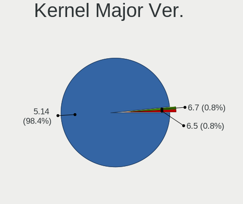
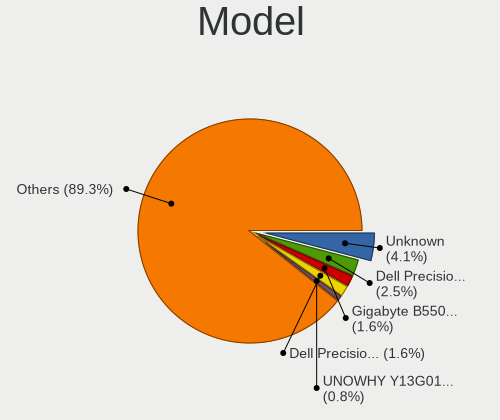
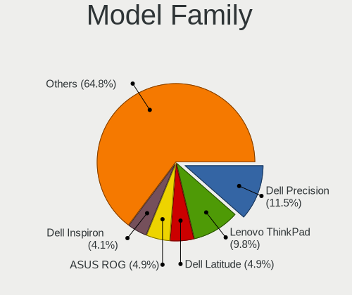
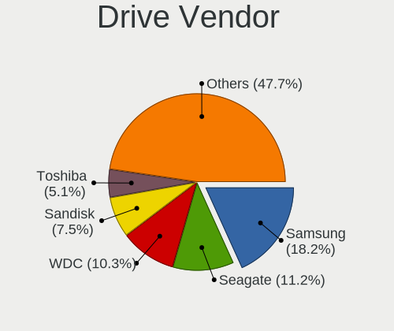
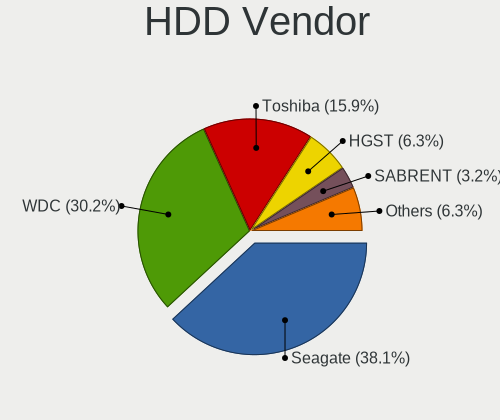
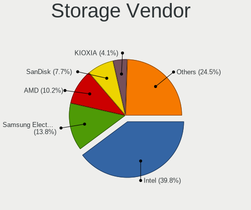
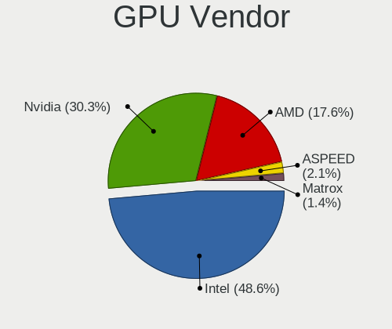
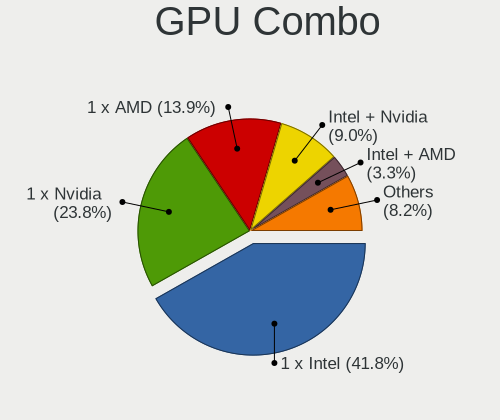

RHEL 9 - Tested Hardware & Statistics
-------------------------------------

A project to collect tested hardware configurations for RHEL 9.

Anyone can contribute to this report by the [hw-probe](https://github.com/linuxhw/hw-probe) tool:

    sudo -E hw-probe -all -upload

Please contribute! Especially if your hardware is rare.

This is a report for all computer types. See also reports for [desktops](/Dist/RHEL_9/Desktop/README.md) and [notebooks](/Dist/RHEL_9/Notebook/README.md).

Contents
--------

* [ Test Cases ](#test-cases)

* [ System ](#system)
  - [ Kernel                   ](#kernel)
  - [ Kernel Family            ](#kernel-family)
  - [ Kernel Major Ver.        ](#kernel-major-ver)
  - [ Arch                     ](#arch)
  - [ DE                       ](#de)
  - [ Display Server           ](#display-server)
  - [ Display Manager          ](#display-manager)
  - [ OS Lang                  ](#os-lang)
  - [ Boot Mode                ](#boot-mode)
  - [ Filesystem               ](#filesystem)
  - [ Part. scheme             ](#part-scheme)
  - [ Dual Boot with Linux/BSD ](#dual-boot-with-linuxbsd)
  - [ Dual Boot (Win)          ](#dual-boot-win)

* [ Board ](#board)
  - [ Vendor                   ](#vendor)
  - [ Model                    ](#model)
  - [ Model Family             ](#model-family)
  - [ MFG Year                 ](#mfg-year)
  - [ Form Factor              ](#form-factor)
  - [ Secure Boot              ](#secure-boot)
  - [ Coreboot                 ](#coreboot)
  - [ RAM Size                 ](#ram-size)
  - [ RAM Used                 ](#ram-used)
  - [ Total Drives             ](#total-drives)
  - [ Has CD-ROM               ](#has-cd-rom)
  - [ Has Ethernet             ](#has-ethernet)
  - [ Has WiFi                 ](#has-wifi)
  - [ Has Bluetooth            ](#has-bluetooth)

* [ Location ](#location)
  - [ Country                  ](#country)
  - [ City                     ](#city)

* [ Drives ](#drives)
  - [ Drive Vendor             ](#drive-vendor)
  - [ Drive Model              ](#drive-model)
  - [ HDD Vendor               ](#hdd-vendor)
  - [ SSD Vendor               ](#ssd-vendor)
  - [ Drive Kind               ](#drive-kind)
  - [ Drive Connector          ](#drive-connector)
  - [ Drive Size               ](#drive-size)
  - [ Space Total              ](#space-total)
  - [ Space Used               ](#space-used)
  - [ Malfunc. Drives          ](#malfunc-drives)
  - [ Malfunc. Drive Vendor    ](#malfunc-drive-vendor)
  - [ Malfunc. HDD Vendor      ](#malfunc-hdd-vendor)
  - [ Malfunc. Drive Kind      ](#malfunc-drive-kind)
  - [ Failed Drives            ](#failed-drives)
  - [ Failed Drive Vendor      ](#failed-drive-vendor)
  - [ Drive Status             ](#drive-status)

* [ Storage controller ](#storage-controller)
  - [ Storage Vendor           ](#storage-vendor)
  - [ Storage Model            ](#storage-model)
  - [ Storage Kind             ](#storage-kind)

* [ Processor ](#processor)
  - [ CPU Vendor               ](#cpu-vendor)
  - [ CPU Model                ](#cpu-model)
  - [ CPU Model Family         ](#cpu-model-family)
  - [ CPU Cores                ](#cpu-cores)
  - [ CPU Sockets              ](#cpu-sockets)
  - [ CPU Threads              ](#cpu-threads)
  - [ CPU Op-Modes             ](#cpu-op-modes)
  - [ CPU Microcode            ](#cpu-microcode)
  - [ CPU Microarch            ](#cpu-microarch)

* [ Graphics ](#graphics)
  - [ GPU Vendor               ](#gpu-vendor)
  - [ GPU Model                ](#gpu-model)
  - [ GPU Combo                ](#gpu-combo)
  - [ GPU Driver               ](#gpu-driver)
  - [ GPU Memory               ](#gpu-memory)

* [ Monitor ](#monitor)
  - [ Monitor Vendor           ](#monitor-vendor)
  - [ Monitor Model            ](#monitor-model)
  - [ Monitor Resolution       ](#monitor-resolution)
  - [ Monitor Diagonal         ](#monitor-diagonal)
  - [ Monitor Width            ](#monitor-width)
  - [ Aspect Ratio             ](#aspect-ratio)
  - [ Monitor Area             ](#monitor-area)
  - [ Pixel Density            ](#pixel-density)
  - [ Multiple Monitors        ](#multiple-monitors)

* [ Network ](#network)
  - [ Net Controller Vendor    ](#net-controller-vendor)
  - [ Net Controller Model     ](#net-controller-model)
  - [ Wireless Vendor          ](#wireless-vendor)
  - [ Wireless Model           ](#wireless-model)
  - [ Ethernet Vendor          ](#ethernet-vendor)
  - [ Ethernet Model           ](#ethernet-model)
  - [ Net Controller Kind      ](#net-controller-kind)
  - [ Used Controller          ](#used-controller)
  - [ NICs                     ](#nics)
  - [ IPv6                     ](#ipv6)

* [ Bluetooth ](#bluetooth)
  - [ Bluetooth Vendor         ](#bluetooth-vendor)
  - [ Bluetooth Model          ](#bluetooth-model)

* [ Sound ](#sound)
  - [ Sound Vendor             ](#sound-vendor)
  - [ Sound Model              ](#sound-model)

* [ Memory ](#memory)
  - [ Memory Vendor            ](#memory-vendor)
  - [ Memory Model             ](#memory-model)
  - [ Memory Kind              ](#memory-kind)
  - [ Memory Form Factor       ](#memory-form-factor)
  - [ Memory Size              ](#memory-size)
  - [ Memory Speed             ](#memory-speed)

* [ Printers & scanners ](#printers--scanners)
  - [ Printer Vendor           ](#printer-vendor)
  - [ Printer Model            ](#printer-model)
  - [ Scanner Vendor           ](#scanner-vendor)
  - [ Scanner Model            ](#scanner-model)

* [ Camera ](#camera)
  - [ Camera Vendor            ](#camera-vendor)
  - [ Camera Model             ](#camera-model)

* [ Security ](#security)
  - [ Fingerprint Vendor       ](#fingerprint-vendor)
  - [ Fingerprint Model        ](#fingerprint-model)
  - [ Chipcard Vendor          ](#chipcard-vendor)
  - [ Chipcard Model           ](#chipcard-model)

* [ Unsupported ](#unsupported)
  - [ Unsupported Devices      ](#unsupported-devices)
  - [ Unsupported Device Types ](#unsupported-device-types)

Test Cases
----------

Total: 116

| Vendor        | Model                       | Form-Factor | Probe                                                      | Date         |
|---------------|-----------------------------|-------------|------------------------------------------------------------|--------------|
| Dell          | Precision 7540              | Notebook    | [4703617413](https://linux-hardware.org/?probe=4703617413) | May 07, 2024 |
| Dell          | Precision 7540              | Notebook    | [37638500df](https://linux-hardware.org/?probe=37638500df) | May 07, 2024 |
| ASUSTek       | ROG STRIX Z590-A GAMING ... | Desktop     | [fba3144c06](https://linux-hardware.org/?probe=fba3144c06) | May 06, 2024 |
| MSI           | MEG Z790 ACE MAX            | Desktop     | [b10bbe2874](https://linux-hardware.org/?probe=b10bbe2874) | Apr 22, 2024 |
| Dell          | 07WP95 A02                  | Desktop     | [46e0a9d4d4](https://linux-hardware.org/?probe=46e0a9d4d4) | Apr 15, 2024 |
| CX / Air C... | CX-H87-M1                   | Desktop     | [6ca85693a6](https://linux-hardware.org/?probe=6ca85693a6) | Apr 12, 2024 |
| ASUSTek       | G16CH                       | Desktop     | [04a245fffe](https://linux-hardware.org/?probe=04a245fffe) | Apr 11, 2024 |
| ASRock        | X570 Creator                | Desktop     | [53aae5d4cb](https://linux-hardware.org/?probe=53aae5d4cb) | Apr 07, 2024 |
| ASRock        | X399 Taichi                 | Desktop     | [c57b1d4302](https://linux-hardware.org/?probe=c57b1d4302) | Apr 04, 2024 |
| ASRock        | X399 Taichi                 | Desktop     | [0f04c10bfa](https://linux-hardware.org/?probe=0f04c10bfa) | Apr 02, 2024 |
| HP            | 212A                        | Desktop     | [4a6e30808e](https://linux-hardware.org/?probe=4a6e30808e) | Mar 12, 2024 |
| MSI           | Modern 15 A5M               | Notebook    | [e591b9e544](https://linux-hardware.org/?probe=e591b9e544) | Feb 04, 2024 |
| ASUSTek       | TUF Gaming X670E-PLUS WI... | Desktop     | [23c12f49f6](https://linux-hardware.org/?probe=23c12f49f6) | Jan 27, 2024 |
| Dell          | Inspiron N5040              | Notebook    | [7cd09c7dde](https://linux-hardware.org/?probe=7cd09c7dde) | Jan 25, 2024 |
| Intel         | DQ77MK AAG39642-400         | Desktop     | [6d4d5ee6c7](https://linux-hardware.org/?probe=6d4d5ee6c7) | Jan 25, 2024 |
| LG Electro... | 15Z95P-GRLGL                | Notebook    | [ce6c983048](https://linux-hardware.org/?probe=ce6c983048) | Jan 24, 2024 |
| LG Electro... | 15Z95P-GRLGL                | Notebook    | [9dcc8bbc45](https://linux-hardware.org/?probe=9dcc8bbc45) | Jan 24, 2024 |
| Dell          | Precision M4800             | Notebook    | [dccdba8512](https://linux-hardware.org/?probe=dccdba8512) | Jan 21, 2024 |
| Gigabyte      | B550M AORUS PRO-P           | Desktop     | [cb116dae9c](https://linux-hardware.org/?probe=cb116dae9c) | Jan 20, 2024 |
| Lenovo        | ThinkPad X1 Carbon Gen 1... | Notebook    | [d4e6e0ae3e](https://linux-hardware.org/?probe=d4e6e0ae3e) | Jan 19, 2024 |
| MSI           | Katana GF76 12UC            | Notebook    | [73c3208c03](https://linux-hardware.org/?probe=73c3208c03) | Jan 10, 2024 |
| MSI           | Katana GF76 12UC            | Notebook    | [15db2ea112](https://linux-hardware.org/?probe=15db2ea112) | Jan 10, 2024 |
| Lenovo        | ThinkPad S1 Yoga 12 20DK... | Notebook    | [2bb251ffbb](https://linux-hardware.org/?probe=2bb251ffbb) | Jan 09, 2024 |
| Lenovo        | IdeaPad 320-15IKB 80XL      | Notebook    | [1abf742848](https://linux-hardware.org/?probe=1abf742848) | Jan 09, 2024 |
| Dell          | Precision 3480              | Notebook    | [e81f3e856b](https://linux-hardware.org/?probe=e81f3e856b) | Jan 03, 2024 |
| MSI           | PRO Z690-A DDR4             | Desktop     | [55f164e414](https://linux-hardware.org/?probe=55f164e414) | Dec 20, 2023 |
| MSI           | PRO Z690-A DDR4             | Desktop     | [b758a439b8](https://linux-hardware.org/?probe=b758a439b8) | Dec 20, 2023 |
| ASUSTek       | ROG Maximus Z790 HERO       | Desktop     | [c492be4899](https://linux-hardware.org/?probe=c492be4899) | Dec 04, 2023 |
| Dell          | Precision 7530              | Notebook    | [e75b16ca5e](https://linux-hardware.org/?probe=e75b16ca5e) | Dec 03, 2023 |
| Lenovo        | ThinkPad L480 20LS0015UK    | Notebook    | [5f786955fc](https://linux-hardware.org/?probe=5f786955fc) | Nov 26, 2023 |
| Lenovo        | IdeaPad 330S-14IKB U 81F... | Notebook    | [0b06f82d9d](https://linux-hardware.org/?probe=0b06f82d9d) | Nov 19, 2023 |
| ASUSTek       | ROG CROSSHAIR VIII DARK ... | Desktop     | [367bde5a11](https://linux-hardware.org/?probe=367bde5a11) | Nov 03, 2023 |
| ASUSTek       | PRIME Z690-A                | Desktop     | [e356c02979](https://linux-hardware.org/?probe=e356c02979) | Oct 30, 2023 |
| HP            | ProLiant ML310e Gen8        | Desktop     | [79f6aee2c7](https://linux-hardware.org/?probe=79f6aee2c7) | Oct 24, 2023 |
| Lenovo        | ThinkPad P17 Gen 2i 20YU... | Notebook    | [1c3bf8f6ef](https://linux-hardware.org/?probe=1c3bf8f6ef) | Oct 19, 2023 |
| System76      | Galago Pro                  | Notebook    | [fbdb665814](https://linux-hardware.org/?probe=fbdb665814) | Oct 03, 2023 |
| Dell          | Inspiron N5010              | Notebook    | [fe6b9d4c65](https://linux-hardware.org/?probe=fe6b9d4c65) | Oct 01, 2023 |
| Intel         | NUC12WSBi7 M63355-302       | Mini pc     | [043bac31d2](https://linux-hardware.org/?probe=043bac31d2) | Sep 28, 2023 |
| Dell          | G16 7620                    | Notebook    | [cd30e51d53](https://linux-hardware.org/?probe=cd30e51d53) | Sep 27, 2023 |
| Dell          | Precision 7720              | Notebook    | [8cae4c9a31](https://linux-hardware.org/?probe=8cae4c9a31) | Sep 25, 2023 |
| ASUSTek       | ROG CROSSHAIR VIII DARK ... | Desktop     | [ff1efba80e](https://linux-hardware.org/?probe=ff1efba80e) | Sep 13, 2023 |
| Acer          | Aspire C24-865              | All in one  | [de824a4f4e](https://linux-hardware.org/?probe=de824a4f4e) | Sep 03, 2023 |
| Lenovo        | ThinkPad T490 20N3S77601    | Notebook    | [b659e310c9](https://linux-hardware.org/?probe=b659e310c9) | Sep 02, 2023 |
| ASUSTek       | ROG CROSSHAIR VIII DARK ... | Desktop     | [c190907cc8](https://linux-hardware.org/?probe=c190907cc8) | Aug 29, 2023 |
| MSI           | Katana GF66 12UC            | Notebook    | [6651fbd434](https://linux-hardware.org/?probe=6651fbd434) | Aug 22, 2023 |
| ASRock        | A320M-HDV R4.0              | Desktop     | [f88687d2f0](https://linux-hardware.org/?probe=f88687d2f0) | Aug 15, 2023 |
| ASUSTek       | ROG STRIX Z590-E GAMING ... | Desktop     | [f6892c6532](https://linux-hardware.org/?probe=f6892c6532) | Aug 15, 2023 |
| ASRock        | A320M-HDV R4.0              | Desktop     | [eb99d95702](https://linux-hardware.org/?probe=eb99d95702) | Aug 08, 2023 |
| HP            | EliteBook 2570p             | Notebook    | [68734d9dfa](https://linux-hardware.org/?probe=68734d9dfa) | Aug 04, 2023 |
| ASRock        | A320M-HDV R4.0              | Desktop     | [de07e937bb](https://linux-hardware.org/?probe=de07e937bb) | Aug 04, 2023 |
| HP            | 0AECh D                     | Desktop     | [b9ea790e39](https://linux-hardware.org/?probe=b9ea790e39) | Jul 24, 2023 |
| HP            | 0AECh D                     | Desktop     | [078f0cd045](https://linux-hardware.org/?probe=078f0cd045) | Jul 24, 2023 |
| MSI           | Z270-A PRO                  | Desktop     | [0d8b3d7c32](https://linux-hardware.org/?probe=0d8b3d7c32) | Jun 20, 2023 |
| Lenovo        | STA7B38870 02               | Server      | [80a2f3d367](https://linux-hardware.org/?probe=80a2f3d367) | Jun 18, 2023 |
| Dell          | 07T4MC A02                  | Desktop     | [ad310dd147](https://linux-hardware.org/?probe=ad310dd147) | Jun 09, 2023 |
| Dell          | 0HHV7N A00                  | Desktop     | [a3a157f327](https://linux-hardware.org/?probe=a3a157f327) | May 21, 2023 |
| MSI           | MAG X570S TOMAHAWK MAX W... | Desktop     | [2afc4ee693](https://linux-hardware.org/?probe=2afc4ee693) | May 18, 2023 |
| Lenovo        | ThinkPad P17 Gen 2i 20YU... | Notebook    | [49ecdacd71](https://linux-hardware.org/?probe=49ecdacd71) | May 14, 2023 |
| ASUSTek       | TUF Gaming X570-PLUS        | Desktop     | [b1ea93c5fa](https://linux-hardware.org/?probe=b1ea93c5fa) | May 09, 2023 |
| HP            | EliteBook 855 G7 Noteboo... | Notebook    | [6e086ec096](https://linux-hardware.org/?probe=6e086ec096) | May 07, 2023 |
| Lenovo        | ThinkBook 14-IIL 20SL       | Notebook    | [5938e62d47](https://linux-hardware.org/?probe=5938e62d47) | Apr 17, 2023 |
| Dell          | Precision 7510              | Notebook    | [f68123c20a](https://linux-hardware.org/?probe=f68123c20a) | Apr 13, 2023 |
| Gigabyte      | B550M AORUS PRO-P           | Desktop     | [18c5e3c7c3](https://linux-hardware.org/?probe=18c5e3c7c3) | Apr 10, 2023 |
| Lenovo        | ThinkPad X1 Nano Gen 2 2... | Notebook    | [de656b2182](https://linux-hardware.org/?probe=de656b2182) | Apr 06, 2023 |
| MSI           | B450M MORTAR MAX            | Desktop     | [0077b88576](https://linux-hardware.org/?probe=0077b88576) | Apr 06, 2023 |
| Gigabyte      | X670E AORUS MASTER          | Desktop     | [68731ac4ec](https://linux-hardware.org/?probe=68731ac4ec) | Mar 31, 2023 |
| ASUSTek       | PRIME Z690-P WIFI           | Desktop     | [898059efa5](https://linux-hardware.org/?probe=898059efa5) | Mar 28, 2023 |
| MSI           | B450M MORTAR MAX            | Desktop     | [29c85678af](https://linux-hardware.org/?probe=29c85678af) | Mar 28, 2023 |
| ASUSTek       | PRIME Z690-P WIFI           | Desktop     | [1821e3657a](https://linux-hardware.org/?probe=1821e3657a) | Mar 26, 2023 |
| MSI           | B450M MORTAR MAX            | Desktop     | [641481dd1d](https://linux-hardware.org/?probe=641481dd1d) | Mar 21, 2023 |
| MSI           | B450M MORTAR MAX            | Desktop     | [9d859cb8bd](https://linux-hardware.org/?probe=9d859cb8bd) | Mar 20, 2023 |
| HP            | ProBook 640 G2              | Notebook    | [9439371137](https://linux-hardware.org/?probe=9439371137) | Mar 18, 2023 |
| HP            | ProBook 640 G2              | Notebook    | [c968526666](https://linux-hardware.org/?probe=c968526666) | Mar 18, 2023 |
| ASUSTek       | VivoBook_ASUSLaptop X515... | Notebook    | [bc39bd2ce5](https://linux-hardware.org/?probe=bc39bd2ce5) | Mar 17, 2023 |
| Lenovo        | ThinkPad L14 Gen 3 21C2S... | Notebook    | [6772403b62](https://linux-hardware.org/?probe=6772403b62) | Feb 20, 2023 |
| Dell          | Precision 7560              | Notebook    | [7ed10eebe9](https://linux-hardware.org/?probe=7ed10eebe9) | Feb 16, 2023 |
| MSI           | GP75 Leopard 9SD            | Notebook    | [1f2a5b1def](https://linux-hardware.org/?probe=1f2a5b1def) | Feb 11, 2023 |
| Gigabyte      | H510M H                     | Desktop     | [861b7c5aa7](https://linux-hardware.org/?probe=861b7c5aa7) | Feb 02, 2023 |
| ASUSTek       | PRIME Z590-A                | Desktop     | [f328fab9f1](https://linux-hardware.org/?probe=f328fab9f1) | Jan 27, 2023 |
| Hardkernel    | ODROID-H3                   | Desktop     | [98f5768c61](https://linux-hardware.org/?probe=98f5768c61) | Jan 22, 2023 |
| Dell          | Latitude 9420               | Notebook    | [3fd325486b](https://linux-hardware.org/?probe=3fd325486b) | Jan 18, 2023 |
| Dell          | Latitude 3410               | Notebook    | [0a4720ef85](https://linux-hardware.org/?probe=0a4720ef85) | Jan 02, 2023 |
| Unknown       | Unknown                     | Desktop     | [9d66e8f05d](https://linux-hardware.org/?probe=9d66e8f05d) | Dec 25, 2022 |
| MSI           | GE72VR 7RF                  | Notebook    | [f5384e68dd](https://linux-hardware.org/?probe=f5384e68dd) | Dec 16, 2022 |
| Lenovo        | ThinkPad X1 Nano Gen 2 2... | Notebook    | [7c17c479b7](https://linux-hardware.org/?probe=7c17c479b7) | Dec 03, 2022 |
| HP            | Laptop 14s-dk0xxx           | Notebook    | [c1d2a02024](https://linux-hardware.org/?probe=c1d2a02024) | Nov 30, 2022 |
| MSI           | B550M PRO-VDH WIFI          | Desktop     | [af5361313b](https://linux-hardware.org/?probe=af5361313b) | Nov 17, 2022 |
| Dell          | Latitude E7450              | Notebook    | [1fba71c904](https://linux-hardware.org/?probe=1fba71c904) | Nov 15, 2022 |
| MSI           | B550M PRO-VDH WIFI          | Desktop     | [2d830dc96d](https://linux-hardware.org/?probe=2d830dc96d) | Nov 11, 2022 |
| Dell          | 0RN4PJ A02                  | Server      | [84012f61ff](https://linux-hardware.org/?probe=84012f61ff) | Nov 03, 2022 |
| Lenovo        | ThinkPad X220 4291WSH       | Notebook    | [00e77b8815](https://linux-hardware.org/?probe=00e77b8815) | Oct 26, 2022 |
| Lenovo        | ThinkPad X220 4291WSH       | Notebook    | [94d1c333ac](https://linux-hardware.org/?probe=94d1c333ac) | Oct 26, 2022 |
| ASUSTek       | Z450LA                      | Notebook    | [ba00eb6516](https://linux-hardware.org/?probe=ba00eb6516) | Oct 18, 2022 |
| ASUSTek       | Z450LA                      | Notebook    | [6042d84470](https://linux-hardware.org/?probe=6042d84470) | Oct 17, 2022 |
| HP            | 340S G7                     | Notebook    | [7baf4edd11](https://linux-hardware.org/?probe=7baf4edd11) | Oct 09, 2022 |
| Razer         | Blade 15 Mid 2019-Base      | Notebook    | [c1457e4e02](https://linux-hardware.org/?probe=c1457e4e02) | Sep 21, 2022 |
| Acer          | Aspire XC-330               | Desktop     | [2012033d09](https://linux-hardware.org/?probe=2012033d09) | Aug 14, 2022 |
| Dell          | Precision 7510              | Notebook    | [cd8482ea72](https://linux-hardware.org/?probe=cd8482ea72) | Aug 08, 2022 |
| Unknown       | Unknown                     | Desktop     | [fad6d4558f](https://linux-hardware.org/?probe=fad6d4558f) | Jul 26, 2022 |
| Raspberry ... | Raspberry Pi 4 Model B      | Soc         | [4776ecdc2a](https://linux-hardware.org/?probe=4776ecdc2a) | Jul 15, 2022 |
| Intel         | H81                         | Desktop     | [e1a730a6e6](https://linux-hardware.org/?probe=e1a730a6e6) | Jul 08, 2022 |
| Unknown       | Unknown                     | Desktop     | [16c6df7b29](https://linux-hardware.org/?probe=16c6df7b29) | Jul 07, 2022 |
| Unknown       | Unknown                     | Desktop     | [6b25430dc1](https://linux-hardware.org/?probe=6b25430dc1) | Jul 07, 2022 |
| Gigabyte      | MU72-SU0-00 01000100        | Server      | [ab729dc8a5](https://linux-hardware.org/?probe=ab729dc8a5) | Jul 04, 2022 |
| Gigabyte      | MU72-SU0-00 01000100        | Server      | [1cb6aead26](https://linux-hardware.org/?probe=1cb6aead26) | Jul 03, 2022 |
| Dell          | Inspiron 5559               | Notebook    | [aaaaef108a](https://linux-hardware.org/?probe=aaaaef108a) | Jul 03, 2022 |
| Lenovo        | ThinkPad E14 20RA001MMZ     | Notebook    | [4bf795762d](https://linux-hardware.org/?probe=4bf795762d) | Jul 02, 2022 |
| Lenovo        | ThinkPad Edge E431 62771... | Notebook    | [ef8cc06070](https://linux-hardware.org/?probe=ef8cc06070) | Jun 09, 2022 |
| ASUSTek       | TUF Gaming Z690-PLUS WIF... | Notebook    | [48c983a184](https://linux-hardware.org/?probe=48c983a184) | May 15, 2022 |
| Dell          | XPS 17 9710                 | Notebook    | [919abd9078](https://linux-hardware.org/?probe=919abd9078) | May 13, 2022 |
| Dell          | XPS 17 9710                 | Notebook    | [15bc7f6757](https://linux-hardware.org/?probe=15bc7f6757) | May 13, 2022 |
| ASRock        | Z370 Professional Gaming... | Desktop     | [658347ec76](https://linux-hardware.org/?probe=658347ec76) | May 12, 2022 |
| Lenovo        | ThinkBook 13s-IWL 20R9      | Notebook    | [604488642b](https://linux-hardware.org/?probe=604488642b) | Apr 25, 2022 |
| Samsung       | 730QCJ/730QCR               | Notebook    | [24b05b96d7](https://linux-hardware.org/?probe=24b05b96d7) | Jan 19, 2022 |
| HP            | Pavilion Gaming Laptop 1... | Notebook    | [b6b4df52d0](https://linux-hardware.org/?probe=b6b4df52d0) | Dec 25, 2021 |
| Gigabyte      | AERO 15 KD                  | Notebook    | [cfa38b921a](https://linux-hardware.org/?probe=cfa38b921a) | Nov 22, 2021 |

System
------

Kernel
------

Version of the Linux kernel

| Version                      | Computers | Percent |
|------------------------------|-----------|---------|
| 5.14.0-284.30.1.el9_2.x86_64 | 9         | 9.78%   |
| 5.14.0-162.6.1.el9_1.x86_64  | 9         | 9.78%   |
| 5.14.0-362.24.1.el9_3.x86_64 | 7         | 7.61%   |
| 5.14.0-284.25.1.el9_2.x86_64 | 7         | 7.61%   |
| 5.14.0-70.17.1.el9_0.x86_64  | 6         | 6.52%   |
| 5.14.0-362.13.1.el9_3.x86_64 | 6         | 6.52%   |
| 5.14.0-162.12.1.el9_1.x86_64 | 6         | 6.52%   |
| 5.14.0-284.11.1.el9_2.x86_64 | 5         | 5.43%   |
| 5.14.0-70.5.1.el9_0.x86_64   | 4         | 4.35%   |
| 5.14.0-70.26.1.el9_0.x86_64  | 4         | 4.35%   |
| 5.14.0-362.8.1.el9_3.x86_64  | 4         | 4.35%   |
| 5.14.0-162.23.1.el9_1.x86_64 | 4         | 4.35%   |
| 5.14.0-70.22.1.el9_0.x86_64  | 3         | 3.26%   |
| 5.14.0-362.18.1.el9_3.x86_64 | 3         | 3.26%   |
| 5.14.0-162.22.2.el9_1.x86_64 | 3         | 3.26%   |
| 5.14.0-70.13.1.el9_0.x86_64  | 2         | 2.17%   |
| 5.14.0-162.18.1.el9_1.x86_64 | 2         | 2.17%   |
| 6.7.1-1.el9.elrepo.x86_64    | 1         | 1.09%   |
| 6.5.2-1.el9.elrepo.x86_64    | 1         | 1.09%   |
| 5.14.0-70.30.1.el9_0.x86_64  | 1         | 1.09%   |
| 5.14.0-70.17.1.el9_0.aarch64 | 1         | 1.09%   |
| 5.14.0-427.13.1.el9_4.x86_64 | 1         | 1.09%   |
| 5.14.0-39.el9.x86_64         | 1         | 1.09%   |
| 5.14.0-284.18.1.el9_2.x86_64 | 1         | 1.09%   |
| 5.14.0-1.7.1.el9.x86_64      | 1         | 1.09%   |

Kernel Family
-------------

Linux kernel without a distro release

| Version | Computers | Percent |
|---------|-----------|---------|
| 5.14.0  | 86        | 97.73%  |
| 6.7.1   | 1         | 1.14%   |
| 6.5.2   | 1         | 1.14%   |

Kernel Major Ver.
-----------------

Linux kernel major version

| Version | Computers | Percent |
|---------|-----------|---------|
| 5.14    | 86        | 97.73%  |
| 6.7     | 1         | 1.14%   |
| 6.5     | 1         | 1.14%   |

Arch
----

OS architecture (x86_64, i586, etc.)

| Name    | Computers | Percent |
|---------|-----------|---------|
| x86_64  | 87        | 98.86%  |
| aarch64 | 1         | 1.14%   |

DE
--

Desktop Environment

| Name            | Computers | Percent |
|-----------------|-----------|---------|
| GNOME           | 80        | 89.89%  |
| KDE5            | 3         | 3.37%   |
| GNOME Classic   | 2         | 2.25%   |
| XFCE            | 1         | 1.12%   |
| GNOME Flashback | 1         | 1.12%   |
| Cinnamon        | 1         | 1.12%   |
| Unknown         | 1         | 1.12%   |

Display Server
--------------

X11 or Wayland

| Name    | Computers | Percent |
|---------|-----------|---------|
| Wayland | 65        | 73.86%  |
| X11     | 20        | 22.73%  |
| Tty     | 3         | 3.41%   |

Display Manager
---------------

SDDM, LightDM, etc.

| Name    | Computers | Percent |
|---------|-----------|---------|
| Unknown | 53        | 60.23%  |
| GDM     | 33        | 37.5%   |
| SDDM    | 2         | 2.27%   |

OS Lang
-------

Language

| Lang  | Computers | Percent |
|-------|-----------|---------|
| en_US | 61        | 69.32%  |
| en_GB | 7         | 7.95%   |
| pt_BR | 4         | 4.55%   |
| en_IN | 3         | 3.41%   |
| en_NZ | 2         | 2.27%   |
| cs_CZ | 2         | 2.27%   |
| ru_RU | 1         | 1.14%   |
| ro_RO | 1         | 1.14%   |
| ko_KR | 1         | 1.14%   |
| ja_JP | 1         | 1.14%   |
| es_ES | 1         | 1.14%   |
| es_AR | 1         | 1.14%   |
| en_ZA | 1         | 1.14%   |
| en_CA | 1         | 1.14%   |
| C     | 1         | 1.14%   |

Boot Mode
---------

EFI or BIOS

| Mode | Computers | Percent |
|------|-----------|---------|
| EFI  | 80        | 90.91%  |
| BIOS | 8         | 9.09%   |

Filesystem
----------

Type of filesystem

| Type | Computers | Percent |
|------|-----------|---------|
| Xfs  | 84        | 95.45%  |
| Ext4 | 4         | 4.55%   |

Part. scheme
------------

Scheme of partitioning

| Type    | Computers | Percent |
|---------|-----------|---------|
| Unknown | 51        | 57.95%  |
| GPT     | 34        | 38.64%  |
| MBR     | 3         | 3.41%   |

Dual Boot with Linux/BSD
------------------------

Hosting more than one Linux/BSD

| Dual boot | Computers | Percent |
|-----------|-----------|---------|
| No        | 77        | 87.5%   |
| Yes       | 11        | 12.5%   |

Dual Boot (Win)
---------------

Hosting Linux and Windows

| Dual boot | Computers | Percent |
|-----------|-----------|---------|
| No        | 80        | 90.91%  |
| Yes       | 8         | 9.09%   |

Board
-----

Vendor
------

Motherboard manufacturer

| Name                    | Computers | Percent |
|-------------------------|-----------|---------|
| Dell                    | 18        | 20.45%  |
| Lenovo                  | 14        | 15.91%  |
| ASUSTek Computer        | 13        | 14.77%  |
| MSI                     | 11        | 12.5%   |
| Hewlett-Packard         | 7         | 7.95%   |
| Gigabyte Technology     | 6         | 6.82%   |
| ASRock                  | 4         | 4.55%   |
| Intel                   | 3         | 3.41%   |
| Unknown                 | 3         | 3.41%   |
| Acer                    | 2         | 2.27%   |
| System76                | 1         | 1.14%   |
| Samsung Electronics     | 1         | 1.14%   |
| Razer                   | 1         | 1.14%   |
| Raspberry Pi Foundation | 1         | 1.14%   |
| LG Electronics          | 1         | 1.14%   |
| Hardkernel              | 1         | 1.14%   |
| CX / Air Computers.     | 1         | 1.14%   |

Model
-----

Motherboard model

| Name                                        | Computers | Percent |
|---------------------------------------------|-----------|---------|
| Unknown                                     | 3         | 3.41%   |
| Gigabyte B550M AORUS PRO-P                  | 2         | 2.27%   |
| System76 Galago Pro                         | 1         | 1.14%   |
| Samsung 730QCJ/730QCR                       | 1         | 1.14%   |
| Razer Blade 15 Mid 2019-Base                | 1         | 1.14%   |
| RPi Raspberry Pi 4 Model B                  | 1         | 1.14%   |
| MSI MS-7D86                                 | 1         | 1.14%   |
| MSI MS-7D54                                 | 1         | 1.14%   |
| MSI MS-7D25                                 | 1         | 1.14%   |
| MSI MS-7C95                                 | 1         | 1.14%   |
| MSI MS-7B89                                 | 1         | 1.14%   |
| MSI MS-7A71                                 | 1         | 1.14%   |
| MSI Modern 15 A5M                           | 1         | 1.14%   |
| MSI Katana GF76 12UC                        | 1         | 1.14%   |
| MSI Katana GF66 12UC                        | 1         | 1.14%   |
| MSI GP75 Leopard 9SD                        | 1         | 1.14%   |
| MSI GE72VR 7RF                              | 1         | 1.14%   |
| LG 15Z95P-GRLGL                             | 1         | 1.14%   |
| Lenovo ThinkSystem SR950 V3                 | 1         | 1.14%   |
| Lenovo ThinkPad X1 Nano Gen 2 21E80012US    | 1         | 1.14%   |
| Lenovo ThinkPad X1 Carbon Gen 11 21HMS1V900 | 1         | 1.14%   |
| Lenovo ThinkPad T490 20N3S77601             | 1         | 1.14%   |
| Lenovo ThinkPad S1 Yoga 12 20DK001YMC       | 1         | 1.14%   |
| Lenovo ThinkPad P17 Gen 2i 20YU002KUS       | 1         | 1.14%   |
| Lenovo ThinkPad L480 20LS0015UK             | 1         | 1.14%   |
| Lenovo ThinkPad L14 Gen 3 21C2S1EE00        | 1         | 1.14%   |
| Lenovo ThinkPad Edge E431 62771L7           | 1         | 1.14%   |
| Lenovo ThinkPad E14 20RA001MMZ              | 1         | 1.14%   |
| Lenovo ThinkBook 14-IIL 20SL                | 1         | 1.14%   |
| Lenovo ThinkBook 13s-IWL 20R9               | 1         | 1.14%   |
| Lenovo IdeaPad 330S-14IKB U 81F4            | 1         | 1.14%   |
| Lenovo IdeaPad 320-15IKB 80XL               | 1         | 1.14%   |
| Intel NUC12WSHi7                            | 1         | 1.14%   |
| Intel H81                                   | 1         | 1.14%   |
| Intel DQ77MK AAG39642-400                   | 1         | 1.14%   |
| HP Z800 Workstation                         | 1         | 1.14%   |
| HP ProLiant ML310e Gen8                     | 1         | 1.14%   |
| HP ProBook 640 G2                           | 1         | 1.14%   |
| HP Laptop 14s-dk0xxx                        | 1         | 1.14%   |
| HP EliteBook 855 G7 Notebook PC             | 1         | 1.14%   |

Model Family
------------

Motherboard model prefix

| Name                 | Computers | Percent |
|----------------------|-----------|---------|
| Lenovo ThinkPad      | 9         | 10.23%  |
| Dell Precision       | 9         | 10.23%  |
| ASUS ROG             | 5         | 5.68%   |
| Dell Inspiron        | 3         | 3.41%   |
| ASUS TUF             | 3         | 3.41%   |
| ASUS PRIME           | 3         | 3.41%   |
| Unknown              | 3         | 3.41%   |
| MSI Katana           | 2         | 2.27%   |
| Lenovo ThinkBook     | 2         | 2.27%   |
| Lenovo IdeaPad       | 2         | 2.27%   |
| HP EliteBook         | 2         | 2.27%   |
| Gigabyte B550M       | 2         | 2.27%   |
| Dell Latitude        | 2         | 2.27%   |
| Acer Aspire          | 2         | 2.27%   |
| System76 Galago      | 1         | 1.14%   |
| Samsung 730QCJ       | 1         | 1.14%   |
| Razer Blade          | 1         | 1.14%   |
| RPi Raspberry        | 1         | 1.14%   |
| MSI MS-7D86          | 1         | 1.14%   |
| MSI MS-7D54          | 1         | 1.14%   |
| MSI MS-7D25          | 1         | 1.14%   |
| MSI MS-7C95          | 1         | 1.14%   |
| MSI MS-7B89          | 1         | 1.14%   |
| MSI MS-7A71          | 1         | 1.14%   |
| MSI Modern           | 1         | 1.14%   |
| MSI GP75             | 1         | 1.14%   |
| MSI GE72VR           | 1         | 1.14%   |
| LG 15Z95P-GRLGL      | 1         | 1.14%   |
| Lenovo ThinkSystem   | 1         | 1.14%   |
| Intel NUC12WSHi7     | 1         | 1.14%   |
| Intel H81            | 1         | 1.14%   |
| Intel DQ77MK         | 1         | 1.14%   |
| HP Z800              | 1         | 1.14%   |
| HP ProLiant          | 1         | 1.14%   |
| HP ProBook           | 1         | 1.14%   |
| HP Laptop            | 1         | 1.14%   |
| HP 340S              | 1         | 1.14%   |
| Hardkernel ODROID-H3 | 1         | 1.14%   |
| Gigabyte X670E       | 1         | 1.14%   |
| Gigabyte MU72-SU0-00 | 1         | 1.14%   |

MFG Year
--------

Motherboard manufacture year

| Year | Computers | Percent |
|------|-----------|---------|
| 2021 | 16        | 18.18%  |
| 2019 | 13        | 14.77%  |
| 2022 | 12        | 13.64%  |
| 2023 | 8         | 9.09%   |
| 2020 | 8         | 9.09%   |
| 2017 | 7         | 7.95%   |
| 2018 | 6         | 6.82%   |
| 2015 | 4         | 4.55%   |
| 2016 | 3         | 3.41%   |
| 2014 | 3         | 3.41%   |
| 2013 | 3         | 3.41%   |
| 2012 | 2         | 2.27%   |
| 2010 | 2         | 2.27%   |
| 2011 | 1         | 1.14%   |

Form Factor
-----------

Physical design of the computer

| Name           | Computers | Percent |
|----------------|-----------|---------|
| Notebook       | 45        | 51.14%  |
| Desktop        | 37        | 42.05%  |
| Server         | 3         | 3.41%   |
| System on chip | 1         | 1.14%   |
| Mini pc        | 1         | 1.14%   |
| All in one     | 1         | 1.14%   |

Secure Boot
-----------

Enabled or disabled

| State    | Computers | Percent |
|----------|-----------|---------|
| Disabled | 76        | 85.39%  |
| Enabled  | 13        | 14.61%  |

Coreboot
--------

Have coreboot on board

| Used | Computers | Percent |
|------|-----------|---------|
| No   | 87        | 98.86%  |
| Yes  | 1         | 1.14%   |

RAM Size
--------

Total RAM memory

| Size in GB      | Computers | Percent |
|-----------------|-----------|---------|
| 8.01-16.0       | 32        | 36.36%  |
| 4.01-8.0        | 17        | 19.32%  |
| 32.01-64.0      | 17        | 19.32%  |
| 64.01-256.0     | 9         | 10.23%  |
| 3.01-4.0        | 5         | 5.68%   |
| 16.01-24.0      | 4         | 4.55%   |
| More than 256.0 | 2         | 2.27%   |
| 24.01-32.0      | 2         | 2.27%   |

RAM Used
--------

Used RAM memory

| Used GB    | Computers | Percent |
|------------|-----------|---------|
| 2.01-3.0   | 29        | 31.18%  |
| 4.01-8.0   | 26        | 27.96%  |
| 3.01-4.0   | 19        | 20.43%  |
| 8.01-16.0  | 12        | 12.9%   |
| 1.01-2.0   | 6         | 6.45%   |
| 32.01-64.0 | 1         | 1.08%   |

Total Drives
------------

Number of drives on board

| Drives | Computers | Percent |
|--------|-----------|---------|
| 1      | 42        | 46.67%  |
| 2      | 22        | 24.44%  |
| 3      | 14        | 15.56%  |
| 5      | 4         | 4.44%   |
| 4      | 4         | 4.44%   |
| 14     | 1         | 1.11%   |
| 7      | 1         | 1.11%   |
| 6      | 1         | 1.11%   |
| 0      | 1         | 1.11%   |

Has CD-ROM
----------

Has CD-ROM on board

| Presented | Computers | Percent |
|-----------|-----------|---------|
| No        | 72        | 81.82%  |
| Yes       | 16        | 18.18%  |

Has Ethernet
------------

Has Ethernet on board

| Presented | Computers | Percent |
|-----------|-----------|---------|
| Yes       | 76        | 86.36%  |
| No        | 12        | 13.64%  |

Has WiFi
--------

Has WiFi module

| Presented | Computers | Percent |
|-----------|-----------|---------|
| Yes       | 69        | 77.53%  |
| No        | 20        | 22.47%  |

Has Bluetooth
-------------

Has Bluetooth module

| Presented | Computers | Percent |
|-----------|-----------|---------|
| Yes       | 60        | 66.67%  |
| No        | 30        | 33.33%  |

Location
--------

Country
-------

Geographic location (country)

| Country      | Computers | Percent |
|--------------|-----------|---------|
| USA          | 30        | 34.09%  |
| India        | 9         | 10.23%  |
| UK           | 5         | 5.68%   |
| Canada       | 4         | 4.55%   |
| Brazil       | 4         | 4.55%   |
| Guatemala    | 3         | 3.41%   |
| Turkey       | 2         | 2.27%   |
| Spain        | 2         | 2.27%   |
| Russia       | 2         | 2.27%   |
| New Zealand  | 2         | 2.27%   |
| Italy        | 2         | 2.27%   |
| Czechia      | 2         | 2.27%   |
| Chile        | 2         | 2.27%   |
| Vietnam      | 1         | 1.14%   |
| Switzerland  | 1         | 1.14%   |
| Sweden       | 1         | 1.14%   |
| Sri Lanka    | 1         | 1.14%   |
| South Korea  | 1         | 1.14%   |
| South Africa | 1         | 1.14%   |
| Slovakia     | 1         | 1.14%   |
| Saint Lucia  | 1         | 1.14%   |
| Romania      | 1         | 1.14%   |
| Norway       | 1         | 1.14%   |
| Netherlands  | 1         | 1.14%   |
| Kenya        | 1         | 1.14%   |
| Jordan       | 1         | 1.14%   |
| Japan        | 1         | 1.14%   |
| Indonesia    | 1         | 1.14%   |
| Germany      | 1         | 1.14%   |
| Finland      | 1         | 1.14%   |
| Egypt        | 1         | 1.14%   |
| Argentina    | 1         | 1.14%   |

City
----

Geographic location (city)

| City                | Computers | Percent |
|---------------------|-----------|---------|
| Guatemala City      | 3         | 3.3%    |
| Wellington          | 2         | 2.2%    |
| Santiago            | 2         | 2.2%    |
| Zlín               | 1         | 1.1%    |
| Wildomar            | 1         | 1.1%    |
| Whiteley            | 1         | 1.1%    |
| Wake Forest         | 1         | 1.1%    |
| Valencia            | 1         | 1.1%    |
| Valbrembo           | 1         | 1.1%    |
| Tokyo               | 1         | 1.1%    |
| Sutton              | 1         | 1.1%    |
| Stratham            | 1         | 1.1%    |
| Stavropol           | 1         | 1.1%    |
| Skien               | 1         | 1.1%    |
| Sierra Vista        | 1         | 1.1%    |
| Seoul               | 1         | 1.1%    |
| Sao Paulo           | 1         | 1.1%    |
| Sainte-Marie        | 1         | 1.1%    |
| Saint Paul          | 1         | 1.1%    |
| Rosario             | 1         | 1.1%    |
| Rio de Janeiro      | 1         | 1.1%    |
| Ribeirao Preto      | 1         | 1.1%    |
| Râmnicu Vâlcea    | 1         | 1.1%    |
| Providence          | 1         | 1.1%    |
| Prairieville        | 1         | 1.1%    |
| Piracicaba          | 1         | 1.1%    |
| Phoenix             | 1         | 1.1%    |
| Pforzheim           | 1         | 1.1%    |
| Parker              | 1         | 1.1%    |
| Oldham              | 1         | 1.1%    |
| Nuenen              | 1         | 1.1%    |
| Newham              | 1         | 1.1%    |
| Newcastle upon Tyne | 1         | 1.1%    |
| New Delhi           | 1         | 1.1%    |
| Nairobi             | 1         | 1.1%    |
| Montgomery          | 1         | 1.1%    |
| Mohegan Lake        | 1         | 1.1%    |
| Minneapolis         | 1         | 1.1%    |
| Milano              | 1         | 1.1%    |
| McKinney            | 1         | 1.1%    |

Drives
------

Drive Vendor
------------

Hard drive vendors

| Vendor                      | Computers | Drives | Percent |
|-----------------------------|-----------|--------|---------|
| Samsung Electronics         | 30        | 41     | 19.74%  |
| Seagate                     | 18        | 28     | 11.84%  |
| WDC                         | 17        | 28     | 11.18%  |
| Sandisk                     | 9         | 13     | 5.92%   |
| Toshiba                     | 7         | 7      | 4.61%   |
| Micron/Crucial Technology   | 7         | 10     | 4.61%   |
| Unknown                     | 6         | 9      | 3.95%   |
| Micron Technology           | 6         | 6      | 3.95%   |
| Kingston                    | 6         | 7      | 3.95%   |
| Intel                       | 5         | 10     | 3.29%   |
| SK hynix                    | 4         | 4      | 2.63%   |
| KIOXIA                      | 4         | 5      | 2.63%   |
| Phison                      | 3         | 3      | 1.97%   |
| HGST                        | 3         | 3      | 1.97%   |
| China                       | 3         | 3      | 1.97%   |
| SABRENT                     | 2         | 2      | 1.32%   |
| Phison Electronics          | 2         | 3      | 1.32%   |
| Kingston Technology Company | 2         | 2      | 1.32%   |
| KingSpec                    | 2         | 2      | 1.32%   |
| Crucial                     | 2         | 3      | 1.32%   |
| ADATA Technology            | 2         | 2      | 1.32%   |
| XUM                         | 1         | 1      | 0.66%   |
| SSSTC                       | 1         | 1      | 0.66%   |
| PNY                         | 1         | 1      | 0.66%   |
| Plextor                     | 1         | 1      | 0.66%   |
| Kingmax                     | 1         | 1      | 0.66%   |
| KingFast                    | 1         | 1      | 0.66%   |
| Inland                      | 1         | 1      | 0.66%   |
| Hitachi                     | 1         | 1      | 0.66%   |
| Golden                      | 1         | 1      | 0.66%   |
| Gigabyte Technology         | 1         | 1      | 0.66%   |
| Fantom                      | 1         | 1      | 0.66%   |
| A-DATA Technology           | 1         | 1      | 0.66%   |

Drive Model
-----------

Hard drive models

| Model                                              | Computers | Percent |
|----------------------------------------------------|-----------|---------|
| Samsung NVMe SSD Controller PM9A1/PM9A3/980PRO 1TB | 6         | 3.41%   |
| Samsung NVMe SSD Controller SM981/PM981/PM983 1TB  | 5         | 2.84%   |
| Micron/Crucial P2 NVMe PCIe SSD 4TB                | 4         | 2.27%   |
| Micron 2400_MTFDKBA512QFM 512GB                    | 3         | 1.7%    |
| WDC WDBNCE5000PNC 500GB SSD                        | 2         | 1.14%   |
| Unknown MMC Card  256GB                            | 2         | 1.14%   |
| Seagate ST1000DM010-2EP102 1TB                     | 2         | 1.14%   |
| Seagate BUP Slim BK 2TB                            | 2         | 1.14%   |
| Sandisk WD Blue SN570 500GB                        | 2         | 1.14%   |
| Sandisk WD Blue SN500 / PC SN520 NVMe SSD 512GB    | 2         | 1.14%   |
| Sandisk WD Black SN750 / PC SN730 NVMe SSD 512GB   | 2         | 1.14%   |
| Samsung SSD 990 PRO 2TB                            | 2         | 1.14%   |
| Samsung SSD 870 EVO 1TB                            | 2         | 1.14%   |
| SABRENT Disk 1TB                                   | 2         | 1.14%   |
| Phison E16 PCIe4 NVMe Controller 1TB               | 2         | 1.14%   |
| KIOXIA KBG5AZNT1T02 LA 1TB                         | 2         | 1.14%   |
| Kingston Company SNV2S250G 250GB                   | 2         | 1.14%   |
| Intel SSD 660P Series 1024GB                       | 2         | 1.14%   |
| HGST HTS721010A9E630 1TB                           | 2         | 1.14%   |
| XUM HX256GSSDSATA3 256GB                           | 1         | 0.57%   |
| WDC WDS240G2G0A-00JH30 240GB SSD                   | 1         | 0.57%   |
| WDC WDBA3V5000ANC-WRSN 500GB                       | 1         | 0.57%   |
| WDC WD80EFAX-68KNBN0 8TB                           | 1         | 0.57%   |
| WDC WD5000AVDS-63U7B0 500GB                        | 1         | 0.57%   |
| WDC WD5000AVCS-632DY1 500GB                        | 1         | 0.57%   |
| WDC WD50 00LPVX-22V0TT0 500GB                      | 1         | 0.57%   |
| WDC WD40EFZX-68AWUN0 4TB                           | 1         | 0.57%   |
| WDC WD40EFRX-68N32N0 4TB                           | 1         | 0.57%   |
| WDC WD40EFPX-68C6CN0 4TB                           | 1         | 0.57%   |
| WDC WD20EZRZ-00Z5HB0 2TB                           | 1         | 0.57%   |
| WDC WD20EZRX-00D8PB0 2TB                           | 1         | 0.57%   |
| WDC WD20EZAZ-00GGJB0 2TB                           | 1         | 0.57%   |
| WDC WD20EARX-008FB0 2TB                            | 1         | 0.57%   |
| WDC WD141KFGX-68FH9N0 14TB                         | 1         | 0.57%   |
| WDC WD140EFGX-68B0GN0 14TB                         | 1         | 0.57%   |
| WDC WD10SPZX-60Z10T0 1TB                           | 1         | 0.57%   |
| WDC WD10SPZX-21Z10T0 1TB                           | 1         | 0.57%   |
| WDC WD10SPSX-00A6WT0 1TB                           | 1         | 0.57%   |
| WDC WD10JPLX-00MBPT0 1TB                           | 1         | 0.57%   |
| WDC WD10JPCX-24UE4T0 1TB                           | 1         | 0.57%   |

HDD Vendor
----------

Hard disk drive vendors

| Vendor  | Computers | Drives | Percent |
|---------|-----------|--------|---------|
| Seagate | 18        | 28     | 38.3%   |
| WDC     | 14        | 24     | 29.79%  |
| Toshiba | 7         | 7      | 14.89%  |
| HGST    | 3         | 3      | 6.38%   |
| SABRENT | 2         | 2      | 4.26%   |
| Unknown | 1         | 1      | 2.13%   |
| Hitachi | 1         | 1      | 2.13%   |
| Fantom  | 1         | 1      | 2.13%   |

SSD Vendor
----------

Solid state drive vendors

| Vendor              | Computers | Drives | Percent |
|---------------------|-----------|--------|---------|
| Samsung Electronics | 12        | 13     | 33.33%  |
| WDC                 | 3         | 3      | 8.33%   |
| Kingston            | 3         | 4      | 8.33%   |
| China               | 3         | 3      | 8.33%   |
| SanDisk             | 2         | 2      | 5.56%   |
| KingSpec            | 2         | 2      | 5.56%   |
| Intel               | 2         | 4      | 5.56%   |
| Crucial             | 2         | 2      | 5.56%   |
| XUM                 | 1         | 1      | 2.78%   |
| SK hynix            | 1         | 1      | 2.78%   |
| PNY                 | 1         | 1      | 2.78%   |
| Plextor             | 1         | 1      | 2.78%   |
| Kingmax             | 1         | 1      | 2.78%   |
| Inland              | 1         | 1      | 2.78%   |
| Gigabyte Technology | 1         | 1      | 2.78%   |

Drive Kind
----------

HDD or SSD

| Kind    | Computers | Drives | Percent |
|---------|-----------|--------|---------|
| NVMe    | 62        | 86     | 44.6%   |
| HDD     | 37        | 67     | 26.62%  |
| SSD     | 33        | 40     | 23.74%  |
| MMC     | 4         | 4      | 2.88%   |
| Unknown | 3         | 6      | 2.16%   |

Drive Connector
---------------

SATA, SAS, NVMe, etc.

| Type | Computers | Drives | Percent |
|------|-----------|--------|---------|
| NVMe | 62        | 86     | 49.21%  |
| SATA | 52        | 99     | 41.27%  |
| SAS  | 8         | 14     | 6.35%   |
| MMC  | 4         | 4      | 3.17%   |

Drive Size
----------

Size of hard drive

| Size in TB | Computers | Drives | Percent |
|------------|-----------|--------|---------|
| 0.01-0.5   | 28        | 38     | 37.33%  |
| 0.51-1.0   | 26        | 32     | 34.67%  |
| 1.01-2.0   | 9         | 11     | 12%     |
| 3.01-4.0   | 4         | 12     | 5.33%   |
| 4.01-10.0  | 4         | 7      | 5.33%   |
| 2.01-3.0   | 2         | 3      | 2.67%   |
| 10.01-20.0 | 2         | 4      | 2.67%   |

Space Total
-----------

Amount of disk space available on the file system

| Size in GB     | Computers | Percent |
|----------------|-----------|---------|
| 101-250        | 26        | 28.89%  |
| 251-500        | 19        | 21.11%  |
| 501-1000       | 15        | 16.67%  |
| 1001-2000      | 11        | 12.22%  |
| More than 3000 | 8         | 8.89%   |
| 51-100         | 4         | 4.44%   |
| 21-50          | 3         | 3.33%   |
| 2001-3000      | 3         | 3.33%   |
| Unknown        | 1         | 1.11%   |

Space Used
----------

Amount of used disk space

| Used GB        | Computers | Percent |
|----------------|-----------|---------|
| 1-20           | 31        | 34.44%  |
| 21-50          | 25        | 27.78%  |
| 51-100         | 11        | 12.22%  |
| 101-250        | 8         | 8.89%   |
| 251-500        | 6         | 6.67%   |
| 1001-2000      | 3         | 3.33%   |
| More than 3000 | 2         | 2.22%   |
| 501-1000       | 2         | 2.22%   |
| 2001-3000      | 1         | 1.11%   |
| Unknown        | 1         | 1.11%   |

Malfunc. Drives
---------------

Drive models with a malfunction

| Model                                          | Computers | Drives | Percent |
|------------------------------------------------|-----------|--------|---------|
| WDC WD50 00LPVX-22V0TT0 500GB                  | 1         | 1      | 14.29%  |
| Seagate ST500LT012-9WS142 500GB                | 1         | 1      | 14.29%  |
| Seagate ST1000LM035-1RK172 1TB                 | 1         | 1      | 14.29%  |
| Seagate ST1000DM010-2EP102 1TB                 | 1         | 1      | 14.29%  |
| Micron/Crucial Technology P1 NVMe PCIe SSD 1TB | 1         | 1      | 14.29%  |
| Intel SSDSC2BA800G4R 800GB                     | 1         | 2      | 14.29%  |
| Crucial CT1000BX500SSD1 1TB                    | 1         | 1      | 14.29%  |

Malfunc. Drive Vendor
---------------------

Vendors of faulty drives

| Vendor                    | Computers | Drives | Percent |
|---------------------------|-----------|--------|---------|
| Seagate                   | 3         | 3      | 42.86%  |
| WDC                       | 1         | 1      | 14.29%  |
| Micron/Crucial Technology | 1         | 1      | 14.29%  |
| Intel                     | 1         | 2      | 14.29%  |
| Crucial                   | 1         | 1      | 14.29%  |

Malfunc. HDD Vendor
-------------------

Vendors of faulty HDD drives

| Vendor  | Computers | Drives | Percent |
|---------|-----------|--------|---------|
| Seagate | 3         | 3      | 75%     |
| WDC     | 1         | 1      | 25%     |

Malfunc. Drive Kind
-------------------

Kinds of faulty drives

| Kind | Computers | Drives | Percent |
|------|-----------|--------|---------|
| HDD  | 3         | 4      | 50%     |
| SSD  | 2         | 3      | 33.33%  |
| NVMe | 1         | 1      | 16.67%  |

Failed Drives
-------------

Failed drive models

Zero info for selected period =(

Failed Drive Vendor
-------------------

Failed drive vendors

Zero info for selected period =(

Drive Status
------------

Number of failed and malfunc. drives

| Status   | Computers | Drives | Percent |
|----------|-----------|--------|---------|
| Detected | 59        | 129    | 62.11%  |
| Works    | 30        | 66     | 31.58%  |
| Malfunc  | 6         | 8      | 6.32%   |

Storage controller
------------------

Storage Vendor
--------------

Storage controller vendors

| Vendor                      | Computers | Percent |
|-----------------------------|-----------|---------|
| Intel                       | 62        | 43.06%  |
| Samsung Electronics         | 20        | 13.89%  |
| AMD                         | 14        | 9.72%   |
| SanDisk                     | 8         | 5.56%   |
| Micron/Crucial Technology   | 7         | 4.86%   |
| Micron Technology           | 6         | 4.17%   |
| Phison Electronics          | 5         | 3.47%   |
| Kingston Technology Company | 5         | 3.47%   |
| ASMedia Technology          | 5         | 3.47%   |
| KIOXIA                      | 4         | 2.78%   |
| SK hynix                    | 3         | 2.08%   |
| ADATA Technology            | 3         | 2.08%   |
| Broadcom / LSI              | 2         | 1.39%   |

Storage Model
-------------

Storage controller models

| Model                                                                          | Computers | Percent |
|--------------------------------------------------------------------------------|-----------|---------|
| AMD FCH SATA Controller [AHCI mode]                                            | 8         | 5.03%   |
| Samsung NVMe SSD Controller SM981/PM981/PM983                                  | 7         | 4.4%    |
| Samsung NVMe SSD Controller PM9A1/PM9A3/980PRO                                 | 7         | 4.4%    |
| Intel Sunrise Point-LP SATA Controller [AHCI mode]                             | 6         | 3.77%   |
| Intel SATA Controller [RAID mode]                                              | 5         | 3.14%   |
| ASMedia ASM1061/ASM1062 Serial ATA Controller                                  | 5         | 3.14%   |
| Micron/Crucial P2 [Nick P2] / P3 / P3 Plus NVMe PCIe SSD (DRAM-less)           | 4         | 2.52%   |
| Intel Volume Management Device NVMe RAID Controller                            | 4         | 2.52%   |
| SK hynix Gold P31/BC711/PC711 NVMe Solid State Drive                           | 3         | 1.89%   |
| Samsung NVMe SSD Controller S4LV008[Pascal]                                    | 3         | 1.89%   |
| Samsung NVMe SSD Controller 980 (DRAM-less)                                    | 3         | 1.89%   |
| Phison E16 PCIe4 NVMe Controller                                               | 3         | 1.89%   |
| Micron 2400 NVMe SSD (DRAM-less)                                               | 3         | 1.89%   |
| KIOXIA NVMe SSD Controller BG5 (DRAM-less)                                     | 3         | 1.89%   |
| Intel Volume Management Device NVMe RAID Controller Intel Corporation          | 3         | 1.89%   |
| Intel SSD 660P Series                                                          | 3         | 1.89%   |
| Intel Raptor Lake SATA AHCI Controller                                         | 3         | 1.89%   |
| Intel Comet Lake SATA AHCI Controller                                          | 3         | 1.89%   |
| Intel Cannon Lake Mobile PCH SATA AHCI Controller                              | 3         | 1.89%   |
| Intel Alder Lake-S PCH SATA Controller [AHCI Mode]                             | 3         | 1.89%   |
| Intel Alder Lake-P SATA AHCI Controller                                        | 3         | 1.89%   |
| Intel 82801 Mobile SATA Controller [RAID mode]                                 | 3         | 1.89%   |
| Intel 8 Series/C220 Series Chipset Family 6-port SATA Controller 1 [AHCI mode] | 3         | 1.89%   |
| Intel 500 Series Chipset Family SATA AHCI Controller                           | 3         | 1.89%   |
| AMD 500 Series Chipset SATA Controller                                         | 3         | 1.89%   |
| SanDisk WD PC SN810 / Black SN850 NVMe SSD                                     | 2         | 1.26%   |
| SanDisk WD Blue SN500 / PC SN520 x2 M.2 2280 NVMe SSD                          | 2         | 1.26%   |
| SanDisk Ultra 3D / WD Blue SN570 NVMe SSD (DRAM-less)                          | 2         | 1.26%   |
| SanDisk Extreme Pro / WD Black SN750 / PC SN730 / Red SN700 NVMe SSD           | 2         | 1.26%   |
| Phison E12 NVMe Controller                                                     | 2         | 1.26%   |
| Kingston Company NV2 NVMe SSD E21T (DRAM-less)                                 | 2         | 1.26%   |
| Intel Q170/Q150/B150/H170/H110/Z170/CM236 Chipset SATA Controller [AHCI Mode]  | 2         | 1.26%   |
| Intel Jasper Lake SATA AHCI Controller                                         | 2         | 1.26%   |
| Intel C620 Series Chipset Family SSATA Controller [AHCI mode]                  | 2         | 1.26%   |
| Intel 7 Series Chipset Family 6-port SATA Controller [AHCI mode]               | 2         | 1.26%   |
| Intel 6 Series/C200 Series Chipset Family 6 port Desktop SATA AHCI Controller  | 2         | 1.26%   |
| Intel 5 Series/3400 Series Chipset 6 port SATA AHCI Controller                 | 2         | 1.26%   |
| Intel 200 Series PCH SATA controller [AHCI mode]                               | 2         | 1.26%   |
| AMD 600 Series Chipset SATA Controller                                         | 2         | 1.26%   |
| SanDisk WD Black SN770 / PC SN740 256GB / PC SN560 (DRAM-less) NVMe SSD        | 1         | 0.63%   |

Storage Kind
------------

Kind of storage controller (IDE, SATA, NVMe, SAS, ...)

| Kind | Computers | Percent |
|------|-----------|---------|
| SATA | 63        | 44.68%  |
| NVMe | 60        | 42.55%  |
| RAID | 16        | 11.35%  |
| SAS  | 1         | 0.71%   |
| IDE  | 1         | 0.71%   |

Processor
---------

CPU Vendor
----------

Processor vendors

| Vendor | Computers | Percent |
|--------|-----------|---------|
| Intel  | 71        | 80.68%  |
| AMD    | 16        | 18.18%  |
| ARM    | 1         | 1.14%   |

CPU Model
---------

Processor models

| Model                                   | Computers | Percent |
|-----------------------------------------|-----------|---------|
| Intel Core i7-9750H CPU @ 2.60GHz       | 3         | 3.41%   |
| Intel Core i5-8250U CPU @ 1.60GHz       | 3         | 3.41%   |
| Intel Core i5-10210U CPU @ 1.60GHz      | 3         | 3.41%   |
| Intel Core i7-6820HQ CPU @ 2.70GHz      | 2         | 2.27%   |
| Intel Core i5-1035G1 CPU @ 1.00GHz      | 2         | 2.27%   |
| Intel Core i3 CPU M 380 @ 2.53GHz       | 2         | 2.27%   |
| Intel 12th Gen Core i9-12900K           | 2         | 2.27%   |
| Intel 12th Gen Core i7-12700H           | 2         | 2.27%   |
| Intel 12th Gen Core i7-1260P            | 2         | 2.27%   |
| Intel 11th Gen Core i7-11700K @ 3.60GHz | 2         | 2.27%   |
| AMD Ryzen 9 5900X 12-Core Processor     | 2         | 2.27%   |
| AMD Ryzen 5 5600G with Radeon Graphics  | 2         | 2.27%   |
| AMD Ryzen 5 3600 6-Core Processor       | 2         | 2.27%   |
| Intel Xeon W-11855M CPU @ 3.20GHz       | 1         | 1.14%   |
| Intel Xeon Silver 4310 CPU @ 2.10GHz    | 1         | 1.14%   |
| Intel Xeon Platinum 8468H               | 1         | 1.14%   |
| Intel Xeon Platinum 8168 CPU @ 2.70GHz  | 1         | 1.14%   |
| Intel Xeon CPU X5570 @ 2.93GHz          | 1         | 1.14%   |
| Intel Xeon CPU E5-1607 v4 @ 3.10GHz     | 1         | 1.14%   |
| Intel Xeon CPU E3-1225 v5 @ 3.30GHz     | 1         | 1.14%   |
| Intel Pentium Silver N6005 @ 2.00GHz    | 1         | 1.14%   |
| Intel Core i9-8950HK CPU @ 2.90GHz      | 1         | 1.14%   |
| Intel Core i9-14900KS                   | 1         | 1.14%   |
| Intel Core i7-9700 CPU @ 3.00GHz        | 1         | 1.14%   |
| Intel Core i7-8700K CPU @ 3.70GHz       | 1         | 1.14%   |
| Intel Core i7-8665U CPU @ 1.90GHz       | 1         | 1.14%   |
| Intel Core i7-7700K CPU @ 4.20GHz       | 1         | 1.14%   |
| Intel Core i7-7700HQ CPU @ 2.80GHz      | 1         | 1.14%   |
| Intel Core i7-6600U CPU @ 2.60GHz       | 1         | 1.14%   |
| Intel Core i7-5600U CPU @ 2.60GHz       | 1         | 1.14%   |
| Intel Core i7-4810MQ CPU @ 2.80GHz      | 1         | 1.14%   |
| Intel Core i7-3770 CPU @ 3.40GHz        | 1         | 1.14%   |
| Intel Core i7-10510U CPU @ 1.80GHz      | 1         | 1.14%   |
| Intel Core i5-8265U CPU @ 1.60GHz       | 1         | 1.14%   |
| Intel Core i5-7200U CPU @ 2.50GHz       | 1         | 1.14%   |
| Intel Core i5-6200U CPU @ 2.30GHz       | 1         | 1.14%   |
| Intel Core i5-5300U CPU @ 2.30GHz       | 1         | 1.14%   |
| Intel Core i5-4460 CPU @ 3.20GHz        | 1         | 1.14%   |
| Intel Core i5-3570 CPU @ 3.40GHz        | 1         | 1.14%   |
| Intel Core i5-3470S CPU @ 2.90GHz       | 1         | 1.14%   |

CPU Model Family
----------------

Processor model prefix

| Model                  | Computers | Percent |
|------------------------|-----------|---------|
| Other                  | 23        | 26.14%  |
| Intel Core i5          | 17        | 19.32%  |
| Intel Core i7          | 15        | 17.05%  |
| AMD Ryzen 5            | 6         | 6.82%   |
| Intel Core i3          | 5         | 5.68%   |
| AMD Ryzen 9            | 5         | 5.68%   |
| Intel Xeon             | 4         | 4.55%   |
| Intel Xeon Platinum    | 2         | 2.27%   |
| Intel Core i9          | 2         | 2.27%   |
| Intel Celeron          | 2         | 2.27%   |
| Intel Xeon Silver      | 1         | 1.14%   |
| Intel Pentium Silver   | 1         | 1.14%   |
| AMD Ryzen Threadripper | 1         | 1.14%   |
| AMD Ryzen 7 PRO        | 1         | 1.14%   |
| AMD Ryzen 7            | 1         | 1.14%   |
| AMD Athlon X4          | 1         | 1.14%   |
| AMD A4                 | 1         | 1.14%   |

CPU Cores
---------

Number of processor cores

| Number | Computers | Percent |
|--------|-----------|---------|
| 4      | 27        | 30.68%  |
| 2      | 14        | 15.91%  |
| 8      | 13        | 14.77%  |
| 6      | 11        | 12.5%   |
| 12     | 7         | 7.95%   |
| 16     | 4         | 4.55%   |
| 10     | 4         | 4.55%   |
| 14     | 3         | 3.41%   |
| 24     | 2         | 2.27%   |
| 384    | 1         | 1.14%   |
| 48     | 1         | 1.14%   |
| 1      | 1         | 1.14%   |

CPU Sockets
-----------

Number of sockets

| Number | Computers | Percent |
|--------|-----------|---------|
| 1      | 85        | 96.59%  |
| 2      | 2         | 2.27%   |
| 8      | 1         | 1.14%   |

CPU Threads
-----------

Threads per core (Hyper-Threading)

| Number | Computers | Percent |
|--------|-----------|---------|
| 2      | 73        | 82.95%  |
| 1      | 15        | 17.05%  |

CPU Op-Modes
------------

CPU Operation Modes (32-bit, 64-bit)

| Op mode        | Computers | Percent |
|----------------|-----------|---------|
| 32-bit, 64-bit | 88        | 100%    |

CPU Microcode
-------------

Microcode number

| Number     | Computers | Percent |
|------------|-----------|---------|
| Unknown    | 19        | 21.59%  |
| 0x806ec    | 6         | 6.82%   |
| 0x306a9    | 5         | 5.68%   |
| 0x906a3    | 4         | 4.55%   |
| 0x806d1    | 4         | 4.55%   |
| 0xa0671    | 3         | 3.41%   |
| 0x506e3    | 3         | 3.41%   |
| 0x08701021 | 3         | 3.41%   |
| 0x906ea    | 2         | 2.27%   |
| 0x906e9    | 2         | 2.27%   |
| 0x906c0    | 2         | 2.27%   |
| 0x90672    | 2         | 2.27%   |
| 0x806ea    | 2         | 2.27%   |
| 0x706e5    | 2         | 2.27%   |
| 0x406e3    | 2         | 2.27%   |
| 0x306c3    | 2         | 2.27%   |
| 0x0a20120a | 2         | 2.27%   |
| 0xb0671    | 1         | 1.14%   |
| 0x906ed    | 1         | 1.14%   |
| 0x906a4    | 1         | 1.14%   |
| 0x806f6    | 1         | 1.14%   |
| 0x706a8    | 1         | 1.14%   |
| 0x606a6    | 1         | 1.14%   |
| 0x50654    | 1         | 1.14%   |
| 0x406f1    | 1         | 1.14%   |
| 0x40651    | 1         | 1.14%   |
| 0x306d4    | 1         | 1.14%   |
| 0x20655    | 1         | 1.14%   |
| 0x106a5    | 1         | 1.14%   |
| 0x0a601206 | 1         | 1.14%   |
| 0x0a601203 | 1         | 1.14%   |
| 0x0a50000f | 1         | 1.14%   |
| 0x0a50000c | 1         | 1.14%   |
| 0x0a20102b | 1         | 1.14%   |
| 0x08608103 | 1         | 1.14%   |
| 0x08600106 | 1         | 1.14%   |
| 0x08108109 | 1         | 1.14%   |
| 0x08001138 | 1         | 1.14%   |
| 0x06006705 | 1         | 1.14%   |
| 0x0600611a | 1         | 1.14%   |

CPU Microarch
-------------

Microarchitecture

| Name             | Computers | Percent |
|------------------|-----------|---------|
| KabyLake         | 18        | 20.45%  |
| Alderlake Hybrid | 15        | 17.05%  |
| Icelake          | 11        | 12.5%   |
| Skylake          | 6         | 6.82%   |
| IvyBridge        | 6         | 6.82%   |
| Zen 3            | 5         | 5.68%   |
| Zen 2            | 4         | 4.55%   |
| Haswell          | 4         | 4.55%   |
| Unknown          | 4         | 4.55%   |
| Broadwell        | 3         | 3.41%   |
| Westmere         | 2         | 2.27%   |
| Tremont          | 2         | 2.27%   |
| Excavator        | 2         | 2.27%   |
| Zen+             | 1         | 1.14%   |
| Zen              | 1         | 1.14%   |
| TigerLake        | 1         | 1.14%   |
| Sapphire Rapids  | 1         | 1.14%   |
| Nehalem          | 1         | 1.14%   |
| Goldmont plus    | 1         | 1.14%   |

Graphics
--------

GPU Vendor
----------

Vendors of graphics cards

| Vendor                     | Computers | Percent |
|----------------------------|-----------|---------|
| Intel                      | 52        | 49.52%  |
| Nvidia                     | 30        | 28.57%  |
| AMD                        | 20        | 19.05%  |
| ASPEED Technology          | 2         | 1.9%    |
| Matrox Electronics Systems | 1         | 0.95%   |

GPU Model
---------

Graphics card models

| Model                                                        | Computers | Percent |
|--------------------------------------------------------------|-----------|---------|
| Intel CometLake-U GT2 [UHD Graphics]                         | 4         | 3.7%    |
| Intel CoffeeLake-H GT2 [UHD Graphics 630]                    | 4         | 3.7%    |
| Intel Alder Lake-P GT2 [Iris Xe Graphics]                    | 4         | 3.7%    |
| AMD Ellesmere [Radeon RX 470/480/570/570X/580/580X/590]      | 4         | 3.7%    |
| Nvidia GA106M [GeForce RTX 3060 Mobile / Max-Q]              | 3         | 2.78%   |
| Intel UHD Graphics 620                                       | 3         | 2.78%   |
| Intel RocketLake-S GT1 [UHD Graphics 750]                    | 3         | 2.78%   |
| Nvidia TU117GL [T400 4GB]                                    | 2         | 1.85%   |
| Nvidia TU116M [GeForce GTX 1660 Ti Mobile]                   | 2         | 1.85%   |
| Nvidia GA107M [GeForce RTX 3050 Mobile]                      | 2         | 1.85%   |
| Nvidia AD102 [GeForce RTX 4090]                              | 2         | 1.85%   |
| Intel WhiskeyLake-U GT2 [UHD Graphics 620]                   | 2         | 1.85%   |
| Intel TigerLake-H GT1 [UHD Graphics]                         | 2         | 1.85%   |
| Intel Skylake GT2 [HD Graphics 520]                          | 2         | 1.85%   |
| Intel Raptor Lake-P [Iris Xe Graphics]                       | 2         | 1.85%   |
| Intel JasperLake [UHD Graphics]                              | 2         | 1.85%   |
| Intel Iris Plus Graphics G1 (Ice Lake)                       | 2         | 1.85%   |
| Intel HD Graphics 630                                        | 2         | 1.85%   |
| Intel HD Graphics 5500                                       | 2         | 1.85%   |
| Intel Core Processor Integrated Graphics Controller          | 2         | 1.85%   |
| Intel AlderLake-S GT1                                        | 2         | 1.85%   |
| Intel 3rd Gen Core processor Graphics Controller             | 2         | 1.85%   |
| ASPEED Technology ASPEED Graphics Family                     | 2         | 1.85%   |
| AMD Raphael                                                  | 2         | 1.85%   |
| AMD Navi 14 [Radeon RX 5500/5500M / Pro 5500M]               | 2         | 1.85%   |
| AMD Cezanne [Radeon Vega Series / Radeon Vega Mobile Series] | 2         | 1.85%   |
| Nvidia TU117GLM [T1200 Laptop GPU]                           | 1         | 0.93%   |
| Nvidia GT218 [GeForce G210]                                  | 1         | 0.93%   |
| Nvidia GP106M [GeForce GTX 1060 Mobile]                      | 1         | 0.93%   |
| Nvidia GP104GLM [Quadro P3000 Mobile]                        | 1         | 0.93%   |
| Nvidia GP104GL [Quadro P4000]                                | 1         | 0.93%   |
| Nvidia GP104 [GeForce GTX 1070]                              | 1         | 0.93%   |
| Nvidia GP104 [GeForce GTX 1070 Ti]                           | 1         | 0.93%   |
| Nvidia GP102 [GeForce GTX 1080 Ti]                           | 1         | 0.93%   |
| Nvidia GM206GL [Quadro M2000]                                | 1         | 0.93%   |
| Nvidia GM206 [GeForce GTX 960]                               | 1         | 0.93%   |
| Nvidia GK208B [GeForce GT 730]                               | 1         | 0.93%   |
| Nvidia GK107GLM [Quadro K1100M]                              | 1         | 0.93%   |
| Nvidia GK106 [GeForce GTX 660]                               | 1         | 0.93%   |
| Nvidia GA106 [GeForce RTX 3060 Lite Hash Rate]               | 1         | 0.93%   |

GPU Combo
---------

Combinations of graphics cards

| Name           | Computers | Percent |
|----------------|-----------|---------|
| 1 x Intel      | 36        | 40.91%  |
| 1 x Nvidia     | 19        | 21.59%  |
| 1 x AMD        | 12        | 13.64%  |
| Intel + Nvidia | 9         | 10.23%  |
| Intel + AMD    | 4         | 4.55%   |
| 2 x AMD        | 2         | 2.27%   |
| Other          | 1         | 1.14%   |
| 2 x Nvidia     | 1         | 1.14%   |
| 1 x Matrox     | 1         | 1.14%   |
| 1 x ASPEED     | 1         | 1.14%   |
| AMD + Nvidia   | 1         | 1.14%   |
| AMD + ASPEED   | 1         | 1.14%   |

GPU Driver
----------

Free vs proprietary

| Driver      | Computers | Percent |
|-------------|-----------|---------|
| Free        | 74        | 84.09%  |
| Proprietary | 10        | 11.36%  |
| Unknown     | 4         | 4.55%   |

GPU Memory
----------

Total video memory

| Size in GB | Computers | Percent |
|------------|-----------|---------|
| Unknown    | 42        | 47.73%  |
| 3.01-4.0   | 9         | 10.23%  |
| 7.01-8.0   | 8         | 9.09%   |
| 1.01-2.0   | 8         | 9.09%   |
| 5.01-6.0   | 5         | 5.68%   |
| 8.01-16.0  | 5         | 5.68%   |
| 0.01-0.5   | 5         | 5.68%   |
| 16.01-24.0 | 3         | 3.41%   |
| 0.51-1.0   | 2         | 2.27%   |
| 2.01-3.0   | 1         | 1.14%   |

Monitor
-------

Monitor Vendor
--------------

Monitor vendors

| Vendor               | Computers | Percent |
|----------------------|-----------|---------|
| Samsung Electronics  | 12        | 11.76%  |
| Dell                 | 12        | 11.76%  |
| BOE                  | 10        | 9.8%    |
| LG Display           | 9         | 8.82%   |
| AU Optronics         | 8         | 7.84%   |
| Chimei Innolux       | 7         | 6.86%   |
| Acer                 | 7         | 6.86%   |
| Goldstar             | 5         | 4.9%    |
| Hewlett-Packard      | 3         | 2.94%   |
| AOC                  | 3         | 2.94%   |
| Vizio                | 2         | 1.96%   |
| Sharp                | 2         | 1.96%   |
| Philips              | 2         | 1.96%   |
| Lenovo               | 2         | 1.96%   |
| Gigabyte Technology  | 2         | 1.96%   |
| CSO                  | 2         | 1.96%   |
| Unknown              | 2         | 1.96%   |
| Unknown              | 1         | 0.98%   |
| STD                  | 1         | 0.98%   |
| Sony                 | 1         | 0.98%   |
| Panasonic            | 1         | 0.98%   |
| OUT                  | 1         | 0.98%   |
| InfoVision           | 1         | 0.98%   |
| Haier                | 1         | 0.98%   |
| Deco Gear            | 1         | 0.98%   |
| CEX                  | 1         | 0.98%   |
| BOE Technology Group | 1         | 0.98%   |
| BenQ                 | 1         | 0.98%   |
| ASUSTek Computer     | 1         | 0.98%   |

Monitor Model
-------------

Monitor models

| Model                                                                  | Computers | Percent |
|------------------------------------------------------------------------|-----------|---------|
| Vizio E500i-A1 VIZ1004 1920x1080 1095x616mm 49.5-inch                  | 2         | 1.89%   |
| Acer ED322QR ACR06DD 1920x1080 700x390mm 31.5-inch                     | 2         | 1.89%   |
| Unknown                                                                | 2         | 1.89%   |
| Unknown LCD Monitor SAMSUNG                                            | 1         | 0.94%   |
| STD HDMI STD0110 1440x900 420x240mm 19.0-inch                          | 1         | 0.94%   |
| Sony TV SNYD703 1360x768                                               | 1         | 0.94%   |
| Sharp LCD Monitor SHP1518 1920x1200 366x229mm 17.0-inch                | 1         | 0.94%   |
| Sharp LCD Monitor SHP1430 3840x2160 350x190mm 15.7-inch                | 1         | 0.94%   |
| Samsung Electronics SyncMaster SAM0526 1920x1080 510x287mm 23.0-inch   | 1         | 0.94%   |
| Samsung Electronics SyncMaster SAM0370 1680x1050 459x296mm 21.5-inch   | 1         | 0.94%   |
| Samsung Electronics SyncMaster SAM020D 1280x1024 338x270mm 17.0-inch   | 1         | 0.94%   |
| Samsung Electronics SMS23A550H SAM07CA 1920x1080 509x286mm 23.0-inch   | 1         | 0.94%   |
| Samsung Electronics S27C500 SAM0AF2 1920x1080 598x336mm 27.0-inch      | 1         | 0.94%   |
| Samsung Electronics S24F350 SAM0D21 1920x1080 521x293mm 23.5-inch      | 1         | 0.94%   |
| Samsung Electronics S24E450 SAM0C9B 1920x1080 521x293mm 23.5-inch      | 1         | 0.94%   |
| Samsung Electronics LCD Monitor SEC4149 1366x768 292x174mm 13.4-inch   | 1         | 0.94%   |
| Samsung Electronics LCD Monitor SDC4C48 1920x1080 344x194mm 15.5-inch  | 1         | 0.94%   |
| Samsung Electronics LCD Monitor SDC4143 3840x2160 344x194mm 15.5-inch  | 1         | 0.94%   |
| Samsung Electronics LCD Monitor SAM7103 3840x2160 950x540mm 43.0-inch  | 1         | 0.94%   |
| Samsung Electronics LCD Monitor SAM7016 3840x2160 950x540mm 43.0-inch  | 1         | 0.94%   |
| Samsung Electronics LCD Monitor SAM0C04 3840x2160 1420x800mm 64.2-inch | 1         | 0.94%   |
| Samsung Electronics LCD Monitor S34J55x 7280x2160                      | 1         | 0.94%   |
| Philips PHL 322E1 PHLC20F 1920x1080 698x393mm 31.5-inch                | 1         | 0.94%   |
| Philips PHL 243V5 PHLC0D1 1920x1080 521x293mm 23.5-inch                | 1         | 0.94%   |
| Panasonic TV MEIA296 1920x1080 698x392mm 31.5-inch                     | 1         | 0.94%   |
| OUT Analog OUT0096 1280x800 341x256mm 16.8-inch                        | 1         | 0.94%   |
| LG Display LCD Monitor LGD0753 1920x1080 309x174mm 14.0-inch           | 1         | 0.94%   |
| LG Display LCD Monitor LGD0645 1920x1080 344x194mm 15.5-inch           | 1         | 0.94%   |
| LG Display LCD Monitor LGD0625 1920x1080 344x194mm 15.5-inch           | 1         | 0.94%   |
| LG Display LCD Monitor LGD0613 1920x1080 309x174mm 14.0-inch           | 1         | 0.94%   |
| LG Display LCD Monitor LGD05EC 1920x1080 309x174mm 14.0-inch           | 1         | 0.94%   |
| LG Display LCD Monitor LGD0540 1920x1080 344x194mm 15.5-inch           | 1         | 0.94%   |
| LG Display LCD Monitor LGD0486 1920x1080 309x174mm 14.0-inch           | 1         | 0.94%   |
| LG Display LCD Monitor LGD0437 1920x1080 276x156mm 12.5-inch           | 1         | 0.94%   |
| LG Display LCD Monitor LGD0266 1366x768 344x194mm 15.5-inch            | 1         | 0.94%   |
| Lenovo LEN P24h-20 LEN61F4 2560x1440 527x296mm 23.8-inch               | 1         | 0.94%   |
| Lenovo LEN LT2452pwC LEN1144 1920x1200 518x324mm 24.1-inch             | 1         | 0.94%   |
| Lenovo LEN LT2323pwA LEN0BD0 1920x1080 510x287mm 23.0-inch             | 1         | 0.94%   |
| InfoVision LCD Monitor IVO057D 1920x1080 309x174mm 14.0-inch           | 1         | 0.94%   |
| Hewlett-Packard LP2465 HWP2676 1920x1200 519x324mm 24.1-inch           | 1         | 0.94%   |

Monitor Resolution
------------------

Monitor screen resolution

| Resolution         | Computers | Percent |
|--------------------|-----------|---------|
| 1920x1080 (FHD)    | 47        | 50.54%  |
| 3840x2160 (4K)     | 11        | 11.83%  |
| 1366x768 (WXGA)    | 9         | 9.68%   |
| 2560x1440 (QHD)    | 7         | 7.53%   |
| 1920x1200 (WUXGA)  | 4         | 4.3%    |
| Unknown            | 3         | 3.23%   |
| 1680x1050 (WSXGA+) | 2         | 2.15%   |
| 1280x1024 (SXGA)   | 2         | 2.15%   |
| 7280x2160          | 1         | 1.08%   |
| 5120x1440          | 1         | 1.08%   |
| 3440x1440          | 1         | 1.08%   |
| 2560x1600          | 1         | 1.08%   |
| 2160x1350          | 1         | 1.08%   |
| 1600x900 (HD+)     | 1         | 1.08%   |
| 1360x768           | 1         | 1.08%   |
| 1280x768           | 1         | 1.08%   |

Monitor Diagonal
----------------

Diagonal size in inches

| Inches  | Computers | Percent |
|---------|-----------|---------|
| 15      | 13        | 13.13%  |
| 13      | 13        | 13.13%  |
| 23      | 10        | 10.1%   |
| 24      | 9         | 9.09%   |
| 27      | 8         | 8.08%   |
| 14      | 8         | 8.08%   |
| Unknown | 6         | 6.06%   |
| 21      | 5         | 5.05%   |
| 17      | 5         | 5.05%   |
| 31      | 4         | 4.04%   |
| 84      | 2         | 2.02%   |
| 72      | 2         | 2.02%   |
| 54      | 2         | 2.02%   |
| 16      | 2         | 2.02%   |
| 64      | 1         | 1.01%   |
| 52      | 1         | 1.01%   |
| 43      | 1         | 1.01%   |
| 35      | 1         | 1.01%   |
| 33      | 1         | 1.01%   |
| 26      | 1         | 1.01%   |
| 20      | 1         | 1.01%   |
| 19      | 1         | 1.01%   |
| 18      | 1         | 1.01%   |
| 12      | 1         | 1.01%   |

Monitor Width
-------------

Physical width

| Width in mm | Computers | Percent |
|-------------|-----------|---------|
| 301-350     | 33        | 34.02%  |
| 501-600     | 26        | 26.8%   |
| 401-500     | 7         | 7.22%   |
| Unknown     | 6         | 6.19%   |
| 351-400     | 5         | 5.15%   |
| 201-300     | 5         | 5.15%   |
| 601-700     | 4         | 4.12%   |
| 1501-2000   | 4         | 4.12%   |
| 1001-1500   | 4         | 4.12%   |
| 801-900     | 1         | 1.03%   |
| 701-800     | 1         | 1.03%   |
| 901-1000    | 1         | 1.03%   |

Aspect Ratio
------------

Proportional relationship between the width and the height

| Ratio   | Computers | Percent |
|---------|-----------|---------|
| 16/9    | 65        | 78.31%  |
| 16/10   | 9         | 10.84%  |
| Unknown | 5         | 6.02%   |
| 5/4     | 2         | 2.41%   |
| 4/3     | 1         | 1.2%    |
| 21/9    | 1         | 1.2%    |

Monitor Area
------------

Area in inch²

| Area in inch² | Computers | Percent |
|----------------|-----------|---------|
| 201-250        | 18        | 18.18%  |
| 81-90          | 17        | 17.17%  |
| 101-110        | 13        | 13.13%  |
| 301-350        | 9         | 9.09%   |
| More than 1000 | 8         | 8.08%   |
| 351-500        | 6         | 6.06%   |
| Unknown        | 6         | 6.06%   |
| 251-300        | 5         | 5.05%   |
| 71-80          | 4         | 4.04%   |
| 121-130        | 4         | 4.04%   |
| 151-200        | 3         | 3.03%   |
| 141-150        | 2         | 2.02%   |
| 61-70          | 1         | 1.01%   |
| 131-140        | 1         | 1.01%   |
| 111-120        | 1         | 1.01%   |
| 501-1000       | 1         | 1.01%   |

Pixel Density
-------------

Pixels per inch

| Density       | Computers | Percent |
|---------------|-----------|---------|
| 51-100        | 31        | 33.33%  |
| 121-160       | 22        | 23.66%  |
| 101-120       | 19        | 20.43%  |
| 161-240       | 8         | 8.6%    |
| Unknown       | 6         | 6.45%   |
| 1-50          | 4         | 4.3%    |
| More than 240 | 3         | 3.23%   |

Multiple Monitors
-----------------

Total monitors connected

| Total | Computers | Percent |
|-------|-----------|---------|
| 1     | 61        | 68.54%  |
| 2     | 17        | 19.1%   |
| 0     | 6         | 6.74%   |
| 3     | 3         | 3.37%   |
| 5     | 1         | 1.12%   |
| 4     | 1         | 1.12%   |

Network
-------

Net Controller Vendor
---------------------

Controller vendors

| Vendor                | Computers | Percent |
|-----------------------|-----------|---------|
| Intel                 | 64        | 48.85%  |
| Realtek Semiconductor | 44        | 33.59%  |
| Qualcomm Atheros      | 6         | 4.58%   |
| Broadcom              | 5         | 3.82%   |
| MediaTek              | 2         | 1.53%   |
| Aquantia              | 2         | 1.53%   |
| Tehuti Networks       | 1         | 0.76%   |
| Ralink Technology     | 1         | 0.76%   |
| Mellanox Technologies | 1         | 0.76%   |
| IBM                   | 1         | 0.76%   |
| Edimax Technology     | 1         | 0.76%   |
| DisplayLink           | 1         | 0.76%   |
| Broadcom Limited      | 1         | 0.76%   |
| ASUSTek Computer      | 1         | 0.76%   |

Net Controller Model
--------------------

Controller models

| Model                                                                          | Computers | Percent |
|--------------------------------------------------------------------------------|-----------|---------|
| Realtek RTL8111/8168/8211/8411 PCI Express Gigabit Ethernet Controller         | 20        | 11.83%  |
| Realtek RTL8125 2.5GbE Controller                                              | 9         | 5.33%   |
| Intel Ethernet Controller I225-V                                               | 9         | 5.33%   |
| Realtek RTL8153 Gigabit Ethernet Adapter                                       | 7         | 4.14%   |
| Realtek RTL810xE PCI Express Fast Ethernet controller                          | 7         | 4.14%   |
| Intel Wi-Fi 6E(802.11ax) AX210/AX1675* 2x2 [Typhoon Peak]                      | 6         | 3.55%   |
| Intel Wi-Fi 6 AX200                                                            | 6         | 3.55%   |
| Intel Dual Band Wireless-AC 3168NGW [Stone Peak]                               | 6         | 3.55%   |
| Intel Alder Lake-P PCH CNVi WiFi                                               | 6         | 3.55%   |
| Intel I211 Gigabit Network Connection                                          | 4         | 2.37%   |
| Intel Comet Lake PCH-LP CNVi WiFi                                              | 4         | 2.37%   |
| Intel 82574L Gigabit Network Connection                                        | 3         | 1.78%   |
| Qualcomm Atheros QCA9377 802.11ac Wireless Network Adapter                     | 2         | 1.18%   |
| MediaTek MT7921K (RZ608) Wi-Fi 6E 80MHz                                        | 2         | 1.18%   |
| Intel Wireless 8265 / 8275                                                     | 2         | 1.18%   |
| Intel Wireless 8260                                                            | 2         | 1.18%   |
| Intel Wireless 7265                                                            | 2         | 1.18%   |
| Intel Raptor Lake-S PCH CNVi WiFi                                              | 2         | 1.18%   |
| Intel Raptor Lake PCH CNVi WiFi                                                | 2         | 1.18%   |
| Intel Ice Lake-LP PCH CNVi WiFi                                                | 2         | 1.18%   |
| Intel I210 Gigabit Network Connection                                          | 2         | 1.18%   |
| Intel Ethernet Controller I226-V                                               | 2         | 1.18%   |
| Intel Ethernet Connection I217-LM                                              | 2         | 1.18%   |
| Intel Ethernet Connection (7) I219-LM                                          | 2         | 1.18%   |
| Intel Ethernet Connection (2) I219-LM                                          | 2         | 1.18%   |
| Intel Cannon Point-LP CNVi [Wireless-AC]                                       | 2         | 1.18%   |
| Intel Cannon Lake PCH CNVi WiFi                                                | 2         | 1.18%   |
| Intel Alder Lake-S PCH CNVi WiFi                                               | 2         | 1.18%   |
| Intel 82579LM Gigabit Network Connection (Lewisville)                          | 2         | 1.18%   |
| Aquantia AQtion AQC107 NBase-T/IEEE 802.3an Ethernet Controller [Atlantic 10G] | 2         | 1.18%   |
| Tehuti Networks TN9710P 10GBase-T/NBASE-T Ethernet Adapter                     | 1         | 0.59%   |
| Realtek RTL8852CE PCIe 802.11ax Wireless Network Controller                    | 1         | 0.59%   |
| Realtek RTL8821CE 802.11ac PCIe Wireless Network Adapter                       | 1         | 0.59%   |
| Realtek RTL8723DE Wireless Network Adapter                                     | 1         | 0.59%   |
| Realtek RTL8723BE PCIe Wireless Network Adapter                                | 1         | 0.59%   |
| Realtek RTL8192EU 802.11b/g/n WLAN Adapter                                     | 1         | 0.59%   |
| Realtek RTL8188EUS 802.11n Wireless Network Adapter                            | 1         | 0.59%   |
| Realtek Killer E2600 GbE Controller                                            | 1         | 0.59%   |
| Realtek 802.11n WLAN Adapter                                                   | 1         | 0.59%   |
| Ralink MT7601U Wireless Adapter                                                | 1         | 0.59%   |

Wireless Vendor
---------------

Wireless vendors

| Vendor                | Computers | Percent |
|-----------------------|-----------|---------|
| Intel                 | 53        | 72.6%   |
| Realtek Semiconductor | 7         | 9.59%   |
| Qualcomm Atheros      | 4         | 5.48%   |
| Broadcom              | 3         | 4.11%   |
| MediaTek              | 2         | 2.74%   |
| Ralink Technology     | 1         | 1.37%   |
| Edimax Technology     | 1         | 1.37%   |
| Broadcom Limited      | 1         | 1.37%   |
| ASUSTek Computer      | 1         | 1.37%   |

Wireless Model
--------------

Wireless models

| Model                                                        | Computers | Percent |
|--------------------------------------------------------------|-----------|---------|
| Intel Wi-Fi 6E(802.11ax) AX210/AX1675* 2x2 [Typhoon Peak]    | 6         | 8.22%   |
| Intel Wi-Fi 6 AX200                                          | 6         | 8.22%   |
| Intel Dual Band Wireless-AC 3168NGW [Stone Peak]             | 6         | 8.22%   |
| Intel Alder Lake-P PCH CNVi WiFi                             | 6         | 8.22%   |
| Intel Comet Lake PCH-LP CNVi WiFi                            | 4         | 5.48%   |
| Qualcomm Atheros QCA9377 802.11ac Wireless Network Adapter   | 2         | 2.74%   |
| MediaTek MT7921K (RZ608) Wi-Fi 6E 80MHz                      | 2         | 2.74%   |
| Intel Wireless 8265 / 8275                                   | 2         | 2.74%   |
| Intel Wireless 8260                                          | 2         | 2.74%   |
| Intel Wireless 7265                                          | 2         | 2.74%   |
| Intel Raptor Lake-S PCH CNVi WiFi                            | 2         | 2.74%   |
| Intel Raptor Lake PCH CNVi WiFi                              | 2         | 2.74%   |
| Intel Ice Lake-LP PCH CNVi WiFi                              | 2         | 2.74%   |
| Intel Cannon Point-LP CNVi [Wireless-AC]                     | 2         | 2.74%   |
| Intel Cannon Lake PCH CNVi WiFi                              | 2         | 2.74%   |
| Intel Alder Lake-S PCH CNVi WiFi                             | 2         | 2.74%   |
| Realtek RTL8852CE PCIe 802.11ax Wireless Network Controller  | 1         | 1.37%   |
| Realtek RTL8821CE 802.11ac PCIe Wireless Network Adapter     | 1         | 1.37%   |
| Realtek RTL8723DE Wireless Network Adapter                   | 1         | 1.37%   |
| Realtek RTL8723BE PCIe Wireless Network Adapter              | 1         | 1.37%   |
| Realtek RTL8192EU 802.11b/g/n WLAN Adapter                   | 1         | 1.37%   |
| Realtek RTL8188EUS 802.11n Wireless Network Adapter          | 1         | 1.37%   |
| Realtek 802.11n WLAN Adapter                                 | 1         | 1.37%   |
| Ralink MT7601U Wireless Adapter                              | 1         | 1.37%   |
| Qualcomm Atheros QCA9565 / AR9565 Wireless Network Adapter   | 1         | 1.37%   |
| Qualcomm Atheros QCA6174 802.11ac Wireless Network Adapter   | 1         | 1.37%   |
| Intel Wireless 7260                                          | 1         | 1.37%   |
| Intel Wireless 3160                                          | 1         | 1.37%   |
| Intel Wi-Fi 6 AX201 160MHz                                   | 1         | 1.37%   |
| Intel Wi-Fi 6 AX201                                          | 1         | 1.37%   |
| Intel Wi-Fi 5(802.11ac) Wireless-AC 9x6x [Thunder Peak]      | 1         | 1.37%   |
| Intel Tiger Lake PCH CNVi WiFi                               | 1         | 1.37%   |
| Intel Centrino Wireless-N 2230                               | 1         | 1.37%   |
| Edimax AC1200 MU-MIMO USB3.0 Adapter                         | 1         | 1.37%   |
| Broadcom Limited BCM4313 802.11bgn Wireless Network Adapter  | 1         | 1.37%   |
| Broadcom BCM4360 802.11ac Dual Band Wireless Network Adapter | 1         | 1.37%   |
| Broadcom BCM4321 802.11b/g/n                                 | 1         | 1.37%   |
| Broadcom BCM4313 802.11bgn Wireless Network Adapter          | 1         | 1.37%   |
| ASUS WL-167G v3 802.11n Adapter [Realtek RTL8188SU]          | 1         | 1.37%   |

Ethernet Vendor
---------------

Ethernet vendors

| Vendor                | Computers | Percent |
|-----------------------|-----------|---------|
| Realtek Semiconductor | 43        | 47.78%  |
| Intel                 | 36        | 40%     |
| Broadcom              | 3         | 3.33%   |
| Qualcomm Atheros      | 2         | 2.22%   |
| Aquantia              | 2         | 2.22%   |
| Tehuti Networks       | 1         | 1.11%   |
| Mellanox Technologies | 1         | 1.11%   |
| IBM                   | 1         | 1.11%   |
| DisplayLink           | 1         | 1.11%   |

Ethernet Model
--------------

Ethernet models

| Model                                                                          | Computers | Percent |
|--------------------------------------------------------------------------------|-----------|---------|
| Realtek RTL8111/8168/8211/8411 PCI Express Gigabit Ethernet Controller         | 20        | 20.83%  |
| Realtek RTL8125 2.5GbE Controller                                              | 9         | 9.38%   |
| Intel Ethernet Controller I225-V                                               | 9         | 9.38%   |
| Realtek RTL8153 Gigabit Ethernet Adapter                                       | 7         | 7.29%   |
| Realtek RTL810xE PCI Express Fast Ethernet controller                          | 7         | 7.29%   |
| Intel I211 Gigabit Network Connection                                          | 4         | 4.17%   |
| Intel 82574L Gigabit Network Connection                                        | 3         | 3.13%   |
| Intel I210 Gigabit Network Connection                                          | 2         | 2.08%   |
| Intel Ethernet Controller I226-V                                               | 2         | 2.08%   |
| Intel Ethernet Connection I217-LM                                              | 2         | 2.08%   |
| Intel Ethernet Connection (7) I219-LM                                          | 2         | 2.08%   |
| Intel Ethernet Connection (2) I219-LM                                          | 2         | 2.08%   |
| Intel 82579LM Gigabit Network Connection (Lewisville)                          | 2         | 2.08%   |
| Aquantia AQtion AQC107 NBase-T/IEEE 802.3an Ethernet Controller [Atlantic 10G] | 2         | 2.08%   |
| Tehuti Networks TN9710P 10GBase-T/NBASE-T Ethernet Adapter                     | 1         | 1.04%   |
| Realtek Killer E2600 GbE Controller                                            | 1         | 1.04%   |
| Qualcomm Atheros Killer E2500 Gigabit Ethernet Controller                      | 1         | 1.04%   |
| Qualcomm Atheros Killer E2400 Gigabit Ethernet Controller                      | 1         | 1.04%   |
| Mellanox MT27500 Family [ConnectX-3]                                           | 1         | 1.04%   |
| Intel Ethernet Controller X710 for 10GbE SFP+                                  | 1         | 1.04%   |
| Intel Ethernet Controller I225-LM                                              | 1         | 1.04%   |
| Intel Ethernet Controller 10-Gigabit X540-AT2                                  | 1         | 1.04%   |
| Intel Ethernet Connection I219-LM                                              | 1         | 1.04%   |
| Intel Ethernet Connection (6) I219-LM                                          | 1         | 1.04%   |
| Intel Ethernet Connection (5) I219-LM                                          | 1         | 1.04%   |
| Intel Ethernet Connection (4) I219-V                                           | 1         | 1.04%   |
| Intel Ethernet Connection (3) I219-LM                                          | 1         | 1.04%   |
| Intel Ethernet Connection (3) I218-LM                                          | 1         | 1.04%   |
| Intel Ethernet Connection (23) I219-LM                                         | 1         | 1.04%   |
| Intel Ethernet Connection (2) I219-V                                           | 1         | 1.04%   |
| Intel Ethernet Connection (16) I219-V                                          | 1         | 1.04%   |
| Intel Ethernet Connection (14) I219-LM                                         | 1         | 1.04%   |
| IBM XClarity Controller                                                        | 1         | 1.04%   |
| DisplayLink Dell D3100 Docking Station                                         | 1         | 1.04%   |
| Broadcom NetXtreme BCM5764M Gigabit Ethernet PCIe                              | 1         | 1.04%   |
| Broadcom NetXtreme BCM5719 Gigabit Ethernet PCIe                               | 1         | 1.04%   |
| Broadcom NetXtreme BCM5717 Gigabit Ethernet PCIe                               | 1         | 1.04%   |

Net Controller Kind
-------------------

Ethernet, WiFi or modem

| Kind     | Computers | Percent |
|----------|-----------|---------|
| Ethernet | 76        | 52.41%  |
| WiFi     | 69        | 47.59%  |

Used Controller
---------------

Currently used network controller

| Kind     | Computers | Percent |
|----------|-----------|---------|
| Ethernet | 46        | 50.55%  |
| WiFi     | 45        | 49.45%  |

NICs
----

Total network controllers on board

| Total | Computers | Percent |
|-------|-----------|---------|
| 2     | 51        | 57.3%   |
| 1     | 25        | 28.09%  |
| 3     | 6         | 6.74%   |
| 4     | 5         | 5.62%   |
| 5     | 1         | 1.12%   |
| 0     | 1         | 1.12%   |

IPv6
----

IPv6 vs IPv4

| Used | Computers | Percent |
|------|-----------|---------|
| No   | 62        | 69.66%  |
| Yes  | 27        | 30.34%  |

Bluetooth
---------

Bluetooth Vendor
----------------

Controller vendors

| Vendor                          | Computers | Percent |
|---------------------------------|-----------|---------|
| Intel                           | 45        | 72.58%  |
| Realtek Semiconductor           | 3         | 4.84%   |
| Qualcomm Atheros Communications | 3         | 4.84%   |
| Broadcom                        | 3         | 4.84%   |
| MediaTek                        | 2         | 3.23%   |
| Cambridge Silicon Radio         | 2         | 3.23%   |
| Integrated System Solution      | 1         | 1.61%   |
| IMC Networks                    | 1         | 1.61%   |
| Foxconn / Hon Hai               | 1         | 1.61%   |
| ASUSTek Computer                | 1         | 1.61%   |

Bluetooth Model
---------------

Controller models

| Model                                                 | Computers | Percent |
|-------------------------------------------------------|-----------|---------|
| Intel AX201 Bluetooth                                 | 12        | 19.35%  |
| Intel Wireless-AC 3168 Bluetooth                      | 6         | 9.68%   |
| Intel AX210 Bluetooth                                 | 6         | 9.68%   |
| Intel AX200 Bluetooth                                 | 6         | 9.68%   |
| Intel Bluetooth 9460/9560 Jefferson Peak (JfP)        | 5         | 8.06%   |
| Intel AX211 Bluetooth                                 | 5         | 8.06%   |
| Qualcomm Atheros  Bluetooth Device                    | 3         | 4.84%   |
| Realtek Bluetooth Radio                               | 2         | 3.23%   |
| MediaTek Wireless_Device                              | 2         | 3.23%   |
| Intel Bluetooth wireless interface                    | 2         | 3.23%   |
| Intel Bluetooth Device                                | 2         | 3.23%   |
| Cambridge Silicon Radio Bluetooth Dongle (HCI mode)   | 2         | 3.23%   |
| Realtek  Bluetooth 4.2 Adapter                        | 1         | 1.61%   |
| Intel Centrino Bluetooth Wireless Transceiver         | 1         | 1.61%   |
| Integrated System Solution KY-BT100 Bluetooth Adapter | 1         | 1.61%   |
| IMC Networks Bluetooth Radio                          | 1         | 1.61%   |
| Foxconn / Hon Hai Bluetooth Device                    | 1         | 1.61%   |
| Broadcom HP Portable SoftSailing                      | 1         | 1.61%   |
| Broadcom BCM2070 Bluetooth 2.1 + EDR                  | 1         | 1.61%   |
| Broadcom BCM2045B (BDC-2.1)                           | 1         | 1.61%   |
| ASUS ASUS USB-BT500                                   | 1         | 1.61%   |

Sound
-----

Sound Vendor
------------

Sound card vendors

| Vendor                                       | Computers | Percent |
|----------------------------------------------|-----------|---------|
| Intel                                        | 68        | 47.89%  |
| Nvidia                                       | 26        | 18.31%  |
| AMD                                          | 21        | 14.79%  |
| Texas Instruments                            | 5         | 3.52%   |
| Realtek Semiconductor                        | 3         | 2.11%   |
| ASUSTek Computer                             | 3         | 2.11%   |
| Creative Labs                                | 2         | 1.41%   |
| Zoran Co. Personal Media Division (Nogatech) | 1         | 0.7%    |
| Valve Software                               | 1         | 0.7%    |
| Unknown                                      | 1         | 0.7%    |
| SteelSeries ApS                              | 1         | 0.7%    |
| Sony                                         | 1         | 0.7%    |
| Micro Star International                     | 1         | 0.7%    |
| Logitech                                     | 1         | 0.7%    |
| LG Electronics                               | 1         | 0.7%    |
| Hewlett-Packard                              | 1         | 0.7%    |
| Elgato Systems                               | 1         | 0.7%    |
| Corsair                                      | 1         | 0.7%    |
| Blue Microphones                             | 1         | 0.7%    |
| BEHRINGER International                      | 1         | 0.7%    |
| Astro Gaming                                 | 1         | 0.7%    |

Sound Model
-----------

Sound card models

| Model                                                                                           | Computers | Percent |
|-------------------------------------------------------------------------------------------------|-----------|---------|
| Intel Tiger Lake-H HD Audio Controller                                                          | 8         | 4.94%   |
| AMD Family 17h/19h HD Audio Controller                                                          | 7         | 4.32%   |
| Intel Sunrise Point-LP HD Audio                                                                 | 6         | 3.7%    |
| Intel Alder Lake PCH-P High Definition Audio Controller                                         | 6         | 3.7%    |
| Nvidia GA106 High Definition Audio Controller                                                   | 5         | 3.09%   |
| Intel Cannon Lake PCH cAVS                                                                      | 5         | 3.09%   |
| AMD Starship/Matisse HD Audio Controller                                                        | 5         | 3.09%   |
| Texas Instruments PCM2902 Audio Codec                                                           | 4         | 2.47%   |
| Nvidia GP104 High Definition Audio Controller                                                   | 4         | 2.47%   |
| Intel Comet Lake PCH-LP cAVS                                                                    | 4         | 2.47%   |
| Intel Alder Lake-S HD Audio Controller                                                          | 4         | 2.47%   |
| AMD Renoir Radeon High Definition Audio Controller                                              | 4         | 2.47%   |
| AMD Ellesmere HDMI Audio [Radeon RX 470/480 / 570/580/590]                                      | 4         | 2.47%   |
| Realtek Semiconductor USB Audio                                                                 | 3         | 1.85%   |
| Nvidia TU107 GeForce GTX 1650 High Definition Audio Controller                                  | 3         | 1.85%   |
| Intel Raptor Lake High Definition Audio Controller                                              | 3         | 1.85%   |
| Intel 8 Series/C220 Series Chipset High Definition Audio Controller                             | 3         | 1.85%   |
| Intel 7 Series/C216 Chipset Family High Definition Audio Controller                             | 3         | 1.85%   |
| ASUSTek Computer USB Audio                                                                      | 3         | 1.85%   |
| AMD Navi 21/23 HDMI/DP Audio Controller                                                         | 3         | 1.85%   |
| Nvidia TU116 High Definition Audio Controller                                                   | 2         | 1.23%   |
| Nvidia GM206 High Definition Audio Controller                                                   | 2         | 1.23%   |
| Nvidia GA102 High Definition Audio Controller                                                   | 2         | 1.23%   |
| Nvidia AD102 High Definition Audio Controller                                                   | 2         | 1.23%   |
| Intel Wildcat Point-LP High Definition Audio Controller                                         | 2         | 1.23%   |
| Intel Raptor Lake-P/U/H cAVS                                                                    | 2         | 1.23%   |
| Intel Jasper Lake HD Audio                                                                      | 2         | 1.23%   |
| Intel Ice Lake-LP Smart Sound Technology Audio Controller                                       | 2         | 1.23%   |
| Intel CM238 HD Audio Controller                                                                 | 2         | 1.23%   |
| Intel Cannon Point-LP High Definition Audio Controller                                          | 2         | 1.23%   |
| Intel Broadwell-U Audio Controller                                                              | 2         | 1.23%   |
| Intel 6 Series/C200 Series Chipset Family High Definition Audio Controller                      | 2         | 1.23%   |
| Intel 5 Series/3400 Series Chipset High Definition Audio                                        | 2         | 1.23%   |
| Intel 200 Series PCH HD Audio                                                                   | 2         | 1.23%   |
| Intel 100 Series/C230 Series Chipset Family HD Audio Controller                                 | 2         | 1.23%   |
| Creative Labs CA0132 Sound Core3D [Sound Blaster Recon3D / Z-Series / Sound BlasterX AE-5 Plus] | 2         | 1.23%   |
| AMD Rembrandt Radeon High Definition Audio Controller                                           | 2         | 1.23%   |
| AMD Oland/Hainan/Cape Verde/Pitcairn HDMI Audio [Radeon HD 7000 Series]                         | 2         | 1.23%   |
| AMD Navi 10 HDMI Audio                                                                          | 2         | 1.23%   |
| AMD Family 15h (Models 60h-6fh) Audio Controller                                                | 2         | 1.23%   |

Memory
------

Memory Vendor
-------------

Memory module vendors

| Vendor              | Computers | Percent |
|---------------------|-----------|---------|
| SK hynix            | 8         | 21.62%  |
| Samsung Electronics | 5         | 13.51%  |
| Kingston            | 4         | 10.81%  |
| G.Skill             | 4         | 10.81%  |
| Crucial             | 4         | 10.81%  |
| Micron Technology   | 3         | 8.11%   |
| Corsair             | 3         | 8.11%   |
| Unknown             | 2         | 5.41%   |
| Team                | 1         | 2.7%    |
| Smart               | 1         | 2.7%    |
| Hewlett-Packard     | 1         | 2.7%    |
| Elpida              | 1         | 2.7%    |

Memory Model
------------

Memory module models

| Model                                                        | Computers | Percent |
|--------------------------------------------------------------|-----------|---------|
| Corsair RAM CMK16GX4M2B3200C16 8GB DIMM DDR4 3600MT/s        | 2         | 5%      |
| Unknown RAM Module 8GB DIMM DDR3 1333MT/s                    | 1         | 2.5%    |
| Unknown RAM Module 2GB DIMM DDR3 1600MT/s                    | 1         | 2.5%    |
| Team RAM TEAMGROUP-ED4-2400 16GB DIMM DDR4 2400MT/s          | 1         | 2.5%    |
| Smart RAM SF564128CJ8NWMNSEG 4GB SODIMM DDR3 1600MT/s        | 1         | 2.5%    |
| SK hynix RAM Module 16GB Row Of Chips LPDDR4 2933MT/s        | 1         | 2.5%    |
| SK hynix RAM HMT451S6BFR8A-PB 4GB SODIMM DDR3 1600MT/s       | 1         | 2.5%    |
| SK hynix RAM HMCG94MEBRA123N 64GB DIMM DDR5 4800MT/s         | 1         | 2.5%    |
| SK hynix RAM HMCG94MEBRA121N 64GB DIMM DDR5 4800MT/s         | 1         | 2.5%    |
| SK hynix RAM HMCG94MEBRA109N 64GB DIMM DDR5 4800MT/s         | 1         | 2.5%    |
| SK hynix RAM HMAA8GL7CPR4N-VK 64GB DIMM DDR4 2666MT/s        | 1         | 2.5%    |
| SK hynix RAM HMAA2GS6CJR8N-XN 16GB SODIMM DDR4 3200MT/s      | 1         | 2.5%    |
| SK hynix RAM HMA82GU6CJR8N-VK 16GB DIMM DDR4 2667MT/s        | 1         | 2.5%    |
| SK hynix RAM HMA82GS6MFR8N-TF 16GB SODIMM DDR4 2133MT/s      | 1         | 2.5%    |
| SK hynix RAM HMA81GU7AFR8N-UH 8192MB DIMM DDR4 2400MT/s      | 1         | 2.5%    |
| SK hynix RAM HMA81GS6JJR8N-VK 8GB SODIMM DDR4 2667MT/s       | 1         | 2.5%    |
| Samsung RAM Module 8GB SODIMM DDR4 2133MT/s                  | 1         | 2.5%    |
| Samsung RAM M471A5244CB0-CRC 4GB SODIMM DDR4 2667MT/s        | 1         | 2.5%    |
| Samsung RAM M471A1K43DB1-CTD 8GB SODIMM DDR4 2667MT/s        | 1         | 2.5%    |
| Samsung RAM M378B5273CH0-CH9 4GB DIMM DDR3 1867MT/s          | 1         | 2.5%    |
| Samsung RAM K3LK7K7@BM-BGCP 2GB Row Of Chips LPDDR5 6400MT/s | 1         | 2.5%    |
| Micron RAM Module 8GB Chip LPDDR4                            | 1         | 2.5%    |
| Micron RAM 4ATF51264HZ-2G3B1 4GB SODIMM DDR4 3200MT/s        | 1         | 2.5%    |
| Micron RAM 18ASF2G72AZ-2G6D1 16GB DIMM DDR4 2667MT/s         | 1         | 2.5%    |
| Kingston RAM X74R9W-MIE 8GB SODIMM DDR4 2933MT/s             | 1         | 2.5%    |
| Kingston RAM MSI24D4S7S8MB-8 8GB SODIMM DDR4 2667MT/s        | 1         | 2.5%    |
| Kingston RAM KF3200C16D4/8GX 8192MB DIMM DDR4 3600MT/s       | 1         | 2.5%    |
| Kingston RAM 9905744-108.A00G 16GB SODIMM DDR4 3200MT/s      | 1         | 2.5%    |
| HP RAM 669237-071 2GB DIMM DDR3 1600MT/s                     | 1         | 2.5%    |
| G.Skill RAM F5-6400J3239F48G 48GB DIMM DDR5 5600MT/s         | 1         | 2.5%    |
| G.Skill RAM F5-6000J3636F16G 16GB DIMM DDR5 6400MT/s         | 1         | 2.5%    |
| G.Skill RAM F4-3600C16-16GTZNC 16GB DIMM DDR4 3866MT/s       | 1         | 2.5%    |
| G.Skill RAM F4-3200C16-16GVK 16GB DIMM DDR4 3600MT/s         | 1         | 2.5%    |
| Elpida RAM EBJ40UG8BBU0-GN-F 4GB SODIMM DDR3 1600MT/s        | 1         | 2.5%    |
| Crucial RAM Module 8GB DIMM DDR3 1600MT/s                    | 1         | 2.5%    |
| Crucial RAM CT8G4S24AM.M8FJ 8GB SODIMM DDR4 2400MT/s         | 1         | 2.5%    |
| Crucial RAM CT4G4SFS824A.M8FE 4GB SODIMM DDR4 2400MT/s       | 1         | 2.5%    |
| Crucial RAM CT16G4SFD824A.C16FDD 16GB SODIMM DDR4 2400MT/s   | 1         | 2.5%    |
| Corsair RAM CMU32GX4M2A2666C16 16GB DIMM DDR4 2133MT/s       | 1         | 2.5%    |

Memory Kind
-----------

Memory module kinds

| Kind   | Computers | Percent |
|--------|-----------|---------|
| DDR4   | 20        | 62.5%   |
| DDR3   | 6         | 18.75%  |
| DDR5   | 3         | 9.38%   |
| LPDDR4 | 2         | 6.25%   |
| LPDDR5 | 1         | 3.13%   |

Memory Form Factor
------------------

Physical design of the memory module

| Name         | Computers | Percent |
|--------------|-----------|---------|
| DIMM         | 17        | 53.13%  |
| SODIMM       | 12        | 37.5%   |
| Row Of Chips | 2         | 6.25%   |
| Chip         | 1         | 3.13%   |

Memory Size
-----------

Memory module size

| Size  | Computers | Percent |
|-------|-----------|---------|
| 8192  | 13        | 37.14%  |
| 16384 | 12        | 34.29%  |
| 4096  | 4         | 11.43%  |
| 65536 | 2         | 5.71%   |
| 2048  | 2         | 5.71%   |
| 49152 | 1         | 2.86%   |
| 32768 | 1         | 2.86%   |

Memory Speed
------------

Memory module speed

| Speed   | Computers | Percent |
|---------|-----------|---------|
| 2667    | 6         | 17.14%  |
| 3600    | 4         | 11.43%  |
| 2400    | 4         | 11.43%  |
| 1600    | 4         | 11.43%  |
| 3200    | 3         | 8.57%   |
| 2133    | 3         | 8.57%   |
| 6400    | 2         | 5.71%   |
| 2933    | 2         | 5.71%   |
| 5600    | 1         | 2.86%   |
| 4800    | 1         | 2.86%   |
| 3866    | 1         | 2.86%   |
| 2666    | 1         | 2.86%   |
| 1867    | 1         | 2.86%   |
| 1333    | 1         | 2.86%   |
| Unknown | 1         | 2.86%   |

Printers & scanners
-------------------

Printer Vendor
--------------

Printer device vendors

| Vendor          | Computers | Percent |
|-----------------|-----------|---------|
| Seiko Epson     | 3         | 60%     |
| Hewlett-Packard | 1         | 20%     |
| Canon           | 1         | 20%     |

Printer Model
-------------

Printer device models

| Model                      | Computers | Percent |
|----------------------------|-----------|---------|
| Seiko Epson XP-4100 Series | 1         | 20%     |
| Seiko Epson WF-3520 Series | 1         | 20%     |
| Seiko Epson L3210 Series   | 1         | 20%     |
| HP DeskJet 3700 series     | 1         | 20%     |
| Canon PIXMA MG2500 Series  | 1         | 20%     |

Scanner Vendor
--------------

Scanner device vendors

Zero info for selected period =(

Scanner Model
-------------

Scanner device models

Zero info for selected period =(

Camera
------

Camera Vendor
-------------

Camera device vendors

| Vendor                                 | Computers | Percent |
|----------------------------------------|-----------|---------|
| Chicony Electronics                    | 9         | 15.79%  |
| Microdia                               | 7         | 12.28%  |
| IMC Networks                           | 5         | 8.77%   |
| Bison Electronics                      | 5         | 8.77%   |
| Realtek Semiconductor                  | 4         | 7.02%   |
| Sunplus Innovation Technology          | 3         | 5.26%   |
| Samsung Electronics                    | 2         | 3.51%   |
| Luxvisions Innotech Limited            | 2         | 3.51%   |
| Logitech                               | 2         | 3.51%   |
| Lite-On Technology                     | 2         | 3.51%   |
| Generalplus Technology                 | 2         | 3.51%   |
| Apple                                  | 2         | 3.51%   |
| vivo                                   | 1         | 1.75%   |
| Valve Software                         | 1         | 1.75%   |
| Syntek                                 | 1         | 1.75%   |
| Suyin                                  | 1         | 1.75%   |
| Sonix Technology                       | 1         | 1.75%   |
| Shenzhen Kingcome Optoelectronic       | 1         | 1.75%   |
| Remo Tech                              | 1         | 1.75%   |
| Quanta                                 | 1         | 1.75%   |
| Owon                                   | 1         | 1.75%   |
| Microsoft                              | 1         | 1.75%   |
| LG Electronics                         | 1         | 1.75%   |
| Cheng Uei Precision Industry (Foxlink) | 1         | 1.75%   |

Camera Model
------------

Camera device models

| Model                                                                 | Computers | Percent |
|-----------------------------------------------------------------------|-----------|---------|
| Chicony Integrated Camera                                             | 3         | 5.26%   |
| Sunplus Integrated_Webcam_HD                                          | 2         | 3.51%   |
| Samsung Galaxy series, misc. (MTP mode)                               | 2         | 3.51%   |
| Realtek Integrated_Webcam_HD                                          | 2         | 3.51%   |
| Microdia Integrated_Webcam_HD                                         | 2         | 3.51%   |
| IMC Networks Integrated Camera                                        | 2         | 3.51%   |
| Bison HD Webcam                                                       | 2         | 3.51%   |
| Apple iPhone 5/5C/5S/6/SE/7/8/X                                       | 2         | 3.51%   |
| vivo V2053                                                            | 1         | 1.75%   |
| Valve Software 3D Camera                                              | 1         | 1.75%   |
| Syntek Integrated Camera                                              | 1         | 1.75%   |
| Suyin Integrated_Webcam_HD                                            | 1         | 1.75%   |
| Sunplus Integrated Camera                                             | 1         | 1.75%   |
| Sonix USB2.0 HD UVC WebCam                                            | 1         | 1.75%   |
| Shenzhen Kingcome Optoelectronic 720p HD Camera                       | 1         | 1.75%   |
| Remo Tech OBSBOT Tiny 4K                                              | 1         | 1.75%   |
| Realtek Integrated Webcam_HD                                          | 1         | 1.75%   |
| Realtek FULL HD 1080P Webcam                                          | 1         | 1.75%   |
| Quanta HP TrueVision HD Camera                                        | 1         | 1.75%   |
| Owon USB CAMERA                                                       | 1         | 1.75%   |
| Microsoft LifeCam VX-2000                                             | 1         | 1.75%   |
| Microdia USB 2.0 Camera                                               | 1         | 1.75%   |
| Microdia Laptop_Integrated_Webcam_7645BB9590586C77DC683CD9114697FF.3M | 1         | 1.75%   |
| Microdia Integrated_Webcam_FHD                                        | 1         | 1.75%   |
| Microdia Integrated Webcam                                            | 1         | 1.75%   |
| Microdia 1.3 MPixel Integrated Webcam                                 | 1         | 1.75%   |
| Luxvisions Innotech Limited Integrated RGB Camera                     | 1         | 1.75%   |
| Luxvisions Innotech Limited Integrated Camera                         | 1         | 1.75%   |
| Logitech Webcam C250                                                  | 1         | 1.75%   |
| Logitech C922 Pro Stream Webcam                                       | 1         | 1.75%   |
| Lite-On Integrated Camera                                             | 1         | 1.75%   |
| Lite-On HP HD Camera                                                  | 1         | 1.75%   |
| LG LG UltraFine Display Camera                                        | 1         | 1.75%   |
| IMC Networks XHC Camera                                               | 1         | 1.75%   |
| IMC Networks USB2.0 HD UVC WebCam                                     | 1         | 1.75%   |
| IMC Networks USB Camera                                               | 1         | 1.75%   |
| Generalplus GENERAL WEBCAM                                            | 1         | 1.75%   |
| Generalplus CAMERA - UVC                                              | 1         | 1.75%   |
| Chicony USB2.0 VGA UVC WebCam                                         | 1         | 1.75%   |
| Chicony ThinkPad T490 Webcam                                          | 1         | 1.75%   |

Security
--------

Fingerprint Vendor
------------------

Fingerprint sensor vendors

| Vendor                     | Computers | Percent |
|----------------------------|-----------|---------|
| Synaptics                  | 4         | 44.44%  |
| Validity Sensors           | 2         | 22.22%  |
| Shenzhen Goodix Technology | 2         | 22.22%  |
| Samsung Electronics        | 1         | 11.11%  |

Fingerprint Model
-----------------

Fingerprint sensor models

| Model                                                     | Computers | Percent |
|-----------------------------------------------------------|-----------|---------|
| Synaptics Prometheus MIS Touch Fingerprint Reader         | 3         | 33.33%  |
| Shenzhen Goodix  FingerPrint Device                       | 2         | 22.22%  |
| Validity Sensors VFS5011 Fingerprint Reader               | 1         | 11.11%  |
| Validity Sensors VFS491                                   | 1         | 11.11%  |
| Synaptics  FS7604 Touch Fingerprint Sensor with PurePrint | 1         | 11.11%  |
| Samsung Fingerprint Sensor Device - 730B                  | 1         | 11.11%  |

Chipcard Vendor
---------------

Chipcard module vendors

| Vendor      | Computers | Percent |
|-------------|-----------|---------|
| Broadcom    | 7         | 87.5%   |
| Alcor Micro | 1         | 12.5%   |

Chipcard Model
--------------

Chipcard module models

| Model                                          | Computers | Percent |
|------------------------------------------------|-----------|---------|
| Broadcom 5880                                  | 3         | 37.5%   |
| Broadcom BCM5880 Secure Applications Processor | 2         | 25%     |
| Broadcom 58200                                 | 2         | 25%     |
| Alcor Micro AU9540 Smartcard Reader            | 1         | 12.5%   |

Unsupported
-----------

Unsupported Devices
-------------------

Total unsupported devices on board

| Total | Computers | Percent |
|-------|-----------|---------|
| 0     | 58        | 65.17%  |
| 1     | 25        | 28.09%  |
| 2     | 4         | 4.49%   |
| 4     | 1         | 1.12%   |
| 3     | 1         | 1.12%   |

Unsupported Device Types
------------------------

Types of unsupported devices

| Type                     | Computers | Percent |
|--------------------------|-----------|---------|
| Fingerprint reader       | 9         | 23.08%  |
| Net/wireless             | 6         | 15.38%  |
| Graphics card            | 6         | 15.38%  |
| Chipcard                 | 4         | 10.26%  |
| Unassigned class         | 3         | 7.69%   |
| Multimedia controller    | 3         | 7.69%   |
| Communication controller | 2         | 5.13%   |
| Storage/ide              | 1         | 2.56%   |
| Net/ethernet             | 1         | 2.56%   |
| Firewire controller      | 1         | 2.56%   |
| Card reader              | 1         | 2.56%   |
| Camera                   | 1         | 2.56%   |
| Bluetooth                | 1         | 2.56%   |

