RHEL 9 - Tested Hardware & Statistics (Desktops)
------------------------------------------------

A project to collect tested hardware configurations for RHEL 9.

Anyone can contribute to this report by the [hw-probe](https://github.com/linuxhw/hw-probe) tool:

    sudo -E hw-probe -all -upload

Please contribute! Especially if your hardware is rare.

Contents
--------

* [ Test Cases ](#test-cases)

* [ System ](#system)
  - [ Kernel                   ](#kernel)
  - [ Kernel Family            ](#kernel-family)
  - [ Kernel Major Ver.        ](#kernel-major-ver)
  - [ Arch                     ](#arch)
  - [ DE                       ](#de)
  - [ Display Server           ](#display-server)
  - [ Display Manager          ](#display-manager)
  - [ OS Lang                  ](#os-lang)
  - [ Boot Mode                ](#boot-mode)
  - [ Filesystem               ](#filesystem)
  - [ Part. scheme             ](#part-scheme)
  - [ Dual Boot with Linux/BSD ](#dual-boot-with-linuxbsd)
  - [ Dual Boot (Win)          ](#dual-boot-win)

* [ Board ](#board)
  - [ Vendor                   ](#vendor)
  - [ Model                    ](#model)
  - [ Model Family             ](#model-family)
  - [ MFG Year                 ](#mfg-year)
  - [ Form Factor              ](#form-factor)
  - [ Secure Boot              ](#secure-boot)
  - [ Coreboot                 ](#coreboot)
  - [ RAM Size                 ](#ram-size)
  - [ RAM Used                 ](#ram-used)
  - [ Total Drives             ](#total-drives)
  - [ Has CD-ROM               ](#has-cd-rom)
  - [ Has Ethernet             ](#has-ethernet)
  - [ Has WiFi                 ](#has-wifi)
  - [ Has Bluetooth            ](#has-bluetooth)

* [ Location ](#location)
  - [ Country                  ](#country)
  - [ City                     ](#city)

* [ Drives ](#drives)
  - [ Drive Vendor             ](#drive-vendor)
  - [ Drive Model              ](#drive-model)
  - [ HDD Vendor               ](#hdd-vendor)
  - [ SSD Vendor               ](#ssd-vendor)
  - [ Drive Kind               ](#drive-kind)
  - [ Drive Connector          ](#drive-connector)
  - [ Drive Size               ](#drive-size)
  - [ Space Total              ](#space-total)
  - [ Space Used               ](#space-used)
  - [ Malfunc. Drives          ](#malfunc-drives)
  - [ Malfunc. Drive Vendor    ](#malfunc-drive-vendor)
  - [ Malfunc. HDD Vendor      ](#malfunc-hdd-vendor)
  - [ Malfunc. Drive Kind      ](#malfunc-drive-kind)
  - [ Failed Drives            ](#failed-drives)
  - [ Failed Drive Vendor      ](#failed-drive-vendor)
  - [ Drive Status             ](#drive-status)

* [ Storage controller ](#storage-controller)
  - [ Storage Vendor           ](#storage-vendor)
  - [ Storage Model            ](#storage-model)
  - [ Storage Kind             ](#storage-kind)

* [ Processor ](#processor)
  - [ CPU Vendor               ](#cpu-vendor)
  - [ CPU Model                ](#cpu-model)
  - [ CPU Model Family         ](#cpu-model-family)
  - [ CPU Cores                ](#cpu-cores)
  - [ CPU Sockets              ](#cpu-sockets)
  - [ CPU Threads              ](#cpu-threads)
  - [ CPU Op-Modes             ](#cpu-op-modes)
  - [ CPU Microcode            ](#cpu-microcode)
  - [ CPU Microarch            ](#cpu-microarch)

* [ Graphics ](#graphics)
  - [ GPU Vendor               ](#gpu-vendor)
  - [ GPU Model                ](#gpu-model)
  - [ GPU Combo                ](#gpu-combo)
  - [ GPU Driver               ](#gpu-driver)
  - [ GPU Memory               ](#gpu-memory)

* [ Monitor ](#monitor)
  - [ Monitor Vendor           ](#monitor-vendor)
  - [ Monitor Model            ](#monitor-model)
  - [ Monitor Resolution       ](#monitor-resolution)
  - [ Monitor Diagonal         ](#monitor-diagonal)
  - [ Monitor Width            ](#monitor-width)
  - [ Aspect Ratio             ](#aspect-ratio)
  - [ Monitor Area             ](#monitor-area)
  - [ Pixel Density            ](#pixel-density)
  - [ Multiple Monitors        ](#multiple-monitors)

* [ Network ](#network)
  - [ Net Controller Vendor    ](#net-controller-vendor)
  - [ Net Controller Model     ](#net-controller-model)
  - [ Wireless Vendor          ](#wireless-vendor)
  - [ Wireless Model           ](#wireless-model)
  - [ Ethernet Vendor          ](#ethernet-vendor)
  - [ Ethernet Model           ](#ethernet-model)
  - [ Net Controller Kind      ](#net-controller-kind)
  - [ Used Controller          ](#used-controller)
  - [ NICs                     ](#nics)
  - [ IPv6                     ](#ipv6)

* [ Bluetooth ](#bluetooth)
  - [ Bluetooth Vendor         ](#bluetooth-vendor)
  - [ Bluetooth Model          ](#bluetooth-model)

* [ Sound ](#sound)
  - [ Sound Vendor             ](#sound-vendor)
  - [ Sound Model              ](#sound-model)

* [ Memory ](#memory)
  - [ Memory Vendor            ](#memory-vendor)
  - [ Memory Model             ](#memory-model)
  - [ Memory Kind              ](#memory-kind)
  - [ Memory Form Factor       ](#memory-form-factor)
  - [ Memory Size              ](#memory-size)
  - [ Memory Speed             ](#memory-speed)

* [ Printers & scanners ](#printers--scanners)
  - [ Printer Vendor           ](#printer-vendor)
  - [ Printer Model            ](#printer-model)
  - [ Scanner Vendor           ](#scanner-vendor)
  - [ Scanner Model            ](#scanner-model)

* [ Camera ](#camera)
  - [ Camera Vendor            ](#camera-vendor)
  - [ Camera Model             ](#camera-model)

* [ Security ](#security)
  - [ Fingerprint Vendor       ](#fingerprint-vendor)
  - [ Fingerprint Model        ](#fingerprint-model)
  - [ Chipcard Vendor          ](#chipcard-vendor)
  - [ Chipcard Model           ](#chipcard-model)

* [ Unsupported ](#unsupported)
  - [ Unsupported Devices      ](#unsupported-devices)
  - [ Unsupported Device Types ](#unsupported-device-types)

Test Cases
----------

Total: 75

| Vendor        | Model                       | Probe                                                      | Date         |
|---------------|-----------------------------|------------------------------------------------------------|--------------|
| CX / Air C... | CX-H87-M1                   | [7bd3dfa8e1](https://linux-hardware.org/?probe=7bd3dfa8e1) | Jul 17, 2025 |
| ASUSTek       | ROG CROSSHAIR VIII DARK ... | [eb8126d017](https://linux-hardware.org/?probe=eb8126d017) | Mar 21, 2025 |
| ASUSTek       | ROG CROSSHAIR VIII DARK ... | [35923a2701](https://linux-hardware.org/?probe=35923a2701) | Mar 21, 2025 |
| Dell          | 0HHV7N A00                  | [3a50df2774](https://linux-hardware.org/?probe=3a50df2774) | Mar 14, 2025 |
| MACHINIST     | X99 PR9                     | [802d479447](https://linux-hardware.org/?probe=802d479447) | Feb 23, 2025 |
| GEEKOM        | A5                          | [3193148efc](https://linux-hardware.org/?probe=3193148efc) | Jan 07, 2025 |
| ASRock        | X570 Steel Legend           | [2b29fc224e](https://linux-hardware.org/?probe=2b29fc224e) | Jan 04, 2025 |
| MSI           | MPG B550 GAMING PLUS        | [8c9e4bdd75](https://linux-hardware.org/?probe=8c9e4bdd75) | Dec 26, 2024 |
| ASRock        | X570 Steel Legend           | [eab49b95cc](https://linux-hardware.org/?probe=eab49b95cc) | Dec 24, 2024 |
| Dell          | 0HHV7N A00                  | [36a5d324c6](https://linux-hardware.org/?probe=36a5d324c6) | Nov 20, 2024 |
| Dell          | 0HHV7N A00                  | [2724eb028f](https://linux-hardware.org/?probe=2724eb028f) | Nov 20, 2024 |
| ASRock        | X570 Steel Legend           | [5b8dc636f4](https://linux-hardware.org/?probe=5b8dc636f4) | Nov 16, 2024 |
| ASUSTek       | ROG STRIX B550-E GAMING     | [087f372f3b](https://linux-hardware.org/?probe=087f372f3b) | Nov 16, 2024 |
| ASUSTek       | ROG STRIX B550-E GAMING     | [28e20675ef](https://linux-hardware.org/?probe=28e20675ef) | Nov 16, 2024 |
| ASRock        | H310CM-HG4                  | [947520025d](https://linux-hardware.org/?probe=947520025d) | Nov 12, 2024 |
| ASRock        | H310CM-HG4                  | [11021e8d32](https://linux-hardware.org/?probe=11021e8d32) | Nov 12, 2024 |
| ASRock        | H310CM-HG4                  | [63b0d341db](https://linux-hardware.org/?probe=63b0d341db) | Nov 12, 2024 |
| Dell          | 0HHV7N A00                  | [dac9fa757b](https://linux-hardware.org/?probe=dac9fa757b) | Oct 09, 2024 |
| HP            | 8949 11                     | [e10c4e5057](https://linux-hardware.org/?probe=e10c4e5057) | Oct 02, 2024 |
| MSI           | H310M PRO-VD                | [7a1624219e](https://linux-hardware.org/?probe=7a1624219e) | Sep 07, 2024 |
| ASRock        | B450 Pro4                   | [fe4942ef99](https://linux-hardware.org/?probe=fe4942ef99) | Aug 16, 2024 |
| Supermicro    | X10DRH-CT                   | [dd4b138c6e](https://linux-hardware.org/?probe=dd4b138c6e) | Jun 27, 2024 |
| Dell          | 0MWYPT A01                  | [4e18ec8df0](https://linux-hardware.org/?probe=4e18ec8df0) | May 15, 2024 |
| MSI           | MPG X570S CARBON MAX WIF... | [c5ad34b5f5](https://linux-hardware.org/?probe=c5ad34b5f5) | May 14, 2024 |
| ASUSTek       | ROG STRIX Z590-A GAMING ... | [fba3144c06](https://linux-hardware.org/?probe=fba3144c06) | May 06, 2024 |
| MSI           | MEG Z790 ACE MAX            | [b10bbe2874](https://linux-hardware.org/?probe=b10bbe2874) | Apr 22, 2024 |
| Dell          | 07WP95 A02                  | [46e0a9d4d4](https://linux-hardware.org/?probe=46e0a9d4d4) | Apr 15, 2024 |
| CX / Air C... | CX-H87-M1                   | [6ca85693a6](https://linux-hardware.org/?probe=6ca85693a6) | Apr 12, 2024 |
| ASUSTek       | G16CH                       | [04a245fffe](https://linux-hardware.org/?probe=04a245fffe) | Apr 11, 2024 |
| ASRock        | X570 Creator                | [53aae5d4cb](https://linux-hardware.org/?probe=53aae5d4cb) | Apr 07, 2024 |
| ASRock        | X399 Taichi                 | [c57b1d4302](https://linux-hardware.org/?probe=c57b1d4302) | Apr 04, 2024 |
| ASRock        | X399 Taichi                 | [0f04c10bfa](https://linux-hardware.org/?probe=0f04c10bfa) | Apr 02, 2024 |
| HP            | 212A                        | [4a6e30808e](https://linux-hardware.org/?probe=4a6e30808e) | Mar 12, 2024 |
| ASUSTek       | TUF Gaming X670E-PLUS WI... | [23c12f49f6](https://linux-hardware.org/?probe=23c12f49f6) | Jan 27, 2024 |
| Intel         | DQ77MK AAG39642-400         | [6d4d5ee6c7](https://linux-hardware.org/?probe=6d4d5ee6c7) | Jan 25, 2024 |
| Gigabyte      | B550M AORUS PRO-P           | [cb116dae9c](https://linux-hardware.org/?probe=cb116dae9c) | Jan 20, 2024 |
| MSI           | PRO Z690-A DDR4             | [55f164e414](https://linux-hardware.org/?probe=55f164e414) | Dec 20, 2023 |
| MSI           | PRO Z690-A DDR4             | [b758a439b8](https://linux-hardware.org/?probe=b758a439b8) | Dec 20, 2023 |
| ASUSTek       | ROG Maximus Z790 HERO       | [c492be4899](https://linux-hardware.org/?probe=c492be4899) | Dec 04, 2023 |
| ASUSTek       | ROG CROSSHAIR VIII DARK ... | [367bde5a11](https://linux-hardware.org/?probe=367bde5a11) | Nov 03, 2023 |
| ASUSTek       | PRIME Z690-A                | [e356c02979](https://linux-hardware.org/?probe=e356c02979) | Oct 30, 2023 |
| HP            | ProLiant ML310e Gen8        | [79f6aee2c7](https://linux-hardware.org/?probe=79f6aee2c7) | Oct 24, 2023 |
| ASUSTek       | ROG CROSSHAIR VIII DARK ... | [ff1efba80e](https://linux-hardware.org/?probe=ff1efba80e) | Sep 13, 2023 |
| ASUSTek       | ROG CROSSHAIR VIII DARK ... | [c190907cc8](https://linux-hardware.org/?probe=c190907cc8) | Aug 29, 2023 |
| ASRock        | A320M-HDV R4.0              | [f88687d2f0](https://linux-hardware.org/?probe=f88687d2f0) | Aug 15, 2023 |
| ASUSTek       | ROG STRIX Z590-E GAMING ... | [f6892c6532](https://linux-hardware.org/?probe=f6892c6532) | Aug 15, 2023 |
| ASRock        | A320M-HDV R4.0              | [eb99d95702](https://linux-hardware.org/?probe=eb99d95702) | Aug 08, 2023 |
| ASRock        | A320M-HDV R4.0              | [de07e937bb](https://linux-hardware.org/?probe=de07e937bb) | Aug 04, 2023 |
| HP            | 0AECh D                     | [b9ea790e39](https://linux-hardware.org/?probe=b9ea790e39) | Jul 24, 2023 |
| HP            | 0AECh D                     | [078f0cd045](https://linux-hardware.org/?probe=078f0cd045) | Jul 24, 2023 |
| MSI           | Z270-A PRO                  | [0d8b3d7c32](https://linux-hardware.org/?probe=0d8b3d7c32) | Jun 20, 2023 |
| Dell          | 07T4MC A02                  | [ad310dd147](https://linux-hardware.org/?probe=ad310dd147) | Jun 09, 2023 |
| Dell          | 0HHV7N A00                  | [a3a157f327](https://linux-hardware.org/?probe=a3a157f327) | May 21, 2023 |
| MSI           | MAG X570S TOMAHAWK MAX W... | [2afc4ee693](https://linux-hardware.org/?probe=2afc4ee693) | May 18, 2023 |
| ASUSTek       | TUF Gaming X570-PLUS        | [b1ea93c5fa](https://linux-hardware.org/?probe=b1ea93c5fa) | May 09, 2023 |
| Gigabyte      | B550M AORUS PRO-P           | [18c5e3c7c3](https://linux-hardware.org/?probe=18c5e3c7c3) | Apr 10, 2023 |
| MSI           | B450M MORTAR MAX            | [0077b88576](https://linux-hardware.org/?probe=0077b88576) | Apr 06, 2023 |
| Gigabyte      | X670E AORUS MASTER          | [68731ac4ec](https://linux-hardware.org/?probe=68731ac4ec) | Mar 31, 2023 |
| ASUSTek       | PRIME Z690-P WIFI           | [898059efa5](https://linux-hardware.org/?probe=898059efa5) | Mar 28, 2023 |
| MSI           | B450M MORTAR MAX            | [29c85678af](https://linux-hardware.org/?probe=29c85678af) | Mar 28, 2023 |
| ASUSTek       | PRIME Z690-P WIFI           | [1821e3657a](https://linux-hardware.org/?probe=1821e3657a) | Mar 26, 2023 |
| MSI           | B450M MORTAR MAX            | [641481dd1d](https://linux-hardware.org/?probe=641481dd1d) | Mar 21, 2023 |
| MSI           | B450M MORTAR MAX            | [9d859cb8bd](https://linux-hardware.org/?probe=9d859cb8bd) | Mar 20, 2023 |
| Gigabyte      | H510M H                     | [861b7c5aa7](https://linux-hardware.org/?probe=861b7c5aa7) | Feb 02, 2023 |
| ASUSTek       | PRIME Z590-A                | [f328fab9f1](https://linux-hardware.org/?probe=f328fab9f1) | Jan 27, 2023 |
| Hardkernel    | ODROID-H3                   | [98f5768c61](https://linux-hardware.org/?probe=98f5768c61) | Jan 22, 2023 |
| Unknown       | Unknown                     | [9d66e8f05d](https://linux-hardware.org/?probe=9d66e8f05d) | Dec 25, 2022 |
| MSI           | B550M PRO-VDH WIFI          | [af5361313b](https://linux-hardware.org/?probe=af5361313b) | Nov 17, 2022 |
| MSI           | B550M PRO-VDH WIFI          | [2d830dc96d](https://linux-hardware.org/?probe=2d830dc96d) | Nov 11, 2022 |
| Acer          | Aspire XC-330               | [2012033d09](https://linux-hardware.org/?probe=2012033d09) | Aug 14, 2022 |
| Unknown       | Unknown                     | [fad6d4558f](https://linux-hardware.org/?probe=fad6d4558f) | Jul 26, 2022 |
| Intel         | H81                         | [e1a730a6e6](https://linux-hardware.org/?probe=e1a730a6e6) | Jul 08, 2022 |
| Unknown       | Unknown                     | [16c6df7b29](https://linux-hardware.org/?probe=16c6df7b29) | Jul 07, 2022 |
| Unknown       | Unknown                     | [6b25430dc1](https://linux-hardware.org/?probe=6b25430dc1) | Jul 07, 2022 |
| ASRock        | Z370 Professional Gaming... | [658347ec76](https://linux-hardware.org/?probe=658347ec76) | May 12, 2022 |

System
------

Kernel
------

Version of the Linux kernel

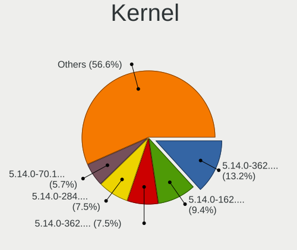

| Version                         | Desktops | Percent |
|---------------------------------|----------|---------|
| 5.14.0-362.24.1.el9_3.x86_64    | 7        | 13.21%  |
| 5.14.0-162.6.1.el9_1.x86_64     | 5        | 9.43%   |
| 5.14.0-362.13.1.el9_3.x86_64    | 4        | 7.55%   |
| 5.14.0-284.11.1.el9_2.x86_64    | 4        | 7.55%   |
| 5.14.0-70.17.1.el9_0.x86_64     | 3        | 5.66%   |
| 5.14.0-284.25.1.el9_2.x86_64    | 3        | 5.66%   |
| 5.14.0-162.22.2.el9_1.x86_64    | 3        | 5.66%   |
| 5.14.0-70.22.1.el9_0.x86_64     | 2        | 3.77%   |
| 5.14.0-503.14.1.el9_5.x86_64    | 2        | 3.77%   |
| 5.14.0-284.30.1.el9_2.x86_64    | 2        | 3.77%   |
| 5.14.0-162.12.1.el9_1.x86_64    | 2        | 3.77%   |
| 5.14.0-70.5.1.el9_0.x86_64      | 1        | 1.89%   |
| 5.14.0-570.24.1.el9_6.x86_64    | 1        | 1.89%   |
| 5.14.0-503.31.1.el9_5.x86_64    | 1        | 1.89%   |
| 5.14.0-503.29.1.el9_5.x86_64    | 1        | 1.89%   |
| 5.14.0-503.26.1.el9_5.x86_64    | 1        | 1.89%   |
| 5.14.0-503.19.1.el9_5.x86_64+rt | 1        | 1.89%   |
| 5.14.0-427.42.1.el9_4.x86_64    | 1        | 1.89%   |
| 5.14.0-427.37.1.el9_4.x86_64    | 1        | 1.89%   |
| 5.14.0-427.31.1.el9_4.x86_64    | 1        | 1.89%   |
| 5.14.0-427.22.1.el9_4.x86_64    | 1        | 1.89%   |
| 5.14.0-427.16.1.el9_4.x86_64    | 1        | 1.89%   |
| 5.14.0-427.13.1.el9_4.x86_64    | 1        | 1.89%   |
| 5.14.0-362.8.1.el9_3.x86_64     | 1        | 1.89%   |
| 5.14.0-362.18.1.el9_3.x86_64    | 1        | 1.89%   |
| 5.14.0-284.18.1.el9_2.x86_64    | 1        | 1.89%   |
| 5.14.0-162.23.1.el9_1.x86_64    | 1        | 1.89%   |

Kernel Family
-------------

Linux kernel without a distro release

| Version | Desktops | Percent |
|---------|----------|---------|
| 5.14.0  | 48       | 100%    |

Kernel Major Ver.
-----------------

Linux kernel major version

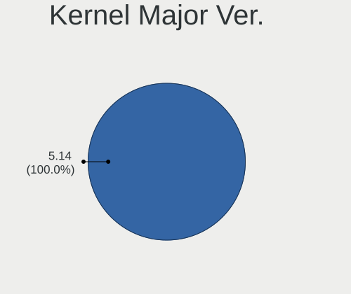

| Version | Desktops | Percent |
|---------|----------|---------|
| 5.14    | 48       | 100%    |

Arch
----

OS architecture (x86_64, i586, etc.)

| Name   | Desktops | Percent |
|--------|----------|---------|
| x86_64 | 48       | 100%    |

DE
--

Desktop Environment

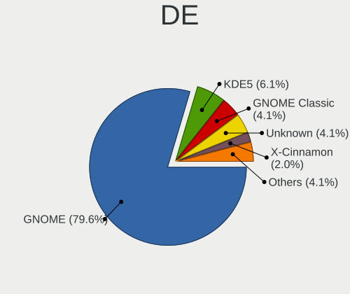

| Name          | Desktops | Percent |
|---------------|----------|---------|
| GNOME         | 39       | 79.59%  |
| KDE5          | 3        | 6.12%   |
| GNOME Classic | 2        | 4.08%   |
| Unknown       | 2        | 4.08%   |
| X-Cinnamon    | 1        | 2.04%   |
| MATE          | 1        | 2.04%   |
| Cinnamon      | 1        | 2.04%   |

Display Server
--------------

X11 or Wayland

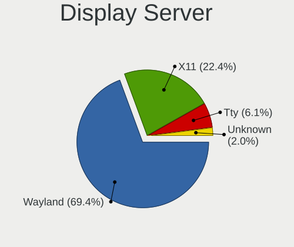

| Name    | Desktops | Percent |
|---------|----------|---------|
| Wayland | 34       | 69.39%  |
| X11     | 11       | 22.45%  |
| Tty     | 3        | 6.12%   |
| Unknown | 1        | 2.04%   |

Display Manager
---------------

SDDM, LightDM, etc.

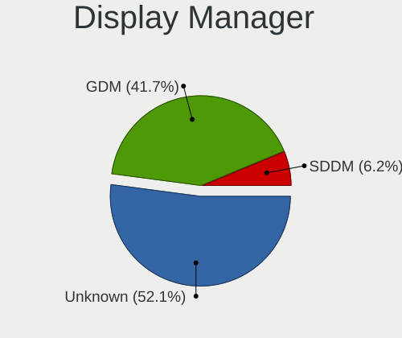

| Name    | Desktops | Percent |
|---------|----------|---------|
| Unknown | 25       | 52.08%  |
| GDM     | 20       | 41.67%  |
| SDDM    | 3        | 6.25%   |

OS Lang
-------

Language

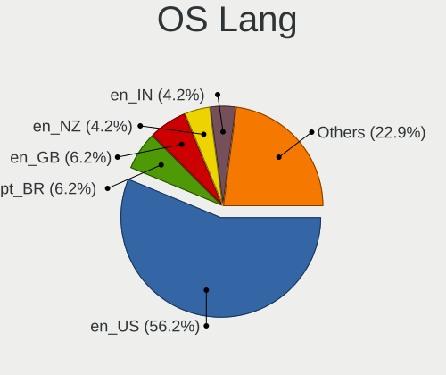

| Lang    | Desktops | Percent |
|---------|----------|---------|
| en_US   | 27       | 56.25%  |
| pt_BR   | 3        | 6.25%   |
| en_GB   | 3        | 6.25%   |
| en_NZ   | 2        | 4.17%   |
| en_IN   | 2        | 4.17%   |
| ru_RU   | 1        | 2.08%   |
| pl_PL   | 1        | 2.08%   |
| ja_JP   | 1        | 2.08%   |
| es_ES   | 1        | 2.08%   |
| es_AR   | 1        | 2.08%   |
| en_ZA   | 1        | 2.08%   |
| en_CA   | 1        | 2.08%   |
| en_AU   | 1        | 2.08%   |
| de_DE   | 1        | 2.08%   |
| C       | 1        | 2.08%   |
| Unknown | 1        | 2.08%   |

Boot Mode
---------

EFI or BIOS

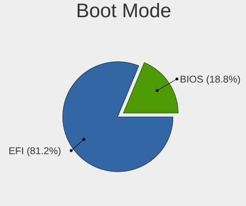

| Mode | Desktops | Percent |
|------|----------|---------|
| EFI  | 39       | 81.25%  |
| BIOS | 9        | 18.75%  |

Filesystem
----------

Type of filesystem

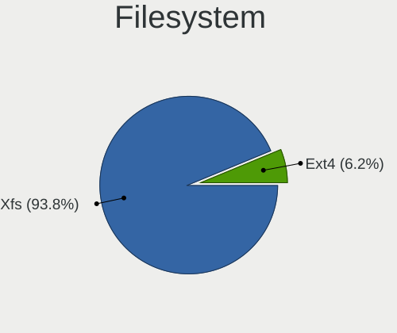

| Type | Desktops | Percent |
|------|----------|---------|
| Xfs  | 45       | 93.75%  |
| Ext4 | 3        | 6.25%   |

Part. scheme
------------

Scheme of partitioning

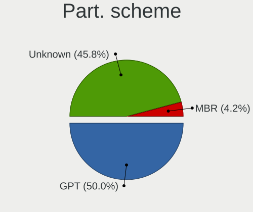

| Type    | Desktops | Percent |
|---------|----------|---------|
| GPT     | 24       | 50%     |
| Unknown | 22       | 45.83%  |
| MBR     | 2        | 4.17%   |

Dual Boot with Linux/BSD
------------------------

Hosting more than one Linux/BSD

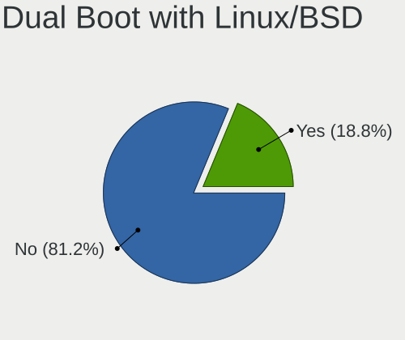

| Dual boot | Desktops | Percent |
|-----------|----------|---------|
| No        | 39       | 81.25%  |
| Yes       | 9        | 18.75%  |

Dual Boot (Win)
---------------

Hosting Linux and Windows

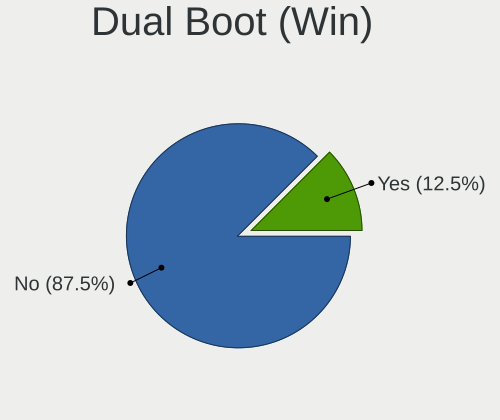

| Dual boot | Desktops | Percent |
|-----------|----------|---------|
| No        | 42       | 87.5%   |
| Yes       | 6        | 12.5%   |

Board
-----

Vendor
------

Motherboard manufacturer

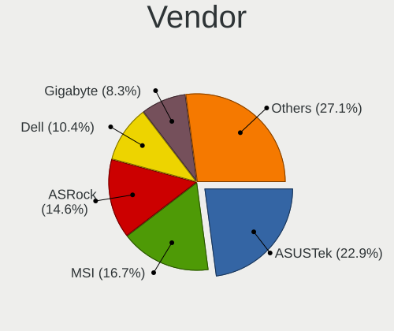

| Name                | Desktops | Percent |
|---------------------|----------|---------|
| ASUSTek Computer    | 11       | 22.92%  |
| MSI                 | 8        | 16.67%  |
| ASRock              | 7        | 14.58%  |
| Dell                | 5        | 10.42%  |
| Gigabyte Technology | 4        | 8.33%   |
| Hewlett-Packard     | 3        | 6.25%   |
| Unknown             | 3        | 6.25%   |
| Intel               | 2        | 4.17%   |
| Supermicro          | 1        | 2.08%   |
| MACHINIST           | 1        | 2.08%   |
| Hardkernel          | 1        | 2.08%   |
| CX / Air Computers. | 1        | 2.08%   |
| Acer                | 1        | 2.08%   |

Model
-----

Motherboard model

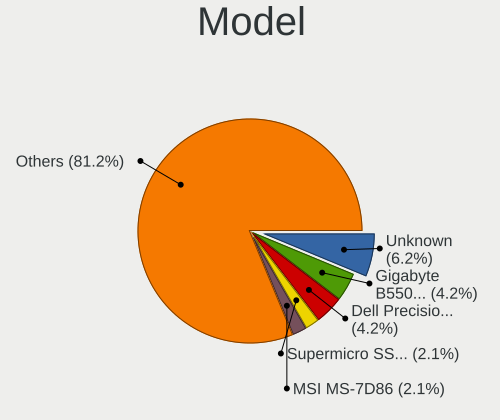

| Name                                    | Desktops | Percent |
|-----------------------------------------|----------|---------|
| Unknown                                 | 3        | 6.25%   |
| Gigabyte B550M AORUS PRO-P              | 2        | 4.17%   |
| Dell Precision Tower 5810               | 2        | 4.17%   |
| Supermicro SSG-6028R-E1CR12T            | 1        | 2.08%   |
| MSI MS-7D86                             | 1        | 2.08%   |
| MSI MS-7D54                             | 1        | 2.08%   |
| MSI MS-7D52                             | 1        | 2.08%   |
| MSI MS-7D25                             | 1        | 2.08%   |
| MSI MS-7C95                             | 1        | 2.08%   |
| MSI MS-7C56                             | 1        | 2.08%   |
| MSI MS-7B89                             | 1        | 2.08%   |
| MSI MS-7A71                             | 1        | 2.08%   |
| MACHINIST X99 PR9                       | 1        | 2.08%   |
| Intel H81                               | 1        | 2.08%   |
| Intel DQ77MK AAG39642-400               | 1        | 2.08%   |
| HP Z800 Workstation                     | 1        | 2.08%   |
| HP ProLiant ML310e Gen8                 | 1        | 2.08%   |
| HP OMEN by 40L Gaming Desktop GT21-0xxx | 1        | 2.08%   |
| Hardkernel ODROID-H3                    | 1        | 2.08%   |
| Gigabyte X670E AORUS MASTER             | 1        | 2.08%   |
| Gigabyte H510M H                        | 1        | 2.08%   |
| Dell Precision Tower 3620               | 1        | 2.08%   |
| Dell PowerEdge T30                      | 1        | 2.08%   |
| Dell OptiPlex 3070                      | 1        | 2.08%   |
| CX / Air Computers. H87-M1              | 1        | 2.08%   |
| ASUS TUF Gaming X670E-PLUS WIFI         | 1        | 2.08%   |
| ASUS TUF Gaming X570-PLUS               | 1        | 2.08%   |
| ASUS ROG STRIX Z590-E GAMING WIFI       | 1        | 2.08%   |
| ASUS ROG STRIX Z590-A GAMING WIFI       | 1        | 2.08%   |
| ASUS ROG STRIX G16CH_G16CH              | 1        | 2.08%   |
| ASUS ROG STRIX B550-E GAMING            | 1        | 2.08%   |
| ASUS ROG Maximus Z790 HERO              | 1        | 2.08%   |
| ASUS ROG CROSSHAIR VIII DARK HERO       | 1        | 2.08%   |
| ASUS PRIME Z690-P WIFI                  | 1        | 2.08%   |
| ASUS PRIME Z690-A                       | 1        | 2.08%   |
| ASUS PRIME Z590-A                       | 1        | 2.08%   |
| ASRock Z370 Professional Gaming i7      | 1        | 2.08%   |
| ASRock X570 Steel Legend                | 1        | 2.08%   |
| ASRock X570 Creator                     | 1        | 2.08%   |
| ASRock X399 Taichi                      | 1        | 2.08%   |

Model Family
------------

Motherboard model prefix

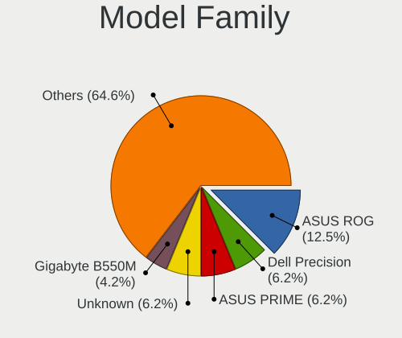

| Name                         | Desktops | Percent |
|------------------------------|----------|---------|
| ASUS ROG                     | 6        | 12.5%   |
| Dell Precision               | 3        | 6.25%   |
| ASUS PRIME                   | 3        | 6.25%   |
| Unknown                      | 3        | 6.25%   |
| Gigabyte B550M               | 2        | 4.17%   |
| ASUS TUF                     | 2        | 4.17%   |
| ASRock X570                  | 2        | 4.17%   |
| Supermicro SSG-6028R-E1CR12T | 1        | 2.08%   |
| MSI MS-7D86                  | 1        | 2.08%   |
| MSI MS-7D54                  | 1        | 2.08%   |
| MSI MS-7D52                  | 1        | 2.08%   |
| MSI MS-7D25                  | 1        | 2.08%   |
| MSI MS-7C95                  | 1        | 2.08%   |
| MSI MS-7C56                  | 1        | 2.08%   |
| MSI MS-7B89                  | 1        | 2.08%   |
| MSI MS-7A71                  | 1        | 2.08%   |
| MACHINIST X99                | 1        | 2.08%   |
| Intel H81                    | 1        | 2.08%   |
| Intel DQ77MK                 | 1        | 2.08%   |
| HP Z800                      | 1        | 2.08%   |
| HP ProLiant                  | 1        | 2.08%   |
| HP OMEN                      | 1        | 2.08%   |
| Hardkernel ODROID-H3         | 1        | 2.08%   |
| Gigabyte X670E               | 1        | 2.08%   |
| Gigabyte H510M               | 1        | 2.08%   |
| Dell PowerEdge               | 1        | 2.08%   |
| Dell OptiPlex                | 1        | 2.08%   |
| CX / Air Computers. H87-M1   | 1        | 2.08%   |
| ASRock Z370                  | 1        | 2.08%   |
| ASRock X399                  | 1        | 2.08%   |
| ASRock H310CM-HG4            | 1        | 2.08%   |
| ASRock G705                  | 1        | 2.08%   |
| ASRock A320M-HDV             | 1        | 2.08%   |
| Acer Aspire                  | 1        | 2.08%   |

MFG Year
--------

Motherboard manufacture year

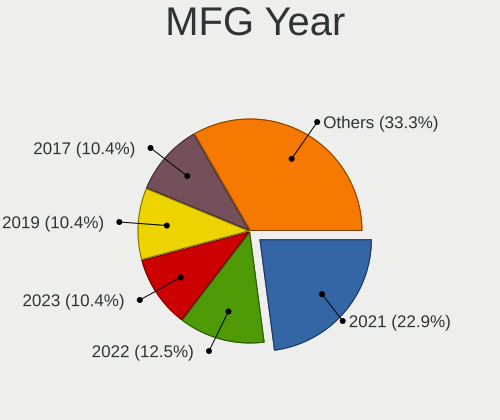

| Year | Desktops | Percent |
|------|----------|---------|
| 2021 | 11       | 22.92%  |
| 2022 | 6        | 12.5%   |
| 2023 | 5        | 10.42%  |
| 2019 | 5        | 10.42%  |
| 2017 | 5        | 10.42%  |
| 2020 | 4        | 8.33%   |
| 2016 | 4        | 8.33%   |
| 2018 | 3        | 6.25%   |
| 2015 | 1        | 2.08%   |
| 2014 | 1        | 2.08%   |
| 2013 | 1        | 2.08%   |
| 2012 | 1        | 2.08%   |
| 2010 | 1        | 2.08%   |

Form Factor
-----------

Physical design of the computer

| Name    | Desktops | Percent |
|---------|----------|---------|
| Desktop | 48       | 100%    |

Secure Boot
-----------

Enabled or disabled

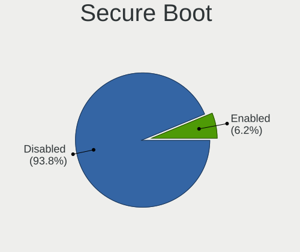

| State    | Desktops | Percent |
|----------|----------|---------|
| Disabled | 45       | 93.75%  |
| Enabled  | 3        | 6.25%   |

Coreboot
--------

Have coreboot on board

| Used | Desktops | Percent |
|------|----------|---------|
| No   | 48       | 100%    |

RAM Size
--------

Total RAM memory

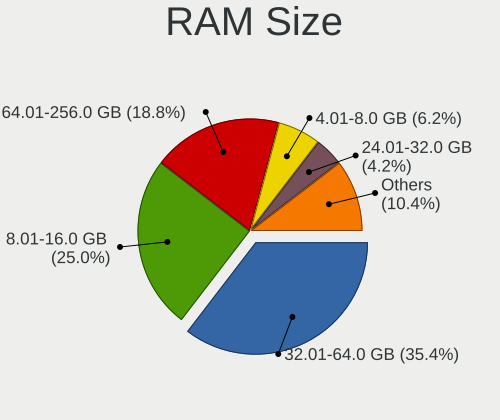

| Size in GB      | Desktops | Percent |
|-----------------|----------|---------|
| 32.01-64.0      | 17       | 35.42%  |
| 8.01-16.0       | 12       | 25%     |
| 64.01-256.0     | 9        | 18.75%  |
| 4.01-8.0        | 3        | 6.25%   |
| 3.01-4.0        | 2        | 4.17%   |
| 24.01-32.0      | 2        | 4.17%   |
| 16.01-24.0      | 2        | 4.17%   |
| More than 256.0 | 1        | 2.08%   |

RAM Used
--------

Used RAM memory

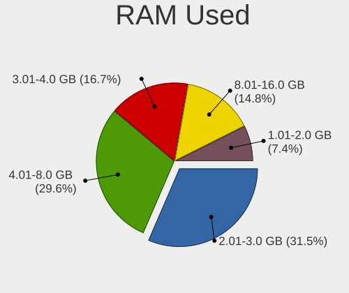

| Used GB   | Desktops | Percent |
|-----------|----------|---------|
| 2.01-3.0  | 17       | 31.48%  |
| 4.01-8.0  | 16       | 29.63%  |
| 3.01-4.0  | 9        | 16.67%  |
| 8.01-16.0 | 8        | 14.81%  |
| 1.01-2.0  | 4        | 7.41%   |

Total Drives
------------

Number of drives on board

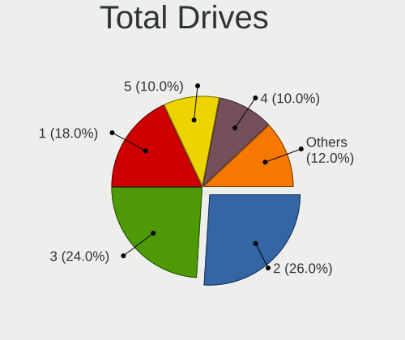

| Drives | Desktops | Percent |
|--------|----------|---------|
| 2      | 13       | 26%     |
| 3      | 12       | 24%     |
| 1      | 9        | 18%     |
| 5      | 5        | 10%     |
| 4      | 5        | 10%     |
| 6      | 2        | 4%      |
| 15     | 1        | 2%      |
| 14     | 1        | 2%      |
| 7      | 1        | 2%      |
| 0      | 1        | 2%      |

Has CD-ROM
----------

Has CD-ROM on board

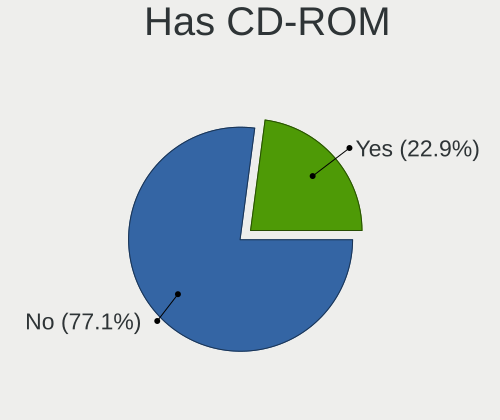

| Presented | Desktops | Percent |
|-----------|----------|---------|
| No        | 37       | 77.08%  |
| Yes       | 11       | 22.92%  |

Has Ethernet
------------

Has Ethernet on board

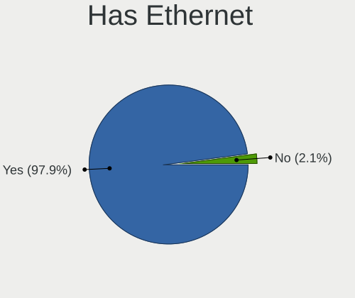

| Presented | Desktops | Percent |
|-----------|----------|---------|
| Yes       | 47       | 97.92%  |
| No        | 1        | 2.08%   |

Has WiFi
--------

Has WiFi module

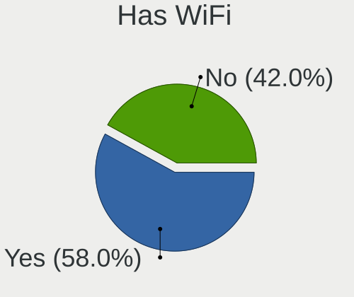

| Presented | Desktops | Percent |
|-----------|----------|---------|
| Yes       | 29       | 58%     |
| No        | 21       | 42%     |

Has Bluetooth
-------------

Has Bluetooth module

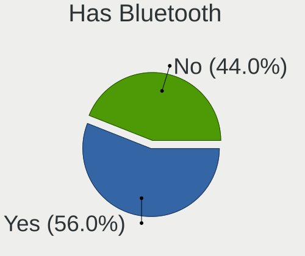

| Presented | Desktops | Percent |
|-----------|----------|---------|
| Yes       | 28       | 56%     |
| No        | 22       | 44%     |

Location
--------

Country
-------

Geographic location (country)

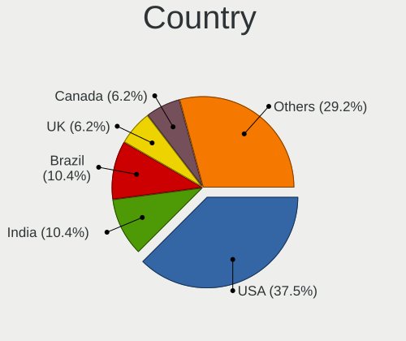

| Country      | Desktops | Percent |
|--------------|----------|---------|
| USA          | 18       | 37.5%   |
| India        | 5        | 10.42%  |
| Brazil       | 5        | 10.42%  |
| UK           | 3        | 6.25%   |
| Canada       | 3        | 6.25%   |
| Spain        | 2        | 4.17%   |
| New Zealand  | 2        | 4.17%   |
| Germany      | 2        | 4.17%   |
| Switzerland  | 1        | 2.08%   |
| Sweden       | 1        | 2.08%   |
| South Africa | 1        | 2.08%   |
| Russia       | 1        | 2.08%   |
| Poland       | 1        | 2.08%   |
| Japan        | 1        | 2.08%   |
| Australia    | 1        | 2.08%   |
| Argentina    | 1        | 2.08%   |

City
----

Geographic location (city)

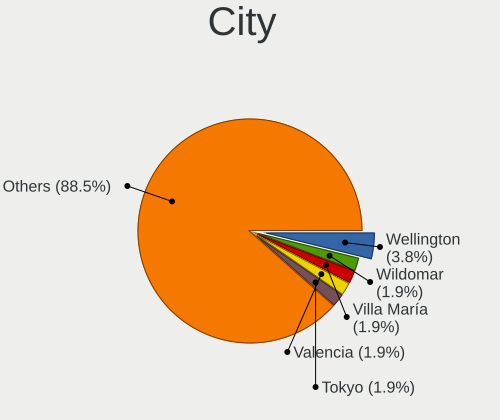

| City                      | Desktops | Percent |
|---------------------------|----------|---------|
| Wellington                | 2        | 3.85%   |
| Wildomar                  | 1        | 1.92%   |
| Villa María              | 1        | 1.92%   |
| Valencia                  | 1        | 1.92%   |
| Tokyo                     | 1        | 1.92%   |
| Sutton                    | 1        | 1.92%   |
| Sterling Heights          | 1        | 1.92%   |
| Stavropol                 | 1        | 1.92%   |
| Sierra Vista              | 1        | 1.92%   |
| Sao Bernardo do Campo     | 1        | 1.92%   |
| Sainte-Marie              | 1        | 1.92%   |
| Roseville                 | 1        | 1.92%   |
| Rosario                   | 1        | 1.92%   |
| Rio de Janeiro            | 1        | 1.92%   |
| Ribeirao Preto            | 1        | 1.92%   |
| Poznan                    | 1        | 1.92%   |
| Phoenix                   | 1        | 1.92%   |
| Pforzheim                 | 1        | 1.92%   |
| Oldham                    | 1        | 1.92%   |
| Newham                    | 1        | 1.92%   |
| Minneapolis               | 1        | 1.92%   |
| McKinney                  | 1        | 1.92%   |
| Los Angeles               | 1        | 1.92%   |
| Lansing                   | 1        | 1.92%   |
| L'Hospitalet de Llobregat | 1        | 1.92%   |
| Kochi                     | 1        | 1.92%   |
| Johannesburg              | 1        | 1.92%   |
| Houston                   | 1        | 1.92%   |
| Halmstad                  | 1        | 1.92%   |
| Groves                    | 1        | 1.92%   |
| Ghaziabad                 | 1        | 1.92%   |
| Geneva                    | 1        | 1.92%   |
| Foz do Iguaçu            | 1        | 1.92%   |
| Ernakulam                 | 1        | 1.92%   |
| East Peoria               | 1        | 1.92%   |
| Delhi                     | 1        | 1.92%   |
| Cuiabá                   | 1        | 1.92%   |
| Crowley                   | 1        | 1.92%   |
| Cliffside Park            | 1        | 1.92%   |
| Cherry Hill               | 1        | 1.92%   |

Drives
------

Drive Vendor
------------

Hard drive vendors

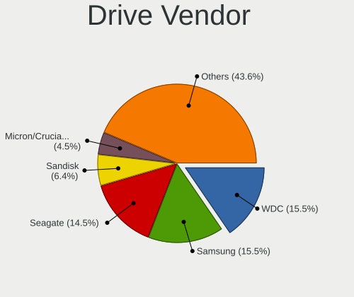

| Vendor                      | Desktops | Drives | Percent |
|-----------------------------|----------|--------|---------|
| WDC                         | 17       | 31     | 15.45%  |
| Samsung Electronics         | 17       | 30     | 15.45%  |
| Seagate                     | 16       | 42     | 14.55%  |
| Sandisk                     | 7        | 12     | 6.36%   |
| Micron/Crucial Technology   | 5        | 7      | 4.55%   |
| Kingston                    | 5        | 9      | 4.55%   |
| Toshiba                     | 4        | 5      | 3.64%   |
| Intel                       | 4        | 9      | 3.64%   |
| Phison Electronics          | 3        | 4      | 2.73%   |
| Crucial                     | 3        | 4      | 2.73%   |
| Unknown                     | 2        | 5      | 1.82%   |
| Phison                      | 2        | 2      | 1.82%   |
| MAXIO Technology (Hangzhou) | 2        | 2      | 1.82%   |
| HGST                        | 2        | 2      | 1.82%   |
| China                       | 2        | 2      | 1.82%   |
| XUM                         | 1        | 1      | 0.91%   |
| SPCC                        | 1        | 1      | 0.91%   |
| SK hynix                    | 1        | 1      | 0.91%   |
| Silicon Motion              | 1        | 1      | 0.91%   |
| SABRENT                     | 1        | 1      | 0.91%   |
| Realtek Semiconductor       | 1        | 1      | 0.91%   |
| Realtek                     | 1        | 1      | 0.91%   |
| PNY                         | 1        | 1      | 0.91%   |
| Micron Technology           | 1        | 1      | 0.91%   |
| Lexar                       | 1        | 1      | 0.91%   |
| KingSpec                    | 1        | 1      | 0.91%   |
| KingFast                    | 1        | 2      | 0.91%   |
| Kimtigo                     | 1        | 1      | 0.91%   |
| Inland                      | 1        | 1      | 0.91%   |
| HUSKY                       | 1        | 1      | 0.91%   |
| Hitachi                     | 1        | 1      | 0.91%   |
| Gigabyte Technology         | 1        | 1      | 0.91%   |
| Fantom                      | 1        | 1      | 0.91%   |
| ADATA Technology            | 1        | 1      | 0.91%   |

Drive Model
-----------

Hard drive models

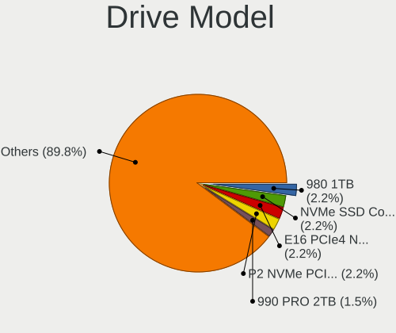

| Model                                              | Desktops | Percent |
|----------------------------------------------------|----------|---------|
| Samsung SSD 980 1TB                                | 3        | 2.19%   |
| Samsung NVMe SSD Controller PM9A1/PM9A3/980PRO 1TB | 3        | 2.19%   |
| Phison E16 PCIe4 NVMe Controller 1TB               | 3        | 2.19%   |
| Micron/Crucial P2 NVMe PCIe SSD 2TB                | 3        | 2.19%   |
| Samsung SSD 990 PRO 2TB                            | 2        | 1.46%   |
| Kingston SA400S37960G 960GB SSD                    | 2        | 1.46%   |
| Kingston SA400S37240G 240GB SSD                    | 2        | 1.46%   |
| Intel SSD 660P Series 512GB                        | 2        | 1.46%   |
| XUM HX256GSSDSATA3 256GB                           | 1        | 0.73%   |
| WDC WDBNCE5000PNC 500GB SSD                        | 1        | 0.73%   |
| WDC WDBA3V5000ANC-WRSN 500GB                       | 1        | 0.73%   |
| WDC WD80EFAX-68KNBN0 8TB                           | 1        | 0.73%   |
| WDC WD5000AVDS-63U7B0 500GB                        | 1        | 0.73%   |
| WDC WD5000AVCS-632DY1 500GB                        | 1        | 0.73%   |
| WDC WD5000AAKX-75U6AA0 500GB                       | 1        | 0.73%   |
| WDC WD50 00LPVX-22V0TT0 500GB                      | 1        | 0.73%   |
| WDC WD40EFZX-68AWUN0 4TB                           | 1        | 0.73%   |
| WDC WD40EFRX-68N32N0 4TB                           | 1        | 0.73%   |
| WDC WD40EFPX-68C6CN0 4TB                           | 1        | 0.73%   |
| WDC WD4005FZBX-00K5WB0 4TB                         | 1        | 0.73%   |
| WDC WD20PURZ-85AKKY0 2TB                           | 1        | 0.73%   |
| WDC WD20EZRZ-00Z5HB0 2TB                           | 1        | 0.73%   |
| WDC WD20EZRX-00D8PB0 2TB                           | 1        | 0.73%   |
| WDC WD20EZAZ-00GGJB0 2TB                           | 1        | 0.73%   |
| WDC WD20EARX-008FB0 2TB                            | 1        | 0.73%   |
| WDC WD2005FBYZ-01YCBB3 2TB                         | 1        | 0.73%   |
| WDC WD141KFGX-68FH9N0 14TB                         | 1        | 0.73%   |
| WDC WD140EFGX-68B0GN0 14TB                         | 1        | 0.73%   |
| WDC WD10SPSX-00A6WT0 1TB                           | 1        | 0.73%   |
| WDC WD10JPLX-00MBPT0 1TB                           | 1        | 0.73%   |
| WDC WD10JPCX-24UE4T0 1TB                           | 1        | 0.73%   |
| WDC WD10EZRX-00A3KB0 1TB                           | 1        | 0.73%   |
| WDC WD10EZEX-00BBHA0 1TB                           | 1        | 0.73%   |
| WDC WD100EFAX-68LHPN0 10TB                         | 1        | 0.73%   |
| WDC WD1003FZEX-00MK2A0 1TB                         | 1        | 0.73%   |
| Unknown SD/MMC/MS PRO 2GB                          | 1        | 0.73%   |
| Unknown SD/MMC/M.S.PRO 32GB                        | 1        | 0.73%   |
| Unknown SD/MMC 16GB                                | 1        | 0.73%   |
| Unknown M.S./M.S.Pro/HG 16GB                       | 1        | 0.73%   |
| Unknown Compact Flash 977MB                        | 1        | 0.73%   |

HDD Vendor
----------

Hard disk drive vendors

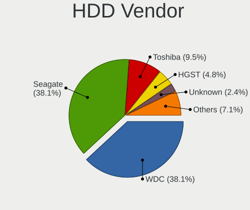

| Vendor              | Desktops | Drives | Percent |
|---------------------|----------|--------|---------|
| WDC                 | 16       | 29     | 38.1%   |
| Seagate             | 16       | 42     | 38.1%   |
| Toshiba             | 4        | 5      | 9.52%   |
| HGST                | 2        | 2      | 4.76%   |
| Unknown             | 1        | 1      | 2.38%   |
| Samsung Electronics | 1        | 1      | 2.38%   |
| Hitachi             | 1        | 1      | 2.38%   |
| Fantom              | 1        | 1      | 2.38%   |

SSD Vendor
----------

Solid state drive vendors

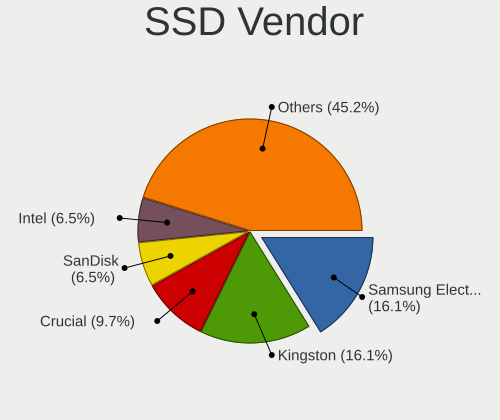

| Vendor              | Desktops | Drives | Percent |
|---------------------|----------|--------|---------|
| Samsung Electronics | 5        | 10     | 16.13%  |
| Kingston            | 5        | 9      | 16.13%  |
| Crucial             | 3        | 3      | 9.68%   |
| SanDisk             | 2        | 2      | 6.45%   |
| Intel               | 2        | 4      | 6.45%   |
| China               | 2        | 2      | 6.45%   |
| XUM                 | 1        | 1      | 3.23%   |
| WDC                 | 1        | 1      | 3.23%   |
| SPCC                | 1        | 1      | 3.23%   |
| SK hynix            | 1        | 1      | 3.23%   |
| SABRENT             | 1        | 1      | 3.23%   |
| PNY                 | 1        | 1      | 3.23%   |
| Lexar               | 1        | 1      | 3.23%   |
| KingSpec            | 1        | 1      | 3.23%   |
| Kimtigo             | 1        | 1      | 3.23%   |
| Inland              | 1        | 1      | 3.23%   |
| HUSKY               | 1        | 1      | 3.23%   |
| Gigabyte Technology | 1        | 1      | 3.23%   |

Drive Kind
----------

HDD or SSD

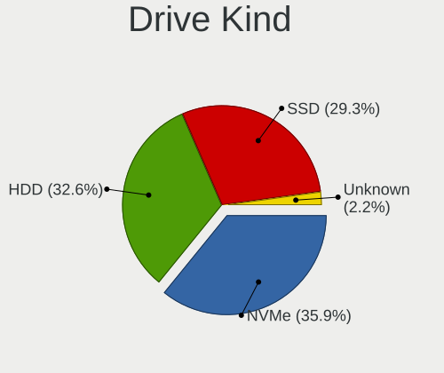

| Kind    | Desktops | Drives | Percent |
|---------|----------|--------|---------|
| NVMe    | 33       | 56     | 35.87%  |
| HDD     | 30       | 82     | 32.61%  |
| SSD     | 27       | 42     | 29.35%  |
| Unknown | 2        | 6      | 2.17%   |

Drive Connector
---------------

SATA, SAS, NVMe, etc.

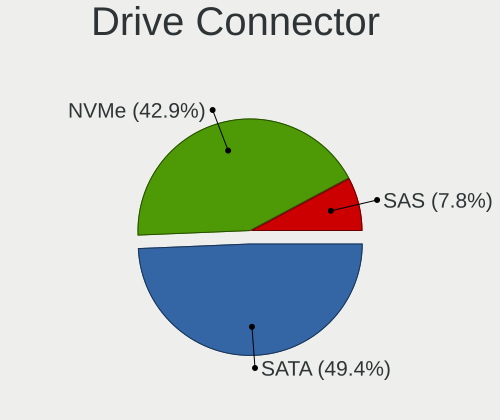

| Type | Desktops | Drives | Percent |
|------|----------|--------|---------|
| SATA | 38       | 120    | 49.35%  |
| NVMe | 33       | 55     | 42.86%  |
| SAS  | 6        | 11     | 7.79%   |

Drive Size
----------

Size of hard drive

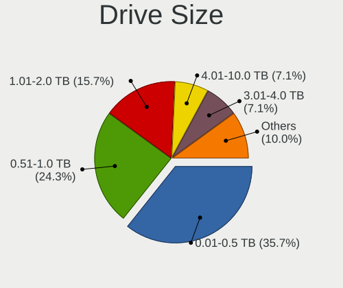

| Size in TB | Desktops | Drives | Percent |
|------------|----------|--------|---------|
| 0.01-0.5   | 25       | 39     | 35.71%  |
| 0.51-1.0   | 17       | 24     | 24.29%  |
| 1.01-2.0   | 11       | 17     | 15.71%  |
| 3.01-4.0   | 5        | 16     | 7.14%   |
| 4.01-10.0  | 5        | 18     | 7.14%   |
| 10.01-20.0 | 4        | 6      | 5.71%   |
| 2.01-3.0   | 3        | 4      | 4.29%   |

Space Total
-----------

Amount of disk space available on the file system

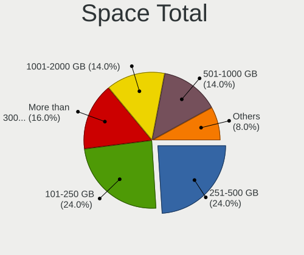

| Size in GB     | Desktops | Percent |
|----------------|----------|---------|
| 251-500        | 12       | 24%     |
| 101-250        | 12       | 24%     |
| More than 3000 | 8        | 16%     |
| 1001-2000      | 7        | 14%     |
| 501-1000       | 7        | 14%     |
| 2001-3000      | 2        | 4%      |
| 21-50          | 1        | 2%      |
| Unknown        | 1        | 2%      |

Space Used
----------

Amount of used disk space

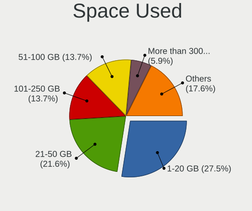

| Used GB        | Desktops | Percent |
|----------------|----------|---------|
| 1-20           | 14       | 27.45%  |
| 21-50          | 11       | 21.57%  |
| 101-250        | 7        | 13.73%  |
| 51-100         | 7        | 13.73%  |
| More than 3000 | 3        | 5.88%   |
| 251-500        | 3        | 5.88%   |
| 501-1000       | 3        | 5.88%   |
| 2001-3000      | 1        | 1.96%   |
| 1001-2000      | 1        | 1.96%   |
| Unknown        | 1        | 1.96%   |

Malfunc. Drives
---------------

Drive models with a malfunction

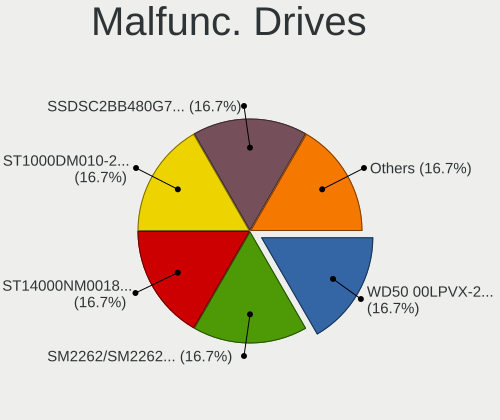

| Model                                               | Desktops | Drives | Percent |
|-----------------------------------------------------|----------|--------|---------|
| WDC WD50 00LPVX-22V0TT0 500GB                       | 1        | 1      | 16.67%  |
| Silicon Motion SM2262/SM2262EN SSD Controller 960GB | 1        | 1      | 16.67%  |
| Seagate ST14000NM0018-2H4101 14TB                   | 1        | 1      | 16.67%  |
| Seagate ST1000DM010-2EP102 1TB                      | 1        | 1      | 16.67%  |
| Intel SSDSC2BB480G7 480GB                           | 1        | 2      | 16.67%  |
| Crucial CT1000BX500SSD1 1TB                         | 1        | 1      | 16.67%  |

Malfunc. Drive Vendor
---------------------

Vendors of faulty drives

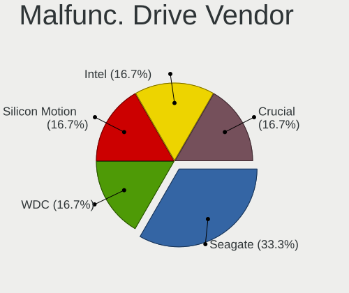

| Vendor         | Desktops | Drives | Percent |
|----------------|----------|--------|---------|
| Seagate        | 2        | 2      | 33.33%  |
| WDC            | 1        | 1      | 16.67%  |
| Silicon Motion | 1        | 1      | 16.67%  |
| Intel          | 1        | 2      | 16.67%  |
| Crucial        | 1        | 1      | 16.67%  |

Malfunc. HDD Vendor
-------------------

Vendors of faulty HDD drives

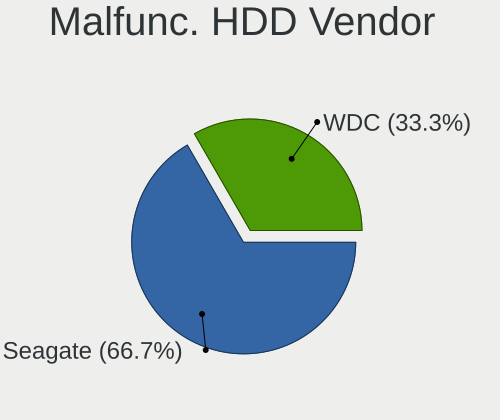

| Vendor  | Desktops | Drives | Percent |
|---------|----------|--------|---------|
| Seagate | 2        | 2      | 66.67%  |
| WDC     | 1        | 1      | 33.33%  |

Malfunc. Drive Kind
-------------------

Kinds of faulty drives

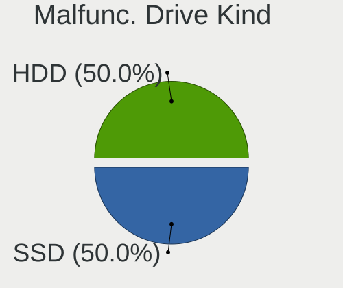

| Kind | Desktops | Drives | Percent |
|------|----------|--------|---------|
| SSD  | 2        | 3      | 40%     |
| HDD  | 2        | 3      | 40%     |
| NVMe | 1        | 1      | 20%     |

Failed Drives
-------------

Failed drive models

| Model                           | Desktops | Drives | Percent |
|---------------------------------|----------|--------|---------|
| Samsung Electronics SSD 980 1TB | 1        | 1      | 100%    |

Failed Drive Vendor
-------------------

Failed drive vendors

| Vendor              | Desktops | Drives | Percent |
|---------------------|----------|--------|---------|
| Samsung Electronics | 1        | 1      | 100%    |

Drive Status
------------

Number of failed and malfunc. drives

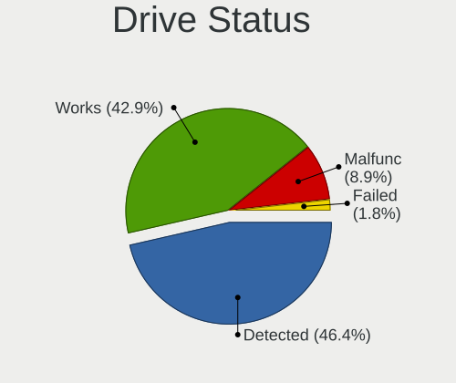

| Status   | Desktops | Drives | Percent |
|----------|----------|--------|---------|
| Detected | 26       | 104    | 46.43%  |
| Works    | 24       | 74     | 42.86%  |
| Malfunc  | 5        | 7      | 8.93%   |
| Failed   | 1        | 1      | 1.79%   |

Storage controller
------------------

Storage Vendor
--------------

Storage controller vendors

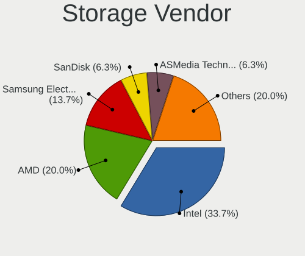

| Vendor                      | Desktops | Percent |
|-----------------------------|----------|---------|
| Intel                       | 32       | 33.68%  |
| AMD                         | 19       | 20%     |
| Samsung Electronics         | 13       | 13.68%  |
| SanDisk                     | 6        | 6.32%   |
| ASMedia Technology          | 6        | 6.32%   |
| Phison Electronics          | 5        | 5.26%   |
| Micron/Crucial Technology   | 5        | 5.26%   |
| Broadcom / LSI              | 2        | 2.11%   |
| Silicon Motion              | 1        | 1.05%   |
| Realtek Semiconductor       | 1        | 1.05%   |
| Micron Technology           | 1        | 1.05%   |
| MAXIO Technology (Hangzhou) | 1        | 1.05%   |
| LSI Logic / Symbios Logic   | 1        | 1.05%   |
| JMicron Technology          | 1        | 1.05%   |
| ADATA Technology            | 1        | 1.05%   |

Storage Model
-------------

Storage controller models

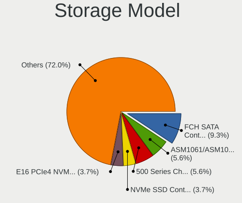

| Model                                                                          | Desktops | Percent |
|--------------------------------------------------------------------------------|----------|---------|
| AMD FCH SATA Controller [AHCI mode]                                            | 10       | 9.35%   |
| ASMedia ASM1061/ASM1062 Serial ATA Controller                                  | 6        | 5.61%   |
| AMD 500 Series Chipset SATA Controller                                         | 6        | 5.61%   |
| Samsung NVMe SSD Controller S4LV008[Pascal]                                    | 4        | 3.74%   |
| Phison E16 PCIe4 NVMe Controller                                               | 4        | 3.74%   |
| Samsung NVMe SSD Controller SM981/PM981/PM983                                  | 3        | 2.8%    |
| Samsung NVMe SSD Controller PM9A1/PM9A3/980PRO                                 | 3        | 2.8%    |
| Samsung NVMe SSD Controller 980 (DRAM-less)                                    | 3        | 2.8%    |
| Micron/Crucial P2 [Nick P2] / P3 / P3 Plus NVMe PCIe SSD (DRAM-less)           | 3        | 2.8%    |
| Intel RST Volume Management Device Controller                                  | 3        | 2.8%    |
| Intel Raptor Lake SATA AHCI Controller                                         | 3        | 2.8%    |
| Intel C610/X99 series chipset 6-Port SATA Controller [AHCI mode]               | 3        | 2.8%    |
| Intel Alder Lake-S PCH SATA Controller [AHCI Mode]                             | 3        | 2.8%    |
| Intel 8 Series/C220 Series Chipset Family 6-port SATA Controller 1 [AHCI mode] | 3        | 2.8%    |
| Intel 500 Series Chipset Family SATA AHCI Controller                           | 3        | 2.8%    |
| Intel 200 Series PCH SATA controller [AHCI mode]                               | 3        | 2.8%    |
| SanDisk WD SN560/SN740/SN770/SN5000 NVMe SSD                                   | 2        | 1.87%   |
| SanDisk Ultra 3D / WD PC SN530, IX SN530, Blue SN550 NVMe SSD (DRAM-less)      | 2        | 1.87%   |
| SanDisk Ultra 3D / WD Blue SN570 NVMe SSD (DRAM-less)                          | 2        | 1.87%   |
| Intel SSD 660P Series                                                          | 2        | 1.87%   |
| Intel SATA Controller [RAID mode]                                              | 2        | 1.87%   |
| Intel Jasper Lake SATA AHCI Controller                                         | 2        | 1.87%   |
| Intel C610/X99 series chipset sSATA Controller [AHCI mode]                     | 2        | 1.87%   |
| Intel 6 Series/C200 Series Chipset Family 6 port Desktop SATA AHCI Controller  | 2        | 1.87%   |
| AMD 600 Series Chipset SATA Controller                                         | 2        | 1.87%   |
| AMD 400 Series Chipset SATA Controller                                         | 2        | 1.87%   |
| Silicon Motion SM2262/SM2262EN SSD Controller                                  | 1        | 0.93%   |
| SanDisk WD PC SN810 / Black SN850 NVMe SSD                                     | 1        | 0.93%   |
| Realtek RTS5763DL NVMe SSD Controller (DRAM-less)                              | 1        | 0.93%   |
| Phison E7 NVMe Controller                                                      | 1        | 0.93%   |
| Phison E12 NVMe Controller                                                     | 1        | 0.93%   |
| Micron/Crucial P5 Plus NVMe PCIe SSD                                           | 1        | 0.93%   |
| Micron/Crucial P1 NVMe PCIe SSD[Frampton2]                                     | 1        | 0.93%   |
| Micron 2400 NVMe SSD (DRAM-less)                                               | 1        | 0.93%   |
| MAXIO (Hangzhou) NVMe SSD Controller MAP1602 (DRAM-less)                       | 1        | 0.93%   |
| LSI Logic / Symbios Logic MegaRAID SAS-3 3108 [Invader]                        | 1        | 0.93%   |
| JMicron JMB58x AHCI SATA controller                                            | 1        | 0.93%   |
| Intel Volume Management Device NVMe RAID Controller                            | 1        | 0.93%   |
| Intel Q170/Q150/B150/H170/H110/Z170/CM236 Chipset SATA Controller [AHCI Mode]  | 1        | 0.93%   |
| Intel Optane NVME SSD P1600X Series                                            | 1        | 0.93%   |

Storage Kind
------------

Kind of storage controller (IDE, SATA, NVMe, SAS, ...)

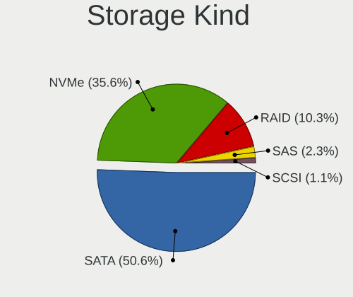

| Kind | Desktops | Percent |
|------|----------|---------|
| SATA | 44       | 50.57%  |
| NVMe | 31       | 35.63%  |
| RAID | 9        | 10.34%  |
| SAS  | 2        | 2.3%    |
| SCSI | 1        | 1.15%   |

Processor
---------

CPU Vendor
----------

Processor vendors

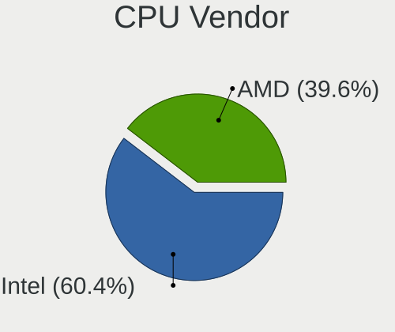

| Vendor | Desktops | Percent |
|--------|----------|---------|
| Intel  | 29       | 60.42%  |
| AMD    | 19       | 39.58%  |

CPU Model
---------

Processor models

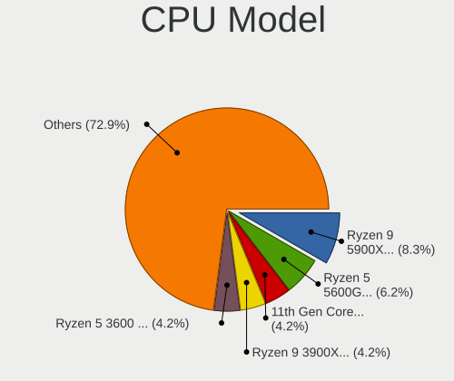

| Model                                          | Desktops | Percent |
|------------------------------------------------|----------|---------|
| AMD Ryzen 9 5900X 12-Core Processor            | 4        | 8.33%   |
| AMD Ryzen 5 5600G with Radeon Graphics         | 3        | 6.25%   |
| Intel 11th Gen Core i7-11700K @ 3.60GHz        | 2        | 4.17%   |
| AMD Ryzen 9 3900X 12-Core Processor            | 2        | 4.17%   |
| AMD Ryzen 5 3600 6-Core Processor              | 2        | 4.17%   |
| Intel Xeon CPU X5570 @ 2.93GHz                 | 1        | 2.08%   |
| Intel Xeon CPU E5-2680 v3 @ 2.50GHz            | 1        | 2.08%   |
| Intel Xeon CPU E5-2620 v4 @ 2.10GHz            | 1        | 2.08%   |
| Intel Xeon CPU E5-1620 v4 @ 3.50GHz            | 1        | 2.08%   |
| Intel Xeon CPU E5-1607 v4 @ 3.10GHz            | 1        | 2.08%   |
| Intel Xeon CPU E3-1240 v5 @ 3.50GHz            | 1        | 2.08%   |
| Intel Xeon CPU E3-1225 v5 @ 3.30GHz            | 1        | 2.08%   |
| Intel Pentium Silver N6005 @ 2.00GHz           | 1        | 2.08%   |
| Intel Core i9-14900KS                          | 1        | 2.08%   |
| Intel Core i7-9700 CPU @ 3.00GHz               | 1        | 2.08%   |
| Intel Core i7-8700K CPU @ 3.70GHz              | 1        | 2.08%   |
| Intel Core i7-7700K CPU @ 4.20GHz              | 1        | 2.08%   |
| Intel Core i7-3770 CPU @ 3.40GHz               | 1        | 2.08%   |
| Intel Core i5-9400F CPU @ 2.90GHz              | 1        | 2.08%   |
| Intel Core i5-4460 CPU @ 3.20GHz               | 1        | 2.08%   |
| Intel Core i5-3570 CPU @ 3.40GHz               | 1        | 2.08%   |
| Intel Core i5-3470S CPU @ 2.90GHz              | 1        | 2.08%   |
| Intel Core i3-4130 CPU @ 3.40GHz               | 1        | 2.08%   |
| Intel Core i3-3220 CPU @ 3.30GHz               | 1        | 2.08%   |
| Intel Celeron N5105 @ 2.00GHz                  | 1        | 2.08%   |
| Intel 13th Gen Core i9-13900K                  | 1        | 2.08%   |
| Intel 13th Gen Core i7-13700F                  | 1        | 2.08%   |
| Intel 13th Gen Core i5-13600K                  | 1        | 2.08%   |
| Intel 12th Gen Core i9-12900K                  | 1        | 2.08%   |
| Intel 12th Gen Core i5-12600K                  | 1        | 2.08%   |
| Intel 11th Gen Core i9-11900 @ 2.50GHz         | 1        | 2.08%   |
| Intel 11th Gen Core i7-11700F @ 2.50GHz        | 1        | 2.08%   |
| AMD Ryzen Threadripper 1950X 16-Core Processor | 1        | 2.08%   |
| AMD Ryzen 9 7900X 12-Core Processor            | 1        | 2.08%   |
| AMD Ryzen 9 5950X 16-Core Processor            | 1        | 2.08%   |
| AMD Ryzen 7 7700X 8-Core Processor             | 1        | 2.08%   |
| AMD Ryzen 7 5800X3D 8-Core Processor           | 1        | 2.08%   |
| AMD Ryzen 7 2700X Eight-Core Processor         | 1        | 2.08%   |
| AMD Athlon X4 950 Quad Core Processor          | 1        | 2.08%   |
| AMD A4-9120 RADEON R3, 4 COMPUTE CORES 2C+2G   | 1        | 2.08%   |

CPU Model Family
----------------

Processor model prefix

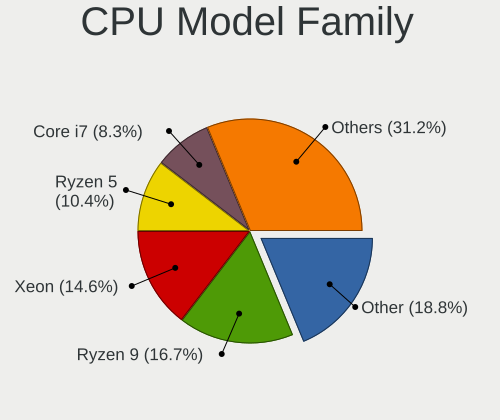

| Model                  | Desktops | Percent |
|------------------------|----------|---------|
| Other                  | 9        | 18.75%  |
| AMD Ryzen 9            | 8        | 16.67%  |
| Intel Xeon             | 7        | 14.58%  |
| AMD Ryzen 5            | 5        | 10.42%  |
| Intel Core i7          | 4        | 8.33%   |
| Intel Core i5          | 4        | 8.33%   |
| AMD Ryzen 7            | 3        | 6.25%   |
| Intel Core i3          | 2        | 4.17%   |
| Intel Pentium Silver   | 1        | 2.08%   |
| Intel Core i9          | 1        | 2.08%   |
| Intel Celeron          | 1        | 2.08%   |
| AMD Ryzen Threadripper | 1        | 2.08%   |
| AMD Athlon X4          | 1        | 2.08%   |
| AMD A4                 | 1        | 2.08%   |

CPU Cores
---------

Number of processor cores

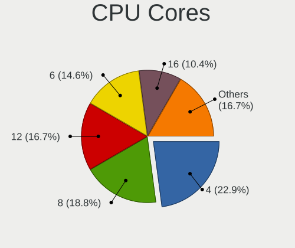

| Number | Desktops | Percent |
|--------|----------|---------|
| 4      | 11       | 22.92%  |
| 8      | 9        | 18.75%  |
| 12     | 8        | 16.67%  |
| 6      | 7        | 14.58%  |
| 16     | 5        | 10.42%  |
| 2      | 3        | 6.25%   |
| 24     | 2        | 4.17%   |
| 14     | 1        | 2.08%   |
| 10     | 1        | 2.08%   |
| 1      | 1        | 2.08%   |

CPU Sockets
-----------

Number of sockets

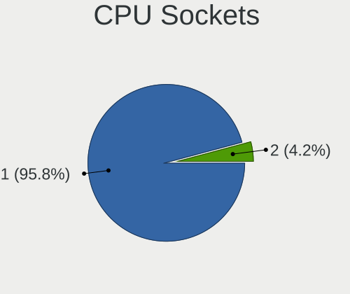

| Number | Desktops | Percent |
|--------|----------|---------|
| 1      | 46       | 95.83%  |
| 2      | 2        | 4.17%   |

CPU Threads
-----------

Threads per core (Hyper-Threading)

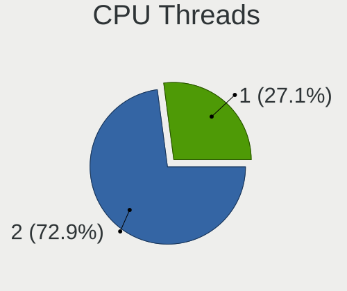

| Number | Desktops | Percent |
|--------|----------|---------|
| 2      | 35       | 72.92%  |
| 1      | 13       | 27.08%  |

CPU Op-Modes
------------

CPU Operation Modes (32-bit, 64-bit)

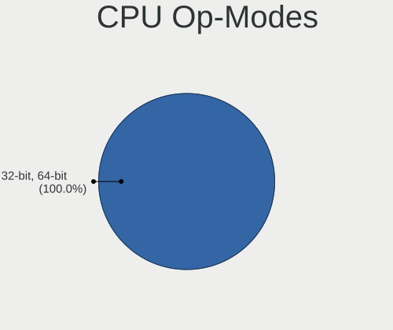

| Op mode        | Desktops | Percent |
|----------------|----------|---------|
| 32-bit, 64-bit | 48       | 100%    |

CPU Microcode
-------------

Microcode number

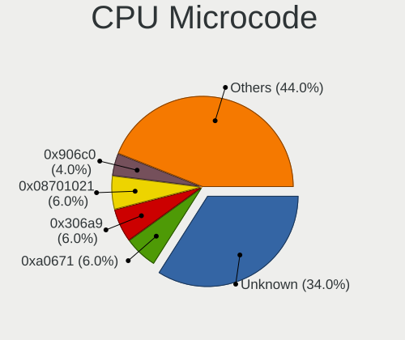

| Number     | Desktops | Percent |
|------------|----------|---------|
| Unknown    | 17       | 34%     |
| 0xa0671    | 3        | 6%      |
| 0x306a9    | 3        | 6%      |
| 0x08701021 | 3        | 6%      |
| 0x906c0    | 2        | 4%      |
| 0x0a50000f | 2        | 4%      |
| 0x0a20120a | 2        | 4%      |
| 0xb0671    | 1        | 2%      |
| 0x906ea    | 1        | 2%      |
| 0x906e9    | 1        | 2%      |
| 0x90672    | 1        | 2%      |
| 0x506e3    | 1        | 2%      |
| 0x406f1    | 1        | 2%      |
| 0x306c3    | 1        | 2%      |
| 0x106a5    | 1        | 2%      |
| 0x0a601206 | 1        | 2%      |
| 0x0a601203 | 1        | 2%      |
| 0x0a50000c | 1        | 2%      |
| 0x0a201204 | 1        | 2%      |
| 0x0a20102b | 1        | 2%      |
| 0x08701030 | 1        | 2%      |
| 0x0800820d | 1        | 2%      |
| 0x08001138 | 1        | 2%      |
| 0x06006705 | 1        | 2%      |
| 0x0600611a | 1        | 2%      |

CPU Microarch
-------------

Microarchitecture

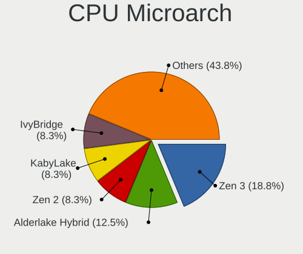

| Name             | Desktops | Percent |
|------------------|----------|---------|
| Zen 3            | 9        | 18.75%  |
| Alderlake Hybrid | 6        | 12.5%   |
| Zen 2            | 4        | 8.33%   |
| KabyLake         | 4        | 8.33%   |
| IvyBridge        | 4        | 8.33%   |
| Icelake          | 4        | 8.33%   |
| Haswell          | 3        | 6.25%   |
| Broadwell        | 3        | 6.25%   |
| Tremont          | 2        | 4.17%   |
| Skylake          | 2        | 4.17%   |
| Excavator        | 2        | 4.17%   |
| Unknown          | 2        | 4.17%   |
| Zen+             | 1        | 2.08%   |
| Zen              | 1        | 2.08%   |
| Nehalem          | 1        | 2.08%   |

Graphics
--------

GPU Vendor
----------

Vendors of graphics cards

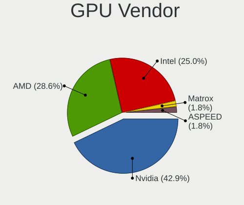

| Vendor                     | Desktops | Percent |
|----------------------------|----------|---------|
| Nvidia                     | 24       | 42.86%  |
| AMD                        | 16       | 28.57%  |
| Intel                      | 14       | 25%     |
| Matrox Electronics Systems | 1        | 1.79%   |
| ASPEED Technology          | 1        | 1.79%   |

GPU Model
---------

Graphics card models

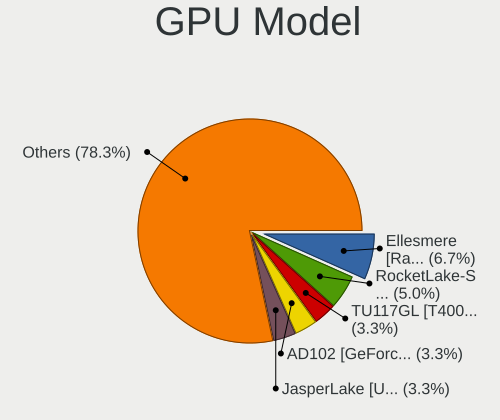

| Model                                                                       | Desktops | Percent |
|-----------------------------------------------------------------------------|----------|---------|
| AMD Ellesmere [Radeon RX 470/480/570/570X/580/580X/590]                     | 4        | 6.67%   |
| Intel RocketLake-S GT1 [UHD Graphics 750]                                   | 3        | 5%      |
| Nvidia TU117GL [T400 4GB / T400E]                                           | 2        | 3.33%   |
| Nvidia AD102 [GeForce RTX 4090]                                             | 2        | 3.33%   |
| Intel JasperLake [UHD Graphics]                                             | 2        | 3.33%   |
| Intel Alder Lake-S GT1 [UHD Graphics 770]                                   | 2        | 3.33%   |
| AMD Raphael                                                                 | 2        | 3.33%   |
| AMD Navi 22 [Radeon RX 6700/6700 XT/6750 XT / 6800M/6850M XT]               | 2        | 3.33%   |
| AMD Navi 14 [Radeon RX 5500/5500M / Pro 5500M]                              | 2        | 3.33%   |
| AMD Cezanne [Radeon Vega Series / Radeon Vega Mobile Series]                | 2        | 3.33%   |
| Nvidia TU116 [GeForce GTX 1660 SUPER]                                       | 1        | 1.67%   |
| Nvidia TU106 [GeForce RTX 2060 SUPER]                                       | 1        | 1.67%   |
| Nvidia GT218 [GeForce G210]                                                 | 1        | 1.67%   |
| Nvidia GP107GL [Quadro P400]                                                | 1        | 1.67%   |
| Nvidia GP107 [GeForce GTX 1050 Ti]                                          | 1        | 1.67%   |
| Nvidia GP104 [GeForce GTX 1070]                                             | 1        | 1.67%   |
| Nvidia GP104 [GeForce GTX 1070 Ti]                                          | 1        | 1.67%   |
| Nvidia GP102 [GeForce GTX 1080 Ti]                                          | 1        | 1.67%   |
| Nvidia GM206GL [Quadro M2000]                                               | 1        | 1.67%   |
| Nvidia GM206 [GeForce GTX 960]                                              | 1        | 1.67%   |
| Nvidia GM107GL [Quadro K620]                                                | 1        | 1.67%   |
| Nvidia GK208B [GeForce GT 730]                                              | 1        | 1.67%   |
| Nvidia GK106 [GeForce GTX 660]                                              | 1        | 1.67%   |
| Nvidia GF119 [NVS 315]                                                      | 1        | 1.67%   |
| Nvidia GF108 [GeForce GT 420]                                               | 1        | 1.67%   |
| Nvidia GA106 [GeForce RTX 3060 Lite Hash Rate]                              | 1        | 1.67%   |
| Nvidia GA106 [Geforce RTX 3050]                                             | 1        | 1.67%   |
| Nvidia GA104 [GeForce RTX 3070 Lite Hash Rate]                              | 1        | 1.67%   |
| Nvidia GA104 [GeForce RTX 3060 Ti Lite Hash Rate]                           | 1        | 1.67%   |
| Nvidia GA102 [GeForce RTX 3090 Ti]                                          | 1        | 1.67%   |
| Nvidia G96C [GeForce 9500 GT]                                               | 1        | 1.67%   |
| Nvidia G92 [GeForce 9800 GT]                                                | 1        | 1.67%   |
| Matrox Electronics Systems MGA G200EH                                       | 1        | 1.67%   |
| Intel Xeon E3-1200 v3/4th Gen Core Processor Integrated Graphics Controller | 1        | 1.67%   |
| Intel Xeon E3-1200 v2/3rd Gen Core processor Graphics Controller            | 1        | 1.67%   |
| Intel Skylake-DT/H GT2 [HD Graphics P530]                                   | 1        | 1.67%   |
| Intel Raptor Lake-S GT1 [UHD Graphics 770]                                  | 1        | 1.67%   |
| Intel Kaby Lake-S GT2 [HD Graphics 630]                                     | 1        | 1.67%   |
| Intel CoffeeLake-S GT2 [UHD Graphics 630]                                   | 1        | 1.67%   |
| Intel 4th Generation Core Processor Family Integrated Graphics Controller   | 1        | 1.67%   |

GPU Combo
---------

Combinations of graphics cards

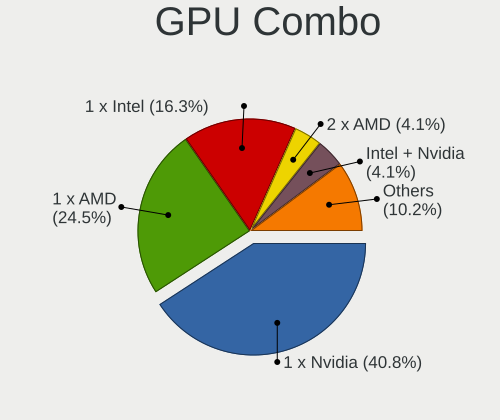

| Name            | Desktops | Percent |
|-----------------|----------|---------|
| 1 x Nvidia      | 20       | 40.82%  |
| 1 x AMD         | 12       | 24.49%  |
| 1 x Intel       | 8        | 16.33%  |
| 2 x AMD         | 2        | 4.08%   |
| Intel + Nvidia  | 2        | 4.08%   |
| 2 x Nvidia      | 1        | 2.04%   |
| Nvidia + ASPEED | 1        | 2.04%   |
| 1 x Matrox      | 1        | 2.04%   |
| Intel + AMD     | 1        | 2.04%   |
| AMD + Nvidia    | 1        | 2.04%   |

GPU Driver
----------

Free vs proprietary

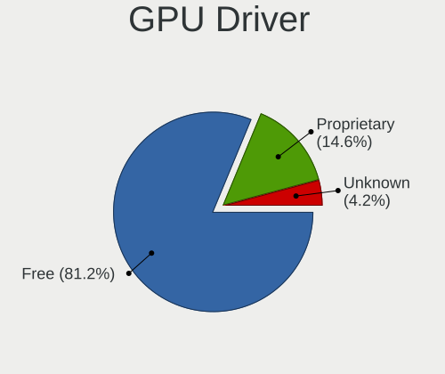

| Driver      | Desktops | Percent |
|-------------|----------|---------|
| Free        | 39       | 81.25%  |
| Proprietary | 7        | 14.58%  |
| Unknown     | 2        | 4.17%   |

GPU Memory
----------

Total video memory

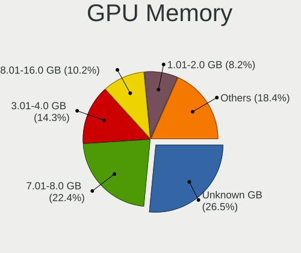

| Size in GB | Desktops | Percent |
|------------|----------|---------|
| Unknown    | 13       | 26.53%  |
| 7.01-8.0   | 11       | 22.45%  |
| 3.01-4.0   | 7        | 14.29%  |
| 8.01-16.0  | 5        | 10.2%   |
| 1.01-2.0   | 4        | 8.16%   |
| 16.01-24.0 | 3        | 6.12%   |
| 0.51-1.0   | 3        | 6.12%   |
| 0.01-0.5   | 3        | 6.12%   |

Monitor
-------

Monitor Vendor
--------------

Monitor vendors

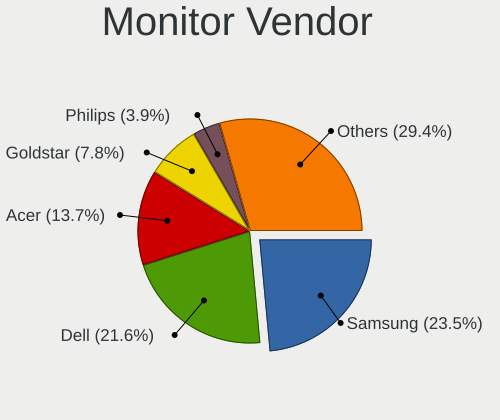

| Vendor              | Desktops | Percent |
|---------------------|----------|---------|
| Samsung Electronics | 12       | 23.53%  |
| Dell                | 11       | 21.57%  |
| Acer                | 7        | 13.73%  |
| Goldstar            | 4        | 7.84%   |
| Philips             | 2        | 3.92%   |
| BenQ                | 2        | 3.92%   |
| Unknown             | 2        | 3.92%   |
| Vizio               | 1        | 1.96%   |
| STD                 | 1        | 1.96%   |
| Sony                | 1        | 1.96%   |
| Panasonic           | 1        | 1.96%   |
| OUT                 | 1        | 1.96%   |
| Iiyama              | 1        | 1.96%   |
| Hewlett-Packard     | 1        | 1.96%   |
| Haier               | 1        | 1.96%   |
| Gigabyte Technology | 1        | 1.96%   |
| Deco Gear           | 1        | 1.96%   |
| AOC                 | 1        | 1.96%   |

Monitor Model
-------------

Monitor models

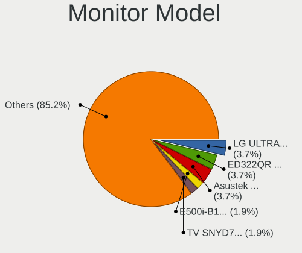

| Model                                                                   | Desktops | Percent |
|-------------------------------------------------------------------------|----------|---------|
| Goldstar LG ULTRAWIDE GSM59F1 2560x1080 670x280mm 28.6-inch             | 2        | 3.7%    |
| Acer ED322QR ACR06DD 1920x1080 700x390mm 31.5-inch                      | 2        | 3.7%    |
| Unknown                                                                 | 2        | 3.7%    |
| Vizio E500i-B1 VIZ1004 1920x1080 1095x616mm 49.5-inch                   | 1        | 1.85%   |
| STD HDMI STD0110 1920x1080 520x310mm 23.8-inch                          | 1        | 1.85%   |
| Sony TV SNYD703 1360x768                                                | 1        | 1.85%   |
| Samsung Electronics SyncMaster SAM0526 1920x1080 510x287mm 23.0-inch    | 1        | 1.85%   |
| Samsung Electronics SyncMaster SAM0380 1680x1050 459x296mm 21.5-inch    | 1        | 1.85%   |
| Samsung Electronics SyncMaster SAM0370 1680x1050 459x296mm 21.5-inch    | 1        | 1.85%   |
| Samsung Electronics SyncMaster SAM020D 1280x1024 338x270mm 17.0-inch    | 1        | 1.85%   |
| Samsung Electronics SyncMaster SAM011E 1280x1024 338x270mm 17.0-inch    | 1        | 1.85%   |
| Samsung Electronics SMS23A550H SAM07CA 1920x1080 509x286mm 23.0-inch    | 1        | 1.85%   |
| Samsung Electronics S27C500 SAM0AF2 1920x1080 598x336mm 27.0-inch       | 1        | 1.85%   |
| Samsung Electronics S24F350 SAM0D21 1920x1080 521x293mm 23.5-inch       | 1        | 1.85%   |
| Samsung Electronics LU28R55 SAM1015 3840x2160 632x360mm 28.6-inch       | 1        | 1.85%   |
| Samsung Electronics LCD Monitor SAM723F 3840x2160 700x390mm 31.5-inch   | 1        | 1.85%   |
| Samsung Electronics LCD Monitor SAM7103 3840x2160 700x390mm 31.5-inch   | 1        | 1.85%   |
| Samsung Electronics LCD Monitor SAM7016 3840x2160 1872x1053mm 84.6-inch | 1        | 1.85%   |
| Samsung Electronics LCD Monitor SAM0C26 1920x1080 1209x680mm 54.6-inch  | 1        | 1.85%   |
| Samsung Electronics LCD Monitor SAM0C04 3840x2160 1420x800mm 64.2-inch  | 1        | 1.85%   |
| Philips PHL 322E1 PHLC20F 1920x1080 698x393mm 31.5-inch                 | 1        | 1.85%   |
| Philips PHL 243V5 PHLC0D1 1920x1080 521x293mm 23.5-inch                 | 1        | 1.85%   |
| Panasonic TV MEIA296 1920x1080 698x392mm 31.5-inch                      | 1        | 1.85%   |
| OUT Analog OUT0096 1280x800 341x256mm 16.8-inch                         | 1        | 1.85%   |
| Iiyama PL3480WQ IVM7634 3440x1440 797x334mm 34.0-inch                   | 1        | 1.85%   |
| Hewlett-Packard OMEN 27qs HPN3968 2560x1440 597x336mm 27.0-inch         | 1        | 1.85%   |
| Haier LED39C800F HAI17FC 1920x1080 1150x650mm 52.0-inch                 | 1        | 1.85%   |
| Goldstar webOS TV GSM0307 3840x2160                                     | 1        | 1.85%   |
| Goldstar IPS226 GSM5807 1920x1080 477x268mm 21.5-inch                   | 1        | 1.85%   |
| Gigabyte Technology AORUS FI27Q-P GBT2707 2560x1440 596x335mm 26.9-inch | 1        | 1.85%   |
| Dell U3014 DEL4081 2560x1600 641x401mm 29.8-inch                        | 1        | 1.85%   |
| Dell U2412M DELA07B 1920x1200 518x324mm 24.1-inch                       | 1        | 1.85%   |
| Dell U2412M DELA07A 1920x1200 518x324mm 24.1-inch                       | 1        | 1.85%   |
| Dell ST2321L DELF033 1920x1080 509x286mm 23.0-inch                      | 1        | 1.85%   |
| Dell S2721QSA DELA196 3840x2160 597x336mm 27.0-inch                     | 1        | 1.85%   |
| Dell S2421HN DEL41F1 1920x1080 527x296mm 23.8-inch                      | 1        | 1.85%   |
| Dell S2340M DELD05A 1920x1080 509x286mm 23.0-inch                       | 1        | 1.85%   |
| Dell S2318HN/NX DELD0BF 1920x1080 509x286mm 23.0-inch                   | 1        | 1.85%   |
| Dell S2009W DELA045 1600x900 443x249mm 20.0-inch                        | 1        | 1.85%   |
| Dell P2415Q DELA0BE 3840x2160 527x296mm 23.8-inch                       | 1        | 1.85%   |

Monitor Resolution
------------------

Monitor screen resolution

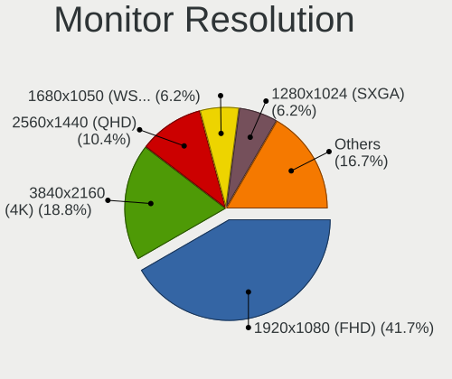

| Resolution         | Desktops | Percent |
|--------------------|----------|---------|
| 1920x1080 (FHD)    | 20       | 41.67%  |
| 3840x2160 (4K)     | 9        | 18.75%  |
| 2560x1440 (QHD)    | 5        | 10.42%  |
| 1680x1050 (WSXGA+) | 3        | 6.25%   |
| 1280x1024 (SXGA)   | 3        | 6.25%   |
| 3440x1440          | 2        | 4.17%   |
| 2560x1080          | 2        | 4.17%   |
| 2560x1600          | 1        | 2.08%   |
| 1920x1200 (WUXGA)  | 1        | 2.08%   |
| 1600x900 (HD+)     | 1        | 2.08%   |
| 1280x768           | 1        | 2.08%   |

Monitor Diagonal
----------------

Diagonal size in inches

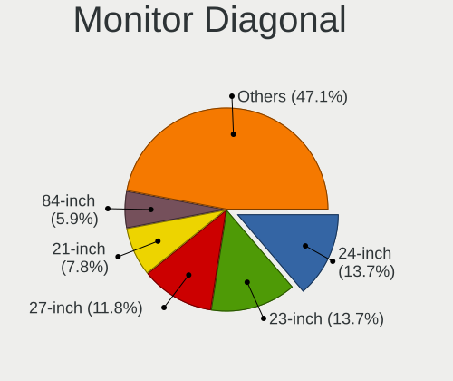

| Inches  | Desktops | Percent |
|---------|----------|---------|
| 24      | 7        | 13.73%  |
| 23      | 7        | 13.73%  |
| 27      | 6        | 11.76%  |
| 21      | 4        | 7.84%   |
| 84      | 3        | 5.88%   |
| 34      | 3        | 5.88%   |
| Unknown | 3        | 5.88%   |
| 43      | 2        | 3.92%   |
| 31      | 2        | 3.92%   |
| 17      | 2        | 3.92%   |
| 72      | 1        | 1.96%   |
| 60      | 1        | 1.96%   |
| 54      | 1        | 1.96%   |
| 52      | 1        | 1.96%   |
| 35      | 1        | 1.96%   |
| 33      | 1        | 1.96%   |
| 29      | 1        | 1.96%   |
| 28      | 1        | 1.96%   |
| 26      | 1        | 1.96%   |
| 20      | 1        | 1.96%   |
| 19      | 1        | 1.96%   |
| 16      | 1        | 1.96%   |

Monitor Width
-------------

Physical width

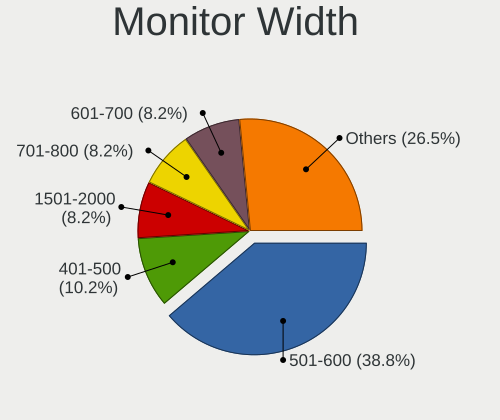

| Width in mm | Desktops | Percent |
|-------------|----------|---------|
| 501-600     | 19       | 38.78%  |
| 401-500     | 5        | 10.2%   |
| 701-800     | 4        | 8.16%   |
| 601-700     | 4        | 8.16%   |
| 1501-2000   | 4        | 8.16%   |
| 301-350     | 3        | 6.12%   |
| 1001-1500   | 3        | 6.12%   |
| Unknown     | 3        | 6.12%   |
| 901-1000    | 2        | 4.08%   |
| 801-900     | 1        | 2.04%   |
| 351-400     | 1        | 2.04%   |

Aspect Ratio
------------

Proportional relationship between the width and the height

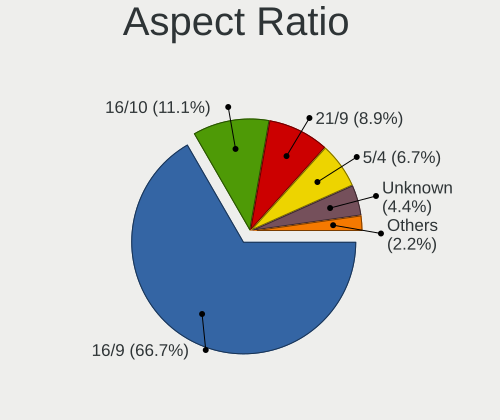

| Ratio   | Desktops | Percent |
|---------|----------|---------|
| 16/9    | 30       | 66.67%  |
| 16/10   | 5        | 11.11%  |
| 21/9    | 4        | 8.89%   |
| 5/4     | 3        | 6.67%   |
| Unknown | 2        | 4.44%   |
| 4/3     | 1        | 2.22%   |

Monitor Area
------------

Area in inch²

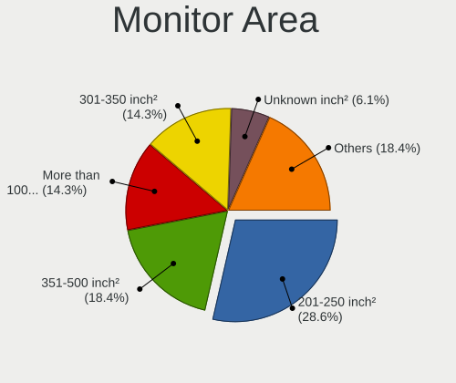

| Area in inch² | Desktops | Percent |
|----------------|----------|---------|
| 201-250        | 14       | 28.57%  |
| 351-500        | 9        | 18.37%  |
| More than 1000 | 7        | 14.29%  |
| 301-350        | 7        | 14.29%  |
| Unknown        | 3        | 6.12%   |
| 251-300        | 2        | 4.08%   |
| 151-200        | 2        | 4.08%   |
| 141-150        | 2        | 4.08%   |
| 501-1000       | 2        | 4.08%   |
| 131-140        | 1        | 2.04%   |

Pixel Density
-------------

Pixels per inch

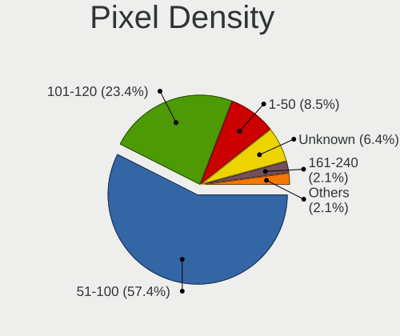

| Density | Desktops | Percent |
|---------|----------|---------|
| 51-100  | 27       | 57.45%  |
| 101-120 | 11       | 23.4%   |
| 1-50    | 4        | 8.51%   |
| Unknown | 3        | 6.38%   |
| 161-240 | 1        | 2.13%   |
| 121-160 | 1        | 2.13%   |

Multiple Monitors
-----------------

Total monitors connected

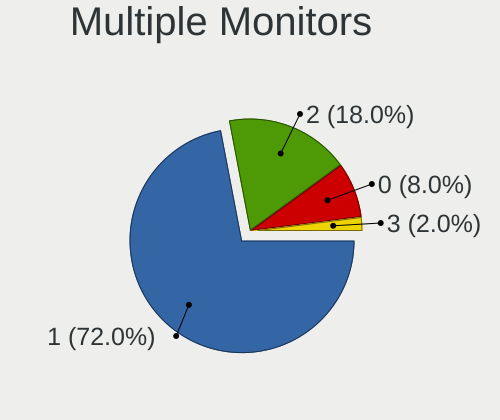

| Total | Desktops | Percent |
|-------|----------|---------|
| 1     | 36       | 72%     |
| 2     | 9        | 18%     |
| 0     | 4        | 8%      |
| 3     | 1        | 2%      |

Network
-------

Net Controller Vendor
---------------------

Controller vendors

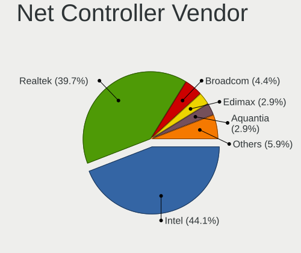

| Vendor                | Desktops | Percent |
|-----------------------|----------|---------|
| Intel                 | 30       | 44.12%  |
| Realtek Semiconductor | 27       | 39.71%  |
| Broadcom              | 3        | 4.41%   |
| Edimax Technology     | 2        | 2.94%   |
| Aquantia              | 2        | 2.94%   |
| Mellanox Technologies | 1        | 1.47%   |
| MediaTek              | 1        | 1.47%   |
| ASUSTek Computer      | 1        | 1.47%   |
| AMD                   | 1        | 1.47%   |

Net Controller Model
--------------------

Controller models

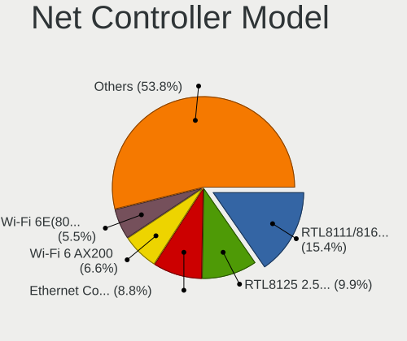

| Model                                                                          | Desktops | Percent |
|--------------------------------------------------------------------------------|----------|---------|
| Realtek RTL8111/8168/8211/8411 PCI Express Gigabit Ethernet Controller         | 14       | 15.38%  |
| Realtek RTL8125 2.5GbE Controller                                              | 9        | 9.89%   |
| Intel Ethernet Controller I225-V                                               | 8        | 8.79%   |
| Intel Wi-Fi 6 AX200                                                            | 6        | 6.59%   |
| Intel Wi-Fi 6E(802.11ax) AX210/AX1675* 2x2 [Typhoon Peak]                      | 5        | 5.49%   |
| Intel I211 Gigabit Network Connection                                          | 5        | 5.49%   |
| Intel Dual Band Wireless-AC 3168NGW [Stone Peak]                               | 5        | 5.49%   |
| Realtek RTL810xE PCI Express Fast Ethernet controller                          | 3        | 3.3%    |
| Intel 82574L Gigabit Network Connection                                        | 3        | 3.3%    |
| Intel Ethernet Controller I226-V                                               | 2        | 2.2%    |
| Intel Ethernet Controller 10-Gigabit X540-AT2                                  | 2        | 2.2%    |
| Intel Ethernet Connection (2) I219-LM                                          | 2        | 2.2%    |
| Intel 700 Series Chipset CNVi WiFi                                             | 2        | 2.2%    |
| Aquantia AQtion AQC107 NBase-T/IEEE 802.3an Ethernet Controller [Atlantic 10G] | 2        | 2.2%    |
| Realtek RTL8852CE PCIe 802.11ax Wireless Network Controller                    | 1        | 1.1%    |
| Realtek RTL8852BE PCIe 802.11ax Wireless Network Controller                    | 1        | 1.1%    |
| Realtek RTL8192EU 802.11b/g/n WLAN Adapter                                     | 1        | 1.1%    |
| Realtek RTL8188EUS 802.11n Wireless Network Adapter                            | 1        | 1.1%    |
| Realtek RTL8153 Gigabit Ethernet Adapter                                       | 1        | 1.1%    |
| Realtek 802.11n WLAN Adapter                                                   | 1        | 1.1%    |
| Mellanox MT27500 Family [ConnectX-3]                                           | 1        | 1.1%    |
| MediaTek MT7921K (RZ608) Wi-Fi 6E 80MHz                                        | 1        | 1.1%    |
| Intel Wi-Fi 7(802.11be) AX1775*/AX1790*/BE20*/BE401/BE1750* 2x2                | 1        | 1.1%    |
| Intel Jasper Lake PCH CNVi WiFi                                                | 1        | 1.1%    |
| Intel I210 Gigabit Network Connection                                          | 1        | 1.1%    |
| Intel Ethernet Connection I217-LM                                              | 1        | 1.1%    |
| Intel Ethernet Connection (2) I219-V                                           | 1        | 1.1%    |
| Intel Alder Lake-S PCH CNVi WiFi                                               | 1        | 1.1%    |
| Intel 82579LM Gigabit Network Connection (Lewisville)                          | 1        | 1.1%    |
| Edimax EW-7811Un 802.11n Wireless Adapter [Realtek RTL8188CUS]                 | 1        | 1.1%    |
| Edimax AC1200 MU-MIMO USB3.0 Adapter                                           | 1        | 1.1%    |
| Broadcom NetXtreme BCM5764M Gigabit Ethernet PCIe                              | 1        | 1.1%    |
| Broadcom NetXtreme BCM5717 Gigabit Ethernet PCIe                               | 1        | 1.1%    |
| Broadcom BCM4360 802.11ac Dual Band Wireless Network Adapter                   | 1        | 1.1%    |
| Broadcom BCM4321 802.11b/g/n                                                   | 1        | 1.1%    |
| ASUS WL-167G v3 802.11n Adapter [Realtek RTL8188SU]                            | 1        | 1.1%    |
| AMD 79C97x [PCnet32 LANCE]                                                     | 1        | 1.1%    |

Wireless Vendor
---------------

Wireless vendors

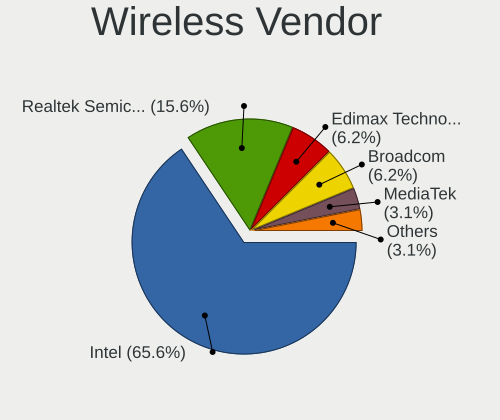

| Vendor                | Desktops | Percent |
|-----------------------|----------|---------|
| Intel                 | 21       | 65.63%  |
| Realtek Semiconductor | 5        | 15.63%  |
| Edimax Technology     | 2        | 6.25%   |
| Broadcom              | 2        | 6.25%   |
| MediaTek              | 1        | 3.13%   |
| ASUSTek Computer      | 1        | 3.13%   |

Wireless Model
--------------

Wireless models

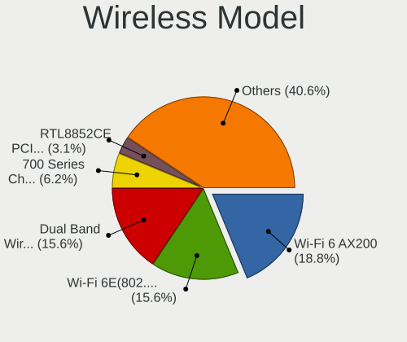

| Model                                                           | Desktops | Percent |
|-----------------------------------------------------------------|----------|---------|
| Intel Wi-Fi 6 AX200                                             | 6        | 18.75%  |
| Intel Wi-Fi 6E(802.11ax) AX210/AX1675* 2x2 [Typhoon Peak]       | 5        | 15.63%  |
| Intel Dual Band Wireless-AC 3168NGW [Stone Peak]                | 5        | 15.63%  |
| Intel 700 Series Chipset CNVi WiFi                              | 2        | 6.25%   |
| Realtek RTL8852CE PCIe 802.11ax Wireless Network Controller     | 1        | 3.13%   |
| Realtek RTL8852BE PCIe 802.11ax Wireless Network Controller     | 1        | 3.13%   |
| Realtek RTL8192EU 802.11b/g/n WLAN Adapter                      | 1        | 3.13%   |
| Realtek RTL8188EUS 802.11n Wireless Network Adapter             | 1        | 3.13%   |
| Realtek 802.11n WLAN Adapter                                    | 1        | 3.13%   |
| MediaTek MT7921K (RZ608) Wi-Fi 6E 80MHz                         | 1        | 3.13%   |
| Intel Wi-Fi 7(802.11be) AX1775*/AX1790*/BE20*/BE401/BE1750* 2x2 | 1        | 3.13%   |
| Intel Jasper Lake PCH CNVi WiFi                                 | 1        | 3.13%   |
| Intel Alder Lake-S PCH CNVi WiFi                                | 1        | 3.13%   |
| Edimax EW-7811Un 802.11n Wireless Adapter [Realtek RTL8188CUS]  | 1        | 3.13%   |
| Edimax AC1200 MU-MIMO USB3.0 Adapter                            | 1        | 3.13%   |
| Broadcom BCM4360 802.11ac Dual Band Wireless Network Adapter    | 1        | 3.13%   |
| Broadcom BCM4321 802.11b/g/n                                    | 1        | 3.13%   |
| ASUS WL-167G v3 802.11n Adapter [Realtek RTL8188SU]             | 1        | 3.13%   |

Ethernet Vendor
---------------

Ethernet vendors

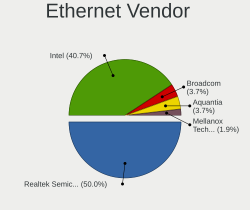

| Vendor                | Desktops | Percent |
|-----------------------|----------|---------|
| Realtek Semiconductor | 27       | 50%     |
| Intel                 | 22       | 40.74%  |
| Broadcom              | 2        | 3.7%    |
| Aquantia              | 2        | 3.7%    |
| Mellanox Technologies | 1        | 1.85%   |

Ethernet Model
--------------

Ethernet models

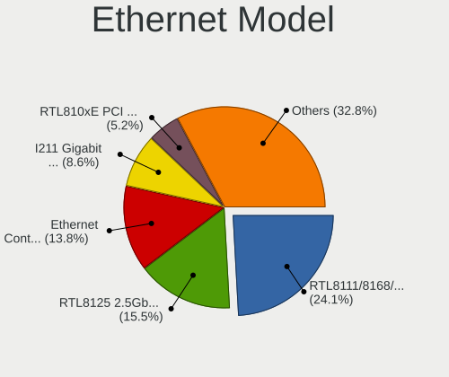

| Model                                                                          | Desktops | Percent |
|--------------------------------------------------------------------------------|----------|---------|
| Realtek RTL8111/8168/8211/8411 PCI Express Gigabit Ethernet Controller         | 14       | 24.14%  |
| Realtek RTL8125 2.5GbE Controller                                              | 9        | 15.52%  |
| Intel Ethernet Controller I225-V                                               | 8        | 13.79%  |
| Intel I211 Gigabit Network Connection                                          | 5        | 8.62%   |
| Realtek RTL810xE PCI Express Fast Ethernet controller                          | 3        | 5.17%   |
| Intel 82574L Gigabit Network Connection                                        | 3        | 5.17%   |
| Intel Ethernet Controller I226-V                                               | 2        | 3.45%   |
| Intel Ethernet Controller 10-Gigabit X540-AT2                                  | 2        | 3.45%   |
| Intel Ethernet Connection (2) I219-LM                                          | 2        | 3.45%   |
| Aquantia AQtion AQC107 NBase-T/IEEE 802.3an Ethernet Controller [Atlantic 10G] | 2        | 3.45%   |
| Realtek RTL8153 Gigabit Ethernet Adapter                                       | 1        | 1.72%   |
| Mellanox MT27500 Family [ConnectX-3]                                           | 1        | 1.72%   |
| Intel I210 Gigabit Network Connection                                          | 1        | 1.72%   |
| Intel Ethernet Connection I217-LM                                              | 1        | 1.72%   |
| Intel Ethernet Connection (2) I219-V                                           | 1        | 1.72%   |
| Intel 82579LM Gigabit Network Connection (Lewisville)                          | 1        | 1.72%   |
| Broadcom NetXtreme BCM5764M Gigabit Ethernet PCIe                              | 1        | 1.72%   |
| Broadcom NetXtreme BCM5717 Gigabit Ethernet PCIe                               | 1        | 1.72%   |

Net Controller Kind
-------------------

Ethernet, WiFi or modem

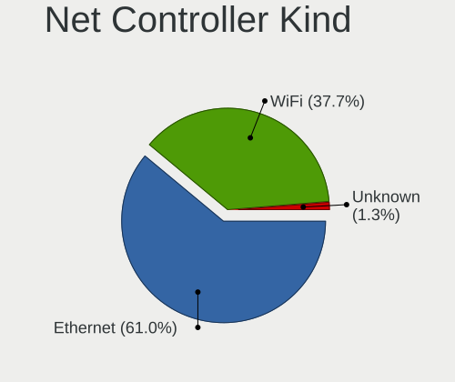

| Kind     | Desktops | Percent |
|----------|----------|---------|
| Ethernet | 47       | 61.04%  |
| WiFi     | 29       | 37.66%  |
| Unknown  | 1        | 1.3%    |

Used Controller
---------------

Currently used network controller

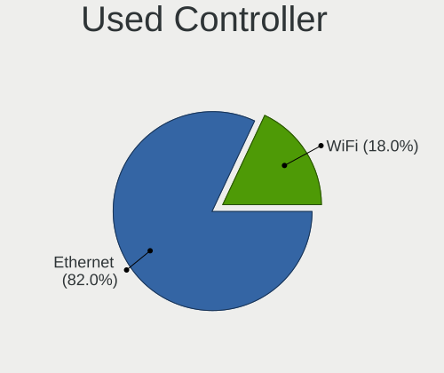

| Kind     | Desktops | Percent |
|----------|----------|---------|
| Ethernet | 41       | 82%     |
| WiFi     | 9        | 18%     |

NICs
----

Total network controllers on board

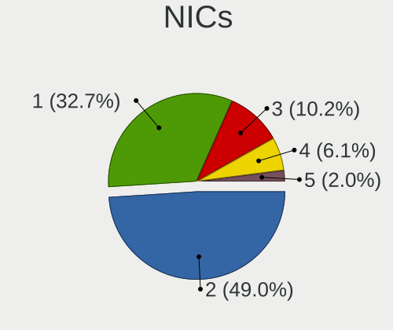

| Total | Desktops | Percent |
|-------|----------|---------|
| 2     | 24       | 48.98%  |
| 1     | 16       | 32.65%  |
| 3     | 5        | 10.2%   |
| 4     | 3        | 6.12%   |
| 5     | 1        | 2.04%   |

IPv6
----

IPv6 vs IPv4

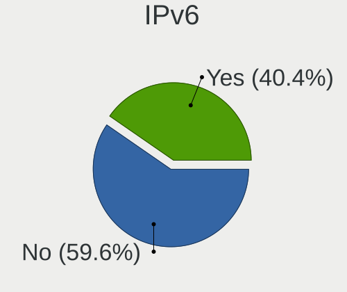

| Used | Desktops | Percent |
|------|----------|---------|
| No   | 31       | 59.62%  |
| Yes  | 21       | 40.38%  |

Bluetooth
---------

Bluetooth Vendor
----------------

Controller vendors

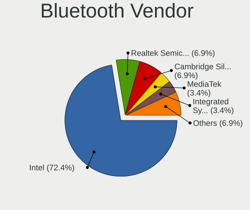

| Vendor                     | Desktops | Percent |
|----------------------------|----------|---------|
| Intel                      | 21       | 72.41%  |
| Realtek Semiconductor      | 2        | 6.9%    |
| Cambridge Silicon Radio    | 2        | 6.9%    |
| MediaTek                   | 1        | 3.45%   |
| Integrated System Solution | 1        | 3.45%   |
| Foxconn / Hon Hai          | 1        | 3.45%   |
| Edimax Technology          | 1        | 3.45%   |

Bluetooth Model
---------------

Controller models

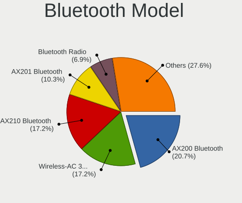

| Model                                                 | Desktops | Percent |
|-------------------------------------------------------|----------|---------|
| Intel AX200 Bluetooth                                 | 6        | 20.69%  |
| Intel Wireless-AC 3168 Bluetooth                      | 5        | 17.24%  |
| Intel AX210 Bluetooth                                 | 5        | 17.24%  |
| Intel AX201 Bluetooth                                 | 3        | 10.34%  |
| Realtek Bluetooth Radio                               | 2        | 6.9%    |
| Intel Bluetooth Device                                | 2        | 6.9%    |
| Cambridge Silicon Radio Bluetooth Dongle (HCI mode)   | 2        | 6.9%    |
| MediaTek Wireless_Device                              | 1        | 3.45%   |
| Integrated System Solution KY-BT100 Bluetooth Adapter | 1        | 3.45%   |
| Foxconn / Hon Hai Bluetooth Device                    | 1        | 3.45%   |
| Edimax Bluetooth Device                               | 1        | 3.45%   |

Sound
-----

Sound Vendor
------------

Sound card vendors

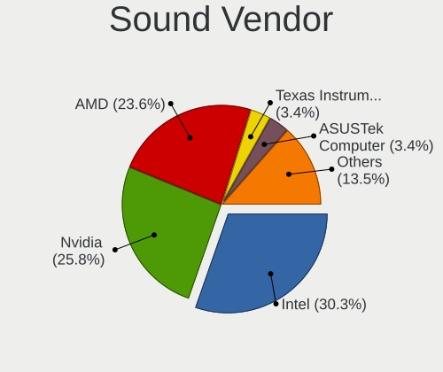

| Vendor                                       | Desktops | Percent |
|----------------------------------------------|----------|---------|
| Intel                                        | 27       | 30.34%  |
| Nvidia                                       | 23       | 25.84%  |
| AMD                                          | 21       | 23.6%   |
| Texas Instruments                            | 3        | 3.37%   |
| ASUSTek Computer                             | 3        | 3.37%   |
| Micro Star International                     | 2        | 2.25%   |
| Logitech                                     | 2        | 2.25%   |
| Zoran Co. Personal Media Division (Nogatech) | 1        | 1.12%   |
| Valve Software                               | 1        | 1.12%   |
| Unknown                                      | 1        | 1.12%   |
| Elgato Systems                               | 1        | 1.12%   |
| Creative Labs                                | 1        | 1.12%   |
| C-Media Electronics                          | 1        | 1.12%   |
| Blue Microphones                             | 1        | 1.12%   |
| Astro Gaming                                 | 1        | 1.12%   |

Sound Model
-----------

Sound card models

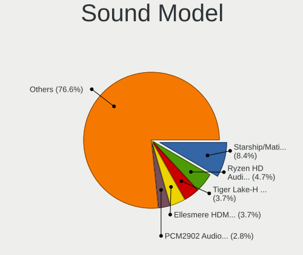

| Model                                                                      | Desktops | Percent |
|----------------------------------------------------------------------------|----------|---------|
| AMD Starship/Matisse HD Audio Controller                                   | 9        | 8.41%   |
| AMD Ryzen HD Audio Controller                                              | 5        | 4.67%   |
| Intel Tiger Lake-H HD Audio Controller                                     | 4        | 3.74%   |
| AMD Ellesmere HDMI Audio [Radeon RX 470/480 / 570/580/590]                 | 4        | 3.74%   |
| Texas Instruments PCM2902 Audio Codec                                      | 3        | 2.8%    |
| Intel Raptor Lake High Definition Audio Controller                         | 3        | 2.8%    |
| Intel Alder Lake-S HD Audio Controller                                     | 3        | 2.8%    |
| Intel 8 Series/C220 Series Chipset High Definition Audio Controller        | 3        | 2.8%    |
| Intel 200 Series PCH HD Audio                                              | 3        | 2.8%    |
| ASUSTek Computer USB Audio                                                 | 3        | 2.8%    |
| AMD Navi 21/23 HDMI/DP Audio Controller                                    | 3        | 2.8%    |
| AMD Navi 10 HDMI Audio                                                     | 3        | 2.8%    |
| Nvidia TU107 GeForce GTX 1650 High Definition Audio Controller             | 2        | 1.87%   |
| Nvidia GP107GL High Definition Audio Controller                            | 2        | 1.87%   |
| Nvidia GP104 High Definition Audio Controller                              | 2        | 1.87%   |
| Nvidia GM206 High Definition Audio Controller                              | 2        | 1.87%   |
| Nvidia GA106 High Definition Audio Controller                              | 2        | 1.87%   |
| Nvidia GA104 High Definition Audio Controller                              | 2        | 1.87%   |
| Nvidia AD102 High Definition Audio Controller                              | 2        | 1.87%   |
| Micro Star International USB Audio                                         | 2        | 1.87%   |
| Intel Xeon E3-1200 v3/4th Gen Core Processor HD Audio Controller           | 2        | 1.87%   |
| Intel Jasper Lake HD Audio                                                 | 2        | 1.87%   |
| Intel C610/X99 series chipset HD Audio Controller                          | 2        | 1.87%   |
| Intel 6 Series/C200 Series Chipset Family High Definition Audio Controller | 2        | 1.87%   |
| Intel 100 Series/C230 Series Chipset Family HD Audio Controller            | 2        | 1.87%   |
| AMD Renoir/Cezanne HDMI/DP Audio Controller                                | 2        | 1.87%   |
| AMD Radeon High Definition Audio Controller                                | 2        | 1.87%   |
| AMD Family 17h (Models 00h-0fh) HD Audio Controller                        | 2        | 1.87%   |
| AMD Family 15h (Models 60h-6fh) Audio Controller                           | 2        | 1.87%   |
| Zoran Co. Personal Media Division (Nogatech) USB Audio and HID             | 1        | 0.93%   |
| Valve Software Valve VR Radio & HMD Mic                                    | 1        | 0.93%   |
| Unknown Konftel Ego                                                        | 1        | 0.93%   |
| Nvidia TU116 High Definition Audio Controller                              | 1        | 0.93%   |
| Nvidia TU106 High Definition Audio Controller                              | 1        | 0.93%   |
| Nvidia High Definition Audio Controller                                    | 1        | 0.93%   |
| Nvidia GP102 HDMI Audio Controller                                         | 1        | 0.93%   |
| Nvidia GM107 High Definition Audio Controller [GeForce 940MX]              | 1        | 0.93%   |
| Nvidia GK208 HDMI/DP Audio Controller                                      | 1        | 0.93%   |
| Nvidia GK106 HDMI Audio Controller                                         | 1        | 0.93%   |
| Nvidia GF119 HDMI Audio Controller                                         | 1        | 0.93%   |

Memory
------

Memory Vendor
-------------

Memory module vendors

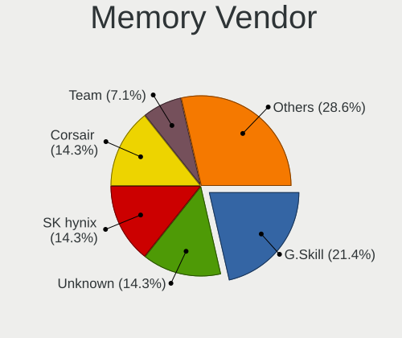

| Vendor              | Desktops | Percent |
|---------------------|----------|---------|
| G.Skill             | 6        | 22.22%  |
| Corsair             | 6        | 22.22%  |
| SK hynix            | 5        | 18.52%  |
| Unknown             | 2        | 7.41%   |
| Samsung Electronics | 2        | 7.41%   |
| Crucial             | 2        | 7.41%   |
| Team                | 1        | 3.7%    |
| Micron Technology   | 1        | 3.7%    |
| Kingston            | 1        | 3.7%    |
| Hewlett-Packard     | 1        | 3.7%    |

Memory Model
------------

Memory module models

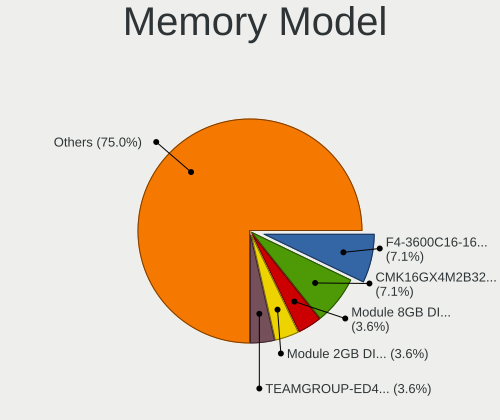

| Model                                                   | Desktops | Percent |
|---------------------------------------------------------|----------|---------|
| G.Skill RAM F4-3600C16-16GTZNC 16GiB DIMM DDR4 3600MT/s | 2        | 7.14%   |
| Corsair RAM CMK16GX4M2B3200C16 8GB DIMM DDR4 3600MT/s   | 2        | 7.14%   |
| Unknown RAM Module 8GB DIMM DDR3 1333MT/s               | 1        | 3.57%   |
| Unknown RAM Module 2GB DIMM DDR3 1600MT/s               | 1        | 3.57%   |
| Team RAM TEAMGROUP-ED4-2400 16GB DIMM DDR4 2400MT/s     | 1        | 3.57%   |
| SK hynix RAM Module 16GB Row Of Chips LPDDR4 2933MT/s   | 1        | 3.57%   |
| SK hynix RAM HMA84GR7MFR4N-UH 32GB RIMM DDR4 2400MT/s   | 1        | 3.57%   |
| SK hynix RAM HMA82GU7AFR8N-UH 16GB DIMM DDR4 2400MT/s   | 1        | 3.57%   |
| SK hynix RAM HMA82GU6CJR8N-VK 16GB DIMM DDR4 2667MT/s   | 1        | 3.57%   |
| SK hynix RAM HMA81GU7AFR8N-UH 8GB DIMM DDR4 2400MT/s    | 1        | 3.57%   |
| Samsung RAM M393A1G43EB1-CRC 8GB DIMM DDR4 2400MT/s     | 1        | 3.57%   |
| Samsung RAM M378B5273CH0-CH9 4GB DIMM DDR3 1867MT/s     | 1        | 3.57%   |
| Micron RAM 18ASF2G72AZ-2G6D1 16GB DIMM DDR4 2667MT/s    | 1        | 3.57%   |
| Kingston RAM KF3200C16D4/8GX 8GiB DIMM DDR4 3600MT/s    | 1        | 3.57%   |
| HP RAM 669237-071 2GB DIMM DDR3 1600MT/s                | 1        | 3.57%   |
| G.Skill RAM F5-6400J3239F48G 48GB DIMM DDR5 6400MT/s    | 1        | 3.57%   |
| G.Skill RAM F5-6000J3636F16G 16GB DIMM DDR5 6400MT/s    | 1        | 3.57%   |
| G.Skill RAM F4-3200C16-8GVKB 8GB DIMM DDR4 4000MT/s     | 1        | 3.57%   |
| G.Skill RAM F4-3200C16-16GVK 16GB DIMM DDR4 3600MT/s    | 1        | 3.57%   |
| Crucial RAM Module 8GB DIMM DDR3 1600MT/s               | 1        | 3.57%   |
| Crucial RAM CT8G4S24AM.M8FJ 8GB SODIMM DDR4 2400MT/s    | 1        | 3.57%   |
| Corsair RAM CMW32GX4M4A2666C16 8GB DIMM DDR4 2667MT/s   | 1        | 3.57%   |
| Corsair RAM CMU32GX4M2A2666C16 16GB DIMM DDR4 2133MT/s  | 1        | 3.57%   |
| Corsair RAM CMK8GX4M1Z3200C16 8GB DIMM DDR4 3200MT/s    | 1        | 3.57%   |
| Corsair RAM CMK8GX4M1A2666C16 8GB DIMM DDR4 3200MT/s    | 1        | 3.57%   |
| Corsair RAM CMK32GX4M2E3200C16 16GB DIMM DDR4 3600MT/s  | 1        | 3.57%   |

Memory Kind
-----------

Memory module kinds

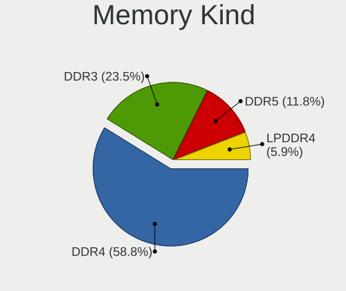

| Kind   | Desktops | Percent |
|--------|----------|---------|
| DDR4   | 18       | 72%     |
| DDR3   | 4        | 16%     |
| DDR5   | 2        | 8%      |
| LPDDR4 | 1        | 4%      |

Memory Form Factor
------------------

Physical design of the memory module

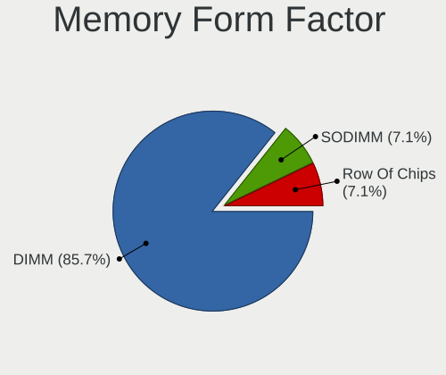

| Name         | Desktops | Percent |
|--------------|----------|---------|
| DIMM         | 22       | 88%     |
| SODIMM       | 1        | 4%      |
| Row Of Chips | 1        | 4%      |
| RIMM         | 1        | 4%      |

Memory Size
-----------

Memory module size

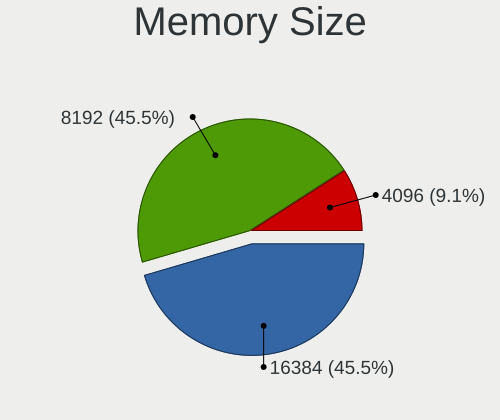

| Size  | Desktops | Percent |
|-------|----------|---------|
| 16384 | 11       | 42.31%  |
| 8192  | 11       | 42.31%  |
| 49152 | 1        | 3.85%   |
| 32768 | 1        | 3.85%   |
| 4096  | 1        | 3.85%   |
| 2048  | 1        | 3.85%   |

Memory Speed
------------

Memory module speed

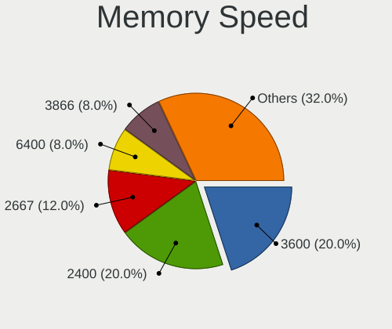

| Speed | Desktops | Percent |
|-------|----------|---------|
| 3600  | 5        | 20%     |
| 2400  | 5        | 20%     |
| 2667  | 3        | 12%     |
| 6400  | 2        | 8%      |
| 3866  | 2        | 8%      |
| 1600  | 2        | 8%      |
| 4000  | 1        | 4%      |
| 3200  | 1        | 4%      |
| 2933  | 1        | 4%      |
| 2133  | 1        | 4%      |
| 1867  | 1        | 4%      |
| 1333  | 1        | 4%      |

Printers & scanners
-------------------

Printer Vendor
--------------

Printer device vendors

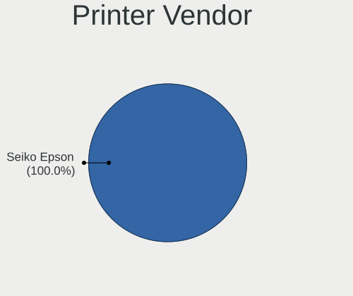

| Vendor          | Desktops | Percent |
|-----------------|----------|---------|
| Seiko Epson     | 2        | 40%     |
| Kyocera         | 1        | 20%     |
| Hewlett-Packard | 1        | 20%     |
| Canon           | 1        | 20%     |

Printer Model
-------------

Printer device models

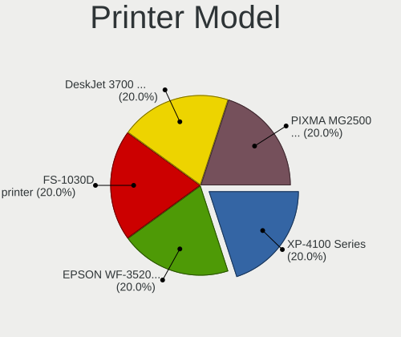

| Model                            | Desktops | Percent |
|----------------------------------|----------|---------|
| Seiko Epson XP-4100 Series       | 1        | 20%     |
| Seiko Epson EPSON WF-3520 Series | 1        | 20%     |
| Kyocera FS-1030D printer         | 1        | 20%     |
| HP DeskJet 3700 series           | 1        | 20%     |
| Canon PIXMA MG2500 Series        | 1        | 20%     |

Scanner Vendor
--------------

Scanner device vendors

Zero info for selected period =(

Scanner Model
-------------

Scanner device models

Zero info for selected period =(

Camera
------

Camera Vendor
-------------

Camera device vendors

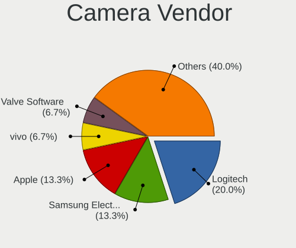

| Vendor                 | Desktops | Percent |
|------------------------|----------|---------|
| Logitech               | 3        | 20%     |
| Samsung Electronics    | 2        | 13.33%  |
| Apple                  | 2        | 13.33%  |
| vivo                   | 1        | 6.67%   |
| Valve Software         | 1        | 6.67%   |
| Realtek Semiconductor  | 1        | 6.67%   |
| Owon                   | 1        | 6.67%   |
| Microdia               | 1        | 6.67%   |
| IMC Networks           | 1        | 6.67%   |
| Hewlett-Packard        | 1        | 6.67%   |
| Generalplus Technology | 1        | 6.67%   |

Camera Model
------------

Camera device models

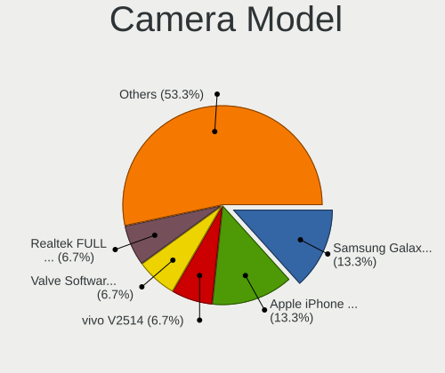

| Model                                   | Desktops | Percent |
|-----------------------------------------|----------|---------|
| Samsung Galaxy series, misc. (MTP mode) | 2        | 13.33%  |
| Apple iPhone 5/5C/5S/6/SE/7/8/X         | 2        | 13.33%  |
| vivo V2514                              | 1        | 6.67%   |
| Valve Software 3D Camera                | 1        | 6.67%   |
| Realtek FULL HD 1080P Webcam            | 1        | 6.67%   |
| Owon USB CAMERA                         | 1        | 6.67%   |
| Microdia USB 2.0 Camera                 | 1        | 6.67%   |
| Logitech Webcam C310                    | 1        | 6.67%   |
| Logitech Webcam C250                    | 1        | 6.67%   |
| Logitech HD Webcam C615                 | 1        | 6.67%   |
| IMC Networks XHC Camera                 | 1        | 6.67%   |
| HP Webcam HD 4310                       | 1        | 6.67%   |
| Generalplus GENERAL WEBCAM              | 1        | 6.67%   |

Security
--------

Fingerprint Vendor
------------------

Fingerprint sensor vendors

Zero info for selected period =(

Fingerprint Model
-----------------

Fingerprint sensor models

Zero info for selected period =(

Chipcard Vendor
---------------

Chipcard module vendors

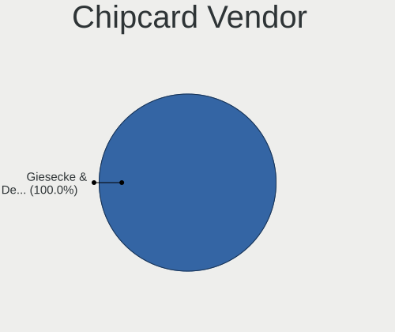

| Vendor              | Desktops | Percent |
|---------------------|----------|---------|
| Giesecke & Devrient | 1        | 100%    |

Chipcard Model
--------------

Chipcard module models

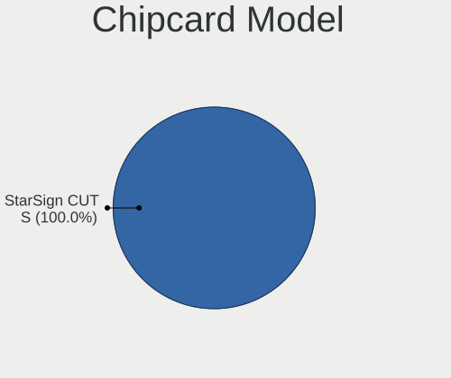

| Model                              | Desktops | Percent |
|------------------------------------|----------|---------|
| Giesecke & Devrient StarSign CUT S | 1        | 100%    |

Unsupported
-----------

Unsupported Devices
-------------------

Total unsupported devices on board

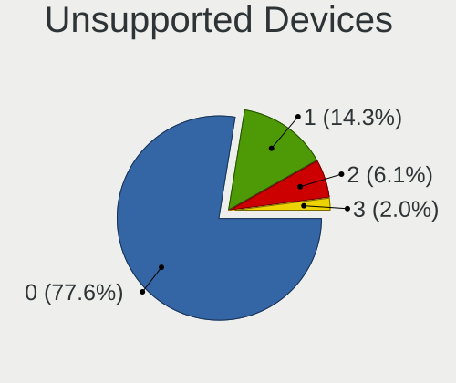

| Total | Desktops | Percent |
|-------|----------|---------|
| 0     | 38       | 77.55%  |
| 1     | 7        | 14.29%  |
| 2     | 3        | 6.12%   |
| 3     | 1        | 2.04%   |

Unsupported Device Types
------------------------

Types of unsupported devices

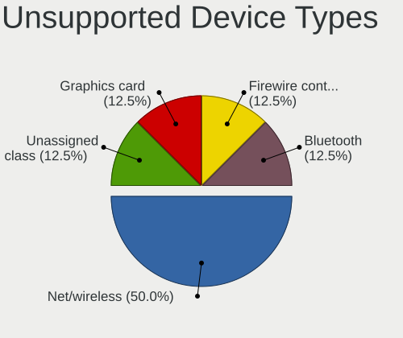

| Type                     | Desktops | Percent |
|--------------------------|----------|---------|
| Net/wireless             | 6        | 37.5%   |
| Unassigned class         | 3        | 18.75%  |
| Graphics card            | 3        | 18.75%  |
| Net/ethernet             | 1        | 6.25%   |
| Firewire controller      | 1        | 6.25%   |
| Communication controller | 1        | 6.25%   |
| Bluetooth                | 1        | 6.25%   |

