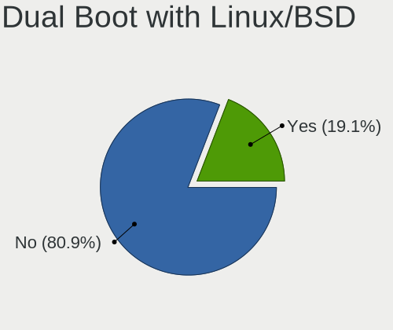
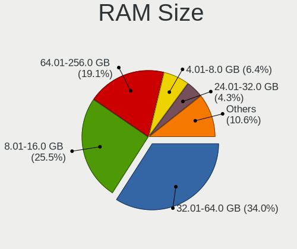
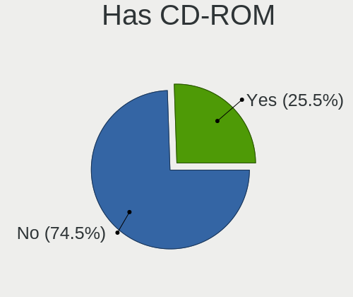
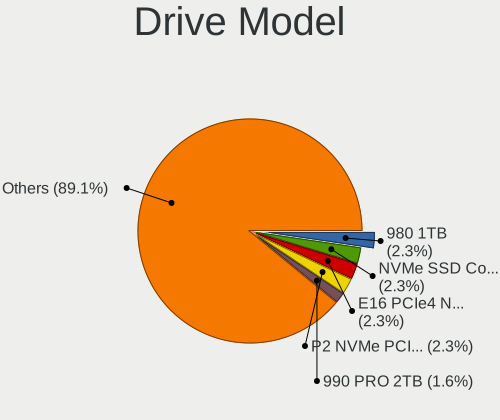
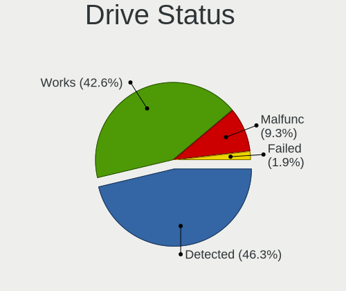
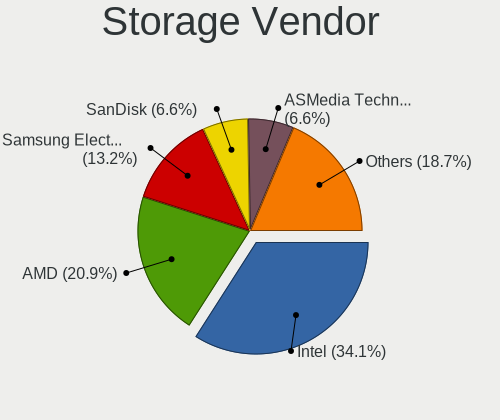
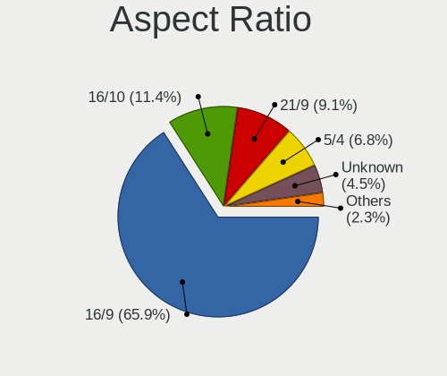
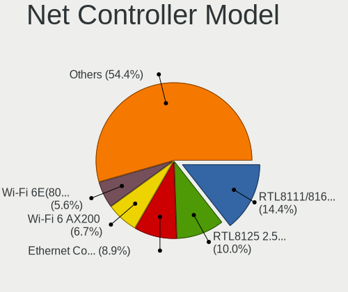
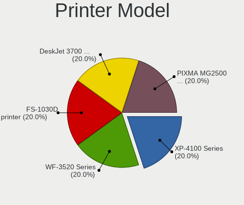
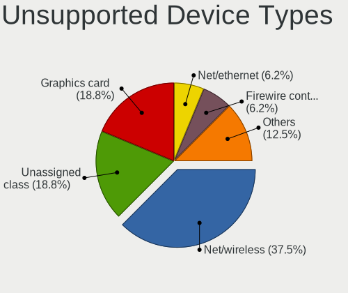

RHEL 9 - Tested Hardware & Statistics (Desktops)
------------------------------------------------

A project to collect tested hardware configurations for RHEL 9.

Anyone can contribute to this report by the [hw-probe](https://github.com/linuxhw/hw-probe) tool:

    sudo -E hw-probe -all -upload

Please contribute! Especially if your hardware is rare.

Contents
--------

* [ Test Cases ](#test-cases)

* [ System ](#system)
  - [ Kernel                   ](#kernel)
  - [ Kernel Family            ](#kernel-family)
  - [ Kernel Major Ver.        ](#kernel-major-ver)
  - [ Arch                     ](#arch)
  - [ DE                       ](#de)
  - [ Display Server           ](#display-server)
  - [ Display Manager          ](#display-manager)
  - [ OS Lang                  ](#os-lang)
  - [ Boot Mode                ](#boot-mode)
  - [ Filesystem               ](#filesystem)
  - [ Part. scheme             ](#part-scheme)
  - [ Dual Boot with Linux/BSD ](#dual-boot-with-linuxbsd)
  - [ Dual Boot (Win)          ](#dual-boot-win)

* [ Board ](#board)
  - [ Vendor                   ](#vendor)
  - [ Model                    ](#model)
  - [ Model Family             ](#model-family)
  - [ MFG Year                 ](#mfg-year)
  - [ Form Factor              ](#form-factor)
  - [ Secure Boot              ](#secure-boot)
  - [ Coreboot                 ](#coreboot)
  - [ RAM Size                 ](#ram-size)
  - [ RAM Used                 ](#ram-used)
  - [ Total Drives             ](#total-drives)
  - [ Has CD-ROM               ](#has-cd-rom)
  - [ Has Ethernet             ](#has-ethernet)
  - [ Has WiFi                 ](#has-wifi)
  - [ Has Bluetooth            ](#has-bluetooth)

* [ Location ](#location)
  - [ Country                  ](#country)
  - [ City                     ](#city)

* [ Drives ](#drives)
  - [ Drive Vendor             ](#drive-vendor)
  - [ Drive Model              ](#drive-model)
  - [ HDD Vendor               ](#hdd-vendor)
  - [ SSD Vendor               ](#ssd-vendor)
  - [ Drive Kind               ](#drive-kind)
  - [ Drive Connector          ](#drive-connector)
  - [ Drive Size               ](#drive-size)
  - [ Space Total              ](#space-total)
  - [ Space Used               ](#space-used)
  - [ Malfunc. Drives          ](#malfunc-drives)
  - [ Malfunc. Drive Vendor    ](#malfunc-drive-vendor)
  - [ Malfunc. HDD Vendor      ](#malfunc-hdd-vendor)
  - [ Malfunc. Drive Kind      ](#malfunc-drive-kind)
  - [ Failed Drives            ](#failed-drives)
  - [ Failed Drive Vendor      ](#failed-drive-vendor)
  - [ Drive Status             ](#drive-status)

* [ Storage controller ](#storage-controller)
  - [ Storage Vendor           ](#storage-vendor)
  - [ Storage Model            ](#storage-model)
  - [ Storage Kind             ](#storage-kind)

* [ Processor ](#processor)
  - [ CPU Vendor               ](#cpu-vendor)
  - [ CPU Model                ](#cpu-model)
  - [ CPU Model Family         ](#cpu-model-family)
  - [ CPU Cores                ](#cpu-cores)
  - [ CPU Sockets              ](#cpu-sockets)
  - [ CPU Threads              ](#cpu-threads)
  - [ CPU Op-Modes             ](#cpu-op-modes)
  - [ CPU Microcode            ](#cpu-microcode)
  - [ CPU Microarch            ](#cpu-microarch)

* [ Graphics ](#graphics)
  - [ GPU Vendor               ](#gpu-vendor)
  - [ GPU Model                ](#gpu-model)
  - [ GPU Combo                ](#gpu-combo)
  - [ GPU Driver               ](#gpu-driver)
  - [ GPU Memory               ](#gpu-memory)

* [ Monitor ](#monitor)
  - [ Monitor Vendor           ](#monitor-vendor)
  - [ Monitor Model            ](#monitor-model)
  - [ Monitor Resolution       ](#monitor-resolution)
  - [ Monitor Diagonal         ](#monitor-diagonal)
  - [ Monitor Width            ](#monitor-width)
  - [ Aspect Ratio             ](#aspect-ratio)
  - [ Monitor Area             ](#monitor-area)
  - [ Pixel Density            ](#pixel-density)
  - [ Multiple Monitors        ](#multiple-monitors)

* [ Network ](#network)
  - [ Net Controller Vendor    ](#net-controller-vendor)
  - [ Net Controller Model     ](#net-controller-model)
  - [ Wireless Vendor          ](#wireless-vendor)
  - [ Wireless Model           ](#wireless-model)
  - [ Ethernet Vendor          ](#ethernet-vendor)
  - [ Ethernet Model           ](#ethernet-model)
  - [ Net Controller Kind      ](#net-controller-kind)
  - [ Used Controller          ](#used-controller)
  - [ NICs                     ](#nics)
  - [ IPv6                     ](#ipv6)

* [ Bluetooth ](#bluetooth)
  - [ Bluetooth Vendor         ](#bluetooth-vendor)
  - [ Bluetooth Model          ](#bluetooth-model)

* [ Sound ](#sound)
  - [ Sound Vendor             ](#sound-vendor)
  - [ Sound Model              ](#sound-model)

* [ Memory ](#memory)
  - [ Memory Vendor            ](#memory-vendor)
  - [ Memory Model             ](#memory-model)
  - [ Memory Kind              ](#memory-kind)
  - [ Memory Form Factor       ](#memory-form-factor)
  - [ Memory Size              ](#memory-size)
  - [ Memory Speed             ](#memory-speed)

* [ Printers & scanners ](#printers--scanners)
  - [ Printer Vendor           ](#printer-vendor)
  - [ Printer Model            ](#printer-model)
  - [ Scanner Vendor           ](#scanner-vendor)
  - [ Scanner Model            ](#scanner-model)

* [ Camera ](#camera)
  - [ Camera Vendor            ](#camera-vendor)
  - [ Camera Model             ](#camera-model)

* [ Security ](#security)
  - [ Fingerprint Vendor       ](#fingerprint-vendor)
  - [ Fingerprint Model        ](#fingerprint-model)
  - [ Chipcard Vendor          ](#chipcard-vendor)
  - [ Chipcard Model           ](#chipcard-model)

* [ Unsupported ](#unsupported)
  - [ Unsupported Devices      ](#unsupported-devices)
  - [ Unsupported Device Types ](#unsupported-device-types)

Test Cases
----------

Total: 32

| Vendor     | Model                       | Probe                                                      | Date         |
|------------|-----------------------------|------------------------------------------------------------|--------------|
| ASUSTek    | ROG CROSSHAIR VIII DARK ... | [c190907cc8](https://linux-hardware.org/?probe=c190907cc8) | Aug 29, 2023 |
| ASRock     | A320M-HDV R4.0              | [f88687d2f0](https://linux-hardware.org/?probe=f88687d2f0) | Aug 15, 2023 |
| ASUSTek    | ROG STRIX Z590-E GAMING ... | [f6892c6532](https://linux-hardware.org/?probe=f6892c6532) | Aug 15, 2023 |
| ASRock     | A320M-HDV R4.0              | [eb99d95702](https://linux-hardware.org/?probe=eb99d95702) | Aug 08, 2023 |
| ASRock     | A320M-HDV R4.0              | [de07e937bb](https://linux-hardware.org/?probe=de07e937bb) | Aug 04, 2023 |
| HP         | 0AECh D                     | [b9ea790e39](https://linux-hardware.org/?probe=b9ea790e39) | Jul 24, 2023 |
| HP         | 0AECh D                     | [078f0cd045](https://linux-hardware.org/?probe=078f0cd045) | Jul 24, 2023 |
| MSI        | Z270-A PRO                  | [0d8b3d7c32](https://linux-hardware.org/?probe=0d8b3d7c32) | Jun 20, 2023 |
| Dell       | 07T4MC A02                  | [ad310dd147](https://linux-hardware.org/?probe=ad310dd147) | Jun 09, 2023 |
| Dell       | 0HHV7N A00                  | [a3a157f327](https://linux-hardware.org/?probe=a3a157f327) | May 21, 2023 |
| MSI        | MAG X570S TOMAHAWK MAX W... | [2afc4ee693](https://linux-hardware.org/?probe=2afc4ee693) | May 18, 2023 |
| ASUSTek    | TUF Gaming X570-PLUS        | [b1ea93c5fa](https://linux-hardware.org/?probe=b1ea93c5fa) | May 09, 2023 |
| Gigabyte   | B550M AORUS PRO-P           | [18c5e3c7c3](https://linux-hardware.org/?probe=18c5e3c7c3) | Apr 10, 2023 |
| MSI        | B450M MORTAR MAX            | [0077b88576](https://linux-hardware.org/?probe=0077b88576) | Apr 06, 2023 |
| Gigabyte   | X670E AORUS MASTER          | [68731ac4ec](https://linux-hardware.org/?probe=68731ac4ec) | Mar 31, 2023 |
| ASUSTek    | PRIME Z690-P WIFI           | [898059efa5](https://linux-hardware.org/?probe=898059efa5) | Mar 28, 2023 |
| MSI        | B450M MORTAR MAX            | [29c85678af](https://linux-hardware.org/?probe=29c85678af) | Mar 28, 2023 |
| ASUSTek    | PRIME Z690-P WIFI           | [1821e3657a](https://linux-hardware.org/?probe=1821e3657a) | Mar 26, 2023 |
| MSI        | B450M MORTAR MAX            | [641481dd1d](https://linux-hardware.org/?probe=641481dd1d) | Mar 21, 2023 |
| MSI        | B450M MORTAR MAX            | [9d859cb8bd](https://linux-hardware.org/?probe=9d859cb8bd) | Mar 20, 2023 |
| Gigabyte   | H510M H                     | [861b7c5aa7](https://linux-hardware.org/?probe=861b7c5aa7) | Feb 02, 2023 |
| ASUSTek    | PRIME Z590-A                | [f328fab9f1](https://linux-hardware.org/?probe=f328fab9f1) | Jan 27, 2023 |
| Hardkernel | ODROID-H3                   | [98f5768c61](https://linux-hardware.org/?probe=98f5768c61) | Jan 22, 2023 |
| Unknown    | Unknown                     | [9d66e8f05d](https://linux-hardware.org/?probe=9d66e8f05d) | Dec 25, 2022 |
| MSI        | B550M PRO-VDH WIFI          | [af5361313b](https://linux-hardware.org/?probe=af5361313b) | Nov 17, 2022 |
| MSI        | B550M PRO-VDH WIFI          | [2d830dc96d](https://linux-hardware.org/?probe=2d830dc96d) | Nov 11, 2022 |
| Acer       | Aspire XC-330               | [2012033d09](https://linux-hardware.org/?probe=2012033d09) | Aug 14, 2022 |
| Unknown    | Unknown                     | [fad6d4558f](https://linux-hardware.org/?probe=fad6d4558f) | Jul 26, 2022 |
| Intel      | H81                         | [e1a730a6e6](https://linux-hardware.org/?probe=e1a730a6e6) | Jul 08, 2022 |
| Unknown    | Unknown                     | [16c6df7b29](https://linux-hardware.org/?probe=16c6df7b29) | Jul 07, 2022 |
| Unknown    | Unknown                     | [6b25430dc1](https://linux-hardware.org/?probe=6b25430dc1) | Jul 07, 2022 |
| ASRock     | Z370 Professional Gaming... | [658347ec76](https://linux-hardware.org/?probe=658347ec76) | May 12, 2022 |

System
------

Kernel
------

Version of the Linux kernel

| Version                      | Desktops | Percent |
|------------------------------|----------|---------|
| 5.14.0-162.6.1.el9_1.x86_64  | 5        | 20.83%  |
| 5.14.0-70.17.1.el9_0.x86_64  | 3        | 12.5%   |
| 5.14.0-284.25.1.el9_2.x86_64 | 3        | 12.5%   |
| 5.14.0-284.11.1.el9_2.x86_64 | 3        | 12.5%   |
| 5.14.0-162.22.2.el9_1.x86_64 | 3        | 12.5%   |
| 5.14.0-70.22.1.el9_0.x86_64  | 2        | 8.33%   |
| 5.14.0-162.12.1.el9_1.x86_64 | 2        | 8.33%   |
| 5.14.0-70.5.1.el9_0.x86_64   | 1        | 4.17%   |
| 5.14.0-284.18.1.el9_2.x86_64 | 1        | 4.17%   |
| 5.14.0-162.23.1.el9_1.x86_64 | 1        | 4.17%   |

Kernel Family
-------------

Linux kernel without a distro release

| Version | Desktops | Percent |
|---------|----------|---------|
| 5.14.0  | 23       | 100%    |

Kernel Major Ver.
-----------------

Linux kernel major version

| Version | Desktops | Percent |
|---------|----------|---------|
| 5.14    | 23       | 100%    |

Arch
----

OS architecture (x86_64, i586, etc.)

| Name   | Desktops | Percent |
|--------|----------|---------|
| x86_64 | 23       | 100%    |

DE
--

Desktop Environment

| Name          | Desktops | Percent |
|---------------|----------|---------|
| GNOME         | 21       | 91.3%   |
| GNOME Classic | 1        | 4.35%   |
| Unknown       | 1        | 4.35%   |

Display Server
--------------

X11 or Wayland

| Name    | Desktops | Percent |
|---------|----------|---------|
| Wayland | 15       | 65.22%  |
| X11     | 7        | 30.43%  |
| Tty     | 1        | 4.35%   |

Display Manager
---------------

SDDM, LightDM, etc.

| Name    | Desktops | Percent |
|---------|----------|---------|
| Unknown | 12       | 52.17%  |
| GDM     | 10       | 43.48%  |
| SDDM    | 1        | 4.35%   |

OS Lang
-------

Language

| Lang  | Desktops | Percent |
|-------|----------|---------|
| en_US | 11       | 47.83%  |
| en_GB | 3        | 13.04%  |
| pt_BR | 2        | 8.7%    |
| en_IN | 2        | 8.7%    |
| ru_RU | 1        | 4.35%   |
| ja_JP | 1        | 4.35%   |
| es_ES | 1        | 4.35%   |
| en_NZ | 1        | 4.35%   |
| en_CA | 1        | 4.35%   |

Boot Mode
---------

EFI or BIOS

| Mode | Desktops | Percent |
|------|----------|---------|
| EFI  | 18       | 78.26%  |
| BIOS | 5        | 21.74%  |

Filesystem
----------

Type of filesystem

| Type | Desktops | Percent |
|------|----------|---------|
| Xfs  | 22       | 95.65%  |
| Ext4 | 1        | 4.35%   |

Part. scheme
------------

Scheme of partitioning

| Type    | Desktops | Percent |
|---------|----------|---------|
| GPT     | 12       | 52.17%  |
| Unknown | 10       | 43.48%  |
| MBR     | 1        | 4.35%   |

Dual Boot with Linux/BSD
------------------------

Hosting more than one Linux/BSD

| Dual boot | Desktops | Percent |
|-----------|----------|---------|
| No        | 17       | 73.91%  |
| Yes       | 6        | 26.09%  |

Dual Boot (Win)
---------------

Hosting Linux and Windows

| Dual boot | Desktops | Percent |
|-----------|----------|---------|
| No        | 20       | 86.96%  |
| Yes       | 3        | 13.04%  |

Board
-----

Vendor
------

Motherboard manufacturer

| Name                | Desktops | Percent |
|---------------------|----------|---------|
| ASUSTek Computer    | 5        | 21.74%  |
| MSI                 | 4        | 17.39%  |
| Gigabyte Technology | 3        | 13.04%  |
| Unknown             | 3        | 13.04%  |
| Dell                | 2        | 8.7%    |
| ASRock              | 2        | 8.7%    |
| Intel               | 1        | 4.35%   |
| Hewlett-Packard     | 1        | 4.35%   |
| Hardkernel          | 1        | 4.35%   |
| Acer                | 1        | 4.35%   |

Model
-----

Motherboard model

| Name                               | Desktops | Percent |
|------------------------------------|----------|---------|
| Unknown                            | 3        | 13.04%  |
| MSI MS-7D54                        | 1        | 4.35%   |
| MSI MS-7C95                        | 1        | 4.35%   |
| MSI MS-7B89                        | 1        | 4.35%   |
| MSI MS-7A71                        | 1        | 4.35%   |
| Intel H81                          | 1        | 4.35%   |
| HP Z800 Workstation                | 1        | 4.35%   |
| Hardkernel ODROID-H3               | 1        | 4.35%   |
| Gigabyte X670E AORUS MASTER        | 1        | 4.35%   |
| Gigabyte H510M H                   | 1        | 4.35%   |
| Gigabyte B550M AORUS PRO-P         | 1        | 4.35%   |
| Dell Precision Tower 5810          | 1        | 4.35%   |
| Dell PowerEdge T30                 | 1        | 4.35%   |
| ASUS TUF Gaming X570-PLUS          | 1        | 4.35%   |
| ASUS ROG STRIX Z590-E GAMING WIFI  | 1        | 4.35%   |
| ASUS ROG CROSSHAIR VIII DARK HERO  | 1        | 4.35%   |
| ASUS PRIME Z690-P WIFI             | 1        | 4.35%   |
| ASUS PRIME Z590-A                  | 1        | 4.35%   |
| ASRock Z370 Professional Gaming i7 | 1        | 4.35%   |
| ASRock A320M-HDV R4.0              | 1        | 4.35%   |
| Acer Aspire XC-330                 | 1        | 4.35%   |

Model Family
------------

Motherboard model prefix

| Name                 | Desktops | Percent |
|----------------------|----------|---------|
| Unknown              | 3        | 13.04%  |
| ASUS ROG             | 2        | 8.7%    |
| ASUS PRIME           | 2        | 8.7%    |
| MSI MS-7D54          | 1        | 4.35%   |
| MSI MS-7C95          | 1        | 4.35%   |
| MSI MS-7B89          | 1        | 4.35%   |
| MSI MS-7A71          | 1        | 4.35%   |
| Intel H81            | 1        | 4.35%   |
| HP Z800              | 1        | 4.35%   |
| Hardkernel ODROID-H3 | 1        | 4.35%   |
| Gigabyte X670E       | 1        | 4.35%   |
| Gigabyte H510M       | 1        | 4.35%   |
| Gigabyte B550M       | 1        | 4.35%   |
| Dell Precision       | 1        | 4.35%   |
| Dell PowerEdge       | 1        | 4.35%   |
| ASUS TUF             | 1        | 4.35%   |
| ASRock Z370          | 1        | 4.35%   |
| ASRock A320M-HDV     | 1        | 4.35%   |
| Acer Aspire          | 1        | 4.35%   |

MFG Year
--------

Motherboard manufacture year

| Year | Desktops | Percent |
|------|----------|---------|
| 2021 | 5        | 21.74%  |
| 2022 | 3        | 13.04%  |
| 2019 | 3        | 13.04%  |
| 2017 | 3        | 13.04%  |
| 2023 | 2        | 8.7%    |
| 2020 | 2        | 8.7%    |
| 2018 | 2        | 8.7%    |
| 2016 | 2        | 8.7%    |
| 2010 | 1        | 4.35%   |

Form Factor
-----------

Physical design of the computer

| Name    | Desktops | Percent |
|---------|----------|---------|
| Desktop | 23       | 100%    |

Secure Boot
-----------

Enabled or disabled

| State    | Desktops | Percent |
|----------|----------|---------|
| Disabled | 22       | 95.65%  |
| Enabled  | 1        | 4.35%   |

Coreboot
--------

Have coreboot on board

| Used | Desktops | Percent |
|------|----------|---------|
| No   | 23       | 100%    |

RAM Size
--------

Total RAM memory

| Size in GB  | Desktops | Percent |
|-------------|----------|---------|
| 8.01-16.0   | 8        | 34.78%  |
| 32.01-64.0  | 7        | 30.43%  |
| 4.01-8.0    | 3        | 13.04%  |
| 64.01-256.0 | 2        | 8.7%    |
| 3.01-4.0    | 1        | 4.35%   |
| 24.01-32.0  | 1        | 4.35%   |
| 16.01-24.0  | 1        | 4.35%   |

RAM Used
--------

Used RAM memory

| Used GB   | Desktops | Percent |
|-----------|----------|---------|
| 2.01-3.0  | 9        | 37.5%   |
| 3.01-4.0  | 7        | 29.17%  |
| 4.01-8.0  | 4        | 16.67%  |
| 1.01-2.0  | 3        | 12.5%   |
| 8.01-16.0 | 1        | 4.17%   |

Total Drives
------------

Number of drives on board

| Drives | Desktops | Percent |
|--------|----------|---------|
| 2      | 7        | 30.43%  |
| 1      | 5        | 21.74%  |
| 3      | 4        | 17.39%  |
| 5      | 3        | 13.04%  |
| 4      | 2        | 8.7%    |
| 14     | 1        | 4.35%   |
| 6      | 1        | 4.35%   |

Has CD-ROM
----------

Has CD-ROM on board

| Presented | Desktops | Percent |
|-----------|----------|---------|
| No        | 17       | 73.91%  |
| Yes       | 6        | 26.09%  |

Has Ethernet
------------

Has Ethernet on board

| Presented | Desktops | Percent |
|-----------|----------|---------|
| Yes       | 23       | 100%    |

Has WiFi
--------

Has WiFi module

| Presented | Desktops | Percent |
|-----------|----------|---------|
| Yes       | 14       | 60.87%  |
| No        | 9        | 39.13%  |

Has Bluetooth
-------------

Has Bluetooth module

| Presented | Desktops | Percent |
|-----------|----------|---------|
| Yes       | 12       | 52.17%  |
| No        | 11       | 47.83%  |

Location
--------

Country
-------

Geographic location (country)

| Country     | Desktops | Percent |
|-------------|----------|---------|
| USA         | 6        | 26.09%  |
| India       | 4        | 17.39%  |
| UK          | 3        | 13.04%  |
| Canada      | 3        | 13.04%  |
| Brazil      | 2        | 8.7%    |
| Spain       | 1        | 4.35%   |
| Russia      | 1        | 4.35%   |
| New Zealand | 1        | 4.35%   |
| Japan       | 1        | 4.35%   |
| Germany     | 1        | 4.35%   |

City
----

Geographic location (city)

| City           | Desktops | Percent |
|----------------|----------|---------|
| Wildomar       | 1        | 4.35%   |
| Wellington     | 1        | 4.35%   |
| Valencia       | 1        | 4.35%   |
| Tokyo          | 1        | 4.35%   |
| Sutton         | 1        | 4.35%   |
| Stavropol      | 1        | 4.35%   |
| Sainte-Marie   | 1        | 4.35%   |
| Rio de Janeiro | 1        | 4.35%   |
| Ribeirao Preto | 1        | 4.35%   |
| Pforzheim      | 1        | 4.35%   |
| Oldham         | 1        | 4.35%   |
| Lansing        | 1        | 4.35%   |
| Kochi          | 1        | 4.35%   |
| Ghaziabad      | 1        | 4.35%   |
| Ernakulam      | 1        | 4.35%   |
| East Peoria    | 1        | 4.35%   |
| Cherry Hill    | 1        | 4.35%   |
| Canton         | 1        | 4.35%   |
| Canning Town   | 1        | 4.35%   |
| Birmingham     | 1        | 4.35%   |
| Bengaluru      | 1        | 4.35%   |
| Beeton         | 1        | 4.35%   |
| Alliston       | 1        | 4.35%   |

Drives
------

Drive Vendor
------------

Hard drive vendors

| Vendor                    | Desktops | Drives | Percent |
|---------------------------|----------|--------|---------|
| WDC                       | 10       | 17     | 18.87%  |
| Seagate                   | 8        | 11     | 15.09%  |
| Samsung Electronics       | 7        | 10     | 13.21%  |
| Sandisk                   | 4        | 4      | 7.55%   |
| Unknown                   | 2        | 4      | 3.77%   |
| Phison                    | 2        | 2      | 3.77%   |
| Kingston                  | 2        | 2      | 3.77%   |
| Intel                     | 2        | 3      | 3.77%   |
| Crucial                   | 2        | 3      | 3.77%   |
| China                     | 2        | 2      | 3.77%   |
| XUM                       | 1        | 1      | 1.89%   |
| Toshiba                   | 1        | 1      | 1.89%   |
| SABRENT                   | 1        | 1      | 1.89%   |
| PNY                       | 1        | 1      | 1.89%   |
| Phison Electronics        | 1        | 2      | 1.89%   |
| Micron/Crucial Technology | 1        | 2      | 1.89%   |
| KingSpec                  | 1        | 1      | 1.89%   |
| Hitachi                   | 1        | 1      | 1.89%   |
| HGST                      | 1        | 1      | 1.89%   |
| Gigabyte Technology       | 1        | 1      | 1.89%   |
| Fantom                    | 1        | 1      | 1.89%   |
| ADATA Technology          | 1        | 1      | 1.89%   |

Drive Model
-----------

Hard drive models

| Model                             | Desktops | Percent |
|-----------------------------------|----------|---------|
| Intel SSD 660P Series 512GB       | 2        | 2.99%   |
| XUM HX256GSSDSATA3 256GB          | 1        | 1.49%   |
| WDC WDBA3V5000ANC-WRSN 500GB      | 1        | 1.49%   |
| WDC WD80EFAX-68KNBN0 8TB          | 1        | 1.49%   |
| WDC WD5000AVDS-63U7B0 500GB       | 1        | 1.49%   |
| WDC WD5000AVCS-632DY1 500GB       | 1        | 1.49%   |
| WDC WD50 00LPVX-22V0TT0 500GB     | 1        | 1.49%   |
| WDC WD40EFRX-68N32N0 4TB          | 1        | 1.49%   |
| WDC WD20EZRZ-00Z5HB0 2TB          | 1        | 1.49%   |
| WDC WD20EZRX-00D8PB0 2TB          | 1        | 1.49%   |
| WDC WD20EARX-008FB0 2TB           | 1        | 1.49%   |
| WDC WD141KFGX-68FH9N0 14TB        | 1        | 1.49%   |
| WDC WD140EFGX-68B0GN0 14TB        | 1        | 1.49%   |
| WDC WD10SPSX-00A6WT0 1TB          | 1        | 1.49%   |
| WDC WD10JPLX-00MBPT0 1TB          | 1        | 1.49%   |
| WDC WD10JPCX-24UE4T0 1TB          | 1        | 1.49%   |
| WDC WD10EZEX-00BBHA0 1TB          | 1        | 1.49%   |
| WDC WD100EFAX-68LHPN0 10TB        | 1        | 1.49%   |
| Unknown SD/MMC/MS PRO 1GB         | 1        | 1.49%   |
| Unknown SD/MMC/M.S.PRO 32GB       | 1        | 1.49%   |
| Unknown SD/MMC 2GB                | 1        | 1.49%   |
| Unknown M.S./M.S.Pro/HG 16GB      | 1        | 1.49%   |
| Toshiba MK3261GSYN 320GB          | 1        | 1.49%   |
| Seagate ST9250315AS 250GB         | 1        | 1.49%   |
| Seagate ST6000DM003-2CY186 6TB    | 1        | 1.49%   |
| Seagate ST4000DM004-2CV104 4TB    | 1        | 1.49%   |
| Seagate ST4000DM000-2AE166 4TB    | 1        | 1.49%   |
| Seagate ST3500312CS 500GB         | 1        | 1.49%   |
| Seagate ST31000528AS 1TB          | 1        | 1.49%   |
| Seagate ST3000VN000-1HJ166 3TB    | 1        | 1.49%   |
| Seagate ST18000NM000J-2TV103 18TB | 1        | 1.49%   |
| Seagate ST1000DM010-2EP102 1TB    | 1        | 1.49%   |
| Sandisk WD Blue SN570 500GB       | 1        | 1.49%   |
| Sandisk WD Black SN850 256GB      | 1        | 1.49%   |
| SanDisk SSD PLUS 480GB            | 1        | 1.49%   |
| SanDisk SDSSDHII480G 480GB        | 1        | 1.49%   |
| Samsung SSD PM851a 2.5 7mm 1024GB | 1        | 1.49%   |
| Samsung SSD 970 EVO Plus 500GB    | 1        | 1.49%   |
| Samsung SSD 970 EVO Plus 1TB      | 1        | 1.49%   |
| Samsung SSD 870 EVO 500GB         | 1        | 1.49%   |

HDD Vendor
----------

Hard disk drive vendors

| Vendor  | Desktops | Drives | Percent |
|---------|----------|--------|---------|
| WDC     | 9        | 16     | 39.13%  |
| Seagate | 8        | 11     | 34.78%  |
| Unknown | 1        | 1      | 4.35%   |
| Toshiba | 1        | 1      | 4.35%   |
| SABRENT | 1        | 1      | 4.35%   |
| Hitachi | 1        | 1      | 4.35%   |
| HGST    | 1        | 1      | 4.35%   |
| Fantom  | 1        | 1      | 4.35%   |

SSD Vendor
----------

Solid state drive vendors

| Vendor              | Desktops | Drives | Percent |
|---------------------|----------|--------|---------|
| Samsung Electronics | 4        | 5      | 23.53%  |
| SanDisk             | 2        | 2      | 11.76%  |
| Kingston            | 2        | 2      | 11.76%  |
| Crucial             | 2        | 2      | 11.76%  |
| China               | 2        | 2      | 11.76%  |
| XUM                 | 1        | 1      | 5.88%   |
| PNY                 | 1        | 1      | 5.88%   |
| KingSpec            | 1        | 1      | 5.88%   |
| Intel               | 1        | 1      | 5.88%   |
| Gigabyte Technology | 1        | 1      | 5.88%   |

Drive Kind
----------

HDD or SSD

| Kind    | Desktops | Drives | Percent |
|---------|----------|--------|---------|
| SSD     | 15       | 18     | 33.33%  |
| HDD     | 15       | 33     | 33.33%  |
| NVMe    | 14       | 18     | 31.11%  |
| Unknown | 1        | 3      | 2.22%   |

Drive Connector
---------------

SATA, SAS, NVMe, etc.

| Type | Desktops | Drives | Percent |
|------|----------|--------|---------|
| SATA | 21       | 47     | 53.85%  |
| NVMe | 14       | 18     | 35.9%   |
| SAS  | 4        | 7      | 10.26%  |

Drive Size
----------

Size of hard drive

| Size in TB | Desktops | Drives | Percent |
|------------|----------|--------|---------|
| 0.01-0.5   | 15       | 21     | 44.12%  |
| 0.51-1.0   | 8        | 10     | 23.53%  |
| 3.01-4.0   | 3        | 5      | 8.82%   |
| 1.01-2.0   | 3        | 4      | 8.82%   |
| 10.01-20.0 | 2        | 4      | 5.88%   |
| 4.01-10.0  | 2        | 5      | 5.88%   |
| 2.01-3.0   | 1        | 2      | 2.94%   |

Space Total
-----------

Amount of disk space available on the file system

| Size in GB     | Desktops | Percent |
|----------------|----------|---------|
| 101-250        | 9        | 39.13%  |
| 251-500        | 8        | 34.78%  |
| 501-1000       | 3        | 13.04%  |
| 1001-2000      | 2        | 8.7%    |
| More than 3000 | 1        | 4.35%   |

Space Used
----------

Amount of used disk space

| Used GB        | Desktops | Percent |
|----------------|----------|---------|
| 1-20           | 10       | 43.48%  |
| 21-50          | 6        | 26.09%  |
| 51-100         | 3        | 13.04%  |
| 251-500        | 2        | 8.7%    |
| More than 3000 | 1        | 4.35%   |
| 101-250        | 1        | 4.35%   |

Malfunc. Drives
---------------

Drive models with a malfunction

| Model                          | Desktops | Drives | Percent |
|--------------------------------|----------|--------|---------|
| WDC WD50 00LPVX-22V0TT0 500GB  | 1        | 1      | 33.33%  |
| Seagate ST1000DM010-2EP102 1TB | 1        | 1      | 33.33%  |
| Crucial CT1000BX500SSD1 1TB    | 1        | 1      | 33.33%  |

Malfunc. Drive Vendor
---------------------

Vendors of faulty drives

| Vendor  | Desktops | Drives | Percent |
|---------|----------|--------|---------|
| WDC     | 1        | 1      | 33.33%  |
| Seagate | 1        | 1      | 33.33%  |
| Crucial | 1        | 1      | 33.33%  |

Malfunc. HDD Vendor
-------------------

Vendors of faulty HDD drives

| Vendor  | Desktops | Drives | Percent |
|---------|----------|--------|---------|
| WDC     | 1        | 1      | 50%     |
| Seagate | 1        | 1      | 50%     |

Malfunc. Drive Kind
-------------------

Kinds of faulty drives

| Kind | Desktops | Drives | Percent |
|------|----------|--------|---------|
| SSD  | 1        | 1      | 50%     |
| HDD  | 1        | 2      | 50%     |

Failed Drives
-------------

Failed drive models

Zero info for selected period =(

Failed Drive Vendor
-------------------

Failed drive vendors

Zero info for selected period =(

Drive Status
------------

Number of failed and malfunc. drives

| Status   | Desktops | Drives | Percent |
|----------|----------|--------|---------|
| Detected | 13       | 37     | 50%     |
| Works    | 11       | 32     | 42.31%  |
| Malfunc  | 2        | 3      | 7.69%   |

Storage controller
------------------

Storage Vendor
--------------

Storage controller vendors

| Vendor                    | Desktops | Percent |
|---------------------------|----------|---------|
| Intel                     | 16       | 40%     |
| AMD                       | 9        | 22.5%   |
| Samsung Electronics       | 4        | 10%     |
| SanDisk                   | 3        | 7.5%    |
| Phison Electronics        | 3        | 7.5%    |
| Micron/Crucial Technology | 2        | 5%      |
| Broadcom / LSI            | 1        | 2.5%    |
| ASMedia Technology        | 1        | 2.5%    |
| ADATA Technology          | 1        | 2.5%    |

Storage Model
-------------

Storage controller models

| Model                                                                          | Desktops | Percent |
|--------------------------------------------------------------------------------|----------|---------|
| AMD FCH SATA Controller [AHCI mode]                                            | 6        | 13.64%  |
| Samsung NVMe SSD Controller SM981/PM981/PM983                                  | 3        | 6.82%   |
| Phison E16 PCIe4 NVMe Controller                                               | 2        | 4.55%   |
| Intel SSD 660P Series                                                          | 2        | 4.55%   |
| Intel SATA Controller [RAID mode]                                              | 2        | 4.55%   |
| Intel Jasper Lake SATA AHCI Controller                                         | 2        | 4.55%   |
| Intel 6 Series/C200 Series Chipset Family 6 port Desktop SATA AHCI Controller  | 2        | 4.55%   |
| Intel 500 Series Chipset Family SATA AHCI Controller                           | 2        | 4.55%   |
| Intel 200 Series PCH SATA controller [AHCI mode]                               | 2        | 4.55%   |
| AMD 500 Series Chipset SATA Controller                                         | 2        | 4.55%   |
| SanDisk WD PC SN810 / Black SN850 NVMe SSD                                     | 1        | 2.27%   |
| SanDisk WD Blue SN570 NVMe SSD 1TB                                             | 1        | 2.27%   |
| SanDisk WD Blue SN550 NVMe SSD                                                 | 1        | 2.27%   |
| Samsung NVMe SSD Controller PM9A1/PM9A3/980PRO                                 | 1        | 2.27%   |
| Phison E7 NVMe Controller                                                      | 1        | 2.27%   |
| Phison E12 NVMe Controller                                                     | 1        | 2.27%   |
| Micron/Crucial P5 Plus NVMe PCIe SSD                                           | 1        | 2.27%   |
| Micron/Crucial P2 [Nick P2] / P3 / P3 Plus NVMe PCIe SSD (DRAM-less)           | 1        | 2.27%   |
| Intel Volume Management Device NVMe RAID Controller Intel Corporation          | 1        | 2.27%   |
| Intel C610/X99 series chipset sSATA Controller [AHCI mode]                     | 1        | 2.27%   |
| Intel C610/X99 series chipset 6-Port SATA Controller [AHCI mode]               | 1        | 2.27%   |
| Intel Alder Lake-S PCH SATA Controller [AHCI Mode]                             | 1        | 2.27%   |
| Intel 8 Series/C220 Series Chipset Family 6-port SATA Controller 1 [AHCI mode] | 1        | 2.27%   |
| Intel 500 Series Chipset Family SATA RAID Controller                           | 1        | 2.27%   |
| Broadcom / LSI SAS3008 PCI-Express Fusion-MPT SAS-3                            | 1        | 2.27%   |
| ASMedia ASM1062 Serial ATA Controller                                          | 1        | 2.27%   |
| AMD FCH SATA Controller D                                                      | 1        | 2.27%   |
| AMD 400 Series Chipset SATA Controller                                         | 1        | 2.27%   |
| ADATA ADATA XPG GAMMIXS1 1L Media (256 GB SSD)                                 | 1        | 2.27%   |

Storage Kind
------------

Kind of storage controller (IDE, SATA, NVMe, SAS, ...)

| Kind | Desktops | Percent |
|------|----------|---------|
| SATA | 20       | 51.28%  |
| NVMe | 14       | 35.9%   |
| RAID | 4        | 10.26%  |
| SAS  | 1        | 2.56%   |

Processor
---------

CPU Vendor
----------

Processor vendors

| Vendor | Desktops | Percent |
|--------|----------|---------|
| Intel  | 14       | 60.87%  |
| AMD    | 9        | 39.13%  |

CPU Model
---------

Processor models

| Model                                        | Desktops | Percent |
|----------------------------------------------|----------|---------|
| Intel 11th Gen Core i7-11700K @ 3.60GHz      | 2        | 8.7%    |
| AMD Ryzen 5 3600 6-Core Processor            | 2        | 8.7%    |
| Intel Xeon CPU X5570 @ 2.93GHz               | 1        | 4.35%   |
| Intel Xeon CPU E5-1607 v4 @ 3.10GHz          | 1        | 4.35%   |
| Intel Xeon CPU E3-1225 v5 @ 3.30GHz          | 1        | 4.35%   |
| Intel Pentium Silver N6005 @ 2.00GHz         | 1        | 4.35%   |
| Intel Core i7-8700K CPU @ 3.70GHz            | 1        | 4.35%   |
| Intel Core i7-7700K CPU @ 4.20GHz            | 1        | 4.35%   |
| Intel Core i5-3570 CPU @ 3.40GHz             | 1        | 4.35%   |
| Intel Core i5-3470S CPU @ 2.90GHz            | 1        | 4.35%   |
| Intel Core i3-4130 CPU @ 3.40GHz             | 1        | 4.35%   |
| Intel Celeron N5105 @ 2.00GHz                | 1        | 4.35%   |
| Intel 13th Gen Core i5-13600K                | 1        | 4.35%   |
| Intel 11th Gen Core i7-11700F @ 2.50GHz      | 1        | 4.35%   |
| AMD Ryzen 9 7900X 12-Core Processor          | 1        | 4.35%   |
| AMD Ryzen 9 5950X 16-Core Processor          | 1        | 4.35%   |
| AMD Ryzen 9 5900X 12-Core Processor          | 1        | 4.35%   |
| AMD Ryzen 9 3900X 12-Core Processor          | 1        | 4.35%   |
| AMD Ryzen 5 5600G with Radeon Graphics       | 1        | 4.35%   |
| AMD Athlon X4 950 Quad Core Processor        | 1        | 4.35%   |
| AMD A4-9120 RADEON R3, 4 COMPUTE CORES 2C+2G | 1        | 4.35%   |

CPU Model Family
----------------

Processor model prefix

| Model                | Desktops | Percent |
|----------------------|----------|---------|
| Other                | 4        | 17.39%  |
| AMD Ryzen 9          | 4        | 17.39%  |
| Intel Xeon           | 3        | 13.04%  |
| AMD Ryzen 5          | 3        | 13.04%  |
| Intel Core i7        | 2        | 8.7%    |
| Intel Core i5        | 2        | 8.7%    |
| Intel Pentium Silver | 1        | 4.35%   |
| Intel Core i3        | 1        | 4.35%   |
| Intel Celeron        | 1        | 4.35%   |
| AMD Athlon X4        | 1        | 4.35%   |
| AMD A4               | 1        | 4.35%   |

CPU Cores
---------

Number of processor cores

| Number | Desktops | Percent |
|--------|----------|---------|
| 4      | 7        | 30.43%  |
| 8      | 4        | 17.39%  |
| 6      | 4        | 17.39%  |
| 12     | 3        | 13.04%  |
| 2      | 3        | 13.04%  |
| 16     | 1        | 4.35%   |
| 14     | 1        | 4.35%   |

CPU Sockets
-----------

Number of sockets

| Number | Desktops | Percent |
|--------|----------|---------|
| 1      | 22       | 95.65%  |
| 2      | 1        | 4.35%   |

CPU Threads
-----------

Threads per core (Hyper-Threading)

| Number | Desktops | Percent |
|--------|----------|---------|
| 2      | 16       | 69.57%  |
| 1      | 7        | 30.43%  |

CPU Op-Modes
------------

CPU Operation Modes (32-bit, 64-bit)

| Op mode        | Desktops | Percent |
|----------------|----------|---------|
| 32-bit, 64-bit | 23       | 100%    |

CPU Microcode
-------------

Microcode number

| Number     | Desktops | Percent |
|------------|----------|---------|
| 0xa0671    | 3        | 13.04%  |
| 0x08701021 | 3        | 13.04%  |
| 0x906c0    | 2        | 8.7%    |
| 0x306a9    | 2        | 8.7%    |
| 0x0a20120a | 2        | 8.7%    |
| 0xb0671    | 1        | 4.35%   |
| 0x906ea    | 1        | 4.35%   |
| 0x906e9    | 1        | 4.35%   |
| 0x506e3    | 1        | 4.35%   |
| 0x406f1    | 1        | 4.35%   |
| 0x306c3    | 1        | 4.35%   |
| 0x106a5    | 1        | 4.35%   |
| 0x0a601203 | 1        | 4.35%   |
| 0x0a50000c | 1        | 4.35%   |
| 0x06006705 | 1        | 4.35%   |
| 0x0600611a | 1        | 4.35%   |

CPU Microarch
-------------

Microarchitecture

| Name             | Desktops | Percent |
|------------------|----------|---------|
| Zen 3            | 3        | 13.04%  |
| Zen 2            | 3        | 13.04%  |
| Icelake          | 3        | 13.04%  |
| Tremont          | 2        | 8.7%    |
| KabyLake         | 2        | 8.7%    |
| IvyBridge        | 2        | 8.7%    |
| Excavator        | 2        | 8.7%    |
| Skylake          | 1        | 4.35%   |
| Nehalem          | 1        | 4.35%   |
| Haswell          | 1        | 4.35%   |
| Broadwell        | 1        | 4.35%   |
| Alderlake Hybrid | 1        | 4.35%   |
| Unknown          | 1        | 4.35%   |

Graphics
--------

GPU Vendor
----------

Vendors of graphics cards

| Vendor | Desktops | Percent |
|--------|----------|---------|
| Nvidia | 9        | 36%     |
| Intel  | 8        | 32%     |
| AMD    | 8        | 32%     |

GPU Model
---------

Graphics card models

| Model                                                                     | Desktops | Percent |
|---------------------------------------------------------------------------|----------|---------|
| Intel RocketLake-S GT1 [UHD Graphics 750]                                 | 2        | 7.41%   |
| Intel JasperLake [UHD Graphics]                                           | 2        | 7.41%   |
| AMD Navi 14 [Radeon RX 5500/5500M / Pro 5500M]                            | 2        | 7.41%   |
| AMD Ellesmere [Radeon RX 470/480/570/570X/580/580X/590]                   | 2        | 7.41%   |
| Nvidia TU117GL [T400 4GB]                                                 | 1        | 3.7%    |
| Nvidia GT218 [GeForce G210]                                               | 1        | 3.7%    |
| Nvidia GP104 [GeForce GTX 1070]                                           | 1        | 3.7%    |
| Nvidia GP104 [GeForce GTX 1070 Ti]                                        | 1        | 3.7%    |
| Nvidia GM206GL [Quadro M2000]                                             | 1        | 3.7%    |
| Nvidia GK208B [GeForce GT 730]                                            | 1        | 3.7%    |
| Nvidia GK106 [GeForce GTX 660]                                            | 1        | 3.7%    |
| Nvidia GA106 [Geforce RTX 3050]                                           | 1        | 3.7%    |
| Nvidia GA102 [GeForce RTX 3090 Ti]                                        | 1        | 3.7%    |
| Nvidia G92 [GeForce 9800 GT]                                              | 1        | 3.7%    |
| Intel Xeon E3-1200 v2/3rd Gen Core processor Graphics Controller          | 1        | 3.7%    |
| Intel HD Graphics P530                                                    | 1        | 3.7%    |
| Intel HD Graphics 630                                                     | 1        | 3.7%    |
| Intel 4th Generation Core Processor Family Integrated Graphics Controller | 1        | 3.7%    |
| AMD Stoney [Radeon R2/R3/R4/R5 Graphics]                                  | 1        | 3.7%    |
| AMD Raphael                                                               | 1        | 3.7%    |
| AMD Oland [Radeon HD 8570 / R5 430 OEM / R7 240/340 / Radeon 520 OEM]     | 1        | 3.7%    |
| AMD Navi 21 [Radeon RX 6800/6800 XT / 6900 XT]                            | 1        | 3.7%    |
| AMD Cezanne [Radeon Vega Series / Radeon Vega Mobile Series]              | 1        | 3.7%    |

GPU Combo
---------

Combinations of graphics cards

| Name        | Desktops | Percent |
|-------------|----------|---------|
| 1 x Nvidia  | 8        | 34.78%  |
| 1 x Intel   | 6        | 26.09%  |
| 1 x AMD     | 6        | 26.09%  |
| 2 x Nvidia  | 1        | 4.35%   |
| 2 x AMD     | 1        | 4.35%   |
| Intel + AMD | 1        | 4.35%   |

GPU Driver
----------

Free vs proprietary

| Driver      | Desktops | Percent |
|-------------|----------|---------|
| Free        | 19       | 82.61%  |
| Proprietary | 3        | 13.04%  |
| Unknown     | 1        | 4.35%   |

GPU Memory
----------

Total video memory

| Size in GB | Desktops | Percent |
|------------|----------|---------|
| 7.01-8.0   | 6        | 26.09%  |
| Unknown    | 6        | 26.09%  |
| 3.01-4.0   | 3        | 13.04%  |
| 1.01-2.0   | 3        | 13.04%  |
| 0.01-0.5   | 2        | 8.7%    |
| 16.01-24.0 | 1        | 4.35%   |
| 8.01-16.0  | 1        | 4.35%   |
| 0.51-1.0   | 1        | 4.35%   |

Monitor
-------

Monitor Vendor
--------------

Monitor vendors

| Vendor              | Desktops | Percent |
|---------------------|----------|---------|
| Samsung Electronics | 5        | 20.83%  |
| Dell                | 5        | 20.83%  |
| Acer                | 2        | 8.33%   |
| Vizio               | 1        | 4.17%   |
| STD                 | 1        | 4.17%   |
| Sony                | 1        | 4.17%   |
| Philips             | 1        | 4.17%   |
| Panasonic           | 1        | 4.17%   |
| OUT                 | 1        | 4.17%   |
| Haier               | 1        | 4.17%   |
| Goldstar            | 1        | 4.17%   |
| Deco Gear           | 1        | 4.17%   |
| BenQ                | 1        | 4.17%   |
| AOC                 | 1        | 4.17%   |
| Unknown             | 1        | 4.17%   |

Monitor Model
-------------

Monitor models

| Model                                                                  | Desktops | Percent |
|------------------------------------------------------------------------|----------|---------|
| Acer ED322QR ACR06DD 1920x1080 700x390mm 31.5-inch                     | 2        | 7.69%   |
| Vizio E500i-A1 VIZ1004 1920x1080 1095x616mm 49.5-inch                  | 1        | 3.85%   |
| STD LED STD0110 1920x1080 480x260mm 21.5-inch                          | 1        | 3.85%   |
| Sony TV SNYD703 1360x768                                               | 1        | 3.85%   |
| Samsung Electronics SyncMaster SAM0526 1920x1080 510x287mm 23.0-inch   | 1        | 3.85%   |
| Samsung Electronics SyncMaster SAM0370 1680x1050 459x296mm 21.5-inch   | 1        | 3.85%   |
| Samsung Electronics SyncMaster SAM020D 1280x1024 338x270mm 17.0-inch   | 1        | 3.85%   |
| Samsung Electronics SMS23A550H SAM07CA 1920x1080 509x286mm 23.0-inch   | 1        | 3.85%   |
| Samsung Electronics S27C500 SAM0AF2 1920x1080 598x336mm 27.0-inch      | 1        | 3.85%   |
| Samsung Electronics LCD Monitor SAM7016 3840x2160 950x540mm 43.0-inch  | 1        | 3.85%   |
| Samsung Electronics LCD Monitor SAM0C04 3840x2160 1420x800mm 64.2-inch | 1        | 3.85%   |
| Philips PHL 322E1 PHLC20F 1920x1080 698x393mm 31.5-inch                | 1        | 3.85%   |
| Panasonic TV MEIA296 3840x2160 1280x720mm 57.8-inch                    | 1        | 3.85%   |
| OUT Analog OUT0096 1280x800 341x256mm 16.8-inch                        | 1        | 3.85%   |
| Haier LED39C800F HAI17FC 1920x1080 1150x650mm 52.0-inch                | 1        | 3.85%   |
| Goldstar IPS226 GSM5807 1920x1080 477x268mm 21.5-inch                  | 1        | 3.85%   |
| Dell S2721QS DELA196 3840x2160 597x336mm 27.0-inch                     | 1        | 3.85%   |
| Dell S2318HN/NX DELD0BF 1920x1080 509x286mm 23.0-inch                  | 1        | 3.85%   |
| Dell S2009W DELA045 1600x900 443x249mm 20.0-inch                       | 1        | 3.85%   |
| Dell P2415Q DELA0BE 3840x2160 527x296mm 23.8-inch                      | 1        | 3.85%   |
| Dell 1908FP DEL4025 1280x1024 376x301mm 19.0-inch                      | 1        | 3.85%   |
| Deco Gear DGVIEW220 DGVFFFF 3440x1440 819x346mm 35.0-inch              | 1        | 3.85%   |
| BenQ GW2255 BNQ78CD 1920x1080 477x268mm 21.5-inch                      | 1        | 3.85%   |
| AOC Q3279WG5B AOC3279 2560x1440 725x428mm 33.1-inch                    | 1        | 3.85%   |
| Unknown                                                                | 1        | 3.85%   |

Monitor Resolution
------------------

Monitor screen resolution

| Resolution         | Desktops | Percent |
|--------------------|----------|---------|
| 1920x1080 (FHD)    | 12       | 50%     |
| 3840x2160 (4K)     | 4        | 16.67%  |
| 1680x1050 (WSXGA+) | 2        | 8.33%   |
| 1280x1024 (SXGA)   | 2        | 8.33%   |
| 3440x1440          | 1        | 4.17%   |
| 2560x1440 (QHD)    | 1        | 4.17%   |
| 1600x900 (HD+)     | 1        | 4.17%   |
| 1280x768           | 1        | 4.17%   |

Monitor Diagonal
----------------

Diagonal size in inches

| Inches  | Desktops | Percent |
|---------|----------|---------|
| 21      | 4        | 16%     |
| 23      | 3        | 12%     |
| 84      | 2        | 8%      |
| 31      | 2        | 8%      |
| 27      | 2        | 8%      |
| 72      | 1        | 4%      |
| 64      | 1        | 4%      |
| 52      | 1        | 4%      |
| 49      | 1        | 4%      |
| 35      | 1        | 4%      |
| 33      | 1        | 4%      |
| 24      | 1        | 4%      |
| 20      | 1        | 4%      |
| 19      | 1        | 4%      |
| 17      | 1        | 4%      |
| 16      | 1        | 4%      |
| Unknown | 1        | 4%      |

Monitor Width
-------------

Physical width

| Width in mm | Desktops | Percent |
|-------------|----------|---------|
| 501-600     | 6        | 24%     |
| 401-500     | 5        | 20%     |
| 1501-2000   | 3        | 12%     |
| 1001-1500   | 3        | 12%     |
| 601-700     | 2        | 8%      |
| 301-350     | 2        | 8%      |
| 801-900     | 1        | 4%      |
| 701-800     | 1        | 4%      |
| 351-400     | 1        | 4%      |
| Unknown     | 1        | 4%      |

Aspect Ratio
------------

Proportional relationship between the width and the height

| Ratio   | Desktops | Percent |
|---------|----------|---------|
| 16/9    | 16       | 72.73%  |
| 5/4     | 2        | 9.09%   |
| 4/3     | 1        | 4.55%   |
| 21/9    | 1        | 4.55%   |
| 16/10   | 1        | 4.55%   |
| Unknown | 1        | 4.55%   |

Monitor Area
------------

Area in inch

| Area in inch | Desktops | Percent |
|----------------|----------|---------|
| More than 1000 | 6        | 25%     |
| 201-250        | 6        | 25%     |
| 351-500        | 4        | 16.67%  |
| 151-200        | 3        | 12.5%   |
| 301-350        | 2        | 8.33%   |
| 141-150        | 1        | 4.17%   |
| 131-140        | 1        | 4.17%   |
| Unknown        | 1        | 4.17%   |

Pixel Density
-------------

Pixels per inch

| Density | Desktops | Percent |
|---------|----------|---------|
| 51-100  | 14       | 60.87%  |
| 101-120 | 4        | 17.39%  |
| 1-50    | 3        | 13.04%  |
| 161-240 | 1        | 4.35%   |
| Unknown | 1        | 4.35%   |

Multiple Monitors
-----------------

Total monitors connected

| Total | Desktops | Percent |
|-------|----------|---------|
| 1     | 17       | 73.91%  |
| 2     | 3        | 13.04%  |
| 0     | 2        | 8.7%    |
| 3     | 1        | 4.35%   |

Network
-------

Net Controller Vendor
---------------------

Controller vendors

| Vendor                | Desktops | Percent |
|-----------------------|----------|---------|
| Realtek Semiconductor | 15       | 48.39%  |
| Intel                 | 13       | 41.94%  |
| Broadcom              | 1        | 3.23%   |
| ASUSTek Computer      | 1        | 3.23%   |
| Aquantia              | 1        | 3.23%   |

Net Controller Model
--------------------

Controller models

| Model                                                             | Desktops | Percent |
|-------------------------------------------------------------------|----------|---------|
| Realtek RTL8111/8168/8411 PCI Express Gigabit Ethernet Controller | 7        | 16.28%  |
| Realtek RTL8125 2.5GbE Controller                                 | 5        | 11.63%  |
| Intel Wi-Fi 6 AX210/AX211/AX411 160MHz                            | 4        | 9.3%    |
| Intel Ethernet Controller I225-V                                  | 4        | 9.3%    |
| Realtek RTL810xE PCI Express Fast Ethernet controller             | 3        | 6.98%   |
| Intel Dual Band Wireless-AC 3168NGW [Stone Peak]                  | 3        | 6.98%   |
| Intel I211 Gigabit Network Connection                             | 2        | 4.65%   |
| Intel 82574L Gigabit Network Connection                           | 2        | 4.65%   |
| Realtek RTL8192EU 802.11b/g/n WLAN Adapter                        | 1        | 2.33%   |
| Realtek RTL8188EUS 802.11n Wireless Network Adapter               | 1        | 2.33%   |
| Realtek 802.11n WLAN Adapter                                      | 1        | 2.33%   |
| Intel Wi-Fi 6 AX201 160MHz                                        | 1        | 2.33%   |
| Intel Wi-Fi 6 AX200                                               | 1        | 2.33%   |
| Intel Ethernet Connection I217-LM                                 | 1        | 2.33%   |
| Intel Ethernet Connection (2) I219-V                              | 1        | 2.33%   |
| Intel Ethernet Connection (2) I219-LM                             | 1        | 2.33%   |
| Intel Alder Lake-S PCH CNVi WiFi                                  | 1        | 2.33%   |
| Broadcom NetXtreme BCM5764M Gigabit Ethernet PCIe                 | 1        | 2.33%   |
| Broadcom BCM4321 802.11b/g/n                                      | 1        | 2.33%   |
| ASUS WL-167G v3 802.11n Adapter [Realtek RTL8188SU]               | 1        | 2.33%   |
| Aquantia AQC107 NBase-T/IEEE 802.3bz Ethernet Controller [AQtion] | 1        | 2.33%   |

Wireless Vendor
---------------

Wireless vendors

| Vendor                | Desktops | Percent |
|-----------------------|----------|---------|
| Intel                 | 10       | 66.67%  |
| Realtek Semiconductor | 3        | 20%     |
| Broadcom              | 1        | 6.67%   |
| ASUSTek Computer      | 1        | 6.67%   |

Wireless Model
--------------

Wireless models

| Model                                               | Desktops | Percent |
|-----------------------------------------------------|----------|---------|
| Intel Wi-Fi 6 AX210/AX211/AX411 160MHz              | 4        | 26.67%  |
| Intel Dual Band Wireless-AC 3168NGW [Stone Peak]    | 3        | 20%     |
| Realtek RTL8192EU 802.11b/g/n WLAN Adapter          | 1        | 6.67%   |
| Realtek RTL8188EUS 802.11n Wireless Network Adapter | 1        | 6.67%   |
| Realtek 802.11n WLAN Adapter                        | 1        | 6.67%   |
| Intel Wi-Fi 6 AX201 160MHz                          | 1        | 6.67%   |
| Intel Wi-Fi 6 AX200                                 | 1        | 6.67%   |
| Intel Alder Lake-S PCH CNVi WiFi                    | 1        | 6.67%   |
| Broadcom BCM4321 802.11b/g/n                        | 1        | 6.67%   |
| ASUS WL-167G v3 802.11n Adapter [Realtek RTL8188SU] | 1        | 6.67%   |

Ethernet Vendor
---------------

Ethernet vendors

| Vendor                | Desktops | Percent |
|-----------------------|----------|---------|
| Realtek Semiconductor | 15       | 57.69%  |
| Intel                 | 9        | 34.62%  |
| Broadcom              | 1        | 3.85%   |
| Aquantia              | 1        | 3.85%   |

Ethernet Model
--------------

Ethernet models

| Model                                                             | Desktops | Percent |
|-------------------------------------------------------------------|----------|---------|
| Realtek RTL8111/8168/8411 PCI Express Gigabit Ethernet Controller | 7        | 25%     |
| Realtek RTL8125 2.5GbE Controller                                 | 5        | 17.86%  |
| Intel Ethernet Controller I225-V                                  | 4        | 14.29%  |
| Realtek RTL810xE PCI Express Fast Ethernet controller             | 3        | 10.71%  |
| Intel I211 Gigabit Network Connection                             | 2        | 7.14%   |
| Intel 82574L Gigabit Network Connection                           | 2        | 7.14%   |
| Intel Ethernet Connection I217-LM                                 | 1        | 3.57%   |
| Intel Ethernet Connection (2) I219-V                              | 1        | 3.57%   |
| Intel Ethernet Connection (2) I219-LM                             | 1        | 3.57%   |
| Broadcom NetXtreme BCM5764M Gigabit Ethernet PCIe                 | 1        | 3.57%   |
| Aquantia AQC107 NBase-T/IEEE 802.3bz Ethernet Controller [AQtion] | 1        | 3.57%   |

Net Controller Kind
-------------------

Ethernet, WiFi or modem

| Kind     | Desktops | Percent |
|----------|----------|---------|
| Ethernet | 23       | 62.16%  |
| WiFi     | 14       | 37.84%  |

Used Controller
---------------

Currently used network controller

| Kind     | Desktops | Percent |
|----------|----------|---------|
| Ethernet | 20       | 83.33%  |
| WiFi     | 4        | 16.67%  |

NICs
----

Total network controllers on board

| Total | Desktops | Percent |
|-------|----------|---------|
| 1     | 10       | 43.48%  |
| 2     | 7        | 30.43%  |
| 3     | 4        | 17.39%  |
| 4     | 2        | 8.7%    |

IPv6
----

IPv6 vs IPv4

| Used | Desktops | Percent |
|------|----------|---------|
| No   | 14       | 60.87%  |
| Yes  | 9        | 39.13%  |

Bluetooth
---------

Bluetooth Vendor
----------------

Controller vendors

| Vendor                     | Desktops | Percent |
|----------------------------|----------|---------|
| Intel                      | 10       | 76.92%  |
| Cambridge Silicon Radio    | 2        | 15.38%  |
| Integrated System Solution | 1        | 7.69%   |

Bluetooth Model
---------------

Controller models

| Model                                                 | Desktops | Percent |
|-------------------------------------------------------|----------|---------|
| Intel AX210 Bluetooth                                 | 4        | 30.77%  |
| Intel Bluetooth Device                                | 3        | 23.08%  |
| Intel AX201 Bluetooth                                 | 2        | 15.38%  |
| Cambridge Silicon Radio Bluetooth Dongle (HCI mode)   | 2        | 15.38%  |
| Intel AX200 Bluetooth                                 | 1        | 7.69%   |
| Integrated System Solution KY-BT100 Bluetooth Adapter | 1        | 7.69%   |

Sound
-----

Sound Vendor
------------

Sound card vendors

| Vendor                                       | Desktops | Percent |
|----------------------------------------------|----------|---------|
| Intel                                        | 14       | 35%     |
| AMD                                          | 10       | 25%     |
| Nvidia                                       | 8        | 20%     |
| Texas Instruments                            | 2        | 5%      |
| Zoran Co. Personal Media Division (Nogatech) | 1        | 2.5%    |
| Micro Star International                     | 1        | 2.5%    |
| Logitech                                     | 1        | 2.5%    |
| Blue Microphones                             | 1        | 2.5%    |
| ASUSTek Computer                             | 1        | 2.5%    |
| Astro Gaming                                 | 1        | 2.5%    |

Sound Model
-----------

Sound card models

| Model                                                                      | Desktops | Percent |
|----------------------------------------------------------------------------|----------|---------|
| AMD Starship/Matisse HD Audio Controller                                   | 4        | 8.16%   |
| Intel Tiger Lake-H HD Audio Controller                                     | 3        | 6.12%   |
| Texas Instruments PCM2902 Audio Codec                                      | 2        | 4.08%   |
| Nvidia GP104 High Definition Audio Controller                              | 2        | 4.08%   |
| Intel Jasper Lake HD Audio                                                 | 2        | 4.08%   |
| Intel 6 Series/C200 Series Chipset Family High Definition Audio Controller | 2        | 4.08%   |
| Intel 200 Series PCH HD Audio                                              | 2        | 4.08%   |
| AMD Navi 10 HDMI Audio                                                     | 2        | 4.08%   |
| AMD Family 17h/19h HD Audio Controller                                     | 2        | 4.08%   |
| AMD Family 15h (Models 60h-6fh) Audio Controller                           | 2        | 4.08%   |
| AMD Ellesmere HDMI Audio [Radeon RX 470/480 / 570/580/590]                 | 2        | 4.08%   |
| Zoran Co. Personal Media Division (Nogatech) USB Audio and HID             | 1        | 2.04%   |
| Nvidia TU107 GeForce GTX 1650 High Definition Audio Controller             | 1        | 2.04%   |
| Nvidia High Definition Audio Controller                                    | 1        | 2.04%   |
| Nvidia GM206 High Definition Audio Controller                              | 1        | 2.04%   |
| Nvidia GK208 HDMI/DP Audio Controller                                      | 1        | 2.04%   |
| Nvidia GK106 HDMI Audio Controller                                         | 1        | 2.04%   |
| Nvidia GA106 High Definition Audio Controller                              | 1        | 2.04%   |
| Nvidia GA102 High Definition Audio Controller                              | 1        | 2.04%   |
| Micro Star International USB Audio                                         | 1        | 2.04%   |
| Logitech Headset H340                                                      | 1        | 2.04%   |
| Intel Xeon E3-1200 v3/4th Gen Core Processor HD Audio Controller           | 1        | 2.04%   |
| Intel C610/X99 series chipset HD Audio Controller                          | 1        | 2.04%   |
| Intel Alder Lake-S HD Audio Controller                                     | 1        | 2.04%   |
| Intel 82801JI (ICH10 Family) HD Audio Controller                           | 1        | 2.04%   |
| Intel 8 Series/C220 Series Chipset High Definition Audio Controller        | 1        | 2.04%   |
| Intel 100 Series/C230 Series Chipset Family HD Audio Controller            | 1        | 2.04%   |
| Blue Microphones Yeti Nano                                                 | 1        | 2.04%   |
| ASUSTek Computer USB Audio                                                 | 1        | 2.04%   |
| Astro Gaming Astro MixAmp Pro                                              | 1        | 2.04%   |
| AMD Renoir Radeon High Definition Audio Controller                         | 1        | 2.04%   |
| AMD Rembrandt Radeon High Definition Audio Controller                      | 1        | 2.04%   |
| AMD Oland/Hainan/Cape Verde/Pitcairn HDMI Audio [Radeon HD 7000 Series]    | 1        | 2.04%   |
| AMD Navi 21/23 HDMI/DP Audio Controller                                    | 1        | 2.04%   |
| AMD High Definition Audio Controller                                       | 1        | 2.04%   |

Memory
------

Memory Vendor
-------------

Memory module vendors

| Vendor              | Desktops | Percent |
|---------------------|----------|---------|
| G.Skill             | 3        | 25%     |
| SK hynix            | 2        | 16.67%  |
| Corsair             | 2        | 16.67%  |
| Unknown             | 1        | 8.33%   |
| Team                | 1        | 8.33%   |
| Samsung Electronics | 1        | 8.33%   |
| Kingston            | 1        | 8.33%   |
| Crucial             | 1        | 8.33%   |

Memory Model
------------

Memory module models

| Model                                                   | Desktops | Percent |
|---------------------------------------------------------|----------|---------|
| Corsair RAM CMK16GX4M2B3200C16 8GB DIMM DDR4 3600MT/s   | 2        | 16.67%  |
| Unknown RAM Module 8GB DIMM DDR3 1333MT/s               | 1        | 8.33%   |
| Team RAM TEAMGROUP-ED4-2400 16GB DIMM DDR4 2400MT/s     | 1        | 8.33%   |
| SK hynix RAM Module 16GB Row Of Chips LPDDR4 2933MT/s   | 1        | 8.33%   |
| SK hynix RAM HMA81GU7AFR8N-UH 8GB DIMM DDR4 2400MT/s    | 1        | 8.33%   |
| Samsung RAM M378B5273CH0-CH9 4GB DIMM DDR3 1867MT/s     | 1        | 8.33%   |
| Kingston RAM KF3200C16D4/8GX 8192MB DIMM DDR4 3600MT/s  | 1        | 8.33%   |
| G.Skill RAM F5-6000J3636F16G 16GB DIMM DDR5 6400MT/s    | 1        | 8.33%   |
| G.Skill RAM F4-3600C16-16GTZNC 16GB DIMM DDR4 3600MT/s  | 1        | 8.33%   |
| G.Skill RAM F4-3200C16-16GVK 16384MB DIMM DDR4 3600MT/s | 1        | 8.33%   |
| Crucial RAM CT8G4S24AM.M8FJ 8GB SODIMM DDR4 2400MT/s    | 1        | 8.33%   |

Memory Kind
-----------

Memory module kinds

| Kind   | Desktops | Percent |
|--------|----------|---------|
| DDR4   | 7        | 63.64%  |
| DDR3   | 2        | 18.18%  |
| LPDDR4 | 1        | 9.09%   |
| DDR5   | 1        | 9.09%   |

Memory Form Factor
------------------

Physical design of the memory module

| Name         | Desktops | Percent |
|--------------|----------|---------|
| DIMM         | 9        | 81.82%  |
| SODIMM       | 1        | 9.09%   |
| Row Of Chips | 1        | 9.09%   |

Memory Size
-----------

Memory module size

| Size  | Desktops | Percent |
|-------|----------|---------|
| 8192  | 6        | 50%     |
| 16384 | 5        | 41.67%  |
| 4096  | 1        | 8.33%   |

Memory Speed
------------

Memory module speed

| Speed | Desktops | Percent |
|-------|----------|---------|
| 3600  | 5        | 45.45%  |
| 2400  | 2        | 18.18%  |
| 6400  | 1        | 9.09%   |
| 2933  | 1        | 9.09%   |
| 1867  | 1        | 9.09%   |
| 1333  | 1        | 9.09%   |

Printers & scanners
-------------------

Printer Vendor
--------------

Printer device vendors

| Vendor      | Desktops | Percent |
|-------------|----------|---------|
| Seiko Epson | 2        | 100%    |

Printer Model
-------------

Printer device models

| Model                      | Desktops | Percent |
|----------------------------|----------|---------|
| Seiko Epson XP-4100 Series | 1        | 50%     |
| Seiko Epson WF-3520 Series | 1        | 50%     |

Scanner Vendor
--------------

Scanner device vendors

Zero info for selected period =(

Scanner Model
-------------

Scanner device models

Zero info for selected period =(

Camera
------

Camera Vendor
-------------

Camera device vendors

| Vendor                | Desktops | Percent |
|-----------------------|----------|---------|
| vivo                  | 1        | 16.67%  |
| Realtek Semiconductor | 1        | 16.67%  |
| Owon                  | 1        | 16.67%  |
| Microdia              | 1        | 16.67%  |
| Logitech              | 1        | 16.67%  |
| IMC Networks          | 1        | 16.67%  |

Camera Model
------------

Camera device models

| Model                        | Desktops | Percent |
|------------------------------|----------|---------|
| vivo V2023                   | 1        | 16.67%  |
| Realtek FULL HD 1080P Webcam | 1        | 16.67%  |
| Owon USB CAMERA              | 1        | 16.67%  |
| Microdia GC02M2              | 1        | 16.67%  |
| Logitech Webcam C250         | 1        | 16.67%  |
| IMC Networks XHC Camera      | 1        | 16.67%  |

Security
--------

Fingerprint Vendor
------------------

Fingerprint sensor vendors

Zero info for selected period =(

Fingerprint Model
-----------------

Fingerprint sensor models

Zero info for selected period =(

Chipcard Vendor
---------------

Chipcard module vendors

Zero info for selected period =(

Chipcard Model
--------------

Chipcard module models

Zero info for selected period =(

Unsupported
-----------

Unsupported Devices
-------------------

Total unsupported devices on board

| Total | Desktops | Percent |
|-------|----------|---------|
| 0     | 18       | 78.26%  |
| 1     | 4        | 17.39%  |
| 2     | 1        | 4.35%   |

Unsupported Device Types
------------------------

Types of unsupported devices

| Type             | Desktops | Percent |
|------------------|----------|---------|
| Net/wireless     | 3        | 60%     |
| Unassigned class | 1        | 20%     |
| Graphics card    | 1        | 20%     |

